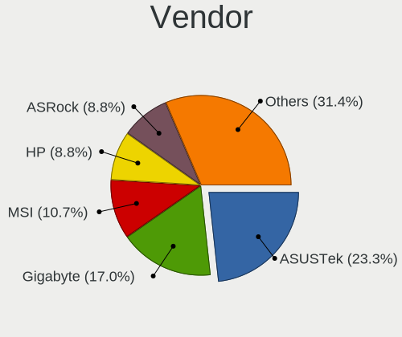
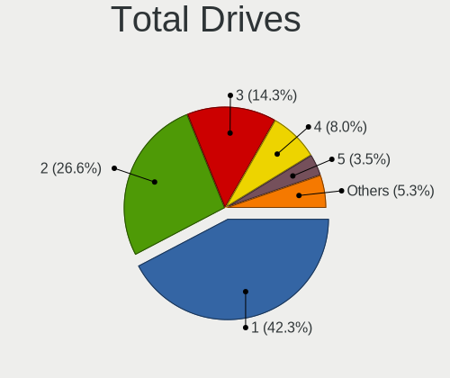
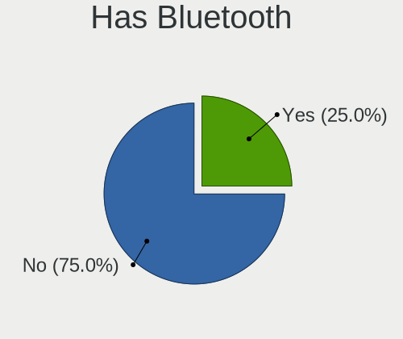

OpenMandriva - Tested Hardware & Statistics (Desktops)
------------------------------------------------------

A project to collect tested hardware configurations for OpenMandriva.

Anyone can contribute to this report by the [hw-probe](https://github.com/linuxhw/hw-probe) tool:

    sudo -E hw-probe -all -upload

Please contribute! Especially if your hardware is rare.

Contents
--------

* [ Test Cases ](#test-cases)

* [ System ](#system)
  - [ OS                       ](#os)
  - [ OS Family                ](#os-family)
  - [ Kernel                   ](#kernel)
  - [ Kernel Family            ](#kernel-family)
  - [ Kernel Major Ver.        ](#kernel-major-ver)
  - [ Arch                     ](#arch)
  - [ DE                       ](#de)
  - [ Display Server           ](#display-server)
  - [ Display Manager          ](#display-manager)
  - [ OS Lang                  ](#os-lang)
  - [ Boot Mode                ](#boot-mode)
  - [ Filesystem               ](#filesystem)
  - [ Part. scheme             ](#part-scheme)
  - [ Dual Boot with Linux/BSD ](#dual-boot-with-linuxbsd)
  - [ Dual Boot (Win)          ](#dual-boot-win)

* [ Board ](#board)
  - [ Vendor                   ](#vendor)
  - [ Model                    ](#model)
  - [ Model Family             ](#model-family)
  - [ MFG Year                 ](#mfg-year)
  - [ Form Factor              ](#form-factor)
  - [ Secure Boot              ](#secure-boot)
  - [ Coreboot                 ](#coreboot)
  - [ RAM Size                 ](#ram-size)
  - [ RAM Used                 ](#ram-used)
  - [ Total Drives             ](#total-drives)
  - [ Has CD-ROM               ](#has-cd-rom)
  - [ Has Ethernet             ](#has-ethernet)
  - [ Has WiFi                 ](#has-wifi)
  - [ Has Bluetooth            ](#has-bluetooth)

* [ Location ](#location)
  - [ Country                  ](#country)
  - [ City                     ](#city)

* [ Drives ](#drives)
  - [ Drive Vendor             ](#drive-vendor)
  - [ Drive Model              ](#drive-model)
  - [ HDD Vendor               ](#hdd-vendor)
  - [ SSD Vendor               ](#ssd-vendor)
  - [ Drive Kind               ](#drive-kind)
  - [ Drive Connector          ](#drive-connector)
  - [ Drive Size               ](#drive-size)
  - [ Space Total              ](#space-total)
  - [ Space Used               ](#space-used)
  - [ Malfunc. Drives          ](#malfunc-drives)
  - [ Malfunc. Drive Vendor    ](#malfunc-drive-vendor)
  - [ Malfunc. HDD Vendor      ](#malfunc-hdd-vendor)
  - [ Malfunc. Drive Kind      ](#malfunc-drive-kind)
  - [ Failed Drives            ](#failed-drives)
  - [ Failed Drive Vendor      ](#failed-drive-vendor)
  - [ Drive Status             ](#drive-status)

* [ Storage controller ](#storage-controller)
  - [ Storage Vendor           ](#storage-vendor)
  - [ Storage Model            ](#storage-model)
  - [ Storage Kind             ](#storage-kind)

* [ Processor ](#processor)
  - [ CPU Vendor               ](#cpu-vendor)
  - [ CPU Model                ](#cpu-model)
  - [ CPU Model Family         ](#cpu-model-family)
  - [ CPU Cores                ](#cpu-cores)
  - [ CPU Sockets              ](#cpu-sockets)
  - [ CPU Threads              ](#cpu-threads)
  - [ CPU Op-Modes             ](#cpu-op-modes)
  - [ CPU Microcode            ](#cpu-microcode)
  - [ CPU Microarch            ](#cpu-microarch)

* [ Graphics ](#graphics)
  - [ GPU Vendor               ](#gpu-vendor)
  - [ GPU Model                ](#gpu-model)
  - [ GPU Combo                ](#gpu-combo)
  - [ GPU Driver               ](#gpu-driver)
  - [ GPU Memory               ](#gpu-memory)

* [ Monitor ](#monitor)
  - [ Monitor Vendor           ](#monitor-vendor)
  - [ Monitor Model            ](#monitor-model)
  - [ Monitor Resolution       ](#monitor-resolution)
  - [ Monitor Diagonal         ](#monitor-diagonal)
  - [ Monitor Width            ](#monitor-width)
  - [ Aspect Ratio             ](#aspect-ratio)
  - [ Monitor Area             ](#monitor-area)
  - [ Pixel Density            ](#pixel-density)
  - [ Multiple Monitors        ](#multiple-monitors)

* [ Network ](#network)
  - [ Net Controller Vendor    ](#net-controller-vendor)
  - [ Net Controller Model     ](#net-controller-model)
  - [ Wireless Vendor          ](#wireless-vendor)
  - [ Wireless Model           ](#wireless-model)
  - [ Ethernet Vendor          ](#ethernet-vendor)
  - [ Ethernet Model           ](#ethernet-model)
  - [ Net Controller Kind      ](#net-controller-kind)
  - [ Used Controller          ](#used-controller)
  - [ NICs                     ](#nics)
  - [ IPv6                     ](#ipv6)

* [ Bluetooth ](#bluetooth)
  - [ Bluetooth Vendor         ](#bluetooth-vendor)
  - [ Bluetooth Model          ](#bluetooth-model)

* [ Sound ](#sound)
  - [ Sound Vendor             ](#sound-vendor)
  - [ Sound Model              ](#sound-model)

* [ Memory ](#memory)
  - [ Memory Vendor            ](#memory-vendor)
  - [ Memory Model             ](#memory-model)
  - [ Memory Kind              ](#memory-kind)
  - [ Memory Form Factor       ](#memory-form-factor)
  - [ Memory Size              ](#memory-size)
  - [ Memory Speed             ](#memory-speed)

* [ Printers & scanners ](#printers--scanners)
  - [ Printer Vendor           ](#printer-vendor)
  - [ Printer Model            ](#printer-model)
  - [ Scanner Vendor           ](#scanner-vendor)
  - [ Scanner Model            ](#scanner-model)

* [ Camera ](#camera)
  - [ Camera Vendor            ](#camera-vendor)
  - [ Camera Model             ](#camera-model)

* [ Security ](#security)
  - [ Fingerprint Vendor       ](#fingerprint-vendor)
  - [ Fingerprint Model        ](#fingerprint-model)
  - [ Chipcard Vendor          ](#chipcard-vendor)
  - [ Chipcard Model           ](#chipcard-model)

* [ Unsupported ](#unsupported)
  - [ Unsupported Devices      ](#unsupported-devices)
  - [ Unsupported Device Types ](#unsupported-device-types)

Test Cases
----------

Total: 8642

| Vendor        | Model                       | Probe                                                      | Date         |
|---------------|-----------------------------|------------------------------------------------------------|--------------|
| HP            | 339A                        | [e8e666af64](https://linux-hardware.org/?probe=e8e666af64) | Feb 02, 2024 |
| HP            | 3397                        | [f5180bd918](https://linux-hardware.org/?probe=f5180bd918) | Feb 02, 2024 |
| Medion        | Z170H4-EA                   | [17c714c6b5](https://linux-hardware.org/?probe=17c714c6b5) | Feb 02, 2024 |
| HP            | 8055                        | [1eec2a37ce](https://linux-hardware.org/?probe=1eec2a37ce) | Feb 02, 2024 |
| ASRock        | Z77 Pro3                    | [f1d8db0641](https://linux-hardware.org/?probe=f1d8db0641) | Feb 02, 2024 |
| Dell          | 0NK5PH A00                  | [211c3d7db6](https://linux-hardware.org/?probe=211c3d7db6) | Feb 02, 2024 |
| HP            | 18E7                        | [84caef4dde](https://linux-hardware.org/?probe=84caef4dde) | Feb 02, 2024 |
| Foxconn       | 2ADA                        | [e92639ba10](https://linux-hardware.org/?probe=e92639ba10) | Feb 02, 2024 |
| ASUSTek       | F2A85-M LE                  | [680ba020e2](https://linux-hardware.org/?probe=680ba020e2) | Feb 02, 2024 |
| Dell          | 0WMJ54 A00                  | [d6c3c89e3d](https://linux-hardware.org/?probe=d6c3c89e3d) | Feb 02, 2024 |
| ASRock        | H77 Pro4-M                  | [794e5341d9](https://linux-hardware.org/?probe=794e5341d9) | Feb 01, 2024 |
| Dell          | 0YF8P5 A00                  | [c3510619ed](https://linux-hardware.org/?probe=c3510619ed) | Feb 01, 2024 |
| Dell          | 0215PR A05                  | [05183a71ef](https://linux-hardware.org/?probe=05183a71ef) | Feb 01, 2024 |
| ASRock        | 880GMH/U3S3                 | [cccd54eb20](https://linux-hardware.org/?probe=cccd54eb20) | Feb 01, 2024 |
| Gigabyte      | X670 AORUS ELITE AX         | [f0bd42b414](https://linux-hardware.org/?probe=f0bd42b414) | Feb 01, 2024 |
| Gigabyte      | B650 GAMING X AX            | [5bf97512a7](https://linux-hardware.org/?probe=5bf97512a7) | Feb 01, 2024 |
| Gigabyte      | X570 AORUS ELITE WIFI       | [7d3d8c9a2f](https://linux-hardware.org/?probe=7d3d8c9a2f) | Feb 01, 2024 |
| ASUSTek       | M4A78-VM                    | [cc37c1b937](https://linux-hardware.org/?probe=cc37c1b937) | Feb 01, 2024 |
| ASUSTek       | PRIME B650-PLUS             | [c83dcb11ca](https://linux-hardware.org/?probe=c83dcb11ca) | Jan 31, 2024 |
| ASRock        | A320M-HDV R4.0              | [9262af6ace](https://linux-hardware.org/?probe=9262af6ace) | Jan 31, 2024 |
| ASUSTek       | P8Z77-V LX                  | [011fd25549](https://linux-hardware.org/?probe=011fd25549) | Jan 31, 2024 |
| Intel         | DH55PJ AAE93812-302         | [acc04ef6ef](https://linux-hardware.org/?probe=acc04ef6ef) | Jan 31, 2024 |
| ASUSTek       | M5A97 R2.0                  | [bf9814808f](https://linux-hardware.org/?probe=bf9814808f) | Jan 31, 2024 |
| Biostar       | H610MH                      | [fb0234d450](https://linux-hardware.org/?probe=fb0234d450) | Jan 31, 2024 |
| Biostar       | NF61S-M2A                   | [4b42e5cd37](https://linux-hardware.org/?probe=4b42e5cd37) | Jan 31, 2024 |
| ASUSTek       | TUF Gaming B550M-PLUS       | [f8d19ad525](https://linux-hardware.org/?probe=f8d19ad525) | Jan 31, 2024 |
| HP            | 8B3C A                      | [12ec418267](https://linux-hardware.org/?probe=12ec418267) | Jan 31, 2024 |
| Lenovo        | ThinkStation C20 4263B84    | [084244999d](https://linux-hardware.org/?probe=084244999d) | Jan 31, 2024 |
| MSI           | PRO X670-P WIFI             | [2640847c88](https://linux-hardware.org/?probe=2640847c88) | Jan 31, 2024 |
| Gigabyte      | EP45-UD3R                   | [45a5318a64](https://linux-hardware.org/?probe=45a5318a64) | Jan 31, 2024 |
| Dell          | 0FM586                      | [a66d080473](https://linux-hardware.org/?probe=a66d080473) | Jan 31, 2024 |
| Fujitsu       | D3233-A1 S26361-D3233-A1    | [2a526e4632](https://linux-hardware.org/?probe=2a526e4632) | Jan 30, 2024 |
| Gigabyte      | X570 GAMING X               | [3418c8d84c](https://linux-hardware.org/?probe=3418c8d84c) | Jan 30, 2024 |
| ASUSTek       | Maximus V GENE              | [a56cd980bb](https://linux-hardware.org/?probe=a56cd980bb) | Jan 30, 2024 |
| Foxconn       | 2AB7                        | [518f65ff6a](https://linux-hardware.org/?probe=518f65ff6a) | Jan 30, 2024 |
| ASRock        | B450M Pro4                  | [ec3c7a4fc6](https://linux-hardware.org/?probe=ec3c7a4fc6) | Jan 30, 2024 |
| MSI           | MS-6702E                    | [9624bc0fe2](https://linux-hardware.org/?probe=9624bc0fe2) | Jan 30, 2024 |
| MSI           | 760GM-P23                   | [1e5ef07ed7](https://linux-hardware.org/?probe=1e5ef07ed7) | Jan 30, 2024 |
| MSI           | H110M PRO-VD                | [2dcaa98349](https://linux-hardware.org/?probe=2dcaa98349) | Jan 30, 2024 |
| ASUSTek       | P5QLD PRO                   | [2558422111](https://linux-hardware.org/?probe=2558422111) | Jan 30, 2024 |
| HP            | 1495                        | [06ca3d46b1](https://linux-hardware.org/?probe=06ca3d46b1) | Jan 29, 2024 |
| Dell          | 0GDG8Y A00                  | [9cbabba588](https://linux-hardware.org/?probe=9cbabba588) | Jan 29, 2024 |
| AZW           | MINI S 10                   | [d707319ed7](https://linux-hardware.org/?probe=d707319ed7) | Jan 29, 2024 |
| ASUSTek       | TUF Gaming X570-PLUS        | [c9d5d0fa7b](https://linux-hardware.org/?probe=c9d5d0fa7b) | Jan 29, 2024 |
| HP            | 0B4Ch D                     | [fc77fc72a5](https://linux-hardware.org/?probe=fc77fc72a5) | Jan 29, 2024 |
| HP            | 1791                        | [e301050210](https://linux-hardware.org/?probe=e301050210) | Jan 29, 2024 |
| Dell          | 0J3C2F A00                  | [95ae5646c8](https://linux-hardware.org/?probe=95ae5646c8) | Jan 29, 2024 |
| HP            | 3396                        | [b59e0b4023](https://linux-hardware.org/?probe=b59e0b4023) | Jan 29, 2024 |
| Biostar       | A68MDE                      | [ab1aaeac91](https://linux-hardware.org/?probe=ab1aaeac91) | Jan 29, 2024 |
| Gigabyte      | EP45T-UD3R                  | [d3aaef580d](https://linux-hardware.org/?probe=d3aaef580d) | Jan 28, 2024 |
| Dell          | 0W0CHX A00                  | [e57642d0d4](https://linux-hardware.org/?probe=e57642d0d4) | Jan 28, 2024 |
| ASUSTek       | M4N68T-M-V2                 | [5c4d08e0c4](https://linux-hardware.org/?probe=5c4d08e0c4) | Jan 28, 2024 |
| ASRock        | X570 Phantom Gaming 4       | [23980d6bfb](https://linux-hardware.org/?probe=23980d6bfb) | Jan 28, 2024 |
| Acer          | Aspire TC-780               | [00c699c62c](https://linux-hardware.org/?probe=00c699c62c) | Jan 28, 2024 |
| MSI           | Z97 GAMING 3                | [5a4ad9cb67](https://linux-hardware.org/?probe=5a4ad9cb67) | Jan 28, 2024 |
| ASUSTek       | M4A87TD/USB3                | [185a90aec7](https://linux-hardware.org/?probe=185a90aec7) | Jan 28, 2024 |
| ASRock        | B760M-HDV/M.2 D4            | [56ef6ba880](https://linux-hardware.org/?probe=56ef6ba880) | Jan 28, 2024 |
| ASRock        | X300-ITX                    | [8a850c251d](https://linux-hardware.org/?probe=8a850c251d) | Jan 27, 2024 |
| ASRock        | B75M R2.0                   | [7a7e12dca2](https://linux-hardware.org/?probe=7a7e12dca2) | Jan 27, 2024 |
| ASUSTek       | M5A78L-M/USB3               | [c9870d08e7](https://linux-hardware.org/?probe=c9870d08e7) | Jan 27, 2024 |
| Gigabyte      | GA-78LMT-S2P                | [508f75b66b](https://linux-hardware.org/?probe=508f75b66b) | Jan 27, 2024 |
| ASRock        | B450 Gaming K4              | [9cee6b0a5b](https://linux-hardware.org/?probe=9cee6b0a5b) | Jan 27, 2024 |
| Gigabyte      | H97-HD3                     | [92984a124e](https://linux-hardware.org/?probe=92984a124e) | Jan 27, 2024 |
| ASRock        | H470 Phantom Gaming 4       | [dc402c3f43](https://linux-hardware.org/?probe=dc402c3f43) | Jan 27, 2024 |
| Lenovo        | SKYBAY SDK0J40697 WIN 33... | [a0c6f84300](https://linux-hardware.org/?probe=a0c6f84300) | Jan 27, 2024 |
| Gigabyte      | 945GCM-S2L                  | [4490f8e838](https://linux-hardware.org/?probe=4490f8e838) | Jan 27, 2024 |
| Gigabyte      | H410M H V3                  | [018db3f12a](https://linux-hardware.org/?probe=018db3f12a) | Jan 26, 2024 |
| Gigabyte      | H470M K                     | [644982a46f](https://linux-hardware.org/?probe=644982a46f) | Jan 26, 2024 |
| Dell          | 0NC2VH A01                  | [6e63b66aba](https://linux-hardware.org/?probe=6e63b66aba) | Jan 26, 2024 |
| Unknown       | P43R1600Twins-110DB         | [0741a919e4](https://linux-hardware.org/?probe=0741a919e4) | Jan 26, 2024 |
| HP            | 82F2 A01                    | [437bec28fa](https://linux-hardware.org/?probe=437bec28fa) | Jan 26, 2024 |
| Gigabyte      | H410M H V3                  | [0610c346d8](https://linux-hardware.org/?probe=0610c346d8) | Jan 25, 2024 |
| Gigabyte      | H81M-S1                     | [b727252ca9](https://linux-hardware.org/?probe=b727252ca9) | Jan 25, 2024 |
| ASUSTek       | PRIME B250M-K               | [fc297eda09](https://linux-hardware.org/?probe=fc297eda09) | Jan 25, 2024 |
| Gigabyte      | B550M DS3H                  | [347b980bdf](https://linux-hardware.org/?probe=347b980bdf) | Jan 25, 2024 |
| Gigabyte      | EG41MF-US2H                 | [882d3605ed](https://linux-hardware.org/?probe=882d3605ed) | Jan 25, 2024 |
| Dell          | 0M9KCM A00                  | [6f25f89d48](https://linux-hardware.org/?probe=6f25f89d48) | Jan 25, 2024 |
| Gigabyte      | GA-78LMT-S2P                | [066f355824](https://linux-hardware.org/?probe=066f355824) | Jan 25, 2024 |
| Gigabyte      | Z390 UD V2                  | [b2693bec37](https://linux-hardware.org/?probe=b2693bec37) | Jan 25, 2024 |
| ASUSTek       | PRIME H510M-E               | [ea518cb09d](https://linux-hardware.org/?probe=ea518cb09d) | Jan 24, 2024 |
| Lenovo        | 36EB SDK0J40700 WIN 3258... | [7e7e0c8e53](https://linux-hardware.org/?probe=7e7e0c8e53) | Jan 24, 2024 |
| ASRock        | B650M Pro RS                | [2d706981c5](https://linux-hardware.org/?probe=2d706981c5) | Jan 24, 2024 |
| ECS           | Iris8                       | [91dd8156df](https://linux-hardware.org/?probe=91dd8156df) | Jan 24, 2024 |
| Lenovo        | SHARKBAY SDK0E50510 WIN     | [ff7fd4d2cd](https://linux-hardware.org/?probe=ff7fd4d2cd) | Jan 24, 2024 |
| Dell          | 09KPNV A00                  | [86ae6a23fb](https://linux-hardware.org/?probe=86ae6a23fb) | Jan 24, 2024 |
| Pegatron      | Benicia                     | [9a4be691fc](https://linux-hardware.org/?probe=9a4be691fc) | Jan 23, 2024 |
| ASUSTek       | PRIME A320M-K               | [5c2e73a06a](https://linux-hardware.org/?probe=5c2e73a06a) | Jan 23, 2024 |
| Gigabyte      | H61M-S1                     | [91f61c4366](https://linux-hardware.org/?probe=91f61c4366) | Jan 23, 2024 |
| Intel         | Unknown                     | [8427ffd0dc](https://linux-hardware.org/?probe=8427ffd0dc) | Jan 23, 2024 |
| ASUSTek       | ROG CROSSHAIR VII HERO      | [f2919e84e4](https://linux-hardware.org/?probe=f2919e84e4) | Jan 22, 2024 |
| MSI           | MAG X570S TORPEDO MAX       | [97f9705158](https://linux-hardware.org/?probe=97f9705158) | Jan 22, 2024 |
| HP            | 18E5                        | [69ba380344](https://linux-hardware.org/?probe=69ba380344) | Jan 21, 2024 |
| ASUSTek       | ROG STRIX X670E-E GAMING... | [ec963a72d8](https://linux-hardware.org/?probe=ec963a72d8) | Jan 21, 2024 |
| HP            | 82B4                        | [0eca4196b3](https://linux-hardware.org/?probe=0eca4196b3) | Jan 21, 2024 |
| Casper        | NIRVANA NOTEBOOK            | [af055c48ff](https://linux-hardware.org/?probe=af055c48ff) | Jan 21, 2024 |
| Intel         | DZ77GA-70K AAG39009-500     | [cba7125977](https://linux-hardware.org/?probe=cba7125977) | Jan 20, 2024 |
| Dell          | 042P49 A02                  | [366d017089](https://linux-hardware.org/?probe=366d017089) | Jan 20, 2024 |
| ASRock        | FM2A85X-ITX                 | [30f6aa7ead](https://linux-hardware.org/?probe=30f6aa7ead) | Jan 20, 2024 |
| ASUSTek       | PRIME A320M-K               | [58be81f7c1](https://linux-hardware.org/?probe=58be81f7c1) | Jan 20, 2024 |
| Gigabyte      | A320M-S2H-CF                | [39cd221e89](https://linux-hardware.org/?probe=39cd221e89) | Jan 20, 2024 |
| ASUSTek       | H81M-K                      | [5b51e88413](https://linux-hardware.org/?probe=5b51e88413) | Jan 20, 2024 |
| HP            | 8055                        | [5e6a445b12](https://linux-hardware.org/?probe=5e6a445b12) | Jan 19, 2024 |
| Dell          | 042P49 A01                  | [e164f495e7](https://linux-hardware.org/?probe=e164f495e7) | Jan 19, 2024 |
| Gigabyte      | B460 AORUS PRO AC           | [276a0b5785](https://linux-hardware.org/?probe=276a0b5785) | Jan 19, 2024 |
| HP            | 81B4 01                     | [967d9af55c](https://linux-hardware.org/?probe=967d9af55c) | Jan 19, 2024 |
| ASUSTek       | K30AD_M31AD_M51AD           | [8d2bc7b076](https://linux-hardware.org/?probe=8d2bc7b076) | Jan 18, 2024 |
| Gigabyte      | H610M K DDR4                | [5c9e5ec7aa](https://linux-hardware.org/?probe=5c9e5ec7aa) | Jan 18, 2024 |
| Gigabyte      | Z77-DS3H                    | [08a4e7960a](https://linux-hardware.org/?probe=08a4e7960a) | Jan 18, 2024 |
| Biostar       | A770E                       | [a149b3aeb6](https://linux-hardware.org/?probe=a149b3aeb6) | Jan 17, 2024 |
| Dell          | 0MGK50 A02                  | [8ce2d2a81a](https://linux-hardware.org/?probe=8ce2d2a81a) | Jan 17, 2024 |
| ASUSTek       | TUF Gaming B460-PLUS        | [344b6767cd](https://linux-hardware.org/?probe=344b6767cd) | Jan 17, 2024 |
| MSI           | MAG B550 TOMAHAWK           | [5ecdfd3d3c](https://linux-hardware.org/?probe=5ecdfd3d3c) | Jan 17, 2024 |
| MACHINIST     | E5-RS9 V1.11                | [2b48345368](https://linux-hardware.org/?probe=2b48345368) | Jan 17, 2024 |
| Gigabyte      | H61M-S2PV                   | [3baca805c4](https://linux-hardware.org/?probe=3baca805c4) | Jan 17, 2024 |
| EPoX Compu... | NF6100 + NF410 DDR2: MGF... | [ba08d6e05c](https://linux-hardware.org/?probe=ba08d6e05c) | Jan 17, 2024 |
| MSI           | A68HM-E33 V2                | [da97b5c9f5](https://linux-hardware.org/?probe=da97b5c9f5) | Jan 17, 2024 |
| ASUSTek       | Z97-DELUXE                  | [f414f21db4](https://linux-hardware.org/?probe=f414f21db4) | Jan 16, 2024 |
| Gigabyte      | EP35-DS3                    | [18f8b43855](https://linux-hardware.org/?probe=18f8b43855) | Jan 16, 2024 |
| ASRock        | Z390 Taichi                 | [84a79a7e97](https://linux-hardware.org/?probe=84a79a7e97) | Jan 16, 2024 |
| Lenovo        | 30D9 SDK0J40697 WIN 3305... | [eddee431eb](https://linux-hardware.org/?probe=eddee431eb) | Jan 16, 2024 |
| ASUSTek       | UN65U                       | [0c9b6c61f2](https://linux-hardware.org/?probe=0c9b6c61f2) | Jan 16, 2024 |
| ASUSTek       | H81M-K                      | [c1f78ee398](https://linux-hardware.org/?probe=c1f78ee398) | Jan 16, 2024 |
| Gigabyte      | H270M-D3H-CF                | [636ad953ab](https://linux-hardware.org/?probe=636ad953ab) | Jan 16, 2024 |
| ASRock        | H81M-VG4 R2.0               | [4854968095](https://linux-hardware.org/?probe=4854968095) | Jan 15, 2024 |
| ASUSTek       | M5A97 R2.0                  | [122b72e9f2](https://linux-hardware.org/?probe=122b72e9f2) | Jan 15, 2024 |
| ASUSTek       | TUF Gaming B560M-PLUS WI... | [4e2717fe33](https://linux-hardware.org/?probe=4e2717fe33) | Jan 15, 2024 |
| Dell          | 09M8Y8 A01                  | [0372519ba2](https://linux-hardware.org/?probe=0372519ba2) | Jan 14, 2024 |
| MSI           | A320M-A PRO                 | [4f2655db6f](https://linux-hardware.org/?probe=4f2655db6f) | Jan 14, 2024 |
| Positivo      | POS-EINM10CB POSITIVO       | [ed11587f82](https://linux-hardware.org/?probe=ed11587f82) | Jan 14, 2024 |
| Gigabyte      | EX58-UD3R                   | [b62ae21449](https://linux-hardware.org/?probe=b62ae21449) | Jan 13, 2024 |
| Gigabyte      | H510M H V2                  | [1340d91b43](https://linux-hardware.org/?probe=1340d91b43) | Jan 13, 2024 |
| Dell          | 0W2F8G A01                  | [959d868bbf](https://linux-hardware.org/?probe=959d868bbf) | Jan 13, 2024 |
| Dell          | 0KC9NP A01                  | [71596d8f5f](https://linux-hardware.org/?probe=71596d8f5f) | Jan 12, 2024 |
| ASRock        | H110M-HDV                   | [5f7f485a15](https://linux-hardware.org/?probe=5f7f485a15) | Jan 12, 2024 |
| Gigabyte      | H97M-Gaming 3               | [6230f1ef11](https://linux-hardware.org/?probe=6230f1ef11) | Jan 12, 2024 |
| Gigabyte      | H310M M.2 x.x               | [f67cc2282f](https://linux-hardware.org/?probe=f67cc2282f) | Jan 12, 2024 |
| MSI           | B450M-A PRO MAX             | [15d413beb6](https://linux-hardware.org/?probe=15d413beb6) | Jan 12, 2024 |
| MSI           | B450M-A PRO MAX             | [50ca06fa28](https://linux-hardware.org/?probe=50ca06fa28) | Jan 11, 2024 |
| ASUSTek       | SABERTOOTH 990FX R2.0       | [febf87bf81](https://linux-hardware.org/?probe=febf87bf81) | Jan 11, 2024 |
| Gigabyte      | B75M-D3H                    | [5edf7a7923](https://linux-hardware.org/?probe=5edf7a7923) | Jan 11, 2024 |
| ASUSTek       | PRIME Z270-P                | [bf8ac62321](https://linux-hardware.org/?probe=bf8ac62321) | Jan 11, 2024 |
| GEEKOM        | Mini IT 8                   | [16b759767e](https://linux-hardware.org/?probe=16b759767e) | Jan 11, 2024 |
| HP            | 198E                        | [15f15e41f1](https://linux-hardware.org/?probe=15f15e41f1) | Jan 11, 2024 |
| Intel         | H81                         | [1a1c6de235](https://linux-hardware.org/?probe=1a1c6de235) | Jan 10, 2024 |
| MSI           | Z87I                        | [35114b37dd](https://linux-hardware.org/?probe=35114b37dd) | Jan 10, 2024 |
| Pegatron      | NARRA3                      | [08c60d9c7a](https://linux-hardware.org/?probe=08c60d9c7a) | Jan 10, 2024 |
| ASRock        | Q1900B-ITX                  | [610dfd5b71](https://linux-hardware.org/?probe=610dfd5b71) | Jan 10, 2024 |
| ASUSTek       | M5A78L-M LX3                | [6b0c1cd101](https://linux-hardware.org/?probe=6b0c1cd101) | Jan 10, 2024 |
| MSI           | B550-A PRO                  | [4042af29a0](https://linux-hardware.org/?probe=4042af29a0) | Jan 10, 2024 |
| MSI           | 970A-G43                    | [00e0cf9c8d](https://linux-hardware.org/?probe=00e0cf9c8d) | Jan 09, 2024 |
| ASRock        | Z77 Extreme3                | [5b6dee9bbe](https://linux-hardware.org/?probe=5b6dee9bbe) | Jan 09, 2024 |
| Dell          | 00V62H A01                  | [e191ccd074](https://linux-hardware.org/?probe=e191ccd074) | Jan 09, 2024 |
| MSI           | A75A-G35                    | [288caa413e](https://linux-hardware.org/?probe=288caa413e) | Jan 09, 2024 |
| ASUSTek       | P8P67 EVO                   | [d54cf27190](https://linux-hardware.org/?probe=d54cf27190) | Jan 09, 2024 |
| Dell          | 0XCR8D A02                  | [067794fe12](https://linux-hardware.org/?probe=067794fe12) | Jan 08, 2024 |
| OEM           | B75 Ver:1.41                | [5466b2e4af](https://linux-hardware.org/?probe=5466b2e4af) | Jan 08, 2024 |
| Lenovo        | ThinkCentre M72e 0896A2G    | [b77ad754ae](https://linux-hardware.org/?probe=b77ad754ae) | Jan 08, 2024 |
| Gigabyte      | GA-E350N-USB3               | [222f3e6908](https://linux-hardware.org/?probe=222f3e6908) | Jan 08, 2024 |
| ALDO          | C2016-BSWI-D2               | [1e3d4c2e55](https://linux-hardware.org/?probe=1e3d4c2e55) | Jan 08, 2024 |
| MSI           | A75A-G55                    | [f13d0a0a8d](https://linux-hardware.org/?probe=f13d0a0a8d) | Jan 08, 2024 |
| Gigabyte      | B450M K-CF                  | [6ffbab86cc](https://linux-hardware.org/?probe=6ffbab86cc) | Jan 07, 2024 |
| Dell          | 00V62H A01                  | [6fcf0891d9](https://linux-hardware.org/?probe=6fcf0891d9) | Jan 07, 2024 |
| NEC Comput... | 30D4                        | [7dbd07f1f7](https://linux-hardware.org/?probe=7dbd07f1f7) | Jan 07, 2024 |
| ASUSTek       | P5QLD PRO                   | [9086cfaba8](https://linux-hardware.org/?probe=9086cfaba8) | Jan 06, 2024 |
| Gigabyte      | Z77M-D3H                    | [d20dfe448d](https://linux-hardware.org/?probe=d20dfe448d) | Jan 06, 2024 |
| Google        | Teemo                       | [c763bd20f9](https://linux-hardware.org/?probe=c763bd20f9) | Jan 06, 2024 |
| Gigabyte      | MZBSWAP-00                  | [eb3700b576](https://linux-hardware.org/?probe=eb3700b576) | Jan 06, 2024 |
| Intel         | B75                         | [648128d27a](https://linux-hardware.org/?probe=648128d27a) | Jan 06, 2024 |
| Shenzhen M... | F7BFC                       | [59d6a69f30](https://linux-hardware.org/?probe=59d6a69f30) | Jan 05, 2024 |
| Shenzhen M... | F7BFC                       | [d8ed7241cb](https://linux-hardware.org/?probe=d8ed7241cb) | Jan 05, 2024 |
| Intel         | JSL MRD                     | [8b1f990d75](https://linux-hardware.org/?probe=8b1f990d75) | Jan 05, 2024 |
| Acer          | Veriton M2630G V:1.0        | [40d6bf6d97](https://linux-hardware.org/?probe=40d6bf6d97) | Jan 05, 2024 |
| ASUSTek       | B75M-A                      | [f18bf0c881](https://linux-hardware.org/?probe=f18bf0c881) | Jan 04, 2024 |
| Pegatron      | 2ACD                        | [e0c3c1a882](https://linux-hardware.org/?probe=e0c3c1a882) | Jan 04, 2024 |
| ASUSTek       | A4320A6420                  | [5df0f2025e](https://linux-hardware.org/?probe=5df0f2025e) | Jan 04, 2024 |
| Gigabyte      | H110M-S2-CF                 | [781084af86](https://linux-hardware.org/?probe=781084af86) | Jan 03, 2024 |
| Gigabyte      | GA-K8NF9 Ultra              | [bbc0256984](https://linux-hardware.org/?probe=bbc0256984) | Jan 03, 2024 |
| Acer          | Veriton N4620G              | [f438d41562](https://linux-hardware.org/?probe=f438d41562) | Jan 03, 2024 |
| ASUSTek       | M5A78L-M LX3 PLUS           | [d53af9a54d](https://linux-hardware.org/?probe=d53af9a54d) | Jan 03, 2024 |
| Acer          | WMCP78M                     | [5e254245ae](https://linux-hardware.org/?probe=5e254245ae) | Jan 03, 2024 |
| ASUSTek       | Maximus V GENE              | [e62026b868](https://linux-hardware.org/?probe=e62026b868) | Jan 02, 2024 |
| Dell          | 0RY206                      | [989b4c081d](https://linux-hardware.org/?probe=989b4c081d) | Jan 02, 2024 |
| HP            | 8055                        | [e27c0366a9](https://linux-hardware.org/?probe=e27c0366a9) | Jan 02, 2024 |
| Dell          | 0V8F20 A01                  | [ceebdc4f9e](https://linux-hardware.org/?probe=ceebdc4f9e) | Jan 01, 2024 |
| ASUSTek       | P7P55D                      | [23a30b2497](https://linux-hardware.org/?probe=23a30b2497) | Jan 01, 2024 |
| ASUSTek       | M2N68-AM SE2                | [553bcade60](https://linux-hardware.org/?probe=553bcade60) | Jan 01, 2024 |
| ASUSTek       | M2A-MX                      | [9be60381fc](https://linux-hardware.org/?probe=9be60381fc) | Dec 31, 2023 |
| MSI           | MAG B550M MORTAR MAX WIF... | [586b998af3](https://linux-hardware.org/?probe=586b998af3) | Dec 31, 2023 |
| ASUSTek       | M5A97 LE R2.0               | [210fa8e369](https://linux-hardware.org/?probe=210fa8e369) | Dec 31, 2023 |
| HP            | 8054                        | [5389720de6](https://linux-hardware.org/?probe=5389720de6) | Dec 31, 2023 |
| HP            | 339A                        | [f109c46a8a](https://linux-hardware.org/?probe=f109c46a8a) | Dec 31, 2023 |
| Dell          | 0GY6Y8 A02                  | [81e91658c9](https://linux-hardware.org/?probe=81e91658c9) | Dec 30, 2023 |
| HP            | 339A                        | [56210b6b8c](https://linux-hardware.org/?probe=56210b6b8c) | Dec 30, 2023 |
| ASUSTek       | H81M-C                      | [a9a91f6c49](https://linux-hardware.org/?probe=a9a91f6c49) | Dec 30, 2023 |
| Intel         | Thurley                     | [2ad7d27607](https://linux-hardware.org/?probe=2ad7d27607) | Dec 29, 2023 |
| Acer          | Aspire XC-330               | [1b2d301d07](https://linux-hardware.org/?probe=1b2d301d07) | Dec 29, 2023 |
| HP            | 0B40h                       | [de46075b7e](https://linux-hardware.org/?probe=de46075b7e) | Dec 29, 2023 |
| Acer          | Aspire XC-704               | [37410da8b1](https://linux-hardware.org/?probe=37410da8b1) | Dec 29, 2023 |
| Gigabyte      | G41M-Combo                  | [0a6df1d55f](https://linux-hardware.org/?probe=0a6df1d55f) | Dec 28, 2023 |
| Intel         | H61                         | [baec7a3074](https://linux-hardware.org/?probe=baec7a3074) | Dec 28, 2023 |
| HP            | 3029h                       | [de537af4ba](https://linux-hardware.org/?probe=de537af4ba) | Dec 28, 2023 |
| MSI           | MS-B9311                    | [424154cf65](https://linux-hardware.org/?probe=424154cf65) | Dec 28, 2023 |
| Gigabyte      | 990XA-UD3                   | [fe315c0cf8](https://linux-hardware.org/?probe=fe315c0cf8) | Dec 27, 2023 |
| HP            | 198E                        | [30e0f75eee](https://linux-hardware.org/?probe=30e0f75eee) | Dec 27, 2023 |
| Dell          | 0DF42J A00                  | [2b8f841667](https://linux-hardware.org/?probe=2b8f841667) | Dec 27, 2023 |
| eMachines     | MCP61PM-GM                  | [08b1aaf187](https://linux-hardware.org/?probe=08b1aaf187) | Dec 27, 2023 |
| Lenovo        | Annapurna CRB NO DPK        | [7d003c702a](https://linux-hardware.org/?probe=7d003c702a) | Dec 27, 2023 |
| ASRock        | FM2A58M-VG3+ R2.0           | [370753e882](https://linux-hardware.org/?probe=370753e882) | Dec 27, 2023 |
| ASUSTek       | P5K Premium                 | [b1c8bc2127](https://linux-hardware.org/?probe=b1c8bc2127) | Dec 26, 2023 |
| Gigabyte      | GA-880GM-UD2H               | [0516914d99](https://linux-hardware.org/?probe=0516914d99) | Dec 26, 2023 |
| MSI           | G31TM-P21                   | [c80f741175](https://linux-hardware.org/?probe=c80f741175) | Dec 26, 2023 |
| Fujitsu       | D3162-A1 S26361-D3162-A1    | [0535c48b0a](https://linux-hardware.org/?probe=0535c48b0a) | Dec 26, 2023 |
| Acer          | Predator Orion PO5-620      | [2d7731ff10](https://linux-hardware.org/?probe=2d7731ff10) | Dec 26, 2023 |
| ASUSTek       | TUF Gaming B460M-PLUS       | [da4285cce4](https://linux-hardware.org/?probe=da4285cce4) | Dec 26, 2023 |
| HP            | 1495                        | [c8b50e17f9](https://linux-hardware.org/?probe=c8b50e17f9) | Dec 26, 2023 |
| Pegatron      | Eureka3                     | [0dfc8b6795](https://linux-hardware.org/?probe=0dfc8b6795) | Dec 25, 2023 |
| ASUSTek       | M5A97 R2.0                  | [5775a72a93](https://linux-hardware.org/?probe=5775a72a93) | Dec 25, 2023 |
| ASUSTek       | H61M-A/BR                   | [e50028a157](https://linux-hardware.org/?probe=e50028a157) | Dec 25, 2023 |
| ASUSTek       | PRIME B550-PLUS             | [f72b5c344b](https://linux-hardware.org/?probe=f72b5c344b) | Dec 25, 2023 |
| Lenovo        | MAHOBAY NOK                 | [f85a8a3b68](https://linux-hardware.org/?probe=f85a8a3b68) | Dec 25, 2023 |
| Medion        | H81H3-EM2 H81EM2W08.309     | [a8025e429f](https://linux-hardware.org/?probe=a8025e429f) | Dec 25, 2023 |
| Gigabyte      | G1.Sniper B5-CF             | [9d3fa026ff](https://linux-hardware.org/?probe=9d3fa026ff) | Dec 25, 2023 |
| ASUSTek       | PRIME H410M-A               | [d6257b5255](https://linux-hardware.org/?probe=d6257b5255) | Dec 25, 2023 |
| Biostar       | A320MH                      | [0898691249](https://linux-hardware.org/?probe=0898691249) | Dec 24, 2023 |
| Lenovo        | ThinkCentre M81 5049RK4     | [9ea1bc22a1](https://linux-hardware.org/?probe=9ea1bc22a1) | Dec 24, 2023 |
| ASRock        | Z790 PG Lightning           | [0b5268372a](https://linux-hardware.org/?probe=0b5268372a) | Dec 24, 2023 |
| MSI           | H97 PC Mate                 | [f1c5d0d405](https://linux-hardware.org/?probe=f1c5d0d405) | Dec 24, 2023 |
| HP            | 0B40h                       | [e3ad55af3f](https://linux-hardware.org/?probe=e3ad55af3f) | Dec 24, 2023 |
| HP            | 82F1                        | [86959f8199](https://linux-hardware.org/?probe=86959f8199) | Dec 24, 2023 |
| Intel         | H61                         | [a10f481c10](https://linux-hardware.org/?probe=a10f481c10) | Dec 24, 2023 |
| Dell          | 0WR7PY A02                  | [df3b1f1cc3](https://linux-hardware.org/?probe=df3b1f1cc3) | Dec 24, 2023 |
| ASUSTek       | PRIME B450M-A II            | [3366f8e90d](https://linux-hardware.org/?probe=3366f8e90d) | Dec 24, 2023 |
| HP            | 21D0                        | [733191fd29](https://linux-hardware.org/?probe=733191fd29) | Dec 24, 2023 |
| ASUSTek       | P5GC-MX/1333                | [a95c11e27b](https://linux-hardware.org/?probe=a95c11e27b) | Dec 23, 2023 |
| ASUSTek       | ROG STRIX B450-F GAMING     | [a84743b247](https://linux-hardware.org/?probe=a84743b247) | Dec 23, 2023 |
| Dell          | 09KPNV A00                  | [a90623afe1](https://linux-hardware.org/?probe=a90623afe1) | Dec 23, 2023 |
| Dell          | 0WMJ54 A01                  | [ac0b6ab055](https://linux-hardware.org/?probe=ac0b6ab055) | Dec 23, 2023 |
| Foxconn       | 2ABF                        | [3441aa81e6](https://linux-hardware.org/?probe=3441aa81e6) | Dec 23, 2023 |
| ASUSTek       | P7P55D-E                    | [dc2914021f](https://linux-hardware.org/?probe=dc2914021f) | Dec 23, 2023 |
| Lenovo        | SHARKBAY SDK0J40705 WIN ... | [739d4b0840](https://linux-hardware.org/?probe=739d4b0840) | Dec 23, 2023 |
| ASRock        | H77 Pro4-M                  | [e2bc5dabc2](https://linux-hardware.org/?probe=e2bc5dabc2) | Dec 22, 2023 |
| ASRock        | 4X4-4000 Series             | [b4333bcaaf](https://linux-hardware.org/?probe=b4333bcaaf) | Dec 22, 2023 |
| Dell          | 0X7841                      | [3757ec7f5f](https://linux-hardware.org/?probe=3757ec7f5f) | Dec 22, 2023 |
| ASUSTek       | P7H55-M LE                  | [d15476594e](https://linux-hardware.org/?probe=d15476594e) | Dec 22, 2023 |
| Gigabyte      | B550 AORUS PRO V2           | [be8f1bf021](https://linux-hardware.org/?probe=be8f1bf021) | Dec 22, 2023 |
| HP            | 18E7                        | [71f34bba13](https://linux-hardware.org/?probe=71f34bba13) | Dec 21, 2023 |
| HP            | 2B28                        | [a3c79770af](https://linux-hardware.org/?probe=a3c79770af) | Dec 21, 2023 |
| ASUSTek       | PRIME Z690-P                | [72187eb090](https://linux-hardware.org/?probe=72187eb090) | Dec 21, 2023 |
| Lenovo        | SHARKBAY 0B98401 PRO        | [2675cca8c2](https://linux-hardware.org/?probe=2675cca8c2) | Dec 21, 2023 |
| Pegatron      | 2AB6                        | [fc2beada0a](https://linux-hardware.org/?probe=fc2beada0a) | Dec 21, 2023 |
| ECS           | H81H3-MV                    | [95bd5100ac](https://linux-hardware.org/?probe=95bd5100ac) | Dec 20, 2023 |
| Intel         | H61                         | [01b739e240](https://linux-hardware.org/?probe=01b739e240) | Dec 20, 2023 |
| HP            | 1905                        | [540abb14df](https://linux-hardware.org/?probe=540abb14df) | Dec 20, 2023 |
| Gigabyte      | 970-GAMING                  | [403d617fdd](https://linux-hardware.org/?probe=403d617fdd) | Dec 19, 2023 |
| ASUSTek       | P8H61-M LX3 PLUS R2.0       | [bd012749e2](https://linux-hardware.org/?probe=bd012749e2) | Dec 19, 2023 |
| MSI           | 970A-G46                    | [078bef5c72](https://linux-hardware.org/?probe=078bef5c72) | Dec 19, 2023 |
| Gigabyte      | Z77X-UP5 TH-CF              | [ee9b8f604a](https://linux-hardware.org/?probe=ee9b8f604a) | Dec 19, 2023 |
| ECS           | H61H2-M2                    | [d38a6ca473](https://linux-hardware.org/?probe=d38a6ca473) | Dec 19, 2023 |
| ASUSTek       | ROG STRIX B550-F GAMING     | [a36fe89aa8](https://linux-hardware.org/?probe=a36fe89aa8) | Dec 18, 2023 |
| Gigabyte      | H61M-S1                     | [44c8944047](https://linux-hardware.org/?probe=44c8944047) | Dec 18, 2023 |
| Dell          | 0T10XW A00                  | [ffff088d9c](https://linux-hardware.org/?probe=ffff088d9c) | Dec 18, 2023 |
| ASUSTek       | PRIME H310I-PLUS R2.0       | [1e1b811e8b](https://linux-hardware.org/?probe=1e1b811e8b) | Dec 18, 2023 |
| ASUSTek       | M5A78L-M LE                 | [d70deaa140](https://linux-hardware.org/?probe=d70deaa140) | Dec 17, 2023 |
| Gigabyte      | B450 AORUS PRO-CF           | [60e69d071e](https://linux-hardware.org/?probe=60e69d071e) | Dec 17, 2023 |
| Gigabyte      | B450 GAMING X               | [28f3e414e2](https://linux-hardware.org/?probe=28f3e414e2) | Dec 17, 2023 |
| ASUSTek       | PRIME A320M-K               | [65aee92c23](https://linux-hardware.org/?probe=65aee92c23) | Dec 17, 2023 |
| MSI           | MS-7255                     | [efdf3ede47](https://linux-hardware.org/?probe=efdf3ede47) | Dec 17, 2023 |
| Foxconn       | 2ABF                        | [907abd30c7](https://linux-hardware.org/?probe=907abd30c7) | Dec 17, 2023 |
| Gigabyte      | GA-MA69G-S3H                | [d0b623f72b](https://linux-hardware.org/?probe=d0b623f72b) | Dec 17, 2023 |
| Gigabyte      | GA-870A-UD3                 | [4a6ea199e2](https://linux-hardware.org/?probe=4a6ea199e2) | Dec 17, 2023 |
| Dell          | 053CWD A00                  | [6cee8cbfd7](https://linux-hardware.org/?probe=6cee8cbfd7) | Dec 17, 2023 |
| MSI           | MAG B550 TOMAHAWK           | [5c8981cf69](https://linux-hardware.org/?probe=5c8981cf69) | Dec 17, 2023 |
| Gigabyte      | B75M-D3H                    | [f306ab4590](https://linux-hardware.org/?probe=f306ab4590) | Dec 17, 2023 |
| Intel         | H81                         | [9aaa6b2ab6](https://linux-hardware.org/?probe=9aaa6b2ab6) | Dec 16, 2023 |
| ASRock        | 970M Pro3                   | [1e7fb2b8d8](https://linux-hardware.org/?probe=1e7fb2b8d8) | Dec 16, 2023 |
| Dell          | 0HD5W2 A01                  | [cf61f7b65b](https://linux-hardware.org/?probe=cf61f7b65b) | Dec 16, 2023 |
| HP            | 8653 A                      | [186fc771e8](https://linux-hardware.org/?probe=186fc771e8) | Dec 16, 2023 |
| Gigabyte      | GA-78LMT-USB3 x.x           | [68d2205ed1](https://linux-hardware.org/?probe=68d2205ed1) | Dec 16, 2023 |
| ASUSTek       | F2A85-V PRO                 | [1909f0bbc0](https://linux-hardware.org/?probe=1909f0bbc0) | Dec 16, 2023 |
| Unknown       | Unknown                     | [678b41c4e7](https://linux-hardware.org/?probe=678b41c4e7) | Dec 16, 2023 |
| ASUSTek       | TUF Gaming B550-PLUS        | [41fd53bbff](https://linux-hardware.org/?probe=41fd53bbff) | Dec 16, 2023 |
| HP            | 3647h                       | [4feaf76045](https://linux-hardware.org/?probe=4feaf76045) | Dec 16, 2023 |
| ASUSTek       | ROG STRIX B550-F GAMING     | [72b7f2d771](https://linux-hardware.org/?probe=72b7f2d771) | Dec 16, 2023 |
| Gigabyte      | Z87X-UD3H-CF                | [bb3e11a8bf](https://linux-hardware.org/?probe=bb3e11a8bf) | Dec 16, 2023 |
| ASUSTek       | PRIME B550-PLUS             | [45900bcfb2](https://linux-hardware.org/?probe=45900bcfb2) | Dec 16, 2023 |
| Gigabyte      | P55A-UD3                    | [485f360521](https://linux-hardware.org/?probe=485f360521) | Dec 15, 2023 |
| Gigabyte      | H57M-USB3                   | [38bb251f37](https://linux-hardware.org/?probe=38bb251f37) | Dec 15, 2023 |
| MSI           | H61M-P21                    | [e452b4a816](https://linux-hardware.org/?probe=e452b4a816) | Dec 15, 2023 |
| MSI           | B450 GAMING PLUS MAX        | [a2e31b8b20](https://linux-hardware.org/?probe=a2e31b8b20) | Dec 15, 2023 |
| Dell          | 0C27VV A02                  | [94560c4ce8](https://linux-hardware.org/?probe=94560c4ce8) | Dec 15, 2023 |
| HP            | 1494                        | [0c31d410f6](https://linux-hardware.org/?probe=0c31d410f6) | Dec 15, 2023 |
| ASUSTek       | M5A78L-M/USB3               | [fd99170725](https://linux-hardware.org/?probe=fd99170725) | Dec 15, 2023 |
| ASUSTek       | H81M-CS/BR                  | [39094226f9](https://linux-hardware.org/?probe=39094226f9) | Dec 15, 2023 |
| Lenovo        | SHARKBAY 0B98401 WIN        | [8939c99ccb](https://linux-hardware.org/?probe=8939c99ccb) | Dec 15, 2023 |
| JUXIESHI      | X99-MR9A PRO MAX V5.0       | [9e2f9a2d1b](https://linux-hardware.org/?probe=9e2f9a2d1b) | Dec 14, 2023 |
| ASUSTek       | M4A78T-E                    | [f34b148b2e](https://linux-hardware.org/?probe=f34b148b2e) | Dec 14, 2023 |
| ASRock        | Z68 Pro3-M                  | [5724665c2a](https://linux-hardware.org/?probe=5724665c2a) | Dec 14, 2023 |
| ASUSTek       | PRIME B460M-A               | [1c7f9648af](https://linux-hardware.org/?probe=1c7f9648af) | Dec 14, 2023 |
| HP            | 1496                        | [a89ca6e62d](https://linux-hardware.org/?probe=a89ca6e62d) | Dec 14, 2023 |
| Acer          | Aspire M3910                | [f12298a018](https://linux-hardware.org/?probe=f12298a018) | Dec 14, 2023 |
| ASUSTek       | P8H61                       | [00f636bb09](https://linux-hardware.org/?probe=00f636bb09) | Dec 14, 2023 |
| HP            | 1495                        | [bd97989dd8](https://linux-hardware.org/?probe=bd97989dd8) | Dec 14, 2023 |
| ASUSTek       | PRIME H270-PRO              | [b701b34038](https://linux-hardware.org/?probe=b701b34038) | Dec 14, 2023 |
| ASUSTek       | Maximus VI IMPACT           | [b9a86bd263](https://linux-hardware.org/?probe=b9a86bd263) | Dec 14, 2023 |
| ASRock        | G41M-VS3                    | [313b058c8c](https://linux-hardware.org/?probe=313b058c8c) | Dec 14, 2023 |
| HP            | 212B                        | [18d100b09c](https://linux-hardware.org/?probe=18d100b09c) | Dec 14, 2023 |
| Lenovo        | SHARKBAY 0B98401 PRO        | [f33ae0cc45](https://linux-hardware.org/?probe=f33ae0cc45) | Dec 14, 2023 |
| MouseCompu... | B360M                       | [83fa126717](https://linux-hardware.org/?probe=83fa126717) | Dec 14, 2023 |
| MSI           | PRO B650-VC WIFI            | [fc0a02d2d1](https://linux-hardware.org/?probe=fc0a02d2d1) | Dec 14, 2023 |
| ASUSTek       | P9X79-E WS                  | [5dd7c998ce](https://linux-hardware.org/?probe=5dd7c998ce) | Dec 14, 2023 |
| ASRock        | AB350M-HDV                  | [945274527c](https://linux-hardware.org/?probe=945274527c) | Dec 13, 2023 |
| MSI           | MPG Z490 GAMING EDGE WIF... | [7762e5b295](https://linux-hardware.org/?probe=7762e5b295) | Dec 13, 2023 |
| HP            | 18E4                        | [1dd0e805dc](https://linux-hardware.org/?probe=1dd0e805dc) | Dec 13, 2023 |
| HP            | 18E5                        | [8195da7520](https://linux-hardware.org/?probe=8195da7520) | Dec 13, 2023 |
| ASUSTek       | M5A78L-M LX3                | [a51734cec9](https://linux-hardware.org/?probe=a51734cec9) | Dec 13, 2023 |
| Gigabyte      | H510M H                     | [e21d372813](https://linux-hardware.org/?probe=e21d372813) | Dec 13, 2023 |
| ASUSTek       | P6T DELUXE V2               | [d5dc990950](https://linux-hardware.org/?probe=d5dc990950) | Dec 13, 2023 |
| Dell          | 0R790T A00                  | [8a72b2a4ce](https://linux-hardware.org/?probe=8a72b2a4ce) | Dec 13, 2023 |
| Dell          | 0HN7XN A00                  | [c85fd96dcb](https://linux-hardware.org/?probe=c85fd96dcb) | Dec 13, 2023 |
| Positivo      | POS-PIH81DL                 | [55cf834e17](https://linux-hardware.org/?probe=55cf834e17) | Dec 13, 2023 |
| HP            | 8169                        | [e0549dcc03](https://linux-hardware.org/?probe=e0549dcc03) | Dec 12, 2023 |
| MACHINIST     | X79 Z9-D7 PRO V1.0          | [aaeef17ed2](https://linux-hardware.org/?probe=aaeef17ed2) | Dec 12, 2023 |
| MSI           | A88XM GAMING                | [1f17749a2e](https://linux-hardware.org/?probe=1f17749a2e) | Dec 12, 2023 |
| Fujitsu       | D3600-A1 S26361-D3600-A1    | [0e87f04695](https://linux-hardware.org/?probe=0e87f04695) | Dec 12, 2023 |
| Lenovo        | Unknown                     | [d49ddc416f](https://linux-hardware.org/?probe=d49ddc416f) | Dec 12, 2023 |
| ASRock        | G41M-VS3                    | [894c4cf9fb](https://linux-hardware.org/?probe=894c4cf9fb) | Dec 12, 2023 |
| Unknown       | Unknown                     | [c9eae3e15f](https://linux-hardware.org/?probe=c9eae3e15f) | Dec 12, 2023 |
| ASUSTek       | P8H61-M LX R2.0             | [2a6159034b](https://linux-hardware.org/?probe=2a6159034b) | Dec 12, 2023 |
| Lenovo        | Tilapia CRB                 | [1527115ecf](https://linux-hardware.org/?probe=1527115ecf) | Dec 12, 2023 |
| MSI           | H61M-E33                    | [6123a79100](https://linux-hardware.org/?probe=6123a79100) | Dec 12, 2023 |
| Dell          | 0TNDVR A00                  | [4a4ab03bc7](https://linux-hardware.org/?probe=4a4ab03bc7) | Dec 11, 2023 |
| ASUSTek       | PRIME A320M-K               | [ec3c3d632c](https://linux-hardware.org/?probe=ec3c3d632c) | Dec 11, 2023 |
| Gigabyte      | B150M-D3H-CF                | [a46aa4d97c](https://linux-hardware.org/?probe=a46aa4d97c) | Dec 11, 2023 |
| Dell          | 0GXM1W A00                  | [1b4243a8d7](https://linux-hardware.org/?probe=1b4243a8d7) | Dec 11, 2023 |
| MSI           | B450M PRO-VDH MAX           | [d275512269](https://linux-hardware.org/?probe=d275512269) | Dec 11, 2023 |
| Gigabyte      | Z77-DS3H                    | [03c91234ae](https://linux-hardware.org/?probe=03c91234ae) | Dec 11, 2023 |
| Gigabyte      | X570 AORUS ELITE WIFI       | [0343e0a98e](https://linux-hardware.org/?probe=0343e0a98e) | Dec 11, 2023 |
| ASUSTek       | P8Z77-V LX                  | [9e23503add](https://linux-hardware.org/?probe=9e23503add) | Dec 11, 2023 |
| Lenovo        | ThinkCentre M91p 4524CB9    | [1381c72872](https://linux-hardware.org/?probe=1381c72872) | Dec 11, 2023 |
| Intel         | DQ57TM AAE70931-402         | [fa57e6edd3](https://linux-hardware.org/?probe=fa57e6edd3) | Dec 10, 2023 |
| HP            | 3032h                       | [ca8902be00](https://linux-hardware.org/?probe=ca8902be00) | Dec 10, 2023 |
| ASUSTek       | ROG ZENITH EXTREME          | [11def2bc79](https://linux-hardware.org/?probe=11def2bc79) | Dec 10, 2023 |
| Gigabyte      | H310M DS2 x.x               | [6150f23143](https://linux-hardware.org/?probe=6150f23143) | Dec 10, 2023 |
| Gigabyte      | P67A-UD3P-B3                | [e96b9306cb](https://linux-hardware.org/?probe=e96b9306cb) | Dec 10, 2023 |
| MSI           | 970A-G46                    | [86bd084c44](https://linux-hardware.org/?probe=86bd084c44) | Dec 10, 2023 |
| MSI           | B550-A PRO                  | [43b1cafae8](https://linux-hardware.org/?probe=43b1cafae8) | Dec 10, 2023 |
| ASUSTek       | B150M-A/M.2                 | [dd4ad4373b](https://linux-hardware.org/?probe=dd4ad4373b) | Dec 10, 2023 |
| ASUSTek       | SABERTOOTH 990FX R2.0       | [530b8a868e](https://linux-hardware.org/?probe=530b8a868e) | Dec 10, 2023 |
| Gigabyte      | F2A88XM-DS2                 | [0c5f882efd](https://linux-hardware.org/?probe=0c5f882efd) | Dec 10, 2023 |
| Daten Tecn... | DA75PRO                     | [a4e18252cc](https://linux-hardware.org/?probe=a4e18252cc) | Dec 10, 2023 |
| MSI           | PRO X670-P WIFI             | [be0d6f2f74](https://linux-hardware.org/?probe=be0d6f2f74) | Dec 10, 2023 |
| HP            | 2B29                        | [6fb328f58e](https://linux-hardware.org/?probe=6fb328f58e) | Dec 10, 2023 |
| HP            | 3047h                       | [b4e9ee347f](https://linux-hardware.org/?probe=b4e9ee347f) | Dec 10, 2023 |
| Gigabyte      | X570 AORUS PRO WIFI         | [9a11bb7125](https://linux-hardware.org/?probe=9a11bb7125) | Dec 10, 2023 |
| Gigabyte      | 965P-S3                     | [b73dd61ca5](https://linux-hardware.org/?probe=b73dd61ca5) | Dec 09, 2023 |
| HP            | 8433 11                     | [65bca719f6](https://linux-hardware.org/?probe=65bca719f6) | Dec 09, 2023 |
| HP            | 0A9Ch                       | [0dd7ed90d0](https://linux-hardware.org/?probe=0dd7ed90d0) | Dec 09, 2023 |
| HP            | 0B4Ch D                     | [d129c3b01f](https://linux-hardware.org/?probe=d129c3b01f) | Dec 09, 2023 |
| Intel         | DH61CR AAG14064-204         | [a319465535](https://linux-hardware.org/?probe=a319465535) | Dec 09, 2023 |
| ASUSTek       | F1A55-M LE R2.0             | [83885aa02c](https://linux-hardware.org/?probe=83885aa02c) | Dec 09, 2023 |
| ASUSTek       | PRIME Z270M-PLUS            | [5c1ffcfbe3](https://linux-hardware.org/?probe=5c1ffcfbe3) | Dec 09, 2023 |
| ASRock        | X570 Phantom Gaming 4       | [4202011d88](https://linux-hardware.org/?probe=4202011d88) | Dec 09, 2023 |
| MSI           | B450-A PRO MAX              | [c576c4fbae](https://linux-hardware.org/?probe=c576c4fbae) | Dec 09, 2023 |
| Gigabyte      | B550 AORUS ELITE V2         | [f6ed574e0d](https://linux-hardware.org/?probe=f6ed574e0d) | Dec 08, 2023 |
| ASUSTek       | M5A78L-M PLUS/USB3          | [beb5466523](https://linux-hardware.org/?probe=beb5466523) | Dec 08, 2023 |
| Pegatron      | 3580                        | [580355d3da](https://linux-hardware.org/?probe=580355d3da) | Dec 08, 2023 |
| Dell          | 00V62H A00                  | [f26cee0fe0](https://linux-hardware.org/?probe=f26cee0fe0) | Dec 08, 2023 |
| Lenovo        | 32E9 SDK0T76465 WIN 3422... | [a4eb4e410e](https://linux-hardware.org/?probe=a4eb4e410e) | Dec 08, 2023 |
| Intel         | DG965SS AAD41678-304        | [186a397074](https://linux-hardware.org/?probe=186a397074) | Dec 08, 2023 |
| Dell          | 02YYK5 A01                  | [1989264cba](https://linux-hardware.org/?probe=1989264cba) | Dec 08, 2023 |
| Dell          | 0GM819                      | [5c9ffb0977](https://linux-hardware.org/?probe=5c9ffb0977) | Dec 07, 2023 |
| FIC           | K2MCP61P PCB                | [fe4889cc68](https://linux-hardware.org/?probe=fe4889cc68) | Dec 07, 2023 |
| Biostar       | A520MH                      | [de9fc0f8f2](https://linux-hardware.org/?probe=de9fc0f8f2) | Dec 07, 2023 |
| AMI           | Intel                       | [d2e7be0ff3](https://linux-hardware.org/?probe=d2e7be0ff3) | Dec 07, 2023 |
| Lenovo        | MAHOBAY NOK                 | [1d8b3c85a3](https://linux-hardware.org/?probe=1d8b3c85a3) | Dec 07, 2023 |
| Dell          | 0HN7XN A01                  | [986d7f4d8f](https://linux-hardware.org/?probe=986d7f4d8f) | Dec 07, 2023 |
| ASRock        | 960GC-GS FX                 | [d1288cac0c](https://linux-hardware.org/?probe=d1288cac0c) | Dec 07, 2023 |
| MSI           | B350M BAZOOKA               | [4b67bc0273](https://linux-hardware.org/?probe=4b67bc0273) | Dec 07, 2023 |
| HP            | 21B4 A01                    | [a8f5a67f32](https://linux-hardware.org/?probe=a8f5a67f32) | Dec 07, 2023 |
| Foxconn       | 2A8C                        | [2a4412d268](https://linux-hardware.org/?probe=2a4412d268) | Dec 06, 2023 |
| Gigabyte      | AB350M-DS3H V2-CF           | [1f2c85d176](https://linux-hardware.org/?probe=1f2c85d176) | Dec 06, 2023 |
| Dell          | 0YXT71 A03                  | [a3080a2577](https://linux-hardware.org/?probe=a3080a2577) | Dec 06, 2023 |
| Foxconn       | 2A8Ch                       | [b15f912ae7](https://linux-hardware.org/?probe=b15f912ae7) | Dec 06, 2023 |
| Lenovo        | ThinkCentre M81 5049P14     | [c847e2e0c2](https://linux-hardware.org/?probe=c847e2e0c2) | Dec 06, 2023 |
| MSI           | MAG X570S TORPEDO MAX       | [0ab3c62102](https://linux-hardware.org/?probe=0ab3c62102) | Dec 06, 2023 |
| ASUSTek       | PRIME B550M-A               | [9960314986](https://linux-hardware.org/?probe=9960314986) | Dec 06, 2023 |
| ASUSTek       | P8H61-M LE/USB3             | [26ab67528e](https://linux-hardware.org/?probe=26ab67528e) | Dec 06, 2023 |
| ASRock        | A320M-HDV R4.0              | [ca5df22812](https://linux-hardware.org/?probe=ca5df22812) | Dec 06, 2023 |
| HP            | 18E5                        | [7b54dc44b4](https://linux-hardware.org/?probe=7b54dc44b4) | Dec 06, 2023 |
| ASUSTek       | H110M-A/M.2                 | [f15eca360f](https://linux-hardware.org/?probe=f15eca360f) | Dec 06, 2023 |
| AMI           | Intel                       | [8649d088c6](https://linux-hardware.org/?probe=8649d088c6) | Dec 06, 2023 |
| ASUSTek       | PRIME B250-PLUS             | [8c397afeca](https://linux-hardware.org/?probe=8c397afeca) | Dec 05, 2023 |
| ASUSTek       | PRIME A520M-A II            | [a2e7a10bdf](https://linux-hardware.org/?probe=a2e7a10bdf) | Dec 05, 2023 |
| Gigabyte      | EP45-UD3LR                  | [f6bc6674c6](https://linux-hardware.org/?probe=f6bc6674c6) | Dec 05, 2023 |
| Gigabyte      | A320M-H-CF                  | [4d14243cb9](https://linux-hardware.org/?probe=4d14243cb9) | Dec 05, 2023 |
| MSI           | 2A9C                        | [2ae992c0d5](https://linux-hardware.org/?probe=2ae992c0d5) | Dec 05, 2023 |
| Gigabyte      | Z68XP-UD4                   | [3cdd72e242](https://linux-hardware.org/?probe=3cdd72e242) | Dec 05, 2023 |
| Foxconn       | 2ABF                        | [9478c73013](https://linux-hardware.org/?probe=9478c73013) | Dec 05, 2023 |
| Gigabyte      | GA-970A-UD3                 | [08a2ed40a1](https://linux-hardware.org/?probe=08a2ed40a1) | Dec 05, 2023 |
| Lenovo        | ThinkCentre M81 0267A38     | [a9f041fc10](https://linux-hardware.org/?probe=a9f041fc10) | Dec 05, 2023 |
| MSI           | B450 TOMAHAWK MAX           | [044e8ae8d6](https://linux-hardware.org/?probe=044e8ae8d6) | Dec 05, 2023 |
| Dell          | 02N3WF A03                  | [2974cc160f](https://linux-hardware.org/?probe=2974cc160f) | Dec 05, 2023 |
| Fujitsu       | JIH61Y3                     | [8aa3f5fa84](https://linux-hardware.org/?probe=8aa3f5fa84) | Dec 05, 2023 |
| Dell          | 0WMJ54 A01                  | [76f6609343](https://linux-hardware.org/?probe=76f6609343) | Dec 05, 2023 |
| Fujitsu       | D3009-A1 S26361-D3009-A1    | [73890cb8c3](https://linux-hardware.org/?probe=73890cb8c3) | Dec 05, 2023 |
| Gigabyte      | B550M DS3H                  | [ddb2183d6c](https://linux-hardware.org/?probe=ddb2183d6c) | Dec 05, 2023 |
| Acer          | Aspire XC-704G              | [44c713b05d](https://linux-hardware.org/?probe=44c713b05d) | Dec 05, 2023 |
| Acer          | Veriton S6620G v1.0         | [34095bbfed](https://linux-hardware.org/?probe=34095bbfed) | Dec 04, 2023 |
| HP            | 1998                        | [50a48ad374](https://linux-hardware.org/?probe=50a48ad374) | Dec 04, 2023 |
| ASUSTek       | ROG STRIX B660-A GAMING ... | [d28a7f3ad6](https://linux-hardware.org/?probe=d28a7f3ad6) | Dec 04, 2023 |
| ASUSTek       | Z87M-PLUS                   | [be471e354a](https://linux-hardware.org/?probe=be471e354a) | Dec 04, 2023 |
| ASUSTek       | P5P800-VM                   | [dff0c991af](https://linux-hardware.org/?probe=dff0c991af) | Dec 04, 2023 |
| Lenovo        | 3178 SDK0J40700 WIN 3258... | [e215f304c3](https://linux-hardware.org/?probe=e215f304c3) | Dec 03, 2023 |
| ASUSTek       | SABERTOOTH 990FX R2.0       | [f013a81cbb](https://linux-hardware.org/?probe=f013a81cbb) | Dec 03, 2023 |
| ASUSTek       | PRIME X470-PRO              | [64801a6229](https://linux-hardware.org/?probe=64801a6229) | Dec 03, 2023 |
| ASUSTek       | A88XM-PLUS                  | [f9a74ad44f](https://linux-hardware.org/?probe=f9a74ad44f) | Dec 03, 2023 |
| MSI           | MPG B550 GAMING PLUS        | [e45392e3ec](https://linux-hardware.org/?probe=e45392e3ec) | Dec 03, 2023 |
| Acer          | Aspire X1430                | [e4fa6a217d](https://linux-hardware.org/?probe=e4fa6a217d) | Dec 03, 2023 |
| HP            | 8265                        | [1faa811cf0](https://linux-hardware.org/?probe=1faa811cf0) | Dec 03, 2023 |
| HP            | 1998                        | [14cb2b69d2](https://linux-hardware.org/?probe=14cb2b69d2) | Dec 03, 2023 |
| Gigabyte      | H77-DS3H                    | [4c97431f16](https://linux-hardware.org/?probe=4c97431f16) | Dec 03, 2023 |
| ASRock        | B450 Gaming K4              | [b877f8ccda](https://linux-hardware.org/?probe=b877f8ccda) | Dec 03, 2023 |
| Dell          | 03NVJ6 A02                  | [7f9b2fa7e0](https://linux-hardware.org/?probe=7f9b2fa7e0) | Dec 03, 2023 |
| Foxconn       | 2A8C                        | [651f26ea2e](https://linux-hardware.org/?probe=651f26ea2e) | Dec 03, 2023 |
| Gigabyte      | B450M AORUS ELITE           | [369e921b6f](https://linux-hardware.org/?probe=369e921b6f) | Dec 03, 2023 |
| Dell          | 0C2XKD A01                  | [e946c07f76](https://linux-hardware.org/?probe=e946c07f76) | Dec 03, 2023 |
| Dell          | 07F37C A00                  | [685253bf96](https://linux-hardware.org/?probe=685253bf96) | Dec 03, 2023 |
| ASRock        | X300TM-ITX                  | [6c74495d5f](https://linux-hardware.org/?probe=6c74495d5f) | Dec 03, 2023 |
| ASRock        | B365M IB-R                  | [30e1526883](https://linux-hardware.org/?probe=30e1526883) | Dec 03, 2023 |
| HP            | 3397                        | [b6c4db2738](https://linux-hardware.org/?probe=b6c4db2738) | Dec 03, 2023 |
| HP            | 8169                        | [6bdddabb7f](https://linux-hardware.org/?probe=6bdddabb7f) | Dec 03, 2023 |
| ASUSTek       | TUF B450M-PLUS GAMING       | [388cf45c84](https://linux-hardware.org/?probe=388cf45c84) | Dec 03, 2023 |
| Lenovo        | MAHOBAY NO DPK              | [ece8f86f29](https://linux-hardware.org/?probe=ece8f86f29) | Dec 02, 2023 |
| ASUSTek       | PRIME Z390M-PLUS            | [0fbb7ed910](https://linux-hardware.org/?probe=0fbb7ed910) | Dec 02, 2023 |
| Acer          | IPXHW-RL                    | [aa0f30e67f](https://linux-hardware.org/?probe=aa0f30e67f) | Dec 02, 2023 |
| HP            | 8299                        | [fb5b226159](https://linux-hardware.org/?probe=fb5b226159) | Dec 02, 2023 |
| eMachines     | ET1850                      | [b433ca3cfa](https://linux-hardware.org/?probe=b433ca3cfa) | Dec 02, 2023 |
| ASUSTek       | P7P55 LX                    | [0d59473ae1](https://linux-hardware.org/?probe=0d59473ae1) | Dec 02, 2023 |
| Intel         | X99                         | [e96bed5f38](https://linux-hardware.org/?probe=e96bed5f38) | Dec 02, 2023 |
| Dell          | 07N90W A01                  | [53c34cdf7d](https://linux-hardware.org/?probe=53c34cdf7d) | Dec 02, 2023 |
| MSI           | B85M-E43 DASH               | [b9caa2d56f](https://linux-hardware.org/?probe=b9caa2d56f) | Dec 02, 2023 |
| ASUSTek       | M4A77T/USB3                 | [706e9636ca](https://linux-hardware.org/?probe=706e9636ca) | Dec 02, 2023 |
| MSI           | B350 GAMING PLUS            | [883665fb17](https://linux-hardware.org/?probe=883665fb17) | Dec 02, 2023 |
| ASUSTek       | ROG STRIX X570-E GAMING ... | [5ea999f7bc](https://linux-hardware.org/?probe=5ea999f7bc) | Dec 02, 2023 |
| ASUSTek       | H81M-K                      | [8f5c7fb36e](https://linux-hardware.org/?probe=8f5c7fb36e) | Dec 02, 2023 |
| Gigabyte      | B450M DS3H-CF               | [5f195d4731](https://linux-hardware.org/?probe=5f195d4731) | Dec 02, 2023 |
| Dell          | 0T10XW A02                  | [ddb5b7cd64](https://linux-hardware.org/?probe=ddb5b7cd64) | Dec 01, 2023 |
| HP            | 8459                        | [b7a22ecb3f](https://linux-hardware.org/?probe=b7a22ecb3f) | Dec 01, 2023 |
| Gigabyte      | Z690 UD AX DDR4             | [00159f1b41](https://linux-hardware.org/?probe=00159f1b41) | Dec 01, 2023 |
| ASUSTek       | CROSSHAIR VI HERO           | [1199d4ddfe](https://linux-hardware.org/?probe=1199d4ddfe) | Dec 01, 2023 |
| ASRock        | B450M Pro4-F                | [d0911fd21c](https://linux-hardware.org/?probe=d0911fd21c) | Dec 01, 2023 |
| ASUSTek       | H97M-E                      | [9e60faee5f](https://linux-hardware.org/?probe=9e60faee5f) | Dec 01, 2023 |
| MSI           | X470 GAMING PRO CARBON      | [f44c7e37a0](https://linux-hardware.org/?probe=f44c7e37a0) | Dec 01, 2023 |
| Intel         | H61 V1.5                    | [45487af3d7](https://linux-hardware.org/?probe=45487af3d7) | Dec 01, 2023 |
| Gigabyte      | GA-870A-UD3                 | [0ae66633bc](https://linux-hardware.org/?probe=0ae66633bc) | Dec 01, 2023 |
| Intel         | DG41RQ AAE54511-205         | [8646f4d21b](https://linux-hardware.org/?probe=8646f4d21b) | Dec 01, 2023 |
| ASUSTek       | PRIME A320M-K               | [ed158c0464](https://linux-hardware.org/?probe=ed158c0464) | Dec 01, 2023 |
| Gigabyte      | B460M D3H                   | [b83f7a31ff](https://linux-hardware.org/?probe=b83f7a31ff) | Dec 01, 2023 |
| Fujitsu       | D3221-A1 S26361-D3221-A1    | [436f0406e4](https://linux-hardware.org/?probe=436f0406e4) | Dec 01, 2023 |
| Gigabyte      | B250-D3A-CF                 | [5d3de45ec6](https://linux-hardware.org/?probe=5d3de45ec6) | Dec 01, 2023 |
| Intel         | X99H                        | [147f088343](https://linux-hardware.org/?probe=147f088343) | Dec 01, 2023 |
| ASRock        | H310CM-HDV/M.2              | [4b91971e62](https://linux-hardware.org/?probe=4b91971e62) | Dec 01, 2023 |
| Dell          | 014GRG A03                  | [581d6ec42f](https://linux-hardware.org/?probe=581d6ec42f) | Nov 30, 2023 |
| ASUSTek       | M5A78L-M/USB3               | [aa1896b627](https://linux-hardware.org/?probe=aa1896b627) | Nov 30, 2023 |
| Dell          | 0WK833                      | [f363206bab](https://linux-hardware.org/?probe=f363206bab) | Nov 30, 2023 |
| MSI           | A88X-G45 GAMING             | [c3ad03c61d](https://linux-hardware.org/?probe=c3ad03c61d) | Nov 30, 2023 |
| Gigabyte      | A320M-S2H-CF                | [5cfd0eb0f5](https://linux-hardware.org/?probe=5cfd0eb0f5) | Nov 30, 2023 |
| ASRock        | Z790 Taichi                 | [915505c787](https://linux-hardware.org/?probe=915505c787) | Nov 30, 2023 |
| Gigabyte      | H61M-S1                     | [cc54ea37ef](https://linux-hardware.org/?probe=cc54ea37ef) | Nov 30, 2023 |
| HP            | 843B                        | [5a69492f49](https://linux-hardware.org/?probe=5a69492f49) | Nov 30, 2023 |
| ASRock        | B450 Pro4 R2.0              | [53fc7f6723](https://linux-hardware.org/?probe=53fc7f6723) | Nov 30, 2023 |
| ASUSTek       | PRIME Z790M-PLUS D4         | [3630fd2945](https://linux-hardware.org/?probe=3630fd2945) | Nov 30, 2023 |
| ASUSTek       | M5A97 R2.0                  | [e39e2b268d](https://linux-hardware.org/?probe=e39e2b268d) | Nov 30, 2023 |
| ASUSTek       | PRIME B550-PLUS AC-HES      | [4747b76126](https://linux-hardware.org/?probe=4747b76126) | Nov 30, 2023 |
| AZW           | U59                         | [eccee157da](https://linux-hardware.org/?probe=eccee157da) | Nov 30, 2023 |
| Gigabyte      | H81M-S2H                    | [b23f24b006](https://linux-hardware.org/?probe=b23f24b006) | Nov 30, 2023 |
| ASUSTek       | C8HM70-I/HDMI               | [3284d74583](https://linux-hardware.org/?probe=3284d74583) | Nov 30, 2023 |
| Gigabyte      | F2A68HM-H                   | [e61dfbe107](https://linux-hardware.org/?probe=e61dfbe107) | Nov 30, 2023 |
| Gigabyte      | A320M-S2H-CF                | [01105932ac](https://linux-hardware.org/?probe=01105932ac) | Nov 30, 2023 |
| Gigabyte      | Z370 HD3-CF                 | [7a171ad95d](https://linux-hardware.org/?probe=7a171ad95d) | Nov 30, 2023 |
| HP            | 1495                        | [9dcb53a8c2](https://linux-hardware.org/?probe=9dcb53a8c2) | Nov 30, 2023 |
| MSI           | B250M PRO-VD                | [e0dead14ab](https://linux-hardware.org/?probe=e0dead14ab) | Nov 29, 2023 |
| Gigabyte      | B75M-D3H                    | [6a3776da6b](https://linux-hardware.org/?probe=6a3776da6b) | Nov 29, 2023 |
| Dell          | 02YRK5 A01                  | [a59aed6ba5](https://linux-hardware.org/?probe=a59aed6ba5) | Nov 29, 2023 |
| Gigabyte      | GA-A55M-DS2                 | [bf1caf0dae](https://linux-hardware.org/?probe=bf1caf0dae) | Nov 29, 2023 |
| HP            | 8298                        | [f66cb29dd1](https://linux-hardware.org/?probe=f66cb29dd1) | Nov 29, 2023 |
| Unknown       | N15                         | [a968ec315f](https://linux-hardware.org/?probe=a968ec315f) | Nov 29, 2023 |
| Fujitsu       | D3222-B1 S26361-D3222-B1    | [7e2d79a521](https://linux-hardware.org/?probe=7e2d79a521) | Nov 29, 2023 |
| ASRock        | J3355M                      | [a767ff37ed](https://linux-hardware.org/?probe=a767ff37ed) | Nov 29, 2023 |
| ASUSTek       | PRIME A520M-K               | [cd63a4710a](https://linux-hardware.org/?probe=cd63a4710a) | Nov 29, 2023 |
| Lenovo        | 317E SDK0K17763 WIN 1801... | [8bc25c47be](https://linux-hardware.org/?probe=8bc25c47be) | Nov 29, 2023 |
| ASUSTek       | PRIME B350-PLUS             | [655dc71f64](https://linux-hardware.org/?probe=655dc71f64) | Nov 29, 2023 |
| ASUSTek       | PRIME A320M-K               | [1537766927](https://linux-hardware.org/?probe=1537766927) | Nov 29, 2023 |
| Acer          | Aspire TC-885 V:1.1         | [a97b3bd106](https://linux-hardware.org/?probe=a97b3bd106) | Nov 29, 2023 |
| HP            | 805D                        | [997f828456](https://linux-hardware.org/?probe=997f828456) | Nov 29, 2023 |
| Gigabyte      | B550 AORUS ELITE V2         | [1b2c06817f](https://linux-hardware.org/?probe=1b2c06817f) | Nov 29, 2023 |
| MSI           | Z170A PC MATE               | [913553eac4](https://linux-hardware.org/?probe=913553eac4) | Nov 29, 2023 |
| Red Hat       | RHEL RHEL-9.2.0 PC          | [c70f79dd89](https://linux-hardware.org/?probe=c70f79dd89) | Nov 29, 2023 |
| Gigabyte      | H310M S2                    | [4cd53ef516](https://linux-hardware.org/?probe=4cd53ef516) | Nov 29, 2023 |
| Unknown       | Intel BayTrail Series R1... | [6ab4075642](https://linux-hardware.org/?probe=6ab4075642) | Nov 29, 2023 |
| HP            | 8053                        | [6d6877e008](https://linux-hardware.org/?probe=6d6877e008) | Nov 29, 2023 |
| Lenovo        | SHARKBAY SDK0E50515 STD     | [d87ba8d291](https://linux-hardware.org/?probe=d87ba8d291) | Nov 29, 2023 |
| Acer          | Aspire X3400G               | [690d285024](https://linux-hardware.org/?probe=690d285024) | Nov 29, 2023 |
| MSI           | MAG B550 TOMAHAWK           | [fc4e66ac12](https://linux-hardware.org/?probe=fc4e66ac12) | Nov 29, 2023 |
| Founder       | Q87H3-AM V:1.0              | [56a7ef0f8a](https://linux-hardware.org/?probe=56a7ef0f8a) | Nov 29, 2023 |
| ASUSTek       | ROG STRIX Z390-I GAMING     | [bd474c263c](https://linux-hardware.org/?probe=bd474c263c) | Nov 29, 2023 |
| HP            | 8648                        | [f6804eecf5](https://linux-hardware.org/?probe=f6804eecf5) | Nov 29, 2023 |
| MSI           | A320M-A PRO                 | [96af3871d2](https://linux-hardware.org/?probe=96af3871d2) | Nov 29, 2023 |
| HP            | 8906 SMVB                   | [a94fe27744](https://linux-hardware.org/?probe=a94fe27744) | Nov 28, 2023 |
| MSI           | KA790GX                     | [5bc35f82f6](https://linux-hardware.org/?probe=5bc35f82f6) | Nov 28, 2023 |
| Gigabyte      | B450 AORUS ELITE            | [c93b09ccf3](https://linux-hardware.org/?probe=c93b09ccf3) | Nov 28, 2023 |
| Fujitsu       | D2924-A1 S26361-D2924-A1    | [a06c08c462](https://linux-hardware.org/?probe=a06c08c462) | Nov 28, 2023 |
| ASUSTek       | PRIME A320M-K               | [7c53518c08](https://linux-hardware.org/?probe=7c53518c08) | Nov 28, 2023 |
| Gigabyte      | H310M DS2                   | [14a8656c8b](https://linux-hardware.org/?probe=14a8656c8b) | Nov 28, 2023 |
| Unknown       | Unknown                     | [b4e8fd1ac2](https://linux-hardware.org/?probe=b4e8fd1ac2) | Nov 28, 2023 |
| Dell          | 0HD5W2 A01                  | [2627da2538](https://linux-hardware.org/?probe=2627da2538) | Nov 28, 2023 |
| HP            | 1497                        | [6cd2fea9bd](https://linux-hardware.org/?probe=6cd2fea9bd) | Nov 28, 2023 |
| Gigabyte      | Z790 AERO G                 | [f0bd1c9fa9](https://linux-hardware.org/?probe=f0bd1c9fa9) | Nov 28, 2023 |
| HP            | 304Bh                       | [3cb20d232f](https://linux-hardware.org/?probe=3cb20d232f) | Nov 28, 2023 |
| Fujitsu       | D3227-A1 S26361-D3227-A1    | [9e6c582721](https://linux-hardware.org/?probe=9e6c582721) | Nov 28, 2023 |
| ECS           | G31T-M9                     | [535a19c400](https://linux-hardware.org/?probe=535a19c400) | Nov 28, 2023 |
| Lenovo        | SDK0F82993 WIN              | [d9bc93a89f](https://linux-hardware.org/?probe=d9bc93a89f) | Nov 28, 2023 |
| Dell          | 0478VN A00                  | [9673d66df0](https://linux-hardware.org/?probe=9673d66df0) | Nov 28, 2023 |
| Gigabyte      | B660M DS3H AX DDR4          | [2c6159430a](https://linux-hardware.org/?probe=2c6159430a) | Nov 28, 2023 |
| Gigabyte      | 945GZM-S2                   | [0a673a3528](https://linux-hardware.org/?probe=0a673a3528) | Nov 28, 2023 |
| Dell          | 0T7D40 A01                  | [6c16a6716b](https://linux-hardware.org/?probe=6c16a6716b) | Nov 28, 2023 |
| Gigabyte      | G31-S3G                     | [895a8554b4](https://linux-hardware.org/?probe=895a8554b4) | Nov 28, 2023 |
| Medion        | MS-7621                     | [18f32a871d](https://linux-hardware.org/?probe=18f32a871d) | Nov 28, 2023 |
| ASRock        | H81M-DGS R2.0               | [2196f5ec5e](https://linux-hardware.org/?probe=2196f5ec5e) | Nov 28, 2023 |
| Dell          | 0KV62T A00                  | [7c57d31cc7](https://linux-hardware.org/?probe=7c57d31cc7) | Nov 28, 2023 |
| HP            | 18E5                        | [a9c04bd2c7](https://linux-hardware.org/?probe=a9c04bd2c7) | Nov 28, 2023 |
| Biostar       | H310MHP                     | [58282ae6c7](https://linux-hardware.org/?probe=58282ae6c7) | Nov 28, 2023 |
| Gigabyte      | X570S GAMING X              | [cc96f8e9bb](https://linux-hardware.org/?probe=cc96f8e9bb) | Nov 28, 2023 |
| MSI           | A320M-A PRO MAX             | [ea1580fdae](https://linux-hardware.org/?probe=ea1580fdae) | Nov 28, 2023 |
| HP            | 859B                        | [fd70c499d1](https://linux-hardware.org/?probe=fd70c499d1) | Nov 28, 2023 |
| ASUSTek       | ROG STRIX B550-A GAMING     | [2df2a6f5d8](https://linux-hardware.org/?probe=2df2a6f5d8) | Nov 28, 2023 |
| Dell          | 07KY25 A01                  | [f1905255d0](https://linux-hardware.org/?probe=f1905255d0) | Nov 28, 2023 |
| Dell          | 03NVJ6 A03                  | [2eae8e704b](https://linux-hardware.org/?probe=2eae8e704b) | Nov 28, 2023 |
| Gigabyte      | B450 AORUS ELITE            | [7c4bb8dad1](https://linux-hardware.org/?probe=7c4bb8dad1) | Nov 28, 2023 |
| ASUSTek       | P8Z68-V GEN3                | [dd98dacf94](https://linux-hardware.org/?probe=dd98dacf94) | Nov 28, 2023 |
| ASUSTek       | ROG CROSSHAIR VIII DARK ... | [38e71449be](https://linux-hardware.org/?probe=38e71449be) | Nov 27, 2023 |
| ASUSTek       | Z170-A                      | [d4488776c4](https://linux-hardware.org/?probe=d4488776c4) | Nov 27, 2023 |
| ASUSTek       | CM1435                      | [deceba2322](https://linux-hardware.org/?probe=deceba2322) | Nov 27, 2023 |
| ASUSTek       | F2A85-M                     | [0c272521ab](https://linux-hardware.org/?probe=0c272521ab) | Nov 27, 2023 |
| Gigabyte      | P67A-D3-B3                  | [fc4a8c9532](https://linux-hardware.org/?probe=fc4a8c9532) | Nov 27, 2023 |
| Lenovo        | ThinkCentre M58p 6137A1G    | [fafec0e338](https://linux-hardware.org/?probe=fafec0e338) | Nov 27, 2023 |
| Acer          | Veriton X2632G V:1.0        | [0c50fc3c6f](https://linux-hardware.org/?probe=0c50fc3c6f) | Nov 27, 2023 |
| Fujitsu       | D3222-A1 S26361-D3222-A1    | [a82d950345](https://linux-hardware.org/?probe=a82d950345) | Nov 27, 2023 |
| ASUSTek       | A68HM-PLUS                  | [d848c8ed0e](https://linux-hardware.org/?probe=d848c8ed0e) | Nov 27, 2023 |
| ASRock        | H61M-VG3                    | [8b7f6c2f5f](https://linux-hardware.org/?probe=8b7f6c2f5f) | Nov 27, 2023 |
| Foxconn       | H67MP-S/-V/H67MP            | [c5f3edc9d1](https://linux-hardware.org/?probe=c5f3edc9d1) | Nov 27, 2023 |
| ASUSTek       | PRIME X370-PRO              | [cd7362b85e](https://linux-hardware.org/?probe=cd7362b85e) | Nov 27, 2023 |
| Dell          | 0F3KHR A00                  | [c744967be3](https://linux-hardware.org/?probe=c744967be3) | Nov 27, 2023 |
| Huanan        | X99-T8 GAMING V2.0          | [f2a97cce30](https://linux-hardware.org/?probe=f2a97cce30) | Nov 27, 2023 |
| ASUSTek       | PRIME A320M-K               | [ee22e39495](https://linux-hardware.org/?probe=ee22e39495) | Nov 27, 2023 |
| Gigabyte      | B75M-D3V                    | [142a3240d4](https://linux-hardware.org/?probe=142a3240d4) | Nov 27, 2023 |
| ASRock        | H510M-HVS R2.0              | [e8867e4bb9](https://linux-hardware.org/?probe=e8867e4bb9) | Nov 27, 2023 |
| Foxconn       | 2ABF                        | [a5016a519f](https://linux-hardware.org/?probe=a5016a519f) | Nov 27, 2023 |
| MSI           | X470 GAMING PLUS MAX        | [7a4bbea6d5](https://linux-hardware.org/?probe=7a4bbea6d5) | Nov 27, 2023 |
| Gigabyte      | G41MT-S2P                   | [0ff86eddc6](https://linux-hardware.org/?probe=0ff86eddc6) | Nov 27, 2023 |
| ASUSTek       | H81M-K                      | [121db7e081](https://linux-hardware.org/?probe=121db7e081) | Nov 27, 2023 |
| HP            | 8056                        | [9972a0e20f](https://linux-hardware.org/?probe=9972a0e20f) | Nov 27, 2023 |
| HP            | 8184 X4                     | [0813228fc1](https://linux-hardware.org/?probe=0813228fc1) | Nov 27, 2023 |
| Gigabyte      | G31M-ES2L                   | [f3e5b85b92](https://linux-hardware.org/?probe=f3e5b85b92) | Nov 27, 2023 |
| ASUSTek       | M5A97 R2.0                  | [8885a17766](https://linux-hardware.org/?probe=8885a17766) | Nov 27, 2023 |
| Intel         | H61                         | [97a16fcd1b](https://linux-hardware.org/?probe=97a16fcd1b) | Nov 27, 2023 |
| MSI           | MPG X570S CARBON MAX WIF... | [7056aa24eb](https://linux-hardware.org/?probe=7056aa24eb) | Nov 27, 2023 |
| ASUSTek       | PRIME J4005I-C              | [23f26e0c45](https://linux-hardware.org/?probe=23f26e0c45) | Nov 27, 2023 |
| HP            | 83E2                        | [b580eaa5fa](https://linux-hardware.org/?probe=b580eaa5fa) | Nov 27, 2023 |
| Dell          | 0CU409                      | [328adb4fd0](https://linux-hardware.org/?probe=328adb4fd0) | Nov 27, 2023 |
| Intel         | X99H                        | [2cbd1213a8](https://linux-hardware.org/?probe=2cbd1213a8) | Nov 27, 2023 |
| Dell          | 00VTMF A01                  | [bb1a93e07b](https://linux-hardware.org/?probe=bb1a93e07b) | Nov 27, 2023 |
| HP            | 83EE                        | [4a9e67adc6](https://linux-hardware.org/?probe=4a9e67adc6) | Nov 27, 2023 |
| HP            | 82F2 A01                    | [21ece36869](https://linux-hardware.org/?probe=21ece36869) | Nov 27, 2023 |
| HP            | 2AF7                        | [a366a85d8c](https://linux-hardware.org/?probe=a366a85d8c) | Nov 27, 2023 |
| ASUSTek       | M5A78L-M/USB3               | [dda972d27c](https://linux-hardware.org/?probe=dda972d27c) | Nov 26, 2023 |
| AZW           | MINI S 10                   | [c0fda6103a](https://linux-hardware.org/?probe=c0fda6103a) | Nov 26, 2023 |
| Dell          | 0YP806 A01                  | [078d014e70](https://linux-hardware.org/?probe=078d014e70) | Nov 26, 2023 |
| Dell          | 07KY25 A01                  | [98134987bb](https://linux-hardware.org/?probe=98134987bb) | Nov 26, 2023 |
| ASRock        | B550M-ITX/ac                | [c28cfb7cd7](https://linux-hardware.org/?probe=c28cfb7cd7) | Nov 26, 2023 |
| Shenzhen M... | F7BAA                       | [8c0edc3315](https://linux-hardware.org/?probe=8c0edc3315) | Nov 26, 2023 |
| HP            | 8704                        | [594422dbde](https://linux-hardware.org/?probe=594422dbde) | Nov 26, 2023 |
| HP            | 1497                        | [5922e57d93](https://linux-hardware.org/?probe=5922e57d93) | Nov 26, 2023 |
| Gigabyte      | P55-US3L                    | [fdb0f32546](https://linux-hardware.org/?probe=fdb0f32546) | Nov 26, 2023 |
| Gigabyte      | G41M-ES2L                   | [f2856297d6](https://linux-hardware.org/?probe=f2856297d6) | Nov 26, 2023 |
| Shenzhen M... | F7BAA                       | [a48bfbc481](https://linux-hardware.org/?probe=a48bfbc481) | Nov 26, 2023 |
| Dell          | 0200DY A02                  | [7d5df62892](https://linux-hardware.org/?probe=7d5df62892) | Nov 26, 2023 |
| MSI           | A68HM-E33 V2                | [9247159905](https://linux-hardware.org/?probe=9247159905) | Nov 26, 2023 |
| HP            | 0B54h D                     | [0fccef5d79](https://linux-hardware.org/?probe=0fccef5d79) | Nov 26, 2023 |
| Gigabyte      | B450M DS3H-CF               | [4552c13bb1](https://linux-hardware.org/?probe=4552c13bb1) | Nov 26, 2023 |
| Acer          | Veriton M290                | [30dd8ffe84](https://linux-hardware.org/?probe=30dd8ffe84) | Nov 26, 2023 |
| ASUSTek       | PRIME Z490-P                | [b25d830579](https://linux-hardware.org/?probe=b25d830579) | Nov 26, 2023 |
| ASRock        | G41M-GS3                    | [0e679ecab4](https://linux-hardware.org/?probe=0e679ecab4) | Nov 26, 2023 |
| HP            | 8055                        | [88122b7512](https://linux-hardware.org/?probe=88122b7512) | Nov 26, 2023 |
| Fujitsu       | D3120-A1 S26361-D3120-A1    | [d384af59f3](https://linux-hardware.org/?probe=d384af59f3) | Nov 26, 2023 |
| Huanan        | X99-BD4 V1.1, NALEX         | [751dbeae2c](https://linux-hardware.org/?probe=751dbeae2c) | Nov 26, 2023 |
| Dell          | 0WR7PY A01                  | [cceb19120f](https://linux-hardware.org/?probe=cceb19120f) | Nov 26, 2023 |
| Medion        | MS-7728                     | [1e13c1a36d](https://linux-hardware.org/?probe=1e13c1a36d) | Nov 26, 2023 |
| Red Hat       | RHEL RHEL-9.2.0 PC          | [33dabf03ca](https://linux-hardware.org/?probe=33dabf03ca) | Nov 26, 2023 |
| Gigabyte      | AB350-Gaming 3-CF           | [66dac22b5a](https://linux-hardware.org/?probe=66dac22b5a) | Nov 26, 2023 |
| HP            | 3397                        | [a846952acf](https://linux-hardware.org/?probe=a846952acf) | Nov 26, 2023 |
| MSI           | H310M PRO-VH PLUS           | [f21d57f728](https://linux-hardware.org/?probe=f21d57f728) | Nov 26, 2023 |
| Acer          | Aspire X1920                | [c97acbf5df](https://linux-hardware.org/?probe=c97acbf5df) | Nov 26, 2023 |
| Biostar       | H61MLV2                     | [1e2b4c3878](https://linux-hardware.org/?probe=1e2b4c3878) | Nov 26, 2023 |
| ASUSTek       | PRIME A320M-K               | [aa7fb6a279](https://linux-hardware.org/?probe=aa7fb6a279) | Nov 26, 2023 |
| ASUSTek       | A55BM-E                     | [28fe1a1fe1](https://linux-hardware.org/?probe=28fe1a1fe1) | Nov 26, 2023 |
| MSI           | MS-B1711                    | [963341bb09](https://linux-hardware.org/?probe=963341bb09) | Nov 26, 2023 |
| Gigabyte      | B560M DS3H AC               | [906f471cf6](https://linux-hardware.org/?probe=906f471cf6) | Nov 26, 2023 |
| HP            | 339A                        | [5cad333081](https://linux-hardware.org/?probe=5cad333081) | Nov 26, 2023 |
| ASUSTek       | PRIME Z690M-PLUS D4         | [a8e3339ba9](https://linux-hardware.org/?probe=a8e3339ba9) | Nov 26, 2023 |
| Gigabyte      | Z370 HD3-CF                 | [4f4c868c9a](https://linux-hardware.org/?probe=4f4c868c9a) | Nov 26, 2023 |
| ASRock        | 4X4-4000 Series             | [d9c6907311](https://linux-hardware.org/?probe=d9c6907311) | Nov 26, 2023 |
| ASUSTek       | PRIME B760M-A D4            | [ef4ad69c79](https://linux-hardware.org/?probe=ef4ad69c79) | Nov 26, 2023 |
| MSI           | H310M PRO-VDH PLUS          | [6cdf6e663e](https://linux-hardware.org/?probe=6cdf6e663e) | Nov 26, 2023 |
| Foxconn       | G41MD                       | [a23955d765](https://linux-hardware.org/?probe=a23955d765) | Nov 26, 2023 |
| Intel         | H61 V124A                   | [eaa125b476](https://linux-hardware.org/?probe=eaa125b476) | Nov 26, 2023 |
| ASRock        | 970A-G                      | [aabcb223d0](https://linux-hardware.org/?probe=aabcb223d0) | Nov 26, 2023 |
| ASUSTek       | Rampage V EXTREME           | [2d09c86fa7](https://linux-hardware.org/?probe=2d09c86fa7) | Nov 26, 2023 |
| ASUSTek       | P8Z77-M                     | [2009f6493b](https://linux-hardware.org/?probe=2009f6493b) | Nov 26, 2023 |
| Gigabyte      | AM1M-S2H                    | [c3bdc08988](https://linux-hardware.org/?probe=c3bdc08988) | Nov 26, 2023 |
| ASUSTek       | PRIME B550M-A               | [15da0b054a](https://linux-hardware.org/?probe=15da0b054a) | Nov 26, 2023 |
| ASUSTek       | ROG STRIX Z390-H GAMING     | [1f874b5293](https://linux-hardware.org/?probe=1f874b5293) | Nov 26, 2023 |
| Foxconn       | 2ADA                        | [0f5aa8a55b](https://linux-hardware.org/?probe=0f5aa8a55b) | Nov 26, 2023 |
| Gigabyte      | B75M-D3H                    | [454b211624](https://linux-hardware.org/?probe=454b211624) | Nov 25, 2023 |
| ASRock        | FM2A88X Extreme6+           | [a3f4bbe816](https://linux-hardware.org/?probe=a3f4bbe816) | Nov 25, 2023 |
| Gigabyte      | Z390 GAMING X-CF            | [5c990c2d29](https://linux-hardware.org/?probe=5c990c2d29) | Nov 25, 2023 |
| Gigabyte      | B450 AORUS PRO-CF           | [af8e097b69](https://linux-hardware.org/?probe=af8e097b69) | Nov 25, 2023 |
| ASUSTek       | PRIME A520M-K               | [7514ce50b9](https://linux-hardware.org/?probe=7514ce50b9) | Nov 25, 2023 |
| ASRock        | H470M-ITX/ac                | [5b558c30c8](https://linux-hardware.org/?probe=5b558c30c8) | Nov 25, 2023 |
| ASUSTek       | TUF B450M-PLUS GAMING       | [9c4c337fe9](https://linux-hardware.org/?probe=9c4c337fe9) | Nov 25, 2023 |
| ASRock        | FM2A88X Extreme6+           | [381486f3da](https://linux-hardware.org/?probe=381486f3da) | Nov 25, 2023 |
| MSI           | PRO B760M-P DDR4            | [462b5c65a7](https://linux-hardware.org/?probe=462b5c65a7) | Nov 25, 2023 |
| HP            | 339A                        | [35c70dde9e](https://linux-hardware.org/?probe=35c70dde9e) | Nov 25, 2023 |
| Minix         | H61M-USB3 V1.2              | [2024379183](https://linux-hardware.org/?probe=2024379183) | Nov 25, 2023 |
| ASRock        | B550M-ITX/ac                | [fd893be7c7](https://linux-hardware.org/?probe=fd893be7c7) | Nov 25, 2023 |
| Dell          | 0K83V0 A00                  | [0ffd410841](https://linux-hardware.org/?probe=0ffd410841) | Nov 25, 2023 |
| ASRock        | H110M-HDS                   | [8e326dd485](https://linux-hardware.org/?probe=8e326dd485) | Nov 25, 2023 |
| ASUSTek       | TUF Gaming B550-PLUS        | [4e8b656513](https://linux-hardware.org/?probe=4e8b656513) | Nov 24, 2023 |
| MSI           | Z87-G41 PC Mate             | [a56a424940](https://linux-hardware.org/?probe=a56a424940) | Nov 24, 2023 |
| Foxconn       | G41MD                       | [97720ad347](https://linux-hardware.org/?probe=97720ad347) | Nov 24, 2023 |
| ASUSTek       | P8H77-M LE                  | [39919b75ba](https://linux-hardware.org/?probe=39919b75ba) | Nov 24, 2023 |
| Dell          | OptiPlex 745                | [1abbad3f94](https://linux-hardware.org/?probe=1abbad3f94) | Nov 23, 2023 |
| MSI           | A68HM-E33 V2                | [e257380edc](https://linux-hardware.org/?probe=e257380edc) | Nov 23, 2023 |
| ASUSTek       | M5A78L-M LX PLUS            | [4b2a2cc667](https://linux-hardware.org/?probe=4b2a2cc667) | Nov 23, 2023 |
| ASRock        | A320M-HDV R4.0              | [a67ae23c5a](https://linux-hardware.org/?probe=a67ae23c5a) | Nov 23, 2023 |
| MSI           | MAG X570 TOMAHAWK WIFI      | [deec229c15](https://linux-hardware.org/?probe=deec229c15) | Nov 22, 2023 |
| Gigabyte      | 970A-DS3P FX                | [eff4442629](https://linux-hardware.org/?probe=eff4442629) | Nov 22, 2023 |
| MSI           | MAG B550 TOMAHAWK           | [dbfedd49f8](https://linux-hardware.org/?probe=dbfedd49f8) | Nov 21, 2023 |
| Gigabyte      | H510M H                     | [078c28606a](https://linux-hardware.org/?probe=078c28606a) | Nov 21, 2023 |
| Gigabyte      | B75M-D3H                    | [5be7c208c3](https://linux-hardware.org/?probe=5be7c208c3) | Nov 20, 2023 |
| MSI           | A320M-A PRO MAX             | [40327ad292](https://linux-hardware.org/?probe=40327ad292) | Nov 20, 2023 |
| ECS           | H61H2-M2                    | [29293282c2](https://linux-hardware.org/?probe=29293282c2) | Nov 20, 2023 |
| Lenovo        | 3178 SDK0J40700 WIN 3258... | [6ed1f31ed3](https://linux-hardware.org/?probe=6ed1f31ed3) | Nov 20, 2023 |
| Gigabyte      | F2A88X-D3H                  | [4ceda102e6](https://linux-hardware.org/?probe=4ceda102e6) | Nov 20, 2023 |
| Gigabyte      | A320M-S2H-CF                | [508c867ae8](https://linux-hardware.org/?probe=508c867ae8) | Nov 20, 2023 |
| HP            | 1589                        | [3e5f417056](https://linux-hardware.org/?probe=3e5f417056) | Nov 20, 2023 |
| Gigabyte      | GA-MA69G-S3H                | [7a812fcce7](https://linux-hardware.org/?probe=7a812fcce7) | Nov 20, 2023 |
| HP            | 89B5 A                      | [4c228a49ce](https://linux-hardware.org/?probe=4c228a49ce) | Nov 20, 2023 |
| HP            | 1589                        | [481cc393d1](https://linux-hardware.org/?probe=481cc393d1) | Nov 19, 2023 |
| ASRock        | B660M-STX                   | [883a70813a](https://linux-hardware.org/?probe=883a70813a) | Nov 19, 2023 |
| ASUSTek       | PRIME H510M-K               | [4243816d27](https://linux-hardware.org/?probe=4243816d27) | Nov 19, 2023 |
| Foxconn       | 2A8Ch                       | [0b8966c181](https://linux-hardware.org/?probe=0b8966c181) | Nov 19, 2023 |
| Gigabyte      | Z270X-Ultra Gaming-CF       | [cbc624285e](https://linux-hardware.org/?probe=cbc624285e) | Nov 19, 2023 |
| HP            | 0A54h                       | [7b3cd2dc7a](https://linux-hardware.org/?probe=7b3cd2dc7a) | Nov 19, 2023 |
| ASUSTek       | M2NPV-VM                    | [be4bd9aeaf](https://linux-hardware.org/?probe=be4bd9aeaf) | Nov 18, 2023 |
| HP            | 8055                        | [1125d976fc](https://linux-hardware.org/?probe=1125d976fc) | Nov 18, 2023 |
| MSI           | MAG X570S TOMAHAWK MAX W... | [5dfd0d8f38](https://linux-hardware.org/?probe=5dfd0d8f38) | Nov 18, 2023 |
| ASRock        | A320M-DVS R4.0              | [34d3fcf76b](https://linux-hardware.org/?probe=34d3fcf76b) | Nov 18, 2023 |
| Gigabyte      | B550 GAMING X V2            | [a8cc099fb1](https://linux-hardware.org/?probe=a8cc099fb1) | Nov 18, 2023 |
| Alienware     | 0N43JM A00                  | [84a5759af0](https://linux-hardware.org/?probe=84a5759af0) | Nov 18, 2023 |
| Dell          | 0M9KCM A00                  | [aa76ecfdc9](https://linux-hardware.org/?probe=aa76ecfdc9) | Nov 17, 2023 |
| Lenovo        | 3106 SDK0J40705 WIN 3425... | [e9e9d46316](https://linux-hardware.org/?probe=e9e9d46316) | Nov 17, 2023 |
| Fujitsu       | D3400-A1 S26361-D3400-A1    | [e52328d89f](https://linux-hardware.org/?probe=e52328d89f) | Nov 17, 2023 |
| Lenovo        | SHARKBAY NOK                | [24877c1cfe](https://linux-hardware.org/?probe=24877c1cfe) | Nov 17, 2023 |
| Acer          | Aspire TC-780               | [76cc38fcb0](https://linux-hardware.org/?probe=76cc38fcb0) | Nov 17, 2023 |
| ASRock        | B450 Gaming-ITX/ac          | [21ccd5cbb4](https://linux-hardware.org/?probe=21ccd5cbb4) | Nov 17, 2023 |
| ASUSTek       | TUF Gaming X570-PLUS        | [ff84b6e035](https://linux-hardware.org/?probe=ff84b6e035) | Nov 17, 2023 |
| ASUSTek       | PRIME A320M-K               | [68aadf1f9b](https://linux-hardware.org/?probe=68aadf1f9b) | Nov 17, 2023 |
| ASUSTek       | P5SD2-VM                    | [8fa21e29e3](https://linux-hardware.org/?probe=8fa21e29e3) | Nov 17, 2023 |
| MACHINIST     | E5 MR9A PRO MAX V1.1        | [199a544882](https://linux-hardware.org/?probe=199a544882) | Nov 16, 2023 |
| HP            | 1998                        | [eb9bb55c96](https://linux-hardware.org/?probe=eb9bb55c96) | Nov 16, 2023 |
| ASUSTek       | P5G41T-M LX                 | [63ba7cf0b1](https://linux-hardware.org/?probe=63ba7cf0b1) | Nov 16, 2023 |
| Inventec      | D CLASS A02                 | [e8f9a52206](https://linux-hardware.org/?probe=e8f9a52206) | Nov 16, 2023 |
| Dell          | 0N4YC8 A00                  | [3af242bca4](https://linux-hardware.org/?probe=3af242bca4) | Nov 16, 2023 |
| Gigabyte      | 970A-DS3P FX                | [5b960b8464](https://linux-hardware.org/?probe=5b960b8464) | Nov 16, 2023 |
| Huanan        | X99-F8 GAMING V2.0          | [160e8325ba](https://linux-hardware.org/?probe=160e8325ba) | Nov 15, 2023 |
| Positivo      | POS-EIH61CE POSITIVO        | [fd1391a823](https://linux-hardware.org/?probe=fd1391a823) | Nov 15, 2023 |
| Gigabyte      | B85M-HD3                    | [5992237ea5](https://linux-hardware.org/?probe=5992237ea5) | Nov 15, 2023 |
| Unknown       | T3 MRD                      | [f4a73d26e0](https://linux-hardware.org/?probe=f4a73d26e0) | Nov 15, 2023 |
| Medion        | DN2820FYB-IS BTNUCW08.11... | [def1bf43ff](https://linux-hardware.org/?probe=def1bf43ff) | Nov 15, 2023 |
| ASUSTek       | P5GC-MX/CKD/SI              | [08053c4143](https://linux-hardware.org/?probe=08053c4143) | Nov 15, 2023 |
| HP            | 843B                        | [a7a209a2b6](https://linux-hardware.org/?probe=a7a209a2b6) | Nov 15, 2023 |
| Gigabyte      | B150-HD3-CF                 | [d7e062f534](https://linux-hardware.org/?probe=d7e062f534) | Nov 15, 2023 |
| Foxconn       | 2A92                        | [6cd9ba6728](https://linux-hardware.org/?probe=6cd9ba6728) | Nov 15, 2023 |
| MSI           | Z97-G43                     | [ea16582cb2](https://linux-hardware.org/?probe=ea16582cb2) | Nov 14, 2023 |
| ASUSTek       | A88XM-A                     | [64a9f57782](https://linux-hardware.org/?probe=64a9f57782) | Nov 14, 2023 |
| ASUSTek       | PRIME H410M-E               | [1cffd5036c](https://linux-hardware.org/?probe=1cffd5036c) | Nov 14, 2023 |
| Dell          | 04Y8V0 A01                  | [c209d4f74a](https://linux-hardware.org/?probe=c209d4f74a) | Nov 14, 2023 |
| Gigabyte      | GA-A55M-S2V                 | [780d61593a](https://linux-hardware.org/?probe=780d61593a) | Nov 14, 2023 |
| Gigabyte      | A520I AC                    | [f5df8c625d](https://linux-hardware.org/?probe=f5df8c625d) | Nov 14, 2023 |
| MSI           | A88X-G45 GAMING             | [5ab91132ea](https://linux-hardware.org/?probe=5ab91132ea) | Nov 14, 2023 |
| Dell          | 06D7TR A02                  | [65bb5c53ca](https://linux-hardware.org/?probe=65bb5c53ca) | Nov 13, 2023 |
| MSI           | MAG B460M MORTAR WIFI       | [0342a78240](https://linux-hardware.org/?probe=0342a78240) | Nov 13, 2023 |
| HP            | 09F0h                       | [1c1ab6c56f](https://linux-hardware.org/?probe=1c1ab6c56f) | Nov 12, 2023 |
| MSI           | H110M PRO-VD                | [954580f051](https://linux-hardware.org/?probe=954580f051) | Nov 12, 2023 |
| Dell          | 018D1Y A00                  | [4a14d46e6b](https://linux-hardware.org/?probe=4a14d46e6b) | Nov 12, 2023 |
| HP            | 18E4                        | [fb73ea4228](https://linux-hardware.org/?probe=fb73ea4228) | Nov 12, 2023 |
| Gigabyte      | H81M-S1                     | [cd607f9e87](https://linux-hardware.org/?probe=cd607f9e87) | Nov 12, 2023 |
| MSI           | B350 TOMAHAWK ARCTIC        | [cccbd25b73](https://linux-hardware.org/?probe=cccbd25b73) | Nov 12, 2023 |
| Trigkey       | Green G4 10                 | [13e4a51787](https://linux-hardware.org/?probe=13e4a51787) | Nov 12, 2023 |
| Dell          | 0KWVT8 A03                  | [fcc17bd8a1](https://linux-hardware.org/?probe=fcc17bd8a1) | Nov 12, 2023 |
| Gigabyte      | B460M D3H                   | [45ff3557a5](https://linux-hardware.org/?probe=45ff3557a5) | Nov 11, 2023 |
| HP            | 1850                        | [117ab7ea0d](https://linux-hardware.org/?probe=117ab7ea0d) | Nov 11, 2023 |
| Intel         | H61                         | [56e954caa1](https://linux-hardware.org/?probe=56e954caa1) | Nov 11, 2023 |
| Gigabyte      | F2A85XN-WIFI                | [5be4ed3aba](https://linux-hardware.org/?probe=5be4ed3aba) | Nov 11, 2023 |
| BESSTAR Te... | UM700                       | [0c374e0790](https://linux-hardware.org/?probe=0c374e0790) | Nov 11, 2023 |
| Gigabyte      | Z77-D3H                     | [9c852b1f0b](https://linux-hardware.org/?probe=9c852b1f0b) | Nov 11, 2023 |
| Minix         | NEO Z83-4 V1.5              | [3623dfcb88](https://linux-hardware.org/?probe=3623dfcb88) | Nov 10, 2023 |
| HP            | 1850                        | [10595f0ac3](https://linux-hardware.org/?probe=10595f0ac3) | Nov 10, 2023 |
| Intel         | DG35EC AAE29266-210         | [fe0e055f82](https://linux-hardware.org/?probe=fe0e055f82) | Nov 10, 2023 |
| MSI           | H81M-E33                    | [2a5463be7c](https://linux-hardware.org/?probe=2a5463be7c) | Nov 10, 2023 |
| ASUSTek       | PRIME Q270M-C               | [0fcd993247](https://linux-hardware.org/?probe=0fcd993247) | Nov 10, 2023 |
| HP            | 339A                        | [7be77c764f](https://linux-hardware.org/?probe=7be77c764f) | Nov 09, 2023 |
| Shenzhen M... | F6CQW                       | [ebdc114f90](https://linux-hardware.org/?probe=ebdc114f90) | Nov 09, 2023 |
| MSI           | A320M-A PRO                 | [9f16fd11b7](https://linux-hardware.org/?probe=9f16fd11b7) | Nov 09, 2023 |
| Lenovo        | SHARKBAY NOK                | [e46ed9f47e](https://linux-hardware.org/?probe=e46ed9f47e) | Nov 08, 2023 |
| Gigabyte      | H110M-S2H-CF                | [10f68961cf](https://linux-hardware.org/?probe=10f68961cf) | Nov 08, 2023 |
| Gigabyte      | G41MT-S2                    | [c301ae970c](https://linux-hardware.org/?probe=c301ae970c) | Nov 08, 2023 |
| Dell          | 082WXT A01                  | [41e56ed8e4](https://linux-hardware.org/?probe=41e56ed8e4) | Nov 08, 2023 |
| HP            | 339A                        | [cdcbe8d47d](https://linux-hardware.org/?probe=cdcbe8d47d) | Nov 07, 2023 |
| Foxconn       | 2AAF                        | [fc483856a6](https://linux-hardware.org/?probe=fc483856a6) | Nov 07, 2023 |
| HP            | 2B36                        | [be86be4b09](https://linux-hardware.org/?probe=be86be4b09) | Nov 07, 2023 |
| MouseCompu... | H110M4-M01                  | [6ed3e6042e](https://linux-hardware.org/?probe=6ed3e6042e) | Nov 07, 2023 |
| ASUSTek       | H81M-K                      | [3de6cf8221](https://linux-hardware.org/?probe=3de6cf8221) | Nov 07, 2023 |
| Gigabyte      | F2A68HM-HD2                 | [c376116add](https://linux-hardware.org/?probe=c376116add) | Nov 06, 2023 |
| Lenovo        | SHARKBAY NOK                | [26332591d7](https://linux-hardware.org/?probe=26332591d7) | Nov 06, 2023 |
| ASUSTek       | PRIME Z270-A                | [725ce23e28](https://linux-hardware.org/?probe=725ce23e28) | Nov 06, 2023 |
| Gigabyte      | B550 AORUS ELITE V2         | [77a31d50ce](https://linux-hardware.org/?probe=77a31d50ce) | Nov 06, 2023 |
| MSI           | A520M PRO                   | [b83b272494](https://linux-hardware.org/?probe=b83b272494) | Nov 06, 2023 |
| Gigabyte      | B550M S2H                   | [b58de33b7d](https://linux-hardware.org/?probe=b58de33b7d) | Nov 06, 2023 |
| ASUSTek       | A68HM-K                     | [c3e5415128](https://linux-hardware.org/?probe=c3e5415128) | Nov 06, 2023 |
| MSI           | MAG B650 TOMAHAWK WIFI      | [ff199303a2](https://linux-hardware.org/?probe=ff199303a2) | Nov 06, 2023 |
| Gigabyte      | A320M-H-CF                  | [105d51f329](https://linux-hardware.org/?probe=105d51f329) | Nov 05, 2023 |
| MSI           | A55M-E33                    | [d1def05873](https://linux-hardware.org/?probe=d1def05873) | Nov 05, 2023 |
| HP            | 802F                        | [8fe557cc85](https://linux-hardware.org/?probe=8fe557cc85) | Nov 05, 2023 |
| Gigabyte      | AB350-Gaming 3-CF           | [2710dfedf4](https://linux-hardware.org/?probe=2710dfedf4) | Nov 05, 2023 |
| ASUSTek       | G11CD                       | [8fcbd49e37](https://linux-hardware.org/?probe=8fcbd49e37) | Nov 05, 2023 |
| ASRock        | 970 Pro3 R2.0               | [f070e73453](https://linux-hardware.org/?probe=f070e73453) | Nov 05, 2023 |
| ASUSTek       | M5A78L-M LX/BR              | [459eb3cd2a](https://linux-hardware.org/?probe=459eb3cd2a) | Nov 04, 2023 |
| Acer          | Aspire M1920                | [f6ffcb0c41](https://linux-hardware.org/?probe=f6ffcb0c41) | Nov 04, 2023 |
| Gigabyte      | GA-870A-USB3L               | [d2412dfd7c](https://linux-hardware.org/?probe=d2412dfd7c) | Nov 04, 2023 |
| ASRock        | FM2A68M-HD+                 | [2b5c984cd8](https://linux-hardware.org/?probe=2b5c984cd8) | Nov 04, 2023 |
| Dell          | 0W0CHX A00                  | [3ed37b3d70](https://linux-hardware.org/?probe=3ed37b3d70) | Nov 04, 2023 |
| ASUSTek       | H110M-D                     | [03303fa6ed](https://linux-hardware.org/?probe=03303fa6ed) | Nov 04, 2023 |
| ASRock        | B450M Steel Legend          | [ea9a865ed2](https://linux-hardware.org/?probe=ea9a865ed2) | Nov 03, 2023 |
| Dell          | 0MGK50 A02                  | [ca062f44be](https://linux-hardware.org/?probe=ca062f44be) | Nov 03, 2023 |
| HP            | 2215                        | [6acbe1a873](https://linux-hardware.org/?probe=6acbe1a873) | Nov 03, 2023 |
| Biostar       | B250MHC                     | [528c04a30a](https://linux-hardware.org/?probe=528c04a30a) | Nov 02, 2023 |
| MSI           | H110M PRO-D                 | [da5c3ffb7e](https://linux-hardware.org/?probe=da5c3ffb7e) | Nov 02, 2023 |
| ASRock        | H81M-HG4 R4.0               | [0f5f162498](https://linux-hardware.org/?probe=0f5f162498) | Nov 02, 2023 |
| ASUSTek       | PRIME B550M-A WIFI II       | [801d83a570](https://linux-hardware.org/?probe=801d83a570) | Nov 01, 2023 |
| Foxconn       | 2ADA                        | [18271c13c3](https://linux-hardware.org/?probe=18271c13c3) | Nov 01, 2023 |
| ASUSTek       | M3A32-MVP DELUXE            | [fecdf24435](https://linux-hardware.org/?probe=fecdf24435) | Nov 01, 2023 |
| AMI           | Intel                       | [c4587092bf](https://linux-hardware.org/?probe=c4587092bf) | Nov 01, 2023 |
| HP            | ProLiant ML310e Gen8 v2     | [27d8415c88](https://linux-hardware.org/?probe=27d8415c88) | Nov 01, 2023 |
| Gigabyte      | B75M-HD3                    | [e27c813285](https://linux-hardware.org/?probe=e27c813285) | Oct 31, 2023 |
| Gigabyte      | A320M-S2H V2-CF             | [763630b66c](https://linux-hardware.org/?probe=763630b66c) | Oct 31, 2023 |
| Acer          | Veriton M480                | [fb5c756319](https://linux-hardware.org/?probe=fb5c756319) | Oct 30, 2023 |
| Fujitsu       | D3062-A1 S26361-D3062-A1    | [4d9e5a7157](https://linux-hardware.org/?probe=4d9e5a7157) | Oct 30, 2023 |
| Gigabyte      | H81M-HD3                    | [1be6955dfc](https://linux-hardware.org/?probe=1be6955dfc) | Oct 30, 2023 |
| MSI           | MPG B550 GAMING PLUS        | [09d5186c37](https://linux-hardware.org/?probe=09d5186c37) | Oct 30, 2023 |
| ASUSTek       | P5E Deluxe                  | [5601096ffc](https://linux-hardware.org/?probe=5601096ffc) | Oct 29, 2023 |
| Intel         | B75                         | [a46db29108](https://linux-hardware.org/?probe=a46db29108) | Oct 29, 2023 |
| Gigabyte      | X570 GAMING X               | [1addefe3fc](https://linux-hardware.org/?probe=1addefe3fc) | Oct 29, 2023 |
| ASUSTek       | PRIME B250-PRO              | [ac060a5eb6](https://linux-hardware.org/?probe=ac060a5eb6) | Oct 29, 2023 |
| Gigabyte      | GA-890GPA-UD3H              | [0be3861a6a](https://linux-hardware.org/?probe=0be3861a6a) | Oct 29, 2023 |
| ASUSTek       | P5B                         | [aa136c9e44](https://linux-hardware.org/?probe=aa136c9e44) | Oct 29, 2023 |
| Dell          | 03NVJ6 A01                  | [09d76f025a](https://linux-hardware.org/?probe=09d76f025a) | Oct 29, 2023 |
| Gigabyte      | H61MA-D3V                   | [0c4d99e9dc](https://linux-hardware.org/?probe=0c4d99e9dc) | Oct 29, 2023 |
| Gigabyte      | 970A-DS3P                   | [31d6b19c8d](https://linux-hardware.org/?probe=31d6b19c8d) | Oct 29, 2023 |
| HP            | 339A                        | [a1ef9b1cd4](https://linux-hardware.org/?probe=a1ef9b1cd4) | Oct 29, 2023 |
| Koloe         | X58                         | [91fbabe04c](https://linux-hardware.org/?probe=91fbabe04c) | Oct 29, 2023 |
| Dell          | 0JP3NX A00                  | [434961d005](https://linux-hardware.org/?probe=434961d005) | Oct 28, 2023 |
| ASRock        | B450 Steel Legend           | [21beb00969](https://linux-hardware.org/?probe=21beb00969) | Oct 28, 2023 |
| Unknown       | Phitronics G31VS-M          | [10bcfab3cb](https://linux-hardware.org/?probe=10bcfab3cb) | Oct 28, 2023 |
| Gigabyte      | Z370M D3H-CF                | [80b6c027b0](https://linux-hardware.org/?probe=80b6c027b0) | Oct 27, 2023 |
| ASUSTek       | A68HM-PLUS                  | [9d662bd187](https://linux-hardware.org/?probe=9d662bd187) | Oct 27, 2023 |
| Foxconn       | 17A0                        | [ce8f3561ee](https://linux-hardware.org/?probe=ce8f3561ee) | Oct 27, 2023 |
| HP            | 8054                        | [3f9ecca91a](https://linux-hardware.org/?probe=3f9ecca91a) | Oct 26, 2023 |
| Acer          | EG31M R01-C3                | [8a4232c8f0](https://linux-hardware.org/?probe=8a4232c8f0) | Oct 26, 2023 |
| ECS           | H81H3-M3S                   | [6f4c530a93](https://linux-hardware.org/?probe=6f4c530a93) | Oct 26, 2023 |
| ASUSTek       | P5E-VM HDMI                 | [4491bc9ec0](https://linux-hardware.org/?probe=4491bc9ec0) | Oct 26, 2023 |
| Pegatron      | 2AC3                        | [1508d1c2f7](https://linux-hardware.org/?probe=1508d1c2f7) | Oct 26, 2023 |
| ASUSTek       | M5A78L-M LX3                | [d3dacafdc2](https://linux-hardware.org/?probe=d3dacafdc2) | Oct 26, 2023 |
| Dell          | 03NJH0 A01                  | [dbb152a219](https://linux-hardware.org/?probe=dbb152a219) | Oct 26, 2023 |
| ASUSTek       | H170M-PLUS                  | [a108993a7e](https://linux-hardware.org/?probe=a108993a7e) | Oct 25, 2023 |
| MSI           | H110M PRO-VD                | [b62701c032](https://linux-hardware.org/?probe=b62701c032) | Oct 25, 2023 |
| HP            | 198E                        | [3102593d74](https://linux-hardware.org/?probe=3102593d74) | Oct 25, 2023 |
| MSI           | GF615M-P33                  | [364be0dfae](https://linux-hardware.org/?probe=364be0dfae) | Oct 24, 2023 |
| Lenovo        | ThinkCentre M90 5485W2L     | [0fcc4fe794](https://linux-hardware.org/?probe=0fcc4fe794) | Oct 24, 2023 |
| MSI           | Z490-A PRO                  | [011bfdd699](https://linux-hardware.org/?probe=011bfdd699) | Oct 24, 2023 |
| EPSON DIRE... | AT992E                      | [b61468f9c5](https://linux-hardware.org/?probe=b61468f9c5) | Oct 24, 2023 |
| Fujitsu       | D2778-C1 S26361-D2778-C1    | [e22a3baeb9](https://linux-hardware.org/?probe=e22a3baeb9) | Oct 23, 2023 |
| Lenovo        | 30C7 SDK0J40709 WIN 3259... | [71fd7dde1d](https://linux-hardware.org/?probe=71fd7dde1d) | Oct 23, 2023 |
| MSI           | PRO Z690-P DDR4             | [35e54833e8](https://linux-hardware.org/?probe=35e54833e8) | Oct 23, 2023 |
| Lenovo        | 30D0 SDK0J40697 WIN 3305... | [1e4819e6d1](https://linux-hardware.org/?probe=1e4819e6d1) | Oct 23, 2023 |
| HP            | 3397                        | [3f8e8810c1](https://linux-hardware.org/?probe=3f8e8810c1) | Oct 23, 2023 |
| ASUSTek       | P5G41T-M LX                 | [6f72e3839d](https://linux-hardware.org/?probe=6f72e3839d) | Oct 23, 2023 |
| Gigabyte      | EX38-DS5                    | [79e9d5669a](https://linux-hardware.org/?probe=79e9d5669a) | Oct 23, 2023 |
| Gigabyte      | G41MT-S2                    | [3df6a3e3e4](https://linux-hardware.org/?probe=3df6a3e3e4) | Oct 23, 2023 |
| Fujitsu       | D3162-A1 S26361-D3162-A1    | [3e46064143](https://linux-hardware.org/?probe=3e46064143) | Oct 22, 2023 |
| ASUSTek       | ROG STRIX B550-F GAMING     | [9d3213958f](https://linux-hardware.org/?probe=9d3213958f) | Oct 21, 2023 |
| Gigabyte      | B550 AORUS ELITE V2         | [91318c1cf1](https://linux-hardware.org/?probe=91318c1cf1) | Oct 21, 2023 |
| WinFast       | 761GXK8MC                   | [7b4f49eda5](https://linux-hardware.org/?probe=7b4f49eda5) | Oct 21, 2023 |
| HP            | 09F0h                       | [97710d8f02](https://linux-hardware.org/?probe=97710d8f02) | Oct 21, 2023 |
| MSI           | B350M MORTAR                | [8dce4bcd71](https://linux-hardware.org/?probe=8dce4bcd71) | Oct 21, 2023 |
| ASUSTek       | H170 PRO GAMING             | [859edb18bd](https://linux-hardware.org/?probe=859edb18bd) | Oct 21, 2023 |
| ASUSTek       | PRIME B250M-A               | [ff0d8bbab4](https://linux-hardware.org/?probe=ff0d8bbab4) | Oct 21, 2023 |
| Biostar       | H61MH                       | [996528ed4e](https://linux-hardware.org/?probe=996528ed4e) | Oct 21, 2023 |
| Gigabyte      | H370 AORUS GAMING 3-CF      | [1303e88b7c](https://linux-hardware.org/?probe=1303e88b7c) | Oct 21, 2023 |
| ASUSTek       | P5KPL-AM                    | [b5bf9b7639](https://linux-hardware.org/?probe=b5bf9b7639) | Oct 21, 2023 |
| MACHINIST     | X99-RS9 V2.0                | [2fb0ec8fa2](https://linux-hardware.org/?probe=2fb0ec8fa2) | Oct 21, 2023 |
| HP            | 802F                        | [d01e0550a3](https://linux-hardware.org/?probe=d01e0550a3) | Oct 20, 2023 |
| Biostar       | B450MH                      | [cc72642215](https://linux-hardware.org/?probe=cc72642215) | Oct 20, 2023 |
| MSI           | G41TM-P31                   | [3ed69770a6](https://linux-hardware.org/?probe=3ed69770a6) | Oct 20, 2023 |
| ASUSTek       | P8H77-M PRO                 | [968efc7996](https://linux-hardware.org/?probe=968efc7996) | Oct 20, 2023 |
| Lenovo        | 30D0 NOK                    | [e67eff74dc](https://linux-hardware.org/?probe=e67eff74dc) | Oct 20, 2023 |
| ASUSTek       | M5A78L-M/USB3               | [3fd9b0b53f](https://linux-hardware.org/?probe=3fd9b0b53f) | Oct 20, 2023 |
| Biostar       | TA970                       | [afb4cf630f](https://linux-hardware.org/?probe=afb4cf630f) | Oct 20, 2023 |
| ASUSTek       | M5A78L-M LE                 | [3f5646fdfb](https://linux-hardware.org/?probe=3f5646fdfb) | Oct 19, 2023 |
| Intel         | DH55HC AAE70933-505         | [f1bc373847](https://linux-hardware.org/?probe=f1bc373847) | Oct 19, 2023 |
| ASRock        | H510M-HVS                   | [0766c5afbd](https://linux-hardware.org/?probe=0766c5afbd) | Oct 19, 2023 |
| ASRock        | H110M-HDV R3.0              | [491538303f](https://linux-hardware.org/?probe=491538303f) | Oct 19, 2023 |
| ASRock        | A88M-G                      | [05d17c88b7](https://linux-hardware.org/?probe=05d17c88b7) | Oct 18, 2023 |
| Gigabyte      | Z370 HD3P-CF                | [0994d6d9a2](https://linux-hardware.org/?probe=0994d6d9a2) | Oct 18, 2023 |
| ASUSTek       | PRIME H510M-A               | [04e9833b48](https://linux-hardware.org/?probe=04e9833b48) | Oct 18, 2023 |
| Lenovo        | SHARKBAY 0B98401 PRO        | [6e81d4f878](https://linux-hardware.org/?probe=6e81d4f878) | Oct 18, 2023 |
| Fujitsu       | D3603-A1 S26361-D3603-A1    | [793ba23be0](https://linux-hardware.org/?probe=793ba23be0) | Oct 18, 2023 |
| ASRock        | N68-VGS3 FX                 | [2a39f005cb](https://linux-hardware.org/?probe=2a39f005cb) | Oct 17, 2023 |
| Foxconn       | 2ABF                        | [5d936f030f](https://linux-hardware.org/?probe=5d936f030f) | Oct 17, 2023 |
| MSI           | MAG B460 TOMAHAWK           | [37b97d2dd2](https://linux-hardware.org/?probe=37b97d2dd2) | Oct 17, 2023 |
| HP            | 212B                        | [f3793f3e05](https://linux-hardware.org/?probe=f3793f3e05) | Oct 17, 2023 |
| Acer          | Veriton X2660G              | [d122988e18](https://linux-hardware.org/?probe=d122988e18) | Oct 17, 2023 |
| Acer          | EG31M P01-A0                | [1e500b6b4a](https://linux-hardware.org/?probe=1e500b6b4a) | Oct 17, 2023 |
| ASRock        | B460M Pro4                  | [bc01f51395](https://linux-hardware.org/?probe=bc01f51395) | Oct 17, 2023 |
| ASRock        | X470 Master SLI/ac          | [9258f94300](https://linux-hardware.org/?probe=9258f94300) | Oct 17, 2023 |
| Fujitsu Si... | D2312-A3 S26361-D2312-A3    | [eb657acc28](https://linux-hardware.org/?probe=eb657acc28) | Oct 16, 2023 |
| Acer          | Aspire GX-281               | [17fad55365](https://linux-hardware.org/?probe=17fad55365) | Oct 16, 2023 |
| Shenzhen M... | F7BSC                       | [8522bfdadd](https://linux-hardware.org/?probe=8522bfdadd) | Oct 16, 2023 |
| MSI           | Z97A GAMING 7               | [8af7152ba5](https://linux-hardware.org/?probe=8af7152ba5) | Oct 16, 2023 |
| ASRock        | N68-S3 FX                   | [b1a36d42aa](https://linux-hardware.org/?probe=b1a36d42aa) | Oct 16, 2023 |
| Gigabyte      | GA-E350N-USB3               | [62f5ab12ea](https://linux-hardware.org/?probe=62f5ab12ea) | Oct 15, 2023 |
| Shenzhen M... | F7BSC                       | [e41e92379e](https://linux-hardware.org/?probe=e41e92379e) | Oct 15, 2023 |
| HP            | 3397                        | [d45da2936e](https://linux-hardware.org/?probe=d45da2936e) | Oct 15, 2023 |
| Gigabyte      | GA-78LMT-S2 R2              | [038f59eb24](https://linux-hardware.org/?probe=038f59eb24) | Oct 15, 2023 |
| Intel         | DG41RQ AAE54511-203         | [64738e1724](https://linux-hardware.org/?probe=64738e1724) | Oct 15, 2023 |
| ACTION        | M5A78L-M lX V2              | [fe141a8a31](https://linux-hardware.org/?probe=fe141a8a31) | Oct 15, 2023 |
| Dell          | 0F5C5X A00                  | [78e96592c1](https://linux-hardware.org/?probe=78e96592c1) | Oct 14, 2023 |
| PCWare        | IPMH61R1                    | [145dc39d14](https://linux-hardware.org/?probe=145dc39d14) | Oct 14, 2023 |
| Gigabyte      | 970A-UD3P                   | [1d90e142fd](https://linux-hardware.org/?probe=1d90e142fd) | Oct 14, 2023 |
| ASUSTek       | P8Q77-M                     | [ed4ca29c66](https://linux-hardware.org/?probe=ed4ca29c66) | Oct 14, 2023 |
| Fujitsu       | D3221-A1 S26361-D3221-A1    | [babe25d4ce](https://linux-hardware.org/?probe=babe25d4ce) | Oct 14, 2023 |
| ASRock        | A320M-HD                    | [2b45321310](https://linux-hardware.org/?probe=2b45321310) | Oct 13, 2023 |
| HP            | 1495                        | [e524318d58](https://linux-hardware.org/?probe=e524318d58) | Oct 13, 2023 |
| Foxconn       | 45CMX/45GMX/45CMX-K         | [eed28015b6](https://linux-hardware.org/?probe=eed28015b6) | Oct 12, 2023 |
| Gigabyte      | B550M S2H                   | [fdcf79df44](https://linux-hardware.org/?probe=fdcf79df44) | Oct 12, 2023 |
| ASUSTek       | P5Q3 DELUXE                 | [29bb46e198](https://linux-hardware.org/?probe=29bb46e198) | Oct 12, 2023 |
| ASUSTek       | M2N68-AM SE2                | [398c921a7c](https://linux-hardware.org/?probe=398c921a7c) | Oct 11, 2023 |
| ASUSTek       | P5QL-ASUS-SE                | [6edb73b1b7](https://linux-hardware.org/?probe=6edb73b1b7) | Oct 11, 2023 |
| Lenovo        | 30D2 NOK                    | [e81b1e1e21](https://linux-hardware.org/?probe=e81b1e1e21) | Oct 10, 2023 |
| ASUSTek       | M5A88-M                     | [e73165d1b3](https://linux-hardware.org/?probe=e73165d1b3) | Oct 10, 2023 |
| MSI           | B450M BAZOOKA V2            | [3b598550c2](https://linux-hardware.org/?probe=3b598550c2) | Oct 10, 2023 |
| HP            | 158A                        | [9e43d14a8e](https://linux-hardware.org/?probe=9e43d14a8e) | Oct 10, 2023 |
| ASRock        | A320M-HDV R4.0              | [d1d30ae371](https://linux-hardware.org/?probe=d1d30ae371) | Oct 10, 2023 |
| Gigabyte      | H270-HD3-CF                 | [8c6732798b](https://linux-hardware.org/?probe=8c6732798b) | Oct 09, 2023 |
| Lenovo        | ThinkCentre M90p 5536W67    | [3e075f72d8](https://linux-hardware.org/?probe=3e075f72d8) | Oct 09, 2023 |
| ASUSTek       | PRIME B450M-K II            | [a3401cc125](https://linux-hardware.org/?probe=a3401cc125) | Oct 09, 2023 |
| Itautec       | SM 3321 SM-3321 Padrao 0... | [923cec3568](https://linux-hardware.org/?probe=923cec3568) | Oct 08, 2023 |
| Pegatron      | Benicia                     | [895d65cd9b](https://linux-hardware.org/?probe=895d65cd9b) | Oct 08, 2023 |
| ASUSTek       | P5KR                        | [641c856c71](https://linux-hardware.org/?probe=641c856c71) | Oct 08, 2023 |
| Biostar       | A320MH                      | [73bce2d7a8](https://linux-hardware.org/?probe=73bce2d7a8) | Oct 08, 2023 |
| Gigabyte      | A520M AORUS ELITE           | [bd385e5c4d](https://linux-hardware.org/?probe=bd385e5c4d) | Oct 08, 2023 |
| ASUSTek       | PRIME Z690-P D4             | [e7634ed6fe](https://linux-hardware.org/?probe=e7634ed6fe) | Oct 07, 2023 |
| HP            | 0A58h                       | [f55b84ff65](https://linux-hardware.org/?probe=f55b84ff65) | Oct 07, 2023 |
| Lenovo        | 3141 SDK0K17763 WIN 1801... | [da32e6e356](https://linux-hardware.org/?probe=da32e6e356) | Oct 07, 2023 |
| Gigabyte      | B550 AORUS ELITE V2         | [0bf2deeb16](https://linux-hardware.org/?probe=0bf2deeb16) | Oct 07, 2023 |
| Dell          | 0M5DCD A00                  | [30d2522c95](https://linux-hardware.org/?probe=30d2522c95) | Oct 07, 2023 |
| Intel         | H61                         | [a37805d0d3](https://linux-hardware.org/?probe=a37805d0d3) | Oct 07, 2023 |
| ASRock        | N68C-GS FX                  | [cfafd2008d](https://linux-hardware.org/?probe=cfafd2008d) | Oct 07, 2023 |
| Biostar       | B760MZ-E PRO                | [ba4b48ac1b](https://linux-hardware.org/?probe=ba4b48ac1b) | Oct 07, 2023 |
| MSI           | 09AC                        | [f70ac0139f](https://linux-hardware.org/?probe=f70ac0139f) | Oct 07, 2023 |
| MSI           | MS-7235                     | [afb00bf553](https://linux-hardware.org/?probe=afb00bf553) | Oct 07, 2023 |
| Gigabyte      | GA-K8NE                     | [8cb50a99b7](https://linux-hardware.org/?probe=8cb50a99b7) | Oct 07, 2023 |
| Gigabyte      | F2A55M-DS2                  | [75d90cf644](https://linux-hardware.org/?probe=75d90cf644) | Oct 07, 2023 |
| AZW           | Green G4 10                 | [d8fb758dec](https://linux-hardware.org/?probe=d8fb758dec) | Oct 07, 2023 |
| Gigabyte      | Z390 AORUS PRO WIFI-CF      | [2ee56e1ee0](https://linux-hardware.org/?probe=2ee56e1ee0) | Oct 07, 2023 |
| MACHINIST     | E5-MR9A PRO V1.2            | [668d09e797](https://linux-hardware.org/?probe=668d09e797) | Oct 07, 2023 |
| Lenovo        | ThinkCentre xxx 7090A17     | [669bc2a016](https://linux-hardware.org/?probe=669bc2a016) | Oct 06, 2023 |
| ASUSTek       | M5A99X EVO                  | [6347be6a54](https://linux-hardware.org/?probe=6347be6a54) | Oct 06, 2023 |
| ASUSTek       | PRIME H310M-E R2.0          | [bc448fbb82](https://linux-hardware.org/?probe=bc448fbb82) | Oct 05, 2023 |
| Pegatron      | Benicia                     | [b70dfb3fc8](https://linux-hardware.org/?probe=b70dfb3fc8) | Oct 05, 2023 |
| MSI           | B450-A PRO MAX              | [6e8b2e49f0](https://linux-hardware.org/?probe=6e8b2e49f0) | Oct 05, 2023 |
| ASUSTek       | M5A97 R2.0                  | [1220b29312](https://linux-hardware.org/?probe=1220b29312) | Oct 05, 2023 |
| ASRock        | B450 Pro4 R2.0              | [cef2fbcb68](https://linux-hardware.org/?probe=cef2fbcb68) | Oct 05, 2023 |
| HP            | 8433 11                     | [7540fc930b](https://linux-hardware.org/?probe=7540fc930b) | Oct 05, 2023 |
| eMachines     | EL1352                      | [741a66b428](https://linux-hardware.org/?probe=741a66b428) | Oct 05, 2023 |
| MSI           | X470 GAMING PLUS MAX        | [377e8e1994](https://linux-hardware.org/?probe=377e8e1994) | Oct 05, 2023 |
| Dell          | 0G785M A00                  | [8edd52e89c](https://linux-hardware.org/?probe=8edd52e89c) | Oct 04, 2023 |
| ASUSTek       | P5G41T-M LX2/GB             | [a3ea9b4b56](https://linux-hardware.org/?probe=a3ea9b4b56) | Oct 04, 2023 |
| HP            | 3397                        | [e77e1b6391](https://linux-hardware.org/?probe=e77e1b6391) | Oct 04, 2023 |
| ASUSTek       | TUF Gaming B550M-PLUS       | [a72a2ee89e](https://linux-hardware.org/?probe=a72a2ee89e) | Oct 04, 2023 |
| HP            | 1825                        | [d326bc59ff](https://linux-hardware.org/?probe=d326bc59ff) | Oct 04, 2023 |
| ECS           | H61H2-MV                    | [51ec04551f](https://linux-hardware.org/?probe=51ec04551f) | Oct 04, 2023 |
| Gigabyte      | F2A88X-D3H                  | [6ea97d511f](https://linux-hardware.org/?probe=6ea97d511f) | Oct 04, 2023 |
| Lenovo        | NOK                         | [dd6bffed79](https://linux-hardware.org/?probe=dd6bffed79) | Oct 04, 2023 |
| HP            | 3646h                       | [f39e9c8741](https://linux-hardware.org/?probe=f39e9c8741) | Oct 04, 2023 |
| MSI           | G31TM-P21                   | [84d68335c3](https://linux-hardware.org/?probe=84d68335c3) | Oct 03, 2023 |
| Intel         | JSL MRD                     | [5a4bfcaba3](https://linux-hardware.org/?probe=5a4bfcaba3) | Oct 03, 2023 |
| Intel         | DG41RQ AAE54511-202         | [5d2ec27525](https://linux-hardware.org/?probe=5d2ec27525) | Oct 03, 2023 |
| Lenovo        | ThinkCentre M58p 7484ANU    | [edc20561a3](https://linux-hardware.org/?probe=edc20561a3) | Oct 03, 2023 |
| Dell          | 0Y3R3K A03                  | [0675277f70](https://linux-hardware.org/?probe=0675277f70) | Oct 03, 2023 |
| HP            | 18E4                        | [6707337e0c](https://linux-hardware.org/?probe=6707337e0c) | Oct 03, 2023 |
| Dell          | 0GXM1W A00                  | [fe83d524fb](https://linux-hardware.org/?probe=fe83d524fb) | Oct 02, 2023 |
| ASUSTek       | TUF Gaming B550-PLUS WIF... | [244c548d7e](https://linux-hardware.org/?probe=244c548d7e) | Oct 02, 2023 |
| MSI           | 970 GAMING                  | [c095e62997](https://linux-hardware.org/?probe=c095e62997) | Oct 02, 2023 |
| HP            | 8433 11                     | [0fcfc69a01](https://linux-hardware.org/?probe=0fcfc69a01) | Oct 02, 2023 |
| Biostar       | A960D+V2                    | [61b27d4d00](https://linux-hardware.org/?probe=61b27d4d00) | Oct 01, 2023 |
| HP            | 8298                        | [0f73d73d00](https://linux-hardware.org/?probe=0f73d73d00) | Oct 01, 2023 |
| MSI           | B450-A PRO MAX              | [546e058777](https://linux-hardware.org/?probe=546e058777) | Oct 01, 2023 |
| MSI           | B350M PRO-VD PLUS           | [a8c796cebf](https://linux-hardware.org/?probe=a8c796cebf) | Oct 01, 2023 |
| AZW           | MINI S 10                   | [13e3a733fd](https://linux-hardware.org/?probe=13e3a733fd) | Oct 01, 2023 |
| HP            | 0A50h                       | [e2082963e9](https://linux-hardware.org/?probe=e2082963e9) | Oct 01, 2023 |
| MSI           | Z370-A PRO                  | [7c1fdcfb70](https://linux-hardware.org/?probe=7c1fdcfb70) | Oct 01, 2023 |
| Gigabyte      | Z77X-UD5H                   | [def4633785](https://linux-hardware.org/?probe=def4633785) | Oct 01, 2023 |
| Gigabyte      | 970A-DS3P                   | [5d6115a057](https://linux-hardware.org/?probe=5d6115a057) | Oct 01, 2023 |
| ASUSTek       | B85M-G                      | [0166816d1b](https://linux-hardware.org/?probe=0166816d1b) | Oct 01, 2023 |
| ASRock        | A88M-G                      | [a918b08771](https://linux-hardware.org/?probe=a918b08771) | Sep 30, 2023 |
| Toshiba       | STI 009169                  | [0b76bae8f3](https://linux-hardware.org/?probe=0b76bae8f3) | Sep 30, 2023 |
| Lenovo        | ThinkCentre M55p 8811ZD4    | [710dea5f88](https://linux-hardware.org/?probe=710dea5f88) | Sep 30, 2023 |
| Gigabyte      | H61M-S1                     | [64e8a0bcc2](https://linux-hardware.org/?probe=64e8a0bcc2) | Sep 30, 2023 |
| ASUSTek       | H110M-R                     | [b8aadf6823](https://linux-hardware.org/?probe=b8aadf6823) | Sep 30, 2023 |
| ASUSTek       | ROG STRIX B550-F GAMING ... | [34e5bf82de](https://linux-hardware.org/?probe=34e5bf82de) | Sep 30, 2023 |
| ASUSTek       | P5B-E Plus                  | [78c413cac5](https://linux-hardware.org/?probe=78c413cac5) | Sep 30, 2023 |
| Gigabyte      | P31-ES3G                    | [bee14e504c](https://linux-hardware.org/?probe=bee14e504c) | Sep 30, 2023 |
| AZW           | MINI S 10                   | [e065b9c701](https://linux-hardware.org/?probe=e065b9c701) | Sep 30, 2023 |
| Dell          | 0Y958C A00                  | [95bf9d14db](https://linux-hardware.org/?probe=95bf9d14db) | Sep 30, 2023 |
| MSI           | MPG Z390 GAMING EDGE AC     | [5705bf79ad](https://linux-hardware.org/?probe=5705bf79ad) | Sep 30, 2023 |
| MSI           | MPG Z390 GAMING PLUS        | [c602f8fba9](https://linux-hardware.org/?probe=c602f8fba9) | Sep 29, 2023 |
| HP            | 3398                        | [13aa132a7d](https://linux-hardware.org/?probe=13aa132a7d) | Sep 29, 2023 |
| Gigabyte      | X570 AORUS ELITE            | [d0fea1d86b](https://linux-hardware.org/?probe=d0fea1d86b) | Sep 29, 2023 |
| WesternDig... | BBC 0001                    | [b31e10d01b](https://linux-hardware.org/?probe=b31e10d01b) | Sep 29, 2023 |
| WesternDig... | BBC 0001                    | [ba340393f7](https://linux-hardware.org/?probe=ba340393f7) | Sep 29, 2023 |
| Intel         | H110D4-P1                   | [ccedaaab02](https://linux-hardware.org/?probe=ccedaaab02) | Sep 29, 2023 |
| HP            | 1589                        | [c42e75cdd8](https://linux-hardware.org/?probe=c42e75cdd8) | Sep 29, 2023 |
| Pegatron      | Benicia                     | [840b02e356](https://linux-hardware.org/?probe=840b02e356) | Sep 29, 2023 |
| ASUSTek       | PRIME B450M-A               | [6bce0e41d9](https://linux-hardware.org/?probe=6bce0e41d9) | Sep 28, 2023 |
| MSI           | B450M BAZOOKA V2            | [c815d636ce](https://linux-hardware.org/?probe=c815d636ce) | Sep 28, 2023 |
| Lenovo        | H410                        | [f49a6ce32f](https://linux-hardware.org/?probe=f49a6ce32f) | Sep 28, 2023 |
| ASUSTek       | M2N-E SLI                   | [2a5937c5e5](https://linux-hardware.org/?probe=2a5937c5e5) | Sep 28, 2023 |
| Unknown       | Unknown                     | [995b6fba4d](https://linux-hardware.org/?probe=995b6fba4d) | Sep 28, 2023 |
| Intel         | H61                         | [f41171114f](https://linux-hardware.org/?probe=f41171114f) | Sep 28, 2023 |
| Fujitsu       | D3222-A1 S26361-D3222-A1    | [a1ef1eb6e6](https://linux-hardware.org/?probe=a1ef1eb6e6) | Sep 28, 2023 |
| MSI           | Z97-G45 GAMING              | [19c07d0fca](https://linux-hardware.org/?probe=19c07d0fca) | Sep 27, 2023 |
| ASUSTek       | PRIME B360M-A               | [7943462da1](https://linux-hardware.org/?probe=7943462da1) | Sep 27, 2023 |
| ASUSTek       | D700MD                      | [91740e63b9](https://linux-hardware.org/?probe=91740e63b9) | Sep 27, 2023 |
| Lenovo        | 3102 SDK0J40697 WIN 3305... | [1d8c54163d](https://linux-hardware.org/?probe=1d8c54163d) | Sep 27, 2023 |
| Dell          | 00F82W A01                  | [ac93742033](https://linux-hardware.org/?probe=ac93742033) | Sep 27, 2023 |
| ASUSTek       | ROG STRIX B550-A GAMING     | [9c9070da5f](https://linux-hardware.org/?probe=9c9070da5f) | Sep 26, 2023 |
| MSI           | B450M-A PRO MAX             | [41f2aab706](https://linux-hardware.org/?probe=41f2aab706) | Sep 26, 2023 |
| ASUSTek       | TUF B360-PRO GAMING WIFI    | [16c22d9ead](https://linux-hardware.org/?probe=16c22d9ead) | Sep 25, 2023 |
| Acer          | Aspire M5910                | [5b44d1de35](https://linux-hardware.org/?probe=5b44d1de35) | Sep 25, 2023 |
| Gigabyte      | GA-MA770T-UD3               | [85663cb9a6](https://linux-hardware.org/?probe=85663cb9a6) | Sep 25, 2023 |
| Dell          | 0773VG A02                  | [83390c3986](https://linux-hardware.org/?probe=83390c3986) | Sep 25, 2023 |
| Pegatron      | EVANS                       | [b9347254b0](https://linux-hardware.org/?probe=b9347254b0) | Sep 25, 2023 |
| ASRock        | X370 Pro4                   | [1939307392](https://linux-hardware.org/?probe=1939307392) | Sep 25, 2023 |
| ASUSTek       | ROG CROSSHAIR VII HERO      | [78eceb519c](https://linux-hardware.org/?probe=78eceb519c) | Sep 25, 2023 |
| ASRock        | FM2A85X Extreme4-M          | [bef6ef227b](https://linux-hardware.org/?probe=bef6ef227b) | Sep 25, 2023 |
| HP            | 3397                        | [cc6f1cc8ba](https://linux-hardware.org/?probe=cc6f1cc8ba) | Sep 24, 2023 |
| Biostar       | B550MH                      | [4ef9bbad17](https://linux-hardware.org/?probe=4ef9bbad17) | Sep 24, 2023 |
| MSI           | 990FXA-GD80                 | [0648a13752](https://linux-hardware.org/?probe=0648a13752) | Sep 24, 2023 |
| Gigabyte      | X299 AORUS Gaming-CF        | [4c6071b20c](https://linux-hardware.org/?probe=4c6071b20c) | Sep 24, 2023 |
| Lenovo        | ThinkCentre A70z 0401B7P    | [21a635940f](https://linux-hardware.org/?probe=21a635940f) | Sep 24, 2023 |
| ASUSTek       | P5G41T-M LX                 | [a1ced3b0bd](https://linux-hardware.org/?probe=a1ced3b0bd) | Sep 24, 2023 |
| MSI           | H61MA-E35                   | [888c822527](https://linux-hardware.org/?probe=888c822527) | Sep 24, 2023 |
| Gigabyte      | B550 AORUS PRO V2           | [c0e3bef058](https://linux-hardware.org/?probe=c0e3bef058) | Sep 24, 2023 |
| PCWare        | APM-A320G                   | [64080404a6](https://linux-hardware.org/?probe=64080404a6) | Sep 24, 2023 |
| Gigabyte      | 945GCM-S2C                  | [9f17460970](https://linux-hardware.org/?probe=9f17460970) | Sep 24, 2023 |
| Dell          | 02YRK5 A02                  | [b738e4741b](https://linux-hardware.org/?probe=b738e4741b) | Sep 23, 2023 |
| ASUSTek       | Z97-C                       | [e4c1f075b9](https://linux-hardware.org/?probe=e4c1f075b9) | Sep 23, 2023 |
| ASUSTek       | A88XM-A                     | [c2cb8052f9](https://linux-hardware.org/?probe=c2cb8052f9) | Sep 23, 2023 |
| ASUSTek       | PRIME B450-PLUS             | [46a99bb50a](https://linux-hardware.org/?probe=46a99bb50a) | Sep 23, 2023 |
| Gigabyte      | Z68X-UD3H-B3                | [92e5dde8b3](https://linux-hardware.org/?probe=92e5dde8b3) | Sep 23, 2023 |
| ASUSTek       | TUF Gaming B650-PLUS        | [5783da9442](https://linux-hardware.org/?probe=5783da9442) | Sep 23, 2023 |
| Dell          | 0WR7PY A01                  | [64e4102978](https://linux-hardware.org/?probe=64e4102978) | Sep 23, 2023 |
| Shuttle       | XS36V                       | [dbcb5658e4](https://linux-hardware.org/?probe=dbcb5658e4) | Sep 23, 2023 |
| Gigabyte      | 990FXA-UD3 R5               | [2a62bbc302](https://linux-hardware.org/?probe=2a62bbc302) | Sep 22, 2023 |
| ASUSTek       | P7P55-M                     | [f5b912e122](https://linux-hardware.org/?probe=f5b912e122) | Sep 22, 2023 |
| Lenovo        | ThinkCentre M58p 6137B28    | [25c3f2b6f8](https://linux-hardware.org/?probe=25c3f2b6f8) | Sep 22, 2023 |
| Foxconn       | 45CMX/45GMX/45CMX-K         | [43d9a8a827](https://linux-hardware.org/?probe=43d9a8a827) | Sep 22, 2023 |
| ASUSTek       | P5K                         | [4d67ad50cf](https://linux-hardware.org/?probe=4d67ad50cf) | Sep 22, 2023 |
| Biostar       | A68N-2100                   | [c035c2e73b](https://linux-hardware.org/?probe=c035c2e73b) | Sep 22, 2023 |

...

See full list of test cases in the file [Test_Cases.md](</Dist/OpenMandriva/Desktop/Test_Cases.md>).

System
------

OS
--

Installed operating systems

| Name                | Desktops | Percent |
|---------------------|----------|---------|
| OpenMandriva 4.2    | 2296     | 27.49%  |
| OpenMandriva 4.3    | 2158     | 25.84%  |
| OpenMandriva 23.01  | 927      | 11.1%   |
| OpenMandriva 23.03  | 880      | 10.54%  |
| OpenMandriva 23.08  | 721      | 8.63%   |
| OpenMandriva 4.50   | 412      | 4.93%   |
| OpenMandriva 5.0    | 266      | 3.18%   |
| OpenMandriva 4.90   | 161      | 1.93%   |
| OpenMandriva 23.09  | 107      | 1.28%   |
| OpenMandriva 23.11  | 97       | 1.16%   |
| OpenMandriva 23.90  | 63       | 0.75%   |
| OpenMandriva 23.10  | 59       | 0.71%   |
| OpenMandriva 23.07  | 58       | 0.69%   |
| OpenMandriva 23.06  | 51       | 0.61%   |
| OpenMandriva 22.12  | 43       | 0.51%   |
| OpenMandriva 24.01  | 29       | 0.35%   |
| OpenMandriva 4.1    | 10       | 0.12%   |
| OpenMandriva 22.11  | 5        | 0.06%   |
| OpenMandriva 2014.0 | 3        | 0.04%   |
| OpenMandriva 4.0    | 2        | 0.02%   |
| OpenMandriva 24.90  | 2        | 0.02%   |
| OpenMandriva 4.0.1  | 1        | 0.01%   |
| OpenMandriva 22.90  | 1        | 0.01%   |

OS Family
---------

OS without a version

| Name         | Desktops | Percent |
|--------------|----------|---------|
| OpenMandriva | 7632     | 100%    |

Kernel
------

Version of the Linux kernel

| Version                       | Desktops | Percent |
|-------------------------------|----------|---------|
| 5.10.14-desktop-1omv4002      | 2229     | 26.43%  |
| 5.16.7-desktop-1omv4003       | 2005     | 23.78%  |
| 6.2.6-desktop-1omv2390        | 854      | 10.13%  |
| 6.1.1-desktop-1omv2290        | 842      | 9.98%   |
| 6.4.11-desktop-1omv2390       | 602      | 7.14%   |
| 6.6.2-desktop-1omv2390        | 355      | 4.21%   |
| 5.12.4-desktop-1omv4050       | 206      | 2.44%   |
| 5.16.13-desktop-1omv4003      | 183      | 2.17%   |
| 6.4.8-desktop-2omv2390        | 150      | 1.78%   |
| 5.18.12-desktop-3omv4090      | 150      | 1.78%   |
| 6.3.5-desktop-3omv2390        | 98       | 1.16%   |
| 5.11.12-desktop-1omv4002      | 93       | 1.1%    |
| 5.19.5-desktop-1omv4090       | 82       | 0.97%   |
| 6.1.4-desktop-1omv2301        | 78       | 0.92%   |
| 6.5.5-desktop-1omv2390        | 63       | 0.75%   |
| 5.19.12-desktop-2omv4090      | 55       | 0.65%   |
| 6.0.10-desktop-2omv22090      | 42       | 0.5%    |
| 6.5.3-desktop-1omv2390        | 35       | 0.42%   |
| 6.5.0-desktop-1omv2390        | 33       | 0.39%   |
| 5.14.7-desktop-1omv4050       | 22       | 0.26%   |
| 6.2.2-desktop-1omv2390        | 20       | 0.24%   |
| 6.5.1-desktop-1omv2390        | 18       | 0.21%   |
| 6.5.2-desktop-1omv2390        | 15       | 0.18%   |
| 6.6.0-desktop-1omv2390        | 13       | 0.15%   |
| 6.6.1-desktop-1omv2390        | 12       | 0.14%   |
| 6.2.1-desktop-1omv2390        | 12       | 0.14%   |
| 5.19.11-desktop-2omv4090      | 10       | 0.12%   |
| 5.12.7-desktop-1omv4003       | 10       | 0.12%   |
| 5.5.12-desktop-1omv4001       | 9        | 0.11%   |
| 5.14.14-desktop-1omv4050      | 9        | 0.11%   |
| 6.1.2-desktop-1omv2301        | 8        | 0.09%   |
| 6.2.0-desktop-0.rc2.1omv2301  | 5        | 0.06%   |
| 6.1.11-desktop-1omv2390       | 5        | 0.06%   |
| 5.11.0-desktop-clang-1omv4002 | 5        | 0.06%   |
| 5.10.13-desktop-1omv4002      | 5        | 0.06%   |
| 5.17.1-desktop-2omv4050       | 4        | 0.05%   |
| 5.16.3-desktop-2omv4050       | 4        | 0.05%   |
| 6.3.3-desktop-2omv2390        | 3        | 0.04%   |
| 6.2.8-desktop-1omv2390        | 3        | 0.04%   |
| 6.1.9-desktop-1omv2390        | 3        | 0.04%   |

Kernel Family
-------------

Linux kernel without a distro release

| Version | Desktops | Percent |
|---------|----------|---------|
| 5.10.14 | 2229     | 26.43%  |
| 5.16.7  | 2006     | 23.79%  |
| 6.2.6   | 854      | 10.13%  |
| 6.1.1   | 842      | 9.98%   |
| 6.4.11  | 602      | 7.14%   |
| 6.6.2   | 356      | 4.22%   |
| 5.12.4  | 206      | 2.44%   |
| 5.16.13 | 184      | 2.18%   |
| 6.4.8   | 150      | 1.78%   |
| 5.18.12 | 150      | 1.78%   |
| 6.3.5   | 98       | 1.16%   |
| 5.11.12 | 93       | 1.1%    |
| 5.19.5  | 82       | 0.97%   |
| 6.1.4   | 80       | 0.95%   |
| 6.5.5   | 64       | 0.76%   |
| 5.19.12 | 56       | 0.66%   |
| 6.0.10  | 42       | 0.5%    |
| 6.5.3   | 35       | 0.42%   |
| 6.5.0   | 34       | 0.4%    |
| 5.14.7  | 22       | 0.26%   |
| 6.2.2   | 20       | 0.24%   |
| 6.5.1   | 18       | 0.21%   |
| 6.6.0   | 15       | 0.18%   |
| 6.5.2   | 15       | 0.18%   |
| 6.6.1   | 12       | 0.14%   |
| 6.2.1   | 12       | 0.14%   |
| 5.12.7  | 12       | 0.14%   |
| 5.19.11 | 11       | 0.13%   |
| 5.5.12  | 9        | 0.11%   |
| 5.14.14 | 9        | 0.11%   |
| 6.1.2   | 8        | 0.09%   |
| 6.2.0   | 6        | 0.07%   |
| 6.1.11  | 5        | 0.06%   |
| 5.11.0  | 5        | 0.06%   |
| 5.10.13 | 5        | 0.06%   |
| 5.17.1  | 4        | 0.05%   |
| 5.16.3  | 4        | 0.05%   |
| 6.3.3   | 3        | 0.04%   |
| 6.3.0   | 3        | 0.04%   |
| 6.2.8   | 3        | 0.04%   |

Kernel Major Ver.
-----------------

Linux kernel major version

| Version | Desktops | Percent |
|---------|----------|---------|
| 5.10    | 2238     | 26.68%  |
| 5.16    | 2158     | 25.73%  |
| 6.1     | 937      | 11.17%  |
| 6.2     | 896      | 10.68%  |
| 6.4     | 756      | 9.01%   |
| 6.6     | 388      | 4.63%   |
| 5.12    | 222      | 2.65%   |
| 6.5     | 168      | 2%      |
| 5.18    | 155      | 1.85%   |
| 5.19    | 154      | 1.84%   |
| 6.3     | 105      | 1.25%   |
| 5.11    | 100      | 1.19%   |
| 6.0     | 50       | 0.6%    |
| 5.14    | 32       | 0.38%   |
| 5.5     | 10       | 0.12%   |
| 5.17    | 6        | 0.07%   |
| 6.7     | 3        | 0.04%   |
| 5.13    | 3        | 0.04%   |
| 4.1     | 3        | 0.04%   |
| 5.1     | 2        | 0.02%   |
| 5.8     | 1        | 0.01%   |
| 5.3     | 1        | 0.01%   |

Arch
----

OS architecture (x86_64, i586, etc.)

| Name   | Desktops | Percent |
|--------|----------|---------|
| x86_64 | 7632     | 100%    |

DE
--

Desktop Environment

| Name     | Desktops | Percent |
|----------|----------|---------|
| KDE5     | 7184     | 92.77%  |
| GNOME    | 322      | 4.16%   |
| LXQt     | 168      | 2.17%   |
| Unknown  | 41       | 0.53%   |
| Cinnamon | 12       | 0.15%   |
| Budgie   | 10       | 0.13%   |
| XFCE     | 4        | 0.05%   |
| MATE     | 1        | 0.01%   |
| KDE4     | 1        | 0.01%   |
| KDE      | 1        | 0.01%   |

Display Server
--------------

X11 or Wayland

| Name    | Desktops | Percent |
|---------|----------|---------|
| X11     | 6407     | 80.77%  |
| Wayland | 1521     | 19.18%  |
| Unknown | 4        | 0.05%   |

Display Manager
---------------

SDDM, LightDM, etc.

| Name    | Desktops | Percent |
|---------|----------|---------|
| SDDM    | 7352     | 95.58%  |
| GDM     | 323      | 4.2%    |
| LightDM | 10       | 0.13%   |
| Unknown | 6        | 0.08%   |
| KDM     | 1        | 0.01%   |

OS Lang
-------

Language

| Lang    | Desktops | Percent |
|---------|----------|---------|
| en_US   | 4092     | 52.01%  |
| de_DE   | 609      | 7.74%   |
| ru_RU   | 565      | 7.18%   |
| fr_FR   | 433      | 5.5%    |
| pt_BR   | 348      | 4.42%   |
| pl_PL   | 256      | 3.25%   |
| it_IT   | 219      | 2.78%   |
| en_GB   | 192      | 2.44%   |
| es_ES   | 177      | 2.25%   |
| cs_CZ   | 85       | 1.08%   |
| es_MX   | 82       | 1.04%   |
| es_AR   | 68       | 0.86%   |
| hu_HU   | 65       | 0.83%   |
| en_CA   | 60       | 0.76%   |
| de_AT   | 59       | 0.75%   |
| en_AU   | 46       | 0.58%   |
| nl_NL   | 40       | 0.51%   |
| fr_CA   | 34       | 0.43%   |
| en_IN   | 33       | 0.42%   |
| es_VE   | 29       | 0.37%   |
| de_CH   | 29       | 0.37%   |
| tr_TR   | 26       | 0.33%   |
| es_CO   | 25       | 0.32%   |
| fr_BE   | 22       | 0.28%   |
| pt_PT   | 21       | 0.27%   |
| ru_UA   | 19       | 0.24%   |
| da_DK   | 17       | 0.22%   |
| es_CL   | 16       | 0.2%    |
| Unknown | 13       | 0.17%   |
| ro_RO   | 12       | 0.15%   |
| nl_BE   | 12       | 0.15%   |
| ja_JP   | 12       | 0.15%   |
| en_HK   | 12       | 0.15%   |
| en_ZA   | 10       | 0.13%   |
| es_UY   | 9        | 0.11%   |
| en_IL   | 9        | 0.11%   |
| uk_UA   | 8        | 0.1%    |
| es_PE   | 8        | 0.1%    |
| es_CR   | 7        | 0.09%   |
| nb_NO   | 6        | 0.08%   |

Boot Mode
---------

EFI or BIOS

| Mode | Desktops | Percent |
|------|----------|---------|
| BIOS | 4205     | 54.41%  |
| EFI  | 3523     | 45.59%  |

Filesystem
----------

Type of filesystem

| Type     | Desktops | Percent |
|----------|----------|---------|
| Overlay  | 5585     | 69.08%  |
| Ext4     | 2264     | 28%     |
| Btrfs    | 145      | 1.79%   |
| Xfs      | 39       | 0.48%   |
| F2fs     | 17       | 0.21%   |
| Ext3     | 11       | 0.14%   |
| Jfs      | 9        | 0.11%   |
| Reiserfs | 7        | 0.09%   |
| Unknown  | 4        | 0.05%   |
| Ext2     | 3        | 0.04%   |
| Tmpfs    | 1        | 0.01%   |

Part. scheme
------------

Scheme of partitioning

| Type    | Desktops | Percent |
|---------|----------|---------|
| GPT     | 5061     | 65.04%  |
| MBR     | 2689     | 34.56%  |
| Unknown | 31       | 0.4%    |

Dual Boot with Linux/BSD
------------------------

Hosting more than one Linux/BSD

| Dual boot | Desktops | Percent |
|-----------|----------|---------|
| Yes       | 4679     | 59.54%  |
| No        | 3180     | 40.46%  |

Dual Boot (Win)
---------------

Hosting Linux and Windows

| Dual boot | Desktops | Percent |
|-----------|----------|---------|
| Yes       | 4102     | 52.79%  |
| No        | 3668     | 47.21%  |

Board
-----

Vendor
------

Motherboard manufacturer

| Name                                 | Desktops | Percent |
|--------------------------------------|----------|---------|
| ASUSTek Computer                     | 1784     | 23.38%  |
| Gigabyte Technology                  | 1330     | 17.43%  |
| MSI                                  | 819      | 10.73%  |
| ASRock                               | 694      | 9.09%   |
| Hewlett-Packard                      | 663      | 8.69%   |
| Dell                                 | 621      | 8.14%   |
| Lenovo                               | 301      | 3.94%   |
| Intel                                | 235      | 3.08%   |
| Acer                                 | 191      | 2.5%    |
| Fujitsu                              | 112      | 1.47%   |
| Foxconn                              | 108      | 1.42%   |
| Biostar                              | 98       | 1.28%   |
| Pegatron                             | 89       | 1.17%   |
| ECS                                  | 65       | 0.85%   |
| Unknown                              | 61       | 0.8%    |
| Medion                               | 55       | 0.72%   |
| Positivo                             | 27       | 0.35%   |
| AZW                                  | 25       | 0.33%   |
| BESSTAR Tech                         | 20       | 0.26%   |
| Fujitsu Siemens                      | 19       | 0.25%   |
| PCWare                               | 17       | 0.22%   |
| Shuttle                              | 15       | 0.2%    |
| Packard Bell                         | 13       | 0.17%   |
| MACHINIST                            | 13       | 0.17%   |
| Huanan                               | 12       | 0.16%   |
| Alienware                            | 11       | 0.14%   |
| Shenzhen Meigao Electronic Equipment | 10       | 0.13%   |
| OEM                                  | 10       | 0.13%   |
| Supermicro                           | 9        | 0.12%   |
| Gateway                              | 9        | 0.12%   |
| Inventec                             | 8        | 0.1%    |
| eMachines                            | 8        | 0.1%    |
| Apple                                | 8        | 0.1%    |
| Semp Toshiba                         | 7        | 0.09%   |
| Itautec                              | 7        | 0.09%   |
| MouseComputer                        | 5        | 0.07%   |
| AMI                                  | 5        | 0.07%   |
| AMD                                  | 5        | 0.07%   |
| Wistron                              | 4        | 0.05%   |
| Red Hat                              | 4        | 0.05%   |

Model
-----

Motherboard model

| Name                         | Desktops | Percent |
|------------------------------|----------|---------|
| ASUS All Series              | 149      | 1.95%   |
| Unknown                      | 68       | 0.89%   |
| Dell OptiPlex 7010           | 59       | 0.77%   |
| Dell OptiPlex 780            | 43       | 0.56%   |
| Intel H61                    | 37       | 0.48%   |
| ASUS PRIME A320M-K           | 36       | 0.47%   |
| Dell OptiPlex 9020           | 34       | 0.45%   |
| Gigabyte H410M H V3          | 29       | 0.38%   |
| Dell OptiPlex 3020           | 29       | 0.38%   |
| HP EliteDesk 800 G1 SFF      | 27       | 0.35%   |
| MSI MS-7721                  | 25       | 0.33%   |
| HP Compaq Pro 6300 SFF       | 25       | 0.33%   |
| Gigabyte B450M DS3H          | 25       | 0.33%   |
| MSI MS-7817                  | 24       | 0.31%   |
| Gigabyte 970A-DS3P           | 24       | 0.31%   |
| Gigabyte A320M-S2H           | 23       | 0.3%    |
| ASUS TUF Gaming X570-PLUS    | 23       | 0.3%    |
| ASUS M5A78L-M/USB3           | 23       | 0.3%    |
| MSI MS-7C91                  | 22       | 0.29%   |
| HP Compaq 8200 Elite SFF PC  | 22       | 0.29%   |
| ASUS PRIME B450M-A           | 22       | 0.29%   |
| MSI MS-7C37                  | 21       | 0.28%   |
| MSI MS-7C02                  | 21       | 0.28%   |
| ASUS SABERTOOTH Z77          | 21       | 0.28%   |
| MSI MS-7C56                  | 20       | 0.26%   |
| Dell OptiPlex 790            | 20       | 0.26%   |
| MSI MS-7C52                  | 19       | 0.25%   |
| MSI MS-7B86                  | 19       | 0.25%   |
| Gigabyte B75M-D3H            | 19       | 0.25%   |
| Dell OptiPlex 380            | 19       | 0.25%   |
| ASUS TUF Gaming B550-PLUS    | 19       | 0.25%   |
| ASUS M5A97 R2.0              | 19       | 0.25%   |
| MSI MS-7A38                  | 18       | 0.24%   |
| ASUS PRIME B450M-A II        | 18       | 0.24%   |
| MSI MS-7B79                  | 17       | 0.22%   |
| MSI MS-7693                  | 17       | 0.22%   |
| HP Compaq Elite 8300 SFF     | 17       | 0.22%   |
| Gigabyte GA-78LMT-USB3 6.0   | 17       | 0.22%   |
| Gigabyte G31M-ES2L           | 17       | 0.22%   |
| ASUS ROG STRIX B550-F GAMING | 17       | 0.22%   |

Model Family
------------

Motherboard model prefix

| Name                   | Desktops | Percent |
|------------------------|----------|---------|
| Dell OptiPlex          | 422      | 5.53%   |
| ASUS PRIME             | 346      | 4.53%   |
| HP Compaq              | 231      | 3.03%   |
| Lenovo ThinkCentre     | 192      | 2.52%   |
| ASUS All               | 149      | 1.95%   |
| ASUS ROG               | 131      | 1.72%   |
| ASUS TUF               | 121      | 1.59%   |
| Acer Aspire            | 117      | 1.53%   |
| HP EliteDesk           | 113      | 1.48%   |
| Fujitsu ESPRIMO        | 93       | 1.22%   |
| ASUS M5A78L-M          | 82       | 1.07%   |
| HP ProDesk             | 81       | 1.06%   |
| Unknown                | 68       | 0.89%   |
| Dell Inspiron          | 59       | 0.77%   |
| Gigabyte B450M         | 58       | 0.76%   |
| Dell Precision         | 58       | 0.76%   |
| Acer Veriton           | 57       | 0.75%   |
| HP Pavilion            | 46       | 0.6%    |
| ASUS P8H61-M           | 46       | 0.6%    |
| Dell Vostro            | 45       | 0.59%   |
| Lenovo IdeaCentre      | 42       | 0.55%   |
| Gigabyte B450          | 42       | 0.55%   |
| ASUS SABERTOOTH        | 42       | 0.55%   |
| Intel H61              | 41       | 0.54%   |
| Gigabyte X570          | 40       | 0.52%   |
| Gigabyte H410M         | 40       | 0.52%   |
| ASUS M5A97             | 39       | 0.51%   |
| Gigabyte GA-78LMT-USB3 | 34       | 0.45%   |
| ASRock B450M           | 34       | 0.45%   |
| ASUS P8Z77-V           | 33       | 0.43%   |
| Gigabyte A320M-S2H     | 30       | 0.39%   |
| Gigabyte B550          | 29       | 0.38%   |
| ASUS P5G41T-M          | 27       | 0.35%   |
| Gigabyte 970A-DS3P     | 26       | 0.34%   |
| ASRock B450            | 26       | 0.34%   |
| MSI MS-7721            | 25       | 0.33%   |
| ASUS P5K               | 25       | 0.33%   |
| MSI MS-7817            | 24       | 0.31%   |
| Gigabyte B550M         | 24       | 0.31%   |
| MSI MS-7C91            | 22       | 0.29%   |

MFG Year
--------

Motherboard manufacture year

| Year | Desktops | Percent |
|------|----------|---------|
| 2012 | 836      | 10.95%  |
| 2013 | 679      | 8.9%    |
| 2018 | 665      | 8.71%   |
| 2011 | 589      | 7.72%   |
| 2014 | 543      | 7.11%   |
| 2020 | 498      | 6.53%   |
| 2010 | 477      | 6.25%   |
| 2009 | 451      | 5.91%   |
| 2017 | 432      | 5.66%   |
| 2019 | 431      | 5.65%   |
| 2021 | 392      | 5.14%   |
| 2008 | 354      | 4.64%   |
| 2015 | 336      | 4.4%    |
| 2016 | 312      | 4.09%   |
| 2007 | 241      | 3.16%   |
| 2022 | 157      | 2.06%   |
| 2006 | 149      | 1.95%   |
| 2023 | 58       | 0.76%   |
| 2005 | 27       | 0.35%   |
| 2004 | 5        | 0.07%   |

Form Factor
-----------

Physical design of the computer

| Name    | Desktops | Percent |
|---------|----------|---------|
| Desktop | 7632     | 100%    |

Secure Boot
-----------

Enabled or disabled

| State    | Desktops | Percent |
|----------|----------|---------|
| Disabled | 7632     | 100%    |

Coreboot
--------

Have coreboot on board

| Used | Desktops | Percent |
|------|----------|---------|
| No   | 7629     | 99.96%  |
| Yes  | 3        | 0.04%   |

RAM Size
--------

Total RAM memory

| Size in GB      | Desktops | Percent |
|-----------------|----------|---------|
| 8.01-16.0       | 1734     | 22.33%  |
| 16.01-24.0      | 1653     | 21.29%  |
| 4.01-8.0        | 1532     | 19.73%  |
| 3.01-4.0        | 1417     | 18.25%  |
| 32.01-64.0      | 762      | 9.81%   |
| 1.01-2.0        | 230      | 2.96%   |
| 24.01-32.0      | 171      | 2.2%    |
| 64.01-256.0     | 163      | 2.1%    |
| 2.01-3.0        | 82       | 1.06%   |
| 0.51-1.0        | 15       | 0.19%   |
| More than 256.0 | 6        | 0.08%   |

RAM Used
--------

Used RAM memory

| Used GB    | Desktops | Percent |
|------------|----------|---------|
| 1.01-2.0   | 5374     | 66.69%  |
| 2.01-3.0   | 1142     | 14.17%  |
| 0.51-1.0   | 1102     | 13.68%  |
| 0.01-0.5   | 197      | 2.44%   |
| 3.01-4.0   | 160      | 1.99%   |
| 4.01-8.0   | 64       | 0.79%   |
| 8.01-16.0  | 15       | 0.19%   |
| 16.01-24.0 | 2        | 0.02%   |
| 32.01-64.0 | 1        | 0.01%   |
| 24.01-32.0 | 1        | 0.01%   |

Total Drives
------------

Number of drives on board

| Drives | Desktops | Percent |
|--------|----------|---------|
| 1      | 3368     | 42.73%  |
| 2      | 2105     | 26.71%  |
| 3      | 1132     | 14.36%  |
| 4      | 616      | 7.82%   |
| 5      | 270      | 3.43%   |
| 0      | 153      | 1.94%   |
| 6      | 124      | 1.57%   |
| 7      | 46       | 0.58%   |
| 8      | 34       | 0.43%   |
| 9      | 13       | 0.16%   |
| 10     | 7        | 0.09%   |
| 13     | 4        | 0.05%   |
| 12     | 3        | 0.04%   |
| 11     | 3        | 0.04%   |
| 15     | 2        | 0.03%   |
| 18     | 1        | 0.01%   |
| 17     | 1        | 0.01%   |

Has CD-ROM
----------

Has CD-ROM on board

| Presented | Desktops | Percent |
|-----------|----------|---------|
| Yes       | 4399     | 57.06%  |
| No        | 3310     | 42.94%  |

Has Ethernet
------------

Has Ethernet on board

| Presented | Desktops | Percent |
|-----------|----------|---------|
| Yes       | 7544     | 98.85%  |
| No        | 88       | 1.15%   |

Has WiFi
--------

Has WiFi module

| Presented | Desktops | Percent |
|-----------|----------|---------|
| No        | 4918     | 63.77%  |
| Yes       | 2794     | 36.23%  |

Has Bluetooth
-------------

Has Bluetooth module

| Presented | Desktops | Percent |
|-----------|----------|---------|
| No        | 5853     | 76.07%  |
| Yes       | 1841     | 23.93%  |

Location
--------

Country
-------

Geographic location (country)

| Country     | Desktops | Percent |
|-------------|----------|---------|
| USA         | 992      | 12.98%  |
| Germany     | 846      | 11.07%  |
| Russia      | 695      | 9.09%   |
| Brazil      | 535      | 7%      |
| France      | 525      | 6.87%   |
| Poland      | 378      | 4.95%   |
| Italy       | 343      | 4.49%   |
| UK          | 245      | 3.21%   |
| Spain       | 239      | 3.13%   |
| Canada      | 236      | 3.09%   |
| Australia   | 135      | 1.77%   |
| Mexico      | 123      | 1.61%   |
| Hungary     | 106      | 1.39%   |
| Czechia     | 106      | 1.39%   |
| Netherlands | 104      | 1.36%   |
| Japan       | 99       | 1.3%    |
| India       | 94       | 1.23%   |
| Argentina   | 89       | 1.16%   |
| Ukraine     | 86       | 1.13%   |
| Austria     | 84       | 1.1%    |
| Finland     | 81       | 1.06%   |
| Romania     | 73       | 0.96%   |
| Belgium     | 60       | 0.79%   |
| Switzerland | 56       | 0.73%   |
| Sweden      | 55       | 0.72%   |
| Serbia      | 53       | 0.69%   |
| Greece      | 53       | 0.69%   |
| Portugal    | 49       | 0.64%   |
| Turkey      | 47       | 0.61%   |
| Indonesia   | 47       | 0.61%   |
| Slovakia    | 43       | 0.56%   |
| Venezuela   | 40       | 0.52%   |
| China       | 39       | 0.51%   |
| Israel      | 37       | 0.48%   |
| Colombia    | 37       | 0.48%   |
| Bulgaria    | 35       | 0.46%   |
| Malaysia    | 34       | 0.44%   |
| Denmark     | 33       | 0.43%   |
| Thailand    | 31       | 0.41%   |
| Taiwan      | 30       | 0.39%   |

City
----

Geographic location (city)

| City             | Desktops | Percent |
|------------------|----------|---------|
| Moscow           | 129      | 1.61%   |
| Sao Paulo        | 61       | 0.76%   |
| Berlin           | 60       | 0.75%   |
| Warsaw           | 58       | 0.72%   |
| Milan            | 47       | 0.59%   |
| St Petersburg    | 46       | 0.57%   |
| Rio de Janeiro   | 43       | 0.54%   |
| Vienna           | 41       | 0.51%   |
| Paris            | 41       | 0.51%   |
| Rome             | 38       | 0.47%   |
| Mexico City      | 35       | 0.44%   |
| Helsinki         | 31       | 0.39%   |
| Hamburg          | 31       | 0.39%   |
| Sydney           | 30       | 0.37%   |
| Melbourne        | 30       | 0.37%   |
| Budapest         | 29       | 0.36%   |
| Munich           | 27       | 0.34%   |
| Madrid           | 26       | 0.32%   |
| Athens           | 26       | 0.32%   |
| Nizhniy Novgorod | 25       | 0.31%   |
| Montreal         | 23       | 0.29%   |
| Novosibirsk      | 22       | 0.27%   |
| Krakow           | 22       | 0.27%   |
| Gonikoppal       | 22       | 0.27%   |
| Yekaterinburg    | 21       | 0.26%   |
| Porto Alegre     | 21       | 0.26%   |
| Belgrade         | 21       | 0.26%   |
| Prague           | 20       | 0.25%   |
| Cairo            | 20       | 0.25%   |
| Brisbane         | 20       | 0.25%   |
| Barcelona        | 19       | 0.24%   |
| Strzyzow         | 18       | 0.22%   |
| San Jose         | 17       | 0.21%   |
| Perm             | 17       | 0.21%   |
| Nuremberg        | 17       | 0.21%   |
| Buenos Aires     | 17       | 0.21%   |
| Kyiv             | 16       | 0.2%    |
| Curitiba         | 16       | 0.2%    |
| Chelyabinsk      | 16       | 0.2%    |
| Caracas          | 16       | 0.2%    |

Drives
------

Drive Vendor
------------

Hard drive vendors

| Vendor              | Desktops | Drives | Percent |
|---------------------|----------|--------|---------|
| WDC                 | 2663     | 3806   | 19.7%   |
| Seagate             | 2478     | 3402   | 18.33%  |
| Samsung Electronics | 1613     | 2348   | 11.93%  |
| Kingston            | 873      | 1087   | 6.46%   |
| Toshiba             | 773      | 955    | 5.72%   |
| Crucial             | 658      | 842    | 4.87%   |
| Hitachi             | 489      | 574    | 3.62%   |
| SanDisk             | 465      | 571    | 3.44%   |
| A-DATA Technology   | 314      | 369    | 2.32%   |
| China               | 215      | 250    | 1.59%   |
| Unknown             | 182      | 287    | 1.35%   |
| SPCC                | 139      | 173    | 1.03%   |
| Intel               | 137      | 159    | 1.01%   |
| PNY                 | 132      | 163    | 0.98%   |
| Maxtor              | 128      | 155    | 0.95%   |
| Patriot             | 119      | 131    | 0.88%   |
| Intenso             | 106      | 126    | 0.78%   |
| GOODRAM             | 104      | 128    | 0.77%   |
| HGST                | 96       | 131    | 0.71%   |
| Apacer              | 83       | 93     | 0.61%   |
| OCZ                 | 70       | 77     | 0.52%   |
| Phison              | 66       | 94     | 0.49%   |
| Corsair             | 65       | 71     | 0.48%   |
| Transcend           | 59       | 66     | 0.44%   |
| Team                | 56       | 60     | 0.41%   |
| JMicron Technology  | 56       | 62     | 0.41%   |
| Netac               | 55       | 61     | 0.41%   |
| Gigabyte Technology | 54       | 64     | 0.4%    |
| Unknown             | 54       | 57     | 0.4%    |
| Micron Technology   | 51       | 57     | 0.38%   |
| SK hynix            | 50       | 55     | 0.37%   |
| Hewlett-Packard     | 47       | 54     | 0.35%   |
| Silicon Motion      | 42       | 45     | 0.31%   |
| Lexar               | 39       | 45     | 0.29%   |
| KingSpec            | 37       | 38     | 0.27%   |
| XPG                 | 34       | 46     | 0.25%   |
| ASMT                | 31       | 33     | 0.23%   |
| KIOXIA-EXCERIA      | 29       | 32     | 0.21%   |
| Fujitsu             | 24       | 26     | 0.18%   |
| Plextor             | 22       | 27     | 0.16%   |

Drive Model
-----------

Hard drive models

| Model                            | Desktops | Percent |
|----------------------------------|----------|---------|
| Seagate ST500DM002-1BD142 500GB  | 249      | 1.6%    |
| Kingston SA400S37240G 240GB SSD  | 204      | 1.31%   |
| Seagate ST1000DM010-2EP102 1TB   | 201      | 1.29%   |
| Toshiba DT01ACA100 1TB           | 156      | 1%      |
| Seagate ST2000DM008-2FR102 2TB   | 128      | 0.82%   |
| WDC WD10EZEX-08WN4A0 1TB         | 113      | 0.73%   |
| Toshiba DT01ACA050 500GB         | 111      | 0.71%   |
| Kingston SA400S37480G 480GB SSD  | 105      | 0.67%   |
| Seagate ST3500418AS 500GB        | 97       | 0.62%   |
| Samsung SSD 860 EVO 500GB        | 96       | 0.62%   |
| Kingston SA400S37120G 120GB SSD  | 95       | 0.61%   |
| Crucial CT500MX500SSD1 500GB     | 94       | 0.6%    |
| Crucial CT240BX500SSD1 240GB     | 91       | 0.58%   |
| Kingston SV300S37A120G 120GB SSD | 90       | 0.58%   |
| Seagate ST1000DM003-1ER162 1TB   | 87       | 0.56%   |
| Unknown SD/MMC/MS PRO 256GB      | 85       | 0.55%   |
| Samsung SSD 860 EVO 250GB        | 80       | 0.51%   |
| Samsung SSD 850 EVO 250GB        | 80       | 0.51%   |
| Toshiba HDWD110 1TB              | 76       | 0.49%   |
| Crucial CT1000MX500SSD1 1TB      | 71       | 0.46%   |
| WDC WDS240G2G0A-00JH30 240GB SSD | 67       | 0.43%   |
| Seagate ST1000DM003-1CH162 1TB   | 64       | 0.41%   |
| WDC WD10EZEX-00BN5A0 1TB         | 63       | 0.4%    |
| Seagate ST2000DM001-1ER164 2TB   | 62       | 0.4%    |
| Samsung SSD 970 EVO Plus 500GB   | 62       | 0.4%    |
| Samsung SSD 850 EVO 500GB        | 62       | 0.4%    |
| Toshiba DT01ACA200 2TB           | 60       | 0.39%   |
| Seagate ST1000DM003-1SB102 1TB   | 59       | 0.38%   |
| Crucial CT480BX500SSD1 480GB     | 57       | 0.37%   |
| Seagate ST3500413AS 500GB        | 56       | 0.36%   |
| Unknown                          | 54       | 0.35%   |
| Samsung SSD 970 EVO Plus 1TB     | 51       | 0.33%   |
| Seagate ST2000DM001-1CH164 2TB   | 49       | 0.31%   |
| Samsung SSD 860 EVO 1TB          | 49       | 0.31%   |
| WDC WD20EZRZ-00Z5HB0 2TB         | 46       | 0.3%    |
| WDC WDS500G2B0A-00SM50 500GB SSD | 45       | 0.29%   |
| Seagate ST31000528AS 1TB         | 45       | 0.29%   |
| Samsung HD502HJ 500GB            | 45       | 0.29%   |
| Seagate ST2000DM006-2DM164 2TB   | 44       | 0.28%   |
| Samsung HD103SJ 1TB              | 44       | 0.28%   |

HDD Vendor
----------

Hard disk drive vendors

| Vendor              | Desktops | Drives | Percent |
|---------------------|----------|--------|---------|
| Seagate             | 2446     | 3343   | 35.01%  |
| WDC                 | 2316     | 3176   | 33.15%  |
| Toshiba             | 707      | 873    | 10.12%  |
| Samsung Electronics | 500      | 597    | 7.16%   |
| Hitachi             | 489      | 574    | 7%      |
| Maxtor              | 125      | 151    | 1.79%   |
| HGST                | 96       | 131    | 1.37%   |
| Unknown             | 90       | 97     | 1.29%   |
| JMicron Technology  | 36       | 40     | 0.52%   |
| Fujitsu             | 22       | 24     | 0.31%   |
| Hewlett-Packard     | 14       | 15     | 0.2%    |
| TO Exter            | 12       | 12     | 0.17%   |
| Intenso             | 12       | 12     | 0.17%   |
| Apple               | 12       | 12     | 0.17%   |
| WD MediaMax         | 9        | 15     | 0.13%   |
| External            | 9        | 9      | 0.13%   |
| ExcelStor           | 8        | 8      | 0.11%   |
| Unknown             | 7        | 8      | 0.1%    |
| IBM/Hitachi         | 6        | 7      | 0.09%   |
| QUANTUM             | 5        | 5      | 0.07%   |
| HPQ                 | 5        | 5      | 0.07%   |
| HPE                 | 5        | 7      | 0.07%   |
| StoreJet            | 4        | 4      | 0.06%   |
| Initio              | 4        | 4      | 0.06%   |
| ASMT                | 4        | 6      | 0.06%   |
| SSK                 | 3        | 4      | 0.04%   |
| Min Yi U            | 3        | 3      | 0.04%   |
| Magnetic Data       | 3        | 3      | 0.04%   |
| Inateck             | 3        | 3      | 0.04%   |
| HGST HTS            | 3        | 3      | 0.04%   |
| USB                 | 2        | 3      | 0.03%   |
| SABRENT             | 2        | 4      | 0.03%   |
| RSH-319             | 2        | 2      | 0.03%   |
| MDT                 | 2        | 2      | 0.03%   |
| KESU                | 2        | 3      | 0.03%   |
| China               | 2        | 3      | 0.03%   |
| ASMedia             | 2        | 2      | 0.03%   |
| USB 3.0             | 1        | 2      | 0.01%   |
| TPH00800640GB       | 1        | 1      | 0.01%   |
| SAGE                | 1        | 1      | 0.01%   |

SSD Vendor
----------

Solid state drive vendors

| Vendor              | Desktops | Drives | Percent |
|---------------------|----------|--------|---------|
| Samsung Electronics | 807      | 1125   | 16.02%  |
| Kingston            | 722      | 884    | 14.33%  |
| Crucial             | 536      | 670    | 10.64%  |
| SanDisk             | 385      | 471    | 7.64%   |
| WDC                 | 335      | 409    | 6.65%   |
| A-DATA Technology   | 260      | 299    | 5.16%   |
| China               | 213      | 247    | 4.23%   |
| PNY                 | 120      | 149    | 2.38%   |
| SPCC                | 113      | 138    | 2.24%   |
| GOODRAM             | 101      | 122    | 2%      |
| Patriot             | 100      | 112    | 1.98%   |
| Intenso             | 92       | 110    | 1.83%   |
| Intel               | 77       | 85     | 1.53%   |
| Apacer              | 71       | 78     | 1.41%   |
| OCZ                 | 70       | 77     | 1.39%   |
| Toshiba             | 57       | 64     | 1.13%   |
| Transcend           | 50       | 56     | 0.99%   |
| Team                | 45       | 48     | 0.89%   |
| Micron Technology   | 43       | 48     | 0.85%   |
| Unknown             | 43       | 45     | 0.85%   |
| Netac               | 39       | 43     | 0.77%   |
| KingSpec            | 36       | 37     | 0.71%   |
| Gigabyte Technology | 32       | 35     | 0.64%   |
| Corsair             | 30       | 32     | 0.6%    |
| ASMT                | 27       | 27     | 0.54%   |
| Hewlett-Packard     | 23       | 26     | 0.46%   |
| Lexar               | 22       | 24     | 0.44%   |
| KIOXIA-EXCERIA      | 20       | 21     | 0.4%    |
| KingFast            | 20       | 22     | 0.4%    |
| XrayDisk            | 19       | 20     | 0.38%   |
| SK hynix            | 19       | 20     | 0.38%   |
| LITEON              | 18       | 19     | 0.36%   |
| Emtec               | 17       | 19     | 0.34%   |
| Verbatim            | 16       | 17     | 0.32%   |
| Unknown             | 16       | 17     | 0.32%   |
| SABRENT             | 16       | 19     | 0.32%   |
| Plextor             | 15       | 17     | 0.3%    |
| Leven               | 13       | 14     | 0.26%   |
| USB3.0              | 11       | 11     | 0.22%   |
| T-FORCE             | 11       | 12     | 0.22%   |

Drive Kind
----------

HDD or SSD

| Kind    | Desktops | Drives | Percent |
|---------|----------|--------|---------|
| HDD     | 5376     | 9189   | 49.07%  |
| SSD     | 3926     | 6110   | 35.84%  |
| NVMe    | 1481     | 2155   | 13.52%  |
| Unknown | 141      | 230    | 1.29%   |
| MMC     | 31       | 34     | 0.28%   |

Drive Connector
---------------

SATA, SAS, NVMe, etc.

| Type | Desktops | Drives | Percent |
|------|----------|--------|---------|
| SATA | 7087     | 14677  | 76.83%  |
| NVMe | 1474     | 2131   | 15.98%  |
| SAS  | 632      | 876    | 6.85%   |
| MMC  | 31       | 34     | 0.34%   |

Drive Size
----------

Size of hard drive

| Size in TB      | Desktops | Drives | Percent |
|-----------------|----------|--------|---------|
| 0.01-0.5        | 5613     | 9128   | 56.2%   |
| 0.51-1.0        | 2771     | 3977   | 27.75%  |
| 1.01-2.0        | 942      | 1246   | 9.43%   |
| 2.01-3.0        | 238      | 321    | 2.38%   |
| 3.01-4.0        | 229      | 328    | 2.29%   |
| 4.01-10.0       | 158      | 249    | 1.58%   |
| 10.01-20.0      | 34       | 47     | 0.34%   |
| More than 100.0 | 1        | 2      | 0.01%   |
| 20.01-50.0      | 1        | 1      | 0.01%   |

Space Total
-----------

Amount of disk space available on the file system

| Size in GB     | Desktops | Percent |
|----------------|----------|---------|
| 1-20           | 3453     | 42.11%  |
| 101-250        | 1211     | 14.77%  |
| Unknown        | 1056     | 12.88%  |
| 251-500        | 820      | 10%     |
| 501-1000       | 497      | 6.06%   |
| 51-100         | 401      | 4.89%   |
| 21-50          | 343      | 4.18%   |
| 1001-2000      | 241      | 2.94%   |
| More than 3000 | 98       | 1.2%    |
| 2001-3000      | 80       | 0.98%   |

Space Used
----------

Amount of used disk space

| Used GB        | Desktops | Percent |
|----------------|----------|---------|
| 1-20           | 5844     | 72.97%  |
| Unknown        | 1056     | 13.19%  |
| 21-50          | 286      | 3.57%   |
| 101-250        | 218      | 2.72%   |
| 51-100         | 180      | 2.25%   |
| 251-500        | 157      | 1.96%   |
| 501-1000       | 142      | 1.77%   |
| 1001-2000      | 59       | 0.74%   |
| More than 3000 | 31       | 0.39%   |
| 2001-3000      | 25       | 0.31%   |
| 0              | 11       | 0.14%   |

Malfunc. Drives
---------------

Drive models with a malfunction

| Model                             | Desktops | Drives | Percent |
|-----------------------------------|----------|--------|---------|
| Seagate ST500DM002-1BD142 500GB   | 112      | 124    | 3.86%   |
| Seagate ST3500418AS 500GB         | 47       | 55     | 1.62%   |
| WDC WD5000AAKX-001CA0 500GB       | 26       | 29     | 0.9%    |
| Toshiba DT01ACA100 1TB            | 26       | 32     | 0.9%    |
| Toshiba DT01ACA050 500GB          | 25       | 27     | 0.86%   |
| Kingston SV300S37A120G 120GB SSD  | 25       | 27     | 0.86%   |
| Seagate ST1000DM010-2EP102 1TB    | 24       | 29     | 0.83%   |
| WDC WD5000AAKX-75U6AA0 500GB      | 21       | 21     | 0.72%   |
| Seagate ST31000528AS 1TB          | 21       | 24     | 0.72%   |
| Seagate ST31000524AS 1TB          | 21       | 22     | 0.72%   |
| Samsung Electronics HD322HJ 320GB | 21       | 23     | 0.72%   |
| Seagate ST3500413AS 500GB         | 20       | 23     | 0.69%   |
| Seagate ST9500325AS 500GB         | 19       | 20     | 0.66%   |
| Seagate ST2000DM001-1CH164 2TB    | 18       | 19     | 0.62%   |
| Samsung Electronics HD161HJ 160GB | 18       | 18     | 0.62%   |
| Samsung Electronics HD502HJ 500GB | 17       | 18     | 0.59%   |
| Hitachi HDS721050CLA362 500GB     | 17       | 23     | 0.59%   |
| Hitachi HDS721010CLA332 1TB       | 17       | 17     | 0.59%   |
| Seagate ST1000DM003-9YN162 1TB    | 16       | 18     | 0.55%   |
| Samsung Electronics HD103SJ 1TB   | 16       | 17     | 0.55%   |
| Seagate ST3320418AS 320GB         | 15       | 18     | 0.52%   |
| Seagate ST1000DM003-1CH162 1TB    | 15       | 18     | 0.52%   |
| WDC WD10EARS-00Y5B1 1TB           | 14       | 17     | 0.48%   |
| Seagate ST250DM000-1BD141 250GB   | 14       | 15     | 0.48%   |
| Samsung Electronics HD103UJ 1TB   | 14       | 17     | 0.48%   |
| Samsung Electronics HD103SI 1TB   | 14       | 14     | 0.48%   |
| Maxtor STM3250310AS 250GB         | 14       | 14     | 0.48%   |
| Seagate ST3250318AS 250GB         | 13       | 13     | 0.45%   |
| WDC WDS240G2G0A-00JH30 240GB SSD  | 12       | 14     | 0.41%   |
| WDC WD3200AAJS-00L7A0 320GB       | 12       | 12     | 0.41%   |
| WDC WD5000AAKX-003CA0 500GB       | 11       | 11     | 0.38%   |
| WDC WD5000AAKS-00V1A0 500GB       | 11       | 12     | 0.38%   |
| WDC WD5000AADS-00S9B0 500GB       | 11       | 12     | 0.38%   |
| WDC WD20EARS-00MVWB0 2TB          | 11       | 15     | 0.38%   |
| Seagate ST500LT012-9WS142 500GB   | 11       | 12     | 0.38%   |
| Seagate ST3250310AS 250GB         | 11       | 14     | 0.38%   |
| Seagate ST2000DL003-9VT166 2TB    | 11       | 13     | 0.38%   |
| Hitachi HDS721680PLA380 80GB      | 11       | 13     | 0.38%   |
| WDC WD6400AAKS-22A7B2 640GB       | 10       | 12     | 0.34%   |
| WDC WD5000AAKX-00ERMA0 500GB      | 10       | 10     | 0.34%   |

Malfunc. Drive Vendor
---------------------

Vendors of faulty drives

| Vendor              | Desktops | Drives | Percent |
|---------------------|----------|--------|---------|
| Seagate             | 826      | 968    | 29.9%   |
| WDC                 | 803      | 957    | 29.06%  |
| Samsung Electronics | 281      | 327    | 10.17%  |
| Hitachi             | 219      | 252    | 7.93%   |
| Toshiba             | 124      | 134    | 4.49%   |
| Maxtor              | 85       | 96     | 3.08%   |
| Kingston            | 76       | 87     | 2.75%   |
| SanDisk             | 42       | 45     | 1.52%   |
| HGST                | 29       | 38     | 1.05%   |
| Crucial             | 26       | 28     | 0.94%   |
| China               | 26       | 28     | 0.94%   |
| A-DATA Technology   | 26       | 28     | 0.94%   |
| Intel               | 18       | 19     | 0.65%   |
| Hewlett-Packard     | 11       | 12     | 0.4%    |
| SPCC                | 10       | 10     | 0.36%   |
| OCZ                 | 9        | 9      | 0.33%   |
| Netac               | 8        | 8      | 0.29%   |
| Micron Technology   | 8        | 9      | 0.29%   |
| Fujitsu             | 8        | 8      | 0.29%   |
| GOODRAM             | 7        | 7      | 0.25%   |
| ASMT                | 7        | 7      | 0.25%   |
| Unknown             | 7        | 7      | 0.25%   |
| WD MediaMax         | 5        | 5      | 0.18%   |
| SK hynix            | 5        | 5      | 0.18%   |
| Patriot             | 5        | 5      | 0.18%   |
| Intenso             | 5        | 6      | 0.18%   |
| Corsair             | 5        | 5      | 0.18%   |
| IBM/Hitachi         | 4        | 5      | 0.14%   |
| XPG                 | 3        | 3      | 0.11%   |
| LITEON              | 3        | 3      | 0.11%   |
| KingSpec            | 3        | 3      | 0.11%   |
| JMicron Technology  | 3        | 4      | 0.11%   |
| ExcelStor           | 3        | 3      | 0.11%   |
| USB3.0              | 2        | 2      | 0.07%   |
| Team                | 2        | 2      | 0.07%   |
| SUNEAST             | 2        | 2      | 0.07%   |
| QUANTUM             | 2        | 2      | 0.07%   |
| Plextor             | 2        | 2      | 0.07%   |
| Initio              | 2        | 2      | 0.07%   |
| HPE                 | 2        | 3      | 0.07%   |

Malfunc. HDD Vendor
-------------------

Vendors of faulty HDD drives

| Vendor              | Desktops | Drives | Percent |
|---------------------|----------|--------|---------|
| Seagate             | 826      | 968    | 35.31%  |
| WDC                 | 766      | 909    | 32.75%  |
| Samsung Electronics | 241      | 275    | 10.3%   |
| Hitachi             | 219      | 252    | 9.36%   |
| Toshiba             | 123      | 133    | 5.26%   |
| Maxtor              | 85       | 96     | 3.63%   |
| HGST                | 29       | 38     | 1.24%   |
| Hewlett-Packard     | 8        | 9      | 0.34%   |
| Fujitsu             | 8        | 8      | 0.34%   |
| WD MediaMax         | 5        | 5      | 0.21%   |
| IBM/Hitachi         | 4        | 5      | 0.17%   |
| ExcelStor           | 3        | 3      | 0.13%   |
| QUANTUM             | 2        | 2      | 0.09%   |
| JMicron Technology  | 2        | 2      | 0.09%   |
| Initio              | 2        | 2      | 0.09%   |
| HPE                 | 2        | 3      | 0.09%   |
| ASMedia             | 2        | 2      | 0.09%   |
| Unknown             | 2        | 2      | 0.09%   |
| Unknown             | 1        | 1      | 0.04%   |
| TO Exter            | 1        | 1      | 0.04%   |
| SAGE                | 1        | 1      | 0.04%   |
| RSH-339             | 1        | 1      | 0.04%   |
| RSH-319             | 1        | 1      | 0.04%   |
| Magnetic Data       | 1        | 1      | 0.04%   |
| IB                  | 1        | 1      | 0.04%   |
| China               | 1        | 1      | 0.04%   |
| ASMT                | 1        | 1      | 0.04%   |
| Apple               | 1        | 1      | 0.04%   |

Malfunc. Drive Kind
-------------------

Kinds of faulty drives

| Kind    | Desktops | Drives | Percent |
|---------|----------|--------|---------|
| HDD     | 2061     | 2724   | 83.04%  |
| SSD     | 386      | 438    | 15.55%  |
| NVMe    | 34       | 36     | 1.37%   |
| Unknown | 1        | 2      | 0.04%   |

Failed Drives
-------------

Failed drive models

| Model                             | Desktops | Drives | Percent |
|-----------------------------------|----------|--------|---------|
| Samsung Electronics HD103SJ 1TB   | 5        | 5      | 6.94%   |
| Seagate ST3500418AS 500GB         | 4        | 6      | 5.56%   |
| Seagate ST3250318AS 250GB         | 4        | 4      | 5.56%   |
| Samsung Electronics HD502HJ 500GB | 3        | 3      | 4.17%   |
| Apple HDD HTS541010A9E662 1TB     | 3        | 3      | 4.17%   |
| WDC WD800JD-00LSA0 80GB           | 2        | 3      | 2.78%   |
| WDC WD20EZRX-00D8PB0 2TB          | 2        | 2      | 2.78%   |
| Seagate ST500DM002-1BD142 500GB   | 2        | 2      | 2.78%   |
| Seagate ST31000528AS 1TB          | 2        | 2      | 2.78%   |
| Samsung Electronics HD103UJ 1TB   | 2        | 4      | 2.78%   |
| WDC WD800JD-75MSA3 80GB           | 1        | 1      | 1.39%   |
| WDC WD800JD-00MSA1 80GB           | 1        | 1      | 1.39%   |
| WDC WD7501AALS-00J7B0 752GB       | 1        | 1      | 1.39%   |
| WDC WD7500BPVT-22HXZT3 752GB      | 1        | 1      | 1.39%   |
| WDC WD5000AAKS-00C8A0 500GB       | 1        | 1      | 1.39%   |
| WDC WD3200BPVT-22JJ5T0 320GB      | 1        | 1      | 1.39%   |
| WDC WD3200BPVT-00JJ5T0 320GB      | 1        | 1      | 1.39%   |
| WDC WD3200AAJS-60Z0A0 320GB       | 1        | 1      | 1.39%   |
| WDC WD20EARS-00MVWB0 2TB          | 1        | 1      | 1.39%   |
| WDC WD1600YS-23SHB0 160GB         | 1        | 1      | 1.39%   |
| WDC WD10JPVT-75A1YT0 1TB          | 1        | 1      | 1.39%   |
| WDC WD10EZEX-00BN5A0 1TB          | 1        | 1      | 1.39%   |
| WDC WD10EALX-759BA1 1TB           | 1        | 1      | 1.39%   |
| WDC WD1002FAEX-00Z3A0 1TB         | 1        | 1      | 1.39%   |
| TPH00800640GB 640GB               | 1        | 1      | 1.39%   |
| Toshiba MQ01ABD050 500GB          | 1        | 1      | 1.39%   |
| Toshiba MK3256GSY 320GB           | 1        | 1      | 1.39%   |
| Toshiba DT01ACA100 1TB            | 1        | 1      | 1.39%   |
| Toshiba DT01ACA050 500GB          | 1        | 1      | 1.39%   |
| Seagate STM3250318AS 250GB        | 1        | 1      | 1.39%   |
| Seagate STM31000528AS 1TB         | 1        | 1      | 1.39%   |
| Seagate ST980811AS 80GB           | 1        | 1      | 1.39%   |
| Seagate ST9320423AS 320GB         | 1        | 1      | 1.39%   |
| Seagate ST3750640NS 752GB         | 1        | 1      | 1.39%   |
| Seagate ST3320613AS 320GB         | 1        | 1      | 1.39%   |
| Seagate ST3320418AS 320GB         | 1        | 1      | 1.39%   |
| Seagate ST3250820AS 249GB         | 1        | 1      | 1.39%   |
| Seagate ST3160215A 160GB          | 1        | 1      | 1.39%   |
| Samsung Electronics SSD 980 500GB | 1        | 1      | 1.39%   |
| Samsung Electronics SSD 980 1TB   | 1        | 1      | 1.39%   |

Failed Drive Vendor
-------------------

Failed drive vendors

| Vendor              | Desktops | Drives | Percent |
|---------------------|----------|--------|---------|
| Seagate             | 21       | 23     | 29.17%  |
| WDC                 | 18       | 19     | 25%     |
| Samsung Electronics | 18       | 20     | 25%     |
| Toshiba             | 4        | 4      | 5.56%   |
| Hitachi             | 4        | 4      | 5.56%   |
| Apple               | 3        | 3      | 4.17%   |
| TPH00800640GB       | 1        | 1      | 1.39%   |
| Maxtor              | 1        | 1      | 1.39%   |
| Kingston            | 1        | 1      | 1.39%   |
| GOODRAM             | 1        | 1      | 1.39%   |

Drive Status
------------

Number of failed and malfunc. drives

| Status   | Desktops | Drives | Percent |
|----------|----------|--------|---------|
| Works    | 6237     | 13252  | 65.3%   |
| Malfunc  | 2401     | 3200   | 25.14%  |
| Detected | 843      | 1189   | 8.83%   |
| Failed   | 70       | 77     | 0.73%   |

Storage controller
------------------

Storage Vendor
--------------

Storage controller vendors

| Vendor                           | Desktops | Percent |
|----------------------------------|----------|---------|
| Intel                            | 4902     | 48.33%  |
| AMD                              | 2432     | 23.98%  |
| Samsung Electronics              | 472      | 4.65%   |
| ASMedia Technology               | 289      | 2.85%   |
| JMicron Technology               | 268      | 2.64%   |
| SanDisk                          | 249      | 2.45%   |
| Nvidia                           | 247      | 2.44%   |
| Marvell Technology Group         | 209      | 2.06%   |
| Phison Electronics               | 197      | 1.94%   |
| Kingston Technology Company      | 190      | 1.87%   |
| Micron/Crucial Technology        | 134      | 1.32%   |
| Silicon Motion                   | 120      | 1.18%   |
| VIA Technologies                 | 68       | 0.67%   |
| ADATA Technology                 | 57       | 0.56%   |
| MAXIO Technology (Hangzhou)      | 46       | 0.45%   |
| Realtek Semiconductor            | 36       | 0.35%   |
| SK hynix                         | 28       | 0.28%   |
| Seagate Technology               | 19       | 0.19%   |
| Toshiba America Info Systems     | 18       | 0.18%   |
| Micron Technology                | 18       | 0.18%   |
| KIOXIA                           | 17       | 0.17%   |
| Broadcom / LSI                   | 17       | 0.17%   |
| Silicon Image                    | 15       | 0.15%   |
| LSI Logic / Symbios Logic        | 13       | 0.13%   |
| Shenzhen Longsys Electronics     | 12       | 0.12%   |
| Integrated Technology Express    | 11       | 0.11%   |
| Lite-On Technology               | 9        | 0.09%   |
| Netac Technology                 | 8        | 0.08%   |
| Silicon Integrated Systems [SiS] | 5        | 0.05%   |
| Promise Technology               | 5        | 0.05%   |
| INNOGRIT                         | 5        | 0.05%   |
| Adaptec                          | 5        | 0.05%   |
| Lite-On IT Corp. / Plextor       | 4        | 0.04%   |
| Biwin Storage Technology         | 4        | 0.04%   |
| Union Memory (Shenzhen)          | 3        | 0.03%   |
| Hewlett-Packard                  | 3        | 0.03%   |
| 3ware                            | 2        | 0.02%   |
| Yangtze Memory Technologies      | 1        | 0.01%   |
| Solidigm                         | 1        | 0.01%   |
| Solid State Storage Technology   | 1        | 0.01%   |

Storage Model
-------------

Storage controller models

| Model                                                                                   | Desktops | Percent |
|-----------------------------------------------------------------------------------------|----------|---------|
| AMD FCH SATA Controller [AHCI mode]                                                     | 1243     | 9.49%   |
| Intel 8 Series/C220 Series Chipset Family 6-port SATA Controller 1 [AHCI mode]          | 646      | 4.93%   |
| Intel NM10/ICH7 Family SATA Controller [IDE mode]                                       | 468      | 3.57%   |
| AMD 400 Series Chipset SATA Controller                                                  | 453      | 3.46%   |
| AMD SB7x0/SB8x0/SB9x0 IDE Controller                                                    | 446      | 3.4%    |
| Intel 6 Series/C200 Series Chipset Family 6 port Desktop SATA AHCI Controller           | 429      | 3.28%   |
| Intel 7 Series/C210 Series Chipset Family 6-port SATA Controller [AHCI mode]            | 383      | 2.92%   |
| Intel Q170/Q150/B150/H170/H110/Z170/CM236 Chipset SATA Controller [AHCI Mode]           | 347      | 2.65%   |
| Intel 82801G (ICH7 Family) IDE Controller                                               | 347      | 2.65%   |
| AMD SB7x0/SB8x0/SB9x0 SATA Controller [AHCI mode]                                       | 333      | 2.54%   |
| AMD SB7x0/SB8x0/SB9x0 SATA Controller [IDE mode]                                        | 312      | 2.38%   |
| Intel 200 Series PCH SATA controller [AHCI mode]                                        | 278      | 2.12%   |
| AMD 500 Series Chipset SATA Controller                                                  | 274      | 2.09%   |
| Samsung NVMe SSD Controller SM981/PM981/PM983                                           | 264      | 2.02%   |
| ASMedia ASM1061/ASM1062 Serial ATA Controller                                           | 258      | 1.97%   |
| Intel SATA Controller [RAID mode]                                                       | 255      | 1.95%   |
| Intel 6 Series/C200 Series Chipset Family Desktop SATA Controller (IDE mode, ports 4-5) | 226      | 1.73%   |
| Intel 6 Series/C200 Series Chipset Family Desktop SATA Controller (IDE mode, ports 0-3) | 224      | 1.71%   |
| Intel Cannon Lake PCH SATA AHCI Controller                                              | 208      | 1.59%   |
| AMD FCH SATA Controller D                                                               | 179      | 1.37%   |
| JMicron JMB363 SATA/IDE Controller                                                      | 158      | 1.21%   |
| Intel 500 Series Chipset Family SATA AHCI Controller                                    | 145      | 1.11%   |
| Nvidia MCP61 SATA Controller                                                            | 139      | 1.06%   |
| Nvidia MCP61 IDE                                                                        | 127      | 0.97%   |
| Intel 4 Series Chipset PT IDER Controller                                               | 116      | 0.89%   |
| Intel 9 Series Chipset Family SATA Controller [AHCI Mode]                               | 115      | 0.88%   |
| AMD 300 Series Chipset SATA Controller                                                  | 115      | 0.88%   |
| Intel 82801I (ICH9 Family) 2 port SATA Controller [IDE mode]                            | 110      | 0.84%   |
| AMD FCH IDE Controller                                                                  | 102      | 0.78%   |
| Silicon Motion SM2263EN/SM2263XT (DRAM-less) NVMe SSD Controllers                       | 100      | 0.76%   |
| Intel 82801JI (ICH10 Family) 4 port SATA IDE Controller #1                              | 92       | 0.7%    |
| Intel 5 Series/3400 Series Chipset 6 port SATA AHCI Controller                          | 89       | 0.68%   |
| Samsung NVMe SSD Controller 980 (DRAM-less)                                             | 88       | 0.67%   |
| Phison E12 NVMe Controller                                                              | 88       | 0.67%   |
| Intel 82801JI (ICH10 Family) 2 port SATA IDE Controller #2                              | 88       | 0.67%   |
| Samsung NVMe SSD Controller PM9A1/PM9A3/980PRO                                          | 85       | 0.65%   |
| Intel 82801JI (ICH10 Family) SATA AHCI Controller                                       | 83       | 0.63%   |
| Intel 82801JD/DO (ICH10 Family) SATA AHCI Controller                                    | 80       | 0.61%   |
| Intel 5 Series/3400 Series Chipset 4 port SATA IDE Controller                           | 75       | 0.57%   |
| Intel 7 Series/C210 Series Chipset Family 4-port SATA Controller [IDE mode]             | 74       | 0.56%   |

Storage Kind
------------

Kind of storage controller (IDE, SATA, NVMe, SAS, ...)

| Kind | Desktops | Percent |
|------|----------|---------|
| SATA | 5883     | 58.48%  |
| IDE  | 2293     | 22.8%   |
| NVMe | 1469     | 14.6%   |
| RAID | 369      | 3.67%   |
| SAS  | 31       | 0.31%   |
| SCSI | 14       | 0.14%   |

Processor
---------

CPU Vendor
----------

Processor vendors

| Vendor | Desktops | Percent |
|--------|----------|---------|
| Intel  | 4972     | 65.15%  |
| AMD    | 2660     | 34.85%  |

CPU Model
---------

Processor models

| Model                                       | Desktops | Percent |
|---------------------------------------------|----------|---------|
| Intel Core 2 Duo CPU E8400 @ 3.00GHz        | 124      | 1.62%   |
| Intel Core i5-3470 CPU @ 3.20GHz            | 120      | 1.57%   |
| AMD Ryzen 5 3600 6-Core Processor           | 103      | 1.34%   |
| Intel Core i5-2400 CPU @ 3.10GHz            | 92       | 1.2%    |
| Intel Core i3-2120 CPU @ 3.30GHz            | 83       | 1.08%   |
| AMD Ryzen 7 3700X 8-Core Processor          | 78       | 1.02%   |
| AMD Ryzen 5 5600G with Radeon Graphics      | 78       | 1.02%   |
| AMD FX-8350 Eight-Core Processor            | 76       | 0.99%   |
| Intel Core i7-3770 CPU @ 3.40GHz            | 75       | 0.98%   |
| Intel Core i3-3220 CPU @ 3.30GHz            | 75       | 0.98%   |
| Intel Core i5-4570 CPU @ 3.20GHz            | 73       | 0.95%   |
| Intel Core i5-10400 CPU @ 2.90GHz           | 73       | 0.95%   |
| Intel Core i3-2100 CPU @ 3.10GHz            | 72       | 0.94%   |
| Intel Core 2 Duo CPU E7500 @ 2.93GHz        | 68       | 0.89%   |
| Intel Core i7-4790 CPU @ 3.60GHz            | 67       | 0.87%   |
| Intel Core i5-4590 CPU @ 3.30GHz            | 67       | 0.87%   |
| AMD Ryzen 5 2600 Six-Core Processor         | 63       | 0.82%   |
| Intel Core i5-6500 CPU @ 3.20GHz            | 61       | 0.8%    |
| Intel Core 2 Quad CPU Q6600 @ 2.40GHz       | 61       | 0.8%    |
| AMD Ryzen 5 1600 Six-Core Processor         | 56       | 0.73%   |
| AMD Ryzen 3 2200G with Radeon Vega Graphics | 55       | 0.72%   |
| Intel Core i7-2600 CPU @ 3.40GHz            | 54       | 0.7%    |
| Intel Core i5-3570K CPU @ 3.40GHz           | 53       | 0.69%   |
| AMD Ryzen 5 5600X 6-Core Processor          | 53       | 0.69%   |
| Intel Core i5-4460 CPU @ 3.20GHz            | 50       | 0.65%   |
| Intel Core i7-8700 CPU @ 3.20GHz            | 49       | 0.64%   |
| Intel Core i5-7400 CPU @ 3.00GHz            | 49       | 0.64%   |
| AMD FX-6300 Six-Core Processor              | 48       | 0.63%   |
| AMD Ryzen 5 2400G with Radeon Vega Graphics | 47       | 0.61%   |
| AMD Ryzen 5 3400G with Radeon Vega Graphics | 46       | 0.6%    |
| Intel Core i7-6700 CPU @ 3.40GHz            | 43       | 0.56%   |
| Intel Core 2 Duo CPU E7400 @ 2.80GHz        | 43       | 0.56%   |
| AMD Ryzen 3 3200G with Radeon Vega Graphics | 43       | 0.56%   |
| AMD Ryzen 7 5700G with Radeon Graphics      | 42       | 0.55%   |
| Intel Core i7-4770 CPU @ 3.40GHz            | 40       | 0.52%   |
| Intel Core i3-4130 CPU @ 3.40GHz            | 40       | 0.52%   |
| AMD Ryzen 9 3900X 12-Core Processor         | 40       | 0.52%   |
| AMD Ryzen 7 2700X Eight-Core Processor      | 40       | 0.52%   |
| Intel Pentium Dual-Core CPU E5300 @ 2.60GHz | 39       | 0.51%   |
| Intel Core i3-6100 CPU @ 3.70GHz            | 38       | 0.5%    |

CPU Model Family
----------------

Processor model prefix

| Model                   | Desktops | Percent |
|-------------------------|----------|---------|
| Intel Core i5           | 1437     | 18.77%  |
| Intel Core i3           | 755      | 9.86%   |
| Intel Core i7           | 716      | 9.35%   |
| AMD Ryzen 5             | 600      | 7.84%   |
| Intel Core 2 Duo        | 368      | 4.81%   |
| AMD Ryzen 7             | 315      | 4.11%   |
| AMD FX                  | 313      | 4.09%   |
| Intel Pentium           | 283      | 3.7%    |
| Intel Celeron           | 279      | 3.64%   |
| Intel Xeon              | 241      | 3.15%   |
| Intel Core 2 Quad       | 215      | 2.81%   |
| Other                   | 181      | 2.36%   |
| Intel Pentium Dual-Core | 181      | 2.36%   |
| AMD Ryzen 3             | 157      | 2.05%   |
| AMD A8                  | 134      | 1.75%   |
| AMD Ryzen 9             | 120      | 1.57%   |
| AMD Athlon II X2        | 116      | 1.52%   |
| AMD Phenom II X4        | 105      | 1.37%   |
| AMD Athlon 64 X2        | 94       | 1.23%   |
| AMD A10                 | 92       | 1.2%    |
| Intel Core 2            | 78       | 1.02%   |
| AMD A4                  | 78       | 1.02%   |
| AMD Athlon              | 66       | 0.86%   |
| AMD A6                  | 62       | 0.81%   |
| Intel Pentium Dual      | 57       | 0.74%   |
| AMD Athlon II X4        | 46       | 0.6%    |
| Intel Atom              | 39       | 0.51%   |
| AMD Phenom II X6        | 39       | 0.51%   |
| Intel Pentium Gold      | 38       | 0.5%    |
| Intel Core i9           | 38       | 0.5%    |
| Intel Pentium 4         | 35       | 0.46%   |
| AMD Phenom              | 34       | 0.44%   |
| Intel Pentium D         | 31       | 0.4%    |
| AMD Athlon II X3        | 28       | 0.37%   |
| AMD Athlon X4           | 26       | 0.34%   |
| AMD Sempron             | 25       | 0.33%   |
| AMD Ryzen 5 PRO         | 25       | 0.33%   |
| AMD Athlon 64           | 23       | 0.3%    |
| AMD Phenom II X2        | 18       | 0.24%   |
| AMD E                   | 16       | 0.21%   |

CPU Cores
---------

Number of processor cores

| Number  | Desktops | Percent |
|---------|----------|---------|
| 4       | 2990     | 39.04%  |
| 2       | 2638     | 34.44%  |
| 6       | 966      | 12.61%  |
| 8       | 476      | 6.21%   |
| 1       | 226      | 2.95%   |
| 3       | 125      | 1.63%   |
| 12      | 109      | 1.42%   |
| 16      | 60       | 0.78%   |
| 10      | 32       | 0.42%   |
| 14      | 18       | 0.24%   |
| 24      | 7        | 0.09%   |
| 28      | 3        | 0.04%   |
| 32      | 2        | 0.03%   |
| 20      | 2        | 0.03%   |
| 44      | 1        | 0.01%   |
| 36      | 1        | 0.01%   |
| 18      | 1        | 0.01%   |
| 5       | 1        | 0.01%   |
| Unknown | 1        | 0.01%   |

CPU Sockets
-----------

Number of sockets

| Number | Desktops | Percent |
|--------|----------|---------|
| 1      | 7588     | 99.42%  |
| 2      | 40       | 0.52%   |
| 16     | 1        | 0.01%   |
| 14     | 1        | 0.01%   |
| 6      | 1        | 0.01%   |
| 4      | 1        | 0.01%   |

CPU Threads
-----------

Threads per core (Hyper-Threading)

| Number  | Desktops | Percent |
|---------|----------|---------|
| 2       | 3827     | 50.02%  |
| 1       | 3805     | 49.73%  |
| 4       | 9        | 0.12%   |
| 12      | 4        | 0.05%   |
| 8       | 4        | 0.05%   |
| 6       | 1        | 0.01%   |
| Unknown | 1        | 0.01%   |

CPU Op-Modes
------------

CPU Operation Modes (32-bit, 64-bit)

| Op mode        | Desktops | Percent |
|----------------|----------|---------|
| 32-bit, 64-bit | 7630     | 99.96%  |
| Unknown        | 3        | 0.04%   |

CPU Microcode
-------------

Microcode number

| Number     | Desktops | Percent |
|------------|----------|---------|
| Unknown    | 1740     | 21.74%  |
| 0x306c3    | 625      | 7.81%   |
| 0x306a9    | 479      | 5.99%   |
| 0x1067a    | 448      | 5.6%    |
| 0x206a7    | 411      | 5.14%   |
| 0x08701021 | 244      | 3.05%   |
| 0x506e3    | 202      | 2.52%   |
| 0x906ea    | 159      | 1.99%   |
| 0x06001119 | 151      | 1.89%   |
| 0x906e9    | 150      | 1.87%   |
| 0x010000c8 | 149      | 1.86%   |
| 0x0800820d | 144      | 1.8%    |
| 0x08108109 | 121      | 1.51%   |
| 0x08101016 | 106      | 1.32%   |
| 0x06000822 | 106      | 1.32%   |
| 0xa0653    | 92       | 1.15%   |
| 0x06003106 | 88       | 1.1%    |
| 0x6fb      | 81       | 1.01%   |
| 0x0a50000d | 79       | 0.99%   |
| 0x6fd      | 78       | 0.97%   |
| 0xa0655    | 73       | 0.91%   |
| 0x08001138 | 72       | 0.9%    |
| 0x10676    | 66       | 0.82%   |
| 0x010000b6 | 62       | 0.77%   |
| 0x106e5    | 61       | 0.76%   |
| 0x0a50000c | 60       | 0.75%   |
| 0x0a201016 | 58       | 0.72%   |
| 0x0600081c | 58       | 0.72%   |
| 0x20655    | 52       | 0.65%   |
| 0x906eb    | 51       | 0.64%   |
| 0x0a20120a | 49       | 0.61%   |
| 0x0600611a | 45       | 0.56%   |
| 0xa0671    | 44       | 0.55%   |
| 0x08600106 | 42       | 0.52%   |
| 0x906ed    | 40       | 0.5%    |
| 0x106a5    | 37       | 0.46%   |
| 0x03000027 | 37       | 0.46%   |
| 0x6f6      | 36       | 0.45%   |
| 0x08701030 | 35       | 0.44%   |
| 0x010000bf | 35       | 0.44%   |

CPU Microarch
-------------

Microarchitecture

| Name             | Desktops | Percent |
|------------------|----------|---------|
| Haswell          | 876      | 11.46%  |
| Penryn           | 694      | 9.08%   |
| IvyBridge        | 669      | 8.75%   |
| KabyLake         | 606      | 7.93%   |
| SandyBridge      | 562      | 7.35%   |
| Piledriver       | 421      | 5.51%   |
| K10              | 414      | 5.41%   |
| Zen 2            | 368      | 4.81%   |
| Zen 3            | 319      | 4.17%   |
| Skylake          | 318      | 4.16%   |
| Zen+             | 316      | 4.13%   |
| Core             | 289      | 3.78%   |
| Zen              | 269      | 3.52%   |
| CometLake        | 230      | 3.01%   |
| K8 Hammer        | 144      | 1.88%   |
| Westmere         | 127      | 1.66%   |
| Nehalem          | 127      | 1.66%   |
| Steamroller      | 107      | 1.4%    |
| Silvermont       | 91       | 1.19%   |
| Alderlake Hybrid | 84       | 1.1%    |
| NetBurst         | 74       | 0.97%   |
| Excavator        | 71       | 0.93%   |
| Bulldozer        | 64       | 0.84%   |
| Icelake          | 58       | 0.76%   |
| K10 Llano        | 50       | 0.65%   |
| Unknown          | 48       | 0.63%   |
| Goldmont plus    | 42       | 0.55%   |
| Jaguar           | 36       | 0.47%   |
| Bonnell          | 30       | 0.39%   |
| Bobcat           | 29       | 0.38%   |
| Broadwell        | 28       | 0.37%   |
| Puma             | 27       | 0.35%   |
| Tremont          | 24       | 0.31%   |
| Goldmont         | 22       | 0.29%   |
| Gracemont        | 10       | 0.13%   |
| TigerLake        | 2        | 0.03%   |

Graphics
--------

GPU Vendor
----------

Vendors of graphics cards

| Vendor                               | Desktops | Percent |
|--------------------------------------|----------|---------|
| Nvidia                               | 2757     | 34.65%  |
| Intel                                | 2717     | 34.15%  |
| AMD                                  | 2447     | 30.76%  |
| Matrox Electronics Systems           | 12       | 0.15%   |
| VIA Technologies                     | 6        | 0.08%   |
| ATI Technologies                     | 6        | 0.08%   |
| Red Hat                              | 4        | 0.05%   |
| NVidia / SGS Thomson (Joint Venture) | 3        | 0.04%   |
| ASPEED Technology                    | 2        | 0.03%   |
| S3 Graphics                          | 1        | 0.01%   |
| Conexant Systems                     | 1        | 0.01%   |

GPU Model
---------

Graphics card models

| Model                                                                       | Desktops | Percent |
|-----------------------------------------------------------------------------|----------|---------|
| Intel Xeon E3-1200 v3/4th Gen Core Processor Integrated Graphics Controller | 437      | 5.37%   |
| Intel 2nd Generation Core Processor Family Integrated Graphics Controller   | 321      | 3.95%   |
| Intel Xeon E3-1200 v2/3rd Gen Core processor Graphics Controller            | 296      | 3.64%   |
| Intel 4 Series Chipset Integrated Graphics Controller                       | 271      | 3.33%   |
| AMD Ellesmere [Radeon RX 470/480/570/570X/580/580X/590]                     | 234      | 2.88%   |
| Nvidia GK208B [GeForce GT 710]                                              | 204      | 2.51%   |
| Intel HD Graphics 530                                                       | 177      | 2.18%   |
| Nvidia GP107 [GeForce GTX 1050 Ti]                                          | 159      | 1.95%   |
| Nvidia GT218 [GeForce 210]                                                  | 152      | 1.87%   |
| Intel CoffeeLake-S GT2 [UHD Graphics 630]                                   | 149      | 1.83%   |
| Nvidia GP108 [GeForce GT 1030]                                              | 127      | 1.56%   |
| AMD Raven Ridge [Radeon Vega Series / Radeon Vega Mobile Series]            | 122      | 1.5%    |
| AMD Picasso/Raven 2 [Radeon Vega Series / Radeon Vega Mobile Series]        | 118      | 1.45%   |
| Intel CometLake-S GT2 [UHD Graphics 630]                                    | 117      | 1.44%   |
| Nvidia GK208B [GeForce GT 730]                                              | 113      | 1.39%   |
| Intel 4th Generation Core Processor Family Integrated Graphics Controller   | 113      | 1.39%   |
| Intel HD Graphics 630                                                       | 109      | 1.34%   |
| AMD Cezanne [Radeon Vega Series / Radeon Vega Mobile Series]                | 106      | 1.3%    |
| AMD Cedar [Radeon HD 5000/6000/7350/8350 Series]                            | 98       | 1.2%    |
| Nvidia GM107 [GeForce GTX 750 Ti]                                           | 77       | 0.95%   |
| AMD RS780L [Radeon 3000]                                                    | 76       | 0.93%   |
| Nvidia GF119 [GeForce GT 610]                                               | 72       | 0.89%   |
| Nvidia GP106 [GeForce GTX 1060 6GB]                                         | 70       | 0.86%   |
| AMD Kaveri [Radeon R7 Graphics]                                             | 70       | 0.86%   |
| AMD Caicos [Radeon HD 6450/7450/8450 / R5 230 OEM]                          | 69       | 0.85%   |
| AMD Navi 10 [Radeon RX 5600 OEM/5600 XT / 5700/5700 XT]                     | 67       | 0.82%   |
| Intel 82G33/G31 Express Integrated Graphics Controller                      | 66       | 0.81%   |
| Nvidia GP107 [GeForce GTX 1050]                                             | 64       | 0.79%   |
| Nvidia TU117 [GeForce GTX 1650]                                             | 63       | 0.77%   |
| Intel IvyBridge GT2 [HD Graphics 4000]                                      | 60       | 0.74%   |
| AMD Navi 23 [Radeon RX 6600/6600 XT/6600M]                                  | 57       | 0.7%    |
| Intel Atom Processor Z36xxx/Z37xxx Series Graphics & Display                | 56       | 0.69%   |
| AMD Lexa PRO [Radeon 540/540X/550/550X / RX 540X/550/550X]                  | 55       | 0.68%   |
| AMD Baffin [Radeon RX 550 640SP / RX 560/560X]                              | 54       | 0.66%   |
| Nvidia TU116 [GeForce GTX 1660 SUPER]                                       | 53       | 0.65%   |
| Nvidia GF108 [GeForce GT 630]                                               | 53       | 0.65%   |
| Nvidia GM206 [GeForce GTX 960]                                              | 49       | 0.6%    |
| Intel Core Processor Integrated Graphics Controller                         | 49       | 0.6%    |
| AMD Oland PRO [Radeon R7 240/340 / Radeon 520]                              | 46       | 0.57%   |
| Nvidia GP106 [GeForce GTX 1060 3GB]                                         | 45       | 0.55%   |

GPU Combo
---------

Combinations of graphics cards

| Name                                          | Desktops | Percent |
|-----------------------------------------------|----------|---------|
| 1 x Nvidia                                    | 2597     | 33.65%  |
| 1 x Intel                                     | 2427     | 31.45%  |
| 1 x AMD                                       | 2263     | 29.32%  |
| 2 x AMD                                       | 109      | 1.41%   |
| Intel + Nvidia                                | 106      | 1.37%   |
| 2 x Intel                                     | 80       | 1.04%   |
| Intel + AMD                                   | 43       | 0.56%   |
| AMD + Nvidia                                  | 39       | 0.51%   |
| 2 x Nvidia                                    | 18       | 0.23%   |
| 1 x Matrox                                    | 11       | 0.14%   |
| 1 x VIA                                       | 6        | 0.08%   |
| 1 x Red Hat                                   | 4        | 0.05%   |
| 1 x NVidia / SGS Thomson (Joint Venture)      | 2        | 0.03%   |
| Nvidia + ASPEED                               | 2        | 0.03%   |
| Intel + 2 x Nvidia                            | 2        | 0.03%   |
| Intel + AMD + 1 x Nvidia                      | 2        | 0.03%   |
| 3 x AMD                                       | 1        | 0.01%   |
| 2 x Intel + 1 x Nvidia                        | 1        | 0.01%   |
| 1 x S3 Graphics                               | 1        | 0.01%   |
| Nvidia + NVidia / SGS Thomson (Joint Venture) | 1        | 0.01%   |
| Nvidia + Matrox                               | 1        | 0.01%   |
| Intel + Conexant Systems                      | 1        | 0.01%   |
| AMD + Matrox                                  | 1        | 0.01%   |

GPU Driver
----------

Free vs proprietary

| Driver      | Desktops | Percent |
|-------------|----------|---------|
| Free        | 7353     | 95.73%  |
| Unknown     | 252      | 3.28%   |
| Proprietary | 76       | 0.99%   |

GPU Memory
----------

Total video memory

| Size in GB | Desktops | Percent |
|------------|----------|---------|
| Unknown    | 2708     | 34.98%  |
| 1.01-2.0   | 1340     | 17.31%  |
| 0.51-1.0   | 1159     | 14.97%  |
| 0.01-0.5   | 1004     | 12.97%  |
| 3.01-4.0   | 589      | 7.61%   |
| 7.01-8.0   | 498      | 6.43%   |
| 5.01-6.0   | 220      | 2.84%   |
| 8.01-16.0  | 132      | 1.71%   |
| 2.01-3.0   | 73       | 0.94%   |
| 16.01-24.0 | 14       | 0.18%   |
| 4.01-5.0   | 4        | 0.05%   |

Monitor
-------

Monitor Vendor
--------------

Monitor vendors

| Vendor               | Desktops | Percent |
|----------------------|----------|---------|
| Samsung Electronics  | 1323     | 17.4%   |
| Goldstar             | 909      | 11.96%  |
| Dell                 | 657      | 8.64%   |
| Hewlett-Packard      | 653      | 8.59%   |
| Acer                 | 589      | 7.75%   |
| Philips              | 449      | 5.91%   |
| AOC                  | 437      | 5.75%   |
| BenQ                 | 334      | 4.39%   |
| Ancor Communications | 287      | 3.77%   |
| ViewSonic            | 195      | 2.56%   |
| Iiyama               | 167      | 2.2%    |
| ASUSTek Computer     | 130      | 1.71%   |
| Lenovo               | 95       | 1.25%   |
| Sony                 | 84       | 1.1%    |
| Fujitsu Siemens      | 76       | 1%      |
| NEC Computers        | 70       | 0.92%   |
| Eizo                 | 67       | 0.88%   |
| HannStar             | 45       | 0.59%   |
| MSI                  | 35       | 0.46%   |
| Sceptre Tech         | 34       | 0.45%   |
| Panasonic            | 34       | 0.45%   |
| Medion               | 34       | 0.45%   |
| Unknown              | 33       | 0.43%   |
| Toshiba              | 30       | 0.39%   |
| Vizio                | 26       | 0.34%   |
| Vestel Elektronik    | 25       | 0.33%   |
| Sharp                | 24       | 0.32%   |
| Hitachi              | 21       | 0.28%   |
| Gigabyte Technology  | 19       | 0.25%   |
| RTK                  | 18       | 0.24%   |
| Packard Bell         | 18       | 0.24%   |
| MStar                | 18       | 0.24%   |
| Belinea              | 17       | 0.22%   |
| Unknown (XXX)        | 16       | 0.21%   |
| Insignia             | 15       | 0.2%    |
| ___                  | 14       | 0.18%   |
| HKC                  | 14       | 0.18%   |
| Mi                   | 13       | 0.17%   |
| IOD                  | 12       | 0.16%   |
| CVT                  | 12       | 0.16%   |

Monitor Model
-------------

Monitor models

| Model                                                                 | Desktops | Percent |
|-----------------------------------------------------------------------|----------|---------|
| Goldstar FULL HD GSM5B55 1920x1080 480x270mm 21.7-inch                | 48       | 0.62%   |
| Samsung Electronics C27F390 SAM0D32 1920x1080 598x336mm 27.0-inch     | 36       | 0.46%   |
| Samsung Electronics C24F390 SAM0D2C 1920x1080 521x293mm 23.5-inch     | 35       | 0.45%   |
| AOC 27G2G8 AOC2702 1920x1080 598x336mm 27.0-inch                      | 30       | 0.39%   |
| Goldstar ULTRAWIDE GSM59F1 2560x1080 673x284mm 28.8-inch              | 27       | 0.35%   |
| Samsung Electronics S24F350 SAM0D20 1920x1080 521x293mm 23.5-inch     | 26       | 0.33%   |
| AOC 2270W AOC2270 1920x1080 477x268mm 21.5-inch                       | 26       | 0.33%   |
| Vestel Elektronik 32FHD_LCD_TV VES3700 1920x1080 700x400mm 31.7-inch  | 25       | 0.32%   |
| Philips PHL 243V7 PHLC155 1920x1080 527x296mm 23.8-inch               | 22       | 0.28%   |
| Dell D1918H DEL2005 1366x768 410x230mm 18.5-inch                      | 22       | 0.28%   |
| Philips PHL 223V5 PHLC0CF 1920x1080 477x268mm 21.5-inch               | 21       | 0.27%   |
| Goldstar IPS FULLHD GSM5AB8 1920x1080 480x270mm 21.7-inch             | 21       | 0.27%   |
| Ancor Communications ASUS VS247 ACI249A 1920x1080 521x293mm 23.5-inch | 21       | 0.27%   |
| Hewlett-Packard w1907 HWP26A2 1440x900 408x255mm 18.9-inch            | 19       | 0.24%   |
| AOC Q3279WG5B AOC3279 2560x1440 725x428mm 33.1-inch                   | 19       | 0.24%   |
| Panasonic TV MEIA296 3840x2160 698x392mm 31.5-inch                    | 18       | 0.23%   |
| Goldstar Ultra HD GSM5B09 3840x2160 600x340mm 27.2-inch               | 18       | 0.23%   |
| AOC 2460 AOC2460 1920x1080 531x299mm 24.0-inch                        | 18       | 0.23%   |
| Ancor Communications ASUS VP228 ACI22C3 1920x1080 476x268mm 21.5-inch | 17       | 0.22%   |
| Acer G246HL ACR02FF 1920x1080 531x299mm 24.0-inch                     | 17       | 0.22%   |
| Samsung Electronics U28E590 SAM0C4D 3840x2160 607x345mm 27.5-inch     | 16       | 0.21%   |
| Samsung Electronics C32F391 SAM0D34 1920x1080 698x393mm 31.5-inch     | 16       | 0.21%   |
| MStar TV MST0030 1920x1080 708x398mm 32.0-inch                        | 16       | 0.21%   |
| AOC 24B1W1 AOC2401 1920x1080 527x296mm 23.8-inch                      | 16       | 0.21%   |
| Goldstar W1943 GSM4BAD 1360x768 406x229mm 18.4-inch                   | 15       | 0.19%   |
| Goldstar Ultra HD GSM5B08 3840x2160 600x340mm 27.2-inch               | 15       | 0.19%   |
| Dell U2412M DELA07A 1920x1200 518x324mm 24.1-inch                     | 15       | 0.19%   |
| BenQ GW2270 BNQ78DB 1920x1080 480x270mm 21.7-inch                     | 15       | 0.19%   |
| Philips PHL 243V5 PHLC0D1 1920x1080 521x293mm 23.5-inch               | 14       | 0.18%   |
| Philips 273PQPY PHLC096 1920x1080 597x336mm 27.0-inch                 | 14       | 0.18%   |
| Goldstar W2243 GSM56FE 1920x1080 477x268mm 21.5-inch                  | 14       | 0.18%   |
| AOC 24G2W1G4 AOC2402 1920x1080 527x296mm 23.8-inch                    | 14       | 0.18%   |
| Samsung Electronics LCD Monitor SAM0C3C 1366x768 609x347mm 27.6-inch  | 13       | 0.17%   |
| Philips PHL 273V7 PHLC156 1920x1080 598x336mm 27.0-inch               | 12       | 0.15%   |
| Goldstar FULL HD GSM5B54 1920x1080 480x270mm 21.7-inch                | 12       | 0.15%   |
| Unknown LCD Monitor FFFF 2288x1287 2550x2550mm 142.0-inch             | 11       | 0.14%   |
| Samsung Electronics SyncMaster SAM011E 1280x1024 338x270mm 17.0-inch  | 11       | 0.14%   |
| Samsung Electronics S27F350 SAM0D22 1920x1080 598x336mm 27.0-inch     | 11       | 0.14%   |
| Samsung Electronics S24D330 SAM0D92 1920x1080 531x299mm 24.0-inch     | 11       | 0.14%   |
| Samsung Electronics LF24T35 SAM707D 1920x1080 528x297mm 23.9-inch     | 11       | 0.14%   |

Monitor Resolution
------------------

Monitor screen resolution

| Resolution         | Desktops | Percent |
|--------------------|----------|---------|
| 1920x1080 (FHD)    | 3704     | 49.76%  |
| 1280x1024 (SXGA)   | 665      | 8.93%   |
| 3840x2160 (4K)     | 556      | 7.47%   |
| 1680x1050 (WSXGA+) | 481      | 6.46%   |
| 1366x768 (WXGA)    | 387      | 5.2%    |
| 2560x1440 (QHD)    | 383      | 5.15%   |
| 1440x900 (WXGA+)   | 320      | 4.3%    |
| 1600x900 (HD+)     | 247      | 3.32%   |
| 1920x1200 (WUXGA)  | 194      | 2.61%   |
| 1360x768           | 138      | 1.85%   |
| 3440x1440          | 75       | 1.01%   |
| 2560x1080          | 68       | 0.91%   |
| 1920x540           | 44       | 0.59%   |
| 1024x768 (XGA)     | 40       | 0.54%   |
| 1600x1200          | 30       | 0.4%    |
| 1280x720 (HD)      | 21       | 0.28%   |
| 2560x1600          | 13       | 0.17%   |
| 2288x1287          | 13       | 0.17%   |
| 1280x960           | 13       | 0.17%   |
| 2048x1152          | 11       | 0.15%   |
| Unknown            | 9        | 0.12%   |
| 3840x1080          | 8        | 0.11%   |
| 1280x768           | 5        | 0.07%   |
| 3840x1600          | 4        | 0.05%   |
| 1400x1050          | 2        | 0.03%   |
| 1152x864           | 2        | 0.03%   |
| 8320x1440          | 1        | 0.01%   |
| 6000x1440          | 1        | 0.01%   |
| 5760x2160          | 1        | 0.01%   |
| 5120x1440          | 1        | 0.01%   |
| 4480x2023          | 1        | 0.01%   |
| 3840x1200          | 1        | 0.01%   |
| 3200x1080          | 1        | 0.01%   |
| 2048x1536          | 1        | 0.01%   |
| 1536x2048          | 1        | 0.01%   |
| 1024x600           | 1        | 0.01%   |

Monitor Diagonal
----------------

Diagonal size in inches

| Inches  | Desktops | Percent |
|---------|----------|---------|
| 23      | 1096     | 14.4%   |
| 21      | 1049     | 13.78%  |
| 24      | 926      | 12.17%  |
| 27      | 920      | 12.09%  |
| 19      | 633      | 8.32%   |
| 18      | 428      | 5.62%   |
| 22      | 363      | 4.77%   |
| 17      | 349      | 4.59%   |
| 31      | 325      | 4.27%   |
| 20      | 287      | 3.77%   |
| Unknown | 152      | 2%      |
| 34      | 128      | 1.68%   |
| 84      | 115      | 1.51%   |
| 15      | 115      | 1.51%   |
| 32      | 78       | 1.02%   |
| 72      | 73       | 0.96%   |
| 40      | 73       | 0.96%   |
| 54      | 66       | 0.87%   |
| 25      | 47       | 0.62%   |
| 26      | 36       | 0.47%   |
| 52      | 31       | 0.41%   |
| 28      | 30       | 0.39%   |
| 48      | 21       | 0.28%   |
| 46      | 20       | 0.26%   |
| 37      | 20       | 0.26%   |
| 33      | 20       | 0.26%   |
| 65      | 19       | 0.25%   |
| 29      | 17       | 0.22%   |
| 39      | 16       | 0.21%   |
| 12      | 15       | 0.2%    |
| 42      | 13       | 0.17%   |
| 35      | 13       | 0.17%   |
| 16      | 13       | 0.17%   |
| 142     | 11       | 0.14%   |
| 43      | 10       | 0.13%   |
| 36      | 9        | 0.12%   |
| 49      | 8        | 0.11%   |
| 74      | 7        | 0.09%   |
| 60      | 7        | 0.09%   |
| 55      | 7        | 0.09%   |

Monitor Width
-------------

Physical width

| Width in mm    | Desktops | Percent |
|----------------|----------|---------|
| 501-600        | 2786     | 37.4%   |
| 401-500        | 2410     | 32.35%  |
| 601-700        | 459      | 6.16%   |
| 301-350        | 446      | 5.99%   |
| 351-400        | 379      | 5.09%   |
| 701-800        | 236      | 3.17%   |
| 1501-2000      | 200      | 2.68%   |
| 1001-1500      | 198      | 2.66%   |
| Unknown        | 152      | 2.04%   |
| 801-900        | 124      | 1.66%   |
| 901-1000       | 26       | 0.35%   |
| 201-300        | 23       | 0.31%   |
| More than 2000 | 11       | 0.15%   |

Aspect Ratio
------------

Proportional relationship between the width and the height

| Ratio   | Desktops | Percent |
|---------|----------|---------|
| 16/9    | 5159     | 70.61%  |
| 16/10   | 1050     | 14.37%  |
| 5/4     | 650      | 8.9%    |
| 21/9    | 147      | 2.01%   |
| 4/3     | 125      | 1.71%   |
| Unknown | 65       | 0.89%   |
| 3/2     | 58       | 0.79%   |
| 6/5     | 15       | 0.21%   |
| 32/9    | 14       | 0.19%   |
| 1.00    | 11       | 0.15%   |
| 1.96    | 4        | 0.05%   |
| 2.12    | 2        | 0.03%   |
| 2.00    | 2        | 0.03%   |
| 3.20    | 1        | 0.01%   |
| 2.01    | 1        | 0.01%   |
| 0.75    | 1        | 0.01%   |
| 0.56    | 1        | 0.01%   |

Monitor Area
------------

Area in inch

| Area in inch | Desktops | Percent |
|----------------|----------|---------|
| 201-250        | 2802     | 37.31%  |
| 151-200        | 1255     | 16.71%  |
| 301-350        | 945      | 12.58%  |
| 141-150        | 670      | 8.92%   |
| 351-500        | 573      | 7.63%   |
| More than 1000 | 373      | 4.97%   |
| 251-300        | 373      | 4.97%   |
| 501-1000       | 194      | 2.58%   |
| Unknown        | 152      | 2.02%   |
| 101-110        | 87       | 1.16%   |
| 111-120        | 27       | 0.36%   |
| 131-140        | 24       | 0.32%   |
| 71-80          | 14       | 0.19%   |
| 121-130        | 7        | 0.09%   |
| 91-100         | 7        | 0.09%   |
| 81-90          | 5        | 0.07%   |
| 61-70          | 1        | 0.01%   |
| 51-60          | 1        | 0.01%   |
| 41-50          | 1        | 0.01%   |

Pixel Density
-------------

Pixels per inch

| Density | Desktops | Percent |
|---------|----------|---------|
| 51-100  | 5165     | 70.58%  |
| 101-120 | 1396     | 19.08%  |
| 1-50    | 328      | 4.48%   |
| 121-160 | 196      | 2.68%   |
| Unknown | 152      | 2.08%   |
| 161-240 | 81       | 1.11%   |

Multiple Monitors
-----------------

Total monitors connected

| Total | Desktops | Percent |
|-------|----------|---------|
| 1     | 6938     | 90.28%  |
| 2     | 541      | 7.04%   |
| 0     | 154      | 2%      |
| 3     | 45       | 0.59%   |
| 4     | 5        | 0.07%   |
| 7     | 1        | 0.01%   |
| 5     | 1        | 0.01%   |

Network
-------

Net Controller Vendor
---------------------

Controller vendors

| Vendor                           | Desktops | Percent |
|----------------------------------|----------|---------|
| Realtek Semiconductor            | 4968     | 49.07%  |
| Intel                            | 2542     | 25.11%  |
| Qualcomm Atheros                 | 736      | 7.27%   |
| Ralink Technology                | 260      | 2.57%   |
| Broadcom                         | 238      | 2.35%   |
| Nvidia                           | 205      | 2.02%   |
| Ralink                           | 132      | 1.3%    |
| TP-Link                          | 129      | 1.27%   |
| Qualcomm Atheros Communications  | 86       | 0.85%   |
| Marvell Technology Group         | 75       | 0.74%   |
| MediaTek                         | 69       | 0.68%   |
| Broadcom Limited                 | 69       | 0.68%   |
| D-Link                           | 49       | 0.48%   |
| D-Link System                    | 41       | 0.4%    |
| ASUSTek Computer                 | 37       | 0.37%   |
| NetGear                          | 36       | 0.36%   |
| Huawei Technologies              | 36       | 0.36%   |
| VIA Technologies                 | 30       | 0.3%    |
| Belkin Components                | 28       | 0.28%   |
| Samsung Electronics              | 27       | 0.27%   |
| Aquantia                         | 25       | 0.25%   |
| Microsoft                        | 24       | 0.24%   |
| ASIX Electronics                 | 20       | 0.2%    |
| Motorola PCS                     | 18       | 0.18%   |
| ZTE WCDMA Technologies MSM       | 16       | 0.16%   |
| Xiaomi                           | 15       | 0.15%   |
| IMC Networks                     | 15       | 0.15%   |
| Edimax Technology                | 15       | 0.15%   |
| 3Com                             | 15       | 0.15%   |
| AVM                              | 12       | 0.12%   |
| Linksys                          | 11       | 0.11%   |
| OPPO Electronics                 | 8        | 0.08%   |
| DisplayLink                      | 8        | 0.08%   |
| JMicron Technology               | 7        | 0.07%   |
| Qualcomm                         | 6        | 0.06%   |
| Silicon Integrated Systems [SiS] | 5        | 0.05%   |
| Mercucys                         | 5        | 0.05%   |
| BUFFALO                          | 5        | 0.05%   |
| ZyDAS                            | 4        | 0.04%   |
| Wilocity                         | 4        | 0.04%   |

Net Controller Model
--------------------

Controller models

| Model                                                                  | Desktops | Percent |
|------------------------------------------------------------------------|----------|---------|
| Realtek RTL8111/8168/8211/8411 PCI Express Gigabit Ethernet Controller | 4091     | 36.53%  |
| Intel 82579LM Gigabit Network Connection (Lewisville)                  | 320      | 2.86%   |
| Realtek RTL8125 2.5GbE Controller                                      | 259      | 2.31%   |
| Realtek RTL810xE PCI Express Fast Ethernet controller                  | 241      | 2.15%   |
| Intel Ethernet Connection I217-LM                                      | 224      | 2%      |
| Intel I211 Gigabit Network Connection                                  | 222      | 1.98%   |
| Intel Wi-Fi 6 AX200                                                    | 199      | 1.78%   |
| Intel Ethernet Connection (2) I219-V                                   | 194      | 1.73%   |
| Intel 82567LM-3 Gigabit Network Connection                             | 143      | 1.28%   |
| Intel 82579V Gigabit Network Connection                                | 132      | 1.18%   |
| Ralink MT7601U Wireless Adapter                                        | 127      | 1.13%   |
| Nvidia MCP61 Ethernet                                                  | 119      | 1.06%   |
| Realtek RTL8188EUS 802.11n Wireless Network Adapter                    | 117      | 1.04%   |
| Intel Ethernet Controller I225-V                                       | 114      | 1.02%   |
| Intel Dual Band Wireless-AC 3168NGW [Stone Peak]                       | 105      | 0.94%   |
| Realtek RTL-8100/8101L/8139 PCI Fast Ethernet Adapter                  | 98       | 0.88%   |
| Intel Ethernet Connection (7) I219-V                                   | 98       | 0.88%   |
| Qualcomm Atheros AR8151 v2.0 Gigabit Ethernet                          | 90       | 0.8%    |
| Realtek RTL8821CE 802.11ac PCIe Wireless Network Adapter               | 78       | 0.7%    |
| Qualcomm Atheros AR9485 Wireless Network Adapter                       | 70       | 0.63%   |
| Qualcomm Atheros AR9271 802.11n                                        | 69       | 0.62%   |
| Intel Ethernet Connection I217-V                                       | 67       | 0.6%    |
| Intel Ethernet Connection (2) I219-LM                                  | 67       | 0.6%    |
| Intel Wi-Fi 5(802.11ac) Wireless-AC 9x6x [Thunder Peak]                | 65       | 0.58%   |
| Intel Wi-Fi 6E(802.11ax) AX210/AX1675* 2x2 [Typhoon Peak]              | 62       | 0.55%   |
| Intel Wireless 7265                                                    | 55       | 0.49%   |
| Realtek RTL88x2bu [AC1200 Techkey]                                     | 53       | 0.47%   |
| Ralink RT5370 Wireless Adapter                                         | 52       | 0.46%   |
| Qualcomm Atheros AR8121/AR8113/AR8114 Gigabit or Fast Ethernet         | 51       | 0.46%   |
| Intel 82574L Gigabit Network Connection                                | 51       | 0.46%   |
| Realtek 802.11ac NIC                                                   | 50       | 0.45%   |
| Intel Wireless 3165                                                    | 50       | 0.45%   |
| Intel Ethernet Connection (2) I218-V                                   | 49       | 0.44%   |
| Intel Wireless 7260                                                    | 48       | 0.43%   |
| Realtek RTL8192EE PCIe Wireless Network Adapter                        | 46       | 0.41%   |
| Qualcomm Atheros Killer E220x Gigabit Ethernet Controller              | 46       | 0.41%   |
| Qualcomm Atheros AR93xx Wireless Network Adapter                       | 42       | 0.38%   |
| Qualcomm Atheros AR8161 Gigabit Ethernet                               | 42       | 0.38%   |
| Marvell Group 88E8056 PCI-E Gigabit Ethernet Controller                | 41       | 0.37%   |
| Intel Cannon Lake PCH CNVi WiFi                                        | 41       | 0.37%   |

Wireless Vendor
---------------

Wireless vendors

| Vendor                                | Desktops | Percent |
|---------------------------------------|----------|---------|
| Intel                                 | 786      | 26.98%  |
| Realtek Semiconductor                 | 762      | 26.16%  |
| Qualcomm Atheros                      | 344      | 11.81%  |
| Ralink Technology                     | 260      | 8.93%   |
| Ralink                                | 132      | 4.53%   |
| TP-Link                               | 125      | 4.29%   |
| Qualcomm Atheros Communications       | 86       | 2.95%   |
| Broadcom                              | 58       | 1.99%   |
| MediaTek                              | 57       | 1.96%   |
| D-Link                                | 49       | 1.68%   |
| ASUSTek Computer                      | 37       | 1.27%   |
| NetGear                               | 34       | 1.17%   |
| Belkin Components                     | 28       | 0.96%   |
| Microsoft                             | 24       | 0.82%   |
| D-Link System                         | 20       | 0.69%   |
| IMC Networks                          | 15       | 0.51%   |
| Edimax Technology                     | 15       | 0.51%   |
| AVM                                   | 12       | 0.41%   |
| Linksys                               | 11       | 0.38%   |
| Broadcom Limited                      | 7        | 0.24%   |
| Mercucys                              | 5        | 0.17%   |
| BUFFALO                               | 5        | 0.17%   |
| ZyDAS                                 | 4        | 0.14%   |
| Wilocity                              | 4        | 0.14%   |
| 802.11g Adapter [Linksys WUSB54GC v3] | 4        | 0.14%   |
| Guillemot                             | 3        | 0.1%    |
| Gemtek                                | 3        | 0.1%    |
| ZyXEL Communications                  | 2        | 0.07%   |
| Wacom                                 | 2        | 0.07%   |
| Tenda                                 | 2        | 0.07%   |
| Sweex                                 | 2        | 0.07%   |
| PLANEX                                | 2        | 0.07%   |
| Philips (or NXP)                      | 2        | 0.07%   |
| Chu Yuen Enterprise                   | 2        | 0.07%   |
| VIA Technologies                      | 1        | 0.03%   |
| TRENDnet                              | 1        | 0.03%   |
| Sitecom Europe                        | 1        | 0.03%   |
| Senao                                 | 1        | 0.03%   |
| Micro Star International              | 1        | 0.03%   |
| Logitec                               | 1        | 0.03%   |

Wireless Model
--------------

Wireless models

| Model                                                          | Desktops | Percent |
|----------------------------------------------------------------|----------|---------|
| Intel Wi-Fi 6 AX200                                            | 199      | 6.77%   |
| Ralink MT7601U Wireless Adapter                                | 127      | 4.32%   |
| Realtek RTL8188EUS 802.11n Wireless Network Adapter            | 117      | 3.98%   |
| Intel Dual Band Wireless-AC 3168NGW [Stone Peak]               | 105      | 3.57%   |
| Realtek RTL8821CE 802.11ac PCIe Wireless Network Adapter       | 78       | 2.65%   |
| Qualcomm Atheros AR9485 Wireless Network Adapter               | 70       | 2.38%   |
| Qualcomm Atheros AR9271 802.11n                                | 69       | 2.35%   |
| Intel Wi-Fi 5(802.11ac) Wireless-AC 9x6x [Thunder Peak]        | 65       | 2.21%   |
| Intel Wi-Fi 6E(802.11ax) AX210/AX1675* 2x2 [Typhoon Peak]      | 62       | 2.11%   |
| Intel Wireless 7265                                            | 55       | 1.87%   |
| Realtek RTL88x2bu [AC1200 Techkey]                             | 53       | 1.8%    |
| Ralink RT5370 Wireless Adapter                                 | 52       | 1.77%   |
| Realtek 802.11ac NIC                                           | 50       | 1.7%    |
| Intel Wireless 3165                                            | 50       | 1.7%    |
| Intel Wireless 7260                                            | 48       | 1.63%   |
| Realtek RTL8192EE PCIe Wireless Network Adapter                | 46       | 1.56%   |
| Qualcomm Atheros AR93xx Wireless Network Adapter               | 42       | 1.43%   |
| Intel Cannon Lake PCH CNVi WiFi                                | 41       | 1.39%   |
| Realtek RTL8821AE 802.11ac PCIe Wireless Network Adapter       | 38       | 1.29%   |
| Realtek RTL8188EE Wireless Network Adapter                     | 38       | 1.29%   |
| Ralink RT2870/RT3070 Wireless Adapter                          | 38       | 1.29%   |
| Realtek RTL8192CU 802.11n WLAN Adapter                         | 36       | 1.22%   |
| Realtek RTL8812AE 802.11ac PCIe Wireless Network Adapter       | 35       | 1.19%   |
| Qualcomm Atheros QCA9565 / AR9565 Wireless Network Adapter     | 33       | 1.12%   |
| Realtek RTL8188CE 802.11b/g/n WiFi Adapter                     | 32       | 1.09%   |
| TP-Link TL-WN722N v2/v3 [Realtek RTL8188EUS]                   | 31       | 1.05%   |
| Qualcomm Atheros AR9227 Wireless Network Adapter               | 31       | 1.05%   |
| Qualcomm Atheros AR9287 Wireless Network Adapter (PCI-Express) | 28       | 0.95%   |
| Realtek RTL8188CUS 802.11n WLAN Adapter                        | 27       | 0.92%   |
| MediaTek MT7921K (RZ608) Wi-Fi 6E 80MHz                        | 27       | 0.92%   |
| Intel Wireless 8260                                            | 26       | 0.88%   |
| Realtek RTL8822CE 802.11ac PCIe Wireless Network Adapter       | 24       | 0.82%   |
| Realtek RTL8192CE PCIe Wireless Network Adapter                | 24       | 0.82%   |
| Ralink RT3090 Wireless 802.11n 1T/1R PCIe                      | 24       | 0.82%   |
| Realtek RTL8822BE 802.11a/b/g/n/ac WiFi adapter                | 21       | 0.71%   |
| Qualcomm Atheros QCA6174 802.11ac Wireless Network Adapter     | 21       | 0.71%   |
| Qualcomm Atheros AR9462 Wireless Network Adapter               | 21       | 0.71%   |
| TP-Link TL-WN823N v2/v3 [Realtek RTL8192EU]                    | 20       | 0.68%   |
| Ralink RT2561/RT61 802.11g PCI                                 | 19       | 0.65%   |
| Qualcomm Atheros AR9285 Wireless Network Adapter (PCI-Express) | 19       | 0.65%   |

Ethernet Vendor
---------------

Ethernet vendors

| Vendor                            | Desktops | Percent |
|-----------------------------------|----------|---------|
| Realtek Semiconductor             | 4710     | 58.82%  |
| Intel                             | 2055     | 25.66%  |
| Qualcomm Atheros                  | 421      | 5.26%   |
| Nvidia                            | 205      | 2.56%   |
| Broadcom                          | 182      | 2.27%   |
| Marvell Technology Group          | 75       | 0.94%   |
| Broadcom Limited                  | 62       | 0.77%   |
| Huawei Technologies               | 33       | 0.41%   |
| VIA Technologies                  | 27       | 0.34%   |
| Samsung Electronics               | 26       | 0.32%   |
| Aquantia                          | 25       | 0.31%   |
| D-Link System                     | 21       | 0.26%   |
| ASIX Electronics                  | 20       | 0.25%   |
| ZTE WCDMA Technologies MSM        | 15       | 0.19%   |
| Xiaomi                            | 15       | 0.19%   |
| 3Com                              | 15       | 0.19%   |
| MediaTek                          | 12       | 0.15%   |
| Motorola PCS                      | 10       | 0.12%   |
| OPPO Electronics                  | 8        | 0.1%    |
| DisplayLink                       | 8        | 0.1%    |
| JMicron Technology                | 7        | 0.09%   |
| TP-Link                           | 6        | 0.07%   |
| Qualcomm                          | 6        | 0.07%   |
| Silicon Integrated Systems [SiS]  | 5        | 0.06%   |
| T & A Mobile Phones               | 4        | 0.05%   |
| Sundance Technology Inc / IC Plus | 3        | 0.04%   |
| Mellanox Technologies             | 3        | 0.04%   |
| HTC (High Tech Computer)          | 3        | 0.04%   |
| HMD Global                        | 3        | 0.04%   |
| Spreadtrum Communications         | 2        | 0.02%   |
| OnePlus Technology (Shenzhen)     | 2        | 0.02%   |
| NetGear                           | 2        | 0.02%   |
| LG Electronics                    | 2        | 0.02%   |
| ICS Advent                        | 2        | 0.02%   |
| Davicom Semiconductor             | 2        | 0.02%   |
| Apple                             | 2        | 0.02%   |
| vivo                              | 1        | 0.01%   |
| SysKonnect                        | 1        | 0.01%   |
| Netchip Technology                | 1        | 0.01%   |
| Lenovo                            | 1        | 0.01%   |

Ethernet Model
--------------

Ethernet models

| Model                                                                  | Desktops | Percent |
|------------------------------------------------------------------------|----------|---------|
| Realtek RTL8111/8168/8211/8411 PCI Express Gigabit Ethernet Controller | 4091     | 49.77%  |
| Intel 82579LM Gigabit Network Connection (Lewisville)                  | 320      | 3.89%   |
| Realtek RTL8125 2.5GbE Controller                                      | 259      | 3.15%   |
| Realtek RTL810xE PCI Express Fast Ethernet controller                  | 241      | 2.93%   |
| Intel Ethernet Connection I217-LM                                      | 224      | 2.73%   |
| Intel I211 Gigabit Network Connection                                  | 222      | 2.7%    |
| Intel Ethernet Connection (2) I219-V                                   | 194      | 2.36%   |
| Intel 82567LM-3 Gigabit Network Connection                             | 143      | 1.74%   |
| Intel 82579V Gigabit Network Connection                                | 132      | 1.61%   |
| Nvidia MCP61 Ethernet                                                  | 119      | 1.45%   |
| Intel Ethernet Controller I225-V                                       | 114      | 1.39%   |
| Realtek RTL-8100/8101L/8139 PCI Fast Ethernet Adapter                  | 98       | 1.19%   |
| Intel Ethernet Connection (7) I219-V                                   | 98       | 1.19%   |
| Qualcomm Atheros AR8151 v2.0 Gigabit Ethernet                          | 90       | 1.09%   |
| Intel Ethernet Connection I217-V                                       | 67       | 0.82%   |
| Intel Ethernet Connection (2) I219-LM                                  | 67       | 0.82%   |
| Qualcomm Atheros AR8121/AR8113/AR8114 Gigabit or Fast Ethernet         | 51       | 0.62%   |
| Intel 82574L Gigabit Network Connection                                | 51       | 0.62%   |
| Intel Ethernet Connection (2) I218-V                                   | 49       | 0.6%    |
| Qualcomm Atheros Killer E220x Gigabit Ethernet Controller              | 46       | 0.56%   |
| Qualcomm Atheros AR8161 Gigabit Ethernet                               | 42       | 0.51%   |
| Marvell Group 88E8056 PCI-E Gigabit Ethernet Controller                | 41       | 0.5%    |
| Broadcom NetXtreme BCM5761 Gigabit Ethernet PCIe                       | 40       | 0.49%   |
| Qualcomm Atheros Attansic L1 Gigabit Ethernet                          | 39       | 0.47%   |
| Qualcomm Atheros AR8131 Gigabit Ethernet                               | 36       | 0.44%   |
| Qualcomm Atheros QCA8171 Gigabit Ethernet                              | 35       | 0.43%   |
| Intel 82578DM Gigabit Network Connection                               | 35       | 0.43%   |
| Realtek RTL8153 Gigabit Ethernet Adapter                               | 34       | 0.41%   |
| Intel 82566DM-2 Gigabit Network Connection                             | 34       | 0.41%   |
| Realtek RTL8169 PCI Gigabit Ethernet Controller                        | 32       | 0.39%   |
| Qualcomm Atheros AR8152 v2.0 Fast Ethernet                             | 31       | 0.38%   |
| Intel Ethernet Connection (14) I219-V                                  | 29       | 0.35%   |
| Broadcom NetLink BCM57780 Gigabit Ethernet PCIe                        | 28       | 0.34%   |
| Intel 82578DC Gigabit Network Connection                               | 26       | 0.32%   |
| Broadcom NetXtreme BCM5754 Gigabit Ethernet PCI Express                | 25       | 0.3%    |
| Samsung Galaxy series, misc. (tethering mode)                          | 24       | 0.29%   |
| Realtek RTL8111/8168/8411 PCI Express Gigabit Ethernet Controller      | 24       | 0.29%   |
| Realtek RTL-8110SC/8169SC Gigabit Ethernet                             | 23       | 0.28%   |
| Intel Ethernet Connection (2) I218-LM                                  | 22       | 0.27%   |
| Intel I210 Gigabit Network Connection                                  | 20       | 0.24%   |

Net Controller Kind
-------------------

Ethernet, WiFi or modem

| Kind     | Desktops | Percent |
|----------|----------|---------|
| Ethernet | 7545     | 72.71%  |
| WiFi     | 2792     | 26.91%  |
| Modem    | 23       | 0.22%   |
| Unknown  | 17       | 0.16%   |

Used Controller
---------------

Currently used network controller

| Kind     | Desktops | Percent |
|----------|----------|---------|
| Ethernet | 6317     | 83.41%  |
| WiFi     | 1256     | 16.59%  |

NICs
----

Total network controllers on board

| Total | Desktops | Percent |
|-------|----------|---------|
| 1     | 5431     | 70.8%   |
| 2     | 1972     | 25.71%  |
| 3     | 178      | 2.32%   |
| 0     | 66       | 0.86%   |
| 4     | 18       | 0.23%   |
| 5     | 4        | 0.05%   |
| 7     | 1        | 0.01%   |
| 6     | 1        | 0.01%   |

IPv6
----

IPv6 vs IPv4

| Used    | Desktops | Percent |
|---------|----------|---------|
| No      | 5536     | 71.23%  |
| Yes     | 2235     | 28.76%  |
| Unknown | 1        | 0.01%   |

Bluetooth
---------

Bluetooth Vendor
----------------

Controller vendors

| Vendor                          | Desktops | Percent |
|---------------------------------|----------|---------|
| Intel                           | 713      | 38.01%  |
| Cambridge Silicon Radio         | 520      | 27.72%  |
| Realtek Semiconductor           | 177      | 9.43%   |
| ASUSTek Computer                | 105      | 5.6%    |
| Broadcom                        | 87       | 4.64%   |
| Qualcomm Atheros Communications | 64       | 3.41%   |
| IMC Networks                    | 51       | 2.72%   |
| MediaTek                        | 42       | 2.24%   |
| TP-Link                         | 19       | 1.01%   |
| Lite-On Technology              | 16       | 0.85%   |
| Integrated System Solution      | 13       | 0.69%   |
| Apple                           | 11       | 0.59%   |
| Belkin Components               | 10       | 0.53%   |
| Dynex                           | 7        | 0.37%   |
| Primax Electronics              | 6        | 0.32%   |
| Foxconn / Hon Hai               | 6        | 0.32%   |
| Ralink                          | 4        | 0.21%   |
| Realtek                         | 3        | 0.16%   |
| Edimax Technology               | 3        | 0.16%   |
| Unknown                         | 3        | 0.16%   |
| Micro Star International        | 2        | 0.11%   |
| Hewlett-Packard                 | 2        | 0.11%   |
| Dell                            | 2        | 0.11%   |
| Actions                         | 2        | 0.11%   |
| Accel Semiconductor             | 2        | 0.11%   |
| Unknown                         | 1        | 0.05%   |
| Toshiba                         | 1        | 0.05%   |
| SINO WEALTH                     | 1        | 0.05%   |
| Qcom                            | 1        | 0.05%   |
| i.Tech Dynamic Limited          | 1        | 0.05%   |
| BUFFALO                         | 1        | 0.05%   |

Bluetooth Model
---------------

Controller models

| Model                                                    | Desktops | Percent |
|----------------------------------------------------------|----------|---------|
| Cambridge Silicon Radio Bluetooth Dongle (HCI mode)      | 520      | 27.67%  |
| Intel Bluetooth wireless interface                       | 193      | 10.27%  |
| Intel AX200 Bluetooth                                    | 184      | 9.79%   |
| Realtek Bluetooth Radio                                  | 126      | 6.71%   |
| Intel Wireless-AC 3168 Bluetooth                         | 101      | 5.38%   |
| Intel Wireless-AC 9260 Bluetooth Adapter                 | 58       | 3.09%   |
| Intel AX210 Bluetooth                                    | 57       | 3.03%   |
| Intel AX201 Bluetooth                                    | 52       | 2.77%   |
| Intel Bluetooth 9460/9560 Jefferson Peak (JfP)           | 49       | 2.61%   |
| Realtek  Bluetooth 4.2 Adapter                           | 46       | 2.45%   |
| MediaTek Wireless_Device                                 | 42       | 2.24%   |
| Broadcom BCM20702A0 Bluetooth 4.0                        | 41       | 2.18%   |
| IMC Networks Bluetooth Radio                             | 37       | 1.97%   |
| Qualcomm Atheros  Bluetooth Device                       | 31       | 1.65%   |
| ASUS Broadcom BCM20702A0 Bluetooth                       | 30       | 1.6%    |
| ASUS ASUS USB-BT500                                      | 22       | 1.17%   |
| TP-Link UB500 Adapter                                    | 19       | 1.01%   |
| ASUS Bluetooth Radio                                     | 17       | 0.9%    |
| Lite-On Bluetooth Device                                 | 11       | 0.59%   |
| Intel Bluetooth Device                                   | 11       | 0.59%   |
| Qualcomm Atheros AR9462 Bluetooth                        | 10       | 0.53%   |
| Qualcomm Atheros AR3011 Bluetooth                        | 10       | 0.53%   |
| Intel Centrino Bluetooth Wireless Transceiver            | 10       | 0.53%   |
| Integrated System Solution Bluetooth Device              | 10       | 0.53%   |
| ASUS Bluetooth Adapter                                   | 10       | 0.53%   |
| Broadcom BCM2045 Bluetooth                               | 9        | 0.48%   |
| ASUS Qualcomm Bluetooth 4.1                              | 8        | 0.43%   |
| Dynex Bluetooth 4.0 Adapter [Broadcom, 1.12, BCM20702A0] | 7        | 0.37%   |
| Belkin Components Bluetooth Mini Dongle                  | 7        | 0.37%   |
| ASUS Bluetooth Device                                    | 7        | 0.37%   |
| Primax Rocketfish RF-FLBTAD Bluetooth Adapter            | 6        | 0.32%   |
| IMC Networks Wireless_Device                             | 6        | 0.32%   |
| ASUS BCM20702A0                                          | 6        | 0.32%   |
| Qualcomm Atheros QCA61x4 Bluetooth 4.0                   | 5        | 0.27%   |
| Qualcomm Atheros Bluetooth USB Host Controller           | 5        | 0.27%   |
| IMC Networks Bluetooth Device                            | 5        | 0.27%   |
| ASUS Broadcom BCM20702 Single-Chip Bluetooth 4.0 + LE    | 5        | 0.27%   |
| Apple Built-in Bluetooth 2.0+EDR HCI                     | 5        | 0.27%   |
| Realtek RTL8822BE Bluetooth 4.2 Adapter                  | 4        | 0.21%   |
| Ralink RT3290 Bluetooth                                  | 4        | 0.21%   |

Sound
-----

Sound Vendor
------------

Sound card vendors

| Vendor                                       | Desktops | Percent |
|----------------------------------------------|----------|---------|
| Intel                                        | 4792     | 40.97%  |
| AMD                                          | 3127     | 26.73%  |
| Nvidia                                       | 2555     | 21.84%  |
| C-Media Electronics                          | 284      | 2.43%   |
| Creative Labs                                | 194      | 1.66%   |
| Logitech                                     | 74       | 0.63%   |
| Texas Instruments                            | 54       | 0.46%   |
| Generalplus Technology                       | 41       | 0.35%   |
| JMTek                                        | 37       | 0.32%   |
| Creative Technology                          | 35       | 0.3%    |
| ASUSTek Computer                             | 32       | 0.27%   |
| VIA Technologies                             | 31       | 0.27%   |
| Razer USA                                    | 20       | 0.17%   |
| Tenx Technology                              | 19       | 0.16%   |
| Kingston Technology                          | 19       | 0.16%   |
| Micro Star International                     | 16       | 0.14%   |
| GN Netcom                                    | 15       | 0.13%   |
| KTMicro                                      | 14       | 0.12%   |
| Focusrite-Novation                           | 13       | 0.11%   |
| SteelSeries ApS                              | 10       | 0.09%   |
| Plantronics                                  | 10       | 0.09%   |
| Ensoniq                                      | 10       | 0.09%   |
| Corsair                                      | 10       | 0.09%   |
| XMOS                                         | 9        | 0.08%   |
| Yamaha                                       | 8        | 0.07%   |
| Thesycon Systemsoftware & Consulting         | 8        | 0.07%   |
| Samson Technologies                          | 8        | 0.07%   |
| M-Audio                                      | 8        | 0.07%   |
| GYROCOM C&C                                  | 8        | 0.07%   |
| Giga-Byte Technology                         | 8        | 0.07%   |
| FiiO Electronics Technology                  | 8        | 0.07%   |
| Dell                                         | 7        | 0.06%   |
| Blue Microphones                             | 7        | 0.06%   |
| BEHRINGER International                      | 7        | 0.06%   |
| SAVITECH                                     | 6        | 0.05%   |
| PreSonus Audio Electronics                   | 6        | 0.05%   |
| ATI Technologies                             | 6        | 0.05%   |
| Zoran Co. Personal Media Division (Nogatech) | 5        | 0.04%   |
| Sony                                         | 5        | 0.04%   |
| Silicon Integrated Systems [SiS]             | 5        | 0.04%   |

Sound Model
-----------

Sound card models

| Model                                                                             | Desktops | Percent |
|-----------------------------------------------------------------------------------|----------|---------|
| Intel 8 Series/C220 Series Chipset High Definition Audio Controller               | 686      | 4.93%   |
| Intel 6 Series/C200 Series Chipset Family High Definition Audio Controller        | 654      | 4.7%    |
| AMD SBx00 Azalia (Intel HDA)                                                      | 649      | 4.67%   |
| Intel 7 Series/C216 Chipset Family High Definition Audio Controller               | 496      | 3.57%   |
| AMD Family 17h/19h HD Audio Controller                                            | 493      | 3.55%   |
| Intel Xeon E3-1200 v3/4th Gen Core Processor HD Audio Controller                  | 492      | 3.54%   |
| Intel NM10/ICH7 Family High Definition Audio Controller                           | 468      | 3.37%   |
| AMD Starship/Matisse HD Audio Controller                                          | 454      | 3.27%   |
| AMD FCH Azalia Controller                                                         | 397      | 2.86%   |
| Intel 100 Series/C230 Series Chipset Family HD Audio Controller                   | 355      | 2.55%   |
| Nvidia GK208 HDMI/DP Audio Controller                                             | 345      | 2.48%   |
| AMD Family 17h (Models 00h-0fh) HD Audio Controller                               | 300      | 2.16%   |
| Intel 200 Series PCH HD Audio                                                     | 297      | 2.14%   |
| AMD Ellesmere HDMI Audio [Radeon RX 470/480 / 570/580/590]                        | 240      | 1.73%   |
| AMD Raven/Raven2/Fenghuang HDMI/DP Audio Controller                               | 239      | 1.72%   |
| Nvidia High Definition Audio Controller                                           | 236      | 1.7%    |
| Nvidia GP107GL High Definition Audio Controller                                   | 232      | 1.67%   |
| Intel Cannon Lake PCH cAVS                                                        | 222      | 1.6%    |
| AMD Renoir Radeon High Definition Audio Controller                                | 205      | 1.47%   |
| Intel 82801JI (ICH10 Family) HD Audio Controller                                  | 194      | 1.4%    |
| AMD Oland/Hainan/Cape Verde/Pitcairn HDMI Audio [Radeon HD 7000 Series]           | 191      | 1.37%   |
| Nvidia GF108 High Definition Audio Controller                                     | 176      | 1.27%   |
| Intel 5 Series/3400 Series Chipset High Definition Audio                          | 172      | 1.24%   |
| Intel 82801JD/DO (ICH10 Family) HD Audio Controller                               | 156      | 1.12%   |
| AMD Navi 21/23 HDMI/DP Audio Controller                                           | 156      | 1.12%   |
| Intel 82801I (ICH9 Family) HD Audio Controller                                    | 143      | 1.03%   |
| AMD Baffin HDMI/DP Audio [Radeon RX 550 640SP / RX 560/560X]                      | 143      | 1.03%   |
| Nvidia GF119 HDMI Audio Controller                                                | 135      | 0.97%   |
| Nvidia MCP61 High Definition Audio                                                | 133      | 0.96%   |
| Nvidia GM107 High Definition Audio Controller [GeForce 940MX]                     | 133      | 0.96%   |
| Nvidia GP108 High Definition Audio Controller                                     | 127      | 0.91%   |
| Nvidia TU116 High Definition Audio Controller                                     | 124      | 0.89%   |
| Nvidia GP106 High Definition Audio Controller                                     | 120      | 0.86%   |
| Intel 9 Series Chipset Family HD Audio Controller                                 | 117      | 0.84%   |
| Nvidia GK107 HDMI Audio Controller                                                | 114      | 0.82%   |
| AMD Cedar HDMI Audio [Radeon HD 5400/6300/7300 Series]                            | 108      | 0.78%   |
| AMD Caicos HDMI Audio [Radeon HD 6450 / 7450/8450/8490 OEM / R5 230/235/235X OEM] | 107      | 0.77%   |
| AMD Trinity HDMI Audio Controller                                                 | 94       | 0.68%   |
| AMD Navi 10 HDMI Audio                                                            | 93       | 0.67%   |
| Intel Smart Sound Technology (SST) Audio Controller                               | 91       | 0.65%   |

Memory
------

Memory Vendor
-------------

Memory module vendors

| Vendor                       | Desktops | Percent |
|------------------------------|----------|---------|
| Unknown                      | 1660     | 18.43%  |
| Kingston                     | 1598     | 17.74%  |
| Samsung Electronics          | 940      | 10.43%  |
| SK hynix                     | 756      | 8.39%   |
| Corsair                      | 711      | 7.89%   |
| Crucial                      | 641      | 7.12%   |
| G.Skill                      | 536      | 5.95%   |
| Micron Technology            | 480      | 5.33%   |
| A-DATA Technology            | 196      | 2.18%   |
| Nanya Technology             | 130      | 1.44%   |
| Unknown                      | 128      | 1.42%   |
| Team                         | 116      | 1.29%   |
| Patriot                      | 113      | 1.25%   |
| Ramaxel Technology           | 93       | 1.03%   |
| GOODRAM                      | 75       | 0.83%   |
| Elpida                       | 70       | 0.78%   |
| Transcend                    | 48       | 0.53%   |
| Smart                        | 43       | 0.48%   |
| Apacer                       | 41       | 0.46%   |
| AMD                          | 41       | 0.46%   |
| Kingmax                      | 29       | 0.32%   |
| Silicon Power                | 26       | 0.29%   |
| Unknown (ABCD)               | 24       | 0.27%   |
| GeIL                         | 23       | 0.26%   |
| Unifosa                      | 22       | 0.24%   |
| Qimonda                      | 17       | 0.19%   |
| PNY                          | 17       | 0.19%   |
| Avant                        | 16       | 0.18%   |
| Multilaser                   | 14       | 0.16%   |
| Teikon                       | 13       | 0.14%   |
| Atermiter                    | 13       | 0.14%   |
| Patriot Memory (PDP Systems) | 11       | 0.12%   |
| CSX                          | 11       | 0.12%   |
| Kllisre                      | 10       | 0.11%   |
| Toshiba                      | 8        | 0.09%   |
| Super Talent                 | 7        | 0.08%   |
| Patriot Memory               | 7        | 0.08%   |
| OCZ                          | 7        | 0.08%   |
| Kreton                       | 7        | 0.08%   |
| KLEVV                        | 7        | 0.08%   |

Memory Model
------------

Memory module models

| Model                                                  | Desktops | Percent |
|--------------------------------------------------------|----------|---------|
| Unknown                                                | 128      | 1.28%   |
| Unknown RAM Module 2GB DIMM 800MT/s                    | 113      | 1.13%   |
| Unknown RAM Module 2GB DIMM DDR2 800MT/s               | 111      | 1.11%   |
| Unknown RAM Module 4GB DIMM 1333MT/s                   | 110      | 1.1%    |
| Unknown RAM Module 2GB DIMM SDRAM                      | 110      | 1.1%    |
| Unknown RAM Module 4GB DIMM DDR3 1333MT/s              | 82       | 0.82%   |
| Unknown RAM Module 2GB DIMM 1333MT/s                   | 73       | 0.73%   |
| Corsair RAM CMK16GX4M2B3200C16 8GB DIMM DDR4 3600MT/s  | 69       | 0.69%   |
| Micron RAM 8JTF51264AZ-1G6E1 4GB DIMM DDR3 1600MT/s    | 67       | 0.67%   |
| Samsung RAM M378B5173QH0-CK0 4GB DIMM DDR3 1600MT/s    | 65       | 0.65%   |
| Unknown RAM Module 2GB DIMM DDR2 667MT/s               | 59       | 0.59%   |
| Unknown RAM Module 4GB DIMM 1600MT/s                   | 54       | 0.54%   |
| Kingston RAM KHX1600C9D3/4GX 4GB DIMM DDR3 1600MT/s    | 54       | 0.54%   |
| Kingston RAM KHX1600C10D3/8G 8GB DIMM DDR3 1648MT/s    | 54       | 0.54%   |
| SK hynix RAM HMT351U6CFR8C-PB 4GB DIMM DDR3 1800MT/s   | 53       | 0.53%   |
| Samsung RAM M378B5673FH0-CH9 2GB DIMM DDR3 1600MT/s    | 51       | 0.51%   |
| Unknown RAM Module 4GB DIMM DDR3 1600MT/s              | 49       | 0.49%   |
| Samsung RAM M378B5173DB0-CK0 4GB DIMM DDR3 1600MT/s    | 43       | 0.43%   |
| Unknown RAM Module 1GB DIMM SDRAM                      | 42       | 0.42%   |
| G.Skill RAM F4-3200C16-8GVKB 8GB DIMM DDR4 3866MT/s    | 42       | 0.42%   |
| Kingston RAM KHX2400C15/8G 8GB DIMM DDR4 3400MT/s      | 40       | 0.4%    |
| Unknown RAM Module 1GB DIMM DDR2 800MT/s               | 39       | 0.39%   |
| Unknown RAM Module 1GB DIMM 667MT/s                    | 39       | 0.39%   |
| Samsung RAM M378B5773DH0-CH9 2GB DIMM DDR3 1333MT/s    | 38       | 0.38%   |
| Kingston RAM KHX2666C16/8G 8GB DIMM DDR4 3466MT/s      | 38       | 0.38%   |
| Kingston RAM KF3200C16D4/8GX 8GB DIMM DDR4 3600MT/s    | 38       | 0.38%   |
| Unknown RAM Module 8GB DIMM DDR3 1600MT/s              | 37       | 0.37%   |
| Unknown RAM Module 1GB DIMM DDR2 667MT/s               | 37       | 0.37%   |
| Samsung RAM M378B5773CH0-CH9 2GB DIMM DDR3 1867MT/s    | 37       | 0.37%   |
| Unknown RAM Module 2GB DIMM 400MT/s                    | 36       | 0.36%   |
| SK hynix RAM HMT451U6AFR8C-PB 4GB DIMM DDR3 1600MT/s   | 35       | 0.35%   |
| Samsung RAM M378B5273DH0-CH9 4096MB DIMM DDR2 2133MT/s | 35       | 0.35%   |
| Unknown RAM Module 8GB DIMM DDR3 1333MT/s              | 34       | 0.34%   |
| Unknown RAM Module 2GB DIMM DDR3 1333MT/s              | 34       | 0.34%   |
| Unknown RAM Module 1GB DIMM 800MT/s                    | 34       | 0.34%   |
| Corsair RAM CMK16GX4M2B3000C15 8GB DIMM DDR4 3533MT/s  | 34       | 0.34%   |
| Unknown RAM Module 2GB DIMM 667MT/s                    | 33       | 0.33%   |
| G.Skill RAM F4-3000C16-8GISB 8192MB DIMM DDR4 3200MT/s | 33       | 0.33%   |
| Kingston RAM KHX1866C10D3/8G 8GB DIMM DDR3 2133MT/s    | 32       | 0.32%   |
| Unknown RAM Module 8GB DIMM 1600MT/s                   | 31       | 0.31%   |

Memory Kind
-----------

Memory module kinds

| Kind    | Desktops | Percent |
|---------|----------|---------|
| DDR3    | 3069     | 39.58%  |
| DDR4    | 2687     | 34.65%  |
| Unknown | 691      | 8.91%   |
| DDR2    | 582      | 7.51%   |
| SDRAM   | 514      | 6.63%   |
| DDR     | 114      | 1.47%   |
| DDR5    | 50       | 0.64%   |
| LPDDR4  | 29       | 0.37%   |
| DRAM    | 11       | 0.14%   |
| RAM     | 4        | 0.05%   |
| LPDDR3  | 2        | 0.03%   |
| LPDDR5  | 1        | 0.01%   |

Memory Form Factor
------------------

Physical design of the memory module

| Name         | Desktops | Percent |
|--------------|----------|---------|
| DIMM         | 7044     | 93.35%  |
| SODIMM       | 479      | 6.35%   |
| RIMM         | 12       | 0.16%   |
| FB-DIMM      | 8        | 0.11%   |
| Row Of Chips | 3        | 0.04%   |

Memory Size
-----------

Memory module size

| Size  | Desktops | Percent |
|-------|----------|---------|
| 8192  | 2803     | 32.55%  |
| 4096  | 2591     | 30.09%  |
| 2048  | 1712     | 19.88%  |
| 16384 | 713      | 8.28%   |
| 1024  | 514      | 5.97%   |
| 32768 | 195      | 2.26%   |
| 512   | 74       | 0.86%   |
| 256   | 4        | 0.05%   |
| 15616 | 1        | 0.01%   |
| 12536 | 1        | 0.01%   |
| 12333 | 1        | 0.01%   |
| 3072  | 1        | 0.01%   |
| 64    | 1        | 0.01%   |
| 32    | 1        | 0.01%   |

Memory Speed
------------

Memory module speed

| Speed   | Desktops | Percent |
|---------|----------|---------|
| 1600    | 1825     | 20.89%  |
| 1333    | 1288     | 14.74%  |
| 3200    | 531      | 6.08%   |
| 800     | 489      | 5.6%    |
| 2400    | 484      | 5.54%   |
| 2667    | 410      | 4.69%   |
| 3600    | 363      | 4.15%   |
| 2133    | 361      | 4.13%   |
| 667     | 352      | 4.03%   |
| Unknown | 285      | 3.26%   |
| 1867    | 184      | 2.11%   |
| 1866    | 153      | 1.75%   |
| 1800    | 141      | 1.61%   |
| 2666    | 136      | 1.56%   |
| 1066    | 117      | 1.34%   |
| 3400    | 112      | 1.28%   |
| 2933    | 106      | 1.21%   |
| 400     | 92       | 1.05%   |
| 3733    | 89       | 1.02%   |
| 3000    | 88       | 1.01%   |
| 1067    | 78       | 0.89%   |
| 533     | 71       | 0.81%   |
| 3800    | 68       | 0.78%   |
| 3066    | 54       | 0.62%   |
| 3866    | 48       | 0.55%   |
| 1334    | 48       | 0.55%   |
| 3533    | 41       | 0.47%   |
| 3466    | 40       | 0.46%   |
| 2048    | 37       | 0.42%   |
| 3666    | 33       | 0.38%   |
| 2000    | 33       | 0.38%   |
| 3266    | 32       | 0.37%   |
| 1648    | 32       | 0.37%   |
| 2800    | 28       | 0.32%   |
| 333     | 27       | 0.31%   |
| 49926   | 23       | 0.26%   |
| 2200    | 23       | 0.26%   |
| 1639    | 23       | 0.26%   |
| 2733    | 21       | 0.24%   |
| 4800    | 18       | 0.21%   |

Printers & scanners
-------------------

Printer Vendor
--------------

Printer device vendors

| Vendor                | Desktops | Percent |
|-----------------------|----------|---------|
| Hewlett-Packard       | 188      | 39.25%  |
| Brother Industries    | 98       | 20.46%  |
| Canon                 | 67       | 13.99%  |
| Samsung Electronics   | 44       | 9.19%   |
| Seiko Epson           | 43       | 8.98%   |
| Lexmark International | 9        | 1.88%   |
| Prolific Technology   | 7        | 1.46%   |
| QinHeng Electronics   | 5        | 1.04%   |
| Xerox                 | 3        | 0.63%   |
| Kyocera               | 3        | 0.63%   |
| Dymo-CoStar           | 3        | 0.63%   |
| Ricoh                 | 2        | 0.42%   |
| Oki Data              | 2        | 0.42%   |
| Zebra                 | 1        | 0.21%   |
| Philips (or NXP)      | 1        | 0.21%   |
| NXP Semiconductors    | 1        | 0.21%   |
| Citizen               | 1        | 0.21%   |
| Apple                 | 1        | 0.21%   |

Printer Model
-------------

Printer device models

| Model                                | Desktops | Percent |
|--------------------------------------|----------|---------|
| HP DeskJet 2600 series               | 12       | 2.47%   |
| HP ENVY 4520 series                  | 8        | 1.65%   |
| Samsung M2070 Series                 | 7        | 1.44%   |
| Prolific PL2305 Parallel Port        | 7        | 1.44%   |
| HP DeskJet 2700 series               | 7        | 1.44%   |
| Samsung M2020 Series                 | 6        | 1.23%   |
| HP LaserJet 1018                     | 6        | 1.23%   |
| HP DeskJet 3630 series               | 6        | 1.23%   |
| Canon CanoScan LiDE 300              | 6        | 1.23%   |
| Brother HL-L2390DW                   | 6        | 1.23%   |
| Samsung ML-1640 Series Laser Printer | 5        | 1.03%   |
| QinHeng CH340S                       | 5        | 1.03%   |
| HP LaserJet 1020                     | 5        | 1.03%   |
| HP DeskJet 2130 series               | 5        | 1.03%   |
| Canon PIXMA MG3600 Series            | 5        | 1.03%   |
| Brother Printer                      | 5        | 1.03%   |
| Seiko Epson L3150 Series             | 4        | 0.82%   |
| HP OfficeJet 3830 series             | 4        | 0.82%   |
| HP LaserJet P1006                    | 4        | 0.82%   |
| HP LaserJet P1005                    | 4        | 0.82%   |
| HP Ink Tank Wireless 410 series      | 4        | 0.82%   |
| HP DeskJet 4100 series               | 4        | 0.82%   |
| Canon PIXMA MX920 Series             | 4        | 0.82%   |
| Canon LiDE 400                       | 4        | 0.82%   |
| Brother HL-3140CW series             | 4        | 0.82%   |
| Seiko Epson L365 Series              | 3        | 0.62%   |
| Seiko Epson L120 Series              | 3        | 0.62%   |
| HP OfficeJet Pro 7740 series         | 3        | 0.62%   |
| HP OfficeJet Pro 6960                | 3        | 0.62%   |
| HP LaserJet Pro M148f-M149f          | 3        | 0.62%   |
| HP LaserJet 1010                     | 3        | 0.62%   |
| HP ENVY 5000 series                  | 3        | 0.62%   |
| HP Deskjet 1050 J410                 | 3        | 0.62%   |
| Canon TS5100 series                  | 3        | 0.62%   |
| Brother MFC-L2710DW series           | 3        | 0.62%   |
| Brother MFC-L2700DW                  | 3        | 0.62%   |
| Brother MFC-J470DW                   | 3        | 0.62%   |
| Brother HL-L2360D series             | 3        | 0.62%   |
| Brother DCP-T310                     | 3        | 0.62%   |
| Seiko Epson XP-240 Series            | 2        | 0.41%   |

Scanner Vendor
--------------

Scanner device vendors

| Vendor                      | Desktops | Percent |
|-----------------------------|----------|---------|
| Canon                       | 54       | 58.06%  |
| Hewlett-Packard             | 13       | 13.98%  |
| Seiko Epson                 | 10       | 10.75%  |
| Mustek Systems              | 8        | 8.6%    |
| AGFA-Gevaert NV             | 3        | 3.23%   |
| KYE Systems (Mouse Systems) | 2        | 2.15%   |
| Plustek                     | 1        | 1.08%   |
| Fujitsu                     | 1        | 1.08%   |
| Acer Peripherals (now BenQ) | 1        | 1.08%   |

Scanner Model
-------------

Scanner device models

| Model                                                    | Desktops | Percent |
|----------------------------------------------------------|----------|---------|
| Canon CanoScan LiDE 110                                  | 9        | 9.68%   |
| Canon CanoScan LiDE 210                                  | 7        | 7.53%   |
| Canon CanoScan LiDE 100                                  | 7        | 7.53%   |
| Canon CanoScan LIDE 25                                   | 5        | 5.38%   |
| Mustek Systems ScanExpress 1200 UB                       | 4        | 4.3%    |
| Canon CanoScan LiDE 120                                  | 4        | 4.3%    |
| Canon CanoScan N670U/N676U/LiDE 20                       | 3        | 3.23%   |
| Canon CanoScan N1240U/LiDE 30                            | 3        | 3.23%   |
| Canon CanoScan LiDE 220                                  | 3        | 3.23%   |
| Seiko Epson GT-9300UF [Perfection 2400 PHOTO]            | 2        | 2.15%   |
| HP ScanJet 4500C/5550C                                   | 2        | 2.15%   |
| HP ScanJet 2400c                                         | 2        | 2.15%   |
| Canon CanoScan LiDE 70                                   | 2        | 2.15%   |
| Canon CanoScan LiDE 60                                   | 2        | 2.15%   |
| Canon CanoScan LiDE 200                                  | 2        | 2.15%   |
| Canon CanoScan 1220U                                     | 2        | 2.15%   |
| AGFA-Gevaert NV SnapScan e20                             | 2        | 2.15%   |
| Seiko Epson GT-X820 [Perfection V600 Photo]              | 1        | 1.08%   |
| Seiko Epson GT-X770 [Perfection V500]                    | 1        | 1.08%   |
| Seiko Epson GT-F730 [GT-S630/Perfection V33/V330 Photo]  | 1        | 1.08%   |
| Seiko Epson GT-F700 [Perfection V350]                    | 1        | 1.08%   |
| Seiko Epson GT-F650 [GT-S600/Perfection V10/V100]        | 1        | 1.08%   |
| Seiko Epson GT-F500/GT-F550 [Perfection 2480/2580 PHOTO] | 1        | 1.08%   |
| Seiko Epson GT-9400UF [Perfection 3170]                  | 1        | 1.08%   |
| Seiko Epson GT-7400U [Perfection 1270]                   | 1        | 1.08%   |
| Plustek 600DPI USB Scanner                               | 1        | 1.08%   |
| Mustek Systems SNAPSCAN e22                              | 1        | 1.08%   |
| Mustek Systems ScanExpress 1200 CU                       | 1        | 1.08%   |
| Mustek Systems BearPaw 2448 CU Pro                       | 1        | 1.08%   |
| Mustek Systems BearPaw 1200 CU Plus                      | 1        | 1.08%   |
| KYE Systems (Mouse Systems) ColorPage-Vivid4             | 1        | 1.08%   |
| KYE Systems (Mouse Systems) ColorPage-Vivid 1200 XE      | 1        | 1.08%   |
| HP ScanJet G4010                                         | 1        | 1.08%   |
| HP Scanjet G2710                                         | 1        | 1.08%   |
| HP ScanJet 4570c                                         | 1        | 1.08%   |
| HP ScanJet 4370                                          | 1        | 1.08%   |
| HP ScanJet 3800c                                         | 1        | 1.08%   |
| HP ScanJet 3670                                          | 1        | 1.08%   |
| HP ScanJet 2300c                                         | 1        | 1.08%   |
| HP ScanJet 2200c                                         | 1        | 1.08%   |

Camera
------

Camera Vendor
-------------

Camera device vendors

| Vendor                                 | Desktops | Percent |
|----------------------------------------|----------|---------|
| Logitech                               | 364      | 36.25%  |
| Microdia                               | 85       | 8.47%   |
| Microsoft                              | 67       | 6.67%   |
| Z-Star Microelectronics                | 34       | 3.39%   |
| Chicony Electronics                    | 34       | 3.39%   |
| Generalplus Technology                 | 27       | 2.69%   |
| Sunplus Innovation Technology          | 26       | 2.59%   |
| Realtek Semiconductor                  | 24       | 2.39%   |
| GEMBIRD                                | 23       | 2.29%   |
| Creative Technology                    | 20       | 1.99%   |
| Samsung Electronics                    | 18       | 1.79%   |
| KYE Systems (Mouse Systems)            | 18       | 1.79%   |
| Aveo Technology                        | 17       | 1.69%   |
| ARC International                      | 16       | 1.59%   |
| Hewlett-Packard                        | 14       | 1.39%   |
| Cubeternet                             | 13       | 1.29%   |
| Apple                                  | 13       | 1.29%   |
| Jieli Technology                       | 12       | 1.2%    |
| Unknown                                | 9        | 0.9%    |
| Huawei Technologies                    | 9        | 0.9%    |
| Trust                                  | 8        | 0.8%    |
| Arkmicro Technologies                  | 8        | 0.8%    |
| Alcor Micro                            | 8        | 0.8%    |
| webcamvendor                           | 7        | 0.7%    |
| MacroSilicon                           | 7        | 0.7%    |
| Genesys Logic                          | 7        | 0.7%    |
| A4Tech                                 | 7        | 0.7%    |
| WaveRider Communications               | 6        | 0.6%    |
| Sonix Technology                       | 6        | 0.6%    |
| Pixart Imaging                         | 6        | 0.6%    |
| AVerMedia Technologies                 | 6        | 0.6%    |
| WCM_USB                                | 4        | 0.4%    |
| Razer USA                              | 4        | 0.4%    |
| Linux Foundation                       | 4        | 0.4%    |
| IMC Networks                           | 4        | 0.4%    |
| Cheng Uei Precision Industry (Foxlink) | 4        | 0.4%    |
| Silicon Motion                         | 3        | 0.3%    |
| LG Electronics                         | 3        | 0.3%    |
| Guillemot                              | 3        | 0.3%    |
| Valve Software                         | 2        | 0.2%    |

Camera Model
------------

Camera device models

| Model                                             | Desktops | Percent |
|---------------------------------------------------|----------|---------|
| Logitech Webcam C270                              | 88       | 8.75%   |
| Logitech HD Pro Webcam C920                       | 44       | 4.37%   |
| Logitech Webcam C310                              | 35       | 3.48%   |
| Logitech HD Webcam C525                           | 27       | 2.68%   |
| Generalplus GENERAL WEBCAM                        | 24       | 2.39%   |
| Microsoft LifeCam HD-3000                         | 22       | 2.19%   |
| Microdia USB 2.0 Camera                           | 22       | 2.19%   |
| Logitech Webcam C170                              | 22       | 2.19%   |
| Samsung Galaxy series, misc. (MTP mode)           | 18       | 1.79%   |
| Microdia Camera                                   | 17       | 1.69%   |
| Microdia Webcam Vitade AF                         | 16       | 1.59%   |
| ARC International Camera                          | 16       | 1.59%   |
| Logitech HD Webcam C615                           | 13       | 1.29%   |
| Logitech C922 Pro Stream Webcam                   | 13       | 1.29%   |
| Aveo USB2.0 Camera                                | 13       | 1.29%   |
| Apple iPhone 5/5C/5S/6/SE/7/8/X/XR                | 13       | 1.29%   |
| Microdia Integrated Camera                        | 12       | 1.19%   |
| Jieli USB PHY 2.0                                 | 12       | 1.19%   |
| GEMBIRD USB2.0 PC CAMERA                          | 12       | 1.19%   |
| Logitech QuickCam Pro 9000                        | 11       | 1.09%   |
| GEMBIRD Generic UVC 1.00 camera [AppoTech AX2311] | 11       | 1.09%   |
| Microdia Sonix USB 2.0 Camera                     | 10       | 0.99%   |
| Z-Star A4 TECH USB2.0 PC Camera E                 | 9        | 0.89%   |
| Sunplus Full HD webcam                            | 9        | 0.89%   |
| Logitech HD Webcam C910                           | 9        | 0.89%   |
| Huawei HiCamera                                   | 9        | 0.89%   |
| Z-Star Venus USB2.0 Camera                        | 8        | 0.8%    |
| Unknown HD camera                                 | 8        | 0.8%    |
| Microsoft LifeCam Cinema                          | 8        | 0.8%    |
| Logitech Webcam C930e                             | 8        | 0.8%    |
| Logitech HD Webcam C510                           | 8        | 0.8%    |
| Cubeternet USB2.0 Camera                          | 8        | 0.8%    |
| webcamvendor webcamproduct                        | 7        | 0.7%    |
| Sunplus FHD Camera Microphone                     | 7        | 0.7%    |
| Realtek Full HD webcam                            | 7        | 0.7%    |
| Microsoft LifeCam VX-5000                         | 7        | 0.7%    |
| Logitech BRIO Ultra HD Webcam                     | 7        | 0.7%    |
| HP Webcam HD 2300                                 | 7        | 0.7%    |
| Chicony HP High Definition 1MP Webcam             | 7        | 0.7%    |
| Z-Star A4 TECH USB2.0 PC Camera J                 | 6        | 0.6%    |

Security
--------

Fingerprint Vendor
------------------

Fingerprint sensor vendors

| Vendor                | Desktops | Percent |
|-----------------------|----------|---------|
| Upek                  | 3        | 33.33%  |
| AuthenTec             | 3        | 33.33%  |
| Validity Sensors      | 1        | 11.11%  |
| LighTuning Technology | 1        | 11.11%  |
| DigitalPersona        | 1        | 11.11%  |

Fingerprint Model
-----------------

Fingerprint sensor models

| Model                                                  | Desktops | Percent |
|--------------------------------------------------------|----------|---------|
| Upek Biometric Touchchip/Touchstrip Fingerprint Sensor | 3        | 33.33%  |
| AuthenTec AES1600                                      | 2        | 22.22%  |
| Validity Sensors VFS 5011 fingerprint sensor           | 1        | 11.11%  |
| LighTuning EgisTec Touch Fingerprint Sensor            | 1        | 11.11%  |
| DigitalPersona Fingerprint Reader                      | 1        | 11.11%  |
| AuthenTec Fingerprint Sensor                           | 1        | 11.11%  |

Chipcard Vendor
---------------

Chipcard module vendors

| Vendor                            | Desktops | Percent |
|-----------------------------------|----------|---------|
| SCM Microsystems                  | 6        | 17.14%  |
| Alcor Micro                       | 6        | 17.14%  |
| Gemalto (was Gemplus)             | 5        | 14.29%  |
| Realtek Semiconductor             | 3        | 8.57%   |
| OmniKey                           | 3        | 8.57%   |
| Bit4id                            | 3        | 8.57%   |
| Reiner SCT Kartensysteme          | 2        | 5.71%   |
| Advanced Card Systems             | 2        | 5.71%   |
| VASCO Data Security International | 1        | 2.86%   |
| Fujitsu Siemens Computers         | 1        | 2.86%   |
| Chicony Electronics               | 1        | 2.86%   |
| Cherry                            | 1        | 2.86%   |
| Castles Technology                | 1        | 2.86%   |

Chipcard Model
--------------

Chipcard module models

| Model                                                                      | Desktops | Percent |
|----------------------------------------------------------------------------|----------|---------|
| Gemalto (was Gemplus) GemPC Twin SmartCard Reader                          | 4        | 11.43%  |
| Alcor Micro AU9540 Smartcard Reader                                        | 4        | 11.43%  |
| Realtek Semiconductor Smart Card Reader Interface                          | 3        | 8.57%   |
| Reiner SCT Kartensysteme cyberJack RFID basis contactless smartcard reader | 2        | 5.71%   |
| Bit4id miniLector EVO                                                      | 2        | 5.71%   |
| Alcor Micro Watchdata W 1981                                               | 2        | 5.71%   |
| Advanced Card Systems ACR38 SmartCard Reader                               | 2        | 5.71%   |
| VASCO Data Security International Digipass 905 SmartCard Reader            | 1        | 2.86%   |
| SCM Microsystems uTrust 3700 F CL Reader                                   | 1        | 2.86%   |
| SCM Microsystems SCR335 SmartCard Reader                                   | 1        | 2.86%   |
| SCM Microsystems SCR333 SmartCard Reader                                   | 1        | 2.86%   |
| SCM Microsystems SCR331-LC1 / SCR3310 SmartCard Reader                     | 1        | 2.86%   |
| SCM Microsystems Identiv SmartOS Reader                                    | 1        | 2.86%   |
| SCM Microsystems CLOUD 2700 F Smart Card Reader                            | 1        | 2.86%   |
| OmniKey CardMan 3121 (HID Technologies)                                    | 1        | 2.86%   |
| OmniKey CardMan 3021 / 3121                                                | 1        | 2.86%   |
| OmniKey CardMan 1021                                                       | 1        | 2.86%   |
| Gemalto (was Gemplus) GemPC Key SmartCard Reader                           | 1        | 2.86%   |
| Fujitsu Siemens Computers SmartCard Reader 2A                              | 1        | 2.86%   |
| Chicony Electronics HP Skylab USB Smartcard Keyboard                       | 1        | 2.86%   |
| Cherry Smart Terminal XX44                                                 | 1        | 2.86%   |
| Castles Technology EZCCID Smart Card Reader                                | 1        | 2.86%   |
| BIT4ID miniLector AIR NFC v3                                               | 1        | 2.86%   |

Unsupported
-----------

Unsupported Devices
-------------------

Total unsupported devices on board

| Total | Desktops | Percent |
|-------|----------|---------|
| 0     | 6971     | 90.71%  |
| 1     | 666      | 8.67%   |
| 2     | 37       | 0.48%   |
| 3     | 8        | 0.1%    |
| 7     | 1        | 0.01%   |
| 6     | 1        | 0.01%   |
| 4     | 1        | 0.01%   |

Unsupported Device Types
------------------------

Types of unsupported devices

| Type                     | Desktops | Percent |
|--------------------------|----------|---------|
| Graphics card            | 344      | 45.5%   |
| Net/wireless             | 153      | 20.24%  |
| Unassigned class         | 61       | 8.07%   |
| Communication controller | 49       | 6.48%   |
| Multimedia controller    | 43       | 5.69%   |
| Chipcard                 | 33       | 4.37%   |
| Camera                   | 17       | 2.25%   |
| Bluetooth                | 13       | 1.72%   |
| Fingerprint reader       | 9        | 1.19%   |
| Network                  | 7        | 0.93%   |
| Card reader              | 7        | 0.93%   |
| Sound                    | 4        | 0.53%   |
| Wireless                 | 3        | 0.4%    |
| Storage/raid             | 3        | 0.4%    |
| Net/ethernet             | 3        | 0.4%    |
| Modem                    | 3        | 0.4%    |
| Storage/ata              | 2        | 0.26%   |
| Unclassified device      | 1        | 0.13%   |
| Dvb card                 | 1        | 0.13%   |

