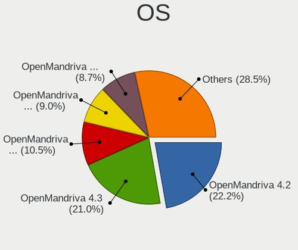
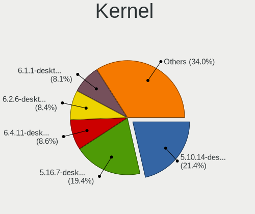
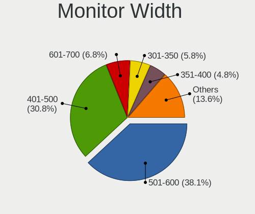
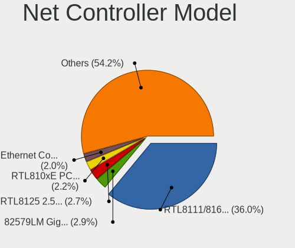

OpenMandriva - Tested Hardware & Statistics (Desktops)
------------------------------------------------------

A project to collect tested hardware configurations for OpenMandriva.

Anyone can contribute to this report by the [hw-probe](https://github.com/linuxhw/hw-probe) tool:

    sudo -E hw-probe -all -upload

Please contribute! Especially if your hardware is rare.

Contents
--------

* [ Test Cases ](#test-cases)

* [ System ](#system)
  - [ OS                       ](#os)
  - [ OS Family                ](#os-family)
  - [ Kernel                   ](#kernel)
  - [ Kernel Family            ](#kernel-family)
  - [ Kernel Major Ver.        ](#kernel-major-ver)
  - [ Arch                     ](#arch)
  - [ DE                       ](#de)
  - [ Display Server           ](#display-server)
  - [ Display Manager          ](#display-manager)
  - [ OS Lang                  ](#os-lang)
  - [ Boot Mode                ](#boot-mode)
  - [ Filesystem               ](#filesystem)
  - [ Part. scheme             ](#part-scheme)
  - [ Dual Boot with Linux/BSD ](#dual-boot-with-linuxbsd)
  - [ Dual Boot (Win)          ](#dual-boot-win)

* [ Board ](#board)
  - [ Vendor                   ](#vendor)
  - [ Model                    ](#model)
  - [ Model Family             ](#model-family)
  - [ MFG Year                 ](#mfg-year)
  - [ Form Factor              ](#form-factor)
  - [ Secure Boot              ](#secure-boot)
  - [ Coreboot                 ](#coreboot)
  - [ RAM Size                 ](#ram-size)
  - [ RAM Used                 ](#ram-used)
  - [ Total Drives             ](#total-drives)
  - [ Has CD-ROM               ](#has-cd-rom)
  - [ Has Ethernet             ](#has-ethernet)
  - [ Has WiFi                 ](#has-wifi)
  - [ Has Bluetooth            ](#has-bluetooth)

* [ Location ](#location)
  - [ Country                  ](#country)
  - [ City                     ](#city)

* [ Drives ](#drives)
  - [ Drive Vendor             ](#drive-vendor)
  - [ Drive Model              ](#drive-model)
  - [ HDD Vendor               ](#hdd-vendor)
  - [ SSD Vendor               ](#ssd-vendor)
  - [ Drive Kind               ](#drive-kind)
  - [ Drive Connector          ](#drive-connector)
  - [ Drive Size               ](#drive-size)
  - [ Space Total              ](#space-total)
  - [ Space Used               ](#space-used)
  - [ Malfunc. Drives          ](#malfunc-drives)
  - [ Malfunc. Drive Vendor    ](#malfunc-drive-vendor)
  - [ Malfunc. HDD Vendor      ](#malfunc-hdd-vendor)
  - [ Malfunc. Drive Kind      ](#malfunc-drive-kind)
  - [ Failed Drives            ](#failed-drives)
  - [ Failed Drive Vendor      ](#failed-drive-vendor)
  - [ Drive Status             ](#drive-status)

* [ Storage controller ](#storage-controller)
  - [ Storage Vendor           ](#storage-vendor)
  - [ Storage Model            ](#storage-model)
  - [ Storage Kind             ](#storage-kind)

* [ Processor ](#processor)
  - [ CPU Vendor               ](#cpu-vendor)
  - [ CPU Model                ](#cpu-model)
  - [ CPU Model Family         ](#cpu-model-family)
  - [ CPU Cores                ](#cpu-cores)
  - [ CPU Sockets              ](#cpu-sockets)
  - [ CPU Threads              ](#cpu-threads)
  - [ CPU Op-Modes             ](#cpu-op-modes)
  - [ CPU Microcode            ](#cpu-microcode)
  - [ CPU Microarch            ](#cpu-microarch)

* [ Graphics ](#graphics)
  - [ GPU Vendor               ](#gpu-vendor)
  - [ GPU Model                ](#gpu-model)
  - [ GPU Combo                ](#gpu-combo)
  - [ GPU Driver               ](#gpu-driver)
  - [ GPU Memory               ](#gpu-memory)

* [ Monitor ](#monitor)
  - [ Monitor Vendor           ](#monitor-vendor)
  - [ Monitor Model            ](#monitor-model)
  - [ Monitor Resolution       ](#monitor-resolution)
  - [ Monitor Diagonal         ](#monitor-diagonal)
  - [ Monitor Width            ](#monitor-width)
  - [ Aspect Ratio             ](#aspect-ratio)
  - [ Monitor Area             ](#monitor-area)
  - [ Pixel Density            ](#pixel-density)
  - [ Multiple Monitors        ](#multiple-monitors)

* [ Network ](#network)
  - [ Net Controller Vendor    ](#net-controller-vendor)
  - [ Net Controller Model     ](#net-controller-model)
  - [ Wireless Vendor          ](#wireless-vendor)
  - [ Wireless Model           ](#wireless-model)
  - [ Ethernet Vendor          ](#ethernet-vendor)
  - [ Ethernet Model           ](#ethernet-model)
  - [ Net Controller Kind      ](#net-controller-kind)
  - [ Used Controller          ](#used-controller)
  - [ NICs                     ](#nics)
  - [ IPv6                     ](#ipv6)

* [ Bluetooth ](#bluetooth)
  - [ Bluetooth Vendor         ](#bluetooth-vendor)
  - [ Bluetooth Model          ](#bluetooth-model)

* [ Sound ](#sound)
  - [ Sound Vendor             ](#sound-vendor)
  - [ Sound Model              ](#sound-model)

* [ Memory ](#memory)
  - [ Memory Vendor            ](#memory-vendor)
  - [ Memory Model             ](#memory-model)
  - [ Memory Kind              ](#memory-kind)
  - [ Memory Form Factor       ](#memory-form-factor)
  - [ Memory Size              ](#memory-size)
  - [ Memory Speed             ](#memory-speed)

* [ Printers & scanners ](#printers--scanners)
  - [ Printer Vendor           ](#printer-vendor)
  - [ Printer Model            ](#printer-model)
  - [ Scanner Vendor           ](#scanner-vendor)
  - [ Scanner Model            ](#scanner-model)

* [ Camera ](#camera)
  - [ Camera Vendor            ](#camera-vendor)
  - [ Camera Model             ](#camera-model)

* [ Security ](#security)
  - [ Fingerprint Vendor       ](#fingerprint-vendor)
  - [ Fingerprint Model        ](#fingerprint-model)
  - [ Chipcard Vendor          ](#chipcard-vendor)
  - [ Chipcard Model           ](#chipcard-model)

* [ Unsupported ](#unsupported)
  - [ Unsupported Devices      ](#unsupported-devices)
  - [ Unsupported Device Types ](#unsupported-device-types)

Test Cases
----------

Total: 4805

| Vendor        | Model                       | Probe                                                      | Date         |
|---------------|-----------------------------|------------------------------------------------------------|--------------|
| ASUSTek       | PRIME A320M-K               | [afbe6b4362](https://linux-hardware.org/?probe=afbe6b4362) | Dec 31, 2022 |
| ASUSTek       | TUF Gaming B560-PLUS WIF... | [7295ec02b5](https://linux-hardware.org/?probe=7295ec02b5) | Dec 31, 2022 |
| ASUSTek       | UN45                        | [bde2e2efb1](https://linux-hardware.org/?probe=bde2e2efb1) | Dec 31, 2022 |
| MSI           | MS-7502 Fab D               | [9126e1035f](https://linux-hardware.org/?probe=9126e1035f) | Dec 31, 2022 |
| Dell          | 0VNP2H A02                  | [5d3da04d45](https://linux-hardware.org/?probe=5d3da04d45) | Dec 31, 2022 |
| Gigabyte      | GA-78LMT-USB3 SEx           | [b0dd8fc6b5](https://linux-hardware.org/?probe=b0dd8fc6b5) | Dec 31, 2022 |
| Gigabyte      | B550M AORUS PRO-P           | [de6ea0ae2e](https://linux-hardware.org/?probe=de6ea0ae2e) | Dec 30, 2022 |
| ASUSTek       | STRIKER II EXTREME          | [3258ffa0c1](https://linux-hardware.org/?probe=3258ffa0c1) | Dec 29, 2022 |
| Gigabyte      | H61M-D2H                    | [28aede6faf](https://linux-hardware.org/?probe=28aede6faf) | Dec 29, 2022 |
| MSI           | MPG Z490 GAMING EDGE WIF... | [a72887241e](https://linux-hardware.org/?probe=a72887241e) | Dec 29, 2022 |
| MSI           | Z97 PC Mate                 | [1b7e70ab6e](https://linux-hardware.org/?probe=1b7e70ab6e) | Dec 29, 2022 |
| HP            | 0B4Ch D                     | [ed3b8e2e69](https://linux-hardware.org/?probe=ed3b8e2e69) | Dec 29, 2022 |
| ASUSTek       | P5K SE/EPU                  | [3f0c89985c](https://linux-hardware.org/?probe=3f0c89985c) | Dec 29, 2022 |
| Gigabyte      | MJPLNBB-00                  | [879a5b77ff](https://linux-hardware.org/?probe=879a5b77ff) | Dec 28, 2022 |
| Dell          | 0HN7XN A01                  | [43a0d87199](https://linux-hardware.org/?probe=43a0d87199) | Dec 28, 2022 |
| Pegatron      | APX85-GS                    | [82db9f15c6](https://linux-hardware.org/?probe=82db9f15c6) | Dec 27, 2022 |
| Acer          | Aspire TC-865 V:1.1         | [0c8add55fe](https://linux-hardware.org/?probe=0c8add55fe) | Dec 27, 2022 |
| MSI           | X470 GAMING PLUS MAX        | [bc68280036](https://linux-hardware.org/?probe=bc68280036) | Dec 26, 2022 |
| Lenovo        | SHARKBAY NOK                | [46123218f3](https://linux-hardware.org/?probe=46123218f3) | Dec 26, 2022 |
| Gigabyte      | G41MT-S2PT                  | [14611d6c99](https://linux-hardware.org/?probe=14611d6c99) | Dec 26, 2022 |
| HP            | 2AF7                        | [96344d97ba](https://linux-hardware.org/?probe=96344d97ba) | Dec 26, 2022 |
| Gigabyte      | Z590 AORUS ULTRA            | [4ab759533b](https://linux-hardware.org/?probe=4ab759533b) | Dec 25, 2022 |
| Huanan        | B660-D4 V1.0                | [2a3d5dc01f](https://linux-hardware.org/?probe=2a3d5dc01f) | Dec 25, 2022 |
| Gigabyte      | B450M S2H                   | [500abd4186](https://linux-hardware.org/?probe=500abd4186) | Dec 25, 2022 |
| ASUSTek       | NARRA3                      | [cc0a64d0df](https://linux-hardware.org/?probe=cc0a64d0df) | Dec 25, 2022 |
| Pegatron      | IPPPV-D3G                   | [4d1a2299dc](https://linux-hardware.org/?probe=4d1a2299dc) | Dec 24, 2022 |
| ASUSTek       | TUF B450-PLUS GAMING        | [9e269ee2a4](https://linux-hardware.org/?probe=9e269ee2a4) | Dec 24, 2022 |
| ASRock        | FM2A68M-DG3+                | [11eb39826a](https://linux-hardware.org/?probe=11eb39826a) | Dec 24, 2022 |
| Dell          | 0M863N A00                  | [ce9fc7a224](https://linux-hardware.org/?probe=ce9fc7a224) | Dec 24, 2022 |
| Foxconn       | 2AA9                        | [07650be639](https://linux-hardware.org/?probe=07650be639) | Dec 24, 2022 |
| ASRock        | B75 Pro3-M                  | [e24692f75f](https://linux-hardware.org/?probe=e24692f75f) | Dec 24, 2022 |
| MACHINIST     | X99-RS9 V2.0                | [27612d2f72](https://linux-hardware.org/?probe=27612d2f72) | Dec 24, 2022 |
| ASRock        | B550 Phantom Gaming 4/ac    | [2d3121d44e](https://linux-hardware.org/?probe=2d3121d44e) | Dec 24, 2022 |
| Dell          | 0J3C2F A00                  | [f993ebb9ed](https://linux-hardware.org/?probe=f993ebb9ed) | Dec 23, 2022 |
| MSI           | 880GM-E41                   | [2880803d71](https://linux-hardware.org/?probe=2880803d71) | Dec 23, 2022 |
| ASUSTek       | TUF B360-PRO GAMING         | [561b98afc3](https://linux-hardware.org/?probe=561b98afc3) | Dec 23, 2022 |
| Dell          | 0JJW8N A03                  | [5917cccca0](https://linux-hardware.org/?probe=5917cccca0) | Dec 23, 2022 |
| ASUSTek       | TUF Gaming B550-PLUS        | [87da3fdf4d](https://linux-hardware.org/?probe=87da3fdf4d) | Dec 23, 2022 |
| ASRock        | FM2A88M-HD+                 | [18b83ae613](https://linux-hardware.org/?probe=18b83ae613) | Dec 22, 2022 |
| ASUSTek       | P5K                         | [406d3a2d92](https://linux-hardware.org/?probe=406d3a2d92) | Dec 22, 2022 |
| MSI           | 2A9C                        | [031afb1b20](https://linux-hardware.org/?probe=031afb1b20) | Dec 22, 2022 |
| Acer          | Aspire M3920                | [803cd5d8f9](https://linux-hardware.org/?probe=803cd5d8f9) | Dec 22, 2022 |
| Gigabyte      | EP43-DS3                    | [d0f0cd82f9](https://linux-hardware.org/?probe=d0f0cd82f9) | Dec 22, 2022 |
| Gigabyte      | X470 AORUS GAMING 5 WIFI... | [003ac98d7f](https://linux-hardware.org/?probe=003ac98d7f) | Dec 21, 2022 |
| PERTOSA       | GA-H110TN-M                 | [048d8cca49](https://linux-hardware.org/?probe=048d8cca49) | Dec 21, 2022 |
| HP            | 212A                        | [32c96df530](https://linux-hardware.org/?probe=32c96df530) | Dec 20, 2022 |
| Dell          | 0VHWTR A01                  | [a5070ec279](https://linux-hardware.org/?probe=a5070ec279) | Dec 20, 2022 |
| ASUSTek       | P5K                         | [e88b53b804](https://linux-hardware.org/?probe=e88b53b804) | Dec 20, 2022 |
| HP            | 8906 SMVB                   | [c7b2f48d96](https://linux-hardware.org/?probe=c7b2f48d96) | Dec 20, 2022 |
| Acer          | Aspire XC-830               | [ee5a538a22](https://linux-hardware.org/?probe=ee5a538a22) | Dec 20, 2022 |
| ECS           | G31T-M7                     | [327ac25b68](https://linux-hardware.org/?probe=327ac25b68) | Dec 20, 2022 |
| Gigabyte      | 945GCMX-S2                  | [3b9937e6df](https://linux-hardware.org/?probe=3b9937e6df) | Dec 20, 2022 |
| MSI           | H81M-E34                    | [3aa811568d](https://linux-hardware.org/?probe=3aa811568d) | Dec 19, 2022 |
| ASUSTek       | P5QL PRO                    | [5f3343c803](https://linux-hardware.org/?probe=5f3343c803) | Dec 19, 2022 |
| Gigabyte      | H61M-DS2                    | [b5c4e6cf61](https://linux-hardware.org/?probe=b5c4e6cf61) | Dec 19, 2022 |
| ASUSTek       | ROG STRIX B550-F GAMING ... | [743b2176f1](https://linux-hardware.org/?probe=743b2176f1) | Dec 19, 2022 |
| Dell          | 0M858N A00                  | [e46a95080d](https://linux-hardware.org/?probe=e46a95080d) | Dec 18, 2022 |
| MSI           | 790GX-G65                   | [7ad3c8f807](https://linux-hardware.org/?probe=7ad3c8f807) | Dec 18, 2022 |
| Gigabyte      | MQLP3AP-WG                  | [bdb3b0161e](https://linux-hardware.org/?probe=bdb3b0161e) | Dec 18, 2022 |
| Dell          | 0RY007                      | [3791fa08dd](https://linux-hardware.org/?probe=3791fa08dd) | Dec 18, 2022 |
| MSI           | A520M-A PRO                 | [164b37d0e5](https://linux-hardware.org/?probe=164b37d0e5) | Dec 18, 2022 |
| MSI           | MPG X570S EDGE MAX WIFI     | [45eafa4ade](https://linux-hardware.org/?probe=45eafa4ade) | Dec 17, 2022 |
| Gigabyte      | X399 AORUS PRO-CF           | [71ebf721cc](https://linux-hardware.org/?probe=71ebf721cc) | Dec 17, 2022 |
| Biostar       | H81MHV3 5.0                 | [57191b83bb](https://linux-hardware.org/?probe=57191b83bb) | Dec 17, 2022 |
| HP            | 8055                        | [6c7fa83dc9](https://linux-hardware.org/?probe=6c7fa83dc9) | Dec 17, 2022 |
| MSI           | MS-B1711                    | [a5b142e258](https://linux-hardware.org/?probe=a5b142e258) | Dec 17, 2022 |
| ASUSTek       | PRIME H510M-K               | [ca088f2039](https://linux-hardware.org/?probe=ca088f2039) | Dec 16, 2022 |
| Biostar       | A10N-8800E                  | [bc96dc9caf](https://linux-hardware.org/?probe=bc96dc9caf) | Dec 16, 2022 |
| Dell          | 0RW203                      | [2f5bede488](https://linux-hardware.org/?probe=2f5bede488) | Dec 16, 2022 |
| ASUSTek       | B75M-A                      | [e350e12e7c](https://linux-hardware.org/?probe=e350e12e7c) | Dec 15, 2022 |
| Lenovo        | SHARKBAY 0B98401 PRO        | [226bab8281](https://linux-hardware.org/?probe=226bab8281) | Dec 15, 2022 |
| Gigabyte      | F2A85X-UP4                  | [80358a5ba1](https://linux-hardware.org/?probe=80358a5ba1) | Dec 15, 2022 |
| Acer          | Veriton N2620G              | [a626bf668e](https://linux-hardware.org/?probe=a626bf668e) | Dec 15, 2022 |
| Pegatron      | IPM41-D3                    | [a41e0d92a7](https://linux-hardware.org/?probe=a41e0d92a7) | Dec 15, 2022 |
| Lenovo        | 364F SDK0J40700 WIN 3258... | [ffe60f958c](https://linux-hardware.org/?probe=ffe60f958c) | Dec 15, 2022 |
| Dell          | 0FR6WH A01                  | [46d6c645fe](https://linux-hardware.org/?probe=46d6c645fe) | Dec 15, 2022 |
| Gigabyte      | F2A68HM-H                   | [f18234034f](https://linux-hardware.org/?probe=f18234034f) | Dec 15, 2022 |
| HP            | 2AFB                        | [4c57ea0ee7](https://linux-hardware.org/?probe=4c57ea0ee7) | Dec 15, 2022 |
| ASUSTek       | ROG STRIX X570-I GAMING     | [587fac961e](https://linux-hardware.org/?probe=587fac961e) | Dec 15, 2022 |
| Dell          | 0VD92X A00                  | [9feb549665](https://linux-hardware.org/?probe=9feb549665) | Dec 15, 2022 |
| Gigabyte      | H410M H V3                  | [cf668e53f4](https://linux-hardware.org/?probe=cf668e53f4) | Dec 15, 2022 |
| Gigabyte      | B550 AORUS ELITE V2         | [ad1e402db3](https://linux-hardware.org/?probe=ad1e402db3) | Dec 15, 2022 |
| MSI           | Z77MA-G45                   | [24a7d4b636](https://linux-hardware.org/?probe=24a7d4b636) | Dec 15, 2022 |
| ASUSTek       | EX-A320M-GAMING             | [6bd184b75a](https://linux-hardware.org/?probe=6bd184b75a) | Dec 15, 2022 |
| Dell          | 00V62H A01                  | [8b003bd5f2](https://linux-hardware.org/?probe=8b003bd5f2) | Dec 15, 2022 |
| Dell          | 05XGC8 A01                  | [f0e99676be](https://linux-hardware.org/?probe=f0e99676be) | Dec 14, 2022 |
| ASUSTek       | P8H61-M LX2/CSM             | [cc6e7dae77](https://linux-hardware.org/?probe=cc6e7dae77) | Dec 14, 2022 |
| ASUSTek       | M5A78L-M PLUS/USB3          | [0a564c9f0f](https://linux-hardware.org/?probe=0a564c9f0f) | Dec 14, 2022 |
| Gigabyte      | B150-HD3-CF                 | [173dde2177](https://linux-hardware.org/?probe=173dde2177) | Dec 14, 2022 |
| Datto         | SSD                         | [a9bff0a51c](https://linux-hardware.org/?probe=a9bff0a51c) | Dec 14, 2022 |
| ASUSTek       | M5A97 R2.0                  | [c337db1381](https://linux-hardware.org/?probe=c337db1381) | Dec 14, 2022 |
| ASRock        | M3A770DE                    | [2e6b1f9c2d](https://linux-hardware.org/?probe=2e6b1f9c2d) | Dec 13, 2022 |
| HP            | 304Ah                       | [d8b600f39e](https://linux-hardware.org/?probe=d8b600f39e) | Dec 13, 2022 |
| ECS           | H61H2-M2                    | [8525777743](https://linux-hardware.org/?probe=8525777743) | Dec 13, 2022 |
| Dell          | 0T10XW A02                  | [1539e12262](https://linux-hardware.org/?probe=1539e12262) | Dec 13, 2022 |
| AZW           | U59                         | [fd5ccbfbd2](https://linux-hardware.org/?probe=fd5ccbfbd2) | Dec 13, 2022 |
| ASUSTek       | Z10PH-D16 Series            | [18911cf243](https://linux-hardware.org/?probe=18911cf243) | Dec 13, 2022 |
| ASUSTek       | NODUS M                     | [c415b9aeb6](https://linux-hardware.org/?probe=c415b9aeb6) | Dec 12, 2022 |
| Gigabyte      | H310M S2V                   | [6895902fe7](https://linux-hardware.org/?probe=6895902fe7) | Dec 12, 2022 |
| ASUSTek       | AM1M-A                      | [260a382d54](https://linux-hardware.org/?probe=260a382d54) | Dec 12, 2022 |
| Fujitsu       | D3161-A1 S26361-D3161-A1    | [62f6fd5f8d](https://linux-hardware.org/?probe=62f6fd5f8d) | Dec 12, 2022 |
| MSI           | MPG B550 GAMING EDGE WIF... | [9537bff125](https://linux-hardware.org/?probe=9537bff125) | Dec 11, 2022 |
| HP            | 8265                        | [da426053be](https://linux-hardware.org/?probe=da426053be) | Dec 11, 2022 |
| Dell          | 0KG317                      | [cf7f697a0a](https://linux-hardware.org/?probe=cf7f697a0a) | Dec 11, 2022 |
| Dell          | 042P49 A02                  | [8b97211b80](https://linux-hardware.org/?probe=8b97211b80) | Dec 11, 2022 |
| ASUSTek       | PRIME X370-PRO              | [4bb3c91677](https://linux-hardware.org/?probe=4bb3c91677) | Dec 10, 2022 |
| ASUSTek       | P8Z77-V LX                  | [d53608f3e3](https://linux-hardware.org/?probe=d53608f3e3) | Dec 10, 2022 |
| ASUSTek       | P8Z77-V LX                  | [363ac45af6](https://linux-hardware.org/?probe=363ac45af6) | Dec 10, 2022 |
| Dell          | 01TKCC A01                  | [0dc9bb1cf4](https://linux-hardware.org/?probe=0dc9bb1cf4) | Dec 09, 2022 |
| Lenovo        | ThinkCentre M70e 0829RB4    | [5a5b271c35](https://linux-hardware.org/?probe=5a5b271c35) | Dec 09, 2022 |
| HP            | 18E7                        | [9759493e06](https://linux-hardware.org/?probe=9759493e06) | Dec 09, 2022 |
| Dell          | 0C27VV A03                  | [ef9e07a125](https://linux-hardware.org/?probe=ef9e07a125) | Dec 09, 2022 |
| ASRock        | 945GCM-S                    | [926787ea67](https://linux-hardware.org/?probe=926787ea67) | Dec 09, 2022 |
| Pegatron      | 2AB5                        | [6392174b0f](https://linux-hardware.org/?probe=6392174b0f) | Dec 09, 2022 |
| ASRock        | X570 Phantom Gaming 4       | [aae285b0ea](https://linux-hardware.org/?probe=aae285b0ea) | Dec 09, 2022 |
| ASUSTek       | TUF B450-PRO GAMING         | [945412b0cc](https://linux-hardware.org/?probe=945412b0cc) | Dec 09, 2022 |
| Dell          | 0P301D A02                  | [8ab7a916f1](https://linux-hardware.org/?probe=8ab7a916f1) | Dec 08, 2022 |
| MSI           | 760GM-P23                   | [29337f7359](https://linux-hardware.org/?probe=29337f7359) | Dec 08, 2022 |
| ASRock        | B550 Taichi                 | [0203e79add](https://linux-hardware.org/?probe=0203e79add) | Dec 08, 2022 |
| ASUSTek       | H110-PLUS                   | [57e0d3651c](https://linux-hardware.org/?probe=57e0d3651c) | Dec 08, 2022 |
| Gigabyte      | Z370M D3H-CF                | [dabda33265](https://linux-hardware.org/?probe=dabda33265) | Dec 07, 2022 |
| ASUSTek       | P5Q-E                       | [fb93b5bdfa](https://linux-hardware.org/?probe=fb93b5bdfa) | Dec 06, 2022 |
| MAXSUN        | MS-TZZ A320M.2-VH           | [c3fc86b5d4](https://linux-hardware.org/?probe=c3fc86b5d4) | Dec 06, 2022 |
| HC Technol... | HCAR4000-MI                 | [596c3680f3](https://linux-hardware.org/?probe=596c3680f3) | Dec 06, 2022 |
| Gigabyte      | GA-MA770-ES3                | [70c1a43352](https://linux-hardware.org/?probe=70c1a43352) | Dec 06, 2022 |
| ASUSTek       | P8Z77-V LX                  | [e64c5d7bdc](https://linux-hardware.org/?probe=e64c5d7bdc) | Dec 06, 2022 |
| ASUSTek       | P8H61-M LX R2.0             | [664d064b07](https://linux-hardware.org/?probe=664d064b07) | Dec 06, 2022 |
| ASUSTek       | P6T                         | [8268d853c9](https://linux-hardware.org/?probe=8268d853c9) | Dec 06, 2022 |
| Lenovo        | 0x36A017AA 31900058 STD     | [ccc212b757](https://linux-hardware.org/?probe=ccc212b757) | Dec 06, 2022 |
| Lenovo        | SHARKBAY 0B98401 WIN        | [a4a47ea164](https://linux-hardware.org/?probe=a4a47ea164) | Dec 05, 2022 |
| Intel         | HURONRIVER                  | [d8a4f4a923](https://linux-hardware.org/?probe=d8a4f4a923) | Dec 05, 2022 |
| HP            | ProLiant ML350e Gen8        | [984fe41e3c](https://linux-hardware.org/?probe=984fe41e3c) | Dec 05, 2022 |
| ECS           | 945P/PL-A                   | [8db8eec28d](https://linux-hardware.org/?probe=8db8eec28d) | Dec 05, 2022 |
| ASUSTek       | A_F_K31AN                   | [440d9055ff](https://linux-hardware.org/?probe=440d9055ff) | Dec 05, 2022 |
| ASRock        | B450 Pro4                   | [f96de923f4](https://linux-hardware.org/?probe=f96de923f4) | Dec 05, 2022 |
| ASUSTek       | A55BM-K                     | [e78b25a518](https://linux-hardware.org/?probe=e78b25a518) | Dec 05, 2022 |
| Gigabyte      | GA-78LMT-S2                 | [fa3aeacc17](https://linux-hardware.org/?probe=fa3aeacc17) | Dec 05, 2022 |
| MSI           | Z490-A PRO                  | [34157244aa](https://linux-hardware.org/?probe=34157244aa) | Dec 05, 2022 |
| ASUSTek       | Z170 PRO GAMING             | [60d47a3b37](https://linux-hardware.org/?probe=60d47a3b37) | Dec 05, 2022 |
| Dell          | 0M863N A01                  | [ee8183087b](https://linux-hardware.org/?probe=ee8183087b) | Dec 04, 2022 |
| Pegatron      | 2ACF                        | [2d39768d80](https://linux-hardware.org/?probe=2d39768d80) | Dec 04, 2022 |
| Positivo      | POS-PIQ77CL POSITIVO        | [e98fcde376](https://linux-hardware.org/?probe=e98fcde376) | Dec 04, 2022 |
| Lenovo        | SHARKBAY NOK                | [ef7a013f9b](https://linux-hardware.org/?probe=ef7a013f9b) | Dec 04, 2022 |
| ACTION        | ACTINA GA-G31M-S2L          | [2a2934f919](https://linux-hardware.org/?probe=2a2934f919) | Dec 04, 2022 |
| Lenovo        | Win8 Pro DPK TPG            | [1dbda8e648](https://linux-hardware.org/?probe=1dbda8e648) | Dec 04, 2022 |
| ASUSTek       | PRIME Z690-P WIFI D4        | [1f3b1d433c](https://linux-hardware.org/?probe=1f3b1d433c) | Dec 04, 2022 |
| ASUSTek       | PRIME B560M-A AC            | [576dda0a6e](https://linux-hardware.org/?probe=576dda0a6e) | Dec 04, 2022 |
| Acer          | Aspire X3950                | [96044c1932](https://linux-hardware.org/?probe=96044c1932) | Dec 03, 2022 |
| ASUSTek       | H97-PLUS                    | [c79b15a3cf](https://linux-hardware.org/?probe=c79b15a3cf) | Dec 03, 2022 |
| Lenovo        | SHARKBAY SDK0E50510 WIN     | [7fe4c21bf6](https://linux-hardware.org/?probe=7fe4c21bf6) | Dec 03, 2022 |
| HP            | 3648h                       | [099f2cd973](https://linux-hardware.org/?probe=099f2cd973) | Dec 03, 2022 |
| Gigabyte      | 970A-DS3P                   | [a4a8d6dcec](https://linux-hardware.org/?probe=a4a8d6dcec) | Dec 03, 2022 |
| Dell          | 02YYK5 A01                  | [eb9887d9d4](https://linux-hardware.org/?probe=eb9887d9d4) | Dec 02, 2022 |
| HP            | 8648                        | [79673ee467](https://linux-hardware.org/?probe=79673ee467) | Dec 02, 2022 |
| Gigabyte      | GA-78LMT-USB3               | [85eab170d2](https://linux-hardware.org/?probe=85eab170d2) | Dec 02, 2022 |
| ASUSTek       | P7P55D PRO                  | [b566591b3c](https://linux-hardware.org/?probe=b566591b3c) | Dec 02, 2022 |
| ASUSTek       | M5A97 PLUS                  | [63820e3937](https://linux-hardware.org/?probe=63820e3937) | Dec 01, 2022 |
| ASUSTek       | PRIME B250M-K               | [97a1793680](https://linux-hardware.org/?probe=97a1793680) | Dec 01, 2022 |
| ASUSTek       | ROG STRIX X570-F GAMING     | [1ebd8b1b89](https://linux-hardware.org/?probe=1ebd8b1b89) | Dec 01, 2022 |
| ASUSTek       | P5K WS                      | [f3608476bf](https://linux-hardware.org/?probe=f3608476bf) | Dec 01, 2022 |
| Medion        | MS-7748                     | [0e92aa55ca](https://linux-hardware.org/?probe=0e92aa55ca) | Nov 30, 2022 |
| Dell          | 0N4YC8 A00                  | [2e53fa79ed](https://linux-hardware.org/?probe=2e53fa79ed) | Nov 30, 2022 |
| ASUSTek       | Z170-E                      | [5e68d23175](https://linux-hardware.org/?probe=5e68d23175) | Nov 30, 2022 |
| Medion        | MS-7800                     | [a5658a6933](https://linux-hardware.org/?probe=a5658a6933) | Nov 30, 2022 |
| ASRock        | N68-S3 UCC                  | [1d20e4ba6d](https://linux-hardware.org/?probe=1d20e4ba6d) | Nov 30, 2022 |
| MACHINIST     | X99-D8-MAX V1.0             | [c2430965a1](https://linux-hardware.org/?probe=c2430965a1) | Nov 30, 2022 |
| ASRock        | H470M-HDV/M.2               | [c01129a199](https://linux-hardware.org/?probe=c01129a199) | Nov 29, 2022 |
| MSI           | D2414 S26361-D2414-A10      | [ef1367a574](https://linux-hardware.org/?probe=ef1367a574) | Nov 29, 2022 |
| ECS           | 945P/PL-A                   | [ff47651dd8](https://linux-hardware.org/?probe=ff47651dd8) | Nov 29, 2022 |
| Biostar       | H81MHV3 5.0                 | [d89a05dd31](https://linux-hardware.org/?probe=d89a05dd31) | Nov 29, 2022 |
| Gigabyte      | B450 AORUS M                | [d20243efed](https://linux-hardware.org/?probe=d20243efed) | Nov 28, 2022 |
| Gigabyte      | B360 AORUS GAMING 3 WIFI... | [e479f87a66](https://linux-hardware.org/?probe=e479f87a66) | Nov 28, 2022 |
| ASRock        | B550M-ITX/ac                | [31f70fbb3e](https://linux-hardware.org/?probe=31f70fbb3e) | Nov 27, 2022 |
| ASUSTek       | PRIME X570-PRO              | [c218724cb4](https://linux-hardware.org/?probe=c218724cb4) | Nov 27, 2022 |
| MSI           | Z77MA-G45                   | [feb165c344](https://linux-hardware.org/?probe=feb165c344) | Nov 27, 2022 |
| ASRock        | A88M-G                      | [323199813d](https://linux-hardware.org/?probe=323199813d) | Nov 27, 2022 |
| MSI           | P55-CD53                    | [a602949484](https://linux-hardware.org/?probe=a602949484) | Nov 26, 2022 |
| ASUSTek       | PRIME H410M-R               | [b680eec959](https://linux-hardware.org/?probe=b680eec959) | Nov 26, 2022 |
| ASUSTek       | SABERTOOTH 990FX R2.0       | [02b1483a02](https://linux-hardware.org/?probe=02b1483a02) | Nov 26, 2022 |
| HP            | 3397                        | [c943f7435d](https://linux-hardware.org/?probe=c943f7435d) | Nov 26, 2022 |
| ASUSTek       | M4A88TD-V EVO/USB3          | [9419d2017e](https://linux-hardware.org/?probe=9419d2017e) | Nov 26, 2022 |
| Gigabyte      | G31M-ES2L                   | [1eb32c408c](https://linux-hardware.org/?probe=1eb32c408c) | Nov 26, 2022 |
| HP            | 0AECh D                     | [857616948b](https://linux-hardware.org/?probe=857616948b) | Nov 26, 2022 |
| HP            | 1589                        | [077a89fb54](https://linux-hardware.org/?probe=077a89fb54) | Nov 26, 2022 |
| Dell          | 0VRWRC A00                  | [26bfa13122](https://linux-hardware.org/?probe=26bfa13122) | Nov 25, 2022 |
| ASUSTek       | P8B75-M LX PLUS             | [7948a35f59](https://linux-hardware.org/?probe=7948a35f59) | Nov 25, 2022 |
| Acer          | Veriton L6620G v1.0         | [33f168992e](https://linux-hardware.org/?probe=33f168992e) | Nov 25, 2022 |
| HP            | 2215                        | [0134898651](https://linux-hardware.org/?probe=0134898651) | Nov 25, 2022 |
| MSI           | B75A-G43                    | [7f635dae7f](https://linux-hardware.org/?probe=7f635dae7f) | Nov 24, 2022 |
| Wistron       | ProLiant ML110 G6           | [7d448ab5cc](https://linux-hardware.org/?probe=7d448ab5cc) | Nov 24, 2022 |
| ASUSTek       | M4A87TD/USB3                | [81a2eaf6e4](https://linux-hardware.org/?probe=81a2eaf6e4) | Nov 24, 2022 |
| ASRock        | X670E Taichi Carrara        | [7e844d7172](https://linux-hardware.org/?probe=7e844d7172) | Nov 24, 2022 |
| Foxconn       | 2A92                        | [e21715c047](https://linux-hardware.org/?probe=e21715c047) | Nov 24, 2022 |
| Supermicro    | PDSMi+                      | [3a70b82d42](https://linux-hardware.org/?probe=3a70b82d42) | Nov 24, 2022 |
| Intel         | B75                         | [a8932d4a21](https://linux-hardware.org/?probe=a8932d4a21) | Nov 24, 2022 |
| Foxconn       | 2ADA                        | [3be30a3d31](https://linux-hardware.org/?probe=3be30a3d31) | Nov 23, 2022 |
| Wistron       | ProLiant ML110 G5           | [67cc68fbfe](https://linux-hardware.org/?probe=67cc68fbfe) | Nov 23, 2022 |
| MSI           | B450M-A PRO MAX             | [e4904d14cc](https://linux-hardware.org/?probe=e4904d14cc) | Nov 23, 2022 |
| Dell          | 0M863N A01                  | [ca7e5eab8d](https://linux-hardware.org/?probe=ca7e5eab8d) | Nov 23, 2022 |
| Gigabyte      | 970A-DS3P                   | [681bcb945c](https://linux-hardware.org/?probe=681bcb945c) | Nov 23, 2022 |
| ASUSTek       | P5KPL-AM SE                 | [eca478ef1d](https://linux-hardware.org/?probe=eca478ef1d) | Nov 23, 2022 |
| Intel         | DG41TY AAE47335-302         | [ae2fb8d0b3](https://linux-hardware.org/?probe=ae2fb8d0b3) | Nov 22, 2022 |
| Gigabyte      | B550M AORUS ELITE           | [324b5a49e4](https://linux-hardware.org/?probe=324b5a49e4) | Nov 22, 2022 |
| ASUSTek       | V-P5G43 R1.04G              | [b400ca5e29](https://linux-hardware.org/?probe=b400ca5e29) | Nov 21, 2022 |
| HP            | 3399                        | [bce6df1ffb](https://linux-hardware.org/?probe=bce6df1ffb) | Nov 21, 2022 |
| Gigabyte      | Z77-D3H                     | [aecddcf17e](https://linux-hardware.org/?probe=aecddcf17e) | Nov 21, 2022 |
| ASUSTek       | F1A55-M LE                  | [f2120128c1](https://linux-hardware.org/?probe=f2120128c1) | Nov 21, 2022 |
| Gigabyte      | H61M-DS2 x.x                | [cd65013120](https://linux-hardware.org/?probe=cd65013120) | Nov 21, 2022 |
| ASRock        | B450M Steel Legend          | [4792cdbba2](https://linux-hardware.org/?probe=4792cdbba2) | Nov 21, 2022 |
| Lenovo        | 32E9 SDK0T76465 WIN 3422... | [ec30826806](https://linux-hardware.org/?probe=ec30826806) | Nov 21, 2022 |
| Lenovo        | MAHOBAY                     | [d74e4882d8](https://linux-hardware.org/?probe=d74e4882d8) | Nov 21, 2022 |
| Pegatron      | NARRA5                      | [d8632e2872](https://linux-hardware.org/?probe=d8632e2872) | Nov 21, 2022 |
| ASRock        | P67 Extreme4                | [569fd8178d](https://linux-hardware.org/?probe=569fd8178d) | Nov 21, 2022 |
| Pegatron      | NARRA5                      | [42e5fe9c22](https://linux-hardware.org/?probe=42e5fe9c22) | Nov 21, 2022 |
| ASUSTek       | PRIME Z690-P D4             | [049f06f11d](https://linux-hardware.org/?probe=049f06f11d) | Nov 21, 2022 |
| AZW           | SEi                         | [a8e813c483](https://linux-hardware.org/?probe=a8e813c483) | Nov 21, 2022 |
| HP            | 2AF3                        | [babcb0bf93](https://linux-hardware.org/?probe=babcb0bf93) | Nov 21, 2022 |
| Dell          | 00NNT0 A00                  | [c25787d8b9](https://linux-hardware.org/?probe=c25787d8b9) | Nov 20, 2022 |
| ASUSTek       | M2N-E                       | [150565ed00](https://linux-hardware.org/?probe=150565ed00) | Nov 20, 2022 |
| ASUSTek       | H81M-PLUS                   | [880e6565e8](https://linux-hardware.org/?probe=880e6565e8) | Nov 20, 2022 |
| ASUSTek       | Z97-C                       | [733140c078](https://linux-hardware.org/?probe=733140c078) | Nov 20, 2022 |
| MSI           | PRO Z690-A WIFI             | [5b31194732](https://linux-hardware.org/?probe=5b31194732) | Nov 20, 2022 |
| Gigabyte      | B550 AORUS ELITE V2         | [61738f6d8a](https://linux-hardware.org/?probe=61738f6d8a) | Nov 19, 2022 |
| Shuttle       | FS61                        | [7a940c8fa3](https://linux-hardware.org/?probe=7a940c8fa3) | Nov 19, 2022 |
| Pegatron      | 2A94h                       | [be99475703](https://linux-hardware.org/?probe=be99475703) | Nov 19, 2022 |
| ECS           | G41T-M7                     | [f97036df33](https://linux-hardware.org/?probe=f97036df33) | Nov 18, 2022 |
| Intel         | X99                         | [c95c1d173b](https://linux-hardware.org/?probe=c95c1d173b) | Nov 18, 2022 |
| ASUSTek       | P8H61-M PLUS V2             | [ff279b1860](https://linux-hardware.org/?probe=ff279b1860) | Nov 18, 2022 |
| TPV-INVENT... | 2AC6 A01                    | [04b3ba4242](https://linux-hardware.org/?probe=04b3ba4242) | Nov 18, 2022 |
| Gigabyte      | 970A-DS3P                   | [fc7b21bd04](https://linux-hardware.org/?probe=fc7b21bd04) | Nov 18, 2022 |
| Apple         | Mac-F42C88C8 Proto1         | [a61b66e4ed](https://linux-hardware.org/?probe=a61b66e4ed) | Nov 18, 2022 |
| Gigabyte      | A520M H                     | [c2ad29d3e8](https://linux-hardware.org/?probe=c2ad29d3e8) | Nov 18, 2022 |
| Fujitsu Si... | D2364-A3 S26361-D2364-A3    | [62ce7f9a0b](https://linux-hardware.org/?probe=62ce7f9a0b) | Nov 18, 2022 |
| Huanan        | X99-8M-F V1.1               | [b1d1b0ad4c](https://linux-hardware.org/?probe=b1d1b0ad4c) | Nov 18, 2022 |
| ASUSTek       | P5KPL/1600                  | [24b13d1967](https://linux-hardware.org/?probe=24b13d1967) | Nov 16, 2022 |
| HP            | 843B                        | [373e5cc61d](https://linux-hardware.org/?probe=373e5cc61d) | Nov 16, 2022 |
| Intel         | H61                         | [faeac27433](https://linux-hardware.org/?probe=faeac27433) | Nov 16, 2022 |
| Medion        | MS-7728                     | [813d86814d](https://linux-hardware.org/?probe=813d86814d) | Nov 16, 2022 |
| Acer          | Veriton N4630G              | [f4566a57a9](https://linux-hardware.org/?probe=f4566a57a9) | Nov 16, 2022 |
| Fujitsu       | D3161-A1 S26361-D3161-A1    | [90662fa2e9](https://linux-hardware.org/?probe=90662fa2e9) | Nov 16, 2022 |
| ALDO          | C2016-BSWI-D2               | [0e4c4c6806](https://linux-hardware.org/?probe=0e4c4c6806) | Nov 16, 2022 |
| AZW           | Gemini M                    | [683123c4f5](https://linux-hardware.org/?probe=683123c4f5) | Nov 16, 2022 |
| ASUSTek       | H81M-A                      | [ff63827781](https://linux-hardware.org/?probe=ff63827781) | Nov 15, 2022 |
| ASUSTek       | PRIME B450M-GAMING/BR       | [e7f05e6eac](https://linux-hardware.org/?probe=e7f05e6eac) | Nov 15, 2022 |
| ASRock        | B450M Steel Legend          | [6cb0948dfd](https://linux-hardware.org/?probe=6cb0948dfd) | Nov 15, 2022 |
| MSI           | H61M-P31/W8                 | [a7d3a01ab2](https://linux-hardware.org/?probe=a7d3a01ab2) | Nov 15, 2022 |
| HP            | 22F8                        | [754ebee9c8](https://linux-hardware.org/?probe=754ebee9c8) | Nov 14, 2022 |
| Gigabyte      | H77-DS3H                    | [f28540c049](https://linux-hardware.org/?probe=f28540c049) | Nov 14, 2022 |
| ASUSTek       | P8Z77-V LX                  | [2d904e2be7](https://linux-hardware.org/?probe=2d904e2be7) | Nov 13, 2022 |
| MSI           | B450M PRO-M2 MAX            | [27d4e1c496](https://linux-hardware.org/?probe=27d4e1c496) | Nov 13, 2022 |
| HP            | 84FD                        | [6ee4b6828c](https://linux-hardware.org/?probe=6ee4b6828c) | Nov 13, 2022 |
| Deltron       | H81H3-M4                    | [49530f2e0b](https://linux-hardware.org/?probe=49530f2e0b) | Nov 13, 2022 |
| MSI           | H97 GUARD-PRO               | [3ea9d7a74a](https://linux-hardware.org/?probe=3ea9d7a74a) | Nov 13, 2022 |
| Gigabyte      | H87-HD3                     | [e5a8d4700d](https://linux-hardware.org/?probe=e5a8d4700d) | Nov 12, 2022 |
| ASRock        | B450M Pro4 R2.0             | [c5952a73e7](https://linux-hardware.org/?probe=c5952a73e7) | Nov 12, 2022 |
| ASUSTek       | H81M-K                      | [052f42f29a](https://linux-hardware.org/?probe=052f42f29a) | Nov 12, 2022 |
| ASUSTek       | M5A97 EVO R2.0              | [2677116eee](https://linux-hardware.org/?probe=2677116eee) | Nov 12, 2022 |
| ASUSTek       | P5K SE/EPU                  | [d5e58b3718](https://linux-hardware.org/?probe=d5e58b3718) | Nov 11, 2022 |
| ASUSTek       | PRIME B450M-K               | [ccd759a684](https://linux-hardware.org/?probe=ccd759a684) | Nov 11, 2022 |
| Gigabyte      | H61M-S1                     | [19dc931962](https://linux-hardware.org/?probe=19dc931962) | Nov 10, 2022 |
| ASRock        | B365M Pro4-F                | [aa006ea111](https://linux-hardware.org/?probe=aa006ea111) | Nov 10, 2022 |
| Dell          | 04YP6J A02                  | [6a3833051e](https://linux-hardware.org/?probe=6a3833051e) | Nov 10, 2022 |
| Gigabyte      | H61M-DS2 x.x                | [4488e0a71a](https://linux-hardware.org/?probe=4488e0a71a) | Nov 10, 2022 |
| Acer          | RS880M05                    | [cb216f090c](https://linux-hardware.org/?probe=cb216f090c) | Nov 09, 2022 |
| Fujitsu       | D3161-A1 S26361-D3161-A1    | [fb87099a0d](https://linux-hardware.org/?probe=fb87099a0d) | Nov 09, 2022 |
| Gigabyte      | GA-MA78GM-S2H               | [ac916f47fc](https://linux-hardware.org/?probe=ac916f47fc) | Nov 08, 2022 |
| Gigabyte      | B450 AORUS ELITE            | [08be836975](https://linux-hardware.org/?probe=08be836975) | Nov 08, 2022 |
| ASUSTek       | P5E-VM SE                   | [a41a51330d](https://linux-hardware.org/?probe=a41a51330d) | Nov 08, 2022 |
| Acer          | Aspire X1700                | [764516b8f0](https://linux-hardware.org/?probe=764516b8f0) | Nov 08, 2022 |
| Dell          | 0VD92X A00                  | [a22087073b](https://linux-hardware.org/?probe=a22087073b) | Nov 08, 2022 |
| Gigabyte      | EP45-UD3L                   | [2b3eb32895](https://linux-hardware.org/?probe=2b3eb32895) | Nov 07, 2022 |
| Gigabyte      | G41MT-S2                    | [4c91fc2a59](https://linux-hardware.org/?probe=4c91fc2a59) | Nov 07, 2022 |
| HP            | 0B4Ch D                     | [6921f657bf](https://linux-hardware.org/?probe=6921f657bf) | Nov 07, 2022 |
| ASRock        | Z170 Extreme4               | [f0b56da15d](https://linux-hardware.org/?probe=f0b56da15d) | Nov 07, 2022 |
| MSI           | B450M MORTAR TITANIUM       | [b6768dd5b7](https://linux-hardware.org/?probe=b6768dd5b7) | Nov 07, 2022 |
| Gigabyte      | Z68MA-D2H-B3                | [09c5b6e39e](https://linux-hardware.org/?probe=09c5b6e39e) | Nov 06, 2022 |
| Gigabyte      | H81M-DS2                    | [5deb773641](https://linux-hardware.org/?probe=5deb773641) | Nov 06, 2022 |
| Pegatron      | 2AE3                        | [19ae75aacc](https://linux-hardware.org/?probe=19ae75aacc) | Nov 06, 2022 |
| ASRock        | 4CoreDual-SATA2             | [e1a81edea7](https://linux-hardware.org/?probe=e1a81edea7) | Nov 05, 2022 |
| MSI           | GF615M-P33                  | [8aec7634ab](https://linux-hardware.org/?probe=8aec7634ab) | Nov 05, 2022 |
| Gigabyte      | GA-MA770-DS3                | [f435ef302a](https://linux-hardware.org/?probe=f435ef302a) | Nov 05, 2022 |
| HP            | 2820h                       | [6378a2e9c3](https://linux-hardware.org/?probe=6378a2e9c3) | Nov 05, 2022 |
| MSI           | MAG B550M MORTAR WIFI       | [7db5fcb7b0](https://linux-hardware.org/?probe=7db5fcb7b0) | Nov 05, 2022 |
| Dell          | 09D2HH A00                  | [7a4477cf7b](https://linux-hardware.org/?probe=7a4477cf7b) | Nov 05, 2022 |
| VS Company    | MCP61M                      | [ef6adc510d](https://linux-hardware.org/?probe=ef6adc510d) | Nov 05, 2022 |
| Gigabyte      | A320M-S2H-CF                | [3f2ef35b32](https://linux-hardware.org/?probe=3f2ef35b32) | Nov 04, 2022 |
| Foxconn       | 2ABF                        | [75884710cd](https://linux-hardware.org/?probe=75884710cd) | Nov 04, 2022 |
| MSI           | Z97-G43                     | [85701968ed](https://linux-hardware.org/?probe=85701968ed) | Nov 04, 2022 |
| ASUSTek       | H170I-PLUS D3               | [74df37995c](https://linux-hardware.org/?probe=74df37995c) | Nov 04, 2022 |
| Acer          | Veriton M480                | [9aa34be941](https://linux-hardware.org/?probe=9aa34be941) | Nov 03, 2022 |
| ASUSTek       | PRIME B365M-K               | [e2e281d38d](https://linux-hardware.org/?probe=e2e281d38d) | Nov 03, 2022 |
| Fujitsu       | D3219-A1 S26361-D3219-A1    | [bdc77dbc53](https://linux-hardware.org/?probe=bdc77dbc53) | Nov 03, 2022 |
| Lenovo        | 3716                        | [5a04bbf315](https://linux-hardware.org/?probe=5a04bbf315) | Nov 03, 2022 |
| Gigabyte      | 970A-DS3P                   | [a9f10f8922](https://linux-hardware.org/?probe=a9f10f8922) | Nov 02, 2022 |
| ASUSTek       | H61M-K                      | [3773260366](https://linux-hardware.org/?probe=3773260366) | Nov 02, 2022 |
| Gigabyte      | H97-HD3                     | [22214c7851](https://linux-hardware.org/?probe=22214c7851) | Nov 02, 2022 |
| ASRock        | N68-S3 FX                   | [22f68458d4](https://linux-hardware.org/?probe=22f68458d4) | Nov 02, 2022 |
| Acer          | Aspire X1430                | [f48a8d45d8](https://linux-hardware.org/?probe=f48a8d45d8) | Nov 01, 2022 |
| VS Company    | G31T-M                      | [75eb6866e0](https://linux-hardware.org/?probe=75eb6866e0) | Nov 01, 2022 |
| ASUSTek       | SABERTOOTH Z77              | [8b208b8383](https://linux-hardware.org/?probe=8b208b8383) | Oct 31, 2022 |
| ASUSTek       | M4A78 PLUS                  | [bac044cd22](https://linux-hardware.org/?probe=bac044cd22) | Oct 31, 2022 |
| ASUSTek       | PRIME B450M-A II            | [c23efa8caa](https://linux-hardware.org/?probe=c23efa8caa) | Oct 31, 2022 |
| Dell          | 0GXM1W A00                  | [598d815c17](https://linux-hardware.org/?probe=598d815c17) | Oct 31, 2022 |
| Pegatron      | IPPCR-SS                    | [9427da0212](https://linux-hardware.org/?probe=9427da0212) | Oct 31, 2022 |
| Gigabyte      | H410M S2H V3                | [202065a62d](https://linux-hardware.org/?probe=202065a62d) | Oct 30, 2022 |
| HP            | 18E7                        | [6393aa1211](https://linux-hardware.org/?probe=6393aa1211) | Oct 30, 2022 |
| Gigabyte      | 970A-UD3P                   | [5f7d9d2a04](https://linux-hardware.org/?probe=5f7d9d2a04) | Oct 30, 2022 |
| Apple         | Mac-F221BEC8                | [12b6232cdd](https://linux-hardware.org/?probe=12b6232cdd) | Oct 30, 2022 |
| Dell          | 02YYK5 A01                  | [b7760774ca](https://linux-hardware.org/?probe=b7760774ca) | Oct 30, 2022 |
| Gigabyte      | Z690 AORUS MASTER           | [2a7d6b757b](https://linux-hardware.org/?probe=2a7d6b757b) | Oct 29, 2022 |
| ASUSTek       | ROG Maximus XII HERO        | [048348c6ba](https://linux-hardware.org/?probe=048348c6ba) | Oct 29, 2022 |
| MSI           | P45 Platinum                | [5507d45c35](https://linux-hardware.org/?probe=5507d45c35) | Oct 29, 2022 |
| MSI           | X570-A PRO                  | [1d3ff229c6](https://linux-hardware.org/?probe=1d3ff229c6) | Oct 29, 2022 |
| ASUSTek       | M5A78L-M LX PLUS            | [345683b134](https://linux-hardware.org/?probe=345683b134) | Oct 29, 2022 |
| ASRock        | H81M-ITX                    | [56f93814ea](https://linux-hardware.org/?probe=56f93814ea) | Oct 28, 2022 |
| ASUSTek       | P5K                         | [6d87562df6](https://linux-hardware.org/?probe=6d87562df6) | Oct 28, 2022 |
| ASUSTek       | M5A87                       | [88e6b582c9](https://linux-hardware.org/?probe=88e6b582c9) | Oct 28, 2022 |
| Dell          | 0WMJ54 A01                  | [41e9e7aba7](https://linux-hardware.org/?probe=41e9e7aba7) | Oct 28, 2022 |
| Unknown       | Unknown                     | [8d93ee0286](https://linux-hardware.org/?probe=8d93ee0286) | Oct 28, 2022 |
| Intel         | DG965OT AAD63733-203        | [28ad26edff](https://linux-hardware.org/?probe=28ad26edff) | Oct 28, 2022 |
| MSI           | MPG Z390I GAMING EDGE AC    | [1627ad94ef](https://linux-hardware.org/?probe=1627ad94ef) | Oct 27, 2022 |
| ASUSTek       | P8B75-V                     | [ca5c26654a](https://linux-hardware.org/?probe=ca5c26654a) | Oct 27, 2022 |
| ASRock        | B550M-HDV                   | [4d5068a3be](https://linux-hardware.org/?probe=4d5068a3be) | Oct 27, 2022 |
| ASUSTek       | P8H61-M LE R2.0             | [6b01f2f498](https://linux-hardware.org/?probe=6b01f2f498) | Oct 27, 2022 |
| Gigabyte      | B450 I AORUS PRO WIFI-CF    | [22dedf6886](https://linux-hardware.org/?probe=22dedf6886) | Oct 27, 2022 |
| Acer          | Veriton M275                | [c4604d6f2a](https://linux-hardware.org/?probe=c4604d6f2a) | Oct 26, 2022 |
| Gigabyte      | B450 I AORUS PRO WIFI-CF    | [d8343e2db5](https://linux-hardware.org/?probe=d8343e2db5) | Oct 26, 2022 |
| ASUSTek       | P8H67-M PRO                 | [b50585b578](https://linux-hardware.org/?probe=b50585b578) | Oct 26, 2022 |
| Gigabyte      | B365M DS3H                  | [2dd0f7f115](https://linux-hardware.org/?probe=2dd0f7f115) | Oct 26, 2022 |
| Dell          | 0WR7PY A03                  | [fa0daeab26](https://linux-hardware.org/?probe=fa0daeab26) | Oct 26, 2022 |
| Acer          | Veriton NBU                 | [7be04cd3ed](https://linux-hardware.org/?probe=7be04cd3ed) | Oct 25, 2022 |
| ASUSTek       | M2N-MX SE Plus              | [eca0e58bd8](https://linux-hardware.org/?probe=eca0e58bd8) | Oct 25, 2022 |
| HP            | 21B4 A01                    | [ec46b18fd5](https://linux-hardware.org/?probe=ec46b18fd5) | Oct 25, 2022 |
| Gigabyte      | G41MT-S2PT                  | [2fb43f4be2](https://linux-hardware.org/?probe=2fb43f4be2) | Oct 25, 2022 |
| ASUSTek       | M3N78-VM                    | [1c68e176b6](https://linux-hardware.org/?probe=1c68e176b6) | Oct 25, 2022 |
| ASRock        | G41C-GS                     | [218d55e0ca](https://linux-hardware.org/?probe=218d55e0ca) | Oct 25, 2022 |
| ASUSTek       | P5Q3 DELUXE                 | [a25c84e8f1](https://linux-hardware.org/?probe=a25c84e8f1) | Oct 25, 2022 |
| ASRock        | B660M Pro RS                | [e3b389cb66](https://linux-hardware.org/?probe=e3b389cb66) | Oct 25, 2022 |
| Dell          | 0GX297                      | [a047bbd7a0](https://linux-hardware.org/?probe=a047bbd7a0) | Oct 24, 2022 |
| ASRock        | N68-VS3 UCC                 | [82afa0e5bc](https://linux-hardware.org/?probe=82afa0e5bc) | Oct 24, 2022 |
| Gigabyte      | H310M S2H x.x               | [cce2975614](https://linux-hardware.org/?probe=cce2975614) | Oct 24, 2022 |
| ASUSTek       | P5QL-E                      | [41810c587a](https://linux-hardware.org/?probe=41810c587a) | Oct 24, 2022 |
| Gigabyte      | G41M-ES2L                   | [a995e58f10](https://linux-hardware.org/?probe=a995e58f10) | Oct 24, 2022 |
| Dell          | 0200DY A02                  | [69327d2615](https://linux-hardware.org/?probe=69327d2615) | Oct 24, 2022 |
| HP            | 8767 A                      | [7ecf583dab](https://linux-hardware.org/?probe=7ecf583dab) | Oct 24, 2022 |
| Gigabyte      | Z97-D3H-CF                  | [5ff7cf2e42](https://linux-hardware.org/?probe=5ff7cf2e42) | Oct 23, 2022 |
| ASUSTek       | PB62                        | [ddec39293d](https://linux-hardware.org/?probe=ddec39293d) | Oct 23, 2022 |
| MSI           | MPG X570 GAMING PLUS        | [e59cef718b](https://linux-hardware.org/?probe=e59cef718b) | Oct 23, 2022 |
| Acer          | WMCP78M                     | [f4e3945dea](https://linux-hardware.org/?probe=f4e3945dea) | Oct 23, 2022 |
| ASUSTek       | M5A99X EVO R2.0             | [5b61c1c241](https://linux-hardware.org/?probe=5b61c1c241) | Oct 23, 2022 |
| ASUSTek       | F2A85-V PRO                 | [ff4b30eab7](https://linux-hardware.org/?probe=ff4b30eab7) | Oct 23, 2022 |
| ASUSTek       | K30AD_M31AD_M51AD_M32AD     | [3d217d0a43](https://linux-hardware.org/?probe=3d217d0a43) | Oct 23, 2022 |
| ASRock        | B450M Pro4                  | [12b83ecfd4](https://linux-hardware.org/?probe=12b83ecfd4) | Oct 22, 2022 |
| Dell          | 0HX555                      | [86339c4a3f](https://linux-hardware.org/?probe=86339c4a3f) | Oct 22, 2022 |
| Philco        | DTC-A55                     | [5c7d64ff3f](https://linux-hardware.org/?probe=5c7d64ff3f) | Oct 22, 2022 |
| Acer          | WG43M                       | [e520a7dfca](https://linux-hardware.org/?probe=e520a7dfca) | Oct 22, 2022 |
| ASUSTek       | H110M-A                     | [7bd1ee25b3](https://linux-hardware.org/?probe=7bd1ee25b3) | Oct 21, 2022 |
| Gigabyte      | GA-790FXTA-UD5              | [78218a5b63](https://linux-hardware.org/?probe=78218a5b63) | Oct 21, 2022 |
| MSI           | H310M PRO-VD                | [9ce99513bc](https://linux-hardware.org/?probe=9ce99513bc) | Oct 21, 2022 |
| MSI           | H61M-P20                    | [a50648c486](https://linux-hardware.org/?probe=a50648c486) | Oct 21, 2022 |
| Gigabyte      | G41MT-S2PT                  | [1ad0ed065f](https://linux-hardware.org/?probe=1ad0ed065f) | Oct 21, 2022 |
| ASUSTek       | M5A78L-M PLUS/USB3          | [6c32002395](https://linux-hardware.org/?probe=6c32002395) | Oct 20, 2022 |
| ASUSTek       | P7P55-M                     | [3ff254b938](https://linux-hardware.org/?probe=3ff254b938) | Oct 20, 2022 |
| Gigabyte      | B550 AORUS ELITE V2         | [7a1b569725](https://linux-hardware.org/?probe=7a1b569725) | Oct 20, 2022 |
| ASRock        | H81 Pro BTC R2.0            | [2ead6c088f](https://linux-hardware.org/?probe=2ead6c088f) | Oct 20, 2022 |
| HP            | 1825                        | [e0a35f1d0f](https://linux-hardware.org/?probe=e0a35f1d0f) | Oct 19, 2022 |
| Dell          | 0M5DCD A00                  | [e14791bb51](https://linux-hardware.org/?probe=e14791bb51) | Oct 19, 2022 |
| ASRock        | H81M-HG4 R4.0               | [de13cd2a09](https://linux-hardware.org/?probe=de13cd2a09) | Oct 19, 2022 |
| HP            | 805D                        | [a70ef30fce](https://linux-hardware.org/?probe=a70ef30fce) | Oct 19, 2022 |
| Intel         | DH61BF AAG81311-101         | [770d8bf876](https://linux-hardware.org/?probe=770d8bf876) | Oct 19, 2022 |
| ASUSTek       | A88XM-A                     | [9622704d8f](https://linux-hardware.org/?probe=9622704d8f) | Oct 18, 2022 |
| Gigabyte      | 970A-DS3P                   | [e4c3a71575](https://linux-hardware.org/?probe=e4c3a71575) | Oct 18, 2022 |
| ASUSTek       | P5KPL-E                     | [2f1e1cbbf4](https://linux-hardware.org/?probe=2f1e1cbbf4) | Oct 18, 2022 |
| ASUSTek       | TUF Gaming B460-PLUS        | [5823a0c5d0](https://linux-hardware.org/?probe=5823a0c5d0) | Oct 18, 2022 |
| Gigabyte      | 970A-DS3P                   | [c5beaeaf05](https://linux-hardware.org/?probe=c5beaeaf05) | Oct 17, 2022 |
| Dell          | 02YYK5 A01                  | [5872b35f8c](https://linux-hardware.org/?probe=5872b35f8c) | Oct 17, 2022 |
| ASUSTek       | PRIME B560M-K               | [8d9bc873e4](https://linux-hardware.org/?probe=8d9bc873e4) | Oct 17, 2022 |
| ASRock        | Z87 Pro3                    | [364a0afaff](https://linux-hardware.org/?probe=364a0afaff) | Oct 16, 2022 |
| Dell          | 0XFWHV A00                  | [4a5716d169](https://linux-hardware.org/?probe=4a5716d169) | Oct 16, 2022 |
| Gigabyte      | F2A88XM-HD3P                | [b5c41a9fef](https://linux-hardware.org/?probe=b5c41a9fef) | Oct 16, 2022 |
| HP            | 1850                        | [eda9bb7861](https://linux-hardware.org/?probe=eda9bb7861) | Oct 15, 2022 |
| Gigabyte      | H61M-D2H                    | [3c51ad7454](https://linux-hardware.org/?probe=3c51ad7454) | Oct 15, 2022 |
| Intel         | DP45SG AAE27733-403         | [f391a78f4d](https://linux-hardware.org/?probe=f391a78f4d) | Oct 15, 2022 |
| Dell          | 0J3C2F A01                  | [b30840548a](https://linux-hardware.org/?probe=b30840548a) | Oct 15, 2022 |
| HP            | 3648h                       | [ce5e78d7e3](https://linux-hardware.org/?probe=ce5e78d7e3) | Oct 14, 2022 |
| ASUSTek       | PRIME H510M-A               | [720d282dfe](https://linux-hardware.org/?probe=720d282dfe) | Oct 14, 2022 |
| Gigabyte      | F2A55M-DS2                  | [1feb9942e8](https://linux-hardware.org/?probe=1feb9942e8) | Oct 14, 2022 |
| Fujitsu       | D3062-A1 S26361-D3062-A1    | [60e6bd1280](https://linux-hardware.org/?probe=60e6bd1280) | Oct 14, 2022 |
| ASUSTek       | H81M-K                      | [57e988db9d](https://linux-hardware.org/?probe=57e988db9d) | Oct 14, 2022 |
| ASUSTek       | PRIME H410M-A               | [8dc5e6f530](https://linux-hardware.org/?probe=8dc5e6f530) | Oct 14, 2022 |
| ASUSTek       | PRIME B450M-A II            | [6144d2247a](https://linux-hardware.org/?probe=6144d2247a) | Oct 13, 2022 |
| Lenovo        | ThinkCentre M71e 3167B28    | [0cfbd3c2fc](https://linux-hardware.org/?probe=0cfbd3c2fc) | Oct 13, 2022 |
| HP            | 3648h                       | [5b495e41ff](https://linux-hardware.org/?probe=5b495e41ff) | Oct 13, 2022 |
| Itautec       | ST 4254 ST-4254 Padrao 0... | [48ee58de23](https://linux-hardware.org/?probe=48ee58de23) | Oct 13, 2022 |
| ASUSTek       | ROG STRIX B550-F GAMING     | [7fda9973db](https://linux-hardware.org/?probe=7fda9973db) | Oct 12, 2022 |
| ASUSTek       | TUF Gaming X570-PLUS        | [ccdcc89519](https://linux-hardware.org/?probe=ccdcc89519) | Oct 12, 2022 |
| HP            | 1497                        | [ff6d690da4](https://linux-hardware.org/?probe=ff6d690da4) | Oct 12, 2022 |
| ASUSTek       | PRIME A320M-E               | [ff58ea3dc1](https://linux-hardware.org/?probe=ff58ea3dc1) | Oct 12, 2022 |
| ASUSTek       | PRIME H410M-A               | [dc990d0395](https://linux-hardware.org/?probe=dc990d0395) | Oct 12, 2022 |
| AMD           | A88                         | [1ee2502537](https://linux-hardware.org/?probe=1ee2502537) | Oct 12, 2022 |
| Pegatron      | IPM31G                      | [75d4fc0b55](https://linux-hardware.org/?probe=75d4fc0b55) | Oct 12, 2022 |
| Dell          | 0T656F A01                  | [1680fa50c0](https://linux-hardware.org/?probe=1680fa50c0) | Oct 11, 2022 |
| HP            | 2171                        | [105af7e899](https://linux-hardware.org/?probe=105af7e899) | Oct 11, 2022 |
| Gigabyte      | B75M-D3H                    | [4bc40092b2](https://linux-hardware.org/?probe=4bc40092b2) | Oct 11, 2022 |
| Foxconn       | 2ABF                        | [33c86327c4](https://linux-hardware.org/?probe=33c86327c4) | Oct 11, 2022 |
| Lenovo        | ThinkCentre M58 7359WES     | [1c00ee45c1](https://linux-hardware.org/?probe=1c00ee45c1) | Oct 11, 2022 |
| ASRock        | G41C-GS R2.0                | [92ab2501ea](https://linux-hardware.org/?probe=92ab2501ea) | Oct 11, 2022 |
| Dell          | 02YYK5 A01                  | [f263785a18](https://linux-hardware.org/?probe=f263785a18) | Oct 11, 2022 |
| Gigabyte      | G41MT-S2PT                  | [e5720c01a5](https://linux-hardware.org/?probe=e5720c01a5) | Oct 10, 2022 |
| ASRock        | B365M Pro4                  | [669c570a2e](https://linux-hardware.org/?probe=669c570a2e) | Oct 10, 2022 |
| Acer          | Aspire XC-230               | [d213bca85f](https://linux-hardware.org/?probe=d213bca85f) | Oct 10, 2022 |
| Gigabyte      | 945GM-S2                    | [3087d063e3](https://linux-hardware.org/?probe=3087d063e3) | Oct 10, 2022 |
| ASUSTek       | PRIME H410I-PLUS            | [10709dd95e](https://linux-hardware.org/?probe=10709dd95e) | Oct 10, 2022 |
| MSI           | P67A-GD65                   | [009f3853bf](https://linux-hardware.org/?probe=009f3853bf) | Oct 10, 2022 |
| Gigabyte      | F2A58M-HD2                  | [a219433035](https://linux-hardware.org/?probe=a219433035) | Oct 10, 2022 |
| AZW           | U59                         | [8300f61a93](https://linux-hardware.org/?probe=8300f61a93) | Oct 10, 2022 |
| HP            | 805D                        | [8938f51322](https://linux-hardware.org/?probe=8938f51322) | Oct 09, 2022 |
| Lenovo        | Dory CRB                    | [33ae78632a](https://linux-hardware.org/?probe=33ae78632a) | Oct 09, 2022 |
| ASUSTek       | PRIME Z590-P                | [cf3661bb7c](https://linux-hardware.org/?probe=cf3661bb7c) | Oct 09, 2022 |
| ASUSTek       | P7P55D-E LX                 | [d6231f581c](https://linux-hardware.org/?probe=d6231f581c) | Oct 09, 2022 |
| Chuwi         | RZBOX                       | [76b6d7cd78](https://linux-hardware.org/?probe=76b6d7cd78) | Oct 08, 2022 |
| Dell          | 08HPGT A01                  | [1d59ae6f4a](https://linux-hardware.org/?probe=1d59ae6f4a) | Oct 08, 2022 |
| MSI           | A55M-P33                    | [127b8f180e](https://linux-hardware.org/?probe=127b8f180e) | Oct 08, 2022 |
| Gigabyte      | X570 AORUS ELITE            | [0a30c048b8](https://linux-hardware.org/?probe=0a30c048b8) | Oct 08, 2022 |
| ASRock        | M3N78D FX                   | [e40ba3988f](https://linux-hardware.org/?probe=e40ba3988f) | Oct 08, 2022 |
| Gigabyte      | B550M AORUS PRO-P           | [feb96964b1](https://linux-hardware.org/?probe=feb96964b1) | Oct 08, 2022 |
| Dell          | 0MN1TX A01                  | [a9faf44fe8](https://linux-hardware.org/?probe=a9faf44fe8) | Oct 07, 2022 |
| MSI           | H110M PRO-VH PLUS           | [9dc72dc357](https://linux-hardware.org/?probe=9dc72dc357) | Oct 07, 2022 |
| MSI           | X399 GAMING PRO CARBON A... | [60c519a7dd](https://linux-hardware.org/?probe=60c519a7dd) | Oct 07, 2022 |
| Lenovo        | MAHOBAY Win8 Pro DPK TPG    | [7a7bc387f4](https://linux-hardware.org/?probe=7a7bc387f4) | Oct 06, 2022 |
| ASUSTek       | ROG STRIX B450-F GAMING     | [f19e278e43](https://linux-hardware.org/?probe=f19e278e43) | Oct 06, 2022 |
| Medion        | MS-7797                     | [9137d0eacf](https://linux-hardware.org/?probe=9137d0eacf) | Oct 06, 2022 |
| Gigabyte      | Z270X-Gaming 5              | [9ad9a1c969](https://linux-hardware.org/?probe=9ad9a1c969) | Oct 06, 2022 |
| ASUSTek       | M2V-MX                      | [55b3f7f6b0](https://linux-hardware.org/?probe=55b3f7f6b0) | Oct 06, 2022 |
| Lenovo        | 1031 SDK0E50510 WIN 2625... | [771e19629c](https://linux-hardware.org/?probe=771e19629c) | Oct 05, 2022 |
| HP            | 18E4                        | [d9deeda238](https://linux-hardware.org/?probe=d9deeda238) | Oct 05, 2022 |
| Gigabyte      | TRX40 AORUS PRO WIFI        | [85f2638273](https://linux-hardware.org/?probe=85f2638273) | Oct 05, 2022 |
| Gigabyte      | H110M-S2PH-CF               | [580c13ac38](https://linux-hardware.org/?probe=580c13ac38) | Oct 05, 2022 |
| ASUSTek       | M5A78L-M/USB3               | [b151ce6353](https://linux-hardware.org/?probe=b151ce6353) | Oct 04, 2022 |
| Dell          | 01TKCC A01                  | [65103a04c3](https://linux-hardware.org/?probe=65103a04c3) | Oct 04, 2022 |
| ASUSTek       | ROG STRIX X570-E GAMING     | [adde8098e4](https://linux-hardware.org/?probe=adde8098e4) | Oct 04, 2022 |
| ASUSTek       | PRIME B450M-A II            | [89400b60b0](https://linux-hardware.org/?probe=89400b60b0) | Oct 04, 2022 |
| ASRock        | B450 Pro4                   | [4994764371](https://linux-hardware.org/?probe=4994764371) | Oct 04, 2022 |
| HP            | 213D A01                    | [e81fd5fea5](https://linux-hardware.org/?probe=e81fd5fea5) | Oct 04, 2022 |
| ASUSTek       | P5W DH Deluxe               | [8d5a649ba5](https://linux-hardware.org/?probe=8d5a649ba5) | Oct 03, 2022 |
| Gigabyte      | B450 AORUS ELITE            | [1348c5b5eb](https://linux-hardware.org/?probe=1348c5b5eb) | Oct 03, 2022 |
| Intel         | H55                         | [73719c58ab](https://linux-hardware.org/?probe=73719c58ab) | Oct 03, 2022 |
| MSI           | H110M GAMING                | [379aaceaab](https://linux-hardware.org/?probe=379aaceaab) | Oct 03, 2022 |
| Gigabyte      | X470 AORUS ULTRA GAMING-... | [a055ed4d2c](https://linux-hardware.org/?probe=a055ed4d2c) | Oct 03, 2022 |
| ASUSTek       | ROG CROSSHAIR VIII DARK ... | [80a70e8f6e](https://linux-hardware.org/?probe=80a70e8f6e) | Oct 03, 2022 |
| Lenovo        | 3098 SDK0E50510 WIN         | [f6a6361e08](https://linux-hardware.org/?probe=f6a6361e08) | Oct 03, 2022 |
| ASRock        | G41C-GS R2.0                | [c6e6708366](https://linux-hardware.org/?probe=c6e6708366) | Oct 03, 2022 |
| Gigabyte      | A320M-S2H-CF                | [019702e62b](https://linux-hardware.org/?probe=019702e62b) | Oct 03, 2022 |
| Lenovo        | ThinkCentre M58p 6234FB9    | [3c772e3e1d](https://linux-hardware.org/?probe=3c772e3e1d) | Oct 02, 2022 |
| MSI           | A75A-G35                    | [66b1d71092](https://linux-hardware.org/?probe=66b1d71092) | Oct 02, 2022 |
| Biostar       | A75MG                       | [ba1785b4b6](https://linux-hardware.org/?probe=ba1785b4b6) | Oct 02, 2022 |
| MSI           | B75MA-E33                   | [a14df6d116](https://linux-hardware.org/?probe=a14df6d116) | Oct 02, 2022 |
| ASRock        | Z97 Pro4                    | [d0465080bf](https://linux-hardware.org/?probe=d0465080bf) | Oct 02, 2022 |
| Lenovo        | ThinkCentre M91p 4518AU8    | [ce1567bb35](https://linux-hardware.org/?probe=ce1567bb35) | Oct 02, 2022 |
| ASUSTek       | ROG STRIX X570-F GAMING     | [d4f76a4236](https://linux-hardware.org/?probe=d4f76a4236) | Oct 01, 2022 |
| ASRock        | J5005-ITX                   | [783c72d32e](https://linux-hardware.org/?probe=783c72d32e) | Oct 01, 2022 |
| MSI           | MS-7235                     | [838e2c27f1](https://linux-hardware.org/?probe=838e2c27f1) | Oct 01, 2022 |
| Lenovo        | 0x30F617AA NOK              | [bb13b87bd5](https://linux-hardware.org/?probe=bb13b87bd5) | Oct 01, 2022 |
| MSI           | B350M PRO-VDH               | [1a0d8b695d](https://linux-hardware.org/?probe=1a0d8b695d) | Oct 01, 2022 |
| Lenovo        | 3098 NOK                    | [a46521af41](https://linux-hardware.org/?probe=a46521af41) | Oct 01, 2022 |
| Fujitsu       | D2990-A2 S26361-D2990-A2    | [982b143d73](https://linux-hardware.org/?probe=982b143d73) | Oct 01, 2022 |
| ASUSTek       | M5A78L-M LX                 | [d967f57569](https://linux-hardware.org/?probe=d967f57569) | Oct 01, 2022 |
| ASUSTek       | M5A87                       | [89ca067566](https://linux-hardware.org/?probe=89ca067566) | Oct 01, 2022 |
| Gigabyte      | GA-970A-D3                  | [8c24fa2271](https://linux-hardware.org/?probe=8c24fa2271) | Oct 01, 2022 |
| Gigabyte      | B360 AORUS GAMING 3-CF      | [87a1c21540](https://linux-hardware.org/?probe=87a1c21540) | Oct 01, 2022 |
| Intel         | H61                         | [37af3b0cdb](https://linux-hardware.org/?probe=37af3b0cdb) | Sep 30, 2022 |
| ASRock        | B450M Pro4-F                | [75b0aa3c75](https://linux-hardware.org/?probe=75b0aa3c75) | Sep 30, 2022 |
| Lenovo        | 0x36A017AA SDK0J40700 WI... | [a6b14fdcf3](https://linux-hardware.org/?probe=a6b14fdcf3) | Sep 30, 2022 |
| Acer          | Batman A01                  | [f8ebe348e4](https://linux-hardware.org/?probe=f8ebe348e4) | Sep 30, 2022 |
| ASUSTek       | PRIME B360M-A               | [f0eae50061](https://linux-hardware.org/?probe=f0eae50061) | Sep 30, 2022 |
| ASUSTek       | PRIME B450M-A               | [cfe1aba7e6](https://linux-hardware.org/?probe=cfe1aba7e6) | Sep 30, 2022 |
| ASUSTek       | P5KPL-AM EPU                | [66877298d4](https://linux-hardware.org/?probe=66877298d4) | Sep 30, 2022 |
| HP            | 3398                        | [c2190a0657](https://linux-hardware.org/?probe=c2190a0657) | Sep 29, 2022 |
| Dell          | 0Y5DDC A00                  | [f9efac58da](https://linux-hardware.org/?probe=f9efac58da) | Sep 29, 2022 |
| Huanan        | X79 (INTEL Xeon E5/Corei... | [a40d59533c](https://linux-hardware.org/?probe=a40d59533c) | Sep 29, 2022 |
| Acer          | Veriton M275                | [f871926a8e](https://linux-hardware.org/?probe=f871926a8e) | Sep 29, 2022 |
| Intel         | DQ67SW AAG12527-310         | [235930defb](https://linux-hardware.org/?probe=235930defb) | Sep 28, 2022 |
| Gigabyte      | Z87X-UD5H-CF                | [5a7ad7dba9](https://linux-hardware.org/?probe=5a7ad7dba9) | Sep 28, 2022 |
| ASUSTek       | M5A97 LE R2.0               | [372cdc3726](https://linux-hardware.org/?probe=372cdc3726) | Sep 28, 2022 |
| HP            | 18E7                        | [132a87f746](https://linux-hardware.org/?probe=132a87f746) | Sep 28, 2022 |
| Gigabyte      | 970A-DS3P                   | [ada186ce05](https://linux-hardware.org/?probe=ada186ce05) | Sep 27, 2022 |
| Biostar       | A10N-8800E                  | [d27bf09dc8](https://linux-hardware.org/?probe=d27bf09dc8) | Sep 27, 2022 |
| HP            | 844C                        | [51cb0bca57](https://linux-hardware.org/?probe=51cb0bca57) | Sep 27, 2022 |
| HP            | 0A60h                       | [ccb90a4b31](https://linux-hardware.org/?probe=ccb90a4b31) | Sep 27, 2022 |
| ASUSTek       | PRIME Z690-P D4             | [3bafc34ffc](https://linux-hardware.org/?probe=3bafc34ffc) | Sep 27, 2022 |
| MSI           | MAG B460 TOMAHAWK           | [a213c6d22a](https://linux-hardware.org/?probe=a213c6d22a) | Sep 26, 2022 |
| ASUSTek       | P7H55-M LX                  | [8d3b235d4c](https://linux-hardware.org/?probe=8d3b235d4c) | Sep 25, 2022 |
| Gigabyte      | B450 AORUS ELITE            | [8749a17d26](https://linux-hardware.org/?probe=8749a17d26) | Sep 25, 2022 |
| ASUSTek       | CM1740                      | [6ebc913933](https://linux-hardware.org/?probe=6ebc913933) | Sep 25, 2022 |
| BESSTAR Te... | UM350                       | [8442ff18ca](https://linux-hardware.org/?probe=8442ff18ca) | Sep 24, 2022 |
| Dell          | 0NV0M7 A02                  | [02925c7220](https://linux-hardware.org/?probe=02925c7220) | Sep 24, 2022 |
| MSI           | Z390-A PRO                  | [e78a82387b](https://linux-hardware.org/?probe=e78a82387b) | Sep 24, 2022 |
| HP            | 198E                        | [ffa9a79cc0](https://linux-hardware.org/?probe=ffa9a79cc0) | Sep 24, 2022 |
| ASRock        | X300M-STX                   | [c354f2b293](https://linux-hardware.org/?probe=c354f2b293) | Sep 24, 2022 |
| Unknown       | WZBTDT1 R110                | [8b6b5af31a](https://linux-hardware.org/?probe=8b6b5af31a) | Sep 24, 2022 |
| Intel         | DG41WV AAE90316-103         | [425dd57672](https://linux-hardware.org/?probe=425dd57672) | Sep 24, 2022 |
| ASUSTek       | PRIME A320M-K               | [815fe42722](https://linux-hardware.org/?probe=815fe42722) | Sep 23, 2022 |
| Dell          | 0M5DCD A00                  | [991137f04f](https://linux-hardware.org/?probe=991137f04f) | Sep 23, 2022 |
| HP            | 0AA8h                       | [9c02e3fc31](https://linux-hardware.org/?probe=9c02e3fc31) | Sep 23, 2022 |
| Dell          | 0PTTT9 A00                  | [21bde061e9](https://linux-hardware.org/?probe=21bde061e9) | Sep 23, 2022 |
| Lenovo        | ThinkCentre M58p 6137CR4    | [72e0bfca3b](https://linux-hardware.org/?probe=72e0bfca3b) | Sep 23, 2022 |
| Lenovo        | ThinkCentre Edge71 1578D... | [95dded89b8](https://linux-hardware.org/?probe=95dded89b8) | Sep 23, 2022 |
| ASUSTek       | PRIME B560M-A AC            | [a99682c38d](https://linux-hardware.org/?probe=a99682c38d) | Sep 23, 2022 |
| HP            | 1998                        | [f8399e0d3a](https://linux-hardware.org/?probe=f8399e0d3a) | Sep 22, 2022 |
| ASUSTek       | B85M-E                      | [07477a078f](https://linux-hardware.org/?probe=07477a078f) | Sep 22, 2022 |
| MSI           | Z370 GAMING PRO CARBON      | [978c6dd9dd](https://linux-hardware.org/?probe=978c6dd9dd) | Sep 21, 2022 |
| HP            | 1998                        | [5148539ae1](https://linux-hardware.org/?probe=5148539ae1) | Sep 21, 2022 |
| MACHINIST     | B75 PRO V1.0                | [752cb8efae](https://linux-hardware.org/?probe=752cb8efae) | Sep 21, 2022 |
| Gigabyte      | GA-780T-D3L                 | [3e0939e549](https://linux-hardware.org/?probe=3e0939e549) | Sep 20, 2022 |
| Gigabyte      | H61M-S2PV                   | [a82f4ceccc](https://linux-hardware.org/?probe=a82f4ceccc) | Sep 20, 2022 |
| Lenovo        | MAHOBAY Win8 STD MM DPK ... | [4d5fc6b39f](https://linux-hardware.org/?probe=4d5fc6b39f) | Sep 20, 2022 |
| MSI           | X470 GAMING PLUS MAX        | [9c483616f6](https://linux-hardware.org/?probe=9c483616f6) | Sep 20, 2022 |
| Lenovo        | 3728 SDK0R32862 WIN 3258... | [d78d85bde3](https://linux-hardware.org/?probe=d78d85bde3) | Sep 20, 2022 |
| HP            | 2B34                        | [a9e82bbb40](https://linux-hardware.org/?probe=a9e82bbb40) | Sep 19, 2022 |
| ECS           | A55F2-M4                    | [335d28e72c](https://linux-hardware.org/?probe=335d28e72c) | Sep 19, 2022 |
| ASUSTek       | M5A88-V EVO                 | [9dc35eec1a](https://linux-hardware.org/?probe=9dc35eec1a) | Sep 19, 2022 |
| ASUSTek       | PRIME B550M-K               | [f5fb874e1e](https://linux-hardware.org/?probe=f5fb874e1e) | Sep 18, 2022 |
| HP            | 2B29                        | [391e407d29](https://linux-hardware.org/?probe=391e407d29) | Sep 18, 2022 |
| ASRock        | A75M-HVS                    | [7f906bad42](https://linux-hardware.org/?probe=7f906bad42) | Sep 18, 2022 |
| HP            | 843F                        | [7694ed2ffa](https://linux-hardware.org/?probe=7694ed2ffa) | Sep 18, 2022 |
| ASUSTek       | P8P67                       | [a790b35cc1](https://linux-hardware.org/?probe=a790b35cc1) | Sep 17, 2022 |
| Gigabyte      | GA-78LMT-S2                 | [f75308c465](https://linux-hardware.org/?probe=f75308c465) | Sep 17, 2022 |
| MSI           | MAG B550 TOMAHAWK           | [e55484acd4](https://linux-hardware.org/?probe=e55484acd4) | Sep 17, 2022 |
| Intel         | H61                         | [d1b17183d7](https://linux-hardware.org/?probe=d1b17183d7) | Sep 16, 2022 |
| HP            | 82F2 A01                    | [f97faeff54](https://linux-hardware.org/?probe=f97faeff54) | Sep 16, 2022 |
| ASUSTek       | M5A97 LE R2.0               | [52fe410fe3](https://linux-hardware.org/?probe=52fe410fe3) | Sep 16, 2022 |
| Gigabyte      | G41MT-S2PT                  | [8366bd494c](https://linux-hardware.org/?probe=8366bd494c) | Sep 14, 2022 |
| BESSTAR Te... | HM50                        | [a2632415a2](https://linux-hardware.org/?probe=a2632415a2) | Sep 14, 2022 |
| HP            | 1495                        | [462389df36](https://linux-hardware.org/?probe=462389df36) | Sep 14, 2022 |
| ASUSTek       | Maximus VIII RANGER         | [832824de54](https://linux-hardware.org/?probe=832824de54) | Sep 14, 2022 |
| HP            | 1496                        | [cb6033fc21](https://linux-hardware.org/?probe=cb6033fc21) | Sep 14, 2022 |
| ASUSTek       | ProArt B550-CREATOR         | [6ee9d3e2c4](https://linux-hardware.org/?probe=6ee9d3e2c4) | Sep 14, 2022 |
| Gigabyte      | F2A88X-D3H                  | [06d4572f5e](https://linux-hardware.org/?probe=06d4572f5e) | Sep 14, 2022 |
| ASUSTek       | H81M-A/BR                   | [daab24c8b6](https://linux-hardware.org/?probe=daab24c8b6) | Sep 14, 2022 |
| ASUSTek       | PRIME H310M-E R2.0          | [331a481ab0](https://linux-hardware.org/?probe=331a481ab0) | Sep 14, 2022 |
| Lenovo        | ThinkCentre M71e 3157AE2    | [d88e0026dc](https://linux-hardware.org/?probe=d88e0026dc) | Sep 14, 2022 |
| Gigabyte      | X570 AORUS PRO              | [7858c98403](https://linux-hardware.org/?probe=7858c98403) | Sep 13, 2022 |
| Lenovo        | SHARKBAY NOK                | [bfd4a6b00a](https://linux-hardware.org/?probe=bfd4a6b00a) | Sep 13, 2022 |
| MSI           | Z97 MPOWER                  | [a98aedda05](https://linux-hardware.org/?probe=a98aedda05) | Sep 13, 2022 |
| ASUSTek       | PRIME H310-PLUS             | [0937dcb89c](https://linux-hardware.org/?probe=0937dcb89c) | Sep 12, 2022 |
| ASRock        | X99 Taichi                  | [2eb979e980](https://linux-hardware.org/?probe=2eb979e980) | Sep 12, 2022 |
| Dell          | 0H8052                      | [1ade497706](https://linux-hardware.org/?probe=1ade497706) | Sep 12, 2022 |
| Gigabyte      | EX58-UD3R                   | [e482e214bd](https://linux-hardware.org/?probe=e482e214bd) | Sep 12, 2022 |
| Shuttle       | XH310V2                     | [c99efae947](https://linux-hardware.org/?probe=c99efae947) | Sep 12, 2022 |
| MSI           | MAG Z390M MORTAR            | [175f37281b](https://linux-hardware.org/?probe=175f37281b) | Sep 12, 2022 |
| HP            | 158B                        | [ba2366e9ad](https://linux-hardware.org/?probe=ba2366e9ad) | Sep 12, 2022 |
| ASRock        | B450M-HDV R4.0              | [73684f0e47](https://linux-hardware.org/?probe=73684f0e47) | Sep 12, 2022 |
| Intel         | D945GCNL AAD97184-106       | [a2bdc2d18c](https://linux-hardware.org/?probe=a2bdc2d18c) | Sep 11, 2022 |
| HP            | 304Bh                       | [0a7bcbdd9e](https://linux-hardware.org/?probe=0a7bcbdd9e) | Sep 11, 2022 |
| ASUSTek       | PRIME H310M-E R2.0          | [b76fc41706](https://linux-hardware.org/?probe=b76fc41706) | Sep 11, 2022 |
| MSI           | B560M PRO                   | [6c43058545](https://linux-hardware.org/?probe=6c43058545) | Sep 11, 2022 |
| Lenovo        | 3708 SDK0J40700 WIN 3258... | [4db3f9151e](https://linux-hardware.org/?probe=4db3f9151e) | Sep 11, 2022 |
| MSI           | A68HM-E33 V2                | [0225ec89d7](https://linux-hardware.org/?probe=0225ec89d7) | Sep 11, 2022 |
| ASUSTek       | ROG CROSSHAIR VIII DARK ... | [6168b7089f](https://linux-hardware.org/?probe=6168b7089f) | Sep 11, 2022 |
| MSI           | 0A48                        | [2619140b48](https://linux-hardware.org/?probe=2619140b48) | Sep 10, 2022 |
| Dell          | 01TKCC A01                  | [6d032338c0](https://linux-hardware.org/?probe=6d032338c0) | Sep 10, 2022 |
| Gigabyte      | GB-BRR7H-4800               | [5fb806b2c8](https://linux-hardware.org/?probe=5fb806b2c8) | Sep 10, 2022 |
| ASUSTek       | P8B75-M LX                  | [0533bc0e86](https://linux-hardware.org/?probe=0533bc0e86) | Sep 10, 2022 |
| HP            | 3396                        | [964f32cccf](https://linux-hardware.org/?probe=964f32cccf) | Sep 10, 2022 |
| Dell          | 03NVJ6 A00                  | [ef8c1a9dee](https://linux-hardware.org/?probe=ef8c1a9dee) | Sep 10, 2022 |
| ASRock        | G41M-VS3                    | [021bcda428](https://linux-hardware.org/?probe=021bcda428) | Sep 10, 2022 |
| Gigabyte      | Z68AP-D3                    | [1ac8cbcc47](https://linux-hardware.org/?probe=1ac8cbcc47) | Sep 10, 2022 |
| Dell          | 0J3C2F A00                  | [40c43aff10](https://linux-hardware.org/?probe=40c43aff10) | Sep 10, 2022 |
| Apple         | Mac-F221BEC8                | [c0353e7c9e](https://linux-hardware.org/?probe=c0353e7c9e) | Sep 09, 2022 |
| ASUSTek       | TUF Gaming B460M-PLUS       | [cd84312899](https://linux-hardware.org/?probe=cd84312899) | Sep 09, 2022 |
| ASUSTek       | ROG CROSSHAIR VIII HERO     | [36b349b529](https://linux-hardware.org/?probe=36b349b529) | Sep 09, 2022 |
| Dell          | 0M5DCD A00                  | [1a5c8e32b7](https://linux-hardware.org/?probe=1a5c8e32b7) | Sep 09, 2022 |
| Gigabyte      | A520M DS3H                  | [036c262ad4](https://linux-hardware.org/?probe=036c262ad4) | Sep 08, 2022 |
| Dell          | 0MN1TX A02                  | [c9d50b8db9](https://linux-hardware.org/?probe=c9d50b8db9) | Sep 08, 2022 |
| Intel         | D33217CK G76541-301         | [1f1e6e67ab](https://linux-hardware.org/?probe=1f1e6e67ab) | Sep 07, 2022 |
| ASRock        | Z170 Extreme4               | [70e3d85420](https://linux-hardware.org/?probe=70e3d85420) | Sep 07, 2022 |
| MSI           | IONA                        | [11d081dfc3](https://linux-hardware.org/?probe=11d081dfc3) | Sep 07, 2022 |
| Positivo      | POS-PQ45AU                  | [2770dcd81a](https://linux-hardware.org/?probe=2770dcd81a) | Sep 07, 2022 |
| Unknown       | GSUO H61V10C                | [4eeb38bb0a](https://linux-hardware.org/?probe=4eeb38bb0a) | Sep 07, 2022 |
| ASRock        | J3355B-ITX                  | [1cf7076b74](https://linux-hardware.org/?probe=1cf7076b74) | Sep 07, 2022 |
| Gigabyte      | VM900M                      | [c6eefaabf9](https://linux-hardware.org/?probe=c6eefaabf9) | Sep 07, 2022 |
| MSI           | A320M PRO-M2 V2             | [c211642362](https://linux-hardware.org/?probe=c211642362) | Sep 06, 2022 |
| Gigabyte      | Z390 UD                     | [01ab1f5015](https://linux-hardware.org/?probe=01ab1f5015) | Sep 06, 2022 |
| ASUSTek       | P8H61-M LE/USB3             | [8a66fbdadd](https://linux-hardware.org/?probe=8a66fbdadd) | Sep 06, 2022 |
| ECS           | GeForce 8000 series         | [7a60cea111](https://linux-hardware.org/?probe=7a60cea111) | Sep 06, 2022 |
| ASRock        | H61M-DGS                    | [51b15f6d34](https://linux-hardware.org/?probe=51b15f6d34) | Sep 06, 2022 |
| ASUSTek       | ET2040I                     | [44ab433428](https://linux-hardware.org/?probe=44ab433428) | Sep 06, 2022 |
| Gigabyte      | 970A-DS3P                   | [537708f71a](https://linux-hardware.org/?probe=537708f71a) | Sep 06, 2022 |
| HP            | 18E4                        | [2c113164fd](https://linux-hardware.org/?probe=2c113164fd) | Sep 05, 2022 |
| Pegatron      | NARRA5                      | [b5e07ae97b](https://linux-hardware.org/?probe=b5e07ae97b) | Sep 05, 2022 |
| MSI           | B85M-E43 DASH               | [f52a53f4a7](https://linux-hardware.org/?probe=f52a53f4a7) | Sep 05, 2022 |
| Unknown       | SKYBAY                      | [6098d39f63](https://linux-hardware.org/?probe=6098d39f63) | Sep 05, 2022 |
| Gigabyte      | 990FXA-UD3                  | [a132b449e4](https://linux-hardware.org/?probe=a132b449e4) | Sep 05, 2022 |
| Gigabyte      | G31M-ES2L                   | [49bd6dbb99](https://linux-hardware.org/?probe=49bd6dbb99) | Sep 05, 2022 |
| ECS           | GeForce 8000 series         | [0e44b5b729](https://linux-hardware.org/?probe=0e44b5b729) | Sep 05, 2022 |
| MSI           | B350M PRO-VDH               | [ac68238341](https://linux-hardware.org/?probe=ac68238341) | Sep 05, 2022 |
| HP            | 8076                        | [e6fa33cc02](https://linux-hardware.org/?probe=e6fa33cc02) | Sep 05, 2022 |
| ASRock        | B450 Pro4                   | [4d5b865aed](https://linux-hardware.org/?probe=4d5b865aed) | Sep 05, 2022 |
| Unknown       | Unknown                     | [e2115bf207](https://linux-hardware.org/?probe=e2115bf207) | Sep 05, 2022 |
| PCWare        | IPMH61R3                    | [1cbe0ee116](https://linux-hardware.org/?probe=1cbe0ee116) | Sep 04, 2022 |
| ASUSTek       | SABERTOOTH Z77              | [b36d7be7c1](https://linux-hardware.org/?probe=b36d7be7c1) | Sep 04, 2022 |
| HP            | 304Bh                       | [d395dd6c91](https://linux-hardware.org/?probe=d395dd6c91) | Sep 04, 2022 |
| Gigabyte      | H97N-WIFI                   | [fb64be85f1](https://linux-hardware.org/?probe=fb64be85f1) | Sep 04, 2022 |
| Dell          | 09KPNV A01                  | [b5cc00787f](https://linux-hardware.org/?probe=b5cc00787f) | Sep 04, 2022 |
| ASUSTek       | P5G41T-M LX2/GB             | [792cbc3418](https://linux-hardware.org/?probe=792cbc3418) | Sep 04, 2022 |
| HP            | 8767 A                      | [33800541e3](https://linux-hardware.org/?probe=33800541e3) | Sep 04, 2022 |
| Gigabyte      | B560 AORUS PRO AX           | [fbd2e39516](https://linux-hardware.org/?probe=fbd2e39516) | Sep 04, 2022 |
| ECS           | H61H-G11/7.0                | [790b93cbee](https://linux-hardware.org/?probe=790b93cbee) | Sep 03, 2022 |
| Unknown       | Intel X79                   | [9e666e1530](https://linux-hardware.org/?probe=9e666e1530) | Sep 02, 2022 |
| Intel         | DH61WW AAG23116-204         | [3310a4c592](https://linux-hardware.org/?probe=3310a4c592) | Sep 02, 2022 |
| HP            | 8053                        | [2e48f3f13e](https://linux-hardware.org/?probe=2e48f3f13e) | Sep 02, 2022 |
| Dell          | 0TP412                      | [73ec9dcd98](https://linux-hardware.org/?probe=73ec9dcd98) | Sep 02, 2022 |
| Gigabyte      | 945GCM-S2L                  | [99613365f5](https://linux-hardware.org/?probe=99613365f5) | Sep 01, 2022 |
| Gigabyte      | 970A-DS3P                   | [5ba20eb04b](https://linux-hardware.org/?probe=5ba20eb04b) | Sep 01, 2022 |
| ASRock        | A320M-DVS R4.0              | [143e6e1816](https://linux-hardware.org/?probe=143e6e1816) | Sep 01, 2022 |
| Gigabyte      | Z590 GAMING X               | [b84d0acafb](https://linux-hardware.org/?probe=b84d0acafb) | Sep 01, 2022 |
| Lenovo        | ThinkCentre M58e 7408BA5    | [4384314f98](https://linux-hardware.org/?probe=4384314f98) | Sep 01, 2022 |
| Foxconn       | 2ABF                        | [c9a801a4d2](https://linux-hardware.org/?probe=c9a801a4d2) | Sep 01, 2022 |
| ASRock        | B450M Pro4-F                | [d48b9efca4](https://linux-hardware.org/?probe=d48b9efca4) | Sep 01, 2022 |
| ASRock        | X99 Taichi                  | [4cd4bf6c89](https://linux-hardware.org/?probe=4cd4bf6c89) | Sep 01, 2022 |
| ASRock        | B550M-ITX/ac                | [7850c07cdc](https://linux-hardware.org/?probe=7850c07cdc) | Aug 31, 2022 |
| MSI           | H510M-A PRO                 | [120400698e](https://linux-hardware.org/?probe=120400698e) | Aug 31, 2022 |
| Vorke         | V1 Plus                     | [0f36a3adcb](https://linux-hardware.org/?probe=0f36a3adcb) | Aug 31, 2022 |
| Dell          | 040DDP A00                  | [09ffe165d3](https://linux-hardware.org/?probe=09ffe165d3) | Aug 30, 2022 |
| MSI           | Z97 GAMING 7                | [c9ebe69583](https://linux-hardware.org/?probe=c9ebe69583) | Aug 30, 2022 |
| ASRock        | N68C-S UCC                  | [f3389e42f8](https://linux-hardware.org/?probe=f3389e42f8) | Aug 30, 2022 |
| Gigabyte      | VM900M                      | [f446d835da](https://linux-hardware.org/?probe=f446d835da) | Aug 30, 2022 |
| Dell          | 0R230R A00                  | [0ea749e83c](https://linux-hardware.org/?probe=0ea749e83c) | Aug 30, 2022 |
| HP            | 0A60h                       | [d801f7cb0c](https://linux-hardware.org/?probe=d801f7cb0c) | Aug 30, 2022 |
| MSI           | MAG X570S TOMAHAWK MAX W... | [33aaa7baf4](https://linux-hardware.org/?probe=33aaa7baf4) | Aug 29, 2022 |
| Lenovo        | ThinkCentre M91p 4518AU8    | [0099ab3432](https://linux-hardware.org/?probe=0099ab3432) | Aug 29, 2022 |
| Lenovo        | ThinkCentre M58p 6234CL2    | [14449a705a](https://linux-hardware.org/?probe=14449a705a) | Aug 29, 2022 |
| ASUSTek       | SABERTOOTH X58              | [efb40be4e1](https://linux-hardware.org/?probe=efb40be4e1) | Aug 28, 2022 |
| ASUSTek       | A88XM-A                     | [d8a4e4d954](https://linux-hardware.org/?probe=d8a4e4d954) | Aug 28, 2022 |
| Medion        | B460H6-EM                   | [91371e505d](https://linux-hardware.org/?probe=91371e505d) | Aug 28, 2022 |
| Gigabyte      | GA-MA78LMT-S2               | [a18db0fafd](https://linux-hardware.org/?probe=a18db0fafd) | Aug 27, 2022 |
| ASUSTek       | P8B WS                      | [5f89ab0d00](https://linux-hardware.org/?probe=5f89ab0d00) | Aug 27, 2022 |
| Fujitsu       | D3061-A1 S26361-D3061-A1    | [f74dc71ad8](https://linux-hardware.org/?probe=f74dc71ad8) | Aug 27, 2022 |
| ASRock        | A320M-HDV R4.0              | [67712f11d9](https://linux-hardware.org/?probe=67712f11d9) | Aug 27, 2022 |
| ASUSTek       | PRIME Z390-A                | [459c7c1eee](https://linux-hardware.org/?probe=459c7c1eee) | Aug 27, 2022 |
| MSI           | G31TM-P21                   | [cf0bc232f5](https://linux-hardware.org/?probe=cf0bc232f5) | Aug 26, 2022 |
| ASRock        | FM2A68M-HD+                 | [22cc477cd2](https://linux-hardware.org/?probe=22cc477cd2) | Aug 26, 2022 |
| MSI           | 760GM-P21                   | [7e45cde899](https://linux-hardware.org/?probe=7e45cde899) | Aug 26, 2022 |
| HP            | 1497                        | [82e518a338](https://linux-hardware.org/?probe=82e518a338) | Aug 26, 2022 |
| ASUSTek       | M5A78L LE                   | [e4a6425675](https://linux-hardware.org/?probe=e4a6425675) | Aug 26, 2022 |
| HP            | 8509                        | [0656e40cba](https://linux-hardware.org/?probe=0656e40cba) | Aug 26, 2022 |
| NCR           | Pocono                      | [c209b1443a](https://linux-hardware.org/?probe=c209b1443a) | Aug 25, 2022 |
| Dell          | 0RJ290                      | [ca82162ed5](https://linux-hardware.org/?probe=ca82162ed5) | Aug 25, 2022 |
| Acer          | Aspire XC-710 V:1.1         | [0b76e0f97d](https://linux-hardware.org/?probe=0b76e0f97d) | Aug 25, 2022 |
| Foxconn       | H61M/H61M-S                 | [18e7da32e9](https://linux-hardware.org/?probe=18e7da32e9) | Aug 25, 2022 |
| ASRock        | N68C-GS4 FX                 | [0462079328](https://linux-hardware.org/?probe=0462079328) | Aug 25, 2022 |
| ASUSTek       | PRIME B350M-A               | [1c98247f4c](https://linux-hardware.org/?probe=1c98247f4c) | Aug 25, 2022 |
| OEM           | A320                        | [4dffd629cf](https://linux-hardware.org/?probe=4dffd629cf) | Aug 25, 2022 |
| ASUSTek       | TUF Gaming X570-PLUS        | [d1cae6aca8](https://linux-hardware.org/?probe=d1cae6aca8) | Aug 24, 2022 |
| HP            | 21D0                        | [1bd58d519c](https://linux-hardware.org/?probe=1bd58d519c) | Aug 24, 2022 |
| Gigabyte      | Z68A-D3H-B3                 | [e75751c55b](https://linux-hardware.org/?probe=e75751c55b) | Aug 24, 2022 |
| ASUSTek       | TUF Gaming B450-PLUS II     | [7332174749](https://linux-hardware.org/?probe=7332174749) | Aug 24, 2022 |
| Gigabyte      | F2A68HM-H                   | [c824203d0a](https://linux-hardware.org/?probe=c824203d0a) | Aug 24, 2022 |
| Dell          | 08HPGT A01                  | [744f838dc2](https://linux-hardware.org/?probe=744f838dc2) | Aug 24, 2022 |
| ICP / iEi     | B217 V1.0                   | [9b540ece9f](https://linux-hardware.org/?probe=9b540ece9f) | Aug 23, 2022 |
| Gigabyte      | B550M AORUS PRO-P           | [7dae220687](https://linux-hardware.org/?probe=7dae220687) | Aug 23, 2022 |
| ASUSTek       | P8H61-M LX2 R2.0            | [5754d37860](https://linux-hardware.org/?probe=5754d37860) | Aug 23, 2022 |
| ASUSTek       | M4N68T-M-V2                 | [1528da74f6](https://linux-hardware.org/?probe=1528da74f6) | Aug 22, 2022 |
| ASUSTek       | P5KPL-CM                    | [53a4b425d3](https://linux-hardware.org/?probe=53a4b425d3) | Aug 22, 2022 |
| Dell          | 0YJPT1 A00                  | [1de0aeba8f](https://linux-hardware.org/?probe=1de0aeba8f) | Aug 22, 2022 |
| ASUSTek       | PRIME Z390-P                | [ca7534d4dc](https://linux-hardware.org/?probe=ca7534d4dc) | Aug 22, 2022 |
| HP            | 82B4                        | [e3200ae579](https://linux-hardware.org/?probe=e3200ae579) | Aug 22, 2022 |
| ASUSTek       | M5A78L-M/USB3               | [fa5f1121d5](https://linux-hardware.org/?probe=fa5f1121d5) | Aug 22, 2022 |
| Intel         | H61                         | [f0a810114c](https://linux-hardware.org/?probe=f0a810114c) | Aug 22, 2022 |
| MSI           | MPG X570 GAMING PLUS        | [e064c453da](https://linux-hardware.org/?probe=e064c453da) | Aug 21, 2022 |
| ASUSTek       | Z87-C                       | [8de83c544f](https://linux-hardware.org/?probe=8de83c544f) | Aug 21, 2022 |
| HP            | 1998                        | [69b6b04268](https://linux-hardware.org/?probe=69b6b04268) | Aug 21, 2022 |
| ASRock        | N68C-S UCC                  | [bb19c0586c](https://linux-hardware.org/?probe=bb19c0586c) | Aug 20, 2022 |
| Gigabyte      | B365M DS3H WIFI             | [142e25352d](https://linux-hardware.org/?probe=142e25352d) | Aug 20, 2022 |
| Packard Be... | PT890-8237A                 | [36a4120390](https://linux-hardware.org/?probe=36a4120390) | Aug 20, 2022 |
| ASUSTek       | PRIME B450M-A II            | [56a34e0816](https://linux-hardware.org/?probe=56a34e0816) | Aug 20, 2022 |
| ASUSTek       | P5KPL-SE                    | [2925e63a87](https://linux-hardware.org/?probe=2925e63a87) | Aug 20, 2022 |
| AZW           | MII-V                       | [59698f6b33](https://linux-hardware.org/?probe=59698f6b33) | Aug 20, 2022 |
| OEM           | Intel H81                   | [5e354c60d1](https://linux-hardware.org/?probe=5e354c60d1) | Aug 20, 2022 |
| Dell          | 0XHGV1 A01                  | [b05fac6451](https://linux-hardware.org/?probe=b05fac6451) | Aug 19, 2022 |
| ASUSTek       | P5KPL-VM                    | [803031cd3b](https://linux-hardware.org/?probe=803031cd3b) | Aug 19, 2022 |
| Gigabyte      | B450M S2H                   | [a0a7a845e3](https://linux-hardware.org/?probe=a0a7a845e3) | Aug 18, 2022 |
| Gigabyte      | P43-ES3G                    | [de6e02672c](https://linux-hardware.org/?probe=de6e02672c) | Aug 18, 2022 |
| ASUSTek       | PRIME Z390-A                | [859884934f](https://linux-hardware.org/?probe=859884934f) | Aug 17, 2022 |
| Acer          | MRS600M                     | [ec4c10d06e](https://linux-hardware.org/?probe=ec4c10d06e) | Aug 17, 2022 |
| ASUSTek       | PRIME B250-PRO              | [870d7102f5](https://linux-hardware.org/?probe=870d7102f5) | Aug 17, 2022 |
| Gigabyte      | H410M S2 V2                 | [944a99ea66](https://linux-hardware.org/?probe=944a99ea66) | Aug 17, 2022 |
| Gigabyte      | B450 AORUS PRO-CF           | [3ab7d6393c](https://linux-hardware.org/?probe=3ab7d6393c) | Aug 17, 2022 |
| Gigabyte      | H81M-S2PH                   | [c8f8e78df8](https://linux-hardware.org/?probe=c8f8e78df8) | Aug 17, 2022 |
| Gigabyte      | B460M DS3H                  | [2b97e09efa](https://linux-hardware.org/?probe=2b97e09efa) | Aug 17, 2022 |
| Fujitsu       | D3233-A1 S26361-D3233-A1    | [7b3d6b544c](https://linux-hardware.org/?probe=7b3d6b544c) | Aug 16, 2022 |
| Dell          | 0T656F A01                  | [ec4014a549](https://linux-hardware.org/?probe=ec4014a549) | Aug 16, 2022 |
| Dell          | 0GM819                      | [f7745d3d3a](https://linux-hardware.org/?probe=f7745d3d3a) | Aug 16, 2022 |
| ASRock        | B450 Pro4                   | [79f5c08bff](https://linux-hardware.org/?probe=79f5c08bff) | Aug 15, 2022 |
| Gigabyte      | B550 AORUS ELITE            | [08e3444b3c](https://linux-hardware.org/?probe=08e3444b3c) | Aug 15, 2022 |
| HP            | 2AE2                        | [1fd0bb70dc](https://linux-hardware.org/?probe=1fd0bb70dc) | Aug 15, 2022 |
| Dell          | 0C27VV A01                  | [04f75d45cb](https://linux-hardware.org/?probe=04f75d45cb) | Aug 15, 2022 |
| ASUSTek       | PRIME B450M-A II            | [4ba26713bc](https://linux-hardware.org/?probe=4ba26713bc) | Aug 15, 2022 |
| Gigabyte      | P43-ES3G                    | [2b0691bddd](https://linux-hardware.org/?probe=2b0691bddd) | Aug 15, 2022 |
| Dell          | 0PC5F7 A03                  | [56ee42afe3](https://linux-hardware.org/?probe=56ee42afe3) | Aug 15, 2022 |
| Dell          | 0NC2VH A01                  | [170b178361](https://linux-hardware.org/?probe=170b178361) | Aug 15, 2022 |
| HP            | 18E7                        | [06374a6240](https://linux-hardware.org/?probe=06374a6240) | Aug 14, 2022 |
| ASRock        | 960GM-VGS3 FX               | [55c4e8059c](https://linux-hardware.org/?probe=55c4e8059c) | Aug 14, 2022 |
| ASUSTek       | P8H61-M LX3                 | [7c37c2a6d7](https://linux-hardware.org/?probe=7c37c2a6d7) | Aug 14, 2022 |
| MSI           | X570-A PRO                  | [30146876c6](https://linux-hardware.org/?probe=30146876c6) | Aug 14, 2022 |
| Unknown       | 1.0                         | [35d076bae0](https://linux-hardware.org/?probe=35d076bae0) | Aug 14, 2022 |
| ASRock        | J3455-ITX                   | [4386fccad1](https://linux-hardware.org/?probe=4386fccad1) | Aug 14, 2022 |
| Lenovo        | SHARKBAY NOK                | [ee169e47b3](https://linux-hardware.org/?probe=ee169e47b3) | Aug 13, 2022 |
| Dell          | 08WKV3 A00                  | [4e57c20454](https://linux-hardware.org/?probe=4e57c20454) | Aug 13, 2022 |
| Lenovo        | ThinkCentre XXXX 739527G    | [ca5fe11e2c](https://linux-hardware.org/?probe=ca5fe11e2c) | Aug 13, 2022 |
| ASUSTek       | ROG STRIX B365-F GAMING     | [1ae946a847](https://linux-hardware.org/?probe=1ae946a847) | Aug 13, 2022 |
| ASUSTek       | PRIME B450M-A II            | [fd41ccab04](https://linux-hardware.org/?probe=fd41ccab04) | Aug 13, 2022 |
| ASUSTek       | PRIME B450M-A II            | [32bf5bd8b8](https://linux-hardware.org/?probe=32bf5bd8b8) | Aug 13, 2022 |
| HP            | 1850                        | [33933e3e5d](https://linux-hardware.org/?probe=33933e3e5d) | Aug 12, 2022 |
| ASRock        | H61M-DGS                    | [50b7221c5a](https://linux-hardware.org/?probe=50b7221c5a) | Aug 12, 2022 |
| ASUSTek       | PRIME B450M-A II            | [bc32ff70b7](https://linux-hardware.org/?probe=bc32ff70b7) | Aug 12, 2022 |
| Gigabyte      | EP35C-DS3R                  | [762d78160d](https://linux-hardware.org/?probe=762d78160d) | Aug 12, 2022 |
| MSI           | A68HM-E33 V2                | [2f3db9cd91](https://linux-hardware.org/?probe=2f3db9cd91) | Aug 12, 2022 |
| ASRock        | Z97M Pro4                   | [245d189a61](https://linux-hardware.org/?probe=245d189a61) | Aug 11, 2022 |
| MSI           | MPG Z390 GAMING PLUS        | [73bf30c596](https://linux-hardware.org/?probe=73bf30c596) | Aug 11, 2022 |
| Gigabyte      | P35-DS3L                    | [c765f5b81c](https://linux-hardware.org/?probe=c765f5b81c) | Aug 11, 2022 |
| Foxconn       | 2ABF                        | [3b20387bcc](https://linux-hardware.org/?probe=3b20387bcc) | Aug 10, 2022 |
| ASRock        | H81M-DGS                    | [31bdc504d4](https://linux-hardware.org/?probe=31bdc504d4) | Aug 10, 2022 |
| MSI           | MPG Z390 GAMING PLUS        | [a3aa50c16a](https://linux-hardware.org/?probe=a3aa50c16a) | Aug 10, 2022 |
| Dell          | 07KY25 A00                  | [676025f81a](https://linux-hardware.org/?probe=676025f81a) | Aug 10, 2022 |
| ASUSTek       | TUF B360-PRO GAMING         | [62d813423e](https://linux-hardware.org/?probe=62d813423e) | Aug 10, 2022 |
| MSI           | MPG X570 GAMING PLUS        | [568e96b2a5](https://linux-hardware.org/?probe=568e96b2a5) | Aug 10, 2022 |
| MSI           | X470 GAMING M7 AC           | [58947090d5](https://linux-hardware.org/?probe=58947090d5) | Aug 09, 2022 |
| eMachines     | Veriton V2110               | [3492540d77](https://linux-hardware.org/?probe=3492540d77) | Aug 09, 2022 |
| ASRock        | AB350 Pro4                  | [2df31a9fbf](https://linux-hardware.org/?probe=2df31a9fbf) | Aug 09, 2022 |
| ASUSTek       | Z87-PRO                     | [89a77b442f](https://linux-hardware.org/?probe=89a77b442f) | Aug 09, 2022 |
| MSI           | MPG X570 GAMING PLUS        | [fc526feeed](https://linux-hardware.org/?probe=fc526feeed) | Aug 09, 2022 |
| ASUSTek       | ROG CROSSHAIR VI EXTREME    | [280f4b2669](https://linux-hardware.org/?probe=280f4b2669) | Aug 09, 2022 |
| Gigabyte      | EP35-DS3P                   | [5c29aee903](https://linux-hardware.org/?probe=5c29aee903) | Aug 08, 2022 |
| ASUSTek       | AT3IONT-I DELUXE            | [642e31466d](https://linux-hardware.org/?probe=642e31466d) | Aug 08, 2022 |
| Dell          | 0782GW A01                  | [b3ebc3aed3](https://linux-hardware.org/?probe=b3ebc3aed3) | Aug 08, 2022 |
| HP            | 304Bh                       | [e1e3f301cb](https://linux-hardware.org/?probe=e1e3f301cb) | Aug 08, 2022 |
| MSI           | H81M-P33                    | [f79c49386d](https://linux-hardware.org/?probe=f79c49386d) | Aug 08, 2022 |
| Intel         | H61                         | [eabc8be629](https://linux-hardware.org/?probe=eabc8be629) | Aug 08, 2022 |
| Gigabyte      | H55M-UD2H                   | [4d6a861120](https://linux-hardware.org/?probe=4d6a861120) | Aug 07, 2022 |
| ASUSTek       | PRIME A320M-K               | [40808a05c1](https://linux-hardware.org/?probe=40808a05c1) | Aug 07, 2022 |
| MSI           | A320M PRO-M2                | [43f6f3c828](https://linux-hardware.org/?probe=43f6f3c828) | Aug 07, 2022 |
| ASUSTek       | SABERTOOTH Z77              | [95f444c24c](https://linux-hardware.org/?probe=95f444c24c) | Aug 07, 2022 |
| Gigabyte      | EP45-UD3R                   | [6c434341ce](https://linux-hardware.org/?probe=6c434341ce) | Aug 07, 2022 |
| ASUSTek       | M3A78 PRO                   | [0b63e92a55](https://linux-hardware.org/?probe=0b63e92a55) | Aug 07, 2022 |
| HP            | 2215                        | [75304ada6c](https://linux-hardware.org/?probe=75304ada6c) | Aug 06, 2022 |
| ASUSTek       | PRIME B550-PLUS             | [b18ee3a2ff](https://linux-hardware.org/?probe=b18ee3a2ff) | Aug 06, 2022 |
| Toshiba       | STI 006998G                 | [3de3fa77fc](https://linux-hardware.org/?probe=3de3fa77fc) | Aug 06, 2022 |
| ASRock        | H110M-STX                   | [62b1924710](https://linux-hardware.org/?probe=62b1924710) | Aug 06, 2022 |
| Gigabyte      | A320M-H-CF                  | [4015089c1e](https://linux-hardware.org/?probe=4015089c1e) | Aug 06, 2022 |
| Biostar       | B550MX/E PRO                | [53596a82d1](https://linux-hardware.org/?probe=53596a82d1) | Aug 06, 2022 |
| MSI           | 2A9C                        | [8913065613](https://linux-hardware.org/?probe=8913065613) | Aug 06, 2022 |
| Gigabyte      | B450M GAMING                | [c1d23f2838](https://linux-hardware.org/?probe=c1d23f2838) | Aug 06, 2022 |
| Gigabyte      | X570 AORUS ULTRA            | [c6d818b28f](https://linux-hardware.org/?probe=c6d818b28f) | Aug 06, 2022 |
| Dell          | 0NV0M7 A02                  | [dbf000aacd](https://linux-hardware.org/?probe=dbf000aacd) | Aug 06, 2022 |
| Gigabyte      | A520M S2H                   | [daa1f68f01](https://linux-hardware.org/?probe=daa1f68f01) | Aug 06, 2022 |
| MACHINIST     | X79 (INTEL Xeon E5/Corei... | [a722bef081](https://linux-hardware.org/?probe=a722bef081) | Aug 06, 2022 |
| ASRock        | B75M                        | [78fbdcd0f7](https://linux-hardware.org/?probe=78fbdcd0f7) | Aug 05, 2022 |
| MSI           | Z87-G43 GAMING              | [490239de9e](https://linux-hardware.org/?probe=490239de9e) | Aug 05, 2022 |
| Dell          | 0GY6Y8 A01                  | [1ad9e54625](https://linux-hardware.org/?probe=1ad9e54625) | Aug 05, 2022 |
| ASUSTek       | M2N68-AM SE2                | [b68c110fde](https://linux-hardware.org/?probe=b68c110fde) | Aug 05, 2022 |
| ASRock        | A300M-STX                   | [f6b820d15f](https://linux-hardware.org/?probe=f6b820d15f) | Aug 05, 2022 |
| Foxconn       | 2AB7                        | [72cef2e703](https://linux-hardware.org/?probe=72cef2e703) | Aug 05, 2022 |
| ASRock        | H270M-ITX/ac                | [273c214064](https://linux-hardware.org/?probe=273c214064) | Aug 05, 2022 |
| ASUSTek       | M3A78                       | [bda5207234](https://linux-hardware.org/?probe=bda5207234) | Aug 05, 2022 |
| Dell          | 0KG317                      | [65c105e2be](https://linux-hardware.org/?probe=65c105e2be) | Aug 04, 2022 |
| ASUSTek       | P5N-E SLI                   | [237c4a2367](https://linux-hardware.org/?probe=237c4a2367) | Aug 04, 2022 |
| ASUSTek       | A68HM-K                     | [d5d981cf7b](https://linux-hardware.org/?probe=d5d981cf7b) | Aug 04, 2022 |
| ASUSTek       | H110M-K                     | [8c6442a868](https://linux-hardware.org/?probe=8c6442a868) | Aug 04, 2022 |
| ASRock        | H77 Pro4-M                  | [71ffad2942](https://linux-hardware.org/?probe=71ffad2942) | Aug 04, 2022 |
| Gigabyte      | GA-990FXA-UD3               | [7893ade7cb](https://linux-hardware.org/?probe=7893ade7cb) | Aug 04, 2022 |
| ASUSTek       | PRIME B350M-E               | [f9e07e62c2](https://linux-hardware.org/?probe=f9e07e62c2) | Aug 04, 2022 |
| Unknown       | Unknown                     | [0725792da0](https://linux-hardware.org/?probe=0725792da0) | Aug 04, 2022 |
| Gigabyte      | B360M GAMING HD             | [95e1eb0fcb](https://linux-hardware.org/?probe=95e1eb0fcb) | Aug 03, 2022 |
| ASRock        | NUC-8265U                   | [32b0ae0f97](https://linux-hardware.org/?probe=32b0ae0f97) | Aug 03, 2022 |
| HP            | 339A                        | [27ddbfd51d](https://linux-hardware.org/?probe=27ddbfd51d) | Aug 03, 2022 |
| Lenovo        | 3102                        | [73e0fee2bc](https://linux-hardware.org/?probe=73e0fee2bc) | Aug 03, 2022 |
| HP            | 1493                        | [2ac16ddc1f](https://linux-hardware.org/?probe=2ac16ddc1f) | Aug 03, 2022 |
| Gigabyte      | Z170X-UD3-CF                | [450fee0496](https://linux-hardware.org/?probe=450fee0496) | Aug 03, 2022 |
| Biostar       | G41D3C                      | [8a5b81e472](https://linux-hardware.org/?probe=8a5b81e472) | Aug 03, 2022 |
| HP            | 2B29                        | [5fcf3a8320](https://linux-hardware.org/?probe=5fcf3a8320) | Aug 02, 2022 |
| ASUSTek       | PRIME B450M-A               | [97dba8f5e3](https://linux-hardware.org/?probe=97dba8f5e3) | Aug 02, 2022 |
| ASUSTek       | TUF Gaming B560M-PLUS       | [6b790e8a9b](https://linux-hardware.org/?probe=6b790e8a9b) | Aug 02, 2022 |
| Acer          | EM61SM/EM61PM               | [1a35a6d7dc](https://linux-hardware.org/?probe=1a35a6d7dc) | Aug 02, 2022 |
| Foxconn       | 2ABF                        | [4f1fca6662](https://linux-hardware.org/?probe=4f1fca6662) | Aug 02, 2022 |
| ASUSTek       | P8H67                       | [508b0275e3](https://linux-hardware.org/?probe=508b0275e3) | Aug 02, 2022 |
| Gigabyte      | H61M-S2PH                   | [31bd0a48c9](https://linux-hardware.org/?probe=31bd0a48c9) | Aug 02, 2022 |
| ASUSTek       | PRIME B250M-A               | [b9f727338f](https://linux-hardware.org/?probe=b9f727338f) | Aug 01, 2022 |
| ASUSTek       | ROG STRIX B450-F GAMING     | [ba5b0b9620](https://linux-hardware.org/?probe=ba5b0b9620) | Aug 01, 2022 |
| Intel         | DH61WW AAG23116-204         | [30715e2f04](https://linux-hardware.org/?probe=30715e2f04) | Aug 01, 2022 |
| Gigabyte      | H87-HD3                     | [daaf600950](https://linux-hardware.org/?probe=daaf600950) | Aug 01, 2022 |
| Gigabyte      | GA-78LMT-S2P                | [b5fded6824](https://linux-hardware.org/?probe=b5fded6824) | Aug 01, 2022 |
| Gigabyte      | B550 AORUS PRO AC           | [b59f87dd02](https://linux-hardware.org/?probe=b59f87dd02) | Aug 01, 2022 |
| HP            | 339A                        | [251a764917](https://linux-hardware.org/?probe=251a764917) | Aug 01, 2022 |
| MSI           | B450M BAZOOKA MAX WIFI      | [f57732be64](https://linux-hardware.org/?probe=f57732be64) | Aug 01, 2022 |
| Gigabyte      | B450 AORUS PRO-CF           | [81c46b891f](https://linux-hardware.org/?probe=81c46b891f) | Aug 01, 2022 |
| ASUSTek       | P7P55D-E PRO                | [d58be7b6d1](https://linux-hardware.org/?probe=d58be7b6d1) | Aug 01, 2022 |
| MSI           | Z590-A PRO                  | [7051f56dda](https://linux-hardware.org/?probe=7051f56dda) | Aug 01, 2022 |
| MSI           | Z77A-GD65                   | [fcadad42a5](https://linux-hardware.org/?probe=fcadad42a5) | Aug 01, 2022 |
| HP            | 843F                        | [eeba83fecb](https://linux-hardware.org/?probe=eeba83fecb) | Aug 01, 2022 |
| ASUSTek       | ProArt X570-CREATOR WIFI    | [7e6cd7bcb3](https://linux-hardware.org/?probe=7e6cd7bcb3) | Jul 31, 2022 |
| Acer          | Veriton M4620G v1.0         | [13304f7d9e](https://linux-hardware.org/?probe=13304f7d9e) | Jul 31, 2022 |
| Gigabyte      | X570 AORUS MASTER           | [c48b2966d6](https://linux-hardware.org/?probe=c48b2966d6) | Jul 31, 2022 |
| ASRock        | AB350 Pro4                  | [c300f62638](https://linux-hardware.org/?probe=c300f62638) | Jul 31, 2022 |
| Gigabyte      | GA-M56S-S3                  | [cb93c45a3a](https://linux-hardware.org/?probe=cb93c45a3a) | Jul 31, 2022 |
| ASUSTek       | P8B75-M LX                  | [653f46c8e3](https://linux-hardware.org/?probe=653f46c8e3) | Jul 31, 2022 |
| ASUSTek       | P5G41C-M LX                 | [4e30dc6361](https://linux-hardware.org/?probe=4e30dc6361) | Jul 31, 2022 |
| Gigabyte      | H77-DS3H                    | [a6889e4564](https://linux-hardware.org/?probe=a6889e4564) | Jul 31, 2022 |
| MSI           | B85M-P33                    | [6e9af1d1e4](https://linux-hardware.org/?probe=6e9af1d1e4) | Jul 31, 2022 |
| ASUSTek       | ROG STRIX Z390-E GAMING     | [cb7c9442d6](https://linux-hardware.org/?probe=cb7c9442d6) | Jul 31, 2022 |
| Unknown       | Unknown                     | [a8e41fdaaa](https://linux-hardware.org/?probe=a8e41fdaaa) | Jul 31, 2022 |
| ASUSTek       | Z97-A-USB31                 | [25db3983fe](https://linux-hardware.org/?probe=25db3983fe) | Jul 30, 2022 |
| ASUSTek       | TUF Gaming B550-PLUS        | [10ece2cb6c](https://linux-hardware.org/?probe=10ece2cb6c) | Jul 30, 2022 |
| MSI           | A68HM-E33 V2                | [86af6982c5](https://linux-hardware.org/?probe=86af6982c5) | Jul 30, 2022 |
| ASRock        | FM2A75M Pro4+               | [9cb3ed38a5](https://linux-hardware.org/?probe=9cb3ed38a5) | Jul 30, 2022 |
| ASUSTek       | GA15DH                      | [ae5b3f7aa5](https://linux-hardware.org/?probe=ae5b3f7aa5) | Jul 30, 2022 |
| Gigabyte      | AB350-Gaming 3-CF           | [bc1c5d997f](https://linux-hardware.org/?probe=bc1c5d997f) | Jul 30, 2022 |
| MSI           | B550M-A PRO                 | [14bbcb7e47](https://linux-hardware.org/?probe=14bbcb7e47) | Jul 30, 2022 |
| ASRock        | J5040-ITX                   | [714707a291](https://linux-hardware.org/?probe=714707a291) | Jul 30, 2022 |
| ECS           | H61H2-M12                   | [6761a8774d](https://linux-hardware.org/?probe=6761a8774d) | Jul 30, 2022 |
| Acer          | RS880M05                    | [0a5ede14e3](https://linux-hardware.org/?probe=0a5ede14e3) | Jul 30, 2022 |
| ASRock        | B365M Pro4                  | [ecc6f6025c](https://linux-hardware.org/?probe=ecc6f6025c) | Jul 30, 2022 |
| Gigabyte      | PH67A-D3-B3                 | [0c9e0bd6d5](https://linux-hardware.org/?probe=0c9e0bd6d5) | Jul 30, 2022 |
| ASUSTek       | TUF Gaming B450-PLUS II     | [edd98c5418](https://linux-hardware.org/?probe=edd98c5418) | Jul 30, 2022 |
| MSI           | MAG B550 TOMAHAWK           | [630db8885b](https://linux-hardware.org/?probe=630db8885b) | Jul 30, 2022 |
| Dell          | 042P49 A02                  | [2b09076619](https://linux-hardware.org/?probe=2b09076619) | Jul 30, 2022 |
| HP            | 339A                        | [7f2505acd4](https://linux-hardware.org/?probe=7f2505acd4) | Jul 30, 2022 |
| Dell          | 051FJ8 A00                  | [f2bdee0d64](https://linux-hardware.org/?probe=f2bdee0d64) | Jul 30, 2022 |
| ASUSTek       | PRIME A320M-A               | [38d33f0f0e](https://linux-hardware.org/?probe=38d33f0f0e) | Jul 30, 2022 |
| ASRock        | J5040-ITX                   | [2cc4fd5d75](https://linux-hardware.org/?probe=2cc4fd5d75) | Jul 30, 2022 |
| ASUSTek       | M3A78 PRO                   | [c30fca013c](https://linux-hardware.org/?probe=c30fca013c) | Jul 30, 2022 |
| ASUSTek       | PRIME Z590-P                | [a90cc43a4b](https://linux-hardware.org/?probe=a90cc43a4b) | Jul 29, 2022 |
| HP            | 3047h                       | [a9b59b34f9](https://linux-hardware.org/?probe=a9b59b34f9) | Jul 29, 2022 |
| HP            | 2ADC                        | [86608333bc](https://linux-hardware.org/?probe=86608333bc) | Jul 29, 2022 |
| Gigabyte      | X570 AORUS MASTER           | [87e132446d](https://linux-hardware.org/?probe=87e132446d) | Jul 29, 2022 |
| BESSTAR Te... | DMAF5 V1.0                  | [a6237b3a28](https://linux-hardware.org/?probe=a6237b3a28) | Jul 29, 2022 |
| HP            | 2B28                        | [059ba6d074](https://linux-hardware.org/?probe=059ba6d074) | Jul 29, 2022 |
| PCWare        | IPMH61R2                    | [b3245af28d](https://linux-hardware.org/?probe=b3245af28d) | Jul 29, 2022 |
| Gigabyte      | G41MT-S2P                   | [ea545ae9ed](https://linux-hardware.org/?probe=ea545ae9ed) | Jul 29, 2022 |
| HP            | 0AA0h                       | [5d21c69a99](https://linux-hardware.org/?probe=5d21c69a99) | Jul 29, 2022 |
| HP            | 18E4                        | [d13265fa57](https://linux-hardware.org/?probe=d13265fa57) | Jul 29, 2022 |
| ASRock        | B550 PG Velocita            | [febba0671f](https://linux-hardware.org/?probe=febba0671f) | Jul 29, 2022 |
| ASUSTek       | Z87-PRO                     | [715fac7551](https://linux-hardware.org/?probe=715fac7551) | Jul 29, 2022 |
| HP            | 1825                        | [4a21a02ae4](https://linux-hardware.org/?probe=4a21a02ae4) | Jul 29, 2022 |
| ASUSTek       | TUF Gaming X570-PLUS_BR     | [e1d666e84a](https://linux-hardware.org/?probe=e1d666e84a) | Jul 29, 2022 |
| Digiboard     | NM70-TI                     | [007a69093c](https://linux-hardware.org/?probe=007a69093c) | Jul 29, 2022 |
| Acer          | Veriton M4610G              | [00ec5bea11](https://linux-hardware.org/?probe=00ec5bea11) | Jul 29, 2022 |
| ASUSTek       | SABERTOOTH X58              | [7b9ea25abf](https://linux-hardware.org/?probe=7b9ea25abf) | Jul 29, 2022 |
| ASRock        | X570 Steel Legend WiFi a... | [ceb09e103c](https://linux-hardware.org/?probe=ceb09e103c) | Jul 29, 2022 |
| ASUSTek       | M5A78L-M/USB3               | [6888dc4f99](https://linux-hardware.org/?probe=6888dc4f99) | Jul 29, 2022 |
| HP            | 83E9                        | [4a551e605d](https://linux-hardware.org/?probe=4a551e605d) | Jul 29, 2022 |
| ASRock        | X570 Steel Legend           | [826b96e8d1](https://linux-hardware.org/?probe=826b96e8d1) | Jul 29, 2022 |
| ASUSTek       | PRIME B250M-A               | [14b9dbb179](https://linux-hardware.org/?probe=14b9dbb179) | Jul 28, 2022 |
| Dell          | OptiPlex 780                | [7a029315b9](https://linux-hardware.org/?probe=7a029315b9) | Jul 28, 2022 |
| Gigabyte      | P55M-UD2                    | [1920d703bb](https://linux-hardware.org/?probe=1920d703bb) | Jul 28, 2022 |
| ASRock        | Z97 Anniversary             | [768b11cbe4](https://linux-hardware.org/?probe=768b11cbe4) | Jul 28, 2022 |
| Pegatron      | NARRA3                      | [5fd0fd95f8](https://linux-hardware.org/?probe=5fd0fd95f8) | Jul 28, 2022 |
| MSI           | G31TM-P35                   | [1bc8def241](https://linux-hardware.org/?probe=1bc8def241) | Jul 28, 2022 |
| MSI           | MPG X570S CARBON MAX WIF... | [54d5ee0a3a](https://linux-hardware.org/?probe=54d5ee0a3a) | Jul 28, 2022 |
| MSI           | B250M PRO-VD                | [e58c8fca5a](https://linux-hardware.org/?probe=e58c8fca5a) | Jul 28, 2022 |
| MSI           | AM1I                        | [63e6d4040e](https://linux-hardware.org/?probe=63e6d4040e) | Jul 28, 2022 |
| ASRock        | FM2A55M-DGS                 | [d30fc86506](https://linux-hardware.org/?probe=d30fc86506) | Jul 28, 2022 |
| Dell          | 0HY9JP A00                  | [97a5d12c90](https://linux-hardware.org/?probe=97a5d12c90) | Jul 28, 2022 |
| MSI           | C236A WORKSTATION           | [d38b99326b](https://linux-hardware.org/?probe=d38b99326b) | Jul 28, 2022 |
| eMachines     | EL1360G                     | [47cb733920](https://linux-hardware.org/?probe=47cb733920) | Jul 28, 2022 |
| ASRock        | FM2A55M-VG3+                | [5d4a26735e](https://linux-hardware.org/?probe=5d4a26735e) | Jul 28, 2022 |
| Gigabyte      | H67MA-USB3-B3               | [d29d943a24](https://linux-hardware.org/?probe=d29d943a24) | Jul 28, 2022 |
| ASRock        | 970M Pro3                   | [19ecff6fcc](https://linux-hardware.org/?probe=19ecff6fcc) | Jul 28, 2022 |
| Biostar       | B365MHC                     | [9defcd36e9](https://linux-hardware.org/?probe=9defcd36e9) | Jul 28, 2022 |
| Gigabyte      | G41M-ES2L                   | [036e802b2a](https://linux-hardware.org/?probe=036e802b2a) | Jul 28, 2022 |
| Gigabyte      | B450M H                     | [1357e3b3d3](https://linux-hardware.org/?probe=1357e3b3d3) | Jul 28, 2022 |
| ASUSTek       | H110M-A/M.2                 | [93ad7b0efb](https://linux-hardware.org/?probe=93ad7b0efb) | Jul 28, 2022 |
| MSI           | H110M PRO-VH                | [2058561297](https://linux-hardware.org/?probe=2058561297) | Jul 28, 2022 |
| ASRock        | B450M Steel Legend          | [db492973ec](https://linux-hardware.org/?probe=db492973ec) | Jul 28, 2022 |
| ASRock        | A320M-HDV                   | [cc72c3c914](https://linux-hardware.org/?probe=cc72c3c914) | Jul 28, 2022 |
| ASRock        | B450M Steel Legend          | [814a5e0ed8](https://linux-hardware.org/?probe=814a5e0ed8) | Jul 28, 2022 |
| ASUSTek       | F2A55-M LK2 PLUS            | [a0a4abeb19](https://linux-hardware.org/?probe=a0a4abeb19) | Jul 28, 2022 |
| ASUSTek       | M5A97 LE R2.0               | [24e94dd87e](https://linux-hardware.org/?probe=24e94dd87e) | Jul 28, 2022 |
| ASUSTek       | PRIME B450M-A II            | [d85cd905fd](https://linux-hardware.org/?probe=d85cd905fd) | Jul 28, 2022 |
| Lenovo        | 36EB SDK0J40700 WIN 3258... | [0068653ca3](https://linux-hardware.org/?probe=0068653ca3) | Jul 28, 2022 |
| Dell          | 0P301D A00                  | [48d1ed3099](https://linux-hardware.org/?probe=48d1ed3099) | Jul 28, 2022 |
| HP            | 18E6                        | [60d1a8e6da](https://linux-hardware.org/?probe=60d1a8e6da) | Jul 28, 2022 |
| HP            | 1495                        | [e5f22db975](https://linux-hardware.org/?probe=e5f22db975) | Jul 28, 2022 |
| ASUSTek       | PRIME B450M-A               | [9194a07c08](https://linux-hardware.org/?probe=9194a07c08) | Jul 28, 2022 |
| Lenovo        | MAHOBAY 0B98401 PRO         | [d64175b64b](https://linux-hardware.org/?probe=d64175b64b) | Jul 28, 2022 |
| Unknown       | HX90                        | [1594710372](https://linux-hardware.org/?probe=1594710372) | Jul 28, 2022 |
| ASRock        | A88M-ITX/ac                 | [e339941033](https://linux-hardware.org/?probe=e339941033) | Jul 27, 2022 |
| Intel         | D54250WYK H13922-303        | [71b03b93a2](https://linux-hardware.org/?probe=71b03b93a2) | Jul 27, 2022 |
| Dell          | 0M5DCD A00                  | [c2f56b2458](https://linux-hardware.org/?probe=c2f56b2458) | Jul 27, 2022 |
| Intel         | B75                         | [0620ffff20](https://linux-hardware.org/?probe=0620ffff20) | Jul 27, 2022 |
| MSI           | X470 GAMING PLUS            | [722aa0951d](https://linux-hardware.org/?probe=722aa0951d) | Jul 27, 2022 |
| Acer          | Aspire X1930                | [6a650f512e](https://linux-hardware.org/?probe=6a650f512e) | Jul 27, 2022 |
| ASRock        | X300M-STX                   | [859f2b1a9c](https://linux-hardware.org/?probe=859f2b1a9c) | Jul 27, 2022 |
| Fujitsu       | D3062-A1 S26361-D3062-A1    | [d0ef6d20cf](https://linux-hardware.org/?probe=d0ef6d20cf) | Jul 27, 2022 |
| MSI           | 970A-G46                    | [4e5701ab4a](https://linux-hardware.org/?probe=4e5701ab4a) | Jul 27, 2022 |
| Foxconn       | A76ML-K 30                  | [7b118c6a6b](https://linux-hardware.org/?probe=7b118c6a6b) | Jul 27, 2022 |
| ASRock        | J4005M                      | [8a55aa249a](https://linux-hardware.org/?probe=8a55aa249a) | Jul 27, 2022 |
| MSI           | B450 TOMAHAWK MAX           | [8b520883ad](https://linux-hardware.org/?probe=8b520883ad) | Jul 27, 2022 |
| Dell          | 09KPNV A00                  | [610282a0e6](https://linux-hardware.org/?probe=610282a0e6) | Jul 27, 2022 |
| PCWare        | PW-945GCX                   | [128aafe763](https://linux-hardware.org/?probe=128aafe763) | Jul 27, 2022 |
| Dell          | 0YF8P5 A00                  | [04ebe8cd88](https://linux-hardware.org/?probe=04ebe8cd88) | Jul 27, 2022 |
| ASRock        | B450M Pro4                  | [5b4bccdf27](https://linux-hardware.org/?probe=5b4bccdf27) | Jul 27, 2022 |
| MSI           | X370 GAMING PRO CARBON      | [6f083e1754](https://linux-hardware.org/?probe=6f083e1754) | Jul 27, 2022 |
| HP            | 1495                        | [61a8f473e2](https://linux-hardware.org/?probe=61a8f473e2) | Jul 27, 2022 |
| ASUSTek       | PRIME X570-P                | [d6bffa5e5e](https://linux-hardware.org/?probe=d6bffa5e5e) | Jul 27, 2022 |
| Dell          | 05DN3X A00                  | [e4c1d0bdeb](https://linux-hardware.org/?probe=e4c1d0bdeb) | Jul 27, 2022 |
| MSI           | MAG B460M BAZOOKA           | [5dae076f42](https://linux-hardware.org/?probe=5dae076f42) | Jul 27, 2022 |
| Pegatron      | 2A94h                       | [3a92c9c971](https://linux-hardware.org/?probe=3a92c9c971) | Jul 27, 2022 |
| MSI           | A68HM-P33 V2                | [4231780b0b](https://linux-hardware.org/?probe=4231780b0b) | Jul 27, 2022 |
| ASUSTek       | TUF Gaming B550-PLUS        | [ed58dd6bb4](https://linux-hardware.org/?probe=ed58dd6bb4) | Jul 27, 2022 |
| MSI           | B250M PRO-VDH               | [eb1ff40d2d](https://linux-hardware.org/?probe=eb1ff40d2d) | Jul 27, 2022 |
| Gigabyte      | H310MSTX-HD3-CF             | [13e7ed20e1](https://linux-hardware.org/?probe=13e7ed20e1) | Jul 27, 2022 |
| ASUSTek       | Z97-P                       | [eeb9068dca](https://linux-hardware.org/?probe=eeb9068dca) | Jul 27, 2022 |
| Acer          | EG43M                       | [962c69e9fd](https://linux-hardware.org/?probe=962c69e9fd) | Jul 27, 2022 |
| Dell          | 0200DY A02                  | [40abd530f4](https://linux-hardware.org/?probe=40abd530f4) | Jul 27, 2022 |
| ASUSTek       | PRIME H310M-A R2.0          | [85378ff84a](https://linux-hardware.org/?probe=85378ff84a) | Jul 27, 2022 |
| Gigabyte      | H55M-S2H                    | [a9a6ab85ac](https://linux-hardware.org/?probe=a9a6ab85ac) | Jul 27, 2022 |
| Dell          | 0NW6H5 A00                  | [b76e9e02fa](https://linux-hardware.org/?probe=b76e9e02fa) | Jul 27, 2022 |
| Gigabyte      | H81M-HD3                    | [0cfb15d654](https://linux-hardware.org/?probe=0cfb15d654) | Jul 27, 2022 |
| ASRock        | FM2A88X-ITX+                | [24e0844619](https://linux-hardware.org/?probe=24e0844619) | Jul 27, 2022 |
| Acer          | IPXHW-RL                    | [d99b7cb71e](https://linux-hardware.org/?probe=d99b7cb71e) | Jul 27, 2022 |
| Dell          | 0G261D A00                  | [f7cb8645af](https://linux-hardware.org/?probe=f7cb8645af) | Jul 27, 2022 |
| MSI           | B550-A PRO                  | [b924a924e0](https://linux-hardware.org/?probe=b924a924e0) | Jul 27, 2022 |
| Intel         | DH67VR AAG27177-201         | [3aeca135cd](https://linux-hardware.org/?probe=3aeca135cd) | Jul 26, 2022 |
| ASUSTek       | SABERTOOTH Z77              | [05947b595a](https://linux-hardware.org/?probe=05947b595a) | Jul 26, 2022 |
| MSI           | H310M PRO-VDH PLUS          | [e487b063ea](https://linux-hardware.org/?probe=e487b063ea) | Jul 26, 2022 |
| HP            | 3647h                       | [ed98e07a47](https://linux-hardware.org/?probe=ed98e07a47) | Jul 26, 2022 |
| Gigabyte      | Z370 AORUS Gaming 7         | [6cb2605585](https://linux-hardware.org/?probe=6cb2605585) | Jul 26, 2022 |
| MSI           | B450 TOMAHAWK MAX           | [17954b8ac5](https://linux-hardware.org/?probe=17954b8ac5) | Jul 26, 2022 |
| Dell          | 0C27VV A03                  | [c1c4edd1e5](https://linux-hardware.org/?probe=c1c4edd1e5) | Jul 26, 2022 |
| Dell          | 042P49 A01                  | [f9003ad850](https://linux-hardware.org/?probe=f9003ad850) | Jul 26, 2022 |
| Pegatron      | Benicia                     | [7b38d2115b](https://linux-hardware.org/?probe=7b38d2115b) | Jul 26, 2022 |
| ASUSTek       | PRIME A520M-E               | [ef6984a3a9](https://linux-hardware.org/?probe=ef6984a3a9) | Jul 26, 2022 |
| AZW           | GK mini                     | [56356fc0eb](https://linux-hardware.org/?probe=56356fc0eb) | Jul 26, 2022 |
| Foxconn       | 2ABF                        | [46876a159f](https://linux-hardware.org/?probe=46876a159f) | Jul 26, 2022 |
| Foxconn       | H61MXL/H61MXL-K             | [708f9572ad](https://linux-hardware.org/?probe=708f9572ad) | Jul 26, 2022 |
| HP            | 8767 A                      | [1f2cb554dc](https://linux-hardware.org/?probe=1f2cb554dc) | Jul 26, 2022 |
| Login Info... | LOG-H310M-G                 | [f02a0ed6dd](https://linux-hardware.org/?probe=f02a0ed6dd) | Jul 26, 2022 |
| Acer          | Aspire XC-830               | [02572035c8](https://linux-hardware.org/?probe=02572035c8) | Jul 26, 2022 |
| Gigabyte      | B75M-D3H                    | [050aa57cb4](https://linux-hardware.org/?probe=050aa57cb4) | Jul 26, 2022 |
| Dell          | 04YP6J A02                  | [8161693c82](https://linux-hardware.org/?probe=8161693c82) | Jul 26, 2022 |
| ASUSTek       | P8H61-M LX3 R2.0            | [03991d3f80](https://linux-hardware.org/?probe=03991d3f80) | Jul 25, 2022 |
| Pegatron      | 2AE2                        | [772ded1d83](https://linux-hardware.org/?probe=772ded1d83) | Jul 25, 2022 |
| Dell          | 0V8WGR A01                  | [76ddff41fc](https://linux-hardware.org/?probe=76ddff41fc) | Jul 25, 2022 |
| Acer          | EM61SM/EM61PM               | [e470dff38f](https://linux-hardware.org/?probe=e470dff38f) | Jul 25, 2022 |
| Lenovo        | ThinkCentre M58p 6137B28    | [5473e97fa6](https://linux-hardware.org/?probe=5473e97fa6) | Jul 25, 2022 |
| Gigabyte      | H170M-D3H-GSM-CF            | [ace82a6273](https://linux-hardware.org/?probe=ace82a6273) | Jul 25, 2022 |
| Gigabyte      | G31M-S2L                    | [2e1715f154](https://linux-hardware.org/?probe=2e1715f154) | Jul 25, 2022 |
| Wistron       | ProLiant ML110 G5           | [fdb0300292](https://linux-hardware.org/?probe=fdb0300292) | Jul 24, 2022 |
| Dell          | 0VHWTR A01                  | [9796d6eca3](https://linux-hardware.org/?probe=9796d6eca3) | Jul 24, 2022 |
| Gigabyte      | F2A88XM-D3H                 | [7923ed68b5](https://linux-hardware.org/?probe=7923ed68b5) | Jul 24, 2022 |
| Gigabyte      | X570 AORUS MASTER           | [7af6c5cebe](https://linux-hardware.org/?probe=7af6c5cebe) | Jul 24, 2022 |
| ASRock        | AB350 Pro4                  | [7bb0cce634](https://linux-hardware.org/?probe=7bb0cce634) | Jul 24, 2022 |
| MSI           | X470 GAMING PLUS            | [ea3f7e3b48](https://linux-hardware.org/?probe=ea3f7e3b48) | Jul 23, 2022 |
| Fujitsu       | D3233-A1 S26361-D3233-A1    | [dc8bafd932](https://linux-hardware.org/?probe=dc8bafd932) | Jul 23, 2022 |
| ASRock        | A300M-STX                   | [bad4adf823](https://linux-hardware.org/?probe=bad4adf823) | Jul 23, 2022 |
| Gigabyte      | 970A-UD3P                   | [72a44c6eea](https://linux-hardware.org/?probe=72a44c6eea) | Jul 23, 2022 |
| Pegatron      | NARRA5                      | [368503425d](https://linux-hardware.org/?probe=368503425d) | Jul 23, 2022 |
| ASUSTek       | P7H55-M/USB3                | [7e7606e64d](https://linux-hardware.org/?probe=7e7606e64d) | Jul 23, 2022 |
| HP            | 0A68h                       | [cc4b39e6d0](https://linux-hardware.org/?probe=cc4b39e6d0) | Jul 22, 2022 |
| HP            | 1495                        | [1706c61a6c](https://linux-hardware.org/?probe=1706c61a6c) | Jul 22, 2022 |
| Lenovo        | MAHOBAY NOK                 | [8fc99169c3](https://linux-hardware.org/?probe=8fc99169c3) | Jul 22, 2022 |
| Gigabyte      | B75M-D3H                    | [80dcd8a0f7](https://linux-hardware.org/?probe=80dcd8a0f7) | Jul 22, 2022 |
| Gigabyte      | Z87-HD3                     | [e6bf6ea62f](https://linux-hardware.org/?probe=e6bf6ea62f) | Jul 21, 2022 |
| Gigabyte      | B75M-HD3                    | [321d2817a3](https://linux-hardware.org/?probe=321d2817a3) | Jul 21, 2022 |
| HP            | 1998                        | [82c8302941](https://linux-hardware.org/?probe=82c8302941) | Jul 21, 2022 |
| Dell          | 04GJJT A00                  | [ab730a80b3](https://linux-hardware.org/?probe=ab730a80b3) | Jul 21, 2022 |
| Lenovo        | 1.0                         | [e520e716cf](https://linux-hardware.org/?probe=e520e716cf) | Jul 21, 2022 |
| ASUSTek       | H110M-R                     | [34942a8abc](https://linux-hardware.org/?probe=34942a8abc) | Jul 20, 2022 |
| ECS           | H61H2-M2                    | [c1d1e739cf](https://linux-hardware.org/?probe=c1d1e739cf) | Jul 20, 2022 |
| Acer          | Veriton M290                | [647393aa0c](https://linux-hardware.org/?probe=647393aa0c) | Jul 20, 2022 |
| PCChips       | A15G                        | [4cdd689308](https://linux-hardware.org/?probe=4cdd689308) | Jul 20, 2022 |
| Gigabyte      | Z77N-WIFI                   | [a29cfe60ae](https://linux-hardware.org/?probe=a29cfe60ae) | Jul 20, 2022 |
| ASRock        | B450M-HDV                   | [e45f2cd5d8](https://linux-hardware.org/?probe=e45f2cd5d8) | Jul 20, 2022 |
| ASRock        | H81 Pro BTC R2.0            | [bece300d92](https://linux-hardware.org/?probe=bece300d92) | Jul 20, 2022 |
| Gigabyte      | B550M AORUS PRO-P           | [55fdb6713c](https://linux-hardware.org/?probe=55fdb6713c) | Jul 19, 2022 |
| Acer          | Veriton M2110G              | [060e101a26](https://linux-hardware.org/?probe=060e101a26) | Jul 19, 2022 |
| ASUSTek       | H110M-R                     | [8d52662820](https://linux-hardware.org/?probe=8d52662820) | Jul 19, 2022 |
| Gigabyte      | P31-DS3L                    | [3b8118fb89](https://linux-hardware.org/?probe=3b8118fb89) | Jul 19, 2022 |
| Gigabyte      | B365M H                     | [879d413452](https://linux-hardware.org/?probe=879d413452) | Jul 19, 2022 |
| Gigabyte      | Z590 GAMING X               | [4a97996102](https://linux-hardware.org/?probe=4a97996102) | Jul 18, 2022 |
| ASUSTek       | M4A78                       | [d04747e05b](https://linux-hardware.org/?probe=d04747e05b) | Jul 17, 2022 |
| HP            | 8906 SMVB                   | [3b89e3e952](https://linux-hardware.org/?probe=3b89e3e952) | Jul 17, 2022 |
| ASUSTek       | PRIME B460M-A R2.0          | [3e2c54f9f1](https://linux-hardware.org/?probe=3e2c54f9f1) | Jul 17, 2022 |
| Foxconn       | 2ABF                        | [2349372af2](https://linux-hardware.org/?probe=2349372af2) | Jul 16, 2022 |
| Gigabyte      | G1.Sniper A88X-CF           | [478e424482](https://linux-hardware.org/?probe=478e424482) | Jul 16, 2022 |
| Lenovo        | SHARKBAY 0B98401 WIN        | [e6b47dedd7](https://linux-hardware.org/?probe=e6b47dedd7) | Jul 15, 2022 |
| ASUSTek       | P5QLD PRO                   | [fbf3a31304](https://linux-hardware.org/?probe=fbf3a31304) | Jul 15, 2022 |
| MSI           | B450 GAMING PLUS MAX        | [e5638d3552](https://linux-hardware.org/?probe=e5638d3552) | Jul 15, 2022 |
| Intel         | DQ77MK AAG39642-500         | [7b6a43a9f1](https://linux-hardware.org/?probe=7b6a43a9f1) | Jul 15, 2022 |
| ASUSTek       | ROG STRIX B550-F GAMING     | [775050f5d9](https://linux-hardware.org/?probe=775050f5d9) | Jul 15, 2022 |
| MSI           | H110M PRO-VD PLUS           | [03eaa344c6](https://linux-hardware.org/?probe=03eaa344c6) | Jul 15, 2022 |
| MSI           | G41M-P28                    | [8bd39aa164](https://linux-hardware.org/?probe=8bd39aa164) | Jul 14, 2022 |
| MSI           | B450 TOMAHAWK MAX II        | [20ea8fab3f](https://linux-hardware.org/?probe=20ea8fab3f) | Jul 14, 2022 |
| Gigabyte      | GA-MA770T-UD3               | [eebcfac8a3](https://linux-hardware.org/?probe=eebcfac8a3) | Jul 14, 2022 |
| MSI           | B250M PRO-VH                | [d0a4b76e78](https://linux-hardware.org/?probe=d0a4b76e78) | Jul 13, 2022 |
| HP            | 83E8                        | [a2dc0fc924](https://linux-hardware.org/?probe=a2dc0fc924) | Jul 13, 2022 |
| Foxconn       | 945 7MD Series              | [30585b93f0](https://linux-hardware.org/?probe=30585b93f0) | Jul 13, 2022 |
| Dell          | 048DY8 A01                  | [aad36ba2cd](https://linux-hardware.org/?probe=aad36ba2cd) | Jul 13, 2022 |
| Intel         | DH55TC AAE70932-303         | [0005417882](https://linux-hardware.org/?probe=0005417882) | Jul 13, 2022 |
| Gigabyte      | A320M-H-CF                  | [9b24417251](https://linux-hardware.org/?probe=9b24417251) | Jul 12, 2022 |

...

See full list of test cases in the file [Test_Cases.md](</Dist/OpenMandriva/Desktop/Test_Cases.md>).

System
------

OS
--

Installed operating systems

| Name                | Desktops | Percent |
|---------------------|----------|---------|
| OpenMandriva 4.2    | 2233     | 47.5%   |
| OpenMandriva 4.3    | 1879     | 39.97%  |
| OpenMandriva 4.50   | 389      | 8.27%   |
| OpenMandriva 4.90   | 150      | 3.19%   |
| OpenMandriva 22.12  | 30       | 0.64%   |
| OpenMandriva 4.1    | 10       | 0.21%   |
| OpenMandriva 22.11  | 4        | 0.09%   |
| OpenMandriva 2014.0 | 3        | 0.06%   |
| OpenMandriva 4.0    | 2        | 0.04%   |
| OpenMandriva 4.0.1  | 1        | 0.02%   |

OS Family
---------

OS without a version

| Name         | Desktops | Percent |
|--------------|----------|---------|
| OpenMandriva | 4685     | 100%    |

Kernel
------

Version of the Linux kernel

| Version                        | Desktops | Percent |
|--------------------------------|----------|---------|
| 5.10.14-desktop-1omv4002       | 2163     | 45.77%  |
| 5.16.7-desktop-1omv4003        | 1815     | 38.4%   |
| 5.12.4-desktop-1omv4050        | 203      | 4.3%    |
| 5.18.12-desktop-3omv4090       | 139      | 2.94%   |
| 5.11.12-desktop-1omv4002       | 78       | 1.65%   |
| 5.19.5-desktop-1omv4090        | 74       | 1.57%   |
| 5.16.13-desktop-1omv4003       | 56       | 1.18%   |
| 5.19.12-desktop-2omv4090       | 46       | 0.97%   |
| 6.0.10-desktop-2omv22090       | 29       | 0.61%   |
| 5.14.7-desktop-1omv4050        | 21       | 0.44%   |
| 5.12.7-desktop-1omv4003        | 10       | 0.21%   |
| 5.5.12-desktop-1omv4001        | 9        | 0.19%   |
| 5.19.11-desktop-2omv4090       | 8        | 0.17%   |
| 5.14.14-desktop-1omv4050       | 8        | 0.17%   |
| 5.11.0-desktop-clang-1omv4002  | 5        | 0.11%   |
| 5.10.13-desktop-1omv4002       | 5        | 0.11%   |
| 5.16.3-desktop-2omv4050        | 4        | 0.08%   |
| 5.19.0-desktop-1omv4090        | 3        | 0.06%   |
| 5.18.9-desktop-gcc-1omv4090    | 2        | 0.04%   |
| 5.17.7-desktop-1omv4090        | 2        | 0.04%   |
| 5.17.1-desktop-2omv4050        | 2        | 0.04%   |
| 5.16.5-desktop-2omv4003        | 2        | 0.04%   |
| 5.13.2-desktop-clang-1omv4050  | 2        | 0.04%   |
| 5.12.7-desktop-clang-1omv4003  | 2        | 0.04%   |
| 5.11.11-desktop-clang-1omv4050 | 2        | 0.04%   |
| 4.1.12-nrj-server-1omv         | 2        | 0.04%   |
| 6.0.9-desktop-gcc-1omv22090    | 1        | 0.02%   |
| 6.0.9-desktop-2.0omv4.3mjn     | 1        | 0.02%   |
| 6.0.9-desktop-1omv22090        | 1        | 0.02%   |
| 6.0.2-desktop-1omv4050         | 1        | 0.02%   |
| 6.0.0-desktop-gcc-1omv4050     | 1        | 0.02%   |
| 6.0.0-desktop-1omv4050         | 1        | 0.02%   |
| 6.0.0-desktop-0.rc3.1omv4090   | 1        | 0.02%   |
| 5.8.13-desktop-clang-1omv4002  | 1        | 0.02%   |
| 5.5.0-desktop-1omv4001         | 1        | 0.02%   |
| 5.3.7-desktop-1omv4000         | 1        | 0.02%   |
| 5.19.8-desktop-2omv4090        | 1        | 0.02%   |
| 5.19.12-desktop-gcc-2omv4090   | 1        | 0.02%   |
| 5.19.11-desktop-1omv4090       | 1        | 0.02%   |
| 5.19.1-desktop-1omv4090        | 1        | 0.02%   |

Kernel Family
-------------

Linux kernel without a distro release

| Version | Desktops | Percent |
|---------|----------|---------|
| 5.10.14 | 2163     | 45.77%  |
| 5.16.7  | 1816     | 38.43%  |
| 5.12.4  | 203      | 4.3%    |
| 5.18.12 | 139      | 2.94%   |
| 5.11.12 | 78       | 1.65%   |
| 5.19.5  | 74       | 1.57%   |
| 5.16.13 | 56       | 1.18%   |
| 5.19.12 | 47       | 0.99%   |
| 6.0.10  | 29       | 0.61%   |
| 5.14.7  | 21       | 0.44%   |
| 5.12.7  | 12       | 0.25%   |
| 5.5.12  | 9        | 0.19%   |
| 5.19.11 | 9        | 0.19%   |
| 5.14.14 | 8        | 0.17%   |
| 5.11.0  | 5        | 0.11%   |
| 5.10.13 | 5        | 0.11%   |
| 5.16.3  | 4        | 0.08%   |
| 6.0.9   | 3        | 0.06%   |
| 6.0.0   | 3        | 0.06%   |
| 5.19.0  | 3        | 0.06%   |
| 5.16.5  | 3        | 0.06%   |
| 5.13.2  | 3        | 0.06%   |
| 5.18.9  | 2        | 0.04%   |
| 5.17.7  | 2        | 0.04%   |
| 5.17.1  | 2        | 0.04%   |
| 5.11.11 | 2        | 0.04%   |
| 4.1.12  | 2        | 0.04%   |
| 6.0.2   | 1        | 0.02%   |
| 5.8.13  | 1        | 0.02%   |
| 5.5.0   | 1        | 0.02%   |
| 5.3.7   | 1        | 0.02%   |
| 5.19.8  | 1        | 0.02%   |
| 5.19.1  | 1        | 0.02%   |
| 5.18.13 | 1        | 0.02%   |
| 5.18.1  | 1        | 0.02%   |
| 5.16.8  | 1        | 0.02%   |
| 5.16.0  | 1        | 0.02%   |
| 5.14.2  | 1        | 0.02%   |
| 5.12.6  | 1        | 0.02%   |
| 5.12.5  | 1        | 0.02%   |

Kernel Major Ver.
-----------------

Linux kernel major version

| Version | Desktops | Percent |
|---------|----------|---------|
| 5.10    | 2172     | 45.98%  |
| 5.16    | 1880     | 39.8%   |
| 5.12    | 219      | 4.64%   |
| 5.18    | 143      | 3.03%   |
| 5.19    | 135      | 2.86%   |
| 5.11    | 85       | 1.8%    |
| 6.0     | 36       | 0.76%   |
| 5.14    | 30       | 0.64%   |
| 5.5     | 10       | 0.21%   |
| 5.17    | 4        | 0.08%   |
| 5.13    | 3        | 0.06%   |
| 4.1     | 3        | 0.06%   |
| 5.1     | 2        | 0.04%   |
| 5.8     | 1        | 0.02%   |
| 5.3     | 1        | 0.02%   |

Arch
----

OS architecture (x86_64, i586, etc.)

| Name   | Desktops | Percent |
|--------|----------|---------|
| x86_64 | 4685     | 100%    |

DE
--

Desktop Environment

| Name     | Desktops | Percent |
|----------|----------|---------|
| KDE5     | 4658     | 99.38%  |
| LXQt     | 10       | 0.21%   |
| Unknown  | 10       | 0.21%   |
| GNOME    | 5        | 0.11%   |
| XFCE     | 1        | 0.02%   |
| KDE4     | 1        | 0.02%   |
| KDE      | 1        | 0.02%   |
| Cinnamon | 1        | 0.02%   |

Display Server
--------------

X11 or Wayland

| Name    | Desktops | Percent |
|---------|----------|---------|
| X11     | 4637     | 98.95%  |
| Wayland | 47       | 1%      |
| Unknown | 2        | 0.04%   |

Display Manager
---------------

SDDM, LightDM, etc.

| Name    | Desktops | Percent |
|---------|----------|---------|
| SDDM    | 4675     | 99.79%  |
| GDM     | 5        | 0.11%   |
| Unknown | 3        | 0.06%   |
| LightDM | 1        | 0.02%   |
| KDM     | 1        | 0.02%   |

OS Lang
-------

Language

| Lang    | Desktops | Percent |
|---------|----------|---------|
| en_US   | 2559     | 54.44%  |
| de_DE   | 369      | 7.85%   |
| ru_RU   | 337      | 7.17%   |
| fr_FR   | 250      | 5.32%   |
| pt_BR   | 202      | 4.3%    |
| pl_PL   | 152      | 3.23%   |
| it_IT   | 112      | 2.38%   |
| es_ES   | 103      | 2.19%   |
| en_GB   | 67       | 1.43%   |
| es_AR   | 50       | 1.06%   |
| cs_CZ   | 50       | 1.06%   |
| hu_HU   | 45       | 0.96%   |
| de_AT   | 41       | 0.87%   |
| es_MX   | 35       | 0.74%   |
| en_AU   | 24       | 0.51%   |
| fr_CA   | 23       | 0.49%   |
| nl_NL   | 20       | 0.43%   |
| en_IN   | 19       | 0.4%    |
| en_CA   | 18       | 0.38%   |
| ru_UA   | 16       | 0.34%   |
| de_CH   | 15       | 0.32%   |
| tr_TR   | 13       | 0.28%   |
| es_CO   | 13       | 0.28%   |
| Unknown | 13       | 0.28%   |
| pt_PT   | 12       | 0.26%   |
| fr_BE   | 12       | 0.26%   |
| da_DK   | 12       | 0.26%   |
| es_VE   | 10       | 0.21%   |
| es_CL   | 9        | 0.19%   |
| en_HK   | 9        | 0.19%   |
| ro_RO   | 8        | 0.17%   |
| en_IL   | 7        | 0.15%   |
| nl_BE   | 6        | 0.13%   |
| es_PE   | 6        | 0.13%   |
| en_ZA   | 6        | 0.13%   |
| uk_UA   | 5        | 0.11%   |
| nb_NO   | 5        | 0.11%   |
| es_SV   | 5        | 0.11%   |
| es_EC   | 4        | 0.09%   |
| it_CH   | 3        | 0.06%   |

Boot Mode
---------

EFI or BIOS

| Mode | Desktops | Percent |
|------|----------|---------|
| BIOS | 2803     | 59.79%  |
| EFI  | 1885     | 40.21%  |

Filesystem
----------

Type of filesystem

| Type     | Desktops | Percent |
|----------|----------|---------|
| Overlay  | 3964     | 84.04%  |
| Ext4     | 705      | 14.95%  |
| Btrfs    | 23       | 0.49%   |
| Xfs      | 6        | 0.13%   |
| F2fs     | 5        | 0.11%   |
| Ext3     | 5        | 0.11%   |
| Unknown  | 4        | 0.08%   |
| Reiserfs | 2        | 0.04%   |
| Jfs      | 2        | 0.04%   |
| Ext2     | 1        | 0.02%   |

Part. scheme
------------

Scheme of partitioning

| Type    | Desktops | Percent |
|---------|----------|---------|
| GPT     | 2702     | 57.56%  |
| MBR     | 1965     | 41.86%  |
| Unknown | 27       | 0.58%   |

Dual Boot with Linux/BSD
------------------------

Hosting more than one Linux/BSD

| Dual boot | Desktops | Percent |
|-----------|----------|---------|
| Yes       | 2963     | 63.04%  |
| No        | 1737     | 36.96%  |

Dual Boot (Win)
---------------

Hosting Linux and Windows

| Dual boot | Desktops | Percent |
|-----------|----------|---------|
| Yes       | 2562     | 54.59%  |
| No        | 2131     | 45.41%  |

Board
-----

Vendor
------

Motherboard manufacturer

| Name                | Desktops | Percent |
|---------------------|----------|---------|
| ASUSTek Computer    | 1139     | 24.31%  |
| Gigabyte Technology | 854      | 18.23%  |
| MSI                 | 507      | 10.82%  |
| ASRock              | 443      | 9.46%   |
| Hewlett-Packard     | 379      | 8.09%   |
| Dell                | 374      | 7.98%   |
| Lenovo              | 183      | 3.91%   |
| Intel               | 132      | 2.82%   |
| Acer                | 106      | 2.26%   |
| Pegatron            | 61       | 1.3%    |
| Biostar             | 61       | 1.3%    |
| Foxconn             | 58       | 1.24%   |
| Fujitsu             | 56       | 1.2%    |
| ECS                 | 38       | 0.81%   |
| Medion              | 36       | 0.77%   |
| Unknown             | 33       | 0.7%    |
| Positivo            | 20       | 0.43%   |
| Shuttle             | 11       | 0.23%   |
| PCWare              | 11       | 0.23%   |
| Packard Bell        | 11       | 0.23%   |
| BESSTAR Tech        | 11       | 0.23%   |
| Fujitsu Siemens     | 10       | 0.21%   |
| AZW                 | 10       | 0.21%   |
| Supermicro          | 9        | 0.19%   |
| Gateway             | 8        | 0.17%   |
| Alienware           | 8        | 0.17%   |
| MACHINIST           | 7        | 0.15%   |
| OEM                 | 6        | 0.13%   |
| Huanan              | 6        | 0.13%   |
| Itautec             | 5        | 0.11%   |
| Inventec            | 5        | 0.11%   |
| Apple               | 5        | 0.11%   |
| Philco              | 4        | 0.09%   |
| Wistron             | 3        | 0.06%   |
| Semp Toshiba        | 3        | 0.06%   |
| MouseComputer       | 3        | 0.06%   |
| eMachines           | 3        | 0.06%   |
| AMD                 | 3        | 0.06%   |
| ABIT                | 3        | 0.06%   |
| ZOTAC               | 2        | 0.04%   |

Model
-----

Motherboard model

| Name                         | Desktops | Percent |
|------------------------------|----------|---------|
| ASUS All Series              | 98       | 2.09%   |
| Unknown                      | 36       | 0.77%   |
| Dell OptiPlex 780            | 35       | 0.75%   |
| Dell OptiPlex 7010           | 31       | 0.66%   |
| Gigabyte H410M H V3          | 27       | 0.58%   |
| Gigabyte 970A-DS3P           | 22       | 0.47%   |
| ASUS SABERTOOTH Z77          | 20       | 0.43%   |
| ASUS PRIME A320M-K           | 20       | 0.43%   |
| Dell OptiPlex 9020           | 19       | 0.41%   |
| Intel H61                    | 18       | 0.38%   |
| MSI MS-7C37                  | 17       | 0.36%   |
| MSI MS-7817                  | 17       | 0.36%   |
| HP EliteDesk 800 G1 SFF      | 17       | 0.36%   |
| HP Compaq Pro 6300 SFF       | 17       | 0.36%   |
| Gigabyte B450M DS3H          | 17       | 0.36%   |
| Dell OptiPlex 790            | 17       | 0.36%   |
| Dell OptiPlex 3020           | 17       | 0.36%   |
| MSI MS-7721                  | 16       | 0.34%   |
| Gigabyte A320M-S2H           | 16       | 0.34%   |
| ASUS M5A78L-M/USB3           | 15       | 0.32%   |
| HP Compaq 8200 Elite SFF PC  | 14       | 0.3%    |
| Dell OptiPlex 380            | 14       | 0.3%    |
| ASUS TUF Gaming X570-PLUS    | 14       | 0.3%    |
| ASUS PRIME B450M-A           | 14       | 0.3%    |
| ASUS PRIME B450M-A II        | 13       | 0.28%   |
| MSI MS-7641                  | 12       | 0.26%   |
| MSI MS-7C02                  | 11       | 0.23%   |
| MSI MS-7B84                  | 11       | 0.23%   |
| MSI MS-7B79                  | 11       | 0.23%   |
| MSI MS-7A38                  | 11       | 0.23%   |
| MSI MS-7693                  | 11       | 0.23%   |
| Gigabyte GA-78LMT-USB3 6.0   | 11       | 0.23%   |
| Gigabyte G41MT-S2PT          | 11       | 0.23%   |
| Gigabyte G31M-ES2L           | 11       | 0.23%   |
| Gigabyte B75M-D3H            | 11       | 0.23%   |
| Dell OptiPlex 7020           | 11       | 0.23%   |
| Dell OptiPlex 390            | 11       | 0.23%   |
| ASUS SABERTOOTH 990FX R2.0   | 11       | 0.23%   |
| ASUS ROG STRIX B550-F GAMING | 11       | 0.23%   |
| MSI MS-7C91                  | 10       | 0.21%   |

Model Family
------------

Motherboard model prefix

| Name                   | Desktops | Percent |
|------------------------|----------|---------|
| Dell OptiPlex          | 257      | 5.49%   |
| ASUS PRIME             | 191      | 4.08%   |
| HP Compaq              | 146      | 3.12%   |
| Lenovo ThinkCentre     | 115      | 2.45%   |
| ASUS All               | 98       | 2.09%   |
| ASUS ROG               | 81       | 1.73%   |
| Acer Aspire            | 73       | 1.56%   |
| ASUS TUF               | 63       | 1.34%   |
| HP EliteDesk           | 59       | 1.26%   |
| Fujitsu ESPRIMO        | 50       | 1.07%   |
| ASUS M5A78L-M          | 50       | 1.07%   |
| HP ProDesk             | 46       | 0.98%   |
| ASUS SABERTOOTH        | 36       | 0.77%   |
| Unknown                | 36       | 0.77%   |
| Gigabyte B450M         | 35       | 0.75%   |
| Dell Precision         | 33       | 0.7%    |
| Dell Inspiron          | 33       | 0.7%    |
| Gigabyte H410M         | 32       | 0.68%   |
| ASUS P8H61-M           | 31       | 0.66%   |
| Gigabyte B450          | 30       | 0.64%   |
| Dell Vostro            | 30       | 0.64%   |
| Lenovo IdeaCentre      | 28       | 0.6%    |
| Gigabyte X570          | 28       | 0.6%    |
| ASUS P8Z77-V           | 25       | 0.53%   |
| ASUS M5A97             | 24       | 0.51%   |
| Acer Veriton           | 24       | 0.51%   |
| HP Pavilion            | 22       | 0.47%   |
| Gigabyte GA-78LMT-USB3 | 22       | 0.47%   |
| Gigabyte 970A-DS3P     | 22       | 0.47%   |
| Intel H61              | 20       | 0.43%   |
| ASRock B450M           | 20       | 0.43%   |
| Gigabyte A320M-S2H     | 19       | 0.41%   |
| ASUS P5K               | 19       | 0.41%   |
| MSI MS-7C37            | 17       | 0.36%   |
| MSI MS-7817            | 17       | 0.36%   |
| MSI MS-7721            | 16       | 0.34%   |
| ASUS P5G41T-M          | 16       | 0.34%   |
| Gigabyte Z390          | 15       | 0.32%   |
| MSI MS-7641            | 12       | 0.26%   |
| Intel DH61WW           | 12       | 0.26%   |

MFG Year
--------

Motherboard manufacture year

| Year | Desktops | Percent |
|------|----------|---------|
| 2012 | 533      | 11.38%  |
| 2013 | 429      | 9.16%   |
| 2018 | 401      | 8.56%   |
| 2011 | 394      | 8.41%   |
| 2014 | 339      | 7.24%   |
| 2010 | 339      | 7.24%   |
| 2009 | 302      | 6.45%   |
| 2019 | 288      | 6.15%   |
| 2020 | 268      | 5.72%   |
| 2017 | 248      | 5.29%   |
| 2008 | 240      | 5.12%   |
| 2015 | 198      | 4.23%   |
| 2021 | 196      | 4.18%   |
| 2016 | 195      | 4.16%   |
| 2007 | 156      | 3.33%   |
| 2006 | 107      | 2.28%   |
| 2022 | 29       | 0.62%   |
| 2005 | 18       | 0.38%   |
| 2004 | 5        | 0.11%   |

Form Factor
-----------

Physical design of the computer

| Name    | Desktops | Percent |
|---------|----------|---------|
| Desktop | 4685     | 100%    |

Secure Boot
-----------

Enabled or disabled

| State    | Desktops | Percent |
|----------|----------|---------|
| Disabled | 4685     | 100%    |

Coreboot
--------

Have coreboot on board

| Used | Desktops | Percent |
|------|----------|---------|
| No   | 4685     | 100%    |

RAM Size
--------

Total RAM memory

| Size in GB      | Desktops | Percent |
|-----------------|----------|---------|
| 8.01-16.0       | 1092     | 23.28%  |
| 3.01-4.0        | 989      | 21.08%  |
| 16.01-24.0      | 942      | 20.08%  |
| 4.01-8.0        | 911      | 19.42%  |
| 32.01-64.0      | 388      | 8.27%   |
| 1.01-2.0        | 158      | 3.37%   |
| 24.01-32.0      | 79       | 1.68%   |
| 64.01-256.0     | 75       | 1.6%    |
| 2.01-3.0        | 44       | 0.94%   |
| 0.51-1.0        | 9        | 0.19%   |
| More than 256.0 | 4        | 0.09%   |

RAM Used
--------

Used RAM memory

| Used GB    | Desktops | Percent |
|------------|----------|---------|
| 1.01-2.0   | 3353     | 71.14%  |
| 0.51-1.0   | 825      | 17.5%   |
| 2.01-3.0   | 319      | 6.77%   |
| 0.01-0.5   | 141      | 2.99%   |
| 3.01-4.0   | 42       | 0.89%   |
| 4.01-8.0   | 23       | 0.49%   |
| 8.01-16.0  | 9        | 0.19%   |
| 16.01-24.0 | 1        | 0.02%   |

Total Drives
------------

Number of drives on board

| Drives | Desktops | Percent |
|--------|----------|---------|
| 1      | 2095     | 44.64%  |
| 2      | 1235     | 26.32%  |
| 3      | 650      | 13.85%  |
| 4      | 358      | 7.63%   |
| 5      | 143      | 3.05%   |
| 0      | 97       | 2.07%   |
| 6      | 57       | 1.21%   |
| 7      | 27       | 0.58%   |
| 8      | 17       | 0.36%   |
| 9      | 6        | 0.13%   |
| 12     | 3        | 0.06%   |
| 15     | 2        | 0.04%   |
| 18     | 1        | 0.02%   |
| 11     | 1        | 0.02%   |
| 10     | 1        | 0.02%   |

Has CD-ROM
----------

Has CD-ROM on board

| Presented | Desktops | Percent |
|-----------|----------|---------|
| Yes       | 2877     | 61.36%  |
| No        | 1812     | 38.64%  |

Has Ethernet
------------

Has Ethernet on board

| Presented | Desktops | Percent |
|-----------|----------|---------|
| Yes       | 4634     | 98.91%  |
| No        | 51       | 1.09%   |

Has WiFi
--------

Has WiFi module

| Presented | Desktops | Percent |
|-----------|----------|---------|
| No        | 3123     | 66.63%  |
| Yes       | 1564     | 33.37%  |

Has Bluetooth
-------------

Has Bluetooth module

| Presented | Desktops | Percent |
|-----------|----------|---------|
| No        | 3693     | 78.83%  |
| Yes       | 992      | 21.17%  |

Location
--------

Country
-------

Geographic location (country)

| Country     | Desktops | Percent |
|-------------|----------|---------|
| USA         | 556      | 11.87%  |
| Germany     | 555      | 11.85%  |
| Russia      | 436      | 9.31%   |
| France      | 333      | 7.11%   |
| Brazil      | 331      | 7.07%   |
| Poland      | 248      | 5.29%   |
| Italy       | 196      | 4.18%   |
| Spain       | 147      | 3.14%   |
| UK          | 139      | 2.97%   |
| Canada      | 136      | 2.9%    |
| Australia   | 85       | 1.81%   |
| Czechia     | 72       | 1.54%   |
| Ukraine     | 70       | 1.49%   |
| Mexico      | 70       | 1.49%   |
| Hungary     | 69       | 1.47%   |
| Argentina   | 66       | 1.41%   |
| India       | 64       | 1.37%   |
| Austria     | 59       | 1.26%   |
| Netherlands | 57       | 1.22%   |
| Japan       | 48       | 1.02%   |
| Sweden      | 40       | 0.85%   |
| Romania     | 39       | 0.83%   |
| Belgium     | 37       | 0.79%   |
| Switzerland | 35       | 0.75%   |
| Serbia      | 35       | 0.75%   |
| Greece      | 35       | 0.75%   |
| Finland     | 33       | 0.7%    |
| Portugal    | 31       | 0.66%   |
| Indonesia   | 29       | 0.62%   |
| Slovakia    | 28       | 0.6%    |
| Israel      | 26       | 0.55%   |
| Turkey      | 25       | 0.53%   |
| Bulgaria    | 25       | 0.53%   |
| Egypt       | 21       | 0.45%   |
| Norway      | 19       | 0.41%   |
| Denmark     | 19       | 0.41%   |
| China       | 19       | 0.41%   |
| Belarus     | 19       | 0.41%   |
| Peru        | 18       | 0.38%   |
| Venezuela   | 17       | 0.36%   |

City
----

Geographic location (city)

| City             | Desktops | Percent |
|------------------|----------|---------|
| Moscow           | 76       | 1.62%   |
| Sao Paulo        | 40       | 0.85%   |
| Warsaw           | 35       | 0.75%   |
| St Petersburg    | 33       | 0.7%    |
| Berlin           | 30       | 0.64%   |
| Paris            | 29       | 0.62%   |
| Vienna           | 28       | 0.6%    |
| Rio de Janeiro   | 27       | 0.57%   |
| Mexico City      | 24       | 0.51%   |
| Milan            | 23       | 0.49%   |
| Gonikoppal       | 22       | 0.47%   |
| Rome             | 19       | 0.4%    |
| Strzyzow         | 18       | 0.38%   |
| Hamburg          | 18       | 0.38%   |
| Nizhniy Novgorod | 17       | 0.36%   |
| Sydney           | 16       | 0.34%   |
| Munich           | 16       | 0.34%   |
| Yekaterinburg    | 15       | 0.32%   |
| Budapest         | 15       | 0.32%   |
| Prague           | 14       | 0.3%    |
| Porto Alegre     | 14       | 0.3%    |
| Nuremberg        | 14       | 0.3%    |
| Melbourne        | 14       | 0.3%    |
| Madrid           | 14       | 0.3%    |
| Helsinki         | 14       | 0.3%    |
| Cairo            | 14       | 0.3%    |
| Buenos Aires     | 14       | 0.3%    |
| Belgrade         | 14       | 0.3%    |
| Athens           | 14       | 0.3%    |
| San Jose         | 13       | 0.28%   |
| Montreal         | 13       | 0.28%   |
| Barcelona        | 13       | 0.28%   |
| Novosibirsk      | 12       | 0.26%   |
| Kyiv             | 12       | 0.26%   |
| Brisbane         | 12       | 0.26%   |
| Perm             | 11       | 0.23%   |
| Lima             | 11       | 0.23%   |
| New Taipei       | 10       | 0.21%   |
| Istanbul         | 10       | 0.21%   |
| Chelyabinsk      | 10       | 0.21%   |

Drives
------

Drive Vendor
------------

Hard drive vendors

| Vendor              | Desktops | Drives | Percent |
|---------------------|----------|--------|---------|
| WDC                 | 1709     | 2208   | 21.67%  |
| Seagate             | 1578     | 1973   | 20.01%  |
| Samsung Electronics | 994      | 1295   | 12.61%  |
| Kingston            | 488      | 545    | 6.19%   |
| Toshiba             | 450      | 502    | 5.71%   |
| Crucial             | 361      | 433    | 4.58%   |
| Hitachi             | 304      | 330    | 3.86%   |
| SanDisk             | 274      | 312    | 3.47%   |
| A-DATA Technology   | 194      | 211    | 2.46%   |
| China               | 98       | 109    | 1.24%   |
| Unknown             | 93       | 119    | 1.18%   |
| Maxtor              | 80       | 90     | 1.01%   |
| Intel               | 76       | 84     | 0.96%   |
| Intenso             | 58       | 63     | 0.74%   |
| GOODRAM             | 57       | 64     | 0.72%   |
| SPCC                | 55       | 58     | 0.7%    |
| PNY                 | 55       | 64     | 0.7%    |
| Patriot             | 55       | 58     | 0.7%    |
| HGST                | 54       | 66     | 0.68%   |
| Apacer              | 46       | 50     | 0.58%   |
| Phison              | 42       | 54     | 0.53%   |
| OCZ                 | 41       | 42     | 0.52%   |
| Corsair             | 41       | 43     | 0.52%   |
| Transcend           | 35       | 37     | 0.44%   |
| JMicron Technology  | 28       | 29     | 0.36%   |
| Gigabyte Technology | 28       | 30     | 0.36%   |
| Hewlett-Packard     | 26       | 31     | 0.33%   |
| Team                | 25       | 27     | 0.32%   |
| Unknown             | 24       | 25     | 0.3%    |
| SK hynix            | 23       | 23     | 0.29%   |
| Netac               | 22       | 23     | 0.28%   |
| Micron Technology   | 22       | 23     | 0.28%   |
| ASMT                | 21       | 23     | 0.27%   |
| XPG                 | 19       | 23     | 0.24%   |
| Plextor             | 17       | 19     | 0.22%   |
| Silicon Motion      | 15       | 17     | 0.19%   |
| KingSpec            | 15       | 15     | 0.19%   |
| Fujitsu             | 14       | 14     | 0.18%   |
| LITEON              | 11       | 11     | 0.14%   |
| KingDian            | 11       | 12     | 0.14%   |

Drive Model
-----------

Hard drive models

| Model                            | Desktops | Percent |
|----------------------------------|----------|---------|
| Seagate ST500DM002-1BD142 500GB  | 157      | 1.74%   |
| Seagate ST1000DM010-2EP102 1TB   | 121      | 1.34%   |
| Kingston SA400S37240G 240GB SSD  | 115      | 1.27%   |
| Toshiba DT01ACA100 1TB           | 89       | 0.98%   |
| WDC WD10EZEX-08WN4A0 1TB         | 79       | 0.87%   |
| Seagate ST2000DM008-2FR102 2TB   | 76       | 0.84%   |
| Toshiba DT01ACA050 500GB         | 68       | 0.75%   |
| Seagate ST3500418AS 500GB        | 62       | 0.69%   |
| Seagate ST1000DM003-1ER162 1TB   | 61       | 0.68%   |
| Samsung SSD 860 EVO 500GB        | 61       | 0.68%   |
| Kingston SV300S37A120G 120GB SSD | 60       | 0.66%   |
| Kingston SA400S37120G 120GB SSD  | 58       | 0.64%   |
| Samsung SSD 860 EVO 250GB        | 56       | 0.62%   |
| Samsung SSD 850 EVO 250GB        | 53       | 0.59%   |
| Kingston SA400S37480G 480GB SSD  | 52       | 0.58%   |
| Crucial CT500MX500SSD1 500GB     | 52       | 0.58%   |
| Toshiba HDWD110 1TB              | 49       | 0.54%   |
| Unknown SD/MMC/MS PRO 64GB       | 48       | 0.53%   |
| WDC WDS240G2G0A-00JH30 240GB SSD | 45       | 0.5%    |
| Crucial CT240BX500SSD1 240GB     | 43       | 0.48%   |
| Crucial CT1000MX500SSD1 1TB      | 43       | 0.48%   |
| Seagate ST3500413AS 500GB        | 42       | 0.46%   |
| Samsung SSD 970 EVO Plus 500GB   | 41       | 0.45%   |
| Seagate ST1000DM003-1CH162 1TB   | 39       | 0.43%   |
| WDC WD10EZEX-00BN5A0 1TB         | 37       | 0.41%   |
| Toshiba DT01ACA200 2TB           | 37       | 0.41%   |
| Seagate ST2000DM001-1ER164 2TB   | 36       | 0.4%    |
| Seagate ST1000DM003-1SB102 1TB   | 36       | 0.4%    |
| Samsung SSD 850 EVO 500GB        | 36       | 0.4%    |
| Seagate ST2000DM006-2DM164 2TB   | 35       | 0.39%   |
| WDC WDS500G2B0A-00SM50 500GB SSD | 32       | 0.35%   |
| Samsung SSD 860 EVO 1TB          | 32       | 0.35%   |
| Crucial CT480BX500SSD1 480GB     | 32       | 0.35%   |
| Samsung HD502HJ 500GB            | 31       | 0.34%   |
| WDC WD20EZRZ-00Z5HB0 2TB         | 30       | 0.33%   |
| Samsung HD103SJ 1TB              | 30       | 0.33%   |
| Seagate ST31000528AS 1TB         | 29       | 0.32%   |
| Seagate ST3160815AS 160GB        | 28       | 0.31%   |
| Seagate ST2000DM001-1CH164 2TB   | 28       | 0.31%   |
| Seagate ST3500312CS 500GB        | 27       | 0.3%    |

HDD Vendor
----------

Hard disk drive vendors

| Vendor              | Desktops | Drives | Percent |
|---------------------|----------|--------|---------|
| Seagate             | 1559     | 1942   | 35.38%  |
| WDC                 | 1506     | 1876   | 34.18%  |
| Toshiba             | 412      | 460    | 9.35%   |
| Samsung Electronics | 340      | 381    | 7.72%   |
| Hitachi             | 304      | 330    | 6.9%    |
| Maxtor              | 79       | 89     | 1.79%   |
| HGST                | 54       | 66     | 1.23%   |
| Unknown             | 52       | 52     | 1.18%   |
| Fujitsu             | 13       | 13     | 0.3%    |
| ASMT                | 12       | 14     | 0.27%   |
| WD MediaMax         | 7        | 8      | 0.16%   |
| Hewlett-Packard     | 7        | 7      | 0.16%   |
| Apple               | 7        | 7      | 0.16%   |
| Intenso             | 5        | 5      | 0.11%   |
| IBM/Hitachi         | 5        | 5      | 0.11%   |
| USB3.0              | 4        | 4      | 0.09%   |
| QUANTUM             | 4        | 4      | 0.09%   |
| HPE                 | 4        | 4      | 0.09%   |
| ExcelStor           | 3        | 3      | 0.07%   |
| ASMedia             | 3        | 3      | 0.07%   |
| MDT                 | 2        | 2      | 0.05%   |
| Magnetic Data       | 2        | 2      | 0.05%   |
| JMicron Technology  | 2        | 2      | 0.05%   |
| China               | 2        | 2      | 0.05%   |
| Unknown             | 2        | 2      | 0.05%   |
| USB 3.0             | 1        | 2      | 0.02%   |
| USB                 | 1        | 1      | 0.02%   |
| TPH00800640GB       | 1        | 1      | 0.02%   |
| StoreJet            | 1        | 1      | 0.02%   |
| SABRENT             | 1        | 1      | 0.02%   |
| RSH-339             | 1        | 1      | 0.02%   |
| RSH-319             | 1        | 1      | 0.02%   |
| Promise             | 1        | 1      | 0.02%   |
| MARVELL             | 1        | 1      | 0.02%   |
| KESU                | 1        | 1      | 0.02%   |
| Initio              | 1        | 1      | 0.02%   |
| Inateck             | 1        | 1      | 0.02%   |
| IB                  | 1        | 2      | 0.02%   |
| FC-1307             | 1        | 1      | 0.02%   |
| Config              | 1        | 1      | 0.02%   |

SSD Vendor
----------

Solid state drive vendors

| Vendor              | Desktops | Drives | Percent |
|---------------------|----------|--------|---------|
| Samsung Electronics | 497      | 616    | 17.66%  |
| Kingston            | 425      | 471    | 15.1%   |
| Crucial             | 307      | 365    | 10.91%  |
| SanDisk             | 255      | 287    | 9.06%   |
| WDC                 | 194      | 213    | 6.89%   |
| A-DATA Technology   | 169      | 179    | 6.01%   |
| China               | 96       | 107    | 3.41%   |
| GOODRAM             | 54       | 59     | 1.92%   |
| Intenso             | 52       | 57     | 1.85%   |
| PNY                 | 51       | 58     | 1.81%   |
| Patriot             | 47       | 50     | 1.67%   |
| SPCC                | 42       | 44     | 1.49%   |
| Intel               | 42       | 46     | 1.49%   |
| OCZ                 | 41       | 42     | 1.46%   |
| Apacer              | 41       | 44     | 1.46%   |
| Toshiba             | 33       | 33     | 1.17%   |
| Transcend           | 30       | 31     | 1.07%   |
| Team                | 24       | 25     | 0.85%   |
| Corsair             | 21       | 22     | 0.75%   |
| Micron Technology   | 20       | 21     | 0.71%   |
| Unknown             | 20       | 21     | 0.71%   |
| Netac               | 18       | 19     | 0.64%   |
| JMicron Technology  | 16       | 17     | 0.57%   |
| Gigabyte Technology | 16       | 16     | 0.57%   |
| Unknown             | 15       | 16     | 0.53%   |
| KingSpec            | 15       | 15     | 0.53%   |
| Hewlett-Packard     | 14       | 16     | 0.5%    |
| Plextor             | 12       | 14     | 0.43%   |
| SK hynix            | 10       | 10     | 0.36%   |
| KingFast            | 10       | 11     | 0.36%   |
| LITEON              | 9        | 9      | 0.32%   |
| KingDian            | 9        | 10     | 0.32%   |
| ASMT                | 9        | 9      | 0.32%   |
| Seagate             | 8        | 8      | 0.28%   |
| TO Exter            | 7        | 7      | 0.25%   |
| Colorful            | 7        | 7      | 0.25%   |
| Verbatim            | 6        | 6      | 0.21%   |
| LITEONIT            | 6        | 6      | 0.21%   |
| Lexar               | 6        | 6      | 0.21%   |
| KIOXIA-EXCERIA      | 6        | 6      | 0.21%   |

Drive Kind
----------

HDD or SSD

| Kind    | Desktops | Drives | Percent |
|---------|----------|--------|---------|
| HDD     | 3448     | 5301   | 53.16%  |
| SSD     | 2247     | 3156   | 34.64%  |
| NVMe    | 710      | 929    | 10.95%  |
| Unknown | 69       | 96     | 1.06%   |
| MMC     | 12       | 13     | 0.19%   |

Drive Connector
---------------

SATA, SAS, NVMe, etc.

| Type | Desktops | Drives | Percent |
|------|----------|--------|---------|
| SATA | 4411     | 8166   | 81.02%  |
| NVMe | 699      | 910    | 12.84%  |
| SAS  | 322      | 406    | 5.91%   |
| MMC  | 12       | 13     | 0.22%   |

Drive Size
----------

Size of hard drive

| Size in TB | Desktops | Drives | Percent |
|------------|----------|--------|---------|
| 0.01-0.5   | 3515     | 5165   | 57.51%  |
| 0.51-1.0   | 1643     | 2123   | 26.88%  |
| 1.01-2.0   | 558      | 670    | 9.13%   |
| 3.01-4.0   | 143      | 188    | 2.34%   |
| 2.01-3.0   | 138      | 168    | 2.26%   |
| 4.01-10.0  | 96       | 124    | 1.57%   |
| 10.01-20.0 | 19       | 19     | 0.31%   |

Space Total
-----------

Amount of disk space available on the file system

| Size in GB     | Desktops | Percent |
|----------------|----------|---------|
| 1-20           | 2354     | 49.86%  |
| Unknown        | 818      | 17.33%  |
| 101-250        | 527      | 11.16%  |
| 251-500        | 358      | 7.58%   |
| 501-1000       | 200      | 4.24%   |
| 51-100         | 167      | 3.54%   |
| 21-50          | 160      | 3.39%   |
| 1001-2000      | 79       | 1.67%   |
| 2001-3000      | 32       | 0.68%   |
| More than 3000 | 26       | 0.55%   |

Space Used
----------

Amount of used disk space

| Used GB        | Desktops | Percent |
|----------------|----------|---------|
| 1-20           | 3490     | 74.07%  |
| Unknown        | 818      | 17.36%  |
| 101-250        | 97       | 2.06%   |
| 21-50          | 72       | 1.53%   |
| 51-100         | 72       | 1.53%   |
| 251-500        | 67       | 1.42%   |
| 501-1000       | 55       | 1.17%   |
| 1001-2000      | 28       | 0.59%   |
| More than 3000 | 8        | 0.17%   |
| 2001-3000      | 5        | 0.11%   |

Malfunc. Drives
---------------

Drive models with a malfunction

| Model                             | Desktops | Drives | Percent |
|-----------------------------------|----------|--------|---------|
| Seagate ST500DM002-1BD142 500GB   | 64       | 66     | 3.67%   |
| Seagate ST3500418AS 500GB         | 29       | 30     | 1.66%   |
| WDC WD5000AAKX-001CA0 500GB       | 16       | 17     | 0.92%   |
| Samsung Electronics HD322HJ 320GB | 16       | 17     | 0.92%   |
| Toshiba DT01ACA100 1TB            | 15       | 15     | 0.86%   |
| Seagate ST9500325AS 500GB         | 15       | 15     | 0.86%   |
| Kingston SV300S37A120G 120GB SSD  | 14       | 14     | 0.8%    |
| Toshiba DT01ACA050 500GB          | 13       | 13     | 0.75%   |
| Seagate ST31000524AS 1TB          | 13       | 13     | 0.75%   |
| Seagate ST1000DM003-9YN162 1TB    | 13       | 13     | 0.75%   |
| Seagate ST3500413AS 500GB         | 12       | 12     | 0.69%   |
| Seagate ST3320418AS 320GB         | 12       | 12     | 0.69%   |
| Seagate ST1000DM010-2EP102 1TB    | 12       | 12     | 0.69%   |
| Samsung Electronics HD502HJ 500GB | 12       | 12     | 0.69%   |
| Hitachi HDS721050CLA362 500GB     | 12       | 13     | 0.69%   |
| Seagate ST31000528AS 1TB          | 11       | 11     | 0.63%   |
| Samsung Electronics HD161HJ 160GB | 11       | 11     | 0.63%   |
| WDC WD5000AADS-00S9B0 500GB       | 10       | 10     | 0.57%   |
| Samsung Electronics HD103SJ 1TB   | 10       | 11     | 0.57%   |
| WDC WD5000AAKX-003CA0 500GB       | 9        | 9      | 0.52%   |
| Samsung Electronics HD103SI 1TB   | 9        | 9      | 0.52%   |
| WDC WDS240G2G0A-00JH30 240GB SSD  | 8        | 8      | 0.46%   |
| WDC WD5000AAKX-75U6AA0 500GB      | 8        | 8      | 0.46%   |
| WDC WD5000AAKS-00V1A0 500GB       | 8        | 8      | 0.46%   |
| WDC WD3200AAJS-00L7A0 320GB       | 8        | 8      | 0.46%   |
| WDC WD20EARS-00MVWB0 2TB          | 8        | 8      | 0.46%   |
| Seagate ST3250820AS 250GB         | 8        | 9      | 0.46%   |
| Seagate ST250DM000-1BD141 250GB   | 8        | 8      | 0.46%   |
| Seagate ST2000DM001-1CH164 2TB    | 8        | 8      | 0.46%   |
| Seagate ST1000DM003-1CH162 1TB    | 8        | 9      | 0.46%   |
| Samsung Electronics SP2504C 250GB | 8        | 8      | 0.46%   |
| Samsung Electronics HD103UJ 1TB   | 8        | 8      | 0.46%   |
| Hitachi HDS721680PLA380 80GB      | 8        | 8      | 0.46%   |
| WDC WD20EZRZ-00Z5HB0 2TB          | 7        | 7      | 0.4%    |
| WDC WD10EZEX-08WN4A0 1TB          | 7        | 7      | 0.4%    |
| WDC WD10EARS-00Y5B1 1TB           | 7        | 9      | 0.4%    |
| WDC WD10EADS-00L5B1 1TB           | 7        | 7      | 0.4%    |
| Seagate ST3320613AS 320GB         | 7        | 7      | 0.4%    |
| Seagate ST3250318AS 250GB         | 7        | 7      | 0.4%    |
| Seagate ST3250310AS 250GB         | 7        | 7      | 0.4%    |

Malfunc. Drive Vendor
---------------------

Vendors of faulty drives

| Vendor              | Desktops | Drives | Percent |
|---------------------|----------|--------|---------|
| WDC                 | 503      | 567    | 30.34%  |
| Seagate             | 497      | 540    | 29.98%  |
| Samsung Electronics | 185      | 198    | 11.16%  |
| Hitachi             | 130      | 141    | 7.84%   |
| Toshiba             | 62       | 63     | 3.74%   |
| Maxtor              | 49       | 50     | 2.96%   |
| Kingston            | 47       | 49     | 2.83%   |
| SanDisk             | 28       | 28     | 1.69%   |
| Crucial             | 17       | 18     | 1.03%   |
| HGST                | 16       | 17     | 0.97%   |
| A-DATA Technology   | 14       | 14     | 0.84%   |
| Intel               | 11       | 11     | 0.66%   |
| China               | 10       | 10     | 0.6%    |
| GOODRAM             | 6        | 6      | 0.36%   |
| Fujitsu             | 6        | 6      | 0.36%   |
| ASMT                | 6        | 6      | 0.36%   |
| SPCC                | 5        | 5      | 0.3%    |
| OCZ                 | 5        | 5      | 0.3%    |
| Micron Technology   | 4        | 4      | 0.24%   |
| Corsair             | 4        | 4      | 0.24%   |
| SK hynix            | 3        | 3      | 0.18%   |
| IBM/Hitachi         | 3        | 3      | 0.18%   |
| Unknown             | 3        | 3      | 0.18%   |
| XPG                 | 2        | 2      | 0.12%   |
| WD MediaMax         | 2        | 2      | 0.12%   |
| Patriot             | 2        | 2      | 0.12%   |
| Netac               | 2        | 2      | 0.12%   |
| LITEON              | 2        | 2      | 0.12%   |
| Intenso             | 2        | 2      | 0.12%   |
| HPE                 | 2        | 2      | 0.12%   |
| Hewlett-Packard     | 2        | 2      | 0.12%   |
| Apacer              | 2        | 3      | 0.12%   |
| WDC WDS2            | 1        | 1      | 0.06%   |
| USB3.0              | 1        | 1      | 0.06%   |
| Transcend           | 1        | 1      | 0.06%   |
| TO Exter            | 1        | 1      | 0.06%   |
| TEXTORM             | 1        | 1      | 0.06%   |
| Team                | 1        | 1      | 0.06%   |
| TCSUNBOW            | 1        | 1      | 0.06%   |
| RSH-339             | 1        | 1      | 0.06%   |

Malfunc. HDD Vendor
-------------------

Vendors of faulty HDD drives

| Vendor              | Desktops | Drives | Percent |
|---------------------|----------|--------|---------|
| Seagate             | 497      | 540    | 34.88%  |
| WDC                 | 486      | 547    | 34.11%  |
| Samsung Electronics | 163      | 175    | 11.44%  |
| Hitachi             | 130      | 141    | 9.12%   |
| Toshiba             | 61       | 62     | 4.28%   |
| Maxtor              | 49       | 50     | 3.44%   |
| HGST                | 16       | 17     | 1.12%   |
| Fujitsu             | 6        | 6      | 0.42%   |
| IBM/Hitachi         | 3        | 3      | 0.21%   |
| WD MediaMax         | 2        | 2      | 0.14%   |
| HPE                 | 2        | 2      | 0.14%   |
| USB3.0              | 1        | 1      | 0.07%   |
| RSH-339             | 1        | 1      | 0.07%   |
| Quantum             | 1        | 1      | 0.07%   |
| Initio              | 1        | 1      | 0.07%   |
| IB                  | 1        | 1      | 0.07%   |
| Hewlett-Packard     | 1        | 1      | 0.07%   |
| ExcelStor           | 1        | 1      | 0.07%   |
| China               | 1        | 1      | 0.07%   |
| ASMT                | 1        | 1      | 0.07%   |
| Unknown             | 1        | 1      | 0.07%   |

Malfunc. Drive Kind
-------------------

Kinds of faulty drives

| Kind | Desktops | Drives | Percent |
|------|----------|--------|---------|
| HDD  | 1267     | 1555   | 84.52%  |
| SSD  | 217      | 226    | 14.48%  |
| NVMe | 15       | 16     | 1%      |

Failed Drives
-------------

Failed drive models

| Model                                            | Desktops | Drives | Percent |
|--------------------------------------------------|----------|--------|---------|
| Seagate ST3250318AS 250GB                        | 3        | 3      | 6.38%   |
| Samsung Electronics HD103SJ 1TB                  | 3        | 3      | 6.38%   |
| Apple HDD HTS541010A9E662 1TB                    | 3        | 3      | 6.38%   |
| WDC WD800JD-00LSA0 80GB                          | 2        | 2      | 4.26%   |
| WDC WD20EZRX-00D8PB0 2TB                         | 2        | 2      | 4.26%   |
| Seagate ST3500418AS 500GB                        | 2        | 3      | 4.26%   |
| WDC WD800JD-75MSA3 80GB                          | 1        | 1      | 2.13%   |
| WDC WD7501AALS-00J7B0 752GB                      | 1        | 1      | 2.13%   |
| WDC WD3200AAJS-60Z0A0 320GB                      | 1        | 1      | 2.13%   |
| WDC WD20EARS-00MVWB0 2TB                         | 1        | 1      | 2.13%   |
| WDC WD1600YS-23SHB0 160GB                        | 1        | 1      | 2.13%   |
| WDC WD10JPVT-75A1YT0 1TB                         | 1        | 1      | 2.13%   |
| WDC WD10EALX-759BA1 1TB                          | 1        | 1      | 2.13%   |
| TPH00800640GB 640GB                              | 1        | 1      | 2.13%   |
| Toshiba MQ01ABD050 500GB                         | 1        | 1      | 2.13%   |
| Toshiba MK3256GSY 320GB                          | 1        | 1      | 2.13%   |
| Toshiba DT01ACA100 1TB                           | 1        | 1      | 2.13%   |
| Seagate STM3250318AS 250GB                       | 1        | 1      | 2.13%   |
| Seagate STM31000528AS 1TB                        | 1        | 1      | 2.13%   |
| Seagate ST980811AS 80GB                          | 1        | 1      | 2.13%   |
| Seagate ST500DM002-1BD142 500GB                  | 1        | 1      | 2.13%   |
| Seagate ST3320418AS 320GB                        | 1        | 1      | 2.13%   |
| Seagate ST3250820AS 250GB                        | 1        | 1      | 2.13%   |
| Seagate ST3160215A 160GB                         | 1        | 1      | 2.13%   |
| Seagate ST31000528AS 1TB                         | 1        | 1      | 2.13%   |
| Samsung Electronics SSD 980 500GB                | 1        | 1      | 2.13%   |
| Samsung Electronics MZ7TY128HDHP-000L1 128GB SSD | 1        | 1      | 2.13%   |
| Samsung Electronics HM160HI 160GB                | 1        | 1      | 2.13%   |
| Samsung Electronics HD502HJ 500GB                | 1        | 1      | 2.13%   |
| Samsung Electronics HD501LJ 500GB                | 1        | 1      | 2.13%   |
| Samsung Electronics HD103UJ 1TB                  | 1        | 1      | 2.13%   |
| Maxtor STM3500320AS 500GB                        | 1        | 1      | 2.13%   |
| Kingston SMS200S360G 64GB SSD                    | 1        | 1      | 2.13%   |
| Hitachi HTS725050A7E630 500GB                    | 1        | 1      | 2.13%   |
| Hitachi HDS721010DLE630 1TB                      | 1        | 1      | 2.13%   |
| Hitachi HDS721010CLA332 1TB                      | 1        | 1      | 2.13%   |
| Hitachi HDP725050GLA360 500GB                    | 1        | 1      | 2.13%   |
| GOODRAM SSDPR-PX500-256-80 256GB                 | 1        | 1      | 2.13%   |

Failed Drive Vendor
-------------------

Failed drive vendors

| Vendor              | Desktops | Drives | Percent |
|---------------------|----------|--------|---------|
| Seagate             | 13       | 14     | 27.66%  |
| WDC                 | 11       | 11     | 23.4%   |
| Samsung Electronics | 9        | 9      | 19.15%  |
| Hitachi             | 4        | 4      | 8.51%   |
| Toshiba             | 3        | 3      | 6.38%   |
| Apple               | 3        | 3      | 6.38%   |
| TPH00800640GB       | 1        | 1      | 2.13%   |
| Maxtor              | 1        | 1      | 2.13%   |
| Kingston            | 1        | 1      | 2.13%   |
| GOODRAM             | 1        | 1      | 2.13%   |

Drive Status
------------

Number of failed and malfunc. drives

| Status   | Desktops | Drives | Percent |
|----------|----------|--------|---------|
| Works    | 3703     | 6985   | 65.02%  |
| Malfunc  | 1455     | 1797   | 25.55%  |
| Detected | 492      | 665    | 8.64%   |
| Failed   | 45       | 48     | 0.79%   |

Storage controller
------------------

Storage Vendor
--------------

Storage controller vendors

| Vendor                           | Desktops | Percent |
|----------------------------------|----------|---------|
| Intel                            | 3004     | 49.85%  |
| AMD                              | 1481     | 24.58%  |
| Samsung Electronics              | 246      | 4.08%   |
| JMicron Technology               | 180      | 2.99%   |
| Nvidia                           | 171      | 2.84%   |
| ASMedia Technology               | 171      | 2.84%   |
| Marvell Technology Group         | 157      | 2.61%   |
| SanDisk                          | 124      | 2.06%   |
| Phison Electronics               | 102      | 1.69%   |
| Kingston Technology Company      | 72       | 1.19%   |
| Micron/Crucial Technology        | 59       | 0.98%   |
| VIA Technologies                 | 57       | 0.95%   |
| Silicon Motion                   | 47       | 0.78%   |
| ADATA Technology                 | 27       | 0.45%   |
| Realtek Semiconductor            | 17       | 0.28%   |
| SK hynix                         | 12       | 0.2%    |
| Seagate Technology               | 12       | 0.2%    |
| Toshiba America Info Systems     | 10       | 0.17%   |
| Silicon Image                    | 9        | 0.15%   |
| Micron Technology                | 8        | 0.13%   |
| LSI Logic / Symbios Logic        | 8        | 0.13%   |
| Integrated Technology Express    | 7        | 0.12%   |
| Broadcom / LSI                   | 7        | 0.12%   |
| Lite-On Technology               | 6        | 0.1%    |
| MAXIO Technology (Hangzhou)      | 4        | 0.07%   |
| Lite-On IT Corp. / Plextor       | 4        | 0.07%   |
| KIOXIA                           | 4        | 0.07%   |
| Adaptec                          | 3        | 0.05%   |
| Union Memory (Shenzhen)          | 2        | 0.03%   |
| Silicon Integrated Systems [SiS] | 2        | 0.03%   |
| Shenzhen Longsys Electronics     | 2        | 0.03%   |
| Promise Technology               | 2        | 0.03%   |
| Hewlett-Packard                  | 2        | 0.03%   |
| 3ware                            | 2        | 0.03%   |
| Yangtze Memory Technologies      | 1        | 0.02%   |
| Solid State Storage Technology   | 1        | 0.02%   |
| OCZ Technology Group             | 1        | 0.02%   |
| INNOGRIT                         | 1        | 0.02%   |
| Biwin Storage Technology         | 1        | 0.02%   |

Storage Model
-------------

Storage controller models

| Model                                                                                   | Desktops | Percent |
|-----------------------------------------------------------------------------------------|----------|---------|
| AMD FCH SATA Controller [AHCI mode]                                                     | 777      | 9.77%   |
| Intel 8 Series/C220 Series Chipset Family 6-port SATA Controller 1 [AHCI mode]          | 403      | 5.07%   |
| AMD SB7x0/SB8x0/SB9x0 IDE Controller                                                    | 312      | 3.92%   |
| Intel NM10/ICH7 Family SATA Controller [IDE mode]                                       | 309      | 3.89%   |
| Intel 6 Series/C200 Series Chipset Family 6 port Desktop SATA AHCI Controller           | 276      | 3.47%   |
| AMD 400 Series Chipset SATA Controller                                                  | 268      | 3.37%   |
| Intel 7 Series/C210 Series Chipset Family 6-port SATA Controller [AHCI mode]            | 234      | 2.94%   |
| AMD SB7x0/SB8x0/SB9x0 SATA Controller [AHCI mode]                                       | 230      | 2.89%   |
| Intel 82801G (ICH7 Family) IDE Controller                                               | 225      | 2.83%   |
| AMD SB7x0/SB8x0/SB9x0 SATA Controller [IDE mode]                                        | 210      | 2.64%   |
| Intel Q170/Q150/B150/H170/H110/Z170/CM236 Chipset SATA Controller [AHCI Mode]           | 186      | 2.34%   |
| Intel 200 Series PCH SATA controller [AHCI mode]                                        | 164      | 2.06%   |
| ASMedia ASM1062 Serial ATA Controller                                                   | 160      | 2.01%   |
| Intel 6 Series/C200 Series Chipset Family Desktop SATA Controller (IDE mode, ports 4-5) | 154      | 1.94%   |
| Intel 6 Series/C200 Series Chipset Family Desktop SATA Controller (IDE mode, ports 0-3) | 153      | 1.92%   |
| Samsung NVMe SSD Controller SM981/PM981/PM983                                           | 145      | 1.82%   |
| Intel SATA Controller [RAID mode]                                                       | 145      | 1.82%   |
| Intel Cannon Lake PCH SATA AHCI Controller                                              | 119      | 1.5%    |
| AMD 500 Series Chipset SATA Controller                                                  | 116      | 1.46%   |
| AMD FCH SATA Controller D                                                               | 109      | 1.37%   |
| JMicron JMB363 SATA/IDE Controller                                                      | 107      | 1.35%   |
| Nvidia MCP61 SATA Controller                                                            | 98       | 1.23%   |
| Nvidia MCP61 IDE                                                                        | 89       | 1.12%   |
| Intel 4 Series Chipset PT IDER Controller                                               | 88       | 1.11%   |
| Intel 82801I (ICH9 Family) 2 port SATA Controller [IDE mode]                            | 80       | 1.01%   |
| Intel 500 Series Chipset Family SATA AHCI Controller                                    | 80       | 1.01%   |
| Intel 9 Series Chipset Family SATA Controller [AHCI Mode]                               | 72       | 0.91%   |
| AMD FCH IDE Controller                                                                  | 70       | 0.88%   |
| Intel 82801JI (ICH10 Family) 4 port SATA IDE Controller #1                              | 69       | 0.87%   |
| Intel 82801JI (ICH10 Family) 2 port SATA IDE Controller #2                              | 67       | 0.84%   |
| AMD 300 Series Chipset SATA Controller                                                  | 65       | 0.82%   |
| Intel 82801JI (ICH10 Family) SATA AHCI Controller                                       | 56       | 0.7%    |
| Phison E12 NVMe Controller                                                              | 55       | 0.69%   |
| Intel 5 Series/3400 Series Chipset 6 port SATA AHCI Controller                          | 54       | 0.68%   |
| Intel 5 Series/3400 Series Chipset 4 port SATA IDE Controller                           | 53       | 0.67%   |
| AMD FCH SATA Controller [IDE mode]                                                      | 52       | 0.65%   |
| Intel 82801JD/DO (ICH10 Family) SATA AHCI Controller                                    | 50       | 0.63%   |
| Intel 82801IR/IO/IH (ICH9R/DO/DH) 4 port SATA Controller [IDE mode]                     | 49       | 0.62%   |
| Intel 5 Series/3400 Series Chipset 2 port SATA IDE Controller                           | 49       | 0.62%   |
| Intel 7 Series/C210 Series Chipset Family 4-port SATA Controller [IDE mode]             | 45       | 0.57%   |

Storage Kind
------------

Kind of storage controller (IDE, SATA, NVMe, SAS, ...)

| Kind | Desktops | Percent |
|------|----------|---------|
| SATA | 3512     | 58.16%  |
| IDE  | 1585     | 26.25%  |
| NVMe | 693      | 11.48%  |
| RAID | 222      | 3.68%   |
| SAS  | 16       | 0.26%   |
| SCSI | 10       | 0.17%   |

Processor
---------

CPU Vendor
----------

Processor vendors

| Vendor | Desktops | Percent |
|--------|----------|---------|
| Intel  | 3051     | 65.12%  |
| AMD    | 1634     | 34.88%  |

CPU Model
---------

Processor models

| Model                                       | Desktops | Percent |
|---------------------------------------------|----------|---------|
| Intel Core 2 Duo CPU E8400 @ 3.00GHz        | 81       | 1.73%   |
| Intel Core i5-3470 CPU @ 3.20GHz            | 65       | 1.39%   |
| Intel Core i5-2400 CPU @ 3.10GHz            | 58       | 1.24%   |
| AMD Ryzen 5 3600 6-Core Processor           | 58       | 1.24%   |
| Intel Core i3-2120 CPU @ 3.30GHz            | 52       | 1.11%   |
| Intel Core i3-3220 CPU @ 3.30GHz            | 50       | 1.07%   |
| Intel Core i3-2100 CPU @ 3.10GHz            | 50       | 1.07%   |
| AMD FX-8350 Eight-Core Processor            | 49       | 1.05%   |
| Intel Core i5-10400 CPU @ 2.90GHz           | 47       | 1%      |
| Intel Core 2 Duo CPU E7500 @ 2.93GHz        | 47       | 1%      |
| AMD Ryzen 7 3700X 8-Core Processor          | 46       | 0.98%   |
| Intel Core i5-4590 CPU @ 3.30GHz            | 42       | 0.9%    |
| Intel Core i5-4570 CPU @ 3.20GHz            | 41       | 0.88%   |
| Intel Core i5-3570K CPU @ 3.40GHz           | 41       | 0.88%   |
| Intel Core 2 Quad CPU Q6600 @ 2.40GHz       | 40       | 0.85%   |
| Intel Core i7-3770 CPU @ 3.40GHz            | 39       | 0.83%   |
| AMD Ryzen 5 1600 Six-Core Processor         | 35       | 0.75%   |
| AMD Ryzen 3 2200G with Radeon Vega Graphics | 35       | 0.75%   |
| Intel Core i7-4790 CPU @ 3.60GHz            | 33       | 0.7%    |
| Intel Core i3-4130 CPU @ 3.40GHz            | 32       | 0.68%   |
| AMD Ryzen 5 2600 Six-Core Processor         | 32       | 0.68%   |
| AMD FX-6300 Six-Core Processor              | 32       | 0.68%   |
| Intel Core i7-2600 CPU @ 3.40GHz            | 31       | 0.66%   |
| Intel Core i5-4460 CPU @ 3.20GHz            | 31       | 0.66%   |
| Intel Core i7-8700 CPU @ 3.20GHz            | 30       | 0.64%   |
| AMD Ryzen 5 2400G with Radeon Vega Graphics | 30       | 0.64%   |
| Intel Core i5-6500 CPU @ 3.20GHz            | 29       | 0.62%   |
| AMD Ryzen 9 3900X 12-Core Processor         | 28       | 0.6%    |
| AMD Ryzen 7 2700X Eight-Core Processor      | 28       | 0.6%    |
| Intel Core i7-4770 CPU @ 3.40GHz            | 27       | 0.58%   |
| Intel Core i5-7400 CPU @ 3.00GHz            | 27       | 0.58%   |
| Intel Core i3-3240 CPU @ 3.40GHz            | 27       | 0.58%   |
| AMD Phenom II X4 955 Processor              | 27       | 0.58%   |
| AMD Athlon II X2 250 Processor              | 27       | 0.58%   |
| Intel Core 2 Duo CPU E7400 @ 2.80GHz        | 26       | 0.55%   |
| AMD Ryzen 3 3200G with Radeon Vega Graphics | 26       | 0.55%   |
| Intel Pentium Dual-Core CPU E5300 @ 2.60GHz | 25       | 0.53%   |
| AMD Ryzen 5 3400G with Radeon Vega Graphics | 25       | 0.53%   |
| Intel Core i5-9400F CPU @ 2.90GHz           | 24       | 0.51%   |
| Intel Core i5-2500 CPU @ 3.30GHz            | 24       | 0.51%   |

CPU Model Family
----------------

Processor model prefix

| Model                   | Desktops | Percent |
|-------------------------|----------|---------|
| Intel Core i5           | 848      | 18.1%   |
| Intel Core i3           | 488      | 10.42%  |
| Intel Core i7           | 421      | 8.99%   |
| AMD Ryzen 5             | 301      | 6.42%   |
| Intel Core 2 Duo        | 250      | 5.34%   |
| AMD FX                  | 207      | 4.42%   |
| Intel Pentium           | 190      | 4.06%   |
| Intel Celeron           | 180      | 3.84%   |
| AMD Ryzen 7             | 169      | 3.61%   |
| Intel Core 2 Quad       | 148      | 3.16%   |
| Intel Xeon              | 134      | 2.86%   |
| Intel Pentium Dual-Core | 116      | 2.48%   |
| AMD Ryzen 3             | 96       | 2.05%   |
| AMD A8                  | 87       | 1.86%   |
| AMD Athlon II X2        | 83       | 1.77%   |
| AMD Phenom II X4        | 77       | 1.64%   |
| Other                   | 68       | 1.45%   |
| AMD Athlon 64 X2        | 65       | 1.39%   |
| AMD A10                 | 62       | 1.32%   |
| AMD Ryzen 9             | 61       | 1.3%    |
| Intel Core 2            | 56       | 1.2%    |
| AMD A4                  | 52       | 1.11%   |
| AMD Athlon              | 49       | 1.05%   |
| AMD A6                  | 44       | 0.94%   |
| Intel Pentium Dual      | 36       | 0.77%   |
| AMD Athlon II X4        | 35       | 0.75%   |
| AMD Phenom              | 29       | 0.62%   |
| AMD Phenom II X6        | 25       | 0.53%   |
| Intel Core i9           | 23       | 0.49%   |
| Intel Atom              | 23       | 0.49%   |
| Intel Pentium Gold      | 22       | 0.47%   |
| Intel Pentium D         | 22       | 0.47%   |
| Intel Pentium 4         | 22       | 0.47%   |
| AMD Sempron             | 19       | 0.41%   |
| AMD Athlon II X3        | 19       | 0.41%   |
| AMD Athlon X4           | 16       | 0.34%   |
| AMD Ryzen 5 PRO         | 15       | 0.32%   |
| AMD Athlon 64           | 15       | 0.32%   |
| AMD Phenom II X2        | 13       | 0.28%   |
| AMD Ryzen Threadripper  | 12       | 0.26%   |

CPU Cores
---------

Number of processor cores

| Number  | Desktops | Percent |
|---------|----------|---------|
| 4       | 1812     | 38.68%  |
| 2       | 1759     | 37.55%  |
| 6       | 518      | 11.06%  |
| 8       | 252      | 5.38%   |
| 1       | 145      | 3.09%   |
| 3       | 83       | 1.77%   |
| 12      | 60       | 1.28%   |
| 16      | 28       | 0.6%    |
| 10      | 15       | 0.32%   |
| 14      | 4        | 0.09%   |
| 24      | 3        | 0.06%   |
| 32      | 2        | 0.04%   |
| 44      | 1        | 0.02%   |
| 28      | 1        | 0.02%   |
| 20      | 1        | 0.02%   |
| Unknown | 1        | 0.02%   |

CPU Sockets
-----------

Number of sockets

| Number | Desktops | Percent |
|--------|----------|---------|
| 1      | 4663     | 99.53%  |
| 2      | 22       | 0.47%   |

CPU Threads
-----------

Threads per core (Hyper-Threading)

| Number  | Desktops | Percent |
|---------|----------|---------|
| 1       | 2446     | 52.21%  |
| 2       | 2234     | 47.68%  |
| 4       | 3        | 0.06%   |
| 6       | 1        | 0.02%   |
| Unknown | 1        | 0.02%   |

CPU Op-Modes
------------

CPU Operation Modes (32-bit, 64-bit)

| Op mode        | Desktops | Percent |
|----------------|----------|---------|
| 32-bit, 64-bit | 4682     | 99.94%  |
| Unknown        | 3        | 0.06%   |

CPU Microcode
-------------

Microcode number

| Number     | Desktops | Percent |
|------------|----------|---------|
| 0x306c3    | 504      | 10.75%  |
| 0x1067a    | 385      | 8.21%   |
| 0x306a9    | 384      | 8.19%   |
| 0x206a7    | 356      | 7.59%   |
| 0x08701021 | 163      | 3.48%   |
| Unknown    | 157      | 3.35%   |
| 0x506e3    | 153      | 3.26%   |
| 0x906ea    | 129      | 2.75%   |
| 0x906e9    | 112      | 2.39%   |
| 0x06001119 | 104      | 2.22%   |
| 0x010000c8 | 102      | 2.18%   |
| 0x0800820d | 87       | 1.86%   |
| 0x6fb      | 71       | 1.51%   |
| 0x08101016 | 71       | 1.51%   |
| 0x08108109 | 70       | 1.49%   |
| 0xa0653    | 68       | 1.45%   |
| 0xa0655    | 65       | 1.39%   |
| 0x6fd      | 64       | 1.37%   |
| 0x06000822 | 64       | 1.37%   |
| 0x06003106 | 54       | 1.15%   |
| 0x10676    | 51       | 1.09%   |
| 0x106e5    | 49       | 1.05%   |
| 0x010000b6 | 45       | 0.96%   |
| 0x906eb    | 44       | 0.94%   |
| 0x08001138 | 44       | 0.94%   |
| 0x20655    | 39       | 0.83%   |
| 0xa0671    | 34       | 0.73%   |
| 0x106a5    | 34       | 0.73%   |
| 0x0600081c | 34       | 0.73%   |
| 0x0a50000c | 31       | 0.66%   |
| 0x906ed    | 30       | 0.64%   |
| 0x6f6      | 29       | 0.62%   |
| 0x08701013 | 29       | 0.62%   |
| 0x0600611a | 29       | 0.62%   |
| 0x6f2      | 28       | 0.6%    |
| 0x10677    | 28       | 0.6%    |
| 0x0a201016 | 28       | 0.6%    |
| 0x00000000 | 28       | 0.6%    |
| 0x20652    | 27       | 0.58%   |
| 0x30678    | 26       | 0.55%   |

CPU Microarch
-------------

Microarchitecture

| Name             | Desktops | Percent |
|------------------|----------|---------|
| Haswell          | 539      | 11.5%   |
| Penryn           | 468      | 9.99%   |
| IvyBridge        | 400      | 8.54%   |
| SandyBridge      | 385      | 8.22%   |
| KabyLake         | 354      | 7.56%   |
| K10              | 301      | 6.42%   |
| Piledriver       | 278      | 5.93%   |
| Zen 2            | 227      | 4.85%   |
| Core             | 202      | 4.31%   |
| Zen+             | 190      | 4.06%   |
| Zen              | 180      | 3.84%   |
| Skylake          | 164      | 3.5%    |
| CometLake        | 133      | 2.84%   |
| Zen 3            | 107      | 2.28%   |
| K8 Hammer        | 96       | 2.05%   |
| Nehalem          | 87       | 1.86%   |
| Westmere         | 78       | 1.66%   |
| Steamroller      | 67       | 1.43%   |
| Silvermont       | 52       | 1.11%   |
| NetBurst         | 50       | 1.07%   |
| Bulldozer        | 46       | 0.98%   |
| Excavator        | 44       | 0.94%   |
| K10 Llano        | 34       | 0.73%   |
| Goldmont plus    | 28       | 0.6%    |
| Icelake          | 27       | 0.58%   |
| Jaguar           | 26       | 0.55%   |
| Puma             | 21       | 0.45%   |
| Bonnell          | 21       | 0.45%   |
| Alderlake Hybrid | 19       | 0.41%   |
| Bobcat           | 16       | 0.34%   |
| Goldmont         | 14       | 0.3%    |
| Broadwell        | 14       | 0.3%    |
| Unknown          | 9        | 0.19%   |
| Tremont          | 7        | 0.15%   |
| TigerLake        | 1        | 0.02%   |

Graphics
--------

GPU Vendor
----------

Vendors of graphics cards

| Vendor                     | Desktops | Percent |
|----------------------------|----------|---------|
| Nvidia                     | 1737     | 35.94%  |
| Intel                      | 1600     | 33.11%  |
| AMD                        | 1478     | 30.58%  |
| Matrox Electronics Systems | 8        | 0.17%   |
| VIA Technologies           | 6        | 0.12%   |
| ATI Technologies           | 2        | 0.04%   |
| Conexant Systems           | 1        | 0.02%   |
| ASPEED Technology          | 1        | 0.02%   |

GPU Model
---------

Graphics card models

| Model                                                                       | Desktops | Percent |
|-----------------------------------------------------------------------------|----------|---------|
| Intel Xeon E3-1200 v3/4th Gen Core Processor Integrated Graphics Controller | 263      | 5.36%   |
| Intel 2nd Generation Core Processor Family Integrated Graphics Controller   | 208      | 4.24%   |
| Intel 4 Series Chipset Integrated Graphics Controller                       | 175      | 3.56%   |
| Intel Xeon E3-1200 v2/3rd Gen Core processor Graphics Controller            | 171      | 3.48%   |
| AMD Ellesmere [Radeon RX 470/480/570/570X/580/580X/590]                     | 136      | 2.77%   |
| Nvidia GK208B [GeForce GT 710]                                              | 131      | 2.67%   |
| Nvidia GT218 [GeForce 210]                                                  | 112      | 2.28%   |
| Nvidia GP107 [GeForce GTX 1050 Ti]                                          | 96       | 1.96%   |
| Intel HD Graphics 530                                                       | 86       | 1.75%   |
| Intel CoffeeLake-S GT2 [UHD Graphics 630]                                   | 82       | 1.67%   |
| AMD Raven Ridge [Radeon Vega Series / Radeon Vega Mobile Series]            | 81       | 1.65%   |
| Intel CometLake-S GT2 [UHD Graphics 630]                                    | 78       | 1.59%   |
| Intel 4th Generation Core Processor Family Integrated Graphics Controller   | 77       | 1.57%   |
| Nvidia GK208B [GeForce GT 730]                                              | 70       | 1.43%   |
| Nvidia GP108 [GeForce GT 1030]                                              | 69       | 1.41%   |
| AMD Picasso/Raven 2 [Radeon Vega Series / Radeon Vega Mobile Series]        | 68       | 1.39%   |
| Intel HD Graphics 630                                                       | 60       | 1.22%   |
| AMD Cedar [Radeon HD 5000/6000/7350/8350 Series]                            | 57       | 1.16%   |
| Nvidia GF119 [GeForce GT 610]                                               | 50       | 1.02%   |
| Nvidia GM107 [GeForce GTX 750 Ti]                                           | 49       | 1%      |
| AMD RS780L [Radeon 3000]                                                    | 44       | 0.9%    |
| Intel 82G33/G31 Express Integrated Graphics Controller                      | 43       | 0.88%   |
| AMD Kaveri [Radeon R7 Graphics]                                             | 42       | 0.86%   |
| AMD Navi 10 [Radeon RX 5600 OEM/5600 XT / 5700/5700 XT]                     | 40       | 0.81%   |
| AMD Caicos [Radeon HD 6450/7450/8450 / R5 230 OEM]                          | 39       | 0.79%   |
| Nvidia GF108 [GeForce GT 630]                                               | 38       | 0.77%   |
| Nvidia TU117 [GeForce GTX 1650]                                             | 36       | 0.73%   |
| Nvidia GP106 [GeForce GTX 1060 6GB]                                         | 36       | 0.73%   |
| AMD Cezanne [Radeon Vega Series / Radeon Vega Mobile Series]                | 36       | 0.73%   |
| Nvidia GP107 [GeForce GTX 1050]                                             | 35       | 0.71%   |
| Intel Atom Processor Z36xxx/Z37xxx Series Graphics & Display                | 35       | 0.71%   |
| AMD Baffin [Radeon RX 550 640SP / RX 560/560X]                              | 35       | 0.71%   |
| Intel Core Processor Integrated Graphics Controller                         | 33       | 0.67%   |
| AMD Lexa PRO [Radeon 540/540X/550/550X / RX 540X/550/550X]                  | 33       | 0.67%   |
| Intel IvyBridge GT2 [HD Graphics 4000]                                      | 32       | 0.65%   |
| AMD Oland PRO [Radeon R7 240/340 / Radeon 520]                              | 30       | 0.61%   |
| Nvidia GK107 [GeForce GTX 650]                                              | 29       | 0.59%   |
| Nvidia GP106 [GeForce GTX 1060 3GB]                                         | 27       | 0.55%   |
| Nvidia GM206 [GeForce GTX 960]                                              | 27       | 0.55%   |
| Nvidia G96C [GeForce 9500 GT]                                               | 26       | 0.53%   |

GPU Combo
---------

Combinations of graphics cards

| Name                     | Desktops | Percent |
|--------------------------|----------|---------|
| 1 x Nvidia               | 1660     | 35.42%  |
| 1 x Intel                | 1467     | 31.31%  |
| 1 x AMD                  | 1379     | 29.43%  |
| 2 x AMD                  | 65       | 1.39%   |
| Intel + Nvidia           | 42       | 0.9%    |
| AMD + Nvidia             | 22       | 0.47%   |
| Intel + AMD              | 12       | 0.26%   |
| 2 x Nvidia               | 11       | 0.23%   |
| 2 x Intel                | 11       | 0.23%   |
| 1 x Matrox               | 7        | 0.15%   |
| 1 x VIA                  | 6        | 0.13%   |
| 3 x AMD                  | 1        | 0.02%   |
| Nvidia + Matrox          | 1        | 0.02%   |
| Nvidia + ASPEED          | 1        | 0.02%   |
| Intel + Conexant Systems | 1        | 0.02%   |

GPU Driver
----------

Free vs proprietary

| Driver      | Desktops | Percent |
|-------------|----------|---------|
| Free        | 4521     | 96.48%  |
| Unknown     | 157      | 3.35%   |
| Proprietary | 8        | 0.17%   |

GPU Memory
----------

Total video memory

| Size in GB | Desktops | Percent |
|------------|----------|---------|
| Unknown    | 1598     | 34.09%  |
| 1.01-2.0   | 817      | 17.43%  |
| 0.51-1.0   | 795      | 16.96%  |
| 0.01-0.5   | 661      | 14.1%   |
| 3.01-4.0   | 336      | 7.17%   |
| 7.01-8.0   | 270      | 5.76%   |
| 5.01-6.0   | 112      | 2.39%   |
| 2.01-3.0   | 51       | 1.09%   |
| 8.01-16.0  | 41       | 0.87%   |
| 16.01-24.0 | 5        | 0.11%   |
| 4.01-5.0   | 1        | 0.02%   |

Monitor
-------

Monitor Vendor
--------------

Monitor vendors

| Vendor               | Desktops | Percent |
|----------------------|----------|---------|
| Samsung Electronics  | 837      | 18.25%  |
| Goldstar             | 569      | 12.41%  |
| Dell                 | 398      | 8.68%   |
| Hewlett-Packard      | 395      | 8.61%   |
| Acer                 | 353      | 7.7%    |
| Philips              | 289      | 6.3%    |
| AOC                  | 254      | 5.54%   |
| BenQ                 | 209      | 4.56%   |
| Ancor Communications | 189      | 4.12%   |
| ViewSonic            | 113      | 2.46%   |
| Iiyama               | 99       | 2.16%   |
| ASUSTek Computer     | 54       | 1.18%   |
| Lenovo               | 53       | 1.16%   |
| Sony                 | 46       | 1%      |
| Fujitsu Siemens      | 45       | 0.98%   |
| Eizo                 | 43       | 0.94%   |
| NEC Computers        | 41       | 0.89%   |
| HannStar             | 31       | 0.68%   |
| Toshiba              | 22       | 0.48%   |
| Medion               | 22       | 0.48%   |
| Vestel Elektronik    | 19       | 0.41%   |
| Sceptre Tech         | 19       | 0.41%   |
| Panasonic            | 19       | 0.41%   |
| Vizio                | 17       | 0.37%   |
| Unknown              | 17       | 0.37%   |
| Belinea              | 15       | 0.33%   |
| Packard Bell         | 13       | 0.28%   |
| MStar                | 12       | 0.26%   |
| Hitachi              | 12       | 0.26%   |
| ___                  | 11       | 0.24%   |
| Sharp                | 11       | 0.24%   |
| MSI                  | 11       | 0.24%   |
| Unknown (XXX)        | 9        | 0.2%    |
| TCL                  | 8        | 0.17%   |
| Insignia             | 8        | 0.17%   |
| HKC                  | 8        | 0.17%   |
| Gigabyte Technology  | 8        | 0.17%   |
| CHD                  | 8        | 0.17%   |
| MiTAC                | 7        | 0.15%   |
| Arnos Instruments    | 7        | 0.15%   |

Monitor Model
-------------

Monitor models

| Model                                                                 | Desktops | Percent |
|-----------------------------------------------------------------------|----------|---------|
| Goldstar FULL HD GSM5B55 1920x1080 480x270mm 21.7-inch                | 36       | 0.77%   |
| Dell D1918H DEL2005 1366x768 410x230mm 18.5-inch                      | 22       | 0.47%   |
| Goldstar ULTRAWIDE GSM59F1 2560x1080 798x334mm 34.1-inch              | 21       | 0.45%   |
| AOC 2270W AOC2270 1920x1080 477x268mm 21.5-inch                       | 20       | 0.43%   |
| Vestel Elektronik 40UHD_LCD_TV VES3700 3840x2160 890x500mm 40.2-inch  | 19       | 0.41%   |
| Samsung Electronics C24F390 SAM0D2C 1920x1080 521x293mm 23.5-inch     | 19       | 0.41%   |
| Samsung Electronics C27F390 SAM0D32 1920x1080 598x336mm 27.0-inch     | 17       | 0.37%   |
| Philips PHL 223V5 PHLC0CF 1920x1080 477x268mm 21.5-inch               | 14       | 0.3%    |
| Philips 273PQPY PHLC096 1920x1080 597x336mm 27.0-inch                 | 14       | 0.3%    |
| Ancor Communications ASUS VS247 ACI249A 1920x1080 521x293mm 23.5-inch | 14       | 0.3%    |
| Samsung Electronics S24F350 SAM0D20 1920x1080 520x290mm 23.4-inch     | 13       | 0.28%   |
| Philips PHL 243V7 PHLC155 1920x1080 527x296mm 23.8-inch               | 13       | 0.28%   |
| Ancor Communications ASUS VP228 ACI22C3 1920x1080 476x268mm 21.5-inch | 12       | 0.26%   |
| Goldstar W2243 GSM56FE 1920x1080 480x270mm 21.7-inch                  | 11       | 0.24%   |
| Goldstar IPS FULLHD GSM5AB8 1920x1080 480x270mm 21.7-inch             | 11       | 0.24%   |
| Panasonic TV MEIA296 1920x1080 698x392mm 31.5-inch                    | 10       | 0.21%   |
| MStar TV MST0030 1920x1080 708x398mm 32.0-inch                        | 10       | 0.21%   |
| Hewlett-Packard w1907 HWP26A2 1440x900 410x260mm 19.1-inch            | 10       | 0.21%   |
| Goldstar HDR 4K GSM7707 3840x2160 600x340mm 27.2-inch                 | 10       | 0.21%   |
| Dell U2412M DELA07A 1920x1200 518x324mm 24.1-inch                     | 10       | 0.21%   |
| AOC Q3279WG5B AOC3279 2560x1440 725x428mm 33.1-inch                   | 10       | 0.21%   |
| AOC 2460G5 AOC2460 1920x1080 531x299mm 24.0-inch                      | 10       | 0.21%   |
| Ancor Communications VS278 ACI27A1 1920x1080 598x336mm 27.0-inch      | 10       | 0.21%   |
| Samsung Electronics U28E590 SAM0C4D 3840x2160 607x345mm 27.5-inch     | 9        | 0.19%   |
| Samsung Electronics C32F391 SAM0D34 1920x1080 698x393mm 31.5-inch     | 9        | 0.19%   |
| Philips PHL 243V5 PHLC0D1 1920x1080 521x293mm 23.5-inch               | 9        | 0.19%   |
| Goldstar FULL HD GSM5B54 1920x1080 480x270mm 21.7-inch                | 9        | 0.19%   |
| Goldstar 2D FHD TV GSM59C6 1920x1080 509x286mm 23.0-inch              | 9        | 0.19%   |
| AOC 27V2G5 AOC2702 1920x1080 598x336mm 27.0-inch                      | 9        | 0.19%   |
| Acer G246HL ACR02FF 1920x1080 531x299mm 24.0-inch                     | 9        | 0.19%   |
| Samsung Electronics SyncMaster SAM027F 1680x1050 474x296mm 22.0-inch  | 8        | 0.17%   |
| Samsung Electronics SyncMaster SAM011E 1280x1024 338x270mm 17.0-inch  | 8        | 0.17%   |
| Samsung Electronics LCD Monitor SAM0C3C 1366x768 609x347mm 27.6-inch  | 8        | 0.17%   |
| Philips 226V4 PHLC0B1 1920x1080 477x268mm 21.5-inch                   | 8        | 0.17%   |
| Goldstar W1943 GSM4BAD 1360x768 406x229mm 18.4-inch                   | 8        | 0.17%   |
| Goldstar Ultra HD GSM5B08 3840x2160 600x340mm 27.2-inch               | 8        | 0.17%   |
| Dell U2312HM DEL4072 1920x1080 510x287mm 23.0-inch                    | 8        | 0.17%   |
| AOC 936W AOC1936 1366x768 410x230mm 18.5-inch                         | 8        | 0.17%   |
| AOC 24G2W1G5 AOC2402 1920x1080 527x296mm 23.8-inch                    | 8        | 0.17%   |
| Ancor Communications VW195 ACI19AB 1440x900 408x255mm 18.9-inch       | 8        | 0.17%   |

Monitor Resolution
------------------

Monitor screen resolution

| Resolution         | Desktops | Percent |
|--------------------|----------|---------|
| 1920x1080 (FHD)    | 2217     | 49.06%  |
| 1280x1024 (SXGA)   | 442      | 9.78%   |
| 3840x2160 (4K)     | 312      | 6.9%    |
| 1680x1050 (WSXGA+) | 311      | 6.88%   |
| 1366x768 (WXGA)    | 256      | 5.66%   |
| 1440x900 (WXGA+)   | 212      | 4.69%   |
| 2560x1440 (QHD)    | 200      | 4.43%   |
| 1600x900 (HD+)     | 160      | 3.54%   |
| 1920x1200 (WUXGA)  | 110      | 2.43%   |
| 1360x768           | 89       | 1.97%   |
| 3440x1440          | 38       | 0.84%   |
| 2560x1080          | 38       | 0.84%   |
| 1920x540           | 28       | 0.62%   |
| 1024x768 (XGA)     | 23       | 0.51%   |
| 1600x1200          | 20       | 0.44%   |
| 1280x720 (HD)      | 12       | 0.27%   |
| 1280x960           | 10       | 0.22%   |
| 2560x1600          | 7        | 0.15%   |
| 2048x1152          | 7        | 0.15%   |
| 3840x1080          | 6        | 0.13%   |
| 2288x1287          | 5        | 0.11%   |
| 1280x768           | 5        | 0.11%   |
| 3840x1600          | 3        | 0.07%   |
| 1152x864           | 2        | 0.04%   |
| 3840x1200          | 1        | 0.02%   |
| 2048x1536          | 1        | 0.02%   |
| 1536x2048          | 1        | 0.02%   |
| 1400x1050          | 1        | 0.02%   |
| 1024x600           | 1        | 0.02%   |
| Unknown            | 1        | 0.02%   |

Monitor Diagonal
----------------

Diagonal size in inches

| Inches  | Desktops | Percent |
|---------|----------|---------|
| 23      | 688      | 14.99%  |
| 21      | 666      | 14.51%  |
| 27      | 540      | 11.76%  |
| 24      | 508      | 11.07%  |
| 19      | 413      | 9%      |
| 18      | 295      | 6.43%   |
| 17      | 243      | 5.29%   |
| 22      | 237      | 5.16%   |
| 31      | 175      | 3.81%   |
| 20      | 174      | 3.79%   |
| 34      | 75       | 1.63%   |
| 15      | 71       | 1.55%   |
| 84      | 66       | 1.44%   |
| Unknown | 59       | 1.29%   |
| 32      | 52       | 1.13%   |
| 72      | 39       | 0.85%   |
| 54      | 34       | 0.74%   |
| 25      | 26       | 0.57%   |
| 26      | 21       | 0.46%   |
| 40      | 20       | 0.44%   |
| 52      | 18       | 0.39%   |
| 28      | 14       | 0.31%   |
| 65      | 12       | 0.26%   |
| 48      | 11       | 0.24%   |
| 37      | 11       | 0.24%   |
| 33      | 11       | 0.24%   |
| 39      | 10       | 0.22%   |
| 29      | 10       | 0.22%   |
| 46      | 9        | 0.2%    |
| 43      | 8        | 0.17%   |
| 35      | 8        | 0.17%   |
| 49      | 7        | 0.15%   |
| 42      | 7        | 0.15%   |
| 60      | 6        | 0.13%   |
| 142     | 5        | 0.11%   |
| 55      | 5        | 0.11%   |
| 47      | 5        | 0.11%   |
| 74      | 4        | 0.09%   |
| 16      | 4        | 0.09%   |
| 12      | 4        | 0.09%   |

Monitor Width
-------------

Physical width

| Width in mm    | Desktops | Percent |
|----------------|----------|---------|
| 501-600        | 1658     | 36.72%  |
| 401-500        | 1568     | 34.73%  |
| 301-350        | 300      | 6.64%   |
| 601-700        | 250      | 5.54%   |
| 351-400        | 241      | 5.34%   |
| 701-800        | 139      | 3.08%   |
| 1001-1500      | 113      | 2.5%    |
| 1501-2000      | 111      | 2.46%   |
| Unknown        | 59       | 1.31%   |
| 801-900        | 49       | 1.09%   |
| 901-1000       | 16       | 0.35%   |
| 201-300        | 6        | 0.13%   |
| More than 2000 | 5        | 0.11%   |

Aspect Ratio
------------

Proportional relationship between the width and the height

| Ratio   | Desktops | Percent |
|---------|----------|---------|
| 16/9    | 3135     | 70.51%  |
| 16/10   | 656      | 14.75%  |
| 5/4     | 428      | 9.63%   |
| 21/9    | 80       | 1.8%    |
| 4/3     | 77       | 1.73%   |
| 3/2     | 35       | 0.79%   |
| 6/5     | 11       | 0.25%   |
| 32/9    | 10       | 0.22%   |
| 1.00    | 5        | 0.11%   |
| Unknown | 5        | 0.11%   |
| 3.20    | 1        | 0.02%   |
| 2.01    | 1        | 0.02%   |
| 1.96    | 1        | 0.02%   |
| 0.75    | 1        | 0.02%   |

Monitor Area
------------

Area in inch

| Area in inch | Desktops | Percent |
|----------------|----------|---------|
| 201-250        | 1717     | 37.84%  |
| 151-200        | 826      | 18.2%   |
| 301-350        | 558      | 12.3%   |
| 141-150        | 462      | 10.18%  |
| 351-500        | 324      | 7.14%   |
| More than 1000 | 207      | 4.56%   |
| 251-300        | 197      | 4.34%   |
| 501-1000       | 91       | 2.01%   |
| Unknown        | 59       | 1.3%    |
| 101-110        | 51       | 1.12%   |
| 111-120        | 18       | 0.4%    |
| 131-140        | 15       | 0.33%   |
| 71-80          | 4        | 0.09%   |
| 91-100         | 4        | 0.09%   |
| 81-90          | 2        | 0.04%   |
| 121-130        | 2        | 0.04%   |
| 41-50          | 1        | 0.02%   |

Pixel Density
-------------

Pixels per inch

| Density | Desktops | Percent |
|---------|----------|---------|
| 51-100  | 3164     | 71.05%  |
| 101-120 | 870      | 19.54%  |
| 1-50    | 197      | 4.42%   |
| 121-160 | 109      | 2.45%   |
| Unknown | 59       | 1.32%   |
| 161-240 | 54       | 1.21%   |

Multiple Monitors
-----------------

Total monitors connected

| Total | Desktops | Percent |
|-------|----------|---------|
| 1     | 4264     | 90.99%  |
| 2     | 315      | 6.72%   |
| 0     | 75       | 1.6%    |
| 3     | 27       | 0.58%   |
| 4     | 3        | 0.06%   |
| 7     | 1        | 0.02%   |
| 5     | 1        | 0.02%   |

Network
-------

Net Controller Vendor
---------------------

Controller vendors

| Vendor                          | Desktops | Percent |
|---------------------------------|----------|---------|
| Realtek Semiconductor           | 3003     | 49.13%  |
| Intel                           | 1503     | 24.59%  |
| Qualcomm Atheros                | 464      | 7.59%   |
| Ralink Technology               | 161      | 2.63%   |
| Nvidia                          | 146      | 2.39%   |
| Broadcom                        | 140      | 2.29%   |
| Ralink                          | 89       | 1.46%   |
| TP-Link                         | 73       | 1.19%   |
| Marvell Technology Group        | 54       | 0.88%   |
| Qualcomm Atheros Communications | 46       | 0.75%   |
| Broadcom Limited                | 45       | 0.74%   |
| D-Link System                   | 30       | 0.49%   |
| D-Link                          | 27       | 0.44%   |
| VIA Technologies                | 25       | 0.41%   |
| Huawei Technologies             | 21       | 0.34%   |
| NetGear                         | 20       | 0.33%   |
| Samsung Electronics             | 18       | 0.29%   |
| Microsoft                       | 16       | 0.26%   |
| MediaTek                        | 16       | 0.26%   |
| ASUSTek Computer                | 16       | 0.26%   |
| Aquantia                        | 16       | 0.26%   |
| ZTE WCDMA Technologies MSM      | 13       | 0.21%   |
| Belkin Components               | 13       | 0.21%   |
| Motorola PCS                    | 12       | 0.2%    |
| IMC Networks                    | 12       | 0.2%    |
| ASIX Electronics                | 11       | 0.18%   |
| Edimax Technology               | 10       | 0.16%   |
| 3Com                            | 10       | 0.16%   |
| Xiaomi                          | 8        | 0.13%   |
| Linksys                         | 7        | 0.11%   |
| JMicron Technology              | 5        | 0.08%   |
| AVM                             | 5        | 0.08%   |
| Wilocity                        | 4        | 0.07%   |
| DisplayLink                     | 4        | 0.07%   |
| ZyDAS                           | 3        | 0.05%   |
| OPPO Electronics                | 3        | 0.05%   |
| Mercucys                        | 3        | 0.05%   |
| Wacom                           | 2        | 0.03%   |
| U.S. Robotics                   | 2        | 0.03%   |
| T & A Mobile Phones             | 2        | 0.03%   |

Net Controller Model
--------------------

Controller models

| Model                                                             | Desktops | Percent |
|-------------------------------------------------------------------|----------|---------|
| Realtek RTL8111/8168/8411 PCI Express Gigabit Ethernet Controller | 2550     | 38.08%  |
| Intel 82579LM Gigabit Network Connection (Lewisville)             | 185      | 2.76%   |
| Intel I211 Gigabit Network Connection                             | 152      | 2.27%   |
| Realtek RTL810xE PCI Express Fast Ethernet controller             | 144      | 2.15%   |
| Intel Ethernet Connection I217-LM                                 | 126      | 1.88%   |
| Intel Wi-Fi 6 AX200                                               | 122      | 1.82%   |
| Intel Ethernet Connection (2) I219-V                              | 122      | 1.82%   |
| Realtek RTL8125 2.5GbE Controller                                 | 109      | 1.63%   |
| Intel 82567LM-3 Gigabit Network Connection                        | 103      | 1.54%   |
| Intel 82579V Gigabit Network Connection                           | 94       | 1.4%    |
| Nvidia MCP61 Ethernet                                             | 86       | 1.28%   |
| Ralink MT7601U Wireless Adapter                                   | 73       | 1.09%   |
| Realtek RTL-8100/8101L/8139 PCI Fast Ethernet Adapter             | 72       | 1.08%   |
| Realtek RTL8188EUS 802.11n Wireless Network Adapter               | 63       | 0.94%   |
| Intel Ethernet Connection (7) I219-V                              | 57       | 0.85%   |
| Intel Dual Band Wireless-AC 3168NGW [Stone Peak]                  | 54       | 0.81%   |
| Qualcomm Atheros AR8151 v2.0 Gigabit Ethernet                     | 53       | 0.79%   |
| Intel Ethernet Controller I225-V                                  | 52       | 0.78%   |
| Qualcomm Atheros AR9485 Wireless Network Adapter                  | 43       | 0.64%   |
| Intel Wireless-AC 9260                                            | 41       | 0.61%   |
| Intel Ethernet Connection I217-V                                  | 41       | 0.61%   |
| Qualcomm Atheros AR8121/AR8113/AR8114 Gigabit or Fast Ethernet    | 39       | 0.58%   |
| Qualcomm Atheros AR9271 802.11n                                   | 38       | 0.57%   |
| Ralink RT5370 Wireless Adapter                                    | 34       | 0.51%   |
| Qualcomm Atheros AR93xx Wireless Network Adapter                  | 33       | 0.49%   |
| Intel 82574L Gigabit Network Connection                           | 31       | 0.46%   |
| Realtek RTL8821CE 802.11ac PCIe Wireless Network Adapter          | 29       | 0.43%   |
| Qualcomm Atheros AR8161 Gigabit Ethernet                          | 29       | 0.43%   |
| Marvell Group 88E8056 PCI-E Gigabit Ethernet Controller           | 29       | 0.43%   |
| Intel Ethernet Connection (2) I218-V                              | 29       | 0.43%   |
| Qualcomm Atheros Killer E220x Gigabit Ethernet Controller         | 28       | 0.42%   |
| Intel Wireless 7260                                               | 27       | 0.4%    |
| Intel Ethernet Connection (2) I219-LM                             | 27       | 0.4%    |
| Broadcom NetXtreme BCM5761 Gigabit Ethernet PCIe                  | 27       | 0.4%    |
| Realtek RTL8192EE PCIe Wireless Network Adapter                   | 26       | 0.39%   |
| Realtek RTL8192CU 802.11n WLAN Adapter                            | 26       | 0.39%   |
| Realtek RTL8821AE 802.11ac PCIe Wireless Network Adapter          | 25       | 0.37%   |
| Realtek RTL8188CE 802.11b/g/n WiFi Adapter                        | 25       | 0.37%   |
| Intel Wireless 7265                                               | 24       | 0.36%   |
| Intel Wireless 3165                                               | 24       | 0.36%   |

Wireless Vendor
---------------

Wireless vendors

| Vendor                                | Desktops | Percent |
|---------------------------------------|----------|---------|
| Intel                                 | 423      | 26.06%  |
| Realtek Semiconductor                 | 405      | 24.95%  |
| Qualcomm Atheros                      | 218      | 13.43%  |
| Ralink Technology                     | 161      | 9.92%   |
| Ralink                                | 89       | 5.48%   |
| TP-Link                               | 70       | 4.31%   |
| Qualcomm Atheros Communications       | 46       | 2.83%   |
| Broadcom                              | 31       | 1.91%   |
| D-Link                                | 27       | 1.66%   |
| NetGear                               | 18       | 1.11%   |
| Microsoft                             | 16       | 0.99%   |
| ASUSTek Computer                      | 16       | 0.99%   |
| Belkin Components                     | 13       | 0.8%    |
| IMC Networks                          | 12       | 0.74%   |
| D-Link System                         | 12       | 0.74%   |
| MediaTek                              | 11       | 0.68%   |
| Edimax Technology                     | 10       | 0.62%   |
| Linksys                               | 7        | 0.43%   |
| Broadcom Limited                      | 6        | 0.37%   |
| AVM                                   | 5        | 0.31%   |
| Wilocity                              | 4        | 0.25%   |
| ZyDAS                                 | 3        | 0.18%   |
| Mercucys                              | 3        | 0.18%   |
| Wacom                                 | 2        | 0.12%   |
| PLANEX                                | 2        | 0.12%   |
| Philips (or NXP)                      | 2        | 0.12%   |
| Guillemot                             | 2        | 0.12%   |
| Chu Yuen Enterprise                   | 2        | 0.12%   |
| ZyXEL Communications                  | 1        | 0.06%   |
| TRENDnet                              | 1        | 0.06%   |
| Sweex                                 | 1        | 0.06%   |
| Sitecom Europe                        | 1        | 0.06%   |
| Logitec                               | 1        | 0.06%   |
| BUFFALO                               | 1        | 0.06%   |
| 802.11g Adapter [Linksys WUSB54GC v3] | 1        | 0.06%   |

Wireless Model
--------------

Wireless models

| Model                                                          | Desktops | Percent |
|----------------------------------------------------------------|----------|---------|
| Intel Wi-Fi 6 AX200                                            | 122      | 7.48%   |
| Ralink MT7601U Wireless Adapter                                | 73       | 4.48%   |
| Realtek RTL8188EUS 802.11n Wireless Network Adapter            | 63       | 3.86%   |
| Intel Dual Band Wireless-AC 3168NGW [Stone Peak]               | 54       | 3.31%   |
| Qualcomm Atheros AR9485 Wireless Network Adapter               | 43       | 2.64%   |
| Intel Wireless-AC 9260                                         | 41       | 2.51%   |
| Qualcomm Atheros AR9271 802.11n                                | 38       | 2.33%   |
| Ralink RT5370 Wireless Adapter                                 | 34       | 2.08%   |
| Qualcomm Atheros AR93xx Wireless Network Adapter               | 33       | 2.02%   |
| Realtek RTL8821CE 802.11ac PCIe Wireless Network Adapter       | 29       | 1.78%   |
| Intel Wireless 7260                                            | 27       | 1.66%   |
| Realtek RTL8192EE PCIe Wireless Network Adapter                | 26       | 1.59%   |
| Realtek RTL8192CU 802.11n WLAN Adapter                         | 26       | 1.59%   |
| Realtek RTL8821AE 802.11ac PCIe Wireless Network Adapter       | 25       | 1.53%   |
| Realtek RTL8188CE 802.11b/g/n WiFi Adapter                     | 25       | 1.53%   |
| Intel Wireless 7265                                            | 24       | 1.47%   |
| Intel Wireless 3165                                            | 24       | 1.47%   |
| Realtek RTL8188EE Wireless Network Adapter                     | 23       | 1.41%   |
| Ralink RT2870/RT3070 Wireless Adapter                          | 23       | 1.41%   |
| Intel Cannon Lake PCH CNVi WiFi                                | 23       | 1.41%   |
| Qualcomm Atheros AR9227 Wireless Network Adapter               | 22       | 1.35%   |
| TP-Link TL-WN722N v2/v3 [Realtek RTL8188EUS]                   | 20       | 1.23%   |
| Realtek RTL8188CUS 802.11n WLAN Adapter                        | 20       | 1.23%   |
| Realtek RTL88x2bu [AC1200 Techkey]                             | 19       | 1.16%   |
| Realtek RTL8192CE PCIe Wireless Network Adapter                | 19       | 1.16%   |
| Intel Wi-Fi 6 AX210/AX211/AX411 160MHz                         | 19       | 1.16%   |
| Realtek 802.11ac NIC                                           | 18       | 1.1%    |
| Ralink RT3090 Wireless 802.11n 1T/1R PCIe                      | 18       | 1.1%    |
| Qualcomm Atheros QCA6174 802.11ac Wireless Network Adapter     | 18       | 1.1%    |
| Qualcomm Atheros QCA9565 / AR9565 Wireless Network Adapter     | 17       | 1.04%   |
| Realtek RTL8812AE 802.11ac PCIe Wireless Network Adapter       | 16       | 0.98%   |
| Qualcomm Atheros AR9287 Wireless Network Adapter (PCI-Express) | 16       | 0.98%   |
| Realtek RTL8822CE 802.11ac PCIe Wireless Network Adapter       | 14       | 0.86%   |
| Realtek RTL8822BE 802.11a/b/g/n/ac WiFi adapter                | 13       | 0.8%    |
| Intel Wireless 8260                                            | 13       | 0.8%    |
| Realtek RTL8191SU 802.11n WLAN Adapter                         | 12       | 0.74%   |
| Ralink RT2790 Wireless 802.11n 1T/2R PCIe                      | 11       | 0.67%   |
| Qualcomm Atheros AR5212/5213/2414 Wireless Network Adapter     | 11       | 0.67%   |
| Intel Tiger Lake PCH CNVi WiFi                                 | 11       | 0.67%   |
| Intel Comet Lake PCH CNVi WiFi                                 | 11       | 0.67%   |

Ethernet Vendor
---------------

Ethernet vendors

| Vendor                            | Desktops | Percent |
|-----------------------------------|----------|---------|
| Realtek Semiconductor             | 2877     | 58.43%  |
| Intel                             | 1238     | 25.14%  |
| Qualcomm Atheros                  | 266      | 5.4%    |
| Nvidia                            | 146      | 2.97%   |
| Broadcom                          | 109      | 2.21%   |
| Marvell Technology Group          | 54       | 1.1%    |
| Broadcom Limited                  | 39       | 0.79%   |
| VIA Technologies                  | 23       | 0.47%   |
| Huawei Technologies               | 20       | 0.41%   |
| Samsung Electronics               | 18       | 0.37%   |
| D-Link System                     | 18       | 0.37%   |
| Aquantia                          | 16       | 0.32%   |
| ZTE WCDMA Technologies MSM        | 12       | 0.24%   |
| ASIX Electronics                  | 11       | 0.22%   |
| 3Com                              | 10       | 0.2%    |
| Xiaomi                            | 8        | 0.16%   |
| Motorola PCS                      | 6        | 0.12%   |
| MediaTek                          | 5        | 0.1%    |
| JMicron Technology                | 5        | 0.1%    |
| TP-Link                           | 4        | 0.08%   |
| DisplayLink                       | 4        | 0.08%   |
| OPPO Electronics                  | 3        | 0.06%   |
| T & A Mobile Phones               | 2        | 0.04%   |
| Sundance Technology Inc / IC Plus | 2        | 0.04%   |
| Spreadtrum Communications         | 2        | 0.04%   |
| Silicon Integrated Systems [SiS]  | 2        | 0.04%   |
| Qualcomm                          | 2        | 0.04%   |
| OnePlus Technology (Shenzhen)     | 2        | 0.04%   |
| NetGear                           | 2        | 0.04%   |
| Mellanox Technologies             | 2        | 0.04%   |
| LG Electronics                    | 2        | 0.04%   |
| ICS Advent                        | 2        | 0.04%   |
| HTC (High Tech Computer)          | 2        | 0.04%   |
| HMD Global                        | 2        | 0.04%   |
| Netchip Technology                | 1        | 0.02%   |
| IBM                               | 1        | 0.02%   |
| Foxconn / Hon Hai                 | 1        | 0.02%   |
| Emulex                            | 1        | 0.02%   |
| Davicom Semiconductor             | 1        | 0.02%   |
| Apple                             | 1        | 0.02%   |

Ethernet Model
--------------

Ethernet models

| Model                                                             | Desktops | Percent |
|-------------------------------------------------------------------|----------|---------|
| Realtek RTL8111/8168/8411 PCI Express Gigabit Ethernet Controller | 2550     | 50.58%  |
| Intel 82579LM Gigabit Network Connection (Lewisville)             | 185      | 3.67%   |
| Intel I211 Gigabit Network Connection                             | 152      | 3.01%   |
| Realtek RTL810xE PCI Express Fast Ethernet controller             | 144      | 2.86%   |
| Intel Ethernet Connection I217-LM                                 | 126      | 2.5%    |
| Intel Ethernet Connection (2) I219-V                              | 122      | 2.42%   |
| Realtek RTL8125 2.5GbE Controller                                 | 109      | 2.16%   |
| Intel 82567LM-3 Gigabit Network Connection                        | 103      | 2.04%   |
| Intel 82579V Gigabit Network Connection                           | 94       | 1.86%   |
| Nvidia MCP61 Ethernet                                             | 86       | 1.71%   |
| Realtek RTL-8100/8101L/8139 PCI Fast Ethernet Adapter             | 72       | 1.43%   |
| Intel Ethernet Connection (7) I219-V                              | 57       | 1.13%   |
| Qualcomm Atheros AR8151 v2.0 Gigabit Ethernet                     | 53       | 1.05%   |
| Intel Ethernet Controller I225-V                                  | 52       | 1.03%   |
| Intel Ethernet Connection I217-V                                  | 41       | 0.81%   |
| Qualcomm Atheros AR8121/AR8113/AR8114 Gigabit or Fast Ethernet    | 39       | 0.77%   |
| Intel 82574L Gigabit Network Connection                           | 31       | 0.61%   |
| Qualcomm Atheros AR8161 Gigabit Ethernet                          | 29       | 0.58%   |
| Marvell Group 88E8056 PCI-E Gigabit Ethernet Controller           | 29       | 0.58%   |
| Intel Ethernet Connection (2) I218-V                              | 29       | 0.58%   |
| Qualcomm Atheros Killer E220x Gigabit Ethernet Controller         | 28       | 0.56%   |
| Intel Ethernet Connection (2) I219-LM                             | 27       | 0.54%   |
| Broadcom NetXtreme BCM5761 Gigabit Ethernet PCIe                  | 27       | 0.54%   |
| Qualcomm Atheros QCA8171 Gigabit Ethernet                         | 23       | 0.46%   |
| Qualcomm Atheros Attansic L1 Gigabit Ethernet                     | 23       | 0.46%   |
| Intel 82578DM Gigabit Network Connection                          | 21       | 0.42%   |
| Qualcomm Atheros AR8131 Gigabit Ethernet                          | 20       | 0.4%    |
| Intel 82578DC Gigabit Network Connection                          | 20       | 0.4%    |
| Intel 82566DM-2 Gigabit Network Connection                        | 20       | 0.4%    |
| Realtek RTL8169 PCI Gigabit Ethernet Controller                   | 19       | 0.38%   |
| Qualcomm Atheros AR8152 v2.0 Fast Ethernet                        | 19       | 0.38%   |
| Realtek RTL8153 Gigabit Ethernet Adapter                          | 17       | 0.34%   |
| Broadcom NetLink BCM57780 Gigabit Ethernet PCIe                   | 17       | 0.34%   |
| Samsung Galaxy series, misc. (tethering mode)                     | 16       | 0.32%   |
| VIA VT6102/VT6103 [Rhine-II]                                      | 15       | 0.3%    |
| Realtek RTL-8110SC/8169SC Gigabit Ethernet                        | 15       | 0.3%    |
| Intel Ethernet Connection (14) I219-V                             | 14       | 0.28%   |
| Nvidia MCP77 Ethernet                                             | 13       | 0.26%   |
| Intel 82567V-2 Gigabit Network Connection                         | 13       | 0.26%   |
| Broadcom NetXtreme BCM5754 Gigabit Ethernet PCI Express           | 13       | 0.26%   |

Net Controller Kind
-------------------

Ethernet, WiFi or modem

| Kind     | Desktops | Percent |
|----------|----------|---------|
| Ethernet | 4635     | 74.49%  |
| WiFi     | 1564     | 25.14%  |
| Unknown  | 12       | 0.19%   |
| Modem    | 11       | 0.18%   |

Used Controller
---------------

Currently used network controller

| Kind     | Desktops | Percent |
|----------|----------|---------|
| Ethernet | 3954     | 85.86%  |
| WiFi     | 651      | 14.14%  |

NICs
----

Total network controllers on board

| Total | Desktops | Percent |
|-------|----------|---------|
| 1     | 3389     | 72.31%  |
| 2     | 1143     | 24.39%  |
| 3     | 102      | 2.18%   |
| 0     | 39       | 0.83%   |
| 4     | 12       | 0.26%   |
| 7     | 1        | 0.02%   |
| 5     | 1        | 0.02%   |

IPv6
----

IPv6 vs IPv4

| Used    | Desktops | Percent |
|---------|----------|---------|
| No      | 3494     | 74.5%   |
| Yes     | 1195     | 25.48%  |
| Unknown | 1        | 0.02%   |

Bluetooth
---------

Bluetooth Vendor
----------------

Controller vendors

| Vendor                          | Desktops | Percent |
|---------------------------------|----------|---------|
| Intel                           | 383      | 38.22%  |
| Cambridge Silicon Radio         | 303      | 30.24%  |
| Realtek Semiconductor           | 77       | 7.68%   |
| ASUSTek Computer                | 67       | 6.69%   |
| Broadcom                        | 47       | 4.69%   |
| Qualcomm Atheros Communications | 37       | 3.69%   |
| IMC Networks                    | 25       | 2.5%    |
| Lite-On Technology              | 11       | 1.1%    |
| Integrated System Solution      | 8        | 0.8%    |
| Apple                           | 7        | 0.7%    |
| MediaTek                        | 6        | 0.6%    |
| Belkin Components               | 5        | 0.5%    |
| TP-Link                         | 4        | 0.4%    |
| Ralink                          | 3        | 0.3%    |
| Primax Electronics              | 3        | 0.3%    |
| Dynex                           | 3        | 0.3%    |
| Unknown                         | 2        | 0.2%    |
| Hewlett-Packard                 | 2        | 0.2%    |
| Foxconn / Hon Hai               | 2        | 0.2%    |
| Unknown                         | 2        | 0.2%    |
| SINO WEALTH                     | 1        | 0.1%    |
| Realtek                         | 1        | 0.1%    |
| i.Tech Dynamic Limited          | 1        | 0.1%    |
| Edimax Technology               | 1        | 0.1%    |
| Dell                            | 1        | 0.1%    |

Bluetooth Model
---------------

Controller models

| Model                                                    | Desktops | Percent |
|----------------------------------------------------------|----------|---------|
| Cambridge Silicon Radio Bluetooth Dongle (HCI mode)      | 303      | 30.24%  |
| Intel AX200 Bluetooth                                    | 114      | 11.38%  |
| Intel Bluetooth wireless interface                       | 99       | 9.88%   |
| Intel Wireless-AC 3168 Bluetooth                         | 52       | 5.19%   |
| Realtek Bluetooth Radio                                  | 51       | 5.09%   |
| Intel Wireless-AC 9260 Bluetooth Adapter                 | 37       | 3.69%   |
| Intel Bluetooth 9460/9560 Jefferson Peak (JfP)           | 28       | 2.79%   |
| Broadcom BCM20702A0 Bluetooth 4.0                        | 26       | 2.59%   |
| Intel AX201 Bluetooth                                    | 25       | 2.5%    |
| Realtek  Bluetooth 4.2 Adapter                           | 22       | 2.2%    |
| IMC Networks Bluetooth Radio                             | 20       | 2%      |
| ASUS Broadcom BCM20702A0 Bluetooth                       | 19       | 1.9%    |
| Intel AX210 Bluetooth                                    | 18       | 1.8%    |
| ASUS Bluetooth Device                                    | 16       | 1.6%    |
| Qualcomm Atheros  Bluetooth Device                       | 15       | 1.5%    |
| ASUS Bluetooth Radio                                     | 12       | 1.2%    |
| Qualcomm Atheros AR3011 Bluetooth                        | 8        | 0.8%    |
| Intel Centrino Bluetooth Wireless Transceiver            | 8        | 0.8%    |
| Lite-On Bluetooth Device                                 | 7        | 0.7%    |
| ASUS Qualcomm Bluetooth 4.1                              | 7        | 0.7%    |
| ASUS Bluetooth Adapter                                   | 7        | 0.7%    |
| Qualcomm Atheros AR9462 Bluetooth                        | 6        | 0.6%    |
| MediaTek Wireless_Device                                 | 6        | 0.6%    |
| Integrated System Solution Bluetooth Device              | 5        | 0.5%    |
| Broadcom BCM2045 Bluetooth                               | 5        | 0.5%    |
| TP-Link UB500 Adapter                                    | 4        | 0.4%    |
| ASUS BCM20702A0                                          | 4        | 0.4%    |
| Ralink RT3290 Bluetooth                                  | 3        | 0.3%    |
| Qualcomm Atheros QCA61x4 Bluetooth 4.0                   | 3        | 0.3%    |
| Qualcomm Atheros Bluetooth USB Host Controller           | 3        | 0.3%    |
| Primax Rocketfish RF-FLBTAD Bluetooth Adapter            | 3        | 0.3%    |
| Integrated System Solution KY-BT100 Bluetooth Adapter    | 3        | 0.3%    |
| Dynex Bluetooth 4.0 Adapter [Broadcom, 1.12, BCM20702A0] | 3        | 0.3%    |
| Broadcom BCM2035 Bluetooth dongle                        | 3        | 0.3%    |
| Belkin Components Bluetooth Mini Dongle                  | 3        | 0.3%    |
| Apple Built-in Bluetooth 2.0+EDR HCI                     | 3        | 0.3%    |
| Apple Bluetooth USB Host Controller                      | 3        | 0.3%    |
| Unknown Bluetooth Device                                 | 2        | 0.2%    |
| Realtek RTL8821A Bluetooth                               | 2        | 0.2%    |
| Qualcomm Atheros AR3012 Bluetooth 4.0                    | 2        | 0.2%    |

Sound
-----

Sound Vendor
------------

Sound card vendors

| Vendor                                          | Desktops | Percent |
|-------------------------------------------------|----------|---------|
| Intel                                           | 2930     | 41.01%  |
| AMD                                             | 1917     | 26.83%  |
| Nvidia                                          | 1610     | 22.53%  |
| C-Media Electronics                             | 162      | 2.27%   |
| Creative Labs                                   | 128      | 1.79%   |
| Logitech                                        | 48       | 0.67%   |
| Texas Instruments                               | 34       | 0.48%   |
| VIA Technologies                                | 25       | 0.35%   |
| JMTek                                           | 25       | 0.35%   |
| Creative Technology                             | 20       | 0.28%   |
| Generalplus Technology                          | 18       | 0.25%   |
| ASUSTek Computer                                | 17       | 0.24%   |
| Razer USA                                       | 11       | 0.15%   |
| GN Netcom                                       | 10       | 0.14%   |
| Kingston Technology                             | 9        | 0.13%   |
| Tenx Technology                                 | 8        | 0.11%   |
| Giga-Byte Technology                            | 7        | 0.1%    |
| Focusrite-Novation                              | 7        | 0.1%    |
| Blue Microphones                                | 6        | 0.08%   |
| Yamaha                                          | 5        | 0.07%   |
| XMOS                                            | 5        | 0.07%   |
| Thesycon Systemsoftware & Consulting            | 5        | 0.07%   |
| SteelSeries ApS                                 | 5        | 0.07%   |
| Sony                                            | 5        | 0.07%   |
| Ensoniq                                         | 5        | 0.07%   |
| Samson Technologies                             | 4        | 0.06%   |
| PreSonus Audio Electronics                      | 4        | 0.06%   |
| Plantronics                                     | 4        | 0.06%   |
| M-Audio                                         | 4        | 0.06%   |
| KTMicro                                         | 4        | 0.06%   |
| Corsair                                         | 4        | 0.06%   |
| SAVITECH                                        | 3        | 0.04%   |
| ROCCAT                                          | 3        | 0.04%   |
| Realtek Semiconductor                           | 3        | 0.04%   |
| Licensed by Sony Computer Entertainment America | 3        | 0.04%   |
| Hewlett-Packard                                 | 3        | 0.04%   |
| GYROCOM C&C                                     | 3        | 0.04%   |
| FiiO Electronics Technology                     | 3        | 0.04%   |
| Dell                                            | 3        | 0.04%   |
| BEHRINGER International                         | 3        | 0.04%   |

Sound Model
-----------

Sound card models

| Model                                                                             | Desktops | Percent |
|-----------------------------------------------------------------------------------|----------|---------|
| AMD SBx00 Azalia (Intel HDA)                                                      | 442      | 5.26%   |
| Intel 6 Series/C200 Series Chipset Family High Definition Audio Controller        | 430      | 5.12%   |
| Intel 8 Series/C220 Series Chipset High Definition Audio Controller               | 424      | 5.04%   |
| Intel NM10/ICH7 Family High Definition Audio Controller                           | 310      | 3.69%   |
| Intel 7 Series/C216 Chipset Family High Definition Audio Controller               | 306      | 3.64%   |
| Intel Xeon E3-1200 v3/4th Gen Core Processor HD Audio Controller                  | 303      | 3.6%    |
| AMD FCH Azalia Controller                                                         | 270      | 3.21%   |
| AMD Starship/Matisse HD Audio Controller                                          | 245      | 2.91%   |
| AMD Family 17h/19h HD Audio Controller                                            | 242      | 2.88%   |
| Nvidia GK208 HDMI/DP Audio Controller                                             | 220      | 2.62%   |
| AMD Family 17h (Models 00h-0fh) HD Audio Controller                               | 192      | 2.28%   |
| Intel 100 Series/C230 Series Chipset Family HD Audio Controller                   | 189      | 2.25%   |
| Nvidia High Definition Audio Controller                                           | 173      | 2.06%   |
| Intel 200 Series PCH HD Audio                                                     | 173      | 2.06%   |
| AMD Raven/Raven2/Fenghuang HDMI/DP Audio Controller                               | 148      | 1.76%   |
| Intel 82801JI (ICH10 Family) HD Audio Controller                                  | 139      | 1.65%   |
| Nvidia GP107GL High Definition Audio Controller                                   | 137      | 1.63%   |
| AMD Ellesmere HDMI Audio [Radeon RX 470/480 / 570/580/590]                        | 137      | 1.63%   |
| Intel Cannon Lake PCH cAVS                                                        | 128      | 1.52%   |
| AMD Oland/Hainan/Cape Verde/Pitcairn HDMI Audio [Radeon HD 7000 Series]           | 124      | 1.48%   |
| Nvidia GF108 High Definition Audio Controller                                     | 117      | 1.39%   |
| Intel 82801JD/DO (ICH10 Family) HD Audio Controller                               | 111      | 1.32%   |
| Intel 5 Series/3400 Series Chipset High Definition Audio                          | 109      | 1.3%    |
| Intel 82801I (ICH9 Family) HD Audio Controller                                    | 100      | 1.19%   |
| Nvidia GF119 HDMI Audio Controller                                                | 98       | 1.17%   |
| Nvidia MCP61 High Definition Audio                                                | 94       | 1.12%   |
| AMD Baffin HDMI/DP Audio [Radeon RX 550 640SP / RX 560/560X]                      | 90       | 1.07%   |
| Nvidia GM107 High Definition Audio Controller [GeForce 940MX]                     | 74       | 0.88%   |
| Nvidia GK107 HDMI Audio Controller                                                | 73       | 0.87%   |
| Intel 9 Series Chipset Family HD Audio Controller                                 | 73       | 0.87%   |
| AMD Renoir Radeon High Definition Audio Controller                                | 73       | 0.87%   |
| Nvidia GP108 High Definition Audio Controller                                     | 69       | 0.82%   |
| AMD Caicos HDMI Audio [Radeon HD 6450 / 7450/8450/8490 OEM / R5 230/235/235X OEM] | 67       | 0.8%    |
| Nvidia TU116 High Definition Audio Controller                                     | 65       | 0.77%   |
| AMD Cedar HDMI Audio [Radeon HD 5400/6300/7300 Series]                            | 65       | 0.77%   |
| Nvidia GP106 High Definition Audio Controller                                     | 64       | 0.76%   |
| AMD Trinity HDMI Audio Controller                                                 | 64       | 0.76%   |
| AMD Kabini HDMI/DP Audio                                                          | 60       | 0.71%   |
| AMD Navi 10 HDMI Audio                                                            | 57       | 0.68%   |
| Intel Audio device                                                                | 54       | 0.64%   |

Memory
------

Memory Vendor
-------------

Memory module vendors

| Vendor              | Desktops | Percent |
|---------------------|----------|---------|
| Unknown             | 1130     | 20.63%  |
| Kingston            | 989      | 18.05%  |
| Samsung Electronics | 566      | 10.33%  |
| SK hynix            | 422      | 7.7%    |
| Corsair             | 413      | 7.54%   |
| Crucial             | 387      | 7.06%   |
| G.Skill             | 305      | 5.57%   |
| Micron Technology   | 274      | 5%      |
| A-DATA Technology   | 114      | 2.08%   |
| Nanya Technology    | 80       | 1.46%   |
| Patriot             | 73       | 1.33%   |
| Unknown             | 61       | 1.11%   |
| Team                | 58       | 1.06%   |
| Ramaxel Technology  | 51       | 0.93%   |
| Goodram             | 50       | 0.91%   |
| Elpida              | 50       | 0.91%   |
| Smart               | 32       | 0.58%   |
| Transcend           | 29       | 0.53%   |
| Apacer              | 24       | 0.44%   |
| AMD                 | 24       | 0.44%   |
| Kingmax             | 23       | 0.42%   |
| GeIL                | 18       | 0.33%   |
| Unifosa             | 17       | 0.31%   |
| Silicon Power       | 16       | 0.29%   |
| Unknown (ABCD)      | 15       | 0.27%   |
| Qimonda             | 14       | 0.26%   |
| PNY                 | 11       | 0.2%    |
| Teikon              | 8        | 0.15%   |
| Multilaser          | 8        | 0.15%   |
| Avant               | 8        | 0.15%   |
| OCZ                 | 6        | 0.11%   |
| CSX                 | 6        | 0.11%   |
| Atermiter           | 6        | 0.11%   |
| Toshiba             | 5        | 0.09%   |
| TakeMS              | 5        | 0.09%   |
| Super Talent        | 5        | 0.09%   |
| Ramos Technology    | 5        | 0.09%   |
| KLEVV               | 5        | 0.09%   |
| Goldkey             | 5        | 0.09%   |
| Unknown (AB)        | 4        | 0.07%   |

Memory Model
------------

Memory module models

| Model                                                   | Desktops | Percent |
|---------------------------------------------------------|----------|---------|
| Unknown RAM Module 2GB DIMM DDR2 800MT/s                | 77       | 1.27%   |
| Unknown RAM Module 2GB DIMM 800MT/s                     | 77       | 1.27%   |
| Unknown RAM Module 2GB DIMM SDRAM                       | 71       | 1.17%   |
| Unknown RAM Module 4GB DIMM 1333MT/s                    | 70       | 1.15%   |
| Unknown                                                 | 61       | 1%      |
| Unknown RAM Module 2GB DIMM 1333MT/s                    | 52       | 0.86%   |
| Unknown RAM Module 4GB DIMM DDR3 1333MT/s               | 49       | 0.81%   |
| Unknown RAM Module 2GB DIMM DDR2 667MT/s                | 38       | 0.63%   |
| Samsung RAM M378B5173QH0-CK0 4GB DIMM DDR3 1600MT/s     | 38       | 0.63%   |
| Unknown RAM Module 4GB DIMM 1600MT/s                    | 37       | 0.61%   |
| Kingston RAM KHX1600C10D3/8G 8192MB DIMM DDR3 1600MT/s  | 37       | 0.61%   |
| Unknown RAM Module 4GB DIMM DDR3 1600MT/s               | 35       | 0.58%   |
| Samsung RAM M378B5673FH0-CH9 2GB DIMM DDR3 1600MT/s     | 35       | 0.58%   |
| Unknown RAM Module 1GB DIMM SDRAM                       | 33       | 0.54%   |
| Corsair RAM CMK16GX4M2B3200C16 8GB DIMM DDR4 3600MT/s   | 33       | 0.54%   |
| Unknown RAM Module 1GB DIMM DDR2 800MT/s                | 32       | 0.53%   |
| SK hynix RAM HMT351U6CFR8C-PB 4096MB DIMM DDR3 1800MT/s | 31       | 0.51%   |
| Unknown RAM Module 2GB DIMM 400MT/s                     | 30       | 0.49%   |
| Kingston RAM KHX1600C9D3/4GX 4GB DIMM DDR3 2400MT/s     | 29       | 0.48%   |
| Micron RAM 8JTF51264AZ-1G6E1 4GB DIMM DDR3 1600MT/s     | 28       | 0.46%   |
| G.Skill RAM F4-3200C16-8GVKB 8GB DIMM DDR4 3866MT/s     | 28       | 0.46%   |
| Unknown RAM Module 2GB DIMM DDR3 1333MT/s               | 27       | 0.44%   |
| Samsung RAM M378B5173DB0-CK0 4GB DIMM DDR3 1600MT/s     | 27       | 0.44%   |
| Unknown RAM Module 1GB DIMM DDR2 667MT/s                | 26       | 0.43%   |
| Unknown RAM Module 1GB DIMM 800MT/s                     | 26       | 0.43%   |
| SK hynix RAM HMT451U6AFR8C-PB 4GB DIMM DDR3 1600MT/s    | 25       | 0.41%   |
| Samsung RAM M378B5773CH0-CH9 2GB DIMM DDR3 1867MT/s     | 25       | 0.41%   |
| Kingston RAM KHX2400C15/8G 8192MB DIMM DDR4 3400MT/s    | 25       | 0.41%   |
| Unknown RAM Module 8GB DIMM 1600MT/s                    | 24       | 0.4%    |
| Samsung RAM M378B5773DH0-CH9 2GB DIMM DDR3 1333MT/s     | 24       | 0.4%    |
| Corsair RAM CMK16GX4M2B3000C15 8GB DIMM DDR4 3200MT/s   | 24       | 0.4%    |
| Unknown RAM Module 8GB DIMM DDR3 1333MT/s               | 23       | 0.38%   |
| Samsung RAM M378B5273DH0-CH9 4096MB DIMM DDR3 2133MT/s  | 23       | 0.38%   |
| Unknown RAM Module 4GB DIMM SDRAM                       | 22       | 0.36%   |
| Unknown RAM Module 4GB DIMM 400MT/s                     | 22       | 0.36%   |
| Unknown RAM Module 1GB DIMM 667MT/s                     | 22       | 0.36%   |
| Kingston RAM KHX1866C10D3/8G 8GB DIMM DDR3 2133MT/s     | 22       | 0.36%   |
| Kingston RAM 99U5474-028.A00LF 4GB DIMM DDR3 1333MT/s   | 22       | 0.36%   |
| Unknown RAM Module 2GB DIMM 667MT/s                     | 21       | 0.35%   |
| Kingston RAM KHX3200C16D4/8GX 8GB DIMM DDR4 3600MT/s    | 21       | 0.35%   |

Memory Kind
-----------

Memory module kinds

| Kind    | Desktops | Percent |
|---------|----------|---------|
| DDR3    | 1993     | 41.89%  |
| DDR4    | 1472     | 30.94%  |
| Unknown | 476      | 10%     |
| DDR2    | 397      | 8.34%   |
| SDRAM   | 321      | 6.75%   |
| DDR     | 74       | 1.56%   |
| LPDDR4  | 17       | 0.36%   |
| DDR5    | 4        | 0.08%   |
| LPDDR3  | 2        | 0.04%   |
| DRAM    | 2        | 0.04%   |

Memory Form Factor
------------------

Physical design of the memory module

| Name    | Desktops | Percent |
|---------|----------|---------|
| DIMM    | 4379     | 94.52%  |
| SODIMM  | 244      | 5.27%   |
| RIMM    | 5        | 0.11%   |
| FB-DIMM | 5        | 0.11%   |

Memory Size
-----------

Memory module size

| Size  | Desktops | Percent |
|-------|----------|---------|
| 4096  | 1659     | 31.56%  |
| 8192  | 1582     | 30.1%   |
| 2048  | 1156     | 21.99%  |
| 16384 | 377      | 7.17%   |
| 1024  | 363      | 6.91%   |
| 32768 | 64       | 1.22%   |
| 512   | 50       | 0.95%   |
| 256   | 2        | 0.04%   |
| 3072  | 1        | 0.02%   |
| 64    | 1        | 0.02%   |
| 32    | 1        | 0.02%   |

Memory Speed
------------

Memory module speed

| Speed   | Desktops | Percent |
|---------|----------|---------|
| 1600    | 1179     | 22.15%  |
| 1333    | 865      | 16.25%  |
| 800     | 343      | 6.44%   |
| 2400    | 278      | 5.22%   |
| 3200    | 261      | 4.9%    |
| 667     | 231      | 4.34%   |
| 2667    | 225      | 4.23%   |
| 3600    | 215      | 4.04%   |
| 2133    | 215      | 4.04%   |
| Unknown | 183      | 3.44%   |
| 1867    | 128      | 2.41%   |
| 1866    | 96       | 1.8%    |
| 2666    | 89       | 1.67%   |
| 1066    | 79       | 1.48%   |
| 400     | 70       | 1.32%   |
| 3400    | 64       | 1.2%    |
| 3000    | 64       | 1.2%    |
| 1800    | 61       | 1.15%   |
| 1067    | 58       | 1.09%   |
| 533     | 51       | 0.96%   |
| 2933    | 47       | 0.88%   |
| 3466    | 46       | 0.86%   |
| 3866    | 30       | 0.56%   |
| 1334    | 30       | 0.56%   |
| 3733    | 29       | 0.54%   |
| 2800    | 28       | 0.53%   |
| 2048    | 24       | 0.45%   |
| 2000    | 21       | 0.39%   |
| 333     | 21       | 0.39%   |
| 3800    | 20       | 0.38%   |
| 49926   | 18       | 0.34%   |
| 1648    | 18       | 0.34%   |
| 3066    | 17       | 0.32%   |
| 2200    | 12       | 0.23%   |
| 1639    | 12       | 0.23%   |
| 3666    | 11       | 0.21%   |
| 3500    | 10       | 0.19%   |
| 3334    | 10       | 0.19%   |
| 3151    | 10       | 0.19%   |
| 2866    | 9        | 0.17%   |

Printers & scanners
-------------------

Printer Vendor
--------------

Printer device vendors

| Vendor                | Desktops | Percent |
|-----------------------|----------|---------|
| Hewlett-Packard       | 121      | 41.16%  |
| Brother Industries    | 59       | 20.07%  |
| Canon                 | 37       | 12.59%  |
| Samsung Electronics   | 30       | 10.2%   |
| Seiko Epson           | 23       | 7.82%   |
| Lexmark International | 5        | 1.7%    |
| QinHeng Electronics   | 4        | 1.36%   |
| Prolific Technology   | 3        | 1.02%   |
| Dymo-CoStar           | 3        | 1.02%   |
| Xerox                 | 2        | 0.68%   |
| Ricoh                 | 2        | 0.68%   |
| Kyocera               | 2        | 0.68%   |
| Oki Data              | 1        | 0.34%   |
| NXP Semiconductors    | 1        | 0.34%   |
| Citizen               | 1        | 0.34%   |

Printer Model
-------------

Printer device models

| Model                                | Desktops | Percent |
|--------------------------------------|----------|---------|
| HP DeskJet 2620 All-in-One Printer   | 6        | 2.03%   |
| Samsung M2020 Series                 | 5        | 1.69%   |
| HP ENVY 4520 series                  | 5        | 1.69%   |
| HP DeskJet 3630 series               | 5        | 1.69%   |
| Samsung ML-1640 Series Laser Printer | 4        | 1.35%   |
| QinHeng CH340S                       | 4        | 1.35%   |
| HP LaserJet P1006                    | 4        | 1.35%   |
| Samsung M2070 Series                 | 3        | 1.01%   |
| Prolific PL2305 Parallel Port        | 3        | 1.01%   |
| HP LaserJet P1005                    | 3        | 1.01%   |
| HP LaserJet 1020                     | 3        | 1.01%   |
| HP LaserJet 1018                     | 3        | 1.01%   |
| HP LaserJet 1010                     | 3        | 1.01%   |
| HP Ink Tank Wireless 410 series      | 3        | 1.01%   |
| HP DeskJet 2700 series               | 3        | 1.01%   |
| HP DeskJet 2130 series               | 3        | 1.01%   |
| HP Deskjet 1050 J410                 | 3        | 1.01%   |
| Canon PIXMA MX920 Series             | 3        | 1.01%   |
| Canon PIXMA MG3600 Series            | 3        | 1.01%   |
| Brother Printer                      | 3        | 1.01%   |
| Brother MFC-J470DW                   | 3        | 1.01%   |
| Brother HL-L2390DW                   | 3        | 1.01%   |
| Seiko Epson XP-243 245 247 Series    | 2        | 0.68%   |
| Seiko Epson L365 Series              | 2        | 0.68%   |
| Seiko Epson L120 Series              | 2        | 0.68%   |
| Seiko Epson ET-4760 Series           | 2        | 0.68%   |
| Samsung SCX-3400 Series              | 2        | 0.68%   |
| Samsung ML-2010P Mono Laser Printer  | 2        | 0.68%   |
| Samsung CLP-310 Color Laser Printer  | 2        | 0.68%   |
| HP OfficeJet Pro 7720 series         | 2        | 0.68%   |
| HP OfficeJet Pro 6960                | 2        | 0.68%   |
| HP OfficeJet 6950                    | 2        | 0.68%   |
| HP LaserJet Pro M148f-M149f          | 2        | 0.68%   |
| HP LaserJet P1102                    | 2        | 0.68%   |
| HP LaserJet M14-M17                  | 2        | 0.68%   |
| HP LaserJet 1200                     | 2        | 0.68%   |
| HP LaserJet 1022                     | 2        | 0.68%   |
| HP LaserJet 1000                     | 2        | 0.68%   |
| HP ENVY 4500 series                  | 2        | 0.68%   |
| HP Deskjet F4500 series              | 2        | 0.68%   |

Scanner Vendor
--------------

Scanner device vendors

| Vendor                      | Desktops | Percent |
|-----------------------------|----------|---------|
| Canon                       | 34       | 54.84%  |
| Hewlett-Packard             | 11       | 17.74%  |
| Seiko Epson                 | 7        | 11.29%  |
| Mustek Systems              | 6        | 9.68%   |
| AGFA-Gevaert NV             | 2        | 3.23%   |
| Plustek                     | 1        | 1.61%   |
| KYE Systems (Mouse Systems) | 1        | 1.61%   |

Scanner Model
-------------

Scanner device models

| Model                                                    | Desktops | Percent |
|----------------------------------------------------------|----------|---------|
| Canon CanoScan LiDE 210                                  | 6        | 9.68%   |
| Canon CanoScan LiDE 100                                  | 5        | 8.06%   |
| Canon CanoScan LiDE 120                                  | 4        | 6.45%   |
| Canon CanoScan LiDE 110                                  | 4        | 6.45%   |
| Canon CanoScan LIDE 25                                   | 3        | 4.84%   |
| Seiko Epson GT-9300UF [Perfection 2400 PHOTO]            | 2        | 3.23%   |
| Mustek Systems ScanExpress 1200 UB                       | 2        | 3.23%   |
| HP ScanJet 4500C/5550C                                   | 2        | 3.23%   |
| Canon CanoScan N670U/N676U/LiDE 20                       | 2        | 3.23%   |
| Canon CanoScan N1240U/LiDE 30                            | 2        | 3.23%   |
| Seiko Epson GT-X820 [Perfection V600 Photo]              | 1        | 1.61%   |
| Seiko Epson GT-F730 [GT-S630/Perfection V33/V330 Photo]  | 1        | 1.61%   |
| Seiko Epson GT-F650 [GT-S600/Perfection V10/V100]        | 1        | 1.61%   |
| Seiko Epson GT-F500/GT-F550 [Perfection 2480/2580 PHOTO] | 1        | 1.61%   |
| Seiko Epson GT-7400U [Perfection 1270]                   | 1        | 1.61%   |
| Plustek 600DPI USB Scanner                               | 1        | 1.61%   |
| Mustek Systems SNAPSCAN e22                              | 1        | 1.61%   |
| Mustek Systems ScanExpress 1200 CU                       | 1        | 1.61%   |
| Mustek Systems BearPaw 2448 CU Pro                       | 1        | 1.61%   |
| Mustek Systems BearPaw 1200 CU Plus                      | 1        | 1.61%   |
| KYE Systems (Mouse Systems) ColorPage-Vivid4             | 1        | 1.61%   |
| HP ScanJet G4010                                         | 1        | 1.61%   |
| HP ScanJet 4570c                                         | 1        | 1.61%   |
| HP ScanJet 4370                                          | 1        | 1.61%   |
| HP ScanJet 3800c                                         | 1        | 1.61%   |
| HP ScanJet 3670                                          | 1        | 1.61%   |
| HP ScanJet 2400c                                         | 1        | 1.61%   |
| HP ScanJet 2300c                                         | 1        | 1.61%   |
| HP ScanJet 2200c                                         | 1        | 1.61%   |
| HP PSC 1200                                              | 1        | 1.61%   |
| Canon CanoScan N650U/N656U                               | 1        | 1.61%   |
| Canon CanoScan LiDE 700F                                 | 1        | 1.61%   |
| Canon CanoScan LiDE 70                                   | 1        | 1.61%   |
| Canon CanoScan LiDE 60                                   | 1        | 1.61%   |
| Canon CanoScan LiDE 500F                                 | 1        | 1.61%   |
| Canon CanoScan LiDE 220                                  | 1        | 1.61%   |
| Canon CanoScan LiDE 200                                  | 1        | 1.61%   |
| Canon CanoScan 5200F                                     | 1        | 1.61%   |
| AGFA-Gevaert NV SnapScan Touch                           | 1        | 1.61%   |
| AGFA-Gevaert NV SnapScan e20                             | 1        | 1.61%   |

Camera
------

Camera Vendor
-------------

Camera device vendors

| Vendor                                 | Desktops | Percent |
|----------------------------------------|----------|---------|
| Logitech                               | 242      | 38.35%  |
| Microdia                               | 53       | 8.4%    |
| Microsoft                              | 44       | 6.97%   |
| Z-Star Microelectronics                | 24       | 3.8%    |
| Chicony Electronics                    | 18       | 2.85%   |
| Realtek Semiconductor                  | 15       | 2.38%   |
| GEMBIRD                                | 15       | 2.38%   |
| Aveo Technology                        | 15       | 2.38%   |
| KYE Systems (Mouse Systems)            | 14       | 2.22%   |
| Sunplus Innovation Technology          | 13       | 2.06%   |
| Generalplus Technology                 | 13       | 2.06%   |
| Samsung Electronics                    | 11       | 1.74%   |
| Cubeternet                             | 11       | 1.74%   |
| Creative Technology                    | 11       | 1.74%   |
| Apple                                  | 10       | 1.58%   |
| ARC International                      | 9        | 1.43%   |
| Huawei Technologies                    | 8        | 1.27%   |
| Trust                                  | 7        | 1.11%   |
| Hewlett-Packard                        | 7        | 1.11%   |
| Jieli Technology                       | 6        | 0.95%   |
| Arkmicro Technologies                  | 6        | 0.95%   |
| Unknown                                | 5        | 0.79%   |
| Pixart Imaging                         | 5        | 0.79%   |
| Genesys Logic                          | 5        | 0.79%   |
| MacroSilicon                           | 4        | 0.63%   |
| Alcor Micro                            | 4        | 0.63%   |
| A4Tech                                 | 4        | 0.63%   |
| WCM_USB                                | 3        | 0.48%   |
| Sonix Technology                       | 3        | 0.48%   |
| Silicon Motion                         | 3        | 0.48%   |
| IMC Networks                           | 3        | 0.48%   |
| AVerMedia Technologies                 | 3        | 0.48%   |
| WaveRider Communications               | 2        | 0.32%   |
| Sweex                                  | 2        | 0.32%   |
| Razer USA                              | 2        | 0.32%   |
| HD 2MP WEBCAM                          | 2        | 0.32%   |
| Cheng Uei Precision Industry (Foxlink) | 2        | 0.32%   |
| YGTek                                  | 1        | 0.16%   |
| Xiongmai                               | 1        | 0.16%   |
| Valve Software                         | 1        | 0.16%   |

Camera Model
------------

Camera device models

| Model                                             | Desktops | Percent |
|---------------------------------------------------|----------|---------|
| Logitech Webcam C270                              | 58       | 9.16%   |
| Logitech HD Pro Webcam C920                       | 33       | 5.21%   |
| Logitech Webcam C310                              | 25       | 3.95%   |
| Logitech HD Webcam C525                           | 20       | 3.16%   |
| Logitech Webcam C170                              | 17       | 2.69%   |
| Microsoft LifeCam HD-3000                         | 16       | 2.53%   |
| Microdia Camera                                   | 14       | 2.21%   |
| Microdia USB 2.0 Camera                           | 13       | 2.05%   |
| Generalplus GENERAL WEBCAM                        | 12       | 1.9%    |
| Samsung Galaxy A5 (MTP)                           | 11       | 1.74%   |
| Aveo USB2.0 Camera                                | 11       | 1.74%   |
| Microdia Webcam Vitade AF                         | 10       | 1.58%   |
| Logitech QuickCam Pro 9000                        | 10       | 1.58%   |
| Logitech HD Webcam C615                           | 10       | 1.58%   |
| Apple iPhone5/5C/5S/6                             | 10       | 1.58%   |
| ARC International Camera                          | 9        | 1.42%   |
| Huawei UVC Camera                                 | 8        | 1.26%   |
| GEMBIRD Generic UVC 1.00 camera [AppoTech AX2311] | 8        | 1.26%   |
| Z-Star Vimicro USB Camera (Altair)                | 7        | 1.11%   |
| GEMBIRD USB2.0 PC CAMERA                          | 7        | 1.11%   |
| Cubeternet USB2.0 Camera                          | 7        | 1.11%   |
| Z-Star Venus USB2.0 Camera                        | 6        | 0.95%   |
| Microsoft LifeCam Cinema                          | 6        | 0.95%   |
| Microdia Integrated Camera                        | 6        | 0.95%   |
| Jieli USB PHY 2.0                                 | 6        | 0.95%   |
| Z-Star A4 TECH USB2.0 PC Camera J                 | 5        | 0.79%   |
| Realtek Full HD webcam                            | 5        | 0.79%   |
| Microsoft LifeCam VX-5000                         | 5        | 0.79%   |
| Microdia Sonix USB 2.0 Camera                     | 5        | 0.79%   |
| Logitech Webcam C930e                             | 5        | 0.79%   |
| Logitech HD Webcam C910                           | 5        | 0.79%   |
| Logitech C922 Pro Stream Webcam                   | 5        | 0.79%   |
| KYE Systems (Mouse Systems) iSlim 321R            | 5        | 0.79%   |
| Creative Live! Cam Sync HD [VF0770]               | 5        | 0.79%   |
| Arkmicro USB2.0 PC CAMERA                         | 5        | 0.79%   |
| Unknown HD camera                                 | 4        | 0.63%   |
| Sunplus SPCA2650 AV Camera                        | 4        | 0.63%   |
| Sunplus HD 720P webcam                            | 4        | 0.63%   |
| Realtek NexiGo N660P FHD Webcam                   | 4        | 0.63%   |
| Pixart Imaging GE 1.3 MP MiniCam Pro              | 4        | 0.63%   |

Security
--------

Fingerprint Vendor
------------------

Fingerprint sensor vendors

| Vendor                | Desktops | Percent |
|-----------------------|----------|---------|
| Upek                  | 2        | 40%     |
| Validity Sensors      | 1        | 20%     |
| LighTuning Technology | 1        | 20%     |
| AuthenTec             | 1        | 20%     |

Fingerprint Model
-----------------

Fingerprint sensor models

| Model                                                  | Desktops | Percent |
|--------------------------------------------------------|----------|---------|
| Upek Biometric Touchchip/Touchstrip Fingerprint Sensor | 2        | 40%     |
| Validity Sensors VFS 5011 fingerprint sensor           | 1        | 20%     |
| LighTuning EgisTec Touch Fingerprint Sensor            | 1        | 20%     |
| AuthenTec AES1600                                      | 1        | 20%     |

Chipcard Vendor
---------------

Chipcard module vendors

| Vendor                            | Desktops | Percent |
|-----------------------------------|----------|---------|
| Alcor Micro                       | 5        | 22.73%  |
| SCM Microsystems                  | 3        | 13.64%  |
| Gemalto (was Gemplus)             | 3        | 13.64%  |
| Realtek Semiconductor             | 2        | 9.09%   |
| OmniKey                           | 2        | 9.09%   |
| BIT4ID                            | 2        | 9.09%   |
| VASCO Data Security International | 1        | 4.55%   |
| Reiner SCT Kartensysteme          | 1        | 4.55%   |
| Fujitsu Siemens Computers         | 1        | 4.55%   |
| Cherry                            | 1        | 4.55%   |
| Advanced Card Systems             | 1        | 4.55%   |

Chipcard Model
--------------

Chipcard module models

| Model                                                                      | Desktops | Percent |
|----------------------------------------------------------------------------|----------|---------|
| Alcor Micro AU9540 Smartcard Reader                                        | 3        | 13.64%  |
| Realtek Semiconductor Smart Card Reader Interface                          | 2        | 9.09%   |
| Gemalto (was Gemplus) GemPC Twin SmartCard Reader                          | 2        | 9.09%   |
| BIT4ID miniLector EVO                                                      | 2        | 9.09%   |
| Alcor Micro Watchdata W 1981                                               | 2        | 9.09%   |
| VASCO Data Security International Digipass 905 SmartCard Reader            | 1        | 4.55%   |
| SCM Microsystems SCR335 SmartCard Reader                                   | 1        | 4.55%   |
| SCM Microsystems SCR331-LC1 / SCR3310 SmartCard Reader                     | 1        | 4.55%   |
| SCM Microsystems CLOUD 2700 F Smart Card Reader                            | 1        | 4.55%   |
| Reiner SCT Kartensysteme cyberJack RFID basis contactless smartcard reader | 1        | 4.55%   |
| OmniKey CardMan 3021 / 3121                                                | 1        | 4.55%   |
| OmniKey CardMan 1021                                                       | 1        | 4.55%   |
| Gemalto (was Gemplus) GemPC Key SmartCard Reader                           | 1        | 4.55%   |
| Fujitsu Siemens Computers SmartCard Reader 2A                              | 1        | 4.55%   |
| Cherry Smart Terminal XX44                                                 | 1        | 4.55%   |
| Advanced Card Systems ACR38 SmartCard Reader                               | 1        | 4.55%   |

Unsupported
-----------

Unsupported Devices
-------------------

Total unsupported devices on board

| Total | Desktops | Percent |
|-------|----------|---------|
| 0     | 4285     | 91.44%  |
| 1     | 373      | 7.96%   |
| 2     | 23       | 0.49%   |
| 3     | 2        | 0.04%   |
| 7     | 1        | 0.02%   |
| 6     | 1        | 0.02%   |
| 4     | 1        | 0.02%   |

Unsupported Device Types
------------------------

Types of unsupported devices

| Type                     | Desktops | Percent |
|--------------------------|----------|---------|
| Graphics card            | 174      | 40.85%  |
| Net/wireless             | 98       | 23%     |
| Communication controller | 30       | 7.04%   |
| Unassigned class         | 28       | 6.57%   |
| Multimedia controller    | 25       | 5.87%   |
| Chipcard                 | 20       | 4.69%   |
| Bluetooth                | 10       | 2.35%   |
| Camera                   | 8        | 1.88%   |
| Network                  | 6        | 1.41%   |
| Fingerprint reader       | 5        | 1.17%   |
| Card reader              | 5        | 1.17%   |
| Sound                    | 4        | 0.94%   |
| Wireless                 | 3        | 0.7%    |
| Net/ethernet             | 3        | 0.7%    |
| Modem                    | 3        | 0.7%    |
| Storage/ata              | 2        | 0.47%   |
| Unclassified device      | 1        | 0.23%   |
| Storage/raid             | 1        | 0.23%   |

