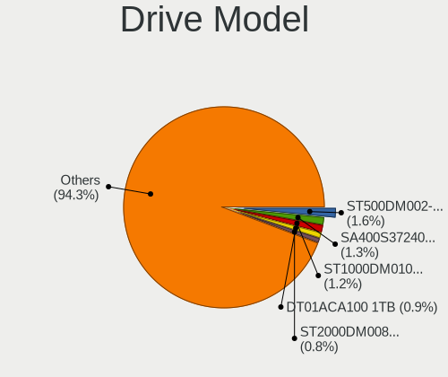
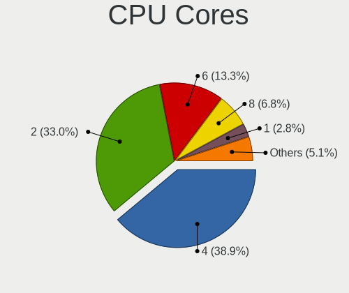
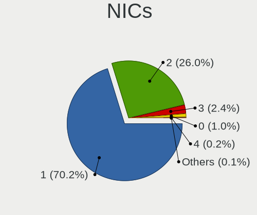
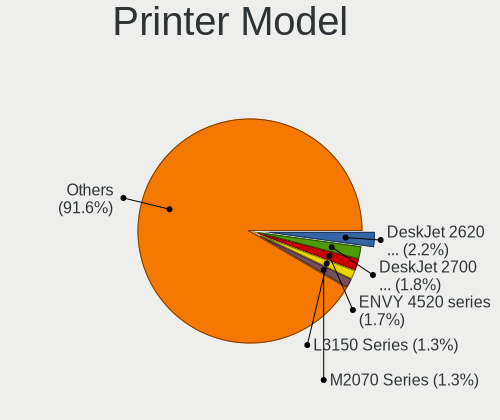

OpenMandriva - Tested Hardware & Statistics (Desktops)
------------------------------------------------------

A project to collect tested hardware configurations for OpenMandriva.

Anyone can contribute to this report by the [hw-probe](https://github.com/linuxhw/hw-probe) tool:

    sudo -E hw-probe -all -upload

Please contribute! Especially if your hardware is rare.

Contents
--------

* [ Test Cases ](#test-cases)

* [ System ](#system)
  - [ OS                       ](#os)
  - [ OS Family                ](#os-family)
  - [ Kernel                   ](#kernel)
  - [ Kernel Family            ](#kernel-family)
  - [ Kernel Major Ver.        ](#kernel-major-ver)
  - [ Arch                     ](#arch)
  - [ DE                       ](#de)
  - [ Display Server           ](#display-server)
  - [ Display Manager          ](#display-manager)
  - [ OS Lang                  ](#os-lang)
  - [ Boot Mode                ](#boot-mode)
  - [ Filesystem               ](#filesystem)
  - [ Part. scheme             ](#part-scheme)
  - [ Dual Boot with Linux/BSD ](#dual-boot-with-linuxbsd)
  - [ Dual Boot (Win)          ](#dual-boot-win)

* [ Board ](#board)
  - [ Vendor                   ](#vendor)
  - [ Model                    ](#model)
  - [ Model Family             ](#model-family)
  - [ MFG Year                 ](#mfg-year)
  - [ Form Factor              ](#form-factor)
  - [ Secure Boot              ](#secure-boot)
  - [ Coreboot                 ](#coreboot)
  - [ RAM Size                 ](#ram-size)
  - [ RAM Used                 ](#ram-used)
  - [ Total Drives             ](#total-drives)
  - [ Has CD-ROM               ](#has-cd-rom)
  - [ Has Ethernet             ](#has-ethernet)
  - [ Has WiFi                 ](#has-wifi)
  - [ Has Bluetooth            ](#has-bluetooth)

* [ Location ](#location)
  - [ Country                  ](#country)
  - [ City                     ](#city)

* [ Drives ](#drives)
  - [ Drive Vendor             ](#drive-vendor)
  - [ Drive Model              ](#drive-model)
  - [ HDD Vendor               ](#hdd-vendor)
  - [ SSD Vendor               ](#ssd-vendor)
  - [ Drive Kind               ](#drive-kind)
  - [ Drive Connector          ](#drive-connector)
  - [ Drive Size               ](#drive-size)
  - [ Space Total              ](#space-total)
  - [ Space Used               ](#space-used)
  - [ Malfunc. Drives          ](#malfunc-drives)
  - [ Malfunc. Drive Vendor    ](#malfunc-drive-vendor)
  - [ Malfunc. HDD Vendor      ](#malfunc-hdd-vendor)
  - [ Malfunc. Drive Kind      ](#malfunc-drive-kind)
  - [ Failed Drives            ](#failed-drives)
  - [ Failed Drive Vendor      ](#failed-drive-vendor)
  - [ Drive Status             ](#drive-status)

* [ Storage controller ](#storage-controller)
  - [ Storage Vendor           ](#storage-vendor)
  - [ Storage Model            ](#storage-model)
  - [ Storage Kind             ](#storage-kind)

* [ Processor ](#processor)
  - [ CPU Vendor               ](#cpu-vendor)
  - [ CPU Model                ](#cpu-model)
  - [ CPU Model Family         ](#cpu-model-family)
  - [ CPU Cores                ](#cpu-cores)
  - [ CPU Sockets              ](#cpu-sockets)
  - [ CPU Threads              ](#cpu-threads)
  - [ CPU Op-Modes             ](#cpu-op-modes)
  - [ CPU Microcode            ](#cpu-microcode)
  - [ CPU Microarch            ](#cpu-microarch)

* [ Graphics ](#graphics)
  - [ GPU Vendor               ](#gpu-vendor)
  - [ GPU Model                ](#gpu-model)
  - [ GPU Combo                ](#gpu-combo)
  - [ GPU Driver               ](#gpu-driver)
  - [ GPU Memory               ](#gpu-memory)

* [ Monitor ](#monitor)
  - [ Monitor Vendor           ](#monitor-vendor)
  - [ Monitor Model            ](#monitor-model)
  - [ Monitor Resolution       ](#monitor-resolution)
  - [ Monitor Diagonal         ](#monitor-diagonal)
  - [ Monitor Width            ](#monitor-width)
  - [ Aspect Ratio             ](#aspect-ratio)
  - [ Monitor Area             ](#monitor-area)
  - [ Pixel Density            ](#pixel-density)
  - [ Multiple Monitors        ](#multiple-monitors)

* [ Network ](#network)
  - [ Net Controller Vendor    ](#net-controller-vendor)
  - [ Net Controller Model     ](#net-controller-model)
  - [ Wireless Vendor          ](#wireless-vendor)
  - [ Wireless Model           ](#wireless-model)
  - [ Ethernet Vendor          ](#ethernet-vendor)
  - [ Ethernet Model           ](#ethernet-model)
  - [ Net Controller Kind      ](#net-controller-kind)
  - [ Used Controller          ](#used-controller)
  - [ NICs                     ](#nics)
  - [ IPv6                     ](#ipv6)

* [ Bluetooth ](#bluetooth)
  - [ Bluetooth Vendor         ](#bluetooth-vendor)
  - [ Bluetooth Model          ](#bluetooth-model)

* [ Sound ](#sound)
  - [ Sound Vendor             ](#sound-vendor)
  - [ Sound Model              ](#sound-model)

* [ Memory ](#memory)
  - [ Memory Vendor            ](#memory-vendor)
  - [ Memory Model             ](#memory-model)
  - [ Memory Kind              ](#memory-kind)
  - [ Memory Form Factor       ](#memory-form-factor)
  - [ Memory Size              ](#memory-size)
  - [ Memory Speed             ](#memory-speed)

* [ Printers & scanners ](#printers--scanners)
  - [ Printer Vendor           ](#printer-vendor)
  - [ Printer Model            ](#printer-model)
  - [ Scanner Vendor           ](#scanner-vendor)
  - [ Scanner Model            ](#scanner-model)

* [ Camera ](#camera)
  - [ Camera Vendor            ](#camera-vendor)
  - [ Camera Model             ](#camera-model)

* [ Security ](#security)
  - [ Fingerprint Vendor       ](#fingerprint-vendor)
  - [ Fingerprint Model        ](#fingerprint-model)
  - [ Chipcard Vendor          ](#chipcard-vendor)
  - [ Chipcard Model           ](#chipcard-model)

* [ Unsupported ](#unsupported)
  - [ Unsupported Devices      ](#unsupported-devices)
  - [ Unsupported Device Types ](#unsupported-device-types)

Test Cases
----------

Total: 4345

| Vendor        | Model                       | Probe                                                      | Date         |
|---------------|-----------------------------|------------------------------------------------------------|--------------|
| ASRock        | J5005-ITX                   | [783c72d32e](https://linux-hardware.org/?probe=783c72d32e) | Oct 01, 2022 |
| MSI           | MS-7235                     | [838e2c27f1](https://linux-hardware.org/?probe=838e2c27f1) | Oct 01, 2022 |
| Lenovo        | 0x30F617AA NOK              | [bb13b87bd5](https://linux-hardware.org/?probe=bb13b87bd5) | Oct 01, 2022 |
| MSI           | B350M PRO-VDH               | [1a0d8b695d](https://linux-hardware.org/?probe=1a0d8b695d) | Oct 01, 2022 |
| Lenovo        | 3098 NOK                    | [a46521af41](https://linux-hardware.org/?probe=a46521af41) | Oct 01, 2022 |
| Fujitsu       | D2990-A2 S26361-D2990-A2    | [982b143d73](https://linux-hardware.org/?probe=982b143d73) | Oct 01, 2022 |
| ASUSTek       | M5A78L-M LX                 | [d967f57569](https://linux-hardware.org/?probe=d967f57569) | Oct 01, 2022 |
| ASUSTek       | M5A87                       | [89ca067566](https://linux-hardware.org/?probe=89ca067566) | Oct 01, 2022 |
| Gigabyte      | GA-970A-D3                  | [8c24fa2271](https://linux-hardware.org/?probe=8c24fa2271) | Oct 01, 2022 |
| Gigabyte      | B360 AORUS GAMING 3-CF      | [87a1c21540](https://linux-hardware.org/?probe=87a1c21540) | Oct 01, 2022 |
| Intel         | H61                         | [37af3b0cdb](https://linux-hardware.org/?probe=37af3b0cdb) | Sep 30, 2022 |
| ASRock        | B450M Pro4-F                | [75b0aa3c75](https://linux-hardware.org/?probe=75b0aa3c75) | Sep 30, 2022 |
| Lenovo        | 0x36A017AA SDK0J40700 WI... | [a6b14fdcf3](https://linux-hardware.org/?probe=a6b14fdcf3) | Sep 30, 2022 |
| Acer          | Batman A01                  | [f8ebe348e4](https://linux-hardware.org/?probe=f8ebe348e4) | Sep 30, 2022 |
| ASUSTek       | PRIME B360M-A               | [f0eae50061](https://linux-hardware.org/?probe=f0eae50061) | Sep 30, 2022 |
| ASUSTek       | PRIME B450M-A               | [cfe1aba7e6](https://linux-hardware.org/?probe=cfe1aba7e6) | Sep 30, 2022 |
| ASUSTek       | P5KPL-AM EPU                | [66877298d4](https://linux-hardware.org/?probe=66877298d4) | Sep 30, 2022 |
| HP            | 3398                        | [c2190a0657](https://linux-hardware.org/?probe=c2190a0657) | Sep 29, 2022 |
| Dell          | 0Y5DDC A00                  | [f9efac58da](https://linux-hardware.org/?probe=f9efac58da) | Sep 29, 2022 |
| Huanan        | X79 (INTEL Xeon E5/Corei... | [a40d59533c](https://linux-hardware.org/?probe=a40d59533c) | Sep 29, 2022 |
| Acer          | Veriton M275                | [f871926a8e](https://linux-hardware.org/?probe=f871926a8e) | Sep 29, 2022 |
| Intel         | DQ67SW AAG12527-310         | [235930defb](https://linux-hardware.org/?probe=235930defb) | Sep 28, 2022 |
| Gigabyte      | Z87X-UD5H-CF                | [5a7ad7dba9](https://linux-hardware.org/?probe=5a7ad7dba9) | Sep 28, 2022 |
| ASUSTek       | M5A97 LE R2.0               | [372cdc3726](https://linux-hardware.org/?probe=372cdc3726) | Sep 28, 2022 |
| HP            | 18E7                        | [132a87f746](https://linux-hardware.org/?probe=132a87f746) | Sep 28, 2022 |
| Gigabyte      | 970A-DS3P                   | [ada186ce05](https://linux-hardware.org/?probe=ada186ce05) | Sep 27, 2022 |
| Biostar       | A10N-8800E                  | [d27bf09dc8](https://linux-hardware.org/?probe=d27bf09dc8) | Sep 27, 2022 |
| HP            | 844C                        | [51cb0bca57](https://linux-hardware.org/?probe=51cb0bca57) | Sep 27, 2022 |
| HP            | 0A60h                       | [ccb90a4b31](https://linux-hardware.org/?probe=ccb90a4b31) | Sep 27, 2022 |
| ASUSTek       | PRIME Z690-P D4             | [3bafc34ffc](https://linux-hardware.org/?probe=3bafc34ffc) | Sep 27, 2022 |
| MSI           | MAG B460 TOMAHAWK           | [a213c6d22a](https://linux-hardware.org/?probe=a213c6d22a) | Sep 26, 2022 |
| ASUSTek       | P7H55-M LX                  | [8d3b235d4c](https://linux-hardware.org/?probe=8d3b235d4c) | Sep 25, 2022 |
| Gigabyte      | B450 AORUS ELITE            | [8749a17d26](https://linux-hardware.org/?probe=8749a17d26) | Sep 25, 2022 |
| ASUSTek       | CM1740                      | [6ebc913933](https://linux-hardware.org/?probe=6ebc913933) | Sep 25, 2022 |
| BESSTAR Te... | UM350                       | [8442ff18ca](https://linux-hardware.org/?probe=8442ff18ca) | Sep 24, 2022 |
| Dell          | 0NV0M7 A02                  | [02925c7220](https://linux-hardware.org/?probe=02925c7220) | Sep 24, 2022 |
| MSI           | Z390-A PRO                  | [e78a82387b](https://linux-hardware.org/?probe=e78a82387b) | Sep 24, 2022 |
| HP            | 198E                        | [ffa9a79cc0](https://linux-hardware.org/?probe=ffa9a79cc0) | Sep 24, 2022 |
| ASRock        | X300M-STX                   | [c354f2b293](https://linux-hardware.org/?probe=c354f2b293) | Sep 24, 2022 |
| Unknown       | WZBTDT1 R110                | [8b6b5af31a](https://linux-hardware.org/?probe=8b6b5af31a) | Sep 24, 2022 |
| Intel         | DG41WV AAE90316-103         | [425dd57672](https://linux-hardware.org/?probe=425dd57672) | Sep 24, 2022 |
| ASUSTek       | PRIME A320M-K               | [815fe42722](https://linux-hardware.org/?probe=815fe42722) | Sep 23, 2022 |
| Dell          | 0M5DCD A00                  | [991137f04f](https://linux-hardware.org/?probe=991137f04f) | Sep 23, 2022 |
| HP            | 0AA8h                       | [9c02e3fc31](https://linux-hardware.org/?probe=9c02e3fc31) | Sep 23, 2022 |
| Dell          | 0PTTT9 A00                  | [21bde061e9](https://linux-hardware.org/?probe=21bde061e9) | Sep 23, 2022 |
| Lenovo        | ThinkCentre M58p 6137CR4    | [72e0bfca3b](https://linux-hardware.org/?probe=72e0bfca3b) | Sep 23, 2022 |
| Lenovo        | ThinkCentre Edge71 1578D... | [95dded89b8](https://linux-hardware.org/?probe=95dded89b8) | Sep 23, 2022 |
| ASUSTek       | PRIME B560M-A AC            | [a99682c38d](https://linux-hardware.org/?probe=a99682c38d) | Sep 23, 2022 |
| HP            | 1998                        | [f8399e0d3a](https://linux-hardware.org/?probe=f8399e0d3a) | Sep 22, 2022 |
| ASUSTek       | B85M-E                      | [07477a078f](https://linux-hardware.org/?probe=07477a078f) | Sep 22, 2022 |
| MSI           | Z370 GAMING PRO CARBON      | [978c6dd9dd](https://linux-hardware.org/?probe=978c6dd9dd) | Sep 21, 2022 |
| HP            | 1998                        | [5148539ae1](https://linux-hardware.org/?probe=5148539ae1) | Sep 21, 2022 |
| MACHINIST     | B75 PRO V1.0                | [752cb8efae](https://linux-hardware.org/?probe=752cb8efae) | Sep 21, 2022 |
| Gigabyte      | GA-780T-D3L                 | [3e0939e549](https://linux-hardware.org/?probe=3e0939e549) | Sep 20, 2022 |
| Gigabyte      | H61M-S2PV                   | [a82f4ceccc](https://linux-hardware.org/?probe=a82f4ceccc) | Sep 20, 2022 |
| Lenovo        | MAHOBAY Win8 STD MM DPK ... | [4d5fc6b39f](https://linux-hardware.org/?probe=4d5fc6b39f) | Sep 20, 2022 |
| MSI           | X470 GAMING PLUS MAX        | [9c483616f6](https://linux-hardware.org/?probe=9c483616f6) | Sep 20, 2022 |
| Lenovo        | 3728 SDK0R32862 WIN 3258... | [d78d85bde3](https://linux-hardware.org/?probe=d78d85bde3) | Sep 20, 2022 |
| HP            | 2B34                        | [a9e82bbb40](https://linux-hardware.org/?probe=a9e82bbb40) | Sep 19, 2022 |
| ECS           | A55F2-M4                    | [335d28e72c](https://linux-hardware.org/?probe=335d28e72c) | Sep 19, 2022 |
| ASUSTek       | M5A88-V EVO                 | [9dc35eec1a](https://linux-hardware.org/?probe=9dc35eec1a) | Sep 19, 2022 |
| ASUSTek       | PRIME B550M-K               | [f5fb874e1e](https://linux-hardware.org/?probe=f5fb874e1e) | Sep 18, 2022 |
| HP            | 2B29                        | [391e407d29](https://linux-hardware.org/?probe=391e407d29) | Sep 18, 2022 |
| ASRock        | A75M-HVS                    | [7f906bad42](https://linux-hardware.org/?probe=7f906bad42) | Sep 18, 2022 |
| HP            | 843F                        | [7694ed2ffa](https://linux-hardware.org/?probe=7694ed2ffa) | Sep 18, 2022 |
| ASUSTek       | P8P67                       | [a790b35cc1](https://linux-hardware.org/?probe=a790b35cc1) | Sep 17, 2022 |
| Gigabyte      | GA-78LMT-S2                 | [f75308c465](https://linux-hardware.org/?probe=f75308c465) | Sep 17, 2022 |
| MSI           | MAG B550 TOMAHAWK           | [e55484acd4](https://linux-hardware.org/?probe=e55484acd4) | Sep 17, 2022 |
| Intel         | H61                         | [d1b17183d7](https://linux-hardware.org/?probe=d1b17183d7) | Sep 16, 2022 |
| HP            | 82F2 A01                    | [f97faeff54](https://linux-hardware.org/?probe=f97faeff54) | Sep 16, 2022 |
| ASUSTek       | M5A97 LE R2.0               | [52fe410fe3](https://linux-hardware.org/?probe=52fe410fe3) | Sep 16, 2022 |
| Gigabyte      | G41MT-S2PT                  | [8366bd494c](https://linux-hardware.org/?probe=8366bd494c) | Sep 14, 2022 |
| BESSTAR Te... | HM50                        | [a2632415a2](https://linux-hardware.org/?probe=a2632415a2) | Sep 14, 2022 |
| HP            | 1495                        | [462389df36](https://linux-hardware.org/?probe=462389df36) | Sep 14, 2022 |
| ASUSTek       | Maximus VIII RANGER         | [832824de54](https://linux-hardware.org/?probe=832824de54) | Sep 14, 2022 |
| HP            | 1496                        | [cb6033fc21](https://linux-hardware.org/?probe=cb6033fc21) | Sep 14, 2022 |
| ASUSTek       | ProArt B550-CREATOR         | [6ee9d3e2c4](https://linux-hardware.org/?probe=6ee9d3e2c4) | Sep 14, 2022 |
| Gigabyte      | F2A88X-D3H                  | [06d4572f5e](https://linux-hardware.org/?probe=06d4572f5e) | Sep 14, 2022 |
| ASUSTek       | H81M-A/BR                   | [daab24c8b6](https://linux-hardware.org/?probe=daab24c8b6) | Sep 14, 2022 |
| ASUSTek       | PRIME H310M-E R2.0          | [331a481ab0](https://linux-hardware.org/?probe=331a481ab0) | Sep 14, 2022 |
| Lenovo        | ThinkCentre M71e 3157AE2    | [d88e0026dc](https://linux-hardware.org/?probe=d88e0026dc) | Sep 14, 2022 |
| Gigabyte      | X570 AORUS PRO              | [7858c98403](https://linux-hardware.org/?probe=7858c98403) | Sep 13, 2022 |
| Lenovo        | SHARKBAY NOK                | [bfd4a6b00a](https://linux-hardware.org/?probe=bfd4a6b00a) | Sep 13, 2022 |
| MSI           | Z97 MPOWER                  | [a98aedda05](https://linux-hardware.org/?probe=a98aedda05) | Sep 13, 2022 |
| ASUSTek       | PRIME H310-PLUS             | [0937dcb89c](https://linux-hardware.org/?probe=0937dcb89c) | Sep 12, 2022 |
| ASRock        | X99 Taichi                  | [2eb979e980](https://linux-hardware.org/?probe=2eb979e980) | Sep 12, 2022 |
| Dell          | 0H8052                      | [1ade497706](https://linux-hardware.org/?probe=1ade497706) | Sep 12, 2022 |
| Gigabyte      | EX58-UD3R                   | [e482e214bd](https://linux-hardware.org/?probe=e482e214bd) | Sep 12, 2022 |
| Shuttle       | XH310V2                     | [c99efae947](https://linux-hardware.org/?probe=c99efae947) | Sep 12, 2022 |
| MSI           | MAG Z390M MORTAR            | [175f37281b](https://linux-hardware.org/?probe=175f37281b) | Sep 12, 2022 |
| HP            | 158B                        | [ba2366e9ad](https://linux-hardware.org/?probe=ba2366e9ad) | Sep 12, 2022 |
| ASRock        | B450M-HDV R4.0              | [73684f0e47](https://linux-hardware.org/?probe=73684f0e47) | Sep 12, 2022 |
| Intel         | D945GCNL AAD97184-106       | [a2bdc2d18c](https://linux-hardware.org/?probe=a2bdc2d18c) | Sep 11, 2022 |
| HP            | 304Bh                       | [0a7bcbdd9e](https://linux-hardware.org/?probe=0a7bcbdd9e) | Sep 11, 2022 |
| ASUSTek       | PRIME H310M-E R2.0          | [b76fc41706](https://linux-hardware.org/?probe=b76fc41706) | Sep 11, 2022 |
| MSI           | B560M PRO                   | [6c43058545](https://linux-hardware.org/?probe=6c43058545) | Sep 11, 2022 |
| Lenovo        | 3708 SDK0J40700 WIN 3258... | [4db3f9151e](https://linux-hardware.org/?probe=4db3f9151e) | Sep 11, 2022 |
| MSI           | A68HM-E33 V2                | [0225ec89d7](https://linux-hardware.org/?probe=0225ec89d7) | Sep 11, 2022 |
| ASUSTek       | ROG CROSSHAIR VIII DARK ... | [6168b7089f](https://linux-hardware.org/?probe=6168b7089f) | Sep 11, 2022 |
| MSI           | 0A48                        | [2619140b48](https://linux-hardware.org/?probe=2619140b48) | Sep 10, 2022 |
| Dell          | 01TKCC A01                  | [6d032338c0](https://linux-hardware.org/?probe=6d032338c0) | Sep 10, 2022 |
| Gigabyte      | GB-BRR7H-4800               | [5fb806b2c8](https://linux-hardware.org/?probe=5fb806b2c8) | Sep 10, 2022 |
| ASUSTek       | P8B75-M LX                  | [0533bc0e86](https://linux-hardware.org/?probe=0533bc0e86) | Sep 10, 2022 |
| HP            | 3396                        | [964f32cccf](https://linux-hardware.org/?probe=964f32cccf) | Sep 10, 2022 |
| Dell          | 03NVJ6 A00                  | [ef8c1a9dee](https://linux-hardware.org/?probe=ef8c1a9dee) | Sep 10, 2022 |
| ASRock        | G41M-VS3                    | [021bcda428](https://linux-hardware.org/?probe=021bcda428) | Sep 10, 2022 |
| Gigabyte      | Z68AP-D3                    | [1ac8cbcc47](https://linux-hardware.org/?probe=1ac8cbcc47) | Sep 10, 2022 |
| Dell          | 0J3C2F A00                  | [40c43aff10](https://linux-hardware.org/?probe=40c43aff10) | Sep 10, 2022 |
| Apple         | Mac-F221BEC8                | [c0353e7c9e](https://linux-hardware.org/?probe=c0353e7c9e) | Sep 09, 2022 |
| ASUSTek       | TUF Gaming B460M-PLUS       | [cd84312899](https://linux-hardware.org/?probe=cd84312899) | Sep 09, 2022 |
| ASUSTek       | ROG CROSSHAIR VIII HERO     | [36b349b529](https://linux-hardware.org/?probe=36b349b529) | Sep 09, 2022 |
| Dell          | 0M5DCD A00                  | [1a5c8e32b7](https://linux-hardware.org/?probe=1a5c8e32b7) | Sep 09, 2022 |
| Gigabyte      | A520M DS3H                  | [036c262ad4](https://linux-hardware.org/?probe=036c262ad4) | Sep 08, 2022 |
| Dell          | 0MN1TX A02                  | [c9d50b8db9](https://linux-hardware.org/?probe=c9d50b8db9) | Sep 08, 2022 |
| Intel         | D33217CK G76541-301         | [1f1e6e67ab](https://linux-hardware.org/?probe=1f1e6e67ab) | Sep 07, 2022 |
| ASRock        | Z170 Extreme4               | [70e3d85420](https://linux-hardware.org/?probe=70e3d85420) | Sep 07, 2022 |
| MSI           | IONA                        | [11d081dfc3](https://linux-hardware.org/?probe=11d081dfc3) | Sep 07, 2022 |
| Positivo      | POS-PQ45AU                  | [2770dcd81a](https://linux-hardware.org/?probe=2770dcd81a) | Sep 07, 2022 |
| Unknown       | GSUO H61V10C                | [4eeb38bb0a](https://linux-hardware.org/?probe=4eeb38bb0a) | Sep 07, 2022 |
| ASRock        | J3355B-ITX                  | [1cf7076b74](https://linux-hardware.org/?probe=1cf7076b74) | Sep 07, 2022 |
| Gigabyte      | VM900M                      | [c6eefaabf9](https://linux-hardware.org/?probe=c6eefaabf9) | Sep 07, 2022 |
| MSI           | A320M PRO-M2 V2             | [c211642362](https://linux-hardware.org/?probe=c211642362) | Sep 06, 2022 |
| Gigabyte      | Z390 UD                     | [01ab1f5015](https://linux-hardware.org/?probe=01ab1f5015) | Sep 06, 2022 |
| ASUSTek       | P8H61-M LE/USB3             | [8a66fbdadd](https://linux-hardware.org/?probe=8a66fbdadd) | Sep 06, 2022 |
| ECS           | GeForce 8000 series         | [7a60cea111](https://linux-hardware.org/?probe=7a60cea111) | Sep 06, 2022 |
| ASRock        | H61M-DGS                    | [51b15f6d34](https://linux-hardware.org/?probe=51b15f6d34) | Sep 06, 2022 |
| ASUSTek       | ET2040I                     | [44ab433428](https://linux-hardware.org/?probe=44ab433428) | Sep 06, 2022 |
| Gigabyte      | 970A-DS3P                   | [537708f71a](https://linux-hardware.org/?probe=537708f71a) | Sep 06, 2022 |
| HP            | 18E4                        | [2c113164fd](https://linux-hardware.org/?probe=2c113164fd) | Sep 05, 2022 |
| Pegatron      | NARRA5                      | [b5e07ae97b](https://linux-hardware.org/?probe=b5e07ae97b) | Sep 05, 2022 |
| MSI           | B85M-E43 DASH               | [f52a53f4a7](https://linux-hardware.org/?probe=f52a53f4a7) | Sep 05, 2022 |
| Unknown       | SKYBAY                      | [6098d39f63](https://linux-hardware.org/?probe=6098d39f63) | Sep 05, 2022 |
| Gigabyte      | 990FXA-UD3                  | [a132b449e4](https://linux-hardware.org/?probe=a132b449e4) | Sep 05, 2022 |
| Gigabyte      | G31M-ES2L                   | [49bd6dbb99](https://linux-hardware.org/?probe=49bd6dbb99) | Sep 05, 2022 |
| ECS           | GeForce 8000 series         | [0e44b5b729](https://linux-hardware.org/?probe=0e44b5b729) | Sep 05, 2022 |
| MSI           | B350M PRO-VDH               | [ac68238341](https://linux-hardware.org/?probe=ac68238341) | Sep 05, 2022 |
| HP            | 8076                        | [e6fa33cc02](https://linux-hardware.org/?probe=e6fa33cc02) | Sep 05, 2022 |
| ASRock        | B450 Pro4                   | [4d5b865aed](https://linux-hardware.org/?probe=4d5b865aed) | Sep 05, 2022 |
| Unknown       | Unknown                     | [e2115bf207](https://linux-hardware.org/?probe=e2115bf207) | Sep 05, 2022 |
| PCWare        | IPMH61R3                    | [1cbe0ee116](https://linux-hardware.org/?probe=1cbe0ee116) | Sep 04, 2022 |
| ASUSTek       | SABERTOOTH Z77              | [b36d7be7c1](https://linux-hardware.org/?probe=b36d7be7c1) | Sep 04, 2022 |
| HP            | 304Bh                       | [d395dd6c91](https://linux-hardware.org/?probe=d395dd6c91) | Sep 04, 2022 |
| Gigabyte      | H97N-WIFI                   | [fb64be85f1](https://linux-hardware.org/?probe=fb64be85f1) | Sep 04, 2022 |
| Dell          | 09KPNV A01                  | [b5cc00787f](https://linux-hardware.org/?probe=b5cc00787f) | Sep 04, 2022 |
| ASUSTek       | P5G41T-M LX2/GB             | [792cbc3418](https://linux-hardware.org/?probe=792cbc3418) | Sep 04, 2022 |
| HP            | 8767 A                      | [33800541e3](https://linux-hardware.org/?probe=33800541e3) | Sep 04, 2022 |
| Gigabyte      | B560 AORUS PRO AX           | [fbd2e39516](https://linux-hardware.org/?probe=fbd2e39516) | Sep 04, 2022 |
| ECS           | H61H-G11/7.0                | [790b93cbee](https://linux-hardware.org/?probe=790b93cbee) | Sep 03, 2022 |
| Unknown       | Intel X79                   | [9e666e1530](https://linux-hardware.org/?probe=9e666e1530) | Sep 02, 2022 |
| Intel         | DH61WW AAG23116-204         | [3310a4c592](https://linux-hardware.org/?probe=3310a4c592) | Sep 02, 2022 |
| HP            | 8053                        | [2e48f3f13e](https://linux-hardware.org/?probe=2e48f3f13e) | Sep 02, 2022 |
| Dell          | 0TP412                      | [73ec9dcd98](https://linux-hardware.org/?probe=73ec9dcd98) | Sep 02, 2022 |
| Gigabyte      | 945GCM-S2L                  | [99613365f5](https://linux-hardware.org/?probe=99613365f5) | Sep 01, 2022 |
| Gigabyte      | 970A-DS3P                   | [5ba20eb04b](https://linux-hardware.org/?probe=5ba20eb04b) | Sep 01, 2022 |
| ASRock        | A320M-DVS R4.0              | [143e6e1816](https://linux-hardware.org/?probe=143e6e1816) | Sep 01, 2022 |
| Gigabyte      | Z590 GAMING X               | [b84d0acafb](https://linux-hardware.org/?probe=b84d0acafb) | Sep 01, 2022 |
| Lenovo        | ThinkCentre M58e 7408BA5    | [4384314f98](https://linux-hardware.org/?probe=4384314f98) | Sep 01, 2022 |
| Foxconn       | 2ABF                        | [c9a801a4d2](https://linux-hardware.org/?probe=c9a801a4d2) | Sep 01, 2022 |
| ASRock        | B450M Pro4-F                | [d48b9efca4](https://linux-hardware.org/?probe=d48b9efca4) | Sep 01, 2022 |
| ASRock        | X99 Taichi                  | [4cd4bf6c89](https://linux-hardware.org/?probe=4cd4bf6c89) | Sep 01, 2022 |
| ASRock        | B550M-ITX/ac                | [7850c07cdc](https://linux-hardware.org/?probe=7850c07cdc) | Aug 31, 2022 |
| MSI           | H510M-A PRO                 | [120400698e](https://linux-hardware.org/?probe=120400698e) | Aug 31, 2022 |
| Vorke         | V1 Plus                     | [0f36a3adcb](https://linux-hardware.org/?probe=0f36a3adcb) | Aug 31, 2022 |
| Dell          | 040DDP A00                  | [09ffe165d3](https://linux-hardware.org/?probe=09ffe165d3) | Aug 30, 2022 |
| MSI           | Z97 GAMING 7                | [c9ebe69583](https://linux-hardware.org/?probe=c9ebe69583) | Aug 30, 2022 |
| ASRock        | N68C-S UCC                  | [f3389e42f8](https://linux-hardware.org/?probe=f3389e42f8) | Aug 30, 2022 |
| Gigabyte      | VM900M                      | [f446d835da](https://linux-hardware.org/?probe=f446d835da) | Aug 30, 2022 |
| Dell          | 0R230R A00                  | [0ea749e83c](https://linux-hardware.org/?probe=0ea749e83c) | Aug 30, 2022 |
| HP            | 0A60h                       | [d801f7cb0c](https://linux-hardware.org/?probe=d801f7cb0c) | Aug 30, 2022 |
| MSI           | MAG X570S TOMAHAWK MAX W... | [33aaa7baf4](https://linux-hardware.org/?probe=33aaa7baf4) | Aug 29, 2022 |
| Lenovo        | ThinkCentre M91p 4518AU8    | [0099ab3432](https://linux-hardware.org/?probe=0099ab3432) | Aug 29, 2022 |
| Lenovo        | ThinkCentre M58p 6234CL2    | [14449a705a](https://linux-hardware.org/?probe=14449a705a) | Aug 29, 2022 |
| ASUSTek       | SABERTOOTH X58              | [efb40be4e1](https://linux-hardware.org/?probe=efb40be4e1) | Aug 28, 2022 |
| ASUSTek       | A88XM-A                     | [d8a4e4d954](https://linux-hardware.org/?probe=d8a4e4d954) | Aug 28, 2022 |
| Medion        | B460H6-EM                   | [91371e505d](https://linux-hardware.org/?probe=91371e505d) | Aug 28, 2022 |
| Gigabyte      | GA-MA78LMT-S2               | [a18db0fafd](https://linux-hardware.org/?probe=a18db0fafd) | Aug 27, 2022 |
| ASUSTek       | P8B WS                      | [5f89ab0d00](https://linux-hardware.org/?probe=5f89ab0d00) | Aug 27, 2022 |
| Fujitsu       | D3061-A1 S26361-D3061-A1    | [f74dc71ad8](https://linux-hardware.org/?probe=f74dc71ad8) | Aug 27, 2022 |
| ASRock        | A320M-HDV R4.0              | [67712f11d9](https://linux-hardware.org/?probe=67712f11d9) | Aug 27, 2022 |
| ASUSTek       | PRIME Z390-A                | [459c7c1eee](https://linux-hardware.org/?probe=459c7c1eee) | Aug 27, 2022 |
| MSI           | G31TM-P21                   | [cf0bc232f5](https://linux-hardware.org/?probe=cf0bc232f5) | Aug 26, 2022 |
| ASRock        | FM2A68M-HD+                 | [22cc477cd2](https://linux-hardware.org/?probe=22cc477cd2) | Aug 26, 2022 |
| MSI           | 760GM-P21                   | [7e45cde899](https://linux-hardware.org/?probe=7e45cde899) | Aug 26, 2022 |
| HP            | 1497                        | [82e518a338](https://linux-hardware.org/?probe=82e518a338) | Aug 26, 2022 |
| ASUSTek       | M5A78L LE                   | [e4a6425675](https://linux-hardware.org/?probe=e4a6425675) | Aug 26, 2022 |
| HP            | 8509                        | [0656e40cba](https://linux-hardware.org/?probe=0656e40cba) | Aug 26, 2022 |
| NCR           | Pocono                      | [c209b1443a](https://linux-hardware.org/?probe=c209b1443a) | Aug 25, 2022 |
| Dell          | 0RJ290                      | [ca82162ed5](https://linux-hardware.org/?probe=ca82162ed5) | Aug 25, 2022 |
| Acer          | Aspire XC-710 V:1.1         | [0b76e0f97d](https://linux-hardware.org/?probe=0b76e0f97d) | Aug 25, 2022 |
| Foxconn       | H61M/H61M-S                 | [18e7da32e9](https://linux-hardware.org/?probe=18e7da32e9) | Aug 25, 2022 |
| ASRock        | N68C-GS4 FX                 | [0462079328](https://linux-hardware.org/?probe=0462079328) | Aug 25, 2022 |
| ASUSTek       | PRIME B350M-A               | [1c98247f4c](https://linux-hardware.org/?probe=1c98247f4c) | Aug 25, 2022 |
| OEM           | A320                        | [4dffd629cf](https://linux-hardware.org/?probe=4dffd629cf) | Aug 25, 2022 |
| ASUSTek       | TUF Gaming X570-PLUS        | [d1cae6aca8](https://linux-hardware.org/?probe=d1cae6aca8) | Aug 24, 2022 |
| HP            | 21D0                        | [1bd58d519c](https://linux-hardware.org/?probe=1bd58d519c) | Aug 24, 2022 |
| Gigabyte      | Z68A-D3H-B3                 | [e75751c55b](https://linux-hardware.org/?probe=e75751c55b) | Aug 24, 2022 |
| ASUSTek       | TUF Gaming B450-PLUS II     | [7332174749](https://linux-hardware.org/?probe=7332174749) | Aug 24, 2022 |
| Gigabyte      | F2A68HM-H                   | [c824203d0a](https://linux-hardware.org/?probe=c824203d0a) | Aug 24, 2022 |
| Dell          | 08HPGT A01                  | [744f838dc2](https://linux-hardware.org/?probe=744f838dc2) | Aug 24, 2022 |
| ICP / iEi     | B217 V1.0                   | [9b540ece9f](https://linux-hardware.org/?probe=9b540ece9f) | Aug 23, 2022 |
| Gigabyte      | B550M AORUS PRO-P           | [7dae220687](https://linux-hardware.org/?probe=7dae220687) | Aug 23, 2022 |
| ASUSTek       | P8H61-M LX2 R2.0            | [5754d37860](https://linux-hardware.org/?probe=5754d37860) | Aug 23, 2022 |
| ASUSTek       | M4N68T-M-V2                 | [1528da74f6](https://linux-hardware.org/?probe=1528da74f6) | Aug 22, 2022 |
| ASUSTek       | P5KPL-CM                    | [53a4b425d3](https://linux-hardware.org/?probe=53a4b425d3) | Aug 22, 2022 |
| Dell          | 0YJPT1 A00                  | [1de0aeba8f](https://linux-hardware.org/?probe=1de0aeba8f) | Aug 22, 2022 |
| ASUSTek       | PRIME Z390-P                | [ca7534d4dc](https://linux-hardware.org/?probe=ca7534d4dc) | Aug 22, 2022 |
| HP            | 82B4                        | [e3200ae579](https://linux-hardware.org/?probe=e3200ae579) | Aug 22, 2022 |
| ASUSTek       | M5A78L-M/USB3               | [fa5f1121d5](https://linux-hardware.org/?probe=fa5f1121d5) | Aug 22, 2022 |
| Intel         | H61                         | [f0a810114c](https://linux-hardware.org/?probe=f0a810114c) | Aug 22, 2022 |
| MSI           | MPG X570 GAMING PLUS        | [e064c453da](https://linux-hardware.org/?probe=e064c453da) | Aug 21, 2022 |
| ASUSTek       | Z87-C                       | [8de83c544f](https://linux-hardware.org/?probe=8de83c544f) | Aug 21, 2022 |
| HP            | 1998                        | [69b6b04268](https://linux-hardware.org/?probe=69b6b04268) | Aug 21, 2022 |
| ASRock        | N68C-S UCC                  | [bb19c0586c](https://linux-hardware.org/?probe=bb19c0586c) | Aug 20, 2022 |
| Gigabyte      | B365M DS3H WIFI             | [142e25352d](https://linux-hardware.org/?probe=142e25352d) | Aug 20, 2022 |
| Packard Be... | PT890-8237A                 | [36a4120390](https://linux-hardware.org/?probe=36a4120390) | Aug 20, 2022 |
| ASUSTek       | PRIME B450M-A II            | [56a34e0816](https://linux-hardware.org/?probe=56a34e0816) | Aug 20, 2022 |
| ASUSTek       | P5KPL-SE                    | [2925e63a87](https://linux-hardware.org/?probe=2925e63a87) | Aug 20, 2022 |
| AZW           | MII-V                       | [59698f6b33](https://linux-hardware.org/?probe=59698f6b33) | Aug 20, 2022 |
| OEM           | Intel H81                   | [5e354c60d1](https://linux-hardware.org/?probe=5e354c60d1) | Aug 20, 2022 |
| Dell          | 0XHGV1 A01                  | [b05fac6451](https://linux-hardware.org/?probe=b05fac6451) | Aug 19, 2022 |
| ASUSTek       | P5KPL-VM                    | [803031cd3b](https://linux-hardware.org/?probe=803031cd3b) | Aug 19, 2022 |
| Gigabyte      | B450M S2H                   | [a0a7a845e3](https://linux-hardware.org/?probe=a0a7a845e3) | Aug 18, 2022 |
| Gigabyte      | P43-ES3G                    | [de6e02672c](https://linux-hardware.org/?probe=de6e02672c) | Aug 18, 2022 |
| ASUSTek       | PRIME Z390-A                | [859884934f](https://linux-hardware.org/?probe=859884934f) | Aug 17, 2022 |
| Acer          | MRS600M                     | [ec4c10d06e](https://linux-hardware.org/?probe=ec4c10d06e) | Aug 17, 2022 |
| ASUSTek       | PRIME B250-PRO              | [870d7102f5](https://linux-hardware.org/?probe=870d7102f5) | Aug 17, 2022 |
| Gigabyte      | H410M S2 V2                 | [944a99ea66](https://linux-hardware.org/?probe=944a99ea66) | Aug 17, 2022 |
| Gigabyte      | B450 AORUS PRO-CF           | [3ab7d6393c](https://linux-hardware.org/?probe=3ab7d6393c) | Aug 17, 2022 |
| Gigabyte      | H81M-S2PH                   | [c8f8e78df8](https://linux-hardware.org/?probe=c8f8e78df8) | Aug 17, 2022 |
| Gigabyte      | B460M DS3H                  | [2b97e09efa](https://linux-hardware.org/?probe=2b97e09efa) | Aug 17, 2022 |
| Fujitsu       | D3233-A1 S26361-D3233-A1    | [7b3d6b544c](https://linux-hardware.org/?probe=7b3d6b544c) | Aug 16, 2022 |
| Dell          | 0T656F A01                  | [ec4014a549](https://linux-hardware.org/?probe=ec4014a549) | Aug 16, 2022 |
| Dell          | 0GM819                      | [f7745d3d3a](https://linux-hardware.org/?probe=f7745d3d3a) | Aug 16, 2022 |
| ASRock        | B450 Pro4                   | [79f5c08bff](https://linux-hardware.org/?probe=79f5c08bff) | Aug 15, 2022 |
| Gigabyte      | B550 AORUS ELITE            | [08e3444b3c](https://linux-hardware.org/?probe=08e3444b3c) | Aug 15, 2022 |
| HP            | 2AE2                        | [1fd0bb70dc](https://linux-hardware.org/?probe=1fd0bb70dc) | Aug 15, 2022 |
| Dell          | 0C27VV A01                  | [04f75d45cb](https://linux-hardware.org/?probe=04f75d45cb) | Aug 15, 2022 |
| ASUSTek       | PRIME B450M-A II            | [4ba26713bc](https://linux-hardware.org/?probe=4ba26713bc) | Aug 15, 2022 |
| Gigabyte      | P43-ES3G                    | [2b0691bddd](https://linux-hardware.org/?probe=2b0691bddd) | Aug 15, 2022 |
| Dell          | 0PC5F7 A03                  | [56ee42afe3](https://linux-hardware.org/?probe=56ee42afe3) | Aug 15, 2022 |
| Dell          | 0NC2VH A01                  | [170b178361](https://linux-hardware.org/?probe=170b178361) | Aug 15, 2022 |
| HP            | 18E7                        | [06374a6240](https://linux-hardware.org/?probe=06374a6240) | Aug 14, 2022 |
| ASRock        | 960GM-VGS3 FX               | [55c4e8059c](https://linux-hardware.org/?probe=55c4e8059c) | Aug 14, 2022 |
| ASUSTek       | P8H61-M LX3                 | [7c37c2a6d7](https://linux-hardware.org/?probe=7c37c2a6d7) | Aug 14, 2022 |
| MSI           | X570-A PRO                  | [30146876c6](https://linux-hardware.org/?probe=30146876c6) | Aug 14, 2022 |
| Unknown       | 1.0                         | [35d076bae0](https://linux-hardware.org/?probe=35d076bae0) | Aug 14, 2022 |
| ASRock        | J3455-ITX                   | [4386fccad1](https://linux-hardware.org/?probe=4386fccad1) | Aug 14, 2022 |
| Lenovo        | SHARKBAY NOK                | [ee169e47b3](https://linux-hardware.org/?probe=ee169e47b3) | Aug 13, 2022 |
| Dell          | 08WKV3 A00                  | [4e57c20454](https://linux-hardware.org/?probe=4e57c20454) | Aug 13, 2022 |
| Lenovo        | ThinkCentre XXXX 739527G    | [ca5fe11e2c](https://linux-hardware.org/?probe=ca5fe11e2c) | Aug 13, 2022 |
| ASUSTek       | ROG STRIX B365-F GAMING     | [1ae946a847](https://linux-hardware.org/?probe=1ae946a847) | Aug 13, 2022 |
| ASUSTek       | PRIME B450M-A II            | [fd41ccab04](https://linux-hardware.org/?probe=fd41ccab04) | Aug 13, 2022 |
| ASUSTek       | PRIME B450M-A II            | [32bf5bd8b8](https://linux-hardware.org/?probe=32bf5bd8b8) | Aug 13, 2022 |
| HP            | 1850                        | [33933e3e5d](https://linux-hardware.org/?probe=33933e3e5d) | Aug 12, 2022 |
| ASRock        | H61M-DGS                    | [50b7221c5a](https://linux-hardware.org/?probe=50b7221c5a) | Aug 12, 2022 |
| ASUSTek       | PRIME B450M-A II            | [bc32ff70b7](https://linux-hardware.org/?probe=bc32ff70b7) | Aug 12, 2022 |
| Gigabyte      | EP35C-DS3R                  | [762d78160d](https://linux-hardware.org/?probe=762d78160d) | Aug 12, 2022 |
| MSI           | A68HM-E33 V2                | [2f3db9cd91](https://linux-hardware.org/?probe=2f3db9cd91) | Aug 12, 2022 |
| ASRock        | Z97M Pro4                   | [245d189a61](https://linux-hardware.org/?probe=245d189a61) | Aug 11, 2022 |
| MSI           | MPG Z390 GAMING PLUS        | [73bf30c596](https://linux-hardware.org/?probe=73bf30c596) | Aug 11, 2022 |
| Gigabyte      | P35-DS3L                    | [c765f5b81c](https://linux-hardware.org/?probe=c765f5b81c) | Aug 11, 2022 |
| Foxconn       | 2ABF                        | [3b20387bcc](https://linux-hardware.org/?probe=3b20387bcc) | Aug 10, 2022 |
| ASRock        | H81M-DGS                    | [31bdc504d4](https://linux-hardware.org/?probe=31bdc504d4) | Aug 10, 2022 |
| MSI           | MPG Z390 GAMING PLUS        | [a3aa50c16a](https://linux-hardware.org/?probe=a3aa50c16a) | Aug 10, 2022 |
| Dell          | 07KY25 A00                  | [676025f81a](https://linux-hardware.org/?probe=676025f81a) | Aug 10, 2022 |
| ASUSTek       | TUF B360-PRO GAMING         | [62d813423e](https://linux-hardware.org/?probe=62d813423e) | Aug 10, 2022 |
| MSI           | MPG X570 GAMING PLUS        | [568e96b2a5](https://linux-hardware.org/?probe=568e96b2a5) | Aug 10, 2022 |
| MSI           | X470 GAMING M7 AC           | [58947090d5](https://linux-hardware.org/?probe=58947090d5) | Aug 09, 2022 |
| eMachines     | Veriton V2110               | [3492540d77](https://linux-hardware.org/?probe=3492540d77) | Aug 09, 2022 |
| ASRock        | AB350 Pro4                  | [2df31a9fbf](https://linux-hardware.org/?probe=2df31a9fbf) | Aug 09, 2022 |
| ASUSTek       | Z87-PRO                     | [89a77b442f](https://linux-hardware.org/?probe=89a77b442f) | Aug 09, 2022 |
| MSI           | MPG X570 GAMING PLUS        | [fc526feeed](https://linux-hardware.org/?probe=fc526feeed) | Aug 09, 2022 |
| ASUSTek       | ROG CROSSHAIR VI EXTREME    | [280f4b2669](https://linux-hardware.org/?probe=280f4b2669) | Aug 09, 2022 |
| Gigabyte      | EP35-DS3P                   | [5c29aee903](https://linux-hardware.org/?probe=5c29aee903) | Aug 08, 2022 |
| ASUSTek       | AT3IONT-I DELUXE            | [642e31466d](https://linux-hardware.org/?probe=642e31466d) | Aug 08, 2022 |
| Dell          | 0782GW A01                  | [b3ebc3aed3](https://linux-hardware.org/?probe=b3ebc3aed3) | Aug 08, 2022 |
| HP            | 304Bh                       | [e1e3f301cb](https://linux-hardware.org/?probe=e1e3f301cb) | Aug 08, 2022 |
| MSI           | H81M-P33                    | [f79c49386d](https://linux-hardware.org/?probe=f79c49386d) | Aug 08, 2022 |
| Intel         | H61                         | [eabc8be629](https://linux-hardware.org/?probe=eabc8be629) | Aug 08, 2022 |
| Gigabyte      | H55M-UD2H                   | [4d6a861120](https://linux-hardware.org/?probe=4d6a861120) | Aug 07, 2022 |
| ASUSTek       | PRIME A320M-K               | [40808a05c1](https://linux-hardware.org/?probe=40808a05c1) | Aug 07, 2022 |
| MSI           | A320M PRO-M2                | [43f6f3c828](https://linux-hardware.org/?probe=43f6f3c828) | Aug 07, 2022 |
| ASUSTek       | SABERTOOTH Z77              | [95f444c24c](https://linux-hardware.org/?probe=95f444c24c) | Aug 07, 2022 |
| Gigabyte      | EP45-UD3R                   | [6c434341ce](https://linux-hardware.org/?probe=6c434341ce) | Aug 07, 2022 |
| ASUSTek       | M3A78 PRO                   | [0b63e92a55](https://linux-hardware.org/?probe=0b63e92a55) | Aug 07, 2022 |
| HP            | 2215                        | [75304ada6c](https://linux-hardware.org/?probe=75304ada6c) | Aug 06, 2022 |
| ASUSTek       | PRIME B550-PLUS             | [b18ee3a2ff](https://linux-hardware.org/?probe=b18ee3a2ff) | Aug 06, 2022 |
| Toshiba       | STI 006998G                 | [3de3fa77fc](https://linux-hardware.org/?probe=3de3fa77fc) | Aug 06, 2022 |
| ASRock        | H110M-STX                   | [62b1924710](https://linux-hardware.org/?probe=62b1924710) | Aug 06, 2022 |
| Gigabyte      | A320M-H-CF                  | [4015089c1e](https://linux-hardware.org/?probe=4015089c1e) | Aug 06, 2022 |
| Biostar       | B550MX/E PRO                | [53596a82d1](https://linux-hardware.org/?probe=53596a82d1) | Aug 06, 2022 |
| MSI           | 2A9C                        | [8913065613](https://linux-hardware.org/?probe=8913065613) | Aug 06, 2022 |
| Gigabyte      | B450M GAMING                | [c1d23f2838](https://linux-hardware.org/?probe=c1d23f2838) | Aug 06, 2022 |
| Gigabyte      | X570 AORUS ULTRA            | [c6d818b28f](https://linux-hardware.org/?probe=c6d818b28f) | Aug 06, 2022 |
| Dell          | 0NV0M7 A02                  | [dbf000aacd](https://linux-hardware.org/?probe=dbf000aacd) | Aug 06, 2022 |
| Gigabyte      | A520M S2H                   | [daa1f68f01](https://linux-hardware.org/?probe=daa1f68f01) | Aug 06, 2022 |
| MACHINIST     | X79 (INTEL Xeon E5/Corei... | [a722bef081](https://linux-hardware.org/?probe=a722bef081) | Aug 06, 2022 |
| ASRock        | B75M                        | [78fbdcd0f7](https://linux-hardware.org/?probe=78fbdcd0f7) | Aug 05, 2022 |
| MSI           | Z87-G43 GAMING              | [490239de9e](https://linux-hardware.org/?probe=490239de9e) | Aug 05, 2022 |
| Dell          | 0GY6Y8 A01                  | [1ad9e54625](https://linux-hardware.org/?probe=1ad9e54625) | Aug 05, 2022 |
| ASUSTek       | M2N68-AM SE2                | [b68c110fde](https://linux-hardware.org/?probe=b68c110fde) | Aug 05, 2022 |
| ASRock        | A300M-STX                   | [f6b820d15f](https://linux-hardware.org/?probe=f6b820d15f) | Aug 05, 2022 |
| Foxconn       | 2AB7                        | [72cef2e703](https://linux-hardware.org/?probe=72cef2e703) | Aug 05, 2022 |
| ASRock        | H270M-ITX/ac                | [273c214064](https://linux-hardware.org/?probe=273c214064) | Aug 05, 2022 |
| ASUSTek       | M3A78                       | [bda5207234](https://linux-hardware.org/?probe=bda5207234) | Aug 05, 2022 |
| Dell          | 0KG317                      | [65c105e2be](https://linux-hardware.org/?probe=65c105e2be) | Aug 04, 2022 |
| ASUSTek       | P5N-E SLI                   | [237c4a2367](https://linux-hardware.org/?probe=237c4a2367) | Aug 04, 2022 |
| ASUSTek       | A68HM-K                     | [d5d981cf7b](https://linux-hardware.org/?probe=d5d981cf7b) | Aug 04, 2022 |
| ASUSTek       | H110M-K                     | [8c6442a868](https://linux-hardware.org/?probe=8c6442a868) | Aug 04, 2022 |
| ASRock        | H77 Pro4-M                  | [71ffad2942](https://linux-hardware.org/?probe=71ffad2942) | Aug 04, 2022 |
| Gigabyte      | GA-990FXA-UD3               | [7893ade7cb](https://linux-hardware.org/?probe=7893ade7cb) | Aug 04, 2022 |
| ASUSTek       | PRIME B350M-E               | [f9e07e62c2](https://linux-hardware.org/?probe=f9e07e62c2) | Aug 04, 2022 |
| Unknown       | Unknown                     | [0725792da0](https://linux-hardware.org/?probe=0725792da0) | Aug 04, 2022 |
| Gigabyte      | B360M GAMING HD             | [95e1eb0fcb](https://linux-hardware.org/?probe=95e1eb0fcb) | Aug 03, 2022 |
| ASRock        | NUC-8265U                   | [32b0ae0f97](https://linux-hardware.org/?probe=32b0ae0f97) | Aug 03, 2022 |
| HP            | 339A                        | [27ddbfd51d](https://linux-hardware.org/?probe=27ddbfd51d) | Aug 03, 2022 |
| Lenovo        | 3102                        | [73e0fee2bc](https://linux-hardware.org/?probe=73e0fee2bc) | Aug 03, 2022 |
| HP            | 1493                        | [2ac16ddc1f](https://linux-hardware.org/?probe=2ac16ddc1f) | Aug 03, 2022 |
| Gigabyte      | Z170X-UD3-CF                | [450fee0496](https://linux-hardware.org/?probe=450fee0496) | Aug 03, 2022 |
| Biostar       | G41D3C                      | [8a5b81e472](https://linux-hardware.org/?probe=8a5b81e472) | Aug 03, 2022 |
| HP            | 2B29                        | [5fcf3a8320](https://linux-hardware.org/?probe=5fcf3a8320) | Aug 02, 2022 |
| ASUSTek       | PRIME B450M-A               | [97dba8f5e3](https://linux-hardware.org/?probe=97dba8f5e3) | Aug 02, 2022 |
| ASUSTek       | TUF Gaming B560M-PLUS       | [6b790e8a9b](https://linux-hardware.org/?probe=6b790e8a9b) | Aug 02, 2022 |
| Acer          | EM61SM/EM61PM               | [1a35a6d7dc](https://linux-hardware.org/?probe=1a35a6d7dc) | Aug 02, 2022 |
| Foxconn       | 2ABF                        | [4f1fca6662](https://linux-hardware.org/?probe=4f1fca6662) | Aug 02, 2022 |
| ASUSTek       | P8H67                       | [508b0275e3](https://linux-hardware.org/?probe=508b0275e3) | Aug 02, 2022 |
| Gigabyte      | H61M-S2PH                   | [31bd0a48c9](https://linux-hardware.org/?probe=31bd0a48c9) | Aug 02, 2022 |
| ASUSTek       | PRIME B250M-A               | [b9f727338f](https://linux-hardware.org/?probe=b9f727338f) | Aug 01, 2022 |
| ASUSTek       | ROG STRIX B450-F GAMING     | [ba5b0b9620](https://linux-hardware.org/?probe=ba5b0b9620) | Aug 01, 2022 |
| Intel         | DH61WW AAG23116-204         | [30715e2f04](https://linux-hardware.org/?probe=30715e2f04) | Aug 01, 2022 |
| Gigabyte      | H87-HD3                     | [daaf600950](https://linux-hardware.org/?probe=daaf600950) | Aug 01, 2022 |
| Gigabyte      | GA-78LMT-S2P                | [b5fded6824](https://linux-hardware.org/?probe=b5fded6824) | Aug 01, 2022 |
| Gigabyte      | B550 AORUS PRO AC           | [b59f87dd02](https://linux-hardware.org/?probe=b59f87dd02) | Aug 01, 2022 |
| HP            | 339A                        | [251a764917](https://linux-hardware.org/?probe=251a764917) | Aug 01, 2022 |
| MSI           | B450M BAZOOKA MAX WIFI      | [f57732be64](https://linux-hardware.org/?probe=f57732be64) | Aug 01, 2022 |
| Gigabyte      | B450 AORUS PRO-CF           | [81c46b891f](https://linux-hardware.org/?probe=81c46b891f) | Aug 01, 2022 |
| ASUSTek       | P7P55D-E PRO                | [d58be7b6d1](https://linux-hardware.org/?probe=d58be7b6d1) | Aug 01, 2022 |
| MSI           | Z590-A PRO                  | [7051f56dda](https://linux-hardware.org/?probe=7051f56dda) | Aug 01, 2022 |
| MSI           | Z77A-GD65                   | [fcadad42a5](https://linux-hardware.org/?probe=fcadad42a5) | Aug 01, 2022 |
| HP            | 843F                        | [eeba83fecb](https://linux-hardware.org/?probe=eeba83fecb) | Aug 01, 2022 |
| ASUSTek       | ProArt X570-CREATOR WIFI    | [7e6cd7bcb3](https://linux-hardware.org/?probe=7e6cd7bcb3) | Jul 31, 2022 |
| Acer          | Veriton M4620G v1.0         | [13304f7d9e](https://linux-hardware.org/?probe=13304f7d9e) | Jul 31, 2022 |
| Gigabyte      | X570 AORUS MASTER           | [c48b2966d6](https://linux-hardware.org/?probe=c48b2966d6) | Jul 31, 2022 |
| ASRock        | AB350 Pro4                  | [c300f62638](https://linux-hardware.org/?probe=c300f62638) | Jul 31, 2022 |
| Gigabyte      | GA-M56S-S3                  | [cb93c45a3a](https://linux-hardware.org/?probe=cb93c45a3a) | Jul 31, 2022 |
| ASUSTek       | P8B75-M LX                  | [653f46c8e3](https://linux-hardware.org/?probe=653f46c8e3) | Jul 31, 2022 |
| ASUSTek       | P5G41C-M LX                 | [4e30dc6361](https://linux-hardware.org/?probe=4e30dc6361) | Jul 31, 2022 |
| Gigabyte      | H77-DS3H                    | [a6889e4564](https://linux-hardware.org/?probe=a6889e4564) | Jul 31, 2022 |
| MSI           | B85M-P33                    | [6e9af1d1e4](https://linux-hardware.org/?probe=6e9af1d1e4) | Jul 31, 2022 |
| ASUSTek       | ROG STRIX Z390-E GAMING     | [cb7c9442d6](https://linux-hardware.org/?probe=cb7c9442d6) | Jul 31, 2022 |
| Unknown       | Unknown                     | [a8e41fdaaa](https://linux-hardware.org/?probe=a8e41fdaaa) | Jul 31, 2022 |
| ASUSTek       | Z97-A-USB31                 | [25db3983fe](https://linux-hardware.org/?probe=25db3983fe) | Jul 30, 2022 |
| ASUSTek       | TUF Gaming B550-PLUS        | [10ece2cb6c](https://linux-hardware.org/?probe=10ece2cb6c) | Jul 30, 2022 |
| MSI           | A68HM-E33 V2                | [86af6982c5](https://linux-hardware.org/?probe=86af6982c5) | Jul 30, 2022 |
| ASRock        | FM2A75M Pro4+               | [9cb3ed38a5](https://linux-hardware.org/?probe=9cb3ed38a5) | Jul 30, 2022 |
| ASUSTek       | GA15DH                      | [ae5b3f7aa5](https://linux-hardware.org/?probe=ae5b3f7aa5) | Jul 30, 2022 |
| Gigabyte      | AB350-Gaming 3-CF           | [bc1c5d997f](https://linux-hardware.org/?probe=bc1c5d997f) | Jul 30, 2022 |
| MSI           | B550M-A PRO                 | [14bbcb7e47](https://linux-hardware.org/?probe=14bbcb7e47) | Jul 30, 2022 |
| ASRock        | J5040-ITX                   | [714707a291](https://linux-hardware.org/?probe=714707a291) | Jul 30, 2022 |
| ECS           | H61H2-M12                   | [6761a8774d](https://linux-hardware.org/?probe=6761a8774d) | Jul 30, 2022 |
| Acer          | RS880M05                    | [0a5ede14e3](https://linux-hardware.org/?probe=0a5ede14e3) | Jul 30, 2022 |
| ASRock        | B365M Pro4                  | [ecc6f6025c](https://linux-hardware.org/?probe=ecc6f6025c) | Jul 30, 2022 |
| Gigabyte      | PH67A-D3-B3                 | [0c9e0bd6d5](https://linux-hardware.org/?probe=0c9e0bd6d5) | Jul 30, 2022 |
| ASUSTek       | TUF Gaming B450-PLUS II     | [edd98c5418](https://linux-hardware.org/?probe=edd98c5418) | Jul 30, 2022 |
| MSI           | MAG B550 TOMAHAWK           | [630db8885b](https://linux-hardware.org/?probe=630db8885b) | Jul 30, 2022 |
| Dell          | 042P49 A02                  | [2b09076619](https://linux-hardware.org/?probe=2b09076619) | Jul 30, 2022 |
| HP            | 339A                        | [7f2505acd4](https://linux-hardware.org/?probe=7f2505acd4) | Jul 30, 2022 |
| Dell          | 051FJ8 A00                  | [f2bdee0d64](https://linux-hardware.org/?probe=f2bdee0d64) | Jul 30, 2022 |
| ASUSTek       | PRIME A320M-A               | [38d33f0f0e](https://linux-hardware.org/?probe=38d33f0f0e) | Jul 30, 2022 |
| ASRock        | J5040-ITX                   | [2cc4fd5d75](https://linux-hardware.org/?probe=2cc4fd5d75) | Jul 30, 2022 |
| ASUSTek       | M3A78 PRO                   | [c30fca013c](https://linux-hardware.org/?probe=c30fca013c) | Jul 30, 2022 |
| ASUSTek       | PRIME Z590-P                | [a90cc43a4b](https://linux-hardware.org/?probe=a90cc43a4b) | Jul 29, 2022 |
| HP            | 3047h                       | [a9b59b34f9](https://linux-hardware.org/?probe=a9b59b34f9) | Jul 29, 2022 |
| HP            | 2ADC                        | [86608333bc](https://linux-hardware.org/?probe=86608333bc) | Jul 29, 2022 |
| Gigabyte      | X570 AORUS MASTER           | [87e132446d](https://linux-hardware.org/?probe=87e132446d) | Jul 29, 2022 |
| BESSTAR Te... | DMAF5 V1.0                  | [a6237b3a28](https://linux-hardware.org/?probe=a6237b3a28) | Jul 29, 2022 |
| HP            | 2B28                        | [059ba6d074](https://linux-hardware.org/?probe=059ba6d074) | Jul 29, 2022 |
| PCWare        | IPMH61R2                    | [b3245af28d](https://linux-hardware.org/?probe=b3245af28d) | Jul 29, 2022 |
| Gigabyte      | G41MT-S2P                   | [ea545ae9ed](https://linux-hardware.org/?probe=ea545ae9ed) | Jul 29, 2022 |
| HP            | 0AA0h                       | [5d21c69a99](https://linux-hardware.org/?probe=5d21c69a99) | Jul 29, 2022 |
| HP            | 18E4                        | [d13265fa57](https://linux-hardware.org/?probe=d13265fa57) | Jul 29, 2022 |
| ASRock        | B550 PG Velocita            | [febba0671f](https://linux-hardware.org/?probe=febba0671f) | Jul 29, 2022 |
| ASUSTek       | Z87-PRO                     | [715fac7551](https://linux-hardware.org/?probe=715fac7551) | Jul 29, 2022 |
| HP            | 1825                        | [4a21a02ae4](https://linux-hardware.org/?probe=4a21a02ae4) | Jul 29, 2022 |
| ASUSTek       | TUF Gaming X570-PLUS_BR     | [e1d666e84a](https://linux-hardware.org/?probe=e1d666e84a) | Jul 29, 2022 |
| Digiboard     | NM70-TI                     | [007a69093c](https://linux-hardware.org/?probe=007a69093c) | Jul 29, 2022 |
| Acer          | Veriton M4610G              | [00ec5bea11](https://linux-hardware.org/?probe=00ec5bea11) | Jul 29, 2022 |
| ASUSTek       | SABERTOOTH X58              | [7b9ea25abf](https://linux-hardware.org/?probe=7b9ea25abf) | Jul 29, 2022 |
| ASRock        | X570 Steel Legend WiFi a... | [ceb09e103c](https://linux-hardware.org/?probe=ceb09e103c) | Jul 29, 2022 |
| ASUSTek       | M5A78L-M/USB3               | [6888dc4f99](https://linux-hardware.org/?probe=6888dc4f99) | Jul 29, 2022 |
| HP            | 83E9                        | [4a551e605d](https://linux-hardware.org/?probe=4a551e605d) | Jul 29, 2022 |
| ASRock        | X570 Steel Legend           | [826b96e8d1](https://linux-hardware.org/?probe=826b96e8d1) | Jul 29, 2022 |
| ASUSTek       | PRIME B250M-A               | [14b9dbb179](https://linux-hardware.org/?probe=14b9dbb179) | Jul 28, 2022 |
| Dell          | OptiPlex 780                | [7a029315b9](https://linux-hardware.org/?probe=7a029315b9) | Jul 28, 2022 |
| Gigabyte      | P55M-UD2                    | [1920d703bb](https://linux-hardware.org/?probe=1920d703bb) | Jul 28, 2022 |
| ASRock        | Z97 Anniversary             | [768b11cbe4](https://linux-hardware.org/?probe=768b11cbe4) | Jul 28, 2022 |
| Pegatron      | NARRA3                      | [5fd0fd95f8](https://linux-hardware.org/?probe=5fd0fd95f8) | Jul 28, 2022 |
| MSI           | G31TM-P35                   | [1bc8def241](https://linux-hardware.org/?probe=1bc8def241) | Jul 28, 2022 |
| MSI           | MPG X570S CARBON MAX WIF... | [54d5ee0a3a](https://linux-hardware.org/?probe=54d5ee0a3a) | Jul 28, 2022 |
| MSI           | B250M PRO-VD                | [e58c8fca5a](https://linux-hardware.org/?probe=e58c8fca5a) | Jul 28, 2022 |
| MSI           | AM1I                        | [63e6d4040e](https://linux-hardware.org/?probe=63e6d4040e) | Jul 28, 2022 |
| ASRock        | FM2A55M-DGS                 | [d30fc86506](https://linux-hardware.org/?probe=d30fc86506) | Jul 28, 2022 |
| Dell          | 0HY9JP A00                  | [97a5d12c90](https://linux-hardware.org/?probe=97a5d12c90) | Jul 28, 2022 |
| MSI           | C236A WORKSTATION           | [d38b99326b](https://linux-hardware.org/?probe=d38b99326b) | Jul 28, 2022 |
| eMachines     | EL1360G                     | [47cb733920](https://linux-hardware.org/?probe=47cb733920) | Jul 28, 2022 |
| ASRock        | FM2A55M-VG3+                | [5d4a26735e](https://linux-hardware.org/?probe=5d4a26735e) | Jul 28, 2022 |
| Gigabyte      | H67MA-USB3-B3               | [d29d943a24](https://linux-hardware.org/?probe=d29d943a24) | Jul 28, 2022 |
| ASRock        | 970M Pro3                   | [19ecff6fcc](https://linux-hardware.org/?probe=19ecff6fcc) | Jul 28, 2022 |
| Biostar       | B365MHC                     | [9defcd36e9](https://linux-hardware.org/?probe=9defcd36e9) | Jul 28, 2022 |
| Gigabyte      | G41M-ES2L                   | [036e802b2a](https://linux-hardware.org/?probe=036e802b2a) | Jul 28, 2022 |
| Gigabyte      | B450M H                     | [1357e3b3d3](https://linux-hardware.org/?probe=1357e3b3d3) | Jul 28, 2022 |
| ASUSTek       | H110M-A/M.2                 | [93ad7b0efb](https://linux-hardware.org/?probe=93ad7b0efb) | Jul 28, 2022 |
| MSI           | H110M PRO-VH                | [2058561297](https://linux-hardware.org/?probe=2058561297) | Jul 28, 2022 |
| ASRock        | B450M Steel Legend          | [db492973ec](https://linux-hardware.org/?probe=db492973ec) | Jul 28, 2022 |
| ASRock        | A320M-HDV                   | [cc72c3c914](https://linux-hardware.org/?probe=cc72c3c914) | Jul 28, 2022 |
| ASRock        | B450M Steel Legend          | [814a5e0ed8](https://linux-hardware.org/?probe=814a5e0ed8) | Jul 28, 2022 |
| ASUSTek       | F2A55-M LK2 PLUS            | [a0a4abeb19](https://linux-hardware.org/?probe=a0a4abeb19) | Jul 28, 2022 |
| ASUSTek       | M5A97 LE R2.0               | [24e94dd87e](https://linux-hardware.org/?probe=24e94dd87e) | Jul 28, 2022 |
| ASUSTek       | PRIME B450M-A II            | [d85cd905fd](https://linux-hardware.org/?probe=d85cd905fd) | Jul 28, 2022 |
| Lenovo        | 36EB SDK0J40700 WIN 3258... | [0068653ca3](https://linux-hardware.org/?probe=0068653ca3) | Jul 28, 2022 |
| Dell          | 0P301D A00                  | [48d1ed3099](https://linux-hardware.org/?probe=48d1ed3099) | Jul 28, 2022 |
| HP            | 18E6                        | [60d1a8e6da](https://linux-hardware.org/?probe=60d1a8e6da) | Jul 28, 2022 |
| HP            | 1495                        | [e5f22db975](https://linux-hardware.org/?probe=e5f22db975) | Jul 28, 2022 |
| ASUSTek       | PRIME B450M-A               | [9194a07c08](https://linux-hardware.org/?probe=9194a07c08) | Jul 28, 2022 |
| Lenovo        | MAHOBAY 0B98401 PRO         | [d64175b64b](https://linux-hardware.org/?probe=d64175b64b) | Jul 28, 2022 |
| Unknown       | HX90                        | [1594710372](https://linux-hardware.org/?probe=1594710372) | Jul 28, 2022 |
| ASRock        | A88M-ITX/ac                 | [e339941033](https://linux-hardware.org/?probe=e339941033) | Jul 27, 2022 |
| Intel         | D54250WYK H13922-303        | [71b03b93a2](https://linux-hardware.org/?probe=71b03b93a2) | Jul 27, 2022 |
| Dell          | 0M5DCD A00                  | [c2f56b2458](https://linux-hardware.org/?probe=c2f56b2458) | Jul 27, 2022 |
| Intel         | B75                         | [0620ffff20](https://linux-hardware.org/?probe=0620ffff20) | Jul 27, 2022 |
| MSI           | X470 GAMING PLUS            | [722aa0951d](https://linux-hardware.org/?probe=722aa0951d) | Jul 27, 2022 |
| Acer          | Aspire X1930                | [6a650f512e](https://linux-hardware.org/?probe=6a650f512e) | Jul 27, 2022 |
| ASRock        | X300M-STX                   | [859f2b1a9c](https://linux-hardware.org/?probe=859f2b1a9c) | Jul 27, 2022 |
| Fujitsu       | D3062-A1 S26361-D3062-A1    | [d0ef6d20cf](https://linux-hardware.org/?probe=d0ef6d20cf) | Jul 27, 2022 |
| MSI           | 970A-G46                    | [4e5701ab4a](https://linux-hardware.org/?probe=4e5701ab4a) | Jul 27, 2022 |
| Foxconn       | A76ML-K 30                  | [7b118c6a6b](https://linux-hardware.org/?probe=7b118c6a6b) | Jul 27, 2022 |
| ASRock        | J4005M                      | [8a55aa249a](https://linux-hardware.org/?probe=8a55aa249a) | Jul 27, 2022 |
| MSI           | B450 TOMAHAWK MAX           | [8b520883ad](https://linux-hardware.org/?probe=8b520883ad) | Jul 27, 2022 |
| Dell          | 09KPNV A00                  | [610282a0e6](https://linux-hardware.org/?probe=610282a0e6) | Jul 27, 2022 |
| PCWare        | PW-945GCX                   | [128aafe763](https://linux-hardware.org/?probe=128aafe763) | Jul 27, 2022 |
| Dell          | 0YF8P5 A00                  | [04ebe8cd88](https://linux-hardware.org/?probe=04ebe8cd88) | Jul 27, 2022 |
| ASRock        | B450M Pro4                  | [5b4bccdf27](https://linux-hardware.org/?probe=5b4bccdf27) | Jul 27, 2022 |
| MSI           | X370 GAMING PRO CARBON      | [6f083e1754](https://linux-hardware.org/?probe=6f083e1754) | Jul 27, 2022 |
| HP            | 1495                        | [61a8f473e2](https://linux-hardware.org/?probe=61a8f473e2) | Jul 27, 2022 |
| ASUSTek       | PRIME X570-P                | [d6bffa5e5e](https://linux-hardware.org/?probe=d6bffa5e5e) | Jul 27, 2022 |
| Dell          | 05DN3X A00                  | [e4c1d0bdeb](https://linux-hardware.org/?probe=e4c1d0bdeb) | Jul 27, 2022 |
| MSI           | MAG B460M BAZOOKA           | [5dae076f42](https://linux-hardware.org/?probe=5dae076f42) | Jul 27, 2022 |
| Pegatron      | 2A94h                       | [3a92c9c971](https://linux-hardware.org/?probe=3a92c9c971) | Jul 27, 2022 |
| MSI           | A68HM-P33 V2                | [4231780b0b](https://linux-hardware.org/?probe=4231780b0b) | Jul 27, 2022 |
| ASUSTek       | TUF Gaming B550-PLUS        | [ed58dd6bb4](https://linux-hardware.org/?probe=ed58dd6bb4) | Jul 27, 2022 |
| MSI           | B250M PRO-VDH               | [eb1ff40d2d](https://linux-hardware.org/?probe=eb1ff40d2d) | Jul 27, 2022 |
| Gigabyte      | H310MSTX-HD3-CF             | [13e7ed20e1](https://linux-hardware.org/?probe=13e7ed20e1) | Jul 27, 2022 |
| ASUSTek       | Z97-P                       | [eeb9068dca](https://linux-hardware.org/?probe=eeb9068dca) | Jul 27, 2022 |
| Acer          | EG43M                       | [962c69e9fd](https://linux-hardware.org/?probe=962c69e9fd) | Jul 27, 2022 |
| Dell          | 0200DY A02                  | [40abd530f4](https://linux-hardware.org/?probe=40abd530f4) | Jul 27, 2022 |
| ASUSTek       | PRIME H310M-A R2.0          | [85378ff84a](https://linux-hardware.org/?probe=85378ff84a) | Jul 27, 2022 |
| Gigabyte      | H55M-S2H                    | [a9a6ab85ac](https://linux-hardware.org/?probe=a9a6ab85ac) | Jul 27, 2022 |
| Dell          | 0NW6H5 A00                  | [b76e9e02fa](https://linux-hardware.org/?probe=b76e9e02fa) | Jul 27, 2022 |
| Gigabyte      | H81M-HD3                    | [0cfb15d654](https://linux-hardware.org/?probe=0cfb15d654) | Jul 27, 2022 |
| ASRock        | FM2A88X-ITX+                | [24e0844619](https://linux-hardware.org/?probe=24e0844619) | Jul 27, 2022 |
| Acer          | IPXHW-RL                    | [d99b7cb71e](https://linux-hardware.org/?probe=d99b7cb71e) | Jul 27, 2022 |
| Dell          | 0G261D A00                  | [f7cb8645af](https://linux-hardware.org/?probe=f7cb8645af) | Jul 27, 2022 |
| MSI           | B550-A PRO                  | [b924a924e0](https://linux-hardware.org/?probe=b924a924e0) | Jul 27, 2022 |
| Intel         | DH67VR AAG27177-201         | [3aeca135cd](https://linux-hardware.org/?probe=3aeca135cd) | Jul 26, 2022 |
| ASUSTek       | SABERTOOTH Z77              | [05947b595a](https://linux-hardware.org/?probe=05947b595a) | Jul 26, 2022 |
| MSI           | H310M PRO-VDH PLUS          | [e487b063ea](https://linux-hardware.org/?probe=e487b063ea) | Jul 26, 2022 |
| HP            | 3647h                       | [ed98e07a47](https://linux-hardware.org/?probe=ed98e07a47) | Jul 26, 2022 |
| Gigabyte      | Z370 AORUS Gaming 7         | [6cb2605585](https://linux-hardware.org/?probe=6cb2605585) | Jul 26, 2022 |
| MSI           | B450 TOMAHAWK MAX           | [17954b8ac5](https://linux-hardware.org/?probe=17954b8ac5) | Jul 26, 2022 |
| Dell          | 0C27VV A03                  | [c1c4edd1e5](https://linux-hardware.org/?probe=c1c4edd1e5) | Jul 26, 2022 |
| Dell          | 042P49 A01                  | [f9003ad850](https://linux-hardware.org/?probe=f9003ad850) | Jul 26, 2022 |
| Pegatron      | Benicia                     | [7b38d2115b](https://linux-hardware.org/?probe=7b38d2115b) | Jul 26, 2022 |
| ASUSTek       | PRIME A520M-E               | [ef6984a3a9](https://linux-hardware.org/?probe=ef6984a3a9) | Jul 26, 2022 |
| AZW           | GK mini                     | [56356fc0eb](https://linux-hardware.org/?probe=56356fc0eb) | Jul 26, 2022 |
| Foxconn       | 2ABF                        | [46876a159f](https://linux-hardware.org/?probe=46876a159f) | Jul 26, 2022 |
| Foxconn       | H61MXL/H61MXL-K             | [708f9572ad](https://linux-hardware.org/?probe=708f9572ad) | Jul 26, 2022 |
| HP            | 8767 A                      | [1f2cb554dc](https://linux-hardware.org/?probe=1f2cb554dc) | Jul 26, 2022 |
| Login Info... | LOG-H310M-G                 | [f02a0ed6dd](https://linux-hardware.org/?probe=f02a0ed6dd) | Jul 26, 2022 |
| Acer          | Aspire XC-830               | [02572035c8](https://linux-hardware.org/?probe=02572035c8) | Jul 26, 2022 |
| Gigabyte      | B75M-D3H                    | [050aa57cb4](https://linux-hardware.org/?probe=050aa57cb4) | Jul 26, 2022 |
| Dell          | 04YP6J A02                  | [8161693c82](https://linux-hardware.org/?probe=8161693c82) | Jul 26, 2022 |
| ASUSTek       | P8H61-M LX3 R2.0            | [03991d3f80](https://linux-hardware.org/?probe=03991d3f80) | Jul 25, 2022 |
| Pegatron      | 2AE2                        | [772ded1d83](https://linux-hardware.org/?probe=772ded1d83) | Jul 25, 2022 |
| Dell          | 0V8WGR A01                  | [76ddff41fc](https://linux-hardware.org/?probe=76ddff41fc) | Jul 25, 2022 |
| Acer          | EM61SM/EM61PM               | [e470dff38f](https://linux-hardware.org/?probe=e470dff38f) | Jul 25, 2022 |
| Lenovo        | ThinkCentre M58p 6137B28    | [5473e97fa6](https://linux-hardware.org/?probe=5473e97fa6) | Jul 25, 2022 |
| Gigabyte      | H170M-D3H-GSM-CF            | [ace82a6273](https://linux-hardware.org/?probe=ace82a6273) | Jul 25, 2022 |
| Gigabyte      | G31M-S2L                    | [2e1715f154](https://linux-hardware.org/?probe=2e1715f154) | Jul 25, 2022 |
| Wistron       | ProLiant ML110 G5           | [fdb0300292](https://linux-hardware.org/?probe=fdb0300292) | Jul 24, 2022 |
| Dell          | 0VHWTR A01                  | [9796d6eca3](https://linux-hardware.org/?probe=9796d6eca3) | Jul 24, 2022 |
| Gigabyte      | F2A88XM-D3H                 | [7923ed68b5](https://linux-hardware.org/?probe=7923ed68b5) | Jul 24, 2022 |
| Gigabyte      | X570 AORUS MASTER           | [7af6c5cebe](https://linux-hardware.org/?probe=7af6c5cebe) | Jul 24, 2022 |
| ASRock        | AB350 Pro4                  | [7bb0cce634](https://linux-hardware.org/?probe=7bb0cce634) | Jul 24, 2022 |
| MSI           | X470 GAMING PLUS            | [ea3f7e3b48](https://linux-hardware.org/?probe=ea3f7e3b48) | Jul 23, 2022 |
| Fujitsu       | D3233-A1 S26361-D3233-A1    | [dc8bafd932](https://linux-hardware.org/?probe=dc8bafd932) | Jul 23, 2022 |
| ASRock        | A300M-STX                   | [bad4adf823](https://linux-hardware.org/?probe=bad4adf823) | Jul 23, 2022 |
| Gigabyte      | 970A-UD3P                   | [72a44c6eea](https://linux-hardware.org/?probe=72a44c6eea) | Jul 23, 2022 |
| Pegatron      | NARRA5                      | [368503425d](https://linux-hardware.org/?probe=368503425d) | Jul 23, 2022 |
| ASUSTek       | P7H55-M/USB3                | [7e7606e64d](https://linux-hardware.org/?probe=7e7606e64d) | Jul 23, 2022 |
| HP            | 0A68h                       | [cc4b39e6d0](https://linux-hardware.org/?probe=cc4b39e6d0) | Jul 22, 2022 |
| HP            | 1495                        | [1706c61a6c](https://linux-hardware.org/?probe=1706c61a6c) | Jul 22, 2022 |
| Lenovo        | MAHOBAY NOK                 | [8fc99169c3](https://linux-hardware.org/?probe=8fc99169c3) | Jul 22, 2022 |
| Gigabyte      | B75M-D3H                    | [80dcd8a0f7](https://linux-hardware.org/?probe=80dcd8a0f7) | Jul 22, 2022 |
| Gigabyte      | Z87-HD3                     | [e6bf6ea62f](https://linux-hardware.org/?probe=e6bf6ea62f) | Jul 21, 2022 |
| Gigabyte      | B75M-HD3                    | [321d2817a3](https://linux-hardware.org/?probe=321d2817a3) | Jul 21, 2022 |
| HP            | 1998                        | [82c8302941](https://linux-hardware.org/?probe=82c8302941) | Jul 21, 2022 |
| Dell          | 04GJJT A00                  | [ab730a80b3](https://linux-hardware.org/?probe=ab730a80b3) | Jul 21, 2022 |
| Lenovo        | 1.0                         | [e520e716cf](https://linux-hardware.org/?probe=e520e716cf) | Jul 21, 2022 |
| ASUSTek       | H110M-R                     | [34942a8abc](https://linux-hardware.org/?probe=34942a8abc) | Jul 20, 2022 |
| ECS           | H61H2-M2                    | [c1d1e739cf](https://linux-hardware.org/?probe=c1d1e739cf) | Jul 20, 2022 |
| Acer          | Veriton M290                | [647393aa0c](https://linux-hardware.org/?probe=647393aa0c) | Jul 20, 2022 |
| PCChips       | A15G                        | [4cdd689308](https://linux-hardware.org/?probe=4cdd689308) | Jul 20, 2022 |
| Gigabyte      | Z77N-WIFI                   | [a29cfe60ae](https://linux-hardware.org/?probe=a29cfe60ae) | Jul 20, 2022 |
| ASRock        | B450M-HDV                   | [e45f2cd5d8](https://linux-hardware.org/?probe=e45f2cd5d8) | Jul 20, 2022 |
| ASRock        | H81 Pro BTC R2.0            | [bece300d92](https://linux-hardware.org/?probe=bece300d92) | Jul 20, 2022 |
| Gigabyte      | B550M AORUS PRO-P           | [55fdb6713c](https://linux-hardware.org/?probe=55fdb6713c) | Jul 19, 2022 |
| Acer          | Veriton M2110G              | [060e101a26](https://linux-hardware.org/?probe=060e101a26) | Jul 19, 2022 |
| ASUSTek       | H110M-R                     | [8d52662820](https://linux-hardware.org/?probe=8d52662820) | Jul 19, 2022 |
| Gigabyte      | P31-DS3L                    | [3b8118fb89](https://linux-hardware.org/?probe=3b8118fb89) | Jul 19, 2022 |
| Gigabyte      | B365M H                     | [879d413452](https://linux-hardware.org/?probe=879d413452) | Jul 19, 2022 |
| Gigabyte      | Z590 GAMING X               | [4a97996102](https://linux-hardware.org/?probe=4a97996102) | Jul 18, 2022 |
| ASUSTek       | M4A78                       | [d04747e05b](https://linux-hardware.org/?probe=d04747e05b) | Jul 17, 2022 |
| HP            | 8906 SMVB                   | [3b89e3e952](https://linux-hardware.org/?probe=3b89e3e952) | Jul 17, 2022 |
| ASUSTek       | PRIME B460M-A R2.0          | [3e2c54f9f1](https://linux-hardware.org/?probe=3e2c54f9f1) | Jul 17, 2022 |
| Foxconn       | 2ABF                        | [2349372af2](https://linux-hardware.org/?probe=2349372af2) | Jul 16, 2022 |
| Gigabyte      | G1.Sniper A88X-CF           | [478e424482](https://linux-hardware.org/?probe=478e424482) | Jul 16, 2022 |
| Lenovo        | SHARKBAY 0B98401 WIN        | [e6b47dedd7](https://linux-hardware.org/?probe=e6b47dedd7) | Jul 15, 2022 |
| ASUSTek       | P5QLD PRO                   | [fbf3a31304](https://linux-hardware.org/?probe=fbf3a31304) | Jul 15, 2022 |
| MSI           | B450 GAMING PLUS MAX        | [e5638d3552](https://linux-hardware.org/?probe=e5638d3552) | Jul 15, 2022 |
| Intel         | DQ77MK AAG39642-500         | [7b6a43a9f1](https://linux-hardware.org/?probe=7b6a43a9f1) | Jul 15, 2022 |
| ASUSTek       | ROG STRIX B550-F GAMING     | [775050f5d9](https://linux-hardware.org/?probe=775050f5d9) | Jul 15, 2022 |
| MSI           | H110M PRO-VD PLUS           | [03eaa344c6](https://linux-hardware.org/?probe=03eaa344c6) | Jul 15, 2022 |
| MSI           | G41M-P28                    | [8bd39aa164](https://linux-hardware.org/?probe=8bd39aa164) | Jul 14, 2022 |
| MSI           | B450 TOMAHAWK MAX II        | [20ea8fab3f](https://linux-hardware.org/?probe=20ea8fab3f) | Jul 14, 2022 |
| Gigabyte      | GA-MA770T-UD3               | [eebcfac8a3](https://linux-hardware.org/?probe=eebcfac8a3) | Jul 14, 2022 |
| MSI           | B250M PRO-VH                | [d0a4b76e78](https://linux-hardware.org/?probe=d0a4b76e78) | Jul 13, 2022 |
| HP            | 83E8                        | [a2dc0fc924](https://linux-hardware.org/?probe=a2dc0fc924) | Jul 13, 2022 |
| Foxconn       | 945 7MD Series              | [30585b93f0](https://linux-hardware.org/?probe=30585b93f0) | Jul 13, 2022 |
| Dell          | 048DY8 A01                  | [aad36ba2cd](https://linux-hardware.org/?probe=aad36ba2cd) | Jul 13, 2022 |
| Intel         | DH55TC AAE70932-303         | [0005417882](https://linux-hardware.org/?probe=0005417882) | Jul 13, 2022 |
| Gigabyte      | A320M-H-CF                  | [9b24417251](https://linux-hardware.org/?probe=9b24417251) | Jul 12, 2022 |
| Gigabyte      | H310M S2H x.x               | [8dbe4d55a5](https://linux-hardware.org/?probe=8dbe4d55a5) | Jul 11, 2022 |
| Colorful T... | H310M-T PRO V21             | [b922e2142b](https://linux-hardware.org/?probe=b922e2142b) | Jul 11, 2022 |
| HP            | 339A                        | [a4606d9234](https://linux-hardware.org/?probe=a4606d9234) | Jul 10, 2022 |
| ASRock        | N68C-S UCC                  | [8c5338cc67](https://linux-hardware.org/?probe=8c5338cc67) | Jul 10, 2022 |
| ASRock        | AMCP7A-ION                  | [339f0e7944](https://linux-hardware.org/?probe=339f0e7944) | Jul 10, 2022 |
| Acer          | FMCP7AM                     | [f2fc2e98c3](https://linux-hardware.org/?probe=f2fc2e98c3) | Jul 10, 2022 |
| ASUSTek       | A8N-VM CSM                  | [3cf6a895cd](https://linux-hardware.org/?probe=3cf6a895cd) | Jul 10, 2022 |
| Gigabyte      | GA-A75-UD4H                 | [eba82e4b87](https://linux-hardware.org/?probe=eba82e4b87) | Jul 10, 2022 |
| Gigabyte      | P35-DS3L                    | [67182580cc](https://linux-hardware.org/?probe=67182580cc) | Jul 10, 2022 |
| ASUSTek       | TUF Gaming B460M-PLUS       | [ee629832da](https://linux-hardware.org/?probe=ee629832da) | Jul 09, 2022 |
| Gigabyte      | 945PL-S3                    | [72ffb35881](https://linux-hardware.org/?probe=72ffb35881) | Jul 09, 2022 |
| ASUSTek       | M5A97 R2.0                  | [03f898f89a](https://linux-hardware.org/?probe=03f898f89a) | Jul 09, 2022 |
| ASRock        | A320M-HDV R4.0              | [a39b9bab73](https://linux-hardware.org/?probe=a39b9bab73) | Jul 09, 2022 |
| ASUSTek       | ROG STRIX B550-F GAMING     | [96de3e0656](https://linux-hardware.org/?probe=96de3e0656) | Jul 08, 2022 |
| Dell          | 0R849J A01                  | [3ea68d63c3](https://linux-hardware.org/?probe=3ea68d63c3) | Jul 08, 2022 |
| Gigabyte      | EP45-UD3                    | [195c60abeb](https://linux-hardware.org/?probe=195c60abeb) | Jul 08, 2022 |
| Gigabyte      | 990FXA-UD5                  | [9c7f4deae5](https://linux-hardware.org/?probe=9c7f4deae5) | Jul 08, 2022 |
| ASUSTek       | P5K                         | [31df9a51bc](https://linux-hardware.org/?probe=31df9a51bc) | Jul 08, 2022 |
| Gigabyte      | MBHM87P-00                  | [c02df16b43](https://linux-hardware.org/?probe=c02df16b43) | Jul 08, 2022 |
| ASUSTek       | P5B                         | [0c722e5ec0](https://linux-hardware.org/?probe=0c722e5ec0) | Jul 07, 2022 |
| MSI           | B250M PRO-VH                | [cab2cbb630](https://linux-hardware.org/?probe=cab2cbb630) | Jul 07, 2022 |
| ASUSTek       | ROG Maximus X APEX          | [e1fa4e4923](https://linux-hardware.org/?probe=e1fa4e4923) | Jul 06, 2022 |
| Intel         | X79Turbo V1.x               | [497c3810d8](https://linux-hardware.org/?probe=497c3810d8) | Jul 06, 2022 |
| Intel         | DQ35MP AAD82086-702         | [a0cae9f6a9](https://linux-hardware.org/?probe=a0cae9f6a9) | Jul 06, 2022 |
| Gigabyte      | H410M H V3                  | [0d26f198ff](https://linux-hardware.org/?probe=0d26f198ff) | Jul 06, 2022 |
| MSI           | G41M-P23                    | [8885c18d8c](https://linux-hardware.org/?probe=8885c18d8c) | Jul 06, 2022 |
| HP            | 843C                        | [5f218ccb19](https://linux-hardware.org/?probe=5f218ccb19) | Jul 06, 2022 |
| MSI           | Z97 XPOWER AC               | [b7324cb6ab](https://linux-hardware.org/?probe=b7324cb6ab) | Jul 05, 2022 |
| Biostar       | H310MHC2                    | [9fc3974ab1](https://linux-hardware.org/?probe=9fc3974ab1) | Jul 05, 2022 |
| Gigabyte      | H97M-D3H                    | [46d0a033ca](https://linux-hardware.org/?probe=46d0a033ca) | Jul 05, 2022 |
| ASRock        | H61M-VS                     | [c68e40b7eb](https://linux-hardware.org/?probe=c68e40b7eb) | Jul 05, 2022 |
| Intel         | H61                         | [da6d35599a](https://linux-hardware.org/?probe=da6d35599a) | Jul 04, 2022 |
| Gigabyte      | Z97X-UD5H                   | [8b5f0f789c](https://linux-hardware.org/?probe=8b5f0f789c) | Jul 04, 2022 |
| Dell          | 0Y5DDC A00                  | [e99c8ae46f](https://linux-hardware.org/?probe=e99c8ae46f) | Jul 04, 2022 |
| MSI           | MPG Z490 GAMING PLUS        | [440b013dd2](https://linux-hardware.org/?probe=440b013dd2) | Jul 04, 2022 |
| Lenovo        | SHARKBAY SDK0J40700 WIN ... | [a1ca3ddb17](https://linux-hardware.org/?probe=a1ca3ddb17) | Jul 03, 2022 |
| ASUSTek       | P6T WS PRO                  | [4160bc427a](https://linux-hardware.org/?probe=4160bc427a) | Jul 03, 2022 |
| Fujitsu       | D2828-A2 S26361-D2828-A2    | [98c7e055a3](https://linux-hardware.org/?probe=98c7e055a3) | Jul 03, 2022 |
| ASUSTek       | P5K-VM                      | [ad9d0f9183](https://linux-hardware.org/?probe=ad9d0f9183) | Jul 02, 2022 |
| Lenovo        | 3102 SDK0K13476 WIN 3306... | [ac6fde7f04](https://linux-hardware.org/?probe=ac6fde7f04) | Jul 02, 2022 |
| HP            | 212B                        | [bd8ef053fd](https://linux-hardware.org/?probe=bd8ef053fd) | Jul 02, 2022 |
| Intel         | DH67BL AAG10189-211         | [ef2f004b52](https://linux-hardware.org/?probe=ef2f004b52) | Jul 02, 2022 |
| ASRock        | Z390 Pro4                   | [25bd784ca6](https://linux-hardware.org/?probe=25bd784ca6) | Jul 02, 2022 |
| ASUSTek       | ROG Maximus X HERO          | [924f16c3d0](https://linux-hardware.org/?probe=924f16c3d0) | Jul 02, 2022 |
| Pegatron      | IPM41-D3                    | [a7cc8d2654](https://linux-hardware.org/?probe=a7cc8d2654) | Jul 01, 2022 |
| ASUSTek       | TUF B350M-PLUS GAMING       | [a082da0857](https://linux-hardware.org/?probe=a082da0857) | Jun 30, 2022 |
| ASUSTek       | SABERTOOTH Z77              | [06ca24d4e1](https://linux-hardware.org/?probe=06ca24d4e1) | Jun 30, 2022 |
| MACHINIST     | X99-RS9 V2.0                | [0924d664a1](https://linux-hardware.org/?probe=0924d664a1) | Jun 30, 2022 |
| ASUSTek       | P8H77-V LE                  | [0ecaca17cb](https://linux-hardware.org/?probe=0ecaca17cb) | Jun 30, 2022 |
| Gigabyte      | H470 HD3                    | [4857a7b7bf](https://linux-hardware.org/?probe=4857a7b7bf) | Jun 30, 2022 |
| MSI           | MAG B550 TOMAHAWK           | [7a90f7795b](https://linux-hardware.org/?probe=7a90f7795b) | Jun 30, 2022 |
| Biostar       | A68N-5600E                  | [d5cfa78343](https://linux-hardware.org/?probe=d5cfa78343) | Jun 29, 2022 |
| ASUSTek       | PRIME Z270-A                | [da80c0d1cd](https://linux-hardware.org/?probe=da80c0d1cd) | Jun 29, 2022 |
| MSI           | A320M PRO-VD/S V2           | [fc5a5d812c](https://linux-hardware.org/?probe=fc5a5d812c) | Jun 29, 2022 |
| Gigabyte      | EP45-UD3                    | [bb62363ad2](https://linux-hardware.org/?probe=bb62363ad2) | Jun 29, 2022 |
| HP            | 18E9                        | [67a4877415](https://linux-hardware.org/?probe=67a4877415) | Jun 29, 2022 |
| Gigabyte      | X58A-UD3R                   | [c414829bec](https://linux-hardware.org/?probe=c414829bec) | Jun 28, 2022 |
| ASUSTek       | PRIME B450-PLUS             | [f2f78497e6](https://linux-hardware.org/?probe=f2f78497e6) | Jun 28, 2022 |
| Intel         | DP43BF AAE78171-302         | [0115160101](https://linux-hardware.org/?probe=0115160101) | Jun 28, 2022 |
| Dell          | 0KRC95 A00                  | [04aacdbccd](https://linux-hardware.org/?probe=04aacdbccd) | Jun 28, 2022 |
| ASUSTek       | ROG STRIX B550-I GAMING     | [0f4c661912](https://linux-hardware.org/?probe=0f4c661912) | Jun 27, 2022 |
| ASRock        | H81 Pro BTC R2.0            | [371c2586d6](https://linux-hardware.org/?probe=371c2586d6) | Jun 27, 2022 |
| HP            | 3047h                       | [32eb7049a1](https://linux-hardware.org/?probe=32eb7049a1) | Jun 27, 2022 |
| ASRock        | 890GM Pro3 R2.0             | [4b7b86cf21](https://linux-hardware.org/?probe=4b7b86cf21) | Jun 27, 2022 |
| ASRock        | A320M-HDV                   | [ec991b1524](https://linux-hardware.org/?probe=ec991b1524) | Jun 27, 2022 |
| MSI           | MPG X570 GAMING PLUS        | [5fa355f7ec](https://linux-hardware.org/?probe=5fa355f7ec) | Jun 26, 2022 |
| ASUSTek       | SABERTOOTH Z77              | [1f3399d205](https://linux-hardware.org/?probe=1f3399d205) | Jun 26, 2022 |
| Gigabyte      | GA-880GM-USB3               | [4d48252e22](https://linux-hardware.org/?probe=4d48252e22) | Jun 26, 2022 |
| ASRock        | 990FX Killer                | [1e18ee882c](https://linux-hardware.org/?probe=1e18ee882c) | Jun 26, 2022 |
| MSI           | H81M-P33                    | [d690a68389](https://linux-hardware.org/?probe=d690a68389) | Jun 25, 2022 |
| Gigabyte      | Z690 UD                     | [2c21dadeed](https://linux-hardware.org/?probe=2c21dadeed) | Jun 25, 2022 |
| ASUSTek       | H81M-R 2016-11-08           | [f9ac4d3e81](https://linux-hardware.org/?probe=f9ac4d3e81) | Jun 25, 2022 |
| Foxconn       | 945 7MC Series              | [16836e63f5](https://linux-hardware.org/?probe=16836e63f5) | Jun 25, 2022 |
| MSI           | A78M-E45                    | [ca217e0ccb](https://linux-hardware.org/?probe=ca217e0ccb) | Jun 25, 2022 |
| ASUSTek       | P5GC-MX/1333                | [30692c3fdb](https://linux-hardware.org/?probe=30692c3fdb) | Jun 23, 2022 |
| HP            | 3646h                       | [d27deccf27](https://linux-hardware.org/?probe=d27deccf27) | Jun 22, 2022 |
| ASUSTek       | SABERTOOTH 990FX R2.0       | [6fd11970ae](https://linux-hardware.org/?probe=6fd11970ae) | Jun 22, 2022 |
| MSI           | Z170A KRAIT GAMING          | [7f2adf56e4](https://linux-hardware.org/?probe=7f2adf56e4) | Jun 21, 2022 |
| Dell          | 0G919G A00                  | [753f0bf2a8](https://linux-hardware.org/?probe=753f0bf2a8) | Jun 21, 2022 |
| ASRock        | M3N78D                      | [8ae000afb6](https://linux-hardware.org/?probe=8ae000afb6) | Jun 21, 2022 |
| Gigabyte      | X570 AORUS PRO WIFI         | [73aff9ca4a](https://linux-hardware.org/?probe=73aff9ca4a) | Jun 21, 2022 |
| Gigabyte      | H410M S2 V3                 | [79ac3d3f38](https://linux-hardware.org/?probe=79ac3d3f38) | Jun 21, 2022 |
| ASUSTek       | M2NPV-VM                    | [818e78cbe0](https://linux-hardware.org/?probe=818e78cbe0) | Jun 21, 2022 |
| ASUSTek       | ROG CROSSHAIR VIII DARK ... | [ecc6e0f4ef](https://linux-hardware.org/?probe=ecc6e0f4ef) | Jun 21, 2022 |
| ASUSTek       | P8Z68-V LE                  | [5aa18e7ef9](https://linux-hardware.org/?probe=5aa18e7ef9) | Jun 20, 2022 |
| ASUSTek       | H110M-A/M.2                 | [98b2b138f4](https://linux-hardware.org/?probe=98b2b138f4) | Jun 20, 2022 |
| ASUSTek       | M5A97 PLUS                  | [bef449f943](https://linux-hardware.org/?probe=bef449f943) | Jun 20, 2022 |
| ASUSTek       | P8H61-M LE                  | [f3ceed4c58](https://linux-hardware.org/?probe=f3ceed4c58) | Jun 20, 2022 |
| ASUSTek       | PRIME B450M-GAMING/BR       | [a0d16e2b3c](https://linux-hardware.org/?probe=a0d16e2b3c) | Jun 20, 2022 |
| ASUSTek       | G10DK                       | [3882552921](https://linux-hardware.org/?probe=3882552921) | Jun 19, 2022 |
| Intel         | DH77KC AAG39641-401         | [3d2faf0e14](https://linux-hardware.org/?probe=3d2faf0e14) | Jun 19, 2022 |
| HP            | 843B                        | [21619041e8](https://linux-hardware.org/?probe=21619041e8) | Jun 19, 2022 |
| ASRock        | B365M Pro4                  | [1cc64b4898](https://linux-hardware.org/?probe=1cc64b4898) | Jun 19, 2022 |
| Gigabyte      | X570S AORUS PRO AX          | [ff71b93299](https://linux-hardware.org/?probe=ff71b93299) | Jun 19, 2022 |
| Gigabyte      | Z87X-UD3H-CF                | [8113862978](https://linux-hardware.org/?probe=8113862978) | Jun 18, 2022 |
| Acer          | Aspire TC-605               | [7356d9b33a](https://linux-hardware.org/?probe=7356d9b33a) | Jun 18, 2022 |
| ASUSTek       | PRIME A520M-K               | [e41f474842](https://linux-hardware.org/?probe=e41f474842) | Jun 18, 2022 |
| MSI           | 870-G45                     | [f116a1cf99](https://linux-hardware.org/?probe=f116a1cf99) | Jun 18, 2022 |
| Intel         | H61                         | [358da63cbc](https://linux-hardware.org/?probe=358da63cbc) | Jun 18, 2022 |
| ASRock        | FM2A68M-DG3+                | [494419a571](https://linux-hardware.org/?probe=494419a571) | Jun 17, 2022 |
| ASUSTek       | ROG ZENITH EXTREME          | [d84600d5b0](https://linux-hardware.org/?probe=d84600d5b0) | Jun 17, 2022 |
| ASRock        | QC6000M                     | [176afb6dcc](https://linux-hardware.org/?probe=176afb6dcc) | Jun 17, 2022 |
| Gigabyte      | F2A78M-HD2                  | [d6be55432d](https://linux-hardware.org/?probe=d6be55432d) | Jun 16, 2022 |
| ASUSTek       | P7H55                       | [eda50025d7](https://linux-hardware.org/?probe=eda50025d7) | Jun 16, 2022 |
| ASUSTek       | ROG STRIX X470-I GAMING     | [dab54fda61](https://linux-hardware.org/?probe=dab54fda61) | Jun 16, 2022 |
| ASUSTek       | P8B75-M                     | [9ab6f4690f](https://linux-hardware.org/?probe=9ab6f4690f) | Jun 16, 2022 |
| ASUSTek       | M5A78L-M/USB3               | [fb36d0a844](https://linux-hardware.org/?probe=fb36d0a844) | Jun 15, 2022 |
| ASUSTek       | PRIME A320M-K               | [67c7179045](https://linux-hardware.org/?probe=67c7179045) | Jun 15, 2022 |
| Gigabyte      | B450M DS3H V2               | [684cf228c4](https://linux-hardware.org/?probe=684cf228c4) | Jun 15, 2022 |
| ASUSTek       | P5QPL-AM                    | [f67a5f860e](https://linux-hardware.org/?probe=f67a5f860e) | Jun 15, 2022 |
| MSI           | Z77A-G43                    | [ead05322dd](https://linux-hardware.org/?probe=ead05322dd) | Jun 15, 2022 |
| ASUSTek       | TUF B360M-PLUS GAMING       | [88104c621b](https://linux-hardware.org/?probe=88104c621b) | Jun 15, 2022 |
| ASUSTek       | PRIME A520M-E               | [d381bbec9f](https://linux-hardware.org/?probe=d381bbec9f) | Jun 15, 2022 |
| ASUSTek       | H81T                        | [6687cc21f3](https://linux-hardware.org/?probe=6687cc21f3) | Jun 14, 2022 |
| Gigabyte      | A320M-S2H-CF                | [0ca08532ce](https://linux-hardware.org/?probe=0ca08532ce) | Jun 14, 2022 |
| Gigabyte      | X570S UD                    | [98f8907a6b](https://linux-hardware.org/?probe=98f8907a6b) | Jun 14, 2022 |
| MSI           | A320M PRO-VH                | [47f765c61f](https://linux-hardware.org/?probe=47f765c61f) | Jun 14, 2022 |
| Packard Be... | MCP73                       | [0542e4233e](https://linux-hardware.org/?probe=0542e4233e) | Jun 14, 2022 |
| Intel         | DH67BL AAG10189-211         | [8bb84d5aaf](https://linux-hardware.org/?probe=8bb84d5aaf) | Jun 14, 2022 |
| Gigabyte      | H510M H                     | [75fd209e13](https://linux-hardware.org/?probe=75fd209e13) | Jun 14, 2022 |
| MSI           | MS-7360                     | [fe6f5deaa0](https://linux-hardware.org/?probe=fe6f5deaa0) | Jun 13, 2022 |
| HP            | 18E7                        | [f2d50ba3c2](https://linux-hardware.org/?probe=f2d50ba3c2) | Jun 13, 2022 |
| Dell          | 09KPNV A00                  | [ed59551343](https://linux-hardware.org/?probe=ed59551343) | Jun 13, 2022 |
| Gigabyte      | H61M-HD2                    | [d6e6a17072](https://linux-hardware.org/?probe=d6e6a17072) | Jun 13, 2022 |
| langchao      | IPM41-D3                    | [bb1a55c140](https://linux-hardware.org/?probe=bb1a55c140) | Jun 13, 2022 |
| Gigabyte      | GA-MA78LMT-S2               | [be77f2ffd4](https://linux-hardware.org/?probe=be77f2ffd4) | Jun 12, 2022 |
| Gigabyte      | P55A-UD3                    | [66062b5350](https://linux-hardware.org/?probe=66062b5350) | Jun 12, 2022 |
| MSI           | MS-7360                     | [df15dd80d4](https://linux-hardware.org/?probe=df15dd80d4) | Jun 12, 2022 |
| MSI           | H55M-E33                    | [1fa7005827](https://linux-hardware.org/?probe=1fa7005827) | Jun 12, 2022 |
| Gigabyte      | 990FXA-UD3                  | [df35df715a](https://linux-hardware.org/?probe=df35df715a) | Jun 12, 2022 |
| Gigabyte      | F2A88XN-WIFI                | [4a67ad74b7](https://linux-hardware.org/?probe=4a67ad74b7) | Jun 12, 2022 |
| ASUSTek       | H110I-PLUS                  | [36389b33b6](https://linux-hardware.org/?probe=36389b33b6) | Jun 12, 2022 |
| ASUSTek       | SABERTOOTH Z77              | [4e830e41ec](https://linux-hardware.org/?probe=4e830e41ec) | Jun 11, 2022 |
| ASUSTek       | SABERTOOTH Z77              | [b0e6137115](https://linux-hardware.org/?probe=b0e6137115) | Jun 11, 2022 |
| ASUSTek       | ROG STRIX Z390-E GAMING     | [576fc8e8ed](https://linux-hardware.org/?probe=576fc8e8ed) | Jun 11, 2022 |
| Gigabyte      | F2A88XM-D3H                 | [6818c8dc03](https://linux-hardware.org/?probe=6818c8dc03) | Jun 11, 2022 |
| ASUSTek       | PRIME X470-PRO              | [712464602f](https://linux-hardware.org/?probe=712464602f) | Jun 11, 2022 |
| MSI           | H310M PRO-VDH PLUS          | [839663a1af](https://linux-hardware.org/?probe=839663a1af) | Jun 10, 2022 |
| ASUSTek       | PRIME H270M-PLUS            | [2dd49013ff](https://linux-hardware.org/?probe=2dd49013ff) | Jun 10, 2022 |
| Acer          | Aspire M3970                | [66016e2c0d](https://linux-hardware.org/?probe=66016e2c0d) | Jun 10, 2022 |
| ASUSTek       | M5A97 PLUS                  | [668b715efd](https://linux-hardware.org/?probe=668b715efd) | Jun 10, 2022 |
| Unknown       | SKYBAY                      | [ca3c55b50a](https://linux-hardware.org/?probe=ca3c55b50a) | Jun 10, 2022 |
| Acer          | TPDS05 R3700                | [0203dde7bd](https://linux-hardware.org/?probe=0203dde7bd) | Jun 09, 2022 |
| Lenovo        | ThinkCentre M58p 9965A5G    | [35ee376f8a](https://linux-hardware.org/?probe=35ee376f8a) | Jun 09, 2022 |
| MSI           | NF980-G65                   | [81348124ff](https://linux-hardware.org/?probe=81348124ff) | Jun 09, 2022 |
| MSI           | B550M PRO-VDH WIFI          | [f498a9e83f](https://linux-hardware.org/?probe=f498a9e83f) | Jun 08, 2022 |
| Lenovo        | SHARKBAY SDK0E50510 WIN     | [a307c95089](https://linux-hardware.org/?probe=a307c95089) | Jun 08, 2022 |
| ASRock        | N68C-S UCC                  | [ca2987cf23](https://linux-hardware.org/?probe=ca2987cf23) | Jun 08, 2022 |
| Foxconn       | H55MXV-LE                   | [b1c70f54f5](https://linux-hardware.org/?probe=b1c70f54f5) | Jun 08, 2022 |
| Intel         | DG33FB AAD81072-306         | [78abe45a29](https://linux-hardware.org/?probe=78abe45a29) | Jun 08, 2022 |
| Foxconn       | 2ADA                        | [469b57fa93](https://linux-hardware.org/?probe=469b57fa93) | Jun 08, 2022 |
| Medion        | H110H4-CM2                  | [6c7f5da497](https://linux-hardware.org/?probe=6c7f5da497) | Jun 07, 2022 |
| ASUSTek       | SABERTOOTH Z77              | [ffceb89203](https://linux-hardware.org/?probe=ffceb89203) | Jun 07, 2022 |
| HP            | 843F                        | [59bbcdff88](https://linux-hardware.org/?probe=59bbcdff88) | Jun 07, 2022 |
| Dell          | 088DT1 A00                  | [b585cb1f70](https://linux-hardware.org/?probe=b585cb1f70) | Jun 07, 2022 |
| ASUSTek       | SABERTOOTH Z77              | [74c4c38cae](https://linux-hardware.org/?probe=74c4c38cae) | Jun 07, 2022 |
| Lenovo        | 3140 NOK                    | [03619a223f](https://linux-hardware.org/?probe=03619a223f) | Jun 07, 2022 |
| Shuttle       | FL10J                       | [8c27549c9e](https://linux-hardware.org/?probe=8c27549c9e) | Jun 07, 2022 |
| Gigabyte      | G41MT-S2                    | [f1c3ae3db4](https://linux-hardware.org/?probe=f1c3ae3db4) | Jun 06, 2022 |
| ASUSTek       | PRIME A320M-K               | [ba86261552](https://linux-hardware.org/?probe=ba86261552) | Jun 06, 2022 |
| MSI           | A55M-P33                    | [7b11750186](https://linux-hardware.org/?probe=7b11750186) | Jun 06, 2022 |
| ASRock        | A520M-HDV                   | [a8ade4e46f](https://linux-hardware.org/?probe=a8ade4e46f) | Jun 06, 2022 |
| OEM           | H110                        | [d9bb28c841](https://linux-hardware.org/?probe=d9bb28c841) | Jun 05, 2022 |
| HP            | 8648                        | [155bf69660](https://linux-hardware.org/?probe=155bf69660) | Jun 05, 2022 |
| ASUSTek       | TUF Gaming B550-PLUS        | [1504d60bf5](https://linux-hardware.org/?probe=1504d60bf5) | Jun 05, 2022 |
| ASUSTek       | SABERTOOTH Z77              | [aca6d1da03](https://linux-hardware.org/?probe=aca6d1da03) | Jun 05, 2022 |
| ASUSTek       | SABERTOOTH Z77              | [c0eb59d595](https://linux-hardware.org/?probe=c0eb59d595) | Jun 05, 2022 |
| ASUSTek       | SABERTOOTH Z77              | [80832b1c72](https://linux-hardware.org/?probe=80832b1c72) | Jun 05, 2022 |
| Dell          | 0GY6Y8 A03                  | [4668e3772e](https://linux-hardware.org/?probe=4668e3772e) | Jun 05, 2022 |
| ASRock        | 880GM-LE FX                 | [cd7a02b187](https://linux-hardware.org/?probe=cd7a02b187) | Jun 05, 2022 |
| Acer          | Veriton N4670G              | [0b85f95c4c](https://linux-hardware.org/?probe=0b85f95c4c) | Jun 05, 2022 |
| ASRock        | Z97 Anniversary             | [b6a332c085](https://linux-hardware.org/?probe=b6a332c085) | Jun 04, 2022 |
| Gigabyte      | 970A-DS3P                   | [4d3213676b](https://linux-hardware.org/?probe=4d3213676b) | Jun 04, 2022 |
| Gigabyte      | H110M-S2H-CF                | [7ccdf657a0](https://linux-hardware.org/?probe=7ccdf657a0) | Jun 04, 2022 |
| Gigabyte      | F2A88X-D3H                  | [5b7b255faf](https://linux-hardware.org/?probe=5b7b255faf) | Jun 04, 2022 |
| ASUSTek       | SABERTOOTH Z77              | [8ac5eb21ad](https://linux-hardware.org/?probe=8ac5eb21ad) | Jun 04, 2022 |
| ASUSTek       | P5B-VM                      | [0ee6de9e23](https://linux-hardware.org/?probe=0ee6de9e23) | Jun 03, 2022 |
| ASUSTek       | Z170-A                      | [ed86450031](https://linux-hardware.org/?probe=ed86450031) | Jun 03, 2022 |
| Fujitsu       | D3221-A1 S26361-D3221-A1    | [f011e99578](https://linux-hardware.org/?probe=f011e99578) | Jun 03, 2022 |
| HP            | 1998                        | [e1bd6ae3e1](https://linux-hardware.org/?probe=e1bd6ae3e1) | Jun 03, 2022 |
| ASRock        | Q1900B-ITX                  | [cec9d6d159](https://linux-hardware.org/?probe=cec9d6d159) | Jun 03, 2022 |
| Dell          | 040DDP A01                  | [208a2ee137](https://linux-hardware.org/?probe=208a2ee137) | Jun 02, 2022 |
| Gigabyte      | B550M AORUS PRO-P           | [eca3bd70a8](https://linux-hardware.org/?probe=eca3bd70a8) | Jun 02, 2022 |
| Dell          | 0GDG8Y A00                  | [ae659a73f9](https://linux-hardware.org/?probe=ae659a73f9) | Jun 02, 2022 |
| ASUSTek       | ROG STRIX B550-I GAMING     | [17752552c6](https://linux-hardware.org/?probe=17752552c6) | Jun 02, 2022 |
| MSI           | MS-7255                     | [772cf64635](https://linux-hardware.org/?probe=772cf64635) | Jun 02, 2022 |
| ECS           | A58F2P-M4                   | [295c085967](https://linux-hardware.org/?probe=295c085967) | Jun 01, 2022 |
| MACHINIST     | X79 (INTEL Xeon E5/Corei... | [536c6e19de](https://linux-hardware.org/?probe=536c6e19de) | Jun 01, 2022 |
| Dell          | 00V62H A00                  | [7622f595c6](https://linux-hardware.org/?probe=7622f595c6) | Jun 01, 2022 |
| HP            | 8054                        | [7d7b7577db](https://linux-hardware.org/?probe=7d7b7577db) | Jun 01, 2022 |
| Intel         | D2700DC AAG32420-602        | [a55bb5f425](https://linux-hardware.org/?probe=a55bb5f425) | Jun 01, 2022 |
| Dell          | 0J3C2F A02                  | [9ff329a1fd](https://linux-hardware.org/?probe=9ff329a1fd) | May 31, 2022 |
| Gigabyte      | B460 AORUS PRO AC           | [2966cd34b8](https://linux-hardware.org/?probe=2966cd34b8) | May 31, 2022 |
| Lenovo        | ThinkCentre M57 00P4496     | [07ba75838a](https://linux-hardware.org/?probe=07ba75838a) | May 31, 2022 |
| HP            | 3047h                       | [59affe5430](https://linux-hardware.org/?probe=59affe5430) | May 31, 2022 |
| Lenovo        | 3148 SDK0K13476 WIN 3306... | [5723328e24](https://linux-hardware.org/?probe=5723328e24) | May 31, 2022 |
| Gigabyte      | X570 AORUS PRO              | [c39f904361](https://linux-hardware.org/?probe=c39f904361) | May 30, 2022 |
| ASUSTek       | Maximus II Formula          | [84df720c51](https://linux-hardware.org/?probe=84df720c51) | May 30, 2022 |
| ASRock        | A88M-G                      | [9b82b09acc](https://linux-hardware.org/?probe=9b82b09acc) | May 30, 2022 |
| Lenovo        | ThinkCentre M90p 5536WAZ    | [c6c32dc36b](https://linux-hardware.org/?probe=c6c32dc36b) | May 30, 2022 |
| Intel         | DG43GT AAE62768-300         | [643ebac3b3](https://linux-hardware.org/?probe=643ebac3b3) | May 29, 2022 |
| Fujitsu Si... | D2464-A1 S26361-D2464-A1    | [2f5bdf6497](https://linux-hardware.org/?probe=2f5bdf6497) | May 29, 2022 |
| ASUSTek       | PRIME H310M-K R2.0          | [1a8dbccc21](https://linux-hardware.org/?probe=1a8dbccc21) | May 29, 2022 |
| Lenovo        | 3178 SDK0J40697 WIN 3305... | [63747954e9](https://linux-hardware.org/?probe=63747954e9) | May 29, 2022 |
| ASRock        | B85M-HDS                    | [54a1e6b445](https://linux-hardware.org/?probe=54a1e6b445) | May 29, 2022 |
| Gigabyte      | A320M-H-CF                  | [522da9476b](https://linux-hardware.org/?probe=522da9476b) | May 29, 2022 |
| Gigabyte      | GA-MA770-UD3                | [d1c4685112](https://linux-hardware.org/?probe=d1c4685112) | May 29, 2022 |
| MSI           | Z590-A PRO                  | [55a37b3d9c](https://linux-hardware.org/?probe=55a37b3d9c) | May 29, 2022 |
| ASUSTek       | AM1M-A/BR                   | [c8532fbb66](https://linux-hardware.org/?probe=c8532fbb66) | May 29, 2022 |
| HP            | 81C3                        | [7a57cdec90](https://linux-hardware.org/?probe=7a57cdec90) | May 28, 2022 |
| Gigabyte      | B560M H                     | [7e17227514](https://linux-hardware.org/?probe=7e17227514) | May 27, 2022 |
| MSI           | 785G-E53                    | [18ee1d0980](https://linux-hardware.org/?probe=18ee1d0980) | May 27, 2022 |
| Positivo      | POS-PIQ57BQA                | [f33ecab5de](https://linux-hardware.org/?probe=f33ecab5de) | May 27, 2022 |
| ASRock        | H270M-ITX/ac                | [e77300d74a](https://linux-hardware.org/?probe=e77300d74a) | May 27, 2022 |
| MSI           | Boston                      | [7e3c443fb1](https://linux-hardware.org/?probe=7e3c443fb1) | May 27, 2022 |
| BESSTAR Te... | UM350                       | [e4082f489e](https://linux-hardware.org/?probe=e4082f489e) | May 27, 2022 |
| HP            | 212B                        | [14db1a01c5](https://linux-hardware.org/?probe=14db1a01c5) | May 26, 2022 |
| Intel         | DP67BA AAG10219-300         | [005b9cdb8e](https://linux-hardware.org/?probe=005b9cdb8e) | May 26, 2022 |
| Gigabyte      | 990XA-UD3                   | [6cc0861cc3](https://linux-hardware.org/?probe=6cc0861cc3) | May 26, 2022 |
| Positivo      | POS-PIQ57BQA                | [2175bbae83](https://linux-hardware.org/?probe=2175bbae83) | May 26, 2022 |
| ASRock        | ALiveNF6G-GLAN              | [ae17b83ca5](https://linux-hardware.org/?probe=ae17b83ca5) | May 26, 2022 |
| Gigabyte      | B85M-D3H-A                  | [36e5918bc8](https://linux-hardware.org/?probe=36e5918bc8) | May 25, 2022 |
| Gigabyte      | GA-MA78GM-S2H               | [93d4bd3b14](https://linux-hardware.org/?probe=93d4bd3b14) | May 25, 2022 |
| Gigabyte      | B550 AORUS PRO AC           | [7260e3bf3b](https://linux-hardware.org/?probe=7260e3bf3b) | May 24, 2022 |
| Intel         | D2500HN AAG81480-500        | [bc39db0484](https://linux-hardware.org/?probe=bc39db0484) | May 24, 2022 |
| Lenovo        | MAHOBAY Win8 STD MM DPK ... | [b3958742aa](https://linux-hardware.org/?probe=b3958742aa) | May 24, 2022 |
| ASUSTek       | B150M-A/M.2                 | [3aea6596c6](https://linux-hardware.org/?probe=3aea6596c6) | May 23, 2022 |
| Intel         | DH55HC AAE70933-505         | [6c27613f85](https://linux-hardware.org/?probe=6c27613f85) | May 23, 2022 |
| HP            | 1495                        | [68ead7bd6a](https://linux-hardware.org/?probe=68ead7bd6a) | May 23, 2022 |
| MSI           | B450I GAMING PLUS AC        | [dbc555961b](https://linux-hardware.org/?probe=dbc555961b) | May 23, 2022 |
| ASUSTek       | PRIME B450M-A II            | [ee4d26d407](https://linux-hardware.org/?probe=ee4d26d407) | May 23, 2022 |
| Unknown       | P4M800Pro-8237              | [31c80b1ea7](https://linux-hardware.org/?probe=31c80b1ea7) | May 23, 2022 |
| Foxconn       | 2A8C                        | [eda69f1faf](https://linux-hardware.org/?probe=eda69f1faf) | May 22, 2022 |
| Lenovo        | SDK0E50510 WIN              | [6efef2bd1e](https://linux-hardware.org/?probe=6efef2bd1e) | May 22, 2022 |
| MSI           | MS-7235                     | [cb9b6ded76](https://linux-hardware.org/?probe=cb9b6ded76) | May 22, 2022 |
| MSI           | B150M BAZOOKA               | [b8ec3bee43](https://linux-hardware.org/?probe=b8ec3bee43) | May 22, 2022 |
| ASUSTek       | H170M-PLUS/BR               | [da237b1570](https://linux-hardware.org/?probe=da237b1570) | May 21, 2022 |
| MSI           | B350M PRO-VD PLUS           | [6098005a1a](https://linux-hardware.org/?probe=6098005a1a) | May 21, 2022 |
| MSI           | MS-7235                     | [4dfaad64fd](https://linux-hardware.org/?probe=4dfaad64fd) | May 21, 2022 |
| Gigabyte      | Z77P-D3                     | [fc0a2b2595](https://linux-hardware.org/?probe=fc0a2b2595) | May 21, 2022 |
| MSI           | 970 GAMING                  | [082a1ac531](https://linux-hardware.org/?probe=082a1ac531) | May 21, 2022 |
| MSI           | MS-7309                     | [9093ca0773](https://linux-hardware.org/?probe=9093ca0773) | May 20, 2022 |
| ASUSTek       | SABERTOOTH 990FX R2.0       | [886a958a28](https://linux-hardware.org/?probe=886a958a28) | May 20, 2022 |
| Fujitsu       | D3403-A1 S26361-D3403-A1    | [ccf347729e](https://linux-hardware.org/?probe=ccf347729e) | May 19, 2022 |
| Gigabyte      | A520M S2H                   | [74a45b7cec](https://linux-hardware.org/?probe=74a45b7cec) | May 19, 2022 |
| ASRock        | A88M-G                      | [e2baae7114](https://linux-hardware.org/?probe=e2baae7114) | May 19, 2022 |
| Lenovo        | ThinkCentre M57 9181A28     | [51ec46a243](https://linux-hardware.org/?probe=51ec46a243) | May 19, 2022 |
| Dell          | 05842Y A00                  | [7c67079823](https://linux-hardware.org/?probe=7c67079823) | May 19, 2022 |
| Gigabyte      | Z390 AORUS ELITE-CF         | [95ac26b654](https://linux-hardware.org/?probe=95ac26b654) | May 19, 2022 |
| MSI           | B450-A PRO MAX              | [7b1a855704](https://linux-hardware.org/?probe=7b1a855704) | May 19, 2022 |
| Biostar       | A68N-5600E                  | [025e31f0d1](https://linux-hardware.org/?probe=025e31f0d1) | May 19, 2022 |
| Gigabyte      | Z68XP-UD3                   | [063aeed1a1](https://linux-hardware.org/?probe=063aeed1a1) | May 19, 2022 |
| EVGA          | 151-IB-E699                 | [7df0c6167d](https://linux-hardware.org/?probe=7df0c6167d) | May 18, 2022 |
| Gigabyte      | H55M-S2                     | [4d68acc78c](https://linux-hardware.org/?probe=4d68acc78c) | May 18, 2022 |
| Gigabyte      | GA-E6010N                   | [679cd1e540](https://linux-hardware.org/?probe=679cd1e540) | May 18, 2022 |
| MSI           | Z97-G45 GAMING              | [1b02844b0b](https://linux-hardware.org/?probe=1b02844b0b) | May 18, 2022 |
| ASUSTek       | TUF Gaming B550-PLUS        | [91638ab9be](https://linux-hardware.org/?probe=91638ab9be) | May 17, 2022 |
| Gigabyte      | B75N                        | [b3e561590b](https://linux-hardware.org/?probe=b3e561590b) | May 17, 2022 |
| ASUSTek       | P5QL PRO                    | [60e61a51df](https://linux-hardware.org/?probe=60e61a51df) | May 17, 2022 |
| ASUSTek       | P5Q                         | [614f6cf0c6](https://linux-hardware.org/?probe=614f6cf0c6) | May 16, 2022 |
| ASUSTek       | H110T                       | [e1d711b496](https://linux-hardware.org/?probe=e1d711b496) | May 16, 2022 |
| HP            | 8056                        | [e9d15128a7](https://linux-hardware.org/?probe=e9d15128a7) | May 16, 2022 |
| Gigabyte      | X38-DQ6                     | [653ffc4014](https://linux-hardware.org/?probe=653ffc4014) | May 16, 2022 |
| Dell          | 0Y2MRG A00                  | [1cf635a476](https://linux-hardware.org/?probe=1cf635a476) | May 16, 2022 |
| ASUSTek       | ROG STRIX B550-F GAMING     | [39824d4e4d](https://linux-hardware.org/?probe=39824d4e4d) | May 15, 2022 |
| ASUSTek       | M4N68T-M-V2                 | [528659dab4](https://linux-hardware.org/?probe=528659dab4) | May 15, 2022 |
| ASUSTek       | B85M-G                      | [dd305c13de](https://linux-hardware.org/?probe=dd305c13de) | May 15, 2022 |
| ASUSTek       | ROG STRIX X570-F GAMING     | [52c0b4a6e0](https://linux-hardware.org/?probe=52c0b4a6e0) | May 14, 2022 |
| ASUSTek       | M2A-VM                      | [7708e385fb](https://linux-hardware.org/?probe=7708e385fb) | May 14, 2022 |
| ASUSTek       | H110M-K                     | [d0f043ff65](https://linux-hardware.org/?probe=d0f043ff65) | May 14, 2022 |
| Dell          | 0FM586                      | [82aefc332b](https://linux-hardware.org/?probe=82aefc332b) | May 14, 2022 |
| Gigabyte      | P55-UD3R                    | [638e77ebd8](https://linux-hardware.org/?probe=638e77ebd8) | May 13, 2022 |
| ASUSTek       | B85M-G                      | [6dee77b5ca](https://linux-hardware.org/?probe=6dee77b5ca) | May 13, 2022 |
| Gigabyte      | B550M AORUS ELITE           | [434d2b0bec](https://linux-hardware.org/?probe=434d2b0bec) | May 13, 2022 |
| Lenovo        | ThinkCentre M58 7360WQK     | [9002375046](https://linux-hardware.org/?probe=9002375046) | May 13, 2022 |
| ASUSTek       | NARRA3                      | [ca524c9e95](https://linux-hardware.org/?probe=ca524c9e95) | May 13, 2022 |
| ASRock        | H61M-HP4                    | [f0bda638ba](https://linux-hardware.org/?probe=f0bda638ba) | May 13, 2022 |
| ASUSTek       | H110M-R                     | [adbb3eb389](https://linux-hardware.org/?probe=adbb3eb389) | May 12, 2022 |
| ASUSTek       | TUF Gaming B460-PLUS        | [a83103153b](https://linux-hardware.org/?probe=a83103153b) | May 12, 2022 |
| Biostar       | G31M+                       | [7440220607](https://linux-hardware.org/?probe=7440220607) | May 12, 2022 |
| ASUSTek       | M5A78L-M LE/USB3            | [3494019436](https://linux-hardware.org/?probe=3494019436) | May 11, 2022 |
| Dell          | 0HD5W2 A00                  | [9f28ef42a4](https://linux-hardware.org/?probe=9f28ef42a4) | May 11, 2022 |
| HP            | 0AA8h                       | [7d29587a1a](https://linux-hardware.org/?probe=7d29587a1a) | May 11, 2022 |
| Dell          | 02YYK5 A01                  | [96f6c5bf2a](https://linux-hardware.org/?probe=96f6c5bf2a) | May 10, 2022 |
| MSI           | 760GM-P34                   | [85bea22dfe](https://linux-hardware.org/?probe=85bea22dfe) | May 09, 2022 |
| ASUSTek       | CROSSHAIR                   | [39f623cf4d](https://linux-hardware.org/?probe=39f623cf4d) | May 08, 2022 |
| HP            | 1998                        | [b717b34f5b](https://linux-hardware.org/?probe=b717b34f5b) | May 08, 2022 |
| Positivo      | POS-PIG41BA                 | [40a9a00430](https://linux-hardware.org/?probe=40a9a00430) | May 08, 2022 |
| ASUSTek       | PRIME B365M-A               | [a281b3c075](https://linux-hardware.org/?probe=a281b3c075) | May 07, 2022 |
| Fujitsu       | D3221-A1 S26361-D3221-A1    | [d7c94f5e83](https://linux-hardware.org/?probe=d7c94f5e83) | May 07, 2022 |
| HP            | 802F                        | [5afe279c1b](https://linux-hardware.org/?probe=5afe279c1b) | May 07, 2022 |
| Lenovo        | SDK0E50510 WIN 262504835... | [5565a2f131](https://linux-hardware.org/?probe=5565a2f131) | May 07, 2022 |
| Positivo      | POS-PIH81DI                 | [f7b64e05f8](https://linux-hardware.org/?probe=f7b64e05f8) | May 06, 2022 |
| Positivo      | POS-PARS760GCD              | [dfc00dfd71](https://linux-hardware.org/?probe=dfc00dfd71) | May 05, 2022 |
| MSI           | MPG Z490 GAMING EDGE WIF... | [76e6cc98aa](https://linux-hardware.org/?probe=76e6cc98aa) | May 05, 2022 |
| ASUSTek       | A68HM-PLUS                  | [149d1c8c87](https://linux-hardware.org/?probe=149d1c8c87) | May 05, 2022 |
| Gigabyte      | B450 I AORUS PRO WIFI-CF    | [8f15e66f2d](https://linux-hardware.org/?probe=8f15e66f2d) | May 05, 2022 |
| ASRock        | QC5000-ITX/WiFi             | [ec48bca283](https://linux-hardware.org/?probe=ec48bca283) | May 05, 2022 |
| Gigabyte      | B150N-GSM-CF                | [b49d3deec3](https://linux-hardware.org/?probe=b49d3deec3) | May 05, 2022 |
| HP            | 18E7                        | [57194bb53c](https://linux-hardware.org/?probe=57194bb53c) | May 04, 2022 |
| HP            | 1998                        | [b35fc936e5](https://linux-hardware.org/?probe=b35fc936e5) | May 04, 2022 |
| MSI           | B360M PRO-VDH               | [23b80ec93e](https://linux-hardware.org/?probe=23b80ec93e) | May 04, 2022 |
| Dell          | 03NVJ6 A04                  | [ebacf887d7](https://linux-hardware.org/?probe=ebacf887d7) | May 04, 2022 |
| Lenovo        | 3102 NOK                    | [8ef837bdb4](https://linux-hardware.org/?probe=8ef837bdb4) | May 04, 2022 |
| HP            | 2B47                        | [e7433db9d1](https://linux-hardware.org/?probe=e7433db9d1) | May 03, 2022 |
| ASRock        | Z77 Pro3                    | [050aee0a5f](https://linux-hardware.org/?probe=050aee0a5f) | May 03, 2022 |
| ASUSTek       | PRIME X370-A                | [4d1f9886c2](https://linux-hardware.org/?probe=4d1f9886c2) | May 03, 2022 |
| Acer          | H57M01                      | [180132b3e1](https://linux-hardware.org/?probe=180132b3e1) | May 03, 2022 |
| Dell          | 0M9KCM A01                  | [76d9159d32](https://linux-hardware.org/?probe=76d9159d32) | May 03, 2022 |
| Acer          | Aspire XC-230               | [b80fa8b04f](https://linux-hardware.org/?probe=b80fa8b04f) | May 03, 2022 |
| ASUSTek       | P8H67-M PRO                 | [d874b5668c](https://linux-hardware.org/?probe=d874b5668c) | May 02, 2022 |
| Intel         | DG31PR AAE58249-306         | [53f6946eba](https://linux-hardware.org/?probe=53f6946eba) | May 01, 2022 |
| Positivo      | POS-EIBTPDC                 | [a9a49f094d](https://linux-hardware.org/?probe=a9a49f094d) | May 01, 2022 |
| ASUSTek       | PRIME H270M-PLUS            | [5498c8b84f](https://linux-hardware.org/?probe=5498c8b84f) | May 01, 2022 |
| MSI           | MS-7267                     | [12ef52bd6d](https://linux-hardware.org/?probe=12ef52bd6d) | May 01, 2022 |
| ASUSTek       | ROG Maximus X HERO          | [18daf9705b](https://linux-hardware.org/?probe=18daf9705b) | Apr 30, 2022 |
| MSI           | A320M-A PRO MAX             | [dc1c0d091e](https://linux-hardware.org/?probe=dc1c0d091e) | Apr 30, 2022 |
| ASRock        | 880GM-LE FX                 | [f695420d7e](https://linux-hardware.org/?probe=f695420d7e) | Apr 30, 2022 |
| ASUSTek       | P5QL                        | [121da21f08](https://linux-hardware.org/?probe=121da21f08) | Apr 30, 2022 |
| Gigabyte      | M68MT-S2                    | [f3b89e43d4](https://linux-hardware.org/?probe=f3b89e43d4) | Apr 30, 2022 |
| ASUSTek       | ROG STRIX B560-I GAMING ... | [e8fee79ec7](https://linux-hardware.org/?probe=e8fee79ec7) | Apr 30, 2022 |
| Lenovo        | ThinkCentre M58 7627AD5     | [05a686b922](https://linux-hardware.org/?probe=05a686b922) | Apr 30, 2022 |
| ASUSTek       | P5KPL-AM                    | [7c398e1d2b](https://linux-hardware.org/?probe=7c398e1d2b) | Apr 30, 2022 |
| ASUSTek       | ROG STRIX B550-F GAMING     | [f4a6777382](https://linux-hardware.org/?probe=f4a6777382) | Apr 30, 2022 |
| HP            | 1497                        | [559a844943](https://linux-hardware.org/?probe=559a844943) | Apr 30, 2022 |
| ASUSTek       | PRIME B350-PLUS             | [13fd8e249d](https://linux-hardware.org/?probe=13fd8e249d) | Apr 30, 2022 |
| Lenovo        | 3098 SDK0E50510 WIN 2625... | [3b9e57fc42](https://linux-hardware.org/?probe=3b9e57fc42) | Apr 30, 2022 |
| ASRock        | ALiveNF6G-GLAN              | [7dfb4ca9f5](https://linux-hardware.org/?probe=7dfb4ca9f5) | Apr 29, 2022 |
| MSI           | MPG B550 GAMING PLUS        | [af2b0de49b](https://linux-hardware.org/?probe=af2b0de49b) | Apr 29, 2022 |
| HP            | 83EE                        | [55171637ca](https://linux-hardware.org/?probe=55171637ca) | Apr 29, 2022 |
| ASUSTek       | TUF Gaming X570-PLUS        | [7e84138ea1](https://linux-hardware.org/?probe=7e84138ea1) | Apr 29, 2022 |
| Intel         | X79 V2.72B                  | [396faf60b6](https://linux-hardware.org/?probe=396faf60b6) | Apr 29, 2022 |
| Foxconn       | 2A8C                        | [eb747a3063](https://linux-hardware.org/?probe=eb747a3063) | Apr 29, 2022 |
| ASUSTek       | B150M-A                     | [fa213f6681](https://linux-hardware.org/?probe=fa213f6681) | Apr 28, 2022 |
| ECS           | H61H2-CM                    | [00620504c7](https://linux-hardware.org/?probe=00620504c7) | Apr 27, 2022 |
| Dell          | 0YJHYD A00                  | [6111a9976e](https://linux-hardware.org/?probe=6111a9976e) | Apr 27, 2022 |
| ASUSTek       | M51BC                       | [f997f2d1c1](https://linux-hardware.org/?probe=f997f2d1c1) | Apr 27, 2022 |
| Gigabyte      | B550M AORUS PRO-P           | [b15f34dd41](https://linux-hardware.org/?probe=b15f34dd41) | Apr 27, 2022 |
| ASUSTek       | SABERTOOTH Z77              | [d354934f98](https://linux-hardware.org/?probe=d354934f98) | Apr 27, 2022 |
| Foxconn       | H61MXE                      | [d8168e72e7](https://linux-hardware.org/?probe=d8168e72e7) | Apr 27, 2022 |
| Fujitsu Si... | D2151-A1 S26361-D2151-A1    | [4db68ede02](https://linux-hardware.org/?probe=4db68ede02) | Apr 27, 2022 |
| Gigabyte      | X570 AORUS ULTRA            | [00728feb75](https://linux-hardware.org/?probe=00728feb75) | Apr 26, 2022 |
| Gigabyte      | B85M-D2V                    | [ca876d7b83](https://linux-hardware.org/?probe=ca876d7b83) | Apr 26, 2022 |
| Acer          | Aspire TC-780               | [501877dba5](https://linux-hardware.org/?probe=501877dba5) | Apr 25, 2022 |
| ASUSTek       | P6T DELUXE V2               | [0e266b4987](https://linux-hardware.org/?probe=0e266b4987) | Apr 25, 2022 |
| ASUSTek       | PRIME A320M-K               | [f4f8108d1e](https://linux-hardware.org/?probe=f4f8108d1e) | Apr 25, 2022 |
| Intel         | DH61CR AAG14064-204         | [82d6475ef3](https://linux-hardware.org/?probe=82d6475ef3) | Apr 25, 2022 |
| Gigabyte      | AB350M-DS3H V2-CF           | [b0a2546f9f](https://linux-hardware.org/?probe=b0a2546f9f) | Apr 24, 2022 |
| Dell          | 08WKV3 A00                  | [e6ef37e2a0](https://linux-hardware.org/?probe=e6ef37e2a0) | Apr 24, 2022 |
| MSI           | G31M3 V2                    | [4c1d75729a](https://linux-hardware.org/?probe=4c1d75729a) | Apr 24, 2022 |
| Dell          | 0T1D10 A01                  | [660e4984f7](https://linux-hardware.org/?probe=660e4984f7) | Apr 24, 2022 |
| Gigabyte      | GA-78LMT-USB3 R2 sex        | [a1eaf40bdb](https://linux-hardware.org/?probe=a1eaf40bdb) | Apr 24, 2022 |
| HP            | 2820h                       | [3918640e67](https://linux-hardware.org/?probe=3918640e67) | Apr 23, 2022 |
| Gigabyte      | A320M-S2H-CF                | [3d101a3380](https://linux-hardware.org/?probe=3d101a3380) | Apr 23, 2022 |
| ASUSTek       | M4A78-EM                    | [5ef7775195](https://linux-hardware.org/?probe=5ef7775195) | Apr 23, 2022 |
| Dell          | 0KJCC5 A00                  | [00181fd144](https://linux-hardware.org/?probe=00181fd144) | Apr 23, 2022 |
| MSI           | PRO B660-A DDR4             | [ec79dfd8b1](https://linux-hardware.org/?probe=ec79dfd8b1) | Apr 23, 2022 |
| Foxconn       | 945 7AD Series              | [04346c58f5](https://linux-hardware.org/?probe=04346c58f5) | Apr 23, 2022 |
| HP            | 18E9                        | [36ff483a2f](https://linux-hardware.org/?probe=36ff483a2f) | Apr 23, 2022 |
| ASUSTek       | H81M-A                      | [01c63fa622](https://linux-hardware.org/?probe=01c63fa622) | Apr 22, 2022 |
| HP            | 8719                        | [7e0ae3d91f](https://linux-hardware.org/?probe=7e0ae3d91f) | Apr 22, 2022 |
| ASUSTek       | P5B                         | [223154e54d](https://linux-hardware.org/?probe=223154e54d) | Apr 22, 2022 |
| Pegatron      | EVANS                       | [118f512619](https://linux-hardware.org/?probe=118f512619) | Apr 21, 2022 |
| HP            | 304Ah                       | [08fbf0f311](https://linux-hardware.org/?probe=08fbf0f311) | Apr 21, 2022 |
| Lenovo        | 3102 SDK0J40697 WIN 3305... | [7b24feb14a](https://linux-hardware.org/?probe=7b24feb14a) | Apr 21, 2022 |
| MSI           | X470 GAMING PLUS            | [33bcd3ec01](https://linux-hardware.org/?probe=33bcd3ec01) | Apr 20, 2022 |
| Lenovo        | SDK0E50510 WIN              | [3d829a871e](https://linux-hardware.org/?probe=3d829a871e) | Apr 20, 2022 |
| ASUSTek       | P5G41T-M LX3                | [a21dad9ee4](https://linux-hardware.org/?probe=a21dad9ee4) | Apr 20, 2022 |
| Gigabyte      | MZAPLBP-00                  | [62b2cada75](https://linux-hardware.org/?probe=62b2cada75) | Apr 20, 2022 |
| Dell          | 0YF8P5 A00                  | [11d8a53dd0](https://linux-hardware.org/?probe=11d8a53dd0) | Apr 20, 2022 |
| ASRock        | B550 Pro4                   | [a1806b3e86](https://linux-hardware.org/?probe=a1806b3e86) | Apr 20, 2022 |
| Dell          | 040DDP A01                  | [1f14473753](https://linux-hardware.org/?probe=1f14473753) | Apr 19, 2022 |
| Foxconn       | G41MXP/G41MXP-V             | [61c0639dae](https://linux-hardware.org/?probe=61c0639dae) | Apr 19, 2022 |
| MSI           | B150 PC MATE                | [34c7fe45bc](https://linux-hardware.org/?probe=34c7fe45bc) | Apr 19, 2022 |
| MSI           | Z170A GAMING M5             | [9cabfec30b](https://linux-hardware.org/?probe=9cabfec30b) | Apr 19, 2022 |
| Lenovo        | ThinkStation C20 4263BA7    | [d162e9aa70](https://linux-hardware.org/?probe=d162e9aa70) | Apr 19, 2022 |
| Alienware     | 0VDT73 A00                  | [1053bd7904](https://linux-hardware.org/?probe=1053bd7904) | Apr 18, 2022 |
| ASUSTek       | M2N68-AM                    | [15c9b8ea76](https://linux-hardware.org/?probe=15c9b8ea76) | Apr 18, 2022 |
| Gigabyte      | B450M DS3H-CF               | [66ac59c0a3](https://linux-hardware.org/?probe=66ac59c0a3) | Apr 18, 2022 |
| Gigabyte      | B450 AORUS PRO-CF           | [874e39c8ef](https://linux-hardware.org/?probe=874e39c8ef) | Apr 18, 2022 |
| Gigabyte      | B85M-DS3H                   | [c278a421cd](https://linux-hardware.org/?probe=c278a421cd) | Apr 18, 2022 |
| ASUSTek       | ROG STRIX B550-F GAMING     | [4c8ca0d53f](https://linux-hardware.org/?probe=4c8ca0d53f) | Apr 18, 2022 |
| ASRock        | Z68 Extreme4                | [36da46e911](https://linux-hardware.org/?probe=36da46e911) | Apr 18, 2022 |
| Gigabyte      | G41MT-ES2L                  | [fbeec44852](https://linux-hardware.org/?probe=fbeec44852) | Apr 18, 2022 |
| Fujitsu       | D3162-C1 S26361-D3162-C1    | [3ef27dafd2](https://linux-hardware.org/?probe=3ef27dafd2) | Apr 17, 2022 |
| HP            | 86E9 A                      | [11004e6442](https://linux-hardware.org/?probe=11004e6442) | Apr 17, 2022 |
| ASUSTek       | P8H77-M LE                  | [f940c46866](https://linux-hardware.org/?probe=f940c46866) | Apr 17, 2022 |
| HP            | 1850                        | [7c24268bc3](https://linux-hardware.org/?probe=7c24268bc3) | Apr 17, 2022 |
| Dell          | 08WKV3 A00                  | [f3afe20dae](https://linux-hardware.org/?probe=f3afe20dae) | Apr 16, 2022 |
| ASRock        | B560M Pro4                  | [2fe297dc4b](https://linux-hardware.org/?probe=2fe297dc4b) | Apr 16, 2022 |
| Gigabyte      | Z390 GAMING X-CF            | [65b68d5bb9](https://linux-hardware.org/?probe=65b68d5bb9) | Apr 16, 2022 |
| ASUSTek       | P8H67-M LX                  | [65116c3b59](https://linux-hardware.org/?probe=65116c3b59) | Apr 16, 2022 |
| Gigabyte      | G41MT-D3                    | [1785652200](https://linux-hardware.org/?probe=1785652200) | Apr 16, 2022 |
| Gigabyte      | EP31-DS3L                   | [a0a68f0980](https://linux-hardware.org/?probe=a0a68f0980) | Apr 15, 2022 |
| ASUSTek       | M2NPV-MX                    | [8192abd2c4](https://linux-hardware.org/?probe=8192abd2c4) | Apr 15, 2022 |
| ASUSTek       | PRIME B450M-A II            | [bdc8f9b39e](https://linux-hardware.org/?probe=bdc8f9b39e) | Apr 15, 2022 |
| Dell          | 0HN7XN A01                  | [5a9ba12201](https://linux-hardware.org/?probe=5a9ba12201) | Apr 15, 2022 |
| Lenovo        | ThinkCentre M58p 6234CZ6    | [0a8d0e5302](https://linux-hardware.org/?probe=0a8d0e5302) | Apr 15, 2022 |
| ASRock        | H110M-DGS                   | [33d09ef3fd](https://linux-hardware.org/?probe=33d09ef3fd) | Apr 15, 2022 |
| Gigabyte      | GA-A55M-S2V                 | [36d5c02824](https://linux-hardware.org/?probe=36d5c02824) | Apr 15, 2022 |
| ASUSTek       | P8Z68 DELUXE                | [7cc9a1bbb7](https://linux-hardware.org/?probe=7cc9a1bbb7) | Apr 15, 2022 |
| MSI           | 790FX-GD70                  | [0a8776ac60](https://linux-hardware.org/?probe=0a8776ac60) | Apr 15, 2022 |
| GALAX         | A320M G10g                  | [958fc1bf94](https://linux-hardware.org/?probe=958fc1bf94) | Apr 14, 2022 |
| MSI           | A68HM-E33 V2                | [9f77473319](https://linux-hardware.org/?probe=9f77473319) | Apr 14, 2022 |
| Biostar       | H61MLV2                     | [43a89f5d91](https://linux-hardware.org/?probe=43a89f5d91) | Apr 14, 2022 |
| Dell          | 0YC03K A04                  | [4fd6bd10ff](https://linux-hardware.org/?probe=4fd6bd10ff) | Apr 13, 2022 |
| Unknown       | Unknown                     | [4d5c3fc937](https://linux-hardware.org/?probe=4d5c3fc937) | Apr 13, 2022 |
| HP            | 2215                        | [5acea5fa0a](https://linux-hardware.org/?probe=5acea5fa0a) | Apr 13, 2022 |
| Gigabyte      | F2A88XM-D3H                 | [c5c12d6818](https://linux-hardware.org/?probe=c5c12d6818) | Apr 12, 2022 |
| Lenovo        | ThinkCentre M71e 5033A3U    | [9b0b83369e](https://linux-hardware.org/?probe=9b0b83369e) | Apr 12, 2022 |
| ASRock        | N68-VS3 UCC                 | [1ca06f94c7](https://linux-hardware.org/?probe=1ca06f94c7) | Apr 12, 2022 |
| Fujitsu       | D3221-A1 S26361-D3221-A1    | [842cfcf606](https://linux-hardware.org/?probe=842cfcf606) | Apr 12, 2022 |
| ASUSTek       | M4A88T-M                    | [934e06ad74](https://linux-hardware.org/?probe=934e06ad74) | Apr 12, 2022 |
| ASUSTek       | PRIME X470-PRO              | [40d527cfe8](https://linux-hardware.org/?probe=40d527cfe8) | Apr 12, 2022 |
| ASUSTek       | A88XM-PLUS                  | [54f7cac3d4](https://linux-hardware.org/?probe=54f7cac3d4) | Apr 11, 2022 |
| Positivo      | POS-MI945AA                 | [581272b7c1](https://linux-hardware.org/?probe=581272b7c1) | Apr 11, 2022 |
| MSI           | Z370-A PRO                  | [94fccb48fd](https://linux-hardware.org/?probe=94fccb48fd) | Apr 10, 2022 |
| Itautec       | ST 4265                     | [b2facb728e](https://linux-hardware.org/?probe=b2facb728e) | Apr 10, 2022 |
| MSI           | H510M-A PRO                 | [d93ab23121](https://linux-hardware.org/?probe=d93ab23121) | Apr 10, 2022 |
| Dell          | 055H3G A01                  | [a41b7fbf00](https://linux-hardware.org/?probe=a41b7fbf00) | Apr 10, 2022 |
| Lenovo        | ThinkCentre M58p 7484ANU    | [2d7d0de436](https://linux-hardware.org/?probe=2d7d0de436) | Apr 10, 2022 |
| Gigabyte      | H81M-S2PV                   | [4c37e32ae6](https://linux-hardware.org/?probe=4c37e32ae6) | Apr 10, 2022 |
| Gigabyte      | B450M DS3H-CF               | [6e993bc145](https://linux-hardware.org/?probe=6e993bc145) | Apr 10, 2022 |
| MSI           | H110M ECO                   | [c01d51d1f5](https://linux-hardware.org/?probe=c01d51d1f5) | Apr 09, 2022 |
| ASUSTek       | TUF Gaming B550M-PLUS       | [b0840dd295](https://linux-hardware.org/?probe=b0840dd295) | Apr 09, 2022 |
| MSI           | MS-7369                     | [0a32c9427a](https://linux-hardware.org/?probe=0a32c9427a) | Apr 09, 2022 |
| ASUSTek       | PRIME B450-PLUS             | [48c13b2a02](https://linux-hardware.org/?probe=48c13b2a02) | Apr 09, 2022 |
| ASRock        | Z170 Extreme6               | [616ea06acb](https://linux-hardware.org/?probe=616ea06acb) | Apr 09, 2022 |
| Gigabyte      | MZBSWAP-K4                  | [8f7798d84a](https://linux-hardware.org/?probe=8f7798d84a) | Apr 08, 2022 |
| Fujitsu       | D3028-A1 S26361-D3028-A1    | [1a031845b1](https://linux-hardware.org/?probe=1a031845b1) | Apr 08, 2022 |
| Intel         | H81                         | [ffcfab5f12](https://linux-hardware.org/?probe=ffcfab5f12) | Apr 08, 2022 |
| HP            | 3397                        | [d22ff33b0e](https://linux-hardware.org/?probe=d22ff33b0e) | Apr 08, 2022 |
| Gigabyte      | Z77M-D3H-MVP                | [8ee23e0e96](https://linux-hardware.org/?probe=8ee23e0e96) | Apr 08, 2022 |
| ASRock        | Z270 Extreme4               | [526a5a16bd](https://linux-hardware.org/?probe=526a5a16bd) | Apr 07, 2022 |
| Dell          | 040DDP A01                  | [8e31fed1d4](https://linux-hardware.org/?probe=8e31fed1d4) | Apr 07, 2022 |
| Dell          | 040DDP A01                  | [ff072aa20b](https://linux-hardware.org/?probe=ff072aa20b) | Apr 07, 2022 |
| Dell          | 040DDP A01                  | [9cd507e648](https://linux-hardware.org/?probe=9cd507e648) | Apr 07, 2022 |
| Dell          | 040DDP A01                  | [e5b52520a8](https://linux-hardware.org/?probe=e5b52520a8) | Apr 07, 2022 |
| Biostar       | N68S3B                      | [9410ef1116](https://linux-hardware.org/?probe=9410ef1116) | Apr 07, 2022 |
| ECS           | Nettle2                     | [65cedbb00d](https://linux-hardware.org/?probe=65cedbb00d) | Apr 07, 2022 |
| ASRock        | Z87 Extreme6                | [7d74be6897](https://linux-hardware.org/?probe=7d74be6897) | Apr 07, 2022 |
| HP            | 18E7                        | [35dbcc5737](https://linux-hardware.org/?probe=35dbcc5737) | Apr 07, 2022 |
| Gigabyte      | B450 AORUS M                | [ff329f98b5](https://linux-hardware.org/?probe=ff329f98b5) | Apr 07, 2022 |
| ASRock        | X399 Phantom Gaming 6       | [111167cacb](https://linux-hardware.org/?probe=111167cacb) | Apr 07, 2022 |
| Acer          | Aspire XC-605               | [201896f70b](https://linux-hardware.org/?probe=201896f70b) | Apr 06, 2022 |
| ASUSTek       | A88XM-A                     | [0f8ce13fb9](https://linux-hardware.org/?probe=0f8ce13fb9) | Apr 06, 2022 |
| Lenovo        | SHARKBAY 0B98401 PRO        | [55568ec828](https://linux-hardware.org/?probe=55568ec828) | Apr 06, 2022 |
| ASUSTek       | P8H61-M LX2 R2.0            | [dff8141976](https://linux-hardware.org/?probe=dff8141976) | Apr 06, 2022 |
| Unknown       | P4M800CE-8237               | [4c6b9a3f5e](https://linux-hardware.org/?probe=4c6b9a3f5e) | Apr 06, 2022 |
| ASRock        | FM2A78M-ITX+                | [63799d0adb](https://linux-hardware.org/?probe=63799d0adb) | Apr 06, 2022 |
| MSI           | Z97 PC Mate                 | [0e99e2c6cb](https://linux-hardware.org/?probe=0e99e2c6cb) | Apr 05, 2022 |
| ASUSTek       | VM62                        | [ae684cdf71](https://linux-hardware.org/?probe=ae684cdf71) | Apr 05, 2022 |
| Dell          | 0CT017                      | [27bdeec11d](https://linux-hardware.org/?probe=27bdeec11d) | Apr 04, 2022 |
| Gigabyte      | G41MT-S2PT                  | [9d1398934f](https://linux-hardware.org/?probe=9d1398934f) | Apr 04, 2022 |
| Gigabyte      | H410M H V3                  | [afc10b77f7](https://linux-hardware.org/?probe=afc10b77f7) | Apr 04, 2022 |
| Gigabyte      | Z690 UD AX                  | [e7083be036](https://linux-hardware.org/?probe=e7083be036) | Apr 04, 2022 |
| Foxconn       | 2A8Ch                       | [6354cfe078](https://linux-hardware.org/?probe=6354cfe078) | Apr 04, 2022 |
| Gigabyte      | H55M-S2HP                   | [5079856030](https://linux-hardware.org/?probe=5079856030) | Apr 04, 2022 |
| MSI           | MAG X570 TOMAHAWK WIFI      | [e12e7fdd89](https://linux-hardware.org/?probe=e12e7fdd89) | Apr 04, 2022 |
| ASUSTek       | PRIME B450-PLUS             | [f067a2d929](https://linux-hardware.org/?probe=f067a2d929) | Apr 04, 2022 |

...

See full list of test cases in the file [Test_Cases.md](</Dist/OpenMandriva/Desktop/Test_Cases.md>).

System
------

OS
--

Installed operating systems

| Name                | Desktops | Percent |
|---------------------|----------|---------|
| OpenMandriva 4.2    | 2211     | 52.08%  |
| OpenMandriva 4.3    | 1596     | 37.6%   |
| OpenMandriva 4.50   | 289      | 6.81%   |
| OpenMandriva 4.90   | 133      | 3.13%   |
| OpenMandriva 4.1    | 10       | 0.24%   |
| OpenMandriva 2014.0 | 3        | 0.07%   |
| OpenMandriva 4.0    | 2        | 0.05%   |
| OpenMandriva 4.0.1  | 1        | 0.02%   |

OS Family
---------

OS without a version

| Name         | Desktops | Percent |
|--------------|----------|---------|
| OpenMandriva | 4229     | 100%    |

Kernel
------

Version of the Linux kernel

| Version                        | Desktops | Percent |
|--------------------------------|----------|---------|
| 5.10.14-desktop-1omv4002       | 2143     | 50.2%   |
| 5.16.7-desktop-1omv4003        | 1549     | 36.28%  |
| 5.12.4-desktop-1omv4050        | 203      | 4.76%   |
| 5.18.12-desktop-3omv4090       | 123      | 2.88%   |
| 5.11.12-desktop-1omv4002       | 76       | 1.78%   |
| 5.16.13-desktop-1omv4003       | 38       | 0.89%   |
| 5.19.5-desktop-1omv4090        | 31       | 0.73%   |
| 5.14.7-desktop-1omv4050        | 20       | 0.47%   |
| 5.12.7-desktop-1omv4003        | 10       | 0.23%   |
| 5.5.12-desktop-1omv4001        | 9        | 0.21%   |
| 5.14.14-desktop-1omv4050       | 8        | 0.19%   |
| 5.11.0-desktop-clang-1omv4002  | 5        | 0.12%   |
| 5.10.13-desktop-1omv4002       | 5        | 0.12%   |
| 5.16.3-desktop-2omv4050        | 4        | 0.09%   |
| 5.19.0-desktop-1omv4090        | 3        | 0.07%   |
| 5.18.9-desktop-gcc-1omv4090    | 2        | 0.05%   |
| 5.17.7-desktop-1omv4090        | 2        | 0.05%   |
| 5.17.1-desktop-2omv4050        | 2        | 0.05%   |
| 5.16.5-desktop-2omv4003        | 2        | 0.05%   |
| 5.13.2-desktop-clang-1omv4050  | 2        | 0.05%   |
| 5.12.7-desktop-clang-1omv4003  | 2        | 0.05%   |
| 5.11.11-desktop-clang-1omv4050 | 2        | 0.05%   |
| 4.1.12-nrj-server-1omv         | 2        | 0.05%   |
| 6.0.0-desktop-0.rc3.1omv4090   | 1        | 0.02%   |
| 5.8.13-desktop-clang-1omv4002  | 1        | 0.02%   |
| 5.5.0-desktop-1omv4001         | 1        | 0.02%   |
| 5.3.7-desktop-1omv4000         | 1        | 0.02%   |
| 5.19.8-desktop-2omv4090        | 1        | 0.02%   |
| 5.19.1-desktop-1omv4090        | 1        | 0.02%   |
| 5.18.13-desktop-1omv4090       | 1        | 0.02%   |
| 5.18.1-server-1omv4090         | 1        | 0.02%   |
| 5.16.8-desktop-1omv4050        | 1        | 0.02%   |
| 5.16.7-desktop-clang-1omv4003  | 1        | 0.02%   |
| 5.16.5-desktop-1omv4050        | 1        | 0.02%   |
| 5.16.0-desktop-1omv4050        | 1        | 0.02%   |
| 5.14.2-desktop-1omv4050        | 1        | 0.02%   |
| 5.13.2-desktop-1omv4050        | 1        | 0.02%   |
| 5.12.6-desktop-clang-1omv4050  | 1        | 0.02%   |
| 5.12.5-desktop-clang-1omv4050  | 1        | 0.02%   |
| 5.12.12-desktop-clang-1omv4050 | 1        | 0.02%   |

Kernel Family
-------------

Linux kernel without a distro release

| Version | Desktops | Percent |
|---------|----------|---------|
| 5.10.14 | 2143     | 50.2%   |
| 5.16.7  | 1550     | 36.31%  |
| 5.12.4  | 203      | 4.76%   |
| 5.18.12 | 123      | 2.88%   |
| 5.11.12 | 76       | 1.78%   |
| 5.16.13 | 38       | 0.89%   |
| 5.19.5  | 31       | 0.73%   |
| 5.14.7  | 20       | 0.47%   |
| 5.12.7  | 12       | 0.28%   |
| 5.5.12  | 9        | 0.21%   |
| 5.14.14 | 8        | 0.19%   |
| 5.11.0  | 5        | 0.12%   |
| 5.10.13 | 5        | 0.12%   |
| 5.16.3  | 4        | 0.09%   |
| 5.19.0  | 3        | 0.07%   |
| 5.16.5  | 3        | 0.07%   |
| 5.13.2  | 3        | 0.07%   |
| 5.18.9  | 2        | 0.05%   |
| 5.17.7  | 2        | 0.05%   |
| 5.17.1  | 2        | 0.05%   |
| 5.11.11 | 2        | 0.05%   |
| 4.1.12  | 2        | 0.05%   |
| 6.0.0   | 1        | 0.02%   |
| 5.8.13  | 1        | 0.02%   |
| 5.5.0   | 1        | 0.02%   |
| 5.3.7   | 1        | 0.02%   |
| 5.19.8  | 1        | 0.02%   |
| 5.19.1  | 1        | 0.02%   |
| 5.18.13 | 1        | 0.02%   |
| 5.18.1  | 1        | 0.02%   |
| 5.16.8  | 1        | 0.02%   |
| 5.16.0  | 1        | 0.02%   |
| 5.14.2  | 1        | 0.02%   |
| 5.12.6  | 1        | 0.02%   |
| 5.12.5  | 1        | 0.02%   |
| 5.12.12 | 1        | 0.02%   |
| 5.12.1  | 1        | 0.02%   |
| 5.10.9  | 1        | 0.02%   |
| 5.10.7  | 1        | 0.02%   |
| 5.10.3  | 1        | 0.02%   |

Kernel Major Ver.
-----------------

Linux kernel major version

| Version | Desktops | Percent |
|---------|----------|---------|
| 5.10    | 2152     | 50.42%  |
| 5.16    | 1597     | 37.42%  |
| 5.12    | 219      | 5.13%   |
| 5.18    | 127      | 2.98%   |
| 5.11    | 83       | 1.94%   |
| 5.19    | 36       | 0.84%   |
| 5.14    | 29       | 0.68%   |
| 5.5     | 10       | 0.23%   |
| 5.17    | 4        | 0.09%   |
| 5.13    | 3        | 0.07%   |
| 4.1     | 3        | 0.07%   |
| 5.1     | 2        | 0.05%   |
| 6.0     | 1        | 0.02%   |
| 5.8     | 1        | 0.02%   |
| 5.3     | 1        | 0.02%   |

Arch
----

OS architecture (x86_64, i586, etc.)

| Name   | Desktops | Percent |
|--------|----------|---------|
| x86_64 | 4229     | 100%    |

DE
--

Desktop Environment

| Name     | Desktops | Percent |
|----------|----------|---------|
| KDE5     | 4212     | 99.55%  |
| Unknown  | 9        | 0.21%   |
| LXQt     | 6        | 0.14%   |
| XFCE     | 1        | 0.02%   |
| KDE4     | 1        | 0.02%   |
| KDE      | 1        | 0.02%   |
| Cinnamon | 1        | 0.02%   |

Display Server
--------------

X11 or Wayland

| Name    | Desktops | Percent |
|---------|----------|---------|
| X11     | 4189     | 99.03%  |
| Wayland | 39       | 0.92%   |
| Unknown | 2        | 0.05%   |

Display Manager
---------------

SDDM, LightDM, etc.

| Name    | Desktops | Percent |
|---------|----------|---------|
| SDDM    | 4225     | 99.91%  |
| Unknown | 3        | 0.07%   |
| KDM     | 1        | 0.02%   |

OS Lang
-------

Language

| Lang    | Desktops | Percent |
|---------|----------|---------|
| en_US   | 2289     | 53.93%  |
| de_DE   | 347      | 8.18%   |
| ru_RU   | 312      | 7.35%   |
| fr_FR   | 224      | 5.28%   |
| pt_BR   | 180      | 4.24%   |
| pl_PL   | 136      | 3.2%    |
| it_IT   | 102      | 2.4%    |
| es_ES   | 94       | 2.21%   |
| en_GB   | 60       | 1.41%   |
| cs_CZ   | 47       | 1.11%   |
| es_AR   | 44       | 1.04%   |
| hu_HU   | 40       | 0.94%   |
| de_AT   | 35       | 0.82%   |
| es_MX   | 29       | 0.68%   |
| en_AU   | 22       | 0.52%   |
| fr_CA   | 21       | 0.49%   |
| nl_NL   | 20       | 0.47%   |
| en_IN   | 19       | 0.45%   |
| en_CA   | 17       | 0.4%    |
| ru_UA   | 15       | 0.35%   |
| de_CH   | 14       | 0.33%   |
| Unknown | 13       | 0.31%   |
| fr_BE   | 12       | 0.28%   |
| pt_PT   | 11       | 0.26%   |
| es_CO   | 11       | 0.26%   |
| es_VE   | 10       | 0.24%   |
| da_DK   | 10       | 0.24%   |
| en_HK   | 9        | 0.21%   |
| tr_TR   | 8        | 0.19%   |
| ro_RO   | 8        | 0.19%   |
| es_CL   | 8        | 0.19%   |
| en_IL   | 7        | 0.16%   |
| nl_BE   | 6        | 0.14%   |
| en_ZA   | 6        | 0.14%   |
| uk_UA   | 5        | 0.12%   |
| nb_NO   | 5        | 0.12%   |
| es_SV   | 5        | 0.12%   |
| es_PE   | 4        | 0.09%   |
| es_EC   | 4        | 0.09%   |
| it_CH   | 3        | 0.07%   |

Boot Mode
---------

EFI or BIOS

| Mode | Desktops | Percent |
|------|----------|---------|
| BIOS | 2544     | 60.11%  |
| EFI  | 1688     | 39.89%  |

Filesystem
----------

Type of filesystem

| Type     | Desktops | Percent |
|----------|----------|---------|
| Overlay  | 3585     | 84.15%  |
| Ext4     | 635      | 14.91%  |
| Btrfs    | 20       | 0.47%   |
| Xfs      | 4        | 0.09%   |
| Ext3     | 4        | 0.09%   |
| Unknown  | 4        | 0.09%   |
| F2fs     | 3        | 0.07%   |
| Reiserfs | 2        | 0.05%   |
| Jfs      | 2        | 0.05%   |
| Ext2     | 1        | 0.02%   |

Part. scheme
------------

Scheme of partitioning

| Type    | Desktops | Percent |
|---------|----------|---------|
| GPT     | 2421     | 57.14%  |
| MBR     | 1791     | 42.27%  |
| Unknown | 25       | 0.59%   |

Dual Boot with Linux/BSD
------------------------

Hosting more than one Linux/BSD

| Dual boot | Desktops | Percent |
|-----------|----------|---------|
| Yes       | 2707     | 63.78%  |
| No        | 1537     | 36.22%  |

Dual Boot (Win)
---------------

Hosting Linux and Windows

| Dual boot | Desktops | Percent |
|-----------|----------|---------|
| Yes       | 2326     | 54.9%   |
| No        | 1911     | 45.1%   |

Board
-----

Vendor
------

Motherboard manufacturer

| Name                | Desktops | Percent |
|---------------------|----------|---------|
| ASUSTek Computer    | 1027     | 24.28%  |
| Gigabyte Technology | 776      | 18.35%  |
| MSI                 | 466      | 11.02%  |
| ASRock              | 406      | 9.6%    |
| Hewlett-Packard     | 343      | 8.11%   |
| Dell                | 331      | 7.83%   |
| Lenovo              | 163      | 3.85%   |
| Intel               | 123      | 2.91%   |
| Acer                | 90       | 2.13%   |
| Biostar             | 57       | 1.35%   |
| Foxconn             | 53       | 1.25%   |
| Fujitsu             | 51       | 1.21%   |
| Pegatron            | 50       | 1.18%   |
| ECS                 | 33       | 0.78%   |
| Medion              | 32       | 0.76%   |
| Unknown             | 32       | 0.76%   |
| Positivo            | 19       | 0.45%   |
| PCWare              | 11       | 0.26%   |
| Packard Bell        | 11       | 0.26%   |
| BESSTAR Tech        | 11       | 0.26%   |
| Shuttle             | 10       | 0.24%   |
| Fujitsu Siemens     | 9        | 0.21%   |
| Supermicro          | 8        | 0.19%   |
| Gateway             | 8        | 0.19%   |
| Alienware           | 8        | 0.19%   |
| OEM                 | 6        | 0.14%   |
| AZW                 | 6        | 0.14%   |
| MACHINIST           | 5        | 0.12%   |
| Inventec            | 5        | 0.12%   |
| Huanan              | 5        | 0.12%   |
| Itautec             | 4        | 0.09%   |
| Semp Toshiba        | 3        | 0.07%   |
| Philco              | 3        | 0.07%   |
| MouseComputer       | 3        | 0.07%   |
| eMachines           | 3        | 0.07%   |
| Apple               | 3        | 0.07%   |
| ABIT                | 3        | 0.07%   |
| ZOTAC               | 2        | 0.05%   |
| PCChips             | 2        | 0.05%   |
| Login Informatica   | 2        | 0.05%   |

Model
-----

Motherboard model

| Name                         | Desktops | Percent |
|------------------------------|----------|---------|
| ASUS All Series              | 91       | 2.15%   |
| Unknown                      | 35       | 0.83%   |
| Dell OptiPlex 780            | 33       | 0.78%   |
| Dell OptiPlex 7010           | 28       | 0.66%   |
| Gigabyte H410M H V3          | 27       | 0.64%   |
| ASUS PRIME A320M-K           | 20       | 0.47%   |
| ASUS SABERTOOTH Z77          | 19       | 0.45%   |
| Intel H61                    | 17       | 0.4%    |
| HP EliteDesk 800 G1 SFF      | 17       | 0.4%    |
| HP Compaq Pro 6300 SFF       | 17       | 0.4%    |
| Gigabyte B450M DS3H          | 17       | 0.4%    |
| Dell OptiPlex 9020           | 17       | 0.4%    |
| MSI MS-7817                  | 16       | 0.38%   |
| MSI MS-7721                  | 16       | 0.38%   |
| Gigabyte 970A-DS3P           | 16       | 0.38%   |
| MSI MS-7C37                  | 15       | 0.35%   |
| Dell OptiPlex 790            | 15       | 0.35%   |
| HP Compaq 8200 Elite SFF PC  | 14       | 0.33%   |
| Gigabyte A320M-S2H           | 14       | 0.33%   |
| Dell OptiPlex 3020           | 14       | 0.33%   |
| ASUS PRIME B450M-A           | 14       | 0.33%   |
| ASUS M5A78L-M/USB3           | 14       | 0.33%   |
| ASUS TUF Gaming X570-PLUS    | 13       | 0.31%   |
| MSI MS-7C02                  | 11       | 0.26%   |
| MSI MS-7A38                  | 11       | 0.26%   |
| MSI MS-7693                  | 11       | 0.26%   |
| MSI MS-7641                  | 11       | 0.26%   |
| MSI MS-7B86                  | 10       | 0.24%   |
| MSI MS-7B84                  | 10       | 0.24%   |
| MSI MS-7B79                  | 10       | 0.24%   |
| Gigabyte G31M-ES2L           | 10       | 0.24%   |
| Gigabyte B75M-D3H            | 10       | 0.24%   |
| Dell OptiPlex 390            | 10       | 0.24%   |
| Dell OptiPlex 380            | 10       | 0.24%   |
| ASUS SABERTOOTH 990FX R2.0   | 10       | 0.24%   |
| ASUS ROG STRIX B550-F GAMING | 10       | 0.24%   |
| ASUS PRIME B450M-A II        | 10       | 0.24%   |
| ASRock N68C-S UCC            | 10       | 0.24%   |
| MSI MS-7C91                  | 9        | 0.21%   |
| MSI MS-7C52                  | 9        | 0.21%   |

Model Family
------------

Motherboard model prefix

| Name                   | Desktops | Percent |
|------------------------|----------|---------|
| Dell OptiPlex          | 223      | 5.27%   |
| ASUS PRIME             | 170      | 4.02%   |
| HP Compaq              | 137      | 3.24%   |
| Lenovo ThinkCentre     | 101      | 2.39%   |
| ASUS All               | 91       | 2.15%   |
| ASUS ROG               | 73       | 1.73%   |
| Acer Aspire            | 65       | 1.54%   |
| ASUS TUF               | 56       | 1.32%   |
| HP EliteDesk           | 54       | 1.28%   |
| Fujitsu ESPRIMO        | 46       | 1.09%   |
| ASUS M5A78L-M          | 46       | 1.09%   |
| HP ProDesk             | 41       | 0.97%   |
| Unknown                | 35       | 0.83%   |
| Gigabyte B450M         | 34       | 0.8%    |
| ASUS SABERTOOTH        | 34       | 0.8%    |
| Dell Inspiron          | 32       | 0.76%   |
| Gigabyte H410M         | 31       | 0.73%   |
| Dell Precision         | 31       | 0.73%   |
| ASUS P8H61-M           | 28       | 0.66%   |
| Gigabyte X570          | 27       | 0.64%   |
| Lenovo IdeaCentre      | 26       | 0.61%   |
| Gigabyte B450          | 25       | 0.59%   |
| Dell Vostro            | 25       | 0.59%   |
| ASUS P8Z77-V           | 21       | 0.5%    |
| ASUS M5A97             | 21       | 0.5%    |
| Gigabyte GA-78LMT-USB3 | 20       | 0.47%   |
| Intel H61              | 19       | 0.45%   |
| HP Pavilion            | 19       | 0.45%   |
| Gigabyte A320M-S2H     | 17       | 0.4%    |
| Acer Veriton           | 17       | 0.4%    |
| MSI MS-7817            | 16       | 0.38%   |
| MSI MS-7721            | 16       | 0.38%   |
| Gigabyte 970A-DS3P     | 16       | 0.38%   |
| ASUS P5G41T-M          | 16       | 0.38%   |
| ASRock B450M           | 16       | 0.38%   |
| MSI MS-7C37            | 15       | 0.35%   |
| Gigabyte Z390          | 15       | 0.35%   |
| ASUS P5K               | 14       | 0.33%   |
| Intel DH61WW           | 12       | 0.28%   |
| ASUS P5Q               | 12       | 0.28%   |

MFG Year
--------

Motherboard manufacture year

| Year | Desktops | Percent |
|------|----------|---------|
| 2012 | 475      | 11.23%  |
| 2013 | 394      | 9.32%   |
| 2018 | 369      | 8.73%   |
| 2011 | 354      | 8.37%   |
| 2010 | 322      | 7.61%   |
| 2014 | 305      | 7.21%   |
| 2019 | 263      | 6.22%   |
| 2009 | 255      | 6.03%   |
| 2020 | 242      | 5.72%   |
| 2017 | 238      | 5.63%   |
| 2008 | 211      | 4.99%   |
| 2015 | 179      | 4.23%   |
| 2016 | 175      | 4.14%   |
| 2021 | 166      | 3.93%   |
| 2007 | 145      | 3.43%   |
| 2006 | 98       | 2.32%   |
| 2005 | 18       | 0.43%   |
| 2022 | 15       | 0.35%   |
| 2004 | 5        | 0.12%   |

Form Factor
-----------

Physical design of the computer

| Name    | Desktops | Percent |
|---------|----------|---------|
| Desktop | 4229     | 100%    |

Secure Boot
-----------

Enabled or disabled

| State    | Desktops | Percent |
|----------|----------|---------|
| Disabled | 4229     | 100%    |

Coreboot
--------

Have coreboot on board

| Used | Desktops | Percent |
|------|----------|---------|
| No   | 4229     | 100%    |

RAM Size
--------

Total RAM memory

| Size in GB      | Desktops | Percent |
|-----------------|----------|---------|
| 8.01-16.0       | 996      | 23.52%  |
| 3.01-4.0        | 879      | 20.76%  |
| 4.01-8.0        | 844      | 19.93%  |
| 16.01-24.0      | 841      | 19.86%  |
| 32.01-64.0      | 347      | 8.19%   |
| 1.01-2.0        | 145      | 3.42%   |
| 24.01-32.0      | 71       | 1.68%   |
| 64.01-256.0     | 63       | 1.49%   |
| 2.01-3.0        | 38       | 0.9%    |
| 0.51-1.0        | 8        | 0.19%   |
| More than 256.0 | 3        | 0.07%   |

RAM Used
--------

Used RAM memory

| Used GB    | Desktops | Percent |
|------------|----------|---------|
| 1.01-2.0   | 3055     | 71.78%  |
| 0.51-1.0   | 726      | 17.06%  |
| 2.01-3.0   | 280      | 6.58%   |
| 0.01-0.5   | 129      | 3.03%   |
| 3.01-4.0   | 37       | 0.87%   |
| 4.01-8.0   | 19       | 0.45%   |
| 8.01-16.0  | 9        | 0.21%   |
| 16.01-24.0 | 1        | 0.02%   |

Total Drives
------------

Number of drives on board

| Drives | Desktops | Percent |
|--------|----------|---------|
| 1      | 1881     | 44.39%  |
| 2      | 1129     | 26.65%  |
| 3      | 600      | 14.16%  |
| 4      | 314      | 7.41%   |
| 5      | 121      | 2.86%   |
| 0      | 88       | 2.08%   |
| 6      | 49       | 1.16%   |
| 7      | 24       | 0.57%   |
| 8      | 17       | 0.4%    |
| 9      | 6        | 0.14%   |
| 12     | 3        | 0.07%   |
| 15     | 2        | 0.05%   |
| 18     | 1        | 0.02%   |
| 11     | 1        | 0.02%   |
| 10     | 1        | 0.02%   |

Has CD-ROM
----------

Has CD-ROM on board

| Presented | Desktops | Percent |
|-----------|----------|---------|
| Yes       | 2609     | 61.63%  |
| No        | 1624     | 38.37%  |

Has Ethernet
------------

Has Ethernet on board

| Presented | Desktops | Percent |
|-----------|----------|---------|
| Yes       | 4191     | 99.1%   |
| No        | 38       | 0.9%    |

Has WiFi
--------

Has WiFi module

| Presented | Desktops | Percent |
|-----------|----------|---------|
| No        | 2840     | 67.14%  |
| Yes       | 1390     | 32.86%  |

Has Bluetooth
-------------

Has Bluetooth module

| Presented | Desktops | Percent |
|-----------|----------|---------|
| No        | 3343     | 79.05%  |
| Yes       | 886      | 20.95%  |

Location
--------

Country
-------

Geographic location (country)

| Country      | Desktops | Percent |
|--------------|----------|---------|
| Germany      | 519      | 12.27%  |
| USA          | 495      | 11.7%   |
| Russia       | 392      | 9.27%   |
| Brazil       | 300      | 7.09%   |
| France       | 298      | 7.05%   |
| Poland       | 220      | 5.2%    |
| Italy        | 174      | 4.11%   |
| Spain        | 135      | 3.19%   |
| UK           | 124      | 2.93%   |
| Canada       | 123      | 2.91%   |
| Australia    | 80       | 1.89%   |
| Ukraine      | 69       | 1.63%   |
| Czechia      | 66       | 1.56%   |
| India        | 63       | 1.49%   |
| Hungary      | 61       | 1.44%   |
| Mexico       | 59       | 1.4%    |
| Argentina    | 59       | 1.4%    |
| Netherlands  | 55       | 1.3%    |
| Austria      | 51       | 1.21%   |
| Japan        | 42       | 0.99%   |
| Sweden       | 38       | 0.9%    |
| Belgium      | 36       | 0.85%   |
| Romania      | 34       | 0.8%    |
| Serbia       | 32       | 0.76%   |
| Greece       | 32       | 0.76%   |
| Switzerland  | 30       | 0.71%   |
| Finland      | 30       | 0.71%   |
| Portugal     | 28       | 0.66%   |
| Indonesia    | 25       | 0.59%   |
| Slovakia     | 24       | 0.57%   |
| Israel       | 24       | 0.57%   |
| Bulgaria     | 21       | 0.5%    |
| Egypt        | 19       | 0.45%   |
| Belarus      | 19       | 0.45%   |
| Turkey       | 18       | 0.43%   |
| Denmark      | 18       | 0.43%   |
| South Africa | 17       | 0.4%    |
| China        | 17       | 0.4%    |
| Venezuela    | 16       | 0.38%   |
| Malaysia     | 16       | 0.38%   |

City
----

Geographic location (city)

| City             | Desktops | Percent |
|------------------|----------|---------|
| Moscow           | 69       | 1.63%   |
| Sao Paulo        | 37       | 0.87%   |
| St Petersburg    | 30       | 0.71%   |
| Paris            | 29       | 0.68%   |
| Berlin           | 29       | 0.68%   |
| Warsaw           | 27       | 0.64%   |
| Vienna           | 26       | 0.61%   |
| Rio de Janeiro   | 24       | 0.57%   |
| Gonikoppal       | 22       | 0.52%   |
| Mexico City      | 21       | 0.5%    |
| Milan            | 20       | 0.47%   |
| Rome             | 18       | 0.42%   |
| Strzyzow         | 17       | 0.4%    |
| Hamburg          | 17       | 0.4%    |
| Yekaterinburg    | 15       | 0.35%   |
| Prague           | 14       | 0.33%   |
| Porto Alegre     | 14       | 0.33%   |
| Helsinki         | 14       | 0.33%   |
| Buenos Aires     | 14       | 0.33%   |
| Athens           | 14       | 0.33%   |
| Sydney           | 13       | 0.31%   |
| Nuremberg        | 13       | 0.31%   |
| Munich           | 13       | 0.31%   |
| Melbourne        | 13       | 0.31%   |
| Cairo            | 13       | 0.31%   |
| Budapest         | 13       | 0.31%   |
| Belgrade         | 13       | 0.31%   |
| Barcelona        | 13       | 0.31%   |
| San Jos        | 12       | 0.28%   |
| Nizhniy Novgorod | 12       | 0.28%   |
| Madrid           | 12       | 0.28%   |
| Kyiv             | 12       | 0.28%   |
| Novosibirsk      | 11       | 0.26%   |
| Montreal         | 11       | 0.26%   |
| Brisbane         | 11       | 0.26%   |
| New Taipei       | 10       | 0.24%   |
| Chelyabinsk      | 10       | 0.24%   |
| Central          | 10       | 0.24%   |
| Wroclaw          | 9        | 0.21%   |
| Stuttgart        | 9        | 0.21%   |

Drives
------

Drive Vendor
------------

Hard drive vendors

| Vendor              | Desktops | Drives | Percent |
|---------------------|----------|--------|---------|
| WDC                 | 1552     | 2002   | 21.81%  |
| Seagate             | 1423     | 1789   | 19.99%  |
| Samsung Electronics | 898      | 1169   | 12.62%  |
| Kingston            | 428      | 479    | 6.01%   |
| Toshiba             | 417      | 465    | 5.86%   |
| Crucial             | 326      | 394    | 4.58%   |
| Hitachi             | 274      | 298    | 3.85%   |
| SanDisk             | 250      | 286    | 3.51%   |
| A-DATA Technology   | 179      | 196    | 2.52%   |
| China               | 84       | 93     | 1.18%   |
| Unknown             | 83       | 104    | 1.17%   |
| Maxtor              | 72       | 82     | 1.01%   |
| Intel               | 70       | 78     | 0.98%   |
| GOODRAM             | 52       | 57     | 0.73%   |
| HGST                | 51       | 61     | 0.72%   |
| PNY                 | 50       | 59     | 0.7%    |
| Intenso             | 50       | 54     | 0.7%    |
| Patriot             | 49       | 51     | 0.69%   |
| SPCC                | 47       | 50     | 0.66%   |
| Apacer              | 40       | 44     | 0.56%   |
| OCZ                 | 39       | 40     | 0.55%   |
| Corsair             | 38       | 40     | 0.53%   |
| Phison              | 37       | 48     | 0.52%   |
| Transcend           | 29       | 30     | 0.41%   |
| JMicron Technology  | 27       | 28     | 0.38%   |
| Gigabyte Technology | 26       | 28     | 0.37%   |
| Hewlett-Packard     | 24       | 29     | 0.34%   |
| Team                | 22       | 24     | 0.31%   |
| SK hynix            | 21       | 21     | 0.3%    |
| Micron Technology   | 20       | 21     | 0.28%   |
| Unknown             | 20       | 20     | 0.28%   |
| Netac               | 19       | 20     | 0.27%   |
| ASMT                | 19       | 21     | 0.27%   |
| Plextor             | 17       | 19     | 0.24%   |
| XPG                 | 16       | 18     | 0.22%   |
| KingSpec            | 14       | 14     | 0.2%    |
| Fujitsu             | 13       | 13     | 0.18%   |
| Silicon Motion      | 12       | 14     | 0.17%   |
| KingDian            | 11       | 12     | 0.15%   |
| LITEON              | 10       | 10     | 0.14%   |

Drive Model
-----------

Hard drive models

| Model                            | Desktops | Percent |
|----------------------------------|----------|---------|
| Seagate ST500DM002-1BD142 500GB  | 139      | 1.7%    |
| Seagate ST1000DM010-2EP102 1TB   | 111      | 1.36%   |
| Kingston SA400S37240G 240GB SSD  | 98       | 1.2%    |
| Toshiba DT01ACA100 1TB           | 81       | 0.99%   |
| WDC WD10EZEX-08WN4A0 1TB         | 72       | 0.88%   |
| Toshiba DT01ACA050 500GB         | 67       | 0.82%   |
| Seagate ST2000DM008-2FR102 2TB   | 66       | 0.81%   |
| Seagate ST3500418AS 500GB        | 58       | 0.71%   |
| Kingston SV300S37A120G 120GB SSD | 58       | 0.71%   |
| Samsung SSD 860 EVO 500GB        | 57       | 0.7%    |
| Seagate ST1000DM003-1ER162 1TB   | 55       | 0.67%   |
| Kingston SA400S37120G 120GB SSD  | 51       | 0.62%   |
| Samsung SSD 860 EVO 250GB        | 49       | 0.6%    |
| Samsung SSD 850 EVO 250GB        | 47       | 0.58%   |
| Crucial CT500MX500SSD1 500GB     | 47       | 0.58%   |
| Toshiba HDWD110 1TB              | 46       | 0.56%   |
| WDC WDS240G2G0A-00JH30 240GB SSD | 44       | 0.54%   |
| Unknown SD/MMC/MS PRO 2GB        | 44       | 0.54%   |
| Kingston SA400S37480G 480GB SSD  | 44       | 0.54%   |
| Crucial CT240BX500SSD1 240GB     | 40       | 0.49%   |
| Seagate ST3500413AS 500GB        | 39       | 0.48%   |
| Crucial CT1000MX500SSD1 1TB      | 38       | 0.47%   |
| Seagate ST1000DM003-1CH162 1TB   | 36       | 0.44%   |
| Samsung SSD 970 EVO Plus 500GB   | 36       | 0.44%   |
| Samsung SSD 850 EVO 500GB        | 35       | 0.43%   |
| WDC WD10EZEX-00BN5A0 1TB         | 34       | 0.42%   |
| Seagate ST1000DM003-1SB102 1TB   | 34       | 0.42%   |
| Toshiba DT01ACA200 2TB           | 33       | 0.4%    |
| Seagate ST2000DM001-1ER164 2TB   | 33       | 0.4%    |
| WDC WDS500G2B0A-00SM50 500GB SSD | 30       | 0.37%   |
| WDC WD20EZRZ-00Z5HB0 2TB         | 30       | 0.37%   |
| Seagate ST2000DM006-2DM164 2TB   | 30       | 0.37%   |
| Samsung HD103SJ 1TB              | 29       | 0.36%   |
| Crucial CT480BX500SSD1 480GB     | 29       | 0.36%   |
| Seagate ST3160815AS 160GB        | 27       | 0.33%   |
| Samsung SSD 860 EVO 1TB          | 27       | 0.33%   |
| Seagate ST31000528AS 1TB         | 26       | 0.32%   |
| Seagate ST3500312CS 500GB        | 25       | 0.31%   |
| Seagate ST2000DM001-1CH164 2TB   | 24       | 0.29%   |
| Samsung HD502HJ 500GB            | 24       | 0.29%   |

HDD Vendor
----------

Hard disk drive vendors

| Vendor              | Desktops | Drives | Percent |
|---------------------|----------|--------|---------|
| Seagate             | 1406     | 1760   | 35.19%  |
| WDC                 | 1368     | 1701   | 34.24%  |
| Toshiba             | 382      | 426    | 9.56%   |
| Samsung Electronics | 311      | 346    | 7.78%   |
| Hitachi             | 274      | 298    | 6.86%   |
| Maxtor              | 71       | 81     | 1.78%   |
| HGST                | 51       | 61     | 1.28%   |
| Unknown             | 47       | 47     | 1.18%   |
| Fujitsu             | 12       | 12     | 0.3%    |
| WD MediaMax         | 7        | 8      | 0.18%   |
| Apple               | 7        | 7      | 0.18%   |
| Hewlett-Packard     | 6        | 6      | 0.15%   |
| IBM/Hitachi         | 5        | 5      | 0.13%   |
| Quantum             | 4        | 4      | 0.1%    |
| HPE                 | 4        | 4      | 0.1%    |
| ASMT                | 4        | 6      | 0.1%    |
| Intenso             | 3        | 3      | 0.08%   |
| ExcelStor           | 3        | 3      | 0.08%   |
| ASMedia             | 3        | 3      | 0.08%   |
| USB3.0              | 2        | 2      | 0.05%   |
| MDT                 | 2        | 2      | 0.05%   |
| Magnetic Data       | 2        | 2      | 0.05%   |
| JMicron Technology  | 2        | 2      | 0.05%   |
| China               | 2        | 2      | 0.05%   |
| Unknown             | 2        | 2      | 0.05%   |
| USB 3.0             | 1        | 2      | 0.03%   |
| USB                 | 1        | 1      | 0.03%   |
| TPH00800640GB       | 1        | 1      | 0.03%   |
| StoreJet            | 1        | 1      | 0.03%   |
| SABRENT             | 1        | 1      | 0.03%   |
| RSH-339             | 1        | 1      | 0.03%   |
| RSH-319             | 1        | 1      | 0.03%   |
| Promise             | 1        | 1      | 0.03%   |
| MARVELL             | 1        | 1      | 0.03%   |
| KESU                | 1        | 1      | 0.03%   |
| Inateck             | 1        | 1      | 0.03%   |
| IB                  | 1        | 2      | 0.03%   |
| FC-1307             | 1        | 1      | 0.03%   |
| Config              | 1        | 1      | 0.03%   |
| ASMT106x            | 1        | 1      | 0.03%   |

SSD Vendor
----------

Solid state drive vendors

| Vendor              | Desktops | Drives | Percent |
|---------------------|----------|--------|---------|
| Samsung Electronics | 454      | 564    | 17.9%   |
| Kingston            | 379      | 420    | 14.94%  |
| Crucial             | 278      | 333    | 10.96%  |
| SanDisk             | 234      | 264    | 9.23%   |
| WDC                 | 178      | 193    | 7.02%   |
| A-DATA Technology   | 155      | 165    | 6.11%   |
| China               | 82       | 91     | 3.23%   |
| GOODRAM             | 49       | 52     | 1.93%   |
| PNY                 | 46       | 53     | 1.81%   |
| Intenso             | 46       | 50     | 1.81%   |
| Patriot             | 42       | 44     | 1.66%   |
| OCZ                 | 39       | 40     | 1.54%   |
| Intel               | 39       | 43     | 1.54%   |
| SPCC                | 36       | 38     | 1.42%   |
| Apacer              | 36       | 39     | 1.42%   |
| Toshiba             | 30       | 30     | 1.18%   |
| Transcend           | 25       | 26     | 0.99%   |
| Team                | 21       | 22     | 0.83%   |
| Micron Technology   | 20       | 21     | 0.79%   |
| Corsair             | 20       | 21     | 0.79%   |
| Netac               | 16       | 17     | 0.63%   |
| Unknown             | 16       | 16     | 0.63%   |
| Gigabyte Technology | 15       | 15     | 0.59%   |
| ASMT                | 15       | 15     | 0.59%   |
| KingSpec            | 14       | 14     | 0.55%   |
| Unknown             | 13       | 14     | 0.51%   |
| Hewlett-Packard     | 13       | 15     | 0.51%   |
| Plextor             | 12       | 14     | 0.47%   |
| SK hynix            | 10       | 10     | 0.39%   |
| KingDian            | 9        | 10     | 0.35%   |
| LITEON              | 8        | 8      | 0.32%   |
| KingFast            | 8        | 9      | 0.32%   |
| Seagate             | 7        | 7      | 0.28%   |
| Colorful            | 7        | 7      | 0.28%   |
| LITEONIT            | 6        | 6      | 0.24%   |
| Lexar               | 6        | 6      | 0.24%   |
| TO Exter            | 5        | 5      | 0.2%    |
| TCSUNBOW            | 5        | 5      | 0.2%    |
| Leven               | 5        | 5      | 0.2%    |
| KIOXIA-EXCERIA      | 5        | 5      | 0.2%    |

Drive Kind
----------

HDD or SSD

| Kind    | Desktops | Drives | Percent |
|---------|----------|--------|---------|
| HDD     | 3122     | 4810   | 53.22%  |
| SSD     | 2036     | 2847   | 34.71%  |
| NVMe    | 637      | 830    | 10.86%  |
| Unknown | 59       | 81     | 1.01%   |
| MMC     | 12       | 13     | 0.2%    |

Drive Connector
---------------

SATA, SAS, NVMe, etc.

| Type | Desktops | Drives | Percent |
|------|----------|--------|---------|
| SATA | 3990     | 7414   | 81.46%  |
| NVMe | 614      | 798    | 12.54%  |
| SAS  | 282      | 356    | 5.76%   |
| MMC  | 12       | 13     | 0.24%   |

Drive Size
----------

Size of hard drive

| Size in TB | Desktops | Drives | Percent |
|------------|----------|--------|---------|
| 0.01-0.5   | 3185     | 4680   | 57.59%  |
| 0.51-1.0   | 1498     | 1932   | 27.09%  |
| 1.01-2.0   | 517      | 627    | 9.35%   |
| 2.01-3.0   | 130      | 157    | 2.35%   |
| 3.01-4.0   | 112      | 148    | 2.03%   |
| 4.01-10.0  | 72       | 97     | 1.3%    |
| 10.01-20.0 | 16       | 16     | 0.29%   |

Space Total
-----------

Amount of disk space available on the file system

| Size in GB     | Desktops | Percent |
|----------------|----------|---------|
| 1-20           | 2123     | 49.78%  |
| Unknown        | 753      | 17.66%  |
| 101-250        | 462      | 10.83%  |
| 251-500        | 326      | 7.64%   |
| 501-1000       | 178      | 4.17%   |
| 21-50          | 152      | 3.56%   |
| 51-100         | 147      | 3.45%   |
| 1001-2000      | 69       | 1.62%   |
| 2001-3000      | 30       | 0.7%    |
| More than 3000 | 25       | 0.59%   |

Space Used
----------

Amount of used disk space

| Used GB        | Desktops | Percent |
|----------------|----------|---------|
| 1-20           | 3136     | 73.72%  |
| Unknown        | 753      | 17.7%   |
| 101-250        | 91       | 2.14%   |
| 51-100         | 66       | 1.55%   |
| 21-50          | 65       | 1.53%   |
| 251-500        | 56       | 1.32%   |
| 501-1000       | 48       | 1.13%   |
| 1001-2000      | 26       | 0.61%   |
| More than 3000 | 8        | 0.19%   |
| 2001-3000      | 5        | 0.12%   |

Malfunc. Drives
---------------

Drive models with a malfunction

| Model                             | Desktops | Drives | Percent |
|-----------------------------------|----------|--------|---------|
| Seagate ST500DM002-1BD142 500GB   | 61       | 63     | 3.85%   |
| Seagate ST3500418AS 500GB         | 26       | 27     | 1.64%   |
| WDC WD5000AAKX-001CA0 500GB       | 14       | 15     | 0.88%   |
| Toshiba DT01ACA100 1TB            | 14       | 14     | 0.88%   |
| Kingston SV300S37A120G 120GB SSD  | 14       | 14     | 0.88%   |
| Toshiba DT01ACA050 500GB          | 13       | 13     | 0.82%   |
| Seagate ST9500325AS 500GB         | 13       | 13     | 0.82%   |
| Seagate ST3500413AS 500GB         | 12       | 12     | 0.76%   |
| Seagate ST31000524AS 1TB          | 12       | 12     | 0.76%   |
| Samsung Electronics HD322HJ 320GB | 12       | 12     | 0.76%   |
| Seagate ST1000DM010-2EP102 1TB    | 11       | 11     | 0.69%   |
| Samsung Electronics HD161HJ 160GB | 11       | 11     | 0.69%   |
| Hitachi HDS721050CLA362 500GB     | 11       | 12     | 0.69%   |
| Seagate ST31000528AS 1TB          | 10       | 10     | 0.63%   |
| Seagate ST1000DM003-9YN162 1TB    | 10       | 10     | 0.63%   |
| Samsung Electronics HD103SJ 1TB   | 10       | 11     | 0.63%   |
| WDC WD5000AAKX-003CA0 500GB       | 9        | 9      | 0.57%   |
| WDC WD5000AADS-00S9B0 500GB       | 9        | 9      | 0.57%   |
| Seagate ST3320418AS 320GB         | 9        | 9      | 0.57%   |
| Samsung Electronics HD502HJ 500GB | 9        | 9      | 0.57%   |
| WDC WDS240G2G0A-00JH30 240GB SSD  | 8        | 8      | 0.51%   |
| WDC WD20EARS-00MVWB0 2TB          | 8        | 8      | 0.51%   |
| Seagate ST250DM000-1BD141 250GB   | 8        | 8      | 0.51%   |
| Samsung Electronics HD103UJ 1TB   | 8        | 8      | 0.51%   |
| WDC WD5000AAKS-00V1A0 500GB       | 7        | 7      | 0.44%   |
| WDC WD3200AAJS-00L7A0 320GB       | 7        | 7      | 0.44%   |
| WDC WD20EZRZ-00Z5HB0 2TB          | 7        | 7      | 0.44%   |
| WDC WD10EZEX-08WN4A0 1TB          | 7        | 7      | 0.44%   |
| WDC WD10EADS-00L5B1 1TB           | 7        | 7      | 0.44%   |
| Seagate ST3250310AS 250GB         | 7        | 7      | 0.44%   |
| Samsung Electronics HD160JJ 160GB | 7        | 7      | 0.44%   |
| Samsung Electronics HD103SI 1TB   | 7        | 7      | 0.44%   |
| Kingston SA400S37480G 480GB SSD   | 7        | 8      | 0.44%   |
| Hitachi HDS721680PLA380 82GB      | 7        | 7      | 0.44%   |
| WDC WD6400AAKS-22A7B2 640GB       | 6        | 7      | 0.38%   |
| WDC WD10EARS-00Y5B1 1TB           | 6        | 7      | 0.38%   |
| Seagate ST3250820AS 250GB         | 6        | 7      | 0.38%   |
| Seagate ST3250410AS 250GB         | 6        | 6      | 0.38%   |
| Seagate ST2000DM001-1CH164 2TB    | 6        | 6      | 0.38%   |
| Seagate ST2000DL003-9VT166 2TB    | 6        | 7      | 0.38%   |

Malfunc. Drive Vendor
---------------------

Vendors of faulty drives

| Vendor              | Desktops | Drives | Percent |
|---------------------|----------|--------|---------|
| WDC                 | 457      | 516    | 30.41%  |
| Seagate             | 450      | 492    | 29.94%  |
| Samsung Electronics | 171      | 181    | 11.38%  |
| Hitachi             | 114      | 125    | 7.58%   |
| Toshiba             | 59       | 60     | 3.93%   |
| Kingston            | 46       | 48     | 3.06%   |
| Maxtor              | 43       | 44     | 2.86%   |
| SanDisk             | 22       | 22     | 1.46%   |
| HGST                | 16       | 17     | 1.06%   |
| Crucial             | 15       | 16     | 1%      |
| A-DATA Technology   | 12       | 12     | 0.8%    |
| Intel               | 11       | 11     | 0.73%   |
| China               | 8        | 8      | 0.53%   |
| GOODRAM             | 6        | 6      | 0.4%    |
| Fujitsu             | 6        | 6      | 0.4%    |
| SPCC                | 5        | 5      | 0.33%   |
| OCZ                 | 4        | 4      | 0.27%   |
| Micron Technology   | 4        | 4      | 0.27%   |
| ASMT                | 4        | 4      | 0.27%   |
| SK hynix            | 3        | 3      | 0.2%    |
| IBM/Hitachi         | 3        | 3      | 0.2%    |
| Corsair             | 3        | 3      | 0.2%    |
| Unknown             | 3        | 3      | 0.2%    |
| WD MediaMax         | 2        | 2      | 0.13%   |
| Netac               | 2        | 2      | 0.13%   |
| LITEON              | 2        | 2      | 0.13%   |
| Intenso             | 2        | 2      | 0.13%   |
| HPE                 | 2        | 2      | 0.13%   |
| Hewlett-Packard     | 2        | 2      | 0.13%   |
| Apacer              | 2        | 3      | 0.13%   |
| XPG                 | 1        | 1      | 0.07%   |
| WDC WDS2            | 1        | 1      | 0.07%   |
| Transcend           | 1        | 1      | 0.07%   |
| TO Exter            | 1        | 1      | 0.07%   |
| TEXTORM             | 1        | 1      | 0.07%   |
| Team                | 1        | 1      | 0.07%   |
| TCSUNBOW            | 1        | 1      | 0.07%   |
| RSH-339             | 1        | 1      | 0.07%   |
| Quantum             | 1        | 1      | 0.07%   |
| Plextor             | 1        | 1      | 0.07%   |

Malfunc. HDD Vendor
-------------------

Vendors of faulty HDD drives

| Vendor              | Desktops | Drives | Percent |
|---------------------|----------|--------|---------|
| Seagate             | 450      | 492    | 34.83%  |
| WDC                 | 441      | 497    | 34.13%  |
| Samsung Electronics | 150      | 159    | 11.61%  |
| Hitachi             | 114      | 125    | 8.82%   |
| Toshiba             | 58       | 59     | 4.49%   |
| Maxtor              | 43       | 44     | 3.33%   |
| HGST                | 16       | 17     | 1.24%   |
| Fujitsu             | 6        | 6      | 0.46%   |
| IBM/Hitachi         | 3        | 3      | 0.23%   |
| WD MediaMax         | 2        | 2      | 0.15%   |
| HPE                 | 2        | 2      | 0.15%   |
| RSH-339             | 1        | 1      | 0.08%   |
| Quantum             | 1        | 1      | 0.08%   |
| IB                  | 1        | 1      | 0.08%   |
| Hewlett-Packard     | 1        | 1      | 0.08%   |
| ExcelStor           | 1        | 1      | 0.08%   |
| China               | 1        | 1      | 0.08%   |
| Unknown             | 1        | 1      | 0.08%   |

Malfunc. Drive Kind
-------------------

Kinds of faulty drives

| Kind | Desktops | Drives | Percent |
|------|----------|--------|---------|
| HDD  | 1147     | 1413   | 84.52%  |
| SSD  | 198      | 207    | 14.59%  |
| NVMe | 12       | 12     | 0.88%   |

Failed Drives
-------------

Failed drive models

| Model                                            | Desktops | Drives | Percent |
|--------------------------------------------------|----------|--------|---------|
| Samsung Electronics HD103SJ 1TB                  | 3        | 3      | 7.14%   |
| Apple HDD HTS541010A9E662 1TB                    | 3        | 3      | 7.14%   |
| WDC WD800JD-00LSA0 80GB                          | 2        | 2      | 4.76%   |
| WDC WD20EZRX-00D8PB0 2TB                         | 2        | 2      | 4.76%   |
| Seagate ST3500418AS 500GB                        | 2        | 3      | 4.76%   |
| Seagate ST3250318AS 250GB                        | 2        | 2      | 4.76%   |
| WDC WD800JD-75MSA3 80GB                          | 1        | 1      | 2.38%   |
| WDC WD3200AAJS-60Z0A0 320GB                      | 1        | 1      | 2.38%   |
| WDC WD20EARS-00MVWB0 2TB                         | 1        | 1      | 2.38%   |
| WDC WD1600YS-23SHB0 160GB                        | 1        | 1      | 2.38%   |
| WDC WD10JPVT-75A1YT0 1TB                         | 1        | 1      | 2.38%   |
| WDC WD10EALX-759BA1 1TB                          | 1        | 1      | 2.38%   |
| TPH00800640GB 640GB                              | 1        | 1      | 2.38%   |
| Toshiba MK3256GSY 320GB                          | 1        | 1      | 2.38%   |
| Seagate STM3250318AS 250GB                       | 1        | 1      | 2.38%   |
| Seagate STM31000528AS 1TB                        | 1        | 1      | 2.38%   |
| Seagate ST980811AS 80GB                          | 1        | 1      | 2.38%   |
| Seagate ST500DM002-1BD142 500GB                  | 1        | 1      | 2.38%   |
| Seagate ST3320418AS 320GB                        | 1        | 1      | 2.38%   |
| Seagate ST3160215A 160GB                         | 1        | 1      | 2.38%   |
| Seagate ST31000528AS 1TB                         | 1        | 1      | 2.38%   |
| Samsung Electronics SSD 980 500GB                | 1        | 1      | 2.38%   |
| Samsung Electronics MZ7TY128HDHP-000L1 128GB SSD | 1        | 1      | 2.38%   |
| Samsung Electronics HM160HI 160GB                | 1        | 1      | 2.38%   |
| Samsung Electronics HD502HJ 500GB                | 1        | 1      | 2.38%   |
| Samsung Electronics HD501LJ 500GB                | 1        | 1      | 2.38%   |
| Samsung Electronics HD103UJ 1TB                  | 1        | 1      | 2.38%   |
| Maxtor STM3500320AS 500GB                        | 1        | 1      | 2.38%   |
| Kingston SMS200S360G 64GB SSD                    | 1        | 1      | 2.38%   |
| Hitachi HTS725050A7E630 500GB                    | 1        | 1      | 2.38%   |
| Hitachi HDS721010DLE630 1TB                      | 1        | 1      | 2.38%   |
| Hitachi HDS721010CLA332 1TB                      | 1        | 1      | 2.38%   |
| Hitachi HDP725050GLA360 500GB                    | 1        | 1      | 2.38%   |
| GOODRAM SSDPR-PX500-256-80 256GB                 | 1        | 1      | 2.38%   |

Failed Drive Vendor
-------------------

Failed drive vendors

| Vendor              | Desktops | Drives | Percent |
|---------------------|----------|--------|---------|
| Seagate             | 11       | 12     | 26.19%  |
| WDC                 | 10       | 10     | 23.81%  |
| Samsung Electronics | 9        | 9      | 21.43%  |
| Hitachi             | 4        | 4      | 9.52%   |
| Apple               | 3        | 3      | 7.14%   |
| TPH00800640GB       | 1        | 1      | 2.38%   |
| Toshiba             | 1        | 1      | 2.38%   |
| Maxtor              | 1        | 1      | 2.38%   |
| Kingston            | 1        | 1      | 2.38%   |
| GOODRAM             | 1        | 1      | 2.38%   |

Drive Status
------------

Number of failed and malfunc. drives

| Status   | Desktops | Drives | Percent |
|----------|----------|--------|---------|
| Works    | 3338     | 6290   | 64.87%  |
| Malfunc  | 1314     | 1632   | 25.53%  |
| Detected | 453      | 616    | 8.8%    |
| Failed   | 41       | 43     | 0.8%    |

Storage controller
------------------

Storage Vendor
--------------

Storage controller vendors

| Vendor                           | Desktops | Percent |
|----------------------------------|----------|---------|
| Intel                            | 2707     | 49.91%  |
| AMD                              | 1340     | 24.71%  |
| Samsung Electronics              | 213      | 3.93%   |
| JMicron Technology               | 162      | 2.99%   |
| ASMedia Technology               | 158      | 2.91%   |
| Nvidia                           | 155      | 2.86%   |
| Marvell Technology Group         | 145      | 2.67%   |
| SanDisk                          | 111      | 2.05%   |
| Phison Electronics               | 93       | 1.71%   |
| Kingston Technology Company      | 57       | 1.05%   |
| Micron/Crucial Technology        | 54       | 1%      |
| VIA Technologies                 | 53       | 0.98%   |
| Silicon Motion                   | 40       | 0.74%   |
| ADATA Technology                 | 25       | 0.46%   |
| Realtek Semiconductor            | 15       | 0.28%   |
| Seagate Technology               | 11       | 0.2%    |
| Toshiba America Info Systems     | 10       | 0.18%   |
| SK hynix                         | 10       | 0.18%   |
| Silicon Image                    | 9        | 0.17%   |
| Broadcom / LSI                   | 7        | 0.13%   |
| LSI Logic / Symbios Logic        | 6        | 0.11%   |
| Lite-On Technology               | 6        | 0.11%   |
| Integrated Technology Express    | 6        | 0.11%   |
| Micron Technology                | 5        | 0.09%   |
| Lite-On IT Corp. / Plextor       | 4        | 0.07%   |
| KIOXIA                           | 4        | 0.07%   |
| MAXIO Technology (Hangzhou)      | 3        | 0.06%   |
| Silicon Integrated Systems [SiS] | 2        | 0.04%   |
| Shenzhen Longsys Electronics     | 2        | 0.04%   |
| Promise Technology               | 2        | 0.04%   |
| Yangtze Memory Technologies      | 1        | 0.02%   |
| Unknown                          | 1        | 0.02%   |
| Union Memory (Shenzhen)          | 1        | 0.02%   |
| Solid State Storage Technology   | 1        | 0.02%   |
| OCZ Technology Group             | 1        | 0.02%   |
| Hewlett-Packard                  | 1        | 0.02%   |
| Biwin Storage Technology         | 1        | 0.02%   |
| Adaptec                          | 1        | 0.02%   |
| 3ware                            | 1        | 0.02%   |

Storage Model
-------------

Storage controller models

| Model                                                                                   | Desktops | Percent |
|-----------------------------------------------------------------------------------------|----------|---------|
| AMD FCH SATA Controller [AHCI mode]                                                     | 713      | 9.95%   |
| Intel 8 Series/C220 Series Chipset Family 6-port SATA Controller 1 [AHCI mode]          | 364      | 5.08%   |
| AMD SB7x0/SB8x0/SB9x0 IDE Controller                                                    | 283      | 3.95%   |
| Intel NM10/ICH7 Family SATA Controller [IDE mode]                                       | 275      | 3.84%   |
| Intel 6 Series/C200 Series Chipset Family 6 port Desktop SATA AHCI Controller           | 251      | 3.5%    |
| AMD 400 Series Chipset SATA Controller                                                  | 241      | 3.36%   |
| AMD SB7x0/SB8x0/SB9x0 SATA Controller [AHCI mode]                                       | 211      | 2.94%   |
| Intel 7 Series/C210 Series Chipset Family 6-port SATA Controller [AHCI mode]            | 208      | 2.9%    |
| Intel 82801G (ICH7 Family) IDE Controller                                               | 199      | 2.78%   |
| AMD SB7x0/SB8x0/SB9x0 SATA Controller [IDE mode]                                        | 191      | 2.66%   |
| Intel Q170/Q150/B150/H170/H110/Z170/CM236 Chipset SATA Controller [AHCI Mode]           | 170      | 2.37%   |
| Intel 200 Series PCH SATA controller [AHCI mode]                                        | 155      | 2.16%   |
| ASMedia ASM1062 Serial ATA Controller                                                   | 147      | 2.05%   |
| Intel 6 Series/C200 Series Chipset Family Desktop SATA Controller (IDE mode, ports 4-5) | 138      | 1.93%   |
| Intel 6 Series/C200 Series Chipset Family Desktop SATA Controller (IDE mode, ports 0-3) | 138      | 1.93%   |
| Intel SATA Controller [RAID mode]                                                       | 134      | 1.87%   |
| Samsung NVMe SSD Controller SM981/PM981/PM983                                           | 130      | 1.81%   |
| Intel Cannon Lake PCH SATA AHCI Controller                                              | 114      | 1.59%   |
| AMD FCH SATA Controller D                                                               | 103      | 1.44%   |
| AMD 500 Series Chipset SATA Controller                                                  | 98       | 1.37%   |
| JMicron JMB363 SATA/IDE Controller                                                      | 93       | 1.3%    |
| Nvidia MCP61 SATA Controller                                                            | 89       | 1.24%   |
| Nvidia MCP61 IDE                                                                        | 82       | 1.14%   |
| Intel 4 Series Chipset PT IDER Controller                                               | 78       | 1.09%   |
| Intel 82801I (ICH9 Family) 2 port SATA Controller [IDE mode]                            | 71       | 0.99%   |
| Intel 500 Series Chipset Family SATA AHCI Controller                                    | 71       | 0.99%   |
| Intel 82801JI (ICH10 Family) 4 port SATA IDE Controller #1                              | 65       | 0.91%   |
| Intel 9 Series Chipset Family SATA Controller [AHCI Mode]                               | 64       | 0.89%   |
| Intel 82801JI (ICH10 Family) 2 port SATA IDE Controller #2                              | 63       | 0.88%   |
| AMD 300 Series Chipset SATA Controller                                                  | 63       | 0.88%   |
| AMD FCH IDE Controller                                                                  | 61       | 0.85%   |
| Intel 5 Series/3400 Series Chipset 6 port SATA AHCI Controller                          | 51       | 0.71%   |
| Phison E12 NVMe Controller                                                              | 49       | 0.68%   |
| Intel 5 Series/3400 Series Chipset 4 port SATA IDE Controller                           | 47       | 0.66%   |
| Intel 82801IR/IO/IH (ICH9R/DO/DH) 4 port SATA Controller [IDE mode]                     | 46       | 0.64%   |
| Intel 82801JI (ICH10 Family) SATA AHCI Controller                                       | 45       | 0.63%   |
| AMD FCH SATA Controller [IDE mode]                                                      | 44       | 0.61%   |
| Intel 7 Series/C210 Series Chipset Family 4-port SATA Controller [IDE mode]             | 43       | 0.6%    |
| Intel 7 Series/C210 Series Chipset Family 2-port SATA Controller [IDE mode]             | 43       | 0.6%    |
| Intel 5 Series/3400 Series Chipset 2 port SATA IDE Controller                           | 43       | 0.6%    |

Storage Kind
------------

Kind of storage controller (IDE, SATA, NVMe, SAS, ...)

| Kind | Desktops | Percent |
|------|----------|---------|
| SATA | 3167     | 58.54%  |
| IDE  | 1416     | 26.17%  |
| NVMe | 610      | 11.28%  |
| RAID | 197      | 3.64%   |
| SAS  | 14       | 0.26%   |
| SCSI | 6        | 0.11%   |

Processor
---------

CPU Vendor
----------

Processor vendors

| Vendor | Desktops | Percent |
|--------|----------|---------|
| Intel  | 2751     | 65.05%  |
| AMD    | 1478     | 34.95%  |

CPU Model
---------

Processor models

| Model                                       | Desktops | Percent |
|---------------------------------------------|----------|---------|
| Intel Core 2 Duo CPU E8400 @ 3.00GHz        | 74       | 1.75%   |
| Intel Core i5-3470 CPU @ 3.20GHz            | 60       | 1.42%   |
| Intel Core i5-2400 CPU @ 3.10GHz            | 55       | 1.3%    |
| AMD Ryzen 5 3600 6-Core Processor           | 55       | 1.3%    |
| Intel Core i3-2120 CPU @ 3.30GHz            | 48       | 1.14%   |
| AMD FX-8350 Eight-Core Processor            | 47       | 1.11%   |
| Intel Core i5-10400 CPU @ 2.90GHz           | 46       | 1.09%   |
| Intel Core i3-3220 CPU @ 3.30GHz            | 44       | 1.04%   |
| AMD Ryzen 7 3700X 8-Core Processor          | 42       | 0.99%   |
| Intel Core i5-4570 CPU @ 3.20GHz            | 40       | 0.95%   |
| Intel Core 2 Duo CPU E7500 @ 2.93GHz        | 40       | 0.95%   |
| Intel Core i5-4590 CPU @ 3.30GHz            | 39       | 0.92%   |
| Intel Core i3-2100 CPU @ 3.10GHz            | 39       | 0.92%   |
| Intel Core i5-3570K CPU @ 3.40GHz           | 37       | 0.87%   |
| Intel Core i7-3770 CPU @ 3.40GHz            | 35       | 0.83%   |
| AMD Ryzen 3 2200G with Radeon Vega Graphics | 35       | 0.83%   |
| Intel Core 2 Quad CPU Q6600 @ 2.40GHz       | 33       | 0.78%   |
| AMD Ryzen 5 1600 Six-Core Processor         | 32       | 0.76%   |
| AMD Ryzen 5 2600 Six-Core Processor         | 30       | 0.71%   |
| Intel Core i7-8700 CPU @ 3.20GHz            | 28       | 0.66%   |
| Intel Core i7-2600 CPU @ 3.40GHz            | 28       | 0.66%   |
| Intel Core i5-4460 CPU @ 3.20GHz            | 28       | 0.66%   |
| AMD Ryzen 5 2400G with Radeon Vega Graphics | 28       | 0.66%   |
| AMD FX-6300 Six-Core Processor              | 28       | 0.66%   |
| Intel Core i3-4130 CPU @ 3.40GHz            | 27       | 0.64%   |
| Intel Core i7-4790 CPU @ 3.60GHz            | 26       | 0.61%   |
| Intel Core i7-4770 CPU @ 3.40GHz            | 26       | 0.61%   |
| Intel Core i5-7400 CPU @ 3.00GHz            | 26       | 0.61%   |
| Intel Core i5-6500 CPU @ 3.20GHz            | 26       | 0.61%   |
| AMD Ryzen 7 2700X Eight-Core Processor      | 26       | 0.61%   |
| AMD Ryzen 9 3900X 12-Core Processor         | 24       | 0.57%   |
| AMD Phenom II X4 955 Processor              | 24       | 0.57%   |
| AMD Athlon II X2 250 Processor              | 24       | 0.57%   |
| Intel Core i3-3240 CPU @ 3.40GHz            | 23       | 0.54%   |
| Intel Core 2 Duo CPU E7400 @ 2.80GHz        | 23       | 0.54%   |
| AMD Ryzen 5 3400G with Radeon Vega Graphics | 23       | 0.54%   |
| AMD Ryzen 3 3200G with Radeon Vega Graphics | 23       | 0.54%   |
| Intel Pentium Dual-Core CPU E5300 @ 2.60GHz | 22       | 0.52%   |
| Intel Pentium CPU G620 @ 2.60GHz            | 22       | 0.52%   |
| Intel Core i5-9400F CPU @ 2.90GHz           | 22       | 0.52%   |

CPU Model Family
----------------

Processor model prefix

| Model                   | Desktops | Percent |
|-------------------------|----------|---------|
| Intel Core i5           | 784      | 18.54%  |
| Intel Core i3           | 438      | 10.36%  |
| Intel Core i7           | 384      | 9.08%   |
| AMD Ryzen 5             | 271      | 6.41%   |
| Intel Core 2 Duo        | 224      | 5.3%    |
| AMD FX                  | 186      | 4.4%    |
| Intel Pentium           | 170      | 4.02%   |
| Intel Celeron           | 163      | 3.85%   |
| AMD Ryzen 7             | 149      | 3.52%   |
| Intel Core 2 Quad       | 125      | 2.96%   |
| Intel Xeon              | 115      | 2.72%   |
| Intel Pentium Dual-Core | 104      | 2.46%   |
| AMD Ryzen 3             | 92       | 2.18%   |
| AMD A8                  | 81       | 1.92%   |
| AMD Athlon II X2        | 78       | 1.84%   |
| AMD Phenom II X4        | 67       | 1.58%   |
| AMD Athlon 64 X2        | 61       | 1.44%   |
| Other                   | 56       | 1.32%   |
| AMD A10                 | 55       | 1.3%    |
| Intel Core 2            | 54       | 1.28%   |
| AMD Ryzen 9             | 51       | 1.21%   |
| AMD Athlon              | 47       | 1.11%   |
| AMD A4                  | 46       | 1.09%   |
| AMD A6                  | 40       | 0.95%   |
| Intel Pentium Dual      | 34       | 0.8%    |
| AMD Athlon II X4        | 32       | 0.76%   |
| AMD Phenom II X6        | 25       | 0.59%   |
| AMD Phenom              | 25       | 0.59%   |
| Intel Pentium 4         | 22       | 0.52%   |
| Intel Atom              | 22       | 0.52%   |
| Intel Pentium D         | 19       | 0.45%   |
| Intel Core i9           | 19       | 0.45%   |
| Intel Pentium Gold      | 18       | 0.43%   |
| AMD Athlon II X3        | 16       | 0.38%   |
| AMD Sempron             | 15       | 0.35%   |
| AMD Athlon X4           | 15       | 0.35%   |
| AMD Athlon 64           | 15       | 0.35%   |
| AMD Ryzen 5 PRO         | 14       | 0.33%   |
| AMD Phenom II X2        | 12       | 0.28%   |
| AMD Ryzen Threadripper  | 9        | 0.21%   |

CPU Cores
---------

Number of processor cores

| Number  | Desktops | Percent |
|---------|----------|---------|
| 4       | 1643     | 38.85%  |
| 2       | 1594     | 37.69%  |
| 6       | 474      | 11.21%  |
| 8       | 222      | 5.25%   |
| 1       | 133      | 3.14%   |
| 3       | 75       | 1.77%   |
| 12      | 48       | 1.14%   |
| 16      | 22       | 0.52%   |
| 10      | 10       | 0.24%   |
| 14      | 3        | 0.07%   |
| 24      | 2        | 0.05%   |
| 32      | 1        | 0.02%   |
| 20      | 1        | 0.02%   |
| Unknown | 1        | 0.02%   |

CPU Sockets
-----------

Number of sockets

| Number | Desktops | Percent |
|--------|----------|---------|
| 1      | 4214     | 99.65%  |
| 2      | 15       | 0.35%   |

CPU Threads
-----------

Threads per core (Hyper-Threading)

| Number  | Desktops | Percent |
|---------|----------|---------|
| 1       | 2221     | 52.52%  |
| 2       | 2004     | 47.39%  |
| 4       | 2        | 0.05%   |
| 6       | 1        | 0.02%   |
| Unknown | 1        | 0.02%   |

CPU Op-Modes
------------

CPU Operation Modes (32-bit, 64-bit)

| Op mode        | Desktops | Percent |
|----------------|----------|---------|
| 32-bit, 64-bit | 4226     | 99.93%  |
| Unknown        | 3        | 0.07%   |

CPU Microcode
-------------

Microcode number

| Number     | Desktops | Percent |
|------------|----------|---------|
| 0x306c3    | 457      | 10.8%   |
| 0x306a9    | 345      | 8.15%   |
| 0x1067a    | 341      | 8.06%   |
| 0x206a7    | 321      | 7.59%   |
| 0x08701021 | 148      | 3.5%    |
| Unknown    | 145      | 3.43%   |
| 0x506e3    | 141      | 3.33%   |
| 0x906ea    | 117      | 2.76%   |
| 0x906e9    | 107      | 2.53%   |
| 0x06001119 | 95       | 2.24%   |
| 0x010000c8 | 92       | 2.17%   |
| 0x0800820d | 80       | 1.89%   |
| 0x08101016 | 68       | 1.61%   |
| 0x08108109 | 64       | 1.51%   |
| 0xa0653    | 62       | 1.47%   |
| 0x6fd      | 61       | 1.44%   |
| 0x6fb      | 59       | 1.39%   |
| 0x06000822 | 56       | 1.32%   |
| 0xa0655    | 54       | 1.28%   |
| 0x06003106 | 49       | 1.16%   |
| 0x10676    | 45       | 1.06%   |
| 0x906eb    | 44       | 1.04%   |
| 0x106e5    | 43       | 1.02%   |
| 0x08001138 | 41       | 0.97%   |
| 0x010000b6 | 41       | 0.97%   |
| 0x20655    | 36       | 0.85%   |
| 0x106a5    | 31       | 0.73%   |
| 0x0600081c | 30       | 0.71%   |
| 0xa0671    | 29       | 0.69%   |
| 0x906ed    | 29       | 0.69%   |
| 0x6f6      | 29       | 0.69%   |
| 0x20652    | 27       | 0.64%   |
| 0x0600611a | 27       | 0.64%   |
| 0x08701013 | 26       | 0.61%   |
| 0x6f2      | 25       | 0.59%   |
| 0x30678    | 25       | 0.59%   |
| 0x0a201016 | 25       | 0.59%   |
| 0x10677    | 24       | 0.57%   |
| 0x0a50000c | 24       | 0.57%   |
| 0x010000bf | 23       | 0.54%   |

CPU Microarch
-------------

Microarchitecture

| Name             | Desktops | Percent |
|------------------|----------|---------|
| Haswell          | 488      | 11.54%  |
| Penryn           | 412      | 9.74%   |
| IvyBridge        | 361      | 8.54%   |
| SandyBridge      | 346      | 8.18%   |
| KabyLake         | 334      | 7.9%    |
| K10              | 274      | 6.48%   |
| Piledriver       | 250      | 5.91%   |
| Zen 2            | 204      | 4.82%   |
| Core             | 182      | 4.3%    |
| Zen+             | 174      | 4.11%   |
| Zen              | 173      | 4.09%   |
| Skylake          | 151      | 3.57%   |
| CometLake        | 116      | 2.74%   |
| K8 Hammer        | 90       | 2.13%   |
| Zen 3            | 84       | 1.99%   |
| Nehalem          | 78       | 1.84%   |
| Westmere         | 73       | 1.73%   |
| Steamroller      | 61       | 1.44%   |
| Silvermont       | 49       | 1.16%   |
| NetBurst         | 47       | 1.11%   |
| Bulldozer        | 45       | 1.06%   |
| Excavator        | 41       | 0.97%   |
| K10 Llano        | 27       | 0.64%   |
| Goldmont plus    | 24       | 0.57%   |
| Jaguar           | 22       | 0.52%   |
| Icelake          | 22       | 0.52%   |
| Puma             | 20       | 0.47%   |
| Bonnell          | 20       | 0.47%   |
| Goldmont         | 14       | 0.33%   |
| Bobcat           | 13       | 0.31%   |
| Alderlake Hybrid | 11       | 0.26%   |
| Broadwell        | 10       | 0.24%   |
| Unknown          | 8        | 0.19%   |
| Tremont          | 4        | 0.09%   |
| TigerLake        | 1        | 0.02%   |

Graphics
--------

GPU Vendor
----------

Vendors of graphics cards

| Vendor                     | Desktops | Percent |
|----------------------------|----------|---------|
| Nvidia                     | 1577     | 36.15%  |
| Intel                      | 1444     | 33.1%   |
| AMD                        | 1327     | 30.42%  |
| VIA Technologies           | 6        | 0.14%   |
| Matrox Electronics Systems | 6        | 0.14%   |
| ATI Technologies           | 2        | 0.05%   |

GPU Model
---------

Graphics card models

| Model                                                                       | Desktops | Percent |
|-----------------------------------------------------------------------------|----------|---------|
| Intel Xeon E3-1200 v3/4th Gen Core Processor Integrated Graphics Controller | 238      | 5.37%   |
| Intel 2nd Generation Core Processor Family Integrated Graphics Controller   | 183      | 4.13%   |
| Intel 4 Series Chipset Integrated Graphics Controller                       | 156      | 3.52%   |
| Intel Xeon E3-1200 v2/3rd Gen Core processor Graphics Controller            | 151      | 3.41%   |
| AMD Ellesmere [Radeon RX 470/480/570/570X/580/580X/590]                     | 127      | 2.87%   |
| Nvidia GK208B [GeForce GT 710]                                              | 124      | 2.8%    |
| Nvidia GT218 [GeForce 210]                                                  | 102      | 2.3%    |
| Nvidia GP107 [GeForce GTX 1050 Ti]                                          | 83       | 1.87%   |
| Intel CoffeeLake-S GT2 [UHD Graphics 630]                                   | 80       | 1.81%   |
| AMD Raven Ridge [Radeon Vega Series / Radeon Vega Mobile Series]            | 79       | 1.78%   |
| Intel HD Graphics 530                                                       | 77       | 1.74%   |
| Intel CometLake-S GT2 [UHD Graphics 630]                                    | 70       | 1.58%   |
| Intel 4th Generation Core Processor Family Integrated Graphics Controller   | 70       | 1.58%   |
| Nvidia GP108 [GeForce GT 1030]                                              | 64       | 1.44%   |
| AMD Picasso/Raven 2 [Radeon Vega Series / Radeon Vega Mobile Series]        | 63       | 1.42%   |
| Nvidia GK208B [GeForce GT 730]                                              | 62       | 1.4%    |
| Intel HD Graphics 630                                                       | 59       | 1.33%   |
| AMD Cedar [Radeon HD 5000/6000/7350/8350 Series]                            | 50       | 1.13%   |
| Nvidia GF119 [GeForce GT 610]                                               | 47       | 1.06%   |
| Nvidia GM107 [GeForce GTX 750 Ti]                                           | 42       | 0.95%   |
| AMD RS780L [Radeon 3000]                                                    | 41       | 0.93%   |
| AMD Kaveri [Radeon R7 Graphics]                                             | 40       | 0.9%    |
| Intel 82G33/G31 Express Integrated Graphics Controller                      | 37       | 0.84%   |
| Nvidia TU117 [GeForce GTX 1650]                                             | 36       | 0.81%   |
| Nvidia GP107 [GeForce GTX 1050]                                             | 34       | 0.77%   |
| Nvidia GF108 [GeForce GT 630]                                               | 34       | 0.77%   |
| Intel Atom Processor Z36xxx/Z37xxx Series Graphics & Display                | 34       | 0.77%   |
| AMD Navi 10 [Radeon RX 5600 OEM/5600 XT / 5700/5700 XT]                     | 34       | 0.77%   |
| AMD Caicos [Radeon HD 6450/7450/8450 / R5 230 OEM]                          | 33       | 0.74%   |
| AMD Baffin [Radeon RX 550 640SP / RX 560/560X]                              | 33       | 0.74%   |
| Nvidia GP106 [GeForce GTX 1060 6GB]                                         | 31       | 0.7%    |
| Intel Core Processor Integrated Graphics Controller                         | 30       | 0.68%   |
| Nvidia GK107 [GeForce GTX 650]                                              | 29       | 0.65%   |
| AMD Lexa PRO [Radeon 540/540X/550/550X / RX 540X/550/550X]                  | 29       | 0.65%   |
| Intel IvyBridge GT2 [HD Graphics 4000]                                      | 28       | 0.63%   |
| AMD Cezanne                                                                 | 27       | 0.61%   |
| Nvidia GM206 [GeForce GTX 960]                                              | 26       | 0.59%   |
| Nvidia GP106 [GeForce GTX 1060 3GB]                                         | 25       | 0.56%   |
| AMD Oland PRO [Radeon R7 240/340 / Radeon 520]                              | 25       | 0.56%   |
| AMD RS880 [Radeon HD 4250]                                                  | 24       | 0.54%   |

GPU Combo
---------

Combinations of graphics cards

| Name            | Desktops | Percent |
|-----------------|----------|---------|
| 1 x Nvidia      | 1511     | 35.72%  |
| 1 x Intel       | 1325     | 31.32%  |
| 1 x AMD         | 1238     | 29.27%  |
| 2 x AMD         | 61       | 1.44%   |
| Intel + Nvidia  | 38       | 0.9%    |
| AMD + Nvidia    | 18       | 0.43%   |
| Intel + AMD     | 11       | 0.26%   |
| 2 x Nvidia      | 9        | 0.21%   |
| 2 x Intel       | 7        | 0.17%   |
| 1 x VIA         | 6        | 0.14%   |
| 1 x Matrox      | 5        | 0.12%   |
| Nvidia + Matrox | 1        | 0.02%   |

GPU Driver
----------

Free vs proprietary

| Driver      | Desktops | Percent |
|-------------|----------|---------|
| Free        | 4079     | 96.43%  |
| Unknown     | 143      | 3.38%   |
| Proprietary | 8        | 0.19%   |

GPU Memory
----------

Total video memory

| Size in GB | Desktops | Percent |
|------------|----------|---------|
| Unknown    | 1439     | 34.01%  |
| 1.01-2.0   | 745      | 17.61%  |
| 0.51-1.0   | 730      | 17.25%  |
| 0.01-0.5   | 590      | 13.94%  |
| 3.01-4.0   | 311      | 7.35%   |
| 7.01-8.0   | 232      | 5.48%   |
| 5.01-6.0   | 100      | 2.36%   |
| 2.01-3.0   | 49       | 1.16%   |
| 8.01-16.0  | 30       | 0.71%   |
| 16.01-24.0 | 4        | 0.09%   |
| 4.01-5.0   | 1        | 0.02%   |

Monitor
-------

Monitor Vendor
--------------

Monitor vendors

| Vendor               | Desktops | Percent |
|----------------------|----------|---------|
| Samsung Electronics  | 754      | 18.22%  |
| Goldstar             | 519      | 12.54%  |
| Dell                 | 360      | 8.7%    |
| Hewlett-Packard      | 353      | 8.53%   |
| Acer                 | 318      | 7.68%   |
| Philips              | 266      | 6.43%   |
| AOC                  | 238      | 5.75%   |
| BenQ                 | 189      | 4.57%   |
| Ancor Communications | 170      | 4.11%   |
| ViewSonic            | 107      | 2.59%   |
| Iiyama               | 89       | 2.15%   |
| Lenovo               | 48       | 1.16%   |
| ASUSTek Computer     | 46       | 1.11%   |
| Sony                 | 42       | 1.01%   |
| Fujitsu Siemens      | 42       | 1.01%   |
| Eizo                 | 39       | 0.94%   |
| NEC Computers        | 37       | 0.89%   |
| HannStar             | 30       | 0.72%   |
| Vestel Elektronik    | 19       | 0.46%   |
| Toshiba              | 19       | 0.46%   |
| Sceptre Tech         | 19       | 0.46%   |
| Medion               | 18       | 0.43%   |
| Vizio                | 16       | 0.39%   |
| Unknown              | 16       | 0.39%   |
| Panasonic            | 14       | 0.34%   |
| Sharp                | 11       | 0.27%   |
| Belinea              | 11       | 0.27%   |
| ___                  | 10       | 0.24%   |
| Packard Bell         | 10       | 0.24%   |
| MStar                | 10       | 0.24%   |
| MSI                  | 10       | 0.24%   |
| Hitachi              | 10       | 0.24%   |
| CHD                  | 8        | 0.19%   |
| Unknown (XXX)        | 7        | 0.17%   |
| MiTAC                | 7        | 0.17%   |
| Arnos Instruments    | 7        | 0.17%   |
| Mitsubishi           | 6        | 0.14%   |
| KTC                  | 6        | 0.14%   |
| IOD                  | 6        | 0.14%   |
| Insignia             | 6        | 0.14%   |

Monitor Model
-------------

Monitor models

| Model                                                                 | Desktops | Percent |
|-----------------------------------------------------------------------|----------|---------|
| Goldstar FULL HD GSM5B55 1920x1080 480x270mm 21.7-inch                | 31       | 0.74%   |
| Dell D1918H DEL2005 1366x768 410x230mm 18.5-inch                      | 22       | 0.52%   |
| Goldstar ULTRAWIDE GSM59F1 2560x1080 673x284mm 28.8-inch              | 20       | 0.48%   |
| Vestel Elektronik 24W_LCD_TV VES3700 1920x1080 706x398mm 31.9-inch    | 19       | 0.45%   |
| Samsung Electronics C24F390 SAM0D2C 1920x1080 521x293mm 23.5-inch     | 18       | 0.43%   |
| AOC 2270W AOC2270 1920x1080 477x268mm 21.5-inch                       | 17       | 0.4%    |
| Samsung Electronics C27F390 SAM0D32 1920x1080 600x340mm 27.2-inch     | 16       | 0.38%   |
| Ancor Communications ASUS VS247 ACI249A 1920x1080 521x293mm 23.5-inch | 14       | 0.33%   |
| Philips 273PQPY PHLC096 1920x1080 597x336mm 27.0-inch                 | 13       | 0.31%   |
| Samsung Electronics S24F350 SAM0D20 1920x1080 521x293mm 23.5-inch     | 12       | 0.29%   |
| Philips PHL 243V7 PHLC155 1920x1080 527x296mm 23.8-inch               | 12       | 0.29%   |
| Philips PHL 223V5 PHLC0CF 1920x1080 477x268mm 21.5-inch               | 12       | 0.29%   |
| Ancor Communications ASUS VP228 ACI22C3 1920x1080 476x268mm 21.5-inch | 12       | 0.29%   |
| Goldstar W2243 GSM56FE 1920x1080 477x268mm 21.5-inch                  | 11       | 0.26%   |
| Goldstar IPS FULLHD GSM5AB8 1920x1080 480x270mm 21.7-inch             | 10       | 0.24%   |
| Dell U2412M DELA07A 1920x1200 518x324mm 24.1-inch                     | 10       | 0.24%   |
| AOC 2460G5 AOC2460 1920x1080 531x299mm 24.0-inch                      | 10       | 0.24%   |
| Samsung Electronics U28E590 SAM0C4D 3840x2160 607x345mm 27.5-inch     | 9        | 0.21%   |
| Samsung Electronics C32F391 SAM0D34 1920x1080 698x393mm 31.5-inch     | 9        | 0.21%   |
| Philips PHL 243V5 PHLC0D1 1920x1080 521x293mm 23.5-inch               | 9        | 0.21%   |
| MStar Demo MST0030 1920x1080 708x398mm 32.0-inch                      | 9        | 0.21%   |
| Hewlett-Packard w1907 HWP26A2 1440x900 408x255mm 18.9-inch            | 9        | 0.21%   |
| Goldstar FULL HD GSM5B54 1920x1080 480x270mm 21.7-inch                | 9        | 0.21%   |
| Goldstar 2D FHD TV GSM59C6 1920x1080 509x286mm 23.0-inch              | 9        | 0.21%   |
| AOC Q3279WG5B AOC3279 2560x1440 725x428mm 33.1-inch                   | 9        | 0.21%   |
| Acer G246HL ACR02FF 1920x1080 531x299mm 24.0-inch                     | 9        | 0.21%   |
| Samsung Electronics SyncMaster SAM011E 1280x1024 338x270mm 17.0-inch  | 8        | 0.19%   |
| Philips 226V4 PHLC0B1 1920x1080 477x268mm 21.5-inch                   | 8        | 0.19%   |
| Goldstar Ultra HD GSM5B08 3840x2160 600x340mm 27.2-inch               | 8        | 0.19%   |
| Goldstar HDR 4K GSM7707 3840x2160 600x340mm 27.2-inch                 | 8        | 0.19%   |
| AOC 936W AOC1936 1366x768 410x230mm 18.5-inch                         | 8        | 0.19%   |
| AOC 27G2G3 AOC2702 1920x1080 598x336mm 27.0-inch                      | 8        | 0.19%   |
| Ancor Communications VS278 ACI27A1 1920x1080 598x336mm 27.0-inch      | 8        | 0.19%   |
| Samsung Electronics SMB1930N SAM0632 1366x768 410x230mm 18.5-inch     | 7        | 0.17%   |
| Samsung Electronics S27F350 SAM0D22 1920x1080 598x336mm 27.0-inch     | 7        | 0.17%   |
| Samsung Electronics LCD Monitor SAM0C3C 1366x768 609x347mm 27.6-inch  | 7        | 0.17%   |
| Panasonic TV MEIA296 1920x1080 698x392mm 31.5-inch                    | 7        | 0.17%   |
| Goldstar W1943 GSM4BAD 1360x768 406x229mm 18.4-inch                   | 7        | 0.17%   |
| Dell U2312HM DEL4072 1920x1080 510x287mm 23.0-inch                    | 7        | 0.17%   |
| AOC 24P1X AOC2401 1920x1200 518x324mm 24.1-inch                       | 7        | 0.17%   |

Monitor Resolution
------------------

Monitor screen resolution

| Resolution         | Desktops | Percent |
|--------------------|----------|---------|
| 1920x1080 (FHD)    | 2002     | 49.06%  |
| 1280x1024 (SXGA)   | 398      | 9.75%   |
| 1680x1050 (WSXGA+) | 284      | 6.96%   |
| 3840x2160 (4K)     | 278      | 6.81%   |
| 1366x768 (WXGA)    | 235      | 5.76%   |
| 1440x900 (WXGA+)   | 195      | 4.78%   |
| 2560x1440 (QHD)    | 185      | 4.53%   |
| 1600x900 (HD+)     | 143      | 3.5%    |
| 1920x1200 (WUXGA)  | 100      | 2.45%   |
| 1360x768           | 75       | 1.84%   |
| 3440x1440          | 33       | 0.81%   |
| 2560x1080          | 33       | 0.81%   |
| 1920x540           | 27       | 0.66%   |
| 1024x768 (XGA)     | 22       | 0.54%   |
| 1600x1200          | 16       | 0.39%   |
| 1280x720 (HD)      | 11       | 0.27%   |
| 1280x960           | 9        | 0.22%   |
| 2560x1600          | 6        | 0.15%   |
| 2048x1152          | 6        | 0.15%   |
| 3840x1080          | 4        | 0.1%    |
| 2288x1287          | 4        | 0.1%    |
| 1280x768           | 4        | 0.1%    |
| 3840x1600          | 3        | 0.07%   |
| 1152x864           | 2        | 0.05%   |
| 3840x1200          | 1        | 0.02%   |
| 2048x1536          | 1        | 0.02%   |
| 1536x2048          | 1        | 0.02%   |
| 1400x1050          | 1        | 0.02%   |
| 1024x600           | 1        | 0.02%   |
| Unknown            | 1        | 0.02%   |

Monitor Diagonal
----------------

Diagonal size in inches

| Inches  | Desktops | Percent |
|---------|----------|---------|
| 23      | 618      | 14.92%  |
| 21      | 602      | 14.53%  |
| 27      | 492      | 11.88%  |
| 24      | 458      | 11.06%  |
| 19      | 384      | 9.27%   |
| 18      | 269      | 6.49%   |
| 22      | 213      | 5.14%   |
| 17      | 211      | 5.09%   |
| 31      | 155      | 3.74%   |
| 20      | 155      | 3.74%   |
| 34      | 69       | 1.67%   |
| 15      | 68       | 1.64%   |
| 84      | 61       | 1.47%   |
| Unknown | 54       | 1.3%    |
| 32      | 49       | 1.18%   |
| 72      | 37       | 0.89%   |
| 54      | 32       | 0.77%   |
| 25      | 21       | 0.51%   |
| 40      | 20       | 0.48%   |
| 26      | 18       | 0.43%   |
| 52      | 17       | 0.41%   |
| 28      | 13       | 0.31%   |
| 65      | 12       | 0.29%   |
| 46      | 10       | 0.24%   |
| 39      | 10       | 0.24%   |
| 33      | 10       | 0.24%   |
| 37      | 9        | 0.22%   |
| 29      | 9        | 0.22%   |
| 60      | 6        | 0.14%   |
| 48      | 6        | 0.14%   |
| 43      | 6        | 0.14%   |
| 42      | 5        | 0.12%   |
| 142     | 4        | 0.1%    |
| 74      | 4        | 0.1%    |
| 49      | 4        | 0.1%    |
| 47      | 4        | 0.1%    |
| 35      | 4        | 0.1%    |
| 55      | 3        | 0.07%   |
| 38      | 3        | 0.07%   |
| 12      | 3        | 0.07%   |

Monitor Width
-------------

Physical width

| Width in mm    | Desktops | Percent |
|----------------|----------|---------|
| 501-600        | 1494     | 36.63%  |
| 401-500        | 1424     | 34.91%  |
| 301-350        | 268      | 6.57%   |
| 601-700        | 226      | 5.54%   |
| 351-400        | 219      | 5.37%   |
| 701-800        | 128      | 3.14%   |
| 1501-2000      | 104      | 2.55%   |
| 1001-1500      | 97       | 2.38%   |
| Unknown        | 54       | 1.32%   |
| 801-900        | 44       | 1.08%   |
| 901-1000       | 12       | 0.29%   |
| 201-300        | 5        | 0.12%   |
| More than 2000 | 4        | 0.1%    |

Aspect Ratio
------------

Proportional relationship between the width and the height

| Ratio   | Desktops | Percent |
|---------|----------|---------|
| 16/9    | 2826     | 70.46%  |
| 16/10   | 597      | 14.88%  |
| 5/4     | 385      | 9.6%    |
| 4/3     | 70       | 1.75%   |
| 21/9    | 70       | 1.75%   |
| 3/2     | 34       | 0.85%   |
| 6/5     | 10       | 0.25%   |
| 32/9    | 7        | 0.17%   |
| 1.00    | 4        | 0.1%    |
| Unknown | 4        | 0.1%    |
| 3.20    | 1        | 0.02%   |
| 2.01    | 1        | 0.02%   |
| 1.96    | 1        | 0.02%   |
| 0.75    | 1        | 0.02%   |

Monitor Area
------------

Area in inch

| Area in inch | Desktops | Percent |
|----------------|----------|---------|
| 201-250        | 1539     | 37.6%   |
| 151-200        | 760      | 18.57%  |
| 301-350        | 508      | 12.41%  |
| 141-150        | 414      | 10.11%  |
| 351-500        | 290      | 7.09%   |
| More than 1000 | 185      | 4.52%   |
| 251-300        | 176      | 4.3%    |
| 501-1000       | 82       | 2%      |
| Unknown        | 54       | 1.32%   |
| 101-110        | 50       | 1.22%   |
| 111-120        | 16       | 0.39%   |
| 131-140        | 10       | 0.24%   |
| 91-100         | 4        | 0.1%    |
| 71-80          | 3        | 0.07%   |
| 81-90          | 1        | 0.02%   |
| 41-50          | 1        | 0.02%   |

Pixel Density
-------------

Pixels per inch

| Density | Desktops | Percent |
|---------|----------|---------|
| 51-100  | 2863     | 71.18%  |
| 101-120 | 787      | 19.57%  |
| 1-50    | 172      | 4.28%   |
| 121-160 | 101      | 2.51%   |
| Unknown | 54       | 1.34%   |
| 161-240 | 45       | 1.12%   |

Multiple Monitors
-----------------

Total monitors connected

| Total | Desktops | Percent |
|-------|----------|---------|
| 1     | 3858     | 91.21%  |
| 2     | 275      | 6.5%    |
| 0     | 68       | 1.61%   |
| 3     | 24       | 0.57%   |
| 4     | 3        | 0.07%   |
| 7     | 1        | 0.02%   |
| 5     | 1        | 0.02%   |

Network
-------

Net Controller Vendor
---------------------

Controller vendors

| Vendor                            | Desktops | Percent |
|-----------------------------------|----------|---------|
| Realtek Semiconductor             | 2714     | 49.3%   |
| Intel                             | 1353     | 24.58%  |
| Qualcomm Atheros                  | 424      | 7.7%    |
| Ralink Technology                 | 142      | 2.58%   |
| Nvidia                            | 130      | 2.36%   |
| Broadcom                          | 120      | 2.18%   |
| Ralink                            | 82       | 1.49%   |
| TP-Link                           | 66       | 1.2%    |
| Marvell Technology Group          | 48       | 0.87%   |
| Qualcomm Atheros Communications   | 42       | 0.76%   |
| Broadcom Limited                  | 39       | 0.71%   |
| D-Link System                     | 30       | 0.54%   |
| D-Link                            | 25       | 0.45%   |
| VIA Technologies                  | 23       | 0.42%   |
| NetGear                           | 18       | 0.33%   |
| Huawei Technologies               | 18       | 0.33%   |
| Samsung Electronics               | 17       | 0.31%   |
| Microsoft                         | 16       | 0.29%   |
| ASUSTek Computer                  | 14       | 0.25%   |
| Aquantia                          | 14       | 0.25%   |
| ZTE WCDMA Technologies MSM        | 13       | 0.24%   |
| MediaTek                          | 13       | 0.24%   |
| Motorola PCS                      | 12       | 0.22%   |
| ASIX Electronics                  | 11       | 0.2%    |
| 3Com                              | 10       | 0.18%   |
| IMC Networks                      | 9        | 0.16%   |
| Edimax Technology                 | 9        | 0.16%   |
| Belkin Components                 | 9        | 0.16%   |
| Xiaomi                            | 7        | 0.13%   |
| Linksys                           | 5        | 0.09%   |
| Wilocity                          | 4        | 0.07%   |
| JMicron Technology                | 4        | 0.07%   |
| AVM                               | 4        | 0.07%   |
| ZyDAS                             | 3        | 0.05%   |
| OPPO Electronics                  | 3        | 0.05%   |
| Mercucys                          | 3        | 0.05%   |
| DisplayLink                       | 3        | 0.05%   |
| Wacom                             | 2        | 0.04%   |
| T & A Mobile Phones               | 2        | 0.04%   |
| Sundance Technology Inc / IC Plus | 2        | 0.04%   |

Net Controller Model
--------------------

Controller models

| Model                                                             | Desktops | Percent |
|-------------------------------------------------------------------|----------|---------|
| Realtek RTL8111/8168/8411 PCI Express Gigabit Ethernet Controller | 2313     | 38.38%  |
| Intel 82579LM Gigabit Network Connection (Lewisville)             | 170      | 2.82%   |
| Intel I211 Gigabit Network Connection                             | 135      | 2.24%   |
| Realtek RTL810xE PCI Express Fast Ethernet controller             | 132      | 2.19%   |
| Intel Ethernet Connection I217-LM                                 | 113      | 1.87%   |
| Intel Ethernet Connection (2) I219-V                              | 113      | 1.87%   |
| Intel Wi-Fi 6 AX200                                               | 112      | 1.86%   |
| Realtek RTL8125 2.5GbE Controller                                 | 94       | 1.56%   |
| Intel 82567LM-3 Gigabit Network Connection                        | 93       | 1.54%   |
| Intel 82579V Gigabit Network Connection                           | 88       | 1.46%   |
| Nvidia MCP61 Ethernet                                             | 77       | 1.28%   |
| Realtek RTL-8100/8101L/8139 PCI Fast Ethernet Adapter             | 65       | 1.08%   |
| Ralink MT7601U Wireless Adapter                                   | 63       | 1.05%   |
| Realtek RTL8188EUS 802.11n Wireless Network Adapter               | 58       | 0.96%   |
| Intel Ethernet Connection (7) I219-V                              | 55       | 0.91%   |
| Intel Dual Band Wireless-AC 3168NGW [Stone Peak]                  | 50       | 0.83%   |
| Qualcomm Atheros AR8151 v2.0 Gigabit Ethernet                     | 47       | 0.78%   |
| Intel Ethernet Controller I225-V                                  | 46       | 0.76%   |
| Qualcomm Atheros AR9485 Wireless Network Adapter                  | 40       | 0.66%   |
| Qualcomm Atheros AR8121/AR8113/AR8114 Gigabit or Fast Ethernet    | 37       | 0.61%   |
| Intel Ethernet Connection I217-V                                  | 37       | 0.61%   |
| Intel Wireless-AC 9260                                            | 35       | 0.58%   |
| Qualcomm Atheros AR9271 802.11n                                   | 34       | 0.56%   |
| Realtek 802.11ac NIC                                              | 31       | 0.51%   |
| Qualcomm Atheros AR93xx Wireless Network Adapter                  | 30       | 0.5%    |
| Ralink RT5370 Wireless Adapter                                    | 29       | 0.48%   |
| Qualcomm Atheros Killer E220x Gigabit Ethernet Controller         | 28       | 0.46%   |
| Qualcomm Atheros AR8161 Gigabit Ethernet                          | 28       | 0.46%   |
| Realtek RTL8821CE 802.11ac PCIe Wireless Network Adapter          | 27       | 0.45%   |
| Intel Ethernet Connection (2) I218-V                              | 27       | 0.45%   |
| Marvell Group 88E8056 PCI-E Gigabit Ethernet Controller           | 26       | 0.43%   |
| Intel 82574L Gigabit Network Connection                           | 26       | 0.43%   |
| Broadcom NetXtreme BCM5761 Gigabit Ethernet PCIe                  | 26       | 0.43%   |
| Intel Wireless 7260                                               | 25       | 0.41%   |
| Realtek RTL8192EE PCIe Wireless Network Adapter                   | 24       | 0.4%    |
| Intel Ethernet Connection (2) I219-LM                             | 24       | 0.4%    |
| Realtek RTL8188CE 802.11b/g/n WiFi Adapter                        | 23       | 0.38%   |
| Realtek RTL8821AE 802.11ac PCIe Wireless Network Adapter          | 22       | 0.37%   |
| Realtek RTL8192CU 802.11n WLAN Adapter                            | 22       | 0.37%   |
| Ralink RT2870/RT3070 Wireless Adapter                             | 22       | 0.37%   |

Wireless Vendor
---------------

Wireless vendors

| Vendor                                | Desktops | Percent |
|---------------------------------------|----------|---------|
| Intel                                 | 373      | 25.9%   |
| Realtek Semiconductor                 | 361      | 25.07%  |
| Qualcomm Atheros                      | 197      | 13.68%  |
| Ralink Technology                     | 142      | 9.86%   |
| Ralink                                | 82       | 5.69%   |
| TP-Link                               | 63       | 4.38%   |
| Qualcomm Atheros Communications       | 42       | 2.92%   |
| Broadcom                              | 28       | 1.94%   |
| D-Link                                | 25       | 1.74%   |
| NetGear                               | 16       | 1.11%   |
| Microsoft                             | 16       | 1.11%   |
| ASUSTek Computer                      | 14       | 0.97%   |
| D-Link System                         | 12       | 0.83%   |
| IMC Networks                          | 9        | 0.63%   |
| Edimax Technology                     | 9        | 0.63%   |
| Belkin Components                     | 9        | 0.63%   |
| MediaTek                              | 8        | 0.56%   |
| Linksys                               | 5        | 0.35%   |
| Wilocity                              | 4        | 0.28%   |
| AVM                                   | 4        | 0.28%   |
| ZyDAS                                 | 3        | 0.21%   |
| Mercucys                              | 3        | 0.21%   |
| Broadcom Limited                      | 3        | 0.21%   |
| Wacom                                 | 2        | 0.14%   |
| Guillemot                             | 2        | 0.14%   |
| Chu Yuen Enterprise                   | 2        | 0.14%   |
| ZyXEL Communications                  | 1        | 0.07%   |
| Sitecom Europe                        | 1        | 0.07%   |
| Philips (or NXP)                      | 1        | 0.07%   |
| Logitec                               | 1        | 0.07%   |
| BUFFALO                               | 1        | 0.07%   |
| 802.11g Adapter [Linksys WUSB54GC v3] | 1        | 0.07%   |

Wireless Model
--------------

Wireless models

| Model                                                          | Desktops | Percent |
|----------------------------------------------------------------|----------|---------|
| Intel Wi-Fi 6 AX200                                            | 112      | 7.73%   |
| Ralink MT7601U Wireless Adapter                                | 63       | 4.35%   |
| Realtek RTL8188EUS 802.11n Wireless Network Adapter            | 58       | 4.01%   |
| Intel Dual Band Wireless-AC 3168NGW [Stone Peak]               | 50       | 3.45%   |
| Qualcomm Atheros AR9485 Wireless Network Adapter               | 40       | 2.76%   |
| Intel Wireless-AC 9260                                         | 35       | 2.42%   |
| Qualcomm Atheros AR9271 802.11n                                | 34       | 2.35%   |
| Realtek 802.11ac NIC                                           | 31       | 2.14%   |
| Qualcomm Atheros AR93xx Wireless Network Adapter               | 30       | 2.07%   |
| Ralink RT5370 Wireless Adapter                                 | 29       | 2%      |
| Realtek RTL8821CE 802.11ac PCIe Wireless Network Adapter       | 27       | 1.86%   |
| Intel Wireless 7260                                            | 25       | 1.73%   |
| Realtek RTL8192EE PCIe Wireless Network Adapter                | 24       | 1.66%   |
| Realtek RTL8188CE 802.11b/g/n WiFi Adapter                     | 23       | 1.59%   |
| Realtek RTL8821AE 802.11ac PCIe Wireless Network Adapter       | 22       | 1.52%   |
| Realtek RTL8192CU 802.11n WLAN Adapter                         | 22       | 1.52%   |
| Ralink RT2870/RT3070 Wireless Adapter                          | 22       | 1.52%   |
| Intel Cannon Lake PCH CNVi WiFi                                | 22       | 1.52%   |
| Intel Wireless 7265                                            | 21       | 1.45%   |
| Realtek RTL8188EE Wireless Network Adapter                     | 20       | 1.38%   |
| Qualcomm Atheros AR9227 Wireless Network Adapter               | 20       | 1.38%   |
| TP-Link TL-WN722N v2/v3 [Realtek RTL8188EUS]                   | 19       | 1.31%   |
| Realtek RTL8192CE PCIe Wireless Network Adapter                | 19       | 1.31%   |
| Intel Wireless 3165                                            | 19       | 1.31%   |
| Realtek RTL8188CUS 802.11n WLAN Adapter                        | 18       | 1.24%   |
| Ralink RT3090 Wireless 802.11n 1T/1R PCIe                      | 17       | 1.17%   |
| Qualcomm Atheros QCA9565 / AR9565 Wireless Network Adapter     | 17       | 1.17%   |
| Qualcomm Atheros QCA6174 802.11ac Wireless Network Adapter     | 17       | 1.17%   |
| Realtek RTL8812AE 802.11ac PCIe Wireless Network Adapter       | 16       | 1.1%    |
| Intel Wi-Fi 6 AX210/AX211/AX411 160MHz                         | 13       | 0.9%    |
| Realtek RTL8822BE 802.11a/b/g/n/ac WiFi adapter                | 12       | 0.83%   |
| Qualcomm Atheros AR9287 Wireless Network Adapter (PCI-Express) | 12       | 0.83%   |
| Intel Wireless 8260                                            | 12       | 0.83%   |
| Realtek RTL8822CE 802.11ac PCIe Wireless Network Adapter       | 11       | 0.76%   |
| Realtek RTL8191SU 802.11n WLAN Adapter                         | 11       | 0.76%   |
| Ralink RT2790 Wireless 802.11n 1T/2R PCIe                      | 11       | 0.76%   |
| Microsoft Xbox 360 Wireless Adapter                            | 10       | 0.69%   |
| TP-Link TL-WN821N v5/v6 [RTL8192EU]                            | 9        | 0.62%   |
| Realtek RTL8723BE PCIe Wireless Network Adapter                | 9        | 0.62%   |
| Qualcomm Atheros AR9462 Wireless Network Adapter               | 9        | 0.62%   |

Ethernet Vendor
---------------

Ethernet vendors

| Vendor                            | Desktops | Percent |
|-----------------------------------|----------|---------|
| Realtek Semiconductor             | 2606     | 58.46%  |
| Intel                             | 1121     | 25.15%  |
| Qualcomm Atheros                  | 246      | 5.52%   |
| Nvidia                            | 130      | 2.92%   |
| Broadcom                          | 92       | 2.06%   |
| Marvell Technology Group          | 48       | 1.08%   |
| Broadcom Limited                  | 36       | 0.81%   |
| VIA Technologies                  | 21       | 0.47%   |
| D-Link System                     | 18       | 0.4%    |
| Samsung Electronics               | 17       | 0.38%   |
| Huawei Technologies               | 17       | 0.38%   |
| Aquantia                          | 14       | 0.31%   |
| ZTE WCDMA Technologies MSM        | 12       | 0.27%   |
| ASIX Electronics                  | 11       | 0.25%   |
| 3Com                              | 10       | 0.22%   |
| Xiaomi                            | 7        | 0.16%   |
| Motorola PCS                      | 6        | 0.13%   |
| MediaTek                          | 5        | 0.11%   |
| TP-Link                           | 4        | 0.09%   |
| JMicron Technology                | 4        | 0.09%   |
| OPPO Electronics                  | 3        | 0.07%   |
| DisplayLink                       | 3        | 0.07%   |
| T & A Mobile Phones               | 2        | 0.04%   |
| Sundance Technology Inc / IC Plus | 2        | 0.04%   |
| Silicon Integrated Systems [SiS]  | 2        | 0.04%   |
| Qualcomm                          | 2        | 0.04%   |
| OnePlus Technology (Shenzhen)     | 2        | 0.04%   |
| NetGear                           | 2        | 0.04%   |
| ICS Advent                        | 2        | 0.04%   |
| HMD Global                        | 2        | 0.04%   |
| Spreadtrum Communications         | 1        | 0.02%   |
| Netchip Technology                | 1        | 0.02%   |
| Mellanox Technologies             | 1        | 0.02%   |
| LG Electronics                    | 1        | 0.02%   |
| IBM                               | 1        | 0.02%   |
| HTC (High Tech Computer)          | 1        | 0.02%   |
| Foxconn / Hon Hai                 | 1        | 0.02%   |
| Emulex                            | 1        | 0.02%   |
| Apple                             | 1        | 0.02%   |
| Adnaco Technology                 | 1        | 0.02%   |

Ethernet Model
--------------

Ethernet models

| Model                                                             | Desktops | Percent |
|-------------------------------------------------------------------|----------|---------|
| Realtek RTL8111/8168/8411 PCI Express Gigabit Ethernet Controller | 2313     | 50.75%  |
| Intel 82579LM Gigabit Network Connection (Lewisville)             | 170      | 3.73%   |
| Intel I211 Gigabit Network Connection                             | 135      | 2.96%   |
| Realtek RTL810xE PCI Express Fast Ethernet controller             | 132      | 2.9%    |
| Intel Ethernet Connection I217-LM                                 | 113      | 2.48%   |
| Intel Ethernet Connection (2) I219-V                              | 113      | 2.48%   |
| Realtek RTL8125 2.5GbE Controller                                 | 94       | 2.06%   |
| Intel 82567LM-3 Gigabit Network Connection                        | 93       | 2.04%   |
| Intel 82579V Gigabit Network Connection                           | 88       | 1.93%   |
| Nvidia MCP61 Ethernet                                             | 77       | 1.69%   |
| Realtek RTL-8100/8101L/8139 PCI Fast Ethernet Adapter             | 65       | 1.43%   |
| Intel Ethernet Connection (7) I219-V                              | 55       | 1.21%   |
| Qualcomm Atheros AR8151 v2.0 Gigabit Ethernet                     | 47       | 1.03%   |
| Intel Ethernet Controller I225-V                                  | 46       | 1.01%   |
| Qualcomm Atheros AR8121/AR8113/AR8114 Gigabit or Fast Ethernet    | 37       | 0.81%   |
| Intel Ethernet Connection I217-V                                  | 37       | 0.81%   |
| Qualcomm Atheros Killer E220x Gigabit Ethernet Controller         | 28       | 0.61%   |
| Qualcomm Atheros AR8161 Gigabit Ethernet                          | 28       | 0.61%   |
| Intel Ethernet Connection (2) I218-V                              | 27       | 0.59%   |
| Marvell Group 88E8056 PCI-E Gigabit Ethernet Controller           | 26       | 0.57%   |
| Intel 82574L Gigabit Network Connection                           | 26       | 0.57%   |
| Broadcom NetXtreme BCM5761 Gigabit Ethernet PCIe                  | 26       | 0.57%   |
| Intel Ethernet Connection (2) I219-LM                             | 24       | 0.53%   |
| Qualcomm Atheros QCA8171 Gigabit Ethernet                         | 22       | 0.48%   |
| Intel 82578DM Gigabit Network Connection                          | 20       | 0.44%   |
| Intel 82578DC Gigabit Network Connection                          | 20       | 0.44%   |
| Realtek RTL8169 PCI Gigabit Ethernet Controller                   | 18       | 0.39%   |
| Qualcomm Atheros Attansic L1 Gigabit Ethernet                     | 18       | 0.39%   |
| Qualcomm Atheros AR8152 v2.0 Fast Ethernet                        | 18       | 0.39%   |
| Qualcomm Atheros AR8131 Gigabit Ethernet                          | 18       | 0.39%   |
| Intel 82566DM-2 Gigabit Network Connection                        | 18       | 0.39%   |
| Samsung Galaxy series, misc. (tethering mode)                     | 15       | 0.33%   |
| VIA VT6102/VT6103 [Rhine-II]                                      | 14       | 0.31%   |
| Realtek RTL8153 Gigabit Ethernet Adapter                          | 14       | 0.31%   |
| Realtek RTL-8110SC/8169SC Gigabit Ethernet                        | 14       | 0.31%   |
| Broadcom NetLink BCM57780 Gigabit Ethernet PCIe                   | 13       | 0.29%   |
| Intel 82567V-2 Gigabit Network Connection                         | 12       | 0.26%   |
| Intel Ethernet Connection (7) I219-LM                             | 11       | 0.24%   |
| Broadcom Limited NetXtreme BCM5755 Gigabit Ethernet PCI Express   | 11       | 0.24%   |
| Qualcomm Atheros Killer E2500 Gigabit Ethernet Controller         | 10       | 0.22%   |

Net Controller Kind
-------------------

Ethernet, WiFi or modem

| Kind     | Desktops | Percent |
|----------|----------|---------|
| Ethernet | 4192     | 74.82%  |
| WiFi     | 1390     | 24.81%  |
| Unknown  | 12       | 0.21%   |
| Modem    | 9        | 0.16%   |

Used Controller
---------------

Currently used network controller

| Kind     | Desktops | Percent |
|----------|----------|---------|
| Ethernet | 3589     | 86.36%  |
| WiFi     | 567      | 13.64%  |

NICs
----

Total network controllers on board

| Total | Desktops | Percent |
|-------|----------|---------|
| 1     | 3074     | 72.65%  |
| 2     | 1022     | 24.16%  |
| 3     | 92       | 2.17%   |
| 0     | 31       | 0.73%   |
| 4     | 10       | 0.24%   |
| 7     | 1        | 0.02%   |
| 5     | 1        | 0.02%   |

IPv6
----

IPv6 vs IPv4

| Used    | Desktops | Percent |
|---------|----------|---------|
| No      | 3170     | 74.87%  |
| Yes     | 1063     | 25.11%  |
| Unknown | 1        | 0.02%   |

Bluetooth
---------

Bluetooth Vendor
----------------

Controller vendors

| Vendor                          | Desktops | Percent |
|---------------------------------|----------|---------|
| Intel                           | 335      | 37.39%  |
| Cambridge Silicon Radio         | 272      | 30.36%  |
| Realtek Semiconductor           | 68       | 7.59%   |
| ASUSTek Computer                | 64       | 7.14%   |
| Broadcom                        | 46       | 5.13%   |
| Qualcomm Atheros Communications | 36       | 4.02%   |
| IMC Networks                    | 22       | 2.46%   |
| Lite-On Technology              | 10       | 1.12%   |
| Integrated System Solution      | 7        | 0.78%   |
| Belkin Components               | 5        | 0.56%   |
| Apple                           | 4        | 0.45%   |
| TP-Link                         | 3        | 0.33%   |
| Ralink                          | 3        | 0.33%   |
| Primax Electronics              | 3        | 0.33%   |
| MediaTek                        | 3        | 0.33%   |
| Dynex                           | 3        | 0.33%   |
| Hewlett-Packard                 | 2        | 0.22%   |
| Foxconn / Hon Hai               | 2        | 0.22%   |
| Unknown                         | 2        | 0.22%   |
| Unknown                         | 1        | 0.11%   |
| SINO WEALTH                     | 1        | 0.11%   |
| Realtek                         | 1        | 0.11%   |
| i.Tech Dynamic Limited          | 1        | 0.11%   |
| Edimax Technology               | 1        | 0.11%   |
| Dell                            | 1        | 0.11%   |

Bluetooth Model
---------------

Controller models

| Model                                                 | Desktops | Percent |
|-------------------------------------------------------|----------|---------|
| Cambridge Silicon Radio Bluetooth Dongle (HCI mode)   | 272      | 30.36%  |
| Intel AX200 Bluetooth                                 | 105      | 11.72%  |
| Intel Bluetooth wireless interface                    | 87       | 9.71%   |
| Intel Wireless-AC 3168 Bluetooth                      | 48       | 5.36%   |
| Realtek Bluetooth Radio                               | 45       | 5.02%   |
| Intel Wireless-AC 9260 Bluetooth Adapter              | 32       | 3.57%   |
| Intel Bluetooth 9460/9560 Jefferson Peak (JfP)        | 26       | 2.9%    |
| Broadcom BCM20702A0 Bluetooth 4.0                     | 26       | 2.9%    |
| Realtek  Bluetooth 4.2 Adapter                        | 20       | 2.23%   |
| Intel AX201 Bluetooth                                 | 19       | 2.12%   |
| ASUS Broadcom BCM20702A0 Bluetooth                    | 18       | 2.01%   |
| IMC Networks Bluetooth Radio                          | 17       | 1.9%    |
| Qualcomm Atheros  Bluetooth Device                    | 15       | 1.67%   |
| Intel AX210 Bluetooth                                 | 12       | 1.34%   |
| ASUS Bluetooth Radio                                  | 12       | 1.34%   |
| ASUS ASUS USB-BT500                                   | 9        | 1%      |
| Qualcomm Atheros AR3011 Bluetooth                     | 7        | 0.78%   |
| ASUS Bluetooth Adapter                                | 7        | 0.78%   |
| Qualcomm Atheros AR9462 Bluetooth                     | 6        | 0.67%   |
| Lite-On Bluetooth Device                              | 6        | 0.67%   |
| Intel Centrino Bluetooth Wireless Transceiver         | 6        | 0.67%   |
| ASUS Qualcomm Bluetooth 4.1                           | 6        | 0.67%   |
| ASUS Bluetooth Device                                 | 6        | 0.67%   |
| Broadcom BCM2045 Bluetooth                            | 5        | 0.56%   |
| Integrated System Solution Bluetooth Device           | 4        | 0.45%   |
| ASUS BCM20702A0                                       | 4        | 0.45%   |
| TP-Link UB500 Adapter                                 | 3        | 0.33%   |
| Ralink RT3290 Bluetooth                               | 3        | 0.33%   |
| Qualcomm Atheros QCA61x4 Bluetooth 4.0                | 3        | 0.33%   |
| Qualcomm Atheros Bluetooth USB Host Controller        | 3        | 0.33%   |
| Primax Rocketfish RF-FLBTAD Bluetooth Adapter         | 3        | 0.33%   |
| MediaTek Wireless_Device                              | 3        | 0.33%   |
| Integrated System Solution KY-BT100 Bluetooth Adapter | 3        | 0.33%   |
| Dynex BCM20702A0                                      | 3        | 0.33%   |
| Broadcom BCM2035 Bluetooth dongle                     | 3        | 0.33%   |
| Belkin Components Bluetooth Mini Dongle               | 3        | 0.33%   |
| Realtek RTL8822BE Bluetooth 4.2 Adapter               | 2        | 0.22%   |
| Qualcomm Atheros AR3012 Bluetooth 4.0                 | 2        | 0.22%   |
| Lite-On Qualcomm Atheros QCA9377 Bluetooth            | 2        | 0.22%   |
| Lite-On Atheros AR3012 Bluetooth                      | 2        | 0.22%   |

Sound
-----

Sound Vendor
------------

Sound card vendors

| Vendor                                          | Desktops | Percent |
|-------------------------------------------------|----------|---------|
| Intel                                           | 2641     | 41%     |
| AMD                                             | 1732     | 26.89%  |
| Nvidia                                          | 1457     | 22.62%  |
| C-Media Electronics                             | 143      | 2.22%   |
| Creative Labs                                   | 117      | 1.82%   |
| Logitech                                        | 44       | 0.68%   |
| Texas Instruments                               | 30       | 0.47%   |
| VIA Technologies                                | 23       | 0.36%   |
| JMTek                                           | 23       | 0.36%   |
| Creative Technology                             | 20       | 0.31%   |
| Generalplus Technology                          | 17       | 0.26%   |
| ASUSTek Computer                                | 14       | 0.22%   |
| Razer USA                                       | 11       | 0.17%   |
| GN Netcom                                       | 9        | 0.14%   |
| Tenx Technology                                 | 7        | 0.11%   |
| Kingston Technology                             | 7        | 0.11%   |
| Blue Microphones                                | 6        | 0.09%   |
| XMOS                                            | 5        | 0.08%   |
| Sony                                            | 5        | 0.08%   |
| Giga-Byte Technology                            | 5        | 0.08%   |
| Focusrite-Novation                              | 5        | 0.08%   |
| Yamaha                                          | 4        | 0.06%   |
| SteelSeries ApS                                 | 4        | 0.06%   |
| Samson Technologies                             | 4        | 0.06%   |
| PreSonus Audio Electronics                      | 4        | 0.06%   |
| Plantronics                                     | 4        | 0.06%   |
| Ensoniq                                         | 4        | 0.06%   |
| Corsair                                         | 4        | 0.06%   |
| Thesycon Systemsoftware & Consulting            | 3        | 0.05%   |
| SAVITECH                                        | 3        | 0.05%   |
| ROCCAT                                          | 3        | 0.05%   |
| M-Audio                                         | 3        | 0.05%   |
| Licensed by Sony Computer Entertainment America | 3        | 0.05%   |
| GYROCOM C&C                                     | 3        | 0.05%   |
| FiiO Electronics Technology                     | 3        | 0.05%   |
| BEHRINGER International                         | 3        | 0.05%   |
| Turtle Beach                                    | 2        | 0.03%   |
| Trust                                           | 2        | 0.03%   |
| Syntek                                          | 2        | 0.03%   |
| Silicon Integrated Systems [SiS]                | 2        | 0.03%   |

Sound Model
-----------

Sound card models

| Model                                                                             | Desktops | Percent |
|-----------------------------------------------------------------------------------|----------|---------|
| AMD SBx00 Azalia (Intel HDA)                                                      | 405      | 5.34%   |
| Intel 6 Series/C200 Series Chipset Family High Definition Audio Controller        | 389      | 5.13%   |
| Intel 8 Series/C220 Series Chipset High Definition Audio Controller               | 385      | 5.08%   |
| Intel NM10/ICH7 Family High Definition Audio Controller                           | 278      | 3.67%   |
| Intel 7 Series/C216 Chipset Family High Definition Audio Controller               | 274      | 3.62%   |
| Intel Xeon E3-1200 v3/4th Gen Core Processor HD Audio Controller                  | 273      | 3.6%    |
| AMD FCH Azalia Controller                                                         | 242      | 3.19%   |
| AMD Starship/Matisse HD Audio Controller                                          | 216      | 2.85%   |
| AMD Family 17h/19h HD Audio Controller                                            | 216      | 2.85%   |
| Nvidia GK208 HDMI/DP Audio Controller                                             | 202      | 2.67%   |
| AMD Family 17h (Models 00h-0fh) HD Audio Controller                               | 179      | 2.36%   |
| Intel 100 Series/C230 Series Chipset Family HD Audio Controller                   | 173      | 2.28%   |
| Intel 200 Series PCH HD Audio                                                     | 164      | 2.16%   |
| Nvidia High Definition Audio Controller                                           | 159      | 2.1%    |
| AMD Raven/Raven2/Fenghuang HDMI/DP Audio Controller                               | 141      | 1.86%   |
| AMD Ellesmere HDMI Audio [Radeon RX 470/480 / 570/580/590]                        | 128      | 1.69%   |
| Nvidia GP107GL High Definition Audio Controller                                   | 122      | 1.61%   |
| Intel Cannon Lake PCH cAVS                                                        | 122      | 1.61%   |
| Intel 82801JI (ICH10 Family) HD Audio Controller                                  | 120      | 1.58%   |
| AMD Oland/Hainan/Cape Verde/Pitcairn HDMI Audio [Radeon HD 7000 Series]           | 109      | 1.44%   |
| Nvidia GF108 High Definition Audio Controller                                     | 103      | 1.36%   |
| Intel 82801JD/DO (ICH10 Family) HD Audio Controller                               | 101      | 1.33%   |
| Intel 5 Series/3400 Series Chipset High Definition Audio                          | 101      | 1.33%   |
| Nvidia GF119 HDMI Audio Controller                                                | 90       | 1.19%   |
| Intel 82801I (ICH9 Family) HD Audio Controller                                    | 90       | 1.19%   |
| Nvidia MCP61 High Definition Audio                                                | 85       | 1.12%   |
| AMD Baffin HDMI/DP Audio [Radeon RX 550 640SP / RX 560/560X]                      | 83       | 1.1%    |
| Nvidia GK107 HDMI Audio Controller                                                | 70       | 0.92%   |
| Nvidia GM107 High Definition Audio Controller [GeForce 940MX]                     | 65       | 0.86%   |
| Intel 9 Series Chipset Family HD Audio Controller                                 | 65       | 0.86%   |
| Nvidia GP108 High Definition Audio Controller                                     | 64       | 0.84%   |
| Nvidia TU116 High Definition Audio Controller                                     | 59       | 0.78%   |
| AMD Cedar HDMI Audio [Radeon HD 5400/6300/7300 Series]                            | 58       | 0.77%   |
| AMD Caicos HDMI Audio [Radeon HD 6450 / 7450/8450/8490 OEM / R5 230/235/235X OEM] | 58       | 0.77%   |
| Nvidia GP106 High Definition Audio Controller                                     | 57       | 0.75%   |
| AMD Trinity HDMI Audio Controller                                                 | 57       | 0.75%   |
| AMD Renoir Radeon High Definition Audio Controller                                | 57       | 0.75%   |
| AMD Kabini HDMI/DP Audio                                                          | 56       | 0.74%   |
| Intel Audio device                                                                | 49       | 0.65%   |
| AMD RV710/730 HDMI Audio [Radeon HD 4000 series]                                  | 49       | 0.65%   |

Memory
------

Memory Vendor
-------------

Memory module vendors

| Vendor              | Desktops | Percent |
|---------------------|----------|---------|
| Unknown             | 1018     | 20.59%  |
| Kingston            | 896      | 18.13%  |
| Samsung Electronics | 504      | 10.2%   |
| SK hynix            | 390      | 7.89%   |
| Corsair             | 372      | 7.53%   |
| Crucial             | 345      | 6.98%   |
| G.Skill             | 280      | 5.66%   |
| Micron Technology   | 240      | 4.86%   |
| A-DATA Technology   | 98       | 1.98%   |
| Nanya Technology    | 70       | 1.42%   |
| Patriot             | 67       | 1.36%   |
| Team                | 52       | 1.05%   |
| Unknown             | 50       | 1.01%   |
| Goodram             | 46       | 0.93%   |
| Elpida              | 46       | 0.93%   |
| Ramaxel Technology  | 45       | 0.91%   |
| Smart               | 31       | 0.63%   |
| Transcend           | 27       | 0.55%   |
| AMD                 | 23       | 0.47%   |
| Kingmax             | 22       | 0.45%   |
| Apacer              | 21       | 0.42%   |
| Unifosa             | 17       | 0.34%   |
| GeIL                | 17       | 0.34%   |
| Unknown (ABCD)      | 14       | 0.28%   |
| Qimonda             | 14       | 0.28%   |
| Silicon Power       | 13       | 0.26%   |
| PNY                 | 11       | 0.22%   |
| Multilaser          | 8        | 0.16%   |
| Avant               | 8        | 0.16%   |
| Teikon              | 7        | 0.14%   |
| OCZ                 | 6        | 0.12%   |
| Atermiter           | 6        | 0.12%   |
| Toshiba             | 5        | 0.1%    |
| TakeMS              | 5        | 0.1%    |
| KLEVV               | 5        | 0.1%    |
| Goldkey             | 5        | 0.1%    |
| Unknown (AB)        | 4        | 0.08%   |
| Super Talent        | 4        | 0.08%   |
| Ramos Technology    | 4        | 0.08%   |
| Qumo                | 4        | 0.08%   |

Memory Model
------------

Memory module models

| Model                                                 | Desktops | Percent |
|-------------------------------------------------------|----------|---------|
| Unknown RAM Module 2GB DIMM DDR2 800MT/s              | 69       | 1.26%   |
| Unknown RAM Module 2GB DIMM 800MT/s                   | 67       | 1.22%   |
| Unknown RAM Module 4GB DIMM 1333MT/s                  | 64       | 1.16%   |
| Unknown RAM Module 2GB DIMM SDRAM                     | 61       | 1.11%   |
| Unknown                                               | 50       | 0.91%   |
| Unknown RAM Module 2GB DIMM 1333MT/s                  | 49       | 0.89%   |
| Unknown RAM Module 4GB DIMM DDR3 1333MT/s             | 44       | 0.8%    |
| Unknown RAM Module 4GB DIMM 1600MT/s                  | 37       | 0.67%   |
| Kingston RAM KHX1600C10D3/8G 8GB DIMM DDR3 1600MT/s   | 37       | 0.67%   |
| Unknown RAM Module 2GB DIMM DDR2 667MT/s              | 34       | 0.62%   |
| Samsung RAM M378B5673FH0-CH9 2GB DIMM DDR3 1600MT/s   | 32       | 0.58%   |
| Unknown RAM Module 4GB DIMM DDR3 1600MT/s             | 31       | 0.56%   |
| SK hynix RAM HMT351U6CFR8C-PB 4GB DIMM DDR3 1800MT/s  | 31       | 0.56%   |
| Samsung RAM M378B5173QH0-CK0 4GB DIMM DDR3 1866MT/s   | 31       | 0.56%   |
| Corsair RAM CMK16GX4M2B3200C16 8GB DIMM DDR4 3600MT/s | 30       | 0.55%   |
| Unknown RAM Module 1GB DIMM SDRAM                     | 28       | 0.51%   |
| Unknown RAM Module 1GB DIMM DDR2 800MT/s              | 27       | 0.49%   |
| G.Skill RAM F4-3200C16-8GVKB 8GB DIMM DDR4 3200MT/s   | 27       | 0.49%   |
| Unknown RAM Module 2GB DIMM DDR3 1333MT/s             | 26       | 0.47%   |
| Kingston RAM KHX1600C9D3/4GX 4GB DIMM DDR3 2400MT/s   | 26       | 0.47%   |
| Samsung RAM M378B5173DB0-CK0 4GB DIMM DDR3 1600MT/s   | 25       | 0.45%   |
| Micron RAM 8JTF51264AZ-1G6E1 4GB DIMM DDR3 1600MT/s   | 25       | 0.45%   |
| Unknown RAM Module 8GB DIMM 1600MT/s                  | 24       | 0.44%   |
| Unknown RAM Module 2GB DIMM 400MT/s                   | 24       | 0.44%   |
| Unknown RAM Module 1GB DIMM 800MT/s                   | 24       | 0.44%   |
| SK hynix RAM HMT451U6AFR8C-PB 4GB DIMM DDR3 1600MT/s  | 24       | 0.44%   |
| Kingston RAM KHX2400C15/8G 8GB DIMM DDR4 2933MT/s     | 24       | 0.44%   |
| Samsung RAM M378B5773CH0-CH9 2GB DIMM DDR3 1867MT/s   | 23       | 0.42%   |
| Unknown RAM Module 1GB DIMM DDR2 667MT/s              | 22       | 0.4%    |
| Unknown RAM Module 2GB DIMM 667MT/s                   | 21       | 0.38%   |
| Samsung RAM M378B5773DH0-CH9 2GB DIMM DDR3 1333MT/s   | 21       | 0.38%   |
| Kingston RAM KHX1866C10D3/8G 8GB DIMM DDR3 2133MT/s   | 21       | 0.38%   |
| Corsair RAM CMK16GX4M2B3000C15 8GB DIMM DDR4 3200MT/s | 21       | 0.38%   |
| Unknown RAM Module 4GB DIMM SDRAM                     | 20       | 0.36%   |
| Unknown RAM Module 4GB DIMM 400MT/s                   | 20       | 0.36%   |
| Unknown RAM Module 1GB DIMM 667MT/s                   | 20       | 0.36%   |
| Kingston RAM KHX2666C16/8G 8GB DIMM DDR4 3466MT/s     | 20       | 0.36%   |
| Kingston RAM 99U5471-020.A00LF 4GB DIMM DDR3 1600MT/s | 20       | 0.36%   |
| Unknown RAM Module 8GB DIMM DDR3 1333MT/s             | 19       | 0.35%   |
| Samsung RAM M378B5273DH0-CH9 4GB DIMM DDR3 2133MT/s   | 19       | 0.35%   |

Memory Kind
-----------

Memory module kinds

| Kind    | Desktops | Percent |
|---------|----------|---------|
| DDR3    | 1798     | 41.86%  |
| DDR4    | 1330     | 30.97%  |
| Unknown | 442      | 10.29%  |
| DDR2    | 357      | 8.31%   |
| SDRAM   | 282      | 6.57%   |
| DDR     | 66       | 1.54%   |
| LPDDR4  | 16       | 0.37%   |
| LPDDR3  | 2        | 0.05%   |
| DRAM    | 2        | 0.05%   |

Memory Form Factor
------------------

Physical design of the memory module

| Name    | Desktops | Percent |
|---------|----------|---------|
| DIMM    | 3959     | 94.64%  |
| SODIMM  | 216      | 5.16%   |
| RIMM    | 5        | 0.12%   |
| FB-DIMM | 3        | 0.07%   |

Memory Size
-----------

Memory module size

| Size  | Desktops | Percent |
|-------|----------|---------|
| 4096  | 1512     | 31.86%  |
| 8192  | 1419     | 29.9%   |
| 2048  | 1047     | 22.06%  |
| 1024  | 333      | 7.02%   |
| 16384 | 331      | 6.97%   |
| 32768 | 52       | 1.1%    |
| 512   | 47       | 0.99%   |
| 256   | 2        | 0.04%   |
| 3072  | 1        | 0.02%   |
| 64    | 1        | 0.02%   |
| 32    | 1        | 0.02%   |

Memory Speed
------------

Memory module speed

| Speed   | Desktops | Percent |
|---------|----------|---------|
| 1600    | 1067     | 22.22%  |
| 1333    | 787      | 16.39%  |
| 800     | 305      | 6.35%   |
| 2400    | 262      | 5.46%   |
| 3200    | 229      | 4.77%   |
| 667     | 215      | 4.48%   |
| 2667    | 213      | 4.44%   |
| 3600    | 193      | 4.02%   |
| 2133    | 189      | 3.94%   |
| Unknown | 167      | 3.48%   |
| 1867    | 115      | 2.4%    |
| 1866    | 85       | 1.77%   |
| 2666    | 80       | 1.67%   |
| 1066    | 73       | 1.52%   |
| 3466    | 68       | 1.42%   |
| 2933    | 61       | 1.27%   |
| 400     | 60       | 1.25%   |
| 3000    | 59       | 1.23%   |
| 1800    | 57       | 1.19%   |
| 1067    | 55       | 1.15%   |
| 533     | 45       | 0.94%   |
| 3400    | 32       | 0.67%   |
| 2800    | 25       | 0.52%   |
| 1334    | 23       | 0.48%   |
| 2048    | 20       | 0.42%   |
| 333     | 20       | 0.42%   |
| 3733    | 19       | 0.4%    |
| 2000    | 18       | 0.37%   |
| 3066    | 16       | 0.33%   |
| 49926   | 14       | 0.29%   |
| 1400    | 14       | 0.29%   |
| 3800    | 13       | 0.27%   |
| 2200    | 11       | 0.23%   |
| 1639    | 11       | 0.23%   |
| 3334    | 10       | 0.21%   |
| 3151    | 10       | 0.21%   |
| 3666    | 9        | 0.19%   |
| 2733    | 9        | 0.19%   |
| 3500    | 8        | 0.17%   |
| 2866    | 8        | 0.17%   |

Printers & scanners
-------------------

Printer Vendor
--------------

Printer device vendors

| Vendor                | Desktops | Percent |
|-----------------------|----------|---------|
| Hewlett-Packard       | 115      | 41.82%  |
| Brother Industries    | 54       | 19.64%  |
| Canon                 | 32       | 11.64%  |
| Samsung Electronics   | 28       | 10.18%  |
| Seiko Epson           | 23       | 8.36%   |
| Lexmark International | 5        | 1.82%   |
| QinHeng Electronics   | 4        | 1.45%   |
| Prolific Technology   | 3        | 1.09%   |
| Dymo-CoStar           | 3        | 1.09%   |
| Xerox                 | 2        | 0.73%   |
| Ricoh                 | 2        | 0.73%   |
| Kyocera               | 2        | 0.73%   |
| Oki Data              | 1        | 0.36%   |
| NXP Semiconductors    | 1        | 0.36%   |

Printer Model
-------------

Printer device models

| Model                                | Desktops | Percent |
|--------------------------------------|----------|---------|
| HP DeskJet 2620 All-in-One Printer   | 6        | 2.17%   |
| Samsung M2020 Series                 | 5        | 1.81%   |
| HP ENVY 4520 series                  | 5        | 1.81%   |
| HP DeskJet 3630 series               | 5        | 1.81%   |
| QinHeng CH340S                       | 4        | 1.44%   |
| HP LaserJet P1006                    | 4        | 1.44%   |
| Samsung ML-1640 Series Laser Printer | 3        | 1.08%   |
| Samsung M2070 Series                 | 3        | 1.08%   |
| Prolific PL2305 Parallel Port        | 3        | 1.08%   |
| HP LaserJet 1020                     | 3        | 1.08%   |
| HP LaserJet 1018                     | 3        | 1.08%   |
| HP LaserJet 1010                     | 3        | 1.08%   |
| HP Ink Tank Wireless 410 series      | 3        | 1.08%   |
| HP DeskJet 2130 series               | 3        | 1.08%   |
| HP Deskjet 1050 J410                 | 3        | 1.08%   |
| Canon PIXMA MX920 Series             | 3        | 1.08%   |
| Brother MFC-J470DW                   | 3        | 1.08%   |
| Seiko Epson XP-243 245 247 Series    | 2        | 0.72%   |
| Seiko Epson L365 Series              | 2        | 0.72%   |
| Seiko Epson L120 Series              | 2        | 0.72%   |
| Seiko Epson ET-4760 Series           | 2        | 0.72%   |
| Samsung SCX-3400 Series              | 2        | 0.72%   |
| Samsung ML-2010P Mono Laser Printer  | 2        | 0.72%   |
| HP OfficeJet Pro 6960                | 2        | 0.72%   |
| HP OfficeJet 6950                    | 2        | 0.72%   |
| HP LaserJet Pro M148f-M149f          | 2        | 0.72%   |
| HP LaserJet P1102                    | 2        | 0.72%   |
| HP LaserJet P1005                    | 2        | 0.72%   |
| HP LaserJet M14-M17                  | 2        | 0.72%   |
| HP LaserJet 1200                     | 2        | 0.72%   |
| HP LaserJet 1022                     | 2        | 0.72%   |
| HP LaserJet 1000                     | 2        | 0.72%   |
| HP ENVY 4500 series                  | 2        | 0.72%   |
| HP Deskjet F4500 series              | 2        | 0.72%   |
| HP DeskJet 916C                      | 2        | 0.72%   |
| HP DeskJet 845c                      | 2        | 0.72%   |
| HP DeskJet 5650c                     | 2        | 0.72%   |
| HP Deskjet 3520 series               | 2        | 0.72%   |
| HP DeskJet 2700 series               | 2        | 0.72%   |
| Canon TS3100 series                  | 2        | 0.72%   |

Scanner Vendor
--------------

Scanner device vendors

| Vendor                      | Desktops | Percent |
|-----------------------------|----------|---------|
| Canon                       | 32       | 55.17%  |
| Hewlett-Packard             | 10       | 17.24%  |
| Seiko Epson                 | 6        | 10.34%  |
| Mustek Systems              | 6        | 10.34%  |
| AGFA-Gevaert NV             | 2        | 3.45%   |
| Plustek                     | 1        | 1.72%   |
| KYE Systems (Mouse Systems) | 1        | 1.72%   |

Scanner Model
-------------

Scanner device models

| Model                                                    | Desktops | Percent |
|----------------------------------------------------------|----------|---------|
| Canon CanoScan LiDE 210                                  | 6        | 10.34%  |
| Canon CanoScan LiDE 100                                  | 5        | 8.62%   |
| Canon CanoScan LiDE 110                                  | 4        | 6.9%    |
| Canon CanoScan LiDE 120                                  | 3        | 5.17%   |
| Seiko Epson GT-9300UF [Perfection 2400 PHOTO]            | 2        | 3.45%   |
| Mustek Systems ScanExpress 1200 UB                       | 2        | 3.45%   |
| Canon CanoScan N670U/N676U/LiDE 20                       | 2        | 3.45%   |
| Canon CanoScan N1240U/LiDE 30                            | 2        | 3.45%   |
| Canon CanoScan LIDE 25                                   | 2        | 3.45%   |
| Seiko Epson GT-F730 [GT-S630/Perfection V33/V330 Photo]  | 1        | 1.72%   |
| Seiko Epson GT-F650 [GT-S600/Perfection V10/V100]        | 1        | 1.72%   |
| Seiko Epson GT-F500/GT-F550 [Perfection 2480/2580 PHOTO] | 1        | 1.72%   |
| Seiko Epson GT-7400U [Perfection 1270]                   | 1        | 1.72%   |
| Plustek 600DPI USB Scanner                               | 1        | 1.72%   |
| Mustek Systems SNAPSCAN e22                              | 1        | 1.72%   |
| Mustek Systems ScanExpress 1200 CU                       | 1        | 1.72%   |
| Mustek Systems BearPaw 2448 CU Pro                       | 1        | 1.72%   |
| Mustek Systems BearPaw 1200 CU Plus                      | 1        | 1.72%   |
| KYE Systems (Mouse Systems) ColorPage-Vivid4             | 1        | 1.72%   |
| HP ScanJet G4010                                         | 1        | 1.72%   |
| HP ScanJet 4570c                                         | 1        | 1.72%   |
| HP ScanJet 4500C/5550C                                   | 1        | 1.72%   |
| HP ScanJet 4370                                          | 1        | 1.72%   |
| HP ScanJet 3800c                                         | 1        | 1.72%   |
| HP ScanJet 3670                                          | 1        | 1.72%   |
| HP ScanJet 2400c                                         | 1        | 1.72%   |
| HP ScanJet 2300c                                         | 1        | 1.72%   |
| HP ScanJet 2200c                                         | 1        | 1.72%   |
| HP PSC 1200                                              | 1        | 1.72%   |
| Canon CanoScan N650U/N656U                               | 1        | 1.72%   |
| Canon CanoScan LiDE 700F                                 | 1        | 1.72%   |
| Canon CanoScan LiDE 70                                   | 1        | 1.72%   |
| Canon CanoScan LiDE 60                                   | 1        | 1.72%   |
| Canon CanoScan LiDE 500F                                 | 1        | 1.72%   |
| Canon CanoScan LiDE 220                                  | 1        | 1.72%   |
| Canon CanoScan LiDE 200                                  | 1        | 1.72%   |
| Canon CanoScan 5200F                                     | 1        | 1.72%   |
| AGFA-Gevaert NV SnapScan Touch                           | 1        | 1.72%   |
| AGFA-Gevaert NV SnapScan e20                             | 1        | 1.72%   |

Camera
------

Camera Vendor
-------------

Camera device vendors

| Vendor                                 | Desktops | Percent |
|----------------------------------------|----------|---------|
| Logitech                               | 228      | 39.18%  |
| Microdia                               | 49       | 8.42%   |
| Microsoft                              | 40       | 6.87%   |
| Z-Star Microelectronics                | 22       | 3.78%   |
| Chicony Electronics                    | 16       | 2.75%   |
| Realtek Semiconductor                  | 15       | 2.58%   |
| GEMBIRD                                | 15       | 2.58%   |
| Generalplus Technology                 | 13       | 2.23%   |
| Aveo Technology                        | 13       | 2.23%   |
| Sunplus Innovation Technology          | 12       | 2.06%   |
| KYE Systems (Mouse Systems)            | 11       | 1.89%   |
| Creative Technology                    | 10       | 1.72%   |
| Cubeternet                             | 9        | 1.55%   |
| ARC International                      | 9        | 1.55%   |
| Samsung Electronics                    | 8        | 1.37%   |
| Huawei Technologies                    | 8        | 1.37%   |
| Apple                                  | 8        | 1.37%   |
| Trust                                  | 7        | 1.2%    |
| Hewlett-Packard                        | 7        | 1.2%    |
| Arkmicro Technologies                  | 6        | 1.03%   |
| Unknown                                | 5        | 0.86%   |
| Pixart Imaging                         | 5        | 0.86%   |
| Jieli Technology                       | 5        | 0.86%   |
| Genesys Logic                          | 5        | 0.86%   |
| MacroSilicon                           | 4        | 0.69%   |
| Alcor Micro                            | 4        | 0.69%   |
| A4Tech                                 | 4        | 0.69%   |
| WCM_USB                                | 3        | 0.52%   |
| Sonix Technology                       | 3        | 0.52%   |
| Silicon Motion                         | 3        | 0.52%   |
| AVerMedia Technologies                 | 3        | 0.52%   |
| Sweex                                  | 2        | 0.34%   |
| IMC Networks                           | 2        | 0.34%   |
| Cheng Uei Precision Industry (Foxlink) | 2        | 0.34%   |
| YGTek                                  | 1        | 0.17%   |
| Xiongmai                               | 1        | 0.17%   |
| WaveRider Communications               | 1        | 0.17%   |
| Valve Software                         | 1        | 0.17%   |
| Tobii Technology AB                    | 1        | 0.17%   |
| Teslong Camera                         | 1        | 0.17%   |

Camera Model
------------

Camera device models

| Model                                             | Desktops | Percent |
|---------------------------------------------------|----------|---------|
| Logitech Webcam C270                              | 54       | 9.25%   |
| Logitech HD Pro Webcam C920                       | 30       | 5.14%   |
| Logitech Webcam C310                              | 23       | 3.94%   |
| Logitech Webcam C170                              | 17       | 2.91%   |
| Logitech HD Webcam C525                           | 17       | 2.91%   |
| Microsoft LifeCam HD-3000                         | 15       | 2.57%   |
| Microdia Camera                                   | 14       | 2.4%    |
| Generalplus GENERAL WEBCAM                        | 12       | 2.05%   |
| Logitech QuickCam Pro 9000                        | 10       | 1.71%   |
| Logitech HD Webcam C615                           | 10       | 1.71%   |
| Aveo USB2.0 Camera                                | 10       | 1.71%   |
| Microdia Webcam Vitade AF                         | 9        | 1.54%   |
| ARC International Camera                          | 9        | 1.54%   |
| Samsung Galaxy A5 (MTP)                           | 8        | 1.37%   |
| Huawei HiCamera                                   | 8        | 1.37%   |
| GEMBIRD Generic UVC 1.00 camera [AppoTech AX2311] | 8        | 1.37%   |
| Apple iPhone5/5C/5S/6                             | 8        | 1.37%   |
| GEMBIRD USB2.0 PC CAMERA                          | 7        | 1.2%    |
| Z-Star Venus USB2.0 Camera                        | 6        | 1.03%   |
| Z-Star A4 TECH USB2.0 PC Camera E                 | 6        | 1.03%   |
| Microsoft LifeCam Cinema                          | 6        | 1.03%   |
| Microdia CameraA                                  | 6        | 1.03%   |
| Cubeternet USB2.0 Camera                          | 6        | 1.03%   |
| Z-Star A4 TECH USB2.0 PC Camera J                 | 5        | 0.86%   |
| Microdia Sonix USB 2.0 Camera                     | 5        | 0.86%   |
| Microdia Integrated Camera                        | 5        | 0.86%   |
| Logitech Webcam C930e                             | 5        | 0.86%   |
| Logitech HD Webcam C910                           | 5        | 0.86%   |
| Logitech C922 Pro Stream Webcam                   | 5        | 0.86%   |
| Jieli USB PHY 2.0                                 | 5        | 0.86%   |
| Creative Live! Cam Sync HD [VF0770]               | 5        | 0.86%   |
| Arkmicro USB2.0 PC CAMERA                         | 5        | 0.86%   |
| Unknown HD camera                                 | 4        | 0.68%   |
| Sunplus HK 1080P K20Pro                           | 4        | 0.68%   |
| Sunplus HD 720P webcam                            | 4        | 0.68%   |
| Realtek NexiGo N660P FHD Webcam                   | 4        | 0.68%   |
| Realtek FULL HD 1080P Webcam                      | 4        | 0.68%   |
| Pixart Imaging GE 1.3 MP MiniCam Pro              | 4        | 0.68%   |
| Microsoft LifeCam VX-5000                         | 4        | 0.68%   |
| MacroSilicon USB Video                            | 4        | 0.68%   |

Security
--------

Fingerprint Vendor
------------------

Fingerprint sensor vendors

| Vendor                | Desktops | Percent |
|-----------------------|----------|---------|
| Upek                  | 2        | 40%     |
| Validity Sensors      | 1        | 20%     |
| LighTuning Technology | 1        | 20%     |
| AuthenTec             | 1        | 20%     |

Fingerprint Model
-----------------

Fingerprint sensor models

| Model                                                  | Desktops | Percent |
|--------------------------------------------------------|----------|---------|
| Upek Biometric Touchchip/Touchstrip Fingerprint Sensor | 2        | 40%     |
| Validity Sensors VFS 5011 fingerprint sensor           | 1        | 20%     |
| LighTuning EgisTec Touch Fingerprint Sensor            | 1        | 20%     |
| AuthenTec AES1600                                      | 1        | 20%     |

Chipcard Vendor
---------------

Chipcard module vendors

| Vendor                            | Desktops | Percent |
|-----------------------------------|----------|---------|
| Alcor Micro                       | 5        | 22.73%  |
| SCM Microsystems                  | 3        | 13.64%  |
| Gemalto (was Gemplus)             | 3        | 13.64%  |
| Realtek Semiconductor             | 2        | 9.09%   |
| OmniKey                           | 2        | 9.09%   |
| Bit4id                            | 2        | 9.09%   |
| VASCO Data Security International | 1        | 4.55%   |
| Reiner SCT Kartensysteme          | 1        | 4.55%   |
| Fujitsu Siemens Computers         | 1        | 4.55%   |
| Cherry                            | 1        | 4.55%   |
| Advanced Card Systems             | 1        | 4.55%   |

Chipcard Model
--------------

Chipcard module models

| Model                                                                      | Desktops | Percent |
|----------------------------------------------------------------------------|----------|---------|
| Alcor Micro AU9540 Smartcard Reader                                        | 3        | 13.64%  |
| Realtek Semiconductor Smart Card Reader Interface                          | 2        | 9.09%   |
| Gemalto (was Gemplus) GemPC Twin SmartCard Reader                          | 2        | 9.09%   |
| Bit4id miniLector EVO                                                      | 2        | 9.09%   |
| Alcor Micro Watchdata W 1981                                               | 2        | 9.09%   |
| VASCO Data Security International Digipass 905 SmartCard Reader            | 1        | 4.55%   |
| SCM Microsystems SCR335 SmartCard Reader                                   | 1        | 4.55%   |
| SCM Microsystems SCR331-LC1 / SCR3310 SmartCard Reader                     | 1        | 4.55%   |
| SCM Microsystems CLOUD 2700 F Smart Card Reader                            | 1        | 4.55%   |
| Reiner SCT Kartensysteme cyberJack RFID basis contactless smartcard reader | 1        | 4.55%   |
| OmniKey CardMan 3021 / 3121                                                | 1        | 4.55%   |
| OmniKey CardMan 1021                                                       | 1        | 4.55%   |
| Gemalto (was Gemplus) GemPC Key SmartCard Reader                           | 1        | 4.55%   |
| Fujitsu Siemens Computers SmartCard Reader 2A                              | 1        | 4.55%   |
| Cherry Smart Terminal XX44                                                 | 1        | 4.55%   |
| Advanced Card Systems ACR38 SmartCard Reader                               | 1        | 4.55%   |

Unsupported
-----------

Unsupported Devices
-------------------

Total unsupported devices on board

| Total | Desktops | Percent |
|-------|----------|---------|
| 0     | 3869     | 91.49%  |
| 1     | 340      | 8.04%   |
| 2     | 18       | 0.43%   |
| 6     | 1        | 0.02%   |
| 3     | 1        | 0.02%   |

Unsupported Device Types
------------------------

Types of unsupported devices

| Type                     | Desktops | Percent |
|--------------------------|----------|---------|
| Graphics card            | 161      | 42.26%  |
| Net/wireless             | 83       | 21.78%  |
| Communication controller | 26       | 6.82%   |
| Unassigned class         | 24       | 6.3%    |
| Multimedia controller    | 21       | 5.51%   |
| Chipcard                 | 20       | 5.25%   |
| Bluetooth                | 10       | 2.62%   |
| Camera                   | 7        | 1.84%   |
| Network                  | 5        | 1.31%   |
| Fingerprint reader       | 5        | 1.31%   |
| Card reader              | 5        | 1.31%   |
| Wireless                 | 3        | 0.79%   |
| Sound                    | 3        | 0.79%   |
| Storage/ata              | 2        | 0.52%   |
| Net/ethernet             | 2        | 0.52%   |
| Modem                    | 2        | 0.52%   |
| Unclassified device      | 1        | 0.26%   |
| Storage/raid             | 1        | 0.26%   |

