OpenMandriva - Tested Hardware & Statistics (Notebooks)
-------------------------------------------------------

A project to collect tested hardware configurations for OpenMandriva.

Anyone can contribute to this report by the [hw-probe](https://github.com/linuxhw/hw-probe) tool:

    sudo -E hw-probe -all -upload

Please contribute! Especially if your hardware is rare.

Contents
--------

* [ Test Cases ](#test-cases)

* [ System ](#system)
  - [ OS                       ](#os)
  - [ OS Family                ](#os-family)
  - [ Kernel                   ](#kernel)
  - [ Kernel Family            ](#kernel-family)
  - [ Kernel Major Ver.        ](#kernel-major-ver)
  - [ Arch                     ](#arch)
  - [ DE                       ](#de)
  - [ Display Server           ](#display-server)
  - [ Display Manager          ](#display-manager)
  - [ OS Lang                  ](#os-lang)
  - [ Boot Mode                ](#boot-mode)
  - [ Filesystem               ](#filesystem)
  - [ Part. scheme             ](#part-scheme)
  - [ Dual Boot with Linux/BSD ](#dual-boot-with-linuxbsd)
  - [ Dual Boot (Win)          ](#dual-boot-win)

* [ Board ](#board)
  - [ Vendor                   ](#vendor)
  - [ Model                    ](#model)
  - [ Model Family             ](#model-family)
  - [ MFG Year                 ](#mfg-year)
  - [ Form Factor              ](#form-factor)
  - [ Secure Boot              ](#secure-boot)
  - [ Coreboot                 ](#coreboot)
  - [ RAM Size                 ](#ram-size)
  - [ RAM Used                 ](#ram-used)
  - [ Total Drives             ](#total-drives)
  - [ Has CD-ROM               ](#has-cd-rom)
  - [ Has Ethernet             ](#has-ethernet)
  - [ Has WiFi                 ](#has-wifi)
  - [ Has Bluetooth            ](#has-bluetooth)

* [ Location ](#location)
  - [ Country                  ](#country)
  - [ City                     ](#city)

* [ Drives ](#drives)
  - [ Drive Vendor             ](#drive-vendor)
  - [ Drive Model              ](#drive-model)
  - [ HDD Vendor               ](#hdd-vendor)
  - [ SSD Vendor               ](#ssd-vendor)
  - [ Drive Kind               ](#drive-kind)
  - [ Drive Connector          ](#drive-connector)
  - [ Drive Size               ](#drive-size)
  - [ Space Total              ](#space-total)
  - [ Space Used               ](#space-used)
  - [ Malfunc. Drives          ](#malfunc-drives)
  - [ Malfunc. Drive Vendor    ](#malfunc-drive-vendor)
  - [ Malfunc. HDD Vendor      ](#malfunc-hdd-vendor)
  - [ Malfunc. Drive Kind      ](#malfunc-drive-kind)
  - [ Failed Drives            ](#failed-drives)
  - [ Failed Drive Vendor      ](#failed-drive-vendor)
  - [ Drive Status             ](#drive-status)

* [ Storage controller ](#storage-controller)
  - [ Storage Vendor           ](#storage-vendor)
  - [ Storage Model            ](#storage-model)
  - [ Storage Kind             ](#storage-kind)

* [ Processor ](#processor)
  - [ CPU Vendor               ](#cpu-vendor)
  - [ CPU Model                ](#cpu-model)
  - [ CPU Model Family         ](#cpu-model-family)
  - [ CPU Cores                ](#cpu-cores)
  - [ CPU Sockets              ](#cpu-sockets)
  - [ CPU Threads              ](#cpu-threads)
  - [ CPU Op-Modes             ](#cpu-op-modes)
  - [ CPU Microcode            ](#cpu-microcode)
  - [ CPU Microarch            ](#cpu-microarch)

* [ Graphics ](#graphics)
  - [ GPU Vendor               ](#gpu-vendor)
  - [ GPU Model                ](#gpu-model)
  - [ GPU Combo                ](#gpu-combo)
  - [ GPU Driver               ](#gpu-driver)
  - [ GPU Memory               ](#gpu-memory)

* [ Monitor ](#monitor)
  - [ Monitor Vendor           ](#monitor-vendor)
  - [ Monitor Model            ](#monitor-model)
  - [ Monitor Resolution       ](#monitor-resolution)
  - [ Monitor Diagonal         ](#monitor-diagonal)
  - [ Monitor Width            ](#monitor-width)
  - [ Aspect Ratio             ](#aspect-ratio)
  - [ Monitor Area             ](#monitor-area)
  - [ Pixel Density            ](#pixel-density)
  - [ Multiple Monitors        ](#multiple-monitors)

* [ Network ](#network)
  - [ Net Controller Vendor    ](#net-controller-vendor)
  - [ Net Controller Model     ](#net-controller-model)
  - [ Wireless Vendor          ](#wireless-vendor)
  - [ Wireless Model           ](#wireless-model)
  - [ Ethernet Vendor          ](#ethernet-vendor)
  - [ Ethernet Model           ](#ethernet-model)
  - [ Net Controller Kind      ](#net-controller-kind)
  - [ Used Controller          ](#used-controller)
  - [ NICs                     ](#nics)
  - [ IPv6                     ](#ipv6)

* [ Bluetooth ](#bluetooth)
  - [ Bluetooth Vendor         ](#bluetooth-vendor)
  - [ Bluetooth Model          ](#bluetooth-model)

* [ Sound ](#sound)
  - [ Sound Vendor             ](#sound-vendor)
  - [ Sound Model              ](#sound-model)

* [ Memory ](#memory)
  - [ Memory Vendor            ](#memory-vendor)
  - [ Memory Model             ](#memory-model)
  - [ Memory Kind              ](#memory-kind)
  - [ Memory Form Factor       ](#memory-form-factor)
  - [ Memory Size              ](#memory-size)
  - [ Memory Speed             ](#memory-speed)

* [ Printers & scanners ](#printers--scanners)
  - [ Printer Vendor           ](#printer-vendor)
  - [ Printer Model            ](#printer-model)
  - [ Scanner Vendor           ](#scanner-vendor)
  - [ Scanner Model            ](#scanner-model)

* [ Camera ](#camera)
  - [ Camera Vendor            ](#camera-vendor)
  - [ Camera Model             ](#camera-model)

* [ Security ](#security)
  - [ Fingerprint Vendor       ](#fingerprint-vendor)
  - [ Fingerprint Model        ](#fingerprint-model)
  - [ Chipcard Vendor          ](#chipcard-vendor)
  - [ Chipcard Model           ](#chipcard-model)

* [ Unsupported ](#unsupported)
  - [ Unsupported Devices      ](#unsupported-devices)
  - [ Unsupported Device Types ](#unsupported-device-types)

Test Cases
----------

Total: 18508

| Vendor        | Model                       | Probe                                                      | Date         |
|---------------|-----------------------------|------------------------------------------------------------|--------------|
| HP            | Laptop 15-fc0xxx            | [28e81fb884](https://linux-hardware.org/?probe=28e81fb884) | Jan 03, 2026 |
| Lenovo        | LOQ 15IRX10 83JE            | [684b0955e8](https://linux-hardware.org/?probe=684b0955e8) | Jan 03, 2026 |
| Lenovo        | ThinkPad T490 20N3S4SR00    | [636e2f513a](https://linux-hardware.org/?probe=636e2f513a) | Jan 03, 2026 |
| ASUSTek       | ROG Zephyrus G14 GA402RJ... | [85618a8644](https://linux-hardware.org/?probe=85618a8644) | Jan 03, 2026 |
| ASUSTek       | UL80VT                      | [24af6615ea](https://linux-hardware.org/?probe=24af6615ea) | Jan 03, 2026 |
| HP            | Pavilion Laptop 15-cs0xx... | [525e798c63](https://linux-hardware.org/?probe=525e798c63) | Jan 03, 2026 |
| HP            | Laptop 15-fc0xxx            | [a4778456df](https://linux-hardware.org/?probe=a4778456df) | Jan 03, 2026 |
| Dell          | Latitude 7290               | [93064c141c](https://linux-hardware.org/?probe=93064c141c) | Jan 03, 2026 |
| Lenovo        | G40-45 80E1                 | [b7776e4ae0](https://linux-hardware.org/?probe=b7776e4ae0) | Jan 03, 2026 |
| Lenovo        | IdeaPad 330-15ICH 81FK      | [fc5a9da8b8](https://linux-hardware.org/?probe=fc5a9da8b8) | Jan 03, 2026 |
| HUAWEI        | VGHH-XX                     | [9e8448417b](https://linux-hardware.org/?probe=9e8448417b) | Jan 03, 2026 |
| Lenovo        | ThinkPad P14s Gen 4 21HG... | [0cec4e8d9d](https://linux-hardware.org/?probe=0cec4e8d9d) | Jan 03, 2026 |
| Qilive        | QW2214FR                    | [220eb6b8d1](https://linux-hardware.org/?probe=220eb6b8d1) | Jan 03, 2026 |
| Unknown       | Unknown                     | [a262a2b92b](https://linux-hardware.org/?probe=a262a2b92b) | Jan 03, 2026 |
| Dell          | Latitude 5290               | [b70447c1a0](https://linux-hardware.org/?probe=b70447c1a0) | Jan 03, 2026 |
| Lenovo        | IdeaPad Slim 3 15IRH10 8... | [48dad43a94](https://linux-hardware.org/?probe=48dad43a94) | Jan 03, 2026 |
| AOKZOE        | A1X                         | [674ada4c8f](https://linux-hardware.org/?probe=674ada4c8f) | Jan 03, 2026 |
| Lenovo        | ThinkPad T540p 20BE004FU... | [0501722036](https://linux-hardware.org/?probe=0501722036) | Jan 03, 2026 |
| Apple         | MacBookPro6,2               | [c000bcbafb](https://linux-hardware.org/?probe=c000bcbafb) | Jan 02, 2026 |
| HP            | Pavilion Laptop 15-cw1xx... | [41269d55ef](https://linux-hardware.org/?probe=41269d55ef) | Jan 02, 2026 |
| Lenovo        | ThinkPad L430 2465CU4       | [ec859393d4](https://linux-hardware.org/?probe=ec859393d4) | Jan 02, 2026 |
| Lenovo        | ThinkPad T495 20NKS2H000    | [c7c3bdf251](https://linux-hardware.org/?probe=c7c3bdf251) | Jan 02, 2026 |
| Framework     | Laptop 13 (AMD Ryzen AI ... | [d109c41cef](https://linux-hardware.org/?probe=d109c41cef) | Jan 02, 2026 |
| ASUSTek       | VivoBook_ASUSLaptop X530... | [812ba24f12](https://linux-hardware.org/?probe=812ba24f12) | Jan 02, 2026 |
| Dell          | Latitude E5270              | [4532601d57](https://linux-hardware.org/?probe=4532601d57) | Jan 02, 2026 |
| Lenovo        | ThinkPad T490 20N3S88U0F    | [7abe7a0c77](https://linux-hardware.org/?probe=7abe7a0c77) | Jan 02, 2026 |
| Google        | Candy                       | [cecd9e87aa](https://linux-hardware.org/?probe=cecd9e87aa) | Jan 02, 2026 |
| HP            | ProBook 4530s               | [70889ef691](https://linux-hardware.org/?probe=70889ef691) | Jan 02, 2026 |
| Lenovo        | IdeaPad 1 15AMN7 82VG       | [9032b9ee50](https://linux-hardware.org/?probe=9032b9ee50) | Jan 02, 2026 |
| Lenovo        | 14w 81MQS01K00              | [01b611e0ca](https://linux-hardware.org/?probe=01b611e0ca) | Jan 01, 2026 |
| Toshiba       | Satellite C55-C             | [41b10d27c1](https://linux-hardware.org/?probe=41b10d27c1) | Jan 01, 2026 |
| Dell          | System XPS L702X            | [2df82f2b93](https://linux-hardware.org/?probe=2df82f2b93) | Jan 01, 2026 |
| Dell          | Inspiron 15-3567            | [9893c20cee](https://linux-hardware.org/?probe=9893c20cee) | Jan 01, 2026 |
| Lenovo        | ThinkPad 13 2nd Gen 20J2... | [9072b841f8](https://linux-hardware.org/?probe=9072b841f8) | Jan 01, 2026 |
| LG Electro... | 17Z90R-A.ADB9U1             | [c99b42009e](https://linux-hardware.org/?probe=c99b42009e) | Jan 01, 2026 |
| Dell          | Inspiron 11 - 3147          | [443738a1ac](https://linux-hardware.org/?probe=443738a1ac) | Jan 01, 2026 |
| Framework     | Laptop (12th Gen Intel C... | [ad0461d5a7](https://linux-hardware.org/?probe=ad0461d5a7) | Jan 01, 2026 |
| Framework     | Laptop 16 (AMD Ryzen 704... | [bef396568b](https://linux-hardware.org/?probe=bef396568b) | Jan 01, 2026 |
| Dell          | 14 Plus 2-in-1 DB04250      | [83ea1f3da7](https://linux-hardware.org/?probe=83ea1f3da7) | Jan 01, 2026 |
| Framework     | Laptop 13 (AMD Ryzen 704... | [524dd3caf6](https://linux-hardware.org/?probe=524dd3caf6) | Jan 01, 2026 |
| Lenovo        | ThinkPad X240 20AL007SMD    | [030248ee6c](https://linux-hardware.org/?probe=030248ee6c) | Jan 01, 2026 |
| Dell          | XPS 13 9310                 | [75f667f931](https://linux-hardware.org/?probe=75f667f931) | Jan 01, 2026 |
| ASUSTek       | UX550VE                     | [e3ff5623d1](https://linux-hardware.org/?probe=e3ff5623d1) | Jan 01, 2026 |
| HP            | Laptop 15s-eq2xxx           | [80004573e2](https://linux-hardware.org/?probe=80004573e2) | Jan 01, 2026 |
| Framework     | Laptop 13 (AMD Ryzen 704... | [d5aecf9527](https://linux-hardware.org/?probe=d5aecf9527) | Jan 01, 2026 |
| Lenovo        | IdeaPad 3 15IGL05 81WQ      | [d7747a9fd3](https://linux-hardware.org/?probe=d7747a9fd3) | Jan 01, 2026 |
| Google        | Garg                        | [04a022719d](https://linux-hardware.org/?probe=04a022719d) | Jan 01, 2026 |
| Acer          | Swift SF514-55T             | [718dd3b34e](https://linux-hardware.org/?probe=718dd3b34e) | Jan 01, 2026 |
| Dell          | Latitude 3330               | [78162cb725](https://linux-hardware.org/?probe=78162cb725) | Jan 01, 2026 |
| ASUSTek       | ZenBook UX325EA_UX325EA     | [57eb7853d7](https://linux-hardware.org/?probe=57eb7853d7) | Jan 01, 2026 |
| Toshiba       | Satellite C75D-A            | [1e7eba6bb8](https://linux-hardware.org/?probe=1e7eba6bb8) | Jan 01, 2026 |
| Dell          | Latitude 7430               | [87f6c23d12](https://linux-hardware.org/?probe=87f6c23d12) | Jan 01, 2026 |
| ASUSTek       | X556UB                      | [0686ecb473](https://linux-hardware.org/?probe=0686ecb473) | Jan 01, 2026 |
| ASUSTek       | VivoBook_ASUSLaptop X515... | [c830365928](https://linux-hardware.org/?probe=c830365928) | Jan 01, 2026 |
| Lenovo        | Yoga 900-13ISK2 80UE        | [ff273b8073](https://linux-hardware.org/?probe=ff273b8073) | Jan 01, 2026 |
| Framework     | Laptop 13 (AMD Ryzen 704... | [8083d7004f](https://linux-hardware.org/?probe=8083d7004f) | Dec 31, 2025 |
| Dell          | Precision 5510              | [37d95f4cf9](https://linux-hardware.org/?probe=37d95f4cf9) | Dec 31, 2025 |
| Unknown       | NB156D-H                    | [849b5f259d](https://linux-hardware.org/?probe=849b5f259d) | Dec 31, 2025 |
| Lenovo        | ThinkPad X1 Extreme 2nd ... | [803c1d7451](https://linux-hardware.org/?probe=803c1d7451) | Dec 31, 2025 |
| Toshiba       | PORTEGE R930                | [c424552903](https://linux-hardware.org/?probe=c424552903) | Dec 31, 2025 |
| Acer          | Aspire V5-471               | [423ccefb85](https://linux-hardware.org/?probe=423ccefb85) | Dec 31, 2025 |
| HP            | Presario CQ43               | [6a1a248c06](https://linux-hardware.org/?probe=6a1a248c06) | Dec 31, 2025 |
| Acer          | Acadia V1.40                | [021fc9c856](https://linux-hardware.org/?probe=021fc9c856) | Dec 31, 2025 |
| HP            | Laptop 15-fc0xxx            | [9c88771bde](https://linux-hardware.org/?probe=9c88771bde) | Dec 31, 2025 |
| Lenovo        | IdeaPad 3 15IGL05 81WQ      | [1cf145d066](https://linux-hardware.org/?probe=1cf145d066) | Dec 31, 2025 |
| HP            | ZBook 14u G6                | [323b0f55d3](https://linux-hardware.org/?probe=323b0f55d3) | Dec 31, 2025 |
| ASUSTek       | TUF Gaming FX505GE_FX86F... | [be25621cf5](https://linux-hardware.org/?probe=be25621cf5) | Dec 31, 2025 |
| Lenovo        | ThinkPad L480 20LTSAUK00    | [8d2896f397](https://linux-hardware.org/?probe=8d2896f397) | Dec 31, 2025 |
| Lenovo        | ThinkPad T470 20HES0QL00    | [5b0e1cd590](https://linux-hardware.org/?probe=5b0e1cd590) | Dec 31, 2025 |
| ASUSTek       | X540LA                      | [6576bc364e](https://linux-hardware.org/?probe=6576bc364e) | Dec 31, 2025 |
| Dell          | Precision 7770              | [5ceb676905](https://linux-hardware.org/?probe=5ceb676905) | Dec 31, 2025 |
| System76      | Pangolin                    | [9a25e34886](https://linux-hardware.org/?probe=9a25e34886) | Dec 31, 2025 |
| Dell          | Latitude E6540              | [c31853478c](https://linux-hardware.org/?probe=c31853478c) | Dec 31, 2025 |
| Dell          | Inspiron N5050              | [03edb766a6](https://linux-hardware.org/?probe=03edb766a6) | Dec 31, 2025 |
| Lenovo        | LOQ 15IAX9E 83ME            | [13e643c73b](https://linux-hardware.org/?probe=13e643c73b) | Dec 31, 2025 |
| Dell          | Latitude 5480               | [3a37b7158b](https://linux-hardware.org/?probe=3a37b7158b) | Dec 31, 2025 |
| HP            | Victus by Laptop 16t-d00... | [ed4e3f22fa](https://linux-hardware.org/?probe=ed4e3f22fa) | Dec 31, 2025 |
| Dell          | Latitude 7420               | [2c712c1f95](https://linux-hardware.org/?probe=2c712c1f95) | Dec 31, 2025 |
| Dell          | Latitude 5400               | [77acd8d5cd](https://linux-hardware.org/?probe=77acd8d5cd) | Dec 31, 2025 |
| Lenovo        | ThinkPad X1 Carbon Gen 9... | [ee54697ac4](https://linux-hardware.org/?probe=ee54697ac4) | Dec 31, 2025 |
| Acer          | Calpella                    | [f93e5f8729](https://linux-hardware.org/?probe=f93e5f8729) | Dec 31, 2025 |
| Dell          | Precision 7750              | [26574077d2](https://linux-hardware.org/?probe=26574077d2) | Dec 31, 2025 |
| HP            | Laptop 15-fd1xxx            | [1c5ea55954](https://linux-hardware.org/?probe=1c5ea55954) | Dec 31, 2025 |
| Dell          | XPS 15 9560                 | [6b606275d5](https://linux-hardware.org/?probe=6b606275d5) | Dec 31, 2025 |
| Acer          | TravelMate P215-41-G2       | [359426ffd0](https://linux-hardware.org/?probe=359426ffd0) | Dec 31, 2025 |
| Lenovo        | ThinkPad T480 20L6SF8X00    | [f0a4466a60](https://linux-hardware.org/?probe=f0a4466a60) | Dec 31, 2025 |
| HP            | Laptop 15-fd0xxx            | [27fee1c168](https://linux-hardware.org/?probe=27fee1c168) | Dec 31, 2025 |
| Lenovo        | Legion Y545 PG0 81T2        | [76198ed5ce](https://linux-hardware.org/?probe=76198ed5ce) | Dec 31, 2025 |
| Lenovo        | ThinkPad X1 Carbon Gen 9... | [0b94b72cc1](https://linux-hardware.org/?probe=0b94b72cc1) | Dec 31, 2025 |
| Lenovo        | IdeaPad 1 15AMN7 82VG       | [7dc9c6bcd3](https://linux-hardware.org/?probe=7dc9c6bcd3) | Dec 31, 2025 |
| HP            | Laptop 15-bs0xx             | [42c46e0b0b](https://linux-hardware.org/?probe=42c46e0b0b) | Dec 31, 2025 |
| VSAP          | VNJH-1402                   | [baba5bb5ad](https://linux-hardware.org/?probe=baba5bb5ad) | Dec 31, 2025 |
| ASUSTek       | Vivobook Go E1504FA_E150... | [58edfabeaf](https://linux-hardware.org/?probe=58edfabeaf) | Dec 31, 2025 |
| Dell          | Precision 5510              | [f68de6114e](https://linux-hardware.org/?probe=f68de6114e) | Dec 31, 2025 |
| ASUSTek       | VivoBook_ASUSLaptop X415... | [332d910a45](https://linux-hardware.org/?probe=332d910a45) | Dec 30, 2025 |
| Medion        | E11201                      | [7fdafac742](https://linux-hardware.org/?probe=7fdafac742) | Dec 30, 2025 |
| Lenovo        | ThinkPad T14 Gen 6 21QCC... | [3c3521eeef](https://linux-hardware.org/?probe=3c3521eeef) | Dec 30, 2025 |
| Acer          | Aspire AG15-42P             | [286eb07b15](https://linux-hardware.org/?probe=286eb07b15) | Dec 30, 2025 |
| HP            | EliteBook 865 16 inch G9... | [4769953143](https://linux-hardware.org/?probe=4769953143) | Dec 30, 2025 |
| Apple         | MacBookAir6,2               | [4c7327e543](https://linux-hardware.org/?probe=4c7327e543) | Dec 30, 2025 |
| ASUSTek       | TP501UAM                    | [cfd3a9aecb](https://linux-hardware.org/?probe=cfd3a9aecb) | Dec 30, 2025 |
| HP            | EliteBook 8540p             | [2f4e248b39](https://linux-hardware.org/?probe=2f4e248b39) | Dec 30, 2025 |
| Dell          | XPS 15 9560                 | [8954bd0541](https://linux-hardware.org/?probe=8954bd0541) | Dec 30, 2025 |
| Acer          | Aspire S3-391               | [05a0381593](https://linux-hardware.org/?probe=05a0381593) | Dec 30, 2025 |
| Acer          | Extensa 5635Z               | [6072e75059](https://linux-hardware.org/?probe=6072e75059) | Dec 30, 2025 |
| ASUSTek       | VivoBook_ASUSLaptop E510... | [28a780eedd](https://linux-hardware.org/?probe=28a780eedd) | Dec 30, 2025 |
| Dell          | Inspiron 15 3515            | [f53275843c](https://linux-hardware.org/?probe=f53275843c) | Dec 30, 2025 |
| Lenovo        | ThinkPad X250 20CLS06800    | [ac469bf595](https://linux-hardware.org/?probe=ac469bf595) | Dec 30, 2025 |
| Lenovo        | IdeaPad 330S-14IKB 81F4     | [7fa04f1742](https://linux-hardware.org/?probe=7fa04f1742) | Dec 30, 2025 |
| Unknown       | M4 PLUS2                    | [f92a0f798b](https://linux-hardware.org/?probe=f92a0f798b) | Dec 30, 2025 |
| Lenovo        | Legion 5 15IRX10 83LY       | [4f082892b3](https://linux-hardware.org/?probe=4f082892b3) | Dec 30, 2025 |
| ASUSTek       | UL30A                       | [f53a318199](https://linux-hardware.org/?probe=f53a318199) | Dec 30, 2025 |
| Lenovo        | ThinkPad T14s Gen 2i 20W... | [e561e361ec](https://linux-hardware.org/?probe=e561e361ec) | Dec 30, 2025 |
| HP            | Laptop 17-by2xxx            | [17fb0b7e26](https://linux-hardware.org/?probe=17fb0b7e26) | Dec 30, 2025 |
| Acer          | Aspire 5552                 | [ff294dd6cd](https://linux-hardware.org/?probe=ff294dd6cd) | Dec 30, 2025 |
| HP            | 2000                        | [39a122d321](https://linux-hardware.org/?probe=39a122d321) | Dec 30, 2025 |
| Lenovo        | IdeaPad Slim 5 14AKP10 8... | [f3f691f518](https://linux-hardware.org/?probe=f3f691f518) | Dec 30, 2025 |
| Dell          | Latitude 7300               | [8eb0ef61c9](https://linux-hardware.org/?probe=8eb0ef61c9) | Dec 30, 2025 |
| Dell          | Inspiron 3521               | [1b4154b46b](https://linux-hardware.org/?probe=1b4154b46b) | Dec 30, 2025 |
| Lenovo        | ThinkBook 14 G2 ARE 20VF    | [844b4cc1c4](https://linux-hardware.org/?probe=844b4cc1c4) | Dec 30, 2025 |
| Toshiba       | QOSMIO X70-A                | [7bbe5ef619](https://linux-hardware.org/?probe=7bbe5ef619) | Dec 30, 2025 |
| Lenovo        | B570e 52152HG               | [d0385e8681](https://linux-hardware.org/?probe=d0385e8681) | Dec 30, 2025 |
| HP            | Pavilion Sleekbook 14       | [392964f715](https://linux-hardware.org/?probe=392964f715) | Dec 30, 2025 |
| Lenovo        | ThinkPad P14s Gen 5 21G2... | [fd8517a95e](https://linux-hardware.org/?probe=fd8517a95e) | Dec 30, 2025 |
| Sony          | VPCF22S1E                   | [f1318dcb8f](https://linux-hardware.org/?probe=f1318dcb8f) | Dec 30, 2025 |
| Samsung       | 500R4K/500R5H/5400RK/501... | [7b5c617f4f](https://linux-hardware.org/?probe=7b5c617f4f) | Dec 30, 2025 |
| HP            | Pavilion 15                 | [1a558aa514](https://linux-hardware.org/?probe=1a558aa514) | Dec 30, 2025 |
| Lenovo        | ThinkPad L570 20J9S0Q500    | [3b5825dfe7](https://linux-hardware.org/?probe=3b5825dfe7) | Dec 29, 2025 |
| HP            | Unknown                     | [f4a87edcbf](https://linux-hardware.org/?probe=f4a87edcbf) | Dec 29, 2025 |
| Lenovo        | ThinkPad P14s Gen 1 20Y1... | [d8102ad023](https://linux-hardware.org/?probe=d8102ad023) | Dec 29, 2025 |
| HP            | EliteBook 840 G3            | [344a67bcc1](https://linux-hardware.org/?probe=344a67bcc1) | Dec 29, 2025 |
| HP            | EliteBook 845 G7 Noteboo... | [9b95796474](https://linux-hardware.org/?probe=9b95796474) | Dec 29, 2025 |
| Acer          | Aspire V3-372               | [d8098ad25c](https://linux-hardware.org/?probe=d8098ad25c) | Dec 29, 2025 |
| LG Electro... | 16Z90R-G.AAM7U1             | [2c08f951e0](https://linux-hardware.org/?probe=2c08f951e0) | Dec 29, 2025 |
| NEC Comput... | PC-LL750MSW                 | [e9484e4a95](https://linux-hardware.org/?probe=e9484e4a95) | Dec 29, 2025 |
| HP            | Notebook                    | [3fe5ac71a3](https://linux-hardware.org/?probe=3fe5ac71a3) | Dec 29, 2025 |
| Lenovo        | ThinkBook 16 G8 IRL 21SH    | [520c507496](https://linux-hardware.org/?probe=520c507496) | Dec 29, 2025 |
| Valve         | Jupiter                     | [8c886bde28](https://linux-hardware.org/?probe=8c886bde28) | Dec 29, 2025 |
| Acer          | Aspire S5-391               | [4161fa464a](https://linux-hardware.org/?probe=4161fa464a) | Dec 29, 2025 |
| ASUSTek       | VivoBook_ASUSLaptop E510... | [54231261c4](https://linux-hardware.org/?probe=54231261c4) | Dec 29, 2025 |
| Dell          | Latitude 7430               | [8643b094a5](https://linux-hardware.org/?probe=8643b094a5) | Dec 29, 2025 |
| HP            | 15                          | [8e4c49e029](https://linux-hardware.org/?probe=8e4c49e029) | Dec 29, 2025 |
| Dell          | Inspiron 3521               | [00b9b17f56](https://linux-hardware.org/?probe=00b9b17f56) | Dec 29, 2025 |
| HP            | ProBook 6470b               | [4839d051af](https://linux-hardware.org/?probe=4839d051af) | Dec 29, 2025 |
| Dell          | Latitude 5410               | [e07270da68](https://linux-hardware.org/?probe=e07270da68) | Dec 29, 2025 |
| Lenovo        | ThinkPad T430 2349Q57       | [7d33df1d41](https://linux-hardware.org/?probe=7d33df1d41) | Dec 29, 2025 |
| HUAWEI        | KPL-W0X                     | [83ccda88d7](https://linux-hardware.org/?probe=83ccda88d7) | Dec 29, 2025 |
| Lenovo        | ThinkPad P16s Gen 2 21K9... | [36a052c845](https://linux-hardware.org/?probe=36a052c845) | Dec 29, 2025 |
| Dell          | Latitude E6230              | [3962cf5911](https://linux-hardware.org/?probe=3962cf5911) | Dec 29, 2025 |
| Dell          | XPS 13 9360                 | [addf7e6e56](https://linux-hardware.org/?probe=addf7e6e56) | Dec 29, 2025 |
| Lenovo        | ThinkPad L15 Gen 1 20U8S... | [44eeb5bc6a](https://linux-hardware.org/?probe=44eeb5bc6a) | Dec 28, 2025 |
| Lenovo        | V15 G2 IJL 82QY             | [ff3feab16a](https://linux-hardware.org/?probe=ff3feab16a) | Dec 28, 2025 |
| HP            | 15                          | [50952cae73](https://linux-hardware.org/?probe=50952cae73) | Dec 28, 2025 |
| ASUSTek       | TUF Gaming FX505GT_FX505... | [525d46a6ba](https://linux-hardware.org/?probe=525d46a6ba) | Dec 28, 2025 |
| HP            | Laptop 15-fd0xxx            | [098956e95c](https://linux-hardware.org/?probe=098956e95c) | Dec 28, 2025 |
| Fujitsu       | T580                        | [b90bb28423](https://linux-hardware.org/?probe=b90bb28423) | Dec 28, 2025 |
| Lenovo        | IdeaPad Slim 5 14AHP9 83... | [c9e89a6e44](https://linux-hardware.org/?probe=c9e89a6e44) | Dec 28, 2025 |
| Lenovo        | ThinkPad T410 2522AD7       | [ed5d14436c](https://linux-hardware.org/?probe=ed5d14436c) | Dec 28, 2025 |
| Dell          | Latitude 3180               | [986eb540c8](https://linux-hardware.org/?probe=986eb540c8) | Dec 28, 2025 |
| VIT           | P2400                       | [06b4179915](https://linux-hardware.org/?probe=06b4179915) | Dec 28, 2025 |
| Acer          | Aspire A315-24P             | [8dc3baeb3e](https://linux-hardware.org/?probe=8dc3baeb3e) | Dec 28, 2025 |
| Acer          | Aspire A315-53              | [1029255302](https://linux-hardware.org/?probe=1029255302) | Dec 28, 2025 |
| Lenovo        | ThinkPad T470 20HES3JR02    | [dc0d86c1b0](https://linux-hardware.org/?probe=dc0d86c1b0) | Dec 28, 2025 |
| Google        | Candy                       | [5b672f4153](https://linux-hardware.org/?probe=5b672f4153) | Dec 28, 2025 |
| HP            | Compaq 6710b                | [f79af1b495](https://linux-hardware.org/?probe=f79af1b495) | Dec 28, 2025 |
| Dell          | Latitude 5420               | [70c4b6c70c](https://linux-hardware.org/?probe=70c4b6c70c) | Dec 28, 2025 |
| Dell          | Inspiron 7720               | [63ffd7165b](https://linux-hardware.org/?probe=63ffd7165b) | Dec 28, 2025 |
| Framework     | Laptop 13 (AMD Ryzen 704... | [e66be4f12a](https://linux-hardware.org/?probe=e66be4f12a) | Dec 28, 2025 |
| Dell          | Inspiron 3593               | [c5d5543aba](https://linux-hardware.org/?probe=c5d5543aba) | Dec 28, 2025 |
| Lenovo        | ThinkPad T440p 20AN006NU... | [ec351c328e](https://linux-hardware.org/?probe=ec351c328e) | Dec 27, 2025 |
| Dell          | System Inspiron N7110       | [c5c2861973](https://linux-hardware.org/?probe=c5c2861973) | Dec 27, 2025 |
| Lenovo        | ThinkPad T14s Gen 2i 20W... | [82c62b7628](https://linux-hardware.org/?probe=82c62b7628) | Dec 27, 2025 |
| Lenovo        | V330-14ARR 81B1             | [d6890ba306](https://linux-hardware.org/?probe=d6890ba306) | Dec 27, 2025 |
| Lenovo        | ThinkPad T440 20B7S0JF09    | [063f67ca68](https://linux-hardware.org/?probe=063f67ca68) | Dec 27, 2025 |
| Framework     | Laptop 13 (Intel Core Ul... | [5b17d9a342](https://linux-hardware.org/?probe=5b17d9a342) | Dec 27, 2025 |
| Toshiba       | Satellite C855-1VV          | [711ef08915](https://linux-hardware.org/?probe=711ef08915) | Dec 27, 2025 |
| Dell          | Latitude 7480               | [b539bba001](https://linux-hardware.org/?probe=b539bba001) | Dec 27, 2025 |
| MECHREVO      | JiguangX Series GM6IR7C     | [a403adf2f0](https://linux-hardware.org/?probe=a403adf2f0) | Dec 27, 2025 |
| Lenovo        | G50-45 80E3                 | [f56a01e94e](https://linux-hardware.org/?probe=f56a01e94e) | Dec 27, 2025 |
| Panasonic     | CF-SX1GDHYS                 | [ed137e4105](https://linux-hardware.org/?probe=ed137e4105) | Dec 27, 2025 |
| ASUSTek       | VivoBook_ASUSLaptop X513... | [bdfb53b043](https://linux-hardware.org/?probe=bdfb53b043) | Dec 27, 2025 |
| Samsung       | 550XDA                      | [7d55122f35](https://linux-hardware.org/?probe=7d55122f35) | Dec 27, 2025 |
| HP            | Laptop 15-da0xxx            | [cae56fe6e7](https://linux-hardware.org/?probe=cae56fe6e7) | Dec 27, 2025 |
| Dell          | Inspiron 5755               | [baaf3fdf85](https://linux-hardware.org/?probe=baaf3fdf85) | Dec 27, 2025 |
| ASUSTek       | ROG Strix G18 G814PM_G81... | [7250793a0b](https://linux-hardware.org/?probe=7250793a0b) | Dec 26, 2025 |
| Acer          | Aspire AG14-22P             | [2f0c2b653d](https://linux-hardware.org/?probe=2f0c2b653d) | Dec 26, 2025 |
| Lenovo        | ThinkPad T14 Gen 1 20UES... | [d0d35377e6](https://linux-hardware.org/?probe=d0d35377e6) | Dec 26, 2025 |
| HP            | Laptop 15-bw0xx             | [c92ffed220](https://linux-hardware.org/?probe=c92ffed220) | Dec 26, 2025 |
| Acer          | Aspire A515-57G             | [3624607afd](https://linux-hardware.org/?probe=3624607afd) | Dec 26, 2025 |
| Lenovo        | ThinkPad T420 4180PKC       | [96452fed0f](https://linux-hardware.org/?probe=96452fed0f) | Dec 26, 2025 |
| Dell          | Precision 5530              | [931531787f](https://linux-hardware.org/?probe=931531787f) | Dec 26, 2025 |
| Lenovo        | ThinkPad T430 23427YU       | [b71594e500](https://linux-hardware.org/?probe=b71594e500) | Dec 26, 2025 |
| HP            | 650                         | [b319584109](https://linux-hardware.org/?probe=b319584109) | Dec 26, 2025 |
| Lenovo        | ThinkPad T495 20NKS1ER02    | [ca8b4720f4](https://linux-hardware.org/?probe=ca8b4720f4) | Dec 25, 2025 |
| HP            | 250 15.6 inch G9 Noteboo... | [90a4c49fb9](https://linux-hardware.org/?probe=90a4c49fb9) | Dec 25, 2025 |
| HP            | Pavilion Notebook           | [b6ba923155](https://linux-hardware.org/?probe=b6ba923155) | Dec 25, 2025 |
| Dell          | XPS 13 9360                 | [32f61185fd](https://linux-hardware.org/?probe=32f61185fd) | Dec 25, 2025 |
| Star Labs     | Lite                        | [c904f51dc1](https://linux-hardware.org/?probe=c904f51dc1) | Dec 25, 2025 |
| HP            | 240 G7 Notebook PC          | [596eaf2b2c](https://linux-hardware.org/?probe=596eaf2b2c) | Dec 25, 2025 |
| Lenovo        | IdeaPad 3 15ITL6 82H8       | [18a6632442](https://linux-hardware.org/?probe=18a6632442) | Dec 25, 2025 |
| Dell          | Latitude E6420              | [caba9d466f](https://linux-hardware.org/?probe=caba9d466f) | Dec 24, 2025 |
| Medion        | Akoya E1317T                | [b27563db99](https://linux-hardware.org/?probe=b27563db99) | Dec 24, 2025 |
| Apple         | MacBookPro6,1               | [1a98b19fe4](https://linux-hardware.org/?probe=1a98b19fe4) | Dec 24, 2025 |
| Dell          | Latitude E7440              | [999ccb208d](https://linux-hardware.org/?probe=999ccb208d) | Dec 24, 2025 |
| HP            | Laptop 14-cf2xxx            | [ec37fd14b3](https://linux-hardware.org/?probe=ec37fd14b3) | Dec 24, 2025 |
| Framework     | Laptop 13 (AMD Ryzen 704... | [0702844c45](https://linux-hardware.org/?probe=0702844c45) | Dec 24, 2025 |
| Acer          | Aspire E5-773G              | [ec4b2ed4a9](https://linux-hardware.org/?probe=ec4b2ed4a9) | Dec 24, 2025 |
| Dell          | Inspiron 7520               | [91deb79e5c](https://linux-hardware.org/?probe=91deb79e5c) | Dec 24, 2025 |
| Acer          | Aspire A315-53G             | [6044890213](https://linux-hardware.org/?probe=6044890213) | Dec 24, 2025 |
| HP            | OMEN Gaming Laptop 16-ae... | [977ad400e3](https://linux-hardware.org/?probe=977ad400e3) | Dec 24, 2025 |
| Lenovo        | ThinkPad T430s 23551Q2      | [6164446b76](https://linux-hardware.org/?probe=6164446b76) | Dec 24, 2025 |
| Unknown       | AX15                        | [1539976c75](https://linux-hardware.org/?probe=1539976c75) | Dec 24, 2025 |
| Acer          | Aspire AG15-21PT            | [5295c7569d](https://linux-hardware.org/?probe=5295c7569d) | Dec 24, 2025 |
| Google        | Ezkinil                     | [1a160c1f40](https://linux-hardware.org/?probe=1a160c1f40) | Dec 24, 2025 |
| Dell          | Inspiron 5558               | [bbe910f6db](https://linux-hardware.org/?probe=bbe910f6db) | Dec 24, 2025 |
| Dell          | Inspiron 3531               | [34f28e7139](https://linux-hardware.org/?probe=34f28e7139) | Dec 24, 2025 |
| Toshiba       | TECRA S11                   | [5631c19be6](https://linux-hardware.org/?probe=5631c19be6) | Dec 23, 2025 |
| Lenovo        | ThinkPad X200s 7470V9F      | [a60ba2ac93](https://linux-hardware.org/?probe=a60ba2ac93) | Dec 23, 2025 |
| Acer          | Aspire A515-45              | [e397b73b3b](https://linux-hardware.org/?probe=e397b73b3b) | Dec 23, 2025 |
| Lenovo        | IdeaPad S145-15IIL 81W8     | [3c5b1f9823](https://linux-hardware.org/?probe=3c5b1f9823) | Dec 23, 2025 |
| HP            | Pavilion 15                 | [7a0754f69a](https://linux-hardware.org/?probe=7a0754f69a) | Dec 23, 2025 |
| HP            | Compaq Presario CQ50        | [15f5fb4521](https://linux-hardware.org/?probe=15f5fb4521) | Dec 23, 2025 |
| Lenovo        | LOQ 15IAX9 83GS             | [1530fef382](https://linux-hardware.org/?probe=1530fef382) | Dec 23, 2025 |
| Lenovo        | Yoga 7 14ARP8 82YM          | [36ef28c4c7](https://linux-hardware.org/?probe=36ef28c4c7) | Dec 23, 2025 |
| Dell          | Latitude 3380               | [4f6130fc1c](https://linux-hardware.org/?probe=4f6130fc1c) | Dec 23, 2025 |
| Lenovo        | IdeaPad S145-15API 81V7     | [f73cd0397c](https://linux-hardware.org/?probe=f73cd0397c) | Dec 22, 2025 |
| Google        | Candy                       | [4e367db3a2](https://linux-hardware.org/?probe=4e367db3a2) | Dec 22, 2025 |
| HP            | ProBook 440 G8 Notebook ... | [6abbaf5eca](https://linux-hardware.org/?probe=6abbaf5eca) | Dec 22, 2025 |
| Lenovo        | ThinkPad T530 2394A36       | [e7ab3e1586](https://linux-hardware.org/?probe=e7ab3e1586) | Dec 22, 2025 |
| Acer          | Aspire E5-576G              | [47e67041a7](https://linux-hardware.org/?probe=47e67041a7) | Dec 22, 2025 |
| Lenovo        | Z50-70 20354                | [5eb7b24d25](https://linux-hardware.org/?probe=5eb7b24d25) | Dec 22, 2025 |
| HP            | Stream Laptop 14-ax0XX      | [2d4cb6744f](https://linux-hardware.org/?probe=2d4cb6744f) | Dec 22, 2025 |
| Lenovo        | Legion Pro 5 16IAX10H 83... | [c1fe4092d2](https://linux-hardware.org/?probe=c1fe4092d2) | Dec 22, 2025 |
| Fujitsu       | LIFEBOOK V1020              | [f63611f79b](https://linux-hardware.org/?probe=f63611f79b) | Dec 22, 2025 |
| Lenovo        | ThinkPad T540p 20BF002FU... | [9245485b92](https://linux-hardware.org/?probe=9245485b92) | Dec 21, 2025 |
| Lenovo        | IdeaPad Slim 5 14IAH8 83... | [9da0129a5c](https://linux-hardware.org/?probe=9da0129a5c) | Dec 21, 2025 |
| Dell          | Precision 3530              | [2a56cc3a22](https://linux-hardware.org/?probe=2a56cc3a22) | Dec 21, 2025 |
| HUAWEI        | FLMH-XX                     | [685d24bad3](https://linux-hardware.org/?probe=685d24bad3) | Dec 21, 2025 |
| eMachines     | eME642G                     | [0f2e86ec06](https://linux-hardware.org/?probe=0f2e86ec06) | Dec 21, 2025 |
| HP            | ProBook 450 G3              | [168c01856a](https://linux-hardware.org/?probe=168c01856a) | Dec 21, 2025 |
| Dell          | Inspiron 3421               | [9ff979e0db](https://linux-hardware.org/?probe=9ff979e0db) | Dec 21, 2025 |
| HUAWEI        | VGHH-XX                     | [89f78dbc4e](https://linux-hardware.org/?probe=89f78dbc4e) | Dec 21, 2025 |
| Lenovo        | ThinkPad X230 23252QG       | [ca6be1deca](https://linux-hardware.org/?probe=ca6be1deca) | Dec 21, 2025 |
| ASUSTek       | G74Sx                       | [318c9231a6](https://linux-hardware.org/?probe=318c9231a6) | Dec 21, 2025 |
| Dell          | Inspiron 15 3530            | [49f2806461](https://linux-hardware.org/?probe=49f2806461) | Dec 21, 2025 |
| HP            | Pavilion 15                 | [141ab518d1](https://linux-hardware.org/?probe=141ab518d1) | Dec 21, 2025 |
| Dell          | Latitude E6520              | [6d61d30862](https://linux-hardware.org/?probe=6d61d30862) | Dec 21, 2025 |
| HP            | Stream Laptop 11-ak1xxx     | [5d26ac243c](https://linux-hardware.org/?probe=5d26ac243c) | Dec 21, 2025 |
| ASUSTek       | K53SV                       | [337805ccd3](https://linux-hardware.org/?probe=337805ccd3) | Dec 21, 2025 |
| Dell          | XPS 13 9360                 | [0ff3989798](https://linux-hardware.org/?probe=0ff3989798) | Dec 21, 2025 |
| Dell          | Inspiron 7547               | [ddb0ede18d](https://linux-hardware.org/?probe=ddb0ede18d) | Dec 21, 2025 |
| Lenovo        | V15 G2 ALC 82KD             | [1a7b70460e](https://linux-hardware.org/?probe=1a7b70460e) | Dec 20, 2025 |
| Samsung       | 300E5K/300E5Q               | [811ac4667a](https://linux-hardware.org/?probe=811ac4667a) | Dec 20, 2025 |
| Dell          | Inspiron 3521               | [db687bea2b](https://linux-hardware.org/?probe=db687bea2b) | Dec 20, 2025 |
| HP            | Pavilion Aero Laptop 13-... | [c67ec6d179](https://linux-hardware.org/?probe=c67ec6d179) | Dec 20, 2025 |
| Lenovo        | ThinkPad T14 Gen 4 21K3C... | [4f90185a1b](https://linux-hardware.org/?probe=4f90185a1b) | Dec 20, 2025 |
| Lenovo        | ThinkPad T61 765801U        | [d3860bc423](https://linux-hardware.org/?probe=d3860bc423) | Dec 20, 2025 |
| TUXEDO        | Stellaris Slim 15 Intel ... | [04db9c6632](https://linux-hardware.org/?probe=04db9c6632) | Dec 20, 2025 |
| Lenovo        | ThinkPad X250 20CLA0U2AR    | [bd2bb746e3](https://linux-hardware.org/?probe=bd2bb746e3) | Dec 20, 2025 |
| Google        | Bluebird                    | [57d5fc18f3](https://linux-hardware.org/?probe=57d5fc18f3) | Dec 20, 2025 |
| Dell          | Latitude 7480               | [2666c82bac](https://linux-hardware.org/?probe=2666c82bac) | Dec 20, 2025 |
| MSI           | Vector A18 HX A9WHG         | [741acf5826](https://linux-hardware.org/?probe=741acf5826) | Dec 20, 2025 |
| Lenovo        | ThinkPad P50 20EQS4XN00     | [1bf3d1e594](https://linux-hardware.org/?probe=1bf3d1e594) | Dec 20, 2025 |
| Lenovo        | ThinkPad E595 20NF0012US    | [ff45de17ce](https://linux-hardware.org/?probe=ff45de17ce) | Dec 20, 2025 |
| Lenovo        | ThinkPad X13 Gen 1 20UF0... | [d9eb4f9a65](https://linux-hardware.org/?probe=d9eb4f9a65) | Dec 19, 2025 |
| Dell          | Precision 3510              | [837b21034a](https://linux-hardware.org/?probe=837b21034a) | Dec 19, 2025 |
| Dell          | Inspiron 5593               | [ef28d0c0ca](https://linux-hardware.org/?probe=ef28d0c0ca) | Dec 19, 2025 |
| ASUSTek       | Zenbook UX3402ZA_UX3402Z... | [c9b5b726f4](https://linux-hardware.org/?probe=c9b5b726f4) | Dec 19, 2025 |
| Lenovo        | IdeaPad 5 Pro 16ACH6 82L... | [bad68def3c](https://linux-hardware.org/?probe=bad68def3c) | Dec 19, 2025 |
| Lenovo        | ThinkBook 16 G7 ARP 21MW    | [6f0814c66a](https://linux-hardware.org/?probe=6f0814c66a) | Dec 19, 2025 |
| TUXEDO        | InfinityBook S Gen8         | [ad59133cd2](https://linux-hardware.org/?probe=ad59133cd2) | Dec 19, 2025 |
| HP            | G56                         | [8252ba20df](https://linux-hardware.org/?probe=8252ba20df) | Dec 19, 2025 |
| HP            | ProBook 450 G3              | [6b736b9996](https://linux-hardware.org/?probe=6b736b9996) | Dec 19, 2025 |
| Lenovo        | IdeaPad S145-14IWL 81MU     | [9892ac4179](https://linux-hardware.org/?probe=9892ac4179) | Dec 19, 2025 |
| Lenovo        | ThinkPad L15 Gen 1 20U70... | [3fb1b1adc2](https://linux-hardware.org/?probe=3fb1b1adc2) | Dec 19, 2025 |
| Acer          | Chapala                     | [3d8d891a38](https://linux-hardware.org/?probe=3d8d891a38) | Dec 19, 2025 |
| eMachines     | D525                        | [d005c4a481](https://linux-hardware.org/?probe=d005c4a481) | Dec 18, 2025 |
| Acer          | Aspire E5-573               | [5760348aab](https://linux-hardware.org/?probe=5760348aab) | Dec 18, 2025 |
| Acer          | Unknown                     | [0f5d44f1c0](https://linux-hardware.org/?probe=0f5d44f1c0) | Dec 18, 2025 |
| Lenovo        | G570 20079                  | [17d52291c0](https://linux-hardware.org/?probe=17d52291c0) | Dec 18, 2025 |
| HP            | Victus by Gaming Laptop ... | [70f2ab3a99](https://linux-hardware.org/?probe=70f2ab3a99) | Dec 18, 2025 |
| Acer          | Aspire 7741                 | [5f400fbc8a](https://linux-hardware.org/?probe=5f400fbc8a) | Dec 18, 2025 |
| ASUSTek       | E403NA                      | [011fd2f55a](https://linux-hardware.org/?probe=011fd2f55a) | Dec 18, 2025 |
| Chuwi         | CW129-6 N150 V2             | [f2ba70b775](https://linux-hardware.org/?probe=f2ba70b775) | Dec 18, 2025 |
| American M... | F158G                       | [848793c774](https://linux-hardware.org/?probe=848793c774) | Dec 18, 2025 |
| HP            | ProBook 4520s               | [a5168e84e1](https://linux-hardware.org/?probe=a5168e84e1) | Dec 17, 2025 |
| ASUSTek       | VivoBook_ASUSLaptop X515... | [76ee4bb3f5](https://linux-hardware.org/?probe=76ee4bb3f5) | Dec 17, 2025 |
| HP            | EliteBook 830 G6            | [08674a5055](https://linux-hardware.org/?probe=08674a5055) | Dec 17, 2025 |
| Lenovo        | ThinkPad SL410 28429GC      | [22a698eb58](https://linux-hardware.org/?probe=22a698eb58) | Dec 17, 2025 |
| Dell          | Precision 7530              | [f941ed3407](https://linux-hardware.org/?probe=f941ed3407) | Dec 17, 2025 |
| Notebook      | V54x_6x_TU                  | [4cfc48b7a2](https://linux-hardware.org/?probe=4cfc48b7a2) | Dec 17, 2025 |
| Acer          | Aspire ES1-731              | [ce1d9a3399](https://linux-hardware.org/?probe=ce1d9a3399) | Dec 17, 2025 |
| Metabox       | Edge NL57AU                 | [92d323de40](https://linux-hardware.org/?probe=92d323de40) | Dec 17, 2025 |
| Dell          | Inspiron N5050              | [d7a590d28a](https://linux-hardware.org/?probe=d7a590d28a) | Dec 16, 2025 |
| Lenovo        | IdeaPad 5 15ABA7 82SG       | [2bf39f0be8](https://linux-hardware.org/?probe=2bf39f0be8) | Dec 16, 2025 |
| HP            | Presario CQ57               | [e188bc0c3b](https://linux-hardware.org/?probe=e188bc0c3b) | Dec 16, 2025 |
| ASUSTek       | VivoBook_ASUSLaptop M370... | [20df968610](https://linux-hardware.org/?probe=20df968610) | Dec 16, 2025 |
| Lenovo        | IdeaPad 320-17AST 80XW      | [162147506c](https://linux-hardware.org/?probe=162147506c) | Dec 16, 2025 |
| MSI           | Katana GF76 11UD            | [e6f43953fe](https://linux-hardware.org/?probe=e6f43953fe) | Dec 16, 2025 |
| Lenovo        | ThinkPad P50 20EN001EUS     | [368658e2e0](https://linux-hardware.org/?probe=368658e2e0) | Dec 16, 2025 |
| Google        | Caroline                    | [c173bf1b5b](https://linux-hardware.org/?probe=c173bf1b5b) | Dec 16, 2025 |
| Dell          | XPS 13 9333                 | [6bd30ef469](https://linux-hardware.org/?probe=6bd30ef469) | Dec 16, 2025 |
| HP            | Laptop 15s-eq2xxx           | [fb209e6f23](https://linux-hardware.org/?probe=fb209e6f23) | Dec 16, 2025 |
| Framework     | Laptop 13 (AMD Ryzen 704... | [a9d2d9236c](https://linux-hardware.org/?probe=a9d2d9236c) | Dec 16, 2025 |
| HP            | Laptop 14-dq0xxx            | [e308d226d1](https://linux-hardware.org/?probe=e308d226d1) | Dec 15, 2025 |
| Acer          | Aspire V3-772               | [1f50ac7ca7](https://linux-hardware.org/?probe=1f50ac7ca7) | Dec 15, 2025 |
| HP            | Laptop 14-dk1xxx            | [682f8cec95](https://linux-hardware.org/?probe=682f8cec95) | Dec 15, 2025 |
| HP            | Presario CQ56               | [ee464eac85](https://linux-hardware.org/?probe=ee464eac85) | Dec 15, 2025 |
| Dell          | Inspiron 5566               | [c2581895fa](https://linux-hardware.org/?probe=c2581895fa) | Dec 15, 2025 |
| Dell          | Precision 3591              | [7a39272292](https://linux-hardware.org/?probe=7a39272292) | Dec 15, 2025 |
| LTD Delovo... | EVE 14 C414 NA9144BXW01     | [f7b097204d](https://linux-hardware.org/?probe=f7b097204d) | Dec 15, 2025 |
| Lenovo        | V14-IGL 82C2                | [97fc5eaf71](https://linux-hardware.org/?probe=97fc5eaf71) | Dec 15, 2025 |
| Toshiba       | Satellite C55-B             | [61cd5a8446](https://linux-hardware.org/?probe=61cd5a8446) | Dec 15, 2025 |
| ASUSTek       | TP550LAB                    | [090bb38699](https://linux-hardware.org/?probe=090bb38699) | Dec 15, 2025 |
| Lenovo        | B40-80 80F6                 | [318f112a2f](https://linux-hardware.org/?probe=318f112a2f) | Dec 15, 2025 |
| Dell          | Precision 5550              | [d9869d3db4](https://linux-hardware.org/?probe=d9869d3db4) | Dec 14, 2025 |
| System76      | Lemur Pro                   | [f3dee0a43c](https://linux-hardware.org/?probe=f3dee0a43c) | Dec 14, 2025 |
| Lenovo        | IdeaPad 3 15ITL6 82H8       | [bf5f2b8915](https://linux-hardware.org/?probe=bf5f2b8915) | Dec 14, 2025 |
| Apple         | MacBookAir7,2               | [4ca98c090e](https://linux-hardware.org/?probe=4ca98c090e) | Dec 14, 2025 |
| Acer          | Predator G9-793             | [d632a2779b](https://linux-hardware.org/?probe=d632a2779b) | Dec 14, 2025 |
| HP            | Laptop 15s-fq1xxx           | [f641534840](https://linux-hardware.org/?probe=f641534840) | Dec 14, 2025 |
| MSI           | Katana A15 AI B8VG          | [53c3c4ab7d](https://linux-hardware.org/?probe=53c3c4ab7d) | Dec 14, 2025 |
| Apple         | MacBookPro5,1               | [b6e86aa2c5](https://linux-hardware.org/?probe=b6e86aa2c5) | Dec 14, 2025 |
| Acer          | Nitro AN515-53              | [beb118bc4d](https://linux-hardware.org/?probe=beb118bc4d) | Dec 14, 2025 |
| Dell          | Latitude 7290               | [bac30e8863](https://linux-hardware.org/?probe=bac30e8863) | Dec 14, 2025 |
| Dell          | XPS 15 9510                 | [d1d5ce44ac](https://linux-hardware.org/?probe=d1d5ce44ac) | Dec 14, 2025 |
| Lenovo        | ThinkPad T480s 20L8SD590... | [589f150f6c](https://linux-hardware.org/?probe=589f150f6c) | Dec 13, 2025 |
| Acer          | Aspire 5732Z                | [daf979c7a4](https://linux-hardware.org/?probe=daf979c7a4) | Dec 13, 2025 |
| Framework     | Laptop (12th Gen Intel C... | [0447d7e48a](https://linux-hardware.org/?probe=0447d7e48a) | Dec 13, 2025 |
| HP            | ZBook Fury 15 G7 Mobile ... | [a9f7b118a6](https://linux-hardware.org/?probe=a9f7b118a6) | Dec 13, 2025 |
| Acer          | TravelMate P215-41          | [bb1fcf4ab5](https://linux-hardware.org/?probe=bb1fcf4ab5) | Dec 13, 2025 |
| Lenovo        | ThinkPad T420 4180AP3       | [e2272e5d10](https://linux-hardware.org/?probe=e2272e5d10) | Dec 13, 2025 |
| HP            | ProBook 4440s               | [eb344b3ec7](https://linux-hardware.org/?probe=eb344b3ec7) | Dec 13, 2025 |
| ASUSTek       | VivoBook_ASUSLaptop X412... | [5dbe4c8459](https://linux-hardware.org/?probe=5dbe4c8459) | Dec 13, 2025 |
| HP            | Laptop 15t-dy200            | [5e4f8694bc](https://linux-hardware.org/?probe=5e4f8694bc) | Dec 13, 2025 |
| Lenovo        | E50-80 80J2                 | [a1f0305f36](https://linux-hardware.org/?probe=a1f0305f36) | Dec 12, 2025 |
| ASUSTek       | ZenBook UX425UG_Q408UG      | [1588520e31](https://linux-hardware.org/?probe=1588520e31) | Dec 12, 2025 |
| Lenovo        | ThinkPad X1 Nano Gen 2 2... | [bf0f954b20](https://linux-hardware.org/?probe=bf0f954b20) | Dec 12, 2025 |
| Google        | Caroline                    | [0c5e76ba92](https://linux-hardware.org/?probe=0c5e76ba92) | Dec 12, 2025 |
| HP            | EliteBook 8460p             | [39701f5e59](https://linux-hardware.org/?probe=39701f5e59) | Dec 12, 2025 |
| Lenovo        | ThinkPad S1 Yoga 20CD003... | [98c12c9846](https://linux-hardware.org/?probe=98c12c9846) | Dec 11, 2025 |
| Acer          | Aspire A715-76G             | [406e7a33c8](https://linux-hardware.org/?probe=406e7a33c8) | Dec 11, 2025 |
| Samsung       | RV420/RV520/RV720/E3530/... | [07fe9c458e](https://linux-hardware.org/?probe=07fe9c458e) | Dec 11, 2025 |
| ASUSTek       | K52Je                       | [545d7add56](https://linux-hardware.org/?probe=545d7add56) | Dec 11, 2025 |
| Dell          | Latitude E6410              | [31391bef9e](https://linux-hardware.org/?probe=31391bef9e) | Dec 11, 2025 |
| Google        | Snappy                      | [030aaf60c7](https://linux-hardware.org/?probe=030aaf60c7) | Dec 11, 2025 |
| HP            | Laptop 15s-eq1xxx           | [0b13b563bb](https://linux-hardware.org/?probe=0b13b563bb) | Dec 11, 2025 |
| Lenovo        | G50-45 80E3                 | [ad1a09a421](https://linux-hardware.org/?probe=ad1a09a421) | Dec 11, 2025 |
| Unknown       | NY-01                       | [252d431720](https://linux-hardware.org/?probe=252d431720) | Dec 11, 2025 |
| HP            | Laptop 14-dq0xxx            | [03b2a72922](https://linux-hardware.org/?probe=03b2a72922) | Dec 11, 2025 |
| ASUSTek       | VivoBook_ASUSLaptop X515... | [14463e87aa](https://linux-hardware.org/?probe=14463e87aa) | Dec 11, 2025 |
| HP            | EliteBook 2560p             | [8d60f412b4](https://linux-hardware.org/?probe=8d60f412b4) | Dec 11, 2025 |
| Lenovo        | ThinkPad T500 2241VCM       | [df749e4a6b](https://linux-hardware.org/?probe=df749e4a6b) | Dec 10, 2025 |
| ASUSTek       | K53TA                       | [7c45b5f4f6](https://linux-hardware.org/?probe=7c45b5f4f6) | Dec 10, 2025 |
| Alienware     | 16 Aurora AC16250           | [78c6064246](https://linux-hardware.org/?probe=78c6064246) | Dec 10, 2025 |
| Lenovo        | ThinkPad T460 20FMS64X01    | [7b5bc5fd53](https://linux-hardware.org/?probe=7b5bc5fd53) | Dec 10, 2025 |
| GPU Compan... | GWTC71427                   | [39ae6d31e6](https://linux-hardware.org/?probe=39ae6d31e6) | Dec 10, 2025 |
| ASUSTek       | X200MA                      | [aa5a97dba8](https://linux-hardware.org/?probe=aa5a97dba8) | Dec 10, 2025 |
| Lenovo        | Yoga Pro 7 14ASP10 83LX     | [cb4f9b6123](https://linux-hardware.org/?probe=cb4f9b6123) | Dec 10, 2025 |
| Lenovo        | Y520-15IKBM 80YY            | [e6c7a15772](https://linux-hardware.org/?probe=e6c7a15772) | Dec 10, 2025 |
| HP            | EliteBook 8470p             | [da693e2fc3](https://linux-hardware.org/?probe=da693e2fc3) | Dec 10, 2025 |
| Dell          | Latitude 7300               | [a93a650f89](https://linux-hardware.org/?probe=a93a650f89) | Dec 09, 2025 |
| Lenovo        | ThinkPad L430 24663N1       | [a6b37eec4a](https://linux-hardware.org/?probe=a6b37eec4a) | Dec 09, 2025 |
| Dell          | Inspiron 3585               | [57480e1b05](https://linux-hardware.org/?probe=57480e1b05) | Dec 09, 2025 |
| HUAWEI        | BOM-WXX9                    | [7642734385](https://linux-hardware.org/?probe=7642734385) | Dec 09, 2025 |
| ASUSTek       | ROG Zephyrus M16 GU603HM... | [2cbe078972](https://linux-hardware.org/?probe=2cbe078972) | Dec 09, 2025 |
| ASUSTek       | VivoBook_ASUSLaptop X712... | [da74174297](https://linux-hardware.org/?probe=da74174297) | Dec 09, 2025 |
| Dell          | Latitude 3570               | [41b2cba7dd](https://linux-hardware.org/?probe=41b2cba7dd) | Dec 09, 2025 |
| Acer          | Aspire ES1-521              | [bdebb56fa9](https://linux-hardware.org/?probe=bdebb56fa9) | Dec 09, 2025 |
| Acer          | Aspire A315-23              | [ce62a45be1](https://linux-hardware.org/?probe=ce62a45be1) | Dec 09, 2025 |
| Dell          | Inspiron 16 5635            | [62c8e9a87a](https://linux-hardware.org/?probe=62c8e9a87a) | Dec 09, 2025 |
| Dell          | Inspiron 13-5368            | [b352ce78a1](https://linux-hardware.org/?probe=b352ce78a1) | Dec 08, 2025 |
| ASUSTek       | ASUS TUF Gaming A17 FA70... | [b753c6e61e](https://linux-hardware.org/?probe=b753c6e61e) | Dec 08, 2025 |
| Acer          | Aspire A315-56              | [613e1dfb9e](https://linux-hardware.org/?probe=613e1dfb9e) | Dec 08, 2025 |
| Framework     | Laptop 13 (AMD Ryzen 704... | [a08e82856f](https://linux-hardware.org/?probe=a08e82856f) | Dec 08, 2025 |
| Dell          | Latitude 5410               | [29940f31a8](https://linux-hardware.org/?probe=29940f31a8) | Dec 08, 2025 |
| Dell          | Inspiron 5521               | [c6ceb1aca8](https://linux-hardware.org/?probe=c6ceb1aca8) | Dec 08, 2025 |
| Lenovo        | ThinkPad T420 4177QGU       | [0b8ae400b8](https://linux-hardware.org/?probe=0b8ae400b8) | Dec 08, 2025 |
| Acer          | Aspire ES1-512              | [3c6489822b](https://linux-hardware.org/?probe=3c6489822b) | Dec 08, 2025 |
| Lenovo        | 14w 81MQS01K00              | [c287c29a85](https://linux-hardware.org/?probe=c287c29a85) | Dec 08, 2025 |
| HP            | ZBook 15 G3                 | [aec2d4ebe0](https://linux-hardware.org/?probe=aec2d4ebe0) | Dec 07, 2025 |
| Lenovo        | ThinkPad P53 20QN001YUS     | [04ff75abf1](https://linux-hardware.org/?probe=04ff75abf1) | Dec 07, 2025 |
| Entroware     | Orion                       | [1f329394d9](https://linux-hardware.org/?probe=1f329394d9) | Dec 07, 2025 |
| ASUSTek       | ROG Strix G513QY_G513QY     | [0b2577997a](https://linux-hardware.org/?probe=0b2577997a) | Dec 07, 2025 |
| Lenovo        | Legion 7 16ITHg6 82K6       | [f63c889157](https://linux-hardware.org/?probe=f63c889157) | Dec 07, 2025 |
| HP            | 256R 15.6 inch G9 Notebo... | [2cb543f9cc](https://linux-hardware.org/?probe=2cb543f9cc) | Dec 07, 2025 |
| Apple         | MacBookPro11,2              | [6aa16084f0](https://linux-hardware.org/?probe=6aa16084f0) | Dec 07, 2025 |
| ASUSTek       | ROG Strix G713PV_G713PV     | [05668fd161](https://linux-hardware.org/?probe=05668fd161) | Dec 07, 2025 |
| Acer          | Aspire A314-23P             | [ded4b1c54b](https://linux-hardware.org/?probe=ded4b1c54b) | Dec 07, 2025 |
| Acer          | E1-510P                     | [406b259017](https://linux-hardware.org/?probe=406b259017) | Dec 07, 2025 |
| ASUSTek       | G750JH                      | [1b010af049](https://linux-hardware.org/?probe=1b010af049) | Dec 07, 2025 |
| Acer          | Swift SF514-52T             | [5bad7ddd5d](https://linux-hardware.org/?probe=5bad7ddd5d) | Dec 07, 2025 |
| Lenovo        | IdeaPad 1 11IGL05 81VT      | [f6afea25f0](https://linux-hardware.org/?probe=f6afea25f0) | Dec 07, 2025 |
| ASUSTek       | UX305FA                     | [71a0dc8d18](https://linux-hardware.org/?probe=71a0dc8d18) | Dec 07, 2025 |
| Acer          | Aspire E5-571G              | [c64572b878](https://linux-hardware.org/?probe=c64572b878) | Dec 07, 2025 |
| Acer          | Aspire V5-531               | [25e8c3b8e8](https://linux-hardware.org/?probe=25e8c3b8e8) | Dec 07, 2025 |
| HP            | 630                         | [12d723831e](https://linux-hardware.org/?probe=12d723831e) | Dec 06, 2025 |
| COM1          | NBINF-X5-9G6                | [fa51f34a45](https://linux-hardware.org/?probe=fa51f34a45) | Dec 06, 2025 |
| Dell          | Latitude 3560               | [e1be39118d](https://linux-hardware.org/?probe=e1be39118d) | Dec 06, 2025 |
| System76      | Lemur Pro                   | [4bf0208d80](https://linux-hardware.org/?probe=4bf0208d80) | Dec 06, 2025 |
| Packard Be... | DOT S                       | [75f2f1d8b0](https://linux-hardware.org/?probe=75f2f1d8b0) | Dec 06, 2025 |
| Acer          | Nitro AN17-41               | [9acc2afad8](https://linux-hardware.org/?probe=9acc2afad8) | Dec 06, 2025 |
| Lenovo        | IdeaPad Slim 5 16AHP9 83... | [02703f52f2](https://linux-hardware.org/?probe=02703f52f2) | Dec 06, 2025 |
| Core Innov... | CLC14364                    | [4236e0195b](https://linux-hardware.org/?probe=4236e0195b) | Dec 05, 2025 |
| Dell          | Precision 7530              | [3a0e3a87a3](https://linux-hardware.org/?probe=3a0e3a87a3) | Dec 05, 2025 |
| ASUSTek       | UL80VT                      | [575da95b7b](https://linux-hardware.org/?probe=575da95b7b) | Dec 05, 2025 |
| Dell          | Latitude 5290               | [d082bb5923](https://linux-hardware.org/?probe=d082bb5923) | Dec 05, 2025 |
| Toshiba       | TECRA R850                  | [a49951dbc1](https://linux-hardware.org/?probe=a49951dbc1) | Dec 05, 2025 |
| Framework     | Laptop 13 (AMD Ryzen 704... | [8a2f97768b](https://linux-hardware.org/?probe=8a2f97768b) | Dec 05, 2025 |
| Lenovo        | ThinkPad T440s 20AQ008FU... | [8cd11dd88f](https://linux-hardware.org/?probe=8cd11dd88f) | Dec 04, 2025 |
| Dell          | Latitude 7410               | [0829dee7fe](https://linux-hardware.org/?probe=0829dee7fe) | Dec 04, 2025 |
| HP            | ProBook 445 14 inch G10 ... | [f24ed84a5f](https://linux-hardware.org/?probe=f24ed84a5f) | Dec 04, 2025 |
| Apple         | MacBookPro6,2               | [7e8bf19f10](https://linux-hardware.org/?probe=7e8bf19f10) | Dec 04, 2025 |
| HP            | EliteBook 8570w             | [e3bd9ed5d4](https://linux-hardware.org/?probe=e3bd9ed5d4) | Dec 04, 2025 |
| HP            | Laptop 15-dy2xxx            | [6cc42d6c7e](https://linux-hardware.org/?probe=6cc42d6c7e) | Dec 04, 2025 |
| Lenovo        | ThinkPad X1 Carbon Gen 1... | [0f0a106d26](https://linux-hardware.org/?probe=0f0a106d26) | Dec 04, 2025 |
| Lenovo        | ThinkPad X200 7459ZMU       | [9750fe792b](https://linux-hardware.org/?probe=9750fe792b) | Dec 04, 2025 |
| MSI           | GF63 Thin 11UC              | [4028228fee](https://linux-hardware.org/?probe=4028228fee) | Dec 04, 2025 |
| Google        | Fleex                       | [349355c526](https://linux-hardware.org/?probe=349355c526) | Dec 04, 2025 |
| ASUSTek       | VivoBook_ASUSLaptop X412... | [4b2e93c67d](https://linux-hardware.org/?probe=4b2e93c67d) | Dec 04, 2025 |
| Acer          | TravelMate P259-G2-M        | [12d6a8e06c](https://linux-hardware.org/?probe=12d6a8e06c) | Dec 04, 2025 |
| Acer          | Aspire A515-58M             | [979d10fb23](https://linux-hardware.org/?probe=979d10fb23) | Dec 04, 2025 |
| Unknown       | Unknown                     | [6460374751](https://linux-hardware.org/?probe=6460374751) | Dec 03, 2025 |
| HP            | ProBook 650 G2              | [2b230b3dcd](https://linux-hardware.org/?probe=2b230b3dcd) | Dec 03, 2025 |
| HP            | Laptop 15-fc0xxx            | [e5f5a808d2](https://linux-hardware.org/?probe=e5f5a808d2) | Dec 03, 2025 |
| ASUSTek       | N56VB                       | [814a08c9d5](https://linux-hardware.org/?probe=814a08c9d5) | Dec 03, 2025 |
| Lenovo        | ThinkPad T520 4242A85       | [1e892f3944](https://linux-hardware.org/?probe=1e892f3944) | Dec 03, 2025 |
| HP            | Laptop 15-ef3xxx            | [045db89bee](https://linux-hardware.org/?probe=045db89bee) | Dec 03, 2025 |
| HP            | Laptop 15-bw0xx             | [8ac0fbac96](https://linux-hardware.org/?probe=8ac0fbac96) | Dec 03, 2025 |
| Lenovo        | ThinkPad X1 Nano Gen 1 2... | [78a96c26c1](https://linux-hardware.org/?probe=78a96c26c1) | Dec 03, 2025 |
| TongFang      | GX4MRXL                     | [f5492261fc](https://linux-hardware.org/?probe=f5492261fc) | Dec 03, 2025 |
| Lenovo        | IdeaPad S145-15AST 81N3     | [ac47a556b8](https://linux-hardware.org/?probe=ac47a556b8) | Dec 03, 2025 |
| Lenovo        | IdeaPad 3 17IML05 81WC      | [9c8c4bb508](https://linux-hardware.org/?probe=9c8c4bb508) | Dec 03, 2025 |
| ASUSTek       | K56CA                       | [c5ffce941e](https://linux-hardware.org/?probe=c5ffce941e) | Dec 03, 2025 |
| Lenovo        | ThinkPad X220 4291CF3       | [3dbf7f1b45](https://linux-hardware.org/?probe=3dbf7f1b45) | Dec 03, 2025 |
| Core Innov... | CLC14364                    | [3b53c6729f](https://linux-hardware.org/?probe=3b53c6729f) | Dec 02, 2025 |
| Core Innov... | CLC14364                    | [9328700beb](https://linux-hardware.org/?probe=9328700beb) | Dec 02, 2025 |
| Acer          | Aspire A315-59              | [0639dde5f6](https://linux-hardware.org/?probe=0639dde5f6) | Dec 02, 2025 |
| ASUSTek       | ZenBook UX325EA_UX325EA     | [8622f08fab](https://linux-hardware.org/?probe=8622f08fab) | Dec 02, 2025 |
| Acer          | Aspire A314-22              | [618ae0cb96](https://linux-hardware.org/?probe=618ae0cb96) | Dec 02, 2025 |
| HP            | ProBook 6555b               | [e97e272856](https://linux-hardware.org/?probe=e97e272856) | Dec 02, 2025 |
| Dell          | Latitude 7290               | [d2937ae023](https://linux-hardware.org/?probe=d2937ae023) | Dec 02, 2025 |
| Dell          | Inspiron 15-5578            | [7603d345e4](https://linux-hardware.org/?probe=7603d345e4) | Dec 02, 2025 |
| Google        | Kip                         | [9e9179cdfa](https://linux-hardware.org/?probe=9e9179cdfa) | Dec 02, 2025 |
| Dell          | Precision 5530              | [415707cfc9](https://linux-hardware.org/?probe=415707cfc9) | Dec 02, 2025 |
| Apple         | MacBookPro12,1              | [b8dc1df387](https://linux-hardware.org/?probe=b8dc1df387) | Dec 02, 2025 |
| Apple         | MacBookPro8,1               | [9afcd6bec8](https://linux-hardware.org/?probe=9afcd6bec8) | Dec 02, 2025 |
| Dell          | Latitude E5570              | [5cb7f598ad](https://linux-hardware.org/?probe=5cb7f598ad) | Dec 02, 2025 |
| Acer          | Aspire A514-54              | [a234ad5734](https://linux-hardware.org/?probe=a234ad5734) | Dec 01, 2025 |
| HUAWEI        | HKD-WXX                     | [5248df118f](https://linux-hardware.org/?probe=5248df118f) | Dec 01, 2025 |
| HP            | Stream Laptop 11-ak0xxx     | [2a8d5a6d48](https://linux-hardware.org/?probe=2a8d5a6d48) | Dec 01, 2025 |
| Acer          | Swift SF514-55T             | [8fcd9ebe20](https://linux-hardware.org/?probe=8fcd9ebe20) | Dec 01, 2025 |
| Framework     | Laptop 16 (AMD Ryzen 704... | [ca8a23559f](https://linux-hardware.org/?probe=ca8a23559f) | Dec 01, 2025 |
| Samsung       | RV411/RV511/E3511/S3511/... | [865bff5948](https://linux-hardware.org/?probe=865bff5948) | Dec 01, 2025 |
| Lenovo        | ThinkPad P16s Gen 2 21K9... | [ebafd6414e](https://linux-hardware.org/?probe=ebafd6414e) | Dec 01, 2025 |
| Framework     | Laptop 13 (AMD Ryzen 704... | [41463d6994](https://linux-hardware.org/?probe=41463d6994) | Dec 01, 2025 |
| Dell          | Inspiron 14 5435            | [342f08b2fb](https://linux-hardware.org/?probe=342f08b2fb) | Dec 01, 2025 |
| Lenovo        | IdeaPad 120S-14IAP 81A5     | [06497a212d](https://linux-hardware.org/?probe=06497a212d) | Dec 01, 2025 |
| MSI           | PX60 6QD                    | [167bc28437](https://linux-hardware.org/?probe=167bc28437) | Dec 01, 2025 |
| ASUSTek       | UX550VE                     | [a5e1f77bdd](https://linux-hardware.org/?probe=a5e1f77bdd) | Dec 01, 2025 |
| Packard Be... | EasyNote TE11HC             | [dcd1f8ec65](https://linux-hardware.org/?probe=dcd1f8ec65) | Dec 01, 2025 |
| ASUSTek       | TUF Gaming FX505DT_FX505... | [76b3d9a6bf](https://linux-hardware.org/?probe=76b3d9a6bf) | Dec 01, 2025 |
| Dell          | XPS 13 9310                 | [5b34ca4aec](https://linux-hardware.org/?probe=5b34ca4aec) | Dec 01, 2025 |
| Lenovo        | 100w Gen 3 82HY             | [8c93e2eda9](https://linux-hardware.org/?probe=8c93e2eda9) | Dec 01, 2025 |
| LG Electro... | 17Z90R-A.ADB9U1             | [519f0740ea](https://linux-hardware.org/?probe=519f0740ea) | Dec 01, 2025 |
| Dell          | Latitude 7430               | [180533cb49](https://linux-hardware.org/?probe=180533cb49) | Dec 01, 2025 |
| ASUSTek       | ROG Zephyrus G14 GA402XV... | [d93a3dd6e8](https://linux-hardware.org/?probe=d93a3dd6e8) | Dec 01, 2025 |
| Medion        | E11201                      | [6dc5739c8d](https://linux-hardware.org/?probe=6dc5739c8d) | Dec 01, 2025 |
| Framework     | Laptop 13 (AMD Ryzen 704... | [93eec88e11](https://linux-hardware.org/?probe=93eec88e11) | Dec 01, 2025 |
| SZ Reachin... | DQ05proplus                 | [37887211bd](https://linux-hardware.org/?probe=37887211bd) | Dec 01, 2025 |
| Dell          | XPS 13 9370                 | [269b2763a9](https://linux-hardware.org/?probe=269b2763a9) | Dec 01, 2025 |
| ASUSTek       | G74Sx                       | [045e6a7f5d](https://linux-hardware.org/?probe=045e6a7f5d) | Dec 01, 2025 |
| Lenovo        | IdeaPad 1 15IJL7 82LX       | [a61830fed3](https://linux-hardware.org/?probe=a61830fed3) | Dec 01, 2025 |
| Samsung       | R540/R580/R780/SA41/E452    | [ee211236f6](https://linux-hardware.org/?probe=ee211236f6) | Nov 30, 2025 |
| DANEW         | Dbook141C                   | [3755429d2e](https://linux-hardware.org/?probe=3755429d2e) | Nov 30, 2025 |
| Dell          | Latitude 5501               | [643ef2185f](https://linux-hardware.org/?probe=643ef2185f) | Nov 30, 2025 |
| HP            | Laptop 15-fc0xxx            | [f082c90e01](https://linux-hardware.org/?probe=f082c90e01) | Nov 30, 2025 |
| HP            | Laptop 17-cn0xxx            | [61d0ac6ea6](https://linux-hardware.org/?probe=61d0ac6ea6) | Nov 30, 2025 |
| Apple         | MacBookAir4,1               | [d323d2d21b](https://linux-hardware.org/?probe=d323d2d21b) | Nov 30, 2025 |
| Dell          | Inspiron 5555               | [d75767cecd](https://linux-hardware.org/?probe=d75767cecd) | Nov 30, 2025 |
| Lenovo        | IdeaPad 1 14IGL05 81VU      | [4ffe130ec0](https://linux-hardware.org/?probe=4ffe130ec0) | Nov 30, 2025 |
| HP            | ZBook Fury 16 G10 Mobile... | [cac55ee7ff](https://linux-hardware.org/?probe=cac55ee7ff) | Nov 30, 2025 |
| HP            | ProBook 6475b               | [00eb32da0d](https://linux-hardware.org/?probe=00eb32da0d) | Nov 30, 2025 |
| Medion        | Scout E20                   | [eca9e1f444](https://linux-hardware.org/?probe=eca9e1f444) | Nov 30, 2025 |
| Dell          | Inspiron 11 - 3147          | [0da89a66bd](https://linux-hardware.org/?probe=0da89a66bd) | Nov 30, 2025 |
| HP            | Laptop 15s-eq1xxx           | [8111d46ac3](https://linux-hardware.org/?probe=8111d46ac3) | Nov 30, 2025 |
| HP            | ENVY Laptop 17m-ae1xx       | [643cde5828](https://linux-hardware.org/?probe=643cde5828) | Nov 29, 2025 |
| Lenovo        | IdeaPad 1 14IGL05 81VU      | [8ba2e0dc97](https://linux-hardware.org/?probe=8ba2e0dc97) | Nov 29, 2025 |
| Acer          | Aspire 7736                 | [3fc0431f30](https://linux-hardware.org/?probe=3fc0431f30) | Nov 29, 2025 |
| Dell          | XPS 13 9310                 | [2457a8be91](https://linux-hardware.org/?probe=2457a8be91) | Nov 29, 2025 |
| ASUSTek       | X540NV                      | [47f975460d](https://linux-hardware.org/?probe=47f975460d) | Nov 29, 2025 |
| Lenovo        | IdeaPad 3 14ITL6 82H7       | [a87ccfc228](https://linux-hardware.org/?probe=a87ccfc228) | Nov 29, 2025 |
| ASUSTek       | X751NA                      | [3f20e6f1b8](https://linux-hardware.org/?probe=3f20e6f1b8) | Nov 29, 2025 |
| HP            | ProBook 640 G1              | [5d214afddf](https://linux-hardware.org/?probe=5d214afddf) | Nov 29, 2025 |
| System76      | Darter Pro                  | [7b0b5adb9a](https://linux-hardware.org/?probe=7b0b5adb9a) | Nov 29, 2025 |
| Lenovo        | IdeaPad Gaming 3 15ACH6 ... | [16340d4fd7](https://linux-hardware.org/?probe=16340d4fd7) | Nov 29, 2025 |
| Lenovo        | IdeaPad 300-17ISK 80QH      | [94bc2e4d53](https://linux-hardware.org/?probe=94bc2e4d53) | Nov 29, 2025 |
| Lenovo        | ThinkPad T510 4314DZG       | [938339c969](https://linux-hardware.org/?probe=938339c969) | Nov 29, 2025 |
| Dell          | Latitude E5440              | [fa44a455a0](https://linux-hardware.org/?probe=fa44a455a0) | Nov 29, 2025 |
| Dell          | Latitude E6330              | [445aa942f4](https://linux-hardware.org/?probe=445aa942f4) | Nov 29, 2025 |
| Lenovo        | Legion Slim 5 16ARP9 83E... | [3d1cbabf56](https://linux-hardware.org/?probe=3d1cbabf56) | Nov 29, 2025 |
| HP            | Laptop 15-fd0xxx            | [d6eea9a6bd](https://linux-hardware.org/?probe=d6eea9a6bd) | Nov 29, 2025 |
| MSI           | CR70 2M/CX70 2OC/CX70 2O... | [01b6fc996c](https://linux-hardware.org/?probe=01b6fc996c) | Nov 29, 2025 |
| Framework     | Laptop 13 (AMD Ryzen 704... | [524ae7bbcd](https://linux-hardware.org/?probe=524ae7bbcd) | Nov 29, 2025 |
| Fujitsu       | LIFEBOOK A544               | [8faee56196](https://linux-hardware.org/?probe=8faee56196) | Nov 29, 2025 |
| Google        | Nasher                      | [d3d309f2af](https://linux-hardware.org/?probe=d3d309f2af) | Nov 29, 2025 |
| Dell          | Latitude E5570              | [69da3657fd](https://linux-hardware.org/?probe=69da3657fd) | Nov 29, 2025 |
| Panasonic     | CF-54-3                     | [525d569a44](https://linux-hardware.org/?probe=525d569a44) | Nov 29, 2025 |
| ASUSTek       | VivoBook_ASUSLaptop M370... | [e265161006](https://linux-hardware.org/?probe=e265161006) | Nov 29, 2025 |
| Dell          | G7 7588                     | [e2c8a30a14](https://linux-hardware.org/?probe=e2c8a30a14) | Nov 29, 2025 |
| Acer          | Nitro AN515-54              | [9485572542](https://linux-hardware.org/?probe=9485572542) | Nov 29, 2025 |
| Lenovo        | ThinkPad T420 4180AF6       | [f1ab0d5731](https://linux-hardware.org/?probe=f1ab0d5731) | Nov 29, 2025 |
| Lenovo        | B50-45 20388                | [3530a351c9](https://linux-hardware.org/?probe=3530a351c9) | Nov 29, 2025 |
| Lenovo        | ThinkPad T14 Gen 5 21MC0... | [ad383dcb97](https://linux-hardware.org/?probe=ad383dcb97) | Nov 29, 2025 |
| Dell          | Inspiron N4050              | [7bca8d942f](https://linux-hardware.org/?probe=7bca8d942f) | Nov 29, 2025 |
| Lenovo        | ThinkPad T480 20L6SBHF00    | [c6dd3c5426](https://linux-hardware.org/?probe=c6dd3c5426) | Nov 28, 2025 |
| Lenovo        | Legion 5 15ARH05 82B5       | [a1cbe88e9f](https://linux-hardware.org/?probe=a1cbe88e9f) | Nov 28, 2025 |
| Dell          | Precision M6500             | [4db424ec2c](https://linux-hardware.org/?probe=4db424ec2c) | Nov 28, 2025 |
| Dell          | Latitude E5450              | [2fd2b46559](https://linux-hardware.org/?probe=2fd2b46559) | Nov 28, 2025 |
| HP            | 250 G3                      | [0e8e063408](https://linux-hardware.org/?probe=0e8e063408) | Nov 28, 2025 |
| Lenovo        | ThinkPad T420 4178BAG       | [fbf9fb09fb](https://linux-hardware.org/?probe=fbf9fb09fb) | Nov 28, 2025 |
| HP            | Victus by Gaming Laptop ... | [cafa83b24e](https://linux-hardware.org/?probe=cafa83b24e) | Nov 28, 2025 |
| ASUSTek       | G74Sx                       | [9e9bf4f20d](https://linux-hardware.org/?probe=9e9bf4f20d) | Nov 28, 2025 |
| Acer          | Nitro AN16-51               | [66b6669090](https://linux-hardware.org/?probe=66b6669090) | Nov 28, 2025 |
| Dell          | Precision M6800             | [7794f3d6e9](https://linux-hardware.org/?probe=7794f3d6e9) | Nov 28, 2025 |
| Lenovo        | ThinkPad P16v Gen 1 21FC... | [ce61626e70](https://linux-hardware.org/?probe=ce61626e70) | Nov 28, 2025 |
| Acer          | Aspire A315-44P             | [7b498db6f6](https://linux-hardware.org/?probe=7b498db6f6) | Nov 28, 2025 |
| Multilaser    | PC31X                       | [8d13219537](https://linux-hardware.org/?probe=8d13219537) | Nov 28, 2025 |
| Lenovo        | ThinkPad P16s Gen 2 21K9... | [5c59d106f3](https://linux-hardware.org/?probe=5c59d106f3) | Nov 28, 2025 |
| Lenovo        | IdeaPad Slim 5 16AHP10 8... | [0b6e0402bc](https://linux-hardware.org/?probe=0b6e0402bc) | Nov 28, 2025 |
| HP            | ProBook 440 14 inch G10 ... | [cad2de6417](https://linux-hardware.org/?probe=cad2de6417) | Nov 28, 2025 |
| Dell          | Latitude E6440              | [5f9afb45b0](https://linux-hardware.org/?probe=5f9afb45b0) | Nov 28, 2025 |
| Dell          | Precision 7520              | [7a185e488d](https://linux-hardware.org/?probe=7a185e488d) | Nov 28, 2025 |
| Lenovo        | ThinkPad T490 20N3S46Q00    | [c5d27720c9](https://linux-hardware.org/?probe=c5d27720c9) | Nov 28, 2025 |
| Lenovo        | IdeaPad 3 17IML05 81WC      | [52cdc15403](https://linux-hardware.org/?probe=52cdc15403) | Nov 28, 2025 |
| ASUSTek       | ROG Zephyrus G14 GA401IH... | [f918e79789](https://linux-hardware.org/?probe=f918e79789) | Nov 27, 2025 |
| Lenovo        | ThinkPad E14 Gen 6 21M3C... | [7d807ea58e](https://linux-hardware.org/?probe=7d807ea58e) | Nov 27, 2025 |
| Lenovo        | IdeaPad 320-17IKB 80XM      | [be83049939](https://linux-hardware.org/?probe=be83049939) | Nov 27, 2025 |
| Samsung       | 300V3A/300V4A/300V5A/200... | [48031071bd](https://linux-hardware.org/?probe=48031071bd) | Nov 27, 2025 |
| Google        | Fleex                       | [c388c858d5](https://linux-hardware.org/?probe=c388c858d5) | Nov 27, 2025 |
| Toshiba       | Satellite L775D             | [f0e0bea0a1](https://linux-hardware.org/?probe=f0e0bea0a1) | Nov 27, 2025 |
| HP            | EliteBook 840 G1            | [8eec48eaea](https://linux-hardware.org/?probe=8eec48eaea) | Nov 27, 2025 |
| Lenovo        | IdeaPad 3 15ITL6 82H8       | [4e48d303f7](https://linux-hardware.org/?probe=4e48d303f7) | Nov 27, 2025 |
| HP            | EliteBook 830 G8 Noteboo... | [2d4706b6f0](https://linux-hardware.org/?probe=2d4706b6f0) | Nov 27, 2025 |
| Google        | Rabbid                      | [6d32e4a5ba](https://linux-hardware.org/?probe=6d32e4a5ba) | Nov 27, 2025 |
| Toshiba       | Satellite L775D             | [44b9a5a8fd](https://linux-hardware.org/?probe=44b9a5a8fd) | Nov 27, 2025 |
| Lenovo        | IdeaPad 1 14IGL7 82V6       | [37390d6c00](https://linux-hardware.org/?probe=37390d6c00) | Nov 27, 2025 |
| Lenovo        | ThinkPad T520 424066U       | [d093a70714](https://linux-hardware.org/?probe=d093a70714) | Nov 27, 2025 |
| Lenovo        | IdeaPad 1 14IGL7 82V6       | [dc86762110](https://linux-hardware.org/?probe=dc86762110) | Nov 27, 2025 |
| ASUSTek       | VivoBook_ASUSLaptop M150... | [8e6b5d4068](https://linux-hardware.org/?probe=8e6b5d4068) | Nov 27, 2025 |
| Acer          | Predator PH317-52           | [3489a039c7](https://linux-hardware.org/?probe=3489a039c7) | Nov 27, 2025 |
| Lenovo        | IdeaPad 1 14IGL7 82V6       | [13f871e110](https://linux-hardware.org/?probe=13f871e110) | Nov 27, 2025 |
| HP            | EliteBook 855 G8 Noteboo... | [b2d488fa3f](https://linux-hardware.org/?probe=b2d488fa3f) | Nov 27, 2025 |
| Lenovo        | IdeaPad 1 14IGL7 82V6       | [d7f50b6f11](https://linux-hardware.org/?probe=d7f50b6f11) | Nov 27, 2025 |
| Lenovo        | IdeaPad 1 14IGL7 82V6       | [ebc23a99e4](https://linux-hardware.org/?probe=ebc23a99e4) | Nov 27, 2025 |
| Dell          | Latitude 5500               | [3730efa937](https://linux-hardware.org/?probe=3730efa937) | Nov 27, 2025 |
| Core Innov... | CLC14364                    | [a213a2e7bc](https://linux-hardware.org/?probe=a213a2e7bc) | Nov 27, 2025 |
| ASUSTek       | ROG Strix G733QSA_G733QS... | [8e87d4ebb3](https://linux-hardware.org/?probe=8e87d4ebb3) | Nov 26, 2025 |
| Dell          | Latitude 5420               | [0ff1f78564](https://linux-hardware.org/?probe=0ff1f78564) | Nov 26, 2025 |
| Lenovo        | IdeaPad 1 14IGL7 82V6       | [621dc4b0cc](https://linux-hardware.org/?probe=621dc4b0cc) | Nov 26, 2025 |
| Lenovo        | IdeaPad 1 14IGL7 82V6       | [decb7528f1](https://linux-hardware.org/?probe=decb7528f1) | Nov 26, 2025 |
| ASUSTek       | VivoBook_ASUSLaptop X412... | [1de067c54e](https://linux-hardware.org/?probe=1de067c54e) | Nov 26, 2025 |
| Lenovo        | ThinkPad P51 W10DG 20MNS... | [f41288c5f8](https://linux-hardware.org/?probe=f41288c5f8) | Nov 26, 2025 |
| Core Innov... | CLC14364                    | [e769714b36](https://linux-hardware.org/?probe=e769714b36) | Nov 26, 2025 |
| Lenovo        | IdeaPad 1 14IGL7 82V6       | [90592db721](https://linux-hardware.org/?probe=90592db721) | Nov 26, 2025 |
| Lenovo        | IdeaPad 1 14IGL7 82V6       | [766f819711](https://linux-hardware.org/?probe=766f819711) | Nov 26, 2025 |
| Lenovo        | IdeaPad Slim 3 15IAN8 82... | [877cfb4d42](https://linux-hardware.org/?probe=877cfb4d42) | Nov 26, 2025 |
| MOTILE        | M141                        | [bae97b08b5](https://linux-hardware.org/?probe=bae97b08b5) | Nov 26, 2025 |
| Dell          | Latitude E5540              | [0f86955f2d](https://linux-hardware.org/?probe=0f86955f2d) | Nov 26, 2025 |
| Lenovo        | ThinkPad W510 4391WMM       | [540b39357c](https://linux-hardware.org/?probe=540b39357c) | Nov 26, 2025 |
| Prestigio     | Multipad Visconte V         | [83f78a7f60](https://linux-hardware.org/?probe=83f78a7f60) | Nov 26, 2025 |
| Toshiba       | Satellite C670D-126         | [0020a90fb3](https://linux-hardware.org/?probe=0020a90fb3) | Nov 26, 2025 |
| Lenovo        | IdeaPad 1 14IGL7 82V6       | [8caf77c0de](https://linux-hardware.org/?probe=8caf77c0de) | Nov 26, 2025 |
| Lenovo        | IdeaPad 1 14IGL7 82V6       | [6cb06a1bf9](https://linux-hardware.org/?probe=6cb06a1bf9) | Nov 26, 2025 |
| Lenovo        | IdeaPad 1 14IGL7 82V6       | [4af2fc13cd](https://linux-hardware.org/?probe=4af2fc13cd) | Nov 26, 2025 |
| Lenovo        | IdeaPad 1 14IGL7 82V6       | [8388d0e5f0](https://linux-hardware.org/?probe=8388d0e5f0) | Nov 26, 2025 |
| Lenovo        | IdeaPad Yoga 13 20175       | [dc2fd5b519](https://linux-hardware.org/?probe=dc2fd5b519) | Nov 26, 2025 |
| Samsung       | RV411/RV511/E3511/S3511/... | [7bf52a2e03](https://linux-hardware.org/?probe=7bf52a2e03) | Nov 26, 2025 |
| Acer          | Aspire 7735                 | [d157e872a7](https://linux-hardware.org/?probe=d157e872a7) | Nov 26, 2025 |
| Lenovo        | ThinkPad T420 4180L98       | [6e5050858c](https://linux-hardware.org/?probe=6e5050858c) | Nov 26, 2025 |
| Lenovo        | ThinkPad E580 20KS003TUS    | [6f320766a3](https://linux-hardware.org/?probe=6f320766a3) | Nov 26, 2025 |
| HP            | Pavilion Gaming Laptop 1... | [0937729d43](https://linux-hardware.org/?probe=0937729d43) | Nov 25, 2025 |
| Dell          | Vostro 3300                 | [ebc66269d5](https://linux-hardware.org/?probe=ebc66269d5) | Nov 25, 2025 |
| Lenovo        | ThinkPad T510 4384VTK       | [3d23c20015](https://linux-hardware.org/?probe=3d23c20015) | Nov 25, 2025 |
| Dell          | Inspiron 5584               | [6f11ddf247](https://linux-hardware.org/?probe=6f11ddf247) | Nov 25, 2025 |
| Dell          | Latitude E7440              | [0e2e28e569](https://linux-hardware.org/?probe=0e2e28e569) | Nov 25, 2025 |
| Packard Be... | ENLE11BZ                    | [45086bee5c](https://linux-hardware.org/?probe=45086bee5c) | Nov 25, 2025 |
| ASUSTek       | K42JY                       | [e46937f124](https://linux-hardware.org/?probe=e46937f124) | Nov 25, 2025 |
| ASUSTek       | X550CA                      | [3c45a54fb0](https://linux-hardware.org/?probe=3c45a54fb0) | Nov 25, 2025 |
| Dell          | Inspiron 1501               | [e4b0bc8197](https://linux-hardware.org/?probe=e4b0bc8197) | Nov 25, 2025 |
| Dell          | Inspiron M5040              | [ce1822e320](https://linux-hardware.org/?probe=ce1822e320) | Nov 25, 2025 |
| HP            | Laptop 14-bs0xx             | [1b977d49c8](https://linux-hardware.org/?probe=1b977d49c8) | Nov 25, 2025 |
| HP            | Laptop 17-ca1xxx            | [25d8c86c83](https://linux-hardware.org/?probe=25d8c86c83) | Nov 25, 2025 |
| HP            | EliteBook 8730w             | [79ea45fd7c](https://linux-hardware.org/?probe=79ea45fd7c) | Nov 25, 2025 |
| Dell          | Precision M6500             | [2ff6bb3804](https://linux-hardware.org/?probe=2ff6bb3804) | Nov 25, 2025 |
| Coradir       | Coradir/ES10IS5             | [a29a2c20d6](https://linux-hardware.org/?probe=a29a2c20d6) | Nov 25, 2025 |
| Sony          | VGN-SR11MR                  | [a8453d07ae](https://linux-hardware.org/?probe=a8453d07ae) | Nov 25, 2025 |
| Google        | Rabbid                      | [b3bbe7fe92](https://linux-hardware.org/?probe=b3bbe7fe92) | Nov 25, 2025 |
| Framework     | Laptop 13 (AMD Ryzen 704... | [6c3d1b3062](https://linux-hardware.org/?probe=6c3d1b3062) | Nov 24, 2025 |
| Dell          | Vostro 3520                 | [d340f6396c](https://linux-hardware.org/?probe=d340f6396c) | Nov 24, 2025 |
| HP            | 245 14 inch G9 Notebook ... | [997c0f5235](https://linux-hardware.org/?probe=997c0f5235) | Nov 24, 2025 |
| Lenovo        | ThinkPad T470 W10DG 20JN... | [fa051ca9db](https://linux-hardware.org/?probe=fa051ca9db) | Nov 24, 2025 |
| ASUSTek       | TUF Gaming FA506IU_FA506... | [a0d814ded0](https://linux-hardware.org/?probe=a0d814ded0) | Nov 24, 2025 |
| HP            | 635                         | [ac9c0ef664](https://linux-hardware.org/?probe=ac9c0ef664) | Nov 24, 2025 |
| HP            | Pavilion Notebook           | [b82bac9ce3](https://linux-hardware.org/?probe=b82bac9ce3) | Nov 23, 2025 |
| Lenovo        | ThinkPad T460 20FN002SUS    | [14b849500e](https://linux-hardware.org/?probe=14b849500e) | Nov 23, 2025 |
| Acer          | Aspire E1-532               | [5a0d1ba9b1](https://linux-hardware.org/?probe=5a0d1ba9b1) | Nov 23, 2025 |
| Acer          | Aspire V5-573G              | [628a1edbda](https://linux-hardware.org/?probe=628a1edbda) | Nov 23, 2025 |
| Lenovo        | IdeaPad 1 14IGL7 82V6       | [e02f5be821](https://linux-hardware.org/?probe=e02f5be821) | Nov 23, 2025 |
| Lenovo        | Legion 7 16ACHg6 82N6       | [d3743fba62](https://linux-hardware.org/?probe=d3743fba62) | Nov 23, 2025 |
| Dell          | Vostro 3550                 | [22680685f9](https://linux-hardware.org/?probe=22680685f9) | Nov 23, 2025 |
| Lenovo        | ThinkPad T14 Gen 2i 20W0... | [ac0702c345](https://linux-hardware.org/?probe=ac0702c345) | Nov 23, 2025 |
| Samsung       | RV410/RV510/S3510/E3510     | [367cf5b828](https://linux-hardware.org/?probe=367cf5b828) | Nov 23, 2025 |
| Clevo         | W760T/M740T/M760T           | [ce0bec48c1](https://linux-hardware.org/?probe=ce0bec48c1) | Nov 23, 2025 |
| Dell          | Latitude 3510               | [30f7965307](https://linux-hardware.org/?probe=30f7965307) | Nov 23, 2025 |
| Dell          | Precision 3480              | [9b75afe36c](https://linux-hardware.org/?probe=9b75afe36c) | Nov 23, 2025 |
| HP            | Laptop 15-fd0xxx            | [ded1d58454](https://linux-hardware.org/?probe=ded1d58454) | Nov 23, 2025 |
| Lenovo        | IdeaPad 1 14IGL7 82V6       | [39d1307813](https://linux-hardware.org/?probe=39d1307813) | Nov 23, 2025 |
| HP            | Victus by Gaming Laptop ... | [8e0729c164](https://linux-hardware.org/?probe=8e0729c164) | Nov 22, 2025 |
| Lenovo        | ThinkPad X1 Carbon Gen 9... | [54225e4f3f](https://linux-hardware.org/?probe=54225e4f3f) | Nov 22, 2025 |
| Lenovo        | ThinkPad A285 20MXS0NL00    | [8c0f53f8d7](https://linux-hardware.org/?probe=8c0f53f8d7) | Nov 22, 2025 |
| TULPAR        | T7 V20.5                    | [2fc99679a2](https://linux-hardware.org/?probe=2fc99679a2) | Nov 22, 2025 |
| ASUSTek       | ASUS V16 V3607VP_V3607VP    | [a2fe4bd44b](https://linux-hardware.org/?probe=a2fe4bd44b) | Nov 22, 2025 |
| Dell          | Latitude 7390               | [8e4d423514](https://linux-hardware.org/?probe=8e4d423514) | Nov 22, 2025 |
| Lenovo        | V15 G2 ALC 82KD             | [9cc0e934f2](https://linux-hardware.org/?probe=9cc0e934f2) | Nov 22, 2025 |
| HP            | Laptop 15s-eq1xxx           | [96a162e683](https://linux-hardware.org/?probe=96a162e683) | Nov 22, 2025 |
| Acer          | Aspire E1-522               | [79aef3b6e4](https://linux-hardware.org/?probe=79aef3b6e4) | Nov 22, 2025 |
| Dell          | Inspiron 15-3567            | [a674660ff3](https://linux-hardware.org/?probe=a674660ff3) | Nov 22, 2025 |
| Lenovo        | IdeaPad 320-14IKB 80YF      | [16dab74363](https://linux-hardware.org/?probe=16dab74363) | Nov 22, 2025 |
| LG Electro... | 17Z90R-A.ADB9U1             | [301c30ef52](https://linux-hardware.org/?probe=301c30ef52) | Nov 22, 2025 |
| Lenovo        | ThinkPad X1 Nano Gen 1 2... | [df16e35db6](https://linux-hardware.org/?probe=df16e35db6) | Nov 22, 2025 |
| Lenovo        | ThinkPad T480 20L6S8LW00    | [bc44863efb](https://linux-hardware.org/?probe=bc44863efb) | Nov 21, 2025 |
| ASUSTek       | VivoBook_ASUSLaptop X170... | [4f127310b6](https://linux-hardware.org/?probe=4f127310b6) | Nov 21, 2025 |
| HP            | OmniBook Ultra Laptop 14... | [1e37105c39](https://linux-hardware.org/?probe=1e37105c39) | Nov 21, 2025 |
| Dell          | Inspiron 3185               | [70ab82f891](https://linux-hardware.org/?probe=70ab82f891) | Nov 21, 2025 |
| Lenovo        | IdeaPad Slim 5 15ARP10 8... | [2b8c0b604c](https://linux-hardware.org/?probe=2b8c0b604c) | Nov 21, 2025 |
| Acer          | Aspire 9300                 | [0c3b561d43](https://linux-hardware.org/?probe=0c3b561d43) | Nov 21, 2025 |
| Lenovo        | IdeaPad 1 14IGL7 82V6       | [16e9eaabd9](https://linux-hardware.org/?probe=16e9eaabd9) | Nov 21, 2025 |
| Lenovo        | IdeaPad 1 14IGL7 82V6       | [d2d46c32a3](https://linux-hardware.org/?probe=d2d46c32a3) | Nov 21, 2025 |
| HP            | Compaq 6510b (KE130ET#AB... | [5749fa2951](https://linux-hardware.org/?probe=5749fa2951) | Nov 21, 2025 |
| HP            | EliteBook 840 G6            | [8038b87ccf](https://linux-hardware.org/?probe=8038b87ccf) | Nov 21, 2025 |
| Packard Be... | EasyNote LJ65               | [9e3aab2fe0](https://linux-hardware.org/?probe=9e3aab2fe0) | Nov 21, 2025 |
| HP            | 240R 14 inch G9 Notebook... | [10482f7797](https://linux-hardware.org/?probe=10482f7797) | Nov 21, 2025 |
| Framework     | Laptop 16 (AMD Ryzen 704... | [f016fa6183](https://linux-hardware.org/?probe=f016fa6183) | Nov 21, 2025 |
| ASUSTek       | VivoBook_ASUSLaptop E410... | [11a74eecf4](https://linux-hardware.org/?probe=11a74eecf4) | Nov 21, 2025 |
| Lenovo        | T480                        | [733c7fb44b](https://linux-hardware.org/?probe=733c7fb44b) | Nov 21, 2025 |
| Lenovo        | IdeaPad 120S-14IAP 81A5     | [c7f3d13d97](https://linux-hardware.org/?probe=c7f3d13d97) | Nov 21, 2025 |
| Lenovo        | IdeaPad S145-15IIL 82DJ     | [6f2b936d66](https://linux-hardware.org/?probe=6f2b936d66) | Nov 20, 2025 |
| HP            | Pavilion Notebook           | [4049c15605](https://linux-hardware.org/?probe=4049c15605) | Nov 20, 2025 |
| Lenovo        | IdeaPad 1 14IGL7 82V6       | [d98ccb3ff8](https://linux-hardware.org/?probe=d98ccb3ff8) | Nov 20, 2025 |
| Lenovo        | IdeaPad 130-15AST 81H5      | [51a6883410](https://linux-hardware.org/?probe=51a6883410) | Nov 20, 2025 |
| Lenovo        | IdeaPad 330-14IGM 81D0      | [74be7346d2](https://linux-hardware.org/?probe=74be7346d2) | Nov 20, 2025 |
| Lenovo        | IdeaPad 310-15ABR 80ST      | [e7658f08df](https://linux-hardware.org/?probe=e7658f08df) | Nov 20, 2025 |
| ASUSTek       | X555SJ                      | [e25e878d9e](https://linux-hardware.org/?probe=e25e878d9e) | Nov 20, 2025 |
| Framework     | Laptop 16 (AMD Ryzen 704... | [f5395e6b4a](https://linux-hardware.org/?probe=f5395e6b4a) | Nov 20, 2025 |
| Dell          | Inspiron 15 3511            | [43fa7dddf1](https://linux-hardware.org/?probe=43fa7dddf1) | Nov 20, 2025 |
| Dell          | Latitude E6520              | [a23bc9b545](https://linux-hardware.org/?probe=a23bc9b545) | Nov 20, 2025 |
| ASUSTek       | K55A                        | [d62c0e2a22](https://linux-hardware.org/?probe=d62c0e2a22) | Nov 20, 2025 |
| Lenovo        | IdeaPad 1 14IGL7 82V6       | [d7cfa90161](https://linux-hardware.org/?probe=d7cfa90161) | Nov 19, 2025 |
| HP            | 255 G8 Notebook PC          | [4ac2b0c5e5](https://linux-hardware.org/?probe=4ac2b0c5e5) | Nov 19, 2025 |
| Dell          | Latitude 5580               | [faf79439f4](https://linux-hardware.org/?probe=faf79439f4) | Nov 19, 2025 |
| HP            | EliteBook 8460p             | [86100d41b1](https://linux-hardware.org/?probe=86100d41b1) | Nov 19, 2025 |
| Lenovo        | ThinkPad T440s 20ARA0YL0... | [e970302f38](https://linux-hardware.org/?probe=e970302f38) | Nov 19, 2025 |
| Unknown       | Unknown                     | [182d7cd173](https://linux-hardware.org/?probe=182d7cd173) | Nov 19, 2025 |
| ASUSTek       | X705UV                      | [62271b6a51](https://linux-hardware.org/?probe=62271b6a51) | Nov 19, 2025 |
| Panasonic     | CF-C2CUGZXKM                | [a7ace5f614](https://linux-hardware.org/?probe=a7ace5f614) | Nov 19, 2025 |
| Apple         | MacBookPro12,1              | [fc3f7fbdfa](https://linux-hardware.org/?probe=fc3f7fbdfa) | Nov 19, 2025 |
| Dell          | Latitude E6440              | [a088a0cbb6](https://linux-hardware.org/?probe=a088a0cbb6) | Nov 19, 2025 |
| Google        | Taniks                      | [62d6db4df9](https://linux-hardware.org/?probe=62d6db4df9) | Nov 19, 2025 |
| ASUSTek       | X550EP                      | [fb0034af80](https://linux-hardware.org/?probe=fb0034af80) | Nov 18, 2025 |
| Dell          | Latitude 5530               | [fe17f75fa1](https://linux-hardware.org/?probe=fe17f75fa1) | Nov 18, 2025 |
| HP            | EliteBook 8530p             | [1c93ab075b](https://linux-hardware.org/?probe=1c93ab075b) | Nov 18, 2025 |
| Lenovo        | IdeaPad 1 14IGL7 82V6       | [4bd5301514](https://linux-hardware.org/?probe=4bd5301514) | Nov 18, 2025 |
| Dell          | XPS 15 9550                 | [d6eeadb8fe](https://linux-hardware.org/?probe=d6eeadb8fe) | Nov 18, 2025 |
| HP            | ProBook 6550b               | [7176581706](https://linux-hardware.org/?probe=7176581706) | Nov 18, 2025 |
| System76      | Oryx Pro                    | [9b2e23cd10](https://linux-hardware.org/?probe=9b2e23cd10) | Nov 18, 2025 |
| Dell          | Latitude 5590               | [8150565d79](https://linux-hardware.org/?probe=8150565d79) | Nov 18, 2025 |
| Framework     | Laptop (13th Gen Intel C... | [84deead81f](https://linux-hardware.org/?probe=84deead81f) | Nov 18, 2025 |
| Google        | Treeya                      | [c2fab9f1a8](https://linux-hardware.org/?probe=c2fab9f1a8) | Nov 17, 2025 |
| Google        | Treeya                      | [64cb186c53](https://linux-hardware.org/?probe=64cb186c53) | Nov 17, 2025 |
| Acer          | Extensa 5230                | [51fa5a4373](https://linux-hardware.org/?probe=51fa5a4373) | Nov 17, 2025 |
| Google        | Treeya                      | [8d7a0e68b2](https://linux-hardware.org/?probe=8d7a0e68b2) | Nov 17, 2025 |
| Lenovo        | ThinkPad X200s 7470BG4      | [3b208d9552](https://linux-hardware.org/?probe=3b208d9552) | Nov 17, 2025 |
| Dell          | Latitude 7280               | [c52c8348a0](https://linux-hardware.org/?probe=c52c8348a0) | Nov 17, 2025 |
| Google        | Banon                       | [95fd009c3c](https://linux-hardware.org/?probe=95fd009c3c) | Nov 17, 2025 |
| HP            | ZBook 15                    | [24ef48d080](https://linux-hardware.org/?probe=24ef48d080) | Nov 17, 2025 |
| Notebook      | W35xSS_370SS                | [d436f46060](https://linux-hardware.org/?probe=d436f46060) | Nov 16, 2025 |
| Lenovo        | ThinkPad E570 20H50078UK    | [883f8b0715](https://linux-hardware.org/?probe=883f8b0715) | Nov 16, 2025 |
| Lenovo        | ThinkBook 16 G6 IRL 21KH    | [f8720bcde3](https://linux-hardware.org/?probe=f8720bcde3) | Nov 16, 2025 |
| HP            | ABA                         | [aea6d8b99d](https://linux-hardware.org/?probe=aea6d8b99d) | Nov 16, 2025 |
| Framework     | Laptop 16 (AMD Ryzen 704... | [5d965e296d](https://linux-hardware.org/?probe=5d965e296d) | Nov 16, 2025 |
| Lenovo        | ThinkPad P52 20MAS0MR00     | [9caaf7f908](https://linux-hardware.org/?probe=9caaf7f908) | Nov 16, 2025 |
| Lenovo        | ThinkPad T460s 20F90057M... | [73e9c133a3](https://linux-hardware.org/?probe=73e9c133a3) | Nov 16, 2025 |
| ASUSTek       | ZenBook UX425QA_UM425QA     | [5ae1007d4c](https://linux-hardware.org/?probe=5ae1007d4c) | Nov 16, 2025 |
| Apple         | MacBook3,1                  | [28631b8a74](https://linux-hardware.org/?probe=28631b8a74) | Nov 16, 2025 |
| Lenovo        | IdeaPad 1 14IGL7 82V6       | [7d75a23449](https://linux-hardware.org/?probe=7d75a23449) | Nov 16, 2025 |
| Lenovo        | IdeaPad 1 14IGL7 82V6       | [59be33cfac](https://linux-hardware.org/?probe=59be33cfac) | Nov 16, 2025 |
| MSI           | Prestige 14 A10SC           | [6595b41219](https://linux-hardware.org/?probe=6595b41219) | Nov 16, 2025 |
| Apple         | MacBookPro14,1              | [455987104c](https://linux-hardware.org/?probe=455987104c) | Nov 16, 2025 |
| Lenovo        | IdeaPad 320-14IAP 80XQ      | [d297aff5cb](https://linux-hardware.org/?probe=d297aff5cb) | Nov 16, 2025 |
| Lenovo        | IdeaPad 1 14IGL7 82V6       | [047ac9ced4](https://linux-hardware.org/?probe=047ac9ced4) | Nov 16, 2025 |
| Lenovo        | IdeaPad 1 14IGL7 82V6       | [6ae547f8b9](https://linux-hardware.org/?probe=6ae547f8b9) | Nov 16, 2025 |
| Lenovo        | IdeaPad 1 14IGL7 82V6       | [e69f834e73](https://linux-hardware.org/?probe=e69f834e73) | Nov 16, 2025 |
| Dell          | Inspiron 14 5435            | [ae42945149](https://linux-hardware.org/?probe=ae42945149) | Nov 15, 2025 |
| Google        | Kasumi                      | [a3c46e8ca5](https://linux-hardware.org/?probe=a3c46e8ca5) | Nov 15, 2025 |
| Dell          | Inspiron 3793               | [f8a0757973](https://linux-hardware.org/?probe=f8a0757973) | Nov 15, 2025 |
| ASUSTek       | ROG Strix G512LW_G512LW     | [127b2444ec](https://linux-hardware.org/?probe=127b2444ec) | Nov 15, 2025 |
| Lenovo        | ThinkPad X1 Carbon 3448B... | [bbea4bb11c](https://linux-hardware.org/?probe=bbea4bb11c) | Nov 15, 2025 |
| ASUSTek       | VivoBook_ASUSLaptop X412... | [93cf20c951](https://linux-hardware.org/?probe=93cf20c951) | Nov 15, 2025 |
| Apple         | MacBookPro3,1               | [2961077998](https://linux-hardware.org/?probe=2961077998) | Nov 15, 2025 |
| Toshiba       | dynabook R82/D              | [0e0b301a0b](https://linux-hardware.org/?probe=0e0b301a0b) | Nov 15, 2025 |
| Lenovo        | IdeaPad 5 Pro 14ARH7 82S... | [513f1c379f](https://linux-hardware.org/?probe=513f1c379f) | Nov 15, 2025 |
| HP            | Pavilion 11 x2              | [4a6cc026e4](https://linux-hardware.org/?probe=4a6cc026e4) | Nov 15, 2025 |
| Lenovo        | IdeaPad Slim 9 14ITL5 82... | [e35d6f2934](https://linux-hardware.org/?probe=e35d6f2934) | Nov 15, 2025 |
| HP            | Unknown                     | [3235e911e2](https://linux-hardware.org/?probe=3235e911e2) | Nov 14, 2025 |
| Lenovo        | IdeaPad 1 14IGL7 82V6       | [d75b5bd627](https://linux-hardware.org/?probe=d75b5bd627) | Nov 14, 2025 |
| Lenovo        | IdeaPad 1 14IGL7 82V6       | [9b80f17532](https://linux-hardware.org/?probe=9b80f17532) | Nov 14, 2025 |
| Google        | Storo                       | [18b293c62f](https://linux-hardware.org/?probe=18b293c62f) | Nov 14, 2025 |
| HP            | 250 G3                      | [a9f70e8f92](https://linux-hardware.org/?probe=a9f70e8f92) | Nov 14, 2025 |
| Acer          | Aspire 5742                 | [5232d2fb79](https://linux-hardware.org/?probe=5232d2fb79) | Nov 14, 2025 |
| HP            | 15                          | [e6faae04b0](https://linux-hardware.org/?probe=e6faae04b0) | Nov 14, 2025 |
| Lenovo        | ThinkPad T460 20FM0S0701    | [34eedeaca6](https://linux-hardware.org/?probe=34eedeaca6) | Nov 14, 2025 |
| Lenovo        | IdeaPad 1 14IGL7 82V6       | [50ae6631d6](https://linux-hardware.org/?probe=50ae6631d6) | Nov 14, 2025 |
| Apple         | MacBookAir5,2               | [ce7f7d6d4e](https://linux-hardware.org/?probe=ce7f7d6d4e) | Nov 14, 2025 |
| Lenovo        | ThinkPad T480 20L6S0CG04    | [41102d245e](https://linux-hardware.org/?probe=41102d245e) | Nov 14, 2025 |
| Google        | Karis                       | [7d51d1ccba](https://linux-hardware.org/?probe=7d51d1ccba) | Nov 14, 2025 |
| Fujitsu       | LIFEBOOK U749               | [3d22d81677](https://linux-hardware.org/?probe=3d22d81677) | Nov 14, 2025 |
| HP            | ProBook 4440s               | [271f33249f](https://linux-hardware.org/?probe=271f33249f) | Nov 14, 2025 |
| Dell          | Latitude 7480               | [d8d4c9a2b3](https://linux-hardware.org/?probe=d8d4c9a2b3) | Nov 13, 2025 |
| ASUSTek       | ASUS TUF Gaming F15 FX50... | [8de82f9bb0](https://linux-hardware.org/?probe=8de82f9bb0) | Nov 13, 2025 |
| Packard Be... | EasyNote ENTG81BA           | [a69c58a0d2](https://linux-hardware.org/?probe=a69c58a0d2) | Nov 13, 2025 |
| ASUSTek       | VivoBook 14_ASUS Laptop ... | [ff75f1410a](https://linux-hardware.org/?probe=ff75f1410a) | Nov 13, 2025 |
| HP            | ProBook 640 G1              | [7207430d56](https://linux-hardware.org/?probe=7207430d56) | Nov 13, 2025 |
| Notebook      | W54_55SU1,SUW               | [a3324060f6](https://linux-hardware.org/?probe=a3324060f6) | Nov 13, 2025 |
| HP            | EliteBook 850 G2            | [5a8b4d4689](https://linux-hardware.org/?probe=5a8b4d4689) | Nov 13, 2025 |
| Lenovo        | ThinkPad T440s 20ARS0820... | [1d824d11ce](https://linux-hardware.org/?probe=1d824d11ce) | Nov 13, 2025 |
| Lenovo        | ThinkPad T14 Gen 2a 20XK... | [bcacf839e5](https://linux-hardware.org/?probe=bcacf839e5) | Nov 13, 2025 |
| MSI           | GE62MVR 7RG                 | [29ea9d670f](https://linux-hardware.org/?probe=29ea9d670f) | Nov 13, 2025 |
| Lenovo        | ThinkPad X280 20KFCTO1WW    | [450dd6604f](https://linux-hardware.org/?probe=450dd6604f) | Nov 13, 2025 |
| Dell          | XPS 15 9510                 | [8c2a171611](https://linux-hardware.org/?probe=8c2a171611) | Nov 13, 2025 |
| HP            | Pavilion Gaming Laptop 1... | [87933b53c8](https://linux-hardware.org/?probe=87933b53c8) | Nov 13, 2025 |
| Lenovo        | IdeaPad 1 14IGL7 82V6       | [6ff9f0e032](https://linux-hardware.org/?probe=6ff9f0e032) | Nov 13, 2025 |
| Unknown       | Unknown                     | [aebe5eb0fe](https://linux-hardware.org/?probe=aebe5eb0fe) | Nov 13, 2025 |
| Lenovo        | ThinkPad X1 Carbon Gen 9... | [cad69a86d4](https://linux-hardware.org/?probe=cad69a86d4) | Nov 12, 2025 |
| Dell          | Inspiron 5580               | [2f4c5aeb8f](https://linux-hardware.org/?probe=2f4c5aeb8f) | Nov 12, 2025 |
| Lenovo        | IdeaPad 1 14IGL7 82V6       | [7a5230831c](https://linux-hardware.org/?probe=7a5230831c) | Nov 12, 2025 |
| Lenovo        | IdeaPad Z410 20292          | [cf5085d95b](https://linux-hardware.org/?probe=cf5085d95b) | Nov 12, 2025 |
| Lenovo        | ThinkPad E16 Gen 1 21JT0... | [87885aeab5](https://linux-hardware.org/?probe=87885aeab5) | Nov 12, 2025 |
| Lenovo        | IdeaPad 1 14IGL7 82V6       | [47ec69d11d](https://linux-hardware.org/?probe=47ec69d11d) | Nov 12, 2025 |
| Lenovo        | IdeaPad 1 14IGL7 82V6       | [2604506a2f](https://linux-hardware.org/?probe=2604506a2f) | Nov 12, 2025 |
| HP            | Laptop 15-bs0xx             | [b579fd7f79](https://linux-hardware.org/?probe=b579fd7f79) | Nov 12, 2025 |
| Dell          | XPS 15 9530                 | [df420c7415](https://linux-hardware.org/?probe=df420c7415) | Nov 12, 2025 |
| HP            | OMEN Gaming Laptop 16-ae... | [d76c4e9560](https://linux-hardware.org/?probe=d76c4e9560) | Nov 12, 2025 |
| HP            | Pavilion Gaming Laptop 1... | [294abf1ccb](https://linux-hardware.org/?probe=294abf1ccb) | Nov 12, 2025 |
| Lenovo        | ThinkPad T460 20FN002JUS    | [99ec3fb4f6](https://linux-hardware.org/?probe=99ec3fb4f6) | Nov 12, 2025 |
| ASUSTek       | ROG Zephyrus G14 GA402RJ... | [403d15f704](https://linux-hardware.org/?probe=403d15f704) | Nov 12, 2025 |
| Lenovo        | ThinkPad T440s 20AQCTO1W... | [bf8c5eb989](https://linux-hardware.org/?probe=bf8c5eb989) | Nov 12, 2025 |
| HP            | Stream Laptop 14-ax0XX      | [3d560dec83](https://linux-hardware.org/?probe=3d560dec83) | Nov 11, 2025 |
| Samsung       | 550XED                      | [d958c5ab09](https://linux-hardware.org/?probe=d958c5ab09) | Nov 11, 2025 |
| Dell          | Latitude E6540              | [0dc5821af7](https://linux-hardware.org/?probe=0dc5821af7) | Nov 11, 2025 |
| Dell          | Precision 7760              | [95bbbaca85](https://linux-hardware.org/?probe=95bbbaca85) | Nov 11, 2025 |
| ASUSTek       | ROG Strix G513QY_G513QY     | [c845935b6f](https://linux-hardware.org/?probe=c845935b6f) | Nov 11, 2025 |
| Lenovo        | ThinkPad T440 20B7S3FW00    | [6ee2457900](https://linux-hardware.org/?probe=6ee2457900) | Nov 11, 2025 |
| Lenovo        | ThinkPad T14s Gen 1 20T0... | [fc48903afb](https://linux-hardware.org/?probe=fc48903afb) | Nov 11, 2025 |
| AMI           | Intel                       | [7497466af3](https://linux-hardware.org/?probe=7497466af3) | Nov 11, 2025 |
| Dell          | Latitude E6420              | [8372944277](https://linux-hardware.org/?probe=8372944277) | Nov 11, 2025 |
| LG Electro... | 17ZB90R-K.AA75A9            | [8c330aa337](https://linux-hardware.org/?probe=8c330aa337) | Nov 11, 2025 |
| Google        | Peppy                       | [7973562699](https://linux-hardware.org/?probe=7973562699) | Nov 11, 2025 |
| MSI           | GP72 7RD                    | [02c52dcd96](https://linux-hardware.org/?probe=02c52dcd96) | Nov 10, 2025 |
| Dell          | Latitude 3520               | [3d5d751708](https://linux-hardware.org/?probe=3d5d751708) | Nov 10, 2025 |
| ASUSTek       | VivoBook_ASUSLaptop X515... | [bafef1513d](https://linux-hardware.org/?probe=bafef1513d) | Nov 10, 2025 |
| Lenovo        | IdeaPad 3 15ARE05 81W4      | [db739ad389](https://linux-hardware.org/?probe=db739ad389) | Nov 10, 2025 |
| Dell          | Latitude 5490               | [3823ae9be9](https://linux-hardware.org/?probe=3823ae9be9) | Nov 10, 2025 |
| ASUSTek       | VivoBook_ASUSLaptop X160... | [4f217650f2](https://linux-hardware.org/?probe=4f217650f2) | Nov 10, 2025 |
| Gateway       | P-7805u                     | [c3a80903b8](https://linux-hardware.org/?probe=c3a80903b8) | Nov 10, 2025 |
| Core Innov... | CLC14364                    | [f2ead46112](https://linux-hardware.org/?probe=f2ead46112) | Nov 10, 2025 |
| HP            | Compaq 6710b (AQ543US#AB... | [0cb881b52d](https://linux-hardware.org/?probe=0cb881b52d) | Nov 10, 2025 |
| HP            | EliteBook 840 G6            | [daf3a879e5](https://linux-hardware.org/?probe=daf3a879e5) | Nov 10, 2025 |
| Lenovo        | ThinkPad A475 20KMS0AD00    | [fd415b5e63](https://linux-hardware.org/?probe=fd415b5e63) | Nov 10, 2025 |
| ASUSTek       | G551JW                      | [7738e942c8](https://linux-hardware.org/?probe=7738e942c8) | Nov 09, 2025 |
| Lenovo        | ThinkPad T480s 20L8S5040... | [1a582e3c4a](https://linux-hardware.org/?probe=1a582e3c4a) | Nov 09, 2025 |
| Core Innov... | CLC14364                    | [cb29ce855e](https://linux-hardware.org/?probe=cb29ce855e) | Nov 09, 2025 |
| Lenovo        | IdeaPad 1 14IGL7 82V6       | [4834661583](https://linux-hardware.org/?probe=4834661583) | Nov 09, 2025 |
| Lenovo        | IdeaPad 1 14IGL7 82V6       | [30e7ef3d6d](https://linux-hardware.org/?probe=30e7ef3d6d) | Nov 09, 2025 |
| Medion        | Akoya E6239                 | [7d1f46da3f](https://linux-hardware.org/?probe=7d1f46da3f) | Nov 09, 2025 |
| Dell          | Latitude E6230              | [0389fc6b9b](https://linux-hardware.org/?probe=0389fc6b9b) | Nov 09, 2025 |
| Unknown       | Unknown                     | [e1ccf9a075](https://linux-hardware.org/?probe=e1ccf9a075) | Nov 09, 2025 |
| MSI           | Thin GF63 12UC              | [52d5ed4246](https://linux-hardware.org/?probe=52d5ed4246) | Nov 09, 2025 |
| Google        | Kasumi                      | [1bab46df8e](https://linux-hardware.org/?probe=1bab46df8e) | Nov 09, 2025 |
| Toshiba       | Satellite C660D             | [d42f297260](https://linux-hardware.org/?probe=d42f297260) | Nov 09, 2025 |
| Lenovo        | IdeaPad 1 14IGL7 82V6       | [fec876f522](https://linux-hardware.org/?probe=fec876f522) | Nov 09, 2025 |
| HP            | Pavilion Notebook           | [bcbce9015b](https://linux-hardware.org/?probe=bcbce9015b) | Nov 09, 2025 |
| Lenovo        | IdeaPad 1 14IGL7 82V6       | [1ee2d7fcc1](https://linux-hardware.org/?probe=1ee2d7fcc1) | Nov 09, 2025 |
| Panasonic     | CF-19RDREX1M                | [8d05ce87c6](https://linux-hardware.org/?probe=8d05ce87c6) | Nov 09, 2025 |
| Lenovo        | IdeaPad 1 14IGL7 82V6       | [e8f6c6a18e](https://linux-hardware.org/?probe=e8f6c6a18e) | Nov 09, 2025 |
| Acer          | Nitro AN517-54              | [6f4ccbe14f](https://linux-hardware.org/?probe=6f4ccbe14f) | Nov 09, 2025 |
| Samsung       | 530U4E/540U4E               | [f5e3ac7408](https://linux-hardware.org/?probe=f5e3ac7408) | Nov 09, 2025 |
| Gigabyte      | AORUS 15G WB                | [4b1a9b55cc](https://linux-hardware.org/?probe=4b1a9b55cc) | Nov 09, 2025 |
| Dell          | Latitude E5550              | [f2695ab221](https://linux-hardware.org/?probe=f2695ab221) | Nov 09, 2025 |
| Lenovo        | IdeaPad 1 15ALC7 82R4       | [295d199a16](https://linux-hardware.org/?probe=295d199a16) | Nov 08, 2025 |
| ASUSTek       | UL80VT                      | [dc91d09bba](https://linux-hardware.org/?probe=dc91d09bba) | Nov 08, 2025 |
| Lenovo        | ThinkPad T460 20FMS46200    | [43aa35db07](https://linux-hardware.org/?probe=43aa35db07) | Nov 08, 2025 |
| Dell          | Precision M4700             | [d1728929c6](https://linux-hardware.org/?probe=d1728929c6) | Nov 08, 2025 |
| Acer          | Aspire F5-572G              | [31a83aafad](https://linux-hardware.org/?probe=31a83aafad) | Nov 08, 2025 |
| Acer          | Swift SFG16-71              | [8d2e50196f](https://linux-hardware.org/?probe=8d2e50196f) | Nov 08, 2025 |
| Lenovo        | 14w 81MQS01K00              | [686ab4a5ef](https://linux-hardware.org/?probe=686ab4a5ef) | Nov 08, 2025 |
| Lenovo        | G500 20236                  | [d533cfca42](https://linux-hardware.org/?probe=d533cfca42) | Nov 08, 2025 |
| Panasonic     | CFRZ4-2                     | [04b9fc9a31](https://linux-hardware.org/?probe=04b9fc9a31) | Nov 08, 2025 |
| Lenovo        | IdeaPad 1 14IGL7 82V6       | [7b1508eaf5](https://linux-hardware.org/?probe=7b1508eaf5) | Nov 08, 2025 |
| Core Innov... | CLC14364                    | [4b28510ea9](https://linux-hardware.org/?probe=4b28510ea9) | Nov 08, 2025 |
| Lenovo        | IdeaPad 1 14IGL7 82V6       | [75133d76d3](https://linux-hardware.org/?probe=75133d76d3) | Nov 08, 2025 |
| Lenovo        | IdeaPad 1 14IGL7 82V6       | [38f9c191cf](https://linux-hardware.org/?probe=38f9c191cf) | Nov 08, 2025 |
| Lenovo        | IdeaPad 1 14IGL7 82V6       | [3b44867ce9](https://linux-hardware.org/?probe=3b44867ce9) | Nov 08, 2025 |
| Sony          | VPCEB35FG                   | [47ecaf63cb](https://linux-hardware.org/?probe=47ecaf63cb) | Nov 08, 2025 |
| HUAWEI        | VGHH-XX                     | [c7c6f897c3](https://linux-hardware.org/?probe=c7c6f897c3) | Nov 08, 2025 |
| Acer          | Aspire 7741                 | [04e282f414](https://linux-hardware.org/?probe=04e282f414) | Nov 08, 2025 |
| Dell          | Inspiron 5537               | [5787fbaa48](https://linux-hardware.org/?probe=5787fbaa48) | Nov 08, 2025 |
| Lenovo        | IdeaPad 1 15IJL7 82LX       | [d9468d4413](https://linux-hardware.org/?probe=d9468d4413) | Nov 08, 2025 |
| ASUSTek       | X555LAB                     | [5bef024859](https://linux-hardware.org/?probe=5bef024859) | Nov 08, 2025 |
| Dell          | Inspiron 15-7579            | [cbb9608d2b](https://linux-hardware.org/?probe=cbb9608d2b) | Nov 08, 2025 |
| Samsung       | 730U3E/740U3E               | [bfcb21a87d](https://linux-hardware.org/?probe=bfcb21a87d) | Nov 08, 2025 |
| Dell          | Latitude 7390 2-in-1        | [45133037e8](https://linux-hardware.org/?probe=45133037e8) | Nov 08, 2025 |
| Acer          | Aspire V5-123               | [378060607e](https://linux-hardware.org/?probe=378060607e) | Nov 08, 2025 |
| Lenovo        | ThinkPad T510 4349WKP       | [9d816f0e3d](https://linux-hardware.org/?probe=9d816f0e3d) | Nov 08, 2025 |
| Lenovo        | IdeaPad 1 14IGL7 82V6       | [bb1b47c2c7](https://linux-hardware.org/?probe=bb1b47c2c7) | Nov 08, 2025 |
| Dell          | Precision M4400             | [ee078dfe77](https://linux-hardware.org/?probe=ee078dfe77) | Nov 08, 2025 |
| Core Innov... | CLC14364                    | [e28dbe0704](https://linux-hardware.org/?probe=e28dbe0704) | Nov 08, 2025 |
| Framework     | Laptop 13 (AMD Ryzen 704... | [650440d2f2](https://linux-hardware.org/?probe=650440d2f2) | Nov 07, 2025 |
| ASUSTek       | K53SJ                       | [dd13cfb0d6](https://linux-hardware.org/?probe=dd13cfb0d6) | Nov 07, 2025 |
| Toshiba       | Satellite Pro C50-A-1EP     | [28fd7ffbe5](https://linux-hardware.org/?probe=28fd7ffbe5) | Nov 07, 2025 |
| Dell          | Latitude 7450               | [be28d31c62](https://linux-hardware.org/?probe=be28d31c62) | Nov 07, 2025 |
| ASUSTek       | K54C                        | [48bd38b285](https://linux-hardware.org/?probe=48bd38b285) | Nov 07, 2025 |
| Core Innov... | CLC14364                    | [2bb8d3550f](https://linux-hardware.org/?probe=2bb8d3550f) | Nov 07, 2025 |
| Toshiba       | Satellite L650              | [bd019c452c](https://linux-hardware.org/?probe=bd019c452c) | Nov 07, 2025 |
| Apple         | MacBookAir6,2               | [f96d8b6edc](https://linux-hardware.org/?probe=f96d8b6edc) | Nov 07, 2025 |
| HP            | EliteBook 8570p             | [26166146cb](https://linux-hardware.org/?probe=26166146cb) | Nov 07, 2025 |
| Medion        | S17402 MD63000              | [323b96b983](https://linux-hardware.org/?probe=323b96b983) | Nov 07, 2025 |
| Lenovo        | Y520-15IKBN 80WK            | [2678b20f87](https://linux-hardware.org/?probe=2678b20f87) | Nov 07, 2025 |
| ASUSTek       | ROG Zephyrus G14 GA402RJ... | [ce7ed879e2](https://linux-hardware.org/?probe=ce7ed879e2) | Nov 07, 2025 |
| ASUSTek       | K55A                        | [13006482ba](https://linux-hardware.org/?probe=13006482ba) | Nov 07, 2025 |
| Core Innov... | CLC14364                    | [f1cd6364c6](https://linux-hardware.org/?probe=f1cd6364c6) | Nov 06, 2025 |
| Core Innov... | CLC14364                    | [892b9021eb](https://linux-hardware.org/?probe=892b9021eb) | Nov 06, 2025 |
| Core Innov... | CLC14364                    | [7a514efab4](https://linux-hardware.org/?probe=7a514efab4) | Nov 06, 2025 |
| Core Innov... | CLC14364                    | [1a11e75f46](https://linux-hardware.org/?probe=1a11e75f46) | Nov 06, 2025 |
| HP            | Laptop 15-ef3xxx            | [96c3b5a50f](https://linux-hardware.org/?probe=96c3b5a50f) | Nov 06, 2025 |
| HP            | Notebook                    | [aceda69631](https://linux-hardware.org/?probe=aceda69631) | Nov 06, 2025 |
| Acer          | E1-510                      | [09cbd42b47](https://linux-hardware.org/?probe=09cbd42b47) | Nov 06, 2025 |
| HP            | Laptop 15-fd0xxx            | [0c5bf43249](https://linux-hardware.org/?probe=0c5bf43249) | Nov 06, 2025 |
| Dell          | Latitude 5410               | [32ed87cfd9](https://linux-hardware.org/?probe=32ed87cfd9) | Nov 06, 2025 |
| HP            | EliteBook 820 G3            | [9ab41e9997](https://linux-hardware.org/?probe=9ab41e9997) | Nov 06, 2025 |
| Dell          | Latitude 5580               | [cc38ca941d](https://linux-hardware.org/?probe=cc38ca941d) | Nov 06, 2025 |
| Core Innov... | CLC14364                    | [e4762e81d5](https://linux-hardware.org/?probe=e4762e81d5) | Nov 06, 2025 |
| HP            | Laptop 15-da0xxx            | [6378493814](https://linux-hardware.org/?probe=6378493814) | Nov 06, 2025 |
| Lenovo        | ThinkPad T480 20L6SDAC00    | [0d5b7987d9](https://linux-hardware.org/?probe=0d5b7987d9) | Nov 06, 2025 |
| Core Innov... | CLC14364                    | [f3f71de35f](https://linux-hardware.org/?probe=f3f71de35f) | Nov 06, 2025 |
| Acer          | Aspire A514-52KG            | [2e1d444461](https://linux-hardware.org/?probe=2e1d444461) | Nov 06, 2025 |
| Dell          | Inspiron 11 - 3147          | [acfb914628](https://linux-hardware.org/?probe=acfb914628) | Nov 05, 2025 |
| Core Innov... | CLC14364                    | [b22994b3c0](https://linux-hardware.org/?probe=b22994b3c0) | Nov 05, 2025 |
| Acer          | Aspire 5516                 | [81a0408143](https://linux-hardware.org/?probe=81a0408143) | Nov 05, 2025 |
| Dell          | Latitude E6430              | [413d9f8ae8](https://linux-hardware.org/?probe=413d9f8ae8) | Nov 05, 2025 |
| Acer          | AO532h                      | [c3b55ef093](https://linux-hardware.org/?probe=c3b55ef093) | Nov 05, 2025 |
| Lenovo        | G510 20238                  | [4e94fb6b8f](https://linux-hardware.org/?probe=4e94fb6b8f) | Nov 05, 2025 |
| Apple         | MacBookPro4,1               | [14bb68a74d](https://linux-hardware.org/?probe=14bb68a74d) | Nov 05, 2025 |
| ASUSTek       | ASUS Zenbook 14 UX3405CA... | [487eeee53d](https://linux-hardware.org/?probe=487eeee53d) | Nov 05, 2025 |
| Dell          | XPS 15 9530                 | [81b59d84ac](https://linux-hardware.org/?probe=81b59d84ac) | Nov 05, 2025 |
| ASUSTek       | X200MA                      | [4374992169](https://linux-hardware.org/?probe=4374992169) | Nov 05, 2025 |
| Dell          | Inspiron 15 3511            | [1fb892caeb](https://linux-hardware.org/?probe=1fb892caeb) | Nov 05, 2025 |
| Core Innov... | CLC14364                    | [c0086519b5](https://linux-hardware.org/?probe=c0086519b5) | Nov 05, 2025 |
| Google        | Snappy                      | [c8c1a089bc](https://linux-hardware.org/?probe=c8c1a089bc) | Nov 04, 2025 |
| Dell          | Precision 7720              | [e1e8d8158b](https://linux-hardware.org/?probe=e1e8d8158b) | Nov 04, 2025 |
| Dell          | Vostro 3560                 | [93f7879121](https://linux-hardware.org/?probe=93f7879121) | Nov 04, 2025 |
| HP            | Laptop 15-fc0xxx            | [17c5b06ce7](https://linux-hardware.org/?probe=17c5b06ce7) | Nov 04, 2025 |
| Lenovo        | IdeaPad Slim 3 15IRU8 82... | [596e213522](https://linux-hardware.org/?probe=596e213522) | Nov 04, 2025 |
| ASUSTek       | VivoBook_ASUSLaptop M160... | [7a4568d8c7](https://linux-hardware.org/?probe=7a4568d8c7) | Nov 04, 2025 |
| ASUSTek       | X541SA                      | [585a2e3595](https://linux-hardware.org/?probe=585a2e3595) | Nov 04, 2025 |
| Dell          | Inspiron 5555               | [ce5d331003](https://linux-hardware.org/?probe=ce5d331003) | Nov 04, 2025 |
| Alienware     | m16 R2                      | [5605fe98e2](https://linux-hardware.org/?probe=5605fe98e2) | Nov 04, 2025 |
| Dell          | Inspiron 3576               | [82fc0ad7b9](https://linux-hardware.org/?probe=82fc0ad7b9) | Nov 03, 2025 |
| Lenovo        | ThinkPad T14s Gen 1 20T1... | [768c3eaffe](https://linux-hardware.org/?probe=768c3eaffe) | Nov 03, 2025 |
| ASUSTek       | K52Jc                       | [eedf98fa75](https://linux-hardware.org/?probe=eedf98fa75) | Nov 03, 2025 |
| Toshiba       | Satellite C50D-A-13P        | [adfc47a19f](https://linux-hardware.org/?probe=adfc47a19f) | Nov 03, 2025 |
| Dell          | Latitude E6410              | [f563e4248d](https://linux-hardware.org/?probe=f563e4248d) | Nov 03, 2025 |
| HP            | ENVY Laptop 13-aq1xxx       | [55aadb8deb](https://linux-hardware.org/?probe=55aadb8deb) | Nov 03, 2025 |
| Lenovo        | ThinkPad P14s Gen 2a 21A... | [f8f3851b5e](https://linux-hardware.org/?probe=f8f3851b5e) | Nov 03, 2025 |
| Dell          | Precision 5570              | [3ac7afdff3](https://linux-hardware.org/?probe=3ac7afdff3) | Nov 03, 2025 |
| HP            | Compaq 6730b (GB988ET#AB... | [4fb1bf2562](https://linux-hardware.org/?probe=4fb1bf2562) | Nov 03, 2025 |
| Dell          | Latitude E6410              | [3aa870d787](https://linux-hardware.org/?probe=3aa870d787) | Nov 03, 2025 |
| Acer          | Aspire E5-576               | [de4562e0f4](https://linux-hardware.org/?probe=de4562e0f4) | Nov 03, 2025 |
| Lenovo        | ThinkPad T460 20FMS43J2D    | [e84aa5cf58](https://linux-hardware.org/?probe=e84aa5cf58) | Nov 03, 2025 |
| Fujitsu       | LIFEBOOK LH532              | [2486156dc5](https://linux-hardware.org/?probe=2486156dc5) | Nov 03, 2025 |
| ASUSTek       | ROG Strix G513QY_G513QY     | [284268be71](https://linux-hardware.org/?probe=284268be71) | Nov 03, 2025 |
| Gigabyte      | AERO 15XV8                  | [c9b91d2ba5](https://linux-hardware.org/?probe=c9b91d2ba5) | Nov 03, 2025 |
| Dell          | Latitude 5250               | [84d072ff2e](https://linux-hardware.org/?probe=84d072ff2e) | Nov 03, 2025 |
| Lenovo        | IdeaPad 1 15IJL7 82LX       | [89df088480](https://linux-hardware.org/?probe=89df088480) | Nov 03, 2025 |
| ASUSTek       | ROG Strix G513QY_G513QY     | [b1e0eef413](https://linux-hardware.org/?probe=b1e0eef413) | Nov 03, 2025 |
| Unknown       | Unknown                     | [3b8403f9b4](https://linux-hardware.org/?probe=3b8403f9b4) | Nov 03, 2025 |
| Gigabyte      | B550 EAGLE WIFI6            | [867904681e](https://linux-hardware.org/?probe=867904681e) | Nov 03, 2025 |
| Positivo B... | VJFE49F11X-B0111H           | [149b36d2aa](https://linux-hardware.org/?probe=149b36d2aa) | Nov 03, 2025 |
| LG Electro... | R410-L.A231B1               | [878e3c5876](https://linux-hardware.org/?probe=878e3c5876) | Nov 03, 2025 |
| Lenovo        | ThinkPad P16s Gen 4 AMD ... | [ede00c2084](https://linux-hardware.org/?probe=ede00c2084) | Nov 03, 2025 |
| Dell          | Latitude E6410              | [fe00cd65f6](https://linux-hardware.org/?probe=fe00cd65f6) | Nov 03, 2025 |
| Lenovo        | IdeaPad 320-14ISK 80XG      | [8fc4084aff](https://linux-hardware.org/?probe=8fc4084aff) | Nov 03, 2025 |
| Dell          | Inspiron 15-3567            | [4fa3f4b935](https://linux-hardware.org/?probe=4fa3f4b935) | Nov 03, 2025 |
| Lenovo        | ThinkPad E15 Gen 2 20TD0... | [9b2c1bdb1a](https://linux-hardware.org/?probe=9b2c1bdb1a) | Nov 03, 2025 |
| Google        | Candy                       | [0d070e9cdc](https://linux-hardware.org/?probe=0d070e9cdc) | Nov 03, 2025 |
| HP            | Pavilion Laptop 15-eg0xx... | [1a2604bbf7](https://linux-hardware.org/?probe=1a2604bbf7) | Nov 03, 2025 |
| Intel         | W7435                       | [9d1144dd1b](https://linux-hardware.org/?probe=9d1144dd1b) | Nov 03, 2025 |
| Lenovo        | ThinkPad X220 Tablet 429... | [e6571ed57c](https://linux-hardware.org/?probe=e6571ed57c) | Nov 03, 2025 |
| Lenovo        | IdeaPad 320-15IKB 80YH      | [5b941675be](https://linux-hardware.org/?probe=5b941675be) | Nov 03, 2025 |
| Acer          | Aspire 5740                 | [bac1467298](https://linux-hardware.org/?probe=bac1467298) | Nov 02, 2025 |
| Dell          | XPS 13 9310                 | [7ce93634f2](https://linux-hardware.org/?probe=7ce93634f2) | Nov 02, 2025 |
| Valve         | Jupiter                     | [41e67427ff](https://linux-hardware.org/?probe=41e67427ff) | Nov 02, 2025 |
| eMachines     | eME732G                     | [a63cf4fd4c](https://linux-hardware.org/?probe=a63cf4fd4c) | Nov 02, 2025 |
| Lenovo        | ThinkPad T14 Gen 1 20S00... | [a99723ff72](https://linux-hardware.org/?probe=a99723ff72) | Nov 02, 2025 |
| Dell          | Latitude 5520               | [582c445d1b](https://linux-hardware.org/?probe=582c445d1b) | Nov 02, 2025 |
| Dell          | Inspiron 5593               | [2be04683a3](https://linux-hardware.org/?probe=2be04683a3) | Nov 02, 2025 |
| ASUSTek       | ASUS TUF Gaming A17 FA70... | [9db821ce2e](https://linux-hardware.org/?probe=9db821ce2e) | Nov 02, 2025 |
| Samsung       | 340XAA/350XAA/550XAA        | [7e6c1aa5e9](https://linux-hardware.org/?probe=7e6c1aa5e9) | Nov 02, 2025 |
| Dell          | Latitude 7480               | [16ac0d3ee3](https://linux-hardware.org/?probe=16ac0d3ee3) | Nov 02, 2025 |
| MSI           | Thin A15 AI B8VF            | [2321002296](https://linux-hardware.org/?probe=2321002296) | Nov 02, 2025 |
| Dynabook      | PORTEGE X30L-J              | [910021ccb2](https://linux-hardware.org/?probe=910021ccb2) | Nov 02, 2025 |
| Acer          | Swift SF313-52              | [98bc84910a](https://linux-hardware.org/?probe=98bc84910a) | Nov 02, 2025 |
| HP            | Unknown                     | [7d353bf782](https://linux-hardware.org/?probe=7d353bf782) | Nov 02, 2025 |
| Apple         | MacBookPro8,1               | [baf4a07707](https://linux-hardware.org/?probe=baf4a07707) | Nov 02, 2025 |
| Acer          | Aspire A314-23P             | [cbee4533b8](https://linux-hardware.org/?probe=cbee4533b8) | Nov 02, 2025 |
| Dell          | Inspiron 15-5578            | [21c026d89d](https://linux-hardware.org/?probe=21c026d89d) | Nov 02, 2025 |
| HUAWEI        | VGHH-XX                     | [0456802d78](https://linux-hardware.org/?probe=0456802d78) | Nov 02, 2025 |
| ASUSTek       | K53SD                       | [525f2291f6](https://linux-hardware.org/?probe=525f2291f6) | Nov 02, 2025 |
| HP            | Pavilion dv7                | [dd81840103](https://linux-hardware.org/?probe=dd81840103) | Nov 02, 2025 |
| ASUSTek       | ASUS Vivobook S 14 M5406... | [073e7ace5f](https://linux-hardware.org/?probe=073e7ace5f) | Nov 02, 2025 |
| Core Innov... | CLC14364                    | [0eeeebd7d3](https://linux-hardware.org/?probe=0eeeebd7d3) | Nov 02, 2025 |
| Core Innov... | CLC14364                    | [732a9b7f7f](https://linux-hardware.org/?probe=732a9b7f7f) | Nov 02, 2025 |
| Apple         | MacBookPro6,2               | [8f5b9686ef](https://linux-hardware.org/?probe=8f5b9686ef) | Nov 02, 2025 |
| ASUSTek       | VivoBook_ASUSLaptop X412... | [7c830a87b4](https://linux-hardware.org/?probe=7c830a87b4) | Nov 02, 2025 |
| Dell          | Inspiron 16 Plus 7620       | [1a868cc8be](https://linux-hardware.org/?probe=1a868cc8be) | Nov 02, 2025 |
| ASUSTek       | X551MA                      | [4192f2bac6](https://linux-hardware.org/?probe=4192f2bac6) | Nov 02, 2025 |
| Lenovo        | ThinkPad P14s Gen 5 AMD ... | [484349b047](https://linux-hardware.org/?probe=484349b047) | Nov 02, 2025 |
| Lenovo        | ThinkPad P14s Gen 5 AMD ... | [4250301d14](https://linux-hardware.org/?probe=4250301d14) | Nov 02, 2025 |
| ASUSTek       | VivoBook_ASUSLaptop X540... | [758a387a92](https://linux-hardware.org/?probe=758a387a92) | Nov 02, 2025 |
| Dell          | Latitude 7490               | [89c2642ef3](https://linux-hardware.org/?probe=89c2642ef3) | Nov 02, 2025 |
| Lenovo        | Legion 5 15ACH6H 82JU       | [f1fa5969b0](https://linux-hardware.org/?probe=f1fa5969b0) | Nov 01, 2025 |
| Lenovo        | ThinkPad X1 Carbon 2nd 2... | [95e1c1eb20](https://linux-hardware.org/?probe=95e1c1eb20) | Nov 01, 2025 |
| Dell          | Inspiron 15 3530            | [8b121b948d](https://linux-hardware.org/?probe=8b121b948d) | Nov 01, 2025 |
| ASUSTek       | VivoBook_ASUSLaptop X571... | [e7d875961b](https://linux-hardware.org/?probe=e7d875961b) | Nov 01, 2025 |
| Acer          | Aspire V3-571G              | [d9e56451f2](https://linux-hardware.org/?probe=d9e56451f2) | Nov 01, 2025 |
| Lenovo        | IdeaPad 3 15ITL05 81X8      | [4b193ee979](https://linux-hardware.org/?probe=4b193ee979) | Nov 01, 2025 |
| Lenovo        | ThinkPad X1 Nano Gen 1 2... | [ebc58bc874](https://linux-hardware.org/?probe=ebc58bc874) | Nov 01, 2025 |
| Dell          | XPS 13 9370                 | [b718ac0c9b](https://linux-hardware.org/?probe=b718ac0c9b) | Nov 01, 2025 |
| Dell          | Latitude 7490               | [090a50d2b3](https://linux-hardware.org/?probe=090a50d2b3) | Nov 01, 2025 |
| HP            | Laptop 14-dk1xxx            | [20952d88f5](https://linux-hardware.org/?probe=20952d88f5) | Nov 01, 2025 |
| ASUSTek       | Vivobook Go E1504FA_E150... | [3f75482584](https://linux-hardware.org/?probe=3f75482584) | Nov 01, 2025 |
| Framework     | Laptop 13 (AMD Ryzen 704... | [694d10ee79](https://linux-hardware.org/?probe=694d10ee79) | Nov 01, 2025 |
| Samsung       | 750XFG                      | [3bed16a9fe](https://linux-hardware.org/?probe=3bed16a9fe) | Nov 01, 2025 |
| Acer          | Aspire A315-21G             | [f40d9f3878](https://linux-hardware.org/?probe=f40d9f3878) | Nov 01, 2025 |
| Framework     | Laptop 16 (AMD Ryzen 704... | [8f2c589e70](https://linux-hardware.org/?probe=8f2c589e70) | Nov 01, 2025 |
| ASUSTek       | VivoBook_ASUSLaptop K340... | [1350ae2c05](https://linux-hardware.org/?probe=1350ae2c05) | Nov 01, 2025 |
| ASUSTek       | X553MA                      | [ba31af9194](https://linux-hardware.org/?probe=ba31af9194) | Nov 01, 2025 |
| Lenovo        | ThinkPad T14s Gen 4 21F9... | [5e49c3e661](https://linux-hardware.org/?probe=5e49c3e661) | Nov 01, 2025 |
| Dynabook      | Satellite Pro C50-H         | [dffb62da75](https://linux-hardware.org/?probe=dffb62da75) | Nov 01, 2025 |
| Framework     | Laptop 13 (AMD Ryzen 704... | [318b81a84b](https://linux-hardware.org/?probe=318b81a84b) | Nov 01, 2025 |
| Fujitsu Si... | ESPRIMO Mobile U9210        | [8736c1621d](https://linux-hardware.org/?probe=8736c1621d) | Nov 01, 2025 |
| HP            | Notebook                    | [bc93d021e5](https://linux-hardware.org/?probe=bc93d021e5) | Nov 01, 2025 |
| HP            | Pavilion g7                 | [788188133c](https://linux-hardware.org/?probe=788188133c) | Nov 01, 2025 |
| Lenovo        | LOQ 15IRX9 83DV             | [db4836f85c](https://linux-hardware.org/?probe=db4836f85c) | Nov 01, 2025 |
| System76      | Pangolin                    | [8e763daeb5](https://linux-hardware.org/?probe=8e763daeb5) | Nov 01, 2025 |
| ASUSTek       | VivoBook 15_ASUS Laptop ... | [9c4d2af2e5](https://linux-hardware.org/?probe=9c4d2af2e5) | Nov 01, 2025 |
| HP            | EliteBook 820 G1            | [15d3dc0f42](https://linux-hardware.org/?probe=15d3dc0f42) | Nov 01, 2025 |
| ASUSTek       | ZenBook UX425UA_UM425UA     | [bc05f3b53c](https://linux-hardware.org/?probe=bc05f3b53c) | Nov 01, 2025 |
| ASUSTek       | ROG Zephyrus G15 GA503QS... | [af70708b20](https://linux-hardware.org/?probe=af70708b20) | Nov 01, 2025 |
| Acer          | Aspire A517-51G             | [cb291106fe](https://linux-hardware.org/?probe=cb291106fe) | Nov 01, 2025 |
| HP            | 15 Notebook PC              | [c12a02016b](https://linux-hardware.org/?probe=c12a02016b) | Nov 01, 2025 |
| ASUSTek       | X555UA                      | [150388bce2](https://linux-hardware.org/?probe=150388bce2) | Nov 01, 2025 |
| Sony          | VGN-FW21ZR                  | [f3128eb162](https://linux-hardware.org/?probe=f3128eb162) | Nov 01, 2025 |
| Apple         | MacBookPro9,2               | [df353c864a](https://linux-hardware.org/?probe=df353c864a) | Nov 01, 2025 |
| Framework     | Laptop (12th Gen Intel C... | [cd7e23d134](https://linux-hardware.org/?probe=cd7e23d134) | Nov 01, 2025 |
| MSI           | GE66 Raider 10SFS           | [3b31d22add](https://linux-hardware.org/?probe=3b31d22add) | Nov 01, 2025 |
| Lenovo        | IdeaPad 1 15IJL7 82LX       | [42cd052437](https://linux-hardware.org/?probe=42cd052437) | Nov 01, 2025 |
| Lenovo        | G550 20023                  | [7b63f33d3b](https://linux-hardware.org/?probe=7b63f33d3b) | Nov 01, 2025 |
| Framework     | Laptop 13 (AMD Ryzen 704... | [b83fe6b7e9](https://linux-hardware.org/?probe=b83fe6b7e9) | Nov 01, 2025 |
| Framework     | Laptop 16 (AMD Ryzen 704... | [8deb6ef2e0](https://linux-hardware.org/?probe=8deb6ef2e0) | Nov 01, 2025 |
| HP            | Pavilion Gaming Laptop 1... | [db28e3c497](https://linux-hardware.org/?probe=db28e3c497) | Nov 01, 2025 |
| Acer          | Swift SF514-55T             | [1626f3d31f](https://linux-hardware.org/?probe=1626f3d31f) | Nov 01, 2025 |
| Lenovo        | ThinkPad X280 20KE002XMX    | [2a02059c31](https://linux-hardware.org/?probe=2a02059c31) | Nov 01, 2025 |
| Dell          | Vostro 15 3515              | [ffd6ef88da](https://linux-hardware.org/?probe=ffd6ef88da) | Nov 01, 2025 |
| ASUSTek       | VivoBook_ASUSLaptop X515... | [4969f92071](https://linux-hardware.org/?probe=4969f92071) | Nov 01, 2025 |
| Lenovo        | IdeaPad Creator 5-15IMH0... | [35b095074b](https://linux-hardware.org/?probe=35b095074b) | Nov 01, 2025 |
| Lenovo        | LOQ 15IRH8 82XV             | [5717cdf729](https://linux-hardware.org/?probe=5717cdf729) | Nov 01, 2025 |
| Dell          | Latitude E6410              | [94b5135e91](https://linux-hardware.org/?probe=94b5135e91) | Nov 01, 2025 |
| Acer          | Aspire E5-576G              | [ed64bb333e](https://linux-hardware.org/?probe=ed64bb333e) | Nov 01, 2025 |
| Dell          | Latitude 7480               | [83c5a4232f](https://linux-hardware.org/?probe=83c5a4232f) | Oct 31, 2025 |
| Dell          | Inspiron 5748               | [cfd6eacc7b](https://linux-hardware.org/?probe=cfd6eacc7b) | Oct 31, 2025 |
| Dell          | XPS 13 9370                 | [e22fe66758](https://linux-hardware.org/?probe=e22fe66758) | Oct 31, 2025 |
| Core Innov... | CLC14364                    | [978b5f6c92](https://linux-hardware.org/?probe=978b5f6c92) | Oct 31, 2025 |
| Core Innov... | CLC14364                    | [b462aee69f](https://linux-hardware.org/?probe=b462aee69f) | Oct 31, 2025 |
| ASUSTek       | ASUS TUF Gaming A16 FA61... | [50edfe0a13](https://linux-hardware.org/?probe=50edfe0a13) | Oct 31, 2025 |
| ASUSTek       | Zenbook S 13 UX5304VA_UX... | [24674c57ae](https://linux-hardware.org/?probe=24674c57ae) | Oct 31, 2025 |
| Lenovo        | ThinkPad L15 Gen 4 21H70... | [9580706ee7](https://linux-hardware.org/?probe=9580706ee7) | Oct 31, 2025 |
| Lenovo        | V15-IGL 82C3                | [5778e2ce89](https://linux-hardware.org/?probe=5778e2ce89) | Oct 31, 2025 |
| Lenovo        | ThinkPad L14 Gen 1 20U6S... | [e2ff8d1c8c](https://linux-hardware.org/?probe=e2ff8d1c8c) | Oct 31, 2025 |
| Dell          | Precision 5530              | [3d4820c80e](https://linux-hardware.org/?probe=3d4820c80e) | Oct 31, 2025 |
| HP            | Pavilion Laptop 15-eg0xx... | [a3288b3844](https://linux-hardware.org/?probe=a3288b3844) | Oct 31, 2025 |

...

See full list of test cases in the file [Test_Cases.md](</Dist/OpenMandriva/Notebook/Test_Cases.md>).

System
------

OS
--

Installed operating systems

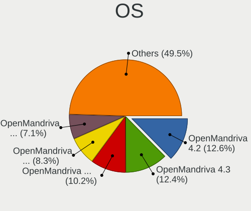

| Name                | Notebooks | Percent |
|---------------------|-----------|---------|
| OpenMandriva 4.2    | 2274      | 12.61%  |
| OpenMandriva 4.3    | 2228      | 12.35%  |
| OpenMandriva 24.12  | 1835      | 10.17%  |
| OpenMandriva 25.90  | 1491      | 8.27%   |
| OpenMandriva 23.08  | 1280      | 7.1%    |
| OpenMandriva 6.0    | 1248      | 6.92%   |
| OpenMandriva 25.06  | 1047      | 5.8%    |
| OpenMandriva 23.03  | 1012      | 5.61%   |
| OpenMandriva 5.0    | 1004      | 5.57%   |
| OpenMandriva 23.01  | 984       | 5.45%   |
| OpenMandriva 24.07  | 643       | 3.56%   |
| OpenMandriva 25.01  | 507       | 2.81%   |
| OpenMandriva 4.50   | 424       | 2.35%   |
| OpenMandriva 25.04  | 422       | 2.34%   |
| OpenMandriva 25.03  | 378       | 2.1%    |
| OpenMandriva 25.11  | 171       | 0.95%   |
| OpenMandriva 4.90   | 170       | 0.94%   |
| OpenMandriva 23.11  | 106       | 0.59%   |
| OpenMandriva 25.02  | 98        | 0.54%   |
| OpenMandriva 23.09  | 90        | 0.5%    |
| OpenMandriva 24.09  | 85        | 0.47%   |
| OpenMandriva 24.01  | 82        | 0.45%   |
| OpenMandriva 23.90  | 66        | 0.37%   |
| OpenMandriva 23.07  | 66        | 0.37%   |
| OpenMandriva 23.06  | 62        | 0.34%   |
| OpenMandriva 24.08  | 61        | 0.34%   |
| OpenMandriva 24.90  | 58        | 0.32%   |
| OpenMandriva 23.10  | 54        | 0.3%    |
| OpenMandriva 22.12  | 33        | 0.18%   |
| OpenMandriva 24.06  | 18        | 0.1%    |
| OpenMandriva 24.03  | 15        | 0.08%   |
| OpenMandriva 24.04  | 8         | 0.04%   |
| OpenMandriva 4.1    | 4         | 0.02%   |
| OpenMandriva 24.11  | 4         | 0.02%   |
| OpenMandriva 22.90  | 4         | 0.02%   |
| OpenMandriva 3.0    | 3         | 0.02%   |
| OpenMandriva 24.05  | 2         | 0.01%   |
| OpenMandriva 22.11  | 1         | 0.01%   |
| OpenMandriva 2014.0 | 1         | 0.01%   |

OS Family
---------

OS without a version

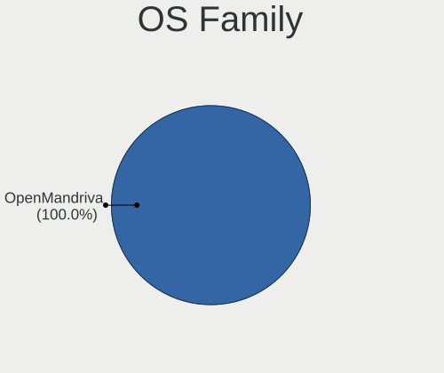

| Name         | Notebooks | Percent |
|--------------|-----------|---------|
| OpenMandriva | 16447     | 100%    |

Kernel
------

Version of the Linux kernel

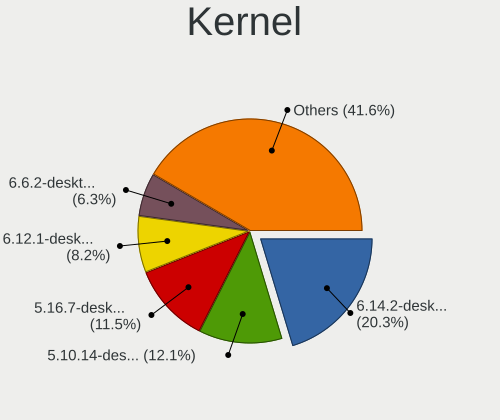

| Version                       | Notebooks | Percent |
|-------------------------------|-----------|---------|
| 6.14.2-desktop-3omv2590       | 3675      | 20.34%  |
| 5.10.14-desktop-1omv4002      | 2186      | 12.1%   |
| 5.16.7-desktop-1omv4003       | 2086      | 11.55%  |
| 6.12.1-desktop-1omv2490       | 1474      | 8.16%   |
| 6.6.2-desktop-1omv2390        | 1135      | 6.28%   |
| 6.4.11-desktop-1omv2390       | 1017      | 5.63%   |
| 6.2.6-desktop-1omv2390        | 979       | 5.42%   |
| 6.1.1-desktop-1omv2290        | 910       | 5.04%   |
| 6.12.9-desktop-1omv2490       | 538       | 2.98%   |
| 6.10.0-desktop-1omv2490       | 500       | 2.77%   |
| 6.12.6-desktop-1omv2490       | 319       | 1.77%   |
| 6.4.8-desktop-2omv2390        | 295       | 1.63%   |
| 6.15.0-desktop-0.rc2.3omv2590 | 255       | 1.41%   |
| 5.16.13-desktop-1omv4003      | 159       | 0.88%   |
| 5.12.4-desktop-1omv4050       | 151       | 0.84%   |
| 6.9.7-desktop-1omv2490        | 136       | 0.75%   |
| 5.18.12-desktop-3omv4090      | 135       | 0.75%   |
| 6.3.5-desktop-3omv2390        | 121       | 0.67%   |
| 5.11.12-desktop-1omv4002      | 106       | 0.59%   |
| 6.13.5-desktop-1omv2590       | 104       | 0.58%   |
| 6.10.1-desktop-1omv2490       | 84        | 0.47%   |
| 6.17.7-desktop-1omv2590       | 83        | 0.46%   |
| 6.13.4-desktop-2omv2590       | 83        | 0.46%   |
| 5.14.7-desktop-1omv4050       | 83        | 0.46%   |
| 5.19.5-desktop-1omv4090       | 77        | 0.43%   |
| 6.14.0-desktop-0.rc4.2omv2590 | 75        | 0.42%   |
| 6.11.0-desktop-2omv2490       | 75        | 0.42%   |
| 6.13.9-desktop-3omv2590       | 71        | 0.39%   |
| 6.5.5-desktop-1omv2390        | 69        | 0.38%   |
| 5.19.12-desktop-2omv4090      | 64        | 0.35%   |
| 6.13.7-desktop-1omv2590       | 63        | 0.35%   |
| 6.1.4-desktop-1omv2301        | 63        | 0.35%   |
| 6.18.0-desktop-1omv2590       | 61        | 0.34%   |
| 6.14.0-desktop-0.rc6.2omv2590 | 42        | 0.23%   |
| 6.5.0-desktop-1omv2390        | 39        | 0.22%   |
| 6.14.2-desktop-2omv2590       | 37        | 0.2%    |
| 6.14.0-desktop-3omv2590       | 37        | 0.2%    |
| 6.0.10-desktop-2omv22090      | 35        | 0.19%   |
| 6.5.3-desktop-1omv2390        | 27        | 0.15%   |
| 6.2.2-desktop-1omv2390        | 24        | 0.13%   |

Kernel Family
-------------

Linux kernel without a distro release

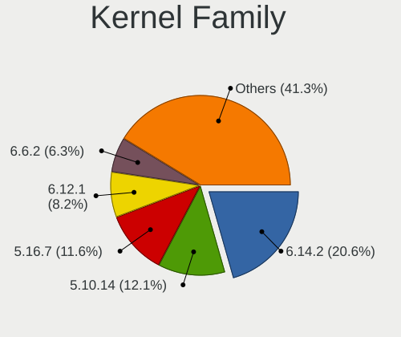

| Version | Notebooks | Percent |
|---------|-----------|---------|
| 6.14.2  | 3718      | 20.59%  |
| 5.10.14 | 2186      | 12.11%  |
| 5.16.7  | 2087      | 11.56%  |
| 6.12.1  | 1474      | 8.16%   |
| 6.6.2   | 1135      | 6.29%   |
| 6.4.11  | 1017      | 5.63%   |
| 6.2.6   | 979       | 5.42%   |
| 6.1.1   | 910       | 5.04%   |
| 6.12.9  | 539       | 2.98%   |
| 6.10.0  | 500       | 2.77%   |
| 6.12.6  | 319       | 1.77%   |
| 6.4.8   | 295       | 1.63%   |
| 6.15.0  | 272       | 1.51%   |
| 6.14.0  | 201       | 1.11%   |
| 5.16.13 | 160       | 0.89%   |
| 5.12.4  | 151       | 0.84%   |
| 6.9.7   | 136       | 0.75%   |
| 5.18.12 | 135       | 0.75%   |
| 6.3.5   | 121       | 0.67%   |
| 6.13.5  | 109       | 0.6%    |
| 5.11.12 | 106       | 0.59%   |
| 6.13.4  | 84        | 0.47%   |
| 6.10.1  | 84        | 0.47%   |
| 6.17.7  | 83        | 0.46%   |
| 5.14.7  | 83        | 0.46%   |
| 5.19.5  | 77        | 0.43%   |
| 6.11.0  | 76        | 0.42%   |
| 6.13.9  | 72        | 0.4%    |
| 6.18.0  | 70        | 0.39%   |
| 6.5.5   | 69        | 0.38%   |
| 6.13.7  | 64        | 0.35%   |
| 6.1.4   | 64        | 0.35%   |
| 5.19.12 | 64        | 0.35%   |
| 6.5.0   | 41        | 0.23%   |
| 6.0.10  | 35        | 0.19%   |
| 6.13.3  | 31        | 0.17%   |
| 6.5.3   | 27        | 0.15%   |
| 6.2.2   | 24        | 0.13%   |
| 6.13.0  | 23        | 0.13%   |
| 6.0.2   | 21        | 0.12%   |

Kernel Major Ver.
-----------------

Linux kernel major version

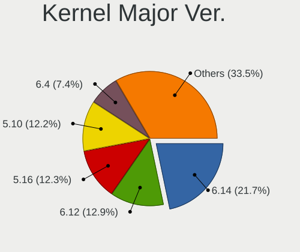

| Version | Notebooks | Percent |
|---------|-----------|---------|
| 6.14    | 3908      | 21.72%  |
| 6.12    | 2328      | 12.94%  |
| 5.16    | 2221      | 12.35%  |
| 5.10    | 2188      | 12.16%  |
| 6.4     | 1325      | 7.36%   |
| 6.6     | 1172      | 6.51%   |
| 6.2     | 1022      | 5.68%   |
| 6.1     | 985       | 5.47%   |
| 6.10    | 595       | 3.31%   |
| 6.13    | 396       | 2.2%    |
| 6.15    | 297       | 1.65%   |
| 5.12    | 163       | 0.91%   |
| 6.9     | 159       | 0.88%   |
| 6.5     | 158       | 0.88%   |
| 5.19    | 157       | 0.87%   |
| 5.18    | 141       | 0.78%   |
| 6.3     | 125       | 0.69%   |
| 5.11    | 117       | 0.65%   |
| 6.17    | 108       | 0.6%    |
| 5.14    | 102       | 0.57%   |
| 6.11    | 88        | 0.49%   |
| 6.18    | 75        | 0.42%   |
| 6.0     | 63        | 0.35%   |
| 6.8     | 32        | 0.18%   |
| 6.16    | 17        | 0.09%   |
| 5.17    | 17        | 0.09%   |
| 6.7     | 16        | 0.09%   |
| 5.5     | 4         | 0.02%   |
| 5.15    | 3         | 0.02%   |
| 5.9     | 2         | 0.01%   |
| 4.19    | 2         | 0.01%   |
| 5.8     | 1         | 0.01%   |
| 5.13    | 1         | 0.01%   |
| 4.9     | 1         | 0.01%   |
| 4.1     | 1         | 0.01%   |
| Unknown | 1         | 0.01%   |

Arch
----

OS architecture (x86_64, i586, etc.)

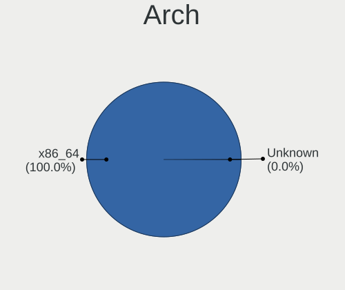

| Name    | Notebooks | Percent |
|---------|-----------|---------|
| x86_64  | 16446     | 99.99%  |
| Unknown | 1         | 0.01%   |

DE
--

Desktop Environment

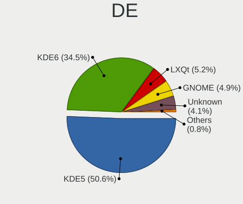

| Name     | Notebooks | Percent |
|----------|-----------|---------|
| KDE5     | 8642      | 50.64%  |
| KDE6     | 5886      | 34.49%  |
| LXQt     | 882       | 5.17%   |
| GNOME    | 829       | 4.86%   |
| Unknown  | 692       | 4.05%   |
| Cinnamon | 47        | 0.28%   |
| XFCE     | 43        | 0.25%   |
| Budgie   | 24        | 0.14%   |
| MATE     | 15        | 0.09%   |
| i3       | 3         | 0.02%   |
| LXDE     | 2         | 0.01%   |
| KDE4     | 1         | 0.01%   |
| DWM      | 1         | 0.01%   |

Display Server
--------------

X11 or Wayland

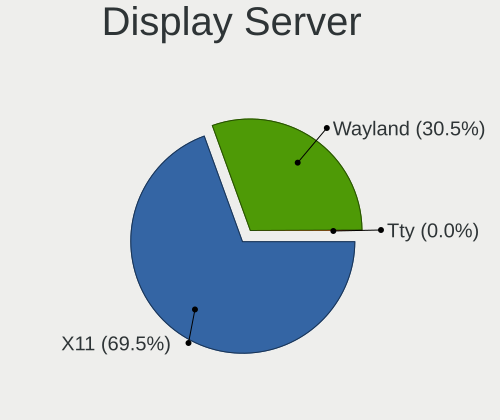

| Name    | Notebooks | Percent |
|---------|-----------|---------|
| X11     | 11881     | 69.47%  |
| Wayland | 5208      | 30.45%  |
| Unknown | 12        | 0.07%   |
| Tty     | 1         | 0.01%   |

Display Manager
---------------

SDDM, LightDM, etc.

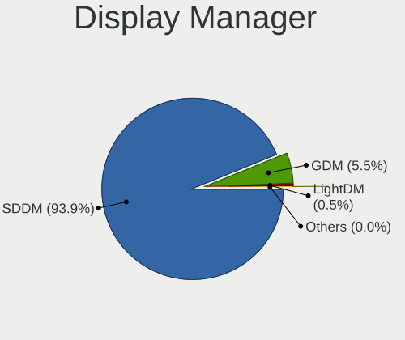

| Name    | Notebooks | Percent |
|---------|-----------|---------|
| SDDM    | 15597     | 93.85%  |
| GDM     | 919       | 5.53%   |
| LightDM | 81        | 0.49%   |
| Unknown | 17        | 0.1%    |
| GREETD  | 3         | 0.02%   |
| Ly      | 1         | 0.01%   |
| KDM     | 1         | 0.01%   |

OS Lang
-------

Language

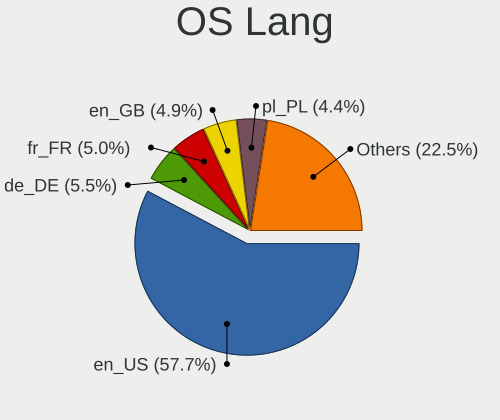

| Lang  | Notebooks | Percent |
|-------|-----------|---------|
| en_US | 9739      | 57.74%  |
| de_DE | 923       | 5.47%   |
| fr_FR | 842       | 4.99%   |
| en_GB | 823       | 4.88%   |
| pl_PL | 740       | 4.39%   |
| ru_RU | 540       | 3.2%    |
| pt_BR | 503       | 2.98%   |
| it_IT | 382       | 2.26%   |
| es_ES | 294       | 1.74%   |
| cs_CZ | 246       | 1.46%   |
| en_CA | 199       | 1.18%   |
| es_MX | 186       | 1.1%    |
| en_AU | 136       | 0.81%   |
| es_AR | 97        | 0.58%   |
| hu_HU | 88        | 0.52%   |
| en_IN | 87        | 0.52%   |
| nl_NL | 69        | 0.41%   |
| de_AT | 67        | 0.4%    |
| tr_TR | 66        | 0.39%   |
| pt_PT | 53        | 0.31%   |
| es_CO | 47        | 0.28%   |
| fr_CA | 42        | 0.25%   |
| es_CL | 42        | 0.25%   |
| en_NZ | 41        | 0.24%   |
| fr_BE | 39        | 0.23%   |
| nl_BE | 36        | 0.21%   |
| de_CH | 34        | 0.2%    |
| nb_NO | 32        | 0.19%   |
| da_DK | 32        | 0.19%   |
| fr_CH | 30        | 0.18%   |
| ro_RO | 29        | 0.17%   |
| es_PE | 26        | 0.15%   |
| en_PH | 25        | 0.15%   |
| es_VE | 23        | 0.14%   |
| en_DK | 20        | 0.12%   |
| en_ZA | 19        | 0.11%   |
| en_SG | 18        | 0.11%   |
| sv_SE | 17        | 0.1%    |
| ru_UA | 17        | 0.1%    |
| es_CR | 16        | 0.09%   |

Boot Mode
---------

EFI or BIOS

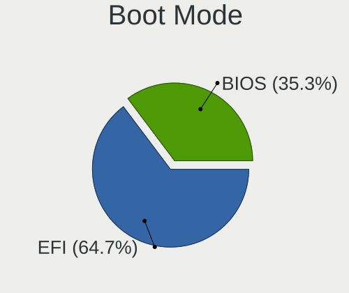

| Mode | Notebooks | Percent |
|------|-----------|---------|
| EFI  | 10738     | 64.75%  |
| BIOS | 5847      | 35.25%  |

Filesystem
----------

Type of filesystem

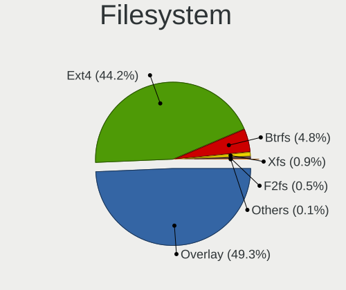

| Type     | Notebooks | Percent |
|----------|-----------|---------|
| Overlay  | 8465      | 49.33%  |
| Ext4     | 7593      | 44.25%  |
| Btrfs    | 831       | 4.84%   |
| Xfs      | 161       | 0.94%   |
| F2fs     | 88        | 0.51%   |
| Ext2     | 8         | 0.05%   |
| Ext3     | 5         | 0.03%   |
| Unknown  | 4         | 0.02%   |
| Bcachefs | 2         | 0.01%   |
| Reiserfs | 1         | 0.01%   |
| Jfs      | 1         | 0.01%   |
| Aufs     | 1         | 0.01%   |

Part. scheme
------------

Scheme of partitioning

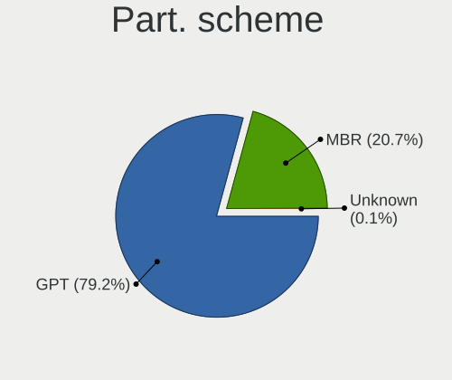

| Type    | Notebooks | Percent |
|---------|-----------|---------|
| GPT     | 13196     | 79.23%  |
| MBR     | 3447      | 20.7%   |
| Unknown | 12        | 0.07%   |

Dual Boot with Linux/BSD
------------------------

Hosting more than one Linux/BSD

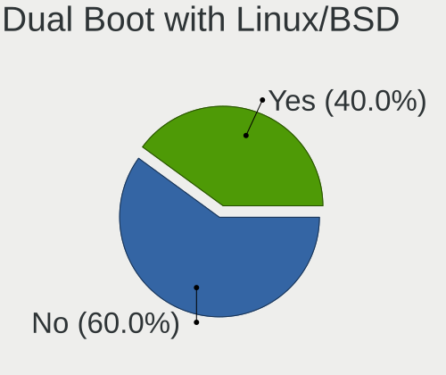

| Dual boot | Notebooks | Percent |
|-----------|-----------|---------|
| No        | 10155     | 60.03%  |
| Yes       | 6761      | 39.97%  |

Dual Boot (Win)
---------------

Hosting Linux and Windows

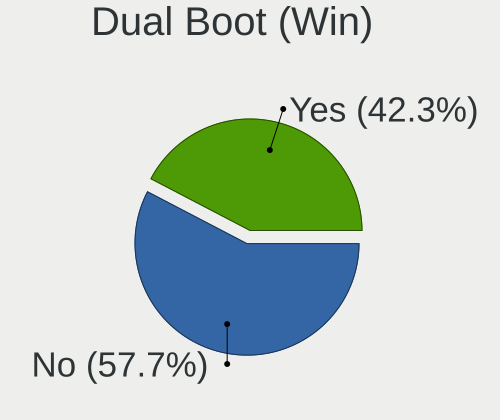

| Dual boot | Notebooks | Percent |
|-----------|-----------|---------|
| No        | 11114     | 66.67%  |
| Yes       | 5557      | 33.33%  |

Board
-----

Vendor
------

Motherboard manufacturer

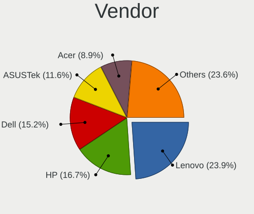

| Name                | Notebooks | Percent |
|---------------------|-----------|---------|
| Lenovo              | 3931      | 23.9%   |
| Hewlett-Packard     | 2751      | 16.73%  |
| Dell                | 2497      | 15.18%  |
| ASUSTek Computer    | 1910      | 11.61%  |
| Acer                | 1471      | 8.94%   |
| Toshiba             | 588       | 3.58%   |
| Samsung Electronics | 295       | 1.79%   |
| Apple               | 283       | 1.72%   |
| MSI                 | 280       | 1.7%    |
| Sony                | 244       | 1.48%   |
| Google              | 172       | 1.05%   |
| Fujitsu             | 172       | 1.05%   |
| Framework           | 160       | 0.97%   |
| Unknown             | 111       | 0.67%   |
| Medion              | 98        | 0.6%    |
| Packard Bell        | 95        | 0.58%   |
| HUAWEI              | 91        | 0.55%   |
| Positivo            | 88        | 0.54%   |
| Notebook            | 67        | 0.41%   |
| Core Innovations    | 60        | 0.36%   |
| TUXEDO              | 54        | 0.33%   |
| LG Electronics      | 52        | 0.32%   |
| System76            | 49        | 0.3%    |
| Alienware           | 46        | 0.28%   |
| eMachines           | 45        | 0.27%   |
| Chuwi               | 44        | 0.27%   |
| Philco              | 34        | 0.21%   |
| Fujitsu Siemens     | 34        | 0.21%   |
| Panasonic           | 33        | 0.2%    |
| Gateway             | 32        | 0.19%   |
| Gigabyte Technology | 31        | 0.19%   |
| GPU Company         | 27        | 0.16%   |
| NEC Computers       | 23        | 0.14%   |
| Compaq              | 23        | 0.14%   |
| Clevo               | 22        | 0.13%   |
| Razer               | 20        | 0.12%   |
| Intel               | 20        | 0.12%   |
| Timi                | 19        | 0.12%   |
| GPD                 | 18        | 0.11%   |
| PC Specialist       | 16        | 0.1%    |

Model
-----

Motherboard model

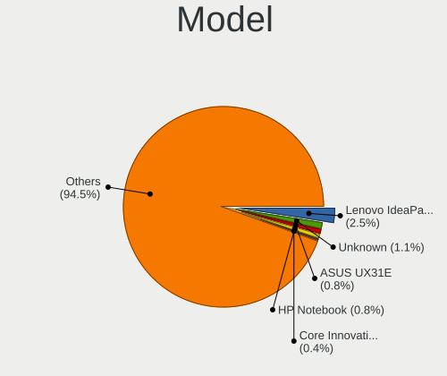

| Name                                        | Notebooks | Percent |
|---------------------------------------------|-----------|---------|
| Lenovo IdeaPad 1 14IGL7 82V6                | 405       | 2.46%   |
| Unknown                                     | 184       | 1.12%   |
| ASUS UX31E                                  | 129       | 0.78%   |
| HP Notebook                                 | 124       | 0.75%   |
| Core Innovations CLC14364                   | 60        | 0.36%   |
| HP Pavilion g6                              | 54        | 0.33%   |
| Dell Latitude E6430                         | 54        | 0.33%   |
| Framework Laptop 13 (AMD Ryzen 7040Series)  | 50        | 0.3%    |
| Dell Latitude E6410                         | 47        | 0.29%   |
| HP Pavilion dv6                             | 45        | 0.27%   |
| HP Pavilion Notebook                        | 40        | 0.24%   |
| Dell Latitude E6420                         | 38        | 0.23%   |
| HP Pavilion 15                              | 37        | 0.22%   |
| Framework Laptop 16 (AMD Ryzen 7040 Series) | 37        | 0.22%   |
| Dell Latitude 7490                          | 37        | 0.22%   |
| Dell Inspiron 1545                          | 35        | 0.21%   |
| Dell Inspiron 15-3567                       | 35        | 0.21%   |
| ASUS UL80VT                                 | 35        | 0.21%   |
| HP Laptop 15-db0xxx                         | 32        | 0.19%   |
| HP 15                                       | 32        | 0.19%   |
| Dell Inspiron 3451                          | 32        | 0.19%   |
| Apple MacBookPro9,2                         | 32        | 0.19%   |
| HP EliteBook 840 G3                         | 31        | 0.19%   |
| Dell Latitude E7440                         | 31        | 0.19%   |
| Dell Latitude E6400                         | 31        | 0.19%   |
| Framework Laptop (12th Gen Intel Core)      | 29        | 0.18%   |
| Dell Latitude 3310                          | 29        | 0.18%   |
| Dell Latitude E7450                         | 28        | 0.17%   |
| Dell Latitude E6440                         | 28        | 0.17%   |
| Dell Latitude E5470                         | 28        | 0.17%   |
| Dell Latitude 7480                          | 28        | 0.17%   |
| Framework Laptop                            | 27        | 0.16%   |
| Dell XPS 13 9360                            | 27        | 0.16%   |
| Apple MacBookPro8,1                         | 26        | 0.16%   |
| Lenovo IdeaPad 3 15ITL6 82H8                | 25        | 0.15%   |
| HP Laptop 15s-eq2xxx                        | 25        | 0.15%   |
| HP EliteBook 8440p                          | 25        | 0.15%   |
| Dell Latitude D630                          | 25        | 0.15%   |
| Toshiba dynabook T653/46JR                  | 24        | 0.15%   |
| Positivo Mobile                             | 24        | 0.15%   |

Model Family
------------

Motherboard model prefix

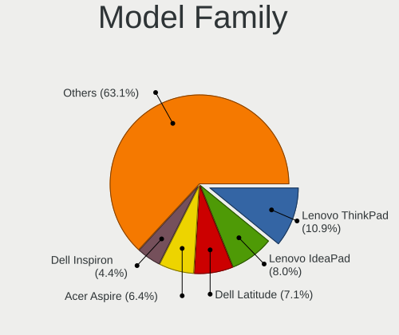

| Name                      | Notebooks | Percent |
|---------------------------|-----------|---------|
| Lenovo ThinkPad           | 1792      | 10.9%   |
| Lenovo IdeaPad            | 1318      | 8.01%   |
| Dell Latitude             | 1163      | 7.07%   |
| Acer Aspire               | 1058      | 6.43%   |
| Dell Inspiron             | 731       | 4.44%   |
| HP Laptop                 | 527       | 3.2%    |
| HP Pavilion               | 509       | 3.09%   |
| Toshiba Satellite         | 466       | 2.83%   |
| ASUS VivoBook             | 448       | 2.72%   |
| HP EliteBook              | 409       | 2.49%   |
| HP ProBook                | 323       | 1.96%   |
| Unknown                   | 184       | 1.12%   |
| Dell XPS                  | 181       | 1.1%    |
| Dell Precision            | 176       | 1.07%   |
| Framework Laptop          | 160       | 0.97%   |
| HP Compaq                 | 156       | 0.95%   |
| Fujitsu LIFEBOOK          | 135       | 0.82%   |
| ASUS UX31E                | 129       | 0.78%   |
| HP Notebook               | 124       | 0.75%   |
| ASUS ASUS                 | 114       | 0.69%   |
| Acer Nitro                | 110       | 0.67%   |
| Lenovo Legion             | 108       | 0.66%   |
| ASUS ROG                  | 101       | 0.61%   |
| Dell Vostro               | 100       | 0.61%   |
| Packard Bell EasyNote     | 81        | 0.49%   |
| Acer Swift                | 72        | 0.44%   |
| Acer TravelMate           | 70        | 0.43%   |
| HP 250                    | 68        | 0.41%   |
| HP ENVY                   | 64        | 0.39%   |
| Lenovo Yoga               | 63        | 0.38%   |
| Toshiba dynabook          | 61        | 0.37%   |
| HP Stream                 | 61        | 0.37%   |
| ASUS ZenBook              | 61        | 0.37%   |
| Core Innovations CLC14364 | 60        | 0.36%   |
| HP OMEN                   | 56        | 0.34%   |
| Acer Extensa              | 56        | 0.34%   |
| HP ZBook                  | 51        | 0.31%   |
| HP 15                     | 50        | 0.3%    |
| HP 255                    | 49        | 0.3%    |
| ASUS TUF                  | 47        | 0.29%   |

MFG Year
--------

Motherboard manufacture year

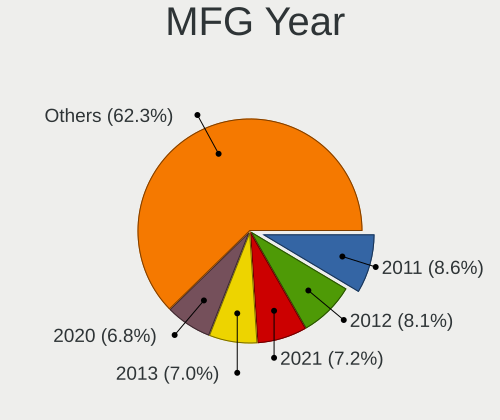

| Year    | Notebooks | Percent |
|---------|-----------|---------|
| 2011    | 1411      | 8.58%   |
| 2012    | 1340      | 8.15%   |
| 2021    | 1187      | 7.22%   |
| 2013    | 1152      | 7%      |
| 2020    | 1111      | 6.76%   |
| 2019    | 1110      | 6.75%   |
| 2022    | 1039      | 6.32%   |
| 2018    | 1037      | 6.31%   |
| 2014    | 910       | 5.53%   |
| 2017    | 897       | 5.45%   |
| 2010    | 853       | 5.19%   |
| 2015    | 834       | 5.07%   |
| 2016    | 826       | 5.02%   |
| 2008    | 692       | 4.21%   |
| 2009    | 583       | 3.54%   |
| 2023    | 554       | 3.37%   |
| 2024    | 368       | 2.24%   |
| 2007    | 363       | 2.21%   |
| 2025    | 84        | 0.51%   |
| 2006    | 81        | 0.49%   |
| Unknown | 9         | 0.05%   |
| 2005    | 3         | 0.02%   |
| 2004    | 3         | 0.02%   |

Form Factor
-----------

Physical design of the computer

| Name     | Notebooks | Percent |
|----------|-----------|---------|
| Notebook | 16447     | 100%    |

Secure Boot
-----------

Enabled or disabled

| State    | Notebooks | Percent |
|----------|-----------|---------|
| Disabled | 16447     | 100%    |

Coreboot
--------

Have coreboot on board

| Used | Notebooks | Percent |
|------|-----------|---------|
| No   | 16220     | 98.61%  |
| Yes  | 228       | 1.39%   |

RAM Size
--------

Total RAM memory

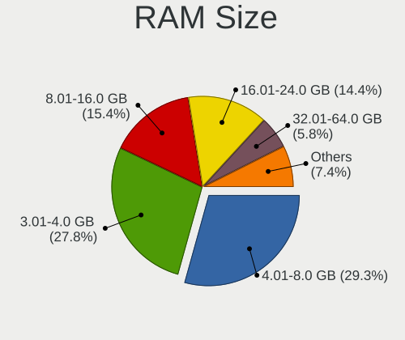

| Size in GB  | Notebooks | Percent |
|-------------|-----------|---------|
| 4.01-8.0    | 4877      | 29.31%  |
| 3.01-4.0    | 4620      | 27.77%  |
| 8.01-16.0   | 2562      | 15.4%   |
| 16.01-24.0  | 2389      | 14.36%  |
| 32.01-64.0  | 959       | 5.76%   |
| 1.01-2.0    | 496       | 2.98%   |
| 2.01-3.0    | 295       | 1.77%   |
| 24.01-32.0  | 233       | 1.4%    |
| 64.01-256.0 | 175       | 1.05%   |
| 0.51-1.0    | 32        | 0.19%   |
| Unknown     | 1         | 0.01%   |

RAM Used
--------

Used RAM memory

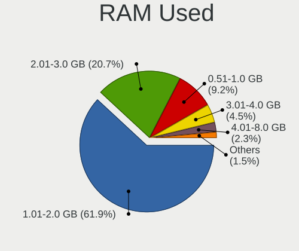

| Used GB    | Notebooks | Percent |
|------------|-----------|---------|
| 1.01-2.0   | 10740     | 61.9%   |
| 2.01-3.0   | 3583      | 20.65%  |
| 0.51-1.0   | 1594      | 9.19%   |
| 3.01-4.0   | 774       | 4.46%   |
| 4.01-8.0   | 403       | 2.32%   |
| 0.01-0.5   | 186       | 1.07%   |
| 8.01-16.0  | 55        | 0.32%   |
| 16.01-24.0 | 8         | 0.05%   |
| 32.01-64.0 | 5         | 0.03%   |
| 24.01-32.0 | 1         | 0.01%   |
| Unknown    | 1         | 0.01%   |

Total Drives
------------

Number of drives on board

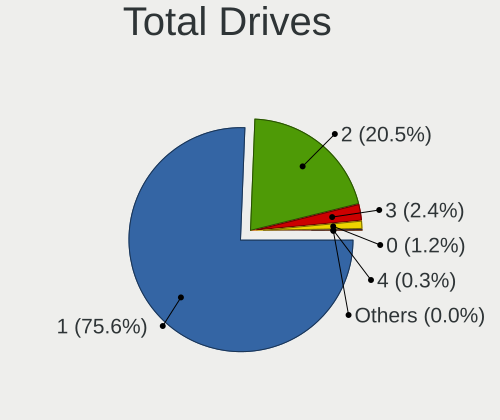

| Drives | Notebooks | Percent |
|--------|-----------|---------|
| 1      | 12604     | 75.63%  |
| 2      | 3417      | 20.5%   |
| 3      | 399       | 2.39%   |
| 0      | 197       | 1.18%   |
| 4      | 43        | 0.26%   |
| 5      | 4         | 0.02%   |
| 13     | 1         | 0.01%   |
| 7      | 1         | 0.01%   |

Has CD-ROM
----------

Has CD-ROM on board

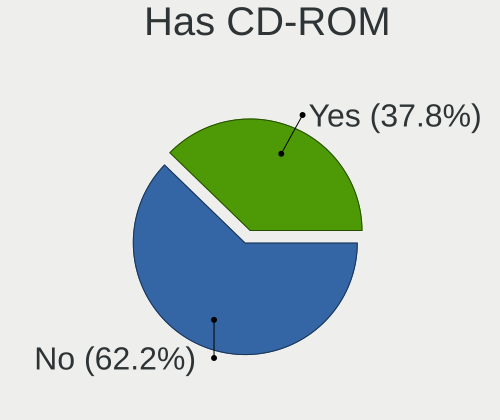

| Presented | Notebooks | Percent |
|-----------|-----------|---------|
| No        | 10286     | 62.25%  |
| Yes       | 6239      | 37.75%  |

Has Ethernet
------------

Has Ethernet on board

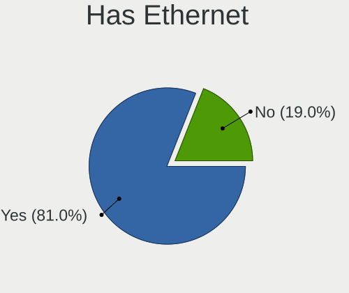

| Presented | Notebooks | Percent |
|-----------|-----------|---------|
| Yes       | 13329     | 80.99%  |
| No        | 3128      | 19.01%  |

Has WiFi
--------

Has WiFi module

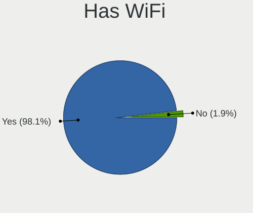

| Presented | Notebooks | Percent |
|-----------|-----------|---------|
| Yes       | 16147     | 98.1%   |
| No        | 313       | 1.9%    |

Has Bluetooth
-------------

Has Bluetooth module

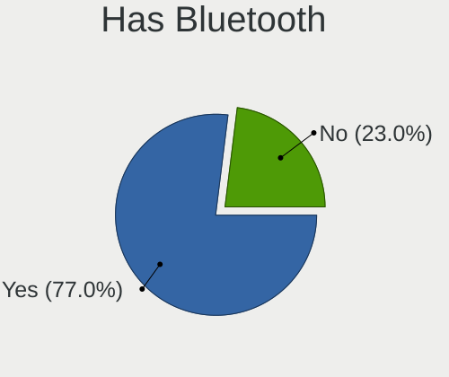

| Presented | Notebooks | Percent |
|-----------|-----------|---------|
| Yes       | 12727     | 76.96%  |
| No        | 3810      | 23.04%  |

Location
--------

Country
-------

Geographic location (country)

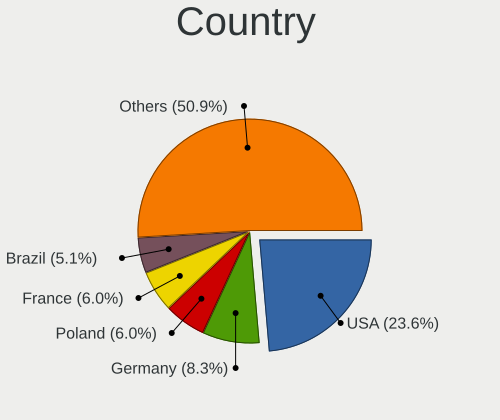

| Country      | Notebooks | Percent |
|--------------|-----------|---------|
| USA          | 3899      | 23.63%  |
| Germany      | 1363      | 8.26%   |
| Poland       | 996       | 6.04%   |
| France       | 992       | 6.01%   |
| Brazil       | 846       | 5.13%   |
| Russia       | 690       | 4.18%   |
| UK           | 609       | 3.69%   |
| Italy        | 588       | 3.56%   |
| Canada       | 456       | 2.76%   |
| Spain        | 427       | 2.59%   |
| Czechia      | 311       | 1.88%   |
| Australia    | 291       | 1.76%   |
| Mexico       | 265       | 1.61%   |
| Netherlands  | 262       | 1.59%   |
| India        | 228       | 1.38%   |
| Japan        | 224       | 1.36%   |
| Indonesia    | 195       | 1.18%   |
| Hungary      | 152       | 0.92%   |
| Finland      | 152       | 0.92%   |
| Belgium      | 151       | 0.92%   |
| Sweden       | 148       | 0.9%    |
| Romania      | 146       | 0.88%   |
| Argentina    | 136       | 0.82%   |
| Turkey       | 135       | 0.82%   |
| Portugal     | 134       | 0.81%   |
| Switzerland  | 122       | 0.74%   |
| Austria      | 118       | 0.72%   |
| Greece       | 110       | 0.67%   |
| Norway       | 104       | 0.63%   |
| Colombia     | 99        | 0.6%    |
| Chile        | 84        | 0.51%   |
| Bulgaria     | 83        | 0.5%    |
| Ukraine      | 82        | 0.5%    |
| New Zealand  | 81        | 0.49%   |
| Slovakia     | 79        | 0.48%   |
| China        | 74        | 0.45%   |
| Denmark      | 69        | 0.42%   |
| Algeria      | 66        | 0.4%    |
| Philippines  | 60        | 0.36%   |
| South Africa | 56        | 0.34%   |

City
----

Geographic location (city)

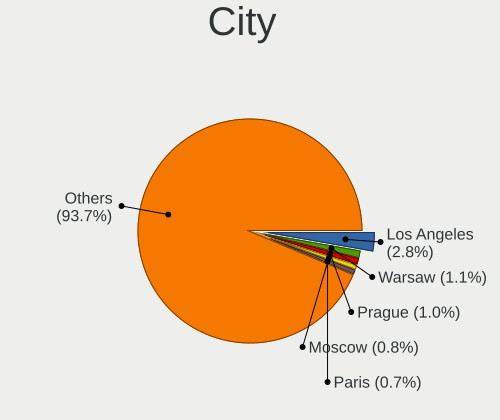

| City           | Notebooks | Percent |
|----------------|-----------|---------|
| Los Angeles    | 482       | 2.78%   |
| Warsaw         | 192       | 1.11%   |
| Prague         | 167       | 0.96%   |
| Moscow         | 131       | 0.76%   |
| Paris          | 124       | 0.72%   |
| Berlin         | 111       | 0.64%   |
| Milan          | 101       | 0.58%   |
| Sydney         | 95        | 0.55%   |
| Vienna         | 81        | 0.47%   |
| Krakow         | 81        | 0.47%   |
| Sao Paulo      | 77        | 0.44%   |
| Munich         | 74        | 0.43%   |
| Melbourne      | 69        | 0.4%    |
| Helsinki       | 63        | 0.36%   |
| St Petersburg  | 61        | 0.35%   |
| Rome           | 59        | 0.34%   |
| Schagen        | 56        | 0.32%   |
| Madrid         | 55        | 0.32%   |
| Seattle        | 53        | 0.31%   |
| Istanbul       | 50        | 0.29%   |
| Denver         | 50        | 0.29%   |
| Athens         | 50        | 0.29%   |
| Budapest       | 49        | 0.28%   |
| Poznan         | 48        | 0.28%   |
| Brisbane       | 47        | 0.27%   |
| Wroclaw        | 46        | 0.27%   |
| Hamburg        | 46        | 0.27%   |
| Rio de Janeiro | 45        | 0.26%   |
| Bengaluru      | 45        | 0.26%   |
| Bucharest      | 41        | 0.24%   |
| Toronto        | 40        | 0.23%   |
| Mexico City    | 40        | 0.23%   |
| Chicago        | 40        | 0.23%   |
| Katowice       | 37        | 0.21%   |
| Dallas         | 37        | 0.21%   |
| Stuttgart      | 36        | 0.21%   |
| Jakarta        | 36        | 0.21%   |
| Gdansk         | 36        | 0.21%   |
| Amsterdam      | 36        | 0.21%   |
| Stockholm      | 35        | 0.2%    |

Drives
------

Drive Vendor
------------

Hard drive vendors

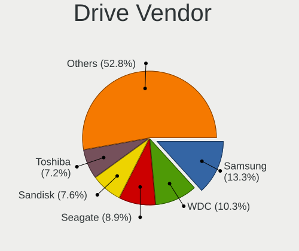

| Vendor                      | Notebooks | Drives | Percent |
|-----------------------------|-----------|--------|---------|
| Samsung Electronics         | 2613      | 3086   | 13.25%  |
| WDC                         | 2032      | 2306   | 10.3%   |
| Seagate                     | 1752      | 1976   | 8.88%   |
| Sandisk                     | 1491      | 1660   | 7.56%   |
| Toshiba                     | 1416      | 1583   | 7.18%   |
| Unknown                     | 1334      | 1456   | 6.77%   |
| Kingston                    | 1013      | 1115   | 5.14%   |
| SK hynix                    | 650       | 740    | 3.3%    |
| Crucial                     | 628       | 711    | 3.18%   |
| Hitachi                     | 619       | 681    | 3.14%   |
| Micron Technology           | 520       | 572    | 2.64%   |
| Intel                       | 500       | 580    | 2.54%   |
| HGST                        | 476       | 529    | 2.41%   |
| A-DATA Technology           | 304       | 332    | 1.54%   |
| China                       | 274       | 303    | 1.39%   |
| KIOXIA                      | 222       | 245    | 1.13%   |
| Unknown                     | 180       | 191    | 0.91%   |
| SPCC                        | 161       | 176    | 0.82%   |
| PNY                         | 153       | 177    | 0.78%   |
| Apple                       | 151       | 170    | 0.77%   |
| Kingston Technology Company | 140       | 148    | 0.71%   |
| GOODRAM                     | 137       | 159    | 0.69%   |
| Phison Electronics          | 119       | 132    | 0.6%    |
| Intenso                     | 119       | 130    | 0.6%    |
| Micron/Crucial Technology   | 113       | 125    | 0.57%   |
| Patriot                     | 111       | 120    | 0.56%   |
| Fujitsu                     | 105       | 117    | 0.53%   |
| LITEON                      | 104       | 112    | 0.53%   |
| Silicon Motion              | 93        | 103    | 0.47%   |
| JMicron Technology          | 89        | 92     | 0.45%   |
| MAXIO Technology (Hangzhou) | 87        | 93     | 0.44%   |
| Transcend                   | 80        | 87     | 0.41%   |
| KingSpec                    | 71        | 75     | 0.36%   |
| ADATA Technology            | 65        | 73     | 0.33%   |
| LITEONIT                    | 59        | 71     | 0.3%    |
| Phison                      | 58        | 68     | 0.29%   |
| Lexar                       | 54        | 61     | 0.27%   |
| Team                        | 53        | 61     | 0.27%   |
| Netac                       | 53        | 64     | 0.27%   |
| SSSTC                       | 47        | 56     | 0.24%   |

Drive Model
-----------

Hard drive models

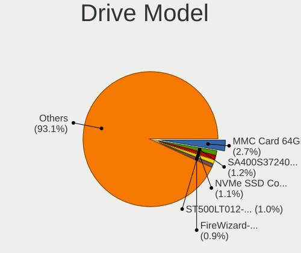

| Model                                                | Notebooks | Percent |
|------------------------------------------------------|-----------|---------|
| Unknown MMC Card  64GB                               | 545       | 2.7%    |
| Kingston SA400S37240G 240GB SSD                      | 243       | 1.2%    |
| Samsung NVMe SSD Controller SM981/PM981/PM983 1TB    | 215       | 1.06%   |
| Seagate ST500LT012-1DG142 500GB                      | 203       | 1%      |
| Unknown                                              | 180       | 0.89%   |
| Toshiba MQ01ABF050 500GB                             | 178       | 0.88%   |
| Toshiba MQ01ABD100 1TB                               | 176       | 0.87%   |
| Seagate ST1000LM035-1RK172 1TB                       | 175       | 0.87%   |
| Seagate ST1000LM024 HN-M101MBB 1TB                   | 165       | 0.82%   |
| Samsung NVMe SSD Controller PM9A1/PM9A3/980PRO 1TB   | 159       | 0.79%   |
| Seagate ST9500325AS 500GB                            | 152       | 0.75%   |
| Toshiba MQ04ABF100 1TB                               | 139       | 0.69%   |
| SanDisk SSD U100 256GB                               | 129       | 0.64%   |
| Kingston SA400S37480G 480GB SSD                      | 128       | 0.63%   |
| HGST HTS721010A9E630 1TB                             | 106       | 0.52%   |
| Unknown MMC Card  32GB                               | 105       | 0.52%   |
| Unknown MMC Card  128GB                              | 97        | 0.48%   |
| Sandisk WD Blue SN550 NVMe SSD 1024GB                | 95        | 0.47%   |
| HGST HTS545050A7E680 500GB                           | 94        | 0.46%   |
| Crucial CT500MX500SSD1 500GB                         | 94        | 0.46%   |
| Kingston SA400S37120G 120GB SSD                      | 92        | 0.45%   |
| Crucial CT240BX500SSD1 240GB                         | 88        | 0.44%   |
| WDC WD10JPVX-22JC3T0 1TB                             | 85        | 0.42%   |
| Samsung SSD 860 EVO 500GB                            | 84        | 0.42%   |
| Unknown SD/MMC/MS PRO 2GB                            | 82        | 0.41%   |
| Sandisk WD Black SN750 / PC SN730 NVMe SSD 500GB     | 80        | 0.4%    |
| Samsung SSD 850 EVO 250GB                            | 74        | 0.37%   |
| HGST HTS541010A9E680 1TB                             | 70        | 0.35%   |
| Crucial CT1000MX500SSD1 1TB                          | 70        | 0.35%   |
| MAXIO (Hangzhou) NVMe SSD Controller MAP1202 2TB     | 67        | 0.33%   |
| Seagate ST500LM012 HN-M500MBB 500GB                  | 64        | 0.32%   |
| Toshiba MQ01ABD075 752GB                             | 63        | 0.31%   |
| Unknown MMC64G  64GB                                 | 62        | 0.31%   |
| Kingston SV300S37A120G 120GB SSD                     | 62        | 0.31%   |
| Intel SSD 660P Series 512GB                          | 61        | 0.3%    |
| Samsung NVMe SSD Controller SM961/PM961/SM963 1024GB | 59        | 0.29%   |
| Toshiba XG6 NVMe SSD Controller 1024GB               | 57        | 0.28%   |
| Samsung SSD 850 EVO 500GB                            | 57        | 0.28%   |
| WDC WDS240G2G0A-00JH30 240GB SSD                     | 55        | 0.27%   |
| Seagate ST500LT012-9WS142 500GB                      | 54        | 0.27%   |

HDD Vendor
----------

Hard disk drive vendors

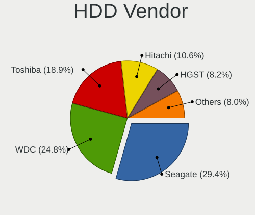

| Vendor              | Notebooks | Drives | Percent |
|---------------------|-----------|--------|---------|
| Seagate             | 1710      | 1920   | 29.42%  |
| WDC                 | 1442      | 1620   | 24.81%  |
| Toshiba             | 1100      | 1222   | 18.93%  |
| Hitachi             | 618       | 680    | 10.63%  |
| HGST                | 476       | 529    | 8.19%   |
| Samsung Electronics | 110       | 119    | 1.89%   |
| Fujitsu             | 105       | 117    | 1.81%   |
| Unknown             | 85        | 90     | 1.46%   |
| JMicron Technology  | 47        | 48     | 0.81%   |
| Apple               | 25        | 27     | 0.43%   |
| USB3.0              | 12        | 12     | 0.21%   |
| USB                 | 8         | 8      | 0.14%   |
| SAGE                | 8         | 8      | 0.14%   |
| External            | 8         | 8      | 0.14%   |
| ASMedia             | 7         | 7      | 0.12%   |
| SSK                 | 6         | 7      | 0.1%    |
| ASMT                | 6         | 8      | 0.1%    |
| TO Exter            | 5         | 6      | 0.09%   |
| Intenso             | 4         | 4      | 0.07%   |
| SABRENT             | 3         | 5      | 0.05%   |
| JetFlash            | 3         | 3      | 0.05%   |
| Inateck             | 3         | 4      | 0.05%   |
| HGST HTS            | 3         | 3      | 0.05%   |
| WD MediaMax         | 2         | 2      | 0.03%   |
| Hewlett-Packard     | 2         | 2      | 0.03%   |
| Unknown             | 2         | 2      | 0.03%   |
| Shenzhen            | 1         | 1      | 0.02%   |
| SATAFIRM            | 1         | 1      | 0.02%   |
| QC-FT-D             | 1         | 1      | 0.02%   |
| PRO-T5              | 1         | 1      | 0.02%   |
| Phison              | 1         | 1      | 0.02%   |
| MARSHAL             | 1         | 1      | 0.02%   |
| Magnetic Data       | 1         | 1      | 0.02%   |
| LaCie               | 1         | 1      | 0.02%   |
| KIOXIA              | 1         | 1      | 0.02%   |
| Kingmax             | 1         | 1      | 0.02%   |
| IBM/Hitachi         | 1         | 1      | 0.02%   |
| Esmart              | 1         | 1      | 0.02%   |

SSD Vendor
----------

Solid state drive vendors

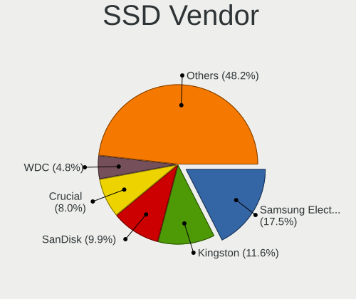

| Vendor              | Notebooks | Drives | Percent |
|---------------------|-----------|--------|---------|
| Samsung Electronics | 1236      | 1408   | 17.5%   |
| Kingston            | 818       | 897    | 11.58%  |
| SanDisk             | 702       | 768    | 9.94%   |
| Crucial             | 568       | 639    | 8.04%   |
| WDC                 | 336       | 368    | 4.76%   |
| China               | 274       | 303    | 3.88%   |
| A-DATA Technology   | 256       | 276    | 3.62%   |
| Intel               | 175       | 192    | 2.48%   |
| SK hynix            | 153       | 168    | 2.17%   |
| SPCC                | 148       | 161    | 2.1%    |
| Micron Technology   | 145       | 166    | 2.05%   |
| PNY                 | 142       | 163    | 2.01%   |
| GOODRAM             | 135       | 157    | 1.91%   |
| Toshiba             | 133       | 150    | 1.88%   |
| Intenso             | 112       | 122    | 1.59%   |
| Patriot             | 102       | 111    | 1.44%   |
| Apple               | 99        | 105    | 1.4%    |
| LITEON              | 98        | 105    | 1.39%   |
| Transcend           | 74        | 80     | 1.05%   |
| KingSpec            | 68        | 72     | 0.96%   |
| Unknown             | 62        | 64     | 0.88%   |
| LITEONIT            | 59        | 71     | 0.84%   |
| Netac               | 49        | 60     | 0.69%   |
| Team                | 46        | 54     | 0.65%   |
| Apacer              | 44        | 47     | 0.62%   |
| Lexar               | 42        | 49     | 0.59%   |
| Verbatim            | 35        | 41     | 0.5%    |
| OCZ                 | 35        | 38     | 0.5%    |
| Hewlett-Packard     | 28        | 31     | 0.4%    |
| Fanxiang            | 25        | 27     | 0.35%   |
| KIOXIA-EXCERIA      | 21        | 23     | 0.3%    |
| Gigabyte Technology | 21        | 22     | 0.3%    |
| Seagate             | 20        | 23     | 0.28%   |
| Dogfish             | 19        | 20     | 0.27%   |
| SABRENT             | 18        | 21     | 0.25%   |
| Emtec               | 18        | 20     | 0.25%   |
| Corsair             | 18        | 20     | 0.25%   |
| ASMT                | 18        | 18     | 0.25%   |
| KingFast            | 17        | 17     | 0.24%   |
| Wibtek              | 15        | 17     | 0.21%   |

Drive Kind
----------

HDD or SSD

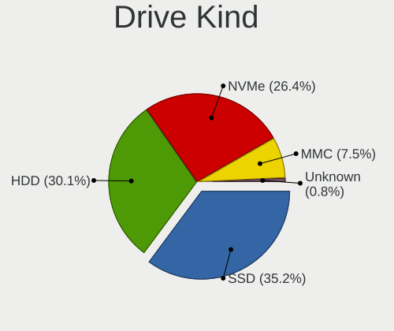

| Kind    | Notebooks | Drives | Percent |
|---------|-----------|--------|---------|
| SSD     | 6525      | 7851   | 35.18%  |
| HDD     | 5592      | 6473   | 30.15%  |
| NVMe    | 4895      | 6132   | 26.39%  |
| MMC     | 1396      | 1538   | 7.53%   |
| Unknown | 141       | 151    | 0.76%   |

Drive Connector
---------------

SATA, SAS, NVMe, etc.

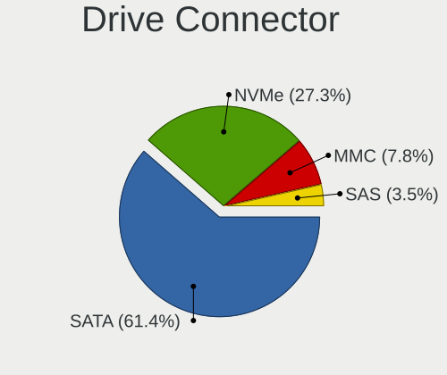

| Type | Notebooks | Drives | Percent |
|------|-----------|--------|---------|
| SATA | 11022     | 13760  | 61.42%  |
| NVMe | 4891      | 6088   | 27.26%  |
| MMC  | 1396      | 1538   | 7.78%   |
| SAS  | 635       | 759    | 3.54%   |

Drive Size
----------

Size of hard drive

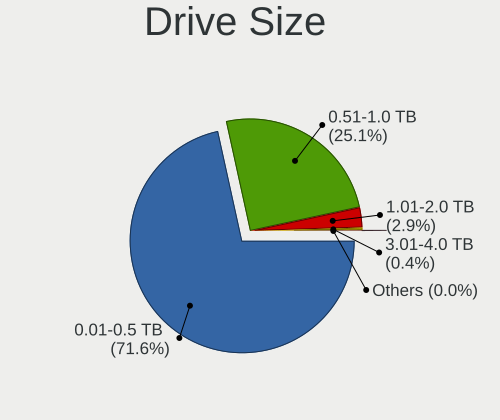

| Size in TB | Notebooks | Drives | Percent |
|------------|-----------|--------|---------|
| 0.01-0.5   | 8578      | 10340  | 71.55%  |
| 0.51-1.0   | 3003      | 3505   | 25.05%  |
| 1.01-2.0   | 348       | 411    | 2.9%    |
| 3.01-4.0   | 43        | 50     | 0.36%   |
| 4.01-10.0  | 14        | 16     | 0.12%   |
| 0          | 2         | 2      | 0.02%   |

Space Total
-----------

Amount of disk space available on the file system

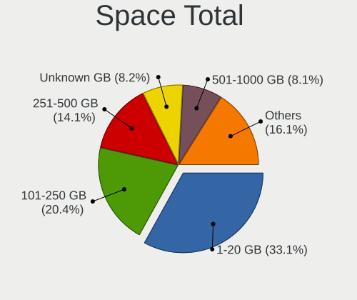

| Size in GB     | Notebooks | Percent |
|----------------|-----------|---------|
| 1-20           | 5763      | 33.07%  |
| 101-250        | 3563      | 20.45%  |
| 251-500        | 2463      | 14.13%  |
| Unknown        | 1434      | 8.23%   |
| 501-1000       | 1403      | 8.05%   |
| 51-100         | 1219      | 6.99%   |
| 21-50          | 681       | 3.91%   |
| 1001-2000      | 514       | 2.95%   |
| More than 3000 | 198       | 1.14%   |
| 2001-3000      | 189       | 1.08%   |

Space Used
----------

Amount of used disk space

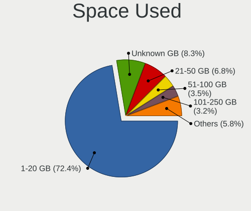

| Used GB        | Notebooks | Percent |
|----------------|-----------|---------|
| 1-20           | 12451     | 72.39%  |
| Unknown        | 1434      | 8.34%   |
| 21-50          | 1170      | 6.8%    |
| 51-100         | 603       | 3.51%   |
| 101-250        | 549       | 3.19%   |
| 0              | 379       | 2.2%    |
| 251-500        | 329       | 1.91%   |
| 501-1000       | 165       | 0.96%   |
| 1001-2000      | 79        | 0.46%   |
| 2001-3000      | 21        | 0.12%   |
| More than 3000 | 19        | 0.11%   |

Malfunc. Drives
---------------

Drive models with a malfunction

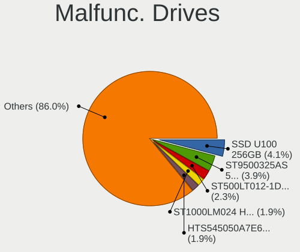

| Model                               | Notebooks | Drives | Percent |
|-------------------------------------|-----------|--------|---------|
| SanDisk SSD U100 256GB              | 129       | 130    | 4.08%   |
| Seagate ST9500325AS 500GB           | 123       | 135    | 3.89%   |
| Seagate ST500LT012-1DG142 500GB     | 74        | 81     | 2.34%   |
| Seagate ST1000LM024 HN-M101MBB 1TB  | 59        | 68     | 1.86%   |
| HGST HTS545050A7E680 500GB          | 59        | 63     | 1.86%   |
| Toshiba MQ01ABF050 500GB            | 53        | 59     | 1.68%   |
| Toshiba MQ01ABD100 1TB              | 51        | 56     | 1.61%   |
| Seagate ST500LT012-9WS142 500GB     | 51        | 56     | 1.61%   |
| HGST HTS541010A9E680 1TB            | 43        | 48     | 1.36%   |
| Seagate ST9320325AS 320GB           | 38        | 38     | 1.2%    |
| Seagate ST1000LM035-1RK172 1TB      | 38        | 40     | 1.2%    |
| Toshiba MQ01ABD075 752GB            | 37        | 38     | 1.17%   |
| Hitachi HTS545050A7E380 500GB       | 32        | 36     | 1.01%   |
| Toshiba MQ01ABD050 500GB            | 29        | 30     | 0.92%   |
| HGST HTS725050A7E630 500GB          | 29        | 30     | 0.92%   |
| HGST HTS721010A9E630 1TB            | 29        | 30     | 0.92%   |
| HGST HTS545050A7E380 500GB          | 29        | 31     | 0.92%   |
| Hitachi HTS543232A7A384 320GB       | 28        | 29     | 0.88%   |
| Seagate ST500LM021-1KJ152 500GB     | 23        | 24     | 0.73%   |
| Seagate ST500LM012 HN-M500MBB 500GB | 22        | 25     | 0.7%    |
| Kingston SV300S37A120G 120GB SSD    | 20        | 21     | 0.63%   |
| Hitachi HTS547575A9E384 752GB       | 20        | 22     | 0.63%   |
| WDC WDS240G2G0A-00JH30 240GB SSD    | 19        | 20     | 0.6%    |
| Hitachi HTS545032B9A300 320GB       | 19        | 21     | 0.6%    |
| Toshiba MK3265GSX 320GB             | 18        | 19     | 0.57%   |
| Seagate ST9500420AS 500GB           | 18        | 20     | 0.57%   |
| Hitachi HTS547550A9E384 500GB       | 18        | 19     | 0.57%   |
| HGST HTS541075A9E680 752GB          | 17        | 21     | 0.54%   |
| Crucial CT240M500SSD1 240GB         | 17        | 18     | 0.54%   |
| Toshiba MQ04ABF100 1TB              | 16        | 17     | 0.51%   |
| Seagate ST9250315AS 250GB           | 16        | 18     | 0.51%   |
| Seagate ST320LT007-9ZV142 320GB     | 16        | 18     | 0.51%   |
| Seagate ST1000LM049-2GH172 1TB      | 16        | 17     | 0.51%   |
| Hitachi HTS545050B9A300 500GB       | 15        | 18     | 0.47%   |
| WDC WD5000LPVX-22V0TT0 500GB        | 14        | 16     | 0.44%   |
| WDC WD10JPVX-22JC3T0 1TB            | 14        | 16     | 0.44%   |
| Seagate ST500LM000-1EJ162 500GB     | 14        | 15     | 0.44%   |
| Seagate ST9250827AS 250GB           | 13        | 16     | 0.41%   |
| Hitachi HTS547564A9E384 640GB       | 13        | 14     | 0.41%   |
| Hitachi HTS542516K9SA00 160GB       | 13        | 15     | 0.41%   |

Malfunc. Drive Vendor
---------------------

Vendors of faulty drives

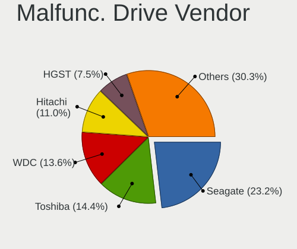

| Vendor                | Notebooks | Drives | Percent |
|-----------------------|-----------|--------|---------|
| Seagate               | 731       | 802    | 23.18%  |
| Toshiba               | 454       | 491    | 14.4%   |
| WDC                   | 428       | 461    | 13.57%  |
| Hitachi               | 347       | 378    | 11.01%  |
| HGST                  | 237       | 257    | 7.52%   |
| SanDisk               | 198       | 202    | 6.28%   |
| Samsung Electronics   | 124       | 133    | 3.93%   |
| Kingston              | 87        | 95     | 2.76%   |
| Intel                 | 68        | 76     | 2.16%   |
| SK hynix              | 65        | 74     | 2.06%   |
| Crucial               | 60        | 63     | 1.9%    |
| Fujitsu               | 52        | 60     | 1.65%   |
| China                 | 33        | 33     | 1.05%   |
| A-DATA Technology     | 32        | 37     | 1.01%   |
| Micron Technology     | 28        | 31     | 0.89%   |
| Apple                 | 16        | 16     | 0.51%   |
| SPCC                  | 14        | 15     | 0.44%   |
| SSSTC                 | 13        | 14     | 0.41%   |
| LITEON                | 12        | 12     | 0.38%   |
| OCZ                   | 9         | 12     | 0.29%   |
| LITEONIT              | 9         | 14     | 0.29%   |
| KingSpec              | 9         | 9      | 0.29%   |
| Realtek Semiconductor | 7         | 7      | 0.22%   |
| Corsair               | 7         | 8      | 0.22%   |
| Dogfish               | 6         | 7      | 0.19%   |
| Transcend             | 5         | 7      | 0.16%   |
| Netac                 | 5         | 7      | 0.16%   |
| Lexar                 | 4         | 5      | 0.13%   |
| PNY                   | 3         | 4      | 0.1%    |
| Plextor               | 3         | 3      | 0.1%    |
| Patriot               | 3         | 3      | 0.1%    |
| Intenso               | 3         | 4      | 0.1%    |
| BAITITON              | 3         | 3      | 0.1%    |
| Unknown               | 3         | 3      | 0.1%    |
| XrayDisk              | 2         | 2      | 0.06%   |
| Unknown               | 2         | 2      | 0.06%   |
| Teclast               | 2         | 2      | 0.06%   |
| Team                  | 2         | 2      | 0.06%   |
| LDLC                  | 2         | 2      | 0.06%   |
| KingFast              | 2         | 2      | 0.06%   |

Malfunc. HDD Vendor
-------------------

Vendors of faulty HDD drives

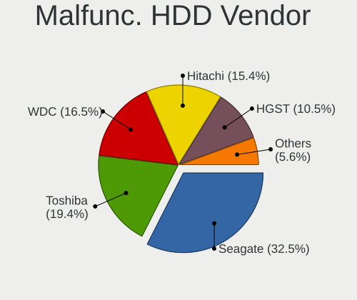

| Vendor              | Notebooks | Drives | Percent |
|---------------------|-----------|--------|---------|
| Seagate             | 730       | 801    | 32.47%  |
| Toshiba             | 437       | 472    | 19.44%  |
| WDC                 | 371       | 399    | 16.5%   |
| Hitachi             | 347       | 378    | 15.44%  |
| HGST                | 237       | 257    | 10.54%  |
| Samsung Electronics | 62        | 67     | 2.76%   |
| Fujitsu             | 52        | 60     | 2.31%   |
| Apple               | 5         | 5      | 0.22%   |
| ASMedia             | 2         | 2      | 0.09%   |
| USB                 | 1         | 1      | 0.04%   |
| SAGE                | 1         | 1      | 0.04%   |
| Magnetic Data       | 1         | 1      | 0.04%   |
| IBM/Hitachi         | 1         | 1      | 0.04%   |
| ASMT                | 1         | 2      | 0.04%   |

Malfunc. Drive Kind
-------------------

Kinds of faulty drives

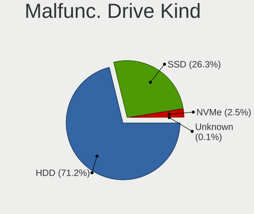

| Kind    | Notebooks | Drives | Percent |
|---------|-----------|--------|---------|
| HDD     | 2221      | 2447   | 71.16%  |
| SSD     | 821       | 894    | 26.31%  |
| NVMe    | 77        | 84     | 2.47%   |
| Unknown | 2         | 2      | 0.06%   |

Failed Drives
-------------

Failed drive models

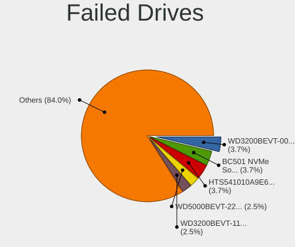

| Model                                         | Notebooks | Drives | Percent |
|-----------------------------------------------|-----------|--------|---------|
| WDC WD3200BEVT-00ZCT0 320GB                   | 3         | 3      | 3.7%    |
| SK hynix BC501 NVMe Solid State Drive 512GB   | 3         | 3      | 3.7%    |
| HGST HTS541010A9E680 1TB                      | 3         | 3      | 3.7%    |
| WDC WD5000BEVT-22ZAT0 500GB                   | 2         | 2      | 2.47%   |
| WDC WD3200BEVT-11ZCT0 320GB                   | 2         | 2      | 2.47%   |
| WDC WD2500BEVS-22UST0 250GB                   | 2         | 3      | 2.47%   |
| Toshiba MQ01ABD100 1TB                        | 2         | 2      | 2.47%   |
| Toshiba MK7575GSX 752GB                       | 2         | 2      | 2.47%   |
| Toshiba MK3265GSXN 320GB                      | 2         | 2      | 2.47%   |
| Toshiba MK2555GSX 250GB                       | 2         | 2      | 2.47%   |
| Samsung Electronics HM250HI 250GB             | 2         | 2      | 2.47%   |
| Hitachi HTS723232A7A364 320GB                 | 2         | 2      | 2.47%   |
| Hitachi HTS545050A7E380 500GB                 | 2         | 2      | 2.47%   |
| Crucial CT500P2SSD8 500GB                     | 2         | 2      | 2.47%   |
| WDC WD5000M22K-24Z1LT0-SSHD-16GB              | 1         | 1      | 1.23%   |
| WDC WD5000LPVX-00V0TT0 500GB                  | 1         | 1      | 1.23%   |
| WDC WD5000LPLX-75ZNTT0 500GB                  | 1         | 1      | 1.23%   |
| WDC WD5000BPVT-60HXZT1 500GB                  | 1         | 1      | 1.23%   |
| WDC WD5000BPVT-22HXZT1 500GB                  | 1         | 1      | 1.23%   |
| WDC WD5000BEVT-22A0RT0 500GB                  | 1         | 1      | 1.23%   |
| WDC WD3200BUCT-63TWBY0 320GB                  | 1         | 1      | 1.23%   |
| WDC WD3200BPVT-24JJ5T0 320GB                  | 1         | 1      | 1.23%   |
| WDC WD3200BEKT-60KA9T0 320GB                  | 1         | 1      | 1.23%   |
| WDC WD2500BEVT-60ZCT1 250GB                   | 1         | 1      | 1.23%   |
| WDC WD2500BEVT-35A23T0 250GB                  | 1         | 1      | 1.23%   |
| WDC WD2500BEVT-11ZCT0 250GB                   | 1         | 1      | 1.23%   |
| WDC WD1600BEVT-75ZCT1 160GB                   | 1         | 1      | 1.23%   |
| WDC WD1600BEVT-75A23T0 160GB                  | 1         | 1      | 1.23%   |
| WDC WD10JPVX-60JC3T0 1TB                      | 1         | 1      | 1.23%   |
| Union Memory (Shenzhen) RPFTJ128PDD2EWX 128GB | 1         | 1      | 1.23%   |
| Transcend TS1TMTE110S 1TB                     | 1         | 1      | 1.23%   |
| Toshiba MQ01ABF050 500GB                      | 1         | 1      | 1.23%   |
| Toshiba MQ01ABD050 500GB                      | 1         | 1      | 1.23%   |
| Toshiba MK5076GSXN 500GB                      | 1         | 1      | 1.23%   |
| Toshiba MK5061GSYN 500GB                      | 1         | 1      | 1.23%   |
| Toshiba MK3265GSXV 320GB                      | 1         | 1      | 1.23%   |
| Toshiba MK3261GSYN 320GB                      | 1         | 1      | 1.23%   |
| Toshiba MK3259GSXP 320GB                      | 1         | 2      | 1.23%   |
| Toshiba MK2575GSX 250GB                       | 1         | 1      | 1.23%   |
| Toshiba MK1234GSX 120GB                       | 1         | 1      | 1.23%   |

Failed Drive Vendor
-------------------

Failed drive vendors

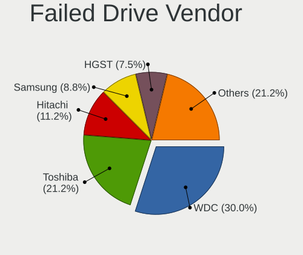

| Vendor                  | Notebooks | Drives | Percent |
|-------------------------|-----------|--------|---------|
| WDC                     | 24        | 25     | 30%     |
| Toshiba                 | 17        | 18     | 21.25%  |
| Hitachi                 | 9         | 9      | 11.25%  |
| Samsung Electronics     | 7         | 7      | 8.75%   |
| HGST                    | 6         | 6      | 7.5%    |
| SK hynix                | 4         | 5      | 5%      |
| Seagate                 | 4         | 4      | 5%      |
| Intel                   | 2         | 2      | 2.5%    |
| Crucial                 | 2         | 2      | 2.5%    |
| Apple                   | 2         | 2      | 2.5%    |
| Union Memory (Shenzhen) | 1         | 1      | 1.25%   |
| Transcend               | 1         | 1      | 1.25%   |
| Unknown                 | 1         | 1      | 1.25%   |

Drive Status
------------

Number of failed and malfunc. drives

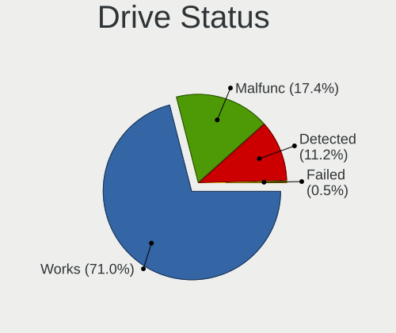

| Status   | Notebooks | Drives | Percent |
|----------|-----------|--------|---------|
| Works    | 12596     | 16333  | 71.02%  |
| Malfunc  | 3082      | 3427   | 17.38%  |
| Detected | 1978      | 2302   | 11.15%  |
| Failed   | 80        | 83     | 0.45%   |

Storage controller
------------------

Storage Vendor
--------------

Storage controller vendors

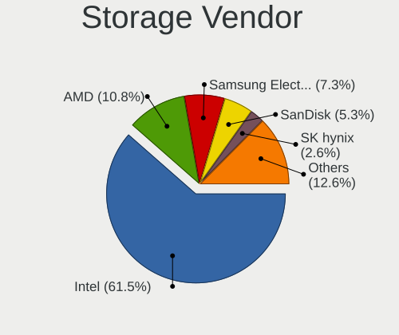

| Vendor                                    | Notebooks | Percent |
|-------------------------------------------|-----------|---------|
| Intel                                     | 11545     | 61.47%  |
| AMD                                       | 2029      | 10.8%   |
| Samsung Electronics                       | 1369      | 7.29%   |
| SanDisk                                   | 994       | 5.29%   |
| SK hynix                                  | 483       | 2.57%   |
| Micron Technology                         | 380       | 2.02%   |
| Kingston Technology Company               | 330       | 1.76%   |
| KIOXIA                                    | 226       | 1.2%    |
| Phison Electronics                        | 206       | 1.1%    |
| Toshiba America Info Systems              | 184       | 0.98%   |
| Micron/Crucial Technology                 | 170       | 0.91%   |
| Silicon Motion                            | 114       | 0.61%   |
| Nvidia                                    | 101       | 0.54%   |
| MAXIO Technology (Hangzhou)               | 101       | 0.54%   |
| ADATA Technology                          | 100       | 0.53%   |
| Union Memory (Shenzhen)                   | 78        | 0.42%   |
| Realtek Semiconductor                     | 70        | 0.37%   |
| Solid State Storage Technology            | 54        | 0.29%   |
| Shenzhen Longsys Electronics              | 35        | 0.19%   |
| Apple                                     | 23        | 0.12%   |
| Lenovo                                    | 22        | 0.12%   |
| Solidigm                                  | 21        | 0.11%   |
| Seagate Technology                        | 18        | 0.1%    |
| Silicon Integrated Systems [SiS]          | 17        | 0.09%   |
| Marvell Technology Group                  | 15        | 0.08%   |
| Lite-On Technology                        | 14        | 0.07%   |
| JMicron Technology                        | 13        | 0.07%   |
| Shenzhen Unionmemory Information System   | 10        | 0.05%   |
| Biwin Storage Technology                  | 10        | 0.05%   |
| ASMedia Technology                        | 10        | 0.05%   |
| Hosin Global Electronics                  | 9         | 0.05%   |
| Silicon Image                             | 6         | 0.03%   |
| INNOGRIT                                  | 5         | 0.03%   |
| Yangtze Memory Technologies               | 4         | 0.02%   |
| Transcend                                 | 4         | 0.02%   |
| VIA Technologies                          | 2         | 0.01%   |
| Shenzhen Shichuangyi Electronics          | 2         | 0.01%   |
| Netac Technology                          | 2         | 0.01%   |
| Unknown                                   | 2         | 0.01%   |
| Tata Power Strategic Electronics Division | 1         | 0.01%   |

Storage Model
-------------

Storage controller models

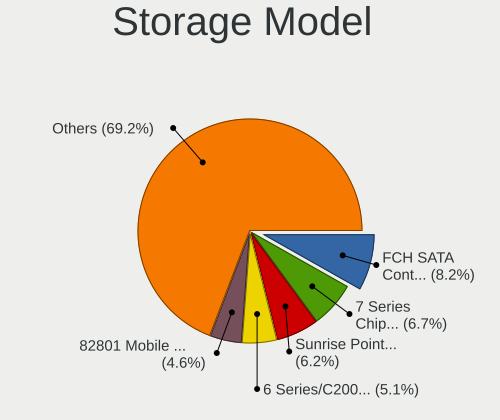

| Model                                                                            | Notebooks | Percent |
|----------------------------------------------------------------------------------|-----------|---------|
| AMD FCH SATA Controller [AHCI mode]                                              | 1648      | 8.19%   |
| Intel 7 Series Chipset Family 6-port SATA Controller [AHCI mode]                 | 1355      | 6.73%   |
| Intel Sunrise Point-LP SATA Controller [AHCI mode]                               | 1242      | 6.17%   |
| Intel 6 Series/C200 Series Chipset Family 6 port Mobile SATA AHCI Controller     | 1023      | 5.08%   |
| Intel 82801 Mobile SATA Controller [RAID mode]                                   | 928       | 4.61%   |
| Intel 82801IBM/IEM (ICH9M/ICH9M-E) 4 port SATA Controller [AHCI mode]            | 738       | 3.67%   |
| Intel Celeron/Pentium Silver Processor SATA Controller                           | 726       | 3.61%   |
| Intel 8 Series SATA Controller 1 [AHCI mode]                                     | 560       | 2.78%   |
| Intel 5 Series/3400 Series Chipset 4 port SATA AHCI Controller                   | 487       | 2.42%   |
| Intel Wildcat Point-LP SATA Controller [AHCI Mode]                               | 478       | 2.38%   |
| Intel Volume Management Device NVMe RAID Controller                              | 426       | 2.12%   |
| Samsung NVMe SSD Controller SM981/PM981/PM983                                    | 397       | 1.97%   |
| Intel 82801HM/HEM (ICH8M/ICH8M-E) IDE Controller                                 | 396       | 1.97%   |
| Samsung NVMe SSD Controller 980 (DRAM-less)                                      | 371       | 1.84%   |
| Intel 8 Series/C220 Series Chipset Family 6-port SATA Controller 1 [AHCI mode]   | 368       | 1.83%   |
| Intel 82801HM/HEM (ICH8M/ICH8M-E) SATA Controller [AHCI mode]                    | 349       | 1.73%   |
| Intel Atom Processor E3800 Series SATA AHCI Controller                           | 295       | 1.47%   |
| AMD SB7x0/SB8x0/SB9x0 SATA Controller [AHCI mode]                                | 281       | 1.4%    |
| Intel Tiger Lake-LP SATA Controller                                              | 254       | 1.26%   |
| Intel 5 Series/3400 Series Chipset 6 port SATA AHCI Controller                   | 236       | 1.17%   |
| Samsung NVMe SSD Controller PM9A1/PM9A3/980PRO                                   | 223       | 1.11%   |
| Intel Celeron N3350/Pentium N4200/Atom E3900 Series SATA AHCI Controller         | 222       | 1.1%    |
| Intel Cannon Lake Mobile PCH SATA AHCI Controller                                | 213       | 1.06%   |
| SanDisk Ultra 3D / WD PC SN530, IX SN530, Blue SN550 NVMe SSD (DRAM-less)        | 204       | 1.01%   |
| Intel HM170/QM170 Chipset SATA Controller [AHCI Mode]                            | 201       | 1%      |
| SanDisk WD SN560/SN740/SN770/SN5000 NVMe SSD                                     | 181       | 0.9%    |
| Intel Atom/Celeron/Pentium Processor x5-E8000/J3xxx/N3xxx Series SATA Controller | 169       | 0.84%   |
| SK hynix Gold P31/BC711/PC711 NVMe Solid State Drive                             | 163       | 0.81%   |
| Intel Comet Lake SATA AHCI Controller                                            | 139       | 0.69%   |
| KIOXIA NVMe SSD Controller BG4 (DRAM-less)                                       | 136       | 0.68%   |
| SanDisk Extreme Pro / WD Black SN750 / PC SN730 / Red SN700 NVMe SSD             | 135       | 0.67%   |
| Intel SSD 660P Series                                                            | 115       | 0.57%   |
| Samsung NVMe SSD Controller SM961/PM961/SM963                                    | 111       | 0.55%   |
| Intel Cannon Point-LP SATA Controller [AHCI Mode]                                | 107       | 0.53%   |
| Intel Ice Lake-LP SATA Controller [AHCI mode]                                    | 102       | 0.51%   |
| Intel SSD 670p Series [Keystone Harbor]                                          | 100       | 0.5%    |
| Intel Alder Lake-P SATA AHCI Controller                                          | 100       | 0.5%    |
| Micron/Crucial P2 [Nick P2] / P3 / P3 Plus NVMe PCIe SSD (DRAM-less)             | 89        | 0.44%   |
| Samsung NVMe SSD Controller PM9B1 (DRAM-less)                                    | 88        | 0.44%   |
| Silicon Motion SM2263EN/SM2263XT (DRAM-less) NVMe SSD Controllers                | 85        | 0.42%   |

Storage Kind
------------

Kind of storage controller (IDE, SATA, NVMe, SAS, ...)

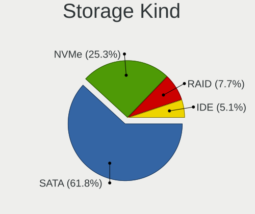

| Kind | Notebooks | Percent |
|------|-----------|---------|
| SATA | 11931     | 61.84%  |
| NVMe | 4889      | 25.34%  |
| RAID | 1481      | 7.68%   |
| IDE  | 991       | 5.14%   |

Processor
---------

CPU Vendor
----------

Processor vendors

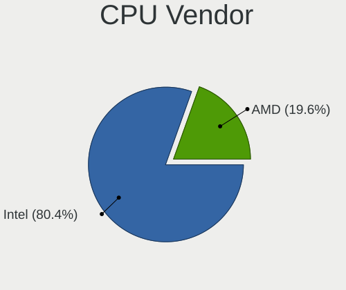

| Vendor | Notebooks | Percent |
|--------|-----------|---------|
| Intel  | 13231     | 80.45%  |
| AMD    | 3216      | 19.55%  |

CPU Model
---------

Processor models

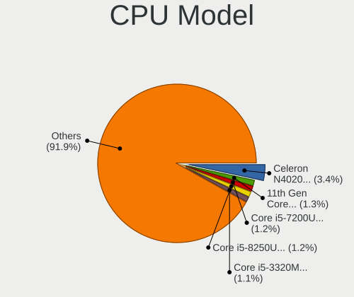

| Model                                         | Notebooks | Percent |
|-----------------------------------------------|-----------|---------|
| Intel Celeron N4020 CPU @ 1.10GHz             | 554       | 3.37%   |
| Intel 11th Gen Core i5-1135G7 @ 2.40GHz       | 207       | 1.26%   |
| Intel Core i5-7200U CPU @ 2.50GHz             | 196       | 1.19%   |
| Intel Core i5-8250U CPU @ 1.60GHz             | 191       | 1.16%   |
| Intel Core i5-3320M CPU @ 2.60GHz             | 183       | 1.11%   |
| Intel Core i5-2520M CPU @ 2.50GHz             | 174       | 1.06%   |
| Intel Celeron CPU N3350 @ 1.10GHz             | 171       | 1.04%   |
| Intel Core i5-6200U CPU @ 2.30GHz             | 169       | 1.03%   |
| Intel Core i5-6300U CPU @ 2.40GHz             | 163       | 0.99%   |
| Intel Core i5-3210M CPU @ 2.50GHz             | 157       | 0.95%   |
| Intel Core i5-5200U CPU @ 2.20GHz             | 148       | 0.9%    |
| Intel Celeron CPU N2840 @ 2.16GHz             | 148       | 0.9%    |
| AMD Ryzen 5 3500U with Radeon Vega Mobile Gfx | 143       | 0.87%   |
| Intel Core i7-2677M CPU @ 1.80GHz             | 130       | 0.79%   |
| Intel Core i5-5300U CPU @ 2.30GHz             | 125       | 0.76%   |
| AMD Ryzen 5 5500U with Radeon Graphics        | 120       | 0.73%   |
| Intel Celeron CPU N3060 @ 1.60GHz             | 119       | 0.72%   |
| Intel 11th Gen Core i7-1165G7 @ 2.80GHz       | 119       | 0.72%   |
| Intel Core i5-8350U CPU @ 1.70GHz             | 115       | 0.7%    |
| Intel Core i7-8550U CPU @ 1.80GHz             | 112       | 0.68%   |
| Intel Core i5-3230M CPU @ 2.60GHz             | 111       | 0.67%   |
| Intel Core i5 CPU M 520 @ 2.40GHz             | 111       | 0.67%   |
| Intel Core i5-8265U CPU @ 1.60GHz             | 106       | 0.64%   |
| Intel Core i5-2450M CPU @ 2.50GHz             | 105       | 0.64%   |
| Intel Core i3-5005U CPU @ 2.00GHz             | 102       | 0.62%   |
| Intel Core i7-6500U CPU @ 2.50GHz             | 100       | 0.61%   |
| Intel Core i3 CPU M 370 @ 2.40GHz             | 97        | 0.59%   |
| Intel Core i7-7500U CPU @ 2.70GHz             | 95        | 0.58%   |
| AMD Ryzen 7 5700U with Radeon Graphics        | 93        | 0.57%   |
| Intel Core i7-6700HQ CPU @ 2.60GHz            | 91        | 0.55%   |
| Intel Core i5-2410M CPU @ 2.30GHz             | 91        | 0.55%   |
| Intel Core i5-4210U CPU @ 1.70GHz             | 90        | 0.55%   |
| Intel Core i3-6006U CPU @ 2.00GHz             | 90        | 0.55%   |
| Intel 11th Gen Core i3-1115G4 @ 3.00GHz       | 90        | 0.55%   |
| Intel Core i3-3110M CPU @ 2.40GHz             | 88        | 0.53%   |
| Intel Core i5-4200U CPU @ 1.60GHz             | 87        | 0.53%   |
| Intel Core i7-7700HQ CPU @ 2.80GHz            | 86        | 0.52%   |
| Intel Core i5-1035G1 CPU @ 1.00GHz            | 85        | 0.52%   |
| Intel Core i7-8750H CPU @ 2.20GHz             | 84        | 0.51%   |
| Intel Core i3-2310M CPU @ 2.10GHz             | 84        | 0.51%   |

CPU Model Family
----------------

Processor model prefix

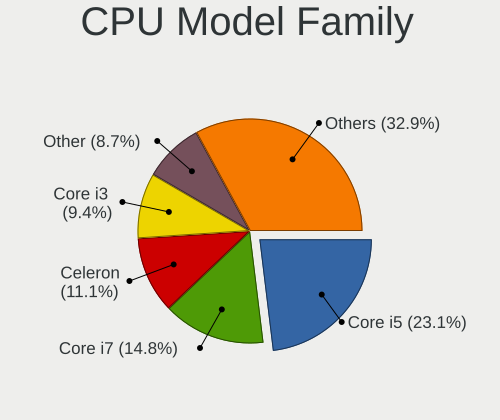

| Model                   | Notebooks | Percent |
|-------------------------|-----------|---------|
| Intel Core i5           | 3797      | 23.08%  |
| Intel Core i7           | 2439      | 14.82%  |
| Intel Celeron           | 1819      | 11.06%  |
| Intel Core i3           | 1552      | 9.43%   |
| Other                   | 1426      | 8.67%   |
| Intel Core 2 Duo        | 865       | 5.26%   |
| AMD Ryzen 5             | 693       | 4.21%   |
| AMD Ryzen 7             | 607       | 3.69%   |
| Intel Pentium           | 522       | 3.17%   |
| AMD Ryzen 3             | 220       | 1.34%   |
| AMD A6                  | 203       | 1.23%   |
| Intel Pentium Dual-Core | 196       | 1.19%   |
| Intel Atom              | 137       | 0.83%   |
| AMD A4                  | 133       | 0.81%   |
| AMD E                   | 127       | 0.77%   |
| AMD Ryzen 9             | 125       | 0.76%   |
| AMD E1                  | 115       | 0.7%    |
| AMD A8                  | 115       | 0.7%    |
| Intel Pentium Dual      | 109       | 0.66%   |
| AMD A10                 | 106       | 0.64%   |
| Intel Core              | 104       | 0.63%   |
| Intel Genuine           | 92        | 0.56%   |
| Intel Pentium Silver    | 90        | 0.55%   |
| AMD Ryzen 7 PRO         | 82        | 0.5%    |
| AMD E2                  | 76        | 0.46%   |
| AMD Athlon              | 68        | 0.41%   |
| AMD Ryzen 5 PRO         | 61        | 0.37%   |
| Intel Core 2            | 56        | 0.34%   |
| AMD C-60                | 43        | 0.26%   |
| Intel Celeron Dual-Core | 38        | 0.23%   |
| AMD Turion 64 X2 Mobile | 31        | 0.19%   |
| Intel Xeon              | 28        | 0.17%   |
| Intel Core m3           | 28        | 0.17%   |
| AMD Athlon II           | 27        | 0.16%   |
| AMD Athlon X2           | 23        | 0.14%   |
| AMD Phenom II           | 22        | 0.13%   |
| Intel Pentium Gold      | 20        | 0.12%   |
| Intel Core i9           | 20        | 0.12%   |
| AMD A12                 | 20        | 0.12%   |
| Intel Core M            | 17        | 0.1%    |

CPU Cores
---------

Number of processor cores

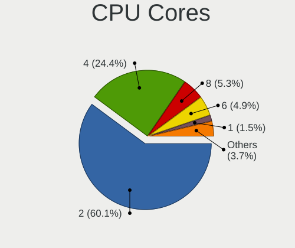

| Number | Notebooks | Percent |
|--------|-----------|---------|
| 2      | 9902      | 60.14%  |
| 4      | 4024      | 24.44%  |
| 8      | 874       | 5.31%   |
| 6      | 807       | 4.9%    |
| 1      | 246       | 1.49%   |
| 10     | 175       | 1.06%   |
| 12     | 168       | 1.02%   |
| 14     | 145       | 0.88%   |
| 16     | 81        | 0.49%   |
| 24     | 28        | 0.17%   |
| 3      | 7         | 0.04%   |
| 20     | 4         | 0.02%   |
| 5      | 4         | 0.02%   |
| 22     | 1         | 0.01%   |

CPU Sockets
-----------

Number of sockets

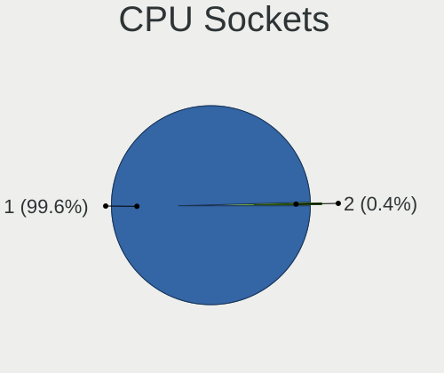

| Number | Notebooks | Percent |
|--------|-----------|---------|
| 1      | 16378     | 99.56%  |
| 2      | 72        | 0.44%   |

CPU Threads
-----------

Threads per core (Hyper-Threading)

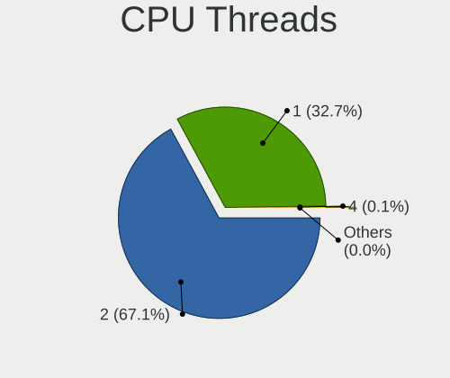

| Number | Notebooks | Percent |
|--------|-----------|---------|
| 2      | 11050     | 67.09%  |
| 1      | 5381      | 32.67%  |
| 4      | 19        | 0.12%   |
| 8      | 18        | 0.11%   |
| 12     | 2         | 0.01%   |
| 16     | 1         | 0.01%   |

CPU Op-Modes
------------

CPU Operation Modes (32-bit, 64-bit)

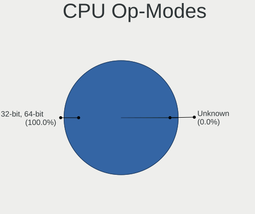

| Op mode        | Notebooks | Percent |
|----------------|-----------|---------|
| 32-bit, 64-bit | 16444     | 99.98%  |
| Unknown        | 3         | 0.02%   |

CPU Microcode
-------------

Microcode number

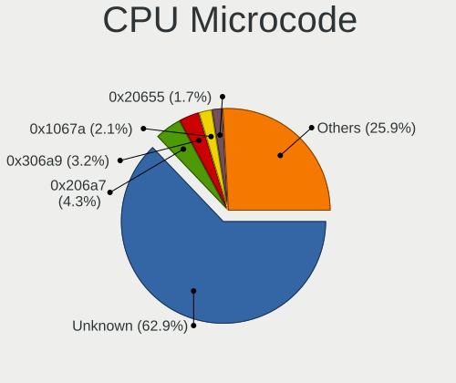

| Number     | Notebooks | Percent |
|------------|-----------|---------|
| Unknown    | 10713     | 62.87%  |
| 0x206a7    | 732       | 4.3%    |
| 0x306a9    | 546       | 3.2%    |
| 0x1067a    | 359       | 2.11%   |
| 0x20655    | 284       | 1.67%   |
| 0x40651    | 262       | 1.54%   |
| 0x406e3    | 233       | 1.37%   |
| 0x306d4    | 218       | 1.28%   |
| 0x806e9    | 185       | 1.09%   |
| 0x08108109 | 184       | 1.08%   |
| 0x6fd      | 183       | 1.07%   |
| 0x306c3    | 158       | 0.93%   |
| 0x806ea    | 149       | 0.87%   |
| 0x30678    | 143       | 0.84%   |
| 0x10676    | 131       | 0.77%   |
| 0x806ec    | 130       | 0.76%   |
| 0x06006705 | 110       | 0.65%   |
| 0x806c1    | 93        | 0.55%   |
| 0x08608103 | 90        | 0.53%   |
| 0x406c4    | 88        | 0.52%   |
| 0x0500010d | 87        | 0.51%   |
| 0x20652    | 86        | 0.5%    |
| 0x07030105 | 80        | 0.47%   |
| 0x706e5    | 77        | 0.45%   |
| 0x0a50000c | 76        | 0.45%   |
| 0x906ea    | 73        | 0.43%   |
| 0x08108102 | 73        | 0.43%   |
| 0x506e3    | 71        | 0.42%   |
| 0x506c9    | 71        | 0.42%   |
| 0x706a1    | 65        | 0.38%   |
| 0x706a8    | 59        | 0.35%   |
| 0x08600106 | 52        | 0.31%   |
| 0x05000101 | 46        | 0.27%   |
| 0x906e9    | 45        | 0.26%   |
| 0x406c3    | 39        | 0.23%   |
| 0x0700010b | 39        | 0.23%   |
| 0xa0652    | 37        | 0.22%   |
| 0x6fb      | 37        | 0.22%   |
| 0x0600611a | 36        | 0.21%   |
| 0x08200103 | 35        | 0.21%   |

CPU Microarch
-------------

Microarchitecture

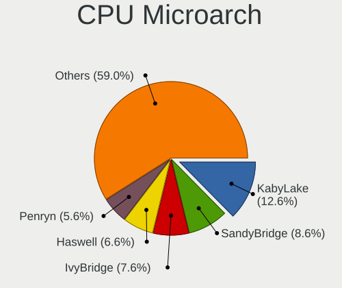

| Name               | Notebooks | Percent |
|--------------------|-----------|---------|
| KabyLake           | 2073      | 12.59%  |
| SandyBridge        | 1417      | 8.61%   |
| IvyBridge          | 1254      | 7.62%   |
| Haswell            | 1086      | 6.6%    |
| Penryn             | 926       | 5.63%   |
| Skylake            | 886       | 5.38%   |
| Goldmont plus      | 809       | 4.91%   |
| Westmere           | 784       | 4.76%   |
| Unknown            | 768       | 4.67%   |
| Silvermont         | 619       | 3.76%   |
| Broadwell          | 592       | 3.6%    |
| TigerLake          | 560       | 3.4%    |
| Alderlake Hybrid   | 559       | 3.4%    |
| Core               | 516       | 3.13%   |
| Zen+               | 486       | 2.95%   |
| Zen 3              | 351       | 2.13%   |
| Excavator          | 327       | 1.99%   |
| Icelake            | 309       | 1.88%   |
| Bobcat             | 267       | 1.62%   |
| Zen 2              | 250       | 1.52%   |
| Goldmont           | 249       | 1.51%   |
| Puma               | 196       | 1.19%   |
| CometLake          | 162       | 0.98%   |
| Zen                | 154       | 0.94%   |
| Jaguar             | 99        | 0.6%    |
| Bonnell            | 97        | 0.59%   |
| K10                | 96        | 0.58%   |
| Piledriver         | 86        | 0.52%   |
| Meteorlake Hybrid  | 82        | 0.5%    |
| Tremont            | 78        | 0.47%   |
| K8 Hammer          | 71        | 0.43%   |
| K10 Llano          | 68        | 0.41%   |
| Gracemont          | 53        | 0.32%   |
| Nehalem            | 50        | 0.3%    |
| K8 & K10 hybrid    | 48        | 0.29%   |
| Steamroller        | 22        | 0.13%   |
| Lunarlake Hybrid   | 10        | 0.06%   |
| ArrowLake-H Hybrid | 2         | 0.01%   |

Graphics
--------

GPU Vendor
----------

Vendors of graphics cards

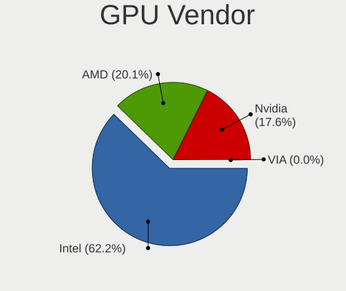

| Vendor                           | Notebooks | Percent |
|----------------------------------|-----------|---------|
| Intel                            | 12140     | 62.25%  |
| AMD                              | 3924      | 20.12%  |
| Nvidia                           | 3425      | 17.56%  |
| Silicon Integrated Systems [SiS] | 12        | 0.06%   |
| VIA Technologies                 | 2         | 0.01%   |

GPU Model
---------

Graphics card models

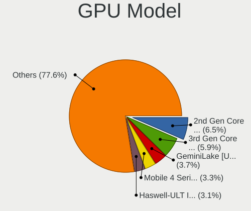

| Model                                                                                    | Notebooks | Percent |
|------------------------------------------------------------------------------------------|-----------|---------|
| Intel 2nd Generation Core Processor Family Integrated Graphics Controller                | 1305      | 6.49%   |
| Intel 3rd Gen Core processor Graphics Controller                                         | 1176      | 5.85%   |
| Intel GeminiLake [UHD Graphics 600]                                                      | 742       | 3.69%   |
| Intel Mobile 4 Series Chipset Integrated Graphics Controller                             | 660       | 3.28%   |
| Intel Haswell-ULT Integrated Graphics Controller                                         | 629       | 3.13%   |
| Intel Skylake-U GT2 [HD Graphics 520]                                                    | 612       | 3.04%   |
| Intel Core Processor Integrated Graphics Controller                                      | 560       | 2.79%   |
| AMD Picasso/Raven 2 [Radeon Vega Series / Radeon Vega Mobile Series]                     | 536       | 2.67%   |
| Intel Kaby Lake-R GT2 [UHD Graphics 620]                                                 | 520       | 2.59%   |
| Intel Kaby Lake-U GT2 [HD Graphics 620]                                                  | 495       | 2.46%   |
| Intel Broadwell-U GT2 [HD Graphics 5500]                                                 | 494       | 2.46%   |
| Intel TigerLake-LP GT2 [Iris Xe Graphics]                                                | 432       | 2.15%   |
| Intel 4th Gen Core Processor Integrated Graphics Controller                              | 383       | 1.91%   |
| Intel Atom Processor Z36xxx/Z37xxx Series Graphics & Display                             | 350       | 1.74%   |
| Intel Mobile GM965/GL960 Integrated Graphics Controller (secondary)                      | 274       | 1.36%   |
| Intel Mobile GM965/GL960 Integrated Graphics Controller (primary)                        | 274       | 1.36%   |
| Intel Atom/Celeron/Pentium Processor x5-E8000/J3xxx/N3xxx Integrated Graphics Controller | 269       | 1.34%   |
| Intel WhiskeyLake-U GT2 [UHD Graphics 620]                                               | 264       | 1.31%   |
| Intel CoffeeLake-H GT2 [UHD Graphics 630]                                                | 251       | 1.25%   |
| AMD Lucienne                                                                             | 245       | 1.22%   |
| AMD Renoir [Radeon Vega Series / Radeon Vega Mobile Series]                              | 238       | 1.18%   |
| AMD Stoney [Radeon R2/R3/R4/R5 Graphics]                                                 | 228       | 1.13%   |
| Intel CometLake-U GT2 [UHD Graphics]                                                     | 218       | 1.08%   |
| Intel Apollo Lake GT1 [HD Graphics 500]                                                  | 209       | 1.04%   |
| AMD Cezanne [Radeon Vega Series / Radeon Vega Mobile Series]                             | 204       | 1.01%   |
| Intel Alder Lake-P GT2 [Iris Xe Graphics]                                                | 168       | 0.84%   |
| Intel Iris Plus Graphics G1 (Ice Lake)                                                   | 161       | 0.8%    |
| Nvidia TU117M [GeForce GTX 1650 Mobile / Max-Q]                                          | 158       | 0.79%   |
| Intel Skylake-H GT2 [HD Graphics 530]                                                    | 149       | 0.74%   |
| Intel CometLake-H GT2 [UHD Graphics]                                                     | 139       | 0.69%   |
| AMD Phoenix1                                                                             | 137       | 0.68%   |
| Intel Kaby Lake-H GT2 [HD Graphics 630]                                                  | 134       | 0.67%   |
| AMD Mullins [Radeon R4/R5 Graphics]                                                      | 131       | 0.65%   |
| AMD Barcelo                                                                              | 129       | 0.64%   |
| Nvidia GF117M [GeForce 610M/710M/810M/820M / GT 620M/625M/630M/720M]                     | 124       | 0.62%   |
| AMD Rembrandt [Radeon 680M]                                                              | 122       | 0.61%   |
| Intel Tiger Lake-LP GT2 [UHD Graphics G4]                                                | 121       | 0.6%    |
| Intel TigerLake-H GT1 [UHD Graphics]                                                     | 118       | 0.59%   |
| AMD Sun XT [Radeon HD 8670A/8670M/8690M / R5 M330 / M430 / Radeon 520 Mobile]            | 110       | 0.55%   |
| Nvidia GA106M [GeForce RTX 3060 Mobile / Max-Q]                                          | 108       | 0.54%   |

GPU Combo
---------

Combinations of graphics cards

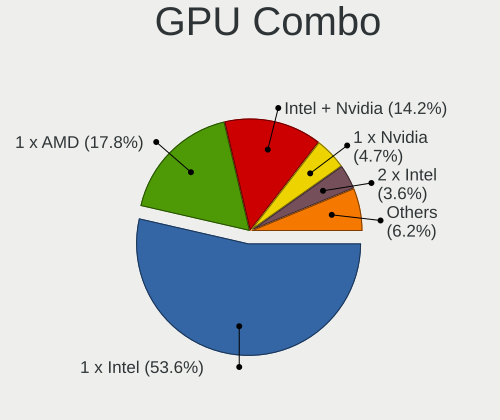

| Name                   | Notebooks | Percent |
|------------------------|-----------|---------|
| 1 x Intel              | 8844      | 53.58%  |
| 1 x AMD                | 2931      | 17.76%  |
| Intel + Nvidia         | 2337      | 14.16%  |
| 1 x Nvidia             | 774       | 4.69%   |
| 2 x Intel              | 593       | 3.59%   |
| Intel + AMD            | 409       | 2.48%   |
| AMD + Nvidia           | 304       | 1.84%   |
| 2 x AMD                | 287       | 1.74%   |
| 1 x SiS                | 12        | 0.07%   |
| 2 x Nvidia             | 10        | 0.06%   |
| 1 x VIA                | 2         | 0.01%   |
| 2 x Intel + 1 x Nvidia | 1         | 0.01%   |
| Intel + 2 x Nvidia     | 1         | 0.01%   |

GPU Driver
----------

Free vs proprietary

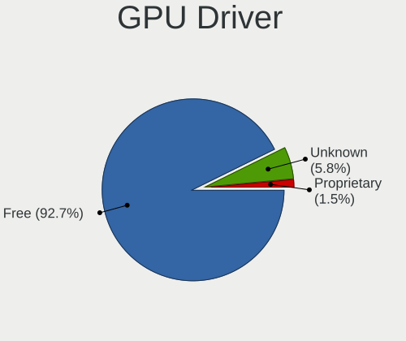

| Driver      | Notebooks | Percent |
|-------------|-----------|---------|
| Free        | 15331     | 92.71%  |
| Unknown     | 960       | 5.81%   |
| Proprietary | 246       | 1.49%   |

GPU Memory
----------

Total video memory

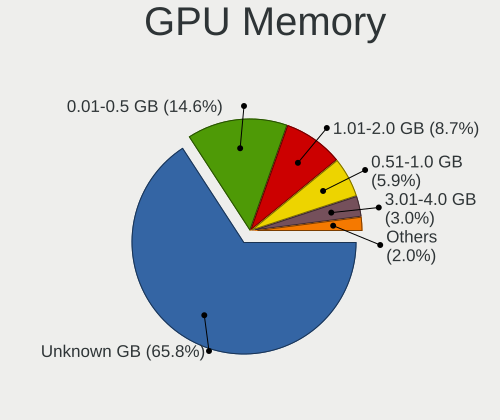

| Size in GB | Notebooks | Percent |
|------------|-----------|---------|
| Unknown    | 10923     | 65.82%  |
| 0.01-0.5   | 2419      | 14.58%  |
| 1.01-2.0   | 1443      | 8.7%    |
| 0.51-1.0   | 972       | 5.86%   |
| 3.01-4.0   | 499       | 3.01%   |
| 7.01-8.0   | 155       | 0.93%   |
| 5.01-6.0   | 119       | 0.72%   |
| 2.01-3.0   | 36        | 0.22%   |
| 8.01-16.0  | 24        | 0.14%   |
| 16.01-24.0 | 2         | 0.01%   |
| 32.01-64.0 | 1         | 0.01%   |
| 24.01-32.0 | 1         | 0.01%   |

Monitor
-------

Monitor Vendor
--------------

Monitor vendors

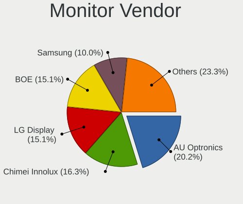

| Vendor                  | Notebooks | Percent |
|-------------------------|-----------|---------|
| AU Optronics            | 3495      | 20.22%  |
| Chimei Innolux          | 2811      | 16.26%  |
| LG Display              | 2611      | 15.1%   |
| BOE                     | 2604      | 15.06%  |
| Samsung Electronics     | 1732      | 10.02%  |
| Lenovo                  | 515       | 2.98%   |
| Chi Mei Optoelectronics | 456       | 2.64%   |
| Sharp                   | 316       | 1.83%   |
| Apple                   | 284       | 1.64%   |
| LG Philips              | 182       | 1.05%   |
| PANDA                   | 176       | 1.02%   |
| Dell                    | 175       | 1.01%   |
| InfoVision              | 170       | 0.98%   |
| CPT                     | 170       | 0.98%   |
| Goldstar                | 166       | 0.96%   |
| Acer                    | 115       | 0.67%   |
| Hewlett-Packard         | 101       | 0.58%   |
| AOC                     | 72        | 0.42%   |
| Eizo                    | 66        | 0.38%   |
| RGT                     | 60        | 0.35%   |
| Philips                 | 57        | 0.33%   |
| CSOT                    | 52        | 0.3%    |
| Sony                    | 49        | 0.28%   |
| HKC                     | 49        | 0.28%   |
| Ancor Communications    | 44        | 0.25%   |
| Panasonic               | 43        | 0.25%   |
| BenQ                    | 43        | 0.25%   |
| HannStar                | 38        | 0.22%   |
| Toshiba                 | 37        | 0.21%   |
| InnoLux Display         | 32        | 0.19%   |
| CSO                     | 30        | 0.17%   |
| TMX                     | 28        | 0.16%   |
| ViewSonic               | 27        | 0.16%   |
| ASUSTek Computer        | 27        | 0.16%   |
| Iiyama                  | 23        | 0.13%   |
| CSW                     | 22        | 0.13%   |
| Vizio                   | 16        | 0.09%   |
| Unknown                 | 16        | 0.09%   |
| MSI                     | 16        | 0.09%   |
| KDB                     | 13        | 0.08%   |

Monitor Model
-------------

Monitor models

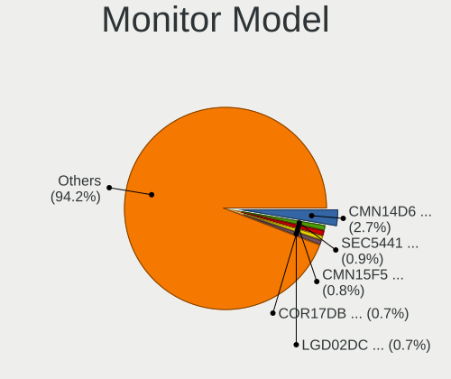

| Model                                                                    | Notebooks | Percent |
|--------------------------------------------------------------------------|-----------|---------|
| Chimei Innolux LCD Monitor CMN14D6 1366x768 309x173mm 13.9-inch          | 460       | 2.65%   |
| Samsung Electronics LCD Monitor SEC5441 1280x800 331x207mm 15.4-inch     | 150       | 0.87%   |
| Chimei Innolux LCD Monitor CMN15F5 1920x1080 344x193mm 15.5-inch         | 147       | 0.85%   |
| CPT LCD Monitor COR17DB 1600x900 293x164mm 13.2-inch                     | 129       | 0.74%   |
| LG Display LCD Monitor LGD02DC 1366x768 344x194mm 15.5-inch              | 128       | 0.74%   |
| AU Optronics LCD Monitor AUO38ED 1920x1080 344x193mm 15.5-inch           | 108       | 0.62%   |
| Chimei Innolux LCD Monitor CMN15DB 1366x768 344x193mm 15.5-inch          | 105       | 0.61%   |
| Chimei Innolux LCD Monitor CMN15E7 1920x1080 344x193mm 15.5-inch         | 102       | 0.59%   |
| AU Optronics LCD Monitor AUO22EC 1366x768 344x193mm 15.5-inch            | 100       | 0.58%   |
| AU Optronics LCD Monitor AUO26EC 1366x768 344x193mm 15.5-inch            | 97        | 0.56%   |
| AU Optronics LCD Monitor AUO21ED 1920x1080 344x193mm 15.5-inch           | 96        | 0.55%   |
| LG Display LCD Monitor LGD033A 1366x768 344x194mm 15.5-inch              | 86        | 0.5%    |
| Chimei Innolux LCD Monitor CMN14D4 1920x1080 309x173mm 13.9-inch         | 84        | 0.48%   |
| Chi Mei Optoelectronics LCD Monitor CMO15A7 1366x768 344x193mm 15.5-inch | 70        | 0.4%    |
| Chimei Innolux LCD Monitor CMN15E6 1366x768 344x193mm 15.5-inch          | 68        | 0.39%   |
| AU Optronics LCD Monitor AUO106C 1366x768 276x155mm 12.5-inch            | 67        | 0.39%   |
| AU Optronics LCD Monitor AUO71EC 1366x768 344x193mm 15.5-inch            | 66        | 0.38%   |
| RGT LCD Monitor RGT5211 1366x768 518x333mm 24.2-inch                     | 60        | 0.35%   |
| AU Optronics LCD Monitor AUO20EC 1366x768 344x193mm 15.5-inch            | 60        | 0.35%   |
| Eizo EV3285 ENC2979 3840x2160 698x393mm 31.5-inch                        | 59        | 0.34%   |
| BOE LCD Monitor BOE095F 2256x1504 285x190mm 13.5-inch                    | 59        | 0.34%   |
| Chimei Innolux LCD Monitor CMN1132 1366x768 256x144mm 11.6-inch          | 58        | 0.33%   |
| LG Display LCD Monitor LGD039F 1366x768 345x194mm 15.6-inch              | 56        | 0.32%   |
| Chimei Innolux LCD Monitor CMN1521 1920x1080 344x193mm 15.5-inch         | 56        | 0.32%   |
| BOE LCD Monitor BOE0812 1920x1080 344x194mm 15.5-inch                    | 52        | 0.3%    |
| Chimei Innolux LCD Monitor CMN15CA 1366x768 344x193mm 15.5-inch          | 50        | 0.29%   |
| Samsung Electronics LCD Monitor SEC544B 1600x900 382x214mm 17.2-inch     | 49        | 0.28%   |
| AU Optronics LCD Monitor AUO10EC 1366x768 344x193mm 15.5-inch            | 49        | 0.28%   |
| Chimei Innolux LCD Monitor CMN14C9 1920x1080 309x173mm 13.9-inch         | 48        | 0.28%   |
| AU Optronics LCD Monitor AUO183C 1366x768 309x173mm 13.9-inch            | 48        | 0.28%   |
| LG Display LCD Monitor LGD02D8 1366x768 277x156mm 12.5-inch              | 47        | 0.27%   |
| AU Optronics LCD Monitor AUO70EC 1366x768 344x193mm 15.5-inch            | 47        | 0.27%   |
| LG Display LCD Monitor LGD0521 1920x1080 309x174mm 14.0-inch             | 46        | 0.27%   |
| BOE LCD Monitor BOE0BCA 2256x1504 285x190mm 13.5-inch                    | 46        | 0.27%   |
| BOE LCD Monitor BOE06A5 1366x768 344x194mm 15.5-inch                     | 46        | 0.27%   |
| BOE LCD Monitor BOE06A4 1366x768 344x194mm 15.5-inch                     | 46        | 0.27%   |
| Chimei Innolux LCD Monitor CMN14C3 1366x768 309x173mm 13.9-inch          | 45        | 0.26%   |
| AU Optronics LCD Monitor AUO313C 1366x768 309x173mm 13.9-inch            | 45        | 0.26%   |
| AU Optronics LCD Monitor AUO45EC 1366x768 344x193mm 15.5-inch            | 44        | 0.25%   |
| AU Optronics LCD Monitor AUO23EC 1366x768 344x193mm 15.5-inch            | 44        | 0.25%   |

Monitor Resolution
------------------

Monitor screen resolution

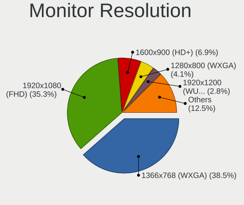

| Resolution         | Notebooks | Percent |
|--------------------|-----------|---------|
| 1366x768 (WXGA)    | 6492      | 38.51%  |
| 1920x1080 (FHD)    | 5950      | 35.29%  |
| 1600x900 (HD+)     | 1156      | 6.86%   |
| 1280x800 (WXGA)    | 686       | 4.07%   |
| 1920x1200 (WUXGA)  | 471       | 2.79%   |
| 3840x2160 (4K)     | 381       | 2.26%   |
| 1440x900 (WXGA+)   | 323       | 1.92%   |
| 2560x1600          | 268       | 1.59%   |
| 2560x1440 (QHD)    | 239       | 1.42%   |
| 2880x1800          | 130       | 0.77%   |
| 2256x1504          | 114       | 0.68%   |
| 1680x1050 (WSXGA+) | 96        | 0.57%   |
| 3840x2400          | 51        | 0.3%    |
| 1024x600           | 50        | 0.3%    |
| 3200x1800 (QHD+)   | 49        | 0.29%   |
| 1280x1024 (SXGA)   | 35        | 0.21%   |
| 2880x1920          | 34        | 0.2%    |
| 3440x1440          | 28        | 0.17%   |
| 2560x1080          | 28        | 0.17%   |
| 2160x1440          | 27        | 0.16%   |
| 1920x540           | 26        | 0.15%   |
| 1360x768           | 26        | 0.15%   |
| 1024x768 (XGA)     | 18        | 0.11%   |
| 3200x2000          | 17        | 0.1%    |
| 3072x1920          | 16        | 0.09%   |
| 1680x945           | 14        | 0.08%   |
| 1920x1280          | 13        | 0.08%   |
| Unknown            | 13        | 0.08%   |
| 800x1280           | 12        | 0.07%   |
| 2288x1287          | 12        | 0.07%   |
| 2240x1400          | 8         | 0.05%   |
| 2160x1350          | 8         | 0.05%   |
| 1400x1050          | 8         | 0.05%   |
| 2880x1620          | 7         | 0.04%   |
| 1600x2560          | 6         | 0.04%   |
| 1280x720 (HD)      | 6         | 0.04%   |
| 3456x2160          | 5         | 0.03%   |
| 2520x1680          | 5         | 0.03%   |
| 2400x1600          | 5         | 0.03%   |
| 3840x1080          | 4         | 0.02%   |

Monitor Diagonal
----------------

Diagonal size in inches

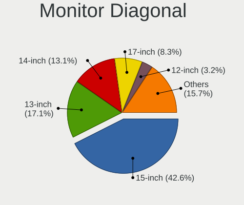

| Inches  | Notebooks | Percent |
|---------|-----------|---------|
| 15      | 7354      | 42.56%  |
| 13      | 2956      | 17.11%  |
| 14      | 2269      | 13.13%  |
| 17      | 1426      | 8.25%   |
| 12      | 555       | 3.21%   |
| 11      | 426       | 2.47%   |
| 16      | 409       | 2.37%   |
| 24      | 270       | 1.56%   |
| 27      | 247       | 1.43%   |
| 23      | 215       | 1.24%   |
| 31      | 196       | 1.13%   |
| 21      | 182       | 1.05%   |
| 18      | 165       | 0.95%   |
| 10      | 72        | 0.42%   |
| 19      | 60        | 0.35%   |
| Unknown | 58        | 0.34%   |
| 34      | 45        | 0.26%   |
| 22      | 40        | 0.23%   |
| 20      | 38        | 0.22%   |
| 84      | 32        | 0.19%   |
| 32      | 28        | 0.16%   |
| 54      | 26        | 0.15%   |
| 72      | 21        | 0.12%   |
| 40      | 21        | 0.12%   |
| 26      | 19        | 0.11%   |
| 63      | 14        | 0.08%   |
| 25      | 13        | 0.08%   |
| 28      | 12        | 0.07%   |
| 7       | 12        | 0.07%   |
| 65      | 10        | 0.06%   |
| 142     | 8         | 0.05%   |
| 48      | 8         | 0.05%   |
| 46      | 8         | 0.05%   |
| 86      | 7         | 0.04%   |
| 74      | 7         | 0.04%   |
| 52      | 6         | 0.03%   |
| 39      | 6         | 0.03%   |
| 49      | 5         | 0.03%   |
| 42      | 5         | 0.03%   |
| 37      | 4         | 0.02%   |

Monitor Width
-------------

Physical width

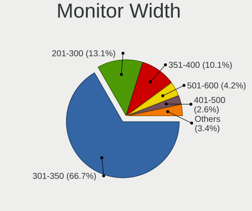

| Width in mm    | Notebooks | Percent |
|----------------|-----------|---------|
| 301-350        | 11494     | 66.69%  |
| 201-300        | 2257      | 13.1%   |
| 351-400        | 1738      | 10.08%  |
| 501-600        | 722       | 4.19%   |
| 401-500        | 443       | 2.57%   |
| 601-700        | 228       | 1.32%   |
| 1001-1500      | 93        | 0.54%   |
| 701-800        | 76        | 0.44%   |
| 1501-2000      | 63        | 0.37%   |
| Unknown        | 58        | 0.34%   |
| 801-900        | 32        | 0.19%   |
| 1-100          | 12        | 0.07%   |
| More than 2000 | 8         | 0.05%   |
| 901-1000       | 7         | 0.04%   |
| 101-200        | 3         | 0.02%   |

Aspect Ratio
------------

Proportional relationship between the width and the height

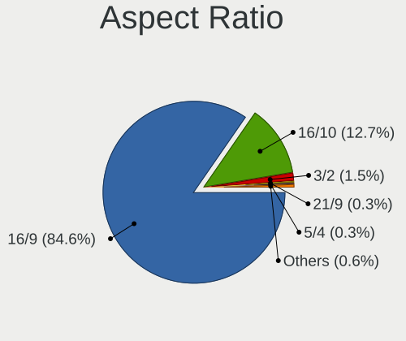

| Ratio   | Notebooks | Percent |
|---------|-----------|---------|
| 16/9    | 13765     | 84.62%  |
| 16/10   | 2072      | 12.74%  |
| 3/2     | 240       | 1.48%   |
| 21/9    | 49        | 0.3%    |
| 5/4     | 41        | 0.25%   |
| 4/3     | 36        | 0.22%   |
| Unknown | 15        | 0.09%   |
| 32/9    | 12        | 0.07%   |
| 0.67    | 11        | 0.07%   |
| 1.00    | 8         | 0.05%   |
| 0.56    | 7         | 0.04%   |
| 1.96    | 3         | 0.02%   |
| 3.40    | 2         | 0.01%   |
| 0.63    | 2         | 0.01%   |
| 6/5     | 1         | 0.01%   |
| 0.89    | 1         | 0.01%   |
| 0.62    | 1         | 0.01%   |

Monitor Area
------------

Area in inch²

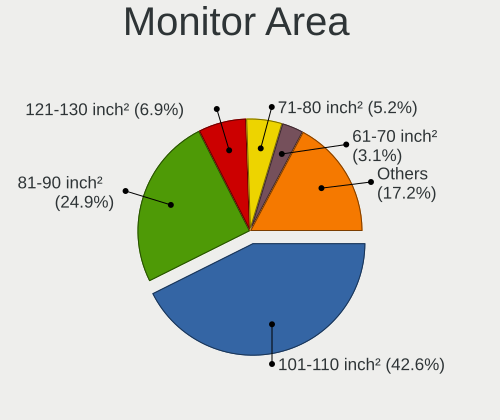

| Area in inch² | Notebooks | Percent |
|----------------|-----------|---------|
| 101-110        | 7358      | 42.63%  |
| 81-90          | 4295      | 24.88%  |
| 121-130        | 1199      | 6.95%   |
| 71-80          | 899       | 5.21%   |
| 61-70          | 542       | 3.14%   |
| 201-250        | 525       | 3.04%   |
| 51-60          | 429       | 2.49%   |
| 111-120        | 375       | 2.17%   |
| 351-500        | 280       | 1.62%   |
| 301-350        | 257       | 1.49%   |
| 131-140        | 220       | 1.27%   |
| 141-150        | 174       | 1.01%   |
| 251-300        | 159       | 0.92%   |
| More than 1000 | 146       | 0.85%   |
| 151-200        | 142       | 0.82%   |
| 41-50          | 72        | 0.42%   |
| 501-1000       | 59        | 0.34%   |
| 91-100         | 58        | 0.34%   |
| Unknown        | 58        | 0.34%   |
| 1-40           | 15        | 0.09%   |

Pixel Density
-------------

Pixels per inch

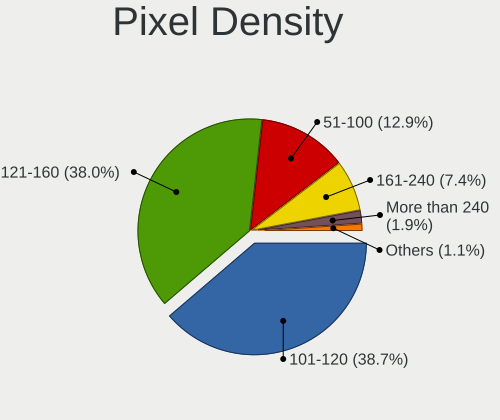

| Density       | Notebooks | Percent |
|---------------|-----------|---------|
| 101-120       | 6608      | 38.73%  |
| 121-160       | 6489      | 38.03%  |
| 51-100        | 2193      | 12.85%  |
| 161-240       | 1265      | 7.41%   |
| More than 240 | 327       | 1.92%   |
| 1-50          | 122       | 0.72%   |
| Unknown       | 58        | 0.34%   |

Multiple Monitors
-----------------

Total monitors connected

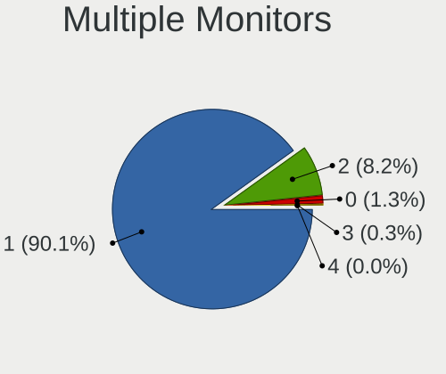

| Total | Notebooks | Percent |
|-------|-----------|---------|
| 1     | 14958     | 90.09%  |
| 2     | 1369      | 8.25%   |
| 0     | 224       | 1.35%   |
| 3     | 49        | 0.3%    |
| 4     | 4         | 0.02%   |

Network
-------

Net Controller Vendor
---------------------

Controller vendors

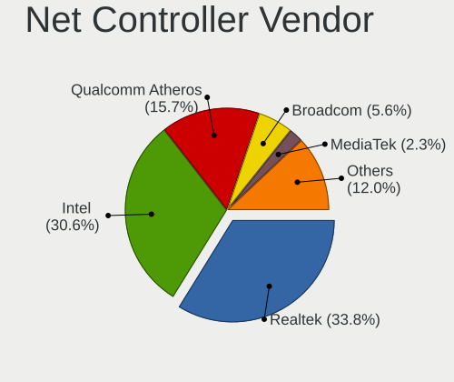

| Vendor                                 | Notebooks | Percent |
|----------------------------------------|-----------|---------|
| Realtek Semiconductor                  | 8704      | 33.84%  |
| Intel                                  | 7875      | 30.61%  |
| Qualcomm Atheros                       | 4036      | 15.69%  |
| Broadcom                               | 1441      | 5.6%    |
| MediaTek                               | 581       | 2.26%   |
| ASIX Electronics                       | 562       | 2.18%   |
| Broadcom Limited                       | 382       | 1.49%   |
| Marvell Technology Group               | 299       | 1.16%   |
| Ralink                                 | 230       | 0.89%   |
| Samsung Electronics                    | 191       | 0.74%   |
| Dell                                   | 118       | 0.46%   |
| TP-Link                                | 116       | 0.45%   |
| Ericsson Business Mobile Networks      | 107       | 0.42%   |
| JMicron Technology                     | 104       | 0.4%    |
| Sierra Wireless                        | 96        | 0.37%   |
| Ralink Technology                      | 88        | 0.34%   |
| Huawei Technologies                    | 75        | 0.29%   |
| Nvidia                                 | 67        | 0.26%   |
| Shenzhen Goodix Technology             | 61        | 0.24%   |
| Qualcomm                               | 59        | 0.23%   |
| Hewlett-Packard                        | 46        | 0.18%   |
| Lenovo                                 | 34        | 0.13%   |
| Xiaomi                                 | 28        | 0.11%   |
| DisplayLink                            | 26        | 0.1%    |
| Motorola PCS                           | 24        | 0.09%   |
| Qualcomm Atheros Communications        | 23        | 0.09%   |
| ZTE WCDMA Technologies MSM             | 21        | 0.08%   |
| D-Link                                 | 21        | 0.08%   |
| NetGear                                | 20        | 0.08%   |
| Suzhou Motorcomm Electronic Technology | 19        | 0.07%   |
| OPPO Electronics                       | 19        | 0.07%   |
| ICS Advent                             | 18        | 0.07%   |
| Google                                 | 18        | 0.07%   |
| Silicon Integrated Systems [SiS]       | 16        | 0.06%   |
| Linksys                                | 15        | 0.06%   |
| Edimax Technology                      | 13        | 0.05%   |
| Fibocom                                | 12        | 0.05%   |
| ASUSTek Computer                       | 12        | 0.05%   |
| D-Link System                          | 11        | 0.04%   |
| Apple                                  | 10        | 0.04%   |

Net Controller Model
--------------------

Controller models

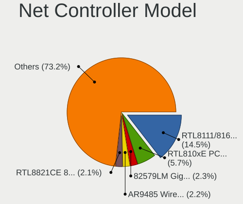

| Model                                                                  | Notebooks | Percent |
|------------------------------------------------------------------------|-----------|---------|
| Realtek RTL8111/8168/8211/8411 PCI Express Gigabit Ethernet Controller | 4489      | 14.51%  |
| Realtek RTL810xE PCI Express Fast Ethernet controller                  | 1754      | 5.67%   |
| Intel 82579LM Gigabit Network Connection (Lewisville)                  | 711       | 2.3%    |
| Qualcomm Atheros AR9485 Wireless Network Adapter                       | 675       | 2.18%   |
| Realtek RTL8821CE 802.11ac PCIe Wireless Network Adapter               | 657       | 2.12%   |
| Qualcomm Atheros QCA9565 / AR9565 Wireless Network Adapter             | 649       | 2.1%    |
| Intel Wireless 8265 / 8275                                             | 645       | 2.08%   |
| Qualcomm Atheros QCA9377 802.11ac Wireless Network Adapter             | 627       | 2.03%   |
| Qualcomm Atheros AR9285 Wireless Network Adapter (PCI-Express)         | 626       | 2.02%   |
| ASIX AX88179 Gigabit Ethernet                                          | 543       | 1.76%   |
| Intel Wireless 7265                                                    | 534       | 1.73%   |
| Realtek RTL8852BE PCIe 802.11ax Wireless Network Controller            | 529       | 1.71%   |
| Intel Centrino Advanced-N 6205 [Taylor Peak]                           | 514       | 1.66%   |
| Intel Wireless 7260                                                    | 494       | 1.6%    |
| Realtek RTL8153 Gigabit Ethernet Adapter                               | 426       | 1.38%   |
| Realtek RTL8822CE 802.11ac PCIe Wireless Network Adapter               | 421       | 1.36%   |
| Intel Wireless 8260                                                    | 403       | 1.3%    |
| Intel Wi-Fi 6 AX201                                                    | 384       | 1.24%   |
| Intel Wi-Fi 6 AX200                                                    | 369       | 1.19%   |
| Intel Ethernet Connection (4) I219-LM                                  | 311       | 1.01%   |
| Broadcom BCM4313 802.11bgn Wireless Network Adapter                    | 310       | 1%      |
| Qualcomm Atheros QCA6174 802.11ac Wireless Network Adapter             | 306       | 0.99%   |
| Realtek RTL8188CE 802.11b/g/n WiFi Adapter                             | 303       | 0.98%   |
| Realtek RTL8723BE PCIe Wireless Network Adapter                        | 299       | 0.97%   |
| Intel Wireless 3165                                                    | 283       | 0.91%   |
| MediaTek MT7921 802.11ax PCIe Wireless Network Adapter [Filogic 330]   | 249       | 0.8%    |
| Intel Alder Lake-P PCH CNVi WiFi                                       | 241       | 0.78%   |
| Intel 82577LM Gigabit Network Connection                               | 227       | 0.73%   |
| Intel Wi-Fi 6E(802.11ax) AX210/AX1675* 2x2 [Typhoon Peak]              | 224       | 0.72%   |
| Intel Wireless 3160                                                    | 222       | 0.72%   |
| Intel Ethernet Connection I219-LM                                      | 208       | 0.67%   |
| MediaTek MT7922 802.11ax PCI Express Wireless Network Adapter          | 207       | 0.67%   |
| Intel Ethernet Connection (3) I218-LM                                  | 195       | 0.63%   |
| Intel Ethernet Connection I218-LM                                      | 190       | 0.61%   |
| Intel Centrino Ultimate-N 6300                                         | 190       | 0.61%   |
| Intel Comet Lake PCH-LP CNVi WiFi                                      | 182       | 0.59%   |
| Qualcomm Atheros AR8151 v2.0 Gigabit Ethernet                          | 181       | 0.59%   |
| Qualcomm Atheros AR9462 Wireless Network Adapter                       | 177       | 0.57%   |
| Intel WiFi Link 5100                                                   | 175       | 0.57%   |
| Intel Centrino Advanced-N 6200                                         | 175       | 0.57%   |

Wireless Vendor
---------------

Wireless vendors

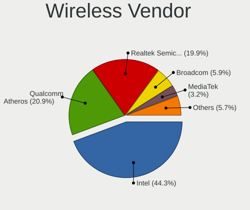

| Vendor                                | Notebooks | Percent |
|---------------------------------------|-----------|---------|
| Intel                                 | 7414      | 44.34%  |
| Qualcomm Atheros                      | 3492      | 20.88%  |
| Realtek Semiconductor                 | 3329      | 19.91%  |
| Broadcom                              | 993       | 5.94%   |
| MediaTek                              | 538       | 3.22%   |
| Ralink                                | 230       | 1.38%   |
| Broadcom Limited                      | 201       | 1.2%    |
| Sierra Wireless                       | 96        | 0.57%   |
| Ralink Technology                     | 88        | 0.53%   |
| Dell                                  | 73        | 0.44%   |
| TP-Link                               | 65        | 0.39%   |
| Qualcomm                              | 42        | 0.25%   |
| Qualcomm Atheros Communications       | 23        | 0.14%   |
| NetGear                               | 15        | 0.09%   |
| D-Link                                | 15        | 0.09%   |
| Edimax Technology                     | 13        | 0.08%   |
| Fibocom                               | 12        | 0.07%   |
| D-Link System                         | 11        | 0.07%   |
| Linksys                               | 10        | 0.06%   |
| Hewlett-Packard                       | 9         | 0.05%   |
| ASUSTek Computer                      | 9         | 0.05%   |
| Belkin Components                     | 7         | 0.04%   |
| Qualcomm Technologies                 | 6         | 0.04%   |
| AVM                                   | 4         | 0.02%   |
| ZyDAS                                 | 3         | 0.02%   |
| Qcom                                  | 3         | 0.02%   |
| Microsoft                             | 3         | 0.02%   |
| Mercucys                              | 3         | 0.02%   |
| Elecom                                | 3         | 0.02%   |
| PLANEX                                | 2         | 0.01%   |
| Ericsson Business Mobile Networks     | 2         | 0.01%   |
| ZyXEL Communications                  | 1         | 0.01%   |
| Sitecom Europe                        | 1         | 0.01%   |
| Senao                                 | 1         | 0.01%   |
| Samsung Electronics                   | 1         | 0.01%   |
| Realtek                               | 1         | 0.01%   |
| Quectel Wireless Solutions            | 1         | 0.01%   |
| Fujitsu Siemens Computers             | 1         | 0.01%   |
| 802.11g Adapter [Linksys WUSB54GC v3] | 1         | 0.01%   |

Wireless Model
--------------

Wireless models

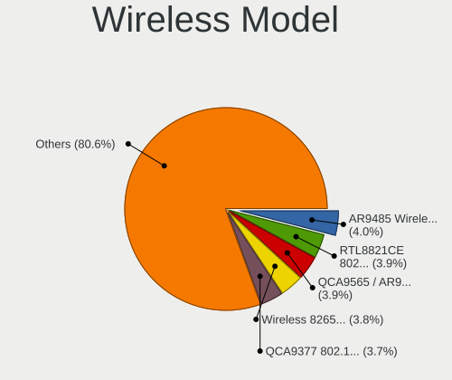

| Model                                                                   | Notebooks | Percent |
|-------------------------------------------------------------------------|-----------|---------|
| Qualcomm Atheros AR9485 Wireless Network Adapter                        | 675       | 4.03%   |
| Realtek RTL8821CE 802.11ac PCIe Wireless Network Adapter                | 657       | 3.92%   |
| Qualcomm Atheros QCA9565 / AR9565 Wireless Network Adapter              | 649       | 3.87%   |
| Intel Wireless 8265 / 8275                                              | 645       | 3.85%   |
| Qualcomm Atheros QCA9377 802.11ac Wireless Network Adapter              | 627       | 3.74%   |
| Qualcomm Atheros AR9285 Wireless Network Adapter (PCI-Express)          | 626       | 3.73%   |
| Intel Wireless 7265                                                     | 534       | 3.19%   |
| Realtek RTL8852BE PCIe 802.11ax Wireless Network Controller             | 524       | 3.13%   |
| Intel Centrino Advanced-N 6205 [Taylor Peak]                            | 514       | 3.07%   |
| Intel Wireless 7260                                                     | 494       | 2.95%   |
| Realtek RTL8822CE 802.11ac PCIe Wireless Network Adapter                | 421       | 2.51%   |
| Intel Wireless 8260                                                     | 403       | 2.4%    |
| Intel Wi-Fi 6 AX201                                                     | 384       | 2.29%   |
| Intel Wi-Fi 6 AX200                                                     | 369       | 2.2%    |
| Broadcom BCM4313 802.11bgn Wireless Network Adapter                     | 310       | 1.85%   |
| Qualcomm Atheros QCA6174 802.11ac Wireless Network Adapter              | 306       | 1.83%   |
| Realtek RTL8188CE 802.11b/g/n WiFi Adapter                              | 303       | 1.81%   |
| Realtek RTL8723BE PCIe Wireless Network Adapter                         | 299       | 1.78%   |
| Intel Wireless 3165                                                     | 283       | 1.69%   |
| MediaTek MT7921 802.11ax PCIe Wireless Network Adapter [Filogic 330]    | 249       | 1.49%   |
| Intel Wi-Fi 6E(802.11ax) AX210/AX1675* 2x2 [Typhoon Peak]               | 224       | 1.34%   |
| Intel Wireless 3160                                                     | 222       | 1.32%   |
| MediaTek MT7922 802.11ax PCI Express Wireless Network Adapter           | 197       | 1.18%   |
| Intel Centrino Ultimate-N 6300                                          | 190       | 1.13%   |
| Intel Comet Lake PCH-LP CNVi WiFi                                       | 182       | 1.09%   |
| Qualcomm Atheros AR9462 Wireless Network Adapter                        | 177       | 1.06%   |
| Intel WiFi Link 5100                                                    | 175       | 1.04%   |
| Intel Centrino Advanced-N 6200                                          | 175       | 1.04%   |
| Intel Cannon Point-LP CNVi [Wireless-AC]                                | 174       | 1.04%   |
| Intel Cannon Lake PCH CNVi WiFi                                         | 166       | 0.99%   |
| Intel Dual Band Wireless-AC 3168NGW [Stone Peak]                        | 159       | 0.95%   |
| Intel PRO/Wireless 3945ABG [Golan] Network Connection                   | 153       | 0.91%   |
| Realtek RTL8188EE Wireless Network Adapter                              | 150       | 0.89%   |
| Qualcomm Atheros AR242x / AR542x Wireless Network Adapter (PCI-Express) | 147       | 0.88%   |
| Intel Alder Lake-P PCH CNVi WiFi                                        | 146       | 0.87%   |
| Qualcomm Atheros AR928X Wireless Network Adapter (PCI-Express)          | 141       | 0.84%   |
| Intel PRO/Wireless 4965 AG or AGN [Kedron] Network Connection           | 141       | 0.84%   |
| Broadcom BCM43142 802.11b/g/n                                           | 134       | 0.8%    |
| Realtek RTL8723DE Wireless Network Adapter                              | 127       | 0.76%   |
| Intel Comet Lake PCH CNVi WiFi                                          | 124       | 0.74%   |

Ethernet Vendor
---------------

Ethernet vendors

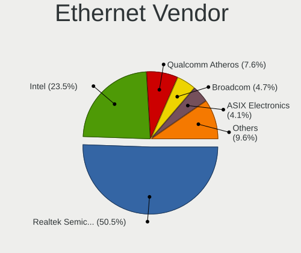

| Vendor                                 | Notebooks | Percent |
|----------------------------------------|-----------|---------|
| Realtek Semiconductor                  | 6948      | 50.54%  |
| Intel                                  | 3232      | 23.51%  |
| Qualcomm Atheros                       | 1038      | 7.55%   |
| Broadcom                               | 645       | 4.69%   |
| ASIX Electronics                       | 562       | 4.09%   |
| Marvell Technology Group               | 299       | 2.18%   |
| Samsung Electronics                    | 189       | 1.37%   |
| Broadcom Limited                       | 188       | 1.37%   |
| JMicron Technology                     | 104       | 0.76%   |
| Nvidia                                 | 66        | 0.48%   |
| Huawei Technologies                    | 63        | 0.46%   |
| TP-Link                                | 52        | 0.38%   |
| MediaTek                               | 44        | 0.32%   |
| Lenovo                                 | 33        | 0.24%   |
| Xiaomi                                 | 28        | 0.2%    |
| DisplayLink                            | 26        | 0.19%   |
| Motorola PCS                           | 24        | 0.17%   |
| Suzhou Motorcomm Electronic Technology | 19        | 0.14%   |
| OPPO Electronics                       | 19        | 0.14%   |
| ICS Advent                             | 18        | 0.13%   |
| Google                                 | 18        | 0.13%   |
| Qualcomm                               | 17        | 0.12%   |
| Silicon Integrated Systems [SiS]       | 16        | 0.12%   |
| Hewlett-Packard                        | 12        | 0.09%   |
| Apple                                  | 10        | 0.07%   |
| Attansic Technology                    | 9         | 0.07%   |
| OnePlus Technology (Shenzhen)          | 6         | 0.04%   |
| D-Link                                 | 6         | 0.04%   |
| ZTE WCDMA Technologies MSM             | 5         | 0.04%   |
| Spreadtrum Communications              | 5         | 0.04%   |
| NetGear                                | 5         | 0.04%   |
| Linksys                                | 5         | 0.04%   |
| T & A Mobile Phones                    | 4         | 0.03%   |
| QinHeng Electronics                    | 4         | 0.03%   |
| LG Electronics                         | 4         | 0.03%   |
| vivo                                   | 3         | 0.02%   |
| Microchip Technology                   | 3         | 0.02%   |
| ASUSTek Computer                       | 3         | 0.02%   |
| VIA Technologies                       | 2         | 0.01%   |
| Qualcomm Technologies                  | 2         | 0.01%   |

Ethernet Model
--------------

Ethernet models

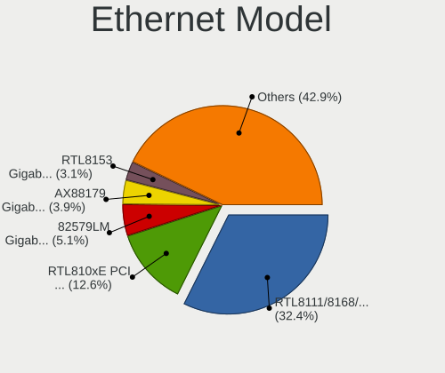

| Model                                                                  | Notebooks | Percent |
|------------------------------------------------------------------------|-----------|---------|
| Realtek RTL8111/8168/8211/8411 PCI Express Gigabit Ethernet Controller | 4489      | 32.37%  |
| Realtek RTL810xE PCI Express Fast Ethernet controller                  | 1754      | 12.65%  |
| Intel 82579LM Gigabit Network Connection (Lewisville)                  | 711       | 5.13%   |
| ASIX AX88179 Gigabit Ethernet                                          | 543       | 3.92%   |
| Realtek RTL8153 Gigabit Ethernet Adapter                               | 426       | 3.07%   |
| Intel Ethernet Connection (4) I219-LM                                  | 311       | 2.24%   |
| Intel 82577LM Gigabit Network Connection                               | 227       | 1.64%   |
| Intel Ethernet Connection I219-LM                                      | 208       | 1.5%    |
| Intel Ethernet Connection (3) I218-LM                                  | 195       | 1.41%   |
| Intel Ethernet Connection I218-LM                                      | 190       | 1.37%   |
| Qualcomm Atheros AR8151 v2.0 Gigabit Ethernet                          | 181       | 1.31%   |
| Samsung Galaxy series, misc. (tethering mode)                          | 172       | 1.24%   |
| Intel 82567LM Gigabit Network Connection                               | 171       | 1.23%   |
| Intel Ethernet Connection I217-LM                                      | 158       | 1.14%   |
| Qualcomm Atheros AR8131 Gigabit Ethernet                               | 122       | 0.88%   |
| Intel Ethernet Connection (4) I219-V                                   | 119       | 0.86%   |
| Qualcomm Atheros AR8162 Fast Ethernet                                  | 116       | 0.84%   |
| Qualcomm Atheros AR8161 Gigabit Ethernet                               | 102       | 0.74%   |
| Qualcomm Atheros AR8152 v2.0 Fast Ethernet                             | 99        | 0.71%   |
| Intel Alder Lake-P PCH CNVi WiFi                                       | 95        | 0.69%   |
| Broadcom NetLink BCM57785 Gigabit Ethernet PCIe                        | 95        | 0.69%   |
| Broadcom NetLink BCM57780 Gigabit Ethernet PCIe                        | 92        | 0.66%   |
| Marvell Group 88E8040 PCI-E Fast Ethernet Controller                   | 89        | 0.64%   |
| Intel Ethernet Connection I219-V                                       | 87        | 0.63%   |
| JMicron JMC250 PCI Express Gigabit Ethernet Controller                 | 84        | 0.61%   |
| Realtek RTL8152 Fast Ethernet Adapter                                  | 79        | 0.57%   |
| Realtek Killer E2600 GbE Controller                                    | 78        | 0.56%   |
| Broadcom NetXtreme BCM57765 Gigabit Ethernet PCIe                      | 71        | 0.51%   |
| Realtek RTL8125 2.5GbE Controller                                      | 68        | 0.49%   |
| Qualcomm Atheros AR8152 v1.1 Fast Ethernet                             | 66        | 0.48%   |
| Qualcomm Atheros QCA8172 Fast Ethernet                                 | 65        | 0.47%   |
| Intel 82579V Gigabit Network Connection                                | 63        | 0.45%   |
| Broadcom NetLink BCM5784M Gigabit Ethernet PCIe                        | 63        | 0.45%   |
| Intel Ethernet Connection (6) I219-LM                                  | 62        | 0.45%   |
| Broadcom NetLink BCM5787M Gigabit Ethernet PCI Express                 | 58        | 0.42%   |
| Qualcomm Atheros QCA8171 Gigabit Ethernet                              | 57        | 0.41%   |
| Intel 82566MM Gigabit Network Connection                               | 57        | 0.41%   |
| Intel Ethernet Connection (2) I219-LM                                  | 56        | 0.4%    |
| Broadcom Limited NetLink BCM57780 Gigabit Ethernet PCIe                | 54        | 0.39%   |
| Qualcomm Atheros AR8132 Fast Ethernet                                  | 53        | 0.38%   |

Net Controller Kind
-------------------

Ethernet, WiFi or modem

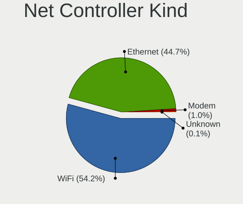

| Kind     | Notebooks | Percent |
|----------|-----------|---------|
| WiFi     | 16150     | 54.25%  |
| Ethernet | 13312     | 44.72%  |
| Modem    | 288       | 0.97%   |
| Unknown  | 20        | 0.07%   |

Used Controller
---------------

Currently used network controller

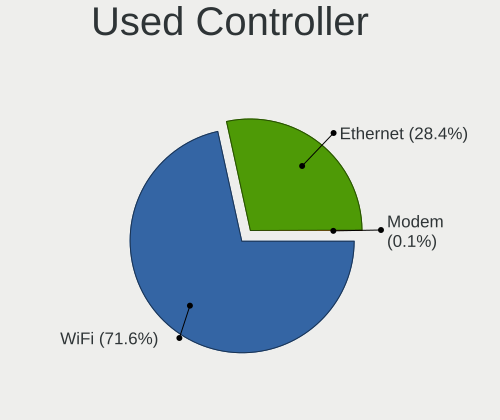

| Kind     | Notebooks | Percent |
|----------|-----------|---------|
| WiFi     | 11642     | 71.57%  |
| Ethernet | 4616      | 28.38%  |
| Modem    | 9         | 0.06%   |

NICs
----

Total network controllers on board

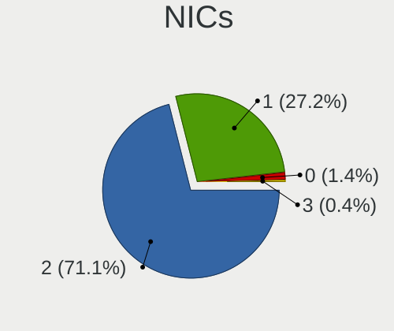

| Total | Notebooks | Percent |
|-------|-----------|---------|
| 2     | 11695     | 71.06%  |
| 1     | 4470      | 27.16%  |
| 0     | 226       | 1.37%   |
| 3     | 68        | 0.41%   |

IPv6
----

IPv6 vs IPv4

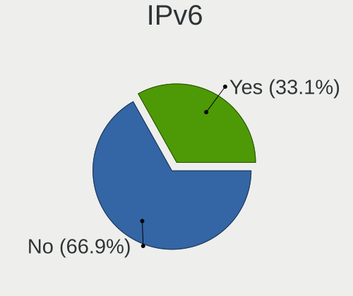

| Used | Notebooks | Percent |
|------|-----------|---------|
| No   | 11225     | 66.89%  |
| Yes  | 5557      | 33.11%  |

Bluetooth
---------

Bluetooth Vendor
----------------

Controller vendors

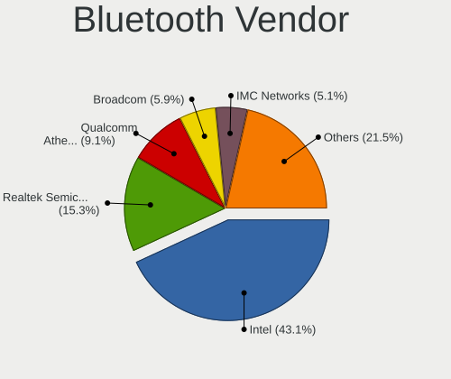

| Vendor                          | Notebooks | Percent |
|---------------------------------|-----------|---------|
| Intel                           | 5518      | 43.11%  |
| Realtek Semiconductor           | 1956      | 15.28%  |
| Qualcomm Atheros Communications | 1171      | 9.15%   |
| Broadcom                        | 754       | 5.89%   |
| IMC Networks                    | 649       | 5.07%   |
| Lite-On Technology              | 597       | 4.66%   |
| Foxconn / Hon Hai               | 568       | 4.44%   |
| Dell                            | 260       | 2.03%   |
| Apple                           | 255       | 1.99%   |
| Hewlett-Packard                 | 210       | 1.64%   |
| Toshiba                         | 172       | 1.34%   |
| MediaTek                        | 143       | 1.12%   |
| Cambridge Silicon Radio         | 116       | 0.91%   |
| Ralink                          | 86        | 0.67%   |
| ASUSTek Computer                | 54        | 0.42%   |
| Realtek                         | 49        | 0.38%   |
| Foxconn International           | 42        | 0.33%   |
| Alps Electric                   | 37        | 0.29%   |
| USI                             | 35        | 0.27%   |
| Chicony Electronics             | 22        | 0.17%   |
| Ralink Technology               | 18        | 0.14%   |
| Askey Computer                  | 16        | 0.13%   |
| Fujitsu                         | 14        | 0.11%   |
| TP-Link                         | 11        | 0.09%   |
| Unknown                         | 10        | 0.08%   |
| Taiyo Yuden                     | 7         | 0.05%   |
| Smart Modular Technologies      | 5         | 0.04%   |
| Qcom                            | 5         | 0.04%   |
| Micro Star International        | 5         | 0.04%   |
| Edimax Technology               | 3         | 0.02%   |
| Opticis                         | 2         | 0.02%   |
| Belkin Components               | 2         | 0.02%   |
| Actions                         | 2         | 0.02%   |
| SINO WEALTH                     | 1         | 0.01%   |
| Integrated System Solution      | 1         | 0.01%   |
| Dynex                           | 1         | 0.01%   |
| D-Link System                   | 1         | 0.01%   |
| BUFFALO                         | 1         | 0.01%   |

Bluetooth Model
---------------

Controller models

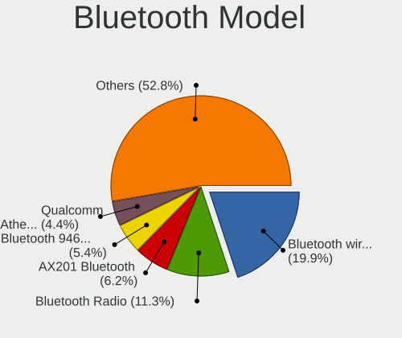

| Model                                               | Notebooks | Percent |
|-----------------------------------------------------|-----------|---------|
| Intel Bluetooth wireless interface                  | 2550      | 19.92%  |
| Realtek Bluetooth Radio                             | 1441      | 11.26%  |
| Intel AX201 Bluetooth                               | 795       | 6.21%   |
| Intel Bluetooth 9460/9560 Jefferson Peak (JfP)      | 694       | 5.42%   |
| Qualcomm Atheros  Bluetooth Device                  | 568       | 4.44%   |
| Intel AX200 Bluetooth                               | 358       | 2.8%    |
| Realtek  Bluetooth 4.2 Adapter                      | 348       | 2.72%   |
| Intel Bluetooth Device                              | 340       | 2.66%   |
| IMC Networks Bluetooth Radio                        | 263       | 2.05%   |
| Intel Centrino Bluetooth Wireless Transceiver       | 223       | 1.74%   |
| Intel AX210 Bluetooth                               | 214       | 1.67%   |
| Qualcomm Atheros AR3011 Bluetooth                   | 202       | 1.58%   |
| Lite-On Qualcomm Atheros QCA9377 Bluetooth          | 198       | 1.55%   |
| Broadcom BCM2045B (BDC-2.1)                         | 192       | 1.5%    |
| Qualcomm Atheros AR3012 Bluetooth 4.0               | 176       | 1.37%   |
| Foxconn / Hon Hai Bluetooth Device                  | 170       | 1.33%   |
| Intel Wireless-AC 3168 Bluetooth                    | 159       | 1.24%   |
| Broadcom BCM20702 Bluetooth 4.0 [ThinkPad]          | 147       | 1.15%   |
| MediaTek Wireless_Device                            | 140       | 1.09%   |
| IMC Networks Bluetooth Device                       | 137       | 1.07%   |
| Apple Bluetooth Host Controller                     | 137       | 1.07%   |
| HP Broadcom 2070 Bluetooth Combo                    | 127       | 0.99%   |
| Lite-On Bluetooth Device                            | 122       | 0.95%   |
| Lite-On Atheros AR3012 Bluetooth                    | 121       | 0.95%   |
| Dell DW375 Bluetooth Module                         | 121       | 0.95%   |
| Qualcomm Atheros QCA61x4 Bluetooth 4.0              | 119       | 0.93%   |
| IMC Networks Wireless_Device                        | 119       | 0.93%   |
| Cambridge Silicon Radio Bluetooth Dongle (HCI mode) | 116       | 0.91%   |
| Foxconn / Hon Hai Wireless_Device                   | 98        | 0.77%   |
| Intel Centrino Advanced-N 6230 Bluetooth adapter    | 96        | 0.75%   |
| Intel Wireless-AC 9260 Bluetooth Adapter            | 89        | 0.7%    |
| Ralink RT3290 Bluetooth                             | 86        | 0.67%   |
| Dell BCM20702A0 Bluetooth Module                    | 86        | 0.67%   |
| Foxconn / Hon Hai MediaTek Bluetooth Adapter        | 81        | 0.63%   |
| HP Bluetooth 2.0 Interface [Broadcom BCM2045]       | 80        | 0.62%   |
| Apple Bluetooth USB Host Controller                 | 79        | 0.62%   |
| Lite-On Wireless_Device                             | 73        | 0.57%   |
| IMC Networks Atheros AR3012 Bluetooth 4.0 Adapter   | 73        | 0.57%   |
| Realtek RTL8723B Bluetooth                          | 69        | 0.54%   |
| Qualcomm Atheros AR9462 Bluetooth                   | 59        | 0.46%   |

Sound
-----

Sound Vendor
------------

Sound card vendors

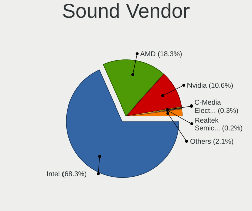

| Vendor                                       | Notebooks | Percent |
|----------------------------------------------|-----------|---------|
| Intel                                        | 13100     | 68.34%  |
| AMD                                          | 3511      | 18.32%  |
| Nvidia                                       | 2040      | 10.64%  |
| C-Media Electronics                          | 61        | 0.32%   |
| Realtek Semiconductor                        | 46        | 0.24%   |
| Lenovo                                       | 34        | 0.18%   |
| Logitech                                     | 32        | 0.17%   |
| Generalplus Technology                       | 29        | 0.15%   |
| Texas Instruments                            | 19        | 0.1%    |
| Apple                                        | 19        | 0.1%    |
| Silicon Integrated Systems [SiS]             | 17        | 0.09%   |
| JMTek                                        | 16        | 0.08%   |
| Hewlett-Packard                              | 15        | 0.08%   |
| Creative Technology                          | 15        | 0.08%   |
| Razer USA                                    | 14        | 0.07%   |
| GN Netcom                                    | 14        | 0.07%   |
| ASUSTek Computer                             | 14        | 0.07%   |
| Corsair                                      | 12        | 0.06%   |
| Plantronics                                  | 9         | 0.05%   |
| BEHRINGER International                      | 9         | 0.05%   |
| Zoran Co. Personal Media Division (Nogatech) | 6         | 0.03%   |
| SteelSeries ApS                              | 6         | 0.03%   |
| Jieli Technology                             | 6         | 0.03%   |
| Walmart                                      | 5         | 0.03%   |
| PreSonus Audio Electronics                   | 5         | 0.03%   |
| Kingston Technology                          | 5         | 0.03%   |
| Microsoft                                    | 4         | 0.02%   |
| DSEA A/S                                     | 4         | 0.02%   |
| Conexant Systems                             | 4         | 0.02%   |
| XMOS                                         | 3         | 0.02%   |
| VIA Technologies                             | 3         | 0.02%   |
| Thesycon Systemsoftware & Consulting         | 3         | 0.02%   |
| Tenx Technology                              | 3         | 0.02%   |
| Nordic Semiconductor ASA                     | 3         | 0.02%   |
| liyuany                                      | 3         | 0.02%   |
| Focusrite-Novation                           | 3         | 0.02%   |
| Dell                                         | 3         | 0.02%   |
| Unknown                                      | 3         | 0.02%   |
| Yamaha                                       | 2         | 0.01%   |
| TEAC                                         | 2         | 0.01%   |

Sound Model
-----------

Sound card models

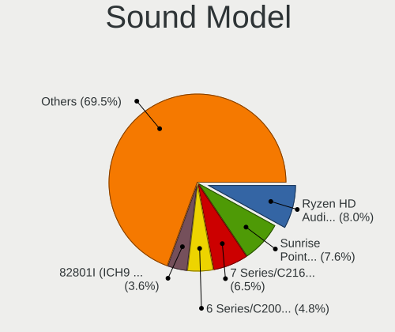

| Model                                                                                             | Notebooks | Percent |
|---------------------------------------------------------------------------------------------------|-----------|---------|
| AMD Ryzen HD Audio Controller                                                                     | 1902      | 8.01%   |
| Intel Sunrise Point-LP HD Audio                                                                   | 1802      | 7.59%   |
| Intel 7 Series/C216 Chipset Family High Definition Audio Controller                               | 1541      | 6.49%   |
| Intel 6 Series/C200 Series Chipset Family High Definition Audio Controller                        | 1131      | 4.77%   |
| Intel 82801I (ICH9 Family) HD Audio Controller                                                    | 864       | 3.64%   |
| Intel 5 Series/3400 Series Chipset High Definition Audio                                          | 834       | 3.51%   |
| Intel Celeron/Pentium Silver Processor High Definition Audio                                      | 808       | 3.4%    |
| AMD Renoir/Cezanne HDMI/DP Audio Controller                                                       | 729       | 3.07%   |
| Intel 8 Series HD Audio Controller                                                                | 637       | 2.68%   |
| Intel Haswell-ULT HD Audio Controller                                                             | 635       | 2.68%   |
| AMD Raven/Raven2/Fenghuang HDMI/DP Audio Controller                                               | 592       | 2.49%   |
| Intel Broadwell-U Audio Controller                                                                | 590       | 2.49%   |
| Intel Wildcat Point-LP High Definition Audio Controller                                           | 581       | 2.45%   |
| AMD FCH Azalia Controller                                                                         | 572       | 2.41%   |
| Intel Tiger Lake-LP Smart Sound Technology Audio Controller                                       | 560       | 2.36%   |
| Intel 8 Series/C220 Series Chipset High Definition Audio Controller                               | 452       | 1.9%    |
| Intel 82801H (ICH8 Family) HD Audio Controller                                                    | 429       | 1.81%   |
| AMD Radeon High Definition Audio Controller                                                       | 412       | 1.74%   |
| AMD Kabini HDMI/DP Audio                                                                          | 394       | 1.66%   |
| Intel Xeon E3-1200 v3/4th Gen Core Processor HD Audio Controller                                  | 384       | 1.62%   |
| Intel Alder Lake PCH-P High Definition Audio Controller                                           | 359       | 1.51%   |
| AMD SBx00 Azalia (Intel HDA)                                                                      | 342       | 1.44%   |
| Intel Atom Processor Z36xxx/Z37xxx Series High Definition Audio Controller                        | 338       | 1.42%   |
| AMD Family 15h (Models 60h-6fh) Audio Controller                                                  | 319       | 1.34%   |
| Intel Cannon Lake PCH cAVS                                                                        | 296       | 1.25%   |
| Intel Cannon Point-LP High Definition Audio Controller                                            | 287       | 1.21%   |
| Nvidia GF108 High Definition Audio Controller                                                     | 269       | 1.13%   |
| Intel Celeron N3350/Pentium N4200/Atom E3900 Series Audio Cluster                                 | 249       | 1.05%   |
| Intel Atom/Celeron/Pentium Processor x5-E8000/J3xxx/N3xxx Series High Definition Audio Controller | 248       | 1.04%   |
| Intel Comet Lake PCH-LP cAVS                                                                      | 241       | 1.02%   |
| AMD High Definition Audio Controller                                                              | 228       | 0.96%   |
| AMD Wrestler HDMI Audio                                                                           | 221       | 0.93%   |
| Intel Ice Lake-LP Smart Sound Technology Audio Controller                                         | 214       | 0.9%    |
| Nvidia TU107 GeForce GTX 1650 High Definition Audio Controller                                    | 181       | 0.76%   |
| Intel 100 Series/C230 Series Chipset Family HD Audio Controller                                   | 178       | 0.75%   |
| Intel CM238 HD Audio Controller                                                                   | 162       | 0.68%   |
| Nvidia High Definition Audio Controller                                                           | 160       | 0.67%   |
| Intel Raptor Lake-P/U/H cAVS                                                                      | 157       | 0.66%   |
| Intel NM10/ICH7 Family High Definition Audio Controller                                           | 154       | 0.65%   |
| Intel Comet Lake PCH cAVS                                                                         | 149       | 0.63%   |

Memory
------

Memory Vendor
-------------

Memory module vendors

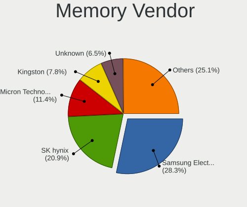

| Vendor              | Notebooks | Percent |
|---------------------|-----------|---------|
| Samsung Electronics | 5592      | 28.28%  |
| SK hynix            | 4138      | 20.93%  |
| Micron Technology   | 2247      | 11.36%  |
| Kingston            | 1543      | 7.8%    |
| Unknown             | 1288      | 6.51%   |
| Crucial             | 806       | 4.08%   |
| Elpida              | 566       | 2.86%   |
| A-DATA Technology   | 480       | 2.43%   |
| Ramaxel Technology  | 475       | 2.4%    |
| Nanya Technology    | 361       | 1.83%   |
| Unknown (ABCD)      | 242       | 1.22%   |
| Unknown             | 228       | 1.15%   |
| Smart               | 216       | 1.09%   |
| Corsair             | 216       | 1.09%   |
| G.Skill             | 132       | 0.67%   |
| Team                | 84        | 0.42%   |
| Patriot             | 69        | 0.35%   |
| Timetec             | 65        | 0.33%   |
| Transcend           | 61        | 0.31%   |
| Teikon              | 57        | 0.29%   |
| Goodram             | 54        | 0.27%   |
| ASint Technology    | 50        | 0.25%   |
| Apacer              | 45        | 0.23%   |
| AMD                 | 32        | 0.16%   |
| PNY                 | 31        | 0.16%   |
| Smart Brazil        | 29        | 0.15%   |
| Silicon Power       | 29        | 0.15%   |
| High Bridge         | 29        | 0.15%   |
| Qimonda             | 27        | 0.14%   |
| Toshiba             | 26        | 0.13%   |
| Avant               | 26        | 0.13%   |
| Neo Forza           | 23        | 0.12%   |
| 4ea5                | 23        | 0.12%   |
| 48spaces            | 21        | 0.11%   |
| SHARETRONIC         | 20        | 0.1%    |
| Goldkey             | 18        | 0.09%   |
| fef5                | 17        | 0.09%   |
| Lexar               | 16        | 0.08%   |
| V-GeN               | 14        | 0.07%   |
| CSX                 | 14        | 0.07%   |

Memory Model
------------

Memory module models

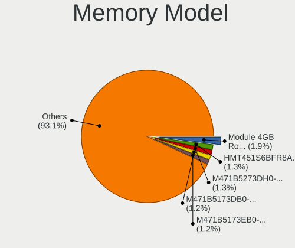

| Model                                                            | Notebooks | Percent |
|------------------------------------------------------------------|-----------|---------|
| Samsung RAM Module 4GB Row Of Chips DDR4 2400MT/s                | 411       | 1.95%   |
| SK hynix RAM HMT451S6BFR8A-PB 4GB SODIMM DDR3 1600MT/s           | 280       | 1.33%   |
| Samsung RAM M471B5273DH0-CH9 4GB SODIMM DDR3 1600MT/s            | 275       | 1.3%    |
| Samsung RAM M471B5173DB0-YK0 4GB SODIMM DDR3 1600MT/s            | 249       | 1.18%   |
| Samsung RAM M471B5173EB0-YK0 4GB SODIMM DDR3 1600MT/s            | 243       | 1.15%   |
| Samsung RAM M471A5244CB0-CTD 4GB SODIMM DDR4 3266MT/s            | 237       | 1.12%   |
| Samsung RAM M471B5173QH0-YK0 4GB SODIMM DDR3 1600MT/s            | 234       | 1.11%   |
| SK hynix RAM HMA81GS6AFR8N-UH 8GB SODIMM DDR4 2667MT/s           | 231       | 1.09%   |
| Unknown                                                          | 228       | 1.08%   |
| Unknown (ABCD) RAM 123456789012345678 2GB SODIMM LPDDR4 2400MT/s | 227       | 1.08%   |
| Unknown RAM Module 2GB SODIMM DDR2 667MT/s                       | 211       | 1%      |
| Samsung RAM M471B5273CH0-CH9 4GB SODIMM DDR3 1334MT/s            | 187       | 0.89%   |
| Samsung RAM M471A5244CB0-CWE 4GB SODIMM DDR4 3200MT/s            | 184       | 0.87%   |
| SK hynix RAM HMT351S6CFR8C-PB 4GB SODIMM DDR3 1600MT/s           | 170       | 0.81%   |
| SK hynix RAM HMT41GS6BFR8A-PB 8GB SODIMM DDR3 2667MT/s           | 152       | 0.72%   |
| Samsung RAM M471A1G44AB0-CWE 8GiB SODIMM DDR4 3200MT/s           | 139       | 0.66%   |
| Elpida RAM Module 2GB SODIMM DDR3 1333MT/s                       | 137       | 0.65%   |
| Samsung RAM M471A5244CB0-CRC 4GB SODIMM DDR4 2667MT/s            | 132       | 0.63%   |
| Samsung RAM M471A1K43CB1-CRC 8GB SODIMM DDR4 8400MT/s            | 131       | 0.62%   |
| Samsung RAM M471B1G73DB0-YK0 8GB SODIMM DDR3 1600MT/s            | 128       | 0.61%   |
| SK hynix RAM HMT451S6AFR8A-PB 4GB SODIMM DDR3 1600MT/s           | 118       | 0.56%   |
| Samsung RAM M471B5773CHS-CH9 2GB SODIMM DDR3 4199MT/s            | 116       | 0.55%   |
| Samsung RAM M471B1G73QH0-YK0 8GB SODIMM DDR3 1600MT/s            | 114       | 0.54%   |
| Samsung RAM M471A1K43EB1-CWE 8GB SODIMM DDR4 3200MT/s            | 112       | 0.53%   |
| Samsung RAM M471B5773DH0-CH9 2GB SODIMM DDR3 1600MT/s            | 109       | 0.52%   |
| Unknown RAM Module 2GB SODIMM DDR2                               | 104       | 0.49%   |
| Samsung RAM M471B5273DH0-CK0 4GB SODIMM DDR3 2400MT/s            | 102       | 0.48%   |
| SK hynix RAM HMA851S6AFR6N-UH 4GB SODIMM DDR4 2667MT/s           | 100       | 0.47%   |
| Unknown RAM Module 4GB SODIMM DDR3                               | 94        | 0.45%   |
| SK hynix RAM HMT351S6EFR8A-PB 4GB SODIMM DDR3 1600MT/s           | 94        | 0.45%   |
| Micron RAM 4ATF51264HZ-2G6E1 4GB SODIMM DDR4 2667MT/s            | 93        | 0.44%   |
| Micron RAM 4ATF51264HZ-3G2J1 4GB SODIMM DDR4 3200MT/s            | 92        | 0.44%   |
| SK hynix RAM HMT351S6BFR8C-H9 4GB SODIMM DDR3 1333MT/s           | 91        | 0.43%   |
| Samsung RAM M471A1K43DB1-CWE 8GB SODIMM DDR4 3200MT/s            | 91        | 0.43%   |
| SK hynix RAM HMAA1GS6CJR6N-XN 8GB SODIMM DDR4 3200MT/s           | 90        | 0.43%   |
| Samsung RAM M471A1K43CB1-CTD 8GB SODIMM DDR4 3200MT/s            | 84        | 0.4%    |
| Samsung RAM M471A1G44BB0-CWE 8GB SODIMM DDR4 3200MT/s            | 84        | 0.4%    |
| SK hynix RAM HYMP125S64CP8-S6 2GB SODIMM DDR2 975MT/s            | 83        | 0.39%   |
| Elpida RAM EBJ41UF8BCS0-DJ-F 4GB SODIMM DDR3 1334MT/s            | 83        | 0.39%   |
| Samsung RAM M471B1G73EB0-YK0 8192MB SODIMM DDR3 1600MT/s         | 82        | 0.39%   |

Memory Kind
-----------

Memory module kinds

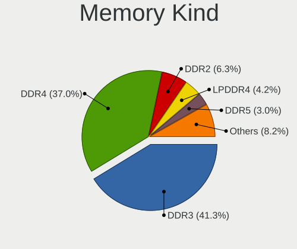

| Kind    | Notebooks | Percent |
|---------|-----------|---------|
| DDR3    | 6881      | 41.28%  |
| DDR4    | 6170      | 37.01%  |
| DDR2    | 1047      | 6.28%   |
| LPDDR4  | 706       | 4.24%   |
| DDR5    | 505       | 3.03%   |
| SDRAM   | 496       | 2.98%   |
| LPDDR5  | 355       | 2.13%   |
| LPDDR3  | 272       | 1.63%   |
| Unknown | 159       | 0.95%   |
| DRAM    | 43        | 0.26%   |
| DDR     | 36        | 0.22%   |

Memory Form Factor
------------------

Physical design of the memory module

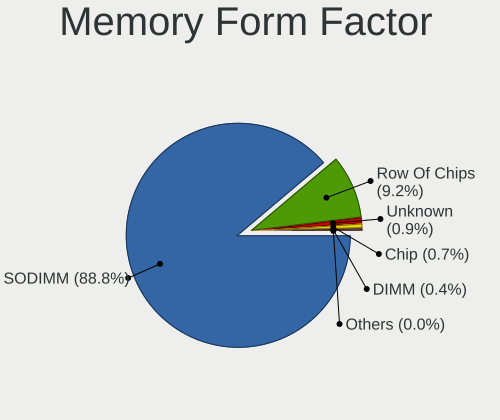

| Name            | Notebooks | Percent |
|-----------------|-----------|---------|
| SODIMM          | 14680     | 88.85%  |
| Row Of Chips    | 1523      | 9.22%   |
| Unknown         | 143       | 0.87%   |
| Chip            | 111       | 0.67%   |
| DIMM            | 62        | 0.38%   |
| Proprietary Car | 4         | 0.02%   |

Memory Size
-----------

Memory module size

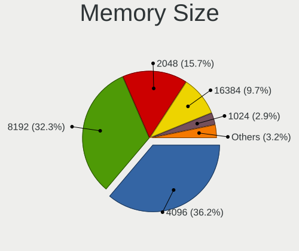

| Size  | Notebooks | Percent |
|-------|-----------|---------|
| 4096  | 6745      | 36.16%  |
| 8192  | 6028      | 32.32%  |
| 2048  | 2931      | 15.71%  |
| 16384 | 1803      | 9.67%   |
| 1024  | 544       | 2.92%   |
| 32768 | 538       | 2.88%   |
| 512   | 22        | 0.12%   |
| 49152 | 16        | 0.09%   |
| 3072  | 11        | 0.06%   |
| 12288 | 4         | 0.02%   |
| 65536 | 2         | 0.01%   |
| 24576 | 2         | 0.01%   |
| 6144  | 2         | 0.01%   |
| 1536  | 2         | 0.01%   |
| 8     | 1         | 0.01%   |

Memory Speed
------------

Memory module speed

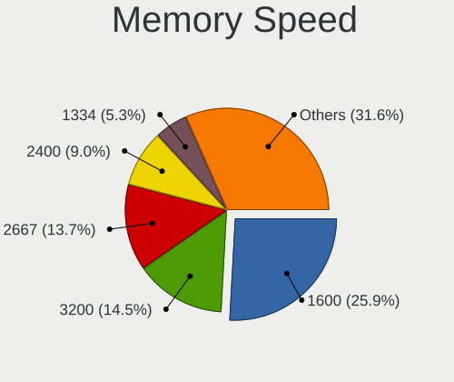

| Speed   | Notebooks | Percent |
|---------|-----------|---------|
| 1600    | 4747      | 25.87%  |
| 3200    | 2660      | 14.5%   |
| 2667    | 2513      | 13.69%  |
| 2400    | 1659      | 9.04%   |
| 1334    | 965       | 5.26%   |
| 1333    | 916       | 4.99%   |
| 667     | 556       | 3.03%   |
| 2133    | 539       | 2.94%   |
| 1067    | 403       | 2.2%    |
| 800     | 326       | 1.78%   |
| 5600    | 322       | 1.75%   |
| Unknown | 322       | 1.75%   |
| 4199    | 286       | 1.56%   |
| 3266    | 237       | 1.29%   |
| 1867    | 211       | 1.15%   |
| 6400    | 201       | 1.1%    |
| 4800    | 181       | 0.99%   |
| 8400    | 178       | 0.97%   |
| 2048    | 177       | 0.96%   |
| 4267    | 172       | 0.94%   |
| 1066    | 143       | 0.78%   |
| 975     | 143       | 0.78%   |
| 533     | 88        | 0.48%   |
| 7500    | 70        | 0.38%   |
| 4266    | 65        | 0.35%   |
| 1866    | 43        | 0.23%   |
| 3733    | 29        | 0.16%   |
| 5500    | 28        | 0.15%   |
| 2933    | 28        | 0.15%   |
| 1639    | 24        | 0.13%   |
| 7467    | 21        | 0.11%   |
| 8533    | 20        | 0.11%   |
| 333     | 17        | 0.09%   |
| 1200    | 11        | 0.06%   |
| 5200    | 7         | 0.04%   |
| 3000    | 4         | 0.02%   |
| 2267    | 4         | 0.02%   |
| 1330    | 4         | 0.02%   |
| 666     | 4         | 0.02%   |
| 8600    | 3         | 0.02%   |

Printers & scanners
-------------------

Printer Vendor
--------------

Printer device vendors

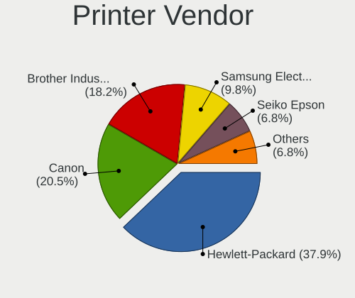

| Vendor                | Notebooks | Percent |
|-----------------------|-----------|---------|
| Hewlett-Packard       | 50        | 37.88%  |
| Canon                 | 27        | 20.45%  |
| Brother Industries    | 24        | 18.18%  |
| Samsung Electronics   | 13        | 9.85%   |
| Seiko Epson           | 9         | 6.82%   |
| Prolific Technology   | 3         | 2.27%   |
| Xerox                 | 2         | 1.52%   |
| STMicroelectronics    | 1         | 0.76%   |
| Ricoh                 | 1         | 0.76%   |
| Lexmark International | 1         | 0.76%   |
| Lenovo                | 1         | 0.76%   |

Printer Model
-------------

Printer device models

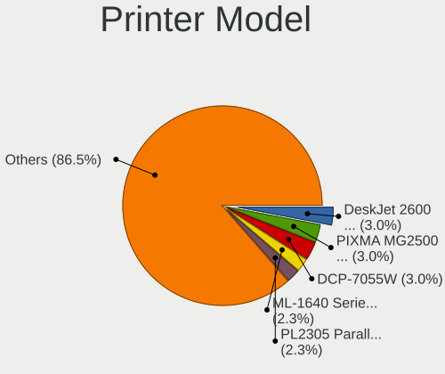

| Model                                                     | Notebooks | Percent |
|-----------------------------------------------------------|-----------|---------|
| HP DeskJet 2600 series                                    | 4         | 3.01%   |
| Canon PIXMA MG2500 Series                                 | 4         | 3.01%   |
| Brother DCP-7055W                                         | 4         | 3.01%   |
| Samsung ML-1640 Series Laser Printer                      | 3         | 2.26%   |
| Prolific PL2305 Parallel Port                             | 3         | 2.26%   |
| HP ENVY Photo 6200 series                                 | 3         | 2.26%   |
| HP Deskjet 2050 J510                                      | 3         | 2.26%   |
| Brother MFC-L2700DW                                       | 3         | 2.26%   |
| Samsung M2070 Series                                      | 2         | 1.5%    |
| HP LaserJet M203-M206                                     | 2         | 1.5%    |
| HP LaserJet 1020                                          | 2         | 1.5%    |
| HP DeskJet 4100 series                                    | 2         | 1.5%    |
| HP DeskJet 3700 series                                    | 2         | 1.5%    |
| HP DeskJet 3630 series                                    | 2         | 1.5%    |
| HP DeskJet 2130 series                                    | 2         | 1.5%    |
| Canon TR8500 series                                       | 2         | 1.5%    |
| Canon PIXMA MG3600 Series                                 | 2         | 1.5%    |
| Canon MF110/910 Series                                    | 2         | 1.5%    |
| Canon LBP2900                                             | 2         | 1.5%    |
| Brother DCP-7010                                          | 2         | 1.5%    |
| Xerox WorkCentre 6025                                     | 1         | 0.75%   |
| Xerox Phaser 6000B                                        | 1         | 0.75%   |
| STMicroelectronics LED badge -- mini LED display -- 11x44 | 1         | 0.75%   |
| Seiko Epson WF-2930 Series                                | 1         | 0.75%   |
| Seiko Epson ME 340 Series/Stylus NX130 Series             | 1         | 0.75%   |
| Seiko Epson L355 Series                                   | 1         | 0.75%   |
| Seiko Epson L312 Series                                   | 1         | 0.75%   |
| Seiko Epson L210 Series                                   | 1         | 0.75%   |
| Seiko Epson L120 Series                                   | 1         | 0.75%   |
| Seiko Epson ET-2710 Series                                | 1         | 0.75%   |
| Seiko Epson EPSON L220 Series                             | 1         | 0.75%   |
| Seiko Epson AcuLaser CX21                                 | 1         | 0.75%   |
| Samsung Xerox Phaser 3117 Laser Printer                   | 1         | 0.75%   |
| Samsung SCX-3400 Series                                   | 1         | 0.75%   |
| Samsung SCX-3200 Series                                   | 1         | 0.75%   |
| Samsung ML-2010P Mono Laser Printer                       | 1         | 0.75%   |
| Samsung ML-1660 Series                                    | 1         | 0.75%   |
| Samsung M2020 Series                                      | 1         | 0.75%   |
| Samsung CLP-325 Color Laser Printer                       | 1         | 0.75%   |
| Samsung C460 Series                                       | 1         | 0.75%   |

Scanner Vendor
--------------

Scanner device vendors

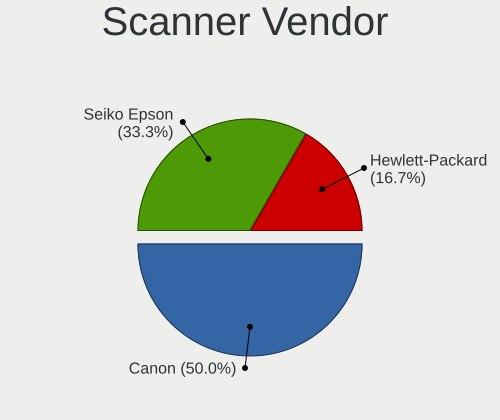

| Vendor          | Notebooks | Percent |
|-----------------|-----------|---------|
| Canon           | 9         | 50%     |
| Seiko Epson     | 6         | 33.33%  |
| Hewlett-Packard | 3         | 16.67%  |

Scanner Model
-------------

Scanner device models

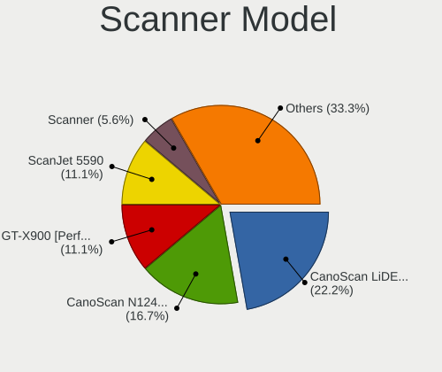

| Model                                                    | Notebooks | Percent |
|----------------------------------------------------------|-----------|---------|
| Canon CanoScan LiDE 110                                  | 4         | 22.22%  |
| Canon CanoScan N1240U/LiDE 30                            | 3         | 16.67%  |
| Seiko Epson GT-X900 [Perfection V700/V750 Photo]         | 2         | 11.11%  |
| HP ScanJet 5590                                          | 2         | 11.11%  |
| Seiko Epson Scanner                                      | 1         | 5.56%   |
| Seiko Epson GT-F520/GT-F570 [Perfection 3590 PHOTO]      | 1         | 5.56%   |
| Seiko Epson GT-F500/GT-F550 [Perfection 2480/2580 PHOTO] | 1         | 5.56%   |
| Seiko Epson GT-7300U [Perfection 1260/1260 PHOTO]        | 1         | 5.56%   |
| HP ScanJet 82x0C                                         | 1         | 5.56%   |
| Canon CanoScan LiDE 600F                                 | 1         | 5.56%   |
| Canon CanoScan LiDE 220                                  | 1         | 5.56%   |

Camera
------

Camera Vendor
-------------

Camera device vendors

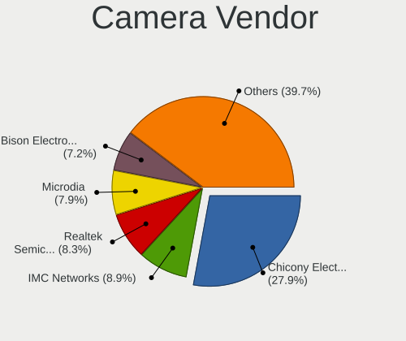

| Vendor                                 | Notebooks | Percent |
|----------------------------------------|-----------|---------|
| Chicony Electronics                    | 3981      | 27.91%  |
| IMC Networks                           | 1273      | 8.92%   |
| Realtek Semiconductor                  | 1186      | 8.31%   |
| Microdia                               | 1130      | 7.92%   |
| Bison Electronics                      | 1029      | 7.21%   |
| Sunplus Innovation Technology          | 725       | 5.08%   |
| Quanta                                 | 697       | 4.89%   |
| Suyin                                  | 628       | 4.4%    |
| Cheng Uei Precision Industry (Foxlink) | 530       | 3.72%   |
| Syntek                                 | 438       | 3.07%   |
| Luxvisions Innotech Limited            | 308       | 2.16%   |
| Lite-On Technology                     | 305       | 2.14%   |
| Silicon Motion                         | 220       | 1.54%   |
| Apple                                  | 206       | 1.44%   |
| Alcor Micro                            | 200       | 1.4%    |
| Ricoh                                  | 185       | 1.3%    |
| Sonix Technology                       | 127       | 0.89%   |
| Lenovo                                 | 119       | 0.83%   |
| Importek                               | 105       | 0.74%   |
| icSpring                               | 95        | 0.67%   |
| Acer                                   | 89        | 0.62%   |
| ALi                                    | 69        | 0.48%   |
| Primax Electronics                     | 66        | 0.46%   |
| Logitech                               | 59        | 0.41%   |
| ShineTech                              | 51        | 0.36%   |
| Z-Star Microelectronics                | 44        | 0.31%   |
| DigiTech                               | 33        | 0.23%   |
| OmniVision Technologies                | 30        | 0.21%   |
| SunplusIT                              | 29        | 0.2%    |
| Samsung Electronics                    | 27        | 0.19%   |
| Unknown                                | 20        | 0.14%   |
| Shine-optics                           | 18        | 0.13%   |
| kingcome                               | 18        | 0.13%   |
| Framework                              | 18        | 0.13%   |
| Sunplus Technology                     | 15        | 0.11%   |
| Y Media                                | 14        | 0.1%    |
| Intel                                  | 14        | 0.1%    |
| Genesys Logic                          | 14        | 0.1%    |
| Shenzhen Kingcome Optoelectronic       | 11        | 0.08%   |
| HRY                                    | 9         | 0.06%   |

Camera Model
------------

Camera device models

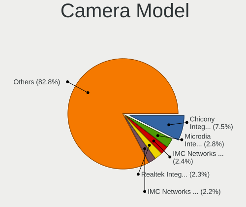

| Model                                               | Notebooks | Percent |
|-----------------------------------------------------|-----------|---------|
| Chicony Integrated Camera                           | 1070      | 7.48%   |
| Microdia Integrated_Webcam_HD                       | 403       | 2.82%   |
| IMC Networks USB2.0 HD UVC WebCam                   | 347       | 2.43%   |
| Realtek Integrated_Webcam_HD                        | 331       | 2.31%   |
| IMC Networks Integrated Camera                      | 316       | 2.21%   |
| Chicony HD WebCam                                   | 311       | 2.17%   |
| Bison Integrated Camera                             | 266       | 1.86%   |
| Syntek Integrated Camera                            | 249       | 1.74%   |
| Sunplus Integrated_Webcam_HD                        | 228       | 1.59%   |
| IMC Networks USB2.0 VGA UVC WebCam                  | 191       | 1.34%   |
| Microdia Integrated Webcam                          | 168       | 1.17%   |
| Chicony HP TrueVision HD Camera                     | 131       | 0.92%   |
| Lite-On Integrated Camera                           | 128       | 0.89%   |
| Luxvisions Innotech Limited HP TrueVision HD Camera | 125       | 0.87%   |
| Bison Lenovo EasyCamera                             | 119       | 0.83%   |
| Realtek USB Camera                                  | 117       | 0.82%   |
| Sunplus HD WebCam                                   | 110       | 0.77%   |
| Quanta HD User Facing                               | 109       | 0.76%   |
| Chicony HD User Facing                              | 108       | 0.75%   |
| Suyin Acer/HP Integrated Webcam [CN0314]            | 107       | 0.75%   |
| Chicony HP Truevision HD                            | 107       | 0.75%   |
| Chicony TOSHIBA Web Camera - HD                     | 106       | 0.74%   |
| Realtek Integrated Webcam HD                        | 101       | 0.71%   |
| Chicony VGA Webcam                                  | 99        | 0.69%   |
| Chicony USB2.0 HD UVC WebCam                        | 99        | 0.69%   |
| icSpring camera                                     | 95        | 0.66%   |
| Sonix USB2.0 HD UVC WebCam                          | 94        | 0.66%   |
| Chicony FJ Camera                                   | 94        | 0.66%   |
| Chicony Integrated Camera (1280x720@30)             | 93        | 0.65%   |
| Cheng Uei Precision Industry (Foxlink) HP Webcam    | 90        | 0.63%   |
| Quanta HD Webcam                                    | 87        | 0.61%   |
| Chicony USB2.0 VGA UVC WebCam                       | 86        | 0.6%    |
| Bison HD Webcam                                     | 86        | 0.6%    |
| Chicony Lenovo EasyCamera                           | 84        | 0.59%   |
| Chicony HP HD Camera                                | 83        | 0.58%   |
| Quanta HP TrueVision HD Camera                      | 82        | 0.57%   |
| Bison SunplusIT Integrated Camera                   | 82        | 0.57%   |
| Chicony USB 2.0 Camera                              | 80        | 0.56%   |
| Bison Lenovo Integrated Webcam                      | 80        | 0.56%   |
| Syntek Lenovo EasyCamera                            | 79        | 0.55%   |

Security
--------

Fingerprint Vendor
------------------

Fingerprint sensor vendors

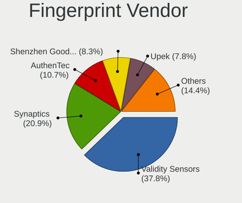

| Vendor                             | Notebooks | Percent |
|------------------------------------|-----------|---------|
| Validity Sensors                   | 783       | 37.79%  |
| Synaptics                          | 434       | 20.95%  |
| AuthenTec                          | 222       | 10.71%  |
| Shenzhen Goodix Technology         | 173       | 8.35%   |
| Upek                               | 162       | 7.82%   |
| Elan Microelectronics              | 141       | 6.81%   |
| LighTuning Technology              | 70        | 3.38%   |
| STMicroelectronics                 | 46        | 2.22%   |
| Focal-systems.Corp                 | 16        | 0.77%   |
| Realtek USB2.0 Finger Print Bridge | 10        | 0.48%   |
| Samsung Electronics                | 9         | 0.43%   |
| HOLTEK                             | 6         | 0.29%   |

Fingerprint Model
-----------------

Fingerprint sensor models

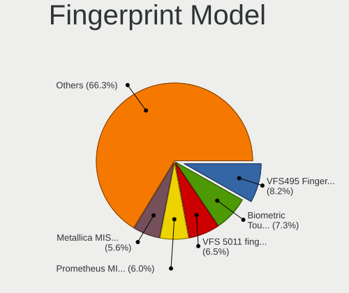

| Model                                                                      | Notebooks | Percent |
|----------------------------------------------------------------------------|-----------|---------|
| Validity Sensors VFS495 Fingerprint Reader                                 | 170       | 8.2%    |
| Upek Biometric Touchchip/Touchstrip Fingerprint Sensor                     | 152       | 7.34%   |
| Validity Sensors VFS 5011 fingerprint sensor                               | 135       | 6.52%   |
| Synaptics Prometheus MIS Touch Fingerprint Reader                          | 124       | 5.98%   |
| Synaptics Metallica MIS Touch Fingerprint Reader                           | 117       | 5.65%   |
| Shenzhen Goodix  FingerPrint Device                                        | 110       | 5.31%   |
| AuthenTec AES2810                                                          | 93        | 4.49%   |
| Elan ELAN:Fingerprint                                                      | 78        | 3.76%   |
| Validity Sensors VFS5011 Fingerprint Reader                                | 76        | 3.67%   |
| Validity Sensors VFS491                                                    | 66        | 3.19%   |
| Elan ELAN:ARM-M4                                                           | 63        | 3.04%   |
| Validity Sensors VFS471 Fingerprint Reader                                 | 62        | 2.99%   |
| Validity Sensors Synaptics WBDI                                            | 61        | 2.94%   |
| AuthenTec AES2501 Fingerprint Sensor                                       | 53        | 2.56%   |
| STMicroelectronics Fingerprint Reader                                      | 46        | 2.22%   |
| Validity Sensors VFS451 Fingerprint Reader                                 | 43        | 2.08%   |
| Synaptics UWP WBDI Device                                                  | 40        | 1.93%   |
| Synaptics FS7604 Touch Fingerprint Sensor with PurePrint                   | 35        | 1.69%   |
| AuthenTec Fingerprint Sensor                                               | 35        | 1.69%   |
| Validity Sensors Fingerprint scanner                                       | 33        | 1.59%   |
| Shenzhen Goodix Fingerprint Reader                                         | 32        | 1.54%   |
| Validity Sensors VFS7500 Touch Fingerprint Sensor                          | 31        | 1.5%    |
| Shenzhen Goodix FingerPrint                                                | 31        | 1.5%    |
| Validity Sensors Swipe Fingerprint Sensor                                  | 30        | 1.45%   |
| LighTuning ES603 Swipe Fingerprint Sensor                                  | 30        | 1.45%   |
| LighTuning EgisTec Touch Fingerprint Sensor                                | 26        | 1.25%   |
| AuthenTec AES1600                                                          | 24        | 1.16%   |
| Synaptics Prometheus Fingerprint Reader                                    | 23        | 1.11%   |
| Synaptics Fingerprint reader [HP G6]                                       | 23        | 1.11%   |
| Validity Sensors Synaptics VFS7552 Touch Fingerprint Sensor with PurePrint | 21        | 1.01%   |
| Focal-systems.Corp FT9201Fingerprint.                                      | 16        | 0.77%   |
| Validity Sensors VFS301 Fingerprint Reader                                 | 15        | 0.72%   |
| Validity Sensors VFS101 Fingerprint Reader                                 | 15        | 0.72%   |
| Synaptics  WBDI                                                            | 13        | 0.63%   |
| LighTuning Fingerprint Reader                                              | 13        | 0.63%   |
| Synaptics Metallica MOH Touch Fingerprint Reader                           | 12        | 0.58%   |
| Synaptics  FS7604 Touch Fingerprint Sensor with PurePrint                  | 11        | 0.53%   |
| Validity Sensors VFS Fingerprint sensor                                    | 10        | 0.48%   |
| Upek TCS5B Fingerprint sensor                                              | 10        | 0.48%   |
| Realtek USB2.0 Finger Print Bridge FocalTech Fingerprint Device            | 10        | 0.48%   |

Chipcard Vendor
---------------

Chipcard module vendors

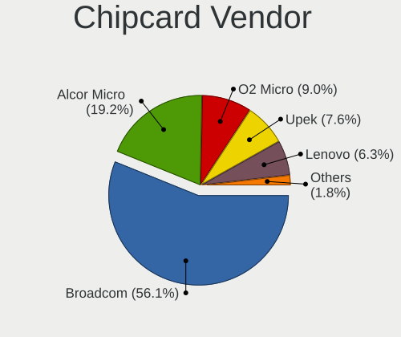

| Vendor                | Notebooks | Percent |
|-----------------------|-----------|---------|
| Broadcom              | 670       | 56.11%  |
| Alcor Micro           | 229       | 19.18%  |
| O2 Micro              | 107       | 8.96%   |
| Upek                  | 91        | 7.62%   |
| Lenovo                | 75        | 6.28%   |
| SCM Microsystems      | 8         | 0.67%   |
| Gemalto (was Gemplus) | 5         | 0.42%   |
| Yubico.com            | 2         | 0.17%   |
| Realtek Semiconductor | 1         | 0.08%   |
| OmniKey               | 1         | 0.08%   |
| NXP Semiconductors    | 1         | 0.08%   |
| Microchip Technology  | 1         | 0.08%   |
| Hewlett-Packard       | 1         | 0.08%   |
| Cherry                | 1         | 0.08%   |
| Advanced Card Systems | 1         | 0.08%   |

Chipcard Model
--------------

Chipcard module models

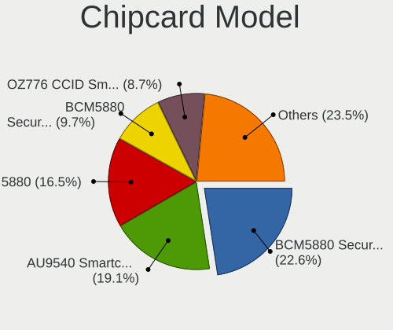

| Model                                                                        | Notebooks | Percent |
|------------------------------------------------------------------------------|-----------|---------|
| Broadcom BCM5880 Secure Applications Processor                               | 270       | 22.58%  |
| Alcor Micro AU9540 Smartcard Reader                                          | 228       | 19.06%  |
| Broadcom 5880                                                                | 197       | 16.47%  |
| Broadcom BCM5880 Secure Applications Processor with fingerprint swipe sensor | 116       | 9.7%    |
| O2 Micro OZ776 CCID Smartcard Reader                                         | 104       | 8.7%    |
| Upek TouchChip Fingerprint Coprocessor (WBF advanced mode)                   | 91        | 7.61%   |
| Lenovo Integrated Smart Card Reader                                          | 75        | 6.27%   |
| Broadcom BCM58200 ControlVault 3 (FingerPrint sensor + Contacted SmartCard)  | 50        | 4.18%   |
| Broadcom 58200                                                               | 36        | 3.01%   |
| SCM Microsystems SCR3340 - ExpressCard54 Smart Card Reader                   | 7         | 0.59%   |
| Gemalto (was Gemplus) Compact Smart Card Reader Writer                       | 4         | 0.33%   |
| O2 Micro Oz776 SmartCard Reader                                              | 3         | 0.25%   |
| Broadcom BCM5880 Secure Applications Processor with fingerprint touch sensor | 3         | 0.25%   |
| Yubico.com Yubikey 4/5 U2F+CCID                                              | 2         | 0.17%   |
| SCM Microsystems SCR35xx Smart Card Reader                                   | 1         | 0.08%   |
| Realtek Semiconductor Smart Card Reader Interface                            | 1         | 0.08%   |
| OmniKey CardMan 4321                                                         | 1         | 0.08%   |
| NXP Semiconductors PR533                                                     | 1         | 0.08%   |
| Microchip Technology SMSC USX101x Reader                                     | 1         | 0.08%   |
| Hewlett-Packard SC Keyboard - Apollo (Liteon)                                | 1         | 0.08%   |
| Gemalto (was Gemplus) GemPC Twin SmartCard Reader                            | 1         | 0.08%   |
| Cherry SmartCard Reader Keyboard KC 1000 SC                                  | 1         | 0.08%   |
| Alcor Micro EMV Smartcard Reader                                             | 1         | 0.08%   |
| Advanced Card Systems ACR122U                                                | 1         | 0.08%   |

Unsupported
-----------

Unsupported Devices
-------------------

Total unsupported devices on board

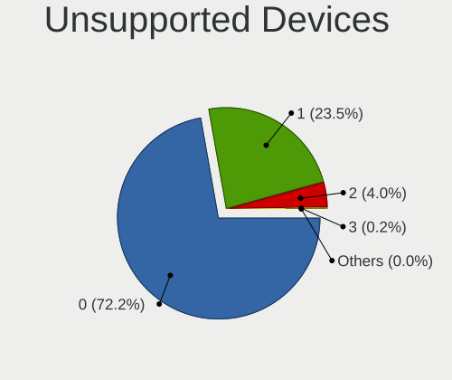

| Total | Notebooks | Percent |
|-------|-----------|---------|
| 0     | 11989     | 72.21%  |
| 1     | 3899      | 23.49%  |
| 2     | 670       | 4.04%   |
| 3     | 40        | 0.24%   |
| 4     | 3         | 0.02%   |
| 6     | 1         | 0.01%   |

Unsupported Device Types
------------------------

Types of unsupported devices

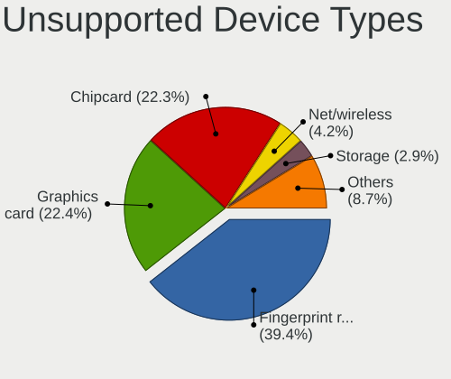

| Type                     | Notebooks | Percent |
|--------------------------|-----------|---------|
| Fingerprint reader       | 2071      | 39.41%  |
| Graphics card            | 1175      | 22.36%  |
| Chipcard                 | 1174      | 22.34%  |
| Net/wireless             | 223       | 4.24%   |
| Storage                  | 155       | 2.95%   |
| Multimedia controller    | 126       | 2.4%    |
| Bluetooth                | 125       | 2.38%   |
| Camera                   | 62        | 1.18%   |
| Communication controller | 42        | 0.8%    |
| Net/ethernet             | 32        | 0.61%   |
| Card reader              | 24        | 0.46%   |
| Sound                    | 18        | 0.34%   |
| Flash memory             | 12        | 0.23%   |
| Network                  | 7         | 0.13%   |
| Modem                    | 3         | 0.06%   |
| Dvb card                 | 2         | 0.04%   |
| Wireless                 | 1         | 0.02%   |
| Unassigned class         | 1         | 0.02%   |
| Tv card                  | 1         | 0.02%   |
| Firewire controller      | 1         | 0.02%   |

