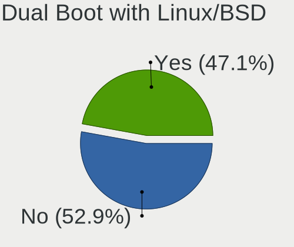
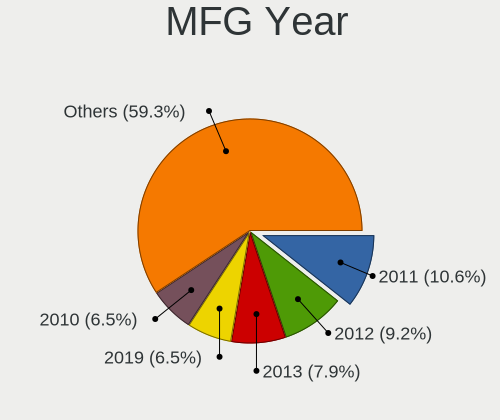
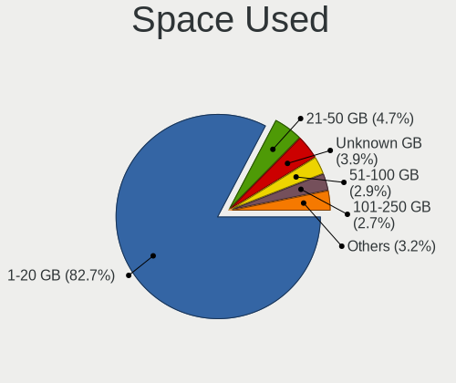
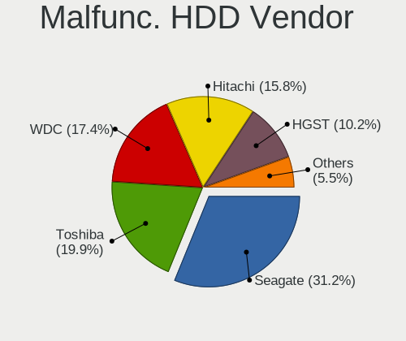
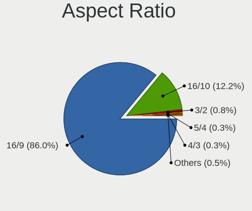
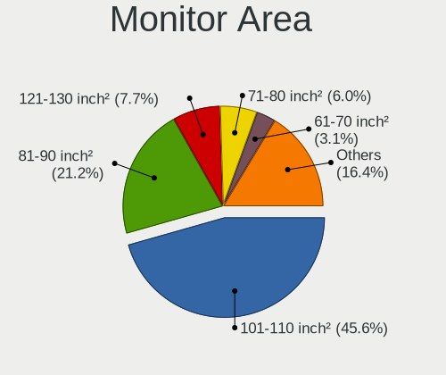

OpenMandriva - Tested Hardware & Statistics (Notebooks)
-------------------------------------------------------

A project to collect tested hardware configurations for OpenMandriva.

Anyone can contribute to this report by the [hw-probe](https://github.com/linuxhw/hw-probe) tool:

    sudo -E hw-probe -all -upload

Please contribute! Especially if your hardware is rare.

Contents
--------

* [ Test Cases ](#test-cases)

* [ System ](#system)
  - [ OS                       ](#os)
  - [ OS Family                ](#os-family)
  - [ Kernel                   ](#kernel)
  - [ Kernel Family            ](#kernel-family)
  - [ Kernel Major Ver.        ](#kernel-major-ver)
  - [ Arch                     ](#arch)
  - [ DE                       ](#de)
  - [ Display Server           ](#display-server)
  - [ Display Manager          ](#display-manager)
  - [ OS Lang                  ](#os-lang)
  - [ Boot Mode                ](#boot-mode)
  - [ Filesystem               ](#filesystem)
  - [ Part. scheme             ](#part-scheme)
  - [ Dual Boot with Linux/BSD ](#dual-boot-with-linuxbsd)
  - [ Dual Boot (Win)          ](#dual-boot-win)

* [ Board ](#board)
  - [ Vendor                   ](#vendor)
  - [ Model                    ](#model)
  - [ Model Family             ](#model-family)
  - [ MFG Year                 ](#mfg-year)
  - [ Form Factor              ](#form-factor)
  - [ Secure Boot              ](#secure-boot)
  - [ Coreboot                 ](#coreboot)
  - [ RAM Size                 ](#ram-size)
  - [ RAM Used                 ](#ram-used)
  - [ Total Drives             ](#total-drives)
  - [ Has CD-ROM               ](#has-cd-rom)
  - [ Has Ethernet             ](#has-ethernet)
  - [ Has WiFi                 ](#has-wifi)
  - [ Has Bluetooth            ](#has-bluetooth)

* [ Location ](#location)
  - [ Country                  ](#country)
  - [ City                     ](#city)

* [ Drives ](#drives)
  - [ Drive Vendor             ](#drive-vendor)
  - [ Drive Model              ](#drive-model)
  - [ HDD Vendor               ](#hdd-vendor)
  - [ SSD Vendor               ](#ssd-vendor)
  - [ Drive Kind               ](#drive-kind)
  - [ Drive Connector          ](#drive-connector)
  - [ Drive Size               ](#drive-size)
  - [ Space Total              ](#space-total)
  - [ Space Used               ](#space-used)
  - [ Malfunc. Drives          ](#malfunc-drives)
  - [ Malfunc. Drive Vendor    ](#malfunc-drive-vendor)
  - [ Malfunc. HDD Vendor      ](#malfunc-hdd-vendor)
  - [ Malfunc. Drive Kind      ](#malfunc-drive-kind)
  - [ Failed Drives            ](#failed-drives)
  - [ Failed Drive Vendor      ](#failed-drive-vendor)
  - [ Drive Status             ](#drive-status)

* [ Storage controller ](#storage-controller)
  - [ Storage Vendor           ](#storage-vendor)
  - [ Storage Model            ](#storage-model)
  - [ Storage Kind             ](#storage-kind)

* [ Processor ](#processor)
  - [ CPU Vendor               ](#cpu-vendor)
  - [ CPU Model                ](#cpu-model)
  - [ CPU Model Family         ](#cpu-model-family)
  - [ CPU Cores                ](#cpu-cores)
  - [ CPU Sockets              ](#cpu-sockets)
  - [ CPU Threads              ](#cpu-threads)
  - [ CPU Op-Modes             ](#cpu-op-modes)
  - [ CPU Microcode            ](#cpu-microcode)
  - [ CPU Microarch            ](#cpu-microarch)

* [ Graphics ](#graphics)
  - [ GPU Vendor               ](#gpu-vendor)
  - [ GPU Model                ](#gpu-model)
  - [ GPU Combo                ](#gpu-combo)
  - [ GPU Driver               ](#gpu-driver)
  - [ GPU Memory               ](#gpu-memory)

* [ Monitor ](#monitor)
  - [ Monitor Vendor           ](#monitor-vendor)
  - [ Monitor Model            ](#monitor-model)
  - [ Monitor Resolution       ](#monitor-resolution)
  - [ Monitor Diagonal         ](#monitor-diagonal)
  - [ Monitor Width            ](#monitor-width)
  - [ Aspect Ratio             ](#aspect-ratio)
  - [ Monitor Area             ](#monitor-area)
  - [ Pixel Density            ](#pixel-density)
  - [ Multiple Monitors        ](#multiple-monitors)

* [ Network ](#network)
  - [ Net Controller Vendor    ](#net-controller-vendor)
  - [ Net Controller Model     ](#net-controller-model)
  - [ Wireless Vendor          ](#wireless-vendor)
  - [ Wireless Model           ](#wireless-model)
  - [ Ethernet Vendor          ](#ethernet-vendor)
  - [ Ethernet Model           ](#ethernet-model)
  - [ Net Controller Kind      ](#net-controller-kind)
  - [ Used Controller          ](#used-controller)
  - [ NICs                     ](#nics)
  - [ IPv6                     ](#ipv6)

* [ Bluetooth ](#bluetooth)
  - [ Bluetooth Vendor         ](#bluetooth-vendor)
  - [ Bluetooth Model          ](#bluetooth-model)

* [ Sound ](#sound)
  - [ Sound Vendor             ](#sound-vendor)
  - [ Sound Model              ](#sound-model)

* [ Memory ](#memory)
  - [ Memory Vendor            ](#memory-vendor)
  - [ Memory Model             ](#memory-model)
  - [ Memory Kind              ](#memory-kind)
  - [ Memory Form Factor       ](#memory-form-factor)
  - [ Memory Size              ](#memory-size)
  - [ Memory Speed             ](#memory-speed)

* [ Printers & scanners ](#printers--scanners)
  - [ Printer Vendor           ](#printer-vendor)
  - [ Printer Model            ](#printer-model)
  - [ Scanner Vendor           ](#scanner-vendor)
  - [ Scanner Model            ](#scanner-model)

* [ Camera ](#camera)
  - [ Camera Vendor            ](#camera-vendor)
  - [ Camera Model             ](#camera-model)

* [ Security ](#security)
  - [ Fingerprint Vendor       ](#fingerprint-vendor)
  - [ Fingerprint Model        ](#fingerprint-model)
  - [ Chipcard Vendor          ](#chipcard-vendor)
  - [ Chipcard Model           ](#chipcard-model)

* [ Unsupported ](#unsupported)
  - [ Unsupported Devices      ](#unsupported-devices)
  - [ Unsupported Device Types ](#unsupported-device-types)

Test Cases
----------

Total: 4781

| Vendor        | Model                       | Probe                                                      | Date         |
|---------------|-----------------------------|------------------------------------------------------------|--------------|
| Toshiba       | Satellite A305D             | [b85a377462](https://linux-hardware.org/?probe=b85a377462) | Dec 31, 2022 |
| Dynabook      | Satellite Pro C40-G         | [e7555a4df8](https://linux-hardware.org/?probe=e7555a4df8) | Dec 31, 2022 |
| Lenovo        | ThinkPad T410 2537BF9       | [f83ed1dd39](https://linux-hardware.org/?probe=f83ed1dd39) | Dec 30, 2022 |
| ASUSTek       | TP501UA                     | [1f2aaf8804](https://linux-hardware.org/?probe=1f2aaf8804) | Dec 30, 2022 |
| Lenovo        | ThinkPad X250 20CLS2D404    | [68afcc38f2](https://linux-hardware.org/?probe=68afcc38f2) | Dec 30, 2022 |
| ASUSTek       | K55VD                       | [e4c90250df](https://linux-hardware.org/?probe=e4c90250df) | Dec 30, 2022 |
| HP            | Pavilion Laptop 15-cw1xx... | [7a685e175c](https://linux-hardware.org/?probe=7a685e175c) | Dec 30, 2022 |
| ASUSTek       | X555UJ                      | [f4ba8643aa](https://linux-hardware.org/?probe=f4ba8643aa) | Dec 30, 2022 |
| ASUSTek       | X556UQK                     | [42a9dc760d](https://linux-hardware.org/?probe=42a9dc760d) | Dec 30, 2022 |
| Medion        | Akoya E6416                 | [ddd9ba1ffc](https://linux-hardware.org/?probe=ddd9ba1ffc) | Dec 29, 2022 |
| Acer          | Nitro AN515-57              | [b0bfa9530a](https://linux-hardware.org/?probe=b0bfa9530a) | Dec 29, 2022 |
| Toshiba       | dynabook T653/46JR          | [a1f59f6ff9](https://linux-hardware.org/?probe=a1f59f6ff9) | Dec 29, 2022 |
| ASUSTek       | G1                          | [1f8e426f96](https://linux-hardware.org/?probe=1f8e426f96) | Dec 29, 2022 |
| Lenovo        | ThinkPad T500 2089W3A       | [401f529e18](https://linux-hardware.org/?probe=401f529e18) | Dec 29, 2022 |
| HP            | Notebook                    | [91bc85bf6e](https://linux-hardware.org/?probe=91bc85bf6e) | Dec 29, 2022 |
| Samsung       | NB30/N146                   | [7f9b976789](https://linux-hardware.org/?probe=7f9b976789) | Dec 29, 2022 |
| Apple         | MacBookAir7,2               | [0ad2bdf744](https://linux-hardware.org/?probe=0ad2bdf744) | Dec 29, 2022 |
| Fujitsu       | LIFEBOOK P702               | [4734f4370b](https://linux-hardware.org/?probe=4734f4370b) | Dec 28, 2022 |
| Lenovo        | V560                        | [f937de4c61](https://linux-hardware.org/?probe=f937de4c61) | Dec 28, 2022 |
| ASUSTek       | VivoBook_ASUSLaptop X509... | [1ff4c4bf09](https://linux-hardware.org/?probe=1ff4c4bf09) | Dec 28, 2022 |
| HP            | Compaq Presario CQ60        | [92ece593f5](https://linux-hardware.org/?probe=92ece593f5) | Dec 28, 2022 |
| HP            | EliteBook 820 G2            | [bd56ec4f01](https://linux-hardware.org/?probe=bd56ec4f01) | Dec 28, 2022 |
| Google        | Gnawty                      | [98902e9806](https://linux-hardware.org/?probe=98902e9806) | Dec 28, 2022 |
| Acer          | Aspire E5-573G              | [6e1255aa44](https://linux-hardware.org/?probe=6e1255aa44) | Dec 28, 2022 |
| Positivo      | Hendrix                     | [55aa2f92d7](https://linux-hardware.org/?probe=55aa2f92d7) | Dec 27, 2022 |
| Dell          | Latitude 7480               | [45b0f992f6](https://linux-hardware.org/?probe=45b0f992f6) | Dec 27, 2022 |
| Samsung       | 300E4C/300E5C/300E7C        | [7a3513a2e1](https://linux-hardware.org/?probe=7a3513a2e1) | Dec 27, 2022 |
| Acer          | Nitro AN515-44              | [58b02cceb0](https://linux-hardware.org/?probe=58b02cceb0) | Dec 27, 2022 |
| Lenovo        | IdeaPad S145-15AST 81N3     | [9e6b5e5ebf](https://linux-hardware.org/?probe=9e6b5e5ebf) | Dec 27, 2022 |
| Acer          | Nitro AN515-57              | [8ecb7e11b3](https://linux-hardware.org/?probe=8ecb7e11b3) | Dec 26, 2022 |
| Samsung       | 270E5G/270E5U               | [705baed85a](https://linux-hardware.org/?probe=705baed85a) | Dec 26, 2022 |
| MSI           | GS76 Stealth 11UG           | [10e22b317f](https://linux-hardware.org/?probe=10e22b317f) | Dec 26, 2022 |
| HUAWEI        | BOHK-WAX9X                  | [6703f01cfc](https://linux-hardware.org/?probe=6703f01cfc) | Dec 26, 2022 |
| HP            | EliteBook 820 G1            | [6a2c20cb74](https://linux-hardware.org/?probe=6a2c20cb74) | Dec 26, 2022 |
| Toshiba       | Satellite L500              | [08b4f83030](https://linux-hardware.org/?probe=08b4f83030) | Dec 26, 2022 |
| Lenovo        | ThinkPad X1 Carbon 34604... | [dfb555f802](https://linux-hardware.org/?probe=dfb555f802) | Dec 26, 2022 |
| Apple         | MacBookAir7,2               | [9d48f30feb](https://linux-hardware.org/?probe=9d48f30feb) | Dec 25, 2022 |
| Acer          | Aspire A315-53              | [e012bb5bc1](https://linux-hardware.org/?probe=e012bb5bc1) | Dec 25, 2022 |
| Gigabyte      | AERO 17 XD                  | [c45ec6b46d](https://linux-hardware.org/?probe=c45ec6b46d) | Dec 25, 2022 |
| ASUSTek       | M51Tr                       | [dffa412a98](https://linux-hardware.org/?probe=dffa412a98) | Dec 25, 2022 |
| Dell          | G7 7790                     | [da767d5fd4](https://linux-hardware.org/?probe=da767d5fd4) | Dec 24, 2022 |
| Lenovo        | IdeaPad S145-15AST 81N3     | [8c835888d6](https://linux-hardware.org/?probe=8c835888d6) | Dec 24, 2022 |
| ASUSTek       | UX31E                       | [08a1ad1c63](https://linux-hardware.org/?probe=08a1ad1c63) | Dec 24, 2022 |
| Acer          | Aspire A315-21G             | [435933801a](https://linux-hardware.org/?probe=435933801a) | Dec 24, 2022 |
| Toshiba       | Satellite C55-A             | [02a3f1cf18](https://linux-hardware.org/?probe=02a3f1cf18) | Dec 24, 2022 |
| Dell          | XPS L322X                   | [c127721464](https://linux-hardware.org/?probe=c127721464) | Dec 24, 2022 |
| ASUSTek       | VivoBook_ASUSLaptop X421... | [cf4ba78c7d](https://linux-hardware.org/?probe=cf4ba78c7d) | Dec 24, 2022 |
| Acer          | Aspire VX5-591G             | [f2e0369ba1](https://linux-hardware.org/?probe=f2e0369ba1) | Dec 24, 2022 |
| Positivo      | Mobile                      | [6031910e64](https://linux-hardware.org/?probe=6031910e64) | Dec 24, 2022 |
| Lenovo        | ThinkPad SL 2746N8G         | [f540a3a892](https://linux-hardware.org/?probe=f540a3a892) | Dec 23, 2022 |
| Positivo      | H14BT58                     | [9914219613](https://linux-hardware.org/?probe=9914219613) | Dec 23, 2022 |
| ASUSTek       | VivoBook_ASUSLaptop X509... | [beb602dcf6](https://linux-hardware.org/?probe=beb602dcf6) | Dec 23, 2022 |
| ASUSTek       | K53SC                       | [5105f25e5e](https://linux-hardware.org/?probe=5105f25e5e) | Dec 23, 2022 |
| Acer          | Aspire VX5-591G             | [7defe87998](https://linux-hardware.org/?probe=7defe87998) | Dec 23, 2022 |
| Apple         | MacBookAir7,2               | [00e62a7231](https://linux-hardware.org/?probe=00e62a7231) | Dec 23, 2022 |
| Lenovo        | ThinkPad X220 Tablet 429... | [791ace450e](https://linux-hardware.org/?probe=791ace450e) | Dec 23, 2022 |
| ASUSTek       | M51Vr                       | [ffc48a52ea](https://linux-hardware.org/?probe=ffc48a52ea) | Dec 22, 2022 |
| Dell          | Latitude 5280               | [59002e923b](https://linux-hardware.org/?probe=59002e923b) | Dec 22, 2022 |
| HP            | Pavilion dv9000 (RR329EA... | [6fc7281f2f](https://linux-hardware.org/?probe=6fc7281f2f) | Dec 22, 2022 |
| ASUSTek       | 1015BXO                     | [7cce9a65ec](https://linux-hardware.org/?probe=7cce9a65ec) | Dec 22, 2022 |
| Toshiba       | dynabook T653/46JR          | [1f10cd2a64](https://linux-hardware.org/?probe=1f10cd2a64) | Dec 22, 2022 |
| HP            | Pavilion 11 x360 PC         | [1397ed80b3](https://linux-hardware.org/?probe=1397ed80b3) | Dec 21, 2022 |
| Toshiba       | Satellite C55-B             | [8f81c02bbf](https://linux-hardware.org/?probe=8f81c02bbf) | Dec 21, 2022 |
| Samsung       | R540/R580/R780/SA41/E452... | [044928d818](https://linux-hardware.org/?probe=044928d818) | Dec 21, 2022 |
| Lenovo        | IdeaPad Y510P 20217         | [06d78a17c1](https://linux-hardware.org/?probe=06d78a17c1) | Dec 21, 2022 |
| Acer          | Aspire 5336                 | [9724b5d705](https://linux-hardware.org/?probe=9724b5d705) | Dec 20, 2022 |
| RM Educati... | RM                          | [758b521362](https://linux-hardware.org/?probe=758b521362) | Dec 20, 2022 |
| Lenovo        | IdeaPad 3 14ALC6 82KT       | [7c07fab7e4](https://linux-hardware.org/?probe=7c07fab7e4) | Dec 20, 2022 |
| Lenovo        | ThinkPad W510 4318CTO       | [215feb2d5e](https://linux-hardware.org/?probe=215feb2d5e) | Dec 20, 2022 |
| MSI           | GE62 6QD                    | [20d959e778](https://linux-hardware.org/?probe=20d959e778) | Dec 19, 2022 |
| LG Electro... | 17Z90P-G.AA56F              | [fa43417151](https://linux-hardware.org/?probe=fa43417151) | Dec 19, 2022 |
| Toshiba       | EQUIUM A300D                | [ffde5ccef4](https://linux-hardware.org/?probe=ffde5ccef4) | Dec 19, 2022 |
| ASUSTek       | S551LN                      | [df4a754b5d](https://linux-hardware.org/?probe=df4a754b5d) | Dec 19, 2022 |
| ASUSTek       | X555LD                      | [d1d5c6a19e](https://linux-hardware.org/?probe=d1d5c6a19e) | Dec 19, 2022 |
| ASUSTek       | UX31E                       | [4f41f354cd](https://linux-hardware.org/?probe=4f41f354cd) | Dec 18, 2022 |
| ASUSTek       | N551JM                      | [e02ba85a63](https://linux-hardware.org/?probe=e02ba85a63) | Dec 18, 2022 |
| Acer          | Aspire ES1-531              | [28dc03a1bc](https://linux-hardware.org/?probe=28dc03a1bc) | Dec 18, 2022 |
| Toshiba       | dynabook T653/46JR          | [5a05dc8c43](https://linux-hardware.org/?probe=5a05dc8c43) | Dec 17, 2022 |
| Dell          | Latitude E6330              | [ca6551bf8e](https://linux-hardware.org/?probe=ca6551bf8e) | Dec 17, 2022 |
| Notebook      | W65_67SZ                    | [770c00f7d9](https://linux-hardware.org/?probe=770c00f7d9) | Dec 17, 2022 |
| Lenovo        | ThinkPad X200s 7466A17      | [1831439f56](https://linux-hardware.org/?probe=1831439f56) | Dec 16, 2022 |
| Samsung       | 305E4A/305E5A/305E7A        | [0d7a54bc21](https://linux-hardware.org/?probe=0d7a54bc21) | Dec 16, 2022 |
| Lenovo        | IdeaPad 1 14ADA05 82GW      | [ffa7e28596](https://linux-hardware.org/?probe=ffa7e28596) | Dec 16, 2022 |
| Lenovo        | Yoga 2-11 20332             | [92a038a164](https://linux-hardware.org/?probe=92a038a164) | Dec 16, 2022 |
| Lenovo        | ThinkPad X240 20AL007AMZ    | [8290c7e597](https://linux-hardware.org/?probe=8290c7e597) | Dec 16, 2022 |
| Lenovo        | IdeaPad S145-14AST 81ST     | [04cc986bf6](https://linux-hardware.org/?probe=04cc986bf6) | Dec 15, 2022 |
| HP            | Presario CQ62               | [fce21eae2c](https://linux-hardware.org/?probe=fce21eae2c) | Dec 15, 2022 |
| Lenovo        | B590 20206                  | [b2b98c19da](https://linux-hardware.org/?probe=b2b98c19da) | Dec 15, 2022 |
| ASUSTek       | K40IJ                       | [191b6ded65](https://linux-hardware.org/?probe=191b6ded65) | Dec 15, 2022 |
| Lenovo        | G700 20251                  | [f72bd71975](https://linux-hardware.org/?probe=f72bd71975) | Dec 15, 2022 |
| Lenovo        | ThinkPad X230 23245QP       | [e525a77c95](https://linux-hardware.org/?probe=e525a77c95) | Dec 15, 2022 |
| Acer          | Aspire A514-54              | [78482cbf69](https://linux-hardware.org/?probe=78482cbf69) | Dec 15, 2022 |
| Lenovo        | G460 20041                  | [b76fa704f7](https://linux-hardware.org/?probe=b76fa704f7) | Dec 15, 2022 |
| Lenovo        | IdeaPad Gaming 3 15IMH05... | [259226594a](https://linux-hardware.org/?probe=259226594a) | Dec 14, 2022 |
| Dell          | Inspiron 11 - 3147          | [d5aa2c3900](https://linux-hardware.org/?probe=d5aa2c3900) | Dec 14, 2022 |
| HP            | Compaq 6735s                | [72d29aa11f](https://linux-hardware.org/?probe=72d29aa11f) | Dec 14, 2022 |
| Dell          | Inspiron 3451               | [de7f9d5e33](https://linux-hardware.org/?probe=de7f9d5e33) | Dec 14, 2022 |
| Star Labs     | StarBook                    | [719a73ae26](https://linux-hardware.org/?probe=719a73ae26) | Dec 13, 2022 |
| Dell          | Inspiron 1525               | [5a88d1f0e3](https://linux-hardware.org/?probe=5a88d1f0e3) | Dec 13, 2022 |
| Dell          | Latitude E7250              | [3e40466ae4](https://linux-hardware.org/?probe=3e40466ae4) | Dec 13, 2022 |
| HUAWEI        | HVY-WXX9                    | [37284f659a](https://linux-hardware.org/?probe=37284f659a) | Dec 13, 2022 |
| HP            | Pavilion 15                 | [5d88eed564](https://linux-hardware.org/?probe=5d88eed564) | Dec 13, 2022 |
| Clevo         | M740TU/M760TU               | [5f1a4b58fb](https://linux-hardware.org/?probe=5f1a4b58fb) | Dec 13, 2022 |
| HP            | Notebook                    | [07b9e8995f](https://linux-hardware.org/?probe=07b9e8995f) | Dec 12, 2022 |
| ASUSTek       | UX31E                       | [651fa58fbd](https://linux-hardware.org/?probe=651fa58fbd) | Dec 12, 2022 |
| MSI           | GS65 Stealth Thin 8RF       | [074195107c](https://linux-hardware.org/?probe=074195107c) | Dec 12, 2022 |
| Dell          | Latitude 5411               | [334ca886a4](https://linux-hardware.org/?probe=334ca886a4) | Dec 12, 2022 |
| Lenovo        | IdeaPad Z580                | [4784b53f14](https://linux-hardware.org/?probe=4784b53f14) | Dec 12, 2022 |
| HP            | Laptop 15-bw0xx             | [1d2ea30fb2](https://linux-hardware.org/?probe=1d2ea30fb2) | Dec 11, 2022 |
| Lenovo        | ThinkPad P51 20HH0018GE     | [4d5dd8fdc0](https://linux-hardware.org/?probe=4d5dd8fdc0) | Dec 11, 2022 |
| HP            | 650                         | [9bb3729969](https://linux-hardware.org/?probe=9bb3729969) | Dec 11, 2022 |
| Lenovo        | ThinkBook 15 G2 ITL 20VE    | [a7a3ccf712](https://linux-hardware.org/?probe=a7a3ccf712) | Dec 11, 2022 |
| MSI           | GF63 Thin 9RCX              | [b3c750c720](https://linux-hardware.org/?probe=b3c750c720) | Dec 11, 2022 |
| HP            | Pavilion dv6000 (RY649EA... | [9deecc89f5](https://linux-hardware.org/?probe=9deecc89f5) | Dec 10, 2022 |
| Acer          | Aspire V5-573               | [1d88db5ee2](https://linux-hardware.org/?probe=1d88db5ee2) | Dec 10, 2022 |
| Sony          | VGN-FZ31Z                   | [4f392d3575](https://linux-hardware.org/?probe=4f392d3575) | Dec 10, 2022 |
| Acer          | Aspire E1-571G              | [344383d85d](https://linux-hardware.org/?probe=344383d85d) | Dec 10, 2022 |
| HP            | Pavilion Laptop 15-cw1xx... | [e0584a11c0](https://linux-hardware.org/?probe=e0584a11c0) | Dec 10, 2022 |
| HP            | Compaq Presario CQ71        | [503b61f120](https://linux-hardware.org/?probe=503b61f120) | Dec 09, 2022 |
| Positivo      | Mobile                      | [bc5f4e6c85](https://linux-hardware.org/?probe=bc5f4e6c85) | Dec 09, 2022 |
| Acer          | TravelMate 5720             | [d0a54f621e](https://linux-hardware.org/?probe=d0a54f621e) | Dec 09, 2022 |
| Acer          | Aspire A515-52              | [99e671f55f](https://linux-hardware.org/?probe=99e671f55f) | Dec 09, 2022 |
| HP            | Pavilion Notebook           | [8cc721f649](https://linux-hardware.org/?probe=8cc721f649) | Dec 08, 2022 |
| HP            | 15                          | [20dfd7b8f5](https://linux-hardware.org/?probe=20dfd7b8f5) | Dec 08, 2022 |
| Packard Be... | DOT S                       | [753f17a658](https://linux-hardware.org/?probe=753f17a658) | Dec 08, 2022 |
| Acer          | Aspire A315-34              | [85794e606c](https://linux-hardware.org/?probe=85794e606c) | Dec 08, 2022 |
| Lenovo        | ThinkPad L530 24783R8       | [406c066d36](https://linux-hardware.org/?probe=406c066d36) | Dec 08, 2022 |
| ASUSTek       | K55VD                       | [469f0a1d1f](https://linux-hardware.org/?probe=469f0a1d1f) | Dec 07, 2022 |
| Acer          | Aspire A315-51              | [3ab56a93d6](https://linux-hardware.org/?probe=3ab56a93d6) | Dec 07, 2022 |
| Lenovo        | IdeaPad Gaming 3 15ARH7 ... | [9ff2e9b61a](https://linux-hardware.org/?probe=9ff2e9b61a) | Dec 07, 2022 |
| Toshiba       | Satellite C855              | [1a35ba24c1](https://linux-hardware.org/?probe=1a35ba24c1) | Dec 07, 2022 |
| ASUSTek       | K53SV                       | [a745b1ead9](https://linux-hardware.org/?probe=a745b1ead9) | Dec 07, 2022 |
| Positivo      | H14BT58                     | [c038df5c8c](https://linux-hardware.org/?probe=c038df5c8c) | Dec 07, 2022 |
| Acer          | Aspire E5-772               | [35c8c05d6c](https://linux-hardware.org/?probe=35c8c05d6c) | Dec 06, 2022 |
| Toshiba       | Satellite L655              | [741c3e22b7](https://linux-hardware.org/?probe=741c3e22b7) | Dec 06, 2022 |
| Acer          | Nitro AN515-57              | [b0bc15145c](https://linux-hardware.org/?probe=b0bc15145c) | Dec 06, 2022 |
| HP            | 15                          | [e5a0cdc9de](https://linux-hardware.org/?probe=e5a0cdc9de) | Dec 06, 2022 |
| Dell          | Latitude E6540              | [20786b000c](https://linux-hardware.org/?probe=20786b000c) | Dec 05, 2022 |
| Lenovo        | Y520-15IKBN 80WK            | [119ec75a5f](https://linux-hardware.org/?probe=119ec75a5f) | Dec 05, 2022 |
| HP            | Pavilion dv6000 (RV009UA... | [6dcd661136](https://linux-hardware.org/?probe=6dcd661136) | Dec 05, 2022 |
| MSI           | GF63 Thin 9RCX              | [1bf4364f61](https://linux-hardware.org/?probe=1bf4364f61) | Dec 05, 2022 |
| Sony          | VPCEL2S1E                   | [0c98b9d570](https://linux-hardware.org/?probe=0c98b9d570) | Dec 04, 2022 |
| Apple         | MacBookAir6,1               | [af63449087](https://linux-hardware.org/?probe=af63449087) | Dec 04, 2022 |
| Lenovo        | G770 20089                  | [d35d60f972](https://linux-hardware.org/?probe=d35d60f972) | Dec 04, 2022 |
| Lenovo        | IdeaPad 100-15IBD 80QQ      | [fd9114a304](https://linux-hardware.org/?probe=fd9114a304) | Dec 04, 2022 |
| HP            | Pavilion Notebook           | [df4873cc34](https://linux-hardware.org/?probe=df4873cc34) | Dec 04, 2022 |
| ASUSTek       | UX31E                       | [7bde8b90c7](https://linux-hardware.org/?probe=7bde8b90c7) | Dec 04, 2022 |
| Sony          | VGN-NW31JF_S                | [ebfbfb034a](https://linux-hardware.org/?probe=ebfbfb034a) | Dec 04, 2022 |
| ASUSTek       | K42F                        | [05ddce411d](https://linux-hardware.org/?probe=05ddce411d) | Dec 04, 2022 |
| Acer          | Aspire 5750                 | [bfe28498bd](https://linux-hardware.org/?probe=bfe28498bd) | Dec 04, 2022 |
| Dell          | Latitude E5510              | [6027856ab6](https://linux-hardware.org/?probe=6027856ab6) | Dec 03, 2022 |
| Toshiba       | dynabook T653/46JR          | [601575b385](https://linux-hardware.org/?probe=601575b385) | Dec 03, 2022 |
| Toshiba       | Satellite L635              | [be223c0ff1](https://linux-hardware.org/?probe=be223c0ff1) | Dec 03, 2022 |
| HP            | ZBook 15u G6                | [1b1fbc9954](https://linux-hardware.org/?probe=1b1fbc9954) | Dec 03, 2022 |
| HP            | ProBook 4530s               | [f8f94617e8](https://linux-hardware.org/?probe=f8f94617e8) | Dec 03, 2022 |
| Lenovo        | IdeaPad 100-15IBY 80MJ      | [78f2f440eb](https://linux-hardware.org/?probe=78f2f440eb) | Dec 02, 2022 |
| ASUSTek       | X550CL                      | [8a2aad437e](https://linux-hardware.org/?probe=8a2aad437e) | Dec 02, 2022 |
| Unknown       | Unknown                     | [6d3639b02c](https://linux-hardware.org/?probe=6d3639b02c) | Dec 02, 2022 |
| Acer          | Predator PH317-56           | [ea1d794b18](https://linux-hardware.org/?probe=ea1d794b18) | Dec 02, 2022 |
| Lenovo        | ThinkPad X1 Carbon 7th 2... | [8e0ea55ccc](https://linux-hardware.org/?probe=8e0ea55ccc) | Dec 02, 2022 |
| Dell          | Latitude E6420              | [011df4cb7f](https://linux-hardware.org/?probe=011df4cb7f) | Dec 02, 2022 |
| Lenovo        | IdeaPad 100-15IBD 80QQ      | [929550dc41](https://linux-hardware.org/?probe=929550dc41) | Dec 01, 2022 |
| ASUSTek       | S551LN                      | [b21b106fdf](https://linux-hardware.org/?probe=b21b106fdf) | Dec 01, 2022 |
| Lenovo        | Legion 5 Pro 16ACH6H 82J... | [794fbb64f9](https://linux-hardware.org/?probe=794fbb64f9) | Dec 01, 2022 |
| Lenovo        | ThinkPad T530 24297ZG       | [422f84a794](https://linux-hardware.org/?probe=422f84a794) | Nov 30, 2022 |
| Samsung       | 300E5K/300E5Q               | [f6bb652f5a](https://linux-hardware.org/?probe=f6bb652f5a) | Nov 30, 2022 |
| Samsung       | 550XDA                      | [7614fde301](https://linux-hardware.org/?probe=7614fde301) | Nov 30, 2022 |
| ASUSTek       | VivoBook_ASUSLaptop E410... | [9505f905e8](https://linux-hardware.org/?probe=9505f905e8) | Nov 30, 2022 |
| Philco        | 14H                         | [8d29065667](https://linux-hardware.org/?probe=8d29065667) | Nov 30, 2022 |
| Dell          | Inspiron 5423               | [db57850733](https://linux-hardware.org/?probe=db57850733) | Nov 29, 2022 |
| Lenovo        | IdeaPad 3 15ADA05 81W1      | [1a742c23df](https://linux-hardware.org/?probe=1a742c23df) | Nov 29, 2022 |
| HP            | EliteBook 840 G6            | [3f545fe7c9](https://linux-hardware.org/?probe=3f545fe7c9) | Nov 29, 2022 |
| Toshiba       | Satellite L40               | [fa36933936](https://linux-hardware.org/?probe=fa36933936) | Nov 29, 2022 |
| Lenovo        | IdeaPad 110-15AST 80TR      | [cbb0c1dca7](https://linux-hardware.org/?probe=cbb0c1dca7) | Nov 29, 2022 |
| Apple         | MacBookPro12,1              | [f03f3a9325](https://linux-hardware.org/?probe=f03f3a9325) | Nov 29, 2022 |
| Dell          | Inspiron 15-3567            | [20219ca82a](https://linux-hardware.org/?probe=20219ca82a) | Nov 29, 2022 |
| HP            | 255 G7 Notebook PC          | [0bd83a29f4](https://linux-hardware.org/?probe=0bd83a29f4) | Nov 29, 2022 |
| Sony          | VGN-NS150FJ                 | [e675a19a27](https://linux-hardware.org/?probe=e675a19a27) | Nov 29, 2022 |
| Dell          | Inspiron 5558               | [c506dd4125](https://linux-hardware.org/?probe=c506dd4125) | Nov 28, 2022 |
| ASUSTek       | UX31E                       | [97c63f232d](https://linux-hardware.org/?probe=97c63f232d) | Nov 28, 2022 |
| Toshiba       | Satellite L875              | [2d5e211d72](https://linux-hardware.org/?probe=2d5e211d72) | Nov 28, 2022 |
| Toshiba       | PORTEGE Z30t-A              | [8af94993bd](https://linux-hardware.org/?probe=8af94993bd) | Nov 28, 2022 |
| Lenovo        | IdeaPad 3 15ADA05 81W1      | [3433fd5db6](https://linux-hardware.org/?probe=3433fd5db6) | Nov 28, 2022 |
| Samsung       | 3570R/370R/470R/450R/510... | [51d2b67ca3](https://linux-hardware.org/?probe=51d2b67ca3) | Nov 28, 2022 |
| ASUSTek       | X555YA                      | [0e9bb436b5](https://linux-hardware.org/?probe=0e9bb436b5) | Nov 27, 2022 |
| Medion        | E11201                      | [0838f9db75](https://linux-hardware.org/?probe=0838f9db75) | Nov 27, 2022 |
| Gateway       | M-1631U                     | [f0f0517dab](https://linux-hardware.org/?probe=f0f0517dab) | Nov 27, 2022 |
| HP            | Compaq Presario CQ60        | [1f521f98cb](https://linux-hardware.org/?probe=1f521f98cb) | Nov 27, 2022 |
| Lenovo        | 3000 N500 42336DS           | [f3d917b782](https://linux-hardware.org/?probe=f3d917b782) | Nov 26, 2022 |
| ASUSTek       | X550CL                      | [06c7fdf5c9](https://linux-hardware.org/?probe=06c7fdf5c9) | Nov 26, 2022 |
| Dell          | Latitude E6220              | [aa8d2d2fc7](https://linux-hardware.org/?probe=aa8d2d2fc7) | Nov 26, 2022 |
| Dell          | Inspiron MP061              | [d70d7496df](https://linux-hardware.org/?probe=d70d7496df) | Nov 26, 2022 |
| Acer          | Aspire A315-42              | [3413fb7947](https://linux-hardware.org/?probe=3413fb7947) | Nov 26, 2022 |
| Acer          | Aspire ES1-512              | [85c0936ee0](https://linux-hardware.org/?probe=85c0936ee0) | Nov 25, 2022 |
| Acer          | NC-ES1-512-C3AH             | [0670f9ed15](https://linux-hardware.org/?probe=0670f9ed15) | Nov 25, 2022 |
| Dell          | Inspiron 7559               | [620f0d5cec](https://linux-hardware.org/?probe=620f0d5cec) | Nov 25, 2022 |
| HP            | OMEN Laptop 15-ek0xxx       | [a7b7f4f100](https://linux-hardware.org/?probe=a7b7f4f100) | Nov 25, 2022 |
| Lenovo        | B590 20208                  | [9f49ff06cf](https://linux-hardware.org/?probe=9f49ff06cf) | Nov 24, 2022 |
| Lenovo        | IdeaPad 3 15IML05 82BS      | [418849100f](https://linux-hardware.org/?probe=418849100f) | Nov 24, 2022 |
| HP            | 650                         | [15c69c43ca](https://linux-hardware.org/?probe=15c69c43ca) | Nov 24, 2022 |
| Acer          | Aspire ES1-523              | [333d3583b1](https://linux-hardware.org/?probe=333d3583b1) | Nov 24, 2022 |
| HP            | EliteBook 8560p             | [e7bf51183d](https://linux-hardware.org/?probe=e7bf51183d) | Nov 24, 2022 |
| HP            | ProBook 430 G3              | [0fa29b61e3](https://linux-hardware.org/?probe=0fa29b61e3) | Nov 24, 2022 |
| HUAWEI        | NBLK-WAX9X                  | [600e3f0f09](https://linux-hardware.org/?probe=600e3f0f09) | Nov 24, 2022 |
| Samsung       | 300E5EV/300E4EV/270E5EV/... | [adcb4db30d](https://linux-hardware.org/?probe=adcb4db30d) | Nov 24, 2022 |
| Unknown       | Unknown                     | [9b50d75b30](https://linux-hardware.org/?probe=9b50d75b30) | Nov 24, 2022 |
| Lenovo        | ThinkPad T420 4180GH5       | [8dba4b2123](https://linux-hardware.org/?probe=8dba4b2123) | Nov 23, 2022 |
| ASUSTek       | K70IJ                       | [8df764e624](https://linux-hardware.org/?probe=8df764e624) | Nov 23, 2022 |
| Sony          | VPCEG16EG                   | [ee22559858](https://linux-hardware.org/?probe=ee22559858) | Nov 23, 2022 |
| HP            | Notebook                    | [616c071073](https://linux-hardware.org/?probe=616c071073) | Nov 23, 2022 |
| Apple         | MacBookPro12,1              | [063ffbb0e8](https://linux-hardware.org/?probe=063ffbb0e8) | Nov 23, 2022 |
| Lenovo        | IdeaPad U310 Touch          | [09beadc5ae](https://linux-hardware.org/?probe=09beadc5ae) | Nov 22, 2022 |
| Intel         | powered classmate PC        | [d74f69f66a](https://linux-hardware.org/?probe=d74f69f66a) | Nov 22, 2022 |
| Lenovo        | ThinkPad R500 2716AZJ       | [ecf18761e4](https://linux-hardware.org/?probe=ecf18761e4) | Nov 22, 2022 |
| Dell          | Latitude 7390               | [8364d36618](https://linux-hardware.org/?probe=8364d36618) | Nov 22, 2022 |
| HP            | Notebook                    | [a062aaddcd](https://linux-hardware.org/?probe=a062aaddcd) | Nov 21, 2022 |
| Dell          | Inspiron 3501               | [1c7b4c3780](https://linux-hardware.org/?probe=1c7b4c3780) | Nov 21, 2022 |
| Dell          | Latitude E6410              | [22585074f3](https://linux-hardware.org/?probe=22585074f3) | Nov 21, 2022 |
| Alienware     | M17xR3                      | [d472e55685](https://linux-hardware.org/?probe=d472e55685) | Nov 20, 2022 |
| Sony          | VPCEB2M1E                   | [eeefed51e4](https://linux-hardware.org/?probe=eeefed51e4) | Nov 20, 2022 |
| HP            | Compaq Presario CQ71        | [52c86bac3f](https://linux-hardware.org/?probe=52c86bac3f) | Nov 20, 2022 |
| Apple         | MacBookAir4,2               | [7d3f0e5604](https://linux-hardware.org/?probe=7d3f0e5604) | Nov 20, 2022 |
| Chuwi         | LapBook SE                  | [ecc56a3703](https://linux-hardware.org/?probe=ecc56a3703) | Nov 19, 2022 |
| HP            | ProBook 4330s               | [5680f376db](https://linux-hardware.org/?probe=5680f376db) | Nov 19, 2022 |
| HP            | EliteBook 840 G1            | [45a5881e61](https://linux-hardware.org/?probe=45a5881e61) | Nov 19, 2022 |
| Lenovo        | S145-15API 81UT             | [fd832d05e2](https://linux-hardware.org/?probe=fd832d05e2) | Nov 19, 2022 |
| HP            | Pavilion dv7                | [839266e415](https://linux-hardware.org/?probe=839266e415) | Nov 19, 2022 |
| HP            | Pavilion g7                 | [fae1d08109](https://linux-hardware.org/?probe=fae1d08109) | Nov 19, 2022 |
| HP            | Pavilion dm4                | [d90ac7b5c2](https://linux-hardware.org/?probe=d90ac7b5c2) | Nov 19, 2022 |
| Lenovo        | V15 G1 IML 82NB             | [a120cac88b](https://linux-hardware.org/?probe=a120cac88b) | Nov 18, 2022 |
| ASUSTek       | K53SM                       | [ea2f588ed8](https://linux-hardware.org/?probe=ea2f588ed8) | Nov 18, 2022 |
| HP            | Notebook                    | [ded915d6cd](https://linux-hardware.org/?probe=ded915d6cd) | Nov 18, 2022 |
| HP            | Presario CQ43               | [0ed80872c0](https://linux-hardware.org/?probe=0ed80872c0) | Nov 18, 2022 |
| Acer          | Aspire one 1-431            | [c27978fdc4](https://linux-hardware.org/?probe=c27978fdc4) | Nov 18, 2022 |
| Acer          | Aspire 6930G                | [05ad62f97d](https://linux-hardware.org/?probe=05ad62f97d) | Nov 17, 2022 |
| Packard Be... | EasyNote TK81               | [c396423368](https://linux-hardware.org/?probe=c396423368) | Nov 17, 2022 |
| Lenovo        | IdeaPad L340-17IRH Gamin... | [dd25be7aef](https://linux-hardware.org/?probe=dd25be7aef) | Nov 17, 2022 |
| ASUSTek       | K54HR                       | [ba95174feb](https://linux-hardware.org/?probe=ba95174feb) | Nov 17, 2022 |
| Compaq        | 420                         | [07ab1c2b0f](https://linux-hardware.org/?probe=07ab1c2b0f) | Nov 17, 2022 |
| Dell          | Inspiron 13-5368            | [203df386a1](https://linux-hardware.org/?probe=203df386a1) | Nov 17, 2022 |
| Dell          | Inspiron 3451               | [105a376344](https://linux-hardware.org/?probe=105a376344) | Nov 17, 2022 |
| Toshiba       | dynabook T653/46JR          | [09569f3154](https://linux-hardware.org/?probe=09569f3154) | Nov 17, 2022 |
| Lenovo        | Z50-70 20354                | [15087fec90](https://linux-hardware.org/?probe=15087fec90) | Nov 16, 2022 |
| ASUSTek       | N53Jf                       | [61f5cf6214](https://linux-hardware.org/?probe=61f5cf6214) | Nov 16, 2022 |
| Acer          | Aspire 5720Z                | [930beb6857](https://linux-hardware.org/?probe=930beb6857) | Nov 16, 2022 |
| MSI           | CR620                       | [4d90de18ca](https://linux-hardware.org/?probe=4d90de18ca) | Nov 16, 2022 |
| Lenovo        | Legion 5 Pro 16ACH6H 82J... | [9c25ade74d](https://linux-hardware.org/?probe=9c25ade74d) | Nov 16, 2022 |
| Toshiba       | Satellite Pro U500          | [064a36a5bb](https://linux-hardware.org/?probe=064a36a5bb) | Nov 16, 2022 |
| Apple         | MacBookPro8,1               | [6f3ecf327d](https://linux-hardware.org/?probe=6f3ecf327d) | Nov 16, 2022 |
| Fujitsu       | LIFEBOOK E554               | [df8344d098](https://linux-hardware.org/?probe=df8344d098) | Nov 16, 2022 |
| HP            | EliteBook Folio 1040 G2     | [3f95d3f191](https://linux-hardware.org/?probe=3f95d3f191) | Nov 15, 2022 |
| Lenovo        | IdeaPad 320-15IKB 80XL      | [b139741f4f](https://linux-hardware.org/?probe=b139741f4f) | Nov 15, 2022 |
| LDLC          | SPC-N                       | [acec489419](https://linux-hardware.org/?probe=acec489419) | Nov 15, 2022 |
| Lenovo        | ThinkPad T490s 20NYS02B0... | [7d2cffcf6a](https://linux-hardware.org/?probe=7d2cffcf6a) | Nov 15, 2022 |
| Toshiba       | dynabook T653/46JR          | [69d4f912f9](https://linux-hardware.org/?probe=69d4f912f9) | Nov 15, 2022 |
| ASUSTek       | N751JX                      | [cea52af467](https://linux-hardware.org/?probe=cea52af467) | Nov 14, 2022 |
| Lenovo        | ThinkPad T470s W10DG 20J... | [298f1bd357](https://linux-hardware.org/?probe=298f1bd357) | Nov 14, 2022 |
| Dell          | XPS 9315                    | [9f97a6b66c](https://linux-hardware.org/?probe=9f97a6b66c) | Nov 14, 2022 |
| Lenovo        | G550 20023                  | [80be7e8e25](https://linux-hardware.org/?probe=80be7e8e25) | Nov 14, 2022 |
| Lenovo        | ThinkPad T470p 20J6CTO1W... | [4121297e16](https://linux-hardware.org/?probe=4121297e16) | Nov 14, 2022 |
| Packard Be... | DOT S                       | [4e6d343f5c](https://linux-hardware.org/?probe=4e6d343f5c) | Nov 14, 2022 |
| Sony          | SVE1411EGXB                 | [dafea482eb](https://linux-hardware.org/?probe=dafea482eb) | Nov 14, 2022 |
| ASUSTek       | N50Vc                       | [36b3155007](https://linux-hardware.org/?probe=36b3155007) | Nov 13, 2022 |
| Lenovo        | IdeaPad 320-15IAP 80XR      | [9506350a75](https://linux-hardware.org/?probe=9506350a75) | Nov 13, 2022 |
| Apple         | MacBookPro5,5               | [9ef06fcef1](https://linux-hardware.org/?probe=9ef06fcef1) | Nov 13, 2022 |
| Fujitsu       | LIFEBOOK E782               | [f6b2530682](https://linux-hardware.org/?probe=f6b2530682) | Nov 12, 2022 |
| HP            | ProBook 455 G2              | [1a5d0a1618](https://linux-hardware.org/?probe=1a5d0a1618) | Nov 12, 2022 |
| Apple         | MacBookPro9,2               | [e974c2ceff](https://linux-hardware.org/?probe=e974c2ceff) | Nov 12, 2022 |
| Dell          | Vostro 3300                 | [be3a3b081d](https://linux-hardware.org/?probe=be3a3b081d) | Nov 12, 2022 |
| Acer          | Aspire 7741                 | [d5166a002a](https://linux-hardware.org/?probe=d5166a002a) | Nov 11, 2022 |
| HP            | 250 G5 Notebook PC          | [d710968897](https://linux-hardware.org/?probe=d710968897) | Nov 11, 2022 |
| Toshiba       | Satellite C870-D7K          | [b2f60a1b4d](https://linux-hardware.org/?probe=b2f60a1b4d) | Nov 11, 2022 |
| ASUSTek       | UX31E                       | [fa27762189](https://linux-hardware.org/?probe=fa27762189) | Nov 11, 2022 |
| MSI           | U270DX                      | [2a68a6ba02](https://linux-hardware.org/?probe=2a68a6ba02) | Nov 10, 2022 |
| HP            | Pavilion 15                 | [d703e1c63c](https://linux-hardware.org/?probe=d703e1c63c) | Nov 10, 2022 |
| Lenovo        | Yoga Slim 7 13ACN5 82CY     | [70d68c6ca1](https://linux-hardware.org/?probe=70d68c6ca1) | Nov 10, 2022 |
| Toshiba       | dynabook T653/46JR          | [dfa4a8aa7f](https://linux-hardware.org/?probe=dfa4a8aa7f) | Nov 10, 2022 |
| Acer          | Nitro AN515-43              | [0e624570e1](https://linux-hardware.org/?probe=0e624570e1) | Nov 10, 2022 |
| Dell          | Inspiron N7010              | [8d43f2e3fc](https://linux-hardware.org/?probe=8d43f2e3fc) | Nov 10, 2022 |
| ASUSTek       | X553MA                      | [673c961915](https://linux-hardware.org/?probe=673c961915) | Nov 09, 2022 |
| Acer          | Aspire 5750G                | [8383f208a6](https://linux-hardware.org/?probe=8383f208a6) | Nov 09, 2022 |
| Fujitsu       | FMVXN4MN2Z                  | [7a08a94b1e](https://linux-hardware.org/?probe=7a08a94b1e) | Nov 09, 2022 |
| Unknown       | Unknown                     | [c46b9195f3](https://linux-hardware.org/?probe=c46b9195f3) | Nov 09, 2022 |
| HP            | Pavilion dv2700             | [a8e36a1579](https://linux-hardware.org/?probe=a8e36a1579) | Nov 08, 2022 |
| Acer          | Aspire 7741                 | [9fda4c3798](https://linux-hardware.org/?probe=9fda4c3798) | Nov 08, 2022 |
| Dell          | Latitude E6400              | [22ccbac81a](https://linux-hardware.org/?probe=22ccbac81a) | Nov 07, 2022 |
| HP            | Notebook                    | [0164126ac9](https://linux-hardware.org/?probe=0164126ac9) | Nov 07, 2022 |
| HP            | ProBook 4530s               | [afb0629ea9](https://linux-hardware.org/?probe=afb0629ea9) | Nov 07, 2022 |
| Acer          | TravelMate 5760             | [f645b36a78](https://linux-hardware.org/?probe=f645b36a78) | Nov 07, 2022 |
| ASUSTek       | K53E                        | [07d6d01b99](https://linux-hardware.org/?probe=07d6d01b99) | Nov 06, 2022 |
| HP            | Notebook                    | [59b70f4c7c](https://linux-hardware.org/?probe=59b70f4c7c) | Nov 06, 2022 |
| Dell          | Latitude E7470              | [1bd39e96d2](https://linux-hardware.org/?probe=1bd39e96d2) | Nov 06, 2022 |
| HP            | Pavilion dv6                | [f13b221630](https://linux-hardware.org/?probe=f13b221630) | Nov 06, 2022 |
| Lenovo        | G485 20136                  | [f8ee5082f8](https://linux-hardware.org/?probe=f8ee5082f8) | Nov 06, 2022 |
| HP            | 245 G5 Notebook PC          | [4d52b15940](https://linux-hardware.org/?probe=4d52b15940) | Nov 06, 2022 |
| HP            | Stream Laptop 14-ax0XX      | [578079d456](https://linux-hardware.org/?probe=578079d456) | Nov 05, 2022 |
| Acer          | TravelMate P259-G2-M        | [4a85f586b3](https://linux-hardware.org/?probe=4a85f586b3) | Nov 05, 2022 |
| Acer          | TravelMate B118-M           | [8b7e60aef0](https://linux-hardware.org/?probe=8b7e60aef0) | Nov 05, 2022 |
| Acer          | Aspire A717-71G             | [a6fa794196](https://linux-hardware.org/?probe=a6fa794196) | Nov 05, 2022 |
| ASUSTek       | K56CM                       | [c93289dc28](https://linux-hardware.org/?probe=c93289dc28) | Nov 05, 2022 |
| Samsung       | 300V3A/300V4A/300V5A/200... | [e2cadc512e](https://linux-hardware.org/?probe=e2cadc512e) | Nov 05, 2022 |
| Dell          | XPS 15 9530                 | [5ffd5ed23d](https://linux-hardware.org/?probe=5ffd5ed23d) | Nov 05, 2022 |
| Toshiba       | Satellite C75D-B            | [c125fc089c](https://linux-hardware.org/?probe=c125fc089c) | Nov 05, 2022 |
| HP            | ProBook 440 G7              | [7a183bdeb7](https://linux-hardware.org/?probe=7a183bdeb7) | Nov 05, 2022 |
| Lenovo        | ThinkPad L520 78596CG       | [094f09bcf8](https://linux-hardware.org/?probe=094f09bcf8) | Nov 04, 2022 |
| HP            | Compaq Presario A900        | [4c48500597](https://linux-hardware.org/?probe=4c48500597) | Nov 04, 2022 |
| Toshiba       | Satellite Pro A200          | [09ae3b0b13](https://linux-hardware.org/?probe=09ae3b0b13) | Nov 04, 2022 |
| Lenovo        | ThinkPad L480 20LS001AMC    | [010fd86c32](https://linux-hardware.org/?probe=010fd86c32) | Nov 04, 2022 |
| Medion        | E6246 MD63200               | [211d565292](https://linux-hardware.org/?probe=211d565292) | Nov 04, 2022 |
| Lenovo        | B50-45 80F0                 | [2d36803ec6](https://linux-hardware.org/?probe=2d36803ec6) | Nov 04, 2022 |
| Lenovo        | Yoga Slim 7 13ACN5 82CY     | [afeb473322](https://linux-hardware.org/?probe=afeb473322) | Nov 04, 2022 |
| Sony          | VPCYB1S1E                   | [54d0a26de9](https://linux-hardware.org/?probe=54d0a26de9) | Nov 03, 2022 |
| ASUSTek       | K50IN                       | [8c069a1707](https://linux-hardware.org/?probe=8c069a1707) | Nov 03, 2022 |
| Notebook      | NJ50_70CU                   | [0427d9b80c](https://linux-hardware.org/?probe=0427d9b80c) | Nov 03, 2022 |
| Packard Be... | EasyNote MZ45               | [93dada1577](https://linux-hardware.org/?probe=93dada1577) | Nov 03, 2022 |
| Lenovo        | ThinkPad R500 2714AAG       | [456f21be22](https://linux-hardware.org/?probe=456f21be22) | Nov 03, 2022 |
| HP            | Stream Laptop 14-cb0XX      | [1d618807a7](https://linux-hardware.org/?probe=1d618807a7) | Nov 03, 2022 |
| Fujitsu Si... | AMILO Li3710                | [ce4f615c70](https://linux-hardware.org/?probe=ce4f615c70) | Nov 03, 2022 |
| Samsung       | 400B2B/400B2B               | [a909b4b203](https://linux-hardware.org/?probe=a909b4b203) | Nov 03, 2022 |
| HP            | ENVY m6                     | [9043724da5](https://linux-hardware.org/?probe=9043724da5) | Nov 02, 2022 |
| Lenovo        | IdeaPad 710S-13IKB 80VQ     | [dbacfbd3b0](https://linux-hardware.org/?probe=dbacfbd3b0) | Nov 02, 2022 |
| Lenovo        | IdeaPad 110-15ACL 80TJ      | [0a79270558](https://linux-hardware.org/?probe=0a79270558) | Nov 02, 2022 |
| Panasonic     | CF-C1BWFBZ1M                | [18a81d5db2](https://linux-hardware.org/?probe=18a81d5db2) | Nov 02, 2022 |
| Acer          | Nitro AN515-57              | [44f768478e](https://linux-hardware.org/?probe=44f768478e) | Nov 02, 2022 |
| Toshiba       | Satellite C660              | [44c6e56cd9](https://linux-hardware.org/?probe=44c6e56cd9) | Nov 01, 2022 |
| HP            | ZBook 15 G3                 | [06ea8207dc](https://linux-hardware.org/?probe=06ea8207dc) | Nov 01, 2022 |
| Lenovo        | G50-80 80E5                 | [0470f02ccb](https://linux-hardware.org/?probe=0470f02ccb) | Nov 01, 2022 |
| SLIMBOOK      | PROX-AMD5                   | [a85aef0a90](https://linux-hardware.org/?probe=a85aef0a90) | Oct 31, 2022 |
| ASUSTek       | S551LN                      | [67e15a659d](https://linux-hardware.org/?probe=67e15a659d) | Oct 31, 2022 |
| Acer          | Extensa 5635Z               | [35ce596e08](https://linux-hardware.org/?probe=35ce596e08) | Oct 31, 2022 |
| Dell          | Latitude E5500              | [c64399793c](https://linux-hardware.org/?probe=c64399793c) | Oct 31, 2022 |
| Dell          | Latitude E6400              | [8f2639b285](https://linux-hardware.org/?probe=8f2639b285) | Oct 31, 2022 |
| Acer          | Aspire E5-573G              | [acfa0d90d6](https://linux-hardware.org/?probe=acfa0d90d6) | Oct 31, 2022 |
| HP            | G72                         | [08a732911d](https://linux-hardware.org/?probe=08a732911d) | Oct 31, 2022 |
| Intel         | powered classmate PC        | [5555da7553](https://linux-hardware.org/?probe=5555da7553) | Oct 31, 2022 |
| ASUSTek       | ASUS TUF Gaming A15 FA50... | [dca18dced0](https://linux-hardware.org/?probe=dca18dced0) | Oct 30, 2022 |
| Lenovo        | ThinkPad L560 20F2S0DA00    | [bf8945db85](https://linux-hardware.org/?probe=bf8945db85) | Oct 30, 2022 |
| Prestigio     | PSB133S01ZFP                | [e10becbd35](https://linux-hardware.org/?probe=e10becbd35) | Oct 30, 2022 |
| Dell          | Latitude E7240              | [7605a5bf1c](https://linux-hardware.org/?probe=7605a5bf1c) | Oct 30, 2022 |
| ASUSTek       | X556UQK                     | [f8bdcbce4e](https://linux-hardware.org/?probe=f8bdcbce4e) | Oct 29, 2022 |
| Dell          | Studio 1737                 | [97f398804e](https://linux-hardware.org/?probe=97f398804e) | Oct 29, 2022 |
| HP            | Compaq 615                  | [ae90fa3742](https://linux-hardware.org/?probe=ae90fa3742) | Oct 29, 2022 |
| ASUSTek       | UX31E                       | [6e9cb9c0e0](https://linux-hardware.org/?probe=6e9cb9c0e0) | Oct 29, 2022 |
| Dell          | Inspiron 1525               | [ffb4369f83](https://linux-hardware.org/?probe=ffb4369f83) | Oct 29, 2022 |
| Dell          | XPS 15 9530                 | [fc7ef1ce9a](https://linux-hardware.org/?probe=fc7ef1ce9a) | Oct 29, 2022 |
| HP            | ProBook 6570b               | [b5d48f6adb](https://linux-hardware.org/?probe=b5d48f6adb) | Oct 29, 2022 |
| Samsung       | 670Z5E                      | [159f89858c](https://linux-hardware.org/?probe=159f89858c) | Oct 28, 2022 |
| Acer          | Aspire 5745                 | [2f79de6974](https://linux-hardware.org/?probe=2f79de6974) | Oct 28, 2022 |
| Lenovo        | IdeaPad 5 Pro 14ACN6 82L... | [6b57390808](https://linux-hardware.org/?probe=6b57390808) | Oct 28, 2022 |
| Lenovo        | B560                        | [73a6da1bdc](https://linux-hardware.org/?probe=73a6da1bdc) | Oct 28, 2022 |
| HP            | Pavilion Laptop 15-cc0xx    | [0ca2ea7180](https://linux-hardware.org/?probe=0ca2ea7180) | Oct 28, 2022 |
| ASUSTek       | UX303LAB                    | [5748274da1](https://linux-hardware.org/?probe=5748274da1) | Oct 27, 2022 |
| Acer          | Aspire 8730                 | [86bffd9523](https://linux-hardware.org/?probe=86bffd9523) | Oct 27, 2022 |
| Acer          | Aspire E3-112               | [fd34f66305](https://linux-hardware.org/?probe=fd34f66305) | Oct 26, 2022 |
| Toshiba       | Satellite L45-B             | [e2f30e0f1e](https://linux-hardware.org/?probe=e2f30e0f1e) | Oct 26, 2022 |
| Dell          | Precision 7560              | [c82d6a32a5](https://linux-hardware.org/?probe=c82d6a32a5) | Oct 26, 2022 |
| ASUSTek       | UX303LAB                    | [622aa11277](https://linux-hardware.org/?probe=622aa11277) | Oct 26, 2022 |
| ASUSTek       | X542URR                     | [fe6fb20830](https://linux-hardware.org/?probe=fe6fb20830) | Oct 25, 2022 |
| Acer          | Aspire ES1-571              | [f9f7926da2](https://linux-hardware.org/?probe=f9f7926da2) | Oct 25, 2022 |
| Panasonic     | CFSX4-1                     | [2ddae6e0e1](https://linux-hardware.org/?probe=2ddae6e0e1) | Oct 25, 2022 |
| Lenovo        | IdeaPad 1 14ADA05 82GW      | [ede3bcd3f3](https://linux-hardware.org/?probe=ede3bcd3f3) | Oct 24, 2022 |
| Lenovo        | IdeaPad S145-15AST 81N3     | [bfa28dd791](https://linux-hardware.org/?probe=bfa28dd791) | Oct 24, 2022 |
| Lenovo        | B560                        | [82125c56a3](https://linux-hardware.org/?probe=82125c56a3) | Oct 24, 2022 |
| Medion        | P8612                       | [a5c437d5f8](https://linux-hardware.org/?probe=a5c437d5f8) | Oct 24, 2022 |
| Dell          | Studio 1737                 | [d6e17c05b2](https://linux-hardware.org/?probe=d6e17c05b2) | Oct 24, 2022 |
| Lenovo        | G400s VILG1                 | [b7315785a1](https://linux-hardware.org/?probe=b7315785a1) | Oct 24, 2022 |
| ASUSTek       | A7U                         | [867f26dde1](https://linux-hardware.org/?probe=867f26dde1) | Oct 24, 2022 |
| ASUSTek       | K53U                        | [d178c463df](https://linux-hardware.org/?probe=d178c463df) | Oct 24, 2022 |
| Acer          | TravelMate B311-31          | [010dd1e876](https://linux-hardware.org/?probe=010dd1e876) | Oct 24, 2022 |
| Packard Be... | EasyNote ENTE70BH           | [2135a5aed7](https://linux-hardware.org/?probe=2135a5aed7) | Oct 23, 2022 |
| Samsung       | 270E5K/270E5Q/271E5K/257... | [edfb470814](https://linux-hardware.org/?probe=edfb470814) | Oct 23, 2022 |
| Lenovo        | ThinkPad X240 20AMS01M00    | [2f1c7b7716](https://linux-hardware.org/?probe=2f1c7b7716) | Oct 23, 2022 |
| Fujitsu       | LIFEBOOK AH532              | [d806b92948](https://linux-hardware.org/?probe=d806b92948) | Oct 22, 2022 |
| Sony          | VPCEB1S1R                   | [1e64f5427a](https://linux-hardware.org/?probe=1e64f5427a) | Oct 21, 2022 |
| Lenovo        | ThinkPad R61 8935AC7        | [94d73589fc](https://linux-hardware.org/?probe=94d73589fc) | Oct 21, 2022 |
| Microboard    | Cantiga & ICH9M Chipset     | [1fffce3846](https://linux-hardware.org/?probe=1fffce3846) | Oct 21, 2022 |
| Dell          | Precision M6800             | [9b909039ee](https://linux-hardware.org/?probe=9b909039ee) | Oct 21, 2022 |
| Lenovo        | ThinkPad T520 42434WU       | [d118d39c58](https://linux-hardware.org/?probe=d118d39c58) | Oct 21, 2022 |
| MSI           | GT70 0NC/GT70 0NC           | [592b788d62](https://linux-hardware.org/?probe=592b788d62) | Oct 20, 2022 |
| Dell          | Latitude E5410              | [f3b5d196ef](https://linux-hardware.org/?probe=f3b5d196ef) | Oct 20, 2022 |
| Gigabyte      | AERO 17 XD                  | [ca3dd06f6b](https://linux-hardware.org/?probe=ca3dd06f6b) | Oct 20, 2022 |
| Sony          | SVE1513B1EW                 | [77ef0b542b](https://linux-hardware.org/?probe=77ef0b542b) | Oct 20, 2022 |
| Acer          | Aspire E5-574               | [d9797d9fa7](https://linux-hardware.org/?probe=d9797d9fa7) | Oct 19, 2022 |
| Dell          | Inspiron 13-7359            | [239627f1d1](https://linux-hardware.org/?probe=239627f1d1) | Oct 19, 2022 |
| Samsung       | 550XDA                      | [fcfceeaf04](https://linux-hardware.org/?probe=fcfceeaf04) | Oct 19, 2022 |
| HP            | ProBook 4330s               | [088c42cbc9](https://linux-hardware.org/?probe=088c42cbc9) | Oct 19, 2022 |
| MSI           | GE62 6QC                    | [92ac4fbaa6](https://linux-hardware.org/?probe=92ac4fbaa6) | Oct 19, 2022 |
| Acer          | Aspire 6930G                | [d65e0cfe7a](https://linux-hardware.org/?probe=d65e0cfe7a) | Oct 18, 2022 |
| Lenovo        | G480                        | [984691a38d](https://linux-hardware.org/?probe=984691a38d) | Oct 18, 2022 |
| HP            | Unknown                     | [4a0df43034](https://linux-hardware.org/?probe=4a0df43034) | Oct 17, 2022 |
| ASUSTek       | F9S                         | [c8df776935](https://linux-hardware.org/?probe=c8df776935) | Oct 17, 2022 |
| Teclast       | F7 Plus                     | [e77cad05c2](https://linux-hardware.org/?probe=e77cad05c2) | Oct 17, 2022 |
| Dell          | Latitude E6330              | [d4d6ca7ae9](https://linux-hardware.org/?probe=d4d6ca7ae9) | Oct 17, 2022 |
| Lenovo        | G50-70 20351                | [a1e9be5323](https://linux-hardware.org/?probe=a1e9be5323) | Oct 17, 2022 |
| HP            | Pavilion dv8                | [d290113849](https://linux-hardware.org/?probe=d290113849) | Oct 17, 2022 |
| HP            | Pavilion Laptop 15-cs0xx... | [9e37b60507](https://linux-hardware.org/?probe=9e37b60507) | Oct 16, 2022 |
| Dell          | Latitude E6430              | [2e8f3bd664](https://linux-hardware.org/?probe=2e8f3bd664) | Oct 16, 2022 |
| Dell          | Latitude 3490               | [a739a29b72](https://linux-hardware.org/?probe=a739a29b72) | Oct 16, 2022 |
| HP            | EliteBook 8570w             | [76f457f2aa](https://linux-hardware.org/?probe=76f457f2aa) | Oct 16, 2022 |
| Dell          | Latitude E6420              | [913e2b1acd](https://linux-hardware.org/?probe=913e2b1acd) | Oct 15, 2022 |
| Lenovo        | ThinkPad L560 20F1000TJP    | [e9b7a4ffc2](https://linux-hardware.org/?probe=e9b7a4ffc2) | Oct 15, 2022 |
| Acer          | Aspire A515-44              | [a19fc69283](https://linux-hardware.org/?probe=a19fc69283) | Oct 15, 2022 |
| LG Electro... | S460-G.BG31P1               | [a0b3b8e905](https://linux-hardware.org/?probe=a0b3b8e905) | Oct 15, 2022 |
| Dell          | Latitude 3340               | [d99dbe3b99](https://linux-hardware.org/?probe=d99dbe3b99) | Oct 14, 2022 |
| ASUSTek       | UX31E                       | [bddc33ef5a](https://linux-hardware.org/?probe=bddc33ef5a) | Oct 14, 2022 |
| Packard Be... | EasyNote TJ66               | [e5f4bf84f8](https://linux-hardware.org/?probe=e5f4bf84f8) | Oct 14, 2022 |
| Compaq        | PRESARIOCQ18                | [5172032993](https://linux-hardware.org/?probe=5172032993) | Oct 14, 2022 |
| Dell          | Latitude E5440              | [432aa93109](https://linux-hardware.org/?probe=432aa93109) | Oct 14, 2022 |
| HP            | Compaq Presario CQ60        | [b040c6de83](https://linux-hardware.org/?probe=b040c6de83) | Oct 14, 2022 |
| Dell          | Inspiron 5551               | [64865d9bb5](https://linux-hardware.org/?probe=64865d9bb5) | Oct 13, 2022 |
| Dell          | Precision 7720              | [4cadd86832](https://linux-hardware.org/?probe=4cadd86832) | Oct 13, 2022 |
| Dell          | Studio 1555                 | [52104abe69](https://linux-hardware.org/?probe=52104abe69) | Oct 13, 2022 |
| HP            | ENVY 15                     | [71c0056a73](https://linux-hardware.org/?probe=71c0056a73) | Oct 13, 2022 |
| HP            | Laptop 14-bw0xx             | [3a190d5718](https://linux-hardware.org/?probe=3a190d5718) | Oct 13, 2022 |
| Dell          | Inspiron 3451               | [37b9e0d491](https://linux-hardware.org/?probe=37b9e0d491) | Oct 13, 2022 |
| Apple         | MacBookPro5,3               | [814a533c23](https://linux-hardware.org/?probe=814a533c23) | Oct 13, 2022 |
| Acer          | Aspire E5-573G              | [bccf0a4ebe](https://linux-hardware.org/?probe=bccf0a4ebe) | Oct 13, 2022 |
| Dell          | Vostro 3446                 | [da79693286](https://linux-hardware.org/?probe=da79693286) | Oct 13, 2022 |
| Lenovo        | IdeaPad 330-15IKB 81FE      | [bb386c7d60](https://linux-hardware.org/?probe=bb386c7d60) | Oct 13, 2022 |
| Toshiba       | Satellite C855              | [65e0a41b8d](https://linux-hardware.org/?probe=65e0a41b8d) | Oct 13, 2022 |
| Acer          | Aspire 7250G                | [34966259d6](https://linux-hardware.org/?probe=34966259d6) | Oct 13, 2022 |
| HP            | G42                         | [fd42e3aedb](https://linux-hardware.org/?probe=fd42e3aedb) | Oct 12, 2022 |
| Acer          | Aspire A315-21              | [a122b26729](https://linux-hardware.org/?probe=a122b26729) | Oct 12, 2022 |
| Dell          | XPS 15 9530                 | [ad2b1ab7b8](https://linux-hardware.org/?probe=ad2b1ab7b8) | Oct 12, 2022 |
| Valve         | Jupiter                     | [88385d207c](https://linux-hardware.org/?probe=88385d207c) | Oct 12, 2022 |
| Star Labs     | StarLite                    | [627ad33197](https://linux-hardware.org/?probe=627ad33197) | Oct 12, 2022 |
| Apple         | MacBookPro13,2              | [8eaf391b08](https://linux-hardware.org/?probe=8eaf391b08) | Oct 12, 2022 |
| Dell          | Latitude E6440              | [3b13c28e46](https://linux-hardware.org/?probe=3b13c28e46) | Oct 12, 2022 |
| Lenovo        | ThinkPad T440s 20ARS4PR0... | [18c02300b9](https://linux-hardware.org/?probe=18c02300b9) | Oct 11, 2022 |
| ASUSTek       | VivoBook_ASUS Laptop X50... | [40adf0a5d8](https://linux-hardware.org/?probe=40adf0a5d8) | Oct 11, 2022 |
| Lenovo        | IdeaPad L340-15IRH Gamin... | [87cfe8ed2e](https://linux-hardware.org/?probe=87cfe8ed2e) | Oct 11, 2022 |
| Dell          | Latitude E6540              | [d1b0bd16b5](https://linux-hardware.org/?probe=d1b0bd16b5) | Oct 11, 2022 |
| Lenovo        | ThinkPad X220 42873LJ       | [b96b26c09b](https://linux-hardware.org/?probe=b96b26c09b) | Oct 11, 2022 |
| Lenovo        | ThinkPad P51 W10DG 20MNS... | [1680df8cd8](https://linux-hardware.org/?probe=1680df8cd8) | Oct 11, 2022 |
| HP            | Presario CQ57               | [b67f538b81](https://linux-hardware.org/?probe=b67f538b81) | Oct 10, 2022 |
| ASUSTek       | UX31E                       | [22cf469faa](https://linux-hardware.org/?probe=22cf469faa) | Oct 10, 2022 |
| Lenovo        | IdeaPad 330-15IGM 81D1      | [792528e3b2](https://linux-hardware.org/?probe=792528e3b2) | Oct 10, 2022 |
| Lenovo        | IdeaPad S510p 20298         | [f3a23a25c6](https://linux-hardware.org/?probe=f3a23a25c6) | Oct 10, 2022 |
| HP            | Notebook                    | [2fd3bd5ee0](https://linux-hardware.org/?probe=2fd3bd5ee0) | Oct 10, 2022 |
| Dell          | Latitude E6410              | [4f6730e0f2](https://linux-hardware.org/?probe=4f6730e0f2) | Oct 09, 2022 |
| Lenovo        | IdeaPad 5 14ARE05 81YM      | [3e7ef86329](https://linux-hardware.org/?probe=3e7ef86329) | Oct 09, 2022 |
| ASUSTek       | X550VB                      | [a7c1c1cb1b](https://linux-hardware.org/?probe=a7c1c1cb1b) | Oct 09, 2022 |
| Dell          | Inspiron N7010              | [8d58156239](https://linux-hardware.org/?probe=8d58156239) | Oct 09, 2022 |
| Dell          | Inspiron 5558               | [8918b1b82e](https://linux-hardware.org/?probe=8918b1b82e) | Oct 09, 2022 |
| HP            | Laptop 15-da0xxx            | [d172225c0b](https://linux-hardware.org/?probe=d172225c0b) | Oct 08, 2022 |
| Dell          | Latitude 5580               | [77173e171f](https://linux-hardware.org/?probe=77173e171f) | Oct 08, 2022 |
| Lenovo        | IdeaPad 3 15ADA05 81W1      | [3665682cc6](https://linux-hardware.org/?probe=3665682cc6) | Oct 08, 2022 |
| HP            | Laptop 15-ef1xxx            | [9d44a35e48](https://linux-hardware.org/?probe=9d44a35e48) | Oct 08, 2022 |
| Fujitsu       | LIFEBOOK E736               | [3e7cc2c14a](https://linux-hardware.org/?probe=3e7cc2c14a) | Oct 07, 2022 |
| HP            | Laptop 15-da2xxx            | [b699753cc6](https://linux-hardware.org/?probe=b699753cc6) | Oct 07, 2022 |
| Dell          | Inspiron 3451               | [29de9dfa4a](https://linux-hardware.org/?probe=29de9dfa4a) | Oct 07, 2022 |
| Dell          | Latitude E6400              | [509deb10b3](https://linux-hardware.org/?probe=509deb10b3) | Oct 07, 2022 |
| Lenovo        | IdeaPad S145-15IWL 81MV     | [c3ecfbe57b](https://linux-hardware.org/?probe=c3ecfbe57b) | Oct 07, 2022 |
| Lenovo        | ThinkPad X1 Carbon 7th 2... | [8901403de4](https://linux-hardware.org/?probe=8901403de4) | Oct 07, 2022 |
| Lenovo        | IdeaPad 1 14ADA05 82GW      | [8061516838](https://linux-hardware.org/?probe=8061516838) | Oct 06, 2022 |
| Toshiba       | Satellite R830              | [0a5299f7e0](https://linux-hardware.org/?probe=0a5299f7e0) | Oct 06, 2022 |
| Toshiba       | dynabook T653/46JR          | [d5f7a80d34](https://linux-hardware.org/?probe=d5f7a80d34) | Oct 06, 2022 |
| Toshiba       | Satellite C650D             | [69db41a0b6](https://linux-hardware.org/?probe=69db41a0b6) | Oct 06, 2022 |
| Positivo      | C14CR01                     | [7c0d0b2efd](https://linux-hardware.org/?probe=7c0d0b2efd) | Oct 05, 2022 |
| Lenovo        | IdeaPad 3 15ITL05 81X8      | [f9224c972e](https://linux-hardware.org/?probe=f9224c972e) | Oct 05, 2022 |
| Lenovo        | ThinkPad L430 24641J9       | [4f4932300b](https://linux-hardware.org/?probe=4f4932300b) | Oct 05, 2022 |
| HP            | Pavilion 17                 | [f7626421b2](https://linux-hardware.org/?probe=f7626421b2) | Oct 05, 2022 |
| Lenovo        | ThinkPad T400 6474WPU       | [14423cc638](https://linux-hardware.org/?probe=14423cc638) | Oct 05, 2022 |
| Acer          | Aspire 5250                 | [8a18115a5b](https://linux-hardware.org/?probe=8a18115a5b) | Oct 04, 2022 |
| Dell          | Inspiron 3442               | [612b4b36a1](https://linux-hardware.org/?probe=612b4b36a1) | Oct 04, 2022 |
| Dell          | XPS 9320                    | [c4888023c3](https://linux-hardware.org/?probe=c4888023c3) | Oct 04, 2022 |
| Lenovo        | IdeaPad 3 15ADA05 81W1      | [b8ad7a8464](https://linux-hardware.org/?probe=b8ad7a8464) | Oct 04, 2022 |
| HP            | Victus by Gaming Laptop ... | [1cceb45dea](https://linux-hardware.org/?probe=1cceb45dea) | Oct 04, 2022 |
| Acer          | Aspire 4736                 | [48b8af7bcf](https://linux-hardware.org/?probe=48b8af7bcf) | Oct 04, 2022 |
| Acer          | Aspire E5-575G              | [5e60e8faae](https://linux-hardware.org/?probe=5e60e8faae) | Oct 04, 2022 |
| Dell          | Latitude E6420              | [cc0d33aedb](https://linux-hardware.org/?probe=cc0d33aedb) | Oct 03, 2022 |
| Acer          | TravelMate 5744             | [4817d4810d](https://linux-hardware.org/?probe=4817d4810d) | Oct 03, 2022 |
| Dell          | Inspiron 3451               | [9bf3a4a735](https://linux-hardware.org/?probe=9bf3a4a735) | Oct 03, 2022 |
| Dell          | XPS 15 9530                 | [abfab502a6](https://linux-hardware.org/?probe=abfab502a6) | Oct 02, 2022 |
| ASUSTek       | UX303UB                     | [d67f04fc6e](https://linux-hardware.org/?probe=d67f04fc6e) | Oct 02, 2022 |
| Dell          | Inspiron 5559               | [47a7282318](https://linux-hardware.org/?probe=47a7282318) | Oct 02, 2022 |
| ASUSTek       | X550JX                      | [43694e5952](https://linux-hardware.org/?probe=43694e5952) | Oct 02, 2022 |
| Acer          | Aspire V3-571G              | [bfd8dc3c18](https://linux-hardware.org/?probe=bfd8dc3c18) | Oct 02, 2022 |
| Lenovo        | IdeaPad 1 14ADA05 82GW      | [516795a4a8](https://linux-hardware.org/?probe=516795a4a8) | Oct 02, 2022 |
| ASUSTek       | VivoBook_ASUSLaptop X515... | [be11beaedd](https://linux-hardware.org/?probe=be11beaedd) | Oct 02, 2022 |
| HP            | ProBook 450 G4              | [9c6340e585](https://linux-hardware.org/?probe=9c6340e585) | Oct 01, 2022 |
| Dell          | Inspiron 1545               | [ba72c7ee42](https://linux-hardware.org/?probe=ba72c7ee42) | Oct 01, 2022 |
| Lenovo        | 3000 N200 0769B4G           | [947f124efc](https://linux-hardware.org/?probe=947f124efc) | Oct 01, 2022 |
| Itautec       | Infoway a7420               | [bb52fe66cf](https://linux-hardware.org/?probe=bb52fe66cf) | Oct 01, 2022 |
| Lenovo        | IdeaPad 1 14ADA05 82GW      | [7ff2c5ad1c](https://linux-hardware.org/?probe=7ff2c5ad1c) | Oct 01, 2022 |
| Lenovo        | IdeaPad 1 14ADA05 82GW      | [a64cec6a4d](https://linux-hardware.org/?probe=a64cec6a4d) | Oct 01, 2022 |
| ASUSTek       | UX303UB                     | [e09f793c1a](https://linux-hardware.org/?probe=e09f793c1a) | Oct 01, 2022 |
| Lenovo        | IdeaPad 530S-14ARR 81H1     | [68b0c0ca1a](https://linux-hardware.org/?probe=68b0c0ca1a) | Oct 01, 2022 |
| ASUSTek       | K53SM                       | [f05f33fa9b](https://linux-hardware.org/?probe=f05f33fa9b) | Oct 01, 2022 |
| HP            | Pavilion dv2700             | [0da9fb0afd](https://linux-hardware.org/?probe=0da9fb0afd) | Oct 01, 2022 |
| Dell          | Inspiron 3451               | [aee33639b9](https://linux-hardware.org/?probe=aee33639b9) | Oct 01, 2022 |
| Sony          | VPCYB3V1E                   | [de50c8a304](https://linux-hardware.org/?probe=de50c8a304) | Oct 01, 2022 |
| Lenovo        | IdeaPad S145-15AST 81N3     | [f50a823779](https://linux-hardware.org/?probe=f50a823779) | Oct 01, 2022 |
| ASUSTek       | ASUS EXPERTBOOK B1500CEA... | [24aefc4138](https://linux-hardware.org/?probe=24aefc4138) | Oct 01, 2022 |
| HP            | Laptop 15-bs0xx             | [646f4ffa8e](https://linux-hardware.org/?probe=646f4ffa8e) | Oct 01, 2022 |
| Sony          | VPCEH2D0E                   | [a08d0148e2](https://linux-hardware.org/?probe=a08d0148e2) | Sep 30, 2022 |
| Dell          | Inspiron 11-3162            | [8cd15b2f0c](https://linux-hardware.org/?probe=8cd15b2f0c) | Sep 30, 2022 |
| Dell          | Latitude E6520              | [04817b4ceb](https://linux-hardware.org/?probe=04817b4ceb) | Sep 30, 2022 |
| Lenovo        | G460 20041                  | [9018f40ad5](https://linux-hardware.org/?probe=9018f40ad5) | Sep 30, 2022 |
| Dell          | Latitude 3310               | [3c4874fa51](https://linux-hardware.org/?probe=3c4874fa51) | Sep 30, 2022 |
| HP            | Laptop 15-bs0xx             | [7ed786bee9](https://linux-hardware.org/?probe=7ed786bee9) | Sep 30, 2022 |
| HP            | 250 G5 Notebook PC          | [26961d1b30](https://linux-hardware.org/?probe=26961d1b30) | Sep 29, 2022 |
| Lenovo        | ThinkBook 13s-IML 20RR      | [d153a4f97a](https://linux-hardware.org/?probe=d153a4f97a) | Sep 29, 2022 |
| Toshiba       | Satellite L505              | [3e91e2bfaf](https://linux-hardware.org/?probe=3e91e2bfaf) | Sep 29, 2022 |
| Dell          | Latitude D531               | [331cad8b98](https://linux-hardware.org/?probe=331cad8b98) | Sep 29, 2022 |
| HP            | Laptop 14s-fq1xxx           | [3990ec6cb0](https://linux-hardware.org/?probe=3990ec6cb0) | Sep 29, 2022 |
| HP            | Compaq 6720s                | [ddb5163310](https://linux-hardware.org/?probe=ddb5163310) | Sep 29, 2022 |
| Apple         | MacBook7,1                  | [88d57c6319](https://linux-hardware.org/?probe=88d57c6319) | Sep 29, 2022 |
| Dell          | Inspiron 15-3552            | [9414d73ae0](https://linux-hardware.org/?probe=9414d73ae0) | Sep 29, 2022 |
| Dell          | XPS 13 9360                 | [6f1ecca2f0](https://linux-hardware.org/?probe=6f1ecca2f0) | Sep 28, 2022 |
| Dell          | Latitude 3310               | [c21a321dce](https://linux-hardware.org/?probe=c21a321dce) | Sep 28, 2022 |
| Dell          | Inspiron 5558               | [a42a4722f7](https://linux-hardware.org/?probe=a42a4722f7) | Sep 28, 2022 |
| Dell          | Vostro 5391                 | [61a25cdb83](https://linux-hardware.org/?probe=61a25cdb83) | Sep 28, 2022 |
| Toshiba       | dynabook T653/46JR          | [9a613eaf66](https://linux-hardware.org/?probe=9a613eaf66) | Sep 28, 2022 |
| Sony          | VPCEH1S1R                   | [5214bb023f](https://linux-hardware.org/?probe=5214bb023f) | Sep 27, 2022 |
| Dell          | Latitude 3300               | [365349d964](https://linux-hardware.org/?probe=365349d964) | Sep 27, 2022 |
| Dell          | Latitude 3310               | [313ab64584](https://linux-hardware.org/?probe=313ab64584) | Sep 27, 2022 |
| Toshiba       | Satellite C850-1LK          | [f0240dcb2d](https://linux-hardware.org/?probe=f0240dcb2d) | Sep 27, 2022 |
| Lenovo        | IdeaPad Z580                | [a33ab40c8b](https://linux-hardware.org/?probe=a33ab40c8b) | Sep 27, 2022 |
| Positivo      | SW6H                        | [4cfa6665bb](https://linux-hardware.org/?probe=4cfa6665bb) | Sep 27, 2022 |
| Packard Be... | EasyNote LS44SB             | [184a0768bd](https://linux-hardware.org/?probe=184a0768bd) | Sep 26, 2022 |
| ASUSTek       | VivoBook_ASUSLaptop E210... | [898f9bf963](https://linux-hardware.org/?probe=898f9bf963) | Sep 26, 2022 |
| Dell          | Latitude 3420               | [ee7c1fce66](https://linux-hardware.org/?probe=ee7c1fce66) | Sep 26, 2022 |
| Dell          | Latitude 3310               | [0f1fb4687f](https://linux-hardware.org/?probe=0f1fb4687f) | Sep 26, 2022 |
| Dell          | Latitude 3310               | [a6ce17cd6b](https://linux-hardware.org/?probe=a6ce17cd6b) | Sep 26, 2022 |
| Acer          | Aspire V5-471               | [66437a2187](https://linux-hardware.org/?probe=66437a2187) | Sep 26, 2022 |
| Dell          | Latitude 3310               | [87af9a8980](https://linux-hardware.org/?probe=87af9a8980) | Sep 26, 2022 |
| Dell          | Latitude E5250              | [e4ffe3583d](https://linux-hardware.org/?probe=e4ffe3583d) | Sep 26, 2022 |
| CCE           | Capella & IbexPeak-M Chi... | [07554a7a2b](https://linux-hardware.org/?probe=07554a7a2b) | Sep 25, 2022 |
| HP            | Laptop 17-by3xxx            | [41db205ec7](https://linux-hardware.org/?probe=41db205ec7) | Sep 25, 2022 |
| Acer          | Aspire A315-51              | [21121aa007](https://linux-hardware.org/?probe=21121aa007) | Sep 25, 2022 |
| Lenovo        | ThinkPad SL500 27464DG      | [6c2b4ce4b1](https://linux-hardware.org/?probe=6c2b4ce4b1) | Sep 25, 2022 |
| HP            | 250 G5 Notebook PC          | [6c6ae30eba](https://linux-hardware.org/?probe=6c6ae30eba) | Sep 24, 2022 |
| HP            | Pavilion 15                 | [32670a0451](https://linux-hardware.org/?probe=32670a0451) | Sep 24, 2022 |
| Dell          | Inspiron 3721               | [7411a700cf](https://linux-hardware.org/?probe=7411a700cf) | Sep 24, 2022 |
| HP            | Laptop 17-cp0xxx            | [dafafa97a4](https://linux-hardware.org/?probe=dafafa97a4) | Sep 24, 2022 |
| Fujitsu       | LIFEBOOK S760               | [ceda61113a](https://linux-hardware.org/?probe=ceda61113a) | Sep 23, 2022 |
| Dell          | Latitude 3310               | [4c5dc33267](https://linux-hardware.org/?probe=4c5dc33267) | Sep 23, 2022 |
| Apple         | MacBook4,1                  | [69a66aefdd](https://linux-hardware.org/?probe=69a66aefdd) | Sep 23, 2022 |
| Dell          | Latitude 7480               | [e1a3ca1d32](https://linux-hardware.org/?probe=e1a3ca1d32) | Sep 22, 2022 |
| Lenovo        | IdeaPad 3 14ALC6 82KT       | [2b37d81d4c](https://linux-hardware.org/?probe=2b37d81d4c) | Sep 22, 2022 |
| HP            | ProBook 450 G1              | [2527dc6ea0](https://linux-hardware.org/?probe=2527dc6ea0) | Sep 22, 2022 |
| Acer          | Nitro AN515-31              | [9b451feb14](https://linux-hardware.org/?probe=9b451feb14) | Sep 22, 2022 |
| HP            | Compaq 15                   | [345fe48777](https://linux-hardware.org/?probe=345fe48777) | Sep 22, 2022 |
| Lenovo        | ThinkPad X200s 7470WWD      | [268aa65de3](https://linux-hardware.org/?probe=268aa65de3) | Sep 22, 2022 |
| ASUSTek       | K70AD                       | [49dff3ffb5](https://linux-hardware.org/?probe=49dff3ffb5) | Sep 22, 2022 |
| Lenovo        | XiaoXinPro-13ARE 2020 82... | [c1edc96aa7](https://linux-hardware.org/?probe=c1edc96aa7) | Sep 21, 2022 |
| ASUSTek       | X441BA                      | [e542a68ddf](https://linux-hardware.org/?probe=e542a68ddf) | Sep 21, 2022 |
| Toshiba       | dynabook T653/46JR          | [ee93820bdf](https://linux-hardware.org/?probe=ee93820bdf) | Sep 21, 2022 |
| Dell          | G5 5505                     | [82017aa2ae](https://linux-hardware.org/?probe=82017aa2ae) | Sep 21, 2022 |
| ASUSTek       | UX303LAB                    | [2165b4b046](https://linux-hardware.org/?probe=2165b4b046) | Sep 20, 2022 |
| Dell          | XPS 9320                    | [cd57903024](https://linux-hardware.org/?probe=cd57903024) | Sep 20, 2022 |
| Dell          | Precision M3800             | [2d5d8707dd](https://linux-hardware.org/?probe=2d5d8707dd) | Sep 20, 2022 |
| Acer          | Aspire A315-23              | [dd730980b1](https://linux-hardware.org/?probe=dd730980b1) | Sep 20, 2022 |
| Acer          | Aspire V3-471               | [b04cc2ea05](https://linux-hardware.org/?probe=b04cc2ea05) | Sep 20, 2022 |
| HP            | Pavilion Gaming Laptop 1... | [8003baae8c](https://linux-hardware.org/?probe=8003baae8c) | Sep 19, 2022 |
| Acer          | Nitro AN515-31              | [33e582251a](https://linux-hardware.org/?probe=33e582251a) | Sep 19, 2022 |
| Lenovo        | G50-80 80R0                 | [f04ed15344](https://linux-hardware.org/?probe=f04ed15344) | Sep 19, 2022 |
| Samsung       | R530/R730                   | [0d4e13e70f](https://linux-hardware.org/?probe=0d4e13e70f) | Sep 19, 2022 |
| Dell          | Latitude 3310               | [0e1784b38d](https://linux-hardware.org/?probe=0e1784b38d) | Sep 19, 2022 |
| Dell          | Latitude 3310               | [55332651e0](https://linux-hardware.org/?probe=55332651e0) | Sep 19, 2022 |
| Dell          | Latitude 3120               | [558e95141d](https://linux-hardware.org/?probe=558e95141d) | Sep 19, 2022 |
| Toshiba       | PORTEGE Z30-A               | [419bf72e22](https://linux-hardware.org/?probe=419bf72e22) | Sep 19, 2022 |
| Dell          | Latitude 3300               | [a2513a9849](https://linux-hardware.org/?probe=a2513a9849) | Sep 19, 2022 |
| HP            | Laptop 15-ef2xxx            | [c9ab60a094](https://linux-hardware.org/?probe=c9ab60a094) | Sep 19, 2022 |
| Positivo      | C14CR21                     | [e72ef2677b](https://linux-hardware.org/?probe=e72ef2677b) | Sep 19, 2022 |
| Lenovo        | ThinkPad T400 6474WPU       | [892c3fb361](https://linux-hardware.org/?probe=892c3fb361) | Sep 18, 2022 |
| HP            | EliteBook 2740p             | [6643773237](https://linux-hardware.org/?probe=6643773237) | Sep 18, 2022 |
| NEC Comput... | PC-VK26MXZCE                | [db8f5e4181](https://linux-hardware.org/?probe=db8f5e4181) | Sep 18, 2022 |
| ASUSTek       | X510UQ                      | [eb619ed1c5](https://linux-hardware.org/?probe=eb619ed1c5) | Sep 18, 2022 |
| Dell          | Vostro 3500                 | [08bd4157a3](https://linux-hardware.org/?probe=08bd4157a3) | Sep 18, 2022 |
| Lenovo        | ThinkPad T430 23501M2       | [b9503c9c28](https://linux-hardware.org/?probe=b9503c9c28) | Sep 18, 2022 |
| Lenovo        | IdeaPad L340-15API 81LW     | [65c4f113d8](https://linux-hardware.org/?probe=65c4f113d8) | Sep 18, 2022 |
| HP            | ProBook 6470b               | [3821322b95](https://linux-hardware.org/?probe=3821322b95) | Sep 18, 2022 |
| HP            | Notebook                    | [d29681d2ed](https://linux-hardware.org/?probe=d29681d2ed) | Sep 17, 2022 |
| Lenovo        | B50-45 20388                | [d55d9fad24](https://linux-hardware.org/?probe=d55d9fad24) | Sep 17, 2022 |
| Lenovo        | ThinkPad E570 20H5009NUS    | [c64258edc0](https://linux-hardware.org/?probe=c64258edc0) | Sep 17, 2022 |
| Dell          | Latitude 7390               | [64c9b13553](https://linux-hardware.org/?probe=64c9b13553) | Sep 17, 2022 |
| Toshiba       | TECRA S10                   | [602d81b7c5](https://linux-hardware.org/?probe=602d81b7c5) | Sep 17, 2022 |
| NEC Comput... | PC-VY21AEZ75                | [a24d79ffc2](https://linux-hardware.org/?probe=a24d79ffc2) | Sep 17, 2022 |
| Toshiba       | Satellite P845T             | [0d5f5ac925](https://linux-hardware.org/?probe=0d5f5ac925) | Sep 17, 2022 |
| Dell          | Precision 7720              | [9658507a0b](https://linux-hardware.org/?probe=9658507a0b) | Sep 17, 2022 |
| HP            | Laptop 15-ef0xxx            | [19d0260ef6](https://linux-hardware.org/?probe=19d0260ef6) | Sep 17, 2022 |
| HP            | 255 G5 Notebook PC          | [6d8f7ffe97](https://linux-hardware.org/?probe=6d8f7ffe97) | Sep 17, 2022 |
| Toshiba       | dynabook T653/46JR          | [7f9cf09305](https://linux-hardware.org/?probe=7f9cf09305) | Sep 17, 2022 |
| Dell          | Latitude 5290 2-in-1        | [21620af2bb](https://linux-hardware.org/?probe=21620af2bb) | Sep 16, 2022 |
| Apple         | MacBook6,1                  | [93b43e5bb5](https://linux-hardware.org/?probe=93b43e5bb5) | Sep 16, 2022 |
| Lenovo        | ThinkPad T420 4180A32       | [44841341fd](https://linux-hardware.org/?probe=44841341fd) | Sep 16, 2022 |
| Valve         | Jupiter                     | [d5464b13f9](https://linux-hardware.org/?probe=d5464b13f9) | Sep 16, 2022 |
| HP            | Compaq Presario CQ50        | [41dcd9ffc4](https://linux-hardware.org/?probe=41dcd9ffc4) | Sep 16, 2022 |
| Dell          | Inspiron 3451               | [fcdfa43a37](https://linux-hardware.org/?probe=fcdfa43a37) | Sep 15, 2022 |
| Chuwi         | HeroBook Pro                | [9a7d178f1b](https://linux-hardware.org/?probe=9a7d178f1b) | Sep 15, 2022 |
| Lenovo        | IdeaPad Y570 20091          | [5e2681360e](https://linux-hardware.org/?probe=5e2681360e) | Sep 15, 2022 |
| Lenovo        | ThinkPad T530 2429F33       | [790a0f2a25](https://linux-hardware.org/?probe=790a0f2a25) | Sep 14, 2022 |
| Lenovo        | V330-15IKB 81AX             | [0a91582802](https://linux-hardware.org/?probe=0a91582802) | Sep 14, 2022 |
| Lenovo        | IdeaPad S145-15AST 81N3     | [b552f0482d](https://linux-hardware.org/?probe=b552f0482d) | Sep 14, 2022 |
| Dell          | Inspiron 14-3467            | [e92b56817a](https://linux-hardware.org/?probe=e92b56817a) | Sep 14, 2022 |
| Dell          | Latitude E7470              | [9d15a7c8a2](https://linux-hardware.org/?probe=9d15a7c8a2) | Sep 14, 2022 |
| Toshiba       | Satellite C660              | [39b26715f0](https://linux-hardware.org/?probe=39b26715f0) | Sep 14, 2022 |
| Dell          | Inspiron 5584               | [677d683644](https://linux-hardware.org/?probe=677d683644) | Sep 14, 2022 |
| Timi          | TM1612                      | [536fc04dcb](https://linux-hardware.org/?probe=536fc04dcb) | Sep 14, 2022 |
| Lenovo        | ThinkPad X230 2324GA1       | [c4e6cc1489](https://linux-hardware.org/?probe=c4e6cc1489) | Sep 14, 2022 |
| Toshiba       | Satellite L55-B             | [b593ff9e20](https://linux-hardware.org/?probe=b593ff9e20) | Sep 14, 2022 |
| HP            | Notebook                    | [963af7e07b](https://linux-hardware.org/?probe=963af7e07b) | Sep 13, 2022 |
| Dell          | Inspiron 3451               | [f06aa45765](https://linux-hardware.org/?probe=f06aa45765) | Sep 13, 2022 |
| Lenovo        | IdeaPad 1 14ADA05 82GW      | [e558fd5212](https://linux-hardware.org/?probe=e558fd5212) | Sep 13, 2022 |
| Medion        | E4251 MD61227               | [8b3475f65b](https://linux-hardware.org/?probe=8b3475f65b) | Sep 13, 2022 |
| Compal        | NCL60/61                    | [f1f5499af8](https://linux-hardware.org/?probe=f1f5499af8) | Sep 12, 2022 |
| Toshiba       | Satellite C655              | [16a4aa3cd8](https://linux-hardware.org/?probe=16a4aa3cd8) | Sep 12, 2022 |
| Dell          | XPS 15 9530                 | [fbb3c09289](https://linux-hardware.org/?probe=fbb3c09289) | Sep 12, 2022 |
| Dell          | XPS 15 9530                 | [fccf3eb345](https://linux-hardware.org/?probe=fccf3eb345) | Sep 12, 2022 |
| MSI           | GP73 Leopard 8RE            | [21744558cb](https://linux-hardware.org/?probe=21744558cb) | Sep 12, 2022 |
| HP            | ProBook 440 G1              | [58b48039ce](https://linux-hardware.org/?probe=58b48039ce) | Sep 12, 2022 |
| HP            | Laptop 15-dy2xxx            | [5523f4050c](https://linux-hardware.org/?probe=5523f4050c) | Sep 11, 2022 |
| ASUSTek       | UX31E                       | [910cdee832](https://linux-hardware.org/?probe=910cdee832) | Sep 11, 2022 |
| HP            | Notebook                    | [2984aef090](https://linux-hardware.org/?probe=2984aef090) | Sep 11, 2022 |
| ASUSTek       | K46CA                       | [9e730cbd6a](https://linux-hardware.org/?probe=9e730cbd6a) | Sep 11, 2022 |
| HUAWEI        | KPL-W0X                     | [eff4400b7d](https://linux-hardware.org/?probe=eff4400b7d) | Sep 10, 2022 |
| Lenovo        | Unknown                     | [b5842ca017](https://linux-hardware.org/?probe=b5842ca017) | Sep 10, 2022 |
| Samsung       | R530/R730/R540              | [72aea277e6](https://linux-hardware.org/?probe=72aea277e6) | Sep 10, 2022 |
| Lenovo        | ThinkPad L420 7829H86       | [406535e915](https://linux-hardware.org/?probe=406535e915) | Sep 10, 2022 |
| HP            | Pavilion g6                 | [0774a3c97d](https://linux-hardware.org/?probe=0774a3c97d) | Sep 10, 2022 |
| LG Electro... | U560-G.BG31P1               | [741c3eddbe](https://linux-hardware.org/?probe=741c3eddbe) | Sep 10, 2022 |
| Samsung       | SX60P                       | [1e0ea8e787](https://linux-hardware.org/?probe=1e0ea8e787) | Sep 09, 2022 |
| Acer          | Aspire E1-572               | [1cfbfd9b91](https://linux-hardware.org/?probe=1cfbfd9b91) | Sep 09, 2022 |
| Dell          | Precision 7560              | [3e2d1a120c](https://linux-hardware.org/?probe=3e2d1a120c) | Sep 09, 2022 |
| Dell          | Latitude E4300              | [634c1467f8](https://linux-hardware.org/?probe=634c1467f8) | Sep 09, 2022 |
| Acer          | Aspire 5738                 | [5c21c2acc6](https://linux-hardware.org/?probe=5c21c2acc6) | Sep 09, 2022 |
| ASUSTek       | VivoBook_ASUSLaptop X412... | [628d805267](https://linux-hardware.org/?probe=628d805267) | Sep 09, 2022 |
| Positivo      | H14BT58                     | [669a466b1c](https://linux-hardware.org/?probe=669a466b1c) | Sep 09, 2022 |
| Lenovo        | IdeaPad S400 20195          | [6bd3292f42](https://linux-hardware.org/?probe=6bd3292f42) | Sep 08, 2022 |
| HP            | Laptop 15-bw0xx             | [2154b21ff3](https://linux-hardware.org/?probe=2154b21ff3) | Sep 08, 2022 |
| ASUSTek       | K53U                        | [d13ff70895](https://linux-hardware.org/?probe=d13ff70895) | Sep 08, 2022 |
| Lenovo        | ThinkBook 14-IML 20RV       | [e3976254ee](https://linux-hardware.org/?probe=e3976254ee) | Sep 08, 2022 |
| Dell          | G5 5505                     | [e26e58afac](https://linux-hardware.org/?probe=e26e58afac) | Sep 08, 2022 |
| Lenovo        | B5400 20278                 | [1c9d752f91](https://linux-hardware.org/?probe=1c9d752f91) | Sep 07, 2022 |
| HP            | Pavilion dv7                | [4a39ae67d5](https://linux-hardware.org/?probe=4a39ae67d5) | Sep 07, 2022 |
| Lenovo        | G580                        | [922ede2a50](https://linux-hardware.org/?probe=922ede2a50) | Sep 07, 2022 |
| Lenovo        | IdeaPad 3 15IIL05 81WE      | [22171cc2a6](https://linux-hardware.org/?probe=22171cc2a6) | Sep 07, 2022 |
| Lenovo        | IdeaPad L340-15IRH Gamin... | [14f91e3a08](https://linux-hardware.org/?probe=14f91e3a08) | Sep 07, 2022 |
| Samsung       | RC420/RC520/RC720           | [a6b07acfe5](https://linux-hardware.org/?probe=a6b07acfe5) | Sep 07, 2022 |
| Samsung       | 3570R/370R/470R/450R/510... | [cf398ae303](https://linux-hardware.org/?probe=cf398ae303) | Sep 07, 2022 |
| HP            | ProBook 430 G1              | [cca59cbb3c](https://linux-hardware.org/?probe=cca59cbb3c) | Sep 07, 2022 |
| Positivo      | Mobile                      | [1378222b07](https://linux-hardware.org/?probe=1378222b07) | Sep 07, 2022 |
| LG Electro... | A530-T.BE76P1               | [46161b573f](https://linux-hardware.org/?probe=46161b573f) | Sep 06, 2022 |
| Lenovo        | ThinkPad Edge E531 68856... | [498682ac13](https://linux-hardware.org/?probe=498682ac13) | Sep 06, 2022 |
| Sony          | VPCSB3X9E                   | [03bd901e4f](https://linux-hardware.org/?probe=03bd901e4f) | Sep 06, 2022 |
| Acer          | TravelMate B118-M           | [614d44ff70](https://linux-hardware.org/?probe=614d44ff70) | Sep 06, 2022 |
| Lenovo        | ThinkPad T420 4236PNP       | [7c3dc0af20](https://linux-hardware.org/?probe=7c3dc0af20) | Sep 06, 2022 |
| Toshiba       | Satellite C75D-B            | [78e0cb1ca2](https://linux-hardware.org/?probe=78e0cb1ca2) | Sep 06, 2022 |
| Acer          | Aspire 5745                 | [39bc7728ac](https://linux-hardware.org/?probe=39bc7728ac) | Sep 06, 2022 |
| Dell          | Latitude E4300              | [4589ef4489](https://linux-hardware.org/?probe=4589ef4489) | Sep 06, 2022 |
| Lenovo        | B71-80 80RJ                 | [c16dc3a768](https://linux-hardware.org/?probe=c16dc3a768) | Sep 06, 2022 |
| Lenovo        | ThinkPad L440 20ASS11T00    | [526d97c730](https://linux-hardware.org/?probe=526d97c730) | Sep 06, 2022 |
| ASUSTek       | VivoBook_ASUSLaptop X512... | [5d61bcd114](https://linux-hardware.org/?probe=5d61bcd114) | Sep 06, 2022 |
| HP            | Stream Laptop 14-cb0XX      | [6f848cd309](https://linux-hardware.org/?probe=6f848cd309) | Sep 06, 2022 |
| Dell          | Vostro 14-5480              | [fb3ae25db8](https://linux-hardware.org/?probe=fb3ae25db8) | Sep 06, 2022 |
| Lenovo        | IdeaPad 700-15ISK 80RU      | [5263a99ed8](https://linux-hardware.org/?probe=5263a99ed8) | Sep 05, 2022 |
| Dell          | Latitude E6220              | [af87786838](https://linux-hardware.org/?probe=af87786838) | Sep 05, 2022 |
| Lenovo        | ThinkPad T530 2429W4Y       | [572b46f025](https://linux-hardware.org/?probe=572b46f025) | Sep 05, 2022 |
| Lenovo        | ThinkPad T470 20HD005GUS    | [af984a6d00](https://linux-hardware.org/?probe=af984a6d00) | Sep 05, 2022 |
| ASUSTek       | K53BY                       | [efbc2be1a7](https://linux-hardware.org/?probe=efbc2be1a7) | Sep 05, 2022 |
| HP            | ProBook 450 G1              | [d9a3103936](https://linux-hardware.org/?probe=d9a3103936) | Sep 05, 2022 |
| Toshiba       | Satellite C55-A-157         | [483a0f4f49](https://linux-hardware.org/?probe=483a0f4f49) | Sep 05, 2022 |
| Fujitsu       | LIFEBOOK AH531              | [a783dcd3ca](https://linux-hardware.org/?probe=a783dcd3ca) | Sep 05, 2022 |
| Lenovo        | IdeaPad 330-15IKB 81DE      | [cb809c935a](https://linux-hardware.org/?probe=cb809c935a) | Sep 05, 2022 |
| HP            | OMEN by Laptop 17-cb1xxx    | [f0a6826f9d](https://linux-hardware.org/?probe=f0a6826f9d) | Sep 05, 2022 |
| Acer          | Aspire S5-371               | [ed31a97b57](https://linux-hardware.org/?probe=ed31a97b57) | Sep 05, 2022 |
| ASUSTek       | X45C                        | [7267b251b6](https://linux-hardware.org/?probe=7267b251b6) | Sep 05, 2022 |
| Apple         | MacBookPro8,1               | [113f737135](https://linux-hardware.org/?probe=113f737135) | Sep 04, 2022 |
| Dell          | Latitude E5430 non-vPro     | [96d17dc188](https://linux-hardware.org/?probe=96d17dc188) | Sep 04, 2022 |
| ASUSTek       | X540LA                      | [3ba0635033](https://linux-hardware.org/?probe=3ba0635033) | Sep 04, 2022 |
| MSI           | MS-168B                     | [a0a6645eef](https://linux-hardware.org/?probe=a0a6645eef) | Sep 04, 2022 |
| Jumper        | EZbook                      | [d67fae436c](https://linux-hardware.org/?probe=d67fae436c) | Sep 04, 2022 |
| Lenovo        | IdeaPad 1 14ADA05 82GW      | [66724351c4](https://linux-hardware.org/?probe=66724351c4) | Sep 04, 2022 |
| ASUSTek       | VivoBook_ASUSLaptop X515... | [d7c3304983](https://linux-hardware.org/?probe=d7c3304983) | Sep 04, 2022 |
| Toshiba       | dynabook T653/46JR          | [adfeeb4193](https://linux-hardware.org/?probe=adfeeb4193) | Sep 04, 2022 |
| Samsung       | 300E5M/300E5L               | [3d542c8484](https://linux-hardware.org/?probe=3d542c8484) | Sep 03, 2022 |
| Sony          | VGN-FZ31Z                   | [b99831e9f4](https://linux-hardware.org/?probe=b99831e9f4) | Sep 03, 2022 |
| Acer          | Extensa 5635ZG              | [f79a7aaa6f](https://linux-hardware.org/?probe=f79a7aaa6f) | Sep 03, 2022 |
| HP            | Compaq Presario CQ60        | [c2251f33ef](https://linux-hardware.org/?probe=c2251f33ef) | Sep 03, 2022 |
| HP            | 620                         | [34002dc814](https://linux-hardware.org/?probe=34002dc814) | Sep 02, 2022 |
| ASUSTek       | UX31E                       | [21183dcf00](https://linux-hardware.org/?probe=21183dcf00) | Sep 02, 2022 |
| UMAX          | VisionBook 14Wr Plus        | [6a2cb26049](https://linux-hardware.org/?probe=6a2cb26049) | Sep 02, 2022 |
| Getac         | B300-X                      | [927b99c2e0](https://linux-hardware.org/?probe=927b99c2e0) | Sep 02, 2022 |
| Toshiba       | Satellite C660              | [448c7a24e2](https://linux-hardware.org/?probe=448c7a24e2) | Sep 02, 2022 |
| Dell          | Latitude 3120               | [8716f564d8](https://linux-hardware.org/?probe=8716f564d8) | Sep 02, 2022 |
| HP            | Laptop 17-by4xxx            | [b9502cc4a9](https://linux-hardware.org/?probe=b9502cc4a9) | Sep 02, 2022 |
| HP            | Laptop 15-ef1xxx            | [d27c20dcf9](https://linux-hardware.org/?probe=d27c20dcf9) | Sep 01, 2022 |
| Packard Be... | DOT S                       | [b5b03f1cf7](https://linux-hardware.org/?probe=b5b03f1cf7) | Sep 01, 2022 |
| Lenovo        | Y520-15IKBN 80WK            | [7b6028e52d](https://linux-hardware.org/?probe=7b6028e52d) | Sep 01, 2022 |
| Acer          | Aspire 5715Z                | [82086ce1c6](https://linux-hardware.org/?probe=82086ce1c6) | Sep 01, 2022 |
| Lenovo        | IdeaPad Slim 1-14AST-05 ... | [c83430605e](https://linux-hardware.org/?probe=c83430605e) | Sep 01, 2022 |
| HP            | ZBook 17 G2                 | [e2fc506c38](https://linux-hardware.org/?probe=e2fc506c38) | Sep 01, 2022 |
| Lenovo        | IdeaPad 1 14ADA05 82GW      | [8a7e7ce8ea](https://linux-hardware.org/?probe=8a7e7ce8ea) | Sep 01, 2022 |
| Dell          | Latitude 3190               | [d30269b33c](https://linux-hardware.org/?probe=d30269b33c) | Sep 01, 2022 |
| ASUSTek       | ZenBook UX425QA_UM425QA     | [c48154f5f4](https://linux-hardware.org/?probe=c48154f5f4) | Sep 01, 2022 |
| ASUSTek       | VivoBook_ASUSLaptop X515... | [6566bc7d09](https://linux-hardware.org/?probe=6566bc7d09) | Sep 01, 2022 |
| ASUSTek       | X550ZE                      | [187a6feadf](https://linux-hardware.org/?probe=187a6feadf) | Sep 01, 2022 |
| HP            | Laptop 14s-fq1xxx           | [1a173c5ea0](https://linux-hardware.org/?probe=1a173c5ea0) | Sep 01, 2022 |
| HP            | Pavilion g6                 | [cc725d880c](https://linux-hardware.org/?probe=cc725d880c) | Aug 31, 2022 |
| Apple         | MacBookPro9,2               | [3662302886](https://linux-hardware.org/?probe=3662302886) | Aug 31, 2022 |
| Lenovo        | IdeaPad Slim 1-14AST-05 ... | [ad6c7ea5ab](https://linux-hardware.org/?probe=ad6c7ea5ab) | Aug 31, 2022 |
| Dell          | Inspiron 15-3567            | [710d1e9a9b](https://linux-hardware.org/?probe=710d1e9a9b) | Aug 31, 2022 |
| ASUSTek       | VivoBook_ASUS Laptop E51... | [b895a2ae7c](https://linux-hardware.org/?probe=b895a2ae7c) | Aug 31, 2022 |
| HP            | Notebook                    | [2ca7fbbfa9](https://linux-hardware.org/?probe=2ca7fbbfa9) | Aug 31, 2022 |
| Dell          | Precision M6400             | [3cf32e24fa](https://linux-hardware.org/?probe=3cf32e24fa) | Aug 30, 2022 |
| ASUSTek       | VivoBook_ASUS Laptop E51... | [a2940c76f5](https://linux-hardware.org/?probe=a2940c76f5) | Aug 30, 2022 |
| Dell          | Latitude 3300               | [bea8e53929](https://linux-hardware.org/?probe=bea8e53929) | Aug 29, 2022 |
| Apple         | MacBookPro5,5               | [97fdbc4a5b](https://linux-hardware.org/?probe=97fdbc4a5b) | Aug 29, 2022 |
| Lenovo        | V14-ADA 82C6                | [ce25a77e25](https://linux-hardware.org/?probe=ce25a77e25) | Aug 29, 2022 |
| HP            | Pavilion Laptop 17-ar0xx    | [9336d821f8](https://linux-hardware.org/?probe=9336d821f8) | Aug 29, 2022 |
| Lenovo        | IdeaPad 1 14ADA05 82GW      | [3b26a2ffe2](https://linux-hardware.org/?probe=3b26a2ffe2) | Aug 29, 2022 |
| Lenovo        | IdeaPad 1 14ADA05 82GW      | [98ac365e3c](https://linux-hardware.org/?probe=98ac365e3c) | Aug 28, 2022 |
| Dell          | Studio 1735                 | [912f409b37](https://linux-hardware.org/?probe=912f409b37) | Aug 28, 2022 |
| Acer          | Aspire A315-23              | [4c16a58579](https://linux-hardware.org/?probe=4c16a58579) | Aug 28, 2022 |
| HP            | 620                         | [b16c60f4cf](https://linux-hardware.org/?probe=b16c60f4cf) | Aug 28, 2022 |
| Acer          | AO722                       | [377ad8686f](https://linux-hardware.org/?probe=377ad8686f) | Aug 28, 2022 |
| Lenovo        | IdeaPad 1 14ADA05 82GW      | [ee07c7a93a](https://linux-hardware.org/?probe=ee07c7a93a) | Aug 27, 2022 |
| ASUSTek       | ROG Zephyrus G15 GA503QR... | [d6c013a669](https://linux-hardware.org/?probe=d6c013a669) | Aug 27, 2022 |
| Toshiba       | dynabook T653/46JR          | [b97366daa0](https://linux-hardware.org/?probe=b97366daa0) | Aug 27, 2022 |
| Lenovo        | IdeaPad S130-14IGM 81J2     | [1ea46f19be](https://linux-hardware.org/?probe=1ea46f19be) | Aug 27, 2022 |
| Lenovo        | G570 4334                   | [7bea18122c](https://linux-hardware.org/?probe=7bea18122c) | Aug 27, 2022 |
| HP            | 15                          | [310d617e09](https://linux-hardware.org/?probe=310d617e09) | Aug 26, 2022 |
| Lenovo        | IdeaPad 110-15ISK 80UD      | [72888e9acb](https://linux-hardware.org/?probe=72888e9acb) | Aug 25, 2022 |
| HP            | Laptop 15-dy2xxx            | [26572efe76](https://linux-hardware.org/?probe=26572efe76) | Aug 25, 2022 |
| HP            | Laptop 14-dk0xxx            | [82da7782ec](https://linux-hardware.org/?probe=82da7782ec) | Aug 25, 2022 |
| HP            | Laptop 15-dy2xxx            | [bcd578a016](https://linux-hardware.org/?probe=bcd578a016) | Aug 25, 2022 |
| MSI           | GE70 0NC/GE70 0ND           | [a7c9d17455](https://linux-hardware.org/?probe=a7c9d17455) | Aug 25, 2022 |
| HP            | Notebook                    | [0d4422145a](https://linux-hardware.org/?probe=0d4422145a) | Aug 25, 2022 |
| HP            | Laptop 15-dy1xxx            | [b201192ebb](https://linux-hardware.org/?probe=b201192ebb) | Aug 25, 2022 |
| Dell          | Latitude E5510              | [c237161d31](https://linux-hardware.org/?probe=c237161d31) | Aug 24, 2022 |
| Lenovo        | ThinkPad T420 4180F75       | [f4a6e9705d](https://linux-hardware.org/?probe=f4a6e9705d) | Aug 24, 2022 |
| Lenovo        | IdeaPad 3 15ADA6 82KR       | [f20e68e820](https://linux-hardware.org/?probe=f20e68e820) | Aug 24, 2022 |
| Lenovo        | IdeaPad 320-15IAP 81A3      | [81b42d221d](https://linux-hardware.org/?probe=81b42d221d) | Aug 24, 2022 |
| Dell          | XPS 13 7390                 | [d609bf3253](https://linux-hardware.org/?probe=d609bf3253) | Aug 24, 2022 |
| Acer          | Aspire A315-54K             | [685d6acc51](https://linux-hardware.org/?probe=685d6acc51) | Aug 23, 2022 |
| Dell          | Latitude E5470              | [4cf5f4680f](https://linux-hardware.org/?probe=4cf5f4680f) | Aug 23, 2022 |
| Google        | Galtic                      | [f06baf315d](https://linux-hardware.org/?probe=f06baf315d) | Aug 22, 2022 |
| Acer          | Enduro EUN314-51WG          | [aa9ea3d520](https://linux-hardware.org/?probe=aa9ea3d520) | Aug 22, 2022 |
| Acer          | TravelMate 5760             | [3d9c208d81](https://linux-hardware.org/?probe=3d9c208d81) | Aug 22, 2022 |
| Dell          | Latitude 3300               | [e8b139ecad](https://linux-hardware.org/?probe=e8b139ecad) | Aug 22, 2022 |
| Dell          | Latitude 3310               | [dedda1b96c](https://linux-hardware.org/?probe=dedda1b96c) | Aug 22, 2022 |
| Acer          | TravelMate 5730             | [ec6fd6cddb](https://linux-hardware.org/?probe=ec6fd6cddb) | Aug 22, 2022 |
| HP            | Pavilion Laptop 15-cs0xx... | [8c7493d7d1](https://linux-hardware.org/?probe=8c7493d7d1) | Aug 22, 2022 |
| Lenovo        | IdeaPad 500S-14ISK 80Q3     | [fdbec5aab2](https://linux-hardware.org/?probe=fdbec5aab2) | Aug 22, 2022 |
| Fujitsu       | LIFEBOOK UH552              | [15a1f49654](https://linux-hardware.org/?probe=15a1f49654) | Aug 21, 2022 |
| Acer          | AO725                       | [5eed64f77d](https://linux-hardware.org/?probe=5eed64f77d) | Aug 21, 2022 |
| Lenovo        | ThinkPad X200 7458FZ3       | [232835b00b](https://linux-hardware.org/?probe=232835b00b) | Aug 21, 2022 |
| Acer          | Aspire E1-531               | [1292b2297f](https://linux-hardware.org/?probe=1292b2297f) | Aug 21, 2022 |
| Acer          | Predator G9-791             | [782f581f0b](https://linux-hardware.org/?probe=782f581f0b) | Aug 21, 2022 |
| ASUSTek       | UX31E                       | [84ed4c9d73](https://linux-hardware.org/?probe=84ed4c9d73) | Aug 20, 2022 |
| Lenovo        | ThinkPad E590 20NB0029GE    | [ee75702cd5](https://linux-hardware.org/?probe=ee75702cd5) | Aug 20, 2022 |
| HP            | Pavilion dv6                | [0aae35eb95](https://linux-hardware.org/?probe=0aae35eb95) | Aug 19, 2022 |
| HP            | 15                          | [d519e672ca](https://linux-hardware.org/?probe=d519e672ca) | Aug 19, 2022 |
| HP            | Pavilion dm4                | [46bb1c7064](https://linux-hardware.org/?probe=46bb1c7064) | Aug 19, 2022 |
| Dell          | XPS 13 9360                 | [74b0bedd54](https://linux-hardware.org/?probe=74b0bedd54) | Aug 19, 2022 |
| Dell          | Latitude E5430 non-vPro     | [ac7fb69037](https://linux-hardware.org/?probe=ac7fb69037) | Aug 19, 2022 |
| HP            | ProBook 440 G1              | [eb86fd2237](https://linux-hardware.org/?probe=eb86fd2237) | Aug 19, 2022 |
| HP            | Stream Laptop 14-cb1xxx     | [c954da96ad](https://linux-hardware.org/?probe=c954da96ad) | Aug 18, 2022 |
| ASUSTek       | X75A1                       | [870fcf0f3c](https://linux-hardware.org/?probe=870fcf0f3c) | Aug 18, 2022 |
| Acer          | Aspire 7750G                | [6110ab7d79](https://linux-hardware.org/?probe=6110ab7d79) | Aug 18, 2022 |
| Dell          | Latitude E5510              | [c7defb71d5](https://linux-hardware.org/?probe=c7defb71d5) | Aug 18, 2022 |
| Medion        | Akoya E6418 MD99620         | [6817b38103](https://linux-hardware.org/?probe=6817b38103) | Aug 18, 2022 |
| Acer          | Aspire A515-51G             | [d29438c201](https://linux-hardware.org/?probe=d29438c201) | Aug 18, 2022 |
| Lenovo        | IdeaPad 3 14IGL05 81WH      | [d78fb85708](https://linux-hardware.org/?probe=d78fb85708) | Aug 18, 2022 |
| Toshiba       | dynabook T653/46JR          | [decfecaa20](https://linux-hardware.org/?probe=decfecaa20) | Aug 18, 2022 |
| Positivo B... | S14SL03                     | [558f5a2f24](https://linux-hardware.org/?probe=558f5a2f24) | Aug 18, 2022 |
| Packard Be... | EasyNote TK37               | [996a14d9f4](https://linux-hardware.org/?probe=996a14d9f4) | Aug 17, 2022 |
| ASUSTek       | VivoBook_ASUSLaptop M350... | [93b2d066d6](https://linux-hardware.org/?probe=93b2d066d6) | Aug 17, 2022 |
| Acer          | Nitro AN515-31              | [471659ffff](https://linux-hardware.org/?probe=471659ffff) | Aug 17, 2022 |
| Dell          | Latitude 3380               | [a99b3cef26](https://linux-hardware.org/?probe=a99b3cef26) | Aug 17, 2022 |
| ASUSTek       | VivoBook 14_ASUS Laptop ... | [9bdceca056](https://linux-hardware.org/?probe=9bdceca056) | Aug 17, 2022 |
| ASUSTek       | N75SF                       | [3b6f89e145](https://linux-hardware.org/?probe=3b6f89e145) | Aug 17, 2022 |
| NEC Comput... | PC-LJ730MG6W                | [c0e6c7edb7](https://linux-hardware.org/?probe=c0e6c7edb7) | Aug 17, 2022 |
| Dell          | Latitude 3310               | [92f66bf3aa](https://linux-hardware.org/?probe=92f66bf3aa) | Aug 17, 2022 |
| HP            | Pavilion Laptop 15-eh0xx... | [59080cc039](https://linux-hardware.org/?probe=59080cc039) | Aug 17, 2022 |
| ASUSTek       | Z550SA                      | [03ef043fd9](https://linux-hardware.org/?probe=03ef043fd9) | Aug 17, 2022 |
| HP            | Laptop 14s-fq1xxx           | [92c0a6fe2a](https://linux-hardware.org/?probe=92c0a6fe2a) | Aug 17, 2022 |
| Dell          | XPS 15 9530                 | [71f62cef7a](https://linux-hardware.org/?probe=71f62cef7a) | Aug 16, 2022 |
| Fujitsu       | LIFEBOOK AH531              | [a880d764be](https://linux-hardware.org/?probe=a880d764be) | Aug 16, 2022 |
| Lenovo        | ThinkPad L412 0585A84       | [637fa23dca](https://linux-hardware.org/?probe=637fa23dca) | Aug 16, 2022 |
| Dell          | Latitude 3310               | [1694bfcea7](https://linux-hardware.org/?probe=1694bfcea7) | Aug 16, 2022 |
| Packard Be... | EasyNote TE11BZ             | [2a8e801b4e](https://linux-hardware.org/?probe=2a8e801b4e) | Aug 16, 2022 |
| Lenovo        | IdeaPad 3 15ITL05 81X8      | [b4757c5ff7](https://linux-hardware.org/?probe=b4757c5ff7) | Aug 16, 2022 |
| TUXEDO        | Book BA1510                 | [6d8040e80b](https://linux-hardware.org/?probe=6d8040e80b) | Aug 15, 2022 |
| Acer          | Aspire ES1-532G             | [cf05c858ab](https://linux-hardware.org/?probe=cf05c858ab) | Aug 15, 2022 |
| Dell          | Latitude E6430              | [6c31827147](https://linux-hardware.org/?probe=6c31827147) | Aug 15, 2022 |
| Dell          | Inspiron 1501               | [11b4c83b79](https://linux-hardware.org/?probe=11b4c83b79) | Aug 15, 2022 |
| HP            | Notebook                    | [975f3e38e3](https://linux-hardware.org/?probe=975f3e38e3) | Aug 15, 2022 |
| Samsung       | NC210/NC110                 | [3dcdc1dc6a](https://linux-hardware.org/?probe=3dcdc1dc6a) | Aug 15, 2022 |
| HP            | Laptop 14-bs1xx             | [4b603b6b08](https://linux-hardware.org/?probe=4b603b6b08) | Aug 15, 2022 |
| HP            | Pavilion Laptop 15-eh1xx... | [4b1440875b](https://linux-hardware.org/?probe=4b1440875b) | Aug 14, 2022 |
| ASUSTek       | X540LA                      | [15ffff65c0](https://linux-hardware.org/?probe=15ffff65c0) | Aug 14, 2022 |
| HP            | ProBook 4330s               | [62ff6ffc08](https://linux-hardware.org/?probe=62ff6ffc08) | Aug 14, 2022 |
| Acer          | Aspire M5-581T              | [7efdb0e467](https://linux-hardware.org/?probe=7efdb0e467) | Aug 14, 2022 |
| Acer          | Aspire A515-54G             | [e9c64a8a5c](https://linux-hardware.org/?probe=e9c64a8a5c) | Aug 14, 2022 |
| Acer          | Aspire 5680                 | [20c2c97a69](https://linux-hardware.org/?probe=20c2c97a69) | Aug 14, 2022 |
| Acer          | Aspire VN7-571G             | [0d6dfdd6e0](https://linux-hardware.org/?probe=0d6dfdd6e0) | Aug 14, 2022 |
| HP            | Pavilion dv9500             | [fd3bd18049](https://linux-hardware.org/?probe=fd3bd18049) | Aug 14, 2022 |
| Toshiba       | Satellite P200              | [83fcabac55](https://linux-hardware.org/?probe=83fcabac55) | Aug 13, 2022 |
| Dell          | Vostro 1520                 | [9dab88f3ee](https://linux-hardware.org/?probe=9dab88f3ee) | Aug 13, 2022 |
| Positivo      | EC10IS1                     | [b66cd42f99](https://linux-hardware.org/?probe=b66cd42f99) | Aug 13, 2022 |
| HP            | Unknown                     | [7375604d06](https://linux-hardware.org/?probe=7375604d06) | Aug 13, 2022 |
| Toshiba       | Satellite L500              | [0d58c17039](https://linux-hardware.org/?probe=0d58c17039) | Aug 13, 2022 |
| Positivo      | Mobile                      | [bddf3b59d4](https://linux-hardware.org/?probe=bddf3b59d4) | Aug 12, 2022 |
| ASUSTek       | ZenBook UX431DA_UM431DA     | [40814201a2](https://linux-hardware.org/?probe=40814201a2) | Aug 12, 2022 |
| Lenovo        | ThinkPad T61 64665DG        | [ff1be50f8c](https://linux-hardware.org/?probe=ff1be50f8c) | Aug 12, 2022 |
| Lenovo        | ThinkPad X201 3626HMG       | [1d08c103c7](https://linux-hardware.org/?probe=1d08c103c7) | Aug 12, 2022 |
| Fujitsu       | LIFEBOOK S904               | [0e3107a650](https://linux-hardware.org/?probe=0e3107a650) | Aug 12, 2022 |
| ASUSTek       | K73BR                       | [67f5d3f176](https://linux-hardware.org/?probe=67f5d3f176) | Aug 12, 2022 |
| Acer          | Aspire 4330 V1.22           | [dee8895134](https://linux-hardware.org/?probe=dee8895134) | Aug 12, 2022 |
| HP            | EliteBook 820 G3            | [c1b14847f1](https://linux-hardware.org/?probe=c1b14847f1) | Aug 12, 2022 |
| Dell          | Latitude 7420               | [26cd6bbb87](https://linux-hardware.org/?probe=26cd6bbb87) | Aug 12, 2022 |
| Lenovo        | ThinkPad L470 20J4002FMX    | [d949d71a19](https://linux-hardware.org/?probe=d949d71a19) | Aug 12, 2022 |
| Lenovo        | Unknown                     | [79688945e1](https://linux-hardware.org/?probe=79688945e1) | Aug 11, 2022 |
| Gateway       | MT6723                      | [368de1c083](https://linux-hardware.org/?probe=368de1c083) | Aug 11, 2022 |
| Dell          | G5 5505                     | [cbbcb7c9a2](https://linux-hardware.org/?probe=cbbcb7c9a2) | Aug 11, 2022 |
| Dell          | Vostro 3401                 | [29f3354492](https://linux-hardware.org/?probe=29f3354492) | Aug 11, 2022 |
| Lenovo        | IdeaPad S145-14AST 81ST     | [cac00fb432](https://linux-hardware.org/?probe=cac00fb432) | Aug 11, 2022 |
| HP            | Pavilion dm3                | [7152a48ede](https://linux-hardware.org/?probe=7152a48ede) | Aug 10, 2022 |
| Lenovo        | IdeaPad 330-15IKB 81DE      | [cc51e49c51](https://linux-hardware.org/?probe=cc51e49c51) | Aug 10, 2022 |
| HP            | 240 G3                      | [77225815d2](https://linux-hardware.org/?probe=77225815d2) | Aug 10, 2022 |
| HUAWEI        | BOHB-WAX9                   | [9d55b54de7](https://linux-hardware.org/?probe=9d55b54de7) | Aug 10, 2022 |
| HP            | Laptop 17-ca1xxx            | [f57b28ff2c](https://linux-hardware.org/?probe=f57b28ff2c) | Aug 10, 2022 |
| HP            | Pavilion HDX9200            | [079cb2197b](https://linux-hardware.org/?probe=079cb2197b) | Aug 10, 2022 |
| Compaq        | Presario CQ-31              | [d22794a255](https://linux-hardware.org/?probe=d22794a255) | Aug 09, 2022 |
| Toshiba       | Satellite A300              | [4f83e69c06](https://linux-hardware.org/?probe=4f83e69c06) | Aug 09, 2022 |
| Sony          | VPCYB3V1E                   | [a6cd208cf2](https://linux-hardware.org/?probe=a6cd208cf2) | Aug 09, 2022 |
| HP            | 630                         | [fc9bc69e9a](https://linux-hardware.org/?probe=fc9bc69e9a) | Aug 09, 2022 |
| ASUSTek       | VivoBook_ASUSLaptop X513... | [9d6be5eb68](https://linux-hardware.org/?probe=9d6be5eb68) | Aug 08, 2022 |
| Acer          | Nitro AN515-31              | [0dbab56588](https://linux-hardware.org/?probe=0dbab56588) | Aug 08, 2022 |
| HP            | 15                          | [ef66e0296e](https://linux-hardware.org/?probe=ef66e0296e) | Aug 08, 2022 |
| HP            | ProBook 430 G4              | [616a031820](https://linux-hardware.org/?probe=616a031820) | Aug 08, 2022 |
| Dell          | Latitude E7240              | [1f20b0f54b](https://linux-hardware.org/?probe=1f20b0f54b) | Aug 08, 2022 |
| ASUSTek       | X550CL                      | [83626d765b](https://linux-hardware.org/?probe=83626d765b) | Aug 08, 2022 |
| Dell          | Latitude E6420              | [3817e724ac](https://linux-hardware.org/?probe=3817e724ac) | Aug 08, 2022 |
| HP            | Compaq 15                   | [de4b6e0511](https://linux-hardware.org/?probe=de4b6e0511) | Aug 07, 2022 |
| ASUSTek       | X555LA                      | [0a98c50d83](https://linux-hardware.org/?probe=0a98c50d83) | Aug 07, 2022 |
| Apple         | MacBookPro9,2               | [85dc12b4d1](https://linux-hardware.org/?probe=85dc12b4d1) | Aug 07, 2022 |
| ASUSTek       | VivoBook_ASUSLaptop X509... | [b85ec0e551](https://linux-hardware.org/?probe=b85ec0e551) | Aug 07, 2022 |
| ASUSTek       | VivoBook_ASUSLaptop X421... | [f9850e0a1e](https://linux-hardware.org/?probe=f9850e0a1e) | Aug 07, 2022 |
| Timi          | RedmiBook Pro 15S           | [4e36acba35](https://linux-hardware.org/?probe=4e36acba35) | Aug 07, 2022 |
| Dell          | Latitude 3189               | [63c2818521](https://linux-hardware.org/?probe=63c2818521) | Aug 07, 2022 |
| HP            | Stream Laptop 14-ax0XX      | [810a9d1c2c](https://linux-hardware.org/?probe=810a9d1c2c) | Aug 07, 2022 |
| MSI           | GL75 Leopard 10SDK          | [bfceb8ba35](https://linux-hardware.org/?probe=bfceb8ba35) | Aug 07, 2022 |
| Lenovo        | IdeaPad S145-15IKB 81VD     | [f3a36d0f3a](https://linux-hardware.org/?probe=f3a36d0f3a) | Aug 07, 2022 |
| Acer          | Swift SF114-31              | [b1cba472dc](https://linux-hardware.org/?probe=b1cba472dc) | Aug 06, 2022 |
| Lenovo        | ThinkPad T430s 2356LNG      | [255560d675](https://linux-hardware.org/?probe=255560d675) | Aug 06, 2022 |
| ASUSTek       | X555LN                      | [77092711a0](https://linux-hardware.org/?probe=77092711a0) | Aug 06, 2022 |
| Lenovo        | IdeaPad 100S-14IBR 80R9     | [6b1d79046a](https://linux-hardware.org/?probe=6b1d79046a) | Aug 06, 2022 |
| Lenovo        | ThinkPad X270 20HN0015GE    | [2577ffae50](https://linux-hardware.org/?probe=2577ffae50) | Aug 06, 2022 |
| ASUSTek       | UX303UA                     | [73145490fa](https://linux-hardware.org/?probe=73145490fa) | Aug 06, 2022 |
| Dell          | Latitude E6540              | [d47b2c5c2b](https://linux-hardware.org/?probe=d47b2c5c2b) | Aug 06, 2022 |
| ASUSTek       | TUF Gaming FX505DY_FX505... | [b9a68ae76c](https://linux-hardware.org/?probe=b9a68ae76c) | Aug 06, 2022 |
| Lenovo        | ThinkPad R500 27148UG       | [1b7557ac14](https://linux-hardware.org/?probe=1b7557ac14) | Aug 05, 2022 |
| Acer          | E1-510                      | [05ea3ff386](https://linux-hardware.org/?probe=05ea3ff386) | Aug 05, 2022 |
| Dell          | Latitude 3310               | [97ac18f196](https://linux-hardware.org/?probe=97ac18f196) | Aug 05, 2022 |
| Lenovo        | G50-30 80G0                 | [2cd0131bb6](https://linux-hardware.org/?probe=2cd0131bb6) | Aug 05, 2022 |
| Dell          | Latitude 3410               | [8181c3588f](https://linux-hardware.org/?probe=8181c3588f) | Aug 05, 2022 |
| Dell          | Precision M4700             | [25efd53898](https://linux-hardware.org/?probe=25efd53898) | Aug 05, 2022 |
| Compaq        | 430                         | [581a8bbf00](https://linux-hardware.org/?probe=581a8bbf00) | Aug 05, 2022 |
| Dell          | Latitude E4310              | [dc6787d2b7](https://linux-hardware.org/?probe=dc6787d2b7) | Aug 05, 2022 |
| HP            | ProBook 6450b               | [699b27e34f](https://linux-hardware.org/?probe=699b27e34f) | Aug 05, 2022 |
| Samsung       | 355V4C/355V4X/355V5C/355... | [0a34d32db6](https://linux-hardware.org/?probe=0a34d32db6) | Aug 05, 2022 |
| Lenovo        | ThinkPad X230 2325U9T       | [0f0e8ec24f](https://linux-hardware.org/?probe=0f0e8ec24f) | Aug 04, 2022 |
| ASUSTek       | VivoBook_ASUSLaptop X512... | [cdc1f14772](https://linux-hardware.org/?probe=cdc1f14772) | Aug 04, 2022 |
| Dell          | Latitude 3490               | [fa1c5f753f](https://linux-hardware.org/?probe=fa1c5f753f) | Aug 04, 2022 |
| Dell          | Latitude 3310               | [9b9bed6ac6](https://linux-hardware.org/?probe=9b9bed6ac6) | Aug 04, 2022 |
| Dell          | Latitude E6430              | [388b301ced](https://linux-hardware.org/?probe=388b301ced) | Aug 04, 2022 |
| Dell          | Latitude E5470              | [9e78351999](https://linux-hardware.org/?probe=9e78351999) | Aug 04, 2022 |
| Dell          | System Inspiron N4110       | [22938e2e62](https://linux-hardware.org/?probe=22938e2e62) | Aug 03, 2022 |
| Lenovo        | ThinkPad T530 2429W4Z       | [2d95f7cc7e](https://linux-hardware.org/?probe=2d95f7cc7e) | Aug 03, 2022 |
| ASUSTek       | ZenBook UX425QA_UM425QA     | [f1d5a6ab3f](https://linux-hardware.org/?probe=f1d5a6ab3f) | Aug 03, 2022 |
| ASUSTek       | 1225B                       | [a5fb38b287](https://linux-hardware.org/?probe=a5fb38b287) | Aug 03, 2022 |
| Lenovo        | ThinkPad SL510 28477NG      | [5ddf195177](https://linux-hardware.org/?probe=5ddf195177) | Aug 03, 2022 |
| ASUSTek       | K50IE                       | [0472e4609b](https://linux-hardware.org/?probe=0472e4609b) | Aug 03, 2022 |
| MSI           | GE62VR 7RF                  | [e5f6f7e14c](https://linux-hardware.org/?probe=e5f6f7e14c) | Aug 03, 2022 |
| HP            | Notebook                    | [5320991330](https://linux-hardware.org/?probe=5320991330) | Aug 02, 2022 |
| Lenovo        | ThinkPad T61 76653JG        | [0fae1da16b](https://linux-hardware.org/?probe=0fae1da16b) | Aug 02, 2022 |
| HP            | EliteBook 2570p             | [b352b7e051](https://linux-hardware.org/?probe=b352b7e051) | Aug 02, 2022 |
| Dell          | Latitude E6430              | [15e26c7cc5](https://linux-hardware.org/?probe=15e26c7cc5) | Aug 02, 2022 |
| Dell          | Latitude 3410               | [b2d717d59e](https://linux-hardware.org/?probe=b2d717d59e) | Aug 02, 2022 |
| Lenovo        | ThinkPad X220 Tablet 429... | [71c6ba6061](https://linux-hardware.org/?probe=71c6ba6061) | Aug 01, 2022 |
| HP            | Pavilion 15                 | [442aaa6069](https://linux-hardware.org/?probe=442aaa6069) | Aug 01, 2022 |
| Dell          | Latitude E7450              | [38051fe609](https://linux-hardware.org/?probe=38051fe609) | Aug 01, 2022 |
| Toshiba       | Satellite L500              | [21d4b0ac95](https://linux-hardware.org/?probe=21d4b0ac95) | Aug 01, 2022 |
| Packard Be... | EasyNote TK13BZ             | [530d3ad8db](https://linux-hardware.org/?probe=530d3ad8db) | Aug 01, 2022 |
| Apple         | MacBookPro5,5               | [4eeca116f8](https://linux-hardware.org/?probe=4eeca116f8) | Aug 01, 2022 |
| HP            | ProBook 440 G2              | [00dd80ba31](https://linux-hardware.org/?probe=00dd80ba31) | Aug 01, 2022 |
| ASUSTek       | X555LAB                     | [33a1712f4d](https://linux-hardware.org/?probe=33a1712f4d) | Aug 01, 2022 |
| Acer          | Z476                        | [ade85b90c1](https://linux-hardware.org/?probe=ade85b90c1) | Aug 01, 2022 |
| Toshiba       | Satellite-C845              | [6ee9ea90a5](https://linux-hardware.org/?probe=6ee9ea90a5) | Aug 01, 2022 |
| GPU Compan... | GWNR71517                   | [72278643e8](https://linux-hardware.org/?probe=72278643e8) | Aug 01, 2022 |
| ASUSTek       | ZenBook UX425QA_UM425QA     | [6e8a2d15be](https://linux-hardware.org/?probe=6e8a2d15be) | Aug 01, 2022 |
| Acer          | Aspire ES1-523              | [d14f053671](https://linux-hardware.org/?probe=d14f053671) | Aug 01, 2022 |
| Lenovo        | IdeaPad 3 14ALC6 82KT       | [15382de4bf](https://linux-hardware.org/?probe=15382de4bf) | Aug 01, 2022 |
| Acer          | Aspire E1-571               | [7102c56d5b](https://linux-hardware.org/?probe=7102c56d5b) | Aug 01, 2022 |
| Packard Be... | EasyNote TM85               | [a6df06f9e5](https://linux-hardware.org/?probe=a6df06f9e5) | Jul 31, 2022 |
| Lenovo        | ThinkPad T460 20FMS02R0G    | [0aa31e3c39](https://linux-hardware.org/?probe=0aa31e3c39) | Jul 31, 2022 |
| Acer          | TravelMate B118-M           | [490edd75cf](https://linux-hardware.org/?probe=490edd75cf) | Jul 31, 2022 |
| HP            | ProBook 6570b               | [333a24bdee](https://linux-hardware.org/?probe=333a24bdee) | Jul 31, 2022 |
| Acer          | Aspire VN7-791G             | [3e72040097](https://linux-hardware.org/?probe=3e72040097) | Jul 31, 2022 |
| HP            | Pavilion Notebook           | [f312865dc0](https://linux-hardware.org/?probe=f312865dc0) | Jul 31, 2022 |
| HP            | ProBook 450 G7              | [ebbca00473](https://linux-hardware.org/?probe=ebbca00473) | Jul 31, 2022 |
| HP            | 250 G7 Notebook PC          | [6204ce9d95](https://linux-hardware.org/?probe=6204ce9d95) | Jul 31, 2022 |
| Micro Elec... | MG-VCP17I-3080              | [06191acfe0](https://linux-hardware.org/?probe=06191acfe0) | Jul 31, 2022 |
| HP            | Laptop 15-dy2xxx            | [6fe07f99fd](https://linux-hardware.org/?probe=6fe07f99fd) | Jul 31, 2022 |
| eMachines     | Unknown                     | [8c6dcb08a7](https://linux-hardware.org/?probe=8c6dcb08a7) | Jul 31, 2022 |
| Lenovo        | IdeaPad Z570 1024AMU        | [3d5ec8319b](https://linux-hardware.org/?probe=3d5ec8319b) | Jul 31, 2022 |
| Notebook      | W54_W94_W955TU,-T,-C        | [7b0b52e138](https://linux-hardware.org/?probe=7b0b52e138) | Jul 31, 2022 |
| Acer          | Nitro AN515-43              | [79117d81e0](https://linux-hardware.org/?probe=79117d81e0) | Jul 31, 2022 |
| Lenovo        | ThinkPad W500 406132U       | [6f403cb15a](https://linux-hardware.org/?probe=6f403cb15a) | Jul 30, 2022 |
| Compaq        | Presario CQ-23              | [76ea82c314](https://linux-hardware.org/?probe=76ea82c314) | Jul 30, 2022 |
| Fujitsu       | LIFEBOOK U727               | [7aa483a43c](https://linux-hardware.org/?probe=7aa483a43c) | Jul 30, 2022 |
| HP            | 250 G2                      | [43d1d3ae24](https://linux-hardware.org/?probe=43d1d3ae24) | Jul 30, 2022 |
| Lenovo        | IdeaPad S145-15API 81UT     | [34958fdaac](https://linux-hardware.org/?probe=34958fdaac) | Jul 30, 2022 |
| HP            | EliteBook 8470p             | [2171abfd3d](https://linux-hardware.org/?probe=2171abfd3d) | Jul 30, 2022 |
| Apple         | MacBookPro7,1               | [b846739765](https://linux-hardware.org/?probe=b846739765) | Jul 30, 2022 |
| ASUSTek       | K501LX                      | [8ea0c7daa9](https://linux-hardware.org/?probe=8ea0c7daa9) | Jul 30, 2022 |
| HP            | Laptop 15s-eq1xxx           | [ee5c151c3a](https://linux-hardware.org/?probe=ee5c151c3a) | Jul 30, 2022 |
| Lenovo        | IdeaPad Y470 0855           | [395d0c25d7](https://linux-hardware.org/?probe=395d0c25d7) | Jul 30, 2022 |
| ASUSTek       | K53E                        | [3ca340212e](https://linux-hardware.org/?probe=3ca340212e) | Jul 30, 2022 |
| Lenovo        | G570 4334                   | [a29c1c816a](https://linux-hardware.org/?probe=a29c1c816a) | Jul 30, 2022 |
| Fujitsu       | LIFEBOOK V1020              | [e33ac2916d](https://linux-hardware.org/?probe=e33ac2916d) | Jul 30, 2022 |
| Toshiba       | dynabook T653/46JR          | [ea8bb6486b](https://linux-hardware.org/?probe=ea8bb6486b) | Jul 30, 2022 |
| MSI           | GF63 8RD                    | [fdb72c3ec3](https://linux-hardware.org/?probe=fdb72c3ec3) | Jul 29, 2022 |
| Lenovo        | G700 20251                  | [24a9e92897](https://linux-hardware.org/?probe=24a9e92897) | Jul 29, 2022 |
| Acer          | Aspire A317-33              | [ab07e43574](https://linux-hardware.org/?probe=ab07e43574) | Jul 29, 2022 |
| ASUSTek       | K50ID                       | [2c1dddeaea](https://linux-hardware.org/?probe=2c1dddeaea) | Jul 29, 2022 |
| Acer          | Swift SF114-32              | [9e219bd7c2](https://linux-hardware.org/?probe=9e219bd7c2) | Jul 29, 2022 |
| Sony          | VPCEA45FL                   | [8079ec1351](https://linux-hardware.org/?probe=8079ec1351) | Jul 29, 2022 |
| Lenovo        | ThinkPad T440s 20ARS4PR0... | [5b91ff037d](https://linux-hardware.org/?probe=5b91ff037d) | Jul 29, 2022 |
| HP            | ProBook 6570b               | [231ebd2edc](https://linux-hardware.org/?probe=231ebd2edc) | Jul 29, 2022 |
| Acer          | Aspire 7741                 | [02e9f6a808](https://linux-hardware.org/?probe=02e9f6a808) | Jul 29, 2022 |
| Dell          | Vostro 15-3568              | [a42627d17e](https://linux-hardware.org/?probe=a42627d17e) | Jul 29, 2022 |
| Dell          | Latitude E6410              | [f2220a772e](https://linux-hardware.org/?probe=f2220a772e) | Jul 29, 2022 |
| Lenovo        | ThinkPad S5 Yoga 15 20DR... | [147d305ac1](https://linux-hardware.org/?probe=147d305ac1) | Jul 29, 2022 |
| Lenovo        | ThinkPad X230 23253B3       | [fa19ec3adf](https://linux-hardware.org/?probe=fa19ec3adf) | Jul 29, 2022 |
| Acer          | Aspire A315-51              | [e6f2cdc55e](https://linux-hardware.org/?probe=e6f2cdc55e) | Jul 29, 2022 |
| Gigabyte      | GB-BSi7A-6500               | [048b38a923](https://linux-hardware.org/?probe=048b38a923) | Jul 29, 2022 |
| Google        | Candy                       | [cba2906cfd](https://linux-hardware.org/?probe=cba2906cfd) | Jul 29, 2022 |
| HP            | ProBook 430 G5              | [f424705bd7](https://linux-hardware.org/?probe=f424705bd7) | Jul 29, 2022 |
| Acer          | Aspire 5750                 | [e3f2dd0271](https://linux-hardware.org/?probe=e3f2dd0271) | Jul 29, 2022 |
| Lenovo        | IdeaPad S145-15IWL 81MV     | [03b39a36f1](https://linux-hardware.org/?probe=03b39a36f1) | Jul 29, 2022 |
| ASUSTek       | VivoBook_ASUSLaptop X412... | [4bb1d70cf2](https://linux-hardware.org/?probe=4bb1d70cf2) | Jul 29, 2022 |
| ASUSTek       | ROG Zephyrus G14 GA401IV... | [46bb82fece](https://linux-hardware.org/?probe=46bb82fece) | Jul 29, 2022 |
| Dell          | Precision 7510              | [fb6266c1dc](https://linux-hardware.org/?probe=fb6266c1dc) | Jul 29, 2022 |
| Lenovo        | G50-45 80E3                 | [61a6277614](https://linux-hardware.org/?probe=61a6277614) | Jul 28, 2022 |
| ASUSTek       | X551MA                      | [668a02296d](https://linux-hardware.org/?probe=668a02296d) | Jul 28, 2022 |
| HP            | ProBook 4515s               | [b9759d3b5d](https://linux-hardware.org/?probe=b9759d3b5d) | Jul 28, 2022 |
| Dell          | Latitude E6430s             | [356556d83a](https://linux-hardware.org/?probe=356556d83a) | Jul 28, 2022 |
| HP            | 250 G5 Notebook PC          | [75477a4d7a](https://linux-hardware.org/?probe=75477a4d7a) | Jul 28, 2022 |
| ASUSTek       | K53U                        | [7db28a1538](https://linux-hardware.org/?probe=7db28a1538) | Jul 28, 2022 |
| ASUSTek       | N751JK                      | [ca6cba3420](https://linux-hardware.org/?probe=ca6cba3420) | Jul 28, 2022 |
| Dell          | Latitude E6400              | [1c067a436c](https://linux-hardware.org/?probe=1c067a436c) | Jul 28, 2022 |
| Lenovo        | Legion 7 16ACHg6 82N6       | [7356bc9abc](https://linux-hardware.org/?probe=7356bc9abc) | Jul 28, 2022 |
| Acer          | Aspire 3100                 | [26c6af2a55](https://linux-hardware.org/?probe=26c6af2a55) | Jul 28, 2022 |
| Toshiba       | Satellite P50-B-118         | [b46f72c280](https://linux-hardware.org/?probe=b46f72c280) | Jul 28, 2022 |
| ASUSTek       | VivoBook_ASUSLaptop X509... | [057703210a](https://linux-hardware.org/?probe=057703210a) | Jul 28, 2022 |
| Acer          | Aspire 5742                 | [4e2290847d](https://linux-hardware.org/?probe=4e2290847d) | Jul 28, 2022 |
| HP            | 2000                        | [531b786836](https://linux-hardware.org/?probe=531b786836) | Jul 28, 2022 |
| Toshiba       | dynabook B350/22A           | [7a5344db19](https://linux-hardware.org/?probe=7a5344db19) | Jul 28, 2022 |
| HP            | Laptop 17z-ca300            | [e2dd650164](https://linux-hardware.org/?probe=e2dd650164) | Jul 28, 2022 |
| Wortmann      | TERRA_MOBILE_1528P/1748P    | [7bcdc30be3](https://linux-hardware.org/?probe=7bcdc30be3) | Jul 28, 2022 |
| Dell          | Vostro 3550                 | [db7097f5f3](https://linux-hardware.org/?probe=db7097f5f3) | Jul 28, 2022 |
| Toshiba       | Satellite C655              | [2a2e3da71d](https://linux-hardware.org/?probe=2a2e3da71d) | Jul 28, 2022 |
| Digibras      | NH4CU03                     | [bf8a8c589a](https://linux-hardware.org/?probe=bf8a8c589a) | Jul 28, 2022 |
| Acer          | Aspire 5742G                | [e42501aacb](https://linux-hardware.org/?probe=e42501aacb) | Jul 28, 2022 |
| Dell          | Latitude E6540              | [40b854996f](https://linux-hardware.org/?probe=40b854996f) | Jul 28, 2022 |
| ASUSTek       | X555YA                      | [ddd00fbeea](https://linux-hardware.org/?probe=ddd00fbeea) | Jul 28, 2022 |
| Dell          | Inspiron 3421               | [67e0e7d1ba](https://linux-hardware.org/?probe=67e0e7d1ba) | Jul 28, 2022 |
| Positivo      | H14BT58                     | [7f271e5d68](https://linux-hardware.org/?probe=7f271e5d68) | Jul 28, 2022 |
| Lenovo        | ThinkPad T420s 417152U      | [c8edf4d8b4](https://linux-hardware.org/?probe=c8edf4d8b4) | Jul 28, 2022 |
| Dell          | Inspiron 5735               | [76b13b0dc6](https://linux-hardware.org/?probe=76b13b0dc6) | Jul 28, 2022 |
| Toshiba       | Satellite C850D-11K         | [544f2db462](https://linux-hardware.org/?probe=544f2db462) | Jul 28, 2022 |
| Sony          | VPCS110FL                   | [8576955f3c](https://linux-hardware.org/?probe=8576955f3c) | Jul 28, 2022 |
| Dell          | XPS 17 9710                 | [6f5c79f0da](https://linux-hardware.org/?probe=6f5c79f0da) | Jul 27, 2022 |
| LG Electro... | 17Z90Q-K.ADC9U1             | [64635e88c9](https://linux-hardware.org/?probe=64635e88c9) | Jul 27, 2022 |
| ASUSTek       | N76VB                       | [15cea344b9](https://linux-hardware.org/?probe=15cea344b9) | Jul 27, 2022 |
| Dell          | Latitude E6430              | [f04523ef5a](https://linux-hardware.org/?probe=f04523ef5a) | Jul 27, 2022 |
| Lenovo        | IdeaPad 110-17ACL 80UM      | [5660ecabaa](https://linux-hardware.org/?probe=5660ecabaa) | Jul 27, 2022 |
| ASUSTek       | VivoBook_ASUSLaptop X509... | [94a6b79798](https://linux-hardware.org/?probe=94a6b79798) | Jul 27, 2022 |
| HP            | OMEN Laptop 15-en0xxx       | [d449f1aeb9](https://linux-hardware.org/?probe=d449f1aeb9) | Jul 27, 2022 |
| Samsung       | 550XBE/350XBE               | [b7fabad758](https://linux-hardware.org/?probe=b7fabad758) | Jul 27, 2022 |
| HP            | Pavilion g7                 | [75fa7f0ce4](https://linux-hardware.org/?probe=75fa7f0ce4) | Jul 27, 2022 |
| ASUSTek       | VivoBook_ASUSLaptop X412... | [e18d9dc7f2](https://linux-hardware.org/?probe=e18d9dc7f2) | Jul 27, 2022 |
| Acer          | Aspire V3-371               | [0da78400c9](https://linux-hardware.org/?probe=0da78400c9) | Jul 27, 2022 |
| Dell          | XPS 13 9300                 | [8f0daaf341](https://linux-hardware.org/?probe=8f0daaf341) | Jul 27, 2022 |
| ASUSTek       | S551LB                      | [8660a06086](https://linux-hardware.org/?probe=8660a06086) | Jul 27, 2022 |
| ASUSTek       | ASUS TUF Gaming A15 FA50... | [910067609e](https://linux-hardware.org/?probe=910067609e) | Jul 27, 2022 |
| Dell          | Latitude E6330              | [5ee8d985ed](https://linux-hardware.org/?probe=5ee8d985ed) | Jul 27, 2022 |
| Wortmann      | MS-1727                     | [4697b4b4e5](https://linux-hardware.org/?probe=4697b4b4e5) | Jul 27, 2022 |
| Lenovo        | IdeaPad S145-15API 81UT     | [17f64584bb](https://linux-hardware.org/?probe=17f64584bb) | Jul 27, 2022 |
| Lenovo        | ThinkPad Edge E530c 3366... | [b3df887fe1](https://linux-hardware.org/?probe=b3df887fe1) | Jul 27, 2022 |
| HP            | 250 G4 Notebook PC          | [fbe3850683](https://linux-hardware.org/?probe=fbe3850683) | Jul 27, 2022 |
| HP            | Compaq 6720s                | [d8546f791c](https://linux-hardware.org/?probe=d8546f791c) | Jul 27, 2022 |
| HP            | EliteBook 8460p             | [7b2de05256](https://linux-hardware.org/?probe=7b2de05256) | Jul 27, 2022 |
| Acer          | TravelMate P633-M           | [7d346db799](https://linux-hardware.org/?probe=7d346db799) | Jul 27, 2022 |
| Dell          | Latitude E7250              | [26a8591f1d](https://linux-hardware.org/?probe=26a8591f1d) | Jul 27, 2022 |
| ASUSTek       | VivoBook_ASUSLaptop E203... | [f005e0566d](https://linux-hardware.org/?probe=f005e0566d) | Jul 27, 2022 |

...

See full list of test cases in the file [Test_Cases.md](</Dist/OpenMandriva/Notebook/Test_Cases.md>).

System
------

OS
--

Installed operating systems

| Name                | Notebooks | Percent |
|---------------------|-----------|---------|
| OpenMandriva 4.2    | 2168      | 46.2%   |
| OpenMandriva 4.3    | 1934      | 41.21%  |
| OpenMandriva 4.50   | 403       | 8.59%   |
| OpenMandriva 4.90   | 156       | 3.32%   |
| OpenMandriva 22.12  | 21        | 0.45%   |
| OpenMandriva 4.1    | 4         | 0.09%   |
| OpenMandriva 22.90  | 3         | 0.06%   |
| OpenMandriva 3.0    | 2         | 0.04%   |
| OpenMandriva 22.11  | 1         | 0.02%   |
| OpenMandriva 2014.0 | 1         | 0.02%   |

OS Family
---------

OS without a version

| Name         | Notebooks | Percent |
|--------------|-----------|---------|
| OpenMandriva | 4683      | 100%    |

Kernel
------

Version of the Linux kernel

| Version                       | Notebooks | Percent |
|-------------------------------|-----------|---------|
| 5.10.14-desktop-1omv4002      | 2082      | 44.13%  |
| 5.16.7-desktop-1omv4003       | 1865      | 39.53%  |
| 5.12.4-desktop-1omv4050       | 148       | 3.14%   |
| 5.18.12-desktop-3omv4090      | 128       | 2.71%   |
| 5.11.12-desktop-1omv4002      | 95        | 2.01%   |
| 5.14.7-desktop-1omv4050       | 80        | 1.7%    |
| 5.19.5-desktop-1omv4090       | 69        | 1.46%   |
| 5.19.12-desktop-2omv4090      | 58        | 1.23%   |
| 5.16.13-desktop-1omv4003      | 52        | 1.1%    |
| 6.0.10-desktop-2omv22090      | 22        | 0.47%   |
| 5.14.14-desktop-1omv4050      | 17        | 0.36%   |
| 5.17.1-desktop-2omv4050       | 12        | 0.25%   |
| 5.12.7-desktop-1omv4003       | 11        | 0.23%   |
| 6.0.2-desktop-1omv4090        | 8         | 0.17%   |
| 6.0.2-desktop-1omv4050        | 5         | 0.11%   |
| 5.19.11-desktop-2omv4090      | 5         | 0.11%   |
| 5.19.1-desktop-1omv4090       | 5         | 0.11%   |
| 5.11.0-desktop-clang-1omv4002 | 5         | 0.11%   |
| 5.5.12-desktop-1omv4001       | 3         | 0.06%   |
| 5.16.9-desktop-1omv4003       | 3         | 0.06%   |
| 6.0.9-desktop-1omv22090       | 2         | 0.04%   |
| 5.9.12-desktop-1omv4002       | 2         | 0.04%   |
| 5.19.3-desktop-1omv4090       | 2         | 0.04%   |
| 5.18.9-desktop-gcc-1omv4090   | 2         | 0.04%   |
| 5.18.13-desktop-1omv4090      | 2         | 0.04%   |
| 5.17.1-desktop-clang-2omv4050 | 2         | 0.04%   |
| 6.1.0-desktop-1omv2290        | 1         | 0.02%   |
| 6.0.5-desktop-1omv4090        | 1         | 0.02%   |
| 6.0.0-desktop-1omv4090        | 1         | 0.02%   |
| 5.8.13-desktop-1omv4002       | 1         | 0.02%   |
| 5.5.0-desktop-1omv4001        | 1         | 0.02%   |
| 5.19.8-desktop-2omv4090       | 1         | 0.02%   |
| 5.19.2-desktop-1omv4090       | 1         | 0.02%   |
| 5.18.11-desktop-gcc-3omv4090  | 1         | 0.02%   |
| 5.18.11-desktop-3omv4090      | 1         | 0.02%   |
| 5.16.9-desktop-1omv4050       | 1         | 0.02%   |
| 5.16.7-desktop-2omv4050       | 1         | 0.02%   |
| 5.16.5-desktop-2omv4003       | 1         | 0.02%   |
| 5.16.3-desktop-2omv4050       | 1         | 0.02%   |
| 5.16.2-desktop-2omv4050       | 1         | 0.02%   |

Kernel Family
-------------

Linux kernel without a distro release

| Version | Notebooks | Percent |
|---------|-----------|---------|
| 5.10.14 | 2082      | 44.13%  |
| 5.16.7  | 1866      | 39.55%  |
| 5.12.4  | 148       | 3.14%   |
| 5.18.12 | 128       | 2.71%   |
| 5.11.12 | 95        | 2.01%   |
| 5.14.7  | 80        | 1.7%    |
| 5.19.5  | 69        | 1.46%   |
| 5.19.12 | 58        | 1.23%   |
| 5.16.13 | 53        | 1.12%   |
| 6.0.10  | 22        | 0.47%   |
| 5.14.14 | 17        | 0.36%   |
| 5.17.1  | 14        | 0.3%    |
| 6.0.2   | 13        | 0.28%   |
| 5.12.7  | 12        | 0.25%   |
| 5.11.0  | 7         | 0.15%   |
| 5.19.11 | 5         | 0.11%   |
| 5.19.1  | 5         | 0.11%   |
| 5.16.9  | 4         | 0.08%   |
| 5.5.12  | 3         | 0.06%   |
| 6.0.9   | 2         | 0.04%   |
| 5.9.12  | 2         | 0.04%   |
| 5.19.3  | 2         | 0.04%   |
| 5.18.9  | 2         | 0.04%   |
| 5.18.13 | 2         | 0.04%   |
| 5.18.11 | 2         | 0.04%   |
| 6.1.0   | 1         | 0.02%   |
| 6.0.5   | 1         | 0.02%   |
| 6.0.0   | 1         | 0.02%   |
| 5.8.13  | 1         | 0.02%   |
| 5.5.0   | 1         | 0.02%   |
| 5.19.8  | 1         | 0.02%   |
| 5.19.2  | 1         | 0.02%   |
| 5.16.5  | 1         | 0.02%   |
| 5.16.3  | 1         | 0.02%   |
| 5.16.2  | 1         | 0.02%   |
| 5.16.0  | 1         | 0.02%   |
| 5.15.14 | 1         | 0.02%   |
| 5.15.13 | 1         | 0.02%   |
| 5.13.2  | 1         | 0.02%   |
| 5.12.8  | 1         | 0.02%   |

Kernel Major Ver.
-----------------

Linux kernel major version

| Version | Notebooks | Percent |
|---------|-----------|---------|
| 5.10    | 2084      | 44.19%  |
| 5.16    | 1926      | 40.84%  |
| 5.12    | 160       | 3.39%   |
| 5.19    | 141       | 2.99%   |
| 5.18    | 134       | 2.84%   |
| 5.11    | 106       | 2.25%   |
| 5.14    | 97        | 2.06%   |
| 6.0     | 39        | 0.83%   |
| 5.17    | 14        | 0.3%    |
| 5.5     | 4         | 0.08%   |
| 5.9     | 2         | 0.04%   |
| 5.15    | 2         | 0.04%   |
| 4.19    | 2         | 0.04%   |
| 6.1     | 1         | 0.02%   |
| 5.8     | 1         | 0.02%   |
| 5.13    | 1         | 0.02%   |
| 4.1     | 1         | 0.02%   |
| Unknown | 1         | 0.02%   |

Arch
----

OS architecture (x86_64, i586, etc.)

| Name    | Notebooks | Percent |
|---------|-----------|---------|
| x86_64  | 4682      | 99.98%  |
| Unknown | 1         | 0.02%   |

DE
--

Desktop Environment

| Name     | Notebooks | Percent |
|----------|-----------|---------|
| KDE5     | 4658      | 99.44%  |
| Unknown  | 8         | 0.17%   |
| LXQt     | 7         | 0.15%   |
| GNOME    | 7         | 0.15%   |
| XFCE     | 1         | 0.02%   |
| KDE4     | 1         | 0.02%   |
| Cinnamon | 1         | 0.02%   |
| Budgie   | 1         | 0.02%   |

Display Server
--------------

X11 or Wayland

| Name    | Notebooks | Percent |
|---------|-----------|---------|
| X11     | 4667      | 99.66%  |
| Wayland | 15        | 0.32%   |
| Tty     | 1         | 0.02%   |

Display Manager
---------------

SDDM, LightDM, etc.

| Name    | Notebooks | Percent |
|---------|-----------|---------|
| SDDM    | 4672      | 99.74%  |
| GDM     | 6         | 0.13%   |
| LightDM | 3         | 0.06%   |
| Unknown | 2         | 0.04%   |
| KDM     | 1         | 0.02%   |

OS Lang
-------

Language

| Lang    | Notebooks | Percent |
|---------|-----------|---------|
| en_US   | 2502      | 53.28%  |
| de_DE   | 371       | 7.9%    |
| fr_FR   | 268       | 5.71%   |
| ru_RU   | 208       | 4.43%   |
| pl_PL   | 207       | 4.41%   |
| pt_BR   | 197       | 4.2%    |
| it_IT   | 143       | 3.05%   |
| cs_CZ   | 141       | 3%      |
| en_GB   | 113       | 2.41%   |
| es_ES   | 107       | 2.28%   |
| es_MX   | 40        | 0.85%   |
| es_AR   | 35        | 0.75%   |
| de_AT   | 26        | 0.55%   |
| hu_HU   | 25        | 0.53%   |
| fr_BE   | 19        | 0.4%    |
| es_CO   | 19        | 0.4%    |
| pt_PT   | 17        | 0.36%   |
| es_CL   | 17        | 0.36%   |
| nl_NL   | 16        | 0.34%   |
| en_CA   | 15        | 0.32%   |
| en_IN   | 14        | 0.3%    |
| en_AU   | 13        | 0.28%   |
| fr_CH   | 12        | 0.26%   |
| fr_CA   | 12        | 0.26%   |
| de_CH   | 12        | 0.26%   |
| tr_TR   | 11        | 0.23%   |
| ro_RO   | 11        | 0.23%   |
| nl_BE   | 11        | 0.23%   |
| da_DK   | 11        | 0.23%   |
| ru_UA   | 10        | 0.21%   |
| Unknown | 10        | 0.21%   |
| es_VE   | 8         | 0.17%   |
| es_PE   | 8         | 0.17%   |
| nb_NO   | 6         | 0.13%   |
| es_UY   | 6         | 0.13%   |
| en_NZ   | 6         | 0.13%   |
| es_CR   | 5         | 0.11%   |
| uk_UA   | 4         | 0.09%   |
| es_EC   | 4         | 0.09%   |
| es_BO   | 3         | 0.06%   |

Boot Mode
---------

EFI or BIOS

| Mode | Notebooks | Percent |
|------|-----------|---------|
| BIOS | 2419      | 51.62%  |
| EFI  | 2267      | 48.38%  |

Filesystem
----------

Type of filesystem

| Type    | Notebooks | Percent |
|---------|-----------|---------|
| Overlay | 3660      | 77.62%  |
| Ext4    | 1002      | 21.25%  |
| Btrfs   | 22        | 0.47%   |
| F2fs    | 12        | 0.25%   |
| Xfs     | 6         | 0.13%   |
| Ext2    | 6         | 0.13%   |
| Unknown | 4         | 0.08%   |
| Ext3    | 2         | 0.04%   |
| Jfs     | 1         | 0.02%   |

Part. scheme
------------

Scheme of partitioning

| Type    | Notebooks | Percent |
|---------|-----------|---------|
| GPT     | 2952      | 62.93%  |
| MBR     | 1734      | 36.96%  |
| Unknown | 5         | 0.11%   |

Dual Boot with Linux/BSD
------------------------

Hosting more than one Linux/BSD

| Dual boot | Notebooks | Percent |
|-----------|-----------|---------|
| Yes       | 2403      | 51.13%  |
| No        | 2297      | 48.87%  |

Dual Boot (Win)
---------------

Hosting Linux and Windows

| Dual boot | Notebooks | Percent |
|-----------|-----------|---------|
| No        | 2700      | 57.61%  |
| Yes       | 1987      | 42.39%  |

Board
-----

Vendor
------

Motherboard manufacturer

| Name                  | Notebooks | Percent |
|-----------------------|-----------|---------|
| Lenovo                | 874       | 18.66%  |
| Hewlett-Packard       | 822       | 17.55%  |
| Dell                  | 697       | 14.88%  |
| ASUSTek Computer      | 593       | 12.66%  |
| Acer                  | 525       | 11.21%  |
| Toshiba               | 240       | 5.12%   |
| Sony                  | 123       | 2.63%   |
| Samsung Electronics   | 112       | 2.39%   |
| Apple                 | 80        | 1.71%   |
| MSI                   | 72        | 1.54%   |
| Fujitsu               | 63        | 1.35%   |
| Packard Bell          | 44        | 0.94%   |
| Positivo              | 42        | 0.9%    |
| Medion                | 36        | 0.77%   |
| HUAWEI                | 26        | 0.56%   |
| Unknown               | 22        | 0.47%   |
| Notebook              | 21        | 0.45%   |
| eMachines             | 20        | 0.43%   |
| TUXEDO                | 18        | 0.38%   |
| Philco                | 18        | 0.38%   |
| LG Electronics        | 14        | 0.3%    |
| Fujitsu Siemens       | 14        | 0.3%    |
| Chuwi                 | 11        | 0.23%   |
| Clevo                 | 9         | 0.19%   |
| Gateway               | 8         | 0.17%   |
| Compaq                | 8         | 0.17%   |
| Timi                  | 7         | 0.15%   |
| NEC Computers         | 7         | 0.15%   |
| Intel                 | 7         | 0.15%   |
| Alienware             | 7         | 0.15%   |
| Teclast               | 6         | 0.13%   |
| System76              | 6         | 0.13%   |
| Positivo Bahia - VAIO | 6         | 0.13%   |
| Panasonic             | 6         | 0.13%   |
| Gigabyte Technology   | 6         | 0.13%   |
| Wortmann AG           | 5         | 0.11%   |
| PC Specialist         | 5         | 0.11%   |
| Digibras              | 5         | 0.11%   |
| UMAX                  | 4         | 0.09%   |
| Framework             | 4         | 0.09%   |

Model
-----

Motherboard model

| Name                                       | Notebooks | Percent |
|--------------------------------------------|-----------|---------|
| ASUS UX31E                                 | 107       | 2.28%   |
| Unknown                                    | 50        | 1.07%   |
| HP Notebook                                | 49        | 1.05%   |
| Dell Inspiron 3451                         | 32        | 0.68%   |
| Dell Latitude 3310                         | 29        | 0.62%   |
| HP Pavilion g6                             | 23        | 0.49%   |
| HP Pavilion dv6                            | 21        | 0.45%   |
| Sony VGN-FZ31Z                             | 20        | 0.43%   |
| Dell Latitude E6430                        | 19        | 0.41%   |
| HP Pavilion 15                             | 17        | 0.36%   |
| Toshiba dynabook T653/46JR                 | 15        | 0.32%   |
| Dell Latitude E6410                        | 15        | 0.32%   |
| Positivo Mobile                            | 14        | 0.3%    |
| Dell Latitude E6420                        | 14        | 0.3%    |
| Dell Latitude D630                         | 14        | 0.3%    |
| Lenovo IdeaPad S145-15AST 81N3             | 13        | 0.28%   |
| Lenovo IdeaPad 1 14ADA05 82GW              | 12        | 0.26%   |
| HP 15                                      | 12        | 0.26%   |
| Lenovo IdeaPad 3 15ADA05 81W1              | 11        | 0.23%   |
| Dell Latitude E6400                        | 11        | 0.23%   |
| Dell Inspiron 15-3567                      | 11        | 0.23%   |
| HP Pavilion Notebook                       | 10        | 0.21%   |
| Apple MacBookPro9,2                        | 10        | 0.21%   |
| Toshiba Satellite A300                     | 9         | 0.19%   |
| Lenovo IdeaPad 330-15IKB 81DE              | 9         | 0.19%   |
| HP Pavilion dv7                            | 9         | 0.19%   |
| HP 2000                                    | 9         | 0.19%   |
| Dell Latitude E7450                        | 9         | 0.19%   |
| Dell Latitude E6540                        | 9         | 0.19%   |
| Dell Inspiron N5110                        | 9         | 0.19%   |
| Acer Aspire 5738                           | 9         | 0.19%   |
| Samsung 300E4A/300E5A/300E7A/3430EA/3530EA | 8         | 0.17%   |
| Lenovo Z50-70 20354                        | 8         | 0.17%   |
| HP Laptop 15-bs0xx                         | 8         | 0.17%   |
| HP EliteBook 8470p                         | 8         | 0.17%   |
| HP EliteBook 8440p                         | 8         | 0.17%   |
| HP Compaq Presario CQ60                    | 8         | 0.17%   |
| Dell Latitude E7240                        | 8         | 0.17%   |
| Dell Latitude E6500                        | 8         | 0.17%   |
| Dell Latitude 3300                         | 8         | 0.17%   |

Model Family
------------

Motherboard model prefix

| Name                  | Notebooks | Percent |
|-----------------------|-----------|---------|
| Acer Aspire           | 380       | 8.11%   |
| Dell Latitude         | 359       | 7.67%   |
| Lenovo ThinkPad       | 352       | 7.52%   |
| Lenovo IdeaPad        | 286       | 6.11%   |
| Dell Inspiron         | 202       | 4.31%   |
| Toshiba Satellite     | 187       | 3.99%   |
| HP Pavilion           | 187       | 3.99%   |
| HP Laptop             | 125       | 2.67%   |
| ASUS UX31E            | 107       | 2.28%   |
| HP ProBook            | 97        | 2.07%   |
| HP EliteBook          | 89        | 1.9%    |
| ASUS VivoBook         | 83        | 1.77%   |
| HP Compaq             | 66        | 1.41%   |
| Unknown               | 50        | 1.07%   |
| HP Notebook           | 49        | 1.05%   |
| Fujitsu LIFEBOOK      | 48        | 1.02%   |
| Packard Bell EasyNote | 36        | 0.77%   |
| Dell Vostro           | 34        | 0.73%   |
| Dell XPS              | 32        | 0.68%   |
| Acer TravelMate       | 32        | 0.68%   |
| Acer Extensa          | 30        | 0.64%   |
| Toshiba dynabook      | 27        | 0.58%   |
| Dell Precision        | 26        | 0.56%   |
| Acer Nitro            | 25        | 0.53%   |
| Acer Swift            | 23        | 0.49%   |
| HP 250                | 22        | 0.47%   |
| Sony VGN-FZ31Z        | 20        | 0.43%   |
| HP ENVY               | 18        | 0.38%   |
| Dell Studio           | 16        | 0.34%   |
| HP Stream             | 15        | 0.32%   |
| ASUS ZenBook          | 15        | 0.32%   |
| Positivo Mobile       | 14        | 0.3%    |
| HP 255                | 14        | 0.3%    |
| Lenovo Legion         | 13        | 0.28%   |
| HP OMEN               | 13        | 0.28%   |
| HP 15                 | 13        | 0.28%   |
| Apple MacBookPro9     | 13        | 0.28%   |
| Lenovo Yoga           | 12        | 0.26%   |
| HP Presario           | 12        | 0.26%   |
| Dell System           | 11        | 0.23%   |

MFG Year
--------

Motherboard manufacture year

| Year    | Notebooks | Percent |
|---------|-----------|---------|
| 2011    | 602       | 12.86%  |
| 2012    | 459       | 9.8%    |
| 2013    | 379       | 8.09%   |
| 2019    | 351       | 7.5%    |
| 2014    | 347       | 7.41%   |
| 2010    | 343       | 7.32%   |
| 2020    | 283       | 6.04%   |
| 2015    | 280       | 5.98%   |
| 2008    | 276       | 5.89%   |
| 2016    | 267       | 5.7%    |
| 2017    | 242       | 5.17%   |
| 2018    | 238       | 5.08%   |
| 2009    | 218       | 4.66%   |
| 2021    | 173       | 3.69%   |
| 2007    | 170       | 3.63%   |
| 2006    | 23        | 0.49%   |
| 2022    | 22        | 0.47%   |
| Unknown | 6         | 0.13%   |
| 2005    | 3         | 0.06%   |
| 2004    | 1         | 0.02%   |

Form Factor
-----------

Physical design of the computer

| Name     | Notebooks | Percent |
|----------|-----------|---------|
| Notebook | 4683      | 100%    |

Secure Boot
-----------

Enabled or disabled

| State    | Notebooks | Percent |
|----------|-----------|---------|
| Disabled | 4683      | 100%    |

Coreboot
--------

Have coreboot on board

| Used | Notebooks | Percent |
|------|-----------|---------|
| No   | 4671      | 99.74%  |
| Yes  | 12        | 0.26%   |

RAM Size
--------

Total RAM memory

| Size in GB  | Notebooks | Percent |
|-------------|-----------|---------|
| 3.01-4.0    | 1760      | 37.55%  |
| 4.01-8.0    | 1485      | 31.68%  |
| 8.01-16.0   | 629       | 13.42%  |
| 16.01-24.0  | 384       | 8.19%   |
| 1.01-2.0    | 209       | 4.46%   |
| 2.01-3.0    | 96        | 2.05%   |
| 32.01-64.0  | 87        | 1.86%   |
| 24.01-32.0  | 17        | 0.36%   |
| 0.51-1.0    | 11        | 0.23%   |
| 64.01-256.0 | 8         | 0.17%   |
| Unknown     | 1         | 0.02%   |

RAM Used
--------

Used RAM memory

| Used GB   | Notebooks | Percent |
|-----------|-----------|---------|
| 1.01-2.0  | 3823      | 81.31%  |
| 0.51-1.0  | 483       | 10.27%  |
| 2.01-3.0  | 314       | 6.68%   |
| 0.01-0.5  | 45        | 0.96%   |
| 3.01-4.0  | 23        | 0.49%   |
| 4.01-8.0  | 10        | 0.21%   |
| 8.01-16.0 | 3         | 0.06%   |
| Unknown   | 1         | 0.02%   |

Total Drives
------------

Number of drives on board

| Drives | Notebooks | Percent |
|--------|-----------|---------|
| 1      | 3497      | 74.61%  |
| 2      | 982       | 20.95%  |
| 3      | 118       | 2.52%   |
| 0      | 72        | 1.54%   |
| 4      | 16        | 0.34%   |
| 5      | 2         | 0.04%   |

Has CD-ROM
----------

Has CD-ROM on board

| Presented | Notebooks | Percent |
|-----------|-----------|---------|
| Yes       | 2422      | 51.7%   |
| No        | 2263      | 48.3%   |

Has Ethernet
------------

Has Ethernet on board

| Presented | Notebooks | Percent |
|-----------|-----------|---------|
| Yes       | 4126      | 88.11%  |
| No        | 557       | 11.89%  |

Has WiFi
--------

Has WiFi module

| Presented | Notebooks | Percent |
|-----------|-----------|---------|
| Yes       | 4647      | 99.23%  |
| No        | 36        | 0.77%   |

Has Bluetooth
-------------

Has Bluetooth module

| Presented | Notebooks | Percent |
|-----------|-----------|---------|
| Yes       | 3273      | 69.88%  |
| No        | 1411      | 30.12%  |

Location
--------

Country
-------

Geographic location (country)

| Country      | Notebooks | Percent |
|--------------|-----------|---------|
| Germany      | 530       | 11.32%  |
| USA          | 480       | 10.25%  |
| France       | 339       | 7.24%   |
| Brazil       | 326       | 6.96%   |
| Poland       | 301       | 6.43%   |
| Russia       | 274       | 5.85%   |
| Italy        | 225       | 4.8%    |
| Czechia      | 162       | 3.46%   |
| UK           | 158       | 3.37%   |
| Spain        | 155       | 3.31%   |
| Netherlands  | 112       | 2.39%   |
| Canada       | 108       | 2.31%   |
| Mexico       | 93        | 1.99%   |
| India        | 70        | 1.49%   |
| Japan        | 65        | 1.39%   |
| Portugal     | 63        | 1.35%   |
| Indonesia    | 59        | 1.26%   |
| Romania      | 55        | 1.17%   |
| Australia    | 55        | 1.17%   |
| Ukraine      | 49        | 1.05%   |
| Belgium      | 49        | 1.05%   |
| Argentina    | 47        | 1%      |
| Switzerland  | 45        | 0.96%   |
| Sweden       | 45        | 0.96%   |
| Hungary      | 40        | 0.85%   |
| Austria      | 40        | 0.85%   |
| Colombia     | 34        | 0.73%   |
| Turkey       | 33        | 0.7%    |
| Greece       | 31        | 0.66%   |
| China        | 30        | 0.64%   |
| Bulgaria     | 30        | 0.64%   |
| Chile        | 28        | 0.6%    |
| Finland      | 27        | 0.58%   |
| Slovakia     | 26        | 0.56%   |
| Norway       | 20        | 0.43%   |
| New Zealand  | 19        | 0.41%   |
| Denmark      | 19        | 0.41%   |
| South Africa | 17        | 0.36%   |
| Serbia       | 17        | 0.36%   |
| Belarus      | 17        | 0.36%   |

City
----

Geographic location (city)

| City           | Notebooks | Percent |
|----------------|-----------|---------|
| Prague         | 105       | 2.23%   |
| Schagen        | 56        | 1.19%   |
| Moscow         | 56        | 1.19%   |
| Paris          | 50        | 1.06%   |
| Warsaw         | 45        | 0.96%   |
| Krakow         | 43        | 0.91%   |
| Berlin         | 38        | 0.81%   |
| Sao Paulo      | 33        | 0.7%    |
| Milan          | 33        | 0.7%    |
| Munich         | 28        | 0.6%    |
| Mexico City    | 24        | 0.51%   |
| Vienna         | 23        | 0.49%   |
| St Petersburg  | 23        | 0.49%   |
| Rome           | 23        | 0.49%   |
| Funchal        | 20        | 0.43%   |
| Rio de Janeiro | 18        | 0.38%   |
| Madrid         | 18        | 0.38%   |
| Wroclaw        | 16        | 0.34%   |
| Sydney         | 16        | 0.34%   |
| Krasnodar      | 16        | 0.34%   |
| Hamburg        | 16        | 0.34%   |
| Stuttgart      | 15        | 0.32%   |
| Helsinki       | 15        | 0.32%   |
| Bucharest      | 14        | 0.3%    |
| Queens         | 12        | 0.26%   |
| Poznan         | 12        | 0.26%   |
| Jakarta        | 12        | 0.26%   |
| Istanbul       | 12        | 0.26%   |
| Gdansk         | 12        | 0.26%   |
| Cologne        | 12        | 0.26%   |
| Buenos Aires   | 12        | 0.26%   |
| Athens         | 12        | 0.26%   |
| Thessaloniki   | 11        | 0.23%   |
| Lima           | 11        | 0.23%   |
| Cascais        | 11        | 0.23%   |
| Brno           | 11        | 0.23%   |
| Bengaluru      | 11        | 0.23%   |
| Belgrade       | 11        | 0.23%   |
| Barcelona      | 11        | 0.23%   |
| Yekaterinburg  | 10        | 0.21%   |

Drives
------

Drive Vendor
------------

Hard drive vendors

| Vendor              | Notebooks | Drives | Percent |
|---------------------|-----------|--------|---------|
| WDC                 | 829       | 854    | 15.17%  |
| Seagate             | 717       | 736    | 13.12%  |
| Samsung Electronics | 614       | 660    | 11.24%  |
| Toshiba             | 533       | 551    | 9.75%   |
| Kingston            | 319       | 328    | 5.84%   |
| SanDisk             | 307       | 316    | 5.62%   |
| Hitachi             | 275       | 277    | 5.03%   |
| Unknown             | 215       | 220    | 3.93%   |
| Crucial             | 187       | 199    | 3.42%   |
| HGST                | 174       | 177    | 3.18%   |
| SK hynix            | 152       | 158    | 2.78%   |
| Intel               | 105       | 116    | 1.92%   |
| A-DATA Technology   | 96        | 97     | 1.76%   |
| Micron Technology   | 66        | 67     | 1.21%   |
| Fujitsu             | 51        | 52     | 0.93%   |
| China               | 46        | 46     | 0.84%   |
| GOODRAM             | 43        | 45     | 0.79%   |
| Apple               | 38        | 41     | 0.7%    |
| PNY                 | 36        | 37     | 0.66%   |
| LITEON              | 35        | 35     | 0.64%   |
| KIOXIA              | 31        | 32     | 0.57%   |
| JMicron Technology  | 31        | 31     | 0.57%   |
| Intenso             | 31        | 32     | 0.57%   |
| Unknown             | 30        | 32     | 0.55%   |
| SPCC                | 28        | 28     | 0.51%   |
| Patriot             | 25        | 27     | 0.46%   |
| Transcend           | 21        | 21     | 0.38%   |
| OCZ                 | 18        | 18     | 0.33%   |
| Phison              | 17        | 17     | 0.31%   |
| LITEONIT            | 17        | 18     | 0.31%   |
| KingSpec            | 16        | 16     | 0.29%   |
| ASMT                | 16        | 16     | 0.29%   |
| Apacer              | 16        | 16     | 0.29%   |
| Hewlett-Packard     | 14        | 14     | 0.26%   |
| Silicon Motion      | 13        | 14     | 0.24%   |
| SABRENT             | 13        | 15     | 0.24%   |
| UMIS                | 12        | 12     | 0.22%   |
| SSSTC               | 12        | 12     | 0.22%   |
| Gigabyte Technology | 12        | 12     | 0.22%   |
| Corsair             | 11        | 11     | 0.2%    |

Drive Model
-----------

Hard drive models

| Model                               | Notebooks | Percent |
|-------------------------------------|-----------|---------|
| SanDisk SSD U100 256GB              | 107       | 1.93%   |
| Seagate ST500LT012-1DG142 500GB     | 105       | 1.89%   |
| Toshiba MQ01ABF050 500GB            | 84        | 1.51%   |
| Seagate ST1000LM024 HN-M101MBB 1TB  | 82        | 1.48%   |
| Toshiba MQ01ABD100 1TB              | 70        | 1.26%   |
| Seagate ST1000LM035-1RK172 1TB      | 69        | 1.24%   |
| Kingston SA400S37240G 240GB SSD     | 62        | 1.12%   |
| Toshiba MQ04ABF100 1TB              | 51        | 0.92%   |
| Seagate ST9500325AS 500GB           | 44        | 0.79%   |
| Samsung SSD 860 EVO 500GB           | 39        | 0.7%    |
| Kingston SA400S37120G 120GB SSD     | 39        | 0.7%    |
| Seagate ST500LM012 HN-M500MBB 500GB | 36        | 0.65%   |
| HGST HTS541010A9E680 1TB            | 36        | 0.65%   |
| WDC WD10JPVX-22JC3T0 1TB            | 34        | 0.61%   |
| Kingston SA400S37480G 480GB SSD     | 34        | 0.61%   |
| HGST HTS721010A9E630 1TB            | 34        | 0.61%   |
| HGST HTS545050A7E680 500GB          | 34        | 0.61%   |
| Crucial CT240BX500SSD1 240GB        | 34        | 0.61%   |
| WDC WD5000LPVX-22V0TT0 500GB        | 31        | 0.56%   |
| Unknown                             | 30        | 0.54%   |
| Seagate ST500LT012-9WS142 500GB     | 28        | 0.5%    |
| Toshiba MQ01ABD075 752GB            | 27        | 0.49%   |
| Unknown SD/MMC/MS PRO 64GB          | 26        | 0.47%   |
| Kingston SV300S37A120G 120GB SSD    | 26        | 0.47%   |
| Hitachi HTS547550A9E384 500GB       | 26        | 0.47%   |
| Samsung SSD 850 EVO 500GB           | 25        | 0.45%   |
| Samsung SSD 850 EVO 250GB           | 24        | 0.43%   |
| Hitachi HTS543232A7A384 320GB       | 24        | 0.43%   |
| WDC WDS500G2B0A-00SM50 500GB SSD    | 22        | 0.4%    |
| Seagate ST9320325AS 320GB           | 22        | 0.4%    |
| Crucial CT500MX500SSD1 500GB        | 22        | 0.4%    |
| HGST HTS545050A7E380 500GB          | 21        | 0.38%   |
| WDC WD10SPZX-21Z10T0 1TB            | 20        | 0.36%   |
| PNY CS900 120GB SSD                 | 20        | 0.36%   |
| Samsung SSD 860 EVO 250GB           | 19        | 0.34%   |
| JMicron Generic 240GB SSD           | 19        | 0.34%   |
| Seagate ST500LM021-1KJ152 500GB     | 18        | 0.32%   |
| Hitachi HTS547575A9E384 752GB       | 18        | 0.32%   |
| WDC WD10JPCX-24UE4T0 1TB            | 17        | 0.31%   |
| Unknown DA4064  64GB                | 17        | 0.31%   |

HDD Vendor
----------

Hard disk drive vendors

| Vendor              | Notebooks | Drives | Percent |
|---------------------|-----------|--------|---------|
| Seagate             | 709       | 725    | 29.43%  |
| WDC                 | 616       | 628    | 25.57%  |
| Toshiba             | 467       | 478    | 19.39%  |
| Hitachi             | 275       | 277    | 11.42%  |
| HGST                | 174       | 177    | 7.22%   |
| Samsung Electronics | 52        | 54     | 2.16%   |
| Fujitsu             | 51        | 52     | 2.12%   |
| Unknown             | 26        | 26     | 1.08%   |
| Apple               | 11        | 11     | 0.46%   |
| ASMT                | 9         | 9      | 0.37%   |
| SAGE                | 3         | 3      | 0.12%   |
| ASMedia             | 3         | 3      | 0.12%   |
| USB                 | 2         | 2      | 0.08%   |
| SABRENT             | 2         | 3      | 0.08%   |
| HGST HTS            | 2         | 2      | 0.08%   |
| WD MediaMax         | 1         | 1      | 0.04%   |
| USB3.0              | 1         | 1      | 0.04%   |
| QC-FT-D             | 1         | 1      | 0.04%   |
| Magnetic Data       | 1         | 1      | 0.04%   |
| Intenso             | 1         | 1      | 0.04%   |
| IBM/Hitachi         | 1         | 1      | 0.04%   |
| Hewlett-Packard     | 1         | 1      | 0.04%   |

SSD Vendor
----------

Solid state drive vendors

| Vendor              | Notebooks | Drives | Percent |
|---------------------|-----------|--------|---------|
| Samsung Electronics | 392       | 409    | 18.82%  |
| SanDisk             | 282       | 289    | 13.54%  |
| Kingston            | 268       | 275    | 12.87%  |
| Crucial             | 172       | 184    | 8.26%   |
| WDC                 | 107       | 107    | 5.14%   |
| A-DATA Technology   | 75        | 76     | 3.6%    |
| SK hynix            | 52        | 54     | 2.5%    |
| Toshiba             | 47        | 50     | 2.26%   |
| China               | 46        | 46     | 2.21%   |
| Micron Technology   | 45        | 46     | 2.16%   |
| Intel               | 44        | 45     | 2.11%   |
| GOODRAM             | 43        | 45     | 2.06%   |
| PNY                 | 33        | 33     | 1.58%   |
| LITEON              | 32        | 32     | 1.54%   |
| Intenso             | 28        | 29     | 1.34%   |
| SPCC                | 25        | 25     | 1.2%    |
| Patriot             | 24        | 26     | 1.15%   |
| JMicron Technology  | 23        | 23     | 1.1%    |
| Apple               | 23        | 23     | 1.1%    |
| Transcend           | 20        | 20     | 0.96%   |
| OCZ                 | 18        | 18     | 0.86%   |
| LITEONIT            | 17        | 18     | 0.82%   |
| KingSpec            | 16        | 16     | 0.77%   |
| Apacer              | 16        | 16     | 0.77%   |
| Unknown             | 15        | 15     | 0.72%   |
| Unknown             | 10        | 10     | 0.48%   |
| Hewlett-Packard     | 10        | 10     | 0.48%   |
| Plextor             | 9         | 9      | 0.43%   |
| Netac               | 9         | 9      | 0.43%   |
| Corsair             | 8         | 8      | 0.38%   |
| KingDian            | 7         | 7      | 0.34%   |
| Lexar               | 6         | 6      | 0.29%   |
| Gigabyte Technology | 6         | 6      | 0.29%   |
| Dogfish             | 6         | 6      | 0.29%   |
| BHT                 | 6         | 6      | 0.29%   |
| Teclast             | 5         | 5      | 0.24%   |
| Leven               | 5         | 5      | 0.24%   |
| KIOXIA-EXCERIA      | 5         | 5      | 0.24%   |
| INNOVATION IT       | 5         | 5      | 0.24%   |
| Team                | 4         | 4      | 0.19%   |

Drive Kind
----------

HDD or SSD

| Kind    | Notebooks | Drives | Percent |
|---------|-----------|--------|---------|
| HDD     | 2349      | 2457   | 44.54%  |
| SSD     | 1959      | 2142   | 37.14%  |
| NVMe    | 701       | 772    | 13.29%  |
| MMC     | 214       | 228    | 4.06%   |
| Unknown | 51        | 52     | 0.97%   |

Drive Connector
---------------

SATA, SAS, NVMe, etc.

| Type | Notebooks | Drives | Percent |
|------|-----------|--------|---------|
| SATA | 3957      | 4434   | 78.02%  |
| NVMe | 693       | 758    | 13.66%  |
| MMC  | 214       | 228    | 4.22%   |
| SAS  | 208       | 231    | 4.1%    |

Drive Size
----------

Size of hard drive

| Size in TB | Notebooks | Drives | Percent |
|------------|-----------|--------|---------|
| 0.01-0.5   | 3191      | 3507   | 75.29%  |
| 0.51-1.0   | 944       | 986    | 22.27%  |
| 1.01-2.0   | 74        | 75     | 1.75%   |
| 3.01-4.0   | 17        | 18     | 0.4%    |
| 4.01-10.0  | 12        | 13     | 0.28%   |

Space Total
-----------

Amount of disk space available on the file system

| Size in GB     | Notebooks | Percent |
|----------------|-----------|---------|
| 1-20           | 2659      | 56.43%  |
| 101-250        | 735       | 15.6%   |
| 251-500        | 498       | 10.57%  |
| 51-100         | 214       | 4.54%   |
| 501-1000       | 208       | 4.41%   |
| Unknown        | 189       | 4.01%   |
| 21-50          | 163       | 3.46%   |
| 1001-2000      | 40        | 0.85%   |
| 2001-3000      | 4         | 0.08%   |
| More than 3000 | 2         | 0.04%   |

Space Used
----------

Amount of used disk space

| Used GB        | Notebooks | Percent |
|----------------|-----------|---------|
| 1-20           | 4163      | 88.41%  |
| Unknown        | 189       | 4.01%   |
| 21-50          | 122       | 2.59%   |
| 101-250        | 87        | 1.85%   |
| 51-100         | 82        | 1.74%   |
| 251-500        | 45        | 0.96%   |
| 501-1000       | 11        | 0.23%   |
| 1001-2000      | 7         | 0.15%   |
| More than 3000 | 1         | 0.02%   |
| 2001-3000      | 1         | 0.02%   |
| 0              | 1         | 0.02%   |

Malfunc. Drives
---------------

Drive models with a malfunction

| Model                               | Notebooks | Drives | Percent |
|-------------------------------------|-----------|--------|---------|
| SanDisk SSD U100 256GB              | 107       | 107    | 8.66%   |
| Seagate ST9500325AS 500GB           | 30        | 32     | 2.43%   |
| Seagate ST500LT012-1DG142 500GB     | 30        | 30     | 2.43%   |
| Seagate ST1000LM024 HN-M101MBB 1TB  | 30        | 30     | 2.43%   |
| Toshiba MQ01ABF050 500GB            | 26        | 26     | 2.11%   |
| Seagate ST500LT012-9WS142 500GB     | 26        | 27     | 2.11%   |
| HGST HTS545050A7E680 500GB          | 25        | 25     | 2.02%   |
| Toshiba MQ01ABD075 752GB            | 22        | 22     | 1.78%   |
| HGST HTS541010A9E680 1TB            | 21        | 21     | 1.7%    |
| Seagate ST9320325AS 320GB           | 19        | 19     | 1.54%   |
| Hitachi HTS543232A7A384 320GB       | 16        | 16     | 1.3%    |
| Seagate ST1000LM035-1RK172 1TB      | 13        | 13     | 1.05%   |
| Crucial CT240M500SSD1 240GB         | 13        | 13     | 1.05%   |
| Toshiba MQ01ABD100 1TB              | 12        | 12     | 0.97%   |
| Toshiba MQ01ABD050 500GB            | 12        | 12     | 0.97%   |
| Hitachi HTS545050A7E380 500GB       | 12        | 12     | 0.97%   |
| Hitachi HTS547550A9E384 500GB       | 11        | 12     | 0.89%   |
| WDC WD10JPVX-22JC3T0 1TB            | 10        | 10     | 0.81%   |
| Kingston SV300S37A120G 120GB SSD    | 10        | 10     | 0.81%   |
| HGST HTS545050A7E380 500GB          | 10        | 10     | 0.81%   |
| WDC WD5000LPVX-22V0TT0 500GB        | 9         | 9      | 0.73%   |
| Toshiba MK3265GSX 320GB             | 9         | 9      | 0.73%   |
| Seagate ST9500420AS 500GB           | 9         | 9      | 0.73%   |
| Seagate ST500LM021-1KJ152 500GB     | 9         | 9      | 0.73%   |
| Seagate ST500LM012 HN-M500MBB 500GB | 9         | 9      | 0.73%   |
| Hitachi HTS547575A9E384 752GB       | 9         | 9      | 0.73%   |
| HGST HTS725050A7E630 500GB          | 9         | 9      | 0.73%   |
| HGST HTS541075A9E680 752GB          | 9         | 9      | 0.73%   |
| Seagate ST9250827AS 250GB           | 8         | 8      | 0.65%   |
| Seagate ST9250410AS 250GB           | 8         | 9      | 0.65%   |
| Seagate ST9250315AS 250GB           | 8         | 8      | 0.65%   |
| Hitachi HTS547564A9E384 640GB       | 8         | 8      | 0.65%   |
| Seagate ST9320423AS 320GB           | 7         | 7      | 0.57%   |
| Hitachi HTS725032A7E630 320GB       | 7         | 7      | 0.57%   |
| Hitachi HTS545025B9A300 250GB       | 7         | 7      | 0.57%   |
| Hitachi HTS542516K9SA00 160GB       | 7         | 7      | 0.57%   |
| HGST HTS721010A9E630 1TB            | 7         | 7      | 0.57%   |
| Seagate ST500LM000-1EJ162 500GB     | 6         | 6      | 0.49%   |
| Seagate ST320LT007-9ZV142 320GB     | 6         | 6      | 0.49%   |
| Samsung Electronics HM160HI 160GB   | 6         | 6      | 0.49%   |

Malfunc. Drive Vendor
---------------------

Vendors of faulty drives

| Vendor              | Notebooks | Drives | Percent |
|---------------------|-----------|--------|---------|
| Seagate             | 285       | 290    | 23.1%   |
| Toshiba             | 191       | 192    | 15.48%  |
| WDC                 | 172       | 173    | 13.94%  |
| Hitachi             | 162       | 163    | 13.13%  |
| SanDisk             | 127       | 127    | 10.29%  |
| HGST                | 88        | 88     | 7.13%   |
| Samsung Electronics | 46        | 47     | 3.73%   |
| Crucial             | 27        | 27     | 2.19%   |
| Kingston            | 24        | 24     | 1.94%   |
| Fujitsu             | 19        | 19     | 1.54%   |
| Intel               | 14        | 14     | 1.13%   |
| SK hynix            | 12        | 13     | 0.97%   |
| A-DATA Technology   | 12        | 13     | 0.97%   |
| China               | 7         | 7      | 0.57%   |
| Micron Technology   | 6         | 6      | 0.49%   |
| OCZ                 | 4         | 4      | 0.32%   |
| LITEON              | 4         | 4      | 0.32%   |
| Apple               | 4         | 4      | 0.32%   |
| Transcend           | 2         | 2      | 0.16%   |
| KingSpec            | 2         | 2      | 0.16%   |
| Dogfish             | 2         | 2      | 0.16%   |
| Corsair             | 2         | 2      | 0.16%   |
| ASMedia             | 2         | 2      | 0.16%   |
| Vaseky              | 1         | 1      | 0.08%   |
| Unknown             | 1         | 1      | 0.08%   |
| TakeMS              | 1         | 1      | 0.08%   |
| SPCC                | 1         | 1      | 0.08%   |
| Smartbuy            | 1         | 1      | 0.08%   |
| PNY                 | 1         | 1      | 0.08%   |
| Plextor             | 1         | 1      | 0.08%   |
| Platinet            | 1         | 1      | 0.08%   |
| Magnetic Data       | 1         | 1      | 0.08%   |
| LITEONIT            | 1         | 1      | 0.08%   |
| KingDian            | 1         | 1      | 0.08%   |
| JMicron Technology  | 1         | 1      | 0.08%   |
| Intenso             | 1         | 1      | 0.08%   |
| IBM/Hitachi         | 1         | 1      | 0.08%   |
| Hewlett-Packard     | 1         | 1      | 0.08%   |
| GOODRAM             | 1         | 1      | 0.08%   |
| Drevo               | 1         | 1      | 0.08%   |

Malfunc. HDD Vendor
-------------------

Vendors of faulty HDD drives

| Vendor              | Notebooks | Drives | Percent |
|---------------------|-----------|--------|---------|
| Seagate             | 285       | 290    | 30.38%  |
| Toshiba             | 188       | 189    | 20.04%  |
| WDC                 | 162       | 163    | 17.27%  |
| Hitachi             | 162       | 163    | 17.27%  |
| HGST                | 88        | 88     | 9.38%   |
| Samsung Electronics | 27        | 28     | 2.88%   |
| Fujitsu             | 19        | 19     | 2.03%   |
| ASMedia             | 2         | 2      | 0.21%   |
| Apple               | 2         | 2      | 0.21%   |
| Magnetic Data       | 1         | 1      | 0.11%   |
| IBM/Hitachi         | 1         | 1      | 0.11%   |
| ASMT                | 1         | 1      | 0.11%   |

Malfunc. Drive Kind
-------------------

Kinds of faulty drives

| Kind    | Notebooks | Drives | Percent |
|---------|-----------|--------|---------|
| HDD     | 932       | 947    | 75.9%   |
| SSD     | 286       | 288    | 23.29%  |
| NVMe    | 9         | 9      | 0.73%   |
| Unknown | 1         | 1      | 0.08%   |

Failed Drives
-------------

Failed drive models

| Model                                 | Notebooks | Drives | Percent |
|---------------------------------------|-----------|--------|---------|
| WDC WD3200BEVT-11ZCT0 320GB           | 2         | 2      | 6.25%   |
| WDC WD2500BEVS-22UST0 250GB           | 2         | 2      | 6.25%   |
| Toshiba MQ01ABD100 1TB                | 2         | 2      | 6.25%   |
| Hitachi HTS545050A7E380 500GB         | 2         | 2      | 6.25%   |
| Crucial CT500P2SSD8 500GB             | 2         | 2      | 6.25%   |
| WDC WD5000M22K-24Z1LT0-SSHD-16GB      | 1         | 1      | 3.13%   |
| WDC WD5000LPLX-75ZNTT0 500GB          | 1         | 1      | 3.13%   |
| WDC WD5000BPVT-60HXZT1 500GB          | 1         | 1      | 3.13%   |
| WDC WD5000BEVT-22ZAT0 500GB           | 1         | 1      | 3.13%   |
| WDC WD5000BEVT-22A0RT0 500GB          | 1         | 1      | 3.13%   |
| WDC WD3200BEKT-60KA9T0 320GB          | 1         | 1      | 3.13%   |
| WDC WD2500BEVT-60ZCT1 250GB           | 1         | 1      | 3.13%   |
| WDC WD1600BEVT-75A23T0 160GB          | 1         | 1      | 3.13%   |
| WDC WD10JPVX-60JC3T0 1TB              | 1         | 1      | 3.13%   |
| Toshiba MQ01ABF050 500GB              | 1         | 1      | 3.13%   |
| Toshiba MK3265GSXN 320GB              | 1         | 1      | 3.13%   |
| Toshiba MK3259GSXP 320GB              | 1         | 1      | 3.13%   |
| SK hynix HFS128G39TND-N210A 128GB SSD | 1         | 1      | 3.13%   |
| Seagate ST9500420AS 500GB             | 1         | 1      | 3.13%   |
| Seagate ST500LM012 HN-M500MBB 500GB   | 1         | 1      | 3.13%   |
| Samsung Electronics SSD PM800 TM 64GB | 1         | 1      | 3.13%   |
| Samsung Electronics HM500JI 500GB     | 1         | 1      | 3.13%   |
| Samsung Electronics HM321HI 320GB     | 1         | 1      | 3.13%   |
| Samsung Electronics HM251JI 250GB     | 1         | 1      | 3.13%   |
| Intel SSDSA2BW160G3 160GB             | 1         | 1      | 3.13%   |
| HGST HTS541010A9E680 1TB              | 1         | 1      | 3.13%   |
| Apple HDD HTS545050A7E362 500GB       | 1         | 1      | 3.13%   |

Failed Drive Vendor
-------------------

Failed drive vendors

| Vendor              | Notebooks | Drives | Percent |
|---------------------|-----------|--------|---------|
| WDC                 | 13        | 13     | 40.63%  |
| Toshiba             | 5         | 5      | 15.63%  |
| Samsung Electronics | 4         | 4      | 12.5%   |
| Seagate             | 2         | 2      | 6.25%   |
| Hitachi             | 2         | 2      | 6.25%   |
| Crucial             | 2         | 2      | 6.25%   |
| SK hynix            | 1         | 1      | 3.13%   |
| Intel               | 1         | 1      | 3.13%   |
| HGST                | 1         | 1      | 3.13%   |
| Apple               | 1         | 1      | 3.13%   |

Drive Status
------------

Number of failed and malfunc. drives

| Status   | Notebooks | Drives | Percent |
|----------|-----------|--------|---------|
| Works    | 3384      | 3934   | 67.37%  |
| Malfunc  | 1218      | 1245   | 24.25%  |
| Detected | 389       | 440    | 7.74%   |
| Failed   | 32        | 32     | 0.64%   |

Storage controller
------------------

Storage Vendor
--------------

Storage controller vendors

| Vendor                           | Notebooks | Percent |
|----------------------------------|-----------|---------|
| Intel                            | 3653      | 72.25%  |
| AMD                              | 658       | 13.01%  |
| Samsung Electronics              | 203       | 4.02%   |
| SanDisk                          | 117       | 2.31%   |
| SK hynix                         | 91        | 1.8%    |
| Kingston Technology Company      | 52        | 1.03%   |
| Nvidia                           | 49        | 0.97%   |
| Phison Electronics               | 34        | 0.67%   |
| KIOXIA                           | 32        | 0.63%   |
| Toshiba America Info Systems     | 22        | 0.44%   |
| Micron Technology                | 22        | 0.44%   |
| Silicon Motion                   | 21        | 0.42%   |
| Union Memory (Shenzhen)          | 16        | 0.32%   |
| Micron/Crucial Technology        | 14        | 0.28%   |
| ADATA Technology                 | 14        | 0.28%   |
| Solid State Storage Technology   | 12        | 0.24%   |
| Realtek Semiconductor            | 8         | 0.16%   |
| Silicon Integrated Systems [SiS] | 6         | 0.12%   |
| JMicron Technology               | 5         | 0.1%    |
| ASMedia Technology               | 5         | 0.1%    |
| Apple                            | 4         | 0.08%   |
| Silicon Image                    | 3         | 0.06%   |
| Lite-On Technology               | 3         | 0.06%   |
| Biwin Storage Technology         | 3         | 0.06%   |
| Seagate Technology               | 2         | 0.04%   |
| Marvell Technology Group         | 2         | 0.04%   |
| Lenovo                           | 2         | 0.04%   |
| Yangtze Memory Technologies      | 1         | 0.02%   |
| Shenzhen Longsys Electronics     | 1         | 0.02%   |
| MAXIO Technology (Hangzhou)      | 1         | 0.02%   |

Storage Model
-------------

Storage controller models

| Model                                                                            | Notebooks | Percent |
|----------------------------------------------------------------------------------|-----------|---------|
| Intel 7 Series Chipset Family 6-port SATA Controller [AHCI mode]                 | 493       | 8.95%   |
| AMD FCH SATA Controller [AHCI mode]                                              | 487       | 8.84%   |
| Intel 6 Series/C200 Series Chipset Family 6 port Mobile SATA AHCI Controller     | 442       | 8.03%   |
| Intel Sunrise Point-LP SATA Controller [AHCI mode]                               | 374       | 6.79%   |
| Intel 82801IBM/IEM (ICH9M/ICH9M-E) 4 port SATA Controller [AHCI mode]            | 298       | 5.41%   |
| Intel 82801 Mobile SATA Controller [RAID mode]                                   | 273       | 4.96%   |
| Intel 5 Series/3400 Series Chipset 4 port SATA AHCI Controller                   | 196       | 3.56%   |
| Intel 82801HM/HEM (ICH8M/ICH8M-E) IDE Controller                                 | 191       | 3.47%   |
| Intel 8 Series SATA Controller 1 [AHCI mode]                                     | 183       | 3.32%   |
| Intel 82801HM/HEM (ICH8M/ICH8M-E) SATA Controller [AHCI mode]                    | 161       | 2.92%   |
| Intel Wildcat Point-LP SATA Controller [AHCI Mode]                               | 149       | 2.71%   |
| Intel Atom Processor E3800 Series SATA AHCI Controller                           | 132       | 2.4%    |
| AMD SB7x0/SB8x0/SB9x0 SATA Controller [AHCI mode]                                | 129       | 2.34%   |
| Intel 8 Series/C220 Series Chipset Family 6-port SATA Controller 1 [AHCI mode]   | 104       | 1.89%   |
| Samsung NVMe SSD Controller SM981/PM981/PM983                                    | 87        | 1.58%   |
| Intel 5 Series/3400 Series Chipset 6 port SATA AHCI Controller                   | 85        | 1.54%   |
| Intel Celeron/Pentium Silver Processor SATA Controller                           | 84        | 1.53%   |
| Intel Atom/Celeron/Pentium Processor x5-E8000/J3xxx/N3xxx Series SATA Controller | 69        | 1.25%   |
| Samsung NVMe SSD Controller 980                                                  | 68        | 1.24%   |
| Intel HM170/QM170 Chipset SATA Controller [AHCI Mode]                            | 63        | 1.14%   |
| Intel Celeron N3350/Pentium N4200/Atom E3900 Series SATA AHCI Controller         | 56        | 1.02%   |
| Intel Cannon Lake Mobile PCH SATA AHCI Controller                                | 46        | 0.84%   |
| Intel 82801HM/HEM (ICH8M/ICH8M-E) SATA Controller [IDE mode]                     | 45        | 0.82%   |
| Intel Volume Management Device NVMe RAID Controller                              | 44        | 0.8%    |
| SanDisk WD Blue SN550 NVMe SSD                                                   | 43        | 0.78%   |
| Intel Comet Lake SATA AHCI Controller                                            | 42        | 0.76%   |
| Intel Ice Lake-LP SATA Controller [AHCI mode]                                    | 36        | 0.65%   |
| AMD SB7x0/SB8x0/SB9x0 IDE Controller                                             | 36        | 0.65%   |
| Intel Tiger Lake-LP SATA Controller                                              | 34        | 0.62%   |
| Intel 82801IBM/IEM (ICH9M/ICH9M-E) 2 port SATA Controller [IDE mode]             | 34        | 0.62%   |
| Intel SSD 660P Series                                                            | 30        | 0.54%   |
| KIOXIA NVMe SSD Controller BG4                                                   | 29        | 0.53%   |
| SK hynix BC511                                                                   | 28        | 0.51%   |
| SK hynix BC501 NVMe Solid State Drive                                            | 26        | 0.47%   |
| Intel 7 Series Chipset Family 4-port SATA Controller [IDE mode]                  | 26        | 0.47%   |
| Intel 7 Series Chipset Family 2-port SATA Controller [IDE mode]                  | 26        | 0.47%   |
| SK hynix Gold P31/PC711 NVMe Solid State Drive                                   | 25        | 0.45%   |
| Intel Cannon Point-LP SATA Controller [AHCI Mode]                                | 25        | 0.45%   |
| SanDisk WD Blue SN500 / PC SN520 NVMe SSD                                        | 24        | 0.44%   |
| Nvidia MCP79 AHCI Controller                                                     | 24        | 0.44%   |

Storage Kind
------------

Kind of storage controller (IDE, SATA, NVMe, SAS, ...)

| Kind | Notebooks | Percent |
|------|-----------|---------|
| SATA | 3851      | 72.26%  |
| NVMe | 693       | 13%     |
| IDE  | 452       | 8.48%   |
| RAID | 333       | 6.25%   |

Processor
---------

CPU Vendor
----------

Processor vendors

| Vendor | Notebooks | Percent |
|--------|-----------|---------|
| Intel  | 3868      | 82.6%   |
| AMD    | 815       | 17.4%   |

CPU Model
---------

Processor models

| Model                                         | Notebooks | Percent |
|-----------------------------------------------|-----------|---------|
| Intel Core i7-2677M CPU @ 1.80GHz             | 107       | 2.28%   |
| Intel Celeron CPU N2840 @ 2.16GHz             | 72        | 1.54%   |
| Intel Core i5-7200U CPU @ 2.50GHz             | 69        | 1.47%   |
| Intel Core i5-3320M CPU @ 2.60GHz             | 64        | 1.37%   |
| AMD Ryzen 5 3500U with Radeon Vega Mobile Gfx | 59        | 1.26%   |
| Intel Core i5-3210M CPU @ 2.50GHz             | 56        | 1.2%    |
| Intel Core i5-5200U CPU @ 2.20GHz             | 55        | 1.17%   |
| Intel Core i5-2520M CPU @ 2.50GHz             | 55        | 1.17%   |
| Intel Core i5-8250U CPU @ 1.60GHz             | 54        | 1.15%   |
| Intel Core i5-6200U CPU @ 2.30GHz             | 48        | 1.02%   |
| Intel Core i5-3230M CPU @ 2.60GHz             | 45        | 0.96%   |
| Intel Celeron CPU N3060 @ 1.60GHz             | 43        | 0.92%   |
| Intel Core i3-5005U CPU @ 2.00GHz             | 41        | 0.88%   |
| Intel Core i3-2310M CPU @ 2.10GHz             | 41        | 0.88%   |
| Intel Core i5-4210U CPU @ 1.70GHz             | 39        | 0.83%   |
| Intel Core i3 CPU M 380 @ 2.53GHz             | 38        | 0.81%   |
| Intel Core i5-2450M CPU @ 2.50GHz             | 37        | 0.79%   |
| Intel Core i5-2410M CPU @ 2.30GHz             | 37        | 0.79%   |
| Intel Core i5 CPU M 520 @ 2.40GHz             | 37        | 0.79%   |
| Intel Core i5-8265U CPU @ 1.60GHz             | 36        | 0.77%   |
| Intel Core i5-6300U CPU @ 2.40GHz             | 35        | 0.75%   |
| Intel Core 2 Duo CPU P8600 @ 2.40GHz          | 35        | 0.75%   |
| Intel Core i3-7020U CPU @ 2.30GHz             | 34        | 0.73%   |
| Intel Core i3-6006U CPU @ 2.00GHz             | 33        | 0.7%    |
| Intel Celeron CPU N3350 @ 1.10GHz             | 33        | 0.7%    |
| Intel Core i5-5300U CPU @ 2.30GHz             | 32        | 0.68%   |
| Intel Core i3-2350M CPU @ 2.30GHz             | 31        | 0.66%   |
| Intel Core i7-6700HQ CPU @ 2.60GHz            | 30        | 0.64%   |
| Intel Core i7-6500U CPU @ 2.50GHz             | 30        | 0.64%   |
| Intel Core i3-3110M CPU @ 2.40GHz             | 30        | 0.64%   |
| Intel Core i3 CPU M 370 @ 2.40GHz             | 29        | 0.62%   |
| Intel Core 2 Duo CPU T8300 @ 2.40GHz          | 29        | 0.62%   |
| Intel Core i7-8550U CPU @ 1.80GHz             | 28        | 0.6%    |
| Intel Core i3-3120M CPU @ 2.50GHz             | 28        | 0.6%    |
| Intel Core 2 Duo CPU P8400 @ 2.26GHz          | 28        | 0.6%    |
| Intel 11th Gen Core i5-1135G7 @ 2.40GHz       | 27        | 0.58%   |
| Intel Pentium Dual-Core CPU T4300 @ 2.10GHz   | 26        | 0.56%   |
| Intel Core i5-4200U CPU @ 1.60GHz             | 26        | 0.56%   |
| Intel Core i5-1035G1 CPU @ 1.00GHz            | 26        | 0.56%   |
| Intel Celeron N4020 CPU @ 1.10GHz             | 26        | 0.56%   |

CPU Model Family
----------------

Processor model prefix

| Model                   | Notebooks | Percent |
|-------------------------|-----------|---------|
| Intel Core i5           | 1161      | 24.79%  |
| Intel Core i7           | 695       | 14.84%  |
| Intel Core i3           | 603       | 12.88%  |
| Intel Celeron           | 437       | 9.33%   |
| Intel Core 2 Duo        | 393       | 8.39%   |
| Intel Pentium           | 206       | 4.4%    |
| Other                   | 132       | 2.82%   |
| AMD Ryzen 5             | 127       | 2.71%   |
| Intel Pentium Dual-Core | 90        | 1.92%   |
| AMD Ryzen 7             | 87        | 1.86%   |
| AMD E                   | 63        | 1.35%   |
| AMD A6                  | 62        | 1.32%   |
| AMD E1                  | 54        | 1.15%   |
| Intel Pentium Dual      | 50        | 1.07%   |
| AMD A8                  | 46        | 0.98%   |
| AMD A4                  | 46        | 0.98%   |
| AMD Ryzen 3             | 42        | 0.9%    |
| Intel Atom              | 38        | 0.81%   |
| AMD E2                  | 34        | 0.73%   |
| AMD A10                 | 34        | 0.73%   |
| Intel Pentium Silver    | 29        | 0.62%   |
| Intel Core 2            | 24        | 0.51%   |
| AMD Athlon              | 24        | 0.51%   |
| AMD C-60                | 23        | 0.49%   |
| Intel Celeron Dual-Core | 15        | 0.32%   |
| Intel Genuine           | 14        | 0.3%    |
| AMD Turion 64 X2 Mobile | 12        | 0.26%   |
| AMD Athlon II           | 10        | 0.21%   |
| AMD Ryzen 9             | 9         | 0.19%   |
| AMD Phenom II           | 9         | 0.19%   |
| AMD Athlon X2           | 9         | 0.19%   |
| AMD Athlon 64 X2        | 7         | 0.15%   |
| Intel Core m3           | 6         | 0.13%   |
| AMD Turion II Dual-Core | 6         | 0.13%   |
| AMD Sempron             | 6         | 0.13%   |
| AMD C-70                | 6         | 0.13%   |
| AMD Ryzen 7 PRO         | 5         | 0.11%   |
| AMD Mobile Sempron      | 5         | 0.11%   |
| AMD A12                 | 5         | 0.11%   |
| Intel Celeron M         | 4         | 0.09%   |

CPU Cores
---------

Number of processor cores

| Number | Notebooks | Percent |
|--------|-----------|---------|
| 2      | 3412      | 72.86%  |
| 4      | 959       | 20.48%  |
| 6      | 113       | 2.41%   |
| 1      | 99        | 2.11%   |
| 8      | 91        | 1.94%   |
| 14     | 2         | 0.04%   |
| 12     | 2         | 0.04%   |
| 10     | 2         | 0.04%   |
| 3      | 2         | 0.04%   |
| 5      | 1         | 0.02%   |

CPU Sockets
-----------

Number of sockets

| Number | Notebooks | Percent |
|--------|-----------|---------|
| 1      | 4683      | 100%    |

CPU Threads
-----------

Threads per core (Hyper-Threading)

| Number | Notebooks | Percent |
|--------|-----------|---------|
| 2      | 2875      | 61.39%  |
| 1      | 1797      | 38.37%  |
| 8      | 10        | 0.21%   |
| 4      | 1         | 0.02%   |

CPU Op-Modes
------------

CPU Operation Modes (32-bit, 64-bit)

| Op mode        | Notebooks | Percent |
|----------------|-----------|---------|
| 32-bit, 64-bit | 4680      | 99.94%  |
| Unknown        | 3         | 0.06%   |

CPU Microcode
-------------

Microcode number

| Number     | Notebooks | Percent |
|------------|-----------|---------|
| 0x206a7    | 593       | 12.66%  |
| 0x306a9    | 438       | 9.35%   |
| 0x1067a    | 286       | 6.1%    |
| 0x20655    | 231       | 4.93%   |
| 0x40651    | 196       | 4.18%   |
| 0x406e3    | 185       | 3.95%   |
| 0x306d4    | 178       | 3.8%    |
| 0x806e9    | 153       | 3.27%   |
| 0x6fd      | 143       | 3.05%   |
| Unknown    | 135       | 2.88%   |
| 0x306c3    | 126       | 2.69%   |
| 0x30678    | 122       | 2.6%    |
| 0x806ea    | 117       | 2.5%    |
| 0x806ec    | 110       | 2.35%   |
| 0x10676    | 109       | 2.33%   |
| 0x08108109 | 87        | 1.86%   |
| 0x406c4    | 71        | 1.52%   |
| 0x20652    | 68        | 1.45%   |
| 0x706e5    | 66        | 1.41%   |
| 0x06006705 | 65        | 1.39%   |
| 0x906ea    | 61        | 1.3%    |
| 0x07030105 | 58        | 1.24%   |
| 0x806c1    | 57        | 1.22%   |
| 0x506c9    | 54        | 1.15%   |
| 0x706a1    | 53        | 1.13%   |
| 0x506e3    | 53        | 1.13%   |
| 0x0500010d | 51        | 1.09%   |
| 0x08108102 | 46        | 0.98%   |
| 0x706a8    | 40        | 0.85%   |
| 0x906e9    | 34        | 0.73%   |
| 0x6fb      | 32        | 0.68%   |
| 0x08600106 | 27        | 0.58%   |
| 0x05000101 | 26        | 0.55%   |
| 0x08608103 | 25        | 0.53%   |
| 0xa0652    | 24        | 0.51%   |
| 0x406c3    | 24        | 0.51%   |
| 0x05000119 | 24        | 0.51%   |
| 0x08200103 | 22        | 0.47%   |
| 0x0a50000c | 21        | 0.45%   |
| 0x6f6      | 20        | 0.43%   |

CPU Microarch
-------------

Microarchitecture

| Name             | Notebooks | Percent |
|------------------|-----------|---------|
| SandyBridge      | 598       | 12.77%  |
| KabyLake         | 511       | 10.91%  |
| IvyBridge        | 442       | 9.44%   |
| Penryn           | 396       | 8.46%   |
| Haswell          | 329       | 7.03%   |
| Westmere         | 304       | 6.49%   |
| Skylake          | 247       | 5.27%   |
| Silvermont       | 234       | 5%      |
| Core             | 233       | 4.98%   |
| Broadwell        | 181       | 3.87%   |
| Zen+             | 142       | 3.03%   |
| Bobcat           | 126       | 2.69%   |
| Excavator        | 96        | 2.05%   |
| Goldmont plus    | 93        | 1.99%   |
| Puma             | 85        | 1.82%   |
| IceLake          | 70        | 1.49%   |
| Zen 2            | 62        | 1.32%   |
| TigerLake        | 61        | 1.3%    |
| Goldmont         | 56        | 1.2%    |
| Unknown          | 51        | 1.09%   |
| Zen              | 45        | 0.96%   |
| Piledriver       | 39        | 0.83%   |
| K10              | 36        | 0.77%   |
| Jaguar           | 34        | 0.73%   |
| K8 Hammer        | 33        | 0.7%    |
| CometLake        | 33        | 0.7%    |
| Bonnell          | 32        | 0.68%   |
| Zen 3            | 31        | 0.66%   |
| K8 & K10 hybrid  | 20        | 0.43%   |
| K10 Llano        | 19        | 0.41%   |
| Nehalem          | 17        | 0.36%   |
| Tremont          | 12        | 0.26%   |
| Steamroller      | 11        | 0.23%   |
| Alderlake Hybrid | 4         | 0.09%   |

Graphics
--------

GPU Vendor
----------

Vendors of graphics cards

| Vendor                           | Notebooks | Percent |
|----------------------------------|-----------|---------|
| Intel                            | 3431      | 62.11%  |
| AMD                              | 1109      | 20.08%  |
| Nvidia                           | 978       | 17.7%   |
| Silicon Integrated Systems [SiS] | 6         | 0.11%   |

GPU Model
---------

Graphics card models

| Model                                                                                    | Notebooks | Percent |
|------------------------------------------------------------------------------------------|-----------|---------|
| Intel 2nd Generation Core Processor Family Integrated Graphics Controller                | 557       | 9.68%   |
| Intel 3rd Gen Core processor Graphics Controller                                         | 416       | 7.23%   |
| Intel Mobile 4 Series Chipset Integrated Graphics Controller                             | 257       | 4.47%   |
| Intel Core Processor Integrated Graphics Controller                                      | 221       | 3.84%   |
| Intel Haswell-ULT Integrated Graphics Controller                                         | 196       | 3.41%   |
| Intel Skylake GT2 [HD Graphics 520]                                                      | 167       | 2.9%    |
| AMD Picasso/Raven 2 [Radeon Vega Series / Radeon Vega Mobile Series]                     | 163       | 2.83%   |
| Intel HD Graphics 5500                                                                   | 157       | 2.73%   |
| Intel HD Graphics 620                                                                    | 154       | 2.68%   |
| Intel Atom Processor Z36xxx/Z37xxx Series Graphics & Display                             | 139       | 2.42%   |
| Intel Mobile GM965/GL960 Integrated Graphics Controller (secondary)                      | 127       | 2.21%   |
| Intel Mobile GM965/GL960 Integrated Graphics Controller (primary)                        | 127       | 2.21%   |
| Intel 4th Gen Core Processor Integrated Graphics Controller                              | 111       | 1.93%   |
| Intel UHD Graphics 620                                                                   | 102       | 1.77%   |
| Intel Atom/Celeron/Pentium Processor x5-E8000/J3xxx/N3xxx Integrated Graphics Controller | 95        | 1.65%   |
| AMD Stoney [Radeon R2/R3/R4/R5 Graphics]                                                 | 77        | 1.34%   |
| Intel GeminiLake [UHD Graphics 600]                                                      | 73        | 1.27%   |
| Intel WhiskeyLake-U GT2 [UHD Graphics 620]                                               | 72        | 1.25%   |
| Intel CoffeeLake-H GT2 [UHD Graphics 630]                                                | 60        | 1.04%   |
| AMD Renoir                                                                               | 59        | 1.03%   |
| Nvidia GF117M [GeForce 610M/710M/810M/820M / GT 620M/625M/630M/720M]                     | 58        | 1.01%   |
| Intel CometLake-U GT2 [UHD Graphics]                                                     | 53        | 0.92%   |
| AMD Mullins [Radeon R4/R5 Graphics]                                                      | 53        | 0.92%   |
| Intel Iris Plus Graphics G1 (Ice Lake)                                                   | 49        | 0.85%   |
| Intel TigerLake-LP GT2 [Iris Xe Graphics]                                                | 47        | 0.82%   |
| AMD Sun XT [Radeon HD 8670A/8670M/8690M / R5 M330 / M430 / Radeon 520 Mobile]            | 45        | 0.78%   |
| Intel HD Graphics 530                                                                    | 44        | 0.76%   |
| Intel HD Graphics 500                                                                    | 44        | 0.76%   |
| AMD Seymour [Radeon HD 6400M/7400M Series]                                               | 41        | 0.71%   |
| AMD Wrestler [Radeon HD 6310]                                                            | 38        | 0.66%   |
| AMD Park [Mobility Radeon HD 5430/5450/5470]                                             | 37        | 0.64%   |
| Intel HD Graphics 630                                                                    | 32        | 0.56%   |
| AMD Lucienne                                                                             | 31        | 0.54%   |
| Nvidia GP107M [GeForce GTX 1050 Mobile]                                                  | 29        | 0.5%    |
| AMD Topaz XT [Radeon R7 M260/M265 / M340/M360 / M440/M445 / 530/535 / 620/625 Mobile]    | 29        | 0.5%    |
| AMD Thames [Radeon HD 7500M/7600M Series]                                                | 29        | 0.5%    |
| AMD Cezanne [Radeon Vega Series / Radeon Vega Mobile Series]                             | 28        | 0.49%   |
| AMD RV620/M82 [Mobility Radeon HD 3450/3470]                                             | 26        | 0.45%   |
| Nvidia GM108M [GeForce 840M]                                                             | 25        | 0.43%   |
| AMD RS880M [Mobility Radeon HD 4225/4250]                                                | 25        | 0.43%   |

GPU Combo
---------

Combinations of graphics cards

| Name           | Notebooks | Percent |
|----------------|-----------|---------|
| 1 x Intel      | 2601      | 55.54%  |
| 1 x AMD        | 831       | 17.75%  |
| Intel + Nvidia | 653       | 13.94%  |
| 1 x Nvidia     | 282       | 6.02%   |
| Intel + AMD    | 151       | 3.22%   |
| 2 x AMD        | 91        | 1.94%   |
| AMD + Nvidia   | 36        | 0.77%   |
| 2 x Intel      | 25        | 0.53%   |
| 2 x Nvidia     | 7         | 0.15%   |
| 1 x SiS        | 6         | 0.13%   |

GPU Driver
----------

Free vs proprietary

| Driver      | Notebooks | Percent |
|-------------|-----------|---------|
| Free        | 4643      | 99.1%   |
| Unknown     | 39        | 0.83%   |
| Proprietary | 3         | 0.06%   |

GPU Memory
----------

Total video memory

| Size in GB | Notebooks | Percent |
|------------|-----------|---------|
| Unknown    | 2741      | 58.52%  |
| 0.01-0.5   | 786       | 16.78%  |
| 1.01-2.0   | 527       | 11.25%  |
| 0.51-1.0   | 396       | 8.45%   |
| 3.01-4.0   | 149       | 3.18%   |
| 5.01-6.0   | 41        | 0.88%   |
| 7.01-8.0   | 27        | 0.58%   |
| 2.01-3.0   | 15        | 0.32%   |
| 8.01-16.0  | 2         | 0.04%   |

Monitor
-------

Monitor Vendor
--------------

Monitor vendors

| Vendor                  | Notebooks | Percent |
|-------------------------|-----------|---------|
| AU Optronics            | 1008      | 20.93%  |
| LG Display              | 830       | 17.24%  |
| Chimei Innolux          | 655       | 13.6%   |
| BOE                     | 616       | 12.79%  |
| Samsung Electronics     | 594       | 12.34%  |
| Chi Mei Optoelectronics | 185       | 3.84%   |
| CPT                     | 125       | 2.6%    |
| Lenovo                  | 120       | 2.49%   |
| Apple                   | 79        | 1.64%   |
| LG Philips              | 70        | 1.45%   |
| Sharp                   | 52        | 1.08%   |
| Eizo                    | 45        | 0.93%   |
| InfoVision              | 42        | 0.87%   |
| Dell                    | 37        | 0.77%   |
| Goldstar                | 36        | 0.75%   |
| PANDA                   | 29        | 0.6%    |
| Hewlett-Packard         | 25        | 0.52%   |
| Acer                    | 24        | 0.5%    |
| Philips                 | 23        | 0.48%   |
| Sony                    | 21        | 0.44%   |
| AOC                     | 20        | 0.42%   |
| BenQ                    | 17        | 0.35%   |
| Toshiba                 | 13        | 0.27%   |
| InnoLux Display         | 12        | 0.25%   |
| Iiyama                  | 11        | 0.23%   |
| Ancor Communications    | 9         | 0.19%   |
| HannStar                | 8         | 0.17%   |
| CSO                     | 8         | 0.17%   |
| ViewSonic               | 7         | 0.15%   |
| ASUSTek Computer        | 7         | 0.15%   |
| Vizio                   | 5         | 0.1%    |
| Unknown                 | 5         | 0.1%    |
| Quanta Display          | 5         | 0.1%    |
| Panasonic               | 5         | 0.1%    |
| Fujitsu Siemens         | 5         | 0.1%    |
| KDC                     | 4         | 0.08%   |
| ___                     | 3         | 0.06%   |
| Vestel Elektronik       | 3         | 0.06%   |
| NEC Computers           | 3         | 0.06%   |
| IBM                     | 3         | 0.06%   |

Monitor Model
-------------

Monitor models

| Model                                                                    | Notebooks | Percent |
|--------------------------------------------------------------------------|-----------|---------|
| CPT LCD Monitor COR17DB 1600x900 293x164mm 13.2-inch                     | 107       | 2.22%   |
| Samsung Electronics LCD Monitor SEC5441 1366x768 344x194mm 15.5-inch     | 55        | 1.14%   |
| LG Display LCD Monitor LGD02DC 1366x768 344x194mm 15.5-inch              | 46        | 0.95%   |
| Chimei Innolux LCD Monitor CMN15F5 1920x1080 344x193mm 15.5-inch         | 43        | 0.89%   |
| AU Optronics LCD Monitor AUO38ED 1920x1080 344x193mm 15.5-inch           | 42        | 0.87%   |
| Eizo EV3285 ENC2979 3840x2160 698x393mm 31.5-inch                        | 41        | 0.85%   |
| AU Optronics LCD Monitor AUO22EC 1366x768 344x193mm 15.5-inch            | 41        | 0.85%   |
| Chimei Innolux LCD Monitor CMN15DB 1366x768 344x193mm 15.5-inch          | 40        | 0.83%   |
| LG Display LCD Monitor LGD033A 1366x768 344x194mm 15.5-inch              | 35        | 0.73%   |
| AU Optronics LCD Monitor AUO26EC 1366x768 344x193mm 15.5-inch            | 33        | 0.68%   |
| BOE LCD Monitor BOE0629 1366x768 309x173mm 13.9-inch                     | 32        | 0.66%   |
| Chi Mei Optoelectronics LCD Monitor CMO15A7 1366x768 344x193mm 15.5-inch | 30        | 0.62%   |
| AU Optronics LCD Monitor AUO61ED 1920x1080 344x194mm 15.5-inch           | 28        | 0.58%   |
| LG Display LCD Monitor LGD039F 1366x768 345x194mm 15.6-inch              | 27        | 0.56%   |
| AU Optronics LCD Monitor AUO71EC 1366x768 344x193mm 15.5-inch            | 26        | 0.54%   |
| AU Optronics LCD Monitor AUO21ED 1920x1080 344x193mm 15.5-inch           | 26        | 0.54%   |
| Samsung Electronics LCD Monitor SEC544B 1600x900 382x214mm 17.2-inch     | 24        | 0.5%    |
| Chimei Innolux LCD Monitor CMN15CA 1366x768 344x193mm 15.5-inch          | 22        | 0.46%   |
| BOE LCD Monitor BOE0812 1920x1080 344x194mm 15.5-inch                    | 22        | 0.46%   |
| AU Optronics LCD Monitor AUO106C 1366x768 276x155mm 12.5-inch            | 22        | 0.46%   |
| AU Optronics LCD Monitor AUO45EC 1366x768 344x193mm 15.5-inch            | 21        | 0.44%   |
| AU Optronics LCD Monitor AUO20EC 1366x768 344x193mm 15.5-inch            | 21        | 0.44%   |
| AU Optronics LCD Monitor AUO23EC 1366x768 344x193mm 15.5-inch            | 20        | 0.41%   |
| AU Optronics LCD Monitor AUO202D 1920x1080 293x165mm 13.2-inch           | 20        | 0.41%   |
| Chi Mei Optoelectronics LCD Monitor CMO15A3 1366x768 344x193mm 15.5-inch | 19        | 0.39%   |
| BOE LCD Monitor BOE0675 1366x768 344x194mm 15.5-inch                     | 19        | 0.39%   |
| AU Optronics LCD Monitor AUO139E 1600x900 382x214mm 17.2-inch            | 19        | 0.39%   |
| Chimei Innolux LCD Monitor CMN14D4 1920x1080 309x173mm 13.9-inch         | 18        | 0.37%   |
| AU Optronics LCD Monitor AUO21EC 1366x768 344x193mm 15.5-inch            | 18        | 0.37%   |
| AU Optronics LCD Monitor AUO10EC 1366x768 344x193mm 15.5-inch            | 18        | 0.37%   |
| Samsung Electronics LCD Monitor SEC3945 1280x800 331x207mm 15.4-inch     | 17        | 0.35%   |
| LG Display LCD Monitor LGD02E9 1366x768 310x170mm 13.9-inch              | 17        | 0.35%   |
| AU Optronics LCD Monitor AUO70EC 1366x768 344x193mm 15.5-inch            | 17        | 0.35%   |
| AU Optronics LCD Monitor AUO183C 1366x768 309x173mm 13.9-inch            | 17        | 0.35%   |
| Chimei Innolux LCD Monitor CMN1735 1920x1080 382x215mm 17.3-inch         | 16        | 0.33%   |
| Chimei Innolux LCD Monitor CMN15E7 1920x1080 344x193mm 15.5-inch         | 16        | 0.33%   |
| Chimei Innolux LCD Monitor CMN15E6 1366x768 344x193mm 15.5-inch          | 16        | 0.33%   |
| Chimei Innolux LCD Monitor CMN14D6 1366x768 309x173mm 13.9-inch          | 16        | 0.33%   |
| Chi Mei Optoelectronics LCD Monitor CMO1592 1366x768 344x193mm 15.5-inch | 16        | 0.33%   |
| BOE LCD Monitor BOE06A5 1366x768 344x194mm 15.5-inch                     | 16        | 0.33%   |

Monitor Resolution
------------------

Monitor screen resolution

| Resolution         | Notebooks | Percent |
|--------------------|-----------|---------|
| 1366x768 (WXGA)    | 2199      | 46.43%  |
| 1920x1080 (FHD)    | 1302      | 27.49%  |
| 1600x900 (HD+)     | 454       | 9.59%   |
| 1280x800 (WXGA)    | 303       | 6.4%    |
| 1440x900 (WXGA+)   | 116       | 2.45%   |
| 3840x2160 (4K)     | 101       | 2.13%   |
| 1680x1050 (WSXGA+) | 42        | 0.89%   |
| 1920x1200 (WUXGA)  | 36        | 0.76%   |
| 2560x1440 (QHD)    | 33        | 0.7%    |
| 2560x1600          | 21        | 0.44%   |
| 3200x1800 (QHD+)   | 16        | 0.34%   |
| 1024x600           | 15        | 0.32%   |
| 1280x1024 (SXGA)   | 14        | 0.3%    |
| 1360x768           | 11        | 0.23%   |
| 2880x1800          | 9         | 0.19%   |
| 1024x768 (XGA)     | 9         | 0.19%   |
| 1680x945           | 8         | 0.17%   |
| 2256x1504          | 6         | 0.13%   |
| 2160x1440          | 5         | 0.11%   |
| 1920x540           | 5         | 0.11%   |
| 1920x1280          | 5         | 0.11%   |
| 3840x2400          | 3         | 0.06%   |
| 2560x1080          | 3         | 0.06%   |
| 1400x1050          | 3         | 0.06%   |
| 800x1280           | 2         | 0.04%   |
| 3456x2160          | 2         | 0.04%   |
| 2288x1287          | 2         | 0.04%   |
| 3840x1100          | 1         | 0.02%   |
| 3840x1080          | 1         | 0.02%   |
| 3440x1440          | 1         | 0.02%   |
| 3300x2200          | 1         | 0.02%   |
| 3200x2000          | 1         | 0.02%   |
| 3000x2000          | 1         | 0.02%   |
| 2304x1440          | 1         | 0.02%   |
| 2240x1400          | 1         | 0.02%   |
| 1600x1200          | 1         | 0.02%   |
| 1360x765           | 1         | 0.02%   |
| 1280x720 (HD)      | 1         | 0.02%   |

Monitor Diagonal
----------------

Diagonal size in inches

| Inches  | Notebooks | Percent |
|---------|-----------|---------|
| 15      | 2275      | 47.18%  |
| 13      | 786       | 16.3%   |
| 14      | 531       | 11.01%  |
| 17      | 470       | 9.75%   |
| 12      | 165       | 3.42%   |
| 11      | 107       | 2.22%   |
| 23      | 63        | 1.31%   |
| 31      | 62        | 1.29%   |
| 27      | 55        | 1.14%   |
| 24      | 43        | 0.89%   |
| 21      | 42        | 0.87%   |
| 18      | 42        | 0.87%   |
| 16      | 24        | 0.5%    |
| 10      | 23        | 0.48%   |
| 20      | 20        | 0.41%   |
| 19      | 14        | 0.29%   |
| 22      | 12        | 0.25%   |
| 54      | 10        | 0.21%   |
| 84      | 9         | 0.19%   |
| 26      | 8         | 0.17%   |
| 32      | 7         | 0.15%   |
| 72      | 6         | 0.12%   |
| 65      | 5         | 0.1%    |
| 48      | 4         | 0.08%   |
| 34      | 4         | 0.08%   |
| 25      | 4         | 0.08%   |
| Unknown | 4         | 0.08%   |
| 40      | 3         | 0.06%   |
| 37      | 3         | 0.06%   |
| 142     | 2         | 0.04%   |
| 74      | 2         | 0.04%   |
| 55      | 2         | 0.04%   |
| 47      | 2         | 0.04%   |
| 46      | 2         | 0.04%   |
| 42      | 2         | 0.04%   |
| 7       | 2         | 0.04%   |
| 52      | 1         | 0.02%   |
| 50      | 1         | 0.02%   |
| 49      | 1         | 0.02%   |
| 39      | 1         | 0.02%   |

Monitor Width
-------------

Physical width

| Width in mm    | Notebooks | Percent |
|----------------|-----------|---------|
| 301-350        | 3121      | 64.89%  |
| 201-300        | 690       | 14.35%  |
| 351-400        | 571       | 11.87%  |
| 501-600        | 165       | 3.43%   |
| 401-500        | 119       | 2.47%   |
| 601-700        | 69        | 1.43%   |
| 1001-1500      | 28        | 0.58%   |
| 1501-2000      | 17        | 0.35%   |
| 701-800        | 13        | 0.27%   |
| 801-900        | 7         | 0.15%   |
| Unknown        | 4         | 0.08%   |
| More than 2000 | 2         | 0.04%   |
| 901-1000       | 2         | 0.04%   |
| 1-100          | 2         | 0.04%   |

Aspect Ratio
------------

Proportional relationship between the width and the height

| Ratio | Notebooks | Percent |
|-------|-----------|---------|
| 16/9  | 3935      | 86.64%  |
| 16/10 | 535       | 11.78%  |
| 3/2   | 30        | 0.66%   |
| 4/3   | 16        | 0.35%   |
| 5/4   | 15        | 0.33%   |
| 21/9  | 4         | 0.09%   |
| 1.00  | 2         | 0.04%   |
| 0.67  | 2         | 0.04%   |
| 32/9  | 1         | 0.02%   |
| 3.40  | 1         | 0.02%   |
| 1.96  | 1         | 0.02%   |

Monitor Area
------------

Area in inch

| Area in inch | Notebooks | Percent |
|----------------|-----------|---------|
| 101-110        | 2274      | 47.15%  |
| 81-90          | 973       | 20.17%  |
| 121-130        | 389       | 8.07%   |
| 71-80          | 342       | 7.09%   |
| 61-70          | 161       | 3.34%   |
| 201-250        | 142       | 2.94%   |
| 51-60          | 109       | 2.26%   |
| 131-140        | 76        | 1.58%   |
| 351-500        | 75        | 1.56%   |
| 301-350        | 57        | 1.18%   |
| 141-150        | 45        | 0.93%   |
| 151-200        | 44        | 0.91%   |
| More than 1000 | 41        | 0.85%   |
| 41-50          | 22        | 0.46%   |
| 251-300        | 22        | 0.46%   |
| 501-1000       | 16        | 0.33%   |
| 91-100         | 16        | 0.33%   |
| 111-120        | 13        | 0.27%   |
| Unknown        | 4         | 0.08%   |
| 1-40           | 2         | 0.04%   |

Pixel Density
-------------

Pixels per inch

| Density       | Notebooks | Percent |
|---------------|-----------|---------|
| 101-120       | 2234      | 47.04%  |
| 121-160       | 1514      | 31.88%  |
| 51-100        | 728       | 15.33%  |
| 161-240       | 185       | 3.9%    |
| More than 240 | 42        | 0.88%   |
| 1-50          | 42        | 0.88%   |
| Unknown       | 4         | 0.08%   |

Multiple Monitors
-----------------

Total monitors connected

| Total | Notebooks | Percent |
|-------|-----------|---------|
| 1     | 4294      | 91.65%  |
| 2     | 365       | 7.79%   |
| 0     | 20        | 0.43%   |
| 3     | 5         | 0.11%   |
| 4     | 1         | 0.02%   |

Network
-------

Net Controller Vendor
---------------------

Controller vendors

| Vendor                            | Notebooks | Percent |
|-----------------------------------|-----------|---------|
| Realtek Semiconductor             | 2531      | 33.02%  |
| Intel                             | 1995      | 26.03%  |
| Qualcomm Atheros                  | 1634      | 21.32%  |
| Broadcom                          | 525       | 6.85%   |
| Marvell Technology Group          | 147       | 1.92%   |
| Broadcom Limited                  | 125       | 1.63%   |
| Samsung Electronics               | 124       | 1.62%   |
| Ralink                            | 108       | 1.41%   |
| JMicron Technology                | 52        | 0.68%   |
| Huawei Technologies               | 47        | 0.61%   |
| Dell                              | 44        | 0.57%   |
| MediaTek                          | 36        | 0.47%   |
| Ericsson Business Mobile Networks | 36        | 0.47%   |
| TP-Link                           | 32        | 0.42%   |
| Nvidia                            | 32        | 0.42%   |
| Ralink Technology                 | 27        | 0.35%   |
| Sierra Wireless                   | 16        | 0.21%   |
| Hewlett-Packard                   | 15        | 0.2%    |
| ASIX Electronics                  | 13        | 0.17%   |
| Qualcomm Atheros Communications   | 12        | 0.16%   |
| Xiaomi                            | 10        | 0.13%   |
| Motorola PCS                      | 9         | 0.12%   |
| D-Link                            | 9         | 0.12%   |
| DisplayLink                       | 7         | 0.09%   |
| Silicon Integrated Systems [SiS]  | 6         | 0.08%   |
| Qualcomm                          | 6         | 0.08%   |
| Linksys                           | 6         | 0.08%   |
| T & A Mobile Phones               | 4         | 0.05%   |
| NetGear                           | 4         | 0.05%   |
| Belkin Components                 | 4         | 0.05%   |
| OPPO Electronics                  | 3         | 0.04%   |
| ICS Advent                        | 3         | 0.04%   |
| Google                            | 3         | 0.04%   |
| Edimax Technology                 | 3         | 0.04%   |
| D-Link System                     | 3         | 0.04%   |
| AVM                               | 3         | 0.04%   |
| ASUSTek Computer                  | 3         | 0.04%   |
| Sitecom Europe                    | 2         | 0.03%   |
| Shenzhen Goodix Technology        | 2         | 0.03%   |
| Qcom                              | 2         | 0.03%   |

Net Controller Model
--------------------

Controller models

| Model                                                                   | Notebooks | Percent |
|-------------------------------------------------------------------------|-----------|---------|
| Realtek RTL8111/8168/8411 PCI Express Gigabit Ethernet Controller       | 1448      | 15.86%  |
| Realtek RTL810xE PCI Express Fast Ethernet controller                   | 667       | 7.3%    |
| Qualcomm Atheros AR9485 Wireless Network Adapter                        | 303       | 3.32%   |
| Qualcomm Atheros QCA9565 / AR9565 Wireless Network Adapter              | 295       | 3.23%   |
| Qualcomm Atheros AR9285 Wireless Network Adapter (PCI-Express)          | 269       | 2.95%   |
| Qualcomm Atheros QCA9377 802.11ac Wireless Network Adapter              | 240       | 2.63%   |
| Intel 82579LM Gigabit Network Connection (Lewisville)                   | 226       | 2.48%   |
| Intel Centrino Advanced-N 6205 [Taylor Peak]                            | 169       | 1.85%   |
| Realtek RTL8821CE 802.11ac PCIe Wireless Network Adapter                | 152       | 1.66%   |
| Intel Wireless 7265                                                     | 137       | 1.5%    |
| Realtek RTL8723BE PCIe Wireless Network Adapter                         | 126       | 1.38%   |
| Samsung Galaxy series, misc. (tethering mode)                           | 120       | 1.31%   |
| Realtek RTL8188CE 802.11b/g/n WiFi Adapter                              | 119       | 1.3%    |
| Intel Wireless 7260                                                     | 106       | 1.16%   |
| Intel Wireless 8265 / 8275                                              | 105       | 1.15%   |
| Broadcom BCM4313 802.11bgn Wireless Network Adapter                     | 104       | 1.14%   |
| Qualcomm Atheros QCA6174 802.11ac Wireless Network Adapter              | 93        | 1.02%   |
| Realtek RTL8153 Gigabit Ethernet Adapter                                | 87        | 0.95%   |
| Intel Wireless 8260                                                     | 87        | 0.95%   |
| Qualcomm Atheros AR8151 v2.0 Gigabit Ethernet                           | 83        | 0.91%   |
| Intel WiFi Link 5100                                                    | 82        | 0.9%    |
| Realtek RTL8822CE 802.11ac PCIe Wireless Network Adapter                | 81        | 0.89%   |
| Intel Wireless 3165                                                     | 80        | 0.88%   |
| Intel Wi-Fi 6 AX200                                                     | 77        | 0.84%   |
| Intel PRO/Wireless 3945ABG [Golan] Network Connection                   | 77        | 0.84%   |
| Intel 82577LM Gigabit Network Connection                                | 76        | 0.83%   |
| Intel PRO/Wireless 4965 AG or AGN [Kedron] Network Connection           | 73        | 0.8%    |
| Intel Wireless 3160                                                     | 71        | 0.78%   |
| Intel 82567LM Gigabit Network Connection                                | 67        | 0.73%   |
| Intel Centrino Advanced-N 6200                                          | 66        | 0.72%   |
| Qualcomm Atheros AR242x / AR542x Wireless Network Adapter (PCI-Express) | 62        | 0.68%   |
| Qualcomm Atheros AR928X Wireless Network Adapter (PCI-Express)          | 59        | 0.65%   |
| Intel Centrino Ultimate-N 6300                                          | 56        | 0.61%   |
| Intel Dual Band Wireless-AC 3165 Plus Bluetooth                         | 55        | 0.6%    |
| Qualcomm Atheros AR9462 Wireless Network Adapter                        | 54        | 0.59%   |
| Intel Dual Band Wireless-AC 3168NGW [Stone Peak]                        | 54        | 0.59%   |
| Intel PRO/Wireless 5100 AGN [Shiloh] Network Connection                 | 52        | 0.57%   |
| Intel Centrino Wireless-N 1000 [Condor Peak]                            | 52        | 0.57%   |
| Broadcom BCM43142 802.11b/g/n                                           | 51        | 0.56%   |
| Ralink RT3290 Wireless 802.11n 1T/1R PCIe                               | 49        | 0.54%   |

Wireless Vendor
---------------

Wireless vendors

| Vendor                          | Notebooks | Percent |
|---------------------------------|-----------|---------|
| Intel                           | 1887      | 39.37%  |
| Qualcomm Atheros                | 1437      | 29.98%  |
| Realtek Semiconductor           | 794       | 16.57%  |
| Broadcom                        | 351       | 7.32%   |
| Ralink                          | 108       | 2.25%   |
| Broadcom Limited                | 58        | 1.21%   |
| MediaTek                        | 31        | 0.65%   |
| Ralink Technology               | 27        | 0.56%   |
| Dell                            | 25        | 0.52%   |
| Sierra Wireless                 | 16        | 0.33%   |
| Qualcomm Atheros Communications | 12        | 0.25%   |
| TP-Link                         | 11        | 0.23%   |
| Linksys                         | 5         | 0.1%    |
| Hewlett-Packard                 | 5         | 0.1%    |
| D-Link                          | 5         | 0.1%    |
| Edimax Technology               | 3         | 0.06%   |
| D-Link System                   | 3         | 0.06%   |
| Belkin Components               | 3         | 0.06%   |
| AVM                             | 3         | 0.06%   |
| ASUSTek Computer                | 3         | 0.06%   |
| Qcom                            | 2         | 0.04%   |
| NetGear                         | 2         | 0.04%   |
| Sitecom Europe                  | 1         | 0.02%   |
| Senao                           | 1         | 0.02%   |

Wireless Model
--------------

Wireless models

| Model                                                                   | Notebooks | Percent |
|-------------------------------------------------------------------------|-----------|---------|
| Qualcomm Atheros AR9485 Wireless Network Adapter                        | 303       | 6.31%   |
| Qualcomm Atheros QCA9565 / AR9565 Wireless Network Adapter              | 295       | 6.14%   |
| Qualcomm Atheros AR9285 Wireless Network Adapter (PCI-Express)          | 269       | 5.6%    |
| Qualcomm Atheros QCA9377 802.11ac Wireless Network Adapter              | 240       | 5%      |
| Intel Centrino Advanced-N 6205 [Taylor Peak]                            | 169       | 3.52%   |
| Realtek RTL8821CE 802.11ac PCIe Wireless Network Adapter                | 152       | 3.16%   |
| Intel Wireless 7265                                                     | 137       | 2.85%   |
| Realtek RTL8723BE PCIe Wireless Network Adapter                         | 126       | 2.62%   |
| Realtek RTL8188CE 802.11b/g/n WiFi Adapter                              | 119       | 2.48%   |
| Intel Wireless 7260                                                     | 106       | 2.21%   |
| Intel Wireless 8265 / 8275                                              | 105       | 2.19%   |
| Broadcom BCM4313 802.11bgn Wireless Network Adapter                     | 104       | 2.16%   |
| Qualcomm Atheros QCA6174 802.11ac Wireless Network Adapter              | 93        | 1.94%   |
| Intel Wireless 8260                                                     | 87        | 1.81%   |
| Intel WiFi Link 5100                                                    | 82        | 1.71%   |
| Realtek RTL8822CE 802.11ac PCIe Wireless Network Adapter                | 81        | 1.69%   |
| Intel Wireless 3165                                                     | 80        | 1.67%   |
| Intel Wi-Fi 6 AX200                                                     | 77        | 1.6%    |
| Intel PRO/Wireless 3945ABG [Golan] Network Connection                   | 77        | 1.6%    |
| Intel PRO/Wireless 4965 AG or AGN [Kedron] Network Connection           | 73        | 1.52%   |
| Intel Wireless 3160                                                     | 71        | 1.48%   |
| Intel Centrino Advanced-N 6200                                          | 66        | 1.37%   |
| Qualcomm Atheros AR242x / AR542x Wireless Network Adapter (PCI-Express) | 62        | 1.29%   |
| Qualcomm Atheros AR928X Wireless Network Adapter (PCI-Express)          | 59        | 1.23%   |
| Intel Centrino Ultimate-N 6300                                          | 56        | 1.17%   |
| Intel Dual Band Wireless-AC 3165 Plus Bluetooth                         | 55        | 1.14%   |
| Qualcomm Atheros AR9462 Wireless Network Adapter                        | 54        | 1.12%   |
| Intel Dual Band Wireless-AC 3168NGW [Stone Peak]                        | 54        | 1.12%   |
| Intel PRO/Wireless 5100 AGN [Shiloh] Network Connection                 | 52        | 1.08%   |
| Intel Centrino Wireless-N 1000 [Condor Peak]                            | 52        | 1.08%   |
| Broadcom BCM43142 802.11b/g/n                                           | 51        | 1.06%   |
| Ralink RT3290 Wireless 802.11n 1T/1R PCIe                               | 49        | 1.02%   |
| Intel Cannon Point-LP CNVi [Wireless-AC]                                | 49        | 1.02%   |
| Intel Centrino Wireless-N 2230                                          | 47        | 0.98%   |
| Realtek RTL8723DE Wireless Network Adapter                              | 44        | 0.92%   |
| Realtek RTL8188EE Wireless Network Adapter                              | 44        | 0.92%   |
| Qualcomm Atheros AR9287 Wireless Network Adapter (PCI-Express)          | 42        | 0.87%   |
| Intel Cannon Lake PCH CNVi WiFi                                         | 42        | 0.87%   |
| Intel Comet Lake PCH-LP CNVi WiFi                                       | 40        | 0.83%   |
| Intel Wi-Fi 6 AX201                                                     | 38        | 0.79%   |

Ethernet Vendor
---------------

Ethernet vendors

| Vendor                           | Notebooks | Percent |
|----------------------------------|-----------|---------|
| Realtek Semiconductor            | 2241      | 53.08%  |
| Intel                            | 755       | 17.88%  |
| Qualcomm Atheros                 | 398       | 9.43%   |
| Broadcom                         | 250       | 5.92%   |
| Marvell Technology Group         | 147       | 3.48%   |
| Samsung Electronics              | 124       | 2.94%   |
| Broadcom Limited                 | 69        | 1.63%   |
| JMicron Technology               | 52        | 1.23%   |
| Huawei Technologies              | 41        | 0.97%   |
| Nvidia                           | 31        | 0.73%   |
| TP-Link                          | 21        | 0.5%    |
| ASIX Electronics                 | 13        | 0.31%   |
| Xiaomi                           | 10        | 0.24%   |
| Motorola PCS                     | 7         | 0.17%   |
| DisplayLink                      | 7         | 0.17%   |
| Silicon Integrated Systems [SiS] | 6         | 0.14%   |
| Qualcomm                         | 6         | 0.14%   |
| MediaTek                         | 5         | 0.12%   |
| Hewlett-Packard                  | 4         | 0.09%   |
| D-Link                           | 4         | 0.09%   |
| OPPO Electronics                 | 3         | 0.07%   |
| ICS Advent                       | 3         | 0.07%   |
| Google                           | 3         | 0.07%   |
| T & A Mobile Phones              | 2         | 0.05%   |
| OnePlus Technology (Shenzhen)    | 2         | 0.05%   |
| NetGear                          | 2         | 0.05%   |
| Lenovo                           | 2         | 0.05%   |
| Attansic Technology              | 2         | 0.05%   |
| Apple                            | 2         | 0.05%   |
| ZTE WCDMA Technologies MSM       | 1         | 0.02%   |
| vivo                             | 1         | 0.02%   |
| Spreadtrum Communications        | 1         | 0.02%   |
| Sitecom Europe                   | 1         | 0.02%   |
| Linksys                          | 1         | 0.02%   |
| HTC (High Tech Computer)         | 1         | 0.02%   |
| HMD Global                       | 1         | 0.02%   |
| Belkin Components                | 1         | 0.02%   |
| Archos                           | 1         | 0.02%   |
| Allwinner Technology             | 1         | 0.02%   |

Ethernet Model
--------------

Ethernet models

| Model                                                                          | Notebooks | Percent |
|--------------------------------------------------------------------------------|-----------|---------|
| Realtek RTL8111/8168/8411 PCI Express Gigabit Ethernet Controller              | 1448      | 34.09%  |
| Realtek RTL810xE PCI Express Fast Ethernet controller                          | 667       | 15.71%  |
| Intel 82579LM Gigabit Network Connection (Lewisville)                          | 226       | 5.32%   |
| Samsung Galaxy series, misc. (tethering mode)                                  | 120       | 2.83%   |
| Realtek RTL8153 Gigabit Ethernet Adapter                                       | 87        | 2.05%   |
| Qualcomm Atheros AR8151 v2.0 Gigabit Ethernet                                  | 83        | 1.95%   |
| Intel 82577LM Gigabit Network Connection                                       | 76        | 1.79%   |
| Intel 82567LM Gigabit Network Connection                                       | 67        | 1.58%   |
| Intel Ethernet Connection (3) I218-LM                                          | 47        | 1.11%   |
| Qualcomm Atheros AR8162 Fast Ethernet                                          | 46        | 1.08%   |
| Qualcomm Atheros AR8152 v2.0 Fast Ethernet                                     | 46        | 1.08%   |
| Intel Ethernet Connection I218-LM                                              | 45        | 1.06%   |
| JMicron JMC250 PCI Express Gigabit Ethernet Controller                         | 43        | 1.01%   |
| Intel Ethernet Connection I219-LM                                              | 39        | 0.92%   |
| Broadcom NetLink BCM57780 Gigabit Ethernet PCIe                                | 37        | 0.87%   |
| Qualcomm Atheros AR8131 Gigabit Ethernet                                       | 36        | 0.85%   |
| Marvell Group 88E8040 PCI-E Fast Ethernet Controller                           | 36        | 0.85%   |
| Huawei E353/E3131                                                              | 34        | 0.8%    |
| Intel Ethernet Connection I217-LM                                              | 33        | 0.78%   |
| Broadcom NetLink BCM5787M Gigabit Ethernet PCI Express                         | 32        | 0.75%   |
| Broadcom NetLink BCM57785 Gigabit Ethernet PCIe                                | 32        | 0.75%   |
| Qualcomm Atheros QCA8172 Fast Ethernet                                         | 30        | 0.71%   |
| Broadcom NetLink BCM5784M Gigabit Ethernet PCIe                                | 30        | 0.71%   |
| Qualcomm Atheros AR8161 Gigabit Ethernet                                       | 29        | 0.68%   |
| Intel 82566MM Gigabit Network Connection                                       | 27        | 0.64%   |
| Intel Ethernet Connection (4) I219-LM                                          | 26        | 0.61%   |
| Intel 82579V Gigabit Network Connection                                        | 26        | 0.61%   |
| Marvell Group Yukon Optima 88E8059 [PCIe Gigabit Ethernet Controller with AVB] | 25        | 0.59%   |
| Qualcomm Atheros AR8132 Fast Ethernet                                          | 24        | 0.57%   |
| Broadcom NetXtreme BCM57765 Gigabit Ethernet PCIe                              | 24        | 0.57%   |
| Marvell Group 88E8036 PCI-E Fast Ethernet Controller                           | 23        | 0.54%   |
| Intel Ethernet Connection I219-V                                               | 21        | 0.49%   |
| Qualcomm Atheros AR8121/AR8113/AR8114 Gigabit or Fast Ethernet                 | 20        | 0.47%   |
| Marvell Group 88E8055 PCI-E Gigabit Ethernet Controller                        | 20        | 0.47%   |
| Qualcomm Atheros AR8152 v1.1 Fast Ethernet                                     | 19        | 0.45%   |
| Broadcom NetXtreme BCM5764M Gigabit Ethernet PCIe                              | 19        | 0.45%   |
| TP-Link UE300 10/100/1000 LAN (ethernet mode) [Realtek RTL8153]                | 18        | 0.42%   |
| Realtek RTL8152 Fast Ethernet Adapter                                          | 17        | 0.4%    |
| Nvidia MCP79 Ethernet                                                          | 17        | 0.4%    |
| Broadcom NetLink BCM5906M Fast Ethernet PCI Express                            | 17        | 0.4%    |

Net Controller Kind
-------------------

Ethernet, WiFi or modem

| Kind     | Notebooks | Percent |
|----------|-----------|---------|
| WiFi     | 4648      | 52.51%  |
| Ethernet | 4123      | 46.58%  |
| Modem    | 73        | 0.82%   |
| Unknown  | 7         | 0.08%   |

Used Controller
---------------

Currently used network controller

| Kind     | Notebooks | Percent |
|----------|-----------|---------|
| WiFi     | 3136      | 68.43%  |
| Ethernet | 1447      | 31.57%  |

NICs
----

Total network controllers on board

| Total | Notebooks | Percent |
|-------|-----------|---------|
| 2     | 3762      | 80.33%  |
| 1     | 873       | 18.64%  |
| 0     | 32        | 0.68%   |
| 3     | 16        | 0.34%   |

IPv6
----

IPv6 vs IPv4

| Used | Notebooks | Percent |
|------|-----------|---------|
| No   | 3480      | 74.25%  |
| Yes  | 1207      | 25.75%  |

Bluetooth
---------

Bluetooth Vendor
----------------

Controller vendors

| Vendor                          | Notebooks | Percent |
|---------------------------------|-----------|---------|
| Intel                           | 1152      | 35.05%  |
| Qualcomm Atheros Communications | 431       | 13.11%  |
| Realtek Semiconductor           | 357       | 10.86%  |
| Broadcom                        | 279       | 8.49%   |
| Lite-On Technology              | 231       | 7.03%   |
| IMC Networks                    | 161       | 4.9%    |
| Foxconn / Hon Hai               | 143       | 4.35%   |
| Dell                            | 102       | 3.1%    |
| Toshiba                         | 78        | 2.37%   |
| Apple                           | 75        | 2.28%   |
| Hewlett-Packard                 | 64        | 1.95%   |
| Ralink                          | 49        | 1.49%   |
| Cambridge Silicon Radio         | 43        | 1.31%   |
| Realtek                         | 19        | 0.58%   |
| ASUSTek Computer                | 18        | 0.55%   |
| Foxconn International           | 16        | 0.49%   |
| Alps Electric                   | 14        | 0.43%   |
| Ralink Technology               | 13        | 0.4%    |
| Chicony Electronics             | 11        | 0.33%   |
| Askey Computer                  | 8         | 0.24%   |
| Fujitsu                         | 5         | 0.15%   |
| Taiyo Yuden                     | 4         | 0.12%   |
| Micro Star International        | 3         | 0.09%   |
| MediaTek                        | 3         | 0.09%   |
| Edimax Technology               | 2         | 0.06%   |
| USI                             | 1         | 0.03%   |
| Unknown                         | 1         | 0.03%   |
| TP-Link                         | 1         | 0.03%   |
| SINO WEALTH                     | 1         | 0.03%   |
| Opticis                         | 1         | 0.03%   |
| D-Link System                   | 1         | 0.03%   |

Bluetooth Model
---------------

Controller models

| Model                                                                               | Notebooks | Percent |
|-------------------------------------------------------------------------------------|-----------|---------|
| Intel Bluetooth wireless interface                                                  | 612       | 18.61%  |
| Realtek Bluetooth Radio                                                             | 211       | 6.42%   |
| Qualcomm Atheros  Bluetooth Device                                                  | 190       | 5.78%   |
| Intel Bluetooth 9460/9560 Jefferson Peak (JfP)                                      | 157       | 4.77%   |
| Realtek  Bluetooth 4.2 Adapter                                                      | 97        | 2.95%   |
| Intel AX201 Bluetooth                                                               | 97        | 2.95%   |
| Lite-On Qualcomm Atheros QCA9377 Bluetooth                                          | 89        | 2.71%   |
| Qualcomm Atheros AR3011 Bluetooth                                                   | 78        | 2.37%   |
| Intel AX200 Bluetooth                                                               | 77        | 2.34%   |
| Qualcomm Atheros AR3012 Bluetooth 4.0                                               | 76        | 2.31%   |
| Intel Centrino Bluetooth Wireless Transceiver                                       | 75        | 2.28%   |
| Broadcom BCM2045B (BDC-2.1)                                                         | 65        | 1.98%   |
| IMC Networks Bluetooth Radio                                                        | 57        | 1.73%   |
| Intel Wireless-AC 3168 Bluetooth                                                    | 55        | 1.67%   |
| Lite-On Atheros AR3012 Bluetooth                                                    | 53        | 1.61%   |
| Lite-On Bluetooth Device                                                            | 52        | 1.58%   |
| IMC Networks Bluetooth Device                                                       | 50        | 1.52%   |
| Ralink RT3290 Bluetooth                                                             | 49        | 1.49%   |
| Dell DW375 Bluetooth Module                                                         | 49        | 1.49%   |
| Qualcomm Atheros QCA61x4 Bluetooth 4.0                                              | 47        | 1.43%   |
| Foxconn / Hon Hai Bluetooth Device                                                  | 46        | 1.4%    |
| Broadcom BCM20702 Bluetooth 4.0 [ThinkPad]                                          | 46        | 1.4%    |
| Cambridge Silicon Radio Bluetooth Dongle (HCI mode)                                 | 43        | 1.31%   |
| Intel Centrino Advanced-N 6230 Bluetooth adapter                                    | 42        | 1.28%   |
| Apple Bluetooth Host Controller                                                     | 42        | 1.28%   |
| HP Broadcom 2070 Bluetooth Combo                                                    | 36        | 1.09%   |
| IMC Networks Atheros AR3012 Bluetooth 4.0 Adapter                                   | 33        | 1%      |
| Realtek RTL8723B Bluetooth                                                          | 31        | 0.94%   |
| Dell BCM20702A0 Bluetooth Module                                                    | 28        | 0.85%   |
| HP Bluetooth 2.0 Interface [Broadcom BCM2045]                                       | 26        | 0.79%   |
| Foxconn / Hon Hai Foxconn T77H114 BCM2070 [Single-Chip Bluetooth 2.1 + EDR Adapter] | 26        | 0.79%   |
| Broadcom BCM2045B (BDC-2.1) [Bluetooth Controller]                                  | 26        | 0.79%   |
| Apple Bluetooth USB Host Controller                                                 | 25        | 0.76%   |
| Toshiba Bluetooth Device                                                            | 23        | 0.7%    |
| Qualcomm Atheros AR9462 Bluetooth                                                   | 22        | 0.67%   |
| Foxconn / Hon Hai Bluetooth USB Host Controller                                     | 22        | 0.67%   |
| Broadcom HP Portable SoftSailing                                                    | 20        | 0.61%   |
| Realtek Bluetooth Radio                                                             | 19        | 0.58%   |
| Broadcom BCM2045B (BDC-2) [Bluetooth Controller]                                    | 19        | 0.58%   |
| Toshiba Integrated Bluetooth HCI                                                    | 17        | 0.52%   |

Sound
-----

Sound Vendor
------------

Sound card vendors

| Vendor                                       | Notebooks | Percent |
|----------------------------------------------|-----------|---------|
| Intel                                        | 3823      | 71.19%  |
| AMD                                          | 946       | 17.62%  |
| Nvidia                                       | 513       | 9.55%   |
| Logitech                                     | 11        | 0.2%    |
| C-Media Electronics                          | 9         | 0.17%   |
| Silicon Integrated Systems [SiS]             | 6         | 0.11%   |
| Realtek Semiconductor                        | 6         | 0.11%   |
| JMTek                                        | 6         | 0.11%   |
| Generalplus Technology                       | 5         | 0.09%   |
| Creative Technology                          | 5         | 0.09%   |
| Texas Instruments                            | 4         | 0.07%   |
| Lenovo                                       | 3         | 0.06%   |
| Focusrite-Novation                           | 3         | 0.06%   |
| Plantronics                                  | 2         | 0.04%   |
| M-Audio                                      | 2         | 0.04%   |
| Conexant Systems                             | 2         | 0.04%   |
| ASUSTek Computer                             | 2         | 0.04%   |
| Apple                                        | 2         | 0.04%   |
| Zoran Co. Personal Media Division (Nogatech) | 1         | 0.02%   |
| Yamaha                                       | 1         | 0.02%   |
| XMOS                                         | 1         | 0.02%   |
| TTGK Technology                              | 1         | 0.02%   |
| Thesycon Systemsoftware & Consulting         | 1         | 0.02%   |
| TerraTec Electronic                          | 1         | 0.02%   |
| TEAC                                         | 1         | 0.02%   |
| Schiit Audio                                 | 1         | 0.02%   |
| Samsung Electronics                          | 1         | 0.02%   |
| Samson Technologies                          | 1         | 0.02%   |
| Razer USA                                    | 1         | 0.02%   |
| Phison Electronics                           | 1         | 0.02%   |
| Native Instruments                           | 1         | 0.02%   |
| GN Netcom                                    | 1         | 0.02%   |
| ESS Technology                               | 1         | 0.02%   |
| Elitegroup Computer Systems (ECS)            | 1         | 0.02%   |
| Dell                                         | 1         | 0.02%   |
| Cambridge Audio                              | 1         | 0.02%   |
| Bose                                         | 1         | 0.02%   |
| AudioQuest                                   | 1         | 0.02%   |

Sound Model
-----------

Sound card models

| Model                                                                                             | Notebooks | Percent |
|---------------------------------------------------------------------------------------------------|-----------|---------|
| Intel 7 Series/C216 Chipset Family High Definition Audio Controller                               | 557       | 8.45%   |
| Intel 6 Series/C200 Series Chipset Family High Definition Audio Controller                        | 483       | 7.33%   |
| Intel Sunrise Point-LP HD Audio                                                                   | 465       | 7.06%   |
| Intel 82801I (ICH9 Family) HD Audio Controller                                                    | 357       | 5.42%   |
| Intel 5 Series/3400 Series Chipset High Definition Audio                                          | 321       | 4.87%   |
| AMD Family 17h/19h HD Audio Controller                                                            | 310       | 4.71%   |
| AMD FCH Azalia Controller                                                                         | 228       | 3.46%   |
| Intel 82801H (ICH8 Family) HD Audio Controller                                                    | 207       | 3.14%   |
| Intel 8 Series HD Audio Controller                                                                | 198       | 3.01%   |
| Intel Haswell-ULT HD Audio Controller                                                             | 196       | 2.98%   |
| Intel Broadwell-U Audio Controller                                                                | 181       | 2.75%   |
| Intel Wildcat Point-LP High Definition Audio Controller                                           | 180       | 2.73%   |
| AMD Raven/Raven2/Fenghuang HDMI/DP Audio Controller                                               | 175       | 2.66%   |
| AMD SBx00 Azalia (Intel HDA)                                                                      | 156       | 2.37%   |
| Intel Atom Processor Z36xxx/Z37xxx Series High Definition Audio Controller                        | 139       | 2.11%   |
| AMD Kabini HDMI/DP Audio                                                                          | 138       | 2.09%   |
| Intel 8 Series/C220 Series Chipset High Definition Audio Controller                               | 132       | 2%      |
| Intel Xeon E3-1200 v3/4th Gen Core Processor HD Audio Controller                                  | 115       | 1.75%   |
| Nvidia GF108 High Definition Audio Controller                                                     | 102       | 1.55%   |
| AMD Wrestler HDMI Audio                                                                           | 101       | 1.53%   |
| AMD Renoir Radeon High Definition Audio Controller                                                | 98        | 1.49%   |
| AMD Family 15h (Models 60h-6fh) Audio Controller                                                  | 96        | 1.46%   |
| Intel Celeron/Pentium Silver Processor High Definition Audio                                      | 92        | 1.4%    |
| Intel Atom/Celeron/Pentium Processor x5-E8000/J3xxx/N3xxx Series High Definition Audio Controller | 92        | 1.4%    |
| Intel Cannon Point-LP High Definition Audio Controller                                            | 80        | 1.21%   |
| AMD High Definition Audio Controller                                                              | 77        | 1.17%   |
| Intel Ice Lake-LP Smart Sound Technology Audio Controller                                         | 65        | 0.99%   |
| Intel Cannon Lake PCH cAVS                                                                        | 64        | 0.97%   |
| Intel Comet Lake PCH-LP cAVS                                                                      | 63        | 0.96%   |
| Intel Tiger Lake-LP Smart Sound Technology Audio Controller                                       | 61        | 0.93%   |
| Intel NM10/ICH7 Family High Definition Audio Controller                                           | 56        | 0.85%   |
| Intel Celeron N3350/Pentium N4200/Atom E3900 Series Audio Cluster                                 | 56        | 0.85%   |
| Intel 100 Series/C230 Series Chipset Family HD Audio Controller                                   | 53        | 0.8%    |
| AMD Cedar HDMI Audio [Radeon HD 5400/6300/7300 Series]                                            | 44        | 0.67%   |
| Intel CM238 HD Audio Controller                                                                   | 39        | 0.59%   |
| AMD Trinity HDMI Audio Controller                                                                 | 39        | 0.59%   |
| Nvidia TU107 GeForce GTX 1650 High Definition Audio Controller                                    | 36        | 0.55%   |
| Nvidia High Definition Audio Controller                                                           | 34        | 0.52%   |
| AMD RV710/730 HDMI Audio [Radeon HD 4000 series]                                                  | 33        | 0.5%    |
| Nvidia GT216 HDMI Audio Controller                                                                | 32        | 0.49%   |

Memory
------

Memory Vendor
-------------

Memory module vendors

| Vendor              | Notebooks | Percent |
|---------------------|-----------|---------|
| Samsung Electronics | 1496      | 26.59%  |
| SK hynix            | 1167      | 20.74%  |
| Micron Technology   | 524       | 9.31%   |
| Unknown             | 519       | 9.23%   |
| Kingston            | 497       | 8.83%   |
| Elpida              | 267       | 4.75%   |
| Crucial             | 178       | 3.16%   |
| Ramaxel Technology  | 148       | 2.63%   |
| A-DATA Technology   | 144       | 2.56%   |
| Nanya Technology    | 109       | 1.94%   |
| Smart               | 93        | 1.65%   |
| Corsair             | 55        | 0.98%   |
| Unknown (ABCD)      | 51        | 0.91%   |
| Unknown             | 31        | 0.55%   |
| G.Skill             | 27        | 0.48%   |
| ASint Technology    | 27        | 0.48%   |
| Teikon              | 24        | 0.43%   |
| High Bridge         | 19        | 0.34%   |
| Transcend           | 18        | 0.32%   |
| AMD                 | 17        | 0.3%    |
| Team                | 16        | 0.28%   |
| Patriot             | 16        | 0.28%   |
| Apacer              | 16        | 0.28%   |
| Toshiba             | 13        | 0.23%   |
| Smart Brazil        | 11        | 0.2%    |
| Qimonda             | 11        | 0.2%    |
| Goodram             | 9         | 0.16%   |
| Silicon Power       | 7         | 0.12%   |
| CSX                 | 7         | 0.12%   |
| Avant               | 6         | 0.11%   |
| 48spaces            | 6         | 0.11%   |
| SHARETRONIC         | 5         | 0.09%   |
| PNY                 | 5         | 0.09%   |
| Multilaser          | 5         | 0.09%   |
| Kingmax             | 4         | 0.07%   |
| HT Micron           | 4         | 0.07%   |
| Goldkey             | 4         | 0.07%   |
| Timetec             | 3         | 0.05%   |
| Qumo                | 3         | 0.05%   |
| Carry               | 3         | 0.05%   |

Memory Model
------------

Memory module models

| Model                                                            | Notebooks | Percent |
|------------------------------------------------------------------|-----------|---------|
| Samsung RAM M471B5273DH0-CH9 4096MB SODIMM DDR3 1334MT/s         | 115       | 1.91%   |
| SK hynix RAM HMT451S6BFR8A-PB 4GB SODIMM DDR3 1600MT/s           | 114       | 1.89%   |
| Elpida RAM Module 2GB SODIMM DDR3 1333MT/s                       | 109       | 1.81%   |
| Unknown RAM Module 2GB SODIMM DDR2 667MT/s                       | 105       | 1.74%   |
| Samsung RAM M471B5173DB0-YK0 4GB SODIMM DDR3 1600MT/s            | 101       | 1.67%   |
| SK hynix RAM HMT351S6CFR8C-PB 4GB SODIMM DDR3 1600MT/s           | 84        | 1.39%   |
| Samsung RAM M471B5173EB0-YK0 4GB SODIMM DDR3 1600MT/s            | 84        | 1.39%   |
| Samsung RAM M471A5244CB0-CTD 4GB SODIMM DDR4 3266MT/s            | 84        | 1.39%   |
| Samsung RAM M471B5173QH0-YK0 4GB SODIMM DDR3 1600MT/s            | 82        | 1.36%   |
| Samsung RAM M471B5273CH0-CH9 4GB SODIMM DDR3 1334MT/s            | 77        | 1.28%   |
| SK hynix RAM HMT41GS6BFR8A-PB 8GB SODIMM DDR3 1600MT/s           | 61        | 1.01%   |
| Samsung RAM M471A5244CB0-CRC 4GB SODIMM DDR4 2667MT/s            | 58        | 0.96%   |
| Unknown RAM Module 2GB SODIMM DDR2                               | 56        | 0.93%   |
| Unknown (ABCD) RAM 123456789012345678 2GB SODIMM LPDDR4 2400MT/s | 46        | 0.76%   |
| SK hynix RAM HMA81GS6AFR8N-UH 8GB SODIMM DDR4 2667MT/s           | 46        | 0.76%   |
| Samsung RAM M471B5273DH0-CK0 4GB SODIMM DDR3 1600MT/s            | 46        | 0.76%   |
| SK hynix RAM HMT451S6AFR8A-PB 4GB SODIMM DDR3 1600MT/s           | 44        | 0.73%   |
| Samsung RAM M471B5773DH0-CH9 2GB SODIMM DDR3 1600MT/s            | 44        | 0.73%   |
| Unknown RAM Module 1GB SODIMM DDR2 667MT/s                       | 42        | 0.7%    |
| Unknown RAM Module 4GB SODIMM DDR3                               | 41        | 0.68%   |
| Samsung RAM M471B5773CHS-CH9 2GB SODIMM DDR3 4199MT/s            | 41        | 0.68%   |
| Samsung RAM M471B5273CH0-CK0 4GB SODIMM DDR3 1600MT/s            | 39        | 0.65%   |
| Samsung RAM M471B5173BH0-YK0 4GB SODIMM DDR3 1600MT/s            | 37        | 0.61%   |
| Samsung RAM M471A1K43CB1-CRC 8GB SODIMM DDR4 2667MT/s            | 37        | 0.61%   |
| Micron RAM 4ATF51264HZ-2G6E1 4GB SODIMM DDR4 2667MT/s            | 35        | 0.58%   |
| SK hynix RAM HMT351S6BFR8C-H9 4GB SODIMM DDR3 1333MT/s           | 34        | 0.56%   |
| Samsung RAM M471A5244CB0-CWE 4GB SODIMM DDR4 3200MT/s            | 34        | 0.56%   |
| Elpida RAM EBJ41UF8BCS0-DJ-F 4GB SODIMM DDR3 1334MT/s            | 34        | 0.56%   |
| SK hynix RAM HMA851S6AFR6N-UH 2GB SODIMM LPDDR4 2667MT/s         | 33        | 0.55%   |
| Samsung RAM M471B1G73DB0-YK0 8GB SODIMM DDR3 1600MT/s            | 33        | 0.55%   |
| SK hynix RAM HYMP125S64CP8-S6 2GB SODIMM DDR2 800MT/s            | 32        | 0.53%   |
| Unknown                                                          | 31        | 0.51%   |
| Samsung RAM M471B5673FH0-CF8 2GB SODIMM DDR3 1067MT/s            | 30        | 0.5%    |
| Micron RAM 4ATF51264HZ-2G3B1 4GB SODIMM DDR4 2400MT/s            | 30        | 0.5%    |
| SK hynix RAM HMT41GS6AFR8A-PB 8GB SODIMM DDR3 1600MT/s           | 28        | 0.46%   |
| Samsung RAM M471B5673FH0-CH9 2GB SODIMM DDR3 1334MT/s            | 28        | 0.46%   |
| Samsung RAM M471A1K43CB1-CTD 8GB SODIMM DDR4 2667MT/s            | 27        | 0.45%   |
| Unknown RAM Module 2GB SODIMM DDR3                               | 26        | 0.43%   |
| SK hynix RAM HMA851S6CJR6N-VK 4GB SODIMM DDR4 2667MT/s           | 25        | 0.41%   |
| SK hynix RAM HMA81GS6JJR8N-VK 8GB SODIMM DDR4 2667MT/s           | 25        | 0.41%   |

Memory Kind
-----------

Memory module kinds

| Kind    | Notebooks | Percent |
|---------|-----------|---------|
| DDR3    | 2554      | 54.48%  |
| DDR4    | 1223      | 26.09%  |
| DDR2    | 475       | 10.13%  |
| SDRAM   | 169       | 3.6%    |
| LPDDR4  | 133       | 2.84%   |
| LPDDR3  | 46        | 0.98%   |
| Unknown | 44        | 0.94%   |
| DRAM    | 22        | 0.47%   |
| DDR     | 14        | 0.3%    |
| LPDDR5  | 4         | 0.09%   |
| DDR5    | 4         | 0.09%   |

Memory Form Factor
------------------

Physical design of the memory module

| Name         | Notebooks | Percent |
|--------------|-----------|---------|
| SODIMM       | 4431      | 95.68%  |
| Row Of Chips | 158       | 3.41%   |
| Chip         | 19        | 0.41%   |
| DIMM         | 16        | 0.35%   |
| Unknown      | 7         | 0.15%   |

Memory Size
-----------

Memory module size

| Size  | Notebooks | Percent |
|-------|-----------|---------|
| 4096  | 2329      | 44.75%  |
| 2048  | 1246      | 23.94%  |
| 8192  | 1189      | 22.85%  |
| 1024  | 222       | 4.27%   |
| 16384 | 180       | 3.46%   |
| 32768 | 29        | 0.56%   |
| 512   | 9         | 0.17%   |

Memory Speed
------------

Memory module speed

| Speed   | Notebooks | Percent |
|---------|-----------|---------|
| 1600    | 1613      | 30.84%  |
| 2667    | 652       | 12.46%  |
| 1334    | 505       | 9.65%   |
| 1333    | 412       | 7.88%   |
| 2400    | 348       | 6.65%   |
| 3200    | 304       | 5.81%   |
| 667     | 255       | 4.87%   |
| 1067    | 177       | 3.38%   |
| Unknown | 158       | 3.02%   |
| 2133    | 138       | 2.64%   |
| 800     | 125       | 2.39%   |
| 4199    | 95        | 1.82%   |
| 3266    | 84        | 1.61%   |
| 2048    | 63        | 1.2%    |
| 975     | 60        | 1.15%   |
| 1867    | 49        | 0.94%   |
| 1066    | 47        | 0.9%    |
| 533     | 35        | 0.67%   |
| 4267    | 24        | 0.46%   |
| 1866    | 14        | 0.27%   |
| 4266    | 13        | 0.25%   |
| 8400    | 12        | 0.23%   |
| 333     | 10        | 0.19%   |
| 1639    | 8         | 0.15%   |
| 2933    | 5         | 0.1%    |
| 6400    | 4         | 0.08%   |
| 4800    | 4         | 0.08%   |
| 3733    | 4         | 0.08%   |
| 400     | 3         | 0.06%   |
| 2267    | 2         | 0.04%   |
| 1200    | 2         | 0.04%   |
| 666     | 2         | 0.04%   |
| 266     | 2         | 0.04%   |
| 1776    | 1         | 0.02%   |
| 933     | 1         | 0.02%   |

Printers & scanners
-------------------

Printer Vendor
--------------

Printer device vendors

| Vendor                | Notebooks | Percent |
|-----------------------|-----------|---------|
| Hewlett-Packard       | 21        | 42%     |
| Canon                 | 9         | 18%     |
| Samsung Electronics   | 6         | 12%     |
| Brother Industries    | 6         | 12%     |
| Seiko Epson           | 5         | 10%     |
| Xerox                 | 1         | 2%      |
| Prolific Technology   | 1         | 2%      |
| Lexmark International | 1         | 2%      |

Printer Model
-------------

Printer device models

| Model                                   | Notebooks | Percent |
|-----------------------------------------|-----------|---------|
| Brother DCP-7055W                       | 4         | 8%      |
| Samsung ML-1640 Series Laser Printer    | 2         | 4%      |
| HP LaserJet 1020                        | 2         | 4%      |
| HP ENVY Photo 6200 series               | 2         | 4%      |
| HP DeskJet 3630 series                  | 2         | 4%      |
| HP Deskjet 2050 J510                    | 2         | 4%      |
| Canon PIXMA MG2500 Series               | 2         | 4%      |
| Xerox Phaser 6000B                      | 1         | 2%      |
| Seiko Epson L355 Series                 | 1         | 2%      |
| Seiko Epson L3150 Series                | 1         | 2%      |
| Seiko Epson L312 Series                 | 1         | 2%      |
| Seiko Epson L220 Series                 | 1         | 2%      |
| Seiko Epson L210 Series                 | 1         | 2%      |
| Samsung Xerox Phaser 3117 Laser Printer | 1         | 2%      |
| Samsung SCX-3400 Series                 | 1         | 2%      |
| Samsung M2070 Series                    | 1         | 2%      |
| Samsung CLP-325 Color Laser Printer     | 1         | 2%      |
| Prolific PL2305 Parallel Port           | 1         | 2%      |
| Lexmark International E360d             | 1         | 2%      |
| HP OfficeJet Pro 69                     | 1         | 2%      |
| HP OfficeJet 4300                       | 1         | 2%      |
| HP LaserJet P1102                       | 1         | 2%      |
| HP LaserJet 200 colorMFP M275nw         | 1         | 2%      |
| HP LaserJet 1018                        | 1         | 2%      |
| HP ENVY 6000 series                     | 1         | 2%      |
| HP ENVY 4520 series                     | 1         | 2%      |
| HP DeskJet D1360                        | 1         | 2%      |
| HP DeskJet 6122                         | 1         | 2%      |
| HP DeskJet 5820 series                  | 1         | 2%      |
| HP DeskJet 2620 All-in-One Printer      | 1         | 2%      |
| HP DeskJet 2300 series                  | 1         | 2%      |
| HP DeskJet 2130 series                  | 1         | 2%      |
| Canon PIXMA MP280                       | 1         | 2%      |
| Canon PIXMA MG3500 Series               | 1         | 2%      |
| Canon MP160                             | 1         | 2%      |
| Canon MF3010                            | 1         | 2%      |
| Canon LBP2900                           | 1         | 2%      |
| Canon G3000 series                      | 1         | 2%      |
| Canon G2010 series                      | 1         | 2%      |
| Brother MFC-J5330DW                     | 1         | 2%      |

Scanner Vendor
--------------

Scanner device vendors

| Vendor          | Notebooks | Percent |
|-----------------|-----------|---------|
| Canon           | 3         | 42.86%  |
| Seiko Epson     | 2         | 28.57%  |
| Hewlett-Packard | 2         | 28.57%  |

Scanner Model
-------------

Scanner device models

| Model                                                    | Notebooks | Percent |
|----------------------------------------------------------|-----------|---------|
| HP ScanJet 5590                                          | 2         | 28.57%  |
| Seiko Epson Scanner                                      | 1         | 14.29%  |
| Seiko Epson GT-F500/GT-F550 [Perfection 2480/2580 PHOTO] | 1         | 14.29%  |
| Canon CanoScan N1240U/LiDE 30                            | 1         | 14.29%  |
| Canon CanoScan LiDE 600F                                 | 1         | 14.29%  |
| Canon CanoScan LiDE 110                                  | 1         | 14.29%  |

Camera
------

Camera Vendor
-------------

Camera device vendors

| Vendor                                 | Notebooks | Percent |
|----------------------------------------|-----------|---------|
| Chicony Electronics                    | 1085      | 27.79%  |
| Realtek Semiconductor                  | 336       | 8.61%   |
| Microdia                               | 324       | 8.3%    |
| IMC Networks                           | 310       | 7.94%   |
| Acer                                   | 275       | 7.04%   |
| Suyin                                  | 272       | 6.97%   |
| Sunplus Innovation Technology          | 196       | 5.02%   |
| Cheng Uei Precision Industry (Foxlink) | 169       | 4.33%   |
| Quanta                                 | 155       | 3.97%   |
| Syntek                                 | 128       | 3.28%   |
| Silicon Motion                         | 88        | 2.25%   |
| Ricoh                                  | 85        | 2.18%   |
| Lite-On Technology                     | 85        | 2.18%   |
| Alcor Micro                            | 66        | 1.69%   |
| Apple                                  | 58        | 1.49%   |
| Lenovo                                 | 44        | 1.13%   |
| Importek                               | 35        | 0.9%    |
| ALi                                    | 33        | 0.85%   |
| Luxvisions Innotech Limited            | 28        | 0.72%   |
| Primax Electronics                     | 27        | 0.69%   |
| Z-Star Microelectronics                | 16        | 0.41%   |
| DigiTech                               | 16        | 0.41%   |
| OmniVision Technologies                | 11        | 0.28%   |
| Sonix Technology                       | 9         | 0.23%   |
| Logitech                               | 7         | 0.18%   |
| Genesys Logic                          | 6         | 0.15%   |
| Sunplus Technology                     | 4         | 0.1%    |
| Samsung Electronics                    | 4         | 0.1%    |
| Nebraska Furniture Mart                | 3         | 0.08%   |
| GEMBIRD                                | 3         | 0.08%   |
| Foxconn / Hon Hai                      | 3         | 0.08%   |
| Cubeternet                             | 3         | 0.08%   |
| WaveRider Communications               | 2         | 0.05%   |
| Unknown                                | 2         | 0.05%   |
| Intel                                  | 2         | 0.05%   |
| Tobii Technology AB                    | 1         | 0.03%   |
| SunplusIT                              | 1         | 0.03%   |
| Pixart Imaging                         | 1         | 0.03%   |
| OYT Tech                               | 1         | 0.03%   |
| Novatek Microelectronics               | 1         | 0.03%   |

Camera Model
------------

Camera device models

| Model                                                   | Notebooks | Percent |
|---------------------------------------------------------|-----------|---------|
| Chicony Integrated Camera                               | 120       | 3.07%   |
| Chicony HD WebCam                                       | 113       | 2.89%   |
| Microdia Integrated_Webcam_HD                           | 95        | 2.43%   |
| Realtek Integrated_Webcam_HD                            | 82        | 2.1%    |
| IMC Networks USB2.0 VGA UVC WebCam                      | 61        | 1.56%   |
| IMC Networks USB2.0 HD UVC WebCam                       | 61        | 1.56%   |
| Chicony USB 2.0 Camera                                  | 58        | 1.48%   |
| Acer Integrated Camera                                  | 56        | 1.43%   |
| Suyin Acer/HP Integrated Webcam [CN0314]                | 52        | 1.33%   |
| Microdia Integrated Webcam                              | 52        | 1.33%   |
| Sunplus Integrated_Webcam_HD                            | 50        | 1.28%   |
| Chicony VGA WebCam                                      | 49        | 1.25%   |
| Realtek USB Camera                                      | 48        | 1.23%   |
| Acer Lenovo EasyCamera                                  | 48        | 1.23%   |
| IMC Networks Integrated Camera                          | 46        | 1.18%   |
| Syntek Integrated Camera                                | 42        | 1.07%   |
| Chicony USB2.0 HD UVC WebCam                            | 41        | 1.05%   |
| Chicony TOSHIBA Web Camera - HD                         | 40        | 1.02%   |
| Chicony Lenovo EasyCamera                               | 38        | 0.97%   |
| Syntek Lenovo EasyCamera                                | 37        | 0.95%   |
| Suyin Integrated_Webcam_HD                              | 37        | 0.95%   |
| Sunplus HD WebCam                                       | 37        | 0.95%   |
| Chicony HP TrueVision HD                                | 37        | 0.95%   |
| Chicony USB2.0 VGA UVC WebCam                           | 36        | 0.92%   |
| Lite-On Integrated Camera                               | 33        | 0.84%   |
| Acer Lenovo Integrated Webcam                           | 32        | 0.82%   |
| Chicony EasyCamera                                      | 31        | 0.79%   |
| Chicony FJ Camera                                       | 30        | 0.77%   |
| Chicony HP TrueVision HD Camera                         | 29        | 0.74%   |
| Quanta VGA WebCam                                       | 28        | 0.72%   |
| Cheng Uei Precision Industry (Foxlink) HP Webcam        | 28        | 0.72%   |
| Cheng Uei Precision Industry (Foxlink) HP Truevision HD | 28        | 0.72%   |
| Syntek EasyCamera                                       | 27        | 0.69%   |
| Quanta HP Webcam                                        | 27        | 0.69%   |
| Microdia USB 2.0 Camera                                 | 27        | 0.69%   |
| IMC Networks UVC VGA Webcam                             | 27        | 0.69%   |
| Chicony HP Webcam                                       | 27        | 0.69%   |
| Acer EasyCamera                                         | 27        | 0.69%   |
| Suyin HP Truevision HD                                  | 26        | 0.67%   |
| Quanta HD User Facing                                   | 25        | 0.64%   |

Security
--------

Fingerprint Vendor
------------------

Fingerprint sensor vendors

| Vendor                     | Notebooks | Percent |
|----------------------------|-----------|---------|
| Validity Sensors           | 191       | 38.12%  |
| AuthenTec                  | 86        | 17.17%  |
| Upek                       | 61        | 12.18%  |
| Synaptics                  | 40        | 7.98%   |
| Elan Microelectronics      | 38        | 7.58%   |
| Shenzhen Goodix Technology | 33        | 6.59%   |
| LighTuning Technology      | 25        | 4.99%   |
| STMicroelectronics         | 23        | 4.59%   |
| Focal-systems.Corp         | 2         | 0.4%    |
| Samsung Electronics        | 1         | 0.2%    |
| HOLTEK                     | 1         | 0.2%    |

Fingerprint Model
-----------------

Fingerprint sensor models

| Model                                                                      | Notebooks | Percent |
|----------------------------------------------------------------------------|-----------|---------|
| Upek Biometric Touchchip/Touchstrip Fingerprint Sensor                     | 56        | 11.18%  |
| Validity Sensors VFS495 Fingerprint Reader                                 | 36        | 7.19%   |
| AuthenTec AES2810                                                          | 30        | 5.99%   |
| Shenzhen Goodix  Fingerprint Device                                        | 28        | 5.59%   |
| Validity Sensors VFS 5011 fingerprint sensor                               | 24        | 4.79%   |
| Elan ELAN:Fingerprint                                                      | 24        | 4.79%   |
| STMicroelectronics Fingerprint Reader                                      | 23        | 4.59%   |
| AuthenTec AES2501 Fingerprint Sensor                                       | 23        | 4.59%   |
| Validity Sensors VFS5011 Fingerprint Reader                                | 19        | 3.79%   |
| Validity Sensors VFS471 Fingerprint Reader                                 | 18        | 3.59%   |
| Validity Sensors VFS491                                                    | 17        | 3.39%   |
| AuthenTec AES1600                                                          | 15        | 2.99%   |
| Validity Sensors VFS451 Fingerprint Reader                                 | 14        | 2.79%   |
| Elan ELAN:ARM-M4                                                           | 14        | 2.79%   |
| Validity Sensors Swipe Fingerprint Sensor                                  | 12        | 2.4%    |
| AuthenTec Fingerprint Sensor                                               | 12        | 2.4%    |
| Validity Sensors Fingerprint scanner                                       | 11        | 2.2%    |
| Synaptics Prometheus MIS Touch Fingerprint Reader                          | 11        | 2.2%    |
| LighTuning EgisTec Touch Fingerprint Sensor                                | 11        | 2.2%    |
| Validity Sensors VFS7500 Touch Fingerprint Sensor                          | 10        | 2%      |
| LighTuning ES603 Swipe Fingerprint Sensor                                  | 10        | 2%      |
| Validity Sensors VFS301 Fingerprint Reader                                 | 8         | 1.6%    |
| Synaptics  WBDI                                                            | 7         | 1.4%    |
| Unknown                                                                    | 7         | 1.4%    |
| Validity Sensors VFS101 Fingerprint Reader                                 | 6         | 1.2%    |
| Upek TCS5B Fingerprint sensor                                              | 5         | 1%      |
| Validity Sensors VFS Fingerprint sensor                                    | 4         | 0.8%    |
| Validity Sensors Synaptics WBDI                                            | 4         | 0.8%    |
| Synaptics  VFS7552 Touch Fingerprint Sensor with PurePrint                 | 4         | 0.8%    |
| LighTuning Fingerprint Reader                                              | 4         | 0.8%    |
| AuthenTec AES2550 Fingerprint Sensor                                       | 4         | 0.8%    |
| Validity Sensors VFS300 Fingerprint Reader                                 | 3         | 0.6%    |
| Synaptics WBDI Device                                                      | 3         | 0.6%    |
| Synaptics  FS7604 Touch Fingerprint Sensor with PurePrint                  | 3         | 0.6%    |
| Synaptics Metallica MOH Touch Fingerprint Reader                           | 3         | 0.6%    |
| Shenzhen Goodix Fingerprint Reader                                         | 3         | 0.6%    |
| Validity Sensors Synaptics VFS7552 Touch Fingerprint Sensor with PurePrint | 2         | 0.4%    |
| Validity Sensors Synaptics VFS7552 Touch Fingerprint Sensor                | 2         | 0.4%    |
| Synaptics Metallica MIS Touch Fingerprint Reader                           | 2         | 0.4%    |
| Shenzhen Goodix FingerPrint                                                | 2         | 0.4%    |

Chipcard Vendor
---------------

Chipcard module vendors

| Vendor                | Notebooks | Percent |
|-----------------------|-----------|---------|
| Broadcom              | 168       | 55.63%  |
| O2 Micro              | 41        | 13.58%  |
| Alcor Micro           | 38        | 12.58%  |
| Lenovo                | 25        | 8.28%   |
| Upek                  | 23        | 7.62%   |
| SCM Microsystems      | 3         | 0.99%   |
| OmniKey               | 1         | 0.33%   |
| Microchip Technology  | 1         | 0.33%   |
| Hewlett-Packard       | 1         | 0.33%   |
| Gemalto (was Gemplus) | 1         | 0.33%   |

Chipcard Model
--------------

Chipcard module models

| Model                                                                        | Notebooks | Percent |
|------------------------------------------------------------------------------|-----------|---------|
| Broadcom BCM5880 Secure Applications Processor                               | 92        | 30.46%  |
| Broadcom BCM5880 Secure Applications Processor with fingerprint swipe sensor | 44        | 14.57%  |
| O2 Micro OZ776 CCID Smartcard Reader                                         | 40        | 13.25%  |
| Alcor Micro AU9540 Smartcard Reader                                          | 37        | 12.25%  |
| Lenovo Integrated Smart Card Reader                                          | 25        | 8.28%   |
| Broadcom 5880                                                                | 25        | 8.28%   |
| Upek TouchChip Fingerprint Coprocessor (WBF advanced mode)                   | 23        | 7.62%   |
| Broadcom 58200                                                               | 6         | 1.99%   |
| SCM Microsystems SCR3340 - ExpressCard54 Smart Card Reader                   | 3         | 0.99%   |
| OmniKey CardMan 4321                                                         | 1         | 0.33%   |
| O2 Micro Oz776 SmartCard Reader                                              | 1         | 0.33%   |
| Microchip Technology SMSC USX101x Reader                                     | 1         | 0.33%   |
| Hewlett-Packard SC Keyboard - Apollo (Liteon)                                | 1         | 0.33%   |
| Gemalto (was Gemplus) Compact Smart Card Reader Writer                       | 1         | 0.33%   |
| Broadcom BCM5880 Secure Applications Processor with fingerprint touch sensor | 1         | 0.33%   |
| Alcor Micro EMV Smartcard Reader                                             | 1         | 0.33%   |

Unsupported
-----------

Unsupported Devices
-------------------

Total unsupported devices on board

| Total | Notebooks | Percent |
|-------|-----------|---------|
| 0     | 3611      | 77.08%  |
| 1     | 915       | 19.53%  |
| 2     | 148       | 3.16%   |
| 3     | 10        | 0.21%   |
| 6     | 1         | 0.02%   |

Unsupported Device Types
------------------------

Types of unsupported devices

| Type                     | Notebooks | Percent |
|--------------------------|-----------|---------|
| Fingerprint reader       | 501       | 40.8%   |
| Chipcard                 | 295       | 24.02%  |
| Graphics card            | 122       | 9.93%   |
| Net/wireless             | 78        | 6.35%   |
| Bluetooth                | 77        | 6.27%   |
| Storage                  | 61        | 4.97%   |
| Multimedia controller    | 37        | 3.01%   |
| Camera                   | 28        | 2.28%   |
| Communication controller | 10        | 0.81%   |
| Sound                    | 5         | 0.41%   |
| Network                  | 5         | 0.41%   |
| Flash memory             | 5         | 0.41%   |
| Card reader              | 3         | 0.24%   |
| Modem                    | 1         | 0.08%   |

