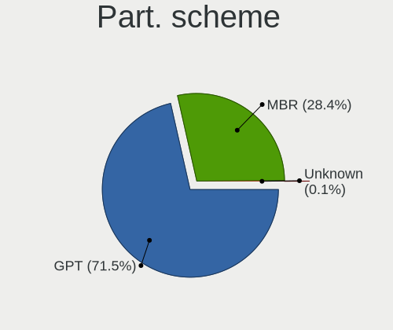
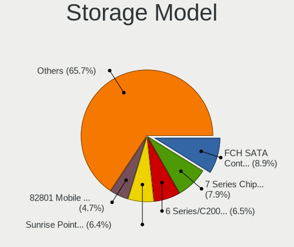
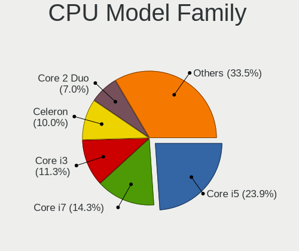
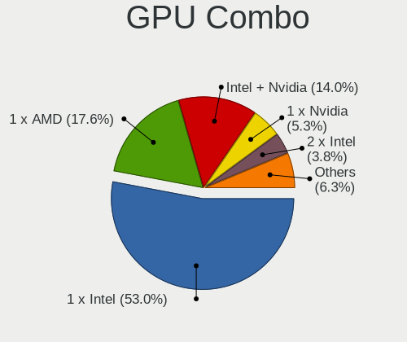
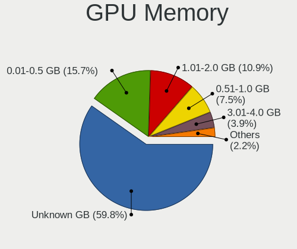

OpenMandriva - Tested Hardware & Statistics (Notebooks)
-------------------------------------------------------

A project to collect tested hardware configurations for OpenMandriva.

Anyone can contribute to this report by the [hw-probe](https://github.com/linuxhw/hw-probe) tool:

    sudo -E hw-probe -all -upload

Please contribute! Especially if your hardware is rare.

Contents
--------

* [ Test Cases ](#test-cases)

* [ System ](#system)
  - [ OS                       ](#os)
  - [ OS Family                ](#os-family)
  - [ Kernel                   ](#kernel)
  - [ Kernel Family            ](#kernel-family)
  - [ Kernel Major Ver.        ](#kernel-major-ver)
  - [ Arch                     ](#arch)
  - [ DE                       ](#de)
  - [ Display Server           ](#display-server)
  - [ Display Manager          ](#display-manager)
  - [ OS Lang                  ](#os-lang)
  - [ Boot Mode                ](#boot-mode)
  - [ Filesystem               ](#filesystem)
  - [ Part. scheme             ](#part-scheme)
  - [ Dual Boot with Linux/BSD ](#dual-boot-with-linuxbsd)
  - [ Dual Boot (Win)          ](#dual-boot-win)

* [ Board ](#board)
  - [ Vendor                   ](#vendor)
  - [ Model                    ](#model)
  - [ Model Family             ](#model-family)
  - [ MFG Year                 ](#mfg-year)
  - [ Form Factor              ](#form-factor)
  - [ Secure Boot              ](#secure-boot)
  - [ Coreboot                 ](#coreboot)
  - [ RAM Size                 ](#ram-size)
  - [ RAM Used                 ](#ram-used)
  - [ Total Drives             ](#total-drives)
  - [ Has CD-ROM               ](#has-cd-rom)
  - [ Has Ethernet             ](#has-ethernet)
  - [ Has WiFi                 ](#has-wifi)
  - [ Has Bluetooth            ](#has-bluetooth)

* [ Location ](#location)
  - [ Country                  ](#country)
  - [ City                     ](#city)

* [ Drives ](#drives)
  - [ Drive Vendor             ](#drive-vendor)
  - [ Drive Model              ](#drive-model)
  - [ HDD Vendor               ](#hdd-vendor)
  - [ SSD Vendor               ](#ssd-vendor)
  - [ Drive Kind               ](#drive-kind)
  - [ Drive Connector          ](#drive-connector)
  - [ Drive Size               ](#drive-size)
  - [ Space Total              ](#space-total)
  - [ Space Used               ](#space-used)
  - [ Malfunc. Drives          ](#malfunc-drives)
  - [ Malfunc. Drive Vendor    ](#malfunc-drive-vendor)
  - [ Malfunc. HDD Vendor      ](#malfunc-hdd-vendor)
  - [ Malfunc. Drive Kind      ](#malfunc-drive-kind)
  - [ Failed Drives            ](#failed-drives)
  - [ Failed Drive Vendor      ](#failed-drive-vendor)
  - [ Drive Status             ](#drive-status)

* [ Storage controller ](#storage-controller)
  - [ Storage Vendor           ](#storage-vendor)
  - [ Storage Model            ](#storage-model)
  - [ Storage Kind             ](#storage-kind)

* [ Processor ](#processor)
  - [ CPU Vendor               ](#cpu-vendor)
  - [ CPU Model                ](#cpu-model)
  - [ CPU Model Family         ](#cpu-model-family)
  - [ CPU Cores                ](#cpu-cores)
  - [ CPU Sockets              ](#cpu-sockets)
  - [ CPU Threads              ](#cpu-threads)
  - [ CPU Op-Modes             ](#cpu-op-modes)
  - [ CPU Microcode            ](#cpu-microcode)
  - [ CPU Microarch            ](#cpu-microarch)

* [ Graphics ](#graphics)
  - [ GPU Vendor               ](#gpu-vendor)
  - [ GPU Model                ](#gpu-model)
  - [ GPU Combo                ](#gpu-combo)
  - [ GPU Driver               ](#gpu-driver)
  - [ GPU Memory               ](#gpu-memory)

* [ Monitor ](#monitor)
  - [ Monitor Vendor           ](#monitor-vendor)
  - [ Monitor Model            ](#monitor-model)
  - [ Monitor Resolution       ](#monitor-resolution)
  - [ Monitor Diagonal         ](#monitor-diagonal)
  - [ Monitor Width            ](#monitor-width)
  - [ Aspect Ratio             ](#aspect-ratio)
  - [ Monitor Area             ](#monitor-area)
  - [ Pixel Density            ](#pixel-density)
  - [ Multiple Monitors        ](#multiple-monitors)

* [ Network ](#network)
  - [ Net Controller Vendor    ](#net-controller-vendor)
  - [ Net Controller Model     ](#net-controller-model)
  - [ Wireless Vendor          ](#wireless-vendor)
  - [ Wireless Model           ](#wireless-model)
  - [ Ethernet Vendor          ](#ethernet-vendor)
  - [ Ethernet Model           ](#ethernet-model)
  - [ Net Controller Kind      ](#net-controller-kind)
  - [ Used Controller          ](#used-controller)
  - [ NICs                     ](#nics)
  - [ IPv6                     ](#ipv6)

* [ Bluetooth ](#bluetooth)
  - [ Bluetooth Vendor         ](#bluetooth-vendor)
  - [ Bluetooth Model          ](#bluetooth-model)

* [ Sound ](#sound)
  - [ Sound Vendor             ](#sound-vendor)
  - [ Sound Model              ](#sound-model)

* [ Memory ](#memory)
  - [ Memory Vendor            ](#memory-vendor)
  - [ Memory Model             ](#memory-model)
  - [ Memory Kind              ](#memory-kind)
  - [ Memory Form Factor       ](#memory-form-factor)
  - [ Memory Size              ](#memory-size)
  - [ Memory Speed             ](#memory-speed)

* [ Printers & scanners ](#printers--scanners)
  - [ Printer Vendor           ](#printer-vendor)
  - [ Printer Model            ](#printer-model)
  - [ Scanner Vendor           ](#scanner-vendor)
  - [ Scanner Model            ](#scanner-model)

* [ Camera ](#camera)
  - [ Camera Vendor            ](#camera-vendor)
  - [ Camera Model             ](#camera-model)

* [ Security ](#security)
  - [ Fingerprint Vendor       ](#fingerprint-vendor)
  - [ Fingerprint Model        ](#fingerprint-model)
  - [ Chipcard Vendor          ](#chipcard-vendor)
  - [ Chipcard Model           ](#chipcard-model)

* [ Unsupported ](#unsupported)
  - [ Unsupported Devices      ](#unsupported-devices)
  - [ Unsupported Device Types ](#unsupported-device-types)

Test Cases
----------

Total: 8429

| Vendor        | Model                       | Probe                                                      | Date         |
|---------------|-----------------------------|------------------------------------------------------------|--------------|
| Lenovo        | ThinkPad T400 6474AV5       | [b98f0a2c09](https://linux-hardware.org/?probe=b98f0a2c09) | Dec 24, 2023 |
| Dell          | Inspiron 3521               | [a109a64bdd](https://linux-hardware.org/?probe=a109a64bdd) | Dec 24, 2023 |
| HP            | EliteBook 2530p             | [996611fcab](https://linux-hardware.org/?probe=996611fcab) | Dec 23, 2023 |
| Acer          | Extensa 2519                | [29bc812d6d](https://linux-hardware.org/?probe=29bc812d6d) | Dec 23, 2023 |
| Alienware     | m15 R7 AMD                  | [9d80128f05](https://linux-hardware.org/?probe=9d80128f05) | Dec 23, 2023 |
| ASUSTek       | X441BA                      | [04e5c55b92](https://linux-hardware.org/?probe=04e5c55b92) | Dec 23, 2023 |
| ASUSTek       | UL80VT                      | [5b04b67d44](https://linux-hardware.org/?probe=5b04b67d44) | Dec 23, 2023 |
| Lenovo        | G50-30 80G0                 | [45b0f5ae9a](https://linux-hardware.org/?probe=45b0f5ae9a) | Dec 23, 2023 |
| Lenovo        | Yoga 2 Pro 20266            | [201d4ed37f](https://linux-hardware.org/?probe=201d4ed37f) | Dec 23, 2023 |
| HP            | EliteBook 840 G5            | [6406b552c4](https://linux-hardware.org/?probe=6406b552c4) | Dec 23, 2023 |
| Acer          | Aspire A515-45              | [acab7c340a](https://linux-hardware.org/?probe=acab7c340a) | Dec 22, 2023 |
| Dell          | Studio 1737                 | [a157d70ea2](https://linux-hardware.org/?probe=a157d70ea2) | Dec 22, 2023 |
| ASUSTek       | K50AF                       | [367c28d17a](https://linux-hardware.org/?probe=367c28d17a) | Dec 22, 2023 |
| Acer          | One 14 Z2-493               | [11215309a3](https://linux-hardware.org/?probe=11215309a3) | Dec 22, 2023 |
| Google        | Garg                        | [05bbd9f9f8](https://linux-hardware.org/?probe=05bbd9f9f8) | Dec 22, 2023 |
| Dell          | Latitude E6400              | [6e6d4fec11](https://linux-hardware.org/?probe=6e6d4fec11) | Dec 21, 2023 |
| Dell          | System Vostro 3750          | [aa1fb5d9a6](https://linux-hardware.org/?probe=aa1fb5d9a6) | Dec 21, 2023 |
| TUXEDO        | InfinityBook Pro Gen7 (M... | [030e411799](https://linux-hardware.org/?probe=030e411799) | Dec 21, 2023 |
| Google        | Garg                        | [fb4804bee9](https://linux-hardware.org/?probe=fb4804bee9) | Dec 21, 2023 |
| Google        | Garg                        | [d2558e0746](https://linux-hardware.org/?probe=d2558e0746) | Dec 21, 2023 |
| Dell          | Latitude E6320              | [a1e4b48d85](https://linux-hardware.org/?probe=a1e4b48d85) | Dec 20, 2023 |
| Fujitsu Si... | ESPRIMO Mobile V5535        | [664d34d04d](https://linux-hardware.org/?probe=664d34d04d) | Dec 20, 2023 |
| Lenovo        | ThinkPad T480 20L6S01W00    | [c38a7a8ad4](https://linux-hardware.org/?probe=c38a7a8ad4) | Dec 20, 2023 |
| Lenovo        | ThinkPad T420 4236DA4       | [1188c1619d](https://linux-hardware.org/?probe=1188c1619d) | Dec 20, 2023 |
| Google        | Garg                        | [0f05d3580a](https://linux-hardware.org/?probe=0f05d3580a) | Dec 20, 2023 |
| Dell          | Latitude E5510              | [e1edf60996](https://linux-hardware.org/?probe=e1edf60996) | Dec 20, 2023 |
| HP            | Stream Laptop 14-cb1xxx     | [e3dded7dc3](https://linux-hardware.org/?probe=e3dded7dc3) | Dec 20, 2023 |
| Dell          | Latitude E6400              | [67d4d37a04](https://linux-hardware.org/?probe=67d4d37a04) | Dec 20, 2023 |
| Dell          | Inspiron 1750               | [508bf60ff7](https://linux-hardware.org/?probe=508bf60ff7) | Dec 20, 2023 |
| Medion        | E15415                      | [03ee2b7f5e](https://linux-hardware.org/?probe=03ee2b7f5e) | Dec 19, 2023 |
| Lenovo        | ThinkPad T590 20N5S44300    | [5a90e712d1](https://linux-hardware.org/?probe=5a90e712d1) | Dec 19, 2023 |
| Fujitsu       | FMVNF70W                    | [cbeca4d4e8](https://linux-hardware.org/?probe=cbeca4d4e8) | Dec 19, 2023 |
| ASUSTek       | 1011PX                      | [6046941a0a](https://linux-hardware.org/?probe=6046941a0a) | Dec 18, 2023 |
| Dell          | Inspiron 1545               | [fc8665de21](https://linux-hardware.org/?probe=fc8665de21) | Dec 18, 2023 |
| ASUSTek       | X550EA                      | [a874ac5799](https://linux-hardware.org/?probe=a874ac5799) | Dec 18, 2023 |
| Dell          | Precision 7530              | [6de510283f](https://linux-hardware.org/?probe=6de510283f) | Dec 18, 2023 |
| Samsung       | RV409/RV509/RV709           | [7f55b490b8](https://linux-hardware.org/?probe=7f55b490b8) | Dec 18, 2023 |
| ASUSTek       | K84L                        | [3e0ea1ca0a](https://linux-hardware.org/?probe=3e0ea1ca0a) | Dec 17, 2023 |
| Apple         | MacBookAir9,1               | [73f451cbe0](https://linux-hardware.org/?probe=73f451cbe0) | Dec 17, 2023 |
| ASUSTek       | K53SC                       | [4424929359](https://linux-hardware.org/?probe=4424929359) | Dec 17, 2023 |
| HP            | Pavilion 15                 | [8ea538629f](https://linux-hardware.org/?probe=8ea538629f) | Dec 17, 2023 |
| Fujitsu       | LIFEBOOK U727               | [dceda9b2a1](https://linux-hardware.org/?probe=dceda9b2a1) | Dec 17, 2023 |
| ASUSTek       | ROG Zephyrus G14 GA402RJ... | [ead7baed80](https://linux-hardware.org/?probe=ead7baed80) | Dec 17, 2023 |
| ASUSTek       | S550CB                      | [20c9c415c9](https://linux-hardware.org/?probe=20c9c415c9) | Dec 17, 2023 |
| ASUSTek       | VivoBook_ASUSLaptop X160... | [ae7d12ef06](https://linux-hardware.org/?probe=ae7d12ef06) | Dec 17, 2023 |
| Dell          | Latitude 5400               | [9ae128faf4](https://linux-hardware.org/?probe=9ae128faf4) | Dec 16, 2023 |
| ASUSTek       | K61IC                       | [1442626988](https://linux-hardware.org/?probe=1442626988) | Dec 16, 2023 |
| Dell          | Inspiron 15-3567            | [3907c9bfa3](https://linux-hardware.org/?probe=3907c9bfa3) | Dec 16, 2023 |
| Lenovo        | ThinkPad T430 2349QM6       | [398d3beb97](https://linux-hardware.org/?probe=398d3beb97) | Dec 16, 2023 |
| ASUSTek       | VivoBook_ASUSLaptop K340... | [d34cfca6c8](https://linux-hardware.org/?probe=d34cfca6c8) | Dec 16, 2023 |
| MSI           | Modern 15 B5M               | [893ff177b3](https://linux-hardware.org/?probe=893ff177b3) | Dec 16, 2023 |
| AWOW          | Unknown                     | [7061726896](https://linux-hardware.org/?probe=7061726896) | Dec 16, 2023 |
| Lenovo        | ThinkPad X260 20F5A0XWJP    | [7aede5c549](https://linux-hardware.org/?probe=7aede5c549) | Dec 16, 2023 |
| AZW           | GT-R                        | [205436106b](https://linux-hardware.org/?probe=205436106b) | Dec 16, 2023 |
| HP            | Pavilion Gaming Laptop 1... | [49e930f611](https://linux-hardware.org/?probe=49e930f611) | Dec 16, 2023 |
| Dell          | Latitude E6430              | [4a12bf0db8](https://linux-hardware.org/?probe=4a12bf0db8) | Dec 16, 2023 |
| Toshiba       | T20                         | [5bb395790c](https://linux-hardware.org/?probe=5bb395790c) | Dec 16, 2023 |
| Dell          | Precision 7510              | [c70e7da2e8](https://linux-hardware.org/?probe=c70e7da2e8) | Dec 16, 2023 |
| ASUSTek       | K50AF                       | [2d4a3c6859](https://linux-hardware.org/?probe=2d4a3c6859) | Dec 16, 2023 |
| Dell          | Latitude E7240              | [8fc0b7d8ea](https://linux-hardware.org/?probe=8fc0b7d8ea) | Dec 16, 2023 |
| Dell          | Latitude E5410              | [ee4251c01c](https://linux-hardware.org/?probe=ee4251c01c) | Dec 15, 2023 |
| Samsung       | 350V5C/351V5C/3540VC/344... | [09be79a2d5](https://linux-hardware.org/?probe=09be79a2d5) | Dec 15, 2023 |
| Lenovo        | ThinkBook 13s G2 ITL 20V... | [e03062f53d](https://linux-hardware.org/?probe=e03062f53d) | Dec 15, 2023 |
| Toshiba       | Satellite C70D-A            | [88b5dab876](https://linux-hardware.org/?probe=88b5dab876) | Dec 15, 2023 |
| Lenovo        | ThinkPad L330 34701V0       | [d418989434](https://linux-hardware.org/?probe=d418989434) | Dec 15, 2023 |
| Dell          | Inspiron 1525               | [b9daaa5978](https://linux-hardware.org/?probe=b9daaa5978) | Dec 15, 2023 |
| MSI           | GT70 2OC/2OD                | [22910f80b0](https://linux-hardware.org/?probe=22910f80b0) | Dec 14, 2023 |
| Lenovo        | Legion 5 Pro 16ACH6H 82J... | [51e42890da](https://linux-hardware.org/?probe=51e42890da) | Dec 14, 2023 |
| Medion        | E16401                      | [0c81bbcb2b](https://linux-hardware.org/?probe=0c81bbcb2b) | Dec 14, 2023 |
| Lenovo        | IdeaPad 320-17IKB 80XM      | [8374878f6a](https://linux-hardware.org/?probe=8374878f6a) | Dec 14, 2023 |
| GPD           | G1619-04                    | [27dd6e79da](https://linux-hardware.org/?probe=27dd6e79da) | Dec 14, 2023 |
| Acer          | Nitro AN517-54              | [c16cb0947e](https://linux-hardware.org/?probe=c16cb0947e) | Dec 14, 2023 |
| HP            | Laptop 17-by4xxx            | [bb89121e0c](https://linux-hardware.org/?probe=bb89121e0c) | Dec 14, 2023 |
| ASUSTek       | VivoBook_ASUSLaptop X521... | [9227c29b16](https://linux-hardware.org/?probe=9227c29b16) | Dec 14, 2023 |
| Dell          | Latitude 5590               | [c52c1d4f2e](https://linux-hardware.org/?probe=c52c1d4f2e) | Dec 14, 2023 |
| Acer          | Aspire A315-22              | [e1deaf47e9](https://linux-hardware.org/?probe=e1deaf47e9) | Dec 14, 2023 |
| ASUSTek       | X550CA                      | [fe7ad66674](https://linux-hardware.org/?probe=fe7ad66674) | Dec 13, 2023 |
| Packard Be... | EasyNote LM85               | [18a9f48bee](https://linux-hardware.org/?probe=18a9f48bee) | Dec 13, 2023 |
| HP            | Pavilion dv6500             | [cdde8c0b3f](https://linux-hardware.org/?probe=cdde8c0b3f) | Dec 13, 2023 |
| HP            | Laptop 17-by4xxx            | [0c728e7b27](https://linux-hardware.org/?probe=0c728e7b27) | Dec 13, 2023 |
| Lenovo        | IdeaPad Gaming 3 15IHU6 ... | [bd8707be32](https://linux-hardware.org/?probe=bd8707be32) | Dec 13, 2023 |
| Lenovo        | LOQ 15IRH8 82XV             | [ab468a9a14](https://linux-hardware.org/?probe=ab468a9a14) | Dec 13, 2023 |
| Lenovo        | IdeaPad 3 15IGL05 81WQ      | [5ec5788395](https://linux-hardware.org/?probe=5ec5788395) | Dec 13, 2023 |
| ASUSTek       | X55C                        | [13f3dbcb5f](https://linux-hardware.org/?probe=13f3dbcb5f) | Dec 13, 2023 |
| Dell          | Latitude E5470              | [cc7982deb0](https://linux-hardware.org/?probe=cc7982deb0) | Dec 13, 2023 |
| ASUSTek       | K50AF                       | [00e0b6dc86](https://linux-hardware.org/?probe=00e0b6dc86) | Dec 13, 2023 |
| Lenovo        | V15 G2 ALC 82KD             | [cc4a45597c](https://linux-hardware.org/?probe=cc4a45597c) | Dec 13, 2023 |
| HP            | Victus by Laptop 16-e0xx... | [6407db19a5](https://linux-hardware.org/?probe=6407db19a5) | Dec 13, 2023 |
| Dell          | Inspiron 1501               | [c4103f9e5c](https://linux-hardware.org/?probe=c4103f9e5c) | Dec 13, 2023 |
| Fujitsu       | LIFEBOOK S792               | [811be0cce0](https://linux-hardware.org/?probe=811be0cce0) | Dec 13, 2023 |
| Acer          | Aspire 7740                 | [2122676b51](https://linux-hardware.org/?probe=2122676b51) | Dec 13, 2023 |
| MSI           | MS-16Y1                     | [41ce29bec7](https://linux-hardware.org/?probe=41ce29bec7) | Dec 12, 2023 |
| HP            | Laptop 15s-eq2xxx           | [8151ecbeef](https://linux-hardware.org/?probe=8151ecbeef) | Dec 12, 2023 |
| ASUSTek       | VivoBook_ASUSLaptop X571... | [4cffef33b7](https://linux-hardware.org/?probe=4cffef33b7) | Dec 12, 2023 |
| Sony          | SVE1713A1EW                 | [64b473222e](https://linux-hardware.org/?probe=64b473222e) | Dec 12, 2023 |
| HP            | Laptop 15s-eq0xxx           | [56e614b2fe](https://linux-hardware.org/?probe=56e614b2fe) | Dec 12, 2023 |
| Acer          | Aspire A517-51G             | [8396e4fdc5](https://linux-hardware.org/?probe=8396e4fdc5) | Dec 12, 2023 |
| Acer          | TravelMate 5720             | [27cbfe44c9](https://linux-hardware.org/?probe=27cbfe44c9) | Dec 12, 2023 |
| Dell          | Latitude E6320              | [dbacdcadba](https://linux-hardware.org/?probe=dbacdcadba) | Dec 12, 2023 |
| Acer          | Aspire E5-576               | [72fc5247a6](https://linux-hardware.org/?probe=72fc5247a6) | Dec 12, 2023 |
| HP            | EliteBook 840 G5            | [ee8ea2b093](https://linux-hardware.org/?probe=ee8ea2b093) | Dec 11, 2023 |
| Lenovo        | IdeaPad S340-14IIL 81VV     | [6b350f2aaf](https://linux-hardware.org/?probe=6b350f2aaf) | Dec 11, 2023 |
| MouseCompu... | H116K                       | [0d2d3680f0](https://linux-hardware.org/?probe=0d2d3680f0) | Dec 11, 2023 |
| Lenovo        | B50-10 80QR                 | [f44fe4ce19](https://linux-hardware.org/?probe=f44fe4ce19) | Dec 11, 2023 |
| HP            | ProBook 450 G3              | [06651b08d9](https://linux-hardware.org/?probe=06651b08d9) | Dec 11, 2023 |
| HP            | ProBook 450 15.6 inch G9... | [b9fbad0653](https://linux-hardware.org/?probe=b9fbad0653) | Dec 11, 2023 |
| HP            | Pavilion Sleekbook 15       | [baec95bb2f](https://linux-hardware.org/?probe=baec95bb2f) | Dec 11, 2023 |
| Lenovo        | IdeaPad 310-15ISK 80SM      | [9b5ac1a49b](https://linux-hardware.org/?probe=9b5ac1a49b) | Dec 11, 2023 |
| Acer          | Aspire E5-571G              | [30c8f1f622](https://linux-hardware.org/?probe=30c8f1f622) | Dec 11, 2023 |
| ASUSTek       | K54L                        | [a50a95f076](https://linux-hardware.org/?probe=a50a95f076) | Dec 11, 2023 |
| HP            | Presario CQ58               | [b23d694ab4](https://linux-hardware.org/?probe=b23d694ab4) | Dec 11, 2023 |
| Dell          | Latitude 5590               | [ebdbfc1740](https://linux-hardware.org/?probe=ebdbfc1740) | Dec 11, 2023 |
| ASUSTek       | TUF Gaming FX505GD_FX505... | [be5332c927](https://linux-hardware.org/?probe=be5332c927) | Dec 11, 2023 |
| Lenovo        | ThinkPad L14 Gen 2 20X1S... | [371f238337](https://linux-hardware.org/?probe=371f238337) | Dec 11, 2023 |
| Acer          | Aspire ES1-512              | [40438b3cd0](https://linux-hardware.org/?probe=40438b3cd0) | Dec 11, 2023 |
| HP            | ProBook 650 G2              | [96ea36be06](https://linux-hardware.org/?probe=96ea36be06) | Dec 10, 2023 |
| Acer          | Aspire 5750                 | [bedb502b74](https://linux-hardware.org/?probe=bedb502b74) | Dec 10, 2023 |
| Lenovo        | ThinkPad T410 2522V3S       | [7a6c259421](https://linux-hardware.org/?probe=7a6c259421) | Dec 10, 2023 |
| HP            | Laptop 14-bs0xx             | [f096c75cf9](https://linux-hardware.org/?probe=f096c75cf9) | Dec 10, 2023 |
| HP            | Notebook                    | [19c87ca6c5](https://linux-hardware.org/?probe=19c87ca6c5) | Dec 10, 2023 |
| Lenovo        | IdeaPad Slim 5 16IRL8 82... | [1709e5c519](https://linux-hardware.org/?probe=1709e5c519) | Dec 10, 2023 |
| HP            | Pavilion Gaming Laptop 1... | [9ae1729415](https://linux-hardware.org/?probe=9ae1729415) | Dec 10, 2023 |
| HP            | Laptop 15-da0xxx            | [a086fa3ad5](https://linux-hardware.org/?probe=a086fa3ad5) | Dec 10, 2023 |
| HP            | Laptop 15-bw0xx             | [69ebcd04b9](https://linux-hardware.org/?probe=69ebcd04b9) | Dec 10, 2023 |
| MSI           | Katana GF66 11UE            | [451c5731ae](https://linux-hardware.org/?probe=451c5731ae) | Dec 09, 2023 |
| HP            | G61                         | [ce104b5b73](https://linux-hardware.org/?probe=ce104b5b73) | Dec 09, 2023 |
| ASUSTek       | 1215B                       | [65223dfc53](https://linux-hardware.org/?probe=65223dfc53) | Dec 09, 2023 |
| Lenovo        | IdeaPad S145-15API 81UT     | [0d57f82fc5](https://linux-hardware.org/?probe=0d57f82fc5) | Dec 09, 2023 |
| HP            | Victus by Laptop 16-e1xx... | [9b973fc192](https://linux-hardware.org/?probe=9b973fc192) | Dec 08, 2023 |
| Dell          | Latitude 7490               | [13759c617a](https://linux-hardware.org/?probe=13759c617a) | Dec 08, 2023 |
| Lenovo        | IdeaPad 3 17IIL05 81WF      | [edabe3eb37](https://linux-hardware.org/?probe=edabe3eb37) | Dec 08, 2023 |
| MSI           | Modern 15 B12M              | [da95a095fa](https://linux-hardware.org/?probe=da95a095fa) | Dec 08, 2023 |
| HP            | ZBook 15v G5                | [96133249d0](https://linux-hardware.org/?probe=96133249d0) | Dec 08, 2023 |
| Adreamer      | Mybook PN1308P              | [e2dba2aff0](https://linux-hardware.org/?probe=e2dba2aff0) | Dec 08, 2023 |
| Fujitsu       | LIFEBOOK E744               | [2b97f06319](https://linux-hardware.org/?probe=2b97f06319) | Dec 07, 2023 |
| Lenovo        | ThinkPad T430 23498Y3       | [5382654b9b](https://linux-hardware.org/?probe=5382654b9b) | Dec 07, 2023 |
| Lenovo        | ThinkPad T440 20B7S0N10F    | [350da642e5](https://linux-hardware.org/?probe=350da642e5) | Dec 07, 2023 |
| Acer          | Aspire 7730G                | [c98f96bcc1](https://linux-hardware.org/?probe=c98f96bcc1) | Dec 07, 2023 |
| Dell          | Precision 3550              | [da173d0ccc](https://linux-hardware.org/?probe=da173d0ccc) | Dec 07, 2023 |
| ASUSTek       | VivoBook_ASUSLaptop X515... | [18d69df8d2](https://linux-hardware.org/?probe=18d69df8d2) | Dec 07, 2023 |
| HP            | ProBook 650 G1              | [52c0a2e6fa](https://linux-hardware.org/?probe=52c0a2e6fa) | Dec 07, 2023 |
| Acer          | TravelMate P645-S           | [e44f06b326](https://linux-hardware.org/?probe=e44f06b326) | Dec 07, 2023 |
| Lenovo        | ThinkPad X1 Carbon 6th 2... | [3fce748548](https://linux-hardware.org/?probe=3fce748548) | Dec 06, 2023 |
| HP            | EliteBook 840 G1            | [923f26e8d8](https://linux-hardware.org/?probe=923f26e8d8) | Dec 06, 2023 |
| Dell          | Latitude 7350               | [3fb5b65dba](https://linux-hardware.org/?probe=3fb5b65dba) | Dec 06, 2023 |
| Lenovo        | Z51-70 80K6                 | [2894d2f78d](https://linux-hardware.org/?probe=2894d2f78d) | Dec 06, 2023 |
| Packard Be... | DOT S                       | [131c38200b](https://linux-hardware.org/?probe=131c38200b) | Dec 06, 2023 |
| Dell          | Latitude E7440              | [6b3c7ea2b5](https://linux-hardware.org/?probe=6b3c7ea2b5) | Dec 06, 2023 |
| Lenovo        | ThinkPad SL500 274678G      | [3cfa60a8bb](https://linux-hardware.org/?probe=3cfa60a8bb) | Dec 06, 2023 |
| Dell          | Latitude 3330               | [843751ec33](https://linux-hardware.org/?probe=843751ec33) | Dec 06, 2023 |
| Lenovo        | IdeaPad 330-15ARR 81D2      | [b62b670195](https://linux-hardware.org/?probe=b62b670195) | Dec 06, 2023 |
| Dell          | Latitude E5430 non-vPro     | [ee3494fa57](https://linux-hardware.org/?probe=ee3494fa57) | Dec 06, 2023 |
| Samsung       | R580/R590                   | [89f285aacc](https://linux-hardware.org/?probe=89f285aacc) | Dec 05, 2023 |
| ASUSTek       | N76VZ                       | [3d8844bc98](https://linux-hardware.org/?probe=3d8844bc98) | Dec 05, 2023 |
| HP            | ProBook 4540s               | [99c14e0650](https://linux-hardware.org/?probe=99c14e0650) | Dec 05, 2023 |
| ASUSTek       | VivoBook_ASUSLaptop X515... | [ac0fd4af39](https://linux-hardware.org/?probe=ac0fd4af39) | Dec 05, 2023 |
| Lenovo        | ThinkPad E15 20RD003KMH     | [d54efc5833](https://linux-hardware.org/?probe=d54efc5833) | Dec 05, 2023 |
| Apple         | MacBookPro11,3              | [b886333167](https://linux-hardware.org/?probe=b886333167) | Dec 05, 2023 |
| ASUSTek       | K53U                        | [b76cef4836](https://linux-hardware.org/?probe=b76cef4836) | Dec 05, 2023 |
| HP            | 15                          | [561269f586](https://linux-hardware.org/?probe=561269f586) | Dec 05, 2023 |
| Alurin        | Go Notebook                 | [197598d3dd](https://linux-hardware.org/?probe=197598d3dd) | Dec 05, 2023 |
| Toshiba       | Satellite L750              | [667c6d4e98](https://linux-hardware.org/?probe=667c6d4e98) | Dec 05, 2023 |
| Lenovo        | ThinkPad X230 23066RC       | [ef45ef93ac](https://linux-hardware.org/?probe=ef45ef93ac) | Dec 05, 2023 |
| Lenovo        | ThinkPad X390 20Q1S1WB00    | [ab1ae6521e](https://linux-hardware.org/?probe=ab1ae6521e) | Dec 05, 2023 |
| Acer          | TravelMate B311-31          | [9611377d0c](https://linux-hardware.org/?probe=9611377d0c) | Dec 05, 2023 |
| HP            | Laptop 15-dy2xxx            | [729837dc5c](https://linux-hardware.org/?probe=729837dc5c) | Dec 05, 2023 |
| Lenovo        | ThinkPad T480 20L6S3ED18    | [03866b12cd](https://linux-hardware.org/?probe=03866b12cd) | Dec 04, 2023 |
| HP            | Notebook                    | [4f0e8aad8c](https://linux-hardware.org/?probe=4f0e8aad8c) | Dec 04, 2023 |
| HP            | Compaq 6730b (NA373UC#AB... | [7e0d2ebaaf](https://linux-hardware.org/?probe=7e0d2ebaaf) | Dec 04, 2023 |
| ASUSTek       | X555LJ                      | [bd98f1df4c](https://linux-hardware.org/?probe=bd98f1df4c) | Dec 04, 2023 |
| HP            | ProBook 650 G1              | [b4b71ada44](https://linux-hardware.org/?probe=b4b71ada44) | Dec 04, 2023 |
| HP            | Pavilion 15                 | [15b5925773](https://linux-hardware.org/?probe=15b5925773) | Dec 04, 2023 |
| Lenovo        | V110-15IAP 80TG             | [ff40966f37](https://linux-hardware.org/?probe=ff40966f37) | Dec 04, 2023 |
| HP            | ProBook 4330s               | [48a060af86](https://linux-hardware.org/?probe=48a060af86) | Dec 04, 2023 |
| Lenovo        | ThinkPad L460 20FVS07C00    | [fd5a4dbeb9](https://linux-hardware.org/?probe=fd5a4dbeb9) | Dec 04, 2023 |
| Dell          | Inspiron MM061              | [0f629c5ee8](https://linux-hardware.org/?probe=0f629c5ee8) | Dec 04, 2023 |
| Samsung       | 550XDA                      | [b5bfe47576](https://linux-hardware.org/?probe=b5bfe47576) | Dec 04, 2023 |
| Lenovo        | B50-50 80S2                 | [6150907e1e](https://linux-hardware.org/?probe=6150907e1e) | Dec 04, 2023 |
| Dell          | XPS 13 9360                 | [73fa5936a1](https://linux-hardware.org/?probe=73fa5936a1) | Dec 04, 2023 |
| HP            | OMEN by Laptop 16-b1xxx     | [9acc9cef23](https://linux-hardware.org/?probe=9acc9cef23) | Dec 04, 2023 |
| Toshiba       | Satellite A300              | [5817017508](https://linux-hardware.org/?probe=5817017508) | Dec 04, 2023 |
| Dell          | XPS 13 9350                 | [aec9f3cb3c](https://linux-hardware.org/?probe=aec9f3cb3c) | Dec 04, 2023 |
| Lenovo        | G40-30 80FY                 | [219f784b96](https://linux-hardware.org/?probe=219f784b96) | Dec 04, 2023 |
| Toshiba       | Satellite C855D             | [84e97d4578](https://linux-hardware.org/?probe=84e97d4578) | Dec 04, 2023 |
| ASUSTek       | TUF Gaming FX505DY_FX505... | [218e5c18f3](https://linux-hardware.org/?probe=218e5c18f3) | Dec 04, 2023 |
| HP            | ProBook 450 G0              | [80f6017066](https://linux-hardware.org/?probe=80f6017066) | Dec 04, 2023 |
| ASUSTek       | 1215N                       | [49eeb946c5](https://linux-hardware.org/?probe=49eeb946c5) | Dec 03, 2023 |
| HP            | ProBook 640 G1              | [287093ae53](https://linux-hardware.org/?probe=287093ae53) | Dec 03, 2023 |
| Lenovo        | IdeaPad Gaming 3 15IHU6 ... | [9e1d0f5fdc](https://linux-hardware.org/?probe=9e1d0f5fdc) | Dec 03, 2023 |
| Dell          | Latitude D630               | [84a1008ee2](https://linux-hardware.org/?probe=84a1008ee2) | Dec 03, 2023 |
| ASUSTek       | K53SJ                       | [50979ecbd2](https://linux-hardware.org/?probe=50979ecbd2) | Dec 03, 2023 |
| Dell          | Latitude E6410              | [bae67b7a50](https://linux-hardware.org/?probe=bae67b7a50) | Dec 03, 2023 |
| HP            | EliteBook 2540p             | [3819853378](https://linux-hardware.org/?probe=3819853378) | Dec 03, 2023 |
| HP            | Laptop 15-ra0xx             | [5726a3acac](https://linux-hardware.org/?probe=5726a3acac) | Dec 03, 2023 |
| Dell          | System Inspiron N7110       | [f0df20f63f](https://linux-hardware.org/?probe=f0df20f63f) | Dec 03, 2023 |
| Gateway       | M-6812M                     | [008f6448dc](https://linux-hardware.org/?probe=008f6448dc) | Dec 03, 2023 |
| Packard Be... | EasyNote LS11HR             | [c3d34dfe3a](https://linux-hardware.org/?probe=c3d34dfe3a) | Dec 03, 2023 |
| HP            | ENVY m6                     | [3a3cde32ab](https://linux-hardware.org/?probe=3a3cde32ab) | Dec 03, 2023 |
| HP            | Laptop 17-by0xxx            | [d27ace68bb](https://linux-hardware.org/?probe=d27ace68bb) | Dec 03, 2023 |
| Lenovo        | ThinkPad E14 Gen 3 20Y70... | [e7c23bf6d5](https://linux-hardware.org/?probe=e7c23bf6d5) | Dec 03, 2023 |
| Medion        | E6214                       | [f5e38ac376](https://linux-hardware.org/?probe=f5e38ac376) | Dec 03, 2023 |
| HP            | ZBook 15 G2                 | [f60bc8a984](https://linux-hardware.org/?probe=f60bc8a984) | Dec 03, 2023 |
| Dell          | Inspiron 3542               | [793b594721](https://linux-hardware.org/?probe=793b594721) | Dec 03, 2023 |
| Acer          | Aspire 8951G                | [f98b449dba](https://linux-hardware.org/?probe=f98b449dba) | Dec 03, 2023 |
| Dell          | Inspiron 13-5378            | [0beeed51bc](https://linux-hardware.org/?probe=0beeed51bc) | Dec 03, 2023 |
| Lenovo        | ThinkPad T530 2429F37       | [7db847c98e](https://linux-hardware.org/?probe=7db847c98e) | Dec 03, 2023 |
| Packard Be... | EasyNote_MX52-B-702NCD      | [738fd6b777](https://linux-hardware.org/?probe=738fd6b777) | Dec 03, 2023 |
| Alienware     | 18                          | [e2dc3b99fc](https://linux-hardware.org/?probe=e2dc3b99fc) | Dec 02, 2023 |
| Sony          | SVP13215PLS                 | [6c360dc427](https://linux-hardware.org/?probe=6c360dc427) | Dec 02, 2023 |
| ASUSTek       | X550LD                      | [d6118da294](https://linux-hardware.org/?probe=d6118da294) | Dec 02, 2023 |
| Apple         | MacBookPro5,5               | [53e38cd006](https://linux-hardware.org/?probe=53e38cd006) | Dec 02, 2023 |
| HP            | Pavilion Gaming Laptop 1... | [13816c1292](https://linux-hardware.org/?probe=13816c1292) | Dec 02, 2023 |
| Lenovo        | ThinkPad X1 Carbon Gen 1... | [9d3a34c3da](https://linux-hardware.org/?probe=9d3a34c3da) | Dec 02, 2023 |
| ASUSTek       | F3E                         | [26a960dd12](https://linux-hardware.org/?probe=26a960dd12) | Dec 02, 2023 |
| Dell          | Precision 5520              | [aa1a1feefc](https://linux-hardware.org/?probe=aa1a1feefc) | Dec 02, 2023 |
| Dell          | Latitude E6510              | [0c49353fa5](https://linux-hardware.org/?probe=0c49353fa5) | Dec 02, 2023 |
| MSI           | Modern 14 B5M               | [c22637e524](https://linux-hardware.org/?probe=c22637e524) | Dec 02, 2023 |
| Toshiba       | Satellite C650D             | [704507bfd5](https://linux-hardware.org/?probe=704507bfd5) | Dec 02, 2023 |
| Dell          | Inspiron 7720               | [ec97e6b200](https://linux-hardware.org/?probe=ec97e6b200) | Dec 02, 2023 |
| ASUSTek       | S551LN                      | [1c843db61c](https://linux-hardware.org/?probe=1c843db61c) | Dec 02, 2023 |
| ASUSTek       | VivoBook_ASUSLaptop E510... | [7ddcba051c](https://linux-hardware.org/?probe=7ddcba051c) | Dec 02, 2023 |
| Acer          | Aspire V3-772               | [622055b29a](https://linux-hardware.org/?probe=622055b29a) | Dec 02, 2023 |
| HP            | Pavilion g7                 | [5c596e9e4f](https://linux-hardware.org/?probe=5c596e9e4f) | Dec 02, 2023 |
| ASUSTek       | X441NA                      | [9a4c0266e8](https://linux-hardware.org/?probe=9a4c0266e8) | Dec 02, 2023 |
| Sony          | VJS153C11N                  | [eb8f061cb3](https://linux-hardware.org/?probe=eb8f061cb3) | Dec 02, 2023 |
| ASUSTek       | ASUS TUF Dash F15 FX517Z... | [f73d3f92cf](https://linux-hardware.org/?probe=f73d3f92cf) | Dec 02, 2023 |
| HP            | Compaq 6910p (GY174UP#AB... | [54f08c139f](https://linux-hardware.org/?probe=54f08c139f) | Dec 02, 2023 |
| ASUSTek       | VivoBook_ASUSLaptop X513... | [58a0ae4fcc](https://linux-hardware.org/?probe=58a0ae4fcc) | Dec 02, 2023 |
| Sony          | VPCS13S9E                   | [0cd7cfa9de](https://linux-hardware.org/?probe=0cd7cfa9de) | Dec 02, 2023 |
| Lenovo        | G585                        | [a62a35b461](https://linux-hardware.org/?probe=a62a35b461) | Dec 01, 2023 |
| HP            | Pavilion dv7                | [dc015f1023](https://linux-hardware.org/?probe=dc015f1023) | Dec 01, 2023 |
| Clevo         | W251ESQ/W270ESQ             | [8572803f38](https://linux-hardware.org/?probe=8572803f38) | Dec 01, 2023 |
| HP            | 240 G7                      | [ad50ca6a6e](https://linux-hardware.org/?probe=ad50ca6a6e) | Dec 01, 2023 |
| Lenovo        | IdeaPad 3 15IML05 82BS      | [32a0e568cc](https://linux-hardware.org/?probe=32a0e568cc) | Dec 01, 2023 |
| Dell          | Inspiron 3558               | [6b97c68c9f](https://linux-hardware.org/?probe=6b97c68c9f) | Dec 01, 2023 |
| HP            | EliteBook 6930p             | [0fefa1b40e](https://linux-hardware.org/?probe=0fefa1b40e) | Dec 01, 2023 |
| Acer          | Aspire A317-51K             | [aa5652abe0](https://linux-hardware.org/?probe=aa5652abe0) | Dec 01, 2023 |
| ASUSTek       | ZenBook UX431DA_UM431DA     | [7eb86d01c5](https://linux-hardware.org/?probe=7eb86d01c5) | Dec 01, 2023 |
| Dell          | Inspiron 1545               | [7fbbf18938](https://linux-hardware.org/?probe=7fbbf18938) | Dec 01, 2023 |
| Lenovo        | ThinkPad T480s 20L7002CU... | [679acd4c7a](https://linux-hardware.org/?probe=679acd4c7a) | Dec 01, 2023 |
| Packard Be... | EasyNote LJ75               | [0f21e6cb39](https://linux-hardware.org/?probe=0f21e6cb39) | Dec 01, 2023 |
| Google        | Fleex                       | [4baac33893](https://linux-hardware.org/?probe=4baac33893) | Dec 01, 2023 |
| Samsung       | R530/R730                   | [cdda254219](https://linux-hardware.org/?probe=cdda254219) | Dec 01, 2023 |
| Lenovo        | ThinkPad T430 2349AK2       | [53a55a0da2](https://linux-hardware.org/?probe=53a55a0da2) | Dec 01, 2023 |
| Acer          | Aspire 5732Z                | [f79a825fcd](https://linux-hardware.org/?probe=f79a825fcd) | Dec 01, 2023 |
| Dell          | Latitude E5410              | [074e7de8d8](https://linux-hardware.org/?probe=074e7de8d8) | Dec 01, 2023 |
| Acer          | Aspire A114-31              | [1eb938404f](https://linux-hardware.org/?probe=1eb938404f) | Dec 01, 2023 |
| Multilaser    | PC31X                       | [1f63edb2f9](https://linux-hardware.org/?probe=1f63edb2f9) | Dec 01, 2023 |
| Acer          | Aspire E5-773G              | [9ca60df165](https://linux-hardware.org/?probe=9ca60df165) | Dec 01, 2023 |
| Dell          | Inspiron 13-5368            | [ab8935b499](https://linux-hardware.org/?probe=ab8935b499) | Dec 01, 2023 |
| HP            | Laptop 14-ck0xxx            | [40a0a394cc](https://linux-hardware.org/?probe=40a0a394cc) | Dec 01, 2023 |
| Dell          | Inspiron 5558               | [49c6f0b57f](https://linux-hardware.org/?probe=49c6f0b57f) | Dec 01, 2023 |
| Apple         | MacBookPro8,1               | [ad16e37b50](https://linux-hardware.org/?probe=ad16e37b50) | Dec 01, 2023 |
| Dell          | Latitude E6440              | [4459a634ca](https://linux-hardware.org/?probe=4459a634ca) | Dec 01, 2023 |
| Acer          | Aspire 5750G                | [327582fb65](https://linux-hardware.org/?probe=327582fb65) | Dec 01, 2023 |
| Toshiba       | Satellite L755              | [511b79d4dc](https://linux-hardware.org/?probe=511b79d4dc) | Nov 30, 2023 |
| ASUSTek       | ASUS EXPERTBOOK L1500CDA... | [8524905e3f](https://linux-hardware.org/?probe=8524905e3f) | Nov 30, 2023 |
| Dell          | Inspiron 15 3515            | [162854d649](https://linux-hardware.org/?probe=162854d649) | Nov 30, 2023 |
| Apple         | MacBookPro12,1              | [d956dae97a](https://linux-hardware.org/?probe=d956dae97a) | Nov 30, 2023 |
| Acer          | Aspire V5-591G              | [fcb901f377](https://linux-hardware.org/?probe=fcb901f377) | Nov 30, 2023 |
| Acer          | Aspire A315-35              | [dad806dd8b](https://linux-hardware.org/?probe=dad806dd8b) | Nov 30, 2023 |
| Toshiba       | dynabook T552/36HR          | [1e3171aa0a](https://linux-hardware.org/?probe=1e3171aa0a) | Nov 30, 2023 |
| HP            | Compaq CQ58                 | [d50dd381c3](https://linux-hardware.org/?probe=d50dd381c3) | Nov 30, 2023 |
| Toshiba       | Satellite C660              | [03de11e5b3](https://linux-hardware.org/?probe=03de11e5b3) | Nov 30, 2023 |
| Dell          | Latitude E6420              | [12b36e0bb9](https://linux-hardware.org/?probe=12b36e0bb9) | Nov 30, 2023 |
| Toshiba       | Satellite C850-19D          | [cd9dbac72b](https://linux-hardware.org/?probe=cd9dbac72b) | Nov 30, 2023 |
| HP            | Laptop 15-bs1xx             | [e8f82bc03f](https://linux-hardware.org/?probe=e8f82bc03f) | Nov 29, 2023 |
| Lenovo        | IdeaPad 5 15ALC05 82LN      | [b682c56733](https://linux-hardware.org/?probe=b682c56733) | Nov 29, 2023 |
| Teclast       | F15S                        | [34392dd87e](https://linux-hardware.org/?probe=34392dd87e) | Nov 29, 2023 |
| eMachines     | eME440                      | [a622dddd66](https://linux-hardware.org/?probe=a622dddd66) | Nov 29, 2023 |
| HUAWEI        | NbDE-WXX9                   | [8fc5d22e76](https://linux-hardware.org/?probe=8fc5d22e76) | Nov 29, 2023 |
| HP            | 250 G7 Notebook PC          | [395fbd2b48](https://linux-hardware.org/?probe=395fbd2b48) | Nov 29, 2023 |
| ASUSTek       | GL702VM                     | [0f104614aa](https://linux-hardware.org/?probe=0f104614aa) | Nov 29, 2023 |
| HP            | Laptop 17-by3xxx            | [63860f689c](https://linux-hardware.org/?probe=63860f689c) | Nov 29, 2023 |
| Lenovo        | Legion 5 17ACH6H 82JY       | [685ce27fae](https://linux-hardware.org/?probe=685ce27fae) | Nov 29, 2023 |
| TUXEDO        | Book BA1510                 | [0c59322d62](https://linux-hardware.org/?probe=0c59322d62) | Nov 29, 2023 |
| Lenovo        | ThinkPad W530 24412S6       | [35077333e3](https://linux-hardware.org/?probe=35077333e3) | Nov 29, 2023 |
| HP            | Laptop 14s-fq0xxx           | [cc31cdf621](https://linux-hardware.org/?probe=cc31cdf621) | Nov 29, 2023 |
| HUAWEI        | RLEF-XX                     | [9b8fabda07](https://linux-hardware.org/?probe=9b8fabda07) | Nov 29, 2023 |
| Acer          | TravelMate P614-51-G2       | [17c4552f25](https://linux-hardware.org/?probe=17c4552f25) | Nov 29, 2023 |
| Lenovo        | ThinkPad W530 244723G       | [30e3d22482](https://linux-hardware.org/?probe=30e3d22482) | Nov 29, 2023 |
| Lenovo        | ThinkPad X201 3323BSG       | [e0ad13d1e8](https://linux-hardware.org/?probe=e0ad13d1e8) | Nov 29, 2023 |
| Fujitsu       | FMVNS6HE                    | [df459431eb](https://linux-hardware.org/?probe=df459431eb) | Nov 29, 2023 |
| Lenovo        | IdeaPad L340-15API 81LW     | [066daf7cac](https://linux-hardware.org/?probe=066daf7cac) | Nov 29, 2023 |
| LG Electro... | 17Z90Q-K.AAC7U1             | [6af16f3cbb](https://linux-hardware.org/?probe=6af16f3cbb) | Nov 29, 2023 |
| ASUSTek       | X550CA                      | [8ed2e1621c](https://linux-hardware.org/?probe=8ed2e1621c) | Nov 29, 2023 |
| ASUSTek       | VivoBook_ASUSLaptop X513... | [7ca8c7adc5](https://linux-hardware.org/?probe=7ca8c7adc5) | Nov 29, 2023 |
| ASUSTek       | GL703VM                     | [262f681abe](https://linux-hardware.org/?probe=262f681abe) | Nov 29, 2023 |
| HP            | Compaq 6730s                | [ff2ae39e03](https://linux-hardware.org/?probe=ff2ae39e03) | Nov 29, 2023 |
| Lenovo        | IdeaPad 330-14IGM 81D0      | [4948ddc4be](https://linux-hardware.org/?probe=4948ddc4be) | Nov 29, 2023 |
| HP            | Stream Laptop 11-ak0xxx     | [16dda5c039](https://linux-hardware.org/?probe=16dda5c039) | Nov 29, 2023 |
| Lenovo        | ThinkPad R500 27148UG       | [546c56f7bb](https://linux-hardware.org/?probe=546c56f7bb) | Nov 28, 2023 |
| Fujitsu       | LIFEBOOK S762               | [a7b0f7fe30](https://linux-hardware.org/?probe=a7b0f7fe30) | Nov 28, 2023 |
| HP            | Compaq 610                  | [f0022a2c56](https://linux-hardware.org/?probe=f0022a2c56) | Nov 28, 2023 |
| ASUSTek       | VivoBook_ASUSLaptop M160... | [577a8fa908](https://linux-hardware.org/?probe=577a8fa908) | Nov 28, 2023 |
| Dell          | Inspiron 15 3515            | [20007eacdb](https://linux-hardware.org/?probe=20007eacdb) | Nov 28, 2023 |
| Dell          | Inspiron 15 3515            | [e41d34ea1c](https://linux-hardware.org/?probe=e41d34ea1c) | Nov 28, 2023 |
| Sony          | VPCEL1E1E                   | [9c88ceb0b0](https://linux-hardware.org/?probe=9c88ceb0b0) | Nov 28, 2023 |
| HP            | Laptop 15-bs0xx             | [beba27b952](https://linux-hardware.org/?probe=beba27b952) | Nov 28, 2023 |
| HP            | Pavilion Gaming Laptop 1... | [11d4048dc9](https://linux-hardware.org/?probe=11d4048dc9) | Nov 28, 2023 |
| HP            | EliteBook 2170p             | [fe332ae4ef](https://linux-hardware.org/?probe=fe332ae4ef) | Nov 28, 2023 |
| Dell          | System Inspiron N7110       | [83375f1b7a](https://linux-hardware.org/?probe=83375f1b7a) | Nov 28, 2023 |
| Dell          | Latitude E5430 non-vPro     | [34f3153910](https://linux-hardware.org/?probe=34f3153910) | Nov 28, 2023 |
| Samsung       | 300E4Z/300E5Z/300E7Z        | [8c1777b379](https://linux-hardware.org/?probe=8c1777b379) | Nov 28, 2023 |
| HP            | Laptop 15-db1xxx            | [52a0c464fe](https://linux-hardware.org/?probe=52a0c464fe) | Nov 28, 2023 |
| MSI           | GE60 0NC\0ND                | [f1285ee8a7](https://linux-hardware.org/?probe=f1285ee8a7) | Nov 28, 2023 |
| Samsung       | RV413/RV513                 | [42fb4ae911](https://linux-hardware.org/?probe=42fb4ae911) | Nov 28, 2023 |
| Lenovo        | Unknown                     | [0324aeaf06](https://linux-hardware.org/?probe=0324aeaf06) | Nov 28, 2023 |
| Acer          | Aspire E5-521G              | [d639f77bd9](https://linux-hardware.org/?probe=d639f77bd9) | Nov 28, 2023 |
| Lenovo        | ThinkPad T540p 20BFS31F0... | [8db080dffe](https://linux-hardware.org/?probe=8db080dffe) | Nov 28, 2023 |
| Acer          | Aspire A315-57G             | [10678fbceb](https://linux-hardware.org/?probe=10678fbceb) | Nov 28, 2023 |
| Framework     | Laptop (13th Gen Intel C... | [8c82a1d8c3](https://linux-hardware.org/?probe=8c82a1d8c3) | Nov 28, 2023 |
| HP            | ENVY Laptop 17-cr0xxx       | [160556d559](https://linux-hardware.org/?probe=160556d559) | Nov 28, 2023 |
| Google        | Fleex                       | [0f905372c0](https://linux-hardware.org/?probe=0f905372c0) | Nov 28, 2023 |
| HP            | Laptop 15-dy2xxx            | [c56c2fcff2](https://linux-hardware.org/?probe=c56c2fcff2) | Nov 28, 2023 |
| HUAWEI        | MACH-WX9                    | [a09dd535a7](https://linux-hardware.org/?probe=a09dd535a7) | Nov 28, 2023 |
| Lenovo        | ThinkPad X1 Carbon 34603... | [edb57fe6c8](https://linux-hardware.org/?probe=edb57fe6c8) | Nov 28, 2023 |
| HP            | Pavilion Notebook           | [39dd843280](https://linux-hardware.org/?probe=39dd843280) | Nov 28, 2023 |
| Lenovo        | Legion Y9000P IAH7H 82RF    | [b3bea8127f](https://linux-hardware.org/?probe=b3bea8127f) | Nov 27, 2023 |
| Samsung       | RV411/RV511/E3511/S3511     | [36ecf595ab](https://linux-hardware.org/?probe=36ecf595ab) | Nov 27, 2023 |
| Acer          | Aspire 5740                 | [bad53e91fc](https://linux-hardware.org/?probe=bad53e91fc) | Nov 27, 2023 |
| HP            | Pavilion g7                 | [10f5b71d45](https://linux-hardware.org/?probe=10f5b71d45) | Nov 27, 2023 |
| Apple         | MacBookPro10,1              | [3982dc173a](https://linux-hardware.org/?probe=3982dc173a) | Nov 27, 2023 |
| Machcreato... | 14X                         | [25e406809e](https://linux-hardware.org/?probe=25e406809e) | Nov 27, 2023 |
| Clevo         | M720R                       | [cf202bc2be](https://linux-hardware.org/?probe=cf202bc2be) | Nov 27, 2023 |
| ASUSTek       | K73SD                       | [cd71879827](https://linux-hardware.org/?probe=cd71879827) | Nov 27, 2023 |
| Timi          | TM1701                      | [dfb21da820](https://linux-hardware.org/?probe=dfb21da820) | Nov 27, 2023 |
| Dynabook      | Satellite Pro C50-H-11G     | [438812dbd7](https://linux-hardware.org/?probe=438812dbd7) | Nov 27, 2023 |
| Dell          | Latitude 3350               | [395158b705](https://linux-hardware.org/?probe=395158b705) | Nov 27, 2023 |
| Dell          | Precision 7670              | [450a8674d6](https://linux-hardware.org/?probe=450a8674d6) | Nov 27, 2023 |
| MSI           | CR620                       | [336d403e1b](https://linux-hardware.org/?probe=336d403e1b) | Nov 27, 2023 |
| Lenovo        | Yoga Slim 7 Pro 14IAH7 8... | [d36366cac6](https://linux-hardware.org/?probe=d36366cac6) | Nov 27, 2023 |
| Dell          | Inspiron 1012               | [ffe483f5fd](https://linux-hardware.org/?probe=ffe483f5fd) | Nov 27, 2023 |
| Dell          | Latitude E7470              | [7b07507b58](https://linux-hardware.org/?probe=7b07507b58) | Nov 27, 2023 |
| HP            | Laptop 17-cp0xxx            | [63ddfa6f43](https://linux-hardware.org/?probe=63ddfa6f43) | Nov 27, 2023 |
| Dell          | Precision M4500             | [044aca6d38](https://linux-hardware.org/?probe=044aca6d38) | Nov 27, 2023 |
| HP            | 250 G6 Notebook PC          | [936970029f](https://linux-hardware.org/?probe=936970029f) | Nov 27, 2023 |
| Dell          | Latitude 13                 | [bf50df43fa](https://linux-hardware.org/?probe=bf50df43fa) | Nov 27, 2023 |
| ASUSTek       | X540SC                      | [5a56e0886b](https://linux-hardware.org/?probe=5a56e0886b) | Nov 27, 2023 |
| TUXEDO        | Pulse 15 Gen1               | [02f1616520](https://linux-hardware.org/?probe=02f1616520) | Nov 27, 2023 |
| Lenovo        | ThinkPad E14 Gen 2 20TA0... | [0ddcbc9eb9](https://linux-hardware.org/?probe=0ddcbc9eb9) | Nov 27, 2023 |
| Lenovo        | ThinkPad X250 20CLS0RK00    | [96642d7e8e](https://linux-hardware.org/?probe=96642d7e8e) | Nov 27, 2023 |
| Acer          | Aspire V3-771               | [7563ed582c](https://linux-hardware.org/?probe=7563ed582c) | Nov 27, 2023 |
| HP            | ProBook 430 G2              | [ebdc85d7a5](https://linux-hardware.org/?probe=ebdc85d7a5) | Nov 27, 2023 |
| Samsung       | 910S3L/911S3L               | [5356e7f33b](https://linux-hardware.org/?probe=5356e7f33b) | Nov 27, 2023 |
| Lenovo        | ThinkPad T520 4242AU2       | [71ffabfcb1](https://linux-hardware.org/?probe=71ffabfcb1) | Nov 27, 2023 |
| Acer          | Aspire A515-46              | [c3618a788c](https://linux-hardware.org/?probe=c3618a788c) | Nov 27, 2023 |
| Lenovo        | V340-17IWL 81RG             | [c2a7190ba8](https://linux-hardware.org/?probe=c2a7190ba8) | Nov 27, 2023 |
| SLIMBOOK      | PROX-AMD5                   | [be532e0503](https://linux-hardware.org/?probe=be532e0503) | Nov 27, 2023 |
| Packard Be... | EasyNote LJ75               | [ec3c8ef712](https://linux-hardware.org/?probe=ec3c8ef712) | Nov 26, 2023 |
| ASUSTek       | ASUS TUF Gaming F17 FX70... | [cb6d17a69a](https://linux-hardware.org/?probe=cb6d17a69a) | Nov 26, 2023 |
| ASUSTek       | K52JB                       | [c314753a7c](https://linux-hardware.org/?probe=c314753a7c) | Nov 26, 2023 |
| HP            | 630                         | [cd7a4c040d](https://linux-hardware.org/?probe=cd7a4c040d) | Nov 26, 2023 |
| HP            | Pavilion dv7                | [940ce7b8ed](https://linux-hardware.org/?probe=940ce7b8ed) | Nov 26, 2023 |
| HP            | Compaq Presario CQ60        | [acd145c278](https://linux-hardware.org/?probe=acd145c278) | Nov 26, 2023 |
| Dell          | XPS 13 9300                 | [68ba1c0162](https://linux-hardware.org/?probe=68ba1c0162) | Nov 26, 2023 |
| Lenovo        | IdeaPad 330S-15IKB 81F5     | [e552669069](https://linux-hardware.org/?probe=e552669069) | Nov 26, 2023 |
| ASUSTek       | VivoBook_ASUSLaptop X513... | [fdb42ffac6](https://linux-hardware.org/?probe=fdb42ffac6) | Nov 26, 2023 |
| HP            | ZBook 17 G2                 | [da3ac19523](https://linux-hardware.org/?probe=da3ac19523) | Nov 26, 2023 |
| ASUSTek       | ROG Strix G733ZW_G733ZW     | [21bc20e802](https://linux-hardware.org/?probe=21bc20e802) | Nov 26, 2023 |
| Philco        | 14H                         | [f4256fe390](https://linux-hardware.org/?probe=f4256fe390) | Nov 26, 2023 |
| Acer          | Aspire E5-774G              | [c9d2305459](https://linux-hardware.org/?probe=c9d2305459) | Nov 26, 2023 |
| Acer          | Swift SF514-56T             | [687fc34fd5](https://linux-hardware.org/?probe=687fc34fd5) | Nov 26, 2023 |
| Lenovo        | IdeaPad 330S-15IKB 81F5     | [435a764eeb](https://linux-hardware.org/?probe=435a764eeb) | Nov 26, 2023 |
| Packard Be... | DOT S                       | [c42837d646](https://linux-hardware.org/?probe=c42837d646) | Nov 26, 2023 |
| HUAWEI        | CREM-WXX9                   | [ab6a5cd935](https://linux-hardware.org/?probe=ab6a5cd935) | Nov 26, 2023 |
| Dell          | Inspiron 5770               | [c35b932f41](https://linux-hardware.org/?probe=c35b932f41) | Nov 26, 2023 |
| Lenovo        | G580 20157                  | [f03f814b9c](https://linux-hardware.org/?probe=f03f814b9c) | Nov 26, 2023 |
| Lenovo        | G50-45 80E3                 | [6f475bfe64](https://linux-hardware.org/?probe=6f475bfe64) | Nov 26, 2023 |
| Dell          | Inspiron 3593               | [557aba57b5](https://linux-hardware.org/?probe=557aba57b5) | Nov 26, 2023 |
| Lenovo        | ThinkPad T15p Gen 1 20TM... | [c333f48b93](https://linux-hardware.org/?probe=c333f48b93) | Nov 26, 2023 |
| Chuwi         | GemiBook Plus               | [6316398e5b](https://linux-hardware.org/?probe=6316398e5b) | Nov 26, 2023 |
| ASUSTek       | X75VC                       | [be2ff8350a](https://linux-hardware.org/?probe=be2ff8350a) | Nov 26, 2023 |
| Lenovo        | ThinkPad Edge E325 12973... | [0f165c67ac](https://linux-hardware.org/?probe=0f165c67ac) | Nov 26, 2023 |
| HP            | EliteBook 8570p             | [f31c8412d9](https://linux-hardware.org/?probe=f31c8412d9) | Nov 26, 2023 |
| HP            | 255 G8 Notebook PC          | [f889c15ce7](https://linux-hardware.org/?probe=f889c15ce7) | Nov 26, 2023 |
| HP            | Pavilion dv6                | [2f757867e7](https://linux-hardware.org/?probe=2f757867e7) | Nov 26, 2023 |
| Acer          | Predator PH315-53           | [8139afea1a](https://linux-hardware.org/?probe=8139afea1a) | Nov 26, 2023 |
| Acer          | Aspire S5-371               | [d3efa32b61](https://linux-hardware.org/?probe=d3efa32b61) | Nov 26, 2023 |
| HP            | Laptop 14-dk1xxx            | [eb3634e98f](https://linux-hardware.org/?probe=eb3634e98f) | Nov 26, 2023 |
| Dell          | Precision 7520              | [26c0a80c45](https://linux-hardware.org/?probe=26c0a80c45) | Nov 26, 2023 |
| Unknown       | Unknown                     | [2b84a63677](https://linux-hardware.org/?probe=2b84a63677) | Nov 26, 2023 |
| Lenovo        | IdeaPad 3 15ITL05 81X8      | [43e183bc2b](https://linux-hardware.org/?probe=43e183bc2b) | Nov 26, 2023 |
| Toshiba       | Satellite L855              | [420c85d7b3](https://linux-hardware.org/?probe=420c85d7b3) | Nov 26, 2023 |
| Lenovo        | IdeaPad Y580                | [c17c868d52](https://linux-hardware.org/?probe=c17c868d52) | Nov 26, 2023 |
| Acer          | Aspire S3-391               | [ee4eefb0d4](https://linux-hardware.org/?probe=ee4eefb0d4) | Nov 26, 2023 |
| Lenovo        | ThinkPad T450 20BUS20301    | [4d8f1df3d2](https://linux-hardware.org/?probe=4d8f1df3d2) | Nov 26, 2023 |
| MSI           | Stealth GS77 12UE           | [92c0eb2e6b](https://linux-hardware.org/?probe=92c0eb2e6b) | Nov 26, 2023 |
| Lenovo        | IdeaPad 3 15ITL05 81X8      | [721fac0123](https://linux-hardware.org/?probe=721fac0123) | Nov 26, 2023 |
| Lenovo        | ThinkPad T490 20N3S4VV00    | [1106c092a2](https://linux-hardware.org/?probe=1106c092a2) | Nov 26, 2023 |
| Lenovo        | ThinkPad T440p 20AN0069U... | [79c8961819](https://linux-hardware.org/?probe=79c8961819) | Nov 26, 2023 |
| Dell          | Latitude 12 Rugged Table... | [012c390a1c](https://linux-hardware.org/?probe=012c390a1c) | Nov 26, 2023 |
| Toshiba       | Satellite L55t-A            | [b037dccb20](https://linux-hardware.org/?probe=b037dccb20) | Nov 25, 2023 |
| Lenovo        | ThinkPad X201 3680WFQ       | [3b6eaf2c6e](https://linux-hardware.org/?probe=3b6eaf2c6e) | Nov 25, 2023 |
| Dell          | Precision M6700             | [1817097d25](https://linux-hardware.org/?probe=1817097d25) | Nov 25, 2023 |
| Dell          | Latitude 5511               | [254abd404f](https://linux-hardware.org/?probe=254abd404f) | Nov 25, 2023 |
| Lenovo        | ThinkPad T420 4236Q23       | [3bfbdef979](https://linux-hardware.org/?probe=3bfbdef979) | Nov 25, 2023 |
| HP            | ProBook 5330m               | [74e3bacd14](https://linux-hardware.org/?probe=74e3bacd14) | Nov 25, 2023 |
| Acer          | Aspire A515-52G             | [5b0ff6d81a](https://linux-hardware.org/?probe=5b0ff6d81a) | Nov 25, 2023 |
| Alienware     | x14                         | [af501023a5](https://linux-hardware.org/?probe=af501023a5) | Nov 25, 2023 |
| Packard Be... | EasyNote TS11HR             | [cf23a5df5b](https://linux-hardware.org/?probe=cf23a5df5b) | Nov 25, 2023 |
| Dell          | Latitude E5540              | [29c4fc6485](https://linux-hardware.org/?probe=29c4fc6485) | Nov 25, 2023 |
| Lenovo        | Yoga 7 14ARP8 82YM          | [534d53e480](https://linux-hardware.org/?probe=534d53e480) | Nov 25, 2023 |
| HP            | Laptop 15z-ef3xxx           | [278b62313d](https://linux-hardware.org/?probe=278b62313d) | Nov 25, 2023 |
| Lenovo        | IdeaPad 3 15ALC6 82MF       | [0c42791b33](https://linux-hardware.org/?probe=0c42791b33) | Nov 25, 2023 |
| Lenovo        | IdeaPad L340-15IRH Gamin... | [26cfb9b66d](https://linux-hardware.org/?probe=26cfb9b66d) | Nov 24, 2023 |
| ASUSTek       | VivoBook_ASUSLaptop X509... | [7478563980](https://linux-hardware.org/?probe=7478563980) | Nov 23, 2023 |
| HUAWEI        | KLVF-XX                     | [279b1557ed](https://linux-hardware.org/?probe=279b1557ed) | Nov 23, 2023 |
| Dell          | Latitude E6430              | [a7befe7f1b](https://linux-hardware.org/?probe=a7befe7f1b) | Nov 23, 2023 |
| ASUSTek       | UL80VT                      | [21f0f94735](https://linux-hardware.org/?probe=21f0f94735) | Nov 22, 2023 |
| Medion        | E14412                      | [3ba8cc6090](https://linux-hardware.org/?probe=3ba8cc6090) | Nov 22, 2023 |
| Lenovo        | G70-80 80FF                 | [c3acaa0cd4](https://linux-hardware.org/?probe=c3acaa0cd4) | Nov 22, 2023 |
| Fujitsu Si... | AMILO Pi 3625               | [e93688d366](https://linux-hardware.org/?probe=e93688d366) | Nov 22, 2023 |
| Samsung       | 300E5EV/300E4EV/270E5EV/... | [2d0d992e3e](https://linux-hardware.org/?probe=2d0d992e3e) | Nov 22, 2023 |
| Lenovo        | ThinkPad T420 4180KHU       | [cb4a42ed82](https://linux-hardware.org/?probe=cb4a42ed82) | Nov 22, 2023 |
| Fujitsu Si... | AMILO Xa 1526               | [af6326319c](https://linux-hardware.org/?probe=af6326319c) | Nov 21, 2023 |
| Lenovo        | ThinkPad T550 20CJS02E00    | [00e8b77882](https://linux-hardware.org/?probe=00e8b77882) | Nov 21, 2023 |
| ASUSTek       | VivoBook_ASUSLaptop X415... | [28af744237](https://linux-hardware.org/?probe=28af744237) | Nov 21, 2023 |
| Dell          | Vostro 15 5501              | [ebb962a4ff](https://linux-hardware.org/?probe=ebb962a4ff) | Nov 21, 2023 |
| Dell          | Latitude E6430              | [442654cab6](https://linux-hardware.org/?probe=442654cab6) | Nov 21, 2023 |
| Dell          | Latitude E6230              | [467d45ff38](https://linux-hardware.org/?probe=467d45ff38) | Nov 20, 2023 |
| Lenovo        | IdeaPad 5 15ARE05 81YQ      | [753bbb0ad2](https://linux-hardware.org/?probe=753bbb0ad2) | Nov 20, 2023 |
| Fujitsu       | LIFEBOOK S710               | [a0453d2f05](https://linux-hardware.org/?probe=a0453d2f05) | Nov 20, 2023 |
| Lenovo        | IdeaPad Y470 20090          | [ae2a0fceac](https://linux-hardware.org/?probe=ae2a0fceac) | Nov 20, 2023 |
| Acer          | Nitro AN515-51              | [ec5c91510c](https://linux-hardware.org/?probe=ec5c91510c) | Nov 20, 2023 |
| Acer          | Aspire 7535                 | [8316560129](https://linux-hardware.org/?probe=8316560129) | Nov 20, 2023 |
| Dell          | Latitude E5440              | [467d68239e](https://linux-hardware.org/?probe=467d68239e) | Nov 20, 2023 |
| HP            | EliteBook 8540p             | [35c40648e5](https://linux-hardware.org/?probe=35c40648e5) | Nov 20, 2023 |
| Digibras      | NH4CU53                     | [25fff3f773](https://linux-hardware.org/?probe=25fff3f773) | Nov 20, 2023 |
| Lenovo        | ThinkPad X230 23301H3       | [53976ca7f1](https://linux-hardware.org/?probe=53976ca7f1) | Nov 20, 2023 |
| HP            | EliteBook 840 G1            | [f2462919d4](https://linux-hardware.org/?probe=f2462919d4) | Nov 19, 2023 |
| Dell          | Vostro 1310                 | [bd82e2c035](https://linux-hardware.org/?probe=bd82e2c035) | Nov 19, 2023 |
| HP            | Pavilion g6                 | [5c6de74207](https://linux-hardware.org/?probe=5c6de74207) | Nov 19, 2023 |
| Juana Mans... | SF20GM7                     | [82c49fc608](https://linux-hardware.org/?probe=82c49fc608) | Nov 19, 2023 |
| ASUSTek       | G750JX                      | [94ad738290](https://linux-hardware.org/?probe=94ad738290) | Nov 18, 2023 |
| HP            | Compaq 6510b (GR680ET)      | [4d849ef131](https://linux-hardware.org/?probe=4d849ef131) | Nov 18, 2023 |
| Acer          | Aspire ES1-711              | [b7e85345bc](https://linux-hardware.org/?probe=b7e85345bc) | Nov 18, 2023 |
| Toshiba       | Satellite L300D             | [87222a31f3](https://linux-hardware.org/?probe=87222a31f3) | Nov 18, 2023 |
| Lenovo        | Unknown                     | [616a6584a4](https://linux-hardware.org/?probe=616a6584a4) | Nov 18, 2023 |
| AMI           | Intel                       | [d590688338](https://linux-hardware.org/?probe=d590688338) | Nov 18, 2023 |
| Dell          | Latitude 3189               | [915f8dc0af](https://linux-hardware.org/?probe=915f8dc0af) | Nov 18, 2023 |
| ASUSTek       | X540YA                      | [ffdc6b121c](https://linux-hardware.org/?probe=ffdc6b121c) | Nov 17, 2023 |
| Lenovo        | ThinkPad X201 3680DE3       | [38290dc3e7](https://linux-hardware.org/?probe=38290dc3e7) | Nov 17, 2023 |
| Lenovo        | IdeaPad 110-15ACL 80TJ      | [fb9543ab29](https://linux-hardware.org/?probe=fb9543ab29) | Nov 17, 2023 |
| Lenovo        | IdeaPad 110-15IBR 80T7      | [029e25867a](https://linux-hardware.org/?probe=029e25867a) | Nov 17, 2023 |
| HP            | Laptop 15-ef3xxx            | [e20df9a48a](https://linux-hardware.org/?probe=e20df9a48a) | Nov 17, 2023 |
| Lenovo        | ThinkPad P52s 20LB0026US    | [bdee77c684](https://linux-hardware.org/?probe=bdee77c684) | Nov 17, 2023 |
| Sony          | VPCEB1J8E                   | [961e0e701d](https://linux-hardware.org/?probe=961e0e701d) | Nov 17, 2023 |
| ASUSTek       | M50Vn                       | [9c35898e36](https://linux-hardware.org/?probe=9c35898e36) | Nov 16, 2023 |
| HP            | Laptop 15-bs0xx             | [6d71a63b67](https://linux-hardware.org/?probe=6d71a63b67) | Nov 16, 2023 |
| ASUSTek       | TUF Gaming FX505GM_FX505... | [47427f60c0](https://linux-hardware.org/?probe=47427f60c0) | Nov 16, 2023 |
| ASUSTek       | X551MA                      | [96c7dc6aa1](https://linux-hardware.org/?probe=96c7dc6aa1) | Nov 16, 2023 |
| Samsung       | R430/R480/R440              | [0c90ddcfcf](https://linux-hardware.org/?probe=0c90ddcfcf) | Nov 15, 2023 |
| Apple         | MacBookAir3,1               | [e2eb5cacb7](https://linux-hardware.org/?probe=e2eb5cacb7) | Nov 15, 2023 |
| Lenovo        | IdeaPad 3 15ALC6 82MF       | [d4c7bc8dc8](https://linux-hardware.org/?probe=d4c7bc8dc8) | Nov 15, 2023 |
| HP            | ENVY m7 Notebook            | [9246faa417](https://linux-hardware.org/?probe=9246faa417) | Nov 15, 2023 |
| Alienware     | 18                          | [129d60c7cc](https://linux-hardware.org/?probe=129d60c7cc) | Nov 15, 2023 |
| Acer          | TravelMate B118-M           | [25b9244c80](https://linux-hardware.org/?probe=25b9244c80) | Nov 15, 2023 |
| LG Electro... | 14Z90RS-K.AAW7U1            | [2921cb3437](https://linux-hardware.org/?probe=2921cb3437) | Nov 14, 2023 |
| Lenovo        | ThinkPad L13 Gen 3 21BAS... | [2521cc716f](https://linux-hardware.org/?probe=2521cc716f) | Nov 14, 2023 |
| Lenovo        | ThinkPad L13 Gen 3 21BAS... | [556cb2f633](https://linux-hardware.org/?probe=556cb2f633) | Nov 14, 2023 |
| HUAWEI        | NBD-WXX9                    | [3f2f4fcf8a](https://linux-hardware.org/?probe=3f2f4fcf8a) | Nov 13, 2023 |
| HP            | Pavilion g6                 | [8e95b24f18](https://linux-hardware.org/?probe=8e95b24f18) | Nov 13, 2023 |
| Samsung       | 355V4C/356V4C/3445VC/354... | [613acc55d8](https://linux-hardware.org/?probe=613acc55d8) | Nov 13, 2023 |
| ASUSTek       | K45VM                       | [f307d97867](https://linux-hardware.org/?probe=f307d97867) | Nov 13, 2023 |
| Dell          | Latitude E7440              | [407afcc9d2](https://linux-hardware.org/?probe=407afcc9d2) | Nov 12, 2023 |
| Acer          | Aspire E5-573               | [c1b89d8187](https://linux-hardware.org/?probe=c1b89d8187) | Nov 12, 2023 |
| ASUSTek       | X540SAA                     | [1c5e9077a8](https://linux-hardware.org/?probe=1c5e9077a8) | Nov 12, 2023 |
| HP            | EliteBook 8440p             | [f3be98d9fc](https://linux-hardware.org/?probe=f3be98d9fc) | Nov 12, 2023 |
| Acer          | Aspire E5-511               | [689f2bca5b](https://linux-hardware.org/?probe=689f2bca5b) | Nov 11, 2023 |
| Acer          | Aspire 5715Z                | [532b575898](https://linux-hardware.org/?probe=532b575898) | Nov 11, 2023 |
| Philco        | 14H                         | [01ddcfeb9e](https://linux-hardware.org/?probe=01ddcfeb9e) | Nov 11, 2023 |
| Dynabook      | Satellite Pro C40-G-109     | [32a21ea7ad](https://linux-hardware.org/?probe=32a21ea7ad) | Nov 10, 2023 |
| ALLDOCUBE     | i1405C                      | [8f63b8af98](https://linux-hardware.org/?probe=8f63b8af98) | Nov 10, 2023 |
| Unknown       | Unknown                     | [820a8f3b76](https://linux-hardware.org/?probe=820a8f3b76) | Nov 10, 2023 |
| Lenovo        | IdeaPad 300-15IBR 80M3      | [1e2c26c06a](https://linux-hardware.org/?probe=1e2c26c06a) | Nov 09, 2023 |
| Exo           | Intel powered classmate ... | [135b2008b7](https://linux-hardware.org/?probe=135b2008b7) | Nov 09, 2023 |
| HP            | Compaq Presario CQ70        | [1c495f3402](https://linux-hardware.org/?probe=1c495f3402) | Nov 09, 2023 |
| ASUSTek       | VivoBook_ASUSLaptop X509... | [58e4e6690a](https://linux-hardware.org/?probe=58e4e6690a) | Nov 08, 2023 |
| HP            | ProBook 6470b               | [5b5177e5ed](https://linux-hardware.org/?probe=5b5177e5ed) | Nov 08, 2023 |
| Lenovo        | IdeaPad 3 15ARE05 81W4      | [4b18a13143](https://linux-hardware.org/?probe=4b18a13143) | Nov 08, 2023 |
| HP            | Notebook                    | [e18c5aca5b](https://linux-hardware.org/?probe=e18c5aca5b) | Nov 07, 2023 |
| ASUSTek       | UL80VT                      | [25fe802d18](https://linux-hardware.org/?probe=25fe802d18) | Nov 06, 2023 |
| Acer          | Aspire ES1-512              | [4b43ed314b](https://linux-hardware.org/?probe=4b43ed314b) | Nov 06, 2023 |
| ASUSTek       | X751MA                      | [d5e1758d4e](https://linux-hardware.org/?probe=d5e1758d4e) | Nov 06, 2023 |
| Toshiba       | Satellite C855-10N          | [7afd607141](https://linux-hardware.org/?probe=7afd607141) | Nov 06, 2023 |
| HP            | 255 G7 Notebook PC          | [216faa6f5d](https://linux-hardware.org/?probe=216faa6f5d) | Nov 06, 2023 |
| HP            | ProBook 450 15.6 inch G9... | [37d32a1fd5](https://linux-hardware.org/?probe=37d32a1fd5) | Nov 06, 2023 |
| Dell          | Inspiron 15-3567            | [b42102e397](https://linux-hardware.org/?probe=b42102e397) | Nov 06, 2023 |
| GPU Compan... | GWNR71517                   | [7676ff267d](https://linux-hardware.org/?probe=7676ff267d) | Nov 06, 2023 |
| Dell          | Latitude E6410              | [b6ac4a50b7](https://linux-hardware.org/?probe=b6ac4a50b7) | Nov 06, 2023 |
| HP            | ProBook 640 G1              | [1cc495d15b](https://linux-hardware.org/?probe=1cc495d15b) | Nov 05, 2023 |
| HP            | Compaq 6710b                | [7a0b2fd29b](https://linux-hardware.org/?probe=7a0b2fd29b) | Nov 05, 2023 |
| Apple         | MacBookPro9,2               | [1801a9c841](https://linux-hardware.org/?probe=1801a9c841) | Nov 05, 2023 |
| HP            | ProBook 4330s               | [b22a07c92b](https://linux-hardware.org/?probe=b22a07c92b) | Nov 05, 2023 |
| Lenovo        | ThinkPad T470 20HD0000BM    | [3e379ff6e8](https://linux-hardware.org/?probe=3e379ff6e8) | Nov 04, 2023 |
| HP            | Pavilion 11 x360 PC         | [399dda92eb](https://linux-hardware.org/?probe=399dda92eb) | Nov 04, 2023 |
| Lenovo        | ThinkPad T460 20FMS3YT01    | [89b8df73c1](https://linux-hardware.org/?probe=89b8df73c1) | Nov 04, 2023 |
| Acer          | Aspire E5-573G              | [c74051abb7](https://linux-hardware.org/?probe=c74051abb7) | Nov 04, 2023 |
| ASUSTek       | ROG Zephyrus G14 GA401QM... | [b0487db7bf](https://linux-hardware.org/?probe=b0487db7bf) | Nov 04, 2023 |
| Acidanther... | MacBookPro15,2              | [ae60650070](https://linux-hardware.org/?probe=ae60650070) | Nov 04, 2023 |
| MSI           | MS-1759                     | [2dd46c2a71](https://linux-hardware.org/?probe=2dd46c2a71) | Nov 04, 2023 |
| Dell          | Latitude E7450              | [e7effc42ed](https://linux-hardware.org/?probe=e7effc42ed) | Nov 04, 2023 |
| Dell          | Latitude E5450              | [1f23c5fd7c](https://linux-hardware.org/?probe=1f23c5fd7c) | Nov 04, 2023 |
| Toshiba       | TECRA W50-A                 | [ad6c61de24](https://linux-hardware.org/?probe=ad6c61de24) | Nov 04, 2023 |
| Lenovo        | IdeaPad 1 15AMN7 82VG       | [d2a9171090](https://linux-hardware.org/?probe=d2a9171090) | Nov 04, 2023 |
| Lenovo        | ThinkPad X220 4293A25       | [95a5125a73](https://linux-hardware.org/?probe=95a5125a73) | Nov 03, 2023 |
| HP            | EliteBook 6930p             | [300c72bf93](https://linux-hardware.org/?probe=300c72bf93) | Nov 03, 2023 |
| Dell          | Latitude 3420               | [9211e0f588](https://linux-hardware.org/?probe=9211e0f588) | Nov 03, 2023 |
| Unknown       | Unknown                     | [d27cd12013](https://linux-hardware.org/?probe=d27cd12013) | Nov 03, 2023 |
| Lenovo        | IdeaPad 1 15AMN7 82VG       | [6c0dc28b9f](https://linux-hardware.org/?probe=6c0dc28b9f) | Nov 03, 2023 |
| ASUSTek       | X550VQ                      | [b6d6ff10aa](https://linux-hardware.org/?probe=b6d6ff10aa) | Nov 03, 2023 |
| Toshiba       | Satellite C650              | [6844fc4fcf](https://linux-hardware.org/?probe=6844fc4fcf) | Nov 03, 2023 |
| HP            | ProBook 6450b               | [a63f28d2be](https://linux-hardware.org/?probe=a63f28d2be) | Nov 02, 2023 |
| ASUSTek       | VivoBook_ASUSLaptop X411... | [8ac5fd2789](https://linux-hardware.org/?probe=8ac5fd2789) | Nov 02, 2023 |
| Intel         | powered classmate PC        | [122f9662f5](https://linux-hardware.org/?probe=122f9662f5) | Nov 02, 2023 |
| ASUSTek       | VivoBook 15_ASUS Laptop ... | [e5b852ff3e](https://linux-hardware.org/?probe=e5b852ff3e) | Nov 02, 2023 |
| Google        | Falco                       | [0ea6d932bf](https://linux-hardware.org/?probe=0ea6d932bf) | Nov 01, 2023 |
| Lenovo        | IdeaPad 3 15ABA7 82RN       | [11c06a97d7](https://linux-hardware.org/?probe=11c06a97d7) | Nov 01, 2023 |
| Lenovo        | ThinkPad E560 20EVA02SSP    | [165be504bf](https://linux-hardware.org/?probe=165be504bf) | Nov 01, 2023 |
| Lenovo        | ThinkPad T430 23493V2       | [0d5b87b380](https://linux-hardware.org/?probe=0d5b87b380) | Nov 01, 2023 |
| Dell          | Inspiron 13-5368            | [6d00cda16c](https://linux-hardware.org/?probe=6d00cda16c) | Nov 01, 2023 |
| Framework     | Laptop                      | [eb0a6abacc](https://linux-hardware.org/?probe=eb0a6abacc) | Nov 01, 2023 |
| Dell          | Inspiron 3542               | [87ec116ea6](https://linux-hardware.org/?probe=87ec116ea6) | Nov 01, 2023 |
| Acer          | Predator PH18-71            | [a0393f21c9](https://linux-hardware.org/?probe=a0393f21c9) | Nov 01, 2023 |
| HP            | EliteBook 840 G3            | [a09d649781](https://linux-hardware.org/?probe=a09d649781) | Nov 01, 2023 |
| Acer          | Aspire E5-576G              | [c0626d553b](https://linux-hardware.org/?probe=c0626d553b) | Oct 30, 2023 |
| Dell          | Latitude 7480               | [fcae1c21f4](https://linux-hardware.org/?probe=fcae1c21f4) | Oct 30, 2023 |
| ASUSTek       | X555LD                      | [2c79650ee2](https://linux-hardware.org/?probe=2c79650ee2) | Oct 29, 2023 |
| Samsung       | RC410/RC510/RC710           | [3cc0feaa4e](https://linux-hardware.org/?probe=3cc0feaa4e) | Oct 29, 2023 |
| Acer          | AOD270                      | [83c4a5920f](https://linux-hardware.org/?probe=83c4a5920f) | Oct 29, 2023 |
| Lenovo        | ThinkPad T460 20FMS5E018    | [98c446abbd](https://linux-hardware.org/?probe=98c446abbd) | Oct 29, 2023 |
| Dell          | XPS 15 9570                 | [17de10e607](https://linux-hardware.org/?probe=17de10e607) | Oct 29, 2023 |
| HP            | Laptop 15-da0xxx            | [39d06d7acf](https://linux-hardware.org/?probe=39d06d7acf) | Oct 28, 2023 |
| Dell          | Inspiron MM061              | [7545369484](https://linux-hardware.org/?probe=7545369484) | Oct 28, 2023 |
| HP            | Pavilion g6                 | [ecc6e8d906](https://linux-hardware.org/?probe=ecc6e8d906) | Oct 28, 2023 |
| Samsung       | 370E4K                      | [78ec3e796a](https://linux-hardware.org/?probe=78ec3e796a) | Oct 28, 2023 |
| HP            | Laptop 15s-fq0xxx           | [e3154e94cf](https://linux-hardware.org/?probe=e3154e94cf) | Oct 28, 2023 |
| ASUSTek       | X101                        | [dab1a6368d](https://linux-hardware.org/?probe=dab1a6368d) | Oct 27, 2023 |
| Fujitsu       | LIFEBOOK S792               | [5eaa7922e7](https://linux-hardware.org/?probe=5eaa7922e7) | Oct 27, 2023 |
| Dell          | Precision M6800             | [e8fd7cce51](https://linux-hardware.org/?probe=e8fd7cce51) | Oct 27, 2023 |
| Toshiba       | dynabook T350/56ARK         | [802dacc8cc](https://linux-hardware.org/?probe=802dacc8cc) | Oct 27, 2023 |
| MSI           | GL73 8RD                    | [62d3ea64dd](https://linux-hardware.org/?probe=62d3ea64dd) | Oct 27, 2023 |
| Dell          | Inspiron 5737               | [6ed0863a43](https://linux-hardware.org/?probe=6ed0863a43) | Oct 27, 2023 |
| Lenovo        | IdeaPad 3 17IIL05 81WF      | [3a2901251b](https://linux-hardware.org/?probe=3a2901251b) | Oct 27, 2023 |
| Dell          | Inspiron 1525               | [0a0a08dd5f](https://linux-hardware.org/?probe=0a0a08dd5f) | Oct 26, 2023 |
| Apple         | MacBookPro6,2               | [af9b5b05e9](https://linux-hardware.org/?probe=af9b5b05e9) | Oct 26, 2023 |
| Apple         | MacBookPro7,1               | [cb27a04bd5](https://linux-hardware.org/?probe=cb27a04bd5) | Oct 26, 2023 |
| HP            | Pavilion g6                 | [00e978bda2](https://linux-hardware.org/?probe=00e978bda2) | Oct 26, 2023 |
| HP            | 650                         | [0625bd022d](https://linux-hardware.org/?probe=0625bd022d) | Oct 26, 2023 |
| SLIMBOOK      | EXECUTIVE-14                | [39250155c4](https://linux-hardware.org/?probe=39250155c4) | Oct 26, 2023 |
| Toshiba       | Satellite C670D-126         | [b117860daf](https://linux-hardware.org/?probe=b117860daf) | Oct 25, 2023 |
| NEC Comput... | PC-VJ22LFWZHSRF             | [b229c83a28](https://linux-hardware.org/?probe=b229c83a28) | Oct 25, 2023 |
| ASUSTek       | X551CAP                     | [bff9909d9b](https://linux-hardware.org/?probe=bff9909d9b) | Oct 24, 2023 |
| HP            | Laptop 17-by2xxx            | [9f728690ee](https://linux-hardware.org/?probe=9f728690ee) | Oct 24, 2023 |
| HP            | EliteBook 8770w             | [50cab103c8](https://linux-hardware.org/?probe=50cab103c8) | Oct 24, 2023 |
| ASUSTek       | UX303LB                     | [1fdfa51ddc](https://linux-hardware.org/?probe=1fdfa51ddc) | Oct 24, 2023 |
| Lenovo        | G580 2189                   | [18dc8e53d9](https://linux-hardware.org/?probe=18dc8e53d9) | Oct 24, 2023 |
| Dell          | Inspiron 15 3511            | [8d2894b3d1](https://linux-hardware.org/?probe=8d2894b3d1) | Oct 24, 2023 |
| HP            | ProBook 450 G6              | [17c7c26cd0](https://linux-hardware.org/?probe=17c7c26cd0) | Oct 24, 2023 |
| LG Electro... | 17ZT90P-G.AX33U1            | [0d53262cff](https://linux-hardware.org/?probe=0d53262cff) | Oct 23, 2023 |
| ASUSTek       | VivoBook_ASUSLaptop X515... | [dc730f5631](https://linux-hardware.org/?probe=dc730f5631) | Oct 23, 2023 |
| Dell          | Inspiron 11 - 3147          | [7be979fc66](https://linux-hardware.org/?probe=7be979fc66) | Oct 23, 2023 |
| Samsung       | RF511/RF411/RF711           | [6a62fa5cb6](https://linux-hardware.org/?probe=6a62fa5cb6) | Oct 23, 2023 |
| Toshiba       | Satellite P55W-C            | [60911595dc](https://linux-hardware.org/?probe=60911595dc) | Oct 23, 2023 |
| Lenovo        | Unknown                     | [21cf9c327a](https://linux-hardware.org/?probe=21cf9c327a) | Oct 22, 2023 |
| ASUSTek       | UL80VT                      | [7991ecc4ee](https://linux-hardware.org/?probe=7991ecc4ee) | Oct 22, 2023 |
| Dell          | System Vostro 3750          | [33345af29b](https://linux-hardware.org/?probe=33345af29b) | Oct 22, 2023 |
| ASUSTek       | X550LA                      | [10e4a414fd](https://linux-hardware.org/?probe=10e4a414fd) | Oct 22, 2023 |
| Lenovo        | ThinkPad P15s Gen 2i 20W... | [a02e93f0a5](https://linux-hardware.org/?probe=a02e93f0a5) | Oct 21, 2023 |
| Sony          | VGN-FZ21M                   | [ba7c93bcd4](https://linux-hardware.org/?probe=ba7c93bcd4) | Oct 21, 2023 |
| Acer          | Aspire 5742                 | [f30dc155bd](https://linux-hardware.org/?probe=f30dc155bd) | Oct 21, 2023 |
| Lenovo        | IdeaPad S145-15IGM 81WT     | [ad7ca8e192](https://linux-hardware.org/?probe=ad7ca8e192) | Oct 21, 2023 |
| HP            | Laptop 15s-eq1xxx           | [5795100325](https://linux-hardware.org/?probe=5795100325) | Oct 21, 2023 |
| Gateway       | NV55C                       | [bb0eb9e5dd](https://linux-hardware.org/?probe=bb0eb9e5dd) | Oct 21, 2023 |
| Acer          | Aspire A315-23              | [d3b1d639f5](https://linux-hardware.org/?probe=d3b1d639f5) | Oct 21, 2023 |
| HP            | Pavilion dm1                | [74c8fce8f0](https://linux-hardware.org/?probe=74c8fce8f0) | Oct 21, 2023 |
| Lenovo        | G510 20238                  | [d6bd0eda6d](https://linux-hardware.org/?probe=d6bd0eda6d) | Oct 21, 2023 |
| HP            | TouchSmart tm2              | [a79b82edd3](https://linux-hardware.org/?probe=a79b82edd3) | Oct 21, 2023 |
| Compaq        | 434                         | [094bba21f8](https://linux-hardware.org/?probe=094bba21f8) | Oct 21, 2023 |
| Lenovo        | IdeaPad 330-17AST 81D7      | [314c39b6d1](https://linux-hardware.org/?probe=314c39b6d1) | Oct 21, 2023 |
| Dell          | Inspiron 5559               | [83811b2a84](https://linux-hardware.org/?probe=83811b2a84) | Oct 21, 2023 |
| Toshiba       | Satellite A660              | [a5e343d353](https://linux-hardware.org/?probe=a5e343d353) | Oct 21, 2023 |
| Lenovo        | ThinkPad T470s W10DG 20J... | [1ff62f5fd7](https://linux-hardware.org/?probe=1ff62f5fd7) | Oct 21, 2023 |
| Dell          | G15 5510                    | [5e7232a684](https://linux-hardware.org/?probe=5e7232a684) | Oct 21, 2023 |
| Samsung       | R530/R730/P590              | [6a774fbae7](https://linux-hardware.org/?probe=6a774fbae7) | Oct 21, 2023 |
| Lenovo        | ThinkPad X201 3680V5T       | [b30e261022](https://linux-hardware.org/?probe=b30e261022) | Oct 20, 2023 |
| HP            | Compaq 15                   | [992044ca80](https://linux-hardware.org/?probe=992044ca80) | Oct 20, 2023 |
| ASUSTek       | S400CA                      | [1c0c1df851](https://linux-hardware.org/?probe=1c0c1df851) | Oct 20, 2023 |
| Lenovo        | ThinkPad L540 20AUA044FR    | [70d42f0667](https://linux-hardware.org/?probe=70d42f0667) | Oct 20, 2023 |
| Toshiba       | dynabook R732/H             | [4852b6da95](https://linux-hardware.org/?probe=4852b6da95) | Oct 20, 2023 |
| Lenovo        | G505s 20255                 | [71bfa98c37](https://linux-hardware.org/?probe=71bfa98c37) | Oct 20, 2023 |
| Acer          | Aspire A114-33              | [34ffce7f83](https://linux-hardware.org/?probe=34ffce7f83) | Oct 20, 2023 |
| Lenovo        | Y50-70 20378                | [2593407253](https://linux-hardware.org/?probe=2593407253) | Oct 20, 2023 |
| Toshiba       | Satellite P50t-B-118        | [5237c0866e](https://linux-hardware.org/?probe=5237c0866e) | Oct 19, 2023 |
| Acer          | AOD270                      | [b8c4966af7](https://linux-hardware.org/?probe=b8c4966af7) | Oct 19, 2023 |
| Lenovo        | IdeaPad 110-15ISK 80UD      | [b8ee9cff90](https://linux-hardware.org/?probe=b8ee9cff90) | Oct 19, 2023 |
| Dell          | Vostro 3560                 | [aa95d1c178](https://linux-hardware.org/?probe=aa95d1c178) | Oct 19, 2023 |
| HP            | TouchSmart tm2              | [f72f6a43b5](https://linux-hardware.org/?probe=f72f6a43b5) | Oct 19, 2023 |
| ASUSTek       | X542UR                      | [72390695fd](https://linux-hardware.org/?probe=72390695fd) | Oct 19, 2023 |
| ASUSTek       | X540LJ                      | [a0c126c4ce](https://linux-hardware.org/?probe=a0c126c4ce) | Oct 19, 2023 |
| Dell          | Inspiron 5547               | [3dc947b334](https://linux-hardware.org/?probe=3dc947b334) | Oct 19, 2023 |
| HP            | EliteBook 8570p             | [5cea3b7124](https://linux-hardware.org/?probe=5cea3b7124) | Oct 18, 2023 |
| Dell          | Latitude E6320              | [91e5128fd5](https://linux-hardware.org/?probe=91e5128fd5) | Oct 18, 2023 |
| Lenovo        | IdeaPad 330-15ARR 81D2      | [d8ab8a8fc8](https://linux-hardware.org/?probe=d8ab8a8fc8) | Oct 18, 2023 |
| HP            | OMEN Laptop 15-ek0xxx       | [501f7abc3b](https://linux-hardware.org/?probe=501f7abc3b) | Oct 18, 2023 |
| Unknown       | Unknown                     | [e1751f1726](https://linux-hardware.org/?probe=e1751f1726) | Oct 17, 2023 |
| HP            | EliteBook 830 G6            | [c9ab502087](https://linux-hardware.org/?probe=c9ab502087) | Oct 17, 2023 |
| Lenovo        | Yoga 7 14ARP8 82YM          | [7e446027c0](https://linux-hardware.org/?probe=7e446027c0) | Oct 17, 2023 |
| HP            | Pavilion Notebook           | [5981bba0dd](https://linux-hardware.org/?probe=5981bba0dd) | Oct 17, 2023 |
| HP            | Laptop 15s-eq2xxx           | [7b5cf8abfc](https://linux-hardware.org/?probe=7b5cf8abfc) | Oct 17, 2023 |
| Lenovo        | IdeaPad 100S-14IBR 80R9     | [f3bd5c6632](https://linux-hardware.org/?probe=f3bd5c6632) | Oct 17, 2023 |
| Dell          | Vostro 1510                 | [cf920dcf20](https://linux-hardware.org/?probe=cf920dcf20) | Oct 17, 2023 |
| ASUSTek       | VivoBook_ASUSLaptop X515... | [9f9777f778](https://linux-hardware.org/?probe=9f9777f778) | Oct 17, 2023 |
| HP            | Folio 13 - 2000             | [c541a1603c](https://linux-hardware.org/?probe=c541a1603c) | Oct 17, 2023 |
| ASUSTek       | N61Jv                       | [cb8a1ca22a](https://linux-hardware.org/?probe=cb8a1ca22a) | Oct 17, 2023 |
| HP            | EliteBook 2760p             | [3d62b547f3](https://linux-hardware.org/?probe=3d62b547f3) | Oct 16, 2023 |
| HP            | 2000                        | [c2669ff6cb](https://linux-hardware.org/?probe=c2669ff6cb) | Oct 16, 2023 |
| HP            | 630                         | [db6efff83b](https://linux-hardware.org/?probe=db6efff83b) | Oct 16, 2023 |
| Dell          | Inspiron 1545               | [03670e3e53](https://linux-hardware.org/?probe=03670e3e53) | Oct 16, 2023 |
| Lenovo        | ThinkPad R61 8935AC7        | [fc4f024a54](https://linux-hardware.org/?probe=fc4f024a54) | Oct 16, 2023 |
| Dell          | Latitude E5470              | [0c6b7d2953](https://linux-hardware.org/?probe=0c6b7d2953) | Oct 16, 2023 |
| Sony          | VPCEF2S1E                   | [e4be1dd0e0](https://linux-hardware.org/?probe=e4be1dd0e0) | Oct 16, 2023 |
| MSI           | GT70 0NC/GT70 0NC           | [24e93d9411](https://linux-hardware.org/?probe=24e93d9411) | Oct 15, 2023 |
| Toshiba       | Satellite L655              | [9bda720e30](https://linux-hardware.org/?probe=9bda720e30) | Oct 15, 2023 |
| Dell          | Inspiron 3576               | [28b33e764d](https://linux-hardware.org/?probe=28b33e764d) | Oct 15, 2023 |
| Samsung       | 550XCJ/550XCR               | [579dc4dabc](https://linux-hardware.org/?probe=579dc4dabc) | Oct 15, 2023 |
| HP            | Unknown                     | [cae9b0ba31](https://linux-hardware.org/?probe=cae9b0ba31) | Oct 14, 2023 |
| HP            | Victus by Laptop 16-e0xx... | [36327d381a](https://linux-hardware.org/?probe=36327d381a) | Oct 14, 2023 |
| Valve         | Jupiter                     | [94366b8682](https://linux-hardware.org/?probe=94366b8682) | Oct 14, 2023 |
| Dell          | Precision 7720              | [574a292adb](https://linux-hardware.org/?probe=574a292adb) | Oct 14, 2023 |
| Lenovo        | ThinkPad T400 64757D7       | [b374e214af](https://linux-hardware.org/?probe=b374e214af) | Oct 13, 2023 |
| Notebook      | NJ50_70CU                   | [885120121b](https://linux-hardware.org/?probe=885120121b) | Oct 13, 2023 |
| Lenovo        | ThinkPad T61 7661WQQ        | [d14e3ec320](https://linux-hardware.org/?probe=d14e3ec320) | Oct 13, 2023 |
| Fujitsu       | FMVNS7HE                    | [2408a69be7](https://linux-hardware.org/?probe=2408a69be7) | Oct 13, 2023 |
| Acer          | Aspire A515-45              | [f5e57e4558](https://linux-hardware.org/?probe=f5e57e4558) | Oct 13, 2023 |
| Toshiba       | Satellite L755              | [04b09d7164](https://linux-hardware.org/?probe=04b09d7164) | Oct 12, 2023 |
| Dell          | XPS 13 9360                 | [d227c42e18](https://linux-hardware.org/?probe=d227c42e18) | Oct 12, 2023 |
| HP            | 14                          | [e207fce0d4](https://linux-hardware.org/?probe=e207fce0d4) | Oct 12, 2023 |
| Lenovo        | IdeaPad P500 20210          | [ba316cb723](https://linux-hardware.org/?probe=ba316cb723) | Oct 12, 2023 |
| Dell          | Latitude E6430              | [802b70a3c0](https://linux-hardware.org/?probe=802b70a3c0) | Oct 11, 2023 |
| Lenovo        | ThinkPad T530 23594LU       | [b18b8f45a4](https://linux-hardware.org/?probe=b18b8f45a4) | Oct 11, 2023 |
| Toshiba       | Satellite C870-D7K          | [150f57bc3d](https://linux-hardware.org/?probe=150f57bc3d) | Oct 11, 2023 |
| MSI           | GL75 9SE                    | [bffc7bdfe6](https://linux-hardware.org/?probe=bffc7bdfe6) | Oct 11, 2023 |
| Acer          | Aspire A317-53              | [cfcd99cc4f](https://linux-hardware.org/?probe=cfcd99cc4f) | Oct 10, 2023 |
| Dell          | Latitude E6440              | [7471faa299](https://linux-hardware.org/?probe=7471faa299) | Oct 10, 2023 |
| Dell          | Inspiron 3521               | [290872884b](https://linux-hardware.org/?probe=290872884b) | Oct 10, 2023 |
| Toshiba       | Satellite A665              | [b80211d14f](https://linux-hardware.org/?probe=b80211d14f) | Oct 10, 2023 |
| Medion        | E11201                      | [25afe8c1be](https://linux-hardware.org/?probe=25afe8c1be) | Oct 09, 2023 |
| HP            | 15 TS                       | [a57405a3be](https://linux-hardware.org/?probe=a57405a3be) | Oct 09, 2023 |
| Dell          | Latitude E5440              | [a039ff25ef](https://linux-hardware.org/?probe=a039ff25ef) | Oct 08, 2023 |
| Lenovo        | IdeaPad 3 15IML05 81WB      | [c237b78f41](https://linux-hardware.org/?probe=c237b78f41) | Oct 08, 2023 |
| Lenovo        | G580 20150                  | [fa47449843](https://linux-hardware.org/?probe=fa47449843) | Oct 08, 2023 |
| HP            | Laptop 15-dw0xxx            | [c6da0d1963](https://linux-hardware.org/?probe=c6da0d1963) | Oct 08, 2023 |
| Acer          | Aspire ES1-572              | [ac5943ef0c](https://linux-hardware.org/?probe=ac5943ef0c) | Oct 08, 2023 |
| Lenovo        | IdeaPad 310 Touch-15IKB ... | [0f32aa1d9d](https://linux-hardware.org/?probe=0f32aa1d9d) | Oct 08, 2023 |
| HUAWEI        | HLYL-WXX9                   | [89674f77b2](https://linux-hardware.org/?probe=89674f77b2) | Oct 07, 2023 |
| Lenovo        | ThinkPad T480s 20L8S3EJ0... | [f39067b962](https://linux-hardware.org/?probe=f39067b962) | Oct 07, 2023 |
| Dell          | Precision M2800             | [75b0ab2562](https://linux-hardware.org/?probe=75b0ab2562) | Oct 07, 2023 |
| Toshiba       | Satellite A305D             | [d2fc1d1762](https://linux-hardware.org/?probe=d2fc1d1762) | Oct 07, 2023 |
| HP            | Compaq Presario C768        | [7b364bd566](https://linux-hardware.org/?probe=7b364bd566) | Oct 07, 2023 |
| Acer          | Aspire E1-571G              | [205a84adc9](https://linux-hardware.org/?probe=205a84adc9) | Oct 07, 2023 |
| Lenovo        | IdeaPad S145-15AST 81N3     | [3b423be827](https://linux-hardware.org/?probe=3b423be827) | Oct 06, 2023 |
| Thomson       | WWN15I5-8BK1T               | [10ca155743](https://linux-hardware.org/?probe=10ca155743) | Oct 06, 2023 |
| HP            | Laptop 15s-fq3xxx           | [3cbdc1eb94](https://linux-hardware.org/?probe=3cbdc1eb94) | Oct 06, 2023 |
| Apple         | MacBookPro12,1              | [e627afd34e](https://linux-hardware.org/?probe=e627afd34e) | Oct 05, 2023 |
| HP            | ProBook 6450b               | [f597cfe9d1](https://linux-hardware.org/?probe=f597cfe9d1) | Oct 05, 2023 |
| HP            | ENVY Laptop 16-h0xxx        | [1729f3bfbe](https://linux-hardware.org/?probe=1729f3bfbe) | Oct 05, 2023 |
| HP            | EliteBook 8460p             | [ce99edd92c](https://linux-hardware.org/?probe=ce99edd92c) | Oct 05, 2023 |
| Lenovo        | B50-80 80LT                 | [74b54d0f3f](https://linux-hardware.org/?probe=74b54d0f3f) | Oct 05, 2023 |
| Apple         | MacBookPro13,3              | [171a2ad768](https://linux-hardware.org/?probe=171a2ad768) | Oct 04, 2023 |
| HP            | Pavilion Notebook           | [59c0b6ce9c](https://linux-hardware.org/?probe=59c0b6ce9c) | Oct 04, 2023 |
| Apple         | MacBookPro8,2               | [4749aba038](https://linux-hardware.org/?probe=4749aba038) | Oct 04, 2023 |
| Lenovo        | Legion 5 15ACH6A 82NW       | [f10db8b926](https://linux-hardware.org/?probe=f10db8b926) | Oct 04, 2023 |
| Dell          | Latitude E6410              | [0b58de80dd](https://linux-hardware.org/?probe=0b58de80dd) | Oct 04, 2023 |
| ASUSTek       | UL80VT                      | [fc4a10d945](https://linux-hardware.org/?probe=fc4a10d945) | Oct 04, 2023 |
| HP            | Pavilion Aero Laptop 13-... | [c40f80d33a](https://linux-hardware.org/?probe=c40f80d33a) | Oct 03, 2023 |
| MSI           | CR620                       | [be490381a9](https://linux-hardware.org/?probe=be490381a9) | Oct 03, 2023 |
| ASUSTek       | VivoBook_ASUSLaptop X712... | [3657d65cec](https://linux-hardware.org/?probe=3657d65cec) | Oct 03, 2023 |
| ASUSTek       | X550CL                      | [fc47e59598](https://linux-hardware.org/?probe=fc47e59598) | Oct 02, 2023 |
| Dell          | Inspiron 13-5368            | [b7463e19f8](https://linux-hardware.org/?probe=b7463e19f8) | Oct 02, 2023 |
| HP            | Pavilion g6                 | [7fadaa78cd](https://linux-hardware.org/?probe=7fadaa78cd) | Oct 02, 2023 |
| Apple         | MacBookAir6,2               | [25d2225829](https://linux-hardware.org/?probe=25d2225829) | Oct 02, 2023 |
| Acer          | Nitro AN515-55              | [9bebc42b46](https://linux-hardware.org/?probe=9bebc42b46) | Oct 02, 2023 |
| Lenovo        | G500 20236                  | [fcef55efdf](https://linux-hardware.org/?probe=fcef55efdf) | Oct 01, 2023 |
| Toshiba       | Satellite L775              | [c659fe6fba](https://linux-hardware.org/?probe=c659fe6fba) | Oct 01, 2023 |
| Acer          | Aspire V3-772               | [6e0e08c45e](https://linux-hardware.org/?probe=6e0e08c45e) | Oct 01, 2023 |
| HP            | Laptop 17-cn0xxx            | [aa4b869750](https://linux-hardware.org/?probe=aa4b869750) | Oct 01, 2023 |
| ASUSTek       | VivoBook_ASUSLaptop X512... | [2127748080](https://linux-hardware.org/?probe=2127748080) | Oct 01, 2023 |
| Acer          | Aspire A315-58              | [bbab99a4f7](https://linux-hardware.org/?probe=bbab99a4f7) | Sep 30, 2023 |
| Medion        | Deputy P40                  | [7e0fc5b52d](https://linux-hardware.org/?probe=7e0fc5b52d) | Sep 30, 2023 |
| Lenovo        | ThinkPad L530 24783R8       | [eda040f456](https://linux-hardware.org/?probe=eda040f456) | Sep 30, 2023 |
| Acer          | Aspire 5560                 | [252d19e4f5](https://linux-hardware.org/?probe=252d19e4f5) | Sep 30, 2023 |
| Toshiba       | Satellite L500              | [9c1b258088](https://linux-hardware.org/?probe=9c1b258088) | Sep 30, 2023 |
| Lenovo        | ThinkPad X1 Carbon 3rd 2... | [2edc7ab56b](https://linux-hardware.org/?probe=2edc7ab56b) | Sep 30, 2023 |
| Toshiba       | Satellite C845D             | [92651c9e51](https://linux-hardware.org/?probe=92651c9e51) | Sep 30, 2023 |
| Lenovo        | 300s-15ARR 81FB             | [4f7e627fd2](https://linux-hardware.org/?probe=4f7e627fd2) | Sep 30, 2023 |
| Lenovo        | Z50-70 20354                | [eb33abdaae](https://linux-hardware.org/?probe=eb33abdaae) | Sep 29, 2023 |
| ASUSTek       | UX31E                       | [1b6440f722](https://linux-hardware.org/?probe=1b6440f722) | Sep 29, 2023 |
| HP            | ENVY TS Sleekbook 4         | [545098d0d2](https://linux-hardware.org/?probe=545098d0d2) | Sep 29, 2023 |
| OEGStone      | C4100/C5100                 | [0c27e50b14](https://linux-hardware.org/?probe=0c27e50b14) | Sep 29, 2023 |
| ASUSTek       | VivoBook_ASUSLaptop X412... | [6348992a72](https://linux-hardware.org/?probe=6348992a72) | Sep 29, 2023 |
| Dell          | Inspiron 5570               | [7975260826](https://linux-hardware.org/?probe=7975260826) | Sep 29, 2023 |
| SKIKK         | Sindri 14                   | [9766c80aa9](https://linux-hardware.org/?probe=9766c80aa9) | Sep 29, 2023 |
| Dell          | Inspiron 3542               | [b7faf1054b](https://linux-hardware.org/?probe=b7faf1054b) | Sep 29, 2023 |
| Lenovo        | IdeaPad 3 15IIL05 81WE      | [902918fb1d](https://linux-hardware.org/?probe=902918fb1d) | Sep 29, 2023 |
| HP            | EliteBook 2760p             | [e9d026d0df](https://linux-hardware.org/?probe=e9d026d0df) | Sep 29, 2023 |
| HP            | Compaq Presario CQ70        | [8913bbd459](https://linux-hardware.org/?probe=8913bbd459) | Sep 28, 2023 |
| ASUSTek       | VivoBook_ASUSLaptop X509... | [fb4cde69b8](https://linux-hardware.org/?probe=fb4cde69b8) | Sep 28, 2023 |
| HP            | Laptop 17-bs0xx             | [85548f2790](https://linux-hardware.org/?probe=85548f2790) | Sep 28, 2023 |
| HP            | ElitePad 1000 G2            | [9c4b30a15c](https://linux-hardware.org/?probe=9c4b30a15c) | Sep 27, 2023 |
| Toshiba       | Satellite A200              | [6bdac98313](https://linux-hardware.org/?probe=6bdac98313) | Sep 27, 2023 |
| HP            | ElitePad 1000 G2            | [ee4b3f2b76](https://linux-hardware.org/?probe=ee4b3f2b76) | Sep 26, 2023 |
| LG Electro... | 13U70Q-G.AA75B              | [f38b79055b](https://linux-hardware.org/?probe=f38b79055b) | Sep 26, 2023 |
| Samsung       | R519/R719                   | [15ae7c9603](https://linux-hardware.org/?probe=15ae7c9603) | Sep 26, 2023 |
| Lenovo        | ThinkPad T460 20FMS0RN1S    | [598d621f0d](https://linux-hardware.org/?probe=598d621f0d) | Sep 26, 2023 |
| HP            | EliteBook 840 G3            | [897f671915](https://linux-hardware.org/?probe=897f671915) | Sep 25, 2023 |
| ASUSTek       | UL80VT                      | [1d3c36ccf4](https://linux-hardware.org/?probe=1d3c36ccf4) | Sep 25, 2023 |
| Dell          | Vostro 1000                 | [38499a1a0f](https://linux-hardware.org/?probe=38499a1a0f) | Sep 25, 2023 |
| Toshiba       | Satellite C50-B             | [92a5c3605c](https://linux-hardware.org/?probe=92a5c3605c) | Sep 25, 2023 |
| Toshiba       | dynabook Satellite B350/... | [2b241af774](https://linux-hardware.org/?probe=2b241af774) | Sep 25, 2023 |
| HP            | Laptop 17-cn0xxx            | [10ec627bad](https://linux-hardware.org/?probe=10ec627bad) | Sep 25, 2023 |
| Acer          | Aspire F5-573G              | [a2f6814940](https://linux-hardware.org/?probe=a2f6814940) | Sep 25, 2023 |
| Acer          | Aspire E5-571               | [e74a87d3f4](https://linux-hardware.org/?probe=e74a87d3f4) | Sep 25, 2023 |
| Acer          | Nitro AN515-51              | [6d6d719f30](https://linux-hardware.org/?probe=6d6d719f30) | Sep 25, 2023 |
| HP            | ElitePad 1000 G2            | [5cfbe2e7e0](https://linux-hardware.org/?probe=5cfbe2e7e0) | Sep 24, 2023 |
| Acer          | Aspire 7730G                | [e21c91c34c](https://linux-hardware.org/?probe=e21c91c34c) | Sep 24, 2023 |
| Toshiba       | Satellite L45-B             | [e998b320d8](https://linux-hardware.org/?probe=e998b320d8) | Sep 24, 2023 |
| Lenovo        | G580 20150                  | [f55e42a884](https://linux-hardware.org/?probe=f55e42a884) | Sep 24, 2023 |
| Toshiba       | Satellite S50t-B            | [a574ee83ff](https://linux-hardware.org/?probe=a574ee83ff) | Sep 24, 2023 |
| Dell          | System Vostro 3750          | [3b050c2582](https://linux-hardware.org/?probe=3b050c2582) | Sep 24, 2023 |
| Lenovo        | IdeaPad 320-15ISK 80XH      | [ff891ca545](https://linux-hardware.org/?probe=ff891ca545) | Sep 24, 2023 |
| Acer          | Aspire 5734Z                | [d5219dbfbe](https://linux-hardware.org/?probe=d5219dbfbe) | Sep 24, 2023 |
| Unknown       | Unknown                     | [940b1d1eeb](https://linux-hardware.org/?probe=940b1d1eeb) | Sep 23, 2023 |
| HP            | Dev One Notebook PC         | [1cc979900b](https://linux-hardware.org/?probe=1cc979900b) | Sep 23, 2023 |
| Acer          | Aspire 5732Z                | [c86094eac8](https://linux-hardware.org/?probe=c86094eac8) | Sep 23, 2023 |
| Lenovo        | IdeaPad 3 14IIL05 81WD      | [683cbd037a](https://linux-hardware.org/?probe=683cbd037a) | Sep 23, 2023 |
| Lenovo        | ThinkPad L15 Gen 1 20U8S... | [13a9f1d65a](https://linux-hardware.org/?probe=13a9f1d65a) | Sep 23, 2023 |
| HP            | Laptop 15-dw1xxx            | [be4a46768b](https://linux-hardware.org/?probe=be4a46768b) | Sep 23, 2023 |
| HP            | EliteBook 840 G6            | [10cd0244af](https://linux-hardware.org/?probe=10cd0244af) | Sep 23, 2023 |
| Samsung       | 935XDB                      | [a0672b9726](https://linux-hardware.org/?probe=a0672b9726) | Sep 23, 2023 |
| ASUSTek       | X750JB                      | [b9db8f6f02](https://linux-hardware.org/?probe=b9db8f6f02) | Sep 23, 2023 |
| HP            | ProBook 4515s               | [0b755bf978](https://linux-hardware.org/?probe=0b755bf978) | Sep 22, 2023 |
| LG Electro... | 16Z90P-K.AAS9U1             | [5e60864354](https://linux-hardware.org/?probe=5e60864354) | Sep 22, 2023 |
| Acer          | Aspire A515-47              | [2676f29c41](https://linux-hardware.org/?probe=2676f29c41) | Sep 22, 2023 |
| Dell          | Latitude E7440              | [53e90ca355](https://linux-hardware.org/?probe=53e90ca355) | Sep 22, 2023 |
| Apple         | MacBookPro12,1              | [b8b562cc39](https://linux-hardware.org/?probe=b8b562cc39) | Sep 22, 2023 |
| HP            | OMEN by Laptop 15-dc1xxx    | [57c3bb43f5](https://linux-hardware.org/?probe=57c3bb43f5) | Sep 22, 2023 |
| HP            | Pavilion g6                 | [c5833405a5](https://linux-hardware.org/?probe=c5833405a5) | Sep 22, 2023 |
| HP            | EliteBook 840 G5            | [03d461d3af](https://linux-hardware.org/?probe=03d461d3af) | Sep 22, 2023 |
| Acer          | Aspire VN7-571G             | [0314ce541e](https://linux-hardware.org/?probe=0314ce541e) | Sep 22, 2023 |
| Acer          | Nitro AN515-57              | [05c9cbc8e5](https://linux-hardware.org/?probe=05c9cbc8e5) | Sep 22, 2023 |
| Acer          | Extensa 5635ZG              | [925fed495b](https://linux-hardware.org/?probe=925fed495b) | Sep 21, 2023 |
| Lenovo        | ThinkPad X220 4286BB2       | [a3b217a707](https://linux-hardware.org/?probe=a3b217a707) | Sep 21, 2023 |
| Acer          | Aspire A114-33              | [4b581786a8](https://linux-hardware.org/?probe=4b581786a8) | Sep 21, 2023 |
| Acer          | Aspire F5-571               | [21bcc4a506](https://linux-hardware.org/?probe=21bcc4a506) | Sep 21, 2023 |
| ASUSTek       | TP550LAB                    | [3e07304aa5](https://linux-hardware.org/?probe=3e07304aa5) | Sep 20, 2023 |
| Samsung       | 340XAA/350XAA/550XAA        | [5a74bb7dde](https://linux-hardware.org/?probe=5a74bb7dde) | Sep 20, 2023 |
| HP            | EliteBook 845 14 inch G9... | [35d24c31cf](https://linux-hardware.org/?probe=35d24c31cf) | Sep 20, 2023 |
| Dell          | Latitude 3540               | [3f1c99de44](https://linux-hardware.org/?probe=3f1c99de44) | Sep 20, 2023 |
| ASUSTek       | X453MA                      | [8eacbd2f7a](https://linux-hardware.org/?probe=8eacbd2f7a) | Sep 19, 2023 |
| Dell          | Inspiron 3442               | [1f6ca2e4f7](https://linux-hardware.org/?probe=1f6ca2e4f7) | Sep 19, 2023 |
| Acer          | Nitro AN517-52              | [32f2e74fe3](https://linux-hardware.org/?probe=32f2e74fe3) | Sep 19, 2023 |
| Acer          | Aspire A315-22G             | [0c047cb731](https://linux-hardware.org/?probe=0c047cb731) | Sep 19, 2023 |
| ASUSTek       | VivoBook_ASUSLaptop E410... | [1180346586](https://linux-hardware.org/?probe=1180346586) | Sep 19, 2023 |
| HP            | EliteBook 8470p             | [a8995def08](https://linux-hardware.org/?probe=a8995def08) | Sep 19, 2023 |
| Lenovo        | ThinkPad X240 20AMA1S702    | [5be3b8fc11](https://linux-hardware.org/?probe=5be3b8fc11) | Sep 19, 2023 |
| Acer          | Aspire 5742                 | [430ed1fe6c](https://linux-hardware.org/?probe=430ed1fe6c) | Sep 19, 2023 |
| HP            | Laptop 15s-eq2xxx           | [53549e3b08](https://linux-hardware.org/?probe=53549e3b08) | Sep 18, 2023 |
| Lenovo        | ThinkPad T440s 20ARS0NF0... | [54aa39a845](https://linux-hardware.org/?probe=54aa39a845) | Sep 18, 2023 |
| Acer          | Swift SF314-42              | [1519801016](https://linux-hardware.org/?probe=1519801016) | Sep 18, 2023 |
| HP            | Notebook                    | [0c80a5c83f](https://linux-hardware.org/?probe=0c80a5c83f) | Sep 18, 2023 |
| MSI           | Modern 14 C11M              | [4c6156df05](https://linux-hardware.org/?probe=4c6156df05) | Sep 18, 2023 |
| ASUSTek       | ASUS TUF Gaming F15 FX50... | [cad09f007e](https://linux-hardware.org/?probe=cad09f007e) | Sep 18, 2023 |
| Schenker      | XMG CORE (M19, GTX 1650)    | [612bda7c21](https://linux-hardware.org/?probe=612bda7c21) | Sep 17, 2023 |
| ASUSTek       | P52F                        | [6be70b4b24](https://linux-hardware.org/?probe=6be70b4b24) | Sep 17, 2023 |
| Lenovo        | ThinkPad L440 20ASEB3       | [20d35c7482](https://linux-hardware.org/?probe=20d35c7482) | Sep 17, 2023 |
| Toshiba       | Satellite Pro R50-B         | [e3a895eaa7](https://linux-hardware.org/?probe=e3a895eaa7) | Sep 17, 2023 |
| Notebook      | NP5x_6x_7x_SNx              | [83be57b9aa](https://linux-hardware.org/?probe=83be57b9aa) | Sep 17, 2023 |
| Dell          | System XPS L502X            | [d3154f94d7](https://linux-hardware.org/?probe=d3154f94d7) | Sep 17, 2023 |
| Lenovo        | ThinkPad X270 W10DG 20K6... | [1a5acc2c10](https://linux-hardware.org/?probe=1a5acc2c10) | Sep 17, 2023 |
| NEC Comput... | PC-VK15EBZDG                | [83d74c1e9d](https://linux-hardware.org/?probe=83d74c1e9d) | Sep 17, 2023 |
| ASUSTek       | K52JT                       | [5cf28fa81f](https://linux-hardware.org/?probe=5cf28fa81f) | Sep 16, 2023 |
| HP            | EliteBook 725 G3            | [6086fd0180](https://linux-hardware.org/?probe=6086fd0180) | Sep 16, 2023 |
| Lenovo        | ThinkPad T420 4236B27       | [8cd0ed072f](https://linux-hardware.org/?probe=8cd0ed072f) | Sep 16, 2023 |
| Compaq        | 420                         | [a0ce747ff2](https://linux-hardware.org/?probe=a0ce747ff2) | Sep 16, 2023 |
| HP            | 15                          | [636b9a80a1](https://linux-hardware.org/?probe=636b9a80a1) | Sep 15, 2023 |
| Fujitsu       | LIFEBOOK E733               | [0613157456](https://linux-hardware.org/?probe=0613157456) | Sep 15, 2023 |
| Lenovo        | IdeaPad 3 17ADA05 81W2      | [e1ac878fa3](https://linux-hardware.org/?probe=e1ac878fa3) | Sep 15, 2023 |
| Lenovo        | ThinkPad T430 2349CV8       | [80e76d50db](https://linux-hardware.org/?probe=80e76d50db) | Sep 15, 2023 |
| HP            | Compaq 615                  | [f2f7659e5b](https://linux-hardware.org/?probe=f2f7659e5b) | Sep 15, 2023 |
| Lenovo        | ThinkPad T450 20BV000BUS    | [3959de124c](https://linux-hardware.org/?probe=3959de124c) | Sep 14, 2023 |
| HP            | Laptop 15-bw0xx             | [c0bcb5b2c6](https://linux-hardware.org/?probe=c0bcb5b2c6) | Sep 14, 2023 |
| Dell          | Venue 11 Pro 7130 vPro      | [4ec1be4c03](https://linux-hardware.org/?probe=4ec1be4c03) | Sep 13, 2023 |
| Dell          | Latitude 3420               | [e78cbe0564](https://linux-hardware.org/?probe=e78cbe0564) | Sep 13, 2023 |
| HP            | Notebook                    | [1f0357e569](https://linux-hardware.org/?probe=1f0357e569) | Sep 13, 2023 |
| Positivo      | C14CR21                     | [9d48466eab](https://linux-hardware.org/?probe=9d48466eab) | Sep 13, 2023 |
| ASUSTek       | VivoBook_ASUSLaptop E210... | [1b8a46fc57](https://linux-hardware.org/?probe=1b8a46fc57) | Sep 13, 2023 |
| Acer          | Aspire ES1-311              | [d191439979](https://linux-hardware.org/?probe=d191439979) | Sep 13, 2023 |
| ASUSTek       | G74Sx                       | [aad78d1633](https://linux-hardware.org/?probe=aad78d1633) | Sep 12, 2023 |
| Lenovo        | ThinkPad T61 7659VKF        | [1f07dfc17a](https://linux-hardware.org/?probe=1f07dfc17a) | Sep 12, 2023 |
| LG Electro... | C400-G.BC22P1               | [caef8df1be](https://linux-hardware.org/?probe=caef8df1be) | Sep 12, 2023 |
| Dell          | Latitude E4200              | [ab13ebe930](https://linux-hardware.org/?probe=ab13ebe930) | Sep 12, 2023 |
| Acer          | Aspire A315-21              | [a7fca90eab](https://linux-hardware.org/?probe=a7fca90eab) | Sep 12, 2023 |
| Lenovo        | ThinkPad Edge E431 62779... | [68f0df2a6c](https://linux-hardware.org/?probe=68f0df2a6c) | Sep 12, 2023 |
| Samsung       | 300E4M/300E4S/300E4L        | [a1f824e885](https://linux-hardware.org/?probe=a1f824e885) | Sep 12, 2023 |
| Dell          | Inspiron 5458               | [ab3824f3d0](https://linux-hardware.org/?probe=ab3824f3d0) | Sep 11, 2023 |
| Acer          | Aspire A315-23              | [ecdef7173c](https://linux-hardware.org/?probe=ecdef7173c) | Sep 11, 2023 |
| ASUSTek       | VivoBook_ASUSLaptop X415... | [825795d0df](https://linux-hardware.org/?probe=825795d0df) | Sep 11, 2023 |
| LIVEFAN       | Unknown                     | [102a13c2c5](https://linux-hardware.org/?probe=102a13c2c5) | Sep 11, 2023 |
| Acer          | AOD270                      | [d7d4474d69](https://linux-hardware.org/?probe=d7d4474d69) | Sep 11, 2023 |
| Dell          | Latitude E7440              | [7813372525](https://linux-hardware.org/?probe=7813372525) | Sep 11, 2023 |
| Lenovo        | Z710 20250                  | [9f1aed2560](https://linux-hardware.org/?probe=9f1aed2560) | Sep 10, 2023 |
| Dell          | Vostro 3550                 | [4f0a6ec78c](https://linux-hardware.org/?probe=4f0a6ec78c) | Sep 10, 2023 |
| HP            | 255 G7 Notebook PC          | [c5be1f9523](https://linux-hardware.org/?probe=c5be1f9523) | Sep 10, 2023 |
| Dell          | Inspiron 11-3162            | [600d8479fe](https://linux-hardware.org/?probe=600d8479fe) | Sep 10, 2023 |
| Dell          | Latitude E6430              | [699eae450e](https://linux-hardware.org/?probe=699eae450e) | Sep 10, 2023 |
| Fujitsu       | LIFEBOOK S752               | [de16eeb9ef](https://linux-hardware.org/?probe=de16eeb9ef) | Sep 09, 2023 |
| Dell          | Inspiron 3501               | [f7eae2e7c4](https://linux-hardware.org/?probe=f7eae2e7c4) | Sep 09, 2023 |
| ASUSTek       | X541UVK                     | [1a943fda98](https://linux-hardware.org/?probe=1a943fda98) | Sep 09, 2023 |
| Dell          | Latitude E6400              | [e42cf159af](https://linux-hardware.org/?probe=e42cf159af) | Sep 09, 2023 |
| Lenovo        | V15 G2 ALC 82KD             | [c320e0c618](https://linux-hardware.org/?probe=c320e0c618) | Sep 09, 2023 |
| ASUSTek       | X201EP                      | [a714c5a35a](https://linux-hardware.org/?probe=a714c5a35a) | Sep 09, 2023 |
| Lenovo        | ThinkPad T470 W10DG 20JM... | [218489cc3f](https://linux-hardware.org/?probe=218489cc3f) | Sep 09, 2023 |
| HP            | ProBook 640 G1              | [75c6651a69](https://linux-hardware.org/?probe=75c6651a69) | Sep 09, 2023 |
| HP            | Pavilion m6                 | [2fb7dbd455](https://linux-hardware.org/?probe=2fb7dbd455) | Sep 09, 2023 |
| Dell          | Latitude E6410              | [9b57eaa1eb](https://linux-hardware.org/?probe=9b57eaa1eb) | Sep 09, 2023 |
| HP            | ProBook 6470b               | [1c8817d025](https://linux-hardware.org/?probe=1c8817d025) | Sep 09, 2023 |
| Dell          | Latitude 7390               | [3644f0b002](https://linux-hardware.org/?probe=3644f0b002) | Sep 08, 2023 |
| HP            | Notebook                    | [5a36d2a3bf](https://linux-hardware.org/?probe=5a36d2a3bf) | Sep 08, 2023 |
| Apple         | MacBookPro10,1              | [81aab795b5](https://linux-hardware.org/?probe=81aab795b5) | Sep 08, 2023 |
| Acer          | Nitro AN515-44              | [032db27cfa](https://linux-hardware.org/?probe=032db27cfa) | Sep 08, 2023 |
| Lenovo        | V15-ADA 82C7                | [d98be8d71c](https://linux-hardware.org/?probe=d98be8d71c) | Sep 08, 2023 |
| ASUSTek       | VivoBook_ASUSLaptop X513... | [ecef237a9c](https://linux-hardware.org/?probe=ecef237a9c) | Sep 07, 2023 |
| ASUSTek       | UL80VT                      | [daa7101bf4](https://linux-hardware.org/?probe=daa7101bf4) | Sep 07, 2023 |
| Samsung       | 300E5M/300E5L               | [8274cbca33](https://linux-hardware.org/?probe=8274cbca33) | Sep 07, 2023 |
| Acer          | AO722                       | [ae49a1e9c0](https://linux-hardware.org/?probe=ae49a1e9c0) | Sep 07, 2023 |
| Lenovo        | V15-IGL 82C3                | [78ecb1b882](https://linux-hardware.org/?probe=78ecb1b882) | Sep 07, 2023 |
| Apple         | MacBookPro9,2               | [f3bdad3061](https://linux-hardware.org/?probe=f3bdad3061) | Sep 07, 2023 |
| Dell          | Latitude 5480               | [166d57f310](https://linux-hardware.org/?probe=166d57f310) | Sep 07, 2023 |
| Google        | Blooguard                   | [c9dec98f0f](https://linux-hardware.org/?probe=c9dec98f0f) | Sep 07, 2023 |
| HP            | Pavilion Gaming Laptop 1... | [5254176a5a](https://linux-hardware.org/?probe=5254176a5a) | Sep 07, 2023 |
| Lenovo        | IdeaPad 330-15IKB 81FE      | [7410c2416c](https://linux-hardware.org/?probe=7410c2416c) | Sep 07, 2023 |
| HP            | EliteBook 2740p             | [0bada236bc](https://linux-hardware.org/?probe=0bada236bc) | Sep 07, 2023 |
| Clevo         | M1100M                      | [399b796d9f](https://linux-hardware.org/?probe=399b796d9f) | Sep 06, 2023 |
| Acer          | Swift SF314-51              | [7e7c32364d](https://linux-hardware.org/?probe=7e7c32364d) | Sep 06, 2023 |
| MSI           | GE70 2PE                    | [19dddb0418](https://linux-hardware.org/?probe=19dddb0418) | Sep 06, 2023 |
| MSI           | Bravo 15 C7VF               | [72b288770a](https://linux-hardware.org/?probe=72b288770a) | Sep 06, 2023 |
| ASUSTek       | ASUS TUF Gaming F17 FX70... | [34fb398b78](https://linux-hardware.org/?probe=34fb398b78) | Sep 06, 2023 |
| MSI           | GS60 2PC Ghost              | [0b971b067a](https://linux-hardware.org/?probe=0b971b067a) | Sep 06, 2023 |
| Lenovo        | IdeaPad Z360                | [1bb5ebf339](https://linux-hardware.org/?probe=1bb5ebf339) | Sep 06, 2023 |
| Google        | Pirika                      | [e05149e1de](https://linux-hardware.org/?probe=e05149e1de) | Sep 06, 2023 |
| Lenovo        | V110-15IAP 80TG             | [783815f79f](https://linux-hardware.org/?probe=783815f79f) | Sep 06, 2023 |
| HP            | Notebook                    | [ad9bafda30](https://linux-hardware.org/?probe=ad9bafda30) | Sep 06, 2023 |
| HP            | Pavilion dv4                | [0b01aaddd6](https://linux-hardware.org/?probe=0b01aaddd6) | Sep 06, 2023 |
| Lenovo        | IdeaPad S130-14IGM 81J2     | [dd18138503](https://linux-hardware.org/?probe=dd18138503) | Sep 06, 2023 |
| Purism        | Librem 15 v3                | [d3a66abc8b](https://linux-hardware.org/?probe=d3a66abc8b) | Sep 05, 2023 |
| Lenovo        | ThinkPad T450 20BUS3L502    | [cb8de94658](https://linux-hardware.org/?probe=cb8de94658) | Sep 05, 2023 |
| ASUSTek       | X751LD                      | [ed90b83cc0](https://linux-hardware.org/?probe=ed90b83cc0) | Sep 05, 2023 |
| HP            | Laptop 15s-eq2xxx           | [344c861540](https://linux-hardware.org/?probe=344c861540) | Sep 05, 2023 |
| ASUSTek       | UL80VT                      | [aec41416ac](https://linux-hardware.org/?probe=aec41416ac) | Sep 05, 2023 |
| Acer          | Aspire V3-572P              | [1b021435e8](https://linux-hardware.org/?probe=1b021435e8) | Sep 05, 2023 |
| Dell          | Inspiron 3482               | [078746577b](https://linux-hardware.org/?probe=078746577b) | Sep 05, 2023 |
| Toshiba       | Satellite C650              | [0b87bf5b4b](https://linux-hardware.org/?probe=0b87bf5b4b) | Sep 05, 2023 |
| Toshiba       | Satellite C850-1DZ          | [cf916c2f33](https://linux-hardware.org/?probe=cf916c2f33) | Sep 05, 2023 |
| HP            | mt40                        | [c3a4682e40](https://linux-hardware.org/?probe=c3a4682e40) | Sep 04, 2023 |
| HP            | Notebook                    | [3a7a5608af](https://linux-hardware.org/?probe=3a7a5608af) | Sep 04, 2023 |
| Dell          | Inspiron 5567               | [3b740d65f2](https://linux-hardware.org/?probe=3b740d65f2) | Sep 04, 2023 |
| Lenovo        | ThinkPad T470 20HD000RUS    | [f7250cb3ae](https://linux-hardware.org/?probe=f7250cb3ae) | Sep 04, 2023 |
| ASUSTek       | VivoBook_ASUSLaptop M160... | [08e7b606c8](https://linux-hardware.org/?probe=08e7b606c8) | Sep 04, 2023 |
| ASUSTek       | N73SV                       | [1e0b979775](https://linux-hardware.org/?probe=1e0b979775) | Sep 04, 2023 |
| Lenovo        | ThinkPad SL510 28473QB      | [e1ff8baa87](https://linux-hardware.org/?probe=e1ff8baa87) | Sep 04, 2023 |
| Acer          | Aspire 4741                 | [2f2b673625](https://linux-hardware.org/?probe=2f2b673625) | Sep 04, 2023 |
| Dell          | Precision M4800             | [2e40a27b2e](https://linux-hardware.org/?probe=2e40a27b2e) | Sep 04, 2023 |
| Dell          | Vostro 5590                 | [24ee101fee](https://linux-hardware.org/?probe=24ee101fee) | Sep 04, 2023 |
| Acer          | Aspire A315-56              | [1f090fc4fd](https://linux-hardware.org/?probe=1f090fc4fd) | Sep 04, 2023 |
| ASUSTek       | K53TA                       | [b173b156f9](https://linux-hardware.org/?probe=b173b156f9) | Sep 04, 2023 |
| Apple         | MacBookPro11,1              | [d8efe50ca5](https://linux-hardware.org/?probe=d8efe50ca5) | Sep 04, 2023 |
| HP            | Laptop 17-by0xxx            | [7c149b5f95](https://linux-hardware.org/?probe=7c149b5f95) | Sep 04, 2023 |
| Lenovo        | IdeaPad 510-15IKB 80SV      | [b3e23f1718](https://linux-hardware.org/?probe=b3e23f1718) | Sep 04, 2023 |
| HUAWEI        | NBLK-WAX9X                  | [02c4374b47](https://linux-hardware.org/?probe=02c4374b47) | Sep 04, 2023 |
| Lenovo        | ThinkPad X1 Carbon 3rd 2... | [5f9e18ee26](https://linux-hardware.org/?probe=5f9e18ee26) | Sep 04, 2023 |
| HP            | ProBook 650 G2              | [64026d5e6d](https://linux-hardware.org/?probe=64026d5e6d) | Sep 04, 2023 |
| Lenovo        | V130-15IKB 81HN             | [760698ac8a](https://linux-hardware.org/?probe=760698ac8a) | Sep 04, 2023 |
| Dell          | Inspiron 3542               | [6046f9d74b](https://linux-hardware.org/?probe=6046f9d74b) | Sep 04, 2023 |
| Lenovo        | V15-ADA 82C7                | [85cc15f8ea](https://linux-hardware.org/?probe=85cc15f8ea) | Sep 04, 2023 |
| HP            | EliteBook 840 G1            | [318d03cfad](https://linux-hardware.org/?probe=318d03cfad) | Sep 04, 2023 |
| Gigabyte      | GB-BKi3A-7100               | [40c832efb9](https://linux-hardware.org/?probe=40c832efb9) | Sep 04, 2023 |
| ASUSTek       | X75A1                       | [d8be6d6952](https://linux-hardware.org/?probe=d8be6d6952) | Sep 04, 2023 |
| Compaq        | 430                         | [ac9fb09e14](https://linux-hardware.org/?probe=ac9fb09e14) | Sep 04, 2023 |
| AXIOO         | Mybook 14E                  | [b6ddb628dc](https://linux-hardware.org/?probe=b6ddb628dc) | Sep 04, 2023 |
| SLIMBOOK      | PROX14-AMD                  | [c2da44c04f](https://linux-hardware.org/?probe=c2da44c04f) | Sep 04, 2023 |
| HP            | Pavilion Laptop 14-dv0xx... | [ee6914ebdf](https://linux-hardware.org/?probe=ee6914ebdf) | Sep 04, 2023 |
| ASUSTek       | N56JN                       | [eb9458de08](https://linux-hardware.org/?probe=eb9458de08) | Sep 04, 2023 |
| HP            | 1000                        | [59cd8d1250](https://linux-hardware.org/?probe=59cd8d1250) | Sep 04, 2023 |
| Sony          | VPCEB27FX                   | [268d3a14a7](https://linux-hardware.org/?probe=268d3a14a7) | Sep 04, 2023 |
| HP            | 247 G8 Notebook PC          | [74a7d9e304](https://linux-hardware.org/?probe=74a7d9e304) | Sep 04, 2023 |
| Chuwi         | GemiBook XPro               | [acf39c0e3f](https://linux-hardware.org/?probe=acf39c0e3f) | Sep 04, 2023 |
| ASUSTek       | TUF Gaming FA706IU_FA706... | [479e3b96b2](https://linux-hardware.org/?probe=479e3b96b2) | Sep 04, 2023 |
| Dell          | Latitude 5480               | [3a25585a10](https://linux-hardware.org/?probe=3a25585a10) | Sep 04, 2023 |
| HP            | EliteBook Revolve 810 G2    | [3f102b35e3](https://linux-hardware.org/?probe=3f102b35e3) | Sep 04, 2023 |
| ASUSTek       | ZenBook UX425UA_UM425UA     | [49d36f6acc](https://linux-hardware.org/?probe=49d36f6acc) | Sep 04, 2023 |
| Lenovo        | ThinkPad X220 Tablet 429... | [8e29b0ae51](https://linux-hardware.org/?probe=8e29b0ae51) | Sep 04, 2023 |
| Lenovo        | ThinkPad T400 64758S4       | [efcb0a82e1](https://linux-hardware.org/?probe=efcb0a82e1) | Sep 04, 2023 |
| VIT           | P2400                       | [d8ea46cf44](https://linux-hardware.org/?probe=d8ea46cf44) | Sep 04, 2023 |
| Lenovo        | ThinkPad T430 2349MPS       | [183e5c528c](https://linux-hardware.org/?probe=183e5c528c) | Sep 03, 2023 |
| Fujitsu       | LIFEBOOK E734               | [1b89968327](https://linux-hardware.org/?probe=1b89968327) | Sep 03, 2023 |
| Acer          | Nitro AN515-57              | [95b036ac9a](https://linux-hardware.org/?probe=95b036ac9a) | Sep 03, 2023 |
| ALLDOCUBE     | i1402A                      | [d5d2c60681](https://linux-hardware.org/?probe=d5d2c60681) | Sep 03, 2023 |
| ASUSTek       | X555LJ                      | [c13b1a693d](https://linux-hardware.org/?probe=c13b1a693d) | Sep 03, 2023 |
| Acer          | Nitro AN515-41              | [8d55fa5be4](https://linux-hardware.org/?probe=8d55fa5be4) | Sep 03, 2023 |
| Lenovo        | IdeaPad Z570 HuronRiver ... | [f92734bf2b](https://linux-hardware.org/?probe=f92734bf2b) | Sep 03, 2023 |
| Toshiba       | Satellite C850              | [188a672b4d](https://linux-hardware.org/?probe=188a672b4d) | Sep 03, 2023 |
| Lenovo        | Z50-75 80EC                 | [12894bacfb](https://linux-hardware.org/?probe=12894bacfb) | Sep 03, 2023 |
| Lenovo        | ThinkPad E15 Gen 2 20TDC... | [7b776b30bd](https://linux-hardware.org/?probe=7b776b30bd) | Sep 03, 2023 |
| Dell          | Latitude E6410              | [23f9814b2b](https://linux-hardware.org/?probe=23f9814b2b) | Sep 03, 2023 |
| Dell          | Studio 1735                 | [88cf1723e0](https://linux-hardware.org/?probe=88cf1723e0) | Sep 03, 2023 |
| Acer          | Aspire ES1-711              | [36b5fac615](https://linux-hardware.org/?probe=36b5fac615) | Sep 03, 2023 |
| MSI           | GF63 Thin 9SC               | [510641439b](https://linux-hardware.org/?probe=510641439b) | Sep 03, 2023 |
| ASUSTek       | VivoBook_ASUS Laptop X50... | [2a24e7410f](https://linux-hardware.org/?probe=2a24e7410f) | Sep 03, 2023 |
| Acer          | Aspire 7745G                | [ce450a1a6e](https://linux-hardware.org/?probe=ce450a1a6e) | Sep 03, 2023 |
| Lenovo        | ThinkPad T410 25188PG       | [603479bd64](https://linux-hardware.org/?probe=603479bd64) | Sep 03, 2023 |
| Lenovo        | G570 20079                  | [3e995d059e](https://linux-hardware.org/?probe=3e995d059e) | Sep 03, 2023 |
| Lenovo        | ThinkPad T440 20B7S0RD00    | [af57fd1655](https://linux-hardware.org/?probe=af57fd1655) | Sep 03, 2023 |
| HP            | ENVY m6                     | [0a810c8663](https://linux-hardware.org/?probe=0a810c8663) | Sep 03, 2023 |
| Dell          | Latitude E6400              | [d669a79662](https://linux-hardware.org/?probe=d669a79662) | Sep 03, 2023 |
| Acer          | Aspire A515-55              | [71305b0cca](https://linux-hardware.org/?probe=71305b0cca) | Sep 03, 2023 |
| Lenovo        | IdeaPad 3 17IML05 81WC      | [2a900ea3bd](https://linux-hardware.org/?probe=2a900ea3bd) | Sep 03, 2023 |
| HP            | Laptop 15-bs0xx             | [9651a05c1d](https://linux-hardware.org/?probe=9651a05c1d) | Sep 03, 2023 |
| Acer          | Aspire 5741G                | [b49fa94760](https://linux-hardware.org/?probe=b49fa94760) | Sep 03, 2023 |
| Packard Be... | EasyNote TJ65               | [55bb236bde](https://linux-hardware.org/?probe=55bb236bde) | Sep 03, 2023 |
| Lenovo        | IdeaPad Y700-14ISK 80NU     | [a785a4e9bb](https://linux-hardware.org/?probe=a785a4e9bb) | Sep 03, 2023 |
| Apple         | MacBookPro14,1              | [8e63bb873b](https://linux-hardware.org/?probe=8e63bb873b) | Sep 03, 2023 |
| Toshiba       | dynabook R73/J              | [c63c97e4a8](https://linux-hardware.org/?probe=c63c97e4a8) | Sep 03, 2023 |
| Google        | Lick                        | [11aec9d97c](https://linux-hardware.org/?probe=11aec9d97c) | Sep 03, 2023 |
| Acer          | Nitro AN515-52              | [45e892a632](https://linux-hardware.org/?probe=45e892a632) | Sep 03, 2023 |
| Lenovo        | IdeaPad S145-14AST 81ST     | [959fb04734](https://linux-hardware.org/?probe=959fb04734) | Sep 03, 2023 |
| HP            | Laptop 14-fq0xxx            | [d68ec21cac](https://linux-hardware.org/?probe=d68ec21cac) | Sep 03, 2023 |
| Acer          | Aspire E5-471G              | [b1332205f3](https://linux-hardware.org/?probe=b1332205f3) | Sep 03, 2023 |
| HP            | ProBook 440 G7              | [2c90811519](https://linux-hardware.org/?probe=2c90811519) | Sep 03, 2023 |
| HP            | Laptop 15-rb0xx             | [0f08b5b0ad](https://linux-hardware.org/?probe=0f08b5b0ad) | Sep 03, 2023 |
| Acer          | Aspire A315-21              | [9c71da2165](https://linux-hardware.org/?probe=9c71da2165) | Sep 03, 2023 |
| Dell          | Inspiron 5559               | [b53be4cf36](https://linux-hardware.org/?probe=b53be4cf36) | Sep 03, 2023 |
| Sony          | VPCYB15AG                   | [e192029ff0](https://linux-hardware.org/?probe=e192029ff0) | Sep 03, 2023 |
| ASUSTek       | VivoBook_ASUSLaptop X513... | [1458b372fd](https://linux-hardware.org/?probe=1458b372fd) | Sep 03, 2023 |
| Dell          | Inspiron N4010              | [78f4fd9711](https://linux-hardware.org/?probe=78f4fd9711) | Sep 03, 2023 |
| Acer          | Aspire 5750                 | [2b257d37b3](https://linux-hardware.org/?probe=2b257d37b3) | Sep 03, 2023 |
| Chuwi         | GemiBook XPro               | [a76e69489c](https://linux-hardware.org/?probe=a76e69489c) | Sep 02, 2023 |
| Alienware     | m15 R3                      | [c2e00a5341](https://linux-hardware.org/?probe=c2e00a5341) | Sep 02, 2023 |
| Lenovo        | ThinkPad X280 20KESAA400    | [461a3a9bc9](https://linux-hardware.org/?probe=461a3a9bc9) | Sep 02, 2023 |
| Lenovo        | B590 20206                  | [3e11cfff1b](https://linux-hardware.org/?probe=3e11cfff1b) | Sep 02, 2023 |
| Lenovo        | ThinkPad A485 20MVS16C00    | [4d39e78f8f](https://linux-hardware.org/?probe=4d39e78f8f) | Sep 02, 2023 |
| HP            | EliteBook 850 G1            | [adacf1a54a](https://linux-hardware.org/?probe=adacf1a54a) | Sep 02, 2023 |
| Lenovo        | G565 20071                  | [289dd0308b](https://linux-hardware.org/?probe=289dd0308b) | Sep 02, 2023 |
| ASUSTek       | VivoBook_ASUSLaptop M340... | [c5db2939ee](https://linux-hardware.org/?probe=c5db2939ee) | Sep 02, 2023 |
| Lenovo        | ThinkPad T460s 20F9003CU... | [8c94711a27](https://linux-hardware.org/?probe=8c94711a27) | Sep 02, 2023 |
| UMAX          | 13Wr                        | [574937c731](https://linux-hardware.org/?probe=574937c731) | Sep 02, 2023 |
| HP            | 250 G5 Notebook PC          | [66df65e0f0](https://linux-hardware.org/?probe=66df65e0f0) | Sep 02, 2023 |
| Acer          | TravelMate 8372             | [709e81e4a0](https://linux-hardware.org/?probe=709e81e4a0) | Sep 02, 2023 |
| Microtech     | ebookPro                    | [ce14e0ffeb](https://linux-hardware.org/?probe=ce14e0ffeb) | Sep 02, 2023 |
| Lenovo        | ThinkPad T540p 20BFCTO      | [6c4bd340bc](https://linux-hardware.org/?probe=6c4bd340bc) | Sep 02, 2023 |
| MSI           | MS-1688                     | [30cd2d6e9a](https://linux-hardware.org/?probe=30cd2d6e9a) | Sep 02, 2023 |
| HP            | Compaq Presario CQ61        | [0cd9e98276](https://linux-hardware.org/?probe=0cd9e98276) | Sep 02, 2023 |
| MSI           | GP70 2OD                    | [4bc109f9a0](https://linux-hardware.org/?probe=4bc109f9a0) | Sep 02, 2023 |
| HP            | 1000                        | [aedfad957a](https://linux-hardware.org/?probe=aedfad957a) | Sep 02, 2023 |
| ASUSTek       | TUF Gaming FX505DU_TUF50... | [dd49edce58](https://linux-hardware.org/?probe=dd49edce58) | Sep 02, 2023 |
| Dell          | Inspiron 3585               | [a8bdd5bcca](https://linux-hardware.org/?probe=a8bdd5bcca) | Sep 02, 2023 |
| Samsung       | 500R5L/501R5L/500R5P        | [681c0ca0f9](https://linux-hardware.org/?probe=681c0ca0f9) | Sep 02, 2023 |
| Dell          | Latitude 2120               | [65eed61467](https://linux-hardware.org/?probe=65eed61467) | Sep 02, 2023 |
| Samsung       | 270E5K/270E5Q/271E5K/257... | [1c1b1adcc9](https://linux-hardware.org/?probe=1c1b1adcc9) | Sep 02, 2023 |
| Lenovo        | ThinkPad A275 20KDS01T00    | [e4a45bf853](https://linux-hardware.org/?probe=e4a45bf853) | Sep 02, 2023 |
| Samsung       | 550XBE/350XBE               | [6953a7b5f2](https://linux-hardware.org/?probe=6953a7b5f2) | Sep 02, 2023 |
| Chuwi         | LapBook Pro                 | [4dd222efaa](https://linux-hardware.org/?probe=4dd222efaa) | Sep 01, 2023 |
| Lenovo        | G570 4334                   | [60c351e038](https://linux-hardware.org/?probe=60c351e038) | Sep 01, 2023 |
| Lenovo        | V145-15AST 81MT             | [741ffec692](https://linux-hardware.org/?probe=741ffec692) | Sep 01, 2023 |
| Lenovo        | ThinkPad 11e 5th Gen 20L... | [f7e029febe](https://linux-hardware.org/?probe=f7e029febe) | Sep 01, 2023 |
| Lenovo        | G70-70 80HW                 | [f8ac18ebd1](https://linux-hardware.org/?probe=f8ac18ebd1) | Sep 01, 2023 |
| GPU Compan... | GWTC116-2                   | [455a21dde9](https://linux-hardware.org/?probe=455a21dde9) | Sep 01, 2023 |
| HP            | Laptop 17-bs0xx             | [c4727ff179](https://linux-hardware.org/?probe=c4727ff179) | Sep 01, 2023 |
| HP            | Pavilion g6                 | [0f0960322d](https://linux-hardware.org/?probe=0f0960322d) | Sep 01, 2023 |
| ASUSTek       | VivoBook 14_ASUS Laptop ... | [28fc3470c8](https://linux-hardware.org/?probe=28fc3470c8) | Sep 01, 2023 |
| Medion        | A17                         | [31b4226638](https://linux-hardware.org/?probe=31b4226638) | Sep 01, 2023 |
| Dell          | Vostro 3590                 | [9a914c816e](https://linux-hardware.org/?probe=9a914c816e) | Sep 01, 2023 |
| Lenovo        | ThinkPad L450 20DSS1DT00    | [89ca82b3af](https://linux-hardware.org/?probe=89ca82b3af) | Sep 01, 2023 |
| Sony          | SVS1512DCXB                 | [b712723d6c](https://linux-hardware.org/?probe=b712723d6c) | Sep 01, 2023 |
| Lenovo        | ThinkPad X250 20CL001DGE    | [f6bc603569](https://linux-hardware.org/?probe=f6bc603569) | Sep 01, 2023 |
| ASUSTek       | VivoBook_ASUSLaptop X515... | [1f29e90c7f](https://linux-hardware.org/?probe=1f29e90c7f) | Sep 01, 2023 |
| ASUSTek       | K55VD                       | [3db7c113f4](https://linux-hardware.org/?probe=3db7c113f4) | Sep 01, 2023 |
| Lenovo        | ThinkPad X301 2774LEG       | [50f297712d](https://linux-hardware.org/?probe=50f297712d) | Sep 01, 2023 |
| Apple         | MacBookPro11,4              | [c833e40c97](https://linux-hardware.org/?probe=c833e40c97) | Sep 01, 2023 |
| HP            | Compaq 15                   | [2d0b51ccd5](https://linux-hardware.org/?probe=2d0b51ccd5) | Sep 01, 2023 |
| Packard Be... | EasyNote TE11HC             | [2a11f6be15](https://linux-hardware.org/?probe=2a11f6be15) | Sep 01, 2023 |
| HP            | EliteBook 8440p             | [2107ba0ad7](https://linux-hardware.org/?probe=2107ba0ad7) | Sep 01, 2023 |
| Acer          | Extensa 5635Z               | [da70c2acd8](https://linux-hardware.org/?probe=da70c2acd8) | Sep 01, 2023 |
| Lenovo        | IdeaPad Gaming 3 15ACH6 ... | [c37cbe9bd9](https://linux-hardware.org/?probe=c37cbe9bd9) | Sep 01, 2023 |
| Positivo      | Mobile                      | [3b32864073](https://linux-hardware.org/?probe=3b32864073) | Sep 01, 2023 |
| Acer          | TravelMate 5760G            | [1a0a1749fc](https://linux-hardware.org/?probe=1a0a1749fc) | Sep 01, 2023 |
| ASUSTek       | K53SD                       | [9a208331c5](https://linux-hardware.org/?probe=9a208331c5) | Sep 01, 2023 |
| ASUSTek       | UX305CA                     | [2220cac066](https://linux-hardware.org/?probe=2220cac066) | Sep 01, 2023 |
| Lenovo        | V15-IGL 82C3                | [4ab20a426a](https://linux-hardware.org/?probe=4ab20a426a) | Sep 01, 2023 |
| Lenovo        | IdeaPad Z370                | [5c21431c9d](https://linux-hardware.org/?probe=5c21431c9d) | Sep 01, 2023 |

...

See full list of test cases in the file [Test_Cases.md](</Dist/OpenMandriva/Notebook/Test_Cases.md>).

System
------

OS
--

Installed operating systems

| Name                | Notebooks | Percent |
|---------------------|-----------|---------|
| OpenMandriva 4.2    | 2218      | 27.04%  |
| OpenMandriva 4.3    | 2175      | 26.52%  |
| OpenMandriva 23.01  | 961       | 11.72%  |
| OpenMandriva 23.03  | 959       | 11.69%  |
| OpenMandriva 23.08  | 662       | 8.07%   |
| OpenMandriva 4.50   | 421       | 5.13%   |
| OpenMandriva 5.0    | 201       | 2.45%   |
| OpenMandriva 4.90   | 168       | 2.05%   |
| OpenMandriva 23.09  | 87        | 1.06%   |
| OpenMandriva 23.11  | 75        | 0.91%   |
| OpenMandriva 23.07  | 66        | 0.8%    |
| OpenMandriva 23.06  | 61        | 0.74%   |
| OpenMandriva 23.90  | 56        | 0.68%   |
| OpenMandriva 23.10  | 48        | 0.59%   |
| OpenMandriva 22.12  | 31        | 0.38%   |
| OpenMandriva 4.1    | 4         | 0.05%   |
| OpenMandriva 22.90  | 4         | 0.05%   |
| OpenMandriva 3.0    | 3         | 0.04%   |
| OpenMandriva 22.11  | 1         | 0.01%   |
| OpenMandriva 2014.0 | 1         | 0.01%   |

OS Family
---------

OS without a version

| Name         | Notebooks | Percent |
|--------------|-----------|---------|
| OpenMandriva | 7657      | 100%    |

Kernel
------

Version of the Linux kernel

| Version                       | Notebooks | Percent |
|-------------------------------|-----------|---------|
| 5.10.14-desktop-1omv4002      | 2132      | 25.78%  |
| 5.16.7-desktop-1omv4003       | 2039      | 24.66%  |
| 6.2.6-desktop-1omv2390        | 926       | 11.2%   |
| 6.1.1-desktop-1omv2290        | 888       | 10.74%  |
| 6.4.11-desktop-1omv2390       | 538       | 6.51%   |
| 6.6.2-desktop-1omv2390        | 241       | 2.91%   |
| 5.16.13-desktop-1omv4003      | 151       | 1.83%   |
| 5.12.4-desktop-1omv4050       | 149       | 1.8%    |
| 6.4.8-desktop-2omv2390        | 142       | 1.72%   |
| 5.18.12-desktop-3omv4090      | 133       | 1.61%   |
| 6.3.5-desktop-3omv2390        | 120       | 1.45%   |
| 5.11.12-desktop-1omv4002      | 102       | 1.23%   |
| 5.14.7-desktop-1omv4050       | 83        | 1%      |
| 5.19.5-desktop-1omv4090       | 77        | 0.93%   |
| 5.19.12-desktop-2omv4090      | 63        | 0.76%   |
| 6.1.4-desktop-1omv2301        | 62        | 0.75%   |
| 6.5.5-desktop-1omv2390        | 61        | 0.74%   |
| 6.5.0-desktop-1omv2390        | 39        | 0.47%   |
| 6.0.10-desktop-2omv22090      | 33        | 0.4%    |
| 6.5.3-desktop-1omv2390        | 27        | 0.33%   |
| 6.2.2-desktop-1omv2390        | 23        | 0.28%   |
| 5.14.14-desktop-1omv4050      | 18        | 0.22%   |
| 6.6.1-desktop-1omv2390        | 16        | 0.19%   |
| 6.0.2-desktop-1omv4090        | 15        | 0.18%   |
| 5.17.1-desktop-2omv4050       | 15        | 0.18%   |
| 6.5.1-desktop-1omv2390        | 13        | 0.16%   |
| 6.6.0-desktop-1omv2390        | 12        | 0.15%   |
| 5.12.7-desktop-1omv4003       | 11        | 0.13%   |
| 6.2.1-desktop-1omv2390        | 9         | 0.11%   |
| 6.5.2-desktop-1omv2390        | 8         | 0.1%    |
| 6.0.2-desktop-1omv4050        | 6         | 0.07%   |
| 5.19.11-desktop-2omv4090      | 6         | 0.07%   |
| 5.19.1-desktop-1omv4090       | 5         | 0.06%   |
| 5.11.0-desktop-clang-1omv4002 | 5         | 0.06%   |
| 6.4.3-desktop-2omv2390        | 4         | 0.05%   |
| 6.4.0-desktop-0.rc3.1omv2390  | 4         | 0.05%   |
| 6.1.2-desktop-1omv2301        | 4         | 0.05%   |
| 6.2.8-desktop-1omv2390        | 3         | 0.04%   |
| 6.2.7-desktop-1omv2390        | 3         | 0.04%   |
| 5.5.12-desktop-1omv4001       | 3         | 0.04%   |

Kernel Family
-------------

Linux kernel without a distro release

| Version | Notebooks | Percent |
|---------|-----------|---------|
| 5.10.14 | 2132      | 25.78%  |
| 5.16.7  | 2040      | 24.67%  |
| 6.2.6   | 926       | 11.2%   |
| 6.1.1   | 888       | 10.74%  |
| 6.4.11  | 538       | 6.51%   |
| 6.6.2   | 241       | 2.91%   |
| 5.16.13 | 152       | 1.84%   |
| 5.12.4  | 149       | 1.8%    |
| 6.4.8   | 142       | 1.72%   |
| 5.18.12 | 133       | 1.61%   |
| 6.3.5   | 120       | 1.45%   |
| 5.11.12 | 102       | 1.23%   |
| 5.14.7  | 83        | 1%      |
| 5.19.5  | 77        | 0.93%   |
| 6.1.4   | 63        | 0.76%   |
| 5.19.12 | 63        | 0.76%   |
| 6.5.5   | 61        | 0.74%   |
| 6.5.0   | 41        | 0.5%    |
| 6.0.10  | 33        | 0.4%    |
| 6.5.3   | 27        | 0.33%   |
| 6.2.2   | 23        | 0.28%   |
| 6.0.2   | 21        | 0.25%   |
| 5.14.14 | 18        | 0.22%   |
| 5.17.1  | 17        | 0.21%   |
| 6.6.1   | 16        | 0.19%   |
| 6.6.0   | 14        | 0.17%   |
| 6.5.1   | 13        | 0.16%   |
| 5.12.7  | 12        | 0.15%   |
| 6.2.1   | 9         | 0.11%   |
| 6.5.2   | 8         | 0.1%    |
| 5.11.0  | 7         | 0.08%   |
| 5.19.11 | 6         | 0.07%   |
| 5.19.1  | 5         | 0.06%   |
| 6.4.3   | 4         | 0.05%   |
| 6.4.0   | 4         | 0.05%   |
| 6.1.2   | 4         | 0.05%   |
| 5.16.9  | 4         | 0.05%   |
| 6.2.8   | 3         | 0.04%   |
| 6.2.7   | 3         | 0.04%   |
| 6.2.0   | 3         | 0.04%   |

Kernel Major Ver.
-----------------

Linux kernel major version

| Version | Notebooks | Percent |
|---------|-----------|---------|
| 5.16    | 2169      | 26.35%  |
| 5.10    | 2134      | 25.92%  |
| 6.2     | 968       | 11.76%  |
| 6.1     | 960       | 11.66%  |
| 6.4     | 691       | 8.39%   |
| 6.6     | 273       | 3.32%   |
| 5.12    | 161       | 1.96%   |
| 5.19    | 156       | 1.89%   |
| 6.5     | 150       | 1.82%   |
| 5.18    | 139       | 1.69%   |
| 6.3     | 124       | 1.51%   |
| 5.11    | 113       | 1.37%   |
| 5.14    | 101       | 1.23%   |
| 6.0     | 61        | 0.74%   |
| 5.17    | 17        | 0.21%   |
| 5.5     | 4         | 0.05%   |
| 5.9     | 2         | 0.02%   |
| 5.15    | 2         | 0.02%   |
| 4.19    | 2         | 0.02%   |
| 6.7     | 1         | 0.01%   |
| 5.8     | 1         | 0.01%   |
| 5.13    | 1         | 0.01%   |
| 4.9     | 1         | 0.01%   |
| 4.1     | 1         | 0.01%   |
| Unknown | 1         | 0.01%   |

Arch
----

OS architecture (x86_64, i586, etc.)

| Name    | Notebooks | Percent |
|---------|-----------|---------|
| x86_64  | 7656      | 99.99%  |
| Unknown | 1         | 0.01%   |

DE
--

Desktop Environment

| Name     | Notebooks | Percent |
|----------|-----------|---------|
| KDE5     | 7221      | 93.17%  |
| GNOME    | 292       | 3.77%   |
| LXQt     | 174       | 2.25%   |
| Unknown  | 35        | 0.45%   |
| Cinnamon | 11        | 0.14%   |
| Budgie   | 9         | 0.12%   |
| XFCE     | 6         | 0.08%   |
| KDE4     | 1         | 0.01%   |
| DWM      | 1         | 0.01%   |

Display Server
--------------

X11 or Wayland

| Name    | Notebooks | Percent |
|---------|-----------|---------|
| X11     | 6615      | 84.02%  |
| Wayland | 1256      | 15.95%  |
| Tty     | 1         | 0.01%   |
| Unknown | 1         | 0.01%   |

Display Manager
---------------

SDDM, LightDM, etc.

| Name    | Notebooks | Percent |
|---------|-----------|---------|
| SDDM    | 7408      | 95.97%  |
| GDM     | 292       | 3.78%   |
| LightDM | 15        | 0.19%   |
| Unknown | 3         | 0.04%   |
| KDM     | 1         | 0.01%   |

OS Lang
-------

Language

| Lang    | Notebooks | Percent |
|---------|-----------|---------|
| en_US   | 4072      | 51.91%  |
| de_DE   | 578       | 7.37%   |
| fr_FR   | 487       | 6.21%   |
| pl_PL   | 346       | 4.41%   |
| ru_RU   | 334       | 4.26%   |
| pt_BR   | 331       | 4.22%   |
| en_GB   | 248       | 3.16%   |
| it_IT   | 242       | 3.08%   |
| cs_CZ   | 189       | 2.41%   |
| es_ES   | 175       | 2.23%   |
| es_MX   | 92        | 1.17%   |
| es_AR   | 49        | 0.62%   |
| hu_HU   | 46        | 0.59%   |
| de_AT   | 44        | 0.56%   |
| en_CA   | 43        | 0.55%   |
| nl_NL   | 37        | 0.47%   |
| en_IN   | 37        | 0.47%   |
| pt_PT   | 31        | 0.4%    |
| en_AU   | 31        | 0.4%    |
| tr_TR   | 29        | 0.37%   |
| es_CL   | 29        | 0.37%   |
| es_CO   | 27        | 0.34%   |
| fr_BE   | 26        | 0.33%   |
| de_CH   | 24        | 0.31%   |
| nl_BE   | 22        | 0.28%   |
| fr_CA   | 21        | 0.27%   |
| ro_RO   | 19        | 0.24%   |
| fr_CH   | 19        | 0.24%   |
| da_DK   | 19        | 0.24%   |
| es_PE   | 16        | 0.2%    |
| es_VE   | 14        | 0.18%   |
| en_NZ   | 14        | 0.18%   |
| Unknown | 11        | 0.14%   |
| ru_UA   | 10        | 0.13%   |
| nb_NO   | 9         | 0.11%   |
| es_UY   | 9         | 0.11%   |
| ja_JP   | 7         | 0.09%   |
| es_CR   | 7         | 0.09%   |
| en_IE   | 7         | 0.09%   |
| en_AG   | 7         | 0.09%   |

Boot Mode
---------

EFI or BIOS

| Mode | Notebooks | Percent |
|------|-----------|---------|
| EFI  | 4114      | 53.37%  |
| BIOS | 3595      | 46.63%  |

Filesystem
----------

Type of filesystem

| Type     | Notebooks | Percent |
|----------|-----------|---------|
| Overlay  | 5242      | 65.65%  |
| Ext4     | 2484      | 31.11%  |
| Btrfs    | 171       | 2.14%   |
| F2fs     | 37        | 0.46%   |
| Xfs      | 36        | 0.45%   |
| Ext2     | 7         | 0.09%   |
| Unknown  | 4         | 0.05%   |
| Ext3     | 2         | 0.03%   |
| Reiserfs | 1         | 0.01%   |
| Jfs      | 1         | 0.01%   |

Part. scheme
------------

Scheme of partitioning

| Type    | Notebooks | Percent |
|---------|-----------|---------|
| GPT     | 5310      | 68.51%  |
| MBR     | 2432      | 31.38%  |
| Unknown | 9         | 0.12%   |

Dual Boot with Linux/BSD
------------------------

Hosting more than one Linux/BSD

| Dual boot | Notebooks | Percent |
|-----------|-----------|---------|
| No        | 4050      | 51.57%  |
| Yes       | 3804      | 48.43%  |

Dual Boot (Win)
---------------

Hosting Linux and Windows

| Dual boot | Notebooks | Percent |
|-----------|-----------|---------|
| No        | 4589      | 59.29%  |
| Yes       | 3151      | 40.71%  |

Board
-----

Vendor
------

Motherboard manufacturer

| Name                  | Notebooks | Percent |
|-----------------------|-----------|---------|
| Lenovo                | 1509      | 19.71%  |
| Hewlett-Packard       | 1333      | 17.41%  |
| Dell                  | 1120      | 14.63%  |
| ASUSTek Computer      | 944       | 12.33%  |
| Acer                  | 838       | 10.94%  |
| Toshiba               | 365       | 4.77%   |
| Samsung Electronics   | 174       | 2.27%   |
| Sony                  | 161       | 2.1%    |
| Apple                 | 138       | 1.8%    |
| MSI                   | 125       | 1.63%   |
| Fujitsu               | 100       | 1.31%   |
| Packard Bell          | 67        | 0.88%   |
| Positivo              | 58        | 0.76%   |
| Medion                | 57        | 0.74%   |
| HUAWEI                | 47        | 0.61%   |
| Unknown               | 37        | 0.48%   |
| Notebook              | 33        | 0.43%   |
| eMachines             | 31        | 0.4%    |
| TUXEDO                | 29        | 0.38%   |
| Chuwi                 | 29        | 0.38%   |
| Google                | 27        | 0.35%   |
| Fujitsu Siemens       | 26        | 0.34%   |
| Philco                | 24        | 0.31%   |
| LG Electronics        | 23        | 0.3%    |
| Alienware             | 16        | 0.21%   |
| Gateway               | 15        | 0.2%    |
| Compaq                | 14        | 0.18%   |
| Clevo                 | 14        | 0.18%   |
| NEC Computers         | 12        | 0.16%   |
| Intel                 | 12        | 0.16%   |
| Timi                  | 11        | 0.14%   |
| System76              | 11        | 0.14%   |
| Panasonic             | 11        | 0.14%   |
| Gigabyte Technology   | 11        | 0.14%   |
| GPU Company           | 10        | 0.13%   |
| UMAX                  | 8         | 0.1%    |
| Positivo Bahia - VAIO | 8         | 0.1%    |
| Teclast               | 7         | 0.09%   |
| Wortmann AG           | 6         | 0.08%   |
| Framework             | 6         | 0.08%   |

Model
-----

Motherboard model

| Name                           | Notebooks | Percent |
|--------------------------------|-----------|---------|
| ASUS UX31E                     | 126       | 1.65%   |
| Unknown                        | 80        | 1.04%   |
| HP Notebook                    | 72        | 0.94%   |
| HP Pavilion g6                 | 37        | 0.48%   |
| Dell Inspiron 3451             | 32        | 0.42%   |
| Dell Latitude 3310             | 29        | 0.38%   |
| Dell Latitude E6430            | 28        | 0.37%   |
| HP Pavilion dv6                | 27        | 0.35%   |
| Toshiba dynabook T653/46JR     | 24        | 0.31%   |
| Dell Latitude E6410            | 23        | 0.3%    |
| HP Pavilion 15                 | 22        | 0.29%   |
| Sony VGN-FZ31Z                 | 21        | 0.27%   |
| Dell Latitude E6400            | 21        | 0.27%   |
| Dell Inspiron 15-3567          | 20        | 0.26%   |
| HP 15                          | 19        | 0.25%   |
| Dell Inspiron 1545             | 19        | 0.25%   |
| Lenovo IdeaPad 3 15ADA05 81W1  | 18        | 0.24%   |
| Dell Latitude E6420            | 18        | 0.24%   |
| Lenovo IdeaPad S145-15AST 81N3 | 17        | 0.22%   |
| HP Pavilion Notebook           | 17        | 0.22%   |
| Dell Latitude D630             | 17        | 0.22%   |
| Apple MacBookPro9,2            | 17        | 0.22%   |
| Positivo Mobile                | 16        | 0.21%   |
| Lenovo IdeaPad 1 14ADA05 82GW  | 16        | 0.21%   |
| ASUS S551LN                    | 16        | 0.21%   |
| Apple MacBookPro8,1            | 16        | 0.21%   |
| Dell Latitude E7440            | 15        | 0.2%    |
| Dell Latitude E7450            | 14        | 0.18%   |
| Dell Latitude E6440            | 14        | 0.18%   |
| Dell Latitude 7490             | 14        | 0.18%   |
| Lenovo IdeaPad 330S-15IKB 81F5 | 13        | 0.17%   |
| HP Pavilion dv7                | 13        | 0.17%   |
| HP Laptop 15-db0xxx            | 13        | 0.17%   |
| HP EliteBook 8440p             | 13        | 0.17%   |
| HP Compaq Presario CQ60        | 13        | 0.17%   |
| Dell Latitude E5470            | 13        | 0.17%   |
| Lenovo IdeaPad 330-15IKB 81DE  | 12        | 0.16%   |
| HP Laptop 15s-eq2xxx           | 12        | 0.16%   |
| HP EliteBook 840 G3            | 12        | 0.16%   |
| Toshiba Satellite C660         | 11        | 0.14%   |

Model Family
------------

Motherboard model prefix

| Name                  | Notebooks | Percent |
|-----------------------|-----------|---------|
| Lenovo ThinkPad       | 646       | 8.44%   |
| Acer Aspire           | 612       | 7.99%   |
| Dell Latitude         | 535       | 6.99%   |
| Lenovo IdeaPad        | 457       | 5.97%   |
| Dell Inspiron         | 347       | 4.53%   |
| Toshiba Satellite     | 282       | 3.68%   |
| HP Pavilion           | 273       | 3.57%   |
| HP Laptop             | 216       | 2.82%   |
| HP EliteBook          | 173       | 2.26%   |
| ASUS VivoBook         | 168       | 2.19%   |
| HP ProBook            | 155       | 2.02%   |
| ASUS UX31E            | 126       | 1.65%   |
| HP Compaq             | 106       | 1.38%   |
| Unknown               | 80        | 1.04%   |
| Fujitsu LIFEBOOK      | 76        | 0.99%   |
| HP Notebook           | 72        | 0.94%   |
| Dell Precision        | 60        | 0.78%   |
| Packard Bell EasyNote | 57        | 0.74%   |
| Dell Vostro           | 55        | 0.72%   |
| Dell XPS              | 52        | 0.68%   |
| Acer Nitro            | 49        | 0.64%   |
| Toshiba dynabook      | 47        | 0.61%   |
| Acer TravelMate       | 45        | 0.59%   |
| Acer Extensa          | 41        | 0.54%   |
| HP 250                | 35        | 0.46%   |
| Lenovo Legion         | 33        | 0.43%   |
| Acer Swift            | 33        | 0.43%   |
| Lenovo Yoga           | 32        | 0.42%   |
| HP 255                | 30        | 0.39%   |
| HP Stream             | 26        | 0.34%   |
| HP ENVY               | 26        | 0.34%   |
| HP 15                 | 26        | 0.34%   |
| Dell Studio           | 25        | 0.33%   |
| Dell System           | 24        | 0.31%   |
| ASUS ROG              | 23        | 0.3%    |
| ASUS ZenBook          | 22        | 0.29%   |
| Sony VGN-FZ31Z        | 21        | 0.27%   |
| HP OMEN               | 21        | 0.27%   |
| ASUS TUF              | 20        | 0.26%   |
| ASUS ASUS             | 20        | 0.26%   |

MFG Year
--------

Motherboard manufacture year

| Year    | Notebooks | Percent |
|---------|-----------|---------|
| 2011    | 884       | 11.54%  |
| 2012    | 735       | 9.6%    |
| 2013    | 597       | 7.8%    |
| 2010    | 529       | 6.91%   |
| 2014    | 522       | 6.82%   |
| 2019    | 518       | 6.77%   |
| 2020    | 501       | 6.54%   |
| 2021    | 457       | 5.97%   |
| 2018    | 439       | 5.73%   |
| 2015    | 432       | 5.64%   |
| 2016    | 417       | 5.45%   |
| 2008    | 414       | 5.41%   |
| 2017    | 393       | 5.13%   |
| 2009    | 321       | 4.19%   |
| 2007    | 251       | 3.28%   |
| 2022    | 165       | 2.15%   |
| 2006    | 37        | 0.48%   |
| 2023    | 31        | 0.4%    |
| Unknown | 8         | 0.1%    |
| 2005    | 3         | 0.04%   |
| 2004    | 3         | 0.04%   |

Form Factor
-----------

Physical design of the computer

| Name     | Notebooks | Percent |
|----------|-----------|---------|
| Notebook | 7657      | 100%    |

Secure Boot
-----------

Enabled or disabled

| State    | Notebooks | Percent |
|----------|-----------|---------|
| Disabled | 7657      | 100%    |

Coreboot
--------

Have coreboot on board

| Used | Notebooks | Percent |
|------|-----------|---------|
| No   | 7614      | 99.43%  |
| Yes  | 44        | 0.57%   |

RAM Size
--------

Total RAM memory

| Size in GB  | Notebooks | Percent |
|-------------|-----------|---------|
| 3.01-4.0    | 2593      | 33.56%  |
| 4.01-8.0    | 2508      | 32.46%  |
| 8.01-16.0   | 1080      | 13.98%  |
| 16.01-24.0  | 778       | 10.07%  |
| 1.01-2.0    | 323       | 4.18%   |
| 32.01-64.0  | 198       | 2.56%   |
| 2.01-3.0    | 155       | 2.01%   |
| 24.01-32.0  | 40        | 0.52%   |
| 64.01-256.0 | 34        | 0.44%   |
| 0.51-1.0    | 16        | 0.21%   |
| Unknown     | 1         | 0.01%   |

RAM Used
--------

Used RAM memory

| Used GB   | Notebooks | Percent |
|-----------|-----------|---------|
| 1.01-2.0  | 5903      | 74.32%  |
| 2.01-3.0  | 1060      | 13.35%  |
| 0.51-1.0  | 726       | 9.14%   |
| 3.01-4.0  | 150       | 1.89%   |
| 0.01-0.5  | 61        | 0.77%   |
| 4.01-8.0  | 38        | 0.48%   |
| 8.01-16.0 | 4         | 0.05%   |
| Unknown   | 1         | 0.01%   |

Total Drives
------------

Number of drives on board

| Drives | Notebooks | Percent |
|--------|-----------|---------|
| 1      | 5643      | 72.89%  |
| 2      | 1741      | 22.49%  |
| 3      | 221       | 2.85%   |
| 0      | 108       | 1.39%   |
| 4      | 26        | 0.34%   |
| 5      | 2         | 0.03%   |
| 7      | 1         | 0.01%   |

Has CD-ROM
----------

Has CD-ROM on board

| Presented | Notebooks | Percent |
|-----------|-----------|---------|
| No        | 3962      | 51.49%  |
| Yes       | 3732      | 48.51%  |

Has Ethernet
------------

Has Ethernet on board

| Presented | Notebooks | Percent |
|-----------|-----------|---------|
| Yes       | 6550      | 85.52%  |
| No        | 1109      | 14.48%  |

Has WiFi
--------

Has WiFi module

| Presented | Notebooks | Percent |
|-----------|-----------|---------|
| Yes       | 7578      | 98.93%  |
| No        | 82        | 1.07%   |

Has Bluetooth
-------------

Has Bluetooth module

| Presented | Notebooks | Percent |
|-----------|-----------|---------|
| Yes       | 5523      | 71.82%  |
| No        | 2167      | 28.18%  |

Location
--------

Country
-------

Geographic location (country)

| Country     | Notebooks | Percent |
|-------------|-----------|---------|
| USA         | 872       | 11.36%  |
| Germany     | 824       | 10.74%  |
| France      | 563       | 7.34%   |
| Brazil      | 528       | 6.88%   |
| Poland      | 478       | 6.23%   |
| Russia      | 426       | 5.55%   |
| Italy       | 368       | 4.8%    |
| UK          | 274       | 3.57%   |
| Spain       | 246       | 3.21%   |
| Czechia     | 222       | 2.89%   |
| Canada      | 188       | 2.45%   |
| Netherlands | 163       | 2.12%   |
| Mexico      | 142       | 1.85%   |
| Japan       | 136       | 1.77%   |
| India       | 127       | 1.65%   |
| Indonesia   | 96        | 1.25%   |
| Romania     | 89        | 1.16%   |
| Australia   | 89        | 1.16%   |
| Portugal    | 85        | 1.11%   |
| Belgium     | 84        | 1.09%   |
| Finland     | 76        | 0.99%   |
| Hungary     | 75        | 0.98%   |
| Switzerland | 73        | 0.95%   |
| Turkey      | 68        | 0.89%   |
| Argentina   | 66        | 0.86%   |
| Sweden      | 64        | 0.83%   |
| Austria     | 60        | 0.78%   |
| Ukraine     | 58        | 0.76%   |
| Colombia    | 56        | 0.73%   |
| Greece      | 50        | 0.65%   |
| Bulgaria    | 45        | 0.59%   |
| Slovakia    | 44        | 0.57%   |
| Chile       | 43        | 0.56%   |
| China       | 37        | 0.48%   |
| Norway      | 35        | 0.46%   |
| New Zealand | 34        | 0.44%   |
| Serbia      | 33        | 0.43%   |
| Denmark     | 32        | 0.42%   |
| Peru        | 31        | 0.4%    |
| Algeria     | 28        | 0.36%   |

City
----

Geographic location (city)

| City           | Notebooks | Percent |
|----------------|-----------|---------|
| Prague         | 132       | 1.65%   |
| Warsaw         | 91        | 1.14%   |
| Moscow         | 82        | 1.02%   |
| Paris          | 75        | 0.94%   |
| Milan          | 60        | 0.75%   |
| Berlin         | 60        | 0.75%   |
| Schagen        | 56        | 0.7%    |
| Krakow         | 51        | 0.64%   |
| Sao Paulo      | 45        | 0.56%   |
| Munich         | 43        | 0.54%   |
| St Petersburg  | 39        | 0.49%   |
| Rome           | 36        | 0.45%   |
| Vienna         | 35        | 0.44%   |
| Rio de Janeiro | 30        | 0.37%   |
| Mexico City    | 30        | 0.37%   |
| Helsinki       | 30        | 0.37%   |
| Madrid         | 28        | 0.35%   |
| Hamburg        | 28        | 0.35%   |
| Budapest       | 26        | 0.32%   |
| Bucharest      | 24        | 0.3%    |
| Bengaluru      | 24        | 0.3%    |
| Barcelona      | 24        | 0.3%    |
| Sydney         | 23        | 0.29%   |
| Stuttgart      | 23        | 0.29%   |
| Poznan         | 23        | 0.29%   |
| Cologne        | 23        | 0.29%   |
| Athens         | 23        | 0.29%   |
| Wroclaw        | 22        | 0.27%   |
| Krasnodar      | 21        | 0.26%   |
| Istanbul       | 21        | 0.26%   |
| Funchal        | 21        | 0.26%   |
| Jakarta        | 20        | 0.25%   |
| Bogot        | 20        | 0.25%   |
| Melbourne      | 18        | 0.22%   |
| London         | 18        | 0.22%   |
| Lima           | 18        | 0.22%   |
| Buenos Aires   | 18        | 0.22%   |
| Brisbane       | 18        | 0.22%   |
| Belgrade       | 17        | 0.21%   |
| Gdansk         | 16        | 0.2%    |

Drives
------

Drive Vendor
------------

Hard drive vendors

| Vendor              | Notebooks | Drives | Percent |
|---------------------|-----------|--------|---------|
| WDC                 | 1303      | 1441   | 14.08%  |
| Samsung Electronics | 1087      | 1253   | 11.75%  |
| Seagate             | 1070      | 1180   | 11.57%  |
| Toshiba             | 822       | 903    | 8.88%   |
| Kingston            | 549       | 591    | 5.93%   |
| SanDisk             | 509       | 546    | 5.5%    |
| Hitachi             | 417       | 448    | 4.51%   |
| Unknown             | 363       | 393    | 3.92%   |
| Crucial             | 350       | 397    | 3.78%   |
| HGST                | 282       | 309    | 3.05%   |
| SK hynix            | 256       | 281    | 2.77%   |
| Intel               | 176       | 207    | 1.9%    |
| A-DATA Technology   | 163       | 177    | 1.76%   |
| Micron Technology   | 151       | 166    | 1.63%   |
| China               | 110       | 117    | 1.19%   |
| Unknown             | 77        | 83     | 0.83%   |
| GOODRAM             | 75        | 81     | 0.81%   |
| SPCC                | 72        | 76     | 0.78%   |
| Apple               | 70        | 78     | 0.76%   |
| PNY                 | 66        | 74     | 0.71%   |
| Fujitsu             | 66        | 71     | 0.71%   |
| Intenso             | 63        | 68     | 0.68%   |
| KIOXIA              | 62        | 67     | 0.67%   |
| JMicron Technology  | 61        | 63     | 0.66%   |
| LITEON              | 57        | 59     | 0.62%   |
| Transcend           | 49        | 50     | 0.53%   |
| Patriot             | 48        | 52     | 0.52%   |
| Phison              | 44        | 47     | 0.48%   |
| Netac               | 31        | 36     | 0.34%   |
| SSSTC               | 30        | 37     | 0.32%   |
| KingSpec            | 30        | 31     | 0.32%   |
| Silicon Motion      | 28        | 33     | 0.3%    |
| UMIS                | 27        | 29     | 0.29%   |
| Apacer              | 26        | 26     | 0.28%   |
| LITEONIT            | 24        | 29     | 0.26%   |
| Gigabyte Technology | 23        | 25     | 0.25%   |
| ASMT                | 23        | 24     | 0.25%   |
| OCZ                 | 22        | 23     | 0.24%   |
| SABRENT             | 21        | 27     | 0.23%   |
| Lexar               | 21        | 23     | 0.23%   |

Drive Model
-----------

Hard drive models

| Model                               | Notebooks | Percent |
|-------------------------------------|-----------|---------|
| Seagate ST500LT012-1DG142 500GB     | 144       | 1.52%   |
| SanDisk SSD U100 256GB              | 126       | 1.33%   |
| Kingston SA400S37240G 240GB SSD     | 119       | 1.26%   |
| Toshiba MQ01ABF050 500GB            | 114       | 1.21%   |
| Seagate ST1000LM024 HN-M101MBB 1TB  | 112       | 1.19%   |
| Toshiba MQ01ABD100 1TB              | 106       | 1.12%   |
| Seagate ST1000LM035-1RK172 1TB      | 101       | 1.07%   |
| Toshiba MQ04ABF100 1TB              | 88        | 0.93%   |
| Seagate ST9500325AS 500GB           | 79        | 0.84%   |
| Unknown                             | 77        | 0.82%   |
| Kingston SA400S37480G 480GB SSD     | 73        | 0.77%   |
| HGST HTS545050A7E680 500GB          | 60        | 0.64%   |
| HGST HTS721010A9E630 1TB            | 55        | 0.58%   |
| Crucial CT240BX500SSD1 240GB        | 55        | 0.58%   |
| Samsung SSD 860 EVO 500GB           | 54        | 0.57%   |
| Kingston SA400S37120G 120GB SSD     | 53        | 0.56%   |
| WDC WD10JPVX-22JC3T0 1TB            | 51        | 0.54%   |
| HGST HTS541010A9E680 1TB            | 50        | 0.53%   |
| Seagate ST500LM012 HN-M500MBB 500GB | 48        | 0.51%   |
| Toshiba MQ01ABD075 752GB            | 46        | 0.49%   |
| Crucial CT500MX500SSD1 500GB        | 44        | 0.47%   |
| WDC WD5000LPVX-22V0TT0 500GB        | 42        | 0.44%   |
| Unknown SD/MMC/MS PRO 128GB         | 40        | 0.42%   |
| Kingston SV300S37A120G 120GB SSD    | 37        | 0.39%   |
| Seagate ST500LT012-9WS142 500GB     | 36        | 0.38%   |
| Hitachi HTS543232A7A384 320GB       | 35        | 0.37%   |
| WDC WDS240G2G0A-00JH30 240GB SSD    | 33        | 0.35%   |
| WDC WD10SPZX-21Z10T0 1TB            | 32        | 0.34%   |
| Seagate ST9320325AS 320GB           | 32        | 0.34%   |
| Samsung SSD 850 EVO 500GB           | 32        | 0.34%   |
| Samsung SSD 850 EVO 250GB           | 32        | 0.34%   |
| HGST HTS545050A7E380 500GB          | 32        | 0.34%   |
| WDC WDS500G2B0A-00SM50 500GB SSD    | 31        | 0.33%   |
| JMicron Generic 250GB               | 31        | 0.33%   |
| Crucial CT1000MX500SSD1 1TB         | 30        | 0.32%   |
| Hitachi HTS547550A9E384 500GB       | 29        | 0.31%   |
| Toshiba MQ01ABD050 500GB            | 28        | 0.3%    |
| Crucial CT1000BX500SSD1 1TB         | 28        | 0.3%    |
| Seagate ST1000LM048-2E7172 1TB      | 27        | 0.29%   |
| SanDisk DF4032  32GB                | 27        | 0.29%   |

HDD Vendor
----------

Hard disk drive vendors

| Vendor              | Notebooks | Drives | Percent |
|---------------------|-----------|--------|---------|
| Seagate             | 1049      | 1147   | 29.04%  |
| WDC                 | 911       | 992    | 25.22%  |
| Toshiba             | 704       | 770    | 19.49%  |
| Hitachi             | 417       | 448    | 11.54%  |
| HGST                | 282       | 309    | 7.81%   |
| Samsung Electronics | 76        | 79     | 2.1%    |
| Fujitsu             | 66        | 71     | 1.83%   |
| Unknown             | 40        | 40     | 1.11%   |
| Apple               | 15        | 15     | 0.42%   |
| External            | 8         | 8      | 0.22%   |
| USB                 | 5         | 5      | 0.14%   |
| TO Exter            | 5         | 5      | 0.14%   |
| SAGE                | 5         | 5      | 0.14%   |
| USB3.0              | 4         | 4      | 0.11%   |
| SSK                 | 3         | 4      | 0.08%   |
| HGST HTS            | 3         | 3      | 0.08%   |
| ASMT                | 3         | 4      | 0.08%   |
| SABRENT             | 2         | 3      | 0.06%   |
| Intenso             | 2         | 2      | 0.06%   |
| Inateck             | 2         | 2      | 0.06%   |
| Hewlett-Packard     | 2         | 2      | 0.06%   |
| WD MediaMax         | 1         | 1      | 0.03%   |
| StoreJet            | 1         | 1      | 0.03%   |
| QC-FT-D             | 1         | 1      | 0.03%   |
| MARSHAL             | 1         | 1      | 0.03%   |
| Magnetic Data       | 1         | 1      | 0.03%   |
| LaCie               | 1         | 1      | 0.03%   |
| IBM/Hitachi         | 1         | 1      | 0.03%   |
| ASMedia             | 1         | 1      | 0.03%   |

SSD Vendor
----------

Solid state drive vendors

| Vendor              | Notebooks | Drives | Percent |
|---------------------|-----------|--------|---------|
| Samsung Electronics | 625       | 697    | 17.38%  |
| Kingston            | 448       | 483    | 12.45%  |
| SanDisk             | 423       | 450    | 11.76%  |
| Crucial             | 304       | 340    | 8.45%   |
| WDC                 | 181       | 188    | 5.03%   |
| A-DATA Technology   | 128       | 137    | 3.56%   |
| China               | 110       | 117    | 3.06%   |
| SK hynix            | 85        | 91     | 2.36%   |
| Micron Technology   | 78        | 86     | 2.17%   |
| Toshiba             | 73        | 80     | 2.03%   |
| GOODRAM             | 73        | 79     | 2.03%   |
| Intel               | 66        | 73     | 1.83%   |
| SPCC                | 64        | 66     | 1.78%   |
| PNY                 | 57        | 62     | 1.58%   |
| Intenso             | 56        | 61     | 1.56%   |
| LITEON              | 53        | 55     | 1.47%   |
| Patriot             | 47        | 51     | 1.31%   |
| Transcend           | 46        | 47     | 1.28%   |
| JMicron Technology  | 42        | 44     | 1.17%   |
| Apple               | 41        | 43     | 1.14%   |
| Netac               | 29        | 34     | 0.81%   |
| KingSpec            | 28        | 29     | 0.78%   |
| LITEONIT            | 24        | 29     | 0.67%   |
| Apacer              | 24        | 24     | 0.67%   |
| OCZ                 | 22        | 23     | 0.61%   |
| Unknown             | 22        | 22     | 0.61%   |
| ASMT                | 16        | 16     | 0.44%   |
| Lexar               | 15        | 17     | 0.42%   |
| Verbatim            | 14        | 17     | 0.39%   |
| Hewlett-Packard     | 14        | 15     | 0.39%   |
| Gigabyte Technology | 14        | 14     | 0.39%   |
| Seagate             | 13        | 16     | 0.36%   |
| Plextor             | 11        | 11     | 0.31%   |
| KingDian            | 11        | 12     | 0.31%   |
| Unknown             | 10        | 10     | 0.28%   |
| Team                | 10        | 10     | 0.28%   |
| Acer                | 10        | 11     | 0.28%   |
| Teclast             | 9         | 9      | 0.25%   |
| Phison              | 9         | 9      | 0.25%   |
| KIOXIA-EXCERIA      | 9         | 10     | 0.25%   |

Drive Kind
----------

HDD or SSD

| Kind    | Notebooks | Drives | Percent |
|---------|-----------|--------|---------|
| HDD     | 3480      | 3926   | 39.56%  |
| SSD     | 3328      | 3888   | 37.84%  |
| NVMe    | 1491      | 1813   | 16.95%  |
| MMC     | 403       | 452    | 4.58%   |
| Unknown | 94        | 98     | 1.07%   |

Drive Connector
---------------

SATA, SAS, NVMe, etc.

| Type | Notebooks | Drives | Percent |
|------|-----------|--------|---------|
| SATA | 6156      | 7469   | 72.9%   |
| NVMe | 1480      | 1780   | 17.53%  |
| SAS  | 405       | 476    | 4.8%    |
| MMC  | 403       | 452    | 4.77%   |

Drive Size
----------

Size of hard drive

| Size in TB | Notebooks | Drives | Percent |
|------------|-----------|--------|---------|
| 0.01-0.5   | 4900      | 5756   | 73.07%  |
| 0.51-1.0   | 1663      | 1896   | 24.8%   |
| 1.01-2.0   | 118       | 135    | 1.76%   |
| 4.01-10.0  | 11        | 13     | 0.16%   |
| 3.01-4.0   | 10        | 10     | 0.15%   |
| 10.01-20.0 | 4         | 4      | 0.06%   |

Space Total
-----------

Amount of disk space available on the file system

| Size in GB     | Notebooks | Percent |
|----------------|-----------|---------|
| 1-20           | 3856      | 47.95%  |
| 101-250        | 1461      | 18.17%  |
| 251-500        | 964       | 11.99%  |
| 501-1000       | 496       | 6.17%   |
| 51-100         | 443       | 5.51%   |
| 21-50          | 358       | 4.45%   |
| Unknown        | 296       | 3.68%   |
| 1001-2000      | 114       | 1.42%   |
| 2001-3000      | 35        | 0.44%   |
| More than 3000 | 18        | 0.22%   |

Space Used
----------

Amount of used disk space

| Used GB        | Notebooks | Percent |
|----------------|-----------|---------|
| 1-20           | 6672      | 84.56%  |
| 21-50          | 326       | 4.13%   |
| Unknown        | 296       | 3.75%   |
| 51-100         | 209       | 2.65%   |
| 101-250        | 195       | 2.47%   |
| 251-500        | 108       | 1.37%   |
| 501-1000       | 48        | 0.61%   |
| 1001-2000      | 21        | 0.27%   |
| 0              | 10        | 0.13%   |
| More than 3000 | 3         | 0.04%   |
| 2001-3000      | 2         | 0.03%   |

Malfunc. Drives
---------------

Drive models with a malfunction

| Model                               | Notebooks | Drives | Percent |
|-------------------------------------|-----------|--------|---------|
| SanDisk SSD U100 256GB              | 126       | 127    | 6.66%   |
| Seagate ST9500325AS 500GB           | 58        | 61     | 3.06%   |
| Seagate ST500LT012-1DG142 500GB     | 47        | 51     | 2.48%   |
| Seagate ST1000LM024 HN-M101MBB 1TB  | 41        | 47     | 2.17%   |
| HGST HTS545050A7E680 500GB          | 39        | 41     | 2.06%   |
| Seagate ST500LT012-9WS142 500GB     | 34        | 35     | 1.8%    |
| Toshiba MQ01ABD075 752GB            | 33        | 34     | 1.74%   |
| Toshiba MQ01ABF050 500GB            | 32        | 33     | 1.69%   |
| HGST HTS541010A9E680 1TB            | 31        | 33     | 1.64%   |
| Seagate ST9320325AS 320GB           | 27        | 27     | 1.43%   |
| Toshiba MQ01ABD100 1TB              | 25        | 27     | 1.32%   |
| Seagate ST1000LM035-1RK172 1TB      | 21        | 22     | 1.11%   |
| Hitachi HTS543232A7A384 320GB       | 21        | 22     | 1.11%   |
| Toshiba MQ01ABD050 500GB            | 19        | 20     | 1%      |
| Hitachi HTS545050A7E380 500GB       | 19        | 21     | 1%      |
| HGST HTS545050A7E380 500GB          | 18        | 19     | 0.95%   |
| HGST HTS721010A9E630 1TB            | 17        | 18     | 0.9%    |
| Seagate ST500LM012 HN-M500MBB 500GB | 16        | 17     | 0.85%   |
| Crucial CT240M500SSD1 240GB         | 15        | 16     | 0.79%   |
| Hitachi HTS547550A9E384 500GB       | 14        | 15     | 0.74%   |
| HGST HTS725050A7E630 500GB          | 14        | 14     | 0.74%   |
| WDC WD5000LPVX-22V0TT0 500GB        | 13        | 14     | 0.69%   |
| Kingston SV300S37A120G 120GB SSD    | 13        | 13     | 0.69%   |
| Hitachi HTS547575A9E384 752GB       | 13        | 14     | 0.69%   |
| WDC WD10JPVX-22JC3T0 1TB            | 12        | 12     | 0.63%   |
| Seagate ST500LM021-1KJ152 500GB     | 12        | 12     | 0.63%   |
| Toshiba MK3265GSX 320GB             | 11        | 12     | 0.58%   |
| Seagate ST9500420AS 500GB           | 11        | 11     | 0.58%   |
| Seagate ST9250827AS 250GB           | 11        | 14     | 0.58%   |
| HGST HTS541075A9E680 752GB          | 11        | 13     | 0.58%   |
| Hitachi HTS547564A9E384 640GB       | 10        | 11     | 0.53%   |
| Hitachi HTS545050B9A300 500GB       | 10        | 13     | 0.53%   |
| Toshiba MK2555GSX 250GB             | 9         | 9      | 0.48%   |
| Seagate ST9250315AS 250GB           | 9         | 10     | 0.48%   |
| Seagate ST500LM000-1EJ162 500GB     | 9         | 10     | 0.48%   |
| Seagate ST320LT007-9ZV142 320GB     | 9         | 9      | 0.48%   |
| Hitachi HTS542516K9SA00 160GB       | 9         | 9      | 0.48%   |
| Seagate ST9250410AS 250GB           | 8         | 9      | 0.42%   |
| Samsung Electronics HM641JI 640GB   | 8         | 10     | 0.42%   |
| Samsung Electronics HM160HI 160GB   | 8         | 8      | 0.42%   |

Malfunc. Drive Vendor
---------------------

Vendors of faulty drives

| Vendor              | Notebooks | Drives | Percent |
|---------------------|-----------|--------|---------|
| Seagate             | 435       | 467    | 23.05%  |
| Toshiba             | 295       | 312    | 15.63%  |
| WDC                 | 256       | 271    | 13.57%  |
| Hitachi             | 236       | 254    | 12.51%  |
| SanDisk             | 158       | 160    | 8.37%   |
| HGST                | 146       | 156    | 7.74%   |
| Samsung Electronics | 63        | 68     | 3.34%   |
| Kingston            | 41        | 43     | 2.17%   |
| Crucial             | 36        | 38     | 1.91%   |
| SK hynix            | 33        | 35     | 1.75%   |
| Fujitsu             | 25        | 29     | 1.32%   |
| Intel               | 24        | 27     | 1.27%   |
| A-DATA Technology   | 19        | 23     | 1.01%   |
| China               | 16        | 16     | 0.85%   |
| Micron Technology   | 14        | 15     | 0.74%   |
| LITEON              | 8         | 8      | 0.42%   |
| Apple               | 7         | 7      | 0.37%   |
| OCZ                 | 6         | 7      | 0.32%   |
| SPCC                | 5         | 5      | 0.26%   |
| KingSpec            | 5         | 5      | 0.26%   |
| Transcend           | 3         | 4      | 0.16%   |
| Plextor             | 3         | 3      | 0.16%   |
| Netac               | 3         | 3      | 0.16%   |
| LITEONIT            | 3         | 3      | 0.16%   |
| Intenso             | 3         | 4      | 0.16%   |
| Dogfish             | 3         | 3      | 0.16%   |
| Teclast             | 2         | 2      | 0.11%   |
| PNY                 | 2         | 3      | 0.11%   |
| Hewlett-Packard     | 2         | 2      | 0.11%   |
| Corsair             | 2         | 3      | 0.11%   |
| ASMT                | 2         | 2      | 0.11%   |
| ASMedia             | 2         | 2      | 0.11%   |
| XrayDisk            | 1         | 1      | 0.05%   |
| Vaseky              | 1         | 1      | 0.05%   |
| USB                 | 1         | 1      | 0.05%   |
| Unknown             | 1         | 1      | 0.05%   |
| Union Memory        | 1         | 1      | 0.05%   |
| Team                | 1         | 1      | 0.05%   |
| TakeMS              | 1         | 1      | 0.05%   |
| SSSTC               | 1         | 2      | 0.05%   |

Malfunc. HDD Vendor
-------------------

Vendors of faulty HDD drives

| Vendor              | Notebooks | Drives | Percent |
|---------------------|-----------|--------|---------|
| Seagate             | 434       | 466    | 30.78%  |
| Toshiba             | 289       | 306    | 20.5%   |
| Hitachi             | 236       | 254    | 16.74%  |
| WDC                 | 233       | 247    | 16.52%  |
| HGST                | 146       | 156    | 10.35%  |
| Samsung Electronics | 40        | 42     | 2.84%   |
| Fujitsu             | 25        | 29     | 1.77%   |
| Apple               | 3         | 3      | 0.21%   |
| USB                 | 1         | 1      | 0.07%   |
| Magnetic Data       | 1         | 1      | 0.07%   |
| IBM/Hitachi         | 1         | 1      | 0.07%   |
| ASMedia             | 1         | 1      | 0.07%   |

Malfunc. Drive Kind
-------------------

Kinds of faulty drives

| Kind    | Notebooks | Drives | Percent |
|---------|-----------|--------|---------|
| HDD     | 1393      | 1507   | 74.61%  |
| SSD     | 448       | 475    | 24%     |
| NVMe    | 25        | 28     | 1.34%   |
| Unknown | 1         | 1      | 0.05%   |

Failed Drives
-------------

Failed drive models

| Model                                 | Notebooks | Drives | Percent |
|---------------------------------------|-----------|--------|---------|
| WDC WD3200BEVT-11ZCT0 320GB           | 2         | 2      | 4.17%   |
| WDC WD2500BEVS-22UST0 250GB           | 2         | 2      | 4.17%   |
| Toshiba MQ01ABD100 1TB                | 2         | 2      | 4.17%   |
| Hitachi HTS723232A7A364 320GB         | 2         | 2      | 4.17%   |
| Hitachi HTS545050A7E380 500GB         | 2         | 2      | 4.17%   |
| HGST HTS541010A9E680 1TB              | 2         | 2      | 4.17%   |
| Crucial CT500P2SSD8 500GB             | 2         | 2      | 4.17%   |
| WDC WD5000M22K-24Z1LT0-SSHD-16GB      | 1         | 1      | 2.08%   |
| WDC WD5000LPLX-75ZNTT0 500GB          | 1         | 1      | 2.08%   |
| WDC WD5000BPVT-60HXZT1 500GB          | 1         | 1      | 2.08%   |
| WDC WD5000BEVT-22ZAT0 500GB           | 1         | 1      | 2.08%   |
| WDC WD5000BEVT-22A0RT0 500GB          | 1         | 1      | 2.08%   |
| WDC WD3200BUCT-63TWBY0 320GB          | 1         | 1      | 2.08%   |
| WDC WD3200BEKT-60KA9T0 320GB          | 1         | 1      | 2.08%   |
| WDC WD2500BEVT-60ZCT1 250GB           | 1         | 1      | 2.08%   |
| WDC WD2500BEVT-35A23T0 250GB          | 1         | 1      | 2.08%   |
| WDC WD1600BEVT-75A23T0 160GB          | 1         | 1      | 2.08%   |
| WDC WD10JPVX-60JC3T0 1TB              | 1         | 1      | 2.08%   |
| Toshiba MQ01ABF050 500GB              | 1         | 1      | 2.08%   |
| Toshiba MK3265GSXN 320GB              | 1         | 1      | 2.08%   |
| Toshiba MK3261GSYN 320GB              | 1         | 1      | 2.08%   |
| Toshiba MK3259GSXP 320GB              | 1         | 2      | 2.08%   |
| Toshiba MK2575GSX 250GB               | 1         | 1      | 2.08%   |
| Toshiba MK1234GSX 120GB               | 1         | 1      | 2.08%   |
| SK hynix HFS128G39TND-N210A 128GB SSD | 1         | 1      | 2.08%   |
| Seagate ST9500420AS 500GB             | 1         | 1      | 2.08%   |
| Seagate ST500LM012 HN-M500MBB 500GB   | 1         | 1      | 2.08%   |
| Seagate ST1000LM024 HN-M101MBB 1TB    | 1         | 1      | 2.08%   |
| Samsung Electronics SSD PM800 TM 64GB | 1         | 1      | 2.08%   |
| Samsung Electronics HM500JI 500GB     | 1         | 1      | 2.08%   |
| Samsung Electronics HM321HI 320GB     | 1         | 1      | 2.08%   |
| Samsung Electronics HM251JI 250GB     | 1         | 1      | 2.08%   |
| Samsung Electronics HM250HI 250GB     | 1         | 1      | 2.08%   |
| Intel SSDSCKKF256H6 SATA 256GB        | 1         | 1      | 2.08%   |
| Intel SSDSA2BW160G3 160GB             | 1         | 1      | 2.08%   |
| Hitachi HTS545050B9SA00 500GB         | 1         | 1      | 2.08%   |
| Hitachi HTS545032B9A300 320GB         | 1         | 1      | 2.08%   |
| Hitachi HTS545016B9A300 160GB         | 1         | 1      | 2.08%   |
| Hitachi HTS543232A7A384 320GB         | 1         | 1      | 2.08%   |
| HGST HTS545050B7E660 500GB            | 1         | 1      | 2.08%   |

Failed Drive Vendor
-------------------

Failed drive vendors

| Vendor              | Notebooks | Drives | Percent |
|---------------------|-----------|--------|---------|
| WDC                 | 15        | 15     | 31.25%  |
| Toshiba             | 8         | 9      | 16.67%  |
| Hitachi             | 8         | 8      | 16.67%  |
| Samsung Electronics | 5         | 5      | 10.42%  |
| Seagate             | 3         | 3      | 6.25%   |
| HGST                | 3         | 3      | 6.25%   |
| Intel               | 2         | 2      | 4.17%   |
| Crucial             | 2         | 2      | 4.17%   |
| SK hynix            | 1         | 1      | 2.08%   |
| Apple               | 1         | 1      | 2.08%   |

Drive Status
------------

Number of failed and malfunc. drives

| Status   | Notebooks | Drives | Percent |
|----------|-----------|--------|---------|
| Works    | 5722      | 7193   | 68.23%  |
| Malfunc  | 1847      | 2011   | 22.02%  |
| Detected | 769       | 924    | 9.17%   |
| Failed   | 48        | 49     | 0.57%   |

Storage controller
------------------

Storage Vendor
--------------

Storage controller vendors

| Vendor                                  | Notebooks | Percent |
|-----------------------------------------|-----------|---------|
| Intel                                   | 5810      | 68.66%  |
| AMD                                     | 1070      | 12.64%  |
| Samsung Electronics                     | 438       | 5.18%   |
| SanDisk                                 | 270       | 3.19%   |
| SK hynix                                | 156       | 1.84%   |
| Kingston Technology Company             | 107       | 1.26%   |
| Phison Electronics                      | 79        | 0.93%   |
| Micron Technology                       | 75        | 0.89%   |
| Nvidia                                  | 67        | 0.79%   |
| KIOXIA                                  | 64        | 0.76%   |
| Toshiba America Info Systems            | 48        | 0.57%   |
| Silicon Motion                          | 46        | 0.54%   |
| Micron/Crucial Technology               | 46        | 0.54%   |
| ADATA Technology                        | 31        | 0.37%   |
| Union Memory (Shenzhen)                 | 30        | 0.35%   |
| Solid State Storage Technology          | 29        | 0.34%   |
| Realtek Semiconductor                   | 18        | 0.21%   |
| Silicon Integrated Systems [SiS]        | 10        | 0.12%   |
| Apple                                   | 10        | 0.12%   |
| JMicron Technology                      | 9         | 0.11%   |
| MAXIO Technology (Hangzhou)             | 7         | 0.08%   |
| Shenzhen Longsys Electronics            | 6         | 0.07%   |
| Lenovo                                  | 6         | 0.07%   |
| ASMedia Technology                      | 5         | 0.06%   |
| Seagate Technology                      | 4         | 0.05%   |
| Marvell Technology Group                | 4         | 0.05%   |
| Lite-On Technology                      | 4         | 0.05%   |
| Biwin Storage Technology                | 4         | 0.05%   |
| Silicon Image                           | 3         | 0.04%   |
| Yangtze Memory Technologies             | 1         | 0.01%   |
| Transcend                               | 1         | 0.01%   |
| Shenzhen Unionmemory Information System | 1         | 0.01%   |
| Nextorage                               | 1         | 0.01%   |
| Netac Technology                        | 1         | 0.01%   |
| INNOGRIT                                | 1         | 0.01%   |

Storage Model
-------------

Storage controller models

| Model                                                                            | Notebooks | Percent |
|----------------------------------------------------------------------------------|-----------|---------|
| AMD FCH SATA Controller [AHCI mode]                                              | 829       | 9.02%   |
| Intel 7 Series Chipset Family 6-port SATA Controller [AHCI mode]                 | 757       | 8.24%   |
| Intel 6 Series/C200 Series Chipset Family 6 port Mobile SATA AHCI Controller     | 648       | 7.05%   |
| Intel Sunrise Point-LP SATA Controller [AHCI mode]                               | 617       | 6.72%   |
| Intel 82801IBM/IEM (ICH9M/ICH9M-E) 4 port SATA Controller [AHCI mode]            | 450       | 4.9%    |
| Intel 82801 Mobile SATA Controller [RAID mode]                                   | 420       | 4.57%   |
| Intel 5 Series/3400 Series Chipset 4 port SATA AHCI Controller                   | 301       | 3.28%   |
| Intel 8 Series SATA Controller 1 [AHCI mode]                                     | 299       | 3.25%   |
| Intel 82801HM/HEM (ICH8M/ICH8M-E) IDE Controller                                 | 271       | 2.95%   |
| Intel Wildcat Point-LP SATA Controller [AHCI Mode]                               | 246       | 2.68%   |
| Intel 82801HM/HEM (ICH8M/ICH8M-E) SATA Controller [AHCI mode]                    | 235       | 2.56%   |
| Intel Atom Processor E3800 Series SATA AHCI Controller                           | 186       | 2.02%   |
| AMD SB7x0/SB8x0/SB9x0 SATA Controller [AHCI mode]                                | 179       | 1.95%   |
| Intel 8 Series/C220 Series Chipset Family 6-port SATA Controller 1 [AHCI mode]   | 172       | 1.87%   |
| Samsung NVMe SSD Controller SM981/PM981/PM983                                    | 167       | 1.82%   |
| Intel Celeron/Pentium Silver Processor SATA Controller                           | 161       | 1.75%   |
| Samsung NVMe SSD Controller 980 (DRAM-less)                                      | 155       | 1.69%   |
| Intel 5 Series/3400 Series Chipset 6 port SATA AHCI Controller                   | 137       | 1.49%   |
| Intel Volume Management Device NVMe RAID Controller                              | 133       | 1.45%   |
| Intel Atom/Celeron/Pentium Processor x5-E8000/J3xxx/N3xxx Series SATA Controller | 107       | 1.16%   |
| Intel HM170/QM170 Chipset SATA Controller [AHCI Mode]                            | 101       | 1.1%    |
| Intel Tiger Lake-LP SATA Controller                                              | 100       | 1.09%   |
| SanDisk Ultra 3D / WD Blue SN550 NVMe SSD                                        | 89        | 0.97%   |
| Intel Celeron N3350/Pentium N4200/Atom E3900 Series SATA AHCI Controller         | 88        | 0.96%   |
| Intel Cannon Lake Mobile PCH SATA AHCI Controller                                | 80        | 0.87%   |
| Intel Comet Lake SATA AHCI Controller                                            | 67        | 0.73%   |
| Intel Ice Lake-LP SATA Controller [AHCI mode]                                    | 58        | 0.63%   |
| Intel 82801HM/HEM (ICH8M/ICH8M-E) SATA Controller [IDE mode]                     | 58        | 0.63%   |
| KIOXIA NVMe SSD Controller BG4 (DRAM-less)                                       | 55        | 0.6%    |
| Intel 82801IBM/IEM (ICH9M/ICH9M-E) 2 port SATA Controller [IDE mode]             | 52        | 0.57%   |
| SK hynix Gold P31/BC711/PC711 NVMe Solid State Drive                             | 51        | 0.56%   |
| Samsung NVMe SSD Controller PM9A1/PM9A3/980PRO                                   | 48        | 0.52%   |
| Intel Cannon Point-LP SATA Controller [AHCI Mode]                                | 47        | 0.51%   |
| AMD SB7x0/SB8x0/SB9x0 IDE Controller                                             | 47        | 0.51%   |
| Intel NM10/ICH7 Family SATA Controller [AHCI mode]                               | 46        | 0.5%    |
| Intel SSD 660P Series                                                            | 45        | 0.49%   |
| SanDisk Extreme Pro / WD Black SN750 / PC SN730 / Red SN700 NVMe SSD             | 44        | 0.48%   |
| SK hynix BC511 NVMe SSD                                                          | 43        | 0.47%   |
| Samsung NVMe SSD Controller SM961/PM961/SM963                                    | 38        | 0.41%   |
| SK hynix BC501 NVMe Solid State Drive                                            | 37        | 0.4%    |

Storage Kind
------------

Kind of storage controller (IDE, SATA, NVMe, SAS, ...)

| Kind | Notebooks | Percent |
|------|-----------|---------|
| SATA | 6168      | 69.48%  |
| NVMe | 1478      | 16.65%  |
| IDE  | 653       | 7.36%   |
| RAID | 578       | 6.51%   |

Processor
---------

CPU Vendor
----------

Processor vendors

| Vendor | Notebooks | Percent |
|--------|-----------|---------|
| Intel  | 6267      | 81.85%  |
| AMD    | 1390      | 18.15%  |

CPU Model
---------

Processor models

| Model                                         | Notebooks | Percent |
|-----------------------------------------------|-----------|---------|
| Intel Core i7-2677M CPU @ 1.80GHz             | 126       | 1.64%   |
| Intel Core i5-7200U CPU @ 2.50GHz             | 108       | 1.41%   |
| Intel Core i5-3320M CPU @ 2.60GHz             | 97        | 1.27%   |
| Intel Celeron CPU N2840 @ 2.16GHz             | 93        | 1.21%   |
| Intel Core i5-3210M CPU @ 2.50GHz             | 90        | 1.17%   |
| Intel Core i5-8250U CPU @ 1.60GHz             | 87        | 1.14%   |
| AMD Ryzen 5 3500U with Radeon Vega Mobile Gfx | 87        | 1.14%   |
| Intel Core i5-5200U CPU @ 2.20GHz             | 80        | 1.04%   |
| Intel Core i5-2520M CPU @ 2.50GHz             | 80        | 1.04%   |
| Intel Core i5-6200U CPU @ 2.30GHz             | 79        | 1.03%   |
| Intel 11th Gen Core i5-1135G7 @ 2.40GHz       | 69        | 0.9%    |
| Intel Celeron CPU N3060 @ 1.60GHz             | 68        | 0.89%   |
| Intel Core i5-3230M CPU @ 2.60GHz             | 67        | 0.87%   |
| Intel Celeron N4020 CPU @ 1.10GHz             | 67        | 0.87%   |
| Intel Core i5-6300U CPU @ 2.40GHz             | 64        | 0.84%   |
| Intel Core i5-4210U CPU @ 1.70GHz             | 63        | 0.82%   |
| Intel Core i5-2450M CPU @ 2.50GHz             | 61        | 0.8%    |
| Intel Core i5-2410M CPU @ 2.30GHz             | 61        | 0.8%    |
| Intel Core i5 CPU M 520 @ 2.40GHz             | 61        | 0.8%    |
| Intel Core i3-2310M CPU @ 2.10GHz             | 61        | 0.8%    |
| Intel Core i3-5005U CPU @ 2.00GHz             | 60        | 0.78%   |
| Intel Core i5-5300U CPU @ 2.30GHz             | 55        | 0.72%   |
| Intel Core i7-6500U CPU @ 2.50GHz             | 54        | 0.7%    |
| Intel Core i3 CPU M 370 @ 2.40GHz             | 53        | 0.69%   |
| Intel Core i3-6006U CPU @ 2.00GHz             | 52        | 0.68%   |
| Intel Core 2 Duo CPU P8600 @ 2.40GHz          | 52        | 0.68%   |
| Intel Celeron CPU N3350 @ 1.10GHz             | 52        | 0.68%   |
| Intel Core i7-6700HQ CPU @ 2.60GHz            | 51        | 0.67%   |
| Intel Core i3 CPU M 380 @ 2.53GHz             | 51        | 0.67%   |
| Intel Core i7-8550U CPU @ 1.80GHz             | 50        | 0.65%   |
| Intel Core i3-2350M CPU @ 2.30GHz             | 48        | 0.63%   |
| Intel Core i5-8265U CPU @ 1.60GHz             | 47        | 0.61%   |
| Intel Core i3-7020U CPU @ 2.30GHz             | 45        | 0.59%   |
| Intel Core i3-3110M CPU @ 2.40GHz             | 45        | 0.59%   |
| Intel Core 2 Duo CPU P8700 @ 2.53GHz          | 45        | 0.59%   |
| Intel Core i3-4030U CPU @ 1.90GHz             | 41        | 0.54%   |
| Intel Celeron N4000 CPU @ 1.10GHz             | 41        | 0.54%   |
| Intel Core i7-7500U CPU @ 2.70GHz             | 40        | 0.52%   |
| Intel Core i5-4300U CPU @ 1.90GHz             | 40        | 0.52%   |
| Intel Core i5-10210U CPU @ 1.60GHz            | 40        | 0.52%   |

CPU Model Family
----------------

Processor model prefix

| Model                   | Notebooks | Percent |
|-------------------------|-----------|---------|
| Intel Core i5           | 1874      | 24.46%  |
| Intel Core i7           | 1128      | 14.73%  |
| Intel Core i3           | 905       | 11.81%  |
| Intel Celeron           | 722       | 9.43%   |
| Intel Core 2 Duo        | 573       | 7.48%   |
| Other                   | 363       | 4.74%   |
| Intel Pentium           | 310       | 4.05%   |
| AMD Ryzen 5             | 248       | 3.24%   |
| AMD Ryzen 7             | 186       | 2.43%   |
| Intel Pentium Dual-Core | 126       | 1.64%   |
| AMD A6                  | 104       | 1.36%   |
| AMD Ryzen 3             | 91        | 1.19%   |
| AMD E                   | 83        | 1.08%   |
| Intel Atom              | 77        | 1.01%   |
| AMD E1                  | 77        | 1.01%   |
| AMD A4                  | 72        | 0.94%   |
| Intel Pentium Dual      | 71        | 0.93%   |
| AMD A8                  | 61        | 0.8%    |
| AMD A10                 | 47        | 0.61%   |
| AMD E2                  | 44        | 0.57%   |
| Intel Pentium Silver    | 43        | 0.56%   |
| AMD Athlon              | 40        | 0.52%   |
| Intel Core 2            | 38        | 0.5%    |
| Intel Genuine           | 36        | 0.47%   |
| AMD C-60                | 30        | 0.39%   |
| Intel Celeron Dual-Core | 26        | 0.34%   |
| AMD Ryzen 9             | 26        | 0.34%   |
| AMD Turion 64 X2 Mobile | 19        | 0.25%   |
| AMD Athlon X2           | 16        | 0.21%   |
| AMD Athlon II           | 16        | 0.21%   |
| AMD Ryzen 5 PRO         | 15        | 0.2%    |
| AMD Phenom II           | 14        | 0.18%   |
| AMD A12                 | 12        | 0.16%   |
| AMD Ryzen 7 PRO         | 11        | 0.14%   |
| AMD C-70                | 11        | 0.14%   |
| Intel Pentium Gold      | 9         | 0.12%   |
| AMD Sempron             | 9         | 0.12%   |
| AMD Athlon II Dual-Core | 9         | 0.12%   |
| AMD Athlon 64 X2        | 9         | 0.12%   |
| Intel Core m3           | 8         | 0.1%    |

CPU Cores
---------

Number of processor cores

| Number | Notebooks | Percent |
|--------|-----------|---------|
| 2      | 5309      | 69.28%  |
| 4      | 1649      | 21.52%  |
| 6      | 241       | 3.14%   |
| 8      | 220       | 2.87%   |
| 1      | 174       | 2.27%   |
| 14     | 30        | 0.39%   |
| 12     | 16        | 0.21%   |
| 10     | 13        | 0.17%   |
| 3      | 5         | 0.07%   |
| 24     | 3         | 0.04%   |
| 16     | 2         | 0.03%   |
| 5      | 1         | 0.01%   |

CPU Sockets
-----------

Number of sockets

| Number | Notebooks | Percent |
|--------|-----------|---------|
| 1      | 7657      | 100%    |

CPU Threads
-----------

Threads per core (Hyper-Threading)

| Number | Notebooks | Percent |
|--------|-----------|---------|
| 2      | 4865      | 63.46%  |
| 1      | 2765      | 36.07%  |
| 4      | 19        | 0.25%   |
| 8      | 14        | 0.18%   |
| 12     | 2         | 0.03%   |
| 16     | 1         | 0.01%   |

CPU Op-Modes
------------

CPU Operation Modes (32-bit, 64-bit)

| Op mode        | Notebooks | Percent |
|----------------|-----------|---------|
| 32-bit, 64-bit | 7654      | 99.96%  |
| Unknown        | 3         | 0.04%   |

CPU Microcode
-------------

Microcode number

| Number     | Notebooks | Percent |
|------------|-----------|---------|
| Unknown    | 1964      | 24.7%   |
| 0x206a7    | 718       | 9.03%   |
| 0x306a9    | 530       | 6.66%   |
| 0x1067a    | 348       | 4.38%   |
| 0x20655    | 279       | 3.51%   |
| 0x40651    | 257       | 3.23%   |
| 0x406e3    | 224       | 2.82%   |
| 0x306d4    | 215       | 2.7%    |
| 0x806e9    | 181       | 2.28%   |
| 0x6fd      | 175       | 2.2%    |
| 0x08108109 | 160       | 2.01%   |
| 0x306c3    | 155       | 1.95%   |
| 0x806ea    | 145       | 1.82%   |
| 0x30678    | 142       | 1.79%   |
| 0x806ec    | 128       | 1.61%   |
| 0x10676    | 125       | 1.57%   |
| 0x06006705 | 98        | 1.23%   |
| 0x806c1    | 92        | 1.16%   |
| 0x406c4    | 86        | 1.08%   |
| 0x20652    | 82        | 1.03%   |
| 0x706e5    | 77        | 0.97%   |
| 0x08608103 | 77        | 0.97%   |
| 0x0500010d | 76        | 0.96%   |
| 0x906ea    | 72        | 0.91%   |
| 0x07030105 | 71        | 0.89%   |
| 0x506e3    | 69        | 0.87%   |
| 0x506c9    | 68        | 0.86%   |
| 0x08108102 | 68        | 0.86%   |
| 0x0a50000c | 64        | 0.8%    |
| 0x706a1    | 63        | 0.79%   |
| 0x706a8    | 58        | 0.73%   |
| 0x08600106 | 47        | 0.59%   |
| 0x906e9    | 43        | 0.54%   |
| 0x05000101 | 40        | 0.5%    |
| 0x406c3    | 39        | 0.49%   |
| 0xa0652    | 37        | 0.47%   |
| 0x6fb      | 37        | 0.47%   |
| 0x0700010b | 35        | 0.44%   |
| 0x08200103 | 34        | 0.43%   |
| 0x0600611a | 34        | 0.43%   |

CPU Microarch
-------------

Microarchitecture

| Name             | Notebooks | Percent |
|------------------|-----------|---------|
| SandyBridge      | 877       | 11.45%  |
| KabyLake         | 833       | 10.87%  |
| IvyBridge        | 680       | 8.87%   |
| Penryn           | 585       | 7.64%   |
| Haswell          | 543       | 7.09%   |
| Westmere         | 467       | 6.1%    |
| Skylake          | 424       | 5.53%   |
| Silvermont       | 359       | 4.69%   |
| Core             | 343       | 4.48%   |
| Broadwell        | 294       | 3.84%   |
| Zen+             | 238       | 3.11%   |
| Goldmont plus    | 186       | 2.43%   |
| TigerLake        | 181       | 2.36%   |
| Bobcat           | 172       | 2.24%   |
| Excavator        | 161       | 2.1%    |
| Unknown          | 151       | 1.97%   |
| IceLake          | 129       | 1.68%   |
| Puma             | 106       | 1.38%   |
| Zen 2            | 105       | 1.37%   |
| Zen 3            | 103       | 1.34%   |
| Goldmont         | 90        | 1.17%   |
| Zen              | 80        | 1.04%   |
| Alderlake Hybrid | 69        | 0.9%    |
| CometLake        | 65        | 0.85%   |
| K10              | 60        | 0.78%   |
| Jaguar           | 60        | 0.78%   |
| Bonnell          | 58        | 0.76%   |
| Piledriver       | 55        | 0.72%   |
| K8 Hammer        | 46        | 0.6%    |
| K10 Llano        | 35        | 0.46%   |
| K8 & K10 hybrid  | 33        | 0.43%   |
| Nehalem          | 29        | 0.38%   |
| Tremont          | 27        | 0.35%   |
| Steamroller      | 14        | 0.18%   |
| Gracemont        | 4         | 0.05%   |

Graphics
--------

GPU Vendor
----------

Vendors of graphics cards

| Vendor                           | Notebooks | Percent |
|----------------------------------|-----------|---------|
| Intel                            | 5616      | 61.9%   |
| AMD                              | 1847      | 20.36%  |
| Nvidia                           | 1600      | 17.64%  |
| Silicon Integrated Systems [SiS] | 9         | 0.1%    |

GPU Model
---------

Graphics card models

| Model                                                                                    | Notebooks | Percent |
|------------------------------------------------------------------------------------------|-----------|---------|
| Intel 2nd Generation Core Processor Family Integrated Graphics Controller                | 814       | 8.64%   |
| Intel 3rd Gen Core processor Graphics Controller                                         | 636       | 6.75%   |
| Intel Mobile 4 Series Chipset Integrated Graphics Controller                             | 406       | 4.31%   |
| Intel Core Processor Integrated Graphics Controller                                      | 336       | 3.57%   |
| Intel Haswell-ULT Integrated Graphics Controller                                         | 326       | 3.46%   |
| Intel Skylake GT2 [HD Graphics 520]                                                      | 285       | 3.03%   |
| AMD Picasso/Raven 2 [Radeon Vega Series / Radeon Vega Mobile Series]                     | 271       | 2.88%   |
| Intel HD Graphics 5500                                                                   | 250       | 2.65%   |
| Intel HD Graphics 620                                                                    | 244       | 2.59%   |
| Intel Atom Processor Z36xxx/Z37xxx Series Graphics & Display                             | 202       | 2.15%   |
| Intel Mobile GM965/GL960 Integrated Graphics Controller (secondary)                      | 184       | 1.95%   |
| Intel Mobile GM965/GL960 Integrated Graphics Controller (primary)                        | 184       | 1.95%   |
| Intel UHD Graphics 620                                                                   | 183       | 1.94%   |
| Intel 4th Gen Core Processor Integrated Graphics Controller                              | 178       | 1.89%   |
| Intel Atom/Celeron/Pentium Processor x5-E8000/J3xxx/N3xxx Integrated Graphics Controller | 157       | 1.67%   |
| Intel GeminiLake [UHD Graphics 600]                                                      | 156       | 1.66%   |
| Intel TigerLake-LP GT2 [Iris Xe Graphics]                                                | 125       | 1.33%   |
| AMD Stoney [Radeon R2/R3/R4/R5 Graphics]                                                 | 116       | 1.23%   |
| Intel WhiskeyLake-U GT2 [UHD Graphics 620]                                               | 103       | 1.09%   |
| AMD Renoir [Radeon RX Vega 6 (Ryzen 4000/5000 Mobile Series)]                            | 100       | 1.06%   |
| Intel CoffeeLake-H GT2 [UHD Graphics 630]                                                | 96        | 1.02%   |
| AMD Lucienne                                                                             | 92        | 0.98%   |
| Intel CometLake-U GT2 [UHD Graphics]                                                     | 88        | 0.93%   |
| Nvidia GF117M [GeForce 610M/710M/810M/820M / GT 620M/625M/630M/720M]                     | 80        | 0.85%   |
| Intel HD Graphics 530                                                                    | 80        | 0.85%   |
| Nvidia TU117M [GeForce GTX 1650 Mobile / Max-Q]                                          | 78        | 0.83%   |
| Intel Iris Plus Graphics G1 (Ice Lake)                                                   | 78        | 0.83%   |
| AMD Sun XT [Radeon HD 8670A/8670M/8690M / R5 M330 / M430 / Radeon 520 Mobile]            | 75        | 0.8%    |
| AMD Cezanne [Radeon Vega Series / Radeon Vega Mobile Series]                             | 74        | 0.79%   |
| AMD Mullins [Radeon R4/R5 Graphics]                                                      | 70        | 0.74%   |
| Intel HD Graphics 500                                                                    | 66        | 0.7%    |
| AMD Topaz XT [Radeon R7 M260/M265 / M340/M360 / M440/M445 / 530/535 / 620/625 Mobile]    | 59        | 0.63%   |
| AMD Park [Mobility Radeon HD 5430/5450/5470]                                             | 55        | 0.58%   |
| Intel Tiger Lake-LP GT2 [UHD Graphics G4]                                                | 54        | 0.57%   |
| Intel CometLake-H GT2 [UHD Graphics]                                                     | 52        | 0.55%   |
| Nvidia GP107M [GeForce GTX 1050 Mobile]                                                  | 51        | 0.54%   |
| AMD Wrestler [Radeon HD 6310]                                                            | 51        | 0.54%   |
| Intel HD Graphics 630                                                                    | 50        | 0.53%   |
| AMD Seymour [Radeon HD 6400M/7400M Series]                                               | 50        | 0.53%   |
| AMD Wani [Radeon R5/R6/R7 Graphics]                                                      | 45        | 0.48%   |

GPU Combo
---------

Combinations of graphics cards

| Name                   | Notebooks | Percent |
|------------------------|-----------|---------|
| 1 x Intel              | 4080      | 53.06%  |
| 1 x AMD                | 1368      | 17.79%  |
| Intel + Nvidia         | 1073      | 13.96%  |
| 1 x Nvidia             | 429       | 5.58%   |
| Intel + AMD            | 248       | 3.23%   |
| 2 x Intel              | 241       | 3.13%   |
| 2 x AMD                | 142       | 1.85%   |
| AMD + Nvidia           | 91        | 1.18%   |
| 1 x SiS                | 9         | 0.12%   |
| 2 x Nvidia             | 7         | 0.09%   |
| 2 x Intel + 1 x Nvidia | 1         | 0.01%   |

GPU Driver
----------

Free vs proprietary

| Driver      | Notebooks | Percent |
|-------------|-----------|---------|
| Free        | 7563      | 98.46%  |
| Unknown     | 75        | 0.98%   |
| Proprietary | 43        | 0.56%   |

GPU Memory
----------

Total video memory

| Size in GB | Notebooks | Percent |
|------------|-----------|---------|
| Unknown    | 4492      | 58.42%  |
| 0.01-0.5   | 1235      | 16.06%  |
| 1.01-2.0   | 879       | 11.43%  |
| 0.51-1.0   | 606       | 7.88%   |
| 3.01-4.0   | 305       | 3.97%   |
| 5.01-6.0   | 85        | 1.11%   |
| 7.01-8.0   | 56        | 0.73%   |
| 2.01-3.0   | 24        | 0.31%   |
| 8.01-16.0  | 7         | 0.09%   |

Monitor
-------

Monitor Vendor
--------------

Monitor vendors

| Vendor                  | Notebooks | Percent |
|-------------------------|-----------|---------|
| AU Optronics            | 1658      | 20.85%  |
| LG Display              | 1324      | 16.65%  |
| Chimei Innolux          | 1089      | 13.7%   |
| BOE                     | 1069      | 13.44%  |
| Samsung Electronics     | 934       | 11.75%  |
| Chi Mei Optoelectronics | 284       | 3.57%   |
| Lenovo                  | 195       | 2.45%   |
| CPT                     | 148       | 1.86%   |
| Apple                   | 139       | 1.75%   |
| LG Philips              | 119       | 1.5%    |
| Sharp                   | 99        | 1.25%   |
| PANDA                   | 77        | 0.97%   |
| InfoVision              | 76        | 0.96%   |
| Dell                    | 71        | 0.89%   |
| Goldstar                | 65        | 0.82%   |
| Eizo                    | 61        | 0.77%   |
| Acer                    | 54        | 0.68%   |
| Hewlett-Packard         | 47        | 0.59%   |
| Sony                    | 34        | 0.43%   |
| Philips                 | 31        | 0.39%   |
| AOC                     | 31        | 0.39%   |
| Panasonic               | 21        | 0.26%   |
| CSO                     | 21        | 0.26%   |
| BenQ                    | 21        | 0.26%   |
| InnoLux Display         | 19        | 0.24%   |
| Toshiba                 | 18        | 0.23%   |
| HannStar                | 18        | 0.23%   |
| ASUSTek Computer        | 16        | 0.2%    |
| Ancor Communications    | 15        | 0.19%   |
| Iiyama                  | 14        | 0.18%   |
| ViewSonic               | 13        | 0.16%   |
| Unknown                 | 11        | 0.14%   |
| Quanta Display          | 9         | 0.11%   |
| KDC                     | 8         | 0.1%    |
| Hitachi                 | 8         | 0.1%    |
| HKC                     | 7         | 0.09%   |
| Vizio                   | 6         | 0.08%   |
| Fujitsu Siemens         | 6         | 0.08%   |
| ___                     | 5         | 0.06%   |
| Vestel Elektronik       | 5         | 0.06%   |

Monitor Model
-------------

Monitor models

| Model                                                                    | Notebooks | Percent |
|--------------------------------------------------------------------------|-----------|---------|
| CPT LCD Monitor COR17DB 1600x900 293x164mm 13.2-inch                     | 126       | 1.58%   |
| Samsung Electronics LCD Monitor SEC5441 1366x768 309x174mm 14.0-inch     | 84        | 1.05%   |
| Chimei Innolux LCD Monitor CMN15F5 1920x1080 344x193mm 15.5-inch         | 78        | 0.98%   |
| LG Display LCD Monitor LGD02DC 1366x768 344x194mm 15.5-inch              | 75        | 0.94%   |
| AU Optronics LCD Monitor AUO38ED 1920x1080 344x193mm 15.5-inch           | 69        | 0.86%   |
| AU Optronics LCD Monitor AUO26EC 1366x768 344x193mm 15.5-inch            | 63        | 0.79%   |
| Chimei Innolux LCD Monitor CMN15DB 1366x768 344x193mm 15.5-inch          | 61        | 0.76%   |
| Eizo EV3285 ENC2979 3840x2160 698x393mm 31.5-inch                        | 57        | 0.71%   |
| AU Optronics LCD Monitor AUO22EC 1366x768 344x193mm 15.5-inch            | 54        | 0.68%   |
| LG Display LCD Monitor LGD033A 1366x768 344x194mm 15.5-inch              | 52        | 0.65%   |
| LG Display LCD Monitor LGD039F 1366x768 345x194mm 15.6-inch              | 42        | 0.53%   |
| Chi Mei Optoelectronics LCD Monitor CMO15A7 1366x768 344x193mm 15.5-inch | 42        | 0.53%   |
| AU Optronics LCD Monitor AUO21ED 1920x1080 344x194mm 15.5-inch           | 42        | 0.53%   |
| AU Optronics LCD Monitor AUO71EC 1366x768 344x193mm 15.5-inch            | 41        | 0.51%   |
| Chimei Innolux LCD Monitor CMN15E7 1920x1080 344x193mm 15.5-inch         | 35        | 0.44%   |
| Chimei Innolux LCD Monitor CMN14D4 1920x1080 309x173mm 13.9-inch         | 35        | 0.44%   |
| Samsung Electronics LCD Monitor SEC544B 1600x900 382x215mm 17.3-inch     | 34        | 0.43%   |
| AU Optronics LCD Monitor AUO20EC 1366x768 344x193mm 15.5-inch            | 34        | 0.43%   |
| BOE LCD Monitor BOE0629 1366x768 309x173mm 13.9-inch                     | 32        | 0.4%    |
| AU Optronics LCD Monitor AUO106C 1366x768 276x155mm 12.5-inch            | 32        | 0.4%    |
| BOE LCD Monitor BOE0812 1920x1080 344x194mm 15.5-inch                    | 31        | 0.39%   |
| AU Optronics LCD Monitor AUO183C 1366x768 309x173mm 13.9-inch            | 30        | 0.38%   |
| Chimei Innolux LCD Monitor CMN15CA 1366x768 344x193mm 15.5-inch          | 29        | 0.36%   |
| AU Optronics LCD Monitor AUO45EC 1366x768 344x193mm 15.5-inch            | 28        | 0.35%   |
| Chimei Innolux LCD Monitor CMN15E6 1366x768 344x193mm 15.5-inch          | 27        | 0.34%   |
| BOE LCD Monitor BOE06A5 1366x768 344x194mm 15.5-inch                     | 27        | 0.34%   |
| AU Optronics LCD Monitor AUO70EC 1366x768 344x193mm 15.5-inch            | 27        | 0.34%   |
| AU Optronics LCD Monitor AUO23EC 1366x768 344x193mm 15.5-inch            | 26        | 0.33%   |
| AU Optronics LCD Monitor AUO21EC 1366x768 344x193mm 15.5-inch            | 26        | 0.33%   |
| Chimei Innolux LCD Monitor CMN14D6 1366x768 309x173mm 13.9-inch          | 25        | 0.31%   |
| Chi Mei Optoelectronics LCD Monitor CMO1592 1366x768 344x193mm 15.5-inch | 25        | 0.31%   |
| BOE LCD Monitor BOE0672 1366x768 344x194mm 15.5-inch                     | 25        | 0.31%   |
| AU Optronics LCD Monitor AUO139E 1600x900 382x214mm 17.2-inch            | 25        | 0.31%   |
| LG Display LCD Monitor LGD0456 1366x768 344x194mm 15.5-inch              | 24        | 0.3%    |
| Chi Mei Optoelectronics LCD Monitor CMO15A3 1366x768 344x194mm 15.5-inch | 24        | 0.3%    |
| InfoVision LCD Monitor IVO03F4 1920x1080 309x173mm 13.9-inch             | 23        | 0.29%   |
| Chimei Innolux LCD Monitor CMN15AB 1366x768 344x193mm 15.5-inch          | 23        | 0.29%   |
| BOE LCD Monitor BOE0675 1366x768 344x194mm 15.5-inch                     | 23        | 0.29%   |
| AU Optronics LCD Monitor AUO81EC 1366x768 344x193mm 15.5-inch            | 23        | 0.29%   |
| AU Optronics LCD Monitor AUO10EC 1366x768 344x193mm 15.5-inch            | 23        | 0.29%   |

Monitor Resolution
------------------

Monitor screen resolution

| Resolution         | Notebooks | Percent |
|--------------------|-----------|---------|
| 1366x768 (WXGA)    | 3396      | 43.52%  |
| 1920x1080 (FHD)    | 2361      | 30.25%  |
| 1600x900 (HD+)     | 672       | 8.61%   |
| 1280x800 (WXGA)    | 440       | 5.64%   |
| 1440x900 (WXGA+)   | 193       | 2.47%   |
| 3840x2160 (4K)     | 185       | 2.37%   |
| 1920x1200 (WUXGA)  | 96        | 1.23%   |
| 2560x1440 (QHD)    | 79        | 1.01%   |
| 2560x1600          | 72        | 0.92%   |
| 1680x1050 (WSXGA+) | 58        | 0.74%   |
| 2880x1800          | 29        | 0.37%   |
| 1024x600           | 28        | 0.36%   |
| 3200x1800 (QHD+)   | 23        | 0.29%   |
| 1280x1024 (SXGA)   | 19        | 0.24%   |
| 2160x1440          | 16        | 0.21%   |
| 1920x540           | 15        | 0.19%   |
| 1360x768           | 15        | 0.19%   |
| 1024x768 (XGA)     | 12        | 0.15%   |
| 1680x945           | 11        | 0.14%   |
| 3840x2400          | 9         | 0.12%   |
| 2560x1080          | 9         | 0.12%   |
| 2288x1287          | 9         | 0.12%   |
| 2256x1504          | 8         | 0.1%    |
| 3440x1440          | 7         | 0.09%   |
| 1920x1280          | 6         | 0.08%   |
| 800x1280           | 4         | 0.05%   |
| 1400x1050          | 4         | 0.05%   |
| 3456x2160          | 3         | 0.04%   |
| 2240x1400          | 3         | 0.04%   |
| 1280x720 (HD)      | 3         | 0.04%   |
| 3200x2000          | 2         | 0.03%   |
| 1152x864           | 2         | 0.03%   |
| 3840x1100          | 1         | 0.01%   |
| 3840x1080          | 1         | 0.01%   |
| 3300x2200          | 1         | 0.01%   |
| 3072x1920          | 1         | 0.01%   |
| 3000x2000          | 1         | 0.01%   |
| 2880x1920          | 1         | 0.01%   |
| 2560x1700          | 1         | 0.01%   |
| 2520x1680          | 1         | 0.01%   |

Monitor Diagonal
----------------

Diagonal size in inches

| Inches  | Notebooks | Percent |
|---------|-----------|---------|
| 15      | 3680      | 46.22%  |
| 13      | 1220      | 15.32%  |
| 14      | 933       | 11.72%  |
| 17      | 762       | 9.57%   |
| 12      | 259       | 3.25%   |
| 11      | 185       | 2.32%   |
| 23      | 109       | 1.37%   |
| 27      | 99        | 1.24%   |
| 31      | 98        | 1.23%   |
| 24      | 82        | 1.03%   |
| 18      | 80        | 1%      |
| 16      | 78        | 0.98%   |
| 21      | 69        | 0.87%   |
| 10      | 44        | 0.55%   |
| 19      | 36        | 0.45%   |
| 20      | 29        | 0.36%   |
| Unknown | 19        | 0.24%   |
| 84      | 17        | 0.21%   |
| 54      | 17        | 0.21%   |
| 22      | 17        | 0.21%   |
| 26      | 14        | 0.18%   |
| 72      | 13        | 0.16%   |
| 34      | 13        | 0.16%   |
| 32      | 13        | 0.16%   |
| 40      | 12        | 0.15%   |
| 142     | 7         | 0.09%   |
| 65      | 7         | 0.09%   |
| 39      | 5         | 0.06%   |
| 25      | 5         | 0.06%   |
| 52      | 4         | 0.05%   |
| 48      | 4         | 0.05%   |
| 46      | 4         | 0.05%   |
| 7       | 4         | 0.05%   |
| 37      | 3         | 0.04%   |
| 85      | 2         | 0.03%   |
| 74      | 2         | 0.03%   |
| 55      | 2         | 0.03%   |
| 42      | 2         | 0.03%   |
| 36      | 2         | 0.03%   |
| 28      | 2         | 0.03%   |

Monitor Width
-------------

Physical width

| Width in mm    | Notebooks | Percent |
|----------------|-----------|---------|
| 301-350        | 5149      | 64.85%  |
| 201-300        | 1088      | 13.7%   |
| 351-400        | 932       | 11.74%  |
| 501-600        | 285       | 3.59%   |
| 401-500        | 217       | 2.73%   |
| 601-700        | 110       | 1.39%   |
| 1001-1500      | 42        | 0.53%   |
| 1501-2000      | 34        | 0.43%   |
| 701-800        | 29        | 0.37%   |
| 801-900        | 21        | 0.26%   |
| Unknown        | 19        | 0.24%   |
| More than 2000 | 7         | 0.09%   |
| 1-100          | 4         | 0.05%   |
| 901-1000       | 2         | 0.03%   |
| 101-200        | 1         | 0.01%   |

Aspect Ratio
------------

Proportional relationship between the width and the height

| Ratio   | Notebooks | Percent |
|---------|-----------|---------|
| 16/9    | 6437      | 86.24%  |
| 16/10   | 887       | 11.88%  |
| 3/2     | 61        | 0.82%   |
| 5/4     | 22        | 0.29%   |
| 4/3     | 21        | 0.28%   |
| 21/9    | 14        | 0.19%   |
| 1.00    | 7         | 0.09%   |
| 32/9    | 5         | 0.07%   |
| 0.67    | 4         | 0.05%   |
| Unknown | 2         | 0.03%   |
| 3.40    | 1         | 0.01%   |
| 1.96    | 1         | 0.01%   |
| 0.63    | 1         | 0.01%   |
| 0.56    | 1         | 0.01%   |

Monitor Area
------------

Area in inch

| Area in inch | Notebooks | Percent |
|----------------|-----------|---------|
| 101-110        | 3682      | 46.26%  |
| 81-90          | 1638      | 20.58%  |
| 121-130        | 635       | 7.98%   |
| 71-80          | 512       | 6.43%   |
| 61-70          | 251       | 3.15%   |
| 201-250        | 234       | 2.94%   |
| 51-60          | 187       | 2.35%   |
| 351-500        | 129       | 1.62%   |
| 131-140        | 126       | 1.58%   |
| 301-350        | 105       | 1.32%   |
| 151-200        | 84        | 1.06%   |
| 141-150        | 83        | 1.04%   |
| More than 1000 | 77        | 0.97%   |
| 111-120        | 55        | 0.69%   |
| 41-50          | 44        | 0.55%   |
| 251-300        | 39        | 0.49%   |
| 501-1000       | 30        | 0.38%   |
| 91-100         | 24        | 0.3%    |
| Unknown        | 19        | 0.24%   |
| 1-40           | 5         | 0.06%   |

Pixel Density
-------------

Pixels per inch

| Density       | Notebooks | Percent |
|---------------|-----------|---------|
| 101-120       | 3455      | 44.11%  |
| 121-160       | 2672      | 34.12%  |
| 51-100        | 1151      | 14.7%   |
| 161-240       | 379       | 4.84%   |
| More than 240 | 90        | 1.15%   |
| 1-50          | 66        | 0.84%   |
| Unknown       | 19        | 0.24%   |

Multiple Monitors
-----------------

Total monitors connected

| Total | Notebooks | Percent |
|-------|-----------|---------|
| 1     | 6985      | 90.63%  |
| 2     | 658       | 8.54%   |
| 0     | 50        | 0.65%   |
| 3     | 12        | 0.16%   |
| 4     | 2         | 0.03%   |

Network
-------

Net Controller Vendor
---------------------

Controller vendors

| Vendor                            | Notebooks | Percent |
|-----------------------------------|-----------|---------|
| Realtek Semiconductor             | 4101      | 33.11%  |
| Intel                             | 3414      | 27.56%  |
| Qualcomm Atheros                  | 2450      | 19.78%  |
| Broadcom                          | 841       | 6.79%   |
| Broadcom Limited                  | 216       | 1.74%   |
| Marvell Technology Group          | 198       | 1.6%    |
| Samsung Electronics               | 154       | 1.24%   |
| Ralink                            | 144       | 1.16%   |
| MediaTek                          | 116       | 0.94%   |
| JMicron Technology                | 73        | 0.59%   |
| Dell                              | 70        | 0.57%   |
| TP-Link                           | 57        | 0.46%   |
| Ericsson Business Mobile Networks | 55        | 0.44%   |
| Huawei Technologies               | 54        | 0.44%   |
| Ralink Technology                 | 50        | 0.4%    |
| ASIX Electronics                  | 45        | 0.36%   |
| Nvidia                            | 43        | 0.35%   |
| Sierra Wireless                   | 39        | 0.31%   |
| Hewlett-Packard                   | 23        | 0.19%   |
| Xiaomi                            | 18        | 0.15%   |
| Qualcomm Atheros Communications   | 16        | 0.13%   |
| Motorola PCS                      | 14        | 0.11%   |
| DisplayLink                       | 14        | 0.11%   |
| D-Link                            | 13        | 0.1%    |
| NetGear                           | 12        | 0.1%    |
| Silicon Integrated Systems [SiS]  | 10        | 0.08%   |
| Qualcomm                          | 10        | 0.08%   |
| Linksys                           | 10        | 0.08%   |
| OPPO Electronics                  | 9         | 0.07%   |
| ASUSTek Computer                  | 8         | 0.06%   |
| ZTE WCDMA Technologies MSM        | 7         | 0.06%   |
| Lenovo                            | 7         | 0.06%   |
| ICS Advent                        | 7         | 0.06%   |
| Belkin Components                 | 7         | 0.06%   |
| T & A Mobile Phones               | 6         | 0.05%   |
| OnePlus Technology (Shenzhen)     | 6         | 0.05%   |
| Edimax Technology                 | 6         | 0.05%   |
| D-Link System                     | 6         | 0.05%   |
| Attansic Technology               | 6         | 0.05%   |
| Apple                             | 5         | 0.04%   |

Net Controller Model
--------------------

Controller models

| Model                                                                   | Notebooks | Percent |
|-------------------------------------------------------------------------|-----------|---------|
| Realtek RTL8111/8168/8411 PCI Express Gigabit Ethernet Controller       | 2284      | 15.44%  |
| Realtek RTL810xE PCI Express Fast Ethernet controller                   | 1007      | 6.81%   |
| Qualcomm Atheros QCA9565 / AR9565 Wireless Network Adapter              | 443       | 2.99%   |
| Qualcomm Atheros AR9485 Wireless Network Adapter                        | 432       | 2.92%   |
| Qualcomm Atheros AR9285 Wireless Network Adapter (PCI-Express)          | 391       | 2.64%   |
| Qualcomm Atheros QCA9377 802.11ac Wireless Network Adapter              | 368       | 2.49%   |
| Intel 82579LM Gigabit Network Connection (Lewisville)                   | 349       | 2.36%   |
| Realtek RTL8821CE 802.11ac PCIe Wireless Network Adapter                | 271       | 1.83%   |
| Intel Centrino Advanced-N 6205 [Taylor Peak]                            | 252       | 1.7%    |
| Intel Wireless 7265                                                     | 236       | 1.6%    |
| Intel Wireless 7260                                                     | 201       | 1.36%   |
| Intel Wireless 8265 / 8275                                              | 198       | 1.34%   |
| Broadcom BCM4313 802.11bgn Wireless Network Adapter                     | 177       | 1.2%    |
| Realtek RTL8723BE PCIe Wireless Network Adapter                         | 176       | 1.19%   |
| Realtek RTL8822CE 802.11ac PCIe Wireless Network Adapter                | 175       | 1.18%   |
| Realtek RTL8188CE 802.11b/g/n WiFi Adapter                              | 174       | 1.18%   |
| Intel Wireless 8260                                                     | 165       | 1.12%   |
| Realtek RTL8153 Gigabit Ethernet Adapter                                | 164       | 1.11%   |
| Intel Wi-Fi 6 AX200                                                     | 147       | 0.99%   |
| Samsung Galaxy series, misc. (tethering mode)                           | 143       | 0.97%   |
| Intel Wireless 3165                                                     | 137       | 0.93%   |
| Qualcomm Atheros QCA6174 802.11ac Wireless Network Adapter              | 134       | 0.91%   |
| Intel Wi-Fi 6 AX201                                                     | 124       | 0.84%   |
| Intel WiFi Link 5100                                                    | 120       | 0.81%   |
| Qualcomm Atheros AR8151 v2.0 Gigabit Ethernet                           | 119       | 0.8%    |
| Intel Wireless 3160                                                     | 118       | 0.8%    |
| Intel 82577LM Gigabit Network Connection                                | 118       | 0.8%    |
| Intel PRO/Wireless 3945ABG [Golan] Network Connection                   | 111       | 0.75%   |
| Intel 82567LM Gigabit Network Connection                                | 104       | 0.7%    |
| Intel PRO/Wireless 4965 AG or AGN [Kedron] Network Connection           | 99        | 0.67%   |
| Intel Centrino Advanced-N 6200                                          | 99        | 0.67%   |
| Qualcomm Atheros AR242x / AR542x Wireless Network Adapter (PCI-Express) | 93        | 0.63%   |
| Intel Centrino Ultimate-N 6300                                          | 93        | 0.63%   |
| Qualcomm Atheros AR928X Wireless Network Adapter (PCI-Express)          | 90        | 0.61%   |
| Qualcomm Atheros AR9462 Wireless Network Adapter                        | 88        | 0.59%   |
| Intel Dual Band Wireless-AC 3168NGW [Stone Peak]                        | 85        | 0.57%   |
| Intel Ethernet Connection I218-LM                                       | 81        | 0.55%   |
| Intel PRO/Wireless 5100 AGN [Shiloh] Network Connection                 | 80        | 0.54%   |
| Intel Ethernet Connection (3) I218-LM                                   | 80        | 0.54%   |
| Intel Centrino Wireless-N 1000 [Condor Peak]                            | 80        | 0.54%   |

Wireless Vendor
---------------

Wireless vendors

| Vendor                                | Notebooks | Percent |
|---------------------------------------|-----------|---------|
| Intel                                 | 3240      | 41.11%  |
| Qualcomm Atheros                      | 2134      | 27.07%  |
| Realtek Semiconductor                 | 1342      | 17.03%  |
| Broadcom                              | 568       | 7.21%   |
| Ralink                                | 144       | 1.83%   |
| Broadcom Limited                      | 100       | 1.27%   |
| MediaTek                              | 92        | 1.17%   |
| Ralink Technology                     | 50        | 0.63%   |
| Dell                                  | 49        | 0.62%   |
| Sierra Wireless                       | 39        | 0.49%   |
| TP-Link                               | 24        | 0.3%    |
| Qualcomm Atheros Communications       | 16        | 0.2%    |
| Ericsson Business Mobile Networks     | 9         | 0.11%   |
| D-Link                                | 9         | 0.11%   |
| Linksys                               | 8         | 0.1%    |
| NetGear                               | 7         | 0.09%   |
| Hewlett-Packard                       | 6         | 0.08%   |
| Edimax Technology                     | 6         | 0.08%   |
| D-Link System                         | 6         | 0.08%   |
| Belkin Components                     | 6         | 0.08%   |
| ASUSTek Computer                      | 6         | 0.08%   |
| Qualcomm                              | 3         | 0.04%   |
| Qcom                                  | 3         | 0.04%   |
| AVM                                   | 3         | 0.04%   |
| PLANEX                                | 2         | 0.03%   |
| Fibocom                               | 2         | 0.03%   |
| ZyXEL Communications                  | 1         | 0.01%   |
| Sitecom Europe                        | 1         | 0.01%   |
| Senao                                 | 1         | 0.01%   |
| Microsoft                             | 1         | 0.01%   |
| Mercucys                              | 1         | 0.01%   |
| Fujitsu Siemens Computers             | 1         | 0.01%   |
| Elecom                                | 1         | 0.01%   |
| 802.11g Adapter [Linksys WUSB54GC v3] | 1         | 0.01%   |

Wireless Model
--------------

Wireless models

| Model                                                                   | Notebooks | Percent |
|-------------------------------------------------------------------------|-----------|---------|
| Qualcomm Atheros QCA9565 / AR9565 Wireless Network Adapter              | 443       | 5.61%   |
| Qualcomm Atheros AR9485 Wireless Network Adapter                        | 432       | 5.47%   |
| Qualcomm Atheros AR9285 Wireless Network Adapter (PCI-Express)          | 391       | 4.95%   |
| Qualcomm Atheros QCA9377 802.11ac Wireless Network Adapter              | 368       | 4.66%   |
| Realtek RTL8821CE 802.11ac PCIe Wireless Network Adapter                | 271       | 3.43%   |
| Intel Centrino Advanced-N 6205 [Taylor Peak]                            | 252       | 3.19%   |
| Intel Wireless 7265                                                     | 236       | 2.99%   |
| Intel Wireless 7260                                                     | 201       | 2.54%   |
| Intel Wireless 8265 / 8275                                              | 198       | 2.51%   |
| Broadcom BCM4313 802.11bgn Wireless Network Adapter                     | 177       | 2.24%   |
| Realtek RTL8723BE PCIe Wireless Network Adapter                         | 176       | 2.23%   |
| Realtek RTL8822CE 802.11ac PCIe Wireless Network Adapter                | 175       | 2.21%   |
| Realtek RTL8188CE 802.11b/g/n WiFi Adapter                              | 174       | 2.2%    |
| Intel Wireless 8260                                                     | 165       | 2.09%   |
| Intel Wi-Fi 6 AX200                                                     | 147       | 1.86%   |
| Intel Wireless 3165                                                     | 137       | 1.73%   |
| Qualcomm Atheros QCA6174 802.11ac Wireless Network Adapter              | 134       | 1.7%    |
| Intel Wi-Fi 6 AX201                                                     | 124       | 1.57%   |
| Intel WiFi Link 5100                                                    | 120       | 1.52%   |
| Intel Wireless 3160                                                     | 118       | 1.49%   |
| Intel PRO/Wireless 3945ABG [Golan] Network Connection                   | 111       | 1.4%    |
| Intel PRO/Wireless 4965 AG or AGN [Kedron] Network Connection           | 99        | 1.25%   |
| Intel Centrino Advanced-N 6200                                          | 99        | 1.25%   |
| Qualcomm Atheros AR242x / AR542x Wireless Network Adapter (PCI-Express) | 93        | 1.18%   |
| Intel Centrino Ultimate-N 6300                                          | 93        | 1.18%   |
| Qualcomm Atheros AR928X Wireless Network Adapter (PCI-Express)          | 90        | 1.14%   |
| Qualcomm Atheros AR9462 Wireless Network Adapter                        | 88        | 1.11%   |
| Intel Dual Band Wireless-AC 3168NGW [Stone Peak]                        | 85        | 1.08%   |
| Intel PRO/Wireless 5100 AGN [Shiloh] Network Connection                 | 80        | 1.01%   |
| Intel Centrino Wireless-N 1000 [Condor Peak]                            | 80        | 1.01%   |
| Intel Dual Band Wireless-AC 3165 Plus Bluetooth                         | 79        | 1%      |
| Broadcom BCM43142 802.11b/g/n                                           | 78        | 0.99%   |
| Realtek RTL8188EE Wireless Network Adapter                              | 71        | 0.9%    |
| Intel Comet Lake PCH-LP CNVi WiFi                                       | 71        | 0.9%    |
| Intel Cannon Lake PCH CNVi WiFi                                         | 71        | 0.9%    |
| Qualcomm Atheros AR9287 Wireless Network Adapter (PCI-Express)          | 68        | 0.86%   |
| Intel Cannon Point-LP CNVi [Wireless-AC]                                | 68        | 0.86%   |
| Intel Centrino Wireless-N 2230                                          | 64        | 0.81%   |
| Realtek RTL8723DE Wireless Network Adapter                              | 62        | 0.78%   |
| Ralink RT3290 Wireless 802.11n 1T/1R PCIe                               | 61        | 0.77%   |

Ethernet Vendor
---------------

Ethernet vendors

| Vendor                           | Notebooks | Percent |
|----------------------------------|-----------|---------|
| Realtek Semiconductor            | 3544      | 52.76%  |
| Intel                            | 1291      | 19.22%  |
| Qualcomm Atheros                 | 622       | 9.26%   |
| Broadcom                         | 395       | 5.88%   |
| Marvell Technology Group         | 198       | 2.95%   |
| Samsung Electronics              | 144       | 2.14%   |
| Broadcom Limited                 | 120       | 1.79%   |
| JMicron Technology               | 73        | 1.09%   |
| Huawei Technologies              | 45        | 0.67%   |
| ASIX Electronics                 | 45        | 0.67%   |
| Nvidia                           | 42        | 0.63%   |
| TP-Link                          | 33        | 0.49%   |
| MediaTek                         | 24        | 0.36%   |
| Xiaomi                           | 18        | 0.27%   |
| DisplayLink                      | 14        | 0.21%   |
| Silicon Integrated Systems [SiS] | 10        | 0.15%   |
| OPPO Electronics                 | 9         | 0.13%   |
| Motorola PCS                     | 8         | 0.12%   |
| ZTE WCDMA Technologies MSM       | 7         | 0.1%    |
| Qualcomm                         | 7         | 0.1%    |
| Lenovo                           | 7         | 0.1%    |
| ICS Advent                       | 7         | 0.1%    |
| OnePlus Technology (Shenzhen)    | 6         | 0.09%   |
| Attansic Technology              | 6         | 0.09%   |
| NetGear                          | 5         | 0.07%   |
| Hewlett-Packard                  | 5         | 0.07%   |
| Apple                            | 5         | 0.07%   |
| D-Link                           | 4         | 0.06%   |
| Microchip Technology             | 3         | 0.04%   |
| Google                           | 3         | 0.04%   |
| vivo                             | 2         | 0.03%   |
| T & A Mobile Phones              | 2         | 0.03%   |
| Spreadtrum Communications        | 2         | 0.03%   |
| Linksys                          | 2         | 0.03%   |
| ASUSTek Computer                 | 2         | 0.03%   |
| Sitecom Europe                   | 1         | 0.01%   |
| LG Electronics                   | 1         | 0.01%   |
| HTC (High Tech Computer)         | 1         | 0.01%   |
| HMD Global                       | 1         | 0.01%   |
| Belkin Components                | 1         | 0.01%   |

Ethernet Model
--------------

Ethernet models

| Model                                                                          | Notebooks | Percent |
|--------------------------------------------------------------------------------|-----------|---------|
| Realtek RTL8111/8168/8411 PCI Express Gigabit Ethernet Controller              | 2284      | 33.78%  |
| Realtek RTL810xE PCI Express Fast Ethernet controller                          | 1007      | 14.89%  |
| Intel 82579LM Gigabit Network Connection (Lewisville)                          | 349       | 5.16%   |
| Realtek RTL8153 Gigabit Ethernet Adapter                                       | 164       | 2.43%   |
| Samsung Galaxy series, misc. (tethering mode)                                  | 143       | 2.12%   |
| Qualcomm Atheros AR8151 v2.0 Gigabit Ethernet                                  | 119       | 1.76%   |
| Intel 82577LM Gigabit Network Connection                                       | 118       | 1.75%   |
| Intel 82567LM Gigabit Network Connection                                       | 104       | 1.54%   |
| Intel Ethernet Connection I218-LM                                              | 81        | 1.2%    |
| Intel Ethernet Connection (3) I218-LM                                          | 80        | 1.18%   |
| Qualcomm Atheros AR8162 Fast Ethernet                                          | 78        | 1.15%   |
| Intel Ethernet Connection I219-LM                                              | 75        | 1.11%   |
| Intel Ethernet Connection (4) I219-LM                                          | 73        | 1.08%   |
| Intel Ethernet Connection I217-LM                                              | 67        | 0.99%   |
| Qualcomm Atheros AR8152 v2.0 Fast Ethernet                                     | 66        | 0.98%   |
| Qualcomm Atheros AR8131 Gigabit Ethernet                                       | 66        | 0.98%   |
| Broadcom NetLink BCM57780 Gigabit Ethernet PCIe                                | 60        | 0.89%   |
| JMicron JMC250 PCI Express Gigabit Ethernet Controller                         | 58        | 0.86%   |
| Broadcom NetLink BCM57785 Gigabit Ethernet PCIe                                | 55        | 0.81%   |
| Qualcomm Atheros AR8161 Gigabit Ethernet                                       | 53        | 0.78%   |
| Marvell Group 88E8040 PCI-E Fast Ethernet Controller                           | 52        | 0.77%   |
| Qualcomm Atheros QCA8172 Fast Ethernet                                         | 43        | 0.64%   |
| Broadcom NetLink BCM5787M Gigabit Ethernet PCI Express                         | 42        | 0.62%   |
| Broadcom NetXtreme BCM57765 Gigabit Ethernet PCIe                              | 40        | 0.59%   |
| ASIX AX88179 Gigabit Ethernet                                                  | 40        | 0.59%   |
| Intel 82579V Gigabit Network Connection                                        | 39        | 0.58%   |
| Intel 82566MM Gigabit Network Connection                                       | 39        | 0.58%   |
| Broadcom NetLink BCM5784M Gigabit Ethernet PCIe                                | 38        | 0.56%   |
| Huawei E353/E3131                                                              | 37        | 0.55%   |
| Qualcomm Atheros AR8152 v1.1 Fast Ethernet                                     | 36        | 0.53%   |
| Marvell Group Yukon Optima 88E8059 [PCIe Gigabit Ethernet Controller with AVB] | 34        | 0.5%    |
| Intel Ethernet Connection I219-V                                               | 34        | 0.5%    |
| Realtek RTL8152 Fast Ethernet Adapter                                          | 33        | 0.49%   |
| Broadcom Limited NetLink BCM57780 Gigabit Ethernet PCIe                        | 33        | 0.49%   |
| Realtek Killer E2600 Gigabit Ethernet Controller                               | 32        | 0.47%   |
| Qualcomm Atheros AR8132 Fast Ethernet                                          | 32        | 0.47%   |
| Intel Ethernet Connection (4) I219-V                                           | 31        | 0.46%   |
| Marvell Group 88E8055 PCI-E Gigabit Ethernet Controller                        | 30        | 0.44%   |
| TP-Link UE300 10/100/1000 LAN (ethernet mode) [Realtek RTL8153]                | 29        | 0.43%   |
| Broadcom NetXtreme BCM5764M Gigabit Ethernet PCIe                              | 28        | 0.41%   |

Net Controller Kind
-------------------

Ethernet, WiFi or modem

| Kind     | Notebooks | Percent |
|----------|-----------|---------|
| WiFi     | 7579      | 53.18%  |
| Ethernet | 6545      | 45.92%  |
| Modem    | 110       | 0.77%   |
| Unknown  | 18        | 0.13%   |

Used Controller
---------------

Currently used network controller

| Kind     | Notebooks | Percent |
|----------|-----------|---------|
| WiFi     | 5326      | 70.37%  |
| Ethernet | 2242      | 29.62%  |
| Modem    | 1         | 0.01%   |

NICs
----

Total network controllers on board

| Total | Notebooks | Percent |
|-------|-----------|---------|
| 2     | 5990      | 78.2%   |
| 1     | 1560      | 20.37%  |
| 0     | 87        | 1.14%   |
| 3     | 23        | 0.3%    |

IPv6
----

IPv6 vs IPv4

| Used | Notebooks | Percent |
|------|-----------|---------|
| No   | 5479      | 70.47%  |
| Yes  | 2296      | 29.53%  |

Bluetooth
---------

Bluetooth Vendor
----------------

Controller vendors

| Vendor                          | Notebooks | Percent |
|---------------------------------|-----------|---------|
| Intel                           | 2126      | 38.29%  |
| Qualcomm Atheros Communications | 655       | 11.8%   |
| Realtek Semiconductor           | 651       | 11.73%  |
| Broadcom                        | 401       | 7.22%   |
| Lite-On Technology              | 358       | 6.45%   |
| IMC Networks                    | 297       | 5.35%   |
| Foxconn / Hon Hai               | 246       | 4.43%   |
| Dell                            | 145       | 2.61%   |
| Apple                           | 124       | 2.23%   |
| Toshiba                         | 116       | 2.09%   |
| Hewlett-Packard                 | 112       | 2.02%   |
| Cambridge Silicon Radio         | 73        | 1.31%   |
| Ralink                          | 61        | 1.1%    |
| Realtek                         | 29        | 0.52%   |
| ASUSTek Computer                | 26        | 0.47%   |
| Foxconn International           | 23        | 0.41%   |
| Alps Electric                   | 21        | 0.38%   |
| Ralink Technology               | 14        | 0.25%   |
| Chicony Electronics             | 14        | 0.25%   |
| Askey Computer                  | 13        | 0.23%   |
| MediaTek                        | 8         | 0.14%   |
| Fujitsu                         | 8         | 0.14%   |
| Taiyo Yuden                     | 6         | 0.11%   |
| Micro Star International        | 4         | 0.07%   |
| Unknown                         | 4         | 0.07%   |
| USI                             | 3         | 0.05%   |
| TP-Link                         | 3         | 0.05%   |
| Smart Modular Technologies      | 2         | 0.04%   |
| Edimax Technology               | 2         | 0.04%   |
| Belkin Components               | 2         | 0.04%   |
| SINO WEALTH                     | 1         | 0.02%   |
| Qcom                            | 1         | 0.02%   |
| Opticis                         | 1         | 0.02%   |
| Integrated System Solution      | 1         | 0.02%   |
| D-Link System                   | 1         | 0.02%   |

Bluetooth Model
---------------

Controller models

| Model                                                                               | Notebooks | Percent |
|-------------------------------------------------------------------------------------|-----------|---------|
| Intel Bluetooth wireless interface                                                  | 1082      | 19.48%  |
| Realtek Bluetooth Radio                                                             | 378       | 6.81%   |
| Intel Bluetooth 9460/9560 Jefferson Peak (JfP)                                      | 298       | 5.37%   |
| Qualcomm Atheros  Bluetooth Device                                                  | 290       | 5.22%   |
| Intel AX201 Bluetooth                                                               | 235       | 4.23%   |
| Realtek  Bluetooth 4.2 Adapter                                                      | 158       | 2.85%   |
| Intel AX200 Bluetooth                                                               | 145       | 2.61%   |
| Lite-On Qualcomm Atheros QCA9377 Bluetooth                                          | 128       | 2.31%   |
| Qualcomm Atheros AR3011 Bluetooth                                                   | 125       | 2.25%   |
| Qualcomm Atheros AR3012 Bluetooth 4.0                                               | 115       | 2.07%   |
| Intel Centrino Bluetooth Wireless Transceiver                                       | 112       | 2.02%   |
| IMC Networks Bluetooth Radio                                                        | 104       | 1.87%   |
| Broadcom BCM2045B (BDC-2.1)                                                         | 96        | 1.73%   |
| IMC Networks Bluetooth Device                                                       | 88        | 1.58%   |
| Intel Wireless-AC 3168 Bluetooth                                                    | 86        | 1.55%   |
| Lite-On Atheros AR3012 Bluetooth                                                    | 84        | 1.51%   |
| Foxconn / Hon Hai Bluetooth Device                                                  | 76        | 1.37%   |
| Lite-On Bluetooth Device                                                            | 75        | 1.35%   |
| Cambridge Silicon Radio Bluetooth Dongle (HCI mode)                                 | 73        | 1.31%   |
| Apple Bluetooth Host Controller                                                     | 70        | 1.26%   |
| Broadcom BCM20702 Bluetooth 4.0 [ThinkPad]                                          | 68        | 1.22%   |
| Intel Centrino Advanced-N 6230 Bluetooth adapter                                    | 65        | 1.17%   |
| HP Broadcom 2070 Bluetooth Combo                                                    | 65        | 1.17%   |
| Dell DW375 Bluetooth Module                                                         | 65        | 1.17%   |
| Qualcomm Atheros QCA61x4 Bluetooth 4.0                                              | 63        | 1.13%   |
| Ralink RT3290 Bluetooth                                                             | 61        | 1.1%    |
| Realtek 802.11ac WLAN Adapter                                                       | 60        | 1.08%   |
| IMC Networks Atheros AR3012 Bluetooth 4.0 Adapter                                   | 47        | 0.85%   |
| Dell BCM20702A0 Bluetooth Module                                                    | 46        | 0.83%   |
| HP Bluetooth 2.0 Interface [Broadcom BCM2045]                                       | 45        | 0.81%   |
| Toshiba Bluetooth Device                                                            | 38        | 0.68%   |
| Apple Bluetooth USB Host Controller                                                 | 38        | 0.68%   |
| Realtek RTL8723B Bluetooth                                                          | 37        | 0.67%   |
| Intel AX210 Bluetooth                                                               | 37        | 0.67%   |
| Qualcomm Atheros AR9462 Bluetooth                                                   | 36        | 0.65%   |
| Intel Bluetooth Device                                                              | 36        | 0.65%   |
| Foxconn / Hon Hai Foxconn T77H114 BCM2070 [Single-Chip Bluetooth 2.1 + EDR Adapter] | 35        | 0.63%   |
| Broadcom BCM2045B (BDC-2.1) [Bluetooth Controller]                                  | 35        | 0.63%   |
| Broadcom HP Portable SoftSailing                                                    | 31        | 0.56%   |
| Intel Wireless-AC 9260 Bluetooth Adapter                                            | 30        | 0.54%   |

Sound
-----

Sound Vendor
------------

Sound card vendors

| Vendor                                       | Notebooks | Percent |
|----------------------------------------------|-----------|---------|
| Intel                                        | 6194      | 70.16%  |
| AMD                                          | 1580      | 17.9%   |
| Nvidia                                       | 876       | 9.92%   |
| C-Media Electronics                          | 26        | 0.29%   |
| Realtek Semiconductor                        | 13        | 0.15%   |
| Generalplus Technology                       | 13        | 0.15%   |
| Logitech                                     | 12        | 0.14%   |
| Silicon Integrated Systems [SiS]             | 10        | 0.11%   |
| JMTek                                        | 8         | 0.09%   |
| Creative Technology                          | 8         | 0.09%   |
| Apple                                        | 8         | 0.09%   |
| Texas Instruments                            | 7         | 0.08%   |
| Lenovo                                       | 7         | 0.08%   |
| GN Netcom                                    | 7         | 0.08%   |
| Plantronics                                  | 5         | 0.06%   |
| ASUSTek Computer                             | 5         | 0.06%   |
| Focusrite-Novation                           | 3         | 0.03%   |
| Corsair                                      | 3         | 0.03%   |
| Conexant Systems                             | 3         | 0.03%   |
| Zoran Co. Personal Media Division (Nogatech) | 2         | 0.02%   |
| Thesycon Systemsoftware & Consulting         | 2         | 0.02%   |
| Razer USA                                    | 2         | 0.02%   |
| PreSonus Audio Electronics                   | 2         | 0.02%   |
| Nordic Semiconductor ASA                     | 2         | 0.02%   |
| No brand                                     | 2         | 0.02%   |
| M-Audio                                      | 2         | 0.02%   |
| Yamaha                                       | 1         | 0.01%   |
| XMOS                                         | 1         | 0.01%   |
| VIA Technologies                             | 1         | 0.01%   |
| TTGK Technology                              | 1         | 0.01%   |
| THX                                          | 1         | 0.01%   |
| TerraTec Electronic                          | 1         | 0.01%   |
| Tenx Technology                              | 1         | 0.01%   |
| TEAC                                         | 1         | 0.01%   |
| Schiit Audio                                 | 1         | 0.01%   |
| SAVITECH                                     | 1         | 0.01%   |
| Samsung Electronics                          | 1         | 0.01%   |
| Samson Technologies                          | 1         | 0.01%   |
| RODE Microphones                             | 1         | 0.01%   |
| Phison Electronics                           | 1         | 0.01%   |

Sound Model
-----------

Sound card models

| Model                                                                                             | Notebooks | Percent |
|---------------------------------------------------------------------------------------------------|-----------|---------|
| Intel 7 Series/C216 Chipset Family High Definition Audio Controller                               | 852       | 7.83%   |
| Intel Sunrise Point-LP HD Audio                                                                   | 779       | 7.16%   |
| Intel 6 Series/C200 Series Chipset Family High Definition Audio Controller                        | 705       | 6.48%   |
| AMD Family 17h/19h HD Audio Controller                                                            | 636       | 5.85%   |
| Intel 82801I (ICH9 Family) HD Audio Controller                                                    | 539       | 4.95%   |
| Intel 5 Series/3400 Series Chipset High Definition Audio                                          | 496       | 4.56%   |
| AMD FCH Azalia Controller                                                                         | 333       | 3.06%   |
| Intel 8 Series HD Audio Controller                                                                | 331       | 3.04%   |
| Intel Haswell-ULT HD Audio Controller                                                             | 328       | 3.02%   |
| AMD Raven/Raven2/Fenghuang HDMI/DP Audio Controller                                               | 295       | 2.71%   |
| Intel Broadwell-U Audio Controller                                                                | 294       | 2.7%    |
| Intel 82801H (ICH8 Family) HD Audio Controller                                                    | 293       | 2.69%   |
| Intel Wildcat Point-LP High Definition Audio Controller                                           | 292       | 2.68%   |
| AMD Renoir Radeon High Definition Audio Controller                                                | 252       | 2.32%   |
| AMD SBx00 Azalia (Intel HDA)                                                                      | 221       | 2.03%   |
| Intel 8 Series/C220 Series Chipset High Definition Audio Controller                               | 213       | 1.96%   |
| AMD Kabini HDMI/DP Audio                                                                          | 211       | 1.94%   |
| Intel Atom Processor Z36xxx/Z37xxx Series High Definition Audio Controller                        | 198       | 1.82%   |
| Intel Celeron/Pentium Silver Processor High Definition Audio                                      | 185       | 1.7%    |
| Intel Xeon E3-1200 v3/4th Gen Core Processor HD Audio Controller                                  | 181       | 1.66%   |
| Intel Tiger Lake-LP Smart Sound Technology Audio Controller                                       | 181       | 1.66%   |
| AMD Family 15h (Models 60h-6fh) Audio Controller                                                  | 161       | 1.48%   |
| Nvidia GF108 High Definition Audio Controller                                                     | 157       | 1.44%   |
| Intel Atom/Celeron/Pentium Processor x5-E8000/J3xxx/N3xxx Series High Definition Audio Controller | 147       | 1.35%   |
| AMD Wrestler HDMI Audio                                                                           | 144       | 1.32%   |
| Intel Cannon Point-LP High Definition Audio Controller                                            | 117       | 1.08%   |
| AMD High Definition Audio Controller                                                              | 116       | 1.07%   |
| Intel Cannon Lake PCH cAVS                                                                        | 109       | 1%      |
| Intel Ice Lake-LP Smart Sound Technology Audio Controller                                         | 103       | 0.95%   |
| Intel Comet Lake PCH-LP cAVS                                                                      | 102       | 0.94%   |
| Intel NM10/ICH7 Family High Definition Audio Controller                                           | 98        | 0.9%    |
| Intel 100 Series/C230 Series Chipset Family HD Audio Controller                                   | 92        | 0.85%   |
| Intel Celeron N3350/Pentium N4200/Atom E3900 Series Audio Cluster                                 | 90        | 0.83%   |
| Nvidia TU107 GeForce GTX 1650 High Definition Audio Controller                                    | 82        | 0.75%   |
| Nvidia High Definition Audio Controller                                                           | 69        | 0.63%   |
| Intel CM238 HD Audio Controller                                                                   | 65        | 0.6%    |
| AMD Cedar HDMI Audio [Radeon HD 5400/6300/7300 Series]                                            | 63        | 0.58%   |
| Intel Comet Lake PCH cAVS                                                                         | 56        | 0.51%   |
| Intel Alder Lake PCH-P High Definition Audio Controller                                           | 55        | 0.51%   |
| AMD Trinity HDMI Audio Controller                                                                 | 55        | 0.51%   |

Memory
------

Memory Vendor
-------------

Memory module vendors

| Vendor              | Notebooks | Percent |
|---------------------|-----------|---------|
| Samsung Electronics | 2477      | 26.56%  |
| SK hynix            | 1945      | 20.85%  |
| Micron Technology   | 948       | 10.16%  |
| Kingston            | 813       | 8.72%   |
| Unknown             | 783       | 8.39%   |
| Elpida              | 382       | 4.1%    |
| Crucial             | 301       | 3.23%   |
| Ramaxel Technology  | 240       | 2.57%   |
| A-DATA Technology   | 217       | 2.33%   |
| Nanya Technology    | 201       | 2.16%   |
| Smart               | 145       | 1.55%   |
| Unknown (ABCD)      | 98        | 1.05%   |
| Corsair             | 89        | 0.95%   |
| Unknown             | 60        | 0.64%   |
| G.Skill             | 50        | 0.54%   |
| Teikon              | 39        | 0.42%   |
| Transcend           | 35        | 0.38%   |
| Patriot             | 34        | 0.36%   |
| ASint Technology    | 32        | 0.34%   |
| Team                | 31        | 0.33%   |
| Apacer              | 26        | 0.28%   |
| High Bridge         | 24        | 0.26%   |
| GOODRAM             | 24        | 0.26%   |
| AMD                 | 23        | 0.25%   |
| Toshiba             | 19        | 0.2%    |
| Smart Brazil        | 19        | 0.2%    |
| Qimonda             | 15        | 0.16%   |
| 48spaces            | 14        | 0.15%   |
| Avant               | 12        | 0.13%   |
| PNY                 | 11        | 0.12%   |
| Timetec             | 10        | 0.11%   |
| SHARETRONIC         | 10        | 0.11%   |
| CSX                 | 10        | 0.11%   |
| Silicon Power       | 9         | 0.1%    |
| Neo Forza           | 9         | 0.1%    |
| Multilaser          | 8         | 0.09%   |
| Kingmax             | 8         | 0.09%   |
| Goldkey             | 7         | 0.08%   |
| V-GeN               | 6         | 0.06%   |
| Sesame              | 5         | 0.05%   |

Memory Model
------------

Memory module models

| Model                                                            | Notebooks | Percent |
|------------------------------------------------------------------|-----------|---------|
| Samsung RAM M471B5273DH0-CH9 4GB SODIMM DDR3 1334MT/s            | 173       | 1.73%   |
| Samsung RAM M471B5173DB0-YK0 4GB SODIMM DDR3 1600MT/s            | 153       | 1.53%   |
| Unknown RAM Module 2GB SODIMM DDR2 667MT/s                       | 152       | 1.52%   |
| SK hynix RAM HMT451S6BFR8A-PB 4GB SODIMM DDR3 1600MT/s           | 145       | 1.45%   |
| SK hynix RAM HMT351S6CFR8C-PB 4GB SODIMM DDR3 1600MT/s           | 135       | 1.35%   |
| Samsung RAM M471A5244CB0-CTD 4GB SODIMM DDR4 3266MT/s            | 129       | 1.29%   |
| Elpida RAM Module 2GB SODIMM DDR3 1333MT/s                       | 129       | 1.29%   |
| Samsung RAM M471B5173EB0-YK0 4GB SODIMM DDR3 1600MT/s            | 128       | 1.28%   |
| Samsung RAM M471B5173QH0-YK0 4GB SODIMM DDR3 1600MT/s            | 123       | 1.23%   |
| Samsung RAM M471B5273CH0-CH9 4GB SODIMM DDR3 1334MT/s            | 114       | 1.14%   |
| Unknown (ABCD) RAM 123456789012345678 2GB SODIMM LPDDR4 2400MT/s | 90        | 0.9%    |
| SK hynix RAM HMA81GS6AFR8N-UH 8GB SODIMM DDR4 2667MT/s           | 90        | 0.9%    |
| SK hynix RAM HMT41GS6BFR8A-PB 8GB SODIMM DDR3 1600MT/s           | 88        | 0.88%   |
| Samsung RAM M471A5244CB0-CRC 4096MB SODIMM DDR4 2667MT/s         | 87        | 0.87%   |
| Samsung RAM M471B5773CHS-CH9 2GB SODIMM DDR3 4199MT/s            | 70        | 0.7%    |
| SK hynix RAM HMT451S6AFR8A-PB 4GB SODIMM DDR3 1600MT/s           | 69        | 0.69%   |
| Samsung RAM M471A5244CB0-CWE 4GB SODIMM DDR4 3200MT/s            | 68        | 0.68%   |
| Unknown RAM Module 2GB SODIMM DDR2                               | 67        | 0.67%   |
| Samsung RAM M471A1K43CB1-CRC 8GB SODIMM DDR4 2667MT/s            | 61        | 0.61%   |
| SK hynix RAM HYMP125S64CP8-S6 2GB SODIMM DDR2 975MT/s            | 60        | 0.6%    |
| Unknown                                                          | 60        | 0.6%    |
| Samsung RAM M471B5773DH0-CH9 2GB SODIMM DDR3 1600MT/s            | 59        | 0.59%   |
| Unknown RAM Module 4GB SODIMM DDR3                               | 58        | 0.58%   |
| Micron RAM 4ATF51264HZ-2G6E1 4GB SODIMM DDR4 2667MT/s            | 58        | 0.58%   |
| Samsung RAM M471B5273DH0-CK0 4GB SODIMM DDR3 1600MT/s            | 57        | 0.57%   |
| Samsung RAM M471B5273CH0-CK0 4GB SODIMM DDR3 1600MT/s            | 57        | 0.57%   |
| SK hynix RAM HMT351S6BFR8C-H9 4GB SODIMM DDR3 1333MT/s           | 54        | 0.54%   |
| Samsung RAM M471B1G73DB0-YK0 8GB SODIMM DDR3 1600MT/s            | 54        | 0.54%   |
| SK hynix RAM HMA851S6AFR6N-UH 4GB SODIMM DDR4 2667MT/s           | 52        | 0.52%   |
| Elpida RAM EBJ41UF8BCS0-DJ-F 4GB SODIMM DDR3 1334MT/s            | 52        | 0.52%   |
| Unknown RAM Module 1GB SODIMM DDR2 667MT/s                       | 49        | 0.49%   |
| Samsung RAM M471B1G73QH0-YK0 8GB SODIMM DDR3 1867MT/s            | 49        | 0.49%   |
| Samsung RAM M471A1G44AB0-CWE 8GB SODIMM DDR4 3200MT/s            | 49        | 0.49%   |
| Micron RAM 4ATF51264HZ-2G3B1 4096MB SODIMM DDR4 3200MT/s         | 48        | 0.48%   |
| Samsung RAM M471B5673FH0-CF8 2GB SODIMM DDR3 1067MT/s            | 45        | 0.45%   |
| Samsung RAM M471B5673FH0-CH9 2GB SODIMM DDR3 1334MT/s            | 44        | 0.44%   |
| Samsung RAM M471B5173BH0-YK0 4GB SODIMM DDR3 1600MT/s            | 44        | 0.44%   |
| Samsung RAM M471A1K43CB1-CTD 8GB SODIMM DDR4 2667MT/s            | 44        | 0.44%   |
| SK hynix RAM HMA851S6CJR6N-VK 4GB SODIMM DDR4 2667MT/s           | 40        | 0.4%    |
| SK hynix RAM HMT41GS6AFR8A-PB 8GB SODIMM DDR3 1600MT/s           | 38        | 0.38%   |

Memory Kind
-----------

Memory module kinds

| Kind    | Notebooks | Percent |
|---------|-----------|---------|
| DDR3    | 3917      | 50.74%  |
| DDR4    | 2265      | 29.34%  |
| DDR2    | 691       | 8.95%   |
| LPDDR4  | 279       | 3.61%   |
| SDRAM   | 268       | 3.47%   |
| Unknown | 92        | 1.19%   |
| LPDDR3  | 79        | 1.02%   |
| DDR5    | 40        | 0.52%   |
| DRAM    | 33        | 0.43%   |
| LPDDR5  | 31        | 0.4%    |
| DDR     | 25        | 0.32%   |

Memory Form Factor
------------------

Physical design of the memory module

| Name            | Notebooks | Percent |
|-----------------|-----------|---------|
| SODIMM          | 7198      | 94.13%  |
| Row Of Chips    | 352       | 4.6%    |
| Unknown         | 33        | 0.43%   |
| DIMM            | 32        | 0.42%   |
| Chip            | 31        | 0.41%   |
| Proprietary Car | 1         | 0.01%   |

Memory Size
-----------

Memory module size

| Size  | Notebooks | Percent |
|-------|-----------|---------|
| 4096  | 3484      | 39.99%  |
| 8192  | 2393      | 27.46%  |
| 2048  | 1885      | 21.63%  |
| 16384 | 478       | 5.49%   |
| 1024  | 330       | 3.79%   |
| 32768 | 126       | 1.45%   |
| 512   | 16        | 0.18%   |
| 65536 | 1         | 0.01%   |

Memory Speed
------------

Memory module speed

| Speed   | Notebooks | Percent |
|---------|-----------|---------|
| 1600    | 2521      | 29.33%  |
| 2667    | 1089      | 12.67%  |
| 3200    | 850       | 9.89%   |
| 1334    | 786       | 9.15%   |
| 1333    | 580       | 6.75%   |
| 2400    | 530       | 6.17%   |
| 667     | 373       | 4.34%   |
| 1067    | 248       | 2.89%   |
| 2133    | 238       | 2.77%   |
| 800     | 211       | 2.46%   |
| Unknown | 211       | 2.46%   |
| 4199    | 152       | 1.77%   |
| 3266    | 129       | 1.5%    |
| 2048    | 102       | 1.19%   |
| 975     | 96        | 1.12%   |
| 1066    | 84        | 0.98%   |
| 1867    | 80        | 0.93%   |
| 533     | 58        | 0.67%   |
| 4267    | 56        | 0.65%   |
| 4800    | 38        | 0.44%   |
| 4266    | 28        | 0.33%   |
| 6400    | 26        | 0.3%    |
| 1866    | 21        | 0.24%   |
| 8400    | 20        | 0.23%   |
| 333     | 14        | 0.16%   |
| 3733    | 13        | 0.15%   |
| 1639    | 10        | 0.12%   |
| 2933    | 6         | 0.07%   |
| 5600    | 3         | 0.03%   |
| 3000    | 3         | 0.03%   |
| 400     | 3         | 0.03%   |
| 5500    | 2         | 0.02%   |
| 2267    | 2         | 0.02%   |
| 1776    | 2         | 0.02%   |
| 266     | 2         | 0.02%   |
| 7500    | 1         | 0.01%   |
| 7467    | 1         | 0.01%   |
| 1596    | 1         | 0.01%   |
| 1200    | 1         | 0.01%   |
| 933     | 1         | 0.01%   |

Printers & scanners
-------------------

Printer Vendor
--------------

Printer device vendors

| Vendor                | Notebooks | Percent |
|-----------------------|-----------|---------|
| Hewlett-Packard       | 32        | 38.55%  |
| Canon                 | 18        | 21.69%  |
| Brother Industries    | 13        | 15.66%  |
| Samsung Electronics   | 9         | 10.84%  |
| Seiko Epson           | 6         | 7.23%   |
| Xerox                 | 2         | 2.41%   |
| Prolific Technology   | 2         | 2.41%   |
| Lexmark International | 1         | 1.2%    |

Printer Model
-------------

Printer device models

| Model                                   | Notebooks | Percent |
|-----------------------------------------|-----------|---------|
| Brother DCP-7055W                       | 4         | 4.76%   |
| Samsung ML-1640 Series Laser Printer    | 3         | 3.57%   |
| HP Deskjet 2050 J510                    | 3         | 3.57%   |
| Prolific PL2305 Parallel Port           | 2         | 2.38%   |
| HP LaserJet 1020                        | 2         | 2.38%   |
| HP ENVY Photo 6200 series               | 2         | 2.38%   |
| HP DeskJet 3630 series                  | 2         | 2.38%   |
| HP DeskJet 2620 All-in-One Printer      | 2         | 2.38%   |
| Canon TR8500 series                     | 2         | 2.38%   |
| Canon PIXMA MG3600 Series               | 2         | 2.38%   |
| Canon PIXMA MG2500 Series               | 2         | 2.38%   |
| Canon LBP2900                           | 2         | 2.38%   |
| Brother DCP-7010                        | 2         | 2.38%   |
| Xerox WorkCentre 6025                   | 1         | 1.19%   |
| Xerox Phaser 6000B                      | 1         | 1.19%   |
| Seiko Epson L360 Series                 | 1         | 1.19%   |
| Seiko Epson L355 Series                 | 1         | 1.19%   |
| Seiko Epson L3150 Series                | 1         | 1.19%   |
| Seiko Epson L310 Series                 | 1         | 1.19%   |
| Seiko Epson L210 Series                 | 1         | 1.19%   |
| Seiko Epson L120 Series                 | 1         | 1.19%   |
| Samsung Xerox Phaser 3117 Laser Printer | 1         | 1.19%   |
| Samsung SCX-3400 Series                 | 1         | 1.19%   |
| Samsung ML-2010P Mono Laser Printer     | 1         | 1.19%   |
| Samsung M2070 Series                    | 1         | 1.19%   |
| Samsung M2020 Series                    | 1         | 1.19%   |
| Samsung CLP-325 Color Laser Printer     | 1         | 1.19%   |
| Lexmark International E360d             | 1         | 1.19%   |
| HP PSC 1400                             | 1         | 1.19%   |
| HP OfficeJet Pro 69                     | 1         | 1.19%   |
| HP OfficeJet 6950                       | 1         | 1.19%   |
| HP OfficeJet 4300                       | 1         | 1.19%   |
| HP LaserJet P1102                       | 1         | 1.19%   |
| HP LaserJet M14-M17                     | 1         | 1.19%   |
| HP LaserJet 3055                        | 1         | 1.19%   |
| HP LaserJet 200 colorMFP M275nw         | 1         | 1.19%   |
| HP LaserJet 1018                        | 1         | 1.19%   |
| HP ENVY 6000 series                     | 1         | 1.19%   |
| HP ENVY 4520 series                     | 1         | 1.19%   |
| HP DeskJet Plus 6400 series             | 1         | 1.19%   |

Scanner Vendor
--------------

Scanner device vendors

| Vendor          | Notebooks | Percent |
|-----------------|-----------|---------|
| Canon           | 5         | 45.45%  |
| Seiko Epson     | 4         | 36.36%  |
| Hewlett-Packard | 2         | 18.18%  |

Scanner Model
-------------

Scanner device models

| Model                                                    | Notebooks | Percent |
|----------------------------------------------------------|-----------|---------|
| Canon CanoScan LiDE 110                                  | 3         | 27.27%  |
| HP ScanJet 5590                                          | 2         | 18.18%  |
| Seiko Epson Scanner                                      | 1         | 9.09%   |
| Seiko Epson GT-F520/GT-F570 [Perfection 3590 PHOTO]      | 1         | 9.09%   |
| Seiko Epson GT-F500/GT-F550 [Perfection 2480/2580 PHOTO] | 1         | 9.09%   |
| Seiko Epson GT-7300U [Perfection 1260/1260 PHOTO]        | 1         | 9.09%   |
| Canon CanoScan N1240U/LiDE 30                            | 1         | 9.09%   |
| Canon CanoScan LiDE 600F                                 | 1         | 9.09%   |

Camera
------

Camera Vendor
-------------

Camera device vendors

| Vendor                                 | Notebooks | Percent |
|----------------------------------------|-----------|---------|
| Chicony Electronics                    | 1775      | 27.41%  |
| IMC Networks                           | 546       | 8.43%   |
| Realtek Semiconductor                  | 545       | 8.42%   |
| Microdia                               | 525       | 8.11%   |
| Suyin                                  | 403       | 6.22%   |
| Bison Electronics                      | 395       | 6.1%    |
| Sunplus Innovation Technology          | 316       | 4.88%   |
| Quanta                                 | 290       | 4.48%   |
| Cheng Uei Precision Industry (Foxlink) | 266       | 4.11%   |
| Syntek                                 | 215       | 3.32%   |
| Silicon Motion                         | 136       | 2.1%    |
| Lite-On Technology                     | 126       | 1.95%   |
| Ricoh                                  | 112       | 1.73%   |
| Apple                                  | 110       | 1.7%    |
| Alcor Micro                            | 106       | 1.64%   |
| Acer                                   | 99        | 1.53%   |
| Luxvisions Innotech Limited            | 67        | 1.03%   |
| Lenovo                                 | 66        | 1.02%   |
| Importek                               | 57        | 0.88%   |
| ALi                                    | 44        | 0.68%   |
| Primax Electronics                     | 39        | 0.6%    |
| Sonix Technology                       | 26        | 0.4%    |
| Z-Star Microelectronics                | 23        | 0.36%   |
| DigiTech                               | 22        | 0.34%   |
| OmniVision Technologies                | 20        | 0.31%   |
| Logitech                               | 17        | 0.26%   |
| Samsung Electronics                    | 13        | 0.2%    |
| Sunplus Technology                     | 10        | 0.15%   |
| icSpring                               | 9         | 0.14%   |
| SunplusIT                              | 8         | 0.12%   |
| Intel                                  | 8         | 0.12%   |
| Genesys Logic                          | 8         | 0.12%   |
| Y Media                                | 6         | 0.09%   |
| HRY                                    | 6         | 0.09%   |
| Shenzhen Kingcome Optoelectronic       | 5         | 0.08%   |
| Tripath Technology                     | 4         | 0.06%   |
| Foxconn / Hon Hai                      | 4         | 0.06%   |
| Cubeternet                             | 4         | 0.06%   |
| BUFFALO                                | 4         | 0.06%   |
| Nebraska Furniture Mart                | 3         | 0.05%   |

Camera Model
------------

Camera device models

| Model                                                   | Notebooks | Percent |
|---------------------------------------------------------|-----------|---------|
| Chicony Integrated Camera                               | 239       | 3.69%   |
| Chicony HD WebCam                                       | 159       | 2.45%   |
| Microdia Integrated_Webcam_HD                           | 147       | 2.27%   |
| IMC Networks USB2.0 HD UVC WebCam                       | 119       | 1.84%   |
| Realtek Integrated_Webcam_HD                            | 115       | 1.77%   |
| Bison Integrated Camera                                 | 107       | 1.65%   |
| IMC Networks USB2.0 VGA UVC WebCam                      | 105       | 1.62%   |
| Realtek USB Camera                                      | 94        | 1.45%   |
| Syntek Integrated Camera                                | 93        | 1.43%   |
| IMC Networks Integrated Camera                          | 93        | 1.43%   |
| Microdia Integrated Webcam                              | 91        | 1.4%    |
| Sunplus Integrated_Webcam_HD                            | 89        | 1.37%   |
| Suyin Acer/HP Integrated Webcam [CN0314]                | 79        | 1.22%   |
| Chicony VGA Webcam                                      | 74        | 1.14%   |
| Chicony USB 2.0 Camera                                  | 71        | 1.1%    |
| Chicony HP TrueVision HD Camera                         | 60        | 0.93%   |
| Sunplus HD WebCam                                       | 59        | 0.91%   |
| Chicony TOSHIBA Web Camera - HD                         | 58        | 0.89%   |
| Chicony HP Truevision HD                                | 58        | 0.89%   |
| Chicony Lenovo EasyCamera                               | 57        | 0.88%   |
| Chicony USB2.0 HD UVC WebCam                            | 56        | 0.86%   |
| Quanta HD User Facing                                   | 54        | 0.83%   |
| Syntek Lenovo EasyCamera                                | 53        | 0.82%   |
| Bison Lenovo EasyCamera                                 | 53        | 0.82%   |
| Chicony FJ Camera                                       | 50        | 0.77%   |
| Cheng Uei Precision Industry (Foxlink) HP Webcam        | 49        | 0.76%   |
| Lite-On Integrated Camera                               | 47        | 0.72%   |
| Chicony USB2.0 VGA UVC WebCam                           | 47        | 0.72%   |
| Chicony HD User Facing                                  | 47        | 0.72%   |
| Chicony EasyCamera                                      | 45        | 0.69%   |
| Bison Lenovo Integrated Webcam                          | 45        | 0.69%   |
| Luxvisions Innotech Limited HP TrueVision HD Camera     | 44        | 0.68%   |
| Suyin Integrated_Webcam_HD                              | 43        | 0.66%   |
| Quanta VGA WebCam                                       | 42        | 0.65%   |
| Chicony HP Webcam                                       | 41        | 0.63%   |
| Quanta HP Webcam                                        | 40        | 0.62%   |
| IMC Networks UVC VGA Webcam                             | 40        | 0.62%   |
| Apple FaceTime HD Camera                                | 40        | 0.62%   |
| Cheng Uei Precision Industry (Foxlink) HP Truevision HD | 37        | 0.57%   |
| Syntek EasyCamera                                       | 36        | 0.56%   |

Security
--------

Fingerprint Vendor
------------------

Fingerprint sensor vendors

| Vendor                             | Notebooks | Percent |
|------------------------------------|-----------|---------|
| Validity Sensors                   | 353       | 39.35%  |
| AuthenTec                          | 139       | 15.5%   |
| Upek                               | 93        | 10.37%  |
| Synaptics                          | 88        | 9.81%   |
| Shenzhen Goodix Technology         | 73        | 8.14%   |
| Elan Microelectronics              | 65        | 7.25%   |
| LighTuning Technology              | 39        | 4.35%   |
| STMicroelectronics                 | 32        | 3.57%   |
| Focal-systems.Corp                 | 8         | 0.89%   |
| Samsung Electronics                | 4         | 0.45%   |
| Realtek USB2.0 Finger Print Bridge | 2         | 0.22%   |
| HOLTEK                             | 1         | 0.11%   |

Fingerprint Model
-----------------

Fingerprint sensor models

| Model                                                                      | Notebooks | Percent |
|----------------------------------------------------------------------------|-----------|---------|
| Upek Biometric Touchchip/Touchstrip Fingerprint Sensor                     | 85        | 9.48%   |
| Validity Sensors VFS495 Fingerprint Reader                                 | 69        | 7.69%   |
| Shenzhen Goodix  FingerPrint Device                                        | 54        | 6.02%   |
| AuthenTec AES2810                                                          | 54        | 6.02%   |
| Validity Sensors VFS 5011 fingerprint sensor                               | 46        | 5.13%   |
| Validity Sensors VFS5011 Fingerprint Reader                                | 37        | 4.12%   |
| Elan ELAN:Fingerprint                                                      | 37        | 4.12%   |
| Validity Sensors VFS491                                                    | 36        | 4.01%   |
| AuthenTec AES2501 Fingerprint Sensor                                       | 36        | 4.01%   |
| Validity Sensors VFS471 Fingerprint Reader                                 | 32        | 3.57%   |
| STMicroelectronics Fingerprint Reader                                      | 32        | 3.57%   |
| Elan ELAN:ARM-M4                                                           | 28        | 3.12%   |
| Validity Sensors VFS451 Fingerprint Reader                                 | 25        | 2.79%   |
| Synaptics Prometheus MIS Touch Fingerprint Reader                          | 23        | 2.56%   |
| Validity Sensors Synaptics WBDI                                            | 21        | 2.34%   |
| Synaptics Metallica MIS Touch Fingerprint Reader                           | 18        | 2.01%   |
| AuthenTec Fingerprint Sensor                                               | 18        | 2.01%   |
| LighTuning ES603 Swipe Fingerprint Sensor                                  | 17        | 1.9%    |
| AuthenTec AES1600                                                          | 17        | 1.9%    |
| Validity Sensors Swipe Fingerprint Sensor                                  | 16        | 1.78%   |
| Validity Sensors Fingerprint scanner                                       | 16        | 1.78%   |
| Validity Sensors VFS7500 Touch Fingerprint Sensor                          | 14        | 1.56%   |
| Shenzhen Goodix Fingerprint Reader                                         | 14        | 1.56%   |
| LighTuning EgisTec Touch Fingerprint Sensor                                | 13        | 1.45%   |
| Validity Sensors VFS301 Fingerprint Reader                                 | 10        | 1.11%   |
| Validity Sensors VFS101 Fingerprint Reader                                 | 10        | 1.11%   |
| LighTuning Fingerprint Reader                                              | 9         | 1%      |
| Upek TCS5B Fingerprint sensor                                              | 8         | 0.89%   |
| Synaptics Metallica MOH Touch Fingerprint Reader                           | 8         | 0.89%   |
| Focal-systems.Corp FT9201Fingerprint.                                      | 8         | 0.89%   |
| AuthenTec AES2550 Fingerprint Sensor                                       | 8         | 0.89%   |
| Validity Sensors Synaptics VFS7552 Touch Fingerprint Sensor with PurePrint | 7         | 0.78%   |
| Synaptics UWP WBDI Device                                                  | 7         | 0.78%   |
| Synaptics  WBDI                                                            | 7         | 0.78%   |
| Validity Sensors VFS Fingerprint sensor                                    | 6         | 0.67%   |
| AuthenTec AES1660 Fingerprint Sensor                                       | 6         | 0.67%   |
| Synaptics TouchPad                                                         | 5         | 0.56%   |
| Synaptics Fingerprint reader [HP G6]                                       | 5         | 0.56%   |
| Shenzhen Goodix FingerPrint                                                | 5         | 0.56%   |
| Validity Sensors VFS300 Fingerprint Reader                                 | 4         | 0.45%   |

Chipcard Vendor
---------------

Chipcard module vendors

| Vendor                | Notebooks | Percent |
|-----------------------|-----------|---------|
| Broadcom              | 273       | 52.91%  |
| Alcor Micro           | 85        | 16.47%  |
| O2 Micro              | 64        | 12.4%   |
| Lenovo                | 40        | 7.75%   |
| Upek                  | 39        | 7.56%   |
| SCM Microsystems      | 4         | 0.78%   |
| Gemalto (was Gemplus) | 3         | 0.58%   |
| Yubico.com            | 2         | 0.39%   |
| Realtek Semiconductor | 1         | 0.19%   |
| OmniKey               | 1         | 0.19%   |
| Microchip Technology  | 1         | 0.19%   |
| Hewlett-Packard       | 1         | 0.19%   |
| Cherry                | 1         | 0.19%   |
| Advanced Card Systems | 1         | 0.19%   |

Chipcard Model
--------------

Chipcard module models

| Model                                                                        | Notebooks | Percent |
|------------------------------------------------------------------------------|-----------|---------|
| Broadcom BCM5880 Secure Applications Processor                               | 133       | 25.78%  |
| Alcor Micro AU9540 Smartcard Reader                                          | 84        | 16.28%  |
| Broadcom 5880                                                                | 64        | 12.4%   |
| O2 Micro OZ776 CCID Smartcard Reader                                         | 63        | 12.21%  |
| Broadcom BCM5880 Secure Applications Processor with fingerprint swipe sensor | 62        | 12.02%  |
| Lenovo Integrated Smart Card Reader                                          | 40        | 7.75%   |
| Upek TouchChip Fingerprint Coprocessor (WBF advanced mode)                   | 39        | 7.56%   |
| Broadcom 58200                                                               | 13        | 2.52%   |
| SCM Microsystems SCR3340 - ExpressCard54 Smart Card Reader                   | 4         | 0.78%   |
| Gemalto (was Gemplus) Compact Smart Card Reader Writer                       | 3         | 0.58%   |
| Yubico.com Yubikey 4/5 U2F+CCID                                              | 2         | 0.39%   |
| Realtek Semiconductor Smart Card Reader Interface                            | 1         | 0.19%   |
| OmniKey CardMan 4321                                                         | 1         | 0.19%   |
| O2 Micro Oz776 SmartCard Reader                                              | 1         | 0.19%   |
| Microchip Technology SMSC USX101x Reader                                     | 1         | 0.19%   |
| Hewlett-Packard SC Keyboard - Apollo (Liteon)                                | 1         | 0.19%   |
| Cherry SmartCard Reader Keyboard KC 1000 SC                                  | 1         | 0.19%   |
| Broadcom BCM5880 Secure Applications Processor with fingerprint touch sensor | 1         | 0.19%   |
| Alcor Micro EMV Smartcard Reader                                             | 1         | 0.19%   |
| Advanced Card Systems ACR122U                                                | 1         | 0.19%   |

Unsupported
-----------

Unsupported Devices
-------------------

Total unsupported devices on board

| Total | Notebooks | Percent |
|-------|-----------|---------|
| 0     | 5712      | 74.04%  |
| 1     | 1691      | 21.92%  |
| 2     | 287       | 3.72%   |
| 3     | 24        | 0.31%   |
| 6     | 1         | 0.01%   |

Unsupported Device Types
------------------------

Types of unsupported devices

| Type                     | Notebooks | Percent |
|--------------------------|-----------|---------|
| Fingerprint reader       | 897       | 39.22%  |
| Chipcard                 | 503       | 21.99%  |
| Graphics card            | 426       | 18.63%  |
| Net/wireless             | 124       | 5.42%   |
| Bluetooth                | 97        | 4.24%   |
| Storage                  | 88        | 3.85%   |
| Multimedia controller    | 60        | 2.62%   |
| Camera                   | 43        | 1.88%   |
| Communication controller | 19        | 0.83%   |
| Sound                    | 8         | 0.35%   |
| Flash memory             | 7         | 0.31%   |
| Network                  | 6         | 0.26%   |
| Net/ethernet             | 4         | 0.17%   |
| Card reader              | 3         | 0.13%   |
| Modem                    | 1         | 0.04%   |
| Dvb card                 | 1         | 0.04%   |

