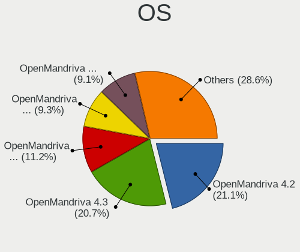
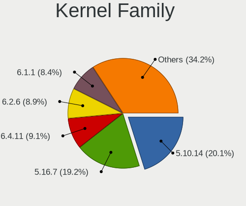
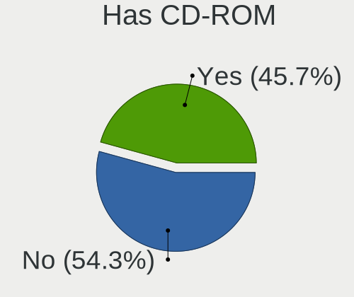
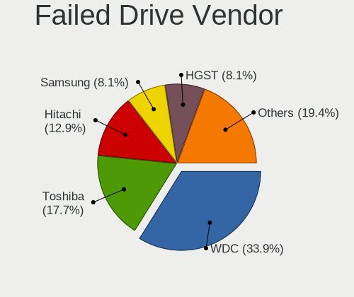
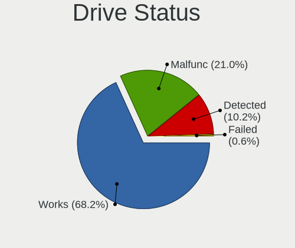
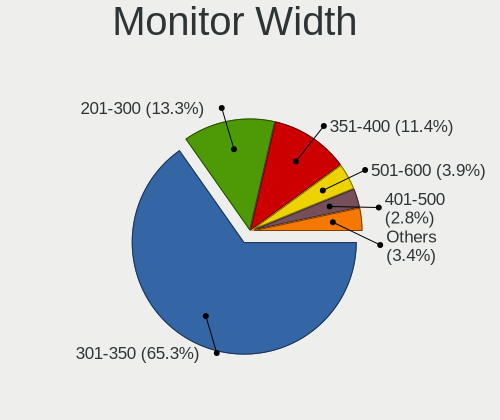
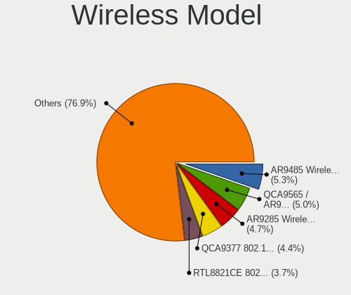
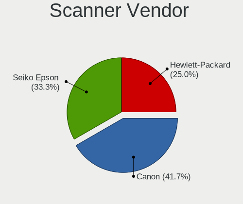

OpenMandriva - Tested Hardware & Statistics (Notebooks)
-------------------------------------------------------

A project to collect tested hardware configurations for OpenMandriva.

Anyone can contribute to this report by the [hw-probe](https://github.com/linuxhw/hw-probe) tool:

    sudo -E hw-probe -all -upload

Please contribute! Especially if your hardware is rare.

Contents
--------

* [ Test Cases ](#test-cases)

* [ System ](#system)
  - [ OS                       ](#os)
  - [ OS Family                ](#os-family)
  - [ Kernel                   ](#kernel)
  - [ Kernel Family            ](#kernel-family)
  - [ Kernel Major Ver.        ](#kernel-major-ver)
  - [ Arch                     ](#arch)
  - [ DE                       ](#de)
  - [ Display Server           ](#display-server)
  - [ Display Manager          ](#display-manager)
  - [ OS Lang                  ](#os-lang)
  - [ Boot Mode                ](#boot-mode)
  - [ Filesystem               ](#filesystem)
  - [ Part. scheme             ](#part-scheme)
  - [ Dual Boot with Linux/BSD ](#dual-boot-with-linuxbsd)
  - [ Dual Boot (Win)          ](#dual-boot-win)

* [ Board ](#board)
  - [ Vendor                   ](#vendor)
  - [ Model                    ](#model)
  - [ Model Family             ](#model-family)
  - [ MFG Year                 ](#mfg-year)
  - [ Form Factor              ](#form-factor)
  - [ Secure Boot              ](#secure-boot)
  - [ Coreboot                 ](#coreboot)
  - [ RAM Size                 ](#ram-size)
  - [ RAM Used                 ](#ram-used)
  - [ Total Drives             ](#total-drives)
  - [ Has CD-ROM               ](#has-cd-rom)
  - [ Has Ethernet             ](#has-ethernet)
  - [ Has WiFi                 ](#has-wifi)
  - [ Has Bluetooth            ](#has-bluetooth)

* [ Location ](#location)
  - [ Country                  ](#country)
  - [ City                     ](#city)

* [ Drives ](#drives)
  - [ Drive Vendor             ](#drive-vendor)
  - [ Drive Model              ](#drive-model)
  - [ HDD Vendor               ](#hdd-vendor)
  - [ SSD Vendor               ](#ssd-vendor)
  - [ Drive Kind               ](#drive-kind)
  - [ Drive Connector          ](#drive-connector)
  - [ Drive Size               ](#drive-size)
  - [ Space Total              ](#space-total)
  - [ Space Used               ](#space-used)
  - [ Malfunc. Drives          ](#malfunc-drives)
  - [ Malfunc. Drive Vendor    ](#malfunc-drive-vendor)
  - [ Malfunc. HDD Vendor      ](#malfunc-hdd-vendor)
  - [ Malfunc. Drive Kind      ](#malfunc-drive-kind)
  - [ Failed Drives            ](#failed-drives)
  - [ Failed Drive Vendor      ](#failed-drive-vendor)
  - [ Drive Status             ](#drive-status)

* [ Storage controller ](#storage-controller)
  - [ Storage Vendor           ](#storage-vendor)
  - [ Storage Model            ](#storage-model)
  - [ Storage Kind             ](#storage-kind)

* [ Processor ](#processor)
  - [ CPU Vendor               ](#cpu-vendor)
  - [ CPU Model                ](#cpu-model)
  - [ CPU Model Family         ](#cpu-model-family)
  - [ CPU Cores                ](#cpu-cores)
  - [ CPU Sockets              ](#cpu-sockets)
  - [ CPU Threads              ](#cpu-threads)
  - [ CPU Op-Modes             ](#cpu-op-modes)
  - [ CPU Microcode            ](#cpu-microcode)
  - [ CPU Microarch            ](#cpu-microarch)

* [ Graphics ](#graphics)
  - [ GPU Vendor               ](#gpu-vendor)
  - [ GPU Model                ](#gpu-model)
  - [ GPU Combo                ](#gpu-combo)
  - [ GPU Driver               ](#gpu-driver)
  - [ GPU Memory               ](#gpu-memory)

* [ Monitor ](#monitor)
  - [ Monitor Vendor           ](#monitor-vendor)
  - [ Monitor Model            ](#monitor-model)
  - [ Monitor Resolution       ](#monitor-resolution)
  - [ Monitor Diagonal         ](#monitor-diagonal)
  - [ Monitor Width            ](#monitor-width)
  - [ Aspect Ratio             ](#aspect-ratio)
  - [ Monitor Area             ](#monitor-area)
  - [ Pixel Density            ](#pixel-density)
  - [ Multiple Monitors        ](#multiple-monitors)

* [ Network ](#network)
  - [ Net Controller Vendor    ](#net-controller-vendor)
  - [ Net Controller Model     ](#net-controller-model)
  - [ Wireless Vendor          ](#wireless-vendor)
  - [ Wireless Model           ](#wireless-model)
  - [ Ethernet Vendor          ](#ethernet-vendor)
  - [ Ethernet Model           ](#ethernet-model)
  - [ Net Controller Kind      ](#net-controller-kind)
  - [ Used Controller          ](#used-controller)
  - [ NICs                     ](#nics)
  - [ IPv6                     ](#ipv6)

* [ Bluetooth ](#bluetooth)
  - [ Bluetooth Vendor         ](#bluetooth-vendor)
  - [ Bluetooth Model          ](#bluetooth-model)

* [ Sound ](#sound)
  - [ Sound Vendor             ](#sound-vendor)
  - [ Sound Model              ](#sound-model)

* [ Memory ](#memory)
  - [ Memory Vendor            ](#memory-vendor)
  - [ Memory Model             ](#memory-model)
  - [ Memory Kind              ](#memory-kind)
  - [ Memory Form Factor       ](#memory-form-factor)
  - [ Memory Size              ](#memory-size)
  - [ Memory Speed             ](#memory-speed)

* [ Printers & scanners ](#printers--scanners)
  - [ Printer Vendor           ](#printer-vendor)
  - [ Printer Model            ](#printer-model)
  - [ Scanner Vendor           ](#scanner-vendor)
  - [ Scanner Model            ](#scanner-model)

* [ Camera ](#camera)
  - [ Camera Vendor            ](#camera-vendor)
  - [ Camera Model             ](#camera-model)

* [ Security ](#security)
  - [ Fingerprint Vendor       ](#fingerprint-vendor)
  - [ Fingerprint Model        ](#fingerprint-model)
  - [ Chipcard Vendor          ](#chipcard-vendor)
  - [ Chipcard Model           ](#chipcard-model)

* [ Unsupported ](#unsupported)
  - [ Unsupported Devices      ](#unsupported-devices)
  - [ Unsupported Device Types ](#unsupported-device-types)

Test Cases
----------

Total: 6105

| Vendor        | Model                       | Probe                                                      | Date         |
|---------------|-----------------------------|------------------------------------------------------------|--------------|
| Apple         | MacBookPro9,2               | [b0beffe006](https://linux-hardware.org/?probe=b0beffe006) | Apr 01, 2023 |
| Dell          | Inspiron 15 5510            | [e169cd0886](https://linux-hardware.org/?probe=e169cd0886) | Apr 01, 2023 |
| HP            | Pavilion g7                 | [7820d2ca67](https://linux-hardware.org/?probe=7820d2ca67) | Apr 01, 2023 |
| Acer          | Aspire V5-121               | [d6cc7a67ab](https://linux-hardware.org/?probe=d6cc7a67ab) | Apr 01, 2023 |
| Acer          | Aspire 5740                 | [eeba9d18fa](https://linux-hardware.org/?probe=eeba9d18fa) | Apr 01, 2023 |
| Lenovo        | ThinkPad P1 Gen 4i 20Y30... | [96c53eccb0](https://linux-hardware.org/?probe=96c53eccb0) | Apr 01, 2023 |
| Acer          | Aspire A315-35              | [659a4cfd5a](https://linux-hardware.org/?probe=659a4cfd5a) | Apr 01, 2023 |
| ASUSTek       | N752VX                      | [d426499408](https://linux-hardware.org/?probe=d426499408) | Apr 01, 2023 |
| Lenovo        | IdeaPad 510-15IKB 80SV      | [6ab0a0226d](https://linux-hardware.org/?probe=6ab0a0226d) | Apr 01, 2023 |
| Unknown       | X133                        | [950572f119](https://linux-hardware.org/?probe=950572f119) | Apr 01, 2023 |
| ASUSTek       | F3JP                        | [e561213582](https://linux-hardware.org/?probe=e561213582) | Apr 01, 2023 |
| ASUSTek       | ASUS EXPERTBOOK B1500CEA... | [87bc2601f3](https://linux-hardware.org/?probe=87bc2601f3) | Apr 01, 2023 |
| ASUSTek       | S551LN                      | [916adbdf9f](https://linux-hardware.org/?probe=916adbdf9f) | Apr 01, 2023 |
| Sony          | VPCEH1S1R                   | [12100cdd4b](https://linux-hardware.org/?probe=12100cdd4b) | Apr 01, 2023 |
| Lenovo        | G505 20240                  | [d873632b2b](https://linux-hardware.org/?probe=d873632b2b) | Apr 01, 2023 |
| HP            | Pavilion Gaming Laptop 1... | [70fb59cd4f](https://linux-hardware.org/?probe=70fb59cd4f) | Apr 01, 2023 |
| HP            | EliteBook 8470p             | [178ccc8d4d](https://linux-hardware.org/?probe=178ccc8d4d) | Apr 01, 2023 |
| Lenovo        | IdeaPad 3 15IIL05 81WE      | [9db0830268](https://linux-hardware.org/?probe=9db0830268) | Apr 01, 2023 |
| Lenovo        | G560 20042                  | [c5a4783dfb](https://linux-hardware.org/?probe=c5a4783dfb) | Apr 01, 2023 |
| Toshiba       | Satellite C55-B             | [250e5371c1](https://linux-hardware.org/?probe=250e5371c1) | Apr 01, 2023 |
| Lenovo        | ThinkPad X230 2325DV4       | [6cff5cd5d1](https://linux-hardware.org/?probe=6cff5cd5d1) | Apr 01, 2023 |
| Dell          | Latitude 5580               | [10cbd4c04d](https://linux-hardware.org/?probe=10cbd4c04d) | Apr 01, 2023 |
| Fujitsu       | LIFEBOOK S935               | [11b63a22b5](https://linux-hardware.org/?probe=11b63a22b5) | Apr 01, 2023 |
| Sony          | VPCEA3BFX                   | [6215c985dd](https://linux-hardware.org/?probe=6215c985dd) | Apr 01, 2023 |
| Lenovo        | V15-IGL 82C3                | [4773b9449c](https://linux-hardware.org/?probe=4773b9449c) | Apr 01, 2023 |
| Dell          | Vostro 15 3515              | [eea311b1bb](https://linux-hardware.org/?probe=eea311b1bb) | Apr 01, 2023 |
| HP            | Laptop 15s-eq3xxx           | [758bb2556e](https://linux-hardware.org/?probe=758bb2556e) | Apr 01, 2023 |
| Lenovo        | ThinkPad T530 23594LU       | [9de89fee19](https://linux-hardware.org/?probe=9de89fee19) | Apr 01, 2023 |
| Lenovo        | ThinkPad T420s 4173R44      | [84e9a5f3d9](https://linux-hardware.org/?probe=84e9a5f3d9) | Apr 01, 2023 |
| UMAX          | VisionBook 14Wa Plus        | [ea8016c4a5](https://linux-hardware.org/?probe=ea8016c4a5) | Apr 01, 2023 |
| Dell          | Latitude E7450              | [8bf693a890](https://linux-hardware.org/?probe=8bf693a890) | Apr 01, 2023 |
| Samsung       | 340XAA/350XAA/550XAA        | [93ef0bb287](https://linux-hardware.org/?probe=93ef0bb287) | Apr 01, 2023 |
| Samsung       | 270E5G/270E5U               | [67b91e463a](https://linux-hardware.org/?probe=67b91e463a) | Mar 31, 2023 |
| Acer          | Aspire A315-54K             | [d325177071](https://linux-hardware.org/?probe=d325177071) | Mar 31, 2023 |
| HP            | ProBook 440 G6              | [5198509903](https://linux-hardware.org/?probe=5198509903) | Mar 31, 2023 |
| Lenovo        | IdeaPad Yoga 13 20175       | [66a1075056](https://linux-hardware.org/?probe=66a1075056) | Mar 31, 2023 |
| Quanta        | QL3 TBD                     | [21673aecac](https://linux-hardware.org/?probe=21673aecac) | Mar 31, 2023 |
| HP            | Compaq Presario CQ60        | [e5a729243d](https://linux-hardware.org/?probe=e5a729243d) | Mar 31, 2023 |
| Microtech     | ebookPro                    | [ffe1da27cc](https://linux-hardware.org/?probe=ffe1da27cc) | Mar 31, 2023 |
| Dell          | XPS M1330                   | [46b9a5cfde](https://linux-hardware.org/?probe=46b9a5cfde) | Mar 31, 2023 |
| Intel         | Kabylake Platform           | [2b0fd79264](https://linux-hardware.org/?probe=2b0fd79264) | Mar 31, 2023 |
| Toshiba       | Satellite L655              | [d527726a1c](https://linux-hardware.org/?probe=d527726a1c) | Mar 31, 2023 |
| HP            | Pavilion Aero Laptop 13-... | [59b2b4e152](https://linux-hardware.org/?probe=59b2b4e152) | Mar 31, 2023 |
| Samsung       | 300V3A/300V4A/300V5A/200... | [ad92e27c90](https://linux-hardware.org/?probe=ad92e27c90) | Mar 31, 2023 |
| Acer          | Aspire 7720                 | [073d49ce6b](https://linux-hardware.org/?probe=073d49ce6b) | Mar 31, 2023 |
| Dell          | Precision 5570              | [a3d5f928ee](https://linux-hardware.org/?probe=a3d5f928ee) | Mar 31, 2023 |
| Dell          | Inspiron 1545               | [ca44e7f419](https://linux-hardware.org/?probe=ca44e7f419) | Mar 31, 2023 |
| Dell          | Latitude E7440              | [fdd9fda693](https://linux-hardware.org/?probe=fdd9fda693) | Mar 31, 2023 |
| HP            | Compaq 6730b (GB987ET#UU... | [6c6ceb9bc3](https://linux-hardware.org/?probe=6c6ceb9bc3) | Mar 31, 2023 |
| HP            | 250 G5 Notebook PC          | [d271318192](https://linux-hardware.org/?probe=d271318192) | Mar 31, 2023 |
| HP            | Laptop 15-db0xxx            | [c51f53a733](https://linux-hardware.org/?probe=c51f53a733) | Mar 31, 2023 |
| Lenovo        | ThinkPad T430 2347EP7       | [6fd7423cb6](https://linux-hardware.org/?probe=6fd7423cb6) | Mar 31, 2023 |
| HP            | Pavilion 15                 | [4dc2c9dfc1](https://linux-hardware.org/?probe=4dc2c9dfc1) | Mar 31, 2023 |
| HUAWEI        | KPL-W0X                     | [6e93ca4159](https://linux-hardware.org/?probe=6e93ca4159) | Mar 31, 2023 |
| ASUSTek       | VivoBook_ASUSLaptop X515... | [29c4ba04a1](https://linux-hardware.org/?probe=29c4ba04a1) | Mar 31, 2023 |
| Acer          | Aspire ES1-531              | [aedba72f70](https://linux-hardware.org/?probe=aedba72f70) | Mar 31, 2023 |
| Unknown       | Unknown                     | [c30740a3eb](https://linux-hardware.org/?probe=c30740a3eb) | Mar 31, 2023 |
| HP            | Laptop 17-cp2xxx            | [854de8a433](https://linux-hardware.org/?probe=854de8a433) | Mar 31, 2023 |
| Lenovo        | Legion 5 15IMH05 82AU       | [36c0a38885](https://linux-hardware.org/?probe=36c0a38885) | Mar 31, 2023 |
| ASUSTek       | X550CL                      | [5d5862d22a](https://linux-hardware.org/?probe=5d5862d22a) | Mar 31, 2023 |
| Fujitsu Si... | ESPRIMO Mobile V5535        | [d6c537b33b](https://linux-hardware.org/?probe=d6c537b33b) | Mar 31, 2023 |
| Apple         | MacBookPro9,2               | [8c60cf0ec1](https://linux-hardware.org/?probe=8c60cf0ec1) | Mar 31, 2023 |
| Lenovo        | IdeaPad 300-15ISK 80Q7      | [54f8c5082d](https://linux-hardware.org/?probe=54f8c5082d) | Mar 31, 2023 |
| Acer          | Aspire 1410                 | [58be80ea51](https://linux-hardware.org/?probe=58be80ea51) | Mar 31, 2023 |
| Acer          | Aspire 5720Z                | [ca2b750eeb](https://linux-hardware.org/?probe=ca2b750eeb) | Mar 31, 2023 |
| Acer          | TravelMate B311-31          | [3345b754b7](https://linux-hardware.org/?probe=3345b754b7) | Mar 31, 2023 |
| HP            | EliteBook 8540p             | [570836875c](https://linux-hardware.org/?probe=570836875c) | Mar 31, 2023 |
| Notebook      | NL40_50GU                   | [a46afd7246](https://linux-hardware.org/?probe=a46afd7246) | Mar 31, 2023 |
| Star Labs     | Lite                        | [e3689ef845](https://linux-hardware.org/?probe=e3689ef845) | Mar 31, 2023 |
| ASUSTek       | K54C                        | [a2a91e2071](https://linux-hardware.org/?probe=a2a91e2071) | Mar 30, 2023 |
| Acer          | Aspire 7741                 | [34bd6f42b1](https://linux-hardware.org/?probe=34bd6f42b1) | Mar 30, 2023 |
| HP            | Unknown                     | [fb784430a5](https://linux-hardware.org/?probe=fb784430a5) | Mar 30, 2023 |
| Lenovo        | Yoga 500-15IBD 80N6         | [225e13e1f0](https://linux-hardware.org/?probe=225e13e1f0) | Mar 30, 2023 |
| HP            | Pavilion Gaming Laptop 1... | [8e927ead89](https://linux-hardware.org/?probe=8e927ead89) | Mar 30, 2023 |
| Toshiba       | Satellite P875              | [aba8c03541](https://linux-hardware.org/?probe=aba8c03541) | Mar 30, 2023 |
| ASUSTek       | K53SJ                       | [aa9a729217](https://linux-hardware.org/?probe=aa9a729217) | Mar 30, 2023 |
| Notebook      | N150CU                      | [5da0df2cf0](https://linux-hardware.org/?probe=5da0df2cf0) | Mar 30, 2023 |
| Acer          | Aspire ES1-523              | [a800dab0ab](https://linux-hardware.org/?probe=a800dab0ab) | Mar 30, 2023 |
| HP            | EliteBook 2540p             | [6aae8ca2a0](https://linux-hardware.org/?probe=6aae8ca2a0) | Mar 30, 2023 |
| HP            | Pavilion dv6                | [c91e4d9c5a](https://linux-hardware.org/?probe=c91e4d9c5a) | Mar 30, 2023 |
| Dell          | XPS 17 9710                 | [6b37881138](https://linux-hardware.org/?probe=6b37881138) | Mar 30, 2023 |
| Samsung       | 355V4C/356V4C/3445VC/354... | [6b9737a62f](https://linux-hardware.org/?probe=6b9737a62f) | Mar 30, 2023 |
| HP            | ProBook 6360b               | [cf027e03de](https://linux-hardware.org/?probe=cf027e03de) | Mar 30, 2023 |
| Acer          | Prespa M                    | [a6541a27d9](https://linux-hardware.org/?probe=a6541a27d9) | Mar 30, 2023 |
| Lenovo        | IdeaPad 3 15ITL6 82H8       | [afd41155ee](https://linux-hardware.org/?probe=afd41155ee) | Mar 30, 2023 |
| Lenovo        | G550 2958                   | [41f23ded68](https://linux-hardware.org/?probe=41f23ded68) | Mar 30, 2023 |
| ASUSTek       | VivoBook_ASUSLaptop X512... | [a1fa08efc6](https://linux-hardware.org/?probe=a1fa08efc6) | Mar 30, 2023 |
| Lenovo        | IdeaPad 3 15ITL6 82H8       | [45f39402f0](https://linux-hardware.org/?probe=45f39402f0) | Mar 30, 2023 |
| Lenovo        | V15-ADA 82C7                | [552ad08e05](https://linux-hardware.org/?probe=552ad08e05) | Mar 30, 2023 |
| Toshiba       | dynabook T653/46JR          | [94a37d865e](https://linux-hardware.org/?probe=94a37d865e) | Mar 30, 2023 |
| Dell          | Latitude E7450              | [63e8748d1f](https://linux-hardware.org/?probe=63e8748d1f) | Mar 30, 2023 |
| Lenovo        | G505 20240                  | [25c5c7ee2e](https://linux-hardware.org/?probe=25c5c7ee2e) | Mar 30, 2023 |
| PC Special... | P65_67RSRP                  | [889f3e8521](https://linux-hardware.org/?probe=889f3e8521) | Mar 30, 2023 |
| HP            | Pavilion Notebook           | [d3eafe4568](https://linux-hardware.org/?probe=d3eafe4568) | Mar 30, 2023 |
| Toshiba       | Satellite L655              | [2e6ea8bf5c](https://linux-hardware.org/?probe=2e6ea8bf5c) | Mar 30, 2023 |
| Lenovo        | ThinkPad Edge E530 3259M... | [9aaa97a931](https://linux-hardware.org/?probe=9aaa97a931) | Mar 30, 2023 |
| Acer          | NC-M3-581T-33216G52MAKK     | [3f394d8b43](https://linux-hardware.org/?probe=3f394d8b43) | Mar 30, 2023 |
| Dell          | Latitude E6430              | [086b5d0f79](https://linux-hardware.org/?probe=086b5d0f79) | Mar 30, 2023 |
| Lenovo        | ThinkPad T400 6475J92       | [1d3c812668](https://linux-hardware.org/?probe=1d3c812668) | Mar 30, 2023 |
| Lenovo        | ThinkPad X395 20NLS0J400    | [e9d9710ef9](https://linux-hardware.org/?probe=e9d9710ef9) | Mar 30, 2023 |
| Dell          | Precision 5550              | [c7244f1e31](https://linux-hardware.org/?probe=c7244f1e31) | Mar 30, 2023 |
| Fujitsu       | LIFEBOOK AH530              | [a316144991](https://linux-hardware.org/?probe=a316144991) | Mar 29, 2023 |
| HP            | Notebook                    | [e631e8e62a](https://linux-hardware.org/?probe=e631e8e62a) | Mar 29, 2023 |
| HP            | Laptop 14-bs0xx             | [53504486d2](https://linux-hardware.org/?probe=53504486d2) | Mar 29, 2023 |
| Lenovo        | U41-70 80JV                 | [975da67142](https://linux-hardware.org/?probe=975da67142) | Mar 29, 2023 |
| HP            | Laptop 15s-fq4xxx           | [029fa06a9a](https://linux-hardware.org/?probe=029fa06a9a) | Mar 29, 2023 |
| Fujitsu       | LIFEBOOK A555               | [6f28f9e6ec](https://linux-hardware.org/?probe=6f28f9e6ec) | Mar 29, 2023 |
| Acer          | Aspire A515-57              | [06a3c07a40](https://linux-hardware.org/?probe=06a3c07a40) | Mar 29, 2023 |
| HP            | ENVY TS Sleekbook 4         | [f897573506](https://linux-hardware.org/?probe=f897573506) | Mar 29, 2023 |
| Lenovo        | IdeaPad S145-15IWL 81MV     | [5be11a9a6e](https://linux-hardware.org/?probe=5be11a9a6e) | Mar 29, 2023 |
| Dell          | System Inspiron N7110       | [cc23cb7065](https://linux-hardware.org/?probe=cc23cb7065) | Mar 29, 2023 |
| Lenovo        | IdeaPad 100-15IBY 80MJ      | [11c94aa91b](https://linux-hardware.org/?probe=11c94aa91b) | Mar 29, 2023 |
| Samsung       | 670Z5E                      | [2bf528dfb1](https://linux-hardware.org/?probe=2bf528dfb1) | Mar 29, 2023 |
| Lenovo        | IdeaPad S145-15API 81UT     | [695a074faf](https://linux-hardware.org/?probe=695a074faf) | Mar 29, 2023 |
| Acer          | Aspire 8930                 | [248dbe002e](https://linux-hardware.org/?probe=248dbe002e) | Mar 29, 2023 |
| Lenovo        | G570 20079                  | [680c7a04ed](https://linux-hardware.org/?probe=680c7a04ed) | Mar 29, 2023 |
| Notebook      | N85_N87,HJ,HJ1,HK1          | [61ede0b764](https://linux-hardware.org/?probe=61ede0b764) | Mar 29, 2023 |
| Toshiba       | Satellite P200              | [c55a4d3166](https://linux-hardware.org/?probe=c55a4d3166) | Mar 29, 2023 |
| Acer          | Aspire E1-571G              | [574f00dff5](https://linux-hardware.org/?probe=574f00dff5) | Mar 29, 2023 |
| Acer          | Aspire E5-576               | [37fc62a287](https://linux-hardware.org/?probe=37fc62a287) | Mar 29, 2023 |
| Acer          | Aspire E5-773G              | [3cb72ca21c](https://linux-hardware.org/?probe=3cb72ca21c) | Mar 29, 2023 |
| ASUSTek       | ASUS TUF Gaming A15 FA50... | [fa1a582da6](https://linux-hardware.org/?probe=fa1a582da6) | Mar 29, 2023 |
| Samsung       | 300E5M/300E5L               | [9d48f53259](https://linux-hardware.org/?probe=9d48f53259) | Mar 29, 2023 |
| Notebook      | NL40_50CU                   | [fe471635fb](https://linux-hardware.org/?probe=fe471635fb) | Mar 29, 2023 |
| Toshiba       | Satellite L750              | [0bc21ff162](https://linux-hardware.org/?probe=0bc21ff162) | Mar 28, 2023 |
| Dell          | Vostro 5568                 | [0004be15a4](https://linux-hardware.org/?probe=0004be15a4) | Mar 28, 2023 |
| HP            | ENVY Notebook               | [98cd32ea44](https://linux-hardware.org/?probe=98cd32ea44) | Mar 28, 2023 |
| HP            | 250 G6 Notebook PC          | [94cdfc44d1](https://linux-hardware.org/?probe=94cdfc44d1) | Mar 28, 2023 |
| Acer          | Aspire V3-571G              | [ecde786683](https://linux-hardware.org/?probe=ecde786683) | Mar 28, 2023 |
| HP            | Compaq 6510b (GR680ET)      | [716c4212c7](https://linux-hardware.org/?probe=716c4212c7) | Mar 28, 2023 |
| ASUSTek       | TUF Gaming FX505DT_FX505... | [f7222bf293](https://linux-hardware.org/?probe=f7222bf293) | Mar 28, 2023 |
| Lenovo        | V145-15AST 81MT             | [7fff3bb217](https://linux-hardware.org/?probe=7fff3bb217) | Mar 28, 2023 |
| Kiano         | Elegance 14.2               | [ea2013b347](https://linux-hardware.org/?probe=ea2013b347) | Mar 28, 2023 |
| Acer          | Aspire E1-570               | [71b25255fa](https://linux-hardware.org/?probe=71b25255fa) | Mar 28, 2023 |
| HP            | OMEN Laptop 15-ek0xxx       | [f44d26ed76](https://linux-hardware.org/?probe=f44d26ed76) | Mar 28, 2023 |
| Acer          | Aspire E5-532G              | [35e076d9b5](https://linux-hardware.org/?probe=35e076d9b5) | Mar 28, 2023 |
| Fujitsu       | LIFEBOOK E556               | [bbd878e897](https://linux-hardware.org/?probe=bbd878e897) | Mar 28, 2023 |
| Dell          | Vostro 14-5480              | [b1ef6303a6](https://linux-hardware.org/?probe=b1ef6303a6) | Mar 28, 2023 |
| Fujitsu       | LIFEBOOK E556               | [3842c12714](https://linux-hardware.org/?probe=3842c12714) | Mar 28, 2023 |
| HP            | Pavilion Notebook           | [783330690d](https://linux-hardware.org/?probe=783330690d) | Mar 28, 2023 |
| Dell          | Latitude E5500              | [6fea10bf98](https://linux-hardware.org/?probe=6fea10bf98) | Mar 28, 2023 |
| TEKNOSERVI... | NJ5x_NJ7xLU                 | [2a0feae3f9](https://linux-hardware.org/?probe=2a0feae3f9) | Mar 28, 2023 |
| Lenovo        | IdeaPad 100-14IBY 80MH      | [0e8125dc1f](https://linux-hardware.org/?probe=0e8125dc1f) | Mar 28, 2023 |
| Dell          | Latitude 7490               | [41d01ead49](https://linux-hardware.org/?probe=41d01ead49) | Mar 28, 2023 |
| Dell          | Latitude E5570              | [5b3d1ab8b9](https://linux-hardware.org/?probe=5b3d1ab8b9) | Mar 28, 2023 |
| Dell          | Inspiron 3558               | [c80d4c15ce](https://linux-hardware.org/?probe=c80d4c15ce) | Mar 28, 2023 |
| Dell          | Inspiron 5515               | [13a0d1426d](https://linux-hardware.org/?probe=13a0d1426d) | Mar 28, 2023 |
| Lenovo        | ThinkPad W520 4284E79       | [2d9875ca24](https://linux-hardware.org/?probe=2d9875ca24) | Mar 28, 2023 |
| Samsung       | 950XCJ/951XCJ/950XCR        | [df27b06a95](https://linux-hardware.org/?probe=df27b06a95) | Mar 28, 2023 |
| Dell          | Studio 1558                 | [955946c74d](https://linux-hardware.org/?probe=955946c74d) | Mar 28, 2023 |
| HP            | Pavilion Laptop 14-dv0xx... | [f511f8bcb1](https://linux-hardware.org/?probe=f511f8bcb1) | Mar 28, 2023 |
| ASUSTek       | X555DG                      | [6a464d8e68](https://linux-hardware.org/?probe=6a464d8e68) | Mar 27, 2023 |
| Acer          | Aspire E5-575               | [5964caaa02](https://linux-hardware.org/?probe=5964caaa02) | Mar 27, 2023 |
| Lenovo        | ThinkPad X250 20CLS47P00    | [e287203572](https://linux-hardware.org/?probe=e287203572) | Mar 27, 2023 |
| Lenovo        | ThinkPad X220 42915P1       | [40d0cf6e14](https://linux-hardware.org/?probe=40d0cf6e14) | Mar 27, 2023 |
| Lenovo        | ThinkPad T420 4236W1K       | [e093aace6e](https://linux-hardware.org/?probe=e093aace6e) | Mar 27, 2023 |
| Dell          | Latitude E6430              | [61ec1b65ed](https://linux-hardware.org/?probe=61ec1b65ed) | Mar 27, 2023 |
| Sony          | VPCSA2C5E                   | [60e85a64b0](https://linux-hardware.org/?probe=60e85a64b0) | Mar 27, 2023 |
| ASUSTek       | K56CA                       | [43f064cb46](https://linux-hardware.org/?probe=43f064cb46) | Mar 27, 2023 |
| Acer          | Aspire A515-45              | [d480257689](https://linux-hardware.org/?probe=d480257689) | Mar 27, 2023 |
| Lenovo        | ThinkPad T580 20LAS4L216    | [9c3464baf9](https://linux-hardware.org/?probe=9c3464baf9) | Mar 27, 2023 |
| Lenovo        | IdeaPad S145-15AST 81N3     | [580e3a1237](https://linux-hardware.org/?probe=580e3a1237) | Mar 27, 2023 |
| Acer          | Mammoth                     | [d43ab9891b](https://linux-hardware.org/?probe=d43ab9891b) | Mar 27, 2023 |
| Lenovo        | ThinkPad L450 20DS0001GE    | [17f869b10d](https://linux-hardware.org/?probe=17f869b10d) | Mar 27, 2023 |
| Sony          | VPCEH1S1E                   | [081294b14c](https://linux-hardware.org/?probe=081294b14c) | Mar 27, 2023 |
| ASUSTek       | N551JM                      | [b8e3d627b5](https://linux-hardware.org/?probe=b8e3d627b5) | Mar 27, 2023 |
| Toshiba       | Satellite C855-1TT          | [ac8e41d993](https://linux-hardware.org/?probe=ac8e41d993) | Mar 27, 2023 |
| Lenovo        | ThinkPad T450s 20BWS3WY0... | [d1e9fcddfc](https://linux-hardware.org/?probe=d1e9fcddfc) | Mar 27, 2023 |
| TUXEDO        | Pulse 14 Gen1               | [7facc52f0e](https://linux-hardware.org/?probe=7facc52f0e) | Mar 27, 2023 |
| HP            | 250 G6 Notebook PC          | [eb82e949b2](https://linux-hardware.org/?probe=eb82e949b2) | Mar 27, 2023 |
| ASUSTek       | K54HR                       | [ac6cf948d5](https://linux-hardware.org/?probe=ac6cf948d5) | Mar 27, 2023 |
| ASUSTek       | E502NA                      | [a116400859](https://linux-hardware.org/?probe=a116400859) | Mar 27, 2023 |
| Lenovo        | Legion 5 Pro 16IAH7H 82R... | [e4a88fa14e](https://linux-hardware.org/?probe=e4a88fa14e) | Mar 27, 2023 |
| Lenovo        | B460e                       | [1c79a13a61](https://linux-hardware.org/?probe=1c79a13a61) | Mar 27, 2023 |
| Acer          | Aspire A315-56              | [db607e02ea](https://linux-hardware.org/?probe=db607e02ea) | Mar 27, 2023 |
| TUXEDO        | InfinityBook Pro Gen7 (M... | [84d2bfb9cc](https://linux-hardware.org/?probe=84d2bfb9cc) | Mar 27, 2023 |
| Dell          | Inspiron 5448               | [b800b24cbd](https://linux-hardware.org/?probe=b800b24cbd) | Mar 27, 2023 |
| Acer          | Aspire V3-551               | [48409a7222](https://linux-hardware.org/?probe=48409a7222) | Mar 27, 2023 |
| HP            | Pavilion TS 11              | [e13254735b](https://linux-hardware.org/?probe=e13254735b) | Mar 27, 2023 |
| Dell          | Latitude 7490               | [58ccd5d7e0](https://linux-hardware.org/?probe=58ccd5d7e0) | Mar 27, 2023 |
| HP            | Pavilion g6                 | [4b08001481](https://linux-hardware.org/?probe=4b08001481) | Mar 27, 2023 |
| Dell          | Inspiron 3537               | [5b1971e361](https://linux-hardware.org/?probe=5b1971e361) | Mar 27, 2023 |
| Acer          | Aspire A515-41G             | [33bccb2234](https://linux-hardware.org/?probe=33bccb2234) | Mar 27, 2023 |
| Sony          | VJFE52A0711H                | [f2186a4bc4](https://linux-hardware.org/?probe=f2186a4bc4) | Mar 27, 2023 |
| Lenovo        | ThinkPad L530 24812SG       | [163d4e376e](https://linux-hardware.org/?probe=163d4e376e) | Mar 26, 2023 |
| HP            | 250 G1                      | [a19b3136b7](https://linux-hardware.org/?probe=a19b3136b7) | Mar 26, 2023 |
| ASUSTek       | N552VW                      | [322426698a](https://linux-hardware.org/?probe=322426698a) | Mar 26, 2023 |
| Lenovo        | 3000 G530 4151/200          | [4c0751aa89](https://linux-hardware.org/?probe=4c0751aa89) | Mar 26, 2023 |
| Lenovo        | IdeaPad Y910-17ISK 80V1     | [5e4e7975c1](https://linux-hardware.org/?probe=5e4e7975c1) | Mar 26, 2023 |
| Dell          | XPS 15 9520                 | [35718792af](https://linux-hardware.org/?probe=35718792af) | Mar 26, 2023 |
| ASUSTek       | VivoBook_ASUSLaptop X412... | [7dbe4350b5](https://linux-hardware.org/?probe=7dbe4350b5) | Mar 26, 2023 |
| Acer          | Aspire E1-431               | [f56a2c21cf](https://linux-hardware.org/?probe=f56a2c21cf) | Mar 26, 2023 |
| Lenovo        | ThinkPad E14 Gen 2 20TA0... | [84af25ca8c](https://linux-hardware.org/?probe=84af25ca8c) | Mar 26, 2023 |
| Fujitsu       | LIFEBOOK E744               | [f32cce4c6f](https://linux-hardware.org/?probe=f32cce4c6f) | Mar 26, 2023 |
| Samsung       | RC530/RC730                 | [ad2be3eba7](https://linux-hardware.org/?probe=ad2be3eba7) | Mar 26, 2023 |
| Lenovo        | ThinkPad X220 4290LR3       | [dffa03da18](https://linux-hardware.org/?probe=dffa03da18) | Mar 26, 2023 |
| Gigabyte      | A7 K1                       | [0eca943d2e](https://linux-hardware.org/?probe=0eca943d2e) | Mar 26, 2023 |
| ASUSTek       | K72Jr                       | [f80aed3ccc](https://linux-hardware.org/?probe=f80aed3ccc) | Mar 26, 2023 |
| Dell          | Inspiron 1545               | [70c5569887](https://linux-hardware.org/?probe=70c5569887) | Mar 26, 2023 |
| ASUSTek       | K50IE                       | [bde872583b](https://linux-hardware.org/?probe=bde872583b) | Mar 26, 2023 |
| MSI           | CR620                       | [2fce81cc28](https://linux-hardware.org/?probe=2fce81cc28) | Mar 26, 2023 |
| Medion        | Akoya E6416                 | [bb2e759014](https://linux-hardware.org/?probe=bb2e759014) | Mar 26, 2023 |
| Acer          | Aspire 5820                 | [3e0e45bc17](https://linux-hardware.org/?probe=3e0e45bc17) | Mar 26, 2023 |
| HP            | EliteBook Folio 9480m       | [1be38b1b49](https://linux-hardware.org/?probe=1be38b1b49) | Mar 26, 2023 |
| Acer          | Predator G9-791             | [1f820516a3](https://linux-hardware.org/?probe=1f820516a3) | Mar 26, 2023 |
| Dell          | Inspiron 15-3567            | [5c3f0186de](https://linux-hardware.org/?probe=5c3f0186de) | Mar 26, 2023 |
| Dell          | Inspiron 3576               | [18352c181a](https://linux-hardware.org/?probe=18352c181a) | Mar 26, 2023 |
| ASUSTek       | X75VD                       | [9997ce4485](https://linux-hardware.org/?probe=9997ce4485) | Mar 26, 2023 |
| Fujitsu Si... | AMILO Pi 3625               | [076352cb68](https://linux-hardware.org/?probe=076352cb68) | Mar 26, 2023 |
| Lenovo        | ThinkPad X230 2306A44       | [e948a25ef6](https://linux-hardware.org/?probe=e948a25ef6) | Mar 26, 2023 |
| Sony          | VGN-BX61VN                  | [76f62cf9c1](https://linux-hardware.org/?probe=76f62cf9c1) | Mar 26, 2023 |
| Toshiba       | Satellite C845D             | [32341bde2a](https://linux-hardware.org/?probe=32341bde2a) | Mar 26, 2023 |
| Apple         | MacBookPro8,1               | [0f1954d5c6](https://linux-hardware.org/?probe=0f1954d5c6) | Mar 26, 2023 |
| Lenovo        | ThinkPad T14 Gen 2i 20W0... | [64485e9b53](https://linux-hardware.org/?probe=64485e9b53) | Mar 25, 2023 |
| Toshiba       | PORTEGE Z30-A               | [114888d7f5](https://linux-hardware.org/?probe=114888d7f5) | Mar 25, 2023 |
| Medion        | E14412                      | [897c73454e](https://linux-hardware.org/?probe=897c73454e) | Mar 25, 2023 |
| Dell          | XPS 9315                    | [050fede003](https://linux-hardware.org/?probe=050fede003) | Mar 25, 2023 |
| ASUSTek       | TUF Gaming FX505DU_FX505... | [51d034c8d1](https://linux-hardware.org/?probe=51d034c8d1) | Mar 25, 2023 |
| Acer          | Aspire ES1-411              | [1a4caa9a83](https://linux-hardware.org/?probe=1a4caa9a83) | Mar 24, 2023 |
| HP            | Pavilion Notebook           | [446c510c65](https://linux-hardware.org/?probe=446c510c65) | Mar 24, 2023 |
| Lenovo        | IdeaPad 110-15IBR 80T7      | [178936b7f4](https://linux-hardware.org/?probe=178936b7f4) | Mar 24, 2023 |
| Acer          | Aspire 5733Z                | [8a7f87172d](https://linux-hardware.org/?probe=8a7f87172d) | Mar 24, 2023 |
| Lenovo        | B50-45 20388                | [5bd617a430](https://linux-hardware.org/?probe=5bd617a430) | Mar 24, 2023 |
| METAPHYUNI    | MetamechBook                | [7e4076cb61](https://linux-hardware.org/?probe=7e4076cb61) | Mar 24, 2023 |
| HP            | Unknown                     | [c27dcda931](https://linux-hardware.org/?probe=c27dcda931) | Mar 24, 2023 |
| ASUSTek       | K53SJ                       | [175f99ccdd](https://linux-hardware.org/?probe=175f99ccdd) | Mar 23, 2023 |
| Dell          | Precision 7720              | [c3ef75d6eb](https://linux-hardware.org/?probe=c3ef75d6eb) | Mar 23, 2023 |
| Acer          | Predator PH315-53           | [25c6ad6f8b](https://linux-hardware.org/?probe=25c6ad6f8b) | Mar 23, 2023 |
| TUXEDO        | InfinityBook Pro Gen7 (M... | [1c88428088](https://linux-hardware.org/?probe=1c88428088) | Mar 22, 2023 |
| Toshiba       | T20                         | [a0757b47d7](https://linux-hardware.org/?probe=a0757b47d7) | Mar 22, 2023 |
| Packard Be... | EasyNote LJ75               | [1a3b095372](https://linux-hardware.org/?probe=1a3b095372) | Mar 22, 2023 |
| Acer          | TravelMate 5744             | [3ad8bf7639](https://linux-hardware.org/?probe=3ad8bf7639) | Mar 22, 2023 |
| HUAWEI        | KPL-W0X                     | [0ae6ab3ff6](https://linux-hardware.org/?probe=0ae6ab3ff6) | Mar 21, 2023 |
| Lenovo        | IdeaPad 320-15ABR 80XS      | [7622701d31](https://linux-hardware.org/?probe=7622701d31) | Mar 21, 2023 |
| Toshiba       | Satellite A305              | [ed7bc92488](https://linux-hardware.org/?probe=ed7bc92488) | Mar 21, 2023 |
| Dell          | Inspiron 15 7000 Gaming     | [b6b5eb415f](https://linux-hardware.org/?probe=b6b5eb415f) | Mar 21, 2023 |
| Dell          | Latitude 7490               | [e16b99a93a](https://linux-hardware.org/?probe=e16b99a93a) | Mar 21, 2023 |
| Acer          | Extensa 5235                | [270cd6ed83](https://linux-hardware.org/?probe=270cd6ed83) | Mar 20, 2023 |
| Notebook      | NS50_70MU                   | [cb2c031349](https://linux-hardware.org/?probe=cb2c031349) | Mar 20, 2023 |
| Dell          | Latitude E6430              | [7eafa653dc](https://linux-hardware.org/?probe=7eafa653dc) | Mar 20, 2023 |
| Acer          | TravelMate 5760             | [712e36569d](https://linux-hardware.org/?probe=712e36569d) | Mar 20, 2023 |
| Acer          | Aspire 4736Z                | [30e77255e4](https://linux-hardware.org/?probe=30e77255e4) | Mar 20, 2023 |
| Dell          | Latitude E5500              | [9c76627b98](https://linux-hardware.org/?probe=9c76627b98) | Mar 20, 2023 |
| Lenovo        | IdeaPad 3 15ALC6 82KU       | [e91cad7b1b](https://linux-hardware.org/?probe=e91cad7b1b) | Mar 20, 2023 |
| Lenovo        | IdeaPad S145-15API 81UT     | [91d4251cb0](https://linux-hardware.org/?probe=91d4251cb0) | Mar 19, 2023 |
| Lenovo        | IdeaPad 330-15IKB 81DE      | [77b7fd07a4](https://linux-hardware.org/?probe=77b7fd07a4) | Mar 19, 2023 |
| Lenovo        | IdeaPad 320-15IAP 80XR      | [919ccc204b](https://linux-hardware.org/?probe=919ccc204b) | Mar 19, 2023 |
| MSI           | GE60 2PE                    | [229b9e0525](https://linux-hardware.org/?probe=229b9e0525) | Mar 19, 2023 |
| Dell          | Inspiron 15 7510            | [f7aebbae36](https://linux-hardware.org/?probe=f7aebbae36) | Mar 18, 2023 |
| ASUSTek       | UX31E                       | [b637fa75c8](https://linux-hardware.org/?probe=b637fa75c8) | Mar 18, 2023 |
| Dell          | Precision M4800             | [26912746f6](https://linux-hardware.org/?probe=26912746f6) | Mar 18, 2023 |
| Lenovo        | ThinkPad P50 20EQS1MY00     | [beeb327f26](https://linux-hardware.org/?probe=beeb327f26) | Mar 18, 2023 |
| Dell          | Inspiron 15-3567            | [e90a87f6f2](https://linux-hardware.org/?probe=e90a87f6f2) | Mar 18, 2023 |
| MSI           | GP60 2OD                    | [a3ffd8113f](https://linux-hardware.org/?probe=a3ffd8113f) | Mar 18, 2023 |
| Acer          | Swift SF113-31              | [f1db5ada96](https://linux-hardware.org/?probe=f1db5ada96) | Mar 18, 2023 |
| HP            | EliteBook 840 G3            | [8a2a9a9e75](https://linux-hardware.org/?probe=8a2a9a9e75) | Mar 18, 2023 |
| Dell          | Precision M6600             | [a71645a248](https://linux-hardware.org/?probe=a71645a248) | Mar 18, 2023 |
| HONOR         | NBR-WAX9                    | [19fd2af680](https://linux-hardware.org/?probe=19fd2af680) | Mar 18, 2023 |
| Acer          | Aspire A315-55G             | [badcc52c19](https://linux-hardware.org/?probe=badcc52c19) | Mar 18, 2023 |
| ASUSTek       | N751JK                      | [813b5026ad](https://linux-hardware.org/?probe=813b5026ad) | Mar 18, 2023 |
| Acer          | Aspire E1-532               | [ed3693c1c8](https://linux-hardware.org/?probe=ed3693c1c8) | Mar 18, 2023 |
| HP            | EliteBook 6930p             | [c9ba614358](https://linux-hardware.org/?probe=c9ba614358) | Mar 18, 2023 |
| Acer          | Aspire 7750G                | [39d6b256fa](https://linux-hardware.org/?probe=39d6b256fa) | Mar 18, 2023 |
| Notebook      | N8xxEP6                     | [a4bd2c22eb](https://linux-hardware.org/?probe=a4bd2c22eb) | Mar 18, 2023 |
| HP            | Pavilion dv6                | [9c24401930](https://linux-hardware.org/?probe=9c24401930) | Mar 18, 2023 |
| HP            | Laptop 15-dw1xxx            | [63ecda6230](https://linux-hardware.org/?probe=63ecda6230) | Mar 18, 2023 |
| Lenovo        | G570 20079                  | [2d7a146140](https://linux-hardware.org/?probe=2d7a146140) | Mar 18, 2023 |
| Dell          | Latitude D530               | [c02081557b](https://linux-hardware.org/?probe=c02081557b) | Mar 18, 2023 |
| Lenovo        | IdeaPad 3 15ALC6 82KU       | [fce879befb](https://linux-hardware.org/?probe=fce879befb) | Mar 18, 2023 |
| ASUSTek       | VivoBook_ASUSLaptop E410... | [ac3bb4cdf4](https://linux-hardware.org/?probe=ac3bb4cdf4) | Mar 18, 2023 |
| Compaq        | 420                         | [fe4401a9db](https://linux-hardware.org/?probe=fe4401a9db) | Mar 18, 2023 |
| HP            | Notebook                    | [a3496c8509](https://linux-hardware.org/?probe=a3496c8509) | Mar 18, 2023 |
| Chuwi         | HeroBook                    | [7a70fa6c57](https://linux-hardware.org/?probe=7a70fa6c57) | Mar 17, 2023 |
| Acer          | Aspire 7740                 | [a625fd3d4b](https://linux-hardware.org/?probe=a625fd3d4b) | Mar 17, 2023 |
| HP            | Compaq 6730s                | [7e2310fcf0](https://linux-hardware.org/?probe=7e2310fcf0) | Mar 17, 2023 |
| Acer          | Aspire V3-571G              | [6aee8060e9](https://linux-hardware.org/?probe=6aee8060e9) | Mar 17, 2023 |
| HP            | Victus by Gaming Laptop ... | [6bee303acb](https://linux-hardware.org/?probe=6bee303acb) | Mar 17, 2023 |
| Dell          | Latitude E7470              | [f2dd0afe92](https://linux-hardware.org/?probe=f2dd0afe92) | Mar 17, 2023 |
| Dell          | Latitude E7440              | [8a6e751b61](https://linux-hardware.org/?probe=8a6e751b61) | Mar 16, 2023 |
| Toshiba       | Satellite L50-C             | [2193d33376](https://linux-hardware.org/?probe=2193d33376) | Mar 16, 2023 |
| Acer          | TravelMate 7750ZG           | [5108cfe57c](https://linux-hardware.org/?probe=5108cfe57c) | Mar 16, 2023 |
| Toshiba       | Satellite C55-A-1T6         | [71751e4045](https://linux-hardware.org/?probe=71751e4045) | Mar 16, 2023 |
| HP            | ZBook 15 G5                 | [2af12bdf73](https://linux-hardware.org/?probe=2af12bdf73) | Mar 16, 2023 |
| Sony          | VPCEH1S1E                   | [9e8a96156c](https://linux-hardware.org/?probe=9e8a96156c) | Mar 15, 2023 |
| Samsung       | RV410/RV510/S3510/E3510     | [063ed79c8f](https://linux-hardware.org/?probe=063ed79c8f) | Mar 15, 2023 |
| Lenovo        | Yoga Slim 7 Pro 14ACH5 O... | [ae9acbc4ef](https://linux-hardware.org/?probe=ae9acbc4ef) | Mar 15, 2023 |
| ASUSTek       | T100HAN                     | [b8585e81f9](https://linux-hardware.org/?probe=b8585e81f9) | Mar 15, 2023 |
| Acer          | Aspire E1-421               | [bb1dca9ea3](https://linux-hardware.org/?probe=bb1dca9ea3) | Mar 14, 2023 |
| Kiano         | Elegance 14.2               | [f9ed050c6a](https://linux-hardware.org/?probe=f9ed050c6a) | Mar 14, 2023 |
| Dell          | Latitude E7240              | [7fbe857344](https://linux-hardware.org/?probe=7fbe857344) | Mar 14, 2023 |
| HP            | 245 G6 Notebook PC          | [8ff2a816b5](https://linux-hardware.org/?probe=8ff2a816b5) | Mar 13, 2023 |
| Lenovo        | ThinkPad SL 2746N8G         | [2124288941](https://linux-hardware.org/?probe=2124288941) | Mar 13, 2023 |
| ASUSTek       | K72Jr                       | [cde6fff1ad](https://linux-hardware.org/?probe=cde6fff1ad) | Mar 13, 2023 |
| Lenovo        | G400s 20244                 | [fed6bb2c17](https://linux-hardware.org/?probe=fed6bb2c17) | Mar 13, 2023 |
| Lenovo        | Yoga 300-11IBR 80M1         | [7ffbc62c94](https://linux-hardware.org/?probe=7ffbc62c94) | Mar 13, 2023 |
| Apple         | MacBookAir7,2               | [9509c77e2b](https://linux-hardware.org/?probe=9509c77e2b) | Mar 13, 2023 |
| Dell          | Inspiron 15-3567            | [97504eea44](https://linux-hardware.org/?probe=97504eea44) | Mar 13, 2023 |
| HP            | Pavilion dv6500             | [03097b6049](https://linux-hardware.org/?probe=03097b6049) | Mar 13, 2023 |
| HP            | EliteBook 840 G3            | [e111e27012](https://linux-hardware.org/?probe=e111e27012) | Mar 13, 2023 |
| ASUSTek       | K53Z                        | [5ec3f96a8e](https://linux-hardware.org/?probe=5ec3f96a8e) | Mar 13, 2023 |
| Dell          | Precision M4500             | [b61053a0de](https://linux-hardware.org/?probe=b61053a0de) | Mar 13, 2023 |
| Lenovo        | IdeaPad S540-15IWL 81NE     | [11b2e17886](https://linux-hardware.org/?probe=11b2e17886) | Mar 13, 2023 |
| ASUSTek       | UX31E                       | [7f3525f6ef](https://linux-hardware.org/?probe=7f3525f6ef) | Mar 12, 2023 |
| Acer          | Aspire ES1-523              | [4247bd6835](https://linux-hardware.org/?probe=4247bd6835) | Mar 12, 2023 |
| HP            | Pavilion dv6                | [c556c32400](https://linux-hardware.org/?probe=c556c32400) | Mar 12, 2023 |
| HONOR         | HYM-WXX                     | [366d00f0a7](https://linux-hardware.org/?probe=366d00f0a7) | Mar 12, 2023 |
| ASUSTek       | ZenBook UX431FN             | [0185de4fa6](https://linux-hardware.org/?probe=0185de4fa6) | Mar 12, 2023 |
| ASUSTek       | VivoBook_ASUSLaptop X515... | [0d7e6b4a80](https://linux-hardware.org/?probe=0d7e6b4a80) | Mar 12, 2023 |
| Unknown       | Unknown                     | [d1336c09a0](https://linux-hardware.org/?probe=d1336c09a0) | Mar 11, 2023 |
| Acer          | Aspire A515-51G             | [757a62eff0](https://linux-hardware.org/?probe=757a62eff0) | Mar 11, 2023 |
| HP            | EliteBook 2560p             | [dcbcb393c0](https://linux-hardware.org/?probe=dcbcb393c0) | Mar 11, 2023 |
| ASUSTek       | X55U                        | [b06bd51348](https://linux-hardware.org/?probe=b06bd51348) | Mar 11, 2023 |
| Toshiba       | Satellite C55-A-1K4         | [3ba10eda08](https://linux-hardware.org/?probe=3ba10eda08) | Mar 11, 2023 |
| MSI           | Alpha 15 A3DC               | [feabd7f5bf](https://linux-hardware.org/?probe=feabd7f5bf) | Mar 11, 2023 |
| Acer          | Extensa 5620                | [f95239bf35](https://linux-hardware.org/?probe=f95239bf35) | Mar 11, 2023 |
| ASUSTek       | X556UQK                     | [e5c898a856](https://linux-hardware.org/?probe=e5c898a856) | Mar 11, 2023 |
| Gigabyte      | GB-BSi7A-6500               | [b24842e6f1](https://linux-hardware.org/?probe=b24842e6f1) | Mar 11, 2023 |
| Kiano         | Elegance 14.2               | [5714b30108](https://linux-hardware.org/?probe=5714b30108) | Mar 11, 2023 |
| Positivo      | C14CU51                     | [0cc5053d97](https://linux-hardware.org/?probe=0cc5053d97) | Mar 11, 2023 |
| Toshiba       | Satellite C665              | [e95e34e3ba](https://linux-hardware.org/?probe=e95e34e3ba) | Mar 11, 2023 |
| Acer          | Aspire R3-131T              | [94435f58ed](https://linux-hardware.org/?probe=94435f58ed) | Mar 11, 2023 |
| HP            | ProBook 6470b               | [6af002fb12](https://linux-hardware.org/?probe=6af002fb12) | Mar 11, 2023 |
| Lenovo        | ThinkPad L15 Gen 1 20U70... | [0555c85a89](https://linux-hardware.org/?probe=0555c85a89) | Mar 11, 2023 |
| Fujitsu       | LIFEBOOK S760               | [1d2e721898](https://linux-hardware.org/?probe=1d2e721898) | Mar 10, 2023 |
| Dell          | Inspiron 1750               | [354cdf8592](https://linux-hardware.org/?probe=354cdf8592) | Mar 10, 2023 |
| Fujitsu Si... | LIFEBOOK E8410              | [c2230a6690](https://linux-hardware.org/?probe=c2230a6690) | Mar 10, 2023 |
| Lenovo        | IdeaPad 320-15IKB 80YH      | [0d8d93d401](https://linux-hardware.org/?probe=0d8d93d401) | Mar 10, 2023 |
| MSI           | GL75 Leopard 10SEK          | [9fdc1bd5c4](https://linux-hardware.org/?probe=9fdc1bd5c4) | Mar 10, 2023 |
| Lenovo        | ThinkPad T440p 20AN0070M... | [0d0877faf5](https://linux-hardware.org/?probe=0d0877faf5) | Mar 10, 2023 |
| HP            | Stream Laptop 14-cb0XX      | [b8dffd9bd3](https://linux-hardware.org/?probe=b8dffd9bd3) | Mar 10, 2023 |
| HP            | Laptop 15-bs1xx             | [fa74606b0c](https://linux-hardware.org/?probe=fa74606b0c) | Mar 10, 2023 |
| ASUSTek       | X540LA                      | [de3c24e686](https://linux-hardware.org/?probe=de3c24e686) | Mar 10, 2023 |
| Lenovo        | IdeaPad 330S-15IKB 81F5     | [041ebfc8c6](https://linux-hardware.org/?probe=041ebfc8c6) | Mar 09, 2023 |
| HP            | Pavilion dv4                | [79a8c505ef](https://linux-hardware.org/?probe=79a8c505ef) | Mar 09, 2023 |
| Lenovo        | G580 2189                   | [5e2c4e9a1c](https://linux-hardware.org/?probe=5e2c4e9a1c) | Mar 09, 2023 |
| Dell          | Latitude E5450              | [6a40dced5b](https://linux-hardware.org/?probe=6a40dced5b) | Mar 09, 2023 |
| Dell          | Vostro 1310                 | [a5677d37dc](https://linux-hardware.org/?probe=a5677d37dc) | Mar 09, 2023 |
| Venom         | BlackBook Zero 14(L133)     | [3d9c19c23c](https://linux-hardware.org/?probe=3d9c19c23c) | Mar 09, 2023 |
| Acer          | Aspire A315-21              | [089893622b](https://linux-hardware.org/?probe=089893622b) | Mar 08, 2023 |
| HP            | Pavilion g6                 | [35f93de82d](https://linux-hardware.org/?probe=35f93de82d) | Mar 08, 2023 |
| Sony          | SVF1521B1EW                 | [5b5a9dbc40](https://linux-hardware.org/?probe=5b5a9dbc40) | Mar 08, 2023 |
| HP            | ENVY 6                      | [4873f7b85f](https://linux-hardware.org/?probe=4873f7b85f) | Mar 08, 2023 |
| Lenovo        | ThinkPad T61 7661BM5        | [daf29f1a82](https://linux-hardware.org/?probe=daf29f1a82) | Mar 08, 2023 |
| Lenovo        | IdeaPad 320-15ISK 80XH      | [233722f0e1](https://linux-hardware.org/?probe=233722f0e1) | Mar 07, 2023 |
| Acer          | Aspire ES1-732              | [03a5f04251](https://linux-hardware.org/?probe=03a5f04251) | Mar 07, 2023 |
| Lenovo        | IdeaPad 3 15ALC6 82KU       | [6e7ffbd8ad](https://linux-hardware.org/?probe=6e7ffbd8ad) | Mar 07, 2023 |
| Chuwi         | LapBook Plus                | [55365bb7ab](https://linux-hardware.org/?probe=55365bb7ab) | Mar 07, 2023 |
| Apple         | MacBookPro14,1              | [5a9c11da8a](https://linux-hardware.org/?probe=5a9c11da8a) | Mar 07, 2023 |
| Lenovo        | IdeaPad 3 14IGL05 81WH      | [d677609a51](https://linux-hardware.org/?probe=d677609a51) | Mar 07, 2023 |
| Dell          | Studio 1537                 | [2cadadec43](https://linux-hardware.org/?probe=2cadadec43) | Mar 07, 2023 |
| Lenovo        | ThinkPad P1 Gen 4i 20Y30... | [efe5bcec0b](https://linux-hardware.org/?probe=efe5bcec0b) | Mar 07, 2023 |
| GPU Compan... | GWTN156-11                  | [c451be28c3](https://linux-hardware.org/?probe=c451be28c3) | Mar 07, 2023 |
| Lenovo        | IdeaPad 5 14ITL05 82FE      | [67d9219fc2](https://linux-hardware.org/?probe=67d9219fc2) | Mar 07, 2023 |
| Acer          | Predator PH517-61           | [359903fe58](https://linux-hardware.org/?probe=359903fe58) | Mar 07, 2023 |
| AZW           | GT-R                        | [cce9cccb8f](https://linux-hardware.org/?probe=cce9cccb8f) | Mar 07, 2023 |
| Lenovo        | ThinkPad P1 Gen 4i 20Y30... | [c517071efd](https://linux-hardware.org/?probe=c517071efd) | Mar 06, 2023 |
| HP            | Notebook                    | [06e805be3d](https://linux-hardware.org/?probe=06e805be3d) | Mar 06, 2023 |
| HP            | Compaq Presario CQ60        | [cbdc8bcd6a](https://linux-hardware.org/?probe=cbdc8bcd6a) | Mar 06, 2023 |
| ASUSTek       | UX303LB                     | [4137763385](https://linux-hardware.org/?probe=4137763385) | Mar 06, 2023 |
| HP            | Laptop 14-cm0xxx            | [e24f683971](https://linux-hardware.org/?probe=e24f683971) | Mar 06, 2023 |
| Dell          | Inspiron 5567               | [780dc15bcc](https://linux-hardware.org/?probe=780dc15bcc) | Mar 06, 2023 |
| Lenovo        | G50-45 80E3                 | [02dfdb807e](https://linux-hardware.org/?probe=02dfdb807e) | Mar 06, 2023 |
| GPU Compan... | GWTN156-11                  | [fe4af91506](https://linux-hardware.org/?probe=fe4af91506) | Mar 06, 2023 |
| Dell          | Latitude 7490               | [4d643d2296](https://linux-hardware.org/?probe=4d643d2296) | Mar 06, 2023 |
| Intel         | Crestline & ICH8M Chipse... | [c9e67a9174](https://linux-hardware.org/?probe=c9e67a9174) | Mar 06, 2023 |
| Dell          | Latitude E6510              | [c411615a9f](https://linux-hardware.org/?probe=c411615a9f) | Mar 05, 2023 |
| Lenovo        | ThinkPad T550 20CJS02E00    | [d8535715f8](https://linux-hardware.org/?probe=d8535715f8) | Mar 05, 2023 |
| Lenovo        | IdeaPad 330-17IKB 81DM      | [c420621505](https://linux-hardware.org/?probe=c420621505) | Mar 05, 2023 |
| Lenovo        | ThinkPad X1 Carbon 3rd 2... | [80ee932665](https://linux-hardware.org/?probe=80ee932665) | Mar 05, 2023 |
| Lenovo        | IdeaPad 3 15ALC6 82KU       | [7e0a15042f](https://linux-hardware.org/?probe=7e0a15042f) | Mar 05, 2023 |
| Toshiba       | Satellite C855-112          | [8635f2eecd](https://linux-hardware.org/?probe=8635f2eecd) | Mar 05, 2023 |
| HP            | Pavilion g7                 | [1f09b36fde](https://linux-hardware.org/?probe=1f09b36fde) | Mar 04, 2023 |
| Lenovo        | ThinkPad T420 4177R3U       | [525dd38cf1](https://linux-hardware.org/?probe=525dd38cf1) | Mar 04, 2023 |
| ASUSTek       | VivoBook_ASUSLaptop X513... | [fdb3bcda29](https://linux-hardware.org/?probe=fdb3bcda29) | Mar 04, 2023 |
| Dell          | Inspiron 11-3162            | [243db51836](https://linux-hardware.org/?probe=243db51836) | Mar 04, 2023 |
| Lenovo        | Yoga Slim 7 13ACN5 82CY     | [9c91f76369](https://linux-hardware.org/?probe=9c91f76369) | Mar 04, 2023 |
| Toshiba       | NB550D                      | [8ba5171640](https://linux-hardware.org/?probe=8ba5171640) | Mar 04, 2023 |
| ASUSTek       | VivoBook_ASUSLaptop E510... | [9b0664e4d7](https://linux-hardware.org/?probe=9b0664e4d7) | Mar 04, 2023 |
| ASUSTek       | UX31E                       | [ba97297cf9](https://linux-hardware.org/?probe=ba97297cf9) | Mar 04, 2023 |
| Fujitsu       | LIFEBOOK AH530              | [d49f7315d3](https://linux-hardware.org/?probe=d49f7315d3) | Mar 04, 2023 |
| Acer          | Aspire 5336                 | [0a597339ed](https://linux-hardware.org/?probe=0a597339ed) | Mar 04, 2023 |
| Lenovo        | Yoga Slim 7 Pro 14ACH5 O... | [3b059b2feb](https://linux-hardware.org/?probe=3b059b2feb) | Mar 03, 2023 |
| Google        | Lulu                        | [eb4cf4fb11](https://linux-hardware.org/?probe=eb4cf4fb11) | Mar 03, 2023 |
| Lenovo        | Y520-15IKBN 80WK            | [9186971572](https://linux-hardware.org/?probe=9186971572) | Mar 03, 2023 |
| HP            | Compaq Presario CQ60        | [5ad0c4c383](https://linux-hardware.org/?probe=5ad0c4c383) | Mar 03, 2023 |
| HP            | Laptop 15-dw0xxx            | [aca41aef5c](https://linux-hardware.org/?probe=aca41aef5c) | Mar 03, 2023 |
| Lenovo        | V14-ADA 82C6                | [f043beec18](https://linux-hardware.org/?probe=f043beec18) | Mar 03, 2023 |
| Dell          | Latitude E6230              | [83ce975818](https://linux-hardware.org/?probe=83ce975818) | Mar 03, 2023 |
| Toshiba       | dynabook R73/BN             | [1d81bb5f08](https://linux-hardware.org/?probe=1d81bb5f08) | Mar 03, 2023 |
| ASUSTek       | VivoBook_ASUSLaptop X513... | [a553120d6e](https://linux-hardware.org/?probe=a553120d6e) | Mar 03, 2023 |
| ASUSTek       | N61Vn                       | [9528e36d7b](https://linux-hardware.org/?probe=9528e36d7b) | Mar 03, 2023 |
| Framework     | Laptop                      | [b234e5c5af](https://linux-hardware.org/?probe=b234e5c5af) | Mar 02, 2023 |
| HP            | Pavilion Aero Laptop 13-... | [dae34bbf69](https://linux-hardware.org/?probe=dae34bbf69) | Mar 02, 2023 |
| Lenovo        | IdeaPad 320-15AST 80XV      | [26b308e28a](https://linux-hardware.org/?probe=26b308e28a) | Mar 02, 2023 |
| Dell          | Inspiron 3542               | [e230d5c136](https://linux-hardware.org/?probe=e230d5c136) | Mar 02, 2023 |
| Lenovo        | IdeaPad Z510 20287          | [c11c045673](https://linux-hardware.org/?probe=c11c045673) | Mar 02, 2023 |
| Acer          | Aspire 5755G                | [c1594b1f9d](https://linux-hardware.org/?probe=c1594b1f9d) | Mar 02, 2023 |
| Dell          | Latitude E6410              | [3b99fd709e](https://linux-hardware.org/?probe=3b99fd709e) | Mar 02, 2023 |
| ASUSTek       | VivoBook_ASUSLaptop X509... | [2dea6717ae](https://linux-hardware.org/?probe=2dea6717ae) | Mar 02, 2023 |
| Dell          | Latitude D830               | [83415c82ac](https://linux-hardware.org/?probe=83415c82ac) | Mar 02, 2023 |
| Dell          | Latitude E7250              | [970d46cc83](https://linux-hardware.org/?probe=970d46cc83) | Mar 01, 2023 |
| Dell          | Latitude E6520              | [2774f2cb16](https://linux-hardware.org/?probe=2774f2cb16) | Mar 01, 2023 |
| Lenovo        | ThinkPad X1 Carbon 5th 2... | [3a2e77122d](https://linux-hardware.org/?probe=3a2e77122d) | Mar 01, 2023 |
| Dell          | Inspiron 13 5310            | [7e9ff37f98](https://linux-hardware.org/?probe=7e9ff37f98) | Mar 01, 2023 |
| Acer          | Aspire V3-574G              | [e943ab2cde](https://linux-hardware.org/?probe=e943ab2cde) | Mar 01, 2023 |
| Acer          | Predator PH517-61           | [2d1ec6c994](https://linux-hardware.org/?probe=2d1ec6c994) | Mar 01, 2023 |
| Lenovo        | Yoga Slim 7 Pro 14ACH5 O... | [fb4531590c](https://linux-hardware.org/?probe=fb4531590c) | Mar 01, 2023 |
| ASUSTek       | X556URK                     | [aa7492e59a](https://linux-hardware.org/?probe=aa7492e59a) | Mar 01, 2023 |
| Dell          | Latitude E5570              | [89fe2fb4fd](https://linux-hardware.org/?probe=89fe2fb4fd) | Mar 01, 2023 |
| Fujitsu Si... | AMILO Li3910                | [f29ead8551](https://linux-hardware.org/?probe=f29ead8551) | Mar 01, 2023 |
| Acer          | Aspire E1-532P              | [8a23f06db4](https://linux-hardware.org/?probe=8a23f06db4) | Mar 01, 2023 |
| Medion        | Erazer X7851 MD60583        | [9ddd4f88b4](https://linux-hardware.org/?probe=9ddd4f88b4) | Feb 28, 2023 |
| ASUSTek       | X55A                        | [1429627725](https://linux-hardware.org/?probe=1429627725) | Feb 28, 2023 |
| Lenovo        | IdeaPad 3 15ALC6 82KU       | [8ec75c8681](https://linux-hardware.org/?probe=8ec75c8681) | Feb 28, 2023 |
| ASUSTek       | N76VB                       | [0043164762](https://linux-hardware.org/?probe=0043164762) | Feb 28, 2023 |
| Dell          | Latitude 3400               | [2936e7f368](https://linux-hardware.org/?probe=2936e7f368) | Feb 28, 2023 |
| ASUSTek       | VivoBook_ASUSLaptop X412... | [87022bd601](https://linux-hardware.org/?probe=87022bd601) | Feb 28, 2023 |
| Acer          | Aspire V3-772               | [5a0c297e10](https://linux-hardware.org/?probe=5a0c297e10) | Feb 28, 2023 |
| Philco        | 10D                         | [dd709d35db](https://linux-hardware.org/?probe=dd709d35db) | Feb 28, 2023 |
| Dell          | Latitude D630               | [5175558c99](https://linux-hardware.org/?probe=5175558c99) | Feb 28, 2023 |
| Sony          | VPCZ21Z9R                   | [4d3f0c27cd](https://linux-hardware.org/?probe=4d3f0c27cd) | Feb 28, 2023 |
| Sony          | VGN-FW11M                   | [06b355e1de](https://linux-hardware.org/?probe=06b355e1de) | Feb 28, 2023 |
| HP            | EliteBook 8540w             | [057c307bf5](https://linux-hardware.org/?probe=057c307bf5) | Feb 28, 2023 |
| Dell          | Latitude E6420              | [a84f4dbcbb](https://linux-hardware.org/?probe=a84f4dbcbb) | Feb 28, 2023 |
| ASUSTek       | TUF Gaming FX505DD_FX505... | [021853dafb](https://linux-hardware.org/?probe=021853dafb) | Feb 28, 2023 |
| Lenovo        | Legion 7 16ACHg6 82N6       | [594ff7091b](https://linux-hardware.org/?probe=594ff7091b) | Feb 27, 2023 |
| ASUSTek       | X550CA                      | [0ce966b8fa](https://linux-hardware.org/?probe=0ce966b8fa) | Feb 27, 2023 |
| ASUSTek       | K75VJ                       | [7fc0fff829](https://linux-hardware.org/?probe=7fc0fff829) | Feb 27, 2023 |
| Acer          | Aspire 8930                 | [837e36aa25](https://linux-hardware.org/?probe=837e36aa25) | Feb 27, 2023 |
| HP            | Notebook                    | [7e64e6bc1b](https://linux-hardware.org/?probe=7e64e6bc1b) | Feb 27, 2023 |
| Acer          | Aspire E5-571               | [5f035002e1](https://linux-hardware.org/?probe=5f035002e1) | Feb 27, 2023 |
| HP            | Notebook                    | [a1180ad479](https://linux-hardware.org/?probe=a1180ad479) | Feb 27, 2023 |
| Lenovo        | G700 20251                  | [8dc4179bbd](https://linux-hardware.org/?probe=8dc4179bbd) | Feb 27, 2023 |
| Acer          | Aspire 1410                 | [40b5704a1c](https://linux-hardware.org/?probe=40b5704a1c) | Feb 26, 2023 |
| Acer          | Aspire ES1-711              | [8e397cc54f](https://linux-hardware.org/?probe=8e397cc54f) | Feb 26, 2023 |
| ASUSTek       | X751LK                      | [f312f303e0](https://linux-hardware.org/?probe=f312f303e0) | Feb 26, 2023 |
| Dell          | Latitude E5530 non-vPro     | [5634c4795c](https://linux-hardware.org/?probe=5634c4795c) | Feb 26, 2023 |
| eMachines     | eME728                      | [2331984fc8](https://linux-hardware.org/?probe=2331984fc8) | Feb 26, 2023 |
| Dell          | Latitude D630               | [cfdc009ff1](https://linux-hardware.org/?probe=cfdc009ff1) | Feb 26, 2023 |
| Google        | Lars                        | [ec4b0e7bbc](https://linux-hardware.org/?probe=ec4b0e7bbc) | Feb 25, 2023 |
| Lenovo        | ThinkPad L412 0585A38       | [da6493ef82](https://linux-hardware.org/?probe=da6493ef82) | Feb 25, 2023 |
| Acer          | Acadia V1.45                | [faee032e6c](https://linux-hardware.org/?probe=faee032e6c) | Feb 25, 2023 |
| Samsung       | 550XBE/350XBE               | [d9f49e98fd](https://linux-hardware.org/?probe=d9f49e98fd) | Feb 25, 2023 |
| HP            | Pavilion g7                 | [8f46d24897](https://linux-hardware.org/?probe=8f46d24897) | Feb 25, 2023 |
| Sony          | SVE1513B1EW                 | [c99ef001e4](https://linux-hardware.org/?probe=c99ef001e4) | Feb 25, 2023 |
| ASUSTek       | GL702ZC                     | [a40afcb1d9](https://linux-hardware.org/?probe=a40afcb1d9) | Feb 25, 2023 |
| Toshiba       | Satellite C850              | [99d4efbb52](https://linux-hardware.org/?probe=99d4efbb52) | Feb 25, 2023 |
| ASUSTek       | GL553VD                     | [302b65ed41](https://linux-hardware.org/?probe=302b65ed41) | Feb 25, 2023 |
| ASUSTek       | Z450LA                      | [304be04748](https://linux-hardware.org/?probe=304be04748) | Feb 25, 2023 |
| Unknown       | Unknown                     | [6707aef886](https://linux-hardware.org/?probe=6707aef886) | Feb 25, 2023 |
| Dell          | Latitude D630               | [433f06ecbb](https://linux-hardware.org/?probe=433f06ecbb) | Feb 24, 2023 |
| Lenovo        | IdeaPad 3 15ADA05 81W1      | [a8a2fc9d83](https://linux-hardware.org/?probe=a8a2fc9d83) | Feb 24, 2023 |
| HP            | 650                         | [ab0b350259](https://linux-hardware.org/?probe=ab0b350259) | Feb 24, 2023 |
| Samsung       | 300E4C/300E5C/300E7C        | [c19b7cd0f5](https://linux-hardware.org/?probe=c19b7cd0f5) | Feb 24, 2023 |
| HP            | ProBook 4530s               | [305f79455e](https://linux-hardware.org/?probe=305f79455e) | Feb 24, 2023 |
| Fujitsu       | LIFEBOOK A530               | [9035e056b4](https://linux-hardware.org/?probe=9035e056b4) | Feb 24, 2023 |
| HP            | ProBook 4730s               | [6d563800a1](https://linux-hardware.org/?probe=6d563800a1) | Feb 24, 2023 |
| HP            | Compaq CQ58                 | [cfff7e8c96](https://linux-hardware.org/?probe=cfff7e8c96) | Feb 24, 2023 |
| HP            | Notebook                    | [b929a8ff3c](https://linux-hardware.org/?probe=b929a8ff3c) | Feb 24, 2023 |
| Acer          | Aspire S3                   | [9d0301c490](https://linux-hardware.org/?probe=9d0301c490) | Feb 24, 2023 |
| Dell          | Inspiron 15-3567            | [f6b6b24623](https://linux-hardware.org/?probe=f6b6b24623) | Feb 24, 2023 |
| Acer          | Aspire A517-51G             | [12040fcd10](https://linux-hardware.org/?probe=12040fcd10) | Feb 24, 2023 |
| Acer          | AO725                       | [9c6719e733](https://linux-hardware.org/?probe=9c6719e733) | Feb 24, 2023 |
| Acer          | Aspire E5-575G              | [f7d34fdd3a](https://linux-hardware.org/?probe=f7d34fdd3a) | Feb 24, 2023 |
| Packard Be... | EasyNote TS44HR             | [b0d713ec14](https://linux-hardware.org/?probe=b0d713ec14) | Feb 24, 2023 |
| NEC Comput... | PC-VY25AAZR7                | [bc17a98c15](https://linux-hardware.org/?probe=bc17a98c15) | Feb 24, 2023 |
| Lenovo        | IdeaPad S145-15IIL 82DJ     | [c0af9c8bdb](https://linux-hardware.org/?probe=c0af9c8bdb) | Feb 24, 2023 |
| Positivo      | N1103                       | [b89c4551aa](https://linux-hardware.org/?probe=b89c4551aa) | Feb 24, 2023 |
| Toshiba       | Satellite C850-1GF          | [f568855409](https://linux-hardware.org/?probe=f568855409) | Feb 24, 2023 |
| HP            | Pavilion Gaming Laptop 1... | [d8d531c22a](https://linux-hardware.org/?probe=d8d531c22a) | Feb 24, 2023 |
| Lenovo        | Legion 5 15IMH05C 82AU      | [a5a58a8dc4](https://linux-hardware.org/?probe=a5a58a8dc4) | Feb 23, 2023 |
| Lenovo        | ThinkPad T520 4243F53       | [2e904cc4d7](https://linux-hardware.org/?probe=2e904cc4d7) | Feb 23, 2023 |
| Samsung       | RV413/RV513                 | [5b524ddbb0](https://linux-hardware.org/?probe=5b524ddbb0) | Feb 23, 2023 |
| Lenovo        | IdeaPad 330S-15IKB 81F5     | [df8ac668e2](https://linux-hardware.org/?probe=df8ac668e2) | Feb 23, 2023 |
| Lenovo        | IdeaPad 330S-15IKB 81F5     | [0f5352f94f](https://linux-hardware.org/?probe=0f5352f94f) | Feb 23, 2023 |
| Acer          | Aspire A515-46              | [009fbacf68](https://linux-hardware.org/?probe=009fbacf68) | Feb 23, 2023 |
| Dell          | Latitude E7470              | [5e445bd00a](https://linux-hardware.org/?probe=5e445bd00a) | Feb 23, 2023 |
| Dell          | Latitude 5420               | [948cbeda59](https://linux-hardware.org/?probe=948cbeda59) | Feb 23, 2023 |
| Lenovo        | V15-ADA 82C7                | [d19ee09dd3](https://linux-hardware.org/?probe=d19ee09dd3) | Feb 23, 2023 |
| Acer          | Nitro AN515-52              | [05f7c375b7](https://linux-hardware.org/?probe=05f7c375b7) | Feb 23, 2023 |
| HP            | mt40                        | [16e5f8eb5d](https://linux-hardware.org/?probe=16e5f8eb5d) | Feb 23, 2023 |
| Toshiba       | dynabook T653/46JR          | [ac156d2c80](https://linux-hardware.org/?probe=ac156d2c80) | Feb 22, 2023 |
| HP            | 15                          | [470b07302a](https://linux-hardware.org/?probe=470b07302a) | Feb 22, 2023 |
| Lenovo        | IdeaPad Gaming 3 15IMH05... | [d488fc0d9a](https://linux-hardware.org/?probe=d488fc0d9a) | Feb 22, 2023 |
| ASUSTek       | 1215B                       | [970d77d150](https://linux-hardware.org/?probe=970d77d150) | Feb 22, 2023 |
| Positivo      | S14SL01                     | [914a9e691e](https://linux-hardware.org/?probe=914a9e691e) | Feb 22, 2023 |
| Positivo      | S14CT01                     | [af73fc0481](https://linux-hardware.org/?probe=af73fc0481) | Feb 22, 2023 |
| Lenovo        | ThinkPad T430s 23551M9      | [91b6a109b4](https://linux-hardware.org/?probe=91b6a109b4) | Feb 22, 2023 |
| ASUSTek       | X555DG                      | [5e7abe271f](https://linux-hardware.org/?probe=5e7abe271f) | Feb 22, 2023 |
| Lenovo        | V130-15IGM 81HL             | [40205862f6](https://linux-hardware.org/?probe=40205862f6) | Feb 22, 2023 |
| Lenovo        | ThinkPad T520 4242NS9       | [6e2e5c8285](https://linux-hardware.org/?probe=6e2e5c8285) | Feb 22, 2023 |
| Gateway       | NV53A                       | [1e2b4ec4d3](https://linux-hardware.org/?probe=1e2b4ec4d3) | Feb 22, 2023 |
| Dell          | Latitude E5420              | [f5a1982d9c](https://linux-hardware.org/?probe=f5a1982d9c) | Feb 22, 2023 |
| Dell          | Inspiron 5547               | [ff88bcbafc](https://linux-hardware.org/?probe=ff88bcbafc) | Feb 22, 2023 |
| Timi          | TM1707                      | [9bc429fbd6](https://linux-hardware.org/?probe=9bc429fbd6) | Feb 22, 2023 |
| Fujitsu Si... | AMILO Li3910                | [28890c5346](https://linux-hardware.org/?probe=28890c5346) | Feb 21, 2023 |
| HP            | Pavilion dv6                | [526430f218](https://linux-hardware.org/?probe=526430f218) | Feb 21, 2023 |
| Apple         | MacBookPro9,2               | [80df77e6a1](https://linux-hardware.org/?probe=80df77e6a1) | Feb 21, 2023 |
| Dell          | Vostro 15 7510              | [df764baed8](https://linux-hardware.org/?probe=df764baed8) | Feb 21, 2023 |
| ASUSTek       | ASUS TUF Gaming A15 FA50... | [7e5789e02b](https://linux-hardware.org/?probe=7e5789e02b) | Feb 21, 2023 |
| ASUSTek       | VivoBook_ASUSLaptop X513... | [50f5c21eeb](https://linux-hardware.org/?probe=50f5c21eeb) | Feb 21, 2023 |
| Lenovo        | ThinkPad T430s 2356CV6      | [bb18722cf2](https://linux-hardware.org/?probe=bb18722cf2) | Feb 21, 2023 |
| Dell          | XPS 15 7590                 | [f613ecb9b2](https://linux-hardware.org/?probe=f613ecb9b2) | Feb 20, 2023 |
| Dell          | Inspiron 5493               | [ad7bee8a6e](https://linux-hardware.org/?probe=ad7bee8a6e) | Feb 20, 2023 |
| Dell          | G15 5510                    | [a1edb7b376](https://linux-hardware.org/?probe=a1edb7b376) | Feb 20, 2023 |
| Dell          | Inspiron 3502               | [224f4edab7](https://linux-hardware.org/?probe=224f4edab7) | Feb 20, 2023 |
| Toshiba       | TECRA R850                  | [082f5559c7](https://linux-hardware.org/?probe=082f5559c7) | Feb 20, 2023 |
| Lenovo        | V15 G2 ALC 82KD             | [40468a72ce](https://linux-hardware.org/?probe=40468a72ce) | Feb 20, 2023 |
| Lenovo        | IdeaPad L340-17API 81LY     | [e26b379150](https://linux-hardware.org/?probe=e26b379150) | Feb 20, 2023 |
| Unknown       | Unknown                     | [cccf0ea7f3](https://linux-hardware.org/?probe=cccf0ea7f3) | Feb 20, 2023 |
| Acer          | Aspire 6530G                | [c1d73e8ceb](https://linux-hardware.org/?probe=c1d73e8ceb) | Feb 20, 2023 |
| ASUSTek       | GL702VM                     | [daa3e0f7df](https://linux-hardware.org/?probe=daa3e0f7df) | Feb 20, 2023 |
| HP            | Pavilion 17                 | [1a50084a52](https://linux-hardware.org/?probe=1a50084a52) | Feb 19, 2023 |
| HP            | 14                          | [0244e880e1](https://linux-hardware.org/?probe=0244e880e1) | Feb 19, 2023 |
| ASUSTek       | X541NA                      | [b9ddd17e6c](https://linux-hardware.org/?probe=b9ddd17e6c) | Feb 19, 2023 |
| HP            | Pavilion g6                 | [f3552f5183](https://linux-hardware.org/?probe=f3552f5183) | Feb 19, 2023 |
| ASUSTek       | X55U                        | [15322abeb5](https://linux-hardware.org/?probe=15322abeb5) | Feb 19, 2023 |
| Dell          | Vostro1710                  | [91b1af7ed6](https://linux-hardware.org/?probe=91b1af7ed6) | Feb 19, 2023 |
| HP            | 250 G6 Notebook PC          | [c32182253e](https://linux-hardware.org/?probe=c32182253e) | Feb 19, 2023 |
| Lenovo        | B560 43308VG                | [c30b594458](https://linux-hardware.org/?probe=c30b594458) | Feb 19, 2023 |
| HP            | ProBook 4520s               | [8192287499](https://linux-hardware.org/?probe=8192287499) | Feb 19, 2023 |
| Lenovo        | IdeaPad Yoga 11S 20246      | [b0941b8ef0](https://linux-hardware.org/?probe=b0941b8ef0) | Feb 18, 2023 |
| HP            | 255 G8 Notebook PC          | [ecf73f400b](https://linux-hardware.org/?probe=ecf73f400b) | Feb 18, 2023 |
| HP            | Notebook                    | [2d03543f4c](https://linux-hardware.org/?probe=2d03543f4c) | Feb 18, 2023 |
| HP            | 15                          | [60ecad0be7](https://linux-hardware.org/?probe=60ecad0be7) | Feb 18, 2023 |
| HP            | Notebook                    | [3eff638ead](https://linux-hardware.org/?probe=3eff638ead) | Feb 18, 2023 |
| HP            | Pavilion g6                 | [2b4de6efbe](https://linux-hardware.org/?probe=2b4de6efbe) | Feb 18, 2023 |
| HP            | 15                          | [4db2520843](https://linux-hardware.org/?probe=4db2520843) | Feb 18, 2023 |
| Samsung       | RF511/RF411/RF711           | [355838f8b2](https://linux-hardware.org/?probe=355838f8b2) | Feb 18, 2023 |
| ASUSTek       | X756UB                      | [713121e0fc](https://linux-hardware.org/?probe=713121e0fc) | Feb 18, 2023 |
| ASUSTek       | UX31E                       | [4c3c50a992](https://linux-hardware.org/?probe=4c3c50a992) | Feb 18, 2023 |
| Lenovo        | IdeaPad 100-15IBD 80QQ      | [27958da7cc](https://linux-hardware.org/?probe=27958da7cc) | Feb 18, 2023 |
| ASUSTek       | X555DA                      | [2ac23d19ec](https://linux-hardware.org/?probe=2ac23d19ec) | Feb 18, 2023 |
| HP            | ProBook 4540s               | [cc3e78f73f](https://linux-hardware.org/?probe=cc3e78f73f) | Feb 18, 2023 |
| Sony          | VGN-FW270J                  | [81ce2212e9](https://linux-hardware.org/?probe=81ce2212e9) | Feb 18, 2023 |
| HP            | G62                         | [59a7a48e19](https://linux-hardware.org/?probe=59a7a48e19) | Feb 18, 2023 |
| Dell          | XPS 13 9370                 | [96b350db9f](https://linux-hardware.org/?probe=96b350db9f) | Feb 18, 2023 |
| Acer          | Aspire A515-45              | [ce9f366d7e](https://linux-hardware.org/?probe=ce9f366d7e) | Feb 17, 2023 |
| ASUSTek       | UX31E                       | [e6391763b2](https://linux-hardware.org/?probe=e6391763b2) | Feb 17, 2023 |
| PC Special... | NJ50_70CU                   | [68dd853397](https://linux-hardware.org/?probe=68dd853397) | Feb 17, 2023 |
| ASUSTek       | K53SC                       | [df5351b94d](https://linux-hardware.org/?probe=df5351b94d) | Feb 17, 2023 |
| Dell          | Inspiron 17-7779            | [da4ee713d7](https://linux-hardware.org/?probe=da4ee713d7) | Feb 17, 2023 |
| Samsung       | 550XDA                      | [d7f1482689](https://linux-hardware.org/?probe=d7f1482689) | Feb 17, 2023 |
| Dell          | Inspiron 5555               | [2051d9e516](https://linux-hardware.org/?probe=2051d9e516) | Feb 17, 2023 |
| Acer          | Aspire 7750G                | [e4b193c332](https://linux-hardware.org/?probe=e4b193c332) | Feb 17, 2023 |
| ASUSTek       | X555LJ                      | [a524479b7a](https://linux-hardware.org/?probe=a524479b7a) | Feb 17, 2023 |
| Toshiba       | Satellite C70-C-18E         | [7642482909](https://linux-hardware.org/?probe=7642482909) | Feb 17, 2023 |
| Dell          | Latitude E6400              | [d9fc10c008](https://linux-hardware.org/?probe=d9fc10c008) | Feb 17, 2023 |
| HP            | Pavilion 17                 | [058dbd3d5a](https://linux-hardware.org/?probe=058dbd3d5a) | Feb 17, 2023 |
| HP            | Pavilion 15                 | [a48098f6fc](https://linux-hardware.org/?probe=a48098f6fc) | Feb 17, 2023 |
| Acer          | Aspire V3-771               | [caeb6bc93f](https://linux-hardware.org/?probe=caeb6bc93f) | Feb 17, 2023 |
| HP            | Laptop 15-da0xxx            | [ac458108b4](https://linux-hardware.org/?probe=ac458108b4) | Feb 17, 2023 |
| ASUSTek       | K54C                        | [ea944628df](https://linux-hardware.org/?probe=ea944628df) | Feb 17, 2023 |
| ASUSTek       | VivoBook_ASUSLaptop X513... | [66c33604c4](https://linux-hardware.org/?probe=66c33604c4) | Feb 17, 2023 |
| Dell          | Latitude E5450              | [cd7e5d61f2](https://linux-hardware.org/?probe=cd7e5d61f2) | Feb 17, 2023 |
| Samsung       | R519/R719                   | [1dc4bc1b72](https://linux-hardware.org/?probe=1dc4bc1b72) | Feb 17, 2023 |
| Lenovo        | IdeaPad S145-15AST 81N3     | [ffd622d65f](https://linux-hardware.org/?probe=ffd622d65f) | Feb 17, 2023 |
| Lenovo        | ThinkPad X270 20HN0015GE    | [f546833d76](https://linux-hardware.org/?probe=f546833d76) | Feb 17, 2023 |
| Dell          | Latitude E6410              | [58d4c40618](https://linux-hardware.org/?probe=58d4c40618) | Feb 17, 2023 |
| Dell          | Studio 1558                 | [4a2f0524b9](https://linux-hardware.org/?probe=4a2f0524b9) | Feb 17, 2023 |
| Lenovo        | ThinkBook 15 G2 ARE 20VG    | [85fd62f731](https://linux-hardware.org/?probe=85fd62f731) | Feb 17, 2023 |
| Lenovo        | ThinkPad T61 7661BM5        | [c829d5ed74](https://linux-hardware.org/?probe=c829d5ed74) | Feb 16, 2023 |
| Dell          | Inspiron 3793               | [08b4259fa6](https://linux-hardware.org/?probe=08b4259fa6) | Feb 16, 2023 |
| Unknown       | Unknown                     | [e8183bc042](https://linux-hardware.org/?probe=e8183bc042) | Feb 16, 2023 |
| eMachines     | eMachiens G443              | [096a4bb9e4](https://linux-hardware.org/?probe=096a4bb9e4) | Feb 16, 2023 |
| HP            | Pavilion dv6500             | [95a9115968](https://linux-hardware.org/?probe=95a9115968) | Feb 16, 2023 |
| Sony          | VGN-NW240F                  | [6e63237e66](https://linux-hardware.org/?probe=6e63237e66) | Feb 16, 2023 |
| HP            | Stream Laptop 14-ax0XX      | [42b7f88059](https://linux-hardware.org/?probe=42b7f88059) | Feb 16, 2023 |
| ASUSTek       | GL553VD                     | [97f3fd27fa](https://linux-hardware.org/?probe=97f3fd27fa) | Feb 16, 2023 |
| ASUSTek       | X555QG                      | [75924d49a1](https://linux-hardware.org/?probe=75924d49a1) | Feb 16, 2023 |
| HP            | Notebook                    | [3de841fd56](https://linux-hardware.org/?probe=3de841fd56) | Feb 16, 2023 |
| Positivo      | S14BW01                     | [c14428167e](https://linux-hardware.org/?probe=c14428167e) | Feb 16, 2023 |
| Gigabyte      | GB-BSi7A-6500               | [9c461d33db](https://linux-hardware.org/?probe=9c461d33db) | Feb 16, 2023 |
| Lenovo        | V15-IGL 82C3                | [76f2f157a5](https://linux-hardware.org/?probe=76f2f157a5) | Feb 16, 2023 |
| Dell          | Inspiron 1545               | [32794e5a2e](https://linux-hardware.org/?probe=32794e5a2e) | Feb 16, 2023 |
| ASUSTek       | S551LN                      | [676c244c1d](https://linux-hardware.org/?probe=676c244c1d) | Feb 16, 2023 |
| ASUSTek       | N76VZ                       | [ed9bd6b127](https://linux-hardware.org/?probe=ed9bd6b127) | Feb 16, 2023 |
| Lenovo        | IdeaPad 310-15ISK 80SM      | [abc91903be](https://linux-hardware.org/?probe=abc91903be) | Feb 16, 2023 |
| Dell          | Latitude E7440              | [86f8d34ba7](https://linux-hardware.org/?probe=86f8d34ba7) | Feb 16, 2023 |
| Dell          | Studio 1555                 | [64746b1c7d](https://linux-hardware.org/?probe=64746b1c7d) | Feb 16, 2023 |
| Toshiba       | dynabook R73/BN             | [df7e69c5c4](https://linux-hardware.org/?probe=df7e69c5c4) | Feb 16, 2023 |
| ASUSTek       | UX31E                       | [0255141f61](https://linux-hardware.org/?probe=0255141f61) | Feb 15, 2023 |
| Acer          | Swift SF314-59              | [fcf01071e5](https://linux-hardware.org/?probe=fcf01071e5) | Feb 15, 2023 |
| Lenovo        | ThinkPad X230 23066RC       | [6a223f0a71](https://linux-hardware.org/?probe=6a223f0a71) | Feb 15, 2023 |
| HP            | ProBook 470 G4              | [8730091665](https://linux-hardware.org/?probe=8730091665) | Feb 15, 2023 |
| Lenovo        | IdeaPad 3 15ALC6 82KU       | [62c4a2d52d](https://linux-hardware.org/?probe=62c4a2d52d) | Feb 15, 2023 |
| HP            | Notebook                    | [21442c303e](https://linux-hardware.org/?probe=21442c303e) | Feb 15, 2023 |
| HP            | 250 G6 Notebook PC          | [745ae4d0fb](https://linux-hardware.org/?probe=745ae4d0fb) | Feb 15, 2023 |
| Lenovo        | IdeaPad 330-15IKB 81DC      | [b3d3904cef](https://linux-hardware.org/?probe=b3d3904cef) | Feb 15, 2023 |
| Lenovo        | IdeaPad S145-15AST 81N3     | [bc69f33fa2](https://linux-hardware.org/?probe=bc69f33fa2) | Feb 15, 2023 |
| ASUSTek       | K52N                        | [f87ece85e9](https://linux-hardware.org/?probe=f87ece85e9) | Feb 15, 2023 |
| Lenovo        | ThinkPad Edge E530 62724... | [fcf87be002](https://linux-hardware.org/?probe=fcf87be002) | Feb 15, 2023 |
| HP            | 1000                        | [57de0f3103](https://linux-hardware.org/?probe=57de0f3103) | Feb 15, 2023 |
| Apple         | MacBookPro8,1               | [7aa1ad0f5b](https://linux-hardware.org/?probe=7aa1ad0f5b) | Feb 15, 2023 |
| Lenovo        | IdeaPad 320-15IKB 80XL      | [9368822d6a](https://linux-hardware.org/?probe=9368822d6a) | Feb 14, 2023 |
| Samsung       | RV419/RV420                 | [7ec9e518c4](https://linux-hardware.org/?probe=7ec9e518c4) | Feb 14, 2023 |
| Medion        | E7220                       | [a1b4318b54](https://linux-hardware.org/?probe=a1b4318b54) | Feb 14, 2023 |
| Samsung       | 300E4C/300E5C/300E7C        | [dddbb2d135](https://linux-hardware.org/?probe=dddbb2d135) | Feb 14, 2023 |
| MSI           | GP73 Leopard 8RE            | [1d754a5fa3](https://linux-hardware.org/?probe=1d754a5fa3) | Feb 14, 2023 |
| Lenovo        | ThinkPad X240 20AMS4AN00    | [ec8fbb6350](https://linux-hardware.org/?probe=ec8fbb6350) | Feb 14, 2023 |
| Lenovo        | ThinkPad T410 25376B8       | [fc0430b8fe](https://linux-hardware.org/?probe=fc0430b8fe) | Feb 14, 2023 |
| Acer          | Aspire 4732Z                | [abf9d41a29](https://linux-hardware.org/?probe=abf9d41a29) | Feb 14, 2023 |
| Lenovo        | ThinkPad X270 W10DG 20K5... | [bf015f98c2](https://linux-hardware.org/?probe=bf015f98c2) | Feb 14, 2023 |
| Google        | Lulu                        | [15fa093522](https://linux-hardware.org/?probe=15fa093522) | Feb 14, 2023 |
| HP            | OMEN by Laptop 17-ck1xxx    | [18f60be847](https://linux-hardware.org/?probe=18f60be847) | Feb 13, 2023 |
| Lenovo        | ThinkPad Edge 057872G       | [98ed3bb274](https://linux-hardware.org/?probe=98ed3bb274) | Feb 13, 2023 |
| Medion        | Akoya THE TOUCH 10          | [ec6afad108](https://linux-hardware.org/?probe=ec6afad108) | Feb 13, 2023 |
| Apple         | MacBook4,1                  | [dfb5b14f25](https://linux-hardware.org/?probe=dfb5b14f25) | Feb 13, 2023 |
| ASUSTek       | X555DG                      | [3f51c3533f](https://linux-hardware.org/?probe=3f51c3533f) | Feb 13, 2023 |
| Samsung       | 300V3A/300V4A/300V5A/200... | [c72c5cf640](https://linux-hardware.org/?probe=c72c5cf640) | Feb 13, 2023 |
| Dell          | Inspiron 1420               | [77c6839e06](https://linux-hardware.org/?probe=77c6839e06) | Feb 13, 2023 |
| Gigabyte      | AORUS 17G XC                | [b178c8781a](https://linux-hardware.org/?probe=b178c8781a) | Feb 13, 2023 |
| ASUSTek       | N552VX                      | [0291bab69a](https://linux-hardware.org/?probe=0291bab69a) | Feb 13, 2023 |
| Lenovo        | IdeaPad L340-15API 81LW     | [617c2c847a](https://linux-hardware.org/?probe=617c2c847a) | Feb 12, 2023 |
| Acer          | Aspire E5-574G              | [cdbd2ad757](https://linux-hardware.org/?probe=cdbd2ad757) | Feb 12, 2023 |
| Dell          | Vostro 15 3510              | [8291db193a](https://linux-hardware.org/?probe=8291db193a) | Feb 11, 2023 |
| Fujitsu       | LIFEBOOK U748               | [2a189f2497](https://linux-hardware.org/?probe=2a189f2497) | Feb 11, 2023 |
| HP            | Laptop 14s-fq1xxx           | [afe2d79c09](https://linux-hardware.org/?probe=afe2d79c09) | Feb 11, 2023 |
| Apple         | MacBookAir5,2               | [4f99163f99](https://linux-hardware.org/?probe=4f99163f99) | Feb 11, 2023 |
| Lenovo        | IdeaPad 3 15ALC6 82KU       | [1aba056aa4](https://linux-hardware.org/?probe=1aba056aa4) | Feb 11, 2023 |
| Lenovo        | ThinkPad T450 20BUS1110E    | [d08c46c46d](https://linux-hardware.org/?probe=d08c46c46d) | Feb 10, 2023 |
| HP            | ProBook 450 G6              | [427533836c](https://linux-hardware.org/?probe=427533836c) | Feb 10, 2023 |
| ASUSTek       | UX31E                       | [e8fdc1676a](https://linux-hardware.org/?probe=e8fdc1676a) | Feb 10, 2023 |
| Acer          | Aspire One 753              | [b3ef912b35](https://linux-hardware.org/?probe=b3ef912b35) | Feb 10, 2023 |
| Toshiba       | Satellite L750              | [b6239c152e](https://linux-hardware.org/?probe=b6239c152e) | Feb 10, 2023 |
| HP            | 635                         | [c29c6a3347](https://linux-hardware.org/?probe=c29c6a3347) | Feb 09, 2023 |
| Lenovo        | ThinkPad T530 2429MY2       | [9b5ffc7c58](https://linux-hardware.org/?probe=9b5ffc7c58) | Feb 09, 2023 |
| HP            | 255 G4                      | [00870a3da9](https://linux-hardware.org/?probe=00870a3da9) | Feb 09, 2023 |
| Lenovo        | ThinkPad T440p 20AWA1MDJ... | [cc5f5375d2](https://linux-hardware.org/?probe=cc5f5375d2) | Feb 09, 2023 |
| Toshiba       | dynabook T653/46JR          | [2422c70d2e](https://linux-hardware.org/?probe=2422c70d2e) | Feb 09, 2023 |
| Sony          | SVE1513U1ESI                | [77dafc35f5](https://linux-hardware.org/?probe=77dafc35f5) | Feb 09, 2023 |
| HP            | Laptop 14-fq0xxx            | [307b9d4a7b](https://linux-hardware.org/?probe=307b9d4a7b) | Feb 09, 2023 |
| HP            | Pavilion 17                 | [6ef7e95717](https://linux-hardware.org/?probe=6ef7e95717) | Feb 09, 2023 |
| HUAWEI        | KPL-W0X                     | [43c589627c](https://linux-hardware.org/?probe=43c589627c) | Feb 09, 2023 |
| ASUSTek       | ASUS TUF Gaming A17 FA70... | [f163a3dd38](https://linux-hardware.org/?probe=f163a3dd38) | Feb 09, 2023 |
| Acer          | Aspire A515-51              | [5e1eb34232](https://linux-hardware.org/?probe=5e1eb34232) | Feb 09, 2023 |
| Dell          | Inspiron 3576               | [69949c02d9](https://linux-hardware.org/?probe=69949c02d9) | Feb 09, 2023 |
| Dell          | Precision M6500             | [dcabcd8d63](https://linux-hardware.org/?probe=dcabcd8d63) | Feb 09, 2023 |
| EXTRA Comp... | A9100                       | [67278c37d9](https://linux-hardware.org/?probe=67278c37d9) | Feb 08, 2023 |
| Dell          | Inspiron 3558               | [310425ba43](https://linux-hardware.org/?probe=310425ba43) | Feb 08, 2023 |
| HP            | Notebook                    | [7d4a89adea](https://linux-hardware.org/?probe=7d4a89adea) | Feb 08, 2023 |
| Lenovo        | G780 2182                   | [7a27aa3d93](https://linux-hardware.org/?probe=7a27aa3d93) | Feb 08, 2023 |
| Dell          | Latitude E7440              | [ac0e96d86c](https://linux-hardware.org/?probe=ac0e96d86c) | Feb 08, 2023 |
| HP            | Compaq Presario CQ61        | [df4d59acd5](https://linux-hardware.org/?probe=df4d59acd5) | Feb 07, 2023 |
| HP            | ProBook 4530s               | [c081fdc9be](https://linux-hardware.org/?probe=c081fdc9be) | Feb 07, 2023 |
| Acer          | AO722                       | [d8552fd97a](https://linux-hardware.org/?probe=d8552fd97a) | Feb 07, 2023 |
| HP            | Laptop 15-db0xxx            | [8cb1801046](https://linux-hardware.org/?probe=8cb1801046) | Feb 07, 2023 |
| Lenovo        | ThinkPad X240 20AL00FMGE    | [0ac2678512](https://linux-hardware.org/?probe=0ac2678512) | Feb 06, 2023 |
| Wortmann      | TERRA_MOBILE_1512/1712      | [d929f6ba34](https://linux-hardware.org/?probe=d929f6ba34) | Feb 06, 2023 |
| Acer          | Aspire E5-573G              | [b0c2be9f04](https://linux-hardware.org/?probe=b0c2be9f04) | Feb 06, 2023 |
| ASUSTek       | VivoBook_ASUSLaptop X515... | [a2378e95f6](https://linux-hardware.org/?probe=a2378e95f6) | Feb 06, 2023 |
| HP            | 250 G5 Notebook PC          | [d389ca29d1](https://linux-hardware.org/?probe=d389ca29d1) | Feb 06, 2023 |
| Acer          | Extensa 5635                | [8f8f4d24f9](https://linux-hardware.org/?probe=8f8f4d24f9) | Feb 06, 2023 |
| Lenovo        | ThinkPad E590 20NBCTO1WW    | [5260560c15](https://linux-hardware.org/?probe=5260560c15) | Feb 06, 2023 |
| ASUSTek       | TUF Gaming FA706IU_FA706... | [e55411b47c](https://linux-hardware.org/?probe=e55411b47c) | Feb 06, 2023 |
| HP            | Pavilion Laptop 15-cw1xx... | [1867884ede](https://linux-hardware.org/?probe=1867884ede) | Feb 06, 2023 |
| HP            | EliteBook 8570p             | [93c3d6c151](https://linux-hardware.org/?probe=93c3d6c151) | Feb 06, 2023 |
| Lenovo        | ThinkPad L15 Gen 1 20U70... | [7ca566f68b](https://linux-hardware.org/?probe=7ca566f68b) | Feb 05, 2023 |
| Quanta        | TWS                         | [275ccf1b58](https://linux-hardware.org/?probe=275ccf1b58) | Feb 05, 2023 |
| Standard      | Unknown                     | [c983c471de](https://linux-hardware.org/?probe=c983c471de) | Feb 05, 2023 |
| HP            | Pro x2 612 G1 Tablet        | [6e00c72683](https://linux-hardware.org/?probe=6e00c72683) | Feb 05, 2023 |
| Samsung       | Q330                        | [feddb64b95](https://linux-hardware.org/?probe=feddb64b95) | Feb 05, 2023 |
| HP            | EliteBook 8540p             | [1614d002e0](https://linux-hardware.org/?probe=1614d002e0) | Feb 05, 2023 |
| Acer          | Aspire A315-21              | [b452c164d0](https://linux-hardware.org/?probe=b452c164d0) | Feb 05, 2023 |
| HP            | ProBook 450 G8 Notebook ... | [295fd70d70](https://linux-hardware.org/?probe=295fd70d70) | Feb 05, 2023 |
| ASUSTek       | VivoBook 15_ASUS Laptop ... | [5829f2d4a3](https://linux-hardware.org/?probe=5829f2d4a3) | Feb 05, 2023 |
| PCsmart       | PCSGOB14p-C                 | [9cf7aff807](https://linux-hardware.org/?probe=9cf7aff807) | Feb 05, 2023 |
| Toshiba       | Satellite P875              | [9f70f3ba02](https://linux-hardware.org/?probe=9f70f3ba02) | Feb 05, 2023 |
| Lenovo        | G400s VILG1                 | [426348e103](https://linux-hardware.org/?probe=426348e103) | Feb 05, 2023 |
| Toshiba       | Satellite C55-A-168         | [e92c2babc4](https://linux-hardware.org/?probe=e92c2babc4) | Feb 05, 2023 |
| Toshiba       | Satellite C855-1LG          | [26ce54002a](https://linux-hardware.org/?probe=26ce54002a) | Feb 05, 2023 |
| Notebook      | W25CSW                      | [b63184cd07](https://linux-hardware.org/?probe=b63184cd07) | Feb 05, 2023 |
| HP            | 255 G8 Notebook PC          | [c373d892e3](https://linux-hardware.org/?probe=c373d892e3) | Feb 05, 2023 |
| Lenovo        | ThinkPad X260 20F5S65B0J    | [cca484a94e](https://linux-hardware.org/?probe=cca484a94e) | Feb 04, 2023 |
| Apple         | MacBookPro8,1               | [d6adca1255](https://linux-hardware.org/?probe=d6adca1255) | Feb 04, 2023 |
| Acer          | Aspire ES1-531              | [4d2872e685](https://linux-hardware.org/?probe=4d2872e685) | Feb 04, 2023 |
| Apple         | MacBookPro8,1               | [9765b77a43](https://linux-hardware.org/?probe=9765b77a43) | Feb 04, 2023 |
| Toshiba       | dynabook T653/46JR          | [6c1119bb00](https://linux-hardware.org/?probe=6c1119bb00) | Feb 04, 2023 |
| Google        | Peppy                       | [75cf34ef43](https://linux-hardware.org/?probe=75cf34ef43) | Feb 04, 2023 |
| Acer          | Aspire A715-42G             | [b983191b0d](https://linux-hardware.org/?probe=b983191b0d) | Feb 04, 2023 |
| Lenovo        | IdeaPad 120S-11IAP 81A4     | [d6d63e0add](https://linux-hardware.org/?probe=d6d63e0add) | Feb 04, 2023 |
| HP            | ProBook 6465b               | [00b2021fae](https://linux-hardware.org/?probe=00b2021fae) | Feb 04, 2023 |
| ASUSTek       | K52JT                       | [fa36e91793](https://linux-hardware.org/?probe=fa36e91793) | Feb 04, 2023 |
| Dell          | Latitude 3500               | [79cdb991bf](https://linux-hardware.org/?probe=79cdb991bf) | Feb 03, 2023 |
| ASUSTek       | VivoBook_ASUS Laptop X50... | [c6dae92093](https://linux-hardware.org/?probe=c6dae92093) | Feb 03, 2023 |
| Lenovo        | ThinkPad Edge E430 62715... | [524d0c0226](https://linux-hardware.org/?probe=524d0c0226) | Feb 03, 2023 |
| Acer          | Aspire A315-58              | [32563eeffc](https://linux-hardware.org/?probe=32563eeffc) | Feb 03, 2023 |
| Dell          | Inspiron N5040              | [fc65b60f9b](https://linux-hardware.org/?probe=fc65b60f9b) | Feb 03, 2023 |
| Acer          | Aspire A715-42G             | [0a29f42fab](https://linux-hardware.org/?probe=0a29f42fab) | Feb 03, 2023 |
| Dell          | Inspiron 7720               | [724d6ad4ed](https://linux-hardware.org/?probe=724d6ad4ed) | Feb 03, 2023 |
| HP            | Unknown                     | [4b28efe30c](https://linux-hardware.org/?probe=4b28efe30c) | Feb 03, 2023 |
| Lenovo        | V15 G2 ITL 82KB             | [e3ab731c3c](https://linux-hardware.org/?probe=e3ab731c3c) | Feb 02, 2023 |
| HP            | Notebook                    | [82068da14b](https://linux-hardware.org/?probe=82068da14b) | Feb 02, 2023 |
| Lenovo        | ThinkPad X1C 5th W10DG 2... | [992dfcbbe6](https://linux-hardware.org/?probe=992dfcbbe6) | Feb 02, 2023 |
| MSI           | GV62 7RD                    | [c22fffb4e9](https://linux-hardware.org/?probe=c22fffb4e9) | Feb 02, 2023 |
| Insyde        | Braswell                    | [928b461a5b](https://linux-hardware.org/?probe=928b461a5b) | Feb 02, 2023 |
| Gateway       | LT41P                       | [1684d937e7](https://linux-hardware.org/?probe=1684d937e7) | Feb 02, 2023 |
| Philco        | 14I                         | [8f9833285e](https://linux-hardware.org/?probe=8f9833285e) | Feb 01, 2023 |
| ASUSTek       | S551LN                      | [b7361dbc53](https://linux-hardware.org/?probe=b7361dbc53) | Feb 01, 2023 |
| Google        | Pantheon                    | [12e0b96dd1](https://linux-hardware.org/?probe=12e0b96dd1) | Feb 01, 2023 |
| Dell          | Precision M6700             | [743cb766c2](https://linux-hardware.org/?probe=743cb766c2) | Feb 01, 2023 |
| ASUSTek       | VivoBook_ASUSLaptop E510... | [08e071efa2](https://linux-hardware.org/?probe=08e071efa2) | Feb 01, 2023 |
| Lenovo        | ThinkPad T14s Gen 2i 20W... | [ab57658c86](https://linux-hardware.org/?probe=ab57658c86) | Jan 31, 2023 |
| HP            | Laptop 14s-dq3xxx           | [12ebaf0896](https://linux-hardware.org/?probe=12ebaf0896) | Jan 31, 2023 |
| Dell          | Latitude 5480               | [8b43efc7ea](https://linux-hardware.org/?probe=8b43efc7ea) | Jan 31, 2023 |
| Aquarius      | Cmp NS685U                  | [b067e76e64](https://linux-hardware.org/?probe=b067e76e64) | Jan 31, 2023 |
| Dell          | Studio 1558                 | [acfea4cd33](https://linux-hardware.org/?probe=acfea4cd33) | Jan 31, 2023 |
| Unknown       | Unknown                     | [e6c824b966](https://linux-hardware.org/?probe=e6c824b966) | Jan 31, 2023 |
| Dell          | Latitude E5420              | [ccc3ca9853](https://linux-hardware.org/?probe=ccc3ca9853) | Jan 31, 2023 |
| ASUSTek       | X55VD                       | [4120c1019c](https://linux-hardware.org/?probe=4120c1019c) | Jan 30, 2023 |
| HP            | 3115-AEC13432GR1            | [98eb70341a](https://linux-hardware.org/?probe=98eb70341a) | Jan 30, 2023 |
| Toshiba       | Satellite P750              | [1cc0f342b5](https://linux-hardware.org/?probe=1cc0f342b5) | Jan 30, 2023 |
| HP            | Compaq Presario CQ70        | [07e9e57b88](https://linux-hardware.org/?probe=07e9e57b88) | Jan 30, 2023 |
| Dell          | Inspiron 5758               | [de58233dca](https://linux-hardware.org/?probe=de58233dca) | Jan 30, 2023 |
| Dell          | Latitude E6400              | [a195487665](https://linux-hardware.org/?probe=a195487665) | Jan 30, 2023 |
| Acer          | Aspire E1-572G              | [6064a923c6](https://linux-hardware.org/?probe=6064a923c6) | Jan 30, 2023 |
| Acer          | Aspire 5755G                | [03c2f11b67](https://linux-hardware.org/?probe=03c2f11b67) | Jan 30, 2023 |
| Acer          | Aspire A515-41G             | [88db10e257](https://linux-hardware.org/?probe=88db10e257) | Jan 30, 2023 |
| Acer          | Aspire A515-52              | [51fa3ff577](https://linux-hardware.org/?probe=51fa3ff577) | Jan 30, 2023 |
| Unknown       | Unknown                     | [d780984cf9](https://linux-hardware.org/?probe=d780984cf9) | Jan 30, 2023 |
| HP            | ProBook 5320m               | [b8fc81e61c](https://linux-hardware.org/?probe=b8fc81e61c) | Jan 29, 2023 |
| Lenovo        | IdeaPad Gaming 3 15IMH05... | [51245400df](https://linux-hardware.org/?probe=51245400df) | Jan 29, 2023 |
| ASUSTek       | K55A                        | [e3088b45e1](https://linux-hardware.org/?probe=e3088b45e1) | Jan 29, 2023 |
| Clevo         | W240EU/W250EUQ/W270EUQ      | [3912652a13](https://linux-hardware.org/?probe=3912652a13) | Jan 29, 2023 |
| Dell          | Inspiron 5520               | [6de5bc549f](https://linux-hardware.org/?probe=6de5bc549f) | Jan 29, 2023 |
| Positivo      | Q464C-O                     | [e61f2d0622](https://linux-hardware.org/?probe=e61f2d0622) | Jan 29, 2023 |
| Lenovo        | Legion Y540-15IRH-PG0 81... | [e2fa9aa820](https://linux-hardware.org/?probe=e2fa9aa820) | Jan 29, 2023 |
| TUXEDO        | N14xWU                      | [5681ab6b5d](https://linux-hardware.org/?probe=5681ab6b5d) | Jan 28, 2023 |
| HP            | Notebook                    | [d38e078368](https://linux-hardware.org/?probe=d38e078368) | Jan 28, 2023 |
| ASUSTek       | K43SJ                       | [0cff4ad069](https://linux-hardware.org/?probe=0cff4ad069) | Jan 28, 2023 |
| ASUSTek       | 1215B                       | [8d26a8d157](https://linux-hardware.org/?probe=8d26a8d157) | Jan 28, 2023 |
| Lenovo        | ThinkPad X61 7674BE1        | [a22ac0a9f5](https://linux-hardware.org/?probe=a22ac0a9f5) | Jan 28, 2023 |
| ASUSTek       | VivoBook_ASUSLaptop X513... | [0245809d6a](https://linux-hardware.org/?probe=0245809d6a) | Jan 28, 2023 |
| Lenovo        | V15 G2 ALC 82KD             | [2b2401b0f0](https://linux-hardware.org/?probe=2b2401b0f0) | Jan 28, 2023 |
| Samsung       | 300E4C/300E5C/300E7C        | [796df2715d](https://linux-hardware.org/?probe=796df2715d) | Jan 28, 2023 |
| Lenovo        | IdeaPad 100-15IBY 80MJ      | [25ea296433](https://linux-hardware.org/?probe=25ea296433) | Jan 28, 2023 |
| HP            | EliteBook 8540w (VD444AD... | [eeb394333a](https://linux-hardware.org/?probe=eeb394333a) | Jan 28, 2023 |
| ASUSTek       | X540SA                      | [93aed28230](https://linux-hardware.org/?probe=93aed28230) | Jan 27, 2023 |
| Lenovo        | ThinkPad L15 Gen 1 20U70... | [d825caa85e](https://linux-hardware.org/?probe=d825caa85e) | Jan 27, 2023 |
| Acer          | Peppy                       | [9a16262be8](https://linux-hardware.org/?probe=9a16262be8) | Jan 27, 2023 |
| Lenovo        | IdeaPad S130-11IGM 81J1     | [ee351959a0](https://linux-hardware.org/?probe=ee351959a0) | Jan 27, 2023 |
| Acer          | Aspire E1-522               | [b1e1e4bb29](https://linux-hardware.org/?probe=b1e1e4bb29) | Jan 27, 2023 |
| Apple         | MacBook4,1                  | [e00443a9cc](https://linux-hardware.org/?probe=e00443a9cc) | Jan 27, 2023 |
| ASUSTek       | UX31E                       | [d87ac57c19](https://linux-hardware.org/?probe=d87ac57c19) | Jan 27, 2023 |
| Schenker      | XMG FOCUS (M22)             | [b04fdbb6da](https://linux-hardware.org/?probe=b04fdbb6da) | Jan 27, 2023 |
| HP            | 14                          | [53d080d83a](https://linux-hardware.org/?probe=53d080d83a) | Jan 27, 2023 |
| MSI           | CX600                       | [643c7effe7](https://linux-hardware.org/?probe=643c7effe7) | Jan 27, 2023 |
| NEC Comput... | PC-NS350AAR-KS              | [c4aa0da6f4](https://linux-hardware.org/?probe=c4aa0da6f4) | Jan 27, 2023 |
| Lenovo        | IdeaPad S145-14AST 81ST     | [85dbbce597](https://linux-hardware.org/?probe=85dbbce597) | Jan 27, 2023 |
| Dell          | Inspiron 3585               | [b41a540bb4](https://linux-hardware.org/?probe=b41a540bb4) | Jan 27, 2023 |
| Lenovo        | V15-ADA 82C7                | [5e42d7b8a7](https://linux-hardware.org/?probe=5e42d7b8a7) | Jan 27, 2023 |
| Acer          | Aspire R3-131T              | [021d999708](https://linux-hardware.org/?probe=021d999708) | Jan 27, 2023 |
| ASUSTek       | X541UJ                      | [d9ceb3c732](https://linux-hardware.org/?probe=d9ceb3c732) | Jan 27, 2023 |
| EVOO          | TEV-CE-141-2                | [21e4d23b45](https://linux-hardware.org/?probe=21e4d23b45) | Jan 27, 2023 |
| Lenovo        | ThinkPad T14 Gen 3 21AJS... | [e35fa4ee0f](https://linux-hardware.org/?probe=e35fa4ee0f) | Jan 26, 2023 |
| HP            | ProBook 640 G2              | [4e8cd1aa46](https://linux-hardware.org/?probe=4e8cd1aa46) | Jan 26, 2023 |
| Dell          | Inspiron 15 3521            | [41f89081ff](https://linux-hardware.org/?probe=41f89081ff) | Jan 26, 2023 |
| ASUSTek       | X501A1                      | [a0493c6731](https://linux-hardware.org/?probe=a0493c6731) | Jan 26, 2023 |
| Dell          | Latitude 7400               | [697e996615](https://linux-hardware.org/?probe=697e996615) | Jan 26, 2023 |
| Lenovo        | ThinkPad T440p 20AN0079M... | [0065b33518](https://linux-hardware.org/?probe=0065b33518) | Jan 26, 2023 |
| Lenovo        | ThinkPad T440p 20AWS24B0... | [e4ddea6092](https://linux-hardware.org/?probe=e4ddea6092) | Jan 26, 2023 |
| Dell          | Precision 7720              | [f5e8281d01](https://linux-hardware.org/?probe=f5e8281d01) | Jan 26, 2023 |
| Lenovo        | ThinkPad S1 Yoga 20C0S0Q... | [cdd3eb5723](https://linux-hardware.org/?probe=cdd3eb5723) | Jan 26, 2023 |
| HONOR         | HLYL-WXX9                   | [00c90b28ca](https://linux-hardware.org/?probe=00c90b28ca) | Jan 26, 2023 |
| Lenovo        | G50-45 80E3                 | [bad5c1a1b8](https://linux-hardware.org/?probe=bad5c1a1b8) | Jan 26, 2023 |
| Lenovo        | ThinkPad X1 Carbon Gen 9... | [08204bf161](https://linux-hardware.org/?probe=08204bf161) | Jan 26, 2023 |
| HP            | Laptop 15-ef1xxx            | [5ccbc70956](https://linux-hardware.org/?probe=5ccbc70956) | Jan 25, 2023 |
| Notebook      | NL40_50CU                   | [5029ce2c1e](https://linux-hardware.org/?probe=5029ce2c1e) | Jan 25, 2023 |
| Toshiba       | Satellite C870-12F          | [fc9a6d3a7e](https://linux-hardware.org/?probe=fc9a6d3a7e) | Jan 25, 2023 |
| Toshiba       | Satellite Pro R50-B         | [d08118920b](https://linux-hardware.org/?probe=d08118920b) | Jan 25, 2023 |
| OEGStone      | C4100/C5100                 | [4365b7b231](https://linux-hardware.org/?probe=4365b7b231) | Jan 25, 2023 |
| HP            | Pavilion g6                 | [a247cbd6d4](https://linux-hardware.org/?probe=a247cbd6d4) | Jan 25, 2023 |
| HP            | ProBook 4545s               | [1d832fb2f4](https://linux-hardware.org/?probe=1d832fb2f4) | Jan 25, 2023 |
| HP            | EliteBook 8460p             | [bb83f545f7](https://linux-hardware.org/?probe=bb83f545f7) | Jan 24, 2023 |
| Acer          | Aspire A315-22              | [7c048a8058](https://linux-hardware.org/?probe=7c048a8058) | Jan 24, 2023 |
| Dell          | Inspiron 3421               | [02491de92f](https://linux-hardware.org/?probe=02491de92f) | Jan 24, 2023 |
| Lenovo        | IdeaPad Slim 1-14AST-05 ... | [a1a1be6b56](https://linux-hardware.org/?probe=a1a1be6b56) | Jan 24, 2023 |
| Acer          | Aspire V5-132               | [7f74397112](https://linux-hardware.org/?probe=7f74397112) | Jan 24, 2023 |
| Toshiba       | dynabook T653/46JR          | [00cabfbb97](https://linux-hardware.org/?probe=00cabfbb97) | Jan 24, 2023 |
| Acer          | Aspire A515-51              | [418e5a2787](https://linux-hardware.org/?probe=418e5a2787) | Jan 24, 2023 |
| Insyde        | Braswell                    | [6abab0adc1](https://linux-hardware.org/?probe=6abab0adc1) | Jan 24, 2023 |
| Toshiba       | Satellite C655D             | [bf86cea0ec](https://linux-hardware.org/?probe=bf86cea0ec) | Jan 24, 2023 |
| Toshiba       | Satellite Pro C660          | [3ffb5ed458](https://linux-hardware.org/?probe=3ffb5ed458) | Jan 24, 2023 |
| Lenovo        | IdeaPad 320-15ABR 80XS      | [7b23698a1e](https://linux-hardware.org/?probe=7b23698a1e) | Jan 24, 2023 |
| Lenovo        | ThinkPad W541 20EF0020MD    | [fca73ad2a9](https://linux-hardware.org/?probe=fca73ad2a9) | Jan 24, 2023 |
| ASUSTek       | X51L                        | [b482dc649b](https://linux-hardware.org/?probe=b482dc649b) | Jan 23, 2023 |
| Dell          | Latitude E5530 non-vPro     | [5ddcb9f78b](https://linux-hardware.org/?probe=5ddcb9f78b) | Jan 23, 2023 |
| Packard Be... | PB56                        | [f26fcb7ee5](https://linux-hardware.org/?probe=f26fcb7ee5) | Jan 23, 2023 |
| Lenovo        | IdeaPad 330S-15IKB 81F5     | [a05bb7e519](https://linux-hardware.org/?probe=a05bb7e519) | Jan 23, 2023 |
| Lenovo        | ThinkPad T430 2344BZU       | [5e8acadc64](https://linux-hardware.org/?probe=5e8acadc64) | Jan 23, 2023 |
| HP            | EliteBook 745 G3            | [1fda4d1e4a](https://linux-hardware.org/?probe=1fda4d1e4a) | Jan 23, 2023 |
| Lenovo        | Legion Y540-15IRH-PG0 81... | [40719006ae](https://linux-hardware.org/?probe=40719006ae) | Jan 23, 2023 |
| Dell          | Latitude E6430s             | [8d46b5ae49](https://linux-hardware.org/?probe=8d46b5ae49) | Jan 23, 2023 |
| HP            | Pavilion Notebook           | [6383000f9e](https://linux-hardware.org/?probe=6383000f9e) | Jan 23, 2023 |
| Acer          | Nitro AN515-42              | [8692de1465](https://linux-hardware.org/?probe=8692de1465) | Jan 23, 2023 |
| ASUSTek       | K45VM                       | [7fef453cdb](https://linux-hardware.org/?probe=7fef453cdb) | Jan 23, 2023 |
| Lenovo        | IdeaPad 330S-15IKB 81F5     | [89c37ebdfa](https://linux-hardware.org/?probe=89c37ebdfa) | Jan 22, 2023 |
| MSI           | PX60 6QE                    | [d820232c9c](https://linux-hardware.org/?probe=d820232c9c) | Jan 22, 2023 |
| Lenovo        | IdeaPad 320-15IKB 80XL      | [36d99ec94e](https://linux-hardware.org/?probe=36d99ec94e) | Jan 22, 2023 |
| Lenovo        | IdeaPad S145-15API 81V7     | [7d4406c9bc](https://linux-hardware.org/?probe=7d4406c9bc) | Jan 22, 2023 |
| Lenovo        | ThinkPad W530 244723G       | [d0e5903d6c](https://linux-hardware.org/?probe=d0e5903d6c) | Jan 22, 2023 |
| HP            | Laptop 15-dw3xxx            | [50d894fc60](https://linux-hardware.org/?probe=50d894fc60) | Jan 22, 2023 |
| Lenovo        | ThinkPad E15 Gen 3 20YGC... | [09650cf189](https://linux-hardware.org/?probe=09650cf189) | Jan 22, 2023 |
| ASUSTek       | VivoBook_ASUSLaptop X515... | [a09d1d224c](https://linux-hardware.org/?probe=a09d1d224c) | Jan 22, 2023 |
| Dell          | Latitude E5430 non-vPro     | [4ff88ad220](https://linux-hardware.org/?probe=4ff88ad220) | Jan 22, 2023 |
| Lenovo        | ThinkPad X1C 5th W10DG 2... | [f3e565ffa6](https://linux-hardware.org/?probe=f3e565ffa6) | Jan 22, 2023 |
| ASUSTek       | VivoBook_ASUS Laptop E21... | [6ae7274931](https://linux-hardware.org/?probe=6ae7274931) | Jan 22, 2023 |
| Acer          | Aspire E1-531               | [217c63b8f6](https://linux-hardware.org/?probe=217c63b8f6) | Jan 22, 2023 |
| Toshiba       | dynabook T653/46JR          | [1acfabc208](https://linux-hardware.org/?probe=1acfabc208) | Jan 22, 2023 |
| ASUSTek       | ROG Strix G733CX_G733CX     | [a02df0f932](https://linux-hardware.org/?probe=a02df0f932) | Jan 21, 2023 |
| ASUSTek       | ZenBook UX325EA_UX325EA     | [40560e6bcd](https://linux-hardware.org/?probe=40560e6bcd) | Jan 21, 2023 |
| HP            | EliteBook 8570p             | [66c806fbfe](https://linux-hardware.org/?probe=66c806fbfe) | Jan 21, 2023 |
| Acer          | Aspire A515-45G             | [df633f4583](https://linux-hardware.org/?probe=df633f4583) | Jan 21, 2023 |
| ASUSTek       | N56VZ                       | [46ec3e0f8f](https://linux-hardware.org/?probe=46ec3e0f8f) | Jan 21, 2023 |
| HP            | EliteBook 850 G2            | [a7ba34fed5](https://linux-hardware.org/?probe=a7ba34fed5) | Jan 21, 2023 |
| Philco        | OEM                         | [a39f50ccfd](https://linux-hardware.org/?probe=a39f50ccfd) | Jan 21, 2023 |
| Lenovo        | ThinkPad X120e 05962RU      | [1628e3e66e](https://linux-hardware.org/?probe=1628e3e66e) | Jan 21, 2023 |
| HP            | Compaq Presario C700        | [d2ec58874c](https://linux-hardware.org/?probe=d2ec58874c) | Jan 21, 2023 |
| Acer          | Aspire E1-530               | [af5f0b7f58](https://linux-hardware.org/?probe=af5f0b7f58) | Jan 21, 2023 |
| Acer          | Aspire 7745G                | [98d6ab791c](https://linux-hardware.org/?probe=98d6ab791c) | Jan 21, 2023 |
| HP            | Laptop 17-by0xxx            | [88958e2846](https://linux-hardware.org/?probe=88958e2846) | Jan 20, 2023 |
| HP            | Victus by Laptop 16-e1xx... | [65919b95b4](https://linux-hardware.org/?probe=65919b95b4) | Jan 20, 2023 |
| HP            | Pavilion dv5                | [94ba65752b](https://linux-hardware.org/?probe=94ba65752b) | Jan 20, 2023 |
| Lenovo        | IdeaPad Gaming 3 15IHU6 ... | [6364be5249](https://linux-hardware.org/?probe=6364be5249) | Jan 20, 2023 |
| Dell          | Inspiron N4050              | [46e35da681](https://linux-hardware.org/?probe=46e35da681) | Jan 20, 2023 |
| Lenovo        | V570 1066AWU                | [7d86d12566](https://linux-hardware.org/?probe=7d86d12566) | Jan 20, 2023 |
| Dell          | Inspiron 15-3567            | [33a3aac223](https://linux-hardware.org/?probe=33a3aac223) | Jan 20, 2023 |
| Lenovo        | Z710 20250                  | [f59ce535eb](https://linux-hardware.org/?probe=f59ce535eb) | Jan 20, 2023 |
| Acer          | Aspire E1-531               | [614c392e0f](https://linux-hardware.org/?probe=614c392e0f) | Jan 20, 2023 |
| Toshiba       | Satellite C45-A             | [16f5bae11f](https://linux-hardware.org/?probe=16f5bae11f) | Jan 20, 2023 |
| Acer          | Aspire E3-111               | [fde7baf9e8](https://linux-hardware.org/?probe=fde7baf9e8) | Jan 19, 2023 |
| Dell          | Inspiron 5567               | [a993e95dde](https://linux-hardware.org/?probe=a993e95dde) | Jan 19, 2023 |
| Dell          | Vostro 1220                 | [6cd42b6be3](https://linux-hardware.org/?probe=6cd42b6be3) | Jan 19, 2023 |
| Apple         | MacBookPro8,1               | [b7f8407c8f](https://linux-hardware.org/?probe=b7f8407c8f) | Jan 19, 2023 |
| Alienware     | 15 R2                       | [3d9c86b05e](https://linux-hardware.org/?probe=3d9c86b05e) | Jan 19, 2023 |
| Dell          | Inspiron 3585               | [9790dcdef4](https://linux-hardware.org/?probe=9790dcdef4) | Jan 19, 2023 |
| Dell          | Inspiron 5770               | [64976ae263](https://linux-hardware.org/?probe=64976ae263) | Jan 19, 2023 |
| Toshiba       | Satellite L650D             | [86d99d74cd](https://linux-hardware.org/?probe=86d99d74cd) | Jan 19, 2023 |
| Lenovo        | ThinkPad T480s 20L8S02D0... | [8bcbca2ea9](https://linux-hardware.org/?probe=8bcbca2ea9) | Jan 19, 2023 |
| Lenovo        | ThinkPad T480s 20L8S02D0... | [3572cb486b](https://linux-hardware.org/?probe=3572cb486b) | Jan 19, 2023 |
| Lenovo        | ThinkPad SL510 2847CZU      | [710998b216](https://linux-hardware.org/?probe=710998b216) | Jan 19, 2023 |
| Sony          | VPCF236FM                   | [c2ed0fe829](https://linux-hardware.org/?probe=c2ed0fe829) | Jan 19, 2023 |
| HP            | Notebook                    | [63f0c0b90c](https://linux-hardware.org/?probe=63f0c0b90c) | Jan 19, 2023 |
| Lenovo        | Yoga Slim 7 13ACN5 82CY     | [da0d1f442a](https://linux-hardware.org/?probe=da0d1f442a) | Jan 19, 2023 |
| Lenovo        | Legion 5 15ARH05 82B5       | [2e66a90abd](https://linux-hardware.org/?probe=2e66a90abd) | Jan 19, 2023 |
| Toshiba       | Satellite C70-A             | [ffaa715bdd](https://linux-hardware.org/?probe=ffaa715bdd) | Jan 19, 2023 |
| Dell          | Inspiron 1525               | [f4df69624c](https://linux-hardware.org/?probe=f4df69624c) | Jan 19, 2023 |
| Lenovo        | ThinkPad T450 20BUS39J00    | [d5c413e815](https://linux-hardware.org/?probe=d5c413e815) | Jan 19, 2023 |
| Acer          | Aspire ES1-432              | [4a81caf8b2](https://linux-hardware.org/?probe=4a81caf8b2) | Jan 18, 2023 |
| Toshiba       | Satellite L70-C-12H         | [aa6340dd48](https://linux-hardware.org/?probe=aa6340dd48) | Jan 18, 2023 |
| Lenovo        | IdeaPad 5 15ARE05 81YQ      | [3fa537973f](https://linux-hardware.org/?probe=3fa537973f) | Jan 18, 2023 |
| Lenovo        | ThinkPad X200 7459VB9       | [a58c604cf7](https://linux-hardware.org/?probe=a58c604cf7) | Jan 18, 2023 |
| Dell          | Inspiron 3501               | [a9cad4d873](https://linux-hardware.org/?probe=a9cad4d873) | Jan 18, 2023 |
| HP            | Pavilion dv5                | [2ab5c1d05d](https://linux-hardware.org/?probe=2ab5c1d05d) | Jan 18, 2023 |
| Lenovo        | IdeaPad 5 15ARE05 81YQ      | [377dd4141e](https://linux-hardware.org/?probe=377dd4141e) | Jan 18, 2023 |
| Panasonic     | CF-53JULCV1M                | [89c1166efc](https://linux-hardware.org/?probe=89c1166efc) | Jan 18, 2023 |
| ASUSTek       | X411UN                      | [fad0f7ce44](https://linux-hardware.org/?probe=fad0f7ce44) | Jan 18, 2023 |
| Dell          | Inspiron N5110              | [bf606ed50a](https://linux-hardware.org/?probe=bf606ed50a) | Jan 18, 2023 |
| Schenker      | XMG FUSION 15 (XFU15L19)    | [04d0c02d29](https://linux-hardware.org/?probe=04d0c02d29) | Jan 18, 2023 |
| Acer          | Aspire 5750G                | [d696233b84](https://linux-hardware.org/?probe=d696233b84) | Jan 18, 2023 |
| Acer          | Aspire ES1-533              | [96f20a9e2f](https://linux-hardware.org/?probe=96f20a9e2f) | Jan 18, 2023 |
| Lenovo        | Yoga Slim 7 Pro 14IHU5 8... | [5b0e671bb8](https://linux-hardware.org/?probe=5b0e671bb8) | Jan 18, 2023 |
| Dell          | Latitude E6510              | [d26d229a4d](https://linux-hardware.org/?probe=d26d229a4d) | Jan 18, 2023 |
| HP            | EliteBook 850 G5            | [4afba6f67d](https://linux-hardware.org/?probe=4afba6f67d) | Jan 18, 2023 |
| MSI           | Katana GF76 11UC            | [8c0b32cf24](https://linux-hardware.org/?probe=8c0b32cf24) | Jan 18, 2023 |
| ASUSTek       | ASUS EXPERTBOOK L1400CDA... | [7969ad351d](https://linux-hardware.org/?probe=7969ad351d) | Jan 18, 2023 |
| Lenovo        | G550 2958                   | [7b255b7fe7](https://linux-hardware.org/?probe=7b255b7fe7) | Jan 18, 2023 |
| Dell          | XPS 15 7590                 | [9a7659a260](https://linux-hardware.org/?probe=9a7659a260) | Jan 18, 2023 |
| Toshiba       | QOSMIO X505                 | [8b6dfa9517](https://linux-hardware.org/?probe=8b6dfa9517) | Jan 18, 2023 |
| HP            | ProBook 440 G1              | [035c7a4e2d](https://linux-hardware.org/?probe=035c7a4e2d) | Jan 18, 2023 |
| ASUSTek       | ROG Flow X13 GV301QH_GV3... | [03c7a9b8a1](https://linux-hardware.org/?probe=03c7a9b8a1) | Jan 18, 2023 |
| Dell          | Latitude 7490               | [b611fc6b64](https://linux-hardware.org/?probe=b611fc6b64) | Jan 18, 2023 |
| Dell          | Latitude D630               | [0d267a0217](https://linux-hardware.org/?probe=0d267a0217) | Jan 17, 2023 |
| Packard Be... | EasyNote LE69KB             | [b1caf1d323](https://linux-hardware.org/?probe=b1caf1d323) | Jan 17, 2023 |
| HUAWEI        | KLVL-WXX9                   | [bf8a560f29](https://linux-hardware.org/?probe=bf8a560f29) | Jan 17, 2023 |
| Toshiba       | Satellite L655D             | [38b26485d3](https://linux-hardware.org/?probe=38b26485d3) | Jan 17, 2023 |
| ASUSTek       | ZenBook UX431DA_UM431DA     | [a20814cabc](https://linux-hardware.org/?probe=a20814cabc) | Jan 17, 2023 |
| Lenovo        | ThinkPad T61 766112G        | [fb772cc0cf](https://linux-hardware.org/?probe=fb772cc0cf) | Jan 17, 2023 |
| Toshiba       | Satellite C660              | [5012a7ccfc](https://linux-hardware.org/?probe=5012a7ccfc) | Jan 17, 2023 |
| HP            | Pavilion Gaming Notebook    | [03a01ae5f7](https://linux-hardware.org/?probe=03a01ae5f7) | Jan 17, 2023 |
| Dell          | Latitude E5540              | [e8e30eb563](https://linux-hardware.org/?probe=e8e30eb563) | Jan 17, 2023 |
| ASUSTek       | VivoBook 12_ASUS Laptop ... | [d05225350d](https://linux-hardware.org/?probe=d05225350d) | Jan 17, 2023 |
| Dell          | Inspiron 14 5418            | [e3bfdaa6a4](https://linux-hardware.org/?probe=e3bfdaa6a4) | Jan 17, 2023 |
| Unknown       | Unknown                     | [aea2d1af0a](https://linux-hardware.org/?probe=aea2d1af0a) | Jan 17, 2023 |
| Lenovo        | IdeaPad 330-15IKB 81DE      | [395a44652b](https://linux-hardware.org/?probe=395a44652b) | Jan 17, 2023 |
| MSI           | GP70 2OD                    | [7405037963](https://linux-hardware.org/?probe=7405037963) | Jan 17, 2023 |
| HP            | EliteBook 820 G3            | [4abc3c8796](https://linux-hardware.org/?probe=4abc3c8796) | Jan 17, 2023 |
| Acer          | Aspire A315-58              | [7a697f398d](https://linux-hardware.org/?probe=7a697f398d) | Jan 17, 2023 |
| Positivo      | N1103                       | [e5b41b9ed2](https://linux-hardware.org/?probe=e5b41b9ed2) | Jan 17, 2023 |
| Lenovo        | ThinkPad E15 Gen 2 20T9S... | [d7e87dd461](https://linux-hardware.org/?probe=d7e87dd461) | Jan 17, 2023 |
| Acer          | Aspire E1-572P              | [72afaf995e](https://linux-hardware.org/?probe=72afaf995e) | Jan 17, 2023 |
| Lenovo        | B50-10 80QR                 | [e5903bfd98](https://linux-hardware.org/?probe=e5903bfd98) | Jan 17, 2023 |
| Lenovo        | ThinkPad T420 4236AK9       | [1bd88ff8c7](https://linux-hardware.org/?probe=1bd88ff8c7) | Jan 17, 2023 |
| Dell          | Inspiron N4050              | [2de561e7f5](https://linux-hardware.org/?probe=2de561e7f5) | Jan 16, 2023 |
| ASUSTek       | 1018P                       | [45cdf08df5](https://linux-hardware.org/?probe=45cdf08df5) | Jan 16, 2023 |
| Google        | Lulu                        | [b0e2a5a9b3](https://linux-hardware.org/?probe=b0e2a5a9b3) | Jan 16, 2023 |
| Aquarius      | AQNS685V4                   | [1f0cd980d8](https://linux-hardware.org/?probe=1f0cd980d8) | Jan 16, 2023 |
| Acer          | Aspire 5742G                | [5cda575387](https://linux-hardware.org/?probe=5cda575387) | Jan 16, 2023 |
| Lenovo        | IdeaPad 5 14ARE05 81YM      | [fa4fd9061f](https://linux-hardware.org/?probe=fa4fd9061f) | Jan 16, 2023 |
| Lenovo        | G505 20240                  | [ef2fdd351c](https://linux-hardware.org/?probe=ef2fdd351c) | Jan 16, 2023 |
| Sony          | SVT1312M1ES                 | [9244e6ad96](https://linux-hardware.org/?probe=9244e6ad96) | Jan 16, 2023 |
| Lenovo        | ThinkPad T440s 20AQCTO1W... | [e04d230b62](https://linux-hardware.org/?probe=e04d230b62) | Jan 16, 2023 |
| Dell          | Latitude E7450              | [127258c518](https://linux-hardware.org/?probe=127258c518) | Jan 16, 2023 |
| HP            | Pavilion dv6500             | [33985f088a](https://linux-hardware.org/?probe=33985f088a) | Jan 16, 2023 |
| HP            | ProBook 440 G8 Notebook ... | [a80f36a4eb](https://linux-hardware.org/?probe=a80f36a4eb) | Jan 16, 2023 |
| Acer          | Aspire ES1-711              | [1aef2805c2](https://linux-hardware.org/?probe=1aef2805c2) | Jan 16, 2023 |
| Acer          | Aspire E5-574               | [758f7a4cad](https://linux-hardware.org/?probe=758f7a4cad) | Jan 16, 2023 |
| ASUSTek       | VivoBook 12_ASUS Laptop ... | [21c91371cc](https://linux-hardware.org/?probe=21c91371cc) | Jan 15, 2023 |
| HP            | Laptop 15s-eq2xxx           | [32e5de4912](https://linux-hardware.org/?probe=32e5de4912) | Jan 15, 2023 |
| Sony          | VGN-AR51J                   | [ff9806f1ac](https://linux-hardware.org/?probe=ff9806f1ac) | Jan 15, 2023 |
| HP            | Compaq 15                   | [ddfd4fd188](https://linux-hardware.org/?probe=ddfd4fd188) | Jan 15, 2023 |
| Dell          | Precision 7520              | [c57fdfbe1e](https://linux-hardware.org/?probe=c57fdfbe1e) | Jan 15, 2023 |
| Dell          | Latitude E5430 non-vPro     | [57cd4eaca3](https://linux-hardware.org/?probe=57cd4eaca3) | Jan 15, 2023 |
| eMachines     | eME442                      | [9de636b72e](https://linux-hardware.org/?probe=9de636b72e) | Jan 15, 2023 |
| Acer          | Aspire 5736Z                | [bdfc087b4d](https://linux-hardware.org/?probe=bdfc087b4d) | Jan 15, 2023 |
| HP            | EliteBook 2560p             | [7d0cedda95](https://linux-hardware.org/?probe=7d0cedda95) | Jan 15, 2023 |
| HP            | ENVY dv7                    | [4b7b0f98af](https://linux-hardware.org/?probe=4b7b0f98af) | Jan 15, 2023 |
| HP            | 15                          | [3faa6c9265](https://linux-hardware.org/?probe=3faa6c9265) | Jan 15, 2023 |
| HP            | Presario CQ57               | [f223ceb77a](https://linux-hardware.org/?probe=f223ceb77a) | Jan 15, 2023 |
| Acer          | Nitro AN515-44              | [f1e7eba4ca](https://linux-hardware.org/?probe=f1e7eba4ca) | Jan 15, 2023 |
| Acer          | Aspire 7250                 | [bcb2916be8](https://linux-hardware.org/?probe=bcb2916be8) | Jan 15, 2023 |
| Toshiba       | Satellite L650              | [b893aecea2](https://linux-hardware.org/?probe=b893aecea2) | Jan 15, 2023 |
| Dell          | Latitude 3540               | [01688be251](https://linux-hardware.org/?probe=01688be251) | Jan 15, 2023 |
| HP            | EliteBook 745 G3            | [c20a339ddb](https://linux-hardware.org/?probe=c20a339ddb) | Jan 15, 2023 |
| Lenovo        | ThinkPad T490s 20NX001KM... | [e24691c830](https://linux-hardware.org/?probe=e24691c830) | Jan 15, 2023 |
| Samsung       | 350V5C/350V5X/350V4C/350... | [f0b2886993](https://linux-hardware.org/?probe=f0b2886993) | Jan 15, 2023 |
| Dell          | Inspiron 5749               | [445264f815](https://linux-hardware.org/?probe=445264f815) | Jan 15, 2023 |
| ASUSTek       | ZenBook UX431DA_UM431DA     | [80ab61d971](https://linux-hardware.org/?probe=80ab61d971) | Jan 15, 2023 |
| Acer          | Aspire 5349                 | [c52d3b2b2f](https://linux-hardware.org/?probe=c52d3b2b2f) | Jan 15, 2023 |
| HP            | ZBook Firefly 14 inch G9... | [ca73cb526c](https://linux-hardware.org/?probe=ca73cb526c) | Jan 15, 2023 |
| Acer          | Aspire 7551                 | [b3e5df94f4](https://linux-hardware.org/?probe=b3e5df94f4) | Jan 15, 2023 |
| Monster       | TULPAR T5 V19.2             | [46bd0385fa](https://linux-hardware.org/?probe=46bd0385fa) | Jan 15, 2023 |
| HP            | ProBook 455 G1              | [8fbd7eb667](https://linux-hardware.org/?probe=8fbd7eb667) | Jan 15, 2023 |
| Apple         | MacBookPro9,2               | [2265827caa](https://linux-hardware.org/?probe=2265827caa) | Jan 14, 2023 |
| Kiano         | SlimNote 14,2               | [7596dc87b3](https://linux-hardware.org/?probe=7596dc87b3) | Jan 14, 2023 |
| Lenovo        | G50-45 80E3                 | [ab05084e01](https://linux-hardware.org/?probe=ab05084e01) | Jan 14, 2023 |
| Acer          | Aspire A315-34              | [656b21ed21](https://linux-hardware.org/?probe=656b21ed21) | Jan 14, 2023 |
| ASUSTek       | ASUS TUF Gaming F15 FX50... | [03f7a5fdea](https://linux-hardware.org/?probe=03f7a5fdea) | Jan 14, 2023 |
| Acer          | AO725                       | [739986d5fa](https://linux-hardware.org/?probe=739986d5fa) | Jan 14, 2023 |
| Lenovo        | IdeaPad 3 17ITL6 82H9       | [80f9124e5a](https://linux-hardware.org/?probe=80f9124e5a) | Jan 14, 2023 |
| Lenovo        | ThinkPad T540p 20BFS2G00... | [6c7af52ee2](https://linux-hardware.org/?probe=6c7af52ee2) | Jan 14, 2023 |
| Dell          | Precision M4700             | [64bd9a7627](https://linux-hardware.org/?probe=64bd9a7627) | Jan 14, 2023 |
| HP            | ZBook 17 G3                 | [9e4c15fff7](https://linux-hardware.org/?probe=9e4c15fff7) | Jan 14, 2023 |
| HP            | Pavilion g6                 | [fba7cebfff](https://linux-hardware.org/?probe=fba7cebfff) | Jan 14, 2023 |
| ASUSTek       | ROG Flow X13 GV301QH_GV3... | [d113da489f](https://linux-hardware.org/?probe=d113da489f) | Jan 14, 2023 |
| HP            | Pavilion Gaming Laptop 1... | [7cb08d37fb](https://linux-hardware.org/?probe=7cb08d37fb) | Jan 14, 2023 |
| HP            | Notebook                    | [4c9b4e3b67](https://linux-hardware.org/?probe=4c9b4e3b67) | Jan 14, 2023 |
| Acer          | Aspire M3-581T              | [f0ed3b4989](https://linux-hardware.org/?probe=f0ed3b4989) | Jan 14, 2023 |
| MSI           | GP72 7RDX                   | [9cf1da2d69](https://linux-hardware.org/?probe=9cf1da2d69) | Jan 14, 2023 |
| MSI           | GE62 6QF                    | [5ac082fab9](https://linux-hardware.org/?probe=5ac082fab9) | Jan 14, 2023 |
| Dell          | Latitude 3350               | [d7ca8710c2](https://linux-hardware.org/?probe=d7ca8710c2) | Jan 14, 2023 |
| Lenovo        | G585                        | [c7453a5e19](https://linux-hardware.org/?probe=c7453a5e19) | Jan 14, 2023 |
| Lenovo        | B51-80 80LM                 | [0c5b712b3e](https://linux-hardware.org/?probe=0c5b712b3e) | Jan 14, 2023 |
| Lenovo        | ThinkPad W540 20BHS1840P    | [0046521475](https://linux-hardware.org/?probe=0046521475) | Jan 14, 2023 |
| Samsung       | N150/N210/N220              | [5d2c7b7ded](https://linux-hardware.org/?probe=5d2c7b7ded) | Jan 14, 2023 |
| Fujitsu       | LIFEBOOK A3510              | [b3c2be78b3](https://linux-hardware.org/?probe=b3c2be78b3) | Jan 14, 2023 |
| Lenovo        | Yoga Slim 7 13ACN5 82CY     | [116b26047d](https://linux-hardware.org/?probe=116b26047d) | Jan 14, 2023 |
| Lenovo        | ThinkPad L510 2873A17       | [13f5fd23e5](https://linux-hardware.org/?probe=13f5fd23e5) | Jan 14, 2023 |
| ASUSTek       | ROG Flow X13 GV301QH_GV3... | [da829cbbc7](https://linux-hardware.org/?probe=da829cbbc7) | Jan 14, 2023 |
| HUAWEI        | KPL-W0X                     | [d1175d8dba](https://linux-hardware.org/?probe=d1175d8dba) | Jan 14, 2023 |
| Lenovo        | ThinkPad E14 Gen 4 21EB0... | [56c9afafb4](https://linux-hardware.org/?probe=56c9afafb4) | Jan 14, 2023 |
| Lenovo        | ThinkBook 13s-IML 20RR      | [e4e7a1d245](https://linux-hardware.org/?probe=e4e7a1d245) | Jan 14, 2023 |
| Dell          | Latitude E7440              | [9c4aac8b46](https://linux-hardware.org/?probe=9c4aac8b46) | Jan 14, 2023 |
| MSI           | GE70 2QD                    | [5e408d7d3d](https://linux-hardware.org/?probe=5e408d7d3d) | Jan 14, 2023 |
| Acer          | Aspire V3-571G              | [e3b9b73877](https://linux-hardware.org/?probe=e3b9b73877) | Jan 14, 2023 |
| Dell          | Latitude E6440              | [d04d05f246](https://linux-hardware.org/?probe=d04d05f246) | Jan 14, 2023 |
| Fujitsu       | LIFEBOOK A531               | [7157b47b73](https://linux-hardware.org/?probe=7157b47b73) | Jan 14, 2023 |
| Acer          | Aspire 5935                 | [40a8c82828](https://linux-hardware.org/?probe=40a8c82828) | Jan 14, 2023 |
| HP            | ProBook 4330s               | [e51cc0e32e](https://linux-hardware.org/?probe=e51cc0e32e) | Jan 14, 2023 |
| HP            | Laptop 15s-eq2xxx           | [29ff669f2c](https://linux-hardware.org/?probe=29ff669f2c) | Jan 14, 2023 |
| Samsung       | RV413/RV513                 | [4acb924b75](https://linux-hardware.org/?probe=4acb924b75) | Jan 14, 2023 |
| HP            | Stream Laptop 14-ax0XX      | [b6c21b8d35](https://linux-hardware.org/?probe=b6c21b8d35) | Jan 14, 2023 |
| Dell          | Precision 3541              | [5691f35a09](https://linux-hardware.org/?probe=5691f35a09) | Jan 14, 2023 |
| Panasonic     | CF-SX2JDHYS                 | [fa1ebc0951](https://linux-hardware.org/?probe=fa1ebc0951) | Jan 14, 2023 |
| Dell          | Inspiron 5559               | [2cb923c446](https://linux-hardware.org/?probe=2cb923c446) | Jan 14, 2023 |
| Sony          | VPCEH10EB                   | [c9127c6375](https://linux-hardware.org/?probe=c9127c6375) | Jan 14, 2023 |
| Acer          | Calpella                    | [108843a25a](https://linux-hardware.org/?probe=108843a25a) | Jan 14, 2023 |
| Lenovo        | IdeaPad 330-15IKB 81DE      | [6cc913ff8f](https://linux-hardware.org/?probe=6cc913ff8f) | Jan 14, 2023 |
| Alienware     | 17 R3                       | [d4cf3c4f4d](https://linux-hardware.org/?probe=d4cf3c4f4d) | Jan 14, 2023 |
| ASUSTek       | X541UV                      | [d45c8ef0ac](https://linux-hardware.org/?probe=d45c8ef0ac) | Jan 13, 2023 |
| HP            | EliteBook 820 G3            | [3a330d3173](https://linux-hardware.org/?probe=3a330d3173) | Jan 13, 2023 |
| Lenovo        | IdeaPad 330-17IKB 81DK      | [3df12b0c9c](https://linux-hardware.org/?probe=3df12b0c9c) | Jan 13, 2023 |
| HP            | ProBook 4540s               | [9b33dc4291](https://linux-hardware.org/?probe=9b33dc4291) | Jan 13, 2023 |
| ASUSTek       | UX31E                       | [d60bab803e](https://linux-hardware.org/?probe=d60bab803e) | Jan 13, 2023 |
| Acer          | Nitro AN515-42              | [940dcb54ef](https://linux-hardware.org/?probe=940dcb54ef) | Jan 13, 2023 |
| eMachines     | E725                        | [048d832cef](https://linux-hardware.org/?probe=048d832cef) | Jan 13, 2023 |
| Dell          | Latitude E6410              | [a11818f59a](https://linux-hardware.org/?probe=a11818f59a) | Jan 13, 2023 |
| Lenovo        | IdeaPad 5 Pro 14ITL6 82L... | [0536f685a0](https://linux-hardware.org/?probe=0536f685a0) | Jan 13, 2023 |
| ASUSTek       | X751LJ                      | [2cbaf315da](https://linux-hardware.org/?probe=2cbaf315da) | Jan 13, 2023 |
| Apple         | MacBookAir5,2               | [c4cfa1aa47](https://linux-hardware.org/?probe=c4cfa1aa47) | Jan 13, 2023 |
| MSI           | CX61 0NC/CX61 0ND/CX61 0... | [fafc15930a](https://linux-hardware.org/?probe=fafc15930a) | Jan 13, 2023 |
| Fujitsu       | LIFEBOOK T730               | [f9ba03526e](https://linux-hardware.org/?probe=f9ba03526e) | Jan 13, 2023 |
| Lenovo        | IdeaPad 5 15ARE05 81YQ      | [968604ceb2](https://linux-hardware.org/?probe=968604ceb2) | Jan 13, 2023 |
| Lenovo        | IdeaPad 3 15ADA05 81W1      | [f59adc6dcd](https://linux-hardware.org/?probe=f59adc6dcd) | Jan 13, 2023 |
| Acer          | Aspire A515-52              | [217353eb32](https://linux-hardware.org/?probe=217353eb32) | Jan 13, 2023 |
| Unknown       | Unknown                     | [d0391da5d8](https://linux-hardware.org/?probe=d0391da5d8) | Jan 13, 2023 |
| HP            | Notebook                    | [1baf122d48](https://linux-hardware.org/?probe=1baf122d48) | Jan 13, 2023 |
| Dell          | Vostro 3549                 | [b6970533c4](https://linux-hardware.org/?probe=b6970533c4) | Jan 13, 2023 |
| Lenovo        | B490 20205                  | [14243e79d2](https://linux-hardware.org/?probe=14243e79d2) | Jan 13, 2023 |
| Dell          | Latitude 7400               | [865f5e0e20](https://linux-hardware.org/?probe=865f5e0e20) | Jan 13, 2023 |
| Dell          | XPS 15 9570                 | [89b4a28536](https://linux-hardware.org/?probe=89b4a28536) | Jan 13, 2023 |

...

See full list of test cases in the file [Test_Cases.md](</Dist/OpenMandriva/Notebook/Test_Cases.md>).

System
------

OS
--

Installed operating systems

| Name                | Notebooks | Percent |
|---------------------|-----------|---------|
| OpenMandriva 4.2    | 2186      | 36.66%  |
| OpenMandriva 4.3    | 2053      | 34.43%  |
| OpenMandriva 23.01  | 888       | 14.89%  |
| OpenMandriva 4.50   | 416       | 6.98%   |
| OpenMandriva 23.03  | 200       | 3.35%   |
| OpenMandriva 4.90   | 168       | 2.82%   |
| OpenMandriva 22.12  | 30        | 0.5%    |
| OpenMandriva 23.90  | 11        | 0.18%   |
| OpenMandriva 4.1    | 4         | 0.07%   |
| OpenMandriva 22.90  | 3         | 0.05%   |
| OpenMandriva 3.0    | 2         | 0.03%   |
| OpenMandriva 22.11  | 1         | 0.02%   |
| OpenMandriva 2014.0 | 1         | 0.02%   |

OS Family
---------

OS without a version

| Name         | Notebooks | Percent |
|--------------|-----------|---------|
| OpenMandriva | 5785      | 100%    |

Kernel
------

Version of the Linux kernel

| Version                       | Notebooks | Percent |
|-------------------------------|-----------|---------|
| 5.10.14-desktop-1omv4002      | 2100      | 34.94%  |
| 5.16.7-desktop-1omv4003       | 1959      | 32.6%   |
| 6.1.1-desktop-1omv2290        | 819       | 13.63%  |
| 6.2.6-desktop-1omv2390        | 172       | 2.86%   |
| 5.12.4-desktop-1omv4050       | 149       | 2.48%   |
| 5.18.12-desktop-3omv4090      | 133       | 2.21%   |
| 5.11.12-desktop-1omv4002      | 98        | 1.63%   |
| 5.16.13-desktop-1omv4003      | 97        | 1.61%   |
| 5.14.7-desktop-1omv4050       | 83        | 1.38%   |
| 5.19.5-desktop-1omv4090       | 73        | 1.21%   |
| 5.19.12-desktop-2omv4090      | 61        | 1.01%   |
| 6.1.4-desktop-1omv2301        | 59        | 0.98%   |
| 6.0.10-desktop-2omv22090      | 32        | 0.53%   |
| 6.2.2-desktop-1omv2390        | 20        | 0.33%   |
| 5.14.14-desktop-1omv4050      | 17        | 0.28%   |
| 6.0.2-desktop-1omv4090        | 15        | 0.25%   |
| 5.17.1-desktop-2omv4050       | 13        | 0.22%   |
| 5.12.7-desktop-1omv4003       | 11        | 0.18%   |
| 6.2.1-desktop-1omv2390        | 7         | 0.12%   |
| 6.0.2-desktop-1omv4050        | 6         | 0.1%    |
| 5.19.11-desktop-2omv4090      | 6         | 0.1%    |
| 5.19.1-desktop-1omv4090       | 5         | 0.08%   |
| 5.11.0-desktop-clang-1omv4002 | 5         | 0.08%   |
| 6.2.8-desktop-1omv2390        | 3         | 0.05%   |
| 6.2.7-desktop-1omv2390        | 3         | 0.05%   |
| 5.5.12-desktop-1omv4001       | 3         | 0.05%   |
| 5.16.9-desktop-1omv4003       | 3         | 0.05%   |
| 6.2.0-desktop-0.rc2.1omv2301  | 2         | 0.03%   |
| 6.1.2-desktop-1omv2301        | 2         | 0.03%   |
| 6.1.11-desktop-1omv2390       | 2         | 0.03%   |
| 6.0.9-desktop-1omv22090       | 2         | 0.03%   |
| 5.9.12-desktop-1omv4002       | 2         | 0.03%   |
| 5.19.3-desktop-1omv4090       | 2         | 0.03%   |
| 5.18.9-desktop-gcc-1omv4090   | 2         | 0.03%   |
| 5.18.13-desktop-1omv4090      | 2         | 0.03%   |
| 5.17.1-desktop-clang-2omv4050 | 2         | 0.03%   |
| 6.2.0-server-0.rc3.1omv2390   | 1         | 0.02%   |
| 6.1.5-desktop-1omv2390        | 1         | 0.02%   |
| 6.1.4-desktop-gcc-1omv2301    | 1         | 0.02%   |
| 6.1.10                        | 1         | 0.02%   |

Kernel Family
-------------

Linux kernel without a distro release

| Version | Notebooks | Percent |
|---------|-----------|---------|
| 5.10.14 | 2100      | 34.94%  |
| 5.16.7  | 1960      | 32.61%  |
| 6.1.1   | 819       | 13.63%  |
| 6.2.6   | 172       | 2.86%   |
| 5.12.4  | 149       | 2.48%   |
| 5.18.12 | 133       | 2.21%   |
| 5.16.13 | 98        | 1.63%   |
| 5.11.12 | 98        | 1.63%   |
| 5.14.7  | 83        | 1.38%   |
| 5.19.5  | 73        | 1.21%   |
| 5.19.12 | 61        | 1.01%   |
| 6.1.4   | 60        | 1%      |
| 6.0.10  | 32        | 0.53%   |
| 6.0.2   | 21        | 0.35%   |
| 6.2.2   | 20        | 0.33%   |
| 5.14.14 | 17        | 0.28%   |
| 5.17.1  | 15        | 0.25%   |
| 5.12.7  | 12        | 0.2%    |
| 6.2.1   | 7         | 0.12%   |
| 5.11.0  | 7         | 0.12%   |
| 5.19.11 | 6         | 0.1%    |
| 5.19.1  | 5         | 0.08%   |
| 5.16.9  | 4         | 0.07%   |
| 6.2.8   | 3         | 0.05%   |
| 6.2.7   | 3         | 0.05%   |
| 6.2.0   | 3         | 0.05%   |
| 5.5.12  | 3         | 0.05%   |
| 6.1.2   | 2         | 0.03%   |
| 6.1.11  | 2         | 0.03%   |
| 6.0.9   | 2         | 0.03%   |
| 6.0.0   | 2         | 0.03%   |
| 5.9.12  | 2         | 0.03%   |
| 5.19.3  | 2         | 0.03%   |
| 5.18.9  | 2         | 0.03%   |
| 5.18.13 | 2         | 0.03%   |
| 5.18.11 | 2         | 0.03%   |
| 6.1.5   | 1         | 0.02%   |
| 6.1.10  | 1         | 0.02%   |
| 6.1.0   | 1         | 0.02%   |
| 6.0.8   | 1         | 0.02%   |

Kernel Major Ver.
-----------------

Linux kernel major version

| Version | Notebooks | Percent |
|---------|-----------|---------|
| 5.10    | 2102      | 35.09%  |
| 5.16    | 2047      | 34.17%  |
| 6.1     | 886       | 14.79%  |
| 6.2     | 208       | 3.47%   |
| 5.12    | 161       | 2.69%   |
| 5.19    | 150       | 2.5%    |
| 5.18    | 139       | 2.32%   |
| 5.11    | 109       | 1.82%   |
| 5.14    | 100       | 1.67%   |
| 6.0     | 59        | 0.98%   |
| 5.17    | 15        | 0.25%   |
| 5.5     | 4         | 0.07%   |
| 5.9     | 2         | 0.03%   |
| 5.15    | 2         | 0.03%   |
| 4.19    | 2         | 0.03%   |
| 5.8     | 1         | 0.02%   |
| 5.13    | 1         | 0.02%   |
| 4.1     | 1         | 0.02%   |
| Unknown | 1         | 0.02%   |

Arch
----

OS architecture (x86_64, i586, etc.)

| Name    | Notebooks | Percent |
|---------|-----------|---------|
| x86_64  | 5784      | 99.98%  |
| Unknown | 1         | 0.02%   |

DE
--

Desktop Environment

| Name     | Notebooks | Percent |
|----------|-----------|---------|
| KDE5     | 5622      | 96.86%  |
| GNOME    | 140       | 2.41%   |
| LXQt     | 20        | 0.34%   |
| Unknown  | 12        | 0.21%   |
| Cinnamon | 5         | 0.09%   |
| XFCE     | 2         | 0.03%   |
| Budgie   | 2         | 0.03%   |
| KDE4     | 1         | 0.02%   |

Display Server
--------------

X11 or Wayland

| Name    | Notebooks | Percent |
|---------|-----------|---------|
| X11     | 5649      | 97.45%  |
| Wayland | 147       | 2.54%   |
| Tty     | 1         | 0.02%   |

Display Manager
---------------

SDDM, LightDM, etc.

| Name    | Notebooks | Percent |
|---------|-----------|---------|
| SDDM    | 5652      | 97.47%  |
| GDM     | 140       | 2.41%   |
| LightDM | 4         | 0.07%   |
| Unknown | 2         | 0.03%   |
| KDM     | 1         | 0.02%   |

OS Lang
-------

Language

| Lang    | Notebooks | Percent |
|---------|-----------|---------|
| en_US   | 3108      | 53.18%  |
| de_DE   | 456       | 7.8%    |
| fr_FR   | 351       | 6.01%   |
| pl_PL   | 259       | 4.43%   |
| ru_RU   | 256       | 4.38%   |
| pt_BR   | 239       | 4.09%   |
| it_IT   | 168       | 2.87%   |
| cs_CZ   | 157       | 2.69%   |
| en_GB   | 155       | 2.65%   |
| es_ES   | 136       | 2.33%   |
| es_MX   | 55        | 0.94%   |
| es_AR   | 39        | 0.67%   |
| de_AT   | 33        | 0.56%   |
| hu_HU   | 28        | 0.48%   |
| nl_NL   | 26        | 0.44%   |
| es_CO   | 24        | 0.41%   |
| pt_PT   | 23        | 0.39%   |
| es_CL   | 21        | 0.36%   |
| en_CA   | 21        | 0.36%   |
| fr_BE   | 20        | 0.34%   |
| en_IN   | 19        | 0.33%   |
| de_CH   | 18        | 0.31%   |
| tr_TR   | 17        | 0.29%   |
| en_AU   | 17        | 0.29%   |
| fr_CA   | 15        | 0.26%   |
| nl_BE   | 14        | 0.24%   |
| fr_CH   | 13        | 0.22%   |
| ro_RO   | 12        | 0.21%   |
| da_DK   | 12        | 0.21%   |
| es_PE   | 11        | 0.19%   |
| ru_UA   | 10        | 0.17%   |
| Unknown | 10        | 0.17%   |
| es_VE   | 9         | 0.15%   |
| en_NZ   | 9         | 0.15%   |
| es_UY   | 8         | 0.14%   |
| nb_NO   | 7         | 0.12%   |
| uk_UA   | 5         | 0.09%   |
| es_CR   | 5         | 0.09%   |
| es_BO   | 5         | 0.09%   |
| en_AG   | 5         | 0.09%   |

Boot Mode
---------

EFI or BIOS

| Mode | Notebooks | Percent |
|------|-----------|---------|
| EFI  | 2942      | 50.68%  |
| BIOS | 2863      | 49.32%  |

Filesystem
----------

Type of filesystem

| Type     | Notebooks | Percent |
|----------|-----------|---------|
| Overlay  | 4394      | 74.1%   |
| Ext4     | 1432      | 24.15%  |
| Btrfs    | 60        | 1.01%   |
| F2fs     | 19        | 0.32%   |
| Xfs      | 11        | 0.19%   |
| Ext2     | 6         | 0.1%    |
| Unknown  | 4         | 0.07%   |
| Ext3     | 2         | 0.03%   |
| Reiserfs | 1         | 0.02%   |
| Jfs      | 1         | 0.02%   |

Part. scheme
------------

Scheme of partitioning

| Type    | Notebooks | Percent |
|---------|-----------|---------|
| GPT     | 3816      | 65.58%  |
| MBR     | 1996      | 34.3%   |
| Unknown | 7         | 0.12%   |

Dual Boot with Linux/BSD
------------------------

Hosting more than one Linux/BSD

| Dual boot | Notebooks | Percent |
|-----------|-----------|---------|
| Yes       | 2978      | 50.7%   |
| No        | 2896      | 49.3%   |

Dual Boot (Win)
---------------

Hosting Linux and Windows

| Dual boot | Notebooks | Percent |
|-----------|-----------|---------|
| No        | 3397      | 58.47%  |
| Yes       | 2413      | 41.53%  |

Board
-----

Vendor
------

Motherboard manufacturer

| Name                  | Notebooks | Percent |
|-----------------------|-----------|---------|
| Lenovo                | 1105      | 19.1%   |
| Hewlett-Packard       | 1004      | 17.36%  |
| Dell                  | 857       | 14.81%  |
| ASUSTek Computer      | 723       | 12.5%   |
| Acer                  | 662       | 11.44%  |
| Toshiba               | 286       | 4.94%   |
| Sony                  | 141       | 2.44%   |
| Samsung Electronics   | 131       | 2.26%   |
| Apple                 | 96        | 1.66%   |
| MSI                   | 94        | 1.62%   |
| Fujitsu               | 74        | 1.28%   |
| Positivo              | 49        | 0.85%   |
| Packard Bell          | 49        | 0.85%   |
| Medion                | 43        | 0.74%   |
| HUAWEI                | 31        | 0.54%   |
| Unknown               | 30        | 0.52%   |
| Notebook              | 28        | 0.48%   |
| TUXEDO                | 25        | 0.43%   |
| eMachines             | 24        | 0.41%   |
| Philco                | 21        | 0.36%   |
| Fujitsu Siemens       | 19        | 0.33%   |
| LG Electronics        | 14        | 0.24%   |
| Chuwi                 | 13        | 0.22%   |
| Google                | 12        | 0.21%   |
| Gateway               | 12        | 0.21%   |
| Clevo                 | 11        | 0.19%   |
| Intel                 | 10        | 0.17%   |
| Compaq                | 10        | 0.17%   |
| NEC Computers         | 9         | 0.16%   |
| Gigabyte Technology   | 9         | 0.16%   |
| Alienware             | 9         | 0.16%   |
| Timi                  | 8         | 0.14%   |
| System76              | 8         | 0.14%   |
| Panasonic             | 8         | 0.14%   |
| Wortmann AG           | 6         | 0.1%    |
| Teclast               | 6         | 0.1%    |
| Positivo Bahia - VAIO | 6         | 0.1%    |
| UMAX                  | 5         | 0.09%   |
| Star Labs             | 5         | 0.09%   |
| PC Specialist         | 5         | 0.09%   |

Model
-----

Motherboard model

| Name                           | Notebooks | Percent |
|--------------------------------|-----------|---------|
| ASUS UX31E                     | 116       | 2.01%   |
| Unknown                        | 64        | 1.11%   |
| HP Notebook                    | 62        | 1.07%   |
| Dell Inspiron 3451             | 32        | 0.55%   |
| HP Pavilion g6                 | 29        | 0.5%    |
| Dell Latitude 3310             | 29        | 0.5%    |
| Toshiba dynabook T653/46JR     | 23        | 0.4%    |
| HP Pavilion dv6                | 22        | 0.38%   |
| Dell Latitude E6430            | 21        | 0.36%   |
| Sony VGN-FZ31Z                 | 20        | 0.35%   |
| HP Pavilion 15                 | 19        | 0.33%   |
| Dell Latitude D630             | 17        | 0.29%   |
| Dell Inspiron 15-3567          | 17        | 0.29%   |
| Dell Latitude E6410            | 16        | 0.28%   |
| HP 15                          | 15        | 0.26%   |
| Dell Latitude E6400            | 15        | 0.26%   |
| Positivo Mobile                | 14        | 0.24%   |
| Lenovo IdeaPad S145-15AST 81N3 | 14        | 0.24%   |
| Lenovo IdeaPad 3 15ADA05 81W1  | 14        | 0.24%   |
| HP Pavilion Notebook           | 14        | 0.24%   |
| Dell Latitude E6420            | 14        | 0.24%   |
| Apple MacBookPro9,2            | 14        | 0.24%   |
| Dell Latitude E7450            | 13        | 0.22%   |
| Lenovo IdeaPad 1 14ADA05 82GW  | 12        | 0.21%   |
| Lenovo IdeaPad 330-15IKB 81DE  | 11        | 0.19%   |
| Apple MacBookPro8,1            | 11        | 0.19%   |
| Lenovo G50-45 80E3             | 10        | 0.17%   |
| HP 2000                        | 10        | 0.17%   |
| Dell Latitude E7440            | 10        | 0.17%   |
| Dell Latitude 7490             | 10        | 0.17%   |
| Dell Inspiron N5110            | 10        | 0.17%   |
| ASUS S551LN                    | 10        | 0.17%   |
| Toshiba Satellite A300         | 9         | 0.16%   |
| Lenovo IdeaPad 330S-15IKB 81F5 | 9         | 0.16%   |
| HP Pavilion dv7                | 9         | 0.16%   |
| HP Laptop 15-db0xxx            | 9         | 0.16%   |
| HP EliteBook 8470p             | 9         | 0.16%   |
| HP EliteBook 8460p             | 9         | 0.16%   |
| HP Compaq Presario CQ60        | 9         | 0.16%   |
| HP Compaq 15                   | 9         | 0.16%   |

Model Family
------------

Motherboard model prefix

| Name                  | Notebooks | Percent |
|-----------------------|-----------|---------|
| Acer Aspire           | 491       | 8.49%   |
| Lenovo ThinkPad       | 451       | 7.8%    |
| Dell Latitude         | 421       | 7.28%   |
| Lenovo IdeaPad        | 354       | 6.12%   |
| Dell Inspiron         | 256       | 4.43%   |
| Toshiba Satellite     | 220       | 3.8%    |
| HP Pavilion           | 219       | 3.79%   |
| HP Laptop             | 150       | 2.59%   |
| HP ProBook            | 120       | 2.07%   |
| HP EliteBook          | 116       | 2.01%   |
| ASUS UX31E            | 116       | 2.01%   |
| ASUS VivoBook         | 114       | 1.97%   |
| HP Compaq             | 79        | 1.37%   |
| Unknown               | 64        | 1.11%   |
| HP Notebook           | 62        | 1.07%   |
| Fujitsu LIFEBOOK      | 59        | 1.02%   |
| Dell XPS              | 44        | 0.76%   |
| Dell Vostro           | 41        | 0.71%   |
| Packard Bell EasyNote | 40        | 0.69%   |
| Dell Precision        | 40        | 0.69%   |
| Acer TravelMate       | 37        | 0.64%   |
| Toshiba dynabook      | 35        | 0.61%   |
| Acer Extensa          | 34        | 0.59%   |
| Acer Nitro            | 33        | 0.57%   |
| HP 250                | 29        | 0.5%    |
| Acer Swift            | 24        | 0.41%   |
| Lenovo Yoga           | 23        | 0.4%    |
| HP ENVY               | 22        | 0.38%   |
| Lenovo Legion         | 21        | 0.36%   |
| HP 255                | 21        | 0.36%   |
| Dell Studio           | 21        | 0.36%   |
| ASUS ZenBook          | 21        | 0.36%   |
| Sony VGN-FZ31Z        | 20        | 0.35%   |
| HP Stream             | 17        | 0.29%   |
| HP 15                 | 17        | 0.29%   |
| ASUS TUF              | 17        | 0.29%   |
| Apple MacBookPro9     | 17        | 0.29%   |
| HP OMEN               | 16        | 0.28%   |
| ASUS ROG              | 16        | 0.28%   |
| Positivo Mobile       | 14        | 0.24%   |

MFG Year
--------

Motherboard manufacture year

| Year    | Notebooks | Percent |
|---------|-----------|---------|
| 2011    | 709       | 12.26%  |
| 2012    | 565       | 9.77%   |
| 2013    | 468       | 8.09%   |
| 2019    | 419       | 7.24%   |
| 2010    | 405       | 7%      |
| 2014    | 403       | 6.97%   |
| 2020    | 367       | 6.34%   |
| 2015    | 350       | 6.05%   |
| 2016    | 322       | 5.57%   |
| 2008    | 322       | 5.57%   |
| 2018    | 316       | 5.46%   |
| 2017    | 298       | 5.15%   |
| 2021    | 275       | 4.75%   |
| 2009    | 247       | 4.27%   |
| 2007    | 200       | 3.46%   |
| 2022    | 77        | 1.33%   |
| 2006    | 25        | 0.43%   |
| Unknown | 8         | 0.14%   |
| 2023    | 3         | 0.05%   |
| 2005    | 3         | 0.05%   |
| 2004    | 3         | 0.05%   |

Form Factor
-----------

Physical design of the computer

| Name     | Notebooks | Percent |
|----------|-----------|---------|
| Notebook | 5785      | 100%    |

Secure Boot
-----------

Enabled or disabled

| State    | Notebooks | Percent |
|----------|-----------|---------|
| Disabled | 5785      | 100%    |

Coreboot
--------

Have coreboot on board

| Used | Notebooks | Percent |
|------|-----------|---------|
| No   | 5759      | 99.55%  |
| Yes  | 26        | 0.45%   |

RAM Size
--------

Total RAM memory

| Size in GB  | Notebooks | Percent |
|-------------|-----------|---------|
| 3.01-4.0    | 2083      | 35.85%  |
| 4.01-8.0    | 1814      | 31.22%  |
| 8.01-16.0   | 833       | 14.34%  |
| 16.01-24.0  | 529       | 9.1%    |
| 1.01-2.0    | 251       | 4.32%   |
| 32.01-64.0  | 133       | 2.29%   |
| 2.01-3.0    | 110       | 1.89%   |
| 24.01-32.0  | 27        | 0.46%   |
| 64.01-256.0 | 18        | 0.31%   |
| 0.51-1.0    | 11        | 0.19%   |
| Unknown     | 1         | 0.02%   |

RAM Used
--------

Used RAM memory

| Used GB   | Notebooks | Percent |
|-----------|-----------|---------|
| 1.01-2.0  | 4655      | 78.98%  |
| 2.01-3.0  | 584       | 9.91%   |
| 0.51-1.0  | 526       | 8.92%   |
| 3.01-4.0  | 64        | 1.09%   |
| 0.01-0.5  | 48        | 0.81%   |
| 4.01-8.0  | 13        | 0.22%   |
| 8.01-16.0 | 3         | 0.05%   |
| Unknown   | 1         | 0.02%   |

Total Drives
------------

Number of drives on board

| Drives | Notebooks | Percent |
|--------|-----------|---------|
| 1      | 4296      | 73.81%  |
| 2      | 1264      | 21.72%  |
| 3      | 152       | 2.61%   |
| 0      | 83        | 1.43%   |
| 4      | 22        | 0.38%   |
| 5      | 2         | 0.03%   |
| 7      | 1         | 0.02%   |

Has CD-ROM
----------

Has CD-ROM on board

| Presented | Notebooks | Percent |
|-----------|-----------|---------|
| Yes       | 2908      | 50.18%  |
| No        | 2887      | 49.82%  |

Has Ethernet
------------

Has Ethernet on board

| Presented | Notebooks | Percent |
|-----------|-----------|---------|
| Yes       | 5042      | 87.16%  |
| No        | 743       | 12.84%  |

Has WiFi
--------

Has WiFi module

| Presented | Notebooks | Percent |
|-----------|-----------|---------|
| Yes       | 5736      | 99.14%  |
| No        | 50        | 0.86%   |

Has Bluetooth
-------------

Has Bluetooth module

| Presented | Notebooks | Percent |
|-----------|-----------|---------|
| Yes       | 4110      | 70.89%  |
| No        | 1688      | 29.11%  |

Location
--------

Country
-------

Geographic location (country)

| Country      | Notebooks | Percent |
|--------------|-----------|---------|
| Germany      | 654       | 11.29%  |
| USA          | 614       | 10.6%   |
| France       | 430       | 7.42%   |
| Brazil       | 399       | 6.89%   |
| Poland       | 367       | 6.33%   |
| Russia       | 337       | 5.82%   |
| Italy        | 267       | 4.61%   |
| UK           | 206       | 3.55%   |
| Spain        | 193       | 3.33%   |
| Czechia      | 185       | 3.19%   |
| Canada       | 141       | 2.43%   |
| Netherlands  | 134       | 2.31%   |
| Mexico       | 106       | 1.83%   |
| Japan        | 87        | 1.5%    |
| India        | 85        | 1.47%   |
| Portugal     | 73        | 1.26%   |
| Indonesia    | 68        | 1.17%   |
| Australia    | 67        | 1.16%   |
| Romania      | 66        | 1.14%   |
| Belgium      | 62        | 1.07%   |
| Switzerland  | 55        | 0.95%   |
| Finland      | 55        | 0.95%   |
| Ukraine      | 51        | 0.88%   |
| Sweden       | 51        | 0.88%   |
| Hungary      | 51        | 0.88%   |
| Argentina    | 51        | 0.88%   |
| Turkey       | 48        | 0.83%   |
| Austria      | 48        | 0.83%   |
| Colombia     | 43        | 0.74%   |
| Greece       | 38        | 0.66%   |
| Chile        | 36        | 0.62%   |
| Slovakia     | 33        | 0.57%   |
| Bulgaria     | 32        | 0.55%   |
| China        | 31        | 0.53%   |
| New Zealand  | 27        | 0.47%   |
| Serbia       | 26        | 0.45%   |
| Norway       | 25        | 0.43%   |
| Denmark      | 24        | 0.41%   |
| Peru         | 21        | 0.36%   |
| South Africa | 20        | 0.35%   |

City
----

Geographic location (city)

| City           | Notebooks | Percent |
|----------------|-----------|---------|
| Prague         | 118       | 1.99%   |
| Moscow         | 67        | 1.13%   |
| Warsaw         | 65        | 1.1%    |
| Paris          | 64        | 1.08%   |
| Schagen        | 56        | 0.94%   |
| Berlin         | 48        | 0.81%   |
| Krakow         | 47        | 0.79%   |
| Milan          | 43        | 0.73%   |
| Sao Paulo      | 38        | 0.64%   |
| Munich         | 33        | 0.56%   |
| St Petersburg  | 32        | 0.54%   |
| Rome           | 30        | 0.51%   |
| Vienna         | 27        | 0.46%   |
| Mexico City    | 26        | 0.44%   |
| Helsinki       | 24        | 0.4%    |
| Rio de Janeiro | 23        | 0.39%   |
| Hamburg        | 22        | 0.37%   |
| Cologne        | 21        | 0.35%   |
| Madrid         | 20        | 0.34%   |
| Funchal        | 20        | 0.34%   |
| Sydney         | 19        | 0.32%   |
| Krasnodar      | 19        | 0.32%   |
| Wroclaw        | 18        | 0.3%    |
| Stuttgart      | 18        | 0.3%    |
| Jakarta        | 18        | 0.3%    |
| Bucharest      | 17        | 0.29%   |
| Istanbul       | 16        | 0.27%   |
| Poznan         | 15        | 0.25%   |
| Budapest       | 15        | 0.25%   |
| Bogot        | 15        | 0.25%   |
| Barcelona      | 15        | 0.25%   |
| Athens         | 15        | 0.25%   |
| Buenos Aires   | 14        | 0.24%   |
| Bengaluru      | 14        | 0.24%   |
| Lima           | 13        | 0.22%   |
| Dortmund       | 13        | 0.22%   |
| Belgrade       | 13        | 0.22%   |
| Auckland       | 13        | 0.22%   |
| Thessaloniki   | 12        | 0.2%    |
| Queens         | 12        | 0.2%    |

Drives
------

Drive Vendor
------------

Hard drive vendors

| Vendor              | Notebooks | Drives | Percent |
|---------------------|-----------|--------|---------|
| WDC                 | 1018      | 1085   | 14.84%  |
| Seagate             | 846       | 907    | 12.33%  |
| Samsung Electronics | 788       | 886    | 11.49%  |
| Toshiba             | 645       | 678    | 9.4%    |
| Kingston            | 418       | 436    | 6.09%   |
| SanDisk             | 387       | 405    | 5.64%   |
| Hitachi             | 319       | 332    | 4.65%   |
| Unknown             | 269       | 281    | 3.92%   |
| Crucial             | 254       | 275    | 3.7%    |
| HGST                | 219       | 228    | 3.19%   |
| SK hynix            | 187       | 198    | 2.73%   |
| Intel               | 127       | 146    | 1.85%   |
| A-DATA Technology   | 120       | 127    | 1.75%   |
| Micron Technology   | 99        | 105    | 1.44%   |
| China               | 67        | 67     | 0.98%   |
| Fujitsu             | 58        | 60     | 0.85%   |
| GOODRAM             | 56        | 59     | 0.82%   |
| PNY                 | 48        | 52     | 0.7%    |
| KIOXIA              | 46        | 47     | 0.67%   |
| Apple               | 45        | 49     | 0.66%   |
| LITEON              | 42        | 43     | 0.61%   |
| JMicron Technology  | 42        | 43     | 0.61%   |
| Intenso             | 42        | 44     | 0.61%   |
| SPCC                | 40        | 41     | 0.58%   |
| Unknown             | 40        | 42     | 0.58%   |
| Transcend           | 35        | 35     | 0.51%   |
| Patriot             | 33        | 35     | 0.48%   |
| Phison              | 26        | 26     | 0.38%   |
| LITEONIT            | 21        | 22     | 0.31%   |
| KingSpec            | 21        | 21     | 0.31%   |
| OCZ                 | 20        | 20     | 0.29%   |
| UMIS                | 18        | 18     | 0.26%   |
| SABRENT             | 18        | 22     | 0.26%   |
| Gigabyte Technology | 18        | 18     | 0.26%   |
| ASMT                | 18        | 19     | 0.26%   |
| Apacer              | 18        | 18     | 0.26%   |
| SSSTC               | 17        | 19     | 0.25%   |
| Silicon Motion      | 17        | 20     | 0.25%   |
| Hewlett-Packard     | 16        | 16     | 0.23%   |
| Netac               | 15        | 15     | 0.22%   |

Drive Model
-----------

Hard drive models

| Model                               | Notebooks | Percent |
|-------------------------------------|-----------|---------|
| Seagate ST500LT012-1DG142 500GB     | 123       | 1.76%   |
| SanDisk SSD U100 256GB              | 116       | 1.66%   |
| Seagate ST1000LM024 HN-M101MBB 1TB  | 100       | 1.43%   |
| Toshiba MQ01ABF050 500GB            | 95        | 1.36%   |
| Kingston SA400S37240G 240GB SSD     | 89        | 1.27%   |
| Toshiba MQ01ABD100 1TB              | 84        | 1.2%    |
| Seagate ST1000LM035-1RK172 1TB      | 81        | 1.16%   |
| Toshiba MQ04ABF100 1TB              | 64        | 0.92%   |
| Seagate ST9500325AS 500GB           | 53        | 0.76%   |
| Kingston SA400S37480G 480GB SSD     | 48        | 0.69%   |
| HGST HTS721010A9E630 1TB            | 47        | 0.67%   |
| HGST HTS545050A7E680 500GB          | 46        | 0.66%   |
| Kingston SA400S37120G 120GB SSD     | 44        | 0.63%   |
| Crucial CT240BX500SSD1 240GB        | 43        | 0.62%   |
| WDC WD10JPVX-22JC3T0 1TB            | 42        | 0.6%    |
| Seagate ST500LM012 HN-M500MBB 500GB | 42        | 0.6%    |
| HGST HTS541010A9E680 1TB            | 42        | 0.6%    |
| Samsung SSD 860 EVO 500GB           | 41        | 0.59%   |
| Unknown                             | 40        | 0.57%   |
| Toshiba MQ01ABD075 752GB            | 39        | 0.56%   |
| WDC WD5000LPVX-22V0TT0 500GB        | 34        | 0.49%   |
| Samsung SSD 850 EVO 250GB           | 32        | 0.46%   |
| Kingston SV300S37A120G 120GB SSD    | 31        | 0.44%   |
| Unknown SD/MMC/MS PRO 64GB          | 30        | 0.43%   |
| Seagate ST500LT012-9WS142 500GB     | 30        | 0.43%   |
| Samsung SSD 850 EVO 500GB           | 30        | 0.43%   |
| Crucial CT500MX500SSD1 500GB        | 29        | 0.41%   |
| Seagate ST9320325AS 320GB           | 28        | 0.4%    |
| WDC WDS500G2B0A-00SM50 500GB SSD    | 26        | 0.37%   |
| Hitachi HTS547550A9E384 500GB       | 26        | 0.37%   |
| HGST HTS545050A7E380 500GB          | 26        | 0.37%   |
| WDC WD10SPZX-21Z10T0 1TB            | 24        | 0.34%   |
| Samsung SSD 860 EVO 250GB           | 24        | 0.34%   |
| Hitachi HTS543232A7A384 320GB       | 24        | 0.34%   |
| Hitachi HTS547575A9E384 752GB       | 23        | 0.33%   |
| WDC WDS240G2G0A-00JH30 240GB SSD    | 21        | 0.3%    |
| Toshiba MQ01ABD050 500GB            | 21        | 0.3%    |
| Seagate ST1000LM048-2E7172 1TB      | 21        | 0.3%    |
| SanDisk DF4032  32GB                | 21        | 0.3%    |
| JMicron Generic 500GB               | 21        | 0.3%    |

HDD Vendor
----------

Hard disk drive vendors

| Vendor              | Notebooks | Drives | Percent |
|---------------------|-----------|--------|---------|
| Seagate             | 834       | 887    | 29.12%  |
| WDC                 | 728       | 767    | 25.42%  |
| Toshiba             | 558       | 582    | 19.48%  |
| Hitachi             | 319       | 332    | 11.14%  |
| HGST                | 219       | 228    | 7.65%   |
| Samsung Electronics | 59        | 61     | 2.06%   |
| Fujitsu             | 58        | 60     | 2.03%   |
| Unknown             | 30        | 30     | 1.05%   |
| SABRENT             | 13        | 16     | 0.45%   |
| Apple               | 13        | 13     | 0.45%   |
| ASMT                | 12        | 13     | 0.42%   |
| USB                 | 4         | 4      | 0.14%   |
| SAGE                | 4         | 4      | 0.14%   |
| HGST HTS            | 3         | 3      | 0.1%    |
| ASMedia             | 3         | 3      | 0.1%    |
| WD MediaMax         | 1         | 1      | 0.03%   |
| USB3.0              | 1         | 1      | 0.03%   |
| QC-FT-D             | 1         | 1      | 0.03%   |
| Magnetic Data       | 1         | 1      | 0.03%   |
| Intenso             | 1         | 1      | 0.03%   |
| IBM/Hitachi         | 1         | 1      | 0.03%   |
| Hewlett-Packard     | 1         | 1      | 0.03%   |

SSD Vendor
----------

Solid state drive vendors

| Vendor              | Notebooks | Drives | Percent |
|---------------------|-----------|--------|---------|
| Samsung Electronics | 482       | 526    | 18.25%  |
| Kingston            | 347       | 362    | 13.14%  |
| SanDisk             | 340       | 351    | 12.87%  |
| Crucial             | 230       | 249    | 8.71%   |
| WDC                 | 136       | 139    | 5.15%   |
| A-DATA Technology   | 94        | 98     | 3.56%   |
| China               | 67        | 67     | 2.54%   |
| SK hynix            | 62        | 67     | 2.35%   |
| Toshiba             | 59        | 63     | 2.23%   |
| GOODRAM             | 55        | 58     | 2.08%   |
| Micron Technology   | 52        | 57     | 1.97%   |
| Intel               | 51        | 56     | 1.93%   |
| PNY                 | 41        | 44     | 1.55%   |
| LITEON              | 39        | 40     | 1.48%   |
| Intenso             | 38        | 40     | 1.44%   |
| SPCC                | 35        | 36     | 1.33%   |
| Transcend           | 33        | 33     | 1.25%   |
| Patriot             | 32        | 34     | 1.21%   |
| JMicron Technology  | 28        | 29     | 1.06%   |
| Apple               | 27        | 27     | 1.02%   |
| LITEONIT            | 21        | 22     | 0.8%    |
| KingSpec            | 21        | 21     | 0.8%    |
| OCZ                 | 20        | 20     | 0.76%   |
| Unknown             | 18        | 18     | 0.68%   |
| Apacer              | 17        | 17     | 0.64%   |
| Netac               | 14        | 14     | 0.53%   |
| Lexar               | 12        | 12     | 0.45%   |
| Hewlett-Packard     | 12        | 12     | 0.45%   |
| Unknown             | 10        | 10     | 0.38%   |
| Plextor             | 10        | 10     | 0.38%   |
| Gigabyte Technology | 10        | 10     | 0.38%   |
| Seagate             | 8         | 9      | 0.3%    |
| Corsair             | 8         | 10     | 0.3%    |
| KIOXIA-EXCERIA      | 7         | 7      | 0.27%   |
| KingFast            | 7         | 7      | 0.27%   |
| KingDian            | 7         | 7      | 0.27%   |
| Dogfish             | 7         | 7      | 0.27%   |
| Verbatim            | 6         | 6      | 0.23%   |
| Teclast             | 6         | 6      | 0.23%   |
| Team                | 6         | 6      | 0.23%   |

Drive Kind
----------

HDD or SSD

| Kind    | Notebooks | Drives | Percent |
|---------|-----------|--------|---------|
| HDD     | 2776      | 3010   | 42.23%  |
| SSD     | 2461      | 2780   | 37.44%  |
| NVMe    | 990       | 1134   | 15.06%  |
| MMC     | 282       | 305    | 4.29%   |
| Unknown | 65        | 71     | 0.99%   |

Drive Connector
---------------

SATA, SAS, NVMe, etc.

| Type | Notebooks | Drives | Percent |
|------|-----------|--------|---------|
| SATA | 4780      | 5557   | 75.64%  |
| NVMe | 985       | 1121   | 15.59%  |
| MMC  | 282       | 305    | 4.46%   |
| SAS  | 272       | 317    | 4.3%    |

Drive Size
----------

Size of hard drive

| Size in TB | Notebooks | Drives | Percent |
|------------|-----------|--------|---------|
| 0.01-0.5   | 3822      | 4326   | 74.01%  |
| 0.51-1.0   | 1214      | 1322   | 23.51%  |
| 1.01-2.0   | 109       | 121    | 2.11%   |
| 4.01-10.0  | 11        | 13     | 0.21%   |
| 3.01-4.0   | 7         | 7      | 0.14%   |
| 2.01-3.0   | 1         | 1      | 0.02%   |

Space Total
-----------

Amount of disk space available on the file system

| Size in GB     | Notebooks | Percent |
|----------------|-----------|---------|
| 1-20           | 3188      | 53.65%  |
| 101-250        | 988       | 16.63%  |
| 251-500        | 642       | 10.8%   |
| 501-1000       | 310       | 5.22%   |
| 51-100         | 286       | 4.81%   |
| Unknown        | 224       | 3.77%   |
| 21-50          | 220       | 3.7%    |
| 1001-2000      | 66        | 1.11%   |
| 2001-3000      | 12        | 0.2%    |
| More than 3000 | 6         | 0.1%    |

Space Used
----------

Amount of used disk space

| Used GB        | Notebooks | Percent |
|----------------|-----------|---------|
| 1-20           | 5138      | 87.01%  |
| Unknown        | 224       | 3.79%   |
| 21-50          | 178       | 3.01%   |
| 51-100         | 127       | 2.15%   |
| 101-250        | 124       | 2.1%    |
| 251-500        | 72        | 1.22%   |
| 501-1000       | 27        | 0.46%   |
| 1001-2000      | 12        | 0.2%    |
| More than 3000 | 1         | 0.02%   |
| 2001-3000      | 1         | 0.02%   |
| 0              | 1         | 0.02%   |

Malfunc. Drives
---------------

Drive models with a malfunction

| Model                               | Notebooks | Drives | Percent |
|-------------------------------------|-----------|--------|---------|
| SanDisk SSD U100 256GB              | 116       | 116    | 7.79%   |
| Seagate ST1000LM024 HN-M101MBB 1TB  | 40        | 41     | 2.68%   |
| Seagate ST500LT012-1DG142 500GB     | 39        | 39     | 2.62%   |
| Seagate ST9500325AS 500GB           | 38        | 41     | 2.55%   |
| HGST HTS545050A7E680 500GB          | 34        | 34     | 2.28%   |
| Toshiba MQ01ABD075 752GB            | 31        | 32     | 2.08%   |
| Toshiba MQ01ABF050 500GB            | 30        | 30     | 2.01%   |
| Seagate ST500LT012-9WS142 500GB     | 28        | 29     | 1.88%   |
| HGST HTS541010A9E680 1TB            | 25        | 26     | 1.68%   |
| Seagate ST9320325AS 320GB           | 24        | 24     | 1.61%   |
| Seagate ST1000LM035-1RK172 1TB      | 17        | 18     | 1.14%   |
| Hitachi HTS543232A7A384 320GB       | 16        | 16     | 1.07%   |
| Toshiba MQ01ABD100 1TB              | 15        | 15     | 1.01%   |
| Hitachi HTS545050A7E380 500GB       | 15        | 16     | 1.01%   |
| Toshiba MQ01ABD050 500GB            | 14        | 14     | 0.94%   |
| Crucial CT240M500SSD1 240GB         | 14        | 14     | 0.94%   |
| Seagate ST500LM012 HN-M500MBB 500GB | 13        | 13     | 0.87%   |
| HGST HTS545050A7E380 500GB          | 13        | 13     | 0.87%   |
| WDC WD10JPVX-22JC3T0 1TB            | 12        | 12     | 0.81%   |
| HGST HTS721010A9E630 1TB            | 12        | 12     | 0.81%   |
| Kingston SV300S37A120G 120GB SSD    | 11        | 11     | 0.74%   |
| Hitachi HTS547575A9E384 752GB       | 11        | 11     | 0.74%   |
| Hitachi HTS547550A9E384 500GB       | 11        | 12     | 0.74%   |
| WDC WD5000LPVX-22V0TT0 500GB        | 10        | 11     | 0.67%   |
| Toshiba MK3265GSX 320GB             | 10        | 11     | 0.67%   |
| HGST HTS725050A7E630 500GB          | 10        | 10     | 0.67%   |
| HGST HTS541075A9E680 752GB          | 10        | 11     | 0.67%   |
| Seagate ST9500420AS 500GB           | 9         | 9      | 0.6%    |
| Seagate ST9250827AS 250GB           | 9         | 10     | 0.6%    |
| Seagate ST500LM021-1KJ152 500GB     | 9         | 9      | 0.6%    |
| Hitachi HTS545050B9A300 500GB       | 9         | 11     | 0.6%    |
| Seagate ST9250410AS 250GB           | 8         | 9      | 0.54%   |
| Seagate ST9250315AS 250GB           | 8         | 9      | 0.54%   |
| Seagate ST320LT007-9ZV142 320GB     | 8         | 8      | 0.54%   |
| Hitachi HTS547564A9E384 640GB       | 8         | 9      | 0.54%   |
| Seagate ST9320423AS 320GB           | 7         | 8      | 0.47%   |
| Samsung Electronics HM641JI 640GB   | 7         | 8      | 0.47%   |
| Hitachi HTS725032A7E630 320GB       | 7         | 7      | 0.47%   |
| Hitachi HTS545025B9A300 250GB       | 7         | 7      | 0.47%   |
| Hitachi HTS542516K9SA00 160GB       | 7         | 7      | 0.47%   |

Malfunc. Drive Vendor
---------------------

Vendors of faulty drives

| Vendor              | Notebooks | Drives | Percent |
|---------------------|-----------|--------|---------|
| Seagate             | 349       | 365    | 23.47%  |
| Toshiba             | 237       | 242    | 15.94%  |
| WDC                 | 200       | 206    | 13.45%  |
| Hitachi             | 182       | 189    | 12.24%  |
| SanDisk             | 141       | 141    | 9.48%   |
| HGST                | 114       | 116    | 7.67%   |
| Samsung Electronics | 53        | 54     | 3.56%   |
| Kingston            | 31        | 31     | 2.08%   |
| Crucial             | 31        | 31     | 2.08%   |
| Fujitsu             | 20        | 21     | 1.34%   |
| SK hynix            | 16        | 17     | 1.08%   |
| Intel               | 16        | 18     | 1.08%   |
| A-DATA Technology   | 15        | 16     | 1.01%   |
| China               | 11        | 11     | 0.74%   |
| Micron Technology   | 7         | 8      | 0.47%   |
| Apple               | 7         | 7      | 0.47%   |
| OCZ                 | 6         | 6      | 0.4%    |
| LITEON              | 4         | 4      | 0.27%   |
| SPCC                | 3         | 3      | 0.2%    |
| KingSpec            | 3         | 3      | 0.2%    |
| Transcend           | 2         | 2      | 0.13%   |
| Plextor             | 2         | 2      | 0.13%   |
| Netac               | 2         | 2      | 0.13%   |
| Intenso             | 2         | 2      | 0.13%   |
| Dogfish             | 2         | 2      | 0.13%   |
| Corsair             | 2         | 3      | 0.13%   |
| ASMT                | 2         | 2      | 0.13%   |
| ASMedia             | 2         | 2      | 0.13%   |
| XrayDisk            | 1         | 1      | 0.07%   |
| Vaseky              | 1         | 1      | 0.07%   |
| USB                 | 1         | 1      | 0.07%   |
| Unknown             | 1         | 1      | 0.07%   |
| Teclast             | 1         | 1      | 0.07%   |
| TakeMS              | 1         | 1      | 0.07%   |
| SSSTC               | 1         | 1      | 0.07%   |
| Smartbuy            | 1         | 1      | 0.07%   |
| PNY                 | 1         | 1      | 0.07%   |
| Platinet            | 1         | 1      | 0.07%   |
| Magnetic Data       | 1         | 1      | 0.07%   |
| LITEONIT            | 1         | 1      | 0.07%   |

Malfunc. HDD Vendor
-------------------

Vendors of faulty HDD drives

| Vendor              | Notebooks | Drives | Percent |
|---------------------|-----------|--------|---------|
| Seagate             | 348       | 364    | 30.96%  |
| Toshiba             | 232       | 237    | 20.64%  |
| WDC                 | 187       | 193    | 16.64%  |
| Hitachi             | 182       | 189    | 16.19%  |
| HGST                | 114       | 116    | 10.14%  |
| Samsung Electronics | 31        | 32     | 2.76%   |
| Fujitsu             | 20        | 21     | 1.78%   |
| Apple               | 3         | 3      | 0.27%   |
| ASMT                | 2         | 2      | 0.18%   |
| ASMedia             | 2         | 2      | 0.18%   |
| USB                 | 1         | 1      | 0.09%   |
| Magnetic Data       | 1         | 1      | 0.09%   |
| IBM/Hitachi         | 1         | 1      | 0.09%   |

Malfunc. Drive Kind
-------------------

Kinds of faulty drives

| Kind    | Notebooks | Drives | Percent |
|---------|-----------|--------|---------|
| HDD     | 1116      | 1162   | 75.46%  |
| SSD     | 349       | 355    | 23.6%   |
| NVMe    | 13        | 13     | 0.88%   |
| Unknown | 1         | 1      | 0.07%   |

Failed Drives
-------------

Failed drive models

| Model                                 | Notebooks | Drives | Percent |
|---------------------------------------|-----------|--------|---------|
| WDC WD3200BEVT-11ZCT0 320GB           | 2         | 2      | 5.71%   |
| WDC WD2500BEVS-22UST0 250GB           | 2         | 2      | 5.71%   |
| Toshiba MQ01ABD100 1TB                | 2         | 2      | 5.71%   |
| Hitachi HTS545050A7E380 500GB         | 2         | 2      | 5.71%   |
| Crucial CT500P2SSD8 500GB             | 2         | 2      | 5.71%   |
| WDC WD5000M22K-24Z1LT0-SSHD-16GB      | 1         | 1      | 2.86%   |
| WDC WD5000LPLX-75ZNTT0 500GB          | 1         | 1      | 2.86%   |
| WDC WD5000BPVT-60HXZT1 500GB          | 1         | 1      | 2.86%   |
| WDC WD5000BEVT-22ZAT0 500GB           | 1         | 1      | 2.86%   |
| WDC WD5000BEVT-22A0RT0 500GB          | 1         | 1      | 2.86%   |
| WDC WD3200BEKT-60KA9T0 320GB          | 1         | 1      | 2.86%   |
| WDC WD2500BEVT-60ZCT1 250GB           | 1         | 1      | 2.86%   |
| WDC WD2500BEVT-35A23T0 250GB          | 1         | 1      | 2.86%   |
| WDC WD1600BEVT-75A23T0 160GB          | 1         | 1      | 2.86%   |
| WDC WD10JPVX-60JC3T0 1TB              | 1         | 1      | 2.86%   |
| Toshiba MQ01ABF050 500GB              | 1         | 1      | 2.86%   |
| Toshiba MK3265GSXN 320GB              | 1         | 1      | 2.86%   |
| Toshiba MK3259GSXP 320GB              | 1         | 2      | 2.86%   |
| SK hynix HFS128G39TND-N210A 128GB SSD | 1         | 1      | 2.86%   |
| Seagate ST9500420AS 500GB             | 1         | 1      | 2.86%   |
| Seagate ST500LM012 HN-M500MBB 500GB   | 1         | 1      | 2.86%   |
| Samsung Electronics SSD PM800 TM 64GB | 1         | 1      | 2.86%   |
| Samsung Electronics HM500JI 500GB     | 1         | 1      | 2.86%   |
| Samsung Electronics HM321HI 320GB     | 1         | 1      | 2.86%   |
| Samsung Electronics HM251JI 250GB     | 1         | 1      | 2.86%   |
| Intel SSDSA2BW160G3 160GB             | 1         | 1      | 2.86%   |
| Hitachi HTS723232A7A364 320GB         | 1         | 1      | 2.86%   |
| Hitachi HTS545016B9A300 160GB         | 1         | 1      | 2.86%   |
| HGST HTS541010A9E680 1TB              | 1         | 1      | 2.86%   |
| Apple HDD HTS545050A7E362 500GB       | 1         | 1      | 2.86%   |

Failed Drive Vendor
-------------------

Failed drive vendors

| Vendor              | Notebooks | Drives | Percent |
|---------------------|-----------|--------|---------|
| WDC                 | 14        | 14     | 40%     |
| Toshiba             | 5         | 6      | 14.29%  |
| Samsung Electronics | 4         | 4      | 11.43%  |
| Hitachi             | 4         | 4      | 11.43%  |
| Seagate             | 2         | 2      | 5.71%   |
| Crucial             | 2         | 2      | 5.71%   |
| SK hynix            | 1         | 1      | 2.86%   |
| Intel               | 1         | 1      | 2.86%   |
| HGST                | 1         | 1      | 2.86%   |
| Apple               | 1         | 1      | 2.86%   |

Drive Status
------------

Number of failed and malfunc. drives

| Status   | Notebooks | Drives | Percent |
|----------|-----------|--------|---------|
| Works    | 4243      | 5123   | 67.73%  |
| Malfunc  | 1465      | 1531   | 23.38%  |
| Detected | 522       | 610    | 8.33%   |
| Failed   | 35        | 36     | 0.56%   |

Storage controller
------------------

Storage Vendor
--------------

Storage controller vendors

| Vendor                           | Notebooks | Percent |
|----------------------------------|-----------|---------|
| Intel                            | 4442      | 70.07%  |
| AMD                              | 839       | 13.24%  |
| Samsung Electronics              | 285       | 4.5%    |
| SanDisk                          | 185       | 2.92%   |
| SK hynix                         | 115       | 1.81%   |
| Kingston Technology Company      | 74        | 1.17%   |
| Phison Electronics               | 53        | 0.84%   |
| Nvidia                           | 53        | 0.84%   |
| Micron Technology                | 48        | 0.76%   |
| KIOXIA                           | 47        | 0.74%   |
| Toshiba America Info Systems     | 32        | 0.5%    |
| Silicon Motion                   | 28        | 0.44%   |
| Micron/Crucial Technology        | 24        | 0.38%   |
| Union Memory (Shenzhen)          | 22        | 0.35%   |
| ADATA Technology                 | 18        | 0.28%   |
| Solid State Storage Technology   | 16        | 0.25%   |
| Realtek Semiconductor            | 12        | 0.19%   |
| Silicon Integrated Systems [SiS] | 8         | 0.13%   |
| JMicron Technology               | 6         | 0.09%   |
| ASMedia Technology               | 5         | 0.08%   |
| Apple                            | 5         | 0.08%   |
| Silicon Image                    | 3         | 0.05%   |
| Seagate Technology               | 3         | 0.05%   |
| MAXIO Technology (Hangzhou)      | 3         | 0.05%   |
| Lite-On Technology               | 3         | 0.05%   |
| Biwin Storage Technology         | 3         | 0.05%   |
| Shenzhen Longsys Electronics     | 2         | 0.03%   |
| Marvell Technology Group         | 2         | 0.03%   |
| Lenovo                           | 2         | 0.03%   |
| Yangtze Memory Technologies      | 1         | 0.02%   |

Storage Model
-------------

Storage controller models

| Model                                                                            | Notebooks | Percent |
|----------------------------------------------------------------------------------|-----------|---------|
| AMD FCH SATA Controller [AHCI mode]                                              | 645       | 9.38%   |
| Intel 7 Series Chipset Family 6-port SATA Controller [AHCI mode]                 | 601       | 8.74%   |
| Intel 6 Series/C200 Series Chipset Family 6 port Mobile SATA AHCI Controller     | 520       | 7.56%   |
| Intel Sunrise Point-LP SATA Controller [AHCI mode]                               | 448       | 6.51%   |
| Intel 82801IBM/IEM (ICH9M/ICH9M-E) 4 port SATA Controller [AHCI mode]            | 350       | 5.09%   |
| Intel 82801 Mobile SATA Controller [RAID mode]                                   | 329       | 4.78%   |
| Intel 5 Series/3400 Series Chipset 4 port SATA AHCI Controller                   | 236       | 3.43%   |
| Intel 8 Series SATA Controller 1 [AHCI mode]                                     | 230       | 3.34%   |
| Intel 82801HM/HEM (ICH8M/ICH8M-E) IDE Controller                                 | 223       | 3.24%   |
| Intel 82801HM/HEM (ICH8M/ICH8M-E) SATA Controller [AHCI mode]                    | 190       | 2.76%   |
| Intel Wildcat Point-LP SATA Controller [AHCI Mode]                               | 188       | 2.73%   |
| Intel Atom Processor E3800 Series SATA AHCI Controller                           | 150       | 2.18%   |
| AMD SB7x0/SB8x0/SB9x0 SATA Controller [AHCI mode]                                | 147       | 2.14%   |
| Intel 8 Series/C220 Series Chipset Family 6-port SATA Controller 1 [AHCI mode]   | 127       | 1.85%   |
| Samsung NVMe SSD Controller SM981/PM981/PM983                                    | 114       | 1.66%   |
| Intel Celeron/Pentium Silver Processor SATA Controller                           | 107       | 1.56%   |
| Intel 5 Series/3400 Series Chipset 6 port SATA AHCI Controller                   | 105       | 1.53%   |
| Samsung NVMe SSD Controller 980                                                  | 95        | 1.38%   |
| Intel Atom/Celeron/Pentium Processor x5-E8000/J3xxx/N3xxx Series SATA Controller | 85        | 1.24%   |
| Intel HM170/QM170 Chipset SATA Controller [AHCI Mode]                            | 84        | 1.22%   |
| Intel Volume Management Device NVMe RAID Controller                              | 77        | 1.12%   |
| Intel Celeron N3350/Pentium N4200/Atom E3900 Series SATA AHCI Controller         | 69        | 1%      |
| SanDisk WD Blue SN550 NVMe SSD                                                   | 64        | 0.93%   |
| Intel Cannon Lake Mobile PCH SATA AHCI Controller                                | 59        | 0.86%   |
| Intel Tiger Lake-LP SATA Controller                                              | 55        | 0.8%    |
| Intel 82801HM/HEM (ICH8M/ICH8M-E) SATA Controller [IDE mode]                     | 50        | 0.73%   |
| Intel Comet Lake SATA AHCI Controller                                            | 49        | 0.71%   |
| Micron NVMe Storage Controller                                                   | 48        | 0.7%    |
| Intel Ice Lake-LP SATA Controller [AHCI mode]                                    | 45        | 0.65%   |
| KIOXIA NVMe SSD Controller BG4                                                   | 41        | 0.6%    |
| Intel 82801IBM/IEM (ICH9M/ICH9M-E) 2 port SATA Controller [IDE mode]             | 40        | 0.58%   |
| AMD SB7x0/SB8x0/SB9x0 IDE Controller                                             | 40        | 0.58%   |
| Intel SSD 660P Series                                                            | 38        | 0.55%   |
| SK hynix BC511                                                                   | 34        | 0.49%   |
| SK hynix Gold P31/PC711 NVMe Solid State Drive                                   | 33        | 0.48%   |
| Intel Cannon Point-LP SATA Controller [AHCI Mode]                                | 33        | 0.48%   |
| SK hynix BC501 NVMe Solid State Drive                                            | 31        | 0.45%   |
| SanDisk WD Black SN750 / PC SN730 NVMe SSD                                       | 30        | 0.44%   |
| Samsung NVMe SSD Controller PM9A1/PM9A3/980PRO                                   | 29        | 0.42%   |
| SanDisk WD Blue SN500 / PC SN520 NVMe SSD                                        | 28        | 0.41%   |

Storage Kind
------------

Kind of storage controller (IDE, SATA, NVMe, SAS, ...)

| Kind | Notebooks | Percent |
|------|-----------|---------|
| SATA | 4729      | 71.1%   |
| NVMe | 984       | 14.79%  |
| IDE  | 515       | 7.74%   |
| RAID | 423       | 6.36%   |

Processor
---------

CPU Vendor
----------

Processor vendors

| Vendor | Notebooks | Percent |
|--------|-----------|---------|
| Intel  | 4736      | 81.87%  |
| AMD    | 1049      | 18.13%  |

CPU Model
---------

Processor models

| Model                                         | Notebooks | Percent |
|-----------------------------------------------|-----------|---------|
| Intel Core i7-2677M CPU @ 1.80GHz             | 116       | 2.01%   |
| Intel Core i5-7200U CPU @ 2.50GHz             | 88        | 1.52%   |
| Intel Celeron CPU N2840 @ 2.16GHz             | 81        | 1.4%    |
| Intel Core i5-3320M CPU @ 2.60GHz             | 76        | 1.31%   |
| Intel Core i5-8250U CPU @ 1.60GHz             | 70        | 1.21%   |
| Intel Core i5-3210M CPU @ 2.50GHz             | 70        | 1.21%   |
| AMD Ryzen 5 3500U with Radeon Vega Mobile Gfx | 68        | 1.18%   |
| Intel Core i5-5200U CPU @ 2.20GHz             | 63        | 1.09%   |
| Intel Core i5-2520M CPU @ 2.50GHz             | 61        | 1.05%   |
| Intel Core i5-3230M CPU @ 2.60GHz             | 56        | 0.97%   |
| Intel Core i5-6200U CPU @ 2.30GHz             | 54        | 0.93%   |
| Intel Celeron CPU N3060 @ 1.60GHz             | 51        | 0.88%   |
| Intel Core i5-4210U CPU @ 1.70GHz             | 49        | 0.85%   |
| Intel Core i3-2310M CPU @ 2.10GHz             | 48        | 0.83%   |
| Intel Core i5-2450M CPU @ 2.50GHz             | 47        | 0.81%   |
| Intel Core i3-5005U CPU @ 2.00GHz             | 47        | 0.81%   |
| Intel Core i5-2410M CPU @ 2.30GHz             | 46        | 0.8%    |
| Intel Core i5-6300U CPU @ 2.40GHz             | 44        | 0.76%   |
| Intel Core i5-5300U CPU @ 2.30GHz             | 42        | 0.73%   |
| Intel Core i5 CPU M 520 @ 2.40GHz             | 42        | 0.73%   |
| Intel Core i3 CPU M 380 @ 2.53GHz             | 42        | 0.73%   |
| Intel Celeron CPU N3350 @ 1.10GHz             | 42        | 0.73%   |
| Intel Core i7-6700HQ CPU @ 2.60GHz            | 41        | 0.71%   |
| Intel 11th Gen Core i5-1135G7 @ 2.40GHz       | 41        | 0.71%   |
| Intel Core i5-8265U CPU @ 1.60GHz             | 40        | 0.69%   |
| Intel Core 2 Duo CPU P8600 @ 2.40GHz          | 40        | 0.69%   |
| Intel Core i3 CPU M 370 @ 2.40GHz             | 39        | 0.67%   |
| Intel Core i7-8550U CPU @ 1.80GHz             | 38        | 0.66%   |
| Intel Core i7-6500U CPU @ 2.50GHz             | 38        | 0.66%   |
| Intel Core i3-6006U CPU @ 2.00GHz             | 38        | 0.66%   |
| Intel Celeron N4020 CPU @ 1.10GHz             | 37        | 0.64%   |
| Intel Core i3-7020U CPU @ 2.30GHz             | 36        | 0.62%   |
| Intel Core i3-2350M CPU @ 2.30GHz             | 34        | 0.59%   |
| Intel Core i5-2430M CPU @ 2.40GHz             | 33        | 0.57%   |
| Intel Core i3-3110M CPU @ 2.40GHz             | 33        | 0.57%   |
| Intel Core 2 Duo CPU T8300 @ 2.40GHz          | 33        | 0.57%   |
| Intel Core i5-4200U CPU @ 1.60GHz             | 32        | 0.55%   |
| Intel Celeron CPU 847 @ 1.10GHz               | 31        | 0.54%   |
| Intel Core i5-4300U CPU @ 1.90GHz             | 30        | 0.52%   |
| Intel Core i3-4005U CPU @ 1.70GHz             | 30        | 0.52%   |

CPU Model Family
----------------

Processor model prefix

| Model                   | Notebooks | Percent |
|-------------------------|-----------|---------|
| Intel Core i5           | 1423      | 24.6%   |
| Intel Core i7           | 871       | 15.06%  |
| Intel Core i3           | 699       | 12.08%  |
| Intel Celeron           | 537       | 9.28%   |
| Intel Core 2 Duo        | 460       | 7.95%   |
| Intel Pentium           | 245       | 4.24%   |
| Other                   | 207       | 3.58%   |
| AMD Ryzen 5             | 174       | 3.01%   |
| AMD Ryzen 7             | 128       | 2.21%   |
| Intel Pentium Dual-Core | 102       | 1.76%   |
| AMD A6                  | 83        | 1.43%   |
| AMD E                   | 74        | 1.28%   |
| AMD E1                  | 71        | 1.23%   |
| AMD Ryzen 3             | 67        | 1.16%   |
| Intel Pentium Dual      | 58        | 1%      |
| AMD A8                  | 55        | 0.95%   |
| AMD A4                  | 53        | 0.92%   |
| Intel Atom              | 50        | 0.86%   |
| AMD A10                 | 42        | 0.73%   |
| AMD E2                  | 37        | 0.64%   |
| Intel Pentium Silver    | 35        | 0.61%   |
| Intel Core 2            | 29        | 0.5%    |
| AMD C-60                | 27        | 0.47%   |
| AMD Athlon              | 27        | 0.47%   |
| Intel Celeron Dual-Core | 21        | 0.36%   |
| AMD Ryzen 9             | 19        | 0.33%   |
| Intel Genuine           | 18        | 0.31%   |
| AMD Athlon II           | 14        | 0.24%   |
| AMD Turion 64 X2 Mobile | 12        | 0.21%   |
| AMD Phenom II           | 11        | 0.19%   |
| AMD Athlon X2           | 10        | 0.17%   |
| AMD C-70                | 9         | 0.16%   |
| AMD Ryzen 7 PRO         | 7         | 0.12%   |
| AMD Athlon 64 X2        | 7         | 0.12%   |
| AMD A12                 | 7         | 0.12%   |
| Intel Core m3           | 6         | 0.1%    |
| AMD Turion II Dual-Core | 6         | 0.1%    |
| AMD Sempron             | 6         | 0.1%    |
| AMD Mobile Sempron      | 5         | 0.09%   |
| AMD FX                  | 5         | 0.09%   |

CPU Cores
---------

Number of processor cores

| Number | Notebooks | Percent |
|--------|-----------|---------|
| 2      | 4101      | 70.88%  |
| 4      | 1230      | 21.26%  |
| 6      | 156       | 2.7%    |
| 8      | 147       | 2.54%   |
| 1      | 119       | 2.06%   |
| 14     | 17        | 0.29%   |
| 10     | 6         | 0.1%    |
| 12     | 4         | 0.07%   |
| 3      | 4         | 0.07%   |
| 16     | 1         | 0.02%   |
| 5      | 1         | 0.02%   |

CPU Sockets
-----------

Number of sockets

| Number | Notebooks | Percent |
|--------|-----------|---------|
| 1      | 5785      | 100%    |

CPU Threads
-----------

Threads per core (Hyper-Threading)

| Number | Notebooks | Percent |
|--------|-----------|---------|
| 2      | 3603      | 62.25%  |
| 1      | 2162      | 37.35%  |
| 8      | 12        | 0.21%   |
| 4      | 9         | 0.16%   |
| 12     | 2         | 0.03%   |

CPU Op-Modes
------------

CPU Operation Modes (32-bit, 64-bit)

| Op mode        | Notebooks | Percent |
|----------------|-----------|---------|
| 32-bit, 64-bit | 5782      | 99.95%  |
| Unknown        | 3         | 0.05%   |

CPU Microcode
-------------

Microcode number

| Number     | Notebooks | Percent |
|------------|-----------|---------|
| 0x206a7    | 688       | 11.77%  |
| 0x306a9    | 516       | 8.83%   |
| Unknown    | 354       | 6.06%   |
| 0x1067a    | 333       | 5.7%    |
| 0x20655    | 267       | 4.57%   |
| 0x40651    | 244       | 4.17%   |
| 0x406e3    | 211       | 3.61%   |
| 0x306d4    | 209       | 3.58%   |
| 0x806e9    | 178       | 3.04%   |
| 0x6fd      | 166       | 2.84%   |
| 0x306c3    | 151       | 2.58%   |
| 0x806ea    | 143       | 2.45%   |
| 0x30678    | 138       | 2.36%   |
| 0x806ec    | 124       | 2.12%   |
| 0x10676    | 123       | 2.1%    |
| 0x08108109 | 110       | 1.88%   |
| 0x806c1    | 90        | 1.54%   |
| 0x406c4    | 84        | 1.44%   |
| 0x20652    | 80        | 1.37%   |
| 0x706e5    | 76        | 1.3%    |
| 0x06006705 | 76        | 1.3%    |
| 0x906ea    | 70        | 1.2%    |
| 0x506e3    | 66        | 1.13%   |
| 0x07030105 | 66        | 1.13%   |
| 0x0500010d | 66        | 1.13%   |
| 0x506c9    | 65        | 1.11%   |
| 0x706a1    | 61        | 1.04%   |
| 0x08108102 | 55        | 0.94%   |
| 0x706a8    | 53        | 0.91%   |
| 0x08608103 | 50        | 0.86%   |
| 0x906e9    | 43        | 0.74%   |
| 0x0a50000c | 40        | 0.68%   |
| 0xa0652    | 37        | 0.63%   |
| 0x08600106 | 37        | 0.63%   |
| 0x6fb      | 36        | 0.62%   |
| 0x406c3    | 35        | 0.6%    |
| 0x05000101 | 32        | 0.55%   |
| 0x806eb    | 28        | 0.48%   |
| 0x0700010b | 28        | 0.48%   |
| 0x106e5    | 24        | 0.41%   |

CPU Microarch
-------------

Microarchitecture

| Name             | Notebooks | Percent |
|------------------|-----------|---------|
| SandyBridge      | 710       | 12.27%  |
| KabyLake         | 631       | 10.91%  |
| IvyBridge        | 533       | 9.21%   |
| Penryn           | 464       | 8.02%   |
| Haswell          | 405       | 7%      |
| Westmere         | 360       | 6.22%   |
| Skylake          | 301       | 5.2%    |
| Silvermont       | 281       | 4.86%   |
| Core             | 271       | 4.68%   |
| Broadwell        | 227       | 3.92%   |
| Zen+             | 177       | 3.06%   |
| Bobcat           | 150       | 2.59%   |
| Excavator        | 122       | 2.11%   |
| Goldmont plus    | 118       | 2.04%   |
| TigerLake        | 103       | 1.78%   |
| Puma             | 100       | 1.73%   |
| Unknown          | 91        | 1.57%   |
| IceLake          | 88        | 1.52%   |
| Zen 2            | 82        | 1.42%   |
| Goldmont         | 70        | 1.21%   |
| Zen 3            | 58        | 1%      |
| Zen              | 58        | 1%      |
| Jaguar           | 50        | 0.86%   |
| CometLake        | 49        | 0.85%   |
| Piledriver       | 46        | 0.8%    |
| K10              | 42        | 0.73%   |
| Bonnell          | 36        | 0.62%   |
| K8 Hammer        | 34        | 0.59%   |
| K10 Llano        | 25        | 0.43%   |
| Nehalem          | 24        | 0.41%   |
| K8 & K10 hybrid  | 24        | 0.41%   |
| Alderlake Hybrid | 24        | 0.41%   |
| Tremont          | 19        | 0.33%   |
| Steamroller      | 12        | 0.21%   |

Graphics
--------

GPU Vendor
----------

Vendors of graphics cards

| Vendor                           | Notebooks | Percent |
|----------------------------------|-----------|---------|
| Intel                            | 4221      | 61.54%  |
| AMD                              | 1413      | 20.6%   |
| Nvidia                           | 1218      | 17.76%  |
| Silicon Integrated Systems [SiS] | 7         | 0.1%    |

GPU Model
---------

Graphics card models

| Model                                                                                    | Notebooks | Percent |
|------------------------------------------------------------------------------------------|-----------|---------|
| Intel 2nd Generation Core Processor Family Integrated Graphics Controller                | 656       | 9.2%    |
| Intel 3rd Gen Core processor Graphics Controller                                         | 498       | 6.98%   |
| Intel Mobile 4 Series Chipset Integrated Graphics Controller                             | 311       | 4.36%   |
| Intel Core Processor Integrated Graphics Controller                                      | 262       | 3.67%   |
| Intel Haswell-ULT Integrated Graphics Controller                                         | 245       | 3.43%   |
| Intel Skylake GT2 [HD Graphics 520]                                                      | 199       | 2.79%   |
| AMD Picasso/Raven 2 [Radeon Vega Series / Radeon Vega Mobile Series]                     | 199       | 2.79%   |
| Intel HD Graphics 5500                                                                   | 197       | 2.76%   |
| Intel HD Graphics 620                                                                    | 185       | 2.59%   |
| Intel Atom Processor Z36xxx/Z37xxx Series Graphics & Display                             | 158       | 2.21%   |
| Intel Mobile GM965/GL960 Integrated Graphics Controller (secondary)                      | 149       | 2.09%   |
| Intel Mobile GM965/GL960 Integrated Graphics Controller (primary)                        | 149       | 2.09%   |
| Intel UHD Graphics 620                                                                   | 134       | 1.88%   |
| Intel 4th Gen Core Processor Integrated Graphics Controller                              | 134       | 1.88%   |
| Intel Atom/Celeron/Pentium Processor x5-E8000/J3xxx/N3xxx Integrated Graphics Controller | 123       | 1.72%   |
| Intel GeminiLake [UHD Graphics 600]                                                      | 94        | 1.32%   |
| AMD Stoney [Radeon R2/R3/R4/R5 Graphics]                                                 | 90        | 1.26%   |
| Intel WhiskeyLake-U GT2 [UHD Graphics 620]                                               | 85        | 1.19%   |
| AMD Renoir                                                                               | 78        | 1.09%   |
| Intel TigerLake-LP GT2 [Iris Xe Graphics]                                                | 75        | 1.05%   |
| Intel CoffeeLake-H GT2 [UHD Graphics 630]                                                | 75        | 1.05%   |
| Intel CometLake-U GT2 [UHD Graphics]                                                     | 65        | 0.91%   |
| AMD Mullins [Radeon R4/R5 Graphics]                                                      | 65        | 0.91%   |
| Nvidia GF117M [GeForce 610M/710M/810M/820M / GT 620M/625M/630M/720M]                     | 62        | 0.87%   |
| Intel HD Graphics 530                                                                    | 60        | 0.84%   |
| Intel Iris Plus Graphics G1 (Ice Lake)                                                   | 59        | 0.83%   |
| AMD Sun XT [Radeon HD 8670A/8670M/8690M / R5 M330 / M430 / Radeon 520 Mobile]            | 59        | 0.83%   |
| AMD Lucienne                                                                             | 59        | 0.83%   |
| Intel HD Graphics 500                                                                    | 53        | 0.74%   |
| AMD Cezanne [Radeon Vega Series / Radeon Vega Mobile Series]                             | 52        | 0.73%   |
| AMD Seymour [Radeon HD 6400M/7400M Series]                                               | 47        | 0.66%   |
| AMD Park [Mobility Radeon HD 5430/5450/5470]                                             | 47        | 0.66%   |
| AMD Wrestler [Radeon HD 6310]                                                            | 46        | 0.64%   |
| AMD Topaz XT [Radeon R7 M260/M265 / M340/M360 / M440/M445 / 530/535 / 620/625 Mobile]    | 45        | 0.63%   |
| Intel HD Graphics 630                                                                    | 41        | 0.57%   |
| Nvidia GP107M [GeForce GTX 1050 Mobile]                                                  | 39        | 0.55%   |
| Intel CometLake-H GT2 [UHD Graphics]                                                     | 39        | 0.55%   |
| Nvidia TU117M [GeForce GTX 1650 Mobile / Max-Q]                                          | 35        | 0.49%   |
| Nvidia GM108M [GeForce 840M]                                                             | 33        | 0.46%   |
| AMD Raven Ridge [Radeon Vega Series / Radeon Vega Mobile Series]                         | 33        | 0.46%   |

GPU Combo
---------

Combinations of graphics cards

| Name           | Notebooks | Percent |
|----------------|-----------|---------|
| 1 x Intel      | 3127      | 53.9%   |
| 1 x AMD        | 1042      | 17.96%  |
| Intel + Nvidia | 814       | 14.03%  |
| 1 x Nvidia     | 333       | 5.74%   |
| Intel + AMD    | 193       | 3.33%   |
| 2 x AMD        | 113       | 1.95%   |
| 2 x Intel      | 100       | 1.72%   |
| AMD + Nvidia   | 66        | 1.14%   |
| 2 x Nvidia     | 7         | 0.12%   |
| 1 x SiS        | 7         | 0.12%   |

GPU Driver
----------

Free vs proprietary

| Driver      | Notebooks | Percent |
|-------------|-----------|---------|
| Free        | 5732      | 98.96%  |
| Unknown     | 51        | 0.88%   |
| Proprietary | 9         | 0.16%   |

GPU Memory
----------

Total video memory

| Size in GB | Notebooks | Percent |
|------------|-----------|---------|
| Unknown    | 3363      | 58.06%  |
| 0.01-0.5   | 953       | 16.45%  |
| 1.01-2.0   | 661       | 11.41%  |
| 0.51-1.0   | 483       | 8.34%   |
| 3.01-4.0   | 214       | 3.69%   |
| 5.01-6.0   | 64        | 1.1%    |
| 7.01-8.0   | 34        | 0.59%   |
| 2.01-3.0   | 17        | 0.29%   |
| 8.01-16.0  | 3         | 0.05%   |

Monitor
-------

Monitor Vendor
--------------

Monitor vendors

| Vendor                  | Notebooks | Percent |
|-------------------------|-----------|---------|
| AU Optronics            | 1234      | 20.74%  |
| LG Display              | 1025      | 17.23%  |
| Chimei Innolux          | 822       | 13.82%  |
| BOE                     | 769       | 12.92%  |
| Samsung Electronics     | 725       | 12.18%  |
| Chi Mei Optoelectronics | 224       | 3.76%   |
| Lenovo                  | 147       | 2.47%   |
| CPT                     | 136       | 2.29%   |
| Apple                   | 96        | 1.61%   |
| LG Philips              | 84        | 1.41%   |
| Sharp                   | 71        | 1.19%   |
| Eizo                    | 53        | 0.89%   |
| PANDA                   | 52        | 0.87%   |
| InfoVision              | 51        | 0.86%   |
| Dell                    | 47        | 0.79%   |
| Goldstar                | 45        | 0.76%   |
| Hewlett-Packard         | 35        | 0.59%   |
| Acer                    | 33        | 0.55%   |
| Philips                 | 25        | 0.42%   |
| Sony                    | 24        | 0.4%    |
| AOC                     | 24        | 0.4%    |
| BenQ                    | 18        | 0.3%    |
| Toshiba                 | 16        | 0.27%   |
| InnoLux Display         | 13        | 0.22%   |
| Iiyama                  | 13        | 0.22%   |
| Panasonic               | 12        | 0.2%    |
| CSO                     | 12        | 0.2%    |
| Ancor Communications    | 12        | 0.2%    |
| HannStar                | 10        | 0.17%   |
| ASUSTek Computer        | 10        | 0.17%   |
| ViewSonic               | 9         | 0.15%   |
| Vizio                   | 6         | 0.1%    |
| Unknown                 | 6         | 0.1%    |
| KDC                     | 6         | 0.1%    |
| Vestel Elektronik       | 5         | 0.08%   |
| Quanta Display          | 5         | 0.08%   |
| IBM                     | 5         | 0.08%   |
| Fujitsu Siemens         | 5         | 0.08%   |
| STA                     | 4         | 0.07%   |
| ___                     | 3         | 0.05%   |

Monitor Model
-------------

Monitor models

| Model                                                                    | Notebooks | Percent |
|--------------------------------------------------------------------------|-----------|---------|
| CPT LCD Monitor COR17DB 1600x900 293x164mm 13.2-inch                     | 116       | 1.94%   |
| Samsung Electronics LCD Monitor SEC5441 1366x768 344x194mm 15.5-inch     | 63        | 1.06%   |
| Chimei Innolux LCD Monitor CMN15F5 1920x1080 344x193mm 15.5-inch         | 61        | 1.02%   |
| LG Display LCD Monitor LGD02DC 1366x768 344x194mm 15.5-inch              | 56        | 0.94%   |
| AU Optronics LCD Monitor AUO38ED 1920x1080 344x193mm 15.5-inch           | 50        | 0.84%   |
| Eizo EV3285 ENC2979 3840x2160 698x393mm 31.5-inch                        | 49        | 0.82%   |
| Chimei Innolux LCD Monitor CMN15DB 1366x768 344x193mm 15.5-inch          | 49        | 0.82%   |
| AU Optronics LCD Monitor AUO26EC 1366x768 344x193mm 15.5-inch            | 47        | 0.79%   |
| AU Optronics LCD Monitor AUO22EC 1366x768 344x193mm 15.5-inch            | 44        | 0.74%   |
| LG Display LCD Monitor LGD033A 1366x768 344x194mm 15.5-inch              | 42        | 0.7%    |
| LG Display LCD Monitor LGD039F 1366x768 345x194mm 15.6-inch              | 36        | 0.6%    |
| Chi Mei Optoelectronics LCD Monitor CMO15A7 1366x768 344x193mm 15.5-inch | 34        | 0.57%   |
| AU Optronics LCD Monitor AUO21ED 1920x1080 344x194mm 15.5-inch           | 34        | 0.57%   |
| BOE LCD Monitor BOE0629 1366x768 309x173mm 13.9-inch                     | 32        | 0.54%   |
| AU Optronics LCD Monitor AUO71EC 1366x768 344x193mm 15.5-inch            | 32        | 0.54%   |
| Samsung Electronics LCD Monitor SEC544B 1600x900 310x174mm 14.0-inch     | 27        | 0.45%   |
| Chimei Innolux LCD Monitor CMN15CA 1366x768 344x193mm 15.5-inch          | 27        | 0.45%   |
| BOE LCD Monitor BOE0812 1920x1080 344x194mm 15.5-inch                    | 26        | 0.44%   |
| AU Optronics LCD Monitor AUO20EC 1366x768 344x193mm 15.5-inch            | 26        | 0.44%   |
| AU Optronics LCD Monitor AUO106C 1366x768 276x155mm 12.5-inch            | 25        | 0.42%   |
| AU Optronics LCD Monitor AUO45EC 1366x768 344x193mm 15.5-inch            | 24        | 0.4%    |
| Chimei Innolux LCD Monitor CMN15E7 1920x1080 344x193mm 15.5-inch         | 23        | 0.39%   |
| BOE LCD Monitor BOE0675 1366x768 344x194mm 15.5-inch                     | 23        | 0.39%   |
| AU Optronics LCD Monitor AUO23EC 1366x768 344x193mm 15.5-inch            | 23        | 0.39%   |
| AU Optronics LCD Monitor AUO21EC 1366x768 344x193mm 15.5-inch            | 22        | 0.37%   |
| AU Optronics LCD Monitor AUO139E 1600x900 382x214mm 17.2-inch            | 22        | 0.37%   |
| Chimei Innolux LCD Monitor CMN14D4 1920x1080 309x173mm 13.9-inch         | 21        | 0.35%   |
| Chi Mei Optoelectronics LCD Monitor CMO15A3 1366x768 344x193mm 15.5-inch | 21        | 0.35%   |
| Chi Mei Optoelectronics LCD Monitor CMO1592 1366x768 344x193mm 15.5-inch | 21        | 0.35%   |
| BOE LCD Monitor BOE06A5 1366x768 344x194mm 15.5-inch                     | 21        | 0.35%   |
| AU Optronics LCD Monitor AUO183C 1366x768 309x173mm 13.9-inch            | 21        | 0.35%   |
| Chimei Innolux LCD Monitor CMN15E6 1366x768 344x193mm 15.5-inch          | 20        | 0.34%   |
| Chimei Innolux LCD Monitor CMN15DC 1366x768 344x193mm 15.5-inch          | 20        | 0.34%   |
| AU Optronics LCD Monitor AUO70EC 1366x768 344x193mm 15.5-inch            | 20        | 0.34%   |
| AU Optronics LCD Monitor AUO202D 1920x1080 293x165mm 13.2-inch           | 20        | 0.34%   |
| AU Optronics LCD Monitor AUO10EC 1366x768 344x193mm 15.5-inch            | 20        | 0.34%   |
| Samsung Electronics LCD Monitor SEC3945 1280x800 331x207mm 15.4-inch     | 18        | 0.3%    |
| Samsung Electronics LCD Monitor SEC324A 1366x768 344x194mm 15.5-inch     | 18        | 0.3%    |
| Chimei Innolux LCD Monitor CMN1735 1920x1080 382x215mm 17.3-inch         | 18        | 0.3%    |
| Chimei Innolux LCD Monitor CMN1728 1600x900 382x215mm 17.3-inch          | 18        | 0.3%    |

Monitor Resolution
------------------

Monitor screen resolution

| Resolution         | Notebooks | Percent |
|--------------------|-----------|---------|
| 1366x768 (WXGA)    | 2642      | 45.21%  |
| 1920x1080 (FHD)    | 1694      | 28.99%  |
| 1600x900 (HD+)     | 531       | 9.09%   |
| 1280x800 (WXGA)    | 351       | 6.01%   |
| 1440x900 (WXGA+)   | 139       | 2.38%   |
| 3840x2160 (4K)     | 137       | 2.34%   |
| 2560x1440 (QHD)    | 51        | 0.87%   |
| 1920x1200 (WUXGA)  | 49        | 0.84%   |
| 1680x1050 (WSXGA+) | 48        | 0.82%   |
| 2560x1600          | 37        | 0.63%   |
| 1024x600           | 19        | 0.33%   |
| 3200x1800 (QHD+)   | 17        | 0.29%   |
| 1280x1024 (SXGA)   | 17        | 0.29%   |
| 2880x1800          | 15        | 0.26%   |
| 1360x768           | 12        | 0.21%   |
| 1680x945           | 11        | 0.19%   |
| 1024x768 (XGA)     | 10        | 0.17%   |
| 1920x540           | 8         | 0.14%   |
| 3840x2400          | 7         | 0.12%   |
| 2256x1504          | 6         | 0.1%    |
| 2160x1440          | 6         | 0.1%    |
| 2560x1080          | 5         | 0.09%   |
| 1920x1280          | 5         | 0.09%   |
| 3456x2160          | 3         | 0.05%   |
| 2288x1287          | 3         | 0.05%   |
| 1400x1050          | 3         | 0.05%   |
| 800x1280           | 2         | 0.03%   |
| 3440x1440          | 2         | 0.03%   |
| 2240x1400          | 2         | 0.03%   |
| 3840x1100          | 1         | 0.02%   |
| 3840x1080          | 1         | 0.02%   |
| 3300x2200          | 1         | 0.02%   |
| 3200x2000          | 1         | 0.02%   |
| 3000x2000          | 1         | 0.02%   |
| 2880x1920          | 1         | 0.02%   |
| 2560x1700          | 1         | 0.02%   |
| 2304x1440          | 1         | 0.02%   |
| 1920x550           | 1         | 0.02%   |
| 1600x1200          | 1         | 0.02%   |
| 1360x765           | 1         | 0.02%   |

Monitor Diagonal
----------------

Diagonal size in inches

| Inches  | Notebooks | Percent |
|---------|-----------|---------|
| 15      | 2830      | 47.51%  |
| 13      | 918       | 15.41%  |
| 14      | 668       | 11.21%  |
| 17      | 580       | 9.74%   |
| 12      | 197       | 3.31%   |
| 11      | 137       | 2.3%    |
| 23      | 82        | 1.38%   |
| 31      | 77        | 1.29%   |
| 27      | 72        | 1.21%   |
| 24      | 54        | 0.91%   |
| 18      | 54        | 0.91%   |
| 21      | 51        | 0.86%   |
| 16      | 39        | 0.65%   |
| 10      | 29        | 0.49%   |
| 20      | 22        | 0.37%   |
| 19      | 18        | 0.3%    |
| 54      | 14        | 0.24%   |
| 22      | 14        | 0.24%   |
| 84      | 13        | 0.22%   |
| 26      | 9         | 0.15%   |
| Unknown | 9         | 0.15%   |
| 72      | 8         | 0.13%   |
| 40      | 8         | 0.13%   |
| 32      | 7         | 0.12%   |
| 65      | 6         | 0.1%    |
| 34      | 6         | 0.1%    |
| 25      | 5         | 0.08%   |
| 48      | 4         | 0.07%   |
| 142     | 3         | 0.05%   |
| 37      | 3         | 0.05%   |
| 74      | 2         | 0.03%   |
| 55      | 2         | 0.03%   |
| 52      | 2         | 0.03%   |
| 47      | 2         | 0.03%   |
| 46      | 2         | 0.03%   |
| 42      | 2         | 0.03%   |
| 7       | 2         | 0.03%   |
| 50      | 1         | 0.02%   |
| 49      | 1         | 0.02%   |
| 39      | 1         | 0.02%   |

Monitor Width
-------------

Physical width

| Width in mm    | Notebooks | Percent |
|----------------|-----------|---------|
| 301-350        | 3880      | 65.31%  |
| 201-300        | 817       | 13.75%  |
| 351-400        | 706       | 11.88%  |
| 501-600        | 210       | 3.53%   |
| 401-500        | 144       | 2.42%   |
| 601-700        | 84        | 1.41%   |
| 1001-1500      | 34        | 0.57%   |
| 1501-2000      | 23        | 0.39%   |
| 701-800        | 15        | 0.25%   |
| 801-900        | 12        | 0.2%    |
| Unknown        | 9         | 0.15%   |
| More than 2000 | 3         | 0.05%   |
| 901-1000       | 2         | 0.03%   |
| 1-100          | 2         | 0.03%   |

Aspect Ratio
------------

Proportional relationship between the width and the height

| Ratio | Notebooks | Percent |
|-------|-----------|---------|
| 16/9  | 4865      | 86.88%  |
| 16/10 | 649       | 11.59%  |
| 3/2   | 34        | 0.61%   |
| 5/4   | 18        | 0.32%   |
| 4/3   | 17        | 0.3%    |
| 21/9  | 6         | 0.11%   |
| 32/9  | 4         | 0.07%   |
| 1.00  | 3         | 0.05%   |
| 0.67  | 2         | 0.04%   |
| 3.40  | 1         | 0.02%   |
| 1.96  | 1         | 0.02%   |

Monitor Area
------------

Area in inch

| Area in inch | Notebooks | Percent |
|----------------|-----------|---------|
| 101-110        | 2831      | 47.53%  |
| 81-90          | 1196      | 20.08%  |
| 121-130        | 483       | 8.11%   |
| 71-80          | 390       | 6.55%   |
| 61-70          | 190       | 3.19%   |
| 201-250        | 176       | 2.96%   |
| 51-60          | 139       | 2.33%   |
| 351-500        | 92        | 1.54%   |
| 131-140        | 92        | 1.54%   |
| 301-350        | 75        | 1.26%   |
| 141-150        | 56        | 0.94%   |
| More than 1000 | 54        | 0.91%   |
| 151-200        | 54        | 0.91%   |
| 41-50          | 28        | 0.47%   |
| 251-300        | 25        | 0.42%   |
| 111-120        | 25        | 0.42%   |
| 501-1000       | 21        | 0.35%   |
| 91-100         | 18        | 0.3%    |
| Unknown        | 9         | 0.15%   |
| 1-40           | 2         | 0.03%   |

Pixel Density
-------------

Pixels per inch

| Density       | Notebooks | Percent |
|---------------|-----------|---------|
| 101-120       | 2680      | 45.69%  |
| 121-160       | 1943      | 33.13%  |
| 51-100        | 878       | 14.97%  |
| 161-240       | 242       | 4.13%   |
| More than 240 | 64        | 1.09%   |
| 1-50          | 49        | 0.84%   |
| Unknown       | 9         | 0.15%   |

Multiple Monitors
-----------------

Total monitors connected

| Total | Notebooks | Percent |
|-------|-----------|---------|
| 1     | 5300      | 91.44%  |
| 2     | 462       | 7.97%   |
| 0     | 25        | 0.43%   |
| 3     | 7         | 0.12%   |
| 4     | 2         | 0.03%   |

Network
-------

Net Controller Vendor
---------------------

Controller vendors

| Vendor                            | Notebooks | Percent |
|-----------------------------------|-----------|---------|
| Realtek Semiconductor             | 3126      | 33.13%  |
| Intel                             | 2525      | 26.76%  |
| Qualcomm Atheros                  | 1960      | 20.77%  |
| Broadcom                          | 647       | 6.86%   |
| Marvell Technology Group          | 165       | 1.75%   |
| Broadcom Limited                  | 155       | 1.64%   |
| Samsung Electronics               | 137       | 1.45%   |
| Ralink                            | 122       | 1.29%   |
| JMicron Technology                | 63        | 0.67%   |
| MediaTek                          | 56        | 0.59%   |
| Dell                              | 51        | 0.54%   |
| Huawei Technologies               | 50        | 0.53%   |
| Ericsson Business Mobile Networks | 43        | 0.46%   |
| TP-Link                           | 36        | 0.38%   |
| Ralink Technology                 | 35        | 0.37%   |
| Nvidia                            | 35        | 0.37%   |
| Sierra Wireless                   | 21        | 0.22%   |
| ASIX Electronics                  | 21        | 0.22%   |
| Hewlett-Packard                   | 18        | 0.19%   |
| Xiaomi                            | 13        | 0.14%   |
| Qualcomm Atheros Communications   | 13        | 0.14%   |
| D-Link                            | 12        | 0.13%   |
| DisplayLink                       | 11        | 0.12%   |
| Motorola PCS                      | 10        | 0.11%   |
| Silicon Integrated Systems [SiS]  | 8         | 0.08%   |
| Qualcomm                          | 8         | 0.08%   |
| NetGear                           | 8         | 0.08%   |
| Linksys                           | 8         | 0.08%   |
| OnePlus Technology (Shenzhen)     | 6         | 0.06%   |
| D-Link System                     | 6         | 0.06%   |
| Edimax Technology                 | 5         | 0.05%   |
| Belkin Components                 | 5         | 0.05%   |
| T & A Mobile Phones               | 4         | 0.04%   |
| ICS Advent                        | 4         | 0.04%   |
| ASUSTek Computer                  | 4         | 0.04%   |
| ZTE WCDMA Technologies MSM        | 3         | 0.03%   |
| Qcom                              | 3         | 0.03%   |
| OPPO Electronics                  | 3         | 0.03%   |
| Lenovo                            | 3         | 0.03%   |
| Google                            | 3         | 0.03%   |

Net Controller Model
--------------------

Controller models

| Model                                                                   | Notebooks | Percent |
|-------------------------------------------------------------------------|-----------|---------|
| Realtek RTL8111/8168/8411 PCI Express Gigabit Ethernet Controller       | 1773      | 15.79%  |
| Realtek RTL810xE PCI Express Fast Ethernet controller                   | 796       | 7.09%   |
| Qualcomm Atheros QCA9565 / AR9565 Wireless Network Adapter              | 360       | 3.21%   |
| Qualcomm Atheros AR9485 Wireless Network Adapter                        | 350       | 3.12%   |
| Qualcomm Atheros AR9285 Wireless Network Adapter (PCI-Express)          | 320       | 2.85%   |
| Qualcomm Atheros QCA9377 802.11ac Wireless Network Adapter              | 293       | 2.61%   |
| Intel 82579LM Gigabit Network Connection (Lewisville)                   | 267       | 2.38%   |
| Intel Centrino Advanced-N 6205 [Taylor Peak]                            | 197       | 1.75%   |
| Realtek RTL8821CE 802.11ac PCIe Wireless Network Adapter                | 187       | 1.67%   |
| Intel Wireless 7265                                                     | 176       | 1.57%   |
| Realtek RTL8723BE PCIe Wireless Network Adapter                         | 149       | 1.33%   |
| Intel Wireless 7260                                                     | 146       | 1.3%    |
| Intel Wireless 8265 / 8275                                              | 138       | 1.23%   |
| Broadcom BCM4313 802.11bgn Wireless Network Adapter                     | 135       | 1.2%    |
| Samsung Galaxy series, misc. (tethering mode)                           | 131       | 1.17%   |
| Realtek RTL8188CE 802.11b/g/n WiFi Adapter                              | 130       | 1.16%   |
| Realtek RTL8153 Gigabit Ethernet Adapter                                | 122       | 1.09%   |
| Intel Wi-Fi 6 AX200                                                     | 116       | 1.03%   |
| Realtek RTL8822CE 802.11ac PCIe Wireless Network Adapter                | 112       | 1%      |
| Intel Wireless 8260                                                     | 111       | 0.99%   |
| Qualcomm Atheros QCA6174 802.11ac Wireless Network Adapter              | 106       | 0.94%   |
| Intel Wireless 3165                                                     | 105       | 0.93%   |
| Intel WiFi Link 5100                                                    | 99        | 0.88%   |
| Qualcomm Atheros AR8151 v2.0 Gigabit Ethernet                           | 93        | 0.83%   |
| Intel Wireless 3160                                                     | 93        | 0.83%   |
| Intel PRO/Wireless 3945ABG [Golan] Network Connection                   | 89        | 0.79%   |
| Intel 82577LM Gigabit Network Connection                                | 89        | 0.79%   |
| Intel PRO/Wireless 4965 AG or AGN [Kedron] Network Connection           | 83        | 0.74%   |
| Intel 82567LM Gigabit Network Connection                                | 77        | 0.69%   |
| Intel Centrino Advanced-N 6200                                          | 76        | 0.68%   |
| Qualcomm Atheros AR242x / AR542x Wireless Network Adapter (PCI-Express) | 72        | 0.64%   |
| Qualcomm Atheros AR9462 Wireless Network Adapter                        | 71        | 0.63%   |
| Intel Dual Band Wireless-AC 3168NGW [Stone Peak]                        | 70        | 0.62%   |
| Qualcomm Atheros AR928X Wireless Network Adapter (PCI-Express)          | 69        | 0.61%   |
| Intel Wi-Fi 6 AX201                                                     | 68        | 0.61%   |
| Intel Centrino Ultimate-N 6300                                          | 68        | 0.61%   |
| Intel Dual Band Wireless-AC 3165 Plus Bluetooth                         | 63        | 0.56%   |
| Intel Centrino Wireless-N 1000 [Condor Peak]                            | 63        | 0.56%   |
| Qualcomm Atheros AR8162 Fast Ethernet                                   | 62        | 0.55%   |
| Broadcom BCM43142 802.11b/g/n                                           | 62        | 0.55%   |

Wireless Vendor
---------------

Wireless vendors

| Vendor                                | Notebooks | Percent |
|---------------------------------------|-----------|---------|
| Intel                                 | 2399      | 40.5%   |
| Qualcomm Atheros                      | 1717      | 28.98%  |
| Realtek Semiconductor                 | 976       | 16.48%  |
| Broadcom                              | 426       | 7.19%   |
| Ralink                                | 122       | 2.06%   |
| Broadcom Limited                      | 72        | 1.22%   |
| MediaTek                              | 48        | 0.81%   |
| Ralink Technology                     | 35        | 0.59%   |
| Dell                                  | 26        | 0.44%   |
| Sierra Wireless                       | 21        | 0.35%   |
| TP-Link                               | 14        | 0.24%   |
| Qualcomm Atheros Communications       | 13        | 0.22%   |
| D-Link                                | 8         | 0.14%   |
| Linksys                               | 6         | 0.1%    |
| Hewlett-Packard                       | 6         | 0.1%    |
| D-Link System                         | 6         | 0.1%    |
| Edimax Technology                     | 5         | 0.08%   |
| Belkin Components                     | 4         | 0.07%   |
| ASUSTek Computer                      | 4         | 0.07%   |
| Qcom                                  | 3         | 0.05%   |
| NetGear                               | 3         | 0.05%   |
| AVM                                   | 3         | 0.05%   |
| FIBOCOM                               | 2         | 0.03%   |
| Sitecom Europe                        | 1         | 0.02%   |
| Senao                                 | 1         | 0.02%   |
| Qualcomm                              | 1         | 0.02%   |
| Elecom                                | 1         | 0.02%   |
| 802.11g Adapter [Linksys WUSB54GC v3] | 1         | 0.02%   |

Wireless Model
--------------

Wireless models

| Model                                                                   | Notebooks | Percent |
|-------------------------------------------------------------------------|-----------|---------|
| Qualcomm Atheros QCA9565 / AR9565 Wireless Network Adapter              | 360       | 6.06%   |
| Qualcomm Atheros AR9485 Wireless Network Adapter                        | 350       | 5.89%   |
| Qualcomm Atheros AR9285 Wireless Network Adapter (PCI-Express)          | 320       | 5.39%   |
| Qualcomm Atheros QCA9377 802.11ac Wireless Network Adapter              | 293       | 4.93%   |
| Intel Centrino Advanced-N 6205 [Taylor Peak]                            | 197       | 3.32%   |
| Realtek RTL8821CE 802.11ac PCIe Wireless Network Adapter                | 187       | 3.15%   |
| Intel Wireless 7265                                                     | 176       | 2.96%   |
| Realtek RTL8723BE PCIe Wireless Network Adapter                         | 149       | 2.51%   |
| Intel Wireless 7260                                                     | 146       | 2.46%   |
| Intel Wireless 8265 / 8275                                              | 138       | 2.32%   |
| Broadcom BCM4313 802.11bgn Wireless Network Adapter                     | 135       | 2.27%   |
| Realtek RTL8188CE 802.11b/g/n WiFi Adapter                              | 130       | 2.19%   |
| Intel Wi-Fi 6 AX200                                                     | 116       | 1.95%   |
| Realtek RTL8822CE 802.11ac PCIe Wireless Network Adapter                | 112       | 1.89%   |
| Intel Wireless 8260                                                     | 111       | 1.87%   |
| Qualcomm Atheros QCA6174 802.11ac Wireless Network Adapter              | 106       | 1.78%   |
| Intel Wireless 3165                                                     | 105       | 1.77%   |
| Intel WiFi Link 5100                                                    | 99        | 1.67%   |
| Intel Wireless 3160                                                     | 93        | 1.57%   |
| Intel PRO/Wireless 3945ABG [Golan] Network Connection                   | 89        | 1.5%    |
| Intel PRO/Wireless 4965 AG or AGN [Kedron] Network Connection           | 83        | 1.4%    |
| Intel Centrino Advanced-N 6200                                          | 76        | 1.28%   |
| Qualcomm Atheros AR242x / AR542x Wireless Network Adapter (PCI-Express) | 72        | 1.21%   |
| Qualcomm Atheros AR9462 Wireless Network Adapter                        | 71        | 1.2%    |
| Intel Dual Band Wireless-AC 3168NGW [Stone Peak]                        | 70        | 1.18%   |
| Qualcomm Atheros AR928X Wireless Network Adapter (PCI-Express)          | 69        | 1.16%   |
| Intel Wi-Fi 6 AX201                                                     | 68        | 1.14%   |
| Intel Centrino Ultimate-N 6300                                          | 68        | 1.14%   |
| Intel Dual Band Wireless-AC 3165 Plus Bluetooth                         | 63        | 1.06%   |
| Intel Centrino Wireless-N 1000 [Condor Peak]                            | 63        | 1.06%   |
| Broadcom BCM43142 802.11b/g/n                                           | 62        | 1.04%   |
| Intel PRO/Wireless 5100 AGN [Shiloh] Network Connection                 | 59        | 0.99%   |
| Intel Cannon Point-LP CNVi [Wireless-AC]                                | 56        | 0.94%   |
| Intel Centrino Wireless-N 2230                                          | 55        | 0.93%   |
| Ralink RT3290 Wireless 802.11n 1T/1R PCIe                               | 54        | 0.91%   |
| Qualcomm Atheros AR9287 Wireless Network Adapter (PCI-Express)          | 53        | 0.89%   |
| Realtek RTL8188EE Wireless Network Adapter                              | 52        | 0.88%   |
| Intel Cannon Lake PCH CNVi WiFi                                         | 51        | 0.86%   |
| Intel Comet Lake PCH-LP CNVi WiFi                                       | 49        | 0.82%   |
| Realtek RTL8723DE Wireless Network Adapter                              | 47        | 0.79%   |

Ethernet Vendor
---------------

Ethernet vendors

| Vendor                           | Notebooks | Percent |
|----------------------------------|-----------|---------|
| Realtek Semiconductor            | 2747      | 53.25%  |
| Intel                            | 924       | 17.91%  |
| Qualcomm Atheros                 | 494       | 9.58%   |
| Broadcom                         | 317       | 6.14%   |
| Marvell Technology Group         | 165       | 3.2%    |
| Samsung Electronics              | 137       | 2.66%   |
| Broadcom Limited                 | 85        | 1.65%   |
| JMicron Technology               | 63        | 1.22%   |
| Huawei Technologies              | 43        | 0.83%   |
| Nvidia                           | 34        | 0.66%   |
| TP-Link                          | 22        | 0.43%   |
| ASIX Electronics                 | 21        | 0.41%   |
| Xiaomi                           | 13        | 0.25%   |
| DisplayLink                      | 11        | 0.21%   |
| Silicon Integrated Systems [SiS] | 8         | 0.16%   |
| Motorola PCS                     | 8         | 0.16%   |
| MediaTek                         | 8         | 0.16%   |
| Qualcomm                         | 7         | 0.14%   |
| OnePlus Technology (Shenzhen)    | 6         | 0.12%   |
| NetGear                          | 5         | 0.1%    |
| ICS Advent                       | 4         | 0.08%   |
| Hewlett-Packard                  | 4         | 0.08%   |
| D-Link                           | 4         | 0.08%   |
| ZTE WCDMA Technologies MSM       | 3         | 0.06%   |
| OPPO Electronics                 | 3         | 0.06%   |
| Lenovo                           | 3         | 0.06%   |
| Google                           | 3         | 0.06%   |
| T & A Mobile Phones              | 2         | 0.04%   |
| Spreadtrum Communications        | 2         | 0.04%   |
| Linksys                          | 2         | 0.04%   |
| Attansic Technology              | 2         | 0.04%   |
| Apple                            | 2         | 0.04%   |
| vivo                             | 1         | 0.02%   |
| Sitecom Europe                   | 1         | 0.02%   |
| HTC (High Tech Computer)         | 1         | 0.02%   |
| HMD Global                       | 1         | 0.02%   |
| Belkin Components                | 1         | 0.02%   |
| Archos                           | 1         | 0.02%   |
| Allwinner Technology             | 1         | 0.02%   |

Ethernet Model
--------------

Ethernet models

| Model                                                                          | Notebooks | Percent |
|--------------------------------------------------------------------------------|-----------|---------|
| Realtek RTL8111/8168/8411 PCI Express Gigabit Ethernet Controller              | 1773      | 34.15%  |
| Realtek RTL810xE PCI Express Fast Ethernet controller                          | 796       | 15.33%  |
| Intel 82579LM Gigabit Network Connection (Lewisville)                          | 267       | 5.14%   |
| Samsung Galaxy series, misc. (tethering mode)                                  | 131       | 2.52%   |
| Realtek RTL8153 Gigabit Ethernet Adapter                                       | 122       | 2.35%   |
| Qualcomm Atheros AR8151 v2.0 Gigabit Ethernet                                  | 93        | 1.79%   |
| Intel 82577LM Gigabit Network Connection                                       | 89        | 1.71%   |
| Intel 82567LM Gigabit Network Connection                                       | 77        | 1.48%   |
| Qualcomm Atheros AR8162 Fast Ethernet                                          | 62        | 1.19%   |
| Intel Ethernet Connection (3) I218-LM                                          | 61        | 1.17%   |
| Intel Ethernet Connection I218-LM                                              | 60        | 1.16%   |
| Qualcomm Atheros AR8152 v2.0 Fast Ethernet                                     | 57        | 1.1%    |
| JMicron JMC250 PCI Express Gigabit Ethernet Controller                         | 52        | 1%      |
| Intel Ethernet Connection I219-LM                                              | 50        | 0.96%   |
| Broadcom NetLink BCM57780 Gigabit Ethernet PCIe                                | 50        | 0.96%   |
| Qualcomm Atheros AR8131 Gigabit Ethernet                                       | 45        | 0.87%   |
| Broadcom NetLink BCM57785 Gigabit Ethernet PCIe                                | 44        | 0.85%   |
| Intel Ethernet Connection I217-LM                                              | 43        | 0.83%   |
| Marvell Group 88E8040 PCI-E Fast Ethernet Controller                           | 42        | 0.81%   |
| Qualcomm Atheros AR8161 Gigabit Ethernet                                       | 40        | 0.77%   |
| Intel Ethernet Connection (4) I219-LM                                          | 40        | 0.77%   |
| Qualcomm Atheros QCA8172 Fast Ethernet                                         | 38        | 0.73%   |
| Broadcom NetLink BCM5787M Gigabit Ethernet PCI Express                         | 36        | 0.69%   |
| Huawei E353/E3131                                                              | 35        | 0.67%   |
| Broadcom NetLink BCM5784M Gigabit Ethernet PCIe                                | 32        | 0.62%   |
| Intel 82566MM Gigabit Network Connection                                       | 31        | 0.6%    |
| Broadcom NetXtreme BCM57765 Gigabit Ethernet PCIe                              | 31        | 0.6%    |
| Intel 82579V Gigabit Network Connection                                        | 29        | 0.56%   |
| Marvell Group Yukon Optima 88E8059 [PCIe Gigabit Ethernet Controller with AVB] | 28        | 0.54%   |
| Qualcomm Atheros AR8132 Fast Ethernet                                          | 27        | 0.52%   |
| Qualcomm Atheros AR8152 v1.1 Fast Ethernet                                     | 26        | 0.5%    |
| Qualcomm Atheros AR8121/AR8113/AR8114 Gigabit or Fast Ethernet                 | 24        | 0.46%   |
| Marvell Group 88E8055 PCI-E Gigabit Ethernet Controller                        | 24        | 0.46%   |
| Intel Ethernet Connection I219-V                                               | 24        | 0.46%   |
| Broadcom NetLink BCM5906M Fast Ethernet PCI Express                            | 24        | 0.46%   |
| Marvell Group 88E8036 PCI-E Fast Ethernet Controller                           | 23        | 0.44%   |
| Broadcom Limited NetLink BCM57780 Gigabit Ethernet PCIe                        | 22        | 0.42%   |
| Broadcom NetXtreme BCM57786 Gigabit Ethernet PCIe                              | 21        | 0.4%    |
| Broadcom NetXtreme BCM5764M Gigabit Ethernet PCIe                              | 21        | 0.4%    |
| Qualcomm Atheros QCA8171 Gigabit Ethernet                                      | 20        | 0.39%   |

Net Controller Kind
-------------------

Ethernet, WiFi or modem

| Kind     | Notebooks | Percent |
|----------|-----------|---------|
| WiFi     | 5737      | 52.76%  |
| Ethernet | 5038      | 46.33%  |
| Modem    | 91        | 0.84%   |
| Unknown  | 7         | 0.06%   |

Used Controller
---------------

Currently used network controller

| Kind     | Notebooks | Percent |
|----------|-----------|---------|
| WiFi     | 3937      | 69.45%  |
| Ethernet | 1732      | 30.55%  |

NICs
----

Total network controllers on board

| Total | Notebooks | Percent |
|-------|-----------|---------|
| 2     | 4608      | 79.64%  |
| 1     | 1107      | 19.13%  |
| 0     | 54        | 0.93%   |
| 3     | 17        | 0.29%   |

IPv6
----

IPv6 vs IPv4

| Used | Notebooks | Percent |
|------|-----------|---------|
| No   | 4212      | 72.31%  |
| Yes  | 1613      | 27.69%  |

Bluetooth
---------

Bluetooth Vendor
----------------

Controller vendors

| Vendor                          | Notebooks | Percent |
|---------------------------------|-----------|---------|
| Intel                           | 1525      | 36.94%  |
| Qualcomm Atheros Communications | 525       | 12.72%  |
| Realtek Semiconductor           | 456       | 11.05%  |
| Broadcom                        | 327       | 7.92%   |
| Lite-On Technology              | 284       | 6.88%   |
| IMC Networks                    | 202       | 4.89%   |
| Foxconn / Hon Hai               | 184       | 4.46%   |
| Dell                            | 116       | 2.81%   |
| Apple                           | 91        | 2.2%    |
| Toshiba                         | 89        | 2.16%   |
| Hewlett-Packard                 | 81        | 1.96%   |
| Ralink                          | 54        | 1.31%   |
| Cambridge Silicon Radio         | 51        | 1.24%   |
| Realtek                         | 20        | 0.48%   |
| ASUSTek Computer                | 20        | 0.48%   |
| Alps Electric                   | 20        | 0.48%   |
| Foxconn International           | 18        | 0.44%   |
| Ralink Technology               | 13        | 0.31%   |
| Chicony Electronics             | 13        | 0.31%   |
| Askey Computer                  | 12        | 0.29%   |
| Fujitsu                         | 5         | 0.12%   |
| Taiyo Yuden                     | 4         | 0.1%    |
| Micro Star International        | 4         | 0.1%    |
| MediaTek                        | 4         | 0.1%    |
| Edimax Technology               | 2         | 0.05%   |
| USI                             | 1         | 0.02%   |
| TP-Link                         | 1         | 0.02%   |
| Smart Modular Technologies      | 1         | 0.02%   |
| SINO WEALTH                     | 1         | 0.02%   |
| Qcom                            | 1         | 0.02%   |
| Opticis                         | 1         | 0.02%   |
| D-Link System                   | 1         | 0.02%   |
| Belkin Components               | 1         | 0.02%   |

Bluetooth Model
---------------

Controller models

| Model                                                                               | Notebooks | Percent |
|-------------------------------------------------------------------------------------|-----------|---------|
| Intel Bluetooth wireless interface                                                  | 792       | 19.18%  |
| Realtek Bluetooth Radio                                                             | 282       | 6.83%   |
| Qualcomm Atheros  Bluetooth Device                                                  | 232       | 5.62%   |
| Intel Bluetooth 9460/9560 Jefferson Peak (JfP)                                      | 204       | 4.94%   |
| Intel AX201 Bluetooth                                                               | 145       | 3.51%   |
| Intel AX200 Bluetooth                                                               | 115       | 2.79%   |
| Realtek  Bluetooth 4.2 Adapter                                                      | 110       | 2.66%   |
| Lite-On Qualcomm Atheros QCA9377 Bluetooth                                          | 104       | 2.52%   |
| Qualcomm Atheros AR3011 Bluetooth                                                   | 102       | 2.47%   |
| Qualcomm Atheros AR3012 Bluetooth 4.0                                               | 91        | 2.2%    |
| Intel Centrino Bluetooth Wireless Transceiver                                       | 88        | 2.13%   |
| Broadcom BCM2045B (BDC-2.1)                                                         | 75        | 1.82%   |
| IMC Networks Bluetooth Radio                                                        | 74        | 1.79%   |
| Intel Wireless-AC 3168 Bluetooth                                                    | 71        | 1.72%   |
| Lite-On Atheros AR3012 Bluetooth                                                    | 68        | 1.65%   |
| Foxconn / Hon Hai Bluetooth Device                                                  | 66        | 1.6%    |
| IMC Networks Bluetooth Device                                                       | 60        | 1.45%   |
| Lite-On Bluetooth Device                                                            | 58        | 1.4%    |
| Broadcom BCM20702 Bluetooth 4.0 [ThinkPad]                                          | 57        | 1.38%   |
| Ralink RT3290 Bluetooth                                                             | 54        | 1.31%   |
| Qualcomm Atheros QCA61x4 Bluetooth 4.0                                              | 51        | 1.24%   |
| Dell DW375 Bluetooth Module                                                         | 51        | 1.24%   |
| Cambridge Silicon Radio Bluetooth Dongle (HCI mode)                                 | 51        | 1.24%   |
| Intel Centrino Advanced-N 6230 Bluetooth adapter                                    | 50        | 1.21%   |
| Apple Bluetooth Host Controller                                                     | 48        | 1.16%   |
| HP Broadcom 2070 Bluetooth Combo                                                    | 46        | 1.11%   |
| IMC Networks Atheros AR3012 Bluetooth 4.0 Adapter                                   | 40        | 0.97%   |
| Dell BCM20702A0 Bluetooth Module                                                    | 35        | 0.85%   |
| Realtek RTL8723B Bluetooth                                                          | 34        | 0.82%   |
| HP Bluetooth 2.0 Interface [Broadcom BCM2045]                                       | 33        | 0.8%    |
| Apple Bluetooth USB Host Controller                                                 | 31        | 0.75%   |
| Foxconn / Hon Hai Foxconn T77H114 BCM2070 [Single-Chip Bluetooth 2.1 + EDR Adapter] | 30        | 0.73%   |
| Broadcom BCM2045B (BDC-2.1) [Bluetooth Controller]                                  | 30        | 0.73%   |
| Qualcomm Atheros AR9462 Bluetooth                                                   | 29        | 0.7%    |
| Toshiba Bluetooth Device                                                            | 28        | 0.68%   |
| Intel AX210 Bluetooth                                                               | 24        | 0.58%   |
| Foxconn / Hon Hai Bluetooth USB Host Controller                                     | 24        | 0.58%   |
| Broadcom HP Portable SoftSailing                                                    | 23        | 0.56%   |
| Broadcom BCM2045B (BDC-2) [Bluetooth Controller]                                    | 21        | 0.51%   |
| Realtek Bluetooth Radio                                                             | 20        | 0.48%   |

Sound
-----

Sound Vendor
------------

Sound card vendors

| Vendor                                       | Notebooks | Percent |
|----------------------------------------------|-----------|---------|
| Intel                                        | 4680      | 70.46%  |
| AMD                                          | 1205      | 18.14%  |
| Nvidia                                       | 640       | 9.64%   |
| C-Media Electronics                          | 13        | 0.2%    |
| Logitech                                     | 11        | 0.17%   |
| Silicon Integrated Systems [SiS]             | 8         | 0.12%   |
| Realtek Semiconductor                        | 8         | 0.12%   |
| Creative Technology                          | 8         | 0.12%   |
| JMTek                                        | 7         | 0.11%   |
| Generalplus Technology                       | 6         | 0.09%   |
| Texas Instruments                            | 5         | 0.08%   |
| Lenovo                                       | 5         | 0.08%   |
| GN Netcom                                    | 4         | 0.06%   |
| ASUSTek Computer                             | 4         | 0.06%   |
| Focusrite-Novation                           | 3         | 0.05%   |
| Thesycon Systemsoftware & Consulting         | 2         | 0.03%   |
| Razer USA                                    | 2         | 0.03%   |
| Plantronics                                  | 2         | 0.03%   |
| M-Audio                                      | 2         | 0.03%   |
| Conexant Systems                             | 2         | 0.03%   |
| Apple                                        | 2         | 0.03%   |
| Zoran Co. Personal Media Division (Nogatech) | 1         | 0.02%   |
| Yamaha                                       | 1         | 0.02%   |
| XMOS                                         | 1         | 0.02%   |
| TTGK Technology                              | 1         | 0.02%   |
| THX                                          | 1         | 0.02%   |
| TerraTec Electronic                          | 1         | 0.02%   |
| Tenx Technology                              | 1         | 0.02%   |
| TEAC                                         | 1         | 0.02%   |
| Schiit Audio                                 | 1         | 0.02%   |
| Samsung Electronics                          | 1         | 0.02%   |
| Samson Technologies                          | 1         | 0.02%   |
| RODE Microphones                             | 1         | 0.02%   |
| Phison Electronics                           | 1         | 0.02%   |
| No brand                                     | 1         | 0.02%   |
| Native Instruments                           | 1         | 0.02%   |
| MosArt Semiconductor                         | 1         | 0.02%   |
| ESS Technology                               | 1         | 0.02%   |
| Elitegroup Computer Systems (ECS)            | 1         | 0.02%   |
| Dell                                         | 1         | 0.02%   |

Sound Model
-----------

Sound card models

| Model                                                                                             | Notebooks | Percent |
|---------------------------------------------------------------------------------------------------|-----------|---------|
| Intel 7 Series/C216 Chipset Family High Definition Audio Controller                               | 677       | 8.26%   |
| Intel Sunrise Point-LP HD Audio                                                                   | 566       | 6.91%   |
| Intel 6 Series/C200 Series Chipset Family High Definition Audio Controller                        | 566       | 6.91%   |
| AMD Family 17h/19h HD Audio Controller                                                            | 436       | 5.32%   |
| Intel 82801I (ICH9 Family) HD Audio Controller                                                    | 420       | 5.13%   |
| Intel 5 Series/3400 Series Chipset High Definition Audio                                          | 384       | 4.69%   |
| AMD FCH Azalia Controller                                                                         | 286       | 3.49%   |
| Intel 8 Series HD Audio Controller                                                                | 249       | 3.04%   |
| Intel Haswell-ULT HD Audio Controller                                                             | 246       | 3%      |
| Intel 82801H (ICH8 Family) HD Audio Controller                                                    | 240       | 2.93%   |
| Intel Broadwell-U Audio Controller                                                                | 227       | 2.77%   |
| Intel Wildcat Point-LP High Definition Audio Controller                                           | 226       | 2.76%   |
| AMD Raven/Raven2/Fenghuang HDMI/DP Audio Controller                                               | 217       | 2.65%   |
| AMD Kabini HDMI/DP Audio                                                                          | 182       | 2.22%   |
| AMD SBx00 Azalia (Intel HDA)                                                                      | 176       | 2.15%   |
| AMD Renoir Radeon High Definition Audio Controller                                                | 165       | 2.01%   |
| Intel Atom Processor Z36xxx/Z37xxx Series High Definition Audio Controller                        | 158       | 1.93%   |
| Intel 8 Series/C220 Series Chipset High Definition Audio Controller                               | 157       | 1.92%   |
| Intel Xeon E3-1200 v3/4th Gen Core Processor HD Audio Controller                                  | 139       | 1.7%    |
| AMD Wrestler HDMI Audio                                                                           | 124       | 1.51%   |
| AMD Family 15h (Models 60h-6fh) Audio Controller                                                  | 122       | 1.49%   |
| Nvidia GF108 High Definition Audio Controller                                                     | 119       | 1.45%   |
| Intel Celeron/Pentium Silver Processor High Definition Audio                                      | 117       | 1.43%   |
| Intel Atom/Celeron/Pentium Processor x5-E8000/J3xxx/N3xxx Series High Definition Audio Controller | 114       | 1.39%   |
| Intel Tiger Lake-LP Smart Sound Technology Audio Controller                                       | 103       | 1.26%   |
| Intel Cannon Point-LP High Definition Audio Controller                                            | 95        | 1.16%   |
| AMD High Definition Audio Controller                                                              | 90        | 1.1%    |
| Intel Cannon Lake PCH cAVS                                                                        | 80        | 0.98%   |
| Intel Ice Lake-LP Smart Sound Technology Audio Controller                                         | 79        | 0.96%   |
| Intel Comet Lake PCH-LP cAVS                                                                      | 75        | 0.92%   |
| Intel Celeron N3350/Pentium N4200/Atom E3900 Series Audio Cluster                                 | 70        | 0.85%   |
| Intel 100 Series/C230 Series Chipset Family HD Audio Controller                                   | 70        | 0.85%   |
| Intel NM10/ICH7 Family High Definition Audio Controller                                           | 65        | 0.79%   |
| AMD Cedar HDMI Audio [Radeon HD 5400/6300/7300 Series]                                            | 56        | 0.68%   |
| Nvidia TU107 GeForce GTX 1650 High Definition Audio Controller                                    | 55        | 0.67%   |
| Intel CM238 HD Audio Controller                                                                   | 52        | 0.63%   |
| AMD Trinity HDMI Audio Controller                                                                 | 46        | 0.56%   |
| Nvidia GT216 HDMI Audio Controller                                                                | 41        | 0.5%    |
| Intel Comet Lake PCH cAVS                                                                         | 41        | 0.5%    |
| Nvidia High Definition Audio Controller                                                           | 39        | 0.48%   |

Memory
------

Memory Vendor
-------------

Memory module vendors

| Vendor              | Notebooks | Percent |
|---------------------|-----------|---------|
| Samsung Electronics | 1834      | 26.22%  |
| SK hynix            | 1479      | 21.14%  |
| Micron Technology   | 679       | 9.71%   |
| Kingston            | 632       | 9.04%   |
| Unknown             | 621       | 8.88%   |
| Elpida              | 303       | 4.33%   |
| Crucial             | 233       | 3.33%   |
| Ramaxel Technology  | 186       | 2.66%   |
| A-DATA Technology   | 172       | 2.46%   |
| Nanya Technology    | 136       | 1.94%   |
| Smart               | 114       | 1.63%   |
| Corsair             | 70        | 1%      |
| Unknown (ABCD)      | 62        | 0.89%   |
| Unknown             | 39        | 0.56%   |
| Teikon              | 30        | 0.43%   |
| G.Skill             | 30        | 0.43%   |
| ASint Technology    | 28        | 0.4%    |
| Patriot             | 25        | 0.36%   |
| Team                | 23        | 0.33%   |
| Transcend           | 20        | 0.29%   |
| High Bridge         | 20        | 0.29%   |
| AMD                 | 18        | 0.26%   |
| Apacer              | 17        | 0.24%   |
| Toshiba             | 16        | 0.23%   |
| Smart Brazil        | 15        | 0.21%   |
| GOODRAM             | 15        | 0.21%   |
| Qimonda             | 11        | 0.16%   |
| CSX                 | 9         | 0.13%   |
| Avant               | 9         | 0.13%   |
| SHARETRONIC         | 8         | 0.11%   |
| PNY                 | 8         | 0.11%   |
| Silicon Power       | 7         | 0.1%    |
| 48spaces            | 7         | 0.1%    |
| Neo Forza           | 6         | 0.09%   |
| Multilaser          | 6         | 0.09%   |
| Timetec             | 5         | 0.07%   |
| Kingmax             | 5         | 0.07%   |
| Goldkey             | 5         | 0.07%   |
| V-GeN               | 4         | 0.06%   |
| HT Micron           | 4         | 0.06%   |

Memory Model
------------

Memory module models

| Model                                                            | Notebooks | Percent |
|------------------------------------------------------------------|-----------|---------|
| Samsung RAM M471B5273DH0-CH9 4GB SODIMM DDR3 1334MT/s            | 138       | 1.84%   |
| SK hynix RAM HMT451S6BFR8A-PB 4GB SODIMM DDR3 1600MT/s           | 137       | 1.83%   |
| Unknown RAM Module 2GB SODIMM DDR2 667MT/s                       | 122       | 1.63%   |
| Elpida RAM Module 2GB SODIMM DDR3 1333MT/s                       | 119       | 1.59%   |
| Samsung RAM M471B5173DB0-YK0 4GB SODIMM DDR3 1600MT/s            | 112       | 1.49%   |
| Samsung RAM M471A5244CB0-CTD 4GB SODIMM DDR4 3266MT/s            | 98        | 1.31%   |
| Samsung RAM M471B5173EB0-YK0 4GB SODIMM DDR3 1600MT/s            | 97        | 1.29%   |
| Samsung RAM M471B5173QH0-YK0 4GB SODIMM DDR3 1600MT/s            | 95        | 1.27%   |
| Samsung RAM M471B5273CH0-CH9 4GB SODIMM DDR3 1334MT/s            | 94        | 1.25%   |
| SK hynix RAM HMT351S6CFR8C-PB 4GB SODIMM DDR3 1600MT/s           | 75        | 1%      |
| Samsung RAM M471A5244CB0-CRC 4GB SODIMM DDR4 2667MT/s            | 72        | 0.96%   |
| SK hynix RAM HMT41GS6BFR8A-PB 8GB SODIMM DDR3 1600MT/s           | 70        | 0.93%   |
| SK hynix RAM HMA81GS6AFR8N-UH 8GB SODIMM DDR4 2667MT/s           | 64        | 0.85%   |
| Unknown RAM Module 2GB SODIMM DDR2                               | 60        | 0.8%    |
| SK hynix RAM HMT451S6AFR8A-PB 4GB SODIMM DDR3 1600MT/s           | 56        | 0.75%   |
| Samsung RAM M471B5773CHS-CH9 2GB SODIMM DDR3 4199MT/s            | 56        | 0.75%   |
| Unknown (ABCD) RAM 123456789012345678 2GB SODIMM LPDDR4 2400MT/s | 55        | 0.73%   |
| Samsung RAM M471B5773DH0-CH9 2GB SODIMM DDR3 1600MT/s            | 52        | 0.69%   |
| Unknown RAM Module 4GB SODIMM DDR3                               | 50        | 0.67%   |
| Samsung RAM M471B5273DH0-CK0 4GB SODIMM DDR3 1600MT/s            | 50        | 0.67%   |
| Samsung RAM M471B5273CH0-CK0 4GB SODIMM DDR3 1600MT/s            | 49        | 0.65%   |
| Samsung RAM M471A1K43CB1-CRC 8GB SODIMM DDR4 2667MT/s            | 48        | 0.64%   |
| Samsung RAM M471A5244CB0-CWE 4GB SODIMM DDR4 3200MT/s            | 46        | 0.61%   |
| SK hynix RAM HYMP125S64CP8-S6 2GB SODIMM DDR 800MT/s             | 44        | 0.59%   |
| Unknown RAM Module 1GB SODIMM DDR2 667MT/s                       | 43        | 0.57%   |
| Micron RAM 4ATF51264HZ-2G6E1 4GB SODIMM DDR4 2667MT/s            | 43        | 0.57%   |
| SK hynix RAM HMT351S6BFR8C-H9 4GB SODIMM DDR3 1333MT/s           | 42        | 0.56%   |
| Micron RAM 4ATF51264HZ-2G3B1 4GB SODIMM DDR4 2400MT/s            | 41        | 0.55%   |
| Samsung RAM M471B1G73DB0-YK0 8GB SODIMM DDR3 1600MT/s            | 40        | 0.53%   |
| Elpida RAM EBJ41UF8BCS0-DJ-F 4GB SODIMM DDR3 1334MT/s            | 39        | 0.52%   |
| Unknown                                                          | 39        | 0.52%   |
| SK hynix RAM HMA851S6AFR6N-UH 4GB SODIMM DDR4 2667MT/s           | 38        | 0.51%   |
| Samsung RAM M471B5173BH0-YK0 4GB SODIMM DDR3 1600MT/s            | 38        | 0.51%   |
| Samsung RAM M471B1G73QH0-YK0 8GB SODIMM DDR3 1867MT/s            | 36        | 0.48%   |
| Samsung RAM M471B5673FH0-CF8 2GB SODIMM DDR3 1067MT/s            | 35        | 0.47%   |
| SK hynix RAM HMT351S6EFR8A-PB 4GB SODIMM DDR3 1600MT/s           | 34        | 0.45%   |
| SK hynix RAM HMT351S6CFR8C-PB 4096MB SODIMM DDR3 1600MT/s        | 33        | 0.44%   |
| Samsung RAM M471B5673FH0-CH9 2GB SODIMM DDR3 1334MT/s            | 32        | 0.43%   |
| Samsung RAM M471A1K43CB1-CTD 8GB SODIMM DDR4 2667MT/s            | 32        | 0.43%   |
| Unknown RAM Module 2GB SODIMM DDR3                               | 31        | 0.41%   |

Memory Kind
-----------

Memory module kinds

| Kind    | Notebooks | Percent |
|---------|-----------|---------|
| DDR3    | 3080      | 53.04%  |
| DDR4    | 1608      | 27.69%  |
| DDR2    | 549       | 9.45%   |
| SDRAM   | 203       | 3.5%    |
| LPDDR4  | 182       | 3.13%   |
| Unknown | 64        | 1.1%    |
| LPDDR3  | 55        | 0.95%   |
| DRAM    | 24        | 0.41%   |
| DDR5    | 18        | 0.31%   |
| DDR     | 18        | 0.31%   |
| LPDDR5  | 6         | 0.1%    |

Memory Form Factor
------------------

Physical design of the memory module

| Name         | Notebooks | Percent |
|--------------|-----------|---------|
| SODIMM       | 5466      | 95.09%  |
| Row Of Chips | 221       | 3.84%   |
| DIMM         | 23        | 0.4%    |
| Chip         | 23        | 0.4%    |
| Unknown      | 15        | 0.26%   |

Memory Size
-----------

Memory module size

| Size  | Notebooks | Percent |
|-------|-----------|---------|
| 4096  | 2843      | 43.99%  |
| 8192  | 1568      | 24.26%  |
| 2048  | 1472      | 22.78%  |
| 16384 | 266       | 4.12%   |
| 1024  | 252       | 3.9%    |
| 32768 | 50        | 0.77%   |
| 512   | 12        | 0.19%   |

Memory Speed
------------

Memory module speed

| Speed   | Notebooks | Percent |
|---------|-----------|---------|
| 1600    | 1971      | 30.51%  |
| 2667    | 818       | 12.66%  |
| 1334    | 608       | 9.41%   |
| 3200    | 479       | 7.41%   |
| 1333    | 469       | 7.26%   |
| 2400    | 439       | 6.79%   |
| 667     | 293       | 4.53%   |
| 1067    | 202       | 3.13%   |
| Unknown | 180       | 2.79%   |
| 2133    | 169       | 2.62%   |
| 800     | 154       | 2.38%   |
| 4199    | 119       | 1.84%   |
| 3266    | 98        | 1.52%   |
| 975     | 75        | 1.16%   |
| 2048    | 71        | 1.1%    |
| 1066    | 59        | 0.91%   |
| 1867    | 57        | 0.88%   |
| 533     | 43        | 0.67%   |
| 4267    | 33        | 0.51%   |
| 4266    | 23        | 0.36%   |
| 4800    | 19        | 0.29%   |
| 1866    | 16        | 0.25%   |
| 8400    | 13        | 0.2%    |
| 333     | 11        | 0.17%   |
| 1639    | 9         | 0.14%   |
| 6400    | 6         | 0.09%   |
| 3733    | 6         | 0.09%   |
| 2933    | 5         | 0.08%   |
| 400     | 3         | 0.05%   |
| 3000    | 2         | 0.03%   |
| 2267    | 2         | 0.03%   |
| 666     | 2         | 0.03%   |
| 266     | 2         | 0.03%   |
| 5500    | 1         | 0.02%   |
| 1776    | 1         | 0.02%   |
| 1596    | 1         | 0.02%   |
| 1200    | 1         | 0.02%   |
| 933     | 1         | 0.02%   |

Printers & scanners
-------------------

Printer Vendor
--------------

Printer device vendors

| Vendor                | Notebooks | Percent |
|-----------------------|-----------|---------|
| Hewlett-Packard       | 24        | 39.34%  |
| Canon                 | 13        | 21.31%  |
| Brother Industries    | 8         | 13.11%  |
| Samsung Electronics   | 7         | 11.48%  |
| Seiko Epson           | 5         | 8.2%    |
| Xerox                 | 2         | 3.28%   |
| Prolific Technology   | 1         | 1.64%   |
| Lexmark International | 1         | 1.64%   |

Printer Model
-------------

Printer device models

| Model                                   | Notebooks | Percent |
|-----------------------------------------|-----------|---------|
| Brother DCP-7055W                       | 4         | 6.56%   |
| HP Deskjet 2050 J510                    | 3         | 4.92%   |
| Samsung ML-1640 Series Laser Printer    | 2         | 3.28%   |
| HP LaserJet 1020                        | 2         | 3.28%   |
| HP ENVY Photo 6200 series               | 2         | 3.28%   |
| HP DeskJet 3630 series                  | 2         | 3.28%   |
| Canon TR8500 series                     | 2         | 3.28%   |
| Canon PIXMA MG2500 Series               | 2         | 3.28%   |
| Xerox WorkCentre 6025                   | 1         | 1.64%   |
| Xerox Phaser 6000B                      | 1         | 1.64%   |
| Seiko Epson L355 Series                 | 1         | 1.64%   |
| Seiko Epson L310 Series                 | 1         | 1.64%   |
| Seiko Epson L220 Series                 | 1         | 1.64%   |
| Seiko Epson L210 Series                 | 1         | 1.64%   |
| Seiko Epson ET-2710 Series              | 1         | 1.64%   |
| Samsung Xerox Phaser 3117 Laser Printer | 1         | 1.64%   |
| Samsung SCX-3400 Series                 | 1         | 1.64%   |
| Samsung ML-2010P Mono Laser Printer     | 1         | 1.64%   |
| Samsung M2070 Series                    | 1         | 1.64%   |
| Samsung CLP-325 Color Laser Printer     | 1         | 1.64%   |
| Prolific PL2305 Parallel Port           | 1         | 1.64%   |
| Lexmark International E360d             | 1         | 1.64%   |
| HP OfficeJet Pro 69                     | 1         | 1.64%   |
| HP OfficeJet 6950                       | 1         | 1.64%   |
| HP OfficeJet 4300                       | 1         | 1.64%   |
| HP LaserJet P1102                       | 1         | 1.64%   |
| HP LaserJet 3055                        | 1         | 1.64%   |
| HP LaserJet 200 colorMFP M275nw         | 1         | 1.64%   |
| HP LaserJet 1018                        | 1         | 1.64%   |
| HP ENVY 6000 series                     | 1         | 1.64%   |
| HP ENVY 4520 series                     | 1         | 1.64%   |
| HP DeskJet D1360                        | 1         | 1.64%   |
| HP DeskJet 6122                         | 1         | 1.64%   |
| HP DeskJet 5820 series                  | 1         | 1.64%   |
| HP DeskJet 2600 series                  | 1         | 1.64%   |
| HP DeskJet 2300 series                  | 1         | 1.64%   |
| HP DeskJet 2130 series                  | 1         | 1.64%   |
| Canon PIXMA MP280                       | 1         | 1.64%   |
| Canon PIXMA MG3600 Series               | 1         | 1.64%   |
| Canon PIXMA MG3500 Series               | 1         | 1.64%   |

Scanner Vendor
--------------

Scanner device vendors

| Vendor          | Notebooks | Percent |
|-----------------|-----------|---------|
| Canon           | 4         | 44.44%  |
| Seiko Epson     | 3         | 33.33%  |
| Hewlett-Packard | 2         | 22.22%  |

Scanner Model
-------------

Scanner device models

| Model                                                    | Notebooks | Percent |
|----------------------------------------------------------|-----------|---------|
| HP ScanJet 5590                                          | 2         | 22.22%  |
| Canon CanoScan LiDE 110                                  | 2         | 22.22%  |
| Seiko Epson Scanner                                      | 1         | 11.11%  |
| Seiko Epson GT-F520/GT-F570 [Perfection 3590 PHOTO]      | 1         | 11.11%  |
| Seiko Epson GT-F500/GT-F550 [Perfection 2480/2580 PHOTO] | 1         | 11.11%  |
| Canon CanoScan N1240U/LiDE 30                            | 1         | 11.11%  |
| Canon CanoScan LiDE 600F                                 | 1         | 11.11%  |

Camera
------

Camera Vendor
-------------

Camera device vendors

| Vendor                                 | Notebooks | Percent |
|----------------------------------------|-----------|---------|
| Chicony Electronics                    | 1338      | 27.5%   |
| Realtek Semiconductor                  | 414       | 8.51%   |
| IMC Networks                           | 409       | 8.41%   |
| Microdia                               | 389       | 7.99%   |
| Suyin                                  | 325       | 6.68%   |
| Acer                                   | 297       | 6.1%    |
| Sunplus Innovation Technology          | 248       | 5.1%    |
| Quanta                                 | 208       | 4.27%   |
| Cheng Uei Precision Industry (Foxlink) | 202       | 4.15%   |
| Syntek                                 | 163       | 3.35%   |
| Silicon Motion                         | 108       | 2.22%   |
| Lite-On Technology                     | 98        | 2.01%   |
| Ricoh                                  | 97        | 1.99%   |
| Alcor Micro                            | 87        | 1.79%   |
| Apple                                  | 73        | 1.5%    |
| Bison Electronics                      | 58        | 1.19%   |
| Lenovo                                 | 51        | 1.05%   |
| Importek                               | 43        | 0.88%   |
| Luxvisions Innotech Limited            | 42        | 0.86%   |
| ALi                                    | 35        | 0.72%   |
| Primax Electronics                     | 34        | 0.7%    |
| Z-Star Microelectronics                | 19        | 0.39%   |
| DigiTech                               | 18        | 0.37%   |
| OmniVision Technologies                | 16        | 0.33%   |
| Sonix Technology                       | 14        | 0.29%   |
| Logitech                               | 13        | 0.27%   |
| Genesys Logic                          | 6         | 0.12%   |
| USB Camera                             | 5         | 0.1%    |
| Sunplus Technology                     | 5         | 0.1%    |
| Samsung Electronics                    | 5         | 0.1%    |
| Intel                                  | 5         | 0.1%    |
| Cubeternet                             | 4         | 0.08%   |
| SunplusIT                              | 3         | 0.06%   |
| Nebraska Furniture Mart                | 3         | 0.06%   |
| GEMBIRD                                | 3         | 0.06%   |
| Foxconn / Hon Hai                      | 3         | 0.06%   |
| WaveRider Communications               | 2         | 0.04%   |
| Shenzhen Kingcome Optoelectronic       | 2         | 0.04%   |
| Microsoft                              | 2         | 0.04%   |
| YGTek                                  | 1         | 0.02%   |

Camera Model
------------

Camera device models

| Model                                                   | Notebooks | Percent |
|---------------------------------------------------------|-----------|---------|
| Chicony integrated camera                               | 161       | 3.3%    |
| Chicony HD WebCam                                       | 139       | 2.85%   |
| Microdia Integrated_Webcam_HD                           | 113       | 2.32%   |
| Realtek Integrated_Webcam_HD                            | 103       | 2.11%   |
| IMC Networks USB2.0 HD UVC WebCam                       | 90        | 1.85%   |
| IMC Networks USB2.0 VGA UVC WebCam                      | 77        | 1.58%   |
| Microdia Integrated Webcam                              | 67        | 1.38%   |
| IMC Networks Integrated Camera                          | 67        | 1.38%   |
| Sunplus Integrated_Webcam_HD                            | 66        | 1.35%   |
| Chicony VGA WebCam                                      | 62        | 1.27%   |
| Syntek Integrated Camera                                | 61        | 1.25%   |
| Suyin Acer/HP Integrated Webcam [CN0314]                | 61        | 1.25%   |
| Chicony USB 2.0 Camera                                  | 55        | 1.13%   |
| Acer Lenovo EasyCamera                                  | 54        | 1.11%   |
| Sunplus HD WebCam                                       | 52        | 1.07%   |
| Realtek USB Camera                                      | 51        | 1.05%   |
| Chicony TOSHIBA Web Camera - HD                         | 49        | 1.01%   |
| Chicony Lenovo EasyCamera                               | 49        | 1.01%   |
| Chicony HP Truevision HD                                | 48        | 0.99%   |
| Syntek Lenovo EasyCamera                                | 46        | 0.94%   |
| Chicony USB2.0 HD UVC WebCam                            | 42        | 0.86%   |
| Acer Integrated Camera                                  | 41        | 0.84%   |
| Lite-On Integrated Camera                               | 40        | 0.82%   |
| Quanta VGA WebCam                                       | 39        | 0.8%    |
| Chicony HP TrueVision HD Camera                         | 39        | 0.8%    |
| Suyin Integrated_Webcam_HD                              | 38        | 0.78%   |
| Chicony USB2.0 VGA UVC WebCam                           | 38        | 0.78%   |
| Acer Lenovo Integrated Webcam                           | 36        | 0.74%   |
| Quanta HD User Facing                                   | 35        | 0.72%   |
| Chicony HP Webcam                                       | 35        | 0.72%   |
| Chicony FJ Camera                                       | 35        | 0.72%   |
| Chicony EasyCamera                                      | 34        | 0.7%    |
| Acer EasyCamera                                         | 34        | 0.7%    |
| Cheng Uei Precision Industry (Foxlink) HP Truevision HD | 33        | 0.68%   |
| Chicony HD User Facing                                  | 32        | 0.66%   |
| Cheng Uei Precision Industry (Foxlink) HP Webcam        | 32        | 0.66%   |
| Apple FaceTime HD Camera                                | 31        | 0.64%   |
| Syntek EasyCamera                                       | 30        | 0.62%   |
| Suyin HP TrueVision HD                                  | 30        | 0.62%   |
| IMC Networks UVC VGA Webcam                             | 30        | 0.62%   |

Security
--------

Fingerprint Vendor
------------------

Fingerprint sensor vendors

| Vendor                     | Notebooks | Percent |
|----------------------------|-----------|---------|
| Validity Sensors           | 250       | 39%     |
| AuthenTec                  | 103       | 16.07%  |
| Upek                       | 72        | 11.23%  |
| Synaptics                  | 54        | 8.42%   |
| Elan Microelectronics      | 51        | 7.96%   |
| Shenzhen Goodix Technology | 47        | 7.33%   |
| LighTuning Technology      | 31        | 4.84%   |
| STMicroelectronics         | 28        | 4.37%   |
| Samsung Electronics        | 2         | 0.31%   |
| Focal-systems.Corp         | 2         | 0.31%   |
| HOLTEK                     | 1         | 0.16%   |

Fingerprint Model
-----------------

Fingerprint sensor models

| Model                                                                      | Notebooks | Percent |
|----------------------------------------------------------------------------|-----------|---------|
| Upek Biometric Touchchip/Touchstrip Fingerprint Sensor                     | 67        | 10.45%  |
| Validity Sensors VFS495 Fingerprint Reader                                 | 49        | 7.64%   |
| AuthenTec AES2810                                                          | 37        | 5.77%   |
| Shenzhen Goodix  FingerPrint Device                                        | 36        | 5.62%   |
| Validity Sensors VFS 5011 fingerprint sensor                               | 32        | 4.99%   |
| Elan ELAN:Fingerprint                                                      | 31        | 4.84%   |
| STMicroelectronics Fingerprint Reader                                      | 28        | 4.37%   |
| AuthenTec AES2501 Fingerprint Sensor                                       | 27        | 4.21%   |
| Validity Sensors VFS471 Fingerprint Reader                                 | 26        | 4.06%   |
| Validity Sensors VFS5011 Fingerprint Reader                                | 22        | 3.43%   |
| Validity Sensors VFS491                                                    | 22        | 3.43%   |
| Validity Sensors VFS451 Fingerprint Reader                                 | 20        | 3.12%   |
| Elan ELAN:ARM-M4                                                           | 20        | 3.12%   |
| AuthenTec AES1600                                                          | 16        | 2.5%    |
| Validity Sensors Swipe Fingerprint Sensor                                  | 15        | 2.34%   |
| LighTuning ES603 Swipe Fingerprint Sensor                                  | 14        | 2.18%   |
| Synaptics Prometheus MIS Touch Fingerprint Reader                          | 13        | 2.03%   |
| AuthenTec Fingerprint Sensor                                               | 13        | 2.03%   |
| Validity Sensors Fingerprint scanner                                       | 12        | 1.87%   |
| LighTuning EgisTec Touch Fingerprint Sensor                                | 12        | 1.87%   |
| Validity Sensors VFS7500 Touch Fingerprint Sensor                          | 11        | 1.72%   |
| Validity Sensors Synaptics WBDI                                            | 10        | 1.56%   |
| Validity Sensors VFS101 Fingerprint Reader                                 | 9         | 1.4%    |
| Validity Sensors VFS301 Fingerprint Reader                                 | 8         | 1.25%   |
| Shenzhen Goodix Fingerprint Reader                                         | 8         | 1.25%   |
| Synaptics  WBDI                                                            | 7         | 1.09%   |
| Validity Sensors VFS Fingerprint sensor                                    | 5         | 0.78%   |
| Upek TCS5B Fingerprint sensor                                              | 5         | 0.78%   |
| Synaptics UWP WBDI                                                         | 5         | 0.78%   |
| Synaptics Metallica MIS Touch Fingerprint Reader                           | 5         | 0.78%   |
| LighTuning Fingerprint Reader                                              | 5         | 0.78%   |
| AuthenTec AES2550 Fingerprint Sensor                                       | 5         | 0.78%   |
| AuthenTec AES1660 Fingerprint Sensor                                       | 5         | 0.78%   |
| Synaptics UWP WBDI Device                                                  | 4         | 0.62%   |
| Synaptics  VFS7552 Touch Fingerprint Sensor with PurePrint                 | 4         | 0.62%   |
| Synaptics Metallica MOH Touch Fingerprint Reader                           | 4         | 0.62%   |
| Validity Sensors VFS300 Fingerprint Reader                                 | 3         | 0.47%   |
| Validity Sensors Synaptics VFS7552 Touch Fingerprint Sensor with PurePrint | 3         | 0.47%   |
| Synaptics WBDI Device                                                      | 3         | 0.47%   |
| Synaptics  FS7604 Touch Fingerprint Sensor with PurePrint                  | 3         | 0.47%   |

Chipcard Vendor
---------------

Chipcard module vendors

| Vendor                | Notebooks | Percent |
|-----------------------|-----------|---------|
| Broadcom              | 206       | 53.37%  |
| Alcor Micro           | 59        | 15.28%  |
| O2 Micro              | 50        | 12.95%  |
| Upek                  | 33        | 8.55%   |
| Lenovo                | 30        | 7.77%   |
| SCM Microsystems      | 3         | 0.78%   |
| Gemalto (was Gemplus) | 2         | 0.52%   |
| OmniKey               | 1         | 0.26%   |
| Microchip Technology  | 1         | 0.26%   |
| Hewlett-Packard       | 1         | 0.26%   |

Chipcard Model
--------------

Chipcard module models

| Model                                                                        | Notebooks | Percent |
|------------------------------------------------------------------------------|-----------|---------|
| Broadcom BCM5880 Secure Applications Processor                               | 108       | 27.98%  |
| Alcor Micro AU9540 Smartcard Reader                                          | 58        | 15.03%  |
| Broadcom BCM5880 Secure Applications Processor with fingerprint swipe sensor | 50        | 12.95%  |
| O2 Micro OZ776 CCID Smartcard Reader                                         | 49        | 12.69%  |
| Broadcom 5880                                                                | 37        | 9.59%   |
| Upek TouchChip Fingerprint Coprocessor (WBF advanced mode)                   | 33        | 8.55%   |
| Lenovo Integrated Smart Card Reader                                          | 30        | 7.77%   |
| Broadcom 58200                                                               | 10        | 2.59%   |
| SCM Microsystems SCR3340 - ExpressCard54 Smart Card Reader                   | 3         | 0.78%   |
| Gemalto (was Gemplus) Compact Smart Card Reader Writer                       | 2         | 0.52%   |
| OmniKey CardMan 4321                                                         | 1         | 0.26%   |
| O2 Micro Oz776 SmartCard Reader                                              | 1         | 0.26%   |
| Microchip Technology SMSC USX101x Reader                                     | 1         | 0.26%   |
| Hewlett-Packard SC Keyboard - Apollo (Liteon)                                | 1         | 0.26%   |
| Broadcom BCM5880 Secure Applications Processor with fingerprint touch sensor | 1         | 0.26%   |
| Alcor Micro EMV Smartcard Reader                                             | 1         | 0.26%   |

Unsupported
-----------

Unsupported Devices
-------------------

Total unsupported devices on board

| Total | Notebooks | Percent |
|-------|-----------|---------|
| 0     | 4330      | 74.62%  |
| 1     | 1235      | 21.28%  |
| 2     | 221       | 3.81%   |
| 3     | 16        | 0.28%   |
| 6     | 1         | 0.02%   |

Unsupported Device Types
------------------------

Types of unsupported devices

| Type                     | Notebooks | Percent |
|--------------------------|-----------|---------|
| Fingerprint reader       | 641       | 37.66%  |
| Chipcard                 | 377       | 22.15%  |
| Graphics card            | 318       | 18.68%  |
| Net/wireless             | 99        | 5.82%   |
| Bluetooth                | 86        | 5.05%   |
| Storage                  | 68        | 4%      |
| Multimedia controller    | 43        | 2.53%   |
| Camera                   | 33        | 1.94%   |
| Communication controller | 14        | 0.82%   |
| Sound                    | 7         | 0.41%   |
| Flash memory             | 6         | 0.35%   |
| Network                  | 5         | 0.29%   |
| Card reader              | 3         | 0.18%   |
| Net/ethernet             | 1         | 0.06%   |
| Modem                    | 1         | 0.06%   |

