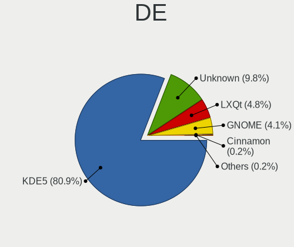
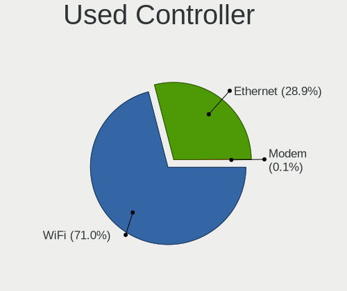
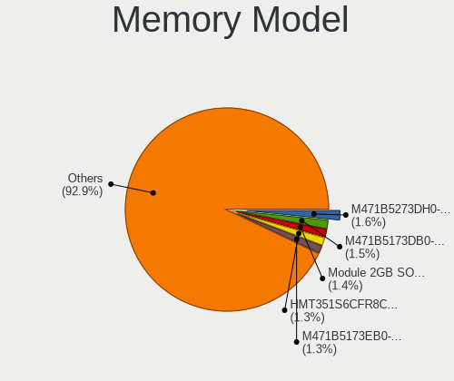

OpenMandriva - Tested Hardware & Statistics (Notebooks)
-------------------------------------------------------

A project to collect tested hardware configurations for OpenMandriva.

Anyone can contribute to this report by the [hw-probe](https://github.com/linuxhw/hw-probe) tool:

    sudo -E hw-probe -all -upload

Please contribute! Especially if your hardware is rare.

Contents
--------

* [ Test Cases ](#test-cases)

* [ System ](#system)
  - [ OS                       ](#os)
  - [ OS Family                ](#os-family)
  - [ Kernel                   ](#kernel)
  - [ Kernel Family            ](#kernel-family)
  - [ Kernel Major Ver.        ](#kernel-major-ver)
  - [ Arch                     ](#arch)
  - [ DE                       ](#de)
  - [ Display Server           ](#display-server)
  - [ Display Manager          ](#display-manager)
  - [ OS Lang                  ](#os-lang)
  - [ Boot Mode                ](#boot-mode)
  - [ Filesystem               ](#filesystem)
  - [ Part. scheme             ](#part-scheme)
  - [ Dual Boot with Linux/BSD ](#dual-boot-with-linuxbsd)
  - [ Dual Boot (Win)          ](#dual-boot-win)

* [ Board ](#board)
  - [ Vendor                   ](#vendor)
  - [ Model                    ](#model)
  - [ Model Family             ](#model-family)
  - [ MFG Year                 ](#mfg-year)
  - [ Form Factor              ](#form-factor)
  - [ Secure Boot              ](#secure-boot)
  - [ Coreboot                 ](#coreboot)
  - [ RAM Size                 ](#ram-size)
  - [ RAM Used                 ](#ram-used)
  - [ Total Drives             ](#total-drives)
  - [ Has CD-ROM               ](#has-cd-rom)
  - [ Has Ethernet             ](#has-ethernet)
  - [ Has WiFi                 ](#has-wifi)
  - [ Has Bluetooth            ](#has-bluetooth)

* [ Location ](#location)
  - [ Country                  ](#country)
  - [ City                     ](#city)

* [ Drives ](#drives)
  - [ Drive Vendor             ](#drive-vendor)
  - [ Drive Model              ](#drive-model)
  - [ HDD Vendor               ](#hdd-vendor)
  - [ SSD Vendor               ](#ssd-vendor)
  - [ Drive Kind               ](#drive-kind)
  - [ Drive Connector          ](#drive-connector)
  - [ Drive Size               ](#drive-size)
  - [ Space Total              ](#space-total)
  - [ Space Used               ](#space-used)
  - [ Malfunc. Drives          ](#malfunc-drives)
  - [ Malfunc. Drive Vendor    ](#malfunc-drive-vendor)
  - [ Malfunc. HDD Vendor      ](#malfunc-hdd-vendor)
  - [ Malfunc. Drive Kind      ](#malfunc-drive-kind)
  - [ Failed Drives            ](#failed-drives)
  - [ Failed Drive Vendor      ](#failed-drive-vendor)
  - [ Drive Status             ](#drive-status)

* [ Storage controller ](#storage-controller)
  - [ Storage Vendor           ](#storage-vendor)
  - [ Storage Model            ](#storage-model)
  - [ Storage Kind             ](#storage-kind)

* [ Processor ](#processor)
  - [ CPU Vendor               ](#cpu-vendor)
  - [ CPU Model                ](#cpu-model)
  - [ CPU Model Family         ](#cpu-model-family)
  - [ CPU Cores                ](#cpu-cores)
  - [ CPU Sockets              ](#cpu-sockets)
  - [ CPU Threads              ](#cpu-threads)
  - [ CPU Op-Modes             ](#cpu-op-modes)
  - [ CPU Microcode            ](#cpu-microcode)
  - [ CPU Microarch            ](#cpu-microarch)

* [ Graphics ](#graphics)
  - [ GPU Vendor               ](#gpu-vendor)
  - [ GPU Model                ](#gpu-model)
  - [ GPU Combo                ](#gpu-combo)
  - [ GPU Driver               ](#gpu-driver)
  - [ GPU Memory               ](#gpu-memory)

* [ Monitor ](#monitor)
  - [ Monitor Vendor           ](#monitor-vendor)
  - [ Monitor Model            ](#monitor-model)
  - [ Monitor Resolution       ](#monitor-resolution)
  - [ Monitor Diagonal         ](#monitor-diagonal)
  - [ Monitor Width            ](#monitor-width)
  - [ Aspect Ratio             ](#aspect-ratio)
  - [ Monitor Area             ](#monitor-area)
  - [ Pixel Density            ](#pixel-density)
  - [ Multiple Monitors        ](#multiple-monitors)

* [ Network ](#network)
  - [ Net Controller Vendor    ](#net-controller-vendor)
  - [ Net Controller Model     ](#net-controller-model)
  - [ Wireless Vendor          ](#wireless-vendor)
  - [ Wireless Model           ](#wireless-model)
  - [ Ethernet Vendor          ](#ethernet-vendor)
  - [ Ethernet Model           ](#ethernet-model)
  - [ Net Controller Kind      ](#net-controller-kind)
  - [ Used Controller          ](#used-controller)
  - [ NICs                     ](#nics)
  - [ IPv6                     ](#ipv6)

* [ Bluetooth ](#bluetooth)
  - [ Bluetooth Vendor         ](#bluetooth-vendor)
  - [ Bluetooth Model          ](#bluetooth-model)

* [ Sound ](#sound)
  - [ Sound Vendor             ](#sound-vendor)
  - [ Sound Model              ](#sound-model)

* [ Memory ](#memory)
  - [ Memory Vendor            ](#memory-vendor)
  - [ Memory Model             ](#memory-model)
  - [ Memory Kind              ](#memory-kind)
  - [ Memory Form Factor       ](#memory-form-factor)
  - [ Memory Size              ](#memory-size)
  - [ Memory Speed             ](#memory-speed)

* [ Printers & scanners ](#printers--scanners)
  - [ Printer Vendor           ](#printer-vendor)
  - [ Printer Model            ](#printer-model)
  - [ Scanner Vendor           ](#scanner-vendor)
  - [ Scanner Model            ](#scanner-model)

* [ Camera ](#camera)
  - [ Camera Vendor            ](#camera-vendor)
  - [ Camera Model             ](#camera-model)

* [ Security ](#security)
  - [ Fingerprint Vendor       ](#fingerprint-vendor)
  - [ Fingerprint Model        ](#fingerprint-model)
  - [ Chipcard Vendor          ](#chipcard-vendor)
  - [ Chipcard Model           ](#chipcard-model)

* [ Unsupported ](#unsupported)
  - [ Unsupported Devices      ](#unsupported-devices)
  - [ Unsupported Device Types ](#unsupported-device-types)

Test Cases
----------

Total: 7742

| Vendor        | Model                       | Probe                                                      | Date         |
|---------------|-----------------------------|------------------------------------------------------------|--------------|
| HP            | Laptop 17-cn0xxx            | [aa4b869750](https://linux-hardware.org/?probe=aa4b869750) | Oct 01, 2023 |
| ASUSTek       | VivoBook_ASUSLaptop X512... | [2127748080](https://linux-hardware.org/?probe=2127748080) | Oct 01, 2023 |
| Acer          | Aspire A315-58              | [bbab99a4f7](https://linux-hardware.org/?probe=bbab99a4f7) | Sep 30, 2023 |
| Medion        | Deputy P40                  | [7e0fc5b52d](https://linux-hardware.org/?probe=7e0fc5b52d) | Sep 30, 2023 |
| Lenovo        | ThinkPad L530 24783R8       | [eda040f456](https://linux-hardware.org/?probe=eda040f456) | Sep 30, 2023 |
| Acer          | Aspire 5560                 | [252d19e4f5](https://linux-hardware.org/?probe=252d19e4f5) | Sep 30, 2023 |
| Toshiba       | Satellite L500              | [9c1b258088](https://linux-hardware.org/?probe=9c1b258088) | Sep 30, 2023 |
| Lenovo        | ThinkPad X1 Carbon 3rd 2... | [2edc7ab56b](https://linux-hardware.org/?probe=2edc7ab56b) | Sep 30, 2023 |
| Toshiba       | Satellite C845D             | [92651c9e51](https://linux-hardware.org/?probe=92651c9e51) | Sep 30, 2023 |
| Lenovo        | 300s-15ARR 81FB             | [4f7e627fd2](https://linux-hardware.org/?probe=4f7e627fd2) | Sep 30, 2023 |
| Lenovo        | Z50-70 20354                | [eb33abdaae](https://linux-hardware.org/?probe=eb33abdaae) | Sep 29, 2023 |
| ASUSTek       | UX31E                       | [1b6440f722](https://linux-hardware.org/?probe=1b6440f722) | Sep 29, 2023 |
| HP            | ENVY TS Sleekbook 4         | [545098d0d2](https://linux-hardware.org/?probe=545098d0d2) | Sep 29, 2023 |
| OEGStone      | C4100/C5100                 | [0c27e50b14](https://linux-hardware.org/?probe=0c27e50b14) | Sep 29, 2023 |
| ASUSTek       | VivoBook_ASUSLaptop X412... | [6348992a72](https://linux-hardware.org/?probe=6348992a72) | Sep 29, 2023 |
| Dell          | Inspiron 5570               | [7975260826](https://linux-hardware.org/?probe=7975260826) | Sep 29, 2023 |
| SKIKK         | Sindri 14                   | [9766c80aa9](https://linux-hardware.org/?probe=9766c80aa9) | Sep 29, 2023 |
| Dell          | Inspiron 3542               | [b7faf1054b](https://linux-hardware.org/?probe=b7faf1054b) | Sep 29, 2023 |
| Lenovo        | IdeaPad 3 15IIL05 81WE      | [902918fb1d](https://linux-hardware.org/?probe=902918fb1d) | Sep 29, 2023 |
| HP            | EliteBook 2760p             | [e9d026d0df](https://linux-hardware.org/?probe=e9d026d0df) | Sep 29, 2023 |
| HP            | Compaq Presario CQ70        | [8913bbd459](https://linux-hardware.org/?probe=8913bbd459) | Sep 28, 2023 |
| ASUSTek       | VivoBook_ASUSLaptop X509... | [fb4cde69b8](https://linux-hardware.org/?probe=fb4cde69b8) | Sep 28, 2023 |
| HP            | Laptop 17-bs0xx             | [85548f2790](https://linux-hardware.org/?probe=85548f2790) | Sep 28, 2023 |
| HP            | ElitePad 1000 G2            | [9c4b30a15c](https://linux-hardware.org/?probe=9c4b30a15c) | Sep 27, 2023 |
| Toshiba       | Satellite A200              | [6bdac98313](https://linux-hardware.org/?probe=6bdac98313) | Sep 27, 2023 |
| HP            | ElitePad 1000 G2            | [ee4b3f2b76](https://linux-hardware.org/?probe=ee4b3f2b76) | Sep 26, 2023 |
| LG Electro... | 13U70Q-G.AA75B              | [f38b79055b](https://linux-hardware.org/?probe=f38b79055b) | Sep 26, 2023 |
| Samsung       | R519/R719                   | [15ae7c9603](https://linux-hardware.org/?probe=15ae7c9603) | Sep 26, 2023 |
| Lenovo        | ThinkPad T460 20FMS0RN1S    | [598d621f0d](https://linux-hardware.org/?probe=598d621f0d) | Sep 26, 2023 |
| HP            | EliteBook 840 G3            | [897f671915](https://linux-hardware.org/?probe=897f671915) | Sep 25, 2023 |
| ASUSTek       | UL80VT                      | [1d3c36ccf4](https://linux-hardware.org/?probe=1d3c36ccf4) | Sep 25, 2023 |
| Dell          | Vostro 1000                 | [38499a1a0f](https://linux-hardware.org/?probe=38499a1a0f) | Sep 25, 2023 |
| Toshiba       | Satellite C50-B             | [92a5c3605c](https://linux-hardware.org/?probe=92a5c3605c) | Sep 25, 2023 |
| Toshiba       | dynabook Satellite B350/... | [2b241af774](https://linux-hardware.org/?probe=2b241af774) | Sep 25, 2023 |
| HP            | Laptop 17-cn0xxx            | [10ec627bad](https://linux-hardware.org/?probe=10ec627bad) | Sep 25, 2023 |
| Acer          | Aspire F5-573G              | [a2f6814940](https://linux-hardware.org/?probe=a2f6814940) | Sep 25, 2023 |
| Acer          | Aspire E5-571               | [e74a87d3f4](https://linux-hardware.org/?probe=e74a87d3f4) | Sep 25, 2023 |
| Acer          | Nitro AN515-51              | [6d6d719f30](https://linux-hardware.org/?probe=6d6d719f30) | Sep 25, 2023 |
| HP            | ElitePad 1000 G2            | [5cfbe2e7e0](https://linux-hardware.org/?probe=5cfbe2e7e0) | Sep 24, 2023 |
| Acer          | Aspire 7730G                | [e21c91c34c](https://linux-hardware.org/?probe=e21c91c34c) | Sep 24, 2023 |
| Toshiba       | Satellite L45-B             | [e998b320d8](https://linux-hardware.org/?probe=e998b320d8) | Sep 24, 2023 |
| Lenovo        | G580 20150                  | [f55e42a884](https://linux-hardware.org/?probe=f55e42a884) | Sep 24, 2023 |
| Toshiba       | Satellite S50t-B            | [a574ee83ff](https://linux-hardware.org/?probe=a574ee83ff) | Sep 24, 2023 |
| Dell          | System Vostro 3750          | [3b050c2582](https://linux-hardware.org/?probe=3b050c2582) | Sep 24, 2023 |
| Lenovo        | IdeaPad 320-15ISK 80XH      | [ff891ca545](https://linux-hardware.org/?probe=ff891ca545) | Sep 24, 2023 |
| Acer          | Aspire 5734Z                | [d5219dbfbe](https://linux-hardware.org/?probe=d5219dbfbe) | Sep 24, 2023 |
| Unknown       | Unknown                     | [940b1d1eeb](https://linux-hardware.org/?probe=940b1d1eeb) | Sep 23, 2023 |
| HP            | Dev One Notebook PC         | [1cc979900b](https://linux-hardware.org/?probe=1cc979900b) | Sep 23, 2023 |
| Acer          | Aspire 5732Z                | [c86094eac8](https://linux-hardware.org/?probe=c86094eac8) | Sep 23, 2023 |
| Lenovo        | IdeaPad 3 14IIL05 81WD      | [683cbd037a](https://linux-hardware.org/?probe=683cbd037a) | Sep 23, 2023 |
| Lenovo        | ThinkPad L15 Gen 1 20U8S... | [13a9f1d65a](https://linux-hardware.org/?probe=13a9f1d65a) | Sep 23, 2023 |
| HP            | Laptop 15-dw1xxx            | [be4a46768b](https://linux-hardware.org/?probe=be4a46768b) | Sep 23, 2023 |
| HP            | EliteBook 840 G6            | [10cd0244af](https://linux-hardware.org/?probe=10cd0244af) | Sep 23, 2023 |
| Samsung       | 935XDB                      | [a0672b9726](https://linux-hardware.org/?probe=a0672b9726) | Sep 23, 2023 |
| ASUSTek       | X750JB                      | [b9db8f6f02](https://linux-hardware.org/?probe=b9db8f6f02) | Sep 23, 2023 |
| HP            | ProBook 4515s               | [0b755bf978](https://linux-hardware.org/?probe=0b755bf978) | Sep 22, 2023 |
| LG Electro... | 16Z90P-K.AAS9U1             | [5e60864354](https://linux-hardware.org/?probe=5e60864354) | Sep 22, 2023 |
| Acer          | Aspire A515-47              | [2676f29c41](https://linux-hardware.org/?probe=2676f29c41) | Sep 22, 2023 |
| Dell          | Latitude E7440              | [53e90ca355](https://linux-hardware.org/?probe=53e90ca355) | Sep 22, 2023 |
| Apple         | MacBookPro12,1              | [b8b562cc39](https://linux-hardware.org/?probe=b8b562cc39) | Sep 22, 2023 |
| HP            | OMEN by Laptop 15-dc1xxx    | [57c3bb43f5](https://linux-hardware.org/?probe=57c3bb43f5) | Sep 22, 2023 |
| HP            | Pavilion g6                 | [c5833405a5](https://linux-hardware.org/?probe=c5833405a5) | Sep 22, 2023 |
| HP            | EliteBook 840 G5            | [03d461d3af](https://linux-hardware.org/?probe=03d461d3af) | Sep 22, 2023 |
| Acer          | Aspire VN7-571G             | [0314ce541e](https://linux-hardware.org/?probe=0314ce541e) | Sep 22, 2023 |
| Acer          | Nitro AN515-57              | [05c9cbc8e5](https://linux-hardware.org/?probe=05c9cbc8e5) | Sep 22, 2023 |
| Acer          | Extensa 5635ZG              | [925fed495b](https://linux-hardware.org/?probe=925fed495b) | Sep 21, 2023 |
| Lenovo        | ThinkPad X220 4286BB2       | [a3b217a707](https://linux-hardware.org/?probe=a3b217a707) | Sep 21, 2023 |
| Acer          | Aspire A114-33              | [4b581786a8](https://linux-hardware.org/?probe=4b581786a8) | Sep 21, 2023 |
| Acer          | Aspire F5-571               | [21bcc4a506](https://linux-hardware.org/?probe=21bcc4a506) | Sep 21, 2023 |
| ASUSTek       | TP550LAB                    | [3e07304aa5](https://linux-hardware.org/?probe=3e07304aa5) | Sep 20, 2023 |
| Samsung       | 340XAA/350XAA/550XAA        | [5a74bb7dde](https://linux-hardware.org/?probe=5a74bb7dde) | Sep 20, 2023 |
| HP            | EliteBook 845 14 inch G9... | [35d24c31cf](https://linux-hardware.org/?probe=35d24c31cf) | Sep 20, 2023 |
| Dell          | Latitude 3540               | [3f1c99de44](https://linux-hardware.org/?probe=3f1c99de44) | Sep 20, 2023 |
| ASUSTek       | X453MA                      | [8eacbd2f7a](https://linux-hardware.org/?probe=8eacbd2f7a) | Sep 19, 2023 |
| Dell          | Inspiron 3442               | [1f6ca2e4f7](https://linux-hardware.org/?probe=1f6ca2e4f7) | Sep 19, 2023 |
| Acer          | Nitro AN517-52              | [32f2e74fe3](https://linux-hardware.org/?probe=32f2e74fe3) | Sep 19, 2023 |
| Acer          | Aspire A315-22G             | [0c047cb731](https://linux-hardware.org/?probe=0c047cb731) | Sep 19, 2023 |
| ASUSTek       | VivoBook_ASUSLaptop E410... | [1180346586](https://linux-hardware.org/?probe=1180346586) | Sep 19, 2023 |
| HP            | EliteBook 8470p             | [a8995def08](https://linux-hardware.org/?probe=a8995def08) | Sep 19, 2023 |
| Lenovo        | ThinkPad X240 20AMA1S702    | [5be3b8fc11](https://linux-hardware.org/?probe=5be3b8fc11) | Sep 19, 2023 |
| Acer          | Aspire 5742                 | [430ed1fe6c](https://linux-hardware.org/?probe=430ed1fe6c) | Sep 19, 2023 |
| HP            | Laptop 15s-eq2xxx           | [53549e3b08](https://linux-hardware.org/?probe=53549e3b08) | Sep 18, 2023 |
| Lenovo        | ThinkPad T440s 20ARS0NF0... | [54aa39a845](https://linux-hardware.org/?probe=54aa39a845) | Sep 18, 2023 |
| Acer          | Swift SF314-42              | [1519801016](https://linux-hardware.org/?probe=1519801016) | Sep 18, 2023 |
| HP            | Notebook                    | [0c80a5c83f](https://linux-hardware.org/?probe=0c80a5c83f) | Sep 18, 2023 |
| MSI           | Modern 14 C11M              | [4c6156df05](https://linux-hardware.org/?probe=4c6156df05) | Sep 18, 2023 |
| ASUSTek       | ASUS TUF Gaming F15 FX50... | [cad09f007e](https://linux-hardware.org/?probe=cad09f007e) | Sep 18, 2023 |
| Schenker      | XMG CORE (M19, GTX 1650)    | [612bda7c21](https://linux-hardware.org/?probe=612bda7c21) | Sep 17, 2023 |
| ASUSTek       | P52F                        | [6be70b4b24](https://linux-hardware.org/?probe=6be70b4b24) | Sep 17, 2023 |
| Lenovo        | ThinkPad L440 20ASEB3       | [20d35c7482](https://linux-hardware.org/?probe=20d35c7482) | Sep 17, 2023 |
| Toshiba       | Satellite Pro R50-B         | [e3a895eaa7](https://linux-hardware.org/?probe=e3a895eaa7) | Sep 17, 2023 |
| Notebook      | NP5x_6x_7x_SNx              | [83be57b9aa](https://linux-hardware.org/?probe=83be57b9aa) | Sep 17, 2023 |
| Dell          | System XPS L502X            | [d3154f94d7](https://linux-hardware.org/?probe=d3154f94d7) | Sep 17, 2023 |
| Lenovo        | ThinkPad X270 W10DG 20K6... | [1a5acc2c10](https://linux-hardware.org/?probe=1a5acc2c10) | Sep 17, 2023 |
| NEC Comput... | PC-VK15EBZDG                | [83d74c1e9d](https://linux-hardware.org/?probe=83d74c1e9d) | Sep 17, 2023 |
| ASUSTek       | K52JT                       | [5cf28fa81f](https://linux-hardware.org/?probe=5cf28fa81f) | Sep 16, 2023 |
| HP            | EliteBook 725 G3            | [6086fd0180](https://linux-hardware.org/?probe=6086fd0180) | Sep 16, 2023 |
| Lenovo        | ThinkPad T420 4236B27       | [8cd0ed072f](https://linux-hardware.org/?probe=8cd0ed072f) | Sep 16, 2023 |
| Compaq        | 420                         | [a0ce747ff2](https://linux-hardware.org/?probe=a0ce747ff2) | Sep 16, 2023 |
| HP            | 15                          | [636b9a80a1](https://linux-hardware.org/?probe=636b9a80a1) | Sep 15, 2023 |
| Fujitsu       | LIFEBOOK E733               | [0613157456](https://linux-hardware.org/?probe=0613157456) | Sep 15, 2023 |
| Lenovo        | IdeaPad 3 17ADA05 81W2      | [e1ac878fa3](https://linux-hardware.org/?probe=e1ac878fa3) | Sep 15, 2023 |
| Lenovo        | ThinkPad T430 2349CV8       | [80e76d50db](https://linux-hardware.org/?probe=80e76d50db) | Sep 15, 2023 |
| HP            | Compaq 615                  | [f2f7659e5b](https://linux-hardware.org/?probe=f2f7659e5b) | Sep 15, 2023 |
| Lenovo        | ThinkPad T450 20BV000BUS    | [3959de124c](https://linux-hardware.org/?probe=3959de124c) | Sep 14, 2023 |
| HP            | Laptop 15-bw0xx             | [c0bcb5b2c6](https://linux-hardware.org/?probe=c0bcb5b2c6) | Sep 14, 2023 |
| Dell          | Venue 11 Pro 7130 vPro      | [4ec1be4c03](https://linux-hardware.org/?probe=4ec1be4c03) | Sep 13, 2023 |
| Dell          | Latitude 3420               | [e78cbe0564](https://linux-hardware.org/?probe=e78cbe0564) | Sep 13, 2023 |
| HP            | Notebook                    | [1f0357e569](https://linux-hardware.org/?probe=1f0357e569) | Sep 13, 2023 |
| Positivo      | C14CR21                     | [9d48466eab](https://linux-hardware.org/?probe=9d48466eab) | Sep 13, 2023 |
| ASUSTek       | VivoBook_ASUSLaptop E210... | [1b8a46fc57](https://linux-hardware.org/?probe=1b8a46fc57) | Sep 13, 2023 |
| Acer          | Aspire ES1-311              | [d191439979](https://linux-hardware.org/?probe=d191439979) | Sep 13, 2023 |
| ASUSTek       | G74Sx                       | [aad78d1633](https://linux-hardware.org/?probe=aad78d1633) | Sep 12, 2023 |
| Lenovo        | ThinkPad T61 7659VKF        | [1f07dfc17a](https://linux-hardware.org/?probe=1f07dfc17a) | Sep 12, 2023 |
| LG Electro... | C400-G.BC22P1               | [caef8df1be](https://linux-hardware.org/?probe=caef8df1be) | Sep 12, 2023 |
| Dell          | Latitude E4200              | [ab13ebe930](https://linux-hardware.org/?probe=ab13ebe930) | Sep 12, 2023 |
| Acer          | Aspire A315-21              | [a7fca90eab](https://linux-hardware.org/?probe=a7fca90eab) | Sep 12, 2023 |
| Lenovo        | ThinkPad Edge E431 62779... | [68f0df2a6c](https://linux-hardware.org/?probe=68f0df2a6c) | Sep 12, 2023 |
| Samsung       | 300E4M/300E4S/300E4L        | [a1f824e885](https://linux-hardware.org/?probe=a1f824e885) | Sep 12, 2023 |
| Dell          | Inspiron 5458               | [ab3824f3d0](https://linux-hardware.org/?probe=ab3824f3d0) | Sep 11, 2023 |
| Acer          | Aspire A315-23              | [ecdef7173c](https://linux-hardware.org/?probe=ecdef7173c) | Sep 11, 2023 |
| ASUSTek       | VivoBook_ASUSLaptop X415... | [825795d0df](https://linux-hardware.org/?probe=825795d0df) | Sep 11, 2023 |
| LIVEFAN       | Unknown                     | [102a13c2c5](https://linux-hardware.org/?probe=102a13c2c5) | Sep 11, 2023 |
| Acer          | AOD270                      | [d7d4474d69](https://linux-hardware.org/?probe=d7d4474d69) | Sep 11, 2023 |
| Dell          | Latitude E7440              | [7813372525](https://linux-hardware.org/?probe=7813372525) | Sep 11, 2023 |
| Lenovo        | Z710 20250                  | [9f1aed2560](https://linux-hardware.org/?probe=9f1aed2560) | Sep 10, 2023 |
| Dell          | Vostro 3550                 | [4f0a6ec78c](https://linux-hardware.org/?probe=4f0a6ec78c) | Sep 10, 2023 |
| HP            | 255 G7 Notebook PC          | [c5be1f9523](https://linux-hardware.org/?probe=c5be1f9523) | Sep 10, 2023 |
| Dell          | Inspiron 11-3162            | [600d8479fe](https://linux-hardware.org/?probe=600d8479fe) | Sep 10, 2023 |
| Dell          | Latitude E6430              | [699eae450e](https://linux-hardware.org/?probe=699eae450e) | Sep 10, 2023 |
| Fujitsu       | LIFEBOOK S752               | [de16eeb9ef](https://linux-hardware.org/?probe=de16eeb9ef) | Sep 09, 2023 |
| Dell          | Inspiron 3501               | [f7eae2e7c4](https://linux-hardware.org/?probe=f7eae2e7c4) | Sep 09, 2023 |
| ASUSTek       | X541UVK                     | [1a943fda98](https://linux-hardware.org/?probe=1a943fda98) | Sep 09, 2023 |
| Dell          | Latitude E6400              | [e42cf159af](https://linux-hardware.org/?probe=e42cf159af) | Sep 09, 2023 |
| Lenovo        | V15 G2 ALC 82KD             | [c320e0c618](https://linux-hardware.org/?probe=c320e0c618) | Sep 09, 2023 |
| ASUSTek       | X201EP                      | [a714c5a35a](https://linux-hardware.org/?probe=a714c5a35a) | Sep 09, 2023 |
| Lenovo        | ThinkPad T470 W10DG 20JM... | [218489cc3f](https://linux-hardware.org/?probe=218489cc3f) | Sep 09, 2023 |
| HP            | ProBook 640 G1              | [75c6651a69](https://linux-hardware.org/?probe=75c6651a69) | Sep 09, 2023 |
| HP            | Pavilion m6                 | [2fb7dbd455](https://linux-hardware.org/?probe=2fb7dbd455) | Sep 09, 2023 |
| Dell          | Latitude E6410              | [9b57eaa1eb](https://linux-hardware.org/?probe=9b57eaa1eb) | Sep 09, 2023 |
| HP            | ProBook 6470b               | [1c8817d025](https://linux-hardware.org/?probe=1c8817d025) | Sep 09, 2023 |
| Dell          | Latitude 7390               | [3644f0b002](https://linux-hardware.org/?probe=3644f0b002) | Sep 08, 2023 |
| HP            | Notebook                    | [5a36d2a3bf](https://linux-hardware.org/?probe=5a36d2a3bf) | Sep 08, 2023 |
| Apple         | MacBookPro10,1              | [81aab795b5](https://linux-hardware.org/?probe=81aab795b5) | Sep 08, 2023 |
| Acer          | Nitro AN515-44              | [032db27cfa](https://linux-hardware.org/?probe=032db27cfa) | Sep 08, 2023 |
| Lenovo        | V15-ADA 82C7                | [d98be8d71c](https://linux-hardware.org/?probe=d98be8d71c) | Sep 08, 2023 |
| ASUSTek       | VivoBook_ASUSLaptop X513... | [ecef237a9c](https://linux-hardware.org/?probe=ecef237a9c) | Sep 07, 2023 |
| ASUSTek       | UL80VT                      | [daa7101bf4](https://linux-hardware.org/?probe=daa7101bf4) | Sep 07, 2023 |
| Samsung       | 300E5M/300E5L               | [8274cbca33](https://linux-hardware.org/?probe=8274cbca33) | Sep 07, 2023 |
| Acer          | AO722                       | [ae49a1e9c0](https://linux-hardware.org/?probe=ae49a1e9c0) | Sep 07, 2023 |
| Lenovo        | V15-IGL 82C3                | [78ecb1b882](https://linux-hardware.org/?probe=78ecb1b882) | Sep 07, 2023 |
| Apple         | MacBookPro9,2               | [f3bdad3061](https://linux-hardware.org/?probe=f3bdad3061) | Sep 07, 2023 |
| Dell          | Latitude 5480               | [166d57f310](https://linux-hardware.org/?probe=166d57f310) | Sep 07, 2023 |
| Google        | Blooguard                   | [c9dec98f0f](https://linux-hardware.org/?probe=c9dec98f0f) | Sep 07, 2023 |
| HP            | Pavilion Gaming Laptop 1... | [5254176a5a](https://linux-hardware.org/?probe=5254176a5a) | Sep 07, 2023 |
| Lenovo        | IdeaPad 330-15IKB 81FE      | [7410c2416c](https://linux-hardware.org/?probe=7410c2416c) | Sep 07, 2023 |
| HP            | EliteBook 2740p             | [0bada236bc](https://linux-hardware.org/?probe=0bada236bc) | Sep 07, 2023 |
| Clevo         | M1100M                      | [399b796d9f](https://linux-hardware.org/?probe=399b796d9f) | Sep 06, 2023 |
| Acer          | Swift SF314-51              | [7e7c32364d](https://linux-hardware.org/?probe=7e7c32364d) | Sep 06, 2023 |
| MSI           | GE70 2PE                    | [19dddb0418](https://linux-hardware.org/?probe=19dddb0418) | Sep 06, 2023 |
| MSI           | Bravo 15 C7VF               | [72b288770a](https://linux-hardware.org/?probe=72b288770a) | Sep 06, 2023 |
| ASUSTek       | ASUS TUF Gaming F17 FX70... | [34fb398b78](https://linux-hardware.org/?probe=34fb398b78) | Sep 06, 2023 |
| MSI           | GS60 2PC Ghost              | [0b971b067a](https://linux-hardware.org/?probe=0b971b067a) | Sep 06, 2023 |
| Lenovo        | IdeaPad Z360                | [1bb5ebf339](https://linux-hardware.org/?probe=1bb5ebf339) | Sep 06, 2023 |
| Google        | Pirika                      | [e05149e1de](https://linux-hardware.org/?probe=e05149e1de) | Sep 06, 2023 |
| Lenovo        | V110-15IAP 80TG             | [783815f79f](https://linux-hardware.org/?probe=783815f79f) | Sep 06, 2023 |
| HP            | Notebook                    | [ad9bafda30](https://linux-hardware.org/?probe=ad9bafda30) | Sep 06, 2023 |
| HP            | Pavilion dv4                | [0b01aaddd6](https://linux-hardware.org/?probe=0b01aaddd6) | Sep 06, 2023 |
| Lenovo        | IdeaPad S130-14IGM 81J2     | [dd18138503](https://linux-hardware.org/?probe=dd18138503) | Sep 06, 2023 |
| Purism        | Librem 15 v3                | [d3a66abc8b](https://linux-hardware.org/?probe=d3a66abc8b) | Sep 05, 2023 |
| Lenovo        | ThinkPad T450 20BUS3L502    | [cb8de94658](https://linux-hardware.org/?probe=cb8de94658) | Sep 05, 2023 |
| ASUSTek       | X751LD                      | [ed90b83cc0](https://linux-hardware.org/?probe=ed90b83cc0) | Sep 05, 2023 |
| HP            | Laptop 15s-eq2xxx           | [344c861540](https://linux-hardware.org/?probe=344c861540) | Sep 05, 2023 |
| ASUSTek       | UL80VT                      | [aec41416ac](https://linux-hardware.org/?probe=aec41416ac) | Sep 05, 2023 |
| Acer          | Aspire V3-572P              | [1b021435e8](https://linux-hardware.org/?probe=1b021435e8) | Sep 05, 2023 |
| Dell          | Inspiron 3482               | [078746577b](https://linux-hardware.org/?probe=078746577b) | Sep 05, 2023 |
| Toshiba       | Satellite C650              | [0b87bf5b4b](https://linux-hardware.org/?probe=0b87bf5b4b) | Sep 05, 2023 |
| Toshiba       | Satellite C850-1DZ          | [cf916c2f33](https://linux-hardware.org/?probe=cf916c2f33) | Sep 05, 2023 |
| HP            | mt40                        | [c3a4682e40](https://linux-hardware.org/?probe=c3a4682e40) | Sep 04, 2023 |
| HP            | Notebook                    | [3a7a5608af](https://linux-hardware.org/?probe=3a7a5608af) | Sep 04, 2023 |
| Dell          | Inspiron 5567               | [3b740d65f2](https://linux-hardware.org/?probe=3b740d65f2) | Sep 04, 2023 |
| Lenovo        | ThinkPad T470 20HD000RUS    | [f7250cb3ae](https://linux-hardware.org/?probe=f7250cb3ae) | Sep 04, 2023 |
| ASUSTek       | VivoBook_ASUSLaptop M160... | [08e7b606c8](https://linux-hardware.org/?probe=08e7b606c8) | Sep 04, 2023 |
| ASUSTek       | N73SV                       | [1e0b979775](https://linux-hardware.org/?probe=1e0b979775) | Sep 04, 2023 |
| Lenovo        | ThinkPad SL510 28473QB      | [e1ff8baa87](https://linux-hardware.org/?probe=e1ff8baa87) | Sep 04, 2023 |
| Acer          | Aspire 4741                 | [2f2b673625](https://linux-hardware.org/?probe=2f2b673625) | Sep 04, 2023 |
| Dell          | Precision M4800             | [2e40a27b2e](https://linux-hardware.org/?probe=2e40a27b2e) | Sep 04, 2023 |
| Dell          | Vostro 5590                 | [24ee101fee](https://linux-hardware.org/?probe=24ee101fee) | Sep 04, 2023 |
| Acer          | Aspire A315-56              | [1f090fc4fd](https://linux-hardware.org/?probe=1f090fc4fd) | Sep 04, 2023 |
| ASUSTek       | K53TA                       | [b173b156f9](https://linux-hardware.org/?probe=b173b156f9) | Sep 04, 2023 |
| Apple         | MacBookPro11,1              | [d8efe50ca5](https://linux-hardware.org/?probe=d8efe50ca5) | Sep 04, 2023 |
| HP            | Laptop 17-by0xxx            | [7c149b5f95](https://linux-hardware.org/?probe=7c149b5f95) | Sep 04, 2023 |
| Lenovo        | IdeaPad 510-15IKB 80SV      | [b3e23f1718](https://linux-hardware.org/?probe=b3e23f1718) | Sep 04, 2023 |
| HUAWEI        | NBLK-WAX9X                  | [02c4374b47](https://linux-hardware.org/?probe=02c4374b47) | Sep 04, 2023 |
| Lenovo        | ThinkPad X1 Carbon 3rd 2... | [5f9e18ee26](https://linux-hardware.org/?probe=5f9e18ee26) | Sep 04, 2023 |
| HP            | ProBook 650 G2              | [64026d5e6d](https://linux-hardware.org/?probe=64026d5e6d) | Sep 04, 2023 |
| Lenovo        | V130-15IKB 81HN             | [760698ac8a](https://linux-hardware.org/?probe=760698ac8a) | Sep 04, 2023 |
| Dell          | Inspiron 3542               | [6046f9d74b](https://linux-hardware.org/?probe=6046f9d74b) | Sep 04, 2023 |
| Lenovo        | V15-ADA 82C7                | [85cc15f8ea](https://linux-hardware.org/?probe=85cc15f8ea) | Sep 04, 2023 |
| HP            | EliteBook 840 G1            | [318d03cfad](https://linux-hardware.org/?probe=318d03cfad) | Sep 04, 2023 |
| Gigabyte      | GB-BKi3A-7100               | [40c832efb9](https://linux-hardware.org/?probe=40c832efb9) | Sep 04, 2023 |
| ASUSTek       | X75A1                       | [d8be6d6952](https://linux-hardware.org/?probe=d8be6d6952) | Sep 04, 2023 |
| Compaq        | 430                         | [ac9fb09e14](https://linux-hardware.org/?probe=ac9fb09e14) | Sep 04, 2023 |
| AXIOO         | Mybook 14E                  | [b6ddb628dc](https://linux-hardware.org/?probe=b6ddb628dc) | Sep 04, 2023 |
| SLIMBOOK      | PROX14-AMD                  | [c2da44c04f](https://linux-hardware.org/?probe=c2da44c04f) | Sep 04, 2023 |
| HP            | Pavilion Laptop 14-dv0xx... | [ee6914ebdf](https://linux-hardware.org/?probe=ee6914ebdf) | Sep 04, 2023 |
| ASUSTek       | N56JN                       | [eb9458de08](https://linux-hardware.org/?probe=eb9458de08) | Sep 04, 2023 |
| HP            | 1000                        | [59cd8d1250](https://linux-hardware.org/?probe=59cd8d1250) | Sep 04, 2023 |
| Sony          | VPCEB27FX                   | [268d3a14a7](https://linux-hardware.org/?probe=268d3a14a7) | Sep 04, 2023 |
| HP            | 247 G8 Notebook PC          | [74a7d9e304](https://linux-hardware.org/?probe=74a7d9e304) | Sep 04, 2023 |
| Chuwi         | GemiBook XPro               | [acf39c0e3f](https://linux-hardware.org/?probe=acf39c0e3f) | Sep 04, 2023 |
| ASUSTek       | TUF Gaming FA706IU_FA706... | [479e3b96b2](https://linux-hardware.org/?probe=479e3b96b2) | Sep 04, 2023 |
| Dell          | Latitude 5480               | [3a25585a10](https://linux-hardware.org/?probe=3a25585a10) | Sep 04, 2023 |
| HP            | EliteBook Revolve 810 G2    | [3f102b35e3](https://linux-hardware.org/?probe=3f102b35e3) | Sep 04, 2023 |
| ASUSTek       | ZenBook UX425UA_UM425UA     | [49d36f6acc](https://linux-hardware.org/?probe=49d36f6acc) | Sep 04, 2023 |
| Lenovo        | ThinkPad X220 Tablet 429... | [8e29b0ae51](https://linux-hardware.org/?probe=8e29b0ae51) | Sep 04, 2023 |
| Lenovo        | ThinkPad T400 64758S4       | [efcb0a82e1](https://linux-hardware.org/?probe=efcb0a82e1) | Sep 04, 2023 |
| VIT           | P2400                       | [d8ea46cf44](https://linux-hardware.org/?probe=d8ea46cf44) | Sep 04, 2023 |
| Lenovo        | ThinkPad T430 2349MPS       | [183e5c528c](https://linux-hardware.org/?probe=183e5c528c) | Sep 03, 2023 |
| Fujitsu       | LIFEBOOK E734               | [1b89968327](https://linux-hardware.org/?probe=1b89968327) | Sep 03, 2023 |
| Acer          | Nitro AN515-57              | [95b036ac9a](https://linux-hardware.org/?probe=95b036ac9a) | Sep 03, 2023 |
| ALLDOCUBE     | i1402A                      | [d5d2c60681](https://linux-hardware.org/?probe=d5d2c60681) | Sep 03, 2023 |
| ASUSTek       | X555LJ                      | [c13b1a693d](https://linux-hardware.org/?probe=c13b1a693d) | Sep 03, 2023 |
| Acer          | Nitro AN515-41              | [8d55fa5be4](https://linux-hardware.org/?probe=8d55fa5be4) | Sep 03, 2023 |
| Lenovo        | IdeaPad Z570 HuronRiver ... | [f92734bf2b](https://linux-hardware.org/?probe=f92734bf2b) | Sep 03, 2023 |
| Toshiba       | Satellite C850              | [188a672b4d](https://linux-hardware.org/?probe=188a672b4d) | Sep 03, 2023 |
| Lenovo        | Z50-75 80EC                 | [12894bacfb](https://linux-hardware.org/?probe=12894bacfb) | Sep 03, 2023 |
| Lenovo        | ThinkPad E15 Gen 2 20TDC... | [7b776b30bd](https://linux-hardware.org/?probe=7b776b30bd) | Sep 03, 2023 |
| Dell          | Latitude E6410              | [23f9814b2b](https://linux-hardware.org/?probe=23f9814b2b) | Sep 03, 2023 |
| Dell          | Studio 1735                 | [88cf1723e0](https://linux-hardware.org/?probe=88cf1723e0) | Sep 03, 2023 |
| Acer          | Aspire ES1-711              | [36b5fac615](https://linux-hardware.org/?probe=36b5fac615) | Sep 03, 2023 |
| MSI           | GF63 Thin 9SC               | [510641439b](https://linux-hardware.org/?probe=510641439b) | Sep 03, 2023 |
| ASUSTek       | VivoBook_ASUS Laptop X50... | [2a24e7410f](https://linux-hardware.org/?probe=2a24e7410f) | Sep 03, 2023 |
| Acer          | Aspire 7745G                | [ce450a1a6e](https://linux-hardware.org/?probe=ce450a1a6e) | Sep 03, 2023 |
| Lenovo        | ThinkPad T410 25188PG       | [603479bd64](https://linux-hardware.org/?probe=603479bd64) | Sep 03, 2023 |
| Lenovo        | G570 20079                  | [3e995d059e](https://linux-hardware.org/?probe=3e995d059e) | Sep 03, 2023 |
| Lenovo        | ThinkPad T440 20B7S0RD00    | [af57fd1655](https://linux-hardware.org/?probe=af57fd1655) | Sep 03, 2023 |
| HP            | ENVY m6                     | [0a810c8663](https://linux-hardware.org/?probe=0a810c8663) | Sep 03, 2023 |
| Dell          | Latitude E6400              | [d669a79662](https://linux-hardware.org/?probe=d669a79662) | Sep 03, 2023 |
| Acer          | Aspire A515-55              | [71305b0cca](https://linux-hardware.org/?probe=71305b0cca) | Sep 03, 2023 |
| Lenovo        | IdeaPad 3 17IML05 81WC      | [2a900ea3bd](https://linux-hardware.org/?probe=2a900ea3bd) | Sep 03, 2023 |
| HP            | Laptop 15-bs0xx             | [9651a05c1d](https://linux-hardware.org/?probe=9651a05c1d) | Sep 03, 2023 |
| Acer          | Aspire 5741G                | [b49fa94760](https://linux-hardware.org/?probe=b49fa94760) | Sep 03, 2023 |
| Packard Be... | EasyNote TJ65               | [55bb236bde](https://linux-hardware.org/?probe=55bb236bde) | Sep 03, 2023 |
| Lenovo        | IdeaPad Y700-14ISK 80NU     | [a785a4e9bb](https://linux-hardware.org/?probe=a785a4e9bb) | Sep 03, 2023 |
| Apple         | MacBookPro14,1              | [8e63bb873b](https://linux-hardware.org/?probe=8e63bb873b) | Sep 03, 2023 |
| Toshiba       | dynabook R73/J              | [c63c97e4a8](https://linux-hardware.org/?probe=c63c97e4a8) | Sep 03, 2023 |
| Google        | Lick                        | [11aec9d97c](https://linux-hardware.org/?probe=11aec9d97c) | Sep 03, 2023 |
| Acer          | Nitro AN515-52              | [45e892a632](https://linux-hardware.org/?probe=45e892a632) | Sep 03, 2023 |
| Lenovo        | IdeaPad S145-14AST 81ST     | [959fb04734](https://linux-hardware.org/?probe=959fb04734) | Sep 03, 2023 |
| HP            | Laptop 14-fq0xxx            | [d68ec21cac](https://linux-hardware.org/?probe=d68ec21cac) | Sep 03, 2023 |
| Acer          | Aspire E5-471G              | [b1332205f3](https://linux-hardware.org/?probe=b1332205f3) | Sep 03, 2023 |
| HP            | ProBook 440 G7              | [2c90811519](https://linux-hardware.org/?probe=2c90811519) | Sep 03, 2023 |
| HP            | Laptop 15-rb0xx             | [0f08b5b0ad](https://linux-hardware.org/?probe=0f08b5b0ad) | Sep 03, 2023 |
| Acer          | Aspire A315-21              | [9c71da2165](https://linux-hardware.org/?probe=9c71da2165) | Sep 03, 2023 |
| Dell          | Inspiron 5559               | [b53be4cf36](https://linux-hardware.org/?probe=b53be4cf36) | Sep 03, 2023 |
| Sony          | VPCYB15AG                   | [e192029ff0](https://linux-hardware.org/?probe=e192029ff0) | Sep 03, 2023 |
| ASUSTek       | VivoBook_ASUSLaptop X513... | [1458b372fd](https://linux-hardware.org/?probe=1458b372fd) | Sep 03, 2023 |
| Dell          | Inspiron N4010              | [78f4fd9711](https://linux-hardware.org/?probe=78f4fd9711) | Sep 03, 2023 |
| Acer          | Aspire 5750                 | [2b257d37b3](https://linux-hardware.org/?probe=2b257d37b3) | Sep 03, 2023 |
| Chuwi         | GemiBook XPro               | [a76e69489c](https://linux-hardware.org/?probe=a76e69489c) | Sep 02, 2023 |
| Alienware     | m15 R3                      | [c2e00a5341](https://linux-hardware.org/?probe=c2e00a5341) | Sep 02, 2023 |
| Lenovo        | ThinkPad X280 20KESAA400    | [461a3a9bc9](https://linux-hardware.org/?probe=461a3a9bc9) | Sep 02, 2023 |
| Lenovo        | B590 20206                  | [3e11cfff1b](https://linux-hardware.org/?probe=3e11cfff1b) | Sep 02, 2023 |
| Lenovo        | ThinkPad A485 20MVS16C00    | [4d39e78f8f](https://linux-hardware.org/?probe=4d39e78f8f) | Sep 02, 2023 |
| HP            | EliteBook 850 G1            | [adacf1a54a](https://linux-hardware.org/?probe=adacf1a54a) | Sep 02, 2023 |
| Lenovo        | G565 20071                  | [289dd0308b](https://linux-hardware.org/?probe=289dd0308b) | Sep 02, 2023 |
| ASUSTek       | VivoBook_ASUSLaptop M340... | [c5db2939ee](https://linux-hardware.org/?probe=c5db2939ee) | Sep 02, 2023 |
| Lenovo        | ThinkPad T460s 20F9003CU... | [8c94711a27](https://linux-hardware.org/?probe=8c94711a27) | Sep 02, 2023 |
| UMAX          | 13Wr                        | [574937c731](https://linux-hardware.org/?probe=574937c731) | Sep 02, 2023 |
| HP            | 250 G5 Notebook PC          | [66df65e0f0](https://linux-hardware.org/?probe=66df65e0f0) | Sep 02, 2023 |
| Acer          | TravelMate 8372             | [709e81e4a0](https://linux-hardware.org/?probe=709e81e4a0) | Sep 02, 2023 |
| Microtech     | ebookPro                    | [ce14e0ffeb](https://linux-hardware.org/?probe=ce14e0ffeb) | Sep 02, 2023 |
| Lenovo        | ThinkPad T540p 20BFCTO      | [6c4bd340bc](https://linux-hardware.org/?probe=6c4bd340bc) | Sep 02, 2023 |
| MSI           | MS-1688                     | [30cd2d6e9a](https://linux-hardware.org/?probe=30cd2d6e9a) | Sep 02, 2023 |
| HP            | Compaq Presario CQ61        | [0cd9e98276](https://linux-hardware.org/?probe=0cd9e98276) | Sep 02, 2023 |
| MSI           | GP70 2OD                    | [4bc109f9a0](https://linux-hardware.org/?probe=4bc109f9a0) | Sep 02, 2023 |
| HP            | 1000                        | [aedfad957a](https://linux-hardware.org/?probe=aedfad957a) | Sep 02, 2023 |
| ASUSTek       | TUF Gaming FX505DU_TUF50... | [dd49edce58](https://linux-hardware.org/?probe=dd49edce58) | Sep 02, 2023 |
| Dell          | Inspiron 3585               | [a8bdd5bcca](https://linux-hardware.org/?probe=a8bdd5bcca) | Sep 02, 2023 |
| Samsung       | 500R5L/501R5L/500R5P        | [681c0ca0f9](https://linux-hardware.org/?probe=681c0ca0f9) | Sep 02, 2023 |
| Dell          | Latitude 2120               | [65eed61467](https://linux-hardware.org/?probe=65eed61467) | Sep 02, 2023 |
| Samsung       | 270E5K/270E5Q/271E5K/257... | [1c1b1adcc9](https://linux-hardware.org/?probe=1c1b1adcc9) | Sep 02, 2023 |
| Lenovo        | ThinkPad A275 20KDS01T00    | [e4a45bf853](https://linux-hardware.org/?probe=e4a45bf853) | Sep 02, 2023 |
| Samsung       | 550XBE/350XBE               | [6953a7b5f2](https://linux-hardware.org/?probe=6953a7b5f2) | Sep 02, 2023 |
| Chuwi         | LapBook Pro                 | [4dd222efaa](https://linux-hardware.org/?probe=4dd222efaa) | Sep 01, 2023 |
| Lenovo        | G570 4334                   | [60c351e038](https://linux-hardware.org/?probe=60c351e038) | Sep 01, 2023 |
| Lenovo        | V145-15AST 81MT             | [741ffec692](https://linux-hardware.org/?probe=741ffec692) | Sep 01, 2023 |
| Lenovo        | ThinkPad 11e 5th Gen 20L... | [f7e029febe](https://linux-hardware.org/?probe=f7e029febe) | Sep 01, 2023 |
| Lenovo        | G70-70 80HW                 | [f8ac18ebd1](https://linux-hardware.org/?probe=f8ac18ebd1) | Sep 01, 2023 |
| GPU Compan... | GWTC116-2                   | [455a21dde9](https://linux-hardware.org/?probe=455a21dde9) | Sep 01, 2023 |
| HP            | Laptop 17-bs0xx             | [c4727ff179](https://linux-hardware.org/?probe=c4727ff179) | Sep 01, 2023 |
| HP            | Pavilion g6                 | [0f0960322d](https://linux-hardware.org/?probe=0f0960322d) | Sep 01, 2023 |
| ASUSTek       | VivoBook 14_ASUS Laptop ... | [28fc3470c8](https://linux-hardware.org/?probe=28fc3470c8) | Sep 01, 2023 |
| Medion        | A17                         | [31b4226638](https://linux-hardware.org/?probe=31b4226638) | Sep 01, 2023 |
| Dell          | Vostro 3590                 | [9a914c816e](https://linux-hardware.org/?probe=9a914c816e) | Sep 01, 2023 |
| Lenovo        | ThinkPad L450 20DSS1DT00    | [89ca82b3af](https://linux-hardware.org/?probe=89ca82b3af) | Sep 01, 2023 |
| Sony          | SVS1512DCXB                 | [b712723d6c](https://linux-hardware.org/?probe=b712723d6c) | Sep 01, 2023 |
| Lenovo        | ThinkPad X250 20CL001DGE    | [f6bc603569](https://linux-hardware.org/?probe=f6bc603569) | Sep 01, 2023 |
| ASUSTek       | VivoBook_ASUSLaptop X515... | [1f29e90c7f](https://linux-hardware.org/?probe=1f29e90c7f) | Sep 01, 2023 |
| ASUSTek       | K55VD                       | [3db7c113f4](https://linux-hardware.org/?probe=3db7c113f4) | Sep 01, 2023 |
| Lenovo        | ThinkPad X301 2774LEG       | [50f297712d](https://linux-hardware.org/?probe=50f297712d) | Sep 01, 2023 |
| Apple         | MacBookPro11,4              | [c833e40c97](https://linux-hardware.org/?probe=c833e40c97) | Sep 01, 2023 |
| HP            | Compaq 15                   | [2d0b51ccd5](https://linux-hardware.org/?probe=2d0b51ccd5) | Sep 01, 2023 |
| Packard Be... | EasyNote TE11HC             | [2a11f6be15](https://linux-hardware.org/?probe=2a11f6be15) | Sep 01, 2023 |
| HP            | EliteBook 8440p             | [2107ba0ad7](https://linux-hardware.org/?probe=2107ba0ad7) | Sep 01, 2023 |
| Acer          | Extensa 5635Z               | [da70c2acd8](https://linux-hardware.org/?probe=da70c2acd8) | Sep 01, 2023 |
| Lenovo        | IdeaPad Gaming 3 15ACH6 ... | [c37cbe9bd9](https://linux-hardware.org/?probe=c37cbe9bd9) | Sep 01, 2023 |
| Positivo      | Mobile                      | [3b32864073](https://linux-hardware.org/?probe=3b32864073) | Sep 01, 2023 |
| Acer          | TravelMate 5760G            | [1a0a1749fc](https://linux-hardware.org/?probe=1a0a1749fc) | Sep 01, 2023 |
| ASUSTek       | K53SD                       | [9a208331c5](https://linux-hardware.org/?probe=9a208331c5) | Sep 01, 2023 |
| ASUSTek       | UX305CA                     | [2220cac066](https://linux-hardware.org/?probe=2220cac066) | Sep 01, 2023 |
| Lenovo        | V15-IGL 82C3                | [4ab20a426a](https://linux-hardware.org/?probe=4ab20a426a) | Sep 01, 2023 |
| Lenovo        | IdeaPad Z370                | [5c21431c9d](https://linux-hardware.org/?probe=5c21431c9d) | Sep 01, 2023 |
| BGH           | C46G                        | [c56474510e](https://linux-hardware.org/?probe=c56474510e) | Sep 01, 2023 |
| Dell          | Inspiron 13-7353            | [021bbea0d4](https://linux-hardware.org/?probe=021bbea0d4) | Sep 01, 2023 |
| Dell          | Inspiron 13-5368            | [e811db37c5](https://linux-hardware.org/?probe=e811db37c5) | Sep 01, 2023 |
| HP            | EliteBook 6930p             | [f40d8bbc73](https://linux-hardware.org/?probe=f40d8bbc73) | Sep 01, 2023 |
| Acer          | Aspire E5-571               | [04f5152e0c](https://linux-hardware.org/?probe=04f5152e0c) | Sep 01, 2023 |
| Lenovo        | ThinkPad X61 76753BJ        | [f90ed18892](https://linux-hardware.org/?probe=f90ed18892) | Sep 01, 2023 |
| Lenovo        | G550 2958                   | [033a5ccf76](https://linux-hardware.org/?probe=033a5ccf76) | Sep 01, 2023 |
| Lenovo        | IdeaPad 3 15ITL6 82H8       | [499b5c3b2f](https://linux-hardware.org/?probe=499b5c3b2f) | Sep 01, 2023 |
| HP            | Laptop 15s-eq2xxx           | [0dbf80863b](https://linux-hardware.org/?probe=0dbf80863b) | Sep 01, 2023 |
| Apple         | MacBookPro11,4              | [406d9fd5fc](https://linux-hardware.org/?probe=406d9fd5fc) | Sep 01, 2023 |
| ASUSTek       | VivoBook_ASUSLaptop X712... | [082d8a2ebf](https://linux-hardware.org/?probe=082d8a2ebf) | Sep 01, 2023 |
| Dell          | Latitude 3320               | [7c40b4eb0d](https://linux-hardware.org/?probe=7c40b4eb0d) | Sep 01, 2023 |
| ASUSTek       | K43SJ                       | [ab5c104bef](https://linux-hardware.org/?probe=ab5c104bef) | Aug 31, 2023 |
| ASUSTek       | S301LP                      | [d33b635602](https://linux-hardware.org/?probe=d33b635602) | Aug 31, 2023 |
| HP            | Stream Laptop 14-ax0XX      | [a45654cfd8](https://linux-hardware.org/?probe=a45654cfd8) | Aug 31, 2023 |
| UMAX          | VisionBook 15Wg Plus        | [e5a1a106cb](https://linux-hardware.org/?probe=e5a1a106cb) | Aug 31, 2023 |
| Lenovo        | ThinkPad X270 W10DG 20K5... | [5720a360fb](https://linux-hardware.org/?probe=5720a360fb) | Aug 31, 2023 |
| Acer          | Aspire A317-33              | [8e27446a62](https://linux-hardware.org/?probe=8e27446a62) | Aug 31, 2023 |
| Samsung       | 340XAA/350XAA/550XAA        | [064705b919](https://linux-hardware.org/?probe=064705b919) | Aug 31, 2023 |
| Lenovo        | Z50-70 20354                | [305133ce29](https://linux-hardware.org/?probe=305133ce29) | Aug 31, 2023 |
| Acer          | Extensa 5230                | [e4877c4cd7](https://linux-hardware.org/?probe=e4877c4cd7) | Aug 31, 2023 |
| Acer          | Aspire A315-58              | [ee8a1b4fb5](https://linux-hardware.org/?probe=ee8a1b4fb5) | Aug 31, 2023 |
| Lenovo        | IdeaPad 320-15ABR 80XS      | [a5847ee104](https://linux-hardware.org/?probe=a5847ee104) | Aug 31, 2023 |
| Medion        | Akoya E6239                 | [ec5460d846](https://linux-hardware.org/?probe=ec5460d846) | Aug 31, 2023 |
| Toshiba       | Satellite C50-B             | [9d05ea660f](https://linux-hardware.org/?probe=9d05ea660f) | Aug 31, 2023 |
| Lenovo        | IdeaPad Z570 HuronRiver ... | [76f095d7c2](https://linux-hardware.org/?probe=76f095d7c2) | Aug 31, 2023 |
| ASUSTek       | X75VC                       | [4a2115b7ae](https://linux-hardware.org/?probe=4a2115b7ae) | Aug 31, 2023 |
| ASUSTek       | VivoBook_ASUSLaptop X580... | [6cd62bfac4](https://linux-hardware.org/?probe=6cd62bfac4) | Aug 31, 2023 |
| ASUSTek       | GL753VD                     | [649fb869a6](https://linux-hardware.org/?probe=649fb869a6) | Aug 31, 2023 |
| Dell          | Latitude 7390               | [3aaefe5b81](https://linux-hardware.org/?probe=3aaefe5b81) | Aug 31, 2023 |
| Dell          | System Inspiron N7110       | [c222da255e](https://linux-hardware.org/?probe=c222da255e) | Aug 31, 2023 |
| Acer          | Aspire 5755G                | [b938dc8500](https://linux-hardware.org/?probe=b938dc8500) | Aug 31, 2023 |
| Lenovo        | ThinkPad T480s 20L70025U... | [917664de79](https://linux-hardware.org/?probe=917664de79) | Aug 31, 2023 |
| Panasonic     | CF-SX2JDHYS                 | [fab320d1d5](https://linux-hardware.org/?probe=fab320d1d5) | Aug 31, 2023 |
| HP            | Laptop 14-bs1xx             | [335b828114](https://linux-hardware.org/?probe=335b828114) | Aug 31, 2023 |
| HP            | EliteBook 2560p             | [1c5a7bba51](https://linux-hardware.org/?probe=1c5a7bba51) | Aug 31, 2023 |
| Dell          | Inspiron 15-3567            | [9e1df9ff88](https://linux-hardware.org/?probe=9e1df9ff88) | Aug 31, 2023 |
| Lenovo        | ThinkBook 13s G4 ARB 21A... | [ba81140205](https://linux-hardware.org/?probe=ba81140205) | Aug 31, 2023 |
| Acer          | Aspire E1-571               | [62b0ee9c60](https://linux-hardware.org/?probe=62b0ee9c60) | Aug 31, 2023 |
| Lenovo        | ThinkPad E575 20H8000HUS    | [6af4b49ea2](https://linux-hardware.org/?probe=6af4b49ea2) | Aug 31, 2023 |
| HP            | EliteBook 8440p             | [48fe841736](https://linux-hardware.org/?probe=48fe841736) | Aug 30, 2023 |
| ASUSTek       | K53SV                       | [17802d53e7](https://linux-hardware.org/?probe=17802d53e7) | Aug 30, 2023 |
| Medion        | P7818                       | [b2e6745157](https://linux-hardware.org/?probe=b2e6745157) | Aug 30, 2023 |
| ASUSTek       | K501LX                      | [ca56f1b803](https://linux-hardware.org/?probe=ca56f1b803) | Aug 30, 2023 |
| HP            | EliteBook 8460p             | [3f2dec6262](https://linux-hardware.org/?probe=3f2dec6262) | Aug 30, 2023 |
| Lenovo        | G40-70 20369                | [f3cef329f6](https://linux-hardware.org/?probe=f3cef329f6) | Aug 30, 2023 |
| Lenovo        | ThinkPad T470 20HES0ET0R    | [65d003a7a0](https://linux-hardware.org/?probe=65d003a7a0) | Aug 30, 2023 |
| Dell          | Latitude 3510               | [220b298103](https://linux-hardware.org/?probe=220b298103) | Aug 30, 2023 |
| HP            | ProBook 6360b               | [0dbff9ebb3](https://linux-hardware.org/?probe=0dbff9ebb3) | Aug 30, 2023 |
| Dell          | Inspiron 7520               | [f3e3f12f08](https://linux-hardware.org/?probe=f3e3f12f08) | Aug 30, 2023 |
| HUAWEI        | KLVF-XX                     | [747a685cc1](https://linux-hardware.org/?probe=747a685cc1) | Aug 30, 2023 |
| Acer          | Aspire E1-530               | [39c2df1a0b](https://linux-hardware.org/?probe=39c2df1a0b) | Aug 30, 2023 |
| Dell          | Inspiron 3585               | [02708536f4](https://linux-hardware.org/?probe=02708536f4) | Aug 30, 2023 |
| HP            | Laptop 15-db0xxx            | [76eb125a56](https://linux-hardware.org/?probe=76eb125a56) | Aug 30, 2023 |
| ASUSTek       | S500CA                      | [60d87bd79b](https://linux-hardware.org/?probe=60d87bd79b) | Aug 30, 2023 |
| Dell          | Inspiron 7548               | [6b6a2e7632](https://linux-hardware.org/?probe=6b6a2e7632) | Aug 30, 2023 |
| Dell          | Inspiron 16 7610            | [57c65a2bc8](https://linux-hardware.org/?probe=57c65a2bc8) | Aug 30, 2023 |
| Lenovo        | ThinkPad X1 Carbon 7th 2... | [a452d9eadf](https://linux-hardware.org/?probe=a452d9eadf) | Aug 30, 2023 |
| Lenovo        | V15-IGL 82C3                | [3a0999b4a7](https://linux-hardware.org/?probe=3a0999b4a7) | Aug 30, 2023 |
| ASUSTek       | VivoBook_ASUSLaptop X509... | [ef1b605965](https://linux-hardware.org/?probe=ef1b605965) | Aug 30, 2023 |
| HP            | Compaq Presario CQ60        | [ac9c55fcb3](https://linux-hardware.org/?probe=ac9c55fcb3) | Aug 30, 2023 |
| Dell          | Inspiron 3576               | [f69425a68d](https://linux-hardware.org/?probe=f69425a68d) | Aug 30, 2023 |
| MSI           | GP72 7RDX                   | [071785ab97](https://linux-hardware.org/?probe=071785ab97) | Aug 30, 2023 |
| Lenovo        | ThinkPad X230 2325AJG       | [fa550a5ea1](https://linux-hardware.org/?probe=fa550a5ea1) | Aug 30, 2023 |
| HP            | Compaq Presario CQ60        | [12b48399ac](https://linux-hardware.org/?probe=12b48399ac) | Aug 30, 2023 |
| Acer          | Nitro AN515-52              | [efee17a022](https://linux-hardware.org/?probe=efee17a022) | Aug 30, 2023 |
| Acer          | Swift SF314-52              | [4f6b648f42](https://linux-hardware.org/?probe=4f6b648f42) | Aug 30, 2023 |
| Dell          | Precision 7730              | [11c494a20e](https://linux-hardware.org/?probe=11c494a20e) | Aug 30, 2023 |
| Lenovo        | Yoga 300-11IBY 80M0         | [18f51f883e](https://linux-hardware.org/?probe=18f51f883e) | Aug 30, 2023 |
| Dell          | Latitude E6440              | [0b63ef8851](https://linux-hardware.org/?probe=0b63ef8851) | Aug 30, 2023 |
| Lenovo        | ThinkPad X200 7459BN8       | [38c0341384](https://linux-hardware.org/?probe=38c0341384) | Aug 30, 2023 |
| Alurin        | Go Notebook                 | [d07fd99df0](https://linux-hardware.org/?probe=d07fd99df0) | Aug 30, 2023 |
| MSI           | Katana GF76 11UC            | [dd25d90357](https://linux-hardware.org/?probe=dd25d90357) | Aug 30, 2023 |
| Chuwi         | CoreBook X                  | [c1a4e5d47f](https://linux-hardware.org/?probe=c1a4e5d47f) | Aug 30, 2023 |
| Lenovo        | ThinkPad E15 Gen 2 20TD0... | [44e7ba057b](https://linux-hardware.org/?probe=44e7ba057b) | Aug 30, 2023 |
| ASUSTek       | VivoBook 15_ASUS Laptop ... | [ded378b5da](https://linux-hardware.org/?probe=ded378b5da) | Aug 30, 2023 |
| Lenovo        | IdeaPad 320-15IAP 80XR      | [6f5bafed6c](https://linux-hardware.org/?probe=6f5bafed6c) | Aug 30, 2023 |
| HUAWEI        | BOHB-WAX9                   | [dda651a1c4](https://linux-hardware.org/?probe=dda651a1c4) | Aug 30, 2023 |
| Acer          | TMP645-M                    | [17838ce9b0](https://linux-hardware.org/?probe=17838ce9b0) | Aug 30, 2023 |
| Lenovo        | Yoga 2 Pro 20266            | [958ecd81e5](https://linux-hardware.org/?probe=958ecd81e5) | Aug 30, 2023 |
| Apple         | MacBookPro11,1              | [b3caa97382](https://linux-hardware.org/?probe=b3caa97382) | Aug 30, 2023 |
| HP            | Pavilion Gaming Laptop 1... | [aa10544f35](https://linux-hardware.org/?probe=aa10544f35) | Aug 30, 2023 |
| Acer          | Aspire E1-572               | [77cdb6f4a4](https://linux-hardware.org/?probe=77cdb6f4a4) | Aug 30, 2023 |
| Dell          | Latitude 3350               | [4fa556a69f](https://linux-hardware.org/?probe=4fa556a69f) | Aug 30, 2023 |
| Dell          | Latitude 5290               | [0b4debc293](https://linux-hardware.org/?probe=0b4debc293) | Aug 30, 2023 |
| Apple         | MacBook4,1                  | [04424409ef](https://linux-hardware.org/?probe=04424409ef) | Aug 29, 2023 |
| Lenovo        | G500 20236                  | [93f309e8ad](https://linux-hardware.org/?probe=93f309e8ad) | Aug 29, 2023 |
| Acer          | Aspire 5720                 | [36403a156e](https://linux-hardware.org/?probe=36403a156e) | Aug 29, 2023 |
| Lenovo        | 3000 G410                   | [26c592ddd6](https://linux-hardware.org/?probe=26c592ddd6) | Aug 29, 2023 |
| Fujitsu       | LIFEBOOK S792               | [7547ab7e8e](https://linux-hardware.org/?probe=7547ab7e8e) | Aug 29, 2023 |
| HP            | Laptop 15s-eq1xxx           | [fe431ea565](https://linux-hardware.org/?probe=fe431ea565) | Aug 29, 2023 |
| ASUSTek       | VivoBook_ASUSLaptop X513... | [dc4910965c](https://linux-hardware.org/?probe=dc4910965c) | Aug 29, 2023 |
| Lenovo        | IdeaPad 3 15ALC6 82MF       | [2a5afc6557](https://linux-hardware.org/?probe=2a5afc6557) | Aug 29, 2023 |
| Dell          | Latitude D630               | [d23ff7e118](https://linux-hardware.org/?probe=d23ff7e118) | Aug 29, 2023 |
| Lenovo        | IdeaPad 1 15ADA7 82R1       | [9ed16c423b](https://linux-hardware.org/?probe=9ed16c423b) | Aug 29, 2023 |
| Dell          | Latitude 3190               | [7d8714663f](https://linux-hardware.org/?probe=7d8714663f) | Aug 29, 2023 |
| Lenovo        | ThinkPad T430 2349H86       | [6ed258911c](https://linux-hardware.org/?probe=6ed258911c) | Aug 29, 2023 |
| Toshiba       | PORTEGE Z930                | [b4acaedb21](https://linux-hardware.org/?probe=b4acaedb21) | Aug 29, 2023 |
| Dell          | Inspiron N4050              | [d354a59a67](https://linux-hardware.org/?probe=d354a59a67) | Aug 29, 2023 |
| System76      | Galago Pro                  | [31330746e6](https://linux-hardware.org/?probe=31330746e6) | Aug 29, 2023 |
| Lenovo        | IdeaPad Z470                | [d3c372d869](https://linux-hardware.org/?probe=d3c372d869) | Aug 29, 2023 |
| Lenovo        | IdeaPad 330-15IGM 81FN      | [a5f9c0a211](https://linux-hardware.org/?probe=a5f9c0a211) | Aug 29, 2023 |
| ASUSTek       | VivoBook_ASUSLaptop X712... | [338a8026f3](https://linux-hardware.org/?probe=338a8026f3) | Aug 29, 2023 |
| Lenovo        | B50-30 80ES                 | [96aa7b5683](https://linux-hardware.org/?probe=96aa7b5683) | Aug 29, 2023 |
| Panasonic     | CF-54-2                     | [7d2f4f34c9](https://linux-hardware.org/?probe=7d2f4f34c9) | Aug 28, 2023 |
| Lenovo        | V14 G2 ITL 82NM             | [fd0950b7c1](https://linux-hardware.org/?probe=fd0950b7c1) | Aug 28, 2023 |
| Lenovo        | IdeaPad Z570 HuronRiver ... | [9071631c6d](https://linux-hardware.org/?probe=9071631c6d) | Aug 28, 2023 |
| Lenovo        | IdeaPad 330-15IKB 81DE      | [54930549e6](https://linux-hardware.org/?probe=54930549e6) | Aug 28, 2023 |
| HP            | ProBook 430 G4 NOTEBOOK ... | [6ee102c046](https://linux-hardware.org/?probe=6ee102c046) | Aug 28, 2023 |
| ASUSTek       | K53E                        | [fa5eab9e81](https://linux-hardware.org/?probe=fa5eab9e81) | Aug 28, 2023 |
| Acer          | Aspire 7560                 | [4cb158cafc](https://linux-hardware.org/?probe=4cb158cafc) | Aug 28, 2023 |
| Lenovo        | ThinkPad X260 20F5S0V805    | [ec4b2fa095](https://linux-hardware.org/?probe=ec4b2fa095) | Aug 28, 2023 |
| Lenovo        | ThinkPad X201 36809D4       | [1e4311af0b](https://linux-hardware.org/?probe=1e4311af0b) | Aug 28, 2023 |
| Lenovo        | ThinkPad L512 259766G       | [4b92af4aba](https://linux-hardware.org/?probe=4b92af4aba) | Aug 28, 2023 |
| Acer          | Aspire V5-573G              | [1afaed6ffa](https://linux-hardware.org/?probe=1afaed6ffa) | Aug 28, 2023 |
| Dell          | Latitude 7480               | [12f61ffe4a](https://linux-hardware.org/?probe=12f61ffe4a) | Aug 28, 2023 |
| Dell          | Latitude 5580               | [eb2a994e98](https://linux-hardware.org/?probe=eb2a994e98) | Aug 28, 2023 |
| HP            | ProBook 6550b               | [2906ded48c](https://linux-hardware.org/?probe=2906ded48c) | Aug 28, 2023 |
| Positivo B... | VJFE43F11X-XXXXXX           | [94f2581f9f](https://linux-hardware.org/?probe=94f2581f9f) | Aug 28, 2023 |
| Acer          | Aspire 5741Z                | [2127326562](https://linux-hardware.org/?probe=2127326562) | Aug 28, 2023 |
| Acer          | Aspire 4738                 | [6051c9190a](https://linux-hardware.org/?probe=6051c9190a) | Aug 28, 2023 |
| Sony          | VPCEB43FG                   | [99812c6c56](https://linux-hardware.org/?probe=99812c6c56) | Aug 28, 2023 |
| Lenovo        | IdeaPad Gaming 3 15IMH05... | [e02ef868a3](https://linux-hardware.org/?probe=e02ef868a3) | Aug 28, 2023 |
| Positivo      | C14CU51                     | [7fa280c987](https://linux-hardware.org/?probe=7fa280c987) | Aug 28, 2023 |
| Dell          | Latitude 7480               | [95f7cd5046](https://linux-hardware.org/?probe=95f7cd5046) | Aug 27, 2023 |
| Fujitsu       | FMVU14003                   | [8da3625e06](https://linux-hardware.org/?probe=8da3625e06) | Aug 27, 2023 |
| HP            | ProBook 4540s               | [a477892896](https://linux-hardware.org/?probe=a477892896) | Aug 27, 2023 |
| HP            | Laptop 15-db0xxx            | [2c0f5739a3](https://linux-hardware.org/?probe=2c0f5739a3) | Aug 27, 2023 |
| System76      | Gazelle                     | [83bc87f8fc](https://linux-hardware.org/?probe=83bc87f8fc) | Aug 27, 2023 |
| Toshiba       | Satellite C55-A             | [20dc6d4044](https://linux-hardware.org/?probe=20dc6d4044) | Aug 27, 2023 |
| Acer          | Aspire E5-774G              | [6e40336ff6](https://linux-hardware.org/?probe=6e40336ff6) | Aug 27, 2023 |
| Dell          | Latitude E6410              | [451d5477e5](https://linux-hardware.org/?probe=451d5477e5) | Aug 27, 2023 |
| Dell          | Latitude E6420              | [1e2c15f171](https://linux-hardware.org/?probe=1e2c15f171) | Aug 27, 2023 |
| ASUSTek       | UX31E                       | [0557e95830](https://linux-hardware.org/?probe=0557e95830) | Aug 27, 2023 |
| Lenovo        | V15 G2 ALC Ua 82KD          | [79c52635ec](https://linux-hardware.org/?probe=79c52635ec) | Aug 27, 2023 |
| LG Electro... | A530-T.BE76P1               | [6b9ae23c76](https://linux-hardware.org/?probe=6b9ae23c76) | Aug 27, 2023 |
| ASUSTek       | VivoBook_ASUSLaptop X515... | [ded7284a37](https://linux-hardware.org/?probe=ded7284a37) | Aug 27, 2023 |
| Dell          | Inspiron 5570               | [0baf10cd76](https://linux-hardware.org/?probe=0baf10cd76) | Aug 27, 2023 |
| HP            | EliteBook 835 G7 Noteboo... | [fec29a37b2](https://linux-hardware.org/?probe=fec29a37b2) | Aug 27, 2023 |
| Dell          | XPS M1330                   | [ce3d41b222](https://linux-hardware.org/?probe=ce3d41b222) | Aug 27, 2023 |
| ASUSTek       | ASUS TUF Gaming A15 FA50... | [6c54b2881a](https://linux-hardware.org/?probe=6c54b2881a) | Aug 27, 2023 |
| HP            | 250 G7 Notebook PC          | [a284c141d8](https://linux-hardware.org/?probe=a284c141d8) | Aug 27, 2023 |
| Acer          | Aspire 4810T                | [4e72e77dc6](https://linux-hardware.org/?probe=4e72e77dc6) | Aug 27, 2023 |
| Lenovo        | ThinkPad P15 Gen 2i 20YQ... | [97caef0e98](https://linux-hardware.org/?probe=97caef0e98) | Aug 27, 2023 |
| Lenovo        | IdeaPad L340-15IRH Gamin... | [4112e03a31](https://linux-hardware.org/?probe=4112e03a31) | Aug 27, 2023 |
| Framework     | Laptop (12th Gen Intel C... | [cfbb311c97](https://linux-hardware.org/?probe=cfbb311c97) | Aug 27, 2023 |
| Lenovo        | ThinkPad E14 Gen 2 20TBS... | [7566a0ed19](https://linux-hardware.org/?probe=7566a0ed19) | Aug 27, 2023 |
| Lenovo        | ThinkPad L13 Gen 3 21BAS... | [cc91bf6584](https://linux-hardware.org/?probe=cc91bf6584) | Aug 27, 2023 |
| ZOOSTORM      | 7200-9062A                  | [5ee843d3d1](https://linux-hardware.org/?probe=5ee843d3d1) | Aug 26, 2023 |
| Dell          | Latitude E5430 non-vPro     | [8586d608af](https://linux-hardware.org/?probe=8586d608af) | Aug 26, 2023 |
| HP            | EliteBook 840 G3            | [25b5ca25b8](https://linux-hardware.org/?probe=25b5ca25b8) | Aug 26, 2023 |
| Lenovo        | ThinkPad T420 4236AK9       | [46a647db9b](https://linux-hardware.org/?probe=46a647db9b) | Aug 26, 2023 |
| Dell          | Precision M4600             | [fcc3763c08](https://linux-hardware.org/?probe=fcc3763c08) | Aug 26, 2023 |
| Dell          | Precision 7720              | [2281163932](https://linux-hardware.org/?probe=2281163932) | Aug 26, 2023 |
| Lenovo        | IdeaPad S145-15IWL 81S9     | [35fede08aa](https://linux-hardware.org/?probe=35fede08aa) | Aug 26, 2023 |
| Acer          | Aspire A515-45G             | [c0480c060a](https://linux-hardware.org/?probe=c0480c060a) | Aug 26, 2023 |
| Lenovo        | ThinkPad T410 25222AU       | [fdc78cf5a0](https://linux-hardware.org/?probe=fdc78cf5a0) | Aug 26, 2023 |
| ASUSTek       | UL80VT                      | [858a6c3ea1](https://linux-hardware.org/?probe=858a6c3ea1) | Aug 26, 2023 |
| VALE          | Notebook Classic C140       | [c5cae456b6](https://linux-hardware.org/?probe=c5cae456b6) | Aug 26, 2023 |
| Lenovo        | ThinkPad T530 2394D27       | [3dac98b5a5](https://linux-hardware.org/?probe=3dac98b5a5) | Aug 26, 2023 |
| Lenovo        | Legion 5 15ACH6A 82NW       | [2ee2c8dd6c](https://linux-hardware.org/?probe=2ee2c8dd6c) | Aug 26, 2023 |
| Positivo B... | VJFE42F11X-XXXXXX           | [01750cc1d8](https://linux-hardware.org/?probe=01750cc1d8) | Aug 26, 2023 |
| HP            | ProBook 430 G1              | [aa3b7fe20f](https://linux-hardware.org/?probe=aa3b7fe20f) | Aug 26, 2023 |
| Lenovo        | ThinkPad T14s Gen 3 21CQ... | [3c528e98c6](https://linux-hardware.org/?probe=3c528e98c6) | Aug 26, 2023 |
| Dell          | Inspiron 7375               | [32e62fd188](https://linux-hardware.org/?probe=32e62fd188) | Aug 26, 2023 |
| Unknown       | Unknown                     | [dc1c907cda](https://linux-hardware.org/?probe=dc1c907cda) | Aug 26, 2023 |
| ASUSTek       | UX330CAK                    | [35aa466ca4](https://linux-hardware.org/?probe=35aa466ca4) | Aug 26, 2023 |
| Lenovo        | IdeaPad Z480                | [e0989b8f9e](https://linux-hardware.org/?probe=e0989b8f9e) | Aug 25, 2023 |
| HP            | ProBook 440 G3              | [0f16274ad6](https://linux-hardware.org/?probe=0f16274ad6) | Aug 25, 2023 |
| HP            | EliteBook 850 G5            | [2d3a15b432](https://linux-hardware.org/?probe=2d3a15b432) | Aug 25, 2023 |
| Dell          | Latitude E6440              | [759a858fa1](https://linux-hardware.org/?probe=759a858fa1) | Aug 25, 2023 |
| Dell          | Latitude E6400              | [4526151015](https://linux-hardware.org/?probe=4526151015) | Aug 25, 2023 |
| HUAWEI        | RLEF-XX                     | [b5c86f44b7](https://linux-hardware.org/?probe=b5c86f44b7) | Aug 25, 2023 |
| Packard Be... | EasyNote TJ66               | [010fe56f65](https://linux-hardware.org/?probe=010fe56f65) | Aug 25, 2023 |
| HP            | Laptop 15-dy1xxx            | [03fbbf3d84](https://linux-hardware.org/?probe=03fbbf3d84) | Aug 25, 2023 |
| Dell          | Studio 1747                 | [e1fe0ee217](https://linux-hardware.org/?probe=e1fe0ee217) | Aug 25, 2023 |
| Dell          | Studio 1735                 | [5932ab2004](https://linux-hardware.org/?probe=5932ab2004) | Aug 25, 2023 |
| ASUSTek       | VivoBook_ASUSLaptop X712... | [7355715562](https://linux-hardware.org/?probe=7355715562) | Aug 25, 2023 |
| HP            | Laptop 15-db1xxx            | [2a72d00223](https://linux-hardware.org/?probe=2a72d00223) | Aug 25, 2023 |
| HP            | EliteBook 840 G3            | [d3c6faac81](https://linux-hardware.org/?probe=d3c6faac81) | Aug 25, 2023 |
| HP            | Laptop 17-by3xxx            | [081372c3c4](https://linux-hardware.org/?probe=081372c3c4) | Aug 25, 2023 |
| HP            | Laptop                      | [94fd1a7af2](https://linux-hardware.org/?probe=94fd1a7af2) | Aug 25, 2023 |
| ASUSTek       | K73SV                       | [7aca2d97c0](https://linux-hardware.org/?probe=7aca2d97c0) | Aug 25, 2023 |
| ASUSTek       | K54HR                       | [5f24b13b35](https://linux-hardware.org/?probe=5f24b13b35) | Aug 25, 2023 |
| HP            | Compaq Presario CQ60        | [b407522eb0](https://linux-hardware.org/?probe=b407522eb0) | Aug 25, 2023 |
| Star Labs     | Lite                        | [0d0821a7dd](https://linux-hardware.org/?probe=0d0821a7dd) | Aug 25, 2023 |
| Dell          | G5 5590                     | [c13a60889c](https://linux-hardware.org/?probe=c13a60889c) | Aug 25, 2023 |
| HUAWEI        | KPL-W0X                     | [0cb8d58c01](https://linux-hardware.org/?probe=0cb8d58c01) | Aug 25, 2023 |
| HP            | Pavilion Gaming Laptop 1... | [3f37fa5636](https://linux-hardware.org/?probe=3f37fa5636) | Aug 25, 2023 |
| Acer          | Aspire A315-23              | [34e1a0c5c4](https://linux-hardware.org/?probe=34e1a0c5c4) | Aug 24, 2023 |
| Toshiba       | PORTEGE R705                | [cae49b36a8](https://linux-hardware.org/?probe=cae49b36a8) | Aug 24, 2023 |
| Lenovo        | ThinkPad T450s 20BWS2M30... | [052c7eaa90](https://linux-hardware.org/?probe=052c7eaa90) | Aug 24, 2023 |
| Samsung       | 300E5M/300E5L               | [4d99c3a598](https://linux-hardware.org/?probe=4d99c3a598) | Aug 24, 2023 |
| Dell          | Inspiron 5379               | [df7d53dd55](https://linux-hardware.org/?probe=df7d53dd55) | Aug 24, 2023 |
| ASUSTek       | VivoBook 14_ASUS Laptop ... | [2431197665](https://linux-hardware.org/?probe=2431197665) | Aug 24, 2023 |
| Dell          | Inspiron N5050              | [4d282e98b2](https://linux-hardware.org/?probe=4d282e98b2) | Aug 24, 2023 |
| Lenovo        | ThinkPad T410 2537UT5       | [8c0f550b61](https://linux-hardware.org/?probe=8c0f550b61) | Aug 24, 2023 |
| Lenovo        | Legion 5 Pro 16ACH6 82JS    | [097bbaf86a](https://linux-hardware.org/?probe=097bbaf86a) | Aug 24, 2023 |
| HP            | ProBook 450 G1              | [1bb6f8d738](https://linux-hardware.org/?probe=1bb6f8d738) | Aug 24, 2023 |
| HP            | Laptop 17-cn0xxx            | [5b5a4fa5d9](https://linux-hardware.org/?probe=5b5a4fa5d9) | Aug 23, 2023 |
| Thomson       | GENEO14C-4WH128             | [b145cbea54](https://linux-hardware.org/?probe=b145cbea54) | Aug 23, 2023 |
| ASUSTek       | X541SA                      | [109de7a1ae](https://linux-hardware.org/?probe=109de7a1ae) | Aug 23, 2023 |
| HP            | Pavilion 15                 | [0228bd6d42](https://linux-hardware.org/?probe=0228bd6d42) | Aug 23, 2023 |
| ASUSTek       | Q550LF                      | [f6531bb92a](https://linux-hardware.org/?probe=f6531bb92a) | Aug 23, 2023 |
| Lenovo        | IdeaPad S145-15IKB 81VD     | [d0f87a58ec](https://linux-hardware.org/?probe=d0f87a58ec) | Aug 23, 2023 |
| Dell          | Latitude 7480               | [50bcada7d4](https://linux-hardware.org/?probe=50bcada7d4) | Aug 23, 2023 |
| Positivo      | M7X0S Bottom                | [f78713080f](https://linux-hardware.org/?probe=f78713080f) | Aug 23, 2023 |
| Lenovo        | IdeaPad 130-14IKB 81H6      | [abae84243d](https://linux-hardware.org/?probe=abae84243d) | Aug 23, 2023 |
| Positivo      | C14CU51                     | [b8c9fbc7b7](https://linux-hardware.org/?probe=b8c9fbc7b7) | Aug 23, 2023 |
| Dell          | Latitude E5420              | [102bee1da1](https://linux-hardware.org/?probe=102bee1da1) | Aug 23, 2023 |
| Unknown       | Unknown                     | [176f1e45e9](https://linux-hardware.org/?probe=176f1e45e9) | Aug 22, 2023 |
| HP            | Compaq nc8430 (EM741AV)     | [02d656a746](https://linux-hardware.org/?probe=02d656a746) | Aug 22, 2023 |
| HP            | Laptop 17-cp0xxx            | [be00a84105](https://linux-hardware.org/?probe=be00a84105) | Aug 22, 2023 |
| HP            | Laptop 17-cp0xxx            | [65747a7530](https://linux-hardware.org/?probe=65747a7530) | Aug 22, 2023 |
| Chuwi         | GemiBook Pro                | [62b31c86bb](https://linux-hardware.org/?probe=62b31c86bb) | Aug 22, 2023 |
| MSI           | CR610M                      | [e2432b72a5](https://linux-hardware.org/?probe=e2432b72a5) | Aug 22, 2023 |
| Dell          | Inspiron 1720               | [577e8e228f](https://linux-hardware.org/?probe=577e8e228f) | Aug 22, 2023 |
| Acer          | Aspire ES1-512              | [cb2839d263](https://linux-hardware.org/?probe=cb2839d263) | Aug 22, 2023 |
| HP            | Presario CQ57               | [bfc59ff9cd](https://linux-hardware.org/?probe=bfc59ff9cd) | Aug 22, 2023 |
| HP            | Pavilion dv6                | [10badbd20d](https://linux-hardware.org/?probe=10badbd20d) | Aug 22, 2023 |
| Acer          | Aspire E5-553G              | [d5350f0d1c](https://linux-hardware.org/?probe=d5350f0d1c) | Aug 22, 2023 |
| Acer          | Aspire A315-23              | [9b3a3cd47b](https://linux-hardware.org/?probe=9b3a3cd47b) | Aug 22, 2023 |
| ASUSTek       | Z450UAK                     | [68fb2ce5ec](https://linux-hardware.org/?probe=68fb2ce5ec) | Aug 22, 2023 |
| Samsung       | 270E5J/2570EJ               | [04a07b8fa6](https://linux-hardware.org/?probe=04a07b8fa6) | Aug 22, 2023 |
| Lenovo        | ThinkPad T530 23945ZS       | [07f7243392](https://linux-hardware.org/?probe=07f7243392) | Aug 21, 2023 |
| HP            | Pavilion Laptop 15-cw1xx... | [62cddb0954](https://linux-hardware.org/?probe=62cddb0954) | Aug 21, 2023 |
| HP            | EliteBook 2170p             | [0bba785aee](https://linux-hardware.org/?probe=0bba785aee) | Aug 21, 2023 |
| Toshiba       | dynabook B350/22A           | [80ad4cd1ff](https://linux-hardware.org/?probe=80ad4cd1ff) | Aug 21, 2023 |
| Clevo         | W240HU/W250HUQ              | [4590ebf626](https://linux-hardware.org/?probe=4590ebf626) | Aug 21, 2023 |
| Sony          | VPCEG15FB                   | [e3b2126509](https://linux-hardware.org/?probe=e3b2126509) | Aug 20, 2023 |
| Dell          | Latitude 7490               | [e28046c842](https://linux-hardware.org/?probe=e28046c842) | Aug 20, 2023 |
| ASUSTek       | VivoBook_ASUS Laptop X50... | [97ed27473e](https://linux-hardware.org/?probe=97ed27473e) | Aug 20, 2023 |
| Acer          | Aspire A315-42              | [e84eba7c7d](https://linux-hardware.org/?probe=e84eba7c7d) | Aug 20, 2023 |
| eMachines     | E520 V1.06                  | [bd63874856](https://linux-hardware.org/?probe=bd63874856) | Aug 20, 2023 |
| ASUSTek       | VivoBook_ASUSLaptop X515... | [d355f1941a](https://linux-hardware.org/?probe=d355f1941a) | Aug 20, 2023 |
| Lenovo        | G50-80 80E5                 | [6d8baa3226](https://linux-hardware.org/?probe=6d8baa3226) | Aug 20, 2023 |
| HP            | Pavilion Laptop 15-eh0xx... | [e5512efda4](https://linux-hardware.org/?probe=e5512efda4) | Aug 20, 2023 |
| HP            | 15 TouchSmart               | [d756b77e06](https://linux-hardware.org/?probe=d756b77e06) | Aug 20, 2023 |
| HP            | Laptop 15s-eq2xxx           | [398280327e](https://linux-hardware.org/?probe=398280327e) | Aug 19, 2023 |
| Chuwi         | GemiBook                    | [64a2767d60](https://linux-hardware.org/?probe=64a2767d60) | Aug 19, 2023 |
| Lenovo        | IdeaPad 1 15AMN7 82X5       | [f75baa8a07](https://linux-hardware.org/?probe=f75baa8a07) | Aug 19, 2023 |
| Lenovo        | ThinkPad T430 23426QU       | [344dab6e5e](https://linux-hardware.org/?probe=344dab6e5e) | Aug 19, 2023 |
| Dell          | Latitude E5520              | [35f02a2ea2](https://linux-hardware.org/?probe=35f02a2ea2) | Aug 19, 2023 |
| HP            | Stream Laptop 14-ax0XX      | [c19ed9405c](https://linux-hardware.org/?probe=c19ed9405c) | Aug 19, 2023 |
| Danew         | Dbook 131                   | [35ea124809](https://linux-hardware.org/?probe=35ea124809) | Aug 19, 2023 |
| HP            | G62                         | [778c1c04b9](https://linux-hardware.org/?probe=778c1c04b9) | Aug 19, 2023 |
| Apple         | MacBookAir6,2               | [76dda9cde6](https://linux-hardware.org/?probe=76dda9cde6) | Aug 19, 2023 |
| HP            | Pavilion g6                 | [8e7844a79d](https://linux-hardware.org/?probe=8e7844a79d) | Aug 19, 2023 |
| Lenovo        | ThinkPad X230 23253B3       | [8da8bfe394](https://linux-hardware.org/?probe=8da8bfe394) | Aug 18, 2023 |
| Acer          | Aspire A315-59              | [8946b925ea](https://linux-hardware.org/?probe=8946b925ea) | Aug 18, 2023 |
| Toshiba       | IS 1422                     | [2ad1bbf471](https://linux-hardware.org/?probe=2ad1bbf471) | Aug 18, 2023 |
| Samsung       | 530U3C/530U4C/532U3C        | [b5e6b20270](https://linux-hardware.org/?probe=b5e6b20270) | Aug 18, 2023 |
| Dell          | Latitude E6500              | [5d1f16198a](https://linux-hardware.org/?probe=5d1f16198a) | Aug 18, 2023 |
| Lenovo        | ThinkBook 15 G2 ITL 20VE    | [7add4465a9](https://linux-hardware.org/?probe=7add4465a9) | Aug 18, 2023 |
| Acer          | Aspire E1-421               | [bab5968f80](https://linux-hardware.org/?probe=bab5968f80) | Aug 18, 2023 |
| Lenovo        | IdeaPad 1 14ADA7 82R0       | [41b00dc8b3](https://linux-hardware.org/?probe=41b00dc8b3) | Aug 18, 2023 |
| Lenovo        | ThinkPad T420 418063G       | [f8e7a666cc](https://linux-hardware.org/?probe=f8e7a666cc) | Aug 18, 2023 |
| Toshiba       | Satellite Pro C850-10N      | [590ac28f26](https://linux-hardware.org/?probe=590ac28f26) | Aug 18, 2023 |
| HP            | ProBook 450 G3              | [c156f586f5](https://linux-hardware.org/?probe=c156f586f5) | Aug 18, 2023 |
| Chuwi         | GemiBook XPro               | [41b34e60fd](https://linux-hardware.org/?probe=41b34e60fd) | Aug 18, 2023 |
| Panasonic     | CF-31AQAAA1M                | [64416dbba5](https://linux-hardware.org/?probe=64416dbba5) | Aug 17, 2023 |
| Dell          | Inspiron 15 7000 Gaming     | [7da49ac1c3](https://linux-hardware.org/?probe=7da49ac1c3) | Aug 17, 2023 |
| Apple         | MacBookPro9,2               | [4ea732e404](https://linux-hardware.org/?probe=4ea732e404) | Aug 17, 2023 |
| Sony          | VGN-NW2SRF_S                | [93a310f950](https://linux-hardware.org/?probe=93a310f950) | Aug 17, 2023 |
| Dell          | Inspiron 1545               | [29c2bc1929](https://linux-hardware.org/?probe=29c2bc1929) | Aug 17, 2023 |
| Lenovo        | IdeaPad 3 15ALC6 82MF       | [1f416788fa](https://linux-hardware.org/?probe=1f416788fa) | Aug 17, 2023 |
| Acer          | Aspire ES1-311              | [3fa65d407a](https://linux-hardware.org/?probe=3fa65d407a) | Aug 17, 2023 |
| Toshiba       | Satellite L670              | [915e37b55d](https://linux-hardware.org/?probe=915e37b55d) | Aug 17, 2023 |
| Dell          | Latitude E6520              | [15420bd102](https://linux-hardware.org/?probe=15420bd102) | Aug 17, 2023 |
| Lenovo        | IdeaPad 3 14ALC6 82KT       | [dbdb6ca163](https://linux-hardware.org/?probe=dbdb6ca163) | Aug 17, 2023 |
| Dell          | XPS 9320                    | [cb112d9f03](https://linux-hardware.org/?probe=cb112d9f03) | Aug 17, 2023 |
| GPU Compan... | GWTN141-1                   | [97416e9fda](https://linux-hardware.org/?probe=97416e9fda) | Aug 16, 2023 |
| HP            | Laptop 15s-fq5xxx           | [d3926b324c](https://linux-hardware.org/?probe=d3926b324c) | Aug 16, 2023 |
| Packard Be... | EasyNote TS11HR             | [fb77a4db86](https://linux-hardware.org/?probe=fb77a4db86) | Aug 16, 2023 |
| HP            | ENVY Laptop 16-h0xxx        | [080867b516](https://linux-hardware.org/?probe=080867b516) | Aug 16, 2023 |
| Dell          | Latitude E6430              | [87849c0e6c](https://linux-hardware.org/?probe=87849c0e6c) | Aug 16, 2023 |
| Lenovo        | Yoga 300-11IBY 80M0         | [6026ba6c8a](https://linux-hardware.org/?probe=6026ba6c8a) | Aug 16, 2023 |
| Lenovo        | ThinkPad T470 20HES07J00    | [32ec341753](https://linux-hardware.org/?probe=32ec341753) | Aug 16, 2023 |
| Toshiba       | Satellite L510              | [f06d068ca0](https://linux-hardware.org/?probe=f06d068ca0) | Aug 16, 2023 |
| Gigabyte      | RC14UD                      | [51b04bf027](https://linux-hardware.org/?probe=51b04bf027) | Aug 16, 2023 |
| HP            | Laptop 15s-eq1xxx           | [140af1f27b](https://linux-hardware.org/?probe=140af1f27b) | Aug 15, 2023 |
| Acer          | Aspire A315-21G             | [b74079b9cd](https://linux-hardware.org/?probe=b74079b9cd) | Aug 15, 2023 |
| Lenovo        | IdeaPadFlex 10 20324        | [8b4200849d](https://linux-hardware.org/?probe=8b4200849d) | Aug 15, 2023 |
| Packard Be... | EasyNote TSX66HR            | [f1b16023fd](https://linux-hardware.org/?probe=f1b16023fd) | Aug 15, 2023 |
| Dell          | Latitude E5470              | [f09173281d](https://linux-hardware.org/?probe=f09173281d) | Aug 15, 2023 |
| MSI           | GP62 6QF                    | [d9455cbed8](https://linux-hardware.org/?probe=d9455cbed8) | Aug 15, 2023 |
| Acer          | Aspire V5-573G              | [f53da0a40d](https://linux-hardware.org/?probe=f53da0a40d) | Aug 15, 2023 |
| Samsung       | 755XDA                      | [3be32e2365](https://linux-hardware.org/?probe=3be32e2365) | Aug 15, 2023 |
| HP            | EliteBook Folio 9470m       | [d7f0d8e9cd](https://linux-hardware.org/?probe=d7f0d8e9cd) | Aug 15, 2023 |
| ASUSTek       | X553MA                      | [b2ee5cedbe](https://linux-hardware.org/?probe=b2ee5cedbe) | Aug 14, 2023 |
| Acer          | Aspire 5742                 | [ebc3e37c86](https://linux-hardware.org/?probe=ebc3e37c86) | Aug 13, 2023 |
| Lenovo        | ThinkPad E595 20NF0006GE    | [c9c068e82b](https://linux-hardware.org/?probe=c9c068e82b) | Aug 13, 2023 |
| Packard Be... | EasyNote LE69KB             | [42772eba76](https://linux-hardware.org/?probe=42772eba76) | Aug 13, 2023 |
| Lenovo        | ThinkPad L13 Gen 3 21BAS... | [e934dcd506](https://linux-hardware.org/?probe=e934dcd506) | Aug 13, 2023 |
| Sony          | SVE1112M1EW                 | [353fb8c6ff](https://linux-hardware.org/?probe=353fb8c6ff) | Aug 13, 2023 |
| Samsung       | 960XFH                      | [b7f35fe8b5](https://linux-hardware.org/?probe=b7f35fe8b5) | Aug 13, 2023 |
| Dell          | Inspiron 1720               | [1cb123d894](https://linux-hardware.org/?probe=1cb123d894) | Aug 12, 2023 |
| Fujitsu       | FMVA0800C                   | [1dae7b170b](https://linux-hardware.org/?probe=1dae7b170b) | Aug 12, 2023 |
| Lenovo        | ThinkPad L13 Gen 3 21BAS... | [67f821bd4d](https://linux-hardware.org/?probe=67f821bd4d) | Aug 12, 2023 |
| HP            | Compaq nx9420 (RH457EA#A... | [1b7c441369](https://linux-hardware.org/?probe=1b7c441369) | Aug 12, 2023 |
| Lenovo        | V310-14ISK 80SX             | [edd47d65b6](https://linux-hardware.org/?probe=edd47d65b6) | Aug 12, 2023 |
| Lenovo        | V130-15IKB 81HN             | [88a9c5764d](https://linux-hardware.org/?probe=88a9c5764d) | Aug 11, 2023 |
| Acer          | Aspire A515-51              | [4856b9b32f](https://linux-hardware.org/?probe=4856b9b32f) | Aug 11, 2023 |
| Lenovo        | ThinkPad T520 42405FG       | [fad80ecff3](https://linux-hardware.org/?probe=fad80ecff3) | Aug 11, 2023 |
| Lenovo        | ThinkPad T430s 2356LPG      | [97dfe9511b](https://linux-hardware.org/?probe=97dfe9511b) | Aug 10, 2023 |
| Acer          | Aspire ES1-431              | [171fd219cc](https://linux-hardware.org/?probe=171fd219cc) | Aug 10, 2023 |
| Google        | Kip                         | [553df8dcdc](https://linux-hardware.org/?probe=553df8dcdc) | Aug 10, 2023 |
| Acer          | Aspire ES1-431              | [6802a19338](https://linux-hardware.org/?probe=6802a19338) | Aug 10, 2023 |
| Lenovo        | ThinkPad P1 Gen 4i 20Y4S... | [2f64f3ee9a](https://linux-hardware.org/?probe=2f64f3ee9a) | Aug 10, 2023 |
| Acer          | Extensa 5630                | [1cc3eaf69a](https://linux-hardware.org/?probe=1cc3eaf69a) | Aug 10, 2023 |
| Chuwi         | GemiBook Pro                | [b5685bdafc](https://linux-hardware.org/?probe=b5685bdafc) | Aug 10, 2023 |
| HP            | EliteBook 8570p             | [73c1dd0c14](https://linux-hardware.org/?probe=73c1dd0c14) | Aug 10, 2023 |
| ASUSTek       | F3L                         | [b97c082eff](https://linux-hardware.org/?probe=b97c082eff) | Aug 09, 2023 |
| Lenovo        | ThinkPad X220 4290W35       | [64db00247d](https://linux-hardware.org/?probe=64db00247d) | Aug 09, 2023 |
| Lenovo        | ThinkPad X220 4290C37       | [125ac0cbd3](https://linux-hardware.org/?probe=125ac0cbd3) | Aug 08, 2023 |
| ASUSTek       | G750JW                      | [fe527d6231](https://linux-hardware.org/?probe=fe527d6231) | Aug 08, 2023 |
| Lenovo        | ThinkPad L13 Gen 3 21BAS... | [187ac2792a](https://linux-hardware.org/?probe=187ac2792a) | Aug 08, 2023 |
| Lenovo        | ThinkPad L13 Gen 3 21BAS... | [b00519fee7](https://linux-hardware.org/?probe=b00519fee7) | Aug 08, 2023 |
| HP            | Laptop 17-cn1xxx            | [711a5fc7ce](https://linux-hardware.org/?probe=711a5fc7ce) | Aug 08, 2023 |
| Apple         | MacBookPro8,1               | [e8524b0045](https://linux-hardware.org/?probe=e8524b0045) | Aug 08, 2023 |
| HP            | Laptop 14-dq3xxx            | [c547f01fbb](https://linux-hardware.org/?probe=c547f01fbb) | Aug 08, 2023 |
| Acer          | AO756                       | [1ea1658ac0](https://linux-hardware.org/?probe=1ea1658ac0) | Aug 07, 2023 |
| Lenovo        | ThinkPad L13 Gen 3 21BAS... | [a1b9b9fc2c](https://linux-hardware.org/?probe=a1b9b9fc2c) | Aug 07, 2023 |
| MSI           | GL72 7QF                    | [73f4a3b852](https://linux-hardware.org/?probe=73f4a3b852) | Aug 07, 2023 |
| Dell          | Inspiron 5770               | [d6a978f124](https://linux-hardware.org/?probe=d6a978f124) | Aug 07, 2023 |
| Lenovo        | IdeaPad S145-14IWL 81MU     | [eab0544dc6](https://linux-hardware.org/?probe=eab0544dc6) | Aug 06, 2023 |
| Unknown       | Unknown                     | [691c44286e](https://linux-hardware.org/?probe=691c44286e) | Aug 06, 2023 |
| GPD           | G1618-03                    | [070d548515](https://linux-hardware.org/?probe=070d548515) | Aug 06, 2023 |
| Dell          | Inspiron N4050              | [af35c9ce49](https://linux-hardware.org/?probe=af35c9ce49) | Aug 05, 2023 |
| Lenovo        | IdeaPad 510-15ISK 80SR      | [b69ff09aa4](https://linux-hardware.org/?probe=b69ff09aa4) | Aug 05, 2023 |
| Dell          | Precision M2800             | [7d1afe9d42](https://linux-hardware.org/?probe=7d1afe9d42) | Aug 05, 2023 |
| Notebook      | W54_W94_W955TU,-T,-C        | [9db6bfdcfa](https://linux-hardware.org/?probe=9db6bfdcfa) | Aug 05, 2023 |
| HP            | Pavilion g4                 | [2094186715](https://linux-hardware.org/?probe=2094186715) | Aug 05, 2023 |
| MSI           | GE70 0NC                    | [c9fd935b80](https://linux-hardware.org/?probe=c9fd935b80) | Aug 05, 2023 |
| Fujitsu       | LIFEBOOK LH532              | [ba3a2e1773](https://linux-hardware.org/?probe=ba3a2e1773) | Aug 04, 2023 |
| Acer          | Aspire 5738                 | [f5df04e0e6](https://linux-hardware.org/?probe=f5df04e0e6) | Aug 04, 2023 |
| Lenovo        | ThinkPad T480 20L6S9R500    | [3624b5e366](https://linux-hardware.org/?probe=3624b5e366) | Aug 04, 2023 |
| Lenovo        | ThinkPad E14 Gen 3 20Y7C... | [e7810a04a9](https://linux-hardware.org/?probe=e7810a04a9) | Aug 04, 2023 |
| Acer          | Aspire 8943G                | [fedb43e298](https://linux-hardware.org/?probe=fedb43e298) | Aug 04, 2023 |
| GFAST         | N150                        | [bccc2874df](https://linux-hardware.org/?probe=bccc2874df) | Aug 04, 2023 |
| Acer          | Nitro AN517-54              | [aee5a21c76](https://linux-hardware.org/?probe=aee5a21c76) | Aug 04, 2023 |
| MSI           | Titan GT77HX 13VH           | [3acda608a1](https://linux-hardware.org/?probe=3acda608a1) | Aug 03, 2023 |
| HP            | ProBook 6540b               | [6ae3405ec5](https://linux-hardware.org/?probe=6ae3405ec5) | Aug 03, 2023 |
| Samsung       | 900X3C/900X3D/900X3E/900... | [a3401e5a4b](https://linux-hardware.org/?probe=a3401e5a4b) | Aug 03, 2023 |
| Toshiba       | Satellite C855D             | [4835e837bd](https://linux-hardware.org/?probe=4835e837bd) | Aug 03, 2023 |
| Dell          | Latitude E6330              | [75d54a8988](https://linux-hardware.org/?probe=75d54a8988) | Aug 03, 2023 |
| TUXEDO        | Book XA15 / XA17 Gen10      | [18e29b97ac](https://linux-hardware.org/?probe=18e29b97ac) | Aug 02, 2023 |
| Toshiba       | Satellite C850-B239         | [a075f60c70](https://linux-hardware.org/?probe=a075f60c70) | Aug 02, 2023 |
| Dell          | Precision M4500             | [b425204301](https://linux-hardware.org/?probe=b425204301) | Aug 02, 2023 |
| Dell          | Inspiron 1545               | [97d2508df2](https://linux-hardware.org/?probe=97d2508df2) | Aug 02, 2023 |
| MSI           | Modern 15 A10M              | [bab451a11e](https://linux-hardware.org/?probe=bab451a11e) | Aug 02, 2023 |
| Dell          | Inspiron 13-5368            | [695e2dec6b](https://linux-hardware.org/?probe=695e2dec6b) | Aug 02, 2023 |
| Lenovo        | IdeaPad Gaming 3 15ACH6 ... | [c2c27c3268](https://linux-hardware.org/?probe=c2c27c3268) | Aug 01, 2023 |
| Dell          | Vostro 3700                 | [96e4579b7b](https://linux-hardware.org/?probe=96e4579b7b) | Aug 01, 2023 |
| Chuwi         | GemiBook Pro                | [be8a59432a](https://linux-hardware.org/?probe=be8a59432a) | Aug 01, 2023 |
| Apple         | MacBookAir9,1               | [2e59618067](https://linux-hardware.org/?probe=2e59618067) | Aug 01, 2023 |
| Acer          | Aspire 1810TZ               | [8cbec4eb45](https://linux-hardware.org/?probe=8cbec4eb45) | Jul 31, 2023 |
| Lenovo        | V15 G2 ITL 82KB             | [483fbca861](https://linux-hardware.org/?probe=483fbca861) | Jul 31, 2023 |
| Dell          | Latitude E6430              | [9dcf92cce9](https://linux-hardware.org/?probe=9dcf92cce9) | Jul 31, 2023 |
| Lenovo        | ThinkPad E490 20N8CTO1WW    | [7cb3479a69](https://linux-hardware.org/?probe=7cb3479a69) | Jul 31, 2023 |
| Dell          | Inspiron 5558               | [de55f350ab](https://linux-hardware.org/?probe=de55f350ab) | Jul 30, 2023 |
| Toshiba       | Satellite A135              | [2eddaa2a26](https://linux-hardware.org/?probe=2eddaa2a26) | Jul 30, 2023 |
| Chuwi         | HeroBook Pro                | [eb332b024d](https://linux-hardware.org/?probe=eb332b024d) | Jul 30, 2023 |
| Acer          | Aspire 5742                 | [37be5a1c80](https://linux-hardware.org/?probe=37be5a1c80) | Jul 30, 2023 |
| ASUSTek       | E200HA                      | [6ab93e7940](https://linux-hardware.org/?probe=6ab93e7940) | Jul 30, 2023 |
| ASUSTek       | X540NA                      | [68b0d7d1fb](https://linux-hardware.org/?probe=68b0d7d1fb) | Jul 30, 2023 |
| Chuwi         | GemiBook                    | [f892a3970c](https://linux-hardware.org/?probe=f892a3970c) | Jul 30, 2023 |
| ASUSTek       | VivoBook_ASUSLaptop E410... | [5da413f349](https://linux-hardware.org/?probe=5da413f349) | Jul 30, 2023 |
| Lenovo        | ThinkPad T570 W10DG 20JW... | [22f4bc0b5e](https://linux-hardware.org/?probe=22f4bc0b5e) | Jul 29, 2023 |
| Lenovo        | ThinkPad A285 20MXS0AE00    | [a6ada51a02](https://linux-hardware.org/?probe=a6ada51a02) | Jul 29, 2023 |
| Acer          | Aspire E5-511               | [aef96d4eb8](https://linux-hardware.org/?probe=aef96d4eb8) | Jul 29, 2023 |
| ASUSTek       | UX31E                       | [a7b390cdf4](https://linux-hardware.org/?probe=a7b390cdf4) | Jul 29, 2023 |
| Dell          | Latitude E6420              | [a70852def5](https://linux-hardware.org/?probe=a70852def5) | Jul 29, 2023 |
| Lenovo        | ThinkPad T470 20HES2C000    | [6cb5b31808](https://linux-hardware.org/?probe=6cb5b31808) | Jul 29, 2023 |
| ASUSTek       | X102BA                      | [488aa4c5b4](https://linux-hardware.org/?probe=488aa4c5b4) | Jul 29, 2023 |
| Acer          | Aspire 4810T                | [4d3abb525e](https://linux-hardware.org/?probe=4d3abb525e) | Jul 28, 2023 |
| HP            | g14                         | [39d4ce09a1](https://linux-hardware.org/?probe=39d4ce09a1) | Jul 28, 2023 |
| Fujitsu       | LIFEBOOK A3510              | [49b28d270b](https://linux-hardware.org/?probe=49b28d270b) | Jul 27, 2023 |
| ASUSTek       | X550CC                      | [792e9db762](https://linux-hardware.org/?probe=792e9db762) | Jul 27, 2023 |
| Toshiba       | Satellite C50D-A-11G        | [b67508b754](https://linux-hardware.org/?probe=b67508b754) | Jul 27, 2023 |
| A14CR         | Unknown                     | [4ceb4f6761](https://linux-hardware.org/?probe=4ceb4f6761) | Jul 27, 2023 |
| MSI           | Alpha 15 B5EEK              | [d6a4c29101](https://linux-hardware.org/?probe=d6a4c29101) | Jul 27, 2023 |
| GPU Compan... | GWNR71517                   | [ca3906a6c7](https://linux-hardware.org/?probe=ca3906a6c7) | Jul 26, 2023 |
| Lenovo        | ThinkBook 15 G3 ACL 21A4    | [c7b69782db](https://linux-hardware.org/?probe=c7b69782db) | Jul 26, 2023 |
| Lenovo        | ThinkPad E555 20DH0027UK    | [b7bf821032](https://linux-hardware.org/?probe=b7bf821032) | Jul 26, 2023 |
| Positivo      | G800                        | [5dd0f188f8](https://linux-hardware.org/?probe=5dd0f188f8) | Jul 25, 2023 |
| ASUSTek       | P50IJ                       | [d8aff1255a](https://linux-hardware.org/?probe=d8aff1255a) | Jul 25, 2023 |
| Fujitsu Si... | LIFEBOOK S6410              | [47d5775197](https://linux-hardware.org/?probe=47d5775197) | Jul 25, 2023 |
| Acer          | Extensa 2530                | [6691e96edf](https://linux-hardware.org/?probe=6691e96edf) | Jul 25, 2023 |
| Dell          | Latitude 5530               | [cccd0bf0b8](https://linux-hardware.org/?probe=cccd0bf0b8) | Jul 25, 2023 |
| LG Electro... | 17Z90P-K.AA78A1             | [6fc7661aae](https://linux-hardware.org/?probe=6fc7661aae) | Jul 25, 2023 |
| Acer          | Aspire E5-571G              | [3f39162908](https://linux-hardware.org/?probe=3f39162908) | Jul 25, 2023 |
| Lenovo        | ThinkPad E480 20KN001QMX    | [1ff9753d17](https://linux-hardware.org/?probe=1ff9753d17) | Jul 25, 2023 |
| Fujitsu       | LIFEBOOK A3510              | [1cf27b8466](https://linux-hardware.org/?probe=1cf27b8466) | Jul 25, 2023 |
| HP            | 250 G5 Notebook PC          | [007f2e5957](https://linux-hardware.org/?probe=007f2e5957) | Jul 25, 2023 |
| HP            | Laptop 15s-du3xxx           | [e14cb2c24e](https://linux-hardware.org/?probe=e14cb2c24e) | Jul 25, 2023 |
| Toshiba       | IS 1442                     | [3a66df4c2d](https://linux-hardware.org/?probe=3a66df4c2d) | Jul 25, 2023 |
| Acer          | Aspire A114-33              | [a8c1a06e1a](https://linux-hardware.org/?probe=a8c1a06e1a) | Jul 25, 2023 |
| Lenovo        | ThinkPad L560 20F2S32Q00    | [0f437b5e3c](https://linux-hardware.org/?probe=0f437b5e3c) | Jul 25, 2023 |
| Dell          | Latitude 7490               | [066e3b9518](https://linux-hardware.org/?probe=066e3b9518) | Jul 25, 2023 |
| Chuwi         | CoreBook Pro                | [21ab3832ea](https://linux-hardware.org/?probe=21ab3832ea) | Jul 24, 2023 |
| Apple         | MacBookPro13,3              | [ae23c3b0d3](https://linux-hardware.org/?probe=ae23c3b0d3) | Jul 24, 2023 |
| Intel         | powered classmate PC        | [ccbb0cb45a](https://linux-hardware.org/?probe=ccbb0cb45a) | Jul 24, 2023 |
| ASUSTek       | F7E                         | [2aef1cc2c4](https://linux-hardware.org/?probe=2aef1cc2c4) | Jul 24, 2023 |
| Lenovo        | ThinkPad T470 W10DG 20JN... | [78560cbf59](https://linux-hardware.org/?probe=78560cbf59) | Jul 24, 2023 |
| ASUSTek       | X555LD                      | [732fe69d59](https://linux-hardware.org/?probe=732fe69d59) | Jul 23, 2023 |
| Dell          | Inspiron 13-5378            | [7f6b8fc2db](https://linux-hardware.org/?probe=7f6b8fc2db) | Jul 23, 2023 |
| HP            | Laptop 17-ak0xx             | [e9b5ae3c4d](https://linux-hardware.org/?probe=e9b5ae3c4d) | Jul 23, 2023 |
| Lenovo        | IdeaPad 3 14IGL05 81WH      | [92c6b0de0c](https://linux-hardware.org/?probe=92c6b0de0c) | Jul 23, 2023 |
| Lenovo        | IdeaPad 5 14ALC05 82LM      | [9f384d336d](https://linux-hardware.org/?probe=9f384d336d) | Jul 23, 2023 |
| Lenovo        | ThinkPad L460 20FVS01J00    | [96fe0142cd](https://linux-hardware.org/?probe=96fe0142cd) | Jul 23, 2023 |
| Dell          | Inspiron N5110              | [8d94c58c16](https://linux-hardware.org/?probe=8d94c58c16) | Jul 23, 2023 |
| Fujitsu       | LIFEBOOK A3510              | [4824895fac](https://linux-hardware.org/?probe=4824895fac) | Jul 23, 2023 |
| Dell          | Latitude E7270              | [9d14027d6c](https://linux-hardware.org/?probe=9d14027d6c) | Jul 23, 2023 |
| HP            | Compaq Presario C700        | [71ca83faee](https://linux-hardware.org/?probe=71ca83faee) | Jul 23, 2023 |
| HP            | Notebook                    | [1a4ba0be2f](https://linux-hardware.org/?probe=1a4ba0be2f) | Jul 23, 2023 |
| Lenovo        | ThinkPad T480 20L6S6FY01    | [deaede763c](https://linux-hardware.org/?probe=deaede763c) | Jul 23, 2023 |
| HP            | Pavilion dv2500             | [6e86c0a75b](https://linux-hardware.org/?probe=6e86c0a75b) | Jul 23, 2023 |
| Lenovo        | V145-15AST 81MT             | [ecce500445](https://linux-hardware.org/?probe=ecce500445) | Jul 22, 2023 |
| HP            | 255 15.6 inch G9 Noteboo... | [d387ed9d0c](https://linux-hardware.org/?probe=d387ed9d0c) | Jul 22, 2023 |
| HP            | Laptop 17-by3xxx            | [b5fe1f6fca](https://linux-hardware.org/?probe=b5fe1f6fca) | Jul 22, 2023 |
| Lenovo        | ThinkPad T420 4180EP2       | [4ec1a5c6fe](https://linux-hardware.org/?probe=4ec1a5c6fe) | Jul 22, 2023 |
| Lenovo        | ThinkPad S1 Yoga 12 20DK... | [33ee51ddc5](https://linux-hardware.org/?probe=33ee51ddc5) | Jul 22, 2023 |
| Gigabyte      | AERO 15-X9                  | [2849a149b9](https://linux-hardware.org/?probe=2849a149b9) | Jul 22, 2023 |
| Samsung       | 300E5EV/300E4EV/270E5EV/... | [a9af1efc27](https://linux-hardware.org/?probe=a9af1efc27) | Jul 22, 2023 |
| HP            | Pavilion dv6700             | [aed45c2e40](https://linux-hardware.org/?probe=aed45c2e40) | Jul 21, 2023 |
| Packard Be... | EasyNote SL65               | [f66a4415f3](https://linux-hardware.org/?probe=f66a4415f3) | Jul 21, 2023 |
| Standard      | Unknown                     | [74acf0f707](https://linux-hardware.org/?probe=74acf0f707) | Jul 21, 2023 |
| HUAWEI        | BOHK-WAX9X                  | [fe0c696d47](https://linux-hardware.org/?probe=fe0c696d47) | Jul 21, 2023 |
| ASUSTek       | ASUS EXPERTBOOK L1400CDA... | [61837fa4da](https://linux-hardware.org/?probe=61837fa4da) | Jul 21, 2023 |
| Positivo B... | VJFE42F11X-XXXXXX           | [2269e1f3d7](https://linux-hardware.org/?probe=2269e1f3d7) | Jul 21, 2023 |
| ASUSTek       | UX303LB                     | [901f80bb60](https://linux-hardware.org/?probe=901f80bb60) | Jul 20, 2023 |
| HP            | ProBook 6540b               | [ec232bc3fa](https://linux-hardware.org/?probe=ec232bc3fa) | Jul 20, 2023 |
| HP            | Stream Laptop 11-ak0xxx     | [61fa9a2c91](https://linux-hardware.org/?probe=61fa9a2c91) | Jul 20, 2023 |
| Acer          | Aspire A515-56              | [3e0e8609c8](https://linux-hardware.org/?probe=3e0e8609c8) | Jul 19, 2023 |
| Dell          | Latitude E6400              | [7e9ef12f0d](https://linux-hardware.org/?probe=7e9ef12f0d) | Jul 19, 2023 |
| Apple         | MacBookPro10,1              | [c3ec46f79e](https://linux-hardware.org/?probe=c3ec46f79e) | Jul 19, 2023 |
| Dell          | Inspiron N5110              | [140474e198](https://linux-hardware.org/?probe=140474e198) | Jul 19, 2023 |
| Acer          | Aspire E5-476G              | [74af6477be](https://linux-hardware.org/?probe=74af6477be) | Jul 19, 2023 |
| ASUSTek       | VivoBook_ASUSLaptop X712... | [7843df6b43](https://linux-hardware.org/?probe=7843df6b43) | Jul 19, 2023 |
| Lenovo        | ThinkPad T410 2537AT1       | [7d94a6effc](https://linux-hardware.org/?probe=7d94a6effc) | Jul 19, 2023 |
| Lenovo        | ThinkPad E560 20EV002JUS    | [afc31702be](https://linux-hardware.org/?probe=afc31702be) | Jul 18, 2023 |
| Acer          | Predator PH317-56           | [248af0e35c](https://linux-hardware.org/?probe=248af0e35c) | Jul 18, 2023 |
| LG Electro... | P420-G.BE42P1               | [9dea573574](https://linux-hardware.org/?probe=9dea573574) | Jul 18, 2023 |
| Fujitsu       | LIFEBOOK A557               | [96f08b7598](https://linux-hardware.org/?probe=96f08b7598) | Jul 18, 2023 |
| Lenovo        | ThinkPad E15 20RDS1G700     | [6ad3194fd9](https://linux-hardware.org/?probe=6ad3194fd9) | Jul 18, 2023 |
| Acer          | Nitro AN515-57              | [9853a8cf46](https://linux-hardware.org/?probe=9853a8cf46) | Jul 18, 2023 |
| ASUSTek       | K46CB                       | [144d523bf1](https://linux-hardware.org/?probe=144d523bf1) | Jul 18, 2023 |
| HP            | Pavilion Notebook           | [babb224527](https://linux-hardware.org/?probe=babb224527) | Jul 18, 2023 |
| HP            | G42                         | [d42b44461e](https://linux-hardware.org/?probe=d42b44461e) | Jul 18, 2023 |
| HP            | Pavilion Laptop 17-ar0xx    | [574cd2e0f8](https://linux-hardware.org/?probe=574cd2e0f8) | Jul 17, 2023 |
| ASUSTek       | G551JM                      | [393e57db0c](https://linux-hardware.org/?probe=393e57db0c) | Jul 17, 2023 |
| Lenovo        | ThinkPad T480 20L5004HUS    | [6d453b900a](https://linux-hardware.org/?probe=6d453b900a) | Jul 17, 2023 |
| Lenovo        | IdeaPad 5 15ARE05 81YQ      | [afb16ac821](https://linux-hardware.org/?probe=afb16ac821) | Jul 17, 2023 |
| HP            | Stream Laptop 14-ax0XX      | [e2075c4a1e](https://linux-hardware.org/?probe=e2075c4a1e) | Jul 17, 2023 |
| HP            | Laptop 14s-dk0xxx           | [3cf00d1f89](https://linux-hardware.org/?probe=3cf00d1f89) | Jul 16, 2023 |
| Acer          | Aspire E5-573G              | [3cc36162b8](https://linux-hardware.org/?probe=3cc36162b8) | Jul 16, 2023 |
| Toshiba       | TECRA A10                   | [0740ca470e](https://linux-hardware.org/?probe=0740ca470e) | Jul 16, 2023 |
| HP            | Pavilion HDX9200            | [d893c8a2d1](https://linux-hardware.org/?probe=d893c8a2d1) | Jul 16, 2023 |
| ASUSTek       | K53SJ                       | [eb5e64c657](https://linux-hardware.org/?probe=eb5e64c657) | Jul 16, 2023 |
| Acer          | Swift SFE16-43              | [ebdd4b753c](https://linux-hardware.org/?probe=ebdd4b753c) | Jul 16, 2023 |
| Lenovo        | IdeaPad S145-15API 81V7     | [46cfd28279](https://linux-hardware.org/?probe=46cfd28279) | Jul 16, 2023 |
| Lenovo        | ThinkPad T495 20NKS0T101    | [6154504eac](https://linux-hardware.org/?probe=6154504eac) | Jul 15, 2023 |
| ASUSTek       | 1011PX                      | [d91fe40195](https://linux-hardware.org/?probe=d91fe40195) | Jul 15, 2023 |
| MSI           | GE70 2QD                    | [f8ddf3a3a3](https://linux-hardware.org/?probe=f8ddf3a3a3) | Jul 15, 2023 |
| Lenovo        | ThinkPad T400 6474C53       | [e9db1ea8a6](https://linux-hardware.org/?probe=e9db1ea8a6) | Jul 15, 2023 |
| Acer          | Aspire E5-773G              | [a4a4102548](https://linux-hardware.org/?probe=a4a4102548) | Jul 15, 2023 |
| Positivo      | Mobile                      | [fdc2d91a25](https://linux-hardware.org/?probe=fdc2d91a25) | Jul 15, 2023 |
| Dell          | Inspiron MP061              | [0a26ffe33b](https://linux-hardware.org/?probe=0a26ffe33b) | Jul 15, 2023 |
| Toshiba       | Satellite C650              | [252f8adf16](https://linux-hardware.org/?probe=252f8adf16) | Jul 15, 2023 |
| Lenovo        | Legion 5 15IMH05H 82CF      | [804b227bff](https://linux-hardware.org/?probe=804b227bff) | Jul 15, 2023 |
| Packard Be... | EasyNote LM85               | [3efd87a0d8](https://linux-hardware.org/?probe=3efd87a0d8) | Jul 14, 2023 |
| Lenovo        | ThinkPad X230 2325FG0       | [4df76c784c](https://linux-hardware.org/?probe=4df76c784c) | Jul 13, 2023 |
| Dell          | Inspiron 1545               | [0e9916f3e3](https://linux-hardware.org/?probe=0e9916f3e3) | Jul 13, 2023 |
| HP            | Pavilion Laptop 15-eg1xx... | [be2db3ecfa](https://linux-hardware.org/?probe=be2db3ecfa) | Jul 13, 2023 |
| Lenovo        | IdeaPad 110-15IBR 80T7      | [6130474cb1](https://linux-hardware.org/?probe=6130474cb1) | Jul 13, 2023 |
| Acer          | Nitro AN515-45              | [2e11b53615](https://linux-hardware.org/?probe=2e11b53615) | Jul 13, 2023 |
| HP            | Victus by Laptop 16-e0xx... | [d2dd2ac514](https://linux-hardware.org/?probe=d2dd2ac514) | Jul 13, 2023 |
| Acer          | Aspire E5-471G              | [c958efdb37](https://linux-hardware.org/?probe=c958efdb37) | Jul 12, 2023 |
| Apple         | MacBookPro12,1              | [dd19bc7fee](https://linux-hardware.org/?probe=dd19bc7fee) | Jul 12, 2023 |
| Dell          | Inspiron 5748               | [ec95cc29fd](https://linux-hardware.org/?probe=ec95cc29fd) | Jul 11, 2023 |
| Dell          | Inspiron 5749               | [0421d22945](https://linux-hardware.org/?probe=0421d22945) | Jul 11, 2023 |
| ASUSTek       | ROG Strix G531GT_G531GT     | [97f39991c3](https://linux-hardware.org/?probe=97f39991c3) | Jul 11, 2023 |
| Lenovo        | ThinkPad T430 23501B3       | [8f1d64206e](https://linux-hardware.org/?probe=8f1d64206e) | Jul 11, 2023 |
| Apple         | MacBookAir9,1               | [c952cab7d7](https://linux-hardware.org/?probe=c952cab7d7) | Jul 11, 2023 |
| Dell          | Inspiron 1545               | [50ed801045](https://linux-hardware.org/?probe=50ed801045) | Jul 11, 2023 |
| HP            | Pavilion dv6500             | [a714d595da](https://linux-hardware.org/?probe=a714d595da) | Jul 10, 2023 |
| Apple         | MacBookAir9,1               | [703f4fd012](https://linux-hardware.org/?probe=703f4fd012) | Jul 10, 2023 |
| GPU Compan... | GWNR71517                   | [9a58539b66](https://linux-hardware.org/?probe=9a58539b66) | Jul 10, 2023 |
| ASUSTek       | X756UXK                     | [746e141543](https://linux-hardware.org/?probe=746e141543) | Jul 10, 2023 |
| Dell          | Latitude 3490               | [67de502259](https://linux-hardware.org/?probe=67de502259) | Jul 10, 2023 |
| ASUSTek       | ASUS TUF Gaming F15 FX50... | [96ca518dc6](https://linux-hardware.org/?probe=96ca518dc6) | Jul 09, 2023 |
| HP            | ProBook 4420s               | [51e917f03e](https://linux-hardware.org/?probe=51e917f03e) | Jul 09, 2023 |
| HP            | Laptop 17-cp0xxx            | [f17dc1d3c6](https://linux-hardware.org/?probe=f17dc1d3c6) | Jul 09, 2023 |
| Alienware     | 17                          | [90e6911a60](https://linux-hardware.org/?probe=90e6911a60) | Jul 09, 2023 |
| Lenovo        | IdeaPad 3 15ADA05 81W1      | [c6a3712ec9](https://linux-hardware.org/?probe=c6a3712ec9) | Jul 09, 2023 |
| Lenovo        | IdeaPad 1 14IGL7 82V6       | [c1da8fb79e](https://linux-hardware.org/?probe=c1da8fb79e) | Jul 08, 2023 |
| Lenovo        | V145-15AST 81MT             | [a29509646a](https://linux-hardware.org/?probe=a29509646a) | Jul 08, 2023 |
| Acer          | Swift SF514-51              | [74c43ecd5c](https://linux-hardware.org/?probe=74c43ecd5c) | Jul 08, 2023 |
| Acer          | Aspire A315-21              | [d6a3964ff7](https://linux-hardware.org/?probe=d6a3964ff7) | Jul 08, 2023 |
| Toshiba       | Satellite L755              | [cb309977d0](https://linux-hardware.org/?probe=cb309977d0) | Jul 08, 2023 |
| Acer          | TravelMate 5335             | [7422cf6091](https://linux-hardware.org/?probe=7422cf6091) | Jul 08, 2023 |
| HP            | EliteBook 2560p             | [df243ca59d](https://linux-hardware.org/?probe=df243ca59d) | Jul 08, 2023 |
| Acer          | Chapala                     | [6ea600326f](https://linux-hardware.org/?probe=6ea600326f) | Jul 08, 2023 |
| Dell          | Vostro 1720                 | [0bd2fdf8a5](https://linux-hardware.org/?probe=0bd2fdf8a5) | Jul 08, 2023 |
| Toshiba       | dynabook R73/Y              | [37e3897f65](https://linux-hardware.org/?probe=37e3897f65) | Jul 08, 2023 |
| Dell          | Latitude E5470              | [ac0f0dd893](https://linux-hardware.org/?probe=ac0f0dd893) | Jul 08, 2023 |
| Lenovo        | G485 20136                  | [9ce1d97d02](https://linux-hardware.org/?probe=9ce1d97d02) | Jul 07, 2023 |
| HP            | Compaq 6730b (GW687AV)      | [0b81f2e9b0](https://linux-hardware.org/?probe=0b81f2e9b0) | Jul 07, 2023 |
| Lenovo        | IdeaPad 3 15ADA05 81W1      | [de87cf7e95](https://linux-hardware.org/?probe=de87cf7e95) | Jul 07, 2023 |
| Samsung       | 300E5M/300E5L               | [f60025eb2c](https://linux-hardware.org/?probe=f60025eb2c) | Jul 07, 2023 |
| HP            | ZBook 17 G3                 | [e328019dd8](https://linux-hardware.org/?probe=e328019dd8) | Jul 07, 2023 |
| Medion        | Unknown                     | [8fd3bc8734](https://linux-hardware.org/?probe=8fd3bc8734) | Jul 07, 2023 |
| Lenovo        | ThinkPad T510 4349RK6       | [e25d3f6783](https://linux-hardware.org/?probe=e25d3f6783) | Jul 07, 2023 |
| HP            | ProBook 450 G4              | [803b679fbd](https://linux-hardware.org/?probe=803b679fbd) | Jul 07, 2023 |
| HP            | OMEN by Laptop 16-c0xxx     | [e484073491](https://linux-hardware.org/?probe=e484073491) | Jul 07, 2023 |
| Google        | Lick                        | [aa3d137fcf](https://linux-hardware.org/?probe=aa3d137fcf) | Jul 07, 2023 |
| Dell          | Latitude E5450              | [0a1677c02e](https://linux-hardware.org/?probe=0a1677c02e) | Jul 06, 2023 |
| Toshiba       | Satellite P200D             | [609a275664](https://linux-hardware.org/?probe=609a275664) | Jul 06, 2023 |
| Lenovo        | ThinkPad T400 6474W7T       | [56144d66ac](https://linux-hardware.org/?probe=56144d66ac) | Jul 05, 2023 |
| Toshiba       | Satellite L750              | [037db5066a](https://linux-hardware.org/?probe=037db5066a) | Jul 05, 2023 |
| Sony          | VPCCW2S8E                   | [4a3af37e51](https://linux-hardware.org/?probe=4a3af37e51) | Jul 05, 2023 |
| HP            | EliteBook Folio 9480m       | [d992b0a60f](https://linux-hardware.org/?probe=d992b0a60f) | Jul 05, 2023 |
| HP            | 550                         | [f788d05211](https://linux-hardware.org/?probe=f788d05211) | Jul 05, 2023 |
| HP            | EliteBook 840 G2            | [ec4a293de1](https://linux-hardware.org/?probe=ec4a293de1) | Jul 05, 2023 |
| ASUSTek       | TP501UA                     | [ee28aacdd1](https://linux-hardware.org/?probe=ee28aacdd1) | Jul 05, 2023 |
| Packard Be... | IPOWER                      | [3c116708b4](https://linux-hardware.org/?probe=3c116708b4) | Jul 05, 2023 |
| GPU Compan... | GWNR71517                   | [27e3b5a172](https://linux-hardware.org/?probe=27e3b5a172) | Jul 05, 2023 |
| Standard      | ECT                         | [42f38309b9](https://linux-hardware.org/?probe=42f38309b9) | Jul 04, 2023 |
| Lenovo        | ThinkPad L520 5015A12       | [0cb85712d9](https://linux-hardware.org/?probe=0cb85712d9) | Jul 04, 2023 |
| HP            | Laptop 15-db0xxx            | [71de589577](https://linux-hardware.org/?probe=71de589577) | Jul 04, 2023 |
| Lenovo        | IdeaPad 3 15ADA05 81W1      | [9ec1de725f](https://linux-hardware.org/?probe=9ec1de725f) | Jul 04, 2023 |
| eMachines     | Padus                       | [008b3a48cd](https://linux-hardware.org/?probe=008b3a48cd) | Jul 04, 2023 |
| Google        | Gnawty                      | [05c8ee74db](https://linux-hardware.org/?probe=05c8ee74db) | Jul 03, 2023 |
| ASUSTek       | 1015PN                      | [7482ea5fc2](https://linux-hardware.org/?probe=7482ea5fc2) | Jul 03, 2023 |
| ASUSTek       | K55VD                       | [1a3814f9d9](https://linux-hardware.org/?probe=1a3814f9d9) | Jul 03, 2023 |
| ASUSTek       | X541UAK                     | [c4dcbea71d](https://linux-hardware.org/?probe=c4dcbea71d) | Jul 03, 2023 |
| Fujitsu Si... | LIFEBOOK E8420              | [c997fd76cf](https://linux-hardware.org/?probe=c997fd76cf) | Jul 02, 2023 |
| HP            | Stream Laptop 14-cb0XX      | [4a3acc3b0d](https://linux-hardware.org/?probe=4a3acc3b0d) | Jul 02, 2023 |
| Dell          | Inspiron 5559               | [06988fc303](https://linux-hardware.org/?probe=06988fc303) | Jul 02, 2023 |
| Alienware     | 18                          | [7898671060](https://linux-hardware.org/?probe=7898671060) | Jul 02, 2023 |
| Lenovo        | IdeaPad Gaming 3 15ACH6 ... | [f78c4a1930](https://linux-hardware.org/?probe=f78c4a1930) | Jul 01, 2023 |
| Acer          | Predator PT515-51           | [fc639c945e](https://linux-hardware.org/?probe=fc639c945e) | Jul 01, 2023 |
| HP            | 550                         | [7681694808](https://linux-hardware.org/?probe=7681694808) | Jul 01, 2023 |
| ASUSTek       | UX31E                       | [37a73c8939](https://linux-hardware.org/?probe=37a73c8939) | Jul 01, 2023 |
| Acer          | JM11-MS                     | [ad02c854e0](https://linux-hardware.org/?probe=ad02c854e0) | Jul 01, 2023 |
| lapbook       | S15 PRO                     | [06ae615fd1](https://linux-hardware.org/?probe=06ae615fd1) | Jul 01, 2023 |
| Acer          | Aspire E5-772               | [b33f11c7c9](https://linux-hardware.org/?probe=b33f11c7c9) | Jul 01, 2023 |
| ASUSTek       | N752VX                      | [d4fd40a9f3](https://linux-hardware.org/?probe=d4fd40a9f3) | Jul 01, 2023 |
| Packard Be... | EasyNote TSX66HR            | [96253a3da8](https://linux-hardware.org/?probe=96253a3da8) | Jul 01, 2023 |
| Dell          | Inspiron 1545               | [cfcc86ddd5](https://linux-hardware.org/?probe=cfcc86ddd5) | Jun 30, 2023 |
| Acer          | Aspire A314-22              | [ef54ec3027](https://linux-hardware.org/?probe=ef54ec3027) | Jun 30, 2023 |
| Lenovo        | ThinkPad L430 246634S       | [5368d4410f](https://linux-hardware.org/?probe=5368d4410f) | Jun 30, 2023 |
| HP            | Laptop 15-db1xxx            | [6d3d6e002f](https://linux-hardware.org/?probe=6d3d6e002f) | Jun 30, 2023 |
| ASUSTek       | X555LAB                     | [99e1623ea0](https://linux-hardware.org/?probe=99e1623ea0) | Jun 29, 2023 |
| Lenovo        | IdeaPad 100-15IBY 80MJ      | [723de914e2](https://linux-hardware.org/?probe=723de914e2) | Jun 29, 2023 |
| HP            | Notebook                    | [a178cbf707](https://linux-hardware.org/?probe=a178cbf707) | Jun 29, 2023 |
| ASUSTek       | ROG Strix G513QY_G513QY     | [a77c825995](https://linux-hardware.org/?probe=a77c825995) | Jun 29, 2023 |
| Dell          | System XPS L321X            | [abf6b8b341](https://linux-hardware.org/?probe=abf6b8b341) | Jun 29, 2023 |
| Acer          | Aspire 5830TG               | [8c001b69bb](https://linux-hardware.org/?probe=8c001b69bb) | Jun 29, 2023 |
| HP            | Pavilion dv6500             | [0286d2f5e5](https://linux-hardware.org/?probe=0286d2f5e5) | Jun 29, 2023 |
| HP            | Stream Laptop 14-cb1XX      | [1db11a4fa9](https://linux-hardware.org/?probe=1db11a4fa9) | Jun 29, 2023 |
| Lenovo        | ThinkPad L520 50153CJ       | [1793064ee5](https://linux-hardware.org/?probe=1793064ee5) | Jun 29, 2023 |
| Acer          | Aspire A315-42              | [d2a1351f86](https://linux-hardware.org/?probe=d2a1351f86) | Jun 28, 2023 |
| ASUSTek       | K54C                        | [4152d1fcff](https://linux-hardware.org/?probe=4152d1fcff) | Jun 28, 2023 |
| PCsmart       | PCSGOB14p-C                 | [a45977461f](https://linux-hardware.org/?probe=a45977461f) | Jun 27, 2023 |
| Clevo         | M540SS Bottom               | [4b613733a0](https://linux-hardware.org/?probe=4b613733a0) | Jun 27, 2023 |
| Dell          | Inspiron 7720               | [89858274fd](https://linux-hardware.org/?probe=89858274fd) | Jun 27, 2023 |
| Dell          | Inspiron 1545               | [d6b3d5cb90](https://linux-hardware.org/?probe=d6b3d5cb90) | Jun 27, 2023 |
| ASUSTek       | VivoBook_ASUSLaptop X510... | [501d3b5530](https://linux-hardware.org/?probe=501d3b5530) | Jun 25, 2023 |
| HP            | Laptop 15-dw3xxx            | [a80704a116](https://linux-hardware.org/?probe=a80704a116) | Jun 25, 2023 |
| ASUSTek       | M51Vr                       | [16404e70f6](https://linux-hardware.org/?probe=16404e70f6) | Jun 25, 2023 |
| Toshiba       | Satellite A300              | [6f1d7a6089](https://linux-hardware.org/?probe=6f1d7a6089) | Jun 25, 2023 |
| Dell          | Precision M6400             | [b68c09e274](https://linux-hardware.org/?probe=b68c09e274) | Jun 25, 2023 |
| HP            | Pavilion dv6                | [d699670acc](https://linux-hardware.org/?probe=d699670acc) | Jun 25, 2023 |
| Lenovo        | IdeaPad 3 15ITL6 82H8       | [c6edbe5681](https://linux-hardware.org/?probe=c6edbe5681) | Jun 25, 2023 |
| Toshiba       | Satellite Pro L500          | [44e57dc97b](https://linux-hardware.org/?probe=44e57dc97b) | Jun 25, 2023 |
| Lenovo        | ThinkPad T480 20L6S01G00    | [a66d6dba45](https://linux-hardware.org/?probe=a66d6dba45) | Jun 25, 2023 |
| ASUSTek       | VivoBook_ASUSLaptop X509... | [8862b2d8db](https://linux-hardware.org/?probe=8862b2d8db) | Jun 25, 2023 |
| Acer          | Aspire F5-571G              | [fb61026d60](https://linux-hardware.org/?probe=fb61026d60) | Jun 25, 2023 |
| Lenovo        | ThinkPad T450 20BUS0EW1K    | [43f405f4ce](https://linux-hardware.org/?probe=43f405f4ce) | Jun 25, 2023 |
| Toshiba       | IS 1413G                    | [bce89b670d](https://linux-hardware.org/?probe=bce89b670d) | Jun 25, 2023 |
| Lenovo        | V15 G2 ITL 82ME             | [3fde30195c](https://linux-hardware.org/?probe=3fde30195c) | Jun 25, 2023 |
| Dell          | Inspiron 1545               | [7f8217bce2](https://linux-hardware.org/?probe=7f8217bce2) | Jun 25, 2023 |
| eMachines     | eME732ZG                    | [4e1d6873ff](https://linux-hardware.org/?probe=4e1d6873ff) | Jun 24, 2023 |
| Lenovo        | Legion 5 Pro 16ARH7H 82R... | [23c2fe2245](https://linux-hardware.org/?probe=23c2fe2245) | Jun 24, 2023 |
| Packard Be... | EasyNote TK85               | [314e344780](https://linux-hardware.org/?probe=314e344780) | Jun 24, 2023 |
| HP            | G62                         | [e8187f4fb6](https://linux-hardware.org/?probe=e8187f4fb6) | Jun 24, 2023 |
| Packard Be... | EasyNote TJ65               | [cdc135487b](https://linux-hardware.org/?probe=cdc135487b) | Jun 24, 2023 |
| Dell          | Latitude 3180               | [a9a4a63807](https://linux-hardware.org/?probe=a9a4a63807) | Jun 24, 2023 |
| Toshiba       | Satellite C650              | [54ef5b6567](https://linux-hardware.org/?probe=54ef5b6567) | Jun 23, 2023 |
| HP            | 215 G1                      | [0b651dad7d](https://linux-hardware.org/?probe=0b651dad7d) | Jun 23, 2023 |
| HP            | Compaq 610                  | [f312ec5ede](https://linux-hardware.org/?probe=f312ec5ede) | Jun 23, 2023 |
| HP            | Presario CQ56               | [5a8991a97b](https://linux-hardware.org/?probe=5a8991a97b) | Jun 23, 2023 |
| Lenovo        | Flex 2-14 20404             | [4ab121533a](https://linux-hardware.org/?probe=4ab121533a) | Jun 23, 2023 |
| MSI           | S12T 3M/S12 3M              | [f135825cec](https://linux-hardware.org/?probe=f135825cec) | Jun 23, 2023 |
| ASUSTek       | VivoBook_ASUSLaptop X421... | [b47fa47ef7](https://linux-hardware.org/?probe=b47fa47ef7) | Jun 23, 2023 |
| HP            | Stream 11 Pro G4 EE         | [8add1110e7](https://linux-hardware.org/?probe=8add1110e7) | Jun 23, 2023 |
| TUXEDO        | Pulse 15 Gen1               | [efad2eddea](https://linux-hardware.org/?probe=efad2eddea) | Jun 23, 2023 |
| Lenovo        | G570 20079                  | [5879c3e9ad](https://linux-hardware.org/?probe=5879c3e9ad) | Jun 22, 2023 |
| Lenovo        | ThinkPad P52 20M9CTO1WW     | [9d234065ed](https://linux-hardware.org/?probe=9d234065ed) | Jun 22, 2023 |
| Acer          | Aspire ES1-571              | [db93ddfd03](https://linux-hardware.org/?probe=db93ddfd03) | Jun 22, 2023 |
| Acer          | Nitro AN515-57              | [fc54744449](https://linux-hardware.org/?probe=fc54744449) | Jun 22, 2023 |
| ASUSTek       | UX31E                       | [51b4c8d9ef](https://linux-hardware.org/?probe=51b4c8d9ef) | Jun 22, 2023 |
| Dell          | Inspiron 15 3525            | [09f4615df6](https://linux-hardware.org/?probe=09f4615df6) | Jun 22, 2023 |
| Dell          | Inspiron 5557               | [cc0794fa6e](https://linux-hardware.org/?probe=cc0794fa6e) | Jun 21, 2023 |
| Sony          | VGN-NS21M_W                 | [6813d6589e](https://linux-hardware.org/?probe=6813d6589e) | Jun 21, 2023 |
| Acer          | One S1002                   | [f7b8d25603](https://linux-hardware.org/?probe=f7b8d25603) | Jun 21, 2023 |
| Acer          | Aspire R3-131T              | [ab7c961e2b](https://linux-hardware.org/?probe=ab7c961e2b) | Jun 21, 2023 |
| ASUSTek       | K73SD                       | [2dcb7bb5c9](https://linux-hardware.org/?probe=2dcb7bb5c9) | Jun 21, 2023 |
| HP            | Notebook                    | [3460bcb864](https://linux-hardware.org/?probe=3460bcb864) | Jun 20, 2023 |
| Samsung       | 300E4A/300E5A/300E7A/343... | [f84ddd7cac](https://linux-hardware.org/?probe=f84ddd7cac) | Jun 20, 2023 |
| Lenovo        | IdeaPad 3 15ITL6 82MD       | [c40e92156c](https://linux-hardware.org/?probe=c40e92156c) | Jun 20, 2023 |
| Acer          | Aspire F5-771G              | [034d235f5c](https://linux-hardware.org/?probe=034d235f5c) | Jun 19, 2023 |
| Dell          | System XPS L502X            | [463e017820](https://linux-hardware.org/?probe=463e017820) | Jun 19, 2023 |
| Dell          | Studio 1555                 | [d9337bf223](https://linux-hardware.org/?probe=d9337bf223) | Jun 19, 2023 |
| Lenovo        | ThinkPad E580 20KS001JMZ    | [780d549a32](https://linux-hardware.org/?probe=780d549a32) | Jun 18, 2023 |
| HP            | Laptop 14s-dk1xxx           | [16bbd0f687](https://linux-hardware.org/?probe=16bbd0f687) | Jun 18, 2023 |
| HP            | Pavilion dv2                | [3f3b0104a4](https://linux-hardware.org/?probe=3f3b0104a4) | Jun 18, 2023 |
| HP            | Compaq Presario CQ71        | [d5025e2864](https://linux-hardware.org/?probe=d5025e2864) | Jun 18, 2023 |
| HP            | ZBook 15                    | [80caa07733](https://linux-hardware.org/?probe=80caa07733) | Jun 18, 2023 |
| Lenovo        | IdeaPad 3 15ALC6 82KU       | [46692b99cb](https://linux-hardware.org/?probe=46692b99cb) | Jun 18, 2023 |
| Lenovo        | ThinkPad P50 20EQS4840B     | [a60f1ae93e](https://linux-hardware.org/?probe=a60f1ae93e) | Jun 17, 2023 |
| ASUSTek       | X551CAP                     | [9066d9bad2](https://linux-hardware.org/?probe=9066d9bad2) | Jun 17, 2023 |
| Lenovo        | ThinkPad E580 20KSCTO1WW    | [d415965e91](https://linux-hardware.org/?probe=d415965e91) | Jun 17, 2023 |
| Monster       | HUMA H4 V5.2                | [491797a556](https://linux-hardware.org/?probe=491797a556) | Jun 17, 2023 |
| ASUSTek       | G50V                        | [32048be4b5](https://linux-hardware.org/?probe=32048be4b5) | Jun 16, 2023 |
| Dell          | XPS 15 9550                 | [b7faea4be3](https://linux-hardware.org/?probe=b7faea4be3) | Jun 16, 2023 |
| Acer          | Aspire V3-571               | [75c2da2c37](https://linux-hardware.org/?probe=75c2da2c37) | Jun 15, 2023 |
| HP            | EliteBook 2540p             | [20ddd7a28b](https://linux-hardware.org/?probe=20ddd7a28b) | Jun 15, 2023 |
| ASUSTek       | S400CA                      | [d512f1865e](https://linux-hardware.org/?probe=d512f1865e) | Jun 15, 2023 |
| ASUSTek       | X541UAK                     | [5540ea0d6f](https://linux-hardware.org/?probe=5540ea0d6f) | Jun 14, 2023 |
| ASUSTek       | ASUS TUF Gaming A17 FA70... | [b30634c1ba](https://linux-hardware.org/?probe=b30634c1ba) | Jun 14, 2023 |
| Dell          | Inspiron 1501               | [456a49b146](https://linux-hardware.org/?probe=456a49b146) | Jun 13, 2023 |
| LincPlus      | LINNCPLUS P1                | [878dc2b05f](https://linux-hardware.org/?probe=878dc2b05f) | Jun 13, 2023 |
| Chuwi         | GemiBook Pro                | [34cfc4a037](https://linux-hardware.org/?probe=34cfc4a037) | Jun 13, 2023 |
| Positivo      | C14CR01                     | [11d46971fa](https://linux-hardware.org/?probe=11d46971fa) | Jun 12, 2023 |
| Acer          | Aspire F5-571               | [e54e3157fc](https://linux-hardware.org/?probe=e54e3157fc) | Jun 11, 2023 |
| ASUSTek       | X540SAA                     | [ea61fdd09a](https://linux-hardware.org/?probe=ea61fdd09a) | Jun 11, 2023 |
| Acer          | Nitro AN515-44              | [c74a9048c0](https://linux-hardware.org/?probe=c74a9048c0) | Jun 10, 2023 |
| HP            | Compaq CQ58                 | [98a4edb43d](https://linux-hardware.org/?probe=98a4edb43d) | Jun 10, 2023 |
| Acer          | Aspire E1-572               | [532d86f9e6](https://linux-hardware.org/?probe=532d86f9e6) | Jun 10, 2023 |
| ASUSTek       | TUF Gaming FX505GD_FX505... | [03660fb140](https://linux-hardware.org/?probe=03660fb140) | Jun 10, 2023 |
| HP            | G42                         | [83eca37118](https://linux-hardware.org/?probe=83eca37118) | Jun 10, 2023 |
| Lenovo        | ThinkPad T61 7660A25        | [e1617105e0](https://linux-hardware.org/?probe=e1617105e0) | Jun 10, 2023 |
| Dell          | Latitude 3580               | [9c02d2c4c4](https://linux-hardware.org/?probe=9c02d2c4c4) | Jun 10, 2023 |
| Medion        | Akoya E7226                 | [b46a96183b](https://linux-hardware.org/?probe=b46a96183b) | Jun 10, 2023 |
| ASUSTek       | VivoBook 17_ASUS Laptop ... | [08a506ad4e](https://linux-hardware.org/?probe=08a506ad4e) | Jun 09, 2023 |
| Lenovo        | V110-15IAP 80TG             | [68a77b486e](https://linux-hardware.org/?probe=68a77b486e) | Jun 09, 2023 |
| Dell          | Inspiron 7348               | [a2bd4ab5b9](https://linux-hardware.org/?probe=a2bd4ab5b9) | Jun 09, 2023 |
| Toshiba       | Satellite L635              | [4f124d1525](https://linux-hardware.org/?probe=4f124d1525) | Jun 09, 2023 |
| Toshiba       | PORTEGE R705                | [c7a032c5cf](https://linux-hardware.org/?probe=c7a032c5cf) | Jun 09, 2023 |
| Dell          | Vostro 1015                 | [dcd4a1ad41](https://linux-hardware.org/?probe=dcd4a1ad41) | Jun 08, 2023 |
| Lenovo        | ThinkPad L430 24655Q7       | [7b45c0777e](https://linux-hardware.org/?probe=7b45c0777e) | Jun 08, 2023 |
| Lenovo        | ThinkPad L420 7829W1R       | [25d96d98f8](https://linux-hardware.org/?probe=25d96d98f8) | Jun 08, 2023 |
| HP            | Stream Notebook PC 11       | [fd037bb738](https://linux-hardware.org/?probe=fd037bb738) | Jun 08, 2023 |
| ASUSTek       | VivoBook_ASUSLaptop X415... | [c142d83ce5](https://linux-hardware.org/?probe=c142d83ce5) | Jun 07, 2023 |
| MSI           | GS63VR 6RF                  | [4bc33968d1](https://linux-hardware.org/?probe=4bc33968d1) | Jun 06, 2023 |
| Razer         | Blade 15 Advanced Model ... | [8f55e469c8](https://linux-hardware.org/?probe=8f55e469c8) | Jun 06, 2023 |
| ASUSTek       | UX31E                       | [92d0de412b](https://linux-hardware.org/?probe=92d0de412b) | Jun 06, 2023 |
| ASUSTek       | ASUS TUF Gaming F15 FX50... | [4c3091f9ff](https://linux-hardware.org/?probe=4c3091f9ff) | Jun 06, 2023 |
| Lenovo        | Z50-70 20354                | [05a473a2be](https://linux-hardware.org/?probe=05a473a2be) | Jun 06, 2023 |
| MSI           | GF63 Thin 9RCX              | [85ec51dbf3](https://linux-hardware.org/?probe=85ec51dbf3) | Jun 05, 2023 |
| Toshiba       | Satellite L45-B             | [a1bcda2245](https://linux-hardware.org/?probe=a1bcda2245) | Jun 05, 2023 |
| Apple         | MacBookAir7,2               | [44cf28ec0e](https://linux-hardware.org/?probe=44cf28ec0e) | Jun 05, 2023 |
| HP            | Pavilion g4                 | [af0c33de44](https://linux-hardware.org/?probe=af0c33de44) | Jun 05, 2023 |
| HP            | Laptop 17-ak0xx             | [a0430d6f0c](https://linux-hardware.org/?probe=a0430d6f0c) | Jun 05, 2023 |
| Dell          | Latitude E4300              | [cfd95b7e5e](https://linux-hardware.org/?probe=cfd95b7e5e) | Jun 05, 2023 |
| ASUSTek       | VX7SX                       | [ddf3010e73](https://linux-hardware.org/?probe=ddf3010e73) | Jun 05, 2023 |
| Lenovo        | ThinkPad T470s W10DG 20J... | [83982c1aa9](https://linux-hardware.org/?probe=83982c1aa9) | Jun 05, 2023 |
| ASUSTek       | K95VJ                       | [9bbcec82c6](https://linux-hardware.org/?probe=9bbcec82c6) | Jun 05, 2023 |
| Apple         | MacBookAir9,1               | [de1d4d9d23](https://linux-hardware.org/?probe=de1d4d9d23) | Jun 05, 2023 |
| Acer          | AO722                       | [b8f2636f02](https://linux-hardware.org/?probe=b8f2636f02) | Jun 04, 2023 |
| ASUSTek       | VivoBook_ASUSLaptop X712... | [525601c31e](https://linux-hardware.org/?probe=525601c31e) | Jun 04, 2023 |
| Dell          | Inspiron 5567               | [0564fd483d](https://linux-hardware.org/?probe=0564fd483d) | Jun 04, 2023 |
| HP            | 255 G7 Notebook PC          | [8b14da5cf8](https://linux-hardware.org/?probe=8b14da5cf8) | Jun 04, 2023 |
| Samsung       | 355V4C/355V4X/355V5C/355... | [514b3788ed](https://linux-hardware.org/?probe=514b3788ed) | Jun 04, 2023 |
| Lenovo        | IdeaPad 3 15IGL05 81WQ      | [681baff23c](https://linux-hardware.org/?probe=681baff23c) | Jun 04, 2023 |
| Lenovo        | Legion 5 Pro 16ACH6H 82J... | [ac6745cffb](https://linux-hardware.org/?probe=ac6745cffb) | Jun 03, 2023 |
| Lenovo        | IdeaPad 320-17IKB 80XM      | [5d6b08920f](https://linux-hardware.org/?probe=5d6b08920f) | Jun 03, 2023 |
| Compaq        | 420                         | [cf7a8f5641](https://linux-hardware.org/?probe=cf7a8f5641) | Jun 03, 2023 |
| Valve         | Jupiter                     | [3aa6cf6780](https://linux-hardware.org/?probe=3aa6cf6780) | Jun 03, 2023 |
| HP            | EliteBook 8440p             | [7f95f275b3](https://linux-hardware.org/?probe=7f95f275b3) | Jun 03, 2023 |
| Lenovo        | ThinkPad X230 Tablet 343... | [1034aea990](https://linux-hardware.org/?probe=1034aea990) | Jun 03, 2023 |
| Lenovo        | ThinkPad L490 20Q5002DMH    | [6d42b7647b](https://linux-hardware.org/?probe=6d42b7647b) | Jun 02, 2023 |
| Samsung       | 670Z5E                      | [647589cbbd](https://linux-hardware.org/?probe=647589cbbd) | Jun 02, 2023 |
| Lenovo        | ThinkPad X1 Carbon 4th 2... | [1b82c0c3c8](https://linux-hardware.org/?probe=1b82c0c3c8) | Jun 02, 2023 |

...

See full list of test cases in the file [Test_Cases.md](</Dist/OpenMandriva/Notebook/Test_Cases.md>).

System
------

OS
--

Installed operating systems

| Name                | Notebooks | Percent |
|---------------------|-----------|---------|
| OpenMandriva 4.2    | 2207      | 29.27%  |
| OpenMandriva 4.3    | 2152      | 28.54%  |
| OpenMandriva 23.01  | 950       | 12.6%   |
| OpenMandriva 23.03  | 940       | 12.47%  |
| OpenMandriva 4.50   | 421       | 5.58%   |
| OpenMandriva 23.08  | 415       | 5.5%    |
| OpenMandriva 4.90   | 168       | 2.23%   |
| OpenMandriva 23.09  | 79        | 1.05%   |
| OpenMandriva 23.07  | 63        | 0.84%   |
| OpenMandriva 23.06  | 58        | 0.77%   |
| OpenMandriva 23.90  | 44        | 0.58%   |
| OpenMandriva 22.12  | 31        | 0.41%   |
| OpenMandriva 4.1    | 4         | 0.05%   |
| OpenMandriva 22.90  | 4         | 0.05%   |
| OpenMandriva 3.0    | 3         | 0.04%   |
| OpenMandriva 22.11  | 1         | 0.01%   |
| OpenMandriva 2014.0 | 1         | 0.01%   |

OS Family
---------

OS without a version

| Name         | Notebooks | Percent |
|--------------|-----------|---------|
| OpenMandriva | 7114      | 100%    |

Kernel
------

Version of the Linux kernel

| Version                       | Notebooks | Percent |
|-------------------------------|-----------|---------|
| 5.10.14-desktop-1omv4002      | 2121      | 27.89%  |
| 5.16.7-desktop-1omv4003       | 2024      | 26.62%  |
| 6.2.6-desktop-1omv2390        | 907       | 11.93%  |
| 6.1.1-desktop-1omv2290        | 878       | 11.55%  |
| 6.4.11-desktop-1omv2390       | 306       | 4.02%   |
| 5.12.4-desktop-1omv4050       | 149       | 1.96%   |
| 5.16.13-desktop-1omv4003      | 141       | 1.85%   |
| 5.18.12-desktop-3omv4090      | 133       | 1.75%   |
| 6.4.8-desktop-2omv2390        | 115       | 1.51%   |
| 6.3.5-desktop-3omv2390        | 115       | 1.51%   |
| 5.11.12-desktop-1omv4002      | 102       | 1.34%   |
| 5.14.7-desktop-1omv4050       | 83        | 1.09%   |
| 5.19.5-desktop-1omv4090       | 77        | 1.01%   |
| 5.19.12-desktop-2omv4090      | 62        | 0.82%   |
| 6.1.4-desktop-1omv2301        | 61        | 0.8%    |
| 6.5.0-desktop-1omv2390        | 38        | 0.5%    |
| 6.0.10-desktop-2omv22090      | 33        | 0.43%   |
| 6.5.3-desktop-1omv2390        | 24        | 0.32%   |
| 6.2.2-desktop-1omv2390        | 23        | 0.3%    |
| 5.14.14-desktop-1omv4050      | 18        | 0.24%   |
| 6.0.2-desktop-1omv4090        | 15        | 0.2%    |
| 5.17.1-desktop-2omv4050       | 14        | 0.18%   |
| 6.5.1-desktop-1omv2390        | 12        | 0.16%   |
| 5.12.7-desktop-1omv4003       | 11        | 0.14%   |
| 6.2.1-desktop-1omv2390        | 9         | 0.12%   |
| 6.5.5-desktop-1omv2390        | 8         | 0.11%   |
| 6.5.2-desktop-1omv2390        | 7         | 0.09%   |
| 6.0.2-desktop-1omv4050        | 6         | 0.08%   |
| 5.19.11-desktop-2omv4090      | 6         | 0.08%   |
| 5.19.1-desktop-1omv4090       | 5         | 0.07%   |
| 5.11.0-desktop-clang-1omv4002 | 5         | 0.07%   |
| 6.4.0-desktop-0.rc3.1omv2390  | 4         | 0.05%   |
| 6.1.2-desktop-1omv2301        | 4         | 0.05%   |
| 6.4.3-desktop-2omv2390        | 3         | 0.04%   |
| 6.2.8-desktop-1omv2390        | 3         | 0.04%   |
| 6.2.7-desktop-1omv2390        | 3         | 0.04%   |
| 5.5.12-desktop-1omv4001       | 3         | 0.04%   |
| 5.16.9-desktop-1omv4003       | 3         | 0.04%   |
| 5.16.5-desktop-2omv4003       | 3         | 0.04%   |
| 6.4.7-desktop-1omv2390        | 2         | 0.03%   |

Kernel Family
-------------

Linux kernel without a distro release

| Version | Notebooks | Percent |
|---------|-----------|---------|
| 5.10.14 | 2121      | 27.9%   |
| 5.16.7  | 2025      | 26.63%  |
| 6.2.6   | 907       | 11.93%  |
| 6.1.1   | 878       | 11.55%  |
| 6.4.11  | 306       | 4.02%   |
| 5.12.4  | 149       | 1.96%   |
| 5.16.13 | 142       | 1.87%   |
| 5.18.12 | 133       | 1.75%   |
| 6.4.8   | 115       | 1.51%   |
| 6.3.5   | 115       | 1.51%   |
| 5.11.12 | 102       | 1.34%   |
| 5.14.7  | 83        | 1.09%   |
| 5.19.5  | 77        | 1.01%   |
| 6.1.4   | 62        | 0.82%   |
| 5.19.12 | 62        | 0.82%   |
| 6.5.0   | 40        | 0.53%   |
| 6.0.10  | 33        | 0.43%   |
| 6.5.3   | 24        | 0.32%   |
| 6.2.2   | 23        | 0.3%    |
| 6.0.2   | 21        | 0.28%   |
| 5.14.14 | 18        | 0.24%   |
| 5.17.1  | 16        | 0.21%   |
| 6.5.1   | 12        | 0.16%   |
| 5.12.7  | 12        | 0.16%   |
| 6.2.1   | 9         | 0.12%   |
| 6.5.5   | 8         | 0.11%   |
| 6.5.2   | 7         | 0.09%   |
| 5.11.0  | 7         | 0.09%   |
| 5.19.11 | 6         | 0.08%   |
| 5.19.1  | 5         | 0.07%   |
| 6.4.0   | 4         | 0.05%   |
| 6.1.2   | 4         | 0.05%   |
| 5.16.9  | 4         | 0.05%   |
| 6.4.3   | 3         | 0.04%   |
| 6.2.8   | 3         | 0.04%   |
| 6.2.7   | 3         | 0.04%   |
| 6.2.0   | 3         | 0.04%   |
| 5.5.12  | 3         | 0.04%   |
| 5.16.5  | 3         | 0.04%   |
| 6.4.7   | 2         | 0.03%   |

Kernel Major Ver.
-----------------

Linux kernel major version

| Version | Notebooks | Percent |
|---------|-----------|---------|
| 5.16    | 2146      | 28.35%  |
| 5.10    | 2123      | 28.04%  |
| 6.1     | 950       | 12.55%  |
| 6.2     | 949       | 12.53%  |
| 6.4     | 431       | 5.69%   |
| 5.12    | 161       | 2.13%   |
| 5.19    | 156       | 2.06%   |
| 5.18    | 139       | 1.84%   |
| 6.3     | 119       | 1.57%   |
| 5.11    | 113       | 1.49%   |
| 5.14    | 101       | 1.33%   |
| 6.5     | 91        | 1.2%    |
| 6.0     | 61        | 0.81%   |
| 5.17    | 16        | 0.21%   |
| 5.5     | 4         | 0.05%   |
| 5.9     | 2         | 0.03%   |
| 5.15    | 2         | 0.03%   |
| 4.19    | 2         | 0.03%   |
| 5.8     | 1         | 0.01%   |
| 5.13    | 1         | 0.01%   |
| 4.9     | 1         | 0.01%   |
| 4.1     | 1         | 0.01%   |
| Unknown | 1         | 0.01%   |

Arch
----

OS architecture (x86_64, i586, etc.)

| Name    | Notebooks | Percent |
|---------|-----------|---------|
| x86_64  | 7113      | 99.99%  |
| Unknown | 1         | 0.01%   |

DE
--

Desktop Environment

| Name     | Notebooks | Percent |
|----------|-----------|---------|
| KDE5     | 6770      | 94.22%  |
| GNOME    | 242       | 3.37%   |
| LXQt     | 119       | 1.66%   |
| Unknown  | 29        | 0.4%    |
| Cinnamon | 9         | 0.13%   |
| Budgie   | 9         | 0.13%   |
| XFCE     | 5         | 0.07%   |
| KDE4     | 1         | 0.01%   |
| DWM      | 1         | 0.01%   |

Display Server
--------------

X11 or Wayland

| Name    | Notebooks | Percent |
|---------|-----------|---------|
| X11     | 6540      | 90.44%  |
| Wayland | 690       | 9.54%   |
| Tty     | 1         | 0.01%   |

Display Manager
---------------

SDDM, LightDM, etc.

| Name    | Notebooks | Percent |
|---------|-----------|---------|
| SDDM    | 6901      | 96.37%  |
| GDM     | 241       | 3.37%   |
| LightDM | 15        | 0.21%   |
| Unknown | 3         | 0.04%   |
| KDM     | 1         | 0.01%   |

OS Lang
-------

Language

| Lang    | Notebooks | Percent |
|---------|-----------|---------|
| en_US   | 3797      | 52.22%  |
| de_DE   | 539       | 7.41%   |
| fr_FR   | 442       | 6.08%   |
| pt_BR   | 315       | 4.33%   |
| ru_RU   | 306       | 4.21%   |
| pl_PL   | 306       | 4.21%   |
| it_IT   | 227       | 3.12%   |
| en_GB   | 227       | 3.12%   |
| cs_CZ   | 181       | 2.49%   |
| es_ES   | 159       | 2.19%   |
| es_MX   | 83        | 1.14%   |
| es_AR   | 46        | 0.63%   |
| en_CA   | 39        | 0.54%   |
| de_AT   | 39        | 0.54%   |
| hu_HU   | 38        | 0.52%   |
| nl_NL   | 34        | 0.47%   |
| en_IN   | 34        | 0.47%   |
| pt_PT   | 30        | 0.41%   |
| en_AU   | 30        | 0.41%   |
| es_CL   | 29        | 0.4%    |
| es_CO   | 26        | 0.36%   |
| fr_BE   | 25        | 0.34%   |
| tr_TR   | 24        | 0.33%   |
| de_CH   | 22        | 0.3%    |
| fr_CA   | 21        | 0.29%   |
| nl_BE   | 20        | 0.28%   |
| fr_CH   | 19        | 0.26%   |
| da_DK   | 18        | 0.25%   |
| es_PE   | 16        | 0.22%   |
| ro_RO   | 15        | 0.21%   |
| en_NZ   | 12        | 0.17%   |
| es_VE   | 11        | 0.15%   |
| Unknown | 11        | 0.15%   |
| ru_UA   | 10        | 0.14%   |
| nb_NO   | 9         | 0.12%   |
| es_UY   | 9         | 0.12%   |
| es_CR   | 7         | 0.1%    |
| en_AG   | 7         | 0.1%    |
| es_EC   | 6         | 0.08%   |
| en_IE   | 6         | 0.08%   |

Boot Mode
---------

EFI or BIOS

| Mode | Notebooks | Percent |
|------|-----------|---------|
| EFI  | 3773      | 52.72%  |
| BIOS | 3384      | 47.28%  |

Filesystem
----------

Type of filesystem

| Type     | Notebooks | Percent |
|----------|-----------|---------|
| Overlay  | 4956      | 67.03%  |
| Ext4     | 2210      | 29.89%  |
| Btrfs    | 145       | 1.96%   |
| F2fs     | 36        | 0.49%   |
| Xfs      | 32        | 0.43%   |
| Ext2     | 7         | 0.09%   |
| Unknown  | 4         | 0.05%   |
| Ext3     | 2         | 0.03%   |
| Reiserfs | 1         | 0.01%   |
| Jfs      | 1         | 0.01%   |

Part. scheme
------------

Scheme of partitioning

| Type    | Notebooks | Percent |
|---------|-----------|---------|
| GPT     | 4874      | 67.81%  |
| MBR     | 2305      | 32.07%  |
| Unknown | 9         | 0.13%   |

Dual Boot with Linux/BSD
------------------------

Hosting more than one Linux/BSD

| Dual boot | Notebooks | Percent |
|-----------|-----------|---------|
| No        | 3736      | 51.29%  |
| Yes       | 3548      | 48.71%  |

Dual Boot (Win)
---------------

Hosting Linux and Windows

| Dual boot | Notebooks | Percent |
|-----------|-----------|---------|
| No        | 4249      | 59.19%  |
| Yes       | 2930      | 40.81%  |

Board
-----

Vendor
------

Motherboard manufacturer

| Name                  | Notebooks | Percent |
|-----------------------|-----------|---------|
| Lenovo                | 1408      | 19.79%  |
| Hewlett-Packard       | 1229      | 17.28%  |
| Dell                  | 1034      | 14.53%  |
| ASUSTek Computer      | 877       | 12.33%  |
| Acer                  | 791       | 11.12%  |
| Toshiba               | 345       | 4.85%   |
| Samsung Electronics   | 159       | 2.24%   |
| Sony                  | 155       | 2.18%   |
| Apple                 | 126       | 1.77%   |
| MSI                   | 115       | 1.62%   |
| Fujitsu               | 92        | 1.29%   |
| Packard Bell          | 60        | 0.84%   |
| Positivo              | 58        | 0.82%   |
| Medion                | 53        | 0.75%   |
| HUAWEI                | 41        | 0.58%   |
| Unknown               | 35        | 0.49%   |
| Notebook              | 32        | 0.45%   |
| eMachines             | 30        | 0.42%   |
| Chuwi                 | 28        | 0.39%   |
| TUXEDO                | 27        | 0.38%   |
| Fujitsu Siemens       | 24        | 0.34%   |
| Philco                | 22        | 0.31%   |
| LG Electronics        | 20        | 0.28%   |
| Google                | 20        | 0.28%   |
| Gateway               | 13        | 0.18%   |
| Compaq                | 13        | 0.18%   |
| Clevo                 | 13        | 0.18%   |
| Alienware             | 12        | 0.17%   |
| System76              | 11        | 0.15%   |
| Panasonic             | 11        | 0.15%   |
| NEC Computers         | 11        | 0.15%   |
| Intel                 | 11        | 0.15%   |
| Gigabyte Technology   | 11        | 0.15%   |
| Timi                  | 10        | 0.14%   |
| GPU Company           | 10        | 0.14%   |
| Positivo Bahia - VAIO | 8         | 0.11%   |
| UMAX                  | 7         | 0.1%    |
| Wortmann AG           | 6         | 0.08%   |
| Teclast               | 6         | 0.08%   |
| Star Labs             | 5         | 0.07%   |

Model
-----

Motherboard model

| Name                           | Notebooks | Percent |
|--------------------------------|-----------|---------|
| ASUS UX31E                     | 126       | 1.77%   |
| Unknown                        | 73        | 1.03%   |
| HP Notebook                    | 70        | 0.98%   |
| HP Pavilion g6                 | 33        | 0.46%   |
| Dell Inspiron 3451             | 32        | 0.45%   |
| Dell Latitude 3310             | 29        | 0.41%   |
| HP Pavilion dv6                | 26        | 0.37%   |
| Toshiba dynabook T653/46JR     | 24        | 0.34%   |
| Dell Latitude E6430            | 24        | 0.34%   |
| Sony VGN-FZ31Z                 | 21        | 0.3%    |
| HP Pavilion 15                 | 20        | 0.28%   |
| Dell Latitude E6410            | 20        | 0.28%   |
| Dell Latitude E6400            | 19        | 0.27%   |
| Dell Inspiron 15-3567          | 19        | 0.27%   |
| Lenovo IdeaPad 3 15ADA05 81W1  | 18        | 0.25%   |
| HP 15                          | 18        | 0.25%   |
| Dell Inspiron 1545             | 18        | 0.25%   |
| Dell Latitude E6420            | 17        | 0.24%   |
| Dell Latitude D630             | 17        | 0.24%   |
| Positivo Mobile                | 16        | 0.22%   |
| Lenovo IdeaPad S145-15AST 81N3 | 16        | 0.22%   |
| Lenovo IdeaPad 1 14ADA05 82GW  | 16        | 0.22%   |
| HP Pavilion Notebook           | 16        | 0.22%   |
| Apple MacBookPro9,2            | 16        | 0.22%   |
| ASUS S551LN                    | 15        | 0.21%   |
| Apple MacBookPro8,1            | 15        | 0.21%   |
| HP Laptop 15-db0xxx            | 13        | 0.18%   |
| Dell Latitude E7450            | 13        | 0.18%   |
| Dell Latitude E7440            | 13        | 0.18%   |
| Dell Latitude 7490             | 13        | 0.18%   |
| Lenovo IdeaPad 330-15IKB 81DE  | 12        | 0.17%   |
| HP EliteBook 8440p             | 12        | 0.17%   |
| HP Compaq Presario CQ60        | 12        | 0.17%   |
| Dell Latitude E6440            | 12        | 0.17%   |
| Lenovo V15-ADA 82C7            | 11        | 0.15%   |
| Lenovo IdeaPad 330S-15IKB 81F5 | 11        | 0.15%   |
| HP Pavilion dv7                | 11        | 0.15%   |
| HP EliteBook 8470p             | 11        | 0.15%   |
| HP EliteBook 840 G3            | 11        | 0.15%   |
| HP 250 G6 Notebook PC          | 11        | 0.15%   |

Model Family
------------

Motherboard model prefix

| Name                  | Notebooks | Percent |
|-----------------------|-----------|---------|
| Lenovo ThinkPad       | 601       | 8.45%   |
| Acer Aspire           | 577       | 8.11%   |
| Dell Latitude         | 496       | 6.97%   |
| Lenovo IdeaPad        | 428       | 6.02%   |
| Dell Inspiron         | 321       | 4.51%   |
| Toshiba Satellite     | 265       | 3.73%   |
| HP Pavilion           | 252       | 3.54%   |
| HP Laptop             | 194       | 2.73%   |
| HP EliteBook          | 158       | 2.22%   |
| ASUS VivoBook         | 150       | 2.11%   |
| HP ProBook            | 142       | 2%      |
| ASUS UX31E            | 126       | 1.77%   |
| HP Compaq             | 99        | 1.39%   |
| Unknown               | 73        | 1.03%   |
| Fujitsu LIFEBOOK      | 71        | 1%      |
| HP Notebook           | 70        | 0.98%   |
| Packard Bell EasyNote | 51        | 0.72%   |
| Dell Vostro           | 51        | 0.72%   |
| Dell Precision        | 51        | 0.72%   |
| Dell XPS              | 47        | 0.66%   |
| Acer Nitro            | 46        | 0.65%   |
| Toshiba dynabook      | 44        | 0.62%   |
| Acer TravelMate       | 42        | 0.59%   |
| Acer Extensa          | 40        | 0.56%   |
| HP 250                | 34        | 0.48%   |
| Acer Swift            | 32        | 0.45%   |
| Lenovo Legion         | 29        | 0.41%   |
| Lenovo Yoga           | 28        | 0.39%   |
| HP 255                | 28        | 0.39%   |
| Dell Studio           | 25        | 0.35%   |
| HP Stream             | 24        | 0.34%   |
| HP 15                 | 24        | 0.34%   |
| HP ENVY               | 23        | 0.32%   |
| ASUS ZenBook          | 22        | 0.31%   |
| Sony VGN-FZ31Z        | 21        | 0.3%    |
| Dell System           | 21        | 0.3%    |
| ASUS ROG              | 21        | 0.3%    |
| HP OMEN               | 20        | 0.28%   |
| Apple MacBookPro9     | 19        | 0.27%   |
| ASUS TUF              | 18        | 0.25%   |

MFG Year
--------

Motherboard manufacture year

| Year    | Notebooks | Percent |
|---------|-----------|---------|
| 2011    | 832       | 11.7%   |
| 2012    | 678       | 9.53%   |
| 2013    | 546       | 7.68%   |
| 2014    | 498       | 7%      |
| 2019    | 493       | 6.93%   |
| 2010    | 489       | 6.87%   |
| 2020    | 469       | 6.59%   |
| 2015    | 412       | 5.79%   |
| 2021    | 411       | 5.78%   |
| 2018    | 402       | 5.65%   |
| 2016    | 390       | 5.48%   |
| 2008    | 389       | 5.47%   |
| 2017    | 374       | 5.26%   |
| 2009    | 299       | 4.2%    |
| 2007    | 237       | 3.33%   |
| 2022    | 127       | 1.79%   |
| 2006    | 34        | 0.48%   |
| 2023    | 20        | 0.28%   |
| Unknown | 8         | 0.11%   |
| 2005    | 3         | 0.04%   |
| 2004    | 3         | 0.04%   |

Form Factor
-----------

Physical design of the computer

| Name     | Notebooks | Percent |
|----------|-----------|---------|
| Notebook | 7114      | 100%    |

Secure Boot
-----------

Enabled or disabled

| State    | Notebooks | Percent |
|----------|-----------|---------|
| Disabled | 7114      | 100%    |

Coreboot
--------

Have coreboot on board

| Used | Notebooks | Percent |
|------|-----------|---------|
| No   | 7078      | 99.48%  |
| Yes  | 37        | 0.52%   |

RAM Size
--------

Total RAM memory

| Size in GB  | Notebooks | Percent |
|-------------|-----------|---------|
| 3.01-4.0    | 2439      | 34.03%  |
| 4.01-8.0    | 2320      | 32.37%  |
| 8.01-16.0   | 1001      | 13.97%  |
| 16.01-24.0  | 698       | 9.74%   |
| 1.01-2.0    | 300       | 4.19%   |
| 32.01-64.0  | 181       | 2.53%   |
| 2.01-3.0    | 146       | 2.04%   |
| 24.01-32.0  | 36        | 0.5%    |
| 64.01-256.0 | 32        | 0.45%   |
| 0.51-1.0    | 13        | 0.18%   |
| Unknown     | 1         | 0.01%   |

RAM Used
--------

Used RAM memory

| Used GB   | Notebooks | Percent |
|-----------|-----------|---------|
| 1.01-2.0  | 5533      | 75.29%  |
| 2.01-3.0  | 932       | 12.68%  |
| 0.51-1.0  | 670       | 9.12%   |
| 3.01-4.0  | 121       | 1.65%   |
| 0.01-0.5  | 55        | 0.75%   |
| 4.01-8.0  | 34        | 0.46%   |
| 8.01-16.0 | 3         | 0.04%   |
| Unknown   | 1         | 0.01%   |

Total Drives
------------

Number of drives on board

| Drives | Notebooks | Percent |
|--------|-----------|---------|
| 1      | 5255      | 73.21%  |
| 2      | 1591      | 22.16%  |
| 3      | 203       | 2.83%   |
| 0      | 103       | 1.43%   |
| 4      | 23        | 0.32%   |
| 5      | 2         | 0.03%   |
| 7      | 1         | 0.01%   |

Has CD-ROM
----------

Has CD-ROM on board

| Presented | Notebooks | Percent |
|-----------|-----------|---------|
| No        | 3708      | 51.93%  |
| Yes       | 3433      | 48.07%  |

Has Ethernet
------------

Has Ethernet on board

| Presented | Notebooks | Percent |
|-----------|-----------|---------|
| Yes       | 6114      | 85.93%  |
| No        | 1001      | 14.07%  |

Has WiFi
--------

Has WiFi module

| Presented | Notebooks | Percent |
|-----------|-----------|---------|
| Yes       | 7052      | 99.09%  |
| No        | 65        | 0.91%   |

Has Bluetooth
-------------

Has Bluetooth module

| Presented | Notebooks | Percent |
|-----------|-----------|---------|
| Yes       | 5112      | 71.57%  |
| No        | 2031      | 28.43%  |

Location
--------

Country
-------

Geographic location (country)

| Country     | Notebooks | Percent |
|-------------|-----------|---------|
| USA         | 789       | 11.07%  |
| Germany     | 766       | 10.75%  |
| France      | 518       | 7.27%   |
| Brazil      | 501       | 7.03%   |
| Poland      | 431       | 6.05%   |
| Russia      | 389       | 5.46%   |
| Italy       | 343       | 4.81%   |
| UK          | 264       | 3.7%    |
| Spain       | 227       | 3.18%   |
| Czechia     | 210       | 2.95%   |
| Canada      | 179       | 2.51%   |
| Netherlands | 154       | 2.16%   |
| Mexico      | 134       | 1.88%   |
| Japan       | 126       | 1.77%   |
| India       | 119       | 1.67%   |
| Indonesia   | 88        | 1.23%   |
| Australia   | 88        | 1.23%   |
| Portugal    | 84        | 1.18%   |
| Romania     | 79        | 1.11%   |
| Belgium     | 79        | 1.11%   |
| Finland     | 73        | 1.02%   |
| Switzerland | 70        | 0.98%   |
| Hungary     | 64        | 0.9%    |
| Sweden      | 62        | 0.87%   |
| Argentina   | 61        | 0.86%   |
| Turkey      | 59        | 0.83%   |
| Austria     | 56        | 0.79%   |
| Ukraine     | 55        | 0.77%   |
| Colombia    | 51        | 0.72%   |
| Greece      | 47        | 0.66%   |
| Slovakia    | 43        | 0.6%    |
| Chile       | 43        | 0.6%    |
| Bulgaria    | 43        | 0.6%    |
| China       | 37        | 0.52%   |
| Norway      | 33        | 0.46%   |
| Peru        | 31        | 0.43%   |
| New Zealand | 31        | 0.43%   |
| Denmark     | 30        | 0.42%   |
| Serbia      | 29        | 0.41%   |
| Belarus     | 25        | 0.35%   |

City
----

Geographic location (city)

| City           | Notebooks | Percent |
|----------------|-----------|---------|
| Prague         | 128       | 1.73%   |
| Warsaw         | 80        | 1.08%   |
| Moscow         | 76        | 1.03%   |
| Paris          | 70        | 0.95%   |
| Schagen        | 56        | 0.76%   |
| Berlin         | 55        | 0.74%   |
| Milan          | 54        | 0.73%   |
| Krakow         | 50        | 0.68%   |
| Sao Paulo      | 41        | 0.55%   |
| Munich         | 39        | 0.53%   |
| St Petersburg  | 37        | 0.5%    |
| Rome           | 34        | 0.46%   |
| Vienna         | 32        | 0.43%   |
| Mexico City    | 30        | 0.41%   |
| Rio de Janeiro | 28        | 0.38%   |
| Helsinki       | 28        | 0.38%   |
| Hamburg        | 27        | 0.36%   |
| Madrid         | 26        | 0.35%   |
| Cologne        | 23        | 0.31%   |
| Sydney         | 22        | 0.3%    |
| Bengaluru      | 22        | 0.3%    |
| Athens         | 22        | 0.3%    |
| Funchal        | 21        | 0.28%   |
| Budapest       | 21        | 0.28%   |
| Bucharest      | 21        | 0.28%   |
| Barcelona      | 21        | 0.28%   |
| Poznan         | 20        | 0.27%   |
| Krasnodar      | 20        | 0.27%   |
| Jakarta        | 20        | 0.27%   |
| Wroclaw        | 19        | 0.26%   |
| Stuttgart      | 18        | 0.24%   |
| London         | 18        | 0.24%   |
| Lima           | 18        | 0.24%   |
| Brisbane       | 18        | 0.24%   |
| Melbourne      | 17        | 0.23%   |
| Istanbul       | 17        | 0.23%   |
| Buenos Aires   | 17        | 0.23%   |
| Bogot        | 17        | 0.23%   |
| Gdansk         | 16        | 0.22%   |
| Curitiba       | 16        | 0.22%   |

Drives
------

Drive Vendor
------------

Hard drive vendors

| Vendor              | Notebooks | Drives | Percent |
|---------------------|-----------|--------|---------|
| WDC                 | 1214      | 1332   | 14.23%  |
| Seagate             | 1001      | 1099   | 11.73%  |
| Samsung Electronics | 999       | 1146   | 11.71%  |
| Toshiba             | 776       | 847    | 9.09%   |
| Kingston            | 514       | 550    | 6.02%   |
| SanDisk             | 472       | 501    | 5.53%   |
| Hitachi             | 391       | 416    | 4.58%   |
| Unknown             | 339       | 365    | 3.97%   |
| Crucial             | 319       | 356    | 3.74%   |
| HGST                | 261       | 284    | 3.06%   |
| SK hynix            | 234       | 255    | 2.74%   |
| Intel               | 164       | 190    | 1.92%   |
| A-DATA Technology   | 145       | 157    | 1.7%    |
| Micron Technology   | 132       | 144    | 1.55%   |
| China               | 95        | 98     | 1.11%   |
| GOODRAM             | 66        | 72     | 0.77%   |
| Fujitsu             | 65        | 68     | 0.76%   |
| Apple               | 64        | 70     | 0.75%   |
| PNY                 | 63        | 71     | 0.74%   |
| KIOXIA              | 60        | 65     | 0.7%    |
| Unknown             | 60        | 63     | 0.7%    |
| SPCC                | 59        | 62     | 0.69%   |
| Intenso             | 57        | 59     | 0.67%   |
| JMicron Technology  | 54        | 56     | 0.63%   |
| LITEON              | 53        | 54     | 0.62%   |
| Patriot             | 46        | 50     | 0.54%   |
| Transcend           | 45        | 46     | 0.53%   |
| Phison              | 36        | 39     | 0.42%   |
| KingSpec            | 29        | 29     | 0.34%   |
| Netac               | 28        | 33     | 0.33%   |
| SSSTC               | 26        | 31     | 0.3%    |
| UMIS                | 25        | 25     | 0.29%   |
| Silicon Motion      | 25        | 30     | 0.29%   |
| Apacer              | 24        | 24     | 0.28%   |
| Gigabyte Technology | 23        | 23     | 0.27%   |
| OCZ                 | 22        | 22     | 0.26%   |
| LITEONIT            | 22        | 25     | 0.26%   |
| ASMT                | 22        | 23     | 0.26%   |
| SABRENT             | 18        | 22     | 0.21%   |
| Lexar               | 17        | 19     | 0.2%    |

Drive Model
-----------

Hard drive models

| Model                               | Notebooks | Percent |
|-------------------------------------|-----------|---------|
| Seagate ST500LT012-1DG142 500GB     | 136       | 1.56%   |
| SanDisk SSD U100 256GB              | 126       | 1.45%   |
| Toshiba MQ01ABF050 500GB            | 111       | 1.28%   |
| Kingston SA400S37240G 240GB SSD     | 111       | 1.28%   |
| Seagate ST1000LM024 HN-M101MBB 1TB  | 107       | 1.23%   |
| Toshiba MQ01ABD100 1TB              | 99        | 1.14%   |
| Seagate ST1000LM035-1RK172 1TB      | 96        | 1.1%    |
| Toshiba MQ04ABF100 1TB              | 78        | 0.9%    |
| Kingston SA400S37480G 480GB SSD     | 70        | 0.8%    |
| Seagate ST9500325AS 500GB           | 69        | 0.79%   |
| Unknown                             | 60        | 0.69%   |
| HGST HTS545050A7E680 500GB          | 57        | 0.65%   |
| Crucial CT240BX500SSD1 240GB        | 52        | 0.6%    |
| Samsung SSD 860 EVO 500GB           | 51        | 0.59%   |
| Kingston SA400S37120G 120GB SSD     | 51        | 0.59%   |
| HGST HTS721010A9E630 1TB            | 51        | 0.59%   |
| WDC WD10JPVX-22JC3T0 1TB            | 49        | 0.56%   |
| HGST HTS541010A9E680 1TB            | 46        | 0.53%   |
| Toshiba MQ01ABD075 752GB            | 45        | 0.52%   |
| Seagate ST500LM012 HN-M500MBB 500GB | 45        | 0.52%   |
| WDC WD5000LPVX-22V0TT0 500GB        | 38        | 0.44%   |
| Crucial CT500MX500SSD1 500GB        | 38        | 0.44%   |
| Kingston SV300S37A120G 120GB SSD    | 37        | 0.43%   |
| Unknown SD/MMC/MS PRO 128GB         | 35        | 0.4%    |
| Seagate ST500LT012-9WS142 500GB     | 35        | 0.4%    |
| Samsung SSD 850 EVO 250GB           | 32        | 0.37%   |
| Samsung SSD 850 EVO 500GB           | 31        | 0.36%   |
| WDC WDS240G2G0A-00JH30 240GB SSD    | 30        | 0.34%   |
| Hitachi HTS543232A7A384 320GB       | 30        | 0.34%   |
| HGST HTS545050A7E380 500GB          | 30        | 0.34%   |
| WDC WDS500G2B0A-00SM50 500GB SSD    | 29        | 0.33%   |
| Seagate ST9320325AS 320GB           | 29        | 0.33%   |
| WDC WD10SPZX-21Z10T0 1TB            | 28        | 0.32%   |
| Hitachi HTS547550A9E384 500GB       | 28        | 0.32%   |
| Crucial CT1000MX500SSD1 1TB         | 28        | 0.32%   |
| Toshiba MQ01ABD050 500GB            | 27        | 0.31%   |
| Seagate ST1000LM048-2E7172 1TB      | 27        | 0.31%   |
| SanDisk DF4032  32GB                | 27        | 0.31%   |
| Hitachi HTS547575A9E384 752GB       | 27        | 0.31%   |
| JMicron Generic 240GB               | 26        | 0.3%    |

HDD Vendor
----------

Hard disk drive vendors

| Vendor              | Notebooks | Drives | Percent |
|---------------------|-----------|--------|---------|
| Seagate             | 982       | 1069   | 29.04%  |
| WDC                 | 846       | 916    | 25.01%  |
| Toshiba             | 665       | 721    | 19.66%  |
| Hitachi             | 391       | 416    | 11.56%  |
| HGST                | 261       | 284    | 7.72%   |
| Samsung Electronics | 70        | 73     | 2.07%   |
| Fujitsu             | 65        | 68     | 1.92%   |
| Unknown             | 35        | 35     | 1.03%   |
| Apple               | 15        | 15     | 0.44%   |
| SABRENT             | 13        | 16     | 0.38%   |
| External            | 7         | 7      | 0.21%   |
| USB                 | 5         | 5      | 0.15%   |
| SAGE                | 5         | 5      | 0.15%   |
| USB3.0              | 4         | 4      | 0.12%   |
| HGST HTS            | 3         | 3      | 0.09%   |
| SSK                 | 2         | 3      | 0.06%   |
| Intenso             | 2         | 2      | 0.06%   |
| Hewlett-Packard     | 2         | 2      | 0.06%   |
| ASMT                | 2         | 3      | 0.06%   |
| ASMedia             | 2         | 2      | 0.06%   |
| WD MediaMax         | 1         | 1      | 0.03%   |
| QC-FT-D             | 1         | 1      | 0.03%   |
| Magnetic Data       | 1         | 1      | 0.03%   |
| LaCie               | 1         | 1      | 0.03%   |
| IBM/Hitachi         | 1         | 1      | 0.03%   |

SSD Vendor
----------

Solid state drive vendors

| Vendor              | Notebooks | Drives | Percent |
|---------------------|-----------|--------|---------|
| Samsung Electronics | 579       | 646    | 17.41%  |
| Kingston            | 421       | 450    | 12.66%  |
| SanDisk             | 400       | 420    | 12.03%  |
| Crucial             | 284       | 316    | 8.54%   |
| WDC                 | 171       | 178    | 5.14%   |
| A-DATA Technology   | 114       | 121    | 3.43%   |
| China               | 95        | 98     | 2.86%   |
| SK hynix            | 78        | 84     | 2.35%   |
| Toshiba             | 72        | 79     | 2.17%   |
| Micron Technology   | 71        | 78     | 2.14%   |
| GOODRAM             | 65        | 71     | 1.95%   |
| Intel               | 61        | 66     | 1.83%   |
| PNY                 | 54        | 59     | 1.62%   |
| SPCC                | 53        | 54     | 1.59%   |
| Intenso             | 50        | 52     | 1.5%    |
| LITEON              | 49        | 50     | 1.47%   |
| Patriot             | 45        | 49     | 1.35%   |
| Transcend           | 42        | 43     | 1.26%   |
| JMicron Technology  | 36        | 38     | 1.08%   |
| Apple               | 36        | 37     | 1.08%   |
| Netac               | 27        | 32     | 0.81%   |
| KingSpec            | 27        | 27     | 0.81%   |
| OCZ                 | 22        | 22     | 0.66%   |
| LITEONIT            | 22        | 25     | 0.66%   |
| Apacer              | 22        | 22     | 0.66%   |
| Unknown             | 20        | 20     | 0.6%    |
| ASMT                | 16        | 16     | 0.48%   |
| Gigabyte Technology | 14        | 14     | 0.42%   |
| Verbatim            | 13        | 16     | 0.39%   |
| Seagate             | 13        | 16     | 0.39%   |
| Lexar               | 13        | 15     | 0.39%   |
| Hewlett-Packard     | 12        | 13     | 0.36%   |
| Plextor             | 11        | 11     | 0.33%   |
| Unknown             | 10        | 10     | 0.3%    |
| KingDian            | 10        | 11     | 0.3%    |
| Team                | 9         | 9      | 0.27%   |
| KIOXIA-EXCERIA      | 9         | 9      | 0.27%   |
| Corsair             | 9         | 11     | 0.27%   |
| Acer                | 9         | 9      | 0.27%   |
| Teclast             | 8         | 8      | 0.24%   |

Drive Kind
----------

HDD or SSD

| Kind    | Notebooks | Drives | Percent |
|---------|-----------|--------|---------|
| HDD     | 3259      | 3654   | 40.14%  |
| SSD     | 3076      | 3571   | 37.88%  |
| NVMe    | 1326      | 1583   | 16.33%  |
| MMC     | 375       | 417    | 4.62%   |
| Unknown | 84        | 87     | 1.03%   |

Drive Connector
---------------

SATA, SAS, NVMe, etc.

| Type | Notebooks | Drives | Percent |
|------|-----------|--------|---------|
| SATA | 5750      | 6902   | 73.59%  |
| NVMe | 1326      | 1571   | 16.97%  |
| MMC  | 375       | 417    | 4.8%    |
| SAS  | 363       | 422    | 4.65%   |

Drive Size
----------

Size of hard drive

| Size in TB | Notebooks | Drives | Percent |
|------------|-----------|--------|---------|
| 0.01-0.5   | 4594      | 5365   | 73.68%  |
| 0.51-1.0   | 1504      | 1705   | 24.12%  |
| 1.01-2.0   | 108       | 123    | 1.73%   |
| 3.01-4.0   | 14        | 15     | 0.22%   |
| 4.01-10.0  | 8         | 10     | 0.13%   |
| 10.01-20.0 | 5         | 5      | 0.08%   |
| 2.01-3.0   | 2         | 2      | 0.03%   |

Space Total
-----------

Amount of disk space available on the file system

| Size in GB     | Notebooks | Percent |
|----------------|-----------|---------|
| 1-20           | 3636      | 48.91%  |
| 101-250        | 1333      | 17.93%  |
| 251-500        | 883       | 11.88%  |
| 501-1000       | 446       | 6%      |
| 51-100         | 403       | 5.42%   |
| 21-50          | 317       | 4.26%   |
| Unknown        | 271       | 3.65%   |
| 1001-2000      | 102       | 1.37%   |
| 2001-3000      | 27        | 0.36%   |
| More than 3000 | 16        | 0.22%   |

Space Used
----------

Amount of used disk space

| Used GB        | Notebooks | Percent |
|----------------|-----------|---------|
| 1-20           | 6222      | 85.08%  |
| 21-50          | 285       | 3.9%    |
| Unknown        | 271       | 3.71%   |
| 51-100         | 194       | 2.65%   |
| 101-250        | 180       | 2.46%   |
| 251-500        | 96        | 1.31%   |
| 501-1000       | 41        | 0.56%   |
| 1001-2000      | 18        | 0.25%   |
| More than 3000 | 3         | 0.04%   |
| 2001-3000      | 2         | 0.03%   |
| 0              | 1         | 0.01%   |

Malfunc. Drives
---------------

Drive models with a malfunction

| Model                               | Notebooks | Drives | Percent |
|-------------------------------------|-----------|--------|---------|
| SanDisk SSD U100 256GB              | 126       | 127    | 7.11%   |
| Seagate ST9500325AS 500GB           | 50        | 53     | 2.82%   |
| Seagate ST500LT012-1DG142 500GB     | 43        | 46     | 2.43%   |
| Seagate ST1000LM024 HN-M101MBB 1TB  | 41        | 45     | 2.31%   |
| HGST HTS545050A7E680 500GB          | 39        | 40     | 2.2%    |
| Seagate ST500LT012-9WS142 500GB     | 33        | 34     | 1.86%   |
| Toshiba MQ01ABF050 500GB            | 32        | 33     | 1.81%   |
| Toshiba MQ01ABD075 752GB            | 32        | 33     | 1.81%   |
| HGST HTS541010A9E680 1TB            | 29        | 31     | 1.64%   |
| Seagate ST9320325AS 320GB           | 25        | 25     | 1.41%   |
| Toshiba MQ01ABD100 1TB              | 22        | 22     | 1.24%   |
| Seagate ST1000LM035-1RK172 1TB      | 21        | 22     | 1.19%   |
| Hitachi HTS543232A7A384 320GB       | 20        | 21     | 1.13%   |
| Toshiba MQ01ABD050 500GB            | 18        | 18     | 1.02%   |
| Hitachi HTS545050A7E380 500GB       | 18        | 20     | 1.02%   |
| HGST HTS545050A7E380 500GB          | 16        | 17     | 0.9%    |
| Seagate ST500LM012 HN-M500MBB 500GB | 15        | 15     | 0.85%   |
| HGST HTS721010A9E630 1TB            | 15        | 16     | 0.85%   |
| Crucial CT240M500SSD1 240GB         | 15        | 16     | 0.85%   |
| Kingston SV300S37A120G 120GB SSD    | 13        | 13     | 0.73%   |
| Hitachi HTS547575A9E384 752GB       | 13        | 14     | 0.73%   |
| Hitachi HTS547550A9E384 500GB       | 13        | 14     | 0.73%   |
| HGST HTS725050A7E630 500GB          | 13        | 13     | 0.73%   |
| WDC WD10JPVX-22JC3T0 1TB            | 12        | 12     | 0.68%   |
| Seagate ST500LM021-1KJ152 500GB     | 12        | 12     | 0.68%   |
| Toshiba MK3265GSX 320GB             | 11        | 12     | 0.62%   |
| WDC WD5000LPVX-22V0TT0 500GB        | 10        | 11     | 0.56%   |
| Seagate ST9500420AS 500GB           | 10        | 10     | 0.56%   |
| Seagate ST9250827AS 250GB           | 10        | 13     | 0.56%   |
| Hitachi HTS545050B9A300 500GB       | 10        | 12     | 0.56%   |
| HGST HTS541075A9E680 752GB          | 10        | 12     | 0.56%   |
| Toshiba MK2555GSX 250GB             | 9         | 9      | 0.51%   |
| Seagate ST500LM000-1EJ162 500GB     | 9         | 10     | 0.51%   |
| Seagate ST320LT007-9ZV142 320GB     | 9         | 9      | 0.51%   |
| Hitachi HTS547564A9E384 640GB       | 9         | 10     | 0.51%   |
| Hitachi HTS542516K9SA00 160GB       | 9         | 9      | 0.51%   |
| Seagate ST9250410AS 250GB           | 8         | 9      | 0.45%   |
| Seagate ST9250315AS 250GB           | 8         | 9      | 0.45%   |
| Samsung Electronics HM641JI 640GB   | 8         | 10     | 0.45%   |
| WDC WD3200BEVT-22A23T0 320GB        | 7         | 7      | 0.4%    |

Malfunc. Drive Vendor
---------------------

Vendors of faulty drives

| Vendor              | Notebooks | Drives | Percent |
|---------------------|-----------|--------|---------|
| Seagate             | 410       | 436    | 23.2%   |
| Toshiba             | 279       | 289    | 15.79%  |
| WDC                 | 235       | 249    | 13.3%   |
| Hitachi             | 223       | 239    | 12.62%  |
| SanDisk             | 154       | 155    | 8.72%   |
| HGST                | 137       | 146    | 7.75%   |
| Samsung Electronics | 59        | 64     | 3.34%   |
| Kingston            | 37        | 37     | 2.09%   |
| Crucial             | 34        | 36     | 1.92%   |
| SK hynix            | 27        | 29     | 1.53%   |
| Fujitsu             | 25        | 27     | 1.41%   |
| Intel               | 23        | 25     | 1.3%    |
| A-DATA Technology   | 17        | 20     | 0.96%   |
| China               | 15        | 15     | 0.85%   |
| Micron Technology   | 13        | 14     | 0.74%   |
| LITEON              | 7         | 7      | 0.4%    |
| Apple               | 7         | 7      | 0.4%    |
| OCZ                 | 6         | 6      | 0.34%   |
| SPCC                | 5         | 5      | 0.28%   |
| KingSpec            | 5         | 5      | 0.28%   |
| Plextor             | 3         | 3      | 0.17%   |
| Netac               | 3         | 3      | 0.17%   |
| Intenso             | 3         | 3      | 0.17%   |
| Transcend           | 2         | 3      | 0.11%   |
| Teclast             | 2         | 2      | 0.11%   |
| PNY                 | 2         | 3      | 0.11%   |
| Dogfish             | 2         | 2      | 0.11%   |
| Corsair             | 2         | 3      | 0.11%   |
| ASMT                | 2         | 2      | 0.11%   |
| ASMedia             | 2         | 2      | 0.11%   |
| XrayDisk            | 1         | 1      | 0.06%   |
| Vaseky              | 1         | 1      | 0.06%   |
| USB                 | 1         | 1      | 0.06%   |
| Unknown             | 1         | 1      | 0.06%   |
| Union Memory        | 1         | 1      | 0.06%   |
| TakeMS              | 1         | 1      | 0.06%   |
| SSSTC               | 1         | 2      | 0.06%   |
| Smartbuy            | 1         | 1      | 0.06%   |
| RDM-II              | 1         | 1      | 0.06%   |
| Platinet            | 1         | 1      | 0.06%   |

Malfunc. HDD Vendor
-------------------

Vendors of faulty HDD drives

| Vendor              | Notebooks | Drives | Percent |
|---------------------|-----------|--------|---------|
| Seagate             | 409       | 435    | 30.84%  |
| Toshiba             | 273       | 283    | 20.59%  |
| Hitachi             | 223       | 239    | 16.82%  |
| WDC                 | 215       | 228    | 16.21%  |
| HGST                | 137       | 146    | 10.33%  |
| Samsung Electronics | 37        | 39     | 2.79%   |
| Fujitsu             | 25        | 27     | 1.89%   |
| Apple               | 3         | 3      | 0.23%   |
| USB                 | 1         | 1      | 0.08%   |
| Magnetic Data       | 1         | 1      | 0.08%   |
| IBM/Hitachi         | 1         | 1      | 0.08%   |
| ASMedia             | 1         | 1      | 0.08%   |

Malfunc. Drive Kind
-------------------

Kinds of faulty drives

| Kind    | Notebooks | Drives | Percent |
|---------|-----------|--------|---------|
| HDD     | 1310      | 1404   | 74.9%   |
| SSD     | 419       | 438    | 23.96%  |
| NVMe    | 19        | 22     | 1.09%   |
| Unknown | 1         | 1      | 0.06%   |

Failed Drives
-------------

Failed drive models

| Model                                 | Notebooks | Drives | Percent |
|---------------------------------------|-----------|--------|---------|
| WDC WD3200BEVT-11ZCT0 320GB           | 2         | 2      | 4.65%   |
| WDC WD2500BEVS-22UST0 250GB           | 2         | 2      | 4.65%   |
| Toshiba MQ01ABD100 1TB                | 2         | 2      | 4.65%   |
| Hitachi HTS545050A7E380 500GB         | 2         | 2      | 4.65%   |
| Crucial CT500P2SSD8 500GB             | 2         | 2      | 4.65%   |
| WDC WD5000M22K-24Z1LT0-SSHD-16GB      | 1         | 1      | 2.33%   |
| WDC WD5000LPLX-75ZNTT0 500GB          | 1         | 1      | 2.33%   |
| WDC WD5000BPVT-60HXZT1 500GB          | 1         | 1      | 2.33%   |
| WDC WD5000BEVT-22ZAT0 500GB           | 1         | 1      | 2.33%   |
| WDC WD5000BEVT-22A0RT0 500GB          | 1         | 1      | 2.33%   |
| WDC WD3200BUCT-63TWBY0 320GB          | 1         | 1      | 2.33%   |
| WDC WD3200BEKT-60KA9T0 320GB          | 1         | 1      | 2.33%   |
| WDC WD2500BEVT-60ZCT1 250GB           | 1         | 1      | 2.33%   |
| WDC WD2500BEVT-35A23T0 250GB          | 1         | 1      | 2.33%   |
| WDC WD1600BEVT-75A23T0 160GB          | 1         | 1      | 2.33%   |
| WDC WD10JPVX-60JC3T0 1TB              | 1         | 1      | 2.33%   |
| Toshiba MQ01ABF050 500GB              | 1         | 1      | 2.33%   |
| Toshiba MK3265GSXN 320GB              | 1         | 1      | 2.33%   |
| Toshiba MK3261GSYN 320GB              | 1         | 1      | 2.33%   |
| Toshiba MK3259GSXP 320GB              | 1         | 2      | 2.33%   |
| Toshiba MK1234GSX 120GB               | 1         | 1      | 2.33%   |
| SK hynix HFS128G39TND-N210A 128GB SSD | 1         | 1      | 2.33%   |
| Seagate ST9500420AS 500GB             | 1         | 1      | 2.33%   |
| Seagate ST500LM012 HN-M500MBB 500GB   | 1         | 1      | 2.33%   |
| Samsung Electronics SSD PM800 TM 64GB | 1         | 1      | 2.33%   |
| Samsung Electronics HM500JI 500GB     | 1         | 1      | 2.33%   |
| Samsung Electronics HM321HI 320GB     | 1         | 1      | 2.33%   |
| Samsung Electronics HM251JI 250GB     | 1         | 1      | 2.33%   |
| Samsung Electronics HM250HI 250GB     | 1         | 1      | 2.33%   |
| Intel SSDSA2BW160G3 160GB             | 1         | 1      | 2.33%   |
| Hitachi HTS723232A7A364 320GB         | 1         | 1      | 2.33%   |
| Hitachi HTS545050B9SA00 500GB         | 1         | 1      | 2.33%   |
| Hitachi HTS545032B9A300 320GB         | 1         | 1      | 2.33%   |
| Hitachi HTS545016B9A300 160GB         | 1         | 1      | 2.33%   |
| Hitachi HTS543232A7A384 320GB         | 1         | 1      | 2.33%   |
| HGST HTS545050B7E660 500GB            | 1         | 1      | 2.33%   |
| HGST HTS541010A9E680 1TB              | 1         | 1      | 2.33%   |
| Apple HDD HTS545050A7E362 500GB       | 1         | 1      | 2.33%   |

Failed Drive Vendor
-------------------

Failed drive vendors

| Vendor              | Notebooks | Drives | Percent |
|---------------------|-----------|--------|---------|
| WDC                 | 15        | 15     | 34.88%  |
| Toshiba             | 7         | 8      | 16.28%  |
| Hitachi             | 7         | 7      | 16.28%  |
| Samsung Electronics | 5         | 5      | 11.63%  |
| Seagate             | 2         | 2      | 4.65%   |
| HGST                | 2         | 2      | 4.65%   |
| Crucial             | 2         | 2      | 4.65%   |
| SK hynix            | 1         | 1      | 2.33%   |
| Intel               | 1         | 1      | 2.33%   |
| Apple               | 1         | 1      | 2.33%   |

Drive Status
------------

Number of failed and malfunc. drives

| Status   | Notebooks | Drives | Percent |
|----------|-----------|--------|---------|
| Works    | 5294      | 6576   | 68.18%  |
| Malfunc  | 1731      | 1865   | 22.29%  |
| Detected | 697       | 827    | 8.98%   |
| Failed   | 43        | 44     | 0.55%   |

Storage controller
------------------

Storage Vendor
--------------

Storage controller vendors

| Vendor                                  | Notebooks | Percent |
|-----------------------------------------|-----------|---------|
| Intel                                   | 5422      | 69.19%  |
| AMD                                     | 1005      | 12.83%  |
| Samsung Electronics                     | 395       | 5.04%   |
| SanDisk                                 | 243       | 3.1%    |
| SK hynix                                | 141       | 1.8%    |
| Kingston Technology Company             | 96        | 1.23%   |
| Phison Electronics                      | 69        | 0.88%   |
| Nvidia                                  | 62        | 0.79%   |
| Micron Technology                       | 62        | 0.79%   |
| KIOXIA                                  | 62        | 0.79%   |
| Toshiba America Info Systems            | 43        | 0.55%   |
| Silicon Motion                          | 41        | 0.52%   |
| Micron/Crucial Technology               | 35        | 0.45%   |
| Union Memory (Shenzhen)                 | 28        | 0.36%   |
| ADATA Technology                        | 26        | 0.33%   |
| Solid State Storage Technology          | 25        | 0.32%   |
| Realtek Semiconductor                   | 17        | 0.22%   |
| Apple                                   | 10        | 0.13%   |
| Silicon Integrated Systems [SiS]        | 9         | 0.11%   |
| JMicron Technology                      | 7         | 0.09%   |
| Lenovo                                  | 5         | 0.06%   |
| ASMedia Technology                      | 5         | 0.06%   |
| Shenzhen Longsys Electronics            | 4         | 0.05%   |
| MAXIO Technology (Hangzhou)             | 4         | 0.05%   |
| Lite-On Technology                      | 4         | 0.05%   |
| Biwin Storage Technology                | 4         | 0.05%   |
| Silicon Image                           | 3         | 0.04%   |
| Seagate Technology                      | 3         | 0.04%   |
| Marvell Technology Group                | 3         | 0.04%   |
| Yangtze Memory Technologies             | 1         | 0.01%   |
| Transcend                               | 1         | 0.01%   |
| Shenzhen Unionmemory Information System | 1         | 0.01%   |

Storage Model
-------------

Storage controller models

| Model                                                                            | Notebooks | Percent |
|----------------------------------------------------------------------------------|-----------|---------|
| AMD FCH SATA Controller [AHCI mode]                                              | 780       | 9.16%   |
| Intel 7 Series Chipset Family 6-port SATA Controller [AHCI mode]                 | 710       | 8.33%   |
| Intel 6 Series/C200 Series Chipset Family 6 port Mobile SATA AHCI Controller     | 616       | 7.23%   |
| Intel Sunrise Point-LP SATA Controller [AHCI mode]                               | 578       | 6.78%   |
| Intel 82801IBM/IEM (ICH9M/ICH9M-E) 4 port SATA Controller [AHCI mode]            | 427       | 5.01%   |
| Intel 82801 Mobile SATA Controller [RAID mode]                                   | 388       | 4.55%   |
| Intel 8 Series SATA Controller 1 [AHCI mode]                                     | 282       | 3.31%   |
| Intel 5 Series/3400 Series Chipset 4 port SATA AHCI Controller                   | 278       | 3.26%   |
| Intel 82801HM/HEM (ICH8M/ICH8M-E) IDE Controller                                 | 261       | 3.06%   |
| Intel Wildcat Point-LP SATA Controller [AHCI Mode]                               | 228       | 2.68%   |
| Intel 82801HM/HEM (ICH8M/ICH8M-E) SATA Controller [AHCI mode]                    | 226       | 2.65%   |
| Intel Atom Processor E3800 Series SATA AHCI Controller                           | 178       | 2.09%   |
| AMD SB7x0/SB8x0/SB9x0 SATA Controller [AHCI mode]                                | 166       | 1.95%   |
| Intel Celeron/Pentium Silver Processor SATA Controller                           | 152       | 1.78%   |
| Intel 8 Series/C220 Series Chipset Family 6-port SATA Controller 1 [AHCI mode]   | 152       | 1.78%   |
| Samsung NVMe SSD Controller SM981/PM981/PM983                                    | 149       | 1.75%   |
| Samsung NVMe SSD Controller 980                                                  | 139       | 1.63%   |
| Intel 5 Series/3400 Series Chipset 6 port SATA AHCI Controller                   | 129       | 1.51%   |
| Intel Volume Management Device NVMe RAID Controller                              | 121       | 1.42%   |
| Intel Atom/Celeron/Pentium Processor x5-E8000/J3xxx/N3xxx Series SATA Controller | 100       | 1.17%   |
| Intel HM170/QM170 Chipset SATA Controller [AHCI Mode]                            | 97        | 1.14%   |
| Intel Tiger Lake-LP SATA Controller                                              | 89        | 1.04%   |
| SanDisk WD Blue SN550 NVMe SSD                                                   | 83        | 0.97%   |
| Intel Celeron N3350/Pentium N4200/Atom E3900 Series SATA AHCI Controller         | 81        | 0.95%   |
| Intel Cannon Lake Mobile PCH SATA AHCI Controller                                | 72        | 0.85%   |
| Intel Comet Lake SATA AHCI Controller                                            | 59        | 0.69%   |
| Intel 82801HM/HEM (ICH8M/ICH8M-E) SATA Controller [IDE mode]                     | 55        | 0.65%   |
| KIOXIA NVMe SSD Controller BG4 (DRAM-less)                                       | 54        | 0.63%   |
| Intel Ice Lake-LP SATA Controller [AHCI mode]                                    | 54        | 0.63%   |
| Intel 82801IBM/IEM (ICH9M/ICH9M-E) 2 port SATA Controller [IDE mode]             | 50        | 0.59%   |
| AMD SB7x0/SB8x0/SB9x0 IDE Controller                                             | 45        | 0.53%   |
| SK hynix Gold P31/BC711/PC711 NVMe Solid State Drive                             | 44        | 0.52%   |
| Samsung NVMe SSD Controller PM9A1/PM9A3/980PRO                                   | 44        | 0.52%   |
| Intel Cannon Point-LP SATA Controller [AHCI Mode]                                | 43        | 0.5%    |
| SanDisk WD Black SN750 / PC SN730 NVMe SSD                                       | 42        | 0.49%   |
| Intel SSD 660P Series                                                            | 42        | 0.49%   |
| SK hynix BC511 NVMe SSD                                                          | 40        | 0.47%   |
| Samsung NVMe SSD Controller SM961/PM961/SM963                                    | 37        | 0.43%   |
| Intel NM10/ICH7 Family SATA Controller [AHCI mode]                               | 36        | 0.42%   |
| SK hynix BC501 NVMe Solid State Drive                                            | 35        | 0.41%   |

Storage Kind
------------

Kind of storage controller (IDE, SATA, NVMe, SAS, ...)

| Kind | Notebooks | Percent |
|------|-----------|---------|
| SATA | 5769      | 70.04%  |
| NVMe | 1322      | 16.05%  |
| IDE  | 614       | 7.45%   |
| RAID | 532       | 6.46%   |

Processor
---------

CPU Vendor
----------

Processor vendors

| Vendor | Notebooks | Percent |
|--------|-----------|---------|
| Intel  | 5821      | 81.82%  |
| AMD    | 1293      | 18.18%  |

CPU Model
---------

Processor models

| Model                                         | Notebooks | Percent |
|-----------------------------------------------|-----------|---------|
| Intel Core i7-2677M CPU @ 1.80GHz             | 126       | 1.77%   |
| Intel Core i5-7200U CPU @ 2.50GHz             | 104       | 1.46%   |
| Intel Celeron CPU N2840 @ 2.16GHz             | 91        | 1.28%   |
| Intel Core i5-3320M CPU @ 2.60GHz             | 89        | 1.25%   |
| Intel Core i5-8250U CPU @ 1.60GHz             | 84        | 1.18%   |
| Intel Core i5-3210M CPU @ 2.50GHz             | 84        | 1.18%   |
| AMD Ryzen 5 3500U with Radeon Vega Mobile Gfx | 84        | 1.18%   |
| Intel Core i5-2520M CPU @ 2.50GHz             | 75        | 1.05%   |
| Intel Core i5-6200U CPU @ 2.30GHz             | 74        | 1.04%   |
| Intel Core i5-5200U CPU @ 2.20GHz             | 73        | 1.03%   |
| Intel Core i5-3230M CPU @ 2.60GHz             | 63        | 0.88%   |
| Intel Celeron CPU N3060 @ 1.60GHz             | 63        | 0.88%   |
| Intel 11th Gen Core i5-1135G7 @ 2.40GHz       | 63        | 0.88%   |
| Intel Core i5-4210U CPU @ 1.70GHz             | 60        | 0.84%   |
| Intel Core i5-2450M CPU @ 2.50GHz             | 59        | 0.83%   |
| Intel Core i5-2410M CPU @ 2.30GHz             | 58        | 0.81%   |
| Intel Core i3-5005U CPU @ 2.00GHz             | 58        | 0.81%   |
| Intel Celeron N4020 CPU @ 1.10GHz             | 58        | 0.81%   |
| Intel Core i5-6300U CPU @ 2.40GHz             | 57        | 0.8%    |
| Intel Core i3-2310M CPU @ 2.10GHz             | 57        | 0.8%    |
| Intel Core i5 CPU M 520 @ 2.40GHz             | 56        | 0.79%   |
| Intel Core i5-5300U CPU @ 2.30GHz             | 52        | 0.73%   |
| Intel Core i7-6700HQ CPU @ 2.60GHz            | 50        | 0.7%    |
| Intel Core i7-6500U CPU @ 2.50GHz             | 49        | 0.69%   |
| Intel Core i3-6006U CPU @ 2.00GHz             | 49        | 0.69%   |
| Intel Celeron CPU N3350 @ 1.10GHz             | 49        | 0.69%   |
| Intel Core 2 Duo CPU P8600 @ 2.40GHz          | 48        | 0.67%   |
| Intel Core i3 CPU M 380 @ 2.53GHz             | 47        | 0.66%   |
| Intel Core i5-8265U CPU @ 1.60GHz             | 46        | 0.65%   |
| Intel Core i3-2350M CPU @ 2.30GHz             | 46        | 0.65%   |
| Intel Core i3 CPU M 370 @ 2.40GHz             | 46        | 0.65%   |
| Intel Core i7-8550U CPU @ 1.80GHz             | 45        | 0.63%   |
| Intel Core i3-3110M CPU @ 2.40GHz             | 44        | 0.62%   |
| Intel Core 2 Duo CPU P8700 @ 2.53GHz          | 43        | 0.6%    |
| Intel Core i3-7020U CPU @ 2.30GHz             | 42        | 0.59%   |
| Intel Core i3-4030U CPU @ 1.90GHz             | 40        | 0.56%   |
| Intel Core i7-7500U CPU @ 2.70GHz             | 39        | 0.55%   |
| Intel Core i5-4300U CPU @ 1.90GHz             | 38        | 0.53%   |
| Intel Core 2 Duo CPU T8300 @ 2.40GHz          | 37        | 0.52%   |
| Intel Core i5-2430M CPU @ 2.40GHz             | 36        | 0.51%   |

CPU Model Family
----------------

Processor model prefix

| Model                   | Notebooks | Percent |
|-------------------------|-----------|---------|
| Intel Core i5           | 1744      | 24.5%   |
| Intel Core i7           | 1047      | 14.71%  |
| Intel Core i3           | 845       | 11.87%  |
| Intel Celeron           | 672       | 9.44%   |
| Intel Core 2 Duo        | 548       | 7.7%    |
| Other                   | 317       | 4.45%   |
| Intel Pentium           | 292       | 4.1%    |
| AMD Ryzen 5             | 224       | 3.15%   |
| AMD Ryzen 7             | 173       | 2.43%   |
| Intel Pentium Dual-Core | 121       | 1.7%    |
| AMD A6                  | 96        | 1.35%   |
| AMD Ryzen 3             | 84        | 1.18%   |
| AMD E                   | 79        | 1.11%   |
| AMD E1                  | 74        | 1.04%   |
| Intel Pentium Dual      | 67        | 0.94%   |
| Intel Atom              | 65        | 0.91%   |
| AMD A4                  | 64        | 0.9%    |
| AMD A8                  | 60        | 0.84%   |
| AMD A10                 | 45        | 0.63%   |
| Intel Pentium Silver    | 42        | 0.59%   |
| AMD E2                  | 42        | 0.59%   |
| AMD Athlon              | 36        | 0.51%   |
| Intel Core 2            | 35        | 0.49%   |
| AMD C-60                | 30        | 0.42%   |
| Intel Genuine           | 29        | 0.41%   |
| Intel Celeron Dual-Core | 26        | 0.37%   |
| AMD Ryzen 9             | 24        | 0.34%   |
| AMD Turion 64 X2 Mobile | 16        | 0.22%   |
| AMD Athlon II           | 16        | 0.22%   |
| AMD Athlon X2           | 15        | 0.21%   |
| AMD Ryzen 5 PRO         | 13        | 0.18%   |
| AMD Phenom II           | 13        | 0.18%   |
| AMD Ryzen 7 PRO         | 11        | 0.15%   |
| AMD C-70                | 11        | 0.15%   |
| AMD A12                 | 11        | 0.15%   |
| AMD Sempron             | 9         | 0.13%   |
| AMD Athlon 64 X2        | 9         | 0.13%   |
| Intel Core m3           | 8         | 0.11%   |
| AMD FX                  | 8         | 0.11%   |
| Intel Pentium Gold      | 7         | 0.1%    |

CPU Cores
---------

Number of processor cores

| Number | Notebooks | Percent |
|--------|-----------|---------|
| 2      | 4966      | 69.75%  |
| 4      | 1526      | 21.43%  |
| 6      | 217       | 3.05%   |
| 8      | 205       | 2.88%   |
| 1      | 158       | 2.22%   |
| 14     | 23        | 0.32%   |
| 10     | 9         | 0.13%   |
| 12     | 7         | 0.1%    |
| 3      | 4         | 0.06%   |
| 24     | 3         | 0.04%   |
| 16     | 1         | 0.01%   |
| 5      | 1         | 0.01%   |

CPU Sockets
-----------

Number of sockets

| Number | Notebooks | Percent |
|--------|-----------|---------|
| 1      | 7114      | 100%    |

CPU Threads
-----------

Threads per core (Hyper-Threading)

| Number | Notebooks | Percent |
|--------|-----------|---------|
| 2      | 4490      | 63.04%  |
| 1      | 2600      | 36.5%   |
| 4      | 17        | 0.24%   |
| 8      | 13        | 0.18%   |
| 12     | 2         | 0.03%   |
| 16     | 1         | 0.01%   |

CPU Op-Modes
------------

CPU Operation Modes (32-bit, 64-bit)

| Op mode        | Notebooks | Percent |
|----------------|-----------|---------|
| 32-bit, 64-bit | 7111      | 99.96%  |
| Unknown        | 3         | 0.04%   |

CPU Microcode
-------------

Microcode number

| Number     | Notebooks | Percent |
|------------|-----------|---------|
| Unknown    | 1481      | 20.16%  |
| 0x206a7    | 714       | 9.72%   |
| 0x306a9    | 525       | 7.14%   |
| 0x1067a    | 345       | 4.7%    |
| 0x20655    | 276       | 3.76%   |
| 0x40651    | 252       | 3.43%   |
| 0x406e3    | 224       | 3.05%   |
| 0x306d4    | 214       | 2.91%   |
| 0x806e9    | 181       | 2.46%   |
| 0x6fd      | 171       | 2.33%   |
| 0x306c3    | 155       | 2.11%   |
| 0x806ea    | 145       | 1.97%   |
| 0x08108109 | 144       | 1.96%   |
| 0x30678    | 142       | 1.93%   |
| 0x806ec    | 127       | 1.73%   |
| 0x10676    | 125       | 1.7%    |
| 0x06006705 | 93        | 1.27%   |
| 0x806c1    | 91        | 1.24%   |
| 0x406c4    | 85        | 1.16%   |
| 0x20652    | 81        | 1.1%    |
| 0x706e5    | 76        | 1.03%   |
| 0x0500010d | 74        | 1.01%   |
| 0x08608103 | 72        | 0.98%   |
| 0x906ea    | 71        | 0.97%   |
| 0x07030105 | 69        | 0.94%   |
| 0x506e3    | 68        | 0.93%   |
| 0x506c9    | 68        | 0.93%   |
| 0x08108102 | 66        | 0.9%    |
| 0x706a1    | 63        | 0.86%   |
| 0x0a50000c | 58        | 0.79%   |
| 0x706a8    | 57        | 0.78%   |
| 0x08600106 | 44        | 0.6%    |
| 0x906e9    | 43        | 0.59%   |
| 0x406c3    | 39        | 0.53%   |
| 0x05000101 | 38        | 0.52%   |
| 0xa0652    | 37        | 0.5%    |
| 0x6fb      | 37        | 0.5%    |
| 0x08200103 | 33        | 0.45%   |
| 0x0700010b | 32        | 0.44%   |
| 0x0600611a | 32        | 0.44%   |

CPU Microarch
-------------

Microarchitecture

| Name             | Notebooks | Percent |
|------------------|-----------|---------|
| SandyBridge      | 833       | 11.7%   |
| KabyLake         | 779       | 10.94%  |
| IvyBridge        | 633       | 8.89%   |
| Penryn           | 557       | 7.83%   |
| Haswell          | 499       | 7.01%   |
| Westmere         | 429       | 6.03%   |
| Skylake          | 392       | 5.51%   |
| Silvermont       | 342       | 4.8%    |
| Core             | 324       | 4.55%   |
| Broadwell        | 273       | 3.84%   |
| Zen+             | 220       | 3.09%   |
| Goldmont plus    | 169       | 2.37%   |
| Bobcat           | 166       | 2.33%   |
| TigerLake        | 161       | 2.26%   |
| Excavator        | 154       | 2.16%   |
| Unknown          | 133       | 1.87%   |
| IceLake          | 116       | 1.63%   |
| Puma             | 103       | 1.45%   |
| Zen 2            | 101       | 1.42%   |
| Zen 3            | 92        | 1.29%   |
| Goldmont         | 83        | 1.17%   |
| Zen              | 77        | 1.08%   |
| CometLake        | 60        | 0.84%   |
| Jaguar           | 54        | 0.76%   |
| Piledriver       | 51        | 0.72%   |
| K10              | 51        | 0.72%   |
| Bonnell          | 46        | 0.65%   |
| Alderlake Hybrid | 45        | 0.63%   |
| K8 Hammer        | 43        | 0.6%    |
| K8 & K10 hybrid  | 32        | 0.45%   |
| K10 Llano        | 31        | 0.44%   |
| Nehalem          | 29        | 0.41%   |
| Tremont          | 23        | 0.32%   |
| Steamroller      | 14        | 0.2%    |
| Gracemont        | 3         | 0.04%   |

Graphics
--------

GPU Vendor
----------

Vendors of graphics cards

| Vendor                           | Notebooks | Percent |
|----------------------------------|-----------|---------|
| Intel                            | 5213      | 61.89%  |
| AMD                              | 1725      | 20.48%  |
| Nvidia                           | 1477      | 17.54%  |
| Silicon Integrated Systems [SiS] | 8         | 0.09%   |

GPU Model
---------

Graphics card models

| Model                                                                                    | Notebooks | Percent |
|------------------------------------------------------------------------------------------|-----------|---------|
| Intel 2nd Generation Core Processor Family Integrated Graphics Controller                | 773       | 8.84%   |
| Intel 3rd Gen Core processor Graphics Controller                                         | 593       | 6.78%   |
| Intel Mobile 4 Series Chipset Integrated Graphics Controller                             | 384       | 4.39%   |
| Intel Core Processor Integrated Graphics Controller                                      | 309       | 3.53%   |
| Intel Haswell-ULT Integrated Graphics Controller                                         | 304       | 3.48%   |
| Intel Skylake GT2 [HD Graphics 520]                                                      | 261       | 2.98%   |
| AMD Picasso/Raven 2 [Radeon Vega Series / Radeon Vega Mobile Series]                     | 252       | 2.88%   |
| Intel HD Graphics 5500                                                                   | 236       | 2.7%    |
| Intel HD Graphics 620                                                                    | 232       | 2.65%   |
| Intel Atom Processor Z36xxx/Z37xxx Series Graphics & Display                             | 193       | 2.21%   |
| Intel Mobile GM965/GL960 Integrated Graphics Controller (secondary)                      | 175       | 2%      |
| Intel Mobile GM965/GL960 Integrated Graphics Controller (primary)                        | 175       | 2%      |
| Intel UHD Graphics 620                                                                   | 167       | 1.91%   |
| Intel 4th Gen Core Processor Integrated Graphics Controller                              | 161       | 1.84%   |
| Intel Atom/Celeron/Pentium Processor x5-E8000/J3xxx/N3xxx Integrated Graphics Controller | 149       | 1.7%    |
| Intel GeminiLake [UHD Graphics 600]                                                      | 139       | 1.59%   |
| Intel TigerLake-LP GT2 [Iris Xe Graphics]                                                | 114       | 1.3%    |
| AMD Stoney [Radeon R2/R3/R4/R5 Graphics]                                                 | 111       | 1.27%   |
| Intel WhiskeyLake-U GT2 [UHD Graphics 620]                                               | 98        | 1.12%   |
| AMD Renoir                                                                               | 96        | 1.1%    |
| Intel CoffeeLake-H GT2 [UHD Graphics 630]                                                | 90        | 1.03%   |
| AMD Lucienne                                                                             | 83        | 0.95%   |
| Intel CometLake-U GT2 [UHD Graphics]                                                     | 82        | 0.94%   |
| Nvidia GF117M [GeForce 610M/710M/810M/820M / GT 620M/625M/630M/720M]                     | 76        | 0.87%   |
| Intel HD Graphics 530                                                                    | 76        | 0.87%   |
| AMD Sun XT [Radeon HD 8670A/8670M/8690M / R5 M330 / M430 / Radeon 520 Mobile]            | 71        | 0.81%   |
| AMD Cezanne [Radeon Vega Series / Radeon Vega Mobile Series]                             | 71        | 0.81%   |
| Intel Iris Plus Graphics G1 (Ice Lake)                                                   | 70        | 0.8%    |
| AMD Mullins [Radeon R4/R5 Graphics]                                                      | 68        | 0.78%   |
| Intel HD Graphics 500                                                                    | 61        | 0.7%    |
| AMD Topaz XT [Radeon R7 M260/M265 / M340/M360 / M440/M445 / 530/535 / 620/625 Mobile]    | 57        | 0.65%   |
| AMD Park [Mobility Radeon HD 5430/5450/5470]                                             | 53        | 0.61%   |
| Nvidia GP107M [GeForce GTX 1050 Mobile]                                                  | 49        | 0.56%   |
| Nvidia TU117M [GeForce GTX 1650 Mobile / Max-Q]                                          | 48        | 0.55%   |
| Intel HD Graphics 630                                                                    | 48        | 0.55%   |
| Intel CometLake-H GT2 [UHD Graphics]                                                     | 48        | 0.55%   |
| AMD Wrestler [Radeon HD 6310]                                                            | 48        | 0.55%   |
| AMD Seymour [Radeon HD 6400M/7400M Series]                                               | 48        | 0.55%   |
| Intel Tiger Lake-LP GT2 [UHD Graphics G4]                                                | 45        | 0.51%   |
| AMD Wani [Radeon R5/R6/R7 Graphics]                                                      | 43        | 0.49%   |

GPU Combo
---------

Combinations of graphics cards

| Name           | Notebooks | Percent |
|----------------|-----------|---------|
| 1 x Intel      | 3809      | 53.33%  |
| 1 x AMD        | 1273      | 17.82%  |
| Intel + Nvidia | 988       | 13.83%  |
| 1 x Nvidia     | 397       | 5.56%   |
| Intel + AMD    | 233       | 3.26%   |
| 2 x Intel      | 207       | 2.9%    |
| 2 x AMD        | 133       | 1.86%   |
| AMD + Nvidia   | 87        | 1.22%   |
| 1 x SiS        | 8         | 0.11%   |
| 2 x Nvidia     | 7         | 0.1%    |

GPU Driver
----------

Free vs proprietary

| Driver      | Notebooks | Percent |
|-------------|-----------|---------|
| Free        | 7029      | 98.56%  |
| Unknown     | 68        | 0.95%   |
| Proprietary | 35        | 0.49%   |

GPU Memory
----------

Total video memory

| Size in GB | Notebooks | Percent |
|------------|-----------|---------|
| Unknown    | 4178      | 58.52%  |
| 0.01-0.5   | 1150      | 16.11%  |
| 1.01-2.0   | 810       | 11.35%  |
| 0.51-1.0   | 572       | 8.01%   |
| 3.01-4.0   | 276       | 3.87%   |
| 5.01-6.0   | 78        | 1.09%   |
| 7.01-8.0   | 48        | 0.67%   |
| 2.01-3.0   | 20        | 0.28%   |
| 8.01-16.0  | 7         | 0.1%    |

Monitor
-------

Monitor Vendor
--------------

Monitor vendors

| Vendor                  | Notebooks | Percent |
|-------------------------|-----------|---------|
| AU Optronics            | 1535      | 20.84%  |
| LG Display              | 1244      | 16.89%  |
| Chimei Innolux          | 1016      | 13.79%  |
| BOE                     | 983       | 13.35%  |
| Samsung Electronics     | 864       | 11.73%  |
| Chi Mei Optoelectronics | 261       | 3.54%   |
| Lenovo                  | 179       | 2.43%   |
| CPT                     | 148       | 2.01%   |
| Apple                   | 127       | 1.72%   |
| LG Philips              | 110       | 1.49%   |
| Sharp                   | 86        | 1.17%   |
| PANDA                   | 70        | 0.95%   |
| InfoVision              | 67        | 0.91%   |
| Dell                    | 67        | 0.91%   |
| Goldstar                | 62        | 0.84%   |
| Eizo                    | 61        | 0.83%   |
| Acer                    | 46        | 0.62%   |
| Hewlett-Packard         | 42        | 0.57%   |
| Sony                    | 32        | 0.43%   |
| AOC                     | 31        | 0.42%   |
| Philips                 | 28        | 0.38%   |
| BenQ                    | 20        | 0.27%   |
| Toshiba                 | 18        | 0.24%   |
| InnoLux Display         | 17        | 0.23%   |
| CSO                     | 17        | 0.23%   |
| Panasonic               | 15        | 0.2%    |
| HannStar                | 15        | 0.2%    |
| Iiyama                  | 14        | 0.19%   |
| ASUSTek Computer        | 14        | 0.19%   |
| Ancor Communications    | 14        | 0.19%   |
| ViewSonic               | 12        | 0.16%   |
| Unknown                 | 10        | 0.14%   |
| KDC                     | 8         | 0.11%   |
| HKC                     | 7         | 0.1%    |
| Vizio                   | 6         | 0.08%   |
| Quanta Display          | 6         | 0.08%   |
| Hitachi                 | 6         | 0.08%   |
| Fujitsu Siemens         | 6         | 0.08%   |
| Vestel Elektronik       | 5         | 0.07%   |
| IBM                     | 5         | 0.07%   |

Monitor Model
-------------

Monitor models

| Model                                                                    | Notebooks | Percent |
|--------------------------------------------------------------------------|-----------|---------|
| CPT LCD Monitor COR17DB 1600x900 293x164mm 13.2-inch                     | 126       | 1.71%   |
| Samsung Electronics LCD Monitor SEC5441 1366x768 344x194mm 15.5-inch     | 77        | 1.04%   |
| Chimei Innolux LCD Monitor CMN15F5 1920x1080 344x193mm 15.5-inch         | 74        | 1%      |
| LG Display LCD Monitor LGD02DC 1366x768 344x194mm 15.5-inch              | 69        | 0.93%   |
| AU Optronics LCD Monitor AUO38ED 1920x1080 344x193mm 15.5-inch           | 63        | 0.85%   |
| AU Optronics LCD Monitor AUO26EC 1366x768 344x193mm 15.5-inch            | 61        | 0.83%   |
| Chimei Innolux LCD Monitor CMN15DB 1366x768 344x193mm 15.5-inch          | 58        | 0.78%   |
| Eizo EV3285 ENC2979 3840x2160 698x393mm 31.5-inch                        | 57        | 0.77%   |
| AU Optronics LCD Monitor AUO22EC 1366x768 344x193mm 15.5-inch            | 52        | 0.7%    |
| LG Display LCD Monitor LGD033A 1366x768 344x194mm 15.5-inch              | 51        | 0.69%   |
| AU Optronics LCD Monitor AUO21ED 1920x1080 344x194mm 15.5-inch           | 40        | 0.54%   |
| LG Display LCD Monitor LGD039F 1366x768 345x194mm 15.6-inch              | 38        | 0.51%   |
| Chi Mei Optoelectronics LCD Monitor CMO15A7 1366x768 344x193mm 15.5-inch | 37        | 0.5%    |
| AU Optronics LCD Monitor AUO71EC 1366x768 344x193mm 15.5-inch            | 37        | 0.5%    |
| Chimei Innolux LCD Monitor CMN14D4 1920x1080 309x173mm 13.9-inch         | 33        | 0.45%   |
| BOE LCD Monitor BOE0629 1366x768 309x173mm 13.9-inch                     | 32        | 0.43%   |
| Chimei Innolux LCD Monitor CMN15E7 1920x1080 344x193mm 15.5-inch         | 31        | 0.42%   |
| AU Optronics LCD Monitor AUO20EC 1366x768 344x193mm 15.5-inch            | 31        | 0.42%   |
| AU Optronics LCD Monitor AUO106C 1366x768 277x156mm 12.5-inch            | 31        | 0.42%   |
| Samsung Electronics LCD Monitor SEC544B 1600x900 382x215mm 17.3-inch     | 30        | 0.41%   |
| AU Optronics LCD Monitor AUO183C 1366x768 309x173mm 13.9-inch            | 29        | 0.39%   |
| Chimei Innolux LCD Monitor CMN15CA 1366x768 344x193mm 15.5-inch          | 28        | 0.38%   |
| BOE LCD Monitor BOE0812 1920x1080 344x194mm 15.5-inch                    | 28        | 0.38%   |
| AU Optronics LCD Monitor AUO70EC 1366x768 340x190mm 15.3-inch            | 27        | 0.37%   |
| BOE LCD Monitor BOE06A5 1366x768 344x194mm 15.5-inch                     | 26        | 0.35%   |
| AU Optronics LCD Monitor AUO45EC 1366x768 344x193mm 15.5-inch            | 26        | 0.35%   |
| Chimei Innolux LCD Monitor CMN15E6 1366x768 344x193mm 15.5-inch          | 25        | 0.34%   |
| Chimei Innolux LCD Monitor CMN14D6 1366x768 309x173mm 13.9-inch          | 25        | 0.34%   |
| Chi Mei Optoelectronics LCD Monitor CMO15A3 1366x768 344x193mm 15.5-inch | 24        | 0.32%   |
| Chi Mei Optoelectronics LCD Monitor CMO1592 1366x768 344x193mm 15.5-inch | 24        | 0.32%   |
| AU Optronics LCD Monitor AUO23EC 1366x768 344x193mm 15.5-inch            | 24        | 0.32%   |
| AU Optronics LCD Monitor AUO21EC 1366x768 344x193mm 15.5-inch            | 24        | 0.32%   |
| AU Optronics LCD Monitor AUO139E 1600x900 382x214mm 17.2-inch            | 24        | 0.32%   |
| BOE LCD Monitor BOE0675 1366x768 344x194mm 15.5-inch                     | 23        | 0.31%   |
| BOE LCD Monitor BOE0672 1366x768 344x194mm 15.5-inch                     | 23        | 0.31%   |
| AU Optronics LCD Monitor AUO10EC 1366x768 344x193mm 15.5-inch            | 23        | 0.31%   |
| LG Display LCD Monitor LGD0456 1366x768 344x194mm 15.5-inch              | 21        | 0.28%   |
| Chimei Innolux LCD Monitor CMN15DC 1366x768 344x193mm 15.5-inch          | 21        | 0.28%   |
| Chimei Innolux LCD Monitor CMN15AB 1366x768 344x193mm 15.5-inch          | 21        | 0.28%   |
| AU Optronics LCD Monitor AUO81EC 1366x768 344x193mm 15.5-inch            | 21        | 0.28%   |

Monitor Resolution
------------------

Monitor screen resolution

| Resolution         | Notebooks | Percent |
|--------------------|-----------|---------|
| 1366x768 (WXGA)    | 3184      | 43.99%  |
| 1920x1080 (FHD)    | 2183      | 30.16%  |
| 1600x900 (HD+)     | 618       | 8.54%   |
| 1280x800 (WXGA)    | 407       | 5.62%   |
| 1440x900 (WXGA+)   | 180       | 2.49%   |
| 3840x2160 (4K)     | 179       | 2.47%   |
| 1920x1200 (WUXGA)  | 79        | 1.09%   |
| 2560x1440 (QHD)    | 71        | 0.98%   |
| 2560x1600          | 59        | 0.82%   |
| 1680x1050 (WSXGA+) | 55        | 0.76%   |
| 2880x1800          | 24        | 0.33%   |
| 1024x600           | 23        | 0.32%   |
| 3200x1800 (QHD+)   | 20        | 0.28%   |
| 1280x1024 (SXGA)   | 19        | 0.26%   |
| 2160x1440          | 15        | 0.21%   |
| 1360x768           | 14        | 0.19%   |
| 1024x768 (XGA)     | 12        | 0.17%   |
| 1680x945           | 11        | 0.15%   |
| 1920x540           | 10        | 0.14%   |
| 2288x1287          | 9         | 0.12%   |
| 3840x2400          | 8         | 0.11%   |
| 2560x1080          | 8         | 0.11%   |
| 2256x1504          | 7         | 0.1%    |
| 3440x1440          | 6         | 0.08%   |
| 1920x1280          | 6         | 0.08%   |
| 1400x1050          | 4         | 0.06%   |
| 800x1280           | 3         | 0.04%   |
| 3456x2160          | 3         | 0.04%   |
| 2240x1400          | 3         | 0.04%   |
| 3200x2000          | 2         | 0.03%   |
| 1152x864           | 2         | 0.03%   |
| 3840x1100          | 1         | 0.01%   |
| 3840x1080          | 1         | 0.01%   |
| 3300x2200          | 1         | 0.01%   |
| 3072x1920          | 1         | 0.01%   |
| 3000x2000          | 1         | 0.01%   |
| 2880x1920          | 1         | 0.01%   |
| 2560x1700          | 1         | 0.01%   |
| 2304x1440          | 1         | 0.01%   |
| 2160x1350          | 1         | 0.01%   |

Monitor Diagonal
----------------

Diagonal size in inches

| Inches  | Notebooks | Percent |
|---------|-----------|---------|
| 15      | 3423      | 46.41%  |
| 13      | 1139      | 15.44%  |
| 14      | 868       | 11.77%  |
| 17      | 704       | 9.55%   |
| 12      | 242       | 3.28%   |
| 11      | 174       | 2.36%   |
| 23      | 107       | 1.45%   |
| 31      | 93        | 1.26%   |
| 27      | 90        | 1.22%   |
| 18      | 69        | 0.94%   |
| 24      | 68        | 0.92%   |
| 21      | 64        | 0.87%   |
| 16      | 59        | 0.8%    |
| 10      | 38        | 0.52%   |
| 19      | 31        | 0.42%   |
| 20      | 26        | 0.35%   |
| 54      | 17        | 0.23%   |
| 22      | 16        | 0.22%   |
| 84      | 15        | 0.2%    |
| 26      | 14        | 0.19%   |
| Unknown | 14        | 0.19%   |
| 72      | 12        | 0.16%   |
| 34      | 12        | 0.16%   |
| 32      | 11        | 0.15%   |
| 40      | 8         | 0.11%   |
| 142     | 7         | 0.09%   |
| 65      | 7         | 0.09%   |
| 39      | 5         | 0.07%   |
| 25      | 5         | 0.07%   |
| 52      | 4         | 0.05%   |
| 48      | 4         | 0.05%   |
| 46      | 4         | 0.05%   |
| 37      | 3         | 0.04%   |
| 7       | 3         | 0.04%   |
| 74      | 2         | 0.03%   |
| 55      | 2         | 0.03%   |
| 42      | 2         | 0.03%   |
| 36      | 2         | 0.03%   |
| 86      | 1         | 0.01%   |
| 85      | 1         | 0.01%   |

Monitor Width
-------------

Physical width

| Width in mm    | Notebooks | Percent |
|----------------|-----------|---------|
| 301-350        | 4788      | 65.1%   |
| 201-300        | 1012      | 13.76%  |
| 351-400        | 855       | 11.62%  |
| 501-600        | 261       | 3.55%   |
| 401-500        | 193       | 2.62%   |
| 601-700        | 104       | 1.41%   |
| 1001-1500      | 42        | 0.57%   |
| 1501-2000      | 30        | 0.41%   |
| 701-800        | 26        | 0.35%   |
| 801-900        | 17        | 0.23%   |
| Unknown        | 14        | 0.19%   |
| More than 2000 | 7         | 0.1%    |
| 1-100          | 3         | 0.04%   |
| 901-1000       | 2         | 0.03%   |
| 101-200        | 1         | 0.01%   |

Aspect Ratio
------------

Proportional relationship between the width and the height

| Ratio   | Notebooks | Percent |
|---------|-----------|---------|
| 16/9    | 5984      | 86.4%   |
| 16/10   | 812       | 11.72%  |
| 3/2     | 54        | 0.78%   |
| 5/4     | 22        | 0.32%   |
| 4/3     | 21        | 0.3%    |
| 21/9    | 13        | 0.19%   |
| 1.00    | 7         | 0.1%    |
| 32/9    | 4         | 0.06%   |
| 0.67    | 3         | 0.04%   |
| Unknown | 2         | 0.03%   |
| 3.40    | 1         | 0.01%   |
| 1.96    | 1         | 0.01%   |
| 0.63    | 1         | 0.01%   |
| 0.56    | 1         | 0.01%   |

Monitor Area
------------

Area in inch

| Area in inch | Notebooks | Percent |
|----------------|-----------|---------|
| 101-110        | 3422      | 46.41%  |
| 81-90          | 1527      | 20.71%  |
| 121-130        | 578       | 7.84%   |
| 71-80          | 478       | 6.48%   |
| 61-70          | 234       | 3.17%   |
| 201-250        | 221       | 3%      |
| 51-60          | 176       | 2.39%   |
| 351-500        | 120       | 1.63%   |
| 131-140        | 120       | 1.63%   |
| 301-350        | 96        | 1.3%    |
| 151-200        | 75        | 1.02%   |
| More than 1000 | 73        | 0.99%   |
| 141-150        | 72        | 0.98%   |
| 111-120        | 45        | 0.61%   |
| 41-50          | 38        | 0.52%   |
| 251-300        | 32        | 0.43%   |
| 501-1000       | 26        | 0.35%   |
| 91-100         | 23        | 0.31%   |
| Unknown        | 14        | 0.19%   |
| 1-40           | 4         | 0.05%   |

Pixel Density
-------------

Pixels per inch

| Density       | Notebooks | Percent |
|---------------|-----------|---------|
| 101-120       | 3229      | 44.5%   |
| 121-160       | 2471      | 34.05%  |
| 51-100        | 1054      | 14.53%  |
| 161-240       | 342       | 4.71%   |
| More than 240 | 81        | 1.12%   |
| 1-50          | 65        | 0.9%    |
| Unknown       | 14        | 0.19%   |

Multiple Monitors
-----------------

Total monitors connected

| Total | Notebooks | Percent |
|-------|-----------|---------|
| 1     | 6499      | 90.9%   |
| 2     | 603       | 8.43%   |
| 0     | 37        | 0.52%   |
| 3     | 9         | 0.13%   |
| 4     | 2         | 0.03%   |

Network
-------

Net Controller Vendor
---------------------

Controller vendors

| Vendor                            | Notebooks | Percent |
|-----------------------------------|-----------|---------|
| Realtek Semiconductor             | 3830      | 33.2%   |
| Intel                             | 3161      | 27.4%   |
| Qualcomm Atheros                  | 2294      | 19.89%  |
| Broadcom                          | 781       | 6.77%   |
| Broadcom Limited                  | 199       | 1.73%   |
| Marvell Technology Group          | 186       | 1.61%   |
| Samsung Electronics               | 151       | 1.31%   |
| Ralink                            | 141       | 1.22%   |
| MediaTek                          | 97        | 0.84%   |
| JMicron Technology                | 71        | 0.62%   |
| Dell                              | 65        | 0.56%   |
| TP-Link                           | 52        | 0.45%   |
| Huawei Technologies               | 52        | 0.45%   |
| Ericsson Business Mobile Networks | 50        | 0.43%   |
| Ralink Technology                 | 48        | 0.42%   |
| Nvidia                            | 41        | 0.36%   |
| ASIX Electronics                  | 38        | 0.33%   |
| Sierra Wireless                   | 35        | 0.3%    |
| Hewlett-Packard                   | 20        | 0.17%   |
| Xiaomi                            | 18        | 0.16%   |
| Qualcomm Atheros Communications   | 15        | 0.13%   |
| DisplayLink                       | 14        | 0.12%   |
| D-Link                            | 13        | 0.11%   |
| NetGear                           | 11        | 0.1%    |
| Qualcomm                          | 10        | 0.09%   |
| Motorola PCS                      | 10        | 0.09%   |
| Linksys                           | 10        | 0.09%   |
| Silicon Integrated Systems [SiS]  | 9         | 0.08%   |
| ASUSTek Computer                  | 8         | 0.07%   |
| OPPO Electronics                  | 7         | 0.06%   |
| ICS Advent                        | 7         | 0.06%   |
| ZTE WCDMA Technologies MSM        | 6         | 0.05%   |
| T & A Mobile Phones               | 6         | 0.05%   |
| OnePlus Technology (Shenzhen)     | 6         | 0.05%   |
| D-Link System                     | 6         | 0.05%   |
| Lenovo                            | 5         | 0.04%   |
| Edimax Technology                 | 5         | 0.04%   |
| Belkin Components                 | 5         | 0.04%   |
| Apple                             | 5         | 0.04%   |
| Attansic Technology               | 4         | 0.03%   |

Net Controller Model
--------------------

Controller models

| Model                                                                   | Notebooks | Percent |
|-------------------------------------------------------------------------|-----------|---------|
| Realtek RTL8111/8168/8411 PCI Express Gigabit Ethernet Controller       | 2142      | 15.56%  |
| Realtek RTL810xE PCI Express Fast Ethernet controller                   | 949       | 6.9%    |
| Qualcomm Atheros QCA9565 / AR9565 Wireless Network Adapter              | 422       | 3.07%   |
| Qualcomm Atheros AR9485 Wireless Network Adapter                        | 406       | 2.95%   |
| Qualcomm Atheros AR9285 Wireless Network Adapter (PCI-Express)          | 362       | 2.63%   |
| Qualcomm Atheros QCA9377 802.11ac Wireless Network Adapter              | 348       | 2.53%   |
| Intel 82579LM Gigabit Network Connection (Lewisville)                   | 321       | 2.33%   |
| Realtek RTL8821CE 802.11ac PCIe Wireless Network Adapter                | 240       | 1.74%   |
| Intel Centrino Advanced-N 6205 [Taylor Peak]                            | 232       | 1.69%   |
| Intel Wireless 7265                                                     | 225       | 1.63%   |
| Intel Wireless 7260                                                     | 183       | 1.33%   |
| Intel Wireless 8265 / 8275                                              | 180       | 1.31%   |
| Realtek RTL8723BE PCIe Wireless Network Adapter                         | 170       | 1.24%   |
| Realtek RTL8822CE 802.11ac PCIe Wireless Network Adapter                | 161       | 1.17%   |
| Realtek RTL8153 Gigabit Ethernet Adapter                                | 157       | 1.14%   |
| Broadcom BCM4313 802.11bgn Wireless Network Adapter                     | 156       | 1.13%   |
| Intel Wireless 8260                                                     | 154       | 1.12%   |
| Realtek RTL8188CE 802.11b/g/n WiFi Adapter                              | 151       | 1.1%    |
| Samsung Galaxy series, misc. (tethering mode)                           | 142       | 1.03%   |
| Intel Wi-Fi 6 AX200                                                     | 138       | 1%      |
| Intel Wireless 3165                                                     | 131       | 0.95%   |
| Qualcomm Atheros QCA6174 802.11ac Wireless Network Adapter              | 125       | 0.91%   |
| Intel WiFi Link 5100                                                    | 115       | 0.84%   |
| Intel Wireless 3160                                                     | 114       | 0.83%   |
| Qualcomm Atheros AR8151 v2.0 Gigabit Ethernet                           | 111       | 0.81%   |
| Intel Wi-Fi 6 AX201                                                     | 108       | 0.78%   |
| Intel 82577LM Gigabit Network Connection                                | 107       | 0.78%   |
| Intel PRO/Wireless 3945ABG [Golan] Network Connection                   | 106       | 0.77%   |
| Intel 82567LM Gigabit Network Connection                                | 98        | 0.71%   |
| Intel PRO/Wireless 4965 AG or AGN [Kedron] Network Connection           | 96        | 0.7%    |
| Intel Centrino Advanced-N 6200                                          | 92        | 0.67%   |
| Qualcomm Atheros AR242x / AR542x Wireless Network Adapter (PCI-Express) | 89        | 0.65%   |
| Qualcomm Atheros AR928X Wireless Network Adapter (PCI-Express)          | 85        | 0.62%   |
| Intel Centrino Ultimate-N 6300                                          | 83        | 0.6%    |
| Intel Dual Band Wireless-AC 3168NGW [Stone Peak]                        | 82        | 0.6%    |
| Qualcomm Atheros AR9462 Wireless Network Adapter                        | 80        | 0.58%   |
| Intel Dual Band Wireless-AC 3165 Plus Bluetooth                         | 76        | 0.55%   |
| Intel Centrino Wireless-N 1000 [Condor Peak]                            | 76        | 0.55%   |
| Intel Ethernet Connection (3) I218-LM                                   | 75        | 0.54%   |
| Broadcom BCM43142 802.11b/g/n                                           | 74        | 0.54%   |

Wireless Vendor
---------------

Wireless vendors

| Vendor                                | Notebooks | Percent |
|---------------------------------------|-----------|---------|
| Intel                                 | 3006      | 41.13%  |
| Qualcomm Atheros                      | 2006      | 27.45%  |
| Realtek Semiconductor                 | 1236      | 16.91%  |
| Broadcom                              | 520       | 7.11%   |
| Ralink                                | 141       | 1.93%   |
| Broadcom Limited                      | 94        | 1.29%   |
| MediaTek                              | 86        | 1.18%   |
| Ralink Technology                     | 48        | 0.66%   |
| Sierra Wireless                       | 35        | 0.48%   |
| Dell                                  | 34        | 0.47%   |
| TP-Link                               | 20        | 0.27%   |
| Qualcomm Atheros Communications       | 15        | 0.21%   |
| D-Link                                | 9         | 0.12%   |
| Linksys                               | 8         | 0.11%   |
| NetGear                               | 6         | 0.08%   |
| Hewlett-Packard                       | 6         | 0.08%   |
| D-Link System                         | 6         | 0.08%   |
| ASUSTek Computer                      | 6         | 0.08%   |
| Edimax Technology                     | 5         | 0.07%   |
| Belkin Components                     | 4         | 0.05%   |
| Qualcomm                              | 3         | 0.04%   |
| Qcom                                  | 3         | 0.04%   |
| AVM                                   | 3         | 0.04%   |
| Fibocom                               | 2         | 0.03%   |
| Sitecom Europe                        | 1         | 0.01%   |
| Senao                                 | 1         | 0.01%   |
| PLANEX                                | 1         | 0.01%   |
| Microsoft                             | 1         | 0.01%   |
| Mercucys                              | 1         | 0.01%   |
| Elecom                                | 1         | 0.01%   |
| 802.11g Adapter [Linksys WUSB54GC v3] | 1         | 0.01%   |

Wireless Model
--------------

Wireless models

| Model                                                                   | Notebooks | Percent |
|-------------------------------------------------------------------------|-----------|---------|
| Qualcomm Atheros QCA9565 / AR9565 Wireless Network Adapter              | 422       | 5.76%   |
| Qualcomm Atheros AR9485 Wireless Network Adapter                        | 406       | 5.54%   |
| Qualcomm Atheros AR9285 Wireless Network Adapter (PCI-Express)          | 362       | 4.94%   |
| Qualcomm Atheros QCA9377 802.11ac Wireless Network Adapter              | 348       | 4.75%   |
| Realtek RTL8821CE 802.11ac PCIe Wireless Network Adapter                | 240       | 3.27%   |
| Intel Centrino Advanced-N 6205 [Taylor Peak]                            | 232       | 3.17%   |
| Intel Wireless 7265                                                     | 225       | 3.07%   |
| Intel Wireless 7260                                                     | 183       | 2.5%    |
| Intel Wireless 8265 / 8275                                              | 180       | 2.46%   |
| Realtek RTL8723BE PCIe Wireless Network Adapter                         | 170       | 2.32%   |
| Realtek RTL8822CE 802.11ac PCIe Wireless Network Adapter                | 161       | 2.2%    |
| Broadcom BCM4313 802.11bgn Wireless Network Adapter                     | 156       | 2.13%   |
| Intel Wireless 8260                                                     | 154       | 2.1%    |
| Realtek RTL8188CE 802.11b/g/n WiFi Adapter                              | 151       | 2.06%   |
| Intel Wi-Fi 6 AX200                                                     | 138       | 1.88%   |
| Intel Wireless 3165                                                     | 131       | 1.79%   |
| Qualcomm Atheros QCA6174 802.11ac Wireless Network Adapter              | 125       | 1.71%   |
| Intel WiFi Link 5100                                                    | 115       | 1.57%   |
| Intel Wireless 3160                                                     | 114       | 1.56%   |
| Intel Wi-Fi 6 AX201                                                     | 108       | 1.47%   |
| Intel PRO/Wireless 3945ABG [Golan] Network Connection                   | 106       | 1.45%   |
| Intel PRO/Wireless 4965 AG or AGN [Kedron] Network Connection           | 96        | 1.31%   |
| Intel Centrino Advanced-N 6200                                          | 92        | 1.26%   |
| Qualcomm Atheros AR242x / AR542x Wireless Network Adapter (PCI-Express) | 89        | 1.21%   |
| Qualcomm Atheros AR928X Wireless Network Adapter (PCI-Express)          | 85        | 1.16%   |
| Intel Centrino Ultimate-N 6300                                          | 83        | 1.13%   |
| Intel Dual Band Wireless-AC 3168NGW [Stone Peak]                        | 82        | 1.12%   |
| Qualcomm Atheros AR9462 Wireless Network Adapter                        | 80        | 1.09%   |
| Intel Dual Band Wireless-AC 3165 Plus Bluetooth                         | 76        | 1.04%   |
| Intel Centrino Wireless-N 1000 [Condor Peak]                            | 76        | 1.04%   |
| Broadcom BCM43142 802.11b/g/n                                           | 74        | 1.01%   |
| Intel PRO/Wireless 5100 AGN [Shiloh] Network Connection                 | 73        | 1%      |
| Realtek RTL8188EE Wireless Network Adapter                              | 68        | 0.93%   |
| Intel Cannon Lake PCH CNVi WiFi                                         | 66        | 0.9%    |
| Intel Cannon Point-LP CNVi [Wireless-AC]                                | 65        | 0.89%   |
| Qualcomm Atheros AR9287 Wireless Network Adapter (PCI-Express)          | 64        | 0.87%   |
| Intel Comet Lake PCH-LP CNVi WiFi                                       | 63        | 0.86%   |
| Intel Centrino Wireless-N 2230                                          | 63        | 0.86%   |
| Ralink RT3290 Wireless 802.11n 1T/1R PCIe                               | 59        | 0.81%   |
| Realtek RTL8723DE Wireless Network Adapter                              | 55        | 0.75%   |

Ethernet Vendor
---------------

Ethernet vendors

| Vendor                           | Notebooks | Percent |
|----------------------------------|-----------|---------|
| Realtek Semiconductor            | 3327      | 53.07%  |
| Intel                            | 1175      | 18.74%  |
| Qualcomm Atheros                 | 579       | 9.24%   |
| Broadcom                         | 373       | 5.95%   |
| Marvell Technology Group         | 186       | 2.97%   |
| Samsung Electronics              | 151       | 2.41%   |
| Broadcom Limited                 | 109       | 1.74%   |
| JMicron Technology               | 71        | 1.13%   |
| Huawei Technologies              | 44        | 0.7%    |
| Nvidia                           | 40        | 0.64%   |
| ASIX Electronics                 | 38        | 0.61%   |
| TP-Link                          | 32        | 0.51%   |
| Xiaomi                           | 18        | 0.29%   |
| DisplayLink                      | 14        | 0.22%   |
| MediaTek                         | 11        | 0.18%   |
| Silicon Integrated Systems [SiS] | 9         | 0.14%   |
| Motorola PCS                     | 8         | 0.13%   |
| Qualcomm                         | 7         | 0.11%   |
| OPPO Electronics                 | 7         | 0.11%   |
| ICS Advent                       | 7         | 0.11%   |
| ZTE WCDMA Technologies MSM       | 6         | 0.1%    |
| OnePlus Technology (Shenzhen)    | 6         | 0.1%    |
| NetGear                          | 5         | 0.08%   |
| Lenovo                           | 5         | 0.08%   |
| Hewlett-Packard                  | 5         | 0.08%   |
| Apple                            | 5         | 0.08%   |
| D-Link                           | 4         | 0.06%   |
| Attansic Technology              | 4         | 0.06%   |
| Microchip Technology             | 3         | 0.05%   |
| Google                           | 3         | 0.05%   |
| vivo                             | 2         | 0.03%   |
| T & A Mobile Phones              | 2         | 0.03%   |
| Spreadtrum Communications        | 2         | 0.03%   |
| Linksys                          | 2         | 0.03%   |
| ASUSTek Computer                 | 2         | 0.03%   |
| Sitecom Europe                   | 1         | 0.02%   |
| LG Electronics                   | 1         | 0.02%   |
| HTC (High Tech Computer)         | 1         | 0.02%   |
| HMD Global                       | 1         | 0.02%   |
| Belkin Components                | 1         | 0.02%   |

Ethernet Model
--------------

Ethernet models

| Model                                                                          | Notebooks | Percent |
|--------------------------------------------------------------------------------|-----------|---------|
| Realtek RTL8111/8168/8411 PCI Express Gigabit Ethernet Controller              | 2142      | 33.95%  |
| Realtek RTL810xE PCI Express Fast Ethernet controller                          | 949       | 15.04%  |
| Intel 82579LM Gigabit Network Connection (Lewisville)                          | 321       | 5.09%   |
| Realtek RTL8153 Gigabit Ethernet Adapter                                       | 157       | 2.49%   |
| Samsung Galaxy series, misc. (tethering mode)                                  | 142       | 2.25%   |
| Qualcomm Atheros AR8151 v2.0 Gigabit Ethernet                                  | 111       | 1.76%   |
| Intel 82577LM Gigabit Network Connection                                       | 107       | 1.7%    |
| Intel 82567LM Gigabit Network Connection                                       | 98        | 1.55%   |
| Intel Ethernet Connection (3) I218-LM                                          | 75        | 1.19%   |
| Intel Ethernet Connection I218-LM                                              | 73        | 1.16%   |
| Qualcomm Atheros AR8162 Fast Ethernet                                          | 72        | 1.14%   |
| Intel Ethernet Connection I219-LM                                              | 66        | 1.05%   |
| Qualcomm Atheros AR8152 v2.0 Fast Ethernet                                     | 65        | 1.03%   |
| Intel Ethernet Connection (4) I219-LM                                          | 65        | 1.03%   |
| Broadcom NetLink BCM57780 Gigabit Ethernet PCIe                                | 59        | 0.94%   |
| Qualcomm Atheros AR8131 Gigabit Ethernet                                       | 58        | 0.92%   |
| Intel Ethernet Connection I217-LM                                              | 58        | 0.92%   |
| JMicron JMC250 PCI Express Gigabit Ethernet Controller                         | 57        | 0.9%    |
| Broadcom NetLink BCM57785 Gigabit Ethernet PCIe                                | 52        | 0.82%   |
| Qualcomm Atheros AR8161 Gigabit Ethernet                                       | 46        | 0.73%   |
| Marvell Group 88E8040 PCI-E Fast Ethernet Controller                           | 46        | 0.73%   |
| Qualcomm Atheros QCA8172 Fast Ethernet                                         | 41        | 0.65%   |
| Broadcom NetLink BCM5787M Gigabit Ethernet PCI Express                         | 41        | 0.65%   |
| Intel 82566MM Gigabit Network Connection                                       | 39        | 0.62%   |
| Broadcom NetXtreme BCM57765 Gigabit Ethernet PCIe                              | 37        | 0.59%   |
| Broadcom NetLink BCM5784M Gigabit Ethernet PCIe                                | 37        | 0.59%   |
| Huawei E353/E3131                                                              | 36        | 0.57%   |
| Qualcomm Atheros AR8152 v1.1 Fast Ethernet                                     | 34        | 0.54%   |
| Intel 82579V Gigabit Network Connection                                        | 34        | 0.54%   |
| ASIX AX88179 Gigabit Ethernet                                                  | 34        | 0.54%   |
| Intel Ethernet Connection I219-V                                               | 32        | 0.51%   |
| Qualcomm Atheros AR8132 Fast Ethernet                                          | 31        | 0.49%   |
| Marvell Group Yukon Optima 88E8059 [PCIe Gigabit Ethernet Controller with AVB] | 31        | 0.49%   |
| TP-Link UE300 10/100/1000 LAN (ethernet mode) [Realtek RTL8153]                | 29        | 0.46%   |
| Realtek Killer E2600 Gigabit Ethernet Controller                               | 29        | 0.46%   |
| Marvell Group 88E8055 PCI-E Gigabit Ethernet Controller                        | 29        | 0.46%   |
| Realtek RTL8152 Fast Ethernet Adapter                                          | 28        | 0.44%   |
| Broadcom NetLink BCM5906M Fast Ethernet PCI Express                            | 27        | 0.43%   |
| Qualcomm Atheros AR8121/AR8113/AR8114 Gigabit or Fast Ethernet                 | 26        | 0.41%   |
| Intel Ethernet Connection (4) I219-V                                           | 26        | 0.41%   |

Net Controller Kind
-------------------

Ethernet, WiFi or modem

| Kind     | Notebooks | Percent |
|----------|-----------|---------|
| WiFi     | 7053      | 53.09%  |
| Ethernet | 6110      | 45.99%  |
| Modem    | 109       | 0.82%   |
| Unknown  | 14        | 0.11%   |

Used Controller
---------------

Currently used network controller

| Kind     | Notebooks | Percent |
|----------|-----------|---------|
| WiFi     | 4916      | 70.07%  |
| Ethernet | 2099      | 29.92%  |
| Modem    | 1         | 0.01%   |

NICs
----

Total network controllers on board

| Total | Notebooks | Percent |
|-------|-----------|---------|
| 2     | 5581      | 78.43%  |
| 1     | 1428      | 20.07%  |
| 0     | 84        | 1.18%   |
| 3     | 23        | 0.32%   |

IPv6
----

IPv6 vs IPv4

| Used | Notebooks | Percent |
|------|-----------|---------|
| No   | 5098      | 70.71%  |
| Yes  | 2112      | 29.29%  |

Bluetooth
---------

Bluetooth Vendor
----------------

Controller vendors

| Vendor                          | Notebooks | Percent |
|---------------------------------|-----------|---------|
| Intel                           | 1963      | 38.21%  |
| Qualcomm Atheros Communications | 611       | 11.89%  |
| Realtek Semiconductor           | 592       | 11.52%  |
| Broadcom                        | 377       | 7.34%   |
| Lite-On Technology              | 337       | 6.56%   |
| IMC Networks                    | 269       | 5.24%   |
| Foxconn / Hon Hai               | 225       | 4.38%   |
| Dell                            | 133       | 2.59%   |
| Toshiba                         | 113       | 2.2%    |
| Apple                           | 113       | 2.2%    |
| Hewlett-Packard                 | 102       | 1.99%   |
| Cambridge Silicon Radio         | 67        | 1.3%    |
| Ralink                          | 59        | 1.15%   |
| Realtek                         | 27        | 0.53%   |
| ASUSTek Computer                | 26        | 0.51%   |
| Foxconn International           | 22        | 0.43%   |
| Alps Electric                   | 21        | 0.41%   |
| Ralink Technology               | 14        | 0.27%   |
| Chicony Electronics             | 13        | 0.25%   |
| Askey Computer                  | 12        | 0.23%   |
| Fujitsu                         | 7         | 0.14%   |
| Taiyo Yuden                     | 6         | 0.12%   |
| MediaTek                        | 6         | 0.12%   |
| Micro Star International        | 4         | 0.08%   |
| USI                             | 3         | 0.06%   |
| TP-Link                         | 3         | 0.06%   |
| Smart Modular Technologies      | 2         | 0.04%   |
| Edimax Technology               | 2         | 0.04%   |
| Unknown                         | 2         | 0.04%   |
| SINO WEALTH                     | 1         | 0.02%   |
| Qcom                            | 1         | 0.02%   |
| Opticis                         | 1         | 0.02%   |
| Integrated System Solution      | 1         | 0.02%   |
| D-Link System                   | 1         | 0.02%   |
| Belkin Components               | 1         | 0.02%   |

Bluetooth Model
---------------

Controller models

| Model                                                                               | Notebooks | Percent |
|-------------------------------------------------------------------------------------|-----------|---------|
| Intel Bluetooth wireless interface                                                  | 1016      | 19.77%  |
| Realtek Bluetooth Radio                                                             | 375       | 7.3%    |
| Qualcomm Atheros  Bluetooth Device                                                  | 273       | 5.31%   |
| Intel Bluetooth 9460/9560 Jefferson Peak (JfP)                                      | 269       | 5.24%   |
| Intel AX201 Bluetooth                                                               | 207       | 4.03%   |
| Realtek  Bluetooth 4.2 Adapter                                                      | 140       | 2.72%   |
| Intel AX200 Bluetooth                                                               | 136       | 2.65%   |
| Lite-On Qualcomm Atheros QCA9377 Bluetooth                                          | 122       | 2.37%   |
| Qualcomm Atheros AR3011 Bluetooth                                                   | 116       | 2.26%   |
| Qualcomm Atheros AR3012 Bluetooth 4.0                                               | 109       | 2.12%   |
| Intel Centrino Bluetooth Wireless Transceiver                                       | 108       | 2.1%    |
| IMC Networks Bluetooth Radio                                                        | 94        | 1.83%   |
| Broadcom BCM2045B (BDC-2.1)                                                         | 90        | 1.75%   |
| Intel Wireless-AC 3168 Bluetooth                                                    | 83        | 1.62%   |
| IMC Networks Bluetooth Device                                                       | 81        | 1.58%   |
| Lite-On Atheros AR3012 Bluetooth                                                    | 80        | 1.56%   |
| Lite-On Bluetooth Device                                                            | 70        | 1.36%   |
| Foxconn / Hon Hai Bluetooth Device                                                  | 70        | 1.36%   |
| Cambridge Silicon Radio Bluetooth Dongle (HCI mode)                                 | 67        | 1.3%    |
| Broadcom BCM20702 Bluetooth 4.0 [ThinkPad]                                          | 65        | 1.27%   |
| Apple Bluetooth Host Controller                                                     | 62        | 1.21%   |
| Ralink RT3290 Bluetooth                                                             | 59        | 1.15%   |
| Qualcomm Atheros QCA61x4 Bluetooth 4.0                                              | 59        | 1.15%   |
| Intel Centrino Advanced-N 6230 Bluetooth adapter                                    | 59        | 1.15%   |
| HP Broadcom 2070 Bluetooth Combo                                                    | 58        | 1.13%   |
| Dell DW375 Bluetooth Module                                                         | 58        | 1.13%   |
| IMC Networks Atheros AR3012 Bluetooth 4.0 Adapter                                   | 45        | 0.88%   |
| HP Bluetooth 2.0 Interface [Broadcom BCM2045]                                       | 42        | 0.82%   |
| Dell BCM20702A0 Bluetooth Module                                                    | 42        | 0.82%   |
| Toshiba Bluetooth Device                                                            | 37        | 0.72%   |
| Realtek RTL8723B Bluetooth                                                          | 36        | 0.7%    |
| Apple Bluetooth USB Host Controller                                                 | 35        | 0.68%   |
| Qualcomm Atheros AR9462 Bluetooth                                                   | 33        | 0.64%   |
| Broadcom BCM2045B (BDC-2.1) [Bluetooth Controller]                                  | 33        | 0.64%   |
| Intel AX210 Bluetooth                                                               | 32        | 0.62%   |
| Foxconn / Hon Hai Foxconn T77H114 BCM2070 [Single-Chip Bluetooth 2.1 + EDR Adapter] | 32        | 0.62%   |
| Intel Wireless-AC 9260 Bluetooth Adapter                                            | 28        | 0.54%   |
| Broadcom HP Portable SoftSailing                                                    | 28        | 0.54%   |
| Realtek Bluetooth Radio                                                             | 27        | 0.53%   |
| Intel Bluetooth Device                                                              | 25        | 0.49%   |

Sound
-----

Sound Vendor
------------

Sound card vendors

| Vendor                                       | Notebooks | Percent |
|----------------------------------------------|-----------|---------|
| Intel                                        | 5755      | 70.37%  |
| AMD                                          | 1471      | 17.99%  |
| Nvidia                                       | 793       | 9.7%    |
| C-Media Electronics                          | 21        | 0.26%   |
| Logitech                                     | 12        | 0.15%   |
| Generalplus Technology                       | 12        | 0.15%   |
| Realtek Semiconductor                        | 11        | 0.13%   |
| Silicon Integrated Systems [SiS]             | 9         | 0.11%   |
| JMTek                                        | 8         | 0.1%    |
| Creative Technology                          | 8         | 0.1%    |
| Apple                                        | 8         | 0.1%    |
| GN Netcom                                    | 7         | 0.09%   |
| Texas Instruments                            | 6         | 0.07%   |
| Lenovo                                       | 6         | 0.07%   |
| Plantronics                                  | 4         | 0.05%   |
| ASUSTek Computer                             | 4         | 0.05%   |
| Focusrite-Novation                           | 3         | 0.04%   |
| Thesycon Systemsoftware & Consulting         | 2         | 0.02%   |
| Razer USA                                    | 2         | 0.02%   |
| No brand                                     | 2         | 0.02%   |
| M-Audio                                      | 2         | 0.02%   |
| Corsair                                      | 2         | 0.02%   |
| Conexant Systems                             | 2         | 0.02%   |
| Zoran Co. Personal Media Division (Nogatech) | 1         | 0.01%   |
| Yamaha                                       | 1         | 0.01%   |
| XMOS                                         | 1         | 0.01%   |
| VIA Technologies                             | 1         | 0.01%   |
| TTGK Technology                              | 1         | 0.01%   |
| THX                                          | 1         | 0.01%   |
| TerraTec Electronic                          | 1         | 0.01%   |
| Tenx Technology                              | 1         | 0.01%   |
| TEAC                                         | 1         | 0.01%   |
| Schiit Audio                                 | 1         | 0.01%   |
| SAVITECH                                     | 1         | 0.01%   |
| Samsung Electronics                          | 1         | 0.01%   |
| Samson Technologies                          | 1         | 0.01%   |
| RODE Microphones                             | 1         | 0.01%   |
| PreSonus Audio Electronics                   | 1         | 0.01%   |
| Phison Electronics                           | 1         | 0.01%   |
| Nordic Semiconductor ASA                     | 1         | 0.01%   |

Sound Model
-----------

Sound card models

| Model                                                                                             | Notebooks | Percent |
|---------------------------------------------------------------------------------------------------|-----------|---------|
| Intel 7 Series/C216 Chipset Family High Definition Audio Controller                               | 796       | 7.89%   |
| Intel Sunrise Point-LP HD Audio                                                                   | 725       | 7.19%   |
| Intel 6 Series/C200 Series Chipset Family High Definition Audio Controller                        | 670       | 6.64%   |
| AMD Family 17h/19h HD Audio Controller                                                            | 583       | 5.78%   |
| Intel 82801I (ICH9 Family) HD Audio Controller                                                    | 512       | 5.08%   |
| Intel 5 Series/3400 Series Chipset High Definition Audio                                          | 458       | 4.54%   |
| AMD FCH Azalia Controller                                                                         | 314       | 3.11%   |
| Intel 8 Series HD Audio Controller                                                                | 309       | 3.06%   |
| Intel Haswell-ULT HD Audio Controller                                                             | 306       | 3.03%   |
| Intel 82801H (ICH8 Family) HD Audio Controller                                                    | 281       | 2.79%   |
| AMD Raven/Raven2/Fenghuang HDMI/DP Audio Controller                                               | 277       | 2.75%   |
| Intel Broadwell-U Audio Controller                                                                | 273       | 2.71%   |
| Intel Wildcat Point-LP High Definition Audio Controller                                           | 272       | 2.7%    |
| AMD Renoir Radeon High Definition Audio Controller                                                | 231       | 2.29%   |
| AMD SBx00 Azalia (Intel HDA)                                                                      | 205       | 2.03%   |
| AMD Kabini HDMI/DP Audio                                                                          | 200       | 1.98%   |
| Intel 8 Series/C220 Series Chipset High Definition Audio Controller                               | 191       | 1.89%   |
| Intel Atom Processor Z36xxx/Z37xxx Series High Definition Audio Controller                        | 189       | 1.87%   |
| Intel Celeron/Pentium Silver Processor High Definition Audio                                      | 168       | 1.67%   |
| Intel Xeon E3-1200 v3/4th Gen Core Processor HD Audio Controller                                  | 165       | 1.64%   |
| Intel Tiger Lake-LP Smart Sound Technology Audio Controller                                       | 161       | 1.6%    |
| AMD Family 15h (Models 60h-6fh) Audio Controller                                                  | 154       | 1.53%   |
| Nvidia GF108 High Definition Audio Controller                                                     | 146       | 1.45%   |
| Intel Atom/Celeron/Pentium Processor x5-E8000/J3xxx/N3xxx Series High Definition Audio Controller | 139       | 1.38%   |
| AMD Wrestler HDMI Audio                                                                           | 138       | 1.37%   |
| Intel Cannon Point-LP High Definition Audio Controller                                            | 112       | 1.11%   |
| AMD High Definition Audio Controller                                                              | 111       | 1.1%    |
| Intel Cannon Lake PCH cAVS                                                                        | 99        | 0.98%   |
| Intel Comet Lake PCH-LP cAVS                                                                      | 93        | 0.92%   |
| Intel Ice Lake-LP Smart Sound Technology Audio Controller                                         | 92        | 0.91%   |
| Intel 100 Series/C230 Series Chipset Family HD Audio Controller                                   | 88        | 0.87%   |
| Intel NM10/ICH7 Family High Definition Audio Controller                                           | 83        | 0.82%   |
| Intel Celeron N3350/Pentium N4200/Atom E3900 Series Audio Cluster                                 | 83        | 0.82%   |
| Nvidia TU107 GeForce GTX 1650 High Definition Audio Controller                                    | 75        | 0.74%   |
| AMD Cedar HDMI Audio [Radeon HD 5400/6300/7300 Series]                                            | 61        | 0.6%    |
| Intel CM238 HD Audio Controller                                                                   | 60        | 0.59%   |
| Nvidia High Definition Audio Controller                                                           | 54        | 0.54%   |
| Intel Comet Lake PCH cAVS                                                                         | 52        | 0.52%   |
| AMD Trinity HDMI Audio Controller                                                                 | 51        | 0.51%   |
| Nvidia GT216 HDMI Audio Controller                                                                | 48        | 0.48%   |

Memory
------

Memory Vendor
-------------

Memory module vendors

| Vendor              | Notebooks | Percent |
|---------------------|-----------|---------|
| Samsung Electronics | 2280      | 26.35%  |
| SK hynix            | 1818      | 21.01%  |
| Micron Technology   | 873       | 10.09%  |
| Kingston            | 766       | 8.85%   |
| Unknown             | 730       | 8.44%   |
| Elpida              | 356       | 4.11%   |
| Crucial             | 287       | 3.32%   |
| Ramaxel Technology  | 226       | 2.61%   |
| A-DATA Technology   | 200       | 2.31%   |
| Nanya Technology    | 178       | 2.06%   |
| Smart               | 139       | 1.61%   |
| Unknown (ABCD)      | 94        | 1.09%   |
| Corsair             | 83        | 0.96%   |
| Unknown             | 52        | 0.6%    |
| G.Skill             | 42        | 0.49%   |
| Teikon              | 39        | 0.45%   |
| Transcend           | 31        | 0.36%   |
| ASint Technology    | 31        | 0.36%   |
| Patriot             | 30        | 0.35%   |
| Team                | 28        | 0.32%   |
| High Bridge         | 24        | 0.28%   |
| Apacer              | 24        | 0.28%   |
| GOODRAM             | 20        | 0.23%   |
| AMD                 | 20        | 0.23%   |
| Toshiba             | 19        | 0.22%   |
| Smart Brazil        | 19        | 0.22%   |
| Qimonda             | 15        | 0.17%   |
| Avant               | 12        | 0.14%   |
| 48spaces            | 11        | 0.13%   |
| CSX                 | 10        | 0.12%   |
| PNY                 | 9         | 0.1%    |
| Timetec             | 8         | 0.09%   |
| SHARETRONIC         | 8         | 0.09%   |
| Multilaser          | 8         | 0.09%   |
| Silicon Power       | 7         | 0.08%   |
| Neo Forza           | 7         | 0.08%   |
| Kingmax             | 7         | 0.08%   |
| Goldkey             | 7         | 0.08%   |
| V-GeN               | 6         | 0.07%   |
| Sesame              | 5         | 0.06%   |

Memory Model
------------

Memory module models

| Model                                                            | Notebooks | Percent |
|------------------------------------------------------------------|-----------|---------|
| Samsung RAM M471B5273DH0-CH9 4GB SODIMM DDR3 1334MT/s            | 159       | 1.71%   |
| Unknown RAM Module 2GB SODIMM DDR2 667MT/s                       | 144       | 1.55%   |
| Samsung RAM M471B5173DB0-YK0 4GB SODIMM DDR3 1600MT/s            | 140       | 1.51%   |
| SK hynix RAM HMT451S6BFR8A-PB 4GB SODIMM DDR3 1600MT/s           | 136       | 1.47%   |
| Elpida RAM Module 2GB SODIMM DDR3 1333MT/s                       | 129       | 1.39%   |
| SK hynix RAM HMT351S6CFR8C-PB 4GB SODIMM DDR3 1600MT/s           | 127       | 1.37%   |
| Samsung RAM M471B5173EB0-YK0 4GB SODIMM DDR3 1600MT/s            | 121       | 1.3%    |
| Samsung RAM M471A5244CB0-CTD 4GB SODIMM DDR4 3266MT/s            | 120       | 1.29%   |
| Samsung RAM M471B5173QH0-YK0 4GB SODIMM DDR3 1600MT/s            | 115       | 1.24%   |
| Samsung RAM M471B5273CH0-CH9 4GB SODIMM DDR3 1334MT/s            | 109       | 1.18%   |
| Unknown (ABCD) RAM 123456789012345678 1GB SODIMM LPDDR4 2400MT/s | 86        | 0.93%   |
| Samsung RAM M471A5244CB0-CRC 4GB SODIMM DDR4 2667MT/s            | 86        | 0.93%   |
| SK hynix RAM HMT41GS6BFR8A-PB 8GB SODIMM DDR3 1600MT/s           | 85        | 0.92%   |
| SK hynix RAM HMA81GS6AFR8N-UH 8GB SODIMM DDR4 2667MT/s           | 84        | 0.91%   |
| Unknown RAM Module 2GB SODIMM DDR2                               | 67        | 0.72%   |
| Samsung RAM M471B5773CHS-CH9 2GB SODIMM DDR3 4199MT/s            | 65        | 0.7%    |
| SK hynix RAM HMT451S6AFR8A-PB 4GB SODIMM DDR3 1600MT/s           | 63        | 0.68%   |
| Samsung RAM M471A5244CB0-CWE 4GB SODIMM DDR4 3200MT/s            | 58        | 0.63%   |
| SK hynix RAM HYMP125S64CP8-S6 2GB SODIMM DDR2 975MT/s            | 57        | 0.61%   |
| Samsung RAM M471A1K43CB1-CRC 8GB SODIMM DDR4 2667MT/s            | 57        | 0.61%   |
| Unknown RAM Module 4GB SODIMM DDR3                               | 56        | 0.6%    |
| Samsung RAM M471B5773DH0-CH9 2048MB SODIMM DDR3 1600MT/s         | 55        | 0.59%   |
| Samsung RAM M471B5273DH0-CK0 4GB SODIMM DDR3 1600MT/s            | 55        | 0.59%   |
| Micron RAM 4ATF51264HZ-2G6E1 4GB SODIMM DDR4 2667MT/s            | 55        | 0.59%   |
| Samsung RAM M471B5273CH0-CK0 4GB SODIMM DDR3 1600MT/s            | 53        | 0.57%   |
| SK hynix RAM HMT351S6BFR8C-H9 4GB SODIMM DDR3 1333MT/s           | 52        | 0.56%   |
| Unknown                                                          | 52        | 0.56%   |
| Samsung RAM M471B1G73DB0-YK0 8GB SODIMM DDR3 1600MT/s            | 50        | 0.54%   |
| Elpida RAM EBJ41UF8BCS0-DJ-F 4GB SODIMM DDR3 1334MT/s            | 49        | 0.53%   |
| SK hynix RAM HMA851S6AFR6N-UH 4GB SODIMM DDR4 2667MT/s           | 48        | 0.52%   |
| Micron RAM 4ATF51264HZ-2G3B1 4GB SODIMM DDR4 3200MT/s            | 48        | 0.52%   |
| Unknown RAM Module 1GB SODIMM DDR2 667MT/s                       | 46        | 0.5%    |
| Samsung RAM M471B1G73QH0-YK0 8GB SODIMM DDR3 1867MT/s            | 44        | 0.47%   |
| Samsung RAM M471A1G44AB0-CWE 8GB SODIMM DDR4 3200MT/s            | 42        | 0.45%   |
| Samsung RAM M471B5173BH0-YK0 4GB SODIMM DDR3 1600MT/s            | 41        | 0.44%   |
| Samsung RAM M471B5673FH0-CH9 2GB SODIMM DDR3 1334MT/s            | 39        | 0.42%   |
| Samsung RAM M471B5673FH0-CF8 2GB SODIMM DDR3 1067MT/s            | 39        | 0.42%   |
| Samsung RAM M471A1K43CB1-CTD 8GB SODIMM DDR4 2667MT/s            | 39        | 0.42%   |
| Unknown RAM Module 2GB SODIMM 800MT/s                            | 36        | 0.39%   |
| Samsung RAM M471A1K43DB1-CWE 8GB SODIMM DDR4 3200MT/s            | 36        | 0.39%   |

Memory Kind
-----------

Memory module kinds

| Kind    | Notebooks | Percent |
|---------|-----------|---------|
| DDR3    | 3656      | 51.05%  |
| DDR4    | 2088      | 29.15%  |
| DDR2    | 659       | 9.2%    |
| LPDDR4  | 258       | 3.6%    |
| SDRAM   | 247       | 3.45%   |
| Unknown | 84        | 1.17%   |
| LPDDR3  | 70        | 0.98%   |
| DRAM    | 30        | 0.42%   |
| DDR5    | 29        | 0.4%    |
| DDR     | 24        | 0.34%   |
| LPDDR5  | 17        | 0.24%   |

Memory Form Factor
------------------

Physical design of the memory module

| Name         | Notebooks | Percent |
|--------------|-----------|---------|
| SODIMM       | 6696      | 94.34%  |
| Row Of Chips | 317       | 4.47%   |
| DIMM         | 31        | 0.44%   |
| Chip         | 28        | 0.39%   |
| Unknown      | 26        | 0.37%   |

Memory Size
-----------

Memory module size

| Size  | Notebooks | Percent |
|-------|-----------|---------|
| 4096  | 3247      | 40.17%  |
| 8192  | 2208      | 27.32%  |
| 2048  | 1774      | 21.95%  |
| 16384 | 412       | 5.1%    |
| 1024  | 306       | 3.79%   |
| 32768 | 122       | 1.51%   |
| 512   | 14        | 0.17%   |

Memory Speed
------------

Memory module speed

| Speed   | Notebooks | Percent |
|---------|-----------|---------|
| 1600    | 2345      | 29.42%  |
| 2667    | 1023      | 12.83%  |
| 3200    | 745       | 9.35%   |
| 1334    | 731       | 9.17%   |
| 1333    | 551       | 6.91%   |
| 2400    | 500       | 6.27%   |
| 667     | 351       | 4.4%    |
| 1067    | 235       | 2.95%   |
| 2133    | 221       | 2.77%   |
| Unknown | 203       | 2.55%   |
| 800     | 196       | 2.46%   |
| 4199    | 142       | 1.78%   |
| 3266    | 120       | 1.51%   |
| 2048    | 92        | 1.15%   |
| 975     | 91        | 1.14%   |
| 1066    | 79        | 0.99%   |
| 1867    | 75        | 0.94%   |
| 533     | 56        | 0.7%    |
| 4267    | 49        | 0.61%   |
| 4800    | 29        | 0.36%   |
| 4266    | 27        | 0.34%   |
| 8400    | 18        | 0.23%   |
| 1866    | 18        | 0.23%   |
| 6400    | 16        | 0.2%    |
| 3733    | 14        | 0.18%   |
| 333     | 12        | 0.15%   |
| 1639    | 9         | 0.11%   |
| 2933    | 5         | 0.06%   |
| 3000    | 3         | 0.04%   |
| 400     | 3         | 0.04%   |
| 2267    | 2         | 0.03%   |
| 266     | 2         | 0.03%   |
| 5600    | 1         | 0.01%   |
| 5500    | 1         | 0.01%   |
| 1776    | 1         | 0.01%   |
| 1596    | 1         | 0.01%   |
| 1200    | 1         | 0.01%   |
| 933     | 1         | 0.01%   |
| 666     | 1         | 0.01%   |
| 200     | 1         | 0.01%   |

Printers & scanners
-------------------

Printer Vendor
--------------

Printer device vendors

| Vendor                | Notebooks | Percent |
|-----------------------|-----------|---------|
| Hewlett-Packard       | 30        | 38.96%  |
| Canon                 | 17        | 22.08%  |
| Brother Industries    | 11        | 14.29%  |
| Samsung Electronics   | 8         | 10.39%  |
| Seiko Epson           | 6         | 7.79%   |
| Xerox                 | 2         | 2.6%    |
| Prolific Technology   | 2         | 2.6%    |
| Lexmark International | 1         | 1.3%    |

Printer Model
-------------

Printer device models

| Model                                   | Notebooks | Percent |
|-----------------------------------------|-----------|---------|
| Brother DCP-7055W                       | 4         | 5.13%   |
| Samsung ML-1640 Series Laser Printer    | 3         | 3.85%   |
| HP Deskjet 2050 J510                    | 3         | 3.85%   |
| Prolific PL2305 Parallel Port           | 2         | 2.56%   |
| HP LaserJet 1020                        | 2         | 2.56%   |
| HP ENVY Photo 6200 series               | 2         | 2.56%   |
| HP DeskJet 3630 series                  | 2         | 2.56%   |
| HP DeskJet 2600 series                  | 2         | 2.56%   |
| Canon TR8500 series                     | 2         | 2.56%   |
| Canon PIXMA MG3600 Series               | 2         | 2.56%   |
| Canon PIXMA MG2500 Series               | 2         | 2.56%   |
| Canon LBP2900                           | 2         | 2.56%   |
| Xerox WorkCentre 6025                   | 1         | 1.28%   |
| Xerox Phaser 6000B                      | 1         | 1.28%   |
| Seiko Epson L360 Series                 | 1         | 1.28%   |
| Seiko Epson L355 Series                 | 1         | 1.28%   |
| Seiko Epson L310 Series                 | 1         | 1.28%   |
| Seiko Epson L210 Series                 | 1         | 1.28%   |
| Seiko Epson L120 Series                 | 1         | 1.28%   |
| Seiko Epson ET-2710 Series              | 1         | 1.28%   |
| Samsung Xerox Phaser 3117 Laser Printer | 1         | 1.28%   |
| Samsung SCX-3400 Series                 | 1         | 1.28%   |
| Samsung ML-2010P Mono Laser Printer     | 1         | 1.28%   |
| Samsung M2070 Series                    | 1         | 1.28%   |
| Samsung CLP-325 Color Laser Printer     | 1         | 1.28%   |
| Lexmark International E360d             | 1         | 1.28%   |
| HP OfficeJet Pro 69                     | 1         | 1.28%   |
| HP OfficeJet 6950                       | 1         | 1.28%   |
| HP OfficeJet 4300                       | 1         | 1.28%   |
| HP LaserJet P1102                       | 1         | 1.28%   |
| HP LaserJet M14-M17                     | 1         | 1.28%   |
| HP LaserJet 3055                        | 1         | 1.28%   |
| HP LaserJet 200 colorMFP M275nw         | 1         | 1.28%   |
| HP LaserJet 1018                        | 1         | 1.28%   |
| HP ENVY 6000 series                     | 1         | 1.28%   |
| HP ENVY 4520 series                     | 1         | 1.28%   |
| HP DeskJet Plus 6400 series             | 1         | 1.28%   |
| HP Deskjet F4500 series                 | 1         | 1.28%   |
| HP DeskJet D1360                        | 1         | 1.28%   |
| HP DeskJet 6122                         | 1         | 1.28%   |

Scanner Vendor
--------------

Scanner device vendors

| Vendor          | Notebooks | Percent |
|-----------------|-----------|---------|
| Canon           | 4         | 44.44%  |
| Seiko Epson     | 3         | 33.33%  |
| Hewlett-Packard | 2         | 22.22%  |

Scanner Model
-------------

Scanner device models

| Model                                                    | Notebooks | Percent |
|----------------------------------------------------------|-----------|---------|
| HP ScanJet 5590                                          | 2         | 22.22%  |
| Canon CanoScan LiDE 110                                  | 2         | 22.22%  |
| Seiko Epson Scanner                                      | 1         | 11.11%  |
| Seiko Epson GT-F520/GT-F570 [Perfection 3590 PHOTO]      | 1         | 11.11%  |
| Seiko Epson GT-F500/GT-F550 [Perfection 2480/2580 PHOTO] | 1         | 11.11%  |
| Canon CanoScan N1240U/LiDE 30                            | 1         | 11.11%  |
| Canon CanoScan LiDE 600F                                 | 1         | 11.11%  |

Camera
------

Camera Vendor
-------------

Camera device vendors

| Vendor                                 | Notebooks | Percent |
|----------------------------------------|-----------|---------|
| Chicony Electronics                    | 1646      | 27.44%  |
| Realtek Semiconductor                  | 512       | 8.54%   |
| IMC Networks                           | 504       | 8.4%    |
| Microdia                               | 482       | 8.04%   |
| Suyin                                  | 384       | 6.4%    |
| Bison Electronics                      | 303       | 5.05%   |
| Sunplus Innovation Technology          | 294       | 4.9%    |
| Quanta                                 | 266       | 4.43%   |
| Cheng Uei Precision Industry (Foxlink) | 245       | 4.08%   |
| Syntek                                 | 197       | 3.28%   |
| Acer                                   | 155       | 2.58%   |
| Silicon Motion                         | 127       | 2.12%   |
| Lite-On Technology                     | 119       | 1.98%   |
| Ricoh                                  | 107       | 1.78%   |
| Alcor Micro                            | 101       | 1.68%   |
| Apple                                  | 96        | 1.6%    |
| Lenovo                                 | 61        | 1.02%   |
| Luxvisions Innotech Limited            | 58        | 0.97%   |
| Importek                               | 51        | 0.85%   |
| ALi                                    | 42        | 0.7%    |
| Primax Electronics                     | 27        | 0.45%   |
| Z-Star Microelectronics                | 21        | 0.35%   |
| Sonix Technology                       | 20        | 0.33%   |
| OmniVision Technologies                | 20        | 0.33%   |
| DigiTech                               | 19        | 0.32%   |
| Logitech                               | 17        | 0.28%   |
| Samsung Electronics                    | 13        | 0.22%   |
| Colorado                               | 11        | 0.18%   |
| Sunplus Technology                     | 9         | 0.15%   |
| icSpring                               | 8         | 0.13%   |
| Intel                                  | 7         | 0.12%   |
| Genesys Logic                          | 7         | 0.12%   |
| SunplusIT                              | 6         | 0.1%    |
| HRY                                    | 6         | 0.1%    |
| Shenzhen Kingcome Optoelectronic       | 5         | 0.08%   |
| Y Media                                | 4         | 0.07%   |
| Foxconn / Hon Hai                      | 4         | 0.07%   |
| Cubeternet                             | 4         | 0.07%   |
| Tripath Technology                     | 3         | 0.05%   |
| Nebraska Furniture Mart                | 3         | 0.05%   |

Camera Model
------------

Camera device models

| Model                                               | Notebooks | Percent |
|-----------------------------------------------------|-----------|---------|
| Chicony Integrated Camera                           | 221       | 3.68%   |
| Chicony HD WebCam                                   | 141       | 2.35%   |
| Microdia Integrated_Webcam_HD                       | 137       | 2.28%   |
| Realtek Integrated_Webcam_HD                        | 114       | 1.9%    |
| IMC Networks USB2.0 HD UVC WebCam                   | 108       | 1.8%    |
| IMC Networks USB2.0 VGA UVC WebCam                  | 97        | 1.62%   |
| IMC Networks Integrated Camera                      | 88        | 1.47%   |
| Sunplus Integrated_Webcam_HD                        | 86        | 1.43%   |
| Syntek Integrated Camera                            | 85        | 1.42%   |
| Microdia Integrated Webcam                          | 81        | 1.35%   |
| Suyin Acer/HP Integrated Webcam [CN0314]            | 74        | 1.23%   |
| Chicony USB 2.0 Camera                              | 74        | 1.23%   |
| Chicony VGA WebCam                                  | 68        | 1.13%   |
| Realtek USB Camera                                  | 66        | 1.1%    |
| Bison Integrated Camera                             | 59        | 0.98%   |
| Sunplus HD WebCam                                   | 58        | 0.97%   |
| Chicony Lenovo EasyCamera                           | 55        | 0.92%   |
| Chicony HP TrueVision HD                            | 55        | 0.92%   |
| Chicony HP TrueVision HD Camera                     | 52        | 0.87%   |
| Syntek Lenovo EasyCamera                            | 50        | 0.83%   |
| Chicony USB2.0 HD UVC WebCam                        | 50        | 0.83%   |
| Bison Lenovo EasyCamera                             | 50        | 0.83%   |
| Quanta HD User Facing                               | 48        | 0.8%    |
| Chicony FJ Camera                                   | 47        | 0.78%   |
| Acer Integrated Camera                              | 46        | 0.77%   |
| Lite-On Integrated Camera                           | 45        | 0.75%   |
| Chicony USB2.0 VGA UVC WebCam                       | 45        | 0.75%   |
| Chicony HD User Facing                              | 44        | 0.73%   |
| Cheng Uei Precision Industry (Foxlink) HP Webcam    | 44        | 0.73%   |
| Chicony EasyCamera                                  | 42        | 0.7%    |
| Suyin Integrated_Webcam_HD                          | 40        | 0.67%   |
| Quanta VGA WebCam                                   | 40        | 0.67%   |
| Chicony TOSHIBA Web Camera - HD                     | 40        | 0.67%   |
| Luxvisions Innotech Limited HP TrueVision HD Camera | 39        | 0.65%   |
| Bison Lenovo Integrated Webcam                      | 39        | 0.65%   |
| IMC Networks UVC VGA Webcam                         | 38        | 0.63%   |
| Chicony HP Webcam                                   | 38        | 0.63%   |
| Apple FaceTime HD Camera                            | 37        | 0.62%   |
| Quanta HP Webcam                                    | 36        | 0.6%    |
| Chicony USB2.0 Camera                               | 35        | 0.58%   |

Security
--------

Fingerprint Vendor
------------------

Fingerprint sensor vendors

| Vendor                             | Notebooks | Percent |
|------------------------------------|-----------|---------|
| Validity Sensors                   | 329       | 39.4%   |
| AuthenTec                          | 132       | 15.81%  |
| Upek                               | 87        | 10.42%  |
| Synaptics                          | 78        | 9.34%   |
| Shenzhen Goodix Technology         | 65        | 7.78%   |
| Elan Microelectronics              | 61        | 7.31%   |
| LighTuning Technology              | 37        | 4.43%   |
| STMicroelectronics                 | 32        | 3.83%   |
| Focal-systems.Corp                 | 8         | 0.96%   |
| Samsung Electronics                | 4         | 0.48%   |
| Realtek USB2.0 Finger Print Bridge | 1         | 0.12%   |
| HOLTEK                             | 1         | 0.12%   |

Fingerprint Model
-----------------

Fingerprint sensor models

| Model                                                                      | Notebooks | Percent |
|----------------------------------------------------------------------------|-----------|---------|
| Upek Biometric Touchchip/Touchstrip Fingerprint Sensor                     | 80        | 9.58%   |
| Validity Sensors VFS495 Fingerprint Reader                                 | 62        | 7.43%   |
| AuthenTec AES2810                                                          | 51        | 6.11%   |
| Shenzhen Goodix  FingerPrint Device                                        | 48        | 5.75%   |
| Validity Sensors VFS 5011 fingerprint sensor                               | 46        | 5.51%   |
| Validity Sensors VFS5011 Fingerprint Reader                                | 34        | 4.07%   |
| AuthenTec AES2501 Fingerprint Sensor                                       | 34        | 4.07%   |
| Validity Sensors VFS491                                                    | 32        | 3.83%   |
| STMicroelectronics Fingerprint Reader                                      | 32        | 3.83%   |
| Validity Sensors VFS471 Fingerprint Reader                                 | 30        | 3.59%   |
| Elan ELAN:Fingerprint                                                      | 26        | 3.11%   |
| Validity Sensors VFS451 Fingerprint Reader                                 | 25        | 2.99%   |
| Elan ELAN:ARM-M4                                                           | 25        | 2.99%   |
| Validity Sensors Synaptics WBDI                                            | 20        | 2.4%    |
| Synaptics Prometheus MIS Touch Fingerprint Reader                          | 20        | 2.4%    |
| AuthenTec Fingerprint Sensor                                               | 17        | 2.04%   |
| AuthenTec AES1600                                                          | 17        | 2.04%   |
| Validity Sensors Swipe Fingerprint Sensor                                  | 16        | 1.92%   |
| LighTuning ES603 Swipe Fingerprint Sensor                                  | 16        | 1.92%   |
| Validity Sensors Fingerprint scanner                                       | 15        | 1.8%    |
| Validity Sensors VFS7500 Touch Fingerprint Sensor                          | 14        | 1.68%   |
| Shenzhen Goodix Fingerprint Reader                                         | 13        | 1.56%   |
| LighTuning EgisTec Touch Fingerprint Sensor                                | 13        | 1.56%   |
| Synaptics Metallica MIS Touch Fingerprint Reader                           | 12        | 1.44%   |
| Elan WBF Fingerprint Sensor                                                | 10        | 1.2%    |
| Validity Sensors VFS101 Fingerprint Reader                                 | 9         | 1.08%   |
| Validity Sensors VFS301 Fingerprint Reader                                 | 8         | 0.96%   |
| Synaptics Metallica MOH Touch Fingerprint Reader                           | 8         | 0.96%   |
| LighTuning Fingerprint Reader                                              | 8         | 0.96%   |
| Focal-systems.Corp FT9201Fingerprint.                                      | 8         | 0.96%   |
| Upek TCS5B Fingerprint sensor                                              | 7         | 0.84%   |
| Synaptics UWP WBDI Device                                                  | 7         | 0.84%   |
| Synaptics  WBDI                                                            | 7         | 0.84%   |
| AuthenTec AES2550 Fingerprint Sensor                                       | 7         | 0.84%   |
| Validity Sensors VFS Fingerprint sensor                                    | 6         | 0.72%   |
| AuthenTec AES1660 Fingerprint Sensor                                       | 6         | 0.72%   |
| Validity Sensors Synaptics VFS7552 Touch Fingerprint Sensor with PurePrint | 5         | 0.6%    |
| Synaptics UWP WBDI                                                         | 5         | 0.6%    |
| Validity Sensors VFS300 Fingerprint Reader                                 | 4         | 0.48%   |
| Synaptics Fingerprint reader [HP G6]                                       | 4         | 0.48%   |

Chipcard Vendor
---------------

Chipcard module vendors

| Vendor                | Notebooks | Percent |
|-----------------------|-----------|---------|
| Broadcom              | 249       | 51.98%  |
| Alcor Micro           | 79        | 16.49%  |
| O2 Micro              | 62        | 12.94%  |
| Upek                  | 38        | 7.93%   |
| Lenovo                | 37        | 7.72%   |
| SCM Microsystems      | 3         | 0.63%   |
| Gemalto (was Gemplus) | 3         | 0.63%   |
| Yubico.com            | 2         | 0.42%   |
| Realtek Semiconductor | 1         | 0.21%   |
| OmniKey               | 1         | 0.21%   |
| Microchip Technology  | 1         | 0.21%   |
| Hewlett-Packard       | 1         | 0.21%   |
| Cherry                | 1         | 0.21%   |
| Advanced Card Systems | 1         | 0.21%   |

Chipcard Model
--------------

Chipcard module models

| Model                                                                        | Notebooks | Percent |
|------------------------------------------------------------------------------|-----------|---------|
| Broadcom BCM5880 Secure Applications Processor                               | 124       | 25.89%  |
| Alcor Micro AU9540 Smartcard Reader                                          | 78        | 16.28%  |
| O2 Micro OZ776 CCID Smartcard Reader                                         | 61        | 12.73%  |
| Broadcom BCM5880 Secure Applications Processor with fingerprint swipe sensor | 59        | 12.32%  |
| Broadcom 5880                                                                | 53        | 11.06%  |
| Upek TouchChip Fingerprint Coprocessor (WBF advanced mode)                   | 38        | 7.93%   |
| Lenovo Integrated Smart Card Reader                                          | 37        | 7.72%   |
| Broadcom 58200                                                               | 12        | 2.51%   |
| SCM Microsystems SCR3340 - ExpressCard54 Smart Card Reader                   | 3         | 0.63%   |
| Gemalto (was Gemplus) Compact Smart Card Reader Writer                       | 3         | 0.63%   |
| Yubico.com Yubikey 4/5 U2F+CCID                                              | 2         | 0.42%   |
| Realtek Semiconductor Smart Card Reader Interface                            | 1         | 0.21%   |
| OmniKey CardMan 4321                                                         | 1         | 0.21%   |
| O2 Micro Oz776 SmartCard Reader                                              | 1         | 0.21%   |
| Microchip Technology SMSC USX101x Reader                                     | 1         | 0.21%   |
| Hewlett-Packard SC Keyboard - Apollo (Liteon)                                | 1         | 0.21%   |
| Cherry SmartCard Reader Keyboard KC 1000 SC                                  | 1         | 0.21%   |
| Broadcom BCM5880 Secure Applications Processor with fingerprint touch sensor | 1         | 0.21%   |
| Alcor Micro EMV Smartcard Reader                                             | 1         | 0.21%   |
| Advanced Card Systems ACR122U                                                | 1         | 0.21%   |

Unsupported
-----------

Unsupported Devices
-------------------

Total unsupported devices on board

| Total | Notebooks | Percent |
|-------|-----------|---------|
| 0     | 5329      | 74.43%  |
| 1     | 1523      | 21.27%  |
| 2     | 281       | 3.92%   |
| 3     | 25        | 0.35%   |
| 6     | 1         | 0.01%   |
| 4     | 1         | 0.01%   |

Unsupported Device Types
------------------------

Types of unsupported devices

| Type                     | Notebooks | Percent |
|--------------------------|-----------|---------|
| Fingerprint reader       | 835       | 39.33%  |
| Chipcard                 | 467       | 22%     |
| Graphics card            | 388       | 18.28%  |
| Net/wireless             | 116       | 5.46%   |
| Bluetooth                | 93        | 4.38%   |
| Storage                  | 83        | 3.91%   |
| Multimedia controller    | 55        | 2.59%   |
| Camera                   | 41        | 1.93%   |
| Communication controller | 18        | 0.85%   |
| Sound                    | 8         | 0.38%   |
| Flash memory             | 6         | 0.28%   |
| Network                  | 5         | 0.24%   |
| Net/ethernet             | 3         | 0.14%   |
| Card reader              | 3         | 0.14%   |
| Modem                    | 1         | 0.05%   |
| Dvb card                 | 1         | 0.05%   |

