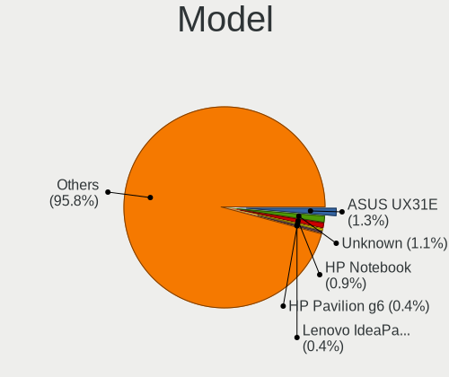
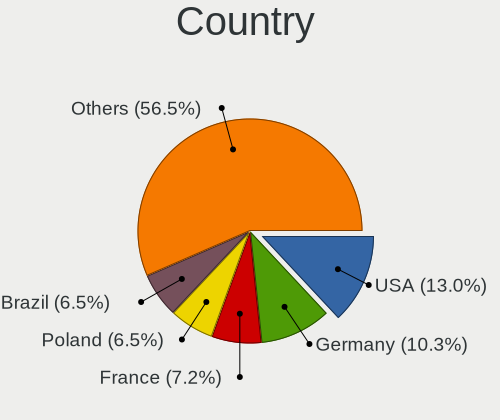
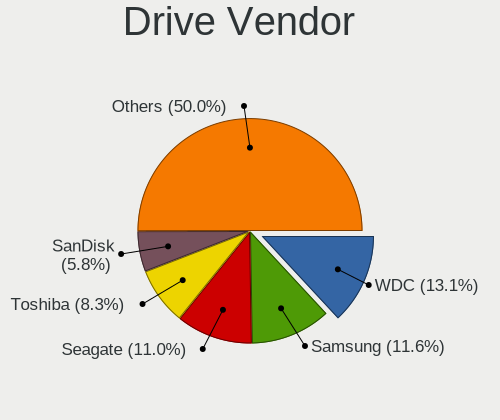
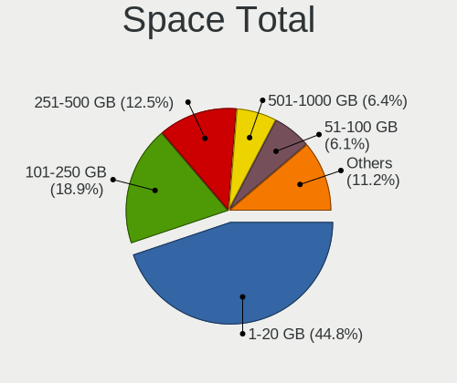
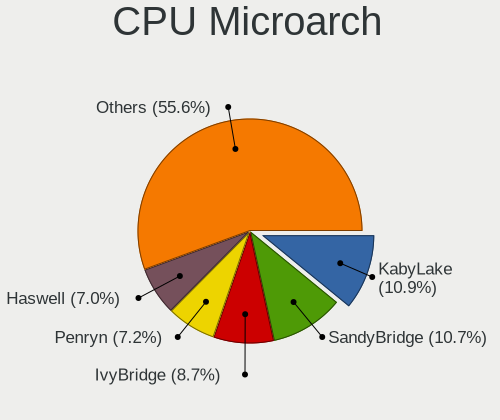
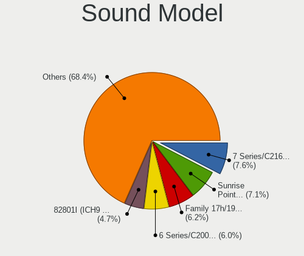
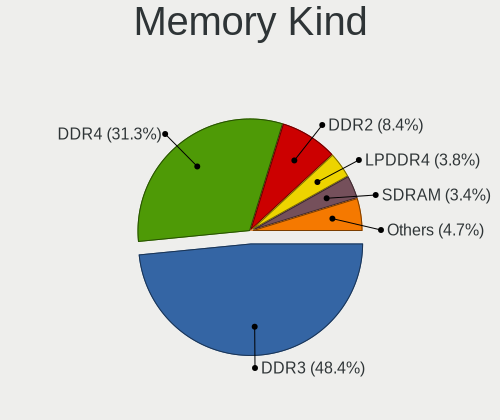
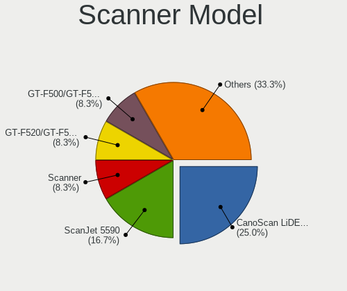

OpenMandriva - Tested Hardware & Statistics (Notebooks)
-------------------------------------------------------

A project to collect tested hardware configurations for OpenMandriva.

Anyone can contribute to this report by the [hw-probe](https://github.com/linuxhw/hw-probe) tool:

    sudo -E hw-probe -all -upload

Please contribute! Especially if your hardware is rare.

Contents
--------

* [ Test Cases ](#test-cases)

* [ System ](#system)
  - [ OS                       ](#os)
  - [ OS Family                ](#os-family)
  - [ Kernel                   ](#kernel)
  - [ Kernel Family            ](#kernel-family)
  - [ Kernel Major Ver.        ](#kernel-major-ver)
  - [ Arch                     ](#arch)
  - [ DE                       ](#de)
  - [ Display Server           ](#display-server)
  - [ Display Manager          ](#display-manager)
  - [ OS Lang                  ](#os-lang)
  - [ Boot Mode                ](#boot-mode)
  - [ Filesystem               ](#filesystem)
  - [ Part. scheme             ](#part-scheme)
  - [ Dual Boot with Linux/BSD ](#dual-boot-with-linuxbsd)
  - [ Dual Boot (Win)          ](#dual-boot-win)

* [ Board ](#board)
  - [ Vendor                   ](#vendor)
  - [ Model                    ](#model)
  - [ Model Family             ](#model-family)
  - [ MFG Year                 ](#mfg-year)
  - [ Form Factor              ](#form-factor)
  - [ Secure Boot              ](#secure-boot)
  - [ Coreboot                 ](#coreboot)
  - [ RAM Size                 ](#ram-size)
  - [ RAM Used                 ](#ram-used)
  - [ Total Drives             ](#total-drives)
  - [ Has CD-ROM               ](#has-cd-rom)
  - [ Has Ethernet             ](#has-ethernet)
  - [ Has WiFi                 ](#has-wifi)
  - [ Has Bluetooth            ](#has-bluetooth)

* [ Location ](#location)
  - [ Country                  ](#country)
  - [ City                     ](#city)

* [ Drives ](#drives)
  - [ Drive Vendor             ](#drive-vendor)
  - [ Drive Model              ](#drive-model)
  - [ HDD Vendor               ](#hdd-vendor)
  - [ SSD Vendor               ](#ssd-vendor)
  - [ Drive Kind               ](#drive-kind)
  - [ Drive Connector          ](#drive-connector)
  - [ Drive Size               ](#drive-size)
  - [ Space Total              ](#space-total)
  - [ Space Used               ](#space-used)
  - [ Malfunc. Drives          ](#malfunc-drives)
  - [ Malfunc. Drive Vendor    ](#malfunc-drive-vendor)
  - [ Malfunc. HDD Vendor      ](#malfunc-hdd-vendor)
  - [ Malfunc. Drive Kind      ](#malfunc-drive-kind)
  - [ Failed Drives            ](#failed-drives)
  - [ Failed Drive Vendor      ](#failed-drive-vendor)
  - [ Drive Status             ](#drive-status)

* [ Storage controller ](#storage-controller)
  - [ Storage Vendor           ](#storage-vendor)
  - [ Storage Model            ](#storage-model)
  - [ Storage Kind             ](#storage-kind)

* [ Processor ](#processor)
  - [ CPU Vendor               ](#cpu-vendor)
  - [ CPU Model                ](#cpu-model)
  - [ CPU Model Family         ](#cpu-model-family)
  - [ CPU Cores                ](#cpu-cores)
  - [ CPU Sockets              ](#cpu-sockets)
  - [ CPU Threads              ](#cpu-threads)
  - [ CPU Op-Modes             ](#cpu-op-modes)
  - [ CPU Microcode            ](#cpu-microcode)
  - [ CPU Microarch            ](#cpu-microarch)

* [ Graphics ](#graphics)
  - [ GPU Vendor               ](#gpu-vendor)
  - [ GPU Model                ](#gpu-model)
  - [ GPU Combo                ](#gpu-combo)
  - [ GPU Driver               ](#gpu-driver)
  - [ GPU Memory               ](#gpu-memory)

* [ Monitor ](#monitor)
  - [ Monitor Vendor           ](#monitor-vendor)
  - [ Monitor Model            ](#monitor-model)
  - [ Monitor Resolution       ](#monitor-resolution)
  - [ Monitor Diagonal         ](#monitor-diagonal)
  - [ Monitor Width            ](#monitor-width)
  - [ Aspect Ratio             ](#aspect-ratio)
  - [ Monitor Area             ](#monitor-area)
  - [ Pixel Density            ](#pixel-density)
  - [ Multiple Monitors        ](#multiple-monitors)

* [ Network ](#network)
  - [ Net Controller Vendor    ](#net-controller-vendor)
  - [ Net Controller Model     ](#net-controller-model)
  - [ Wireless Vendor          ](#wireless-vendor)
  - [ Wireless Model           ](#wireless-model)
  - [ Ethernet Vendor          ](#ethernet-vendor)
  - [ Ethernet Model           ](#ethernet-model)
  - [ Net Controller Kind      ](#net-controller-kind)
  - [ Used Controller          ](#used-controller)
  - [ NICs                     ](#nics)
  - [ IPv6                     ](#ipv6)

* [ Bluetooth ](#bluetooth)
  - [ Bluetooth Vendor         ](#bluetooth-vendor)
  - [ Bluetooth Model          ](#bluetooth-model)

* [ Sound ](#sound)
  - [ Sound Vendor             ](#sound-vendor)
  - [ Sound Model              ](#sound-model)

* [ Memory ](#memory)
  - [ Memory Vendor            ](#memory-vendor)
  - [ Memory Model             ](#memory-model)
  - [ Memory Kind              ](#memory-kind)
  - [ Memory Form Factor       ](#memory-form-factor)
  - [ Memory Size              ](#memory-size)
  - [ Memory Speed             ](#memory-speed)

* [ Printers & scanners ](#printers--scanners)
  - [ Printer Vendor           ](#printer-vendor)
  - [ Printer Model            ](#printer-model)
  - [ Scanner Vendor           ](#scanner-vendor)
  - [ Scanner Model            ](#scanner-model)

* [ Camera ](#camera)
  - [ Camera Vendor            ](#camera-vendor)
  - [ Camera Model             ](#camera-model)

* [ Security ](#security)
  - [ Fingerprint Vendor       ](#fingerprint-vendor)
  - [ Fingerprint Model        ](#fingerprint-model)
  - [ Chipcard Vendor          ](#chipcard-vendor)
  - [ Chipcard Model           ](#chipcard-model)

* [ Unsupported ](#unsupported)
  - [ Unsupported Devices      ](#unsupported-devices)
  - [ Unsupported Device Types ](#unsupported-device-types)

Test Cases
----------

Total: 6561

| Vendor        | Model                       | Probe                                                      | Date         |
|---------------|-----------------------------|------------------------------------------------------------|--------------|
| Alienware     | m17 R5 AMD                  | [4e665db2b1](https://linux-hardware.org/?probe=4e665db2b1) | May 01, 2023 |
| Lenovo        | Legion 5 15ARH05 82B5       | [6c1969f77e](https://linux-hardware.org/?probe=6c1969f77e) | May 01, 2023 |
| ASUSTek       | X751MA                      | [00fbe71b59](https://linux-hardware.org/?probe=00fbe71b59) | Apr 30, 2023 |
| HP            | Notebook                    | [4cece109d5](https://linux-hardware.org/?probe=4cece109d5) | Apr 30, 2023 |
| ASUSTek       | X501A1                      | [66b02cc148](https://linux-hardware.org/?probe=66b02cc148) | Apr 30, 2023 |
| Acer          | Aspire A315-33              | [fdba59c054](https://linux-hardware.org/?probe=fdba59c054) | Apr 30, 2023 |
| Acer          | AO725                       | [03e5f661fb](https://linux-hardware.org/?probe=03e5f661fb) | Apr 30, 2023 |
| Apple         | MacBook5,1                  | [7077a00b02](https://linux-hardware.org/?probe=7077a00b02) | Apr 30, 2023 |
| HP            | Compaq 6720s                | [cc5f5ee72c](https://linux-hardware.org/?probe=cc5f5ee72c) | Apr 30, 2023 |
| Lenovo        | IdeaPad 330S-15IKB 81F5     | [36ccc3c930](https://linux-hardware.org/?probe=36ccc3c930) | Apr 30, 2023 |
| Packard Be... | EasyNote ENTF71BM           | [99a89a2055](https://linux-hardware.org/?probe=99a89a2055) | Apr 30, 2023 |
| HP            | ProBook 650 G4              | [fd991056e0](https://linux-hardware.org/?probe=fd991056e0) | Apr 30, 2023 |
| Dell          | Inspiron 15 3525            | [41c212fa2c](https://linux-hardware.org/?probe=41c212fa2c) | Apr 30, 2023 |
| Acer          | TravelMate B311-31          | [de172b8988](https://linux-hardware.org/?probe=de172b8988) | Apr 30, 2023 |
| ASUSTek       | K53E                        | [dcb4502d05](https://linux-hardware.org/?probe=dcb4502d05) | Apr 30, 2023 |
| Dell          | Vostro 15 3515              | [8f07407e1a](https://linux-hardware.org/?probe=8f07407e1a) | Apr 29, 2023 |
| Lenovo        | G50-30 80G0                 | [c8d8595af5](https://linux-hardware.org/?probe=c8d8595af5) | Apr 29, 2023 |
| Lenovo        | Unknown                     | [33a55a2347](https://linux-hardware.org/?probe=33a55a2347) | Apr 29, 2023 |
| HP            | Laptop 15-dw1xxx            | [3056c07eb6](https://linux-hardware.org/?probe=3056c07eb6) | Apr 29, 2023 |
| Dell          | Vostro 3558                 | [e1e3261c15](https://linux-hardware.org/?probe=e1e3261c15) | Apr 29, 2023 |
| Lenovo        | ThinkPad T530 24294A1       | [8695d820e4](https://linux-hardware.org/?probe=8695d820e4) | Apr 29, 2023 |
| Toshiba       | PORTEGE R830                | [11dc4b3a3e](https://linux-hardware.org/?probe=11dc4b3a3e) | Apr 29, 2023 |
| Apple         | MacBookPro13,3              | [0f22698060](https://linux-hardware.org/?probe=0f22698060) | Apr 29, 2023 |
| Lenovo        | ThinkPad X270 W10DG 20K5... | [59fcc52279](https://linux-hardware.org/?probe=59fcc52279) | Apr 29, 2023 |
| Acer          | Aspire 5349                 | [aa8c0bb2b9](https://linux-hardware.org/?probe=aa8c0bb2b9) | Apr 29, 2023 |
| HP            | Pavilion Notebook           | [168b3cf595](https://linux-hardware.org/?probe=168b3cf595) | Apr 29, 2023 |
| Dell          | Latitude 7390               | [c24cc9ab68](https://linux-hardware.org/?probe=c24cc9ab68) | Apr 29, 2023 |
| Toshiba       | Satellite L45-B             | [8f1db96b6f](https://linux-hardware.org/?probe=8f1db96b6f) | Apr 29, 2023 |
| Medion        | X6816                       | [2c1807dad7](https://linux-hardware.org/?probe=2c1807dad7) | Apr 29, 2023 |
| HP            | Compaq Presario CQ70        | [b4055572ee](https://linux-hardware.org/?probe=b4055572ee) | Apr 28, 2023 |
| HP            | Pavilion Laptop 14-dv0xx... | [d364cb5ac7](https://linux-hardware.org/?probe=d364cb5ac7) | Apr 28, 2023 |
| Samsung       | 950XCJ/951XCJ/950XCR        | [2dc65d8f07](https://linux-hardware.org/?probe=2dc65d8f07) | Apr 28, 2023 |
| ASUSTek       | X542URR                     | [910cdd940c](https://linux-hardware.org/?probe=910cdd940c) | Apr 28, 2023 |
| GPU Compan... | GWNR71517                   | [5fe84b74b0](https://linux-hardware.org/?probe=5fe84b74b0) | Apr 28, 2023 |
| Dell          | Vostro 3500                 | [7719e2a6c9](https://linux-hardware.org/?probe=7719e2a6c9) | Apr 28, 2023 |
| ASUSTek       | UX31E                       | [e2c8068a7d](https://linux-hardware.org/?probe=e2c8068a7d) | Apr 28, 2023 |
| ASUSTek       | K53BR                       | [27a8681404](https://linux-hardware.org/?probe=27a8681404) | Apr 28, 2023 |
| Acer          | Swift SF314-59              | [a84de33c38](https://linux-hardware.org/?probe=a84de33c38) | Apr 28, 2023 |
| Dell          | Latitude D830               | [2ab0772efb](https://linux-hardware.org/?probe=2ab0772efb) | Apr 28, 2023 |
| Sony          | SVF15212CXW                 | [5d5367dc0e](https://linux-hardware.org/?probe=5d5367dc0e) | Apr 27, 2023 |
| HP            | Pavilion Gaming Laptop 1... | [b21dd8d75a](https://linux-hardware.org/?probe=b21dd8d75a) | Apr 27, 2023 |
| HP            | ProBook 4330s               | [955f91641b](https://linux-hardware.org/?probe=955f91641b) | Apr 27, 2023 |
| HP            | 255 G8 Notebook PC          | [adb8f367ea](https://linux-hardware.org/?probe=adb8f367ea) | Apr 27, 2023 |
| Lenovo        | ThinkPad R61 8943DJG        | [afc3fc578e](https://linux-hardware.org/?probe=afc3fc578e) | Apr 27, 2023 |
| HP            | 15 Notebook PC              | [a63003783d](https://linux-hardware.org/?probe=a63003783d) | Apr 27, 2023 |
| ASUSTek       | S551LN                      | [710070cf4a](https://linux-hardware.org/?probe=710070cf4a) | Apr 27, 2023 |
| Acer          | Nitro AN515-57              | [f549cb502c](https://linux-hardware.org/?probe=f549cb502c) | Apr 27, 2023 |
| Dell          | Inspiron 1545               | [a23cf53cec](https://linux-hardware.org/?probe=a23cf53cec) | Apr 27, 2023 |
| NEC Comput... | PC-LE150C2                  | [a8e48f9686](https://linux-hardware.org/?probe=a8e48f9686) | Apr 27, 2023 |
| Lenovo        | ThinkPad X1 Extreme Gen ... | [32960eca65](https://linux-hardware.org/?probe=32960eca65) | Apr 27, 2023 |
| Dell          | Latitude E6400              | [2cb1305ae1](https://linux-hardware.org/?probe=2cb1305ae1) | Apr 27, 2023 |
| HP            | Victus by Gaming Laptop ... | [486535a4d3](https://linux-hardware.org/?probe=486535a4d3) | Apr 27, 2023 |
| HUAWEI        | BOHK-WAX9X                  | [21577119ad](https://linux-hardware.org/?probe=21577119ad) | Apr 27, 2023 |
| Acer          | Aspire 5737Z                | [121eda50b8](https://linux-hardware.org/?probe=121eda50b8) | Apr 26, 2023 |
| Lenovo        | V15 G2 ALC 82KD             | [e7fb8c3e44](https://linux-hardware.org/?probe=e7fb8c3e44) | Apr 26, 2023 |
| Lenovo        | ThinkPad L512 4444PS9       | [78cf80b13b](https://linux-hardware.org/?probe=78cf80b13b) | Apr 26, 2023 |
| Lenovo        | IdeaPad 3 15ALC6 82MF       | [84bc235979](https://linux-hardware.org/?probe=84bc235979) | Apr 26, 2023 |
| ASUSTek       | X550CA                      | [a63293fe36](https://linux-hardware.org/?probe=a63293fe36) | Apr 26, 2023 |
| Fujitsu       | FMVA05004                   | [c494a8453d](https://linux-hardware.org/?probe=c494a8453d) | Apr 26, 2023 |
| Unknown       | Unknown                     | [208f6823ed](https://linux-hardware.org/?probe=208f6823ed) | Apr 26, 2023 |
| Lenovo        | ThinkPad T430 2349BS7       | [8d832f0261](https://linux-hardware.org/?probe=8d832f0261) | Apr 26, 2023 |
| GPU Compan... | GWNR71517                   | [b8b58af983](https://linux-hardware.org/?probe=b8b58af983) | Apr 26, 2023 |
| HP            | Compaq Presario CQ60        | [00bf0576c4](https://linux-hardware.org/?probe=00bf0576c4) | Apr 26, 2023 |
| Toshiba       | dynabook TV/68KBL           | [19c59e3701](https://linux-hardware.org/?probe=19c59e3701) | Apr 26, 2023 |
| ASUSTek       | X550VQ                      | [3c7d8a0268](https://linux-hardware.org/?probe=3c7d8a0268) | Apr 26, 2023 |
| Lenovo        | IdeaPad 3 14ITL6 82H7       | [ab52633e07](https://linux-hardware.org/?probe=ab52633e07) | Apr 26, 2023 |
| ASUSTek       | ROG Strix G531GW_G531GW     | [2e6de51ded](https://linux-hardware.org/?probe=2e6de51ded) | Apr 26, 2023 |
| Samsung       | 300E5EV/300E4EV/270E5EV/... | [5c79032176](https://linux-hardware.org/?probe=5c79032176) | Apr 25, 2023 |
| HP            | Pavilion g4                 | [5e2040a91f](https://linux-hardware.org/?probe=5e2040a91f) | Apr 25, 2023 |
| Login Info... | LOG-S14BW01-CD              | [5f6e2a61f2](https://linux-hardware.org/?probe=5f6e2a61f2) | Apr 25, 2023 |
| Sony          | VPCS13V9E                   | [3c1551d7be](https://linux-hardware.org/?probe=3c1551d7be) | Apr 25, 2023 |
| Acer          | Swift SF114-34              | [693f0cea98](https://linux-hardware.org/?probe=693f0cea98) | Apr 25, 2023 |
| Acer          | Swift SF314-42              | [a433dd6737](https://linux-hardware.org/?probe=a433dd6737) | Apr 25, 2023 |
| Lenovo        | ThinkPad SL500 2746CTO      | [7283a0f4d9](https://linux-hardware.org/?probe=7283a0f4d9) | Apr 25, 2023 |
| HP            | Compaq 15                   | [4799b2a649](https://linux-hardware.org/?probe=4799b2a649) | Apr 25, 2023 |
| Toshiba       | Satellite L305D             | [1bbf3a5e9c](https://linux-hardware.org/?probe=1bbf3a5e9c) | Apr 25, 2023 |
| ICL           | RAYbook Si1512              | [6aa907fd2e](https://linux-hardware.org/?probe=6aa907fd2e) | Apr 25, 2023 |
| Fujitsu       | LIFEBOOK S935               | [418c2c626e](https://linux-hardware.org/?probe=418c2c626e) | Apr 25, 2023 |
| Toshiba       | Satellite L350D             | [911ac6edf0](https://linux-hardware.org/?probe=911ac6edf0) | Apr 25, 2023 |
| HP            | ProBook 5320m               | [7597710994](https://linux-hardware.org/?probe=7597710994) | Apr 24, 2023 |
| Dell          | Latitude XT2                | [62df7dc069](https://linux-hardware.org/?probe=62df7dc069) | Apr 24, 2023 |
| Medion        | X681X                       | [d72837ad07](https://linux-hardware.org/?probe=d72837ad07) | Apr 24, 2023 |
| Dell          | Latitude E7240              | [b72361ca9e](https://linux-hardware.org/?probe=b72361ca9e) | Apr 24, 2023 |
| Lenovo        | ThinkPad P15s Gen 1 20T5... | [587e06aeb7](https://linux-hardware.org/?probe=587e06aeb7) | Apr 24, 2023 |
| Chuwi         | GemiBook Pro                | [b4d8bd0f23](https://linux-hardware.org/?probe=b4d8bd0f23) | Apr 24, 2023 |
| Acer          | Aspire V5-552P              | [28c276f9da](https://linux-hardware.org/?probe=28c276f9da) | Apr 23, 2023 |
| Toshiba       | Satellite C855              | [b383279bda](https://linux-hardware.org/?probe=b383279bda) | Apr 23, 2023 |
| ASUSTek       | S551LN                      | [9ba55985fd](https://linux-hardware.org/?probe=9ba55985fd) | Apr 23, 2023 |
| Lenovo        | Z51-70 80K6                 | [3d51a6183c](https://linux-hardware.org/?probe=3d51a6183c) | Apr 23, 2023 |
| HP            | Pavilion 15                 | [e72f221b5b](https://linux-hardware.org/?probe=e72f221b5b) | Apr 23, 2023 |
| Lenovo        | G550 2958                   | [7a1a8bb421](https://linux-hardware.org/?probe=7a1a8bb421) | Apr 23, 2023 |
| Toshiba       | dynabook BX/67TG            | [5349d462cd](https://linux-hardware.org/?probe=5349d462cd) | Apr 23, 2023 |
| Lenovo        | IdeaPad L340-15IRH Gamin... | [6115e5ccd4](https://linux-hardware.org/?probe=6115e5ccd4) | Apr 22, 2023 |
| HUAWEI        | NBLK-WAX9X                  | [36ec2bb4c2](https://linux-hardware.org/?probe=36ec2bb4c2) | Apr 22, 2023 |
| ASUSTek       | 1215B                       | [a7fc39a85b](https://linux-hardware.org/?probe=a7fc39a85b) | Apr 22, 2023 |
| Lenovo        | IdeaPad 1 14ADA05 82GW      | [1fc445ac89](https://linux-hardware.org/?probe=1fc445ac89) | Apr 22, 2023 |
| HP            | EliteBook 6930p             | [2ff545a3fc](https://linux-hardware.org/?probe=2ff545a3fc) | Apr 22, 2023 |
| ASUSTek       | VivoBook_ASUSLaptop X415... | [63599179ae](https://linux-hardware.org/?probe=63599179ae) | Apr 22, 2023 |
| Samsung       | R59P/R60P/R61P              | [59ad89854c](https://linux-hardware.org/?probe=59ad89854c) | Apr 22, 2023 |
| HP            | ProBook 4330s               | [f6608ffee2](https://linux-hardware.org/?probe=f6608ffee2) | Apr 22, 2023 |
| HP            | ProBook 450 G3              | [6e52b3ea77](https://linux-hardware.org/?probe=6e52b3ea77) | Apr 22, 2023 |
| Acer          | Extensa 5635Z               | [015e857f63](https://linux-hardware.org/?probe=015e857f63) | Apr 22, 2023 |
| Lenovo        | ThinkPad Yoga 11e 3rd Ge... | [503c99202e](https://linux-hardware.org/?probe=503c99202e) | Apr 21, 2023 |
| HP            | Pavilion dv6                | [b3613186fa](https://linux-hardware.org/?probe=b3613186fa) | Apr 21, 2023 |
| Notebook      | N13_N140ZU                  | [51ee77485d](https://linux-hardware.org/?probe=51ee77485d) | Apr 21, 2023 |
| HUAWEI        | HLYL-WXX9                   | [78adec215e](https://linux-hardware.org/?probe=78adec215e) | Apr 21, 2023 |
| ASUSTek       | S551LN                      | [c974888840](https://linux-hardware.org/?probe=c974888840) | Apr 21, 2023 |
| ASUSTek       | VivoBook_ASUSLaptop M350... | [fc70e3e9e0](https://linux-hardware.org/?probe=fc70e3e9e0) | Apr 21, 2023 |
| HP            | Compaq 6720s                | [b980c3c57d](https://linux-hardware.org/?probe=b980c3c57d) | Apr 21, 2023 |
| Lenovo        | IdeaPad 300-15IBR 80M3      | [da51714544](https://linux-hardware.org/?probe=da51714544) | Apr 21, 2023 |
| Dell          | Inspiron 3520               | [11ea81f23c](https://linux-hardware.org/?probe=11ea81f23c) | Apr 20, 2023 |
| LG Electro... | 17Z90P-K.AA78A1             | [f8f6ec2123](https://linux-hardware.org/?probe=f8f6ec2123) | Apr 20, 2023 |
| Acer          | Aspire 5745                 | [19e6d70ce0](https://linux-hardware.org/?probe=19e6d70ce0) | Apr 20, 2023 |
| ASUSTek       | VivoBook_ASUSLaptop M160... | [44459cbe3a](https://linux-hardware.org/?probe=44459cbe3a) | Apr 20, 2023 |
| ASUSTek       | K50IJ                       | [3b07dc847f](https://linux-hardware.org/?probe=3b07dc847f) | Apr 20, 2023 |
| Dell          | Latitude 5400               | [f0e05c9726](https://linux-hardware.org/?probe=f0e05c9726) | Apr 20, 2023 |
| HP            | G62                         | [a0096bb254](https://linux-hardware.org/?probe=a0096bb254) | Apr 20, 2023 |
| MSI           | GE62 6QD                    | [785d4c1655](https://linux-hardware.org/?probe=785d4c1655) | Apr 20, 2023 |
| Toshiba       | dynabook T451/46EW          | [e45702b9aa](https://linux-hardware.org/?probe=e45702b9aa) | Apr 20, 2023 |
| Dell          | Inspiron 1545               | [68a7470480](https://linux-hardware.org/?probe=68a7470480) | Apr 19, 2023 |
| HP            | ProBook 450 G2              | [14d03d2dd7](https://linux-hardware.org/?probe=14d03d2dd7) | Apr 19, 2023 |
| HP            | 255 G7 Notebook PC          | [b2f977f4a1](https://linux-hardware.org/?probe=b2f977f4a1) | Apr 19, 2023 |
| ASUSTek       | N501VW                      | [a31036cae1](https://linux-hardware.org/?probe=a31036cae1) | Apr 19, 2023 |
| Lenovo        | G780 20138                  | [32360109fa](https://linux-hardware.org/?probe=32360109fa) | Apr 19, 2023 |
| ASUSTek       | UX305CA                     | [0ff08e0727](https://linux-hardware.org/?probe=0ff08e0727) | Apr 19, 2023 |
| Toshiba       | Satellite Pro C850-1HE      | [48d3d92f3d](https://linux-hardware.org/?probe=48d3d92f3d) | Apr 19, 2023 |
| ASUSTek       | TUF Gaming FX705DT_FX705... | [09a37b3301](https://linux-hardware.org/?probe=09a37b3301) | Apr 19, 2023 |
| Acer          | Aspire 5733Z                | [de205c8c62](https://linux-hardware.org/?probe=de205c8c62) | Apr 19, 2023 |
| Dell          | Vostro 5471                 | [5cbbc95995](https://linux-hardware.org/?probe=5cbbc95995) | Apr 19, 2023 |
| Lenovo        | ThinkPad X260 20F5S2WX0W    | [97447a0777](https://linux-hardware.org/?probe=97447a0777) | Apr 19, 2023 |
| Dell          | Inspiron 15-3567            | [c5639cddcb](https://linux-hardware.org/?probe=c5639cddcb) | Apr 19, 2023 |
| Lenovo        | ThinkPad T540p 20BECTO1W... | [ccb7f92798](https://linux-hardware.org/?probe=ccb7f92798) | Apr 19, 2023 |
| Apple         | MacBookPro8,1               | [4e95dc284c](https://linux-hardware.org/?probe=4e95dc284c) | Apr 19, 2023 |
| HP            | Laptop 15s-eq2xxx           | [6fae9a24fb](https://linux-hardware.org/?probe=6fae9a24fb) | Apr 19, 2023 |
| HP            | Unknown                     | [5a295b02bc](https://linux-hardware.org/?probe=5a295b02bc) | Apr 19, 2023 |
| HP            | Pavilion Laptop 17-ar0xx    | [76aabd80a0](https://linux-hardware.org/?probe=76aabd80a0) | Apr 18, 2023 |
| Acer          | AO722                       | [5fe24a9991](https://linux-hardware.org/?probe=5fe24a9991) | Apr 18, 2023 |
| HP            | Laptop 15s-fq1xxx           | [9437766194](https://linux-hardware.org/?probe=9437766194) | Apr 18, 2023 |
| Acer          | Swift SF314-52              | [5fc210eaf2](https://linux-hardware.org/?probe=5fc210eaf2) | Apr 18, 2023 |
| Lenovo        | B50-30 20382                | [d8995dacdc](https://linux-hardware.org/?probe=d8995dacdc) | Apr 18, 2023 |
| Fujitsu       | FMVNA6HE                    | [609572e6f7](https://linux-hardware.org/?probe=609572e6f7) | Apr 18, 2023 |
| Lenovo        | ThinkPad P53 20QN001YUS     | [59549202bd](https://linux-hardware.org/?probe=59549202bd) | Apr 18, 2023 |
| Apple         | MacBookPro8,1               | [fa475c8ca8](https://linux-hardware.org/?probe=fa475c8ca8) | Apr 17, 2023 |
| HP            | ProBook 645 G1              | [e7d992accf](https://linux-hardware.org/?probe=e7d992accf) | Apr 17, 2023 |
| Toshiba       | Satellite C855D-162         | [d8e8774e0b](https://linux-hardware.org/?probe=d8e8774e0b) | Apr 17, 2023 |
| Medion        | P6634                       | [bb900074b5](https://linux-hardware.org/?probe=bb900074b5) | Apr 17, 2023 |
| ASUSTek       | UX303LB                     | [48c19abe8c](https://linux-hardware.org/?probe=48c19abe8c) | Apr 17, 2023 |
| HP            | Laptop 15s-eq2xxx           | [879e47fc04](https://linux-hardware.org/?probe=879e47fc04) | Apr 17, 2023 |
| Lenovo        | G580                        | [e291c2c0aa](https://linux-hardware.org/?probe=e291c2c0aa) | Apr 17, 2023 |
| Medion        | E16401                      | [e6c20783e7](https://linux-hardware.org/?probe=e6c20783e7) | Apr 17, 2023 |
| HP            | Laptop 15-db1xxx            | [f158ac4161](https://linux-hardware.org/?probe=f158ac4161) | Apr 17, 2023 |
| Dell          | Latitude D830               | [3da091adc2](https://linux-hardware.org/?probe=3da091adc2) | Apr 17, 2023 |
| Acer          | TravelMate 5730             | [8e99149abe](https://linux-hardware.org/?probe=8e99149abe) | Apr 17, 2023 |
| Lenovo        | ThinkPad T420 4180MG1       | [132e6ba829](https://linux-hardware.org/?probe=132e6ba829) | Apr 17, 2023 |
| Lenovo        | IdeaPad 1 14ADA05 82GW      | [a2b27dd2d6](https://linux-hardware.org/?probe=a2b27dd2d6) | Apr 17, 2023 |
| Lenovo        | IdeaPad 1 14ADA05 82GW      | [14517ef743](https://linux-hardware.org/?probe=14517ef743) | Apr 17, 2023 |
| Lenovo        | IdeaPad 110-17ACL 80UM      | [66104cc9cf](https://linux-hardware.org/?probe=66104cc9cf) | Apr 16, 2023 |
| HP            | Pavilion Laptop 14-ce3xx... | [f44bbda528](https://linux-hardware.org/?probe=f44bbda528) | Apr 16, 2023 |
| Dell          | XPS 17 9700                 | [3ad1ee8197](https://linux-hardware.org/?probe=3ad1ee8197) | Apr 16, 2023 |
| Dell          | Precision 7510              | [abb2d93e32](https://linux-hardware.org/?probe=abb2d93e32) | Apr 16, 2023 |
| Dell          | Inspiron 5559               | [b74080b280](https://linux-hardware.org/?probe=b74080b280) | Apr 16, 2023 |
| Dell          | Latitude E6330              | [1a75476b96](https://linux-hardware.org/?probe=1a75476b96) | Apr 16, 2023 |
| Chuwi         | HeroBook Air                | [360f364ebf](https://linux-hardware.org/?probe=360f364ebf) | Apr 15, 2023 |
| ASUSTek       | K73E                        | [9ab8e37631](https://linux-hardware.org/?probe=9ab8e37631) | Apr 15, 2023 |
| Fujitsu Si... | ESPRIMO Mobile X9515        | [82ffd0e4bd](https://linux-hardware.org/?probe=82ffd0e4bd) | Apr 15, 2023 |
| Dell          | Inspiron MM061              | [b825c609a9](https://linux-hardware.org/?probe=b825c609a9) | Apr 15, 2023 |
| ASUSTek       | VivoBook 15 ASUS Laptop ... | [6c711c5197](https://linux-hardware.org/?probe=6c711c5197) | Apr 15, 2023 |
| Dell          | Precision 7730              | [0e434903ec](https://linux-hardware.org/?probe=0e434903ec) | Apr 15, 2023 |
| MSI           | Modern 14 B10MW             | [c655afe860](https://linux-hardware.org/?probe=c655afe860) | Apr 15, 2023 |
| Kiano         | Elegance 14.2               | [34062f30df](https://linux-hardware.org/?probe=34062f30df) | Apr 15, 2023 |
| Lenovo        | ThinkPad X250 20CLS0CW00    | [2d25abe83c](https://linux-hardware.org/?probe=2d25abe83c) | Apr 15, 2023 |
| Lenovo        | IdeaPad 1 14ADA05 82GW      | [2e860ef402](https://linux-hardware.org/?probe=2e860ef402) | Apr 15, 2023 |
| ASUSTek       | M51Vr                       | [27d265c73d](https://linux-hardware.org/?probe=27d265c73d) | Apr 15, 2023 |
| GPD           | G1619-01                    | [2edac2c38e](https://linux-hardware.org/?probe=2edac2c38e) | Apr 15, 2023 |
| MSI           | Prestige 15 A12SC           | [51259c6f0a](https://linux-hardware.org/?probe=51259c6f0a) | Apr 15, 2023 |
| Lenovo        | V14 G2 ITL 82NM             | [dfed605628](https://linux-hardware.org/?probe=dfed605628) | Apr 15, 2023 |
| Acer          | Swift SF314-511             | [f960c27052](https://linux-hardware.org/?probe=f960c27052) | Apr 14, 2023 |
| HP            | EliteBook 8440p             | [f3b7c9c255](https://linux-hardware.org/?probe=f3b7c9c255) | Apr 14, 2023 |
| MSI           | Delta 15 A5EFK              | [44cdfb0917](https://linux-hardware.org/?probe=44cdfb0917) | Apr 14, 2023 |
| ASUSTek       | ROG Strix G532LWS_G532LW... | [a5cb4f9095](https://linux-hardware.org/?probe=a5cb4f9095) | Apr 14, 2023 |
| ASUSTek       | UX31E                       | [429e68a4ac](https://linux-hardware.org/?probe=429e68a4ac) | Apr 14, 2023 |
| Acer          | Aspire 5733                 | [981bad2be2](https://linux-hardware.org/?probe=981bad2be2) | Apr 14, 2023 |
| Acer          | AO756                       | [c17d5276ec](https://linux-hardware.org/?probe=c17d5276ec) | Apr 14, 2023 |
| Toshiba       | Satellite L850              | [dc9e77bd65](https://linux-hardware.org/?probe=dc9e77bd65) | Apr 14, 2023 |
| Sony          | VGN-NR11Z_T                 | [d7d5674aa5](https://linux-hardware.org/?probe=d7d5674aa5) | Apr 14, 2023 |
| HP            | Pavilion Laptop 15-cs0xx... | [e3f3f9fd2b](https://linux-hardware.org/?probe=e3f3f9fd2b) | Apr 14, 2023 |
| HP            | Pavilion dv6                | [3f719938aa](https://linux-hardware.org/?probe=3f719938aa) | Apr 14, 2023 |
| Lenovo        | G505 20240                  | [62bdfa97bd](https://linux-hardware.org/?probe=62bdfa97bd) | Apr 14, 2023 |
| ASUSTek       | ROG Strix G513RM_G513RM     | [8fb8771c70](https://linux-hardware.org/?probe=8fb8771c70) | Apr 14, 2023 |
| BANGHO        | MAX G0101                   | [d1ed9e6040](https://linux-hardware.org/?probe=d1ed9e6040) | Apr 14, 2023 |
| Dell          | Latitude E6540              | [61ab891b01](https://linux-hardware.org/?probe=61ab891b01) | Apr 13, 2023 |
| ASUSTek       | K73TA                       | [34319e673a](https://linux-hardware.org/?probe=34319e673a) | Apr 13, 2023 |
| Dell          | Vostro 14-3468              | [947f70ebf7](https://linux-hardware.org/?probe=947f70ebf7) | Apr 13, 2023 |
| HP            | Compaq Presario C700        | [0519471935](https://linux-hardware.org/?probe=0519471935) | Apr 13, 2023 |
| Toshiba       | Satellite L75D-A            | [210a475989](https://linux-hardware.org/?probe=210a475989) | Apr 13, 2023 |
| Acer          | Aspire A315-56              | [8c2cc310b2](https://linux-hardware.org/?probe=8c2cc310b2) | Apr 13, 2023 |
| System76      | Galago Pro                  | [9239e8d213](https://linux-hardware.org/?probe=9239e8d213) | Apr 13, 2023 |
| Lenovo        | ThinkPad T14s Gen 2i 20W... | [a841c5fce3](https://linux-hardware.org/?probe=a841c5fce3) | Apr 13, 2023 |
| Lenovo        | IdeaPad S145-15API 81V7     | [c53ec6a9c0](https://linux-hardware.org/?probe=c53ec6a9c0) | Apr 13, 2023 |
| Samsung       | 300E4C/300E5C/300E7C        | [f983dadfeb](https://linux-hardware.org/?probe=f983dadfeb) | Apr 13, 2023 |
| Lenovo        | ThinkPad X1 Extreme Gen ... | [830a3e27dd](https://linux-hardware.org/?probe=830a3e27dd) | Apr 13, 2023 |
| Toshiba       | Satellite L300D             | [76595cf176](https://linux-hardware.org/?probe=76595cf176) | Apr 12, 2023 |
| ASUSTek       | VivoBook_ASUSLaptop X510... | [af4ccb91b1](https://linux-hardware.org/?probe=af4ccb91b1) | Apr 12, 2023 |
| Toshiba       | Satellite C660              | [551fabbc17](https://linux-hardware.org/?probe=551fabbc17) | Apr 12, 2023 |
| Dell          | Latitude E6230              | [a7cce7ebde](https://linux-hardware.org/?probe=a7cce7ebde) | Apr 12, 2023 |
| Acer          | Aspire 5733Z                | [b42b19277c](https://linux-hardware.org/?probe=b42b19277c) | Apr 12, 2023 |
| ASUSTek       | K53U                        | [19ec753136](https://linux-hardware.org/?probe=19ec753136) | Apr 12, 2023 |
| HUAWEI        | HLYL-WXX9                   | [db51c5a1f3](https://linux-hardware.org/?probe=db51c5a1f3) | Apr 12, 2023 |
| Toshiba       | Satellite L350D             | [df4e0aa857](https://linux-hardware.org/?probe=df4e0aa857) | Apr 12, 2023 |
| Fujitsu Si... | LIFEBOOK S6420              | [6a6e2f88f4](https://linux-hardware.org/?probe=6a6e2f88f4) | Apr 12, 2023 |
| HP            | Presario CQ62               | [edee5d8480](https://linux-hardware.org/?probe=edee5d8480) | Apr 12, 2023 |
| Samsung       | R460                        | [9908964d4a](https://linux-hardware.org/?probe=9908964d4a) | Apr 11, 2023 |
| Lenovo        | IdeaPad Z470                | [2348aee3d4](https://linux-hardware.org/?probe=2348aee3d4) | Apr 11, 2023 |
| Lenovo        | IdeaPad 1 14ADA05 82GW      | [238037e4b8](https://linux-hardware.org/?probe=238037e4b8) | Apr 11, 2023 |
| Dell          | Inspiron N4010              | [c52176294b](https://linux-hardware.org/?probe=c52176294b) | Apr 11, 2023 |
| Lenovo        | ThinkPad L580 20LW000VMX    | [7b2e3794c9](https://linux-hardware.org/?probe=7b2e3794c9) | Apr 11, 2023 |
| Lenovo        | B590 20206                  | [5aad144224](https://linux-hardware.org/?probe=5aad144224) | Apr 11, 2023 |
| ASUSTek       | VivoBook 15_ASUS Laptop ... | [fc305814c4](https://linux-hardware.org/?probe=fc305814c4) | Apr 11, 2023 |
| Acer          | TM6495T                     | [435ae018a2](https://linux-hardware.org/?probe=435ae018a2) | Apr 11, 2023 |
| Avell High... | A52 HYB                     | [0795bca947](https://linux-hardware.org/?probe=0795bca947) | Apr 11, 2023 |
| HP            | Pavilion Laptop 15-eg0xx... | [eb294beef7](https://linux-hardware.org/?probe=eb294beef7) | Apr 11, 2023 |
| Lenovo        | IdeaPad 3 15ITL05 81X8      | [52b464bfd3](https://linux-hardware.org/?probe=52b464bfd3) | Apr 10, 2023 |
| ASUSTek       | X541UV                      | [07b7bedac7](https://linux-hardware.org/?probe=07b7bedac7) | Apr 10, 2023 |
| Lenovo        | 3000 V200 07642XU           | [365e3a50d2](https://linux-hardware.org/?probe=365e3a50d2) | Apr 10, 2023 |
| ASUSTek       | N552VX                      | [a5bf121256](https://linux-hardware.org/?probe=a5bf121256) | Apr 10, 2023 |
| ASUSTek       | G751JY                      | [618a195c21](https://linux-hardware.org/?probe=618a195c21) | Apr 10, 2023 |
| Packard Be... | EasyNote LS11HR             | [56f4b51911](https://linux-hardware.org/?probe=56f4b51911) | Apr 10, 2023 |
| ASUSTek       | UX303UB                     | [f94b0ee950](https://linux-hardware.org/?probe=f94b0ee950) | Apr 10, 2023 |
| HP            | EliteBook 840 G5            | [da4c241466](https://linux-hardware.org/?probe=da4c241466) | Apr 10, 2023 |
| HP            | EliteBook 2170p             | [34f1e1686e](https://linux-hardware.org/?probe=34f1e1686e) | Apr 10, 2023 |
| Lenovo        | ThinkPad X201 3680WFQ       | [f90c2d47c7](https://linux-hardware.org/?probe=f90c2d47c7) | Apr 10, 2023 |
| Lenovo        | ThinkPad T420s 417152U      | [5964d01442](https://linux-hardware.org/?probe=5964d01442) | Apr 10, 2023 |
| Dell          | Inspiron 3583               | [502c993dfd](https://linux-hardware.org/?probe=502c993dfd) | Apr 10, 2023 |
| HP            | Notebook                    | [4a5d785f73](https://linux-hardware.org/?probe=4a5d785f73) | Apr 09, 2023 |
| Gigabyte      | MMLP3AP-00                  | [6fd82ceaec](https://linux-hardware.org/?probe=6fd82ceaec) | Apr 09, 2023 |
| Samsung       | 950XCJ/951XCJ/950XCR        | [332f3ed32f](https://linux-hardware.org/?probe=332f3ed32f) | Apr 09, 2023 |
| Positivo      | A1000BW                     | [02295facdc](https://linux-hardware.org/?probe=02295facdc) | Apr 09, 2023 |
| Sony          | VPCEB1M1E                   | [c182925286](https://linux-hardware.org/?probe=c182925286) | Apr 09, 2023 |
| HP            | EliteBook 8570p             | [854ec28c71](https://linux-hardware.org/?probe=854ec28c71) | Apr 09, 2023 |
| lapbook       | S15 PRO                     | [5a039fc6fb](https://linux-hardware.org/?probe=5a039fc6fb) | Apr 09, 2023 |
| Samsung       | 950XCJ/951XCJ/950XCR        | [d6cbe10f95](https://linux-hardware.org/?probe=d6cbe10f95) | Apr 09, 2023 |
| Lenovo        | B575 1450ABU                | [ef58d2e8e6](https://linux-hardware.org/?probe=ef58d2e8e6) | Apr 09, 2023 |
| Acer          | Aspire 5538                 | [3128c45dbc](https://linux-hardware.org/?probe=3128c45dbc) | Apr 09, 2023 |
| Lenovo        | ThinkPad T61 7661WQQ        | [8def87668b](https://linux-hardware.org/?probe=8def87668b) | Apr 09, 2023 |
| Acer          | Aspire 5250                 | [f2040ffb31](https://linux-hardware.org/?probe=f2040ffb31) | Apr 09, 2023 |
| SLIMBOOK      | EXECUTIVE-14                | [e66056ac2d](https://linux-hardware.org/?probe=e66056ac2d) | Apr 09, 2023 |
| Lenovo        | ThinkPad X131e 33722VU      | [5e2ba16114](https://linux-hardware.org/?probe=5e2ba16114) | Apr 09, 2023 |
| Samsung       | RV419                       | [88985a3d0d](https://linux-hardware.org/?probe=88985a3d0d) | Apr 09, 2023 |
| Sony          | SVE1713A1EW                 | [402fae93d5](https://linux-hardware.org/?probe=402fae93d5) | Apr 09, 2023 |
| Acer          | Aspire ES1-531              | [f36574c96a](https://linux-hardware.org/?probe=f36574c96a) | Apr 09, 2023 |
| Lenovo        | ThinkPad E490 20N9001RBR    | [779e8396d6](https://linux-hardware.org/?probe=779e8396d6) | Apr 09, 2023 |
| HP            | Victus by Laptop 16-e0xx... | [d261eb3697](https://linux-hardware.org/?probe=d261eb3697) | Apr 09, 2023 |
| Lenovo        | IdeaPad Slim 1-14AST-05 ... | [5244868737](https://linux-hardware.org/?probe=5244868737) | Apr 09, 2023 |
| HP            | Laptop 15s-eq1xxx           | [eab5adc4e6](https://linux-hardware.org/?probe=eab5adc4e6) | Apr 09, 2023 |
| Google        | Lindar rev3                 | [e6dd3f6805](https://linux-hardware.org/?probe=e6dd3f6805) | Apr 09, 2023 |
| Dell          | Inspiron 7720               | [27df270817](https://linux-hardware.org/?probe=27df270817) | Apr 09, 2023 |
| ASUSTek       | VivoBook_ASUSLaptop E210... | [fa54308baa](https://linux-hardware.org/?probe=fa54308baa) | Apr 09, 2023 |
| Apple         | MacBook5,2                  | [916db99ea5](https://linux-hardware.org/?probe=916db99ea5) | Apr 09, 2023 |
| Toshiba       | Satellite C660              | [bb9f88795d](https://linux-hardware.org/?probe=bb9f88795d) | Apr 09, 2023 |
| Acer          | Enduro EUN314-51WG          | [7f73117dba](https://linux-hardware.org/?probe=7f73117dba) | Apr 09, 2023 |
| Dell          | Latitude E6420              | [56f5370788](https://linux-hardware.org/?probe=56f5370788) | Apr 09, 2023 |
| Lenovo        | IdeaPad 110-15ISK 80UD      | [ea9bd3a740](https://linux-hardware.org/?probe=ea9bd3a740) | Apr 09, 2023 |
| Lenovo        | ThinkPad T61 7659AB7        | [0b2f9a23ee](https://linux-hardware.org/?probe=0b2f9a23ee) | Apr 09, 2023 |
| Fujitsu       | LIFEBOOK E752               | [e60f7c9b72](https://linux-hardware.org/?probe=e60f7c9b72) | Apr 09, 2023 |
| Lenovo        | IdeaPad S145-14AST 81ST     | [c8173d40cd](https://linux-hardware.org/?probe=c8173d40cd) | Apr 09, 2023 |
| Dell          | Inspiron 7570               | [2bac711aba](https://linux-hardware.org/?probe=2bac711aba) | Apr 09, 2023 |
| Lenovo        | IdeaPad S145-15AST 81N3     | [2652354b7a](https://linux-hardware.org/?probe=2652354b7a) | Apr 09, 2023 |
| Dell          | Inspiron 1720               | [93e9be5f34](https://linux-hardware.org/?probe=93e9be5f34) | Apr 09, 2023 |
| Lenovo        | G50-70 20351                | [7ab9939757](https://linux-hardware.org/?probe=7ab9939757) | Apr 09, 2023 |
| HP            | Pavilion Laptop 15-cw1xx... | [675aea5637](https://linux-hardware.org/?probe=675aea5637) | Apr 09, 2023 |
| Dell          | Inspiron 1720               | [a2e3b07f6b](https://linux-hardware.org/?probe=a2e3b07f6b) | Apr 09, 2023 |
| HP            | Laptop 17-by4xxx            | [03cfb9e574](https://linux-hardware.org/?probe=03cfb9e574) | Apr 09, 2023 |
| HP            | Compaq 6530b (KR978UT#AB... | [3d8060476b](https://linux-hardware.org/?probe=3d8060476b) | Apr 09, 2023 |
| HP            | Laptop 14-dk1xxx            | [5d39494c01](https://linux-hardware.org/?probe=5d39494c01) | Apr 09, 2023 |
| Lenovo        | ThinkPad T450s 20BXCTO1W... | [1701c2baae](https://linux-hardware.org/?probe=1701c2baae) | Apr 08, 2023 |
| ASUSTek       | X540LA                      | [38299d8248](https://linux-hardware.org/?probe=38299d8248) | Apr 08, 2023 |
| Lenovo        | IdeaPad S540-14IWL 81ND     | [869d7607e9](https://linux-hardware.org/?probe=869d7607e9) | Apr 08, 2023 |
| HP            | EliteBook 2560p             | [a4b27a5659](https://linux-hardware.org/?probe=a4b27a5659) | Apr 08, 2023 |
| HP            | 250 G6 Notebook PC          | [22da370a63](https://linux-hardware.org/?probe=22da370a63) | Apr 08, 2023 |
| Lenovo        | IdeaPad 5 15ALC05 82LN      | [12faf271f6](https://linux-hardware.org/?probe=12faf271f6) | Apr 08, 2023 |
| Sony          | VPCSE1V9E                   | [e6dd1647f3](https://linux-hardware.org/?probe=e6dd1647f3) | Apr 08, 2023 |
| ASUSTek       | X751LN                      | [8bf4f37814](https://linux-hardware.org/?probe=8bf4f37814) | Apr 08, 2023 |
| Acer          | Predator PH315-54           | [edbc0b98a4](https://linux-hardware.org/?probe=edbc0b98a4) | Apr 08, 2023 |
| Standard      | SF20BA2                     | [17763324b6](https://linux-hardware.org/?probe=17763324b6) | Apr 08, 2023 |
| HP            | Notebook                    | [584a741058](https://linux-hardware.org/?probe=584a741058) | Apr 08, 2023 |
| Fujitsu Si... | LIFEBOOK S6420              | [52b4a5a0f0](https://linux-hardware.org/?probe=52b4a5a0f0) | Apr 08, 2023 |
| Lenovo        | Z50-75 80EC                 | [1502ff1933](https://linux-hardware.org/?probe=1502ff1933) | Apr 08, 2023 |
| Dell          | Latitude 3410               | [9fd7d9d439](https://linux-hardware.org/?probe=9fd7d9d439) | Apr 08, 2023 |
| Acer          | Aspire E5-575G              | [37194169cd](https://linux-hardware.org/?probe=37194169cd) | Apr 08, 2023 |
| Lenovo        | Legion 7 16ACHg6 82N6       | [14a3d5f4be](https://linux-hardware.org/?probe=14a3d5f4be) | Apr 08, 2023 |
| Dell          | Latitude E5470              | [3e49e9c541](https://linux-hardware.org/?probe=3e49e9c541) | Apr 08, 2023 |
| Dell          | Inspiron 1520               | [b5b9ede1c6](https://linux-hardware.org/?probe=b5b9ede1c6) | Apr 08, 2023 |
| Toshiba       | dynabook R732/H             | [ff99abe105](https://linux-hardware.org/?probe=ff99abe105) | Apr 08, 2023 |
| ASUSTek       | VivoBook_ASUSLaptop M350... | [1a6e63f6b2](https://linux-hardware.org/?probe=1a6e63f6b2) | Apr 08, 2023 |
| HP            | ProBook 6470b               | [9926dac4aa](https://linux-hardware.org/?probe=9926dac4aa) | Apr 08, 2023 |
| MSI           | Katana GF66 12UC            | [5d0c8cade6](https://linux-hardware.org/?probe=5d0c8cade6) | Apr 08, 2023 |
| Acer          | Aspire A515-56              | [7c8165c2ca](https://linux-hardware.org/?probe=7c8165c2ca) | Apr 08, 2023 |
| Acer          | Aspire A515-51G             | [34d03fbbcd](https://linux-hardware.org/?probe=34d03fbbcd) | Apr 08, 2023 |
| HP            | Laptop 15-dy2xxx            | [eadf220620](https://linux-hardware.org/?probe=eadf220620) | Apr 08, 2023 |
| Sony          | VJF155F11X-B0811B           | [89f9cc86a7](https://linux-hardware.org/?probe=89f9cc86a7) | Apr 08, 2023 |
| Acer          | Swift SF314-43              | [95cf4404c3](https://linux-hardware.org/?probe=95cf4404c3) | Apr 08, 2023 |
| Lenovo        | ThinkPad L430 24683NG       | [d5f226c56f](https://linux-hardware.org/?probe=d5f226c56f) | Apr 08, 2023 |
| Lenovo        | G50-70 20351                | [b8dd840f5d](https://linux-hardware.org/?probe=b8dd840f5d) | Apr 08, 2023 |
| VIT           | P2402                       | [1c25795c2f](https://linux-hardware.org/?probe=1c25795c2f) | Apr 07, 2023 |
| ASUSTek       | VivoBook_ASUSLaptop X712... | [99305e0876](https://linux-hardware.org/?probe=99305e0876) | Apr 07, 2023 |
| Acer          | Aspire 5517                 | [bbedb2d88e](https://linux-hardware.org/?probe=bbedb2d88e) | Apr 07, 2023 |
| Dell          | Inspiron 11-3162            | [accdfd2253](https://linux-hardware.org/?probe=accdfd2253) | Apr 07, 2023 |
| Lenovo        | IdeaPad S145-15AST 81N3     | [e5393f2dd6](https://linux-hardware.org/?probe=e5393f2dd6) | Apr 07, 2023 |
| Lenovo        | ThinkBook 13s-IWL 20R9      | [76af734c86](https://linux-hardware.org/?probe=76af734c86) | Apr 07, 2023 |
| HP            | EliteBook 2530p             | [66ec38445f](https://linux-hardware.org/?probe=66ec38445f) | Apr 07, 2023 |
| Notebook      | NJ50_70CU                   | [0ad152ba3c](https://linux-hardware.org/?probe=0ad152ba3c) | Apr 07, 2023 |
| Lenovo        | ThinkPad W530 243852U       | [ea2ee391a5](https://linux-hardware.org/?probe=ea2ee391a5) | Apr 07, 2023 |
| Dell          | Latitude 5400               | [f2d5671ba5](https://linux-hardware.org/?probe=f2d5671ba5) | Apr 07, 2023 |
| Lenovo        | ThinkPad T60 2008VW7        | [de0d5654c0](https://linux-hardware.org/?probe=de0d5654c0) | Apr 07, 2023 |
| ASUSTek       | A8Le                        | [c00ff94698](https://linux-hardware.org/?probe=c00ff94698) | Apr 07, 2023 |
| HP            | 250 G6 Notebook PC          | [859f83bbfc](https://linux-hardware.org/?probe=859f83bbfc) | Apr 07, 2023 |
| Lenovo        | ThinkPad X270 W10DG 20K5... | [aab830c5dd](https://linux-hardware.org/?probe=aab830c5dd) | Apr 07, 2023 |
| HP            | ProBook 650 G4              | [0e9b21ff7e](https://linux-hardware.org/?probe=0e9b21ff7e) | Apr 07, 2023 |
| HP            | Pavilion 17                 | [43d7593dd5](https://linux-hardware.org/?probe=43d7593dd5) | Apr 07, 2023 |
| HP            | ProBook 4530s               | [efd084d9d5](https://linux-hardware.org/?probe=efd084d9d5) | Apr 07, 2023 |
| ASUSTek       | S551LN                      | [2c731aefae](https://linux-hardware.org/?probe=2c731aefae) | Apr 07, 2023 |
| Lenovo        | B51-80 80LM                 | [78e2e080ea](https://linux-hardware.org/?probe=78e2e080ea) | Apr 07, 2023 |
| Lenovo        | IdeaPad Gaming 3 15ACH6 ... | [a3ae05a7cb](https://linux-hardware.org/?probe=a3ae05a7cb) | Apr 07, 2023 |
| Acer          | TravelMate 8572T            | [04f50662d8](https://linux-hardware.org/?probe=04f50662d8) | Apr 07, 2023 |
| ASUSTek       | X555QA                      | [6fb3c3952e](https://linux-hardware.org/?probe=6fb3c3952e) | Apr 07, 2023 |
| ASUSTek       | VivoBook_ASUSLaptop X515... | [5a900adcdc](https://linux-hardware.org/?probe=5a900adcdc) | Apr 07, 2023 |
| Lenovo        | ThinkPad X1 Extreme Gen ... | [d48cada4e3](https://linux-hardware.org/?probe=d48cada4e3) | Apr 07, 2023 |
| Lenovo        | ThinkPad T420 4180AP3       | [6959a0f7fc](https://linux-hardware.org/?probe=6959a0f7fc) | Apr 07, 2023 |
| Dell          | XPS 17 9710                 | [b4c155dc99](https://linux-hardware.org/?probe=b4c155dc99) | Apr 07, 2023 |
| Dell          | Precision M3800             | [6fbee1d04d](https://linux-hardware.org/?probe=6fbee1d04d) | Apr 07, 2023 |
| Dell          | Latitude 5490               | [89f89d2a9e](https://linux-hardware.org/?probe=89f89d2a9e) | Apr 07, 2023 |
| HP            | 620                         | [2e14b2c046](https://linux-hardware.org/?probe=2e14b2c046) | Apr 07, 2023 |
| Lenovo        | ThinkPad T470s 20HF0001M... | [8c6105e5be](https://linux-hardware.org/?probe=8c6105e5be) | Apr 06, 2023 |
| eMachines     | E725                        | [758d0c86b2](https://linux-hardware.org/?probe=758d0c86b2) | Apr 06, 2023 |
| Dell          | Latitude E6440              | [d63602cd95](https://linux-hardware.org/?probe=d63602cd95) | Apr 06, 2023 |
| Acer          | Aspire E5-771               | [2ef87c5f77](https://linux-hardware.org/?probe=2ef87c5f77) | Apr 06, 2023 |
| HP            | ProBook 4740s               | [14fb51de44](https://linux-hardware.org/?probe=14fb51de44) | Apr 06, 2023 |
| Lenovo        | ThinkPad T440s 20ARS2QF0... | [806fc59e4f](https://linux-hardware.org/?probe=806fc59e4f) | Apr 06, 2023 |
| eMachines     | E720 V1.09                  | [278ca903ac](https://linux-hardware.org/?probe=278ca903ac) | Apr 06, 2023 |
| HP            | Compaq Presario CQ70        | [11cd73fbce](https://linux-hardware.org/?probe=11cd73fbce) | Apr 06, 2023 |
| Samsung       | R540/R580/R780/SA41/E452... | [5c446bcf49](https://linux-hardware.org/?probe=5c446bcf49) | Apr 06, 2023 |
| Acer          | Aspire 5750G                | [3fa6f0de7a](https://linux-hardware.org/?probe=3fa6f0de7a) | Apr 06, 2023 |
| ASUSTek       | K46CM                       | [d878fad4d0](https://linux-hardware.org/?probe=d878fad4d0) | Apr 06, 2023 |
| ASUSTek       | X55U                        | [0abf7df439](https://linux-hardware.org/?probe=0abf7df439) | Apr 06, 2023 |
| ASUSTek       | ROG Zephyrus G14 GA401QM... | [3358152092](https://linux-hardware.org/?probe=3358152092) | Apr 06, 2023 |
| Lenovo        | V15 G2 ITL 82KB             | [0ca203f8b0](https://linux-hardware.org/?probe=0ca203f8b0) | Apr 06, 2023 |
| HP            | Laptop 15-bs0xx             | [c73108de7b](https://linux-hardware.org/?probe=c73108de7b) | Apr 06, 2023 |
| HP            | Compaq Presario CQ71        | [82c50e39ad](https://linux-hardware.org/?probe=82c50e39ad) | Apr 06, 2023 |
| Toshiba       | Satellite Pro L350          | [a75b4d94aa](https://linux-hardware.org/?probe=a75b4d94aa) | Apr 06, 2023 |
| MSI           | GL73 8RC                    | [c134ae92fc](https://linux-hardware.org/?probe=c134ae92fc) | Apr 06, 2023 |
| HP            | Laptop 15-db0xxx            | [e05bffcc8a](https://linux-hardware.org/?probe=e05bffcc8a) | Apr 06, 2023 |
| Dell          | Latitude E5430 non-vPro     | [fcfcfdbbe7](https://linux-hardware.org/?probe=fcfcfdbbe7) | Apr 06, 2023 |
| HUAWEI        | BOM-WXX9                    | [d4dd77439e](https://linux-hardware.org/?probe=d4dd77439e) | Apr 06, 2023 |
| Lenovo        | 3000 N200 0769DQJ           | [db1539e64a](https://linux-hardware.org/?probe=db1539e64a) | Apr 06, 2023 |
| Dell          | Inspiron 1720               | [0f0d515832](https://linux-hardware.org/?probe=0f0d515832) | Apr 06, 2023 |
| Dell          | Latitude E7440              | [3fc74781a7](https://linux-hardware.org/?probe=3fc74781a7) | Apr 06, 2023 |
| Positivo      | H14BT58                     | [135bb6e61a](https://linux-hardware.org/?probe=135bb6e61a) | Apr 06, 2023 |
| Apple         | MacBookPro5,5               | [4e0ff5c2f7](https://linux-hardware.org/?probe=4e0ff5c2f7) | Apr 06, 2023 |
| Lenovo        | ThinkPad X230 2324FU0       | [47be9d7510](https://linux-hardware.org/?probe=47be9d7510) | Apr 06, 2023 |
| ASUSTek       | S551LN                      | [bab2c0f0e4](https://linux-hardware.org/?probe=bab2c0f0e4) | Apr 06, 2023 |
| Dell          | Inspiron 3584               | [50f052ef1c](https://linux-hardware.org/?probe=50f052ef1c) | Apr 06, 2023 |
| HP            | 620                         | [ad46cdbb0d](https://linux-hardware.org/?probe=ad46cdbb0d) | Apr 06, 2023 |
| Dell          | Latitude E4200              | [6dae8e5ff4](https://linux-hardware.org/?probe=6dae8e5ff4) | Apr 05, 2023 |
| Dell          | Latitude E5550              | [5527315153](https://linux-hardware.org/?probe=5527315153) | Apr 05, 2023 |
| Lenovo        | ThinkPad X250 20CLS2X60S    | [b5b5fd68e9](https://linux-hardware.org/?probe=b5b5fd68e9) | Apr 05, 2023 |
| Lenovo        | ThinkPad X61s 7666WJ5       | [eb755a4a95](https://linux-hardware.org/?probe=eb755a4a95) | Apr 05, 2023 |
| Apple         | MacBookPro8,1               | [0240b337ac](https://linux-hardware.org/?probe=0240b337ac) | Apr 05, 2023 |
| HP            | EliteBook 6930p             | [8e769590fb](https://linux-hardware.org/?probe=8e769590fb) | Apr 05, 2023 |
| Lenovo        | Yoga Slim 7 Pro 14ACH5 8... | [5d0489d439](https://linux-hardware.org/?probe=5d0489d439) | Apr 05, 2023 |
| HP            | Notebook                    | [99a9d4cae5](https://linux-hardware.org/?probe=99a9d4cae5) | Apr 05, 2023 |
| Toshiba       | Satellite C50-A             | [8e02a6dbed](https://linux-hardware.org/?probe=8e02a6dbed) | Apr 05, 2023 |
| ASUSTek       | X71Q                        | [9a7d0f4b2b](https://linux-hardware.org/?probe=9a7d0f4b2b) | Apr 05, 2023 |
| Toshiba       | Satellite L640              | [8009d927db](https://linux-hardware.org/?probe=8009d927db) | Apr 05, 2023 |
| Lenovo        | ThinkPad E470 20H1006VRT    | [a9b909f3df](https://linux-hardware.org/?probe=a9b909f3df) | Apr 05, 2023 |
| Lenovo        | IdeaPad 330-15ARR 81D2      | [e27fc333c6](https://linux-hardware.org/?probe=e27fc333c6) | Apr 05, 2023 |
| Lenovo        | Yoga Slim 7 13ACN5 82CY     | [10213d8aa1](https://linux-hardware.org/?probe=10213d8aa1) | Apr 05, 2023 |
| Sony          | VGN-CS31MR_P                | [c97f0353d0](https://linux-hardware.org/?probe=c97f0353d0) | Apr 05, 2023 |
| Acer          | Aspire 3680                 | [b5511d9060](https://linux-hardware.org/?probe=b5511d9060) | Apr 05, 2023 |
| HP            | Victus by Gaming Laptop ... | [6ad0f579b6](https://linux-hardware.org/?probe=6ad0f579b6) | Apr 05, 2023 |
| HP            | 245 G6                      | [c6a1e2951c](https://linux-hardware.org/?probe=c6a1e2951c) | Apr 05, 2023 |
| Fujitsu       | FMVA45MRP2                  | [80b1f5983b](https://linux-hardware.org/?probe=80b1f5983b) | Apr 05, 2023 |
| Acer          | Aspire ES1-572              | [bb95a52e54](https://linux-hardware.org/?probe=bb95a52e54) | Apr 05, 2023 |
| Dell          | Latitude E6440              | [eea06ab302](https://linux-hardware.org/?probe=eea06ab302) | Apr 05, 2023 |
| Lenovo        | ThinkPad Edge 0578RZ3       | [d37b6fa47b](https://linux-hardware.org/?probe=d37b6fa47b) | Apr 05, 2023 |
| Evolute       | B14HM21                     | [be41163512](https://linux-hardware.org/?probe=be41163512) | Apr 05, 2023 |
| HP            | Pavilion Laptop 15-cw0xx... | [a2b079980a](https://linux-hardware.org/?probe=a2b079980a) | Apr 05, 2023 |
| ASUSTek       | UX305UA                     | [5c19e22fe1](https://linux-hardware.org/?probe=5c19e22fe1) | Apr 05, 2023 |
| Acer          | Aspire E5-575               | [ba6c827f8f](https://linux-hardware.org/?probe=ba6c827f8f) | Apr 05, 2023 |
| HP            | Notebook                    | [50c03e608d](https://linux-hardware.org/?probe=50c03e608d) | Apr 05, 2023 |
| Lenovo        | V15-ADA 82C7                | [62dd2f5f34](https://linux-hardware.org/?probe=62dd2f5f34) | Apr 05, 2023 |
| HP            | EliteBook 2530p             | [519d2a4d5a](https://linux-hardware.org/?probe=519d2a4d5a) | Apr 04, 2023 |
| Compumax C... | ONIX-CEL-0001               | [b3e9bc2fb0](https://linux-hardware.org/?probe=b3e9bc2fb0) | Apr 04, 2023 |
| ASUSTek       | VivoBook_ASUSLaptop X350... | [f04b34af52](https://linux-hardware.org/?probe=f04b34af52) | Apr 04, 2023 |
| ASUSTek       | N501VW                      | [1db257af9f](https://linux-hardware.org/?probe=1db257af9f) | Apr 04, 2023 |
| HP            | EliteBook 8470w             | [47e8a4441b](https://linux-hardware.org/?probe=47e8a4441b) | Apr 04, 2023 |
| Lenovo        | IdeaPad 320-15IAP 80XR      | [4e7cae1fde](https://linux-hardware.org/?probe=4e7cae1fde) | Apr 04, 2023 |
| TPS           | C48P                        | [df8a2ac617](https://linux-hardware.org/?probe=df8a2ac617) | Apr 04, 2023 |
| Apple         | MacBookAir5,2               | [cb94d3ff68](https://linux-hardware.org/?probe=cb94d3ff68) | Apr 04, 2023 |
| eMachines     | D725                        | [f3cdf26e60](https://linux-hardware.org/?probe=f3cdf26e60) | Apr 04, 2023 |
| Lenovo        | ThinkPad T410 2537WB7       | [d68ffd9d0f](https://linux-hardware.org/?probe=d68ffd9d0f) | Apr 04, 2023 |
| Apple         | MacBookAir5,2               | [8293b6000a](https://linux-hardware.org/?probe=8293b6000a) | Apr 04, 2023 |
| Dell          | Latitude 7280               | [e0fcb10ef5](https://linux-hardware.org/?probe=e0fcb10ef5) | Apr 04, 2023 |
| Lenovo        | ThinkPad X220 4290CTO       | [5dd9277838](https://linux-hardware.org/?probe=5dd9277838) | Apr 04, 2023 |
| ASUSTek       | UX31E                       | [3a1b0cca6b](https://linux-hardware.org/?probe=3a1b0cca6b) | Apr 04, 2023 |
| Lenovo        | IdeaPad L340-15IRH Gamin... | [1af0b7675b](https://linux-hardware.org/?probe=1af0b7675b) | Apr 04, 2023 |
| HP            | ProBook 6570b               | [d42564b34f](https://linux-hardware.org/?probe=d42564b34f) | Apr 04, 2023 |
| MSI           | CR61 2M/CX61 2OC/CX61 2O... | [ceeafa59a2](https://linux-hardware.org/?probe=ceeafa59a2) | Apr 04, 2023 |
| Acer          | Aspire ES1-572              | [39e1087c79](https://linux-hardware.org/?probe=39e1087c79) | Apr 04, 2023 |
| Dell          | Studio 1558                 | [e9b75d657d](https://linux-hardware.org/?probe=e9b75d657d) | Apr 04, 2023 |
| Lenovo        | IdeaPad Z585 20152          | [efb4022e4c](https://linux-hardware.org/?probe=efb4022e4c) | Apr 04, 2023 |
| ASUSTek       | S551LB                      | [cd1746937a](https://linux-hardware.org/?probe=cd1746937a) | Apr 04, 2023 |
| Timi          | TM1703                      | [54b062157f](https://linux-hardware.org/?probe=54b062157f) | Apr 04, 2023 |
| HP            | Compaq nx9420 (RH457EA#A... | [473898ff0e](https://linux-hardware.org/?probe=473898ff0e) | Apr 04, 2023 |
| HP            | 1000                        | [111c9bd980](https://linux-hardware.org/?probe=111c9bd980) | Apr 04, 2023 |
| Unknown       | Unknown                     | [7325272558](https://linux-hardware.org/?probe=7325272558) | Apr 04, 2023 |
| ASUSTek       | X200MA                      | [8cfe6c0f97](https://linux-hardware.org/?probe=8cfe6c0f97) | Apr 04, 2023 |
| Acer          | Aspire 4349                 | [43ae04b9c3](https://linux-hardware.org/?probe=43ae04b9c3) | Apr 04, 2023 |
| Lenovo        | B50-80 80LT                 | [163bfb5525](https://linux-hardware.org/?probe=163bfb5525) | Apr 03, 2023 |
| Toshiba       | Satellite L655              | [1381de4b71](https://linux-hardware.org/?probe=1381de4b71) | Apr 03, 2023 |
| Fujitsu       | LIFEBOOK S935               | [cd18ce0a96](https://linux-hardware.org/?probe=cd18ce0a96) | Apr 03, 2023 |
| Lenovo        | ThinkPad X200 7459J74       | [d7f98c1ddb](https://linux-hardware.org/?probe=d7f98c1ddb) | Apr 03, 2023 |
| HP            | OMEN Laptop 15-en0xxx       | [770caf96be](https://linux-hardware.org/?probe=770caf96be) | Apr 03, 2023 |
| Lenovo        | B50-30 80ES                 | [11da2097ba](https://linux-hardware.org/?probe=11da2097ba) | Apr 03, 2023 |
| ASUSTek       | VivoBook_ASUSLaptop X513... | [d7f3280e60](https://linux-hardware.org/?probe=d7f3280e60) | Apr 03, 2023 |
| Lenovo        | IdeaPad 120S-11IAP 81A4     | [49b1cef736](https://linux-hardware.org/?probe=49b1cef736) | Apr 03, 2023 |
| Acer          | Aspire A515-51              | [c9245a7032](https://linux-hardware.org/?probe=c9245a7032) | Apr 03, 2023 |
| Dell          | Inspiron 3542               | [bcf9cf6ba6](https://linux-hardware.org/?probe=bcf9cf6ba6) | Apr 03, 2023 |
| Compaq        | 420                         | [167996fdd9](https://linux-hardware.org/?probe=167996fdd9) | Apr 03, 2023 |
| Sony          | VPCF22C5E                   | [9d122b8bdd](https://linux-hardware.org/?probe=9d122b8bdd) | Apr 03, 2023 |
| HP            | EliteBook Folio G1          | [ad873ac967](https://linux-hardware.org/?probe=ad873ac967) | Apr 03, 2023 |
| Dell          | Latitude 7480               | [f1ca485181](https://linux-hardware.org/?probe=f1ca485181) | Apr 02, 2023 |
| ASUSTek       | UX303UB                     | [9b46784fd5](https://linux-hardware.org/?probe=9b46784fd5) | Apr 02, 2023 |
| HP            | EliteBook 840 G3            | [20e885eb0b](https://linux-hardware.org/?probe=20e885eb0b) | Apr 02, 2023 |
| HP            | Laptop 17-ca0xxx            | [6399f19b22](https://linux-hardware.org/?probe=6399f19b22) | Apr 02, 2023 |
| HP            | OMEN by Laptop              | [647c427d7b](https://linux-hardware.org/?probe=647c427d7b) | Apr 02, 2023 |
| HP            | Laptop 14-cm0xxx            | [984d71ee3d](https://linux-hardware.org/?probe=984d71ee3d) | Apr 02, 2023 |
| ASUSTek       | G71V                        | [6594dac071](https://linux-hardware.org/?probe=6594dac071) | Apr 02, 2023 |
| Lenovo        | Legion 5P 15ARH05H 82GU     | [3ec9fed32b](https://linux-hardware.org/?probe=3ec9fed32b) | Apr 02, 2023 |
| ASUSTek       | N53SV                       | [5b2c0ea506](https://linux-hardware.org/?probe=5b2c0ea506) | Apr 02, 2023 |
| HP            | Laptop 15q-ds0xxx           | [42bd53a04e](https://linux-hardware.org/?probe=42bd53a04e) | Apr 02, 2023 |
| ASUSTek       | X555LAB                     | [95f5025351](https://linux-hardware.org/?probe=95f5025351) | Apr 02, 2023 |
| ASUSTek       | G752VM                      | [13d6602e92](https://linux-hardware.org/?probe=13d6602e92) | Apr 02, 2023 |
| AZW           | Speed S                     | [52292a4968](https://linux-hardware.org/?probe=52292a4968) | Apr 02, 2023 |
| PCSMART S.... | PNTGOB11CPE                 | [874d355cc4](https://linux-hardware.org/?probe=874d355cc4) | Apr 02, 2023 |
| Dell          | Latitude E5400              | [4b69d7d67c](https://linux-hardware.org/?probe=4b69d7d67c) | Apr 02, 2023 |
| ASUSTek       | G750JW                      | [b7c8d9cc5f](https://linux-hardware.org/?probe=b7c8d9cc5f) | Apr 01, 2023 |
| Dell          | System XPS L502X            | [2ed08c70a9](https://linux-hardware.org/?probe=2ed08c70a9) | Apr 01, 2023 |
| HP            | ProBook 455 G1              | [869f36fc4c](https://linux-hardware.org/?probe=869f36fc4c) | Apr 01, 2023 |
| Dell          | Latitude 5511               | [86b4fcff61](https://linux-hardware.org/?probe=86b4fcff61) | Apr 01, 2023 |
| Dell          | Latitude E7470              | [3eb8069059](https://linux-hardware.org/?probe=3eb8069059) | Apr 01, 2023 |
| Acer          | Aspire A515-41G             | [f047e9361c](https://linux-hardware.org/?probe=f047e9361c) | Apr 01, 2023 |
| HUAWEI        | HVY-WXX9                    | [eb7bbd9b91](https://linux-hardware.org/?probe=eb7bbd9b91) | Apr 01, 2023 |
| Notebook      | W54BL                       | [5e3ba9b128](https://linux-hardware.org/?probe=5e3ba9b128) | Apr 01, 2023 |
| Toshiba       | dynabook T653/46JR          | [7f0e2d07b5](https://linux-hardware.org/?probe=7f0e2d07b5) | Apr 01, 2023 |
| Acer          | Aspire A715-41G             | [cea0d2797d](https://linux-hardware.org/?probe=cea0d2797d) | Apr 01, 2023 |
| Google        | Lulu                        | [0183eadbc8](https://linux-hardware.org/?probe=0183eadbc8) | Apr 01, 2023 |
| Apple         | MacBookPro9,2               | [b0beffe006](https://linux-hardware.org/?probe=b0beffe006) | Apr 01, 2023 |
| Dell          | Inspiron 15 5510            | [e169cd0886](https://linux-hardware.org/?probe=e169cd0886) | Apr 01, 2023 |
| HP            | Pavilion g7                 | [7820d2ca67](https://linux-hardware.org/?probe=7820d2ca67) | Apr 01, 2023 |
| Acer          | Aspire V5-121               | [d6cc7a67ab](https://linux-hardware.org/?probe=d6cc7a67ab) | Apr 01, 2023 |
| Acer          | Aspire 5740                 | [eeba9d18fa](https://linux-hardware.org/?probe=eeba9d18fa) | Apr 01, 2023 |
| Lenovo        | ThinkPad P1 Gen 4i 20Y30... | [96c53eccb0](https://linux-hardware.org/?probe=96c53eccb0) | Apr 01, 2023 |
| Acer          | Aspire A315-35              | [659a4cfd5a](https://linux-hardware.org/?probe=659a4cfd5a) | Apr 01, 2023 |
| ASUSTek       | N752VX                      | [d426499408](https://linux-hardware.org/?probe=d426499408) | Apr 01, 2023 |
| Lenovo        | IdeaPad 510-15IKB 80SV      | [6ab0a0226d](https://linux-hardware.org/?probe=6ab0a0226d) | Apr 01, 2023 |
| Unknown       | X133                        | [950572f119](https://linux-hardware.org/?probe=950572f119) | Apr 01, 2023 |
| ASUSTek       | F3JP                        | [e561213582](https://linux-hardware.org/?probe=e561213582) | Apr 01, 2023 |
| ASUSTek       | ASUS EXPERTBOOK B1500CEA... | [87bc2601f3](https://linux-hardware.org/?probe=87bc2601f3) | Apr 01, 2023 |
| ASUSTek       | S551LN                      | [916adbdf9f](https://linux-hardware.org/?probe=916adbdf9f) | Apr 01, 2023 |
| Sony          | VPCEH1S1R                   | [12100cdd4b](https://linux-hardware.org/?probe=12100cdd4b) | Apr 01, 2023 |
| Lenovo        | G505 20240                  | [d873632b2b](https://linux-hardware.org/?probe=d873632b2b) | Apr 01, 2023 |
| HP            | Pavilion Gaming Laptop 1... | [70fb59cd4f](https://linux-hardware.org/?probe=70fb59cd4f) | Apr 01, 2023 |
| HP            | EliteBook 8470p             | [178ccc8d4d](https://linux-hardware.org/?probe=178ccc8d4d) | Apr 01, 2023 |
| Lenovo        | IdeaPad 3 15IIL05 81WE      | [9db0830268](https://linux-hardware.org/?probe=9db0830268) | Apr 01, 2023 |
| Lenovo        | G560 20042                  | [c5a4783dfb](https://linux-hardware.org/?probe=c5a4783dfb) | Apr 01, 2023 |
| Toshiba       | Satellite C55-B             | [250e5371c1](https://linux-hardware.org/?probe=250e5371c1) | Apr 01, 2023 |
| Lenovo        | ThinkPad X230 2325DV4       | [6cff5cd5d1](https://linux-hardware.org/?probe=6cff5cd5d1) | Apr 01, 2023 |
| Dell          | Latitude 5580               | [10cbd4c04d](https://linux-hardware.org/?probe=10cbd4c04d) | Apr 01, 2023 |
| Fujitsu       | LIFEBOOK S935               | [11b63a22b5](https://linux-hardware.org/?probe=11b63a22b5) | Apr 01, 2023 |
| Sony          | VPCEA3BFX                   | [6215c985dd](https://linux-hardware.org/?probe=6215c985dd) | Apr 01, 2023 |
| Lenovo        | V15-IGL 82C3                | [4773b9449c](https://linux-hardware.org/?probe=4773b9449c) | Apr 01, 2023 |
| Dell          | Vostro 15 3515              | [eea311b1bb](https://linux-hardware.org/?probe=eea311b1bb) | Apr 01, 2023 |
| HP            | Laptop 15s-eq3xxx           | [758bb2556e](https://linux-hardware.org/?probe=758bb2556e) | Apr 01, 2023 |
| Lenovo        | ThinkPad T530 23594LU       | [9de89fee19](https://linux-hardware.org/?probe=9de89fee19) | Apr 01, 2023 |
| Lenovo        | ThinkPad T420s 4173R44      | [84e9a5f3d9](https://linux-hardware.org/?probe=84e9a5f3d9) | Apr 01, 2023 |
| UMAX          | VisionBook 14Wa Plus        | [ea8016c4a5](https://linux-hardware.org/?probe=ea8016c4a5) | Apr 01, 2023 |
| Dell          | Latitude E7450              | [8bf693a890](https://linux-hardware.org/?probe=8bf693a890) | Apr 01, 2023 |
| Samsung       | 340XAA/350XAA/550XAA        | [93ef0bb287](https://linux-hardware.org/?probe=93ef0bb287) | Apr 01, 2023 |
| Samsung       | 270E5G/270E5U               | [67b91e463a](https://linux-hardware.org/?probe=67b91e463a) | Mar 31, 2023 |
| Acer          | Aspire A315-54K             | [d325177071](https://linux-hardware.org/?probe=d325177071) | Mar 31, 2023 |
| HP            | ProBook 440 G6              | [5198509903](https://linux-hardware.org/?probe=5198509903) | Mar 31, 2023 |
| Lenovo        | IdeaPad Yoga 13 20175       | [66a1075056](https://linux-hardware.org/?probe=66a1075056) | Mar 31, 2023 |
| Quanta        | QL3 TBD                     | [21673aecac](https://linux-hardware.org/?probe=21673aecac) | Mar 31, 2023 |
| HP            | Compaq Presario CQ60        | [e5a729243d](https://linux-hardware.org/?probe=e5a729243d) | Mar 31, 2023 |
| Microtech     | ebookPro                    | [ffe1da27cc](https://linux-hardware.org/?probe=ffe1da27cc) | Mar 31, 2023 |
| Dell          | XPS M1330                   | [46b9a5cfde](https://linux-hardware.org/?probe=46b9a5cfde) | Mar 31, 2023 |
| Intel         | Kabylake Platform           | [2b0fd79264](https://linux-hardware.org/?probe=2b0fd79264) | Mar 31, 2023 |
| Toshiba       | Satellite L655              | [d527726a1c](https://linux-hardware.org/?probe=d527726a1c) | Mar 31, 2023 |
| HP            | Pavilion Aero Laptop 13-... | [59b2b4e152](https://linux-hardware.org/?probe=59b2b4e152) | Mar 31, 2023 |
| Samsung       | 300V3A/300V4A/300V5A/200... | [ad92e27c90](https://linux-hardware.org/?probe=ad92e27c90) | Mar 31, 2023 |
| Acer          | Aspire 7720                 | [073d49ce6b](https://linux-hardware.org/?probe=073d49ce6b) | Mar 31, 2023 |
| Dell          | Precision 5570              | [a3d5f928ee](https://linux-hardware.org/?probe=a3d5f928ee) | Mar 31, 2023 |
| Dell          | Inspiron 1545               | [ca44e7f419](https://linux-hardware.org/?probe=ca44e7f419) | Mar 31, 2023 |
| Dell          | Latitude E7440              | [fdd9fda693](https://linux-hardware.org/?probe=fdd9fda693) | Mar 31, 2023 |
| HP            | Compaq 6730b (GB987ET#UU... | [6c6ceb9bc3](https://linux-hardware.org/?probe=6c6ceb9bc3) | Mar 31, 2023 |
| HP            | 250 G5 Notebook PC          | [d271318192](https://linux-hardware.org/?probe=d271318192) | Mar 31, 2023 |
| HP            | Laptop 15-db0xxx            | [c51f53a733](https://linux-hardware.org/?probe=c51f53a733) | Mar 31, 2023 |
| Lenovo        | ThinkPad T430 2347EP7       | [6fd7423cb6](https://linux-hardware.org/?probe=6fd7423cb6) | Mar 31, 2023 |
| HP            | Pavilion 15                 | [4dc2c9dfc1](https://linux-hardware.org/?probe=4dc2c9dfc1) | Mar 31, 2023 |
| HUAWEI        | KPL-W0X                     | [6e93ca4159](https://linux-hardware.org/?probe=6e93ca4159) | Mar 31, 2023 |
| ASUSTek       | VivoBook_ASUSLaptop X515... | [29c4ba04a1](https://linux-hardware.org/?probe=29c4ba04a1) | Mar 31, 2023 |
| Acer          | Aspire ES1-531              | [aedba72f70](https://linux-hardware.org/?probe=aedba72f70) | Mar 31, 2023 |
| Unknown       | Unknown                     | [c30740a3eb](https://linux-hardware.org/?probe=c30740a3eb) | Mar 31, 2023 |
| HP            | Laptop 17-cp2xxx            | [854de8a433](https://linux-hardware.org/?probe=854de8a433) | Mar 31, 2023 |
| Lenovo        | Legion 5 15IMH05 82AU       | [36c0a38885](https://linux-hardware.org/?probe=36c0a38885) | Mar 31, 2023 |
| ASUSTek       | X550CL                      | [5d5862d22a](https://linux-hardware.org/?probe=5d5862d22a) | Mar 31, 2023 |
| Fujitsu Si... | ESPRIMO Mobile V5535        | [d6c537b33b](https://linux-hardware.org/?probe=d6c537b33b) | Mar 31, 2023 |
| Apple         | MacBookPro9,2               | [8c60cf0ec1](https://linux-hardware.org/?probe=8c60cf0ec1) | Mar 31, 2023 |
| Lenovo        | IdeaPad 300-15ISK 80Q7      | [54f8c5082d](https://linux-hardware.org/?probe=54f8c5082d) | Mar 31, 2023 |
| Acer          | Aspire 1410                 | [58be80ea51](https://linux-hardware.org/?probe=58be80ea51) | Mar 31, 2023 |
| Acer          | Aspire 5720Z                | [ca2b750eeb](https://linux-hardware.org/?probe=ca2b750eeb) | Mar 31, 2023 |
| Acer          | TravelMate B311-31          | [3345b754b7](https://linux-hardware.org/?probe=3345b754b7) | Mar 31, 2023 |
| HP            | EliteBook 8540p             | [570836875c](https://linux-hardware.org/?probe=570836875c) | Mar 31, 2023 |
| Notebook      | NL40_50GU                   | [a46afd7246](https://linux-hardware.org/?probe=a46afd7246) | Mar 31, 2023 |
| Star Labs     | Lite                        | [e3689ef845](https://linux-hardware.org/?probe=e3689ef845) | Mar 31, 2023 |
| ASUSTek       | K54C                        | [a2a91e2071](https://linux-hardware.org/?probe=a2a91e2071) | Mar 30, 2023 |
| Acer          | Aspire 7741                 | [34bd6f42b1](https://linux-hardware.org/?probe=34bd6f42b1) | Mar 30, 2023 |
| HP            | Unknown                     | [fb784430a5](https://linux-hardware.org/?probe=fb784430a5) | Mar 30, 2023 |
| Lenovo        | Yoga 500-15IBD 80N6         | [225e13e1f0](https://linux-hardware.org/?probe=225e13e1f0) | Mar 30, 2023 |
| HP            | Pavilion Gaming Laptop 1... | [8e927ead89](https://linux-hardware.org/?probe=8e927ead89) | Mar 30, 2023 |
| Toshiba       | Satellite P875              | [aba8c03541](https://linux-hardware.org/?probe=aba8c03541) | Mar 30, 2023 |
| ASUSTek       | K53SJ                       | [aa9a729217](https://linux-hardware.org/?probe=aa9a729217) | Mar 30, 2023 |
| Notebook      | N150CU                      | [5da0df2cf0](https://linux-hardware.org/?probe=5da0df2cf0) | Mar 30, 2023 |
| Acer          | Aspire ES1-523              | [a800dab0ab](https://linux-hardware.org/?probe=a800dab0ab) | Mar 30, 2023 |
| HP            | EliteBook 2540p             | [6aae8ca2a0](https://linux-hardware.org/?probe=6aae8ca2a0) | Mar 30, 2023 |
| HP            | Pavilion dv6                | [c91e4d9c5a](https://linux-hardware.org/?probe=c91e4d9c5a) | Mar 30, 2023 |
| Dell          | XPS 17 9710                 | [6b37881138](https://linux-hardware.org/?probe=6b37881138) | Mar 30, 2023 |
| Samsung       | 355V4C/356V4C/3445VC/354... | [6b9737a62f](https://linux-hardware.org/?probe=6b9737a62f) | Mar 30, 2023 |
| HP            | ProBook 6360b               | [cf027e03de](https://linux-hardware.org/?probe=cf027e03de) | Mar 30, 2023 |
| Acer          | Prespa M                    | [a6541a27d9](https://linux-hardware.org/?probe=a6541a27d9) | Mar 30, 2023 |
| Lenovo        | IdeaPad 3 15ITL6 82H8       | [afd41155ee](https://linux-hardware.org/?probe=afd41155ee) | Mar 30, 2023 |
| Lenovo        | G550 2958                   | [41f23ded68](https://linux-hardware.org/?probe=41f23ded68) | Mar 30, 2023 |
| ASUSTek       | VivoBook_ASUSLaptop X512... | [a1fa08efc6](https://linux-hardware.org/?probe=a1fa08efc6) | Mar 30, 2023 |
| Lenovo        | IdeaPad 3 15ITL6 82H8       | [45f39402f0](https://linux-hardware.org/?probe=45f39402f0) | Mar 30, 2023 |
| Lenovo        | V15-ADA 82C7                | [552ad08e05](https://linux-hardware.org/?probe=552ad08e05) | Mar 30, 2023 |
| Toshiba       | dynabook T653/46JR          | [94a37d865e](https://linux-hardware.org/?probe=94a37d865e) | Mar 30, 2023 |
| Dell          | Latitude E7450              | [63e8748d1f](https://linux-hardware.org/?probe=63e8748d1f) | Mar 30, 2023 |
| Lenovo        | G505 20240                  | [25c5c7ee2e](https://linux-hardware.org/?probe=25c5c7ee2e) | Mar 30, 2023 |
| PC Special... | P65_67RSRP                  | [889f3e8521](https://linux-hardware.org/?probe=889f3e8521) | Mar 30, 2023 |
| HP            | Pavilion Notebook           | [d3eafe4568](https://linux-hardware.org/?probe=d3eafe4568) | Mar 30, 2023 |
| Toshiba       | Satellite L655              | [2e6ea8bf5c](https://linux-hardware.org/?probe=2e6ea8bf5c) | Mar 30, 2023 |
| Lenovo        | ThinkPad Edge E530 3259M... | [9aaa97a931](https://linux-hardware.org/?probe=9aaa97a931) | Mar 30, 2023 |
| Acer          | NC-M3-581T-33216G52MAKK     | [3f394d8b43](https://linux-hardware.org/?probe=3f394d8b43) | Mar 30, 2023 |
| Dell          | Latitude E6430              | [086b5d0f79](https://linux-hardware.org/?probe=086b5d0f79) | Mar 30, 2023 |
| Lenovo        | ThinkPad T400 6475J92       | [1d3c812668](https://linux-hardware.org/?probe=1d3c812668) | Mar 30, 2023 |
| Lenovo        | ThinkPad X395 20NLS0J400    | [e9d9710ef9](https://linux-hardware.org/?probe=e9d9710ef9) | Mar 30, 2023 |
| Dell          | Precision 5550              | [c7244f1e31](https://linux-hardware.org/?probe=c7244f1e31) | Mar 30, 2023 |
| Fujitsu       | LIFEBOOK AH530              | [a316144991](https://linux-hardware.org/?probe=a316144991) | Mar 29, 2023 |
| HP            | Notebook                    | [e631e8e62a](https://linux-hardware.org/?probe=e631e8e62a) | Mar 29, 2023 |
| HP            | Laptop 14-bs0xx             | [53504486d2](https://linux-hardware.org/?probe=53504486d2) | Mar 29, 2023 |
| Lenovo        | U41-70 80JV                 | [975da67142](https://linux-hardware.org/?probe=975da67142) | Mar 29, 2023 |
| HP            | Laptop 15s-fq4xxx           | [029fa06a9a](https://linux-hardware.org/?probe=029fa06a9a) | Mar 29, 2023 |
| Fujitsu       | LIFEBOOK A555               | [6f28f9e6ec](https://linux-hardware.org/?probe=6f28f9e6ec) | Mar 29, 2023 |
| Acer          | Aspire A515-57              | [06a3c07a40](https://linux-hardware.org/?probe=06a3c07a40) | Mar 29, 2023 |
| HP            | ENVY TS Sleekbook 4         | [f897573506](https://linux-hardware.org/?probe=f897573506) | Mar 29, 2023 |
| Lenovo        | IdeaPad S145-15IWL 81MV     | [5be11a9a6e](https://linux-hardware.org/?probe=5be11a9a6e) | Mar 29, 2023 |
| Dell          | System Inspiron N7110       | [cc23cb7065](https://linux-hardware.org/?probe=cc23cb7065) | Mar 29, 2023 |
| Lenovo        | IdeaPad 100-15IBY 80MJ      | [11c94aa91b](https://linux-hardware.org/?probe=11c94aa91b) | Mar 29, 2023 |
| Samsung       | 670Z5E                      | [2bf528dfb1](https://linux-hardware.org/?probe=2bf528dfb1) | Mar 29, 2023 |
| Lenovo        | IdeaPad S145-15API 81UT     | [695a074faf](https://linux-hardware.org/?probe=695a074faf) | Mar 29, 2023 |
| Acer          | Aspire 8930                 | [248dbe002e](https://linux-hardware.org/?probe=248dbe002e) | Mar 29, 2023 |
| Lenovo        | G570 20079                  | [680c7a04ed](https://linux-hardware.org/?probe=680c7a04ed) | Mar 29, 2023 |
| Notebook      | N85_N87,HJ,HJ1,HK1          | [61ede0b764](https://linux-hardware.org/?probe=61ede0b764) | Mar 29, 2023 |
| Toshiba       | Satellite P200              | [c55a4d3166](https://linux-hardware.org/?probe=c55a4d3166) | Mar 29, 2023 |
| Acer          | Aspire E1-571G              | [574f00dff5](https://linux-hardware.org/?probe=574f00dff5) | Mar 29, 2023 |
| Acer          | Aspire E5-576               | [37fc62a287](https://linux-hardware.org/?probe=37fc62a287) | Mar 29, 2023 |
| Acer          | Aspire E5-773G              | [3cb72ca21c](https://linux-hardware.org/?probe=3cb72ca21c) | Mar 29, 2023 |
| ASUSTek       | ASUS TUF Gaming A15 FA50... | [fa1a582da6](https://linux-hardware.org/?probe=fa1a582da6) | Mar 29, 2023 |
| Samsung       | 300E5M/300E5L               | [9d48f53259](https://linux-hardware.org/?probe=9d48f53259) | Mar 29, 2023 |
| Notebook      | NL40_50CU                   | [fe471635fb](https://linux-hardware.org/?probe=fe471635fb) | Mar 29, 2023 |
| Toshiba       | Satellite L750              | [0bc21ff162](https://linux-hardware.org/?probe=0bc21ff162) | Mar 28, 2023 |
| Dell          | Vostro 5568                 | [0004be15a4](https://linux-hardware.org/?probe=0004be15a4) | Mar 28, 2023 |
| HP            | ENVY Notebook               | [98cd32ea44](https://linux-hardware.org/?probe=98cd32ea44) | Mar 28, 2023 |
| HP            | 250 G6 Notebook PC          | [94cdfc44d1](https://linux-hardware.org/?probe=94cdfc44d1) | Mar 28, 2023 |
| Acer          | Aspire V3-571G              | [ecde786683](https://linux-hardware.org/?probe=ecde786683) | Mar 28, 2023 |
| HP            | Compaq 6510b (GR680ET)      | [716c4212c7](https://linux-hardware.org/?probe=716c4212c7) | Mar 28, 2023 |
| ASUSTek       | TUF Gaming FX505DT_FX505... | [f7222bf293](https://linux-hardware.org/?probe=f7222bf293) | Mar 28, 2023 |
| Lenovo        | V145-15AST 81MT             | [7fff3bb217](https://linux-hardware.org/?probe=7fff3bb217) | Mar 28, 2023 |
| Kiano         | Elegance 14.2               | [ea2013b347](https://linux-hardware.org/?probe=ea2013b347) | Mar 28, 2023 |
| Acer          | Aspire E1-570               | [71b25255fa](https://linux-hardware.org/?probe=71b25255fa) | Mar 28, 2023 |
| HP            | OMEN Laptop 15-ek0xxx       | [f44d26ed76](https://linux-hardware.org/?probe=f44d26ed76) | Mar 28, 2023 |
| Acer          | Aspire E5-532G              | [35e076d9b5](https://linux-hardware.org/?probe=35e076d9b5) | Mar 28, 2023 |
| Fujitsu       | LIFEBOOK E556               | [bbd878e897](https://linux-hardware.org/?probe=bbd878e897) | Mar 28, 2023 |
| Dell          | Vostro 14-5480              | [b1ef6303a6](https://linux-hardware.org/?probe=b1ef6303a6) | Mar 28, 2023 |
| Fujitsu       | LIFEBOOK E556               | [3842c12714](https://linux-hardware.org/?probe=3842c12714) | Mar 28, 2023 |
| HP            | Pavilion Notebook           | [783330690d](https://linux-hardware.org/?probe=783330690d) | Mar 28, 2023 |
| Dell          | Latitude E5500              | [6fea10bf98](https://linux-hardware.org/?probe=6fea10bf98) | Mar 28, 2023 |
| TEKNOSERVI... | NJ5x_NJ7xLU                 | [2a0feae3f9](https://linux-hardware.org/?probe=2a0feae3f9) | Mar 28, 2023 |
| Lenovo        | IdeaPad 100-14IBY 80MH      | [0e8125dc1f](https://linux-hardware.org/?probe=0e8125dc1f) | Mar 28, 2023 |
| Dell          | Latitude 7490               | [41d01ead49](https://linux-hardware.org/?probe=41d01ead49) | Mar 28, 2023 |
| Dell          | Latitude E5570              | [5b3d1ab8b9](https://linux-hardware.org/?probe=5b3d1ab8b9) | Mar 28, 2023 |
| Dell          | Inspiron 3558               | [c80d4c15ce](https://linux-hardware.org/?probe=c80d4c15ce) | Mar 28, 2023 |
| Dell          | Inspiron 5515               | [13a0d1426d](https://linux-hardware.org/?probe=13a0d1426d) | Mar 28, 2023 |
| Lenovo        | ThinkPad W520 4284E79       | [2d9875ca24](https://linux-hardware.org/?probe=2d9875ca24) | Mar 28, 2023 |
| Samsung       | 950XCJ/951XCJ/950XCR        | [df27b06a95](https://linux-hardware.org/?probe=df27b06a95) | Mar 28, 2023 |
| Dell          | Studio 1558                 | [955946c74d](https://linux-hardware.org/?probe=955946c74d) | Mar 28, 2023 |
| HP            | Pavilion Laptop 14-dv0xx... | [f511f8bcb1](https://linux-hardware.org/?probe=f511f8bcb1) | Mar 28, 2023 |
| ASUSTek       | X555DG                      | [6a464d8e68](https://linux-hardware.org/?probe=6a464d8e68) | Mar 27, 2023 |
| Acer          | Aspire E5-575               | [5964caaa02](https://linux-hardware.org/?probe=5964caaa02) | Mar 27, 2023 |
| Lenovo        | ThinkPad X250 20CLS47P00    | [e287203572](https://linux-hardware.org/?probe=e287203572) | Mar 27, 2023 |
| Lenovo        | ThinkPad X220 42915P1       | [40d0cf6e14](https://linux-hardware.org/?probe=40d0cf6e14) | Mar 27, 2023 |
| Lenovo        | ThinkPad T420 4236W1K       | [e093aace6e](https://linux-hardware.org/?probe=e093aace6e) | Mar 27, 2023 |
| Dell          | Latitude E6430              | [61ec1b65ed](https://linux-hardware.org/?probe=61ec1b65ed) | Mar 27, 2023 |
| Sony          | VPCSA2C5E                   | [60e85a64b0](https://linux-hardware.org/?probe=60e85a64b0) | Mar 27, 2023 |
| ASUSTek       | K56CA                       | [43f064cb46](https://linux-hardware.org/?probe=43f064cb46) | Mar 27, 2023 |
| Acer          | Aspire A515-45              | [d480257689](https://linux-hardware.org/?probe=d480257689) | Mar 27, 2023 |
| Lenovo        | ThinkPad T580 20LAS4L216    | [9c3464baf9](https://linux-hardware.org/?probe=9c3464baf9) | Mar 27, 2023 |
| Lenovo        | IdeaPad S145-15AST 81N3     | [580e3a1237](https://linux-hardware.org/?probe=580e3a1237) | Mar 27, 2023 |
| Acer          | Mammoth                     | [d43ab9891b](https://linux-hardware.org/?probe=d43ab9891b) | Mar 27, 2023 |
| Lenovo        | ThinkPad L450 20DS0001GE    | [17f869b10d](https://linux-hardware.org/?probe=17f869b10d) | Mar 27, 2023 |
| Sony          | VPCEH1S1E                   | [081294b14c](https://linux-hardware.org/?probe=081294b14c) | Mar 27, 2023 |
| ASUSTek       | N551JM                      | [b8e3d627b5](https://linux-hardware.org/?probe=b8e3d627b5) | Mar 27, 2023 |
| Toshiba       | Satellite C855-1TT          | [ac8e41d993](https://linux-hardware.org/?probe=ac8e41d993) | Mar 27, 2023 |
| Lenovo        | ThinkPad T450s 20BWS3WY0... | [d1e9fcddfc](https://linux-hardware.org/?probe=d1e9fcddfc) | Mar 27, 2023 |
| TUXEDO        | Pulse 14 Gen1               | [7facc52f0e](https://linux-hardware.org/?probe=7facc52f0e) | Mar 27, 2023 |
| HP            | 250 G6 Notebook PC          | [eb82e949b2](https://linux-hardware.org/?probe=eb82e949b2) | Mar 27, 2023 |
| ASUSTek       | K54HR                       | [ac6cf948d5](https://linux-hardware.org/?probe=ac6cf948d5) | Mar 27, 2023 |
| ASUSTek       | E502NA                      | [a116400859](https://linux-hardware.org/?probe=a116400859) | Mar 27, 2023 |
| Lenovo        | Legion 5 Pro 16IAH7H 82R... | [e4a88fa14e](https://linux-hardware.org/?probe=e4a88fa14e) | Mar 27, 2023 |
| Lenovo        | B460e                       | [1c79a13a61](https://linux-hardware.org/?probe=1c79a13a61) | Mar 27, 2023 |
| Acer          | Aspire A315-56              | [db607e02ea](https://linux-hardware.org/?probe=db607e02ea) | Mar 27, 2023 |
| TUXEDO        | InfinityBook Pro Gen7 (M... | [84d2bfb9cc](https://linux-hardware.org/?probe=84d2bfb9cc) | Mar 27, 2023 |
| Dell          | Inspiron 5448               | [b800b24cbd](https://linux-hardware.org/?probe=b800b24cbd) | Mar 27, 2023 |
| Acer          | Aspire V3-551               | [48409a7222](https://linux-hardware.org/?probe=48409a7222) | Mar 27, 2023 |
| HP            | Pavilion TS 11              | [e13254735b](https://linux-hardware.org/?probe=e13254735b) | Mar 27, 2023 |
| Dell          | Latitude 7490               | [58ccd5d7e0](https://linux-hardware.org/?probe=58ccd5d7e0) | Mar 27, 2023 |
| HP            | Pavilion g6                 | [4b08001481](https://linux-hardware.org/?probe=4b08001481) | Mar 27, 2023 |
| Dell          | Inspiron 3537               | [5b1971e361](https://linux-hardware.org/?probe=5b1971e361) | Mar 27, 2023 |
| Acer          | Aspire A515-41G             | [33bccb2234](https://linux-hardware.org/?probe=33bccb2234) | Mar 27, 2023 |
| Sony          | VJFE52A0711H                | [f2186a4bc4](https://linux-hardware.org/?probe=f2186a4bc4) | Mar 27, 2023 |
| Lenovo        | ThinkPad L530 24812SG       | [163d4e376e](https://linux-hardware.org/?probe=163d4e376e) | Mar 26, 2023 |
| HP            | 250 G1                      | [a19b3136b7](https://linux-hardware.org/?probe=a19b3136b7) | Mar 26, 2023 |
| ASUSTek       | N552VW                      | [322426698a](https://linux-hardware.org/?probe=322426698a) | Mar 26, 2023 |
| Lenovo        | 3000 G530 4151/200          | [4c0751aa89](https://linux-hardware.org/?probe=4c0751aa89) | Mar 26, 2023 |
| Lenovo        | IdeaPad Y910-17ISK 80V1     | [5e4e7975c1](https://linux-hardware.org/?probe=5e4e7975c1) | Mar 26, 2023 |
| Dell          | XPS 15 9520                 | [35718792af](https://linux-hardware.org/?probe=35718792af) | Mar 26, 2023 |
| ASUSTek       | VivoBook_ASUSLaptop X412... | [7dbe4350b5](https://linux-hardware.org/?probe=7dbe4350b5) | Mar 26, 2023 |
| Acer          | Aspire E1-431               | [f56a2c21cf](https://linux-hardware.org/?probe=f56a2c21cf) | Mar 26, 2023 |
| Lenovo        | ThinkPad E14 Gen 2 20TA0... | [84af25ca8c](https://linux-hardware.org/?probe=84af25ca8c) | Mar 26, 2023 |
| Fujitsu       | LIFEBOOK E744               | [f32cce4c6f](https://linux-hardware.org/?probe=f32cce4c6f) | Mar 26, 2023 |
| Samsung       | RC530/RC730                 | [ad2be3eba7](https://linux-hardware.org/?probe=ad2be3eba7) | Mar 26, 2023 |
| Lenovo        | ThinkPad X220 4290LR3       | [dffa03da18](https://linux-hardware.org/?probe=dffa03da18) | Mar 26, 2023 |
| Gigabyte      | A7 K1                       | [0eca943d2e](https://linux-hardware.org/?probe=0eca943d2e) | Mar 26, 2023 |
| ASUSTek       | K72Jr                       | [f80aed3ccc](https://linux-hardware.org/?probe=f80aed3ccc) | Mar 26, 2023 |
| Dell          | Inspiron 1545               | [70c5569887](https://linux-hardware.org/?probe=70c5569887) | Mar 26, 2023 |
| ASUSTek       | K50IE                       | [bde872583b](https://linux-hardware.org/?probe=bde872583b) | Mar 26, 2023 |
| MSI           | CR620                       | [2fce81cc28](https://linux-hardware.org/?probe=2fce81cc28) | Mar 26, 2023 |
| Medion        | Akoya E6416                 | [bb2e759014](https://linux-hardware.org/?probe=bb2e759014) | Mar 26, 2023 |
| Acer          | Aspire 5820                 | [3e0e45bc17](https://linux-hardware.org/?probe=3e0e45bc17) | Mar 26, 2023 |
| HP            | EliteBook Folio 9480m       | [1be38b1b49](https://linux-hardware.org/?probe=1be38b1b49) | Mar 26, 2023 |
| Acer          | Predator G9-791             | [1f820516a3](https://linux-hardware.org/?probe=1f820516a3) | Mar 26, 2023 |
| Dell          | Inspiron 15-3567            | [5c3f0186de](https://linux-hardware.org/?probe=5c3f0186de) | Mar 26, 2023 |
| Dell          | Inspiron 3576               | [18352c181a](https://linux-hardware.org/?probe=18352c181a) | Mar 26, 2023 |
| ASUSTek       | X75VD                       | [9997ce4485](https://linux-hardware.org/?probe=9997ce4485) | Mar 26, 2023 |
| Fujitsu Si... | AMILO Pi 3625               | [076352cb68](https://linux-hardware.org/?probe=076352cb68) | Mar 26, 2023 |
| Lenovo        | ThinkPad X230 2306A44       | [e948a25ef6](https://linux-hardware.org/?probe=e948a25ef6) | Mar 26, 2023 |
| Sony          | VGN-BX61VN                  | [76f62cf9c1](https://linux-hardware.org/?probe=76f62cf9c1) | Mar 26, 2023 |
| Toshiba       | Satellite C845D             | [32341bde2a](https://linux-hardware.org/?probe=32341bde2a) | Mar 26, 2023 |
| Apple         | MacBookPro8,1               | [0f1954d5c6](https://linux-hardware.org/?probe=0f1954d5c6) | Mar 26, 2023 |
| Lenovo        | ThinkPad T14 Gen 2i 20W0... | [64485e9b53](https://linux-hardware.org/?probe=64485e9b53) | Mar 25, 2023 |
| Toshiba       | PORTEGE Z30-A               | [114888d7f5](https://linux-hardware.org/?probe=114888d7f5) | Mar 25, 2023 |
| Medion        | E14412                      | [897c73454e](https://linux-hardware.org/?probe=897c73454e) | Mar 25, 2023 |
| Dell          | XPS 9315                    | [050fede003](https://linux-hardware.org/?probe=050fede003) | Mar 25, 2023 |
| ASUSTek       | TUF Gaming FX505DU_FX505... | [51d034c8d1](https://linux-hardware.org/?probe=51d034c8d1) | Mar 25, 2023 |
| Acer          | Aspire ES1-411              | [1a4caa9a83](https://linux-hardware.org/?probe=1a4caa9a83) | Mar 24, 2023 |
| HP            | Pavilion Notebook           | [446c510c65](https://linux-hardware.org/?probe=446c510c65) | Mar 24, 2023 |
| Lenovo        | IdeaPad 110-15IBR 80T7      | [178936b7f4](https://linux-hardware.org/?probe=178936b7f4) | Mar 24, 2023 |
| Acer          | Aspire 5733Z                | [8a7f87172d](https://linux-hardware.org/?probe=8a7f87172d) | Mar 24, 2023 |
| Lenovo        | B50-45 20388                | [5bd617a430](https://linux-hardware.org/?probe=5bd617a430) | Mar 24, 2023 |
| METAPHYUNI    | MetamechBook                | [7e4076cb61](https://linux-hardware.org/?probe=7e4076cb61) | Mar 24, 2023 |
| HP            | Unknown                     | [c27dcda931](https://linux-hardware.org/?probe=c27dcda931) | Mar 24, 2023 |
| ASUSTek       | K53SJ                       | [175f99ccdd](https://linux-hardware.org/?probe=175f99ccdd) | Mar 23, 2023 |
| Dell          | Precision 7720              | [c3ef75d6eb](https://linux-hardware.org/?probe=c3ef75d6eb) | Mar 23, 2023 |
| Acer          | Predator PH315-53           | [25c6ad6f8b](https://linux-hardware.org/?probe=25c6ad6f8b) | Mar 23, 2023 |
| TUXEDO        | InfinityBook Pro Gen7 (M... | [1c88428088](https://linux-hardware.org/?probe=1c88428088) | Mar 22, 2023 |
| Toshiba       | T20                         | [a0757b47d7](https://linux-hardware.org/?probe=a0757b47d7) | Mar 22, 2023 |
| Packard Be... | EasyNote LJ75               | [1a3b095372](https://linux-hardware.org/?probe=1a3b095372) | Mar 22, 2023 |
| Acer          | TravelMate 5744             | [3ad8bf7639](https://linux-hardware.org/?probe=3ad8bf7639) | Mar 22, 2023 |
| HUAWEI        | KPL-W0X                     | [0ae6ab3ff6](https://linux-hardware.org/?probe=0ae6ab3ff6) | Mar 21, 2023 |
| Lenovo        | IdeaPad 320-15ABR 80XS      | [7622701d31](https://linux-hardware.org/?probe=7622701d31) | Mar 21, 2023 |
| Toshiba       | Satellite A305              | [ed7bc92488](https://linux-hardware.org/?probe=ed7bc92488) | Mar 21, 2023 |
| Dell          | Inspiron 15 7000 Gaming     | [b6b5eb415f](https://linux-hardware.org/?probe=b6b5eb415f) | Mar 21, 2023 |
| Dell          | Latitude 7490               | [e16b99a93a](https://linux-hardware.org/?probe=e16b99a93a) | Mar 21, 2023 |
| Acer          | Extensa 5235                | [270cd6ed83](https://linux-hardware.org/?probe=270cd6ed83) | Mar 20, 2023 |
| Notebook      | NS50_70MU                   | [cb2c031349](https://linux-hardware.org/?probe=cb2c031349) | Mar 20, 2023 |
| Dell          | Latitude E6430              | [7eafa653dc](https://linux-hardware.org/?probe=7eafa653dc) | Mar 20, 2023 |
| Acer          | TravelMate 5760             | [712e36569d](https://linux-hardware.org/?probe=712e36569d) | Mar 20, 2023 |
| Acer          | Aspire 4736Z                | [30e77255e4](https://linux-hardware.org/?probe=30e77255e4) | Mar 20, 2023 |
| Dell          | Latitude E5500              | [9c76627b98](https://linux-hardware.org/?probe=9c76627b98) | Mar 20, 2023 |
| Lenovo        | IdeaPad 3 15ALC6 82KU       | [e91cad7b1b](https://linux-hardware.org/?probe=e91cad7b1b) | Mar 20, 2023 |
| Lenovo        | IdeaPad S145-15API 81UT     | [91d4251cb0](https://linux-hardware.org/?probe=91d4251cb0) | Mar 19, 2023 |
| Lenovo        | IdeaPad 330-15IKB 81DE      | [77b7fd07a4](https://linux-hardware.org/?probe=77b7fd07a4) | Mar 19, 2023 |
| Lenovo        | IdeaPad 320-15IAP 80XR      | [919ccc204b](https://linux-hardware.org/?probe=919ccc204b) | Mar 19, 2023 |
| MSI           | GE60 2PE                    | [229b9e0525](https://linux-hardware.org/?probe=229b9e0525) | Mar 19, 2023 |
| Dell          | Inspiron 15 7510            | [f7aebbae36](https://linux-hardware.org/?probe=f7aebbae36) | Mar 18, 2023 |
| ASUSTek       | UX31E                       | [b637fa75c8](https://linux-hardware.org/?probe=b637fa75c8) | Mar 18, 2023 |
| Dell          | Precision M4800             | [26912746f6](https://linux-hardware.org/?probe=26912746f6) | Mar 18, 2023 |
| Lenovo        | ThinkPad P50 20EQS1MY00     | [beeb327f26](https://linux-hardware.org/?probe=beeb327f26) | Mar 18, 2023 |
| Dell          | Inspiron 15-3567            | [e90a87f6f2](https://linux-hardware.org/?probe=e90a87f6f2) | Mar 18, 2023 |
| MSI           | GP60 2OD                    | [a3ffd8113f](https://linux-hardware.org/?probe=a3ffd8113f) | Mar 18, 2023 |
| Acer          | Swift SF113-31              | [f1db5ada96](https://linux-hardware.org/?probe=f1db5ada96) | Mar 18, 2023 |
| HP            | EliteBook 840 G3            | [8a2a9a9e75](https://linux-hardware.org/?probe=8a2a9a9e75) | Mar 18, 2023 |
| Dell          | Precision M6600             | [a71645a248](https://linux-hardware.org/?probe=a71645a248) | Mar 18, 2023 |
| HONOR         | NBR-WAX9                    | [19fd2af680](https://linux-hardware.org/?probe=19fd2af680) | Mar 18, 2023 |
| Acer          | Aspire A315-55G             | [badcc52c19](https://linux-hardware.org/?probe=badcc52c19) | Mar 18, 2023 |
| ASUSTek       | N751JK                      | [813b5026ad](https://linux-hardware.org/?probe=813b5026ad) | Mar 18, 2023 |
| Acer          | Aspire E1-532               | [ed3693c1c8](https://linux-hardware.org/?probe=ed3693c1c8) | Mar 18, 2023 |
| HP            | EliteBook 6930p             | [c9ba614358](https://linux-hardware.org/?probe=c9ba614358) | Mar 18, 2023 |
| Acer          | Aspire 7750G                | [39d6b256fa](https://linux-hardware.org/?probe=39d6b256fa) | Mar 18, 2023 |
| Notebook      | N8xxEP6                     | [a4bd2c22eb](https://linux-hardware.org/?probe=a4bd2c22eb) | Mar 18, 2023 |
| HP            | Pavilion dv6                | [9c24401930](https://linux-hardware.org/?probe=9c24401930) | Mar 18, 2023 |
| HP            | Laptop 15-dw1xxx            | [63ecda6230](https://linux-hardware.org/?probe=63ecda6230) | Mar 18, 2023 |
| Lenovo        | G570 20079                  | [2d7a146140](https://linux-hardware.org/?probe=2d7a146140) | Mar 18, 2023 |
| Dell          | Latitude D530               | [c02081557b](https://linux-hardware.org/?probe=c02081557b) | Mar 18, 2023 |
| Lenovo        | IdeaPad 3 15ALC6 82KU       | [fce879befb](https://linux-hardware.org/?probe=fce879befb) | Mar 18, 2023 |
| ASUSTek       | VivoBook_ASUSLaptop E410... | [ac3bb4cdf4](https://linux-hardware.org/?probe=ac3bb4cdf4) | Mar 18, 2023 |
| Compaq        | 420                         | [fe4401a9db](https://linux-hardware.org/?probe=fe4401a9db) | Mar 18, 2023 |
| HP            | Notebook                    | [a3496c8509](https://linux-hardware.org/?probe=a3496c8509) | Mar 18, 2023 |
| Chuwi         | HeroBook                    | [7a70fa6c57](https://linux-hardware.org/?probe=7a70fa6c57) | Mar 17, 2023 |
| Acer          | Aspire 7740                 | [a625fd3d4b](https://linux-hardware.org/?probe=a625fd3d4b) | Mar 17, 2023 |
| HP            | Compaq 6730s                | [7e2310fcf0](https://linux-hardware.org/?probe=7e2310fcf0) | Mar 17, 2023 |
| Acer          | Aspire V3-571G              | [6aee8060e9](https://linux-hardware.org/?probe=6aee8060e9) | Mar 17, 2023 |
| HP            | Victus by Gaming Laptop ... | [6bee303acb](https://linux-hardware.org/?probe=6bee303acb) | Mar 17, 2023 |
| Dell          | Latitude E7470              | [f2dd0afe92](https://linux-hardware.org/?probe=f2dd0afe92) | Mar 17, 2023 |
| Dell          | Latitude E7440              | [8a6e751b61](https://linux-hardware.org/?probe=8a6e751b61) | Mar 16, 2023 |
| Toshiba       | Satellite L50-C             | [2193d33376](https://linux-hardware.org/?probe=2193d33376) | Mar 16, 2023 |
| Acer          | TravelMate 7750ZG           | [5108cfe57c](https://linux-hardware.org/?probe=5108cfe57c) | Mar 16, 2023 |
| Toshiba       | Satellite C55-A-1T6         | [71751e4045](https://linux-hardware.org/?probe=71751e4045) | Mar 16, 2023 |
| HP            | ZBook 15 G5                 | [2af12bdf73](https://linux-hardware.org/?probe=2af12bdf73) | Mar 16, 2023 |
| Sony          | VPCEH1S1E                   | [9e8a96156c](https://linux-hardware.org/?probe=9e8a96156c) | Mar 15, 2023 |
| Samsung       | RV410/RV510/S3510/E3510     | [063ed79c8f](https://linux-hardware.org/?probe=063ed79c8f) | Mar 15, 2023 |
| Lenovo        | Yoga Slim 7 Pro 14ACH5 O... | [ae9acbc4ef](https://linux-hardware.org/?probe=ae9acbc4ef) | Mar 15, 2023 |
| ASUSTek       | T100HAN                     | [b8585e81f9](https://linux-hardware.org/?probe=b8585e81f9) | Mar 15, 2023 |
| Acer          | Aspire E1-421               | [bb1dca9ea3](https://linux-hardware.org/?probe=bb1dca9ea3) | Mar 14, 2023 |
| Kiano         | Elegance 14.2               | [f9ed050c6a](https://linux-hardware.org/?probe=f9ed050c6a) | Mar 14, 2023 |
| Dell          | Latitude E7240              | [7fbe857344](https://linux-hardware.org/?probe=7fbe857344) | Mar 14, 2023 |
| HP            | 245 G6 Notebook PC          | [8ff2a816b5](https://linux-hardware.org/?probe=8ff2a816b5) | Mar 13, 2023 |
| Lenovo        | ThinkPad SL 2746N8G         | [2124288941](https://linux-hardware.org/?probe=2124288941) | Mar 13, 2023 |
| ASUSTek       | K72Jr                       | [cde6fff1ad](https://linux-hardware.org/?probe=cde6fff1ad) | Mar 13, 2023 |
| Lenovo        | G400s 20244                 | [fed6bb2c17](https://linux-hardware.org/?probe=fed6bb2c17) | Mar 13, 2023 |
| Lenovo        | Yoga 300-11IBR 80M1         | [7ffbc62c94](https://linux-hardware.org/?probe=7ffbc62c94) | Mar 13, 2023 |
| Apple         | MacBookAir7,2               | [9509c77e2b](https://linux-hardware.org/?probe=9509c77e2b) | Mar 13, 2023 |
| Dell          | Inspiron 15-3567            | [97504eea44](https://linux-hardware.org/?probe=97504eea44) | Mar 13, 2023 |
| HP            | Pavilion dv6500             | [03097b6049](https://linux-hardware.org/?probe=03097b6049) | Mar 13, 2023 |
| HP            | EliteBook 840 G3            | [e111e27012](https://linux-hardware.org/?probe=e111e27012) | Mar 13, 2023 |
| ASUSTek       | K53Z                        | [5ec3f96a8e](https://linux-hardware.org/?probe=5ec3f96a8e) | Mar 13, 2023 |
| Dell          | Precision M4500             | [b61053a0de](https://linux-hardware.org/?probe=b61053a0de) | Mar 13, 2023 |
| Lenovo        | IdeaPad S540-15IWL 81NE     | [11b2e17886](https://linux-hardware.org/?probe=11b2e17886) | Mar 13, 2023 |
| ASUSTek       | UX31E                       | [7f3525f6ef](https://linux-hardware.org/?probe=7f3525f6ef) | Mar 12, 2023 |
| Acer          | Aspire ES1-523              | [4247bd6835](https://linux-hardware.org/?probe=4247bd6835) | Mar 12, 2023 |
| HP            | Pavilion dv6                | [c556c32400](https://linux-hardware.org/?probe=c556c32400) | Mar 12, 2023 |
| HONOR         | HYM-WXX                     | [366d00f0a7](https://linux-hardware.org/?probe=366d00f0a7) | Mar 12, 2023 |
| ASUSTek       | ZenBook UX431FN             | [0185de4fa6](https://linux-hardware.org/?probe=0185de4fa6) | Mar 12, 2023 |
| ASUSTek       | VivoBook_ASUSLaptop X515... | [0d7e6b4a80](https://linux-hardware.org/?probe=0d7e6b4a80) | Mar 12, 2023 |
| Unknown       | Unknown                     | [d1336c09a0](https://linux-hardware.org/?probe=d1336c09a0) | Mar 11, 2023 |
| Acer          | Aspire A515-51G             | [757a62eff0](https://linux-hardware.org/?probe=757a62eff0) | Mar 11, 2023 |
| HP            | EliteBook 2560p             | [dcbcb393c0](https://linux-hardware.org/?probe=dcbcb393c0) | Mar 11, 2023 |
| ASUSTek       | X55U                        | [b06bd51348](https://linux-hardware.org/?probe=b06bd51348) | Mar 11, 2023 |
| Toshiba       | Satellite C55-A-1K4         | [3ba10eda08](https://linux-hardware.org/?probe=3ba10eda08) | Mar 11, 2023 |
| MSI           | Alpha 15 A3DC               | [feabd7f5bf](https://linux-hardware.org/?probe=feabd7f5bf) | Mar 11, 2023 |
| Acer          | Extensa 5620                | [f95239bf35](https://linux-hardware.org/?probe=f95239bf35) | Mar 11, 2023 |
| ASUSTek       | X556UQK                     | [e5c898a856](https://linux-hardware.org/?probe=e5c898a856) | Mar 11, 2023 |
| Gigabyte      | GB-BSi7A-6500               | [b24842e6f1](https://linux-hardware.org/?probe=b24842e6f1) | Mar 11, 2023 |
| Kiano         | Elegance 14.2               | [5714b30108](https://linux-hardware.org/?probe=5714b30108) | Mar 11, 2023 |
| Positivo      | C14CU51                     | [0cc5053d97](https://linux-hardware.org/?probe=0cc5053d97) | Mar 11, 2023 |
| Toshiba       | Satellite C665              | [e95e34e3ba](https://linux-hardware.org/?probe=e95e34e3ba) | Mar 11, 2023 |
| Acer          | Aspire R3-131T              | [94435f58ed](https://linux-hardware.org/?probe=94435f58ed) | Mar 11, 2023 |
| HP            | ProBook 6470b               | [6af002fb12](https://linux-hardware.org/?probe=6af002fb12) | Mar 11, 2023 |
| Lenovo        | ThinkPad L15 Gen 1 20U70... | [0555c85a89](https://linux-hardware.org/?probe=0555c85a89) | Mar 11, 2023 |
| Fujitsu       | LIFEBOOK S760               | [1d2e721898](https://linux-hardware.org/?probe=1d2e721898) | Mar 10, 2023 |
| Dell          | Inspiron 1750               | [354cdf8592](https://linux-hardware.org/?probe=354cdf8592) | Mar 10, 2023 |
| Fujitsu Si... | LIFEBOOK E8410              | [c2230a6690](https://linux-hardware.org/?probe=c2230a6690) | Mar 10, 2023 |
| Lenovo        | IdeaPad 320-15IKB 80YH      | [0d8d93d401](https://linux-hardware.org/?probe=0d8d93d401) | Mar 10, 2023 |
| MSI           | GL75 Leopard 10SEK          | [9fdc1bd5c4](https://linux-hardware.org/?probe=9fdc1bd5c4) | Mar 10, 2023 |
| Lenovo        | ThinkPad T440p 20AN0070M... | [0d0877faf5](https://linux-hardware.org/?probe=0d0877faf5) | Mar 10, 2023 |
| HP            | Stream Laptop 14-cb0XX      | [b8dffd9bd3](https://linux-hardware.org/?probe=b8dffd9bd3) | Mar 10, 2023 |
| HP            | Laptop 15-bs1xx             | [fa74606b0c](https://linux-hardware.org/?probe=fa74606b0c) | Mar 10, 2023 |
| ASUSTek       | X540LA                      | [de3c24e686](https://linux-hardware.org/?probe=de3c24e686) | Mar 10, 2023 |
| Lenovo        | IdeaPad 330S-15IKB 81F5     | [041ebfc8c6](https://linux-hardware.org/?probe=041ebfc8c6) | Mar 09, 2023 |
| HP            | Pavilion dv4                | [79a8c505ef](https://linux-hardware.org/?probe=79a8c505ef) | Mar 09, 2023 |
| Lenovo        | G580 2189                   | [5e2c4e9a1c](https://linux-hardware.org/?probe=5e2c4e9a1c) | Mar 09, 2023 |
| Dell          | Latitude E5450              | [6a40dced5b](https://linux-hardware.org/?probe=6a40dced5b) | Mar 09, 2023 |
| Dell          | Vostro 1310                 | [a5677d37dc](https://linux-hardware.org/?probe=a5677d37dc) | Mar 09, 2023 |
| Venom         | BlackBook Zero 14(L133)     | [3d9c19c23c](https://linux-hardware.org/?probe=3d9c19c23c) | Mar 09, 2023 |
| Acer          | Aspire A315-21              | [089893622b](https://linux-hardware.org/?probe=089893622b) | Mar 08, 2023 |
| HP            | Pavilion g6                 | [35f93de82d](https://linux-hardware.org/?probe=35f93de82d) | Mar 08, 2023 |
| Sony          | SVF1521B1EW                 | [5b5a9dbc40](https://linux-hardware.org/?probe=5b5a9dbc40) | Mar 08, 2023 |
| HP            | ENVY 6                      | [4873f7b85f](https://linux-hardware.org/?probe=4873f7b85f) | Mar 08, 2023 |
| Lenovo        | ThinkPad T61 7661BM5        | [daf29f1a82](https://linux-hardware.org/?probe=daf29f1a82) | Mar 08, 2023 |
| Lenovo        | IdeaPad 320-15ISK 80XH      | [233722f0e1](https://linux-hardware.org/?probe=233722f0e1) | Mar 07, 2023 |
| Acer          | Aspire ES1-732              | [03a5f04251](https://linux-hardware.org/?probe=03a5f04251) | Mar 07, 2023 |
| Lenovo        | IdeaPad 3 15ALC6 82KU       | [6e7ffbd8ad](https://linux-hardware.org/?probe=6e7ffbd8ad) | Mar 07, 2023 |
| Chuwi         | LapBook Plus                | [55365bb7ab](https://linux-hardware.org/?probe=55365bb7ab) | Mar 07, 2023 |
| Apple         | MacBookPro14,1              | [5a9c11da8a](https://linux-hardware.org/?probe=5a9c11da8a) | Mar 07, 2023 |
| Lenovo        | IdeaPad 3 14IGL05 81WH      | [d677609a51](https://linux-hardware.org/?probe=d677609a51) | Mar 07, 2023 |
| Dell          | Studio 1537                 | [2cadadec43](https://linux-hardware.org/?probe=2cadadec43) | Mar 07, 2023 |
| Lenovo        | ThinkPad P1 Gen 4i 20Y30... | [efe5bcec0b](https://linux-hardware.org/?probe=efe5bcec0b) | Mar 07, 2023 |
| GPU Compan... | GWTN156-11                  | [c451be28c3](https://linux-hardware.org/?probe=c451be28c3) | Mar 07, 2023 |
| Lenovo        | IdeaPad 5 14ITL05 82FE      | [67d9219fc2](https://linux-hardware.org/?probe=67d9219fc2) | Mar 07, 2023 |
| Acer          | Predator PH517-61           | [359903fe58](https://linux-hardware.org/?probe=359903fe58) | Mar 07, 2023 |
| AZW           | GT-R                        | [cce9cccb8f](https://linux-hardware.org/?probe=cce9cccb8f) | Mar 07, 2023 |
| Lenovo        | ThinkPad P1 Gen 4i 20Y30... | [c517071efd](https://linux-hardware.org/?probe=c517071efd) | Mar 06, 2023 |
| HP            | Notebook                    | [06e805be3d](https://linux-hardware.org/?probe=06e805be3d) | Mar 06, 2023 |
| HP            | Compaq Presario CQ60        | [cbdc8bcd6a](https://linux-hardware.org/?probe=cbdc8bcd6a) | Mar 06, 2023 |
| ASUSTek       | UX303LB                     | [4137763385](https://linux-hardware.org/?probe=4137763385) | Mar 06, 2023 |
| HP            | Laptop 14-cm0xxx            | [e24f683971](https://linux-hardware.org/?probe=e24f683971) | Mar 06, 2023 |
| Dell          | Inspiron 5567               | [780dc15bcc](https://linux-hardware.org/?probe=780dc15bcc) | Mar 06, 2023 |
| Lenovo        | G50-45 80E3                 | [02dfdb807e](https://linux-hardware.org/?probe=02dfdb807e) | Mar 06, 2023 |
| GPU Compan... | GWTN156-11                  | [fe4af91506](https://linux-hardware.org/?probe=fe4af91506) | Mar 06, 2023 |
| Dell          | Latitude 7490               | [4d643d2296](https://linux-hardware.org/?probe=4d643d2296) | Mar 06, 2023 |
| Intel         | Crestline & ICH8M Chipse... | [c9e67a9174](https://linux-hardware.org/?probe=c9e67a9174) | Mar 06, 2023 |
| Dell          | Latitude E6510              | [c411615a9f](https://linux-hardware.org/?probe=c411615a9f) | Mar 05, 2023 |
| Lenovo        | ThinkPad T550 20CJS02E00    | [d8535715f8](https://linux-hardware.org/?probe=d8535715f8) | Mar 05, 2023 |
| Lenovo        | IdeaPad 330-17IKB 81DM      | [c420621505](https://linux-hardware.org/?probe=c420621505) | Mar 05, 2023 |
| Lenovo        | ThinkPad X1 Carbon 3rd 2... | [80ee932665](https://linux-hardware.org/?probe=80ee932665) | Mar 05, 2023 |
| Lenovo        | IdeaPad 3 15ALC6 82KU       | [7e0a15042f](https://linux-hardware.org/?probe=7e0a15042f) | Mar 05, 2023 |
| Toshiba       | Satellite C855-112          | [8635f2eecd](https://linux-hardware.org/?probe=8635f2eecd) | Mar 05, 2023 |
| HP            | Pavilion g7                 | [1f09b36fde](https://linux-hardware.org/?probe=1f09b36fde) | Mar 04, 2023 |
| Lenovo        | ThinkPad T420 4177R3U       | [525dd38cf1](https://linux-hardware.org/?probe=525dd38cf1) | Mar 04, 2023 |
| ASUSTek       | VivoBook_ASUSLaptop X513... | [fdb3bcda29](https://linux-hardware.org/?probe=fdb3bcda29) | Mar 04, 2023 |
| Dell          | Inspiron 11-3162            | [243db51836](https://linux-hardware.org/?probe=243db51836) | Mar 04, 2023 |
| Lenovo        | Yoga Slim 7 13ACN5 82CY     | [9c91f76369](https://linux-hardware.org/?probe=9c91f76369) | Mar 04, 2023 |
| Toshiba       | NB550D                      | [8ba5171640](https://linux-hardware.org/?probe=8ba5171640) | Mar 04, 2023 |
| ASUSTek       | VivoBook_ASUSLaptop E510... | [9b0664e4d7](https://linux-hardware.org/?probe=9b0664e4d7) | Mar 04, 2023 |
| ASUSTek       | UX31E                       | [ba97297cf9](https://linux-hardware.org/?probe=ba97297cf9) | Mar 04, 2023 |
| Fujitsu       | LIFEBOOK AH530              | [d49f7315d3](https://linux-hardware.org/?probe=d49f7315d3) | Mar 04, 2023 |
| Acer          | Aspire 5336                 | [0a597339ed](https://linux-hardware.org/?probe=0a597339ed) | Mar 04, 2023 |
| Lenovo        | Yoga Slim 7 Pro 14ACH5 O... | [3b059b2feb](https://linux-hardware.org/?probe=3b059b2feb) | Mar 03, 2023 |
| Google        | Lulu                        | [eb4cf4fb11](https://linux-hardware.org/?probe=eb4cf4fb11) | Mar 03, 2023 |
| Lenovo        | Y520-15IKBN 80WK            | [9186971572](https://linux-hardware.org/?probe=9186971572) | Mar 03, 2023 |
| HP            | Compaq Presario CQ60        | [5ad0c4c383](https://linux-hardware.org/?probe=5ad0c4c383) | Mar 03, 2023 |
| HP            | Laptop 15-dw0xxx            | [aca41aef5c](https://linux-hardware.org/?probe=aca41aef5c) | Mar 03, 2023 |
| Lenovo        | V14-ADA 82C6                | [f043beec18](https://linux-hardware.org/?probe=f043beec18) | Mar 03, 2023 |
| Dell          | Latitude E6230              | [83ce975818](https://linux-hardware.org/?probe=83ce975818) | Mar 03, 2023 |
| Toshiba       | dynabook R73/BN             | [1d81bb5f08](https://linux-hardware.org/?probe=1d81bb5f08) | Mar 03, 2023 |
| ASUSTek       | VivoBook_ASUSLaptop X513... | [a553120d6e](https://linux-hardware.org/?probe=a553120d6e) | Mar 03, 2023 |
| ASUSTek       | N61Vn                       | [9528e36d7b](https://linux-hardware.org/?probe=9528e36d7b) | Mar 03, 2023 |
| Framework     | Laptop                      | [b234e5c5af](https://linux-hardware.org/?probe=b234e5c5af) | Mar 02, 2023 |
| HP            | Pavilion Aero Laptop 13-... | [dae34bbf69](https://linux-hardware.org/?probe=dae34bbf69) | Mar 02, 2023 |
| Lenovo        | IdeaPad 320-15AST 80XV      | [26b308e28a](https://linux-hardware.org/?probe=26b308e28a) | Mar 02, 2023 |
| Dell          | Inspiron 3542               | [e230d5c136](https://linux-hardware.org/?probe=e230d5c136) | Mar 02, 2023 |
| Lenovo        | IdeaPad Z510 20287          | [c11c045673](https://linux-hardware.org/?probe=c11c045673) | Mar 02, 2023 |
| Acer          | Aspire 5755G                | [c1594b1f9d](https://linux-hardware.org/?probe=c1594b1f9d) | Mar 02, 2023 |
| Dell          | Latitude E6410              | [3b99fd709e](https://linux-hardware.org/?probe=3b99fd709e) | Mar 02, 2023 |
| ASUSTek       | VivoBook_ASUSLaptop X509... | [2dea6717ae](https://linux-hardware.org/?probe=2dea6717ae) | Mar 02, 2023 |
| Dell          | Latitude D830               | [83415c82ac](https://linux-hardware.org/?probe=83415c82ac) | Mar 02, 2023 |
| Dell          | Latitude E7250              | [970d46cc83](https://linux-hardware.org/?probe=970d46cc83) | Mar 01, 2023 |
| Dell          | Latitude E6520              | [2774f2cb16](https://linux-hardware.org/?probe=2774f2cb16) | Mar 01, 2023 |
| Lenovo        | ThinkPad X1 Carbon 5th 2... | [3a2e77122d](https://linux-hardware.org/?probe=3a2e77122d) | Mar 01, 2023 |
| Dell          | Inspiron 13 5310            | [7e9ff37f98](https://linux-hardware.org/?probe=7e9ff37f98) | Mar 01, 2023 |
| Acer          | Aspire V3-574G              | [e943ab2cde](https://linux-hardware.org/?probe=e943ab2cde) | Mar 01, 2023 |
| Acer          | Predator PH517-61           | [2d1ec6c994](https://linux-hardware.org/?probe=2d1ec6c994) | Mar 01, 2023 |
| Lenovo        | Yoga Slim 7 Pro 14ACH5 O... | [fb4531590c](https://linux-hardware.org/?probe=fb4531590c) | Mar 01, 2023 |
| ASUSTek       | X556URK                     | [aa7492e59a](https://linux-hardware.org/?probe=aa7492e59a) | Mar 01, 2023 |
| Dell          | Latitude E5570              | [89fe2fb4fd](https://linux-hardware.org/?probe=89fe2fb4fd) | Mar 01, 2023 |
| Fujitsu Si... | AMILO Li3910                | [f29ead8551](https://linux-hardware.org/?probe=f29ead8551) | Mar 01, 2023 |
| Acer          | Aspire E1-532P              | [8a23f06db4](https://linux-hardware.org/?probe=8a23f06db4) | Mar 01, 2023 |
| Medion        | Erazer X7851 MD60583        | [9ddd4f88b4](https://linux-hardware.org/?probe=9ddd4f88b4) | Feb 28, 2023 |
| ASUSTek       | X55A                        | [1429627725](https://linux-hardware.org/?probe=1429627725) | Feb 28, 2023 |
| Lenovo        | IdeaPad 3 15ALC6 82KU       | [8ec75c8681](https://linux-hardware.org/?probe=8ec75c8681) | Feb 28, 2023 |
| ASUSTek       | N76VB                       | [0043164762](https://linux-hardware.org/?probe=0043164762) | Feb 28, 2023 |
| Dell          | Latitude 3400               | [2936e7f368](https://linux-hardware.org/?probe=2936e7f368) | Feb 28, 2023 |
| ASUSTek       | VivoBook_ASUSLaptop X412... | [87022bd601](https://linux-hardware.org/?probe=87022bd601) | Feb 28, 2023 |
| Acer          | Aspire V3-772               | [5a0c297e10](https://linux-hardware.org/?probe=5a0c297e10) | Feb 28, 2023 |
| Philco        | 10D                         | [dd709d35db](https://linux-hardware.org/?probe=dd709d35db) | Feb 28, 2023 |
| Dell          | Latitude D630               | [5175558c99](https://linux-hardware.org/?probe=5175558c99) | Feb 28, 2023 |
| Sony          | VPCZ21Z9R                   | [4d3f0c27cd](https://linux-hardware.org/?probe=4d3f0c27cd) | Feb 28, 2023 |
| Sony          | VGN-FW11M                   | [06b355e1de](https://linux-hardware.org/?probe=06b355e1de) | Feb 28, 2023 |
| HP            | EliteBook 8540w             | [057c307bf5](https://linux-hardware.org/?probe=057c307bf5) | Feb 28, 2023 |
| Dell          | Latitude E6420              | [a84f4dbcbb](https://linux-hardware.org/?probe=a84f4dbcbb) | Feb 28, 2023 |
| ASUSTek       | TUF Gaming FX505DD_FX505... | [021853dafb](https://linux-hardware.org/?probe=021853dafb) | Feb 28, 2023 |
| Lenovo        | Legion 7 16ACHg6 82N6       | [594ff7091b](https://linux-hardware.org/?probe=594ff7091b) | Feb 27, 2023 |
| ASUSTek       | X550CA                      | [0ce966b8fa](https://linux-hardware.org/?probe=0ce966b8fa) | Feb 27, 2023 |
| ASUSTek       | K75VJ                       | [7fc0fff829](https://linux-hardware.org/?probe=7fc0fff829) | Feb 27, 2023 |
| Acer          | Aspire 8930                 | [837e36aa25](https://linux-hardware.org/?probe=837e36aa25) | Feb 27, 2023 |
| HP            | Notebook                    | [7e64e6bc1b](https://linux-hardware.org/?probe=7e64e6bc1b) | Feb 27, 2023 |
| Acer          | Aspire E5-571               | [5f035002e1](https://linux-hardware.org/?probe=5f035002e1) | Feb 27, 2023 |
| HP            | Notebook                    | [a1180ad479](https://linux-hardware.org/?probe=a1180ad479) | Feb 27, 2023 |
| Lenovo        | G700 20251                  | [8dc4179bbd](https://linux-hardware.org/?probe=8dc4179bbd) | Feb 27, 2023 |
| Acer          | Aspire 1410                 | [40b5704a1c](https://linux-hardware.org/?probe=40b5704a1c) | Feb 26, 2023 |
| Acer          | Aspire ES1-711              | [8e397cc54f](https://linux-hardware.org/?probe=8e397cc54f) | Feb 26, 2023 |
| ASUSTek       | X751LK                      | [f312f303e0](https://linux-hardware.org/?probe=f312f303e0) | Feb 26, 2023 |
| Dell          | Latitude E5530 non-vPro     | [5634c4795c](https://linux-hardware.org/?probe=5634c4795c) | Feb 26, 2023 |
| eMachines     | eME728                      | [2331984fc8](https://linux-hardware.org/?probe=2331984fc8) | Feb 26, 2023 |
| Dell          | Latitude D630               | [cfdc009ff1](https://linux-hardware.org/?probe=cfdc009ff1) | Feb 26, 2023 |
| Google        | Lars                        | [ec4b0e7bbc](https://linux-hardware.org/?probe=ec4b0e7bbc) | Feb 25, 2023 |
| Lenovo        | ThinkPad L412 0585A38       | [da6493ef82](https://linux-hardware.org/?probe=da6493ef82) | Feb 25, 2023 |
| Acer          | Acadia V1.45                | [faee032e6c](https://linux-hardware.org/?probe=faee032e6c) | Feb 25, 2023 |
| Samsung       | 550XBE/350XBE               | [d9f49e98fd](https://linux-hardware.org/?probe=d9f49e98fd) | Feb 25, 2023 |
| HP            | Pavilion g7                 | [8f46d24897](https://linux-hardware.org/?probe=8f46d24897) | Feb 25, 2023 |
| Sony          | SVE1513B1EW                 | [c99ef001e4](https://linux-hardware.org/?probe=c99ef001e4) | Feb 25, 2023 |
| ASUSTek       | GL702ZC                     | [a40afcb1d9](https://linux-hardware.org/?probe=a40afcb1d9) | Feb 25, 2023 |
| Toshiba       | Satellite C850              | [99d4efbb52](https://linux-hardware.org/?probe=99d4efbb52) | Feb 25, 2023 |
| ASUSTek       | GL553VD                     | [302b65ed41](https://linux-hardware.org/?probe=302b65ed41) | Feb 25, 2023 |
| ASUSTek       | Z450LA                      | [304be04748](https://linux-hardware.org/?probe=304be04748) | Feb 25, 2023 |
| Unknown       | Unknown                     | [6707aef886](https://linux-hardware.org/?probe=6707aef886) | Feb 25, 2023 |
| Dell          | Latitude D630               | [433f06ecbb](https://linux-hardware.org/?probe=433f06ecbb) | Feb 24, 2023 |
| Lenovo        | IdeaPad 3 15ADA05 81W1      | [a8a2fc9d83](https://linux-hardware.org/?probe=a8a2fc9d83) | Feb 24, 2023 |
| HP            | 650                         | [ab0b350259](https://linux-hardware.org/?probe=ab0b350259) | Feb 24, 2023 |
| Samsung       | 300E4C/300E5C/300E7C        | [c19b7cd0f5](https://linux-hardware.org/?probe=c19b7cd0f5) | Feb 24, 2023 |
| HP            | ProBook 4530s               | [305f79455e](https://linux-hardware.org/?probe=305f79455e) | Feb 24, 2023 |
| Fujitsu       | LIFEBOOK A530               | [9035e056b4](https://linux-hardware.org/?probe=9035e056b4) | Feb 24, 2023 |
| HP            | ProBook 4730s               | [6d563800a1](https://linux-hardware.org/?probe=6d563800a1) | Feb 24, 2023 |
| HP            | Compaq CQ58                 | [cfff7e8c96](https://linux-hardware.org/?probe=cfff7e8c96) | Feb 24, 2023 |
| HP            | Notebook                    | [b929a8ff3c](https://linux-hardware.org/?probe=b929a8ff3c) | Feb 24, 2023 |
| Acer          | Aspire S3                   | [9d0301c490](https://linux-hardware.org/?probe=9d0301c490) | Feb 24, 2023 |
| Dell          | Inspiron 15-3567            | [f6b6b24623](https://linux-hardware.org/?probe=f6b6b24623) | Feb 24, 2023 |
| Acer          | Aspire A517-51G             | [12040fcd10](https://linux-hardware.org/?probe=12040fcd10) | Feb 24, 2023 |
| Acer          | AO725                       | [9c6719e733](https://linux-hardware.org/?probe=9c6719e733) | Feb 24, 2023 |
| Acer          | Aspire E5-575G              | [f7d34fdd3a](https://linux-hardware.org/?probe=f7d34fdd3a) | Feb 24, 2023 |
| Packard Be... | EasyNote TS44HR             | [b0d713ec14](https://linux-hardware.org/?probe=b0d713ec14) | Feb 24, 2023 |
| NEC Comput... | PC-VY25AAZR7                | [bc17a98c15](https://linux-hardware.org/?probe=bc17a98c15) | Feb 24, 2023 |
| Lenovo        | IdeaPad S145-15IIL 82DJ     | [c0af9c8bdb](https://linux-hardware.org/?probe=c0af9c8bdb) | Feb 24, 2023 |
| Positivo      | N1103                       | [b89c4551aa](https://linux-hardware.org/?probe=b89c4551aa) | Feb 24, 2023 |
| Toshiba       | Satellite C850-1GF          | [f568855409](https://linux-hardware.org/?probe=f568855409) | Feb 24, 2023 |
| HP            | Pavilion Gaming Laptop 1... | [d8d531c22a](https://linux-hardware.org/?probe=d8d531c22a) | Feb 24, 2023 |
| Lenovo        | Legion 5 15IMH05C 82AU      | [a5a58a8dc4](https://linux-hardware.org/?probe=a5a58a8dc4) | Feb 23, 2023 |
| Lenovo        | ThinkPad T520 4243F53       | [2e904cc4d7](https://linux-hardware.org/?probe=2e904cc4d7) | Feb 23, 2023 |
| Samsung       | RV413/RV513                 | [5b524ddbb0](https://linux-hardware.org/?probe=5b524ddbb0) | Feb 23, 2023 |
| Lenovo        | IdeaPad 330S-15IKB 81F5     | [df8ac668e2](https://linux-hardware.org/?probe=df8ac668e2) | Feb 23, 2023 |
| Lenovo        | IdeaPad 330S-15IKB 81F5     | [0f5352f94f](https://linux-hardware.org/?probe=0f5352f94f) | Feb 23, 2023 |
| Acer          | Aspire A515-46              | [009fbacf68](https://linux-hardware.org/?probe=009fbacf68) | Feb 23, 2023 |
| Dell          | Latitude E7470              | [5e445bd00a](https://linux-hardware.org/?probe=5e445bd00a) | Feb 23, 2023 |
| Dell          | Latitude 5420               | [948cbeda59](https://linux-hardware.org/?probe=948cbeda59) | Feb 23, 2023 |
| Lenovo        | V15-ADA 82C7                | [d19ee09dd3](https://linux-hardware.org/?probe=d19ee09dd3) | Feb 23, 2023 |
| Acer          | Nitro AN515-52              | [05f7c375b7](https://linux-hardware.org/?probe=05f7c375b7) | Feb 23, 2023 |
| HP            | mt40                        | [16e5f8eb5d](https://linux-hardware.org/?probe=16e5f8eb5d) | Feb 23, 2023 |
| Toshiba       | dynabook T653/46JR          | [ac156d2c80](https://linux-hardware.org/?probe=ac156d2c80) | Feb 22, 2023 |
| HP            | 15                          | [470b07302a](https://linux-hardware.org/?probe=470b07302a) | Feb 22, 2023 |
| Lenovo        | IdeaPad Gaming 3 15IMH05... | [d488fc0d9a](https://linux-hardware.org/?probe=d488fc0d9a) | Feb 22, 2023 |
| ASUSTek       | 1215B                       | [970d77d150](https://linux-hardware.org/?probe=970d77d150) | Feb 22, 2023 |
| Positivo      | S14SL01                     | [914a9e691e](https://linux-hardware.org/?probe=914a9e691e) | Feb 22, 2023 |
| Positivo      | S14CT01                     | [af73fc0481](https://linux-hardware.org/?probe=af73fc0481) | Feb 22, 2023 |
| Lenovo        | ThinkPad T430s 23551M9      | [91b6a109b4](https://linux-hardware.org/?probe=91b6a109b4) | Feb 22, 2023 |
| ASUSTek       | X555DG                      | [5e7abe271f](https://linux-hardware.org/?probe=5e7abe271f) | Feb 22, 2023 |
| Lenovo        | V130-15IGM 81HL             | [40205862f6](https://linux-hardware.org/?probe=40205862f6) | Feb 22, 2023 |
| Lenovo        | ThinkPad T520 4242NS9       | [6e2e5c8285](https://linux-hardware.org/?probe=6e2e5c8285) | Feb 22, 2023 |
| Gateway       | NV53A                       | [1e2b4ec4d3](https://linux-hardware.org/?probe=1e2b4ec4d3) | Feb 22, 2023 |
| Dell          | Latitude E5420              | [f5a1982d9c](https://linux-hardware.org/?probe=f5a1982d9c) | Feb 22, 2023 |
| Dell          | Inspiron 5547               | [ff88bcbafc](https://linux-hardware.org/?probe=ff88bcbafc) | Feb 22, 2023 |
| Timi          | TM1707                      | [9bc429fbd6](https://linux-hardware.org/?probe=9bc429fbd6) | Feb 22, 2023 |
| Fujitsu Si... | AMILO Li3910                | [28890c5346](https://linux-hardware.org/?probe=28890c5346) | Feb 21, 2023 |
| HP            | Pavilion dv6                | [526430f218](https://linux-hardware.org/?probe=526430f218) | Feb 21, 2023 |
| Apple         | MacBookPro9,2               | [80df77e6a1](https://linux-hardware.org/?probe=80df77e6a1) | Feb 21, 2023 |
| Dell          | Vostro 15 7510              | [df764baed8](https://linux-hardware.org/?probe=df764baed8) | Feb 21, 2023 |
| ASUSTek       | ASUS TUF Gaming A15 FA50... | [7e5789e02b](https://linux-hardware.org/?probe=7e5789e02b) | Feb 21, 2023 |
| ASUSTek       | VivoBook_ASUSLaptop X513... | [50f5c21eeb](https://linux-hardware.org/?probe=50f5c21eeb) | Feb 21, 2023 |
| Lenovo        | ThinkPad T430s 2356CV6      | [bb18722cf2](https://linux-hardware.org/?probe=bb18722cf2) | Feb 21, 2023 |
| Dell          | XPS 15 7590                 | [f613ecb9b2](https://linux-hardware.org/?probe=f613ecb9b2) | Feb 20, 2023 |
| Dell          | Inspiron 5493               | [ad7bee8a6e](https://linux-hardware.org/?probe=ad7bee8a6e) | Feb 20, 2023 |
| Dell          | G15 5510                    | [a1edb7b376](https://linux-hardware.org/?probe=a1edb7b376) | Feb 20, 2023 |
| Dell          | Inspiron 3502               | [224f4edab7](https://linux-hardware.org/?probe=224f4edab7) | Feb 20, 2023 |
| Toshiba       | TECRA R850                  | [082f5559c7](https://linux-hardware.org/?probe=082f5559c7) | Feb 20, 2023 |
| Lenovo        | V15 G2 ALC 82KD             | [40468a72ce](https://linux-hardware.org/?probe=40468a72ce) | Feb 20, 2023 |
| Lenovo        | IdeaPad L340-17API 81LY     | [e26b379150](https://linux-hardware.org/?probe=e26b379150) | Feb 20, 2023 |
| Unknown       | Unknown                     | [cccf0ea7f3](https://linux-hardware.org/?probe=cccf0ea7f3) | Feb 20, 2023 |
| Acer          | Aspire 6530G                | [c1d73e8ceb](https://linux-hardware.org/?probe=c1d73e8ceb) | Feb 20, 2023 |
| ASUSTek       | GL702VM                     | [daa3e0f7df](https://linux-hardware.org/?probe=daa3e0f7df) | Feb 20, 2023 |
| HP            | Pavilion 17                 | [1a50084a52](https://linux-hardware.org/?probe=1a50084a52) | Feb 19, 2023 |
| HP            | 14                          | [0244e880e1](https://linux-hardware.org/?probe=0244e880e1) | Feb 19, 2023 |
| ASUSTek       | X541NA                      | [b9ddd17e6c](https://linux-hardware.org/?probe=b9ddd17e6c) | Feb 19, 2023 |
| HP            | Pavilion g6                 | [f3552f5183](https://linux-hardware.org/?probe=f3552f5183) | Feb 19, 2023 |
| ASUSTek       | X55U                        | [15322abeb5](https://linux-hardware.org/?probe=15322abeb5) | Feb 19, 2023 |
| Dell          | Vostro1710                  | [91b1af7ed6](https://linux-hardware.org/?probe=91b1af7ed6) | Feb 19, 2023 |
| HP            | 250 G6 Notebook PC          | [c32182253e](https://linux-hardware.org/?probe=c32182253e) | Feb 19, 2023 |
| Lenovo        | B560 43308VG                | [c30b594458](https://linux-hardware.org/?probe=c30b594458) | Feb 19, 2023 |
| HP            | ProBook 4520s               | [8192287499](https://linux-hardware.org/?probe=8192287499) | Feb 19, 2023 |
| Lenovo        | IdeaPad Yoga 11S 20246      | [b0941b8ef0](https://linux-hardware.org/?probe=b0941b8ef0) | Feb 18, 2023 |
| HP            | 255 G8 Notebook PC          | [ecf73f400b](https://linux-hardware.org/?probe=ecf73f400b) | Feb 18, 2023 |
| HP            | Notebook                    | [2d03543f4c](https://linux-hardware.org/?probe=2d03543f4c) | Feb 18, 2023 |
| HP            | 15                          | [60ecad0be7](https://linux-hardware.org/?probe=60ecad0be7) | Feb 18, 2023 |
| HP            | Notebook                    | [3eff638ead](https://linux-hardware.org/?probe=3eff638ead) | Feb 18, 2023 |
| HP            | Pavilion g6                 | [2b4de6efbe](https://linux-hardware.org/?probe=2b4de6efbe) | Feb 18, 2023 |
| HP            | 15                          | [4db2520843](https://linux-hardware.org/?probe=4db2520843) | Feb 18, 2023 |
| Samsung       | RF511/RF411/RF711           | [355838f8b2](https://linux-hardware.org/?probe=355838f8b2) | Feb 18, 2023 |
| ASUSTek       | X756UB                      | [713121e0fc](https://linux-hardware.org/?probe=713121e0fc) | Feb 18, 2023 |
| ASUSTek       | UX31E                       | [4c3c50a992](https://linux-hardware.org/?probe=4c3c50a992) | Feb 18, 2023 |
| Lenovo        | IdeaPad 100-15IBD 80QQ      | [27958da7cc](https://linux-hardware.org/?probe=27958da7cc) | Feb 18, 2023 |
| ASUSTek       | X555DA                      | [2ac23d19ec](https://linux-hardware.org/?probe=2ac23d19ec) | Feb 18, 2023 |
| HP            | ProBook 4540s               | [cc3e78f73f](https://linux-hardware.org/?probe=cc3e78f73f) | Feb 18, 2023 |
| Sony          | VGN-FW270J                  | [81ce2212e9](https://linux-hardware.org/?probe=81ce2212e9) | Feb 18, 2023 |
| HP            | G62                         | [59a7a48e19](https://linux-hardware.org/?probe=59a7a48e19) | Feb 18, 2023 |
| Dell          | XPS 13 9370                 | [96b350db9f](https://linux-hardware.org/?probe=96b350db9f) | Feb 18, 2023 |
| Acer          | Aspire A515-45              | [ce9f366d7e](https://linux-hardware.org/?probe=ce9f366d7e) | Feb 17, 2023 |
| ASUSTek       | UX31E                       | [e6391763b2](https://linux-hardware.org/?probe=e6391763b2) | Feb 17, 2023 |
| PC Special... | NJ50_70CU                   | [68dd853397](https://linux-hardware.org/?probe=68dd853397) | Feb 17, 2023 |
| ASUSTek       | K53SC                       | [df5351b94d](https://linux-hardware.org/?probe=df5351b94d) | Feb 17, 2023 |
| Dell          | Inspiron 17-7779            | [da4ee713d7](https://linux-hardware.org/?probe=da4ee713d7) | Feb 17, 2023 |
| Samsung       | 550XDA                      | [d7f1482689](https://linux-hardware.org/?probe=d7f1482689) | Feb 17, 2023 |
| Dell          | Inspiron 5555               | [2051d9e516](https://linux-hardware.org/?probe=2051d9e516) | Feb 17, 2023 |
| Acer          | Aspire 7750G                | [e4b193c332](https://linux-hardware.org/?probe=e4b193c332) | Feb 17, 2023 |

...

See full list of test cases in the file [Test_Cases.md](</Dist/OpenMandriva/Notebook/Test_Cases.md>).

System
------

OS
--

Installed operating systems

| Name                | Notebooks | Percent |
|---------------------|-----------|---------|
| OpenMandriva 4.2    | 2190      | 34.2%   |
| OpenMandriva 4.3    | 2085      | 32.56%  |
| OpenMandriva 23.01  | 909       | 14.19%  |
| OpenMandriva 23.03  | 577       | 9.01%   |
| OpenMandriva 4.50   | 418       | 6.53%   |
| OpenMandriva 4.90   | 168       | 2.62%   |
| OpenMandriva 22.12  | 31        | 0.48%   |
| OpenMandriva 23.90  | 14        | 0.22%   |
| OpenMandriva 4.1    | 4         | 0.06%   |
| OpenMandriva 22.90  | 4         | 0.06%   |
| OpenMandriva 3.0    | 2         | 0.03%   |
| OpenMandriva 22.11  | 1         | 0.02%   |
| OpenMandriva 2014.0 | 1         | 0.02%   |

OS Family
---------

OS without a version

| Name         | Notebooks | Percent |
|--------------|-----------|---------|
| OpenMandriva | 6163      | 100%    |

Kernel
------

Version of the Linux kernel

| Version                       | Notebooks | Percent |
|-------------------------------|-----------|---------|
| 5.10.14-desktop-1omv4002      | 2104      | 32.58%  |
| 5.16.7-desktop-1omv4003       | 1983      | 30.71%  |
| 6.1.1-desktop-1omv2290        | 838       | 12.98%  |
| 6.2.6-desktop-1omv2390        | 545       | 8.44%   |
| 5.12.4-desktop-1omv4050       | 149       | 2.31%   |
| 5.18.12-desktop-3omv4090      | 133       | 2.06%   |
| 5.16.13-desktop-1omv4003      | 111       | 1.72%   |
| 5.11.12-desktop-1omv4002      | 100       | 1.55%   |
| 5.14.7-desktop-1omv4050       | 83        | 1.29%   |
| 5.19.5-desktop-1omv4090       | 74        | 1.15%   |
| 6.1.4-desktop-1omv2301        | 61        | 0.94%   |
| 5.19.12-desktop-2omv4090      | 61        | 0.94%   |
| 6.0.10-desktop-2omv22090      | 33        | 0.51%   |
| 6.2.2-desktop-1omv2390        | 22        | 0.34%   |
| 5.14.14-desktop-1omv4050      | 17        | 0.26%   |
| 6.0.2-desktop-1omv4090        | 15        | 0.23%   |
| 5.17.1-desktop-2omv4050       | 13        | 0.2%    |
| 5.12.7-desktop-1omv4003       | 11        | 0.17%   |
| 6.2.1-desktop-1omv2390        | 7         | 0.11%   |
| 6.0.2-desktop-1omv4050        | 6         | 0.09%   |
| 5.19.11-desktop-2omv4090      | 6         | 0.09%   |
| 5.19.1-desktop-1omv4090       | 5         | 0.08%   |
| 5.11.0-desktop-clang-1omv4002 | 5         | 0.08%   |
| 6.2.8-desktop-1omv2390        | 3         | 0.05%   |
| 6.2.7-desktop-1omv2390        | 3         | 0.05%   |
| 6.1.2-desktop-1omv2301        | 3         | 0.05%   |
| 5.5.12-desktop-1omv4001       | 3         | 0.05%   |
| 5.16.9-desktop-1omv4003       | 3         | 0.05%   |
| 6.2.0-desktop-0.rc2.1omv2301  | 2         | 0.03%   |
| 6.1.11-desktop-1omv2390       | 2         | 0.03%   |
| 6.0.9-desktop-1omv22090       | 2         | 0.03%   |
| 5.9.12-desktop-1omv4002       | 2         | 0.03%   |
| 5.19.8-desktop-2omv4090       | 2         | 0.03%   |
| 5.19.3-desktop-1omv4090       | 2         | 0.03%   |
| 5.18.9-desktop-gcc-1omv4090   | 2         | 0.03%   |
| 5.18.13-desktop-1omv4090      | 2         | 0.03%   |
| 5.17.1-desktop-clang-2omv4050 | 2         | 0.03%   |
| 6.2.11-desktop-1omv2390       | 1         | 0.02%   |
| 6.2.0-server-0.rc3.1omv2390   | 1         | 0.02%   |
| 6.1.5-desktop-1omv2390        | 1         | 0.02%   |

Kernel Family
-------------

Linux kernel without a distro release

| Version | Notebooks | Percent |
|---------|-----------|---------|
| 5.10.14 | 2104      | 32.58%  |
| 5.16.7  | 1984      | 30.73%  |
| 6.1.1   | 838       | 12.98%  |
| 6.2.6   | 545       | 8.44%   |
| 5.12.4  | 149       | 2.31%   |
| 5.18.12 | 133       | 2.06%   |
| 5.16.13 | 112       | 1.73%   |
| 5.11.12 | 100       | 1.55%   |
| 5.14.7  | 83        | 1.29%   |
| 5.19.5  | 74        | 1.15%   |
| 6.1.4   | 62        | 0.96%   |
| 5.19.12 | 61        | 0.94%   |
| 6.0.10  | 33        | 0.51%   |
| 6.2.2   | 22        | 0.34%   |
| 6.0.2   | 21        | 0.33%   |
| 5.14.14 | 17        | 0.26%   |
| 5.17.1  | 15        | 0.23%   |
| 5.12.7  | 12        | 0.19%   |
| 6.2.1   | 7         | 0.11%   |
| 5.11.0  | 7         | 0.11%   |
| 5.19.11 | 6         | 0.09%   |
| 5.19.1  | 5         | 0.08%   |
| 5.16.9  | 4         | 0.06%   |
| 6.2.8   | 3         | 0.05%   |
| 6.2.7   | 3         | 0.05%   |
| 6.2.0   | 3         | 0.05%   |
| 6.1.2   | 3         | 0.05%   |
| 5.5.12  | 3         | 0.05%   |
| 6.1.11  | 2         | 0.03%   |
| 6.0.9   | 2         | 0.03%   |
| 6.0.0   | 2         | 0.03%   |
| 5.9.12  | 2         | 0.03%   |
| 5.19.8  | 2         | 0.03%   |
| 5.19.3  | 2         | 0.03%   |
| 5.18.9  | 2         | 0.03%   |
| 5.18.13 | 2         | 0.03%   |
| 5.18.11 | 2         | 0.03%   |
| 6.2.11  | 1         | 0.02%   |
| 6.1.5   | 1         | 0.02%   |
| 6.1.22  | 1         | 0.02%   |

Kernel Major Ver.
-----------------

Linux kernel major version

| Version | Notebooks | Percent |
|---------|-----------|---------|
| 5.10    | 2106      | 32.74%  |
| 5.16    | 2081      | 32.35%  |
| 6.1     | 909       | 14.13%  |
| 6.2     | 584       | 9.08%   |
| 5.12    | 161       | 2.5%    |
| 5.19    | 152       | 2.36%   |
| 5.18    | 139       | 2.16%   |
| 5.11    | 111       | 1.73%   |
| 5.14    | 100       | 1.55%   |
| 6.0     | 61        | 0.95%   |
| 5.17    | 15        | 0.23%   |
| 5.5     | 4         | 0.06%   |
| 5.9     | 2         | 0.03%   |
| 5.15    | 2         | 0.03%   |
| 4.19    | 2         | 0.03%   |
| 5.8     | 1         | 0.02%   |
| 5.13    | 1         | 0.02%   |
| 4.1     | 1         | 0.02%   |
| Unknown | 1         | 0.02%   |

Arch
----

OS architecture (x86_64, i586, etc.)

| Name    | Notebooks | Percent |
|---------|-----------|---------|
| x86_64  | 6162      | 99.98%  |
| Unknown | 1         | 0.02%   |

DE
--

Desktop Environment

| Name     | Notebooks | Percent |
|----------|-----------|---------|
| KDE5     | 5957      | 96.2%   |
| GNOME    | 167       | 2.7%    |
| LXQt     | 41        | 0.66%   |
| Unknown  | 13        | 0.21%   |
| Cinnamon | 6         | 0.1%    |
| XFCE     | 4         | 0.06%   |
| Budgie   | 3         | 0.05%   |
| KDE4     | 1         | 0.02%   |

Display Server
--------------

X11 or Wayland

| Name    | Notebooks | Percent |
|---------|-----------|---------|
| X11     | 6004      | 97.18%  |
| Wayland | 173       | 2.8%    |
| Tty     | 1         | 0.02%   |

Display Manager
---------------

SDDM, LightDM, etc.

| Name    | Notebooks | Percent |
|---------|-----------|---------|
| SDDM    | 6004      | 97.14%  |
| GDM     | 167       | 2.7%    |
| LightDM | 7         | 0.11%   |
| Unknown | 2         | 0.03%   |
| KDM     | 1         | 0.02%   |

OS Lang
-------

Language

| Lang    | Notebooks | Percent |
|---------|-----------|---------|
| en_US   | 3293      | 52.71%  |
| de_DE   | 481       | 7.7%    |
| fr_FR   | 377       | 6.03%   |
| pl_PL   | 276       | 4.42%   |
| ru_RU   | 271       | 4.34%   |
| pt_BR   | 255       | 4.08%   |
| it_IT   | 187       | 2.99%   |
| en_GB   | 176       | 2.82%   |
| cs_CZ   | 164       | 2.63%   |
| es_ES   | 140       | 2.24%   |
| es_MX   | 65        | 1.04%   |
| es_AR   | 42        | 0.67%   |
| de_AT   | 34        | 0.54%   |
| hu_HU   | 32        | 0.51%   |
| nl_NL   | 30        | 0.48%   |
| en_CA   | 26        | 0.42%   |
| pt_PT   | 25        | 0.4%    |
| es_CO   | 25        | 0.4%    |
| en_AU   | 25        | 0.4%    |
| fr_BE   | 23        | 0.37%   |
| en_IN   | 23        | 0.37%   |
| es_CL   | 22        | 0.35%   |
| tr_TR   | 19        | 0.3%    |
| de_CH   | 18        | 0.29%   |
| fr_CA   | 15        | 0.24%   |
| nl_BE   | 14        | 0.22%   |
| fr_CH   | 14        | 0.22%   |
| da_DK   | 14        | 0.22%   |
| ro_RO   | 12        | 0.19%   |
| es_PE   | 12        | 0.19%   |
| ru_UA   | 10        | 0.16%   |
| en_NZ   | 10        | 0.16%   |
| Unknown | 10        | 0.16%   |
| es_VE   | 9         | 0.14%   |
| es_UY   | 9         | 0.14%   |
| nb_NO   | 7         | 0.11%   |
| en_AG   | 7         | 0.11%   |
| es_CR   | 6         | 0.1%    |
| uk_UA   | 5         | 0.08%   |
| es_EC   | 5         | 0.08%   |

Boot Mode
---------

EFI or BIOS

| Mode | Notebooks | Percent |
|------|-----------|---------|
| EFI  | 3180      | 51.37%  |
| BIOS | 3010      | 48.63%  |

Filesystem
----------

Type of filesystem

| Type     | Notebooks | Percent |
|----------|-----------|---------|
| Overlay  | 4558      | 71.88%  |
| Ext4     | 1643      | 25.91%  |
| Btrfs    | 88        | 1.39%   |
| F2fs     | 24        | 0.38%   |
| Xfs      | 14        | 0.22%   |
| Ext2     | 6         | 0.09%   |
| Unknown  | 4         | 0.06%   |
| Ext3     | 2         | 0.03%   |
| Reiserfs | 1         | 0.02%   |
| Jfs      | 1         | 0.02%   |

Part. scheme
------------

Scheme of partitioning

| Type    | Notebooks | Percent |
|---------|-----------|---------|
| GPT     | 4120      | 66.4%   |
| MBR     | 2078      | 33.49%  |
| Unknown | 7         | 0.11%   |

Dual Boot with Linux/BSD
------------------------

Hosting more than one Linux/BSD

| Dual boot | Notebooks | Percent |
|-----------|-----------|---------|
| Yes       | 3139      | 50.07%  |
| No        | 3130      | 49.93%  |

Dual Boot (Win)
---------------

Hosting Linux and Windows

| Dual boot | Notebooks | Percent |
|-----------|-----------|---------|
| No        | 3633      | 58.64%  |
| Yes       | 2562      | 41.36%  |

Board
-----

Vendor
------

Motherboard manufacturer

| Name                  | Notebooks | Percent |
|-----------------------|-----------|---------|
| Lenovo                | 1188      | 19.28%  |
| Hewlett-Packard       | 1068      | 17.33%  |
| Dell                  | 906       | 14.7%   |
| ASUSTek Computer      | 774       | 12.56%  |
| Acer                  | 693       | 11.24%  |
| Toshiba               | 304       | 4.93%   |
| Sony                  | 148       | 2.4%    |
| Samsung Electronics   | 138       | 2.24%   |
| Apple                 | 105       | 1.7%    |
| MSI                   | 100       | 1.62%   |
| Fujitsu               | 80        | 1.3%    |
| Positivo              | 51        | 0.83%   |
| Packard Bell          | 51        | 0.83%   |
| Medion                | 46        | 0.75%   |
| HUAWEI                | 36        | 0.58%   |
| Unknown               | 32        | 0.52%   |
| Notebook              | 31        | 0.5%    |
| eMachines             | 26        | 0.42%   |
| TUXEDO                | 25        | 0.41%   |
| Fujitsu Siemens       | 22        | 0.36%   |
| Philco                | 21        | 0.34%   |
| LG Electronics        | 15        | 0.24%   |
| Chuwi                 | 15        | 0.24%   |
| Google                | 14        | 0.23%   |
| Gateway               | 12        | 0.19%   |
| Compaq                | 11        | 0.18%   |
| Clevo                 | 11        | 0.18%   |
| NEC Computers         | 10        | 0.16%   |
| Intel                 | 10        | 0.16%   |
| Gigabyte Technology   | 10        | 0.16%   |
| Alienware             | 10        | 0.16%   |
| System76              | 9         | 0.15%   |
| Timi                  | 8         | 0.13%   |
| Panasonic             | 8         | 0.13%   |
| Wortmann AG           | 6         | 0.1%    |
| Teclast               | 6         | 0.1%    |
| Positivo Bahia - VAIO | 6         | 0.1%    |
| UMAX                  | 5         | 0.08%   |
| Star Labs             | 5         | 0.08%   |
| PC Specialist         | 5         | 0.08%   |

Model
-----

Motherboard model

| Name                           | Notebooks | Percent |
|--------------------------------|-----------|---------|
| ASUS UX31E                     | 119       | 1.93%   |
| Unknown                        | 67        | 1.09%   |
| HP Notebook                    | 66        | 1.07%   |
| Dell Inspiron 3451             | 32        | 0.52%   |
| HP Pavilion g6                 | 29        | 0.47%   |
| Dell Latitude 3310             | 29        | 0.47%   |
| Toshiba dynabook T653/46JR     | 24        | 0.39%   |
| HP Pavilion dv6                | 24        | 0.39%   |
| Dell Latitude E6430            | 21        | 0.34%   |
| Sony VGN-FZ31Z                 | 20        | 0.32%   |
| HP Pavilion 15                 | 19        | 0.31%   |
| Dell Inspiron 15-3567          | 18        | 0.29%   |
| Dell Latitude D630             | 17        | 0.28%   |
| Lenovo IdeaPad S145-15AST 81N3 | 16        | 0.26%   |
| Lenovo IdeaPad 1 14ADA05 82GW  | 16        | 0.26%   |
| Dell Latitude E6410            | 16        | 0.26%   |
| Dell Latitude E6400            | 16        | 0.26%   |
| HP Pavilion Notebook           | 15        | 0.24%   |
| HP 15                          | 15        | 0.24%   |
| Dell Latitude E6420            | 15        | 0.24%   |
| ASUS S551LN                    | 15        | 0.24%   |
| Positivo Mobile                | 14        | 0.23%   |
| Lenovo IdeaPad 3 15ADA05 81W1  | 14        | 0.23%   |
| Apple MacBookPro9,2            | 14        | 0.23%   |
| Apple MacBookPro8,1            | 14        | 0.23%   |
| Dell Latitude E7450            | 13        | 0.21%   |
| Lenovo IdeaPad 330-15IKB 81DE  | 11        | 0.18%   |
| HP 250 G6 Notebook PC          | 11        | 0.18%   |
| Dell Latitude E7440            | 11        | 0.18%   |
| Toshiba Satellite C660         | 10        | 0.16%   |
| Lenovo IdeaPad 330S-15IKB 81F5 | 10        | 0.16%   |
| Lenovo G50-45 80E3             | 10        | 0.16%   |
| HP Laptop 15-db0xxx            | 10        | 0.16%   |
| HP 2000                        | 10        | 0.16%   |
| Dell Latitude E6540            | 10        | 0.16%   |
| Dell Latitude 7490             | 10        | 0.16%   |
| Dell Inspiron N5110            | 10        | 0.16%   |
| Dell Inspiron 1545             | 10        | 0.16%   |
| ASUS K53U                      | 10        | 0.16%   |
| Toshiba Satellite A300         | 9         | 0.15%   |

Model Family
------------

Motherboard model prefix

| Name                  | Notebooks | Percent |
|-----------------------|-----------|---------|
| Acer Aspire           | 511       | 8.29%   |
| Lenovo ThinkPad       | 487       | 7.9%    |
| Dell Latitude         | 445       | 7.22%   |
| Lenovo IdeaPad        | 376       | 6.1%    |
| Dell Inspiron         | 273       | 4.43%   |
| Toshiba Satellite     | 232       | 3.76%   |
| HP Pavilion           | 227       | 3.68%   |
| HP Laptop             | 159       | 2.58%   |
| HP ProBook            | 128       | 2.08%   |
| HP EliteBook          | 128       | 2.08%   |
| ASUS VivoBook         | 124       | 2.01%   |
| ASUS UX31E            | 119       | 1.93%   |
| HP Compaq             | 86        | 1.4%    |
| Unknown               | 67        | 1.09%   |
| HP Notebook           | 66        | 1.07%   |
| Fujitsu LIFEBOOK      | 62        | 1.01%   |
| Dell XPS              | 45        | 0.73%   |
| Dell Vostro           | 44        | 0.71%   |
| Packard Bell EasyNote | 42        | 0.68%   |
| Dell Precision        | 42        | 0.68%   |
| Toshiba dynabook      | 40        | 0.65%   |
| Acer TravelMate       | 38        | 0.62%   |
| Acer Extensa          | 35        | 0.57%   |
| Acer Nitro            | 34        | 0.55%   |
| HP 250                | 31        | 0.5%    |
| Acer Swift            | 28        | 0.45%   |
| Lenovo Yoga           | 25        | 0.41%   |
| Lenovo Legion         | 24        | 0.39%   |
| HP 255                | 23        | 0.37%   |
| HP ENVY               | 22        | 0.36%   |
| Dell Studio           | 22        | 0.36%   |
| ASUS ZenBook          | 21        | 0.34%   |
| Sony VGN-FZ31Z        | 20        | 0.32%   |
| ASUS ROG              | 19        | 0.31%   |
| HP OMEN               | 18        | 0.29%   |
| HP 15                 | 18        | 0.29%   |
| HP Stream             | 17        | 0.28%   |
| ASUS TUF              | 17        | 0.28%   |
| Apple MacBookPro9     | 17        | 0.28%   |
| Apple MacBookPro8     | 17        | 0.28%   |

MFG Year
--------

Motherboard manufacture year

| Year    | Notebooks | Percent |
|---------|-----------|---------|
| 2011    | 744       | 12.07%  |
| 2012    | 595       | 9.65%   |
| 2013    | 487       | 7.9%    |
| 2019    | 450       | 7.3%    |
| 2010    | 427       | 6.93%   |
| 2014    | 426       | 6.91%   |
| 2020    | 393       | 6.38%   |
| 2015    | 374       | 6.07%   |
| 2008    | 343       | 5.57%   |
| 2016    | 341       | 5.53%   |
| 2018    | 339       | 5.5%    |
| 2017    | 317       | 5.14%   |
| 2021    | 316       | 5.13%   |
| 2009    | 264       | 4.28%   |
| 2007    | 216       | 3.5%    |
| 2022    | 86        | 1.4%    |
| 2006    | 29        | 0.47%   |
| Unknown | 8         | 0.13%   |
| 2005    | 3         | 0.05%   |
| 2004    | 3         | 0.05%   |
| 2023    | 2         | 0.03%   |

Form Factor
-----------

Physical design of the computer

| Name     | Notebooks | Percent |
|----------|-----------|---------|
| Notebook | 6163      | 100%    |

Secure Boot
-----------

Enabled or disabled

| State    | Notebooks | Percent |
|----------|-----------|---------|
| Disabled | 6163      | 100%    |

Coreboot
--------

Have coreboot on board

| Used | Notebooks | Percent |
|------|-----------|---------|
| No   | 6134      | 99.53%  |
| Yes  | 29        | 0.47%   |

RAM Size
--------

Total RAM memory

| Size in GB  | Notebooks | Percent |
|-------------|-----------|---------|
| 3.01-4.0    | 2178      | 35.13%  |
| 4.01-8.0    | 1961      | 31.63%  |
| 8.01-16.0   | 881       | 14.21%  |
| 16.01-24.0  | 574       | 9.26%   |
| 1.01-2.0    | 270       | 4.35%   |
| 32.01-64.0  | 149       | 2.4%    |
| 2.01-3.0    | 120       | 1.94%   |
| 24.01-32.0  | 30        | 0.48%   |
| 64.01-256.0 | 25        | 0.4%    |
| 0.51-1.0    | 11        | 0.18%   |
| Unknown     | 1         | 0.02%   |

RAM Used
--------

Used RAM memory

| Used GB   | Notebooks | Percent |
|-----------|-----------|---------|
| 1.01-2.0  | 4911      | 77.93%  |
| 2.01-3.0  | 690       | 10.95%  |
| 0.51-1.0  | 553       | 8.77%   |
| 3.01-4.0  | 75        | 1.19%   |
| 0.01-0.5  | 51        | 0.81%   |
| 4.01-8.0  | 18        | 0.29%   |
| 8.01-16.0 | 3         | 0.05%   |
| Unknown   | 1         | 0.02%   |

Total Drives
------------

Number of drives on board

| Drives | Notebooks | Percent |
|--------|-----------|---------|
| 1      | 4563      | 73.51%  |
| 2      | 1359      | 21.89%  |
| 3      | 172       | 2.77%   |
| 0      | 88        | 1.42%   |
| 4      | 22        | 0.35%   |
| 5      | 2         | 0.03%   |
| 7      | 1         | 0.02%   |

Has CD-ROM
----------

Has CD-ROM on board

| Presented | Notebooks | Percent |
|-----------|-----------|---------|
| No        | 3118      | 50.44%  |
| Yes       | 3063      | 49.56%  |

Has Ethernet
------------

Has Ethernet on board

| Presented | Notebooks | Percent |
|-----------|-----------|---------|
| Yes       | 5349      | 86.78%  |
| No        | 815       | 13.22%  |

Has WiFi
--------

Has WiFi module

| Presented | Notebooks | Percent |
|-----------|-----------|---------|
| Yes       | 6110      | 99.12%  |
| No        | 54        | 0.88%   |

Has Bluetooth
-------------

Has Bluetooth module

| Presented | Notebooks | Percent |
|-----------|-----------|---------|
| Yes       | 4400      | 71.2%   |
| No        | 1780      | 28.8%   |

Location
--------

Country
-------

Geographic location (country)

| Country     | Notebooks | Percent |
|-------------|-----------|---------|
| Germany     | 686       | 11.11%  |
| USA         | 669       | 10.83%  |
| France      | 456       | 7.38%   |
| Brazil      | 420       | 6.8%    |
| Poland      | 385       | 6.23%   |
| Russia      | 355       | 5.75%   |
| Italy       | 292       | 4.73%   |
| UK          | 227       | 3.68%   |
| Spain       | 198       | 3.21%   |
| Czechia     | 193       | 3.13%   |
| Canada      | 151       | 2.44%   |
| Netherlands | 143       | 2.32%   |
| Mexico      | 111       | 1.8%    |
| Japan       | 102       | 1.65%   |
| India       | 92        | 1.49%   |
| Australia   | 77        | 1.25%   |
| Portugal    | 76        | 1.23%   |
| Indonesia   | 73        | 1.18%   |
| Romania     | 70        | 1.13%   |
| Belgium     | 66        | 1.07%   |
| Finland     | 64        | 1.04%   |
| Switzerland | 57        | 0.92%   |
| Hungary     | 55        | 0.89%   |
| Argentina   | 55        | 0.89%   |
| Sweden      | 53        | 0.86%   |
| Ukraine     | 52        | 0.84%   |
| Turkey      | 51        | 0.83%   |
| Austria     | 50        | 0.81%   |
| Colombia    | 47        | 0.76%   |
| Greece      | 38        | 0.62%   |
| Chile       | 38        | 0.62%   |
| Slovakia    | 36        | 0.58%   |
| Bulgaria    | 33        | 0.53%   |
| China       | 32        | 0.52%   |
| New Zealand | 28        | 0.45%   |
| Serbia      | 26        | 0.42%   |
| Norway      | 26        | 0.42%   |
| Denmark     | 26        | 0.42%   |
| Peru        | 23        | 0.37%   |
| Belarus     | 22        | 0.36%   |

City
----

Geographic location (city)

| City           | Notebooks | Percent |
|----------------|-----------|---------|
| Prague         | 124       | 1.95%   |
| Warsaw         | 69        | 1.09%   |
| Moscow         | 69        | 1.09%   |
| Paris          | 65        | 1.02%   |
| Schagen        | 56        | 0.88%   |
| Berlin         | 52        | 0.82%   |
| Krakow         | 49        | 0.77%   |
| Milan          | 45        | 0.71%   |
| Sao Paulo      | 39        | 0.61%   |
| Munich         | 35        | 0.55%   |
| St Petersburg  | 34        | 0.54%   |
| Rome           | 32        | 0.5%    |
| Vienna         | 28        | 0.44%   |
| Mexico City    | 27        | 0.42%   |
| Helsinki       | 27        | 0.42%   |
| Rio de Janeiro | 23        | 0.36%   |
| Hamburg        | 22        | 0.35%   |
| Cologne        | 22        | 0.35%   |
| Sydney         | 21        | 0.33%   |
| Madrid         | 20        | 0.31%   |
| Krasnodar      | 20        | 0.31%   |
| Funchal        | 20        | 0.31%   |
| Wroclaw        | 19        | 0.3%    |
| Bucharest      | 19        | 0.3%    |
| Stuttgart      | 18        | 0.28%   |
| Jakarta        | 18        | 0.28%   |
| Istanbul       | 17        | 0.27%   |
| Bogot        | 17        | 0.27%   |
| Poznan         | 16        | 0.25%   |
| Budapest       | 16        | 0.25%   |
| Bengaluru      | 16        | 0.25%   |
| Barcelona      | 16        | 0.25%   |
| Lima           | 15        | 0.24%   |
| Buenos Aires   | 15        | 0.24%   |
| Athens         | 15        | 0.24%   |
| London         | 14        | 0.22%   |
| Brisbane       | 14        | 0.22%   |
| Porto Alegre   | 13        | 0.2%    |
| Melbourne      | 13        | 0.2%    |
| Gdansk         | 13        | 0.2%    |

Drives
------

Drive Vendor
------------

Hard drive vendors

| Vendor              | Notebooks | Drives | Percent |
|---------------------|-----------|--------|---------|
| WDC                 | 1071      | 1146   | 14.58%  |
| Seagate             | 890       | 964    | 12.11%  |
| Samsung Electronics | 847       | 956    | 11.53%  |
| Toshiba             | 679       | 724    | 9.24%   |
| Kingston            | 447       | 467    | 6.08%   |
| SanDisk             | 411       | 431    | 5.59%   |
| Hitachi             | 337       | 353    | 4.59%   |
| Unknown             | 290       | 307    | 3.95%   |
| Crucial             | 275       | 300    | 3.74%   |
| HGST                | 237       | 252    | 3.23%   |
| SK hynix            | 199       | 212    | 2.71%   |
| Intel               | 134       | 156    | 1.82%   |
| A-DATA Technology   | 131       | 138    | 1.78%   |
| Micron Technology   | 110       | 118    | 1.5%    |
| China               | 75        | 75     | 1.02%   |
| GOODRAM             | 60        | 63     | 0.82%   |
| Fujitsu             | 60        | 63     | 0.82%   |
| PNY                 | 53        | 57     | 0.72%   |
| SPCC                | 51        | 52     | 0.69%   |
| KIOXIA              | 51        | 53     | 0.69%   |
| JMicron Technology  | 50        | 51     | 0.68%   |
| Apple               | 48        | 52     | 0.65%   |
| Intenso             | 47        | 49     | 0.64%   |
| LITEON              | 45        | 46     | 0.61%   |
| Transcend           | 43        | 43     | 0.59%   |
| Unknown             | 41        | 43     | 0.56%   |
| Patriot             | 37        | 39     | 0.5%    |
| Phison              | 30        | 30     | 0.41%   |
| KingSpec            | 23        | 23     | 0.31%   |
| LITEONIT            | 21        | 23     | 0.29%   |
| ASMT                | 21        | 22     | 0.29%   |
| OCZ                 | 20        | 20     | 0.27%   |
| Gigabyte Technology | 20        | 20     | 0.27%   |
| UMIS                | 19        | 19     | 0.26%   |
| Silicon Motion      | 19        | 22     | 0.26%   |
| Apacer              | 19        | 19     | 0.26%   |
| SSSTC               | 18        | 20     | 0.24%   |
| SABRENT             | 18        | 22     | 0.24%   |
| Netac               | 17        | 18     | 0.23%   |
| Hewlett-Packard     | 16        | 17     | 0.22%   |

Drive Model
-----------

Hard drive models

| Model                               | Notebooks | Percent |
|-------------------------------------|-----------|---------|
| Seagate ST500LT012-1DG142 500GB     | 129       | 1.72%   |
| SanDisk SSD U100 256GB              | 119       | 1.59%   |
| Seagate ST1000LM024 HN-M101MBB 1TB  | 102       | 1.36%   |
| Toshiba MQ01ABF050 500GB            | 101       | 1.35%   |
| Kingston SA400S37240G 240GB SSD     | 92        | 1.23%   |
| Toshiba MQ01ABD100 1TB              | 89        | 1.19%   |
| Seagate ST1000LM035-1RK172 970GB    | 83        | 1.11%   |
| Toshiba MQ04ABF100 1TB              | 65        | 0.87%   |
| Seagate ST9500325AS 500GB           | 56        | 0.75%   |
| Kingston SA400S37480G 480GB SSD     | 55        | 0.73%   |
| HGST HTS545050A7E680 500GB          | 51        | 0.68%   |
| Kingston SA400S37120G 120GB SSD     | 49        | 0.65%   |
| HGST HTS721010A9E630 1TB            | 49        | 0.65%   |
| Crucial CT240BX500SSD1 240GB        | 47        | 0.63%   |
| HGST HTS541010A9E680 1TB            | 44        | 0.59%   |
| Samsung SSD 860 EVO 500GB           | 43        | 0.57%   |
| WDC WD10JPVX-22JC3T0 1TB            | 42        | 0.56%   |
| Seagate ST500LM012 HN-M500MBB 500GB | 42        | 0.56%   |
| Toshiba MQ01ABD075 752GB            | 41        | 0.55%   |
| Unknown                             | 41        | 0.55%   |
| WDC WD5000LPVX-22V0TT0 500GB        | 35        | 0.47%   |
| Kingston SV300S37A120G 120GB SSD    | 34        | 0.45%   |
| Samsung SSD 850 EVO 250GB           | 32        | 0.43%   |
| Unknown SD/MMC/MS PRO 249GB         | 31        | 0.41%   |
| Seagate ST500LT012-9WS142 500GB     | 31        | 0.41%   |
| Crucial CT500MX500SSD1 500GB        | 31        | 0.41%   |
| Samsung SSD 850 EVO 500GB           | 30        | 0.4%    |
| Seagate ST9320325AS 320GB           | 29        | 0.39%   |
| HGST HTS545050A7E380 500GB          | 29        | 0.39%   |
| WDC WDS500G2B0A-00SM50 500GB SSD    | 27        | 0.36%   |
| Hitachi HTS547550A9E384 500GB       | 26        | 0.35%   |
| Hitachi HTS543232A7A384 320GB       | 26        | 0.35%   |
| WDC WD10SPZX-21Z10T0 1TB            | 25        | 0.33%   |
| Seagate ST1000LM048-2E7172 1TB      | 25        | 0.33%   |
| Toshiba MQ01ABD050 500GB            | 24        | 0.32%   |
| Samsung SSD 860 EVO 250GB           | 24        | 0.32%   |
| JMicron Generic 1TB                 | 24        | 0.32%   |
| Hitachi HTS547575A9E384 752GB       | 24        | 0.32%   |
| WDC WDS240G2G0A-00JH30 240GB SSD    | 23        | 0.31%   |
| WDC WD10JPCX-24UE4T0 1TB            | 22        | 0.29%   |

HDD Vendor
----------

Hard disk drive vendors

| Vendor              | Notebooks | Drives | Percent |
|---------------------|-----------|--------|---------|
| Seagate             | 876       | 941    | 29.03%  |
| WDC                 | 760       | 802    | 25.18%  |
| Toshiba             | 591       | 625    | 19.58%  |
| Hitachi             | 337       | 353    | 11.17%  |
| HGST                | 237       | 252    | 7.85%   |
| Samsung Electronics | 62        | 65     | 2.05%   |
| Fujitsu             | 60        | 63     | 1.99%   |
| Unknown             | 31        | 31     | 1.03%   |
| JMicron Technology  | 24        | 24     | 0.8%    |
| Apple               | 13        | 13     | 0.43%   |
| ASMedia             | 5         | 5      | 0.17%   |
| SAGE                | 4         | 4      | 0.13%   |
| USB3.0              | 3         | 3      | 0.1%    |
| HGST HTS            | 3         | 3      | 0.1%    |
| ASMT                | 3         | 4      | 0.1%    |
| SABRENT             | 2         | 3      | 0.07%   |
| WD MediaMax         | 1         | 1      | 0.03%   |
| QC-FT-D             | 1         | 1      | 0.03%   |
| Magnetic Data       | 1         | 1      | 0.03%   |
| Intenso             | 1         | 1      | 0.03%   |
| Inateck             | 1         | 1      | 0.03%   |
| IBM/Hitachi         | 1         | 1      | 0.03%   |
| Hewlett-Packard     | 1         | 1      | 0.03%   |

SSD Vendor
----------

Solid state drive vendors

| Vendor              | Notebooks | Drives | Percent |
|---------------------|-----------|--------|---------|
| Samsung Electronics | 508       | 554    | 17.9%   |
| Kingston            | 367       | 384    | 12.93%  |
| SanDisk             | 354       | 367    | 12.47%  |
| Crucial             | 246       | 268    | 8.67%   |
| WDC                 | 143       | 147    | 5.04%   |
| A-DATA Technology   | 103       | 107    | 3.63%   |
| China               | 75        | 75     | 2.64%   |
| SK hynix            | 67        | 72     | 2.36%   |
| Toshiba             | 61        | 65     | 2.15%   |
| Micron Technology   | 61        | 66     | 2.15%   |
| GOODRAM             | 59        | 62     | 2.08%   |
| Intel               | 54        | 59     | 1.9%    |
| SPCC                | 46        | 47     | 1.62%   |
| PNY                 | 45        | 48     | 1.59%   |
| LITEON              | 42        | 43     | 1.48%   |
| Intenso             | 42        | 44     | 1.48%   |
| Transcend           | 40        | 40     | 1.41%   |
| Patriot             | 36        | 38     | 1.27%   |
| Apple               | 29        | 29     | 1.02%   |
| KingSpec            | 22        | 22     | 0.78%   |
| LITEONIT            | 21        | 23     | 0.74%   |
| OCZ                 | 20        | 20     | 0.7%    |
| Apacer              | 18        | 18     | 0.63%   |
| Unknown             | 18        | 18     | 0.63%   |
| Netac               | 16        | 17     | 0.56%   |
| ASMT                | 14        | 14     | 0.49%   |
| Lexar               | 12        | 13     | 0.42%   |
| Hewlett-Packard     | 12        | 12     | 0.42%   |
| Plextor             | 11        | 11     | 0.39%   |
| Gigabyte Technology | 11        | 11     | 0.39%   |
| Verbatim            | 10        | 10     | 0.35%   |
| Unknown             | 10        | 10     | 0.35%   |
| JMicron Technology  | 10        | 11     | 0.35%   |
| Seagate             | 9         | 11     | 0.32%   |
| KingDian            | 9         | 9      | 0.32%   |
| KingFast            | 8         | 8      | 0.28%   |
| Corsair             | 8         | 10     | 0.28%   |
| Teclast             | 7         | 7      | 0.25%   |
| Phison              | 7         | 7      | 0.25%   |
| KIOXIA-EXCERIA      | 7         | 7      | 0.25%   |

Drive Kind
----------

HDD or SSD

| Kind    | Notebooks | Drives | Percent |
|---------|-----------|--------|---------|
| HDD     | 2924      | 3198   | 41.61%  |
| SSD     | 2638      | 2991   | 37.54%  |
| NVMe    | 1089      | 1267   | 15.5%   |
| MMC     | 306       | 334    | 4.35%   |
| Unknown | 71        | 76     | 1.01%   |

Drive Connector
---------------

SATA, SAS, NVMe, etc.

| Type | Notebooks | Drives | Percent |
|------|-----------|--------|---------|
| SATA | 5064      | 5939   | 75.04%  |
| NVMe | 1079      | 1244   | 15.99%  |
| MMC  | 306       | 334    | 4.53%   |
| SAS  | 299       | 349    | 4.43%   |

Drive Size
----------

Size of hard drive

| Size in TB | Notebooks | Drives | Percent |
|------------|-----------|--------|---------|
| 0.01-0.5   | 4035      | 4594   | 73.69%  |
| 0.51-1.0   | 1303      | 1443   | 23.79%  |
| 1.01-2.0   | 103       | 112    | 1.88%   |
| 3.01-4.0   | 19        | 21     | 0.35%   |
| 4.01-10.0  | 15        | 18     | 0.27%   |
| 10.01-20.0 | 1         | 1      | 0.02%   |

Space Total
-----------

Amount of disk space available on the file system

| Size in GB     | Notebooks | Percent |
|----------------|-----------|---------|
| 1-20           | 3314      | 52.11%  |
| 101-250        | 1076      | 16.92%  |
| 251-500        | 727       | 11.43%  |
| 501-1000       | 342       | 5.38%   |
| 51-100         | 318       | 5%      |
| 21-50          | 246       | 3.87%   |
| Unknown        | 240       | 3.77%   |
| 1001-2000      | 73        | 1.15%   |
| 2001-3000      | 17        | 0.27%   |
| More than 3000 | 7         | 0.11%   |

Space Used
----------

Amount of used disk space

| Used GB        | Notebooks | Percent |
|----------------|-----------|---------|
| 1-20           | 5441      | 86.35%  |
| Unknown        | 240       | 3.81%   |
| 21-50          | 208       | 3.3%    |
| 51-100         | 142       | 2.25%   |
| 101-250        | 141       | 2.24%   |
| 251-500        | 78        | 1.24%   |
| 501-1000       | 33        | 0.52%   |
| 1001-2000      | 15        | 0.24%   |
| More than 3000 | 1         | 0.02%   |
| 2001-3000      | 1         | 0.02%   |
| 0              | 1         | 0.02%   |

Malfunc. Drives
---------------

Drive models with a malfunction

| Model                               | Notebooks | Drives | Percent |
|-------------------------------------|-----------|--------|---------|
| SanDisk SSD U100 256GB              | 119       | 119    | 7.57%   |
| Seagate ST500LT012-1DG142 500GB     | 41        | 43     | 2.61%   |
| Seagate ST9500325AS 500GB           | 40        | 43     | 2.54%   |
| Seagate ST1000LM024 HN-M101MBB 1TB  | 40        | 41     | 2.54%   |
| HGST HTS545050A7E680 500GB          | 37        | 37     | 2.35%   |
| Toshiba MQ01ABD075 752GB            | 32        | 33     | 2.03%   |
| Toshiba MQ01ABF050 500GB            | 30        | 30     | 1.91%   |
| Seagate ST500LT012-9WS142 500GB     | 29        | 30     | 1.84%   |
| HGST HTS541010A9E680 1TB            | 27        | 29     | 1.72%   |
| Seagate ST9320325AS 320GB           | 25        | 25     | 1.59%   |
| Toshiba MQ01ABD100 1TB              | 19        | 19     | 1.21%   |
| Seagate ST1000LM035-1RK172 970GB    | 19        | 20     | 1.21%   |
| Hitachi HTS543232A7A384 320GB       | 18        | 19     | 1.14%   |
| Toshiba MQ01ABD050 500GB            | 16        | 16     | 1.02%   |
| HGST HTS545050A7E380 500GB          | 16        | 16     | 1.02%   |
| Hitachi HTS545050A7E380 500GB       | 15        | 16     | 0.95%   |
| Crucial CT240M500SSD1 240GB         | 14        | 14     | 0.89%   |
| Seagate ST500LM012 HN-M500MBB 500GB | 13        | 13     | 0.83%   |
| HGST HTS721010A9E630 1TB            | 13        | 14     | 0.83%   |
| WDC WD10JPVX-22JC3T0 1TB            | 12        | 12     | 0.76%   |
| Hitachi HTS547575A9E384 752GB       | 12        | 12     | 0.76%   |
| Kingston SV300S37A120G 120GB SSD    | 11        | 11     | 0.7%    |
| Hitachi HTS547550A9E384 500GB       | 11        | 12     | 0.7%    |
| HGST HTS725050A7E630 500GB          | 11        | 11     | 0.7%    |
| WDC WD5000LPVX-22V0TT0 500GB        | 10        | 11     | 0.64%   |
| Toshiba MK3265GSX 320GB             | 10        | 11     | 0.64%   |
| Seagate ST9500420AS 500GB           | 10        | 10     | 0.64%   |
| Seagate ST500LM021-1KJ152 500GB     | 10        | 10     | 0.64%   |
| Hitachi HTS545050B9A300 500GB       | 10        | 12     | 0.64%   |
| HGST HTS541075A9E680 752GB          | 10        | 12     | 0.64%   |
| Seagate ST9250827AS 250GB           | 9         | 11     | 0.57%   |
| Seagate ST320LT007-9ZV142 320GB     | 9         | 9      | 0.57%   |
| Seagate ST9250410AS 250GB           | 8         | 9      | 0.51%   |
| Seagate ST9250315AS 250GB           | 8         | 9      | 0.51%   |
| Hitachi HTS547564A9E384 640GB       | 8         | 9      | 0.51%   |
| Seagate ST9320423AS 320GB           | 7         | 8      | 0.45%   |
| Samsung Electronics HM641JI 640GB   | 7         | 9      | 0.45%   |
| Samsung Electronics HM160HI 160GB   | 7         | 7      | 0.45%   |
| Hitachi HTS725032A7E630 320GB       | 7         | 7      | 0.45%   |
| Hitachi HTS545025B9A300 250GB       | 7         | 7      | 0.45%   |

Malfunc. Drive Vendor
---------------------

Vendors of faulty drives

| Vendor              | Notebooks | Drives | Percent |
|---------------------|-----------|--------|---------|
| Seagate             | 366       | 385    | 23.33%  |
| Toshiba             | 250       | 256    | 15.93%  |
| WDC                 | 207       | 214    | 13.19%  |
| Hitachi             | 192       | 202    | 12.24%  |
| SanDisk             | 144       | 144    | 9.18%   |
| HGST                | 126       | 132    | 8.03%   |
| Samsung Electronics | 55        | 58     | 3.51%   |
| Kingston            | 32        | 32     | 2.04%   |
| Crucial             | 32        | 32     | 2.04%   |
| Fujitsu             | 22        | 24     | 1.4%    |
| SK hynix            | 20        | 21     | 1.27%   |
| Intel               | 17        | 19     | 1.08%   |
| A-DATA Technology   | 16        | 17     | 1.02%   |
| China               | 12        | 12     | 0.76%   |
| Micron Technology   | 9         | 10     | 0.57%   |
| Apple               | 7         | 7      | 0.45%   |
| OCZ                 | 6         | 6      | 0.38%   |
| LITEON              | 5         | 5      | 0.32%   |
| KingSpec            | 4         | 4      | 0.25%   |
| SPCC                | 3         | 3      | 0.19%   |
| Plextor             | 3         | 3      | 0.19%   |
| Intenso             | 3         | 3      | 0.19%   |
| Transcend           | 2         | 2      | 0.13%   |
| Teclast             | 2         | 2      | 0.13%   |
| Netac               | 2         | 2      | 0.13%   |
| Dogfish             | 2         | 2      | 0.13%   |
| Corsair             | 2         | 3      | 0.13%   |
| ASMT                | 2         | 2      | 0.13%   |
| ASMedia             | 2         | 2      | 0.13%   |
| XrayDisk            | 1         | 1      | 0.06%   |
| Vaseky              | 1         | 1      | 0.06%   |
| USB                 | 1         | 1      | 0.06%   |
| Unknown             | 1         | 1      | 0.06%   |
| TakeMS              | 1         | 1      | 0.06%   |
| SSSTC               | 1         | 1      | 0.06%   |
| Smartbuy            | 1         | 1      | 0.06%   |
| PNY                 | 1         | 1      | 0.06%   |
| Platinet            | 1         | 1      | 0.06%   |
| Magnetic Data       | 1         | 1      | 0.06%   |
| LITEONIT            | 1         | 1      | 0.06%   |

Malfunc. HDD Vendor
-------------------

Vendors of faulty HDD drives

| Vendor              | Notebooks | Drives | Percent |
|---------------------|-----------|--------|---------|
| Seagate             | 365       | 384    | 30.8%   |
| Toshiba             | 245       | 251    | 20.68%  |
| WDC                 | 194       | 201    | 16.37%  |
| Hitachi             | 192       | 202    | 16.2%   |
| HGST                | 126       | 132    | 10.63%  |
| Samsung Electronics | 33        | 35     | 2.78%   |
| Fujitsu             | 22        | 24     | 1.86%   |
| Apple               | 3         | 3      | 0.25%   |
| ASMedia             | 2         | 2      | 0.17%   |
| Magnetic Data       | 1         | 1      | 0.08%   |
| IBM/Hitachi         | 1         | 1      | 0.08%   |
| ASMT                | 1         | 1      | 0.08%   |

Malfunc. Drive Kind
-------------------

Kinds of faulty drives

| Kind    | Notebooks | Drives | Percent |
|---------|-----------|--------|---------|
| HDD     | 1177      | 1237   | 75.4%   |
| SSD     | 369       | 375    | 23.64%  |
| NVMe    | 14        | 15     | 0.9%    |
| Unknown | 1         | 1      | 0.06%   |

Failed Drives
-------------

Failed drive models

| Model                                 | Notebooks | Drives | Percent |
|---------------------------------------|-----------|--------|---------|
| WDC WD3200BEVT-11ZCT0 320GB           | 2         | 2      | 5.41%   |
| WDC WD2500BEVS-22UST0 250GB           | 2         | 2      | 5.41%   |
| Toshiba MQ01ABD100 1TB                | 2         | 2      | 5.41%   |
| Hitachi HTS545050A7E380 500GB         | 2         | 2      | 5.41%   |
| Crucial CT500P2SSD8 500GB             | 2         | 2      | 5.41%   |
| WDC WD5000M22K-24Z1LT0-SSHD-16GB      | 1         | 1      | 2.7%    |
| WDC WD5000LPLX-75ZNTT0 500GB          | 1         | 1      | 2.7%    |
| WDC WD5000BPVT-60HXZT1 500GB          | 1         | 1      | 2.7%    |
| WDC WD5000BEVT-22ZAT0 500GB           | 1         | 1      | 2.7%    |
| WDC WD5000BEVT-22A0RT0 500GB          | 1         | 1      | 2.7%    |
| WDC WD3200BEKT-60KA9T0 320GB          | 1         | 1      | 2.7%    |
| WDC WD2500BEVT-60ZCT1 250GB           | 1         | 1      | 2.7%    |
| WDC WD2500BEVT-35A23T0 250GB          | 1         | 1      | 2.7%    |
| WDC WD1600BEVT-75A23T0 160GB          | 1         | 1      | 2.7%    |
| WDC WD10JPVX-60JC3T0 1TB              | 1         | 1      | 2.7%    |
| Toshiba MQ01ABF050 500GB              | 1         | 1      | 2.7%    |
| Toshiba MK3265GSXN 320GB              | 1         | 1      | 2.7%    |
| Toshiba MK3261GSYN 320GB              | 1         | 1      | 2.7%    |
| Toshiba MK3259GSXP 320GB              | 1         | 2      | 2.7%    |
| SK hynix HFS128G39TND-N210A 128GB SSD | 1         | 1      | 2.7%    |
| Seagate ST9500420AS 500GB             | 1         | 1      | 2.7%    |
| Seagate ST500LM012 HN-M500MBB 500GB   | 1         | 1      | 2.7%    |
| Samsung Electronics SSD PM800 TM 64GB | 1         | 1      | 2.7%    |
| Samsung Electronics HM500JI 500GB     | 1         | 1      | 2.7%    |
| Samsung Electronics HM321HI 320GB     | 1         | 1      | 2.7%    |
| Samsung Electronics HM251JI 250GB     | 1         | 1      | 2.7%    |
| Intel SSDSA2BW160G3 160GB             | 1         | 1      | 2.7%    |
| Hitachi HTS723232A7A364 320GB         | 1         | 1      | 2.7%    |
| Hitachi HTS545016B9A300 160GB         | 1         | 1      | 2.7%    |
| HGST HTS545050B7E660 500GB            | 1         | 1      | 2.7%    |
| HGST HTS541010A9E680 1TB              | 1         | 1      | 2.7%    |
| Apple HDD HTS545050A7E362 500GB       | 1         | 1      | 2.7%    |

Failed Drive Vendor
-------------------

Failed drive vendors

| Vendor              | Notebooks | Drives | Percent |
|---------------------|-----------|--------|---------|
| WDC                 | 14        | 14     | 37.84%  |
| Toshiba             | 6         | 7      | 16.22%  |
| Samsung Electronics | 4         | 4      | 10.81%  |
| Hitachi             | 4         | 4      | 10.81%  |
| Seagate             | 2         | 2      | 5.41%   |
| HGST                | 2         | 2      | 5.41%   |
| Crucial             | 2         | 2      | 5.41%   |
| SK hynix            | 1         | 1      | 2.7%    |
| Intel               | 1         | 1      | 2.7%    |
| Apple               | 1         | 1      | 2.7%    |

Drive Status
------------

Number of failed and malfunc. drives

| Status   | Notebooks | Drives | Percent |
|----------|-----------|--------|---------|
| Works    | 4544      | 5528   | 67.85%  |
| Malfunc  | 1545      | 1628   | 23.07%  |
| Detected | 571       | 672    | 8.53%   |
| Failed   | 37        | 38     | 0.55%   |

Storage controller
------------------

Storage Vendor
--------------

Storage controller vendors

| Vendor                           | Notebooks | Percent |
|----------------------------------|-----------|---------|
| Intel                            | 4723      | 69.71%  |
| AMD                              | 894       | 13.2%   |
| Samsung Electronics              | 316       | 4.66%   |
| SanDisk                          | 205       | 3.03%   |
| SK hynix                         | 122       | 1.8%    |
| Kingston Technology Company      | 83        | 1.23%   |
| Phison Electronics               | 59        | 0.87%   |
| Nvidia                           | 57        | 0.84%   |
| Micron Technology                | 50        | 0.74%   |
| KIOXIA                           | 50        | 0.74%   |
| Toshiba America Info Systems     | 34        | 0.5%    |
| Silicon Motion                   | 32        | 0.47%   |
| Micron/Crucial Technology        | 29        | 0.43%   |
| Union Memory (Shenzhen)          | 23        | 0.34%   |
| ADATA Technology                 | 21        | 0.31%   |
| Solid State Storage Technology   | 17        | 0.25%   |
| Realtek Semiconductor            | 12        | 0.18%   |
| Silicon Integrated Systems [SiS] | 8         | 0.12%   |
| JMicron Technology               | 6         | 0.09%   |
| ASMedia Technology               | 5         | 0.07%   |
| Apple                            | 5         | 0.07%   |
| Silicon Image                    | 3         | 0.04%   |
| Seagate Technology               | 3         | 0.04%   |
| MAXIO Technology (Hangzhou)      | 3         | 0.04%   |
| Lite-On Technology               | 3         | 0.04%   |
| Lenovo                           | 3         | 0.04%   |
| Biwin Storage Technology         | 3         | 0.04%   |
| Shenzhen Longsys Electronics     | 2         | 0.03%   |
| Marvell Technology Group         | 2         | 0.03%   |
| Yangtze Memory Technologies      | 1         | 0.01%   |
| Transcend                        | 1         | 0.01%   |

Storage Model
-------------

Storage controller models

| Model                                                                            | Notebooks | Percent |
|----------------------------------------------------------------------------------|-----------|---------|
| AMD FCH SATA Controller [AHCI mode]                                              | 688       | 9.35%   |
| Intel 7 Series Chipset Family 6-port SATA Controller [AHCI mode]                 | 628       | 8.54%   |
| Intel 6 Series/C200 Series Chipset Family 6 port Mobile SATA AHCI Controller     | 547       | 7.44%   |
| Intel Sunrise Point-LP SATA Controller [AHCI mode]                               | 489       | 6.65%   |
| Intel 82801IBM/IEM (ICH9M/ICH9M-E) 4 port SATA Controller [AHCI mode]            | 376       | 5.11%   |
| Intel 82801 Mobile SATA Controller [RAID mode]                                   | 345       | 4.69%   |
| Intel 5 Series/3400 Series Chipset 4 port SATA AHCI Controller                   | 248       | 3.37%   |
| Intel 8 Series SATA Controller 1 [AHCI mode]                                     | 245       | 3.33%   |
| Intel 82801HM/HEM (ICH8M/ICH8M-E) IDE Controller                                 | 237       | 3.22%   |
| Intel 82801HM/HEM (ICH8M/ICH8M-E) SATA Controller [AHCI mode]                    | 202       | 2.75%   |
| Intel Wildcat Point-LP SATA Controller [AHCI Mode]                               | 198       | 2.69%   |
| Intel Atom Processor E3800 Series SATA AHCI Controller                           | 157       | 2.13%   |
| AMD SB7x0/SB8x0/SB9x0 SATA Controller [AHCI mode]                                | 156       | 2.12%   |
| Intel 8 Series/C220 Series Chipset Family 6-port SATA Controller 1 [AHCI mode]   | 133       | 1.81%   |
| Samsung NVMe SSD Controller SM981/PM981/PM983                                    | 122       | 1.66%   |
| Intel Celeron/Pentium Silver Processor SATA Controller                           | 113       | 1.54%   |
| Intel 5 Series/3400 Series Chipset 6 port SATA AHCI Controller                   | 113       | 1.54%   |
| Samsung NVMe SSD Controller 980                                                  | 107       | 1.45%   |
| Intel Atom/Celeron/Pentium Processor x5-E8000/J3xxx/N3xxx Series SATA Controller | 93        | 1.26%   |
| Intel Volume Management Device NVMe RAID Controller                              | 90        | 1.22%   |
| Intel HM170/QM170 Chipset SATA Controller [AHCI Mode]                            | 89        | 1.21%   |
| Intel Celeron N3350/Pentium N4200/Atom E3900 Series SATA AHCI Controller         | 72        | 0.98%   |
| SanDisk WD Blue SN550 NVMe SSD                                                   | 67        | 0.91%   |
| Intel Cannon Lake Mobile PCH SATA AHCI Controller                                | 63        | 0.86%   |
| Intel Tiger Lake-LP SATA Controller                                              | 62        | 0.84%   |
| Intel Comet Lake SATA AHCI Controller                                            | 52        | 0.71%   |
| Intel 82801HM/HEM (ICH8M/ICH8M-E) SATA Controller [IDE mode]                     | 52        | 0.71%   |
| Micron NVMe Storage Controller                                                   | 50        | 0.68%   |
| Intel Ice Lake-LP SATA Controller [AHCI mode]                                    | 47        | 0.64%   |
| KIOXIA NVMe SSD Controller BG4                                                   | 44        | 0.6%    |
| Intel 82801IBM/IEM (ICH9M/ICH9M-E) 2 port SATA Controller [IDE mode]             | 42        | 0.57%   |
| AMD SB7x0/SB8x0/SB9x0 IDE Controller                                             | 42        | 0.57%   |
| Intel SSD 660P Series                                                            | 39        | 0.53%   |
| SanDisk WD Black SN750 / PC SN730 NVMe SSD                                       | 38        | 0.52%   |
| Intel Cannon Point-LP SATA Controller [AHCI Mode]                                | 38        | 0.52%   |
| SK hynix Gold P31/PC711 NVMe Solid State Drive                                   | 37        | 0.5%    |
| Samsung NVMe SSD Controller PM9A1/PM9A3/980PRO                                   | 35        | 0.48%   |
| SK hynix BC511                                                                   | 34        | 0.46%   |
| SK hynix BC501 NVMe Solid State Drive                                            | 32        | 0.44%   |
| Samsung NVMe SSD Controller SM961/PM961/SM963                                    | 32        | 0.44%   |

Storage Kind
------------

Kind of storage controller (IDE, SATA, NVMe, SAS, ...)

| Kind | Notebooks | Percent |
|------|-----------|---------|
| SATA | 5031      | 70.71%  |
| NVMe | 1078      | 15.15%  |
| IDE  | 552       | 7.76%   |
| RAID | 454       | 6.38%   |

Processor
---------

CPU Vendor
----------

Processor vendors

| Vendor | Notebooks | Percent |
|--------|-----------|---------|
| Intel  | 5040      | 81.78%  |
| AMD    | 1123      | 18.22%  |

CPU Model
---------

Processor models

| Model                                         | Notebooks | Percent |
|-----------------------------------------------|-----------|---------|
| Intel Core i7-2677M CPU @ 1.80GHz             | 119       | 1.93%   |
| Intel Core i5-7200U CPU @ 2.50GHz             | 95        | 1.54%   |
| Intel Celeron CPU N2840 @ 2.16GHz             | 83        | 1.35%   |
| Intel Core i5-3320M CPU @ 2.60GHz             | 80        | 1.3%    |
| Intel Core i5-3210M CPU @ 2.50GHz             | 75        | 1.22%   |
| Intel Core i5-8250U CPU @ 1.60GHz             | 74        | 1.2%    |
| AMD Ryzen 5 3500U with Radeon Vega Mobile Gfx | 73        | 1.18%   |
| Intel Core i5-5200U CPU @ 2.20GHz             | 65        | 1.05%   |
| Intel Core i5-2520M CPU @ 2.50GHz             | 65        | 1.05%   |
| Intel Core i5-6200U CPU @ 2.30GHz             | 62        | 1.01%   |
| Intel Core i5-3230M CPU @ 2.60GHz             | 57        | 0.92%   |
| Intel Celeron CPU N3060 @ 1.60GHz             | 54        | 0.88%   |
| Intel Core i5-4210U CPU @ 1.70GHz             | 52        | 0.84%   |
| Intel Core i5-2450M CPU @ 2.50GHz             | 50        | 0.81%   |
| Intel Core i3-5005U CPU @ 2.00GHz             | 49        | 0.79%   |
| Intel Core i3-2310M CPU @ 2.10GHz             | 49        | 0.79%   |
| Intel Core i5-6300U CPU @ 2.40GHz             | 48        | 0.78%   |
| Intel Core i5-2410M CPU @ 2.30GHz             | 48        | 0.78%   |
| Intel Core i7-6700HQ CPU @ 2.60GHz            | 46        | 0.75%   |
| Intel Core i5-5300U CPU @ 2.30GHz             | 46        | 0.75%   |
| Intel Core i5 CPU M 520 @ 2.40GHz             | 46        | 0.75%   |
| Intel Core 2 Duo CPU P8600 @ 2.40GHz          | 46        | 0.75%   |
| Intel Core i3 CPU M 380 @ 2.53GHz             | 45        | 0.73%   |
| Intel 11th Gen Core i5-1135G7 @ 2.40GHz       | 45        | 0.73%   |
| Intel Celeron CPU N3350 @ 1.10GHz             | 44        | 0.71%   |
| Intel Core i5-8265U CPU @ 1.60GHz             | 42        | 0.68%   |
| Intel Core i3-6006U CPU @ 2.00GHz             | 41        | 0.67%   |
| Intel Core i7-8550U CPU @ 1.80GHz             | 40        | 0.65%   |
| Intel Core i3 CPU M 370 @ 2.40GHz             | 40        | 0.65%   |
| Intel Celeron N4020 CPU @ 1.10GHz             | 40        | 0.65%   |
| Intel Core i7-6500U CPU @ 2.50GHz             | 39        | 0.63%   |
| Intel Core i3-7020U CPU @ 2.30GHz             | 38        | 0.62%   |
| Intel Core i3-2350M CPU @ 2.30GHz             | 37        | 0.6%    |
| Intel Core i3-4030U CPU @ 1.90GHz             | 36        | 0.58%   |
| Intel Core i5-2430M CPU @ 2.40GHz             | 34        | 0.55%   |
| Intel Core i3-3110M CPU @ 2.40GHz             | 34        | 0.55%   |
| Intel Core 2 Duo CPU T8300 @ 2.40GHz          | 34        | 0.55%   |
| Intel Core i7-7500U CPU @ 2.70GHz             | 32        | 0.52%   |
| Intel Core i5-4200U CPU @ 1.60GHz             | 32        | 0.52%   |
| Intel Celeron CPU 847 @ 1.10GHz               | 32        | 0.52%   |

CPU Model Family
----------------

Processor model prefix

| Model                   | Notebooks | Percent |
|-------------------------|-----------|---------|
| Intel Core i5           | 1512      | 24.53%  |
| Intel Core i7           | 922       | 14.96%  |
| Intel Core i3           | 741       | 12.02%  |
| Intel Celeron           | 568       | 9.21%   |
| Intel Core 2 Duo        | 496       | 8.05%   |
| Intel Pentium           | 258       | 4.19%   |
| Other                   | 233       | 3.78%   |
| AMD Ryzen 5             | 194       | 3.15%   |
| AMD Ryzen 7             | 140       | 2.27%   |
| Intel Pentium Dual-Core | 108       | 1.75%   |
| AMD A6                  | 88        | 1.43%   |
| AMD E                   | 75        | 1.22%   |
| AMD Ryzen 3             | 71        | 1.15%   |
| AMD E1                  | 71        | 1.15%   |
| Intel Pentium Dual      | 61        | 0.99%   |
| AMD A4                  | 58        | 0.94%   |
| AMD A8                  | 57        | 0.92%   |
| Intel Atom              | 50        | 0.81%   |
| AMD A10                 | 44        | 0.71%   |
| AMD E2                  | 39        | 0.63%   |
| Intel Pentium Silver    | 35        | 0.57%   |
| Intel Core 2            | 33        | 0.54%   |
| AMD C-60                | 29        | 0.47%   |
| AMD Athlon              | 28        | 0.45%   |
| Intel Celeron Dual-Core | 22        | 0.36%   |
| AMD Ryzen 9             | 21        | 0.34%   |
| Intel Genuine           | 18        | 0.29%   |
| AMD Athlon II           | 15        | 0.24%   |
| AMD Turion 64 X2 Mobile | 13        | 0.21%   |
| AMD Phenom II           | 11        | 0.18%   |
| AMD C-70                | 11        | 0.18%   |
| AMD Athlon X2           | 11        | 0.18%   |
| AMD Athlon 64 X2        | 9         | 0.15%   |
| AMD A12                 | 8         | 0.13%   |
| Intel Core m3           | 7         | 0.11%   |
| Intel Core i9           | 7         | 0.11%   |
| AMD Ryzen 7 PRO         | 7         | 0.11%   |
| AMD Turion II Dual-Core | 6         | 0.1%    |
| AMD Sempron             | 6         | 0.1%    |
| AMD FX                  | 6         | 0.1%    |

CPU Cores
---------

Number of processor cores

| Number | Notebooks | Percent |
|--------|-----------|---------|
| 2      | 4351      | 70.56%  |
| 4      | 1311      | 21.26%  |
| 6      | 173       | 2.81%   |
| 8      | 164       | 2.66%   |
| 1      | 131       | 2.12%   |
| 14     | 19        | 0.31%   |
| 10     | 6         | 0.1%    |
| 12     | 5         | 0.08%   |
| 3      | 4         | 0.06%   |
| 16     | 1         | 0.02%   |
| 5      | 1         | 0.02%   |

CPU Sockets
-----------

Number of sockets

| Number | Notebooks | Percent |
|--------|-----------|---------|
| 1      | 6163      | 100%    |

CPU Threads
-----------

Threads per core (Hyper-Threading)

| Number | Notebooks | Percent |
|--------|-----------|---------|
| 2      | 3853      | 62.46%  |
| 1      | 2289      | 37.1%   |
| 8      | 12        | 0.19%   |
| 4      | 12        | 0.19%   |
| 12     | 2         | 0.03%   |
| 16     | 1         | 0.02%   |

CPU Op-Modes
------------

CPU Operation Modes (32-bit, 64-bit)

| Op mode        | Notebooks | Percent |
|----------------|-----------|---------|
| 32-bit, 64-bit | 6160      | 99.95%  |
| Unknown        | 3         | 0.05%   |

CPU Microcode
-------------

Microcode number

| Number     | Notebooks | Percent |
|------------|-----------|---------|
| 0x206a7    | 698       | 11.16%  |
| Unknown    | 653       | 10.44%  |
| 0x306a9    | 519       | 8.29%   |
| 0x1067a    | 338       | 5.4%    |
| 0x20655    | 270       | 4.32%   |
| 0x40651    | 244       | 3.9%    |
| 0x406e3    | 215       | 3.44%   |
| 0x306d4    | 211       | 3.37%   |
| 0x806e9    | 179       | 2.86%   |
| 0x6fd      | 167       | 2.67%   |
| 0x306c3    | 153       | 2.45%   |
| 0x806ea    | 143       | 2.29%   |
| 0x30678    | 139       | 2.22%   |
| 0x806ec    | 125       | 2%      |
| 0x10676    | 123       | 1.97%   |
| 0x08108109 | 117       | 1.87%   |
| 0x806c1    | 90        | 1.44%   |
| 0x406c4    | 84        | 1.34%   |
| 0x06006705 | 82        | 1.31%   |
| 0x20652    | 80        | 1.28%   |
| 0x706e5    | 76        | 1.21%   |
| 0x906ea    | 70        | 1.12%   |
| 0x0500010d | 69        | 1.1%    |
| 0x506e3    | 68        | 1.09%   |
| 0x07030105 | 67        | 1.07%   |
| 0x506c9    | 66        | 1.05%   |
| 0x706a1    | 61        | 0.97%   |
| 0x08108102 | 59        | 0.94%   |
| 0x08608103 | 56        | 0.89%   |
| 0x706a8    | 53        | 0.85%   |
| 0x0a50000c | 48        | 0.77%   |
| 0x906e9    | 43        | 0.69%   |
| 0x08600106 | 39        | 0.62%   |
| 0x406c3    | 38        | 0.61%   |
| 0xa0652    | 37        | 0.59%   |
| 0x6fb      | 36        | 0.58%   |
| 0x05000101 | 35        | 0.56%   |
| 0x0700010b | 29        | 0.46%   |
| 0x806eb    | 28        | 0.45%   |
| 0x08200103 | 27        | 0.43%   |

CPU Microarch
-------------

Microarchitecture

| Name             | Notebooks | Percent |
|------------------|-----------|---------|
| SandyBridge      | 742       | 12.04%  |
| KabyLake         | 678       | 11%     |
| IvyBridge        | 560       | 9.09%   |
| Penryn           | 495       | 8.03%   |
| Haswell          | 429       | 6.96%   |
| Westmere         | 380       | 6.17%   |
| Skylake          | 330       | 5.35%   |
| Silvermont       | 299       | 4.85%   |
| Core             | 293       | 4.75%   |
| Broadwell        | 238       | 3.86%   |
| Zen+             | 187       | 3.03%   |
| Bobcat           | 157       | 2.55%   |
| Excavator        | 131       | 2.13%   |
| Goldmont plus    | 124       | 2.01%   |
| TigerLake        | 119       | 1.93%   |
| Puma             | 101       | 1.64%   |
| Unknown          | 101       | 1.64%   |
| Icelake          | 94        | 1.53%   |
| Zen 2            | 89        | 1.44%   |
| Goldmont         | 73        | 1.18%   |
| Zen 3            | 69        | 1.12%   |
| Zen              | 63        | 1.02%   |
| CometLake        | 54        | 0.88%   |
| Jaguar           | 51        | 0.83%   |
| Piledriver       | 50        | 0.81%   |
| K10              | 45        | 0.73%   |
| K8 Hammer        | 39        | 0.63%   |
| Bonnell          | 36        | 0.58%   |
| Alderlake Hybrid | 28        | 0.45%   |
| K10 Llano        | 26        | 0.42%   |
| Nehalem          | 25        | 0.41%   |
| K8 & K10 hybrid  | 24        | 0.39%   |
| Tremont          | 20        | 0.32%   |
| Steamroller      | 13        | 0.21%   |

Graphics
--------

GPU Vendor
----------

Vendors of graphics cards

| Vendor                           | Notebooks | Percent |
|----------------------------------|-----------|---------|
| Intel                            | 4493      | 61.46%  |
| AMD                              | 1512      | 20.68%  |
| Nvidia                           | 1298      | 17.76%  |
| Silicon Integrated Systems [SiS] | 7         | 0.1%    |

GPU Model
---------

Graphics card models

| Model                                                                                    | Notebooks | Percent |
|------------------------------------------------------------------------------------------|-----------|---------|
| Intel 2nd Generation Core Processor Family Integrated Graphics Controller                | 687       | 9.03%   |
| Intel 3rd Gen Core processor Graphics Controller                                         | 522       | 6.86%   |
| Intel Mobile 4 Series Chipset Integrated Graphics Controller                             | 335       | 4.4%    |
| Intel Core Processor Integrated Graphics Controller                                      | 276       | 3.63%   |
| Intel Haswell-ULT Integrated Graphics Controller                                         | 261       | 3.43%   |
| Intel Skylake GT2 [HD Graphics 520]                                                      | 217       | 2.85%   |
| AMD Picasso/Raven 2 [Radeon Vega Series / Radeon Vega Mobile Series]                     | 213       | 2.8%    |
| Intel HD Graphics 5500                                                                   | 207       | 2.72%   |
| Intel HD Graphics 620                                                                    | 201       | 2.64%   |
| Intel Atom Processor Z36xxx/Z37xxx Series Graphics & Display                             | 166       | 2.18%   |
| Intel Mobile GM965/GL960 Integrated Graphics Controller (secondary)                      | 161       | 2.12%   |
| Intel Mobile GM965/GL960 Integrated Graphics Controller (primary)                        | 161       | 2.12%   |
| Intel UHD Graphics 620                                                                   | 143       | 1.88%   |
| Intel 4th Gen Core Processor Integrated Graphics Controller                              | 139       | 1.83%   |
| Intel Atom/Celeron/Pentium Processor x5-E8000/J3xxx/N3xxx Integrated Graphics Controller | 133       | 1.75%   |
| Intel GeminiLake [UHD Graphics 600]                                                      | 100       | 1.31%   |
| AMD Stoney [Radeon R2/R3/R4/R5 Graphics]                                                 | 97        | 1.28%   |
| Intel WhiskeyLake-U GT2 [UHD Graphics 620]                                               | 92        | 1.21%   |
| AMD Renoir                                                                               | 84        | 1.1%    |
| Intel TigerLake-LP GT2 [Iris Xe Graphics]                                                | 83        | 1.09%   |
| Intel CoffeeLake-H GT2 [UHD Graphics 630]                                                | 78        | 1.03%   |
| Intel CometLake-U GT2 [UHD Graphics]                                                     | 72        | 0.95%   |
| AMD Lucienne                                                                             | 67        | 0.88%   |
| Intel HD Graphics 530                                                                    | 66        | 0.87%   |
| AMD Mullins [Radeon R4/R5 Graphics]                                                      | 66        | 0.87%   |
| AMD Sun XT [Radeon HD 8670A/8670M/8690M / R5 M330 / M430 / Radeon 520 Mobile]            | 65        | 0.85%   |
| Nvidia GF117M [GeForce 610M/710M/810M/820M / GT 620M/625M/630M/720M]                     | 64        | 0.84%   |
| AMD Cezanne [Radeon Vega Series / Radeon Vega Mobile Series]                             | 62        | 0.82%   |
| Intel Iris Plus Graphics G1 (Ice Lake)                                                   | 61        | 0.8%    |
| Intel HD Graphics 500                                                                    | 55        | 0.72%   |
| AMD Park [Mobility Radeon HD 5430/5450/5470]                                             | 49        | 0.64%   |
| AMD Topaz XT [Radeon R7 M260/M265 / M340/M360 / M440/M445 / 530/535 / 620/625 Mobile]    | 48        | 0.63%   |
| AMD Seymour [Radeon HD 6400M/7400M Series]                                               | 48        | 0.63%   |
| AMD Wrestler [Radeon HD 6310]                                                            | 46        | 0.6%    |
| Intel CometLake-H GT2 [UHD Graphics]                                                     | 44        | 0.58%   |
| Nvidia GP107M [GeForce GTX 1050 Mobile]                                                  | 42        | 0.55%   |
| Intel HD Graphics 630                                                                    | 42        | 0.55%   |
| Nvidia TU117M [GeForce GTX 1650 Mobile / Max-Q]                                          | 40        | 0.53%   |
| Nvidia GM108M [GeForce 840M]                                                             | 39        | 0.51%   |
| Intel Tiger Lake-LP GT2 [UHD Graphics G4]                                                | 36        | 0.47%   |

GPU Combo
---------

Combinations of graphics cards

| Name           | Notebooks | Percent |
|----------------|-----------|---------|
| 1 x Intel      | 3302      | 53.4%   |
| 1 x AMD        | 1111      | 17.97%  |
| Intel + Nvidia | 865       | 13.99%  |
| 1 x Nvidia     | 354       | 5.72%   |
| Intel + AMD    | 207       | 3.35%   |
| 2 x Intel      | 136       | 2.2%    |
| 2 x AMD        | 121       | 1.96%   |
| AMD + Nvidia   | 74        | 1.2%    |
| 2 x Nvidia     | 7         | 0.11%   |
| 1 x SiS        | 7         | 0.11%   |

GPU Driver
----------

Free vs proprietary

| Driver      | Notebooks | Percent |
|-------------|-----------|---------|
| Free        | 6100      | 98.82%  |
| Unknown     | 53        | 0.86%   |
| Proprietary | 20        | 0.32%   |

GPU Memory
----------

Total video memory

| Size in GB | Notebooks | Percent |
|------------|-----------|---------|
| Unknown    | 3581      | 57.97%  |
| 0.01-0.5   | 1015      | 16.43%  |
| 1.01-2.0   | 708       | 11.46%  |
| 0.51-1.0   | 510       | 8.26%   |
| 3.01-4.0   | 234       | 3.79%   |
| 5.01-6.0   | 70        | 1.13%   |
| 7.01-8.0   | 36        | 0.58%   |
| 2.01-3.0   | 17        | 0.28%   |
| 8.01-16.0  | 6         | 0.1%    |

Monitor
-------

Monitor Vendor
--------------

Monitor vendors

| Vendor                  | Notebooks | Percent |
|-------------------------|-----------|---------|
| AU Optronics            | 1317      | 20.73%  |
| LG Display              | 1085      | 17.08%  |
| Chimei Innolux          | 882       | 13.89%  |
| BOE                     | 822       | 12.94%  |
| Samsung Electronics     | 767       | 12.07%  |
| Chi Mei Optoelectronics | 232       | 3.65%   |
| Lenovo                  | 162       | 2.55%   |
| CPT                     | 140       | 2.2%    |
| Apple                   | 104       | 1.64%   |
| LG Philips              | 93        | 1.46%   |
| Sharp                   | 77        | 1.21%   |
| PANDA                   | 56        | 0.88%   |
| Eizo                    | 55        | 0.87%   |
| InfoVision              | 53        | 0.83%   |
| Goldstar                | 51        | 0.8%    |
| Dell                    | 50        | 0.79%   |
| Hewlett-Packard         | 38        | 0.6%    |
| Acer                    | 33        | 0.52%   |
| Sony                    | 28        | 0.44%   |
| AOC                     | 28        | 0.44%   |
| Philips                 | 26        | 0.41%   |
| BenQ                    | 18        | 0.28%   |
| Toshiba                 | 16        | 0.25%   |
| InnoLux Display         | 15        | 0.24%   |
| HannStar                | 14        | 0.22%   |
| CSO                     | 14        | 0.22%   |
| Panasonic               | 13        | 0.2%    |
| Iiyama                  | 13        | 0.2%    |
| Ancor Communications    | 12        | 0.19%   |
| ASUSTek Computer        | 10        | 0.16%   |
| ViewSonic               | 9         | 0.14%   |
| Unknown                 | 7         | 0.11%   |
| KDC                     | 7         | 0.11%   |
| Vizio                   | 6         | 0.09%   |
| Quanta Display          | 6         | 0.09%   |
| Hitachi                 | 6         | 0.09%   |
| Vestel Elektronik       | 5         | 0.08%   |
| IBM                     | 5         | 0.08%   |
| Fujitsu Siemens         | 5         | 0.08%   |
| STA                     | 4         | 0.06%   |

Monitor Model
-------------

Monitor models

| Model                                                                    | Notebooks | Percent |
|--------------------------------------------------------------------------|-----------|---------|
| CPT LCD Monitor COR17DB 1600x900 293x164mm 13.2-inch                     | 119       | 1.87%   |
| Samsung Electronics LCD Monitor SEC5441 1366x768 344x194mm 15.5-inch     | 67        | 1.05%   |
| Chimei Innolux LCD Monitor CMN15F5 1920x1080 344x193mm 15.5-inch         | 64        | 1%      |
| LG Display LCD Monitor LGD02DC 1366x768 344x194mm 15.5-inch              | 60        | 0.94%   |
| AU Optronics LCD Monitor AUO38ED 1920x1080 344x193mm 15.5-inch           | 55        | 0.86%   |
| Chimei Innolux LCD Monitor CMN15DB 1366x768 344x193mm 15.5-inch          | 53        | 0.83%   |
| Eizo EV3285 ENC2979 3840x2160 698x393mm 31.5-inch                        | 51        | 0.8%    |
| AU Optronics LCD Monitor AUO26EC 1366x768 344x193mm 15.5-inch            | 49        | 0.77%   |
| LG Display LCD Monitor LGD033A 1366x768 344x194mm 15.5-inch              | 46        | 0.72%   |
| AU Optronics LCD Monitor AUO22EC 1366x768 344x193mm 15.5-inch            | 46        | 0.72%   |
| LG Display LCD Monitor LGD039F 1366x768 345x194mm 15.6-inch              | 37        | 0.58%   |
| Chi Mei Optoelectronics LCD Monitor CMO15A7 1366x768 344x193mm 15.5-inch | 34        | 0.53%   |
| AU Optronics LCD Monitor AUO21ED 1920x1080 344x193mm 15.5-inch           | 34        | 0.53%   |
| AU Optronics LCD Monitor AUO71EC 1366x768 344x193mm 15.5-inch            | 33        | 0.52%   |
| BOE LCD Monitor BOE0629 1366x768 309x173mm 13.9-inch                     | 32        | 0.5%    |
| AU Optronics LCD Monitor AUO20EC 1366x768 344x193mm 15.5-inch            | 28        | 0.44%   |
| Samsung Electronics LCD Monitor SEC544B 1600x900 310x174mm 14.0-inch     | 27        | 0.42%   |
| Chimei Innolux LCD Monitor CMN15CA 1366x768 344x193mm 15.5-inch          | 27        | 0.42%   |
| BOE LCD Monitor BOE0812 1920x1080 344x194mm 15.5-inch                    | 27        | 0.42%   |
| Chimei Innolux LCD Monitor CMN14D4 1920x1080 309x173mm 13.9-inch         | 26        | 0.41%   |
| AU Optronics LCD Monitor AUO106C 1366x768 277x156mm 12.5-inch            | 26        | 0.41%   |
| Chimei Innolux LCD Monitor CMN15E7 1920x1080 344x193mm 15.5-inch         | 24        | 0.38%   |
| Chi Mei Optoelectronics LCD Monitor CMO15A3 1366x768 344x193mm 15.5-inch | 24        | 0.38%   |
| AU Optronics LCD Monitor AUO45EC 1366x768 344x193mm 15.5-inch            | 24        | 0.38%   |
| BOE LCD Monitor BOE06A5 1366x768 344x194mm 15.5-inch                     | 23        | 0.36%   |
| BOE LCD Monitor BOE0675 1366x768 344x194mm 15.5-inch                     | 23        | 0.36%   |
| AU Optronics LCD Monitor AUO23EC 1366x768 344x193mm 15.5-inch            | 23        | 0.36%   |
| AU Optronics LCD Monitor AUO21EC 1366x768 344x193mm 15.5-inch            | 23        | 0.36%   |
| Chi Mei Optoelectronics LCD Monitor CMO1592 1366x768 344x193mm 15.5-inch | 22        | 0.35%   |
| AU Optronics LCD Monitor AUO70EC 1366x768 344x193mm 15.5-inch            | 22        | 0.35%   |
| AU Optronics LCD Monitor AUO183C 1366x768 309x173mm 13.9-inch            | 22        | 0.35%   |
| AU Optronics LCD Monitor AUO139E 1600x900 382x214mm 17.2-inch            | 22        | 0.35%   |
| AU Optronics LCD Monitor AUO723C 1366x768 309x173mm 13.9-inch            | 21        | 0.33%   |
| AU Optronics LCD Monitor AUO10EC 1366x768 344x193mm 15.5-inch            | 21        | 0.33%   |
| Chimei Innolux LCD Monitor CMN15E6 1366x768 344x193mm 15.5-inch          | 20        | 0.31%   |
| Chimei Innolux LCD Monitor CMN15DC 1366x768 344x193mm 15.5-inch          | 20        | 0.31%   |
| AU Optronics LCD Monitor AUO202D 1920x1080 293x165mm 13.2-inch           | 20        | 0.31%   |
| Samsung Electronics LCD Monitor SEC3945 1280x800 331x207mm 15.4-inch     | 19        | 0.3%    |
| LG Display LCD Monitor LGD02D8 1366x768 277x156mm 12.5-inch              | 19        | 0.3%    |
| Chimei Innolux LCD Monitor CMN1728 1600x900 382x215mm 17.3-inch          | 19        | 0.3%    |

Monitor Resolution
------------------

Monitor screen resolution

| Resolution         | Notebooks | Percent |
|--------------------|-----------|---------|
| 1366x768 (WXGA)    | 2789      | 44.72%  |
| 1920x1080 (FHD)    | 1841      | 29.52%  |
| 1600x900 (HD+)     | 552       | 8.85%   |
| 1280x800 (WXGA)    | 378       | 6.06%   |
| 1440x900 (WXGA+)   | 153       | 2.45%   |
| 3840x2160 (4K)     | 150       | 2.41%   |
| 2560x1440 (QHD)    | 55        | 0.88%   |
| 1920x1200 (WUXGA)  | 52        | 0.83%   |
| 1680x1050 (WSXGA+) | 50        | 0.8%    |
| 2560x1600          | 41        | 0.66%   |
| 1024x600           | 20        | 0.32%   |
| 3200x1800 (QHD+)   | 17        | 0.27%   |
| 1280x1024 (SXGA)   | 17        | 0.27%   |
| 2880x1800          | 16        | 0.26%   |
| 1360x768           | 13        | 0.21%   |
| 1680x945           | 11        | 0.18%   |
| 1024x768 (XGA)     | 11        | 0.18%   |
| 1920x540           | 9         | 0.14%   |
| 3840x2400          | 8         | 0.13%   |
| 2160x1440          | 7         | 0.11%   |
| 2256x1504          | 6         | 0.1%    |
| 2560x1080          | 5         | 0.08%   |
| 1920x1280          | 5         | 0.08%   |
| 2288x1287          | 4         | 0.06%   |
| 1400x1050          | 4         | 0.06%   |
| 3456x2160          | 3         | 0.05%   |
| 2240x1400          | 3         | 0.05%   |
| 800x1280           | 2         | 0.03%   |
| 3440x1440          | 2         | 0.03%   |
| 3840x1100          | 1         | 0.02%   |
| 3840x1080          | 1         | 0.02%   |
| 3300x2200          | 1         | 0.02%   |
| 3200x2000          | 1         | 0.02%   |
| 3000x2000          | 1         | 0.02%   |
| 2880x1920          | 1         | 0.02%   |
| 2560x1700          | 1         | 0.02%   |
| 2304x1440          | 1         | 0.02%   |
| 1920x550           | 1         | 0.02%   |
| 1600x2560          | 1         | 0.02%   |
| 1600x1200          | 1         | 0.02%   |

Monitor Diagonal
----------------

Diagonal size in inches

| Inches  | Notebooks | Percent |
|---------|-----------|---------|
| 15      | 3010      | 47.33%  |
| 13      | 977       | 15.36%  |
| 14      | 719       | 11.31%  |
| 17      | 612       | 9.62%   |
| 12      | 216       | 3.4%    |
| 11      | 147       | 2.31%   |
| 23      | 87        | 1.37%   |
| 31      | 83        | 1.31%   |
| 27      | 75        | 1.18%   |
| 24      | 60        | 0.94%   |
| 18      | 56        | 0.88%   |
| 21      | 55        | 0.86%   |
| 16      | 46        | 0.72%   |
| 10      | 29        | 0.46%   |
| 20      | 23        | 0.36%   |
| 19      | 19        | 0.3%    |
| 54      | 15        | 0.24%   |
| 22      | 15        | 0.24%   |
| 84      | 14        | 0.22%   |
| Unknown | 11        | 0.17%   |
| 26      | 10        | 0.16%   |
| 72      | 9         | 0.14%   |
| 40      | 8         | 0.13%   |
| 32      | 8         | 0.13%   |
| 65      | 7         | 0.11%   |
| 34      | 6         | 0.09%   |
| 25      | 5         | 0.08%   |
| 142     | 4         | 0.06%   |
| 48      | 4         | 0.06%   |
| 52      | 3         | 0.05%   |
| 46      | 3         | 0.05%   |
| 37      | 3         | 0.05%   |
| 74      | 2         | 0.03%   |
| 55      | 2         | 0.03%   |
| 47      | 2         | 0.03%   |
| 42      | 2         | 0.03%   |
| 36      | 2         | 0.03%   |
| 7       | 2         | 0.03%   |
| 60      | 1         | 0.02%   |
| 50      | 1         | 0.02%   |

Monitor Width
-------------

Physical width

| Width in mm    | Notebooks | Percent |
|----------------|-----------|---------|
| 301-350        | 4139      | 65.25%  |
| 201-300        | 873       | 13.76%  |
| 351-400        | 749       | 11.81%  |
| 501-600        | 225       | 3.55%   |
| 401-500        | 153       | 2.41%   |
| 601-700        | 91        | 1.43%   |
| 1001-1500      | 39        | 0.61%   |
| 1501-2000      | 25        | 0.39%   |
| 701-800        | 17        | 0.27%   |
| 801-900        | 12        | 0.19%   |
| Unknown        | 11        | 0.17%   |
| More than 2000 | 4         | 0.06%   |
| 901-1000       | 2         | 0.03%   |
| 1-100          | 2         | 0.03%   |
| 101-200        | 1         | 0.02%   |

Aspect Ratio
------------

Proportional relationship between the width and the height

| Ratio   | Notebooks | Percent |
|---------|-----------|---------|
| 16/9    | 5177      | 86.66%  |
| 16/10   | 702       | 11.75%  |
| 3/2     | 38        | 0.64%   |
| 4/3     | 19        | 0.32%   |
| 5/4     | 18        | 0.3%    |
| 21/9    | 6         | 0.1%    |
| 32/9    | 4         | 0.07%   |
| 1.00    | 4         | 0.07%   |
| 0.67    | 2         | 0.03%   |
| 3.40    | 1         | 0.02%   |
| 1.96    | 1         | 0.02%   |
| 0.63    | 1         | 0.02%   |
| Unknown | 1         | 0.02%   |

Monitor Area
------------

Area in inch

| Area in inch | Notebooks | Percent |
|----------------|-----------|---------|
| 101-110        | 3014      | 47.4%   |
| 81-90          | 1281      | 20.15%  |
| 121-130        | 504       | 7.93%   |
| 71-80          | 415       | 6.53%   |
| 61-70          | 208       | 3.27%   |
| 201-250        | 187       | 2.94%   |
| 51-60          | 149       | 2.34%   |
| 131-140        | 103       | 1.62%   |
| 351-500        | 100       | 1.57%   |
| 301-350        | 78        | 1.23%   |
| More than 1000 | 61        | 0.96%   |
| 151-200        | 58        | 0.91%   |
| 141-150        | 58        | 0.91%   |
| 251-300        | 29        | 0.46%   |
| 41-50          | 28        | 0.44%   |
| 111-120        | 27        | 0.42%   |
| 501-1000       | 23        | 0.36%   |
| 91-100         | 21        | 0.33%   |
| Unknown        | 11        | 0.17%   |
| 1-40           | 3         | 0.05%   |

Pixel Density
-------------

Pixels per inch

| Density       | Notebooks | Percent |
|---------------|-----------|---------|
| 101-120       | 2828      | 45.17%  |
| 121-160       | 2100      | 33.54%  |
| 51-100        | 933       | 14.9%   |
| 161-240       | 261       | 4.17%   |
| More than 240 | 73        | 1.17%   |
| 1-50          | 55        | 0.88%   |
| Unknown       | 11        | 0.18%   |

Multiple Monitors
-----------------

Total monitors connected

| Total | Notebooks | Percent |
|-------|-----------|---------|
| 1     | 5647      | 91.33%  |
| 2     | 499       | 8.07%   |
| 0     | 28        | 0.45%   |
| 3     | 7         | 0.11%   |
| 4     | 2         | 0.03%   |

Network
-------

Net Controller Vendor
---------------------

Controller vendors

| Vendor                            | Notebooks | Percent |
|-----------------------------------|-----------|---------|
| Realtek Semiconductor             | 3333      | 33.2%   |
| Intel                             | 2713      | 27.02%  |
| Qualcomm Atheros                  | 2055      | 20.47%  |
| Broadcom                          | 681       | 6.78%   |
| Marvell Technology Group          | 170       | 1.69%   |
| Broadcom Limited                  | 168       | 1.67%   |
| Samsung Electronics               | 140       | 1.39%   |
| Ralink                            | 129       | 1.28%   |
| MediaTek                          | 65        | 0.65%   |
| JMicron Technology                | 64        | 0.64%   |
| Dell                              | 55        | 0.55%   |
| Huawei Technologies               | 50        | 0.5%    |
| TP-Link                           | 45        | 0.45%   |
| Ericsson Business Mobile Networks | 44        | 0.44%   |
| Ralink Technology                 | 39        | 0.39%   |
| Nvidia                            | 38        | 0.38%   |
| ASIX Electronics                  | 25        | 0.25%   |
| Sierra Wireless                   | 23        | 0.23%   |
| Hewlett-Packard                   | 18        | 0.18%   |
| Xiaomi                            | 15        | 0.15%   |
| Qualcomm Atheros Communications   | 13        | 0.13%   |
| D-Link                            | 12        | 0.12%   |
| DisplayLink                       | 11        | 0.11%   |
| NetGear                           | 10        | 0.1%    |
| Motorola PCS                      | 10        | 0.1%    |
| Linksys                           | 9         | 0.09%   |
| Silicon Integrated Systems [SiS]  | 8         | 0.08%   |
| Qualcomm                          | 8         | 0.08%   |
| T & A Mobile Phones               | 6         | 0.06%   |
| OnePlus Technology (Shenzhen)     | 6         | 0.06%   |
| D-Link System                     | 6         | 0.06%   |
| Edimax Technology                 | 5         | 0.05%   |
| Belkin Components                 | 5         | 0.05%   |
| ASUSTek Computer                  | 5         | 0.05%   |
| ZTE WCDMA Technologies MSM        | 4         | 0.04%   |
| ICS Advent                        | 4         | 0.04%   |
| Qcom                              | 3         | 0.03%   |
| OPPO Electronics                  | 3         | 0.03%   |
| Lenovo                            | 3         | 0.03%   |
| Google                            | 3         | 0.03%   |

Net Controller Model
--------------------

Controller models

| Model                                                                   | Notebooks | Percent |
|-------------------------------------------------------------------------|-----------|---------|
| Realtek RTL8111/8168/8411 PCI Express Gigabit Ethernet Controller       | 1887      | 15.78%  |
| Realtek RTL810xE PCI Express Fast Ethernet controller                   | 837       | 7%      |
| Qualcomm Atheros QCA9565 / AR9565 Wireless Network Adapter              | 373       | 3.12%   |
| Qualcomm Atheros AR9485 Wireless Network Adapter                        | 369       | 3.09%   |
| Qualcomm Atheros AR9285 Wireless Network Adapter (PCI-Express)          | 336       | 2.81%   |
| Qualcomm Atheros QCA9377 802.11ac Wireless Network Adapter              | 305       | 2.55%   |
| Intel 82579LM Gigabit Network Connection (Lewisville)                   | 281       | 2.35%   |
| Intel Centrino Advanced-N 6205 [Taylor Peak]                            | 202       | 1.69%   |
| Intel Wireless 7265                                                     | 195       | 1.63%   |
| Realtek RTL8821CE 802.11ac PCIe Wireless Network Adapter                | 193       | 1.61%   |
| Realtek RTL8723BE PCIe Wireless Network Adapter                         | 154       | 1.29%   |
| Intel Wireless 7260                                                     | 154       | 1.29%   |
| Intel Wireless 8265 / 8275                                              | 148       | 1.24%   |
| Broadcom BCM4313 802.11bgn Wireless Network Adapter                     | 138       | 1.15%   |
| Realtek RTL8153 Gigabit Ethernet Adapter                                | 136       | 1.14%   |
| Samsung Galaxy series, misc. (tethering mode)                           | 134       | 1.12%   |
| Realtek RTL8188CE 802.11b/g/n WiFi Adapter                              | 133       | 1.11%   |
| Realtek RTL8822CE 802.11ac PCIe Wireless Network Adapter                | 128       | 1.07%   |
| Intel Wireless 8260                                                     | 125       | 1.05%   |
| Intel Wi-Fi 6 AX200                                                     | 125       | 1.05%   |
| Qualcomm Atheros QCA6174 802.11ac Wireless Network Adapter              | 112       | 0.94%   |
| Intel Wireless 3165                                                     | 112       | 0.94%   |
| Intel Wireless 3160                                                     | 101       | 0.84%   |
| Intel WiFi Link 5100                                                    | 101       | 0.84%   |
| Intel PRO/Wireless 3945ABG [Golan] Network Connection                   | 98        | 0.82%   |
| Qualcomm Atheros AR8151 v2.0 Gigabit Ethernet                           | 96        | 0.8%    |
| Intel 82577LM Gigabit Network Connection                                | 92        | 0.77%   |
| Intel PRO/Wireless 4965 AG or AGN [Kedron] Network Connection           | 87        | 0.73%   |
| Intel 82567LM Gigabit Network Connection                                | 85        | 0.71%   |
| Intel Centrino Advanced-N 6200                                          | 82        | 0.69%   |
| Intel Wi-Fi 6 AX201                                                     | 81        | 0.68%   |
| Qualcomm Atheros AR242x / AR542x Wireless Network Adapter (PCI-Express) | 79        | 0.66%   |
| Intel Dual Band Wireless-AC 3168NGW [Stone Peak]                        | 77        | 0.64%   |
| Intel Centrino Ultimate-N 6300                                          | 75        | 0.63%   |
| Qualcomm Atheros AR9462 Wireless Network Adapter                        | 74        | 0.62%   |
| Qualcomm Atheros AR928X Wireless Network Adapter (PCI-Express)          | 71        | 0.59%   |
| Qualcomm Atheros AR8162 Fast Ethernet                                   | 66        | 0.55%   |
| Intel Ethernet Connection (3) I218-LM                                   | 66        | 0.55%   |
| Intel Dual Band Wireless-AC 3165 Plus Bluetooth                         | 66        | 0.55%   |
| Intel PRO/Wireless 5100 AGN [Shiloh] Network Connection                 | 65        | 0.54%   |

Wireless Vendor
---------------

Wireless vendors

| Vendor                                | Notebooks | Percent |
|---------------------------------------|-----------|---------|
| Intel                                 | 2579      | 40.8%   |
| Qualcomm Atheros                      | 1800      | 28.48%  |
| Realtek Semiconductor                 | 1050      | 16.61%  |
| Broadcom                              | 452       | 7.15%   |
| Ralink                                | 129       | 2.04%   |
| Broadcom Limited                      | 76        | 1.2%    |
| MediaTek                              | 57        | 0.9%    |
| Ralink Technology                     | 39        | 0.62%   |
| Dell                                  | 28        | 0.44%   |
| Sierra Wireless                       | 20        | 0.32%   |
| TP-Link                               | 17        | 0.27%   |
| Qualcomm Atheros Communications       | 13        | 0.21%   |
| D-Link                                | 8         | 0.13%   |
| Linksys                               | 7         | 0.11%   |
| Hewlett-Packard                       | 6         | 0.09%   |
| D-Link System                         | 6         | 0.09%   |
| NetGear                               | 5         | 0.08%   |
| Edimax Technology                     | 5         | 0.08%   |
| ASUSTek Computer                      | 5         | 0.08%   |
| Belkin Components                     | 4         | 0.06%   |
| Qcom                                  | 3         | 0.05%   |
| AVM                                   | 3         | 0.05%   |
| FIBOCOM                               | 2         | 0.03%   |
| Sitecom Europe                        | 1         | 0.02%   |
| Senao                                 | 1         | 0.02%   |
| Qualcomm                              | 1         | 0.02%   |
| PLANEX                                | 1         | 0.02%   |
| Microsoft                             | 1         | 0.02%   |
| Elecom                                | 1         | 0.02%   |
| 802.11g Adapter [Linksys WUSB54GC v3] | 1         | 0.02%   |

Wireless Model
--------------

Wireless models

| Model                                                                   | Notebooks | Percent |
|-------------------------------------------------------------------------|-----------|---------|
| Qualcomm Atheros QCA9565 / AR9565 Wireless Network Adapter              | 373       | 5.88%   |
| Qualcomm Atheros AR9485 Wireless Network Adapter                        | 369       | 5.82%   |
| Qualcomm Atheros AR9285 Wireless Network Adapter (PCI-Express)          | 336       | 5.3%    |
| Qualcomm Atheros QCA9377 802.11ac Wireless Network Adapter              | 305       | 4.81%   |
| Intel Centrino Advanced-N 6205 [Taylor Peak]                            | 202       | 3.19%   |
| Intel Wireless 7265                                                     | 195       | 3.08%   |
| Realtek RTL8821CE 802.11ac PCIe Wireless Network Adapter                | 193       | 3.04%   |
| Realtek RTL8723BE PCIe Wireless Network Adapter                         | 154       | 2.43%   |
| Intel Wireless 7260                                                     | 154       | 2.43%   |
| Intel Wireless 8265 / 8275                                              | 148       | 2.33%   |
| Broadcom BCM4313 802.11bgn Wireless Network Adapter                     | 138       | 2.18%   |
| Realtek RTL8188CE 802.11b/g/n WiFi Adapter                              | 133       | 2.1%    |
| Realtek RTL8822CE 802.11ac PCIe Wireless Network Adapter                | 128       | 2.02%   |
| Intel Wireless 8260                                                     | 125       | 1.97%   |
| Intel Wi-Fi 6 AX200                                                     | 125       | 1.97%   |
| Qualcomm Atheros QCA6174 802.11ac Wireless Network Adapter              | 112       | 1.77%   |
| Intel Wireless 3165                                                     | 112       | 1.77%   |
| Intel Wireless 3160                                                     | 101       | 1.59%   |
| Intel WiFi Link 5100                                                    | 101       | 1.59%   |
| Intel PRO/Wireless 3945ABG [Golan] Network Connection                   | 98        | 1.55%   |
| Intel PRO/Wireless 4965 AG or AGN [Kedron] Network Connection           | 87        | 1.37%   |
| Intel Centrino Advanced-N 6200                                          | 82        | 1.29%   |
| Intel Wi-Fi 6 AX201                                                     | 81        | 1.28%   |
| Qualcomm Atheros AR242x / AR542x Wireless Network Adapter (PCI-Express) | 79        | 1.25%   |
| Intel Dual Band Wireless-AC 3168NGW [Stone Peak]                        | 77        | 1.21%   |
| Intel Centrino Ultimate-N 6300                                          | 75        | 1.18%   |
| Qualcomm Atheros AR9462 Wireless Network Adapter                        | 74        | 1.17%   |
| Qualcomm Atheros AR928X Wireless Network Adapter (PCI-Express)          | 71        | 1.12%   |
| Intel Dual Band Wireless-AC 3165 Plus Bluetooth                         | 66        | 1.04%   |
| Intel PRO/Wireless 5100 AGN [Shiloh] Network Connection                 | 65        | 1.03%   |
| Broadcom BCM43142 802.11b/g/n                                           | 65        | 1.03%   |
| Intel Centrino Wireless-N 1000 [Condor Peak]                            | 63        | 0.99%   |
| Intel Cannon Point-LP CNVi [Wireless-AC]                                | 61        | 0.96%   |
| Intel Centrino Wireless-N 2230                                          | 57        | 0.9%    |
| Realtek RTL8188EE Wireless Network Adapter                              | 56        | 0.88%   |
| Ralink RT3290 Wireless 802.11n 1T/1R PCIe                               | 56        | 0.88%   |
| Qualcomm Atheros AR9287 Wireless Network Adapter (PCI-Express)          | 56        | 0.88%   |
| Intel Comet Lake PCH-LP CNVi WiFi                                       | 54        | 0.85%   |
| Intel Cannon Lake PCH CNVi WiFi                                         | 54        | 0.85%   |
| Realtek RTL8723DE Wireless Network Adapter                              | 50        | 0.79%   |

Ethernet Vendor
---------------

Ethernet vendors

| Vendor                           | Notebooks | Percent |
|----------------------------------|-----------|---------|
| Realtek Semiconductor            | 2924      | 53.42%  |
| Intel                            | 993       | 18.14%  |
| Qualcomm Atheros                 | 516       | 9.43%   |
| Broadcom                         | 330       | 6.03%   |
| Marvell Technology Group         | 170       | 3.11%   |
| Samsung Electronics              | 134       | 2.45%   |
| Broadcom Limited                 | 95        | 1.74%   |
| JMicron Technology               | 64        | 1.17%   |
| Huawei Technologies              | 43        | 0.79%   |
| Nvidia                           | 37        | 0.68%   |
| TP-Link                          | 28        | 0.51%   |
| ASIX Electronics                 | 25        | 0.46%   |
| Xiaomi                           | 15        | 0.27%   |
| DisplayLink                      | 11        | 0.2%    |
| Silicon Integrated Systems [SiS] | 8         | 0.15%   |
| Motorola PCS                     | 8         | 0.15%   |
| MediaTek                         | 8         | 0.15%   |
| Qualcomm                         | 7         | 0.13%   |
| OnePlus Technology (Shenzhen)    | 6         | 0.11%   |
| NetGear                          | 5         | 0.09%   |
| ZTE WCDMA Technologies MSM       | 4         | 0.07%   |
| ICS Advent                       | 4         | 0.07%   |
| Hewlett-Packard                  | 4         | 0.07%   |
| D-Link                           | 4         | 0.07%   |
| Sierra Wireless                  | 3         | 0.05%   |
| OPPO Electronics                 | 3         | 0.05%   |
| Lenovo                           | 3         | 0.05%   |
| Google                           | 3         | 0.05%   |
| Attansic Technology              | 3         | 0.05%   |
| vivo                             | 2         | 0.04%   |
| T & A Mobile Phones              | 2         | 0.04%   |
| Spreadtrum Communications        | 2         | 0.04%   |
| Linksys                          | 2         | 0.04%   |
| Apple                            | 2         | 0.04%   |
| Sitecom Europe                   | 1         | 0.02%   |
| HTC (High Tech Computer)         | 1         | 0.02%   |
| HMD Global                       | 1         | 0.02%   |
| Belkin Components                | 1         | 0.02%   |
| Archos                           | 1         | 0.02%   |
| Allwinner Technology             | 1         | 0.02%   |

Ethernet Model
--------------

Ethernet models

| Model                                                                          | Notebooks | Percent |
|--------------------------------------------------------------------------------|-----------|---------|
| Realtek RTL8111/8168/8411 PCI Express Gigabit Ethernet Controller              | 1887      | 34.25%  |
| Realtek RTL810xE PCI Express Fast Ethernet controller                          | 837       | 15.19%  |
| Intel 82579LM Gigabit Network Connection (Lewisville)                          | 281       | 5.1%    |
| Realtek RTL8153 Gigabit Ethernet Adapter                                       | 136       | 2.47%   |
| Samsung Galaxy series, misc. (tethering mode)                                  | 134       | 2.43%   |
| Qualcomm Atheros AR8151 v2.0 Gigabit Ethernet                                  | 96        | 1.74%   |
| Intel 82577LM Gigabit Network Connection                                       | 92        | 1.67%   |
| Intel 82567LM Gigabit Network Connection                                       | 85        | 1.54%   |
| Qualcomm Atheros AR8162 Fast Ethernet                                          | 66        | 1.2%    |
| Intel Ethernet Connection (3) I218-LM                                          | 66        | 1.2%    |
| Intel Ethernet Connection I218-LM                                              | 61        | 1.11%   |
| Qualcomm Atheros AR8152 v2.0 Fast Ethernet                                     | 60        | 1.09%   |
| Intel Ethernet Connection I219-LM                                              | 54        | 0.98%   |
| JMicron JMC250 PCI Express Gigabit Ethernet Controller                         | 53        | 0.96%   |
| Broadcom NetLink BCM57780 Gigabit Ethernet PCIe                                | 52        | 0.94%   |
| Qualcomm Atheros AR8131 Gigabit Ethernet                                       | 47        | 0.85%   |
| Intel Ethernet Connection I217-LM                                              | 47        | 0.85%   |
| Intel Ethernet Connection (4) I219-LM                                          | 46        | 0.83%   |
| Broadcom NetLink BCM57785 Gigabit Ethernet PCIe                                | 45        | 0.82%   |
| Marvell Group 88E8040 PCI-E Fast Ethernet Controller                           | 43        | 0.78%   |
| Qualcomm Atheros AR8161 Gigabit Ethernet                                       | 41        | 0.74%   |
| Qualcomm Atheros QCA8172 Fast Ethernet                                         | 39        | 0.71%   |
| Broadcom NetLink BCM5787M Gigabit Ethernet PCI Express                         | 37        | 0.67%   |
| Huawei E353/E3131                                                              | 35        | 0.64%   |
| Intel 82566MM Gigabit Network Connection                                       | 34        | 0.62%   |
| Broadcom NetXtreme BCM57765 Gigabit Ethernet PCIe                              | 34        | 0.62%   |
| Broadcom NetLink BCM5784M Gigabit Ethernet PCIe                                | 32        | 0.58%   |
| Intel 82579V Gigabit Network Connection                                        | 31        | 0.56%   |
| Qualcomm Atheros AR8132 Fast Ethernet                                          | 29        | 0.53%   |
| Marvell Group Yukon Optima 88E8059 [PCIe Gigabit Ethernet Controller with AVB] | 29        | 0.53%   |
| Qualcomm Atheros AR8152 v1.1 Fast Ethernet                                     | 28        | 0.51%   |
| Broadcom NetLink BCM5906M Fast Ethernet PCI Express                            | 26        | 0.47%   |
| TP-Link UE300 10/100/1000 LAN (ethernet mode) [Realtek RTL8153]                | 25        | 0.45%   |
| Qualcomm Atheros AR8121/AR8113/AR8114 Gigabit or Fast Ethernet                 | 25        | 0.45%   |
| Marvell Group 88E8055 PCI-E Gigabit Ethernet Controller                        | 25        | 0.45%   |
| Intel Ethernet Connection I219-V                                               | 25        | 0.45%   |
| Realtek RTL8152 Fast Ethernet Adapter                                          | 24        | 0.44%   |
| Qualcomm Atheros QCA8171 Gigabit Ethernet                                      | 23        | 0.42%   |
| Marvell Group 88E8036 PCI-E Fast Ethernet Controller                           | 23        | 0.42%   |
| Nvidia MCP79 Ethernet                                                          | 22        | 0.4%    |

Net Controller Kind
-------------------

Ethernet, WiFi or modem

| Kind     | Notebooks | Percent |
|----------|-----------|---------|
| WiFi     | 6111      | 52.84%  |
| Ethernet | 5345      | 46.21%  |
| Modem    | 102       | 0.88%   |
| Unknown  | 8         | 0.07%   |

Used Controller
---------------

Currently used network controller

| Kind     | Notebooks | Percent |
|----------|-----------|---------|
| WiFi     | 4212      | 69.67%  |
| Ethernet | 1833      | 30.32%  |
| Modem    | 1         | 0.02%   |

NICs
----

Total network controllers on board

| Total | Notebooks | Percent |
|-------|-----------|---------|
| 2     | 4883      | 79.22%  |
| 1     | 1202      | 19.5%   |
| 0     | 62        | 1.01%   |
| 3     | 17        | 0.28%   |

IPv6
----

IPv6 vs IPv4

| Used | Notebooks | Percent |
|------|-----------|---------|
| No   | 4470      | 71.86%  |
| Yes  | 1750      | 28.14%  |

Bluetooth
---------

Bluetooth Vendor
----------------

Controller vendors

| Vendor                          | Notebooks | Percent |
|---------------------------------|-----------|---------|
| Intel                           | 1659      | 37.53%  |
| Qualcomm Atheros Communications | 551       | 12.47%  |
| Realtek Semiconductor           | 489       | 11.06%  |
| Broadcom                        | 343       | 7.76%   |
| Lite-On Technology              | 297       | 6.72%   |
| IMC Networks                    | 221       | 5%      |
| Foxconn / Hon Hai               | 190       | 4.3%    |
| Dell                            | 120       | 2.71%   |
| Apple                           | 99        | 2.24%   |
| Toshiba                         | 96        | 2.17%   |
| Hewlett-Packard                 | 87        | 1.97%   |
| Cambridge Silicon Radio         | 58        | 1.31%   |
| Ralink                          | 56        | 1.27%   |
| Realtek                         | 25        | 0.57%   |
| ASUSTek Computer                | 24        | 0.54%   |
| Alps Electric                   | 20        | 0.45%   |
| Foxconn International           | 19        | 0.43%   |
| Ralink Technology               | 13        | 0.29%   |
| Chicony Electronics             | 13        | 0.29%   |
| Askey Computer                  | 12        | 0.27%   |
| Fujitsu                         | 6         | 0.14%   |
| Taiyo Yuden                     | 4         | 0.09%   |
| Micro Star International        | 4         | 0.09%   |
| MediaTek                        | 4         | 0.09%   |
| Edimax Technology               | 2         | 0.05%   |
| USI                             | 1         | 0.02%   |
| TP-Link                         | 1         | 0.02%   |
| Smart Modular Technologies      | 1         | 0.02%   |
| SINO WEALTH                     | 1         | 0.02%   |
| Qcom                            | 1         | 0.02%   |
| Opticis                         | 1         | 0.02%   |
| D-Link System                   | 1         | 0.02%   |
| Belkin Components               | 1         | 0.02%   |

Bluetooth Model
---------------

Controller models

| Model                                                                               | Notebooks | Percent |
|-------------------------------------------------------------------------------------|-----------|---------|
| Intel Bluetooth wireless interface                                                  | 861       | 19.48%  |
| Realtek Bluetooth Radio                                                             | 302       | 6.83%   |
| Qualcomm Atheros  Bluetooth Device                                                  | 296       | 6.7%    |
| Intel Bluetooth 9460/9560 Jefferson Peak (JfP)                                      | 223       | 5.04%   |
| Intel AX201 Bluetooth                                                               | 164       | 3.71%   |
| Intel AX200 Bluetooth                                                               | 124       | 2.8%    |
| Realtek  Bluetooth 4.2 Adapter                                                      | 118       | 2.67%   |
| Lite-On Qualcomm Atheros QCA9377 Bluetooth                                          | 109       | 2.47%   |
| Qualcomm Atheros AR3011 Bluetooth                                                   | 107       | 2.42%   |
| Qualcomm Atheros AR3012 Bluetooth 4.0                                               | 97        | 2.19%   |
| Intel Centrino Bluetooth Wireless Transceiver                                       | 92        | 2.08%   |
| Intel Wireless-AC 3168 Bluetooth                                                    | 78        | 1.76%   |
| Broadcom BCM2045B (BDC-2.1)                                                         | 78        | 1.76%   |
| IMC Networks Bluetooth Radio                                                        | 77        | 1.74%   |
| Lite-On Atheros AR3012 Bluetooth                                                    | 71        | 1.61%   |
| Foxconn / Hon Hai Bluetooth Device                                                  | 66        | 1.49%   |
| IMC Networks Bluetooth Device                                                       | 64        | 1.45%   |
| Lite-On Bluetooth Device                                                            | 60        | 1.36%   |
| Broadcom BCM20702 Bluetooth 4.0 [ThinkPad]                                          | 59        | 1.33%   |
| Cambridge Silicon Radio Bluetooth Dongle (HCI mode)                                 | 58        | 1.31%   |
| Ralink RT3290 Bluetooth                                                             | 56        | 1.27%   |
| Intel Centrino Advanced-N 6230 Bluetooth adapter                                    | 53        | 1.2%    |
| Apple Bluetooth Host Controller                                                     | 53        | 1.2%    |
| Dell DW375 Bluetooth Module                                                         | 52        | 1.18%   |
| HP Broadcom 2070 Bluetooth Combo                                                    | 48        | 1.09%   |
| IMC Networks Atheros AR3012 Bluetooth 4.0 Adapter                                   | 43        | 0.97%   |
| HP Bluetooth 2.0 Interface [Broadcom BCM2045]                                       | 37        | 0.84%   |
| Dell BCM20702A0 Bluetooth Module                                                    | 37        | 0.84%   |
| Realtek RTL8723B Bluetooth                                                          | 35        | 0.79%   |
| Broadcom BCM2045B (BDC-2.1) [Bluetooth Controller]                                  | 32        | 0.72%   |
| Apple Bluetooth USB Host Controller                                                 | 31        | 0.7%    |
| Qualcomm Atheros AR9462 Bluetooth                                                   | 30        | 0.68%   |
| Foxconn / Hon Hai Foxconn T77H114 BCM2070 [Single-Chip Bluetooth 2.1 + EDR Adapter] | 30        | 0.68%   |
| Toshiba Bluetooth Device                                                            | 29        | 0.66%   |
| Intel AX210 Bluetooth                                                               | 26        | 0.59%   |
| Foxconn / Hon Hai Bluetooth USB Host Controller                                     | 25        | 0.57%   |
| Broadcom HP Portable SoftSailing                                                    | 24        | 0.54%   |
| Broadcom BCM2045B (BDC-2) [Bluetooth Controller]                                    | 24        | 0.54%   |
| Toshiba RT Bluetooth Radio                                                          | 22        | 0.5%    |
| Realtek RTL8821A Bluetooth                                                          | 21        | 0.48%   |

Sound
-----

Sound Vendor
------------

Sound card vendors

| Vendor                                       | Notebooks | Percent |
|----------------------------------------------|-----------|---------|
| Intel                                        | 4980      | 70.38%  |
| AMD                                          | 1286      | 18.17%  |
| Nvidia                                       | 684       | 9.67%   |
| C-Media Electronics                          | 14        | 0.2%    |
| Logitech                                     | 11        | 0.16%   |
| Generalplus Technology                       | 11        | 0.16%   |
| Silicon Integrated Systems [SiS]             | 8         | 0.11%   |
| Realtek Semiconductor                        | 8         | 0.11%   |
| JMTek                                        | 8         | 0.11%   |
| Creative Technology                          | 8         | 0.11%   |
| Texas Instruments                            | 6         | 0.08%   |
| Lenovo                                       | 5         | 0.07%   |
| GN Netcom                                    | 4         | 0.06%   |
| ASUSTek Computer                             | 4         | 0.06%   |
| Focusrite-Novation                           | 3         | 0.04%   |
| Thesycon Systemsoftware & Consulting         | 2         | 0.03%   |
| Razer USA                                    | 2         | 0.03%   |
| Plantronics                                  | 2         | 0.03%   |
| M-Audio                                      | 2         | 0.03%   |
| Conexant Systems                             | 2         | 0.03%   |
| Apple                                        | 2         | 0.03%   |
| Zoran Co. Personal Media Division (Nogatech) | 1         | 0.01%   |
| Yamaha                                       | 1         | 0.01%   |
| XMOS                                         | 1         | 0.01%   |
| TTGK Technology                              | 1         | 0.01%   |
| THX                                          | 1         | 0.01%   |
| TerraTec Electronic                          | 1         | 0.01%   |
| Tenx Technology                              | 1         | 0.01%   |
| TEAC                                         | 1         | 0.01%   |
| Schiit Audio                                 | 1         | 0.01%   |
| Samsung Electronics                          | 1         | 0.01%   |
| Samson Technologies                          | 1         | 0.01%   |
| RODE Microphones                             | 1         | 0.01%   |
| PreSonus Audio Electronics                   | 1         | 0.01%   |
| Phison Electronics                           | 1         | 0.01%   |
| No brand                                     | 1         | 0.01%   |
| Native Instruments                           | 1         | 0.01%   |
| MosArt Semiconductor                         | 1         | 0.01%   |
| ESS Technology                               | 1         | 0.01%   |
| Elitegroup Computer Systems (ECS)            | 1         | 0.01%   |

Sound Model
-----------

Sound card models

| Model                                                                                             | Notebooks | Percent |
|---------------------------------------------------------------------------------------------------|-----------|---------|
| Intel 7 Series/C216 Chipset Family High Definition Audio Controller                               | 707       | 8.1%    |
| Intel Sunrise Point-LP HD Audio                                                                   | 612       | 7.01%   |
| Intel 6 Series/C200 Series Chipset Family High Definition Audio Controller                        | 595       | 6.82%   |
| AMD Family 17h/19h HD Audio Controller                                                            | 476       | 5.45%   |
| Intel 82801I (ICH9 Family) HD Audio Controller                                                    | 450       | 5.16%   |
| Intel 5 Series/3400 Series Chipset High Definition Audio                                          | 405       | 4.64%   |
| AMD FCH Azalia Controller                                                                         | 297       | 3.4%    |
| Intel 8 Series HD Audio Controller                                                                | 265       | 3.04%   |
| Intel Haswell-ULT HD Audio Controller                                                             | 262       | 3%      |
| Intel 82801H (ICH8 Family) HD Audio Controller                                                    | 254       | 2.91%   |
| Intel Broadwell-U Audio Controller                                                                | 238       | 2.73%   |
| Intel Wildcat Point-LP High Definition Audio Controller                                           | 237       | 2.72%   |
| AMD Raven/Raven2/Fenghuang HDMI/DP Audio Controller                                               | 231       | 2.65%   |
| AMD SBx00 Azalia (Intel HDA)                                                                      | 188       | 2.15%   |
| AMD Renoir Radeon High Definition Audio Controller                                                | 187       | 2.14%   |
| AMD Kabini HDMI/DP Audio                                                                          | 186       | 2.13%   |
| Intel Atom Processor Z36xxx/Z37xxx Series High Definition Audio Controller                        | 166       | 1.9%    |
| Intel 8 Series/C220 Series Chipset High Definition Audio Controller                               | 165       | 1.89%   |
| Intel Xeon E3-1200 v3/4th Gen Core Processor HD Audio Controller                                  | 145       | 1.66%   |
| AMD Wrestler HDMI Audio                                                                           | 131       | 1.5%    |
| AMD Family 15h (Models 60h-6fh) Audio Controller                                                  | 131       | 1.5%    |
| Nvidia GF108 High Definition Audio Controller                                                     | 125       | 1.43%   |
| Intel Atom/Celeron/Pentium Processor x5-E8000/J3xxx/N3xxx Series High Definition Audio Controller | 124       | 1.42%   |
| Intel Celeron/Pentium Silver Processor High Definition Audio                                      | 123       | 1.41%   |
| Intel Tiger Lake-LP Smart Sound Technology Audio Controller                                       | 119       | 1.36%   |
| Intel Cannon Point-LP High Definition Audio Controller                                            | 104       | 1.19%   |
| AMD High Definition Audio Controller                                                              | 97        | 1.11%   |
| Intel Cannon Lake PCH cAVS                                                                        | 85        | 0.97%   |
| Intel Ice Lake-LP Smart Sound Technology Audio Controller                                         | 83        | 0.95%   |
| Intel Comet Lake PCH-LP cAVS                                                                      | 82        | 0.94%   |
| Intel 100 Series/C230 Series Chipset Family HD Audio Controller                                   | 78        | 0.89%   |
| Intel Celeron N3350/Pentium N4200/Atom E3900 Series Audio Cluster                                 | 73        | 0.84%   |
| Intel NM10/ICH7 Family High Definition Audio Controller                                           | 70        | 0.8%    |
| Nvidia TU107 GeForce GTX 1650 High Definition Audio Controller                                    | 64        | 0.73%   |
| AMD Cedar HDMI Audio [Radeon HD 5400/6300/7300 Series]                                            | 58        | 0.66%   |
| Intel CM238 HD Audio Controller                                                                   | 53        | 0.61%   |
| AMD Trinity HDMI Audio Controller                                                                 | 50        | 0.57%   |
| Intel Comet Lake PCH cAVS                                                                         | 46        | 0.53%   |
| Nvidia High Definition Audio Controller                                                           | 42        | 0.48%   |
| Nvidia GT216 HDMI Audio Controller                                                                | 42        | 0.48%   |

Memory
------

Memory Vendor
-------------

Memory module vendors

| Vendor              | Notebooks | Percent |
|---------------------|-----------|---------|
| Samsung Electronics | 1958      | 26.17%  |
| SK hynix            | 1585      | 21.18%  |
| Micron Technology   | 737       | 9.85%   |
| Kingston            | 671       | 8.97%   |
| Unknown             | 647       | 8.65%   |
| Elpida              | 319       | 4.26%   |
| Crucial             | 251       | 3.35%   |
| Ramaxel Technology  | 193       | 2.58%   |
| A-DATA Technology   | 182       | 2.43%   |
| Nanya Technology    | 150       | 2%      |
| Smart               | 119       | 1.59%   |
| Corsair             | 75        | 1%      |
| Unknown (ABCD)      | 68        | 0.91%   |
| Unknown             | 45        | 0.6%    |
| G.Skill             | 32        | 0.43%   |
| Teikon              | 31        | 0.41%   |
| ASint Technology    | 28        | 0.37%   |
| Transcend           | 27        | 0.36%   |
| Team                | 26        | 0.35%   |
| Patriot             | 26        | 0.35%   |
| High Bridge         | 20        | 0.27%   |
| Apacer              | 19        | 0.25%   |
| AMD                 | 19        | 0.25%   |
| GOODRAM             | 18        | 0.24%   |
| Toshiba             | 17        | 0.23%   |
| Smart Brazil        | 16        | 0.21%   |
| Qimonda             | 14        | 0.19%   |
| Avant               | 11        | 0.15%   |
| CSX                 | 9         | 0.12%   |
| SHARETRONIC         | 8         | 0.11%   |
| PNY                 | 8         | 0.11%   |
| 48spaces            | 8         | 0.11%   |
| Timetec             | 7         | 0.09%   |
| Silicon Power       | 7         | 0.09%   |
| Multilaser          | 7         | 0.09%   |
| Neo Forza           | 6         | 0.08%   |
| Goldkey             | 6         | 0.08%   |
| Sesame              | 5         | 0.07%   |
| Kingmax             | 5         | 0.07%   |
| V-GeN               | 4         | 0.05%   |

Memory Model
------------

Memory module models

| Model                                                            | Notebooks | Percent |
|------------------------------------------------------------------|-----------|---------|
| SK hynix RAM HMT451S6BFR8A-PB 4GB SODIMM DDR3 1600MT/s           | 144       | 1.8%    |
| Samsung RAM M471B5273DH0-CH9 4GB SODIMM DDR3 1334MT/s            | 141       | 1.76%   |
| Unknown RAM Module 2GB SODIMM DDR2 667MT/s                       | 131       | 1.63%   |
| Samsung RAM M471B5173DB0-YK0 4GB SODIMM DDR3 1600MT/s            | 122       | 1.52%   |
| Elpida RAM Module 2GB SODIMM DDR3 1333MT/s                       | 122       | 1.52%   |
| SK hynix RAM HMT351S6CFR8C-PB 4GB SODIMM DDR3 1600MT/s           | 115       | 1.43%   |
| Samsung RAM M471B5173EB0-YK0 4GB SODIMM DDR3 1600MT/s            | 106       | 1.32%   |
| Samsung RAM M471A5244CB0-CTD 4GB SODIMM DDR4 3266MT/s            | 102       | 1.27%   |
| Samsung RAM M471B5173QH0-YK0 4GB SODIMM DDR3 1600MT/s            | 100       | 1.25%   |
| Samsung RAM M471B5273CH0-CH9 4GB SODIMM DDR3 1334MT/s            | 98        | 1.22%   |
| SK hynix RAM HMT41GS6BFR8A-PB 8GB SODIMM DDR3 1600MT/s           | 75        | 0.94%   |
| Samsung RAM M471A5244CB0-CRC 4GB SODIMM DDR4 2667MT/s            | 75        | 0.94%   |
| SK hynix RAM HMA81GS6AFR8N-UH 8GB SODIMM DDR4 2667MT/s           | 72        | 0.9%    |
| Unknown RAM Module 2GB SODIMM DDR2                               | 62        | 0.77%   |
| Unknown (ABCD) RAM 123456789012345678 3GB SODIMM LPDDR4 2400MT/s | 61        | 0.76%   |
| Samsung RAM M471B5773CHS-CH9 2GB SODIMM DDR3 4199MT/s            | 58        | 0.72%   |
| SK hynix RAM HMT451S6AFR8A-PB 4GB SODIMM DDR3 1600MT/s           | 57        | 0.71%   |
| Unknown RAM Module 4GB SODIMM DDR3                               | 53        | 0.66%   |
| Samsung RAM M471B5773DH0-CH9 2GB SODIMM DDR3 1600MT/s            | 53        | 0.66%   |
| Samsung RAM M471B5273DH0-CK0 4GB SODIMM DDR3 1600MT/s            | 51        | 0.64%   |
| Samsung RAM M471B5273CH0-CK0 4GB SODIMM DDR3 1600MT/s            | 51        | 0.64%   |
| Samsung RAM M471A1K43CB1-CRC 8GB SODIMM DDR4 2667MT/s            | 50        | 0.62%   |
| Samsung RAM M471A5244CB0-CWE 4GB SODIMM DDR4 3200MT/s            | 49        | 0.61%   |
| Micron RAM 4ATF51264HZ-2G6E1 4GB SODIMM DDR4 2667MT/s            | 47        | 0.59%   |
| SK hynix RAM HYMP125S64CP8-S6 2GB SODIMM DDR 800MT/s             | 46        | 0.57%   |
| Unknown RAM Module 1GB SODIMM DDR2 667MT/s                       | 45        | 0.56%   |
| Micron RAM 4ATF51264HZ-2G3B1 4GB SODIMM DDR4 2400MT/s            | 45        | 0.56%   |
| Unknown                                                          | 45        | 0.56%   |
| SK hynix RAM HMT351S6BFR8C-H9 4GB SODIMM DDR3 1333MT/s           | 44        | 0.55%   |
| Elpida RAM EBJ41UF8BCS0-DJ-F 4GB SODIMM DDR3 1334MT/s            | 44        | 0.55%   |
| SK hynix RAM HMA851S6AFR6N-UH 4GB SODIMM DDR4 2667MT/s           | 42        | 0.52%   |
| Samsung RAM M471B1G73DB0-YK0 8GB SODIMM DDR3 1600MT/s            | 42        | 0.52%   |
| Samsung RAM M471B5173BH0-YK0 4GB SODIMM DDR3 1600MT/s            | 39        | 0.49%   |
| SK hynix RAM HMT351S6EFR8A-PB 4GB SODIMM DDR3 1600MT/s           | 37        | 0.46%   |
| Samsung RAM M471B5673FH0-CF8 2GB SODIMM DDR3 1067MT/s            | 36        | 0.45%   |
| Samsung RAM M471B1G73QH0-YK0 8GB SODIMM DDR3 1867MT/s            | 36        | 0.45%   |
| Samsung RAM M471B5673FH0-CH9 2GB SODIMM DDR3 1334MT/s            | 35        | 0.44%   |
| Samsung RAM M471A1K43CB1-CTD 8GB SODIMM DDR4 2667MT/s            | 34        | 0.42%   |
| Unknown RAM Module 2GB SODIMM DDR3                               | 33        | 0.41%   |
| SK hynix RAM HMT41GS6AFR8A-PB 8GB SODIMM DDR3 1600MT/s           | 33        | 0.41%   |

Memory Kind
-----------

Memory module kinds

| Kind    | Notebooks | Percent |
|---------|-----------|---------|
| DDR3    | 3242      | 52.32%  |
| DDR4    | 1747      | 28.2%   |
| DDR2    | 590       | 9.52%   |
| SDRAM   | 214       | 3.45%   |
| LPDDR4  | 203       | 3.28%   |
| Unknown | 69        | 1.11%   |
| LPDDR3  | 59        | 0.95%   |
| DRAM    | 24        | 0.39%   |
| DDR     | 23        | 0.37%   |
| DDR5    | 19        | 0.31%   |
| LPDDR5  | 6         | 0.1%    |

Memory Form Factor
------------------

Physical design of the memory module

| Name         | Notebooks | Percent |
|--------------|-----------|---------|
| SODIMM       | 5817      | 94.88%  |
| Row Of Chips | 246       | 4.01%   |
| DIMM         | 24        | 0.39%   |
| Chip         | 24        | 0.39%   |
| Unknown      | 20        | 0.33%   |

Memory Size
-----------

Memory module size

| Size  | Notebooks | Percent |
|-------|-----------|---------|
| 4096  | 3004      | 43.52%  |
| 8192  | 1701      | 24.64%  |
| 2048  | 1557      | 22.56%  |
| 16384 | 291       | 4.22%   |
| 1024  | 275       | 3.98%   |
| 32768 | 62        | 0.9%    |
| 512   | 13        | 0.19%   |

Memory Speed
------------

Memory module speed

| Speed   | Notebooks | Percent |
|---------|-----------|---------|
| 1600    | 2081      | 30.15%  |
| 2667    | 873       | 12.65%  |
| 1334    | 640       | 9.27%   |
| 3200    | 554       | 8.03%   |
| 1333    | 489       | 7.08%   |
| 2400    | 468       | 6.78%   |
| 667     | 317       | 4.59%   |
| 1067    | 211       | 3.06%   |
| Unknown | 187       | 2.71%   |
| 2133    | 185       | 2.68%   |
| 800     | 169       | 2.45%   |
| 4199    | 126       | 1.83%   |
| 3266    | 102       | 1.48%   |
| 975     | 78        | 1.13%   |
| 2048    | 75        | 1.09%   |
| 1066    | 66        | 0.96%   |
| 1867    | 63        | 0.91%   |
| 533     | 50        | 0.72%   |
| 4267    | 38        | 0.55%   |
| 4266    | 26        | 0.38%   |
| 4800    | 20        | 0.29%   |
| 1866    | 16        | 0.23%   |
| 8400    | 15        | 0.22%   |
| 333     | 11        | 0.16%   |
| 1639    | 9         | 0.13%   |
| 3733    | 7         | 0.1%    |
| 6400    | 6         | 0.09%   |
| 2933    | 5         | 0.07%   |
| 400     | 3         | 0.04%   |
| 3000    | 2         | 0.03%   |
| 2267    | 2         | 0.03%   |
| 666     | 2         | 0.03%   |
| 266     | 2         | 0.03%   |
| 5500    | 1         | 0.01%   |
| 1776    | 1         | 0.01%   |
| 1596    | 1         | 0.01%   |
| 1200    | 1         | 0.01%   |
| 933     | 1         | 0.01%   |

Printers & scanners
-------------------

Printer Vendor
--------------

Printer device vendors

| Vendor                | Notebooks | Percent |
|-----------------------|-----------|---------|
| Hewlett-Packard       | 25        | 37.88%  |
| Canon                 | 15        | 22.73%  |
| Brother Industries    | 10        | 15.15%  |
| Samsung Electronics   | 7         | 10.61%  |
| Seiko Epson           | 5         | 7.58%   |
| Xerox                 | 2         | 3.03%   |
| Prolific Technology   | 1         | 1.52%   |
| Lexmark International | 1         | 1.52%   |

Printer Model
-------------

Printer device models

| Model                                   | Notebooks | Percent |
|-----------------------------------------|-----------|---------|
| Brother DCP-7055W                       | 4         | 5.97%   |
| HP Deskjet 2050 J510                    | 3         | 4.48%   |
| Samsung ML-1640 Series Laser Printer    | 2         | 2.99%   |
| HP LaserJet 1020                        | 2         | 2.99%   |
| HP ENVY Photo 6200 series               | 2         | 2.99%   |
| HP DeskJet 3630 series                  | 2         | 2.99%   |
| Canon TR8500 series                     | 2         | 2.99%   |
| Canon PIXMA MG2500 Series               | 2         | 2.99%   |
| Xerox WorkCentre 6025                   | 1         | 1.49%   |
| Xerox Phaser 6000B                      | 1         | 1.49%   |
| Seiko Epson L355 Series                 | 1         | 1.49%   |
| Seiko Epson L3150 Series                | 1         | 1.49%   |
| Seiko Epson L310 Series                 | 1         | 1.49%   |
| Seiko Epson L222 Series                 | 1         | 1.49%   |
| Seiko Epson L210 Series                 | 1         | 1.49%   |
| Samsung Xerox Phaser 3117 Laser Printer | 1         | 1.49%   |
| Samsung SCX-3400 Series                 | 1         | 1.49%   |
| Samsung ML-2010P Mono Laser Printer     | 1         | 1.49%   |
| Samsung M2070 Series                    | 1         | 1.49%   |
| Samsung CLP-325 Color Laser Printer     | 1         | 1.49%   |
| Prolific PL2305 Parallel Port           | 1         | 1.49%   |
| Lexmark International E360d             | 1         | 1.49%   |
| HP OfficeJet Pro 69                     | 1         | 1.49%   |
| HP OfficeJet 6950                       | 1         | 1.49%   |
| HP OfficeJet 4300                       | 1         | 1.49%   |
| HP LaserJet P1102                       | 1         | 1.49%   |
| HP LaserJet 3055                        | 1         | 1.49%   |
| HP LaserJet 200 colorMFP M275nw         | 1         | 1.49%   |
| HP LaserJet 1018                        | 1         | 1.49%   |
| HP ENVY 6000 series                     | 1         | 1.49%   |
| HP ENVY 4520 series                     | 1         | 1.49%   |
| HP Deskjet F4500 series                 | 1         | 1.49%   |
| HP DeskJet D1360                        | 1         | 1.49%   |
| HP DeskJet 6122                         | 1         | 1.49%   |
| HP DeskJet 5820 series                  | 1         | 1.49%   |
| HP DeskJet 2620 All-in-One Printer      | 1         | 1.49%   |
| HP DeskJet 2300 series                  | 1         | 1.49%   |
| HP DeskJet 2130 series                  | 1         | 1.49%   |
| Canon PIXMA MP280                       | 1         | 1.49%   |
| Canon PIXMA MP240                       | 1         | 1.49%   |

Scanner Vendor
--------------

Scanner device vendors

| Vendor          | Notebooks | Percent |
|-----------------|-----------|---------|
| Canon           | 4         | 44.44%  |
| Seiko Epson     | 3         | 33.33%  |
| Hewlett-Packard | 2         | 22.22%  |

Scanner Model
-------------

Scanner device models

| Model                                                    | Notebooks | Percent |
|----------------------------------------------------------|-----------|---------|
| HP ScanJet 5590                                          | 2         | 22.22%  |
| Canon CanoScan LiDE 110                                  | 2         | 22.22%  |
| Seiko Epson Scanner                                      | 1         | 11.11%  |
| Seiko Epson GT-F520/GT-F570 [Perfection 3590 PHOTO]      | 1         | 11.11%  |
| Seiko Epson GT-F500/GT-F550 [Perfection 2480/2580 PHOTO] | 1         | 11.11%  |
| Canon CanoScan N1240U/LiDE 30                            | 1         | 11.11%  |
| Canon CanoScan LiDE 600F                                 | 1         | 11.11%  |

Camera
------

Camera Vendor
-------------

Camera device vendors

| Vendor                                 | Notebooks | Percent |
|----------------------------------------|-----------|---------|
| Chicony Electronics                    | 1428      | 27.56%  |
| Realtek Semiconductor                  | 448       | 8.65%   |
| IMC Networks                           | 433       | 8.36%   |
| Microdia                               | 413       | 7.97%   |
| Suyin                                  | 341       | 6.58%   |
| Sunplus Innovation Technology          | 260       | 5.02%   |
| Quanta                                 | 224       | 4.32%   |
| Acer                                   | 222       | 4.28%   |
| Cheng Uei Precision Industry (Foxlink) | 210       | 4.05%   |
| Syntek                                 | 172       | 3.32%   |
| Bison Electronics                      | 157       | 3.03%   |
| Silicon Motion                         | 112       | 2.16%   |
| Lite-On Technology                     | 106       | 2.05%   |
| Ricoh                                  | 100       | 1.93%   |
| Alcor Micro                            | 90        | 1.74%   |
| Apple                                  | 81        | 1.56%   |
| Lenovo                                 | 55        | 1.06%   |
| Luxvisions Innotech Limited            | 46        | 0.89%   |
| Importek                               | 44        | 0.85%   |
| ALi                                    | 37        | 0.71%   |
| Primax Electronics                     | 36        | 0.69%   |
| Z-Star Microelectronics                | 19        | 0.37%   |
| OmniVision Technologies                | 19        | 0.37%   |
| DigiTech                               | 19        | 0.37%   |
| Sonix Technology                       | 14        | 0.27%   |
| Logitech                               | 14        | 0.27%   |
| Samsung Electronics                    | 8         | 0.15%   |
| Sunplus Technology                     | 7         | 0.14%   |
| icSpring                               | 6         | 0.12%   |
| Genesys Logic                          | 6         | 0.12%   |
| Intel                                  | 5         | 0.1%    |
| Shenzhen Kingcome Optoelectronic       | 4         | 0.08%   |
| Cubeternet                             | 4         | 0.08%   |
| Y Media                                | 3         | 0.06%   |
| SunplusIT                              | 3         | 0.06%   |
| Nebraska Furniture Mart                | 3         | 0.06%   |
| GEMBIRD                                | 3         | 0.06%   |
| Foxconn / Hon Hai                      | 3         | 0.06%   |
| BKX                                    | 3         | 0.06%   |
| WaveRider Communications               | 2         | 0.04%   |

Camera Model
------------

Camera device models

| Model                                                   | Notebooks | Percent |
|---------------------------------------------------------|-----------|---------|
| Chicony Integrated Camera                               | 175       | 3.37%   |
| Chicony HD WebCam                                       | 152       | 2.93%   |
| Microdia Integrated_Webcam_HD                           | 121       | 2.33%   |
| Realtek Integrated_Webcam_HD                            | 101       | 1.95%   |
| IMC Networks USB2.0 HD UVC WebCam                       | 96        | 1.85%   |
| IMC Networks USB2.0 VGA UVC WebCam                      | 82        | 1.58%   |
| Microdia Integrated Webcam                              | 72        | 1.39%   |
| IMC Networks Integrated Camera                          | 72        | 1.39%   |
| Sunplus Integrated_Webcam_HD                            | 70        | 1.35%   |
| Syntek Integrated Camera                                | 66        | 1.27%   |
| Chicony VGA Webcam                                      | 65        | 1.25%   |
| Suyin Acer/HP Integrated Webcam [CN0314]                | 64        | 1.23%   |
| Realtek USB Camera                                      | 58        | 1.12%   |
| Chicony USB 2.0 Camera                                  | 55        | 1.06%   |
| Sunplus HD Webcam                                       | 52        | 1%      |
| Chicony Lenovo EasyCamera                               | 51        | 0.98%   |
| Chicony HP Truevision HD                                | 51        | 0.98%   |
| Chicony TOSHIBA Web Camera - HD                         | 50        | 0.96%   |
| Syntek Lenovo EasyCamera                                | 48        | 0.93%   |
| Chicony USB2.0 HD UVC WebCam                            | 44        | 0.85%   |
| Acer Integrated Camera                                  | 43        | 0.83%   |
| Lite-On Integrated Camera                               | 42        | 0.81%   |
| Chicony HP TrueVision HD Camera                         | 41        | 0.79%   |
| Suyin Integrated_Webcam_HD                              | 40        | 0.77%   |
| Chicony USB2.0 VGA UVC WebCam                           | 39        | 0.75%   |
| Chicony EasyCamera                                      | 39        | 0.75%   |
| Acer Lenovo EasyCamera                                  | 39        | 0.75%   |
| Quanta HD User Facing                                   | 38        | 0.73%   |
| Chicony FJ Camera                                       | 38        | 0.73%   |
| Chicony HD User Facing                                  | 37        | 0.71%   |
| Chicony HP Webcam                                       | 36        | 0.69%   |
| Quanta VGA WebCam                                       | 35        | 0.67%   |
| Cheng Uei Precision Industry (Foxlink) HP TrueVision HD | 34        | 0.66%   |
| Apple FaceTime HD Camera                                | 34        | 0.66%   |
| Chicony USB2.0 Camera                                   | 32        | 0.62%   |
| Cheng Uei Precision Industry (Foxlink) HP Webcam        | 32        | 0.62%   |
| Quanta HP Webcam                                        | 31        | 0.6%    |
| Luxvisions Innotech Limited HP TrueVision HD Camera     | 31        | 0.6%    |
| IMC Networks UVC VGA Webcam                             | 31        | 0.6%    |
| Chicony Integrated HP HD Webcam                         | 31        | 0.6%    |

Security
--------

Fingerprint Vendor
------------------

Fingerprint sensor vendors

| Vendor                     | Notebooks | Percent |
|----------------------------|-----------|---------|
| Validity Sensors           | 269       | 38.26%  |
| AuthenTec                  | 116       | 16.5%   |
| Upek                       | 77        | 10.95%  |
| Synaptics                  | 59        | 8.39%   |
| Shenzhen Goodix Technology | 55        | 7.82%   |
| Elan Microelectronics      | 54        | 7.68%   |
| LighTuning Technology      | 34        | 4.84%   |
| STMicroelectronics         | 30        | 4.27%   |
| Samsung Electronics        | 4         | 0.57%   |
| Focal-systems.Corp         | 4         | 0.57%   |
| HOLTEK                     | 1         | 0.14%   |

Fingerprint Model
-----------------

Fingerprint sensor models

| Model                                                                      | Notebooks | Percent |
|----------------------------------------------------------------------------|-----------|---------|
| Upek Biometric Touchchip/Touchstrip Fingerprint Sensor                     | 71        | 10.1%   |
| Validity Sensors VFS495 Fingerprint Reader                                 | 54        | 7.68%   |
| AuthenTec AES2810                                                          | 43        | 6.12%   |
| Shenzhen Goodix  Fingerprint Device                                        | 41        | 5.83%   |
| Validity Sensors VFS 5011 fingerprint sensor                               | 35        | 4.98%   |
| Elan ELAN:Fingerprint                                                      | 33        | 4.69%   |
| STMicroelectronics Fingerprint Reader                                      | 30        | 4.27%   |
| AuthenTec AES2501 Fingerprint Sensor                                       | 30        | 4.27%   |
| Validity Sensors VFS471 Fingerprint Reader                                 | 28        | 3.98%   |
| Validity Sensors VFS491                                                    | 26        | 3.7%    |
| Validity Sensors VFS5011 Fingerprint Reader                                | 25        | 3.56%   |
| Validity Sensors VFS451 Fingerprint Reader                                 | 21        | 2.99%   |
| Elan ELAN:ARM-M4                                                           | 21        | 2.99%   |
| AuthenTec AES1600                                                          | 17        | 2.42%   |
| LighTuning ES603 Swipe Fingerprint Sensor                                  | 16        | 2.28%   |
| Validity Sensors Swipe Fingerprint Sensor                                  | 15        | 2.13%   |
| Synaptics Prometheus MIS Touch Fingerprint Reader                          | 14        | 1.99%   |
| AuthenTec Fingerprint Sensor                                               | 14        | 1.99%   |
| Validity Sensors Fingerprint scanner                                       | 12        | 1.71%   |
| LighTuning EgisTec Touch Fingerprint Sensor                                | 12        | 1.71%   |
| Validity Sensors VFS7500 Touch Fingerprint Sensor                          | 11        | 1.56%   |
| Validity Sensors Synaptics WBDI                                            | 11        | 1.56%   |
| Shenzhen Goodix Fingerprint Reader                                         | 11        | 1.56%   |
| Validity Sensors VFS101 Fingerprint Reader                                 | 9         | 1.28%   |
| Validity Sensors VFS301 Fingerprint Reader                                 | 8         | 1.14%   |
| Synaptics  WBDI                                                            | 7         | 1%      |
| Upek TCS5B Fingerprint sensor                                              | 6         | 0.85%   |
| Synaptics Metallica MIS Touch Fingerprint Reader                           | 6         | 0.85%   |
| LighTuning Fingerprint Reader                                              | 6         | 0.85%   |
| AuthenTec AES2550 Fingerprint Sensor                                       | 6         | 0.85%   |
| AuthenTec AES1660 Fingerprint Sensor                                       | 6         | 0.85%   |
| Validity Sensors VFS Fingerprint sensor                                    | 5         | 0.71%   |
| Synaptics UWP WBDI Device                                                  | 5         | 0.71%   |
| Synaptics UWP WBDI                                                         | 5         | 0.71%   |
| Synaptics Metallica MOH Touch Fingerprint Reader                           | 5         | 0.71%   |
| Synaptics  VFS7552 Touch Fingerprint Sensor with PurePrint                 | 4         | 0.57%   |
| Samsung Fingerprint Sensor Device - 730B                                   | 4         | 0.57%   |
| Focal-systems.Corp FT9201Fingerprint.                                      | 4         | 0.57%   |
| Validity Sensors VFS300 Fingerprint Reader                                 | 3         | 0.43%   |
| Validity Sensors Synaptics VFS7552 Touch Fingerprint Sensor with PurePrint | 3         | 0.43%   |

Chipcard Vendor
---------------

Chipcard module vendors

| Vendor                | Notebooks | Percent |
|-----------------------|-----------|---------|
| Broadcom              | 218       | 52.91%  |
| Alcor Micro           | 64        | 15.53%  |
| O2 Micro              | 56        | 13.59%  |
| Upek                  | 34        | 8.25%   |
| Lenovo                | 31        | 7.52%   |
| SCM Microsystems      | 3         | 0.73%   |
| Gemalto (was Gemplus) | 2         | 0.49%   |
| Realtek Semiconductor | 1         | 0.24%   |
| OmniKey               | 1         | 0.24%   |
| Microchip Technology  | 1         | 0.24%   |
| Hewlett-Packard       | 1         | 0.24%   |

Chipcard Model
--------------

Chipcard module models

| Model                                                                        | Notebooks | Percent |
|------------------------------------------------------------------------------|-----------|---------|
| Broadcom BCM5880 Secure Applications Processor                               | 109       | 26.46%  |
| Alcor Micro AU9540 Smartcard Reader                                          | 63        | 15.29%  |
| O2 Micro OZ776 CCID Smartcard Reader                                         | 55        | 13.35%  |
| Broadcom BCM5880 Secure Applications Processor with fingerprint swipe sensor | 54        | 13.11%  |
| Broadcom 5880                                                                | 43        | 10.44%  |
| Upek TouchChip Fingerprint Coprocessor (WBF advanced mode)                   | 34        | 8.25%   |
| Lenovo Integrated Smart Card Reader                                          | 31        | 7.52%   |
| Broadcom 58200                                                               | 11        | 2.67%   |
| SCM Microsystems SCR3340 - ExpressCard54 Smart Card Reader                   | 3         | 0.73%   |
| Gemalto (was Gemplus) Compact Smart Card Reader Writer                       | 2         | 0.49%   |
| Realtek Semiconductor Smart Card Reader Interface                            | 1         | 0.24%   |
| OmniKey CardMan 4321                                                         | 1         | 0.24%   |
| O2 Micro Oz776 SmartCard Reader                                              | 1         | 0.24%   |
| Microchip Technology SMSC USX101x Reader                                     | 1         | 0.24%   |
| Hewlett-Packard SC Keyboard - Apollo (Liteon)                                | 1         | 0.24%   |
| Broadcom BCM5880 Secure Applications Processor with fingerprint touch sensor | 1         | 0.24%   |
| Alcor Micro EMV Smartcard Reader                                             | 1         | 0.24%   |

Unsupported
-----------

Unsupported Devices
-------------------

Total unsupported devices on board

| Total | Notebooks | Percent |
|-------|-----------|---------|
| 0     | 4595      | 74.24%  |
| 1     | 1349      | 21.8%   |
| 2     | 226       | 3.65%   |
| 3     | 17        | 0.27%   |
| 6     | 1         | 0.02%   |
| 4     | 1         | 0.02%   |

Unsupported Device Types
------------------------

Types of unsupported devices

| Type                     | Notebooks | Percent |
|--------------------------|-----------|---------|
| Fingerprint reader       | 703       | 38.42%  |
| Chipcard                 | 403       | 22.02%  |
| Graphics card            | 346       | 18.91%  |
| Net/wireless             | 104       | 5.68%   |
| Bluetooth                | 88        | 4.81%   |
| Storage                  | 69        | 3.77%   |
| Multimedia controller    | 43        | 2.35%   |
| Camera                   | 35        | 1.91%   |
| Communication controller | 16        | 0.87%   |
| Sound                    | 7         | 0.38%   |
| Flash memory             | 6         | 0.33%   |
| Network                  | 5         | 0.27%   |
| Card reader              | 3         | 0.16%   |
| Net/ethernet             | 1         | 0.05%   |
| Modem                    | 1         | 0.05%   |

