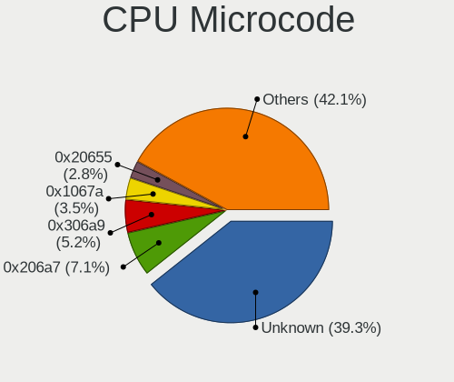
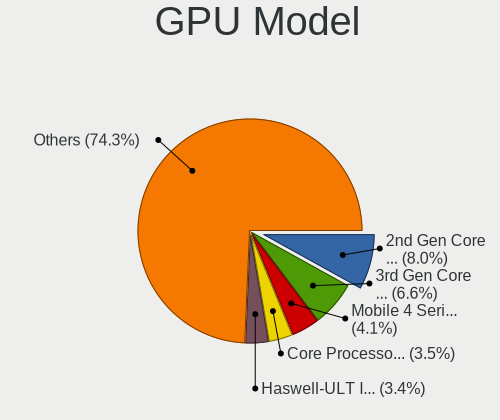
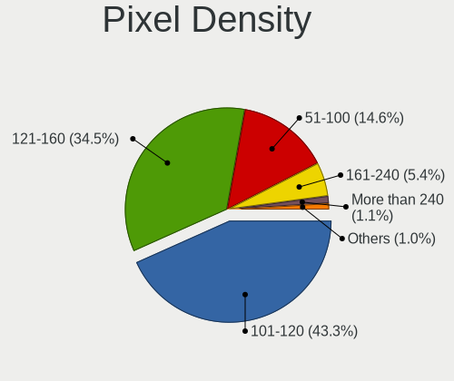
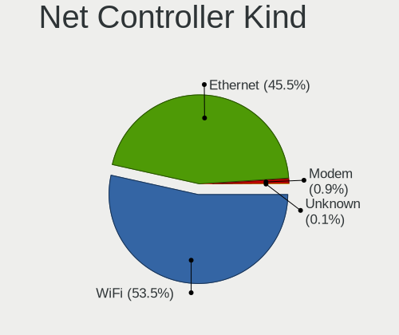
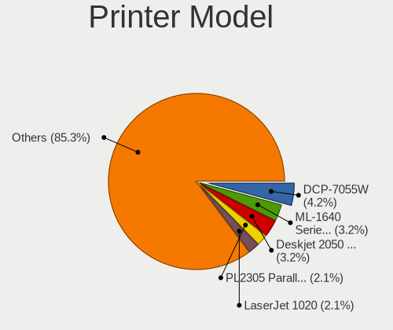

OpenMandriva - Tested Hardware & Statistics (Notebooks)
-------------------------------------------------------

A project to collect tested hardware configurations for OpenMandriva.

Anyone can contribute to this report by the [hw-probe](https://github.com/linuxhw/hw-probe) tool:

    sudo -E hw-probe -all -upload

Please contribute! Especially if your hardware is rare.

Contents
--------

* [ Test Cases ](#test-cases)

* [ System ](#system)
  - [ OS                       ](#os)
  - [ OS Family                ](#os-family)
  - [ Kernel                   ](#kernel)
  - [ Kernel Family            ](#kernel-family)
  - [ Kernel Major Ver.        ](#kernel-major-ver)
  - [ Arch                     ](#arch)
  - [ DE                       ](#de)
  - [ Display Server           ](#display-server)
  - [ Display Manager          ](#display-manager)
  - [ OS Lang                  ](#os-lang)
  - [ Boot Mode                ](#boot-mode)
  - [ Filesystem               ](#filesystem)
  - [ Part. scheme             ](#part-scheme)
  - [ Dual Boot with Linux/BSD ](#dual-boot-with-linuxbsd)
  - [ Dual Boot (Win)          ](#dual-boot-win)

* [ Board ](#board)
  - [ Vendor                   ](#vendor)
  - [ Model                    ](#model)
  - [ Model Family             ](#model-family)
  - [ MFG Year                 ](#mfg-year)
  - [ Form Factor              ](#form-factor)
  - [ Secure Boot              ](#secure-boot)
  - [ Coreboot                 ](#coreboot)
  - [ RAM Size                 ](#ram-size)
  - [ RAM Used                 ](#ram-used)
  - [ Total Drives             ](#total-drives)
  - [ Has CD-ROM               ](#has-cd-rom)
  - [ Has Ethernet             ](#has-ethernet)
  - [ Has WiFi                 ](#has-wifi)
  - [ Has Bluetooth            ](#has-bluetooth)

* [ Location ](#location)
  - [ Country                  ](#country)
  - [ City                     ](#city)

* [ Drives ](#drives)
  - [ Drive Vendor             ](#drive-vendor)
  - [ Drive Model              ](#drive-model)
  - [ HDD Vendor               ](#hdd-vendor)
  - [ SSD Vendor               ](#ssd-vendor)
  - [ Drive Kind               ](#drive-kind)
  - [ Drive Connector          ](#drive-connector)
  - [ Drive Size               ](#drive-size)
  - [ Space Total              ](#space-total)
  - [ Space Used               ](#space-used)
  - [ Malfunc. Drives          ](#malfunc-drives)
  - [ Malfunc. Drive Vendor    ](#malfunc-drive-vendor)
  - [ Malfunc. HDD Vendor      ](#malfunc-hdd-vendor)
  - [ Malfunc. Drive Kind      ](#malfunc-drive-kind)
  - [ Failed Drives            ](#failed-drives)
  - [ Failed Drive Vendor      ](#failed-drive-vendor)
  - [ Drive Status             ](#drive-status)

* [ Storage controller ](#storage-controller)
  - [ Storage Vendor           ](#storage-vendor)
  - [ Storage Model            ](#storage-model)
  - [ Storage Kind             ](#storage-kind)

* [ Processor ](#processor)
  - [ CPU Vendor               ](#cpu-vendor)
  - [ CPU Model                ](#cpu-model)
  - [ CPU Model Family         ](#cpu-model-family)
  - [ CPU Cores                ](#cpu-cores)
  - [ CPU Sockets              ](#cpu-sockets)
  - [ CPU Threads              ](#cpu-threads)
  - [ CPU Op-Modes             ](#cpu-op-modes)
  - [ CPU Microcode            ](#cpu-microcode)
  - [ CPU Microarch            ](#cpu-microarch)

* [ Graphics ](#graphics)
  - [ GPU Vendor               ](#gpu-vendor)
  - [ GPU Model                ](#gpu-model)
  - [ GPU Combo                ](#gpu-combo)
  - [ GPU Driver               ](#gpu-driver)
  - [ GPU Memory               ](#gpu-memory)

* [ Monitor ](#monitor)
  - [ Monitor Vendor           ](#monitor-vendor)
  - [ Monitor Model            ](#monitor-model)
  - [ Monitor Resolution       ](#monitor-resolution)
  - [ Monitor Diagonal         ](#monitor-diagonal)
  - [ Monitor Width            ](#monitor-width)
  - [ Aspect Ratio             ](#aspect-ratio)
  - [ Monitor Area             ](#monitor-area)
  - [ Pixel Density            ](#pixel-density)
  - [ Multiple Monitors        ](#multiple-monitors)

* [ Network ](#network)
  - [ Net Controller Vendor    ](#net-controller-vendor)
  - [ Net Controller Model     ](#net-controller-model)
  - [ Wireless Vendor          ](#wireless-vendor)
  - [ Wireless Model           ](#wireless-model)
  - [ Ethernet Vendor          ](#ethernet-vendor)
  - [ Ethernet Model           ](#ethernet-model)
  - [ Net Controller Kind      ](#net-controller-kind)
  - [ Used Controller          ](#used-controller)
  - [ NICs                     ](#nics)
  - [ IPv6                     ](#ipv6)

* [ Bluetooth ](#bluetooth)
  - [ Bluetooth Vendor         ](#bluetooth-vendor)
  - [ Bluetooth Model          ](#bluetooth-model)

* [ Sound ](#sound)
  - [ Sound Vendor             ](#sound-vendor)
  - [ Sound Model              ](#sound-model)

* [ Memory ](#memory)
  - [ Memory Vendor            ](#memory-vendor)
  - [ Memory Model             ](#memory-model)
  - [ Memory Kind              ](#memory-kind)
  - [ Memory Form Factor       ](#memory-form-factor)
  - [ Memory Size              ](#memory-size)
  - [ Memory Speed             ](#memory-speed)

* [ Printers & scanners ](#printers--scanners)
  - [ Printer Vendor           ](#printer-vendor)
  - [ Printer Model            ](#printer-model)
  - [ Scanner Vendor           ](#scanner-vendor)
  - [ Scanner Model            ](#scanner-model)

* [ Camera ](#camera)
  - [ Camera Vendor            ](#camera-vendor)
  - [ Camera Model             ](#camera-model)

* [ Security ](#security)
  - [ Fingerprint Vendor       ](#fingerprint-vendor)
  - [ Fingerprint Model        ](#fingerprint-model)
  - [ Chipcard Vendor          ](#chipcard-vendor)
  - [ Chipcard Model           ](#chipcard-model)

* [ Unsupported ](#unsupported)
  - [ Unsupported Devices      ](#unsupported-devices)
  - [ Unsupported Device Types ](#unsupported-device-types)

Test Cases
----------

Total: 10995

| Vendor        | Model                       | Probe                                                      | Date         |
|---------------|-----------------------------|------------------------------------------------------------|--------------|
| ASUSTek       | VivoBook_ASUSLaptop E410... | [7b12164813](https://linux-hardware.org/?probe=7b12164813) | Jan 06, 2025 |
| ASUSTek       | ROG Strix G712LV_G712LV     | [98506e2506](https://linux-hardware.org/?probe=98506e2506) | Jan 06, 2025 |
| Lenovo        | ThinkPad SL400 2743A48      | [0c0f6ef206](https://linux-hardware.org/?probe=0c0f6ef206) | Jan 06, 2025 |
| Acer          | Aspire A515-52G             | [572616a1d9](https://linux-hardware.org/?probe=572616a1d9) | Jan 06, 2025 |
| Lenovo        | ThinkPad P14s Gen 3 21J5... | [f5e1468f62](https://linux-hardware.org/?probe=f5e1468f62) | Jan 06, 2025 |
| HP            | Laptop 15-bw0xx             | [d4de478530](https://linux-hardware.org/?probe=d4de478530) | Jan 06, 2025 |
| Acer          | Aspire E5-572G              | [dca3176d13](https://linux-hardware.org/?probe=dca3176d13) | Jan 06, 2025 |
| ASUSTek       | X51RL                       | [526c93f776](https://linux-hardware.org/?probe=526c93f776) | Jan 06, 2025 |
| Dell          | Latitude E7470              | [448c4c5d6e](https://linux-hardware.org/?probe=448c4c5d6e) | Jan 06, 2025 |
| MSI           | Katana 17 B12UCR            | [9a04090ded](https://linux-hardware.org/?probe=9a04090ded) | Jan 06, 2025 |
| HP            | ProBook 455 G8 Notebook ... | [963fcdd477](https://linux-hardware.org/?probe=963fcdd477) | Jan 06, 2025 |
| Lenovo        | IdeaPad MIIX 700-12ISK 8... | [0cf3ed40e6](https://linux-hardware.org/?probe=0cf3ed40e6) | Jan 06, 2025 |
| Lenovo        | V15 G4 IAH 83FS             | [54ea7cdde8](https://linux-hardware.org/?probe=54ea7cdde8) | Jan 06, 2025 |
| Dell          | Latitude 7280               | [58eef8f0dd](https://linux-hardware.org/?probe=58eef8f0dd) | Jan 06, 2025 |
| Acer          | Aspire E1-572               | [e825292593](https://linux-hardware.org/?probe=e825292593) | Jan 06, 2025 |
| Dell          | Inspiron 15-3567            | [c661f75c0f](https://linux-hardware.org/?probe=c661f75c0f) | Jan 05, 2025 |
| HP            | EliteBook 8570w             | [0b6fedb6c2](https://linux-hardware.org/?probe=0b6fedb6c2) | Jan 05, 2025 |
| Dell          | Latitude D630               | [2c3411042a](https://linux-hardware.org/?probe=2c3411042a) | Jan 05, 2025 |
| Acer          | Aspire ES1-731              | [721fdec99d](https://linux-hardware.org/?probe=721fdec99d) | Jan 05, 2025 |
| Dell          | Latitude E4200              | [db5dcaf33b](https://linux-hardware.org/?probe=db5dcaf33b) | Jan 05, 2025 |
| HP            | EliteBook 8460p             | [0a8d680cf0](https://linux-hardware.org/?probe=0a8d680cf0) | Jan 05, 2025 |
| Dell          | Precision M4400             | [6d8da5ac74](https://linux-hardware.org/?probe=6d8da5ac74) | Jan 05, 2025 |
| Panasonic     | CF-NX2AWLCS                 | [e3ead6c710](https://linux-hardware.org/?probe=e3ead6c710) | Jan 05, 2025 |
| HP            | 255 G6 Notebook PC          | [57b6786860](https://linux-hardware.org/?probe=57b6786860) | Jan 04, 2025 |
| HP            | 655                         | [e8728549f4](https://linux-hardware.org/?probe=e8728549f4) | Jan 04, 2025 |
| Lenovo        | V15 G4 IRU 83A1             | [c4a6747552](https://linux-hardware.org/?probe=c4a6747552) | Jan 04, 2025 |
| HP            | 15                          | [d95bba2430](https://linux-hardware.org/?probe=d95bba2430) | Jan 04, 2025 |
| Lenovo        | IdeaPad U450p 3389          | [c01ce6e337](https://linux-hardware.org/?probe=c01ce6e337) | Jan 04, 2025 |
| Dell          | Latitude E4310              | [68eec2c60e](https://linux-hardware.org/?probe=68eec2c60e) | Jan 04, 2025 |
| ASUSTek       | VivoBook E14 E402WAS        | [208b3336eb](https://linux-hardware.org/?probe=208b3336eb) | Jan 04, 2025 |
| ASUSTek       | VivoBook_ASUSLaptop X160... | [59a8c42150](https://linux-hardware.org/?probe=59a8c42150) | Jan 04, 2025 |
| MSI           | Summit E13FlipEvo A12MT     | [642730a80d](https://linux-hardware.org/?probe=642730a80d) | Jan 04, 2025 |
| HP            | Laptop 15-fd0xxx            | [dfd9d16913](https://linux-hardware.org/?probe=dfd9d16913) | Jan 03, 2025 |
| Medion        | E11201                      | [141200df83](https://linux-hardware.org/?probe=141200df83) | Jan 03, 2025 |
| HP            | ProBook 640 G1              | [f901f7b9aa](https://linux-hardware.org/?probe=f901f7b9aa) | Jan 03, 2025 |
| ASUSTek       | Q550LF                      | [c587210fdb](https://linux-hardware.org/?probe=c587210fdb) | Jan 03, 2025 |
| Acer          | Extensa 5630                | [1bb020a4af](https://linux-hardware.org/?probe=1bb020a4af) | Jan 03, 2025 |
| Sony          | VPCF236FM                   | [1c0abb00b2](https://linux-hardware.org/?probe=1c0abb00b2) | Jan 03, 2025 |
| Dell          | Latitude D630               | [3b6bae784e](https://linux-hardware.org/?probe=3b6bae784e) | Jan 03, 2025 |
| Dell          | Latitude 5300               | [d3d6e520f5](https://linux-hardware.org/?probe=d3d6e520f5) | Jan 03, 2025 |
| HP            | 250 G8 Notebook PC          | [d5b66faf28](https://linux-hardware.org/?probe=d5b66faf28) | Jan 02, 2025 |
| Dell          | Latitude E6430              | [860e215daf](https://linux-hardware.org/?probe=860e215daf) | Jan 02, 2025 |
| Lenovo        | ThinkPad L470 20J4000LMD    | [e2fa70f2b4](https://linux-hardware.org/?probe=e2fa70f2b4) | Jan 02, 2025 |
| Lenovo        | IdeaPad 700-15ISK 80RU      | [b26f854f97](https://linux-hardware.org/?probe=b26f854f97) | Jan 02, 2025 |
| Fujitsu       | LIFEBOOK A3510              | [fd4e4972d2](https://linux-hardware.org/?probe=fd4e4972d2) | Jan 02, 2025 |
| Dell          | Inspiron 1545               | [445120281e](https://linux-hardware.org/?probe=445120281e) | Jan 02, 2025 |
| Lenovo        | IdeaPad 3 15IML05 81WB      | [f5cc6f8958](https://linux-hardware.org/?probe=f5cc6f8958) | Jan 02, 2025 |
| Lenovo        | ThinkPad W520 428426U       | [a7aa110e08](https://linux-hardware.org/?probe=a7aa110e08) | Jan 02, 2025 |
| Lenovo        | IdeaPad Pro 5 16IMH9 83D... | [bb4860483d](https://linux-hardware.org/?probe=bb4860483d) | Jan 02, 2025 |
| HP            | OMEN by Laptop              | [319fc5e92e](https://linux-hardware.org/?probe=319fc5e92e) | Jan 02, 2025 |
| Dell          | Inspiron 15-3565            | [27354f28ea](https://linux-hardware.org/?probe=27354f28ea) | Jan 02, 2025 |
| Casper        | EXCALIBUR G770              | [1f3dee2cf2](https://linux-hardware.org/?probe=1f3dee2cf2) | Jan 02, 2025 |
| HP            | Pavilion 17                 | [fc1f326456](https://linux-hardware.org/?probe=fc1f326456) | Jan 02, 2025 |
| Lenovo        | ThinkPad X1 Carbon Gen 1... | [ae6fbefd79](https://linux-hardware.org/?probe=ae6fbefd79) | Jan 01, 2025 |
| ASUSTek       | UL80VT                      | [51fb360728](https://linux-hardware.org/?probe=51fb360728) | Jan 01, 2025 |
| HP            | EliteBook 840 G1            | [f298c84729](https://linux-hardware.org/?probe=f298c84729) | Jan 01, 2025 |
| Dell          | Latitude 7390               | [ca0c827c18](https://linux-hardware.org/?probe=ca0c827c18) | Jan 01, 2025 |
| Lenovo        | IdeaCentre A700 10050       | [e7f468af21](https://linux-hardware.org/?probe=e7f468af21) | Jan 01, 2025 |
| HP            | G72                         | [376d1a0575](https://linux-hardware.org/?probe=376d1a0575) | Jan 01, 2025 |
| Acer          | Aspire 5750                 | [879127efc6](https://linux-hardware.org/?probe=879127efc6) | Jan 01, 2025 |
| Acer          | Aspire 8951G                | [238300d1c0](https://linux-hardware.org/?probe=238300d1c0) | Jan 01, 2025 |
| Dell          | Inspiron 13-5368            | [bc5f8753e8](https://linux-hardware.org/?probe=bc5f8753e8) | Jan 01, 2025 |
| Dell          | Latitude E5550              | [618acec11b](https://linux-hardware.org/?probe=618acec11b) | Jan 01, 2025 |
| HP            | Laptop 14z-em000            | [0c43124a84](https://linux-hardware.org/?probe=0c43124a84) | Jan 01, 2025 |
| Lenovo        | ThinkPad X1 Carbon 34484... | [3fc4858681](https://linux-hardware.org/?probe=3fc4858681) | Jan 01, 2025 |
| Dell          | Vostro 3558                 | [4f78b23a1f](https://linux-hardware.org/?probe=4f78b23a1f) | Jan 01, 2025 |
| Dell          | Latitude E7470              | [b4c31f2860](https://linux-hardware.org/?probe=b4c31f2860) | Jan 01, 2025 |
| Samsung       | 770Z5E/780Z5E               | [1643aef813](https://linux-hardware.org/?probe=1643aef813) | Jan 01, 2025 |
| Acer          | Predator PH315-53           | [17816e7d6b](https://linux-hardware.org/?probe=17816e7d6b) | Jan 01, 2025 |
| HP            | Pavilion Gaming Laptop 1... | [38accd1b79](https://linux-hardware.org/?probe=38accd1b79) | Jan 01, 2025 |
| Dell          | Latitude 3340               | [b22cafbc3b](https://linux-hardware.org/?probe=b22cafbc3b) | Jan 01, 2025 |
| HP            | Pavilion dv6                | [1c73ddb1c0](https://linux-hardware.org/?probe=1c73ddb1c0) | Jan 01, 2025 |
| Lenovo        | ThinkPad E570 20H5CTO1WW    | [ae328090f7](https://linux-hardware.org/?probe=ae328090f7) | Jan 01, 2025 |
| Lenovo        | ThinkPad T510 4313A11       | [ecf4a20d48](https://linux-hardware.org/?probe=ecf4a20d48) | Jan 01, 2025 |
| HP            | ENVY Notebook               | [b6d4605e3e](https://linux-hardware.org/?probe=b6d4605e3e) | Jan 01, 2025 |
| Lenovo        | ThinkPad T430 2349SVA       | [654dbcabab](https://linux-hardware.org/?probe=654dbcabab) | Jan 01, 2025 |
| Dell          | Inspiron 3542               | [95006e65be](https://linux-hardware.org/?probe=95006e65be) | Jan 01, 2025 |
| Dell          | Latitude 7390               | [1328b0b059](https://linux-hardware.org/?probe=1328b0b059) | Jan 01, 2025 |
| HP            | Laptop 14z-em000            | [2b45c6c699](https://linux-hardware.org/?probe=2b45c6c699) | Jan 01, 2025 |
| Dell          | Latitude 7390 2-in-1        | [0837722dea](https://linux-hardware.org/?probe=0837722dea) | Jan 01, 2025 |
| Acer          | Aspire 5742                 | [aa9170d15a](https://linux-hardware.org/?probe=aa9170d15a) | Dec 31, 2024 |
| Toshiba       | Satellite P755              | [919f9d689c](https://linux-hardware.org/?probe=919f9d689c) | Dec 31, 2024 |
| Lenovo        | Yoga 2 13 20344             | [1be4064009](https://linux-hardware.org/?probe=1be4064009) | Dec 31, 2024 |
| Samsung       | 300E4A/300E5A/300E7A/343... | [c66eaf3382](https://linux-hardware.org/?probe=c66eaf3382) | Dec 31, 2024 |
| Lenovo        | IdeaPad Slim 1-14AST-05 ... | [0850762b48](https://linux-hardware.org/?probe=0850762b48) | Dec 31, 2024 |
| HP            | ProBook 440 14 inch G9 N... | [2127fd790b](https://linux-hardware.org/?probe=2127fd790b) | Dec 31, 2024 |
| ASUSTek       | X556UR                      | [8550e720af](https://linux-hardware.org/?probe=8550e720af) | Dec 31, 2024 |
| HP            | 250 15.6 inch G10           | [94fdf69690](https://linux-hardware.org/?probe=94fdf69690) | Dec 31, 2024 |
| Dell          | Latitude E7440              | [2d9f729ec1](https://linux-hardware.org/?probe=2d9f729ec1) | Dec 31, 2024 |
| HP            | ProBook 6560b               | [c2ae1365c2](https://linux-hardware.org/?probe=c2ae1365c2) | Dec 31, 2024 |
| Toshiba       | Satellite P200              | [a07857c808](https://linux-hardware.org/?probe=a07857c808) | Dec 31, 2024 |
| Toshiba       | Satellite L300              | [3104c13f02](https://linux-hardware.org/?probe=3104c13f02) | Dec 31, 2024 |
| HP            | Pavilion 13                 | [fece21c1ee](https://linux-hardware.org/?probe=fece21c1ee) | Dec 31, 2024 |
| HP            | EliteBook 840 G3            | [f1bc5970f8](https://linux-hardware.org/?probe=f1bc5970f8) | Dec 31, 2024 |
| Lenovo        | Legion Pro 5 16IRX8 82WK    | [b86a475528](https://linux-hardware.org/?probe=b86a475528) | Dec 31, 2024 |
| Dell          | Latitude E6220              | [b93b3b88d1](https://linux-hardware.org/?probe=b93b3b88d1) | Dec 31, 2024 |
| Lenovo        | G470 20078                  | [9d15c84512](https://linux-hardware.org/?probe=9d15c84512) | Dec 31, 2024 |
| Lenovo        | B560 43308LG                | [e4f739103a](https://linux-hardware.org/?probe=e4f739103a) | Dec 31, 2024 |
| HP            | Laptop 14-cm0xxx            | [045aa245db](https://linux-hardware.org/?probe=045aa245db) | Dec 31, 2024 |
| Acer          | Aspire A315-42              | [734fd13848](https://linux-hardware.org/?probe=734fd13848) | Dec 31, 2024 |
| Google        | Auron_Paine                 | [9603115c16](https://linux-hardware.org/?probe=9603115c16) | Dec 31, 2024 |
| Dell          | Latitude E6420              | [46c2760e4e](https://linux-hardware.org/?probe=46c2760e4e) | Dec 31, 2024 |
| Lenovo        | IdeaPad 1 14IGL7 82V6       | [b30ae21c72](https://linux-hardware.org/?probe=b30ae21c72) | Dec 31, 2024 |
| Acer          | Nitro AN517-54              | [8461425ec1](https://linux-hardware.org/?probe=8461425ec1) | Dec 31, 2024 |
| HUAWEI        | BOHK-WAX9X                  | [3b12d86f3d](https://linux-hardware.org/?probe=3b12d86f3d) | Dec 31, 2024 |
| Lenovo        | G460 20041                  | [f5b6aed89d](https://linux-hardware.org/?probe=f5b6aed89d) | Dec 31, 2024 |
| HP            | Victus by Gaming Laptop ... | [9dd96b42dd](https://linux-hardware.org/?probe=9dd96b42dd) | Dec 31, 2024 |
| HP            | Laptop 15-bw0xx             | [e7e2b59786](https://linux-hardware.org/?probe=e7e2b59786) | Dec 31, 2024 |
| ASUSTek       | X540SA                      | [fffc36417c](https://linux-hardware.org/?probe=fffc36417c) | Dec 31, 2024 |
| Dell          | XPS 13 9350                 | [896eb3972d](https://linux-hardware.org/?probe=896eb3972d) | Dec 31, 2024 |
| Acer          | Aspire ES1-572              | [ab8d0c7c3f](https://linux-hardware.org/?probe=ab8d0c7c3f) | Dec 30, 2024 |
| Acer          | Aspire E1-571G              | [a589ad91b5](https://linux-hardware.org/?probe=a589ad91b5) | Dec 30, 2024 |
| Lenovo        | Yoga 300-11IBY 80M0         | [63d6d04a10](https://linux-hardware.org/?probe=63d6d04a10) | Dec 30, 2024 |
| Clevo         | W240BL_W250BZ_W270BZQ       | [7da1abb74d](https://linux-hardware.org/?probe=7da1abb74d) | Dec 30, 2024 |
| HP            | ENVY dv6                    | [592cab3725](https://linux-hardware.org/?probe=592cab3725) | Dec 30, 2024 |
| Dell          | Vostro 3420                 | [d5a414f6d5](https://linux-hardware.org/?probe=d5a414f6d5) | Dec 30, 2024 |
| Acer          | Aspire A515-57              | [d2483d4bb8](https://linux-hardware.org/?probe=d2483d4bb8) | Dec 30, 2024 |
| HP            | OMEN by Laptop 15-dc0xxx    | [83d420ab00](https://linux-hardware.org/?probe=83d420ab00) | Dec 30, 2024 |
| Dell          | Latitude 5400               | [b83ec20ffe](https://linux-hardware.org/?probe=b83ec20ffe) | Dec 30, 2024 |
| ASUSTek       | VivoBook_ASUSLaptop X409... | [0831cecc24](https://linux-hardware.org/?probe=0831cecc24) | Dec 30, 2024 |
| Infinix       | Y3 Plus                     | [a5d0c097a5](https://linux-hardware.org/?probe=a5d0c097a5) | Dec 30, 2024 |
| ASUSTek       | ASUS TUF Gaming A16 FA61... | [005152678f](https://linux-hardware.org/?probe=005152678f) | Dec 30, 2024 |
| Medion        | Defender P40                | [04ff586114](https://linux-hardware.org/?probe=04ff586114) | Dec 29, 2024 |
| Dell          | XPS 13 9360                 | [4e5b03bfd7](https://linux-hardware.org/?probe=4e5b03bfd7) | Dec 29, 2024 |
| LG Electro... | 17Z90S-G.AD7BA1             | [aaa38e95c5](https://linux-hardware.org/?probe=aaa38e95c5) | Dec 29, 2024 |
| HP            | EliteBook 8730w             | [26e363efb2](https://linux-hardware.org/?probe=26e363efb2) | Dec 29, 2024 |
| Toshiba       | Satellite L755              | [f4e18a27e3](https://linux-hardware.org/?probe=f4e18a27e3) | Dec 29, 2024 |
| ASUSTek       | 1015PN                      | [f84154f736](https://linux-hardware.org/?probe=f84154f736) | Dec 29, 2024 |
| ASUSTek       | VivoBook_ASUSLaptop X712... | [7b7d782202](https://linux-hardware.org/?probe=7b7d782202) | Dec 29, 2024 |
| HP            | EliteBook 840 G5            | [85caa6254a](https://linux-hardware.org/?probe=85caa6254a) | Dec 29, 2024 |
| Lenovo        | ThinkPad T450s 20BWS5F40... | [8bb1dde48e](https://linux-hardware.org/?probe=8bb1dde48e) | Dec 29, 2024 |
| Apple         | MacBookAir6,1               | [3421670edf](https://linux-hardware.org/?probe=3421670edf) | Dec 29, 2024 |
| HP            | Notebook                    | [2fe95580ce](https://linux-hardware.org/?probe=2fe95580ce) | Dec 29, 2024 |
| ASUSTek       | VivoBook_ASUSLaptop X515... | [e9aa37cfcd](https://linux-hardware.org/?probe=e9aa37cfcd) | Dec 29, 2024 |
| HP            | Compaq 610                  | [af961e1650](https://linux-hardware.org/?probe=af961e1650) | Dec 29, 2024 |
| Lenovo        | ThinkPad T460 20FMS3320G    | [631f081493](https://linux-hardware.org/?probe=631f081493) | Dec 29, 2024 |
| Lenovo        | ThinkPad T420s 41732AU      | [c9a701f86e](https://linux-hardware.org/?probe=c9a701f86e) | Dec 29, 2024 |
| HP            | Notebook                    | [4552d837a0](https://linux-hardware.org/?probe=4552d837a0) | Dec 29, 2024 |
| HP            | Pavilion dv4                | [ad6955799f](https://linux-hardware.org/?probe=ad6955799f) | Dec 29, 2024 |
| Acer          | Aspire 5253                 | [8129d03feb](https://linux-hardware.org/?probe=8129d03feb) | Dec 29, 2024 |
| ASUSTek       | ZenBook UX334FLC_UX334FL    | [648c9b7e5f](https://linux-hardware.org/?probe=648c9b7e5f) | Dec 28, 2024 |
| Samsung       | 950XDB/951XDB/950XDY        | [7d22efb355](https://linux-hardware.org/?probe=7d22efb355) | Dec 28, 2024 |
| Lenovo        | B590 20206                  | [f46c163012](https://linux-hardware.org/?probe=f46c163012) | Dec 28, 2024 |
| ASUSTek       | X750JB                      | [c3848bc769](https://linux-hardware.org/?probe=c3848bc769) | Dec 28, 2024 |
| Acer          | Aspire A315-58              | [895a738e00](https://linux-hardware.org/?probe=895a738e00) | Dec 28, 2024 |
| Toshiba       | TECRA A10                   | [49714d63c9](https://linux-hardware.org/?probe=49714d63c9) | Dec 28, 2024 |
| Dell          | Latitude E5470              | [e7d5673567](https://linux-hardware.org/?probe=e7d5673567) | Dec 28, 2024 |
| Dell          | Latitude E7440              | [53d89b9e96](https://linux-hardware.org/?probe=53d89b9e96) | Dec 28, 2024 |
| ASUSTek       | K53U                        | [aa0acbd3a4](https://linux-hardware.org/?probe=aa0acbd3a4) | Dec 28, 2024 |
| HP            | Laptop 14-dk1xxx            | [317b3a0d60](https://linux-hardware.org/?probe=317b3a0d60) | Dec 28, 2024 |
| Dell          | Inspiron 11 - 3147          | [f0df887cfb](https://linux-hardware.org/?probe=f0df887cfb) | Dec 28, 2024 |
| ASUSTek       | ROG Zephyrus G14 GA401IV... | [e2f614b096](https://linux-hardware.org/?probe=e2f614b096) | Dec 28, 2024 |
| HP            | EliteBook 845 14 inch G1... | [60ab24f653](https://linux-hardware.org/?probe=60ab24f653) | Dec 28, 2024 |
| HP            | Laptop 17-by3xxx            | [798564ee8d](https://linux-hardware.org/?probe=798564ee8d) | Dec 28, 2024 |
| ASUSTek       | X550VL                      | [f39f501a7f](https://linux-hardware.org/?probe=f39f501a7f) | Dec 28, 2024 |
| Lenovo        | ThinkPad T470 W10DG 20JM... | [a84d2e6201](https://linux-hardware.org/?probe=a84d2e6201) | Dec 27, 2024 |
| Dell          | System Inspiron N7110       | [2607b61b02](https://linux-hardware.org/?probe=2607b61b02) | Dec 27, 2024 |
| ASUSTek       | S300CA                      | [7225fa5b22](https://linux-hardware.org/?probe=7225fa5b22) | Dec 27, 2024 |
| Lenovo        | ThinkPad E480 20KNA04RCD    | [d64710669e](https://linux-hardware.org/?probe=d64710669e) | Dec 27, 2024 |
| Dell          | Latitude 7490               | [73b59f6e09](https://linux-hardware.org/?probe=73b59f6e09) | Dec 27, 2024 |
| Fujitsu Si... | ESPRIMO Mobile U9210        | [67cd7236db](https://linux-hardware.org/?probe=67cd7236db) | Dec 27, 2024 |
| Acer          | Aspire A315-34              | [c8bcfc6c53](https://linux-hardware.org/?probe=c8bcfc6c53) | Dec 27, 2024 |
| Dell          | Inspiron 5558               | [370f0c48c3](https://linux-hardware.org/?probe=370f0c48c3) | Dec 27, 2024 |
| ASUSTek       | X502CA                      | [6b816ff7ef](https://linux-hardware.org/?probe=6b816ff7ef) | Dec 27, 2024 |
| Lenovo        | ThinkPad X250 20CLA32VLM    | [c62f3b52e2](https://linux-hardware.org/?probe=c62f3b52e2) | Dec 27, 2024 |
| HP            | ProBook 440 G5              | [eb07190046](https://linux-hardware.org/?probe=eb07190046) | Dec 27, 2024 |
| Dell          | Inspiron 11 - 3147          | [4ecd9dfdf5](https://linux-hardware.org/?probe=4ecd9dfdf5) | Dec 27, 2024 |
| Dell          | Latitude E5570              | [114a071bc2](https://linux-hardware.org/?probe=114a071bc2) | Dec 27, 2024 |
| Lenovo        | IdeaPad 330-17AST 81D7      | [145b300a77](https://linux-hardware.org/?probe=145b300a77) | Dec 26, 2024 |
| Lenovo        | IdeaPad 3 15ITL6 82H8       | [0001b3f45a](https://linux-hardware.org/?probe=0001b3f45a) | Dec 26, 2024 |
| ASUSTek       | VivoBook_ASUSLaptop X521... | [b007439528](https://linux-hardware.org/?probe=b007439528) | Dec 26, 2024 |
| HP            | ProBook 650 G1              | [2e0d9756fe](https://linux-hardware.org/?probe=2e0d9756fe) | Dec 26, 2024 |
| eMachines     | eME732                      | [7f36d968e4](https://linux-hardware.org/?probe=7f36d968e4) | Dec 26, 2024 |
| MSI           | GF63 Thin 10SCSR            | [9d5e0b2b95](https://linux-hardware.org/?probe=9d5e0b2b95) | Dec 26, 2024 |
| Dell          | XPS 13 9370                 | [9d85ecae19](https://linux-hardware.org/?probe=9d85ecae19) | Dec 26, 2024 |
| HP            | Pavilion Gaming Laptop 1... | [d811ae85fd](https://linux-hardware.org/?probe=d811ae85fd) | Dec 26, 2024 |
| Dell          | Latitude E5430 non-vPro     | [4e9074a386](https://linux-hardware.org/?probe=4e9074a386) | Dec 26, 2024 |
| HP            | Laptop 14-bs0xx             | [90ddb2c764](https://linux-hardware.org/?probe=90ddb2c764) | Dec 26, 2024 |
| Dell          | Latitude E5470              | [3af687bbee](https://linux-hardware.org/?probe=3af687bbee) | Dec 26, 2024 |
| Dell          | Inspiron 5490               | [b8810650b5](https://linux-hardware.org/?probe=b8810650b5) | Dec 26, 2024 |
| Lenovo        | ThinkPad P14s Gen 1 20S5... | [e5bf005a5f](https://linux-hardware.org/?probe=e5bf005a5f) | Dec 26, 2024 |
| Notebook      | W65_W67RZ                   | [fc8f4a29f7](https://linux-hardware.org/?probe=fc8f4a29f7) | Dec 26, 2024 |
| Acer          | Aspire A315-59              | [1808c0b1a3](https://linux-hardware.org/?probe=1808c0b1a3) | Dec 26, 2024 |
| HP            | Laptop 15-fd0xxx            | [1ed7f7ef48](https://linux-hardware.org/?probe=1ed7f7ef48) | Dec 26, 2024 |
| MSI           | Katana A17 AI B8VE          | [06e816e082](https://linux-hardware.org/?probe=06e816e082) | Dec 26, 2024 |
| Acer          | Aspire V3-571G              | [1c7d970f58](https://linux-hardware.org/?probe=1c7d970f58) | Dec 26, 2024 |
| ASUSTek       | K72Jr                       | [1d7e1a872d](https://linux-hardware.org/?probe=1d7e1a872d) | Dec 25, 2024 |
| ASUSTek       | K53E                        | [2f5c8c3fcf](https://linux-hardware.org/?probe=2f5c8c3fcf) | Dec 25, 2024 |
| HP            | Notebook                    | [7d69f1f608](https://linux-hardware.org/?probe=7d69f1f608) | Dec 25, 2024 |
| Lenovo        | IdeaPad 3 14ITL6 82H7       | [e642f51eb3](https://linux-hardware.org/?probe=e642f51eb3) | Dec 25, 2024 |
| Lenovo        | ThinkPad X260 20F5S69F00    | [3dfbada1cc](https://linux-hardware.org/?probe=3dfbada1cc) | Dec 25, 2024 |
| Apple         | MacBookPro9,2               | [c289d2b95b](https://linux-hardware.org/?probe=c289d2b95b) | Dec 25, 2024 |
| HP            | Laptop 15-bs0xx             | [00e8b8cb17](https://linux-hardware.org/?probe=00e8b8cb17) | Dec 25, 2024 |
| Dell          | Vostro V13                  | [6d6b58cad3](https://linux-hardware.org/?probe=6d6b58cad3) | Dec 25, 2024 |
| HP            | Pavilion dv5                | [010343cf1d](https://linux-hardware.org/?probe=010343cf1d) | Dec 25, 2024 |
| Toshiba       | Satellite C75D-B            | [95c164fdf5](https://linux-hardware.org/?probe=95c164fdf5) | Dec 25, 2024 |
| Chuwi         | FreeBook                    | [91ad67a5f0](https://linux-hardware.org/?probe=91ad67a5f0) | Dec 25, 2024 |
| Acer          | Aspire A315-41              | [fe6c49574a](https://linux-hardware.org/?probe=fe6c49574a) | Dec 24, 2024 |
| Lenovo        | ThinkPad X1 Carbon 34604... | [ee6dc942c0](https://linux-hardware.org/?probe=ee6dc942c0) | Dec 24, 2024 |
| Lenovo        | ThinkPad E14 Gen 2 20T60... | [f6852cbdbb](https://linux-hardware.org/?probe=f6852cbdbb) | Dec 24, 2024 |
| Lenovo        | ThinkPad L460 20FVS2LC00    | [0ad5ec9e46](https://linux-hardware.org/?probe=0ad5ec9e46) | Dec 24, 2024 |
| HP            | 15 TouchSmart               | [7e6d4c4c49](https://linux-hardware.org/?probe=7e6d4c4c49) | Dec 24, 2024 |
| Samsung       | R530/R730/P530              | [88983f374b](https://linux-hardware.org/?probe=88983f374b) | Dec 24, 2024 |
| Toshiba       | Satellite C55-A             | [019825dc9f](https://linux-hardware.org/?probe=019825dc9f) | Dec 24, 2024 |
| Lenovo        | ThinkPad E460 20ETS00900    | [b4c09901bb](https://linux-hardware.org/?probe=b4c09901bb) | Dec 24, 2024 |
| Acer          | Aspire E1-531               | [2d5eef0754](https://linux-hardware.org/?probe=2d5eef0754) | Dec 24, 2024 |
| HP            | EliteBook 755 G5            | [307803b17e](https://linux-hardware.org/?probe=307803b17e) | Dec 24, 2024 |
| Sony          | VGN-CR220E                  | [4611a18823](https://linux-hardware.org/?probe=4611a18823) | Dec 24, 2024 |
| HP            | EliteBook 840 G6            | [b2c0345c76](https://linux-hardware.org/?probe=b2c0345c76) | Dec 24, 2024 |
| ASUSTek       | S301LA                      | [eeecff1e67](https://linux-hardware.org/?probe=eeecff1e67) | Dec 24, 2024 |
| HP            | 2000                        | [178dbdf355](https://linux-hardware.org/?probe=178dbdf355) | Dec 24, 2024 |
| Dell          | Latitude E5530 non-vPro     | [1a50b8a0aa](https://linux-hardware.org/?probe=1a50b8a0aa) | Dec 24, 2024 |
| ASUSTek       | 1225B                       | [20e4fd20fa](https://linux-hardware.org/?probe=20e4fd20fa) | Dec 23, 2024 |
| Toshiba       | Satellite L355D             | [160f61f926](https://linux-hardware.org/?probe=160f61f926) | Dec 23, 2024 |
| Dell          | Inspiron 5570               | [3d94539bde](https://linux-hardware.org/?probe=3d94539bde) | Dec 23, 2024 |
| ASUSTek       | K55DR                       | [52c3ba1b47](https://linux-hardware.org/?probe=52c3ba1b47) | Dec 23, 2024 |
| Positivo      | W940TU                      | [b5cb158e93](https://linux-hardware.org/?probe=b5cb158e93) | Dec 23, 2024 |
| Acer          | Aspire V5-431P              | [c0f17443e2](https://linux-hardware.org/?probe=c0f17443e2) | Dec 23, 2024 |
| Gigabyte      | AERO 17 XD                  | [c40df5f781](https://linux-hardware.org/?probe=c40df5f781) | Dec 23, 2024 |
| Dell          | Inspiron 3583               | [a9b3136b10](https://linux-hardware.org/?probe=a9b3136b10) | Dec 23, 2024 |
| Dell          | Inspiron 1720               | [d74511fc9f](https://linux-hardware.org/?probe=d74511fc9f) | Dec 23, 2024 |
| ASUSTek       | X55VD                       | [eb1866b0f2](https://linux-hardware.org/?probe=eb1866b0f2) | Dec 23, 2024 |
| Alienware     | M14xR2                      | [537e21183e](https://linux-hardware.org/?probe=537e21183e) | Dec 23, 2024 |
| Toshiba       | Satellite L855              | [6c895d905f](https://linux-hardware.org/?probe=6c895d905f) | Dec 23, 2024 |
| Dell          | Precision 7750              | [f7d88f943d](https://linux-hardware.org/?probe=f7d88f943d) | Dec 22, 2024 |
| Notebook      | W65_W67RB                   | [0475d664f0](https://linux-hardware.org/?probe=0475d664f0) | Dec 22, 2024 |
| Dell          | Latitude E6430              | [2bcde0809c](https://linux-hardware.org/?probe=2bcde0809c) | Dec 22, 2024 |
| Google        | Gnawty                      | [a2b1775af7](https://linux-hardware.org/?probe=a2b1775af7) | Dec 22, 2024 |
| Samsung       | P480                        | [20507489a2](https://linux-hardware.org/?probe=20507489a2) | Dec 22, 2024 |
| Digibras      | NH4CU53                     | [d9869c203b](https://linux-hardware.org/?probe=d9869c203b) | Dec 22, 2024 |
| HP            | EliteBook 830 G6            | [1377412970](https://linux-hardware.org/?probe=1377412970) | Dec 22, 2024 |
| HP            | Laptop 15s-eq0xxx           | [abde21108d](https://linux-hardware.org/?probe=abde21108d) | Dec 22, 2024 |
| Acer          | Aspire A515-51G             | [6d732c3b4d](https://linux-hardware.org/?probe=6d732c3b4d) | Dec 22, 2024 |
| Toshiba       | Satellite L855              | [7e9c1e43c5](https://linux-hardware.org/?probe=7e9c1e43c5) | Dec 22, 2024 |
| Lenovo        | IdeaPad 3 15ITL6 82H8       | [60574fca06](https://linux-hardware.org/?probe=60574fca06) | Dec 22, 2024 |
| Lenovo        | ThinkPad E15 Gen 3 20YG0... | [32f125d899](https://linux-hardware.org/?probe=32f125d899) | Dec 22, 2024 |
| NEC Comput... | PC-VK15EBZCG                | [cda3177d46](https://linux-hardware.org/?probe=cda3177d46) | Dec 22, 2024 |
| HP            | Victus by Gaming Laptop ... | [aa520e1fb6](https://linux-hardware.org/?probe=aa520e1fb6) | Dec 22, 2024 |
| ASUSTek       | VivoBook_ASUSLaptop X513... | [0ade3a3f94](https://linux-hardware.org/?probe=0ade3a3f94) | Dec 22, 2024 |
| MSI           | Alpha 17 C7VF               | [dc79106cf5](https://linux-hardware.org/?probe=dc79106cf5) | Dec 22, 2024 |
| HP            | G42                         | [3ce0d8feac](https://linux-hardware.org/?probe=3ce0d8feac) | Dec 22, 2024 |
| Dell          | Latitude E6500              | [16d283695d](https://linux-hardware.org/?probe=16d283695d) | Dec 22, 2024 |
| ASUSTek       | ASUS EXPERTBOOK P1512CEA... | [50c7d7cd7d](https://linux-hardware.org/?probe=50c7d7cd7d) | Dec 22, 2024 |
| Acer          | Predator PH315-51           | [0cce8338d7](https://linux-hardware.org/?probe=0cce8338d7) | Dec 22, 2024 |
| ASUSTek       | ASUS Zenbook 14 UX3405MA... | [40536b7105](https://linux-hardware.org/?probe=40536b7105) | Dec 22, 2024 |
| Dell          | Latitude E6430              | [e4c5d9fdb7](https://linux-hardware.org/?probe=e4c5d9fdb7) | Dec 22, 2024 |
| Framework     | Laptop 16 (AMD Ryzen 704... | [191b32e3f0](https://linux-hardware.org/?probe=191b32e3f0) | Dec 22, 2024 |
| Dell          | Inspiron 1525               | [cd4f5695b9](https://linux-hardware.org/?probe=cd4f5695b9) | Dec 22, 2024 |
| HP            | Notebook                    | [b72d574e31](https://linux-hardware.org/?probe=b72d574e31) | Dec 22, 2024 |
| ASUSTek       | X550CC                      | [e00f7a5c68](https://linux-hardware.org/?probe=e00f7a5c68) | Dec 22, 2024 |
| HP            | Pavilion dv6                | [2ebb2925a2](https://linux-hardware.org/?probe=2ebb2925a2) | Dec 22, 2024 |
| Dell          | Inspiron 5570               | [ea4a7e6f67](https://linux-hardware.org/?probe=ea4a7e6f67) | Dec 21, 2024 |
| ASUSTek       | N53SV                       | [98a9a66c57](https://linux-hardware.org/?probe=98a9a66c57) | Dec 21, 2024 |
| Lenovo        | ThinkPad P70 20ESS03100     | [14939efad3](https://linux-hardware.org/?probe=14939efad3) | Dec 21, 2024 |
| HP            | Pavilion g6                 | [32463a80cb](https://linux-hardware.org/?probe=32463a80cb) | Dec 21, 2024 |
| AZW           | GTi                         | [01e6c282da](https://linux-hardware.org/?probe=01e6c282da) | Dec 21, 2024 |
| Dell          | System Vostro 3750          | [f765051029](https://linux-hardware.org/?probe=f765051029) | Dec 21, 2024 |
| MSI           | GP73 Leopard 8RE            | [57edeb7f2e](https://linux-hardware.org/?probe=57edeb7f2e) | Dec 21, 2024 |
| HP            | Notebook                    | [9de5ad9f3e](https://linux-hardware.org/?probe=9de5ad9f3e) | Dec 21, 2024 |
| Lenovo        | ThinkPad T480 20L5004HUS    | [1bb60067dd](https://linux-hardware.org/?probe=1bb60067dd) | Dec 21, 2024 |
| Dell          | Precision 7540              | [8ec149c474](https://linux-hardware.org/?probe=8ec149c474) | Dec 21, 2024 |
| ASUSTek       | VivoBook 14_ASUS Laptop ... | [518ed41c8b](https://linux-hardware.org/?probe=518ed41c8b) | Dec 21, 2024 |
| HP            | Notebook                    | [0e1d6a3365](https://linux-hardware.org/?probe=0e1d6a3365) | Dec 21, 2024 |
| MSI           | Modern 14 B5M               | [3cd6bb8b87](https://linux-hardware.org/?probe=3cd6bb8b87) | Dec 21, 2024 |
| Lenovo        | G565 20071                  | [693717f620](https://linux-hardware.org/?probe=693717f620) | Dec 21, 2024 |
| Dell          | Inspiron 11 - 3148          | [d83af261a5](https://linux-hardware.org/?probe=d83af261a5) | Dec 21, 2024 |
| Dell          | Latitude E7440              | [f9518bb970](https://linux-hardware.org/?probe=f9518bb970) | Dec 21, 2024 |
| Lenovo        | G550 20023                  | [ae390615a1](https://linux-hardware.org/?probe=ae390615a1) | Dec 21, 2024 |
| TUXEDO        | Aura 15 Gen1                | [c4af5fafe4](https://linux-hardware.org/?probe=c4af5fafe4) | Dec 21, 2024 |
| Dell          | Latitude E6430              | [7715633f8e](https://linux-hardware.org/?probe=7715633f8e) | Dec 21, 2024 |
| HP            | EliteBook 2530p             | [883099a4db](https://linux-hardware.org/?probe=883099a4db) | Dec 21, 2024 |
| Gateway       | NE572                       | [2d716e759d](https://linux-hardware.org/?probe=2d716e759d) | Dec 21, 2024 |
| NEC Comput... | PC-VJ22MAN5HJR9             | [7b6a88a981](https://linux-hardware.org/?probe=7b6a88a981) | Dec 21, 2024 |
| HP            | Pavilion dv5                | [b5631c4228](https://linux-hardware.org/?probe=b5631c4228) | Dec 21, 2024 |
| ASUSTek       | X555QA                      | [9d4e896d0e](https://linux-hardware.org/?probe=9d4e896d0e) | Dec 21, 2024 |
| Fujitsu       | LIFEBOOK U727               | [b10ff0a543](https://linux-hardware.org/?probe=b10ff0a543) | Dec 21, 2024 |
| Dell          | Latitude E7270              | [167298428e](https://linux-hardware.org/?probe=167298428e) | Dec 20, 2024 |
| HP            | 650                         | [9e305ba57b](https://linux-hardware.org/?probe=9e305ba57b) | Dec 20, 2024 |
| HP            | EliteBook 2570p             | [3c71e277f8](https://linux-hardware.org/?probe=3c71e277f8) | Dec 20, 2024 |
| Dell          | Inspiron 16 5625            | [5a95719cdd](https://linux-hardware.org/?probe=5a95719cdd) | Dec 20, 2024 |
| Dell          | Inspiron 1545               | [f54dbdec4a](https://linux-hardware.org/?probe=f54dbdec4a) | Dec 20, 2024 |
| ASUSTek       | ASUS EXPERTBOOK B1502CVA... | [6107bb3e8d](https://linux-hardware.org/?probe=6107bb3e8d) | Dec 20, 2024 |
| Dell          | Latitude 7490               | [728f260a77](https://linux-hardware.org/?probe=728f260a77) | Dec 20, 2024 |
| HP            | ZBook 15 G2                 | [ccdf904498](https://linux-hardware.org/?probe=ccdf904498) | Dec 20, 2024 |
| Lenovo        | ThinkPad L430 2466AE4       | [16fb7548fb](https://linux-hardware.org/?probe=16fb7548fb) | Dec 20, 2024 |
| HP            | Stream Laptop 14-cb0XX      | [be162cfbe0](https://linux-hardware.org/?probe=be162cfbe0) | Dec 20, 2024 |
| Lenovo        | V15-IIL 82C5                | [3200caab14](https://linux-hardware.org/?probe=3200caab14) | Dec 20, 2024 |
| HP            | EliteBook 840 G3            | [9922fa7e34](https://linux-hardware.org/?probe=9922fa7e34) | Dec 20, 2024 |
| MSI           | Modern 14 C7M               | [b6144f4789](https://linux-hardware.org/?probe=b6144f4789) | Dec 20, 2024 |
| Dell          | Latitude E5440              | [f75e103bdb](https://linux-hardware.org/?probe=f75e103bdb) | Dec 20, 2024 |
| Dell          | Precision 5570              | [225e1aeb1a](https://linux-hardware.org/?probe=225e1aeb1a) | Dec 20, 2024 |
| HUAWEI        | MateBook D                  | [46903b393f](https://linux-hardware.org/?probe=46903b393f) | Dec 20, 2024 |
| ASUSTek       | N61Vn                       | [47db61a704](https://linux-hardware.org/?probe=47db61a704) | Dec 20, 2024 |
| Lenovo        | IdeaPad Z580                | [85ca1549f4](https://linux-hardware.org/?probe=85ca1549f4) | Dec 20, 2024 |
| Acer          | Aspire AG14-31P             | [08d3fd4cb9](https://linux-hardware.org/?probe=08d3fd4cb9) | Dec 20, 2024 |
| Dell          | Inspiron 15 3520            | [8361014504](https://linux-hardware.org/?probe=8361014504) | Dec 20, 2024 |
| Dell          | Inspiron 5559               | [6946e661db](https://linux-hardware.org/?probe=6946e661db) | Dec 20, 2024 |
| HP            | Laptop 17-ak0xx             | [e6bf8e1152](https://linux-hardware.org/?probe=e6bf8e1152) | Dec 20, 2024 |
| Acer          | Aspire ES1-711              | [00924d508c](https://linux-hardware.org/?probe=00924d508c) | Dec 20, 2024 |
| Acer          | Aspire A515-51              | [7784c8e1a1](https://linux-hardware.org/?probe=7784c8e1a1) | Dec 20, 2024 |
| HP            | Laptop 14q-cs0xxx           | [f9fc2fe784](https://linux-hardware.org/?probe=f9fc2fe784) | Dec 20, 2024 |
| Lenovo        | ThinkPad T560 20FH001RUS    | [dbc1f4abf5](https://linux-hardware.org/?probe=dbc1f4abf5) | Dec 20, 2024 |
| Lenovo        | Yoga 510-14ISK 80UK         | [4fa862c4fc](https://linux-hardware.org/?probe=4fa862c4fc) | Dec 20, 2024 |
| Acer          | Aspire E5-573               | [60efdab781](https://linux-hardware.org/?probe=60efdab781) | Dec 20, 2024 |
| ASUSTek       | UX430UAR                    | [b7824c3d65](https://linux-hardware.org/?probe=b7824c3d65) | Dec 20, 2024 |
| Acer          | Aspire 5750                 | [e61236d343](https://linux-hardware.org/?probe=e61236d343) | Dec 20, 2024 |
| Toshiba       | Satellite Radius P55W-B     | [2d39b0942b](https://linux-hardware.org/?probe=2d39b0942b) | Dec 20, 2024 |
| Dell          | Inspiron 5555               | [f4af2ae8d0](https://linux-hardware.org/?probe=f4af2ae8d0) | Dec 20, 2024 |
| Dell          | Inspiron 1520               | [19aa8fdc9f](https://linux-hardware.org/?probe=19aa8fdc9f) | Dec 20, 2024 |
| HP            | ENVY dv7                    | [7995cb57bf](https://linux-hardware.org/?probe=7995cb57bf) | Dec 20, 2024 |
| ASUSTek       | ASUS TUF Gaming F17 FX70... | [7b099519b9](https://linux-hardware.org/?probe=7b099519b9) | Dec 20, 2024 |
| ASUSTek       | TP300LAB                    | [4c0a5e121b](https://linux-hardware.org/?probe=4c0a5e121b) | Dec 20, 2024 |
| Dell          | Latitude E7250              | [4250582bf8](https://linux-hardware.org/?probe=4250582bf8) | Dec 20, 2024 |
| HP            | Laptop 14-bs0xx             | [ba1d6aa1a1](https://linux-hardware.org/?probe=ba1d6aa1a1) | Dec 19, 2024 |
| HP            | Notebook                    | [ea14f20a1f](https://linux-hardware.org/?probe=ea14f20a1f) | Dec 19, 2024 |
| HP            | Pavilion g7                 | [ba44d0e580](https://linux-hardware.org/?probe=ba44d0e580) | Dec 19, 2024 |
| Dell          | System XPS L502X            | [c729b6579d](https://linux-hardware.org/?probe=c729b6579d) | Dec 19, 2024 |
| Toshiba       | Satellite C55Dt-A           | [0b8db124ef](https://linux-hardware.org/?probe=0b8db124ef) | Dec 19, 2024 |
| ASUSTek       | K53E                        | [c79dc7f0ab](https://linux-hardware.org/?probe=c79dc7f0ab) | Dec 19, 2024 |
| Lenovo        | ThinkPad T450 20BV000AUS    | [89ab59450d](https://linux-hardware.org/?probe=89ab59450d) | Dec 19, 2024 |
| Fujitsu       | LIFEBOOK A512               | [258065d3b9](https://linux-hardware.org/?probe=258065d3b9) | Dec 19, 2024 |
| HP            | EliteBook 840 G2            | [407784b097](https://linux-hardware.org/?probe=407784b097) | Dec 19, 2024 |
| Dell          | Latitude 3380               | [ae503db75c](https://linux-hardware.org/?probe=ae503db75c) | Dec 19, 2024 |
| Dell          | Precision M4300             | [6ca0ff6f70](https://linux-hardware.org/?probe=6ca0ff6f70) | Dec 19, 2024 |
| Apple         | MacBookPro5,5               | [b1518e567c](https://linux-hardware.org/?probe=b1518e567c) | Dec 19, 2024 |
| HP            | Pavilion 17                 | [4afca04089](https://linux-hardware.org/?probe=4afca04089) | Dec 19, 2024 |
| Acer          | Aspire A515-51G             | [283f579ff7](https://linux-hardware.org/?probe=283f579ff7) | Dec 19, 2024 |
| Dell          | Precision 7520              | [36ee219c52](https://linux-hardware.org/?probe=36ee219c52) | Dec 19, 2024 |
| Lenovo        | ThinkBook 13s G3 ACN 20Y... | [06253e3ba7](https://linux-hardware.org/?probe=06253e3ba7) | Dec 19, 2024 |
| Acer          | TravelMate B117-M           | [3c94b53aed](https://linux-hardware.org/?probe=3c94b53aed) | Dec 19, 2024 |
| Dell          | Latitude E5440              | [5adb2abeb6](https://linux-hardware.org/?probe=5adb2abeb6) | Dec 19, 2024 |
| HP            | EliteBook 840 G3            | [508484c781](https://linux-hardware.org/?probe=508484c781) | Dec 19, 2024 |
| GPD           | G1621-02                    | [97b2f3034e](https://linux-hardware.org/?probe=97b2f3034e) | Dec 19, 2024 |
| HP            | Laptop 15t-dy200            | [56865ed9f2](https://linux-hardware.org/?probe=56865ed9f2) | Dec 19, 2024 |
| ASUSTek       | ASUS TUF Gaming F15 FX50... | [3fcda10f19](https://linux-hardware.org/?probe=3fcda10f19) | Dec 19, 2024 |
| Dell          | Latitude E6500              | [f173d0af82](https://linux-hardware.org/?probe=f173d0af82) | Dec 19, 2024 |
| Dell          | Latitude E6540              | [4198198679](https://linux-hardware.org/?probe=4198198679) | Dec 19, 2024 |
| Alienware     | m15 R3                      | [2fc2e09f62](https://linux-hardware.org/?probe=2fc2e09f62) | Dec 19, 2024 |
| ASUSTek       | K55A                        | [5a4a07f120](https://linux-hardware.org/?probe=5a4a07f120) | Dec 19, 2024 |
| Framework     | Laptop 13 (AMD Ryzen 704... | [5235c9dc6c](https://linux-hardware.org/?probe=5235c9dc6c) | Dec 19, 2024 |
| ASUSTek       | S451LA                      | [a766d0caae](https://linux-hardware.org/?probe=a766d0caae) | Dec 19, 2024 |
| Dell          | XPS 13 9360                 | [99fbc60562](https://linux-hardware.org/?probe=99fbc60562) | Dec 19, 2024 |
| Google        | Marasov                     | [a52f3bb62d](https://linux-hardware.org/?probe=a52f3bb62d) | Dec 18, 2024 |
| Toshiba       | Satellite C55t-A            | [9d4441fe74](https://linux-hardware.org/?probe=9d4441fe74) | Dec 18, 2024 |
| Toshiba       | Satellite C650              | [ecf24b9aeb](https://linux-hardware.org/?probe=ecf24b9aeb) | Dec 18, 2024 |
| Lenovo        | Y520-15IKBN 80WK            | [e21a2d89c6](https://linux-hardware.org/?probe=e21a2d89c6) | Dec 18, 2024 |
| HP            | Pavilion dv6700             | [6c3d7e52e4](https://linux-hardware.org/?probe=6c3d7e52e4) | Dec 18, 2024 |
| Lenovo        | ThinkPad T420 4180F64       | [278931ef6a](https://linux-hardware.org/?probe=278931ef6a) | Dec 18, 2024 |
| Lenovo        | ThinkPad X230 2324DL5       | [155f2f1e8f](https://linux-hardware.org/?probe=155f2f1e8f) | Dec 18, 2024 |
| Dell          | XPS 11 9P33                 | [ef92bd82b7](https://linux-hardware.org/?probe=ef92bd82b7) | Dec 18, 2024 |
| Lenovo        | ThinkBook 15 G2 ITL 20VE    | [5577ce8b2a](https://linux-hardware.org/?probe=5577ce8b2a) | Dec 18, 2024 |
| Lenovo        | ThinkPad T530 2429MY2       | [a6494642a3](https://linux-hardware.org/?probe=a6494642a3) | Dec 18, 2024 |
| Dell          | Inspiron 5566               | [35f435cd1f](https://linux-hardware.org/?probe=35f435cd1f) | Dec 18, 2024 |
| Acer          | Aspire E5-772               | [14088b3895](https://linux-hardware.org/?probe=14088b3895) | Dec 18, 2024 |
| HP            | Laptop 14-dq2xxx            | [a95f375557](https://linux-hardware.org/?probe=a95f375557) | Dec 18, 2024 |
| Lenovo        | ThinkPad A485 20RUTOEIIT    | [dc1b85e281](https://linux-hardware.org/?probe=dc1b85e281) | Dec 18, 2024 |
| Lenovo        | ThinkPad X121e 3045CTO      | [ec4cf64022](https://linux-hardware.org/?probe=ec4cf64022) | Dec 18, 2024 |
| Lenovo        | ThinkPad L15 Gen 1 20U8S... | [07d669f90a](https://linux-hardware.org/?probe=07d669f90a) | Dec 18, 2024 |
| AWOW          | Unknown                     | [f73fb0b0a2](https://linux-hardware.org/?probe=f73fb0b0a2) | Dec 18, 2024 |
| Acer          | Aspire F5-573G              | [aa3a93dbc4](https://linux-hardware.org/?probe=aa3a93dbc4) | Dec 18, 2024 |
| HP            | ProBook 4330s               | [e113fb9fd9](https://linux-hardware.org/?probe=e113fb9fd9) | Dec 18, 2024 |
| Lenovo        | ThinkPad T420s 417153U      | [3f6beb439c](https://linux-hardware.org/?probe=3f6beb439c) | Dec 18, 2024 |
| Apple         | MacBookPro11,3              | [26fb82a499](https://linux-hardware.org/?probe=26fb82a499) | Dec 18, 2024 |
| Lenovo        | IdeaPad 1 15IAU7 82QD       | [92fba1b3db](https://linux-hardware.org/?probe=92fba1b3db) | Dec 18, 2024 |
| HP            | EliteBook 8440p             | [7ddc005656](https://linux-hardware.org/?probe=7ddc005656) | Dec 18, 2024 |
| Lenovo        | IdeaPad 3 15IML05 82BS      | [b55322dd58](https://linux-hardware.org/?probe=b55322dd58) | Dec 18, 2024 |
| HP            | Laptop 17-by4xxx            | [acb7deece7](https://linux-hardware.org/?probe=acb7deece7) | Dec 18, 2024 |
| ASUSTek       | UX305FA                     | [cbe75c3d89](https://linux-hardware.org/?probe=cbe75c3d89) | Dec 18, 2024 |
| Toshiba       | Satellite L755              | [68d6a54c80](https://linux-hardware.org/?probe=68d6a54c80) | Dec 18, 2024 |
| HP            | Victus by Gaming Laptop ... | [5506c5ed41](https://linux-hardware.org/?probe=5506c5ed41) | Dec 18, 2024 |
| HP            | Notebook                    | [17804122c5](https://linux-hardware.org/?probe=17804122c5) | Dec 18, 2024 |
| HP            | Presario CQ56               | [aceb2056cb](https://linux-hardware.org/?probe=aceb2056cb) | Dec 18, 2024 |
| Dell          | Latitude 5400               | [3ad4d847a7](https://linux-hardware.org/?probe=3ad4d847a7) | Dec 18, 2024 |
| Dell          | Latitude 7400               | [ed35bf7fb4](https://linux-hardware.org/?probe=ed35bf7fb4) | Dec 18, 2024 |
| Dell          | Latitude 5490               | [4c04b308b6](https://linux-hardware.org/?probe=4c04b308b6) | Dec 18, 2024 |
| HP            | Laptop 14-cf2xxx            | [43b4119b2c](https://linux-hardware.org/?probe=43b4119b2c) | Dec 17, 2024 |
| Acer          | Nitro AN517-54              | [2a5849148d](https://linux-hardware.org/?probe=2a5849148d) | Dec 17, 2024 |
| Lenovo        | ThinkPad E15 20RD005HUS     | [eadc7945cf](https://linux-hardware.org/?probe=eadc7945cf) | Dec 17, 2024 |
| Dell          | Inspiron 15 5510            | [2ec814c4a6](https://linux-hardware.org/?probe=2ec814c4a6) | Dec 17, 2024 |
| Lenovo        | ThinkPad X250 20CLA2GEIG    | [e29cc227ae](https://linux-hardware.org/?probe=e29cc227ae) | Dec 17, 2024 |
| Lenovo        | IdeaPad S145-15IWL 81S9     | [c3141e65eb](https://linux-hardware.org/?probe=c3141e65eb) | Dec 17, 2024 |
| Dell          | Inspiron N5050              | [f1b8ad0d87](https://linux-hardware.org/?probe=f1b8ad0d87) | Dec 17, 2024 |
| Acer          | Aspire A114-31              | [e0c8e5e63e](https://linux-hardware.org/?probe=e0c8e5e63e) | Dec 17, 2024 |
| Lenovo        | IdeaPad Y580                | [9cbbd96a18](https://linux-hardware.org/?probe=9cbbd96a18) | Dec 17, 2024 |
| Dell          | Inspiron 13-5378            | [47282d0230](https://linux-hardware.org/?probe=47282d0230) | Dec 17, 2024 |
| Toshiba       | Satellite C850              | [38ed2a4b9e](https://linux-hardware.org/?probe=38ed2a4b9e) | Dec 17, 2024 |
| ASUSTek       | E202SA                      | [b4fe788f4e](https://linux-hardware.org/?probe=b4fe788f4e) | Dec 17, 2024 |
| HP            | Laptop 14-ck0xxx            | [eee288c125](https://linux-hardware.org/?probe=eee288c125) | Dec 17, 2024 |
| Lenovo        | ThinkPad T440p 20AWS2LW0... | [3464a40343](https://linux-hardware.org/?probe=3464a40343) | Dec 16, 2024 |
| Lenovo        | IdeaPad 320-15ABR 80XS      | [2c9b4ffff9](https://linux-hardware.org/?probe=2c9b4ffff9) | Dec 16, 2024 |
| ASUSTek       | Vivobook Go E1504FA_E150... | [ebc832d177](https://linux-hardware.org/?probe=ebc832d177) | Dec 16, 2024 |
| HP            | Pavilion dv6                | [c6677142e4](https://linux-hardware.org/?probe=c6677142e4) | Dec 16, 2024 |
| Lenovo        | ThinkPad X1 Carbon 5th 2... | [c62449864b](https://linux-hardware.org/?probe=c62449864b) | Dec 16, 2024 |
| Dell          | Inspiron 13-5368            | [40b16d21b4](https://linux-hardware.org/?probe=40b16d21b4) | Dec 16, 2024 |
| HP            | Laptop 14-cf0xxx            | [4aadd987b3](https://linux-hardware.org/?probe=4aadd987b3) | Dec 16, 2024 |
| ASUSTek       | 1015CX                      | [4ee48f3c78](https://linux-hardware.org/?probe=4ee48f3c78) | Dec 16, 2024 |
| Dell          | Latitude E6430              | [8169d8c98d](https://linux-hardware.org/?probe=8169d8c98d) | Dec 16, 2024 |
| Lenovo        | IdeaPad 110-15IBR 80T7      | [3c936aa4e5](https://linux-hardware.org/?probe=3c936aa4e5) | Dec 16, 2024 |
| Lenovo        | IdeaPad S145-15AST 81N3     | [5a45b1695a](https://linux-hardware.org/?probe=5a45b1695a) | Dec 16, 2024 |
| Lenovo        | ThinkPad T430 2344BZU       | [ac4fded955](https://linux-hardware.org/?probe=ac4fded955) | Dec 16, 2024 |
| Lenovo        | Yoga Slim 7 Carbon 14ACN... | [74d0e3347f](https://linux-hardware.org/?probe=74d0e3347f) | Dec 16, 2024 |
| Sony          | VPCEH39FJ                   | [f0627de40e](https://linux-hardware.org/?probe=f0627de40e) | Dec 16, 2024 |
| Lenovo        | ThinkPad R500 2714AAG       | [d4c46ae3a8](https://linux-hardware.org/?probe=d4c46ae3a8) | Dec 16, 2024 |
| HP            | ENVY Laptop 13-ad0xx        | [2364d38dd3](https://linux-hardware.org/?probe=2364d38dd3) | Dec 16, 2024 |
| Dell          | Vostro 15 5510              | [39e539a833](https://linux-hardware.org/?probe=39e539a833) | Dec 16, 2024 |
| Lenovo        | ThinkPad X270 W10DG 20K5... | [b200a9d4f6](https://linux-hardware.org/?probe=b200a9d4f6) | Dec 16, 2024 |
| Chuwi         | GemiBook Plus               | [4c1ab45f7f](https://linux-hardware.org/?probe=4c1ab45f7f) | Dec 16, 2024 |
| Razer         | Blade 15 Base Model (Ear... | [b0bd3f61fd](https://linux-hardware.org/?probe=b0bd3f61fd) | Dec 15, 2024 |
| Acer          | Predator G3-572             | [2648bd49c2](https://linux-hardware.org/?probe=2648bd49c2) | Dec 15, 2024 |
| HP            | EliteBook 8470p             | [fe744f8173](https://linux-hardware.org/?probe=fe744f8173) | Dec 15, 2024 |
| HP            | Pavilion Laptop 14-dv0xx... | [92fad15c25](https://linux-hardware.org/?probe=92fad15c25) | Dec 15, 2024 |
| Fujitsu       | LIFEBOOK N532               | [6cb47f13c6](https://linux-hardware.org/?probe=6cb47f13c6) | Dec 15, 2024 |
| HP            | Notebook                    | [d49a4a25b7](https://linux-hardware.org/?probe=d49a4a25b7) | Dec 15, 2024 |
| Dell          | Latitude 5490               | [bba4b3072d](https://linux-hardware.org/?probe=bba4b3072d) | Dec 15, 2024 |
| Compaq        | Presario CQ-23              | [6def2d2a1a](https://linux-hardware.org/?probe=6def2d2a1a) | Dec 15, 2024 |
| Lenovo        | G50-45 80E3                 | [6a4cd1b9b7](https://linux-hardware.org/?probe=6a4cd1b9b7) | Dec 15, 2024 |
| Lenovo        | Legion 5 Pro 16ACH6H 82J... | [f7062395dc](https://linux-hardware.org/?probe=f7062395dc) | Dec 15, 2024 |
| Qilive        | QW20141BPL                  | [87f8d03c80](https://linux-hardware.org/?probe=87f8d03c80) | Dec 15, 2024 |
| HP            | ProBook 470 G1              | [c170cd8911](https://linux-hardware.org/?probe=c170cd8911) | Dec 15, 2024 |
| ASUSTek       | X202E                       | [ff5d34316c](https://linux-hardware.org/?probe=ff5d34316c) | Dec 15, 2024 |
| Apple         | MacBookPro9,2               | [89667736f7](https://linux-hardware.org/?probe=89667736f7) | Dec 15, 2024 |
| Chuwi         | MiniBook X                  | [fd078ebd72](https://linux-hardware.org/?probe=fd078ebd72) | Dec 15, 2024 |
| Acer          | Aspire E1-571G              | [c3c73e6022](https://linux-hardware.org/?probe=c3c73e6022) | Dec 15, 2024 |
| Acer          | Nitro AN515-54              | [1ba3199eaf](https://linux-hardware.org/?probe=1ba3199eaf) | Dec 15, 2024 |
| Panasonic     | CFLX5-3L                    | [a63e171786](https://linux-hardware.org/?probe=a63e171786) | Dec 15, 2024 |
| Dell          | Inspiron 3558               | [d2b0dd8e1c](https://linux-hardware.org/?probe=d2b0dd8e1c) | Dec 15, 2024 |
| Acer          | Predator PH517-51           | [0035c618aa](https://linux-hardware.org/?probe=0035c618aa) | Dec 15, 2024 |
| Google        | Pirika                      | [374b76ee47](https://linux-hardware.org/?probe=374b76ee47) | Dec 14, 2024 |
| Dell          | Latitude E5530 non-vPro     | [9feabc8ce6](https://linux-hardware.org/?probe=9feabc8ce6) | Dec 14, 2024 |
| Acer          | Aspire A515-51G             | [c9925e1319](https://linux-hardware.org/?probe=c9925e1319) | Dec 14, 2024 |
| HP            | EliteBook 6930p (ELITE B... | [e2babd2e7e](https://linux-hardware.org/?probe=e2babd2e7e) | Dec 14, 2024 |
| Fujitsu       | LIFEBOOK A557               | [037d784a2b](https://linux-hardware.org/?probe=037d784a2b) | Dec 14, 2024 |
| Fujitsu       | LIFEBOOK S752               | [9a8e594e12](https://linux-hardware.org/?probe=9a8e594e12) | Dec 14, 2024 |
| Lenovo        | IdeaPad 1 15ALC7 82R4       | [b1b4e8d659](https://linux-hardware.org/?probe=b1b4e8d659) | Dec 14, 2024 |
| Dell          | Latitude 5401               | [f763f61857](https://linux-hardware.org/?probe=f763f61857) | Dec 14, 2024 |
| Unknown       | M17PRO                      | [1d61c417ca](https://linux-hardware.org/?probe=1d61c417ca) | Dec 14, 2024 |
| Acer          | Aspire A715-76G             | [4908ac95bd](https://linux-hardware.org/?probe=4908ac95bd) | Dec 14, 2024 |
| Medion        | E2215T MD60170              | [392c5b7ac9](https://linux-hardware.org/?probe=392c5b7ac9) | Dec 14, 2024 |
| MSI           | MS-1672 Ver                 | [0f4fca97b4](https://linux-hardware.org/?probe=0f4fca97b4) | Dec 14, 2024 |
| TUXEDO        | InfinityBook Pro Intel G... | [a950475b3c](https://linux-hardware.org/?probe=a950475b3c) | Dec 14, 2024 |
| HP            | EliteBook 840 G5            | [c8ea55ff8e](https://linux-hardware.org/?probe=c8ea55ff8e) | Dec 14, 2024 |
| Lenovo        | G41-35 80M7                 | [771258a66a](https://linux-hardware.org/?probe=771258a66a) | Dec 14, 2024 |
| Toshiba       | Satellite Pro A50-C         | [a972bd60ee](https://linux-hardware.org/?probe=a972bd60ee) | Dec 14, 2024 |
| Shuttle       | NC03U                       | [2c08bd1c21](https://linux-hardware.org/?probe=2c08bd1c21) | Dec 14, 2024 |
| ASUSTek       | VivoBook_ASUSLaptop M650... | [c8a07ec7a8](https://linux-hardware.org/?probe=c8a07ec7a8) | Dec 14, 2024 |
| ASUSTek       | VivoBook_ASUSLaptop M650... | [ec437ee8c1](https://linux-hardware.org/?probe=ec437ee8c1) | Dec 14, 2024 |
| LG Electro... | 15Z90R-G.AP55B              | [cc84dbc880](https://linux-hardware.org/?probe=cc84dbc880) | Dec 14, 2024 |
| Dell          | Latitude E6320              | [80e3099e15](https://linux-hardware.org/?probe=80e3099e15) | Dec 14, 2024 |
| Fujitsu       | LIFEBOOK UH552              | [990586c3cf](https://linux-hardware.org/?probe=990586c3cf) | Dec 14, 2024 |
| Acer          | Swift SF713-51              | [3b97a2a00e](https://linux-hardware.org/?probe=3b97a2a00e) | Dec 14, 2024 |
| AMI           | Intel                       | [0ea5666f92](https://linux-hardware.org/?probe=0ea5666f92) | Dec 14, 2024 |
| Acer          | Aspire A315-56              | [8d47454624](https://linux-hardware.org/?probe=8d47454624) | Dec 14, 2024 |
| Acer          | TravelMate 5760G            | [2cd886d5d0](https://linux-hardware.org/?probe=2cd886d5d0) | Dec 14, 2024 |
| HUAWEI        | NBLK-WAX9X                  | [287c370d01](https://linux-hardware.org/?probe=287c370d01) | Dec 14, 2024 |
| Dell          | Latitude E6500              | [1c4c62551f](https://linux-hardware.org/?probe=1c4c62551f) | Dec 14, 2024 |
| Lenovo        | B490 20205                  | [68e4babaf4](https://linux-hardware.org/?probe=68e4babaf4) | Dec 14, 2024 |
| Dell          | Latitude 7480               | [212326b778](https://linux-hardware.org/?probe=212326b778) | Dec 14, 2024 |
| GPU Compan... | GWTC116-2                   | [c77cc41329](https://linux-hardware.org/?probe=c77cc41329) | Dec 14, 2024 |
| Acer          | Aspire A515-51              | [ce7759feac](https://linux-hardware.org/?probe=ce7759feac) | Dec 14, 2024 |
| Lenovo        | ThinkPad X395 20NL000HMH    | [2d86c3a6a1](https://linux-hardware.org/?probe=2d86c3a6a1) | Dec 14, 2024 |
| HP            | ProBook 6465b               | [1400aefef7](https://linux-hardware.org/?probe=1400aefef7) | Dec 14, 2024 |
| Dell          | Latitude 7390               | [94f7f49765](https://linux-hardware.org/?probe=94f7f49765) | Dec 14, 2024 |
| Toshiba       | Satellite Pro A300          | [a83c734bd8](https://linux-hardware.org/?probe=a83c734bd8) | Dec 14, 2024 |
| Lenovo        | IdeaPad 100-15IBY 80MJ      | [628c040ec8](https://linux-hardware.org/?probe=628c040ec8) | Dec 14, 2024 |
| Lenovo        | Legion 5 15ACH6 82JW        | [eb76c0d658](https://linux-hardware.org/?probe=eb76c0d658) | Dec 13, 2024 |
| Acer          | Swift SF514-55T             | [3f6fe24453](https://linux-hardware.org/?probe=3f6fe24453) | Dec 13, 2024 |
| Lenovo        | Yoga Slim 7 Pro 14IHU5 8... | [4457d325cd](https://linux-hardware.org/?probe=4457d325cd) | Dec 13, 2024 |
| Google        | Gnawty                      | [dd1d3f4cc7](https://linux-hardware.org/?probe=dd1d3f4cc7) | Dec 13, 2024 |
| Acer          | Aspire A315-42              | [d4fd429558](https://linux-hardware.org/?probe=d4fd429558) | Dec 13, 2024 |
| ASUSTek       | GL553VD                     | [02f586555d](https://linux-hardware.org/?probe=02f586555d) | Dec 13, 2024 |
| Dell          | XPS 13 9310                 | [31eb7f33db](https://linux-hardware.org/?probe=31eb7f33db) | Dec 13, 2024 |
| Medion        | P7818                       | [f79549344d](https://linux-hardware.org/?probe=f79549344d) | Dec 13, 2024 |
| Dell          | Latitude E6540              | [1af7d6ebbe](https://linux-hardware.org/?probe=1af7d6ebbe) | Dec 13, 2024 |
| Apple         | MacBookPro9,2               | [cfc4d7a317](https://linux-hardware.org/?probe=cfc4d7a317) | Dec 13, 2024 |
| ASUSTek       | G60JX                       | [b1cc4820a3](https://linux-hardware.org/?probe=b1cc4820a3) | Dec 13, 2024 |
| Toshiba       | Satellite C50-A             | [63d5d9e81c](https://linux-hardware.org/?probe=63d5d9e81c) | Dec 13, 2024 |
| Lenovo        | V145-15AST 81MT             | [72b64e8815](https://linux-hardware.org/?probe=72b64e8815) | Dec 13, 2024 |
| Lenovo        | ThinkPad L15 Gen 1 20U70... | [331f53945b](https://linux-hardware.org/?probe=331f53945b) | Dec 13, 2024 |
| ASUSTek       | K52Jr                       | [a19ad8fbd8](https://linux-hardware.org/?probe=a19ad8fbd8) | Dec 13, 2024 |
| Fujitsu       | LIFEBOOK S762               | [de007da665](https://linux-hardware.org/?probe=de007da665) | Dec 13, 2024 |
| Lenovo        | G400s VILG1                 | [f5eca00369](https://linux-hardware.org/?probe=f5eca00369) | Dec 13, 2024 |
| Dell          | Latitude E6420              | [8ff95feafc](https://linux-hardware.org/?probe=8ff95feafc) | Dec 13, 2024 |
| Lenovo        | IdeaPad 100-15IBD 80QQ      | [eb28eff5f8](https://linux-hardware.org/?probe=eb28eff5f8) | Dec 13, 2024 |
| Lenovo        | IdeaPad 1 14AMN7 82VF       | [4333cd141f](https://linux-hardware.org/?probe=4333cd141f) | Dec 13, 2024 |
| Acer          | Aspire A715-75G             | [4add35f086](https://linux-hardware.org/?probe=4add35f086) | Dec 13, 2024 |
| Toshiba       | Satellite A665              | [521cf2ae84](https://linux-hardware.org/?probe=521cf2ae84) | Dec 13, 2024 |
| Dell          | Inspiron 5379               | [53d1209311](https://linux-hardware.org/?probe=53d1209311) | Dec 13, 2024 |
| ASUSTek       | X450CP                      | [920b185ab5](https://linux-hardware.org/?probe=920b185ab5) | Dec 13, 2024 |
| Dell          | Inspiron 15 5510            | [6c7232c77d](https://linux-hardware.org/?probe=6c7232c77d) | Dec 13, 2024 |
| Lenovo        | B50-45 20388                | [72fb11f0e5](https://linux-hardware.org/?probe=72fb11f0e5) | Dec 13, 2024 |
| Google        | Auron_Paine                 | [58c2386219](https://linux-hardware.org/?probe=58c2386219) | Dec 13, 2024 |
| Dell          | Inspiron 3501               | [6d66838249](https://linux-hardware.org/?probe=6d66838249) | Dec 13, 2024 |
| Dell          | Precision 3550              | [dd9f0d9ae3](https://linux-hardware.org/?probe=dd9f0d9ae3) | Dec 12, 2024 |
| Dell          | Inspiron 15 3511            | [e584837d78](https://linux-hardware.org/?probe=e584837d78) | Dec 12, 2024 |
| Dell          | Latitude 5490               | [d182902293](https://linux-hardware.org/?probe=d182902293) | Dec 12, 2024 |
| Lenovo        | Yoga Slim 7 Pro 14ACH5 8... | [974059596f](https://linux-hardware.org/?probe=974059596f) | Dec 12, 2024 |
| HP            | Pavilion dm1                | [338b8c9095](https://linux-hardware.org/?probe=338b8c9095) | Dec 12, 2024 |
| Lenovo        | IdeaPad 3 14ITL05 81X7      | [8dda7ef237](https://linux-hardware.org/?probe=8dda7ef237) | Dec 12, 2024 |
| HP            | 620                         | [152ec63b24](https://linux-hardware.org/?probe=152ec63b24) | Dec 12, 2024 |
| ASUSTek       | VivoBook_ASUSLaptop E410... | [6416968c6b](https://linux-hardware.org/?probe=6416968c6b) | Dec 12, 2024 |
| Dell          | Latitude E6430              | [9c1b2861a3](https://linux-hardware.org/?probe=9c1b2861a3) | Dec 12, 2024 |
| ASUSTek       | X705NA                      | [e32ba5f9f3](https://linux-hardware.org/?probe=e32ba5f9f3) | Dec 12, 2024 |
| Dell          | Inspiron 5567               | [ed32d0cd28](https://linux-hardware.org/?probe=ed32d0cd28) | Dec 12, 2024 |
| Sony          | VPCEJ2E1E                   | [11625e4a3c](https://linux-hardware.org/?probe=11625e4a3c) | Dec 12, 2024 |
| Lenovo        | G770 1037                   | [833ac8abfb](https://linux-hardware.org/?probe=833ac8abfb) | Dec 12, 2024 |
| HP            | ProBook 630 G8 Notebook ... | [f9d8eff9f1](https://linux-hardware.org/?probe=f9d8eff9f1) | Dec 12, 2024 |
| Acer          | E1-510                      | [00cf06bdf1](https://linux-hardware.org/?probe=00cf06bdf1) | Dec 12, 2024 |
| ASUSTek       | VivoBook 15_ASUS Laptop ... | [5ddceb0bc0](https://linux-hardware.org/?probe=5ddceb0bc0) | Dec 12, 2024 |
| Google        | Vortininja                  | [d144b6b4fa](https://linux-hardware.org/?probe=d144b6b4fa) | Dec 12, 2024 |
| Dell          | XPS 15 9570                 | [f038e32b08](https://linux-hardware.org/?probe=f038e32b08) | Dec 12, 2024 |
| Dell          | G3 3590                     | [9559e19b33](https://linux-hardware.org/?probe=9559e19b33) | Dec 12, 2024 |
| Acer          | Aspire A315-24P             | [c2c84cd977](https://linux-hardware.org/?probe=c2c84cd977) | Dec 12, 2024 |
| Acer          | TravelMate B117-M           | [dcf8d8e6d6](https://linux-hardware.org/?probe=dcf8d8e6d6) | Dec 12, 2024 |
| ASUSTek       | K53U                        | [0a501b8d76](https://linux-hardware.org/?probe=0a501b8d76) | Dec 12, 2024 |
| Acer          | Swift SF314-52              | [e6c1182ba1](https://linux-hardware.org/?probe=e6c1182ba1) | Dec 12, 2024 |
| Dell          | Latitude E6410              | [4fcefa5df1](https://linux-hardware.org/?probe=4fcefa5df1) | Dec 12, 2024 |
| Lenovo        | IdeaPad 3 15ITL05 81X8      | [1f398807de](https://linux-hardware.org/?probe=1f398807de) | Dec 12, 2024 |
| Lenovo        | ThinkPad SL500 274678G      | [c42768093f](https://linux-hardware.org/?probe=c42768093f) | Dec 12, 2024 |
| Dell          | Latitude E6400              | [ce24f9d393](https://linux-hardware.org/?probe=ce24f9d393) | Dec 12, 2024 |
| Notebook      | W65_67SZ                    | [56e6117d69](https://linux-hardware.org/?probe=56e6117d69) | Dec 12, 2024 |
| HP            | Pavilion 15                 | [6dc4f10c86](https://linux-hardware.org/?probe=6dc4f10c86) | Dec 12, 2024 |
| Lenovo        | ThinkPad X1 Carbon 5th 2... | [1b4e08a55a](https://linux-hardware.org/?probe=1b4e08a55a) | Dec 12, 2024 |
| Acer          | Aspire 5732Z                | [3328b3d10e](https://linux-hardware.org/?probe=3328b3d10e) | Dec 12, 2024 |
| HP            | ProBook 450 G1              | [1e0f53da75](https://linux-hardware.org/?probe=1e0f53da75) | Dec 12, 2024 |
| Apple         | MacBookPro11,1              | [9c84e8da0d](https://linux-hardware.org/?probe=9c84e8da0d) | Dec 12, 2024 |
| Lenovo        | IdeaPadFlex 4-1470 80SA     | [1419d9fdfa](https://linux-hardware.org/?probe=1419d9fdfa) | Dec 12, 2024 |
| ASUSTek       | X550CC                      | [4e9ac84a4f](https://linux-hardware.org/?probe=4e9ac84a4f) | Dec 12, 2024 |
| Lenovo        | ThinkPad T440 20B7S1PU00    | [a5c230eea2](https://linux-hardware.org/?probe=a5c230eea2) | Dec 12, 2024 |
| Google        | Kefka                       | [f7b5366d11](https://linux-hardware.org/?probe=f7b5366d11) | Dec 12, 2024 |
| HP            | Laptop 15-fc0xxx            | [4e952e7955](https://linux-hardware.org/?probe=4e952e7955) | Dec 11, 2024 |
| Dell          | Inspiron 5570               | [4844cf1747](https://linux-hardware.org/?probe=4844cf1747) | Dec 11, 2024 |
| HP            | ProBook 630 G8 Notebook ... | [8acb70e4b4](https://linux-hardware.org/?probe=8acb70e4b4) | Dec 11, 2024 |
| HP            | ENVY m7 Notebook            | [34b2928ce7](https://linux-hardware.org/?probe=34b2928ce7) | Dec 11, 2024 |
| Dell          | Latitude E6440              | [c3aebd55c6](https://linux-hardware.org/?probe=c3aebd55c6) | Dec 11, 2024 |
| HP            | Laptop 15-db0xxx            | [e3f4154c48](https://linux-hardware.org/?probe=e3f4154c48) | Dec 11, 2024 |
| Dell          | Inspiron 15 3515            | [c8c7a8be17](https://linux-hardware.org/?probe=c8c7a8be17) | Dec 11, 2024 |
| HONOR         | HYM-WXX                     | [5175d23a1b](https://linux-hardware.org/?probe=5175d23a1b) | Dec 11, 2024 |
| Acer          | Aspire 5742G                | [68197dc5f1](https://linux-hardware.org/?probe=68197dc5f1) | Dec 11, 2024 |
| Lenovo        | IdeaPad 3 15ITL6 82H8       | [a46ff9c846](https://linux-hardware.org/?probe=a46ff9c846) | Dec 11, 2024 |
| HP            | ProBook 640 G1              | [6bd3571c30](https://linux-hardware.org/?probe=6bd3571c30) | Dec 11, 2024 |
| Lenovo        | ThinkPad X1 Carbon 7th 2... | [4a452b8790](https://linux-hardware.org/?probe=4a452b8790) | Dec 11, 2024 |
| ASUSTek       | UX305FA                     | [393415239f](https://linux-hardware.org/?probe=393415239f) | Dec 11, 2024 |
| ASUSTek       | K53SD                       | [b5122b5304](https://linux-hardware.org/?probe=b5122b5304) | Dec 11, 2024 |
| HP            | EliteBook 745 G6            | [b46ff16ea8](https://linux-hardware.org/?probe=b46ff16ea8) | Dec 11, 2024 |
| Acer          | Aspire A515-52G             | [d68404edcc](https://linux-hardware.org/?probe=d68404edcc) | Dec 11, 2024 |
| ASUSTek       | X550JX                      | [825a9b88c3](https://linux-hardware.org/?probe=825a9b88c3) | Dec 11, 2024 |
| Acer          | Swift SF314-54              | [0985707ec6](https://linux-hardware.org/?probe=0985707ec6) | Dec 11, 2024 |
| Lenovo        | G700 20251                  | [8c886cba43](https://linux-hardware.org/?probe=8c886cba43) | Dec 11, 2024 |
| Dell          | Inspiron 3542               | [3b062636e0](https://linux-hardware.org/?probe=3b062636e0) | Dec 11, 2024 |
| HP            | Laptop 17-cp0xxx            | [3730405110](https://linux-hardware.org/?probe=3730405110) | Dec 11, 2024 |
| HP            | ProBook 4530s               | [e8e3959577](https://linux-hardware.org/?probe=e8e3959577) | Dec 11, 2024 |
| Lenovo        | G50-80 80E5                 | [e3ff832ae6](https://linux-hardware.org/?probe=e3ff832ae6) | Dec 11, 2024 |
| Notebook      | 14M2                        | [30b428ea7b](https://linux-hardware.org/?probe=30b428ea7b) | Dec 11, 2024 |
| Lenovo        | IdeaPad Gaming 3 15ARH05... | [986d807d00](https://linux-hardware.org/?probe=986d807d00) | Dec 10, 2024 |
| Acer          | Aspire One 721              | [2bcae04153](https://linux-hardware.org/?probe=2bcae04153) | Dec 10, 2024 |
| Dell          | Inspiron 15 3515            | [a073fbc9bc](https://linux-hardware.org/?probe=a073fbc9bc) | Dec 10, 2024 |
| ASUSTek       | UX310UA                     | [dbceea77c6](https://linux-hardware.org/?probe=dbceea77c6) | Dec 09, 2024 |
| Acer          | Aspire A315-24P             | [a632326872](https://linux-hardware.org/?probe=a632326872) | Dec 09, 2024 |
| Google        | Pantheon                    | [b57fce54b0](https://linux-hardware.org/?probe=b57fce54b0) | Dec 09, 2024 |
| HP            | EliteBook 820 G4            | [180e325043](https://linux-hardware.org/?probe=180e325043) | Dec 09, 2024 |
| HP            | Laptop 15-da0xxx            | [b0802ab285](https://linux-hardware.org/?probe=b0802ab285) | Dec 09, 2024 |
| ASUSTek       | Z450LA                      | [2281fa41ae](https://linux-hardware.org/?probe=2281fa41ae) | Dec 08, 2024 |
| HP            | EliteBook 745 G2            | [1f59ed692a](https://linux-hardware.org/?probe=1f59ed692a) | Dec 08, 2024 |
| Lenovo        | ThinkPad X280 20KES2VQ00    | [0ad8b339cd](https://linux-hardware.org/?probe=0ad8b339cd) | Dec 08, 2024 |
| HP            | Laptop 14s-fq0xxx           | [eb8c396630](https://linux-hardware.org/?probe=eb8c396630) | Dec 07, 2024 |
| Lenovo        | IdeaPad Y550P 20035         | [3f3310437b](https://linux-hardware.org/?probe=3f3310437b) | Dec 06, 2024 |
| Lenovo        | ThinkPad T410 2537K96       | [ae6d2e915b](https://linux-hardware.org/?probe=ae6d2e915b) | Dec 06, 2024 |
| ASUSTek       | GL502VS                     | [f0af5bd510](https://linux-hardware.org/?probe=f0af5bd510) | Dec 06, 2024 |
| HP            | Unknown                     | [c5d5bb8ffc](https://linux-hardware.org/?probe=c5d5bb8ffc) | Dec 06, 2024 |
| MSI           | GL72M 7REX                  | [fbeb721328](https://linux-hardware.org/?probe=fbeb721328) | Dec 05, 2024 |
| Acer          | Aspire A315-41              | [de445fbbb8](https://linux-hardware.org/?probe=de445fbbb8) | Dec 05, 2024 |
| MSI           | Modern 15 B7M               | [06b55f5533](https://linux-hardware.org/?probe=06b55f5533) | Dec 05, 2024 |
| ASUSTek       | X550CC                      | [c395078c21](https://linux-hardware.org/?probe=c395078c21) | Dec 05, 2024 |
| Lenovo        | ThinkPad T480s 20L8SF100... | [e33bd93e90](https://linux-hardware.org/?probe=e33bd93e90) | Dec 04, 2024 |
| HP            | EliteBook 850 G6            | [af2a2b7059](https://linux-hardware.org/?probe=af2a2b7059) | Dec 04, 2024 |
| HP            | ZBook 15v G5                | [0d4d759913](https://linux-hardware.org/?probe=0d4d759913) | Dec 03, 2024 |
| ASUSTek       | K52JK                       | [1e978f8201](https://linux-hardware.org/?probe=1e978f8201) | Dec 03, 2024 |
| Toshiba       | Satellite S70-A             | [fdbc12af06](https://linux-hardware.org/?probe=fdbc12af06) | Dec 03, 2024 |
| HP            | Pavilion dv6                | [f72bd7ca67](https://linux-hardware.org/?probe=f72bd7ca67) | Dec 03, 2024 |
| Fujitsu       | FMVA42MW2                   | [a5a7a4a6f1](https://linux-hardware.org/?probe=a5a7a4a6f1) | Dec 03, 2024 |
| Dell          | Latitude 7490               | [004d24d28c](https://linux-hardware.org/?probe=004d24d28c) | Dec 02, 2024 |
| Acer          | Nitro ANV15-51              | [ac43db5c18](https://linux-hardware.org/?probe=ac43db5c18) | Dec 02, 2024 |
| Samsung       | RC410/RC510/RC710           | [62b0bcca48](https://linux-hardware.org/?probe=62b0bcca48) | Dec 02, 2024 |
| HP            | ProBook 440 G8 Notebook ... | [f28ca4079c](https://linux-hardware.org/?probe=f28ca4079c) | Dec 02, 2024 |
| HP            | Laptop 15s-eq2xxx           | [82f639c84a](https://linux-hardware.org/?probe=82f639c84a) | Dec 02, 2024 |
| Lenovo        | ThinkPad X1 Carbon Gen 1... | [83800e0dd2](https://linux-hardware.org/?probe=83800e0dd2) | Dec 01, 2024 |
| Notebook      | MIM2280                     | [0d748efe8e](https://linux-hardware.org/?probe=0d748efe8e) | Dec 01, 2024 |
| ASUSTek       | VivoBook_ASUSLaptop X509... | [fd60ccd21f](https://linux-hardware.org/?probe=fd60ccd21f) | Dec 01, 2024 |
| Lenovo        | IdeaPad 3 15IML05 81WB      | [dd0f8beb36](https://linux-hardware.org/?probe=dd0f8beb36) | Dec 01, 2024 |
| Lenovo        | IdeaPad 1 15ALC7 82R4       | [403c3abe32](https://linux-hardware.org/?probe=403c3abe32) | Dec 01, 2024 |
| ASUSTek       | K42F                        | [1f69b601e7](https://linux-hardware.org/?probe=1f69b601e7) | Dec 01, 2024 |
| Dell          | Inspiron 13-5368            | [5bdedb520c](https://linux-hardware.org/?probe=5bdedb520c) | Dec 01, 2024 |
| Lenovo        | ThinkPad P51 20HHCTO1WW     | [45efa5fcaa](https://linux-hardware.org/?probe=45efa5fcaa) | Nov 30, 2024 |
| Apple         | MacBookPro8,1               | [82c25b95f2](https://linux-hardware.org/?probe=82c25b95f2) | Nov 30, 2024 |
| HP            | EliteBook 850 G5            | [39d29e9e31](https://linux-hardware.org/?probe=39d29e9e31) | Nov 30, 2024 |
| Lenovo        | IdeaPad 1 14ADA05 82GW      | [c7fb17104d](https://linux-hardware.org/?probe=c7fb17104d) | Nov 29, 2024 |
| Acer          | Predator PT316-51s          | [59b81c6d72](https://linux-hardware.org/?probe=59b81c6d72) | Nov 29, 2024 |
| Lenovo        | ThinkPad T560 20FJS1WT00    | [8dd1e6b2c0](https://linux-hardware.org/?probe=8dd1e6b2c0) | Nov 29, 2024 |
| HP            | 250 G7 Notebook PC          | [3419013123](https://linux-hardware.org/?probe=3419013123) | Nov 29, 2024 |
| Samsung       | 100NZA                      | [6a49e4caae](https://linux-hardware.org/?probe=6a49e4caae) | Nov 28, 2024 |
| Panasonic     | CF-W8FWDAJS                 | [b07a63717b](https://linux-hardware.org/?probe=b07a63717b) | Nov 28, 2024 |
| Acer          | Aspire A315-34              | [16257c3b4b](https://linux-hardware.org/?probe=16257c3b4b) | Nov 27, 2024 |
| Toshiba       | Satellite L300              | [5f14b73409](https://linux-hardware.org/?probe=5f14b73409) | Nov 27, 2024 |
| Apple         | MacBookPro12,1              | [fbf43a5c4b](https://linux-hardware.org/?probe=fbf43a5c4b) | Nov 27, 2024 |
| Dell          | Inspiron 5555               | [1f517d20a4](https://linux-hardware.org/?probe=1f517d20a4) | Nov 27, 2024 |
| Notebook      | NJ50_70CU                   | [2dd8e2f64c](https://linux-hardware.org/?probe=2dd8e2f64c) | Nov 26, 2024 |
| Packard Be... | EasyNote ML65               | [f73a0dc2f2](https://linux-hardware.org/?probe=f73a0dc2f2) | Nov 26, 2024 |
| Dell          | Latitude 7390               | [14b5f09ec4](https://linux-hardware.org/?probe=14b5f09ec4) | Nov 26, 2024 |
| Acer          | Aspire ES1-512              | [dfc7a551d9](https://linux-hardware.org/?probe=dfc7a551d9) | Nov 26, 2024 |
| ASUSTek       | UL80VT                      | [e19cedbb78](https://linux-hardware.org/?probe=e19cedbb78) | Nov 25, 2024 |
| Lenovo        | ThinkPad P17 Gen 2i 20YU... | [d208c8829e](https://linux-hardware.org/?probe=d208c8829e) | Nov 24, 2024 |
| Dell          | Inspiron 15 3525            | [bd649c215f](https://linux-hardware.org/?probe=bd649c215f) | Nov 24, 2024 |
| Google        | Lillipup rev3               | [26051de0da](https://linux-hardware.org/?probe=26051de0da) | Nov 24, 2024 |
| Dell          | Vostro 3500                 | [723a673611](https://linux-hardware.org/?probe=723a673611) | Nov 24, 2024 |
| Apple         | MacBookPro12,1              | [e6abfbffff](https://linux-hardware.org/?probe=e6abfbffff) | Nov 23, 2024 |
| Toshiba       | Satellite L300D             | [a37d362084](https://linux-hardware.org/?probe=a37d362084) | Nov 23, 2024 |
| Lenovo        | IdeaPad 3 15ALC6 82KU       | [9e6d368a29](https://linux-hardware.org/?probe=9e6d368a29) | Nov 23, 2024 |
| Google        | Morphius                    | [43aaab8f51](https://linux-hardware.org/?probe=43aaab8f51) | Nov 23, 2024 |
| Notebook      | W54_55SU1,SUW               | [068d865846](https://linux-hardware.org/?probe=068d865846) | Nov 23, 2024 |
| MSI           | GE72 2QC                    | [18bcf97e52](https://linux-hardware.org/?probe=18bcf97e52) | Nov 23, 2024 |
| ASUSTek       | N53Jf                       | [63665775e0](https://linux-hardware.org/?probe=63665775e0) | Nov 23, 2024 |
| Samsung       | R430/R480/R440              | [c1d927ad2a](https://linux-hardware.org/?probe=c1d927ad2a) | Nov 23, 2024 |
| Google        | Pantheon                    | [463cd15c50](https://linux-hardware.org/?probe=463cd15c50) | Nov 23, 2024 |
| Lenovo        | ThinkPad P15v Gen 1 20TQ... | [2803626af8](https://linux-hardware.org/?probe=2803626af8) | Nov 23, 2024 |
| Toshiba       | Satellite C660D             | [1a7221b221](https://linux-hardware.org/?probe=1a7221b221) | Nov 22, 2024 |
| Dell          | Inspiron N5050              | [0770122667](https://linux-hardware.org/?probe=0770122667) | Nov 22, 2024 |
| Acer          | Aspire 5740                 | [53795ba4cd](https://linux-hardware.org/?probe=53795ba4cd) | Nov 22, 2024 |
| Clevo         | W251EFQ/W270EFQ             | [14cef10c67](https://linux-hardware.org/?probe=14cef10c67) | Nov 22, 2024 |
| Dell          | Latitude D630               | [135fedf2cd](https://linux-hardware.org/?probe=135fedf2cd) | Nov 22, 2024 |
| HP            | 240 G8 Notebook PC          | [33374fdc29](https://linux-hardware.org/?probe=33374fdc29) | Nov 22, 2024 |
| Itautec       | Infoway                     | [466651a218](https://linux-hardware.org/?probe=466651a218) | Nov 21, 2024 |
| Unknown       | AX16PRO                     | [97a667e749](https://linux-hardware.org/?probe=97a667e749) | Nov 21, 2024 |
| HP            | Laptop 15-dw0xxx            | [00fc7a8d8b](https://linux-hardware.org/?probe=00fc7a8d8b) | Nov 21, 2024 |
| HP            | ProBook 6450b               | [1dbb3a5dd9](https://linux-hardware.org/?probe=1dbb3a5dd9) | Nov 21, 2024 |
| Dell          | Latitude 5490               | [50f3de2c58](https://linux-hardware.org/?probe=50f3de2c58) | Nov 21, 2024 |
| HP            | Pavilion Gaming Laptop 1... | [b3d142c510](https://linux-hardware.org/?probe=b3d142c510) | Nov 21, 2024 |
| Lenovo        | IdeaPad 1 15ALC7 82R4       | [2c1d355ebd](https://linux-hardware.org/?probe=2c1d355ebd) | Nov 21, 2024 |
| Lenovo        | Legion 5 15ARH05 82B5       | [69a4d1cdc5](https://linux-hardware.org/?probe=69a4d1cdc5) | Nov 21, 2024 |
| Lenovo        | S21e-20 80M4                | [7279b1f142](https://linux-hardware.org/?probe=7279b1f142) | Nov 20, 2024 |
| Lenovo        | ThinkPad T400 2768W2X       | [3614ea7cf1](https://linux-hardware.org/?probe=3614ea7cf1) | Nov 20, 2024 |
| Acer          | Aspire A515-48M             | [7e76e833e3](https://linux-hardware.org/?probe=7e76e833e3) | Nov 20, 2024 |
| HP            | Laptop 15g-br1xx            | [f51b7c2e9d](https://linux-hardware.org/?probe=f51b7c2e9d) | Nov 20, 2024 |
| HP            | Stream Laptop 14-ax0XX      | [d3dfd10c89](https://linux-hardware.org/?probe=d3dfd10c89) | Nov 20, 2024 |
| Lenovo        | Yoga 900S-12ISK 80ML        | [548d21fd0e](https://linux-hardware.org/?probe=548d21fd0e) | Nov 19, 2024 |
| Lenovo        | ThinkPad T480s 20L8S6N70... | [534e5f57bf](https://linux-hardware.org/?probe=534e5f57bf) | Nov 19, 2024 |
| Samsung       | 960XGK                      | [c87a917455](https://linux-hardware.org/?probe=c87a917455) | Nov 19, 2024 |
| HP            | EliteBook 840 G6            | [9dfd49751f](https://linux-hardware.org/?probe=9dfd49751f) | Nov 19, 2024 |
| Lenovo        | ThinkPad X61 7675CTO        | [772ab308c2](https://linux-hardware.org/?probe=772ab308c2) | Nov 19, 2024 |
| ASUSTek       | Vivobook Go E1504FA_E150... | [0b8343fcb0](https://linux-hardware.org/?probe=0b8343fcb0) | Nov 19, 2024 |
| HP            | Pavilion Laptop 15-eg2xx... | [8606db43eb](https://linux-hardware.org/?probe=8606db43eb) | Nov 19, 2024 |
| HP            | ProBook 440 G8 Notebook ... | [2e716d168e](https://linux-hardware.org/?probe=2e716d168e) | Nov 19, 2024 |
| Dell          | Latitude E6330              | [8cac9a5ccf](https://linux-hardware.org/?probe=8cac9a5ccf) | Nov 18, 2024 |
| Samsung       | Q310                        | [8147199cf5](https://linux-hardware.org/?probe=8147199cf5) | Nov 18, 2024 |
| Toshiba       | Satellite U845t             | [a73248a89d](https://linux-hardware.org/?probe=a73248a89d) | Nov 18, 2024 |
| Lenovo        | V110-15IAP 80TG             | [a3506f3769](https://linux-hardware.org/?probe=a3506f3769) | Nov 17, 2024 |
| HP            | Laptop 15s-eq2xxx           | [216996b5a7](https://linux-hardware.org/?probe=216996b5a7) | Nov 17, 2024 |
| Dell          | Latitude 3420               | [9db39167d7](https://linux-hardware.org/?probe=9db39167d7) | Nov 17, 2024 |
| Dell          | Latitude 7390 2-in-1        | [7fc5d657c4](https://linux-hardware.org/?probe=7fc5d657c4) | Nov 16, 2024 |
| Lenovo        | ThinkPad Edge E530c 3366... | [06da77f5c0](https://linux-hardware.org/?probe=06da77f5c0) | Nov 16, 2024 |
| Toshiba       | K201                        | [ea9c66694d](https://linux-hardware.org/?probe=ea9c66694d) | Nov 16, 2024 |
| Dell          | Latitude E5540              | [08e9607f7c](https://linux-hardware.org/?probe=08e9607f7c) | Nov 16, 2024 |
| HP            | 1000                        | [f3966ff7e5](https://linux-hardware.org/?probe=f3966ff7e5) | Nov 15, 2024 |
| HP            | EliteBook 2730p             | [5ce55a50da](https://linux-hardware.org/?probe=5ce55a50da) | Nov 15, 2024 |
| HP            | Pavilion dv6500             | [a875301ed0](https://linux-hardware.org/?probe=a875301ed0) | Nov 15, 2024 |
| Dell          | Inspiron 3505               | [42bed8b241](https://linux-hardware.org/?probe=42bed8b241) | Nov 14, 2024 |
| MSI           | Vector GP68HX 13VH          | [8800a447f1](https://linux-hardware.org/?probe=8800a447f1) | Nov 14, 2024 |
| HP            | Laptop 14s-fq0xxx           | [8b2918b84c](https://linux-hardware.org/?probe=8b2918b84c) | Nov 14, 2024 |
| Acer          | Aspire E5-571               | [62a55b1add](https://linux-hardware.org/?probe=62a55b1add) | Nov 14, 2024 |
| Acer          | Aspire V5-552               | [a8ad78f7fb](https://linux-hardware.org/?probe=a8ad78f7fb) | Nov 13, 2024 |
| ASUSTek       | 1018P                       | [eef1555906](https://linux-hardware.org/?probe=eef1555906) | Nov 13, 2024 |
| Dell          | Precision M6700             | [81ed3cc9db](https://linux-hardware.org/?probe=81ed3cc9db) | Nov 13, 2024 |
| Lenovo        | IdeaPad 100-15IBY 80MJ      | [dc304a3d45](https://linux-hardware.org/?probe=dc304a3d45) | Nov 13, 2024 |
| Acer          | Aspire 5742G                | [46d5cbc974](https://linux-hardware.org/?probe=46d5cbc974) | Nov 13, 2024 |
| MSI           | Alpha 15 A3DDK              | [93abeb5a68](https://linux-hardware.org/?probe=93abeb5a68) | Nov 13, 2024 |
| Apple         | MacBook10,1                 | [ec28f65d6a](https://linux-hardware.org/?probe=ec28f65d6a) | Nov 13, 2024 |
| Acer          | Aspire 5250                 | [6afaf552dd](https://linux-hardware.org/?probe=6afaf552dd) | Nov 13, 2024 |
| ASUSTek       | VivoBook_ASUSLaptop M370... | [d655b85ff6](https://linux-hardware.org/?probe=d655b85ff6) | Nov 12, 2024 |
| HP            | ProBook 650 G1              | [518c5deaeb](https://linux-hardware.org/?probe=518c5deaeb) | Nov 12, 2024 |
| Samsung       | R510/P510                   | [45941aa5d5](https://linux-hardware.org/?probe=45941aa5d5) | Nov 11, 2024 |
| Dell          | Latitude 7490               | [d5175eea61](https://linux-hardware.org/?probe=d5175eea61) | Nov 11, 2024 |
| Dell          | Vostro 1310                 | [add2298606](https://linux-hardware.org/?probe=add2298606) | Nov 11, 2024 |
| Pegatron      | Spring Peak                 | [a3687da9ac](https://linux-hardware.org/?probe=a3687da9ac) | Nov 10, 2024 |
| HP            | 620                         | [3dc033a422](https://linux-hardware.org/?probe=3dc033a422) | Nov 10, 2024 |
| Sony          | VGN-Z51MG_B                 | [704fd4df01](https://linux-hardware.org/?probe=704fd4df01) | Nov 10, 2024 |
| Fujitsu       | FMVC07003                   | [9fe5e42140](https://linux-hardware.org/?probe=9fe5e42140) | Nov 10, 2024 |
| Unknown       | Unknown                     | [76eccc8101](https://linux-hardware.org/?probe=76eccc8101) | Nov 10, 2024 |
| Lenovo        | ThinkPad L440 20ASS11T00    | [9e63659c87](https://linux-hardware.org/?probe=9e63659c87) | Nov 09, 2024 |
| Apple         | MacBookPro6,1               | [24c0858a39](https://linux-hardware.org/?probe=24c0858a39) | Nov 09, 2024 |
| Acer          | AO722                       | [4f5bec46c5](https://linux-hardware.org/?probe=4f5bec46c5) | Nov 09, 2024 |
| Dell          | Inspiron 3520               | [e129134b01](https://linux-hardware.org/?probe=e129134b01) | Nov 08, 2024 |
| ASUSTek       | X550CA                      | [9de1e927a9](https://linux-hardware.org/?probe=9de1e927a9) | Nov 07, 2024 |
| ASUSTek       | E202SA                      | [18a63b065d](https://linux-hardware.org/?probe=18a63b065d) | Nov 07, 2024 |
| Acer          | Swift SF314-43              | [c55af0c24c](https://linux-hardware.org/?probe=c55af0c24c) | Nov 07, 2024 |
| Lenovo        | ThinkPad L420 7829GH2       | [33efc8a835](https://linux-hardware.org/?probe=33efc8a835) | Nov 07, 2024 |
| Lenovo        | ThinkPad T560 20FJS1WT00    | [ab509efa05](https://linux-hardware.org/?probe=ab509efa05) | Nov 07, 2024 |
| Google        | Blorb                       | [84fd802c18](https://linux-hardware.org/?probe=84fd802c18) | Nov 07, 2024 |
| Lenovo        | IdeaPad 330-15IGM 81D1      | [b0ca914a02](https://linux-hardware.org/?probe=b0ca914a02) | Nov 06, 2024 |
| Positivo      | C14CU51                     | [910164dc5c](https://linux-hardware.org/?probe=910164dc5c) | Nov 06, 2024 |
| Dell          | Latitude 7490               | [40a7d96d8f](https://linux-hardware.org/?probe=40a7d96d8f) | Nov 06, 2024 |
| Lenovo        | IdeaPad 3 15IGL05 81WQ      | [a50c814c14](https://linux-hardware.org/?probe=a50c814c14) | Nov 06, 2024 |
| HP            | Pavilion g4                 | [2f7cb31cab](https://linux-hardware.org/?probe=2f7cb31cab) | Nov 06, 2024 |
| ASUSTek       | TUF Gaming FX505DT_FX505... | [689c7827b7](https://linux-hardware.org/?probe=689c7827b7) | Nov 06, 2024 |
| ASUSTek       | UL80VT                      | [9e47f77eb2](https://linux-hardware.org/?probe=9e47f77eb2) | Nov 05, 2024 |
| Core Innov... | CLC14364                    | [81013698ba](https://linux-hardware.org/?probe=81013698ba) | Nov 05, 2024 |
| Lenovo        | IdeaPad S145-15API 81V7     | [c76a75684d](https://linux-hardware.org/?probe=c76a75684d) | Nov 04, 2024 |
| Lenovo        | ThinkPad T420 4180CC4       | [f3899bf09d](https://linux-hardware.org/?probe=f3899bf09d) | Nov 04, 2024 |
| Wortmann      | 1220583_1470086             | [500ad7b65b](https://linux-hardware.org/?probe=500ad7b65b) | Nov 04, 2024 |
| Lenovo        | ThinkPad T14 Gen 1 20UD0... | [4cab1133bf](https://linux-hardware.org/?probe=4cab1133bf) | Nov 04, 2024 |
| Maibenben     | MaiBook M                   | [f94fcebaf2](https://linux-hardware.org/?probe=f94fcebaf2) | Nov 04, 2024 |
| ASUSTek       | VivoBook_ASUSLaptop K650... | [565bce4e4f](https://linux-hardware.org/?probe=565bce4e4f) | Nov 04, 2024 |
| Lenovo        | ThinkPad X230 23256V1       | [08af8a55a1](https://linux-hardware.org/?probe=08af8a55a1) | Nov 03, 2024 |
| Fujitsu       | LIFEBOOK E743               | [be7c6d7a43](https://linux-hardware.org/?probe=be7c6d7a43) | Nov 03, 2024 |
| HP            | 15                          | [74ff0ab99f](https://linux-hardware.org/?probe=74ff0ab99f) | Nov 02, 2024 |
| Toshiba       | TECRA A10                   | [f7cfa0f796](https://linux-hardware.org/?probe=f7cfa0f796) | Nov 02, 2024 |
| HP            | Laptop 17-ca1xxx            | [860ef2c633](https://linux-hardware.org/?probe=860ef2c633) | Nov 01, 2024 |
| Dell          | Inspiron 13-5368            | [b10e518561](https://linux-hardware.org/?probe=b10e518561) | Nov 01, 2024 |
| Apple         | MacBookPro8,1               | [5c2dacf3d8](https://linux-hardware.org/?probe=5c2dacf3d8) | Nov 01, 2024 |
| Acer          | Aspire 7736                 | [9426ed7aff](https://linux-hardware.org/?probe=9426ed7aff) | Nov 01, 2024 |
| Lenovo        | IdeaPad 3 15IML05 81WB      | [7534458357](https://linux-hardware.org/?probe=7534458357) | Nov 01, 2024 |
| Notebook      | NJx0PU                      | [1020557bda](https://linux-hardware.org/?probe=1020557bda) | Nov 01, 2024 |
| Lenovo        | ThinkPad Edge E430 62715... | [42b4397dc0](https://linux-hardware.org/?probe=42b4397dc0) | Nov 01, 2024 |
| Lenovo        | IdeaPad Y400 20192          | [af8c167505](https://linux-hardware.org/?probe=af8c167505) | Oct 31, 2024 |
| HP            | Laptop 14-em0xxx            | [21d6b4b16b](https://linux-hardware.org/?probe=21d6b4b16b) | Oct 31, 2024 |
| HP            | Compaq Presario CQ71        | [170e0ba845](https://linux-hardware.org/?probe=170e0ba845) | Oct 31, 2024 |
| Sony          | SVF1521G6EW                 | [5b4ce22a73](https://linux-hardware.org/?probe=5b4ce22a73) | Oct 31, 2024 |
| HP            | EliteBook 840 G1            | [50a513535d](https://linux-hardware.org/?probe=50a513535d) | Oct 31, 2024 |
| ASUSTek       | ASUS TUF Gaming F15 FX50... | [289f41056a](https://linux-hardware.org/?probe=289f41056a) | Oct 30, 2024 |
| HP            | 250 G3                      | [fc5662e85b](https://linux-hardware.org/?probe=fc5662e85b) | Oct 30, 2024 |
| Lenovo        | IdeaPad 510-15ISK 80SR      | [1ad2d26ee7](https://linux-hardware.org/?probe=1ad2d26ee7) | Oct 30, 2024 |
| HP            | Laptop 17-cp0xxx            | [19dca83699](https://linux-hardware.org/?probe=19dca83699) | Oct 30, 2024 |
| HP            | EliteBook 660 16 inch G1... | [7de8e9c733](https://linux-hardware.org/?probe=7de8e9c733) | Oct 29, 2024 |
| Acer          | Aspire A315-59              | [ef0b873549](https://linux-hardware.org/?probe=ef0b873549) | Oct 29, 2024 |
| ASUSTek       | VivoBook_ASUSLaptop M360... | [a8f6e54a85](https://linux-hardware.org/?probe=a8f6e54a85) | Oct 29, 2024 |
| Lenovo        | ThinkBook 16 G6 ABP 21KK    | [43f03f4788](https://linux-hardware.org/?probe=43f03f4788) | Oct 28, 2024 |
| ASUSTek       | X751SA                      | [ba225badc6](https://linux-hardware.org/?probe=ba225badc6) | Oct 28, 2024 |
| TUXEDO        | InfinityBook Pro Intel G... | [d2fddb4ed8](https://linux-hardware.org/?probe=d2fddb4ed8) | Oct 28, 2024 |
| ASUSTek       | X553MA                      | [ea7d1235b1](https://linux-hardware.org/?probe=ea7d1235b1) | Oct 28, 2024 |
| ASUSTek       | S551LB                      | [8b564e5511](https://linux-hardware.org/?probe=8b564e5511) | Oct 28, 2024 |
| Sony          | VGN-CR407E                  | [3bb8604ae1](https://linux-hardware.org/?probe=3bb8604ae1) | Oct 27, 2024 |
| Samsung       | RV420/RV520/RV720/E3530/... | [862c7cc007](https://linux-hardware.org/?probe=862c7cc007) | Oct 27, 2024 |
| HP            | Unknown                     | [f8c7a5f55f](https://linux-hardware.org/?probe=f8c7a5f55f) | Oct 27, 2024 |
| HP            | Laptop 15-ef2xxx            | [b4a0691988](https://linux-hardware.org/?probe=b4a0691988) | Oct 27, 2024 |
| Lenovo        | ThinkPad E16 Gen 2 21M5C... | [5a31a97e2b](https://linux-hardware.org/?probe=5a31a97e2b) | Oct 26, 2024 |
| Acer          | Aspire E5-571G              | [0801976824](https://linux-hardware.org/?probe=0801976824) | Oct 26, 2024 |
| Acer          | Aspire E1-570G              | [0145f7e5f6](https://linux-hardware.org/?probe=0145f7e5f6) | Oct 26, 2024 |
| Dell          | Vostro 3401                 | [742985a42d](https://linux-hardware.org/?probe=742985a42d) | Oct 26, 2024 |
| HP            | 15                          | [6a2e246381](https://linux-hardware.org/?probe=6a2e246381) | Oct 25, 2024 |
| Dell          | Latitude E6400              | [8b0298d633](https://linux-hardware.org/?probe=8b0298d633) | Oct 25, 2024 |
| ASUSTek       | X55U                        | [4abd97fcde](https://linux-hardware.org/?probe=4abd97fcde) | Oct 25, 2024 |
| Dell          | Inspiron 3551               | [9a94d5f1a3](https://linux-hardware.org/?probe=9a94d5f1a3) | Oct 24, 2024 |
| ASUSTek       | G73Sw                       | [0ff1e91524](https://linux-hardware.org/?probe=0ff1e91524) | Oct 24, 2024 |
| Lenovo        | ThinkPad P51 20HJS52P00     | [ab7bfcceb7](https://linux-hardware.org/?probe=ab7bfcceb7) | Oct 24, 2024 |
| Acer          | Aspire 7736                 | [213995eb9a](https://linux-hardware.org/?probe=213995eb9a) | Oct 24, 2024 |
| HP            | ProBook 6475b               | [afad291037](https://linux-hardware.org/?probe=afad291037) | Oct 23, 2024 |
| Medion        | Akoya E6416                 | [6133307265](https://linux-hardware.org/?probe=6133307265) | Oct 23, 2024 |
| Lenovo        | G50-80 80E5                 | [38f6fb752d](https://linux-hardware.org/?probe=38f6fb752d) | Oct 23, 2024 |
| Dell          | Latitude E6440              | [e76b5181e8](https://linux-hardware.org/?probe=e76b5181e8) | Oct 23, 2024 |
| HP            | Pavilion 17                 | [fe2ac723ed](https://linux-hardware.org/?probe=fe2ac723ed) | Oct 23, 2024 |
| Lenovo        | G50-45 80E3                 | [739251e483](https://linux-hardware.org/?probe=739251e483) | Oct 23, 2024 |
| Toshiba       | Satellite L55-B             | [e3b609b13a](https://linux-hardware.org/?probe=e3b609b13a) | Oct 22, 2024 |
| Lenovo        | IdeaPad 1 14IGL7 82V6       | [b5bc47c079](https://linux-hardware.org/?probe=b5bc47c079) | Oct 22, 2024 |
| HP            | Victus by Laptop 16-e0xx... | [053292a4a6](https://linux-hardware.org/?probe=053292a4a6) | Oct 21, 2024 |
| ASUSTek       | K55VD                       | [55353ea5e1](https://linux-hardware.org/?probe=55353ea5e1) | Oct 21, 2024 |
| Lenovo        | Unknown                     | [0c10558175](https://linux-hardware.org/?probe=0c10558175) | Oct 21, 2024 |
| Lenovo        | IdeaPad 5 15ITL05 82FG      | [c31e6ce172](https://linux-hardware.org/?probe=c31e6ce172) | Oct 20, 2024 |
| HP            | Presario CQ61               | [87aea4a07b](https://linux-hardware.org/?probe=87aea4a07b) | Oct 20, 2024 |
| Lenovo        | B50-10 80QR                 | [6b27d730b2](https://linux-hardware.org/?probe=6b27d730b2) | Oct 20, 2024 |
| Notebook      | NLx0AU                      | [ebe93631f0](https://linux-hardware.org/?probe=ebe93631f0) | Oct 19, 2024 |
| Lenovo        | ThinkPad X230 2325YF3       | [b10ade1b28](https://linux-hardware.org/?probe=b10ade1b28) | Oct 19, 2024 |
| HP            | Laptop 15s-eq2xxx           | [8b9eedec8c](https://linux-hardware.org/?probe=8b9eedec8c) | Oct 19, 2024 |
| Lenovo        | V320-17IKB 81CN             | [3b1411efb7](https://linux-hardware.org/?probe=3b1411efb7) | Oct 19, 2024 |
| Lenovo        | ThinkPad X201 3323RJG       | [2d413629d3](https://linux-hardware.org/?probe=2d413629d3) | Oct 19, 2024 |
| Dell          | Latitude 7390               | [2859da8ef7](https://linux-hardware.org/?probe=2859da8ef7) | Oct 19, 2024 |
| ASUSTek       | 1015BXO                     | [1d51d39382](https://linux-hardware.org/?probe=1d51d39382) | Oct 18, 2024 |
| MSI           | GL72 7RD                    | [d5a522aca0](https://linux-hardware.org/?probe=d5a522aca0) | Oct 18, 2024 |
| ASUSTek       | N751JK                      | [00ba90079e](https://linux-hardware.org/?probe=00ba90079e) | Oct 18, 2024 |
| Dell          | XPS 13 9360                 | [cb4c412377](https://linux-hardware.org/?probe=cb4c412377) | Oct 18, 2024 |
| Lenovo        | ThinkPad X230 2325BE8       | [90e3c58432](https://linux-hardware.org/?probe=90e3c58432) | Oct 17, 2024 |
| Toshiba       | Satellite A200              | [c480e14ad8](https://linux-hardware.org/?probe=c480e14ad8) | Oct 17, 2024 |
| Dell          | Venue 8 Pro 5855            | [305bc7f736](https://linux-hardware.org/?probe=305bc7f736) | Oct 17, 2024 |
| Acer          | Aspire A515-44              | [6a2f0efb2e](https://linux-hardware.org/?probe=6a2f0efb2e) | Oct 17, 2024 |
| HP            | 15                          | [8ce1183eef](https://linux-hardware.org/?probe=8ce1183eef) | Oct 16, 2024 |
| HP            | Laptop 15s-fq2xxx           | [aabcb268e2](https://linux-hardware.org/?probe=aabcb268e2) | Oct 15, 2024 |
| HP            | Unknown                     | [07e55503ca](https://linux-hardware.org/?probe=07e55503ca) | Oct 15, 2024 |
| ASUSTek       | VivoBook_ASUSLaptop X160... | [5a3c293945](https://linux-hardware.org/?probe=5a3c293945) | Oct 15, 2024 |
| Lenovo        | B590 20208                  | [166b59a578](https://linux-hardware.org/?probe=166b59a578) | Oct 15, 2024 |
| Valve         | Jupiter                     | [90bdb72628](https://linux-hardware.org/?probe=90bdb72628) | Oct 15, 2024 |
| Acer          | AO756                       | [a4411d830b](https://linux-hardware.org/?probe=a4411d830b) | Oct 15, 2024 |
| Lenovo        | IdeaPad 1 14IGL7 82V6       | [ea88aa96e7](https://linux-hardware.org/?probe=ea88aa96e7) | Oct 14, 2024 |
| Acer          | Swift SF314-52              | [2c18405cfe](https://linux-hardware.org/?probe=2c18405cfe) | Oct 14, 2024 |
| HP            | 15 TS Notebook PC           | [a5f4e0d846](https://linux-hardware.org/?probe=a5f4e0d846) | Oct 14, 2024 |
| ASUSTek       | UL80VT                      | [c6cc761721](https://linux-hardware.org/?probe=c6cc761721) | Oct 13, 2024 |
| Toshiba       | Satellite Pro C50-A-1C8     | [cda39f5171](https://linux-hardware.org/?probe=cda39f5171) | Oct 13, 2024 |
| Lenovo        | ThinkPad T490 20N3S7PL00    | [599154f22e](https://linux-hardware.org/?probe=599154f22e) | Oct 12, 2024 |
| Dell          | XPS 13 9350                 | [c0e281dbe2](https://linux-hardware.org/?probe=c0e281dbe2) | Oct 12, 2024 |
| Dell          | XPS 15 9500                 | [442b833cea](https://linux-hardware.org/?probe=442b833cea) | Oct 12, 2024 |
| MSI           | Prestige 14Evo B13M         | [88ce0526f2](https://linux-hardware.org/?probe=88ce0526f2) | Oct 12, 2024 |
| Dell          | Vostro 3520                 | [1da2193371](https://linux-hardware.org/?probe=1da2193371) | Oct 12, 2024 |
| Fujitsu       | LIFEBOOK S935               | [6af4bf3596](https://linux-hardware.org/?probe=6af4bf3596) | Oct 12, 2024 |
| Dell          | Latitude 7280               | [82d8484f17](https://linux-hardware.org/?probe=82d8484f17) | Oct 12, 2024 |
| Dell          | Latitude E4310              | [8dd49df323](https://linux-hardware.org/?probe=8dd49df323) | Oct 12, 2024 |
| Lenovo        | ThinkPad L512 4444PL4       | [2df5620570](https://linux-hardware.org/?probe=2df5620570) | Oct 12, 2024 |
| Dell          | Inspiron 1545               | [817fd73eeb](https://linux-hardware.org/?probe=817fd73eeb) | Oct 11, 2024 |
| Lenovo        | ThinkPad 20BHS18200         | [c576999dfa](https://linux-hardware.org/?probe=c576999dfa) | Oct 11, 2024 |
| Samsung       | 370E4K                      | [a2b6c4cb49](https://linux-hardware.org/?probe=a2b6c4cb49) | Oct 11, 2024 |
| ASUSTek       | K95VJ                       | [a3388fefc3](https://linux-hardware.org/?probe=a3388fefc3) | Oct 11, 2024 |
| Lenovo        | 3000 G530 4151/200          | [ed19617c56](https://linux-hardware.org/?probe=ed19617c56) | Oct 11, 2024 |
| Lenovo        | ThinkPad T480 20L6SCYF0P    | [8a616b4498](https://linux-hardware.org/?probe=8a616b4498) | Oct 11, 2024 |
| HP            | ZBook 17 G3                 | [14a7e9862d](https://linux-hardware.org/?probe=14a7e9862d) | Oct 11, 2024 |
| Acer          | Aspire E5-772G              | [972163fef5](https://linux-hardware.org/?probe=972163fef5) | Oct 11, 2024 |
| SLIMBOOK      | EXCALIBUR-16-AMD8           | [a410299e44](https://linux-hardware.org/?probe=a410299e44) | Oct 11, 2024 |
| Lenovo        | IdeaPad 1 14IGL7 82V6       | [be211444da](https://linux-hardware.org/?probe=be211444da) | Oct 11, 2024 |
| Sony          | VPCYB3V1E                   | [9f6c0c9049](https://linux-hardware.org/?probe=9f6c0c9049) | Oct 11, 2024 |
| ASUSTek       | TUF Gaming FX505DD_FX505... | [27e0df94ae](https://linux-hardware.org/?probe=27e0df94ae) | Oct 10, 2024 |
| Dell          | Latitude 7490               | [6c12af1af5](https://linux-hardware.org/?probe=6c12af1af5) | Oct 10, 2024 |
| Dell          | Latitude E5550              | [9ecfbdf292](https://linux-hardware.org/?probe=9ecfbdf292) | Oct 10, 2024 |
| MSI           | GE70 0NC                    | [96da1edbb5](https://linux-hardware.org/?probe=96da1edbb5) | Oct 10, 2024 |
| Dell          | Latitude 7480               | [4e73c26d11](https://linux-hardware.org/?probe=4e73c26d11) | Oct 09, 2024 |
| Dell          | Inspiron 16 5635            | [b5303d6183](https://linux-hardware.org/?probe=b5303d6183) | Oct 09, 2024 |
| Core Innov... | CLC14364                    | [05648513d8](https://linux-hardware.org/?probe=05648513d8) | Oct 09, 2024 |
| Lenovo        | B590 20208                  | [222fec2b14](https://linux-hardware.org/?probe=222fec2b14) | Oct 09, 2024 |
| Acer          | Aspire E1-571G              | [de906b612e](https://linux-hardware.org/?probe=de906b612e) | Oct 09, 2024 |
| Packard Be... | EasyNote LS11HR             | [298822d4c4](https://linux-hardware.org/?probe=298822d4c4) | Oct 08, 2024 |
| ASUSTek       | VivoBook_ASUSLaptop X509... | [243cf71860](https://linux-hardware.org/?probe=243cf71860) | Oct 08, 2024 |
| Lenovo        | IdeaPad 1 14ADA05 82GW      | [4e2fadbded](https://linux-hardware.org/?probe=4e2fadbded) | Oct 08, 2024 |
| Fujitsu       | LIFEBOOK N532               | [4b20b9cc8e](https://linux-hardware.org/?probe=4b20b9cc8e) | Oct 08, 2024 |
| HP            | 15 Notebook PC              | [09ec6297c1](https://linux-hardware.org/?probe=09ec6297c1) | Oct 08, 2024 |
| ASUSTek       | X551MA                      | [c405b895c9](https://linux-hardware.org/?probe=c405b895c9) | Oct 08, 2024 |
| Sony          | SVE15118FGB                 | [b18e981595](https://linux-hardware.org/?probe=b18e981595) | Oct 07, 2024 |
| Lenovo        | B50-30 80ES                 | [bd698857f2](https://linux-hardware.org/?probe=bd698857f2) | Oct 07, 2024 |
| Lenovo        | ThinkPad T490 20N3S4N906    | [66340ed1d6](https://linux-hardware.org/?probe=66340ed1d6) | Oct 07, 2024 |
| HP            | Laptop 14-em0xxx            | [f0fb885887](https://linux-hardware.org/?probe=f0fb885887) | Oct 07, 2024 |
| Dell          | Latitude E5450              | [6843a865fe](https://linux-hardware.org/?probe=6843a865fe) | Oct 07, 2024 |
| Dell          | Vostro 3560                 | [062686b5d4](https://linux-hardware.org/?probe=062686b5d4) | Oct 07, 2024 |
| Acer          | Aspire A315-51              | [a47f152b4c](https://linux-hardware.org/?probe=a47f152b4c) | Oct 06, 2024 |
| Lenovo        | IdeaPad L340-15API 81LW     | [22a99a1444](https://linux-hardware.org/?probe=22a99a1444) | Oct 06, 2024 |
| ASUSTek       | K95VJ                       | [aa0447d14b](https://linux-hardware.org/?probe=aa0447d14b) | Oct 06, 2024 |
| Lenovo        | ThinkPad P51 20HH0011US     | [8f0bf58037](https://linux-hardware.org/?probe=8f0bf58037) | Oct 06, 2024 |
| HP            | EliteBook 850 G8 Noteboo... | [0a696a396a](https://linux-hardware.org/?probe=0a696a396a) | Oct 05, 2024 |
| Dell          | Inspiron 1525               | [67424acbbc](https://linux-hardware.org/?probe=67424acbbc) | Oct 05, 2024 |
| Lenovo        | ThinkPad X201 3323BSG       | [f1d6f061f1](https://linux-hardware.org/?probe=f1d6f061f1) | Oct 05, 2024 |
| Lenovo        | G505s 20255                 | [25a86e8df8](https://linux-hardware.org/?probe=25a86e8df8) | Oct 05, 2024 |
| Sony          | VPCEB26GM                   | [7c3fb21c61](https://linux-hardware.org/?probe=7c3fb21c61) | Oct 05, 2024 |
| Acer          | Aspire 4738                 | [d7bd115a64](https://linux-hardware.org/?probe=d7bd115a64) | Oct 05, 2024 |
| Framework     | Laptop (12th Gen Intel C... | [b7bb6a5e9d](https://linux-hardware.org/?probe=b7bb6a5e9d) | Oct 05, 2024 |
| Lenovo        | IdeaPad 3 15IAU7 82RK       | [8053e3651e](https://linux-hardware.org/?probe=8053e3651e) | Oct 05, 2024 |
| Dell          | Latitude 5420               | [e65d154af3](https://linux-hardware.org/?probe=e65d154af3) | Oct 05, 2024 |
| Lenovo        | IdeaPad Y560                | [386c588e84](https://linux-hardware.org/?probe=386c588e84) | Oct 05, 2024 |
| Lenovo        | IdeaPad 3 15ALC6 82MF       | [1f98a2157c](https://linux-hardware.org/?probe=1f98a2157c) | Oct 04, 2024 |
| HP            | Notebook                    | [c6560da218](https://linux-hardware.org/?probe=c6560da218) | Oct 04, 2024 |
| Razer         | Blade Pro 17 (2019)         | [ed24f6a1dd](https://linux-hardware.org/?probe=ed24f6a1dd) | Oct 04, 2024 |
| ASUSTek       | VivoBook_ASUSLaptop E210... | [57602cd2d9](https://linux-hardware.org/?probe=57602cd2d9) | Oct 04, 2024 |
| Unknown       | Unknown                     | [5b967ea1be](https://linux-hardware.org/?probe=5b967ea1be) | Oct 04, 2024 |
| ASUSTek       | K53E                        | [62915aba3a](https://linux-hardware.org/?probe=62915aba3a) | Oct 03, 2024 |
| Clevo         | E7130                       | [ede1b275ef](https://linux-hardware.org/?probe=ede1b275ef) | Oct 03, 2024 |
| Fujitsu       | LIFEBOOK AH532              | [288e1c2e47](https://linux-hardware.org/?probe=288e1c2e47) | Oct 03, 2024 |
| Lenovo        | Z50-75 80EC                 | [4417da4f82](https://linux-hardware.org/?probe=4417da4f82) | Oct 01, 2024 |
| Samsung       | 550XED                      | [28d8731a31](https://linux-hardware.org/?probe=28d8731a31) | Oct 01, 2024 |
| Acer          | Aspire A315-24P             | [f6b769cb7f](https://linux-hardware.org/?probe=f6b769cb7f) | Oct 01, 2024 |
| Dell          | Inspiron 13-5368            | [ca16c176d7](https://linux-hardware.org/?probe=ca16c176d7) | Oct 01, 2024 |
| MSI           | GE72 6QD                    | [e02d28ed86](https://linux-hardware.org/?probe=e02d28ed86) | Oct 01, 2024 |
| Dell          | Inspiron N5040              | [d09e43e3e6](https://linux-hardware.org/?probe=d09e43e3e6) | Oct 01, 2024 |
| HP            | ProBook 6470b               | [0acdc9604e](https://linux-hardware.org/?probe=0acdc9604e) | Sep 30, 2024 |
| Acer          | Aspire ES1-531              | [16c5519c67](https://linux-hardware.org/?probe=16c5519c67) | Sep 30, 2024 |
| Positivo      | R516512AI-15                | [ea6017ef32](https://linux-hardware.org/?probe=ea6017ef32) | Sep 30, 2024 |
| ASUSTek       | VivoBook_ASUSLaptop X515... | [36174c650c](https://linux-hardware.org/?probe=36174c650c) | Sep 30, 2024 |
| Toshiba       | dynabook T552/36HR          | [89711f38a1](https://linux-hardware.org/?probe=89711f38a1) | Sep 30, 2024 |
| HP            | Notebook                    | [72921f7b8f](https://linux-hardware.org/?probe=72921f7b8f) | Sep 30, 2024 |
| MSI           | GL72 7QF                    | [32d98fa04d](https://linux-hardware.org/?probe=32d98fa04d) | Sep 30, 2024 |
| HP            | Laptop 17-cp2xxx            | [8d69c2070e](https://linux-hardware.org/?probe=8d69c2070e) | Sep 29, 2024 |
| Medion        | Akoya P7632                 | [4a73c4ece4](https://linux-hardware.org/?probe=4a73c4ece4) | Sep 29, 2024 |
| Packard Be... | EasyNote TE11HC             | [1d743c6864](https://linux-hardware.org/?probe=1d743c6864) | Sep 29, 2024 |
| Chuwi         | HeroBook Pro                | [5761f2cb8a](https://linux-hardware.org/?probe=5761f2cb8a) | Sep 29, 2024 |
| Lenovo        | IdeaPad 320-15AST 80XV      | [ce8d519cf9](https://linux-hardware.org/?probe=ce8d519cf9) | Sep 29, 2024 |
| HP            | Laptop 14-bw0xx             | [5be8d95c83](https://linux-hardware.org/?probe=5be8d95c83) | Sep 29, 2024 |
| ASUSTek       | VivoBook_ASUSLaptop M370... | [b94dbc9df1](https://linux-hardware.org/?probe=b94dbc9df1) | Sep 28, 2024 |
| Unknown       | AX15                        | [cdbf528af6](https://linux-hardware.org/?probe=cdbf528af6) | Sep 28, 2024 |
| Samsung       | 950XCJ/951XCJ/950XCR        | [31a4f705cf](https://linux-hardware.org/?probe=31a4f705cf) | Sep 28, 2024 |
| Dell          | Latitude 3340               | [f0db951167](https://linux-hardware.org/?probe=f0db951167) | Sep 28, 2024 |
| Acer          | Aspire 5100                 | [b14b5cd608](https://linux-hardware.org/?probe=b14b5cd608) | Sep 27, 2024 |
| HP            | 250 G4 Notebook PC          | [69917b9ff3](https://linux-hardware.org/?probe=69917b9ff3) | Sep 27, 2024 |
| Medion        | P17619                      | [42d84ccf7c](https://linux-hardware.org/?probe=42d84ccf7c) | Sep 27, 2024 |
| Lenovo        | ThinkPad T470 W10DG 20JN... | [2a065d3b6e](https://linux-hardware.org/?probe=2a065d3b6e) | Sep 27, 2024 |
| Apple         | MacBookAir5,2               | [e6ccabb39d](https://linux-hardware.org/?probe=e6ccabb39d) | Sep 27, 2024 |
| Dell          | Latitude 5490               | [897e69a84d](https://linux-hardware.org/?probe=897e69a84d) | Sep 27, 2024 |
| ViewSonic     | VNB120                      | [ded53d2f1e](https://linux-hardware.org/?probe=ded53d2f1e) | Sep 26, 2024 |
| HP            | 655                         | [ce046ad965](https://linux-hardware.org/?probe=ce046ad965) | Sep 26, 2024 |
| HP            | EliteBook 725 G3            | [59140deeed](https://linux-hardware.org/?probe=59140deeed) | Sep 26, 2024 |
| Samsung       | 750XED                      | [f1cbdee67a](https://linux-hardware.org/?probe=f1cbdee67a) | Sep 26, 2024 |
| Samsung       | 750XED                      | [a39a7e8d42](https://linux-hardware.org/?probe=a39a7e8d42) | Sep 26, 2024 |
| Apple         | MacBookPro7,1               | [7c8e2bc804](https://linux-hardware.org/?probe=7c8e2bc804) | Sep 26, 2024 |
| Lenovo        | ThinkPad X13 Gen 4 21EXS... | [9cec35ca8e](https://linux-hardware.org/?probe=9cec35ca8e) | Sep 26, 2024 |
| Lenovo        | IdeaPad Slim 3 15ABR8 82... | [f7c17077ac](https://linux-hardware.org/?probe=f7c17077ac) | Sep 26, 2024 |
| Fujitsu       | LIFEBOOK E544               | [85259c21ce](https://linux-hardware.org/?probe=85259c21ce) | Sep 25, 2024 |
| Lenovo        | ThinkPad T520 42404CG       | [696d5cd6ec](https://linux-hardware.org/?probe=696d5cd6ec) | Sep 25, 2024 |
| HP            | EliteBook 2530p             | [83d8252d87](https://linux-hardware.org/?probe=83d8252d87) | Sep 25, 2024 |
| HP            | 255 15.6 inch G9 Noteboo... | [506cc233e6](https://linux-hardware.org/?probe=506cc233e6) | Sep 25, 2024 |
| Acer          | Aspire 2920                 | [bf3d0d6e64](https://linux-hardware.org/?probe=bf3d0d6e64) | Sep 24, 2024 |
| Dell          | System XPS L321X            | [461ff95992](https://linux-hardware.org/?probe=461ff95992) | Sep 24, 2024 |
| HP            | ProBook 4445s               | [64c920edf6](https://linux-hardware.org/?probe=64c920edf6) | Sep 24, 2024 |
| ASUSTek       | VivoBook_ASUSLaptop E410... | [ecb482f9a9](https://linux-hardware.org/?probe=ecb482f9a9) | Sep 24, 2024 |
| HP            | Laptop 15-bw0xx             | [c2b79a6905](https://linux-hardware.org/?probe=c2b79a6905) | Sep 23, 2024 |
| Lenovo        | ThinkPad T430 2347H2U       | [f708e6c732](https://linux-hardware.org/?probe=f708e6c732) | Sep 23, 2024 |
| Dell          | Vostro 1015                 | [e2c275f617](https://linux-hardware.org/?probe=e2c275f617) | Sep 23, 2024 |
| HP            | Compaq 2510p                | [d0b68bbc55](https://linux-hardware.org/?probe=d0b68bbc55) | Sep 23, 2024 |
| Sony          | SVF1521W1EB                 | [a1ccef7b48](https://linux-hardware.org/?probe=a1ccef7b48) | Sep 23, 2024 |
| ASUSTek       | M50Vn                       | [2e22fd3bd2](https://linux-hardware.org/?probe=2e22fd3bd2) | Sep 22, 2024 |
| ASUSTek       | X555LJ                      | [9dc481d73a](https://linux-hardware.org/?probe=9dc481d73a) | Sep 22, 2024 |
| Dell          | Latitude E5520m             | [a2933b9960](https://linux-hardware.org/?probe=a2933b9960) | Sep 22, 2024 |
| Toshiba       | Satellite C645              | [1a789a141f](https://linux-hardware.org/?probe=1a789a141f) | Sep 21, 2024 |
| Lenovo        | IdeaPad 1 14IGL7 82V6       | [e9a05a14d5](https://linux-hardware.org/?probe=e9a05a14d5) | Sep 21, 2024 |
| Lenovo        | ThinkPad P1 20MD001WUS      | [946c8f41c7](https://linux-hardware.org/?probe=946c8f41c7) | Sep 21, 2024 |
| Acer          | Aspire A315-24P             | [8cd51dbb86](https://linux-hardware.org/?probe=8cd51dbb86) | Sep 21, 2024 |
| Samsung       | 960XGL                      | [a8d96a5b4b](https://linux-hardware.org/?probe=a8d96a5b4b) | Sep 20, 2024 |
| HP            | EliteBook 840 G6            | [80f2bfeaf7](https://linux-hardware.org/?probe=80f2bfeaf7) | Sep 19, 2024 |
| Toshiba       | Satellite C640              | [e3a9b659d6](https://linux-hardware.org/?probe=e3a9b659d6) | Sep 19, 2024 |
| Lenovo        | V15 G2 IJL 82QY             | [8b47709edb](https://linux-hardware.org/?probe=8b47709edb) | Sep 19, 2024 |
| Dell          | Precision 7750              | [76a7f20266](https://linux-hardware.org/?probe=76a7f20266) | Sep 18, 2024 |
| Lenovo        | ThinkPad X1 Extreme 2nd ... | [cc853b4c1a](https://linux-hardware.org/?probe=cc853b4c1a) | Sep 17, 2024 |
| Fujitsu       | FARR01002                   | [496acfd8d9](https://linux-hardware.org/?probe=496acfd8d9) | Sep 17, 2024 |
| ASUSTek       | K54C                        | [45499be17a](https://linux-hardware.org/?probe=45499be17a) | Sep 17, 2024 |
| Dell          | Inspiron 3520               | [f5cdd77427](https://linux-hardware.org/?probe=f5cdd77427) | Sep 17, 2024 |
| Positivo      | EC10IS1                     | [e715b4c073](https://linux-hardware.org/?probe=e715b4c073) | Sep 16, 2024 |
| Medion        | Akoya E1317T                | [7ad74493a9](https://linux-hardware.org/?probe=7ad74493a9) | Sep 16, 2024 |
| Lenovo        | IdeaPad 1 14IGL7 82V6       | [75b0157161](https://linux-hardware.org/?probe=75b0157161) | Sep 15, 2024 |
| Core Innov... | CLC14364                    | [b62390cebe](https://linux-hardware.org/?probe=b62390cebe) | Sep 15, 2024 |
| Fujitsu       | LIFEBOOK AH532/G52          | [6055f6f61a](https://linux-hardware.org/?probe=6055f6f61a) | Sep 14, 2024 |
| Lenovo        | IdeaPad 100-15IBY 80MJ      | [5ea056f887](https://linux-hardware.org/?probe=5ea056f887) | Sep 14, 2024 |
| Notebook      | N9x0TC                      | [04ca3f6994](https://linux-hardware.org/?probe=04ca3f6994) | Sep 14, 2024 |
| Acer          | TMP455-M                    | [6ff563620a](https://linux-hardware.org/?probe=6ff563620a) | Sep 14, 2024 |
| Toshiba       | Satellite C650              | [94c01ae81b](https://linux-hardware.org/?probe=94c01ae81b) | Sep 13, 2024 |
| Lenovo        | V110-15IAP 80TG             | [22db01d914](https://linux-hardware.org/?probe=22db01d914) | Sep 13, 2024 |
| Lenovo        | ThinkPad X13 Gen 2a 20XH... | [661cd77af8](https://linux-hardware.org/?probe=661cd77af8) | Sep 13, 2024 |
| Acer          | Aspire A315-22              | [b2466dce41](https://linux-hardware.org/?probe=b2466dce41) | Sep 13, 2024 |
| TUXEDO        | InfinityBook Pro Intel G... | [610dbda9e1](https://linux-hardware.org/?probe=610dbda9e1) | Sep 13, 2024 |
| Dell          | Inspiron 1564               | [8286467b9a](https://linux-hardware.org/?probe=8286467b9a) | Sep 13, 2024 |
| ASUSTek       | X55U                        | [ce77419d34](https://linux-hardware.org/?probe=ce77419d34) | Sep 12, 2024 |
| ASUSTek       | VivoBook_ASUSLaptop X515... | [8206f3715c](https://linux-hardware.org/?probe=8206f3715c) | Sep 12, 2024 |
| Lenovo        | Y50-70 20378                | [3431b79b57](https://linux-hardware.org/?probe=3431b79b57) | Sep 12, 2024 |
| Lenovo        | IdeaPad 1 14IGL7 82V6       | [6c2bf872f2](https://linux-hardware.org/?probe=6c2bf872f2) | Sep 12, 2024 |
| Lenovo        | B50-10 80QR                 | [1bada55b47](https://linux-hardware.org/?probe=1bada55b47) | Sep 12, 2024 |
| Dell          | Latitude E6410              | [8ce3baea7d](https://linux-hardware.org/?probe=8ce3baea7d) | Sep 12, 2024 |
| Lenovo        | Legion Y9000P IRX9 83DF     | [fbab806d43](https://linux-hardware.org/?probe=fbab806d43) | Sep 11, 2024 |
| ASUSTek       | ASUS TUF Gaming F17 FX70... | [1711226aa3](https://linux-hardware.org/?probe=1711226aa3) | Sep 11, 2024 |
| Lenovo        | IdeaPad Y580                | [885fa56235](https://linux-hardware.org/?probe=885fa56235) | Sep 10, 2024 |
| HP            | Laptop 15-fc0xxx            | [ca809c28d4](https://linux-hardware.org/?probe=ca809c28d4) | Sep 10, 2024 |
| Positivo      | R78256AI-15                 | [c848ae7984](https://linux-hardware.org/?probe=c848ae7984) | Sep 10, 2024 |
| Lenovo        | IdeaPad 1 14IGL7 82V6       | [51f8cded37](https://linux-hardware.org/?probe=51f8cded37) | Sep 10, 2024 |
| ASUSTek       | T100TA                      | [46d4d907c1](https://linux-hardware.org/?probe=46d4d907c1) | Sep 09, 2024 |
| ASUSTek       | UL80VT                      | [7d4ad043e7](https://linux-hardware.org/?probe=7d4ad043e7) | Sep 08, 2024 |
| HP            | Laptop 15-da0xxx            | [4924216d62](https://linux-hardware.org/?probe=4924216d62) | Sep 08, 2024 |
| HP            | EliteBook 6930p             | [7559a6af2d](https://linux-hardware.org/?probe=7559a6af2d) | Sep 08, 2024 |
| Dell          | Inspiron 3585               | [16ca949774](https://linux-hardware.org/?probe=16ca949774) | Sep 07, 2024 |
| Dell          | Latitude E6500              | [612bf0fd19](https://linux-hardware.org/?probe=612bf0fd19) | Sep 07, 2024 |
| HP            | EliteBook 8570w             | [162e18416c](https://linux-hardware.org/?probe=162e18416c) | Sep 07, 2024 |
| HP            | ProBook 440 G8 Notebook ... | [228aee06a5](https://linux-hardware.org/?probe=228aee06a5) | Sep 07, 2024 |
| Getac         | V110G5                      | [8d2f734bbe](https://linux-hardware.org/?probe=8d2f734bbe) | Sep 07, 2024 |
| ASUSTek       | K52Jc                       | [c98eab26fb](https://linux-hardware.org/?probe=c98eab26fb) | Sep 07, 2024 |
| Dell          | Inspiron 5593               | [21df0db147](https://linux-hardware.org/?probe=21df0db147) | Sep 07, 2024 |
| HP            | EliteBook 8470p             | [0fd5cb15da](https://linux-hardware.org/?probe=0fd5cb15da) | Sep 07, 2024 |
| Dell          | Latitude 7430               | [015bd38100](https://linux-hardware.org/?probe=015bd38100) | Sep 07, 2024 |
| Dell          | System XPS L502X            | [e540019a47](https://linux-hardware.org/?probe=e540019a47) | Sep 07, 2024 |
| Dell          | Latitude XT3                | [656dbe59fa](https://linux-hardware.org/?probe=656dbe59fa) | Sep 06, 2024 |
| HP            | ZBook 17 G5                 | [1a6e1fc880](https://linux-hardware.org/?probe=1a6e1fc880) | Sep 06, 2024 |
| ASUSTek       | K54L                        | [42b9384840](https://linux-hardware.org/?probe=42b9384840) | Sep 06, 2024 |
| HP            | ProBook 6555b               | [9c54971659](https://linux-hardware.org/?probe=9c54971659) | Sep 06, 2024 |
| HP            | Pavilion dv7                | [3d7f0838c5](https://linux-hardware.org/?probe=3d7f0838c5) | Sep 06, 2024 |
| Lenovo        | ThinkPad T430 2347AY1       | [2f46f3ae95](https://linux-hardware.org/?probe=2f46f3ae95) | Sep 06, 2024 |
| Lenovo        | V110-15ISK 80TL             | [f5f29f5f34](https://linux-hardware.org/?probe=f5f29f5f34) | Sep 06, 2024 |
| Samsung       | R530/R730                   | [ca05ca0a68](https://linux-hardware.org/?probe=ca05ca0a68) | Sep 06, 2024 |
| HP            | ProBook 4520s               | [a4f21b86de](https://linux-hardware.org/?probe=a4f21b86de) | Sep 06, 2024 |
| ASUSTek       | X542UAR                     | [e77501a0d8](https://linux-hardware.org/?probe=e77501a0d8) | Sep 05, 2024 |
| Acer          | Aspire 7250                 | [fcf41d5a9d](https://linux-hardware.org/?probe=fcf41d5a9d) | Sep 05, 2024 |
| Acer          | Peppy                       | [e797f3ccb1](https://linux-hardware.org/?probe=e797f3ccb1) | Sep 05, 2024 |
| Acer          | Aspire A315-21G             | [1bd863c2c2](https://linux-hardware.org/?probe=1bd863c2c2) | Sep 05, 2024 |
| Dell          | Latitude E7450              | [c8f4f19e88](https://linux-hardware.org/?probe=c8f4f19e88) | Sep 05, 2024 |
| ASUSTek       | VivoBook_ASUSLaptop X515... | [da9a9487f7](https://linux-hardware.org/?probe=da9a9487f7) | Sep 05, 2024 |
| ASUSTek       | E402NA                      | [85cb162b6c](https://linux-hardware.org/?probe=85cb162b6c) | Sep 05, 2024 |
| HP            | EliteBook 840 G1            | [453cbe339f](https://linux-hardware.org/?probe=453cbe339f) | Sep 05, 2024 |
| Dell          | Latitude 5580               | [dc0f01dc48](https://linux-hardware.org/?probe=dc0f01dc48) | Sep 04, 2024 |
| Dell          | Latitude 5490               | [8275528116](https://linux-hardware.org/?probe=8275528116) | Sep 04, 2024 |
| Lenovo        | IdeaPad 1 14IGL7 82V6       | [0d1003a111](https://linux-hardware.org/?probe=0d1003a111) | Sep 04, 2024 |
| Lenovo        | IdeaPad 1 14IGL7 82V6       | [5196388966](https://linux-hardware.org/?probe=5196388966) | Sep 04, 2024 |
| Lenovo        | IdeaPad 1 14IGL7 82V6       | [646d172aa3](https://linux-hardware.org/?probe=646d172aa3) | Sep 04, 2024 |
| ASUSTek       | VivoBook_ASUSLaptop X513... | [962ff6cda0](https://linux-hardware.org/?probe=962ff6cda0) | Sep 04, 2024 |
| Philco        | 14H                         | [77e51c14b8](https://linux-hardware.org/?probe=77e51c14b8) | Sep 04, 2024 |
| Quanta        | QL3 TBD                     | [f3a35430d8](https://linux-hardware.org/?probe=f3a35430d8) | Sep 04, 2024 |
| Lenovo        | ThinkPad L15 Gen 2 20X4S... | [7ff9eab924](https://linux-hardware.org/?probe=7ff9eab924) | Sep 03, 2024 |
| Dell          | Inspiron N5110              | [118508fdea](https://linux-hardware.org/?probe=118508fdea) | Sep 03, 2024 |
| Lenovo        | IdeaPad 1 14IGL7 82V6       | [90787e672c](https://linux-hardware.org/?probe=90787e672c) | Sep 03, 2024 |
| Acer          | Aspire E1-731               | [a39e9ee7ee](https://linux-hardware.org/?probe=a39e9ee7ee) | Sep 03, 2024 |
| Dell          | Latitude E6430              | [cccf040d91](https://linux-hardware.org/?probe=cccf040d91) | Sep 03, 2024 |
| HP            | Notebook                    | [c13973119c](https://linux-hardware.org/?probe=c13973119c) | Sep 03, 2024 |
| Lenovo        | IdeaPad 1 14IGL7 82V6       | [a1a2754ecc](https://linux-hardware.org/?probe=a1a2754ecc) | Sep 03, 2024 |
| Sony          | VGN-FE41M                   | [926ef7abaa](https://linux-hardware.org/?probe=926ef7abaa) | Sep 03, 2024 |
| Dell          | Studio 1749                 | [d74513a21f](https://linux-hardware.org/?probe=d74513a21f) | Sep 03, 2024 |
| Dell          | Inspiron 1525               | [a09742cd2c](https://linux-hardware.org/?probe=a09742cd2c) | Sep 03, 2024 |
| Lenovo        | ThinkPad T490s 20NYS4B21... | [478ffbfcb7](https://linux-hardware.org/?probe=478ffbfcb7) | Sep 03, 2024 |
| Acer          | Mammoth                     | [ccafd3b2e7](https://linux-hardware.org/?probe=ccafd3b2e7) | Sep 03, 2024 |
| HP            | EliteBook 840r G4           | [dc90400907](https://linux-hardware.org/?probe=dc90400907) | Sep 03, 2024 |
| Lenovo        | IdeaPad Slim 5 16IMH9 83... | [ad77d695dc](https://linux-hardware.org/?probe=ad77d695dc) | Sep 02, 2024 |

...

See full list of test cases in the file [Test_Cases.md](</Dist/OpenMandriva/Notebook/Test_Cases.md>).

System
------

OS
--

Installed operating systems

| Name                | Notebooks | Percent |
|---------------------|-----------|---------|
| OpenMandriva 4.2    | 2252      | 21.1%   |
| OpenMandriva 4.3    | 2206      | 20.67%  |
| OpenMandriva 23.08  | 1191      | 11.16%  |
| OpenMandriva 23.03  | 991       | 9.29%   |
| OpenMandriva 23.01  | 975       | 9.14%   |
| OpenMandriva 5.0    | 613       | 5.74%   |
| OpenMandriva 24.07  | 601       | 5.63%   |
| OpenMandriva 24.12  | 452       | 4.24%   |
| OpenMandriva 4.50   | 423       | 3.96%   |
| OpenMandriva 4.90   | 170       | 1.59%   |
| OpenMandriva 23.11  | 106       | 0.99%   |
| OpenMandriva 23.09  | 89        | 0.83%   |
| OpenMandriva 24.01  | 81        | 0.76%   |
| OpenMandriva 24.09  | 79        | 0.74%   |
| OpenMandriva 23.90  | 66        | 0.62%   |
| OpenMandriva 23.07  | 66        | 0.62%   |
| OpenMandriva 23.06  | 62        | 0.58%   |
| OpenMandriva 24.08  | 60        | 0.56%   |
| OpenMandriva 23.10  | 54        | 0.51%   |
| OpenMandriva 24.90  | 44        | 0.41%   |
| OpenMandriva 22.12  | 33        | 0.31%   |
| OpenMandriva 24.06  | 18        | 0.17%   |
| OpenMandriva 24.03  | 15        | 0.14%   |
| OpenMandriva 24.04  | 8         | 0.07%   |
| OpenMandriva 4.1    | 4         | 0.04%   |
| OpenMandriva 22.90  | 4         | 0.04%   |
| OpenMandriva 3.0    | 3         | 0.03%   |
| OpenMandriva 24.05  | 2         | 0.02%   |
| OpenMandriva 24.11  | 1         | 0.01%   |
| OpenMandriva 22.11  | 1         | 0.01%   |
| OpenMandriva 2014.0 | 1         | 0.01%   |

OS Family
---------

OS without a version

| Name         | Notebooks | Percent |
|--------------|-----------|---------|
| OpenMandriva | 9768      | 100%    |

Kernel
------

Version of the Linux kernel

| Version                  | Notebooks | Percent |
|--------------------------|-----------|---------|
| 5.10.14-desktop-1omv4002 | 2164      | 20.15%  |
| 5.16.7-desktop-1omv4003  | 2066      | 19.23%  |
| 6.4.11-desktop-1omv2390  | 979       | 9.11%   |
| 6.2.6-desktop-1omv2390   | 958       | 8.92%   |
| 6.1.1-desktop-1omv2290   | 901       | 8.39%   |
| 6.6.2-desktop-1omv2390   | 753       | 7.01%   |
| 6.10.0-desktop-1omv2490  | 457       | 4.25%   |
| 6.12.1-desktop-1omv2490  | 392       | 3.65%   |
| 6.4.8-desktop-2omv2390   | 242       | 2.25%   |
| 5.16.13-desktop-1omv4003 | 156       | 1.45%   |
| 5.12.4-desktop-1omv4050  | 150       | 1.4%    |
| 5.18.12-desktop-3omv4090 | 135       | 1.26%   |
| 6.9.7-desktop-1omv2490   | 134       | 1.25%   |
| 6.3.5-desktop-3omv2390   | 121       | 1.13%   |
| 5.11.12-desktop-1omv4002 | 106       | 0.99%   |
| 6.10.1-desktop-1omv2490  | 83        | 0.77%   |
| 5.14.7-desktop-1omv4050  | 83        | 0.77%   |
| 5.19.5-desktop-1omv4090  | 77        | 0.72%   |
| 6.5.5-desktop-1omv2390   | 69        | 0.64%   |
| 6.11.0-desktop-2omv2490  | 69        | 0.64%   |
| 5.19.12-desktop-2omv4090 | 64        | 0.6%    |
| 6.1.4-desktop-1omv2301   | 63        | 0.59%   |
| 6.12.6-desktop-1omv2490  | 58        | 0.54%   |
| 6.5.0-desktop-1omv2390   | 39        | 0.36%   |
| 6.0.10-desktop-2omv22090 | 35        | 0.33%   |
| 6.5.3-desktop-1omv2390   | 27        | 0.25%   |
| 6.2.2-desktop-1omv2390   | 24        | 0.22%   |
| 5.14.14-desktop-1omv4050 | 19        | 0.18%   |
| 6.6.1-desktop-1omv2390   | 18        | 0.17%   |
| 6.8.7-desktop-1omv2490   | 15        | 0.14%   |
| 6.0.2-desktop-1omv4090   | 15        | 0.14%   |
| 5.17.1-desktop-2omv4050  | 15        | 0.14%   |
| 6.5.1-desktop-1omv2390   | 14        | 0.13%   |
| 6.6.0-desktop-1omv2390   | 13        | 0.12%   |
| 6.9.3-desktop-2omv2490   | 12        | 0.11%   |
| 5.12.7-desktop-1omv4003  | 11        | 0.1%    |
| 6.8.1-desktop-3omv2490   | 9         | 0.08%   |
| 6.2.1-desktop-1omv2390   | 9         | 0.08%   |
| 6.5.2-desktop-1omv2390   | 8         | 0.07%   |
| 6.0.2-desktop-1omv4050   | 6         | 0.06%   |

Kernel Family
-------------

Linux kernel without a distro release

| Version | Notebooks | Percent |
|---------|-----------|---------|
| 5.10.14 | 2164      | 20.15%  |
| 5.16.7  | 2067      | 19.24%  |
| 6.4.11  | 979       | 9.11%   |
| 6.2.6   | 958       | 8.92%   |
| 6.1.1   | 901       | 8.39%   |
| 6.6.2   | 753       | 7.01%   |
| 6.10.0  | 457       | 4.25%   |
| 6.12.1  | 392       | 3.65%   |
| 6.4.8   | 242       | 2.25%   |
| 5.16.13 | 157       | 1.46%   |
| 5.12.4  | 150       | 1.4%    |
| 5.18.12 | 135       | 1.26%   |
| 6.9.7   | 134       | 1.25%   |
| 6.3.5   | 121       | 1.13%   |
| 5.11.12 | 106       | 0.99%   |
| 6.10.1  | 83        | 0.77%   |
| 5.14.7  | 83        | 0.77%   |
| 5.19.5  | 77        | 0.72%   |
| 6.11.0  | 70        | 0.65%   |
| 6.5.5   | 69        | 0.64%   |
| 6.1.4   | 64        | 0.6%    |
| 5.19.12 | 64        | 0.6%    |
| 6.12.6  | 58        | 0.54%   |
| 6.5.0   | 41        | 0.38%   |
| 6.0.10  | 35        | 0.33%   |
| 6.5.3   | 27        | 0.25%   |
| 6.2.2   | 24        | 0.22%   |
| 6.0.2   | 21        | 0.2%    |
| 5.14.14 | 19        | 0.18%   |
| 6.6.1   | 18        | 0.17%   |
| 5.17.1  | 17        | 0.16%   |
| 6.8.7   | 16        | 0.15%   |
| 6.6.0   | 15        | 0.14%   |
| 6.9.3   | 14        | 0.13%   |
| 6.5.1   | 14        | 0.13%   |
| 5.12.7  | 12        | 0.11%   |
| 6.8.1   | 11        | 0.1%    |
| 6.2.1   | 9         | 0.08%   |
| 6.5.2   | 8         | 0.07%   |
| 5.11.0  | 7         | 0.07%   |

Kernel Major Ver.
-----------------

Linux kernel major version

| Version | Notebooks | Percent |
|---------|-----------|---------|
| 5.16    | 2199      | 20.55%  |
| 5.10    | 2166      | 20.24%  |
| 6.4     | 1234      | 11.53%  |
| 6.2     | 1001      | 9.36%   |
| 6.1     | 975       | 9.11%   |
| 6.6     | 790       | 7.38%   |
| 6.10    | 547       | 5.11%   |
| 6.12    | 453       | 4.23%   |
| 5.12    | 162       | 1.51%   |
| 6.5     | 157       | 1.47%   |
| 5.19    | 157       | 1.47%   |
| 6.9     | 156       | 1.46%   |
| 5.18    | 141       | 1.32%   |
| 6.3     | 125       | 1.17%   |
| 5.11    | 117       | 1.09%   |
| 5.14    | 102       | 0.95%   |
| 6.11    | 79        | 0.74%   |
| 6.0     | 63        | 0.59%   |
| 6.8     | 32        | 0.3%    |
| 5.17    | 17        | 0.16%   |
| 6.7     | 7         | 0.07%   |
| 6.13    | 4         | 0.04%   |
| 5.5     | 4         | 0.04%   |
| 5.9     | 2         | 0.02%   |
| 5.15    | 2         | 0.02%   |
| 4.19    | 2         | 0.02%   |
| 5.8     | 1         | 0.01%   |
| 5.13    | 1         | 0.01%   |
| 4.9     | 1         | 0.01%   |
| 4.1     | 1         | 0.01%   |
| Unknown | 1         | 0.01%   |

Arch
----

OS architecture (x86_64, i586, etc.)

| Name    | Notebooks | Percent |
|---------|-----------|---------|
| x86_64  | 9767      | 99.99%  |
| Unknown | 1         | 0.01%   |

DE
--

Desktop Environment

| Name     | Notebooks | Percent |
|----------|-----------|---------|
| KDE5     | 8131      | 80.89%  |
| Unknown  | 990       | 9.85%   |
| LXQt     | 480       | 4.78%   |
| GNOME    | 409       | 4.07%   |
| Cinnamon | 17        | 0.17%   |
| Budgie   | 11        | 0.11%   |
| XFCE     | 9         | 0.09%   |
| MATE     | 1         | 0.01%   |
| LXDE     | 1         | 0.01%   |
| KDE6     | 1         | 0.01%   |
| KDE4     | 1         | 0.01%   |
| DWM      | 1         | 0.01%   |

Display Server
--------------

X11 or Wayland

| Name    | Notebooks | Percent |
|---------|-----------|---------|
| X11     | 7381      | 72.42%  |
| Wayland | 2809      | 27.56%  |
| Tty     | 1         | 0.01%   |
| Unknown | 1         | 0.01%   |

Display Manager
---------------

SDDM, LightDM, etc.

| Name    | Notebooks | Percent |
|---------|-----------|---------|
| SDDM    | 9394      | 95.25%  |
| GDM     | 442       | 4.48%   |
| LightDM | 18        | 0.18%   |
| Unknown | 7         | 0.07%   |
| KDM     | 1         | 0.01%   |

OS Lang
-------

Language

| Lang    | Notebooks | Percent |
|---------|-----------|---------|
| en_US   | 5265      | 52.39%  |
| de_DE   | 709       | 7.06%   |
| fr_FR   | 623       | 6.2%    |
| pl_PL   | 467       | 4.65%   |
| ru_RU   | 429       | 4.27%   |
| pt_BR   | 388       | 3.86%   |
| en_GB   | 338       | 3.36%   |
| it_IT   | 302       | 3.01%   |
| cs_CZ   | 222       | 2.21%   |
| es_ES   | 219       | 2.18%   |
| es_MX   | 119       | 1.18%   |
| es_AR   | 71        | 0.71%   |
| en_CA   | 67        | 0.67%   |
| hu_HU   | 56        | 0.56%   |
| en_IN   | 53        | 0.53%   |
| de_AT   | 49        | 0.49%   |
| en_AU   | 48        | 0.48%   |
| nl_NL   | 47        | 0.47%   |
| tr_TR   | 46        | 0.46%   |
| pt_PT   | 44        | 0.44%   |
| es_CO   | 33        | 0.33%   |
| es_CL   | 32        | 0.32%   |
| fr_BE   | 28        | 0.28%   |
| fr_CA   | 26        | 0.26%   |
| de_CH   | 26        | 0.26%   |
| nl_BE   | 25        | 0.25%   |
| da_DK   | 24        | 0.24%   |
| ro_RO   | 23        | 0.23%   |
| fr_CH   | 20        | 0.2%    |
| es_PE   | 19        | 0.19%   |
| es_VE   | 18        | 0.18%   |
| en_NZ   | 18        | 0.18%   |
| ru_UA   | 12        | 0.12%   |
| nb_NO   | 12        | 0.12%   |
| Unknown | 11        | 0.11%   |
| uk_UA   | 9         | 0.09%   |
| ja_JP   | 9         | 0.09%   |
| es_UY   | 9         | 0.09%   |
| en_SG   | 9         | 0.09%   |
| en_AG   | 9         | 0.09%   |

Boot Mode
---------

EFI or BIOS

| Mode | Notebooks | Percent |
|------|-----------|---------|
| EFI  | 5507      | 55.87%  |
| BIOS | 4350      | 44.13%  |

Filesystem
----------

Type of filesystem

| Type     | Notebooks | Percent |
|----------|-----------|---------|
| Overlay  | 6359      | 61.96%  |
| Ext4     | 3497      | 34.07%  |
| Btrfs    | 276       | 2.69%   |
| Xfs      | 60        | 0.58%   |
| F2fs     | 51        | 0.5%    |
| Ext2     | 8         | 0.08%   |
| Ext3     | 4         | 0.04%   |
| Unknown  | 4         | 0.04%   |
| Bcachefs | 2         | 0.02%   |
| Reiserfs | 1         | 0.01%   |
| Jfs      | 1         | 0.01%   |

Part. scheme
------------

Scheme of partitioning

| Type    | Notebooks | Percent |
|---------|-----------|---------|
| GPT     | 7092      | 71.47%  |
| MBR     | 2820      | 28.42%  |
| Unknown | 11        | 0.11%   |

Dual Boot with Linux/BSD
------------------------

Hosting more than one Linux/BSD

| Dual boot | Notebooks | Percent |
|-----------|-----------|---------|
| No        | 5324      | 52.85%  |
| Yes       | 4749      | 47.15%  |

Dual Boot (Win)
---------------

Hosting Linux and Windows

| Dual boot | Notebooks | Percent |
|-----------|-----------|---------|
| No        | 5979      | 60.33%  |
| Yes       | 3932      | 39.67%  |

Board
-----

Vendor
------

Motherboard manufacturer

| Name                  | Notebooks | Percent |
|-----------------------|-----------|---------|
| Lenovo                | 1963      | 20.1%   |
| Hewlett-Packard       | 1738      | 17.79%  |
| Dell                  | 1452      | 14.86%  |
| ASUSTek Computer      | 1199      | 12.27%  |
| Acer                  | 1015      | 10.39%  |
| Toshiba               | 429       | 4.39%   |
| Samsung Electronics   | 208       | 2.13%   |
| Sony                  | 189       | 1.93%   |
| Apple                 | 171       | 1.75%   |
| MSI                   | 163       | 1.67%   |
| Fujitsu               | 126       | 1.29%   |
| Packard Bell          | 76        | 0.78%   |
| Positivo              | 70        | 0.72%   |
| Medion                | 69        | 0.71%   |
| HUAWEI                | 57        | 0.58%   |
| Unknown               | 56        | 0.57%   |
| Google                | 49        | 0.5%    |
| Notebook              | 47        | 0.48%   |
| TUXEDO                | 37        | 0.38%   |
| eMachines             | 35        | 0.36%   |
| Chuwi                 | 34        | 0.35%   |
| LG Electronics        | 31        | 0.32%   |
| Fujitsu Siemens       | 30        | 0.31%   |
| Philco                | 26        | 0.27%   |
| Core Innovations      | 22        | 0.23%   |
| Gateway               | 19        | 0.19%   |
| Compaq                | 19        | 0.19%   |
| Alienware             | 19        | 0.19%   |
| GPU Company           | 17        | 0.17%   |
| Clevo                 | 17        | 0.17%   |
| Panasonic             | 16        | 0.16%   |
| NEC Computers         | 16        | 0.16%   |
| Gigabyte Technology   | 14        | 0.14%   |
| Timi                  | 13        | 0.13%   |
| Intel                 | 13        | 0.13%   |
| System76              | 12        | 0.12%   |
| Framework             | 9         | 0.09%   |
| Wortmann AG           | 8         | 0.08%   |
| UMAX                  | 8         | 0.08%   |
| Positivo Bahia - VAIO | 8         | 0.08%   |

Model
-----

Motherboard model

| Name                           | Notebooks | Percent |
|--------------------------------|-----------|---------|
| ASUS UX31E                     | 129       | 1.32%   |
| Unknown                        | 109       | 1.12%   |
| HP Notebook                    | 90        | 0.92%   |
| HP Pavilion g6                 | 41        | 0.42%   |
| Lenovo IdeaPad 1 14IGL7 82V6   | 40        | 0.41%   |
| Dell Latitude E6430            | 37        | 0.38%   |
| HP Pavilion dv6                | 34        | 0.35%   |
| Dell Inspiron 3451             | 32        | 0.33%   |
| Dell Latitude 3310             | 29        | 0.3%    |
| HP Pavilion 15                 | 26        | 0.27%   |
| Dell Latitude E6410            | 26        | 0.27%   |
| Dell Latitude E6400            | 26        | 0.27%   |
| Toshiba dynabook T653/46JR     | 24        | 0.25%   |
| HP 15                          | 24        | 0.25%   |
| Dell Latitude 7490             | 23        | 0.24%   |
| Sony VGN-FZ31Z                 | 22        | 0.23%   |
| Dell Latitude E7440            | 22        | 0.23%   |
| Dell Latitude D630             | 22        | 0.23%   |
| Dell Inspiron 1545             | 22        | 0.23%   |
| Dell Inspiron 15-3567          | 22        | 0.23%   |
| Core Innovations CLC14364      | 22        | 0.23%   |
| ASUS UL80VT                    | 22        | 0.23%   |
| Dell Latitude E6420            | 21        | 0.21%   |
| Positivo Mobile                | 20        | 0.2%    |
| HP Pavilion Notebook           | 20        | 0.2%    |
| Apple MacBookPro9,2            | 20        | 0.2%    |
| Lenovo IdeaPad S145-15AST 81N3 | 19        | 0.19%   |
| Lenovo IdeaPad 1 14ADA05 82GW  | 19        | 0.19%   |
| Lenovo IdeaPad 3 15ADA05 81W1  | 18        | 0.18%   |
| Apple MacBookPro8,1            | 18        | 0.18%   |
| HP Laptop 15-db0xxx            | 17        | 0.17%   |
| HP EliteBook 8440p             | 17        | 0.17%   |
| HP EliteBook 840 G3            | 17        | 0.17%   |
| ASUS S551LN                    | 17        | 0.17%   |
| HP Laptop 15s-eq2xxx           | 16        | 0.16%   |
| Dell Latitude E6440            | 16        | 0.16%   |
| Dell Inspiron 13-5368          | 16        | 0.16%   |
| HP Pavilion dv7                | 15        | 0.15%   |
| HP EliteBook 8460p             | 15        | 0.15%   |
| Dell Latitude E7450            | 15        | 0.15%   |

Model Family
------------

Motherboard model prefix

| Name                  | Notebooks | Percent |
|-----------------------|-----------|---------|
| Lenovo ThinkPad       | 836       | 8.56%   |
| Acer Aspire           | 748       | 7.66%   |
| Dell Latitude         | 690       | 7.06%   |
| Lenovo IdeaPad        | 615       | 6.3%    |
| Dell Inspiron         | 456       | 4.67%   |
| Toshiba Satellite     | 336       | 3.44%   |
| HP Pavilion           | 336       | 3.44%   |
| HP Laptop             | 298       | 3.05%   |
| HP EliteBook          | 249       | 2.55%   |
| ASUS VivoBook         | 233       | 2.39%   |
| HP ProBook            | 194       | 1.99%   |
| ASUS UX31E            | 129       | 1.32%   |
| HP Compaq             | 121       | 1.24%   |
| Unknown               | 109       | 1.12%   |
| Fujitsu LIFEBOOK      | 96        | 0.98%   |
| HP Notebook           | 90        | 0.92%   |
| Dell Precision        | 75        | 0.77%   |
| Dell XPS              | 71        | 0.73%   |
| Dell Vostro           | 66        | 0.68%   |
| Packard Bell EasyNote | 65        | 0.67%   |
| Acer Nitro            | 57        | 0.58%   |
| Toshiba dynabook      | 53        | 0.54%   |
| HP 250                | 49        | 0.5%    |
| Acer TravelMate       | 49        | 0.5%    |
| Acer Extensa          | 47        | 0.48%   |
| Lenovo Yoga           | 43        | 0.44%   |
| Acer Swift            | 43        | 0.44%   |
| Lenovo Legion         | 42        | 0.43%   |
| HP 255                | 36        | 0.37%   |
| HP 15                 | 36        | 0.37%   |
| ASUS ASUS             | 36        | 0.37%   |
| HP ENVY               | 35        | 0.36%   |
| HP Stream             | 33        | 0.34%   |
| Dell System           | 32        | 0.33%   |
| ASUS ROG              | 31        | 0.32%   |
| Dell Studio           | 30        | 0.31%   |
| HP OMEN               | 26        | 0.27%   |
| ASUS ZenBook          | 26        | 0.27%   |
| HP ZBook              | 25        | 0.26%   |
| HP Presario           | 24        | 0.25%   |

MFG Year
--------

Motherboard manufacture year

| Year    | Notebooks | Percent |
|---------|-----------|---------|
| 2011    | 1040      | 10.65%  |
| 2012    | 897       | 9.18%   |
| 2013    | 769       | 7.87%   |
| 2019    | 635       | 6.5%    |
| 2010    | 635       | 6.5%    |
| 2014    | 634       | 6.49%   |
| 2021    | 633       | 6.48%   |
| 2020    | 611       | 6.26%   |
| 2018    | 562       | 5.75%   |
| 2015    | 540       | 5.53%   |
| 2008    | 537       | 5.5%    |
| 2017    | 523       | 5.35%   |
| 2016    | 513       | 5.25%   |
| 2009    | 397       | 4.06%   |
| 2007    | 309       | 3.16%   |
| 2022    | 298       | 3.05%   |
| 2023    | 123       | 1.26%   |
| 2024    | 50        | 0.51%   |
| 2006    | 48        | 0.49%   |
| Unknown | 8         | 0.08%   |
| 2005    | 3         | 0.03%   |
| 2004    | 3         | 0.03%   |

Form Factor
-----------

Physical design of the computer

| Name     | Notebooks | Percent |
|----------|-----------|---------|
| Notebook | 9768      | 100%    |

Secure Boot
-----------

Enabled or disabled

| State    | Notebooks | Percent |
|----------|-----------|---------|
| Disabled | 9768      | 100%    |

Coreboot
--------

Have coreboot on board

| Used | Notebooks | Percent |
|------|-----------|---------|
| No   | 9698      | 99.27%  |
| Yes  | 71        | 0.73%   |

RAM Size
--------

Total RAM memory

| Size in GB  | Notebooks | Percent |
|-------------|-----------|---------|
| 3.01-4.0    | 3176      | 32.12%  |
| 4.01-8.0    | 3127      | 31.62%  |
| 8.01-16.0   | 1449      | 14.65%  |
| 16.01-24.0  | 1091      | 11.03%  |
| 1.01-2.0    | 398       | 4.02%   |
| 32.01-64.0  | 283       | 2.86%   |
| 2.01-3.0    | 214       | 2.16%   |
| 24.01-32.0  | 70        | 0.71%   |
| 64.01-256.0 | 55        | 0.56%   |
| 0.51-1.0    | 25        | 0.25%   |
| Unknown     | 1         | 0.01%   |

RAM Used
--------

Used RAM memory

| Used GB    | Notebooks | Percent |
|------------|-----------|---------|
| 1.01-2.0   | 7264      | 71.03%  |
| 2.01-3.0   | 1579      | 15.44%  |
| 0.51-1.0   | 976       | 9.54%   |
| 3.01-4.0   | 239       | 2.34%   |
| 0.01-0.5   | 87        | 0.85%   |
| 4.01-8.0   | 73        | 0.71%   |
| 8.01-16.0  | 5         | 0.05%   |
| 32.01-64.0 | 2         | 0.02%   |
| Unknown    | 1         | 0.01%   |

Total Drives
------------

Number of drives on board

| Drives | Notebooks | Percent |
|--------|-----------|---------|
| 1      | 7248      | 73.14%  |
| 2      | 2204      | 22.24%  |
| 3      | 283       | 2.86%   |
| 0      | 135       | 1.36%   |
| 4      | 35        | 0.35%   |
| 5      | 3         | 0.03%   |
| 13     | 1         | 0.01%   |
| 7      | 1         | 0.01%   |

Has CD-ROM
----------

Has CD-ROM on board

| Presented | Notebooks | Percent |
|-----------|-----------|---------|
| No        | 5328      | 54.27%  |
| Yes       | 4490      | 45.73%  |

Has Ethernet
------------

Has Ethernet on board

| Presented | Notebooks | Percent |
|-----------|-----------|---------|
| Yes       | 8202      | 83.93%  |
| No        | 1570      | 16.07%  |

Has WiFi
--------

Has WiFi module

| Presented | Notebooks | Percent |
|-----------|-----------|---------|
| Yes       | 9628      | 98.49%  |
| No        | 148       | 1.51%   |

Has Bluetooth
-------------

Has Bluetooth module

| Presented | Notebooks | Percent |
|-----------|-----------|---------|
| Yes       | 7155      | 72.85%  |
| No        | 2666      | 27.15%  |

Location
--------

Country
-------

Geographic location (country)

| Country     | Notebooks | Percent |
|-------------|-----------|---------|
| USA         | 1277      | 13.04%  |
| Germany     | 1010      | 10.32%  |
| France      | 703       | 7.18%   |
| Poland      | 634       | 6.48%   |
| Brazil      | 632       | 6.45%   |
| Russia      | 540       | 5.52%   |
| Italy       | 452       | 4.62%   |
| UK          | 344       | 3.51%   |
| Spain       | 312       | 3.19%   |
| Czechia     | 258       | 2.64%   |
| Canada      | 248       | 2.53%   |
| Mexico      | 184       | 1.88%   |
| Netherlands | 183       | 1.87%   |
| Japan       | 168       | 1.72%   |
| India       | 161       | 1.64%   |
| Indonesia   | 124       | 1.27%   |
| Australia   | 121       | 1.24%   |
| Romania     | 104       | 1.06%   |
| Belgium     | 104       | 1.06%   |
| Portugal    | 103       | 1.05%   |
| Turkey      | 99        | 1.01%   |
| Argentina   | 97        | 0.99%   |
| Hungary     | 91        | 0.93%   |
| Finland     | 91        | 0.93%   |
| Switzerland | 85        | 0.87%   |
| Austria     | 76        | 0.78%   |
| Greece      | 74        | 0.76%   |
| Sweden      | 71        | 0.73%   |
| Ukraine     | 69        | 0.7%    |
| Colombia    | 66        | 0.67%   |
| Slovakia    | 57        | 0.58%   |
| Bulgaria    | 54        | 0.55%   |
| Chile       | 52        | 0.53%   |
| Norway      | 48        | 0.49%   |
| China       | 47        | 0.48%   |
| Algeria     | 45        | 0.46%   |
| New Zealand | 42        | 0.43%   |
| Denmark     | 40        | 0.41%   |
| Serbia      | 38        | 0.39%   |
| Peru        | 35        | 0.36%   |

City
----

Geographic location (city)

| City           | Notebooks | Percent |
|----------------|-----------|---------|
| Prague         | 146       | 1.42%   |
| Warsaw         | 121       | 1.17%   |
| Moscow         | 104       | 1.01%   |
| Paris          | 91        | 0.88%   |
| Berlin         | 80        | 0.78%   |
| Milan          | 74        | 0.72%   |
| Los Angeles    | 62        | 0.6%    |
| Krakow         | 62        | 0.6%    |
| Schagen        | 56        | 0.54%   |
| Sao Paulo      | 52        | 0.5%    |
| Munich         | 51        | 0.49%   |
| Vienna         | 48        | 0.47%   |
| St Petersburg  | 48        | 0.47%   |
| Rome           | 46        | 0.45%   |
| Sydney         | 38        | 0.37%   |
| Rio de Janeiro | 37        | 0.36%   |
| Madrid         | 37        | 0.36%   |
| Poznan         | 36        | 0.35%   |
| Athens         | 35        | 0.34%   |
| Mexico City    | 34        | 0.33%   |
| Helsinki       | 34        | 0.33%   |
| Bengaluru      | 34        | 0.33%   |
| Istanbul       | 33        | 0.32%   |
| Hamburg        | 33        | 0.32%   |
| Budapest       | 30        | 0.29%   |
| Wroclaw        | 28        | 0.27%   |
| Stuttgart      | 28        | 0.27%   |
| Bucharest      | 28        | 0.27%   |
| Barcelona      | 26        | 0.25%   |
| Krasnodar      | 25        | 0.24%   |
| Jakarta        | 25        | 0.24%   |
| Cologne        | 25        | 0.24%   |
| Melbourne      | 24        | 0.23%   |
| Brisbane       | 24        | 0.23%   |
| Buenos Aires   | 23        | 0.22%   |
| Katowice       | 22        | 0.21%   |
| Funchal        | 22        | 0.21%   |
| Tokyo          | 21        | 0.2%    |
| Thessaloniki   | 21        | 0.2%    |
| Lima           | 21        | 0.2%    |

Drives
------

Drive Vendor
------------

Hard drive vendors

| Vendor                      | Notebooks | Drives | Percent |
|-----------------------------|-----------|--------|---------|
| WDC                         | 1557      | 1753   | 13.1%   |
| Samsung Electronics         | 1385      | 1634   | 11.65%  |
| Seagate                     | 1313      | 1478   | 11.04%  |
| Toshiba                     | 992       | 1105   | 8.34%   |
| SanDisk                     | 695       | 759    | 5.85%   |
| Kingston                    | 689       | 757    | 5.79%   |
| Unknown                     | 528       | 581    | 4.44%   |
| Hitachi                     | 486       | 534    | 4.09%   |
| Crucial                     | 426       | 486    | 3.58%   |
| HGST                        | 343       | 384    | 2.88%   |
| SK hynix                    | 323       | 365    | 2.72%   |
| Intel                       | 251       | 291    | 2.11%   |
| Micron Technology           | 220       | 243    | 1.85%   |
| A-DATA Technology           | 205       | 223    | 1.72%   |
| China                       | 170       | 184    | 1.43%   |
| Unknown                     | 136       | 145    | 1.14%   |
| GOODRAM                     | 95        | 109    | 0.8%    |
| SPCC                        | 92        | 100    | 0.77%   |
| Intenso                     | 90        | 98     | 0.76%   |
| KIOXIA                      | 87        | 95     | 0.73%   |
| Apple                       | 87        | 101    | 0.73%   |
| JMicron Technology          | 86        | 89     | 0.72%   |
| PNY                         | 84        | 94     | 0.71%   |
| Fujitsu                     | 78        | 84     | 0.66%   |
| LITEON                      | 67        | 72     | 0.56%   |
| Patriot                     | 66        | 73     | 0.56%   |
| Transcend                   | 62        | 66     | 0.52%   |
| Phison                      | 48        | 55     | 0.4%    |
| KingSpec                    | 44        | 46     | 0.37%   |
| SSSTC                       | 42        | 51     | 0.35%   |
| Netac                       | 39        | 46     | 0.33%   |
| Silicon Motion              | 37        | 43     | 0.31%   |
| Lexar                       | 34        | 38     | 0.29%   |
| Apacer                      | 33        | 34     | 0.28%   |
| Kingston Technology Company | 32        | 32     | 0.27%   |
| LITEONIT                    | 30        | 37     | 0.25%   |
| UMIS                        | 28        | 31     | 0.24%   |
| ASMT                        | 27        | 29     | 0.23%   |
| OCZ                         | 26        | 28     | 0.22%   |
| Gigabyte Technology         | 26        | 29     | 0.22%   |

Drive Model
-----------

Hard drive models

| Model                               | Notebooks | Percent |
|-------------------------------------|-----------|---------|
| Seagate ST500LT012-1DG142 500GB     | 167       | 1.37%   |
| Kingston SA400S37240G 240GB SSD     | 151       | 1.24%   |
| Unknown                             | 136       | 1.12%   |
| Toshiba MQ01ABF050 500GB            | 135       | 1.11%   |
| Toshiba MQ01ABD100 1TB              | 130       | 1.07%   |
| Seagate ST1000LM024 HN-M101MBB 1TB  | 130       | 1.07%   |
| SanDisk SSD U100 256GB              | 129       | 1.06%   |
| Seagate ST1000LM035-1RK172 1TB      | 117       | 0.96%   |
| Toshiba MQ04ABF100 1TB              | 105       | 0.86%   |
| Seagate ST9500325AS 500GB           | 101       | 0.83%   |
| Kingston SA400S37480G 480GB SSD     | 96        | 0.79%   |
| HGST HTS545050A7E680 500GB          | 76        | 0.62%   |
| Kingston SA400S37120G 120GB SSD     | 65        | 0.53%   |
| WDC WD10JPVX-22JC3T0 1TB            | 64        | 0.53%   |
| HGST HTS721010A9E630 1TB            | 64        | 0.53%   |
| Crucial CT240BX500SSD1 240GB        | 64        | 0.53%   |
| Samsung SSD 860 EVO 500GB           | 59        | 0.49%   |
| Crucial CT500MX500SSD1 500GB        | 57        | 0.47%   |
| Unknown MMC64G  64GB                | 56        | 0.46%   |
| Seagate ST500LM012 HN-M500MBB 500GB | 56        | 0.46%   |
| HGST HTS541010A9E680 1TB            | 55        | 0.45%   |
| Unknown SD/MMC/MS PRO 128GB         | 50        | 0.41%   |
| Toshiba MQ01ABD075 752GB            | 50        | 0.41%   |
| WDC WD5000LPVX-22V0TT0 500GB        | 46        | 0.38%   |
| JMicron Generic 500GB               | 45        | 0.37%   |
| Kingston SV300S37A120G 120GB SSD    | 44        | 0.36%   |
| Samsung SSD 850 EVO 250GB           | 43        | 0.35%   |
| Seagate ST500LT012-9WS142 500GB     | 42        | 0.35%   |
| HGST HTS545050A7E380 500GB          | 42        | 0.35%   |
| WDC WD10SPZX-21Z10T0 1TB            | 40        | 0.33%   |
| WDC WDS240G2G0A-00JH30 240GB SSD    | 38        | 0.31%   |
| Toshiba MQ01ABD050 500GB            | 38        | 0.31%   |
| Hitachi HTS543232A7A384 320GB       | 38        | 0.31%   |
| Crucial CT1000MX500SSD1 1TB         | 38        | 0.31%   |
| Seagate ST1000LM048-2E7172 1TB      | 36        | 0.3%    |
| Samsung SSD 850 EVO 500GB           | 36        | 0.3%    |
| Seagate ST9320325AS 320GB           | 35        | 0.29%   |
| SanDisk NVMe SSD Drive 1TB          | 35        | 0.29%   |
| Hitachi HTS547575A9E384 752GB       | 34        | 0.28%   |
| Samsung SSD 860 EVO 250GB           | 33        | 0.27%   |

HDD Vendor
----------

Hard disk drive vendors

| Vendor              | Notebooks | Drives | Percent |
|---------------------|-----------|--------|---------|
| Seagate             | 1281      | 1434   | 29.02%  |
| WDC                 | 1102      | 1225   | 24.97%  |
| Toshiba             | 839       | 929    | 19.01%  |
| Hitachi             | 485       | 533    | 10.99%  |
| HGST                | 343       | 384    | 7.77%   |
| Samsung Electronics | 86        | 92     | 1.95%   |
| Fujitsu             | 78        | 84     | 1.77%   |
| Unknown             | 50        | 51     | 1.13%   |
| JMicron Technology  | 45        | 46     | 1.02%   |
| ASMT                | 19        | 20     | 0.43%   |
| SABRENT             | 18        | 24     | 0.41%   |
| Apple               | 16        | 16     | 0.36%   |
| USB                 | 8         | 8      | 0.18%   |
| External            | 8         | 8      | 0.18%   |
| SAGE                | 7         | 7      | 0.16%   |
| ASMedia             | 7         | 7      | 0.16%   |
| TO Exter            | 5         | 6      | 0.11%   |
| Inateck             | 3         | 4      | 0.07%   |
| HGST HTS            | 3         | 3      | 0.07%   |
| Intenso             | 2         | 2      | 0.05%   |
| Hewlett-Packard     | 2         | 2      | 0.05%   |
| WD MediaMax         | 1         | 1      | 0.02%   |
| Shenzhen            | 1         | 1      | 0.02%   |
| QC-FT-D             | 1         | 1      | 0.02%   |
| MARSHAL             | 1         | 1      | 0.02%   |
| Magnetic Data       | 1         | 1      | 0.02%   |
| LaCie               | 1         | 1      | 0.02%   |
| IBM/Hitachi         | 1         | 1      | 0.02%   |

SSD Vendor
----------

Solid state drive vendors

| Vendor              | Notebooks | Drives | Percent |
|---------------------|-----------|--------|---------|
| Samsung Electronics | 763       | 863    | 16.96%  |
| Kingston            | 556       | 607    | 12.36%  |
| SanDisk             | 499       | 543    | 11.09%  |
| Crucial             | 371       | 419    | 8.25%   |
| WDC                 | 216       | 232    | 4.8%    |
| China               | 170       | 184    | 3.78%   |
| A-DATA Technology   | 164       | 177    | 3.65%   |
| SK hynix            | 97        | 106    | 2.16%   |
| Micron Technology   | 94        | 106    | 2.09%   |
| GOODRAM             | 93        | 107    | 2.07%   |
| Intel               | 90        | 99     | 2%      |
| Toshiba             | 86        | 97     | 1.91%   |
| Intenso             | 83        | 90     | 1.84%   |
| SPCC                | 82        | 88     | 1.82%   |
| PNY                 | 73        | 80     | 1.62%   |
| Patriot             | 64        | 71     | 1.42%   |
| LITEON              | 62        | 66     | 1.38%   |
| Transcend           | 58        | 62     | 1.29%   |
| Apple               | 52        | 57     | 1.16%   |
| KingSpec            | 42        | 44     | 0.93%   |
| Unknown             | 37        | 38     | 0.82%   |
| Netac               | 36        | 43     | 0.8%    |
| Apacer              | 31        | 32     | 0.69%   |
| LITEONIT            | 30        | 37     | 0.67%   |
| OCZ                 | 26        | 28     | 0.58%   |
| Lexar               | 22        | 26     | 0.49%   |
| Verbatim            | 19        | 22     | 0.42%   |
| Hewlett-Packard     | 17        | 18     | 0.38%   |
| Gigabyte Technology | 17        | 18     | 0.38%   |
| Team                | 14        | 14     | 0.31%   |
| Seagate             | 14        | 17     | 0.31%   |
| Plextor             | 14        | 15     | 0.31%   |
| KIOXIA-EXCERIA      | 12        | 14     | 0.27%   |
| KingDian            | 12        | 14     | 0.27%   |
| Dogfish             | 12        | 12     | 0.27%   |
| Unknown             | 11        | 11     | 0.24%   |
| Phison              | 11        | 14     | 0.24%   |
| JMicron Technology  | 11        | 12     | 0.24%   |
| Fanxiang            | 11        | 11     | 0.24%   |
| Emtec               | 11        | 12     | 0.24%   |

Drive Kind
----------

HDD or SSD

| Kind    | Notebooks | Drives | Percent |
|---------|-----------|--------|---------|
| HDD     | 4231      | 4892   | 37.66%  |
| SSD     | 4168      | 4960   | 37.1%   |
| NVMe    | 2103      | 2618   | 18.72%  |
| MMC     | 600       | 682    | 5.34%   |
| Unknown | 134       | 143    | 1.19%   |

Drive Connector
---------------

SATA, SAS, NVMe, etc.

| Type | Notebooks | Drives | Percent |
|------|-----------|--------|---------|
| SATA | 7549      | 9378   | 69.89%  |
| NVMe | 2098      | 2573   | 19.42%  |
| MMC  | 600       | 682    | 5.56%   |
| SAS  | 554       | 662    | 5.13%   |

Drive Size
----------

Size of hard drive

| Size in TB | Notebooks | Drives | Percent |
|------------|-----------|--------|---------|
| 0.01-0.5   | 5998      | 7214   | 72.58%  |
| 0.51-1.0   | 2032      | 2368   | 24.59%  |
| 1.01-2.0   | 199       | 228    | 2.41%   |
| 3.01-4.0   | 18        | 23     | 0.22%   |
| 10.01-20.0 | 10        | 11     | 0.12%   |
| 4.01-10.0  | 7         | 8      | 0.08%   |

Space Total
-----------

Amount of disk space available on the file system

| Size in GB     | Notebooks | Percent |
|----------------|-----------|---------|
| 1-20           | 4653      | 44.84%  |
| 101-250        | 1962      | 18.91%  |
| 251-500        | 1301      | 12.54%  |
| 501-1000       | 663       | 6.39%   |
| 51-100         | 636       | 6.13%   |
| 21-50          | 484       | 4.66%   |
| Unknown        | 391       | 3.77%   |
| 1001-2000      | 192       | 1.85%   |
| 2001-3000      | 55        | 0.53%   |
| More than 3000 | 41        | 0.4%    |

Space Used
----------

Amount of used disk space

| Used GB        | Notebooks | Percent |
|----------------|-----------|---------|
| 1-20           | 8378      | 82.7%   |
| 21-50          | 475       | 4.69%   |
| Unknown        | 391       | 3.86%   |
| 51-100         | 290       | 2.86%   |
| 101-250        | 274       | 2.7%    |
| 251-500        | 147       | 1.45%   |
| 0              | 73        | 0.72%   |
| 501-1000       | 67        | 0.66%   |
| 1001-2000      | 26        | 0.26%   |
| More than 3000 | 5         | 0.05%   |
| 2001-3000      | 4         | 0.04%   |

Malfunc. Drives
---------------

Drive models with a malfunction

| Model                               | Notebooks | Drives | Percent |
|-------------------------------------|-----------|--------|---------|
| SanDisk SSD U100 256GB              | 129       | 130    | 5.59%   |
| Seagate ST9500325AS 500GB           | 77        | 84     | 3.34%   |
| Seagate ST500LT012-1DG142 500GB     | 57        | 62     | 2.47%   |
| Seagate ST1000LM024 HN-M101MBB 1TB  | 47        | 55     | 2.04%   |
| HGST HTS545050A7E680 500GB          | 47        | 51     | 2.04%   |
| Toshiba MQ01ABF050 500GB            | 41        | 42     | 1.78%   |
| Seagate ST500LT012-9WS142 500GB     | 39        | 42     | 1.69%   |
| Toshiba MQ01ABD075 752GB            | 35        | 36     | 1.52%   |
| HGST HTS541010A9E680 1TB            | 34        | 38     | 1.47%   |
| Toshiba MQ01ABD100 1TB              | 33        | 37     | 1.43%   |
| Seagate ST9320325AS 320GB           | 29        | 29     | 1.26%   |
| Seagate ST1000LM035-1RK172 1TB      | 27        | 28     | 1.17%   |
| HGST HTS545050A7E380 500GB          | 26        | 28     | 1.13%   |
| Hitachi HTS545050A7E380 500GB       | 25        | 28     | 1.08%   |
| Hitachi HTS543232A7A384 320GB       | 22        | 23     | 0.95%   |
| Toshiba MQ01ABD050 500GB            | 21        | 22     | 0.91%   |
| HGST HTS721010A9E630 1TB            | 21        | 22     | 0.91%   |
| Seagate ST500LM012 HN-M500MBB 500GB | 18        | 20     | 0.78%   |
| HGST HTS725050A7E630 500GB          | 16        | 16     | 0.69%   |
| Crucial CT240M500SSD1 240GB         | 16        | 17     | 0.69%   |
| Toshiba MK3265GSX 320GB             | 15        | 16     | 0.65%   |
| Kingston SV300S37A120G 120GB SSD    | 15        | 16     | 0.65%   |
| Hitachi HTS547575A9E384 752GB       | 15        | 16     | 0.65%   |
| WDC WD5000LPVX-22V0TT0 500GB        | 14        | 15     | 0.61%   |
| WDC WD10JPVX-22JC3T0 1TB            | 14        | 15     | 0.61%   |
| Hitachi HTS547550A9E384 500GB       | 14        | 15     | 0.61%   |
| Seagate ST9500420AS 500GB           | 13        | 14     | 0.56%   |
| Hitachi HTS545050B9A300 500GB       | 13        | 16     | 0.56%   |
| Seagate ST9250827AS 250GB           | 12        | 15     | 0.52%   |
| Seagate ST9250315AS 250GB           | 12        | 13     | 0.52%   |
| Seagate ST500LM021-1KJ152 500GB     | 12        | 13     | 0.52%   |
| Seagate ST320LT007-9ZV142 320GB     | 12        | 13     | 0.52%   |
| HGST HTS541075A9E680 752GB          | 12        | 15     | 0.52%   |
| Hitachi HTS547564A9E384 640GB       | 11        | 12     | 0.48%   |
| Hitachi HTS542516K9SA00 160GB       | 11        | 13     | 0.48%   |
| Toshiba MQ04ABF100 1TB              | 10        | 10     | 0.43%   |
| Seagate ST500LM000-1EJ162 500GB     | 10        | 11     | 0.43%   |
| Hitachi HTS545032B9A300 320GB       | 10        | 12     | 0.43%   |
| Hitachi HTS545025B9A300 250GB       | 10        | 10     | 0.43%   |
| WDC WDS240G2G0A-00JH30 240GB SSD    | 9         | 9      | 0.39%   |

Malfunc. Drive Vendor
---------------------

Vendors of faulty drives

| Vendor              | Notebooks | Drives | Percent |
|---------------------|-----------|--------|---------|
| Seagate             | 534       | 583    | 23.22%  |
| Toshiba             | 347       | 370    | 15.09%  |
| WDC                 | 327       | 351    | 14.22%  |
| Hitachi             | 270       | 297    | 11.74%  |
| HGST                | 175       | 192    | 7.61%   |
| SanDisk             | 168       | 171    | 7.3%    |
| Samsung Electronics | 82        | 88     | 3.57%   |
| Kingston            | 55        | 60     | 2.39%   |
| Crucial             | 47        | 50     | 2.04%   |
| SK hynix            | 40        | 43     | 1.74%   |
| Fujitsu             | 34        | 38     | 1.48%   |
| Intel               | 33        | 36     | 1.43%   |
| A-DATA Technology   | 23        | 27     | 1%      |
| China               | 21        | 21     | 0.91%   |
| Micron Technology   | 17        | 18     | 0.74%   |
| SSSTC               | 8         | 9      | 0.35%   |
| LITEON              | 8         | 8      | 0.35%   |
| Apple               | 8         | 8      | 0.35%   |
| SPCC                | 7         | 7      | 0.3%    |
| OCZ                 | 7         | 9      | 0.3%    |
| KingSpec            | 7         | 7      | 0.3%    |
| Transcend           | 4         | 5      | 0.17%   |
| Netac               | 4         | 5      | 0.17%   |
| LITEONIT            | 4         | 6      | 0.17%   |
| Dogfish             | 4         | 4      | 0.17%   |
| Plextor             | 3         | 3      | 0.13%   |
| Intenso             | 3         | 4      | 0.13%   |
| Corsair             | 3         | 4      | 0.13%   |
| XrayDisk            | 2         | 2      | 0.09%   |
| Unknown             | 2         | 2      | 0.09%   |
| Teclast             | 2         | 2      | 0.09%   |
| Team                | 2         | 2      | 0.09%   |
| PNY                 | 2         | 3      | 0.09%   |
| LDLC                | 2         | 2      | 0.09%   |
| JMicron Technology  | 2         | 2      | 0.09%   |
| Hewlett-Packard     | 2         | 2      | 0.09%   |
| GOODRAM             | 2         | 2      | 0.09%   |
| ASMT                | 2         | 3      | 0.09%   |
| ASMedia             | 2         | 2      | 0.09%   |
| Acer                | 2         | 2      | 0.09%   |

Malfunc. HDD Vendor
-------------------

Vendors of faulty HDD drives

| Vendor              | Notebooks | Drives | Percent |
|---------------------|-----------|--------|---------|
| Seagate             | 533       | 582    | 31.17%  |
| Toshiba             | 340       | 362    | 19.88%  |
| WDC                 | 298       | 320    | 17.43%  |
| Hitachi             | 270       | 297    | 15.79%  |
| HGST                | 175       | 192    | 10.23%  |
| Samsung Electronics | 49        | 52     | 2.87%   |
| Fujitsu             | 34        | 38     | 1.99%   |
| Apple               | 3         | 3      | 0.18%   |
| ASMT                | 2         | 3      | 0.12%   |
| ASMedia             | 2         | 2      | 0.12%   |
| USB                 | 1         | 1      | 0.06%   |
| SAGE                | 1         | 1      | 0.06%   |
| Magnetic Data       | 1         | 1      | 0.06%   |
| IBM/Hitachi         | 1         | 1      | 0.06%   |

Malfunc. Drive Kind
-------------------

Kinds of faulty drives

| Kind    | Notebooks | Drives | Percent |
|---------|-----------|--------|---------|
| HDD     | 1687      | 1855   | 74.15%  |
| SSD     | 553       | 594    | 24.31%  |
| NVMe    | 33        | 36     | 1.45%   |
| Unknown | 2         | 2      | 0.09%   |

Failed Drives
-------------

Failed drive models

| Model                                   | Notebooks | Drives | Percent |
|-----------------------------------------|-----------|--------|---------|
| WDC WD3200BEVT-00ZCT0 320GB             | 3         | 3      | 4.84%   |
| HGST HTS541010A9E680 1TB                | 3         | 3      | 4.84%   |
| WDC WD5000BEVT-22ZAT0 500GB             | 2         | 2      | 3.23%   |
| WDC WD3200BEVT-11ZCT0 320GB             | 2         | 2      | 3.23%   |
| WDC WD2500BEVS-22UST0 250GB             | 2         | 2      | 3.23%   |
| Toshiba MQ01ABD100 1TB                  | 2         | 2      | 3.23%   |
| Hitachi HTS723232A7A364 320GB           | 2         | 2      | 3.23%   |
| Hitachi HTS545050A7E380 500GB           | 2         | 2      | 3.23%   |
| Crucial CT500P2SSD8 500GB               | 2         | 2      | 3.23%   |
| WDC WD5000M22K-24Z1LT0-SSHD-16GB        | 1         | 1      | 1.61%   |
| WDC WD5000LPLX-75ZNTT0 500GB            | 1         | 1      | 1.61%   |
| WDC WD5000BPVT-60HXZT1 500GB            | 1         | 1      | 1.61%   |
| WDC WD5000BPVT-22HXZT1 500GB            | 1         | 1      | 1.61%   |
| WDC WD5000BEVT-22A0RT0 500GB            | 1         | 1      | 1.61%   |
| WDC WD3200BUCT-63TWBY0 320GB            | 1         | 1      | 1.61%   |
| WDC WD3200BEKT-60KA9T0 320GB            | 1         | 1      | 1.61%   |
| WDC WD2500BEVT-60ZCT1 250GB             | 1         | 1      | 1.61%   |
| WDC WD2500BEVT-35A23T0 250GB            | 1         | 1      | 1.61%   |
| WDC WD1600BEVT-75ZCT1 160GB             | 1         | 1      | 1.61%   |
| WDC WD1600BEVT-75A23T0 160GB            | 1         | 1      | 1.61%   |
| WDC WD10JPVX-60JC3T0 1TB                | 1         | 1      | 1.61%   |
| Transcend TS1TMTE110S 1TB               | 1         | 1      | 1.61%   |
| Toshiba MQ01ABF050 500GB                | 1         | 1      | 1.61%   |
| Toshiba MQ01ABD050 500GB                | 1         | 1      | 1.61%   |
| Toshiba MK7575GSX 752GB                 | 1         | 1      | 1.61%   |
| Toshiba MK3265GSXV 320GB                | 1         | 1      | 1.61%   |
| Toshiba MK3265GSXN 320GB                | 1         | 1      | 1.61%   |
| Toshiba MK3261GSYN 320GB                | 1         | 1      | 1.61%   |
| Toshiba MK3259GSXP 320GB                | 1         | 2      | 1.61%   |
| Toshiba MK2575GSX 250GB                 | 1         | 1      | 1.61%   |
| Toshiba MK1234GSX 120GB                 | 1         | 1      | 1.61%   |
| SK hynix HFS128G39TND-N210A 128GB SSD   | 1         | 1      | 1.61%   |
| SK hynix BC501 HFM256GDJTNG-8310A 256GB | 1         | 1      | 1.61%   |
| Seagate ST9500420AS 500GB               | 1         | 1      | 1.61%   |
| Seagate ST9320325AS 320GB               | 1         | 1      | 1.61%   |
| Seagate ST500LM012 HN-M500MBB 500GB     | 1         | 1      | 1.61%   |
| Seagate ST1000LM024 HN-M101MBB 1TB      | 1         | 1      | 1.61%   |
| Samsung Electronics SSD PM800 TM 64GB   | 1         | 1      | 1.61%   |
| Samsung Electronics HM500JI 500GB       | 1         | 1      | 1.61%   |
| Samsung Electronics HM321HI 320GB       | 1         | 1      | 1.61%   |

Failed Drive Vendor
-------------------

Failed drive vendors

| Vendor              | Notebooks | Drives | Percent |
|---------------------|-----------|--------|---------|
| WDC                 | 21        | 21     | 33.87%  |
| Toshiba             | 11        | 12     | 17.74%  |
| Hitachi             | 8         | 8      | 12.9%   |
| Samsung Electronics | 5         | 5      | 8.06%   |
| HGST                | 5         | 5      | 8.06%   |
| Seagate             | 4         | 4      | 6.45%   |
| SK hynix            | 2         | 2      | 3.23%   |
| Intel               | 2         | 2      | 3.23%   |
| Crucial             | 2         | 2      | 3.23%   |
| Transcend           | 1         | 1      | 1.61%   |
| Apple               | 1         | 1      | 1.61%   |

Drive Status
------------

Number of failed and malfunc. drives

| Status   | Notebooks | Drives | Percent |
|----------|-----------|--------|---------|
| Works    | 7315      | 9418   | 68.22%  |
| Malfunc  | 2250      | 2487   | 20.98%  |
| Detected | 1096      | 1327   | 10.22%  |
| Failed   | 62        | 63     | 0.58%   |

Storage controller
------------------

Storage Vendor
--------------

Storage controller vendors

| Vendor                                  | Notebooks | Percent |
|-----------------------------------------|-----------|---------|
| Intel                                   | 7311      | 67.25%  |
| AMD                                     | 1328      | 12.21%  |
| Samsung Electronics                     | 598       | 5.5%    |
| Sandisk                                 | 392       | 3.61%   |
| SK hynix                                | 211       | 1.94%   |
| Kingston Technology Company             | 164       | 1.51%   |
| Micron Technology                       | 130       | 1.2%    |
| Phison Electronics                      | 96        | 0.88%   |
| KIOXIA                                  | 87        | 0.8%    |
| Nvidia                                  | 76        | 0.7%    |
| Toshiba America Info Systems            | 71        | 0.65%   |
| Micron/Crucial Technology               | 66        | 0.61%   |
| Silicon Motion                          | 58        | 0.53%   |
| ADATA Technology                        | 47        | 0.43%   |
| Solid State Storage Technology          | 40        | 0.37%   |
| Union Memory (Shenzhen)                 | 37        | 0.34%   |
| Realtek Semiconductor                   | 28        | 0.26%   |
| MAXIO Technology (Hangzhou)             | 24        | 0.22%   |
| Shenzhen Longsys Electronics            | 15        | 0.14%   |
| Apple                                   | 15        | 0.14%   |
| Silicon Integrated Systems [SiS]        | 13        | 0.12%   |
| JMicron Technology                      | 11        | 0.1%    |
| Seagate Technology                      | 9         | 0.08%   |
| Marvell Technology Group                | 7         | 0.06%   |
| Lenovo                                  | 7         | 0.06%   |
| Lite-On Technology                      | 6         | 0.06%   |
| ASMedia Technology                      | 5         | 0.05%   |
| Biwin Storage Technology                | 4         | 0.04%   |
| Silicon Image                           | 3         | 0.03%   |
| Transcend                               | 2         | 0.02%   |
| Solidigm                                | 2         | 0.02%   |
| Shenzhen Unionmemory Information System | 2         | 0.02%   |
| Yangtze Memory Technologies             | 1         | 0.01%   |
| VIA Technologies                        | 1         | 0.01%   |
| Nextorage                               | 1         | 0.01%   |
| Netac Technology                        | 1         | 0.01%   |
| INNOGRIT                                | 1         | 0.01%   |
| Hosin Global Electronics                | 1         | 0.01%   |
| Unknown                                 | 1         | 0.01%   |

Storage Model
-------------

Storage controller models

| Model                                                                            | Notebooks | Percent |
|----------------------------------------------------------------------------------|-----------|---------|
| AMD FCH SATA Controller [AHCI mode]                                              | 1043      | 8.85%   |
| Intel 7 Series Chipset Family 6-port SATA Controller [AHCI mode]                 | 936       | 7.95%   |
| Intel 6 Series/C200 Series Chipset Family 6 port Mobile SATA AHCI Controller     | 767       | 6.51%   |
| Intel Sunrise Point-LP SATA Controller [AHCI mode]                               | 751       | 6.38%   |
| Intel 82801 Mobile SATA Controller [RAID mode]                                   | 548       | 4.65%   |
| Intel 82801IBM/IEM (ICH9M/ICH9M-E) 4 port SATA Controller [AHCI mode]            | 546       | 4.63%   |
| Intel 5 Series/3400 Series Chipset 4 port SATA AHCI Controller                   | 370       | 3.14%   |
| Intel 8 Series SATA Controller 1 [AHCI mode]                                     | 368       | 3.12%   |
| Intel 82801HM/HEM (ICH8M/ICH8M-E) IDE Controller                                 | 323       | 2.74%   |
| Intel Wildcat Point-LP SATA Controller [AHCI Mode]                               | 312       | 2.65%   |
| Intel 82801HM/HEM (ICH8M/ICH8M-E) SATA Controller [AHCI mode]                    | 280       | 2.38%   |
| Intel Celeron/Pentium Silver Processor SATA Controller                           | 246       | 2.09%   |
| Intel Atom Processor E3800 Series SATA AHCI Controller                           | 228       | 1.94%   |
| Intel 8 Series/C220 Series Chipset Family 6-port SATA Controller 1 [AHCI mode]   | 216       | 1.83%   |
| AMD SB7x0/SB8x0/SB9x0 SATA Controller [AHCI mode]                                | 212       | 1.8%    |
| Samsung NVMe SSD Controller SM981/PM981/PM983                                    | 209       | 1.77%   |
| Samsung NVMe SSD Controller 980 (DRAM-less)                                      | 207       | 1.76%   |
| Intel Volume Management Device NVMe RAID Controller                              | 200       | 1.7%    |
| Intel 5 Series/3400 Series Chipset 6 port SATA AHCI Controller                   | 162       | 1.38%   |
| Intel Celeron N3350/Pentium N4200/Atom E3900 Series SATA AHCI Controller         | 141       | 1.2%    |
| Intel Tiger Lake-LP SATA Controller                                              | 136       | 1.15%   |
| Intel Atom/Celeron/Pentium Processor x5-E8000/J3xxx/N3xxx Series SATA Controller | 135       | 1.15%   |
| Intel HM170/QM170 Chipset SATA Controller [AHCI Mode]                            | 122       | 1.04%   |
| SanDisk Ultra 3D / WD PC SN530, IX SN530, Blue SN550 NVMe SSD (DRAM-less)        | 114       | 0.97%   |
| Intel Cannon Lake Mobile PCH SATA AHCI Controller                                | 101       | 0.86%   |
| Intel Comet Lake SATA AHCI Controller                                            | 79        | 0.67%   |
| Samsung NVMe SSD Controller PM9A1/PM9A3/980PRO                                   | 72        | 0.61%   |
| SK hynix Gold P31/BC711/PC711 NVMe Solid State Drive                             | 71        | 0.6%    |
| Intel 82801HM/HEM (ICH8M/ICH8M-E) SATA Controller [IDE mode]                     | 71        | 0.6%    |
| Intel Ice Lake-LP SATA Controller [AHCI mode]                                    | 70        | 0.59%   |
| KIOXIA NVMe SSD Controller BG4 (DRAM-less)                                       | 69        | 0.59%   |
| Intel SSD 660P Series                                                            | 65        | 0.55%   |
| Intel Cannon Point-LP SATA Controller [AHCI Mode]                                | 62        | 0.53%   |
| Intel NM10/ICH7 Family SATA Controller [AHCI mode]                               | 60        | 0.51%   |
| Intel 82801IBM/IEM (ICH9M/ICH9M-E) 2 port SATA Controller [IDE mode]             | 60        | 0.51%   |
| SanDisk Extreme Pro / WD Black SN750 / PC SN730 / Red SN700 NVMe SSD             | 58        | 0.49%   |
| AMD SB7x0/SB8x0/SB9x0 IDE Controller                                             | 55        | 0.47%   |
| Samsung NVMe SSD Controller SM961/PM961/SM963                                    | 51        | 0.43%   |
| Micron/Crucial P2 [Nick P2] / P3 / P3 Plus NVMe PCIe SSD (DRAM-less)             | 48        | 0.41%   |
| SK hynix BC511 NVMe SSD                                                          | 47        | 0.4%    |

Storage Kind
------------

Kind of storage controller (IDE, SATA, NVMe, SAS, ...)

| Kind | Notebooks | Percent |
|------|-----------|---------|
| SATA | 7682      | 67.64%  |
| NVMe | 2095      | 18.45%  |
| RAID | 793       | 6.98%   |
| IDE  | 788       | 6.94%   |

Processor
---------

CPU Vendor
----------

Processor vendors

| Vendor | Notebooks | Percent |
|--------|-----------|---------|
| Intel  | 7976      | 81.65%  |
| AMD    | 1792      | 18.35%  |

CPU Model
---------

Processor models

| Model                                         | Notebooks | Percent |
|-----------------------------------------------|-----------|---------|
| Intel Core i7-2677M CPU @ 1.80GHz             | 129       | 1.32%   |
| Intel Celeron N4020 CPU @ 1.10GHz             | 125       | 1.28%   |
| Intel Core i5-7200U CPU @ 2.50GHz             | 121       | 1.24%   |
| Intel Core i5-3320M CPU @ 2.60GHz             | 116       | 1.19%   |
| Intel Core i5-3210M CPU @ 2.50GHz             | 111       | 1.14%   |
| Intel Core i5-8250U CPU @ 1.60GHz             | 110       | 1.13%   |
| Intel Celeron CPU N2840 @ 2.16GHz             | 109       | 1.11%   |
| AMD Ryzen 5 3500U with Radeon Vega Mobile Gfx | 100       | 1.02%   |
| Intel Core i5-5200U CPU @ 2.20GHz             | 97        | 0.99%   |
| Intel Core i5-2520M CPU @ 2.50GHz             | 97        | 0.99%   |
| Intel 11th Gen Core i5-1135G7 @ 2.40GHz       | 97        | 0.99%   |
| Intel Core i5-6200U CPU @ 2.30GHz             | 93        | 0.95%   |
| Intel Celeron CPU N3350 @ 1.10GHz             | 92        | 0.94%   |
| Intel Celeron CPU N3060 @ 1.60GHz             | 87        | 0.89%   |
| Intel Core i5-6300U CPU @ 2.40GHz             | 85        | 0.87%   |
| Intel Core i5-3230M CPU @ 2.60GHz             | 81        | 0.83%   |
| Intel Core i5-2450M CPU @ 2.50GHz             | 80        | 0.82%   |
| Intel Core i5 CPU M 520 @ 2.40GHz             | 76        | 0.78%   |
| Intel Core i5-5300U CPU @ 2.30GHz             | 73        | 0.75%   |
| Intel Core i3-5005U CPU @ 2.00GHz             | 73        | 0.75%   |
| Intel Core i5-4210U CPU @ 1.70GHz             | 72        | 0.74%   |
| Intel Core i5-2410M CPU @ 2.30GHz             | 70        | 0.72%   |
| Intel Core i3-2310M CPU @ 2.10GHz             | 69        | 0.71%   |
| Intel Core i7-6500U CPU @ 2.50GHz             | 67        | 0.69%   |
| Intel Core 2 Duo CPU P8600 @ 2.40GHz          | 67        | 0.69%   |
| Intel Core i3 CPU M 370 @ 2.40GHz             | 64        | 0.65%   |
| Intel Core i3-6006U CPU @ 2.00GHz             | 63        | 0.64%   |
| Intel Core i3 CPU M 380 @ 2.53GHz             | 62        | 0.63%   |
| Intel Core i7-8550U CPU @ 1.80GHz             | 61        | 0.62%   |
| AMD Ryzen 5 5500U with Radeon Graphics        | 59        | 0.6%    |
| Intel Core i7-6700HQ CPU @ 2.60GHz            | 58        | 0.59%   |
| Intel Core i5-8265U CPU @ 1.60GHz             | 58        | 0.59%   |
| Intel Core i3-3110M CPU @ 2.40GHz             | 58        | 0.59%   |
| Intel Core i3-2350M CPU @ 2.30GHz             | 57        | 0.58%   |
| Intel Celeron N4000 CPU @ 1.10GHz             | 55        | 0.56%   |
| Intel Core i7-7500U CPU @ 2.70GHz             | 53        | 0.54%   |
| AMD Ryzen 7 5700U with Radeon Graphics        | 53        | 0.54%   |
| Intel Core i3-1005G1 CPU @ 1.20GHz            | 52        | 0.53%   |
| Intel 11th Gen Core i3-1115G4 @ 3.00GHz       | 52        | 0.53%   |
| Intel Core i5-4300U CPU @ 1.90GHz             | 51        | 0.52%   |

CPU Model Family
----------------

Processor model prefix

| Model                   | Notebooks | Percent |
|-------------------------|-----------|---------|
| Intel Core i5           | 2335      | 23.89%  |
| Intel Core i7           | 1398      | 14.31%  |
| Intel Core i3           | 1108      | 11.34%  |
| Intel Celeron           | 974       | 9.97%   |
| Intel Core 2 Duo        | 683       | 6.99%   |
| Other                   | 567       | 5.8%    |
| Intel Pentium           | 398       | 4.07%   |
| AMD Ryzen 5             | 350       | 3.58%   |
| AMD Ryzen 7             | 262       | 2.68%   |
| Intel Pentium Dual-Core | 145       | 1.48%   |
| AMD A6                  | 125       | 1.28%   |
| AMD Ryzen 3             | 116       | 1.19%   |
| Intel Atom              | 100       | 1.02%   |
| AMD E                   | 98        | 1%      |
| AMD E1                  | 92        | 0.94%   |
| Intel Pentium Dual      | 88        | 0.9%    |
| AMD A4                  | 85        | 0.87%   |
| AMD A8                  | 77        | 0.79%   |
| AMD A10                 | 65        | 0.67%   |
| Intel Genuine           | 62        | 0.63%   |
| AMD E2                  | 61        | 0.62%   |
| Intel Pentium Silver    | 57        | 0.58%   |
| Intel Core 2            | 47        | 0.48%   |
| AMD Athlon              | 45        | 0.46%   |
| AMD C-60                | 35        | 0.36%   |
| AMD Ryzen 9             | 34        | 0.35%   |
| Intel Celeron Dual-Core | 27        | 0.28%   |
| AMD Turion 64 X2 Mobile | 24        | 0.25%   |
| AMD Ryzen 5 PRO         | 20        | 0.2%    |
| AMD Athlon II           | 20        | 0.2%    |
| AMD Athlon X2           | 19        | 0.19%   |
| Intel Core              | 16        | 0.16%   |
| AMD Ryzen 7 PRO         | 16        | 0.16%   |
| AMD Phenom II           | 15        | 0.15%   |
| Intel Pentium Gold      | 14        | 0.14%   |
| AMD C-70                | 13        | 0.13%   |
| AMD A12                 | 13        | 0.13%   |
| AMD Athlon II Dual-Core | 12        | 0.12%   |
| Intel Core i9           | 10        | 0.1%    |
| AMD Sempron             | 10        | 0.1%    |

CPU Cores
---------

Number of processor cores

| Number | Notebooks | Percent |
|--------|-----------|---------|
| 2      | 6576      | 67.24%  |
| 4      | 2174      | 22.23%  |
| 6      | 350       | 3.58%   |
| 8      | 323       | 3.3%    |
| 1      | 201       | 2.06%   |
| 10     | 43        | 0.44%   |
| 14     | 41        | 0.42%   |
| 12     | 39        | 0.4%    |
| 16     | 16        | 0.16%   |
| 24     | 10        | 0.1%    |
| 3      | 6         | 0.06%   |
| 5      | 1         | 0.01%   |

CPU Sockets
-----------

Number of sockets

| Number | Notebooks | Percent |
|--------|-----------|---------|
| 1      | 9751      | 99.8%   |
| 2      | 20        | 0.2%    |

CPU Threads
-----------

Threads per core (Hyper-Threading)

| Number | Notebooks | Percent |
|--------|-----------|---------|
| 2      | 6223      | 63.6%   |
| 1      | 3523      | 36.01%  |
| 4      | 19        | 0.19%   |
| 8      | 16        | 0.16%   |
| 12     | 2         | 0.02%   |
| 16     | 1         | 0.01%   |

CPU Op-Modes
------------

CPU Operation Modes (32-bit, 64-bit)

| Op mode        | Notebooks | Percent |
|----------------|-----------|---------|
| 32-bit, 64-bit | 9765      | 99.97%  |
| Unknown        | 3         | 0.03%   |

CPU Microcode
-------------

Microcode number

| Number     | Notebooks | Percent |
|------------|-----------|---------|
| Unknown    | 4029      | 39.33%  |
| 0x206a7    | 728       | 7.11%   |
| 0x306a9    | 535       | 5.22%   |
| 0x1067a    | 357       | 3.49%   |
| 0x20655    | 282       | 2.75%   |
| 0x40651    | 260       | 2.54%   |
| 0x406e3    | 229       | 2.24%   |
| 0x306d4    | 217       | 2.12%   |
| 0x806e9    | 183       | 1.79%   |
| 0x6fd      | 180       | 1.76%   |
| 0x08108109 | 178       | 1.74%   |
| 0x306c3    | 157       | 1.53%   |
| 0x806ea    | 148       | 1.44%   |
| 0x30678    | 142       | 1.39%   |
| 0x806ec    | 129       | 1.26%   |
| 0x10676    | 127       | 1.24%   |
| 0x06006705 | 107       | 1.04%   |
| 0x806c1    | 93        | 0.91%   |
| 0x406c4    | 87        | 0.85%   |
| 0x08608103 | 87        | 0.85%   |
| 0x0500010d | 85        | 0.83%   |
| 0x20652    | 84        | 0.82%   |
| 0x706e5    | 77        | 0.75%   |
| 0x07030105 | 76        | 0.74%   |
| 0x906ea    | 73        | 0.71%   |
| 0x0a50000c | 72        | 0.7%    |
| 0x08108102 | 72        | 0.7%    |
| 0x506e3    | 71        | 0.69%   |
| 0x506c9    | 71        | 0.69%   |
| 0x706a1    | 64        | 0.62%   |
| 0x706a8    | 59        | 0.58%   |
| 0x08600106 | 50        | 0.49%   |
| 0x906e9    | 45        | 0.44%   |
| 0x05000101 | 43        | 0.42%   |
| 0x406c3    | 39        | 0.38%   |
| 0x0700010b | 39        | 0.38%   |
| 0xa0652    | 37        | 0.36%   |
| 0x6fb      | 37        | 0.36%   |
| 0x08200103 | 35        | 0.34%   |
| 0x0600611a | 35        | 0.34%   |

CPU Microarch
-------------

Microarchitecture

| Name              | Notebooks | Percent |
|-------------------|-----------|---------|
| KabyLake          | 1067      | 10.92%  |
| SandyBridge       | 1042      | 10.66%  |
| IvyBridge         | 850       | 8.7%    |
| Penryn            | 700       | 7.16%   |
| Haswell           | 681       | 6.97%   |
| Westmere          | 571       | 5.84%   |
| Skylake           | 526       | 5.38%   |
| Silvermont        | 458       | 4.69%   |
| Core              | 420       | 4.3%    |
| Broadwell         | 375       | 3.84%   |
| Zen+              | 291       | 2.98%   |
| Goldmont plus     | 282       | 2.88%   |
| TigerLake         | 252       | 2.58%   |
| Unknown           | 246       | 2.52%   |
| Bobcat            | 210       | 2.15%   |
| Excavator         | 202       | 2.07%   |
| IceLake           | 169       | 1.73%   |
| Alderlake Hybrid  | 158       | 1.62%   |
| Zen 3             | 155       | 1.59%   |
| Goldmont          | 143       | 1.46%   |
| Puma              | 135       | 1.38%   |
| Zen 2             | 131       | 1.34%   |
| Zen               | 101       | 1.03%   |
| CometLake         | 83        | 0.85%   |
| Bonnell           | 74        | 0.76%   |
| K10               | 73        | 0.75%   |
| Jaguar            | 73        | 0.75%   |
| Piledriver        | 66        | 0.68%   |
| K8 Hammer         | 52        | 0.53%   |
| K10 Llano         | 41        | 0.42%   |
| K8 & K10 hybrid   | 38        | 0.39%   |
| Tremont           | 33        | 0.34%   |
| Nehalem           | 31        | 0.32%   |
| Steamroller       | 18        | 0.18%   |
| Gracemont         | 15        | 0.15%   |
| Meteorlake Hybrid | 12        | 0.12%   |
| Lunarlake Hybrid  | 1         | 0.01%   |

Graphics
--------

GPU Vendor
----------

Vendors of graphics cards

| Vendor                           | Notebooks | Percent |
|----------------------------------|-----------|---------|
| Intel                            | 7200      | 62.24%  |
| AMD                              | 2321      | 20.06%  |
| Nvidia                           | 2036      | 17.6%   |
| Silicon Integrated Systems [SiS] | 11        | 0.1%    |
| VIA Technologies                 | 1         | 0.01%   |

GPU Model
---------

Graphics card models

| Model                                                                                    | Notebooks | Percent |
|------------------------------------------------------------------------------------------|-----------|---------|
| Intel 2nd Generation Core Processor Family Integrated Graphics Controller                | 965       | 8.05%   |
| Intel 3rd Gen Core processor Graphics Controller                                         | 797       | 6.65%   |
| Intel Mobile 4 Series Chipset Integrated Graphics Controller                             | 493       | 4.11%   |
| Intel Core Processor Integrated Graphics Controller                                      | 420       | 3.5%    |
| Intel Haswell-ULT Integrated Graphics Controller                                         | 404       | 3.37%   |
| Intel Skylake GT2 [HD Graphics 520]                                                      | 362       | 3.02%   |
| AMD Picasso/Raven 2 [Radeon Vega Series / Radeon Vega Mobile Series]                     | 330       | 2.75%   |
| Intel HD Graphics 5500                                                                   | 315       | 2.63%   |
| Intel HD Graphics 620                                                                    | 292       | 2.44%   |
| Intel Atom Processor Z36xxx/Z37xxx Series Graphics & Display                             | 257       | 2.14%   |
| Intel UHD Graphics 620                                                                   | 254       | 2.12%   |
| Intel GeminiLake [UHD Graphics 600]                                                      | 240       | 2%      |
| Intel 4th Gen Core Processor Integrated Graphics Controller                              | 226       | 1.89%   |
| Intel Mobile GM965/GL960 Integrated Graphics Controller (secondary)                      | 221       | 1.84%   |
| Intel Mobile GM965/GL960 Integrated Graphics Controller (primary)                        | 221       | 1.84%   |
| Intel Atom/Celeron/Pentium Processor x5-E8000/J3xxx/N3xxx Integrated Graphics Controller | 201       | 1.68%   |
| Intel TigerLake-LP GT2 [Iris Xe Graphics]                                                | 176       | 1.47%   |
| AMD Stoney [Radeon R2/R3/R4/R5 Graphics]                                                 | 148       | 1.23%   |
| Intel WhiskeyLake-U GT2 [UHD Graphics 620]                                               | 136       | 1.13%   |
| AMD Lucienne                                                                             | 132       | 1.1%    |
| AMD Renoir [Radeon Vega Series / Radeon Vega Mobile Series]                              | 126       | 1.05%   |
| Intel CoffeeLake-H GT2 [UHD Graphics 630]                                                | 121       | 1.01%   |
| Intel HD Graphics 500                                                                    | 114       | 0.95%   |
| Intel CometLake-U GT2 [UHD Graphics]                                                     | 111       | 0.93%   |
| Intel Iris Plus Graphics G1 (Ice Lake)                                                   | 102       | 0.85%   |
| AMD Cezanne [Radeon Vega Series / Radeon Vega Mobile Series]                             | 100       | 0.83%   |
| Nvidia GF117M [GeForce 610M/710M/810M/820M / GT 620M/625M/630M/720M]                     | 96        | 0.8%    |
| Nvidia TU117M [GeForce GTX 1650 Mobile / Max-Q]                                          | 93        | 0.78%   |
| Intel HD Graphics 530                                                                    | 93        | 0.78%   |
| AMD Mullins [Radeon R4/R5 Graphics]                                                      | 88        | 0.73%   |
| AMD Sun XT [Radeon HD 8670A/8670M/8690M / R5 M330 / M430 / Radeon 520 Mobile]            | 84        | 0.7%    |
| AMD Topaz XT [Radeon R7 M260/M265 / M340/M360 / M440/M445 / 530/535 / 620/625 Mobile]    | 79        | 0.66%   |
| Intel Tiger Lake-LP GT2 [UHD Graphics G4]                                                | 74        | 0.62%   |
| Intel CometLake-H GT2 [UHD Graphics]                                                     | 69        | 0.58%   |
| Intel HD Graphics 630                                                                    | 64        | 0.53%   |
| AMD Wrestler [Radeon HD 6310]                                                            | 60        | 0.5%    |
| Nvidia GP107M [GeForce GTX 1050 Mobile]                                                  | 59        | 0.49%   |
| AMD Raven Ridge [Radeon Vega Series / Radeon Vega Mobile Series]                         | 59        | 0.49%   |
| AMD Park [Mobility Radeon HD 5430/5450/5470]                                             | 59        | 0.49%   |
| AMD Seymour [Radeon HD 6400M/7400M Series]                                               | 56        | 0.47%   |

GPU Combo
---------

Combinations of graphics cards

| Name                   | Notebooks | Percent |
|------------------------|-----------|---------|
| 1 x Intel              | 5198      | 52.97%  |
| 1 x AMD                | 1728      | 17.61%  |
| Intel + Nvidia         | 1375      | 14.01%  |
| 1 x Nvidia             | 524       | 5.34%   |
| 2 x Intel              | 373       | 3.8%    |
| Intel + AMD            | 293       | 2.99%   |
| 2 x AMD                | 174       | 1.77%   |
| AMD + Nvidia           | 129       | 1.31%   |
| 1 x SiS                | 11        | 0.11%   |
| 2 x Nvidia             | 7         | 0.07%   |
| 2 x Intel + 1 x Nvidia | 1         | 0.01%   |
| 1 x VIA                | 1         | 0.01%   |

GPU Driver
----------

Free vs proprietary

| Driver      | Notebooks | Percent |
|-------------|-----------|---------|
| Free        | 9542      | 97.32%  |
| Unknown     | 198       | 2.02%   |
| Proprietary | 65        | 0.66%   |

GPU Memory
----------

Total video memory

| Size in GB | Notebooks | Percent |
|------------|-----------|---------|
| Unknown    | 5873      | 59.78%  |
| 0.01-0.5   | 1543      | 15.71%  |
| 1.01-2.0   | 1071      | 10.9%   |
| 0.51-1.0   | 737       | 7.5%    |
| 3.01-4.0   | 379       | 3.86%   |
| 5.01-6.0   | 100       | 1.02%   |
| 7.01-8.0   | 83        | 0.84%   |
| 2.01-3.0   | 30        | 0.31%   |
| 8.01-16.0  | 7         | 0.07%   |
| 16.01-24.0 | 1         | 0.01%   |

Monitor
-------

Monitor Vendor
--------------

Monitor vendors

| Vendor                  | Notebooks | Percent |
|-------------------------|-----------|---------|
| AU Optronics            | 2125      | 20.89%  |
| LG Display              | 1663      | 16.35%  |
| Chimei Innolux          | 1444      | 14.2%   |
| BOE                     | 1413      | 13.89%  |
| Samsung Electronics     | 1152      | 11.33%  |
| Chi Mei Optoelectronics | 344       | 3.38%   |
| Lenovo                  | 231       | 2.27%   |
| Apple                   | 173       | 1.7%    |
| CPT                     | 156       | 1.53%   |
| LG Philips              | 145       | 1.43%   |
| Sharp                   | 131       | 1.29%   |
| InfoVision              | 100       | 0.98%   |
| PANDA                   | 96        | 0.94%   |
| Dell                    | 92        | 0.9%    |
| Goldstar                | 78        | 0.77%   |
| Acer                    | 78        | 0.77%   |
| Eizo                    | 65        | 0.64%   |
| Hewlett-Packard         | 61        | 0.6%    |
| AOC                     | 47        | 0.46%   |
| Philips                 | 39        | 0.38%   |
| Sony                    | 37        | 0.36%   |
| CSO                     | 30        | 0.29%   |
| Panasonic               | 29        | 0.29%   |
| Toshiba                 | 28        | 0.28%   |
| HannStar                | 26        | 0.26%   |
| InnoLux Display         | 24        | 0.24%   |
| BenQ                    | 23        | 0.23%   |
| RGT                     | 22        | 0.22%   |
| Ancor Communications    | 20        | 0.2%    |
| Iiyama                  | 19        | 0.19%   |
| HKC                     | 19        | 0.19%   |
| ViewSonic               | 17        | 0.17%   |
| ASUSTek Computer        | 17        | 0.17%   |
| Unknown                 | 14        | 0.14%   |
| Quanta Display          | 11        | 0.11%   |
| KDC                     | 11        | 0.11%   |
| Hitachi                 | 9         | 0.09%   |
| Fujitsu Siemens         | 9         | 0.09%   |
| ___                     | 7         | 0.07%   |
| Vestel Elektronik       | 7         | 0.07%   |

Monitor Model
-------------

Monitor models

| Model                                                                    | Notebooks | Percent |
|--------------------------------------------------------------------------|-----------|---------|
| CPT LCD Monitor COR17DB 1600x900 293x164mm 13.2-inch                     | 129       | 1.26%   |
| Samsung Electronics LCD Monitor SEC5441 1280x800 286x179mm 13.3-inch     | 104       | 1.02%   |
| Chimei Innolux LCD Monitor CMN15F5 1920x1080 344x193mm 15.5-inch         | 96        | 0.94%   |
| LG Display LCD Monitor LGD02DC 1366x768 344x194mm 15.5-inch              | 93        | 0.91%   |
| AU Optronics LCD Monitor AUO26EC 1366x768 344x193mm 15.5-inch            | 78        | 0.76%   |
| AU Optronics LCD Monitor AUO38ED 1920x1080 344x193mm 15.5-inch           | 77        | 0.75%   |
| AU Optronics LCD Monitor AUO22EC 1366x768 344x193mm 15.5-inch            | 73        | 0.72%   |
| Chimei Innolux LCD Monitor CMN15DB 1366x768 344x193mm 15.5-inch          | 72        | 0.71%   |
| Chimei Innolux LCD Monitor CMN14D6 1366x768 309x173mm 13.9-inch          | 70        | 0.69%   |
| Eizo EV3285 ENC2979 3840x2160 698x393mm 31.5-inch                        | 59        | 0.58%   |
| LG Display LCD Monitor LGD033A 1366x768 340x190mm 15.3-inch              | 58        | 0.57%   |
| Chimei Innolux LCD Monitor CMN15E7 1920x1080 344x193mm 15.5-inch         | 53        | 0.52%   |
| Chi Mei Optoelectronics LCD Monitor CMO15A7 1366x768 344x193mm 15.5-inch | 52        | 0.51%   |
| AU Optronics LCD Monitor AUO21ED 1920x1080 344x193mm 15.5-inch           | 52        | 0.51%   |
| AU Optronics LCD Monitor AUO71EC 1366x768 344x193mm 15.5-inch            | 49        | 0.48%   |
| LG Display LCD Monitor LGD039F 1366x768 345x194mm 15.6-inch              | 48        | 0.47%   |
| AU Optronics LCD Monitor AUO20EC 1366x768 344x193mm 15.5-inch            | 45        | 0.44%   |
| Chimei Innolux LCD Monitor CMN14D4 1920x1080 309x173mm 13.9-inch         | 44        | 0.43%   |
| Samsung Electronics LCD Monitor SEC544B 1600x900 382x215mm 17.3-inch     | 39        | 0.38%   |
| AU Optronics LCD Monitor AUO106C 1366x768 277x156mm 12.5-inch            | 38        | 0.37%   |
| Chimei Innolux LCD Monitor CMN15CA 1366x768 344x193mm 15.5-inch          | 37        | 0.36%   |
| BOE LCD Monitor BOE06A5 1366x768 344x194mm 15.5-inch                     | 37        | 0.36%   |
| AU Optronics LCD Monitor AUO70EC 1366x768 344x193mm 15.5-inch            | 35        | 0.34%   |
| Chimei Innolux LCD Monitor CMN15E6 1366x768 344x193mm 15.5-inch          | 34        | 0.33%   |
| AU Optronics LCD Monitor AUO183C 1366x768 309x173mm 13.9-inch            | 34        | 0.33%   |
| BOE LCD Monitor BOE0672 1366x768 344x194mm 15.5-inch                     | 33        | 0.32%   |
| AU Optronics LCD Monitor AUO45EC 1366x768 344x193mm 15.5-inch            | 33        | 0.32%   |
| BOE LCD Monitor BOE0812 1920x1080 344x194mm 15.5-inch                    | 32        | 0.31%   |
| BOE LCD Monitor BOE0629 1366x768 309x173mm 13.9-inch                     | 32        | 0.31%   |
| AU Optronics LCD Monitor AUO23EC 1366x768 344x193mm 15.5-inch            | 31        | 0.3%    |
| AU Optronics LCD Monitor AUO21EC 1366x768 344x193mm 15.5-inch            | 31        | 0.3%    |
| AU Optronics LCD Monitor AUO213E 1600x900 309x174mm 14.0-inch            | 31        | 0.3%    |
| Chi Mei Optoelectronics LCD Monitor CMO15A3 1366x768 344x193mm 15.5-inch | 30        | 0.29%   |
| Chi Mei Optoelectronics LCD Monitor CMO1592 1366x768 350x190mm 15.7-inch | 30        | 0.29%   |
| Chimei Innolux LCD Monitor CMN1735 1920x1080 382x215mm 17.3-inch         | 29        | 0.28%   |
| BOE LCD Monitor BOE0675 1366x768 344x194mm 15.5-inch                     | 29        | 0.28%   |
| AU Optronics LCD Monitor AUO81EC 1366x768 344x193mm 15.5-inch            | 29        | 0.28%   |
| LG Display LCD Monitor LGD0456 1366x768 344x194mm 15.5-inch              | 28        | 0.27%   |
| Samsung Electronics LCD Monitor SDC5441 1366x768 309x174mm 14.0-inch     | 27        | 0.26%   |
| InfoVision LCD Monitor IVO03F4 1920x1080 309x173mm 13.9-inch             | 27        | 0.26%   |

Monitor Resolution
------------------

Monitor screen resolution

| Resolution         | Notebooks | Percent |
|--------------------|-----------|---------|
| 1366x768 (WXGA)    | 4231      | 42.51%  |
| 1920x1080 (FHD)    | 3130      | 31.45%  |
| 1600x900 (HD+)     | 815       | 8.19%   |
| 1280x800 (WXGA)    | 527       | 5.3%    |
| 3840x2160 (4K)     | 229       | 2.3%    |
| 1440x900 (WXGA+)   | 229       | 2.3%    |
| 1920x1200 (WUXGA)  | 171       | 1.72%   |
| 2560x1600          | 106       | 1.07%   |
| 2560x1440 (QHD)    | 103       | 1.03%   |
| 1680x1050 (WSXGA+) | 65        | 0.65%   |
| 2880x1800          | 49        | 0.49%   |
| 1024x600           | 40        | 0.4%    |
| 3200x1800 (QHD+)   | 26        | 0.26%   |
| 1280x1024 (SXGA)   | 24        | 0.24%   |
| 1920x540           | 20        | 0.2%    |
| 2160x1440          | 18        | 0.18%   |
| 1360x768           | 18        | 0.18%   |
| 3840x2400          | 16        | 0.16%   |
| 1024x768 (XGA)     | 16        | 0.16%   |
| 1680x945           | 13        | 0.13%   |
| 2288x1287          | 12        | 0.12%   |
| 2256x1504          | 11        | 0.11%   |
| 3440x1440          | 10        | 0.1%    |
| 2560x1080          | 10        | 0.1%    |
| 3200x2000          | 9         | 0.09%   |
| 1920x1280          | 7         | 0.07%   |
| 800x1280           | 6         | 0.06%   |
| 2880x1620          | 4         | 0.04%   |
| 2240x1400          | 4         | 0.04%   |
| 1400x1050          | 4         | 0.04%   |
| 1280x720 (HD)      | 4         | 0.04%   |
| 3456x2160          | 3         | 0.03%   |
| 1600x2560          | 3         | 0.03%   |
| 2304x1440          | 2         | 0.02%   |
| 1600x1200          | 2         | 0.02%   |
| 1152x864           | 2         | 0.02%   |
| 3840x1100          | 1         | 0.01%   |
| 3840x1080          | 1         | 0.01%   |
| 3300x2200          | 1         | 0.01%   |
| 3072x1920          | 1         | 0.01%   |

Monitor Diagonal
----------------

Diagonal size in inches

| Inches  | Notebooks | Percent |
|---------|-----------|---------|
| 15      | 4632      | 45.49%  |
| 13      | 1545      | 15.17%  |
| 14      | 1235      | 12.13%  |
| 17      | 946       | 9.29%   |
| 12      | 325       | 3.19%   |
| 11      | 245       | 2.41%   |
| 24      | 140       | 1.37%   |
| 16      | 137       | 1.35%   |
| 27      | 133       | 1.31%   |
| 31      | 130       | 1.28%   |
| 23      | 130       | 1.28%   |
| 18      | 113       | 1.11%   |
| 21      | 88        | 0.86%   |
| 10      | 59        | 0.58%   |
| 19      | 48        | 0.47%   |
| 20      | 32        | 0.31%   |
| Unknown | 23        | 0.23%   |
| 84      | 22        | 0.22%   |
| 22      | 22        | 0.22%   |
| 54      | 20        | 0.2%    |
| 34      | 18        | 0.18%   |
| 32      | 18        | 0.18%   |
| 26      | 15        | 0.15%   |
| 72      | 13        | 0.13%   |
| 40      | 13        | 0.13%   |
| 142     | 8         | 0.08%   |
| 25      | 8         | 0.08%   |
| 65      | 7         | 0.07%   |
| 46      | 7         | 0.07%   |
| 39      | 6         | 0.06%   |
| 7       | 6         | 0.06%   |
| 48      | 5         | 0.05%   |
| 52      | 4         | 0.04%   |
| 86      | 3         | 0.03%   |
| 42      | 3         | 0.03%   |
| 37      | 3         | 0.03%   |
| 85      | 2         | 0.02%   |
| 74      | 2         | 0.02%   |
| 55      | 2         | 0.02%   |
| 28      | 2         | 0.02%   |

Monitor Width
-------------

Physical width

| Width in mm    | Notebooks | Percent |
|----------------|-----------|---------|
| 301-350        | 6625      | 65.25%  |
| 201-300        | 1355      | 13.35%  |
| 351-400        | 1156      | 11.39%  |
| 501-600        | 393       | 3.87%   |
| 401-500        | 283       | 2.79%   |
| 601-700        | 147       | 1.45%   |
| 1001-1500      | 52        | 0.51%   |
| 1501-2000      | 39        | 0.38%   |
| 701-800        | 38        | 0.37%   |
| 801-900        | 23        | 0.23%   |
| Unknown        | 23        | 0.23%   |
| More than 2000 | 8         | 0.08%   |
| 1-100          | 6         | 0.06%   |
| 901-1000       | 4         | 0.04%   |
| 101-200        | 1         | 0.01%   |

Aspect Ratio
------------

Proportional relationship between the width and the height

| Ratio   | Notebooks | Percent |
|---------|-----------|---------|
| 16/9    | 8212      | 85.98%  |
| 16/10   | 1163      | 12.18%  |
| 3/2     | 73        | 0.76%   |
| 5/4     | 29        | 0.3%    |
| 4/3     | 28        | 0.29%   |
| 21/9    | 18        | 0.19%   |
| 1.00    | 8         | 0.08%   |
| 32/9    | 5         | 0.05%   |
| 0.67    | 5         | 0.05%   |
| 0.56    | 3         | 0.03%   |
| 1.96    | 2         | 0.02%   |
| Unknown | 2         | 0.02%   |
| 3.40    | 1         | 0.01%   |
| 0.63    | 1         | 0.01%   |
| 0.62    | 1         | 0.01%   |

Monitor Area
------------

Area in inch

| Area in inch | Notebooks | Percent |
|----------------|-----------|---------|
| 101-110        | 4640      | 45.61%  |
| 81-90          | 2159      | 21.22%  |
| 121-130        | 782       | 7.69%   |
| 71-80          | 613       | 6.03%   |
| 61-70          | 316       | 3.11%   |
| 201-250        | 289       | 2.84%   |
| 51-60          | 247       | 2.43%   |
| 351-500        | 170       | 1.67%   |
| 131-140        | 163       | 1.6%    |
| 301-350        | 140       | 1.38%   |
| 141-150        | 115       | 1.13%   |
| 151-200        | 106       | 1.04%   |
| 111-120        | 106       | 1.04%   |
| More than 1000 | 89        | 0.87%   |
| 251-300        | 82        | 0.81%   |
| 41-50          | 59        | 0.58%   |
| 501-1000       | 39        | 0.38%   |
| 91-100         | 29        | 0.29%   |
| Unknown        | 23        | 0.23%   |
| 1-40           | 7         | 0.07%   |

Pixel Density
-------------

Pixels per inch

| Density       | Notebooks | Percent |
|---------------|-----------|---------|
| 101-120       | 4339      | 43.31%  |
| 121-160       | 3459      | 34.52%  |
| 51-100        | 1467      | 14.64%  |
| 161-240       | 540       | 5.39%   |
| More than 240 | 114       | 1.14%   |
| 1-50          | 77        | 0.77%   |
| Unknown       | 23        | 0.23%   |

Multiple Monitors
-----------------

Total monitors connected

| Total | Notebooks | Percent |
|-------|-----------|---------|
| 1     | 8907      | 90.35%  |
| 2     | 829       | 8.41%   |
| 0     | 102       | 1.03%   |
| 3     | 18        | 0.18%   |
| 4     | 2         | 0.02%   |

Network
-------

Net Controller Vendor
---------------------

Controller vendors

| Vendor                            | Notebooks | Percent |
|-----------------------------------|-----------|---------|
| Realtek Semiconductor             | 5245      | 33.65%  |
| Intel                             | 4381      | 28.11%  |
| Qualcomm Atheros                  | 2930      | 18.8%   |
| Broadcom                          | 1047      | 6.72%   |
| Broadcom Limited                  | 258       | 1.66%   |
| Marvell Technology Group          | 236       | 1.51%   |
| MediaTek                          | 186       | 1.19%   |
| Ralink                            | 171       | 1.1%    |
| Samsung Electronics               | 162       | 1.04%   |
| Dell                              | 88        | 0.56%   |
| ASIX Electronics                  | 83        | 0.53%   |
| JMicron Technology                | 82        | 0.53%   |
| TP-Link                           | 74        | 0.47%   |
| Ericsson Business Mobile Networks | 68        | 0.44%   |
| Ralink Technology                 | 63        | 0.4%    |
| Huawei Technologies               | 60        | 0.38%   |
| Sierra Wireless                   | 50        | 0.32%   |
| Nvidia                            | 47        | 0.3%    |
| Hewlett-Packard                   | 30        | 0.19%   |
| Xiaomi                            | 21        | 0.13%   |
| Qualcomm Atheros Communications   | 20        | 0.13%   |
| Qualcomm                          | 19        | 0.12%   |
| ZTE WCDMA Technologies MSM        | 17        | 0.11%   |
| Motorola PCS                      | 17        | 0.11%   |
| DisplayLink                       | 15        | 0.1%    |
| NetGear                           | 14        | 0.09%   |
| Linksys                           | 14        | 0.09%   |
| Lenovo                            | 14        | 0.09%   |
| Silicon Integrated Systems [SiS]  | 13        | 0.08%   |
| OPPO Electronics                  | 13        | 0.08%   |
| D-Link                            | 13        | 0.08%   |
| D-Link System                     | 9         | 0.06%   |
| ASUSTek Computer                  | 9         | 0.06%   |
| Edimax Technology                 | 8         | 0.05%   |
| Attansic Technology               | 8         | 0.05%   |
| Apple                             | 8         | 0.05%   |
| T & A Mobile Phones               | 7         | 0.04%   |
| ICS Advent                        | 7         | 0.04%   |
| Belkin Components                 | 7         | 0.04%   |
| OnePlus Technology (Shenzhen)     | 6         | 0.04%   |

Net Controller Model
--------------------

Controller models

| Model                                                                   | Notebooks | Percent |
|-------------------------------------------------------------------------|-----------|---------|
| Realtek RTL8111/8168/8211/8411 PCI Express Gigabit Ethernet Controller  | 2821      | 15.08%  |
| Realtek RTL810xE PCI Express Fast Ethernet controller                   | 1258      | 6.73%   |
| Qualcomm Atheros AR9485 Wireless Network Adapter                        | 535       | 2.86%   |
| Qualcomm Atheros QCA9565 / AR9565 Wireless Network Adapter              | 500       | 2.67%   |
| Qualcomm Atheros AR9285 Wireless Network Adapter (PCI-Express)          | 473       | 2.53%   |
| Qualcomm Atheros QCA9377 802.11ac Wireless Network Adapter              | 438       | 2.34%   |
| Intel 82579LM Gigabit Network Connection (Lewisville)                   | 438       | 2.34%   |
| Realtek RTL8821CE 802.11ac PCIe Wireless Network Adapter                | 374       | 2%      |
| Intel Centrino Advanced-N 6205 [Taylor Peak]                            | 328       | 1.75%   |
| Intel Wireless 7265                                                     | 295       | 1.58%   |
| Intel Wireless 8265 / 8275                                              | 282       | 1.51%   |
| Intel Wireless 7260                                                     | 267       | 1.43%   |
| Realtek RTL8822CE 802.11ac PCIe Wireless Network Adapter                | 232       | 1.24%   |
| Broadcom BCM4313 802.11bgn Wireless Network Adapter                     | 227       | 1.21%   |
| Realtek RTL8723BE PCIe Wireless Network Adapter                         | 226       | 1.21%   |
| Realtek RTL8153 Gigabit Ethernet Adapter                                | 219       | 1.17%   |
| Intel Wireless 8260                                                     | 218       | 1.17%   |
| Realtek RTL8188CE 802.11b/g/n WiFi Adapter                              | 213       | 1.14%   |
| Intel Wi-Fi 6 AX200                                                     | 192       | 1.03%   |
| Intel Wireless 3165                                                     | 183       | 0.98%   |
| Intel Wi-Fi 6 AX201                                                     | 167       | 0.89%   |
| Qualcomm Atheros QCA6174 802.11ac Wireless Network Adapter              | 157       | 0.84%   |
| Samsung Galaxy series, misc. (tethering mode)                           | 150       | 0.8%    |
| Intel Wireless 3160                                                     | 147       | 0.79%   |
| Qualcomm Atheros AR8151 v2.0 Gigabit Ethernet                           | 145       | 0.78%   |
| Intel WiFi Link 5100                                                    | 144       | 0.77%   |
| Intel 82577LM Gigabit Network Connection                                | 142       | 0.76%   |
| Intel 82567LM Gigabit Network Connection                                | 134       | 0.72%   |
| Intel PRO/Wireless 3945ABG [Golan] Network Connection                   | 130       | 0.7%    |
| Intel Centrino Advanced-N 6200                                          | 121       | 0.65%   |
| Qualcomm Atheros AR242x / AR542x Wireless Network Adapter (PCI-Express) | 120       | 0.64%   |
| Intel Ethernet Connection (4) I219-LM                                   | 117       | 0.63%   |
| Intel PRO/Wireless 4965 AG or AGN [Kedron] Network Connection           | 115       | 0.61%   |
| Intel Dual Band Wireless-AC 3168NGW [Stone Peak]                        | 111       | 0.59%   |
| Intel Centrino Ultimate-N 6300                                          | 109       | 0.58%   |
| Intel Ethernet Connection (3) I218-LM                                   | 107       | 0.57%   |
| Qualcomm Atheros AR928X Wireless Network Adapter (PCI-Express)          | 106       | 0.57%   |
| Intel Ethernet Connection I218-LM                                       | 106       | 0.57%   |
| Qualcomm Atheros AR9462 Wireless Network Adapter                        | 104       | 0.56%   |
| Intel Ethernet Connection I219-LM                                       | 103       | 0.55%   |

Wireless Vendor
---------------

Wireless vendors

| Vendor                                | Notebooks | Percent |
|---------------------------------------|-----------|---------|
| Intel                                 | 4156      | 41.56%  |
| Qualcomm Atheros                      | 2545      | 25.45%  |
| Realtek Semiconductor                 | 1829      | 18.29%  |
| Broadcom                              | 703       | 7.03%   |
| Ralink                                | 171       | 1.71%   |
| MediaTek                              | 145       | 1.45%   |
| Broadcom Limited                      | 130       | 1.3%    |
| Ralink Technology                     | 63        | 0.63%   |
| Sierra Wireless                       | 50        | 0.5%    |
| Dell                                  | 49        | 0.49%   |
| TP-Link                               | 40        | 0.4%    |
| Qualcomm Atheros Communications       | 20        | 0.2%    |
| Qualcomm                              | 10        | 0.1%    |
| NetGear                               | 9         | 0.09%   |
| Linksys                               | 9         | 0.09%   |
| D-Link System                         | 9         | 0.09%   |
| D-Link                                | 9         | 0.09%   |
| Edimax Technology                     | 8         | 0.08%   |
| Hewlett-Packard                       | 7         | 0.07%   |
| ASUSTek Computer                      | 7         | 0.07%   |
| Belkin Components                     | 6         | 0.06%   |
| Fibocom                               | 4         | 0.04%   |
| Qcom                                  | 3         | 0.03%   |
| AVM                                   | 3         | 0.03%   |
| ZyDAS                                 | 2         | 0.02%   |
| PLANEX                                | 2         | 0.02%   |
| Microsoft                             | 2         | 0.02%   |
| Mercucys                              | 2         | 0.02%   |
| Elecom                                | 2         | 0.02%   |
| ZyXEL Communications                  | 1         | 0.01%   |
| Sitecom Europe                        | 1         | 0.01%   |
| Senao                                 | 1         | 0.01%   |
| Samsung Electronics                   | 1         | 0.01%   |
| Fujitsu Siemens Computers             | 1         | 0.01%   |
| 802.11g Adapter [Linksys WUSB54GC v3] | 1         | 0.01%   |

Wireless Model
--------------

Wireless models

| Model                                                                   | Notebooks | Percent |
|-------------------------------------------------------------------------|-----------|---------|
| Qualcomm Atheros AR9485 Wireless Network Adapter                        | 535       | 5.33%   |
| Qualcomm Atheros QCA9565 / AR9565 Wireless Network Adapter              | 500       | 4.99%   |
| Qualcomm Atheros AR9285 Wireless Network Adapter (PCI-Express)          | 473       | 4.72%   |
| Qualcomm Atheros QCA9377 802.11ac Wireless Network Adapter              | 438       | 4.37%   |
| Realtek RTL8821CE 802.11ac PCIe Wireless Network Adapter                | 374       | 3.73%   |
| Intel Centrino Advanced-N 6205 [Taylor Peak]                            | 328       | 3.27%   |
| Intel Wireless 7265                                                     | 295       | 2.94%   |
| Intel Wireless 8265 / 8275                                              | 282       | 2.81%   |
| Intel Wireless 7260                                                     | 267       | 2.66%   |
| Realtek RTL8822CE 802.11ac PCIe Wireless Network Adapter                | 232       | 2.31%   |
| Broadcom BCM4313 802.11bgn Wireless Network Adapter                     | 227       | 2.26%   |
| Realtek RTL8723BE PCIe Wireless Network Adapter                         | 226       | 2.25%   |
| Intel Wireless 8260                                                     | 218       | 2.17%   |
| Realtek RTL8188CE 802.11b/g/n WiFi Adapter                              | 213       | 2.12%   |
| Intel Wi-Fi 6 AX200                                                     | 192       | 1.91%   |
| Intel Wireless 3165                                                     | 183       | 1.82%   |
| Intel Wi-Fi 6 AX201                                                     | 167       | 1.67%   |
| Qualcomm Atheros QCA6174 802.11ac Wireless Network Adapter              | 157       | 1.57%   |
| Intel Wireless 3160                                                     | 147       | 1.47%   |
| Intel WiFi Link 5100                                                    | 144       | 1.44%   |
| Intel PRO/Wireless 3945ABG [Golan] Network Connection                   | 130       | 1.3%    |
| Intel Centrino Advanced-N 6200                                          | 121       | 1.21%   |
| Qualcomm Atheros AR242x / AR542x Wireless Network Adapter (PCI-Express) | 120       | 1.2%    |
| Intel PRO/Wireless 4965 AG or AGN [Kedron] Network Connection           | 115       | 1.15%   |
| Intel Dual Band Wireless-AC 3168NGW [Stone Peak]                        | 111       | 1.11%   |
| Intel Centrino Ultimate-N 6300                                          | 109       | 1.09%   |
| Qualcomm Atheros AR928X Wireless Network Adapter (PCI-Express)          | 106       | 1.06%   |
| Qualcomm Atheros AR9462 Wireless Network Adapter                        | 104       | 1.04%   |
| Broadcom BCM43142 802.11b/g/n                                           | 101       | 1.01%   |
| Realtek RTL8723DE Wireless Network Adapter                              | 96        | 0.96%   |
| Realtek RTL8188EE Wireless Network Adapter                              | 96        | 0.96%   |
| MediaTek MT7921 802.11ax PCI Express Wireless Network Adapter           | 94        | 0.94%   |
| Intel PRO/Wireless 5100 AGN [Shiloh] Network Connection                 | 91        | 0.91%   |
| Intel Centrino Wireless-N 1000 [Condor Peak]                            | 91        | 0.91%   |
| Intel Cannon Point-LP CNVi [Wireless-AC]                                | 89        | 0.89%   |
| Intel Cannon Lake PCH CNVi WiFi                                         | 87        | 0.87%   |
| Intel Comet Lake PCH-LP CNVi WiFi                                       | 86        | 0.86%   |
| Intel Dual Band Wireless-AC 3165 Plus Bluetooth                         | 85        | 0.85%   |
| Intel Alder Lake-P PCH CNVi WiFi                                        | 83        | 0.83%   |
| Qualcomm Atheros AR9287 Wireless Network Adapter (PCI-Express)          | 81        | 0.81%   |

Ethernet Vendor
---------------

Ethernet vendors

| Vendor                                 | Notebooks | Percent |
|----------------------------------------|-----------|---------|
| Realtek Semiconductor                  | 4427      | 52.51%  |
| Intel                                  | 1716      | 20.36%  |
| Qualcomm Atheros                       | 762       | 9.04%   |
| Broadcom                               | 482       | 5.72%   |
| Marvell Technology Group               | 236       | 2.8%    |
| Samsung Electronics                    | 150       | 1.78%   |
| Broadcom Limited                       | 133       | 1.58%   |
| ASIX Electronics                       | 83        | 0.98%   |
| JMicron Technology                     | 82        | 0.97%   |
| Huawei Technologies                    | 49        | 0.58%   |
| Nvidia                                 | 46        | 0.55%   |
| MediaTek                               | 41        | 0.49%   |
| TP-Link                                | 35        | 0.42%   |
| Xiaomi                                 | 21        | 0.25%   |
| Motorola PCS                           | 17        | 0.2%    |
| DisplayLink                            | 15        | 0.18%   |
| Lenovo                                 | 14        | 0.17%   |
| Silicon Integrated Systems [SiS]       | 13        | 0.15%   |
| OPPO Electronics                       | 13        | 0.15%   |
| Qualcomm                               | 9         | 0.11%   |
| Attansic Technology                    | 8         | 0.09%   |
| Apple                                  | 8         | 0.09%   |
| ICS Advent                             | 7         | 0.08%   |
| Hewlett-Packard                        | 7         | 0.08%   |
| OnePlus Technology (Shenzhen)          | 6         | 0.07%   |
| NetGear                                | 5         | 0.06%   |
| Linksys                                | 5         | 0.06%   |
| D-Link                                 | 4         | 0.05%   |
| ZTE WCDMA Technologies MSM             | 3         | 0.04%   |
| vivo                                   | 3         | 0.04%   |
| T & A Mobile Phones                    | 3         | 0.04%   |
| Suzhou Motorcomm Electronic Technology | 3         | 0.04%   |
| Spreadtrum Communications              | 3         | 0.04%   |
| Microchip Technology                   | 3         | 0.04%   |
| Google                                 | 3         | 0.04%   |
| LG Electronics                         | 2         | 0.02%   |
| ASUSTek Computer                       | 2         | 0.02%   |
| VIA Technologies                       | 1         | 0.01%   |
| TP-Link Corporation Limited.           | 1         | 0.01%   |
| TOMTOM                                 | 1         | 0.01%   |

Ethernet Model
--------------

Ethernet models

| Model                                                                          | Notebooks | Percent |
|--------------------------------------------------------------------------------|-----------|---------|
| Realtek RTL8111/8168/8211/8411 PCI Express Gigabit Ethernet Controller         | 2821      | 33.24%  |
| Realtek RTL810xE PCI Express Fast Ethernet controller                          | 1258      | 14.82%  |
| Intel 82579LM Gigabit Network Connection (Lewisville)                          | 438       | 5.16%   |
| Realtek RTL8153 Gigabit Ethernet Adapter                                       | 219       | 2.58%   |
| Samsung Galaxy series, misc. (tethering mode)                                  | 150       | 1.77%   |
| Qualcomm Atheros AR8151 v2.0 Gigabit Ethernet                                  | 145       | 1.71%   |
| Intel 82577LM Gigabit Network Connection                                       | 142       | 1.67%   |
| Intel 82567LM Gigabit Network Connection                                       | 134       | 1.58%   |
| Intel Ethernet Connection (4) I219-LM                                          | 117       | 1.38%   |
| Intel Ethernet Connection (3) I218-LM                                          | 107       | 1.26%   |
| Intel Ethernet Connection I218-LM                                              | 106       | 1.25%   |
| Intel Ethernet Connection I219-LM                                              | 103       | 1.21%   |
| Qualcomm Atheros AR8131 Gigabit Ethernet                                       | 90        | 1.06%   |
| Qualcomm Atheros AR8162 Fast Ethernet                                          | 89        | 1.05%   |
| Intel Ethernet Connection I217-LM                                              | 83        | 0.98%   |
| Qualcomm Atheros AR8152 v2.0 Fast Ethernet                                     | 78        | 0.92%   |
| ASIX AX88179 Gigabit Ethernet                                                  | 75        | 0.88%   |
| Qualcomm Atheros AR8161 Gigabit Ethernet                                       | 73        | 0.86%   |
| Broadcom NetLink BCM57785 Gigabit Ethernet PCIe                                | 72        | 0.85%   |
| Broadcom NetLink BCM57780 Gigabit Ethernet PCIe                                | 69        | 0.81%   |
| Marvell Group 88E8040 PCI-E Fast Ethernet Controller                           | 67        | 0.79%   |
| JMicron JMC250 PCI Express Gigabit Ethernet Controller                         | 66        | 0.78%   |
| Qualcomm Atheros QCA8172 Fast Ethernet                                         | 51        | 0.6%    |
| Broadcom NetLink BCM5787M Gigabit Ethernet PCI Express                         | 49        | 0.58%   |
| Broadcom NetLink BCM5784M Gigabit Ethernet PCIe                                | 49        | 0.58%   |
| Realtek RTL8152 Fast Ethernet Adapter                                          | 48        | 0.57%   |
| Qualcomm Atheros AR8152 v1.1 Fast Ethernet                                     | 47        | 0.55%   |
| Intel Ethernet Connection (4) I219-V                                           | 47        | 0.55%   |
| Intel 82579V Gigabit Network Connection                                        | 47        | 0.55%   |
| Intel 82566MM Gigabit Network Connection                                       | 45        | 0.53%   |
| Broadcom NetXtreme BCM57765 Gigabit Ethernet PCIe                              | 45        | 0.53%   |
| Realtek Killer E2600 GbE Controller                                            | 42        | 0.49%   |
| Intel Ethernet Connection I219-V                                               | 42        | 0.49%   |
| Marvell Group Yukon Optima 88E8059 [PCIe Gigabit Ethernet Controller with AVB] | 40        | 0.47%   |
| Broadcom Limited NetLink BCM57780 Gigabit Ethernet PCIe                        | 40        | 0.47%   |
| Huawei E353/E3131                                                              | 38        | 0.45%   |
| Broadcom NetXtreme BCM5764M Gigabit Ethernet PCIe                              | 38        | 0.45%   |
| Qualcomm Atheros AR8132 Fast Ethernet                                          | 37        | 0.44%   |
| Marvell Group 88E8055 PCI-E Gigabit Ethernet Controller                        | 35        | 0.41%   |
| Broadcom NetXtreme BCM57786 Gigabit Ethernet PCIe                              | 35        | 0.41%   |

Net Controller Kind
-------------------

Ethernet, WiFi or modem

| Kind     | Notebooks | Percent |
|----------|-----------|---------|
| WiFi     | 9630      | 53.47%  |
| Ethernet | 8192      | 45.49%  |
| Modem    | 171       | 0.95%   |
| Unknown  | 16        | 0.09%   |

Used Controller
---------------

Currently used network controller

| Kind     | Notebooks | Percent |
|----------|-----------|---------|
| WiFi     | 6890      | 70.99%  |
| Ethernet | 2807      | 28.92%  |
| Modem    | 9         | 0.09%   |

NICs
----

Total network controllers on board

| Total | Notebooks | Percent |
|-------|-----------|---------|
| 2     | 7485      | 76.56%  |
| 1     | 2125      | 21.73%  |
| 0     | 137       | 1.4%    |
| 3     | 30        | 0.31%   |

IPv6
----

IPv6 vs IPv4

| Used | Notebooks | Percent |
|------|-----------|---------|
| No   | 6901      | 69.28%  |
| Yes  | 3060      | 30.72%  |

Bluetooth
---------

Bluetooth Vendor
----------------

Controller vendors

| Vendor                          | Notebooks | Percent |
|---------------------------------|-----------|---------|
| Intel                           | 2815      | 39.11%  |
| Realtek Semiconductor           | 944       | 13.12%  |
| Qualcomm Atheros Communications | 777       | 10.8%   |
| Broadcom                        | 506       | 7.03%   |
| Lite-On Technology              | 424       | 5.89%   |
| IMC Networks                    | 383       | 5.32%   |
| Foxconn / Hon Hai               | 318       | 4.42%   |
| Dell                            | 182       | 2.53%   |
| Apple                           | 152       | 2.11%   |
| Hewlett-Packard                 | 147       | 2.04%   |
| Toshiba                         | 137       | 1.9%    |
| Cambridge Silicon Radio         | 94        | 1.31%   |
| Ralink                          | 70        | 0.97%   |
| Realtek                         | 35        | 0.49%   |
| ASUSTek Computer                | 35        | 0.49%   |
| Foxconn International           | 34        | 0.47%   |
| Alps Electric                   | 27        | 0.38%   |
| Chicony Electronics             | 21        | 0.29%   |
| MediaTek                        | 15        | 0.21%   |
| Ralink Technology               | 14        | 0.19%   |
| Askey Computer                  | 13        | 0.18%   |
| Fujitsu                         | 10        | 0.14%   |
| Unknown                         | 7         | 0.1%    |
| Taiyo Yuden                     | 6         | 0.08%   |
| USI                             | 5         | 0.07%   |
| Micro Star International        | 5         | 0.07%   |
| TP-Link                         | 4         | 0.06%   |
| Qcom                            | 4         | 0.06%   |
| Edimax Technology               | 3         | 0.04%   |
| Smart Modular Technologies      | 2         | 0.03%   |
| Opticis                         | 2         | 0.03%   |
| Belkin Components               | 2         | 0.03%   |
| SINO WEALTH                     | 1         | 0.01%   |
| Integrated System Solution      | 1         | 0.01%   |
| D-Link System                   | 1         | 0.01%   |
| Actions                         | 1         | 0.01%   |

Bluetooth Model
---------------

Controller models

| Model                                                                               | Notebooks | Percent |
|-------------------------------------------------------------------------------------|-----------|---------|
| Intel Bluetooth wireless interface                                                  | 1415      | 19.66%  |
| Realtek Bluetooth Radio                                                             | 543       | 7.54%   |
| Intel Bluetooth 9460/9560 Jefferson Peak (JfP)                                      | 378       | 5.25%   |
| Qualcomm Atheros  Bluetooth Device                                                  | 350       | 4.86%   |
| Intel AX201 Bluetooth                                                               | 324       | 4.5%    |
| Realtek  Bluetooth 4.2 Adapter                                                      | 218       | 3.03%   |
| Intel AX200 Bluetooth                                                               | 189       | 2.63%   |
| Qualcomm Atheros AR3011 Bluetooth                                                   | 153       | 2.13%   |
| Lite-On Qualcomm Atheros QCA9377 Bluetooth                                          | 150       | 2.08%   |
| Intel Centrino Bluetooth Wireless Transceiver                                       | 145       | 2.01%   |
| IMC Networks Bluetooth Radio                                                        | 141       | 1.96%   |
| Qualcomm Atheros AR3012 Bluetooth 4.0                                               | 128       | 1.78%   |
| Broadcom BCM2045B (BDC-2.1)                                                         | 119       | 1.65%   |
| Intel Wireless-AC 3168 Bluetooth                                                    | 112       | 1.56%   |
| IMC Networks Bluetooth Device                                                       | 103       | 1.43%   |
| Lite-On Atheros AR3012 Bluetooth                                                    | 94        | 1.31%   |
| Cambridge Silicon Radio Bluetooth Dongle (HCI mode)                                 | 94        | 1.31%   |
| Foxconn / Hon Hai Bluetooth Device                                                  | 93        | 1.29%   |
| Apple Bluetooth Host Controller                                                     | 88        | 1.22%   |
| Intel AX211 Bluetooth                                                               | 86        | 1.19%   |
| HP Broadcom 2070 Bluetooth Combo                                                    | 86        | 1.19%   |
| Broadcom BCM20702 Bluetooth 4.0 [ThinkPad]                                          | 85        | 1.18%   |
| Lite-On Bluetooth Device                                                            | 84        | 1.17%   |
| Dell DW375 Bluetooth Module                                                         | 79        | 1.1%    |
| Intel Centrino Advanced-N 6230 Bluetooth adapter                                    | 77        | 1.07%   |
| Qualcomm Atheros QCA61x4 Bluetooth 4.0                                              | 73        | 1.01%   |
| Realtek 802.11ac WLAN Adapter                                                       | 70        | 0.97%   |
| Ralink RT3290 Bluetooth                                                             | 70        | 0.97%   |
| Dell BCM20702A0 Bluetooth Module                                                    | 59        | 0.82%   |
| IMC Networks Atheros AR3012 Bluetooth 4.0 Adapter                                   | 58        | 0.81%   |
| HP Bluetooth 2.0 Interface [Broadcom BCM2045]                                       | 58        | 0.81%   |
| Realtek RTL8723B Bluetooth                                                          | 50        | 0.69%   |
| Intel AX210 Bluetooth                                                               | 49        | 0.68%   |
| Apple Bluetooth USB Host Controller                                                 | 44        | 0.61%   |
| Qualcomm Atheros AR9462 Bluetooth                                                   | 43        | 0.6%    |
| Toshiba Bluetooth Device                                                            | 42        | 0.58%   |
| Broadcom BCM2045B (BDC-2.1) [Bluetooth Controller]                                  | 42        | 0.58%   |
| IMC Networks Wireless_Device                                                        | 40        | 0.56%   |
| Foxconn / Hon Hai Foxconn T77H114 BCM2070 [Single-Chip Bluetooth 2.1 + EDR Adapter] | 40        | 0.56%   |
| Broadcom HP Portable SoftSailing                                                    | 38        | 0.53%   |

Sound
-----

Sound Vendor
------------

Sound card vendors

| Vendor                                       | Notebooks | Percent |
|----------------------------------------------|-----------|---------|
| Intel                                        | 7883      | 69.86%  |
| AMD                                          | 2010      | 17.81%  |
| Nvidia                                       | 1146      | 10.16%  |
| C-Media Electronics                          | 35        | 0.31%   |
| Generalplus Technology                       | 19        | 0.17%   |
| Logitech                                     | 18        | 0.16%   |
| Realtek Semiconductor                        | 15        | 0.13%   |
| Silicon Integrated Systems [SiS]             | 13        | 0.12%   |
| Lenovo                                       | 12        | 0.11%   |
| Apple                                        | 12        | 0.11%   |
| GN Netcom                                    | 11        | 0.1%    |
| Creative Technology                          | 10        | 0.09%   |
| JMTek                                        | 9         | 0.08%   |
| Texas Instruments                            | 8         | 0.07%   |
| ASUSTek Computer                             | 8         | 0.07%   |
| Plantronics                                  | 7         | 0.06%   |
| Hewlett-Packard                              | 7         | 0.06%   |
| PreSonus Audio Electronics                   | 4         | 0.04%   |
| Zoran Co. Personal Media Division (Nogatech) | 3         | 0.03%   |
| Nordic Semiconductor ASA                     | 3         | 0.03%   |
| Focusrite-Novation                           | 3         | 0.03%   |
| Corsair                                      | 3         | 0.03%   |
| Conexant Systems                             | 3         | 0.03%   |
| Yamaha                                       | 2         | 0.02%   |
| VIA Technologies                             | 2         | 0.02%   |
| Thesycon Systemsoftware & Consulting         | 2         | 0.02%   |
| Tenx Technology                              | 2         | 0.02%   |
| Razer USA                                    | 2         | 0.02%   |
| No brand                                     | 2         | 0.02%   |
| Microsoft                                    | 2         | 0.02%   |
| M-Audio                                      | 2         | 0.02%   |
| XMOS                                         | 1         | 0.01%   |
| VirTouch                                     | 1         | 0.01%   |
| TTGK Technology                              | 1         | 0.01%   |
| THX                                          | 1         | 0.01%   |
| TerraTec Electronic                          | 1         | 0.01%   |
| TEAC                                         | 1         | 0.01%   |
| Schiit Audio                                 | 1         | 0.01%   |
| SAVITECH                                     | 1         | 0.01%   |
| Samsung Electronics                          | 1         | 0.01%   |

Sound Model
-----------

Sound card models

| Model                                                                                             | Notebooks | Percent |
|---------------------------------------------------------------------------------------------------|-----------|---------|
| Intel 7 Series/C216 Chipset Family High Definition Audio Controller                               | 1059      | 7.61%   |
| Intel Sunrise Point-LP HD Audio                                                                   | 989       | 7.11%   |
| AMD Family 17h/19h/1ah HD Audio Controller                                                        | 866       | 6.22%   |
| Intel 6 Series/C200 Series Chipset Family High Definition Audio Controller                        | 833       | 5.99%   |
| Intel 82801I (ICH9 Family) HD Audio Controller                                                    | 653       | 4.69%   |
| Intel 5 Series/3400 Series Chipset High Definition Audio                                          | 602       | 4.33%   |
| AMD FCH Azalia Controller                                                                         | 416       | 2.99%   |
| Intel 8 Series HD Audio Controller                                                                | 411       | 2.95%   |
| Intel Haswell-ULT HD Audio Controller                                                             | 408       | 2.93%   |
| Intel Broadwell-U Audio Controller                                                                | 375       | 2.69%   |
| Intel Wildcat Point-LP High Definition Audio Controller                                           | 371       | 2.67%   |
| AMD Raven/Raven2/Fenghuang HDMI/DP Audio Controller                                               | 362       | 2.6%    |
| AMD Renoir Radeon High Definition Audio Controller                                                | 360       | 2.59%   |
| Intel 82801H (ICH8 Family) HD Audio Controller                                                    | 350       | 2.52%   |
| Intel Celeron/Pentium Silver Processor High Definition Audio                                      | 281       | 2.02%   |
| Intel 8 Series/C220 Series Chipset High Definition Audio Controller                               | 273       | 1.96%   |
| AMD Kabini HDMI/DP Audio                                                                          | 262       | 1.88%   |
| AMD SBx00 Azalia (Intel HDA)                                                                      | 261       | 1.88%   |
| Intel Tiger Lake-LP Smart Sound Technology Audio Controller                                       | 252       | 1.81%   |
| Intel Atom Processor Z36xxx/Z37xxx Series High Definition Audio Controller                        | 249       | 1.79%   |
| Intel Xeon E3-1200 v3/4th Gen Core Processor HD Audio Controller                                  | 229       | 1.65%   |
| Nvidia GF108 High Definition Audio Controller                                                     | 204       | 1.47%   |
| AMD Family 15h (Models 60h-6fh) Audio Controller                                                  | 202       | 1.45%   |
| Intel Atom/Celeron/Pentium Processor x5-E8000/J3xxx/N3xxx Series High Definition Audio Controller | 188       | 1.35%   |
| AMD Wrestler HDMI Audio                                                                           | 179       | 1.29%   |
| Intel Cannon Point-LP High Definition Audio Controller                                            | 152       | 1.09%   |
| AMD High Definition Audio Controller                                                              | 148       | 1.06%   |
| Intel Celeron N3350/Pentium N4200/Atom E3900 Series Audio Cluster                                 | 143       | 1.03%   |
| Intel Cannon Lake PCH cAVS                                                                        | 139       | 1%      |
| Intel Ice Lake-LP Smart Sound Technology Audio Controller                                         | 137       | 0.98%   |
| Intel Comet Lake PCH-LP cAVS                                                                      | 126       | 0.91%   |
| Intel NM10/ICH7 Family High Definition Audio Controller                                           | 123       | 0.88%   |
| Intel Alder Lake PCH-P High Definition Audio Controller                                           | 113       | 0.81%   |
| Intel 100 Series/C230 Series Chipset Family HD Audio Controller                                   | 110       | 0.79%   |
| Nvidia TU107 GeForce GTX 1650 High Definition Audio Controller                                    | 97        | 0.7%    |
| Nvidia High Definition Audio Controller                                                           | 95        | 0.68%   |
| Intel CM238 HD Audio Controller                                                                   | 84        | 0.6%    |
| Intel Comet Lake PCH cAVS                                                                         | 74        | 0.53%   |
| AMD Rembrandt Radeon High Definition Audio Controller                                             | 70        | 0.5%    |
| AMD Trinity HDMI Audio Controller                                                                 | 66        | 0.47%   |

Memory
------

Memory Vendor
-------------

Memory module vendors

| Vendor              | Notebooks | Percent |
|---------------------|-----------|---------|
| Samsung Electronics | 3157      | 26.55%  |
| SK hynix            | 2489      | 20.93%  |
| Micron Technology   | 1246      | 10.48%  |
| Kingston            | 1019      | 8.57%   |
| Unknown             | 956       | 8.04%   |
| Elpida              | 443       | 3.72%   |
| Crucial             | 411       | 3.46%   |
| Ramaxel Technology  | 291       | 2.45%   |
| A-DATA Technology   | 270       | 2.27%   |
| Nanya Technology    | 256       | 2.15%   |
| Smart               | 172       | 1.45%   |
| Unknown (ABCD)      | 146       | 1.23%   |
| Corsair             | 108       | 0.91%   |
| Unknown             | 105       | 0.88%   |
| G.Skill             | 62        | 0.52%   |
| Transcend           | 46        | 0.39%   |
| Teikon              | 45        | 0.38%   |
| Patriot             | 44        | 0.37%   |
| ASint Technology    | 40        | 0.34%   |
| Team                | 38        | 0.32%   |
| Apacer              | 33        | 0.28%   |
| GOODRAM             | 32        | 0.27%   |
| AMD                 | 27        | 0.23%   |
| High Bridge         | 25        | 0.21%   |
| Timetec             | 23        | 0.19%   |
| Smart Brazil        | 22        | 0.18%   |
| Toshiba             | 20        | 0.17%   |
| 48spaces            | 19        | 0.16%   |
| Qimonda             | 18        | 0.15%   |
| PNY                 | 18        | 0.15%   |
| SHARETRONIC         | 14        | 0.12%   |
| Avant               | 14        | 0.12%   |
| CSX                 | 13        | 0.11%   |
| Silicon Power       | 12        | 0.1%    |
| Goldkey             | 12        | 0.1%    |
| Neo Forza           | 11        | 0.09%   |
| V-GeN               | 9         | 0.08%   |
| Multilaser          | 9         | 0.08%   |
| Kingmax             | 8         | 0.07%   |
| 4ea5                | 8         | 0.07%   |

Memory Model
------------

Memory module models

| Model                                                            | Notebooks | Percent |
|------------------------------------------------------------------|-----------|---------|
| Samsung RAM M471B5273DH0-CH9 4GB SODIMM DDR3 1334MT/s            | 206       | 1.62%   |
| Samsung RAM M471B5173DB0-YK0 4GB SODIMM DDR3 1600MT/s            | 186       | 1.46%   |
| Unknown RAM Module 2GB SODIMM DDR2 667MT/s                       | 173       | 1.36%   |
| SK hynix RAM HMT351S6CFR8C-PB 4GB SODIMM DDR3 1600MT/s           | 169       | 1.33%   |
| Samsung RAM M471B5173EB0-YK0 4GB SODIMM DDR3 1600MT/s            | 166       | 1.3%    |
| Samsung RAM M471A5244CB0-CTD 4GB SODIMM DDR4 3266MT/s            | 158       | 1.24%   |
| Samsung RAM M471B5173QH0-YK0 4GB SODIMM DDR3 1600MT/s            | 153       | 1.2%    |
| Unknown (ABCD) RAM 123456789012345678 2GB SODIMM LPDDR3 2400MT/s | 135       | 1.06%   |
| Elpida RAM Module 2GB SODIMM DDR3 1333MT/s                       | 132       | 1.04%   |
| Samsung RAM M471B5273CH0-CH9 4GB SODIMM DDR3 1334MT/s            | 130       | 1.02%   |
| SK hynix RAM HMT451S6BFR8A-PB 4096MB SODIMM DDR3 1600MT/s        | 123       | 0.97%   |
| SK hynix RAM HMT41GS6BFR8A-PB 8GB SODIMM DDR3 1600MT/s           | 115       | 0.9%    |
| SK hynix RAM HMA81GS6AFR8N-UH 8GB SODIMM DDR4 2667MT/s           | 110       | 0.86%   |
| Unknown                                                          | 105       | 0.82%   |
| Samsung RAM M471A5244CB0-CRC 4GB SODIMM DDR4 2667MT/s            | 103       | 0.81%   |
| Samsung RAM M471A5244CB0-CWE 4096MB SODIMM DDR4 3200MT/s         | 98        | 0.77%   |
| Samsung RAM M471B5773CHS-CH9 2GB SODIMM DDR3 4199MT/s            | 88        | 0.69%   |
| SK hynix RAM HMT451S6AFR8A-PB 4GB SODIMM DDR3 1600MT/s           | 83        | 0.65%   |
| Unknown RAM Module 2GB SODIMM DDR2                               | 80        | 0.63%   |
| SK hynix RAM HMT451S6BFR8A-PB 4GB SODIMM DDR3 1600MT/s           | 78        | 0.61%   |
| Samsung RAM M471A1K43CB1-CRC 8GB SODIMM DDR4 2667MT/s            | 78        | 0.61%   |
| Samsung RAM M471B5773DH0-CH9 2GB SODIMM DDR3 1600MT/s            | 75        | 0.59%   |
| Unknown RAM Module 4GB SODIMM DDR3                               | 73        | 0.57%   |
| Micron RAM 4ATF51264HZ-2G6E1 4GB SODIMM DDR4 2667MT/s            | 71        | 0.56%   |
| Samsung RAM M471B1G73DB0-YK0 8GB SODIMM DDR3 1600MT/s            | 68        | 0.53%   |
| SK hynix RAM HYMP125S64CP8-S6 2048MB SODIMM DDR2 975MT/s         | 67        | 0.53%   |
| SK hynix RAM HMT351S6BFR8C-H9 4GB SODIMM DDR3 1333MT/s           | 67        | 0.53%   |
| Elpida RAM EBJ41UF8BCS0-DJ-F 4GB SODIMM DDR3 1334MT/s            | 65        | 0.51%   |
| SK hynix RAM HMT351S6EFR8A-PB 4GB SODIMM DDR3 1600MT/s           | 64        | 0.5%    |
| Samsung RAM M471B5273DH0-CK0 4GB SODIMM DDR3 2400MT/s            | 64        | 0.5%    |
| Samsung RAM M471B1G73QH0-YK0 8GB SODIMM DDR3 1600MT/s            | 64        | 0.5%    |
| Samsung RAM M471A1G44AB0-CWE 8GB SODIMM DDR4 3200MT/s            | 64        | 0.5%    |
| Samsung RAM M471B5273CH0-CK0 4GB SODIMM DDR3 1600MT/s            | 62        | 0.49%   |
| Unknown RAM Module 1GB SODIMM DDR2 667MT/s                       | 59        | 0.46%   |
| SK hynix RAM HMA851S6AFR6N-UH 4GB SODIMM DDR4 2667MT/s           | 58        | 0.46%   |
| Micron RAM 4ATF51264HZ-2G3B1 4GB SODIMM DDR4 3200MT/s            | 55        | 0.43%   |
| Samsung RAM M471B5673FH0-CH9 2GB SODIMM DDR3 1334MT/s            | 54        | 0.42%   |
| Samsung RAM M471A1K43EB1-CWE 8GB SODIMM DDR4 3200MT/s            | 53        | 0.42%   |
| Samsung RAM M471B5673FH0-CF8 2GB SODIMM DDR3 1067MT/s            | 50        | 0.39%   |
| Micron RAM 8KTF51264HZ-1G6E1 4GB SODIMM DDR3 1600MT/s            | 50        | 0.39%   |

Memory Kind
-----------

Memory module kinds

| Kind    | Notebooks | Percent |
|---------|-----------|---------|
| DDR3    | 4792      | 48.44%  |
| DDR4    | 3097      | 31.31%  |
| DDR2    | 827       | 8.36%   |
| LPDDR4  | 374       | 3.78%   |
| SDRAM   | 333       | 3.37%   |
| LPDDR3  | 114       | 1.15%   |
| Unknown | 109       | 1.1%    |
| LPDDR5  | 93        | 0.94%   |
| DDR5    | 84        | 0.85%   |
| DRAM    | 36        | 0.36%   |
| DDR     | 33        | 0.33%   |

Memory Form Factor
------------------

Physical design of the memory module

| Name            | Notebooks | Percent |
|-----------------|-----------|---------|
| SODIMM          | 9075      | 92.95%  |
| Row Of Chips    | 552       | 5.65%   |
| Unknown         | 53        | 0.54%   |
| Chip            | 43        | 0.44%   |
| DIMM            | 39        | 0.4%    |
| Proprietary Car | 1         | 0.01%   |

Memory Size
-----------

Memory module size

| Size  | Notebooks | Percent |
|-------|-----------|---------|
| 4096  | 4360      | 39.13%  |
| 8192  | 3200      | 28.72%  |
| 2048  | 2220      | 19.92%  |
| 16384 | 756       | 6.78%   |
| 1024  | 415       | 3.72%   |
| 32768 | 171       | 1.53%   |
| 512   | 17        | 0.15%   |
| 3072  | 2         | 0.02%   |
| 65536 | 1         | 0.01%   |
| 8     | 1         | 0.01%   |

Memory Speed
------------

Memory module speed

| Speed   | Notebooks | Percent |
|---------|-----------|---------|
| 1600    | 3102      | 28.23%  |
| 2667    | 1412      | 12.85%  |
| 3200    | 1201      | 10.93%  |
| 1334    | 935       | 8.51%   |
| 2400    | 798       | 7.26%   |
| 1333    | 698       | 6.35%   |
| 667     | 449       | 4.09%   |
| 2133    | 298       | 2.71%   |
| 1067    | 290       | 2.64%   |
| 800     | 255       | 2.32%   |
| Unknown | 253       | 2.3%    |
| 4199    | 185       | 1.68%   |
| 3266    | 158       | 1.44%   |
| 2048    | 131       | 1.19%   |
| 975     | 116       | 1.06%   |
| 1066    | 113       | 1.03%   |
| 1867    | 109       | 0.99%   |
| 4267    | 71        | 0.65%   |
| 533     | 71        | 0.65%   |
| 6400    | 67        | 0.61%   |
| 4800    | 55        | 0.5%    |
| 4266    | 37        | 0.34%   |
| 1866    | 30        | 0.27%   |
| 5600    | 29        | 0.26%   |
| 8400    | 27        | 0.25%   |
| 3733    | 17        | 0.15%   |
| 333     | 15        | 0.14%   |
| 1639    | 12        | 0.11%   |
| 2933    | 10        | 0.09%   |
| 7500    | 7         | 0.06%   |
| 5500    | 7         | 0.06%   |
| 8533    | 6         | 0.05%   |
| 7467    | 3         | 0.03%   |
| 3000    | 3         | 0.03%   |
| 2267    | 3         | 0.03%   |
| 400     | 3         | 0.03%   |
| 266     | 3         | 0.03%   |
| 1776    | 2         | 0.02%   |
| 1200    | 2         | 0.02%   |
| 5200    | 1         | 0.01%   |

Printers & scanners
-------------------

Printer Vendor
--------------

Printer device vendors

| Vendor                | Notebooks | Percent |
|-----------------------|-----------|---------|
| Hewlett-Packard       | 36        | 38.3%   |
| Canon                 | 23        | 24.47%  |
| Brother Industries    | 13        | 13.83%  |
| Samsung Electronics   | 11        | 11.7%   |
| Seiko Epson           | 6         | 6.38%   |
| Xerox                 | 2         | 2.13%   |
| Prolific Technology   | 2         | 2.13%   |
| Lexmark International | 1         | 1.06%   |

Printer Model
-------------

Printer device models

| Model                                   | Notebooks | Percent |
|-----------------------------------------|-----------|---------|
| Brother DCP-7055W                       | 4         | 4.21%   |
| Samsung ML-1640 Series Laser Printer    | 3         | 3.16%   |
| HP Deskjet 2050 J510                    | 3         | 3.16%   |
| Prolific PL2305 Parallel Port           | 2         | 2.11%   |
| HP LaserJet 1020                        | 2         | 2.11%   |
| HP ENVY Photo 6200 series               | 2         | 2.11%   |
| HP DeskJet 3630 series                  | 2         | 2.11%   |
| HP DeskJet 2620 All-in-One Printer      | 2         | 2.11%   |
| HP DeskJet 2130 series                  | 2         | 2.11%   |
| Canon TR8500 series                     | 2         | 2.11%   |
| Canon PIXMA MG3600 Series               | 2         | 2.11%   |
| Canon PIXMA MG2500 Series               | 2         | 2.11%   |
| Canon MF110/910 Series                  | 2         | 2.11%   |
| Canon LBP2900                           | 2         | 2.11%   |
| Brother DCP-7010                        | 2         | 2.11%   |
| Xerox WorkCentre 6025                   | 1         | 1.05%   |
| Xerox Phaser 6000B                      | 1         | 1.05%   |
| Seiko Epson L360 Series                 | 1         | 1.05%   |
| Seiko Epson L355 Series                 | 1         | 1.05%   |
| Seiko Epson L3150 Series                | 1         | 1.05%   |
| Seiko Epson L312 Series                 | 1         | 1.05%   |
| Seiko Epson L210 Series                 | 1         | 1.05%   |
| Seiko Epson L120 Series                 | 1         | 1.05%   |
| Samsung Xerox Phaser 3117 Laser Printer | 1         | 1.05%   |
| Samsung SCX-3400 Series                 | 1         | 1.05%   |
| Samsung ML-2010P Mono Laser Printer     | 1         | 1.05%   |
| Samsung ML-1660 Series                  | 1         | 1.05%   |
| Samsung M2070 Series                    | 1         | 1.05%   |
| Samsung M2020 Series                    | 1         | 1.05%   |
| Samsung CLP-325 Color Laser Printer     | 1         | 1.05%   |
| Samsung C460 Series                     | 1         | 1.05%   |
| Lexmark International E360d             | 1         | 1.05%   |
| HP PSC 1400                             | 1         | 1.05%   |
| HP OfficeJet Pro 6970                   | 1         | 1.05%   |
| HP OfficeJet 6950                       | 1         | 1.05%   |
| HP OfficeJet 4300                       | 1         | 1.05%   |
| HP LaserJet P1102                       | 1         | 1.05%   |
| HP LaserJet 3055                        | 1         | 1.05%   |
| HP LaserJet 200 colorMFP M275nw         | 1         | 1.05%   |
| HP LaserJet 1200                        | 1         | 1.05%   |

Scanner Vendor
--------------

Scanner device vendors

| Vendor          | Notebooks | Percent |
|-----------------|-----------|---------|
| Canon           | 5         | 41.67%  |
| Seiko Epson     | 4         | 33.33%  |
| Hewlett-Packard | 3         | 25%     |

Scanner Model
-------------

Scanner device models

| Model                                                    | Notebooks | Percent |
|----------------------------------------------------------|-----------|---------|
| Canon CanoScan LiDE 110                                  | 3         | 25%     |
| HP ScanJet 5590                                          | 2         | 16.67%  |
| Seiko Epson Scanner                                      | 1         | 8.33%   |
| Seiko Epson GT-F520/GT-F570 [Perfection 3590 PHOTO]      | 1         | 8.33%   |
| Seiko Epson GT-F500/GT-F550 [Perfection 2480/2580 PHOTO] | 1         | 8.33%   |
| Seiko Epson GT-7300U [Perfection 1260/1260 PHOTO]        | 1         | 8.33%   |
| HP ScanJet 82x0C                                         | 1         | 8.33%   |
| Canon CanoScan N1240U/LiDE 30                            | 1         | 8.33%   |
| Canon CanoScan LiDE 600F                                 | 1         | 8.33%   |

Camera
------

Camera Vendor
-------------

Camera device vendors

| Vendor                                 | Notebooks | Percent |
|----------------------------------------|-----------|---------|
| Chicony Electronics                    | 2276      | 27.32%  |
| IMC Networks                           | 711       | 8.54%   |
| Realtek Semiconductor                  | 688       | 8.26%   |
| Microdia                               | 671       | 8.06%   |
| Bison Electronics                      | 520       | 6.24%   |
| Suyin                                  | 470       | 5.64%   |
| Sunplus Innovation Technology          | 429       | 5.15%   |
| Quanta                                 | 384       | 4.61%   |
| Cheng Uei Precision Industry (Foxlink) | 344       | 4.13%   |
| Syntek                                 | 265       | 3.18%   |
| Lite-On Technology                     | 162       | 1.94%   |
| Silicon Motion                         | 156       | 1.87%   |
| Alcor Micro                            | 140       | 1.68%   |
| Ricoh                                  | 132       | 1.58%   |
| Apple                                  | 131       | 1.57%   |
| Luxvisions Innotech Limited            | 118       | 1.42%   |
| Acer                                   | 114       | 1.37%   |
| Lenovo                                 | 76        | 0.91%   |
| Importek                               | 75        | 0.9%    |
| Sonix Technology                       | 52        | 0.62%   |
| ALi                                    | 48        | 0.58%   |
| Primax Electronics                     | 45        | 0.54%   |
| icSpring                               | 39        | 0.47%   |
| Z-Star Microelectronics                | 30        | 0.36%   |
| DigiTech                               | 26        | 0.31%   |
| OmniVision Technologies                | 24        | 0.29%   |
| Logitech                               | 23        | 0.28%   |
| SunplusIT                              | 18        | 0.22%   |
| Samsung Electronics                    | 15        | 0.18%   |
| Sunplus Technology                     | 12        | 0.14%   |
| Genesys Logic                          | 11        | 0.13%   |
| Intel                                  | 9         | 0.11%   |
| Shinetech                              | 8         | 0.1%    |
| HRY                                    | 8         | 0.1%    |
| Y Media                                | 7         | 0.08%   |
| Shenzhen Kingcome Optoelectronic       | 7         | 0.08%   |
| Unknown                                | 6         | 0.07%   |
| OYT Tech                               | 5         | 0.06%   |
| Foxconn / Hon Hai                      | 5         | 0.06%   |
| Cubeternet                             | 5         | 0.06%   |

Camera Model
------------

Camera device models

| Model                                                   | Notebooks | Percent |
|---------------------------------------------------------|-----------|---------|
| Chicony Integrated Camera                               | 358       | 4.29%   |
| Chicony HD WebCam                                       | 199       | 2.38%   |
| Microdia Integrated_Webcam_HD                           | 198       | 2.37%   |
| Realtek Integrated_Webcam_HD                            | 157       | 1.88%   |
| IMC Networks USB2.0 HD UVC WebCam                       | 157       | 1.88%   |
| IMC Networks Integrated Camera                          | 139       | 1.67%   |
| Bison Integrated Camera                                 | 131       | 1.57%   |
| IMC Networks USB2.0 VGA UVC WebCam                      | 127       | 1.52%   |
| Syntek Integrated Camera                                | 123       | 1.47%   |
| Sunplus Integrated_Webcam_HD                            | 119       | 1.43%   |
| Microdia Integrated Webcam                              | 113       | 1.35%   |
| Suyin Acer/HP Integrated Webcam [CN0314]                | 87        | 1.04%   |
| Chicony HP Truevision HD camera                         | 85        | 1.02%   |
| Realtek USB Camera                                      | 83        | 0.99%   |
| Chicony VGA Webcam                                      | 80        | 0.96%   |
| Sunplus HD WebCam                                       | 78        | 0.93%   |
| Chicony USB 2.0 Camera                                  | 73        | 0.87%   |
| Bison Lenovo EasyCamera                                 | 73        | 0.87%   |
| Chicony HP Truevision HD                                | 72        | 0.86%   |
| Luxvisions Innotech Limited HP TrueVision HD Camera     | 70        | 0.84%   |
| Chicony FJ Camera                                       | 68        | 0.81%   |
| Chicony USB2.0 HD UVC WebCam                            | 67        | 0.8%    |
| Chicony TOSHIBA Web Camera - HD                         | 67        | 0.8%    |
| Chicony Lenovo EasyCamera                               | 64        | 0.77%   |
| Quanta HD User Facing                                   | 62        | 0.74%   |
| Syntek Lenovo EasyCamera                                | 61        | 0.73%   |
| Cheng Uei Precision Industry (Foxlink) HP Webcam        | 61        | 0.73%   |
| Chicony USB2.0 VGA UVC WebCam                           | 60        | 0.72%   |
| Lite-On Integrated Camera                               | 59        | 0.71%   |
| Quanta VGA WebCam                                       | 56        | 0.67%   |
| Chicony HP Webcam                                       | 56        | 0.67%   |
| Chicony HD User Facing                                  | 56        | 0.67%   |
| Chicony EasyCamera                                      | 54        | 0.65%   |
| IMC Networks UVC VGA Webcam                             | 53        | 0.64%   |
| Bison Lenovo Integrated Webcam                          | 52        | 0.62%   |
| Realtek Integrated Webcam HD                            | 50        | 0.6%    |
| Cheng Uei Precision Industry (Foxlink) HP TrueVision HD | 50        | 0.6%    |
| Suyin Integrated_Webcam_HD                              | 49        | 0.59%   |
| Quanta HP Webcam                                        | 49        | 0.59%   |
| Quanta HP TrueVision HD Camera                          | 47        | 0.56%   |

Security
--------

Fingerprint Vendor
------------------

Fingerprint sensor vendors

| Vendor                             | Notebooks | Percent |
|------------------------------------|-----------|---------|
| Validity Sensors                   | 464       | 39.9%   |
| AuthenTec                          | 164       | 14.1%   |
| Synaptics                          | 134       | 11.52%  |
| Upek                               | 113       | 9.72%   |
| Shenzhen Goodix Technology         | 98        | 8.43%   |
| Elan Microelectronics              | 82        | 7.05%   |
| LighTuning Technology              | 50        | 4.3%    |
| STMicroelectronics                 | 35        | 3.01%   |
| Focal-systems.Corp                 | 11        | 0.95%   |
| Realtek USB2.0 Finger Print Bridge | 6         | 0.52%   |
| Samsung Electronics                | 5         | 0.43%   |
| HOLTEK                             | 1         | 0.09%   |

Fingerprint Model
-----------------

Fingerprint sensor models

| Model                                                                      | Notebooks | Percent |
|----------------------------------------------------------------------------|-----------|---------|
| Upek Biometric Touchchip/Touchstrip Fingerprint Sensor                     | 105       | 9.03%   |
| Validity Sensors VFS495 Fingerprint Reader                                 | 99        | 8.51%   |
| Shenzhen Goodix  FingerPrint Device                                        | 73        | 6.28%   |
| AuthenTec AES2810                                                          | 67        | 5.76%   |
| Validity Sensors VFS 5011 fingerprint sensor                               | 56        | 4.82%   |
| Validity Sensors VFS5011 Fingerprint Reader                                | 48        | 4.13%   |
| Validity Sensors VFS471 Fingerprint Reader                                 | 45        | 3.87%   |
| Validity Sensors VFS491                                                    | 44        | 3.78%   |
| Elan ELAN:ARM-M4                                                           | 41        | 3.53%   |
| AuthenTec AES2501 Fingerprint Sensor                                       | 40        | 3.44%   |
| Synaptics Prometheus MIS Touch Fingerprint Reader                          | 38        | 3.27%   |
| STMicroelectronics Fingerprint Reader                                      | 35        | 3.01%   |
| Validity Sensors VFS451 Fingerprint Reader                                 | 31        | 2.67%   |
| Elan ELAN:Fingerprint                                                      | 30        | 2.58%   |
| Validity Sensors Synaptics WBDI                                            | 29        | 2.49%   |
| Synaptics Metallica MIS Touch Fingerprint Reader                           | 27        | 2.32%   |
| AuthenTec Fingerprint Sensor                                               | 23        | 1.98%   |
| Validity Sensors Fingerprint scanner                                       | 22        | 1.89%   |
| LighTuning ES603 Swipe Fingerprint Sensor                                  | 21        | 1.81%   |
| Validity Sensors Swipe Fingerprint Sensor                                  | 20        | 1.72%   |
| AuthenTec AES1600                                                          | 20        | 1.72%   |
| Shenzhen Goodix Fingerprint Reader                                         | 18        | 1.55%   |
| LighTuning EgisTec Touch Fingerprint Sensor                                | 17        | 1.46%   |
| Validity Sensors VFS7500 Touch Fingerprint Sensor                          | 16        | 1.38%   |
| Validity Sensors Synaptics VFS7552 Touch Fingerprint Sensor with PurePrint | 15        | 1.29%   |
| Validity Sensors VFS101 Fingerprint Reader                                 | 13        | 1.12%   |
| Validity Sensors VFS301 Fingerprint Reader                                 | 12        | 1.03%   |
| LighTuning Fingerprint Reader                                              | 12        | 1.03%   |
| Synaptics Fingerprint reader [HP G6]                                       | 11        | 0.95%   |
| Focal-systems.Corp FT9201Fingerprint.                                  | 11        | 0.95%   |
| Elan WBF Fingerprint Sensor                                                | 11        | 0.95%   |
| Upek TCS5B Fingerprint sensor                                              | 8         | 0.69%   |
| Synaptics UWP WBDI Device                                                  | 8         | 0.69%   |
| Synaptics  WBDI                                                            | 8         | 0.69%   |
| Synaptics Metallica MOH Touch Fingerprint Reader                           | 8         | 0.69%   |
| AuthenTec AES2550 Fingerprint Sensor                                       | 8         | 0.69%   |
| Synaptics FS7604 Touch Fingerprint Sensor with PurePrint                   | 7         | 0.6%    |
| Shenzhen Goodix FingerPrint                                                | 7         | 0.6%    |
| Validity Sensors VFS Fingerprint sensor                                    | 6         | 0.52%   |
| Synaptics TouchPad                                                         | 6         | 0.52%   |

Chipcard Vendor
---------------

Chipcard module vendors

| Vendor                | Notebooks | Percent |
|-----------------------|-----------|---------|
| Broadcom              | 366       | 53.98%  |
| Alcor Micro           | 114       | 16.81%  |
| O2 Micro              | 82        | 12.09%  |
| Lenovo                | 50        | 7.37%   |
| Upek                  | 49        | 7.23%   |
| SCM Microsystems      | 5         | 0.74%   |
| Gemalto (was Gemplus) | 4         | 0.59%   |
| Yubico.com            | 2         | 0.29%   |
| Realtek Semiconductor | 1         | 0.15%   |
| OmniKey               | 1         | 0.15%   |
| Microchip Technology  | 1         | 0.15%   |
| Hewlett-Packard       | 1         | 0.15%   |
| CHERRY                | 1         | 0.15%   |
| Advanced Card Systems | 1         | 0.15%   |

Chipcard Model
--------------

Chipcard module models

| Model                                                                        | Notebooks | Percent |
|------------------------------------------------------------------------------|-----------|---------|
| Broadcom BCM5880 Secure Applications Processor                               | 173       | 25.52%  |
| Alcor Micro AU9540 Smartcard Reader                                          | 113       | 16.67%  |
| Broadcom 5880                                                                | 94        | 13.86%  |
| O2 Micro OZ776 CCID Smartcard Reader                                         | 80        | 11.8%   |
| Broadcom BCM5880 Secure Applications Processor with fingerprint swipe sensor | 78        | 11.5%   |
| Lenovo Integrated Smart Card Reader                                          | 50        | 7.37%   |
| Upek TouchChip Fingerprint Coprocessor (WBF advanced mode)                   | 49        | 7.23%   |
| Broadcom 58200                                                               | 20        | 2.95%   |
| SCM Microsystems SCR3340 - ExpressCard54 Smart Card Reader                   | 5         | 0.74%   |
| Gemalto (was Gemplus) Compact Smart Card Reader Writer                       | 3         | 0.44%   |
| Yubico.com Yubikey 4/5 U2F+CCID                                              | 2         | 0.29%   |
| O2 Micro Oz776 SmartCard Reader                                              | 2         | 0.29%   |
| Realtek Semiconductor Smart Card Reader Interface                            | 1         | 0.15%   |
| OmniKey CardMan 4321                                                         | 1         | 0.15%   |
| Microchip Technology SMSC USX101x Reader                                     | 1         | 0.15%   |
| Hewlett-Packard SC Keyboard - Apollo (Liteon)                                | 1         | 0.15%   |
| Gemalto (was Gemplus) GemPC Twin SmartCard Reader                            | 1         | 0.15%   |
| CHERRY SmartCard Reader Keyboard KC 1000 SC                                  | 1         | 0.15%   |
| Broadcom BCM5880 Secure Applications Processor with fingerprint touch sensor | 1         | 0.15%   |
| Alcor Micro EMV Smartcard Reader                                             | 1         | 0.15%   |
| Advanced Card Systems ACR122U                                                | 1         | 0.15%   |

Unsupported
-----------

Unsupported Devices
-------------------

Total unsupported devices on board

| Total | Notebooks | Percent |
|-------|-----------|---------|
| 0     | 7205      | 73.13%  |
| 1     | 2190      | 22.23%  |
| 2     | 421       | 4.27%   |
| 3     | 33        | 0.33%   |
| 4     | 2         | 0.02%   |
| 6     | 1         | 0.01%   |

Unsupported Device Types
------------------------

Types of unsupported devices

| Type                     | Notebooks | Percent |
|--------------------------|-----------|---------|
| Fingerprint reader       | 1163      | 37.88%  |
| Graphics card            | 671       | 21.86%  |
| Chipcard                 | 663       | 21.6%   |
| Net/wireless             | 159       | 5.18%   |
| Bluetooth                | 107       | 3.49%   |
| Storage                  | 104       | 3.39%   |
| Multimedia controller    | 78        | 2.54%   |
| Camera                   | 51        | 1.66%   |
| Communication controller | 24        | 0.78%   |
| Sound                    | 11        | 0.36%   |
| Flash memory             | 10        | 0.33%   |
| Card reader              | 10        | 0.33%   |
| Net/ethernet             | 8         | 0.26%   |
| Network                  | 6         | 0.2%    |
| Modem                    | 2         | 0.07%   |
| Wireless                 | 1         | 0.03%   |
| Firewire controller      | 1         | 0.03%   |
| Dvb card                 | 1         | 0.03%   |

