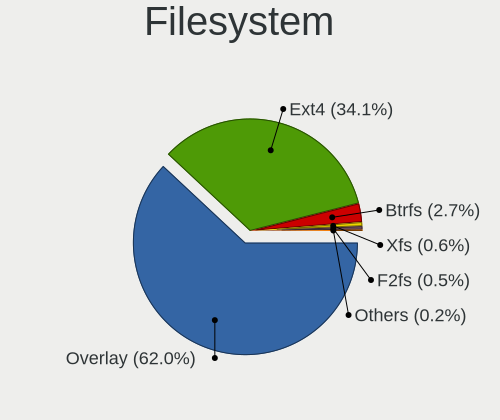
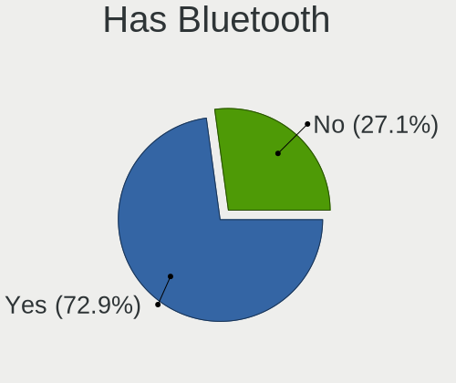
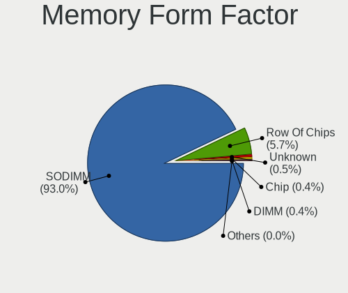
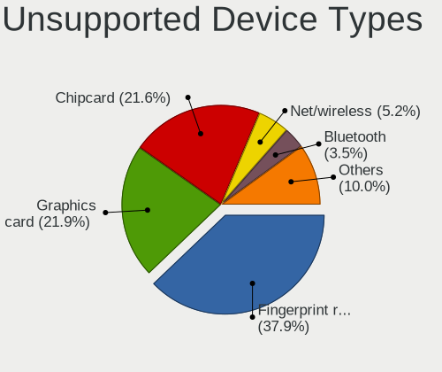

OpenMandriva - Tested Hardware & Statistics (Notebooks)
-------------------------------------------------------

A project to collect tested hardware configurations for OpenMandriva.

Anyone can contribute to this report by the [hw-probe](https://github.com/linuxhw/hw-probe) tool:

    sudo -E hw-probe -all -upload

Please contribute! Especially if your hardware is rare.

Contents
--------

* [ Test Cases ](#test-cases)

* [ System ](#system)
  - [ OS                       ](#os)
  - [ OS Family                ](#os-family)
  - [ Kernel                   ](#kernel)
  - [ Kernel Family            ](#kernel-family)
  - [ Kernel Major Ver.        ](#kernel-major-ver)
  - [ Arch                     ](#arch)
  - [ DE                       ](#de)
  - [ Display Server           ](#display-server)
  - [ Display Manager          ](#display-manager)
  - [ OS Lang                  ](#os-lang)
  - [ Boot Mode                ](#boot-mode)
  - [ Filesystem               ](#filesystem)
  - [ Part. scheme             ](#part-scheme)
  - [ Dual Boot with Linux/BSD ](#dual-boot-with-linuxbsd)
  - [ Dual Boot (Win)          ](#dual-boot-win)

* [ Board ](#board)
  - [ Vendor                   ](#vendor)
  - [ Model                    ](#model)
  - [ Model Family             ](#model-family)
  - [ MFG Year                 ](#mfg-year)
  - [ Form Factor              ](#form-factor)
  - [ Secure Boot              ](#secure-boot)
  - [ Coreboot                 ](#coreboot)
  - [ RAM Size                 ](#ram-size)
  - [ RAM Used                 ](#ram-used)
  - [ Total Drives             ](#total-drives)
  - [ Has CD-ROM               ](#has-cd-rom)
  - [ Has Ethernet             ](#has-ethernet)
  - [ Has WiFi                 ](#has-wifi)
  - [ Has Bluetooth            ](#has-bluetooth)

* [ Location ](#location)
  - [ Country                  ](#country)
  - [ City                     ](#city)

* [ Drives ](#drives)
  - [ Drive Vendor             ](#drive-vendor)
  - [ Drive Model              ](#drive-model)
  - [ HDD Vendor               ](#hdd-vendor)
  - [ SSD Vendor               ](#ssd-vendor)
  - [ Drive Kind               ](#drive-kind)
  - [ Drive Connector          ](#drive-connector)
  - [ Drive Size               ](#drive-size)
  - [ Space Total              ](#space-total)
  - [ Space Used               ](#space-used)
  - [ Malfunc. Drives          ](#malfunc-drives)
  - [ Malfunc. Drive Vendor    ](#malfunc-drive-vendor)
  - [ Malfunc. HDD Vendor      ](#malfunc-hdd-vendor)
  - [ Malfunc. Drive Kind      ](#malfunc-drive-kind)
  - [ Failed Drives            ](#failed-drives)
  - [ Failed Drive Vendor      ](#failed-drive-vendor)
  - [ Drive Status             ](#drive-status)

* [ Storage controller ](#storage-controller)
  - [ Storage Vendor           ](#storage-vendor)
  - [ Storage Model            ](#storage-model)
  - [ Storage Kind             ](#storage-kind)

* [ Processor ](#processor)
  - [ CPU Vendor               ](#cpu-vendor)
  - [ CPU Model                ](#cpu-model)
  - [ CPU Model Family         ](#cpu-model-family)
  - [ CPU Cores                ](#cpu-cores)
  - [ CPU Sockets              ](#cpu-sockets)
  - [ CPU Threads              ](#cpu-threads)
  - [ CPU Op-Modes             ](#cpu-op-modes)
  - [ CPU Microcode            ](#cpu-microcode)
  - [ CPU Microarch            ](#cpu-microarch)

* [ Graphics ](#graphics)
  - [ GPU Vendor               ](#gpu-vendor)
  - [ GPU Model                ](#gpu-model)
  - [ GPU Combo                ](#gpu-combo)
  - [ GPU Driver               ](#gpu-driver)
  - [ GPU Memory               ](#gpu-memory)

* [ Monitor ](#monitor)
  - [ Monitor Vendor           ](#monitor-vendor)
  - [ Monitor Model            ](#monitor-model)
  - [ Monitor Resolution       ](#monitor-resolution)
  - [ Monitor Diagonal         ](#monitor-diagonal)
  - [ Monitor Width            ](#monitor-width)
  - [ Aspect Ratio             ](#aspect-ratio)
  - [ Monitor Area             ](#monitor-area)
  - [ Pixel Density            ](#pixel-density)
  - [ Multiple Monitors        ](#multiple-monitors)

* [ Network ](#network)
  - [ Net Controller Vendor    ](#net-controller-vendor)
  - [ Net Controller Model     ](#net-controller-model)
  - [ Wireless Vendor          ](#wireless-vendor)
  - [ Wireless Model           ](#wireless-model)
  - [ Ethernet Vendor          ](#ethernet-vendor)
  - [ Ethernet Model           ](#ethernet-model)
  - [ Net Controller Kind      ](#net-controller-kind)
  - [ Used Controller          ](#used-controller)
  - [ NICs                     ](#nics)
  - [ IPv6                     ](#ipv6)

* [ Bluetooth ](#bluetooth)
  - [ Bluetooth Vendor         ](#bluetooth-vendor)
  - [ Bluetooth Model          ](#bluetooth-model)

* [ Sound ](#sound)
  - [ Sound Vendor             ](#sound-vendor)
  - [ Sound Model              ](#sound-model)

* [ Memory ](#memory)
  - [ Memory Vendor            ](#memory-vendor)
  - [ Memory Model             ](#memory-model)
  - [ Memory Kind              ](#memory-kind)
  - [ Memory Form Factor       ](#memory-form-factor)
  - [ Memory Size              ](#memory-size)
  - [ Memory Speed             ](#memory-speed)

* [ Printers & scanners ](#printers--scanners)
  - [ Printer Vendor           ](#printer-vendor)
  - [ Printer Model            ](#printer-model)
  - [ Scanner Vendor           ](#scanner-vendor)
  - [ Scanner Model            ](#scanner-model)

* [ Camera ](#camera)
  - [ Camera Vendor            ](#camera-vendor)
  - [ Camera Model             ](#camera-model)

* [ Security ](#security)
  - [ Fingerprint Vendor       ](#fingerprint-vendor)
  - [ Fingerprint Model        ](#fingerprint-model)
  - [ Chipcard Vendor          ](#chipcard-vendor)
  - [ Chipcard Model           ](#chipcard-model)

* [ Unsupported ](#unsupported)
  - [ Unsupported Devices      ](#unsupported-devices)
  - [ Unsupported Device Types ](#unsupported-device-types)

Test Cases
----------

Total: 9127

| Vendor        | Model                       | Probe                                                      | Date         |
|---------------|-----------------------------|------------------------------------------------------------|--------------|
| ASUSTek       | ASUS EXPERTBOOK L2502CYA... | [03df260579](https://linux-hardware.org/?probe=03df260579) | May 09, 2024 |
| Dell          | Vostro 15-3568              | [afd5a26a47](https://linux-hardware.org/?probe=afd5a26a47) | May 09, 2024 |
| ASUSTek       | K52F                        | [f67d81858e](https://linux-hardware.org/?probe=f67d81858e) | May 09, 2024 |
| ASUSTek       | X551MA                      | [6ce58b40cb](https://linux-hardware.org/?probe=6ce58b40cb) | May 09, 2024 |
| Getac         | V110G3                      | [f2bd63cfb8](https://linux-hardware.org/?probe=f2bd63cfb8) | May 09, 2024 |
| Samsung       | 960XGK                      | [4c22b1ca3a](https://linux-hardware.org/?probe=4c22b1ca3a) | May 09, 2024 |
| Dell          | Inspiron 15-3567            | [4f2761bde5](https://linux-hardware.org/?probe=4f2761bde5) | May 09, 2024 |
| Dell          | Inspiron N5040              | [5fae884a07](https://linux-hardware.org/?probe=5fae884a07) | May 08, 2024 |
| Acer          | Aspire A315-21              | [a838a7101f](https://linux-hardware.org/?probe=a838a7101f) | May 08, 2024 |
| Sony          | VGN-Z51MG_B                 | [6e5ed9d5f6](https://linux-hardware.org/?probe=6e5ed9d5f6) | May 08, 2024 |
| Dell          | Inspiron 5420               | [24c2d41566](https://linux-hardware.org/?probe=24c2d41566) | May 08, 2024 |
| HP            | EliteBook 8560p             | [fa48702e03](https://linux-hardware.org/?probe=fa48702e03) | May 08, 2024 |
| Fujitsu       | FMVNR1PE                    | [95504ca73e](https://linux-hardware.org/?probe=95504ca73e) | May 08, 2024 |
| HP            | EliteBook 840 G2            | [76e6f087bb](https://linux-hardware.org/?probe=76e6f087bb) | May 08, 2024 |
| Fujitsu Si... | LIFEBOOK E8410              | [30a913526e](https://linux-hardware.org/?probe=30a913526e) | May 07, 2024 |
| HP            | TouchSmart tm2              | [b180e1388d](https://linux-hardware.org/?probe=b180e1388d) | May 07, 2024 |
| Lenovo        | IdeaPad 1 14IGL7 82V6       | [8c2b9bb30a](https://linux-hardware.org/?probe=8c2b9bb30a) | May 07, 2024 |
| Lenovo        | IdeaPad 3 15ITL6 82H8       | [a5b0e5456a](https://linux-hardware.org/?probe=a5b0e5456a) | May 07, 2024 |
| Lenovo        | XiaoXin-15IIL 2020 81YL     | [b95cda619a](https://linux-hardware.org/?probe=b95cda619a) | May 06, 2024 |
| Lenovo        | Unknown                     | [dae6c8e749](https://linux-hardware.org/?probe=dae6c8e749) | May 06, 2024 |
| MSI           | CR61 2M/CX61 2OC/CX61 2O... | [ae77241a92](https://linux-hardware.org/?probe=ae77241a92) | May 06, 2024 |
| HP            | EliteBook 820 G2            | [254af47954](https://linux-hardware.org/?probe=254af47954) | May 06, 2024 |
| Lenovo        | LOQ 15IRH8 82XV             | [c741f249e2](https://linux-hardware.org/?probe=c741f249e2) | May 06, 2024 |
| Lenovo        | IdeaPad 1 14IGL7 82V6       | [083cfcc0f3](https://linux-hardware.org/?probe=083cfcc0f3) | May 06, 2024 |
| HP            | 650                         | [8fa3b11e2c](https://linux-hardware.org/?probe=8fa3b11e2c) | May 05, 2024 |
| Lenovo        | V110-15IAP 80TG             | [2ba8347b04](https://linux-hardware.org/?probe=2ba8347b04) | May 05, 2024 |
| ASUSTek       | F5SL                        | [da423af0cb](https://linux-hardware.org/?probe=da423af0cb) | May 05, 2024 |
| HP            | ProBook 640 G1              | [012a8fbd0c](https://linux-hardware.org/?probe=012a8fbd0c) | May 05, 2024 |
| HP            | Compaq 6720s                | [e51bd60d05](https://linux-hardware.org/?probe=e51bd60d05) | May 05, 2024 |
| Lenovo        | ThinkPad Edge E530 32597... | [a216f0b6d5](https://linux-hardware.org/?probe=a216f0b6d5) | May 05, 2024 |
| Lenovo        | ThinkPad T520 4243W29       | [b1e4dde68e](https://linux-hardware.org/?probe=b1e4dde68e) | May 04, 2024 |
| ASUSTek       | ASUS EXPERTBOOK B1500CEA... | [ea3a8f97a7](https://linux-hardware.org/?probe=ea3a8f97a7) | May 04, 2024 |
| HP            | Notebook                    | [87f06569d7](https://linux-hardware.org/?probe=87f06569d7) | May 04, 2024 |
| HP            | 246                         | [83140d67e2](https://linux-hardware.org/?probe=83140d67e2) | May 03, 2024 |
| HP            | Pavilion dm3                | [cb32e79169](https://linux-hardware.org/?probe=cb32e79169) | May 03, 2024 |
| Dell          | Inspiron 16 5620            | [37d023541b](https://linux-hardware.org/?probe=37d023541b) | May 03, 2024 |
| ASUSTek       | X751SA                      | [7dadfc10b4](https://linux-hardware.org/?probe=7dadfc10b4) | May 03, 2024 |
| Lenovo        | B50-45 20388                | [49ad9c2e0e](https://linux-hardware.org/?probe=49ad9c2e0e) | May 03, 2024 |
| Toshiba       | Satellite Pro L650          | [4e0111f9c9](https://linux-hardware.org/?probe=4e0111f9c9) | May 02, 2024 |
| Lenovo        | ThinkBook 15-IML 20RW       | [3f312360ff](https://linux-hardware.org/?probe=3f312360ff) | May 02, 2024 |
| Lenovo        | ThinkPad T480 20L60034MX    | [eec0c4ee95](https://linux-hardware.org/?probe=eec0c4ee95) | May 02, 2024 |
| ASUSTek       | X553MA                      | [0418112d2f](https://linux-hardware.org/?probe=0418112d2f) | May 02, 2024 |
| HP            | Unknown                     | [2105666632](https://linux-hardware.org/?probe=2105666632) | May 02, 2024 |
| Apple         | MacBookAir7,2               | [63cf24a977](https://linux-hardware.org/?probe=63cf24a977) | May 02, 2024 |
| HP            | 250 G6 Notebook PC          | [ff4a31241b](https://linux-hardware.org/?probe=ff4a31241b) | May 02, 2024 |
| Lenovo        | ThinkPad L530 24812K6       | [e7d0c76f65](https://linux-hardware.org/?probe=e7d0c76f65) | May 01, 2024 |
| Packard Be... | EasyNote TJ71               | [f421f823ec](https://linux-hardware.org/?probe=f421f823ec) | May 01, 2024 |
| Dell          | Inspiron 13-5368            | [ac125025cf](https://linux-hardware.org/?probe=ac125025cf) | May 01, 2024 |
| Google        | Bluebird                    | [75db9dc248](https://linux-hardware.org/?probe=75db9dc248) | May 01, 2024 |
| Lenovo        | ThinkPad P1 Gen 4i 20Y4S... | [2445f78890](https://linux-hardware.org/?probe=2445f78890) | May 01, 2024 |
| HP            | Pavilion Notebook           | [5d6cdceb37](https://linux-hardware.org/?probe=5d6cdceb37) | May 01, 2024 |
| ASUSTek       | VivoBook_ASUSLaptop X160... | [cee4dd63f5](https://linux-hardware.org/?probe=cee4dd63f5) | Apr 30, 2024 |
| Acer          | Aspire 7745G                | [1854a5b427](https://linux-hardware.org/?probe=1854a5b427) | Apr 30, 2024 |
| Chuwi         | LapBook Air                 | [ee0775cfb7](https://linux-hardware.org/?probe=ee0775cfb7) | Apr 30, 2024 |
| Dell          | Latitude E6530              | [6e04062057](https://linux-hardware.org/?probe=6e04062057) | Apr 30, 2024 |
| Google        | Gandof                      | [539c66172b](https://linux-hardware.org/?probe=539c66172b) | Apr 28, 2024 |
| Dell          | Latitude E6410              | [14cad1b34b](https://linux-hardware.org/?probe=14cad1b34b) | Apr 28, 2024 |
| ASUSTek       | N53SN                       | [4c0db81fd7](https://linux-hardware.org/?probe=4c0db81fd7) | Apr 28, 2024 |
| Lenovo        | ThinkPad T420 4236L35       | [df6f046778](https://linux-hardware.org/?probe=df6f046778) | Apr 28, 2024 |
| Lenovo        | IdeaPad 1 15ALC7 82R4       | [40c7e6e4a3](https://linux-hardware.org/?probe=40c7e6e4a3) | Apr 28, 2024 |
| Intel         | powered classmate PC MP ... | [7b243a5cb5](https://linux-hardware.org/?probe=7b243a5cb5) | Apr 28, 2024 |
| Lenovo        | ThinkPad T430 23492F5       | [8d26be4497](https://linux-hardware.org/?probe=8d26be4497) | Apr 28, 2024 |
| Lenovo        | Slim Pro 7 14ARP8 83AX      | [1856484488](https://linux-hardware.org/?probe=1856484488) | Apr 27, 2024 |
| Lenovo        | IdeaPad G485 QAWGE          | [364be8242a](https://linux-hardware.org/?probe=364be8242a) | Apr 27, 2024 |
| Notebook      | W54BL                       | [adb804fa7f](https://linux-hardware.org/?probe=adb804fa7f) | Apr 27, 2024 |
| Acer          | Aspire 5734Z                | [1b89b729a3](https://linux-hardware.org/?probe=1b89b729a3) | Apr 27, 2024 |
| Dell          | Latitude 5580               | [e646939794](https://linux-hardware.org/?probe=e646939794) | Apr 27, 2024 |
| Acer          | Aspire ES1-732              | [dda97c8536](https://linux-hardware.org/?probe=dda97c8536) | Apr 26, 2024 |
| Lenovo        | ThinkPad X220 4290RW1       | [306c586e02](https://linux-hardware.org/?probe=306c586e02) | Apr 26, 2024 |
| HP            | ZBook 17 G3 Mobile Works... | [e56b499574](https://linux-hardware.org/?probe=e56b499574) | Apr 26, 2024 |
| ASUSTek       | VivoBook_ASUSLaptop X512... | [4f05e448a7](https://linux-hardware.org/?probe=4f05e448a7) | Apr 26, 2024 |
| ASUSTek       | X541NA                      | [bba16f5bc3](https://linux-hardware.org/?probe=bba16f5bc3) | Apr 26, 2024 |
| HP            | EliteBook 840 G6            | [cd5b6c35ae](https://linux-hardware.org/?probe=cd5b6c35ae) | Apr 26, 2024 |
| Lenovo        | IdeaPad Y570 20091          | [67336a137f](https://linux-hardware.org/?probe=67336a137f) | Apr 26, 2024 |
| Dell          | Latitude E6400              | [ab58a2d0bd](https://linux-hardware.org/?probe=ab58a2d0bd) | Apr 26, 2024 |
| Dell          | Inspiron 15 3511            | [48c356da20](https://linux-hardware.org/?probe=48c356da20) | Apr 25, 2024 |
| Dell          | Inspiron 15 3515            | [cd29a525ed](https://linux-hardware.org/?probe=cd29a525ed) | Apr 24, 2024 |
| Unknown       | Unknown                     | [d722d0e84b](https://linux-hardware.org/?probe=d722d0e84b) | Apr 24, 2024 |
| HP            | Compaq Presario C700        | [062cdaa3a3](https://linux-hardware.org/?probe=062cdaa3a3) | Apr 24, 2024 |
| HP            | EliteBook 2170p             | [847dec6d8e](https://linux-hardware.org/?probe=847dec6d8e) | Apr 24, 2024 |
| HP            | EliteBook Folio 9470m       | [04e8d2bb6b](https://linux-hardware.org/?probe=04e8d2bb6b) | Apr 24, 2024 |
| HP            | EliteBook 840 G2            | [006661b0c2](https://linux-hardware.org/?probe=006661b0c2) | Apr 23, 2024 |
| Dell          | Inspiron 5558               | [246047bf8e](https://linux-hardware.org/?probe=246047bf8e) | Apr 23, 2024 |
| Dell          | Latitude 3340               | [097f5b6c08](https://linux-hardware.org/?probe=097f5b6c08) | Apr 23, 2024 |
| Lenovo        | ThinkPad Edge E431 62775... | [ad67ecab25](https://linux-hardware.org/?probe=ad67ecab25) | Apr 23, 2024 |
| Computer D... | W240EU/W250EUQ/W270EUQ      | [2064944dc4](https://linux-hardware.org/?probe=2064944dc4) | Apr 23, 2024 |
| HP            | Laptop 15s-fq2xxx           | [06c81aed79](https://linux-hardware.org/?probe=06c81aed79) | Apr 23, 2024 |
| Dell          | Latitude E5550              | [2193ab1cfa](https://linux-hardware.org/?probe=2193ab1cfa) | Apr 23, 2024 |
| ASUSTek       | K53SD                       | [777dfb666e](https://linux-hardware.org/?probe=777dfb666e) | Apr 23, 2024 |
| Dell          | Inspiron 3501               | [faae79a749](https://linux-hardware.org/?probe=faae79a749) | Apr 23, 2024 |
| ASUSTek       | K93SM                       | [031f10fad0](https://linux-hardware.org/?probe=031f10fad0) | Apr 22, 2024 |
| Acer          | TM8573                      | [9c3c528235](https://linux-hardware.org/?probe=9c3c528235) | Apr 21, 2024 |
| HP            | Pavilion dv7                | [c7af52e729](https://linux-hardware.org/?probe=c7af52e729) | Apr 21, 2024 |
| Acer          | Aspire F5-573               | [c71f150bd8](https://linux-hardware.org/?probe=c71f150bd8) | Apr 21, 2024 |
| HUAWEI        | BOHK-WAX9X                  | [b69304aa9b](https://linux-hardware.org/?probe=b69304aa9b) | Apr 21, 2024 |
| Lenovo        | ThinkPad R61e 7650DHU       | [93e4fe440f](https://linux-hardware.org/?probe=93e4fe440f) | Apr 21, 2024 |
| Lenovo        | ThinkPad X260 20F5S4CC00    | [56a80212e2](https://linux-hardware.org/?probe=56a80212e2) | Apr 20, 2024 |
| Dell          | Inspiron 5559               | [fa44624ceb](https://linux-hardware.org/?probe=fa44624ceb) | Apr 20, 2024 |
| Lenovo        | IdeaPad 510-15IKB 80SV      | [c823822177](https://linux-hardware.org/?probe=c823822177) | Apr 20, 2024 |
| ASUSTek       | Strix 15 GL503GE            | [efeb67efdf](https://linux-hardware.org/?probe=efeb67efdf) | Apr 19, 2024 |
| Sony          | SVE1111M1EW                 | [4303a7cc13](https://linux-hardware.org/?probe=4303a7cc13) | Apr 19, 2024 |
| Lenovo        | Y50-70 20378                | [50de89d752](https://linux-hardware.org/?probe=50de89d752) | Apr 18, 2024 |
| Acer          | V5-171                      | [1c5fdb6bae](https://linux-hardware.org/?probe=1c5fdb6bae) | Apr 18, 2024 |
| HP            | Laptop 15-dy5xxx            | [bb34072490](https://linux-hardware.org/?probe=bb34072490) | Apr 18, 2024 |
| HP            | 240 G8 Notebook PC          | [13af7544f2](https://linux-hardware.org/?probe=13af7544f2) | Apr 17, 2024 |
| Lenovo        | ThinkPad L560 20F2S0TB00    | [943647251c](https://linux-hardware.org/?probe=943647251c) | Apr 17, 2024 |
| Lenovo        | 100-14IBY 80R7              | [c186027176](https://linux-hardware.org/?probe=c186027176) | Apr 17, 2024 |
| Acer          | Aspire A317-52              | [bf62cb2dba](https://linux-hardware.org/?probe=bf62cb2dba) | Apr 17, 2024 |
| Dell          | Latitude E5470              | [f286256e09](https://linux-hardware.org/?probe=f286256e09) | Apr 17, 2024 |
| ASUSTek       | X751LJ                      | [ee2d127680](https://linux-hardware.org/?probe=ee2d127680) | Apr 16, 2024 |
| ASUSTek       | GL502VM                     | [d478e55005](https://linux-hardware.org/?probe=d478e55005) | Apr 16, 2024 |
| ASUSTek       | K50IJ                       | [f0d8580bfc](https://linux-hardware.org/?probe=f0d8580bfc) | Apr 16, 2024 |
| Acer          | Aspire E1-572G              | [5428a93214](https://linux-hardware.org/?probe=5428a93214) | Apr 16, 2024 |
| HP            | 250 G7 Notebook PC          | [be2b691a57](https://linux-hardware.org/?probe=be2b691a57) | Apr 15, 2024 |
| HP            | Laptop 15-ef0xxx            | [dbbb032e1b](https://linux-hardware.org/?probe=dbbb032e1b) | Apr 15, 2024 |
| Lenovo        | ThinkPad X280 20KESA5000    | [8571fb3b5c](https://linux-hardware.org/?probe=8571fb3b5c) | Apr 14, 2024 |
| HP            | Unknown                     | [9415eb2f3c](https://linux-hardware.org/?probe=9415eb2f3c) | Apr 14, 2024 |
| Lenovo        | IdeaPad Slim 1-14AST-05 ... | [6720cd6b1d](https://linux-hardware.org/?probe=6720cd6b1d) | Apr 14, 2024 |
| Acer          | Aspire ES1-533              | [c4059b2efa](https://linux-hardware.org/?probe=c4059b2efa) | Apr 14, 2024 |
| Unknown       | Unknown                     | [9d776d1a83](https://linux-hardware.org/?probe=9d776d1a83) | Apr 14, 2024 |
| Lenovo        | IdeaPad Slim 1-14AST-05 ... | [59540c163c](https://linux-hardware.org/?probe=59540c163c) | Apr 13, 2024 |
| Dell          | Studio XPS 1340             | [cac8add4c8](https://linux-hardware.org/?probe=cac8add4c8) | Apr 13, 2024 |
| Lenovo        | IdeaPad Slim 1-14AST-05 ... | [6c2703c57b](https://linux-hardware.org/?probe=6c2703c57b) | Apr 13, 2024 |
| Sony          | VPCEH30EB                   | [a3ce44d34f](https://linux-hardware.org/?probe=a3ce44d34f) | Apr 12, 2024 |
| Samsung       | 370E4K                      | [362fb05bf2](https://linux-hardware.org/?probe=362fb05bf2) | Apr 12, 2024 |
| Packard Be... | EasyNote TJ66               | [8fd06fed5d](https://linux-hardware.org/?probe=8fd06fed5d) | Apr 12, 2024 |
| Shuttle       | X50V6                       | [c6b8ac2413](https://linux-hardware.org/?probe=c6b8ac2413) | Apr 12, 2024 |
| HP            | 250 G5 Notebook PC          | [288ebeb8ba](https://linux-hardware.org/?probe=288ebeb8ba) | Apr 11, 2024 |
| MSI           | GE72 2QD                    | [4918e63b82](https://linux-hardware.org/?probe=4918e63b82) | Apr 11, 2024 |
| Toshiba       | Satellite C50-A             | [b643ba4fed](https://linux-hardware.org/?probe=b643ba4fed) | Apr 11, 2024 |
| MSI           | Raider GE78HX SmartTP 13... | [c048dc6e93](https://linux-hardware.org/?probe=c048dc6e93) | Apr 10, 2024 |
| Lenovo        | IdeaPad 3 15IAU7 82RK       | [62a1298341](https://linux-hardware.org/?probe=62a1298341) | Apr 10, 2024 |
| Lenovo        | ThinkPad L13 Gen 3 21BAS... | [73f98df7bf](https://linux-hardware.org/?probe=73f98df7bf) | Apr 10, 2024 |
| HP            | OMEN by Laptop 17-an0xx     | [e236ba52be](https://linux-hardware.org/?probe=e236ba52be) | Apr 10, 2024 |
| ASUSTek       | GL502VMZ                    | [6b670ef81e](https://linux-hardware.org/?probe=6b670ef81e) | Apr 10, 2024 |
| Dell          | Inspiron 7720               | [3ceb371831](https://linux-hardware.org/?probe=3ceb371831) | Apr 09, 2024 |
| Quanta        | QL3 TBD                     | [0f0abe3406](https://linux-hardware.org/?probe=0f0abe3406) | Apr 09, 2024 |
| Lenovo        | IdeaPad S540-15IWL 81NE     | [5b676c4d65](https://linux-hardware.org/?probe=5b676c4d65) | Apr 09, 2024 |
| Lenovo        | ThinkPad T470 W10DG 20JN... | [1da57352b2](https://linux-hardware.org/?probe=1da57352b2) | Apr 08, 2024 |
| Lenovo        | IdeaPad 100-14IBY 80MH      | [113bdef0c9](https://linux-hardware.org/?probe=113bdef0c9) | Apr 08, 2024 |
| Info Quest... | GTN1402 4-64                | [057ad875b5](https://linux-hardware.org/?probe=057ad875b5) | Apr 08, 2024 |
| ASUSTek       | N50Vc                       | [e7ae85215d](https://linux-hardware.org/?probe=e7ae85215d) | Apr 07, 2024 |
| ASUSTek       | UL80VT                      | [8c290e2826](https://linux-hardware.org/?probe=8c290e2826) | Apr 07, 2024 |
| ASUSTek       | S550CB                      | [04013b8286](https://linux-hardware.org/?probe=04013b8286) | Apr 07, 2024 |
| Lenovo        | ThinkPad T400 6474W7T       | [5b8f0f590e](https://linux-hardware.org/?probe=5b8f0f590e) | Apr 07, 2024 |
| Positivo      | S14BW01                     | [c47eb17b8e](https://linux-hardware.org/?probe=c47eb17b8e) | Apr 07, 2024 |
| Lenovo        | ThinkPad X270 20HN0015GE    | [3446428450](https://linux-hardware.org/?probe=3446428450) | Apr 07, 2024 |
| Lenovo        | G50-30 80G0                 | [901e9f9640](https://linux-hardware.org/?probe=901e9f9640) | Apr 07, 2024 |
| Fujitsu Si... | LIFEBOOK S6410              | [e82877a3db](https://linux-hardware.org/?probe=e82877a3db) | Apr 07, 2024 |
| ASUSTek       | VivoBook_ASUSLaptop M160... | [750503507b](https://linux-hardware.org/?probe=750503507b) | Apr 06, 2024 |
| Dell          | Inspiron 16 5635            | [0f0bacc25d](https://linux-hardware.org/?probe=0f0bacc25d) | Apr 06, 2024 |
| ASUSTek       | X550ZE                      | [ce16f4beb9](https://linux-hardware.org/?probe=ce16f4beb9) | Apr 06, 2024 |
| Lenovo        | B590 20208                  | [bcf0312d12](https://linux-hardware.org/?probe=bcf0312d12) | Apr 06, 2024 |
| Login Info... | LOG-M301H                   | [85373f9f2b](https://linux-hardware.org/?probe=85373f9f2b) | Apr 06, 2024 |
| Toshiba       | Satellite U500              | [4872d0c452](https://linux-hardware.org/?probe=4872d0c452) | Apr 06, 2024 |
| Lenovo        | IdeaPad 330-15IKB 81DE      | [d5c2c9c408](https://linux-hardware.org/?probe=d5c2c9c408) | Apr 06, 2024 |
| Acer          | Aspire 5536                 | [40d6361edd](https://linux-hardware.org/?probe=40d6361edd) | Apr 06, 2024 |
| Samsung       | 355V4C/355V4X/355V5C/355... | [edfce73a66](https://linux-hardware.org/?probe=edfce73a66) | Apr 06, 2024 |
| Acer          | Aspire E5-571G              | [c43dd19a4d](https://linux-hardware.org/?probe=c43dd19a4d) | Apr 06, 2024 |
| HP            | ZBook 15u G6                | [a1865e5d26](https://linux-hardware.org/?probe=a1865e5d26) | Apr 06, 2024 |
| HP            | Pavilion Laptop 15-cs3xx... | [529868adc3](https://linux-hardware.org/?probe=529868adc3) | Apr 06, 2024 |
| TUXEDO        | InfinityBook S 14 v5        | [d977cefb34](https://linux-hardware.org/?probe=d977cefb34) | Apr 06, 2024 |
| HP            | 240 G6 Notebook PC          | [b946fe73c4](https://linux-hardware.org/?probe=b946fe73c4) | Apr 05, 2024 |
| Samsung       | 300E4A/300E5A/300E7A/343... | [c6925e3708](https://linux-hardware.org/?probe=c6925e3708) | Apr 05, 2024 |
| Dell          | Latitude E4300              | [43c75dde9f](https://linux-hardware.org/?probe=43c75dde9f) | Apr 05, 2024 |
| Notebook      | NJx0PU                      | [1c5fb42067](https://linux-hardware.org/?probe=1c5fb42067) | Apr 05, 2024 |
| Lenovo        | G40-80 80E4                 | [76642434b9](https://linux-hardware.org/?probe=76642434b9) | Apr 05, 2024 |
| ASUSTek       | K53U                        | [bd1d2c95e9](https://linux-hardware.org/?probe=bd1d2c95e9) | Apr 05, 2024 |
| Lenovo        | ThinkPad T420 423663U       | [2e4f4bbb7a](https://linux-hardware.org/?probe=2e4f4bbb7a) | Apr 05, 2024 |
| Lenovo        | ThinkPad W530 24476F1       | [14d694fe39](https://linux-hardware.org/?probe=14d694fe39) | Apr 05, 2024 |
| Lenovo        | IdeaPad 3 15ITL6 82H8       | [b30ba46617](https://linux-hardware.org/?probe=b30ba46617) | Apr 05, 2024 |
| HP            | EliteBook 840 G2            | [cb733ed3d2](https://linux-hardware.org/?probe=cb733ed3d2) | Apr 05, 2024 |
| Dell          | Latitude 7290               | [b7f36c7c42](https://linux-hardware.org/?probe=b7f36c7c42) | Apr 04, 2024 |
| HP            | ProBook 640 G2              | [f5fc4b58c7](https://linux-hardware.org/?probe=f5fc4b58c7) | Apr 04, 2024 |
| Dell          | Vostro 5468                 | [065b2c71f1](https://linux-hardware.org/?probe=065b2c71f1) | Apr 04, 2024 |
| ASUSTek       | K42F                        | [73ef819d0c](https://linux-hardware.org/?probe=73ef819d0c) | Apr 04, 2024 |
| HP            | EliteBook 8460p             | [6e1fd1f1b0](https://linux-hardware.org/?probe=6e1fd1f1b0) | Apr 04, 2024 |
| MSI           | Prestige 14Evo B13M         | [f118f2e24a](https://linux-hardware.org/?probe=f118f2e24a) | Apr 04, 2024 |
| Lenovo        | IdeaPad 1 14IGL7 82V6       | [3fbe8de966](https://linux-hardware.org/?probe=3fbe8de966) | Apr 04, 2024 |
| Lenovo        | G50-30 80G0                 | [8ad07875a5](https://linux-hardware.org/?probe=8ad07875a5) | Apr 04, 2024 |
| HP            | Pavilion g6                 | [1857b80f6f](https://linux-hardware.org/?probe=1857b80f6f) | Apr 04, 2024 |
| Toshiba       | Satellite S855D             | [5f79e80e44](https://linux-hardware.org/?probe=5f79e80e44) | Apr 03, 2024 |
| Acer          | Aspire A315-22G             | [8ebdcaad32](https://linux-hardware.org/?probe=8ebdcaad32) | Apr 03, 2024 |
| Dell          | Latitude E4310              | [e182d9e891](https://linux-hardware.org/?probe=e182d9e891) | Apr 03, 2024 |
| Lenovo        | IdeaPad 1 14IGL7 82V6       | [8d409a59ec](https://linux-hardware.org/?probe=8d409a59ec) | Apr 03, 2024 |
| MSI           | GP60 2OD                    | [134464f908](https://linux-hardware.org/?probe=134464f908) | Apr 03, 2024 |
| HP            | 250 G6 Notebook PC          | [bddda9964b](https://linux-hardware.org/?probe=bddda9964b) | Apr 03, 2024 |
| HP            | EliteBook 840 G4            | [f7c3e17f2e](https://linux-hardware.org/?probe=f7c3e17f2e) | Apr 03, 2024 |
| ASUSTek       | X751MJ                      | [cdb26bf7a8](https://linux-hardware.org/?probe=cdb26bf7a8) | Apr 03, 2024 |
| Core Innov... | CLC14364                    | [70bd1ca499](https://linux-hardware.org/?probe=70bd1ca499) | Apr 02, 2024 |
| Fujitsu       | STYLISTIC Q702              | [1abe698880](https://linux-hardware.org/?probe=1abe698880) | Apr 02, 2024 |
| Philco        | 14H                         | [93e4cd1668](https://linux-hardware.org/?probe=93e4cd1668) | Apr 02, 2024 |
| Dell          | Studio 1537                 | [3e7ce8de4a](https://linux-hardware.org/?probe=3e7ce8de4a) | Apr 02, 2024 |
| Toshiba       | Satellite A205              | [4fcbf3184c](https://linux-hardware.org/?probe=4fcbf3184c) | Apr 02, 2024 |
| Acer          | Nitro AN517-54              | [85318c4993](https://linux-hardware.org/?probe=85318c4993) | Apr 02, 2024 |
| ASUSTek       | K54C                        | [d43311570d](https://linux-hardware.org/?probe=d43311570d) | Apr 01, 2024 |
| Lenovo        | ThinkPad X1 Carbon 6th 2... | [ffb8608b8e](https://linux-hardware.org/?probe=ffb8608b8e) | Apr 01, 2024 |
| Fujitsu       | LIFEBOOK E746               | [0eda4797d3](https://linux-hardware.org/?probe=0eda4797d3) | Apr 01, 2024 |
| Dell          | Inspiron 13-5368            | [3c825d9bc6](https://linux-hardware.org/?probe=3c825d9bc6) | Apr 01, 2024 |
| ASUSTek       | K53TA                       | [d27da7dcab](https://linux-hardware.org/?probe=d27da7dcab) | Apr 01, 2024 |
| Dell          | Inspiron 15 3520            | [ceface0ac8](https://linux-hardware.org/?probe=ceface0ac8) | Mar 31, 2024 |
| Google        | Blorb                       | [48c735d25a](https://linux-hardware.org/?probe=48c735d25a) | Mar 31, 2024 |
| Acer          | Acadia V1.45                | [f126c80f18](https://linux-hardware.org/?probe=f126c80f18) | Mar 31, 2024 |
| Timi          | Redmi Book Pro 15 2022      | [67084fde52](https://linux-hardware.org/?probe=67084fde52) | Mar 31, 2024 |
| Lenovo        | V15 G3 IAP CTO 83C4         | [f1449c2bb2](https://linux-hardware.org/?probe=f1449c2bb2) | Mar 30, 2024 |
| Dell          | Latitude E6440              | [82a2e96578](https://linux-hardware.org/?probe=82a2e96578) | Mar 30, 2024 |
| Lenovo        | ThinkPad T14 Gen 2i 20W0... | [de1d63d35e](https://linux-hardware.org/?probe=de1d63d35e) | Mar 30, 2024 |
| HP            | Laptop 17-cp0xxx            | [ad835fa809](https://linux-hardware.org/?probe=ad835fa809) | Mar 30, 2024 |
| ASUSTek       | Zenbook UX3402ZA_UX3402Z... | [b75c8663ed](https://linux-hardware.org/?probe=b75c8663ed) | Mar 29, 2024 |
| Lenovo        | ThinkPad T540p 20BE00B2G... | [158444c545](https://linux-hardware.org/?probe=158444c545) | Mar 29, 2024 |
| HP            | Compaq 8510p                | [c57e175a01](https://linux-hardware.org/?probe=c57e175a01) | Mar 29, 2024 |
| Metabox       | Alpha-V V158PNH             | [9d020b5c12](https://linux-hardware.org/?probe=9d020b5c12) | Mar 29, 2024 |
| Lenovo        | ThinkPad Edge E531 68852... | [00fe1930d3](https://linux-hardware.org/?probe=00fe1930d3) | Mar 29, 2024 |
| Toshiba       | dynabook R63/F              | [953540775e](https://linux-hardware.org/?probe=953540775e) | Mar 29, 2024 |
| Lenovo        | IdeaPad 1 14IGL7 82V6       | [77d9027069](https://linux-hardware.org/?probe=77d9027069) | Mar 29, 2024 |
| Core Innov... | CLC14364                    | [4169f19794](https://linux-hardware.org/?probe=4169f19794) | Mar 29, 2024 |
| Toshiba       | Satellite L700              | [d2073d2786](https://linux-hardware.org/?probe=d2073d2786) | Mar 29, 2024 |
| HP            | Presario CQ62               | [354d7a9fe2](https://linux-hardware.org/?probe=354d7a9fe2) | Mar 29, 2024 |
| HP            | EliteBook 8440p             | [54a537a410](https://linux-hardware.org/?probe=54a537a410) | Mar 29, 2024 |
| Fujitsu Si... | ESPRIMO Mobile M9400        | [d056f67a21](https://linux-hardware.org/?probe=d056f67a21) | Mar 28, 2024 |
| HP            | Laptop 15-bs0xx             | [671ce6facf](https://linux-hardware.org/?probe=671ce6facf) | Mar 28, 2024 |
| Toshiba       | Satellite L45-B             | [7a6b9a0b7b](https://linux-hardware.org/?probe=7a6b9a0b7b) | Mar 28, 2024 |
| Toshiba       | PORTEGE Z930                | [e1f25da3fd](https://linux-hardware.org/?probe=e1f25da3fd) | Mar 28, 2024 |
| HP            | EliteBook 840 14 inch G9... | [401fd1d912](https://linux-hardware.org/?probe=401fd1d912) | Mar 28, 2024 |
| Acer          | Aspire E5-772G              | [1900649358](https://linux-hardware.org/?probe=1900649358) | Mar 28, 2024 |
| Dell          | XPS M1530                   | [d252773f43](https://linux-hardware.org/?probe=d252773f43) | Mar 27, 2024 |
| HP            | ProBook 4515s               | [3048353db9](https://linux-hardware.org/?probe=3048353db9) | Mar 27, 2024 |
| Sony          | VPCEB1M1E                   | [0ab1b90960](https://linux-hardware.org/?probe=0ab1b90960) | Mar 27, 2024 |
| Dell          | Inspiron 3521               | [64c0a44737](https://linux-hardware.org/?probe=64c0a44737) | Mar 27, 2024 |
| ASUSTek       | VivoBook_ASUSLaptop X150... | [ea975c743d](https://linux-hardware.org/?probe=ea975c743d) | Mar 27, 2024 |
| ASUSTek       | K46CM                       | [81723c2d41](https://linux-hardware.org/?probe=81723c2d41) | Mar 27, 2024 |
| Acer          | Aspire A515-47              | [84310b0211](https://linux-hardware.org/?probe=84310b0211) | Mar 27, 2024 |
| HP            | EliteBook 840 G2            | [0992034433](https://linux-hardware.org/?probe=0992034433) | Mar 27, 2024 |
| System76      | Adder WS                    | [9d181cd8bf](https://linux-hardware.org/?probe=9d181cd8bf) | Mar 27, 2024 |
| Samsung       | 300E4C/300E5C/300E7C        | [448e52314e](https://linux-hardware.org/?probe=448e52314e) | Mar 26, 2024 |
| HP            | ENVY Sleekbook 4            | [5814881985](https://linux-hardware.org/?probe=5814881985) | Mar 26, 2024 |
| ASUSTek       | ASUS TUF Gaming A15 FA50... | [50ff654c73](https://linux-hardware.org/?probe=50ff654c73) | Mar 26, 2024 |
| HP            | 550                         | [2e06980f11](https://linux-hardware.org/?probe=2e06980f11) | Mar 26, 2024 |
| Acer          | Aspire 5610                 | [6f172dbbce](https://linux-hardware.org/?probe=6f172dbbce) | Mar 26, 2024 |
| HP            | EliteBook 8440p             | [745804f2b5](https://linux-hardware.org/?probe=745804f2b5) | Mar 26, 2024 |
| ASUSTek       | K53SC                       | [c089e8153d](https://linux-hardware.org/?probe=c089e8153d) | Mar 25, 2024 |
| Unknown       | Unknown                     | [f39e53816d](https://linux-hardware.org/?probe=f39e53816d) | Mar 25, 2024 |
| ASUSTek       | X541NA                      | [6d98c3288f](https://linux-hardware.org/?probe=6d98c3288f) | Mar 24, 2024 |
| ASUSTek       | X550CC                      | [5e519a6603](https://linux-hardware.org/?probe=5e519a6603) | Mar 24, 2024 |
| Dell          | Latitude E6510              | [f8ffac43ca](https://linux-hardware.org/?probe=f8ffac43ca) | Mar 24, 2024 |
| Lenovo        | ThinkPad X200T 7450CTO      | [71d0b95323](https://linux-hardware.org/?probe=71d0b95323) | Mar 24, 2024 |
| Dell          | G5 5505                     | [bbe548c3a5](https://linux-hardware.org/?probe=bbe548c3a5) | Mar 24, 2024 |
| Qilive        | QW2214FR                    | [4a5e116692](https://linux-hardware.org/?probe=4a5e116692) | Mar 24, 2024 |
| ASUSTek       | F5RL                        | [6d1c82c10a](https://linux-hardware.org/?probe=6d1c82c10a) | Mar 24, 2024 |
| Fujitsu       | LIFEBOOK E734               | [1da01e0e94](https://linux-hardware.org/?probe=1da01e0e94) | Mar 24, 2024 |
| Core Innov... | CLC14364                    | [352c177531](https://linux-hardware.org/?probe=352c177531) | Mar 23, 2024 |
| Qilive        | QW2214FR                    | [caa8ca0076](https://linux-hardware.org/?probe=caa8ca0076) | Mar 23, 2024 |
| HP            | Laptop 15-dw0xxx            | [b7426e4e08](https://linux-hardware.org/?probe=b7426e4e08) | Mar 23, 2024 |
| ASUSTek       | X551MA                      | [05cfb55044](https://linux-hardware.org/?probe=05cfb55044) | Mar 23, 2024 |
| Dell          | Inspiron 1525               | [67b3a30f39](https://linux-hardware.org/?probe=67b3a30f39) | Mar 23, 2024 |
| Apple         | MacBookPro9,2               | [fdfc1584b0](https://linux-hardware.org/?probe=fdfc1584b0) | Mar 23, 2024 |
| HP            | ENVY Notebook               | [cc51a9f994](https://linux-hardware.org/?probe=cc51a9f994) | Mar 23, 2024 |
| HP            | Pavilion g4                 | [c0d748a412](https://linux-hardware.org/?probe=c0d748a412) | Mar 23, 2024 |
| Samsung       | 300E5EV/300E4EV/270E5EV/... | [42aee3b9b6](https://linux-hardware.org/?probe=42aee3b9b6) | Mar 22, 2024 |
| Dell          | Latitude 7490               | [869b39d5bd](https://linux-hardware.org/?probe=869b39d5bd) | Mar 22, 2024 |
| Core Innov... | CLC14364                    | [5a8a94c103](https://linux-hardware.org/?probe=5a8a94c103) | Mar 22, 2024 |
| Acer          | Aspire E5-571               | [f3e2cf7bad](https://linux-hardware.org/?probe=f3e2cf7bad) | Mar 22, 2024 |
| Lenovo        | ThinkPad T480 20L6SCYF0P    | [aea21a32b6](https://linux-hardware.org/?probe=aea21a32b6) | Mar 22, 2024 |
| HP            | Pavilion 17                 | [fcbbdc0161](https://linux-hardware.org/?probe=fcbbdc0161) | Mar 22, 2024 |
| Lenovo        | IdeaPad 110-15ISK 80UD      | [886cb214da](https://linux-hardware.org/?probe=886cb214da) | Mar 21, 2024 |
| NEC Comput... | PC-LE150C2                  | [3cbfa07c97](https://linux-hardware.org/?probe=3cbfa07c97) | Mar 21, 2024 |
| HP            | 1000                        | [47443e706a](https://linux-hardware.org/?probe=47443e706a) | Mar 21, 2024 |
| Lenovo        | ThinkPad L420 7829W1R       | [21a63cdcb8](https://linux-hardware.org/?probe=21a63cdcb8) | Mar 20, 2024 |
| ASUSTek       | VivoBook 15_ASUS Laptop ... | [e778bbfc4b](https://linux-hardware.org/?probe=e778bbfc4b) | Mar 20, 2024 |
| ASUSTek       | VivoBook_ASUSLaptop X712... | [ac91f9a09e](https://linux-hardware.org/?probe=ac91f9a09e) | Mar 20, 2024 |
| Dell          | Vostro 1015                 | [cdb101a446](https://linux-hardware.org/?probe=cdb101a446) | Mar 20, 2024 |
| EVOO          | TEV-CE-141-2                | [610e0430fb](https://linux-hardware.org/?probe=610e0430fb) | Mar 20, 2024 |
| HP            | 15                          | [42f7c3330f](https://linux-hardware.org/?probe=42f7c3330f) | Mar 20, 2024 |
| Lenovo        | IdeaPad L340-15IRH Gamin... | [e19abf95e9](https://linux-hardware.org/?probe=e19abf95e9) | Mar 19, 2024 |
| HP            | EliteBook 840 G5            | [e47dc593db](https://linux-hardware.org/?probe=e47dc593db) | Mar 19, 2024 |
| Dell          | Latitude E6400              | [b5b129a38b](https://linux-hardware.org/?probe=b5b129a38b) | Mar 19, 2024 |
| Lenovo        | ThinkPad T480 20L6S4G72S    | [301d6aad48](https://linux-hardware.org/?probe=301d6aad48) | Mar 19, 2024 |
| ASUSTek       | X550LA                      | [0e6e1ad03f](https://linux-hardware.org/?probe=0e6e1ad03f) | Mar 19, 2024 |
| EVOO          | TEV-CE-141-2                | [1249a2e867](https://linux-hardware.org/?probe=1249a2e867) | Mar 19, 2024 |
| Toshiba       | Satellite C660D             | [63b9e3f1b8](https://linux-hardware.org/?probe=63b9e3f1b8) | Mar 18, 2024 |
| Gateway       | NE56R                       | [4e5c0a6186](https://linux-hardware.org/?probe=4e5c0a6186) | Mar 18, 2024 |
| Lenovo        | ThinkPad T560 20FHS0DN00    | [8559c82719](https://linux-hardware.org/?probe=8559c82719) | Mar 16, 2024 |
| Apple         | MacBookPro14,1              | [621ae3ca60](https://linux-hardware.org/?probe=621ae3ca60) | Mar 16, 2024 |
| NEC Comput... | PC-VK23LBZDU                | [24b87183b2](https://linux-hardware.org/?probe=24b87183b2) | Mar 16, 2024 |
| Dell          | Inspiron 3583               | [0bd478d9d8](https://linux-hardware.org/?probe=0bd478d9d8) | Mar 15, 2024 |
| Lenovo        | G50-30 80G0                 | [3c7f756761](https://linux-hardware.org/?probe=3c7f756761) | Mar 15, 2024 |
| HP            | Notebook                    | [a8f1904e27](https://linux-hardware.org/?probe=a8f1904e27) | Mar 15, 2024 |
| Qilive        | QW2214FR                    | [29901f6a01](https://linux-hardware.org/?probe=29901f6a01) | Mar 15, 2024 |
| HUAWEI        | KLVL-WXX9                   | [076c34493c](https://linux-hardware.org/?probe=076c34493c) | Mar 15, 2024 |
| Compaq        | 420                         | [af5f1900e1](https://linux-hardware.org/?probe=af5f1900e1) | Mar 15, 2024 |
| HP            | Laptop 15-bs1xx             | [585d283a71](https://linux-hardware.org/?probe=585d283a71) | Mar 15, 2024 |
| Lenovo        | IdeaPad 3 14ADA05 81W0      | [cd9270ccb4](https://linux-hardware.org/?probe=cd9270ccb4) | Mar 14, 2024 |
| ASUSTek       | K501UW                      | [b340853193](https://linux-hardware.org/?probe=b340853193) | Mar 14, 2024 |
| UMAX          | 13Wr                        | [88c71ba263](https://linux-hardware.org/?probe=88c71ba263) | Mar 14, 2024 |
| EVOO          | TEV-CE-141-2                | [9114f3455d](https://linux-hardware.org/?probe=9114f3455d) | Mar 14, 2024 |
| Dell          | Precision M6600             | [8af490c831](https://linux-hardware.org/?probe=8af490c831) | Mar 14, 2024 |
| Lenovo        | IdeaPad 330-15AST 81D6      | [8ff31d6bc3](https://linux-hardware.org/?probe=8ff31d6bc3) | Mar 14, 2024 |
| ASUSTek       | K52F                        | [63015aee4d](https://linux-hardware.org/?probe=63015aee4d) | Mar 13, 2024 |
| ASUSTek       | X541NA                      | [75bc4f3af5](https://linux-hardware.org/?probe=75bc4f3af5) | Mar 13, 2024 |
| HP            | 650                         | [8968085c5a](https://linux-hardware.org/?probe=8968085c5a) | Mar 13, 2024 |
| eMachines     | E727                        | [af56e195f8](https://linux-hardware.org/?probe=af56e195f8) | Mar 13, 2024 |
| Acer          | Predator PH16-71            | [64c9c165ed](https://linux-hardware.org/?probe=64c9c165ed) | Mar 13, 2024 |
| MSI           | MS-1759                     | [1841b625b6](https://linux-hardware.org/?probe=1841b625b6) | Mar 12, 2024 |
| MSI           | Katana 15 B13VGK            | [b442691d34](https://linux-hardware.org/?probe=b442691d34) | Mar 12, 2024 |
| Acer          | Aspire 5742                 | [280af1d066](https://linux-hardware.org/?probe=280af1d066) | Mar 12, 2024 |
| Dell          | Inspiron 15 3515            | [ed5c4423dc](https://linux-hardware.org/?probe=ed5c4423dc) | Mar 12, 2024 |
| Lenovo        | G485 20136                  | [930fda78a0](https://linux-hardware.org/?probe=930fda78a0) | Mar 12, 2024 |
| HP            | OMEN by Laptop              | [754b3828fc](https://linux-hardware.org/?probe=754b3828fc) | Mar 12, 2024 |
| Lenovo        | IdeaPad 1 14IGL7 82V6       | [f5f2c6557f](https://linux-hardware.org/?probe=f5f2c6557f) | Mar 12, 2024 |
| HP            | Unknown                     | [cd14ad3a78](https://linux-hardware.org/?probe=cd14ad3a78) | Mar 11, 2024 |
| Dell          | Inspiron M5010              | [b5456dc305](https://linux-hardware.org/?probe=b5456dc305) | Mar 11, 2024 |
| Philco        | 14I                         | [67e82d4b02](https://linux-hardware.org/?probe=67e82d4b02) | Mar 11, 2024 |
| Fujitsu       | LIFEBOOK A557               | [48ab1104d0](https://linux-hardware.org/?probe=48ab1104d0) | Mar 11, 2024 |
| Dell          | Latitude E6500              | [0c10bab3da](https://linux-hardware.org/?probe=0c10bab3da) | Mar 10, 2024 |
| HP            | Pavilion Power Laptop 15... | [67978c3e25](https://linux-hardware.org/?probe=67978c3e25) | Mar 10, 2024 |
| Acer          | AOD270                      | [87f42bf5b3](https://linux-hardware.org/?probe=87f42bf5b3) | Mar 10, 2024 |
| Acer          | Nitro AN517-54              | [ad3f4806d3](https://linux-hardware.org/?probe=ad3f4806d3) | Mar 09, 2024 |
| Dell          | Inspiron 11-3168            | [3ca8ccd9c7](https://linux-hardware.org/?probe=3ca8ccd9c7) | Mar 09, 2024 |
| Lenovo        | IdeaPad 3 15ALC6 82MF       | [be36822e7b](https://linux-hardware.org/?probe=be36822e7b) | Mar 09, 2024 |
| Dell          | Latitude 5490               | [ace23bd1bf](https://linux-hardware.org/?probe=ace23bd1bf) | Mar 09, 2024 |
| Lenovo        | IdeaPad 100-15IBD 80QQ      | [45bd992a0b](https://linux-hardware.org/?probe=45bd992a0b) | Mar 09, 2024 |
| Login Info... | LOG-S14BW01-CD              | [7f65234175](https://linux-hardware.org/?probe=7f65234175) | Mar 08, 2024 |
| Dell          | Latitude E5550              | [4832591086](https://linux-hardware.org/?probe=4832591086) | Mar 08, 2024 |
| Core Innov... | CLC14364                    | [445912b935](https://linux-hardware.org/?probe=445912b935) | Mar 08, 2024 |
| Lenovo        | IdeaPad 1 14IGL7 82V6       | [2187f5b3b3](https://linux-hardware.org/?probe=2187f5b3b3) | Mar 08, 2024 |
| Lenovo        | ThinkPad T520 42434WG       | [d491000477](https://linux-hardware.org/?probe=d491000477) | Mar 08, 2024 |
| Acer          | Predator PH16-71            | [51e167f627](https://linux-hardware.org/?probe=51e167f627) | Mar 07, 2024 |
| Lenovo        | IdeaPad 1 14IGL7 82V6       | [dd85c61d0d](https://linux-hardware.org/?probe=dd85c61d0d) | Mar 07, 2024 |
| ASUSTek       | X541UAK                     | [0bc7007e5a](https://linux-hardware.org/?probe=0bc7007e5a) | Mar 07, 2024 |
| HP            | 248 G1                      | [918afcb1a0](https://linux-hardware.org/?probe=918afcb1a0) | Mar 07, 2024 |
| HP            | Pavilion Laptop 15-eh0xx... | [5722090995](https://linux-hardware.org/?probe=5722090995) | Mar 07, 2024 |
| HP            | Compaq CQ45                 | [8b9fbadb38](https://linux-hardware.org/?probe=8b9fbadb38) | Mar 07, 2024 |
| Lenovo        | ThinkPad T60 8744HDG        | [95634ccb20](https://linux-hardware.org/?probe=95634ccb20) | Mar 06, 2024 |
| Apple         | MacBookPro11,4              | [0ecd6e5fc1](https://linux-hardware.org/?probe=0ecd6e5fc1) | Mar 06, 2024 |
| eMachines     | Unknown                     | [419c39fa61](https://linux-hardware.org/?probe=419c39fa61) | Mar 06, 2024 |
| Notebook      | N2x0WU                      | [ef33fc7a3b](https://linux-hardware.org/?probe=ef33fc7a3b) | Mar 05, 2024 |
| Wortmann      | Terra_Mobile_1774           | [e73d009a7f](https://linux-hardware.org/?probe=e73d009a7f) | Mar 05, 2024 |
| ASUSTek       | X550VX                      | [e423974052](https://linux-hardware.org/?probe=e423974052) | Mar 05, 2024 |
| HP            | Laptop 15s-eq1xxx           | [42b75630c2](https://linux-hardware.org/?probe=42b75630c2) | Mar 05, 2024 |
| Dell          | Latitude 7490               | [fac507688e](https://linux-hardware.org/?probe=fac507688e) | Mar 04, 2024 |
| HP            | OMEN by Laptop 17-ck1xxx    | [3fac30b86d](https://linux-hardware.org/?probe=3fac30b86d) | Mar 04, 2024 |
| HP            | EliteBook 820 G2            | [614d715afd](https://linux-hardware.org/?probe=614d715afd) | Mar 04, 2024 |
| Dell          | XPS 13 7390                 | [b2e463254b](https://linux-hardware.org/?probe=b2e463254b) | Mar 04, 2024 |
| HP            | Pavilion dv5                | [fe71fbef49](https://linux-hardware.org/?probe=fe71fbef49) | Mar 04, 2024 |
| Fujitsu       | LIFEBOOK A512               | [e3a0187ed0](https://linux-hardware.org/?probe=e3a0187ed0) | Mar 03, 2024 |
| GPU Compan... | GWTN116-3                   | [e3af309f26](https://linux-hardware.org/?probe=e3af309f26) | Mar 03, 2024 |
| Acer          | Aspire A315-34              | [de7da2949d](https://linux-hardware.org/?probe=de7da2949d) | Mar 03, 2024 |
| Core Innov... | CLC14364                    | [99a0a4b174](https://linux-hardware.org/?probe=99a0a4b174) | Mar 03, 2024 |
| Cepter        | N530-01                     | [00dd983443](https://linux-hardware.org/?probe=00dd983443) | Mar 03, 2024 |
| Acer          | Aspire A715-71G             | [52962c307f](https://linux-hardware.org/?probe=52962c307f) | Mar 03, 2024 |
| Toshiba       | Satellite C650              | [ee60747898](https://linux-hardware.org/?probe=ee60747898) | Mar 02, 2024 |
| Razer         | Blade Pro                   | [e7958de2ad](https://linux-hardware.org/?probe=e7958de2ad) | Mar 02, 2024 |
| ASUSTek       | VivoBook_ASUSLaptop X435... | [7d69b22273](https://linux-hardware.org/?probe=7d69b22273) | Mar 01, 2024 |
| HP            | Pavilion Gaming Laptop 1... | [de2901851a](https://linux-hardware.org/?probe=de2901851a) | Mar 01, 2024 |
| Lenovo        | ThinkPad P1 Gen 4i 20Y4S... | [5cabc1a856](https://linux-hardware.org/?probe=5cabc1a856) | Mar 01, 2024 |
| Dell          | System XPS L502X            | [c289512484](https://linux-hardware.org/?probe=c289512484) | Feb 29, 2024 |
| Acer          | Aspire A515-51G             | [629ba79344](https://linux-hardware.org/?probe=629ba79344) | Feb 29, 2024 |
| Lenovo        | IdeaPad 1 14IGL7 82V6       | [092218e49f](https://linux-hardware.org/?probe=092218e49f) | Feb 29, 2024 |
| Acer          | Aspire ES1-523              | [5d233ce2af](https://linux-hardware.org/?probe=5d233ce2af) | Feb 29, 2024 |
| Core Innov... | CLC14364                    | [83fc99db85](https://linux-hardware.org/?probe=83fc99db85) | Feb 29, 2024 |
| Toshiba       | PORTEGE Z30-A               | [a685c7e5d5](https://linux-hardware.org/?probe=a685c7e5d5) | Feb 28, 2024 |
| Core Innov... | CLC14364                    | [39277f848a](https://linux-hardware.org/?probe=39277f848a) | Feb 28, 2024 |
| ASUSTek       | X550CC                      | [2085227d01](https://linux-hardware.org/?probe=2085227d01) | Feb 28, 2024 |
| Core Innov... | CLC14364                    | [fd2b9f51f4](https://linux-hardware.org/?probe=fd2b9f51f4) | Feb 27, 2024 |
| Dell          | Latitude E6540              | [68c08dcc39](https://linux-hardware.org/?probe=68c08dcc39) | Feb 27, 2024 |
| Lenovo        | IdeaPad 1 14IGL7 82V6       | [0fe3832f36](https://linux-hardware.org/?probe=0fe3832f36) | Feb 27, 2024 |
| Dell          | Inspiron N4010              | [0d25733cfa](https://linux-hardware.org/?probe=0d25733cfa) | Feb 27, 2024 |
| Dell          | Vostro1710                  | [63df4559ce](https://linux-hardware.org/?probe=63df4559ce) | Feb 26, 2024 |
| ASUSTek       | G75VX                       | [453d89a2d6](https://linux-hardware.org/?probe=453d89a2d6) | Feb 26, 2024 |
| ASUSTek       | VivoBook_ASUS Laptop E41... | [14a2b4f3ca](https://linux-hardware.org/?probe=14a2b4f3ca) | Feb 25, 2024 |
| ASUSTek       | VivoBook_ASUSLaptop M370... | [50da9b13a6](https://linux-hardware.org/?probe=50da9b13a6) | Feb 25, 2024 |
| Lenovo        | ThinkPad T420 4236C92       | [57a7f3d065](https://linux-hardware.org/?probe=57a7f3d065) | Feb 25, 2024 |
| Lenovo        | ThinkPad X240 20AMS39F0E    | [28e62d76d4](https://linux-hardware.org/?probe=28e62d76d4) | Feb 25, 2024 |
| Lenovo        | IdeaPad 1 14IGL7 82V6       | [2d693b6cb4](https://linux-hardware.org/?probe=2d693b6cb4) | Feb 24, 2024 |
| ASUSTek       | ROG Zephyrus M15 GU502LV... | [a56a64b06e](https://linux-hardware.org/?probe=a56a64b06e) | Feb 24, 2024 |
| ASUSTek       | VivoBook_ASUSLaptop X712... | [c011a124eb](https://linux-hardware.org/?probe=c011a124eb) | Feb 24, 2024 |
| SGIN          | M15                         | [fe29ae8250](https://linux-hardware.org/?probe=fe29ae8250) | Feb 24, 2024 |
| Toshiba       | Satellite A500              | [0a7e7e65e7](https://linux-hardware.org/?probe=0a7e7e65e7) | Feb 23, 2024 |
| Lenovo        | ThinkPad Edge E325 12972... | [cff3dbd166](https://linux-hardware.org/?probe=cff3dbd166) | Feb 23, 2024 |
| Acer          | Aspire 7739ZG               | [28c0214fad](https://linux-hardware.org/?probe=28c0214fad) | Feb 22, 2024 |
| ASUSTek       | G501JW                      | [fc8be1147a](https://linux-hardware.org/?probe=fc8be1147a) | Feb 21, 2024 |
| Lenovo        | IdeaPad 1 14IGL7 82V6       | [499dd0a575](https://linux-hardware.org/?probe=499dd0a575) | Feb 20, 2024 |
| HP            | Notebook                    | [c14bb7d685](https://linux-hardware.org/?probe=c14bb7d685) | Feb 20, 2024 |
| Dell          | XPS 9320                    | [0738ae5969](https://linux-hardware.org/?probe=0738ae5969) | Feb 20, 2024 |
| Lenovo        | IdeaPad 1 14IGL7 82V6       | [c0b31c4ed0](https://linux-hardware.org/?probe=c0b31c4ed0) | Feb 20, 2024 |
| Multilaser    | PC310                       | [b385930be9](https://linux-hardware.org/?probe=b385930be9) | Feb 20, 2024 |
| Acer          | Swift SF314-42              | [c998a6d3ea](https://linux-hardware.org/?probe=c998a6d3ea) | Feb 20, 2024 |
| ASUSTek       | X200MA                      | [a782c6aee2](https://linux-hardware.org/?probe=a782c6aee2) | Feb 20, 2024 |
| Sony          | VGN-SR35G_B                 | [aaa8b6533c](https://linux-hardware.org/?probe=aaa8b6533c) | Feb 19, 2024 |
| ASUSTek       | UL80VT                      | [f186dd9b24](https://linux-hardware.org/?probe=f186dd9b24) | Feb 19, 2024 |
| Core Innov... | CLC14364                    | [ca56fe3685](https://linux-hardware.org/?probe=ca56fe3685) | Feb 19, 2024 |
| Dell          | Latitude 3190               | [12aa233733](https://linux-hardware.org/?probe=12aa233733) | Feb 19, 2024 |
| Core Innov... | CLC14364                    | [044cb194d2](https://linux-hardware.org/?probe=044cb194d2) | Feb 19, 2024 |
| ASUSTek       | E402BA                      | [c5cad3232c](https://linux-hardware.org/?probe=c5cad3232c) | Feb 19, 2024 |
| HP            | 240 G7 Notebook PC          | [5d25d52442](https://linux-hardware.org/?probe=5d25d52442) | Feb 18, 2024 |
| Lenovo        | G500 20236                  | [394984f932](https://linux-hardware.org/?probe=394984f932) | Feb 18, 2024 |
| HP            | 250 G4 Notebook PC          | [748aaedb94](https://linux-hardware.org/?probe=748aaedb94) | Feb 18, 2024 |
| Acer          | Aspire E5-571               | [877b123282](https://linux-hardware.org/?probe=877b123282) | Feb 18, 2024 |
| Apple         | MacBookAir7,2               | [75fdc8cc2a](https://linux-hardware.org/?probe=75fdc8cc2a) | Feb 18, 2024 |
| Lenovo        | Yoga 900S-12ISK 80ML        | [0fc22adf3c](https://linux-hardware.org/?probe=0fc22adf3c) | Feb 18, 2024 |
| HP            | Compaq 610                  | [e32de41ce7](https://linux-hardware.org/?probe=e32de41ce7) | Feb 18, 2024 |
| Lenovo        | IdeaPad 1 14IGL7 82V6       | [76a5867442](https://linux-hardware.org/?probe=76a5867442) | Feb 18, 2024 |
| HP            | Laptop 17-by3xxx            | [d8d03e7033](https://linux-hardware.org/?probe=d8d03e7033) | Feb 18, 2024 |
| Acer          | Aspire A515-51              | [15115b84ac](https://linux-hardware.org/?probe=15115b84ac) | Feb 17, 2024 |
| Toshiba       | Satellite C850-1GL          | [56003542f7](https://linux-hardware.org/?probe=56003542f7) | Feb 17, 2024 |
| ASUSTek       | VivoBook_ASUSLaptop X435... | [5867c86aef](https://linux-hardware.org/?probe=5867c86aef) | Feb 17, 2024 |
| ASUSTek       | VivoBook 15_ASUS Laptop ... | [b4370c5953](https://linux-hardware.org/?probe=b4370c5953) | Feb 17, 2024 |
| MouseCompu... | IStNX3-15HP038              | [84f30f4e97](https://linux-hardware.org/?probe=84f30f4e97) | Feb 17, 2024 |
| ASUSTek       | VivoBook 15_ASUS Laptop ... | [f2d1a190af](https://linux-hardware.org/?probe=f2d1a190af) | Feb 17, 2024 |
| Core Innov... | CLC14364                    | [701a21b229](https://linux-hardware.org/?probe=701a21b229) | Feb 17, 2024 |
| ASUSTek       | X751MA                      | [9f7154507e](https://linux-hardware.org/?probe=9f7154507e) | Feb 17, 2024 |
| Dell          | Studio 1537                 | [9392cffcbe](https://linux-hardware.org/?probe=9392cffcbe) | Feb 17, 2024 |
| Acer          | Aspire A515-54G             | [4a2773a633](https://linux-hardware.org/?probe=4a2773a633) | Feb 17, 2024 |
| ASUSTek       | X750JB                      | [6280d27845](https://linux-hardware.org/?probe=6280d27845) | Feb 16, 2024 |
| Lenovo        | ThinkPad T60 1951BS9        | [ead853576a](https://linux-hardware.org/?probe=ead853576a) | Feb 16, 2024 |
| HP            | EliteBook 850 G2            | [a398d0bc5e](https://linux-hardware.org/?probe=a398d0bc5e) | Feb 16, 2024 |
| HP            | ProBook 640 G1              | [759b600f96](https://linux-hardware.org/?probe=759b600f96) | Feb 16, 2024 |
| Acer          | Aspire 4750                 | [bc24c666de](https://linux-hardware.org/?probe=bc24c666de) | Feb 16, 2024 |
| Lenovo        | ThinkPad T470 20HES2C000    | [e866f9fbc7](https://linux-hardware.org/?probe=e866f9fbc7) | Feb 16, 2024 |
| Google        | Morphius                    | [b12084d8b3](https://linux-hardware.org/?probe=b12084d8b3) | Feb 15, 2024 |
| HP            | Laptop 17-cn0xxx            | [7453a324f5](https://linux-hardware.org/?probe=7453a324f5) | Feb 15, 2024 |
| ASUSTek       | 1015BXO                     | [51e861c84c](https://linux-hardware.org/?probe=51e861c84c) | Feb 15, 2024 |
| Lenovo        | V110-15IAP 80TG             | [67b1e7f352](https://linux-hardware.org/?probe=67b1e7f352) | Feb 15, 2024 |
| Medion        | Scout E10                   | [39d51a34fe](https://linux-hardware.org/?probe=39d51a34fe) | Feb 14, 2024 |
| GFAST         | N150                        | [4379401318](https://linux-hardware.org/?probe=4379401318) | Feb 14, 2024 |
| Dell          | Inspiron 5370               | [626d2f2659](https://linux-hardware.org/?probe=626d2f2659) | Feb 14, 2024 |
| HP            | Stream Laptop 11-ak0xxx     | [d2ecfb241e](https://linux-hardware.org/?probe=d2ecfb241e) | Feb 13, 2024 |
| Dell          | Inspiron 15 3515            | [d390525317](https://linux-hardware.org/?probe=d390525317) | Feb 13, 2024 |
| Lenovo        | 3000 N500 42336DS           | [7c23ebf66b](https://linux-hardware.org/?probe=7c23ebf66b) | Feb 13, 2024 |
| Dell          | Inspiron 5566               | [455b01be5b](https://linux-hardware.org/?probe=455b01be5b) | Feb 13, 2024 |
| Acer          | Aspire ES1-531              | [6ff8090f67](https://linux-hardware.org/?probe=6ff8090f67) | Feb 13, 2024 |
| Dell          | Inspiron 7720               | [d9409c4dec](https://linux-hardware.org/?probe=d9409c4dec) | Feb 12, 2024 |
| Toshiba       | dynabook R730/B             | [5de02dedf5](https://linux-hardware.org/?probe=5de02dedf5) | Feb 12, 2024 |
| HP            | Laptop 14-dq3xxx            | [50b3aa8c05](https://linux-hardware.org/?probe=50b3aa8c05) | Feb 12, 2024 |
| Acer          | Aspire 7739G                | [a817ec1ea1](https://linux-hardware.org/?probe=a817ec1ea1) | Feb 11, 2024 |
| Unknown       | Unknown                     | [bad7799ac9](https://linux-hardware.org/?probe=bad7799ac9) | Feb 11, 2024 |
| ASUSTek       | X541NA                      | [664fe7b03e](https://linux-hardware.org/?probe=664fe7b03e) | Feb 11, 2024 |
| HP            | ProBook 450 G3              | [d367c2a560](https://linux-hardware.org/?probe=d367c2a560) | Feb 11, 2024 |
| Dell          | Latitude D620               | [933222fc00](https://linux-hardware.org/?probe=933222fc00) | Feb 10, 2024 |
| ASUSTek       | TUF Gaming FX505DD_FX505... | [9649be08f2](https://linux-hardware.org/?probe=9649be08f2) | Feb 10, 2024 |
| Acer          | Aspire 6930G                | [f721e58007](https://linux-hardware.org/?probe=f721e58007) | Feb 10, 2024 |
| HP            | Pavilion dv9500             | [4745fa66f1](https://linux-hardware.org/?probe=4745fa66f1) | Feb 10, 2024 |
| VIT           | P1400                       | [8cb8362e24](https://linux-hardware.org/?probe=8cb8362e24) | Feb 10, 2024 |
| Sony          | VPCEH3P1E                   | [63d0520d0e](https://linux-hardware.org/?probe=63d0520d0e) | Feb 10, 2024 |
| HP            | Compaq CQ58                 | [be03210645](https://linux-hardware.org/?probe=be03210645) | Feb 09, 2024 |
| ASUSTek       | UX303LB                     | [b9ba4404c0](https://linux-hardware.org/?probe=b9ba4404c0) | Feb 09, 2024 |
| Lenovo        | ThinkPad E14 Gen 2 20TA0... | [7f55c6bf2e](https://linux-hardware.org/?probe=7f55c6bf2e) | Feb 09, 2024 |
| Acer          | Aspire A315-58              | [7053f118d5](https://linux-hardware.org/?probe=7053f118d5) | Feb 09, 2024 |
| HP            | Pavilion Laptop 15-eg2xx... | [da1cf2600b](https://linux-hardware.org/?probe=da1cf2600b) | Feb 09, 2024 |
| HP            | Pavilion g6                 | [da7ff3a6d1](https://linux-hardware.org/?probe=da7ff3a6d1) | Feb 09, 2024 |
| Apple         | MacBookPro7,1               | [b708422791](https://linux-hardware.org/?probe=b708422791) | Feb 09, 2024 |
| HP            | 250 G7 Notebook PC          | [729d14272d](https://linux-hardware.org/?probe=729d14272d) | Feb 09, 2024 |
| Lenovo        | ThinkPad E15 20RD001XMC     | [5fe617e8a5](https://linux-hardware.org/?probe=5fe617e8a5) | Feb 08, 2024 |
| ASUSTek       | VivoBook_ASUSLaptop E410... | [ab5ad71c2a](https://linux-hardware.org/?probe=ab5ad71c2a) | Feb 08, 2024 |
| Sony          | SVE14A25CFP                 | [82b1cf235d](https://linux-hardware.org/?probe=82b1cf235d) | Feb 08, 2024 |
| ASUSTek       | K54C                        | [56b8a644da](https://linux-hardware.org/?probe=56b8a644da) | Feb 08, 2024 |
| Dell          | G15 5520                    | [1e1e027895](https://linux-hardware.org/?probe=1e1e027895) | Feb 07, 2024 |
| Lenovo        | U41-70 80JV                 | [343e04ef36](https://linux-hardware.org/?probe=343e04ef36) | Feb 07, 2024 |
| ASUSTek       | K45VM                       | [0c6b8c405a](https://linux-hardware.org/?probe=0c6b8c405a) | Feb 07, 2024 |
| Sony          | VPCEB38FJ                   | [25e917a912](https://linux-hardware.org/?probe=25e917a912) | Feb 07, 2024 |
| Acer          | Aspire VX5-591G             | [2f528de3f8](https://linux-hardware.org/?probe=2f528de3f8) | Feb 07, 2024 |
| Core Innov... | CLC14364                    | [ba758652b8](https://linux-hardware.org/?probe=ba758652b8) | Feb 07, 2024 |
| Lenovo        | IdeaPad 320-14IKB 80XK      | [63843cbf43](https://linux-hardware.org/?probe=63843cbf43) | Feb 07, 2024 |
| Core Innov... | CLC14364                    | [ef69f2c567](https://linux-hardware.org/?probe=ef69f2c567) | Feb 07, 2024 |
| Lenovo        | IdeaPad 1 14IGL7 82V6       | [f9f524028e](https://linux-hardware.org/?probe=f9f524028e) | Feb 06, 2024 |
| ASUSTek       | S551LN                      | [f0fa2180ae](https://linux-hardware.org/?probe=f0fa2180ae) | Feb 06, 2024 |
| Lenovo        | IdeaPad 110-15ISK 80UD      | [8e28ff1d53](https://linux-hardware.org/?probe=8e28ff1d53) | Feb 06, 2024 |
| Acer          | Aspire A515-57              | [ea1ca63d23](https://linux-hardware.org/?probe=ea1ca63d23) | Feb 06, 2024 |
| Lenovo        | IdeaPad 100-15IBY 80MJ      | [c96a13877b](https://linux-hardware.org/?probe=c96a13877b) | Feb 06, 2024 |
| HP            | Victus by Laptop 16-d0xx... | [a20c673d78](https://linux-hardware.org/?probe=a20c673d78) | Feb 06, 2024 |
| HP            | Pavilion dv7                | [2d1b97ab8f](https://linux-hardware.org/?probe=2d1b97ab8f) | Feb 05, 2024 |
| Dell          | Latitude E7270              | [ff1a8893d9](https://linux-hardware.org/?probe=ff1a8893d9) | Feb 05, 2024 |
| HP            | Laptop 17-ca0xxx            | [dc25270f27](https://linux-hardware.org/?probe=dc25270f27) | Feb 05, 2024 |
| Lenovo        | ThinkPad X13 Gen 2a 20XJ... | [d9db0185ec](https://linux-hardware.org/?probe=d9db0185ec) | Feb 05, 2024 |
| Apple         | MacBookAir9,1               | [8aec869c33](https://linux-hardware.org/?probe=8aec869c33) | Feb 05, 2024 |
| Dell          | G15 5515                    | [7eb4ec5f9b](https://linux-hardware.org/?probe=7eb4ec5f9b) | Feb 05, 2024 |
| HP            | G62                         | [e4a53339ea](https://linux-hardware.org/?probe=e4a53339ea) | Feb 04, 2024 |
| LG Electro... | E500-GP58B                  | [285528274f](https://linux-hardware.org/?probe=285528274f) | Feb 03, 2024 |
| Acer          | Extensa 5635ZG              | [04e9911d43](https://linux-hardware.org/?probe=04e9911d43) | Feb 03, 2024 |
| Lenovo        | B575e 20189                 | [f91bd33fa6](https://linux-hardware.org/?probe=f91bd33fa6) | Feb 03, 2024 |
| Acer          | Aspire 7730G                | [cc7b21e463](https://linux-hardware.org/?probe=cc7b21e463) | Feb 03, 2024 |
| ASUSTek       | UL80VT                      | [e2f97be622](https://linux-hardware.org/?probe=e2f97be622) | Feb 03, 2024 |
| HP            | ProBook 5320m               | [3be604f862](https://linux-hardware.org/?probe=3be604f862) | Feb 03, 2024 |
| Lenovo        | IdeaPad 3 15IGL05 81WQ      | [f9c267386a](https://linux-hardware.org/?probe=f9c267386a) | Feb 02, 2024 |
| Dell          | Inspiron 3542               | [c7753ffa8e](https://linux-hardware.org/?probe=c7753ffa8e) | Feb 02, 2024 |
| Dell          | Latitude 7390               | [2386e8641f](https://linux-hardware.org/?probe=2386e8641f) | Feb 02, 2024 |
| Dell          | Inspiron 3442               | [ca29fa6852](https://linux-hardware.org/?probe=ca29fa6852) | Feb 02, 2024 |
| Dell          | Latitude 7400               | [ad51cec5ea](https://linux-hardware.org/?probe=ad51cec5ea) | Feb 02, 2024 |
| PC Special... | GK5CQ7Z                     | [d7632585fc](https://linux-hardware.org/?probe=d7632585fc) | Feb 02, 2024 |
| HP            | Laptop 17-cp0xxx            | [601c3c2cc4](https://linux-hardware.org/?probe=601c3c2cc4) | Feb 02, 2024 |
| Toshiba       | Satellite L50D-B            | [49e28cce05](https://linux-hardware.org/?probe=49e28cce05) | Feb 02, 2024 |
| Lenovo        | ThinkPad T580 20LAS3NJ0T    | [17e848cdcf](https://linux-hardware.org/?probe=17e848cdcf) | Feb 02, 2024 |
| Lenovo        | IdeaPad 3 15IGL05 81WQ      | [589322c92f](https://linux-hardware.org/?probe=589322c92f) | Feb 01, 2024 |
| ASUSTek       | UL80VT                      | [865619250b](https://linux-hardware.org/?probe=865619250b) | Feb 01, 2024 |
| ASUSTek       | X540YA                      | [4e8d90738d](https://linux-hardware.org/?probe=4e8d90738d) | Jan 31, 2024 |
| HP            | EliteBook 8440p             | [e8c221770b](https://linux-hardware.org/?probe=e8c221770b) | Jan 31, 2024 |
| Lenovo        | LOQ 15IRH8 82XV             | [33490eaaf1](https://linux-hardware.org/?probe=33490eaaf1) | Jan 31, 2024 |
| Lenovo        | IdeaPad 330-17IKB 81DM      | [3bba660f51](https://linux-hardware.org/?probe=3bba660f51) | Jan 31, 2024 |
| HUAWEI        | BOM-WXX9                    | [44970ca2bb](https://linux-hardware.org/?probe=44970ca2bb) | Jan 31, 2024 |
| Unknown       | X133                        | [a2fcc244e8](https://linux-hardware.org/?probe=a2fcc244e8) | Jan 31, 2024 |
| Lenovo        | IdeaPad 130-15IKB 81H7      | [f37bfd54e7](https://linux-hardware.org/?probe=f37bfd54e7) | Jan 31, 2024 |
| Evolute       | B14HM21                     | [c5a911ad90](https://linux-hardware.org/?probe=c5a911ad90) | Jan 31, 2024 |
| Dell          | Inspiron N4050              | [9126475882](https://linux-hardware.org/?probe=9126475882) | Jan 31, 2024 |
| Packard Be... | EasyNote ENLG71BM           | [ab713b894e](https://linux-hardware.org/?probe=ab713b894e) | Jan 31, 2024 |
| HP            | G72                         | [24758020db](https://linux-hardware.org/?probe=24758020db) | Jan 31, 2024 |
| HP            | Presario C700               | [d309190dbb](https://linux-hardware.org/?probe=d309190dbb) | Jan 30, 2024 |
| MSI           | Bravo 15 B5DD               | [a989f7aa10](https://linux-hardware.org/?probe=a989f7aa10) | Jan 30, 2024 |
| HP            | Pavilion dv7                | [7899a3498e](https://linux-hardware.org/?probe=7899a3498e) | Jan 30, 2024 |
| HP            | 15 Notebook PC              | [fd6be31d9d](https://linux-hardware.org/?probe=fd6be31d9d) | Jan 30, 2024 |
| LG Electro... | E500-SP13G                  | [24499c2111](https://linux-hardware.org/?probe=24499c2111) | Jan 30, 2024 |
| Acer          | Nitro AN515-42              | [9e4c4acd0d](https://linux-hardware.org/?probe=9e4c4acd0d) | Jan 30, 2024 |
| HP            | EliteBook 8460p             | [9fd5ed9142](https://linux-hardware.org/?probe=9fd5ed9142) | Jan 30, 2024 |
| Toshiba       | Portable PC                 | [5c293a3c24](https://linux-hardware.org/?probe=5c293a3c24) | Jan 30, 2024 |
| Sony          | VPCF12A4E                   | [66fb5f96a0](https://linux-hardware.org/?probe=66fb5f96a0) | Jan 30, 2024 |
| Dell          | Latitude E6530              | [9aee5be7bf](https://linux-hardware.org/?probe=9aee5be7bf) | Jan 30, 2024 |
| HP            | 250 G7 Notebook PC          | [9dab8601c1](https://linux-hardware.org/?probe=9dab8601c1) | Jan 29, 2024 |
| Lenovo        | ThinkPad X270 W10DG 20K5... | [fbf917dbe4](https://linux-hardware.org/?probe=fbf917dbe4) | Jan 29, 2024 |
| Toshiba       | dynabook Satellite B552/... | [9c1f52e62f](https://linux-hardware.org/?probe=9c1f52e62f) | Jan 29, 2024 |
| Lenovo        | G510 20238                  | [12cf7dfeeb](https://linux-hardware.org/?probe=12cf7dfeeb) | Jan 29, 2024 |
| Compaq        | Presario CQ-21              | [b947b6f2b8](https://linux-hardware.org/?probe=b947b6f2b8) | Jan 29, 2024 |
| ARCELIK       | GNB 1150 B1 N2              | [eb35406b7e](https://linux-hardware.org/?probe=eb35406b7e) | Jan 29, 2024 |
| Dell          | Latitude E7450              | [bfa71d26f4](https://linux-hardware.org/?probe=bfa71d26f4) | Jan 29, 2024 |
| Acer          | Aspire 5720Z                | [2353edc7dd](https://linux-hardware.org/?probe=2353edc7dd) | Jan 29, 2024 |
| HP            | Pavilion Laptop 15t-eg00... | [fd0435f25b](https://linux-hardware.org/?probe=fd0435f25b) | Jan 29, 2024 |
| Acer          | Aspire 5750                 | [f05ba6ae6f](https://linux-hardware.org/?probe=f05ba6ae6f) | Jan 29, 2024 |
| Positivo      | SF37405                     | [5955478d22](https://linux-hardware.org/?probe=5955478d22) | Jan 28, 2024 |
| ASUSTek       | VivoBook_ASUSLaptop X515... | [f20816d81d](https://linux-hardware.org/?probe=f20816d81d) | Jan 28, 2024 |
| Acer          | Aspire V5-471PG             | [621c9286da](https://linux-hardware.org/?probe=621c9286da) | Jan 28, 2024 |
| eMachines     | eME732ZG                    | [50446e8377](https://linux-hardware.org/?probe=50446e8377) | Jan 28, 2024 |
| Dell          | Latitude 3510               | [0be0a86c59](https://linux-hardware.org/?probe=0be0a86c59) | Jan 28, 2024 |
| ASUSTek       | VivoBook_ASUSLaptop X515... | [2f6021e243](https://linux-hardware.org/?probe=2f6021e243) | Jan 28, 2024 |
| Lenovo        | B51-80 80LM                 | [71d2badad4](https://linux-hardware.org/?probe=71d2badad4) | Jan 27, 2024 |
| HP            | 350 G2                      | [ad55cbfa8a](https://linux-hardware.org/?probe=ad55cbfa8a) | Jan 27, 2024 |
| Dell          | Inspiron N7010              | [21ed3bec20](https://linux-hardware.org/?probe=21ed3bec20) | Jan 27, 2024 |
| ASUSTek       | K53SJ                       | [e8479e3860](https://linux-hardware.org/?probe=e8479e3860) | Jan 27, 2024 |
| ASUSTek       | ROG Zephyrus M16 GU604VI... | [dd39831e6f](https://linux-hardware.org/?probe=dd39831e6f) | Jan 27, 2024 |
| Dell          | Inspiron 5555               | [2d1142a7c1](https://linux-hardware.org/?probe=2d1142a7c1) | Jan 27, 2024 |
| Fujitsu Si... | LIFEBOOK S6410              | [e5e3cbdd02](https://linux-hardware.org/?probe=e5e3cbdd02) | Jan 26, 2024 |
| Lenovo        | IdeaPad 100S-11IBY 80R2     | [01dd8556d5](https://linux-hardware.org/?probe=01dd8556d5) | Jan 26, 2024 |
| HP            | ProBook 455 G2              | [f8d011e007](https://linux-hardware.org/?probe=f8d011e007) | Jan 25, 2024 |
| Acer          | Aspire ES1-531              | [7faffb7f83](https://linux-hardware.org/?probe=7faffb7f83) | Jan 25, 2024 |
| HP            | Compaq 6730s                | [caa48b80fb](https://linux-hardware.org/?probe=caa48b80fb) | Jan 25, 2024 |
| Acer          | Aspire 5820TG               | [d36d7405c8](https://linux-hardware.org/?probe=d36d7405c8) | Jan 25, 2024 |
| ASUSTek       | X540NA                      | [de84955a53](https://linux-hardware.org/?probe=de84955a53) | Jan 25, 2024 |
| Acer          | Aspire ES1-572              | [10d96173cd](https://linux-hardware.org/?probe=10d96173cd) | Jan 25, 2024 |
| HP            | ProBook 445 G8 Notebook ... | [057c708875](https://linux-hardware.org/?probe=057c708875) | Jan 24, 2024 |
| HP            | EliteBook 840 G3            | [eceea6fa49](https://linux-hardware.org/?probe=eceea6fa49) | Jan 24, 2024 |
| eMachines     | eME732Z                     | [fe3d184f11](https://linux-hardware.org/?probe=fe3d184f11) | Jan 24, 2024 |
| HP            | EliteBook 2570p             | [34093d035a](https://linux-hardware.org/?probe=34093d035a) | Jan 24, 2024 |
| Toshiba       | Satellite C650              | [2fa418e377](https://linux-hardware.org/?probe=2fa418e377) | Jan 24, 2024 |
| Dell          | Inspiron 14-3452            | [0ed9a65fc4](https://linux-hardware.org/?probe=0ed9a65fc4) | Jan 23, 2024 |
| Apple         | MacBookPro4,1               | [4c99b7a6ff](https://linux-hardware.org/?probe=4c99b7a6ff) | Jan 23, 2024 |
| HP            | Stream Laptop 14-ax0XX      | [16c6b944fb](https://linux-hardware.org/?probe=16c6b944fb) | Jan 23, 2024 |
| HP            | Compaq CQ45                 | [4ab36cf29f](https://linux-hardware.org/?probe=4ab36cf29f) | Jan 23, 2024 |
| Positivo      | Mobile                      | [d1ca90b4f5](https://linux-hardware.org/?probe=d1ca90b4f5) | Jan 23, 2024 |
| Dell          | Latitude E5540              | [2e1716a6aa](https://linux-hardware.org/?probe=2e1716a6aa) | Jan 22, 2024 |
| Lenovo        | IdeaPad 500-15ISK 80NT      | [a19e1e70ac](https://linux-hardware.org/?probe=a19e1e70ac) | Jan 22, 2024 |
| Lenovo        | ThinkPad T430 2347A81       | [7209687602](https://linux-hardware.org/?probe=7209687602) | Jan 22, 2024 |
| Lenovo        | ThinkPad T490 20N3S5GM00    | [1562510db8](https://linux-hardware.org/?probe=1562510db8) | Jan 22, 2024 |
| ASUSTek       | S400CA                      | [87f5dfadc9](https://linux-hardware.org/?probe=87f5dfadc9) | Jan 22, 2024 |
| Hampoo        | I2W6_AP135 Reserved         | [fe5025efdd](https://linux-hardware.org/?probe=fe5025efdd) | Jan 21, 2024 |
| Lenovo        | ThinkPad X220 Tablet 429... | [8621eed350](https://linux-hardware.org/?probe=8621eed350) | Jan 21, 2024 |
| HP            | ProBook 450 G5              | [ea8cc27b1a](https://linux-hardware.org/?probe=ea8cc27b1a) | Jan 21, 2024 |
| Fujitsu       | LIFEBOOK A555/G             | [f87640231d](https://linux-hardware.org/?probe=f87640231d) | Jan 21, 2024 |
| Samsung       | X420/X520                   | [9dae8bd2c2](https://linux-hardware.org/?probe=9dae8bd2c2) | Jan 21, 2024 |
| HP            | EliteBook 8770w             | [6b53fccf5d](https://linux-hardware.org/?probe=6b53fccf5d) | Jan 21, 2024 |
| Lenovo        | ThinkPad T400 6474W7T       | [fa80320d7c](https://linux-hardware.org/?probe=fa80320d7c) | Jan 21, 2024 |
| Samsung       | 270E5K/270E5Q/271E5K/257... | [e8a23ca7a0](https://linux-hardware.org/?probe=e8a23ca7a0) | Jan 20, 2024 |
| Lenovo        | IdeaPad 320-15IAP 80XR      | [af044c261f](https://linux-hardware.org/?probe=af044c261f) | Jan 20, 2024 |
| Acer          | Aspire 1810T                | [068454b849](https://linux-hardware.org/?probe=068454b849) | Jan 20, 2024 |
| HP            | ProBook 430 G3              | [ed36d7cd8f](https://linux-hardware.org/?probe=ed36d7cd8f) | Jan 20, 2024 |
| HP            | Presario CQ43               | [ad1175a3a8](https://linux-hardware.org/?probe=ad1175a3a8) | Jan 20, 2024 |
| Apple         | MacBookPro3,1               | [057f8b6477](https://linux-hardware.org/?probe=057f8b6477) | Jan 20, 2024 |
| Dell          | Latitude E6420              | [b0d535026a](https://linux-hardware.org/?probe=b0d535026a) | Jan 19, 2024 |
| ASUSTek       | VivoBook 17_ASUS Laptop ... | [9d2dbd96a5](https://linux-hardware.org/?probe=9d2dbd96a5) | Jan 19, 2024 |
| Unknown       | Unknown                     | [8be7dd2df4](https://linux-hardware.org/?probe=8be7dd2df4) | Jan 19, 2024 |
| Google        | Garg                        | [b0e91d1473](https://linux-hardware.org/?probe=b0e91d1473) | Jan 19, 2024 |
| Google        | Garg                        | [2c85d92017](https://linux-hardware.org/?probe=2c85d92017) | Jan 19, 2024 |
| HP            | Pavilion Gaming Laptop 1... | [e4d77bb448](https://linux-hardware.org/?probe=e4d77bb448) | Jan 19, 2024 |
| Lenovo        | 100e 2nd Gen 81M8           | [a4aa40979a](https://linux-hardware.org/?probe=a4aa40979a) | Jan 18, 2024 |
| Google        | Garg                        | [69f2601b2d](https://linux-hardware.org/?probe=69f2601b2d) | Jan 18, 2024 |
| Acer          | Aspire E1-531G              | [2c64046f89](https://linux-hardware.org/?probe=2c64046f89) | Jan 17, 2024 |
| HP            | Laptop 15-dw3xxx            | [77766f1cc1](https://linux-hardware.org/?probe=77766f1cc1) | Jan 17, 2024 |
| Lenovo        | ThinkPad X230 2330A17       | [589c4362a6](https://linux-hardware.org/?probe=589c4362a6) | Jan 16, 2024 |
| Lenovo        | ThinkPad T470s W10DG 20J... | [f73401456d](https://linux-hardware.org/?probe=f73401456d) | Jan 16, 2024 |
| ASUSTek       | X555LAB                     | [a5e1ffbe3f](https://linux-hardware.org/?probe=a5e1ffbe3f) | Jan 15, 2024 |
| Lenovo        | IdeaPad 110-14IBR 80T6      | [22802134b7](https://linux-hardware.org/?probe=22802134b7) | Jan 15, 2024 |
| Lenovo        | Yoga 300-11IBR 80M1         | [8bbf7916f3](https://linux-hardware.org/?probe=8bbf7916f3) | Jan 15, 2024 |
| Acer          | TravelMate 5335             | [fcdb840b24](https://linux-hardware.org/?probe=fcdb840b24) | Jan 15, 2024 |
| Dell          | XPS 15 9510                 | [55cbe62073](https://linux-hardware.org/?probe=55cbe62073) | Jan 15, 2024 |
| Lenovo        | ThinkPad T450s 20BWS05V0... | [fffdee8af3](https://linux-hardware.org/?probe=fffdee8af3) | Jan 15, 2024 |
| HP            | Laptop 15-db0xxx            | [cb2cda915a](https://linux-hardware.org/?probe=cb2cda915a) | Jan 15, 2024 |
| Dell          | Latitude E4310              | [a11f178faf](https://linux-hardware.org/?probe=a11f178faf) | Jan 14, 2024 |
| Lenovo        | G780 20138                  | [de9b5d4fe7](https://linux-hardware.org/?probe=de9b5d4fe7) | Jan 14, 2024 |
| Lenovo        | ThinkPad P15v Gen 1 20TR... | [3382b10d32](https://linux-hardware.org/?probe=3382b10d32) | Jan 14, 2024 |
| HP            | EliteBook 840 G2            | [33b3e5d03d](https://linux-hardware.org/?probe=33b3e5d03d) | Jan 14, 2024 |
| Samsung       | 300E5M/300E5L               | [23fdab96e1](https://linux-hardware.org/?probe=23fdab96e1) | Jan 13, 2024 |
| ASUSTek       | VivoBook_ASUSLaptop M160... | [f35fb9dd1c](https://linux-hardware.org/?probe=f35fb9dd1c) | Jan 13, 2024 |
| TUXEDO        | Book BM15 Gen10             | [dcb4b6ab6a](https://linux-hardware.org/?probe=dcb4b6ab6a) | Jan 13, 2024 |
| ASUSTek       | X756UXK                     | [16c3f8c205](https://linux-hardware.org/?probe=16c3f8c205) | Jan 13, 2024 |
| GPU Compan... | GWNR71517                   | [be58d576de](https://linux-hardware.org/?probe=be58d576de) | Jan 13, 2024 |
| Acer          | Aspire A315-31              | [22135f150d](https://linux-hardware.org/?probe=22135f150d) | Jan 12, 2024 |
| Lenovo        | ThinkPad L570 20J9S0KG00    | [6d03ee96b8](https://linux-hardware.org/?probe=6d03ee96b8) | Jan 12, 2024 |
| Lenovo        | IdeaPad 3 15ITL6 82H8       | [272249651d](https://linux-hardware.org/?probe=272249651d) | Jan 11, 2024 |
| Lenovo        | IdeaPad S145-15IIL 81W8     | [02b9ba51a9](https://linux-hardware.org/?probe=02b9ba51a9) | Jan 11, 2024 |
| Dell          | Vostro 3401                 | [cd47812859](https://linux-hardware.org/?probe=cd47812859) | Jan 11, 2024 |
| Dell          | Inspiron 11-3168            | [f7763a1298](https://linux-hardware.org/?probe=f7763a1298) | Jan 10, 2024 |
| Lenovo        | IdeaPad Pro 5 14APH8 83A... | [47ca371fcb](https://linux-hardware.org/?probe=47ca371fcb) | Jan 10, 2024 |
| Lenovo        | ThinkPad T480 20L6S6KF00    | [5e3205ab0e](https://linux-hardware.org/?probe=5e3205ab0e) | Jan 10, 2024 |
| MSI           | GF63 Thin 10SC              | [d30a326b47](https://linux-hardware.org/?probe=d30a326b47) | Jan 10, 2024 |
| GPU Compan... | GWNR71517                   | [11b2e02998](https://linux-hardware.org/?probe=11b2e02998) | Jan 10, 2024 |
| Toshiba       | Satellite C660              | [34eaf45d7f](https://linux-hardware.org/?probe=34eaf45d7f) | Jan 09, 2024 |
| Acer          | Aspire E5-571               | [a9f2a0569a](https://linux-hardware.org/?probe=a9f2a0569a) | Jan 09, 2024 |
| Dell          | Inspiron 15 3515            | [1ca72e6562](https://linux-hardware.org/?probe=1ca72e6562) | Jan 09, 2024 |
| HP            | EliteBook 8560w             | [9ecce1ef57](https://linux-hardware.org/?probe=9ecce1ef57) | Jan 09, 2024 |
| ASUSTek       | VivoBook_ASUSLaptop M650... | [6921991670](https://linux-hardware.org/?probe=6921991670) | Jan 09, 2024 |
| Sony          | VGN-FZ31Z                   | [3df7d503da](https://linux-hardware.org/?probe=3df7d503da) | Jan 09, 2024 |
| Razer         | Book 13 - RZ09-0357         | [91bd06ba56](https://linux-hardware.org/?probe=91bd06ba56) | Jan 09, 2024 |
| HP            | Notebook                    | [ae9cfe9cc7](https://linux-hardware.org/?probe=ae9cfe9cc7) | Jan 09, 2024 |
| Lenovo        | ThinkPad L570 W10DG 20JR... | [b0ac8e8208](https://linux-hardware.org/?probe=b0ac8e8208) | Jan 09, 2024 |
| HP            | 2000                        | [d23f668910](https://linux-hardware.org/?probe=d23f668910) | Jan 09, 2024 |
| Sony          | SVF1521A6EW                 | [37c4dd98f1](https://linux-hardware.org/?probe=37c4dd98f1) | Jan 09, 2024 |
| HP            | Compaq 610                  | [da1dd5ace4](https://linux-hardware.org/?probe=da1dd5ace4) | Jan 08, 2024 |
| LG Electro... | 15Z90RT-K.AD7AA1            | [be4ff0f44a](https://linux-hardware.org/?probe=be4ff0f44a) | Jan 08, 2024 |
| Dell          | Inspiron 3576               | [ff3dc4d39e](https://linux-hardware.org/?probe=ff3dc4d39e) | Jan 08, 2024 |
| Lenovo        | G710 20252                  | [ec645bc6c5](https://linux-hardware.org/?probe=ec645bc6c5) | Jan 08, 2024 |
| Lenovo        | IdeaPad 3 14IIL05 81WD      | [9d534bf283](https://linux-hardware.org/?probe=9d534bf283) | Jan 07, 2024 |
| Lenovo        | IdeaPad 3 15ADA05 81W1      | [770f12c749](https://linux-hardware.org/?probe=770f12c749) | Jan 07, 2024 |
| Lenovo        | G50-70 20351                | [5f77e74f4c](https://linux-hardware.org/?probe=5f77e74f4c) | Jan 07, 2024 |
| HP            | 635                         | [29632bb08b](https://linux-hardware.org/?probe=29632bb08b) | Jan 07, 2024 |
| Lenovo        | ThinkPad T60 1951YCQ        | [b449df298d](https://linux-hardware.org/?probe=b449df298d) | Jan 07, 2024 |
| HP            | 250 G3                      | [259acacdb3](https://linux-hardware.org/?probe=259acacdb3) | Jan 06, 2024 |
| Acer          | Aspire 5830TG               | [9af8a1dfdb](https://linux-hardware.org/?probe=9af8a1dfdb) | Jan 06, 2024 |
| Dell          | Inspiron 5567               | [9e7374b8ef](https://linux-hardware.org/?probe=9e7374b8ef) | Jan 06, 2024 |
| Dell          | Inspiron 5515               | [6ff66dee9c](https://linux-hardware.org/?probe=6ff66dee9c) | Jan 06, 2024 |
| Toshiba       | Satellite L55D-B            | [e0358ccedc](https://linux-hardware.org/?probe=e0358ccedc) | Jan 06, 2024 |
| Acer          | Aspire ES1-572              | [6de42f8573](https://linux-hardware.org/?probe=6de42f8573) | Jan 06, 2024 |
| HP            | Compaq 6730s                | [1ad2b54c9d](https://linux-hardware.org/?probe=1ad2b54c9d) | Jan 05, 2024 |
| ASUSTek       | UL80VT                      | [7780af9eb5](https://linux-hardware.org/?probe=7780af9eb5) | Jan 05, 2024 |
| HP            | Stream 11 Pro G4 EE         | [1cfbb2a459](https://linux-hardware.org/?probe=1cfbb2a459) | Jan 05, 2024 |
| HP            | ENVY Notebook               | [8a2c65e297](https://linux-hardware.org/?probe=8a2c65e297) | Jan 05, 2024 |
| ASUSTek       | ROG Zephyrus G14 GA402RJ... | [0f339e4df3](https://linux-hardware.org/?probe=0f339e4df3) | Jan 05, 2024 |
| HP            | Pavilion 10 TS              | [cd7638b3d6](https://linux-hardware.org/?probe=cd7638b3d6) | Jan 05, 2024 |
| Dell          | Venue 11 Pro 5130           | [4b4853f647](https://linux-hardware.org/?probe=4b4853f647) | Jan 05, 2024 |
| Dell          | Latitude 7390               | [1e8c287eaa](https://linux-hardware.org/?probe=1e8c287eaa) | Jan 04, 2024 |
| Lenovo        | IdeaPad S540-15IWL 81NE     | [65ef79e8a1](https://linux-hardware.org/?probe=65ef79e8a1) | Jan 04, 2024 |
| HP            | ProBook 430 G2              | [2e71050736](https://linux-hardware.org/?probe=2e71050736) | Jan 04, 2024 |
| HP            | Presario CQ45               | [8a0a9f1dc0](https://linux-hardware.org/?probe=8a0a9f1dc0) | Jan 04, 2024 |
| Samsung       | RV411/RV511/E3511/S3511/... | [3557687358](https://linux-hardware.org/?probe=3557687358) | Jan 04, 2024 |
| Lenovo        | ThinkPad T480 20L5000BMX    | [23c30ee5a3](https://linux-hardware.org/?probe=23c30ee5a3) | Jan 03, 2024 |
| Lenovo        | IdeaPad 3 15ITL6 82MD       | [1755330be9](https://linux-hardware.org/?probe=1755330be9) | Jan 03, 2024 |
| Acer          | Extensa 5230                | [2c36e88ef4](https://linux-hardware.org/?probe=2c36e88ef4) | Jan 03, 2024 |
| HP            | Victus by Laptop 16-d0xx... | [442c8e3a83](https://linux-hardware.org/?probe=442c8e3a83) | Jan 03, 2024 |
| Lenovo        | B580 20144                  | [f062a8fd3a](https://linux-hardware.org/?probe=f062a8fd3a) | Jan 03, 2024 |
| Dell          | Precision 7710              | [a2b5f2de51](https://linux-hardware.org/?probe=a2b5f2de51) | Jan 02, 2024 |
| Acer          | Extensa 2540                | [0dd0c273c1](https://linux-hardware.org/?probe=0dd0c273c1) | Jan 02, 2024 |
| MSI           | Modern 14 B4MW              | [f1f1b527ce](https://linux-hardware.org/?probe=f1f1b527ce) | Jan 02, 2024 |
| Lenovo        | ThinkPad T470s W10DG 20J... | [01650ef12d](https://linux-hardware.org/?probe=01650ef12d) | Jan 02, 2024 |
| Dell          | Inspiron 13-5368            | [811a112c63](https://linux-hardware.org/?probe=811a112c63) | Jan 02, 2024 |
| Gateway       | M-6307                      | [0936f4a650](https://linux-hardware.org/?probe=0936f4a650) | Jan 01, 2024 |
| Apple         | MacBookAir9,1               | [5a511e238e](https://linux-hardware.org/?probe=5a511e238e) | Jan 01, 2024 |
| ASUSTek       | X751LA                      | [089bb5bca9](https://linux-hardware.org/?probe=089bb5bca9) | Jan 01, 2024 |
| Dell          | Latitude E6220              | [11568cda87](https://linux-hardware.org/?probe=11568cda87) | Dec 31, 2023 |
| Dell          | Latitude E6500              | [8d7d1376fd](https://linux-hardware.org/?probe=8d7d1376fd) | Dec 31, 2023 |
| ASUSTek       | K53SC                       | [1f2ddea9fa](https://linux-hardware.org/?probe=1f2ddea9fa) | Dec 31, 2023 |
| Info Quest... | GTN1402 4-64                | [c363bd26ad](https://linux-hardware.org/?probe=c363bd26ad) | Dec 31, 2023 |
| Toshiba       | Satellite Pro C660          | [c3736ea548](https://linux-hardware.org/?probe=c3736ea548) | Dec 31, 2023 |
| Lenovo        | ThinkPad S1 Yoga 12 20DK... | [a4596b8ae1](https://linux-hardware.org/?probe=a4596b8ae1) | Dec 31, 2023 |
| Dell          | Latitude 7490               | [455ad2a6f1](https://linux-hardware.org/?probe=455ad2a6f1) | Dec 31, 2023 |
| Lenovo        | ThinkPad T430 2349SVA       | [1a897f9fbd](https://linux-hardware.org/?probe=1a897f9fbd) | Dec 31, 2023 |
| HP            | Pavilion g6                 | [6adc1110b8](https://linux-hardware.org/?probe=6adc1110b8) | Dec 30, 2023 |
| Apple         | MacBookAir9,1               | [25fea8aab5](https://linux-hardware.org/?probe=25fea8aab5) | Dec 30, 2023 |
| HP            | Compaq 610                  | [d0849e0580](https://linux-hardware.org/?probe=d0849e0580) | Dec 30, 2023 |
| HP            | Pavilion Laptop 15-eh1xx... | [96662ed691](https://linux-hardware.org/?probe=96662ed691) | Dec 30, 2023 |
| Lenovo        | B560                        | [1f8cf50933](https://linux-hardware.org/?probe=1f8cf50933) | Dec 29, 2023 |
| Lenovo        | Yoga 2 11 20332             | [04bb236111](https://linux-hardware.org/?probe=04bb236111) | Dec 29, 2023 |
| HP            | Laptop 15-da0xxx            | [4e00c088e8](https://linux-hardware.org/?probe=4e00c088e8) | Dec 29, 2023 |
| Dell          | Precision M6400             | [7ea3fcf3ed](https://linux-hardware.org/?probe=7ea3fcf3ed) | Dec 29, 2023 |
| HP            | Pavilion dv6                | [9992f9523e](https://linux-hardware.org/?probe=9992f9523e) | Dec 29, 2023 |
| Notebook      | NS5x_NS7xAU                 | [d520b97118](https://linux-hardware.org/?probe=d520b97118) | Dec 29, 2023 |
| Lenovo        | IdeaPad 3 15IML05 82BS      | [a86830ecd2](https://linux-hardware.org/?probe=a86830ecd2) | Dec 28, 2023 |
| Acer          | Swift SF314-56              | [d230832e06](https://linux-hardware.org/?probe=d230832e06) | Dec 28, 2023 |
| ASUSTek       | X750JB                      | [3c2f9bd15e](https://linux-hardware.org/?probe=3c2f9bd15e) | Dec 28, 2023 |
| Toshiba       | dynabook Satellite B552/... | [544ae58a40](https://linux-hardware.org/?probe=544ae58a40) | Dec 27, 2023 |
| Apple         | MacBookAir9,1               | [13a55dee9a](https://linux-hardware.org/?probe=13a55dee9a) | Dec 27, 2023 |
| Acer          | Aspire 5736Z                | [36f131247e](https://linux-hardware.org/?probe=36f131247e) | Dec 27, 2023 |
| Alienware     | 15 R4                       | [b0bc2ccb53](https://linux-hardware.org/?probe=b0bc2ccb53) | Dec 27, 2023 |
| Dell          | Inspiron 15 3515            | [6369debba7](https://linux-hardware.org/?probe=6369debba7) | Dec 26, 2023 |
| Kiano         | Elegance 14.2               | [9c32017999](https://linux-hardware.org/?probe=9c32017999) | Dec 26, 2023 |
| Lenovo        | ThinkPad P50 20EQS1MY00     | [a49698d49d](https://linux-hardware.org/?probe=a49698d49d) | Dec 26, 2023 |
| Lenovo        | ThinkPad T61 7663DL1        | [b01632df81](https://linux-hardware.org/?probe=b01632df81) | Dec 26, 2023 |
| HP            | Victus by Gaming Laptop ... | [081217d505](https://linux-hardware.org/?probe=081217d505) | Dec 26, 2023 |
| HP            | 15 Notebook PC              | [0b603c74cf](https://linux-hardware.org/?probe=0b603c74cf) | Dec 26, 2023 |
| Lenovo        | Legion Y530-15ICH 81FV      | [53e2517636](https://linux-hardware.org/?probe=53e2517636) | Dec 26, 2023 |
| Lenovo        | IdeaPad L340-15API 81LW     | [6233bad3b5](https://linux-hardware.org/?probe=6233bad3b5) | Dec 25, 2023 |
| Notebook      | P95_HR                      | [d7283146d3](https://linux-hardware.org/?probe=d7283146d3) | Dec 25, 2023 |
| Razer         | Blade Pro 17 (2019)         | [25b1af1536](https://linux-hardware.org/?probe=25b1af1536) | Dec 25, 2023 |
| ASUSTek       | K50AF                       | [88415099d0](https://linux-hardware.org/?probe=88415099d0) | Dec 25, 2023 |
| Lenovo        | ThinkPad T400 6474AV5       | [b98f0a2c09](https://linux-hardware.org/?probe=b98f0a2c09) | Dec 24, 2023 |
| Dell          | Inspiron 3521               | [a109a64bdd](https://linux-hardware.org/?probe=a109a64bdd) | Dec 24, 2023 |
| HP            | EliteBook 2530p             | [996611fcab](https://linux-hardware.org/?probe=996611fcab) | Dec 23, 2023 |
| Acer          | Extensa 2519                | [29bc812d6d](https://linux-hardware.org/?probe=29bc812d6d) | Dec 23, 2023 |
| Alienware     | m15 R7 AMD                  | [9d80128f05](https://linux-hardware.org/?probe=9d80128f05) | Dec 23, 2023 |
| ASUSTek       | X441BA                      | [04e5c55b92](https://linux-hardware.org/?probe=04e5c55b92) | Dec 23, 2023 |
| ASUSTek       | UL80VT                      | [5b04b67d44](https://linux-hardware.org/?probe=5b04b67d44) | Dec 23, 2023 |
| Lenovo        | G50-30 80G0                 | [45b0f5ae9a](https://linux-hardware.org/?probe=45b0f5ae9a) | Dec 23, 2023 |
| Lenovo        | Yoga 2 Pro 20266            | [201d4ed37f](https://linux-hardware.org/?probe=201d4ed37f) | Dec 23, 2023 |
| HP            | EliteBook 840 G5            | [6406b552c4](https://linux-hardware.org/?probe=6406b552c4) | Dec 23, 2023 |
| Acer          | Aspire A515-45              | [acab7c340a](https://linux-hardware.org/?probe=acab7c340a) | Dec 22, 2023 |
| Dell          | Studio 1737                 | [a157d70ea2](https://linux-hardware.org/?probe=a157d70ea2) | Dec 22, 2023 |
| ASUSTek       | K50AF                       | [367c28d17a](https://linux-hardware.org/?probe=367c28d17a) | Dec 22, 2023 |
| Acer          | One 14 Z2-493               | [11215309a3](https://linux-hardware.org/?probe=11215309a3) | Dec 22, 2023 |
| Google        | Garg                        | [05bbd9f9f8](https://linux-hardware.org/?probe=05bbd9f9f8) | Dec 22, 2023 |
| Dell          | Latitude E6400              | [6e6d4fec11](https://linux-hardware.org/?probe=6e6d4fec11) | Dec 21, 2023 |
| Dell          | System Vostro 3750          | [aa1fb5d9a6](https://linux-hardware.org/?probe=aa1fb5d9a6) | Dec 21, 2023 |
| TUXEDO        | InfinityBook Pro Gen7 (M... | [030e411799](https://linux-hardware.org/?probe=030e411799) | Dec 21, 2023 |
| Google        | Garg                        | [fb4804bee9](https://linux-hardware.org/?probe=fb4804bee9) | Dec 21, 2023 |
| Google        | Garg                        | [d2558e0746](https://linux-hardware.org/?probe=d2558e0746) | Dec 21, 2023 |
| Dell          | Latitude E6320              | [a1e4b48d85](https://linux-hardware.org/?probe=a1e4b48d85) | Dec 20, 2023 |
| Fujitsu Si... | ESPRIMO Mobile V5535        | [664d34d04d](https://linux-hardware.org/?probe=664d34d04d) | Dec 20, 2023 |
| Lenovo        | ThinkPad T480 20L6S01W00    | [c38a7a8ad4](https://linux-hardware.org/?probe=c38a7a8ad4) | Dec 20, 2023 |
| Lenovo        | ThinkPad T420 4236DA4       | [1188c1619d](https://linux-hardware.org/?probe=1188c1619d) | Dec 20, 2023 |
| Google        | Garg                        | [0f05d3580a](https://linux-hardware.org/?probe=0f05d3580a) | Dec 20, 2023 |
| Dell          | Latitude E5510              | [e1edf60996](https://linux-hardware.org/?probe=e1edf60996) | Dec 20, 2023 |
| HP            | Stream Laptop 14-cb1xxx     | [e3dded7dc3](https://linux-hardware.org/?probe=e3dded7dc3) | Dec 20, 2023 |
| Dell          | Latitude E6400              | [67d4d37a04](https://linux-hardware.org/?probe=67d4d37a04) | Dec 20, 2023 |
| Dell          | Inspiron 1750               | [508bf60ff7](https://linux-hardware.org/?probe=508bf60ff7) | Dec 20, 2023 |
| Medion        | E15415                      | [03ee2b7f5e](https://linux-hardware.org/?probe=03ee2b7f5e) | Dec 19, 2023 |
| Lenovo        | ThinkPad T590 20N5S44300    | [5a90e712d1](https://linux-hardware.org/?probe=5a90e712d1) | Dec 19, 2023 |
| Fujitsu       | FMVNF70W                    | [cbeca4d4e8](https://linux-hardware.org/?probe=cbeca4d4e8) | Dec 19, 2023 |
| ASUSTek       | 1011PX                      | [6046941a0a](https://linux-hardware.org/?probe=6046941a0a) | Dec 18, 2023 |
| Dell          | Inspiron 1545               | [fc8665de21](https://linux-hardware.org/?probe=fc8665de21) | Dec 18, 2023 |
| ASUSTek       | X550EA                      | [a874ac5799](https://linux-hardware.org/?probe=a874ac5799) | Dec 18, 2023 |
| Dell          | Precision 7530              | [6de510283f](https://linux-hardware.org/?probe=6de510283f) | Dec 18, 2023 |
| Samsung       | RV409/RV509/RV709           | [7f55b490b8](https://linux-hardware.org/?probe=7f55b490b8) | Dec 18, 2023 |
| ASUSTek       | K84L                        | [3e0ea1ca0a](https://linux-hardware.org/?probe=3e0ea1ca0a) | Dec 17, 2023 |
| Apple         | MacBookAir9,1               | [73f451cbe0](https://linux-hardware.org/?probe=73f451cbe0) | Dec 17, 2023 |
| ASUSTek       | K53SC                       | [4424929359](https://linux-hardware.org/?probe=4424929359) | Dec 17, 2023 |
| HP            | Pavilion 15                 | [8ea538629f](https://linux-hardware.org/?probe=8ea538629f) | Dec 17, 2023 |
| Fujitsu       | LIFEBOOK U727               | [dceda9b2a1](https://linux-hardware.org/?probe=dceda9b2a1) | Dec 17, 2023 |
| ASUSTek       | ROG Zephyrus G14 GA402RJ... | [ead7baed80](https://linux-hardware.org/?probe=ead7baed80) | Dec 17, 2023 |
| ASUSTek       | S550CB                      | [20c9c415c9](https://linux-hardware.org/?probe=20c9c415c9) | Dec 17, 2023 |
| ASUSTek       | VivoBook_ASUSLaptop X160... | [ae7d12ef06](https://linux-hardware.org/?probe=ae7d12ef06) | Dec 17, 2023 |
| Dell          | Latitude 5400               | [9ae128faf4](https://linux-hardware.org/?probe=9ae128faf4) | Dec 16, 2023 |
| ASUSTek       | K61IC                       | [1442626988](https://linux-hardware.org/?probe=1442626988) | Dec 16, 2023 |
| Dell          | Inspiron 15-3567            | [3907c9bfa3](https://linux-hardware.org/?probe=3907c9bfa3) | Dec 16, 2023 |
| Lenovo        | ThinkPad T430 2349QM6       | [398d3beb97](https://linux-hardware.org/?probe=398d3beb97) | Dec 16, 2023 |
| ASUSTek       | VivoBook_ASUSLaptop K340... | [d34cfca6c8](https://linux-hardware.org/?probe=d34cfca6c8) | Dec 16, 2023 |
| MSI           | Modern 15 B5M               | [893ff177b3](https://linux-hardware.org/?probe=893ff177b3) | Dec 16, 2023 |
| AWOW          | Unknown                     | [7061726896](https://linux-hardware.org/?probe=7061726896) | Dec 16, 2023 |
| Lenovo        | ThinkPad X260 20F5A0XWJP    | [7aede5c549](https://linux-hardware.org/?probe=7aede5c549) | Dec 16, 2023 |
| AZW           | GT-R                        | [205436106b](https://linux-hardware.org/?probe=205436106b) | Dec 16, 2023 |
| HP            | Pavilion Gaming Laptop 1... | [49e930f611](https://linux-hardware.org/?probe=49e930f611) | Dec 16, 2023 |
| Dell          | Latitude E6430              | [4a12bf0db8](https://linux-hardware.org/?probe=4a12bf0db8) | Dec 16, 2023 |
| Toshiba       | T20                         | [5bb395790c](https://linux-hardware.org/?probe=5bb395790c) | Dec 16, 2023 |
| Dell          | Precision 7510              | [c70e7da2e8](https://linux-hardware.org/?probe=c70e7da2e8) | Dec 16, 2023 |
| ASUSTek       | K50AF                       | [2d4a3c6859](https://linux-hardware.org/?probe=2d4a3c6859) | Dec 16, 2023 |
| Dell          | Latitude E7240              | [8fc0b7d8ea](https://linux-hardware.org/?probe=8fc0b7d8ea) | Dec 16, 2023 |
| Dell          | Latitude E5410              | [ee4251c01c](https://linux-hardware.org/?probe=ee4251c01c) | Dec 15, 2023 |
| Samsung       | 350V5C/351V5C/3540VC/344... | [09be79a2d5](https://linux-hardware.org/?probe=09be79a2d5) | Dec 15, 2023 |
| Lenovo        | ThinkBook 13s G2 ITL 20V... | [e03062f53d](https://linux-hardware.org/?probe=e03062f53d) | Dec 15, 2023 |
| Toshiba       | Satellite C70D-A            | [88b5dab876](https://linux-hardware.org/?probe=88b5dab876) | Dec 15, 2023 |
| Lenovo        | ThinkPad L330 34701V0       | [d418989434](https://linux-hardware.org/?probe=d418989434) | Dec 15, 2023 |
| Dell          | Inspiron 1525               | [b9daaa5978](https://linux-hardware.org/?probe=b9daaa5978) | Dec 15, 2023 |
| MSI           | GT70 2OC/2OD                | [22910f80b0](https://linux-hardware.org/?probe=22910f80b0) | Dec 14, 2023 |
| Lenovo        | Legion 5 Pro 16ACH6H 82J... | [51e42890da](https://linux-hardware.org/?probe=51e42890da) | Dec 14, 2023 |
| Medion        | E16401                      | [0c81bbcb2b](https://linux-hardware.org/?probe=0c81bbcb2b) | Dec 14, 2023 |
| Lenovo        | IdeaPad 320-17IKB 80XM      | [8374878f6a](https://linux-hardware.org/?probe=8374878f6a) | Dec 14, 2023 |
| GPD           | G1619-04                    | [27dd6e79da](https://linux-hardware.org/?probe=27dd6e79da) | Dec 14, 2023 |
| Acer          | Nitro AN517-54              | [c16cb0947e](https://linux-hardware.org/?probe=c16cb0947e) | Dec 14, 2023 |
| HP            | Laptop 17-by4xxx            | [bb89121e0c](https://linux-hardware.org/?probe=bb89121e0c) | Dec 14, 2023 |
| ASUSTek       | VivoBook_ASUSLaptop X521... | [9227c29b16](https://linux-hardware.org/?probe=9227c29b16) | Dec 14, 2023 |
| Dell          | Latitude 5590               | [c52c1d4f2e](https://linux-hardware.org/?probe=c52c1d4f2e) | Dec 14, 2023 |
| Acer          | Aspire A315-22              | [e1deaf47e9](https://linux-hardware.org/?probe=e1deaf47e9) | Dec 14, 2023 |
| ASUSTek       | X550CA                      | [fe7ad66674](https://linux-hardware.org/?probe=fe7ad66674) | Dec 13, 2023 |
| Packard Be... | EasyNote LM85               | [18a9f48bee](https://linux-hardware.org/?probe=18a9f48bee) | Dec 13, 2023 |
| HP            | Pavilion dv6500             | [cdde8c0b3f](https://linux-hardware.org/?probe=cdde8c0b3f) | Dec 13, 2023 |
| HP            | Laptop 17-by4xxx            | [0c728e7b27](https://linux-hardware.org/?probe=0c728e7b27) | Dec 13, 2023 |
| Lenovo        | IdeaPad Gaming 3 15IHU6 ... | [bd8707be32](https://linux-hardware.org/?probe=bd8707be32) | Dec 13, 2023 |
| Lenovo        | LOQ 15IRH8 82XV             | [ab468a9a14](https://linux-hardware.org/?probe=ab468a9a14) | Dec 13, 2023 |
| Lenovo        | IdeaPad 3 15IGL05 81WQ      | [5ec5788395](https://linux-hardware.org/?probe=5ec5788395) | Dec 13, 2023 |
| ASUSTek       | X55C                        | [13f3dbcb5f](https://linux-hardware.org/?probe=13f3dbcb5f) | Dec 13, 2023 |
| Dell          | Latitude E5470              | [cc7982deb0](https://linux-hardware.org/?probe=cc7982deb0) | Dec 13, 2023 |
| ASUSTek       | K50AF                       | [00e0b6dc86](https://linux-hardware.org/?probe=00e0b6dc86) | Dec 13, 2023 |
| Lenovo        | V15 G2 ALC 82KD             | [cc4a45597c](https://linux-hardware.org/?probe=cc4a45597c) | Dec 13, 2023 |
| HP            | Victus by Laptop 16-e0xx... | [6407db19a5](https://linux-hardware.org/?probe=6407db19a5) | Dec 13, 2023 |
| Dell          | Inspiron 1501               | [c4103f9e5c](https://linux-hardware.org/?probe=c4103f9e5c) | Dec 13, 2023 |
| Fujitsu       | LIFEBOOK S792               | [811be0cce0](https://linux-hardware.org/?probe=811be0cce0) | Dec 13, 2023 |
| Acer          | Aspire 7740                 | [2122676b51](https://linux-hardware.org/?probe=2122676b51) | Dec 13, 2023 |
| MSI           | MS-16Y1                     | [41ce29bec7](https://linux-hardware.org/?probe=41ce29bec7) | Dec 12, 2023 |
| HP            | Laptop 15s-eq2xxx           | [8151ecbeef](https://linux-hardware.org/?probe=8151ecbeef) | Dec 12, 2023 |
| ASUSTek       | VivoBook_ASUSLaptop X571... | [4cffef33b7](https://linux-hardware.org/?probe=4cffef33b7) | Dec 12, 2023 |
| Sony          | SVE1713A1EW                 | [64b473222e](https://linux-hardware.org/?probe=64b473222e) | Dec 12, 2023 |
| HP            | Laptop 15s-eq0xxx           | [56e614b2fe](https://linux-hardware.org/?probe=56e614b2fe) | Dec 12, 2023 |
| Acer          | Aspire A517-51G             | [8396e4fdc5](https://linux-hardware.org/?probe=8396e4fdc5) | Dec 12, 2023 |
| Acer          | TravelMate 5720             | [27cbfe44c9](https://linux-hardware.org/?probe=27cbfe44c9) | Dec 12, 2023 |
| Dell          | Latitude E6320              | [dbacdcadba](https://linux-hardware.org/?probe=dbacdcadba) | Dec 12, 2023 |
| Acer          | Aspire E5-576               | [72fc5247a6](https://linux-hardware.org/?probe=72fc5247a6) | Dec 12, 2023 |
| HP            | EliteBook 840 G5            | [ee8ea2b093](https://linux-hardware.org/?probe=ee8ea2b093) | Dec 11, 2023 |
| Lenovo        | IdeaPad S340-14IIL 81VV     | [6b350f2aaf](https://linux-hardware.org/?probe=6b350f2aaf) | Dec 11, 2023 |
| MouseCompu... | H116K                       | [0d2d3680f0](https://linux-hardware.org/?probe=0d2d3680f0) | Dec 11, 2023 |
| Lenovo        | B50-10 80QR                 | [f44fe4ce19](https://linux-hardware.org/?probe=f44fe4ce19) | Dec 11, 2023 |
| HP            | ProBook 450 G3              | [06651b08d9](https://linux-hardware.org/?probe=06651b08d9) | Dec 11, 2023 |
| HP            | ProBook 450 15.6 inch G9... | [b9fbad0653](https://linux-hardware.org/?probe=b9fbad0653) | Dec 11, 2023 |
| HP            | Pavilion Sleekbook 15       | [baec95bb2f](https://linux-hardware.org/?probe=baec95bb2f) | Dec 11, 2023 |
| Lenovo        | IdeaPad 310-15ISK 80SM      | [9b5ac1a49b](https://linux-hardware.org/?probe=9b5ac1a49b) | Dec 11, 2023 |
| Acer          | Aspire E5-571G              | [30c8f1f622](https://linux-hardware.org/?probe=30c8f1f622) | Dec 11, 2023 |
| ASUSTek       | K54L                        | [a50a95f076](https://linux-hardware.org/?probe=a50a95f076) | Dec 11, 2023 |
| HP            | Presario CQ58               | [b23d694ab4](https://linux-hardware.org/?probe=b23d694ab4) | Dec 11, 2023 |
| Dell          | Latitude 5590               | [ebdbfc1740](https://linux-hardware.org/?probe=ebdbfc1740) | Dec 11, 2023 |
| ASUSTek       | TUF Gaming FX505GD_FX505... | [be5332c927](https://linux-hardware.org/?probe=be5332c927) | Dec 11, 2023 |
| Lenovo        | ThinkPad L14 Gen 2 20X1S... | [371f238337](https://linux-hardware.org/?probe=371f238337) | Dec 11, 2023 |
| Acer          | Aspire ES1-512              | [40438b3cd0](https://linux-hardware.org/?probe=40438b3cd0) | Dec 11, 2023 |
| HP            | ProBook 650 G2              | [96ea36be06](https://linux-hardware.org/?probe=96ea36be06) | Dec 10, 2023 |
| Acer          | Aspire 5750                 | [bedb502b74](https://linux-hardware.org/?probe=bedb502b74) | Dec 10, 2023 |
| Lenovo        | ThinkPad T410 2522V3S       | [7a6c259421](https://linux-hardware.org/?probe=7a6c259421) | Dec 10, 2023 |
| HP            | Laptop 14-bs0xx             | [f096c75cf9](https://linux-hardware.org/?probe=f096c75cf9) | Dec 10, 2023 |
| HP            | Notebook                    | [19c87ca6c5](https://linux-hardware.org/?probe=19c87ca6c5) | Dec 10, 2023 |
| Lenovo        | IdeaPad Slim 5 16IRL8 82... | [1709e5c519](https://linux-hardware.org/?probe=1709e5c519) | Dec 10, 2023 |
| HP            | Pavilion Gaming Laptop 1... | [9ae1729415](https://linux-hardware.org/?probe=9ae1729415) | Dec 10, 2023 |
| HP            | Laptop 15-da0xxx            | [a086fa3ad5](https://linux-hardware.org/?probe=a086fa3ad5) | Dec 10, 2023 |
| HP            | Laptop 15-bw0xx             | [69ebcd04b9](https://linux-hardware.org/?probe=69ebcd04b9) | Dec 10, 2023 |
| MSI           | Katana GF66 11UE            | [451c5731ae](https://linux-hardware.org/?probe=451c5731ae) | Dec 09, 2023 |
| HP            | G61                         | [ce104b5b73](https://linux-hardware.org/?probe=ce104b5b73) | Dec 09, 2023 |
| ASUSTek       | 1215B                       | [65223dfc53](https://linux-hardware.org/?probe=65223dfc53) | Dec 09, 2023 |
| Lenovo        | IdeaPad S145-15API 81UT     | [0d57f82fc5](https://linux-hardware.org/?probe=0d57f82fc5) | Dec 09, 2023 |
| HP            | Victus by Laptop 16-e1xx... | [9b973fc192](https://linux-hardware.org/?probe=9b973fc192) | Dec 08, 2023 |
| Dell          | Latitude 7490               | [13759c617a](https://linux-hardware.org/?probe=13759c617a) | Dec 08, 2023 |
| Lenovo        | IdeaPad 3 17IIL05 81WF      | [edabe3eb37](https://linux-hardware.org/?probe=edabe3eb37) | Dec 08, 2023 |
| MSI           | Modern 15 B12M              | [da95a095fa](https://linux-hardware.org/?probe=da95a095fa) | Dec 08, 2023 |
| HP            | ZBook 15v G5                | [96133249d0](https://linux-hardware.org/?probe=96133249d0) | Dec 08, 2023 |
| Adreamer      | Mybook PN1308P              | [e2dba2aff0](https://linux-hardware.org/?probe=e2dba2aff0) | Dec 08, 2023 |
| Fujitsu       | LIFEBOOK E744               | [2b97f06319](https://linux-hardware.org/?probe=2b97f06319) | Dec 07, 2023 |
| Lenovo        | ThinkPad T430 23498Y3       | [5382654b9b](https://linux-hardware.org/?probe=5382654b9b) | Dec 07, 2023 |
| Lenovo        | ThinkPad T440 20B7S0N10F    | [350da642e5](https://linux-hardware.org/?probe=350da642e5) | Dec 07, 2023 |
| Acer          | Aspire 7730G                | [c98f96bcc1](https://linux-hardware.org/?probe=c98f96bcc1) | Dec 07, 2023 |
| Dell          | Precision 3550              | [da173d0ccc](https://linux-hardware.org/?probe=da173d0ccc) | Dec 07, 2023 |
| ASUSTek       | VivoBook_ASUSLaptop X515... | [18d69df8d2](https://linux-hardware.org/?probe=18d69df8d2) | Dec 07, 2023 |
| HP            | ProBook 650 G1              | [52c0a2e6fa](https://linux-hardware.org/?probe=52c0a2e6fa) | Dec 07, 2023 |
| Acer          | TravelMate P645-S           | [e44f06b326](https://linux-hardware.org/?probe=e44f06b326) | Dec 07, 2023 |
| Lenovo        | ThinkPad X1 Carbon 6th 2... | [3fce748548](https://linux-hardware.org/?probe=3fce748548) | Dec 06, 2023 |
| HP            | EliteBook 840 G1            | [923f26e8d8](https://linux-hardware.org/?probe=923f26e8d8) | Dec 06, 2023 |
| Dell          | Latitude 7350               | [3fb5b65dba](https://linux-hardware.org/?probe=3fb5b65dba) | Dec 06, 2023 |
| Lenovo        | Z51-70 80K6                 | [2894d2f78d](https://linux-hardware.org/?probe=2894d2f78d) | Dec 06, 2023 |
| Packard Be... | DOT S                       | [131c38200b](https://linux-hardware.org/?probe=131c38200b) | Dec 06, 2023 |
| Dell          | Latitude E7440              | [6b3c7ea2b5](https://linux-hardware.org/?probe=6b3c7ea2b5) | Dec 06, 2023 |
| Lenovo        | ThinkPad SL500 274678G      | [3cfa60a8bb](https://linux-hardware.org/?probe=3cfa60a8bb) | Dec 06, 2023 |
| Dell          | Latitude 3330               | [843751ec33](https://linux-hardware.org/?probe=843751ec33) | Dec 06, 2023 |
| Lenovo        | IdeaPad 330-15ARR 81D2      | [b62b670195](https://linux-hardware.org/?probe=b62b670195) | Dec 06, 2023 |
| Dell          | Latitude E5430 non-vPro     | [ee3494fa57](https://linux-hardware.org/?probe=ee3494fa57) | Dec 06, 2023 |
| Samsung       | R580/R590                   | [89f285aacc](https://linux-hardware.org/?probe=89f285aacc) | Dec 05, 2023 |
| ASUSTek       | N76VZ                       | [3d8844bc98](https://linux-hardware.org/?probe=3d8844bc98) | Dec 05, 2023 |
| HP            | ProBook 4540s               | [99c14e0650](https://linux-hardware.org/?probe=99c14e0650) | Dec 05, 2023 |
| ASUSTek       | VivoBook_ASUSLaptop X515... | [ac0fd4af39](https://linux-hardware.org/?probe=ac0fd4af39) | Dec 05, 2023 |
| Lenovo        | ThinkPad E15 20RD003KMH     | [d54efc5833](https://linux-hardware.org/?probe=d54efc5833) | Dec 05, 2023 |
| Apple         | MacBookPro11,3              | [b886333167](https://linux-hardware.org/?probe=b886333167) | Dec 05, 2023 |
| ASUSTek       | K53U                        | [b76cef4836](https://linux-hardware.org/?probe=b76cef4836) | Dec 05, 2023 |
| HP            | 15                          | [561269f586](https://linux-hardware.org/?probe=561269f586) | Dec 05, 2023 |
| Alurin        | Go Notebook                 | [197598d3dd](https://linux-hardware.org/?probe=197598d3dd) | Dec 05, 2023 |
| Toshiba       | Satellite L750              | [667c6d4e98](https://linux-hardware.org/?probe=667c6d4e98) | Dec 05, 2023 |
| Lenovo        | ThinkPad X230 23066RC       | [ef45ef93ac](https://linux-hardware.org/?probe=ef45ef93ac) | Dec 05, 2023 |
| Lenovo        | ThinkPad X390 20Q1S1WB00    | [ab1ae6521e](https://linux-hardware.org/?probe=ab1ae6521e) | Dec 05, 2023 |
| Acer          | TravelMate B311-31          | [9611377d0c](https://linux-hardware.org/?probe=9611377d0c) | Dec 05, 2023 |
| HP            | Laptop 15-dy2xxx            | [729837dc5c](https://linux-hardware.org/?probe=729837dc5c) | Dec 05, 2023 |
| Lenovo        | ThinkPad T480 20L6S3ED18    | [03866b12cd](https://linux-hardware.org/?probe=03866b12cd) | Dec 04, 2023 |
| HP            | Notebook                    | [4f0e8aad8c](https://linux-hardware.org/?probe=4f0e8aad8c) | Dec 04, 2023 |
| HP            | Compaq 6730b (NA373UC#AB... | [7e0d2ebaaf](https://linux-hardware.org/?probe=7e0d2ebaaf) | Dec 04, 2023 |
| ASUSTek       | X555LJ                      | [bd98f1df4c](https://linux-hardware.org/?probe=bd98f1df4c) | Dec 04, 2023 |
| HP            | ProBook 650 G1              | [b4b71ada44](https://linux-hardware.org/?probe=b4b71ada44) | Dec 04, 2023 |
| HP            | Pavilion 15                 | [15b5925773](https://linux-hardware.org/?probe=15b5925773) | Dec 04, 2023 |
| Lenovo        | V110-15IAP 80TG             | [ff40966f37](https://linux-hardware.org/?probe=ff40966f37) | Dec 04, 2023 |
| HP            | ProBook 4330s               | [48a060af86](https://linux-hardware.org/?probe=48a060af86) | Dec 04, 2023 |
| Lenovo        | ThinkPad L460 20FVS07C00    | [fd5a4dbeb9](https://linux-hardware.org/?probe=fd5a4dbeb9) | Dec 04, 2023 |
| Dell          | Inspiron MM061              | [0f629c5ee8](https://linux-hardware.org/?probe=0f629c5ee8) | Dec 04, 2023 |
| Samsung       | 550XDA                      | [b5bfe47576](https://linux-hardware.org/?probe=b5bfe47576) | Dec 04, 2023 |
| Lenovo        | B50-50 80S2                 | [6150907e1e](https://linux-hardware.org/?probe=6150907e1e) | Dec 04, 2023 |
| Dell          | XPS 13 9360                 | [73fa5936a1](https://linux-hardware.org/?probe=73fa5936a1) | Dec 04, 2023 |
| HP            | OMEN by Laptop 16-b1xxx     | [9acc9cef23](https://linux-hardware.org/?probe=9acc9cef23) | Dec 04, 2023 |
| Toshiba       | Satellite A300              | [5817017508](https://linux-hardware.org/?probe=5817017508) | Dec 04, 2023 |
| Dell          | XPS 13 9350                 | [aec9f3cb3c](https://linux-hardware.org/?probe=aec9f3cb3c) | Dec 04, 2023 |
| Lenovo        | G40-30 80FY                 | [219f784b96](https://linux-hardware.org/?probe=219f784b96) | Dec 04, 2023 |
| Toshiba       | Satellite C855D             | [84e97d4578](https://linux-hardware.org/?probe=84e97d4578) | Dec 04, 2023 |
| ASUSTek       | TUF Gaming FX505DY_FX505... | [218e5c18f3](https://linux-hardware.org/?probe=218e5c18f3) | Dec 04, 2023 |
| HP            | ProBook 450 G0              | [80f6017066](https://linux-hardware.org/?probe=80f6017066) | Dec 04, 2023 |
| ASUSTek       | 1215N                       | [49eeb946c5](https://linux-hardware.org/?probe=49eeb946c5) | Dec 03, 2023 |
| HP            | ProBook 640 G1              | [287093ae53](https://linux-hardware.org/?probe=287093ae53) | Dec 03, 2023 |
| Lenovo        | IdeaPad Gaming 3 15IHU6 ... | [9e1d0f5fdc](https://linux-hardware.org/?probe=9e1d0f5fdc) | Dec 03, 2023 |
| Dell          | Latitude D630               | [84a1008ee2](https://linux-hardware.org/?probe=84a1008ee2) | Dec 03, 2023 |
| ASUSTek       | K53SJ                       | [50979ecbd2](https://linux-hardware.org/?probe=50979ecbd2) | Dec 03, 2023 |
| Dell          | Latitude E6410              | [bae67b7a50](https://linux-hardware.org/?probe=bae67b7a50) | Dec 03, 2023 |
| HP            | EliteBook 2540p             | [3819853378](https://linux-hardware.org/?probe=3819853378) | Dec 03, 2023 |
| HP            | Laptop 15-ra0xx             | [5726a3acac](https://linux-hardware.org/?probe=5726a3acac) | Dec 03, 2023 |
| Dell          | System Inspiron N7110       | [f0df20f63f](https://linux-hardware.org/?probe=f0df20f63f) | Dec 03, 2023 |
| Gateway       | M-6812M                     | [008f6448dc](https://linux-hardware.org/?probe=008f6448dc) | Dec 03, 2023 |
| Packard Be... | EasyNote LS11HR             | [c3d34dfe3a](https://linux-hardware.org/?probe=c3d34dfe3a) | Dec 03, 2023 |
| HP            | ENVY m6                     | [3a3cde32ab](https://linux-hardware.org/?probe=3a3cde32ab) | Dec 03, 2023 |
| HP            | Laptop 17-by0xxx            | [d27ace68bb](https://linux-hardware.org/?probe=d27ace68bb) | Dec 03, 2023 |
| Lenovo        | ThinkPad E14 Gen 3 20Y70... | [e7c23bf6d5](https://linux-hardware.org/?probe=e7c23bf6d5) | Dec 03, 2023 |
| Medion        | E6214                       | [f5e38ac376](https://linux-hardware.org/?probe=f5e38ac376) | Dec 03, 2023 |
| HP            | ZBook 15 G2                 | [f60bc8a984](https://linux-hardware.org/?probe=f60bc8a984) | Dec 03, 2023 |
| Dell          | Inspiron 3542               | [793b594721](https://linux-hardware.org/?probe=793b594721) | Dec 03, 2023 |
| Acer          | Aspire 8951G                | [f98b449dba](https://linux-hardware.org/?probe=f98b449dba) | Dec 03, 2023 |
| Dell          | Inspiron 13-5378            | [0beeed51bc](https://linux-hardware.org/?probe=0beeed51bc) | Dec 03, 2023 |
| Lenovo        | ThinkPad T530 2429F37       | [7db847c98e](https://linux-hardware.org/?probe=7db847c98e) | Dec 03, 2023 |
| Packard Be... | EasyNote_MX52-B-702NCD      | [738fd6b777](https://linux-hardware.org/?probe=738fd6b777) | Dec 03, 2023 |
| Alienware     | 18                          | [e2dc3b99fc](https://linux-hardware.org/?probe=e2dc3b99fc) | Dec 02, 2023 |
| Sony          | SVP13215PLS                 | [6c360dc427](https://linux-hardware.org/?probe=6c360dc427) | Dec 02, 2023 |
| ASUSTek       | X550LD                      | [d6118da294](https://linux-hardware.org/?probe=d6118da294) | Dec 02, 2023 |
| Apple         | MacBookPro5,5               | [53e38cd006](https://linux-hardware.org/?probe=53e38cd006) | Dec 02, 2023 |
| HP            | Pavilion Gaming Laptop 1... | [13816c1292](https://linux-hardware.org/?probe=13816c1292) | Dec 02, 2023 |
| Lenovo        | ThinkPad X1 Carbon Gen 1... | [9d3a34c3da](https://linux-hardware.org/?probe=9d3a34c3da) | Dec 02, 2023 |
| ASUSTek       | F3E                         | [26a960dd12](https://linux-hardware.org/?probe=26a960dd12) | Dec 02, 2023 |
| Dell          | Precision 5520              | [aa1a1feefc](https://linux-hardware.org/?probe=aa1a1feefc) | Dec 02, 2023 |
| Dell          | Latitude E6510              | [0c49353fa5](https://linux-hardware.org/?probe=0c49353fa5) | Dec 02, 2023 |
| MSI           | Modern 14 B5M               | [c22637e524](https://linux-hardware.org/?probe=c22637e524) | Dec 02, 2023 |
| Toshiba       | Satellite C650D             | [704507bfd5](https://linux-hardware.org/?probe=704507bfd5) | Dec 02, 2023 |
| Dell          | Inspiron 7720               | [ec97e6b200](https://linux-hardware.org/?probe=ec97e6b200) | Dec 02, 2023 |
| ASUSTek       | S551LN                      | [1c843db61c](https://linux-hardware.org/?probe=1c843db61c) | Dec 02, 2023 |
| ASUSTek       | VivoBook_ASUSLaptop E510... | [7ddcba051c](https://linux-hardware.org/?probe=7ddcba051c) | Dec 02, 2023 |
| Acer          | Aspire V3-772               | [622055b29a](https://linux-hardware.org/?probe=622055b29a) | Dec 02, 2023 |
| HP            | Pavilion g7                 | [5c596e9e4f](https://linux-hardware.org/?probe=5c596e9e4f) | Dec 02, 2023 |
| ASUSTek       | X441NA                      | [9a4c0266e8](https://linux-hardware.org/?probe=9a4c0266e8) | Dec 02, 2023 |
| Sony          | VJS153C11N                  | [eb8f061cb3](https://linux-hardware.org/?probe=eb8f061cb3) | Dec 02, 2023 |
| ASUSTek       | ASUS TUF Dash F15 FX517Z... | [f73d3f92cf](https://linux-hardware.org/?probe=f73d3f92cf) | Dec 02, 2023 |
| HP            | Compaq 6910p (GY174UP#AB... | [54f08c139f](https://linux-hardware.org/?probe=54f08c139f) | Dec 02, 2023 |
| ASUSTek       | VivoBook_ASUSLaptop X513... | [58a0ae4fcc](https://linux-hardware.org/?probe=58a0ae4fcc) | Dec 02, 2023 |
| Sony          | VPCS13S9E                   | [0cd7cfa9de](https://linux-hardware.org/?probe=0cd7cfa9de) | Dec 02, 2023 |
| Lenovo        | G585                        | [a62a35b461](https://linux-hardware.org/?probe=a62a35b461) | Dec 01, 2023 |
| HP            | Pavilion dv7                | [dc015f1023](https://linux-hardware.org/?probe=dc015f1023) | Dec 01, 2023 |
| Clevo         | W251ESQ/W270ESQ             | [8572803f38](https://linux-hardware.org/?probe=8572803f38) | Dec 01, 2023 |
| HP            | 240 G7                      | [ad50ca6a6e](https://linux-hardware.org/?probe=ad50ca6a6e) | Dec 01, 2023 |
| Lenovo        | IdeaPad 3 15IML05 82BS      | [32a0e568cc](https://linux-hardware.org/?probe=32a0e568cc) | Dec 01, 2023 |
| Dell          | Inspiron 3558               | [6b97c68c9f](https://linux-hardware.org/?probe=6b97c68c9f) | Dec 01, 2023 |
| HP            | EliteBook 6930p             | [0fefa1b40e](https://linux-hardware.org/?probe=0fefa1b40e) | Dec 01, 2023 |
| Acer          | Aspire A317-51K             | [aa5652abe0](https://linux-hardware.org/?probe=aa5652abe0) | Dec 01, 2023 |
| ASUSTek       | ZenBook UX431DA_UM431DA     | [7eb86d01c5](https://linux-hardware.org/?probe=7eb86d01c5) | Dec 01, 2023 |
| Dell          | Inspiron 1545               | [7fbbf18938](https://linux-hardware.org/?probe=7fbbf18938) | Dec 01, 2023 |
| Lenovo        | ThinkPad T480s 20L7002CU... | [679acd4c7a](https://linux-hardware.org/?probe=679acd4c7a) | Dec 01, 2023 |
| Packard Be... | EasyNote LJ75               | [0f21e6cb39](https://linux-hardware.org/?probe=0f21e6cb39) | Dec 01, 2023 |
| Google        | Fleex                       | [4baac33893](https://linux-hardware.org/?probe=4baac33893) | Dec 01, 2023 |
| Samsung       | R530/R730                   | [cdda254219](https://linux-hardware.org/?probe=cdda254219) | Dec 01, 2023 |
| Lenovo        | ThinkPad T430 2349AK2       | [53a55a0da2](https://linux-hardware.org/?probe=53a55a0da2) | Dec 01, 2023 |
| Acer          | Aspire 5732Z                | [f79a825fcd](https://linux-hardware.org/?probe=f79a825fcd) | Dec 01, 2023 |
| Dell          | Latitude E5410              | [074e7de8d8](https://linux-hardware.org/?probe=074e7de8d8) | Dec 01, 2023 |
| Acer          | Aspire A114-31              | [1eb938404f](https://linux-hardware.org/?probe=1eb938404f) | Dec 01, 2023 |
| Multilaser    | PC31X                       | [1f63edb2f9](https://linux-hardware.org/?probe=1f63edb2f9) | Dec 01, 2023 |
| Acer          | Aspire E5-773G              | [9ca60df165](https://linux-hardware.org/?probe=9ca60df165) | Dec 01, 2023 |
| Dell          | Inspiron 13-5368            | [ab8935b499](https://linux-hardware.org/?probe=ab8935b499) | Dec 01, 2023 |
| HP            | Laptop 14-ck0xxx            | [40a0a394cc](https://linux-hardware.org/?probe=40a0a394cc) | Dec 01, 2023 |
| Dell          | Inspiron 5558               | [49c6f0b57f](https://linux-hardware.org/?probe=49c6f0b57f) | Dec 01, 2023 |
| Apple         | MacBookPro8,1               | [ad16e37b50](https://linux-hardware.org/?probe=ad16e37b50) | Dec 01, 2023 |
| Dell          | Latitude E6440              | [4459a634ca](https://linux-hardware.org/?probe=4459a634ca) | Dec 01, 2023 |
| Acer          | Aspire 5750G                | [327582fb65](https://linux-hardware.org/?probe=327582fb65) | Dec 01, 2023 |
| Toshiba       | Satellite L755              | [511b79d4dc](https://linux-hardware.org/?probe=511b79d4dc) | Nov 30, 2023 |
| ASUSTek       | ASUS EXPERTBOOK L1500CDA... | [8524905e3f](https://linux-hardware.org/?probe=8524905e3f) | Nov 30, 2023 |
| Dell          | Inspiron 15 3515            | [162854d649](https://linux-hardware.org/?probe=162854d649) | Nov 30, 2023 |
| Apple         | MacBookPro12,1              | [d956dae97a](https://linux-hardware.org/?probe=d956dae97a) | Nov 30, 2023 |
| Acer          | Aspire V5-591G              | [fcb901f377](https://linux-hardware.org/?probe=fcb901f377) | Nov 30, 2023 |
| Acer          | Aspire A315-35              | [dad806dd8b](https://linux-hardware.org/?probe=dad806dd8b) | Nov 30, 2023 |
| Toshiba       | dynabook T552/36HR          | [1e3171aa0a](https://linux-hardware.org/?probe=1e3171aa0a) | Nov 30, 2023 |
| HP            | Compaq CQ58                 | [d50dd381c3](https://linux-hardware.org/?probe=d50dd381c3) | Nov 30, 2023 |
| Toshiba       | Satellite C660              | [03de11e5b3](https://linux-hardware.org/?probe=03de11e5b3) | Nov 30, 2023 |
| Dell          | Latitude E6420              | [12b36e0bb9](https://linux-hardware.org/?probe=12b36e0bb9) | Nov 30, 2023 |
| Toshiba       | Satellite C850-19D          | [cd9dbac72b](https://linux-hardware.org/?probe=cd9dbac72b) | Nov 30, 2023 |
| HP            | Laptop 15-bs1xx             | [e8f82bc03f](https://linux-hardware.org/?probe=e8f82bc03f) | Nov 29, 2023 |
| Lenovo        | IdeaPad 5 15ALC05 82LN      | [b682c56733](https://linux-hardware.org/?probe=b682c56733) | Nov 29, 2023 |
| Teclast       | F15S                        | [34392dd87e](https://linux-hardware.org/?probe=34392dd87e) | Nov 29, 2023 |
| eMachines     | eME440                      | [a622dddd66](https://linux-hardware.org/?probe=a622dddd66) | Nov 29, 2023 |
| HUAWEI        | NbDE-WXX9                   | [8fc5d22e76](https://linux-hardware.org/?probe=8fc5d22e76) | Nov 29, 2023 |
| HP            | 250 G7 Notebook PC          | [395fbd2b48](https://linux-hardware.org/?probe=395fbd2b48) | Nov 29, 2023 |
| ASUSTek       | GL702VM                     | [0f104614aa](https://linux-hardware.org/?probe=0f104614aa) | Nov 29, 2023 |
| HP            | Laptop 17-by3xxx            | [63860f689c](https://linux-hardware.org/?probe=63860f689c) | Nov 29, 2023 |
| Lenovo        | Legion 5 17ACH6H 82JY       | [685ce27fae](https://linux-hardware.org/?probe=685ce27fae) | Nov 29, 2023 |
| TUXEDO        | Book BA1510                 | [0c59322d62](https://linux-hardware.org/?probe=0c59322d62) | Nov 29, 2023 |
| Lenovo        | ThinkPad W530 24412S6       | [35077333e3](https://linux-hardware.org/?probe=35077333e3) | Nov 29, 2023 |
| HP            | Laptop 14s-fq0xxx           | [cc31cdf621](https://linux-hardware.org/?probe=cc31cdf621) | Nov 29, 2023 |
| HUAWEI        | RLEF-XX                     | [9b8fabda07](https://linux-hardware.org/?probe=9b8fabda07) | Nov 29, 2023 |
| Acer          | TravelMate P614-51-G2       | [17c4552f25](https://linux-hardware.org/?probe=17c4552f25) | Nov 29, 2023 |
| Lenovo        | ThinkPad W530 244723G       | [30e3d22482](https://linux-hardware.org/?probe=30e3d22482) | Nov 29, 2023 |
| Lenovo        | ThinkPad X201 3323BSG       | [e0ad13d1e8](https://linux-hardware.org/?probe=e0ad13d1e8) | Nov 29, 2023 |
| Fujitsu       | FMVNS6HE                    | [df459431eb](https://linux-hardware.org/?probe=df459431eb) | Nov 29, 2023 |
| Lenovo        | IdeaPad L340-15API 81LW     | [066daf7cac](https://linux-hardware.org/?probe=066daf7cac) | Nov 29, 2023 |
| LG Electro... | 17Z90Q-K.AAC7U1             | [6af16f3cbb](https://linux-hardware.org/?probe=6af16f3cbb) | Nov 29, 2023 |
| ASUSTek       | X550CA                      | [8ed2e1621c](https://linux-hardware.org/?probe=8ed2e1621c) | Nov 29, 2023 |
| ASUSTek       | VivoBook_ASUSLaptop X513... | [7ca8c7adc5](https://linux-hardware.org/?probe=7ca8c7adc5) | Nov 29, 2023 |
| ASUSTek       | GL703VM                     | [262f681abe](https://linux-hardware.org/?probe=262f681abe) | Nov 29, 2023 |
| HP            | Compaq 6730s                | [ff2ae39e03](https://linux-hardware.org/?probe=ff2ae39e03) | Nov 29, 2023 |
| Lenovo        | IdeaPad 330-14IGM 81D0      | [4948ddc4be](https://linux-hardware.org/?probe=4948ddc4be) | Nov 29, 2023 |
| HP            | Stream Laptop 11-ak0xxx     | [16dda5c039](https://linux-hardware.org/?probe=16dda5c039) | Nov 29, 2023 |
| Lenovo        | ThinkPad R500 27148UG       | [546c56f7bb](https://linux-hardware.org/?probe=546c56f7bb) | Nov 28, 2023 |
| Fujitsu       | LIFEBOOK S762               | [a7b0f7fe30](https://linux-hardware.org/?probe=a7b0f7fe30) | Nov 28, 2023 |
| HP            | Compaq 610                  | [f0022a2c56](https://linux-hardware.org/?probe=f0022a2c56) | Nov 28, 2023 |
| ASUSTek       | VivoBook_ASUSLaptop M160... | [577a8fa908](https://linux-hardware.org/?probe=577a8fa908) | Nov 28, 2023 |
| Dell          | Inspiron 15 3515            | [20007eacdb](https://linux-hardware.org/?probe=20007eacdb) | Nov 28, 2023 |
| Dell          | Inspiron 15 3515            | [e41d34ea1c](https://linux-hardware.org/?probe=e41d34ea1c) | Nov 28, 2023 |
| Sony          | VPCEL1E1E                   | [9c88ceb0b0](https://linux-hardware.org/?probe=9c88ceb0b0) | Nov 28, 2023 |
| HP            | Laptop 15-bs0xx             | [beba27b952](https://linux-hardware.org/?probe=beba27b952) | Nov 28, 2023 |
| HP            | Pavilion Gaming Laptop 1... | [11d4048dc9](https://linux-hardware.org/?probe=11d4048dc9) | Nov 28, 2023 |
| HP            | EliteBook 2170p             | [fe332ae4ef](https://linux-hardware.org/?probe=fe332ae4ef) | Nov 28, 2023 |
| Dell          | System Inspiron N7110       | [83375f1b7a](https://linux-hardware.org/?probe=83375f1b7a) | Nov 28, 2023 |
| Dell          | Latitude E5430 non-vPro     | [34f3153910](https://linux-hardware.org/?probe=34f3153910) | Nov 28, 2023 |

...

See full list of test cases in the file [Test_Cases.md](</Dist/OpenMandriva/Notebook/Test_Cases.md>).

System
------

OS
--

Installed operating systems

| Name                | Notebooks | Percent |
|---------------------|-----------|---------|
| OpenMandriva 4.2    | 2234      | 25.19%  |
| OpenMandriva 4.3    | 2191      | 24.71%  |
| OpenMandriva 23.03  | 974       | 10.98%  |
| OpenMandriva 23.01  | 971       | 10.95%  |
| OpenMandriva 23.08  | 941       | 10.61%  |
| OpenMandriva 4.50   | 423       | 4.77%   |
| OpenMandriva 5.0    | 380       | 4.29%   |
| OpenMandriva 4.90   | 170       | 1.92%   |
| OpenMandriva 23.11  | 101       | 1.14%   |
| OpenMandriva 23.09  | 88        | 0.99%   |
| OpenMandriva 24.01  | 77        | 0.87%   |
| OpenMandriva 23.07  | 66        | 0.74%   |
| OpenMandriva 23.90  | 62        | 0.7%    |
| OpenMandriva 23.06  | 62        | 0.7%    |
| OpenMandriva 23.10  | 53        | 0.6%    |
| OpenMandriva 22.12  | 32        | 0.36%   |
| OpenMandriva 24.90  | 13        | 0.15%   |
| OpenMandriva 24.03  | 13        | 0.15%   |
| OpenMandriva 4.1    | 4         | 0.05%   |
| OpenMandriva 22.90  | 4         | 0.05%   |
| OpenMandriva 3.0    | 3         | 0.03%   |
| OpenMandriva 24.04  | 3         | 0.03%   |
| OpenMandriva 22.11  | 1         | 0.01%   |
| OpenMandriva 2014.0 | 1         | 0.01%   |

OS Family
---------

OS without a version

| Name         | Notebooks | Percent |
|--------------|-----------|---------|
| OpenMandriva | 8196      | 100%    |

Kernel
------

Version of the Linux kernel

| Version                       | Notebooks | Percent |
|-------------------------------|-----------|---------|
| 5.10.14-desktop-1omv4002      | 2146      | 24.01%  |
| 5.16.7-desktop-1omv4003       | 2052      | 22.96%  |
| 6.2.6-desktop-1omv2390        | 940       | 10.52%  |
| 6.1.1-desktop-1omv2290        | 898       | 10.05%  |
| 6.4.11-desktop-1omv2390       | 798       | 8.93%   |
| 6.6.2-desktop-1omv2390        | 513       | 5.74%   |
| 6.4.8-desktop-2omv2390        | 169       | 1.89%   |
| 5.16.13-desktop-1omv4003      | 154       | 1.72%   |
| 5.12.4-desktop-1omv4050       | 150       | 1.68%   |
| 5.18.12-desktop-3omv4090      | 135       | 1.51%   |
| 6.3.5-desktop-3omv2390        | 121       | 1.35%   |
| 5.11.12-desktop-1omv4002      | 105       | 1.17%   |
| 5.14.7-desktop-1omv4050       | 83        | 0.93%   |
| 5.19.5-desktop-1omv4090       | 77        | 0.86%   |
| 6.5.5-desktop-1omv2390        | 67        | 0.75%   |
| 5.19.12-desktop-2omv4090      | 64        | 0.72%   |
| 6.1.4-desktop-1omv2301        | 62        | 0.69%   |
| 6.5.0-desktop-1omv2390        | 39        | 0.44%   |
| 6.0.10-desktop-2omv22090      | 34        | 0.38%   |
| 6.5.3-desktop-1omv2390        | 27        | 0.3%    |
| 6.2.2-desktop-1omv2390        | 24        | 0.27%   |
| 5.14.14-desktop-1omv4050      | 19        | 0.21%   |
| 6.6.1-desktop-1omv2390        | 18        | 0.2%    |
| 6.0.2-desktop-1omv4090        | 15        | 0.17%   |
| 5.17.1-desktop-2omv4050       | 15        | 0.17%   |
| 6.5.1-desktop-1omv2390        | 14        | 0.16%   |
| 6.6.0-desktop-1omv2390        | 13        | 0.15%   |
| 5.12.7-desktop-1omv4003       | 11        | 0.12%   |
| 6.8.1-desktop-3omv2490        | 9         | 0.1%    |
| 6.2.1-desktop-1omv2390        | 9         | 0.1%    |
| 6.8.7-desktop-1omv2490        | 8         | 0.09%   |
| 6.5.2-desktop-1omv2390        | 8         | 0.09%   |
| 6.0.2-desktop-1omv4050        | 6         | 0.07%   |
| 5.19.11-desktop-2omv4090      | 6         | 0.07%   |
| 6.4.3-desktop-2omv2390        | 5         | 0.06%   |
| 5.19.1-desktop-1omv4090       | 5         | 0.06%   |
| 5.11.0-desktop-clang-1omv4002 | 5         | 0.06%   |
| 6.7.0-desktop-0.rc2.1omv2390  | 4         | 0.04%   |
| 6.6.7-desktop-1omv2390        | 4         | 0.04%   |
| 6.4.0-desktop-0.rc3.1omv2390  | 4         | 0.04%   |

Kernel Family
-------------

Linux kernel without a distro release

| Version | Notebooks | Percent |
|---------|-----------|---------|
| 5.10.14 | 2146      | 24.01%  |
| 5.16.7  | 2053      | 22.97%  |
| 6.2.6   | 940       | 10.52%  |
| 6.1.1   | 898       | 10.05%  |
| 6.4.11  | 798       | 8.93%   |
| 6.6.2   | 513       | 5.74%   |
| 6.4.8   | 169       | 1.89%   |
| 5.16.13 | 155       | 1.73%   |
| 5.12.4  | 150       | 1.68%   |
| 5.18.12 | 135       | 1.51%   |
| 6.3.5   | 121       | 1.35%   |
| 5.11.12 | 105       | 1.17%   |
| 5.14.7  | 83        | 0.93%   |
| 5.19.5  | 77        | 0.86%   |
| 6.5.5   | 67        | 0.75%   |
| 5.19.12 | 64        | 0.72%   |
| 6.1.4   | 63        | 0.7%    |
| 6.5.0   | 41        | 0.46%   |
| 6.0.10  | 34        | 0.38%   |
| 6.5.3   | 27        | 0.3%    |
| 6.2.2   | 24        | 0.27%   |
| 6.0.2   | 21        | 0.23%   |
| 5.14.14 | 19        | 0.21%   |
| 6.6.1   | 18        | 0.2%    |
| 5.17.1  | 17        | 0.19%   |
| 6.6.0   | 15        | 0.17%   |
| 6.5.1   | 14        | 0.16%   |
| 5.12.7  | 12        | 0.13%   |
| 6.8.1   | 11        | 0.12%   |
| 6.8.7   | 9         | 0.1%    |
| 6.2.1   | 9         | 0.1%    |
| 6.5.2   | 8         | 0.09%   |
| 5.11.0  | 7         | 0.08%   |
| 5.19.11 | 6         | 0.07%   |
| 6.7.0   | 5         | 0.06%   |
| 6.4.3   | 5         | 0.06%   |
| 5.19.1  | 5         | 0.06%   |
| 6.6.7   | 4         | 0.04%   |
| 6.4.0   | 4         | 0.04%   |
| 6.1.2   | 4         | 0.04%   |

Kernel Major Ver.
-----------------

Linux kernel major version

| Version | Notebooks | Percent |
|---------|-----------|---------|
| 5.16    | 2184      | 24.54%  |
| 5.10    | 2148      | 24.14%  |
| 6.2     | 983       | 11.05%  |
| 6.4     | 980       | 11.01%  |
| 6.1     | 970       | 10.9%   |
| 6.6     | 551       | 6.19%   |
| 5.12    | 162       | 1.82%   |
| 5.19    | 157       | 1.76%   |
| 6.5     | 155       | 1.74%   |
| 5.18    | 141       | 1.58%   |
| 6.3     | 125       | 1.4%    |
| 5.11    | 116       | 1.3%    |
| 5.14    | 102       | 1.15%   |
| 6.0     | 62        | 0.7%    |
| 6.8     | 23        | 0.26%   |
| 5.17    | 17        | 0.19%   |
| 6.7     | 7         | 0.08%   |
| 5.5     | 4         | 0.04%   |
| 5.9     | 2         | 0.02%   |
| 5.15    | 2         | 0.02%   |
| 4.19    | 2         | 0.02%   |
| 5.8     | 1         | 0.01%   |
| 5.13    | 1         | 0.01%   |
| 4.9     | 1         | 0.01%   |
| 4.1     | 1         | 0.01%   |
| Unknown | 1         | 0.01%   |

Arch
----

OS architecture (x86_64, i586, etc.)

| Name    | Notebooks | Percent |
|---------|-----------|---------|
| x86_64  | 8195      | 99.99%  |
| Unknown | 1         | 0.01%   |

DE
--

Desktop Environment

| Name     | Notebooks | Percent |
|----------|-----------|---------|
| KDE5     | 7670      | 92.35%  |
| GNOME    | 318       | 3.83%   |
| LXQt     | 244       | 2.94%   |
| Unknown  | 44        | 0.53%   |
| Cinnamon | 12        | 0.14%   |
| Budgie   | 9         | 0.11%   |
| XFCE     | 6         | 0.07%   |
| KDE4     | 1         | 0.01%   |
| DWM      | 1         | 0.01%   |

Display Server
--------------

X11 or Wayland

| Name    | Notebooks | Percent |
|---------|-----------|---------|
| X11     | 6679      | 78.53%  |
| Wayland | 1824      | 21.45%  |
| Tty     | 1         | 0.01%   |
| Unknown | 1         | 0.01%   |

Display Manager
---------------

SDDM, LightDM, etc.

| Name    | Notebooks | Percent |
|---------|-----------|---------|
| SDDM    | 7924      | 95.89%  |
| GDM     | 318       | 3.85%   |
| LightDM | 17        | 0.21%   |
| Unknown | 4         | 0.05%   |
| KDM     | 1         | 0.01%   |

OS Lang
-------

Language

| Lang    | Notebooks | Percent |
|---------|-----------|---------|
| en_US   | 4357      | 51.8%   |
| de_DE   | 611       | 7.26%   |
| fr_FR   | 543       | 6.46%   |
| pl_PL   | 379       | 4.51%   |
| ru_RU   | 359       | 4.27%   |
| pt_BR   | 354       | 4.21%   |
| en_GB   | 268       | 3.19%   |
| it_IT   | 258       | 3.07%   |
| cs_CZ   | 196       | 2.33%   |
| es_ES   | 183       | 2.18%   |
| es_MX   | 97        | 1.15%   |
| es_AR   | 52        | 0.62%   |
| en_CA   | 51        | 0.61%   |
| hu_HU   | 48        | 0.57%   |
| de_AT   | 44        | 0.52%   |
| pt_PT   | 40        | 0.48%   |
| en_IN   | 40        | 0.48%   |
| nl_NL   | 38        | 0.45%   |
| en_AU   | 36        | 0.43%   |
| tr_TR   | 33        | 0.39%   |
| es_CL   | 30        | 0.36%   |
| es_CO   | 28        | 0.33%   |
| fr_BE   | 26        | 0.31%   |
| de_CH   | 24        | 0.29%   |
| nl_BE   | 22        | 0.26%   |
| fr_CA   | 22        | 0.26%   |
| ro_RO   | 21        | 0.25%   |
| fr_CH   | 19        | 0.23%   |
| da_DK   | 19        | 0.23%   |
| es_PE   | 18        | 0.21%   |
| es_VE   | 16        | 0.19%   |
| en_NZ   | 15        | 0.18%   |
| Unknown | 11        | 0.13%   |
| ru_UA   | 10        | 0.12%   |
| nb_NO   | 10        | 0.12%   |
| es_UY   | 9         | 0.11%   |
| ja_JP   | 8         | 0.1%    |
| es_CR   | 7         | 0.08%   |
| en_IE   | 7         | 0.08%   |
| en_HK   | 7         | 0.08%   |

Boot Mode
---------

EFI or BIOS

| Mode | Notebooks | Percent |
|------|-----------|---------|
| EFI  | 4467      | 54.09%  |
| BIOS | 3791      | 45.91%  |

Filesystem
----------

Type of filesystem

| Type     | Notebooks | Percent |
|----------|-----------|---------|
| Overlay  | 5504      | 64.14%  |
| Ext4     | 2775      | 32.34%  |
| Btrfs    | 202       | 2.35%   |
| Xfs      | 41        | 0.48%   |
| F2fs     | 40        | 0.47%   |
| Ext2     | 7         | 0.08%   |
| Ext3     | 4         | 0.05%   |
| Unknown  | 4         | 0.05%   |
| Bcachefs | 2         | 0.02%   |
| Reiserfs | 1         | 0.01%   |
| Jfs      | 1         | 0.01%   |

Part. scheme
------------

Scheme of partitioning

| Type    | Notebooks | Percent |
|---------|-----------|---------|
| GPT     | 5762      | 69.3%   |
| MBR     | 2543      | 30.59%  |
| Unknown | 9         | 0.11%   |

Dual Boot with Linux/BSD
------------------------

Hosting more than one Linux/BSD

| Dual boot | Notebooks | Percent |
|-----------|-----------|---------|
| No        | 4405      | 52.25%  |
| Yes       | 4026      | 47.75%  |

Dual Boot (Win)
---------------

Hosting Linux and Windows

| Dual boot | Notebooks | Percent |
|-----------|-----------|---------|
| No        | 4933      | 59.48%  |
| Yes       | 3360      | 40.52%  |

Board
-----

Vendor
------

Motherboard manufacturer

| Name                  | Notebooks | Percent |
|-----------------------|-----------|---------|
| Lenovo                | 1622      | 19.79%  |
| Hewlett-Packard       | 1435      | 17.51%  |
| Dell                  | 1193      | 14.56%  |
| ASUSTek Computer      | 1016      | 12.4%   |
| Acer                  | 879       | 10.72%  |
| Toshiba               | 383       | 4.67%   |
| Samsung Electronics   | 182       | 2.22%   |
| Sony                  | 171       | 2.09%   |
| Apple                 | 147       | 1.79%   |
| MSI                   | 133       | 1.62%   |
| Fujitsu               | 105       | 1.28%   |
| Packard Bell          | 68        | 0.83%   |
| Positivo              | 60        | 0.73%   |
| Medion                | 58        | 0.71%   |
| HUAWEI                | 50        | 0.61%   |
| Unknown               | 41        | 0.5%    |
| Notebook              | 38        | 0.46%   |
| Google                | 33        | 0.4%    |
| eMachines             | 33        | 0.4%    |
| TUXEDO                | 30        | 0.37%   |
| Chuwi                 | 30        | 0.37%   |
| Fujitsu Siemens       | 27        | 0.33%   |
| LG Electronics        | 26        | 0.32%   |
| Philco                | 25        | 0.31%   |
| Alienware             | 17        | 0.21%   |
| Gateway               | 16        | 0.2%    |
| Compaq                | 16        | 0.2%    |
| Core Innovations      | 14        | 0.17%   |
| Clevo                 | 14        | 0.17%   |
| NEC Computers         | 13        | 0.16%   |
| Intel                 | 13        | 0.16%   |
| GPU Company           | 13        | 0.16%   |
| Timi                  | 12        | 0.15%   |
| System76              | 12        | 0.15%   |
| Panasonic             | 11        | 0.13%   |
| Gigabyte Technology   | 11        | 0.13%   |
| UMAX                  | 8         | 0.1%    |
| Positivo Bahia - VAIO | 8         | 0.1%    |
| Wortmann AG           | 7         | 0.09%   |
| Teclast               | 7         | 0.09%   |

Model
-----

Motherboard model

| Name                           | Notebooks | Percent |
|--------------------------------|-----------|---------|
| ASUS UX31E                     | 126       | 1.54%   |
| Unknown                        | 87        | 1.06%   |
| HP Notebook                    | 75        | 0.92%   |
| HP Pavilion g6                 | 38        | 0.46%   |
| Dell Inspiron 3451             | 32        | 0.39%   |
| Dell Latitude 3310             | 29        | 0.35%   |
| HP Pavilion dv6                | 28        | 0.34%   |
| Dell Latitude E6430            | 28        | 0.34%   |
| Toshiba dynabook T653/46JR     | 24        | 0.29%   |
| Dell Latitude E6410            | 24        | 0.29%   |
| Sony VGN-FZ31Z                 | 22        | 0.27%   |
| HP Pavilion 15                 | 22        | 0.27%   |
| Dell Latitude E6400            | 22        | 0.27%   |
| Dell Inspiron 15-3567          | 20        | 0.24%   |
| HP 15                          | 19        | 0.23%   |
| Dell Inspiron 1545             | 19        | 0.23%   |
| Lenovo IdeaPad 3 15ADA05 81W1  | 18        | 0.22%   |
| HP Pavilion Notebook           | 18        | 0.22%   |
| Dell Latitude E6420            | 18        | 0.22%   |
| Apple MacBookPro9,2            | 18        | 0.22%   |
| Positivo Mobile                | 17        | 0.21%   |
| Lenovo IdeaPad S145-15AST 81N3 | 17        | 0.21%   |
| Dell Latitude D630             | 17        | 0.21%   |
| ASUS S551LN                    | 17        | 0.21%   |
| Lenovo IdeaPad 1 14IGL7 82V6   | 16        | 0.2%    |
| Lenovo IdeaPad 1 14ADA05 82GW  | 16        | 0.2%    |
| HP EliteBook 8440p             | 16        | 0.2%    |
| Dell Latitude 7490             | 16        | 0.2%    |
| Apple MacBookPro8,1            | 16        | 0.2%    |
| HP Pavilion dv7                | 15        | 0.18%   |
| Dell Latitude E7450            | 15        | 0.18%   |
| Dell Latitude E7440            | 15        | 0.18%   |
| Dell Latitude E6440            | 14        | 0.17%   |
| Core Innovations CLC14364      | 14        | 0.17%   |
| ASUS UL80VT                    | 14        | 0.17%   |
| Lenovo IdeaPad 330S-15IKB 81F5 | 13        | 0.16%   |
| HP Laptop 15-db0xxx            | 13        | 0.16%   |
| HP EliteBook 840 G3            | 13        | 0.16%   |
| HP Compaq Presario CQ60        | 13        | 0.16%   |
| Dell Latitude E5470            | 13        | 0.16%   |

Model Family
------------

Motherboard model prefix

| Name                  | Notebooks | Percent |
|-----------------------|-----------|---------|
| Lenovo ThinkPad       | 690       | 8.42%   |
| Acer Aspire           | 643       | 7.85%   |
| Dell Latitude         | 560       | 6.83%   |
| Lenovo IdeaPad        | 499       | 6.09%   |
| Dell Inspiron         | 381       | 4.65%   |
| Toshiba Satellite     | 296       | 3.61%   |
| HP Pavilion           | 292       | 3.56%   |
| HP Laptop             | 227       | 2.77%   |
| HP EliteBook          | 192       | 2.34%   |
| ASUS VivoBook         | 182       | 2.22%   |
| HP ProBook            | 165       | 2.01%   |
| ASUS UX31E            | 126       | 1.54%   |
| HP Compaq             | 113       | 1.38%   |
| Unknown               | 87        | 1.06%   |
| Fujitsu LIFEBOOK      | 79        | 0.96%   |
| HP Notebook           | 75        | 0.92%   |
| Dell Precision        | 62        | 0.76%   |
| Packard Bell EasyNote | 58        | 0.71%   |
| Dell Vostro           | 57        | 0.7%    |
| Dell XPS              | 55        | 0.67%   |
| Acer Nitro            | 52        | 0.63%   |
| Toshiba dynabook      | 51        | 0.62%   |
| Acer TravelMate       | 45        | 0.55%   |
| Acer Extensa          | 43        | 0.52%   |
| HP 250                | 40        | 0.49%   |
| Lenovo Yoga           | 34        | 0.41%   |
| Lenovo Legion         | 34        | 0.41%   |
| Acer Swift            | 34        | 0.41%   |
| HP 255                | 30        | 0.37%   |
| HP Stream             | 28        | 0.34%   |
| HP ENVY               | 28        | 0.34%   |
| HP 15                 | 28        | 0.34%   |
| Dell Studio           | 26        | 0.32%   |
| ASUS ROG              | 26        | 0.32%   |
| Dell System           | 25        | 0.31%   |
| ASUS ZenBook          | 23        | 0.28%   |
| ASUS ASUS             | 23        | 0.28%   |
| Sony VGN-FZ31Z        | 22        | 0.27%   |
| HP OMEN               | 22        | 0.27%   |
| ASUS TUF              | 21        | 0.26%   |

MFG Year
--------

Motherboard manufacture year

| Year    | Notebooks | Percent |
|---------|-----------|---------|
| 2011    | 918       | 11.2%   |
| 2012    | 754       | 9.2%    |
| 2013    | 630       | 7.69%   |
| 2010    | 562       | 6.86%   |
| 2014    | 549       | 6.7%    |
| 2019    | 544       | 6.64%   |
| 2020    | 520       | 6.34%   |
| 2021    | 516       | 6.3%    |
| 2018    | 473       | 5.77%   |
| 2015    | 470       | 5.73%   |
| 2008    | 464       | 5.66%   |
| 2016    | 446       | 5.44%   |
| 2017    | 419       | 5.11%   |
| 2009    | 341       | 4.16%   |
| 2007    | 275       | 3.36%   |
| 2022    | 206       | 2.51%   |
| 2023    | 52        | 0.63%   |
| 2006    | 42        | 0.51%   |
| Unknown | 8         | 0.1%    |
| 2005    | 3         | 0.04%   |
| 2004    | 3         | 0.04%   |
| 2024    | 1         | 0.01%   |

Form Factor
-----------

Physical design of the computer

| Name     | Notebooks | Percent |
|----------|-----------|---------|
| Notebook | 8196      | 100%    |

Secure Boot
-----------

Enabled or disabled

| State    | Notebooks | Percent |
|----------|-----------|---------|
| Disabled | 8196      | 100%    |

Coreboot
--------

Have coreboot on board

| Used | Notebooks | Percent |
|------|-----------|---------|
| No   | 8146      | 99.38%  |
| Yes  | 51        | 0.62%   |

RAM Size
--------

Total RAM memory

| Size in GB  | Notebooks | Percent |
|-------------|-----------|---------|
| 3.01-4.0    | 2760      | 33.32%  |
| 4.01-8.0    | 2647      | 31.96%  |
| 8.01-16.0   | 1161      | 14.02%  |
| 16.01-24.0  | 859       | 10.37%  |
| 1.01-2.0    | 350       | 4.23%   |
| 32.01-64.0  | 217       | 2.62%   |
| 2.01-3.0    | 185       | 2.23%   |
| 24.01-32.0  | 45        | 0.54%   |
| 64.01-256.0 | 38        | 0.46%   |
| 0.51-1.0    | 20        | 0.24%   |
| Unknown     | 1         | 0.01%   |

RAM Used
--------

Used RAM memory

| Used GB    | Notebooks | Percent |
|------------|-----------|---------|
| 1.01-2.0   | 6265      | 73.4%   |
| 2.01-3.0   | 1184      | 13.87%  |
| 0.51-1.0   | 798       | 9.35%   |
| 3.01-4.0   | 172       | 2.01%   |
| 0.01-0.5   | 68        | 0.8%    |
| 4.01-8.0   | 42        | 0.49%   |
| 8.01-16.0  | 4         | 0.05%   |
| 32.01-64.0 | 2         | 0.02%   |
| Unknown    | 1         | 0.01%   |

Total Drives
------------

Number of drives on board

| Drives | Notebooks | Percent |
|--------|-----------|---------|
| 1      | 6052      | 72.88%  |
| 2      | 1865      | 22.46%  |
| 3      | 242       | 2.91%   |
| 0      | 113       | 1.36%   |
| 4      | 27        | 0.33%   |
| 5      | 3         | 0.04%   |
| 13     | 1         | 0.01%   |
| 7      | 1         | 0.01%   |

Has CD-ROM
----------

Has CD-ROM on board

| Presented | Notebooks | Percent |
|-----------|-----------|---------|
| No        | 4333      | 52.62%  |
| Yes       | 3901      | 47.38%  |

Has Ethernet
------------

Has Ethernet on board

| Presented | Notebooks | Percent |
|-----------|-----------|---------|
| Yes       | 6979      | 85.13%  |
| No        | 1219      | 14.87%  |

Has WiFi
--------

Has WiFi module

| Presented | Notebooks | Percent |
|-----------|-----------|---------|
| Yes       | 8120      | 99.01%  |
| No        | 81        | 0.99%   |

Has Bluetooth
-------------

Has Bluetooth module

| Presented | Notebooks | Percent |
|-----------|-----------|---------|
| Yes       | 5926      | 71.94%  |
| No        | 2311      | 28.06%  |

Location
--------

Country
-------

Geographic location (country)

| Country     | Notebooks | Percent |
|-------------|-----------|---------|
| USA         | 973       | 11.84%  |
| Germany     | 873       | 10.63%  |
| France      | 609       | 7.41%   |
| Brazil      | 564       | 6.87%   |
| Poland      | 517       | 6.29%   |
| Russia      | 457       | 5.56%   |
| Italy       | 388       | 4.72%   |
| UK          | 286       | 3.48%   |
| Spain       | 258       | 3.14%   |
| Czechia     | 232       | 2.82%   |
| Canada      | 206       | 2.51%   |
| Netherlands | 163       | 1.98%   |
| Mexico      | 152       | 1.85%   |
| Japan       | 149       | 1.81%   |
| India       | 133       | 1.62%   |
| Indonesia   | 102       | 1.24%   |
| Australia   | 98        | 1.19%   |
| Portugal    | 95        | 1.16%   |
| Romania     | 94        | 1.14%   |
| Belgium     | 88        | 1.07%   |
| Hungary     | 83        | 1.01%   |
| Finland     | 81        | 0.99%   |
| Turkey      | 76        | 0.93%   |
| Switzerland | 76        | 0.93%   |
| Argentina   | 70        | 0.85%   |
| Sweden      | 65        | 0.79%   |
| Austria     | 64        | 0.78%   |
| Ukraine     | 60        | 0.73%   |
| Colombia    | 58        | 0.71%   |
| Greece      | 53        | 0.65%   |
| Chile       | 46        | 0.56%   |
| Bulgaria    | 46        | 0.56%   |
| Slovakia    | 45        | 0.55%   |
| China       | 40        | 0.49%   |
| Norway      | 37        | 0.45%   |
| New Zealand | 35        | 0.43%   |
| Serbia      | 34        | 0.41%   |
| Algeria     | 34        | 0.41%   |
| Peru        | 33        | 0.4%    |
| Denmark     | 32        | 0.39%   |

City
----

Geographic location (city)

| City           | Notebooks | Percent |
|----------------|-----------|---------|
| Prague         | 139       | 1.61%   |
| Warsaw         | 100       | 1.16%   |
| Moscow         | 89        | 1.03%   |
| Paris          | 77        | 0.89%   |
| Berlin         | 65        | 0.76%   |
| Milan          | 62        | 0.72%   |
| Schagen        | 56        | 0.65%   |
| Krakow         | 56        | 0.65%   |
| Sao Paulo      | 46        | 0.53%   |
| Munich         | 45        | 0.52%   |
| St Petersburg  | 41        | 0.48%   |
| Rome           | 40        | 0.46%   |
| Vienna         | 39        | 0.45%   |
| Mexico City    | 33        | 0.38%   |
| Rio de Janeiro | 32        | 0.37%   |
| Helsinki       | 31        | 0.36%   |
| Los Angeles    | 30        | 0.35%   |
| Sydney         | 29        | 0.34%   |
| Madrid         | 29        | 0.34%   |
| Hamburg        | 29        | 0.34%   |
| Budapest       | 27        | 0.31%   |
| Poznan         | 26        | 0.3%    |
| Bengaluru      | 26        | 0.3%    |
| Stuttgart      | 25        | 0.29%   |
| Bucharest      | 25        | 0.29%   |
| Athens         | 25        | 0.29%   |
| Cologne        | 24        | 0.28%   |
| Barcelona      | 24        | 0.28%   |
| Wroclaw        | 23        | 0.27%   |
| Krasnodar      | 23        | 0.27%   |
| Istanbul       | 23        | 0.27%   |
| Jakarta        | 22        | 0.26%   |
| Funchal        | 22        | 0.26%   |
| Melbourne      | 21        | 0.24%   |
| Bogot        | 20        | 0.23%   |
| Lima           | 19        | 0.22%   |
| Katowice       | 19        | 0.22%   |
| Brisbane       | 19        | 0.22%   |
| London         | 18        | 0.21%   |
| Buenos Aires   | 18        | 0.21%   |

Drives
------

Drive Vendor
------------

Hard drive vendors

| Vendor              | Notebooks | Drives | Percent |
|---------------------|-----------|--------|---------|
| WDC                 | 1386      | 1551   | 13.93%  |
| Samsung Electronics | 1160      | 1358   | 11.66%  |
| Seagate             | 1135      | 1265   | 11.41%  |
| Toshiba             | 871       | 960    | 8.75%   |
| Kingston            | 587       | 634    | 5.9%    |
| SanDisk             | 537       | 582    | 5.4%    |
| Hitachi             | 441       | 477    | 4.43%   |
| Unknown             | 405       | 441    | 4.07%   |
| Crucial             | 364       | 416    | 3.66%   |
| HGST                | 305       | 337    | 3.07%   |
| SK hynix            | 269       | 302    | 2.7%    |
| Intel               | 191       | 224    | 1.92%   |
| A-DATA Technology   | 175       | 191    | 1.76%   |
| Micron Technology   | 170       | 189    | 1.71%   |
| China               | 122       | 133    | 1.23%   |
| Unknown             | 114       | 121    | 1.15%   |
| GOODRAM             | 79        | 86     | 0.79%   |
| SPCC                | 75        | 80     | 0.75%   |
| Apple               | 74        | 85     | 0.74%   |
| JMicron Technology  | 73        | 76     | 0.73%   |
| Intenso             | 73        | 79     | 0.73%   |
| PNY                 | 70        | 78     | 0.7%    |
| Fujitsu             | 69        | 75     | 0.69%   |
| KIOXIA              | 65        | 70     | 0.65%   |
| LITEON              | 61        | 63     | 0.61%   |
| Patriot             | 51        | 56     | 0.51%   |
| Transcend           | 50        | 53     | 0.5%    |
| Phison              | 44        | 48     | 0.44%   |
| KingSpec            | 36        | 38     | 0.36%   |
| SSSTC               | 34        | 43     | 0.34%   |
| Netac               | 32        | 37     | 0.32%   |
| Silicon Motion      | 29        | 34     | 0.29%   |
| UMIS                | 28        | 31     | 0.28%   |
| Apacer              | 28        | 28     | 0.28%   |
| LITEONIT            | 26        | 32     | 0.26%   |
| Lexar               | 26        | 28     | 0.26%   |
| Gigabyte Technology | 24        | 26     | 0.24%   |
| ASMT                | 24        | 25     | 0.24%   |
| OCZ                 | 23        | 25     | 0.23%   |
| SABRENT             | 21        | 27     | 0.21%   |

Drive Model
-----------

Hard drive models

| Model                               | Notebooks | Percent |
|-------------------------------------|-----------|---------|
| Seagate ST500LT012-1DG142 500GB     | 153       | 1.51%   |
| SanDisk SSD U100 256GB              | 126       | 1.24%   |
| Kingston SA400S37240G 240GB SSD     | 125       | 1.23%   |
| Toshiba MQ01ABF050 500GB            | 119       | 1.17%   |
| Seagate ST1000LM024 HN-M101MBB 1TB  | 119       | 1.17%   |
| Toshiba MQ01ABD100 1TB              | 114       | 1.12%   |
| Unknown                             | 114       | 1.12%   |
| Seagate ST1000LM035-1RK172 1TB      | 108       | 1.06%   |
| Toshiba MQ04ABF100 1TB              | 94        | 0.93%   |
| Seagate ST9500325AS 500GB           | 84        | 0.83%   |
| Kingston SA400S37480G 480GB SSD     | 77        | 0.76%   |
| HGST HTS545050A7E680 500GB          | 66        | 0.65%   |
| HGST HTS721010A9E630 1TB            | 59        | 0.58%   |
| Kingston SA400S37120G 120GB SSD     | 56        | 0.55%   |
| Crucial CT240BX500SSD1 240GB        | 56        | 0.55%   |
| WDC WD10JPVX-22JC3T0 1TB            | 55        | 0.54%   |
| Samsung SSD 860 EVO 500GB           | 55        | 0.54%   |
| HGST HTS541010A9E680 1TB            | 52        | 0.51%   |
| Seagate ST500LM012 HN-M500MBB 500GB | 51        | 0.5%    |
| Toshiba MQ01ABD075 752GB            | 48        | 0.47%   |
| Crucial CT500MX500SSD1 500GB        | 47        | 0.46%   |
| Unknown SD/MMC/MS PRO 128GB         | 44        | 0.43%   |
| WDC WD5000LPVX-22V0TT0 500GB        | 42        | 0.41%   |
| Kingston SV300S37A120G 120GB SSD    | 42        | 0.41%   |
| JMicron Generic 320GB               | 39        | 0.38%   |
| Hitachi HTS543232A7A384 320GB       | 38        | 0.37%   |
| Seagate ST500LT012-9WS142 500GB     | 36        | 0.35%   |
| HGST HTS545050A7E380 500GB          | 36        | 0.35%   |
| WDC WDS240G2G0A-00JH30 240GB SSD    | 34        | 0.33%   |
| Toshiba MQ01ABD050 500GB            | 34        | 0.33%   |
| WDC WD10SPZX-21Z10T0 1TB            | 33        | 0.32%   |
| Unknown MMC64G  64GB                | 33        | 0.32%   |
| Samsung SSD 850 EVO 250GB           | 33        | 0.32%   |
| Seagate ST9320325AS 320GB           | 32        | 0.32%   |
| Samsung SSD 850 EVO 500GB           | 32        | 0.32%   |
| WDC WDS500G2B0A-00SM50 500GB SSD    | 31        | 0.31%   |
| Crucial CT1000MX500SSD1 1TB         | 31        | 0.31%   |
| SanDisk NVMe SSD Drive 1TB          | 29        | 0.29%   |
| Samsung SSD 860 EVO 250GB           | 29        | 0.29%   |
| Hitachi HTS547550A9E384 500GB       | 29        | 0.29%   |

HDD Vendor
----------

Hard disk drive vendors

| Vendor              | Notebooks | Drives | Percent |
|---------------------|-----------|--------|---------|
| Seagate             | 1113      | 1231   | 28.74%  |
| WDC                 | 968       | 1067   | 24.99%  |
| Toshiba             | 748       | 818    | 19.31%  |
| Hitachi             | 440       | 476    | 11.36%  |
| HGST                | 305       | 337    | 7.88%   |
| Samsung Electronics | 81        | 85     | 2.09%   |
| Fujitsu             | 69        | 75     | 1.78%   |
| Unknown             | 44        | 44     | 1.14%   |
| JMicron Technology  | 39        | 40     | 1.01%   |
| SABRENT             | 16        | 21     | 0.41%   |
| Apple               | 15        | 15     | 0.39%   |
| SAGE                | 6         | 6      | 0.15%   |
| TO Exter            | 5         | 5      | 0.13%   |
| ASMedia             | 5         | 5      | 0.13%   |
| HGST HTS            | 3         | 3      | 0.08%   |
| ASMT                | 3         | 4      | 0.08%   |
| Intenso             | 2         | 2      | 0.05%   |
| Inateck             | 2         | 2      | 0.05%   |
| Hewlett-Packard     | 2         | 2      | 0.05%   |
| WD MediaMax         | 1         | 1      | 0.03%   |
| Shenzhen            | 1         | 1      | 0.03%   |
| QC-FT-D             | 1         | 1      | 0.03%   |
| MARSHAL             | 1         | 1      | 0.03%   |
| Magnetic Data       | 1         | 1      | 0.03%   |
| LaCie               | 1         | 1      | 0.03%   |
| IBM/Hitachi         | 1         | 1      | 0.03%   |

SSD Vendor
----------

Solid state drive vendors

| Vendor              | Notebooks | Drives | Percent |
|---------------------|-----------|--------|---------|
| Samsung Electronics | 655       | 752    | 17.25%  |
| Kingston            | 472       | 508    | 12.43%  |
| SanDisk             | 437       | 471    | 11.51%  |
| Crucial             | 314       | 354    | 8.27%   |
| WDC                 | 187       | 197    | 4.92%   |
| A-DATA Technology   | 136       | 147    | 3.58%   |
| China               | 122       | 133    | 3.21%   |
| SK hynix            | 85        | 94     | 2.24%   |
| Micron Technology   | 83        | 94     | 2.19%   |
| GOODRAM             | 77        | 84     | 2.03%   |
| Toshiba             | 76        | 85     | 2%      |
| Intel               | 73        | 81     | 1.92%   |
| SPCC                | 66        | 69     | 1.74%   |
| Intenso             | 66        | 71     | 1.74%   |
| PNY                 | 60        | 65     | 1.58%   |
| LITEON              | 56        | 58     | 1.47%   |
| Patriot             | 50        | 55     | 1.32%   |
| Transcend           | 47        | 50     | 1.24%   |
| Apple               | 41        | 44     | 1.08%   |
| KingSpec            | 34        | 36     | 0.9%    |
| Netac               | 29        | 34     | 0.76%   |
| Unknown             | 27        | 27     | 0.71%   |
| LITEONIT            | 26        | 32     | 0.68%   |
| Apacer              | 26        | 26     | 0.68%   |
| OCZ                 | 23        | 25     | 0.61%   |
| Lexar               | 17        | 19     | 0.45%   |
| ASMT                | 17        | 17     | 0.45%   |
| Hewlett-Packard     | 16        | 17     | 0.42%   |
| Verbatim            | 15        | 18     | 0.39%   |
| Gigabyte Technology | 15        | 15     | 0.39%   |
| Seagate             | 13        | 16     | 0.34%   |
| Team                | 12        | 12     | 0.32%   |
| Plextor             | 12        | 12     | 0.32%   |
| KingDian            | 11        | 12     | 0.29%   |
| JMicron Technology  | 11        | 12     | 0.29%   |
| Unknown             | 10        | 10     | 0.26%   |
| Acer                | 10        | 12     | 0.26%   |
| Teclast             | 9         | 9      | 0.24%   |
| Phison              | 9         | 10     | 0.24%   |
| Leven               | 9         | 10     | 0.24%   |

Drive Kind
----------

HDD or SSD

| Kind    | Notebooks | Drives | Percent |
|---------|-----------|--------|---------|
| HDD     | 3722      | 4245   | 39.45%  |
| SSD     | 3509      | 4161   | 37.2%   |
| NVMe    | 1622      | 1989   | 17.19%  |
| MMC     | 476       | 536    | 5.05%   |
| Unknown | 105       | 111    | 1.11%   |

Drive Connector
---------------

SATA, SAS, NVMe, etc.

| Type | Notebooks | Drives | Percent |
|------|-----------|--------|---------|
| SATA | 6515      | 7995   | 71.86%  |
| NVMe | 1621      | 1967   | 17.88%  |
| MMC  | 476       | 536    | 5.25%   |
| SAS  | 454       | 544    | 5.01%   |

Drive Size
----------

Size of hard drive

| Size in TB | Notebooks | Drives | Percent |
|------------|-----------|--------|---------|
| 0.01-0.5   | 5205      | 6193   | 73.16%  |
| 0.51-1.0   | 1729      | 2001   | 24.3%   |
| 1.01-2.0   | 151       | 179    | 2.12%   |
| 3.01-4.0   | 14        | 16     | 0.2%    |
| 10.01-20.0 | 8         | 8      | 0.11%   |
| 4.01-10.0  | 6         | 7      | 0.08%   |
| 2.01-3.0   | 2         | 2      | 0.03%   |

Space Total
-----------

Amount of disk space available on the file system

| Size in GB     | Notebooks | Percent |
|----------------|-----------|---------|
| 1-20           | 4034      | 46.59%  |
| 101-250        | 1586      | 18.32%  |
| 251-500        | 1059      | 12.23%  |
| 501-1000       | 551       | 6.36%   |
| 51-100         | 507       | 5.86%   |
| 21-50          | 402       | 4.64%   |
| Unknown        | 327       | 3.78%   |
| 1001-2000      | 134       | 1.55%   |
| 2001-3000      | 38        | 0.44%   |
| More than 3000 | 20        | 0.23%   |

Space Used
----------

Amount of used disk space

| Used GB        | Notebooks | Percent |
|----------------|-----------|---------|
| 1-20           | 7104      | 83.84%  |
| 21-50          | 370       | 4.37%   |
| Unknown        | 327       | 3.86%   |
| 51-100         | 233       | 2.75%   |
| 101-250        | 219       | 2.58%   |
| 251-500        | 119       | 1.4%    |
| 501-1000       | 53        | 0.63%   |
| 1001-2000      | 21        | 0.25%   |
| 0              | 21        | 0.25%   |
| More than 3000 | 3         | 0.04%   |
| 2001-3000      | 3         | 0.04%   |

Malfunc. Drives
---------------

Drive models with a malfunction

| Model                               | Notebooks | Drives | Percent |
|-------------------------------------|-----------|--------|---------|
| SanDisk SSD U100 256GB              | 126       | 127    | 6.24%   |
| Seagate ST9500325AS 500GB           | 63        | 67     | 3.12%   |
| Seagate ST500LT012-1DG142 500GB     | 51        | 55     | 2.52%   |
| Seagate ST1000LM024 HN-M101MBB 1TB  | 46        | 53     | 2.28%   |
| HGST HTS545050A7E680 500GB          | 40        | 43     | 1.98%   |
| Toshiba MQ01ABF050 500GB            | 34        | 35     | 1.68%   |
| Toshiba MQ01ABD075 752GB            | 34        | 35     | 1.68%   |
| Seagate ST500LT012-9WS142 500GB     | 34        | 36     | 1.68%   |
| HGST HTS541010A9E680 1TB            | 32        | 35     | 1.58%   |
| Toshiba MQ01ABD100 1TB              | 28        | 31     | 1.39%   |
| Seagate ST9320325AS 320GB           | 27        | 27     | 1.34%   |
| Seagate ST1000LM035-1RK172 1TB      | 24        | 25     | 1.19%   |
| Hitachi HTS543232A7A384 320GB       | 22        | 23     | 1.09%   |
| Hitachi HTS545050A7E380 500GB       | 21        | 23     | 1.04%   |
| HGST HTS545050A7E380 500GB          | 21        | 22     | 1.04%   |
| Toshiba MQ01ABD050 500GB            | 19        | 20     | 0.94%   |
| HGST HTS721010A9E630 1TB            | 18        | 19     | 0.89%   |
| Seagate ST500LM012 HN-M500MBB 500GB | 17        | 19     | 0.84%   |
| Crucial CT240M500SSD1 240GB         | 16        | 17     | 0.79%   |
| HGST HTS725050A7E630 500GB          | 15        | 15     | 0.74%   |
| Kingston SV300S37A120G 120GB SSD    | 14        | 14     | 0.69%   |
| Hitachi HTS547550A9E384 500GB       | 14        | 15     | 0.69%   |
| WDC WD5000LPVX-22V0TT0 500GB        | 13        | 14     | 0.64%   |
| WDC WD10JPVX-22JC3T0 1TB            | 13        | 13     | 0.64%   |
| Toshiba MK3265GSX 320GB             | 13        | 14     | 0.64%   |
| Hitachi HTS547575A9E384 752GB       | 13        | 14     | 0.64%   |
| Seagate ST9250827AS 250GB           | 12        | 15     | 0.59%   |
| Seagate ST500LM021-1KJ152 500GB     | 12        | 13     | 0.59%   |
| Seagate ST9500420AS 500GB           | 11        | 12     | 0.54%   |
| Hitachi HTS547564A9E384 640GB       | 11        | 12     | 0.54%   |
| Hitachi HTS545050B9A300 500GB       | 11        | 14     | 0.54%   |
| HGST HTS541075A9E680 752GB          | 11        | 13     | 0.54%   |
| Seagate ST500LM000-1EJ162 500GB     | 10        | 11     | 0.5%    |
| Hitachi HTS542516K9SA00 160GB       | 10        | 10     | 0.5%    |
| Toshiba MK2555GSX 250GB             | 9         | 9      | 0.45%   |
| Seagate ST9250410AS 250GB           | 9         | 10     | 0.45%   |
| Seagate ST9250315AS 250GB           | 9         | 10     | 0.45%   |
| Seagate ST320LT007-9ZV142 320GB     | 9         | 10     | 0.45%   |
| Samsung Electronics HM160HI 160GB   | 9         | 9      | 0.45%   |
| Hitachi HTS545032B9A300 320GB       | 9         | 9      | 0.45%   |

Malfunc. Drive Vendor
---------------------

Vendors of faulty drives

| Vendor              | Notebooks | Drives | Percent |
|---------------------|-----------|--------|---------|
| Seagate             | 463       | 503    | 22.99%  |
| Toshiba             | 309       | 328    | 15.34%  |
| WDC                 | 284       | 304    | 14.1%   |
| Hitachi             | 249       | 270    | 12.36%  |
| SanDisk             | 160       | 163    | 7.94%   |
| HGST                | 154       | 167    | 7.65%   |
| Samsung Electronics | 69        | 75     | 3.43%   |
| Kingston            | 47        | 49     | 2.33%   |
| Crucial             | 39        | 41     | 1.94%   |
| SK hynix            | 34        | 37     | 1.69%   |
| Intel               | 28        | 31     | 1.39%   |
| Fujitsu             | 26        | 30     | 1.29%   |
| A-DATA Technology   | 20        | 24     | 0.99%   |
| China               | 17        | 17     | 0.84%   |
| Micron Technology   | 14        | 15     | 0.7%    |
| LITEON              | 8         | 8      | 0.4%    |
| KingSpec            | 7         | 7      | 0.35%   |
| Apple               | 7         | 7      | 0.35%   |
| OCZ                 | 6         | 8      | 0.3%    |
| SPCC                | 5         | 5      | 0.25%   |
| LITEONIT            | 4         | 5      | 0.2%    |
| Transcend           | 3         | 4      | 0.15%   |
| Plextor             | 3         | 3      | 0.15%   |
| Netac               | 3         | 3      | 0.15%   |
| Intenso             | 3         | 4      | 0.15%   |
| Dogfish             | 3         | 3      | 0.15%   |
| XrayDisk            | 2         | 2      | 0.1%    |
| Teclast             | 2         | 2      | 0.1%    |
| SSSTC               | 2         | 3      | 0.1%    |
| PNY                 | 2         | 3      | 0.1%    |
| JMicron Technology  | 2         | 2      | 0.1%    |
| Hewlett-Packard     | 2         | 2      | 0.1%    |
| Corsair             | 2         | 3      | 0.1%    |
| ASMT                | 2         | 2      | 0.1%    |
| ASMedia             | 2         | 2      | 0.1%    |
| Unknown             | 2         | 2      | 0.1%    |
| Wibtek              | 1         | 1      | 0.05%   |
| Vaseky              | 1         | 1      | 0.05%   |
| USB                 | 1         | 1      | 0.05%   |
| Unknown             | 1         | 1      | 0.05%   |

Malfunc. HDD Vendor
-------------------

Vendors of faulty HDD drives

| Vendor              | Notebooks | Drives | Percent |
|---------------------|-----------|--------|---------|
| Seagate             | 462       | 502    | 30.64%  |
| Toshiba             | 303       | 322    | 20.09%  |
| WDC                 | 261       | 279    | 17.31%  |
| Hitachi             | 249       | 270    | 16.51%  |
| HGST                | 154       | 167    | 10.21%  |
| Samsung Electronics | 45        | 48     | 2.98%   |
| Fujitsu             | 26        | 30     | 1.72%   |
| Apple               | 3         | 3      | 0.2%    |
| ASMedia             | 2         | 2      | 0.13%   |
| SAGE                | 1         | 1      | 0.07%   |
| Magnetic Data       | 1         | 1      | 0.07%   |
| IBM/Hitachi         | 1         | 1      | 0.07%   |

Malfunc. Drive Kind
-------------------

Kinds of faulty drives

| Kind    | Notebooks | Drives | Percent |
|---------|-----------|--------|---------|
| HDD     | 1488      | 1626   | 74.7%   |
| SSD     | 477       | 508    | 23.95%  |
| NVMe    | 25        | 28     | 1.26%   |
| Unknown | 2         | 2      | 0.1%    |

Failed Drives
-------------

Failed drive models

| Model                                 | Notebooks | Drives | Percent |
|---------------------------------------|-----------|--------|---------|
| WDC WD3200BEVT-11ZCT0 320GB           | 2         | 2      | 4%      |
| WDC WD2500BEVS-22UST0 250GB           | 2         | 2      | 4%      |
| Toshiba MQ01ABD100 1TB                | 2         | 2      | 4%      |
| Hitachi HTS723232A7A364 320GB         | 2         | 2      | 4%      |
| Hitachi HTS545050A7E380 500GB         | 2         | 2      | 4%      |
| HGST HTS541010A9E680 1TB              | 2         | 2      | 4%      |
| Crucial CT500P2SSD8 500GB             | 2         | 2      | 4%      |
| WDC WD5000M22K-24Z1LT0-SSHD-16GB      | 1         | 1      | 2%      |
| WDC WD5000LPLX-75ZNTT0 500GB          | 1         | 1      | 2%      |
| WDC WD5000BPVT-60HXZT1 500GB          | 1         | 1      | 2%      |
| WDC WD5000BEVT-22ZAT0 500GB           | 1         | 1      | 2%      |
| WDC WD5000BEVT-22A0RT0 500GB          | 1         | 1      | 2%      |
| WDC WD3200BUCT-63TWBY0 320GB          | 1         | 1      | 2%      |
| WDC WD3200BEKT-60KA9T0 320GB          | 1         | 1      | 2%      |
| WDC WD2500BEVT-60ZCT1 250GB           | 1         | 1      | 2%      |
| WDC WD2500BEVT-35A23T0 250GB          | 1         | 1      | 2%      |
| WDC WD1600BEVT-75A23T0 160GB          | 1         | 1      | 2%      |
| WDC WD10JPVX-60JC3T0 1TB              | 1         | 1      | 2%      |
| Toshiba MQ01ABF050 500GB              | 1         | 1      | 2%      |
| Toshiba MQ01ABD050 500GB              | 1         | 1      | 2%      |
| Toshiba MK3265GSXN 320GB              | 1         | 1      | 2%      |
| Toshiba MK3261GSYN 320GB              | 1         | 1      | 2%      |
| Toshiba MK3259GSXP 320GB              | 1         | 2      | 2%      |
| Toshiba MK2575GSX 250GB               | 1         | 1      | 2%      |
| Toshiba MK1234GSX 118GB               | 1         | 1      | 2%      |
| SK hynix HFS128G39TND-N210A 128GB SSD | 1         | 1      | 2%      |
| Seagate ST9500420AS 500GB             | 1         | 1      | 2%      |
| Seagate ST500LM012 HN-M500MBB 500GB   | 1         | 1      | 2%      |
| Seagate ST1000LM024 HN-M101MBB 1TB    | 1         | 1      | 2%      |
| Samsung Electronics SSD PM800 TM 64GB | 1         | 1      | 2%      |
| Samsung Electronics HM500JI 500GB     | 1         | 1      | 2%      |
| Samsung Electronics HM321HI 320GB     | 1         | 1      | 2%      |
| Samsung Electronics HM251JI 250GB     | 1         | 1      | 2%      |
| Samsung Electronics HM250HI 250GB     | 1         | 1      | 2%      |
| Intel SSDSCKKF256H6 SATA 256GB        | 1         | 1      | 2%      |
| Intel SSDSA2BW160G3 160GB             | 1         | 1      | 2%      |
| Hitachi HTS545050B9SA00 500GB         | 1         | 1      | 2%      |
| Hitachi HTS545032B9A300 320GB         | 1         | 1      | 2%      |
| Hitachi HTS545016B9A300 160GB         | 1         | 1      | 2%      |
| Hitachi HTS543232A7A384 320GB         | 1         | 1      | 2%      |

Failed Drive Vendor
-------------------

Failed drive vendors

| Vendor              | Notebooks | Drives | Percent |
|---------------------|-----------|--------|---------|
| WDC                 | 15        | 15     | 30%     |
| Toshiba             | 9         | 10     | 18%     |
| Hitachi             | 8         | 8      | 16%     |
| Samsung Electronics | 5         | 5      | 10%     |
| HGST                | 4         | 4      | 8%      |
| Seagate             | 3         | 3      | 6%      |
| Intel               | 2         | 2      | 4%      |
| Crucial             | 2         | 2      | 4%      |
| SK hynix            | 1         | 1      | 2%      |
| Apple               | 1         | 1      | 2%      |

Drive Status
------------

Number of failed and malfunc. drives

| Status   | Notebooks | Drives | Percent |
|----------|-----------|--------|---------|
| Works    | 6097      | 7761   | 67.77%  |
| Malfunc  | 1970      | 2164   | 21.9%   |
| Detected | 879       | 1066   | 9.77%   |
| Failed   | 50        | 51     | 0.56%   |

Storage controller
------------------

Storage Vendor
--------------

Storage controller vendors

| Vendor                                  | Notebooks | Percent |
|-----------------------------------------|-----------|---------|
| Intel                                   | 6226      | 68.55%  |
| AMD                                     | 1120      | 12.33%  |
| Samsung Electronics                     | 476       | 5.24%   |
| SanDisk                                 | 301       | 3.31%   |
| SK hynix                                | 169       | 1.86%   |
| Kingston Technology Company             | 125       | 1.38%   |
| Micron Technology                       | 89        | 0.98%   |
| Phison Electronics                      | 82        | 0.9%    |
| Nvidia                                  | 69        | 0.76%   |
| KIOXIA                                  | 67        | 0.74%   |
| Toshiba America Info Systems            | 50        | 0.55%   |
| Micron/Crucial Technology               | 50        | 0.55%   |
| Silicon Motion                          | 49        | 0.54%   |
| ADATA Technology                        | 34        | 0.37%   |
| Solid State Storage Technology          | 32        | 0.35%   |
| Union Memory (Shenzhen)                 | 31        | 0.34%   |
| Realtek Semiconductor                   | 21        | 0.23%   |
| Apple                                   | 14        | 0.15%   |
| Silicon Integrated Systems [SiS]        | 12        | 0.13%   |
| MAXIO Technology (Hangzhou)             | 10        | 0.11%   |
| JMicron Technology                      | 10        | 0.11%   |
| Shenzhen Longsys Electronics            | 8         | 0.09%   |
| Lenovo                                  | 7         | 0.08%   |
| Lite-On Technology                      | 5         | 0.06%   |
| ASMedia Technology                      | 5         | 0.06%   |
| Seagate Technology                      | 4         | 0.04%   |
| Marvell Technology Group                | 4         | 0.04%   |
| Biwin Storage Technology                | 4         | 0.04%   |
| Silicon Image                           | 3         | 0.03%   |
| Yangtze Memory Technologies             | 1         | 0.01%   |
| Transcend                               | 1         | 0.01%   |
| Shenzhen Unionmemory Information System | 1         | 0.01%   |
| Nextorage                               | 1         | 0.01%   |
| Netac Technology                        | 1         | 0.01%   |
| INNOGRIT                                | 1         | 0.01%   |

Storage Model
-------------

Storage controller models

| Model                                                                            | Notebooks | Percent |
|----------------------------------------------------------------------------------|-----------|---------|
| AMD FCH SATA Controller [AHCI mode]                                              | 867       | 8.8%    |
| Intel 7 Series Chipset Family 6-port SATA Controller [AHCI mode]                 | 793       | 8.05%   |
| Intel 6 Series/C200 Series Chipset Family 6 port Mobile SATA AHCI Controller     | 674       | 6.84%   |
| Intel Sunrise Point-LP SATA Controller [AHCI mode]                               | 658       | 6.68%   |
| Intel 82801IBM/IEM (ICH9M/ICH9M-E) 4 port SATA Controller [AHCI mode]            | 477       | 4.84%   |
| Intel 82801 Mobile SATA Controller [RAID mode]                                   | 450       | 4.57%   |
| Intel 5 Series/3400 Series Chipset 4 port SATA AHCI Controller                   | 320       | 3.25%   |
| Intel 8 Series SATA Controller 1 [AHCI mode]                                     | 313       | 3.18%   |
| Intel 82801HM/HEM (ICH8M/ICH8M-E) IDE Controller                                 | 287       | 2.91%   |
| Intel Wildcat Point-LP SATA Controller [AHCI Mode]                               | 268       | 2.72%   |
| Intel 82801HM/HEM (ICH8M/ICH8M-E) SATA Controller [AHCI mode]                    | 252       | 2.56%   |
| Intel Atom Processor E3800 Series SATA AHCI Controller                           | 199       | 2.02%   |
| Intel Celeron/Pentium Silver Processor SATA Controller                           | 192       | 1.95%   |
| AMD SB7x0/SB8x0/SB9x0 SATA Controller [AHCI mode]                                | 188       | 1.91%   |
| Intel 8 Series/C220 Series Chipset Family 6-port SATA Controller 1 [AHCI mode]   | 181       | 1.84%   |
| Samsung NVMe SSD Controller SM981/PM981/PM983                                    | 177       | 1.8%    |
| Samsung NVMe SSD Controller 980 (DRAM-less)                                      | 168       | 1.7%    |
| Intel Volume Management Device NVMe RAID Controller                              | 153       | 1.55%   |
| Intel 5 Series/3400 Series Chipset 6 port SATA AHCI Controller                   | 144       | 1.46%   |
| Intel Celeron N3350/Pentium N4200/Atom E3900 Series SATA AHCI Controller         | 120       | 1.22%   |
| Intel Atom/Celeron/Pentium Processor x5-E8000/J3xxx/N3xxx Series SATA Controller | 116       | 1.18%   |
| Intel HM170/QM170 Chipset SATA Controller [AHCI Mode]                            | 109       | 1.11%   |
| Intel Tiger Lake-LP SATA Controller                                              | 108       | 1.1%    |
| SanDisk Ultra 3D / WD Blue SN550 NVMe SSD                                        | 97        | 0.98%   |
| Intel Cannon Lake Mobile PCH SATA AHCI Controller                                | 86        | 0.87%   |
| Intel Comet Lake SATA AHCI Controller                                            | 70        | 0.71%   |
| Intel Ice Lake-LP SATA Controller [AHCI mode]                                    | 63        | 0.64%   |
| Intel 82801HM/HEM (ICH8M/ICH8M-E) SATA Controller [IDE mode]                     | 61        | 0.62%   |
| KIOXIA NVMe SSD Controller BG4 (DRAM-less)                                       | 58        | 0.59%   |
| SK hynix Gold P31/BC711/PC711 NVMe Solid State Drive                             | 56        | 0.57%   |
| Samsung NVMe SSD Controller PM9A1/PM9A3/980PRO                                   | 56        | 0.57%   |
| Intel 82801IBM/IEM (ICH9M/ICH9M-E) 2 port SATA Controller [IDE mode]             | 52        | 0.53%   |
| Intel SSD 660P Series                                                            | 51        | 0.52%   |
| Intel Cannon Point-LP SATA Controller [AHCI Mode]                                | 51        | 0.52%   |
| SanDisk Extreme Pro / WD Black SN750 / PC SN730 / Red SN700 NVMe SSD             | 49        | 0.5%    |
| Intel NM10/ICH7 Family SATA Controller [AHCI mode]                               | 48        | 0.49%   |
| AMD SB7x0/SB8x0/SB9x0 IDE Controller                                             | 47        | 0.48%   |
| SK hynix BC511 NVMe SSD                                                          | 44        | 0.45%   |
| SK hynix BC501 NVMe Solid State Drive                                            | 40        | 0.41%   |
| Samsung NVMe SSD Controller SM961/PM961/SM963                                    | 40        | 0.41%   |

Storage Kind
------------

Kind of storage controller (IDE, SATA, NVMe, SAS, ...)

| Kind | Notebooks | Percent |
|------|-----------|---------|
| SATA | 6575      | 69.1%   |
| NVMe | 1619      | 17.02%  |
| IDE  | 689       | 7.24%   |
| RAID | 632       | 6.64%   |

Processor
---------

CPU Vendor
----------

Processor vendors

| Vendor | Notebooks | Percent |
|--------|-----------|---------|
| Intel  | 6732      | 82.14%  |
| AMD    | 1464      | 17.86%  |

CPU Model
---------

Processor models

| Model                                         | Notebooks | Percent |
|-----------------------------------------------|-----------|---------|
| Intel Core i7-2677M CPU @ 1.80GHz             | 126       | 1.54%   |
| Intel Core i5-7200U CPU @ 2.50GHz             | 112       | 1.37%   |
| Intel Core i5-3320M CPU @ 2.60GHz             | 99        | 1.21%   |
| Intel Celeron CPU N2840 @ 2.16GHz             | 97        | 1.18%   |
| Intel Core i5-3210M CPU @ 2.50GHz             | 94        | 1.15%   |
| Intel Celeron N4020 CPU @ 1.10GHz             | 94        | 1.15%   |
| Intel Core i5-8250U CPU @ 1.60GHz             | 91        | 1.11%   |
| AMD Ryzen 5 3500U with Radeon Vega Mobile Gfx | 88        | 1.07%   |
| Intel Core i5-5200U CPU @ 2.20GHz             | 86        | 1.05%   |
| Intel Core i5-2520M CPU @ 2.50GHz             | 85        | 1.04%   |
| Intel Core i5-6200U CPU @ 2.30GHz             | 84        | 1.02%   |
| Intel Celeron CPU N3350 @ 1.10GHz             | 79        | 0.96%   |
| Intel 11th Gen Core i5-1135G7 @ 2.40GHz       | 76        | 0.93%   |
| Intel Core i5-3230M CPU @ 2.60GHz             | 72        | 0.88%   |
| Intel Celeron CPU N3060 @ 1.60GHz             | 72        | 0.88%   |
| Intel Core i5-6300U CPU @ 2.40GHz             | 70        | 0.85%   |
| Intel Core i5-4210U CPU @ 1.70GHz             | 65        | 0.79%   |
| Intel Core i5-2450M CPU @ 2.50GHz             | 64        | 0.78%   |
| Intel Core i5 CPU M 520 @ 2.40GHz             | 64        | 0.78%   |
| Intel Core i5-2410M CPU @ 2.30GHz             | 62        | 0.76%   |
| Intel Core i3-5005U CPU @ 2.00GHz             | 62        | 0.76%   |
| Intel Core i3-2310M CPU @ 2.10GHz             | 62        | 0.76%   |
| Intel Core i5-5300U CPU @ 2.30GHz             | 60        | 0.73%   |
| Intel Core i7-6500U CPU @ 2.50GHz             | 57        | 0.69%   |
| Intel Core i3 CPU M 370 @ 2.40GHz             | 56        | 0.68%   |
| Intel Core i3-6006U CPU @ 2.00GHz             | 55        | 0.67%   |
| Intel Core i3 CPU M 380 @ 2.53GHz             | 55        | 0.67%   |
| Intel Core 2 Duo CPU P8600 @ 2.40GHz          | 54        | 0.66%   |
| Intel Core i7-8550U CPU @ 1.80GHz             | 53        | 0.65%   |
| Intel Core i7-6700HQ CPU @ 2.60GHz            | 53        | 0.65%   |
| Intel Core i3-2350M CPU @ 2.30GHz             | 50        | 0.61%   |
| Intel Core i5-8265U CPU @ 1.60GHz             | 48        | 0.59%   |
| Intel Core i3-7020U CPU @ 2.30GHz             | 48        | 0.59%   |
| Intel Core i3-3110M CPU @ 2.40GHz             | 46        | 0.56%   |
| Intel Core 2 Duo CPU P8700 @ 2.53GHz          | 46        | 0.56%   |
| Intel Core i5-1035G1 CPU @ 1.00GHz            | 45        | 0.55%   |
| Intel Core i3-4030U CPU @ 1.90GHz             | 44        | 0.54%   |
| Intel Core i3-1005G1 CPU @ 1.20GHz            | 44        | 0.54%   |
| Intel Celeron N4000 CPU @ 1.10GHz             | 44        | 0.54%   |
| Intel Core i5-10210U CPU @ 1.60GHz            | 43        | 0.52%   |

CPU Model Family
----------------

Processor model prefix

| Model                   | Notebooks | Percent |
|-------------------------|-----------|---------|
| Intel Core i5           | 1982      | 24.17%  |
| Intel Core i7           | 1192      | 14.54%  |
| Intel Core i3           | 968       | 11.8%   |
| Intel Celeron           | 813       | 9.91%   |
| Intel Core 2 Duo        | 598       | 7.29%   |
| Other                   | 413       | 5.04%   |
| Intel Pentium           | 338       | 4.12%   |
| AMD Ryzen 5             | 267       | 3.26%   |
| AMD Ryzen 7             | 202       | 2.46%   |
| Intel Pentium Dual-Core | 132       | 1.61%   |
| AMD A6                  | 107       | 1.3%    |
| AMD Ryzen 3             | 95        | 1.16%   |
| AMD E                   | 87        | 1.06%   |
| Intel Atom              | 81        | 0.99%   |
| AMD E1                  | 77        | 0.94%   |
| Intel Pentium Dual      | 76        | 0.93%   |
| AMD A4                  | 73        | 0.89%   |
| AMD A8                  | 65        | 0.79%   |
| Intel Genuine           | 49        | 0.6%    |
| AMD A10                 | 49        | 0.6%    |
| AMD E2                  | 48        | 0.59%   |
| Intel Pentium Silver    | 46        | 0.56%   |
| Intel Core 2            | 43        | 0.52%   |
| AMD Athlon              | 41        | 0.5%    |
| AMD C-60                | 31        | 0.38%   |
| AMD Ryzen 9             | 27        | 0.33%   |
| Intel Celeron Dual-Core | 26        | 0.32%   |
| AMD Turion 64 X2 Mobile | 20        | 0.24%   |
| AMD Athlon X2           | 17        | 0.21%   |
| AMD Ryzen 5 PRO         | 16        | 0.2%    |
| AMD Athlon II           | 16        | 0.2%    |
| AMD Phenom II           | 14        | 0.17%   |
| AMD C-70                | 13        | 0.16%   |
| AMD A12                 | 12        | 0.15%   |
| AMD Ryzen 7 PRO         | 11        | 0.13%   |
| Intel Pentium Gold      | 10        | 0.12%   |
| AMD Sempron             | 10        | 0.12%   |
| AMD Athlon II Dual-Core | 10        | 0.12%   |
| AMD Athlon 64 X2        | 9         | 0.11%   |
| Intel Core m3           | 8         | 0.1%    |

CPU Cores
---------

Number of processor cores

| Number | Notebooks | Percent |
|--------|-----------|---------|
| 2      | 5651      | 68.89%  |
| 4      | 1775      | 21.64%  |
| 6      | 262       | 3.19%   |
| 8      | 241       | 2.94%   |
| 1      | 181       | 2.21%   |
| 14     | 33        | 0.4%    |
| 12     | 25        | 0.3%    |
| 10     | 19        | 0.23%   |
| 24     | 6         | 0.07%   |
| 3      | 5         | 0.06%   |
| 16     | 4         | 0.05%   |
| 5      | 1         | 0.01%   |

CPU Sockets
-----------

Number of sockets

| Number | Notebooks | Percent |
|--------|-----------|---------|
| 1      | 8196      | 100%    |

CPU Threads
-----------

Threads per core (Hyper-Threading)

| Number | Notebooks | Percent |
|--------|-----------|---------|
| 2      | 5186      | 63.19%  |
| 1      | 2984      | 36.36%  |
| 4      | 19        | 0.23%   |
| 8      | 15        | 0.18%   |
| 12     | 2         | 0.02%   |
| 16     | 1         | 0.01%   |

CPU Op-Modes
------------

CPU Operation Modes (32-bit, 64-bit)

| Op mode        | Notebooks | Percent |
|----------------|-----------|---------|
| 32-bit, 64-bit | 8193      | 99.96%  |
| Unknown        | 3         | 0.04%   |

CPU Microcode
-------------

Microcode number

| Number     | Notebooks | Percent |
|------------|-----------|---------|
| Unknown    | 2460      | 28.74%  |
| 0x206a7    | 722       | 8.44%   |
| 0x306a9    | 533       | 6.23%   |
| 0x1067a    | 354       | 4.14%   |
| 0x20655    | 280       | 3.27%   |
| 0x40651    | 258       | 3.01%   |
| 0x406e3    | 226       | 2.64%   |
| 0x306d4    | 216       | 2.52%   |
| 0x806e9    | 183       | 2.14%   |
| 0x6fd      | 177       | 2.07%   |
| 0x08108109 | 171       | 2%      |
| 0x306c3    | 156       | 1.82%   |
| 0x806ea    | 147       | 1.72%   |
| 0x30678    | 142       | 1.66%   |
| 0x806ec    | 129       | 1.51%   |
| 0x10676    | 126       | 1.47%   |
| 0x06006705 | 101       | 1.18%   |
| 0x806c1    | 93        | 1.09%   |
| 0x406c4    | 86        | 1%      |
| 0x20652    | 83        | 0.97%   |
| 0x0500010d | 83        | 0.97%   |
| 0x08608103 | 82        | 0.96%   |
| 0x706e5    | 77        | 0.9%    |
| 0x906ea    | 73        | 0.85%   |
| 0x07030105 | 73        | 0.85%   |
| 0x506c9    | 71        | 0.83%   |
| 0x506e3    | 70        | 0.82%   |
| 0x08108102 | 70        | 0.82%   |
| 0x0a50000c | 68        | 0.79%   |
| 0x706a1    | 64        | 0.75%   |
| 0x706a8    | 59        | 0.69%   |
| 0x08600106 | 49        | 0.57%   |
| 0x906e9    | 45        | 0.53%   |
| 0x05000101 | 43        | 0.5%    |
| 0x406c3    | 39        | 0.46%   |
| 0xa0652    | 37        | 0.43%   |
| 0x6fb      | 37        | 0.43%   |
| 0x0700010b | 36        | 0.42%   |
| 0x08200103 | 34        | 0.4%    |
| 0x0600611a | 34        | 0.4%    |

CPU Microarch
-------------

Microarchitecture

| Name              | Notebooks | Percent |
|-------------------|-----------|---------|
| SandyBridge       | 908       | 11.07%  |
| KabyLake          | 889       | 10.84%  |
| IvyBridge         | 717       | 8.74%   |
| Penryn            | 616       | 7.51%   |
| Haswell           | 571       | 6.96%   |
| Westmere          | 497       | 6.06%   |
| Skylake           | 456       | 5.56%   |
| Silvermont        | 389       | 4.74%   |
| Core              | 369       | 4.5%    |
| Broadwell         | 319       | 3.89%   |
| Zen+              | 252       | 3.07%   |
| Goldmont plus     | 223       | 2.72%   |
| TigerLake         | 195       | 2.38%   |
| Bobcat            | 183       | 2.23%   |
| Excavator         | 166       | 2.02%   |
| Unknown           | 164       | 2%      |
| Icelake           | 149       | 1.82%   |
| Goldmont          | 122       | 1.49%   |
| Zen 3             | 113       | 1.38%   |
| Puma              | 112       | 1.37%   |
| Zen 2             | 110       | 1.34%   |
| Alderlake Hybrid  | 96        | 1.17%   |
| Zen               | 82        | 1%      |
| CometLake         | 69        | 0.84%   |
| K10               | 63        | 0.77%   |
| Jaguar            | 61        | 0.74%   |
| Bonnell           | 60        | 0.73%   |
| Piledriver        | 55        | 0.67%   |
| K8 Hammer         | 47        | 0.57%   |
| K10 Llano         | 36        | 0.44%   |
| K8 & K10 hybrid   | 35        | 0.43%   |
| Nehalem           | 29        | 0.35%   |
| Tremont           | 27        | 0.33%   |
| Steamroller       | 16        | 0.2%    |
| Gracemont         | 4         | 0.05%   |
| Meteorlake Hybrid | 1         | 0.01%   |

Graphics
--------

GPU Vendor
----------

Vendors of graphics cards

| Vendor                           | Notebooks | Percent |
|----------------------------------|-----------|---------|
| Intel                            | 6048      | 62.21%  |
| AMD                              | 1942      | 19.98%  |
| Nvidia                           | 1722      | 17.71%  |
| Silicon Integrated Systems [SiS] | 10        | 0.1%    |

GPU Model
---------

Graphics card models

| Model                                                                                    | Notebooks | Percent |
|------------------------------------------------------------------------------------------|-----------|---------|
| Intel 2nd Generation Core Processor Family Integrated Graphics Controller                | 840       | 8.33%   |
| Intel 3rd Gen Core processor Graphics Controller                                         | 671       | 6.65%   |
| Intel Mobile 4 Series Chipset Integrated Graphics Controller                             | 428       | 4.24%   |
| Intel Core Processor Integrated Graphics Controller                                      | 362       | 3.59%   |
| Intel Haswell-ULT Integrated Graphics Controller                                         | 341       | 3.38%   |
| Intel Skylake GT2 [HD Graphics 520]                                                      | 310       | 3.07%   |
| AMD Picasso/Raven 2 [Radeon Vega Series / Radeon Vega Mobile Series]                     | 285       | 2.83%   |
| Intel HD Graphics 5500                                                                   | 269       | 2.67%   |
| Intel HD Graphics 620                                                                    | 256       | 2.54%   |
| Intel Atom Processor Z36xxx/Z37xxx Series Graphics & Display                             | 219       | 2.17%   |
| Intel UHD Graphics 620                                                                   | 201       | 1.99%   |
| Intel Mobile GM965/GL960 Integrated Graphics Controller (secondary)                      | 193       | 1.91%   |
| Intel Mobile GM965/GL960 Integrated Graphics Controller (primary)                        | 193       | 1.91%   |
| Intel GeminiLake [UHD Graphics 600]                                                      | 190       | 1.88%   |
| Intel 4th Gen Core Processor Integrated Graphics Controller                              | 190       | 1.88%   |
| Intel Atom/Celeron/Pentium Processor x5-E8000/J3xxx/N3xxx Integrated Graphics Controller | 170       | 1.69%   |
| Intel TigerLake-LP GT2 [Iris Xe Graphics]                                                | 136       | 1.35%   |
| AMD Stoney [Radeon R2/R3/R4/R5 Graphics]                                                 | 121       | 1.2%    |
| Intel WhiskeyLake-U GT2 [UHD Graphics 620]                                               | 109       | 1.08%   |
| AMD Renoir [Radeon RX Vega 6 (Ryzen 4000/5000 Mobile Series)]                            | 105       | 1.04%   |
| Intel CoffeeLake-H GT2 [UHD Graphics 630]                                                | 102       | 1.01%   |
| AMD Lucienne                                                                             | 99        | 0.98%   |
| Intel HD Graphics 500                                                                    | 95        | 0.94%   |
| Intel CometLake-U GT2 [UHD Graphics]                                                     | 95        | 0.94%   |
| Intel Iris Plus Graphics G1 (Ice Lake)                                                   | 90        | 0.89%   |
| Nvidia GF117M [GeForce 610M/710M/810M/820M / GT 620M/625M/630M/720M]                     | 86        | 0.85%   |
| Intel HD Graphics 530                                                                    | 83        | 0.82%   |
| Nvidia TU117M [GeForce GTX 1650 Mobile / Max-Q]                                          | 82        | 0.81%   |
| AMD Sun XT [Radeon HD 8670A/8670M/8690M / R5 M330 / M430 / Radeon 520 Mobile]            | 79        | 0.78%   |
| AMD Cezanne [Radeon Vega Series / Radeon Vega Mobile Series]                             | 79        | 0.78%   |
| AMD Mullins [Radeon R4/R5 Graphics]                                                      | 75        | 0.74%   |
| AMD Topaz XT [Radeon R7 M260/M265 / M340/M360 / M440/M445 / 530/535 / 620/625 Mobile]    | 63        | 0.62%   |
| Intel Tiger Lake-LP GT2 [UHD Graphics G4]                                                | 57        | 0.57%   |
| Intel CometLake-H GT2 [UHD Graphics]                                                     | 56        | 0.56%   |
| Intel HD Graphics 630                                                                    | 55        | 0.55%   |
| AMD Park [Mobility Radeon HD 5430/5450/5470]                                             | 55        | 0.55%   |
| AMD Wrestler [Radeon HD 6310]                                                            | 54        | 0.54%   |
| Nvidia GP107M [GeForce GTX 1050 Mobile]                                                  | 53        | 0.53%   |
| AMD Seymour [Radeon HD 6400M/7400M Series]                                               | 51        | 0.51%   |
| Intel TigerLake-H GT1 [UHD Graphics]                                                     | 48        | 0.48%   |

GPU Combo
---------

Combinations of graphics cards

| Name                   | Notebooks | Percent |
|------------------------|-----------|---------|
| 1 x Intel              | 4378      | 53.18%  |
| 1 x AMD                | 1435      | 17.43%  |
| Intel + Nvidia         | 1163      | 14.13%  |
| 1 x Nvidia             | 454       | 5.51%   |
| 2 x Intel              | 276       | 3.35%   |
| Intel + AMD            | 262       | 3.18%   |
| 2 x AMD                | 149       | 1.81%   |
| AMD + Nvidia           | 98        | 1.19%   |
| 1 x SiS                | 10        | 0.12%   |
| 2 x Nvidia             | 7         | 0.09%   |
| 2 x Intel + 1 x Nvidia | 1         | 0.01%   |

GPU Driver
----------

Free vs proprietary

| Driver      | Notebooks | Percent |
|-------------|-----------|---------|
| Free        | 8092      | 98.41%  |
| Unknown     | 81        | 0.99%   |
| Proprietary | 50        | 0.61%   |

GPU Memory
----------

Total video memory

| Size in GB | Notebooks | Percent |
|------------|-----------|---------|
| Unknown    | 4838      | 58.78%  |
| 0.01-0.5   | 1297      | 15.76%  |
| 1.01-2.0   | 939       | 11.41%  |
| 0.51-1.0   | 641       | 7.79%   |
| 3.01-4.0   | 329       | 4%      |
| 5.01-6.0   | 89        | 1.08%   |
| 7.01-8.0   | 62        | 0.75%   |
| 2.01-3.0   | 28        | 0.34%   |
| 8.01-16.0  | 7         | 0.09%   |
| 16.01-24.0 | 1         | 0.01%   |

Monitor
-------

Monitor Vendor
--------------

Monitor vendors

| Vendor                  | Notebooks | Percent |
|-------------------------|-----------|---------|
| AU Optronics            | 1774      | 20.79%  |
| LG Display              | 1419      | 16.63%  |
| Chimei Innolux          | 1189      | 13.94%  |
| BOE                     | 1148      | 13.46%  |
| Samsung Electronics     | 987       | 11.57%  |
| Chi Mei Optoelectronics | 303       | 3.55%   |
| Lenovo                  | 204       | 2.39%   |
| CPT                     | 149       | 1.75%   |
| Apple                   | 149       | 1.75%   |
| LG Philips              | 130       | 1.52%   |
| Sharp                   | 106       | 1.24%   |
| PANDA                   | 81        | 0.95%   |
| InfoVision              | 79        | 0.93%   |
| Dell                    | 74        | 0.87%   |
| Goldstar                | 69        | 0.81%   |
| Acer                    | 65        | 0.76%   |
| Eizo                    | 61        | 0.71%   |
| Hewlett-Packard         | 53        | 0.62%   |
| Sony                    | 35        | 0.41%   |
| Philips                 | 32        | 0.38%   |
| AOC                     | 32        | 0.38%   |
| Panasonic               | 25        | 0.29%   |
| CSO                     | 22        | 0.26%   |
| InnoLux Display         | 21        | 0.25%   |
| HannStar                | 21        | 0.25%   |
| BenQ                    | 21        | 0.25%   |
| Toshiba                 | 19        | 0.22%   |
| ASUSTek Computer        | 17        | 0.2%    |
| Ancor Communications    | 16        | 0.19%   |
| Iiyama                  | 15        | 0.18%   |
| RGT                     | 14        | 0.16%   |
| ViewSonic               | 13        | 0.15%   |
| Unknown                 | 12        | 0.14%   |
| Quanta Display          | 10        | 0.12%   |
| KDC                     | 10        | 0.12%   |
| HKC                     | 10        | 0.12%   |
| Hitachi                 | 8         | 0.09%   |
| Vizio                   | 6         | 0.07%   |
| Vestel Elektronik       | 6         | 0.07%   |
| TMX                     | 6         | 0.07%   |

Monitor Model
-------------

Monitor models

| Model                                                                    | Notebooks | Percent |
|--------------------------------------------------------------------------|-----------|---------|
| CPT LCD Monitor COR17DB 1600x900 293x164mm 13.2-inch                     | 126       | 1.47%   |
| Samsung Electronics LCD Monitor SEC5441 1366x768 344x194mm 15.5-inch     | 90        | 1.05%   |
| Chimei Innolux LCD Monitor CMN15F5 1920x1080 344x193mm 15.5-inch         | 81        | 0.95%   |
| LG Display LCD Monitor LGD02DC 1366x768 344x194mm 15.5-inch              | 79        | 0.92%   |
| AU Optronics LCD Monitor AUO38ED 1920x1080 344x193mm 15.5-inch           | 71        | 0.83%   |
| Chimei Innolux LCD Monitor CMN15DB 1366x768 344x193mm 15.5-inch          | 65        | 0.76%   |
| AU Optronics LCD Monitor AUO26EC 1366x768 344x193mm 15.5-inch            | 64        | 0.75%   |
| AU Optronics LCD Monitor AUO22EC 1366x768 344x193mm 15.5-inch            | 61        | 0.71%   |
| Eizo EV3285 ENC2979 3840x2160 698x393mm 31.5-inch                        | 57        | 0.67%   |
| LG Display LCD Monitor LGD033A 1366x768 344x194mm 15.5-inch              | 53        | 0.62%   |
| Chi Mei Optoelectronics LCD Monitor CMO15A7 1366x768 344x193mm 15.5-inch | 47        | 0.55%   |
| AU Optronics LCD Monitor AUO71EC 1366x768 344x193mm 15.5-inch            | 45        | 0.53%   |
| AU Optronics LCD Monitor AUO21ED 1920x1080 344x193mm 15.5-inch           | 45        | 0.53%   |
| LG Display LCD Monitor LGD039F 1366x768 345x194mm 15.6-inch              | 42        | 0.49%   |
| Chimei Innolux LCD Monitor CMN15E7 1920x1080 344x193mm 15.5-inch         | 41        | 0.48%   |
| Chimei Innolux LCD Monitor CMN14D6 1366x768 309x173mm 13.9-inch          | 41        | 0.48%   |
| AU Optronics LCD Monitor AUO20EC 1366x768 344x193mm 15.5-inch            | 39        | 0.46%   |
| Chimei Innolux LCD Monitor CMN14D4 1920x1080 309x173mm 13.9-inch         | 37        | 0.43%   |
| AU Optronics LCD Monitor AUO106C 1366x768 277x156mm 12.5-inch            | 35        | 0.41%   |
| Samsung Electronics LCD Monitor SEC544B 1600x900 310x174mm 14.0-inch     | 34        | 0.4%    |
| BOE LCD Monitor BOE0812 1920x1080 344x194mm 15.5-inch                    | 32        | 0.37%   |
| BOE LCD Monitor BOE0629 1366x768 309x173mm 13.9-inch                     | 32        | 0.37%   |
| Chimei Innolux LCD Monitor CMN15CA 1366x768 344x193mm 15.5-inch          | 31        | 0.36%   |
| Chimei Innolux LCD Monitor CMN15E6 1366x768 344x193mm 15.5-inch          | 30        | 0.35%   |
| AU Optronics LCD Monitor AUO183C 1366x768 309x173mm 13.9-inch            | 30        | 0.35%   |
| BOE LCD Monitor BOE06A5 1366x768 344x194mm 15.5-inch                     | 29        | 0.34%   |
| BOE LCD Monitor BOE0672 1366x768 344x194mm 15.5-inch                     | 29        | 0.34%   |
| AU Optronics LCD Monitor AUO70EC 1366x768 344x193mm 15.5-inch            | 29        | 0.34%   |
| AU Optronics LCD Monitor AUO45EC 1366x768 344x193mm 15.5-inch            | 29        | 0.34%   |
| AU Optronics LCD Monitor AUO21EC 1366x768 344x193mm 15.5-inch            | 28        | 0.33%   |
| AU Optronics LCD Monitor AUO23EC 1366x768 344x193mm 15.5-inch            | 27        | 0.32%   |
| Chi Mei Optoelectronics LCD Monitor CMO1592 1366x768 344x193mm 15.5-inch | 26        | 0.3%    |
| Chimei Innolux LCD Monitor CMN1728 1600x900 382x215mm 17.3-inch          | 25        | 0.29%   |
| Chi Mei Optoelectronics LCD Monitor CMO15A3 1366x768 344x193mm 15.5-inch | 25        | 0.29%   |
| AU Optronics LCD Monitor AUO213E 1600x900 309x174mm 14.0-inch            | 25        | 0.29%   |
| AU Optronics LCD Monitor AUO139E 1600x900 382x214mm 17.2-inch            | 25        | 0.29%   |
| LG Display LCD Monitor LGD0456 1366x768 344x194mm 15.5-inch              | 24        | 0.28%   |
| Chimei Innolux LCD Monitor CMN15AB 1366x768 344x193mm 15.5-inch          | 24        | 0.28%   |
| Samsung Electronics LCD Monitor SDC5441 1366x768 293x165mm 13.2-inch     | 23        | 0.27%   |
| InfoVision LCD Monitor IVO03F4 1920x1080 309x173mm 13.9-inch             | 23        | 0.27%   |

Monitor Resolution
------------------

Monitor screen resolution

| Resolution         | Notebooks | Percent |
|--------------------|-----------|---------|
| 1366x768 (WXGA)    | 3629      | 43.4%   |
| 1920x1080 (FHD)    | 2561      | 30.63%  |
| 1600x900 (HD+)     | 705       | 8.43%   |
| 1280x800 (WXGA)    | 463       | 5.54%   |
| 1440x900 (WXGA+)   | 201       | 2.4%    |
| 3840x2160 (4K)     | 192       | 2.3%    |
| 1920x1200 (WUXGA)  | 106       | 1.27%   |
| 2560x1440 (QHD)    | 84        | 1%      |
| 2560x1600          | 83        | 0.99%   |
| 1680x1050 (WSXGA+) | 60        | 0.72%   |
| 2880x1800          | 35        | 0.42%   |
| 1024x600           | 31        | 0.37%   |
| 3200x1800 (QHD+)   | 23        | 0.28%   |
| 1280x1024 (SXGA)   | 19        | 0.23%   |
| 2160x1440          | 17        | 0.2%    |
| 1920x540           | 17        | 0.2%    |
| 1360x768           | 17        | 0.2%    |
| 1024x768 (XGA)     | 15        | 0.18%   |
| 3840x2400          | 11        | 0.13%   |
| 2288x1287          | 11        | 0.13%   |
| 1680x945           | 11        | 0.13%   |
| 2560x1080          | 9         | 0.11%   |
| 2256x1504          | 8         | 0.1%    |
| 3440x1440          | 7         | 0.08%   |
| 1920x1280          | 6         | 0.07%   |
| 800x1280           | 4         | 0.05%   |
| 1400x1050          | 4         | 0.05%   |
| 3456x2160          | 3         | 0.04%   |
| 3200x2000          | 3         | 0.04%   |
| 2240x1400          | 3         | 0.04%   |
| 1600x2560          | 3         | 0.04%   |
| 1280x720 (HD)      | 3         | 0.04%   |
| 1152x864           | 2         | 0.02%   |
| 3840x1100          | 1         | 0.01%   |
| 3840x1080          | 1         | 0.01%   |
| 3300x2200          | 1         | 0.01%   |
| 3072x1920          | 1         | 0.01%   |
| 3000x2000          | 1         | 0.01%   |
| 2880x1920          | 1         | 0.01%   |
| 2880x1620          | 1         | 0.01%   |

Monitor Diagonal
----------------

Diagonal size in inches

| Inches  | Notebooks | Percent |
|---------|-----------|---------|
| 15      | 3936      | 46.06%  |
| 13      | 1302      | 15.24%  |
| 14      | 1012      | 11.84%  |
| 17      | 808       | 9.46%   |
| 12      | 272       | 3.18%   |
| 11      | 198       | 2.32%   |
| 23      | 112       | 1.31%   |
| 27      | 111       | 1.3%    |
| 24      | 107       | 1.25%   |
| 31      | 106       | 1.24%   |
| 18      | 92        | 1.08%   |
| 16      | 91        | 1.06%   |
| 21      | 74        | 0.87%   |
| 10      | 49        | 0.57%   |
| 19      | 38        | 0.44%   |
| 20      | 30        | 0.35%   |
| Unknown | 21        | 0.25%   |
| 84      | 19        | 0.22%   |
| 54      | 18        | 0.21%   |
| 22      | 17        | 0.2%    |
| 26      | 14        | 0.16%   |
| 72      | 13        | 0.15%   |
| 40      | 13        | 0.15%   |
| 34      | 13        | 0.15%   |
| 32      | 13        | 0.15%   |
| 142     | 8         | 0.09%   |
| 65      | 7         | 0.08%   |
| 39      | 6         | 0.07%   |
| 25      | 5         | 0.06%   |
| 52      | 4         | 0.05%   |
| 48      | 4         | 0.05%   |
| 46      | 4         | 0.05%   |
| 7       | 4         | 0.05%   |
| 37      | 3         | 0.04%   |
| 85      | 2         | 0.02%   |
| 74      | 2         | 0.02%   |
| 55      | 2         | 0.02%   |
| 42      | 2         | 0.02%   |
| 36      | 2         | 0.02%   |
| 28      | 2         | 0.02%   |

Monitor Width
-------------

Physical width

| Width in mm    | Notebooks | Percent |
|----------------|-----------|---------|
| 301-350        | 5536      | 65%     |
| 201-300        | 1150      | 13.5%   |
| 351-400        | 989       | 11.61%  |
| 501-600        | 320       | 3.76%   |
| 401-500        | 237       | 2.78%   |
| 601-700        | 118       | 1.39%   |
| 1001-1500      | 43        | 0.5%    |
| 1501-2000      | 36        | 0.42%   |
| 701-800        | 29        | 0.34%   |
| 801-900        | 23        | 0.27%   |
| Unknown        | 21        | 0.25%   |
| More than 2000 | 8         | 0.09%   |
| 1-100          | 4         | 0.05%   |
| 901-1000       | 2         | 0.02%   |
| 101-200        | 1         | 0.01%   |

Aspect Ratio
------------

Proportional relationship between the width and the height

| Ratio   | Notebooks | Percent |
|---------|-----------|---------|
| 16/9    | 6892      | 86.13%  |
| 16/10   | 963       | 12.03%  |
| 3/2     | 63        | 0.79%   |
| 4/3     | 24        | 0.3%    |
| 5/4     | 23        | 0.29%   |
| 21/9    | 14        | 0.17%   |
| 1.00    | 8         | 0.1%    |
| 32/9    | 5         | 0.06%   |
| 0.67    | 4         | 0.05%   |
| Unknown | 2         | 0.02%   |
| 3.40    | 1         | 0.01%   |
| 1.96    | 1         | 0.01%   |
| 0.63    | 1         | 0.01%   |
| 0.56    | 1         | 0.01%   |

Monitor Area
------------

Area in inch

| Area in inch | Notebooks | Percent |
|----------------|-----------|---------|
| 101-110        | 3939      | 46.12%  |
| 81-90          | 1770      | 20.73%  |
| 121-130        | 673       | 7.88%   |
| 71-80          | 537       | 6.29%   |
| 61-70          | 264       | 3.09%   |
| 201-250        | 246       | 2.88%   |
| 51-60          | 200       | 2.34%   |
| 351-500        | 137       | 1.6%    |
| 131-140        | 134       | 1.57%   |
| 301-350        | 117       | 1.37%   |
| 141-150        | 94        | 1.1%    |
| 151-200        | 89        | 1.04%   |
| More than 1000 | 81        | 0.95%   |
| 111-120        | 67        | 0.78%   |
| 251-300        | 58        | 0.68%   |
| 41-50          | 49        | 0.57%   |
| 501-1000       | 32        | 0.37%   |
| 91-100         | 27        | 0.32%   |
| Unknown        | 21        | 0.25%   |
| 1-40           | 5         | 0.06%   |

Pixel Density
-------------

Pixels per inch

| Density       | Notebooks | Percent |
|---------------|-----------|---------|
| 101-120       | 3690      | 43.89%  |
| 121-160       | 2861      | 34.03%  |
| 51-100        | 1253      | 14.9%   |
| 161-240       | 417       | 4.96%   |
| More than 240 | 97        | 1.15%   |
| 1-50          | 68        | 0.81%   |
| Unknown       | 21        | 0.25%   |

Multiple Monitors
-----------------

Total monitors connected

| Total | Notebooks | Percent |
|-------|-----------|---------|
| 1     | 7480      | 90.52%  |
| 2     | 707       | 8.56%   |
| 0     | 58        | 0.7%    |
| 3     | 16        | 0.19%   |
| 4     | 2         | 0.02%   |

Network
-------

Net Controller Vendor
---------------------

Controller vendors

| Vendor                            | Notebooks | Percent |
|-----------------------------------|-----------|---------|
| Realtek Semiconductor             | 4421      | 33.44%  |
| Intel                             | 3636      | 27.51%  |
| Qualcomm Atheros                  | 2578      | 19.5%   |
| Broadcom                          | 891       | 6.74%   |
| Broadcom Limited                  | 221       | 1.67%   |
| Marvell Technology Group          | 211       | 1.6%    |
| Samsung Electronics               | 156       | 1.18%   |
| Ralink                            | 153       | 1.16%   |
| MediaTek                          | 129       | 0.98%   |
| JMicron Technology                | 77        | 0.58%   |
| Dell                              | 72        | 0.54%   |
| ASIX Electronics                  | 66        | 0.5%    |
| TP-Link                           | 62        | 0.47%   |
| Ericsson Business Mobile Networks | 58        | 0.44%   |
| Ralink Technology                 | 57        | 0.43%   |
| Huawei Technologies               | 56        | 0.42%   |
| Nvidia                            | 44        | 0.33%   |
| Sierra Wireless                   | 40        | 0.3%    |
| Hewlett-Packard                   | 24        | 0.18%   |
| Xiaomi                            | 18        | 0.14%   |
| Motorola PCS                      | 17        | 0.13%   |
| Qualcomm Atheros Communications   | 16        | 0.12%   |
| DisplayLink                       | 14        | 0.11%   |
| NetGear                           | 13        | 0.1%    |
| Linksys                           | 13        | 0.1%    |
| D-Link                            | 13        | 0.1%    |
| Silicon Integrated Systems [SiS]  | 12        | 0.09%   |
| ZTE WCDMA Technologies MSM        | 10        | 0.08%   |
| Qualcomm                          | 10        | 0.08%   |
| OPPO Electronics                  | 10        | 0.08%   |
| Lenovo                            | 9         | 0.07%   |
| D-Link System                     | 8         | 0.06%   |
| ASUSTek Computer                  | 8         | 0.06%   |
| ICS Advent                        | 7         | 0.05%   |
| Belkin Components                 | 7         | 0.05%   |
| Attansic Technology               | 7         | 0.05%   |
| T & A Mobile Phones               | 6         | 0.05%   |
| OnePlus Technology (Shenzhen)     | 6         | 0.05%   |
| Edimax Technology                 | 6         | 0.05%   |
| Apple                             | 6         | 0.05%   |

Net Controller Model
--------------------

Controller models

| Model                                                                   | Notebooks | Percent |
|-------------------------------------------------------------------------|-----------|---------|
| Realtek RTL8111/8168/8211/8411 PCI Express Gigabit Ethernet Controller  | 2421      | 15.33%  |
| Realtek RTL810xE PCI Express Fast Ethernet controller                   | 1075      | 6.81%   |
| Qualcomm Atheros QCA9565 / AR9565 Wireless Network Adapter              | 463       | 2.93%   |
| Qualcomm Atheros AR9485 Wireless Network Adapter                        | 456       | 2.89%   |
| Qualcomm Atheros AR9285 Wireless Network Adapter (PCI-Express)          | 412       | 2.61%   |
| Qualcomm Atheros QCA9377 802.11ac Wireless Network Adapter              | 384       | 2.43%   |
| Intel 82579LM Gigabit Network Connection (Lewisville)                   | 370       | 2.34%   |
| Realtek RTL8821CE 802.11ac PCIe Wireless Network Adapter                | 300       | 1.9%    |
| Intel Centrino Advanced-N 6205 [Taylor Peak]                            | 264       | 1.67%   |
| Intel Wireless 7265                                                     | 249       | 1.58%   |
| Intel Wireless 8265 / 8275                                              | 216       | 1.37%   |
| Intel Wireless 7260                                                     | 209       | 1.32%   |
| Realtek RTL8723BE PCIe Wireless Network Adapter                         | 194       | 1.23%   |
| Realtek RTL8822CE 802.11ac PCIe Wireless Network Adapter                | 190       | 1.2%    |
| Broadcom BCM4313 802.11bgn Wireless Network Adapter                     | 186       | 1.18%   |
| Realtek RTL8188CE 802.11b/g/n WiFi Adapter                              | 185       | 1.17%   |
| Intel Wireless 8260                                                     | 182       | 1.15%   |
| Realtek RTL8153 Gigabit Ethernet Adapter                                | 179       | 1.13%   |
| Intel Wi-Fi 6 AX200                                                     | 157       | 0.99%   |
| Intel Wireless 3165                                                     | 153       | 0.97%   |
| Samsung Galaxy series, misc. (tethering mode)                           | 145       | 0.92%   |
| Qualcomm Atheros QCA6174 802.11ac Wireless Network Adapter              | 139       | 0.88%   |
| Intel Wi-Fi 6 AX201                                                     | 131       | 0.83%   |
| Intel WiFi Link 5100                                                    | 129       | 0.82%   |
| Qualcomm Atheros AR8151 v2.0 Gigabit Ethernet                           | 125       | 0.79%   |
| Intel 82577LM Gigabit Network Connection                                | 125       | 0.79%   |
| Intel Wireless 3160                                                     | 124       | 0.79%   |
| Intel PRO/Wireless 3945ABG [Golan] Network Connection                   | 118       | 0.75%   |
| Intel 82567LM Gigabit Network Connection                                | 108       | 0.68%   |
| Intel Centrino Advanced-N 6200                                          | 105       | 0.66%   |
| Intel PRO/Wireless 4965 AG or AGN [Kedron] Network Connection           | 104       | 0.66%   |
| Qualcomm Atheros AR242x / AR542x Wireless Network Adapter (PCI-Express) | 102       | 0.65%   |
| Intel Centrino Ultimate-N 6300                                          | 99        | 0.63%   |
| Qualcomm Atheros AR928X Wireless Network Adapter (PCI-Express)          | 94        | 0.6%    |
| Intel Dual Band Wireless-AC 3168NGW [Stone Peak]                        | 91        | 0.58%   |
| Qualcomm Atheros AR9462 Wireless Network Adapter                        | 89        | 0.56%   |
| Intel Ethernet Connection (3) I218-LM                                   | 89        | 0.56%   |
| Broadcom BCM43142 802.11b/g/n                                           | 87        | 0.55%   |
| Intel Ethernet Connection I218-LM                                       | 84        | 0.53%   |
| Intel Ethernet Connection I219-LM                                       | 83        | 0.53%   |

Wireless Vendor
---------------

Wireless vendors

| Vendor                                | Notebooks | Percent |
|---------------------------------------|-----------|---------|
| Intel                                 | 3454      | 41.02%  |
| Qualcomm Atheros                      | 2238      | 26.58%  |
| Realtek Semiconductor                 | 1493      | 17.73%  |
| Broadcom                              | 606       | 7.2%    |
| Ralink                                | 153       | 1.82%   |
| MediaTek                              | 114       | 1.35%   |
| Broadcom Limited                      | 103       | 1.22%   |
| Ralink Technology                     | 57        | 0.68%   |
| Sierra Wireless                       | 40        | 0.48%   |
| Dell                                  | 37        | 0.44%   |
| TP-Link                               | 27        | 0.32%   |
| Qualcomm Atheros Communications       | 16        | 0.19%   |
| D-Link                                | 9         | 0.11%   |
| NetGear                               | 8         | 0.1%    |
| Linksys                               | 8         | 0.1%    |
| D-Link System                         | 8         | 0.1%    |
| Hewlett-Packard                       | 6         | 0.07%   |
| Edimax Technology                     | 6         | 0.07%   |
| Belkin Components                     | 6         | 0.07%   |
| ASUSTek Computer                      | 6         | 0.07%   |
| FIBOCOM                               | 4         | 0.05%   |
| Qualcomm                              | 3         | 0.04%   |
| Qcom                                  | 3         | 0.04%   |
| AVM                                   | 3         | 0.04%   |
| PLANEX                                | 2         | 0.02%   |
| Elecom                                | 2         | 0.02%   |
| ZyXEL Communications                  | 1         | 0.01%   |
| ZyDAS                                 | 1         | 0.01%   |
| Sitecom Europe                        | 1         | 0.01%   |
| Senao                                 | 1         | 0.01%   |
| Microsoft                             | 1         | 0.01%   |
| Mercucys                              | 1         | 0.01%   |
| Fujitsu Siemens Computers             | 1         | 0.01%   |
| 802.11g Adapter [Linksys WUSB54GC v3] | 1         | 0.01%   |

Wireless Model
--------------

Wireless models

| Model                                                                   | Notebooks | Percent |
|-------------------------------------------------------------------------|-----------|---------|
| Qualcomm Atheros QCA9565 / AR9565 Wireless Network Adapter              | 463       | 5.48%   |
| Qualcomm Atheros AR9485 Wireless Network Adapter                        | 456       | 5.4%    |
| Qualcomm Atheros AR9285 Wireless Network Adapter (PCI-Express)          | 412       | 4.88%   |
| Qualcomm Atheros QCA9377 802.11ac Wireless Network Adapter              | 384       | 4.55%   |
| Realtek RTL8821CE 802.11ac PCIe Wireless Network Adapter                | 300       | 3.55%   |
| Intel Centrino Advanced-N 6205 [Taylor Peak]                            | 264       | 3.13%   |
| Intel Wireless 7265                                                     | 249       | 2.95%   |
| Intel Wireless 8265 / 8275                                              | 216       | 2.56%   |
| Intel Wireless 7260                                                     | 209       | 2.48%   |
| Realtek RTL8723BE PCIe Wireless Network Adapter                         | 194       | 2.3%    |
| Realtek RTL8822CE 802.11ac PCIe Wireless Network Adapter                | 190       | 2.25%   |
| Broadcom BCM4313 802.11bgn Wireless Network Adapter                     | 186       | 2.2%    |
| Realtek RTL8188CE 802.11b/g/n WiFi Adapter                              | 185       | 2.19%   |
| Intel Wireless 8260                                                     | 182       | 2.16%   |
| Intel Wi-Fi 6 AX200                                                     | 157       | 1.86%   |
| Intel Wireless 3165                                                     | 153       | 1.81%   |
| Qualcomm Atheros QCA6174 802.11ac Wireless Network Adapter              | 139       | 1.65%   |
| Intel Wi-Fi 6 AX201                                                     | 131       | 1.55%   |
| Intel WiFi Link 5100                                                    | 129       | 1.53%   |
| Intel Wireless 3160                                                     | 124       | 1.47%   |
| Intel PRO/Wireless 3945ABG [Golan] Network Connection                   | 118       | 1.4%    |
| Intel Centrino Advanced-N 6200                                          | 105       | 1.24%   |
| Intel PRO/Wireless 4965 AG or AGN [Kedron] Network Connection           | 104       | 1.23%   |
| Qualcomm Atheros AR242x / AR542x Wireless Network Adapter (PCI-Express) | 102       | 1.21%   |
| Intel Centrino Ultimate-N 6300                                          | 99        | 1.17%   |
| Qualcomm Atheros AR928X Wireless Network Adapter (PCI-Express)          | 94        | 1.11%   |
| Intel Dual Band Wireless-AC 3168NGW [Stone Peak]                        | 91        | 1.08%   |
| Qualcomm Atheros AR9462 Wireless Network Adapter                        | 89        | 1.05%   |
| Broadcom BCM43142 802.11b/g/n                                           | 87        | 1.03%   |
| Intel Centrino Wireless-N 1000 [Condor Peak]                            | 82        | 0.97%   |
| Intel PRO/Wireless 5100 AGN [Shiloh] Network Connection                 | 81        | 0.96%   |
| Intel Dual Band Wireless-AC 3165 Plus Bluetooth                         | 80        | 0.95%   |
| Realtek RTL8188EE Wireless Network Adapter                              | 76        | 0.9%    |
| Intel Comet Lake PCH-LP CNVi WiFi                                       | 75        | 0.89%   |
| Intel Cannon Point-LP CNVi [Wireless-AC]                                | 72        | 0.85%   |
| Intel Cannon Lake PCH CNVi WiFi                                         | 72        | 0.85%   |
| Qualcomm Atheros AR9287 Wireless Network Adapter (PCI-Express)          | 70        | 0.83%   |
| Intel Centrino Wireless-N 2230                                          | 70        | 0.83%   |
| Realtek RTL8723DE Wireless Network Adapter                              | 69        | 0.82%   |
| Ralink RT3290 Wireless 802.11n 1T/1R PCIe                               | 65        | 0.77%   |

Ethernet Vendor
---------------

Ethernet vendors

| Vendor                           | Notebooks | Percent |
|----------------------------------|-----------|---------|
| Realtek Semiconductor            | 3778      | 52.79%  |
| Intel                            | 1382      | 19.31%  |
| Qualcomm Atheros                 | 660       | 9.22%   |
| Broadcom                         | 409       | 5.72%   |
| Marvell Technology Group         | 211       | 2.95%   |
| Samsung Electronics              | 156       | 2.18%   |
| Broadcom Limited                 | 122       | 1.7%    |
| JMicron Technology               | 77        | 1.08%   |
| ASIX Electronics                 | 66        | 0.92%   |
| Huawei Technologies              | 45        | 0.63%   |
| Nvidia                           | 43        | 0.6%    |
| TP-Link                          | 35        | 0.49%   |
| Xiaomi                           | 18        | 0.25%   |
| MediaTek                         | 15        | 0.21%   |
| DisplayLink                      | 14        | 0.2%    |
| Silicon Integrated Systems [SiS] | 12        | 0.17%   |
| ZTE WCDMA Technologies MSM       | 10        | 0.14%   |
| OPPO Electronics                 | 10        | 0.14%   |
| Motorola PCS                     | 9         | 0.13%   |
| Lenovo                           | 9         | 0.13%   |
| Qualcomm                         | 7         | 0.1%    |
| ICS Advent                       | 7         | 0.1%    |
| Attansic Technology              | 7         | 0.1%    |
| OnePlus Technology (Shenzhen)    | 6         | 0.08%   |
| Hewlett-Packard                  | 6         | 0.08%   |
| Apple                            | 6         | 0.08%   |
| NetGear                          | 5         | 0.07%   |
| Linksys                          | 5         | 0.07%   |
| D-Link                           | 4         | 0.06%   |
| vivo                             | 3         | 0.04%   |
| Microchip Technology             | 3         | 0.04%   |
| Google                           | 3         | 0.04%   |
| T & A Mobile Phones              | 2         | 0.03%   |
| Spreadtrum Communications        | 2         | 0.03%   |
| ASUSTek Computer                 | 2         | 0.03%   |
| Sitecom Europe                   | 1         | 0.01%   |
| LG Electronics                   | 1         | 0.01%   |
| HTC (High Tech Computer)         | 1         | 0.01%   |
| HMD Global                       | 1         | 0.01%   |
| Belkin Components                | 1         | 0.01%   |

Ethernet Model
--------------

Ethernet models

| Model                                                                          | Notebooks | Percent |
|--------------------------------------------------------------------------------|-----------|---------|
| Realtek RTL8111/8168/8211/8411 PCI Express Gigabit Ethernet Controller         | 2421      | 33.62%  |
| Realtek RTL810xE PCI Express Fast Ethernet controller                          | 1075      | 14.93%  |
| Intel 82579LM Gigabit Network Connection (Lewisville)                          | 370       | 5.14%   |
| Realtek RTL8153 Gigabit Ethernet Adapter                                       | 179       | 2.49%   |
| Samsung Galaxy series, misc. (tethering mode)                                  | 145       | 2.01%   |
| Qualcomm Atheros AR8151 v2.0 Gigabit Ethernet                                  | 125       | 1.74%   |
| Intel 82577LM Gigabit Network Connection                                       | 125       | 1.74%   |
| Intel 82567LM Gigabit Network Connection                                       | 108       | 1.5%    |
| Intel Ethernet Connection (3) I218-LM                                          | 89        | 1.24%   |
| Intel Ethernet Connection I218-LM                                              | 84        | 1.17%   |
| Intel Ethernet Connection I219-LM                                              | 83        | 1.15%   |
| Intel Ethernet Connection (4) I219-LM                                          | 83        | 1.15%   |
| Qualcomm Atheros AR8162 Fast Ethernet                                          | 82        | 1.14%   |
| Qualcomm Atheros AR8131 Gigabit Ethernet                                       | 74        | 1.03%   |
| Intel Ethernet Connection I217-LM                                              | 69        | 0.96%   |
| Qualcomm Atheros AR8152 v2.0 Fast Ethernet                                     | 68        | 0.94%   |
| JMicron JMC250 PCI Express Gigabit Ethernet Controller                         | 62        | 0.86%   |
| Broadcom NetLink BCM57780 Gigabit Ethernet PCIe                                | 62        | 0.86%   |
| ASIX AX88179 Gigabit Ethernet                                                  | 59        | 0.82%   |
| Qualcomm Atheros AR8161 Gigabit Ethernet                                       | 56        | 0.78%   |
| Broadcom NetLink BCM57785 Gigabit Ethernet PCIe                                | 56        | 0.78%   |
| Marvell Group 88E8040 PCI-E Fast Ethernet Controller                           | 54        | 0.75%   |
| Qualcomm Atheros QCA8172 Fast Ethernet                                         | 45        | 0.62%   |
| Broadcom NetLink BCM5787M Gigabit Ethernet PCI Express                         | 43        | 0.6%    |
| Qualcomm Atheros AR8152 v1.1 Fast Ethernet                                     | 41        | 0.57%   |
| Intel 82579V Gigabit Network Connection                                        | 41        | 0.57%   |
| Broadcom NetXtreme BCM57765 Gigabit Ethernet PCIe                              | 41        | 0.57%   |
| Intel 82566MM Gigabit Network Connection                                       | 40        | 0.56%   |
| Realtek RTL8152 Fast Ethernet Adapter                                          | 39        | 0.54%   |
| Broadcom NetLink BCM5784M Gigabit Ethernet PCIe                                | 39        | 0.54%   |
| Intel Ethernet Connection I219-V                                               | 38        | 0.53%   |
| Huawei E353/E3131                                                              | 37        | 0.51%   |
| Realtek Killer E2600 GbE Controller                                            | 36        | 0.5%    |
| Marvell Group Yukon Optima 88E8059 [PCIe Gigabit Ethernet Controller with AVB] | 35        | 0.49%   |
| Intel Ethernet Connection (4) I219-V                                           | 35        | 0.49%   |
| Broadcom Limited NetLink BCM57780 Gigabit Ethernet PCIe                        | 34        | 0.47%   |
| Qualcomm Atheros AR8132 Fast Ethernet                                          | 33        | 0.46%   |
| Broadcom NetXtreme BCM5764M Gigabit Ethernet PCIe                              | 32        | 0.44%   |
| Marvell Group 88E8055 PCI-E Gigabit Ethernet Controller                        | 31        | 0.43%   |
| TP-Link UE300 10/100/1000 LAN (ethernet mode) [Realtek RTL8153]                | 29        | 0.4%    |

Net Controller Kind
-------------------

Ethernet, WiFi or modem

| Kind     | Notebooks | Percent |
|----------|-----------|---------|
| WiFi     | 8121      | 53.27%  |
| Ethernet | 6972      | 45.74%  |
| Modem    | 128       | 0.84%   |
| Unknown  | 23        | 0.15%   |

Used Controller
---------------

Currently used network controller

| Kind     | Notebooks | Percent |
|----------|-----------|---------|
| WiFi     | 5709      | 70.44%  |
| Ethernet | 2395      | 29.55%  |
| Modem    | 1         | 0.01%   |

NICs
----

Total network controllers on board

| Total | Notebooks | Percent |
|-------|-----------|---------|
| 2     | 6367      | 77.63%  |
| 1     | 1696      | 20.68%  |
| 0     | 115       | 1.4%    |
| 3     | 24        | 0.29%   |

IPv6
----

IPv6 vs IPv4

| Used | Notebooks | Percent |
|------|-----------|---------|
| No   | 5841      | 70.03%  |
| Yes  | 2500      | 29.97%  |

Bluetooth
---------

Bluetooth Vendor
----------------

Controller vendors

| Vendor                          | Notebooks | Percent |
|---------------------------------|-----------|---------|
| Intel                           | 2283      | 38.31%  |
| Realtek Semiconductor           | 735       | 12.33%  |
| Qualcomm Atheros Communications | 688       | 11.54%  |
| Broadcom                        | 421       | 7.06%   |
| Lite-On Technology              | 375       | 6.29%   |
| IMC Networks                    | 319       | 5.35%   |
| Foxconn / Hon Hai               | 263       | 4.41%   |
| Dell                            | 152       | 2.55%   |
| Apple                           | 129       | 2.16%   |
| Hewlett-Packard                 | 125       | 2.1%    |
| Toshiba                         | 122       | 2.05%   |
| Cambridge Silicon Radio         | 77        | 1.29%   |
| Ralink                          | 65        | 1.09%   |
| Realtek                         | 32        | 0.54%   |
| ASUSTek Computer                | 29        | 0.49%   |
| Foxconn International           | 26        | 0.44%   |
| Alps Electric                   | 23        | 0.39%   |
| Chicony Electronics             | 16        | 0.27%   |
| Ralink Technology               | 14        | 0.23%   |
| Askey Computer                  | 13        | 0.22%   |
| MediaTek                        | 8         | 0.13%   |
| Fujitsu                         | 8         | 0.13%   |
| Taiyo Yuden                     | 6         | 0.1%    |
| Unknown                         | 6         | 0.1%    |
| TP-Link                         | 4         | 0.07%   |
| Micro Star International        | 4         | 0.07%   |
| USI                             | 3         | 0.05%   |
| Smart Modular Technologies      | 2         | 0.03%   |
| Qcom                            | 2         | 0.03%   |
| Opticis                         | 2         | 0.03%   |
| Edimax Technology               | 2         | 0.03%   |
| Belkin Components               | 2         | 0.03%   |
| SINO WEALTH                     | 1         | 0.02%   |
| Integrated System Solution      | 1         | 0.02%   |
| D-Link System                   | 1         | 0.02%   |
| Actions                         | 1         | 0.02%   |

Bluetooth Model
---------------

Controller models

| Model                                                                               | Notebooks | Percent |
|-------------------------------------------------------------------------------------|-----------|---------|
| Intel Bluetooth wireless interface                                                  | 785       | 13.17%  |
| Realtek Bluetooth Radio                                                             | 430       | 7.21%   |
| Intel Bluetooth Device                                                              | 374       | 6.27%   |
| Intel Bluetooth 9460/9560 Jefferson Peak (JfP)                                      | 316       | 5.3%    |
| Qualcomm Atheros  Bluetooth Device                                                  | 304       | 5.1%    |
| Intel AX201 Bluetooth                                                               | 259       | 4.34%   |
| Intel AX200 Bluetooth                                                               | 155       | 2.6%    |
| Realtek  Bluetooth 4.2 Adapter                                                      | 148       | 2.48%   |
| Qualcomm Atheros AR3011 Bluetooth                                                   | 132       | 2.21%   |
| Lite-On Qualcomm Atheros QCA9377 Bluetooth                                          | 132       | 2.21%   |
| Qualcomm Atheros AR3012 Bluetooth 4.0                                               | 122       | 2.05%   |
| Intel Centrino Bluetooth Wireless Transceiver                                       | 120       | 2.01%   |
| IMC Networks Bluetooth Radio                                                        | 112       | 1.88%   |
| Broadcom BCM2045B (BDC-2.1)                                                         | 101       | 1.69%   |
| IMC Networks Bluetooth Device                                                       | 94        | 1.58%   |
| Intel Wireless-AC 3168 Bluetooth                                                    | 92        | 1.54%   |
| Lite-On Atheros AR3012 Bluetooth                                                    | 88        | 1.48%   |
| Lite-On Bluetooth Device                                                            | 79        | 1.33%   |
| Foxconn / Hon Hai Bluetooth Device                                                  | 77        | 1.29%   |
| Cambridge Silicon Radio Bluetooth Dongle (HCI mode)                                 | 77        | 1.29%   |
| HP Broadcom 2070 Bluetooth Combo                                                    | 74        | 1.24%   |
| Apple Bluetooth Host Controller                                                     | 72        | 1.21%   |
| Broadcom BCM20702 Bluetooth 4.0 [ThinkPad]                                          | 70        | 1.17%   |
| Dell DW375 Bluetooth Module                                                         | 69        | 1.16%   |
| Intel Centrino Advanced-N 6230 Bluetooth adapter                                    | 66        | 1.11%   |
| Realtek 802.11ac WLAN Adapter                                                       | 65        | 1.09%   |
| Ralink RT3290 Bluetooth                                                             | 65        | 1.09%   |
| Qualcomm Atheros QCA61x4 Bluetooth 4.0                                              | 64        | 1.07%   |
| IMC Networks Atheros AR3012 Bluetooth 4.0 Adapter                                   | 49        | 0.82%   |
| HP Bluetooth 2.0 Interface [Broadcom BCM2045]                                       | 49        | 0.82%   |
| Intel AX211 Bluetooth                                                               | 48        | 0.81%   |
| Dell BCM20702A0 Bluetooth Module                                                    | 47        | 0.79%   |
| Realtek RTL8723B Bluetooth                                                          | 40        | 0.67%   |
| Apple Bluetooth USB Host Controller                                                 | 40        | 0.67%   |
| Toshiba Bluetooth Device                                                            | 39        | 0.65%   |
| Qualcomm Atheros AR9462 Bluetooth                                                   | 39        | 0.65%   |
| Intel AX210 Bluetooth                                                               | 37        | 0.62%   |
| Foxconn / Hon Hai Foxconn T77H114 BCM2070 [Single-Chip Bluetooth 2.1 + EDR Adapter] | 37        | 0.62%   |
| Broadcom BCM2045B (BDC-2.1) [Bluetooth Controller]                                  | 35        | 0.59%   |
| Realtek Bluetooth Radio                                                             | 32        | 0.54%   |

Sound
-----

Sound Vendor
------------

Sound card vendors

| Vendor                                       | Notebooks | Percent |
|----------------------------------------------|-----------|---------|
| Intel                                        | 6652      | 70.28%  |
| AMD                                          | 1660      | 17.54%  |
| Nvidia                                       | 947       | 10.01%  |
| C-Media Electronics                          | 31        | 0.33%   |
| Generalplus Technology                       | 15        | 0.16%   |
| Realtek Semiconductor                        | 14        | 0.15%   |
| Logitech                                     | 13        | 0.14%   |
| Silicon Integrated Systems [SiS]             | 12        | 0.13%   |
| Apple                                        | 12        | 0.13%   |
| Creative Technology                          | 10        | 0.11%   |
| Lenovo                                       | 9         | 0.1%    |
| Texas Instruments                            | 8         | 0.08%   |
| JMTek                                        | 8         | 0.08%   |
| GN Netcom                                    | 8         | 0.08%   |
| ASUSTek Computer                             | 7         | 0.07%   |
| Plantronics                                  | 5         | 0.05%   |
| Focusrite-Novation                           | 3         | 0.03%   |
| Corsair                                      | 3         | 0.03%   |
| Conexant Systems                             | 3         | 0.03%   |
| Zoran Co. Personal Media Division (Nogatech) | 2         | 0.02%   |
| Yamaha                                       | 2         | 0.02%   |
| Thesycon Systemsoftware & Consulting         | 2         | 0.02%   |
| Razer USA                                    | 2         | 0.02%   |
| PreSonus Audio Electronics                   | 2         | 0.02%   |
| Nordic Semiconductor ASA                     | 2         | 0.02%   |
| No brand                                     | 2         | 0.02%   |
| Microsoft                                    | 2         | 0.02%   |
| M-Audio                                      | 2         | 0.02%   |
| Hewlett-Packard                              | 2         | 0.02%   |
| XMOS                                         | 1         | 0.01%   |
| VIA Technologies                             | 1         | 0.01%   |
| TTGK Technology                              | 1         | 0.01%   |
| THX                                          | 1         | 0.01%   |
| TerraTec Electronic                          | 1         | 0.01%   |
| Tenx Technology                              | 1         | 0.01%   |
| TEAC                                         | 1         | 0.01%   |
| Schiit Audio                                 | 1         | 0.01%   |
| SAVITECH                                     | 1         | 0.01%   |
| Samsung Electronics                          | 1         | 0.01%   |
| Samson Technologies                          | 1         | 0.01%   |

Sound Model
-----------

Sound card models

| Model                                                                                             | Notebooks | Percent |
|---------------------------------------------------------------------------------------------------|-----------|---------|
| Intel 7 Series/C216 Chipset Family High Definition Audio Controller                               | 893       | 7.67%   |
| Intel Sunrise Point-LP HD Audio                                                                   | 837       | 7.19%   |
| Intel 6 Series/C200 Series Chipset Family High Definition Audio Controller                        | 732       | 6.29%   |
| AMD Family 17h/19h HD Audio Controller                                                            | 676       | 5.81%   |
| Intel 82801I (ICH9 Family) HD Audio Controller                                                    | 568       | 4.88%   |
| Intel 5 Series/3400 Series Chipset High Definition Audio                                          | 526       | 4.52%   |
| AMD FCH Azalia Controller                                                                         | 349       | 3%      |
| Intel 8 Series HD Audio Controller                                                                | 346       | 2.97%   |
| Intel Haswell-ULT HD Audio Controller                                                             | 343       | 2.95%   |
| Intel Broadwell-U Audio Controller                                                                | 319       | 2.74%   |
| Intel Wildcat Point-LP High Definition Audio Controller                                           | 316       | 2.72%   |
| Intel 82801H (ICH8 Family) HD Audio Controller                                                    | 312       | 2.68%   |
| AMD Raven/Raven2/Fenghuang HDMI/DP Audio Controller                                               | 309       | 2.66%   |
| AMD Renoir Radeon High Definition Audio Controller                                                | 274       | 2.35%   |
| AMD SBx00 Azalia (Intel HDA)                                                                      | 232       | 1.99%   |
| Intel 8 Series/C220 Series Chipset High Definition Audio Controller                               | 227       | 1.95%   |
| Intel Celeron/Pentium Silver Processor High Definition Audio                                      | 222       | 1.91%   |
| AMD Kabini HDMI/DP Audio                                                                          | 218       | 1.87%   |
| Intel Atom Processor Z36xxx/Z37xxx Series High Definition Audio Controller                        | 213       | 1.83%   |
| Intel Tiger Lake-LP Smart Sound Technology Audio Controller                                       | 195       | 1.68%   |
| Intel Xeon E3-1200 v3/4th Gen Core Processor HD Audio Controller                                  | 193       | 1.66%   |
| Nvidia GF108 High Definition Audio Controller                                                     | 168       | 1.44%   |
| AMD Family 15h (Models 60h-6fh) Audio Controller                                                  | 166       | 1.43%   |
| Intel Atom/Celeron/Pentium Processor x5-E8000/J3xxx/N3xxx Series High Definition Audio Controller | 160       | 1.37%   |
| AMD Wrestler HDMI Audio                                                                           | 154       | 1.32%   |
| Intel Cannon Point-LP High Definition Audio Controller                                            | 123       | 1.06%   |
| Intel Celeron N3350/Pentium N4200/Atom E3900 Series Audio Cluster                                 | 122       | 1.05%   |
| AMD High Definition Audio Controller                                                              | 121       | 1.04%   |
| Intel Cannon Lake PCH cAVS                                                                        | 115       | 0.99%   |
| Intel Ice Lake-LP Smart Sound Technology Audio Controller                                         | 114       | 0.98%   |
| Intel Comet Lake PCH-LP cAVS                                                                      | 109       | 0.94%   |
| Intel NM10/ICH7 Family High Definition Audio Controller                                           | 105       | 0.9%    |
| Intel 100 Series/C230 Series Chipset Family HD Audio Controller                                   | 97        | 0.83%   |
| Nvidia TU107 GeForce GTX 1650 High Definition Audio Controller                                    | 86        | 0.74%   |
| Nvidia High Definition Audio Controller                                                           | 78        | 0.67%   |
| Intel Alder Lake PCH-P High Definition Audio Controller                                           | 72        | 0.62%   |
| Intel CM238 HD Audio Controller                                                                   | 71        | 0.61%   |
| AMD Cedar HDMI Audio [Radeon HD 5400/6300/7300 Series]                                            | 63        | 0.54%   |
| Intel Comet Lake PCH cAVS                                                                         | 60        | 0.52%   |
| AMD Trinity HDMI Audio Controller                                                                 | 55        | 0.47%   |

Memory
------

Memory Vendor
-------------

Memory module vendors

| Vendor              | Notebooks | Percent |
|---------------------|-----------|---------|
| Samsung Electronics | 2656      | 26.59%  |
| SK hynix            | 2066      | 20.68%  |
| Micron Technology   | 1020      | 10.21%  |
| Kingston            | 866       | 8.67%   |
| Unknown             | 839       | 8.4%    |
| Elpida              | 393       | 3.93%   |
| Crucial             | 326       | 3.26%   |
| Ramaxel Technology  | 253       | 2.53%   |
| A-DATA Technology   | 229       | 2.29%   |
| Nanya Technology    | 216       | 2.16%   |
| Smart               | 155       | 1.55%   |
| Unknown (ABCD)      | 127       | 1.27%   |
| Corsair             | 96        | 0.96%   |
| Unknown             | 67        | 0.67%   |
| G.Skill             | 52        | 0.52%   |
| Teikon              | 41        | 0.41%   |
| Transcend           | 38        | 0.38%   |
| ASint Technology    | 36        | 0.36%   |
| Patriot             | 35        | 0.35%   |
| Team                | 32        | 0.32%   |
| GOODRAM             | 27        | 0.27%   |
| Apacer              | 27        | 0.27%   |
| High Bridge         | 24        | 0.24%   |
| AMD                 | 23        | 0.23%   |
| Toshiba             | 20        | 0.2%    |
| Smart Brazil        | 19        | 0.19%   |
| Qimonda             | 16        | 0.16%   |
| 48spaces            | 15        | 0.15%   |
| Timetec             | 14        | 0.14%   |
| Avant               | 14        | 0.14%   |
| SHARETRONIC         | 12        | 0.12%   |
| PNY                 | 12        | 0.12%   |
| CSX                 | 11        | 0.11%   |
| Silicon Power       | 10        | 0.1%    |
| Neo Forza           | 10        | 0.1%    |
| Multilaser          | 9         | 0.09%   |
| V-GeN               | 8         | 0.08%   |
| Kingmax             | 8         | 0.08%   |
| Goldkey             | 8         | 0.08%   |
| 4ea5                | 7         | 0.07%   |

Memory Model
------------

Memory module models

| Model                                                            | Notebooks | Percent |
|------------------------------------------------------------------|-----------|---------|
| Samsung RAM M471B5273DH0-CH9 4GB SODIMM DDR3 1334MT/s            | 178       | 1.66%   |
| SK hynix RAM HMT451S6BFR8A-PB 4GB SODIMM DDR3 1600MT/s           | 176       | 1.64%   |
| Samsung RAM M471B5173DB0-YK0 4GB SODIMM DDR3 1600MT/s            | 164       | 1.53%   |
| Unknown RAM Module 2GB SODIMM DDR2 667MT/s                       | 156       | 1.46%   |
| SK hynix RAM HMT351S6CFR8C-PB 4GB SODIMM DDR3 1600MT/s           | 142       | 1.33%   |
| Samsung RAM M471B5173EB0-YK0 4GB SODIMM DDR3 1600MT/s            | 140       | 1.31%   |
| Samsung RAM M471A5244CB0-CTD 4GB SODIMM DDR4 3266MT/s            | 137       | 1.28%   |
| Samsung RAM M471B5173QH0-YK0 4GB SODIMM DDR3 1600MT/s            | 132       | 1.23%   |
| Elpida RAM Module 2GB SODIMM DDR3 1333MT/s                       | 129       | 1.21%   |
| Unknown (ABCD) RAM 123456789012345678 2GB SODIMM LPDDR4 2400MT/s | 117       | 1.09%   |
| Samsung RAM M471B5273CH0-CH9 4GB SODIMM DDR3 1334MT/s            | 115       | 1.07%   |
| SK hynix RAM HMA81GS6AFR8N-UH 8GB SODIMM DDR4 2667MT/s           | 96        | 0.9%    |
| SK hynix RAM HMT41GS6BFR8A-PB 8GB SODIMM DDR3 1600MT/s           | 92        | 0.86%   |
| Samsung RAM M471A5244CB0-CRC 4GB SODIMM DDR4 2667MT/s            | 90        | 0.84%   |
| Samsung RAM M471B5773CHS-CH9 2048MB SODIMM DDR3 4199MT/s         | 77        | 0.72%   |
| Samsung RAM M471A5244CB0-CWE 4GB SODIMM DDR4 3200MT/s            | 75        | 0.7%    |
| Unknown RAM Module 2GB SODIMM DDR2                               | 74        | 0.69%   |
| Samsung RAM M471A1K43CB1-CRC 8GB SODIMM DDR4 2667MT/s            | 68        | 0.64%   |
| Unknown                                                          | 67        | 0.63%   |
| Samsung RAM M471B5773DH0-CH9 2GB SODIMM DDR3 1600MT/s            | 65        | 0.61%   |
| Unknown RAM Module 4GB SODIMM DDR3                               | 64        | 0.6%    |
| Micron RAM 4ATF51264HZ-2G6E1 4GB SODIMM DDR4 2667MT/s            | 63        | 0.59%   |
| SK hynix RAM HYMP125S64CP8-S6 2GB SODIMM DDR2 975MT/s            | 60        | 0.56%   |
| Samsung RAM M471B5273CH0-CK0 4096MB SODIMM DDR3 1600MT/s         | 58        | 0.54%   |
| SK hynix RAM HMT351S6BFR8C-H9 4GB SODIMM DDR3 1333MT/s           | 57        | 0.53%   |
| Samsung RAM M471B5273DH0-CK0 4096MB SODIMM DDR3 1600MT/s         | 57        | 0.53%   |
| Samsung RAM M471B1G73DB0-YK0 8GB SODIMM DDR3 1600MT/s            | 56        | 0.52%   |
| Samsung RAM M471B1G73QH0-YK0 8GB SODIMM DDR3 1600MT/s            | 54        | 0.5%    |
| Elpida RAM EBJ41UF8BCS0-DJ-F 4GB SODIMM DDR3 1334MT/s            | 54        | 0.5%    |
| SK hynix RAM HMA851S6AFR6N-UH 4GB SODIMM DDR4 2667MT/s           | 53        | 0.5%    |
| Unknown RAM Module 1GB SODIMM DDR2 667MT/s                       | 52        | 0.49%   |
| Samsung RAM M471A1G44AB0-CWE 8192MB SODIMM DDR4 3200MT/s         | 52        | 0.49%   |
| Micron RAM 4ATF51264HZ-2G3B1 4GB SODIMM DDR4 3200MT/s            | 50        | 0.47%   |
| SK hynix RAM HMT451S6AFR8A-PB 4096MB SODIMM DDR3 1600MT/s        | 47        | 0.44%   |
| Samsung RAM M471B5673FH0-CH9 2GB SODIMM DDR3 1334MT/s            | 47        | 0.44%   |
| Samsung RAM M471B5673FH0-CF8 2GB SODIMM DDR3 1067MT/s            | 45        | 0.42%   |
| Samsung RAM M471B5173BH0-YK0 4GB SODIMM DDR3 1600MT/s            | 44        | 0.41%   |
| Samsung RAM M471A1K43CB1-CTD 8GB SODIMM DDR4 2667MT/s            | 44        | 0.41%   |
| Samsung RAM M471A1K43EB1-CWE 8GB SODIMM DDR4 3200MT/s            | 43        | 0.4%    |
| SK hynix RAM HMT41GS6AFR8A-PB 8GB SODIMM DDR3 1600MT/s           | 40        | 0.37%   |

Memory Kind
-----------

Memory module kinds

| Kind    | Notebooks | Percent |
|---------|-----------|---------|
| DDR3    | 4133      | 49.98%  |
| DDR4    | 2460      | 29.75%  |
| DDR2    | 732       | 8.85%   |
| LPDDR4  | 324       | 3.92%   |
| SDRAM   | 285       | 3.45%   |
| Unknown | 100       | 1.21%   |
| LPDDR3  | 84        | 1.02%   |
| DDR5    | 52        | 0.63%   |
| LPDDR5  | 40        | 0.48%   |
| DRAM    | 34        | 0.41%   |
| DDR     | 26        | 0.31%   |

Memory Form Factor
------------------

Physical design of the memory module

| Name            | Notebooks | Percent |
|-----------------|-----------|---------|
| SODIMM          | 7677      | 93.78%  |
| Row Of Chips    | 402       | 4.91%   |
| Unknown         | 38        | 0.46%   |
| DIMM            | 35        | 0.43%   |
| Chip            | 33        | 0.4%    |
| Proprietary Car | 1         | 0.01%   |

Memory Size
-----------

Memory module size

| Size  | Notebooks | Percent |
|-------|-----------|---------|
| 4096  | 3688      | 39.49%  |
| 8192  | 2606      | 27.9%   |
| 2048  | 1989      | 21.3%   |
| 16384 | 531       | 5.69%   |
| 1024  | 365       | 3.91%   |
| 32768 | 142       | 1.52%   |
| 512   | 16        | 0.17%   |
| 65536 | 1         | 0.01%   |
| 8     | 1         | 0.01%   |

Memory Speed
------------

Memory module speed

| Speed   | Notebooks | Percent |
|---------|-----------|---------|
| 1600    | 2673      | 29.03%  |
| 2667    | 1167      | 12.67%  |
| 3200    | 933       | 10.13%  |
| 1334    | 816       | 8.86%   |
| 2400    | 609       | 6.61%   |
| 1333    | 608       | 6.6%    |
| 667     | 393       | 4.27%   |
| 1067    | 258       | 2.8%    |
| 2133    | 257       | 2.79%   |
| Unknown | 229       | 2.49%   |
| 800     | 225       | 2.44%   |
| 4199    | 163       | 1.77%   |
| 3266    | 137       | 1.49%   |
| 2048    | 106       | 1.15%   |
| 975     | 101       | 1.1%    |
| 1066    | 93        | 1.01%   |
| 1867    | 84        | 0.91%   |
| 533     | 65        | 0.71%   |
| 4267    | 59        | 0.64%   |
| 4800    | 45        | 0.49%   |
| 6400    | 34        | 0.37%   |
| 4266    | 30        | 0.33%   |
| 1866    | 26        | 0.28%   |
| 8400    | 20        | 0.22%   |
| 3733    | 17        | 0.18%   |
| 333     | 14        | 0.15%   |
| 1639    | 11        | 0.12%   |
| 5600    | 7         | 0.08%   |
| 2933    | 6         | 0.07%   |
| 3000    | 3         | 0.03%   |
| 400     | 3         | 0.03%   |
| 7500    | 2         | 0.02%   |
| 5500    | 2         | 0.02%   |
| 2267    | 2         | 0.02%   |
| 1776    | 2         | 0.02%   |
| 266     | 2         | 0.02%   |
| 7467    | 1         | 0.01%   |
| 5200    | 1         | 0.01%   |
| 1596    | 1         | 0.01%   |
| 1200    | 1         | 0.01%   |

Printers & scanners
-------------------

Printer Vendor
--------------

Printer device vendors

| Vendor                | Notebooks | Percent |
|-----------------------|-----------|---------|
| Hewlett-Packard       | 34        | 38.2%   |
| Canon                 | 21        | 23.6%   |
| Brother Industries    | 13        | 14.61%  |
| Samsung Electronics   | 10        | 11.24%  |
| Seiko Epson           | 6         | 6.74%   |
| Xerox                 | 2         | 2.25%   |
| Prolific Technology   | 2         | 2.25%   |
| Lexmark International | 1         | 1.12%   |

Printer Model
-------------

Printer device models

| Model                                   | Notebooks | Percent |
|-----------------------------------------|-----------|---------|
| Brother DCP-7055W                       | 4         | 4.44%   |
| Samsung ML-1640 Series Laser Printer    | 3         | 3.33%   |
| HP Deskjet 2050 J510                    | 3         | 3.33%   |
| Prolific PL2305 Parallel Port           | 2         | 2.22%   |
| HP LaserJet 1020                        | 2         | 2.22%   |
| HP ENVY Photo 6200 series               | 2         | 2.22%   |
| HP DeskJet 3630 series                  | 2         | 2.22%   |
| HP DeskJet 2600 series                  | 2         | 2.22%   |
| HP DeskJet 2130 series                  | 2         | 2.22%   |
| Canon TR8500 series                     | 2         | 2.22%   |
| Canon PIXMA MG3600 Series               | 2         | 2.22%   |
| Canon PIXMA MG2500 Series               | 2         | 2.22%   |
| Canon MF110/910 Series                  | 2         | 2.22%   |
| Canon LBP2900                           | 2         | 2.22%   |
| Brother DCP-7010                        | 2         | 2.22%   |
| Xerox WorkCentre 6025                   | 1         | 1.11%   |
| Xerox Phaser 6000B                      | 1         | 1.11%   |
| Seiko Epson L360 Series                 | 1         | 1.11%   |
| Seiko Epson L355 Series                 | 1         | 1.11%   |
| Seiko Epson L312 Series                 | 1         | 1.11%   |
| Seiko Epson L210 Series                 | 1         | 1.11%   |
| Seiko Epson L120 Series                 | 1         | 1.11%   |
| Seiko Epson ET-2710 Series              | 1         | 1.11%   |
| Samsung Xerox Phaser 3117 Laser Printer | 1         | 1.11%   |
| Samsung SCX-3400 Series                 | 1         | 1.11%   |
| Samsung ML-2010P Mono Laser Printer     | 1         | 1.11%   |
| Samsung M2070 Series                    | 1         | 1.11%   |
| Samsung M2020 Series                    | 1         | 1.11%   |
| Samsung CLP-325 Color Laser Printer     | 1         | 1.11%   |
| Samsung C460 Series                     | 1         | 1.11%   |
| Lexmark International E360d             | 1         | 1.11%   |
| HP PSC 1400                             | 1         | 1.11%   |
| HP OfficeJet Pro 6970                   | 1         | 1.11%   |
| HP OfficeJet 6950                       | 1         | 1.11%   |
| HP OfficeJet 4300                       | 1         | 1.11%   |
| HP LaserJet P1102                       | 1         | 1.11%   |
| HP LaserJet 3055                        | 1         | 1.11%   |
| HP LaserJet 200 colorMFP M275nw         | 1         | 1.11%   |
| HP LaserJet 1018                        | 1         | 1.11%   |
| HP HP LaserJet M14-M17                  | 1         | 1.11%   |

Scanner Vendor
--------------

Scanner device vendors

| Vendor          | Notebooks | Percent |
|-----------------|-----------|---------|
| Canon           | 5         | 45.45%  |
| Seiko Epson     | 4         | 36.36%  |
| Hewlett-Packard | 2         | 18.18%  |

Scanner Model
-------------

Scanner device models

| Model                                                    | Notebooks | Percent |
|----------------------------------------------------------|-----------|---------|
| Canon CanoScan LiDE 110                                  | 3         | 27.27%  |
| HP ScanJet 5590                                          | 2         | 18.18%  |
| Seiko Epson Scanner                                      | 1         | 9.09%   |
| Seiko Epson GT-F520/GT-F570 [Perfection 3590 PHOTO]      | 1         | 9.09%   |
| Seiko Epson GT-F500/GT-F550 [Perfection 2480/2580 PHOTO] | 1         | 9.09%   |
| Seiko Epson GT-7300U [Perfection 1260/1260 PHOTO]        | 1         | 9.09%   |
| Canon CanoScan N1240U/LiDE 30                            | 1         | 9.09%   |
| Canon CanoScan LiDE 600F                                 | 1         | 9.09%   |

Camera
------

Camera Vendor
-------------

Camera device vendors

| Vendor                                 | Notebooks | Percent |
|----------------------------------------|-----------|---------|
| Chicony Electronics                    | 1908      | 27.41%  |
| IMC Networks                           | 592       | 8.5%    |
| Realtek Semiconductor                  | 581       | 8.35%   |
| Microdia                               | 565       | 8.12%   |
| Suyin                                  | 419       | 6.02%   |
| Bison Electronics                      | 349       | 5.01%   |
| Sunplus Innovation Technology          | 336       | 4.83%   |
| Quanta                                 | 310       | 4.45%   |
| Cheng Uei Precision Industry (Foxlink) | 290       | 4.17%   |
| Syntek                                 | 227       | 3.26%   |
| Acer                                   | 187       | 2.69%   |
| Silicon Motion                         | 140       | 2.01%   |
| Lite-On Technology                     | 133       | 1.91%   |
| Ricoh                                  | 120       | 1.72%   |
| Alcor Micro                            | 117       | 1.68%   |
| Apple                                  | 116       | 1.67%   |
| Luxvisions Innotech Limited            | 80        | 1.15%   |
| Lenovo                                 | 67        | 0.96%   |
| Importek                               | 60        | 0.86%   |
| ALi                                    | 46        | 0.66%   |
| Primax Electronics                     | 41        | 0.59%   |
| Sonix Technology                       | 33        | 0.47%   |
| icSpring                               | 27        | 0.39%   |
| Z-Star Microelectronics                | 24        | 0.34%   |
| DigiTech                               | 22        | 0.32%   |
| OmniVision Technologies                | 21        | 0.3%    |
| Logitech                               | 19        | 0.27%   |
| Samsung Electronics                    | 13        | 0.19%   |
| Sunplus Technology                     | 10        | 0.14%   |
| SunplusIT                              | 9         | 0.13%   |
| Intel                                  | 8         | 0.11%   |
| HRY                                    | 8         | 0.11%   |
| Genesys Logic                          | 8         | 0.11%   |
| Y Media                                | 7         | 0.1%    |
| Shenzhen Kingcome Optoelectronic       | 5         | 0.07%   |
| Foxconn / Hon Hai                      | 5         | 0.07%   |
| BUFFALO                                | 5         | 0.07%   |
| Tripath Technology                     | 4         | 0.06%   |
| Cubeternet                             | 4         | 0.06%   |
| Unknown                                | 3         | 0.04%   |

Camera Model
------------

Camera device models

| Model                                                   | Notebooks | Percent |
|---------------------------------------------------------|-----------|---------|
| Chicony Integrated Camera                               | 273       | 3.92%   |
| Chicony HD WebCam                                       | 174       | 2.5%    |
| Microdia Integrated_Webcam_HD                           | 165       | 2.37%   |
| IMC Networks USB2.0 HD UVC WebCam                       | 132       | 1.89%   |
| Realtek Integrated_Webcam_HD                            | 130       | 1.86%   |
| IMC Networks USB2.0 VGA UVC WebCam                      | 112       | 1.61%   |
| IMC Networks Integrated Camera                          | 103       | 1.48%   |
| Realtek USB Camera                                      | 102       | 1.46%   |
| Syntek Integrated Camera                                | 99        | 1.42%   |
| Sunplus Integrated_Webcam_HD                            | 95        | 1.36%   |
| Bison Integrated Camera                                 | 95        | 1.36%   |
| Microdia Integrated Webcam                              | 92        | 1.32%   |
| Suyin Acer/HP Integrated Webcam [CN0314]                | 82        | 1.18%   |
| Chicony VGA WebCam                                      | 76        | 1.09%   |
| Chicony USB 2.0 Camera                                  | 71        | 1.02%   |
| Chicony HP TrueVision HD Camera                         | 62        | 0.89%   |
| Chicony TOSHIBA Web Camera - HD                         | 61        | 0.87%   |
| Sunplus HD WebCam                                       | 59        | 0.85%   |
| Chicony USB2.0 HD UVC WebCam                            | 59        | 0.85%   |
| Chicony HP TrueVision HD                                | 59        | 0.85%   |
| Chicony Lenovo EasyCamera                               | 58        | 0.83%   |
| Syntek Lenovo EasyCamera                                | 56        | 0.8%    |
| Quanta HD User Facing                                   | 56        | 0.8%    |
| Quanta VGA WebCam                                       | 55        | 0.79%   |
| Chicony FJ Camera                                       | 53        | 0.76%   |
| Cheng Uei Precision Industry (Foxlink) HP Webcam        | 53        | 0.76%   |
| Luxvisions Innotech Limited HP TrueVision HD Camera     | 52        | 0.75%   |
| Chicony USB2.0 VGA UVC WebCam                           | 51        | 0.73%   |
| Chicony HD User Facing                                  | 50        | 0.72%   |
| Lite-On Integrated Camera                               | 47        | 0.67%   |
| Chicony EasyCamera                                      | 47        | 0.67%   |
| Suyin Integrated_Webcam_HD                              | 44        | 0.63%   |
| Chicony HP Webcam                                       | 44        | 0.63%   |
| Acer Lenovo Integrated Webcam                           | 44        | 0.63%   |
| Quanta HP Webcam                                        | 42        | 0.6%    |
| IMC Networks UVC VGA Webcam                             | 42        | 0.6%    |
| Cheng Uei Precision Industry (Foxlink) HP Truevision HD | 42        | 0.6%    |
| Bison EasyCamera                                        | 42        | 0.6%    |
| Apple FaceTime HD Camera                                | 41        | 0.59%   |
| Acer Lenovo EasyCamera                                  | 40        | 0.57%   |

Security
--------

Fingerprint Vendor
------------------

Fingerprint sensor vendors

| Vendor                             | Notebooks | Percent |
|------------------------------------|-----------|---------|
| Validity Sensors                   | 378       | 39.17%  |
| AuthenTec                          | 143       | 14.82%  |
| Upek                               | 102       | 10.57%  |
| Synaptics                          | 96        | 9.95%   |
| Shenzhen Goodix Technology         | 81        | 8.39%   |
| Elan Microelectronics              | 71        | 7.36%   |
| LighTuning Technology              | 43        | 4.46%   |
| STMicroelectronics                 | 33        | 3.42%   |
| Focal-systems.Corp                 | 10        | 1.04%   |
| Samsung Electronics                | 4         | 0.41%   |
| Realtek USB2.0 Finger Print Bridge | 3         | 0.31%   |
| HOLTEK                             | 1         | 0.1%    |

Fingerprint Model
-----------------

Fingerprint sensor models

| Model                                                                      | Notebooks | Percent |
|----------------------------------------------------------------------------|-----------|---------|
| Upek Biometric Touchchip/Touchstrip Fingerprint Sensor                     | 94        | 9.74%   |
| Validity Sensors VFS495 Fingerprint Reader                                 | 78        | 8.08%   |
| Shenzhen Goodix  FingerPrint Device                                        | 60        | 6.22%   |
| AuthenTec AES2810                                                          | 56        | 5.8%    |
| Validity Sensors VFS 5011 fingerprint sensor                               | 49        | 5.08%   |
| Validity Sensors VFS5011 Fingerprint Reader                                | 39        | 4.04%   |
| Validity Sensors VFS491                                                    | 38        | 3.94%   |
| Elan ELAN:Fingerprint                                                      | 38        | 3.94%   |
| AuthenTec AES2501 Fingerprint Sensor                                       | 36        | 3.73%   |
| Validity Sensors VFS471 Fingerprint Reader                                 | 34        | 3.52%   |
| STMicroelectronics Fingerprint Reader                                      | 33        | 3.42%   |
| Elan ELAN:ARM-M4                                                           | 33        | 3.42%   |
| Validity Sensors VFS451 Fingerprint Reader                                 | 28        | 2.9%    |
| Synaptics Prometheus MIS Touch Fingerprint Reader                          | 24        | 2.49%   |
| Synaptics Metallica MIS Touch Fingerprint Reader                           | 22        | 2.28%   |
| Validity Sensors Synaptics WBDI                                            | 21        | 2.18%   |
| AuthenTec Fingerprint Sensor                                               | 20        | 2.07%   |
| LighTuning ES603 Swipe Fingerprint Sensor                                  | 19        | 1.97%   |
| Validity Sensors Swipe Fingerprint Sensor                                  | 18        | 1.87%   |
| Validity Sensors Fingerprint scanner                                       | 17        | 1.76%   |
| AuthenTec AES1600                                                          | 17        | 1.76%   |
| Shenzhen Goodix Fingerprint Reader                                         | 16        | 1.66%   |
| Validity Sensors VFS7500 Touch Fingerprint Sensor                          | 14        | 1.45%   |
| LighTuning EgisTec Touch Fingerprint Sensor                                | 14        | 1.45%   |
| Validity Sensors VFS101 Fingerprint Reader                                 | 11        | 1.14%   |
| Validity Sensors VFS301 Fingerprint Reader                                 | 10        | 1.04%   |
| LighTuning Fingerprint Reader                                              | 10        | 1.04%   |
| Focal-systems.Corp FT9201Fingerprint.                                      | 10        | 1.04%   |
| Upek TCS5B Fingerprint sensor                                              | 8         | 0.83%   |
| Synaptics UWP WBDI Device                                                  | 8         | 0.83%   |
| Synaptics Metallica MOH Touch Fingerprint Reader                           | 8         | 0.83%   |
| AuthenTec AES2550 Fingerprint Sensor                                       | 8         | 0.83%   |
| Validity Sensors Synaptics VFS7552 Touch Fingerprint Sensor with PurePrint | 7         | 0.73%   |
| Synaptics  WBDI                                                            | 7         | 0.73%   |
| Validity Sensors VFS Fingerprint sensor                                    | 6         | 0.62%   |
| AuthenTec AES1660 Fingerprint Sensor                                       | 6         | 0.62%   |
| Synaptics TouchPad                                                         | 5         | 0.52%   |
| Synaptics Fingerprint reader [HP G6]                                       | 5         | 0.52%   |
| Shenzhen Goodix FingerPrint                                                | 5         | 0.52%   |
| Validity Sensors VFS300 Fingerprint Reader                                 | 4         | 0.41%   |

Chipcard Vendor
---------------

Chipcard module vendors

| Vendor                | Notebooks | Percent |
|-----------------------|-----------|---------|
| Broadcom              | 289       | 52.93%  |
| Alcor Micro           | 91        | 16.67%  |
| O2 Micro              | 67        | 12.27%  |
| Lenovo                | 42        | 7.69%   |
| Upek                  | 41        | 7.51%   |
| SCM Microsystems      | 4         | 0.73%   |
| Gemalto (was Gemplus) | 4         | 0.73%   |
| Yubico.com            | 2         | 0.37%   |
| Realtek Semiconductor | 1         | 0.18%   |
| OmniKey               | 1         | 0.18%   |
| Microchip Technology  | 1         | 0.18%   |
| Hewlett-Packard       | 1         | 0.18%   |
| CHERRY                | 1         | 0.18%   |
| Advanced Card Systems | 1         | 0.18%   |

Chipcard Model
--------------

Chipcard module models

| Model                                                                        | Notebooks | Percent |
|------------------------------------------------------------------------------|-----------|---------|
| Broadcom BCM5880 Secure Applications Processor                               | 142       | 26.01%  |
| Alcor Micro AU9540 Smartcard Reader                                          | 90        | 16.48%  |
| Broadcom 5880                                                                | 69        | 12.64%  |
| O2 Micro OZ776 CCID Smartcard Reader                                         | 65        | 11.9%   |
| Broadcom BCM5880 Secure Applications Processor with fingerprint swipe sensor | 63        | 11.54%  |
| Lenovo Integrated Smart Card Reader                                          | 42        | 7.69%   |
| Upek TouchChip Fingerprint Coprocessor (WBF advanced mode)                   | 41        | 7.51%   |
| Broadcom 58200                                                               | 14        | 2.56%   |
| SCM Microsystems SCR3340 - ExpressCard54 Smart Card Reader                   | 4         | 0.73%   |
| Gemalto (was Gemplus) Compact Smart Card Reader Writer                       | 3         | 0.55%   |
| Yubico.com Yubikey 4/5 U2F+CCID                                              | 2         | 0.37%   |
| O2 Micro Oz776 SmartCard Reader                                              | 2         | 0.37%   |
| Realtek Semiconductor Smart Card Reader Interface                            | 1         | 0.18%   |
| OmniKey CardMan 4321                                                         | 1         | 0.18%   |
| Microchip Technology SMSC USX101x Reader                                     | 1         | 0.18%   |
| Hewlett-Packard SC Keyboard - Apollo (Liteon)                                | 1         | 0.18%   |
| Gemalto (was Gemplus) GemPC Twin SmartCard Reader                            | 1         | 0.18%   |
| CHERRY SmartCard Reader Keyboard KC 1000 SC                                  | 1         | 0.18%   |
| Broadcom BCM5880 Secure Applications Processor with fingerprint touch sensor | 1         | 0.18%   |
| Alcor Micro EMV Smartcard Reader                                             | 1         | 0.18%   |
| Advanced Card Systems ACR122U                                                | 1         | 0.18%   |

Unsupported
-----------

Unsupported Devices
-------------------

Total unsupported devices on board

| Total | Notebooks | Percent |
|-------|-----------|---------|
| 0     | 6131      | 74.23%  |
| 1     | 1809      | 21.9%   |
| 2     | 300       | 3.63%   |
| 3     | 18        | 0.22%   |
| 6     | 1         | 0.01%   |
| 4     | 1         | 0.01%   |

Unsupported Device Types
------------------------

Types of unsupported devices

| Type                     | Notebooks | Percent |
|--------------------------|-----------|---------|
| Fingerprint reader       | 965       | 39.93%  |
| Chipcard                 | 533       | 22.05%  |
| Graphics card            | 419       | 17.34%  |
| Net/wireless             | 138       | 5.71%   |
| Bluetooth                | 102       | 4.22%   |
| Storage                  | 94        | 3.89%   |
| Multimedia controller    | 65        | 2.69%   |
| Camera                   | 45        | 1.86%   |
| Communication controller | 20        | 0.83%   |
| Sound                    | 11        | 0.46%   |
| Flash memory             | 8         | 0.33%   |
| Network                  | 6         | 0.25%   |
| Net/ethernet             | 4         | 0.17%   |
| Card reader              | 4         | 0.17%   |
| Wireless                 | 1         | 0.04%   |
| Modem                    | 1         | 0.04%   |
| Dvb card                 | 1         | 0.04%   |

