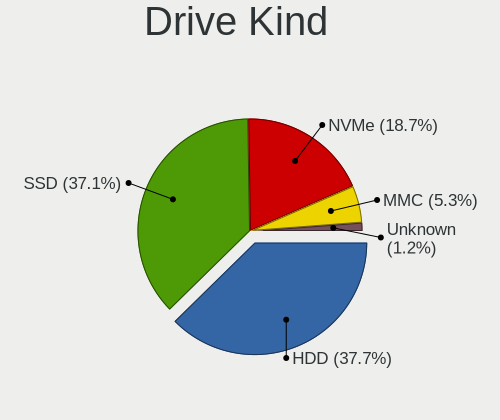
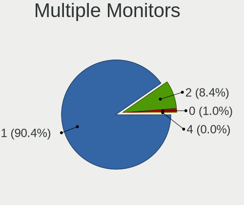

OpenMandriva - Tested Hardware & Statistics (Notebooks)
-------------------------------------------------------

A project to collect tested hardware configurations for OpenMandriva.

Anyone can contribute to this report by the [hw-probe](https://github.com/linuxhw/hw-probe) tool:

    sudo -E hw-probe -all -upload

Please contribute! Especially if your hardware is rare.

Contents
--------

* [ Test Cases ](#test-cases)

* [ System ](#system)
  - [ OS                       ](#os)
  - [ OS Family                ](#os-family)
  - [ Kernel                   ](#kernel)
  - [ Kernel Family            ](#kernel-family)
  - [ Kernel Major Ver.        ](#kernel-major-ver)
  - [ Arch                     ](#arch)
  - [ DE                       ](#de)
  - [ Display Server           ](#display-server)
  - [ Display Manager          ](#display-manager)
  - [ OS Lang                  ](#os-lang)
  - [ Boot Mode                ](#boot-mode)
  - [ Filesystem               ](#filesystem)
  - [ Part. scheme             ](#part-scheme)
  - [ Dual Boot with Linux/BSD ](#dual-boot-with-linuxbsd)
  - [ Dual Boot (Win)          ](#dual-boot-win)

* [ Board ](#board)
  - [ Vendor                   ](#vendor)
  - [ Model                    ](#model)
  - [ Model Family             ](#model-family)
  - [ MFG Year                 ](#mfg-year)
  - [ Form Factor              ](#form-factor)
  - [ Secure Boot              ](#secure-boot)
  - [ Coreboot                 ](#coreboot)
  - [ RAM Size                 ](#ram-size)
  - [ RAM Used                 ](#ram-used)
  - [ Total Drives             ](#total-drives)
  - [ Has CD-ROM               ](#has-cd-rom)
  - [ Has Ethernet             ](#has-ethernet)
  - [ Has WiFi                 ](#has-wifi)
  - [ Has Bluetooth            ](#has-bluetooth)

* [ Location ](#location)
  - [ Country                  ](#country)
  - [ City                     ](#city)

* [ Drives ](#drives)
  - [ Drive Vendor             ](#drive-vendor)
  - [ Drive Model              ](#drive-model)
  - [ HDD Vendor               ](#hdd-vendor)
  - [ SSD Vendor               ](#ssd-vendor)
  - [ Drive Kind               ](#drive-kind)
  - [ Drive Connector          ](#drive-connector)
  - [ Drive Size               ](#drive-size)
  - [ Space Total              ](#space-total)
  - [ Space Used               ](#space-used)
  - [ Malfunc. Drives          ](#malfunc-drives)
  - [ Malfunc. Drive Vendor    ](#malfunc-drive-vendor)
  - [ Malfunc. HDD Vendor      ](#malfunc-hdd-vendor)
  - [ Malfunc. Drive Kind      ](#malfunc-drive-kind)
  - [ Failed Drives            ](#failed-drives)
  - [ Failed Drive Vendor      ](#failed-drive-vendor)
  - [ Drive Status             ](#drive-status)

* [ Storage controller ](#storage-controller)
  - [ Storage Vendor           ](#storage-vendor)
  - [ Storage Model            ](#storage-model)
  - [ Storage Kind             ](#storage-kind)

* [ Processor ](#processor)
  - [ CPU Vendor               ](#cpu-vendor)
  - [ CPU Model                ](#cpu-model)
  - [ CPU Model Family         ](#cpu-model-family)
  - [ CPU Cores                ](#cpu-cores)
  - [ CPU Sockets              ](#cpu-sockets)
  - [ CPU Threads              ](#cpu-threads)
  - [ CPU Op-Modes             ](#cpu-op-modes)
  - [ CPU Microcode            ](#cpu-microcode)
  - [ CPU Microarch            ](#cpu-microarch)

* [ Graphics ](#graphics)
  - [ GPU Vendor               ](#gpu-vendor)
  - [ GPU Model                ](#gpu-model)
  - [ GPU Combo                ](#gpu-combo)
  - [ GPU Driver               ](#gpu-driver)
  - [ GPU Memory               ](#gpu-memory)

* [ Monitor ](#monitor)
  - [ Monitor Vendor           ](#monitor-vendor)
  - [ Monitor Model            ](#monitor-model)
  - [ Monitor Resolution       ](#monitor-resolution)
  - [ Monitor Diagonal         ](#monitor-diagonal)
  - [ Monitor Width            ](#monitor-width)
  - [ Aspect Ratio             ](#aspect-ratio)
  - [ Monitor Area             ](#monitor-area)
  - [ Pixel Density            ](#pixel-density)
  - [ Multiple Monitors        ](#multiple-monitors)

* [ Network ](#network)
  - [ Net Controller Vendor    ](#net-controller-vendor)
  - [ Net Controller Model     ](#net-controller-model)
  - [ Wireless Vendor          ](#wireless-vendor)
  - [ Wireless Model           ](#wireless-model)
  - [ Ethernet Vendor          ](#ethernet-vendor)
  - [ Ethernet Model           ](#ethernet-model)
  - [ Net Controller Kind      ](#net-controller-kind)
  - [ Used Controller          ](#used-controller)
  - [ NICs                     ](#nics)
  - [ IPv6                     ](#ipv6)

* [ Bluetooth ](#bluetooth)
  - [ Bluetooth Vendor         ](#bluetooth-vendor)
  - [ Bluetooth Model          ](#bluetooth-model)

* [ Sound ](#sound)
  - [ Sound Vendor             ](#sound-vendor)
  - [ Sound Model              ](#sound-model)

* [ Memory ](#memory)
  - [ Memory Vendor            ](#memory-vendor)
  - [ Memory Model             ](#memory-model)
  - [ Memory Kind              ](#memory-kind)
  - [ Memory Form Factor       ](#memory-form-factor)
  - [ Memory Size              ](#memory-size)
  - [ Memory Speed             ](#memory-speed)

* [ Printers & scanners ](#printers--scanners)
  - [ Printer Vendor           ](#printer-vendor)
  - [ Printer Model            ](#printer-model)
  - [ Scanner Vendor           ](#scanner-vendor)
  - [ Scanner Model            ](#scanner-model)

* [ Camera ](#camera)
  - [ Camera Vendor            ](#camera-vendor)
  - [ Camera Model             ](#camera-model)

* [ Security ](#security)
  - [ Fingerprint Vendor       ](#fingerprint-vendor)
  - [ Fingerprint Model        ](#fingerprint-model)
  - [ Chipcard Vendor          ](#chipcard-vendor)
  - [ Chipcard Model           ](#chipcard-model)

* [ Unsupported ](#unsupported)
  - [ Unsupported Devices      ](#unsupported-devices)
  - [ Unsupported Device Types ](#unsupported-device-types)

Test Cases
----------

Total: 5407

| Vendor        | Model                       | Probe                                                      | Date         |
|---------------|-----------------------------|------------------------------------------------------------|--------------|
| ASUSTek       | S551LN                      | [b7361dbc53](https://linux-hardware.org/?probe=b7361dbc53) | Feb 01, 2023 |
| Google        | Pantheon                    | [12e0b96dd1](https://linux-hardware.org/?probe=12e0b96dd1) | Feb 01, 2023 |
| Dell          | Precision M6700             | [743cb766c2](https://linux-hardware.org/?probe=743cb766c2) | Feb 01, 2023 |
| ASUSTek       | VivoBook_ASUSLaptop E510... | [08e071efa2](https://linux-hardware.org/?probe=08e071efa2) | Feb 01, 2023 |
| Lenovo        | ThinkPad T14s Gen 2i 20W... | [ab57658c86](https://linux-hardware.org/?probe=ab57658c86) | Jan 31, 2023 |
| HP            | Laptop 14s-dq3xxx           | [12ebaf0896](https://linux-hardware.org/?probe=12ebaf0896) | Jan 31, 2023 |
| Dell          | Latitude 5480               | [8b43efc7ea](https://linux-hardware.org/?probe=8b43efc7ea) | Jan 31, 2023 |
| Aquarius      | Cmp NS685U                  | [b067e76e64](https://linux-hardware.org/?probe=b067e76e64) | Jan 31, 2023 |
| Dell          | Studio 1558                 | [acfea4cd33](https://linux-hardware.org/?probe=acfea4cd33) | Jan 31, 2023 |
| Unknown       | Unknown                     | [e6c824b966](https://linux-hardware.org/?probe=e6c824b966) | Jan 31, 2023 |
| Dell          | Latitude E5420              | [ccc3ca9853](https://linux-hardware.org/?probe=ccc3ca9853) | Jan 31, 2023 |
| ASUSTek       | X55VD                       | [4120c1019c](https://linux-hardware.org/?probe=4120c1019c) | Jan 30, 2023 |
| HP            | 3115-AEC13432GR1            | [98eb70341a](https://linux-hardware.org/?probe=98eb70341a) | Jan 30, 2023 |
| Toshiba       | Satellite P750              | [1cc0f342b5](https://linux-hardware.org/?probe=1cc0f342b5) | Jan 30, 2023 |
| HP            | Compaq Presario CQ70        | [07e9e57b88](https://linux-hardware.org/?probe=07e9e57b88) | Jan 30, 2023 |
| Dell          | Inspiron 5758               | [de58233dca](https://linux-hardware.org/?probe=de58233dca) | Jan 30, 2023 |
| Dell          | Latitude E6400              | [a195487665](https://linux-hardware.org/?probe=a195487665) | Jan 30, 2023 |
| Acer          | Aspire E1-572G              | [6064a923c6](https://linux-hardware.org/?probe=6064a923c6) | Jan 30, 2023 |
| Acer          | Aspire 5755G                | [03c2f11b67](https://linux-hardware.org/?probe=03c2f11b67) | Jan 30, 2023 |
| Acer          | Aspire A515-41G             | [88db10e257](https://linux-hardware.org/?probe=88db10e257) | Jan 30, 2023 |
| Acer          | Aspire A515-52              | [51fa3ff577](https://linux-hardware.org/?probe=51fa3ff577) | Jan 30, 2023 |
| Unknown       | Unknown                     | [d780984cf9](https://linux-hardware.org/?probe=d780984cf9) | Jan 30, 2023 |
| HP            | ProBook 5320m               | [b8fc81e61c](https://linux-hardware.org/?probe=b8fc81e61c) | Jan 29, 2023 |
| Lenovo        | IdeaPad Gaming 3 15IMH05... | [51245400df](https://linux-hardware.org/?probe=51245400df) | Jan 29, 2023 |
| ASUSTek       | K55A                        | [e3088b45e1](https://linux-hardware.org/?probe=e3088b45e1) | Jan 29, 2023 |
| Clevo         | W240EU/W250EUQ/W270EUQ      | [3912652a13](https://linux-hardware.org/?probe=3912652a13) | Jan 29, 2023 |
| Dell          | Inspiron 5520               | [6de5bc549f](https://linux-hardware.org/?probe=6de5bc549f) | Jan 29, 2023 |
| Positivo      | Q464C-O                     | [e61f2d0622](https://linux-hardware.org/?probe=e61f2d0622) | Jan 29, 2023 |
| Lenovo        | Legion Y540-15IRH-PG0 81... | [e2fa9aa820](https://linux-hardware.org/?probe=e2fa9aa820) | Jan 29, 2023 |
| TUXEDO        | N14xWU                      | [5681ab6b5d](https://linux-hardware.org/?probe=5681ab6b5d) | Jan 28, 2023 |
| HP            | Notebook                    | [d38e078368](https://linux-hardware.org/?probe=d38e078368) | Jan 28, 2023 |
| ASUSTek       | K43SJ                       | [0cff4ad069](https://linux-hardware.org/?probe=0cff4ad069) | Jan 28, 2023 |
| ASUSTek       | 1215B                       | [8d26a8d157](https://linux-hardware.org/?probe=8d26a8d157) | Jan 28, 2023 |
| Lenovo        | ThinkPad X61 7674BE1        | [a22ac0a9f5](https://linux-hardware.org/?probe=a22ac0a9f5) | Jan 28, 2023 |
| ASUSTek       | VivoBook_ASUSLaptop X513... | [0245809d6a](https://linux-hardware.org/?probe=0245809d6a) | Jan 28, 2023 |
| Lenovo        | V15 G2 ALC 82KD             | [2b2401b0f0](https://linux-hardware.org/?probe=2b2401b0f0) | Jan 28, 2023 |
| Samsung       | 300E4C/300E5C/300E7C        | [796df2715d](https://linux-hardware.org/?probe=796df2715d) | Jan 28, 2023 |
| Lenovo        | IdeaPad 100-15IBY 80MJ      | [25ea296433](https://linux-hardware.org/?probe=25ea296433) | Jan 28, 2023 |
| HP            | EliteBook 8540w (VD444AD... | [eeb394333a](https://linux-hardware.org/?probe=eeb394333a) | Jan 28, 2023 |
| ASUSTek       | X540SA                      | [93aed28230](https://linux-hardware.org/?probe=93aed28230) | Jan 27, 2023 |
| Lenovo        | ThinkPad L15 Gen 1 20U70... | [d825caa85e](https://linux-hardware.org/?probe=d825caa85e) | Jan 27, 2023 |
| Acer          | Peppy                       | [9a16262be8](https://linux-hardware.org/?probe=9a16262be8) | Jan 27, 2023 |
| Lenovo        | IdeaPad S130-11IGM 81J1     | [ee351959a0](https://linux-hardware.org/?probe=ee351959a0) | Jan 27, 2023 |
| Acer          | Aspire E1-522               | [b1e1e4bb29](https://linux-hardware.org/?probe=b1e1e4bb29) | Jan 27, 2023 |
| Apple         | MacBook4,1                  | [e00443a9cc](https://linux-hardware.org/?probe=e00443a9cc) | Jan 27, 2023 |
| ASUSTek       | UX31E                       | [d87ac57c19](https://linux-hardware.org/?probe=d87ac57c19) | Jan 27, 2023 |
| Schenker      | XMG FOCUS (M22)             | [b04fdbb6da](https://linux-hardware.org/?probe=b04fdbb6da) | Jan 27, 2023 |
| HP            | 14                          | [53d080d83a](https://linux-hardware.org/?probe=53d080d83a) | Jan 27, 2023 |
| MSI           | CX600                       | [643c7effe7](https://linux-hardware.org/?probe=643c7effe7) | Jan 27, 2023 |
| NEC Comput... | PC-NS350AAR-KS              | [c4aa0da6f4](https://linux-hardware.org/?probe=c4aa0da6f4) | Jan 27, 2023 |
| Lenovo        | IdeaPad S145-14AST 81ST     | [85dbbce597](https://linux-hardware.org/?probe=85dbbce597) | Jan 27, 2023 |
| Dell          | Inspiron 3585               | [b41a540bb4](https://linux-hardware.org/?probe=b41a540bb4) | Jan 27, 2023 |
| Lenovo        | V15-ADA 82C7                | [5e42d7b8a7](https://linux-hardware.org/?probe=5e42d7b8a7) | Jan 27, 2023 |
| Acer          | Aspire R3-131T              | [021d999708](https://linux-hardware.org/?probe=021d999708) | Jan 27, 2023 |
| ASUSTek       | X541UJ                      | [d9ceb3c732](https://linux-hardware.org/?probe=d9ceb3c732) | Jan 27, 2023 |
| EVOO          | TEV-CE-141-2                | [21e4d23b45](https://linux-hardware.org/?probe=21e4d23b45) | Jan 27, 2023 |
| Lenovo        | ThinkPad T14 Gen 3 21AJS... | [e35fa4ee0f](https://linux-hardware.org/?probe=e35fa4ee0f) | Jan 26, 2023 |
| HP            | ProBook 640 G2              | [4e8cd1aa46](https://linux-hardware.org/?probe=4e8cd1aa46) | Jan 26, 2023 |
| Dell          | Inspiron 15 3521            | [41f89081ff](https://linux-hardware.org/?probe=41f89081ff) | Jan 26, 2023 |
| ASUSTek       | X501A1                      | [a0493c6731](https://linux-hardware.org/?probe=a0493c6731) | Jan 26, 2023 |
| Dell          | Latitude 7400               | [697e996615](https://linux-hardware.org/?probe=697e996615) | Jan 26, 2023 |
| Lenovo        | ThinkPad T440p 20AN0079M... | [0065b33518](https://linux-hardware.org/?probe=0065b33518) | Jan 26, 2023 |
| Lenovo        | ThinkPad T440p 20AWS24B0... | [e4ddea6092](https://linux-hardware.org/?probe=e4ddea6092) | Jan 26, 2023 |
| Dell          | Precision 7720              | [f5e8281d01](https://linux-hardware.org/?probe=f5e8281d01) | Jan 26, 2023 |
| Lenovo        | ThinkPad S1 Yoga 20C0S0Q... | [cdd3eb5723](https://linux-hardware.org/?probe=cdd3eb5723) | Jan 26, 2023 |
| HONOR         | HLYL-WXX9                   | [00c90b28ca](https://linux-hardware.org/?probe=00c90b28ca) | Jan 26, 2023 |
| Lenovo        | G50-45 80E3                 | [bad5c1a1b8](https://linux-hardware.org/?probe=bad5c1a1b8) | Jan 26, 2023 |
| Lenovo        | ThinkPad X1 Carbon Gen 9... | [08204bf161](https://linux-hardware.org/?probe=08204bf161) | Jan 26, 2023 |
| HP            | Laptop 15-ef1xxx            | [5ccbc70956](https://linux-hardware.org/?probe=5ccbc70956) | Jan 25, 2023 |
| Notebook      | NL40_50CU                   | [5029ce2c1e](https://linux-hardware.org/?probe=5029ce2c1e) | Jan 25, 2023 |
| Toshiba       | Satellite C870-12F          | [fc9a6d3a7e](https://linux-hardware.org/?probe=fc9a6d3a7e) | Jan 25, 2023 |
| Toshiba       | Satellite Pro R50-B         | [d08118920b](https://linux-hardware.org/?probe=d08118920b) | Jan 25, 2023 |
| OEGStone      | C4100/C5100                 | [4365b7b231](https://linux-hardware.org/?probe=4365b7b231) | Jan 25, 2023 |
| HP            | Pavilion g6                 | [a247cbd6d4](https://linux-hardware.org/?probe=a247cbd6d4) | Jan 25, 2023 |
| HP            | ProBook 4545s               | [1d832fb2f4](https://linux-hardware.org/?probe=1d832fb2f4) | Jan 25, 2023 |
| HP            | EliteBook 8460p             | [bb83f545f7](https://linux-hardware.org/?probe=bb83f545f7) | Jan 24, 2023 |
| Acer          | Aspire A315-22              | [7c048a8058](https://linux-hardware.org/?probe=7c048a8058) | Jan 24, 2023 |
| Dell          | Inspiron 3421               | [02491de92f](https://linux-hardware.org/?probe=02491de92f) | Jan 24, 2023 |
| Lenovo        | IdeaPad Slim 1-14AST-05 ... | [a1a1be6b56](https://linux-hardware.org/?probe=a1a1be6b56) | Jan 24, 2023 |
| Acer          | Aspire V5-132               | [7f74397112](https://linux-hardware.org/?probe=7f74397112) | Jan 24, 2023 |
| Toshiba       | dynabook T653/46JR          | [00cabfbb97](https://linux-hardware.org/?probe=00cabfbb97) | Jan 24, 2023 |
| Acer          | Aspire A515-51              | [418e5a2787](https://linux-hardware.org/?probe=418e5a2787) | Jan 24, 2023 |
| Insyde        | Braswell                    | [6abab0adc1](https://linux-hardware.org/?probe=6abab0adc1) | Jan 24, 2023 |
| Toshiba       | Satellite C655D             | [bf86cea0ec](https://linux-hardware.org/?probe=bf86cea0ec) | Jan 24, 2023 |
| Toshiba       | Satellite Pro C660          | [3ffb5ed458](https://linux-hardware.org/?probe=3ffb5ed458) | Jan 24, 2023 |
| Lenovo        | IdeaPad 320-15ABR 80XS      | [7b23698a1e](https://linux-hardware.org/?probe=7b23698a1e) | Jan 24, 2023 |
| Lenovo        | ThinkPad W541 20EF0020MD    | [fca73ad2a9](https://linux-hardware.org/?probe=fca73ad2a9) | Jan 24, 2023 |
| ASUSTek       | X51L                        | [b482dc649b](https://linux-hardware.org/?probe=b482dc649b) | Jan 23, 2023 |
| Dell          | Latitude E5530 non-vPro     | [5ddcb9f78b](https://linux-hardware.org/?probe=5ddcb9f78b) | Jan 23, 2023 |
| Packard Be... | PB56                        | [f26fcb7ee5](https://linux-hardware.org/?probe=f26fcb7ee5) | Jan 23, 2023 |
| Lenovo        | IdeaPad 330S-15IKB 81F5     | [a05bb7e519](https://linux-hardware.org/?probe=a05bb7e519) | Jan 23, 2023 |
| Lenovo        | ThinkPad T430 2344BZU       | [5e8acadc64](https://linux-hardware.org/?probe=5e8acadc64) | Jan 23, 2023 |
| HP            | EliteBook 745 G3            | [1fda4d1e4a](https://linux-hardware.org/?probe=1fda4d1e4a) | Jan 23, 2023 |
| Lenovo        | Legion Y540-15IRH-PG0 81... | [40719006ae](https://linux-hardware.org/?probe=40719006ae) | Jan 23, 2023 |
| Dell          | Latitude E6430s             | [8d46b5ae49](https://linux-hardware.org/?probe=8d46b5ae49) | Jan 23, 2023 |
| HP            | Pavilion Notebook           | [6383000f9e](https://linux-hardware.org/?probe=6383000f9e) | Jan 23, 2023 |
| Acer          | Nitro AN515-42              | [8692de1465](https://linux-hardware.org/?probe=8692de1465) | Jan 23, 2023 |
| ASUSTek       | K45VM                       | [7fef453cdb](https://linux-hardware.org/?probe=7fef453cdb) | Jan 23, 2023 |
| Lenovo        | IdeaPad 330S-15IKB 81F5     | [89c37ebdfa](https://linux-hardware.org/?probe=89c37ebdfa) | Jan 22, 2023 |
| MSI           | PX60 6QE                    | [d820232c9c](https://linux-hardware.org/?probe=d820232c9c) | Jan 22, 2023 |
| Lenovo        | IdeaPad 320-15IKB 80XL      | [36d99ec94e](https://linux-hardware.org/?probe=36d99ec94e) | Jan 22, 2023 |
| Lenovo        | IdeaPad S145-15API 81V7     | [7d4406c9bc](https://linux-hardware.org/?probe=7d4406c9bc) | Jan 22, 2023 |
| Lenovo        | ThinkPad W530 244723G       | [d0e5903d6c](https://linux-hardware.org/?probe=d0e5903d6c) | Jan 22, 2023 |
| HP            | Laptop 15-dw3xxx            | [50d894fc60](https://linux-hardware.org/?probe=50d894fc60) | Jan 22, 2023 |
| Lenovo        | ThinkPad E15 Gen 3 20YGC... | [09650cf189](https://linux-hardware.org/?probe=09650cf189) | Jan 22, 2023 |
| ASUSTek       | VivoBook_ASUSLaptop X515... | [a09d1d224c](https://linux-hardware.org/?probe=a09d1d224c) | Jan 22, 2023 |
| Dell          | Latitude E5430 non-vPro     | [4ff88ad220](https://linux-hardware.org/?probe=4ff88ad220) | Jan 22, 2023 |
| Lenovo        | ThinkPad X1C 5th W10DG 2... | [f3e565ffa6](https://linux-hardware.org/?probe=f3e565ffa6) | Jan 22, 2023 |
| ASUSTek       | VivoBook_ASUS Laptop E21... | [6ae7274931](https://linux-hardware.org/?probe=6ae7274931) | Jan 22, 2023 |
| Acer          | Aspire E1-531               | [217c63b8f6](https://linux-hardware.org/?probe=217c63b8f6) | Jan 22, 2023 |
| Toshiba       | dynabook T653/46JR          | [1acfabc208](https://linux-hardware.org/?probe=1acfabc208) | Jan 22, 2023 |
| ASUSTek       | ROG Strix G733CX_G733CX     | [a02df0f932](https://linux-hardware.org/?probe=a02df0f932) | Jan 21, 2023 |
| ASUSTek       | ZenBook UX325EA_UX325EA     | [40560e6bcd](https://linux-hardware.org/?probe=40560e6bcd) | Jan 21, 2023 |
| HP            | EliteBook 8570p             | [66c806fbfe](https://linux-hardware.org/?probe=66c806fbfe) | Jan 21, 2023 |
| Acer          | Aspire A515-45G             | [df633f4583](https://linux-hardware.org/?probe=df633f4583) | Jan 21, 2023 |
| ASUSTek       | N56VZ                       | [46ec3e0f8f](https://linux-hardware.org/?probe=46ec3e0f8f) | Jan 21, 2023 |
| HP            | EliteBook 850 G2            | [a7ba34fed5](https://linux-hardware.org/?probe=a7ba34fed5) | Jan 21, 2023 |
| Philco        | OEM                         | [a39f50ccfd](https://linux-hardware.org/?probe=a39f50ccfd) | Jan 21, 2023 |
| Lenovo        | ThinkPad X120e 05962RU      | [1628e3e66e](https://linux-hardware.org/?probe=1628e3e66e) | Jan 21, 2023 |
| HP            | Compaq Presario C700        | [d2ec58874c](https://linux-hardware.org/?probe=d2ec58874c) | Jan 21, 2023 |
| Acer          | Aspire E1-530               | [af5f0b7f58](https://linux-hardware.org/?probe=af5f0b7f58) | Jan 21, 2023 |
| Acer          | Aspire 7745G                | [98d6ab791c](https://linux-hardware.org/?probe=98d6ab791c) | Jan 21, 2023 |
| HP            | Laptop 17-by0xxx            | [88958e2846](https://linux-hardware.org/?probe=88958e2846) | Jan 20, 2023 |
| HP            | Victus by Laptop 16-e1xx... | [65919b95b4](https://linux-hardware.org/?probe=65919b95b4) | Jan 20, 2023 |
| HP            | Pavilion dv5                | [94ba65752b](https://linux-hardware.org/?probe=94ba65752b) | Jan 20, 2023 |
| Lenovo        | IdeaPad Gaming 3 15IHU6 ... | [6364be5249](https://linux-hardware.org/?probe=6364be5249) | Jan 20, 2023 |
| Dell          | Inspiron N4050              | [46e35da681](https://linux-hardware.org/?probe=46e35da681) | Jan 20, 2023 |
| Lenovo        | V570 1066AWU                | [7d86d12566](https://linux-hardware.org/?probe=7d86d12566) | Jan 20, 2023 |
| Dell          | Inspiron 15-3567            | [33a3aac223](https://linux-hardware.org/?probe=33a3aac223) | Jan 20, 2023 |
| Lenovo        | Z710 20250                  | [f59ce535eb](https://linux-hardware.org/?probe=f59ce535eb) | Jan 20, 2023 |
| Acer          | Aspire E1-531               | [614c392e0f](https://linux-hardware.org/?probe=614c392e0f) | Jan 20, 2023 |
| Toshiba       | Satellite C45-A             | [16f5bae11f](https://linux-hardware.org/?probe=16f5bae11f) | Jan 20, 2023 |
| Acer          | Aspire E3-111               | [fde7baf9e8](https://linux-hardware.org/?probe=fde7baf9e8) | Jan 19, 2023 |
| Dell          | Inspiron 5567               | [a993e95dde](https://linux-hardware.org/?probe=a993e95dde) | Jan 19, 2023 |
| Dell          | Vostro 1220                 | [6cd42b6be3](https://linux-hardware.org/?probe=6cd42b6be3) | Jan 19, 2023 |
| Apple         | MacBookPro8,1               | [b7f8407c8f](https://linux-hardware.org/?probe=b7f8407c8f) | Jan 19, 2023 |
| Alienware     | 15 R2                       | [3d9c86b05e](https://linux-hardware.org/?probe=3d9c86b05e) | Jan 19, 2023 |
| Dell          | Inspiron 3585               | [9790dcdef4](https://linux-hardware.org/?probe=9790dcdef4) | Jan 19, 2023 |
| Dell          | Inspiron 5770               | [64976ae263](https://linux-hardware.org/?probe=64976ae263) | Jan 19, 2023 |
| Toshiba       | Satellite L650D             | [86d99d74cd](https://linux-hardware.org/?probe=86d99d74cd) | Jan 19, 2023 |
| Lenovo        | ThinkPad T480s 20L8S02D0... | [8bcbca2ea9](https://linux-hardware.org/?probe=8bcbca2ea9) | Jan 19, 2023 |
| Lenovo        | ThinkPad T480s 20L8S02D0... | [3572cb486b](https://linux-hardware.org/?probe=3572cb486b) | Jan 19, 2023 |
| Lenovo        | ThinkPad SL510 2847CZU      | [710998b216](https://linux-hardware.org/?probe=710998b216) | Jan 19, 2023 |
| Sony          | VPCF236FM                   | [c2ed0fe829](https://linux-hardware.org/?probe=c2ed0fe829) | Jan 19, 2023 |
| HP            | Notebook                    | [63f0c0b90c](https://linux-hardware.org/?probe=63f0c0b90c) | Jan 19, 2023 |
| Lenovo        | Yoga Slim 7 13ACN5 82CY     | [da0d1f442a](https://linux-hardware.org/?probe=da0d1f442a) | Jan 19, 2023 |
| Lenovo        | Legion 5 15ARH05 82B5       | [2e66a90abd](https://linux-hardware.org/?probe=2e66a90abd) | Jan 19, 2023 |
| Toshiba       | Satellite C70-A             | [ffaa715bdd](https://linux-hardware.org/?probe=ffaa715bdd) | Jan 19, 2023 |
| Dell          | Inspiron 1525               | [f4df69624c](https://linux-hardware.org/?probe=f4df69624c) | Jan 19, 2023 |
| Lenovo        | ThinkPad T450 20BUS39J00    | [d5c413e815](https://linux-hardware.org/?probe=d5c413e815) | Jan 19, 2023 |
| Acer          | Aspire ES1-432              | [4a81caf8b2](https://linux-hardware.org/?probe=4a81caf8b2) | Jan 18, 2023 |
| Toshiba       | Satellite L70-C-12H         | [aa6340dd48](https://linux-hardware.org/?probe=aa6340dd48) | Jan 18, 2023 |
| Lenovo        | IdeaPad 5 15ARE05 81YQ      | [3fa537973f](https://linux-hardware.org/?probe=3fa537973f) | Jan 18, 2023 |
| Lenovo        | ThinkPad X200 7459VB9       | [a58c604cf7](https://linux-hardware.org/?probe=a58c604cf7) | Jan 18, 2023 |
| Dell          | Inspiron 3501               | [a9cad4d873](https://linux-hardware.org/?probe=a9cad4d873) | Jan 18, 2023 |
| HP            | Pavilion dv5                | [2ab5c1d05d](https://linux-hardware.org/?probe=2ab5c1d05d) | Jan 18, 2023 |
| Lenovo        | IdeaPad 5 15ARE05 81YQ      | [377dd4141e](https://linux-hardware.org/?probe=377dd4141e) | Jan 18, 2023 |
| Panasonic     | CF-53JULCV1M                | [89c1166efc](https://linux-hardware.org/?probe=89c1166efc) | Jan 18, 2023 |
| ASUSTek       | X411UN                      | [fad0f7ce44](https://linux-hardware.org/?probe=fad0f7ce44) | Jan 18, 2023 |
| Dell          | Inspiron N5110              | [bf606ed50a](https://linux-hardware.org/?probe=bf606ed50a) | Jan 18, 2023 |
| Schenker      | XMG FUSION 15 (XFU15L19)    | [04d0c02d29](https://linux-hardware.org/?probe=04d0c02d29) | Jan 18, 2023 |
| Acer          | Aspire 5750G                | [d696233b84](https://linux-hardware.org/?probe=d696233b84) | Jan 18, 2023 |
| Acer          | Aspire ES1-533              | [96f20a9e2f](https://linux-hardware.org/?probe=96f20a9e2f) | Jan 18, 2023 |
| Lenovo        | Yoga Slim 7 Pro 14IHU5 8... | [5b0e671bb8](https://linux-hardware.org/?probe=5b0e671bb8) | Jan 18, 2023 |
| Dell          | Latitude E6510              | [d26d229a4d](https://linux-hardware.org/?probe=d26d229a4d) | Jan 18, 2023 |
| HP            | EliteBook 850 G5            | [4afba6f67d](https://linux-hardware.org/?probe=4afba6f67d) | Jan 18, 2023 |
| MSI           | Katana GF76 11UC            | [8c0b32cf24](https://linux-hardware.org/?probe=8c0b32cf24) | Jan 18, 2023 |
| ASUSTek       | ASUS EXPERTBOOK L1400CDA... | [7969ad351d](https://linux-hardware.org/?probe=7969ad351d) | Jan 18, 2023 |
| Lenovo        | G550 2958                   | [7b255b7fe7](https://linux-hardware.org/?probe=7b255b7fe7) | Jan 18, 2023 |
| Dell          | XPS 15 7590                 | [9a7659a260](https://linux-hardware.org/?probe=9a7659a260) | Jan 18, 2023 |
| Toshiba       | QOSMIO X505                 | [8b6dfa9517](https://linux-hardware.org/?probe=8b6dfa9517) | Jan 18, 2023 |
| HP            | ProBook 440 G1              | [035c7a4e2d](https://linux-hardware.org/?probe=035c7a4e2d) | Jan 18, 2023 |
| ASUSTek       | ROG Flow X13 GV301QH_GV3... | [03c7a9b8a1](https://linux-hardware.org/?probe=03c7a9b8a1) | Jan 18, 2023 |
| Dell          | Latitude 7490               | [b611fc6b64](https://linux-hardware.org/?probe=b611fc6b64) | Jan 18, 2023 |
| Dell          | Latitude D630               | [0d267a0217](https://linux-hardware.org/?probe=0d267a0217) | Jan 17, 2023 |
| Packard Be... | EasyNote LE69KB             | [b1caf1d323](https://linux-hardware.org/?probe=b1caf1d323) | Jan 17, 2023 |
| HUAWEI        | KLVL-WXX9                   | [bf8a560f29](https://linux-hardware.org/?probe=bf8a560f29) | Jan 17, 2023 |
| Toshiba       | Satellite L655D             | [38b26485d3](https://linux-hardware.org/?probe=38b26485d3) | Jan 17, 2023 |
| ASUSTek       | ZenBook UX431DA_UM431DA     | [a20814cabc](https://linux-hardware.org/?probe=a20814cabc) | Jan 17, 2023 |
| Lenovo        | ThinkPad T61 766112G        | [fb772cc0cf](https://linux-hardware.org/?probe=fb772cc0cf) | Jan 17, 2023 |
| Toshiba       | Satellite C660              | [5012a7ccfc](https://linux-hardware.org/?probe=5012a7ccfc) | Jan 17, 2023 |
| HP            | Pavilion Gaming Notebook    | [03a01ae5f7](https://linux-hardware.org/?probe=03a01ae5f7) | Jan 17, 2023 |
| Dell          | Latitude E5540              | [e8e30eb563](https://linux-hardware.org/?probe=e8e30eb563) | Jan 17, 2023 |
| ASUSTek       | VivoBook 12_ASUS Laptop ... | [d05225350d](https://linux-hardware.org/?probe=d05225350d) | Jan 17, 2023 |
| Dell          | Inspiron 14 5418            | [e3bfdaa6a4](https://linux-hardware.org/?probe=e3bfdaa6a4) | Jan 17, 2023 |
| Unknown       | Unknown                     | [aea2d1af0a](https://linux-hardware.org/?probe=aea2d1af0a) | Jan 17, 2023 |
| Lenovo        | IdeaPad 330-15IKB 81DE      | [395a44652b](https://linux-hardware.org/?probe=395a44652b) | Jan 17, 2023 |
| MSI           | GP70 2OD                    | [7405037963](https://linux-hardware.org/?probe=7405037963) | Jan 17, 2023 |
| HP            | EliteBook 820 G3            | [4abc3c8796](https://linux-hardware.org/?probe=4abc3c8796) | Jan 17, 2023 |
| Acer          | Aspire A315-58              | [7a697f398d](https://linux-hardware.org/?probe=7a697f398d) | Jan 17, 2023 |
| Positivo      | N1103                       | [e5b41b9ed2](https://linux-hardware.org/?probe=e5b41b9ed2) | Jan 17, 2023 |
| Lenovo        | ThinkPad E15 Gen 2 20T9S... | [d7e87dd461](https://linux-hardware.org/?probe=d7e87dd461) | Jan 17, 2023 |
| Acer          | Aspire E1-572P              | [72afaf995e](https://linux-hardware.org/?probe=72afaf995e) | Jan 17, 2023 |
| Lenovo        | B50-10 80QR                 | [e5903bfd98](https://linux-hardware.org/?probe=e5903bfd98) | Jan 17, 2023 |
| Lenovo        | ThinkPad T420 4236AK9       | [1bd88ff8c7](https://linux-hardware.org/?probe=1bd88ff8c7) | Jan 17, 2023 |
| Dell          | Inspiron N4050              | [2de561e7f5](https://linux-hardware.org/?probe=2de561e7f5) | Jan 16, 2023 |
| ASUSTek       | 1018P                       | [45cdf08df5](https://linux-hardware.org/?probe=45cdf08df5) | Jan 16, 2023 |
| Google        | Lulu                        | [b0e2a5a9b3](https://linux-hardware.org/?probe=b0e2a5a9b3) | Jan 16, 2023 |
| Aquarius      | AQNS685V4                   | [1f0cd980d8](https://linux-hardware.org/?probe=1f0cd980d8) | Jan 16, 2023 |
| Acer          | Aspire 5742G                | [5cda575387](https://linux-hardware.org/?probe=5cda575387) | Jan 16, 2023 |
| Lenovo        | IdeaPad 5 14ARE05 81YM      | [fa4fd9061f](https://linux-hardware.org/?probe=fa4fd9061f) | Jan 16, 2023 |
| Lenovo        | G505 20240                  | [ef2fdd351c](https://linux-hardware.org/?probe=ef2fdd351c) | Jan 16, 2023 |
| Sony          | SVT1312M1ES                 | [9244e6ad96](https://linux-hardware.org/?probe=9244e6ad96) | Jan 16, 2023 |
| Lenovo        | ThinkPad T440s 20AQCTO1W... | [e04d230b62](https://linux-hardware.org/?probe=e04d230b62) | Jan 16, 2023 |
| Dell          | Latitude E7450              | [127258c518](https://linux-hardware.org/?probe=127258c518) | Jan 16, 2023 |
| HP            | Pavilion dv6500             | [33985f088a](https://linux-hardware.org/?probe=33985f088a) | Jan 16, 2023 |
| HP            | ProBook 440 G8 Notebook ... | [a80f36a4eb](https://linux-hardware.org/?probe=a80f36a4eb) | Jan 16, 2023 |
| Acer          | Aspire ES1-711              | [1aef2805c2](https://linux-hardware.org/?probe=1aef2805c2) | Jan 16, 2023 |
| Acer          | Aspire E5-574               | [758f7a4cad](https://linux-hardware.org/?probe=758f7a4cad) | Jan 16, 2023 |
| ASUSTek       | VivoBook 12_ASUS Laptop ... | [21c91371cc](https://linux-hardware.org/?probe=21c91371cc) | Jan 15, 2023 |
| HP            | Laptop 15s-eq2xxx           | [32e5de4912](https://linux-hardware.org/?probe=32e5de4912) | Jan 15, 2023 |
| Sony          | VGN-AR51J                   | [ff9806f1ac](https://linux-hardware.org/?probe=ff9806f1ac) | Jan 15, 2023 |
| HP            | Compaq 15                   | [ddfd4fd188](https://linux-hardware.org/?probe=ddfd4fd188) | Jan 15, 2023 |
| Dell          | Precision 7520              | [c57fdfbe1e](https://linux-hardware.org/?probe=c57fdfbe1e) | Jan 15, 2023 |
| Dell          | Latitude E5430 non-vPro     | [57cd4eaca3](https://linux-hardware.org/?probe=57cd4eaca3) | Jan 15, 2023 |
| eMachines     | eME442                      | [9de636b72e](https://linux-hardware.org/?probe=9de636b72e) | Jan 15, 2023 |
| Acer          | Aspire 5736Z                | [bdfc087b4d](https://linux-hardware.org/?probe=bdfc087b4d) | Jan 15, 2023 |
| HP            | EliteBook 2560p             | [7d0cedda95](https://linux-hardware.org/?probe=7d0cedda95) | Jan 15, 2023 |
| HP            | ENVY dv7                    | [4b7b0f98af](https://linux-hardware.org/?probe=4b7b0f98af) | Jan 15, 2023 |
| HP            | 15                          | [3faa6c9265](https://linux-hardware.org/?probe=3faa6c9265) | Jan 15, 2023 |
| HP            | Presario CQ57               | [f223ceb77a](https://linux-hardware.org/?probe=f223ceb77a) | Jan 15, 2023 |
| Acer          | Nitro AN515-44              | [f1e7eba4ca](https://linux-hardware.org/?probe=f1e7eba4ca) | Jan 15, 2023 |
| Acer          | Aspire 7250                 | [bcb2916be8](https://linux-hardware.org/?probe=bcb2916be8) | Jan 15, 2023 |
| Toshiba       | Satellite L650              | [b893aecea2](https://linux-hardware.org/?probe=b893aecea2) | Jan 15, 2023 |
| Dell          | Latitude 3540               | [01688be251](https://linux-hardware.org/?probe=01688be251) | Jan 15, 2023 |
| HP            | EliteBook 745 G3            | [c20a339ddb](https://linux-hardware.org/?probe=c20a339ddb) | Jan 15, 2023 |
| Lenovo        | ThinkPad T490s 20NX001KM... | [e24691c830](https://linux-hardware.org/?probe=e24691c830) | Jan 15, 2023 |
| Samsung       | 350V5C/350V5X/350V4C/350... | [f0b2886993](https://linux-hardware.org/?probe=f0b2886993) | Jan 15, 2023 |
| Dell          | Inspiron 5749               | [445264f815](https://linux-hardware.org/?probe=445264f815) | Jan 15, 2023 |
| ASUSTek       | ZenBook UX431DA_UM431DA     | [80ab61d971](https://linux-hardware.org/?probe=80ab61d971) | Jan 15, 2023 |
| Acer          | Aspire 5349                 | [c52d3b2b2f](https://linux-hardware.org/?probe=c52d3b2b2f) | Jan 15, 2023 |
| HP            | ZBook Firefly 14 inch G9... | [ca73cb526c](https://linux-hardware.org/?probe=ca73cb526c) | Jan 15, 2023 |
| Acer          | Aspire 7551                 | [b3e5df94f4](https://linux-hardware.org/?probe=b3e5df94f4) | Jan 15, 2023 |
| Monster       | TULPAR T5 V19.2             | [46bd0385fa](https://linux-hardware.org/?probe=46bd0385fa) | Jan 15, 2023 |
| HP            | ProBook 455 G1              | [8fbd7eb667](https://linux-hardware.org/?probe=8fbd7eb667) | Jan 15, 2023 |
| Apple         | MacBookPro9,2               | [2265827caa](https://linux-hardware.org/?probe=2265827caa) | Jan 14, 2023 |
| Kiano         | SlimNote 14,2               | [7596dc87b3](https://linux-hardware.org/?probe=7596dc87b3) | Jan 14, 2023 |
| Lenovo        | G50-45 80E3                 | [ab05084e01](https://linux-hardware.org/?probe=ab05084e01) | Jan 14, 2023 |
| Acer          | Aspire A315-34              | [656b21ed21](https://linux-hardware.org/?probe=656b21ed21) | Jan 14, 2023 |
| ASUSTek       | ASUS TUF Gaming F15 FX50... | [03f7a5fdea](https://linux-hardware.org/?probe=03f7a5fdea) | Jan 14, 2023 |
| Acer          | AO725                       | [739986d5fa](https://linux-hardware.org/?probe=739986d5fa) | Jan 14, 2023 |
| Lenovo        | IdeaPad 3 17ITL6 82H9       | [80f9124e5a](https://linux-hardware.org/?probe=80f9124e5a) | Jan 14, 2023 |
| Lenovo        | ThinkPad T540p 20BFS2G00... | [6c7af52ee2](https://linux-hardware.org/?probe=6c7af52ee2) | Jan 14, 2023 |
| Dell          | Precision M4700             | [64bd9a7627](https://linux-hardware.org/?probe=64bd9a7627) | Jan 14, 2023 |
| HP            | ZBook 17 G3                 | [9e4c15fff7](https://linux-hardware.org/?probe=9e4c15fff7) | Jan 14, 2023 |
| HP            | Pavilion g6                 | [fba7cebfff](https://linux-hardware.org/?probe=fba7cebfff) | Jan 14, 2023 |
| ASUSTek       | ROG Flow X13 GV301QH_GV3... | [d113da489f](https://linux-hardware.org/?probe=d113da489f) | Jan 14, 2023 |
| HP            | Pavilion Gaming Laptop 1... | [7cb08d37fb](https://linux-hardware.org/?probe=7cb08d37fb) | Jan 14, 2023 |
| HP            | Notebook                    | [4c9b4e3b67](https://linux-hardware.org/?probe=4c9b4e3b67) | Jan 14, 2023 |
| Acer          | Aspire M3-581T              | [f0ed3b4989](https://linux-hardware.org/?probe=f0ed3b4989) | Jan 14, 2023 |
| MSI           | GP72 7RDX                   | [9cf1da2d69](https://linux-hardware.org/?probe=9cf1da2d69) | Jan 14, 2023 |
| MSI           | GE62 6QF                    | [5ac082fab9](https://linux-hardware.org/?probe=5ac082fab9) | Jan 14, 2023 |
| Dell          | Latitude 3350               | [d7ca8710c2](https://linux-hardware.org/?probe=d7ca8710c2) | Jan 14, 2023 |
| Lenovo        | G585                        | [c7453a5e19](https://linux-hardware.org/?probe=c7453a5e19) | Jan 14, 2023 |
| Lenovo        | B51-80 80LM                 | [0c5b712b3e](https://linux-hardware.org/?probe=0c5b712b3e) | Jan 14, 2023 |
| Lenovo        | ThinkPad W540 20BHS1840P    | [0046521475](https://linux-hardware.org/?probe=0046521475) | Jan 14, 2023 |
| Samsung       | N150/N210/N220              | [5d2c7b7ded](https://linux-hardware.org/?probe=5d2c7b7ded) | Jan 14, 2023 |
| Fujitsu       | LIFEBOOK A3510              | [b3c2be78b3](https://linux-hardware.org/?probe=b3c2be78b3) | Jan 14, 2023 |
| Lenovo        | Yoga Slim 7 13ACN5 82CY     | [116b26047d](https://linux-hardware.org/?probe=116b26047d) | Jan 14, 2023 |
| Lenovo        | ThinkPad L510 2873A17       | [13f5fd23e5](https://linux-hardware.org/?probe=13f5fd23e5) | Jan 14, 2023 |
| ASUSTek       | ROG Flow X13 GV301QH_GV3... | [da829cbbc7](https://linux-hardware.org/?probe=da829cbbc7) | Jan 14, 2023 |
| HUAWEI        | KPL-W0X                     | [d1175d8dba](https://linux-hardware.org/?probe=d1175d8dba) | Jan 14, 2023 |
| Lenovo        | ThinkPad E14 Gen 4 21EB0... | [56c9afafb4](https://linux-hardware.org/?probe=56c9afafb4) | Jan 14, 2023 |
| Lenovo        | ThinkBook 13s-IML 20RR      | [e4e7a1d245](https://linux-hardware.org/?probe=e4e7a1d245) | Jan 14, 2023 |
| Dell          | Latitude E7440              | [9c4aac8b46](https://linux-hardware.org/?probe=9c4aac8b46) | Jan 14, 2023 |
| MSI           | GE70 2QD                    | [5e408d7d3d](https://linux-hardware.org/?probe=5e408d7d3d) | Jan 14, 2023 |
| Acer          | Aspire V3-571G              | [e3b9b73877](https://linux-hardware.org/?probe=e3b9b73877) | Jan 14, 2023 |
| Dell          | Latitude E6440              | [d04d05f246](https://linux-hardware.org/?probe=d04d05f246) | Jan 14, 2023 |
| Fujitsu       | LIFEBOOK A531               | [7157b47b73](https://linux-hardware.org/?probe=7157b47b73) | Jan 14, 2023 |
| Acer          | Aspire 5935                 | [40a8c82828](https://linux-hardware.org/?probe=40a8c82828) | Jan 14, 2023 |
| HP            | ProBook 4330s               | [e51cc0e32e](https://linux-hardware.org/?probe=e51cc0e32e) | Jan 14, 2023 |
| HP            | Laptop 15s-eq2xxx           | [29ff669f2c](https://linux-hardware.org/?probe=29ff669f2c) | Jan 14, 2023 |
| Samsung       | RV413/RV513                 | [4acb924b75](https://linux-hardware.org/?probe=4acb924b75) | Jan 14, 2023 |
| HP            | Stream Laptop 14-ax0XX      | [b6c21b8d35](https://linux-hardware.org/?probe=b6c21b8d35) | Jan 14, 2023 |
| Dell          | Precision 3541              | [5691f35a09](https://linux-hardware.org/?probe=5691f35a09) | Jan 14, 2023 |
| Panasonic     | CF-SX2JDHYS                 | [fa1ebc0951](https://linux-hardware.org/?probe=fa1ebc0951) | Jan 14, 2023 |
| Dell          | Inspiron 5559               | [2cb923c446](https://linux-hardware.org/?probe=2cb923c446) | Jan 14, 2023 |
| Sony          | VPCEH10EB                   | [c9127c6375](https://linux-hardware.org/?probe=c9127c6375) | Jan 14, 2023 |
| Acer          | Calpella                    | [108843a25a](https://linux-hardware.org/?probe=108843a25a) | Jan 14, 2023 |
| Lenovo        | IdeaPad 330-15IKB 81DE      | [6cc913ff8f](https://linux-hardware.org/?probe=6cc913ff8f) | Jan 14, 2023 |
| Alienware     | 17 R3                       | [d4cf3c4f4d](https://linux-hardware.org/?probe=d4cf3c4f4d) | Jan 14, 2023 |
| ASUSTek       | X541UV                      | [d45c8ef0ac](https://linux-hardware.org/?probe=d45c8ef0ac) | Jan 13, 2023 |
| HP            | EliteBook 820 G3            | [3a330d3173](https://linux-hardware.org/?probe=3a330d3173) | Jan 13, 2023 |
| Lenovo        | IdeaPad 330-17IKB 81DK      | [3df12b0c9c](https://linux-hardware.org/?probe=3df12b0c9c) | Jan 13, 2023 |
| HP            | ProBook 4540s               | [9b33dc4291](https://linux-hardware.org/?probe=9b33dc4291) | Jan 13, 2023 |
| ASUSTek       | UX31E                       | [d60bab803e](https://linux-hardware.org/?probe=d60bab803e) | Jan 13, 2023 |
| Acer          | Nitro AN515-42              | [940dcb54ef](https://linux-hardware.org/?probe=940dcb54ef) | Jan 13, 2023 |
| eMachines     | E725                        | [048d832cef](https://linux-hardware.org/?probe=048d832cef) | Jan 13, 2023 |
| Dell          | Latitude E6410              | [a11818f59a](https://linux-hardware.org/?probe=a11818f59a) | Jan 13, 2023 |
| Lenovo        | IdeaPad 5 Pro 14ITL6 82L... | [0536f685a0](https://linux-hardware.org/?probe=0536f685a0) | Jan 13, 2023 |
| ASUSTek       | X751LJ                      | [2cbaf315da](https://linux-hardware.org/?probe=2cbaf315da) | Jan 13, 2023 |
| Apple         | MacBookAir5,2               | [c4cfa1aa47](https://linux-hardware.org/?probe=c4cfa1aa47) | Jan 13, 2023 |
| MSI           | CX61 0NC/CX61 0ND/CX61 0... | [fafc15930a](https://linux-hardware.org/?probe=fafc15930a) | Jan 13, 2023 |
| Fujitsu       | LIFEBOOK T730               | [f9ba03526e](https://linux-hardware.org/?probe=f9ba03526e) | Jan 13, 2023 |
| Lenovo        | IdeaPad 5 15ARE05 81YQ      | [968604ceb2](https://linux-hardware.org/?probe=968604ceb2) | Jan 13, 2023 |
| Lenovo        | IdeaPad 3 15ADA05 81W1      | [f59adc6dcd](https://linux-hardware.org/?probe=f59adc6dcd) | Jan 13, 2023 |
| Acer          | Aspire A515-52              | [217353eb32](https://linux-hardware.org/?probe=217353eb32) | Jan 13, 2023 |
| Unknown       | Unknown                     | [d0391da5d8](https://linux-hardware.org/?probe=d0391da5d8) | Jan 13, 2023 |
| HP            | Notebook                    | [1baf122d48](https://linux-hardware.org/?probe=1baf122d48) | Jan 13, 2023 |
| Dell          | Vostro 3549                 | [b6970533c4](https://linux-hardware.org/?probe=b6970533c4) | Jan 13, 2023 |
| Lenovo        | B490 20205                  | [14243e79d2](https://linux-hardware.org/?probe=14243e79d2) | Jan 13, 2023 |
| Dell          | Latitude 7400               | [865f5e0e20](https://linux-hardware.org/?probe=865f5e0e20) | Jan 13, 2023 |
| Dell          | XPS 15 9570                 | [89b4a28536](https://linux-hardware.org/?probe=89b4a28536) | Jan 13, 2023 |
| HP            | EliteBook 2560p             | [9ac8dc707a](https://linux-hardware.org/?probe=9ac8dc707a) | Jan 13, 2023 |
| Acer          | Aspire E1-421               | [ebfd029f41](https://linux-hardware.org/?probe=ebfd029f41) | Jan 13, 2023 |
| Positivo      | Smash2                      | [d160522fb3](https://linux-hardware.org/?probe=d160522fb3) | Jan 13, 2023 |
| Acer          | Aspire E1-572               | [fa6e296766](https://linux-hardware.org/?probe=fa6e296766) | Jan 13, 2023 |
| TUXEDO        | Book XA15 / XA17 Gen10      | [343813c285](https://linux-hardware.org/?probe=343813c285) | Jan 13, 2023 |
| Acer          | Swift SF514-54GT            | [748c1e00d7](https://linux-hardware.org/?probe=748c1e00d7) | Jan 12, 2023 |
| MSI           | Katana GF66 11UC            | [39b5188695](https://linux-hardware.org/?probe=39b5188695) | Jan 12, 2023 |
| Lenovo        | ThinkPad T450 20BUA0UG00    | [b0854ecbf8](https://linux-hardware.org/?probe=b0854ecbf8) | Jan 12, 2023 |
| Acer          | Aspire V5-122               | [a25a7c3fb1](https://linux-hardware.org/?probe=a25a7c3fb1) | Jan 12, 2023 |
| Dell          | Inspiron 5520               | [56efcb1e01](https://linux-hardware.org/?probe=56efcb1e01) | Jan 12, 2023 |
| HP            | Laptop 15-dw3xxx            | [f37bb8688f](https://linux-hardware.org/?probe=f37bb8688f) | Jan 12, 2023 |
| Lenovo        | ThinkPad T14 Gen 1 20S1S... | [50dfb4259a](https://linux-hardware.org/?probe=50dfb4259a) | Jan 12, 2023 |
| Acer          | Aspire A315-56              | [6ea0b8eab9](https://linux-hardware.org/?probe=6ea0b8eab9) | Jan 12, 2023 |
| Acer          | Aspire 7730G                | [ba1e942da3](https://linux-hardware.org/?probe=ba1e942da3) | Jan 12, 2023 |
| Fujitsu Si... | AMILO Xi 3650               | [1f238129d8](https://linux-hardware.org/?probe=1f238129d8) | Jan 12, 2023 |
| Lenovo        | ThinkPad X230 23245J8       | [c20b87316b](https://linux-hardware.org/?probe=c20b87316b) | Jan 12, 2023 |
| Dell          | Latitude 3350               | [065c4a4a95](https://linux-hardware.org/?probe=065c4a4a95) | Jan 12, 2023 |
| TUXEDO        | Unknown                     | [ae60044fa6](https://linux-hardware.org/?probe=ae60044fa6) | Jan 12, 2023 |
| Lenovo        | Yoga Slim 7 Carbon 13ITL... | [58f2d0e1b4](https://linux-hardware.org/?probe=58f2d0e1b4) | Jan 12, 2023 |
| Dell          | Inspiron 1545               | [fbe5836f4f](https://linux-hardware.org/?probe=fbe5836f4f) | Jan 12, 2023 |
| ASUSTek       | ROG Flow X13 GV301QH_GV3... | [ee7b0c337b](https://linux-hardware.org/?probe=ee7b0c337b) | Jan 12, 2023 |
| Acer          | Aspire E5-471P              | [c50e807e64](https://linux-hardware.org/?probe=c50e807e64) | Jan 12, 2023 |
| Lenovo        | ThinkPad T60 8744HDG        | [10c4bcf564](https://linux-hardware.org/?probe=10c4bcf564) | Jan 12, 2023 |
| Google        | Link                        | [f73704d47a](https://linux-hardware.org/?probe=f73704d47a) | Jan 12, 2023 |
| ASUSTek       | ROG Flow X13 GV301QH_GV3... | [c3b6b8b400](https://linux-hardware.org/?probe=c3b6b8b400) | Jan 12, 2023 |
| Lenovo        | ThinkPad T530 2392AQU       | [0be364c65c](https://linux-hardware.org/?probe=0be364c65c) | Jan 12, 2023 |
| Lenovo        | IdeaPad Slim 9 14ITL5 82... | [a8d6ad51af](https://linux-hardware.org/?probe=a8d6ad51af) | Jan 12, 2023 |
| Lenovo        | IdeaPad 305-15IBD 80NJ      | [7a2cdcb0ab](https://linux-hardware.org/?probe=7a2cdcb0ab) | Jan 12, 2023 |
| ASUSTek       | X550LN                      | [791cd47247](https://linux-hardware.org/?probe=791cd47247) | Jan 12, 2023 |
| Lenovo        | G50-70 20351                | [239e9a9620](https://linux-hardware.org/?probe=239e9a9620) | Jan 12, 2023 |
| ASUSTek       | G53SX                       | [ef2d9747e2](https://linux-hardware.org/?probe=ef2d9747e2) | Jan 12, 2023 |
| HP            | ZBook 15 G3                 | [c44ad0b618](https://linux-hardware.org/?probe=c44ad0b618) | Jan 12, 2023 |
| HP            | Laptop 15-gw0xxx            | [d534567752](https://linux-hardware.org/?probe=d534567752) | Jan 12, 2023 |
| Dell          | Inspiron 5770               | [7435d85aca](https://linux-hardware.org/?probe=7435d85aca) | Jan 12, 2023 |
| HP            | Compaq 6530b                | [8ebd66e8e6](https://linux-hardware.org/?probe=8ebd66e8e6) | Jan 12, 2023 |
| HP            | Pavilion Laptop 14-dv0xx... | [e607ba7fc4](https://linux-hardware.org/?probe=e607ba7fc4) | Jan 12, 2023 |
| Lenovo        | ThinkPad X230 2325AH7       | [c1080083c4](https://linux-hardware.org/?probe=c1080083c4) | Jan 12, 2023 |
| Standard      | Unknown                     | [b6f4b12847](https://linux-hardware.org/?probe=b6f4b12847) | Jan 12, 2023 |
| Gateway       | NV55C                       | [b8ae4adfdc](https://linux-hardware.org/?probe=b8ae4adfdc) | Jan 12, 2023 |
| Unknown       | Unknown                     | [5f6b66b79b](https://linux-hardware.org/?probe=5f6b66b79b) | Jan 12, 2023 |
| Lenovo        | ThinkPad T470 W10DG 20JN... | [907784afb2](https://linux-hardware.org/?probe=907784afb2) | Jan 12, 2023 |
| Lenovo        | ThinkPad L15 Gen 1 20U70... | [ff12fe840d](https://linux-hardware.org/?probe=ff12fe840d) | Jan 12, 2023 |
| Acer          | Nitro AN515-54              | [9f56f94323](https://linux-hardware.org/?probe=9f56f94323) | Jan 12, 2023 |
| Acer          | Aspire V5-561G              | [1551c2b90c](https://linux-hardware.org/?probe=1551c2b90c) | Jan 12, 2023 |
| Lenovo        | Legion Y740S-15IMH 81YX     | [b61eb04be5](https://linux-hardware.org/?probe=b61eb04be5) | Jan 11, 2023 |
| ALLDOCUBE     | i1405C                      | [0713c94107](https://linux-hardware.org/?probe=0713c94107) | Jan 11, 2023 |
| HP            | ProBook 4535s               | [47cd489d8b](https://linux-hardware.org/?probe=47cd489d8b) | Jan 11, 2023 |
| Dell          | Inspiron 5558               | [5b5ff96ffd](https://linux-hardware.org/?probe=5b5ff96ffd) | Jan 11, 2023 |
| HP            | Pavilion dv9500             | [0f8c99e8d7](https://linux-hardware.org/?probe=0f8c99e8d7) | Jan 11, 2023 |
| Lenovo        | S20-30 20421                | [43bee9503c](https://linux-hardware.org/?probe=43bee9503c) | Jan 11, 2023 |
| Medion        | E6222                       | [e3b3da28fa](https://linux-hardware.org/?probe=e3b3da28fa) | Jan 11, 2023 |
| Acer          | Aspire E1-572               | [43c14a1e54](https://linux-hardware.org/?probe=43c14a1e54) | Jan 11, 2023 |
| HP            | Laptop 14-fq1xxx            | [1c46ef773f](https://linux-hardware.org/?probe=1c46ef773f) | Jan 11, 2023 |
| Lenovo        | G50-45 80E3                 | [80f84b2854](https://linux-hardware.org/?probe=80f84b2854) | Jan 11, 2023 |
| Lenovo        | ThinkPad T430 2349MPS       | [c04ba99a13](https://linux-hardware.org/?probe=c04ba99a13) | Jan 11, 2023 |
| Lenovo        | ThinkPad R61 8935AC7        | [4128f195f0](https://linux-hardware.org/?probe=4128f195f0) | Jan 11, 2023 |
| HP            | EliteBook 8460p             | [a941237bf3](https://linux-hardware.org/?probe=a941237bf3) | Jan 11, 2023 |
| HP            | Presario C700               | [3674a9a180](https://linux-hardware.org/?probe=3674a9a180) | Jan 11, 2023 |
| Samsung       | 270E5G/270E5U               | [0ddeecd2b8](https://linux-hardware.org/?probe=0ddeecd2b8) | Jan 11, 2023 |
| Lenovo        | ThinkPad W510 439123G       | [4fd1a4a217](https://linux-hardware.org/?probe=4fd1a4a217) | Jan 11, 2023 |
| HP            | ProBook 6450b               | [0ae783d261](https://linux-hardware.org/?probe=0ae783d261) | Jan 11, 2023 |
| Toshiba       | Satellite P50-C             | [1da161195b](https://linux-hardware.org/?probe=1da161195b) | Jan 11, 2023 |
| Eluktronic... | Prometheus XVII             | [9060298ec4](https://linux-hardware.org/?probe=9060298ec4) | Jan 11, 2023 |
| ASUSTek       | ROG Strix G713RC_G713RC     | [53656f6ceb](https://linux-hardware.org/?probe=53656f6ceb) | Jan 11, 2023 |
| Sony          | VPCEJ2S1E                   | [f387a3dcf6](https://linux-hardware.org/?probe=f387a3dcf6) | Jan 11, 2023 |
| HP            | EliteBook 840 G4            | [680b0adb7b](https://linux-hardware.org/?probe=680b0adb7b) | Jan 11, 2023 |
| ASUSTek       | ZenBook UX425UA_UM425UA     | [0eb269d3a7](https://linux-hardware.org/?probe=0eb269d3a7) | Jan 11, 2023 |
| Acer          | Nitro AN515-43              | [6488b3dc3c](https://linux-hardware.org/?probe=6488b3dc3c) | Jan 11, 2023 |
| Acer          | Aspire 5742G                | [07f15478a7](https://linux-hardware.org/?probe=07f15478a7) | Jan 11, 2023 |
| MSI           | GL75 9SE                    | [e3478b20bd](https://linux-hardware.org/?probe=e3478b20bd) | Jan 11, 2023 |
| HP            | Unknown                     | [604bea5ac6](https://linux-hardware.org/?probe=604bea5ac6) | Jan 11, 2023 |
| Razer         | Blade 17 (2022) - RZ09-0... | [a25c10f2dd](https://linux-hardware.org/?probe=a25c10f2dd) | Jan 11, 2023 |
| Fujitsu       | LIFEBOOK A512               | [4bb2de67c9](https://linux-hardware.org/?probe=4bb2de67c9) | Jan 11, 2023 |
| Toshiba       | Satellite C850-B561         | [562d6cde14](https://linux-hardware.org/?probe=562d6cde14) | Jan 11, 2023 |
| Toshiba       | Satellite Pro NB10-A-12Q    | [f0c82d2046](https://linux-hardware.org/?probe=f0c82d2046) | Jan 11, 2023 |
| Acer          | Extensa 2519                | [c044faaa05](https://linux-hardware.org/?probe=c044faaa05) | Jan 11, 2023 |
| Lenovo        | IdeaPad S145-15IIL 81W8     | [1ebf7a4a09](https://linux-hardware.org/?probe=1ebf7a4a09) | Jan 11, 2023 |
| Dell          | Inspiron 1545               | [20bc38b554](https://linux-hardware.org/?probe=20bc38b554) | Jan 11, 2023 |
| Sony          | VPCEH1AFX                   | [3f64681bc7](https://linux-hardware.org/?probe=3f64681bc7) | Jan 11, 2023 |
| HP            | EliteBook 840 G2            | [72a6b9a90b](https://linux-hardware.org/?probe=72a6b9a90b) | Jan 11, 2023 |
| Sony          | VPCEA23FB                   | [d6a7454695](https://linux-hardware.org/?probe=d6a7454695) | Jan 11, 2023 |
| Acer          | Aspire E1-571               | [77e844abaf](https://linux-hardware.org/?probe=77e844abaf) | Jan 11, 2023 |
| Lenovo        | Yoga 2 Pro 20266            | [4065e955cd](https://linux-hardware.org/?probe=4065e955cd) | Jan 11, 2023 |
| UMAX          | VisionBook 15Wg Plus        | [e4c19089b5](https://linux-hardware.org/?probe=e4c19089b5) | Jan 11, 2023 |
| Lenovo        | ThinkPad X240 20AM001RGE    | [f4aafcf7a9](https://linux-hardware.org/?probe=f4aafcf7a9) | Jan 11, 2023 |
| Compaq        | 420                         | [65070f85d5](https://linux-hardware.org/?probe=65070f85d5) | Jan 11, 2023 |
| Acer          | Nitro AN515-44              | [aacfe1b351](https://linux-hardware.org/?probe=aacfe1b351) | Jan 11, 2023 |
| Dell          | Latitude D630               | [64877fdf78](https://linux-hardware.org/?probe=64877fdf78) | Jan 11, 2023 |
| ASUSTek       | TUF Gaming FX505DU_TUF50... | [05a4b5d681](https://linux-hardware.org/?probe=05a4b5d681) | Jan 10, 2023 |
| Dell          | G5 5590                     | [846a462365](https://linux-hardware.org/?probe=846a462365) | Jan 10, 2023 |
| MSI           | Stealth GS77 12UE           | [3711622844](https://linux-hardware.org/?probe=3711622844) | Jan 10, 2023 |
| ASUSTek       | ZenBook Pro Duo UX582HM_... | [47d808cdc7](https://linux-hardware.org/?probe=47d808cdc7) | Jan 10, 2023 |
| Lenovo        | ThinkPad X270 20HN0015FR    | [e303c543ba](https://linux-hardware.org/?probe=e303c543ba) | Jan 10, 2023 |
| Sony          | VPCCW1S1E                   | [5cc5248e94](https://linux-hardware.org/?probe=5cc5248e94) | Jan 10, 2023 |
| Apple         | MacBookAir5,1               | [ce911686b3](https://linux-hardware.org/?probe=ce911686b3) | Jan 10, 2023 |
| Acer          | Aspire A515-41G             | [e5ef8ca744](https://linux-hardware.org/?probe=e5ef8ca744) | Jan 10, 2023 |
| System76      | Darter Pro                  | [ffaaf5c90e](https://linux-hardware.org/?probe=ffaaf5c90e) | Jan 10, 2023 |
| Dell          | XPS M1330                   | [e3d66114f6](https://linux-hardware.org/?probe=e3d66114f6) | Jan 10, 2023 |
| HP            | EliteBook 8460p             | [27ab381a1d](https://linux-hardware.org/?probe=27ab381a1d) | Jan 10, 2023 |
| Lenovo        | ThinkPad X201 3680AQ1       | [4a65277a98](https://linux-hardware.org/?probe=4a65277a98) | Jan 10, 2023 |
| ASUSTek       | TUF Gaming FX505GM_FX86F... | [5ab0bf0018](https://linux-hardware.org/?probe=5ab0bf0018) | Jan 10, 2023 |
| Acer          | TMP645-M                    | [8e0b2f5e90](https://linux-hardware.org/?probe=8e0b2f5e90) | Jan 10, 2023 |
| ASUSTek       | X550CC                      | [2aa757ef35](https://linux-hardware.org/?probe=2aa757ef35) | Jan 10, 2023 |
| Lenovo        | IdeaPad 3 14ITL6 82H7       | [dfca68067c](https://linux-hardware.org/?probe=dfca68067c) | Jan 10, 2023 |
| Acer          | Aspire 5735                 | [27b63fd8b1](https://linux-hardware.org/?probe=27b63fd8b1) | Jan 10, 2023 |
| MSI           | Modern 15 A5M               | [18654d5f58](https://linux-hardware.org/?probe=18654d5f58) | Jan 10, 2023 |
| ASUSTek       | GL702VM                     | [31345092f4](https://linux-hardware.org/?probe=31345092f4) | Jan 10, 2023 |
| HP            | 255 G4                      | [1893637142](https://linux-hardware.org/?probe=1893637142) | Jan 10, 2023 |
| Dell          | Inspiron N5010              | [f5d1f04d89](https://linux-hardware.org/?probe=f5d1f04d89) | Jan 10, 2023 |
| Lenovo        | IdeaPad S145-15API 81UT     | [010a4fc9bd](https://linux-hardware.org/?probe=010a4fc9bd) | Jan 10, 2023 |
| Lenovo        | ThinkPad T440 20B7000LGE    | [e094c1d3f4](https://linux-hardware.org/?probe=e094c1d3f4) | Jan 10, 2023 |
| Lenovo        | B50-70 80EU                 | [e11621e300](https://linux-hardware.org/?probe=e11621e300) | Jan 10, 2023 |
| HP            | ProBook 645 G2              | [1298e3efb0](https://linux-hardware.org/?probe=1298e3efb0) | Jan 10, 2023 |
| Acer          | Aspire F5-573               | [56819b1d05](https://linux-hardware.org/?probe=56819b1d05) | Jan 10, 2023 |
| Acer          | Extensa 2540                | [6bddd00c3f](https://linux-hardware.org/?probe=6bddd00c3f) | Jan 10, 2023 |
| Acer          | Aspire E5-575G              | [21bfdfce4b](https://linux-hardware.org/?probe=21bfdfce4b) | Jan 10, 2023 |
| MSI           | Modern 14 B10RBSW           | [3dea4fbc97](https://linux-hardware.org/?probe=3dea4fbc97) | Jan 10, 2023 |
| ASUSTek       | K53SM                       | [f1ac679157](https://linux-hardware.org/?probe=f1ac679157) | Jan 10, 2023 |
| Acer          | Aspire E1-531G              | [2476cc24c1](https://linux-hardware.org/?probe=2476cc24c1) | Jan 10, 2023 |
| HP            | Unknown                     | [63d24f2719](https://linux-hardware.org/?probe=63d24f2719) | Jan 10, 2023 |
| Lenovo        | Yoga Slim 7 Pro 16ACH6 8... | [acab6ec02e](https://linux-hardware.org/?probe=acab6ec02e) | Jan 10, 2023 |
| HP            | Compaq 6730s                | [46c8c987e6](https://linux-hardware.org/?probe=46c8c987e6) | Jan 10, 2023 |
| HP            | ProBook 440 G8 Notebook ... | [17dc10d7bb](https://linux-hardware.org/?probe=17dc10d7bb) | Jan 10, 2023 |
| Google        | Sand                        | [f539d17e9a](https://linux-hardware.org/?probe=f539d17e9a) | Jan 10, 2023 |
| Acer          | Aspire A315-56              | [b89e68d5ab](https://linux-hardware.org/?probe=b89e68d5ab) | Jan 10, 2023 |
| Dell          | Inspiron 5577               | [86cfa19622](https://linux-hardware.org/?probe=86cfa19622) | Jan 10, 2023 |
| Clevo         | W240HU/W250HUQ              | [b572e2679d](https://linux-hardware.org/?probe=b572e2679d) | Jan 10, 2023 |
| Lenovo        | ThinkPad L540 20AUS2MN00    | [b7ee1243ad](https://linux-hardware.org/?probe=b7ee1243ad) | Jan 10, 2023 |
| ASUSTek       | ROG Strix G513RM_G513RM     | [6aa615094c](https://linux-hardware.org/?probe=6aa615094c) | Jan 10, 2023 |
| Acer          | Aspire A514-54              | [a786a0640f](https://linux-hardware.org/?probe=a786a0640f) | Jan 10, 2023 |
| Dell          | Latitude E4310              | [1cd2d3300a](https://linux-hardware.org/?probe=1cd2d3300a) | Jan 09, 2023 |
| Dell          | Inspiron 3442               | [f540a5f964](https://linux-hardware.org/?probe=f540a5f964) | Jan 09, 2023 |
| Lenovo        | ThinkPad E14 Gen 4 21EB0... | [2bbe617df6](https://linux-hardware.org/?probe=2bbe617df6) | Jan 09, 2023 |
| MSI           | GP60 2PE                    | [e1506ca6f6](https://linux-hardware.org/?probe=e1506ca6f6) | Jan 09, 2023 |
| Dell          | Precision 7540              | [77b35e556c](https://linux-hardware.org/?probe=77b35e556c) | Jan 09, 2023 |
| Lenovo        | IdeaPad 330S-15ARR 81FB     | [7e32892067](https://linux-hardware.org/?probe=7e32892067) | Jan 09, 2023 |
| Lenovo        | ThinkPad E570 20H50048US    | [1184938f85](https://linux-hardware.org/?probe=1184938f85) | Jan 09, 2023 |
| ASUSTek       | K50IJ                       | [9d476dfade](https://linux-hardware.org/?probe=9d476dfade) | Jan 09, 2023 |
| Lenovo        | G480 20150                  | [31f01e01fe](https://linux-hardware.org/?probe=31f01e01fe) | Jan 09, 2023 |
| Dell          | System XPS L502X            | [7d053f0ab1](https://linux-hardware.org/?probe=7d053f0ab1) | Jan 09, 2023 |
| Dell          | Latitude 7490               | [0780580a38](https://linux-hardware.org/?probe=0780580a38) | Jan 09, 2023 |
| Lenovo        | ThinkPad T450 20BV000AUS    | [bd0dc145be](https://linux-hardware.org/?probe=bd0dc145be) | Jan 09, 2023 |
| ASUSTek       | X301A1                      | [c98ae98676](https://linux-hardware.org/?probe=c98ae98676) | Jan 09, 2023 |
| Acer          | Aspire E5-511               | [e16bac2828](https://linux-hardware.org/?probe=e16bac2828) | Jan 09, 2023 |
| Acer          | Aspire A315-41              | [6c7f37297d](https://linux-hardware.org/?probe=6c7f37297d) | Jan 09, 2023 |
| ASUSTek       | X75A1                       | [02ad2b36f1](https://linux-hardware.org/?probe=02ad2b36f1) | Jan 09, 2023 |
| ASUSTek       | VivoBook 12_ASUS Laptop ... | [d6115e24c1](https://linux-hardware.org/?probe=d6115e24c1) | Jan 09, 2023 |
| Dell          | Latitude E5470              | [41c1a02ca6](https://linux-hardware.org/?probe=41c1a02ca6) | Jan 09, 2023 |
| ASUSTek       | VivoBook_ASUSLaptop X712... | [5663965a51](https://linux-hardware.org/?probe=5663965a51) | Jan 09, 2023 |
| Lenovo        | IdeaPad 500-15ISK 80NT      | [e86a06caea](https://linux-hardware.org/?probe=e86a06caea) | Jan 09, 2023 |
| Lenovo        | ThinkPad T430s 2356AF9      | [eca34fb600](https://linux-hardware.org/?probe=eca34fb600) | Jan 09, 2023 |
| ASUSTek       | K50IE                       | [4fdb15502c](https://linux-hardware.org/?probe=4fdb15502c) | Jan 09, 2023 |
| Star Labs     | Lite                        | [6614e226df](https://linux-hardware.org/?probe=6614e226df) | Jan 09, 2023 |
| Acer          | Aspire 7560                 | [58cd9d7ad2](https://linux-hardware.org/?probe=58cd9d7ad2) | Jan 09, 2023 |
| Lenovo        | ThinkPad A275 20KCS0FT02    | [fc35d7e62b](https://linux-hardware.org/?probe=fc35d7e62b) | Jan 09, 2023 |
| HP            | 255 G7 Notebook PC          | [532f3544a2](https://linux-hardware.org/?probe=532f3544a2) | Jan 09, 2023 |
| Acer          | Aspire 5755G                | [f6ecd5ed6e](https://linux-hardware.org/?probe=f6ecd5ed6e) | Jan 09, 2023 |
| Dell          | XPS L521X                   | [2930493243](https://linux-hardware.org/?probe=2930493243) | Jan 09, 2023 |
| Lenovo        | ThinkPad R61 7743W6L        | [f5df0d79bf](https://linux-hardware.org/?probe=f5df0d79bf) | Jan 09, 2023 |
| Lenovo        | IdeaPad Z580                | [6cb922bbdf](https://linux-hardware.org/?probe=6cb922bbdf) | Jan 09, 2023 |
| Lenovo        | ThinkPad X201 3626D15       | [3d615a1b12](https://linux-hardware.org/?probe=3d615a1b12) | Jan 09, 2023 |
| System76      | Darter Pro                  | [a6703dafe6](https://linux-hardware.org/?probe=a6703dafe6) | Jan 09, 2023 |
| Lenovo        | ThinkPad T14s Gen 2a 20X... | [606c8dfd43](https://linux-hardware.org/?probe=606c8dfd43) | Jan 09, 2023 |
| Dell          | Studio 1558                 | [0e01a19694](https://linux-hardware.org/?probe=0e01a19694) | Jan 09, 2023 |
| HP            | Notebook                    | [c4cc7fb9f6](https://linux-hardware.org/?probe=c4cc7fb9f6) | Jan 09, 2023 |
| Lenovo        | Legion 5 17ACH6H 82JY       | [ebcaf16c78](https://linux-hardware.org/?probe=ebcaf16c78) | Jan 09, 2023 |
| TUXEDO        | InfinityBook Pro Gen7 (M... | [c8572f304a](https://linux-hardware.org/?probe=c8572f304a) | Jan 09, 2023 |
| ASUSTek       | K95VB                       | [f42992ef2a](https://linux-hardware.org/?probe=f42992ef2a) | Jan 09, 2023 |
| Schenker      | WORK15 17 SWO15 17L19       | [2294afc503](https://linux-hardware.org/?probe=2294afc503) | Jan 09, 2023 |
| Lenovo        | ThinkPad X1 Carbon 6th 2... | [a712e2524b](https://linux-hardware.org/?probe=a712e2524b) | Jan 09, 2023 |
| Lenovo        | ThinkPad X1 Carbon 3444G... | [29331861b5](https://linux-hardware.org/?probe=29331861b5) | Jan 09, 2023 |
| Lenovo        | IdeaPadFlex 10 20324        | [1d0cd9b040](https://linux-hardware.org/?probe=1d0cd9b040) | Jan 09, 2023 |
| Lenovo        | IdeaPad 5 Pro 16ACH6 82L... | [7ef1600aaf](https://linux-hardware.org/?probe=7ef1600aaf) | Jan 09, 2023 |
| ASUSTek       | VivoBook_ASUSLaptop X515... | [ee26fd6a5c](https://linux-hardware.org/?probe=ee26fd6a5c) | Jan 09, 2023 |
| Acer          | Aspire A314-22              | [5729420a54](https://linux-hardware.org/?probe=5729420a54) | Jan 09, 2023 |
| ASUSTek       | VivoBook_ASUSLaptop X540... | [364cc4a06d](https://linux-hardware.org/?probe=364cc4a06d) | Jan 09, 2023 |
| Lenovo        | IdeaPad Gaming 3 15IMH05... | [ab227bc376](https://linux-hardware.org/?probe=ab227bc376) | Jan 09, 2023 |
| Itautec       | Infoway w7535               | [36f64a3242](https://linux-hardware.org/?probe=36f64a3242) | Jan 09, 2023 |
| ASUSTek       | X550ZA                      | [272bff51c5](https://linux-hardware.org/?probe=272bff51c5) | Jan 09, 2023 |
| Acer          | Aspire 5750                 | [54ad46d626](https://linux-hardware.org/?probe=54ad46d626) | Jan 09, 2023 |
| HP            | OMEN by Laptop              | [84aa790d17](https://linux-hardware.org/?probe=84aa790d17) | Jan 09, 2023 |
| MSI           | Katana GF76 11UD            | [2ab31d8124](https://linux-hardware.org/?probe=2ab31d8124) | Jan 08, 2023 |
| Dell          | Latitude E6500              | [eefe535778](https://linux-hardware.org/?probe=eefe535778) | Jan 08, 2023 |
| Dell          | Latitude 5480               | [4fe0c25059](https://linux-hardware.org/?probe=4fe0c25059) | Jan 08, 2023 |
| Lenovo        | B50-30 80ES                 | [ad63e7abaf](https://linux-hardware.org/?probe=ad63e7abaf) | Jan 08, 2023 |
| HP            | Laptop 15s-eq2xxx           | [2cb8833274](https://linux-hardware.org/?probe=2cb8833274) | Jan 08, 2023 |
| Samsung       | R780/R778                   | [e26d6dd084](https://linux-hardware.org/?probe=e26d6dd084) | Jan 08, 2023 |
| ASUSTek       | GL753VE                     | [7e0d372f98](https://linux-hardware.org/?probe=7e0d372f98) | Jan 08, 2023 |
| HP            | Pavilion 15                 | [2937882035](https://linux-hardware.org/?probe=2937882035) | Jan 08, 2023 |
| MSI           | GP70 2PE                    | [697974aa68](https://linux-hardware.org/?probe=697974aa68) | Jan 08, 2023 |
| Acer          | Aspire ES1-311              | [6f857b7e85](https://linux-hardware.org/?probe=6f857b7e85) | Jan 08, 2023 |
| Dell          | Inspiron 5593               | [7ada807633](https://linux-hardware.org/?probe=7ada807633) | Jan 08, 2023 |
| Dell          | Inspiron 3537               | [234580243d](https://linux-hardware.org/?probe=234580243d) | Jan 08, 2023 |
| Lenovo        | ThinkPad T410 2516F9U       | [02a02d5713](https://linux-hardware.org/?probe=02a02d5713) | Jan 08, 2023 |
| Apple         | MacBook5,1                  | [55008626da](https://linux-hardware.org/?probe=55008626da) | Jan 08, 2023 |
| HP            | Compaq 6730b                | [e90b19a605](https://linux-hardware.org/?probe=e90b19a605) | Jan 08, 2023 |
| Lenovo        | ThinkPad W500 4061WFA       | [4850dba7c8](https://linux-hardware.org/?probe=4850dba7c8) | Jan 08, 2023 |
| Lenovo        | G51-35 80M8                 | [fe19098e1d](https://linux-hardware.org/?probe=fe19098e1d) | Jan 08, 2023 |
| Dell          | Latitude 7280               | [931dcfb8be](https://linux-hardware.org/?probe=931dcfb8be) | Jan 08, 2023 |
| Toshiba       | Satellite Pro L450D         | [a2a9c2e730](https://linux-hardware.org/?probe=a2a9c2e730) | Jan 08, 2023 |
| Dell          | Latitude 3490               | [7cf81f6b69](https://linux-hardware.org/?probe=7cf81f6b69) | Jan 08, 2023 |
| Apple         | MacBook6,1                  | [1f38721115](https://linux-hardware.org/?probe=1f38721115) | Jan 08, 2023 |
| Itautec       | Infoway w7535               | [6b8430c407](https://linux-hardware.org/?probe=6b8430c407) | Jan 08, 2023 |
| Acer          | TravelMate P614-51-G2       | [0d0c035342](https://linux-hardware.org/?probe=0d0c035342) | Jan 08, 2023 |
| ASUSTek       | VivoBook_ASUSLaptop X712... | [ac6e888a8c](https://linux-hardware.org/?probe=ac6e888a8c) | Jan 08, 2023 |
| Lenovo        | G505 20240                  | [e8611b7b9b](https://linux-hardware.org/?probe=e8611b7b9b) | Jan 08, 2023 |
| Toshiba       | Satellite L775-18J          | [556a819738](https://linux-hardware.org/?probe=556a819738) | Jan 08, 2023 |
| Dell          | Latitude E7450              | [635ef7be4a](https://linux-hardware.org/?probe=635ef7be4a) | Jan 08, 2023 |
| Dell          | Inspiron 3793               | [67be2bc16f](https://linux-hardware.org/?probe=67be2bc16f) | Jan 08, 2023 |
| Gigabyte      | GB-BKi3A-7100               | [8263d65b20](https://linux-hardware.org/?probe=8263d65b20) | Jan 08, 2023 |
| Gateway       | MX8716B                     | [b8b9890719](https://linux-hardware.org/?probe=b8b9890719) | Jan 08, 2023 |
| ASUSTek       | VivoBook_ASUSLaptop X540... | [d32518b04e](https://linux-hardware.org/?probe=d32518b04e) | Jan 08, 2023 |
| HP            | 655                         | [4c7544d7ad](https://linux-hardware.org/?probe=4c7544d7ad) | Jan 08, 2023 |
| ASUSTek       | VivoBook_ASUSLaptop X540... | [5936a203cc](https://linux-hardware.org/?probe=5936a203cc) | Jan 08, 2023 |
| Dell          | Inspiron N4030              | [efaaf759cb](https://linux-hardware.org/?probe=efaaf759cb) | Jan 08, 2023 |
| ASUSTek       | ASUS TUF Gaming F15 FX50... | [d7b3bed98d](https://linux-hardware.org/?probe=d7b3bed98d) | Jan 08, 2023 |
| Sony          | VGN-Z16GN_B                 | [63bb6c7c43](https://linux-hardware.org/?probe=63bb6c7c43) | Jan 08, 2023 |
| Lenovo        | ThinkBook 15 G2 ITL 20VE    | [4334ec8d00](https://linux-hardware.org/?probe=4334ec8d00) | Jan 08, 2023 |
| ODM           | MS-16K2                     | [f9a7d267e5](https://linux-hardware.org/?probe=f9a7d267e5) | Jan 08, 2023 |
| ASUSTek       | VivoBook_ASUSLaptop X513... | [2e22cc1bb2](https://linux-hardware.org/?probe=2e22cc1bb2) | Jan 08, 2023 |
| ASUSTek       | VivoBook_ASUSLaptop S540... | [e94cd234ee](https://linux-hardware.org/?probe=e94cd234ee) | Jan 08, 2023 |
| ASUSTek       | VivoBook_ASUSLaptop E510... | [333358164d](https://linux-hardware.org/?probe=333358164d) | Jan 08, 2023 |
| Dell          | Precision M2800             | [3eaf20227d](https://linux-hardware.org/?probe=3eaf20227d) | Jan 08, 2023 |
| Dell          | Latitude E6400              | [70bce3a55c](https://linux-hardware.org/?probe=70bce3a55c) | Jan 08, 2023 |
| Toshiba       | dynabook T653/46JR          | [8fe8187a9e](https://linux-hardware.org/?probe=8fe8187a9e) | Jan 08, 2023 |
| Lenovo        | IdeaPad 300S-11IBR 80KU     | [6335e974a1](https://linux-hardware.org/?probe=6335e974a1) | Jan 08, 2023 |
| Dell          | Latitude E6510              | [e56f9529d6](https://linux-hardware.org/?probe=e56f9529d6) | Jan 08, 2023 |
| ASUSTek       | TUF Gaming FX505DU_FX505... | [3c19dc43b2](https://linux-hardware.org/?probe=3c19dc43b2) | Jan 08, 2023 |
| HP            | EliteBook 8540p             | [64b63632cc](https://linux-hardware.org/?probe=64b63632cc) | Jan 08, 2023 |
| Dell          | Inspiron 3505               | [4098b3a322](https://linux-hardware.org/?probe=4098b3a322) | Jan 08, 2023 |
| HP            | Notebook                    | [1174de12fc](https://linux-hardware.org/?probe=1174de12fc) | Jan 08, 2023 |
| Dell          | XPS 9320                    | [55be119900](https://linux-hardware.org/?probe=55be119900) | Jan 08, 2023 |
| Dell          | Vostro 1400                 | [557ff8af74](https://linux-hardware.org/?probe=557ff8af74) | Jan 08, 2023 |
| Dell          | Latitude E6400              | [9f15bde3f6](https://linux-hardware.org/?probe=9f15bde3f6) | Jan 08, 2023 |
| Dell          | Latitude E5440              | [91bedeb5e1](https://linux-hardware.org/?probe=91bedeb5e1) | Jan 07, 2023 |
| ASUSTek       | VivoBook_ASUSLaptop X512... | [50d2637c41](https://linux-hardware.org/?probe=50d2637c41) | Jan 07, 2023 |
| Dell          | Latitude 5290               | [1cd20e22fc](https://linux-hardware.org/?probe=1cd20e22fc) | Jan 07, 2023 |
| Gateway       | NE570                       | [3f65734a89](https://linux-hardware.org/?probe=3f65734a89) | Jan 07, 2023 |
| Cepter        | N530-01                     | [2b5d455bfd](https://linux-hardware.org/?probe=2b5d455bfd) | Jan 07, 2023 |
| Lenovo        | IdeaPad 330-14AST 81D5      | [8056078760](https://linux-hardware.org/?probe=8056078760) | Jan 07, 2023 |
| Dell          | Inspiron N4010              | [5f1d6f0533](https://linux-hardware.org/?probe=5f1d6f0533) | Jan 07, 2023 |
| Notebook      | W9x0LU                      | [a81dd09b0c](https://linux-hardware.org/?probe=a81dd09b0c) | Jan 07, 2023 |
| HP            | 15 TS Notebook PC           | [5c4e966fda](https://linux-hardware.org/?probe=5c4e966fda) | Jan 07, 2023 |
| Medion        | Defender E15                | [fe5335c438](https://linux-hardware.org/?probe=fe5335c438) | Jan 07, 2023 |
| Acer          | Aspire ES1-572              | [dbbd130a08](https://linux-hardware.org/?probe=dbbd130a08) | Jan 07, 2023 |
| HP            | Pavilion dv4                | [5caee4abe0](https://linux-hardware.org/?probe=5caee4abe0) | Jan 07, 2023 |
| HP            | Laptop 15-db0xxx            | [ff51bb2dd9](https://linux-hardware.org/?probe=ff51bb2dd9) | Jan 07, 2023 |
| Lenovo        | ThinkPad T430 2349E56       | [ff2639c47b](https://linux-hardware.org/?probe=ff2639c47b) | Jan 07, 2023 |
| Lenovo        | IdeaPad 3 15ALC6 82MF       | [f33ea77f0b](https://linux-hardware.org/?probe=f33ea77f0b) | Jan 07, 2023 |
| Dell          | Inspiron 15-3567            | [e9dadf5a23](https://linux-hardware.org/?probe=e9dadf5a23) | Jan 07, 2023 |
| Lenovo        | ThinkPad T440s 20ARS1EQ0... | [45fa41817e](https://linux-hardware.org/?probe=45fa41817e) | Jan 07, 2023 |
| Dell          | Latitude E6530              | [d2e700fe98](https://linux-hardware.org/?probe=d2e700fe98) | Jan 07, 2023 |
| HP            | Laptop 14-dk1xxx            | [d94c2ed84e](https://linux-hardware.org/?probe=d94c2ed84e) | Jan 07, 2023 |
| HP            | 250 G7 Notebook PC          | [96625b7aa9](https://linux-hardware.org/?probe=96625b7aa9) | Jan 07, 2023 |
| HP            | Stream Laptop 14-cb1xxx     | [0e19bf61cf](https://linux-hardware.org/?probe=0e19bf61cf) | Jan 07, 2023 |
| Apple         | MacBookAir7,2               | [ef45fa4056](https://linux-hardware.org/?probe=ef45fa4056) | Jan 07, 2023 |
| ASUSTek       | S500CA                      | [d742870a51](https://linux-hardware.org/?probe=d742870a51) | Jan 07, 2023 |
| ASUSTek       | K53U                        | [46610b735e](https://linux-hardware.org/?probe=46610b735e) | Jan 07, 2023 |
| ASUSTek       | VivoBook_ASUSLaptop X513... | [90dea18a86](https://linux-hardware.org/?probe=90dea18a86) | Jan 07, 2023 |
| HP            | ProBook 5330m               | [37416931cd](https://linux-hardware.org/?probe=37416931cd) | Jan 07, 2023 |
| Acer          | Aspire V5-573G              | [a6aea9e1f9](https://linux-hardware.org/?probe=a6aea9e1f9) | Jan 07, 2023 |
| Google        | Swanky                      | [234d5823f7](https://linux-hardware.org/?probe=234d5823f7) | Jan 07, 2023 |
| HP            | 255 G5 Notebook PC          | [69969b5a27](https://linux-hardware.org/?probe=69969b5a27) | Jan 07, 2023 |
| Acer          | Aspire E5-772G              | [c840cf9ca5](https://linux-hardware.org/?probe=c840cf9ca5) | Jan 07, 2023 |
| HP            | EliteBook 6930p             | [9a59c21db0](https://linux-hardware.org/?probe=9a59c21db0) | Jan 07, 2023 |
| HUAWEI        | BOHB-WAX9                   | [9c9e1b06f9](https://linux-hardware.org/?probe=9c9e1b06f9) | Jan 07, 2023 |
| Lenovo        | G505 20240                  | [a2910be7b2](https://linux-hardware.org/?probe=a2910be7b2) | Jan 07, 2023 |
| HP            | Compaq CQ58                 | [fae1531801](https://linux-hardware.org/?probe=fae1531801) | Jan 07, 2023 |
| Dell          | Inspiron 15-3567            | [173b427c35](https://linux-hardware.org/?probe=173b427c35) | Jan 07, 2023 |
| Notebook      | P17SM                       | [1822a60f02](https://linux-hardware.org/?probe=1822a60f02) | Jan 07, 2023 |
| Intel         | Jasper Lake Client Platf... | [24fef9e401](https://linux-hardware.org/?probe=24fef9e401) | Jan 07, 2023 |
| ASUSTek       | VivoBook 15_ASUS Laptop ... | [93fd2967ab](https://linux-hardware.org/?probe=93fd2967ab) | Jan 07, 2023 |
| Toshiba       | Satellite Pro C850-10N      | [8f013ca042](https://linux-hardware.org/?probe=8f013ca042) | Jan 07, 2023 |
| Lenovo        | 3000 G530 444622G           | [7f1a67e904](https://linux-hardware.org/?probe=7f1a67e904) | Jan 07, 2023 |
| Lenovo        | IdeaPad 3 15ADA05 81W1      | [782467ee8c](https://linux-hardware.org/?probe=782467ee8c) | Jan 07, 2023 |
| Lenovo        | IdeaPad 320-15IKB 81BG      | [a56af08eb5](https://linux-hardware.org/?probe=a56af08eb5) | Jan 07, 2023 |
| Acer          | Aspire A315-58              | [ac9e3aa480](https://linux-hardware.org/?probe=ac9e3aa480) | Jan 07, 2023 |
| Acer          | Aspire 7741                 | [d0e4567b4a](https://linux-hardware.org/?probe=d0e4567b4a) | Jan 07, 2023 |
| HP            | 255 G4                      | [9c0a1f78a9](https://linux-hardware.org/?probe=9c0a1f78a9) | Jan 07, 2023 |
| HP            | 2000                        | [0f801f2309](https://linux-hardware.org/?probe=0f801f2309) | Jan 07, 2023 |
| Lenovo        | ThinkPad T470 W10DG 20JN... | [1239be31f9](https://linux-hardware.org/?probe=1239be31f9) | Jan 07, 2023 |
| ASUSTek       | VivoBook_ASUSLaptop X515... | [b235be23a9](https://linux-hardware.org/?probe=b235be23a9) | Jan 07, 2023 |
| HP            | Laptop 15-bw0xx             | [36c97306ae](https://linux-hardware.org/?probe=36c97306ae) | Jan 07, 2023 |
| Dell          | Latitude E6230              | [7a7cd04af0](https://linux-hardware.org/?probe=7a7cd04af0) | Jan 07, 2023 |
| Lenovo        | G500 20236                  | [62646e885a](https://linux-hardware.org/?probe=62646e885a) | Jan 07, 2023 |
| Dell          | XPS 15 9570                 | [8032d8e1be](https://linux-hardware.org/?probe=8032d8e1be) | Jan 07, 2023 |
| Lenovo        | V15-IGL 82C3                | [3bc9e3b318](https://linux-hardware.org/?probe=3bc9e3b318) | Jan 07, 2023 |
| Acer          | Aspire A315-21G             | [cc98c43ea0](https://linux-hardware.org/?probe=cc98c43ea0) | Jan 07, 2023 |
| Acer          | Nitro AN515-55              | [800f20e309](https://linux-hardware.org/?probe=800f20e309) | Jan 07, 2023 |
| Lenovo        | S145-15API 81UT             | [fafc9e3fb7](https://linux-hardware.org/?probe=fafc9e3fb7) | Jan 07, 2023 |
| Acer          | Aspire V3-571G              | [67103caf92](https://linux-hardware.org/?probe=67103caf92) | Jan 07, 2023 |
| HP            | Laptop 17-cp0xxx            | [467b323e3a](https://linux-hardware.org/?probe=467b323e3a) | Jan 07, 2023 |
| Toshiba       | Satellite L755              | [a250fb6156](https://linux-hardware.org/?probe=a250fb6156) | Jan 07, 2023 |
| MicroByte     | ezbook                      | [f0db1fef46](https://linux-hardware.org/?probe=f0db1fef46) | Jan 07, 2023 |
| HP            | Laptop 14-dk0xxx            | [4517d8fb6a](https://linux-hardware.org/?probe=4517d8fb6a) | Jan 07, 2023 |
| HP            | EliteBook 2740p             | [db87df4376](https://linux-hardware.org/?probe=db87df4376) | Jan 07, 2023 |
| HP            | 250 G3                      | [227b44bf7c](https://linux-hardware.org/?probe=227b44bf7c) | Jan 06, 2023 |
| HP            | Laptop 15-db0xxx            | [0232b39536](https://linux-hardware.org/?probe=0232b39536) | Jan 06, 2023 |
| eMachines     | E725                        | [0655d63f70](https://linux-hardware.org/?probe=0655d63f70) | Jan 06, 2023 |
| ASUSTek       | K52JT                       | [77abcf7aee](https://linux-hardware.org/?probe=77abcf7aee) | Jan 05, 2023 |
| ASUSTek       | K55VM                       | [d4d53ed49f](https://linux-hardware.org/?probe=d4d53ed49f) | Jan 04, 2023 |
| HP            | Pavilion g6                 | [6cae064dc5](https://linux-hardware.org/?probe=6cae064dc5) | Jan 04, 2023 |
| HP            | ProBook 470 G2              | [1f62ff6417](https://linux-hardware.org/?probe=1f62ff6417) | Jan 04, 2023 |
| HP            | Compaq 15                   | [c282ede7c5](https://linux-hardware.org/?probe=c282ede7c5) | Jan 04, 2023 |
| HP            | EliteBook 725 G3            | [174e0c5f05](https://linux-hardware.org/?probe=174e0c5f05) | Jan 04, 2023 |
| Dell          | Latitude D520               | [7f05ddf105](https://linux-hardware.org/?probe=7f05ddf105) | Jan 04, 2023 |
| Dell          | Latitude 7490               | [7e445638b6](https://linux-hardware.org/?probe=7e445638b6) | Jan 04, 2023 |
| Sony          | VJF153                      | [f3643923cc](https://linux-hardware.org/?probe=f3643923cc) | Jan 04, 2023 |
| ASUSTek       | K501UW                      | [22218917b9](https://linux-hardware.org/?probe=22218917b9) | Jan 04, 2023 |
| Lenovo        | ThinkPad T500 2089W3A       | [77d8aae87c](https://linux-hardware.org/?probe=77d8aae87c) | Jan 03, 2023 |
| Acer          | Nitro AN515-55              | [c5bc3a8eae](https://linux-hardware.org/?probe=c5bc3a8eae) | Jan 03, 2023 |
| Lenovo        | IdeaPad Yoga 11S 20246      | [a73ca839a1](https://linux-hardware.org/?probe=a73ca839a1) | Jan 03, 2023 |
| Positivo      | Z100                        | [58b7c4d1ff](https://linux-hardware.org/?probe=58b7c4d1ff) | Jan 02, 2023 |
| Acer          | Aspire E1-571               | [eb3f1a0f5f](https://linux-hardware.org/?probe=eb3f1a0f5f) | Jan 02, 2023 |
| HP            | Victus by Laptop 16-e0xx... | [287840d797](https://linux-hardware.org/?probe=287840d797) | Jan 02, 2023 |
| Toshiba       | dynabook T653/46JR          | [cac689a705](https://linux-hardware.org/?probe=cac689a705) | Jan 02, 2023 |
| Acer          | Aspire 5732Z                | [86b79bce9e](https://linux-hardware.org/?probe=86b79bce9e) | Jan 01, 2023 |
| Dell          | System Inspiron N411Z       | [21f279751c](https://linux-hardware.org/?probe=21f279751c) | Jan 01, 2023 |
| Medion        | E14412                      | [0e49564d0e](https://linux-hardware.org/?probe=0e49564d0e) | Jan 01, 2023 |
| Packard Be... | EasyNote TM97               | [fad44d67ab](https://linux-hardware.org/?probe=fad44d67ab) | Jan 01, 2023 |
| ASUSTek       | S551LN                      | [12629ba25d](https://linux-hardware.org/?probe=12629ba25d) | Jan 01, 2023 |
| HP            | 1000                        | [5634ff72b1](https://linux-hardware.org/?probe=5634ff72b1) | Jan 01, 2023 |
| Acer          | Aspire A114-33              | [bba53b0159](https://linux-hardware.org/?probe=bba53b0159) | Jan 01, 2023 |
| Toshiba       | Satellite A305D             | [b85a377462](https://linux-hardware.org/?probe=b85a377462) | Dec 31, 2022 |
| Dynabook      | Satellite Pro C40-G         | [e7555a4df8](https://linux-hardware.org/?probe=e7555a4df8) | Dec 31, 2022 |
| Lenovo        | ThinkPad T410 2537BF9       | [f83ed1dd39](https://linux-hardware.org/?probe=f83ed1dd39) | Dec 30, 2022 |
| ASUSTek       | TP501UA                     | [1f2aaf8804](https://linux-hardware.org/?probe=1f2aaf8804) | Dec 30, 2022 |
| Lenovo        | ThinkPad X250 20CLS2D404    | [68afcc38f2](https://linux-hardware.org/?probe=68afcc38f2) | Dec 30, 2022 |
| ASUSTek       | K55VD                       | [e4c90250df](https://linux-hardware.org/?probe=e4c90250df) | Dec 30, 2022 |
| HP            | Pavilion Laptop 15-cw1xx... | [7a685e175c](https://linux-hardware.org/?probe=7a685e175c) | Dec 30, 2022 |
| ASUSTek       | X555UJ                      | [f4ba8643aa](https://linux-hardware.org/?probe=f4ba8643aa) | Dec 30, 2022 |
| ASUSTek       | X556UQK                     | [42a9dc760d](https://linux-hardware.org/?probe=42a9dc760d) | Dec 30, 2022 |
| Medion        | Akoya E6416                 | [ddd9ba1ffc](https://linux-hardware.org/?probe=ddd9ba1ffc) | Dec 29, 2022 |
| Acer          | Nitro AN515-57              | [b0bfa9530a](https://linux-hardware.org/?probe=b0bfa9530a) | Dec 29, 2022 |
| Toshiba       | dynabook T653/46JR          | [a1f59f6ff9](https://linux-hardware.org/?probe=a1f59f6ff9) | Dec 29, 2022 |
| ASUSTek       | G1                          | [1f8e426f96](https://linux-hardware.org/?probe=1f8e426f96) | Dec 29, 2022 |
| Lenovo        | ThinkPad T500 2089W3A       | [401f529e18](https://linux-hardware.org/?probe=401f529e18) | Dec 29, 2022 |
| HP            | Notebook                    | [91bc85bf6e](https://linux-hardware.org/?probe=91bc85bf6e) | Dec 29, 2022 |
| Samsung       | NB30/N146                   | [7f9b976789](https://linux-hardware.org/?probe=7f9b976789) | Dec 29, 2022 |
| Apple         | MacBookAir7,2               | [0ad2bdf744](https://linux-hardware.org/?probe=0ad2bdf744) | Dec 29, 2022 |
| Fujitsu       | LIFEBOOK P702               | [4734f4370b](https://linux-hardware.org/?probe=4734f4370b) | Dec 28, 2022 |
| Lenovo        | V560                        | [f937de4c61](https://linux-hardware.org/?probe=f937de4c61) | Dec 28, 2022 |
| ASUSTek       | VivoBook_ASUSLaptop X509... | [1ff4c4bf09](https://linux-hardware.org/?probe=1ff4c4bf09) | Dec 28, 2022 |
| HP            | Compaq Presario CQ60        | [92ece593f5](https://linux-hardware.org/?probe=92ece593f5) | Dec 28, 2022 |
| HP            | EliteBook 820 G2            | [bd56ec4f01](https://linux-hardware.org/?probe=bd56ec4f01) | Dec 28, 2022 |
| Google        | Gnawty                      | [98902e9806](https://linux-hardware.org/?probe=98902e9806) | Dec 28, 2022 |
| Acer          | Aspire E5-573G              | [6e1255aa44](https://linux-hardware.org/?probe=6e1255aa44) | Dec 28, 2022 |
| Positivo      | Hendrix                     | [55aa2f92d7](https://linux-hardware.org/?probe=55aa2f92d7) | Dec 27, 2022 |
| Dell          | Latitude 7480               | [45b0f992f6](https://linux-hardware.org/?probe=45b0f992f6) | Dec 27, 2022 |
| Samsung       | 300E4C/300E5C/300E7C        | [7a3513a2e1](https://linux-hardware.org/?probe=7a3513a2e1) | Dec 27, 2022 |
| Acer          | Nitro AN515-44              | [58b02cceb0](https://linux-hardware.org/?probe=58b02cceb0) | Dec 27, 2022 |
| Lenovo        | IdeaPad S145-15AST 81N3     | [9e6b5e5ebf](https://linux-hardware.org/?probe=9e6b5e5ebf) | Dec 27, 2022 |
| Acer          | Nitro AN515-57              | [8ecb7e11b3](https://linux-hardware.org/?probe=8ecb7e11b3) | Dec 26, 2022 |
| Samsung       | 270E5G/270E5U               | [705baed85a](https://linux-hardware.org/?probe=705baed85a) | Dec 26, 2022 |
| MSI           | GS76 Stealth 11UG           | [10e22b317f](https://linux-hardware.org/?probe=10e22b317f) | Dec 26, 2022 |
| HUAWEI        | BOHK-WAX9X                  | [6703f01cfc](https://linux-hardware.org/?probe=6703f01cfc) | Dec 26, 2022 |
| HP            | EliteBook 820 G1            | [6a2c20cb74](https://linux-hardware.org/?probe=6a2c20cb74) | Dec 26, 2022 |
| Toshiba       | Satellite L500              | [08b4f83030](https://linux-hardware.org/?probe=08b4f83030) | Dec 26, 2022 |
| Lenovo        | ThinkPad X1 Carbon 34604... | [dfb555f802](https://linux-hardware.org/?probe=dfb555f802) | Dec 26, 2022 |
| Apple         | MacBookAir7,2               | [9d48f30feb](https://linux-hardware.org/?probe=9d48f30feb) | Dec 25, 2022 |
| Acer          | Aspire A315-53              | [e012bb5bc1](https://linux-hardware.org/?probe=e012bb5bc1) | Dec 25, 2022 |
| Gigabyte      | AERO 17 XD                  | [c45ec6b46d](https://linux-hardware.org/?probe=c45ec6b46d) | Dec 25, 2022 |
| ASUSTek       | M51Tr                       | [dffa412a98](https://linux-hardware.org/?probe=dffa412a98) | Dec 25, 2022 |
| Dell          | G7 7790                     | [da767d5fd4](https://linux-hardware.org/?probe=da767d5fd4) | Dec 24, 2022 |
| Lenovo        | IdeaPad S145-15AST 81N3     | [8c835888d6](https://linux-hardware.org/?probe=8c835888d6) | Dec 24, 2022 |
| ASUSTek       | UX31E                       | [08a1ad1c63](https://linux-hardware.org/?probe=08a1ad1c63) | Dec 24, 2022 |
| Acer          | Aspire A315-21G             | [435933801a](https://linux-hardware.org/?probe=435933801a) | Dec 24, 2022 |
| Toshiba       | Satellite C55-A             | [02a3f1cf18](https://linux-hardware.org/?probe=02a3f1cf18) | Dec 24, 2022 |
| Dell          | XPS L322X                   | [c127721464](https://linux-hardware.org/?probe=c127721464) | Dec 24, 2022 |
| ASUSTek       | VivoBook_ASUSLaptop X421... | [cf4ba78c7d](https://linux-hardware.org/?probe=cf4ba78c7d) | Dec 24, 2022 |
| Acer          | Aspire VX5-591G             | [f2e0369ba1](https://linux-hardware.org/?probe=f2e0369ba1) | Dec 24, 2022 |
| Positivo      | Mobile                      | [6031910e64](https://linux-hardware.org/?probe=6031910e64) | Dec 24, 2022 |
| Lenovo        | ThinkPad SL 2746N8G         | [f540a3a892](https://linux-hardware.org/?probe=f540a3a892) | Dec 23, 2022 |
| Positivo      | H14BT58                     | [9914219613](https://linux-hardware.org/?probe=9914219613) | Dec 23, 2022 |
| ASUSTek       | VivoBook_ASUSLaptop X509... | [beb602dcf6](https://linux-hardware.org/?probe=beb602dcf6) | Dec 23, 2022 |
| ASUSTek       | K53SC                       | [5105f25e5e](https://linux-hardware.org/?probe=5105f25e5e) | Dec 23, 2022 |
| Acer          | Aspire VX5-591G             | [7defe87998](https://linux-hardware.org/?probe=7defe87998) | Dec 23, 2022 |
| Apple         | MacBookAir7,2               | [00e62a7231](https://linux-hardware.org/?probe=00e62a7231) | Dec 23, 2022 |
| Lenovo        | ThinkPad X220 Tablet 429... | [791ace450e](https://linux-hardware.org/?probe=791ace450e) | Dec 23, 2022 |
| ASUSTek       | M51Vr                       | [ffc48a52ea](https://linux-hardware.org/?probe=ffc48a52ea) | Dec 22, 2022 |
| Dell          | Latitude 5280               | [59002e923b](https://linux-hardware.org/?probe=59002e923b) | Dec 22, 2022 |
| HP            | Pavilion dv9000 (RR329EA... | [6fc7281f2f](https://linux-hardware.org/?probe=6fc7281f2f) | Dec 22, 2022 |
| ASUSTek       | 1015BXO                     | [7cce9a65ec](https://linux-hardware.org/?probe=7cce9a65ec) | Dec 22, 2022 |
| Toshiba       | dynabook T653/46JR          | [1f10cd2a64](https://linux-hardware.org/?probe=1f10cd2a64) | Dec 22, 2022 |
| HP            | Pavilion 11 x360 PC         | [1397ed80b3](https://linux-hardware.org/?probe=1397ed80b3) | Dec 21, 2022 |
| Toshiba       | Satellite C55-B             | [8f81c02bbf](https://linux-hardware.org/?probe=8f81c02bbf) | Dec 21, 2022 |
| Samsung       | R540/R580/R780/SA41/E452... | [044928d818](https://linux-hardware.org/?probe=044928d818) | Dec 21, 2022 |
| Lenovo        | IdeaPad Y510P 20217         | [06d78a17c1](https://linux-hardware.org/?probe=06d78a17c1) | Dec 21, 2022 |
| Acer          | Aspire 5336                 | [9724b5d705](https://linux-hardware.org/?probe=9724b5d705) | Dec 20, 2022 |
| RM Educati... | RM                          | [758b521362](https://linux-hardware.org/?probe=758b521362) | Dec 20, 2022 |
| Lenovo        | IdeaPad 3 14ALC6 82KT       | [7c07fab7e4](https://linux-hardware.org/?probe=7c07fab7e4) | Dec 20, 2022 |
| Lenovo        | ThinkPad W510 4318CTO       | [215feb2d5e](https://linux-hardware.org/?probe=215feb2d5e) | Dec 20, 2022 |
| MSI           | GE62 6QD                    | [20d959e778](https://linux-hardware.org/?probe=20d959e778) | Dec 19, 2022 |
| LG Electro... | 17Z90P-G.AA56F              | [fa43417151](https://linux-hardware.org/?probe=fa43417151) | Dec 19, 2022 |
| Toshiba       | EQUIUM A300D                | [ffde5ccef4](https://linux-hardware.org/?probe=ffde5ccef4) | Dec 19, 2022 |
| ASUSTek       | S551LN                      | [df4a754b5d](https://linux-hardware.org/?probe=df4a754b5d) | Dec 19, 2022 |
| ASUSTek       | X555LD                      | [d1d5c6a19e](https://linux-hardware.org/?probe=d1d5c6a19e) | Dec 19, 2022 |
| ASUSTek       | UX31E                       | [4f41f354cd](https://linux-hardware.org/?probe=4f41f354cd) | Dec 18, 2022 |
| ASUSTek       | N551JM                      | [e02ba85a63](https://linux-hardware.org/?probe=e02ba85a63) | Dec 18, 2022 |
| Acer          | Aspire ES1-531              | [28dc03a1bc](https://linux-hardware.org/?probe=28dc03a1bc) | Dec 18, 2022 |
| Toshiba       | dynabook T653/46JR          | [5a05dc8c43](https://linux-hardware.org/?probe=5a05dc8c43) | Dec 17, 2022 |
| Dell          | Latitude E6330              | [ca6551bf8e](https://linux-hardware.org/?probe=ca6551bf8e) | Dec 17, 2022 |
| Notebook      | W65_67SZ                    | [770c00f7d9](https://linux-hardware.org/?probe=770c00f7d9) | Dec 17, 2022 |
| Lenovo        | ThinkPad X200s 7466A17      | [1831439f56](https://linux-hardware.org/?probe=1831439f56) | Dec 16, 2022 |
| Samsung       | 305E4A/305E5A/305E7A        | [0d7a54bc21](https://linux-hardware.org/?probe=0d7a54bc21) | Dec 16, 2022 |
| Lenovo        | IdeaPad 1 14ADA05 82GW      | [ffa7e28596](https://linux-hardware.org/?probe=ffa7e28596) | Dec 16, 2022 |
| Lenovo        | Yoga 2-11 20332             | [92a038a164](https://linux-hardware.org/?probe=92a038a164) | Dec 16, 2022 |
| Lenovo        | ThinkPad X240 20AL007AMZ    | [8290c7e597](https://linux-hardware.org/?probe=8290c7e597) | Dec 16, 2022 |
| Lenovo        | IdeaPad S145-14AST 81ST     | [04cc986bf6](https://linux-hardware.org/?probe=04cc986bf6) | Dec 15, 2022 |
| HP            | Presario CQ62               | [fce21eae2c](https://linux-hardware.org/?probe=fce21eae2c) | Dec 15, 2022 |
| Lenovo        | B590 20206                  | [b2b98c19da](https://linux-hardware.org/?probe=b2b98c19da) | Dec 15, 2022 |
| ASUSTek       | K40IJ                       | [191b6ded65](https://linux-hardware.org/?probe=191b6ded65) | Dec 15, 2022 |
| Lenovo        | G700 20251                  | [f72bd71975](https://linux-hardware.org/?probe=f72bd71975) | Dec 15, 2022 |
| Lenovo        | ThinkPad X230 23245QP       | [e525a77c95](https://linux-hardware.org/?probe=e525a77c95) | Dec 15, 2022 |
| Acer          | Aspire A514-54              | [78482cbf69](https://linux-hardware.org/?probe=78482cbf69) | Dec 15, 2022 |
| Lenovo        | G460 20041                  | [b76fa704f7](https://linux-hardware.org/?probe=b76fa704f7) | Dec 15, 2022 |
| Lenovo        | IdeaPad Gaming 3 15IMH05... | [259226594a](https://linux-hardware.org/?probe=259226594a) | Dec 14, 2022 |
| Dell          | Inspiron 11 - 3147          | [d5aa2c3900](https://linux-hardware.org/?probe=d5aa2c3900) | Dec 14, 2022 |
| HP            | Compaq 6735s                | [72d29aa11f](https://linux-hardware.org/?probe=72d29aa11f) | Dec 14, 2022 |
| Dell          | Inspiron 3451               | [de7f9d5e33](https://linux-hardware.org/?probe=de7f9d5e33) | Dec 14, 2022 |
| Star Labs     | StarBook                    | [719a73ae26](https://linux-hardware.org/?probe=719a73ae26) | Dec 13, 2022 |
| Dell          | Inspiron 1525               | [5a88d1f0e3](https://linux-hardware.org/?probe=5a88d1f0e3) | Dec 13, 2022 |
| Dell          | Latitude E7250              | [3e40466ae4](https://linux-hardware.org/?probe=3e40466ae4) | Dec 13, 2022 |
| HUAWEI        | HVY-WXX9                    | [37284f659a](https://linux-hardware.org/?probe=37284f659a) | Dec 13, 2022 |
| HP            | Pavilion 15                 | [5d88eed564](https://linux-hardware.org/?probe=5d88eed564) | Dec 13, 2022 |
| Clevo         | M740TU/M760TU               | [5f1a4b58fb](https://linux-hardware.org/?probe=5f1a4b58fb) | Dec 13, 2022 |
| HP            | Notebook                    | [07b9e8995f](https://linux-hardware.org/?probe=07b9e8995f) | Dec 12, 2022 |
| ASUSTek       | UX31E                       | [651fa58fbd](https://linux-hardware.org/?probe=651fa58fbd) | Dec 12, 2022 |
| MSI           | GS65 Stealth Thin 8RF       | [074195107c](https://linux-hardware.org/?probe=074195107c) | Dec 12, 2022 |
| Dell          | Latitude 5411               | [334ca886a4](https://linux-hardware.org/?probe=334ca886a4) | Dec 12, 2022 |
| Lenovo        | IdeaPad Z580                | [4784b53f14](https://linux-hardware.org/?probe=4784b53f14) | Dec 12, 2022 |
| HP            | Laptop 15-bw0xx             | [1d2ea30fb2](https://linux-hardware.org/?probe=1d2ea30fb2) | Dec 11, 2022 |
| Lenovo        | ThinkPad P51 20HH0018GE     | [4d5dd8fdc0](https://linux-hardware.org/?probe=4d5dd8fdc0) | Dec 11, 2022 |
| HP            | 650                         | [9bb3729969](https://linux-hardware.org/?probe=9bb3729969) | Dec 11, 2022 |
| Lenovo        | ThinkBook 15 G2 ITL 20VE    | [a7a3ccf712](https://linux-hardware.org/?probe=a7a3ccf712) | Dec 11, 2022 |
| MSI           | GF63 Thin 9RCX              | [b3c750c720](https://linux-hardware.org/?probe=b3c750c720) | Dec 11, 2022 |
| HP            | Pavilion dv6000 (RY649EA... | [9deecc89f5](https://linux-hardware.org/?probe=9deecc89f5) | Dec 10, 2022 |
| Acer          | Aspire V5-573               | [1d88db5ee2](https://linux-hardware.org/?probe=1d88db5ee2) | Dec 10, 2022 |
| Sony          | VGN-FZ31Z                   | [4f392d3575](https://linux-hardware.org/?probe=4f392d3575) | Dec 10, 2022 |
| Acer          | Aspire E1-571G              | [344383d85d](https://linux-hardware.org/?probe=344383d85d) | Dec 10, 2022 |
| HP            | Pavilion Laptop 15-cw1xx... | [e0584a11c0](https://linux-hardware.org/?probe=e0584a11c0) | Dec 10, 2022 |
| HP            | Compaq Presario CQ71        | [503b61f120](https://linux-hardware.org/?probe=503b61f120) | Dec 09, 2022 |
| Positivo      | Mobile                      | [bc5f4e6c85](https://linux-hardware.org/?probe=bc5f4e6c85) | Dec 09, 2022 |
| Acer          | TravelMate 5720             | [d0a54f621e](https://linux-hardware.org/?probe=d0a54f621e) | Dec 09, 2022 |
| Acer          | Aspire A515-52              | [99e671f55f](https://linux-hardware.org/?probe=99e671f55f) | Dec 09, 2022 |
| HP            | Pavilion Notebook           | [8cc721f649](https://linux-hardware.org/?probe=8cc721f649) | Dec 08, 2022 |
| HP            | 15                          | [20dfd7b8f5](https://linux-hardware.org/?probe=20dfd7b8f5) | Dec 08, 2022 |
| Packard Be... | DOT S                       | [753f17a658](https://linux-hardware.org/?probe=753f17a658) | Dec 08, 2022 |
| Acer          | Aspire A315-34              | [85794e606c](https://linux-hardware.org/?probe=85794e606c) | Dec 08, 2022 |
| Lenovo        | ThinkPad L530 24783R8       | [406c066d36](https://linux-hardware.org/?probe=406c066d36) | Dec 08, 2022 |
| ASUSTek       | K55VD                       | [469f0a1d1f](https://linux-hardware.org/?probe=469f0a1d1f) | Dec 07, 2022 |
| Acer          | Aspire A315-51              | [3ab56a93d6](https://linux-hardware.org/?probe=3ab56a93d6) | Dec 07, 2022 |
| Lenovo        | IdeaPad Gaming 3 15ARH7 ... | [9ff2e9b61a](https://linux-hardware.org/?probe=9ff2e9b61a) | Dec 07, 2022 |
| Toshiba       | Satellite C855              | [1a35ba24c1](https://linux-hardware.org/?probe=1a35ba24c1) | Dec 07, 2022 |
| ASUSTek       | K53SV                       | [a745b1ead9](https://linux-hardware.org/?probe=a745b1ead9) | Dec 07, 2022 |
| Positivo      | H14BT58                     | [c038df5c8c](https://linux-hardware.org/?probe=c038df5c8c) | Dec 07, 2022 |
| Acer          | Aspire E5-772               | [35c8c05d6c](https://linux-hardware.org/?probe=35c8c05d6c) | Dec 06, 2022 |
| Toshiba       | Satellite L655              | [741c3e22b7](https://linux-hardware.org/?probe=741c3e22b7) | Dec 06, 2022 |
| Acer          | Nitro AN515-57              | [b0bc15145c](https://linux-hardware.org/?probe=b0bc15145c) | Dec 06, 2022 |
| HP            | 15                          | [e5a0cdc9de](https://linux-hardware.org/?probe=e5a0cdc9de) | Dec 06, 2022 |
| Dell          | Latitude E6540              | [20786b000c](https://linux-hardware.org/?probe=20786b000c) | Dec 05, 2022 |
| Lenovo        | Y520-15IKBN 80WK            | [119ec75a5f](https://linux-hardware.org/?probe=119ec75a5f) | Dec 05, 2022 |
| HP            | Pavilion dv6000 (RV009UA... | [6dcd661136](https://linux-hardware.org/?probe=6dcd661136) | Dec 05, 2022 |
| MSI           | GF63 Thin 9RCX              | [1bf4364f61](https://linux-hardware.org/?probe=1bf4364f61) | Dec 05, 2022 |
| Sony          | VPCEL2S1E                   | [0c98b9d570](https://linux-hardware.org/?probe=0c98b9d570) | Dec 04, 2022 |
| Apple         | MacBookAir6,1               | [af63449087](https://linux-hardware.org/?probe=af63449087) | Dec 04, 2022 |
| Lenovo        | G770 20089                  | [d35d60f972](https://linux-hardware.org/?probe=d35d60f972) | Dec 04, 2022 |
| Lenovo        | IdeaPad 100-15IBD 80QQ      | [fd9114a304](https://linux-hardware.org/?probe=fd9114a304) | Dec 04, 2022 |
| HP            | Pavilion Notebook           | [df4873cc34](https://linux-hardware.org/?probe=df4873cc34) | Dec 04, 2022 |
| ASUSTek       | UX31E                       | [7bde8b90c7](https://linux-hardware.org/?probe=7bde8b90c7) | Dec 04, 2022 |
| Sony          | VGN-NW31JF_S                | [ebfbfb034a](https://linux-hardware.org/?probe=ebfbfb034a) | Dec 04, 2022 |
| ASUSTek       | K42F                        | [05ddce411d](https://linux-hardware.org/?probe=05ddce411d) | Dec 04, 2022 |
| Acer          | Aspire 5750                 | [bfe28498bd](https://linux-hardware.org/?probe=bfe28498bd) | Dec 04, 2022 |
| Dell          | Latitude E5510              | [6027856ab6](https://linux-hardware.org/?probe=6027856ab6) | Dec 03, 2022 |
| Toshiba       | dynabook T653/46JR          | [601575b385](https://linux-hardware.org/?probe=601575b385) | Dec 03, 2022 |
| Toshiba       | Satellite L635              | [be223c0ff1](https://linux-hardware.org/?probe=be223c0ff1) | Dec 03, 2022 |
| HP            | ZBook 15u G6                | [1b1fbc9954](https://linux-hardware.org/?probe=1b1fbc9954) | Dec 03, 2022 |
| HP            | ProBook 4530s               | [f8f94617e8](https://linux-hardware.org/?probe=f8f94617e8) | Dec 03, 2022 |
| Lenovo        | IdeaPad 100-15IBY 80MJ      | [78f2f440eb](https://linux-hardware.org/?probe=78f2f440eb) | Dec 02, 2022 |
| ASUSTek       | X550CL                      | [8a2aad437e](https://linux-hardware.org/?probe=8a2aad437e) | Dec 02, 2022 |
| Unknown       | Unknown                     | [6d3639b02c](https://linux-hardware.org/?probe=6d3639b02c) | Dec 02, 2022 |
| Acer          | Predator PH317-56           | [ea1d794b18](https://linux-hardware.org/?probe=ea1d794b18) | Dec 02, 2022 |
| Lenovo        | ThinkPad X1 Carbon 7th 2... | [8e0ea55ccc](https://linux-hardware.org/?probe=8e0ea55ccc) | Dec 02, 2022 |
| Dell          | Latitude E6420              | [011df4cb7f](https://linux-hardware.org/?probe=011df4cb7f) | Dec 02, 2022 |
| Lenovo        | IdeaPad 100-15IBD 80QQ      | [929550dc41](https://linux-hardware.org/?probe=929550dc41) | Dec 01, 2022 |
| ASUSTek       | S551LN                      | [b21b106fdf](https://linux-hardware.org/?probe=b21b106fdf) | Dec 01, 2022 |
| Lenovo        | Legion 5 Pro 16ACH6H 82J... | [794fbb64f9](https://linux-hardware.org/?probe=794fbb64f9) | Dec 01, 2022 |
| Lenovo        | ThinkPad T530 24297ZG       | [422f84a794](https://linux-hardware.org/?probe=422f84a794) | Nov 30, 2022 |
| Samsung       | 300E5K/300E5Q               | [f6bb652f5a](https://linux-hardware.org/?probe=f6bb652f5a) | Nov 30, 2022 |
| Samsung       | 550XDA                      | [7614fde301](https://linux-hardware.org/?probe=7614fde301) | Nov 30, 2022 |
| ASUSTek       | VivoBook_ASUSLaptop E410... | [9505f905e8](https://linux-hardware.org/?probe=9505f905e8) | Nov 30, 2022 |
| Philco        | 14H                         | [8d29065667](https://linux-hardware.org/?probe=8d29065667) | Nov 30, 2022 |
| Dell          | Inspiron 5423               | [db57850733](https://linux-hardware.org/?probe=db57850733) | Nov 29, 2022 |
| Lenovo        | IdeaPad 3 15ADA05 81W1      | [1a742c23df](https://linux-hardware.org/?probe=1a742c23df) | Nov 29, 2022 |
| HP            | EliteBook 840 G6            | [3f545fe7c9](https://linux-hardware.org/?probe=3f545fe7c9) | Nov 29, 2022 |
| Toshiba       | Satellite L40               | [fa36933936](https://linux-hardware.org/?probe=fa36933936) | Nov 29, 2022 |
| Lenovo        | IdeaPad 110-15AST 80TR      | [cbb0c1dca7](https://linux-hardware.org/?probe=cbb0c1dca7) | Nov 29, 2022 |
| Apple         | MacBookPro12,1              | [f03f3a9325](https://linux-hardware.org/?probe=f03f3a9325) | Nov 29, 2022 |
| Dell          | Inspiron 15-3567            | [20219ca82a](https://linux-hardware.org/?probe=20219ca82a) | Nov 29, 2022 |
| HP            | 255 G7 Notebook PC          | [0bd83a29f4](https://linux-hardware.org/?probe=0bd83a29f4) | Nov 29, 2022 |
| Sony          | VGN-NS150FJ                 | [e675a19a27](https://linux-hardware.org/?probe=e675a19a27) | Nov 29, 2022 |
| Dell          | Inspiron 5558               | [c506dd4125](https://linux-hardware.org/?probe=c506dd4125) | Nov 28, 2022 |
| ASUSTek       | UX31E                       | [97c63f232d](https://linux-hardware.org/?probe=97c63f232d) | Nov 28, 2022 |
| Toshiba       | Satellite L875              | [2d5e211d72](https://linux-hardware.org/?probe=2d5e211d72) | Nov 28, 2022 |
| Toshiba       | PORTEGE Z30t-A              | [8af94993bd](https://linux-hardware.org/?probe=8af94993bd) | Nov 28, 2022 |
| Lenovo        | IdeaPad 3 15ADA05 81W1      | [3433fd5db6](https://linux-hardware.org/?probe=3433fd5db6) | Nov 28, 2022 |
| Samsung       | 3570R/370R/470R/450R/510... | [51d2b67ca3](https://linux-hardware.org/?probe=51d2b67ca3) | Nov 28, 2022 |
| ASUSTek       | X555YA                      | [0e9bb436b5](https://linux-hardware.org/?probe=0e9bb436b5) | Nov 27, 2022 |
| Medion        | E11201                      | [0838f9db75](https://linux-hardware.org/?probe=0838f9db75) | Nov 27, 2022 |
| Gateway       | M-1631U                     | [f0f0517dab](https://linux-hardware.org/?probe=f0f0517dab) | Nov 27, 2022 |
| HP            | Compaq Presario CQ60        | [1f521f98cb](https://linux-hardware.org/?probe=1f521f98cb) | Nov 27, 2022 |
| Lenovo        | 3000 N500 42336DS           | [f3d917b782](https://linux-hardware.org/?probe=f3d917b782) | Nov 26, 2022 |
| ASUSTek       | X550CL                      | [06c7fdf5c9](https://linux-hardware.org/?probe=06c7fdf5c9) | Nov 26, 2022 |
| Dell          | Latitude E6220              | [aa8d2d2fc7](https://linux-hardware.org/?probe=aa8d2d2fc7) | Nov 26, 2022 |
| Dell          | Inspiron MP061              | [d70d7496df](https://linux-hardware.org/?probe=d70d7496df) | Nov 26, 2022 |
| Acer          | Aspire A315-42              | [3413fb7947](https://linux-hardware.org/?probe=3413fb7947) | Nov 26, 2022 |
| Acer          | Aspire ES1-512              | [85c0936ee0](https://linux-hardware.org/?probe=85c0936ee0) | Nov 25, 2022 |
| Acer          | NC-ES1-512-C3AH             | [0670f9ed15](https://linux-hardware.org/?probe=0670f9ed15) | Nov 25, 2022 |
| Dell          | Inspiron 7559               | [620f0d5cec](https://linux-hardware.org/?probe=620f0d5cec) | Nov 25, 2022 |
| HP            | OMEN Laptop 15-ek0xxx       | [a7b7f4f100](https://linux-hardware.org/?probe=a7b7f4f100) | Nov 25, 2022 |
| Lenovo        | B590 20208                  | [9f49ff06cf](https://linux-hardware.org/?probe=9f49ff06cf) | Nov 24, 2022 |
| Lenovo        | IdeaPad 3 15IML05 82BS      | [418849100f](https://linux-hardware.org/?probe=418849100f) | Nov 24, 2022 |
| HP            | 650                         | [15c69c43ca](https://linux-hardware.org/?probe=15c69c43ca) | Nov 24, 2022 |
| Acer          | Aspire ES1-523              | [333d3583b1](https://linux-hardware.org/?probe=333d3583b1) | Nov 24, 2022 |
| HP            | EliteBook 8560p             | [e7bf51183d](https://linux-hardware.org/?probe=e7bf51183d) | Nov 24, 2022 |
| HP            | ProBook 430 G3              | [0fa29b61e3](https://linux-hardware.org/?probe=0fa29b61e3) | Nov 24, 2022 |
| HUAWEI        | NBLK-WAX9X                  | [600e3f0f09](https://linux-hardware.org/?probe=600e3f0f09) | Nov 24, 2022 |
| Samsung       | 300E5EV/300E4EV/270E5EV/... | [adcb4db30d](https://linux-hardware.org/?probe=adcb4db30d) | Nov 24, 2022 |
| Unknown       | Unknown                     | [9b50d75b30](https://linux-hardware.org/?probe=9b50d75b30) | Nov 24, 2022 |
| Lenovo        | ThinkPad T420 4180GH5       | [8dba4b2123](https://linux-hardware.org/?probe=8dba4b2123) | Nov 23, 2022 |
| ASUSTek       | K70IJ                       | [8df764e624](https://linux-hardware.org/?probe=8df764e624) | Nov 23, 2022 |
| Sony          | VPCEG16EG                   | [ee22559858](https://linux-hardware.org/?probe=ee22559858) | Nov 23, 2022 |
| HP            | Notebook                    | [616c071073](https://linux-hardware.org/?probe=616c071073) | Nov 23, 2022 |
| Apple         | MacBookPro12,1              | [063ffbb0e8](https://linux-hardware.org/?probe=063ffbb0e8) | Nov 23, 2022 |
| Lenovo        | IdeaPad U310 Touch          | [09beadc5ae](https://linux-hardware.org/?probe=09beadc5ae) | Nov 22, 2022 |
| Intel         | powered classmate PC        | [d74f69f66a](https://linux-hardware.org/?probe=d74f69f66a) | Nov 22, 2022 |
| Lenovo        | ThinkPad R500 2716AZJ       | [ecf18761e4](https://linux-hardware.org/?probe=ecf18761e4) | Nov 22, 2022 |
| Dell          | Latitude 7390               | [8364d36618](https://linux-hardware.org/?probe=8364d36618) | Nov 22, 2022 |
| HP            | Notebook                    | [a062aaddcd](https://linux-hardware.org/?probe=a062aaddcd) | Nov 21, 2022 |
| Dell          | Inspiron 3501               | [1c7b4c3780](https://linux-hardware.org/?probe=1c7b4c3780) | Nov 21, 2022 |
| Dell          | Latitude E6410              | [22585074f3](https://linux-hardware.org/?probe=22585074f3) | Nov 21, 2022 |
| Alienware     | M17xR3                      | [d472e55685](https://linux-hardware.org/?probe=d472e55685) | Nov 20, 2022 |
| Sony          | VPCEB2M1E                   | [eeefed51e4](https://linux-hardware.org/?probe=eeefed51e4) | Nov 20, 2022 |
| HP            | Compaq Presario CQ71        | [52c86bac3f](https://linux-hardware.org/?probe=52c86bac3f) | Nov 20, 2022 |
| Apple         | MacBookAir4,2               | [7d3f0e5604](https://linux-hardware.org/?probe=7d3f0e5604) | Nov 20, 2022 |
| Chuwi         | LapBook SE                  | [ecc56a3703](https://linux-hardware.org/?probe=ecc56a3703) | Nov 19, 2022 |
| HP            | ProBook 4330s               | [5680f376db](https://linux-hardware.org/?probe=5680f376db) | Nov 19, 2022 |
| HP            | EliteBook 840 G1            | [45a5881e61](https://linux-hardware.org/?probe=45a5881e61) | Nov 19, 2022 |
| Lenovo        | S145-15API 81UT             | [fd832d05e2](https://linux-hardware.org/?probe=fd832d05e2) | Nov 19, 2022 |
| HP            | Pavilion dv7                | [839266e415](https://linux-hardware.org/?probe=839266e415) | Nov 19, 2022 |
| HP            | Pavilion g7                 | [fae1d08109](https://linux-hardware.org/?probe=fae1d08109) | Nov 19, 2022 |
| HP            | Pavilion dm4                | [d90ac7b5c2](https://linux-hardware.org/?probe=d90ac7b5c2) | Nov 19, 2022 |
| Lenovo        | V15 G1 IML 82NB             | [a120cac88b](https://linux-hardware.org/?probe=a120cac88b) | Nov 18, 2022 |
| ASUSTek       | K53SM                       | [ea2f588ed8](https://linux-hardware.org/?probe=ea2f588ed8) | Nov 18, 2022 |
| HP            | Notebook                    | [ded915d6cd](https://linux-hardware.org/?probe=ded915d6cd) | Nov 18, 2022 |
| HP            | Presario CQ43               | [0ed80872c0](https://linux-hardware.org/?probe=0ed80872c0) | Nov 18, 2022 |
| Acer          | Aspire one 1-431            | [c27978fdc4](https://linux-hardware.org/?probe=c27978fdc4) | Nov 18, 2022 |
| Acer          | Aspire 6930G                | [05ad62f97d](https://linux-hardware.org/?probe=05ad62f97d) | Nov 17, 2022 |
| Packard Be... | EasyNote TK81               | [c396423368](https://linux-hardware.org/?probe=c396423368) | Nov 17, 2022 |
| Lenovo        | IdeaPad L340-17IRH Gamin... | [dd25be7aef](https://linux-hardware.org/?probe=dd25be7aef) | Nov 17, 2022 |
| ASUSTek       | K54HR                       | [ba95174feb](https://linux-hardware.org/?probe=ba95174feb) | Nov 17, 2022 |
| Compaq        | 420                         | [07ab1c2b0f](https://linux-hardware.org/?probe=07ab1c2b0f) | Nov 17, 2022 |
| Dell          | Inspiron 13-5368            | [203df386a1](https://linux-hardware.org/?probe=203df386a1) | Nov 17, 2022 |
| Dell          | Inspiron 3451               | [105a376344](https://linux-hardware.org/?probe=105a376344) | Nov 17, 2022 |
| Toshiba       | dynabook T653/46JR          | [09569f3154](https://linux-hardware.org/?probe=09569f3154) | Nov 17, 2022 |
| Lenovo        | Z50-70 20354                | [15087fec90](https://linux-hardware.org/?probe=15087fec90) | Nov 16, 2022 |
| ASUSTek       | N53Jf                       | [61f5cf6214](https://linux-hardware.org/?probe=61f5cf6214) | Nov 16, 2022 |
| Acer          | Aspire 5720Z                | [930beb6857](https://linux-hardware.org/?probe=930beb6857) | Nov 16, 2022 |
| MSI           | CR620                       | [4d90de18ca](https://linux-hardware.org/?probe=4d90de18ca) | Nov 16, 2022 |
| Lenovo        | Legion 5 Pro 16ACH6H 82J... | [9c25ade74d](https://linux-hardware.org/?probe=9c25ade74d) | Nov 16, 2022 |
| Toshiba       | Satellite Pro U500          | [064a36a5bb](https://linux-hardware.org/?probe=064a36a5bb) | Nov 16, 2022 |
| Apple         | MacBookPro8,1               | [6f3ecf327d](https://linux-hardware.org/?probe=6f3ecf327d) | Nov 16, 2022 |
| Fujitsu       | LIFEBOOK E554               | [df8344d098](https://linux-hardware.org/?probe=df8344d098) | Nov 16, 2022 |
| HP            | EliteBook Folio 1040 G2     | [3f95d3f191](https://linux-hardware.org/?probe=3f95d3f191) | Nov 15, 2022 |
| Lenovo        | IdeaPad 320-15IKB 80XL      | [b139741f4f](https://linux-hardware.org/?probe=b139741f4f) | Nov 15, 2022 |
| LDLC          | SPC-N                       | [acec489419](https://linux-hardware.org/?probe=acec489419) | Nov 15, 2022 |
| Lenovo        | ThinkPad T490s 20NYS02B0... | [7d2cffcf6a](https://linux-hardware.org/?probe=7d2cffcf6a) | Nov 15, 2022 |
| Toshiba       | dynabook T653/46JR          | [69d4f912f9](https://linux-hardware.org/?probe=69d4f912f9) | Nov 15, 2022 |
| ASUSTek       | N751JX                      | [cea52af467](https://linux-hardware.org/?probe=cea52af467) | Nov 14, 2022 |
| Lenovo        | ThinkPad T470s W10DG 20J... | [298f1bd357](https://linux-hardware.org/?probe=298f1bd357) | Nov 14, 2022 |
| Dell          | XPS 9315                    | [9f97a6b66c](https://linux-hardware.org/?probe=9f97a6b66c) | Nov 14, 2022 |
| Lenovo        | G550 20023                  | [80be7e8e25](https://linux-hardware.org/?probe=80be7e8e25) | Nov 14, 2022 |
| Lenovo        | ThinkPad T470p 20J6CTO1W... | [4121297e16](https://linux-hardware.org/?probe=4121297e16) | Nov 14, 2022 |
| Packard Be... | DOT S                       | [4e6d343f5c](https://linux-hardware.org/?probe=4e6d343f5c) | Nov 14, 2022 |
| Sony          | SVE1411EGXB                 | [dafea482eb](https://linux-hardware.org/?probe=dafea482eb) | Nov 14, 2022 |
| ASUSTek       | N50Vc                       | [36b3155007](https://linux-hardware.org/?probe=36b3155007) | Nov 13, 2022 |
| Lenovo        | IdeaPad 320-15IAP 80XR      | [9506350a75](https://linux-hardware.org/?probe=9506350a75) | Nov 13, 2022 |
| Apple         | MacBookPro5,5               | [9ef06fcef1](https://linux-hardware.org/?probe=9ef06fcef1) | Nov 13, 2022 |
| Fujitsu       | LIFEBOOK E782               | [f6b2530682](https://linux-hardware.org/?probe=f6b2530682) | Nov 12, 2022 |
| HP            | ProBook 455 G2              | [1a5d0a1618](https://linux-hardware.org/?probe=1a5d0a1618) | Nov 12, 2022 |
| Apple         | MacBookPro9,2               | [e974c2ceff](https://linux-hardware.org/?probe=e974c2ceff) | Nov 12, 2022 |
| Dell          | Vostro 3300                 | [be3a3b081d](https://linux-hardware.org/?probe=be3a3b081d) | Nov 12, 2022 |
| Acer          | Aspire 7741                 | [d5166a002a](https://linux-hardware.org/?probe=d5166a002a) | Nov 11, 2022 |
| HP            | 250 G5 Notebook PC          | [d710968897](https://linux-hardware.org/?probe=d710968897) | Nov 11, 2022 |
| Toshiba       | Satellite C870-D7K          | [b2f60a1b4d](https://linux-hardware.org/?probe=b2f60a1b4d) | Nov 11, 2022 |
| ASUSTek       | UX31E                       | [fa27762189](https://linux-hardware.org/?probe=fa27762189) | Nov 11, 2022 |
| MSI           | U270DX                      | [2a68a6ba02](https://linux-hardware.org/?probe=2a68a6ba02) | Nov 10, 2022 |
| HP            | Pavilion 15                 | [d703e1c63c](https://linux-hardware.org/?probe=d703e1c63c) | Nov 10, 2022 |
| Lenovo        | Yoga Slim 7 13ACN5 82CY     | [70d68c6ca1](https://linux-hardware.org/?probe=70d68c6ca1) | Nov 10, 2022 |
| Toshiba       | dynabook T653/46JR          | [dfa4a8aa7f](https://linux-hardware.org/?probe=dfa4a8aa7f) | Nov 10, 2022 |
| Acer          | Nitro AN515-43              | [0e624570e1](https://linux-hardware.org/?probe=0e624570e1) | Nov 10, 2022 |
| Dell          | Inspiron N7010              | [8d43f2e3fc](https://linux-hardware.org/?probe=8d43f2e3fc) | Nov 10, 2022 |
| ASUSTek       | X553MA                      | [673c961915](https://linux-hardware.org/?probe=673c961915) | Nov 09, 2022 |
| Acer          | Aspire 5750G                | [8383f208a6](https://linux-hardware.org/?probe=8383f208a6) | Nov 09, 2022 |
| Fujitsu       | FMVXN4MN2Z                  | [7a08a94b1e](https://linux-hardware.org/?probe=7a08a94b1e) | Nov 09, 2022 |
| Unknown       | Unknown                     | [c46b9195f3](https://linux-hardware.org/?probe=c46b9195f3) | Nov 09, 2022 |
| HP            | Pavilion dv2700             | [a8e36a1579](https://linux-hardware.org/?probe=a8e36a1579) | Nov 08, 2022 |
| Acer          | Aspire 7741                 | [9fda4c3798](https://linux-hardware.org/?probe=9fda4c3798) | Nov 08, 2022 |
| Dell          | Latitude E6400              | [22ccbac81a](https://linux-hardware.org/?probe=22ccbac81a) | Nov 07, 2022 |
| HP            | Notebook                    | [0164126ac9](https://linux-hardware.org/?probe=0164126ac9) | Nov 07, 2022 |
| HP            | ProBook 4530s               | [afb0629ea9](https://linux-hardware.org/?probe=afb0629ea9) | Nov 07, 2022 |
| Acer          | TravelMate 5760             | [f645b36a78](https://linux-hardware.org/?probe=f645b36a78) | Nov 07, 2022 |
| ASUSTek       | K53E                        | [07d6d01b99](https://linux-hardware.org/?probe=07d6d01b99) | Nov 06, 2022 |
| HP            | Notebook                    | [59b70f4c7c](https://linux-hardware.org/?probe=59b70f4c7c) | Nov 06, 2022 |
| Dell          | Latitude E7470              | [1bd39e96d2](https://linux-hardware.org/?probe=1bd39e96d2) | Nov 06, 2022 |
| HP            | Pavilion dv6                | [f13b221630](https://linux-hardware.org/?probe=f13b221630) | Nov 06, 2022 |
| Lenovo        | G485 20136                  | [f8ee5082f8](https://linux-hardware.org/?probe=f8ee5082f8) | Nov 06, 2022 |
| HP            | 245 G5 Notebook PC          | [4d52b15940](https://linux-hardware.org/?probe=4d52b15940) | Nov 06, 2022 |
| HP            | Stream Laptop 14-ax0XX      | [578079d456](https://linux-hardware.org/?probe=578079d456) | Nov 05, 2022 |
| Acer          | TravelMate P259-G2-M        | [4a85f586b3](https://linux-hardware.org/?probe=4a85f586b3) | Nov 05, 2022 |
| Acer          | TravelMate B118-M           | [8b7e60aef0](https://linux-hardware.org/?probe=8b7e60aef0) | Nov 05, 2022 |
| Acer          | Aspire A717-71G             | [a6fa794196](https://linux-hardware.org/?probe=a6fa794196) | Nov 05, 2022 |
| ASUSTek       | K56CM                       | [c93289dc28](https://linux-hardware.org/?probe=c93289dc28) | Nov 05, 2022 |
| Samsung       | 300V3A/300V4A/300V5A/200... | [e2cadc512e](https://linux-hardware.org/?probe=e2cadc512e) | Nov 05, 2022 |
| Dell          | XPS 15 9530                 | [5ffd5ed23d](https://linux-hardware.org/?probe=5ffd5ed23d) | Nov 05, 2022 |
| Toshiba       | Satellite C75D-B            | [c125fc089c](https://linux-hardware.org/?probe=c125fc089c) | Nov 05, 2022 |
| HP            | ProBook 440 G7              | [7a183bdeb7](https://linux-hardware.org/?probe=7a183bdeb7) | Nov 05, 2022 |
| Lenovo        | ThinkPad L520 78596CG       | [094f09bcf8](https://linux-hardware.org/?probe=094f09bcf8) | Nov 04, 2022 |
| HP            | Compaq Presario A900        | [4c48500597](https://linux-hardware.org/?probe=4c48500597) | Nov 04, 2022 |
| Toshiba       | Satellite Pro A200          | [09ae3b0b13](https://linux-hardware.org/?probe=09ae3b0b13) | Nov 04, 2022 |
| Lenovo        | ThinkPad L480 20LS001AMC    | [010fd86c32](https://linux-hardware.org/?probe=010fd86c32) | Nov 04, 2022 |
| Medion        | E6246 MD63200               | [211d565292](https://linux-hardware.org/?probe=211d565292) | Nov 04, 2022 |
| Lenovo        | B50-45 80F0                 | [2d36803ec6](https://linux-hardware.org/?probe=2d36803ec6) | Nov 04, 2022 |
| Lenovo        | Yoga Slim 7 13ACN5 82CY     | [afeb473322](https://linux-hardware.org/?probe=afeb473322) | Nov 04, 2022 |
| Sony          | VPCYB1S1E                   | [54d0a26de9](https://linux-hardware.org/?probe=54d0a26de9) | Nov 03, 2022 |
| ASUSTek       | K50IN                       | [8c069a1707](https://linux-hardware.org/?probe=8c069a1707) | Nov 03, 2022 |
| Notebook      | NJ50_70CU                   | [0427d9b80c](https://linux-hardware.org/?probe=0427d9b80c) | Nov 03, 2022 |
| Packard Be... | EasyNote MZ45               | [93dada1577](https://linux-hardware.org/?probe=93dada1577) | Nov 03, 2022 |
| Lenovo        | ThinkPad R500 2714AAG       | [456f21be22](https://linux-hardware.org/?probe=456f21be22) | Nov 03, 2022 |
| HP            | Stream Laptop 14-cb0XX      | [1d618807a7](https://linux-hardware.org/?probe=1d618807a7) | Nov 03, 2022 |
| Fujitsu Si... | AMILO Li3710                | [ce4f615c70](https://linux-hardware.org/?probe=ce4f615c70) | Nov 03, 2022 |
| Samsung       | 400B2B/400B2B               | [a909b4b203](https://linux-hardware.org/?probe=a909b4b203) | Nov 03, 2022 |
| HP            | ENVY m6                     | [9043724da5](https://linux-hardware.org/?probe=9043724da5) | Nov 02, 2022 |
| Lenovo        | IdeaPad 710S-13IKB 80VQ     | [dbacfbd3b0](https://linux-hardware.org/?probe=dbacfbd3b0) | Nov 02, 2022 |
| Lenovo        | IdeaPad 110-15ACL 80TJ      | [0a79270558](https://linux-hardware.org/?probe=0a79270558) | Nov 02, 2022 |
| Panasonic     | CF-C1BWFBZ1M                | [18a81d5db2](https://linux-hardware.org/?probe=18a81d5db2) | Nov 02, 2022 |
| Acer          | Nitro AN515-57              | [44f768478e](https://linux-hardware.org/?probe=44f768478e) | Nov 02, 2022 |
| Toshiba       | Satellite C660              | [44c6e56cd9](https://linux-hardware.org/?probe=44c6e56cd9) | Nov 01, 2022 |
| HP            | ZBook 15 G3                 | [06ea8207dc](https://linux-hardware.org/?probe=06ea8207dc) | Nov 01, 2022 |
| Lenovo        | G50-80 80E5                 | [0470f02ccb](https://linux-hardware.org/?probe=0470f02ccb) | Nov 01, 2022 |
| SLIMBOOK      | PROX-AMD5                   | [a85aef0a90](https://linux-hardware.org/?probe=a85aef0a90) | Oct 31, 2022 |
| ASUSTek       | S551LN                      | [67e15a659d](https://linux-hardware.org/?probe=67e15a659d) | Oct 31, 2022 |
| Acer          | Extensa 5635Z               | [35ce596e08](https://linux-hardware.org/?probe=35ce596e08) | Oct 31, 2022 |
| Dell          | Latitude E5500              | [c64399793c](https://linux-hardware.org/?probe=c64399793c) | Oct 31, 2022 |
| Dell          | Latitude E6400              | [8f2639b285](https://linux-hardware.org/?probe=8f2639b285) | Oct 31, 2022 |
| Acer          | Aspire E5-573G              | [acfa0d90d6](https://linux-hardware.org/?probe=acfa0d90d6) | Oct 31, 2022 |
| HP            | G72                         | [08a732911d](https://linux-hardware.org/?probe=08a732911d) | Oct 31, 2022 |
| Intel         | powered classmate PC        | [5555da7553](https://linux-hardware.org/?probe=5555da7553) | Oct 31, 2022 |
| ASUSTek       | ASUS TUF Gaming A15 FA50... | [dca18dced0](https://linux-hardware.org/?probe=dca18dced0) | Oct 30, 2022 |
| Lenovo        | ThinkPad L560 20F2S0DA00    | [bf8945db85](https://linux-hardware.org/?probe=bf8945db85) | Oct 30, 2022 |
| Prestigio     | PSB133S01ZFP                | [e10becbd35](https://linux-hardware.org/?probe=e10becbd35) | Oct 30, 2022 |
| Dell          | Latitude E7240              | [7605a5bf1c](https://linux-hardware.org/?probe=7605a5bf1c) | Oct 30, 2022 |
| ASUSTek       | X556UQK                     | [f8bdcbce4e](https://linux-hardware.org/?probe=f8bdcbce4e) | Oct 29, 2022 |
| Dell          | Studio 1737                 | [97f398804e](https://linux-hardware.org/?probe=97f398804e) | Oct 29, 2022 |
| HP            | Compaq 615                  | [ae90fa3742](https://linux-hardware.org/?probe=ae90fa3742) | Oct 29, 2022 |
| ASUSTek       | UX31E                       | [6e9cb9c0e0](https://linux-hardware.org/?probe=6e9cb9c0e0) | Oct 29, 2022 |
| Dell          | Inspiron 1525               | [ffb4369f83](https://linux-hardware.org/?probe=ffb4369f83) | Oct 29, 2022 |
| Dell          | XPS 15 9530                 | [fc7ef1ce9a](https://linux-hardware.org/?probe=fc7ef1ce9a) | Oct 29, 2022 |
| HP            | ProBook 6570b               | [b5d48f6adb](https://linux-hardware.org/?probe=b5d48f6adb) | Oct 29, 2022 |
| Samsung       | 670Z5E                      | [159f89858c](https://linux-hardware.org/?probe=159f89858c) | Oct 28, 2022 |
| Acer          | Aspire 5745                 | [2f79de6974](https://linux-hardware.org/?probe=2f79de6974) | Oct 28, 2022 |
| Lenovo        | IdeaPad 5 Pro 14ACN6 82L... | [6b57390808](https://linux-hardware.org/?probe=6b57390808) | Oct 28, 2022 |
| Lenovo        | B560                        | [73a6da1bdc](https://linux-hardware.org/?probe=73a6da1bdc) | Oct 28, 2022 |
| HP            | Pavilion Laptop 15-cc0xx    | [0ca2ea7180](https://linux-hardware.org/?probe=0ca2ea7180) | Oct 28, 2022 |
| ASUSTek       | UX303LAB                    | [5748274da1](https://linux-hardware.org/?probe=5748274da1) | Oct 27, 2022 |
| Acer          | Aspire 8730                 | [86bffd9523](https://linux-hardware.org/?probe=86bffd9523) | Oct 27, 2022 |
| Acer          | Aspire E3-112               | [fd34f66305](https://linux-hardware.org/?probe=fd34f66305) | Oct 26, 2022 |
| Toshiba       | Satellite L45-B             | [e2f30e0f1e](https://linux-hardware.org/?probe=e2f30e0f1e) | Oct 26, 2022 |
| Dell          | Precision 7560              | [c82d6a32a5](https://linux-hardware.org/?probe=c82d6a32a5) | Oct 26, 2022 |
| ASUSTek       | UX303LAB                    | [622aa11277](https://linux-hardware.org/?probe=622aa11277) | Oct 26, 2022 |
| ASUSTek       | X542URR                     | [fe6fb20830](https://linux-hardware.org/?probe=fe6fb20830) | Oct 25, 2022 |
| Acer          | Aspire ES1-571              | [f9f7926da2](https://linux-hardware.org/?probe=f9f7926da2) | Oct 25, 2022 |
| Panasonic     | CFSX4-1                     | [2ddae6e0e1](https://linux-hardware.org/?probe=2ddae6e0e1) | Oct 25, 2022 |
| Lenovo        | IdeaPad 1 14ADA05 82GW      | [ede3bcd3f3](https://linux-hardware.org/?probe=ede3bcd3f3) | Oct 24, 2022 |
| Lenovo        | IdeaPad S145-15AST 81N3     | [bfa28dd791](https://linux-hardware.org/?probe=bfa28dd791) | Oct 24, 2022 |
| Lenovo        | B560                        | [82125c56a3](https://linux-hardware.org/?probe=82125c56a3) | Oct 24, 2022 |
| Medion        | P8612                       | [a5c437d5f8](https://linux-hardware.org/?probe=a5c437d5f8) | Oct 24, 2022 |
| Dell          | Studio 1737                 | [d6e17c05b2](https://linux-hardware.org/?probe=d6e17c05b2) | Oct 24, 2022 |
| Lenovo        | G400s VILG1                 | [b7315785a1](https://linux-hardware.org/?probe=b7315785a1) | Oct 24, 2022 |
| ASUSTek       | A7U                         | [867f26dde1](https://linux-hardware.org/?probe=867f26dde1) | Oct 24, 2022 |
| ASUSTek       | K53U                        | [d178c463df](https://linux-hardware.org/?probe=d178c463df) | Oct 24, 2022 |
| Acer          | TravelMate B311-31          | [010dd1e876](https://linux-hardware.org/?probe=010dd1e876) | Oct 24, 2022 |
| Packard Be... | EasyNote ENTE70BH           | [2135a5aed7](https://linux-hardware.org/?probe=2135a5aed7) | Oct 23, 2022 |
| Samsung       | 270E5K/270E5Q/271E5K/257... | [edfb470814](https://linux-hardware.org/?probe=edfb470814) | Oct 23, 2022 |
| Lenovo        | ThinkPad X240 20AMS01M00    | [2f1c7b7716](https://linux-hardware.org/?probe=2f1c7b7716) | Oct 23, 2022 |
| Fujitsu       | LIFEBOOK AH532              | [d806b92948](https://linux-hardware.org/?probe=d806b92948) | Oct 22, 2022 |
| Sony          | VPCEB1S1R                   | [1e64f5427a](https://linux-hardware.org/?probe=1e64f5427a) | Oct 21, 2022 |
| Lenovo        | ThinkPad R61 8935AC7        | [94d73589fc](https://linux-hardware.org/?probe=94d73589fc) | Oct 21, 2022 |

...

See full list of test cases in the file [Test_Cases.md](</Dist/OpenMandriva/Notebook/Test_Cases.md>).

System
------

OS
--

Installed operating systems

| Name                | Notebooks | Percent |
|---------------------|-----------|---------|
| OpenMandriva 4.2    | 2174      | 40.91%  |
| OpenMandriva 4.3    | 1986      | 37.37%  |
| OpenMandriva 23.01  | 543       | 10.22%  |
| OpenMandriva 4.50   | 410       | 7.72%   |
| OpenMandriva 4.90   | 162       | 3.05%   |
| OpenMandriva 22.12  | 27        | 0.51%   |
| OpenMandriva 4.1    | 4         | 0.08%   |
| OpenMandriva 22.90  | 3         | 0.06%   |
| OpenMandriva 3.0    | 2         | 0.04%   |
| OpenMandriva 23.90  | 1         | 0.02%   |
| OpenMandriva 22.11  | 1         | 0.02%   |
| OpenMandriva 2014.0 | 1         | 0.02%   |

OS Family
---------

OS without a version

| Name         | Notebooks | Percent |
|--------------|-----------|---------|
| OpenMandriva | 5304      | 100%    |

Kernel
------

Version of the Linux kernel

| Version                       | Notebooks | Percent |
|-------------------------------|-----------|---------|
| 5.10.14-desktop-1omv4002      | 2088      | 39.11%  |
| 5.16.7-desktop-1omv4003       | 1916      | 35.89%  |
| 6.1.1-desktop-1omv2290        | 530       | 9.93%   |
| 5.12.4-desktop-1omv4050       | 149       | 2.79%   |
| 5.18.12-desktop-3omv4090      | 130       | 2.43%   |
| 5.11.12-desktop-1omv4002      | 95        | 1.78%   |
| 5.14.7-desktop-1omv4050       | 80        | 1.5%    |
| 5.19.5-desktop-1omv4090       | 72        | 1.35%   |
| 5.19.12-desktop-2omv4090      | 59        | 1.11%   |
| 5.16.13-desktop-1omv4003      | 53        | 0.99%   |
| 6.0.10-desktop-2omv22090      | 28        | 0.52%   |
| 5.14.14-desktop-1omv4050      | 17        | 0.32%   |
| 6.0.2-desktop-1omv4090        | 12        | 0.22%   |
| 5.17.1-desktop-2omv4050       | 12        | 0.22%   |
| 6.1.4-desktop-1omv2301        | 11        | 0.21%   |
| 5.12.7-desktop-1omv4003       | 11        | 0.21%   |
| 6.0.2-desktop-1omv4050        | 6         | 0.11%   |
| 5.19.11-desktop-2omv4090      | 6         | 0.11%   |
| 5.19.1-desktop-1omv4090       | 5         | 0.09%   |
| 5.11.0-desktop-clang-1omv4002 | 5         | 0.09%   |
| 5.5.12-desktop-1omv4001       | 3         | 0.06%   |
| 5.16.9-desktop-1omv4003       | 3         | 0.06%   |
| 6.1.2-desktop-1omv2301        | 2         | 0.04%   |
| 6.0.9-desktop-1omv22090       | 2         | 0.04%   |
| 5.9.12-desktop-1omv4002       | 2         | 0.04%   |
| 5.19.3-desktop-1omv4090       | 2         | 0.04%   |
| 5.18.9-desktop-gcc-1omv4090   | 2         | 0.04%   |
| 5.18.13-desktop-1omv4090      | 2         | 0.04%   |
| 5.17.1-desktop-clang-2omv4050 | 2         | 0.04%   |
| 6.1.5-desktop-1omv2390        | 1         | 0.02%   |
| 6.1.0-desktop-1omv2290        | 1         | 0.02%   |
| 6.0.5-desktop-1omv4090        | 1         | 0.02%   |
| 6.0.0-desktop-1omv4090        | 1         | 0.02%   |
| 5.8.13-desktop-1omv4002       | 1         | 0.02%   |
| 5.5.0-desktop-1omv4001        | 1         | 0.02%   |
| 5.19.8-desktop-2omv4090       | 1         | 0.02%   |
| 5.19.2-desktop-1omv4090       | 1         | 0.02%   |
| 5.18.11-desktop-gcc-3omv4090  | 1         | 0.02%   |
| 5.18.11-desktop-3omv4090      | 1         | 0.02%   |
| 5.16.9-desktop-1omv4050       | 1         | 0.02%   |

Kernel Family
-------------

Linux kernel without a distro release

| Version | Notebooks | Percent |
|---------|-----------|---------|
| 5.10.14 | 2088      | 39.11%  |
| 5.16.7  | 1917      | 35.91%  |
| 6.1.1   | 530       | 9.93%   |
| 5.12.4  | 149       | 2.79%   |
| 5.18.12 | 130       | 2.43%   |
| 5.11.12 | 95        | 1.78%   |
| 5.14.7  | 80        | 1.5%    |
| 5.19.5  | 72        | 1.35%   |
| 5.19.12 | 59        | 1.11%   |
| 5.16.13 | 54        | 1.01%   |
| 6.0.10  | 28        | 0.52%   |
| 6.0.2   | 18        | 0.34%   |
| 5.14.14 | 17        | 0.32%   |
| 5.17.1  | 14        | 0.26%   |
| 5.12.7  | 12        | 0.22%   |
| 6.1.4   | 11        | 0.21%   |
| 5.11.0  | 7         | 0.13%   |
| 5.19.11 | 6         | 0.11%   |
| 5.19.1  | 5         | 0.09%   |
| 5.16.9  | 4         | 0.07%   |
| 5.5.12  | 3         | 0.06%   |
| 6.1.2   | 2         | 0.04%   |
| 6.0.9   | 2         | 0.04%   |
| 5.9.12  | 2         | 0.04%   |
| 5.19.3  | 2         | 0.04%   |
| 5.18.9  | 2         | 0.04%   |
| 5.18.13 | 2         | 0.04%   |
| 5.18.11 | 2         | 0.04%   |
| 6.1.5   | 1         | 0.02%   |
| 6.1.0   | 1         | 0.02%   |
| 6.0.5   | 1         | 0.02%   |
| 6.0.0   | 1         | 0.02%   |
| 5.8.13  | 1         | 0.02%   |
| 5.5.0   | 1         | 0.02%   |
| 5.19.8  | 1         | 0.02%   |
| 5.19.2  | 1         | 0.02%   |
| 5.16.5  | 1         | 0.02%   |
| 5.16.3  | 1         | 0.02%   |
| 5.16.2  | 1         | 0.02%   |
| 5.16.0  | 1         | 0.02%   |

Kernel Major Ver.
-----------------

Linux kernel major version

| Version | Notebooks | Percent |
|---------|-----------|---------|
| 5.10    | 2090      | 39.16%  |
| 5.16    | 1978      | 37.06%  |
| 6.1     | 545       | 10.21%  |
| 5.12    | 161       | 3.02%   |
| 5.19    | 146       | 2.74%   |
| 5.18    | 136       | 2.55%   |
| 5.11    | 106       | 1.99%   |
| 5.14    | 97        | 1.82%   |
| 6.0     | 50        | 0.94%   |
| 5.17    | 14        | 0.26%   |
| 5.5     | 4         | 0.07%   |
| 5.9     | 2         | 0.04%   |
| 5.15    | 2         | 0.04%   |
| 4.19    | 2         | 0.04%   |
| 5.8     | 1         | 0.02%   |
| 5.13    | 1         | 0.02%   |
| 4.1     | 1         | 0.02%   |
| Unknown | 1         | 0.02%   |

Arch
----

OS architecture (x86_64, i586, etc.)

| Name    | Notebooks | Percent |
|---------|-----------|---------|
| x86_64  | 5303      | 99.98%  |
| Unknown | 1         | 0.02%   |

DE
--

Desktop Environment

| Name     | Notebooks | Percent |
|----------|-----------|---------|
| KDE5     | 5194      | 97.91%  |
| GNOME    | 91        | 1.72%   |
| Unknown  | 8         | 0.15%   |
| LXQt     | 7         | 0.13%   |
| XFCE     | 2         | 0.04%   |
| KDE4     | 1         | 0.02%   |
| Cinnamon | 1         | 0.02%   |
| Budgie   | 1         | 0.02%   |

Display Server
--------------

X11 or Wayland

| Name    | Notebooks | Percent |
|---------|-----------|---------|
| X11     | 5205      | 98.13%  |
| Wayland | 98        | 1.85%   |
| Tty     | 1         | 0.02%   |

Display Manager
---------------

SDDM, LightDM, etc.

| Name    | Notebooks | Percent |
|---------|-----------|---------|
| SDDM    | 5208      | 98.17%  |
| GDM     | 90        | 1.7%    |
| LightDM | 4         | 0.08%   |
| Unknown | 2         | 0.04%   |
| KDM     | 1         | 0.02%   |

OS Lang
-------

Language

| Lang    | Notebooks | Percent |
|---------|-----------|---------|
| en_US   | 2867      | 53.92%  |
| de_DE   | 411       | 7.73%   |
| fr_FR   | 308       | 5.79%   |
| pl_PL   | 235       | 4.42%   |
| ru_RU   | 223       | 4.19%   |
| pt_BR   | 219       | 4.12%   |
| it_IT   | 150       | 2.82%   |
| cs_CZ   | 148       | 2.78%   |
| en_GB   | 132       | 2.48%   |
| es_ES   | 127       | 2.39%   |
| es_MX   | 46        | 0.87%   |
| es_AR   | 36        | 0.68%   |
| de_AT   | 29        | 0.55%   |
| hu_HU   | 26        | 0.49%   |
| es_CO   | 23        | 0.43%   |
| nl_NL   | 21        | 0.39%   |
| pt_PT   | 20        | 0.38%   |
| fr_BE   | 20        | 0.38%   |
| es_CL   | 19        | 0.36%   |
| en_CA   | 17        | 0.32%   |
| en_AU   | 16        | 0.3%    |
| en_IN   | 15        | 0.28%   |
| de_CH   | 15        | 0.28%   |
| fr_CA   | 14        | 0.26%   |
| tr_TR   | 13        | 0.24%   |
| ro_RO   | 12        | 0.23%   |
| nl_BE   | 12        | 0.23%   |
| fr_CH   | 12        | 0.23%   |
| da_DK   | 12        | 0.23%   |
| ru_UA   | 10        | 0.19%   |
| Unknown | 10        | 0.19%   |
| es_VE   | 9         | 0.17%   |
| es_PE   | 9         | 0.17%   |
| nb_NO   | 7         | 0.13%   |
| en_NZ   | 7         | 0.13%   |
| es_UY   | 6         | 0.11%   |
| es_CR   | 5         | 0.09%   |
| es_BO   | 5         | 0.09%   |
| uk_UA   | 4         | 0.08%   |
| es_EC   | 4         | 0.08%   |

Boot Mode
---------

EFI or BIOS

| Mode | Notebooks | Percent |
|------|-----------|---------|
| BIOS | 2654      | 50.01%  |
| EFI  | 2653      | 49.99%  |

Filesystem
----------

Type of filesystem

| Type    | Notebooks | Percent |
|---------|-----------|---------|
| Overlay | 4147      | 77.72%  |
| Ext4    | 1121      | 21.01%  |
| Btrfs   | 32        | 0.6%    |
| F2fs    | 14        | 0.26%   |
| Xfs     | 9         | 0.17%   |
| Ext2    | 6         | 0.11%   |
| Unknown | 4         | 0.07%   |
| Ext3    | 2         | 0.04%   |
| Jfs     | 1         | 0.02%   |

Part. scheme
------------

Scheme of partitioning

| Type    | Notebooks | Percent |
|---------|-----------|---------|
| GPT     | 3423      | 64.44%  |
| MBR     | 1884      | 35.47%  |
| Unknown | 5         | 0.09%   |

Dual Boot with Linux/BSD
------------------------

Hosting more than one Linux/BSD

| Dual boot | Notebooks | Percent |
|-----------|-----------|---------|
| Yes       | 2745      | 51.59%  |
| No        | 2576      | 48.41%  |

Dual Boot (Win)
---------------

Hosting Linux and Windows

| Dual boot | Notebooks | Percent |
|-----------|-----------|---------|
| No        | 3081      | 58.04%  |
| Yes       | 2227      | 41.96%  |

Board
-----

Vendor
------

Motherboard manufacturer

| Name                  | Notebooks | Percent |
|-----------------------|-----------|---------|
| Lenovo                | 1008      | 19%     |
| Hewlett-Packard       | 922       | 17.38%  |
| Dell                  | 789       | 14.88%  |
| ASUSTek Computer      | 666       | 12.56%  |
| Acer                  | 607       | 11.44%  |
| Toshiba               | 264       | 4.98%   |
| Sony                  | 133       | 2.51%   |
| Samsung Electronics   | 118       | 2.22%   |
| MSI                   | 88        | 1.66%   |
| Apple                 | 88        | 1.66%   |
| Fujitsu               | 67        | 1.26%   |
| Packard Bell          | 47        | 0.89%   |
| Positivo              | 46        | 0.87%   |
| Medion                | 39        | 0.74%   |
| HUAWEI                | 29        | 0.55%   |
| Unknown               | 27        | 0.51%   |
| Notebook              | 24        | 0.45%   |
| eMachines             | 23        | 0.43%   |
| TUXEDO                | 22        | 0.41%   |
| Philco                | 19        | 0.36%   |
| Fujitsu Siemens       | 15        | 0.28%   |
| LG Electronics        | 14        | 0.26%   |
| Gateway               | 11        | 0.21%   |
| Clevo                 | 11        | 0.21%   |
| Chuwi                 | 11        | 0.21%   |
| Compaq                | 9         | 0.17%   |
| Alienware             | 9         | 0.17%   |
| System76              | 8         | 0.15%   |
| Panasonic             | 8         | 0.15%   |
| NEC Computers         | 8         | 0.15%   |
| Intel                 | 8         | 0.15%   |
| Google                | 8         | 0.15%   |
| Timi                  | 7         | 0.13%   |
| Gigabyte Technology   | 7         | 0.13%   |
| Teclast               | 6         | 0.11%   |
| Positivo Bahia - VAIO | 6         | 0.11%   |
| Wortmann AG           | 5         | 0.09%   |
| UMAX                  | 5         | 0.09%   |
| PC Specialist         | 5         | 0.09%   |
| Digibras              | 5         | 0.09%   |

Model
-----

Motherboard model

| Name                           | Notebooks | Percent |
|--------------------------------|-----------|---------|
| ASUS UX31E                     | 109       | 2.06%   |
| Unknown                        | 59        | 1.11%   |
| HP Notebook                    | 55        | 1.04%   |
| Dell Inspiron 3451             | 32        | 0.6%    |
| Dell Latitude 3310             | 29        | 0.55%   |
| HP Pavilion g6                 | 26        | 0.49%   |
| HP Pavilion dv6                | 21        | 0.4%    |
| Sony VGN-FZ31Z                 | 20        | 0.38%   |
| Toshiba dynabook T653/46JR     | 19        | 0.36%   |
| Dell Latitude E6430            | 19        | 0.36%   |
| HP Pavilion 15                 | 18        | 0.34%   |
| Dell Latitude E6410            | 16        | 0.3%    |
| Dell Latitude D630             | 16        | 0.3%    |
| Positivo Mobile                | 14        | 0.26%   |
| Dell Latitude E6420            | 14        | 0.26%   |
| Dell Latitude E6400            | 14        | 0.26%   |
| Dell Inspiron 15-3567          | 14        | 0.26%   |
| Lenovo IdeaPad S145-15AST 81N3 | 13        | 0.25%   |
| Lenovo IdeaPad 3 15ADA05 81W1  | 13        | 0.25%   |
| HP 15                          | 13        | 0.25%   |
| Lenovo IdeaPad 1 14ADA05 82GW  | 12        | 0.23%   |
| Lenovo IdeaPad 330-15IKB 81DE  | 11        | 0.21%   |
| HP Pavilion Notebook           | 11        | 0.21%   |
| Dell Latitude E7450            | 11        | 0.21%   |
| Apple MacBookPro9,2            | 11        | 0.21%   |
| Lenovo G50-45 80E3             | 10        | 0.19%   |
| HP 2000                        | 10        | 0.19%   |
| Dell Inspiron N5110            | 10        | 0.19%   |
| Toshiba Satellite A300         | 9         | 0.17%   |
| HP Pavilion dv7                | 9         | 0.17%   |
| HP EliteBook 8460p             | 9         | 0.17%   |
| HP Compaq 15                   | 9         | 0.17%   |
| Dell Latitude E6540            | 9         | 0.17%   |
| Dell Latitude E6500            | 9         | 0.17%   |
| Dell Inspiron 1525             | 9         | 0.17%   |
| ASUS S551LN                    | 9         | 0.17%   |
| ASUS K53U                      | 9         | 0.17%   |
| Apple MacBookPro8,1            | 9         | 0.17%   |
| Acer Aspire 5738               | 9         | 0.17%   |
| Toshiba Satellite C660         | 8         | 0.15%   |

Model Family
------------

Motherboard model prefix

| Name                  | Notebooks | Percent |
|-----------------------|-----------|---------|
| Acer Aspire           | 446       | 8.41%   |
| Lenovo ThinkPad       | 410       | 7.73%   |
| Dell Latitude         | 397       | 7.48%   |
| Lenovo IdeaPad        | 323       | 6.09%   |
| Dell Inspiron         | 235       | 4.43%   |
| Toshiba Satellite     | 206       | 3.88%   |
| HP Pavilion           | 199       | 3.75%   |
| HP Laptop             | 140       | 2.64%   |
| HP ProBook            | 111       | 2.09%   |
| ASUS UX31E            | 109       | 2.06%   |
| HP EliteBook          | 108       | 2.04%   |
| ASUS VivoBook         | 103       | 1.94%   |
| HP Compaq             | 74        | 1.4%    |
| Unknown               | 59        | 1.11%   |
| HP Notebook           | 55        | 1.04%   |
| Fujitsu LIFEBOOK      | 52        | 0.98%   |
| Packard Bell EasyNote | 38        | 0.72%   |
| Dell XPS              | 38        | 0.72%   |
| Dell Vostro           | 37        | 0.7%    |
| Dell Precision        | 33        | 0.62%   |
| Acer TravelMate       | 33        | 0.62%   |
| Acer Nitro            | 33        | 0.62%   |
| Acer Extensa          | 32        | 0.6%    |
| Toshiba dynabook      | 31        | 0.58%   |
| HP 250                | 24        | 0.45%   |
| Acer Swift            | 24        | 0.45%   |
| Sony VGN-FZ31Z        | 20        | 0.38%   |
| ASUS ZenBook          | 20        | 0.38%   |
| HP ENVY               | 19        | 0.36%   |
| Lenovo Yoga           | 18        | 0.34%   |
| Lenovo Legion         | 18        | 0.34%   |
| HP 255                | 18        | 0.34%   |
| Dell Studio           | 18        | 0.34%   |
| HP Stream             | 17        | 0.32%   |
| ASUS ROG              | 16        | 0.3%    |
| HP 15                 | 15        | 0.28%   |
| Positivo Mobile       | 14        | 0.26%   |
| HP Presario           | 14        | 0.26%   |
| HP OMEN               | 14        | 0.26%   |
| Apple MacBookPro9     | 14        | 0.26%   |

MFG Year
--------

Motherboard manufacture year

| Year    | Notebooks | Percent |
|---------|-----------|---------|
| 2011    | 655       | 12.35%  |
| 2012    | 517       | 9.75%   |
| 2013    | 434       | 8.18%   |
| 2019    | 391       | 7.37%   |
| 2014    | 385       | 7.26%   |
| 2010    | 379       | 7.15%   |
| 2020    | 331       | 6.24%   |
| 2015    | 318       | 6%      |
| 2016    | 299       | 5.64%   |
| 2008    | 298       | 5.62%   |
| 2018    | 281       | 5.3%    |
| 2017    | 267       | 5.03%   |
| 2009    | 237       | 4.47%   |
| 2021    | 235       | 4.43%   |
| 2007    | 184       | 3.47%   |
| 2022    | 56        | 1.06%   |
| 2006    | 25        | 0.47%   |
| Unknown | 8         | 0.15%   |
| 2005    | 3         | 0.06%   |
| 2004    | 1         | 0.02%   |

Form Factor
-----------

Physical design of the computer

| Name     | Notebooks | Percent |
|----------|-----------|---------|
| Notebook | 5304      | 100%    |

Secure Boot
-----------

Enabled or disabled

| State    | Notebooks | Percent |
|----------|-----------|---------|
| Disabled | 5304      | 100%    |

Coreboot
--------

Have coreboot on board

| Used | Notebooks | Percent |
|------|-----------|---------|
| No   | 5282      | 99.59%  |
| Yes  | 22        | 0.41%   |

RAM Size
--------

Total RAM memory

| Size in GB  | Notebooks | Percent |
|-------------|-----------|---------|
| 3.01-4.0    | 1941      | 36.57%  |
| 4.01-8.0    | 1675      | 31.56%  |
| 8.01-16.0   | 744       | 14.02%  |
| 16.01-24.0  | 460       | 8.67%   |
| 1.01-2.0    | 226       | 4.26%   |
| 32.01-64.0  | 110       | 2.07%   |
| 2.01-3.0    | 105       | 1.98%   |
| 24.01-32.0  | 22        | 0.41%   |
| 64.01-256.0 | 13        | 0.24%   |
| 0.51-1.0    | 11        | 0.21%   |
| Unknown     | 1         | 0.02%   |

RAM Used
--------

Used RAM memory

| Used GB   | Notebooks | Percent |
|-----------|-----------|---------|
| 1.01-2.0  | 4286      | 80.52%  |
| 0.51-1.0  | 497       | 9.34%   |
| 2.01-3.0  | 442       | 8.3%    |
| 0.01-0.5  | 47        | 0.88%   |
| 3.01-4.0  | 35        | 0.66%   |
| 4.01-8.0  | 12        | 0.23%   |
| 8.01-16.0 | 3         | 0.06%   |
| Unknown   | 1         | 0.02%   |

Total Drives
------------

Number of drives on board

| Drives | Notebooks | Percent |
|--------|-----------|---------|
| 1      | 3938      | 74.19%  |
| 2      | 1134      | 21.36%  |
| 3      | 137       | 2.58%   |
| 0      | 78        | 1.47%   |
| 4      | 19        | 0.36%   |
| 5      | 2         | 0.04%   |

Has CD-ROM
----------

Has CD-ROM on board

| Presented | Notebooks | Percent |
|-----------|-----------|---------|
| Yes       | 2709      | 51.06%  |
| No        | 2597      | 48.94%  |

Has Ethernet
------------

Has Ethernet on board

| Presented | Notebooks | Percent |
|-----------|-----------|---------|
| Yes       | 4641      | 87.5%   |
| No        | 663       | 12.5%   |

Has WiFi
--------

Has WiFi module

| Presented | Notebooks | Percent |
|-----------|-----------|---------|
| Yes       | 5258      | 99.13%  |
| No        | 46        | 0.87%   |

Has Bluetooth
-------------

Has Bluetooth module

| Presented | Notebooks | Percent |
|-----------|-----------|---------|
| Yes       | 3752      | 70.73%  |
| No        | 1553      | 29.27%  |

Location
--------

Country
-------

Geographic location (country)

| Country      | Notebooks | Percent |
|--------------|-----------|---------|
| Germany      | 593       | 11.18%  |
| USA          | 557       | 10.5%   |
| France       | 387       | 7.3%    |
| Brazil       | 370       | 6.97%   |
| Poland       | 333       | 6.28%   |
| Russia       | 300       | 5.66%   |
| Italy        | 247       | 4.66%   |
| UK           | 194       | 3.66%   |
| Spain        | 179       | 3.37%   |
| Czechia      | 172       | 3.24%   |
| Canada       | 132       | 2.49%   |
| Netherlands  | 126       | 2.38%   |
| Mexico       | 99        | 1.87%   |
| Japan        | 78        | 1.47%   |
| India        | 77        | 1.45%   |
| Portugal     | 70        | 1.32%   |
| Indonesia    | 65        | 1.23%   |
| Australia    | 64        | 1.21%   |
| Romania      | 61        | 1.15%   |
| Belgium      | 58        | 1.09%   |
| Switzerland  | 51        | 0.96%   |
| Argentina    | 50        | 0.94%   |
| Ukraine      | 49        | 0.92%   |
| Sweden       | 48        | 0.9%    |
| Hungary      | 46        | 0.87%   |
| Austria      | 43        | 0.81%   |
| Colombia     | 41        | 0.77%   |
| Turkey       | 38        | 0.72%   |
| Finland      | 38        | 0.72%   |
| Greece       | 37        | 0.7%    |
| Slovakia     | 33        | 0.62%   |
| China        | 31        | 0.58%   |
| Chile        | 31        | 0.58%   |
| Bulgaria     | 31        | 0.58%   |
| Serbia       | 23        | 0.43%   |
| Norway       | 23        | 0.43%   |
| New Zealand  | 22        | 0.41%   |
| Denmark      | 22        | 0.41%   |
| South Africa | 20        | 0.38%   |
| Peru         | 18        | 0.34%   |

City
----

Geographic location (city)

| City           | Notebooks | Percent |
|----------------|-----------|---------|
| Prague         | 111       | 2.09%   |
| Moscow         | 59        | 1.11%   |
| Schagen        | 56        | 1.05%   |
| Warsaw         | 54        | 1.01%   |
| Paris          | 53        | 1%      |
| Krakow         | 44        | 0.83%   |
| Berlin         | 44        | 0.83%   |
| Milan          | 37        | 0.7%    |
| Sao Paulo      | 36        | 0.68%   |
| Munich         | 33        | 0.62%   |
| Rome           | 28        | 0.53%   |
| Mexico City    | 26        | 0.49%   |
| Vienna         | 25        | 0.47%   |
| St Petersburg  | 25        | 0.47%   |
| Funchal        | 20        | 0.38%   |
| Rio de Janeiro | 19        | 0.36%   |
| Madrid         | 19        | 0.36%   |
| Hamburg        | 19        | 0.36%   |
| Sydney         | 18        | 0.34%   |
| Wroclaw        | 17        | 0.32%   |
| Krasnodar      | 17        | 0.32%   |
| Jakarta        | 17        | 0.32%   |
| Helsinki       | 17        | 0.32%   |
| Stuttgart      | 16        | 0.3%    |
| Bucharest      | 15        | 0.28%   |
| Poznan         | 14        | 0.26%   |
| Cologne        | 14        | 0.26%   |
| Bogot        | 14        | 0.26%   |
| Barcelona      | 14        | 0.26%   |
| Athens         | 14        | 0.26%   |
| Istanbul       | 13        | 0.24%   |
| Buenos Aires   | 13        | 0.24%   |
| Belgrade       | 13        | 0.24%   |
| Thessaloniki   | 12        | 0.23%   |
| Queens         | 12        | 0.23%   |
| Lima           | 12        | 0.23%   |
| Gdansk         | 12        | 0.23%   |
| Budapest       | 12        | 0.23%   |
| Bengaluru      | 12        | 0.23%   |
| Porto Alegre   | 11        | 0.21%   |

Drives
------

Drive Vendor
------------

Hard drive vendors

| Vendor              | Notebooks | Drives | Percent |
|---------------------|-----------|--------|---------|
| WDC                 | 941       | 967    | 15.12%  |
| Seagate             | 784       | 806    | 12.6%   |
| Samsung Electronics | 720       | 776    | 11.57%  |
| Toshiba             | 593       | 611    | 9.53%   |
| Kingston            | 377       | 386    | 6.06%   |
| SanDisk             | 343       | 353    | 5.51%   |
| Hitachi             | 298       | 300    | 4.79%   |
| Unknown             | 248       | 254    | 3.99%   |
| Crucial             | 218       | 230    | 3.5%    |
| HGST                | 193       | 196    | 3.1%    |
| SK hynix            | 175       | 181    | 2.81%   |
| Intel               | 114       | 125    | 1.83%   |
| A-DATA Technology   | 110       | 113    | 1.77%   |
| Micron Technology   | 83        | 84     | 1.33%   |
| Fujitsu             | 55        | 56     | 0.88%   |
| China               | 55        | 55     | 0.88%   |
| GOODRAM             | 47        | 50     | 0.76%   |
| KIOXIA              | 43        | 44     | 0.69%   |
| PNY                 | 42        | 43     | 0.67%   |
| Apple               | 41        | 44     | 0.66%   |
| LITEON              | 38        | 38     | 0.61%   |
| Unknown             | 36        | 38     | 0.58%   |
| JMicron Technology  | 35        | 35     | 0.56%   |
| Intenso             | 35        | 36     | 0.56%   |
| SPCC                | 33        | 33     | 0.53%   |
| Patriot             | 30        | 32     | 0.48%   |
| Transcend           | 26        | 26     | 0.42%   |
| Phison              | 22        | 22     | 0.35%   |
| OCZ                 | 19        | 19     | 0.31%   |
| LITEONIT            | 19        | 20     | 0.31%   |
| KingSpec            | 19        | 19     | 0.31%   |
| UMIS                | 17        | 17     | 0.27%   |
| ASMT                | 17        | 17     | 0.27%   |
| Apacer              | 17        | 17     | 0.27%   |
| Silicon Motion      | 16        | 17     | 0.26%   |
| SABRENT             | 16        | 19     | 0.26%   |
| Gigabyte Technology | 16        | 16     | 0.26%   |
| SSSTC               | 15        | 15     | 0.24%   |
| Hewlett-Packard     | 15        | 15     | 0.24%   |
| Netac               | 12        | 12     | 0.19%   |

Drive Model
-----------

Hard drive models

| Model                               | Notebooks | Percent |
|-------------------------------------|-----------|---------|
| Seagate ST500LT012-1DG142 500GB     | 114       | 1.8%    |
| SanDisk SSD U100 256GB              | 109       | 1.72%   |
| Seagate ST1000LM024 HN-M101MBB 1TB  | 95        | 1.5%    |
| Toshiba MQ01ABF050 500GB            | 94        | 1.49%   |
| Toshiba MQ01ABD100 1TB              | 78        | 1.23%   |
| Kingston SA400S37240G 240GB SSD     | 76        | 1.2%    |
| Seagate ST1000LM035-1RK172 1TB      | 75        | 1.19%   |
| Toshiba MQ04ABF100 1TB              | 58        | 0.92%   |
| Seagate ST9500325AS 500GB           | 48        | 0.76%   |
| Kingston SA400S37480G 480GB SSD     | 45        | 0.71%   |
| Kingston SA400S37120G 120GB SSD     | 42        | 0.66%   |
| HGST HTS721010A9E630 1TB            | 42        | 0.66%   |
| WDC WD10JPVX-22JC3T0 1TB            | 40        | 0.63%   |
| Samsung SSD 860 EVO 500GB           | 40        | 0.63%   |
| Seagate ST500LM012 HN-M500MBB 500GB | 39        | 0.62%   |
| HGST HTS545050A7E680 500GB          | 37        | 0.58%   |
| HGST HTS541010A9E680 1TB            | 37        | 0.58%   |
| Crucial CT240BX500SSD1 240GB        | 37        | 0.58%   |
| Unknown                             | 36        | 0.57%   |
| WDC WD5000LPVX-22V0TT0 500GB        | 33        | 0.52%   |
| Toshiba MQ01ABD075 752GB            | 31        | 0.49%   |
| Kingston SV300S37A120G 120GB SSD    | 30        | 0.47%   |
| Unknown SD/MMC/MS PRO 2GB           | 28        | 0.44%   |
| Seagate ST500LT012-9WS142 500GB     | 28        | 0.44%   |
| Samsung SSD 850 EVO 500GB           | 28        | 0.44%   |
| Crucial CT500MX500SSD1 500GB        | 28        | 0.44%   |
| Samsung SSD 850 EVO 250GB           | 27        | 0.43%   |
| Hitachi HTS547550A9E384 500GB       | 26        | 0.41%   |
| WDC WDS500G2B0A-00SM50 500GB SSD    | 25        | 0.4%    |
| Seagate ST9320325AS 320GB           | 24        | 0.38%   |
| Hitachi HTS543232A7A384 320GB       | 24        | 0.38%   |
| Samsung SSD 860 EVO 250GB           | 23        | 0.36%   |
| HGST HTS545050A7E380 500GB          | 23        | 0.36%   |
| WDC WD10SPZX-21Z10T0 1TB            | 22        | 0.35%   |
| Hitachi HTS547575A9E384 752GB       | 21        | 0.33%   |
| PNY CS900 120GB SSD                 | 20        | 0.32%   |
| JMicron Generic 500GB               | 20        | 0.32%   |
| WDC WD10JPCX-24UE4T0 1TB            | 19        | 0.3%    |
| Unknown DA4064  64GB                | 19        | 0.3%    |
| Toshiba MQ01ABD050 500GB            | 19        | 0.3%    |

HDD Vendor
----------

Hard disk drive vendors

| Vendor              | Notebooks | Drives | Percent |
|---------------------|-----------|--------|---------|
| Seagate             | 773       | 790    | 29.17%  |
| WDC                 | 681       | 693    | 25.7%   |
| Toshiba             | 514       | 525    | 19.4%   |
| Hitachi             | 298       | 300    | 11.25%  |
| HGST                | 193       | 196    | 7.28%   |
| Samsung Electronics | 56        | 58     | 2.11%   |
| Fujitsu             | 55        | 56     | 2.08%   |
| Unknown             | 28        | 28     | 1.06%   |
| Apple               | 12        | 12     | 0.45%   |
| SABRENT             | 11        | 13     | 0.42%   |
| ASMT                | 10        | 10     | 0.38%   |
| SAGE                | 4         | 4      | 0.15%   |
| USB                 | 3         | 3      | 0.11%   |
| ASMedia             | 3         | 3      | 0.11%   |
| HGST HTS            | 2         | 2      | 0.08%   |
| WD MediaMax         | 1         | 1      | 0.04%   |
| USB3.0              | 1         | 1      | 0.04%   |
| QC-FT-D             | 1         | 1      | 0.04%   |
| Magnetic Data       | 1         | 1      | 0.04%   |
| Intenso             | 1         | 1      | 0.04%   |
| IBM/Hitachi         | 1         | 1      | 0.04%   |
| Hewlett-Packard     | 1         | 1      | 0.04%   |

SSD Vendor
----------

Solid state drive vendors

| Vendor              | Notebooks | Drives | Percent |
|---------------------|-----------|--------|---------|
| Samsung Electronics | 449       | 470    | 18.87%  |
| Kingston            | 311       | 318    | 13.07%  |
| SanDisk             | 308       | 315    | 12.94%  |
| Crucial             | 200       | 212    | 8.4%    |
| WDC                 | 122       | 122    | 5.13%   |
| A-DATA Technology   | 85        | 86     | 3.57%   |
| SK hynix            | 60        | 62     | 2.52%   |
| China               | 55        | 55     | 2.31%   |
| Toshiba             | 53        | 56     | 2.23%   |
| Micron Technology   | 50        | 51     | 2.1%    |
| Intel               | 47        | 48     | 1.97%   |
| GOODRAM             | 47        | 50     | 1.97%   |
| PNY                 | 37        | 37     | 1.55%   |
| LITEON              | 35        | 35     | 1.47%   |
| Intenso             | 32        | 33     | 1.34%   |
| SPCC                | 29        | 29     | 1.22%   |
| Patriot             | 29        | 31     | 1.22%   |
| JMicron Technology  | 26        | 26     | 1.09%   |
| Transcend           | 25        | 25     | 1.05%   |
| Apple               | 25        | 25     | 1.05%   |
| OCZ                 | 19        | 19     | 0.8%    |
| LITEONIT            | 19        | 20     | 0.8%    |
| KingSpec            | 19        | 19     | 0.8%    |
| Apacer              | 17        | 17     | 0.71%   |
| Unknown             | 17        | 17     | 0.71%   |
| Netac               | 11        | 11     | 0.46%   |
| Hewlett-Packard     | 11        | 11     | 0.46%   |
| Unknown             | 10        | 10     | 0.42%   |
| Plextor             | 10        | 10     | 0.42%   |
| Lexar               | 10        | 10     | 0.42%   |
| Gigabyte Technology | 9         | 9      | 0.38%   |
| Corsair             | 8         | 8      | 0.34%   |
| KIOXIA-EXCERIA      | 7         | 7      | 0.29%   |
| KingDian            | 7         | 7      | 0.29%   |
| Dogfish             | 7         | 7      | 0.29%   |
| Teclast             | 6         | 6      | 0.25%   |
| Seagate             | 6         | 6      | 0.25%   |
| KingFast            | 6         | 6      | 0.25%   |
| BHT                 | 6         | 6      | 0.25%   |
| Team                | 5         | 5      | 0.21%   |

Drive Kind
----------

HDD or SSD

| Kind    | Notebooks | Drives | Percent |
|---------|-----------|--------|---------|
| HDD     | 2586      | 2700   | 43.1%   |
| SSD     | 2234      | 2445   | 37.23%  |
| NVMe    | 867       | 955    | 14.45%  |
| MMC     | 253       | 268    | 4.22%   |
| Unknown | 60        | 63     | 1%      |

Drive Connector
---------------

SATA, SAS, NVMe, etc.

| Type | Notebooks | Drives | Percent |
|------|-----------|--------|---------|
| SATA | 4415      | 4943   | 76.45%  |
| NVMe | 864       | 948    | 14.96%  |
| MMC  | 253       | 268    | 4.38%   |
| SAS  | 243       | 272    | 4.21%   |

Drive Size
----------

Size of hard drive

| Size in TB | Notebooks | Drives | Percent |
|------------|-----------|--------|---------|
| 0.01-0.5   | 3534      | 3878   | 74.35%  |
| 0.51-1.0   | 1111      | 1157   | 23.37%  |
| 1.01-2.0   | 82        | 83     | 1.73%   |
| 3.01-4.0   | 16        | 16     | 0.34%   |
| 4.01-10.0  | 10        | 11     | 0.21%   |

Space Total
-----------

Amount of disk space available on the file system

| Size in GB     | Notebooks | Percent |
|----------------|-----------|---------|
| 1-20           | 2995      | 56.16%  |
| 101-250        | 838       | 15.71%  |
| 251-500        | 550       | 10.31%  |
| 501-1000       | 256       | 4.8%    |
| 51-100         | 242       | 4.54%   |
| Unknown        | 207       | 3.88%   |
| 21-50          | 190       | 3.56%   |
| 1001-2000      | 47        | 0.88%   |
| 2001-3000      | 5         | 0.09%   |
| More than 3000 | 3         | 0.06%   |

Space Used
----------

Amount of used disk space

| Used GB        | Notebooks | Percent |
|----------------|-----------|---------|
| 1-20           | 4713      | 88.42%  |
| Unknown        | 207       | 3.88%   |
| 21-50          | 129       | 2.42%   |
| 101-250        | 100       | 1.88%   |
| 51-100         | 98        | 1.84%   |
| 251-500        | 55        | 1.03%   |
| 501-1000       | 16        | 0.3%    |
| 1001-2000      | 9         | 0.17%   |
| More than 3000 | 1         | 0.02%   |
| 2001-3000      | 1         | 0.02%   |
| 0              | 1         | 0.02%   |

Malfunc. Drives
---------------

Drive models with a malfunction

| Model                               | Notebooks | Drives | Percent |
|-------------------------------------|-----------|--------|---------|
| SanDisk SSD U100 256GB              | 109       | 109    | 8.09%   |
| Seagate ST1000LM024 HN-M101MBB 1TB  | 35        | 35     | 2.6%    |
| Seagate ST9500325AS 500GB           | 33        | 35     | 2.45%   |
| Seagate ST500LT012-1DG142 500GB     | 33        | 33     | 2.45%   |
| Toshiba MQ01ABF050 500GB            | 30        | 30     | 2.23%   |
| HGST HTS545050A7E680 500GB          | 28        | 28     | 2.08%   |
| Toshiba MQ01ABD075 752GB            | 26        | 26     | 1.93%   |
| Seagate ST500LT012-9WS142 500GB     | 26        | 27     | 1.93%   |
| HGST HTS541010A9E680 1TB            | 22        | 22     | 1.63%   |
| Seagate ST9320325AS 320GB           | 20        | 20     | 1.48%   |
| Hitachi HTS543232A7A384 320GB       | 16        | 16     | 1.19%   |
| Toshiba MQ01ABD100 1TB              | 14        | 14     | 1.04%   |
| Toshiba MQ01ABD050 500GB            | 14        | 14     | 1.04%   |
| Crucial CT240M500SSD1 240GB         | 14        | 14     | 1.04%   |
| Seagate ST1000LM035-1RK172 1TB      | 13        | 13     | 0.96%   |
| Hitachi HTS545050A7E380 500GB       | 13        | 13     | 0.96%   |
| WDC WD10JPVX-22JC3T0 1TB            | 11        | 11     | 0.82%   |
| Seagate ST500LM012 HN-M500MBB 500GB | 11        | 11     | 0.82%   |
| Kingston SV300S37A120G 120GB SSD    | 11        | 11     | 0.82%   |
| Hitachi HTS547575A9E384 752GB       | 11        | 11     | 0.82%   |
| Hitachi HTS547550A9E384 500GB       | 11        | 12     | 0.82%   |
| HGST HTS545050A7E380 500GB          | 11        | 11     | 0.82%   |
| WDC WD5000LPVX-22V0TT0 500GB        | 10        | 10     | 0.74%   |
| HGST HTS725050A7E630 500GB          | 10        | 10     | 0.74%   |
| HGST HTS721010A9E630 1TB            | 10        | 10     | 0.74%   |
| Toshiba MK3265GSX 320GB             | 9         | 9      | 0.67%   |
| Seagate ST9500420AS 500GB           | 9         | 9      | 0.67%   |
| Seagate ST500LM021-1KJ152 500GB     | 9         | 9      | 0.67%   |
| Hitachi HTS545050B9A300 500GB       | 9         | 9      | 0.67%   |
| HGST HTS541075A9E680 752GB          | 9         | 9      | 0.67%   |
| Seagate ST9250827AS 250GB           | 8         | 8      | 0.59%   |
| Seagate ST9250410AS 250GB           | 8         | 9      | 0.59%   |
| Seagate ST9250315AS 250GB           | 8         | 8      | 0.59%   |
| Hitachi HTS547564A9E384 640GB       | 8         | 8      | 0.59%   |
| Seagate ST9320423AS 320GB           | 7         | 7      | 0.52%   |
| Hitachi HTS725032A7E630 320GB       | 7         | 7      | 0.52%   |
| Hitachi HTS545025B9A300 250GB       | 7         | 7      | 0.52%   |
| Hitachi HTS542516K9SA00 160GB       | 7         | 7      | 0.52%   |
| WDC WD3200BEVT-22A23T0 320GB        | 6         | 6      | 0.45%   |
| Seagate ST500LM000-1EJ162 500GB     | 6         | 6      | 0.45%   |

Malfunc. Drive Vendor
---------------------

Vendors of faulty drives

| Vendor              | Notebooks | Drives | Percent |
|---------------------|-----------|--------|---------|
| Seagate             | 307       | 312    | 22.79%  |
| Toshiba             | 216       | 217    | 16.04%  |
| WDC                 | 188       | 189    | 13.96%  |
| Hitachi             | 171       | 172    | 12.69%  |
| SanDisk             | 132       | 132    | 9.8%    |
| HGST                | 99        | 99     | 7.35%   |
| Samsung Electronics | 50        | 51     | 3.71%   |
| Crucial             | 30        | 30     | 2.23%   |
| Kingston            | 27        | 27     | 2%      |
| Fujitsu             | 20        | 20     | 1.48%   |
| SK hynix            | 14        | 15     | 1.04%   |
| Intel               | 14        | 14     | 1.04%   |
| A-DATA Technology   | 14        | 15     | 1.04%   |
| China               | 8         | 8      | 0.59%   |
| Micron Technology   | 6         | 6      | 0.45%   |
| OCZ                 | 5         | 5      | 0.37%   |
| Apple               | 5         | 5      | 0.37%   |
| LITEON              | 4         | 4      | 0.3%    |
| Transcend           | 2         | 2      | 0.15%   |
| SPCC                | 2         | 2      | 0.15%   |
| Plextor             | 2         | 2      | 0.15%   |
| KingSpec            | 2         | 2      | 0.15%   |
| Dogfish             | 2         | 2      | 0.15%   |
| Corsair             | 2         | 2      | 0.15%   |
| ASMT                | 2         | 2      | 0.15%   |
| ASMedia             | 2         | 2      | 0.15%   |
| XrayDisk            | 1         | 1      | 0.07%   |
| Vaseky              | 1         | 1      | 0.07%   |
| USB                 | 1         | 1      | 0.07%   |
| Unknown             | 1         | 1      | 0.07%   |
| Teclast             | 1         | 1      | 0.07%   |
| TakeMS              | 1         | 1      | 0.07%   |
| Smartbuy            | 1         | 1      | 0.07%   |
| PNY                 | 1         | 1      | 0.07%   |
| Platinet            | 1         | 1      | 0.07%   |
| Magnetic Data       | 1         | 1      | 0.07%   |
| LITEONIT            | 1         | 1      | 0.07%   |
| KingDian            | 1         | 1      | 0.07%   |
| JMicron Technology  | 1         | 1      | 0.07%   |
| Intenso             | 1         | 1      | 0.07%   |

Malfunc. HDD Vendor
-------------------

Vendors of faulty HDD drives

| Vendor              | Notebooks | Drives | Percent |
|---------------------|-----------|--------|---------|
| Seagate             | 307       | 312    | 30.01%  |
| Toshiba             | 212       | 213    | 20.72%  |
| WDC                 | 176       | 177    | 17.2%   |
| Hitachi             | 171       | 172    | 16.72%  |
| HGST                | 99        | 99     | 9.68%   |
| Samsung Electronics | 29        | 30     | 2.83%   |
| Fujitsu             | 20        | 20     | 1.96%   |
| ASMT                | 2         | 2      | 0.2%    |
| ASMedia             | 2         | 2      | 0.2%    |
| Apple               | 2         | 2      | 0.2%    |
| USB                 | 1         | 1      | 0.1%    |
| Magnetic Data       | 1         | 1      | 0.1%    |
| IBM/Hitachi         | 1         | 1      | 0.1%    |

Malfunc. Drive Kind
-------------------

Kinds of faulty drives

| Kind    | Notebooks | Drives | Percent |
|---------|-----------|--------|---------|
| HDD     | 1016      | 1032   | 75.82%  |
| SSD     | 313       | 315    | 23.36%  |
| NVMe    | 10        | 10     | 0.75%   |
| Unknown | 1         | 1      | 0.07%   |

Failed Drives
-------------

Failed drive models

| Model                                 | Notebooks | Drives | Percent |
|---------------------------------------|-----------|--------|---------|
| WDC WD3200BEVT-11ZCT0 320GB           | 2         | 2      | 6.06%   |
| WDC WD2500BEVS-22UST0 250GB           | 2         | 2      | 6.06%   |
| Toshiba MQ01ABD100 1TB                | 2         | 2      | 6.06%   |
| Hitachi HTS545050A7E380 500GB         | 2         | 2      | 6.06%   |
| Crucial CT500P2SSD8 500GB             | 2         | 2      | 6.06%   |
| WDC WD5000M22K-24Z1LT0-SSHD-16GB      | 1         | 1      | 3.03%   |
| WDC WD5000LPLX-75ZNTT0 500GB          | 1         | 1      | 3.03%   |
| WDC WD5000BPVT-60HXZT1 500GB          | 1         | 1      | 3.03%   |
| WDC WD5000BEVT-22ZAT0 500GB           | 1         | 1      | 3.03%   |
| WDC WD5000BEVT-22A0RT0 500GB          | 1         | 1      | 3.03%   |
| WDC WD3200BEKT-60KA9T0 320GB          | 1         | 1      | 3.03%   |
| WDC WD2500BEVT-60ZCT1 250GB           | 1         | 1      | 3.03%   |
| WDC WD1600BEVT-75A23T0 160GB          | 1         | 1      | 3.03%   |
| WDC WD10JPVX-60JC3T0 1TB              | 1         | 1      | 3.03%   |
| Toshiba MQ01ABF050 500GB              | 1         | 1      | 3.03%   |
| Toshiba MK3265GSXN 320GB              | 1         | 1      | 3.03%   |
| Toshiba MK3259GSXP 320GB              | 1         | 1      | 3.03%   |
| SK hynix HFS128G39TND-N210A 128GB SSD | 1         | 1      | 3.03%   |
| Seagate ST9500420AS 500GB             | 1         | 1      | 3.03%   |
| Seagate ST500LM012 HN-M500MBB 500GB   | 1         | 1      | 3.03%   |
| Samsung Electronics SSD PM800 TM 64GB | 1         | 1      | 3.03%   |
| Samsung Electronics HM500JI 500GB     | 1         | 1      | 3.03%   |
| Samsung Electronics HM321HI 320GB     | 1         | 1      | 3.03%   |
| Samsung Electronics HM251JI 250GB     | 1         | 1      | 3.03%   |
| Intel SSDSA2BW160G3 160GB             | 1         | 1      | 3.03%   |
| Hitachi HTS723232A7A364 320GB         | 1         | 1      | 3.03%   |
| HGST HTS541010A9E680 1TB              | 1         | 1      | 3.03%   |
| Apple HDD HTS545050A7E362 500GB       | 1         | 1      | 3.03%   |

Failed Drive Vendor
-------------------

Failed drive vendors

| Vendor              | Notebooks | Drives | Percent |
|---------------------|-----------|--------|---------|
| WDC                 | 13        | 13     | 39.39%  |
| Toshiba             | 5         | 5      | 15.15%  |
| Samsung Electronics | 4         | 4      | 12.12%  |
| Hitachi             | 3         | 3      | 9.09%   |
| Seagate             | 2         | 2      | 6.06%   |
| Crucial             | 2         | 2      | 6.06%   |
| SK hynix            | 1         | 1      | 3.03%   |
| Intel               | 1         | 1      | 3.03%   |
| HGST                | 1         | 1      | 3.03%   |
| Apple               | 1         | 1      | 3.03%   |

Drive Status
------------

Number of failed and malfunc. drives

| Status   | Notebooks | Drives | Percent |
|----------|-----------|--------|---------|
| Works    | 3877      | 4518   | 68.02%  |
| Malfunc  | 1329      | 1358   | 23.32%  |
| Detected | 461       | 522    | 8.09%   |
| Failed   | 33        | 33     | 0.58%   |

Storage controller
------------------

Storage Vendor
--------------

Storage controller vendors

| Vendor                           | Notebooks | Percent |
|----------------------------------|-----------|---------|
| Intel                            | 4093      | 70.87%  |
| AMD                              | 755       | 13.07%  |
| Samsung Electronics              | 251       | 4.35%   |
| SanDisk                          | 156       | 2.7%    |
| SK hynix                         | 105       | 1.82%   |
| Kingston Technology Company      | 67        | 1.16%   |
| Nvidia                           | 52        | 0.9%    |
| Phison Electronics               | 43        | 0.74%   |
| KIOXIA                           | 43        | 0.74%   |
| Micron Technology                | 34        | 0.59%   |
| Toshiba America Info Systems     | 30        | 0.52%   |
| Silicon Motion                   | 25        | 0.43%   |
| Union Memory (Shenzhen)          | 21        | 0.36%   |
| Micron/Crucial Technology        | 17        | 0.29%   |
| ADATA Technology                 | 16        | 0.28%   |
| Solid State Storage Technology   | 15        | 0.26%   |
| Realtek Semiconductor            | 11        | 0.19%   |
| Silicon Integrated Systems [SiS] | 7         | 0.12%   |
| JMicron Technology               | 5         | 0.09%   |
| ASMedia Technology               | 5         | 0.09%   |
| Apple                            | 4         | 0.07%   |
| Silicon Image                    | 3         | 0.05%   |
| Seagate Technology               | 3         | 0.05%   |
| Lite-On Technology               | 3         | 0.05%   |
| Biwin Storage Technology         | 3         | 0.05%   |
| MAXIO Technology (Hangzhou)      | 2         | 0.03%   |
| Marvell Technology Group         | 2         | 0.03%   |
| Lenovo                           | 2         | 0.03%   |
| Yangtze Memory Technologies      | 1         | 0.02%   |
| Shenzhen Longsys Electronics     | 1         | 0.02%   |

Storage Model
-------------

Storage controller models

| Model                                                                            | Notebooks | Percent |
|----------------------------------------------------------------------------------|-----------|---------|
| AMD FCH SATA Controller [AHCI mode]                                              | 571       | 9.11%   |
| Intel 7 Series Chipset Family 6-port SATA Controller [AHCI mode]                 | 557       | 8.88%   |
| Intel 6 Series/C200 Series Chipset Family 6 port Mobile SATA AHCI Controller     | 482       | 7.69%   |
| Intel Sunrise Point-LP SATA Controller [AHCI mode]                               | 411       | 6.55%   |
| Intel 82801IBM/IEM (ICH9M/ICH9M-E) 4 port SATA Controller [AHCI mode]            | 324       | 5.17%   |
| Intel 82801 Mobile SATA Controller [RAID mode]                                   | 304       | 4.85%   |
| Intel 5 Series/3400 Series Chipset 4 port SATA AHCI Controller                   | 212       | 3.38%   |
| Intel 8 Series SATA Controller 1 [AHCI mode]                                     | 211       | 3.36%   |
| Intel 82801HM/HEM (ICH8M/ICH8M-E) IDE Controller                                 | 207       | 3.3%    |
| Intel 82801HM/HEM (ICH8M/ICH8M-E) SATA Controller [AHCI mode]                    | 175       | 2.79%   |
| Intel Wildcat Point-LP SATA Controller [AHCI Mode]                               | 169       | 2.69%   |
| Intel Atom Processor E3800 Series SATA AHCI Controller                           | 146       | 2.33%   |
| AMD SB7x0/SB8x0/SB9x0 SATA Controller [AHCI mode]                                | 139       | 2.22%   |
| Intel 8 Series/C220 Series Chipset Family 6-port SATA Controller 1 [AHCI mode]   | 118       | 1.88%   |
| Intel Celeron/Pentium Silver Processor SATA Controller                           | 103       | 1.64%   |
| Samsung NVMe SSD Controller SM981/PM981/PM983                                    | 102       | 1.63%   |
| Intel 5 Series/3400 Series Chipset 6 port SATA AHCI Controller                   | 100       | 1.59%   |
| Samsung NVMe SSD Controller 980                                                  | 83        | 1.32%   |
| Intel Atom/Celeron/Pentium Processor x5-E8000/J3xxx/N3xxx Series SATA Controller | 76        | 1.21%   |
| Intel HM170/QM170 Chipset SATA Controller [AHCI Mode]                            | 74        | 1.18%   |
| Intel Volume Management Device NVMe RAID Controller                              | 64        | 1.02%   |
| Intel Celeron N3350/Pentium N4200/Atom E3900 Series SATA AHCI Controller         | 59        | 0.94%   |
| Intel Cannon Lake Mobile PCH SATA AHCI Controller                                | 57        | 0.91%   |
| SanDisk WD Blue SN550 NVMe SSD                                                   | 55        | 0.88%   |
| Intel Tiger Lake-LP SATA Controller                                              | 48        | 0.77%   |
| Intel 82801HM/HEM (ICH8M/ICH8M-E) SATA Controller [IDE mode]                     | 48        | 0.77%   |
| Intel Comet Lake SATA AHCI Controller                                            | 46        | 0.73%   |
| Intel Ice Lake-LP SATA Controller [AHCI mode]                                    | 42        | 0.67%   |
| AMD SB7x0/SB8x0/SB9x0 IDE Controller                                             | 39        | 0.62%   |
| KIOXIA NVMe SSD Controller BG4                                                   | 38        | 0.61%   |
| Intel 82801IBM/IEM (ICH9M/ICH9M-E) 2 port SATA Controller [IDE mode]             | 37        | 0.59%   |
| SK hynix BC511                                                                   | 34        | 0.54%   |
| Micron Non-Volatile memory controller                                            | 34        | 0.54%   |
| Intel SSD 660P Series                                                            | 34        | 0.54%   |
| SK hynix BC501 NVMe Solid State Drive                                            | 29        | 0.46%   |
| Intel 7 Series Chipset Family 4-port SATA Controller [IDE mode]                  | 28        | 0.45%   |
| Intel 7 Series Chipset Family 2-port SATA Controller [IDE mode]                  | 28        | 0.45%   |
| SK hynix Gold P31/PC711 NVMe Solid State Drive                                   | 27        | 0.43%   |
| SanDisk WD Blue SN500 / PC SN520 NVMe SSD                                        | 27        | 0.43%   |
| Samsung NVMe SSD Controller SM961/PM961/SM963                                    | 27        | 0.43%   |

Storage Kind
------------

Kind of storage controller (IDE, SATA, NVMe, SAS, ...)

| Kind | Notebooks | Percent |
|------|-----------|---------|
| SATA | 4340      | 71.49%  |
| NVMe | 863       | 14.22%  |
| IDE  | 486       | 8.01%   |
| RAID | 382       | 6.29%   |

Processor
---------

CPU Vendor
----------

Processor vendors

| Vendor | Notebooks | Percent |
|--------|-----------|---------|
| Intel  | 4355      | 82.11%  |
| AMD    | 949       | 17.89%  |

CPU Model
---------

Processor models

| Model                                         | Notebooks | Percent |
|-----------------------------------------------|-----------|---------|
| Intel Core i7-2677M CPU @ 1.80GHz             | 109       | 2.06%   |
| Intel Core i5-7200U CPU @ 2.50GHz             | 80        | 1.51%   |
| Intel Celeron CPU N2840 @ 2.16GHz             | 80        | 1.51%   |
| Intel Core i5-3320M CPU @ 2.60GHz             | 72        | 1.36%   |
| AMD Ryzen 5 3500U with Radeon Vega Mobile Gfx | 66        | 1.24%   |
| Intel Core i5-8250U CPU @ 1.60GHz             | 64        | 1.21%   |
| Intel Core i5-3210M CPU @ 2.50GHz             | 64        | 1.21%   |
| Intel Core i5-5200U CPU @ 2.20GHz             | 59        | 1.11%   |
| Intel Core i5-2520M CPU @ 2.50GHz             | 57        | 1.07%   |
| Intel Core i5-6200U CPU @ 2.30GHz             | 51        | 0.96%   |
| Intel Core i5-3230M CPU @ 2.60GHz             | 51        | 0.96%   |
| Intel Celeron CPU N3060 @ 1.60GHz             | 46        | 0.87%   |
| Intel Core i3-2310M CPU @ 2.10GHz             | 44        | 0.83%   |
| Intel Core i5-4210U CPU @ 1.70GHz             | 43        | 0.81%   |
| Intel Core i5-2450M CPU @ 2.50GHz             | 43        | 0.81%   |
| Intel Core i5-2410M CPU @ 2.30GHz             | 43        | 0.81%   |
| Intel Core i3-5005U CPU @ 2.00GHz             | 43        | 0.81%   |
| Intel Core i5-6300U CPU @ 2.40GHz             | 41        | 0.77%   |
| Intel Core i5 CPU M 520 @ 2.40GHz             | 40        | 0.75%   |
| Intel Core i3 CPU M 380 @ 2.53GHz             | 40        | 0.75%   |
| Intel Core 2 Duo CPU P8600 @ 2.40GHz          | 40        | 0.75%   |
| Intel Core i5-8265U CPU @ 1.60GHz             | 38        | 0.72%   |
| Intel Core i5-5300U CPU @ 2.30GHz             | 37        | 0.7%    |
| Intel Core i7-6700HQ CPU @ 2.60GHz            | 36        | 0.68%   |
| Intel Core i3-7020U CPU @ 2.30GHz             | 36        | 0.68%   |
| Intel 11th Gen Core i5-1135G7 @ 2.40GHz       | 36        | 0.68%   |
| Intel Core i7-6500U CPU @ 2.50GHz             | 35        | 0.66%   |
| Intel Core i3-6006U CPU @ 2.00GHz             | 35        | 0.66%   |
| Intel Celeron N4020 CPU @ 1.10GHz             | 35        | 0.66%   |
| Intel Celeron CPU N3350 @ 1.10GHz             | 35        | 0.66%   |
| Intel Core i3-2350M CPU @ 2.30GHz             | 34        | 0.64%   |
| Intel Core i7-8550U CPU @ 1.80GHz             | 33        | 0.62%   |
| Intel Core i3 CPU M 370 @ 2.40GHz             | 33        | 0.62%   |
| Intel Core i5-4200U CPU @ 1.60GHz             | 31        | 0.58%   |
| Intel Core i3-3110M CPU @ 2.40GHz             | 31        | 0.58%   |
| Intel Core 2 Duo CPU T8300 @ 2.40GHz          | 31        | 0.58%   |
| Intel Celeron N4000 CPU @ 1.10GHz             | 30        | 0.57%   |
| Intel Core i5-1035G1 CPU @ 1.00GHz            | 29        | 0.55%   |
| Intel Core i3-3120M CPU @ 2.50GHz             | 29        | 0.55%   |
| Intel Pentium Dual-Core CPU T4300 @ 2.10GHz   | 28        | 0.53%   |

CPU Model Family
----------------

Processor model prefix

| Model                   | Notebooks | Percent |
|-------------------------|-----------|---------|
| Intel Core i5           | 1316      | 24.81%  |
| Intel Core i7           | 789       | 14.88%  |
| Intel Core i3           | 652       | 12.29%  |
| Intel Celeron           | 497       | 9.37%   |
| Intel Core 2 Duo        | 432       | 8.14%   |
| Intel Pentium           | 227       | 4.28%   |
| Other                   | 174       | 3.28%   |
| AMD Ryzen 5             | 157       | 2.96%   |
| AMD Ryzen 7             | 113       | 2.13%   |
| Intel Pentium Dual-Core | 98        | 1.85%   |
| AMD A6                  | 76        | 1.43%   |
| AMD E                   | 69        | 1.3%    |
| AMD E1                  | 64        | 1.21%   |
| Intel Pentium Dual      | 54        | 1.02%   |
| AMD Ryzen 3             | 52        | 0.98%   |
| AMD A8                  | 50        | 0.94%   |
| AMD A4                  | 49        | 0.92%   |
| Intel Atom              | 45        | 0.85%   |
| AMD A10                 | 37        | 0.7%    |
| AMD E2                  | 36        | 0.68%   |
| Intel Pentium Silver    | 32        | 0.6%    |
| Intel Core 2            | 27        | 0.51%   |
| AMD Athlon              | 25        | 0.47%   |
| AMD C-60                | 23        | 0.43%   |
| Intel Celeron Dual-Core | 16        | 0.3%    |
| AMD Ryzen 9             | 16        | 0.3%    |
| Intel Genuine           | 15        | 0.28%   |
| AMD Athlon II           | 13        | 0.25%   |
| AMD Turion 64 X2 Mobile | 12        | 0.23%   |
| AMD Phenom II           | 11        | 0.21%   |
| AMD Athlon X2           | 10        | 0.19%   |
| AMD C-70                | 7         | 0.13%   |
| AMD Athlon 64 X2        | 7         | 0.13%   |
| AMD A12                 | 7         | 0.13%   |
| Intel Core m3           | 6         | 0.11%   |
| AMD Turion II Dual-Core | 6         | 0.11%   |
| AMD Sempron             | 6         | 0.11%   |
| AMD Ryzen 7 PRO         | 6         | 0.11%   |
| AMD Mobile Sempron      | 5         | 0.09%   |
| Intel Core i9           | 4         | 0.08%   |

CPU Cores
---------

Number of processor cores

| Number | Notebooks | Percent |
|--------|-----------|---------|
| 2      | 3789      | 71.44%  |
| 4      | 1114      | 21%     |
| 6      | 141       | 2.66%   |
| 8      | 123       | 2.32%   |
| 1      | 114       | 2.15%   |
| 14     | 10        | 0.19%   |
| 12     | 4         | 0.08%   |
| 3      | 4         | 0.08%   |
| 10     | 3         | 0.06%   |
| 16     | 1         | 0.02%   |
| 5      | 1         | 0.02%   |

CPU Sockets
-----------

Number of sockets

| Number | Notebooks | Percent |
|--------|-----------|---------|
| 1      | 5304      | 100%    |

CPU Threads
-----------

Threads per core (Hyper-Threading)

| Number | Notebooks | Percent |
|--------|-----------|---------|
| 2      | 3282      | 61.88%  |
| 1      | 2002      | 37.75%  |
| 8      | 12        | 0.23%   |
| 4      | 7         | 0.13%   |
| 12     | 1         | 0.02%   |

CPU Op-Modes
------------

CPU Operation Modes (32-bit, 64-bit)

| Op mode        | Notebooks | Percent |
|----------------|-----------|---------|
| 32-bit, 64-bit | 5301      | 99.94%  |
| Unknown        | 3         | 0.06%   |

CPU Microcode
-------------

Microcode number

| Number     | Notebooks | Percent |
|------------|-----------|---------|
| 0x206a7    | 651       | 12.27%  |
| 0x306a9    | 492       | 9.27%   |
| 0x1067a    | 314       | 5.92%   |
| 0x20655    | 254       | 4.79%   |
| 0x40651    | 226       | 4.26%   |
| 0x406e3    | 202       | 3.81%   |
| 0x306d4    | 199       | 3.75%   |
| 0x806e9    | 167       | 3.15%   |
| Unknown    | 166       | 3.13%   |
| 0x6fd      | 158       | 2.98%   |
| 0x306c3    | 142       | 2.68%   |
| 0x30678    | 136       | 2.56%   |
| 0x806ea    | 131       | 2.47%   |
| 0x806ec    | 119       | 2.24%   |
| 0x10676    | 117       | 2.21%   |
| 0x08108109 | 102       | 1.92%   |
| 0x806c1    | 81        | 1.53%   |
| 0x406c4    | 80        | 1.51%   |
| 0x20652    | 75        | 1.41%   |
| 0x706e5    | 74        | 1.39%   |
| 0x06006705 | 72        | 1.36%   |
| 0x906ea    | 68        | 1.28%   |
| 0x506e3    | 63        | 1.19%   |
| 0x07030105 | 63        | 1.19%   |
| 0x706a1    | 60        | 1.13%   |
| 0x506c9    | 58        | 1.09%   |
| 0x0500010d | 58        | 1.09%   |
| 0x706a8    | 53        | 1%      |
| 0x08108102 | 50        | 0.94%   |
| 0x906e9    | 38        | 0.72%   |
| 0x6fb      | 35        | 0.66%   |
| 0x08608103 | 35        | 0.66%   |
| 0x08600106 | 35        | 0.66%   |
| 0x0a50000c | 33        | 0.62%   |
| 0xa0652    | 31        | 0.58%   |
| 0x406c3    | 30        | 0.57%   |
| 0x05000101 | 28        | 0.53%   |
| 0x806eb    | 24        | 0.45%   |
| 0x0700010b | 24        | 0.45%   |
| 0x05000119 | 24        | 0.45%   |

CPU Microarch
-------------

Microarchitecture

| Name             | Notebooks | Percent |
|------------------|-----------|---------|
| SandyBridge      | 657       | 12.39%  |
| KabyLake         | 575       | 10.84%  |
| IvyBridge        | 496       | 9.35%   |
| Penryn           | 432       | 8.14%   |
| Haswell          | 375       | 7.07%   |
| Westmere         | 334       | 6.3%    |
| Skylake          | 278       | 5.24%   |
| Silvermont       | 264       | 4.98%   |
| Core             | 255       | 4.81%   |
| Broadwell        | 204       | 3.85%   |
| Zen+             | 163       | 3.07%   |
| Bobcat           | 137       | 2.58%   |
| Goldmont plus    | 113       | 2.13%   |
| Excavator        | 112       | 2.11%   |
| Puma             | 93        | 1.75%   |
| TigerLake        | 87        | 1.64%   |
| IceLake          | 79        | 1.49%   |
| Zen 2            | 77        | 1.45%   |
| Unknown          | 70        | 1.32%   |
| Goldmont         | 60        | 1.13%   |
| Zen              | 53        | 1%      |
| Zen 3            | 48        | 0.9%    |
| Jaguar           | 44        | 0.83%   |
| Piledriver       | 43        | 0.81%   |
| K10              | 41        | 0.77%   |
| CometLake        | 40        | 0.75%   |
| Bonnell          | 35        | 0.66%   |
| K8 Hammer        | 33        | 0.62%   |
| K8 & K10 hybrid  | 22        | 0.41%   |
| K10 Llano        | 21        | 0.4%    |
| Nehalem          | 20        | 0.38%   |
| Tremont          | 17        | 0.32%   |
| Alderlake Hybrid | 14        | 0.26%   |
| Steamroller      | 12        | 0.23%   |

Graphics
--------

GPU Vendor
----------

Vendors of graphics cards

| Vendor                           | Notebooks | Percent |
|----------------------------------|-----------|---------|
| Intel                            | 3880      | 61.83%  |
| AMD                              | 1275      | 20.32%  |
| Nvidia                           | 1114      | 17.75%  |
| Silicon Integrated Systems [SiS] | 6         | 0.1%    |

GPU Model
---------

Graphics card models

| Model                                                                                    | Notebooks | Percent |
|------------------------------------------------------------------------------------------|-----------|---------|
| Intel 2nd Generation Core Processor Family Integrated Graphics Controller                | 610       | 9.34%   |
| Intel 3rd Gen Core processor Graphics Controller                                         | 465       | 7.12%   |
| Intel Mobile 4 Series Chipset Integrated Graphics Controller                             | 287       | 4.39%   |
| Intel Core Processor Integrated Graphics Controller                                      | 244       | 3.74%   |
| Intel Haswell-ULT Integrated Graphics Controller                                         | 225       | 3.45%   |
| Intel Skylake GT2 [HD Graphics 520]                                                      | 185       | 2.83%   |
| AMD Picasso/Raven 2 [Radeon Vega Series / Radeon Vega Mobile Series]                     | 184       | 2.82%   |
| Intel HD Graphics 5500                                                                   | 176       | 2.69%   |
| Intel HD Graphics 620                                                                    | 169       | 2.59%   |
| Intel Atom Processor Z36xxx/Z37xxx Series Graphics & Display                             | 154       | 2.36%   |
| Intel Mobile GM965/GL960 Integrated Graphics Controller (secondary)                      | 139       | 2.13%   |
| Intel Mobile GM965/GL960 Integrated Graphics Controller (primary)                        | 139       | 2.13%   |
| Intel 4th Gen Core Processor Integrated Graphics Controller                              | 127       | 1.94%   |
| Intel UHD Graphics 620                                                                   | 120       | 1.84%   |
| Intel Atom/Celeron/Pentium Processor x5-E8000/J3xxx/N3xxx Integrated Graphics Controller | 110       | 1.68%   |
| Intel GeminiLake [UHD Graphics 600]                                                      | 91        | 1.39%   |
| AMD Stoney [Radeon R2/R3/R4/R5 Graphics]                                                 | 84        | 1.29%   |
| Intel WhiskeyLake-U GT2 [UHD Graphics 620]                                               | 79        | 1.21%   |
| AMD Renoir                                                                               | 73        | 1.12%   |
| Intel CoffeeLake-H GT2 [UHD Graphics 630]                                                | 72        | 1.1%    |
| Intel TigerLake-LP GT2 [Iris Xe Graphics]                                                | 64        | 0.98%   |
| Intel CometLake-U GT2 [UHD Graphics]                                                     | 60        | 0.92%   |
| Nvidia GF117M [GeForce 610M/710M/810M/820M / GT 620M/625M/630M/720M]                     | 59        | 0.9%    |
| AMD Mullins [Radeon R4/R5 Graphics]                                                      | 59        | 0.9%    |
| Intel Iris Plus Graphics G1 (Ice Lake)                                                   | 55        | 0.84%   |
| Intel HD Graphics 530                                                                    | 53        | 0.81%   |
| AMD Sun XT [Radeon HD 8670A/8670M/8690M / R5 M330 / M430 / Radeon 520 Mobile]            | 49        | 0.75%   |
| Intel HD Graphics 500                                                                    | 46        | 0.7%    |
| AMD Wrestler [Radeon HD 6310]                                                            | 43        | 0.66%   |
| AMD Seymour [Radeon HD 6400M/7400M Series]                                               | 42        | 0.64%   |
| AMD Lucienne                                                                             | 42        | 0.64%   |
| AMD Cezanne [Radeon Vega Series / Radeon Vega Mobile Series]                             | 42        | 0.64%   |
| AMD Park [Mobility Radeon HD 5430/5450/5470]                                             | 41        | 0.63%   |
| AMD Topaz XT [Radeon R7 M260/M265 / M340/M360 / M440/M445 / 530/535 / 620/625 Mobile]    | 40        | 0.61%   |
| Intel HD Graphics 630                                                                    | 36        | 0.55%   |
| Nvidia GP107M [GeForce GTX 1050 Mobile]                                                  | 32        | 0.49%   |
| Nvidia TU117M [GeForce GTX 1650 Mobile / Max-Q]                                          | 31        | 0.47%   |
| Nvidia GM108M [GeForce 840M]                                                             | 31        | 0.47%   |
| Intel CometLake-H GT2 [UHD Graphics]                                                     | 30        | 0.46%   |
| Nvidia GF108M [GeForce GT 540M]                                                          | 29        | 0.44%   |

GPU Combo
---------

Combinations of graphics cards

| Name           | Notebooks | Percent |
|----------------|-----------|---------|
| 1 x Intel      | 2902      | 54.71%  |
| 1 x AMD        | 942       | 17.76%  |
| Intel + Nvidia | 741       | 13.97%  |
| 1 x Nvidia     | 313       | 5.9%    |
| Intel + AMD    | 176       | 3.32%   |
| 2 x AMD        | 104       | 1.96%   |
| 2 x Intel      | 60        | 1.13%   |
| AMD + Nvidia   | 53        | 1%      |
| 2 x Nvidia     | 7         | 0.13%   |
| 1 x SiS        | 6         | 0.11%   |

GPU Driver
----------

Free vs proprietary

| Driver      | Notebooks | Percent |
|-------------|-----------|---------|
| Free        | 5255      | 99.04%  |
| Unknown     | 46        | 0.87%   |
| Proprietary | 5         | 0.09%   |

GPU Memory
----------

Total video memory

| Size in GB | Notebooks | Percent |
|------------|-----------|---------|
| Unknown    | 3099      | 58.42%  |
| 0.01-0.5   | 880       | 16.59%  |
| 1.01-2.0   | 601       | 11.33%  |
| 0.51-1.0   | 436       | 8.22%   |
| 3.01-4.0   | 185       | 3.49%   |
| 5.01-6.0   | 55        | 1.04%   |
| 7.01-8.0   | 30        | 0.57%   |
| 2.01-3.0   | 16        | 0.3%    |
| 8.01-16.0  | 3         | 0.06%   |

Monitor
-------

Monitor Vendor
--------------

Monitor vendors

| Vendor                  | Notebooks | Percent |
|-------------------------|-----------|---------|
| AU Optronics            | 1153      | 21.07%  |
| LG Display              | 935       | 17.08%  |
| Chimei Innolux          | 751       | 13.72%  |
| BOE                     | 707       | 12.92%  |
| Samsung Electronics     | 661       | 12.08%  |
| Chi Mei Optoelectronics | 211       | 3.86%   |
| Lenovo                  | 138       | 2.52%   |
| CPT                     | 128       | 2.34%   |
| Apple                   | 87        | 1.59%   |
| LG Philips              | 78        | 1.43%   |
| Sharp                   | 61        | 1.11%   |
| InfoVision              | 49        | 0.9%    |
| Eizo                    | 47        | 0.86%   |
| PANDA                   | 45        | 0.82%   |
| Dell                    | 43        | 0.79%   |
| Goldstar                | 42        | 0.77%   |
| Hewlett-Packard         | 32        | 0.58%   |
| Acer                    | 31        | 0.57%   |
| Sony                    | 23        | 0.42%   |
| Philips                 | 23        | 0.42%   |
| AOC                     | 21        | 0.38%   |
| BenQ                    | 17        | 0.31%   |
| Toshiba                 | 14        | 0.26%   |
| InnoLux Display         | 13        | 0.24%   |
| Iiyama                  | 12        | 0.22%   |
| CSO                     | 12        | 0.22%   |
| Ancor Communications    | 11        | 0.2%    |
| ViewSonic               | 9         | 0.16%   |
| HannStar                | 9         | 0.16%   |
| ASUSTek Computer        | 9         | 0.16%   |
| Panasonic               | 8         | 0.15%   |
| Vizio                   | 6         | 0.11%   |
| Unknown                 | 5         | 0.09%   |
| Quanta Display          | 5         | 0.09%   |
| KDC                     | 5         | 0.09%   |
| IBM                     | 5         | 0.09%   |
| Fujitsu Siemens         | 5         | 0.09%   |
| Vestel Elektronik       | 4         | 0.07%   |
| ___                     | 3         | 0.05%   |
| STA                     | 3         | 0.05%   |

Monitor Model
-------------

Monitor models

| Model                                                                    | Notebooks | Percent |
|--------------------------------------------------------------------------|-----------|---------|
| CPT LCD Monitor COR17DB 1600x900 293x164mm 13.2-inch                     | 109       | 1.99%   |
| Samsung Electronics LCD Monitor SEC5441 1366x768 344x194mm 15.5-inch     | 62        | 1.13%   |
| LG Display LCD Monitor LGD02DC 1366x768 344x194mm 15.5-inch              | 53        | 0.97%   |
| Chimei Innolux LCD Monitor CMN15F5 1920x1080 344x193mm 15.5-inch         | 50        | 0.91%   |
| Chimei Innolux LCD Monitor CMN15DB 1366x768 344x193mm 15.5-inch          | 46        | 0.84%   |
| AU Optronics LCD Monitor AUO38ED 1920x1080 344x193mm 15.5-inch           | 46        | 0.84%   |
| Eizo EV3285 ENC2979 3840x2160 698x393mm 31.5-inch                        | 43        | 0.78%   |
| AU Optronics LCD Monitor AUO26EC 1366x768 344x193mm 15.5-inch            | 43        | 0.78%   |
| AU Optronics LCD Monitor AUO22EC 1366x768 344x193mm 15.5-inch            | 43        | 0.78%   |
| LG Display LCD Monitor LGD033A 1366x768 344x194mm 15.5-inch              | 39        | 0.71%   |
| BOE LCD Monitor BOE0629 1366x768 309x173mm 13.9-inch                     | 32        | 0.58%   |
| LG Display LCD Monitor LGD039F 1366x768 345x194mm 15.6-inch              | 31        | 0.56%   |
| Chi Mei Optoelectronics LCD Monitor CMO15A7 1366x768 344x193mm 15.5-inch | 30        | 0.55%   |
| AU Optronics LCD Monitor AUO21ED 1920x1080 344x194mm 15.5-inch           | 30        | 0.55%   |
| AU Optronics LCD Monitor AUO71EC 1366x768 344x193mm 15.5-inch            | 29        | 0.53%   |
| AU Optronics LCD Monitor AUO61ED 1920x1080 344x194mm 15.5-inch           | 29        | 0.53%   |
| AU Optronics LCD Monitor AUO20EC 1366x768 344x193mm 15.5-inch            | 25        | 0.46%   |
| Samsung Electronics LCD Monitor SEC544B 1600x900 310x174mm 14.0-inch     | 24        | 0.44%   |
| Chimei Innolux LCD Monitor CMN15CA 1366x768 344x193mm 15.5-inch          | 24        | 0.44%   |
| AU Optronics LCD Monitor AUO106C 1366x768 276x155mm 12.5-inch            | 24        | 0.44%   |
| BOE LCD Monitor BOE0812 1920x1080 344x194mm 15.5-inch                    | 23        | 0.42%   |
| AU Optronics LCD Monitor AUO45EC 1366x768 344x193mm 15.5-inch            | 22        | 0.4%    |
| Chimei Innolux LCD Monitor CMN15E7 1920x1080 344x193mm 15.5-inch         | 21        | 0.38%   |
| Chi Mei Optoelectronics LCD Monitor CMO15A3 1366x768 344x193mm 15.5-inch | 21        | 0.38%   |
| BOE LCD Monitor BOE0675 1366x768 344x194mm 15.5-inch                     | 21        | 0.38%   |
| AU Optronics LCD Monitor AUO23EC 1366x768 344x193mm 15.5-inch            | 21        | 0.38%   |
| AU Optronics LCD Monitor AUO21EC 1366x768 344x193mm 15.5-inch            | 21        | 0.38%   |
| AU Optronics LCD Monitor AUO139E 1600x900 380x210mm 17.1-inch            | 21        | 0.38%   |
| Chimei Innolux LCD Monitor CMN14D4 1920x1080 309x173mm 13.9-inch         | 20        | 0.36%   |
| AU Optronics LCD Monitor AUO202D 1920x1080 293x165mm 13.2-inch           | 20        | 0.36%   |
| Chimei Innolux LCD Monitor CMN15E6 1366x768 344x193mm 15.5-inch          | 19        | 0.35%   |
| Chi Mei Optoelectronics LCD Monitor CMO1592 1366x768 344x193mm 15.5-inch | 19        | 0.35%   |
| BOE LCD Monitor BOE06A5 1366x768 344x194mm 15.5-inch                     | 19        | 0.35%   |
| AU Optronics LCD Monitor AUO183C 1366x768 309x173mm 13.9-inch            | 19        | 0.35%   |
| AU Optronics LCD Monitor AUO10EC 1366x768 344x193mm 15.5-inch            | 19        | 0.35%   |
| Chimei Innolux LCD Monitor CMN1735 1920x1080 382x215mm 17.3-inch         | 18        | 0.33%   |
| AU Optronics LCD Monitor AUO70EC 1366x768 344x193mm 15.5-inch            | 18        | 0.33%   |
| Samsung Electronics LCD Monitor SEC3945 1280x800 331x207mm 15.4-inch     | 17        | 0.31%   |
| LG Display LCD Monitor LGD02E9 1366x768 310x170mm 13.9-inch              | 17        | 0.31%   |
| Chimei Innolux LCD Monitor CMN1728 1600x900 382x215mm 17.3-inch          | 17        | 0.31%   |

Monitor Resolution
------------------

Monitor screen resolution

| Resolution         | Notebooks | Percent |
|--------------------|-----------|---------|
| 1366x768 (WXGA)    | 2461      | 45.76%  |
| 1920x1080 (FHD)    | 1529      | 28.43%  |
| 1600x900 (HD+)     | 493       | 9.17%   |
| 1280x800 (WXGA)    | 328       | 6.1%    |
| 1440x900 (WXGA+)   | 131       | 2.44%   |
| 3840x2160 (4K)     | 121       | 2.25%   |
| 1680x1050 (WSXGA+) | 48        | 0.89%   |
| 1920x1200 (WUXGA)  | 46        | 0.86%   |
| 2560x1440 (QHD)    | 42        | 0.78%   |
| 2560x1600          | 29        | 0.54%   |
| 1024x600           | 18        | 0.33%   |
| 3200x1800 (QHD+)   | 17        | 0.32%   |
| 1280x1024 (SXGA)   | 17        | 0.32%   |
| 1360x768           | 12        | 0.22%   |
| 2880x1800          | 11        | 0.2%    |
| 1680x945           | 10        | 0.19%   |
| 1024x768 (XGA)     | 10        | 0.19%   |
| 2256x1504          | 6         | 0.11%   |
| 2160x1440          | 6         | 0.11%   |
| 1920x540           | 6         | 0.11%   |
| 1920x1280          | 5         | 0.09%   |
| 3840x2400          | 4         | 0.07%   |
| 2560x1080          | 4         | 0.07%   |
| 1400x1050          | 3         | 0.06%   |
| 800x1280           | 2         | 0.04%   |
| 3456x2160          | 2         | 0.04%   |
| 3440x1440          | 2         | 0.04%   |
| 2288x1287          | 2         | 0.04%   |
| 2240x1400          | 2         | 0.04%   |
| 3840x1100          | 1         | 0.02%   |
| 3840x1080          | 1         | 0.02%   |
| 3300x2200          | 1         | 0.02%   |
| 3200x2000          | 1         | 0.02%   |
| 3000x2000          | 1         | 0.02%   |
| 2560x1700          | 1         | 0.02%   |
| 2304x1440          | 1         | 0.02%   |
| 1920x550           | 1         | 0.02%   |
| 1600x1200          | 1         | 0.02%   |
| 1360x765           | 1         | 0.02%   |
| 1280x720 (HD)      | 1         | 0.02%   |

Monitor Diagonal
----------------

Diagonal size in inches

| Inches  | Notebooks | Percent |
|---------|-----------|---------|
| 15      | 2600      | 47.42%  |
| 13      | 864       | 15.76%  |
| 14      | 615       | 11.22%  |
| 17      | 530       | 9.67%   |
| 12      | 184       | 3.36%   |
| 11      | 126       | 2.3%    |
| 23      | 80        | 1.46%   |
| 31      | 67        | 1.22%   |
| 27      | 57        | 1.04%   |
| 24      | 51        | 0.93%   |
| 18      | 49        | 0.89%   |
| 21      | 47        | 0.86%   |
| 16      | 32        | 0.58%   |
| 10      | 26        | 0.47%   |
| 20      | 22        | 0.4%    |
| 19      | 17        | 0.31%   |
| 22      | 14        | 0.26%   |
| 54      | 12        | 0.22%   |
| 84      | 11        | 0.2%    |
| 26      | 8         | 0.15%   |
| 72      | 7         | 0.13%   |
| 40      | 7         | 0.13%   |
| 32      | 7         | 0.13%   |
| Unknown | 7         | 0.13%   |
| 65      | 5         | 0.09%   |
| 34      | 5         | 0.09%   |
| 25      | 5         | 0.09%   |
| 48      | 4         | 0.07%   |
| 37      | 3         | 0.05%   |
| 142     | 2         | 0.04%   |
| 74      | 2         | 0.04%   |
| 55      | 2         | 0.04%   |
| 47      | 2         | 0.04%   |
| 46      | 2         | 0.04%   |
| 42      | 2         | 0.04%   |
| 7       | 2         | 0.04%   |
| 52      | 1         | 0.02%   |
| 50      | 1         | 0.02%   |
| 49      | 1         | 0.02%   |
| 39      | 1         | 0.02%   |

Monitor Width
-------------

Physical width

| Width in mm    | Notebooks | Percent |
|----------------|-----------|---------|
| 301-350        | 3569      | 65.25%  |
| 201-300        | 764       | 13.97%  |
| 351-400        | 648       | 11.85%  |
| 501-600        | 192       | 3.51%   |
| 401-500        | 135       | 2.47%   |
| 601-700        | 74        | 1.35%   |
| 1001-1500      | 30        | 0.55%   |
| 1501-2000      | 20        | 0.37%   |
| 701-800        | 14        | 0.26%   |
| 801-900        | 11        | 0.2%    |
| Unknown        | 7         | 0.13%   |
| More than 2000 | 2         | 0.04%   |
| 901-1000       | 2         | 0.04%   |
| 1-100          | 2         | 0.04%   |

Aspect Ratio
------------

Proportional relationship between the width and the height

| Ratio | Notebooks | Percent |
|-------|-----------|---------|
| 16/9  | 4478      | 86.8%   |
| 16/10 | 598       | 11.59%  |
| 3/2   | 34        | 0.66%   |
| 5/4   | 18        | 0.35%   |
| 4/3   | 17        | 0.33%   |
| 21/9  | 5         | 0.1%    |
| 32/9  | 3         | 0.06%   |
| 1.00  | 2         | 0.04%   |
| 0.67  | 2         | 0.04%   |
| 3.40  | 1         | 0.02%   |
| 1.96  | 1         | 0.02%   |

Monitor Area
------------

Area in inch

| Area in inch | Notebooks | Percent |
|----------------|-----------|---------|
| 101-110        | 2601      | 47.45%  |
| 81-90          | 1109      | 20.23%  |
| 121-130        | 440       | 8.03%   |
| 71-80          | 370       | 6.75%   |
| 61-70          | 177       | 3.23%   |
| 201-250        | 169       | 3.08%   |
| 51-60          | 128       | 2.33%   |
| 131-140        | 85        | 1.55%   |
| 351-500        | 81        | 1.48%   |
| 301-350        | 59        | 1.08%   |
| 151-200        | 51        | 0.93%   |
| 141-150        | 51        | 0.93%   |
| More than 1000 | 46        | 0.84%   |
| 41-50          | 25        | 0.46%   |
| 251-300        | 25        | 0.46%   |
| 501-1000       | 20        | 0.36%   |
| 111-120        | 18        | 0.33%   |
| 91-100         | 18        | 0.33%   |
| Unknown        | 7         | 0.13%   |
| 1-40           | 2         | 0.04%   |

Pixel Density
-------------

Pixels per inch

| Density       | Notebooks | Percent |
|---------------|-----------|---------|
| 101-120       | 2492      | 46.11%  |
| 121-160       | 1767      | 32.7%   |
| 51-100        | 823       | 15.23%  |
| 161-240       | 218       | 4.03%   |
| More than 240 | 54        | 1%      |
| 1-50          | 43        | 0.8%    |
| Unknown       | 7         | 0.13%   |

Multiple Monitors
-----------------

Total monitors connected

| Total | Notebooks | Percent |
|-------|-----------|---------|
| 1     | 4854      | 91.48%  |
| 2     | 424       | 7.99%   |
| 0     | 20        | 0.38%   |
| 3     | 6         | 0.11%   |
| 4     | 2         | 0.04%   |

Network
-------

Net Controller Vendor
---------------------

Controller vendors

| Vendor                            | Notebooks | Percent |
|-----------------------------------|-----------|---------|
| Realtek Semiconductor             | 2864      | 33.04%  |
| Intel                             | 2300      | 26.54%  |
| Qualcomm Atheros                  | 1813      | 20.92%  |
| Broadcom                          | 599       | 6.91%   |
| Marvell Technology Group          | 158       | 1.82%   |
| Broadcom Limited                  | 139       | 1.6%    |
| Samsung Electronics               | 129       | 1.49%   |
| Ralink                            | 117       | 1.35%   |
| JMicron Technology                | 58        | 0.67%   |
| Dell                              | 49        | 0.57%   |
| Huawei Technologies               | 48        | 0.55%   |
| MediaTek                          | 47        | 0.54%   |
| Ericsson Business Mobile Networks | 41        | 0.47%   |
| Ralink Technology                 | 35        | 0.4%    |
| TP-Link                           | 34        | 0.39%   |
| Nvidia                            | 34        | 0.39%   |
| Sierra Wireless                   | 19        | 0.22%   |
| ASIX Electronics                  | 19        | 0.22%   |
| Hewlett-Packard                   | 16        | 0.18%   |
| Qualcomm Atheros Communications   | 12        | 0.14%   |
| Xiaomi                            | 11        | 0.13%   |
| DisplayLink                       | 11        | 0.13%   |
| D-Link                            | 11        | 0.13%   |
| Motorola PCS                      | 9         | 0.1%    |
| Silicon Integrated Systems [SiS]  | 7         | 0.08%   |
| Linksys                           | 7         | 0.08%   |
| Qualcomm                          | 6         | 0.07%   |
| OnePlus Technology (Shenzhen)     | 6         | 0.07%   |
| D-Link System                     | 5         | 0.06%   |
| Belkin Components                 | 5         | 0.06%   |
| T & A Mobile Phones               | 4         | 0.05%   |
| NetGear                           | 4         | 0.05%   |
| Edimax Technology                 | 4         | 0.05%   |
| ASUSTek Computer                  | 4         | 0.05%   |
| Qcom                              | 3         | 0.03%   |
| OPPO Electronics                  | 3         | 0.03%   |
| ICS Advent                        | 3         | 0.03%   |
| Google                            | 3         | 0.03%   |
| AVM                               | 3         | 0.03%   |
| ZTE WCDMA Technologies MSM        | 2         | 0.02%   |

Net Controller Model
--------------------

Controller models

| Model                                                                   | Notebooks | Percent |
|-------------------------------------------------------------------------|-----------|---------|
| Realtek RTL8111/8168/8411 PCI Express Gigabit Ethernet Controller       | 1630      | 15.8%   |
| Realtek RTL810xE PCI Express Fast Ethernet controller                   | 736       | 7.14%   |
| Qualcomm Atheros QCA9565 / AR9565 Wireless Network Adapter              | 335       | 3.25%   |
| Qualcomm Atheros AR9485 Wireless Network Adapter                        | 331       | 3.21%   |
| Qualcomm Atheros AR9285 Wireless Network Adapter (PCI-Express)          | 293       | 2.84%   |
| Qualcomm Atheros QCA9377 802.11ac Wireless Network Adapter              | 268       | 2.6%    |
| Intel 82579LM Gigabit Network Connection (Lewisville)                   | 248       | 2.4%    |
| Intel Centrino Advanced-N 6205 [Taylor Peak]                            | 186       | 1.8%    |
| Realtek RTL8821CE 802.11ac PCIe Wireless Network Adapter                | 174       | 1.69%   |
| Intel Wireless 7265                                                     | 156       | 1.51%   |
| Realtek RTL8723BE PCIe Wireless Network Adapter                         | 142       | 1.38%   |
| Intel Wireless 7260                                                     | 126       | 1.22%   |
| Intel Wireless 8265 / 8275                                              | 125       | 1.21%   |
| Samsung Galaxy series, misc. (tethering mode)                           | 124       | 1.2%    |
| Realtek RTL8188CE 802.11b/g/n WiFi Adapter                              | 124       | 1.2%    |
| Broadcom BCM4313 802.11bgn Wireless Network Adapter                     | 118       | 1.14%   |
| Realtek RTL8153 Gigabit Ethernet Adapter                                | 108       | 1.05%   |
| Intel Wi-Fi 6 AX200                                                     | 105       | 1.02%   |
| Qualcomm Atheros QCA6174 802.11ac Wireless Network Adapter              | 100       | 0.97%   |
| Realtek RTL8822CE 802.11ac PCIe Wireless Network Adapter                | 99        | 0.96%   |
| Intel Wireless 8260                                                     | 98        | 0.95%   |
| Intel Wireless 3165                                                     | 97        | 0.94%   |
| Intel WiFi Link 5100                                                    | 91        | 0.88%   |
| Qualcomm Atheros AR8151 v2.0 Gigabit Ethernet                           | 87        | 0.84%   |
| Intel 82577LM Gigabit Network Connection                                | 86        | 0.83%   |
| Intel PRO/Wireless 3945ABG [Golan] Network Connection                   | 83        | 0.8%    |
| Intel Wireless 3160                                                     | 82        | 0.79%   |
| Intel PRO/Wireless 4965 AG or AGN [Kedron] Network Connection           | 78        | 0.76%   |
| Intel 82567LM Gigabit Network Connection                                | 76        | 0.74%   |
| Intel Centrino Advanced-N 6200                                          | 75        | 0.73%   |
| Qualcomm Atheros AR242x / AR542x Wireless Network Adapter (PCI-Express) | 66        | 0.64%   |
| Qualcomm Atheros AR9462 Wireless Network Adapter                        | 64        | 0.62%   |
| Qualcomm Atheros AR928X Wireless Network Adapter (PCI-Express)          | 64        | 0.62%   |
| Intel Dual Band Wireless-AC 3168NGW [Stone Peak]                        | 63        | 0.61%   |
| Intel Centrino Ultimate-N 6300                                          | 61        | 0.59%   |
| Intel Dual Band Wireless-AC 3165 Plus Bluetooth                         | 59        | 0.57%   |
| Intel Centrino Wireless-N 1000 [Condor Peak]                            | 59        | 0.57%   |
| Broadcom BCM43142 802.11b/g/n                                           | 58        | 0.56%   |
| Intel Wi-Fi 6 AX201                                                     | 57        | 0.55%   |
| Intel PRO/Wireless 5100 AGN [Shiloh] Network Connection                 | 55        | 0.53%   |

Wireless Vendor
---------------

Wireless vendors

| Vendor                            | Notebooks | Percent |
|-----------------------------------|-----------|---------|
| Intel                             | 2181      | 40.11%  |
| Qualcomm Atheros                  | 1592      | 29.28%  |
| Realtek Semiconductor             | 893       | 16.42%  |
| Broadcom                          | 392       | 7.21%   |
| Ralink                            | 117       | 2.15%   |
| Broadcom Limited                  | 65        | 1.2%    |
| MediaTek                          | 40        | 0.74%   |
| Ralink Technology                 | 35        | 0.64%   |
| Dell                              | 26        | 0.48%   |
| Sierra Wireless                   | 19        | 0.35%   |
| TP-Link                           | 13        | 0.24%   |
| Qualcomm Atheros Communications   | 12        | 0.22%   |
| Ericsson Business Mobile Networks | 7         | 0.13%   |
| D-Link                            | 7         | 0.13%   |
| Linksys                           | 5         | 0.09%   |
| Hewlett-Packard                   | 5         | 0.09%   |
| D-Link System                     | 5         | 0.09%   |
| Edimax Technology                 | 4         | 0.07%   |
| Belkin Components                 | 4         | 0.07%   |
| ASUSTek Computer                  | 4         | 0.07%   |
| Qcom                              | 3         | 0.06%   |
| AVM                               | 3         | 0.06%   |
| NetGear                           | 2         | 0.04%   |
| Sitecom Europe                    | 1         | 0.02%   |
| Senao                             | 1         | 0.02%   |
| Fibocom                           | 1         | 0.02%   |
| Elecom                            | 1         | 0.02%   |

Wireless Model
--------------

Wireless models

| Model                                                                   | Notebooks | Percent |
|-------------------------------------------------------------------------|-----------|---------|
| Qualcomm Atheros QCA9565 / AR9565 Wireless Network Adapter              | 335       | 6.15%   |
| Qualcomm Atheros AR9485 Wireless Network Adapter                        | 331       | 6.07%   |
| Qualcomm Atheros AR9285 Wireless Network Adapter (PCI-Express)          | 293       | 5.38%   |
| Qualcomm Atheros QCA9377 802.11ac Wireless Network Adapter              | 268       | 4.92%   |
| Intel Centrino Advanced-N 6205 [Taylor Peak]                            | 186       | 3.41%   |
| Realtek RTL8821CE 802.11ac PCIe Wireless Network Adapter                | 174       | 3.19%   |
| Intel Wireless 7265                                                     | 156       | 2.86%   |
| Realtek RTL8723BE PCIe Wireless Network Adapter                         | 142       | 2.61%   |
| Intel Wireless 7260                                                     | 126       | 2.31%   |
| Intel Wireless 8265 / 8275                                              | 125       | 2.29%   |
| Realtek RTL8188CE 802.11b/g/n WiFi Adapter                              | 124       | 2.28%   |
| Broadcom BCM4313 802.11bgn Wireless Network Adapter                     | 118       | 2.17%   |
| Intel Wi-Fi 6 AX200                                                     | 105       | 1.93%   |
| Qualcomm Atheros QCA6174 802.11ac Wireless Network Adapter              | 100       | 1.83%   |
| Realtek RTL8822CE 802.11ac PCIe Wireless Network Adapter                | 99        | 1.82%   |
| Intel Wireless 8260                                                     | 98        | 1.8%    |
| Intel Wireless 3165                                                     | 97        | 1.78%   |
| Intel WiFi Link 5100                                                    | 91        | 1.67%   |
| Intel PRO/Wireless 3945ABG [Golan] Network Connection                   | 83        | 1.52%   |
| Intel Wireless 3160                                                     | 82        | 1.5%    |
| Intel PRO/Wireless 4965 AG or AGN [Kedron] Network Connection           | 78        | 1.43%   |
| Intel Centrino Advanced-N 6200                                          | 75        | 1.38%   |
| Qualcomm Atheros AR242x / AR542x Wireless Network Adapter (PCI-Express) | 66        | 1.21%   |
| Qualcomm Atheros AR9462 Wireless Network Adapter                        | 64        | 1.17%   |
| Qualcomm Atheros AR928X Wireless Network Adapter (PCI-Express)          | 64        | 1.17%   |
| Intel Dual Band Wireless-AC 3168NGW [Stone Peak]                        | 63        | 1.16%   |
| Intel Centrino Ultimate-N 6300                                          | 61        | 1.12%   |
| Intel Dual Band Wireless-AC 3165 Plus Bluetooth                         | 59        | 1.08%   |
| Intel Centrino Wireless-N 1000 [Condor Peak]                            | 59        | 1.08%   |
| Broadcom BCM43142 802.11b/g/n                                           | 58        | 1.06%   |
| Intel Wi-Fi 6 AX201                                                     | 57        | 1.05%   |
| Intel PRO/Wireless 5100 AGN [Shiloh] Network Connection                 | 55        | 1.01%   |
| Intel Cannon Point-LP CNVi [Wireless-AC]                                | 54        | 0.99%   |
| Ralink RT3290 Wireless 802.11n 1T/1R PCIe                               | 52        | 0.95%   |
| Intel Centrino Wireless-N 2230                                          | 50        | 0.92%   |
| Intel Cannon Lake PCH CNVi WiFi                                         | 49        | 0.9%    |
| Qualcomm Atheros AR9287 Wireless Network Adapter (PCI-Express)          | 48        | 0.88%   |
| Realtek RTL8723DE Wireless Network Adapter                              | 46        | 0.84%   |
| Realtek RTL8188EE Wireless Network Adapter                              | 46        | 0.84%   |
| Intel Comet Lake PCH-LP CNVi WiFi                                       | 46        | 0.84%   |

Ethernet Vendor
---------------

Ethernet vendors

| Vendor                           | Notebooks | Percent |
|----------------------------------|-----------|---------|
| Realtek Semiconductor            | 2524      | 53.14%  |
| Intel                            | 856       | 18.02%  |
| Qualcomm Atheros                 | 446       | 9.39%   |
| Broadcom                         | 294       | 6.19%   |
| Marvell Technology Group         | 158       | 3.33%   |
| Samsung Electronics              | 129       | 2.72%   |
| Broadcom Limited                 | 76        | 1.6%    |
| JMicron Technology               | 58        | 1.22%   |
| Huawei Technologies              | 42        | 0.88%   |
| Nvidia                           | 33        | 0.69%   |
| TP-Link                          | 21        | 0.44%   |
| ASIX Electronics                 | 19        | 0.4%    |
| Xiaomi                           | 11        | 0.23%   |
| DisplayLink                      | 11        | 0.23%   |
| Silicon Integrated Systems [SiS] | 7         | 0.15%   |
| Motorola PCS                     | 7         | 0.15%   |
| MediaTek                         | 7         | 0.15%   |
| Qualcomm                         | 6         | 0.13%   |
| OnePlus Technology (Shenzhen)    | 6         | 0.13%   |
| Hewlett-Packard                  | 4         | 0.08%   |
| D-Link                           | 4         | 0.08%   |
| OPPO Electronics                 | 3         | 0.06%   |
| ICS Advent                       | 3         | 0.06%   |
| Google                           | 3         | 0.06%   |
| ZTE WCDMA Technologies MSM       | 2         | 0.04%   |
| T & A Mobile Phones              | 2         | 0.04%   |
| NetGear                          | 2         | 0.04%   |
| Linksys                          | 2         | 0.04%   |
| Lenovo                           | 2         | 0.04%   |
| Attansic Technology              | 2         | 0.04%   |
| Apple                            | 2         | 0.04%   |
| vivo                             | 1         | 0.02%   |
| Spreadtrum Communications        | 1         | 0.02%   |
| Sitecom Europe                   | 1         | 0.02%   |
| HTC (High Tech Computer)         | 1         | 0.02%   |
| HMD Global                       | 1         | 0.02%   |
| Belkin Components                | 1         | 0.02%   |
| Archos                           | 1         | 0.02%   |
| Allwinner Technology             | 1         | 0.02%   |

Ethernet Model
--------------

Ethernet models

| Model                                                                          | Notebooks | Percent |
|--------------------------------------------------------------------------------|-----------|---------|
| Realtek RTL8111/8168/8411 PCI Express Gigabit Ethernet Controller              | 1630      | 34.09%  |
| Realtek RTL810xE PCI Express Fast Ethernet controller                          | 736       | 15.39%  |
| Intel 82579LM Gigabit Network Connection (Lewisville)                          | 248       | 5.19%   |
| Samsung Galaxy series, misc. (tethering mode)                                  | 124       | 2.59%   |
| Realtek RTL8153 Gigabit Ethernet Adapter                                       | 108       | 2.26%   |
| Qualcomm Atheros AR8151 v2.0 Gigabit Ethernet                                  | 87        | 1.82%   |
| Intel 82577LM Gigabit Network Connection                                       | 86        | 1.8%    |
| Intel 82567LM Gigabit Network Connection                                       | 76        | 1.59%   |
| Qualcomm Atheros AR8162 Fast Ethernet                                          | 53        | 1.11%   |
| Intel Ethernet Connection (3) I218-LM                                          | 53        | 1.11%   |
| Intel Ethernet Connection I218-LM                                              | 52        | 1.09%   |
| Qualcomm Atheros AR8152 v2.0 Fast Ethernet                                     | 51        | 1.07%   |
| JMicron JMC250 PCI Express Gigabit Ethernet Controller                         | 47        | 0.98%   |
| Broadcom NetLink BCM57780 Gigabit Ethernet PCIe                                | 46        | 0.96%   |
| Intel Ethernet Connection I219-LM                                              | 45        | 0.94%   |
| Broadcom NetLink BCM57785 Gigabit Ethernet PCIe                                | 42        | 0.88%   |
| Marvell Group 88E8040 PCI-E Fast Ethernet Controller                           | 40        | 0.84%   |
| Intel Ethernet Connection I217-LM                                              | 40        | 0.84%   |
| Qualcomm Atheros AR8131 Gigabit Ethernet                                       | 37        | 0.77%   |
| Qualcomm Atheros QCA8172 Fast Ethernet                                         | 34        | 0.71%   |
| Qualcomm Atheros AR8161 Gigabit Ethernet                                       | 34        | 0.71%   |
| Huawei E353/E3131                                                              | 34        | 0.71%   |
| Broadcom NetLink BCM5787M Gigabit Ethernet PCI Express                         | 34        | 0.71%   |
| Intel Ethernet Connection (4) I219-LM                                          | 33        | 0.69%   |
| Intel 82566MM Gigabit Network Connection                                       | 30        | 0.63%   |
| Broadcom NetLink BCM5784M Gigabit Ethernet PCIe                                | 30        | 0.63%   |
| Qualcomm Atheros AR8132 Fast Ethernet                                          | 27        | 0.56%   |
| Marvell Group Yukon Optima 88E8059 [PCIe Gigabit Ethernet Controller with AVB] | 27        | 0.56%   |
| Intel 82579V Gigabit Network Connection                                        | 26        | 0.54%   |
| Broadcom NetXtreme BCM57765 Gigabit Ethernet PCIe                              | 26        | 0.54%   |
| Qualcomm Atheros AR8152 v1.1 Fast Ethernet                                     | 24        | 0.5%    |
| Marvell Group 88E8036 PCI-E Fast Ethernet Controller                           | 23        | 0.48%   |
| Intel Ethernet Connection I219-V                                               | 23        | 0.48%   |
| Qualcomm Atheros AR8121/AR8113/AR8114 Gigabit or Fast Ethernet                 | 21        | 0.44%   |
| Marvell Group 88E8055 PCI-E Gigabit Ethernet Controller                        | 21        | 0.44%   |
| Broadcom NetXtreme BCM5764M Gigabit Ethernet PCIe                              | 21        | 0.44%   |
| Broadcom NetXtreme BCM57786 Gigabit Ethernet PCIe                              | 20        | 0.42%   |
| Broadcom NetLink BCM5906M Fast Ethernet PCI Express                            | 20        | 0.42%   |
| Realtek RTL8152 Fast Ethernet Adapter                                          | 19        | 0.4%    |
| Qualcomm Atheros QCA8171 Gigabit Ethernet                                      | 19        | 0.4%    |

Net Controller Kind
-------------------

Ethernet, WiFi or modem

| Kind     | Notebooks | Percent |
|----------|-----------|---------|
| WiFi     | 5259      | 52.7%   |
| Ethernet | 4637      | 46.46%  |
| Modem    | 77        | 0.77%   |
| Unknown  | 7         | 0.07%   |

Used Controller
---------------

Currently used network controller

| Kind     | Notebooks | Percent |
|----------|-----------|---------|
| WiFi     | 3577      | 69.12%  |
| Ethernet | 1598      | 30.88%  |

NICs
----

Total network controllers on board

| Total | Notebooks | Percent |
|-------|-----------|---------|
| 2     | 4240      | 79.94%  |
| 1     | 1006      | 18.97%  |
| 0     | 42        | 0.79%   |
| 3     | 16        | 0.3%    |

IPv6
----

IPv6 vs IPv4

| Used | Notebooks | Percent |
|------|-----------|---------|
| No   | 3895      | 73.38%  |
| Yes  | 1413      | 26.62%  |

Bluetooth
---------

Bluetooth Vendor
----------------

Controller vendors

| Vendor                          | Notebooks | Percent |
|---------------------------------|-----------|---------|
| Intel                           | 1366      | 36.24%  |
| Qualcomm Atheros Communications | 488       | 12.95%  |
| Realtek Semiconductor           | 413       | 10.96%  |
| Broadcom                        | 304       | 8.07%   |
| Lite-On Technology              | 262       | 6.95%   |
| IMC Networks                    | 181       | 4.8%    |
| Foxconn / Hon Hai               | 166       | 4.4%    |
| Dell                            | 112       | 2.97%   |
| Toshiba                         | 84        | 2.23%   |
| Apple                           | 84        | 2.23%   |
| Hewlett-Packard                 | 75        | 1.99%   |
| Ralink                          | 52        | 1.38%   |
| Cambridge Silicon Radio         | 48        | 1.27%   |
| Realtek                         | 20        | 0.53%   |
| Foxconn International           | 18        | 0.48%   |
| ASUSTek Computer                | 18        | 0.48%   |
| Alps Electric                   | 18        | 0.48%   |
| Ralink Technology               | 13        | 0.34%   |
| Chicony Electronics             | 13        | 0.34%   |
| Askey Computer                  | 9         | 0.24%   |
| Fujitsu                         | 5         | 0.13%   |
| Taiyo Yuden                     | 4         | 0.11%   |
| MediaTek                        | 4         | 0.11%   |
| Micro Star International        | 3         | 0.08%   |
| Edimax Technology               | 2         | 0.05%   |
| USI                             | 1         | 0.03%   |
| Unknown                         | 1         | 0.03%   |
| TP-Link                         | 1         | 0.03%   |
| SIN                             | 1         | 0.03%   |
| Opticis                         | 1         | 0.03%   |
| D-Link System                   | 1         | 0.03%   |
| Belkin Components               | 1         | 0.03%   |

Bluetooth Model
---------------

Controller models

| Model                                                                               | Notebooks | Percent |
|-------------------------------------------------------------------------------------|-----------|---------|
| Intel Bluetooth wireless interface                                                  | 709       | 18.81%  |
| Realtek Bluetooth Radio                                                             | 248       | 6.58%   |
| Qualcomm Atheros  Bluetooth Device                                                  | 213       | 5.65%   |
| Intel Bluetooth 9460/9560 Jefferson Peak (JfP)                                      | 188       | 4.99%   |
| Lite-On Bluetooth Device                                                            | 152       | 4.03%   |
| Intel Bluetooth Device                                                              | 136       | 3.61%   |
| Realtek  Bluetooth 4.2 Adapter                                                      | 105       | 2.79%   |
| Intel AX200 Bluetooth                                                               | 105       | 2.79%   |
| Qualcomm Atheros AR3011 Bluetooth                                                   | 91        | 2.41%   |
| Qualcomm Atheros AR3012 Bluetooth 4.0                                               | 88        | 2.33%   |
| Intel Centrino Bluetooth Wireless Transceiver                                       | 81        | 2.15%   |
| Broadcom BCM2045B (BDC-2.1)                                                         | 70        | 1.86%   |
| IMC Networks Bluetooth Radio                                                        | 66        | 1.75%   |
| Lite-On Atheros AR3012 Bluetooth                                                    | 64        | 1.7%    |
| Intel Wireless-AC 3168 Bluetooth                                                    | 64        | 1.7%    |
| Foxconn / Hon Hai Bluetooth Device                                                  | 57        | 1.51%   |
| IMC Networks Bluetooth Device                                                       | 54        | 1.43%   |
| Broadcom BCM20702 Bluetooth 4.0 [ThinkPad]                                          | 53        | 1.41%   |
| Ralink RT3290 Bluetooth                                                             | 52        | 1.38%   |
| Dell DW375 Bluetooth Module                                                         | 51        | 1.35%   |
| Qualcomm Atheros QCA61x4 Bluetooth 4.0                                              | 49        | 1.3%    |
| Cambridge Silicon Radio Bluetooth Dongle (HCI mode)                                 | 48        | 1.27%   |
| Apple Bluetooth Host Controller                                                     | 46        | 1.22%   |
| Intel Centrino Advanced-N 6230 Bluetooth adapter                                    | 45        | 1.19%   |
| HP Broadcom 2070 Bluetooth Combo                                                    | 42        | 1.11%   |
| IMC Networks Atheros AR3012 Bluetooth 4.0 Adapter                                   | 37        | 0.98%   |
| Realtek RTL8723B Bluetooth                                                          | 34        | 0.9%    |
| Dell BCM20702A0 Bluetooth Module                                                    | 33        | 0.88%   |
| HP Bluetooth 2.0 Interface [Broadcom BCM2045]                                       | 31        | 0.82%   |
| Foxconn / Hon Hai Foxconn T77H114 BCM2070 [Single-Chip Bluetooth 2.1 + EDR Adapter] | 28        | 0.74%   |
| Broadcom BCM2045B (BDC-2.1) [Bluetooth Controller]                                  | 28        | 0.74%   |
| Qualcomm Atheros AR9462 Bluetooth                                                   | 27        | 0.72%   |
| Apple Bluetooth USB Host Controller                                                 | 27        | 0.72%   |
| Toshiba Bluetooth Device                                                            | 25        | 0.66%   |
| Foxconn / Hon Hai Bluetooth USB Host Controller                                     | 23        | 0.61%   |
| Broadcom HP Portable SoftSailing                                                    | 21        | 0.56%   |
| Broadcom BCM2045B (BDC-2) [Bluetooth Controller]                                    | 21        | 0.56%   |
| Realtek Bluetooth Radio                                                             | 20        | 0.53%   |
| Toshiba RT Bluetooth Radio                                                          | 19        | 0.5%    |
| Intel Wireless-AC 9260 Bluetooth Adapter                                            | 19        | 0.5%    |

Sound
-----

Sound Vendor
------------

Sound card vendors

| Vendor                                       | Notebooks | Percent |
|----------------------------------------------|-----------|---------|
| Intel                                        | 4302      | 70.64%  |
| AMD                                          | 1089      | 17.88%  |
| Nvidia                                       | 593       | 9.74%   |
| C-Media Electronics                          | 12        | 0.2%    |
| Logitech                                     | 11        | 0.18%   |
| Realtek Semiconductor                        | 8         | 0.13%   |
| Silicon Integrated Systems [SiS]             | 7         | 0.11%   |
| JMTek                                        | 6         | 0.1%    |
| Creative Technology                          | 6         | 0.1%    |
| Generalplus Technology                       | 5         | 0.08%   |
| Texas Instruments                            | 4         | 0.07%   |
| Lenovo                                       | 4         | 0.07%   |
| GN Netcom                                    | 4         | 0.07%   |
| Focusrite-Novation                           | 3         | 0.05%   |
| ASUSTek Computer                             | 3         | 0.05%   |
| Thesycon Systemsoftware & Consulting         | 2         | 0.03%   |
| Razer USA                                    | 2         | 0.03%   |
| Plantronics                                  | 2         | 0.03%   |
| M-Audio                                      | 2         | 0.03%   |
| Conexant Systems                             | 2         | 0.03%   |
| Apple                                        | 2         | 0.03%   |
| Zoran Co. Personal Media Division (Nogatech) | 1         | 0.02%   |
| Yamaha                                       | 1         | 0.02%   |
| XMOS                                         | 1         | 0.02%   |
| TTGK Technology                              | 1         | 0.02%   |
| TerraTec Electronic                          | 1         | 0.02%   |
| Tenx Technology                              | 1         | 0.02%   |
| TEAC                                         | 1         | 0.02%   |
| Schiit Audio                                 | 1         | 0.02%   |
| Samsung Electronics                          | 1         | 0.02%   |
| Samson Technologies                          | 1         | 0.02%   |
| RODE Microphones                             | 1         | 0.02%   |
| Phison Electronics                           | 1         | 0.02%   |
| Native Instruments                           | 1         | 0.02%   |
| MosArt Semiconductor                         | 1         | 0.02%   |
| ESS Technology                               | 1         | 0.02%   |
| Elitegroup Computer Systems (ECS)            | 1         | 0.02%   |
| Dell                                         | 1         | 0.02%   |
| Corsair                                      | 1         | 0.02%   |
| Cambridge Audio                              | 1         | 0.02%   |

Sound Model
-----------

Sound card models

| Model                                                                                             | Notebooks | Percent |
|---------------------------------------------------------------------------------------------------|-----------|---------|
| Intel 7 Series/C216 Chipset Family High Definition Audio Controller                               | 629       | 8.39%   |
| Intel 6 Series/C200 Series Chipset Family High Definition Audio Controller                        | 524       | 6.99%   |
| Intel Sunrise Point-LP HD Audio                                                                   | 518       | 6.91%   |
| Intel 82801I (ICH9 Family) HD Audio Controller                                                    | 391       | 5.21%   |
| AMD Family 17h/19h HD Audio Controller                                                            | 384       | 5.12%   |
| Intel 5 Series/3400 Series Chipset High Definition Audio                                          | 354       | 4.72%   |
| AMD FCH Azalia Controller                                                                         | 259       | 3.45%   |
| Intel 8 Series HD Audio Controller                                                                | 228       | 3.04%   |
| Intel Haswell-ULT HD Audio Controller                                                             | 225       | 3%      |
| Intel 82801H (ICH8 Family) HD Audio Controller                                                    | 224       | 2.99%   |
| Intel Broadwell-U Audio Controller                                                                | 204       | 2.72%   |
| Intel Wildcat Point-LP High Definition Audio Controller                                           | 203       | 2.71%   |
| AMD Raven/Raven2/Fenghuang HDMI/DP Audio Controller                                               | 202       | 2.69%   |
| AMD SBx00 Azalia (Intel HDA)                                                                      | 168       | 2.24%   |
| AMD Kabini HDMI/DP Audio                                                                          | 165       | 2.2%    |
| Intel Atom Processor Z36xxx/Z37xxx Series High Definition Audio Controller                        | 154       | 2.05%   |
| Intel 8 Series/C220 Series Chipset High Definition Audio Controller                               | 148       | 1.97%   |
| AMD Renoir Radeon High Definition Audio Controller                                                | 134       | 1.79%   |
| Intel Xeon E3-1200 v3/4th Gen Core Processor HD Audio Controller                                  | 131       | 1.75%   |
| Nvidia GF108 High Definition Audio Controller                                                     | 113       | 1.51%   |
| Intel Celeron/Pentium Silver Processor High Definition Audio                                      | 112       | 1.49%   |
| AMD Wrestler HDMI Audio                                                                           | 112       | 1.49%   |
| AMD Family 15h (Models 60h-6fh) Audio Controller                                                  | 112       | 1.49%   |
| Intel Atom/Celeron/Pentium Processor x5-E8000/J3xxx/N3xxx Series High Definition Audio Controller | 103       | 1.37%   |
| Intel Tiger Lake-LP Smart Sound Technology Audio Controller                                       | 87        | 1.16%   |
| Intel Cannon Point-LP High Definition Audio Controller                                            | 87        | 1.16%   |
| AMD High Definition Audio Controller                                                              | 84        | 1.12%   |
| Intel Cannon Lake PCH cAVS                                                                        | 77        | 1.03%   |
| Intel Ice Lake-LP Smart Sound Technology Audio Controller                                         | 74        | 0.99%   |
| Intel Comet Lake PCH-LP cAVS                                                                      | 70        | 0.93%   |
| Intel NM10/ICH7 Family High Definition Audio Controller                                           | 62        | 0.83%   |
| Intel 100 Series/C230 Series Chipset Family HD Audio Controller                                   | 62        | 0.83%   |
| Intel Celeron N3350/Pentium N4200/Atom E3900 Series Audio Cluster                                 | 60        | 0.8%    |
| AMD Cedar HDMI Audio [Radeon HD 5400/6300/7300 Series]                                            | 49        | 0.65%   |
| Nvidia TU107 GeForce GTX 1650 High Definition Audio Controller                                    | 48        | 0.64%   |
| Intel CM238 HD Audio Controller                                                                   | 45        | 0.6%    |
| AMD Trinity HDMI Audio Controller                                                                 | 43        | 0.57%   |
| Nvidia GT216 HDMI Audio Controller                                                                | 38        | 0.51%   |
| Nvidia High Definition Audio Controller                                                           | 36        | 0.48%   |
| Nvidia GK107 HDMI Audio Controller                                                                | 34        | 0.45%   |

Memory
------

Memory Vendor
-------------

Memory module vendors

| Vendor              | Notebooks | Percent |
|---------------------|-----------|---------|
| Samsung Electronics | 1686      | 26.46%  |
| SK hynix            | 1345      | 21.11%  |
| Micron Technology   | 606       | 9.51%   |
| Unknown             | 575       | 9.02%   |
| Kingston            | 573       | 8.99%   |
| Elpida              | 283       | 4.44%   |
| Crucial             | 199       | 3.12%   |
| Ramaxel Technology  | 165       | 2.59%   |
| A-DATA Technology   | 161       | 2.53%   |
| Nanya Technology    | 120       | 1.88%   |
| Smart               | 106       | 1.66%   |
| Corsair             | 63        | 0.99%   |
| Unknown (ABCD)      | 55        | 0.86%   |
| Unknown             | 36        | 0.56%   |
| G.Skill             | 29        | 0.46%   |
| Teikon              | 27        | 0.42%   |
| ASint Technology    | 27        | 0.42%   |
| Patriot             | 22        | 0.35%   |
| Transcend           | 19        | 0.3%    |
| High Bridge         | 19        | 0.3%    |
| Team                | 18        | 0.28%   |
| AMD                 | 18        | 0.28%   |
| Toshiba             | 16        | 0.25%   |
| Apacer              | 16        | 0.25%   |
| Smart Brazil        | 14        | 0.22%   |
| Qimonda             | 11        | 0.17%   |
| Goodram             | 11        | 0.17%   |
| Avant               | 9         | 0.14%   |
| CSX                 | 8         | 0.13%   |
| Silicon Power       | 7         | 0.11%   |
| SHARETRONIC         | 7         | 0.11%   |
| 48spaces            | 7         | 0.11%   |
| PNY                 | 6         | 0.09%   |
| Timetec             | 5         | 0.08%   |
| Multilaser          | 5         | 0.08%   |
| Kingmax             | 5         | 0.08%   |
| Goldkey             | 5         | 0.08%   |
| V-GeN               | 4         | 0.06%   |
| Neo Forza           | 4         | 0.06%   |
| HT Micron           | 4         | 0.06%   |

Memory Model
------------

Memory module models

| Model                                                            | Notebooks | Percent |
|------------------------------------------------------------------|-----------|---------|
| Samsung RAM M471B5273DH0-CH9 4GB SODIMM DDR3 1334MT/s            | 129       | 1.89%   |
| Unknown RAM Module 2GB SODIMM DDR2 667MT/s                       | 115       | 1.68%   |
| Elpida RAM Module 2GB SODIMM DDR3 1333MT/s                       | 112       | 1.64%   |
| Samsung RAM M471B5173DB0-YK0 4GB SODIMM DDR3 1600MT/s            | 108       | 1.58%   |
| Samsung RAM M471B5173QH0-YK0 4GB SODIMM DDR3 1600MT/s            | 93        | 1.36%   |
| Samsung RAM M471A5244CB0-CTD 4GB SODIMM DDR4 3266MT/s            | 91        | 1.33%   |
| Samsung RAM M471B5173EB0-YK0 4GB SODIMM DDR3 1600MT/s            | 89        | 1.3%    |
| Samsung RAM M471B5273CH0-CH9 4GB SODIMM DDR3 1334MT/s            | 83        | 1.21%   |
| SK hynix RAM HMT451S6BFR8A-PB 4096MB SODIMM DDR3 1600MT/s        | 71        | 1.04%   |
| SK hynix RAM HMT41GS6BFR8A-PB 8GB SODIMM DDR3 1600MT/s           | 69        | 1.01%   |
| SK hynix RAM HMT351S6CFR8C-PB 4GB SODIMM DDR3 1600MT/s           | 67        | 0.98%   |
| Samsung RAM M471A5244CB0-CRC 4GB SODIMM DDR4 2667MT/s            | 64        | 0.94%   |
| Unknown RAM Module 2GB SODIMM DDR2                               | 58        | 0.85%   |
| SK hynix RAM HMT451S6BFR8A-PB 4GB SODIMM DDR3 1600MT/s           | 57        | 0.83%   |
| SK hynix RAM HMA81GS6AFR8N-UH 8192MB SODIMM DDR4 2667MT/s        | 55        | 0.8%    |
| Samsung RAM M471B5273DH0-CK0 4GB SODIMM DDR3 1600MT/s            | 50        | 0.73%   |
| Unknown (ABCD) RAM 123456789012345678 2GB SODIMM LPDDR4 2400MT/s | 49        | 0.72%   |
| Samsung RAM M471B5773CHS-CH9 2GB SODIMM DDR3 4199MT/s            | 49        | 0.72%   |
| Samsung RAM M471B5773DH0-CH9 2GB SODIMM DDR3 1600MT/s            | 46        | 0.67%   |
| Unknown RAM Module 4GB SODIMM DDR3                               | 45        | 0.66%   |
| Samsung RAM M471B5273CH0-CK0 4096MB SODIMM DDR3 1600MT/s         | 45        | 0.66%   |
| Unknown RAM Module 1GB SODIMM DDR2 667MT/s                       | 43        | 0.63%   |
| Samsung RAM M471A5244CB0-CWE 4GB SODIMM DDR4 3200MT/s            | 43        | 0.63%   |
| SK hynix RAM HYMP125S64CP8-S6 2GB SODIMM DDR 800MT/s             | 40        | 0.59%   |
| SK hynix RAM HMT451S6AFR8A-PB 4GB SODIMM DDR3 1600MT/s           | 40        | 0.59%   |
| Samsung RAM M471A1K43CB1-CRC 8GB SODIMM DDR4 2667MT/s            | 40        | 0.59%   |
| Micron RAM 4ATF51264HZ-2G6E1 4GB SODIMM DDR4 2667MT/s            | 40        | 0.59%   |
| SK hynix RAM HMT351S6BFR8C-H9 4GB SODIMM DDR3 1333MT/s           | 39        | 0.57%   |
| Samsung RAM M471B5173BH0-YK0 4GB SODIMM DDR3 1600MT/s            | 38        | 0.56%   |
| Samsung RAM M471B1G73DB0-YK0 8GB SODIMM DDR3 1600MT/s            | 37        | 0.54%   |
| Elpida RAM EBJ41UF8BCS0-DJ-F 4GB SODIMM DDR3 1334MT/s            | 37        | 0.54%   |
| SK hynix RAM HMA851S6AFR6N-UH 4GB SODIMM DDR4 2667MT/s           | 36        | 0.53%   |
| Unknown                                                          | 36        | 0.53%   |
| Samsung RAM M471B5673FH0-CF8 2GB SODIMM 1067MT/s                 | 34        | 0.5%    |
| Micron RAM 4ATF51264HZ-2G3B1 4GB SODIMM DDR4 2400MT/s            | 34        | 0.5%    |
| SK hynix RAM HMT351S6CFR8C-PB 4096MB SODIMM DDR3 1600MT/s        | 31        | 0.45%   |
| Samsung RAM M471B5673FH0-CH9 2GB SODIMM DDR3 1334MT/s            | 31        | 0.45%   |
| SK hynix RAM HMT41GS6AFR8A-PB 8GB SODIMM DDR3 1600MT/s           | 30        | 0.44%   |
| SK hynix RAM HMT351S6EFR8A-PB 4GB SODIMM DDR3 1600MT/s           | 30        | 0.44%   |
| Samsung RAM M471B1G73QH0-YK0 8GB SODIMM DDR3 1867MT/s            | 30        | 0.44%   |

Memory Kind
-----------

Memory module kinds

| Kind    | Notebooks | Percent |
|---------|-----------|---------|
| DDR3    | 2850      | 53.61%  |
| DDR4    | 1438      | 27.05%  |
| DDR2    | 516       | 9.71%   |
| SDRAM   | 185       | 3.48%   |
| LPDDR4  | 167       | 3.14%   |
| Unknown | 57        | 1.07%   |
| LPDDR3  | 48        | 0.9%    |
| DRAM    | 22        | 0.41%   |
| DDR     | 17        | 0.32%   |
| DDR5    | 12        | 0.23%   |
| LPDDR5  | 4         | 0.08%   |

Memory Form Factor
------------------

Physical design of the memory module

| Name         | Notebooks | Percent |
|--------------|-----------|---------|
| SODIMM       | 5013      | 95.41%  |
| Row Of Chips | 191       | 3.64%   |
| Chip         | 23        | 0.44%   |
| DIMM         | 17        | 0.32%   |
| Unknown      | 10        | 0.19%   |

Memory Size
-----------

Memory module size

| Size  | Notebooks | Percent |
|-------|-----------|---------|
| 4096  | 2614      | 44.35%  |
| 8192  | 1402      | 23.79%  |
| 2048  | 1367      | 23.19%  |
| 1024  | 235       | 3.99%   |
| 16384 | 227       | 3.85%   |
| 32768 | 38        | 0.64%   |
| 512   | 11        | 0.19%   |

Memory Speed
------------

Memory module speed

| Speed   | Notebooks | Percent |
|---------|-----------|---------|
| 1600    | 1813      | 30.63%  |
| 2667    | 740       | 12.5%   |
| 1334    | 564       | 9.53%   |
| 1333    | 446       | 7.53%   |
| 2400    | 400       | 6.76%   |
| 3200    | 396       | 6.69%   |
| 667     | 277       | 4.68%   |
| 1067    | 194       | 3.28%   |
| Unknown | 167       | 2.82%   |
| 2133    | 156       | 2.64%   |
| 800     | 141       | 2.38%   |
| 4199    | 106       | 1.79%   |
| 3266    | 91        | 1.54%   |
| 975     | 70        | 1.18%   |
| 2048    | 68        | 1.15%   |
| 1066    | 56        | 0.95%   |
| 1867    | 51        | 0.86%   |
| 533     | 40        | 0.68%   |
| 4267    | 31        | 0.52%   |
| 4266    | 22        | 0.37%   |
| 1866    | 16        | 0.27%   |
| 8400    | 13        | 0.22%   |
| 4800    | 13        | 0.22%   |
| 333     | 10        | 0.17%   |
| 1639    | 8         | 0.14%   |
| 2933    | 6         | 0.1%    |
| 6400    | 5         | 0.08%   |
| 3733    | 5         | 0.08%   |
| 400     | 3         | 0.05%   |
| 3000    | 2         | 0.03%   |
| 2267    | 2         | 0.03%   |
| 666     | 2         | 0.03%   |
| 266     | 2         | 0.03%   |
| 1776    | 1         | 0.02%   |
| 1596    | 1         | 0.02%   |
| 1200    | 1         | 0.02%   |
| 933     | 1         | 0.02%   |

Printers & scanners
-------------------

Printer Vendor
--------------

Printer device vendors

| Vendor                | Notebooks | Percent |
|-----------------------|-----------|---------|
| Hewlett-Packard       | 22        | 40%     |
| Canon                 | 12        | 21.82%  |
| Brother Industries    | 7         | 12.73%  |
| Samsung Electronics   | 6         | 10.91%  |
| Seiko Epson           | 5         | 9.09%   |
| Xerox                 | 1         | 1.82%   |
| Prolific Technology   | 1         | 1.82%   |
| Lexmark International | 1         | 1.82%   |

Printer Model
-------------

Printer device models

| Model                                   | Notebooks | Percent |
|-----------------------------------------|-----------|---------|
| Brother DCP-7055W                       | 4         | 7.27%   |
| Samsung ML-1640 Series Laser Printer    | 2         | 3.64%   |
| HP LaserJet 1020                        | 2         | 3.64%   |
| HP ENVY Photo 6200 series               | 2         | 3.64%   |
| HP DeskJet 3630 series                  | 2         | 3.64%   |
| HP Deskjet 2050 J510                    | 2         | 3.64%   |
| Canon PIXMA MG2500 Series               | 2         | 3.64%   |
| Xerox Phaser 6000B                      | 1         | 1.82%   |
| Seiko Epson L355 Series                 | 1         | 1.82%   |
| Seiko Epson L310 Series                 | 1         | 1.82%   |
| Seiko Epson L220 Series                 | 1         | 1.82%   |
| Seiko Epson L210 Series                 | 1         | 1.82%   |
| Seiko Epson ET-2710 Series              | 1         | 1.82%   |
| Samsung Xerox Phaser 3117 Laser Printer | 1         | 1.82%   |
| Samsung SCX-3400 Series                 | 1         | 1.82%   |
| Samsung M2070 Series                    | 1         | 1.82%   |
| Samsung CLP-325 Color Laser Printer     | 1         | 1.82%   |
| Prolific PL2305 Parallel Port           | 1         | 1.82%   |
| Lexmark International E360d             | 1         | 1.82%   |
| HP OfficeJet Pro 69                     | 1         | 1.82%   |
| HP OfficeJet 4300                       | 1         | 1.82%   |
| HP LaserJet P1102                       | 1         | 1.82%   |
| HP LaserJet 3055                        | 1         | 1.82%   |
| HP LaserJet 200 colorMFP M275nw         | 1         | 1.82%   |
| HP LaserJet 1018                        | 1         | 1.82%   |
| HP ENVY 6000 series                     | 1         | 1.82%   |
| HP ENVY 4520 series                     | 1         | 1.82%   |
| HP DeskJet D1360                        | 1         | 1.82%   |
| HP DeskJet 6122                         | 1         | 1.82%   |
| HP DeskJet 5820 series                  | 1         | 1.82%   |
| HP DeskJet 2600 series                  | 1         | 1.82%   |
| HP DeskJet 2300 series                  | 1         | 1.82%   |
| HP DeskJet 2130 series                  | 1         | 1.82%   |
| Canon TR8500 series                     | 1         | 1.82%   |
| Canon PIXMA MP280                       | 1         | 1.82%   |
| Canon PIXMA MG3600 Series               | 1         | 1.82%   |
| Canon PIXMA MG3500 Series               | 1         | 1.82%   |
| Canon MP160                             | 1         | 1.82%   |
| Canon MF3010                            | 1         | 1.82%   |
| Canon LBP2900                           | 1         | 1.82%   |

Scanner Vendor
--------------

Scanner device vendors

| Vendor          | Notebooks | Percent |
|-----------------|-----------|---------|
| Canon           | 4         | 44.44%  |
| Seiko Epson     | 3         | 33.33%  |
| Hewlett-Packard | 2         | 22.22%  |

Scanner Model
-------------

Scanner device models

| Model                                                    | Notebooks | Percent |
|----------------------------------------------------------|-----------|---------|
| HP ScanJet 5590                                          | 2         | 22.22%  |
| Canon CanoScan LiDE 110                                  | 2         | 22.22%  |
| Seiko Epson Scanner                                      | 1         | 11.11%  |
| Seiko Epson GT-F520/GT-F570 [Perfection 3590 PHOTO]      | 1         | 11.11%  |
| Seiko Epson GT-F500/GT-F550 [Perfection 2480/2580 PHOTO] | 1         | 11.11%  |
| Canon CanoScan N1240U/LiDE 30                            | 1         | 11.11%  |
| Canon CanoScan LiDE 600F                                 | 1         | 11.11%  |

Camera
------

Camera Vendor
-------------

Camera device vendors

| Vendor                                 | Notebooks | Percent |
|----------------------------------------|-----------|---------|
| Chicony Electronics                    | 1224      | 27.52%  |
| Realtek Semiconductor                  | 380       | 8.54%   |
| IMC Networks                           | 370       | 8.32%   |
| Microdia                               | 363       | 8.16%   |
| Acer                                   | 322       | 7.24%   |
| Suyin                                  | 299       | 6.72%   |
| Sunplus Innovation Technology          | 226       | 5.08%   |
| Quanta                                 | 189       | 4.25%   |
| Cheng Uei Precision Industry (Foxlink) | 189       | 4.25%   |
| Syntek                                 | 149       | 3.35%   |
| Silicon Motion                         | 97        | 2.18%   |
| Lite-On Technology                     | 93        | 2.09%   |
| Ricoh                                  | 91        | 2.05%   |
| Alcor Micro                            | 74        | 1.66%   |
| Apple                                  | 65        | 1.46%   |
| Lenovo                                 | 49        | 1.1%    |
| Luxvisions Innotech Limited            | 38        | 0.85%   |
| Importek                               | 38        | 0.85%   |
| ALi                                    | 33        | 0.74%   |
| Primax Electronics                     | 30        | 0.67%   |
| Z-Star Microelectronics                | 19        | 0.43%   |
| DigiTech                               | 16        | 0.36%   |
| OmniVision Technologies                | 14        | 0.31%   |
| Logitech                               | 12        | 0.27%   |
| Sonix Technology                       | 11        | 0.25%   |
| Genesys Logic                          | 6         | 0.13%   |
| Sunplus Technology                     | 5         | 0.11%   |
| Samsung Electronics                    | 5         | 0.11%   |
| Intel                                  | 5         | 0.11%   |
| Nebraska Furniture Mart                | 3         | 0.07%   |
| GEMBIRD                                | 3         | 0.07%   |
| Foxconn / Hon Hai                      | 3         | 0.07%   |
| Cubeternet                             | 3         | 0.07%   |
| WaveRider Communications               | 2         | 0.04%   |
| Unknown                                | 2         | 0.04%   |
| SunplusIT                              | 2         | 0.04%   |
| Microsoft                              | 2         | 0.04%   |
| icSpring                               | 2         | 0.04%   |
| Y Media                                | 1         | 0.02%   |
| Tobii Technology AB                    | 1         | 0.02%   |

Camera Model
------------

Camera device models

| Model                                                   | Notebooks | Percent |
|---------------------------------------------------------|-----------|---------|
| Chicony Integrated Camera                               | 145       | 3.26%   |
| Chicony HD WebCam                                       | 135       | 3.03%   |
| Microdia Integrated_Webcam_HD                           | 101       | 2.27%   |
| Realtek Integrated_Webcam_HD                            | 87        | 1.95%   |
| IMC Networks USB2.0 HD UVC WebCam                       | 80        | 1.8%    |
| Acer Lenovo EasyCamera                                  | 77        | 1.73%   |
| IMC Networks USB2.0 VGA UVC WebCam                      | 71        | 1.59%   |
| Microdia Integrated Webcam                              | 62        | 1.39%   |
| Sunplus Integrated_Webcam_HD                            | 60        | 1.35%   |
| IMC Networks Integrated Camera                          | 60        | 1.35%   |
| Chicony VGA Webcam                                      | 58        | 1.3%    |
| Suyin Acer/HP Integrated Webcam [CN0314]                | 57        | 1.28%   |
| Syntek Integrated Camera                                | 53        | 1.19%   |
| Realtek USB Camera                                      | 53        | 1.19%   |
| Acer Integrated Camera                                  | 53        | 1.19%   |
| Chicony USB 2.0 Camera                                  | 49        | 1.1%    |
| Sunplus HD WebCam                                       | 45        | 1.01%   |
| Syntek Lenovo EasyCamera                                | 43        | 0.97%   |
| Chicony USB2.0 HD UVC WebCam                            | 41        | 0.92%   |
| Chicony Lenovo EasyCamera                               | 41        | 0.92%   |
| Chicony HP Truevision HD                                | 41        | 0.92%   |
| Suyin Integrated_Webcam_HD                              | 37        | 0.83%   |
| Lite-On Integrated Camera                               | 37        | 0.83%   |
| Chicony USB2.0 VGA UVC WebCam                           | 37        | 0.83%   |
| Chicony HP TrueVision HD Camera                         | 35        | 0.79%   |
| Quanta HD User Facing                                   | 33        | 0.74%   |
| Quanta VGA WebCam                                       | 32        | 0.72%   |
| Chicony TOSHIBA Web Camera - HD                         | 32        | 0.72%   |
| Chicony HP Webcam                                       | 32        | 0.72%   |
| Chicony FJ Camera                                       | 32        | 0.72%   |
| Chicony EasyCamera                                      | 31        | 0.7%    |
| Cheng Uei Precision Industry (Foxlink) HP Webcam        | 31        | 0.7%    |
| Acer EasyCamera                                         | 31        | 0.7%    |
| IMC Networks UVC VGA Webcam                             | 30        | 0.67%   |
| Cheng Uei Precision Industry (Foxlink) HP Truevision HD | 29        | 0.65%   |
| Syntek EasyCamera                                       | 28        | 0.63%   |
| Suyin HP Truevision HD                                  | 28        | 0.63%   |
| Quanta HP Webcam                                        | 28        | 0.63%   |
| Quanta HD Webcam                                        | 27        | 0.61%   |
| Chicony Integrated HP HD Webcam                         | 27        | 0.61%   |

Security
--------

Fingerprint Vendor
------------------

Fingerprint sensor vendors

| Vendor                     | Notebooks | Percent |
|----------------------------|-----------|---------|
| Validity Sensors           | 225       | 38.79%  |
| AuthenTec                  | 95        | 16.38%  |
| Upek                       | 67        | 11.55%  |
| Synaptics                  | 48        | 8.28%   |
| Elan Microelectronics      | 44        | 7.59%   |
| Shenzhen Goodix Technology | 42        | 7.24%   |
| LighTuning Technology      | 29        | 5%      |
| STMicroelectronics         | 26        | 4.48%   |
| Focal-systems.Corp         | 2         | 0.34%   |
| Samsung Electronics        | 1         | 0.17%   |
| HOLTEK                     | 1         | 0.17%   |

Fingerprint Model
-----------------

Fingerprint sensor models

| Model                                                                      | Notebooks | Percent |
|----------------------------------------------------------------------------|-----------|---------|
| Upek Biometric Touchchip/Touchstrip Fingerprint Sensor                     | 62        | 10.69%  |
| Validity Sensors VFS495 Fingerprint Reader                                 | 46        | 7.93%   |
| Shenzhen Goodix  FingerPrint Device                                        | 36        | 6.21%   |
| AuthenTec AES2810                                                          | 35        | 6.03%   |
| Validity Sensors VFS 5011 fingerprint sensor                               | 31        | 5.34%   |
| Elan ELAN:Fingerprint                                                      | 28        | 4.83%   |
| STMicroelectronics Fingerprint Reader                                      | 26        | 4.48%   |
| AuthenTec AES2501 Fingerprint Sensor                                       | 24        | 4.14%   |
| Validity Sensors VFS471 Fingerprint Reader                                 | 22        | 3.79%   |
| Validity Sensors VFS5011 Fingerprint Reader                                | 20        | 3.45%   |
| Validity Sensors VFS491                                                    | 19        | 3.28%   |
| Validity Sensors VFS451 Fingerprint Reader                                 | 18        | 3.1%    |
| Elan ELAN:ARM-M4                                                           | 16        | 2.76%   |
| AuthenTec AES1600                                                          | 16        | 2.76%   |
| Validity Sensors Swipe Fingerprint Sensor                                  | 12        | 2.07%   |
| Validity Sensors Fingerprint scanner                                       | 12        | 2.07%   |
| Synaptics Prometheus MIS Touch Fingerprint Reader                          | 12        | 2.07%   |
| LighTuning ES603 Swipe Fingerprint Sensor                                  | 12        | 2.07%   |
| LighTuning EgisTec Touch Fingerprint Sensor                                | 12        | 2.07%   |
| AuthenTec Fingerprint Sensor                                               | 12        | 2.07%   |
| Unknown                                                                    | 12        | 2.07%   |
| Validity Sensors VFS7500 Touch Fingerprint Sensor                          | 10        | 1.72%   |
| Validity Sensors VFS301 Fingerprint Reader                                 | 8         | 1.38%   |
| Validity Sensors VFS101 Fingerprint Reader                                 | 7         | 1.21%   |
| Validity Sensors Synaptics WBDI                                            | 7         | 1.21%   |
| Synaptics  WBDI                                                            | 7         | 1.21%   |
| Upek TCS5B Fingerprint sensor                                              | 5         | 0.86%   |
| LighTuning Fingerprint Reader                                              | 5         | 0.86%   |
| AuthenTec AES2550 Fingerprint Sensor                                       | 5         | 0.86%   |
| Validity Sensors VFS Fingerprint sensor                                    | 4         | 0.69%   |
| Synaptics  VFS7552 Touch Fingerprint Sensor with PurePrint                 | 4         | 0.69%   |
| Synaptics Metallica MIS Touch Fingerprint Reader                           | 4         | 0.69%   |
| Shenzhen Goodix Fingerprint Reader                                         | 4         | 0.69%   |
| Validity Sensors VFS300 Fingerprint Reader                                 | 3         | 0.52%   |
| Validity Sensors Synaptics VFS7552 Touch Fingerprint Sensor with PurePrint | 3         | 0.52%   |
| Synaptics WBDI Device                                                      | 3         | 0.52%   |
| Synaptics  FS7604 Touch Fingerprint Sensor with PurePrint                  | 3         | 0.52%   |
| Synaptics Metallica MOH Touch Fingerprint Reader                           | 3         | 0.52%   |
| AuthenTec AES1660 Fingerprint Sensor                                       | 3         | 0.52%   |
| Validity Sensors Synaptics VFS7552 Touch Fingerprint Sensor                | 2         | 0.34%   |

Chipcard Vendor
---------------

Chipcard module vendors

| Vendor                | Notebooks | Percent |
|-----------------------|-----------|---------|
| Broadcom              | 191       | 53.8%   |
| Alcor Micro           | 54        | 15.21%  |
| O2 Micro              | 44        | 12.39%  |
| Upek                  | 30        | 8.45%   |
| Lenovo                | 28        | 7.89%   |
| SCM Microsystems      | 3         | 0.85%   |
| Gemalto (was Gemplus) | 2         | 0.56%   |
| OmniKey               | 1         | 0.28%   |
| Microchip Technology  | 1         | 0.28%   |
| Hewlett-Packard       | 1         | 0.28%   |

Chipcard Model
--------------

Chipcard module models

| Model                                                                        | Notebooks | Percent |
|------------------------------------------------------------------------------|-----------|---------|
| Broadcom BCM5880 Secure Applications Processor                               | 100       | 28.17%  |
| Alcor Micro AU9540 Smartcard Reader                                          | 53        | 14.93%  |
| Broadcom BCM5880 Secure Applications Processor with fingerprint swipe sensor | 48        | 13.52%  |
| O2 Micro OZ776 CCID Smartcard Reader                                         | 43        | 12.11%  |
| Broadcom 5880                                                                | 33        | 9.3%    |
| Upek TouchChip Fingerprint Coprocessor (WBF advanced mode)                   | 30        | 8.45%   |
| Lenovo Integrated Smart Card Reader                                          | 28        | 7.89%   |
| Broadcom 58200                                                               | 9         | 2.54%   |
| SCM Microsystems SCR3340 - ExpressCard54 Smart Card Reader                   | 3         | 0.85%   |
| Gemalto (was Gemplus) Compact Smart Card Reader Writer                       | 2         | 0.56%   |
| OmniKey CardMan 4321                                                         | 1         | 0.28%   |
| O2 Micro Oz776 SmartCard Reader                                              | 1         | 0.28%   |
| Microchip Technology SMSC USX101x Reader                                     | 1         | 0.28%   |
| Hewlett-Packard SC Keyboard - Apollo (Liteon)                                | 1         | 0.28%   |
| Broadcom BCM5880 Secure Applications Processor with fingerprint touch sensor | 1         | 0.28%   |
| Alcor Micro EMV Smartcard Reader                                             | 1         | 0.28%   |

Unsupported
-----------

Unsupported Devices
-------------------

Total unsupported devices on board

| Total | Notebooks | Percent |
|-------|-----------|---------|
| 0     | 4027      | 75.9%   |
| 1     | 1065      | 20.07%  |
| 2     | 196       | 3.69%   |
| 3     | 16        | 0.3%    |
| 6     | 1         | 0.02%   |
| 4     | 1         | 0.02%   |

Unsupported Device Types
------------------------

Types of unsupported devices

| Type                     | Notebooks | Percent |
|--------------------------|-----------|---------|
| Fingerprint reader       | 580       | 38.9%   |
| Chipcard                 | 347       | 23.27%  |
| Graphics card            | 224       | 15.02%  |
| Net/wireless             | 94        | 6.3%    |
| Bluetooth                | 81        | 5.43%   |
| Storage                  | 65        | 4.36%   |
| Multimedia controller    | 39        | 2.62%   |
| Camera                   | 29        | 1.95%   |
| Communication controller | 11        | 0.74%   |
| Sound                    | 6         | 0.4%    |
| Network                  | 5         | 0.34%   |
| Flash memory             | 5         | 0.34%   |
| Card reader              | 3         | 0.2%    |
| Net/ethernet             | 1         | 0.07%   |
| Modem                    | 1         | 0.07%   |

