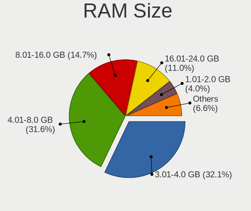
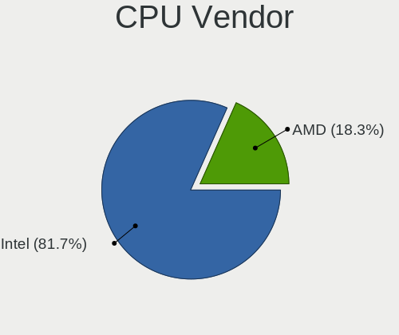
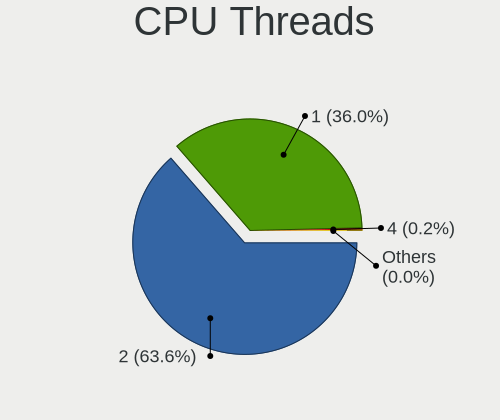
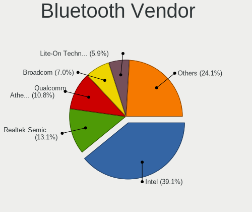
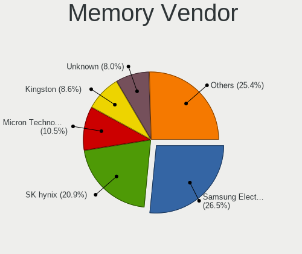

OpenMandriva - Tested Hardware & Statistics (Notebooks)
-------------------------------------------------------

A project to collect tested hardware configurations for OpenMandriva.

Anyone can contribute to this report by the [hw-probe](https://github.com/linuxhw/hw-probe) tool:

    sudo -E hw-probe -all -upload

Please contribute! Especially if your hardware is rare.

Contents
--------

* [ Test Cases ](#test-cases)

* [ System ](#system)
  - [ OS                       ](#os)
  - [ OS Family                ](#os-family)
  - [ Kernel                   ](#kernel)
  - [ Kernel Family            ](#kernel-family)
  - [ Kernel Major Ver.        ](#kernel-major-ver)
  - [ Arch                     ](#arch)
  - [ DE                       ](#de)
  - [ Display Server           ](#display-server)
  - [ Display Manager          ](#display-manager)
  - [ OS Lang                  ](#os-lang)
  - [ Boot Mode                ](#boot-mode)
  - [ Filesystem               ](#filesystem)
  - [ Part. scheme             ](#part-scheme)
  - [ Dual Boot with Linux/BSD ](#dual-boot-with-linuxbsd)
  - [ Dual Boot (Win)          ](#dual-boot-win)

* [ Board ](#board)
  - [ Vendor                   ](#vendor)
  - [ Model                    ](#model)
  - [ Model Family             ](#model-family)
  - [ MFG Year                 ](#mfg-year)
  - [ Form Factor              ](#form-factor)
  - [ Secure Boot              ](#secure-boot)
  - [ Coreboot                 ](#coreboot)
  - [ RAM Size                 ](#ram-size)
  - [ RAM Used                 ](#ram-used)
  - [ Total Drives             ](#total-drives)
  - [ Has CD-ROM               ](#has-cd-rom)
  - [ Has Ethernet             ](#has-ethernet)
  - [ Has WiFi                 ](#has-wifi)
  - [ Has Bluetooth            ](#has-bluetooth)

* [ Location ](#location)
  - [ Country                  ](#country)
  - [ City                     ](#city)

* [ Drives ](#drives)
  - [ Drive Vendor             ](#drive-vendor)
  - [ Drive Model              ](#drive-model)
  - [ HDD Vendor               ](#hdd-vendor)
  - [ SSD Vendor               ](#ssd-vendor)
  - [ Drive Kind               ](#drive-kind)
  - [ Drive Connector          ](#drive-connector)
  - [ Drive Size               ](#drive-size)
  - [ Space Total              ](#space-total)
  - [ Space Used               ](#space-used)
  - [ Malfunc. Drives          ](#malfunc-drives)
  - [ Malfunc. Drive Vendor    ](#malfunc-drive-vendor)
  - [ Malfunc. HDD Vendor      ](#malfunc-hdd-vendor)
  - [ Malfunc. Drive Kind      ](#malfunc-drive-kind)
  - [ Failed Drives            ](#failed-drives)
  - [ Failed Drive Vendor      ](#failed-drive-vendor)
  - [ Drive Status             ](#drive-status)

* [ Storage controller ](#storage-controller)
  - [ Storage Vendor           ](#storage-vendor)
  - [ Storage Model            ](#storage-model)
  - [ Storage Kind             ](#storage-kind)

* [ Processor ](#processor)
  - [ CPU Vendor               ](#cpu-vendor)
  - [ CPU Model                ](#cpu-model)
  - [ CPU Model Family         ](#cpu-model-family)
  - [ CPU Cores                ](#cpu-cores)
  - [ CPU Sockets              ](#cpu-sockets)
  - [ CPU Threads              ](#cpu-threads)
  - [ CPU Op-Modes             ](#cpu-op-modes)
  - [ CPU Microcode            ](#cpu-microcode)
  - [ CPU Microarch            ](#cpu-microarch)

* [ Graphics ](#graphics)
  - [ GPU Vendor               ](#gpu-vendor)
  - [ GPU Model                ](#gpu-model)
  - [ GPU Combo                ](#gpu-combo)
  - [ GPU Driver               ](#gpu-driver)
  - [ GPU Memory               ](#gpu-memory)

* [ Monitor ](#monitor)
  - [ Monitor Vendor           ](#monitor-vendor)
  - [ Monitor Model            ](#monitor-model)
  - [ Monitor Resolution       ](#monitor-resolution)
  - [ Monitor Diagonal         ](#monitor-diagonal)
  - [ Monitor Width            ](#monitor-width)
  - [ Aspect Ratio             ](#aspect-ratio)
  - [ Monitor Area             ](#monitor-area)
  - [ Pixel Density            ](#pixel-density)
  - [ Multiple Monitors        ](#multiple-monitors)

* [ Network ](#network)
  - [ Net Controller Vendor    ](#net-controller-vendor)
  - [ Net Controller Model     ](#net-controller-model)
  - [ Wireless Vendor          ](#wireless-vendor)
  - [ Wireless Model           ](#wireless-model)
  - [ Ethernet Vendor          ](#ethernet-vendor)
  - [ Ethernet Model           ](#ethernet-model)
  - [ Net Controller Kind      ](#net-controller-kind)
  - [ Used Controller          ](#used-controller)
  - [ NICs                     ](#nics)
  - [ IPv6                     ](#ipv6)

* [ Bluetooth ](#bluetooth)
  - [ Bluetooth Vendor         ](#bluetooth-vendor)
  - [ Bluetooth Model          ](#bluetooth-model)

* [ Sound ](#sound)
  - [ Sound Vendor             ](#sound-vendor)
  - [ Sound Model              ](#sound-model)

* [ Memory ](#memory)
  - [ Memory Vendor            ](#memory-vendor)
  - [ Memory Model             ](#memory-model)
  - [ Memory Kind              ](#memory-kind)
  - [ Memory Form Factor       ](#memory-form-factor)
  - [ Memory Size              ](#memory-size)
  - [ Memory Speed             ](#memory-speed)

* [ Printers & scanners ](#printers--scanners)
  - [ Printer Vendor           ](#printer-vendor)
  - [ Printer Model            ](#printer-model)
  - [ Scanner Vendor           ](#scanner-vendor)
  - [ Scanner Model            ](#scanner-model)

* [ Camera ](#camera)
  - [ Camera Vendor            ](#camera-vendor)
  - [ Camera Model             ](#camera-model)

* [ Security ](#security)
  - [ Fingerprint Vendor       ](#fingerprint-vendor)
  - [ Fingerprint Model        ](#fingerprint-model)
  - [ Chipcard Vendor          ](#chipcard-vendor)
  - [ Chipcard Model           ](#chipcard-model)

* [ Unsupported ](#unsupported)
  - [ Unsupported Devices      ](#unsupported-devices)
  - [ Unsupported Device Types ](#unsupported-device-types)

Test Cases
----------

Total: 4093

| Vendor        | Model                       | Probe                                                      | Date         |
|---------------|-----------------------------|------------------------------------------------------------|--------------|
| HP            | Laptop 15-ef1xxx            | [d27c20dcf9](https://linux-hardware.org/?probe=d27c20dcf9) | Sep 01, 2022 |
| Packard Be... | DOT S                       | [b5b03f1cf7](https://linux-hardware.org/?probe=b5b03f1cf7) | Sep 01, 2022 |
| Lenovo        | Y520-15IKBN 80WK            | [7b6028e52d](https://linux-hardware.org/?probe=7b6028e52d) | Sep 01, 2022 |
| Acer          | Aspire 5715Z                | [82086ce1c6](https://linux-hardware.org/?probe=82086ce1c6) | Sep 01, 2022 |
| Lenovo        | IdeaPad Slim 1-14AST-05 ... | [c83430605e](https://linux-hardware.org/?probe=c83430605e) | Sep 01, 2022 |
| HP            | ZBook 17 G2                 | [e2fc506c38](https://linux-hardware.org/?probe=e2fc506c38) | Sep 01, 2022 |
| Lenovo        | IdeaPad 1 14ADA05 82GW      | [8a7e7ce8ea](https://linux-hardware.org/?probe=8a7e7ce8ea) | Sep 01, 2022 |
| Dell          | Latitude 3190               | [d30269b33c](https://linux-hardware.org/?probe=d30269b33c) | Sep 01, 2022 |
| ASUSTek       | ZenBook UX425QA_UM425QA     | [c48154f5f4](https://linux-hardware.org/?probe=c48154f5f4) | Sep 01, 2022 |
| ASUSTek       | VivoBook_ASUSLaptop X515... | [6566bc7d09](https://linux-hardware.org/?probe=6566bc7d09) | Sep 01, 2022 |
| ASUSTek       | X550ZE                      | [187a6feadf](https://linux-hardware.org/?probe=187a6feadf) | Sep 01, 2022 |
| HP            | Laptop 14s-fq1xxx           | [1a173c5ea0](https://linux-hardware.org/?probe=1a173c5ea0) | Sep 01, 2022 |
| HP            | Pavilion g6                 | [cc725d880c](https://linux-hardware.org/?probe=cc725d880c) | Aug 31, 2022 |
| Apple         | MacBookPro9,2               | [3662302886](https://linux-hardware.org/?probe=3662302886) | Aug 31, 2022 |
| Lenovo        | IdeaPad Slim 1-14AST-05 ... | [ad6c7ea5ab](https://linux-hardware.org/?probe=ad6c7ea5ab) | Aug 31, 2022 |
| Dell          | Inspiron 15-3567            | [710d1e9a9b](https://linux-hardware.org/?probe=710d1e9a9b) | Aug 31, 2022 |
| ASUSTek       | VivoBook_ASUS Laptop E51... | [b895a2ae7c](https://linux-hardware.org/?probe=b895a2ae7c) | Aug 31, 2022 |
| HP            | Notebook                    | [2ca7fbbfa9](https://linux-hardware.org/?probe=2ca7fbbfa9) | Aug 31, 2022 |
| Dell          | Precision M6400             | [3cf32e24fa](https://linux-hardware.org/?probe=3cf32e24fa) | Aug 30, 2022 |
| ASUSTek       | VivoBook_ASUS Laptop E51... | [a2940c76f5](https://linux-hardware.org/?probe=a2940c76f5) | Aug 30, 2022 |
| Dell          | Latitude 3300               | [bea8e53929](https://linux-hardware.org/?probe=bea8e53929) | Aug 29, 2022 |
| Apple         | MacBookPro5,5               | [97fdbc4a5b](https://linux-hardware.org/?probe=97fdbc4a5b) | Aug 29, 2022 |
| Lenovo        | V14-ADA 82C6                | [ce25a77e25](https://linux-hardware.org/?probe=ce25a77e25) | Aug 29, 2022 |
| HP            | Pavilion Laptop 17-ar0xx    | [9336d821f8](https://linux-hardware.org/?probe=9336d821f8) | Aug 29, 2022 |
| Lenovo        | IdeaPad 1 14ADA05 82GW      | [3b26a2ffe2](https://linux-hardware.org/?probe=3b26a2ffe2) | Aug 29, 2022 |
| Lenovo        | IdeaPad 1 14ADA05 82GW      | [98ac365e3c](https://linux-hardware.org/?probe=98ac365e3c) | Aug 28, 2022 |
| Dell          | Studio 1735                 | [912f409b37](https://linux-hardware.org/?probe=912f409b37) | Aug 28, 2022 |
| Acer          | Aspire A315-23              | [4c16a58579](https://linux-hardware.org/?probe=4c16a58579) | Aug 28, 2022 |
| HP            | 620                         | [b16c60f4cf](https://linux-hardware.org/?probe=b16c60f4cf) | Aug 28, 2022 |
| Acer          | AO722                       | [377ad8686f](https://linux-hardware.org/?probe=377ad8686f) | Aug 28, 2022 |
| Lenovo        | IdeaPad 1 14ADA05 82GW      | [ee07c7a93a](https://linux-hardware.org/?probe=ee07c7a93a) | Aug 27, 2022 |
| ASUSTek       | ROG Zephyrus G15 GA503QR... | [d6c013a669](https://linux-hardware.org/?probe=d6c013a669) | Aug 27, 2022 |
| Toshiba       | dynabook T653/46JR          | [b97366daa0](https://linux-hardware.org/?probe=b97366daa0) | Aug 27, 2022 |
| Lenovo        | IdeaPad S130-14IGM 81J2     | [1ea46f19be](https://linux-hardware.org/?probe=1ea46f19be) | Aug 27, 2022 |
| Lenovo        | G570 4334                   | [7bea18122c](https://linux-hardware.org/?probe=7bea18122c) | Aug 27, 2022 |
| HP            | 15                          | [310d617e09](https://linux-hardware.org/?probe=310d617e09) | Aug 26, 2022 |
| Lenovo        | IdeaPad 110-15ISK 80UD      | [72888e9acb](https://linux-hardware.org/?probe=72888e9acb) | Aug 25, 2022 |
| HP            | Laptop 15-dy2xxx            | [26572efe76](https://linux-hardware.org/?probe=26572efe76) | Aug 25, 2022 |
| HP            | Laptop 14-dk0xxx            | [82da7782ec](https://linux-hardware.org/?probe=82da7782ec) | Aug 25, 2022 |
| HP            | Laptop 15-dy2xxx            | [bcd578a016](https://linux-hardware.org/?probe=bcd578a016) | Aug 25, 2022 |
| MSI           | GE70 0NC/GE70 0ND           | [a7c9d17455](https://linux-hardware.org/?probe=a7c9d17455) | Aug 25, 2022 |
| HP            | Notebook                    | [0d4422145a](https://linux-hardware.org/?probe=0d4422145a) | Aug 25, 2022 |
| HP            | Laptop 15-dy1xxx            | [b201192ebb](https://linux-hardware.org/?probe=b201192ebb) | Aug 25, 2022 |
| Dell          | Latitude E5510              | [c237161d31](https://linux-hardware.org/?probe=c237161d31) | Aug 24, 2022 |
| Lenovo        | ThinkPad T420 4180F75       | [f4a6e9705d](https://linux-hardware.org/?probe=f4a6e9705d) | Aug 24, 2022 |
| Lenovo        | IdeaPad 3 15ADA6 82KR       | [f20e68e820](https://linux-hardware.org/?probe=f20e68e820) | Aug 24, 2022 |
| Lenovo        | IdeaPad 320-15IAP 81A3      | [81b42d221d](https://linux-hardware.org/?probe=81b42d221d) | Aug 24, 2022 |
| Dell          | XPS 13 7390                 | [d609bf3253](https://linux-hardware.org/?probe=d609bf3253) | Aug 24, 2022 |
| Acer          | Aspire A315-54K             | [685d6acc51](https://linux-hardware.org/?probe=685d6acc51) | Aug 23, 2022 |
| Dell          | Latitude E5470              | [4cf5f4680f](https://linux-hardware.org/?probe=4cf5f4680f) | Aug 23, 2022 |
| Google        | Galtic                      | [f06baf315d](https://linux-hardware.org/?probe=f06baf315d) | Aug 22, 2022 |
| Acer          | Enduro EUN314-51WG          | [aa9ea3d520](https://linux-hardware.org/?probe=aa9ea3d520) | Aug 22, 2022 |
| Acer          | TravelMate 5760             | [3d9c208d81](https://linux-hardware.org/?probe=3d9c208d81) | Aug 22, 2022 |
| Dell          | Latitude 3300               | [e8b139ecad](https://linux-hardware.org/?probe=e8b139ecad) | Aug 22, 2022 |
| Dell          | Latitude 3310               | [dedda1b96c](https://linux-hardware.org/?probe=dedda1b96c) | Aug 22, 2022 |
| Acer          | TravelMate 5730             | [ec6fd6cddb](https://linux-hardware.org/?probe=ec6fd6cddb) | Aug 22, 2022 |
| HP            | Pavilion Laptop 15-cs0xx... | [8c7493d7d1](https://linux-hardware.org/?probe=8c7493d7d1) | Aug 22, 2022 |
| Lenovo        | IdeaPad 500S-14ISK 80Q3     | [fdbec5aab2](https://linux-hardware.org/?probe=fdbec5aab2) | Aug 22, 2022 |
| Fujitsu       | LIFEBOOK UH552              | [15a1f49654](https://linux-hardware.org/?probe=15a1f49654) | Aug 21, 2022 |
| Acer          | AO725                       | [5eed64f77d](https://linux-hardware.org/?probe=5eed64f77d) | Aug 21, 2022 |
| Lenovo        | ThinkPad X200 7458FZ3       | [232835b00b](https://linux-hardware.org/?probe=232835b00b) | Aug 21, 2022 |
| Acer          | Aspire E1-531               | [1292b2297f](https://linux-hardware.org/?probe=1292b2297f) | Aug 21, 2022 |
| Acer          | Predator G9-791             | [782f581f0b](https://linux-hardware.org/?probe=782f581f0b) | Aug 21, 2022 |
| ASUSTek       | UX31E                       | [84ed4c9d73](https://linux-hardware.org/?probe=84ed4c9d73) | Aug 20, 2022 |
| Lenovo        | ThinkPad E590 20NB0029GE    | [ee75702cd5](https://linux-hardware.org/?probe=ee75702cd5) | Aug 20, 2022 |
| HP            | Pavilion dv6                | [0aae35eb95](https://linux-hardware.org/?probe=0aae35eb95) | Aug 19, 2022 |
| HP            | 15                          | [d519e672ca](https://linux-hardware.org/?probe=d519e672ca) | Aug 19, 2022 |
| HP            | Pavilion dm4                | [46bb1c7064](https://linux-hardware.org/?probe=46bb1c7064) | Aug 19, 2022 |
| Dell          | XPS 13 9360                 | [74b0bedd54](https://linux-hardware.org/?probe=74b0bedd54) | Aug 19, 2022 |
| Dell          | Latitude E5430 non-vPro     | [ac7fb69037](https://linux-hardware.org/?probe=ac7fb69037) | Aug 19, 2022 |
| HP            | ProBook 440 G1              | [eb86fd2237](https://linux-hardware.org/?probe=eb86fd2237) | Aug 19, 2022 |
| HP            | Stream Laptop 14-cb1xxx     | [c954da96ad](https://linux-hardware.org/?probe=c954da96ad) | Aug 18, 2022 |
| ASUSTek       | X75A1                       | [870fcf0f3c](https://linux-hardware.org/?probe=870fcf0f3c) | Aug 18, 2022 |
| Acer          | Aspire 7750G                | [6110ab7d79](https://linux-hardware.org/?probe=6110ab7d79) | Aug 18, 2022 |
| Dell          | Latitude E5510              | [c7defb71d5](https://linux-hardware.org/?probe=c7defb71d5) | Aug 18, 2022 |
| Medion        | Akoya E6418 MD99620         | [6817b38103](https://linux-hardware.org/?probe=6817b38103) | Aug 18, 2022 |
| Acer          | Aspire A515-51G             | [d29438c201](https://linux-hardware.org/?probe=d29438c201) | Aug 18, 2022 |
| Lenovo        | IdeaPad 3 14IGL05 81WH      | [d78fb85708](https://linux-hardware.org/?probe=d78fb85708) | Aug 18, 2022 |
| Toshiba       | dynabook T653/46JR          | [decfecaa20](https://linux-hardware.org/?probe=decfecaa20) | Aug 18, 2022 |
| Positivo B... | S14SL03                     | [558f5a2f24](https://linux-hardware.org/?probe=558f5a2f24) | Aug 18, 2022 |
| Packard Be... | EasyNote TK37               | [996a14d9f4](https://linux-hardware.org/?probe=996a14d9f4) | Aug 17, 2022 |
| ASUSTek       | VivoBook_ASUSLaptop M350... | [93b2d066d6](https://linux-hardware.org/?probe=93b2d066d6) | Aug 17, 2022 |
| Acer          | Nitro AN515-31              | [471659ffff](https://linux-hardware.org/?probe=471659ffff) | Aug 17, 2022 |
| Dell          | Latitude 3380               | [a99b3cef26](https://linux-hardware.org/?probe=a99b3cef26) | Aug 17, 2022 |
| ASUSTek       | VivoBook 14_ASUS Laptop ... | [9bdceca056](https://linux-hardware.org/?probe=9bdceca056) | Aug 17, 2022 |
| ASUSTek       | N75SF                       | [3b6f89e145](https://linux-hardware.org/?probe=3b6f89e145) | Aug 17, 2022 |
| NEC Comput... | PC-LJ730MG6W                | [c0e6c7edb7](https://linux-hardware.org/?probe=c0e6c7edb7) | Aug 17, 2022 |
| Dell          | Latitude 3310               | [92f66bf3aa](https://linux-hardware.org/?probe=92f66bf3aa) | Aug 17, 2022 |
| HP            | Pavilion Laptop 15-eh0xx... | [59080cc039](https://linux-hardware.org/?probe=59080cc039) | Aug 17, 2022 |
| ASUSTek       | Z550SA                      | [03ef043fd9](https://linux-hardware.org/?probe=03ef043fd9) | Aug 17, 2022 |
| HP            | Laptop 14s-fq1xxx           | [92c0a6fe2a](https://linux-hardware.org/?probe=92c0a6fe2a) | Aug 17, 2022 |
| Dell          | XPS 15 9530                 | [71f62cef7a](https://linux-hardware.org/?probe=71f62cef7a) | Aug 16, 2022 |
| Fujitsu       | LIFEBOOK AH531              | [a880d764be](https://linux-hardware.org/?probe=a880d764be) | Aug 16, 2022 |
| Lenovo        | ThinkPad L412 0585A84       | [637fa23dca](https://linux-hardware.org/?probe=637fa23dca) | Aug 16, 2022 |
| Dell          | Latitude 3310               | [1694bfcea7](https://linux-hardware.org/?probe=1694bfcea7) | Aug 16, 2022 |
| Packard Be... | EasyNote TE11BZ             | [2a8e801b4e](https://linux-hardware.org/?probe=2a8e801b4e) | Aug 16, 2022 |
| Lenovo        | IdeaPad 3 15ITL05 81X8      | [b4757c5ff7](https://linux-hardware.org/?probe=b4757c5ff7) | Aug 16, 2022 |
| TUXEDO        | Book BA1510                 | [6d8040e80b](https://linux-hardware.org/?probe=6d8040e80b) | Aug 15, 2022 |
| Acer          | Aspire ES1-532G             | [cf05c858ab](https://linux-hardware.org/?probe=cf05c858ab) | Aug 15, 2022 |
| Dell          | Latitude E6430              | [6c31827147](https://linux-hardware.org/?probe=6c31827147) | Aug 15, 2022 |
| Dell          | Inspiron 1501               | [11b4c83b79](https://linux-hardware.org/?probe=11b4c83b79) | Aug 15, 2022 |
| HP            | Notebook                    | [975f3e38e3](https://linux-hardware.org/?probe=975f3e38e3) | Aug 15, 2022 |
| Samsung       | NC210/NC110                 | [3dcdc1dc6a](https://linux-hardware.org/?probe=3dcdc1dc6a) | Aug 15, 2022 |
| HP            | Laptop 14-bs1xx             | [4b603b6b08](https://linux-hardware.org/?probe=4b603b6b08) | Aug 15, 2022 |
| HP            | Pavilion Laptop 15-eh1xx... | [4b1440875b](https://linux-hardware.org/?probe=4b1440875b) | Aug 14, 2022 |
| ASUSTek       | X540LA                      | [15ffff65c0](https://linux-hardware.org/?probe=15ffff65c0) | Aug 14, 2022 |
| HP            | ProBook 4330s               | [62ff6ffc08](https://linux-hardware.org/?probe=62ff6ffc08) | Aug 14, 2022 |
| Acer          | Aspire M5-581T              | [7efdb0e467](https://linux-hardware.org/?probe=7efdb0e467) | Aug 14, 2022 |
| Acer          | Aspire A515-54G             | [e9c64a8a5c](https://linux-hardware.org/?probe=e9c64a8a5c) | Aug 14, 2022 |
| Acer          | Aspire 5680                 | [20c2c97a69](https://linux-hardware.org/?probe=20c2c97a69) | Aug 14, 2022 |
| Acer          | Aspire VN7-571G             | [0d6dfdd6e0](https://linux-hardware.org/?probe=0d6dfdd6e0) | Aug 14, 2022 |
| HP            | Pavilion dv9500             | [fd3bd18049](https://linux-hardware.org/?probe=fd3bd18049) | Aug 14, 2022 |
| Toshiba       | Satellite P200              | [83fcabac55](https://linux-hardware.org/?probe=83fcabac55) | Aug 13, 2022 |
| Dell          | Vostro 1520                 | [9dab88f3ee](https://linux-hardware.org/?probe=9dab88f3ee) | Aug 13, 2022 |
| Positivo      | EC10IS1                     | [b66cd42f99](https://linux-hardware.org/?probe=b66cd42f99) | Aug 13, 2022 |
| HP            | Unknown                     | [7375604d06](https://linux-hardware.org/?probe=7375604d06) | Aug 13, 2022 |
| Toshiba       | Satellite L500              | [0d58c17039](https://linux-hardware.org/?probe=0d58c17039) | Aug 13, 2022 |
| Positivo      | Mobile                      | [bddf3b59d4](https://linux-hardware.org/?probe=bddf3b59d4) | Aug 12, 2022 |
| ASUSTek       | ZenBook UX431DA_UM431DA     | [40814201a2](https://linux-hardware.org/?probe=40814201a2) | Aug 12, 2022 |
| Lenovo        | ThinkPad T61 64665DG        | [ff1be50f8c](https://linux-hardware.org/?probe=ff1be50f8c) | Aug 12, 2022 |
| Lenovo        | ThinkPad X201 3626HMG       | [1d08c103c7](https://linux-hardware.org/?probe=1d08c103c7) | Aug 12, 2022 |
| Fujitsu       | LIFEBOOK S904               | [0e3107a650](https://linux-hardware.org/?probe=0e3107a650) | Aug 12, 2022 |
| ASUSTek       | K73BR                       | [67f5d3f176](https://linux-hardware.org/?probe=67f5d3f176) | Aug 12, 2022 |
| Acer          | Aspire 4330 V1.22           | [dee8895134](https://linux-hardware.org/?probe=dee8895134) | Aug 12, 2022 |
| HP            | EliteBook 820 G3            | [c1b14847f1](https://linux-hardware.org/?probe=c1b14847f1) | Aug 12, 2022 |
| Dell          | Latitude 7420               | [26cd6bbb87](https://linux-hardware.org/?probe=26cd6bbb87) | Aug 12, 2022 |
| Lenovo        | ThinkPad L470 20J4002FMX    | [d949d71a19](https://linux-hardware.org/?probe=d949d71a19) | Aug 12, 2022 |
| Lenovo        | Unknown                     | [79688945e1](https://linux-hardware.org/?probe=79688945e1) | Aug 11, 2022 |
| Gateway       | MT6723                      | [368de1c083](https://linux-hardware.org/?probe=368de1c083) | Aug 11, 2022 |
| Dell          | G5 5505                     | [cbbcb7c9a2](https://linux-hardware.org/?probe=cbbcb7c9a2) | Aug 11, 2022 |
| Dell          | Vostro 3401                 | [29f3354492](https://linux-hardware.org/?probe=29f3354492) | Aug 11, 2022 |
| Lenovo        | IdeaPad S145-14AST 81ST     | [cac00fb432](https://linux-hardware.org/?probe=cac00fb432) | Aug 11, 2022 |
| HP            | Pavilion dm3                | [7152a48ede](https://linux-hardware.org/?probe=7152a48ede) | Aug 10, 2022 |
| Lenovo        | IdeaPad 330-15IKB 81DE      | [cc51e49c51](https://linux-hardware.org/?probe=cc51e49c51) | Aug 10, 2022 |
| HP            | 240 G3                      | [77225815d2](https://linux-hardware.org/?probe=77225815d2) | Aug 10, 2022 |
| HUAWEI        | BOHB-WAX9                   | [9d55b54de7](https://linux-hardware.org/?probe=9d55b54de7) | Aug 10, 2022 |
| HP            | Laptop 17-ca1xxx            | [f57b28ff2c](https://linux-hardware.org/?probe=f57b28ff2c) | Aug 10, 2022 |
| HP            | Pavilion HDX9200            | [079cb2197b](https://linux-hardware.org/?probe=079cb2197b) | Aug 10, 2022 |
| Compaq        | Presario CQ-31              | [d22794a255](https://linux-hardware.org/?probe=d22794a255) | Aug 09, 2022 |
| Toshiba       | Satellite A300              | [4f83e69c06](https://linux-hardware.org/?probe=4f83e69c06) | Aug 09, 2022 |
| Sony          | VPCYB3V1E                   | [a6cd208cf2](https://linux-hardware.org/?probe=a6cd208cf2) | Aug 09, 2022 |
| HP            | 630                         | [fc9bc69e9a](https://linux-hardware.org/?probe=fc9bc69e9a) | Aug 09, 2022 |
| ASUSTek       | VivoBook_ASUSLaptop X513... | [9d6be5eb68](https://linux-hardware.org/?probe=9d6be5eb68) | Aug 08, 2022 |
| Acer          | Nitro AN515-31              | [0dbab56588](https://linux-hardware.org/?probe=0dbab56588) | Aug 08, 2022 |
| HP            | 15                          | [ef66e0296e](https://linux-hardware.org/?probe=ef66e0296e) | Aug 08, 2022 |
| HP            | ProBook 430 G4              | [616a031820](https://linux-hardware.org/?probe=616a031820) | Aug 08, 2022 |
| Dell          | Latitude E7240              | [1f20b0f54b](https://linux-hardware.org/?probe=1f20b0f54b) | Aug 08, 2022 |
| ASUSTek       | X550CL                      | [83626d765b](https://linux-hardware.org/?probe=83626d765b) | Aug 08, 2022 |
| Dell          | Latitude E6420              | [3817e724ac](https://linux-hardware.org/?probe=3817e724ac) | Aug 08, 2022 |
| HP            | Compaq 15                   | [de4b6e0511](https://linux-hardware.org/?probe=de4b6e0511) | Aug 07, 2022 |
| ASUSTek       | X555LA                      | [0a98c50d83](https://linux-hardware.org/?probe=0a98c50d83) | Aug 07, 2022 |
| Apple         | MacBookPro9,2               | [85dc12b4d1](https://linux-hardware.org/?probe=85dc12b4d1) | Aug 07, 2022 |
| ASUSTek       | VivoBook_ASUSLaptop X509... | [b85ec0e551](https://linux-hardware.org/?probe=b85ec0e551) | Aug 07, 2022 |
| ASUSTek       | VivoBook_ASUSLaptop X421... | [f9850e0a1e](https://linux-hardware.org/?probe=f9850e0a1e) | Aug 07, 2022 |
| Timi          | RedmiBook Pro 15S           | [4e36acba35](https://linux-hardware.org/?probe=4e36acba35) | Aug 07, 2022 |
| Dell          | Latitude 3189               | [63c2818521](https://linux-hardware.org/?probe=63c2818521) | Aug 07, 2022 |
| HP            | Stream Laptop 14-ax0XX      | [810a9d1c2c](https://linux-hardware.org/?probe=810a9d1c2c) | Aug 07, 2022 |
| MSI           | GL75 Leopard 10SDK          | [bfceb8ba35](https://linux-hardware.org/?probe=bfceb8ba35) | Aug 07, 2022 |
| Lenovo        | IdeaPad S145-15IKB 81VD     | [f3a36d0f3a](https://linux-hardware.org/?probe=f3a36d0f3a) | Aug 07, 2022 |
| Acer          | Swift SF114-31              | [b1cba472dc](https://linux-hardware.org/?probe=b1cba472dc) | Aug 06, 2022 |
| Lenovo        | ThinkPad T430s 2356LNG      | [255560d675](https://linux-hardware.org/?probe=255560d675) | Aug 06, 2022 |
| ASUSTek       | X555LN                      | [77092711a0](https://linux-hardware.org/?probe=77092711a0) | Aug 06, 2022 |
| Lenovo        | IdeaPad 100S-14IBR 80R9     | [6b1d79046a](https://linux-hardware.org/?probe=6b1d79046a) | Aug 06, 2022 |
| Lenovo        | ThinkPad X270 20HN0015GE    | [2577ffae50](https://linux-hardware.org/?probe=2577ffae50) | Aug 06, 2022 |
| ASUSTek       | UX303UA                     | [73145490fa](https://linux-hardware.org/?probe=73145490fa) | Aug 06, 2022 |
| Dell          | Latitude E6540              | [d47b2c5c2b](https://linux-hardware.org/?probe=d47b2c5c2b) | Aug 06, 2022 |
| ASUSTek       | TUF Gaming FX505DY_FX505... | [b9a68ae76c](https://linux-hardware.org/?probe=b9a68ae76c) | Aug 06, 2022 |
| Lenovo        | ThinkPad R500 27148UG       | [1b7557ac14](https://linux-hardware.org/?probe=1b7557ac14) | Aug 05, 2022 |
| Acer          | E1-510                      | [05ea3ff386](https://linux-hardware.org/?probe=05ea3ff386) | Aug 05, 2022 |
| Dell          | Latitude 3310               | [97ac18f196](https://linux-hardware.org/?probe=97ac18f196) | Aug 05, 2022 |
| Lenovo        | G50-30 80G0                 | [2cd0131bb6](https://linux-hardware.org/?probe=2cd0131bb6) | Aug 05, 2022 |
| Dell          | Latitude 3410               | [8181c3588f](https://linux-hardware.org/?probe=8181c3588f) | Aug 05, 2022 |
| Dell          | Precision M4700             | [25efd53898](https://linux-hardware.org/?probe=25efd53898) | Aug 05, 2022 |
| Compaq        | 430                         | [581a8bbf00](https://linux-hardware.org/?probe=581a8bbf00) | Aug 05, 2022 |
| Dell          | Latitude E4310              | [dc6787d2b7](https://linux-hardware.org/?probe=dc6787d2b7) | Aug 05, 2022 |
| HP            | ProBook 6450b               | [699b27e34f](https://linux-hardware.org/?probe=699b27e34f) | Aug 05, 2022 |
| Samsung       | 355V4C/355V4X/355V5C/355... | [0a34d32db6](https://linux-hardware.org/?probe=0a34d32db6) | Aug 05, 2022 |
| Lenovo        | ThinkPad X230 2325U9T       | [0f0e8ec24f](https://linux-hardware.org/?probe=0f0e8ec24f) | Aug 04, 2022 |
| ASUSTek       | VivoBook_ASUSLaptop X512... | [cdc1f14772](https://linux-hardware.org/?probe=cdc1f14772) | Aug 04, 2022 |
| Dell          | Latitude 3490               | [fa1c5f753f](https://linux-hardware.org/?probe=fa1c5f753f) | Aug 04, 2022 |
| Dell          | Latitude 3310               | [9b9bed6ac6](https://linux-hardware.org/?probe=9b9bed6ac6) | Aug 04, 2022 |
| Dell          | Latitude E6430              | [388b301ced](https://linux-hardware.org/?probe=388b301ced) | Aug 04, 2022 |
| Dell          | Latitude E5470              | [9e78351999](https://linux-hardware.org/?probe=9e78351999) | Aug 04, 2022 |
| Dell          | System Inspiron N4110       | [22938e2e62](https://linux-hardware.org/?probe=22938e2e62) | Aug 03, 2022 |
| Lenovo        | ThinkPad T530 2429W4Z       | [2d95f7cc7e](https://linux-hardware.org/?probe=2d95f7cc7e) | Aug 03, 2022 |
| ASUSTek       | ZenBook UX425QA_UM425QA     | [f1d5a6ab3f](https://linux-hardware.org/?probe=f1d5a6ab3f) | Aug 03, 2022 |
| ASUSTek       | 1225B                       | [a5fb38b287](https://linux-hardware.org/?probe=a5fb38b287) | Aug 03, 2022 |
| Lenovo        | ThinkPad SL510 28477NG      | [5ddf195177](https://linux-hardware.org/?probe=5ddf195177) | Aug 03, 2022 |
| ASUSTek       | K50IE                       | [0472e4609b](https://linux-hardware.org/?probe=0472e4609b) | Aug 03, 2022 |
| MSI           | GE62VR 7RF                  | [e5f6f7e14c](https://linux-hardware.org/?probe=e5f6f7e14c) | Aug 03, 2022 |
| HP            | Notebook                    | [5320991330](https://linux-hardware.org/?probe=5320991330) | Aug 02, 2022 |
| Lenovo        | ThinkPad T61 76653JG        | [0fae1da16b](https://linux-hardware.org/?probe=0fae1da16b) | Aug 02, 2022 |
| HP            | EliteBook 2570p             | [b352b7e051](https://linux-hardware.org/?probe=b352b7e051) | Aug 02, 2022 |
| Dell          | Latitude E6430              | [15e26c7cc5](https://linux-hardware.org/?probe=15e26c7cc5) | Aug 02, 2022 |
| Dell          | Latitude 3410               | [b2d717d59e](https://linux-hardware.org/?probe=b2d717d59e) | Aug 02, 2022 |
| Lenovo        | ThinkPad X220 Tablet 429... | [71c6ba6061](https://linux-hardware.org/?probe=71c6ba6061) | Aug 01, 2022 |
| HP            | Pavilion 15                 | [442aaa6069](https://linux-hardware.org/?probe=442aaa6069) | Aug 01, 2022 |
| Dell          | Latitude E7450              | [38051fe609](https://linux-hardware.org/?probe=38051fe609) | Aug 01, 2022 |
| Toshiba       | Satellite L500              | [21d4b0ac95](https://linux-hardware.org/?probe=21d4b0ac95) | Aug 01, 2022 |
| Packard Be... | EasyNote TK13BZ             | [530d3ad8db](https://linux-hardware.org/?probe=530d3ad8db) | Aug 01, 2022 |
| Apple         | MacBookPro5,5               | [4eeca116f8](https://linux-hardware.org/?probe=4eeca116f8) | Aug 01, 2022 |
| HP            | ProBook 440 G2              | [00dd80ba31](https://linux-hardware.org/?probe=00dd80ba31) | Aug 01, 2022 |
| ASUSTek       | X555LAB                     | [33a1712f4d](https://linux-hardware.org/?probe=33a1712f4d) | Aug 01, 2022 |
| Acer          | Z476                        | [ade85b90c1](https://linux-hardware.org/?probe=ade85b90c1) | Aug 01, 2022 |
| Toshiba       | Satellite-C845              | [6ee9ea90a5](https://linux-hardware.org/?probe=6ee9ea90a5) | Aug 01, 2022 |
| GPU Compan... | GWNR71517                   | [72278643e8](https://linux-hardware.org/?probe=72278643e8) | Aug 01, 2022 |
| ASUSTek       | ZenBook UX425QA_UM425QA     | [6e8a2d15be](https://linux-hardware.org/?probe=6e8a2d15be) | Aug 01, 2022 |
| Acer          | Aspire ES1-523              | [d14f053671](https://linux-hardware.org/?probe=d14f053671) | Aug 01, 2022 |
| Lenovo        | IdeaPad 3 14ALC6 82KT       | [15382de4bf](https://linux-hardware.org/?probe=15382de4bf) | Aug 01, 2022 |
| Acer          | Aspire E1-571               | [7102c56d5b](https://linux-hardware.org/?probe=7102c56d5b) | Aug 01, 2022 |
| Packard Be... | EasyNote TM85               | [a6df06f9e5](https://linux-hardware.org/?probe=a6df06f9e5) | Jul 31, 2022 |
| Lenovo        | ThinkPad T460 20FMS02R0G    | [0aa31e3c39](https://linux-hardware.org/?probe=0aa31e3c39) | Jul 31, 2022 |
| Acer          | TravelMate B118-M           | [490edd75cf](https://linux-hardware.org/?probe=490edd75cf) | Jul 31, 2022 |
| HP            | ProBook 6570b               | [333a24bdee](https://linux-hardware.org/?probe=333a24bdee) | Jul 31, 2022 |
| Acer          | Aspire VN7-791G             | [3e72040097](https://linux-hardware.org/?probe=3e72040097) | Jul 31, 2022 |
| HP            | Pavilion Notebook           | [f312865dc0](https://linux-hardware.org/?probe=f312865dc0) | Jul 31, 2022 |
| HP            | ProBook 450 G7              | [ebbca00473](https://linux-hardware.org/?probe=ebbca00473) | Jul 31, 2022 |
| HP            | 250 G7 Notebook PC          | [6204ce9d95](https://linux-hardware.org/?probe=6204ce9d95) | Jul 31, 2022 |
| Micro Elec... | MG-VCP17I-3080              | [06191acfe0](https://linux-hardware.org/?probe=06191acfe0) | Jul 31, 2022 |
| HP            | Laptop 15-dy2xxx            | [6fe07f99fd](https://linux-hardware.org/?probe=6fe07f99fd) | Jul 31, 2022 |
| eMachines     | Unknown                     | [8c6dcb08a7](https://linux-hardware.org/?probe=8c6dcb08a7) | Jul 31, 2022 |
| Lenovo        | IdeaPad Z570 1024AMU        | [3d5ec8319b](https://linux-hardware.org/?probe=3d5ec8319b) | Jul 31, 2022 |
| Notebook      | W54_W94_W955TU,-T,-C        | [7b0b52e138](https://linux-hardware.org/?probe=7b0b52e138) | Jul 31, 2022 |
| Acer          | Nitro AN515-43              | [79117d81e0](https://linux-hardware.org/?probe=79117d81e0) | Jul 31, 2022 |
| Lenovo        | ThinkPad W500 406132U       | [6f403cb15a](https://linux-hardware.org/?probe=6f403cb15a) | Jul 30, 2022 |
| Compaq        | Presario CQ-23              | [76ea82c314](https://linux-hardware.org/?probe=76ea82c314) | Jul 30, 2022 |
| Fujitsu       | LIFEBOOK U727               | [7aa483a43c](https://linux-hardware.org/?probe=7aa483a43c) | Jul 30, 2022 |
| HP            | 250 G2                      | [43d1d3ae24](https://linux-hardware.org/?probe=43d1d3ae24) | Jul 30, 2022 |
| Lenovo        | IdeaPad S145-15API 81UT     | [34958fdaac](https://linux-hardware.org/?probe=34958fdaac) | Jul 30, 2022 |
| HP            | EliteBook 8470p             | [2171abfd3d](https://linux-hardware.org/?probe=2171abfd3d) | Jul 30, 2022 |
| Apple         | MacBookPro7,1               | [b846739765](https://linux-hardware.org/?probe=b846739765) | Jul 30, 2022 |
| ASUSTek       | K501LX                      | [8ea0c7daa9](https://linux-hardware.org/?probe=8ea0c7daa9) | Jul 30, 2022 |
| HP            | Laptop 15s-eq1xxx           | [ee5c151c3a](https://linux-hardware.org/?probe=ee5c151c3a) | Jul 30, 2022 |
| Lenovo        | IdeaPad Y470 0855           | [395d0c25d7](https://linux-hardware.org/?probe=395d0c25d7) | Jul 30, 2022 |
| ASUSTek       | K53E                        | [3ca340212e](https://linux-hardware.org/?probe=3ca340212e) | Jul 30, 2022 |
| Lenovo        | G570 4334                   | [a29c1c816a](https://linux-hardware.org/?probe=a29c1c816a) | Jul 30, 2022 |
| Fujitsu       | LIFEBOOK V1020              | [e33ac2916d](https://linux-hardware.org/?probe=e33ac2916d) | Jul 30, 2022 |
| Toshiba       | dynabook T653/46JR          | [ea8bb6486b](https://linux-hardware.org/?probe=ea8bb6486b) | Jul 30, 2022 |
| MSI           | GF63 8RD                    | [fdb72c3ec3](https://linux-hardware.org/?probe=fdb72c3ec3) | Jul 29, 2022 |
| Lenovo        | G700 20251                  | [24a9e92897](https://linux-hardware.org/?probe=24a9e92897) | Jul 29, 2022 |
| Acer          | Aspire A317-33              | [ab07e43574](https://linux-hardware.org/?probe=ab07e43574) | Jul 29, 2022 |
| ASUSTek       | K50ID                       | [2c1dddeaea](https://linux-hardware.org/?probe=2c1dddeaea) | Jul 29, 2022 |
| Acer          | Swift SF114-32              | [9e219bd7c2](https://linux-hardware.org/?probe=9e219bd7c2) | Jul 29, 2022 |
| Sony          | VPCEA45FL                   | [8079ec1351](https://linux-hardware.org/?probe=8079ec1351) | Jul 29, 2022 |
| Lenovo        | ThinkPad T440s 20ARS4PR0... | [5b91ff037d](https://linux-hardware.org/?probe=5b91ff037d) | Jul 29, 2022 |
| HP            | ProBook 6570b               | [231ebd2edc](https://linux-hardware.org/?probe=231ebd2edc) | Jul 29, 2022 |
| Acer          | Aspire 7741                 | [02e9f6a808](https://linux-hardware.org/?probe=02e9f6a808) | Jul 29, 2022 |
| Dell          | Vostro 15-3568              | [a42627d17e](https://linux-hardware.org/?probe=a42627d17e) | Jul 29, 2022 |
| Dell          | Latitude E6410              | [f2220a772e](https://linux-hardware.org/?probe=f2220a772e) | Jul 29, 2022 |
| Lenovo        | ThinkPad S5 Yoga 15 20DR... | [147d305ac1](https://linux-hardware.org/?probe=147d305ac1) | Jul 29, 2022 |
| Lenovo        | ThinkPad X230 23253B3       | [fa19ec3adf](https://linux-hardware.org/?probe=fa19ec3adf) | Jul 29, 2022 |
| Acer          | Aspire A315-51              | [e6f2cdc55e](https://linux-hardware.org/?probe=e6f2cdc55e) | Jul 29, 2022 |
| Gigabyte      | GB-BSi7A-6500               | [048b38a923](https://linux-hardware.org/?probe=048b38a923) | Jul 29, 2022 |
| Google        | Candy                       | [cba2906cfd](https://linux-hardware.org/?probe=cba2906cfd) | Jul 29, 2022 |
| HP            | ProBook 430 G5              | [f424705bd7](https://linux-hardware.org/?probe=f424705bd7) | Jul 29, 2022 |
| Acer          | Aspire 5750                 | [e3f2dd0271](https://linux-hardware.org/?probe=e3f2dd0271) | Jul 29, 2022 |
| Lenovo        | IdeaPad S145-15IWL 81MV     | [03b39a36f1](https://linux-hardware.org/?probe=03b39a36f1) | Jul 29, 2022 |
| ASUSTek       | VivoBook_ASUSLaptop X412... | [4bb1d70cf2](https://linux-hardware.org/?probe=4bb1d70cf2) | Jul 29, 2022 |
| ASUSTek       | ROG Zephyrus G14 GA401IV... | [46bb82fece](https://linux-hardware.org/?probe=46bb82fece) | Jul 29, 2022 |
| Dell          | Precision 7510              | [fb6266c1dc](https://linux-hardware.org/?probe=fb6266c1dc) | Jul 29, 2022 |
| Lenovo        | G50-45 80E3                 | [61a6277614](https://linux-hardware.org/?probe=61a6277614) | Jul 28, 2022 |
| ASUSTek       | X551MA                      | [668a02296d](https://linux-hardware.org/?probe=668a02296d) | Jul 28, 2022 |
| HP            | ProBook 4515s               | [b9759d3b5d](https://linux-hardware.org/?probe=b9759d3b5d) | Jul 28, 2022 |
| Dell          | Latitude E6430s             | [356556d83a](https://linux-hardware.org/?probe=356556d83a) | Jul 28, 2022 |
| HP            | 250 G5 Notebook PC          | [75477a4d7a](https://linux-hardware.org/?probe=75477a4d7a) | Jul 28, 2022 |
| ASUSTek       | K53U                        | [7db28a1538](https://linux-hardware.org/?probe=7db28a1538) | Jul 28, 2022 |
| ASUSTek       | N751JK                      | [ca6cba3420](https://linux-hardware.org/?probe=ca6cba3420) | Jul 28, 2022 |
| Dell          | Latitude E6400              | [1c067a436c](https://linux-hardware.org/?probe=1c067a436c) | Jul 28, 2022 |
| Lenovo        | Legion 7 16ACHg6 82N6       | [7356bc9abc](https://linux-hardware.org/?probe=7356bc9abc) | Jul 28, 2022 |
| Acer          | Aspire 3100                 | [26c6af2a55](https://linux-hardware.org/?probe=26c6af2a55) | Jul 28, 2022 |
| Toshiba       | Satellite P50-B-118         | [b46f72c280](https://linux-hardware.org/?probe=b46f72c280) | Jul 28, 2022 |
| ASUSTek       | VivoBook_ASUSLaptop X509... | [057703210a](https://linux-hardware.org/?probe=057703210a) | Jul 28, 2022 |
| Acer          | Aspire 5742                 | [4e2290847d](https://linux-hardware.org/?probe=4e2290847d) | Jul 28, 2022 |
| HP            | 2000                        | [531b786836](https://linux-hardware.org/?probe=531b786836) | Jul 28, 2022 |
| Toshiba       | dynabook B350/22A           | [7a5344db19](https://linux-hardware.org/?probe=7a5344db19) | Jul 28, 2022 |
| HP            | Laptop 17z-ca300            | [e2dd650164](https://linux-hardware.org/?probe=e2dd650164) | Jul 28, 2022 |
| Wortmann      | TERRA_MOBILE_1528P/1748P    | [7bcdc30be3](https://linux-hardware.org/?probe=7bcdc30be3) | Jul 28, 2022 |
| Dell          | Vostro 3550                 | [db7097f5f3](https://linux-hardware.org/?probe=db7097f5f3) | Jul 28, 2022 |
| Toshiba       | Satellite C655              | [2a2e3da71d](https://linux-hardware.org/?probe=2a2e3da71d) | Jul 28, 2022 |
| Digibras      | NH4CU03                     | [bf8a8c589a](https://linux-hardware.org/?probe=bf8a8c589a) | Jul 28, 2022 |
| Acer          | Aspire 5742G                | [e42501aacb](https://linux-hardware.org/?probe=e42501aacb) | Jul 28, 2022 |
| Dell          | Latitude E6540              | [40b854996f](https://linux-hardware.org/?probe=40b854996f) | Jul 28, 2022 |
| ASUSTek       | X555YA                      | [ddd00fbeea](https://linux-hardware.org/?probe=ddd00fbeea) | Jul 28, 2022 |
| Dell          | Inspiron 3421               | [67e0e7d1ba](https://linux-hardware.org/?probe=67e0e7d1ba) | Jul 28, 2022 |
| Positivo      | H14BT58                     | [7f271e5d68](https://linux-hardware.org/?probe=7f271e5d68) | Jul 28, 2022 |
| Lenovo        | ThinkPad T420s 417152U      | [c8edf4d8b4](https://linux-hardware.org/?probe=c8edf4d8b4) | Jul 28, 2022 |
| Dell          | Inspiron 5735               | [76b13b0dc6](https://linux-hardware.org/?probe=76b13b0dc6) | Jul 28, 2022 |
| Toshiba       | Satellite C850D-11K         | [544f2db462](https://linux-hardware.org/?probe=544f2db462) | Jul 28, 2022 |
| Sony          | VPCS110FL                   | [8576955f3c](https://linux-hardware.org/?probe=8576955f3c) | Jul 28, 2022 |
| Dell          | XPS 17 9710                 | [6f5c79f0da](https://linux-hardware.org/?probe=6f5c79f0da) | Jul 27, 2022 |
| LG Electro... | 17Z90Q-K.ADC9U1             | [64635e88c9](https://linux-hardware.org/?probe=64635e88c9) | Jul 27, 2022 |
| ASUSTek       | N76VB                       | [15cea344b9](https://linux-hardware.org/?probe=15cea344b9) | Jul 27, 2022 |
| Dell          | Latitude E6430              | [f04523ef5a](https://linux-hardware.org/?probe=f04523ef5a) | Jul 27, 2022 |
| Lenovo        | IdeaPad 110-17ACL 80UM      | [5660ecabaa](https://linux-hardware.org/?probe=5660ecabaa) | Jul 27, 2022 |
| ASUSTek       | VivoBook_ASUSLaptop X509... | [94a6b79798](https://linux-hardware.org/?probe=94a6b79798) | Jul 27, 2022 |
| HP            | OMEN Laptop 15-en0xxx       | [d449f1aeb9](https://linux-hardware.org/?probe=d449f1aeb9) | Jul 27, 2022 |
| Samsung       | 550XBE/350XBE               | [b7fabad758](https://linux-hardware.org/?probe=b7fabad758) | Jul 27, 2022 |
| HP            | Pavilion g7                 | [75fa7f0ce4](https://linux-hardware.org/?probe=75fa7f0ce4) | Jul 27, 2022 |
| ASUSTek       | VivoBook_ASUSLaptop X412... | [e18d9dc7f2](https://linux-hardware.org/?probe=e18d9dc7f2) | Jul 27, 2022 |
| Acer          | Aspire V3-371               | [0da78400c9](https://linux-hardware.org/?probe=0da78400c9) | Jul 27, 2022 |
| Dell          | XPS 13 9300                 | [8f0daaf341](https://linux-hardware.org/?probe=8f0daaf341) | Jul 27, 2022 |
| ASUSTek       | S551LB                      | [8660a06086](https://linux-hardware.org/?probe=8660a06086) | Jul 27, 2022 |
| ASUSTek       | ASUS TUF Gaming A15 FA50... | [910067609e](https://linux-hardware.org/?probe=910067609e) | Jul 27, 2022 |
| Dell          | Latitude E6330              | [5ee8d985ed](https://linux-hardware.org/?probe=5ee8d985ed) | Jul 27, 2022 |
| Wortmann      | MS-1727                     | [4697b4b4e5](https://linux-hardware.org/?probe=4697b4b4e5) | Jul 27, 2022 |
| Lenovo        | IdeaPad S145-15API 81UT     | [17f64584bb](https://linux-hardware.org/?probe=17f64584bb) | Jul 27, 2022 |
| Lenovo        | ThinkPad Edge E530c 3366... | [b3df887fe1](https://linux-hardware.org/?probe=b3df887fe1) | Jul 27, 2022 |
| HP            | 250 G4 Notebook PC          | [fbe3850683](https://linux-hardware.org/?probe=fbe3850683) | Jul 27, 2022 |
| HP            | Compaq 6720s                | [d8546f791c](https://linux-hardware.org/?probe=d8546f791c) | Jul 27, 2022 |
| HP            | EliteBook 8460p             | [7b2de05256](https://linux-hardware.org/?probe=7b2de05256) | Jul 27, 2022 |
| Acer          | TravelMate P633-M           | [7d346db799](https://linux-hardware.org/?probe=7d346db799) | Jul 27, 2022 |
| Dell          | Latitude E7250              | [26a8591f1d](https://linux-hardware.org/?probe=26a8591f1d) | Jul 27, 2022 |
| ASUSTek       | VivoBook_ASUSLaptop E203... | [f005e0566d](https://linux-hardware.org/?probe=f005e0566d) | Jul 27, 2022 |
| Lenovo        | ThinkPad T420 4236CTO       | [6797b09b3b](https://linux-hardware.org/?probe=6797b09b3b) | Jul 27, 2022 |
| Apple         | MacBookPro8,1               | [cf1f919243](https://linux-hardware.org/?probe=cf1f919243) | Jul 27, 2022 |
| Lenovo        | IdeaPad 510-15ISK 80SR      | [44954e91a2](https://linux-hardware.org/?probe=44954e91a2) | Jul 27, 2022 |
| HP            | G62                         | [dd114592c4](https://linux-hardware.org/?probe=dd114592c4) | Jul 27, 2022 |
| Sony          | VPCEB26FG                   | [49c139799c](https://linux-hardware.org/?probe=49c139799c) | Jul 27, 2022 |
| HP            | Compaq Presario CQ60        | [06fe56588b](https://linux-hardware.org/?probe=06fe56588b) | Jul 27, 2022 |
| Dell          | Latitude E7240              | [6af993caf7](https://linux-hardware.org/?probe=6af993caf7) | Jul 27, 2022 |
| Toshiba       | Satellite C870D-116         | [d92af8246c](https://linux-hardware.org/?probe=d92af8246c) | Jul 26, 2022 |
| HP            | ProBook 645 G1              | [457c35707a](https://linux-hardware.org/?probe=457c35707a) | Jul 26, 2022 |
| Lenovo        | IdeaPad 330-15IKB 81DE      | [94f1822d11](https://linux-hardware.org/?probe=94f1822d11) | Jul 26, 2022 |
| Acer          | Aspire 3810T                | [92f9c99b5e](https://linux-hardware.org/?probe=92f9c99b5e) | Jul 26, 2022 |
| Acer          | Aspire 5742G                | [5f287317e6](https://linux-hardware.org/?probe=5f287317e6) | Jul 26, 2022 |
| Dell          | Latitude 131L               | [ec8717bc3f](https://linux-hardware.org/?probe=ec8717bc3f) | Jul 26, 2022 |
| Dell          | Latitude 3300               | [64cf4b87d9](https://linux-hardware.org/?probe=64cf4b87d9) | Jul 26, 2022 |
| Dell          | Latitude E6540              | [d5f66c66fa](https://linux-hardware.org/?probe=d5f66c66fa) | Jul 26, 2022 |
| Toshiba       | dynabook R734/K             | [a5e7d4c919](https://linux-hardware.org/?probe=a5e7d4c919) | Jul 26, 2022 |
| Lenovo        | ThinkPad P15 Gen 2i 20YQ... | [a1605eaae0](https://linux-hardware.org/?probe=a1605eaae0) | Jul 26, 2022 |
| Dell          | Inspiron 13 5310            | [3824fcc8a6](https://linux-hardware.org/?probe=3824fcc8a6) | Jul 26, 2022 |
| ASUSTek       | VivoBook_ASUSLaptop X515... | [2a9595e780](https://linux-hardware.org/?probe=2a9595e780) | Jul 26, 2022 |
| NEC Comput... | U2                          | [22314f4475](https://linux-hardware.org/?probe=22314f4475) | Jul 25, 2022 |
| Dell          | Vostro 15-3568              | [da71f235a2](https://linux-hardware.org/?probe=da71f235a2) | Jul 25, 2022 |
| HP            | Pavilion Notebook           | [660665c762](https://linux-hardware.org/?probe=660665c762) | Jul 25, 2022 |
| Dell          | Latitude 3310               | [0fe12d0d48](https://linux-hardware.org/?probe=0fe12d0d48) | Jul 25, 2022 |
| Acer          | Aspire 5741G                | [a4f8482423](https://linux-hardware.org/?probe=a4f8482423) | Jul 25, 2022 |
| ASUSTek       | ASUS TUF Gaming F15 FX50... | [375ba933ba](https://linux-hardware.org/?probe=375ba933ba) | Jul 25, 2022 |
| Lenovo        | G50-45 80E3                 | [e6b9106560](https://linux-hardware.org/?probe=e6b9106560) | Jul 24, 2022 |
| Lenovo        | ThinkPad P50 20EN0008GE     | [93ec0d85ab](https://linux-hardware.org/?probe=93ec0d85ab) | Jul 24, 2022 |
| Toshiba       | Portable PC                 | [00cd85e866](https://linux-hardware.org/?probe=00cd85e866) | Jul 24, 2022 |
| Apple         | MacBookAir9,1               | [cf4d815653](https://linux-hardware.org/?probe=cf4d815653) | Jul 24, 2022 |
| HP            | Notebook                    | [17893fb905](https://linux-hardware.org/?probe=17893fb905) | Jul 24, 2022 |
| ASUSTek       | X455LJ                      | [49af56cbe0](https://linux-hardware.org/?probe=49af56cbe0) | Jul 24, 2022 |
| ASUSTek       | K50IJ                       | [60af40882b](https://linux-hardware.org/?probe=60af40882b) | Jul 24, 2022 |
| Dell          | Latitude E6430              | [8bc3b0f962](https://linux-hardware.org/?probe=8bc3b0f962) | Jul 23, 2022 |
| Lenovo        | IdeaPad S145-15AST 81N3     | [c4c41ad0b5](https://linux-hardware.org/?probe=c4c41ad0b5) | Jul 23, 2022 |
| HP            | Victus by Laptop 16-d0xx... | [acdc35979c](https://linux-hardware.org/?probe=acdc35979c) | Jul 23, 2022 |
| ASUSTek       | UX31E                       | [1ae28afad9](https://linux-hardware.org/?probe=1ae28afad9) | Jul 22, 2022 |
| AZW           | GT-R                        | [eb7604ea1c](https://linux-hardware.org/?probe=eb7604ea1c) | Jul 22, 2022 |
| Lenovo        | ThinkPad T480 20L6A0XKUK    | [fe5dae3d4a](https://linux-hardware.org/?probe=fe5dae3d4a) | Jul 22, 2022 |
| Lenovo        | ThinkPad T61 6458W4B        | [3d51bdb900](https://linux-hardware.org/?probe=3d51bdb900) | Jul 22, 2022 |
| Acer          | Aspire 5738                 | [8b9c2d3dc0](https://linux-hardware.org/?probe=8b9c2d3dc0) | Jul 22, 2022 |
| Lenovo        | ThinkPad Helix 36986EU      | [294d96aff6](https://linux-hardware.org/?probe=294d96aff6) | Jul 22, 2022 |
| Positivo      | J14AL11                     | [7510e905d8](https://linux-hardware.org/?probe=7510e905d8) | Jul 22, 2022 |
| HP            | Notebook                    | [e859de5718](https://linux-hardware.org/?probe=e859de5718) | Jul 21, 2022 |
| Dell          | Latitude 3310               | [bc6103f96b](https://linux-hardware.org/?probe=bc6103f96b) | Jul 21, 2022 |
| Dell          | Latitude 3310               | [abe159e82a](https://linux-hardware.org/?probe=abe159e82a) | Jul 21, 2022 |
| Dell          | Latitude 3310               | [d90f147df3](https://linux-hardware.org/?probe=d90f147df3) | Jul 21, 2022 |
| Dell          | Latitude 3310               | [324b95a49a](https://linux-hardware.org/?probe=324b95a49a) | Jul 21, 2022 |
| METAPHYUNI    | MetamechBook                | [169a9a0636](https://linux-hardware.org/?probe=169a9a0636) | Jul 21, 2022 |
| Sony          | SVE1513R1EB                 | [61c51541dd](https://linux-hardware.org/?probe=61c51541dd) | Jul 21, 2022 |
| Dell          | Latitude E5450              | [c8243bf1a8](https://linux-hardware.org/?probe=c8243bf1a8) | Jul 20, 2022 |
| ASUSTek       | VivoBook_ASUSLaptop X512... | [9863a7ed67](https://linux-hardware.org/?probe=9863a7ed67) | Jul 20, 2022 |
| Lenovo        | V130-15IKB 81HN             | [fe2f5a993c](https://linux-hardware.org/?probe=fe2f5a993c) | Jul 20, 2022 |
| Dell          | Latitude 3310               | [086f88be40](https://linux-hardware.org/?probe=086f88be40) | Jul 20, 2022 |
| Dell          | Inspiron 5579               | [52e88ad171](https://linux-hardware.org/?probe=52e88ad171) | Jul 20, 2022 |
| Dell          | Latitude 3310               | [0cb2abc6bc](https://linux-hardware.org/?probe=0cb2abc6bc) | Jul 20, 2022 |
| Dell          | Latitude 3310               | [dbd9b101c2](https://linux-hardware.org/?probe=dbd9b101c2) | Jul 20, 2022 |
| Dell          | Latitude 5285               | [2b46125d79](https://linux-hardware.org/?probe=2b46125d79) | Jul 20, 2022 |
| HP            | Dev One Notebook PC         | [e386bc211b](https://linux-hardware.org/?probe=e386bc211b) | Jul 20, 2022 |
| HP            | Laptop 14-ck0xxx            | [78c2b82b87](https://linux-hardware.org/?probe=78c2b82b87) | Jul 19, 2022 |
| HP            | 250 G6 Notebook PC          | [83d1355e61](https://linux-hardware.org/?probe=83d1355e61) | Jul 19, 2022 |
| Gateway       | NV53A                       | [2674f3160f](https://linux-hardware.org/?probe=2674f3160f) | Jul 19, 2022 |
| Acer          | Aspire A515-51G             | [4414dd4c1b](https://linux-hardware.org/?probe=4414dd4c1b) | Jul 19, 2022 |
| Samsung       | 270E5G/270E5U               | [c26ed846e9](https://linux-hardware.org/?probe=c26ed846e9) | Jul 19, 2022 |
| Acer          | Aspire E3-112               | [475d626fd5](https://linux-hardware.org/?probe=475d626fd5) | Jul 19, 2022 |
| HUAWEI        | MateBook D                  | [5d7a616dd1](https://linux-hardware.org/?probe=5d7a616dd1) | Jul 18, 2022 |
| Acer          | Aspire ES1-411              | [5d551a94bd](https://linux-hardware.org/?probe=5d551a94bd) | Jul 18, 2022 |
| ASUSTek       | VivoBook_ASUSLaptop E410... | [68a78a8ed1](https://linux-hardware.org/?probe=68a78a8ed1) | Jul 18, 2022 |
| Lenovo        | Yoga Slim 7 15ITL05 82AC    | [f9f25bbbfe](https://linux-hardware.org/?probe=f9f25bbbfe) | Jul 17, 2022 |
| Teclast       | F15 Plus                    | [6201934176](https://linux-hardware.org/?probe=6201934176) | Jul 17, 2022 |
| ASUSTek       | VivoBook_ASUSLaptop X540... | [14d23344e2](https://linux-hardware.org/?probe=14d23344e2) | Jul 17, 2022 |
| HP            | ProBook 4441s               | [b108eaada9](https://linux-hardware.org/?probe=b108eaada9) | Jul 17, 2022 |
| Digibras      | NH4CU03                     | [803b7d3211](https://linux-hardware.org/?probe=803b7d3211) | Jul 16, 2022 |
| Sony          | VPCEA3M1R                   | [0bdfc50874](https://linux-hardware.org/?probe=0bdfc50874) | Jul 16, 2022 |
| Digibras      | NH4CU53                     | [f6b402afe8](https://linux-hardware.org/?probe=f6b402afe8) | Jul 16, 2022 |
| MSI           | GP62 6QE                    | [7e7c05c6b6](https://linux-hardware.org/?probe=7e7c05c6b6) | Jul 16, 2022 |
| Acer          | Nitro AN517-54              | [68f6109054](https://linux-hardware.org/?probe=68f6109054) | Jul 16, 2022 |
| ASUSTek       | VivoBook_ASUSLaptop X515... | [b511d2883b](https://linux-hardware.org/?probe=b511d2883b) | Jul 16, 2022 |
| Lenovo        | IdeaPad Gaming 3 15IMH05... | [eb5b940f17](https://linux-hardware.org/?probe=eb5b940f17) | Jul 16, 2022 |
| Sony          | SVE1513H1EW                 | [6e4d66c2ee](https://linux-hardware.org/?probe=6e4d66c2ee) | Jul 15, 2022 |
| HP            | ProBook 4545s               | [12575a32d1](https://linux-hardware.org/?probe=12575a32d1) | Jul 15, 2022 |
| MSI           | GE72 6QL                    | [7c22c38989](https://linux-hardware.org/?probe=7c22c38989) | Jul 15, 2022 |
| Dell          | Latitude E6530              | [67eec0ba19](https://linux-hardware.org/?probe=67eec0ba19) | Jul 15, 2022 |
| HP            | Pavilion dv6700             | [4d653cf4e6](https://linux-hardware.org/?probe=4d653cf4e6) | Jul 15, 2022 |
| Fujitsu       | LIFEBOOK A512               | [7e9ba006f3](https://linux-hardware.org/?probe=7e9ba006f3) | Jul 15, 2022 |
| HP            | Pavilion dv7                | [4065c23b56](https://linux-hardware.org/?probe=4065c23b56) | Jul 15, 2022 |
| HP            | EliteBook 8540p             | [52a3abee65](https://linux-hardware.org/?probe=52a3abee65) | Jul 15, 2022 |
| Lenovo        | ThinkPad X201 Tablet 309... | [7a661a1449](https://linux-hardware.org/?probe=7a661a1449) | Jul 15, 2022 |
| Lenovo        | ThinkPad P15s Gen 1 20T5... | [b85cc7c80c](https://linux-hardware.org/?probe=b85cc7c80c) | Jul 14, 2022 |
| HP            | Pavilion dv6700             | [c8bf7e091c](https://linux-hardware.org/?probe=c8bf7e091c) | Jul 14, 2022 |
| HP            | EliteBook 8460p             | [c3f5c82808](https://linux-hardware.org/?probe=c3f5c82808) | Jul 14, 2022 |
| ASUSTek       | UX301LA                     | [3d4655e7cf](https://linux-hardware.org/?probe=3d4655e7cf) | Jul 14, 2022 |
| Purism        | Librem 14                   | [5a0337506b](https://linux-hardware.org/?probe=5a0337506b) | Jul 14, 2022 |
| Notebook      | NL40_50GU                   | [d4e652dc65](https://linux-hardware.org/?probe=d4e652dc65) | Jul 13, 2022 |
| Dell          | Inspiron 3451               | [c95dd7e491](https://linux-hardware.org/?probe=c95dd7e491) | Jul 13, 2022 |
| Toshiba       | Satellite Pro R50-C         | [25d6e4de23](https://linux-hardware.org/?probe=25d6e4de23) | Jul 13, 2022 |
| HP            | Dev One Notebook PC         | [24c64c6221](https://linux-hardware.org/?probe=24c64c6221) | Jul 13, 2022 |
| ASUSTek       | UX31E                       | [004f74eaf4](https://linux-hardware.org/?probe=004f74eaf4) | Jul 13, 2022 |
| HP            | Laptop 15s-eq1xxx           | [1c3c80b88e](https://linux-hardware.org/?probe=1c3c80b88e) | Jul 13, 2022 |
| Dell          | XPS 13 9360                 | [ef3bc84295](https://linux-hardware.org/?probe=ef3bc84295) | Jul 13, 2022 |
| Acer          | Predator PH315-51           | [37b04a8093](https://linux-hardware.org/?probe=37b04a8093) | Jul 12, 2022 |
| Lenovo        | IdeaPad Slim 1-14AST-05 ... | [b0b89af62e](https://linux-hardware.org/?probe=b0b89af62e) | Jul 12, 2022 |
| Lenovo        | IdeaPad Slim 1-14AST-05 ... | [bbb311969a](https://linux-hardware.org/?probe=bbb311969a) | Jul 12, 2022 |
| Lenovo        | G575 4383                   | [8bd6296a3e](https://linux-hardware.org/?probe=8bd6296a3e) | Jul 12, 2022 |
| Lenovo        | IdeaPad 320-15IAP 80XR      | [1599e9e013](https://linux-hardware.org/?probe=1599e9e013) | Jul 11, 2022 |
| HP            | Pavilion g4                 | [87a044a9c7](https://linux-hardware.org/?probe=87a044a9c7) | Jul 11, 2022 |
| Lenovo        | IdeaPad Yoga 11S 20246      | [d088d6021c](https://linux-hardware.org/?probe=d088d6021c) | Jul 11, 2022 |
| Apple         | MacBookAir3,2               | [e3f89d4d16](https://linux-hardware.org/?probe=e3f89d4d16) | Jul 10, 2022 |
| HP            | Laptop 15-dy1xxx            | [36b1a0480d](https://linux-hardware.org/?probe=36b1a0480d) | Jul 10, 2022 |
| Acer          | Aspire A515-44              | [c0d1086ae8](https://linux-hardware.org/?probe=c0d1086ae8) | Jul 09, 2022 |
| Acer          | Swift SF114-34              | [cf0d8e217c](https://linux-hardware.org/?probe=cf0d8e217c) | Jul 09, 2022 |
| Lenovo        | V15-ADA 82C7                | [3324f369f7](https://linux-hardware.org/?probe=3324f369f7) | Jul 09, 2022 |
| Lenovo        | G40-30 80FY                 | [35d55776f6](https://linux-hardware.org/?probe=35d55776f6) | Jul 09, 2022 |
| Framework     | Laptop                      | [09fa73cc57](https://linux-hardware.org/?probe=09fa73cc57) | Jul 09, 2022 |
| HP            | Pavilion g6                 | [2f0de52d8e](https://linux-hardware.org/?probe=2f0de52d8e) | Jul 08, 2022 |
| Dell          | Vostro 15 3515              | [c6e9a42a66](https://linux-hardware.org/?probe=c6e9a42a66) | Jul 08, 2022 |
| HP            | ProBook 4510s               | [ae51b4e466](https://linux-hardware.org/?probe=ae51b4e466) | Jul 08, 2022 |
| ASUSTek       | S551LN                      | [1e64e5d64e](https://linux-hardware.org/?probe=1e64e5d64e) | Jul 08, 2022 |
| HP            | Notebook                    | [0dc44e8da9](https://linux-hardware.org/?probe=0dc44e8da9) | Jul 08, 2022 |
| ASUSTek       | VivoBook_ASUSLaptop X513... | [4f02f261b3](https://linux-hardware.org/?probe=4f02f261b3) | Jul 08, 2022 |
| Toshiba       | Satellite C75D-B            | [3624ac1024](https://linux-hardware.org/?probe=3624ac1024) | Jul 08, 2022 |
| Acer          | Aspire ES1-512              | [aa2ad87835](https://linux-hardware.org/?probe=aa2ad87835) | Jul 08, 2022 |
| HP            | EliteBook 8460p             | [4f0cf74fe4](https://linux-hardware.org/?probe=4f0cf74fe4) | Jul 07, 2022 |
| HP            | ProBook 4310s               | [86ae79b260](https://linux-hardware.org/?probe=86ae79b260) | Jul 07, 2022 |
| ASUSTek       | GL553VD                     | [6b5e1735a7](https://linux-hardware.org/?probe=6b5e1735a7) | Jul 07, 2022 |
| HP            | G56                         | [5c38722298](https://linux-hardware.org/?probe=5c38722298) | Jul 07, 2022 |
| Acer          | Aspire V3-471               | [75664ddf0f](https://linux-hardware.org/?probe=75664ddf0f) | Jul 07, 2022 |
| Gateway       | NE56R                       | [69f2805432](https://linux-hardware.org/?probe=69f2805432) | Jul 06, 2022 |
| Lenovo        | ThinkPad T470s 20HGS0KE0... | [2d63b4ba76](https://linux-hardware.org/?probe=2d63b4ba76) | Jul 06, 2022 |
| Unknown       | Unknown                     | [e4a8ad0984](https://linux-hardware.org/?probe=e4a8ad0984) | Jul 05, 2022 |
| Acer          | Aspire 3100                 | [498f4edafb](https://linux-hardware.org/?probe=498f4edafb) | Jul 05, 2022 |
| ASUSTek       | K53SC                       | [4f31f807cb](https://linux-hardware.org/?probe=4f31f807cb) | Jul 05, 2022 |
| Acer          | Aspire 3100                 | [1264fab131](https://linux-hardware.org/?probe=1264fab131) | Jul 05, 2022 |
| HP            | Compaq CQ58                 | [d46da7be57](https://linux-hardware.org/?probe=d46da7be57) | Jul 05, 2022 |
| HP            | EliteBook 8570p             | [8782b09be9](https://linux-hardware.org/?probe=8782b09be9) | Jul 05, 2022 |
| Dell          | Inspiron 14-3467            | [b9a61ec06d](https://linux-hardware.org/?probe=b9a61ec06d) | Jul 05, 2022 |
| HP            | Laptop 15-da0xxx            | [5c39c57896](https://linux-hardware.org/?probe=5c39c57896) | Jul 04, 2022 |
| ASUSTek       | GL703VD                     | [dc966787de](https://linux-hardware.org/?probe=dc966787de) | Jul 04, 2022 |
| Sony          | VGN-FZ31Z                   | [62d8b20ff8](https://linux-hardware.org/?probe=62d8b20ff8) | Jul 04, 2022 |
| HP            | Pavilion dv4                | [d40a5bd13e](https://linux-hardware.org/?probe=d40a5bd13e) | Jul 04, 2022 |
| HP            | Stream Laptop 14-ax0XX      | [03bede7266](https://linux-hardware.org/?probe=03bede7266) | Jul 03, 2022 |
| Dell          | Inspiron 3451               | [a57cf9cc46](https://linux-hardware.org/?probe=a57cf9cc46) | Jul 03, 2022 |
| ASUSTek       | X542UA                      | [f5da6492ca](https://linux-hardware.org/?probe=f5da6492ca) | Jul 03, 2022 |
| Dell          | Latitude D630               | [df3001a64d](https://linux-hardware.org/?probe=df3001a64d) | Jul 02, 2022 |
| Notebook      | MIM 2200                    | [85748618b6](https://linux-hardware.org/?probe=85748618b6) | Jul 02, 2022 |
| ASUSTek       | UX31E                       | [7504f06baa](https://linux-hardware.org/?probe=7504f06baa) | Jul 02, 2022 |
| Dell          | Latitude E7450              | [6dc8d46993](https://linux-hardware.org/?probe=6dc8d46993) | Jul 02, 2022 |
| Dell          | Precision M6800             | [ba446bde45](https://linux-hardware.org/?probe=ba446bde45) | Jul 02, 2022 |
| Samsung       | 300E5M/300E5L               | [497939c649](https://linux-hardware.org/?probe=497939c649) | Jul 02, 2022 |
| Samsung       | Q210/P210                   | [dfc97062be](https://linux-hardware.org/?probe=dfc97062be) | Jul 01, 2022 |
| Acer          | Extensa 5220                | [1ee1e31b52](https://linux-hardware.org/?probe=1ee1e31b52) | Jul 01, 2022 |
| ASUSTek       | UX31E                       | [d3f27ab291](https://linux-hardware.org/?probe=d3f27ab291) | Jul 01, 2022 |
| Apple         | MacBookPro8,1               | [88e0a63fab](https://linux-hardware.org/?probe=88e0a63fab) | Jun 30, 2022 |
| Acer          | Aspire 4732Z                | [1bf580aa91](https://linux-hardware.org/?probe=1bf580aa91) | Jun 30, 2022 |
| Dell          | Precision M6800             | [1eccdbb04e](https://linux-hardware.org/?probe=1eccdbb04e) | Jun 30, 2022 |
| Dell          | Inspiron 3451               | [6cf63ca19e](https://linux-hardware.org/?probe=6cf63ca19e) | Jun 30, 2022 |
| Acer          | Aspire 5735                 | [b930fd3fcd](https://linux-hardware.org/?probe=b930fd3fcd) | Jun 29, 2022 |
| Dell          | Precision M6800             | [5b30cb4b9a](https://linux-hardware.org/?probe=5b30cb4b9a) | Jun 29, 2022 |
| AMI           | Intel                       | [2b592e2f4a](https://linux-hardware.org/?probe=2b592e2f4a) | Jun 29, 2022 |
| HP            | Compaq CQ45                 | [74948790d0](https://linux-hardware.org/?probe=74948790d0) | Jun 29, 2022 |
| Dell          | Precision M6800             | [49b1b7edec](https://linux-hardware.org/?probe=49b1b7edec) | Jun 28, 2022 |
| Lenovo        | ThinkPad X1 Carbon 3rd 2... | [ed40a2bae5](https://linux-hardware.org/?probe=ed40a2bae5) | Jun 28, 2022 |
| HP            | Pavilion Laptop 17-ar0xx    | [a767fd4cb1](https://linux-hardware.org/?probe=a767fd4cb1) | Jun 28, 2022 |
| HP            | Laptop 14-dk1xxx            | [6932a00eed](https://linux-hardware.org/?probe=6932a00eed) | Jun 28, 2022 |
| Lenovo        | Z40-75 80DW                 | [1fc3b34132](https://linux-hardware.org/?probe=1fc3b34132) | Jun 27, 2022 |
| Acer          | Aspire A515-41G             | [cbb6f48321](https://linux-hardware.org/?probe=cbb6f48321) | Jun 27, 2022 |
| Dell          | Latitude E6430              | [76c22c2645](https://linux-hardware.org/?probe=76c22c2645) | Jun 26, 2022 |
| ASUSTek       | UX31E                       | [a346ece8f5](https://linux-hardware.org/?probe=a346ece8f5) | Jun 26, 2022 |
| Lenovo        | IdeaPad 3 15ITL05 81X8      | [240018e48a](https://linux-hardware.org/?probe=240018e48a) | Jun 26, 2022 |
| Lenovo        | S20-30 Touch 20434          | [b4ebe70967](https://linux-hardware.org/?probe=b4ebe70967) | Jun 26, 2022 |
| Toshiba       | Satellite C855-2CF          | [9e062a8425](https://linux-hardware.org/?probe=9e062a8425) | Jun 26, 2022 |
| HP            | Pavilion dv6700             | [352a224c3f](https://linux-hardware.org/?probe=352a224c3f) | Jun 26, 2022 |
| Toshiba       | Satellite C660D             | [fc25883979](https://linux-hardware.org/?probe=fc25883979) | Jun 25, 2022 |
| ASUSTek       | X555QG                      | [53e208736b](https://linux-hardware.org/?probe=53e208736b) | Jun 25, 2022 |
| ASUSTek       | X551MA                      | [e5780aff8c](https://linux-hardware.org/?probe=e5780aff8c) | Jun 24, 2022 |
| Dell          | Latitude 3420               | [027b943645](https://linux-hardware.org/?probe=027b943645) | Jun 24, 2022 |
| ASUSTek       | N61Vn                       | [72d62f755d](https://linux-hardware.org/?probe=72d62f755d) | Jun 24, 2022 |
| HP            | ZBook 15 G2                 | [cfa8a05299](https://linux-hardware.org/?probe=cfa8a05299) | Jun 23, 2022 |
| Fujitsu       | FMVS02003                   | [3536a9951f](https://linux-hardware.org/?probe=3536a9951f) | Jun 23, 2022 |
| Dell          | Latitude E5570              | [7f3b4b77f7](https://linux-hardware.org/?probe=7f3b4b77f7) | Jun 23, 2022 |
| Shuttle       | DS47D                       | [685a228ad8](https://linux-hardware.org/?probe=685a228ad8) | Jun 23, 2022 |
| Acer          | Aspire E1-531               | [415b93724e](https://linux-hardware.org/?probe=415b93724e) | Jun 22, 2022 |
| Dell          | Latitude 3300               | [5275529516](https://linux-hardware.org/?probe=5275529516) | Jun 22, 2022 |
| HP            | Spectre x2 Detachable       | [f42403915a](https://linux-hardware.org/?probe=f42403915a) | Jun 22, 2022 |
| eMachines     | E527                        | [a987a6cac2](https://linux-hardware.org/?probe=a987a6cac2) | Jun 22, 2022 |
| Dell          | Latitude E7250              | [790850da0b](https://linux-hardware.org/?probe=790850da0b) | Jun 22, 2022 |
| Samsung       | 355V4C/356V4C/3445VC/354... | [212cd0ac63](https://linux-hardware.org/?probe=212cd0ac63) | Jun 22, 2022 |
| Dell          | Vostro 15 3515              | [f8a037663f](https://linux-hardware.org/?probe=f8a037663f) | Jun 22, 2022 |
| HP            | Pavilion Gaming Laptop 1... | [8a530af324](https://linux-hardware.org/?probe=8a530af324) | Jun 21, 2022 |
| HP            | Laptop 15-bs1xx             | [11f173103f](https://linux-hardware.org/?probe=11f173103f) | Jun 21, 2022 |
| Acer          | Aspire E5-771G              | [dac3ae2eba](https://linux-hardware.org/?probe=dac3ae2eba) | Jun 21, 2022 |
| Acer          | Extensa 5635ZG              | [d1c48399ae](https://linux-hardware.org/?probe=d1c48399ae) | Jun 20, 2022 |
| Dell          | Latitude 3190               | [14521bc3eb](https://linux-hardware.org/?probe=14521bc3eb) | Jun 20, 2022 |
| HP            | Laptop 17-by4xxx            | [13fd86fd67](https://linux-hardware.org/?probe=13fd86fd67) | Jun 20, 2022 |
| Dell          | Inspiron 3451               | [d9ac6a3f41](https://linux-hardware.org/?probe=d9ac6a3f41) | Jun 19, 2022 |
| Lenovo        | IdeaPad Z570 HuronRiver ... | [ee2f7822c9](https://linux-hardware.org/?probe=ee2f7822c9) | Jun 18, 2022 |
| Acer          | Swift SF314-41              | [735d7a92b5](https://linux-hardware.org/?probe=735d7a92b5) | Jun 18, 2022 |
| HP            | Laptop 14-fq0xxx            | [bc61209d78](https://linux-hardware.org/?probe=bc61209d78) | Jun 18, 2022 |
| ASUSTek       | N71Vg                       | [6926193d76](https://linux-hardware.org/?probe=6926193d76) | Jun 18, 2022 |
| HP            | Pavilion dv6                | [1ba5e6c491](https://linux-hardware.org/?probe=1ba5e6c491) | Jun 18, 2022 |
| Dell          | Latitude 3380               | [0ccd773de6](https://linux-hardware.org/?probe=0ccd773de6) | Jun 17, 2022 |
| Lenovo        | ThinkPad T460s 20FAS76R0... | [21d6816b13](https://linux-hardware.org/?probe=21d6816b13) | Jun 17, 2022 |
| Dell          | Latitude 3420               | [178e3cbcba](https://linux-hardware.org/?probe=178e3cbcba) | Jun 17, 2022 |
| Dell          | Latitude 3300               | [ed133c13de](https://linux-hardware.org/?probe=ed133c13de) | Jun 17, 2022 |
| Dell          | Latitude 3310               | [4715235090](https://linux-hardware.org/?probe=4715235090) | Jun 17, 2022 |
| Sony          | VGN-NW310F                  | [318b17f951](https://linux-hardware.org/?probe=318b17f951) | Jun 17, 2022 |
| Lenovo        | ThinkPad T60 2007FUG        | [2c1a306677](https://linux-hardware.org/?probe=2c1a306677) | Jun 16, 2022 |
| Acer          | Aspire A515-44              | [5da40d4fd6](https://linux-hardware.org/?probe=5da40d4fd6) | Jun 16, 2022 |
| Dell          | Latitude 3310               | [549b7595b7](https://linux-hardware.org/?probe=549b7595b7) | Jun 16, 2022 |
| ASUSTek       | ET2040I                     | [45273f0675](https://linux-hardware.org/?probe=45273f0675) | Jun 15, 2022 |
| HP            | Pavilion g4                 | [193875edcc](https://linux-hardware.org/?probe=193875edcc) | Jun 15, 2022 |
| Unknown       | Unknown                     | [00090936e8](https://linux-hardware.org/?probe=00090936e8) | Jun 15, 2022 |
| Acer          | Extensa 5220                | [dd0d362582](https://linux-hardware.org/?probe=dd0d362582) | Jun 15, 2022 |
| HP            | Laptop 14-fq0xxx            | [d7cccd8f1d](https://linux-hardware.org/?probe=d7cccd8f1d) | Jun 14, 2022 |
| Dell          | Inspiron 3451               | [7ca7f789d8](https://linux-hardware.org/?probe=7ca7f789d8) | Jun 14, 2022 |
| HP            | Compaq Presario CQ41        | [95ffc69f82](https://linux-hardware.org/?probe=95ffc69f82) | Jun 14, 2022 |
| Acer          | AO722                       | [29c2adc56d](https://linux-hardware.org/?probe=29c2adc56d) | Jun 13, 2022 |
| Dell          | Latitude E5450              | [b8d806d8a4](https://linux-hardware.org/?probe=b8d806d8a4) | Jun 13, 2022 |
| ASUSTek       | N53SV                       | [fa9f250b51](https://linux-hardware.org/?probe=fa9f250b51) | Jun 13, 2022 |
| TUXEDO        | Unknown                     | [c351e553d3](https://linux-hardware.org/?probe=c351e553d3) | Jun 13, 2022 |
| Lenovo        | IdeaPad 3 15ADA05 81W1      | [b65abaf14a](https://linux-hardware.org/?probe=b65abaf14a) | Jun 12, 2022 |
| Dell          | Inspiron N4050              | [32f413134f](https://linux-hardware.org/?probe=32f413134f) | Jun 12, 2022 |
| ASUSTek       | X553MA                      | [1794b92b61](https://linux-hardware.org/?probe=1794b92b61) | Jun 12, 2022 |
| Acer          | Aspire ES1-523              | [89fbabafb5](https://linux-hardware.org/?probe=89fbabafb5) | Jun 12, 2022 |
| Fujitsu Si... | AMILO Li3910                | [4abeebc707](https://linux-hardware.org/?probe=4abeebc707) | Jun 12, 2022 |
| ASUSTek       | K53BR                       | [b64b9e0f4a](https://linux-hardware.org/?probe=b64b9e0f4a) | Jun 12, 2022 |
| Dell          | Vostro 3500                 | [1eda18f249](https://linux-hardware.org/?probe=1eda18f249) | Jun 12, 2022 |
| HP            | Pavilion dv6                | [0bf35c5293](https://linux-hardware.org/?probe=0bf35c5293) | Jun 11, 2022 |
| Dell          | Latitude E6410              | [184348232a](https://linux-hardware.org/?probe=184348232a) | Jun 11, 2022 |
| HP            | ProBook 450 G0              | [2d87379b89](https://linux-hardware.org/?probe=2d87379b89) | Jun 11, 2022 |
| Acer          | Aspire A515-51G             | [785b725767](https://linux-hardware.org/?probe=785b725767) | Jun 10, 2022 |
| HP            | Laptop 17-bs0xx             | [a4587cc1de](https://linux-hardware.org/?probe=a4587cc1de) | Jun 10, 2022 |
| HUAWEI        | HN-WX9X                     | [d57d295c58](https://linux-hardware.org/?probe=d57d295c58) | Jun 10, 2022 |
| Dell          | Latitude 5290               | [930e34a606](https://linux-hardware.org/?probe=930e34a606) | Jun 10, 2022 |
| HP            | Pavilion g6                 | [63dcba0c57](https://linux-hardware.org/?probe=63dcba0c57) | Jun 10, 2022 |
| Dell          | Latitude E5550              | [95baf2f400](https://linux-hardware.org/?probe=95baf2f400) | Jun 10, 2022 |
| Acer          | AO756                       | [008fa33f13](https://linux-hardware.org/?probe=008fa33f13) | Jun 09, 2022 |
| Dell          | Inspiron 1545               | [7ed42ed0a1](https://linux-hardware.org/?probe=7ed42ed0a1) | Jun 09, 2022 |
| HP            | ProBook 450 G5              | [cec4cb4af4](https://linux-hardware.org/?probe=cec4cb4af4) | Jun 09, 2022 |
| HP            | EliteBook 8570p             | [bd545aec1b](https://linux-hardware.org/?probe=bd545aec1b) | Jun 09, 2022 |
| Dell          | Latitude E5430 non-vPro     | [ff7b51ffc8](https://linux-hardware.org/?probe=ff7b51ffc8) | Jun 08, 2022 |
| ASUSTek       | UX31E                       | [4abfa2a1d0](https://linux-hardware.org/?probe=4abfa2a1d0) | Jun 08, 2022 |
| HP            | ProBook 640 G1              | [34ecb184f9](https://linux-hardware.org/?probe=34ecb184f9) | Jun 08, 2022 |
| Sony          | VGN-Z71JB                   | [95a370d4e4](https://linux-hardware.org/?probe=95a370d4e4) | Jun 08, 2022 |
| Lenovo        | ThinkPad T400 2767AL9       | [8084a9ed95](https://linux-hardware.org/?probe=8084a9ed95) | Jun 08, 2022 |
| Lenovo        | IdeaPad S145-15AST 81N3     | [c6975f2914](https://linux-hardware.org/?probe=c6975f2914) | Jun 07, 2022 |
| Acer          | Aspire A315-32              | [a610c5537a](https://linux-hardware.org/?probe=a610c5537a) | Jun 07, 2022 |
| LG Electro... | 15Z970-E.BH71P1             | [cc464203ff](https://linux-hardware.org/?probe=cc464203ff) | Jun 07, 2022 |
| Lenovo        | IdeaPad Gaming 3 15ACH6 ... | [4eb8e0924d](https://linux-hardware.org/?probe=4eb8e0924d) | Jun 07, 2022 |
| Dell          | Inspiron 3451               | [a6feb9dcd2](https://linux-hardware.org/?probe=a6feb9dcd2) | Jun 07, 2022 |
| Lenovo        | IdeaPad 330-15IKB 81DE      | [039d0b1cdc](https://linux-hardware.org/?probe=039d0b1cdc) | Jun 07, 2022 |
| HP            | Laptop 14-fq0xxx            | [d88feaaf5e](https://linux-hardware.org/?probe=d88feaaf5e) | Jun 06, 2022 |
| Unknown       | Unknown                     | [c0625a957b](https://linux-hardware.org/?probe=c0625a957b) | Jun 06, 2022 |
| DNS           | MB50II1                     | [b4882bff99](https://linux-hardware.org/?probe=b4882bff99) | Jun 06, 2022 |
| HP            | ProBook 4530s               | [0ff1032a69](https://linux-hardware.org/?probe=0ff1032a69) | Jun 06, 2022 |
| Alienware     | 13 R3                       | [1431b0b659](https://linux-hardware.org/?probe=1431b0b659) | Jun 06, 2022 |
| TUXEDO        | Unknown                     | [ef40511693](https://linux-hardware.org/?probe=ef40511693) | Jun 05, 2022 |
| Dell          | Inspiron 15 3511            | [8f0924eb80](https://linux-hardware.org/?probe=8f0924eb80) | Jun 05, 2022 |
| Acer          | Aspire ES1-572              | [9c48d4f977](https://linux-hardware.org/?probe=9c48d4f977) | Jun 05, 2022 |
| AZW           | GT-R                        | [d86ab00f24](https://linux-hardware.org/?probe=d86ab00f24) | Jun 05, 2022 |
| Lenovo        | Legion 5 15ACH6H 82JU       | [ff882995b0](https://linux-hardware.org/?probe=ff882995b0) | Jun 05, 2022 |
| Dell          | Latitude D630               | [fb28805860](https://linux-hardware.org/?probe=fb28805860) | Jun 05, 2022 |
| HP            | Pavilion 15                 | [5e4d9a126e](https://linux-hardware.org/?probe=5e4d9a126e) | Jun 05, 2022 |
| Acer          | Aspire A315-32              | [124288f4e9](https://linux-hardware.org/?probe=124288f4e9) | Jun 05, 2022 |
| Dell          | Latitude E7450              | [29219339b2](https://linux-hardware.org/?probe=29219339b2) | Jun 05, 2022 |
| HYPA          | FLUX                        | [76b0337ef8](https://linux-hardware.org/?probe=76b0337ef8) | Jun 05, 2022 |
| Fujitsu       | FMVA0800C                   | [bacd4a55bb](https://linux-hardware.org/?probe=bacd4a55bb) | Jun 05, 2022 |
| HP            | Laptop 14-fq0xxx            | [3ebcdc19fa](https://linux-hardware.org/?probe=3ebcdc19fa) | Jun 04, 2022 |
| Acer          | Swift SF314-41G             | [aad6ae85d1](https://linux-hardware.org/?probe=aad6ae85d1) | Jun 04, 2022 |
| Sony          | VGN-FZ31Z                   | [f9b7b79d5a](https://linux-hardware.org/?probe=f9b7b79d5a) | Jun 04, 2022 |
| Sony          | VPCSB4AFX                   | [b676e37b94](https://linux-hardware.org/?probe=b676e37b94) | Jun 04, 2022 |
| Lenovo        | IdeaPad S145-14IIL 81W6     | [058bd1f6b9](https://linux-hardware.org/?probe=058bd1f6b9) | Jun 04, 2022 |
| ASUSTek       | UX31E                       | [250825e17e](https://linux-hardware.org/?probe=250825e17e) | Jun 03, 2022 |
| Dell          | Inspiron 5515               | [997f034219](https://linux-hardware.org/?probe=997f034219) | Jun 03, 2022 |
| Dell          | Latitude 3189               | [f1899ceede](https://linux-hardware.org/?probe=f1899ceede) | Jun 03, 2022 |
| Dell          | Inspiron 3451               | [ba5e3a5d77](https://linux-hardware.org/?probe=ba5e3a5d77) | Jun 02, 2022 |
| LG Electro... | 15Z970-E.BH71P1             | [e073539ce5](https://linux-hardware.org/?probe=e073539ce5) | Jun 02, 2022 |
| Acer          | AO722                       | [73850c23ac](https://linux-hardware.org/?probe=73850c23ac) | Jun 02, 2022 |
| LG Electro... | 15Z970-E.BH71P1             | [3b5f142164](https://linux-hardware.org/?probe=3b5f142164) | Jun 02, 2022 |
| HP            | OMEN by Laptop 15-ce0xx     | [a27fbb040b](https://linux-hardware.org/?probe=a27fbb040b) | Jun 02, 2022 |
| Acer          | AOD260                      | [f5c031faa5](https://linux-hardware.org/?probe=f5c031faa5) | Jun 02, 2022 |
| Dell          | Latitude E6540              | [9cbdc3f892](https://linux-hardware.org/?probe=9cbdc3f892) | Jun 02, 2022 |
| HP            | EliteBook 840 G2            | [8aff04335d](https://linux-hardware.org/?probe=8aff04335d) | Jun 01, 2022 |
| Medion        | E7220                       | [d4a700af57](https://linux-hardware.org/?probe=d4a700af57) | Jun 01, 2022 |
| Dell          | Inspiron 3451               | [04e9ce0ba0](https://linux-hardware.org/?probe=04e9ce0ba0) | Jun 01, 2022 |
| Lenovo        | ThinkPad S2 3rd Gen 20L1... | [ee8d9751b0](https://linux-hardware.org/?probe=ee8d9751b0) | Jun 01, 2022 |
| Lenovo        | Yoga 2 11 20332             | [ad92325747](https://linux-hardware.org/?probe=ad92325747) | Jun 01, 2022 |
| Lenovo        | IdeaPad S300 20197          | [fcb07ac9aa](https://linux-hardware.org/?probe=fcb07ac9aa) | May 31, 2022 |
| HYPA          | FLUX                        | [8a69e3a34e](https://linux-hardware.org/?probe=8a69e3a34e) | May 31, 2022 |
| Philco        | 10D                         | [b4fc893791](https://linux-hardware.org/?probe=b4fc893791) | May 31, 2022 |
| Lenovo        | ThinkPad T430 2349BS7       | [2369e183ec](https://linux-hardware.org/?probe=2369e183ec) | May 30, 2022 |
| Lenovo        | ThinkPad Edge E430 32543... | [dc9d61a80b](https://linux-hardware.org/?probe=dc9d61a80b) | May 30, 2022 |
| Dell          | Vostro 5468                 | [551400dba1](https://linux-hardware.org/?probe=551400dba1) | May 29, 2022 |
| Dell          | Inspiron 3451               | [8ad9f9f5d9](https://linux-hardware.org/?probe=8ad9f9f5d9) | May 29, 2022 |
| System76      | Lemur Pro                   | [4a6174b7a4](https://linux-hardware.org/?probe=4a6174b7a4) | May 29, 2022 |
| Toshiba       | Satellite C850-1KN          | [60b2c12831](https://linux-hardware.org/?probe=60b2c12831) | May 29, 2022 |
| Lenovo        | IdeaPad Z500 20202          | [8e577a4a1a](https://linux-hardware.org/?probe=8e577a4a1a) | May 29, 2022 |
| AZW           | GT-R                        | [7823df6a86](https://linux-hardware.org/?probe=7823df6a86) | May 29, 2022 |
| ASUSTek       | UX31E                       | [201add5732](https://linux-hardware.org/?probe=201add5732) | May 29, 2022 |
| Acer          | Aspire 4349                 | [3d1051c72e](https://linux-hardware.org/?probe=3d1051c72e) | May 29, 2022 |
| TUXEDO        | Unknown                     | [6bda60151b](https://linux-hardware.org/?probe=6bda60151b) | May 29, 2022 |
| ASUSTek       | VivoBook_ASUSLaptop X712... | [d1c3a33e75](https://linux-hardware.org/?probe=d1c3a33e75) | May 28, 2022 |
| Dell          | Inspiron 15-3567            | [ba66fccfa1](https://linux-hardware.org/?probe=ba66fccfa1) | May 28, 2022 |
| Lenovo        | G50-70 20351                | [1150f03cf0](https://linux-hardware.org/?probe=1150f03cf0) | May 28, 2022 |
| ASUSTek       | Strix 17 GL703GE            | [5d5ba64239](https://linux-hardware.org/?probe=5d5ba64239) | May 28, 2022 |
| Dell          | Inspiron 3451               | [798f65546b](https://linux-hardware.org/?probe=798f65546b) | May 27, 2022 |
| HP            | EliteBook 840 G2            | [eeab3d23c4](https://linux-hardware.org/?probe=eeab3d23c4) | May 27, 2022 |
| TUXEDO        | Unknown                     | [2d5566dd3f](https://linux-hardware.org/?probe=2d5566dd3f) | May 27, 2022 |
| Apple         | MacBookPro5,5               | [75eebad111](https://linux-hardware.org/?probe=75eebad111) | May 27, 2022 |
| ASUSTek       | U31Jg                       | [b761173e5e](https://linux-hardware.org/?probe=b761173e5e) | May 26, 2022 |
| Samsung       | 300V3A/300V4A/300V5A/200... | [36d7baa56d](https://linux-hardware.org/?probe=36d7baa56d) | May 26, 2022 |
| Dell          | Latitude E5410              | [fcb77d9c00](https://linux-hardware.org/?probe=fcb77d9c00) | May 26, 2022 |
| Acer          | Aspire E5-571               | [b43bf0505e](https://linux-hardware.org/?probe=b43bf0505e) | May 25, 2022 |
| Clevo         | W55xEU                      | [c5fd2417f4](https://linux-hardware.org/?probe=c5fd2417f4) | May 25, 2022 |
| HP            | Pavilion g4                 | [0c943e458a](https://linux-hardware.org/?probe=0c943e458a) | May 25, 2022 |
| ASUSTek       | X540LJ                      | [dbbcdcd2b5](https://linux-hardware.org/?probe=dbbcdcd2b5) | May 25, 2022 |
| Lenovo        | ThinkPad W520 428223G       | [5672a27a7e](https://linux-hardware.org/?probe=5672a27a7e) | May 24, 2022 |
| ASUSTek       | UX31E                       | [3905de150e](https://linux-hardware.org/?probe=3905de150e) | May 24, 2022 |
| HP            | 255 G3                      | [a6e7ea804b](https://linux-hardware.org/?probe=a6e7ea804b) | May 24, 2022 |
| Fujitsu       | LIFEBOOK S760               | [4a88ea0c1f](https://linux-hardware.org/?probe=4a88ea0c1f) | May 24, 2022 |
| HP            | 1000                        | [e83bc1e8fe](https://linux-hardware.org/?probe=e83bc1e8fe) | May 24, 2022 |
| Acer          | Aspire E5-411               | [7c3a3077ff](https://linux-hardware.org/?probe=7c3a3077ff) | May 24, 2022 |
| HP            | Compaq 15                   | [262d99131a](https://linux-hardware.org/?probe=262d99131a) | May 23, 2022 |
| Lenovo        | IdeaPad 100-15IBY 80MJ      | [db944454c8](https://linux-hardware.org/?probe=db944454c8) | May 23, 2022 |
| HP            | ProBook 450 G1              | [0097404cab](https://linux-hardware.org/?probe=0097404cab) | May 23, 2022 |
| HP            | 240 G7                      | [687546391a](https://linux-hardware.org/?probe=687546391a) | May 23, 2022 |
| HP            | ProBook 6475b               | [5202cf8c75](https://linux-hardware.org/?probe=5202cf8c75) | May 23, 2022 |
| Toshiba       | Satellite A100              | [a789d51565](https://linux-hardware.org/?probe=a789d51565) | May 23, 2022 |
| HP            | Laptop 14-dk1xxx            | [f05080d3fd](https://linux-hardware.org/?probe=f05080d3fd) | May 22, 2022 |
| Lenovo        | ThinkPad T61 7661BM5        | [9a6d69d512](https://linux-hardware.org/?probe=9a6d69d512) | May 22, 2022 |
| Acer          | Aspire E1-530               | [48747611a5](https://linux-hardware.org/?probe=48747611a5) | May 22, 2022 |
| MSI           | GF63 Thin 8RCS              | [8cd1ebfa12](https://linux-hardware.org/?probe=8cd1ebfa12) | May 22, 2022 |
| Dell          | Inspiron 3451               | [38c450f343](https://linux-hardware.org/?probe=38c450f343) | May 21, 2022 |
| Dell          | Latitude E6320              | [7f2af32493](https://linux-hardware.org/?probe=7f2af32493) | May 21, 2022 |
| ASUSTek       | UX31E                       | [12407852be](https://linux-hardware.org/?probe=12407852be) | May 21, 2022 |
| Unknown       | Unknown                     | [261a0bf179](https://linux-hardware.org/?probe=261a0bf179) | May 21, 2022 |
| Lenovo        | Z50-75 80EC                 | [adddbe7947](https://linux-hardware.org/?probe=adddbe7947) | May 21, 2022 |
| Lenovo        | G50-70 20351                | [b6f469418c](https://linux-hardware.org/?probe=b6f469418c) | May 21, 2022 |
| Medion        | P6624                       | [ed8bd28269](https://linux-hardware.org/?probe=ed8bd28269) | May 21, 2022 |
| Lenovo        | IdeaPad 100-14IBY 80MH      | [1c63e5e513](https://linux-hardware.org/?probe=1c63e5e513) | May 21, 2022 |
| Lenovo        | Z710 20250                  | [ce719211e5](https://linux-hardware.org/?probe=ce719211e5) | May 21, 2022 |
| ASUSTek       | F7L                         | [f5bcd583ac](https://linux-hardware.org/?probe=f5bcd583ac) | May 21, 2022 |
| ASUSTek       | K73SD                       | [8c77e10639](https://linux-hardware.org/?probe=8c77e10639) | May 21, 2022 |
| Notebook      | N8xxEP6                     | [ae2202ea9e](https://linux-hardware.org/?probe=ae2202ea9e) | May 21, 2022 |
| ASUSTek       | K42Jc                       | [29538e9e80](https://linux-hardware.org/?probe=29538e9e80) | May 21, 2022 |
| Acer          | Aspire 5332                 | [f48da95c17](https://linux-hardware.org/?probe=f48da95c17) | May 21, 2022 |
| Dell          | Inspiron 3451               | [d14ff2c62e](https://linux-hardware.org/?probe=d14ff2c62e) | May 20, 2022 |
| Acer          | Aspire 7750G                | [0fd6c8569c](https://linux-hardware.org/?probe=0fd6c8569c) | May 20, 2022 |
| Positivo      | S15KL                       | [71fffe977a](https://linux-hardware.org/?probe=71fffe977a) | May 20, 2022 |
| ASUSTek       | TUF Gaming FX705DU_FX705... | [a3e1bf045d](https://linux-hardware.org/?probe=a3e1bf045d) | May 20, 2022 |
| Acer          | Aspire A314-22              | [b476e4fd95](https://linux-hardware.org/?probe=b476e4fd95) | May 20, 2022 |
| Dell          | Inspiron 3502               | [0d26fe46da](https://linux-hardware.org/?probe=0d26fe46da) | May 19, 2022 |
| Dell          | Inspiron 5520               | [0e7bf88677](https://linux-hardware.org/?probe=0e7bf88677) | May 19, 2022 |
| Lenovo        | V15-ADA 82C7                | [b42178398a](https://linux-hardware.org/?probe=b42178398a) | May 19, 2022 |
| Compaq        | Presario CQ-25              | [4412b90950](https://linux-hardware.org/?probe=4412b90950) | May 19, 2022 |
| Dell          | Latitude 7400               | [caf85903ad](https://linux-hardware.org/?probe=caf85903ad) | May 19, 2022 |
| Positivo      | Mobile                      | [1ef43bb988](https://linux-hardware.org/?probe=1ef43bb988) | May 19, 2022 |
| Dell          | Inspiron 3437               | [fcd1a7ae14](https://linux-hardware.org/?probe=fcd1a7ae14) | May 19, 2022 |
| Sony          | VGN-NR32L_S                 | [2709583292](https://linux-hardware.org/?probe=2709583292) | May 18, 2022 |
| ASUSTek       | VivoBook_ASUSLaptop X515... | [a18c103de9](https://linux-hardware.org/?probe=a18c103de9) | May 18, 2022 |
| ASUSTek       | UX305FA                     | [5ec0821cdf](https://linux-hardware.org/?probe=5ec0821cdf) | May 18, 2022 |
| ASUSTek       | 1015PE                      | [3ca5e4d427](https://linux-hardware.org/?probe=3ca5e4d427) | May 18, 2022 |
| Lenovo        | ThinkPad T61 6463Y3W        | [065aa2538b](https://linux-hardware.org/?probe=065aa2538b) | May 18, 2022 |
| Lenovo        | IdeaPad 330S-14IKB 81JM     | [3b3d6ba1e3](https://linux-hardware.org/?probe=3b3d6ba1e3) | May 18, 2022 |
| Dell          | Latitude E7450              | [26b07c8dfc](https://linux-hardware.org/?probe=26b07c8dfc) | May 18, 2022 |
| HP            | EliteBook 8570p             | [703787dd00](https://linux-hardware.org/?probe=703787dd00) | May 17, 2022 |
| Toshiba       | Satellite L350D             | [ff1e87338a](https://linux-hardware.org/?probe=ff1e87338a) | May 17, 2022 |
| Dell          | Studio 1555                 | [2f84ca8885](https://linux-hardware.org/?probe=2f84ca8885) | May 17, 2022 |
| Toshiba       | Satellite C850              | [5927aac0b7](https://linux-hardware.org/?probe=5927aac0b7) | May 17, 2022 |
| Dell          | Inspiron 3459               | [b36df0b4df](https://linux-hardware.org/?probe=b36df0b4df) | May 17, 2022 |
| HP            | ENVY Notebook 13-ab0XX      | [26ed58e99a](https://linux-hardware.org/?probe=26ed58e99a) | May 16, 2022 |
| Dell          | Latitude E6400              | [d89696196c](https://linux-hardware.org/?probe=d89696196c) | May 16, 2022 |
| Lenovo        | ThinkPad T530 23594LU       | [cbed91f90e](https://linux-hardware.org/?probe=cbed91f90e) | May 16, 2022 |
| Sony          | VPCCB3S1E                   | [e6451d9a9a](https://linux-hardware.org/?probe=e6451d9a9a) | May 15, 2022 |
| Dell          | Inspiron 1750               | [b37b4cdbbb](https://linux-hardware.org/?probe=b37b4cdbbb) | May 15, 2022 |
| Dell          | Inspiron 3520               | [a045c6d50f](https://linux-hardware.org/?probe=a045c6d50f) | May 15, 2022 |
| Dell          | Inspiron 11-3162            | [d1e811474c](https://linux-hardware.org/?probe=d1e811474c) | May 15, 2022 |
| Fujitsu Si... | LIFEBOOK S7110              | [8586a581d0](https://linux-hardware.org/?probe=8586a581d0) | May 15, 2022 |
| Toshiba       | Satellite C670D-126         | [9df3447b21](https://linux-hardware.org/?probe=9df3447b21) | May 14, 2022 |
| Packard Be... | EasyNote ENTF71BM           | [e8808a770a](https://linux-hardware.org/?probe=e8808a770a) | May 14, 2022 |
| ASUSTek       | UX31E                       | [85613b8729](https://linux-hardware.org/?probe=85613b8729) | May 14, 2022 |
| Lenovo        | ThinkPad T410 2522W6S       | [79cd5bf620](https://linux-hardware.org/?probe=79cd5bf620) | May 14, 2022 |
| Packard Be... | EasyNote MH35               | [f3180b0817](https://linux-hardware.org/?probe=f3180b0817) | May 13, 2022 |
| Dell          | Studio 1558                 | [ccffb59f97](https://linux-hardware.org/?probe=ccffb59f97) | May 13, 2022 |
| ASUSTek       | UX31E                       | [b83f4f894e](https://linux-hardware.org/?probe=b83f4f894e) | May 13, 2022 |
| Dell          | Precision M2800             | [266af2c2b7](https://linux-hardware.org/?probe=266af2c2b7) | May 13, 2022 |
| Lenovo        | B70-80 80MR                 | [73a1a28362](https://linux-hardware.org/?probe=73a1a28362) | May 12, 2022 |
| Lenovo        | ThinkPad T510 43147UG       | [e4f5ef2c77](https://linux-hardware.org/?probe=e4f5ef2c77) | May 12, 2022 |
| HP            | Pavilion Laptop 15-cc5xx    | [ed11a30da0](https://linux-hardware.org/?probe=ed11a30da0) | May 12, 2022 |
| Lenovo        | ThinkPad W530 2463A64       | [f45c19aa6c](https://linux-hardware.org/?probe=f45c19aa6c) | May 11, 2022 |
| Samsung       | R519/R719                   | [8deee99c2d](https://linux-hardware.org/?probe=8deee99c2d) | May 11, 2022 |
| Compaq        | 420                         | [1525a9b616](https://linux-hardware.org/?probe=1525a9b616) | May 10, 2022 |
| Alienware     | 17                          | [b30786ba0e](https://linux-hardware.org/?probe=b30786ba0e) | May 10, 2022 |
| ASUSTek       | ROG Zephyrus G14 GA402RJ... | [ee9f39e915](https://linux-hardware.org/?probe=ee9f39e915) | May 10, 2022 |
| Acer          | AO722                       | [645156f92d](https://linux-hardware.org/?probe=645156f92d) | May 10, 2022 |
| Apple         | MacBookPro7,1               | [e2430a36a4](https://linux-hardware.org/?probe=e2430a36a4) | May 09, 2022 |
| Fujitsu       | FMVNTCAKB                   | [66083f4e27](https://linux-hardware.org/?probe=66083f4e27) | May 09, 2022 |
| HP            | Pavilion Laptop 15-cc0xx    | [324d23305d](https://linux-hardware.org/?probe=324d23305d) | May 09, 2022 |
| Dell          | Latitude E6410              | [0cac068895](https://linux-hardware.org/?probe=0cac068895) | May 08, 2022 |
| Samsung       | 350V5C/351V5C/3540VC/344... | [877b9a8dea](https://linux-hardware.org/?probe=877b9a8dea) | May 08, 2022 |
| Dell          | Latitude E6220              | [f5ba7cbb31](https://linux-hardware.org/?probe=f5ba7cbb31) | May 08, 2022 |
| Lenovo        | ThinkPad T530 24296G9       | [934e13a24c](https://linux-hardware.org/?probe=934e13a24c) | May 08, 2022 |
| ASUSTek       | N501VW                      | [71d02059fa](https://linux-hardware.org/?probe=71d02059fa) | May 06, 2022 |
| Dell          | Latitude 3120               | [0da044ae6c](https://linux-hardware.org/?probe=0da044ae6c) | May 06, 2022 |
| Packard Be... | EasyNote TS44HR             | [2eff4001dc](https://linux-hardware.org/?probe=2eff4001dc) | May 06, 2022 |
| HP            | Compaq 15                   | [25db1ef15f](https://linux-hardware.org/?probe=25db1ef15f) | May 06, 2022 |
| Lenovo        | IdeaPad Gaming 3 15ARH05... | [a49301cdaf](https://linux-hardware.org/?probe=a49301cdaf) | May 05, 2022 |
| Toshiba       | Satellite C670D             | [3eedd8ce6b](https://linux-hardware.org/?probe=3eedd8ce6b) | May 05, 2022 |
| ASUSTek       | X551MA                      | [4a12d6b5d9](https://linux-hardware.org/?probe=4a12d6b5d9) | May 05, 2022 |
| Dell          | Latitude E7440              | [8496c35f54](https://linux-hardware.org/?probe=8496c35f54) | May 05, 2022 |
| Lenovo        | V110-15ISK 80TL             | [d9436bb9f5](https://linux-hardware.org/?probe=d9436bb9f5) | May 05, 2022 |
| Apple         | MacBookAir7,2               | [c08ef3e666](https://linux-hardware.org/?probe=c08ef3e666) | May 04, 2022 |
| HP            | ProBook 470 G0              | [17a1e97761](https://linux-hardware.org/?probe=17a1e97761) | May 04, 2022 |
| ASUSTek       | X75A1                       | [78e4325ae6](https://linux-hardware.org/?probe=78e4325ae6) | May 04, 2022 |
| HP            | ProBook 6560b               | [10ed31948a](https://linux-hardware.org/?probe=10ed31948a) | May 04, 2022 |
| Toshiba       | Satellite C645D             | [53153cb65d](https://linux-hardware.org/?probe=53153cb65d) | May 04, 2022 |
| Lenovo        | IdeaPad Z370                | [be37f3c962](https://linux-hardware.org/?probe=be37f3c962) | May 04, 2022 |
| HP            | Compaq CQ58                 | [e42824ac37](https://linux-hardware.org/?probe=e42824ac37) | May 03, 2022 |
| Dell          | Latitude E7470              | [7991dfd7a5](https://linux-hardware.org/?probe=7991dfd7a5) | May 03, 2022 |
| Lenovo        | ThinkPad R500 27326FG       | [1ed6992177](https://linux-hardware.org/?probe=1ed6992177) | May 03, 2022 |
| Dell          | Latitude 3310               | [2b74207996](https://linux-hardware.org/?probe=2b74207996) | May 02, 2022 |
| Acer          | Nitro AN515-45              | [8115992c41](https://linux-hardware.org/?probe=8115992c41) | May 02, 2022 |
| Acer          | Aspire F5-573               | [f571b0dc6f](https://linux-hardware.org/?probe=f571b0dc6f) | May 02, 2022 |
| HP            | 255 G1                      | [48c43a229d](https://linux-hardware.org/?probe=48c43a229d) | May 01, 2022 |
| Lenovo        | G710 20252                  | [9390db3498](https://linux-hardware.org/?probe=9390db3498) | May 01, 2022 |
| ASUSTek       | UX31E                       | [35c8958673](https://linux-hardware.org/?probe=35c8958673) | May 01, 2022 |
| Sony          | VGN-FZ31Z                   | [ebe91972ba](https://linux-hardware.org/?probe=ebe91972ba) | May 01, 2022 |
| HP            | Pavilion g6                 | [bc4107a3bf](https://linux-hardware.org/?probe=bc4107a3bf) | May 01, 2022 |
| Lenovo        | IdeaPad 100-15IBY 80MJ      | [ea3bd2e330](https://linux-hardware.org/?probe=ea3bd2e330) | May 01, 2022 |
| Dell          | Latitude E5550              | [42a576bd39](https://linux-hardware.org/?probe=42a576bd39) | May 01, 2022 |
| Lenovo        | ThinkPad X230 Tablet 343... | [db2efb40d4](https://linux-hardware.org/?probe=db2efb40d4) | May 01, 2022 |
| Dell          | Inspiron 3793               | [9d2383d1f8](https://linux-hardware.org/?probe=9d2383d1f8) | Apr 30, 2022 |
| HP            | 650                         | [1332a3196c](https://linux-hardware.org/?probe=1332a3196c) | Apr 30, 2022 |
| Dell          | Latitude 3330               | [1843c62895](https://linux-hardware.org/?probe=1843c62895) | Apr 30, 2022 |
| Lenovo        | Z50-70 20354                | [f253fe8221](https://linux-hardware.org/?probe=f253fe8221) | Apr 30, 2022 |
| Apple         | MacBookAir5,1               | [45c12c8fc4](https://linux-hardware.org/?probe=45c12c8fc4) | Apr 30, 2022 |
| Philco        | 14I                         | [03bb0fdeef](https://linux-hardware.org/?probe=03bb0fdeef) | Apr 30, 2022 |
| HP            | Laptop 17-by4xxx            | [767590ac38](https://linux-hardware.org/?probe=767590ac38) | Apr 29, 2022 |
| ASUSTek       | S551LN                      | [a5f0e1cee7](https://linux-hardware.org/?probe=a5f0e1cee7) | Apr 29, 2022 |
| Lenovo        | IdeaPad Y700-17ISK 80Q0     | [2c8a1c2444](https://linux-hardware.org/?probe=2c8a1c2444) | Apr 29, 2022 |
| ASUSTek       | UX31E                       | [8f165f54aa](https://linux-hardware.org/?probe=8f165f54aa) | Apr 29, 2022 |
| TUXEDO        | Book BM15 Gen10             | [45b5b1bba9](https://linux-hardware.org/?probe=45b5b1bba9) | Apr 29, 2022 |
| Dell          | Inspiron 3593               | [54087491d8](https://linux-hardware.org/?probe=54087491d8) | Apr 28, 2022 |
| Acer          | Extensa 5635G               | [6e69a86d63](https://linux-hardware.org/?probe=6e69a86d63) | Apr 28, 2022 |
| HUAWEI        | NBM-WXX9                    | [4f15ab06cc](https://linux-hardware.org/?probe=4f15ab06cc) | Apr 28, 2022 |
| Samsung       | RC530/RC730                 | [2e44e9228e](https://linux-hardware.org/?probe=2e44e9228e) | Apr 28, 2022 |
| ASUSTek       | UX31E                       | [ef86b0396a](https://linux-hardware.org/?probe=ef86b0396a) | Apr 27, 2022 |
| Dell          | Latitude E4310              | [41db45879c](https://linux-hardware.org/?probe=41db45879c) | Apr 27, 2022 |
| ASUSTek       | X505BA                      | [30972759d1](https://linux-hardware.org/?probe=30972759d1) | Apr 27, 2022 |
| Notebook      | W130SV                      | [a88535a3a5](https://linux-hardware.org/?probe=a88535a3a5) | Apr 27, 2022 |
| Positivo      | S14SL01                     | [f8bdbe707d](https://linux-hardware.org/?probe=f8bdbe707d) | Apr 27, 2022 |
| Lenovo        | ThinkPad X1 Carbon 4th 2... | [14f1d071ae](https://linux-hardware.org/?probe=14f1d071ae) | Apr 26, 2022 |
| PC Special... | NJ50_70CU                   | [a9b4399cad](https://linux-hardware.org/?probe=a9b4399cad) | Apr 26, 2022 |
| HP            | ZBook 17 G3                 | [133232a304](https://linux-hardware.org/?probe=133232a304) | Apr 26, 2022 |
| Intel         | Unknown                     | [41b673dda8](https://linux-hardware.org/?probe=41b673dda8) | Apr 26, 2022 |
| Lenovo        | IdeaPad 330-15IKB 81FE      | [64cd863479](https://linux-hardware.org/?probe=64cd863479) | Apr 26, 2022 |
| Medion        | S17402 MD63000              | [fe73d0023a](https://linux-hardware.org/?probe=fe73d0023a) | Apr 25, 2022 |
| Dell          | Latitude E6410              | [bc9515e4a7](https://linux-hardware.org/?probe=bc9515e4a7) | Apr 25, 2022 |
| Dell          | Inspiron 3537               | [2fcc2371d9](https://linux-hardware.org/?probe=2fcc2371d9) | Apr 25, 2022 |
| Dell          | Latitude E7270              | [d8dedbd4f6](https://linux-hardware.org/?probe=d8dedbd4f6) | Apr 25, 2022 |
| Samsung       | 340XAA/350XAA/550XAA        | [7423afe5a1](https://linux-hardware.org/?probe=7423afe5a1) | Apr 25, 2022 |
| Dell          | Inspiron 7460               | [6a67f6de58](https://linux-hardware.org/?probe=6a67f6de58) | Apr 25, 2022 |
| Fujitsu       | FMVA06004                   | [4c63e1bcc2](https://linux-hardware.org/?probe=4c63e1bcc2) | Apr 25, 2022 |
| Lenovo        | ThinkBook 15 G3 ACL 21A4    | [2fcb2f9b19](https://linux-hardware.org/?probe=2fcb2f9b19) | Apr 24, 2022 |
| Lenovo        | ThinkPad W520 4284BL9       | [a7dd5a566e](https://linux-hardware.org/?probe=a7dd5a566e) | Apr 24, 2022 |
| Lenovo        | ThinkPad X220 42875TU       | [6748d74892](https://linux-hardware.org/?probe=6748d74892) | Apr 24, 2022 |
| Lenovo        | ThinkPad E460 20ET000YLM    | [c82beac367](https://linux-hardware.org/?probe=c82beac367) | Apr 23, 2022 |
| ASUSTek       | X705UQR                     | [e4a27bf740](https://linux-hardware.org/?probe=e4a27bf740) | Apr 23, 2022 |
| Chuwi         | AeroBook Pro                | [a123315898](https://linux-hardware.org/?probe=a123315898) | Apr 23, 2022 |
| ASUSTek       | VivoBook 15_ASUS Laptop ... | [3e3f727deb](https://linux-hardware.org/?probe=3e3f727deb) | Apr 23, 2022 |
| Acer          | Aspire V5-571G              | [e76a1e5467](https://linux-hardware.org/?probe=e76a1e5467) | Apr 23, 2022 |
| ASUSTek       | K55VD                       | [8c2253380a](https://linux-hardware.org/?probe=8c2253380a) | Apr 23, 2022 |
| Lenovo        | ThinkPad X220 42875TU       | [2dd8baa591](https://linux-hardware.org/?probe=2dd8baa591) | Apr 23, 2022 |
| Lenovo        | Yoga Slim 7 14ARE05 82A2    | [7988499108](https://linux-hardware.org/?probe=7988499108) | Apr 23, 2022 |
| HP            | Pavilion Laptop 15-eh0xx... | [6fbbf00053](https://linux-hardware.org/?probe=6fbbf00053) | Apr 23, 2022 |
| HP            | Pavilion 15                 | [a1b094c360](https://linux-hardware.org/?probe=a1b094c360) | Apr 22, 2022 |
| Acer          | Aspire A515-54G             | [9eeb0ced39](https://linux-hardware.org/?probe=9eeb0ced39) | Apr 22, 2022 |
| Dell          | Precision 3560              | [cc7a9c5fe2](https://linux-hardware.org/?probe=cc7a9c5fe2) | Apr 22, 2022 |
| HP            | Laptop 15-ra0xx             | [bc175803f2](https://linux-hardware.org/?probe=bc175803f2) | Apr 22, 2022 |
| Dell          | Inspiron 1545               | [8869defd9c](https://linux-hardware.org/?probe=8869defd9c) | Apr 22, 2022 |
| Toshiba       | Satellite C850-A786         | [e57aca482e](https://linux-hardware.org/?probe=e57aca482e) | Apr 22, 2022 |
| HP            | ProBook 4540s               | [17272efb83](https://linux-hardware.org/?probe=17272efb83) | Apr 22, 2022 |
| MSI           | GE62 6QD                    | [d66e41c50e](https://linux-hardware.org/?probe=d66e41c50e) | Apr 22, 2022 |
| Apple         | MacBookAir4,2               | [1535fd1e85](https://linux-hardware.org/?probe=1535fd1e85) | Apr 21, 2022 |
| Dell          | Latitude 3310               | [3130a4d7c3](https://linux-hardware.org/?probe=3130a4d7c3) | Apr 21, 2022 |
| Acer          | Aspire E5-551G              | [8dd5e105d1](https://linux-hardware.org/?probe=8dd5e105d1) | Apr 21, 2022 |
| Philco        | Unknown                     | [16719246ff](https://linux-hardware.org/?probe=16719246ff) | Apr 20, 2022 |
| Samsung       | RC410/RC510/RC710           | [9adfada605](https://linux-hardware.org/?probe=9adfada605) | Apr 20, 2022 |
| Dell          | G3 3579                     | [a85e01d9d0](https://linux-hardware.org/?probe=a85e01d9d0) | Apr 20, 2022 |
| HP            | Laptop 15s-eq1xxx           | [b1eb98dd6a](https://linux-hardware.org/?probe=b1eb98dd6a) | Apr 19, 2022 |
| Toshiba       | dynabook Satellite B552/... | [60e6d780aa](https://linux-hardware.org/?probe=60e6d780aa) | Apr 19, 2022 |
| Dell          | Latitude E5470              | [da9241c331](https://linux-hardware.org/?probe=da9241c331) | Apr 19, 2022 |
| HP            | Compaq 6720s                | [23c39d626c](https://linux-hardware.org/?probe=23c39d626c) | Apr 19, 2022 |
| Toshiba       | Satellite Pro C660          | [678e3209cb](https://linux-hardware.org/?probe=678e3209cb) | Apr 18, 2022 |
| Lenovo        | IdeaPad S510p 20298         | [80943ca395](https://linux-hardware.org/?probe=80943ca395) | Apr 18, 2022 |
| Acer          | Aspire E5-571G              | [f37cea6c6f](https://linux-hardware.org/?probe=f37cea6c6f) | Apr 18, 2022 |
| Toshiba       | Satellite P200              | [f7726b9903](https://linux-hardware.org/?probe=f7726b9903) | Apr 17, 2022 |
| ASUSTek       | UX31E                       | [fa535559e0](https://linux-hardware.org/?probe=fa535559e0) | Apr 17, 2022 |
| HP            | Unknown                     | [7732ecb02d](https://linux-hardware.org/?probe=7732ecb02d) | Apr 17, 2022 |
| Dell          | Inspiron 15-5578            | [4e70c05231](https://linux-hardware.org/?probe=4e70c05231) | Apr 17, 2022 |
| Apple         | MacBookPro5,4               | [918fef81c3](https://linux-hardware.org/?probe=918fef81c3) | Apr 17, 2022 |
| Dell          | Precision M6800             | [46a37b9e8e](https://linux-hardware.org/?probe=46a37b9e8e) | Apr 16, 2022 |
| Dell          | Latitude E6320              | [84523d9bd9](https://linux-hardware.org/?probe=84523d9bd9) | Apr 16, 2022 |
| Acer          | Nitro AN517-41              | [e955d40057](https://linux-hardware.org/?probe=e955d40057) | Apr 16, 2022 |
| ASUSTek       | P52F                        | [0cb00534d0](https://linux-hardware.org/?probe=0cb00534d0) | Apr 16, 2022 |
| Acer          | Aspire R3-131T              | [776575ecdb](https://linux-hardware.org/?probe=776575ecdb) | Apr 16, 2022 |
| HP            | Pavilion dv6                | [639a7422d8](https://linux-hardware.org/?probe=639a7422d8) | Apr 16, 2022 |
| Gigabyte      | G5 GD                       | [2b2833576e](https://linux-hardware.org/?probe=2b2833576e) | Apr 16, 2022 |
| HP            | Pavilion Laptop 15-eg0xx... | [e9a5e187ad](https://linux-hardware.org/?probe=e9a5e187ad) | Apr 15, 2022 |
| Acer          | Aspire 5750G                | [73d1368d93](https://linux-hardware.org/?probe=73d1368d93) | Apr 15, 2022 |
| Acer          | Aspire 5735                 | [e43434e15c](https://linux-hardware.org/?probe=e43434e15c) | Apr 15, 2022 |
| Samsung       | 700T                        | [ff97fa9856](https://linux-hardware.org/?probe=ff97fa9856) | Apr 15, 2022 |
| Dell          | Latitude E6530              | [d6f985e2ca](https://linux-hardware.org/?probe=d6f985e2ca) | Apr 15, 2022 |
| Sony          | VPCEE23FX                   | [4c7634a096](https://linux-hardware.org/?probe=4c7634a096) | Apr 15, 2022 |
| Fujitsu       | LIFEBOOK E743               | [43ee1b9237](https://linux-hardware.org/?probe=43ee1b9237) | Apr 14, 2022 |
| Sony          | VGN-FZ11M                   | [23731be3a1](https://linux-hardware.org/?probe=23731be3a1) | Apr 14, 2022 |
| HP            | ProBook 650 G5              | [db89b961c4](https://linux-hardware.org/?probe=db89b961c4) | Apr 14, 2022 |
| Lenovo        | IdeaPad 510-15IKB 80SV      | [3e5c6ada15](https://linux-hardware.org/?probe=3e5c6ada15) | Apr 14, 2022 |
| Acer          | Aspire A717-71G             | [7bf2eeb5cc](https://linux-hardware.org/?probe=7bf2eeb5cc) | Apr 14, 2022 |
| Dell          | Latitude E6500              | [d88c77328a](https://linux-hardware.org/?probe=d88c77328a) | Apr 13, 2022 |
| Sony          | SVE1713A1EW                 | [fda4c51d3c](https://linux-hardware.org/?probe=fda4c51d3c) | Apr 13, 2022 |
| HP            | Pavilion dv6500             | [31d34f3d2d](https://linux-hardware.org/?probe=31d34f3d2d) | Apr 13, 2022 |
| Acer          | Aspire R3-131T              | [44a4c66cfe](https://linux-hardware.org/?probe=44a4c66cfe) | Apr 13, 2022 |
| Lenovo        | G405 20239                  | [ab55cb1e13](https://linux-hardware.org/?probe=ab55cb1e13) | Apr 13, 2022 |
| Acer          | Nitro AN515-41              | [b938e715f4](https://linux-hardware.org/?probe=b938e715f4) | Apr 13, 2022 |
| HP            | Laptop 15-db0xxx            | [5adcbc1b64](https://linux-hardware.org/?probe=5adcbc1b64) | Apr 13, 2022 |
| Samsung       | 750XDA                      | [e2c10772c0](https://linux-hardware.org/?probe=e2c10772c0) | Apr 13, 2022 |
| HP            | Pavilion Laptop 15-eh0xx... | [28897f0c7b](https://linux-hardware.org/?probe=28897f0c7b) | Apr 13, 2022 |
| Acer          | Extensa 5635Z               | [641be7bf1b](https://linux-hardware.org/?probe=641be7bf1b) | Apr 12, 2022 |
| HP            | Presario CQ57               | [ece28d4d57](https://linux-hardware.org/?probe=ece28d4d57) | Apr 12, 2022 |
| Positivo      | Mobile                      | [1bd294322c](https://linux-hardware.org/?probe=1bd294322c) | Apr 12, 2022 |
| Lenovo        | ThinkPad Helix 36986CG      | [f0aa04a603](https://linux-hardware.org/?probe=f0aa04a603) | Apr 12, 2022 |
| HP            | ProBook 470 G3              | [5c65c7eedd](https://linux-hardware.org/?probe=5c65c7eedd) | Apr 10, 2022 |
| Lenovo        | 3000 V200 076472G           | [11a06d9b03](https://linux-hardware.org/?probe=11a06d9b03) | Apr 10, 2022 |
| ASUSTek       | GL702VM                     | [70ff5129b4](https://linux-hardware.org/?probe=70ff5129b4) | Apr 10, 2022 |
| Apple         | MacBookPro9,2               | [9ec146cb7c](https://linux-hardware.org/?probe=9ec146cb7c) | Apr 10, 2022 |
| HP            | 15                          | [43254accc2](https://linux-hardware.org/?probe=43254accc2) | Apr 10, 2022 |
| ASUSTek       | VivoBook_ASUSLaptop X515... | [34b32b5b14](https://linux-hardware.org/?probe=34b32b5b14) | Apr 10, 2022 |
| Acer          | Aspire E5-575G              | [de3e230ca3](https://linux-hardware.org/?probe=de3e230ca3) | Apr 10, 2022 |
| Lenovo        | IdeaPad 3 17IIL05 81WF      | [eb69184ad7](https://linux-hardware.org/?probe=eb69184ad7) | Apr 10, 2022 |
| HP            | Notebook                    | [4ffd4d11a5](https://linux-hardware.org/?probe=4ffd4d11a5) | Apr 09, 2022 |
| ASUSTek       | UX31E                       | [7f4e9c9158](https://linux-hardware.org/?probe=7f4e9c9158) | Apr 09, 2022 |
| ASUSTek       | X555LJ                      | [e7e9bc2b60](https://linux-hardware.org/?probe=e7e9bc2b60) | Apr 09, 2022 |
| Apple         | MacBook5,1                  | [dc76bbdce6](https://linux-hardware.org/?probe=dc76bbdce6) | Apr 09, 2022 |
| Acer          | Aspire R3-131T              | [15f16fd968](https://linux-hardware.org/?probe=15f16fd968) | Apr 08, 2022 |
| HP            | ProBook 650 G1              | [a7d004962f](https://linux-hardware.org/?probe=a7d004962f) | Apr 08, 2022 |
| Apple         | MacBookPro9,2               | [8ae799c372](https://linux-hardware.org/?probe=8ae799c372) | Apr 08, 2022 |
| Dell          | Latitude E5500              | [485521f38b](https://linux-hardware.org/?probe=485521f38b) | Apr 08, 2022 |
| ASUSTek       | X541SA                      | [1d7a301fe2](https://linux-hardware.org/?probe=1d7a301fe2) | Apr 08, 2022 |
| Acer          | Aspire A315-54              | [596a2a878c](https://linux-hardware.org/?probe=596a2a878c) | Apr 08, 2022 |
| Positivo      | NB50TH                      | [8b6dbaa2a6](https://linux-hardware.org/?probe=8b6dbaa2a6) | Apr 08, 2022 |
| Toshiba       | TECRA A10                   | [b062d23fb7](https://linux-hardware.org/?probe=b062d23fb7) | Apr 07, 2022 |
| Dell          | Latitude E4310              | [e89d84e0dd](https://linux-hardware.org/?probe=e89d84e0dd) | Apr 07, 2022 |
| HP            | Laptop 17-by0xxx            | [40d9656aec](https://linux-hardware.org/?probe=40d9656aec) | Apr 07, 2022 |
| ASUSTek       | X556UQ                      | [ee38be8ddd](https://linux-hardware.org/?probe=ee38be8ddd) | Apr 07, 2022 |
| ASUSTek       | ROG Zephyrus M16 GU603HE... | [ba0958caab](https://linux-hardware.org/?probe=ba0958caab) | Apr 07, 2022 |
| HP            | Laptop 14q-cy0xxx           | [625bad986e](https://linux-hardware.org/?probe=625bad986e) | Apr 07, 2022 |
| Positivo      | S14SL01                     | [092f7c7d2b](https://linux-hardware.org/?probe=092f7c7d2b) | Apr 07, 2022 |
| HP            | 2000                        | [e4610bcc0e](https://linux-hardware.org/?probe=e4610bcc0e) | Apr 07, 2022 |
| ARKA          | BOOK                        | [44809cec7b](https://linux-hardware.org/?probe=44809cec7b) | Apr 06, 2022 |
| Toshiba       | Satellite A350D             | [ea021d7947](https://linux-hardware.org/?probe=ea021d7947) | Apr 06, 2022 |
| HP            | Pavilion dv6                | [209dbfbea6](https://linux-hardware.org/?probe=209dbfbea6) | Apr 06, 2022 |
| ASUSTek       | K52Jc                       | [645adad8a7](https://linux-hardware.org/?probe=645adad8a7) | Apr 06, 2022 |
| Acer          | Aspire xxxx                 | [c389f4acb2](https://linux-hardware.org/?probe=c389f4acb2) | Apr 06, 2022 |
| ASUSTek       | UX31E                       | [7249da837c](https://linux-hardware.org/?probe=7249da837c) | Apr 06, 2022 |
| ASUSTek       | ROG Zephyrus M16 GU603HE... | [0107774596](https://linux-hardware.org/?probe=0107774596) | Apr 06, 2022 |
| ASUSTek       | VivoBook_ASUSLaptop X515... | [c5c24ea4c2](https://linux-hardware.org/?probe=c5c24ea4c2) | Apr 06, 2022 |
| Positivo B... | VJFE41F11X-XXXXXX           | [7ba2d85c09](https://linux-hardware.org/?probe=7ba2d85c09) | Apr 06, 2022 |
| Lenovo        | IdeaPad 3 15ALC6 82MF       | [3719a80289](https://linux-hardware.org/?probe=3719a80289) | Apr 06, 2022 |
| Toshiba       | dynabook R73/BN             | [af1ad57286](https://linux-hardware.org/?probe=af1ad57286) | Apr 06, 2022 |
| Apple         | MacBookAir4,2               | [0c1f8b4efe](https://linux-hardware.org/?probe=0c1f8b4efe) | Apr 05, 2022 |
| Lenovo        | V145-15AST 81MT             | [ee0a7bc711](https://linux-hardware.org/?probe=ee0a7bc711) | Apr 05, 2022 |
| Dell          | Latitude 3189               | [326c734059](https://linux-hardware.org/?probe=326c734059) | Apr 05, 2022 |
| Dell          | Latitude 3310               | [69ee7c1eaf](https://linux-hardware.org/?probe=69ee7c1eaf) | Apr 05, 2022 |
| Packard Be... | EasyNote TJ71               | [9afad803e0](https://linux-hardware.org/?probe=9afad803e0) | Apr 05, 2022 |
| Philco        | 14H                         | [4408057803](https://linux-hardware.org/?probe=4408057803) | Apr 04, 2022 |
| Fujitsu       | LIFEBOOK S752               | [307e875610](https://linux-hardware.org/?probe=307e875610) | Apr 04, 2022 |
| ASUSTek       | VivoBook_ASUSLaptop X515... | [952a71b37e](https://linux-hardware.org/?probe=952a71b37e) | Apr 04, 2022 |
| Lenovo        | IdeaPad 320-14IKB 80YF      | [4fdc33f1a2](https://linux-hardware.org/?probe=4fdc33f1a2) | Apr 04, 2022 |
| HP            | Pavilion 14                 | [136105017c](https://linux-hardware.org/?probe=136105017c) | Apr 04, 2022 |
| AWOW          | AK41                        | [f491f6f0fa](https://linux-hardware.org/?probe=f491f6f0fa) | Apr 04, 2022 |
| HP            | ProBook 450 G5              | [3aa8c7cbc6](https://linux-hardware.org/?probe=3aa8c7cbc6) | Apr 04, 2022 |
| ASUSTek       | X455YA                      | [cf17e2bba2](https://linux-hardware.org/?probe=cf17e2bba2) | Apr 03, 2022 |
| Sony          | VGN-FZ31M                   | [5e1ef6c19a](https://linux-hardware.org/?probe=5e1ef6c19a) | Apr 03, 2022 |
| Dell          | Inspiron N5110              | [cd682e107d](https://linux-hardware.org/?probe=cd682e107d) | Apr 03, 2022 |
| Lenovo        | ThinkPad X100e 0022CTO      | [ad4b7e6509](https://linux-hardware.org/?probe=ad4b7e6509) | Apr 03, 2022 |
| Toshiba       | Satellite S855D             | [45b97d03ed](https://linux-hardware.org/?probe=45b97d03ed) | Apr 03, 2022 |
| Acer          | Aspire F5-571               | [68cb5f9f95](https://linux-hardware.org/?probe=68cb5f9f95) | Apr 03, 2022 |
| Dell          | XPS 15 9510                 | [ca9b5c03cb](https://linux-hardware.org/?probe=ca9b5c03cb) | Apr 03, 2022 |
| Lenovo        | IdeaPad Y500 20193          | [8506a077af](https://linux-hardware.org/?probe=8506a077af) | Apr 02, 2022 |
| Dell          | Latitude E6420              | [41c4a5b886](https://linux-hardware.org/?probe=41c4a5b886) | Apr 02, 2022 |
| Fujitsu       | LIFEBOOK P701               | [5789c0842c](https://linux-hardware.org/?probe=5789c0842c) | Apr 02, 2022 |
| HP            | 255 G7 Notebook PC          | [a7d794c2d8](https://linux-hardware.org/?probe=a7d794c2d8) | Apr 02, 2022 |
| HP            | Elite x2 1012 G1            | [6c5dee9e74](https://linux-hardware.org/?probe=6c5dee9e74) | Apr 02, 2022 |
| HP            | Pavilion 17                 | [e3071e1f70](https://linux-hardware.org/?probe=e3071e1f70) | Apr 02, 2022 |
| ASUSTek       | UX31E                       | [beb645df2c](https://linux-hardware.org/?probe=beb645df2c) | Apr 02, 2022 |
| ASUSTek       | X71Sr                       | [0e6ffbc190](https://linux-hardware.org/?probe=0e6ffbc190) | Apr 01, 2022 |
| Lenovo        | ThinkPad X61 7675LG2        | [bcbd5eb3f6](https://linux-hardware.org/?probe=bcbd5eb3f6) | Apr 01, 2022 |
| HP            | 255 G7 Notebook PC          | [290217f248](https://linux-hardware.org/?probe=290217f248) | Apr 01, 2022 |
| HP            | Laptop 15-da0xxx            | [b73099e091](https://linux-hardware.org/?probe=b73099e091) | Apr 01, 2022 |
| Acer          | Aspire E5-773G              | [b43b436e59](https://linux-hardware.org/?probe=b43b436e59) | Mar 31, 2022 |
| ASUSTek       | UX31E                       | [54717b42d3](https://linux-hardware.org/?probe=54717b42d3) | Mar 31, 2022 |
| Dell          | Latitude 3189               | [36115f4eb5](https://linux-hardware.org/?probe=36115f4eb5) | Mar 31, 2022 |
| Dell          | Latitude E6230              | [c45161f6f3](https://linux-hardware.org/?probe=c45161f6f3) | Mar 31, 2022 |
| Packard Be... | EasyNote ENTG71BM           | [f236b5007a](https://linux-hardware.org/?probe=f236b5007a) | Mar 31, 2022 |
| Lenovo        | V15-IIL 82C5                | [722eee0995](https://linux-hardware.org/?probe=722eee0995) | Mar 30, 2022 |
| HP            | Pavilion g7                 | [a162ae9ffa](https://linux-hardware.org/?probe=a162ae9ffa) | Mar 30, 2022 |
| HP            | Pavilion dv5                | [29096b57ad](https://linux-hardware.org/?probe=29096b57ad) | Mar 30, 2022 |
| Fujitsu Si... | LIFEBOOK E8420              | [1f81c3ef0a](https://linux-hardware.org/?probe=1f81c3ef0a) | Mar 30, 2022 |
| Samsung       | 300E4A/300E5A/300E7A/343... | [7abb97f630](https://linux-hardware.org/?probe=7abb97f630) | Mar 30, 2022 |
| Philco        | 14I                         | [f49a55854c](https://linux-hardware.org/?probe=f49a55854c) | Mar 30, 2022 |
| HP            | 355 G2                      | [5a5271a7df](https://linux-hardware.org/?probe=5a5271a7df) | Mar 29, 2022 |
| Lenovo        | IdeaPad 3 17ITL6 82H9       | [0befbade0d](https://linux-hardware.org/?probe=0befbade0d) | Mar 29, 2022 |
| ASUSTek       | UX31E                       | [d83c6588f2](https://linux-hardware.org/?probe=d83c6588f2) | Mar 29, 2022 |
| HP            | Pavilion 17                 | [da4b84712e](https://linux-hardware.org/?probe=da4b84712e) | Mar 29, 2022 |
| Lenovo        | Legion Y530-15ICH 81FV      | [fc7ebbef4e](https://linux-hardware.org/?probe=fc7ebbef4e) | Mar 29, 2022 |
| Dell          | Inspiron N5110              | [ce630f6abb](https://linux-hardware.org/?probe=ce630f6abb) | Mar 29, 2022 |
| Lenovo        | IdeaPad 310-15ABR 80ST      | [60aa56878d](https://linux-hardware.org/?probe=60aa56878d) | Mar 28, 2022 |
| ASUSTek       | UX31E                       | [67c079dd83](https://linux-hardware.org/?probe=67c079dd83) | Mar 28, 2022 |
| Dell          | Latitude E5550              | [f01dc93afc](https://linux-hardware.org/?probe=f01dc93afc) | Mar 28, 2022 |
| Toshiba       | PORTEGE R935                | [b209a8e000](https://linux-hardware.org/?probe=b209a8e000) | Mar 28, 2022 |
| Coradir       | Coradir/ES10IS5             | [dfc5a02c31](https://linux-hardware.org/?probe=dfc5a02c31) | Mar 28, 2022 |
| Dell          | XPS 13 9360                 | [9579421df6](https://linux-hardware.org/?probe=9579421df6) | Mar 28, 2022 |
| Infinix       | INBook X1                   | [a06d137316](https://linux-hardware.org/?probe=a06d137316) | Mar 28, 2022 |
| Lenovo        | ThinkPad T61 6464W4J        | [5f73680acf](https://linux-hardware.org/?probe=5f73680acf) | Mar 28, 2022 |
| HP            | 250 G5 Notebook PC          | [a9ce7cfa0b](https://linux-hardware.org/?probe=a9ce7cfa0b) | Mar 27, 2022 |
| ASUSTek       | UX31E                       | [582d76d560](https://linux-hardware.org/?probe=582d76d560) | Mar 27, 2022 |
| MSI           | GF63 Thin 9SCXR             | [46acaeb2db](https://linux-hardware.org/?probe=46acaeb2db) | Mar 27, 2022 |
| Positivo      | Z100                        | [5577927db3](https://linux-hardware.org/?probe=5577927db3) | Mar 27, 2022 |
| ASUSTek       | N76VJ                       | [53ec863214](https://linux-hardware.org/?probe=53ec863214) | Mar 26, 2022 |
| Lenovo        | ThinkPad A485 20MU0007CD    | [1e231d6b08](https://linux-hardware.org/?probe=1e231d6b08) | Mar 26, 2022 |
| Toshiba       | Satellite C855-2G8          | [37b97513a6](https://linux-hardware.org/?probe=37b97513a6) | Mar 26, 2022 |
| Apple         | MacBookPro7,1               | [ca93a32a4b](https://linux-hardware.org/?probe=ca93a32a4b) | Mar 25, 2022 |
| Dell          | Latitude E7450              | [db931ebb1f](https://linux-hardware.org/?probe=db931ebb1f) | Mar 25, 2022 |
| Fujitsu       | LIFEBOOK AH531              | [f92c8b77dc](https://linux-hardware.org/?probe=f92c8b77dc) | Mar 25, 2022 |
| ASUSTek       | UX31E                       | [6df7f8330c](https://linux-hardware.org/?probe=6df7f8330c) | Mar 25, 2022 |
| HP            | Pavilion dv6                | [c7dff2cc50](https://linux-hardware.org/?probe=c7dff2cc50) | Mar 25, 2022 |
| Dell          | Latitude 3300               | [0dbed1a827](https://linux-hardware.org/?probe=0dbed1a827) | Mar 25, 2022 |
| Lenovo        | ThinkPad X230 Tablet 343... | [1cf6ad2e8e](https://linux-hardware.org/?probe=1cf6ad2e8e) | Mar 25, 2022 |
| ASUSTek       | X455YA                      | [b0469d5342](https://linux-hardware.org/?probe=b0469d5342) | Mar 25, 2022 |
| ASUSTek       | VivoBook_ASUSLaptop X515... | [57c51a1a1c](https://linux-hardware.org/?probe=57c51a1a1c) | Mar 25, 2022 |
| Lenovo        | ThinkPad X61s 7667CB5       | [05a3f6eba9](https://linux-hardware.org/?probe=05a3f6eba9) | Mar 25, 2022 |
| ASUSTek       | UX31E                       | [ad8feeb6a4](https://linux-hardware.org/?probe=ad8feeb6a4) | Mar 24, 2022 |
| HP            | Pavilion TS Sleekbook 14    | [73c4a3b7b4](https://linux-hardware.org/?probe=73c4a3b7b4) | Mar 24, 2022 |
| HP            | Pavilion 11 x360 PC         | [7c506671a1](https://linux-hardware.org/?probe=7c506671a1) | Mar 24, 2022 |
| Lenovo        | IdeaPad 5 Pro 14ACN6 82L... | [5170bfb594](https://linux-hardware.org/?probe=5170bfb594) | Mar 24, 2022 |
| HP            | Pavilion g6                 | [984b59ccb9](https://linux-hardware.org/?probe=984b59ccb9) | Mar 24, 2022 |
| ASUSTek       | N56JN                       | [8302116452](https://linux-hardware.org/?probe=8302116452) | Mar 24, 2022 |
| Dell          | Inspiron 3543               | [e2163528af](https://linux-hardware.org/?probe=e2163528af) | Mar 24, 2022 |
| Lenovo        | ThinkPad X260 20F5S2C600    | [12df54f389](https://linux-hardware.org/?probe=12df54f389) | Mar 24, 2022 |
| MSI           | Alpha 15 A3DDK              | [ba7e272251](https://linux-hardware.org/?probe=ba7e272251) | Mar 23, 2022 |
| Dell          | XPS 13 9360                 | [30003161fe](https://linux-hardware.org/?probe=30003161fe) | Mar 23, 2022 |
| MSI           | GE72VR 6RF                  | [b957669e37](https://linux-hardware.org/?probe=b957669e37) | Mar 23, 2022 |
| HP            | ZBook Firefly 15 G7 Mobi... | [c923ffc942](https://linux-hardware.org/?probe=c923ffc942) | Mar 23, 2022 |
| Sony          | SVE1711G1RB                 | [f6c732711b](https://linux-hardware.org/?probe=f6c732711b) | Mar 23, 2022 |
| Dell          | Latitude E6220              | [b006a7da3b](https://linux-hardware.org/?probe=b006a7da3b) | Mar 23, 2022 |
| Unknown       | Unknown                     | [e0dc423b2a](https://linux-hardware.org/?probe=e0dc423b2a) | Mar 23, 2022 |
| HP            | Elite x2 1012 G1            | [d8c3d46ad9](https://linux-hardware.org/?probe=d8c3d46ad9) | Mar 23, 2022 |
| Acer          | Aspire 4738                 | [c809b67c9e](https://linux-hardware.org/?probe=c809b67c9e) | Mar 23, 2022 |
| Dell          | Latitude 7490               | [46726fbceb](https://linux-hardware.org/?probe=46726fbceb) | Mar 23, 2022 |
| Dell          | Latitude 3189               | [1ba82561d5](https://linux-hardware.org/?probe=1ba82561d5) | Mar 22, 2022 |
| ASUSTek       | UX31E                       | [3f268da44f](https://linux-hardware.org/?probe=3f268da44f) | Mar 22, 2022 |
| HP            | OMEN Laptop 15-en0xxx       | [35488c8cce](https://linux-hardware.org/?probe=35488c8cce) | Mar 22, 2022 |
| MSI           | GE72VR 6RF                  | [73be3ca633](https://linux-hardware.org/?probe=73be3ca633) | Mar 22, 2022 |
| HP            | ProBook 450 G6              | [e8072f850f](https://linux-hardware.org/?probe=e8072f850f) | Mar 22, 2022 |
| Packard Be... | DOT S                       | [591be1d465](https://linux-hardware.org/?probe=591be1d465) | Mar 22, 2022 |
| Dell          | Inspiron 5423               | [ea335b5e3b](https://linux-hardware.org/?probe=ea335b5e3b) | Mar 21, 2022 |
| ASUSTek       | N752VX                      | [9eb7fe04cf](https://linux-hardware.org/?probe=9eb7fe04cf) | Mar 21, 2022 |
| HUAWEI        | MACH-WX9                    | [44d6d432f9](https://linux-hardware.org/?probe=44d6d432f9) | Mar 21, 2022 |
| ASUSTek       | K40IJ                       | [dbc0e61f47](https://linux-hardware.org/?probe=dbc0e61f47) | Mar 21, 2022 |
| ASUSTek       | UX31E                       | [86242fab56](https://linux-hardware.org/?probe=86242fab56) | Mar 21, 2022 |
| Dell          | Inspiron 13-5368            | [d98411620e](https://linux-hardware.org/?probe=d98411620e) | Mar 21, 2022 |
| HP            | 255 G8 Notebook PC          | [5adc6f4d6b](https://linux-hardware.org/?probe=5adc6f4d6b) | Mar 21, 2022 |
| ASUSTek       | K46CA                       | [08985cbe9e](https://linux-hardware.org/?probe=08985cbe9e) | Mar 21, 2022 |
| Dell          | System XPS L322X            | [ee172af23a](https://linux-hardware.org/?probe=ee172af23a) | Mar 21, 2022 |
| Samsung       | RV420/RV520/RV720/E3530/... | [c845b9c738](https://linux-hardware.org/?probe=c845b9c738) | Mar 21, 2022 |
| VIT           | P2402                       | [5d9e3733ea](https://linux-hardware.org/?probe=5d9e3733ea) | Mar 21, 2022 |
| eMachines     | E525                        | [269a5e5794](https://linux-hardware.org/?probe=269a5e5794) | Mar 20, 2022 |
| Apple         | MacBook5,2                  | [26c6fa4da4](https://linux-hardware.org/?probe=26c6fa4da4) | Mar 20, 2022 |
| Lenovo        | B560 43308VG                | [f1e07e69d0](https://linux-hardware.org/?probe=f1e07e69d0) | Mar 20, 2022 |
| Lenovo        | ThinkPad T520 4243M75       | [d7a393fd7b](https://linux-hardware.org/?probe=d7a393fd7b) | Mar 20, 2022 |
| Lenovo        | G50-45 80E3                 | [9ffca5e95b](https://linux-hardware.org/?probe=9ffca5e95b) | Mar 20, 2022 |
| Dell          | Precision M4800             | [71dd646f94](https://linux-hardware.org/?probe=71dd646f94) | Mar 20, 2022 |
| Lenovo        | ThinkPad X230 2325BA3       | [d4170940f0](https://linux-hardware.org/?probe=d4170940f0) | Mar 20, 2022 |
| Acer          | Acadia V1.21                | [e6541adef3](https://linux-hardware.org/?probe=e6541adef3) | Mar 20, 2022 |
| Dell          | XPS 13 9360                 | [f350633b4c](https://linux-hardware.org/?probe=f350633b4c) | Mar 20, 2022 |
| ASUSTek       | VivoBook S15 X510UF         | [93eefcdc91](https://linux-hardware.org/?probe=93eefcdc91) | Mar 19, 2022 |
| HP            | Laptop 15-da0xxx            | [66de21a937](https://linux-hardware.org/?probe=66de21a937) | Mar 19, 2022 |
| ASUSTek       | X555LJ                      | [9e38b0860e](https://linux-hardware.org/?probe=9e38b0860e) | Mar 19, 2022 |
| Fujitsu       | FMVA05003                   | [d61a791168](https://linux-hardware.org/?probe=d61a791168) | Mar 19, 2022 |
| HP            | EliteBook 8470p             | [0207f22677](https://linux-hardware.org/?probe=0207f22677) | Mar 19, 2022 |
| Positivo      | Mobile                      | [a1eb18d712](https://linux-hardware.org/?probe=a1eb18d712) | Mar 18, 2022 |
| Dell          | Latitude 3189               | [89ec672f05](https://linux-hardware.org/?probe=89ec672f05) | Mar 18, 2022 |
| Sony          | VPCEB4E1E                   | [51c7b5aa1a](https://linux-hardware.org/?probe=51c7b5aa1a) | Mar 18, 2022 |
| Fujitsu       | LIFEBOOK A3510              | [2072cd9c30](https://linux-hardware.org/?probe=2072cd9c30) | Mar 18, 2022 |
| ASUSTek       | TUF Gaming FX705DT_FX705... | [0833c34819](https://linux-hardware.org/?probe=0833c34819) | Mar 18, 2022 |
| HP            | Pavilion dv6                | [e039f6eb58](https://linux-hardware.org/?probe=e039f6eb58) | Mar 17, 2022 |
| Acer          | Aspire 5820                 | [5288ae7fc8](https://linux-hardware.org/?probe=5288ae7fc8) | Mar 17, 2022 |
| Dell          | Precision M4600             | [deec5e6e2b](https://linux-hardware.org/?probe=deec5e6e2b) | Mar 16, 2022 |
| Lenovo        | ThinkPad X230 23331D9       | [6edcc3117e](https://linux-hardware.org/?probe=6edcc3117e) | Mar 16, 2022 |
| Toshiba       | Satellite C55D-A            | [fccc5b2ef5](https://linux-hardware.org/?probe=fccc5b2ef5) | Mar 16, 2022 |
| Acer          | Aspire 7741                 | [abbf6e7e7b](https://linux-hardware.org/?probe=abbf6e7e7b) | Mar 16, 2022 |
| ASUSTek       | TUF Gaming FX504GD_FX80G... | [2bb6b8bfd0](https://linux-hardware.org/?probe=2bb6b8bfd0) | Mar 16, 2022 |
| Acer          | Predator G9-793             | [c8068717f8](https://linux-hardware.org/?probe=c8068717f8) | Mar 16, 2022 |
| Acer          | Swift SF314-52              | [24c4fad70d](https://linux-hardware.org/?probe=24c4fad70d) | Mar 16, 2022 |
| Lenovo        | N22 80S6                    | [279ca719c8](https://linux-hardware.org/?probe=279ca719c8) | Mar 16, 2022 |
| MSI           | GE72VR 6RF                  | [b64205ca2e](https://linux-hardware.org/?probe=b64205ca2e) | Mar 15, 2022 |
| ASUSTek       | VivoBook_ASUSLaptop X421... | [1b91ffaa87](https://linux-hardware.org/?probe=1b91ffaa87) | Mar 15, 2022 |
| Lenovo        | ThinkPad L15 Gen 2a 20X7... | [1829c59f64](https://linux-hardware.org/?probe=1829c59f64) | Mar 14, 2022 |
| Lenovo        | ThinkPad R61 7733B46        | [d2220c6c2e](https://linux-hardware.org/?probe=d2220c6c2e) | Mar 14, 2022 |
| ASUSTek       | G75VX                       | [2b94fd73ea](https://linux-hardware.org/?probe=2b94fd73ea) | Mar 14, 2022 |
| Dell          | Latitude E5440              | [cc385d8327](https://linux-hardware.org/?probe=cc385d8327) | Mar 14, 2022 |
| Fujitsu Si... | ESPRIMO Mobile U9210        | [bf87e829d7](https://linux-hardware.org/?probe=bf87e829d7) | Mar 14, 2022 |
| HP            | Laptop 15s-eq2xxx           | [189e272099](https://linux-hardware.org/?probe=189e272099) | Mar 13, 2022 |
| Acer          | Aspire E5-571               | [824c5eb97d](https://linux-hardware.org/?probe=824c5eb97d) | Mar 13, 2022 |
| Lenovo        | G40-30 80FY                 | [7b54425ba2](https://linux-hardware.org/?probe=7b54425ba2) | Mar 13, 2022 |
| Toshiba       | Satellite Pro S500          | [9976a7321c](https://linux-hardware.org/?probe=9976a7321c) | Mar 13, 2022 |
| Lenovo        | ThinkPad X230 2325DV5       | [c622952988](https://linux-hardware.org/?probe=c622952988) | Mar 13, 2022 |
| Toshiba       | Satellite Pro C660          | [2a2400c148](https://linux-hardware.org/?probe=2a2400c148) | Mar 13, 2022 |
| HP            | Laptop 15-bs0xx             | [2dd60fe836](https://linux-hardware.org/?probe=2dd60fe836) | Mar 13, 2022 |
| HP            | Presario CQ62               | [143eade9bc](https://linux-hardware.org/?probe=143eade9bc) | Mar 13, 2022 |
| HP            | Pavilion Notebook           | [1de76aac69](https://linux-hardware.org/?probe=1de76aac69) | Mar 12, 2022 |
| Philco        | 10D                         | [c983be3bb0](https://linux-hardware.org/?probe=c983be3bb0) | Mar 11, 2022 |
| ASUSTek       | UX31E                       | [620772c443](https://linux-hardware.org/?probe=620772c443) | Mar 11, 2022 |
| ASUSTek       | K53U                        | [7f78b941ce](https://linux-hardware.org/?probe=7f78b941ce) | Mar 11, 2022 |
| HP            | ENVY Notebook               | [591f84e3bb](https://linux-hardware.org/?probe=591f84e3bb) | Mar 11, 2022 |
| ASUSTek       | UX303LAB                    | [f3d0e8fbea](https://linux-hardware.org/?probe=f3d0e8fbea) | Mar 11, 2022 |
| Dell          | Latitude 3310               | [d0f00ace6c](https://linux-hardware.org/?probe=d0f00ace6c) | Mar 11, 2022 |
| Dell          | Latitude 3390 2-in-1        | [b482b781bd](https://linux-hardware.org/?probe=b482b781bd) | Mar 11, 2022 |
| Dell          | Inspiron 1525               | [83a319f258](https://linux-hardware.org/?probe=83a319f258) | Mar 11, 2022 |
| Medion        | E6228                       | [47099a8c6c](https://linux-hardware.org/?probe=47099a8c6c) | Mar 11, 2022 |
| Dell          | Latitude E5470              | [7fcd9d2c98](https://linux-hardware.org/?probe=7fcd9d2c98) | Mar 11, 2022 |
| Toshiba       | QOSMIO X770                 | [86f68b585b](https://linux-hardware.org/?probe=86f68b585b) | Mar 10, 2022 |
| Sony          | VGN-FZ31Z                   | [17e3cb9771](https://linux-hardware.org/?probe=17e3cb9771) | Mar 10, 2022 |
| Lenovo        | Legion 5 15ARH05H 82B1      | [05b4cceab2](https://linux-hardware.org/?probe=05b4cceab2) | Mar 10, 2022 |
| Dell          | Latitude 5411               | [b56bb115a0](https://linux-hardware.org/?probe=b56bb115a0) | Mar 10, 2022 |
| Acer          | Aspire A317-33              | [a4c0271977](https://linux-hardware.org/?probe=a4c0271977) | Mar 10, 2022 |
| Acer          | Aspire S3                   | [6ae9c3b307](https://linux-hardware.org/?probe=6ae9c3b307) | Mar 10, 2022 |
| Fujitsu Si... | AMILO Li3910                | [8762e9c632](https://linux-hardware.org/?probe=8762e9c632) | Mar 10, 2022 |
| Lenovo        | B590 20208                  | [46d63f7527](https://linux-hardware.org/?probe=46d63f7527) | Mar 10, 2022 |
| Lenovo        | ThinkPad X260 20F5S1MN00    | [0f20b300ec](https://linux-hardware.org/?probe=0f20b300ec) | Mar 09, 2022 |
| Fujitsu       | LIFEBOOK S792               | [55da3ab4e0](https://linux-hardware.org/?probe=55da3ab4e0) | Mar 09, 2022 |
| ASUSTek       | UX305FA                     | [f1641a436c](https://linux-hardware.org/?probe=f1641a436c) | Mar 09, 2022 |
| ASUSTek       | UX31E                       | [62f3b41d12](https://linux-hardware.org/?probe=62f3b41d12) | Mar 09, 2022 |
| Acer          | Extensa 5220                | [fa85be94b2](https://linux-hardware.org/?probe=fa85be94b2) | Mar 09, 2022 |
| ASUSTek       | X450EA                      | [a7394d72a0](https://linux-hardware.org/?probe=a7394d72a0) | Mar 09, 2022 |
| Acer          | AO722                       | [fc0bccc42d](https://linux-hardware.org/?probe=fc0bccc42d) | Mar 09, 2022 |
| Toshiba       | Satellite L450D             | [343578bf21](https://linux-hardware.org/?probe=343578bf21) | Mar 09, 2022 |
| Toshiba       | Satellite L350D             | [8023f07e6c](https://linux-hardware.org/?probe=8023f07e6c) | Mar 09, 2022 |
| ASUSTek       | K53Z                        | [1a3f77be23](https://linux-hardware.org/?probe=1a3f77be23) | Mar 09, 2022 |
| Apple         | MacBookPro9,2               | [ef06c07ea8](https://linux-hardware.org/?probe=ef06c07ea8) | Mar 08, 2022 |
| ASUSTek       | F3Sr                        | [ab9d32a3ff](https://linux-hardware.org/?probe=ab9d32a3ff) | Mar 08, 2022 |
| HP            | EliteBook 840 G3            | [ce025d2364](https://linux-hardware.org/?probe=ce025d2364) | Mar 08, 2022 |
| Intel         | Unknown                     | [9390bef13c](https://linux-hardware.org/?probe=9390bef13c) | Mar 08, 2022 |
| Lenovo        | ThinkPad T450s 20BXCTO1W... | [bd22f532ef](https://linux-hardware.org/?probe=bd22f532ef) | Mar 08, 2022 |
| Dell          | Inspiron 3493               | [dcefffbbbf](https://linux-hardware.org/?probe=dcefffbbbf) | Mar 08, 2022 |
| Samsung       | 950XCJ/951XCJ/950XCR        | [3a9118e8bc](https://linux-hardware.org/?probe=3a9118e8bc) | Mar 07, 2022 |
| Lenovo        | Unknown                     | [4308edfd8d](https://linux-hardware.org/?probe=4308edfd8d) | Mar 07, 2022 |
| Toshiba       | Satellite U400              | [e21b12ca9f](https://linux-hardware.org/?probe=e21b12ca9f) | Mar 07, 2022 |
| ASUSTek       | UX31E                       | [889c1ad7d2](https://linux-hardware.org/?probe=889c1ad7d2) | Mar 07, 2022 |
| Lenovo        | Flex 2-15 20405             | [3e4ac3a045](https://linux-hardware.org/?probe=3e4ac3a045) | Mar 07, 2022 |
| Dell          | Latitude 3310               | [0268bb19d1](https://linux-hardware.org/?probe=0268bb19d1) | Mar 07, 2022 |
| Toshiba       | Satellite C70               | [d8f6f051b3](https://linux-hardware.org/?probe=d8f6f051b3) | Mar 07, 2022 |
| HP            | Pavilion dv7                | [eda63a0bb2](https://linux-hardware.org/?probe=eda63a0bb2) | Mar 07, 2022 |
| Dell          | Latitude D830               | [a1fd190f57](https://linux-hardware.org/?probe=a1fd190f57) | Mar 06, 2022 |
| HP            | Laptop 15-dw0xxx            | [71ec492183](https://linux-hardware.org/?probe=71ec492183) | Mar 06, 2022 |
| Toshiba       | PORTEGE R835                | [67e8021c81](https://linux-hardware.org/?probe=67e8021c81) | Mar 06, 2022 |
| Packard Be... | EasyNote TK11BZ             | [d52d456239](https://linux-hardware.org/?probe=d52d456239) | Mar 06, 2022 |
| HP            | EliteBook 820 G2            | [ecb1064b14](https://linux-hardware.org/?probe=ecb1064b14) | Mar 06, 2022 |
| Toshiba       | Satellite Pro P200          | [6a8be21d50](https://linux-hardware.org/?probe=6a8be21d50) | Mar 06, 2022 |
| Acer          | Extensa 5620                | [3104016080](https://linux-hardware.org/?probe=3104016080) | Mar 06, 2022 |
| Lenovo        | ThinkPad T420 4177R3U       | [2d58d0613a](https://linux-hardware.org/?probe=2d58d0613a) | Mar 05, 2022 |
| Dell          | XPS 13 9350                 | [ce5fd5227f](https://linux-hardware.org/?probe=ce5fd5227f) | Mar 05, 2022 |
| Acer          | Aspire 5733                 | [79a1d21f1e](https://linux-hardware.org/?probe=79a1d21f1e) | Mar 05, 2022 |
| Dell          | Latitude D630               | [b7b428082a](https://linux-hardware.org/?probe=b7b428082a) | Mar 05, 2022 |
| ASUSTek       | UX31E                       | [885cc74a20](https://linux-hardware.org/?probe=885cc74a20) | Mar 05, 2022 |
| ASUSTek       | VivoBook_ASUSLaptop X571... | [85f724141f](https://linux-hardware.org/?probe=85f724141f) | Mar 05, 2022 |
| ASUSTek       | E205SA                      | [4c896c9379](https://linux-hardware.org/?probe=4c896c9379) | Mar 05, 2022 |
| Lenovo        | ThinkPad W541 20EGS03100    | [f7b51cf262](https://linux-hardware.org/?probe=f7b51cf262) | Mar 05, 2022 |
| ASUSTek       | X555DG                      | [74e5474a84](https://linux-hardware.org/?probe=74e5474a84) | Mar 05, 2022 |
| Dell          | Inspiron 1545               | [bb9daa5ab1](https://linux-hardware.org/?probe=bb9daa5ab1) | Mar 05, 2022 |
| HP            | Pavilion dv5000 (EZ535UA... | [1ce1458a5f](https://linux-hardware.org/?probe=1ce1458a5f) | Mar 05, 2022 |
| Panasonic     | CF-30KTPA9NP                | [fffe3abd97](https://linux-hardware.org/?probe=fffe3abd97) | Mar 05, 2022 |
| Samsung       | 530U3BI/530U4BI/530U4BH     | [18b982d433](https://linux-hardware.org/?probe=18b982d433) | Mar 05, 2022 |
| Acer          | Aspire ES1-331              | [cbba045d50](https://linux-hardware.org/?probe=cbba045d50) | Mar 05, 2022 |
| Toshiba       | TECRA M11                   | [ff568f1c19](https://linux-hardware.org/?probe=ff568f1c19) | Mar 05, 2022 |
| Apple         | MacBookPro5,2               | [a1728941bf](https://linux-hardware.org/?probe=a1728941bf) | Mar 04, 2022 |
| Dell          | Inspiron 5593               | [eca1413f3f](https://linux-hardware.org/?probe=eca1413f3f) | Mar 04, 2022 |
| HP            | 340 G2                      | [c4f663b37b](https://linux-hardware.org/?probe=c4f663b37b) | Mar 04, 2022 |
| Positivo B... | VJFE52F11X-XXXXXX           | [d40ec33f5e](https://linux-hardware.org/?probe=d40ec33f5e) | Mar 04, 2022 |
| Lenovo        | IdeaPadFlex 10 20324        | [9f925455e8](https://linux-hardware.org/?probe=9f925455e8) | Mar 04, 2022 |
| Acer          | Aspire A315-57G             | [83f0bbb366](https://linux-hardware.org/?probe=83f0bbb366) | Mar 04, 2022 |
| Lenovo        | G40-45 80E1                 | [28f40df81d](https://linux-hardware.org/?probe=28f40df81d) | Mar 04, 2022 |
| Lenovo        | G570 20079                  | [55a854b0c1](https://linux-hardware.org/?probe=55a854b0c1) | Mar 04, 2022 |
| HP            | Pavilion dv5                | [81371d4535](https://linux-hardware.org/?probe=81371d4535) | Mar 04, 2022 |
| Lenovo        | ThinkPad X220 Tablet 429... | [e8dd84a845](https://linux-hardware.org/?probe=e8dd84a845) | Mar 03, 2022 |
| Lenovo        | ThinkPad T460 20FN003LUK    | [e604cd4180](https://linux-hardware.org/?probe=e604cd4180) | Mar 03, 2022 |
| Lenovo        | ThinkPad T430 2349T7Z       | [b567c4922e](https://linux-hardware.org/?probe=b567c4922e) | Mar 03, 2022 |
| Dell          | Studio 1737                 | [874afb5afd](https://linux-hardware.org/?probe=874afb5afd) | Mar 03, 2022 |
| Lenovo        | G505s 20255                 | [36cd8309bc](https://linux-hardware.org/?probe=36cd8309bc) | Mar 03, 2022 |
| Dell          | Latitude E7240              | [7004ac549b](https://linux-hardware.org/?probe=7004ac549b) | Mar 03, 2022 |
| ASUSTek       | UX31E                       | [c4106a59b1](https://linux-hardware.org/?probe=c4106a59b1) | Mar 03, 2022 |
| HP            | Pavilion g4                 | [16ba341ccd](https://linux-hardware.org/?probe=16ba341ccd) | Mar 03, 2022 |
| Dell          | Latitude E6500              | [e801665544](https://linux-hardware.org/?probe=e801665544) | Mar 03, 2022 |
| Dell          | Inspiron 1420               | [30424b62be](https://linux-hardware.org/?probe=30424b62be) | Mar 03, 2022 |
| Lenovo        | IdeaPad S340-14API 81NB     | [12ab030882](https://linux-hardware.org/?probe=12ab030882) | Mar 02, 2022 |
| Acer          | Aspire V3-371               | [038cc99ead](https://linux-hardware.org/?probe=038cc99ead) | Mar 02, 2022 |
| ASUSTek       | UL20A                       | [c4efddb6b4](https://linux-hardware.org/?probe=c4efddb6b4) | Mar 02, 2022 |
| Fujitsu       | Unknown                     | [bc81b988ce](https://linux-hardware.org/?probe=bc81b988ce) | Mar 02, 2022 |
| HP            | 245 G3                      | [879094e00f](https://linux-hardware.org/?probe=879094e00f) | Mar 02, 2022 |
| Lenovo        | IdeaPad S145-15IIL 82DJ     | [8c1bcab1d9](https://linux-hardware.org/?probe=8c1bcab1d9) | Mar 01, 2022 |
| HP            | ProBook 4340s               | [2b4257b1c2](https://linux-hardware.org/?probe=2b4257b1c2) | Mar 01, 2022 |
| Fujitsu       | AMILO Pi 3560               | [ea68b8ed21](https://linux-hardware.org/?probe=ea68b8ed21) | Mar 01, 2022 |
| ASUSTek       | K50IJ                       | [fde5cc4a6c](https://linux-hardware.org/?probe=fde5cc4a6c) | Mar 01, 2022 |
| Acer          | Aspire V3-771               | [6d5acc6be7](https://linux-hardware.org/?probe=6d5acc6be7) | Mar 01, 2022 |
| Sony          | VGN-Z690N                   | [d3465abe44](https://linux-hardware.org/?probe=d3465abe44) | Mar 01, 2022 |
| Sony          | VGN-FZ31Z                   | [01b50ec980](https://linux-hardware.org/?probe=01b50ec980) | Mar 01, 2022 |
| HP            | Laptop 14-fq0xxx            | [b610aeabed](https://linux-hardware.org/?probe=b610aeabed) | Mar 01, 2022 |
| Medion        | Akoya E7221                 | [a66540bc44](https://linux-hardware.org/?probe=a66540bc44) | Mar 01, 2022 |
| Toshiba       | Satellite C855              | [a757f64435](https://linux-hardware.org/?probe=a757f64435) | Feb 28, 2022 |
| HP            | Notebook                    | [f820b3f676](https://linux-hardware.org/?probe=f820b3f676) | Feb 28, 2022 |
| Toshiba       | Satellite C50-A-19T         | [daa7733b2d](https://linux-hardware.org/?probe=daa7733b2d) | Feb 28, 2022 |
| ASUSTek       | X202E                       | [a8ceeefa2d](https://linux-hardware.org/?probe=a8ceeefa2d) | Feb 28, 2022 |
| Toshiba       | Satellite C50D-A-138        | [06b11bf254](https://linux-hardware.org/?probe=06b11bf254) | Feb 28, 2022 |
| ASUSTek       | UX31E                       | [36ea5044b6](https://linux-hardware.org/?probe=36ea5044b6) | Feb 28, 2022 |
| Lenovo        | IdeaPad 110-15IBR 80T7      | [03a49e64cf](https://linux-hardware.org/?probe=03a49e64cf) | Feb 28, 2022 |
| Dell          | Latitude E7240              | [4cf8d57b13](https://linux-hardware.org/?probe=4cf8d57b13) | Feb 28, 2022 |
| Medion        | P6624                       | [0a502fd230](https://linux-hardware.org/?probe=0a502fd230) | Feb 28, 2022 |
| eMachines     | E525                        | [3dcd8ced36](https://linux-hardware.org/?probe=3dcd8ced36) | Feb 27, 2022 |
| Acer          | Aspire V3-571G              | [40f6802b71](https://linux-hardware.org/?probe=40f6802b71) | Feb 27, 2022 |
| ASUSTek       | N551VW                      | [b7250e82a1](https://linux-hardware.org/?probe=b7250e82a1) | Feb 27, 2022 |
| HP            | OMEN Laptop 15-en0xxx       | [5f6664d102](https://linux-hardware.org/?probe=5f6664d102) | Feb 27, 2022 |
| HP            | Pavilion dv6                | [d04802b99e](https://linux-hardware.org/?probe=d04802b99e) | Feb 27, 2022 |
| ASUSTek       | X540SA                      | [b73a01ebca](https://linux-hardware.org/?probe=b73a01ebca) | Feb 27, 2022 |
| HP            | Laptop 17-cp0xxx            | [3b6604efc1](https://linux-hardware.org/?probe=3b6604efc1) | Feb 27, 2022 |
| ASUSTek       | K73BY                       | [ea3bb81aaf](https://linux-hardware.org/?probe=ea3bb81aaf) | Feb 27, 2022 |
| Positivo      | C14CU41TV                   | [7cabe0e07c](https://linux-hardware.org/?probe=7cabe0e07c) | Feb 27, 2022 |
| Lenovo        | G560 0679                   | [7109402c58](https://linux-hardware.org/?probe=7109402c58) | Feb 27, 2022 |
| HP            | Pavilion 15                 | [c68dd3c495](https://linux-hardware.org/?probe=c68dd3c495) | Feb 27, 2022 |
| ASUSTek       | UL30A                       | [1fd1b8def7](https://linux-hardware.org/?probe=1fd1b8def7) | Feb 27, 2022 |
| Lenovo        | IdeaPad Y700-17ISK 80Q0     | [55773feeee](https://linux-hardware.org/?probe=55773feeee) | Feb 27, 2022 |
| Sony          | VGN-FZ31Z                   | [1d156021e3](https://linux-hardware.org/?probe=1d156021e3) | Feb 26, 2022 |
| Lenovo        | ThinkPad X1 Carbon 4th 2... | [21e2170d4a](https://linux-hardware.org/?probe=21e2170d4a) | Feb 26, 2022 |
| Sony          | VGN-FZ31Z                   | [b223305dc1](https://linux-hardware.org/?probe=b223305dc1) | Feb 26, 2022 |
| ASUSTek       | VivoBook 15_ASUS Laptop ... | [0ac4073b44](https://linux-hardware.org/?probe=0ac4073b44) | Feb 26, 2022 |
| HP            | Pavilion dv6                | [073fabe370](https://linux-hardware.org/?probe=073fabe370) | Feb 26, 2022 |
| Toshiba       | Satellite L775-166          | [f0ad0a4da5](https://linux-hardware.org/?probe=f0ad0a4da5) | Feb 26, 2022 |
| HP            | 2000                        | [53d7131a3d](https://linux-hardware.org/?probe=53d7131a3d) | Feb 26, 2022 |
| Fujitsu       | FMVA33LB2                   | [2dc30249b7](https://linux-hardware.org/?probe=2dc30249b7) | Feb 26, 2022 |
| Lenovo        | ThinkPad X220 4290LG4       | [bfb13999b0](https://linux-hardware.org/?probe=bfb13999b0) | Feb 26, 2022 |
| HP            | Compaq 6910p                | [1ba50507cc](https://linux-hardware.org/?probe=1ba50507cc) | Feb 26, 2022 |
| HP            | G60                         | [00a44feca2](https://linux-hardware.org/?probe=00a44feca2) | Feb 25, 2022 |
| Acer          | Aspire A515-51G             | [28a9d8d6a4](https://linux-hardware.org/?probe=28a9d8d6a4) | Feb 25, 2022 |
| Lenovo        | G70-80 80FF                 | [0a349a2a70](https://linux-hardware.org/?probe=0a349a2a70) | Feb 25, 2022 |
| Clevo         | M740TU(N)/M760TU(N)/W7X0... | [810f5ad6fa](https://linux-hardware.org/?probe=810f5ad6fa) | Feb 25, 2022 |
| Toshiba       | Satellite Pro C650          | [15fb8724cf](https://linux-hardware.org/?probe=15fb8724cf) | Feb 25, 2022 |
| Toshiba       | Satellite P500              | [980cb1d4af](https://linux-hardware.org/?probe=980cb1d4af) | Feb 25, 2022 |
| ASUSTek       | UX31E                       | [477b323b68](https://linux-hardware.org/?probe=477b323b68) | Feb 25, 2022 |
| HP            | Compaq Presario CQ61        | [96b71ee82f](https://linux-hardware.org/?probe=96b71ee82f) | Feb 25, 2022 |
| HP            | ZBook 15 G3                 | [7b9e3082bf](https://linux-hardware.org/?probe=7b9e3082bf) | Feb 25, 2022 |
| HP            | Stream Laptop 11-ak0xxx     | [76f891b923](https://linux-hardware.org/?probe=76f891b923) | Feb 25, 2022 |
| ASUSTek       | K53Z                        | [0bd403b2c1](https://linux-hardware.org/?probe=0bd403b2c1) | Feb 25, 2022 |
| ASUSTek       | X555LA                      | [35acd46342](https://linux-hardware.org/?probe=35acd46342) | Feb 25, 2022 |
| Toshiba       | Satellite C55-A-1P6         | [870c0d1042](https://linux-hardware.org/?probe=870c0d1042) | Feb 25, 2022 |
| Lenovo        | ThinkPad T61 64659TU        | [b00d789d5d](https://linux-hardware.org/?probe=b00d789d5d) | Feb 24, 2022 |
| Dell          | Inspiron 15-3552            | [969cea89d7](https://linux-hardware.org/?probe=969cea89d7) | Feb 24, 2022 |
| Lenovo        | IdeaPad Gaming 3 15IMH05... | [7803f9b898](https://linux-hardware.org/?probe=7803f9b898) | Feb 24, 2022 |
| Dell          | Inspiron 3531               | [d2d231ddeb](https://linux-hardware.org/?probe=d2d231ddeb) | Feb 24, 2022 |
| Lenovo        | IdeaPad S206 20154          | [8c712aa419](https://linux-hardware.org/?probe=8c712aa419) | Feb 24, 2022 |
| Toshiba       | Satellite C850-1GF          | [9ace91eeb9](https://linux-hardware.org/?probe=9ace91eeb9) | Feb 24, 2022 |
| ASUSTek       | X55U                        | [c7c38f077d](https://linux-hardware.org/?probe=c7c38f077d) | Feb 24, 2022 |
| HP            | EliteBook 820 G1            | [916b00f114](https://linux-hardware.org/?probe=916b00f114) | Feb 24, 2022 |
| Dell          | Latitude E6510              | [b2b28d822c](https://linux-hardware.org/?probe=b2b28d822c) | Feb 24, 2022 |
| Lenovo        | Z70-80 80FG                 | [6b2428cbfd](https://linux-hardware.org/?probe=6b2428cbfd) | Feb 24, 2022 |
| Dell          | Latitude E5500              | [1b8d8ffa33](https://linux-hardware.org/?probe=1b8d8ffa33) | Feb 24, 2022 |
| Packard Be... | EasyNote_MX67               | [0687a8a072](https://linux-hardware.org/?probe=0687a8a072) | Feb 23, 2022 |
| Sony          | SVD13215PLB                 | [82c4287f85](https://linux-hardware.org/?probe=82c4287f85) | Feb 23, 2022 |
| ASUSTek       | U32U                        | [b7944a1493](https://linux-hardware.org/?probe=b7944a1493) | Feb 23, 2022 |
| ASUSTek       | UX31E                       | [a6dae44349](https://linux-hardware.org/?probe=a6dae44349) | Feb 23, 2022 |
| Lenovo        | IdeaPad S340-14API 81NB     | [b27662968a](https://linux-hardware.org/?probe=b27662968a) | Feb 23, 2022 |
| Lenovo        | ThinkPad T61 6464WBN        | [dde4e34ede](https://linux-hardware.org/?probe=dde4e34ede) | Feb 23, 2022 |
| Toshiba       | Satellite Pro R50-C         | [37ebd6d5b2](https://linux-hardware.org/?probe=37ebd6d5b2) | Feb 23, 2022 |
| HP            | 245 G6 Notebook PC          | [4cf4344d75](https://linux-hardware.org/?probe=4cf4344d75) | Feb 23, 2022 |
| Acer          | AO725                       | [65d4162ffe](https://linux-hardware.org/?probe=65d4162ffe) | Feb 23, 2022 |
| Lenovo        | IdeaPad S206 2638           | [84772cc34d](https://linux-hardware.org/?probe=84772cc34d) | Feb 23, 2022 |
| Lenovo        | IdeaPad Z580                | [c6aaa68e9c](https://linux-hardware.org/?probe=c6aaa68e9c) | Feb 23, 2022 |
| Dell          | Latitude 5511               | [4a0ed580d9](https://linux-hardware.org/?probe=4a0ed580d9) | Feb 23, 2022 |
| HP            | Pavilion Laptop 15-cw0xx... | [fe042017e6](https://linux-hardware.org/?probe=fe042017e6) | Feb 23, 2022 |
| Lenovo        | B71-80 80RJ                 | [a5b06f50bd](https://linux-hardware.org/?probe=a5b06f50bd) | Feb 22, 2022 |
| Dell          | Latitude D630               | [df4da93a6c](https://linux-hardware.org/?probe=df4da93a6c) | Feb 22, 2022 |
| Alienware     | Area-51m R2                 | [65a1979bb3](https://linux-hardware.org/?probe=65a1979bb3) | Feb 22, 2022 |
| HP            | Laptop 15-db0xxx            | [cfdb3aa79b](https://linux-hardware.org/?probe=cfdb3aa79b) | Feb 22, 2022 |
| Acer          | Aspire ES1-512              | [924c20d0e4](https://linux-hardware.org/?probe=924c20d0e4) | Feb 22, 2022 |
| Lenovo        | IdeaPad Y510P 20217         | [1085285f79](https://linux-hardware.org/?probe=1085285f79) | Feb 22, 2022 |
| Dell          | G15 5515                    | [820ff78ebe](https://linux-hardware.org/?probe=820ff78ebe) | Feb 22, 2022 |
| Acer          | Aspire A115-31              | [b4e968ba72](https://linux-hardware.org/?probe=b4e968ba72) | Feb 22, 2022 |
| Lenovo        | IdeaPad 5 15ARE05 81YQ      | [8b7ccdff57](https://linux-hardware.org/?probe=8b7ccdff57) | Feb 22, 2022 |
| HP            | Stream Laptop 14-ax0XX      | [3285a9a5f6](https://linux-hardware.org/?probe=3285a9a5f6) | Feb 22, 2022 |
| HP            | EliteBook 6930p             | [82000c3346](https://linux-hardware.org/?probe=82000c3346) | Feb 22, 2022 |
| Acer          | Swift SF314-52              | [d5d23d1841](https://linux-hardware.org/?probe=d5d23d1841) | Feb 22, 2022 |
| HP            | EliteBook 820 G1            | [f7beb95ac9](https://linux-hardware.org/?probe=f7beb95ac9) | Feb 22, 2022 |
| HP            | Pavilion dv5                | [38d3a28768](https://linux-hardware.org/?probe=38d3a28768) | Feb 22, 2022 |
| HP            | ProBook 450 G1              | [1f26dfd88f](https://linux-hardware.org/?probe=1f26dfd88f) | Feb 22, 2022 |
| Dell          | Latitude E5270              | [5d2d5947f3](https://linux-hardware.org/?probe=5d2d5947f3) | Feb 22, 2022 |
| HP            | Pavilion g4                 | [ec1f96551c](https://linux-hardware.org/?probe=ec1f96551c) | Feb 22, 2022 |
| Positivo      | Mobile                      | [5192d94c20](https://linux-hardware.org/?probe=5192d94c20) | Feb 22, 2022 |
| ASUSTek       | X551MA                      | [4f5ec67daf](https://linux-hardware.org/?probe=4f5ec67daf) | Feb 22, 2022 |
| Samsung       | R530/R730                   | [18c21aabf3](https://linux-hardware.org/?probe=18c21aabf3) | Feb 22, 2022 |
| Toshiba       | Satellite L300D             | [b930bd727d](https://linux-hardware.org/?probe=b930bd727d) | Feb 22, 2022 |
| Lenovo        | IdeaPad S145-15IWL 81S9     | [c4ba00804b](https://linux-hardware.org/?probe=c4ba00804b) | Feb 22, 2022 |
| HP            | Pavilion Laptop 15-eh0xx... | [a9a21f6964](https://linux-hardware.org/?probe=a9a21f6964) | Feb 21, 2022 |
| HP            | Laptop 15-db0xxx            | [32942f112f](https://linux-hardware.org/?probe=32942f112f) | Feb 21, 2022 |
| HP            | ProBook 4720s               | [532e0a288f](https://linux-hardware.org/?probe=532e0a288f) | Feb 21, 2022 |
| ASUSTek       | VivoBook_ASUS Laptop E41... | [d2119e4516](https://linux-hardware.org/?probe=d2119e4516) | Feb 21, 2022 |
| Apple         | MacBook4,1                  | [094a087c1a](https://linux-hardware.org/?probe=094a087c1a) | Feb 21, 2022 |
| HP            | ENVY TS 15                  | [af3e40938c](https://linux-hardware.org/?probe=af3e40938c) | Feb 21, 2022 |
| Dell          | Latitude E6440              | [2585c1cfb6](https://linux-hardware.org/?probe=2585c1cfb6) | Feb 21, 2022 |
| Dell          | Latitude E5420              | [6a57df1a59](https://linux-hardware.org/?probe=6a57df1a59) | Feb 21, 2022 |
| ASUSTek       | X200CA                      | [eea123637a](https://linux-hardware.org/?probe=eea123637a) | Feb 20, 2022 |
| Toshiba       | Satellite C650D             | [99c0e6257f](https://linux-hardware.org/?probe=99c0e6257f) | Feb 20, 2022 |
| Sony          | VPCEB1J8E                   | [b00a6a15b2](https://linux-hardware.org/?probe=b00a6a15b2) | Feb 20, 2022 |
| HP            | Compaq Presario CQ61        | [a9e075e530](https://linux-hardware.org/?probe=a9e075e530) | Feb 20, 2022 |
| Lenovo        | ThinkPad E495 20NE0002US    | [235260070b](https://linux-hardware.org/?probe=235260070b) | Feb 20, 2022 |
| Lenovo        | ThinkPad Edge E531 68852... | [af3bef5727](https://linux-hardware.org/?probe=af3bef5727) | Feb 20, 2022 |
| Teclast       | F7                          | [fccda8fbdc](https://linux-hardware.org/?probe=fccda8fbdc) | Feb 20, 2022 |
| Lenovo        | IdeaPad 100S-14IBR 80R9     | [0f818bf6e7](https://linux-hardware.org/?probe=0f818bf6e7) | Feb 20, 2022 |
| UMAX          | VisionBook 14Wr Plus        | [2e2c2de75c](https://linux-hardware.org/?probe=2e2c2de75c) | Feb 20, 2022 |
| Lenovo        | IdeaPad 100-15IBD 80QQ      | [cd97a5dfb4](https://linux-hardware.org/?probe=cd97a5dfb4) | Feb 20, 2022 |
| Dell          | Studio 1555                 | [0fd5d9a994](https://linux-hardware.org/?probe=0fd5d9a994) | Feb 20, 2022 |
| HP            | ENVY 15                     | [9758bb9b66](https://linux-hardware.org/?probe=9758bb9b66) | Feb 20, 2022 |
| Positivo B... | VJFE42F11X-XXXXXX           | [e844adcca1](https://linux-hardware.org/?probe=e844adcca1) | Feb 20, 2022 |
| Dell          | Vostro 3405                 | [f869338cb0](https://linux-hardware.org/?probe=f869338cb0) | Feb 20, 2022 |
| ASUSTek       | ZenBook UX425UA_UM425UA     | [571c932872](https://linux-hardware.org/?probe=571c932872) | Feb 20, 2022 |
| Acer          | Aspire V5-573G              | [62bd52b74c](https://linux-hardware.org/?probe=62bd52b74c) | Feb 20, 2022 |
| Acer          | Aspire A517-51              | [997108b078](https://linux-hardware.org/?probe=997108b078) | Feb 19, 2022 |
| Toshiba       | Satellite L355              | [d66c60d09a](https://linux-hardware.org/?probe=d66c60d09a) | Feb 19, 2022 |
| Lenovo        | IdeaPad 320-15AST 80XV      | [013349e12a](https://linux-hardware.org/?probe=013349e12a) | Feb 19, 2022 |
| Dell          | System XPS L502X            | [110f0aa3e3](https://linux-hardware.org/?probe=110f0aa3e3) | Feb 19, 2022 |
| ASUSTek       | ZenBook UX425JA_UX425JA     | [7ad48c7fcf](https://linux-hardware.org/?probe=7ad48c7fcf) | Feb 19, 2022 |
| Lenovo        | ThinkPad T430 2349G2G       | [14f905c347](https://linux-hardware.org/?probe=14f905c347) | Feb 19, 2022 |
| Acer          | Aspire V3-771               | [962c444158](https://linux-hardware.org/?probe=962c444158) | Feb 19, 2022 |
| Fujitsu       | LIFEBOOK AH532              | [8aaf1cdcde](https://linux-hardware.org/?probe=8aaf1cdcde) | Feb 19, 2022 |
| HP            | Pavilion g6                 | [792465ee85](https://linux-hardware.org/?probe=792465ee85) | Feb 19, 2022 |
| Acer          | Aspire E5-511               | [6b5a96e6cf](https://linux-hardware.org/?probe=6b5a96e6cf) | Feb 19, 2022 |
| Toshiba       | dynabook Satellite B552/... | [b86bbc9d7c](https://linux-hardware.org/?probe=b86bbc9d7c) | Feb 19, 2022 |
| Acer          | Aspire 4738                 | [f4b2c409f4](https://linux-hardware.org/?probe=f4b2c409f4) | Feb 19, 2022 |
| HP            | Compaq CQ58                 | [6f67712b57](https://linux-hardware.org/?probe=6f67712b57) | Feb 19, 2022 |
| Acer          | Aspire E5-571G              | [276c87bdc5](https://linux-hardware.org/?probe=276c87bdc5) | Feb 19, 2022 |
| Acer          | Aspire A515-51G             | [c11057eac9](https://linux-hardware.org/?probe=c11057eac9) | Feb 19, 2022 |
| Acer          | Aspire E5-575G              | [52f178c230](https://linux-hardware.org/?probe=52f178c230) | Feb 19, 2022 |
| HP            | Laptop 15-bw0xx             | [fa638b506a](https://linux-hardware.org/?probe=fa638b506a) | Feb 19, 2022 |
| ASUSTek       | K56CM                       | [c6e3cad977](https://linux-hardware.org/?probe=c6e3cad977) | Feb 19, 2022 |
| Lenovo        | Legion 5 15ARH05 82B5       | [f41ff1607c](https://linux-hardware.org/?probe=f41ff1607c) | Feb 19, 2022 |
| Dell          | System XPS L702X            | [e1d4821ec2](https://linux-hardware.org/?probe=e1d4821ec2) | Feb 19, 2022 |
| Toshiba       | Satellite L775-11N          | [497c03b2e2](https://linux-hardware.org/?probe=497c03b2e2) | Feb 19, 2022 |
| HP            | Pavilion g6                 | [77bcf6cc10](https://linux-hardware.org/?probe=77bcf6cc10) | Feb 19, 2022 |
| HP            | Notebook                    | [a1f9f76ed0](https://linux-hardware.org/?probe=a1f9f76ed0) | Feb 19, 2022 |
| ASUSTek       | X75A1                       | [232712babb](https://linux-hardware.org/?probe=232712babb) | Feb 19, 2022 |
| Lenovo        | ThinkPad L530 24812SG       | [6eb3e0ed53](https://linux-hardware.org/?probe=6eb3e0ed53) | Feb 19, 2022 |
| Acer          | Aspire V5-471               | [700b7ea8e8](https://linux-hardware.org/?probe=700b7ea8e8) | Feb 18, 2022 |
| Acer          | Swift SF114-34              | [5ed3b0b48e](https://linux-hardware.org/?probe=5ed3b0b48e) | Feb 18, 2022 |
| HP            | Pavilion g6                 | [298655060c](https://linux-hardware.org/?probe=298655060c) | Feb 18, 2022 |
| HP            | 620                         | [9824e767d3](https://linux-hardware.org/?probe=9824e767d3) | Feb 18, 2022 |
| ASUSTek       | ROG Strix G731GU_G731GU     | [f358f74d41](https://linux-hardware.org/?probe=f358f74d41) | Feb 18, 2022 |
| ASUSTek       | X705UDR                     | [6788479ad3](https://linux-hardware.org/?probe=6788479ad3) | Feb 18, 2022 |
| ASUSTek       | VivoBook_ASUSLaptop X512... | [7b9e4b097d](https://linux-hardware.org/?probe=7b9e4b097d) | Feb 18, 2022 |
| Lenovo        | ThinkPad P50 20EN0005GE     | [1f8abac9d7](https://linux-hardware.org/?probe=1f8abac9d7) | Feb 18, 2022 |
| Lenovo        | Yoga 2 11 20332             | [8544ed95e5](https://linux-hardware.org/?probe=8544ed95e5) | Feb 18, 2022 |
| Lenovo        | ThinkPad X230 2325FG0       | [d8480748c7](https://linux-hardware.org/?probe=d8480748c7) | Feb 18, 2022 |
| ASUSTek       | K50IJ                       | [e8a3ceb5a9](https://linux-hardware.org/?probe=e8a3ceb5a9) | Feb 18, 2022 |
| AZW           | SEi                         | [e6305c0c34](https://linux-hardware.org/?probe=e6305c0c34) | Feb 18, 2022 |
| ASUSTek       | UX31E                       | [5651fbf2c8](https://linux-hardware.org/?probe=5651fbf2c8) | Feb 18, 2022 |
| Lenovo        | IdeaPad S340-14API 81NB     | [482b871e32](https://linux-hardware.org/?probe=482b871e32) | Feb 18, 2022 |
| Acer          | Nitro AN517-41              | [14f6daa0b9](https://linux-hardware.org/?probe=14f6daa0b9) | Feb 18, 2022 |
| Lenovo        | ThinkPad T440p 20AWS3HP0... | [3a79f95039](https://linux-hardware.org/?probe=3a79f95039) | Feb 18, 2022 |
| Dell          | Latitude E6440              | [1d4bac917c](https://linux-hardware.org/?probe=1d4bac917c) | Feb 18, 2022 |
| ASUSTek       | X555YI                      | [8bc0136607](https://linux-hardware.org/?probe=8bc0136607) | Feb 18, 2022 |
| HP            | Notebook                    | [ab39875441](https://linux-hardware.org/?probe=ab39875441) | Feb 18, 2022 |
| Acer          | One Z1402                   | [8746e0e3e7](https://linux-hardware.org/?probe=8746e0e3e7) | Feb 18, 2022 |
| ASUSTek       | Q504UA                      | [515d64e480](https://linux-hardware.org/?probe=515d64e480) | Feb 18, 2022 |
| Lenovo        | IdeaPad Slim 1-14AST-05 ... | [97a3db4f2f](https://linux-hardware.org/?probe=97a3db4f2f) | Feb 18, 2022 |
| Compaq        | Presario CQ-17              | [02d0a5926f](https://linux-hardware.org/?probe=02d0a5926f) | Feb 18, 2022 |
| Gateway       | EC14D                       | [8a943f6b57](https://linux-hardware.org/?probe=8a943f6b57) | Feb 18, 2022 |
| LincPlus      | P1                          | [24e3b52251](https://linux-hardware.org/?probe=24e3b52251) | Feb 18, 2022 |
| Lenovo        | ThinkPad T480 20L50067US    | [db1d64253e](https://linux-hardware.org/?probe=db1d64253e) | Feb 17, 2022 |
| Lenovo        | ThinkPad X240 20AMA4V500    | [e6a94741de](https://linux-hardware.org/?probe=e6a94741de) | Feb 17, 2022 |
| Dell          | Latitude E5410              | [c60f9e4a42](https://linux-hardware.org/?probe=c60f9e4a42) | Feb 17, 2022 |
| Lenovo        | ThinkPad T430 2349H2G       | [f873bcc6c8](https://linux-hardware.org/?probe=f873bcc6c8) | Feb 17, 2022 |
| Acer          | Extensa 5230                | [3c58103e6a](https://linux-hardware.org/?probe=3c58103e6a) | Feb 17, 2022 |
| Acer          | Aspire 5749                 | [c2beca7751](https://linux-hardware.org/?probe=c2beca7751) | Feb 17, 2022 |
| Chuwi         | GemiBook                    | [596102e73f](https://linux-hardware.org/?probe=596102e73f) | Feb 17, 2022 |
| Lenovo        | Flex 2-14 20404             | [41713d7553](https://linux-hardware.org/?probe=41713d7553) | Feb 17, 2022 |
| Lenovo        | G710 20252                  | [528af81a3a](https://linux-hardware.org/?probe=528af81a3a) | Feb 17, 2022 |
| ASUSTek       | TUF Gaming FX504GM_FX80G... | [e418af16aa](https://linux-hardware.org/?probe=e418af16aa) | Feb 17, 2022 |
| Lenovo        | G505s 20255                 | [2be9f6bed4](https://linux-hardware.org/?probe=2be9f6bed4) | Feb 17, 2022 |
| Lenovo        | ThinkPad X395 20NLS0J400    | [a122ee336d](https://linux-hardware.org/?probe=a122ee336d) | Feb 17, 2022 |
| Samsung       | 300E4A/300E5A/300E7A/343... | [dc90cd578a](https://linux-hardware.org/?probe=dc90cd578a) | Feb 17, 2022 |
| ASUSTek       | X540LA                      | [b2efca795b](https://linux-hardware.org/?probe=b2efca795b) | Feb 17, 2022 |
| Dell          | Vostro 3500                 | [e3f3a2ed38](https://linux-hardware.org/?probe=e3f3a2ed38) | Feb 17, 2022 |
| HP            | Compaq 6730b                | [bd5616251e](https://linux-hardware.org/?probe=bd5616251e) | Feb 17, 2022 |
| ASUSTek       | GL702ZC                     | [4a213a20c0](https://linux-hardware.org/?probe=4a213a20c0) | Feb 17, 2022 |
| ASUSTek       | K53SD                       | [d0ecebab71](https://linux-hardware.org/?probe=d0ecebab71) | Feb 16, 2022 |
| ASUSTek       | X556UB                      | [33eaab7189](https://linux-hardware.org/?probe=33eaab7189) | Feb 16, 2022 |
| Lenovo        | IdeaPad Z580                | [26e55e169b](https://linux-hardware.org/?probe=26e55e169b) | Feb 16, 2022 |
| Dell          | Latitude E6520              | [f921803f50](https://linux-hardware.org/?probe=f921803f50) | Feb 16, 2022 |
| Lenovo        | XiaoXinPro-13ARE 2020 82... | [dae3397144](https://linux-hardware.org/?probe=dae3397144) | Feb 16, 2022 |
| TAGTech       | TAGITOP-Pro                 | [59879a1182](https://linux-hardware.org/?probe=59879a1182) | Feb 16, 2022 |
| Fujitsu       | LIFEBOOK E736               | [b5da44235a](https://linux-hardware.org/?probe=b5da44235a) | Feb 16, 2022 |
| Radio Vict... | B34 SLIM                    | [8a100feae7](https://linux-hardware.org/?probe=8a100feae7) | Feb 16, 2022 |
| Lenovo        | ThinkPad T460s 20FAS0A50... | [964c1a1526](https://linux-hardware.org/?probe=964c1a1526) | Feb 16, 2022 |
| Lenovo        | IdeaPad S340-14API 81NB     | [d0e44d293a](https://linux-hardware.org/?probe=d0e44d293a) | Feb 16, 2022 |
| Lenovo        | G580 20157                  | [0938ea75fa](https://linux-hardware.org/?probe=0938ea75fa) | Feb 16, 2022 |
| HP            | Pavilion g7                 | [d550adc412](https://linux-hardware.org/?probe=d550adc412) | Feb 16, 2022 |
| Lenovo        | ThinkPad T530 2394A11       | [c926008d79](https://linux-hardware.org/?probe=c926008d79) | Feb 16, 2022 |
| MSI           | Bravo 17 A4DDR              | [3dcfa13df7](https://linux-hardware.org/?probe=3dcfa13df7) | Feb 16, 2022 |
| Toshiba       | Satellite S55-B             | [3379e836d1](https://linux-hardware.org/?probe=3379e836d1) | Feb 16, 2022 |
| Acer          | Aspire A315-34              | [f6383e06d7](https://linux-hardware.org/?probe=f6383e06d7) | Feb 16, 2022 |
| Samsung       | 535U4C                      | [f5f9256781](https://linux-hardware.org/?probe=f5f9256781) | Feb 16, 2022 |
| Dell          | Latitude E7440              | [1efc982c71](https://linux-hardware.org/?probe=1efc982c71) | Feb 16, 2022 |
| Lenovo        | ThinkPad L460 20FVS07C00    | [e062302c48](https://linux-hardware.org/?probe=e062302c48) | Feb 16, 2022 |
| ASUSTek       | G751JY                      | [f4ccf15bdc](https://linux-hardware.org/?probe=f4ccf15bdc) | Feb 16, 2022 |
| Toshiba       | Satellite Pro R50-C         | [d185900f87](https://linux-hardware.org/?probe=d185900f87) | Feb 16, 2022 |
| HP            | Stream Laptop 14-ds0xxx     | [0ecb6e8bdf](https://linux-hardware.org/?probe=0ecb6e8bdf) | Feb 16, 2022 |
| Lenovo        | ThinkPad X230 2330A17       | [882f7d3c8b](https://linux-hardware.org/?probe=882f7d3c8b) | Feb 16, 2022 |
| Acer          | Aspire 7745                 | [59246d05e2](https://linux-hardware.org/?probe=59246d05e2) | Feb 16, 2022 |
| Gigabyte      | GB-BSi7A-6500               | [9cfc09f66c](https://linux-hardware.org/?probe=9cfc09f66c) | Feb 16, 2022 |
| HP            | Compaq 6910p (GB951EA#AK... | [b136dd5def](https://linux-hardware.org/?probe=b136dd5def) | Feb 15, 2022 |
| eMachines     | E625                        | [a8d173c56b](https://linux-hardware.org/?probe=a8d173c56b) | Feb 15, 2022 |
| Lenovo        | ThinkPad T420 4180F64       | [e9c9ca949c](https://linux-hardware.org/?probe=e9c9ca949c) | Feb 15, 2022 |
| Acer          | Aspire ES1-512              | [deb108070d](https://linux-hardware.org/?probe=deb108070d) | Feb 15, 2022 |
| Acer          | Aspire 4349                 | [31ff379e39](https://linux-hardware.org/?probe=31ff379e39) | Feb 15, 2022 |
| Toshiba       | Satellite Pro NB10-A-109    | [c3049f32df](https://linux-hardware.org/?probe=c3049f32df) | Feb 15, 2022 |
| HP            | Notebook                    | [7e7b9be307](https://linux-hardware.org/?probe=7e7b9be307) | Feb 15, 2022 |
| Dell          | Studio 1737                 | [498b2b8c3a](https://linux-hardware.org/?probe=498b2b8c3a) | Feb 15, 2022 |
| Lenovo        | Legion 5 Pro 16ACH6H 82J... | [adc2a96901](https://linux-hardware.org/?probe=adc2a96901) | Feb 15, 2022 |
| Toshiba       | Satellite C50-A             | [e88fd90806](https://linux-hardware.org/?probe=e88fd90806) | Feb 15, 2022 |
| HP            | Presario CQ57               | [14148f0279](https://linux-hardware.org/?probe=14148f0279) | Feb 15, 2022 |
| Toshiba       | Satellite S855D             | [47a0325074](https://linux-hardware.org/?probe=47a0325074) | Feb 15, 2022 |
| Lenovo        | ThinkPad X230 23252SG       | [a5179b9681](https://linux-hardware.org/?probe=a5179b9681) | Feb 15, 2022 |
| HP            | Pavilion 15                 | [3bd713bd35](https://linux-hardware.org/?probe=3bd713bd35) | Feb 15, 2022 |
| Lenovo        | IdeaPad 320-15IKB 80XL      | [507f27294e](https://linux-hardware.org/?probe=507f27294e) | Feb 15, 2022 |
| ASUSTek       | VivoBook_ASUS Laptop E40... | [b4d07e8ab1](https://linux-hardware.org/?probe=b4d07e8ab1) | Feb 15, 2022 |
| Lenovo        | G560 20042                  | [5c4a8043b1](https://linux-hardware.org/?probe=5c4a8043b1) | Feb 15, 2022 |
| ASUSTek       | VivoBook 15_ASUS Laptop ... | [85d4a8278e](https://linux-hardware.org/?probe=85d4a8278e) | Feb 15, 2022 |
| Toshiba       | Satellite C55-A             | [19133950aa](https://linux-hardware.org/?probe=19133950aa) | Feb 15, 2022 |
| Lenovo        | G70-35 80Q5                 | [bdf84bbcc1](https://linux-hardware.org/?probe=bdf84bbcc1) | Feb 14, 2022 |
| Samsung       | 300E4C/300E5C/300E7C        | [25518083e9](https://linux-hardware.org/?probe=25518083e9) | Feb 14, 2022 |
| Dell          | Latitude E6540              | [a06de7f66f](https://linux-hardware.org/?probe=a06de7f66f) | Feb 14, 2022 |
| Computer D... | W240EU/W250EUQ/W270EUQ      | [730b3737e2](https://linux-hardware.org/?probe=730b3737e2) | Feb 14, 2022 |
| ASUSTek       | K53U                        | [06e94593cc](https://linux-hardware.org/?probe=06e94593cc) | Feb 14, 2022 |
| Acer          | Aspire 3820                 | [7364dc5d5e](https://linux-hardware.org/?probe=7364dc5d5e) | Feb 14, 2022 |
| Schenker      | XMG CORE (TGL/M21)          | [56e3cdba6d](https://linux-hardware.org/?probe=56e3cdba6d) | Feb 14, 2022 |
| Lenovo        | ThinkPad T410 2537AT1       | [7ecf503a63](https://linux-hardware.org/?probe=7ecf503a63) | Feb 14, 2022 |
| Lenovo        | IdeaPad 5 15ALC05 82LN      | [b64b02ec69](https://linux-hardware.org/?probe=b64b02ec69) | Feb 14, 2022 |
| Fujitsu       | LIFEBOOK A3510              | [621c548147](https://linux-hardware.org/?probe=621c548147) | Feb 14, 2022 |
| Samsung       | 700T                        | [a8a433333d](https://linux-hardware.org/?probe=a8a433333d) | Feb 14, 2022 |
| Toshiba       | Satellite Pro L650          | [8cc610d205](https://linux-hardware.org/?probe=8cc610d205) | Feb 14, 2022 |
| Dell          | System Inspiron N4110       | [695b7bb3dd](https://linux-hardware.org/?probe=695b7bb3dd) | Feb 14, 2022 |
| Acer          | Aspire A514-53              | [5765e1b103](https://linux-hardware.org/?probe=5765e1b103) | Feb 14, 2022 |
| HP            | ProBook 4330s               | [3781146b1f](https://linux-hardware.org/?probe=3781146b1f) | Feb 14, 2022 |
| Packard Be... | EasyNote TJ65               | [8a31f29547](https://linux-hardware.org/?probe=8a31f29547) | Feb 14, 2022 |
| ASUSTek       | K52Je                       | [45a1a6ff08](https://linux-hardware.org/?probe=45a1a6ff08) | Feb 14, 2022 |
| HP            | 655                         | [b0189b16b1](https://linux-hardware.org/?probe=b0189b16b1) | Feb 14, 2022 |
| Fujitsu       | FMVNA1SE                    | [e2cd0bdcb5](https://linux-hardware.org/?probe=e2cd0bdcb5) | Feb 14, 2022 |
| Lenovo        | ThinkPad T430 23476P9       | [e55e8897a7](https://linux-hardware.org/?probe=e55e8897a7) | Feb 14, 2022 |
| Samsung       | 550XBE/350XBE               | [6846e14550](https://linux-hardware.org/?probe=6846e14550) | Feb 14, 2022 |
| Dell          | Latitude E6330              | [7346afde52](https://linux-hardware.org/?probe=7346afde52) | Feb 14, 2022 |
| Dell          | System Vostro 3750          | [4a5289bfbe](https://linux-hardware.org/?probe=4a5289bfbe) | Feb 14, 2022 |
| HP            | OMEN by Laptop 15-ce0xx     | [b032bf234f](https://linux-hardware.org/?probe=b032bf234f) | Feb 14, 2022 |
| Dell          | Latitude 7490               | [0aac64c377](https://linux-hardware.org/?probe=0aac64c377) | Feb 14, 2022 |
| Acer          | V5-171                      | [0200220f80](https://linux-hardware.org/?probe=0200220f80) | Feb 14, 2022 |
| Chuwi         | AeroBook                    | [82d37bd4b8](https://linux-hardware.org/?probe=82d37bd4b8) | Feb 14, 2022 |
| ASUSTek       | X55A                        | [c6b17158ac](https://linux-hardware.org/?probe=c6b17158ac) | Feb 14, 2022 |
| ASUSTek       | VivoBook 14_ASUS Laptop ... | [e783775e08](https://linux-hardware.org/?probe=e783775e08) | Feb 14, 2022 |
| ASUSTek       | X555LJ                      | [c2f63ae6d7](https://linux-hardware.org/?probe=c2f63ae6d7) | Feb 14, 2022 |
| Lenovo        | IdeaPad S145-15API 81UT     | [d9b970a3f2](https://linux-hardware.org/?probe=d9b970a3f2) | Feb 14, 2022 |
| Lenovo        | V15-IGL 82C3                | [35d928e17b](https://linux-hardware.org/?probe=35d928e17b) | Feb 14, 2022 |
| MSI           | MS-16F1                     | [cd35935349](https://linux-hardware.org/?probe=cd35935349) | Feb 13, 2022 |
| HP            | EliteBook 8440p             | [ae8afcd09f](https://linux-hardware.org/?probe=ae8afcd09f) | Feb 13, 2022 |
| Dell          | Inspiron 5558               | [999c4f7ab1](https://linux-hardware.org/?probe=999c4f7ab1) | Feb 13, 2022 |
| HP            | OMEN by Laptop 15-dc0xxx    | [429d06ed33](https://linux-hardware.org/?probe=429d06ed33) | Feb 13, 2022 |
| Acer          | Swift SF114-34              | [31d020671e](https://linux-hardware.org/?probe=31d020671e) | Feb 13, 2022 |
| Lenovo        | IdeaPad 510-15ISK 80SR      | [a5407aa128](https://linux-hardware.org/?probe=a5407aa128) | Feb 13, 2022 |
| Acer          | Extensa 5620                | [d56ce9d11a](https://linux-hardware.org/?probe=d56ce9d11a) | Feb 13, 2022 |
| MSI           | GV72 7RE                    | [d199f3e50a](https://linux-hardware.org/?probe=d199f3e50a) | Feb 13, 2022 |
| Acer          | Aspire A114-32              | [ac87b42a18](https://linux-hardware.org/?probe=ac87b42a18) | Feb 13, 2022 |
| Acer          | Extensa 2519                | [4da8d63710](https://linux-hardware.org/?probe=4da8d63710) | Feb 13, 2022 |
| ASUSTek       | UX330UAK                    | [8731a73bfa](https://linux-hardware.org/?probe=8731a73bfa) | Feb 13, 2022 |
| HP            | 250 G7 Notebook PC          | [f2968206ac](https://linux-hardware.org/?probe=f2968206ac) | Feb 13, 2022 |
| Toshiba       | Satellite L755              | [0c388987dc](https://linux-hardware.org/?probe=0c388987dc) | Feb 13, 2022 |
| ASUSTek       | ZenBook UX334FLC_UX334FL    | [d74ad9fc94](https://linux-hardware.org/?probe=d74ad9fc94) | Feb 13, 2022 |
| Acer          | Aspire ES1-523              | [594cf4fa2f](https://linux-hardware.org/?probe=594cf4fa2f) | Feb 13, 2022 |
| HP            | Pavilion dm1                | [577f05089d](https://linux-hardware.org/?probe=577f05089d) | Feb 13, 2022 |
| Medion        | Akoya THE TOUCH 10          | [220896c95e](https://linux-hardware.org/?probe=220896c95e) | Feb 13, 2022 |
| Dell          | Inspiron 5579               | [8ae7432b94](https://linux-hardware.org/?probe=8ae7432b94) | Feb 13, 2022 |
| Acer          | Aspire 5715Z                | [cdd4414bbd](https://linux-hardware.org/?probe=cdd4414bbd) | Feb 13, 2022 |
| Lenovo        | IdeaPad 5 Pro 14ACN6 82L... | [30c1919c89](https://linux-hardware.org/?probe=30c1919c89) | Feb 13, 2022 |
| Sony          | SVF1521G6EW                 | [365ef21d2a](https://linux-hardware.org/?probe=365ef21d2a) | Feb 13, 2022 |
| Toshiba       | Satellite L350              | [85b90b81ce](https://linux-hardware.org/?probe=85b90b81ce) | Feb 13, 2022 |
| Acer          | Aspire V5-122               | [d516569472](https://linux-hardware.org/?probe=d516569472) | Feb 13, 2022 |
| Acer          | Aspire E1-530               | [21e2a6f70a](https://linux-hardware.org/?probe=21e2a6f70a) | Feb 13, 2022 |
| Fujitsu       | LIFEBOOK E780               | [0ba38c6605](https://linux-hardware.org/?probe=0ba38c6605) | Feb 13, 2022 |
| HP            | 245 G1                      | [30c3eb937a](https://linux-hardware.org/?probe=30c3eb937a) | Feb 13, 2022 |
| HP            | EliteBook 8530p             | [6b45115b9e](https://linux-hardware.org/?probe=6b45115b9e) | Feb 13, 2022 |
| HP            | ProBook 650 G1              | [789c553d62](https://linux-hardware.org/?probe=789c553d62) | Feb 13, 2022 |
| Lenovo        | ThinkPad X230T 34382AG      | [bec561800f](https://linux-hardware.org/?probe=bec561800f) | Feb 13, 2022 |
| Dell          | Precision 7520              | [8f91185b52](https://linux-hardware.org/?probe=8f91185b52) | Feb 13, 2022 |
| Lenovo        | IdeaPad 330-17AST 81D7      | [0c52b3ab5c](https://linux-hardware.org/?probe=0c52b3ab5c) | Feb 13, 2022 |
| Lenovo        | ThinkPad X250 20CLS02V00    | [e64257c29a](https://linux-hardware.org/?probe=e64257c29a) | Feb 13, 2022 |
| Acer          | Aspire E5-571P              | [9e290336c1](https://linux-hardware.org/?probe=9e290336c1) | Feb 13, 2022 |
| Dell          | Latitude E5450              | [09fa63b2aa](https://linux-hardware.org/?probe=09fa63b2aa) | Feb 13, 2022 |
| Unknown       | Unknown                     | [fa14786b94](https://linux-hardware.org/?probe=fa14786b94) | Feb 13, 2022 |
| HP            | Laptop 17-ak0xx             | [874b22af5d](https://linux-hardware.org/?probe=874b22af5d) | Feb 13, 2022 |
| Toshiba       | Satellite C840              | [cb53c43003](https://linux-hardware.org/?probe=cb53c43003) | Feb 13, 2022 |
| ASUSTek       | X541UV                      | [fb81da9fa5](https://linux-hardware.org/?probe=fb81da9fa5) | Feb 13, 2022 |
| Lenovo        | ThinkPad X201 3680AE2       | [cb777c91bc](https://linux-hardware.org/?probe=cb777c91bc) | Feb 13, 2022 |
| Dell          | Inspiron 3421               | [dd5c587aaa](https://linux-hardware.org/?probe=dd5c587aaa) | Feb 13, 2022 |
| Lenovo        | ThinkPad X260 20F5S3FY00    | [08006b1c3a](https://linux-hardware.org/?probe=08006b1c3a) | Feb 13, 2022 |
| Lenovo        | IdeaPad 110-15IBR 80W2      | [045c989217](https://linux-hardware.org/?probe=045c989217) | Feb 13, 2022 |
| HP            | Laptop 15s-eq1xxx           | [574d71e586](https://linux-hardware.org/?probe=574d71e586) | Feb 13, 2022 |
| HP            | Pavilion dv7                | [937e0f27c0](https://linux-hardware.org/?probe=937e0f27c0) | Feb 13, 2022 |
| MSI           | GS73VR 7RF                  | [132f615f1d](https://linux-hardware.org/?probe=132f615f1d) | Feb 13, 2022 |
| HP            | Compaq 15                   | [fa22db8854](https://linux-hardware.org/?probe=fa22db8854) | Feb 12, 2022 |
| Packard Be... | EasyNote TE11HC             | [9bf695f39f](https://linux-hardware.org/?probe=9bf695f39f) | Feb 12, 2022 |
| HP            | G72                         | [b27d05f546](https://linux-hardware.org/?probe=b27d05f546) | Feb 12, 2022 |
| ASUSTek       | X550EP                      | [4a316b0aef](https://linux-hardware.org/?probe=4a316b0aef) | Feb 12, 2022 |
| Lenovo        | ThinkPad W510 4876A46       | [d4b8bb3ed1](https://linux-hardware.org/?probe=d4b8bb3ed1) | Feb 12, 2022 |
| HP            | ENVY 14                     | [8f15540064](https://linux-hardware.org/?probe=8f15540064) | Feb 12, 2022 |
| Dell          | Latitude 3390 2-in-1        | [c6fa52f6e0](https://linux-hardware.org/?probe=c6fa52f6e0) | Feb 12, 2022 |
| Dell          | Inspiron N5110              | [a87e7380d9](https://linux-hardware.org/?probe=a87e7380d9) | Feb 12, 2022 |
| ASUSTek       | K52F                        | [46e3780be8](https://linux-hardware.org/?probe=46e3780be8) | Feb 12, 2022 |
| ASUSTek       | VivoBook_ASUSLaptop M350... | [5d3d7c5340](https://linux-hardware.org/?probe=5d3d7c5340) | Feb 12, 2022 |
| Acer          | Aspire E5-575               | [3e75911df8](https://linux-hardware.org/?probe=3e75911df8) | Feb 12, 2022 |
| ASUSTek       | X541UAK                     | [402470c7c4](https://linux-hardware.org/?probe=402470c7c4) | Feb 12, 2022 |
| HP            | Notebook                    | [7d0124e894](https://linux-hardware.org/?probe=7d0124e894) | Feb 12, 2022 |
| HUAWEI        | NBLK-WAX9X                  | [9d3a4e4a04](https://linux-hardware.org/?probe=9d3a4e4a04) | Feb 12, 2022 |
| Fujitsu Si... | ESPRIMO Mobile V5535        | [889a7efca0](https://linux-hardware.org/?probe=889a7efca0) | Feb 12, 2022 |
| ASUSTek       | A8JR                        | [3fbe9d478e](https://linux-hardware.org/?probe=3fbe9d478e) | Feb 12, 2022 |
| ASUSTek       | X202E                       | [74bdbf8e59](https://linux-hardware.org/?probe=74bdbf8e59) | Feb 12, 2022 |
| HP            | ProBook 4730s               | [2a3ff15659](https://linux-hardware.org/?probe=2a3ff15659) | Feb 12, 2022 |
| Dell          | Vostro 3559                 | [02bc6c4a34](https://linux-hardware.org/?probe=02bc6c4a34) | Feb 12, 2022 |
| HP            | Compaq CQ58                 | [a7eac41f26](https://linux-hardware.org/?probe=a7eac41f26) | Feb 12, 2022 |
| MSI           | GF65 Thin 10SDR             | [bd57e9ab22](https://linux-hardware.org/?probe=bd57e9ab22) | Feb 12, 2022 |
| Dell          | Inspiron 1525               | [673daa75d1](https://linux-hardware.org/?probe=673daa75d1) | Feb 12, 2022 |
| HP            | 255 G4                      | [9ee2c88cb4](https://linux-hardware.org/?probe=9ee2c88cb4) | Feb 12, 2022 |
| ASUSTek       | K55A                        | [e88dba3a7e](https://linux-hardware.org/?probe=e88dba3a7e) | Feb 12, 2022 |
| Toshiba       | Satellite C70-C-18E         | [c9ca181b40](https://linux-hardware.org/?probe=c9ca181b40) | Feb 12, 2022 |
| HP            | Laptop 17-ak0xx             | [5ac054b0e2](https://linux-hardware.org/?probe=5ac054b0e2) | Feb 12, 2022 |
| Lenovo        | IdeaPad S205 Brazos         | [402bdafb5f](https://linux-hardware.org/?probe=402bdafb5f) | Feb 12, 2022 |
| EVOO          | EG-LP4                      | [2d358de8cb](https://linux-hardware.org/?probe=2d358de8cb) | Feb 12, 2022 |
| Lenovo        | IdeaPad Y700-17ISK 80Q0     | [eea0ec2b64](https://linux-hardware.org/?probe=eea0ec2b64) | Feb 12, 2022 |
| Samsung       | 770Z5E/780Z5E               | [a19da5635c](https://linux-hardware.org/?probe=a19da5635c) | Feb 12, 2022 |
| Acer          | Aspire ES1-411              | [e534d71dc2](https://linux-hardware.org/?probe=e534d71dc2) | Feb 12, 2022 |
| Lenovo        | ThinkPad T500 2241CT7       | [e8559e7aba](https://linux-hardware.org/?probe=e8559e7aba) | Feb 12, 2022 |
| ASUSTek       | X756UXM                     | [d4ecf98490](https://linux-hardware.org/?probe=d4ecf98490) | Feb 12, 2022 |
| HP            | Pavilion Laptop 15-cc1xx    | [9ce361abd3](https://linux-hardware.org/?probe=9ce361abd3) | Feb 12, 2022 |
| Lenovo        | ThinkPad Edge E325 1297A... | [81d584f653](https://linux-hardware.org/?probe=81d584f653) | Feb 12, 2022 |
| HP            | Spectre 13 Ultrabook        | [6a23f734fb](https://linux-hardware.org/?probe=6a23f734fb) | Feb 12, 2022 |
| HP            | Pavilion dv6500             | [16dbcf63f1](https://linux-hardware.org/?probe=16dbcf63f1) | Feb 12, 2022 |
| TUXEDO        | Pulse 14 Gen1               | [08833de386](https://linux-hardware.org/?probe=08833de386) | Feb 11, 2022 |
| ASUSTek       | VivoBook_ASUSLaptop X515... | [331b62c0e9](https://linux-hardware.org/?probe=331b62c0e9) | Feb 11, 2022 |
| Lenovo        | ThinkPad T430 2351AK9       | [59d473ded9](https://linux-hardware.org/?probe=59d473ded9) | Feb 11, 2022 |
| Dell          | Latitude D630               | [b73fc865fd](https://linux-hardware.org/?probe=b73fc865fd) | Feb 11, 2022 |
| Lenovo        | ThinkPad X240 20AM007QMS    | [d1a972806c](https://linux-hardware.org/?probe=d1a972806c) | Feb 11, 2022 |
| ASUSTek       | UX31E                       | [7b2a1e633f](https://linux-hardware.org/?probe=7b2a1e633f) | Feb 11, 2022 |
| Dell          | Latitude E7450              | [d3eeb3ec1b](https://linux-hardware.org/?probe=d3eeb3ec1b) | Feb 11, 2022 |
| HP            | Notebook                    | [1b41ca9725](https://linux-hardware.org/?probe=1b41ca9725) | Feb 11, 2022 |
| HP            | ProBook 455 G3              | [7d8d1c9adb](https://linux-hardware.org/?probe=7d8d1c9adb) | Feb 11, 2022 |
| Sony          | VPCEB2E1E                   | [e3df114520](https://linux-hardware.org/?probe=e3df114520) | Feb 11, 2022 |
| Dell          | Inspiron N4010              | [b04de36c04](https://linux-hardware.org/?probe=b04de36c04) | Feb 11, 2022 |
| Lenovo        | G510 20238                  | [0ab9f95484](https://linux-hardware.org/?probe=0ab9f95484) | Feb 11, 2022 |
| Samsung       | 300E4A/300E5A/300E7A/343... | [9b7b4aa697](https://linux-hardware.org/?probe=9b7b4aa697) | Feb 11, 2022 |
| Philco        | 10D                         | [562bb178d4](https://linux-hardware.org/?probe=562bb178d4) | Feb 11, 2022 |
| TUXEDO        | Aura 15 Gen1                | [832b48c46d](https://linux-hardware.org/?probe=832b48c46d) | Feb 11, 2022 |
| Sony          | VPCZ11X9E                   | [41f76e701c](https://linux-hardware.org/?probe=41f76e701c) | Feb 11, 2022 |
| ASUSTek       | K50IJ                       | [0dd30d1e7e](https://linux-hardware.org/?probe=0dd30d1e7e) | Feb 11, 2022 |
| Acer          | Swift SF314-43              | [b78e30f502](https://linux-hardware.org/?probe=b78e30f502) | Feb 11, 2022 |
| Lenovo        | ThinkPad T14 Gen 1 20S00... | [39dbce5e49](https://linux-hardware.org/?probe=39dbce5e49) | Feb 11, 2022 |
| Dell          | Inspiron 5537               | [e9448e54b5](https://linux-hardware.org/?probe=e9448e54b5) | Feb 11, 2022 |
| ASUSTek       | X751SA                      | [007765d1b3](https://linux-hardware.org/?probe=007765d1b3) | Feb 11, 2022 |
| Dell          | Inspiron 7472               | [62bdd11635](https://linux-hardware.org/?probe=62bdd11635) | Feb 11, 2022 |
| Beelink       | Gemini N                    | [fa50b7bb95](https://linux-hardware.org/?probe=fa50b7bb95) | Feb 11, 2022 |
| Toshiba       | Satellite C660              | [9e9b592889](https://linux-hardware.org/?probe=9e9b592889) | Feb 11, 2022 |
| Lenovo        | IdeaPad 320-17IKB 80XM      | [8b6707f9c9](https://linux-hardware.org/?probe=8b6707f9c9) | Feb 11, 2022 |
| Dell          | Latitude E5450              | [b426feb1d9](https://linux-hardware.org/?probe=b426feb1d9) | Feb 11, 2022 |
| Dell          | Latitude 7420               | [2547d7836e](https://linux-hardware.org/?probe=2547d7836e) | Feb 11, 2022 |
| Samsung       | 355V4C/356V4C/3445VC/354... | [c1ba1e4fe7](https://linux-hardware.org/?probe=c1ba1e4fe7) | Feb 11, 2022 |
| Lenovo        | IdeaPad 5 15ALC05 82LN      | [ba593a6cdd](https://linux-hardware.org/?probe=ba593a6cdd) | Feb 11, 2022 |
| Dell          | Latitude E7240              | [3893c38bf7](https://linux-hardware.org/?probe=3893c38bf7) | Feb 11, 2022 |
| ASUSTek       | X102BA                      | [401e015fff](https://linux-hardware.org/?probe=401e015fff) | Feb 11, 2022 |
| Lenovo        | ThinkPad E15 20RD005HUS     | [bc65ffe3b4](https://linux-hardware.org/?probe=bc65ffe3b4) | Feb 11, 2022 |
| HP            | 650                         | [7369d6635b](https://linux-hardware.org/?probe=7369d6635b) | Feb 11, 2022 |
| Dell          | Latitude E5570              | [35cd880438](https://linux-hardware.org/?probe=35cd880438) | Feb 11, 2022 |
| Digibras      | CL341                       | [f3b678924d](https://linux-hardware.org/?probe=f3b678924d) | Feb 11, 2022 |
| HP            | Laptop 15-da0xxx            | [18fa19a4f0](https://linux-hardware.org/?probe=18fa19a4f0) | Feb 10, 2022 |
| HUAWEI        | BOHK-WAX9X                  | [68d863ab48](https://linux-hardware.org/?probe=68d863ab48) | Feb 10, 2022 |
| Acer          | TravelMate B117-M           | [148a39d164](https://linux-hardware.org/?probe=148a39d164) | Feb 10, 2022 |
| Lenovo        | IdeaPad Y580                | [37a6572cb9](https://linux-hardware.org/?probe=37a6572cb9) | Feb 10, 2022 |
| HP            | ProBook 4510s               | [1ec304f4f6](https://linux-hardware.org/?probe=1ec304f4f6) | Feb 10, 2022 |
| HP            | OMEN by Laptop 15-dc0xxx    | [a0ba6bf4e9](https://linux-hardware.org/?probe=a0ba6bf4e9) | Feb 10, 2022 |
| Acer          | Aspire ES1-520              | [dadc839fc9](https://linux-hardware.org/?probe=dadc839fc9) | Feb 10, 2022 |
| Toshiba       | Satellite S50t-B            | [5aa437b5e0](https://linux-hardware.org/?probe=5aa437b5e0) | Feb 10, 2022 |
| Acer          | Aspire 7739G                | [f8150dd53e](https://linux-hardware.org/?probe=f8150dd53e) | Feb 10, 2022 |
| Dell          | Latitude E6420              | [b13a898011](https://linux-hardware.org/?probe=b13a898011) | Feb 10, 2022 |
| Lenovo        | G50-70 20351                | [0d63a077fb](https://linux-hardware.org/?probe=0d63a077fb) | Feb 10, 2022 |
| HP            | Laptop 17-ca0xxx            | [9be0b91a9a](https://linux-hardware.org/?probe=9be0b91a9a) | Feb 10, 2022 |
| Toshiba       | Satellite P200              | [31e65951de](https://linux-hardware.org/?probe=31e65951de) | Feb 10, 2022 |
| HP            | ProBook 640 G4              | [c155b2bd06](https://linux-hardware.org/?probe=c155b2bd06) | Feb 10, 2022 |
| Lenovo        | G50-80 80E5                 | [5182b3bbf6](https://linux-hardware.org/?probe=5182b3bbf6) | Feb 10, 2022 |
| ASUSTek       | VivoBook_ASUSLaptop X512... | [c4ac76b8e8](https://linux-hardware.org/?probe=c4ac76b8e8) | Feb 10, 2022 |
| Toshiba       | TECRA R950                  | [cb85483d3d](https://linux-hardware.org/?probe=cb85483d3d) | Feb 10, 2022 |
| Dell          | G3 3500                     | [0010596573](https://linux-hardware.org/?probe=0010596573) | Feb 10, 2022 |
| Lenovo        | IdeaPad 1 11IGL05 81VT      | [30b9a925de](https://linux-hardware.org/?probe=30b9a925de) | Feb 10, 2022 |
| Lenovo        | Yoga 500-15IBD 80N6         | [33a40b952e](https://linux-hardware.org/?probe=33a40b952e) | Feb 10, 2022 |
| Lenovo        | IdeaPad 330-15IKB 81FE      | [6a4a06344a](https://linux-hardware.org/?probe=6a4a06344a) | Feb 10, 2022 |
| Sony          | VPCEL2S1E                   | [5bc3063386](https://linux-hardware.org/?probe=5bc3063386) | Feb 10, 2022 |
| Acer          | Aspire E5-571               | [c9317e5bc5](https://linux-hardware.org/?probe=c9317e5bc5) | Feb 10, 2022 |
| ASUSTek       | X555LAB                     | [4c0c519cde](https://linux-hardware.org/?probe=4c0c519cde) | Feb 10, 2022 |
| HP            | Compaq Presario CQ71        | [497c6a5a22](https://linux-hardware.org/?probe=497c6a5a22) | Feb 10, 2022 |
| Lenovo        | ThinkPad T460 20FMS07000    | [9a91ce673b](https://linux-hardware.org/?probe=9a91ce673b) | Feb 10, 2022 |
| Dell          | Latitude E6230              | [a8aeb155b0](https://linux-hardware.org/?probe=a8aeb155b0) | Feb 10, 2022 |
| Dell          | Latitude E6230              | [9a78278ecc](https://linux-hardware.org/?probe=9a78278ecc) | Feb 10, 2022 |
| Lenovo        | ThinkPad T460 20FMS1DH01    | [80b214a273](https://linux-hardware.org/?probe=80b214a273) | Feb 10, 2022 |
| Clevo         | W240BU                      | [dd745527d7](https://linux-hardware.org/?probe=dd745527d7) | Feb 10, 2022 |
| Dell          | Latitude E5570              | [bc4b4080fd](https://linux-hardware.org/?probe=bc4b4080fd) | Feb 10, 2022 |
| Acer          | Aspire VN7-592G             | [fe5dd7a63b](https://linux-hardware.org/?probe=fe5dd7a63b) | Feb 10, 2022 |
| Lenovo        | IdeaPad S145-15API 81UT     | [869a837ab1](https://linux-hardware.org/?probe=869a837ab1) | Feb 10, 2022 |
| Lenovo        | ThinkPad T430 23427YU       | [82a3c63b3f](https://linux-hardware.org/?probe=82a3c63b3f) | Feb 10, 2022 |
| Acer          | Aspire A315-54              | [d4e5b617c7](https://linux-hardware.org/?probe=d4e5b617c7) | Feb 10, 2022 |
| Dell          | Latitude D620               | [dfbcd57dc6](https://linux-hardware.org/?probe=dfbcd57dc6) | Feb 10, 2022 |
| Lenovo        | ThinkPad X230 2325CZ1       | [77b71981b3](https://linux-hardware.org/?probe=77b71981b3) | Feb 10, 2022 |
| Lenovo        | ThinkPad X240 20AMS36W0X    | [2bf21d3499](https://linux-hardware.org/?probe=2bf21d3499) | Feb 10, 2022 |
| Lenovo        | IdeaPad 100-15IBY 80MJ      | [23251c9e05](https://linux-hardware.org/?probe=23251c9e05) | Feb 10, 2022 |
| Lenovo        | Unknown                     | [a3a3ea2bd9](https://linux-hardware.org/?probe=a3a3ea2bd9) | Feb 10, 2022 |
| ASUSTek       | F3E                         | [1715199afd](https://linux-hardware.org/?probe=1715199afd) | Feb 09, 2022 |
| HP            | Pavilion dv6500             | [c1302b751d](https://linux-hardware.org/?probe=c1302b751d) | Feb 09, 2022 |
| Lenovo        | G510 20238                  | [a45f27f8f3](https://linux-hardware.org/?probe=a45f27f8f3) | Feb 09, 2022 |
| Notebook      | W65_67SZ                    | [747ffa0acc](https://linux-hardware.org/?probe=747ffa0acc) | Feb 09, 2022 |
| Apple         | MacBookPro6,2               | [7208fba41e](https://linux-hardware.org/?probe=7208fba41e) | Feb 09, 2022 |
| Lenovo        | ThinkPad T430 23501B3       | [565edc6010](https://linux-hardware.org/?probe=565edc6010) | Feb 09, 2022 |
| Dell          | Latitude 5580               | [d648fbb34d](https://linux-hardware.org/?probe=d648fbb34d) | Feb 09, 2022 |
| ASUSTek       | VivoBook_ASUSLaptop X510... | [b3067b4ba2](https://linux-hardware.org/?probe=b3067b4ba2) | Feb 09, 2022 |
| Lenovo        | ThinkPad T480s 20L8S3FG0... | [3a6e35daab](https://linux-hardware.org/?probe=3a6e35daab) | Feb 09, 2022 |
| Fujitsu       | LIFEBOOK NH532              | [b161688ec9](https://linux-hardware.org/?probe=b161688ec9) | Feb 09, 2022 |
| Dell          | Latitude E5530 non-vPro     | [953a03517c](https://linux-hardware.org/?probe=953a03517c) | Feb 09, 2022 |
| Dell          | XPS 15 9570                 | [38bb8e64f6](https://linux-hardware.org/?probe=38bb8e64f6) | Feb 09, 2022 |
| HP            | ProBook 470 G2              | [a2a21ce34a](https://linux-hardware.org/?probe=a2a21ce34a) | Feb 09, 2022 |
| ASUSTek       | X751LAB                     | [53d804a7ed](https://linux-hardware.org/?probe=53d804a7ed) | Feb 09, 2022 |
| HP            | 240 G7 Notebook PC          | [03f63a3789](https://linux-hardware.org/?probe=03f63a3789) | Feb 09, 2022 |
| Fujitsu       | LIFEBOOK E559               | [66696218c1](https://linux-hardware.org/?probe=66696218c1) | Feb 09, 2022 |
| ASUSTek       | VivoBook_ASUSLaptop X513... | [8bcb36b8c7](https://linux-hardware.org/?probe=8bcb36b8c7) | Feb 09, 2022 |
| PC Special... | PA70Hx                      | [c42b9bab78](https://linux-hardware.org/?probe=c42b9bab78) | Feb 09, 2022 |
| Lenovo        | V320-17IKB 81CN             | [07f4b5fa29](https://linux-hardware.org/?probe=07f4b5fa29) | Feb 09, 2022 |
| Acer          | VAG70_HC                    | [89df31dc20](https://linux-hardware.org/?probe=89df31dc20) | Feb 09, 2022 |
| HP            | Pavilion Laptop 15-cs3xx... | [545af13c86](https://linux-hardware.org/?probe=545af13c86) | Feb 09, 2022 |
| Toshiba       | Satellite P200              | [f5c17b2b2a](https://linux-hardware.org/?probe=f5c17b2b2a) | Feb 09, 2022 |
| Acer          | Extensa 2540                | [f4d594d720](https://linux-hardware.org/?probe=f4d594d720) | Feb 09, 2022 |
| HP            | 2000                        | [a090a60014](https://linux-hardware.org/?probe=a090a60014) | Feb 09, 2022 |
| ASUSTek       | E202SA                      | [ced358c593](https://linux-hardware.org/?probe=ced358c593) | Feb 09, 2022 |
| ASUSTek       | X555LD                      | [bdda853706](https://linux-hardware.org/?probe=bdda853706) | Feb 09, 2022 |
| Lenovo        | ThinkPad T430s 2356H83      | [a5201c533e](https://linux-hardware.org/?probe=a5201c533e) | Feb 09, 2022 |
| Acer          | TravelMate 5720             | [d0756aac7e](https://linux-hardware.org/?probe=d0756aac7e) | Feb 09, 2022 |
| ASUSTek       | VivoBook 15_ASUS Laptop ... | [d31f5e23d5](https://linux-hardware.org/?probe=d31f5e23d5) | Feb 09, 2022 |
| Sony          | VPCEB4M1E                   | [373127eb11](https://linux-hardware.org/?probe=373127eb11) | Feb 09, 2022 |
| Lenovo        | ThinkPad X230 2324A14       | [502457cef5](https://linux-hardware.org/?probe=502457cef5) | Feb 09, 2022 |
| Dell          | XPS L401X                   | [1db7a71e79](https://linux-hardware.org/?probe=1db7a71e79) | Feb 09, 2022 |
| Acer          | Aspire A515-43              | [be2c091c74](https://linux-hardware.org/?probe=be2c091c74) | Feb 09, 2022 |
| HP            | EliteBook 2170p             | [8abee6201f](https://linux-hardware.org/?probe=8abee6201f) | Feb 09, 2022 |
| Lenovo        | ThinkPad X61 76753BJ        | [76a7934681](https://linux-hardware.org/?probe=76a7934681) | Feb 09, 2022 |
| ASUSTek       | VivoBook_ASUSLaptop X415... | [565e324069](https://linux-hardware.org/?probe=565e324069) | Feb 09, 2022 |
| Lenovo        | ThinkPad X240 20AMA18CIX    | [d1a32f6e9e](https://linux-hardware.org/?probe=d1a32f6e9e) | Feb 09, 2022 |
| Wortmann      | TERRA_MOBILE_1512/1712      | [6715b531e2](https://linux-hardware.org/?probe=6715b531e2) | Feb 09, 2022 |
| Acer          | Swift SF314-59              | [67a0a393d1](https://linux-hardware.org/?probe=67a0a393d1) | Feb 09, 2022 |
| Unknown       | Unknown                     | [736a64df69](https://linux-hardware.org/?probe=736a64df69) | Feb 09, 2022 |
| Lenovo        | IdeaPad S340-14API 81NB     | [c08078130a](https://linux-hardware.org/?probe=c08078130a) | Feb 09, 2022 |
| Sony          | VGN-FW51JF_H                | [922a10f2f4](https://linux-hardware.org/?probe=922a10f2f4) | Feb 09, 2022 |
| Lenovo        | G505 20240                  | [ed806edbbb](https://linux-hardware.org/?probe=ed806edbbb) | Feb 09, 2022 |
| HP            | Compaq CQ45                 | [3c75fd14fb](https://linux-hardware.org/?probe=3c75fd14fb) | Feb 09, 2022 |
| Dell          | Latitude 5480               | [eddd68780f](https://linux-hardware.org/?probe=eddd68780f) | Feb 09, 2022 |
| Lenovo        | IdeaPad Z460 20059          | [aa037a1c8c](https://linux-hardware.org/?probe=aa037a1c8c) | Feb 09, 2022 |
| Dell          | Latitude E6520              | [6a40ef6090](https://linux-hardware.org/?probe=6a40ef6090) | Feb 09, 2022 |
| Lenovo        | ThinkPad T500 20828VG       | [f79076499b](https://linux-hardware.org/?probe=f79076499b) | Feb 09, 2022 |
| HP            | Pavilion dv6                | [efb945cc4f](https://linux-hardware.org/?probe=efb945cc4f) | Feb 09, 2022 |
| Lenovo        | IdeaPad Gaming 3 15IMH05... | [6e83303f73](https://linux-hardware.org/?probe=6e83303f73) | Feb 09, 2022 |
| Dell          | Inspiron 5567               | [eec17e2cdc](https://linux-hardware.org/?probe=eec17e2cdc) | Feb 09, 2022 |
| HP            | HDX18                       | [9ac5cd7c4b](https://linux-hardware.org/?probe=9ac5cd7c4b) | Feb 09, 2022 |
| Sony          | VJFE52A0711H                | [0a29c49c46](https://linux-hardware.org/?probe=0a29c49c46) | Feb 09, 2022 |
| MSI           | MS-168A                     | [12e8387951](https://linux-hardware.org/?probe=12e8387951) | Feb 09, 2022 |
| Acer          | Aspire 5735                 | [13c6c15c9e](https://linux-hardware.org/?probe=13c6c15c9e) | Feb 09, 2022 |
| HP            | 15                          | [e2d83073ec](https://linux-hardware.org/?probe=e2d83073ec) | Feb 09, 2022 |
| Lenovo        | IdeaPad S145-15API 81V7     | [0d09c987ef](https://linux-hardware.org/?probe=0d09c987ef) | Feb 09, 2022 |
| HP            | EliteBook 8560p             | [f8a96f73d1](https://linux-hardware.org/?probe=f8a96f73d1) | Feb 09, 2022 |
| MSI           | GE62 7RE                    | [dba21298d0](https://linux-hardware.org/?probe=dba21298d0) | Feb 09, 2022 |
| HP            | Pavilion Aero Laptop 13-... | [d596970450](https://linux-hardware.org/?probe=d596970450) | Feb 09, 2022 |
| HP            | Compaq Presario CQ60        | [f5d9f92aad](https://linux-hardware.org/?probe=f5d9f92aad) | Feb 09, 2022 |
| Lenovo        | ThinkPad T460p 20FXS0MF0... | [4071e2b845](https://linux-hardware.org/?probe=4071e2b845) | Feb 09, 2022 |
| Fujitsu       | LIFEBOOK S751               | [42d5c28f38](https://linux-hardware.org/?probe=42d5c28f38) | Feb 09, 2022 |
| Alienware     | m15 Ryzen Ed. R5            | [d13b0ff958](https://linux-hardware.org/?probe=d13b0ff958) | Feb 08, 2022 |
| Acer          | Aspire A515-43              | [2b3ad05e55](https://linux-hardware.org/?probe=2b3ad05e55) | Feb 08, 2022 |
| Acer          | Aspire 6935                 | [d0dd380298](https://linux-hardware.org/?probe=d0dd380298) | Feb 08, 2022 |
| HP            | ENVY 15                     | [91c40a9559](https://linux-hardware.org/?probe=91c40a9559) | Feb 08, 2022 |
| Samsung       | X420/X520                   | [cd4b91a032](https://linux-hardware.org/?probe=cd4b91a032) | Feb 08, 2022 |
| Packard Be... | EasyNote TE69CX             | [fb1073cdd0](https://linux-hardware.org/?probe=fb1073cdd0) | Feb 08, 2022 |
| Medion        | P6402 MD60800               | [a749ba246d](https://linux-hardware.org/?probe=a749ba246d) | Feb 08, 2022 |
| Lenovo        | V15-ADA 82C7                | [85f930f1fc](https://linux-hardware.org/?probe=85f930f1fc) | Feb 08, 2022 |
| HP            | Pavilion g6                 | [5d20c75fe1](https://linux-hardware.org/?probe=5d20c75fe1) | Feb 08, 2022 |
| Lenovo        | ThinkPad SL510 28477MG      | [8c6f03c8f7](https://linux-hardware.org/?probe=8c6f03c8f7) | Feb 08, 2022 |
| Acer          | Aspire 7740                 | [3963a3b387](https://linux-hardware.org/?probe=3963a3b387) | Feb 08, 2022 |
| Lenovo        | IdeaPad Gaming 3 15ARH05... | [bf3e4dae03](https://linux-hardware.org/?probe=bf3e4dae03) | Feb 08, 2022 |
| Toshiba       | Satellite L40               | [ba6d18935b](https://linux-hardware.org/?probe=ba6d18935b) | Feb 08, 2022 |
| HP            | Pavilion Aero Laptop 13-... | [bbedc56833](https://linux-hardware.org/?probe=bbedc56833) | Feb 08, 2022 |
| Lenovo        | G50-30 80G0                 | [18bd9bbbe0](https://linux-hardware.org/?probe=18bd9bbbe0) | Feb 08, 2022 |
| HP            | Pavilion 11 x360 PC         | [f252168753](https://linux-hardware.org/?probe=f252168753) | Feb 08, 2022 |
| Lenovo        | ThinkPad T420 4180AT9       | [d83b7599cb](https://linux-hardware.org/?probe=d83b7599cb) | Feb 08, 2022 |
| Dell          | Latitude E6420              | [68c5bccf12](https://linux-hardware.org/?probe=68c5bccf12) | Feb 08, 2022 |
| Lenovo        | IdeaPad 110-17IKB 80VK      | [df89a1b937](https://linux-hardware.org/?probe=df89a1b937) | Feb 08, 2022 |
| ASUSTek       | VivoBook_ASUSLaptop X540... | [fc5afec8d7](https://linux-hardware.org/?probe=fc5afec8d7) | Feb 08, 2022 |
| Medion        | Akoya P2214T                | [55708cb128](https://linux-hardware.org/?probe=55708cb128) | Feb 08, 2022 |
| Packard Be... | EasyNote LM98               | [21d535f4e4](https://linux-hardware.org/?probe=21d535f4e4) | Feb 08, 2022 |
| ASUSTek       | UX31E                       | [f70763fe0a](https://linux-hardware.org/?probe=f70763fe0a) | Feb 08, 2022 |
| HP            | EliteBook 840 G3            | [383572d5be](https://linux-hardware.org/?probe=383572d5be) | Feb 08, 2022 |
| Dell          | Latitude 5520               | [4c6abde0d6](https://linux-hardware.org/?probe=4c6abde0d6) | Feb 08, 2022 |
| Radxa         | ROCK Pi X v1.4              | [6a3bd80ed5](https://linux-hardware.org/?probe=6a3bd80ed5) | Feb 08, 2022 |
| Lenovo        | IdeaPad S145-15IWL 81MV     | [73738d3f0c](https://linux-hardware.org/?probe=73738d3f0c) | Feb 08, 2022 |
| Notebook      | N85_N87,HJ,HJ1,HK1          | [0ec0943d03](https://linux-hardware.org/?probe=0ec0943d03) | Feb 08, 2022 |
| Clevo         | W251ESQ/W270ESQ             | [ece30938ed](https://linux-hardware.org/?probe=ece30938ed) | Feb 08, 2022 |
| TUXEDO        | InfinityBook S 14 Gen6      | [3d7b583aeb](https://linux-hardware.org/?probe=3d7b583aeb) | Feb 08, 2022 |
| Positivo B... | VJFE42F11X-XXXXXX           | [9aa6cb1e41](https://linux-hardware.org/?probe=9aa6cb1e41) | Feb 08, 2022 |
| Lenovo        | ThinkPad T420s 4174NEG      | [dbb4a7778e](https://linux-hardware.org/?probe=dbb4a7778e) | Feb 08, 2022 |
| HP            | G6000 (GH831EA#ABD)         | [26992ff697](https://linux-hardware.org/?probe=26992ff697) | Feb 08, 2022 |
| Acer          | Aspire A515-51G             | [539119f529](https://linux-hardware.org/?probe=539119f529) | Feb 08, 2022 |
| Acer          | TravelMate 5760G            | [3024952eba](https://linux-hardware.org/?probe=3024952eba) | Feb 08, 2022 |
| Dell          | Latitude E5410              | [b153d79a85](https://linux-hardware.org/?probe=b153d79a85) | Feb 08, 2022 |
| Samsung       | 550XDA                      | [ec92003cdd](https://linux-hardware.org/?probe=ec92003cdd) | Feb 08, 2022 |
| Dell          | Latitude E4300              | [07ce1c5924](https://linux-hardware.org/?probe=07ce1c5924) | Feb 08, 2022 |
| Toshiba       | Satellite L755              | [11aa592c89](https://linux-hardware.org/?probe=11aa592c89) | Feb 08, 2022 |
| Acer          | Aspire E1-571G              | [6db3ca9f6d](https://linux-hardware.org/?probe=6db3ca9f6d) | Feb 08, 2022 |
| Acer          | Swift SF114-34              | [f0ffadac92](https://linux-hardware.org/?probe=f0ffadac92) | Feb 08, 2022 |
| HP            | ProBook 6475b               | [770340d4f9](https://linux-hardware.org/?probe=770340d4f9) | Feb 08, 2022 |
| Lenovo        | ThinkPad X240 20ALCTO1WW    | [1620a85467](https://linux-hardware.org/?probe=1620a85467) | Feb 08, 2022 |
| HP            | Pavilion Laptop 15-cs3xx... | [a2e640db60](https://linux-hardware.org/?probe=a2e640db60) | Feb 08, 2022 |
| Lenovo        | Flex 2-15D 20377            | [6825bda258](https://linux-hardware.org/?probe=6825bda258) | Feb 08, 2022 |
| Lenovo        | ThinkPad X61 76733NJ        | [42dec79e1d](https://linux-hardware.org/?probe=42dec79e1d) | Feb 08, 2022 |
| PC Special... | GK5NPFO                     | [14695b59b4](https://linux-hardware.org/?probe=14695b59b4) | Feb 08, 2022 |
| Lenovo        | ThinkPad L380 20M5003FUK    | [fe486b4de6](https://linux-hardware.org/?probe=fe486b4de6) | Feb 08, 2022 |
| Acer          | Aspire E5-774G              | [791321d27d](https://linux-hardware.org/?probe=791321d27d) | Feb 08, 2022 |
| Quanta        | TW8/SW8/DW8                 | [a542c42556](https://linux-hardware.org/?probe=a542c42556) | Feb 08, 2022 |
| HP            | Laptop 15-bs0xx             | [422c043d76](https://linux-hardware.org/?probe=422c043d76) | Feb 08, 2022 |
| MSI           | GP60 2PE                    | [e597f61177](https://linux-hardware.org/?probe=e597f61177) | Feb 08, 2022 |
| Samsung       | Q310                        | [a558af5b07](https://linux-hardware.org/?probe=a558af5b07) | Feb 08, 2022 |
| Lenovo        | IdeaPad 5 Pro 16ACH6 82L... | [6fc44d8cf2](https://linux-hardware.org/?probe=6fc44d8cf2) | Feb 08, 2022 |
| HP            | 250 G6 Notebook PC          | [fe1ccafd2b](https://linux-hardware.org/?probe=fe1ccafd2b) | Feb 08, 2022 |
| Acer          | Aspire A515-52G             | [01b863976d](https://linux-hardware.org/?probe=01b863976d) | Feb 08, 2022 |
| ASUSTek       | X541SA                      | [afafec99f9](https://linux-hardware.org/?probe=afafec99f9) | Feb 08, 2022 |
| Acer          | Aspire F5-573G              | [e1f58e9713](https://linux-hardware.org/?probe=e1f58e9713) | Feb 08, 2022 |
| Lenovo        | G50-30 80G0                 | [6d631d4a4d](https://linux-hardware.org/?probe=6d631d4a4d) | Feb 08, 2022 |
| Lenovo        | G570 20079                  | [61d85f383b](https://linux-hardware.org/?probe=61d85f383b) | Feb 08, 2022 |
| Dell          | Latitude E6430              | [dbbb970199](https://linux-hardware.org/?probe=dbbb970199) | Feb 08, 2022 |
| Dell          | Latitude E6220              | [5c2160f294](https://linux-hardware.org/?probe=5c2160f294) | Feb 08, 2022 |
| Dell          | Latitude E6410              | [6754affc30](https://linux-hardware.org/?probe=6754affc30) | Feb 08, 2022 |
| HP            | Pavilion g7                 | [897512dac8](https://linux-hardware.org/?probe=897512dac8) | Feb 08, 2022 |
| ASUSTek       | G74Sx                       | [d0f48fef55](https://linux-hardware.org/?probe=d0f48fef55) | Feb 08, 2022 |
| Samsung       | 550XCJ/550XCR               | [36b7150c17](https://linux-hardware.org/?probe=36b7150c17) | Feb 08, 2022 |
| HP            | ProBook 645 G1              | [98bdb87a7c](https://linux-hardware.org/?probe=98bdb87a7c) | Feb 08, 2022 |
| ASUSTek       | VivoBook_ASUSLaptop X513... | [0cc7c7e225](https://linux-hardware.org/?probe=0cc7c7e225) | Feb 08, 2022 |
| Lenovo        | ThinkPad T470 20HES23B0U    | [c080812ddb](https://linux-hardware.org/?probe=c080812ddb) | Feb 08, 2022 |
| Lanix         | A V16                       | [2cbb463004](https://linux-hardware.org/?probe=2cbb463004) | Feb 08, 2022 |
| Toshiba       | dynabook Satellite B453/... | [279ff9b0f0](https://linux-hardware.org/?probe=279ff9b0f0) | Feb 08, 2022 |
| ASUSTek       | P53E                        | [b05ea988a5](https://linux-hardware.org/?probe=b05ea988a5) | Feb 08, 2022 |
| Lenovo        | G580 2189                   | [12cb40d9b7](https://linux-hardware.org/?probe=12cb40d9b7) | Feb 08, 2022 |
| Acer          | Nitro AN517-51              | [250845433c](https://linux-hardware.org/?probe=250845433c) | Feb 08, 2022 |
| Dell          | Inspiron 5558               | [72501fb765](https://linux-hardware.org/?probe=72501fb765) | Feb 08, 2022 |
| MSI           | GS66 Stealth 10UH           | [a154ac8369](https://linux-hardware.org/?probe=a154ac8369) | Feb 08, 2022 |
| Dell          | Latitude E7440              | [e244c28777](https://linux-hardware.org/?probe=e244c28777) | Feb 08, 2022 |
| Lenovo        | B51-35 80LH                 | [4dc8595d0d](https://linux-hardware.org/?probe=4dc8595d0d) | Feb 08, 2022 |
| Apple         | MacBookPro8,1               | [e22836d761](https://linux-hardware.org/?probe=e22836d761) | Feb 08, 2022 |
| Samsung       | R580                        | [f822930ecf](https://linux-hardware.org/?probe=f822930ecf) | Feb 08, 2022 |
| HP            | Presario CQ62               | [591c0a9cfd](https://linux-hardware.org/?probe=591c0a9cfd) | Feb 08, 2022 |
| Acer          | Aspire F5-573T              | [0f3251e85b](https://linux-hardware.org/?probe=0f3251e85b) | Feb 08, 2022 |
| Samsung       | RF510/RF410/RF710           | [8bb90d9533](https://linux-hardware.org/?probe=8bb90d9533) | Feb 08, 2022 |
| HP            | Laptop 17-ak0xx             | [fe99f0793f](https://linux-hardware.org/?probe=fe99f0793f) | Feb 08, 2022 |
| HP            | 250 G6 Notebook PC          | [40b0583970](https://linux-hardware.org/?probe=40b0583970) | Feb 08, 2022 |
| Lenovo        | Yoga 500-14IBD 80N4         | [277f7ae4fd](https://linux-hardware.org/?probe=277f7ae4fd) | Feb 08, 2022 |
| Sony          | VPCF236FM                   | [08bf40800a](https://linux-hardware.org/?probe=08bf40800a) | Feb 08, 2022 |
| HUAWEI        | NBLK-WAX9X                  | [09af3e68dd](https://linux-hardware.org/?probe=09af3e68dd) | Feb 07, 2022 |
| Dell          | Latitude E6540              | [aafec74a25](https://linux-hardware.org/?probe=aafec74a25) | Feb 07, 2022 |
| Dell          | Inspiron 3542               | [9d53729c91](https://linux-hardware.org/?probe=9d53729c91) | Feb 07, 2022 |
| Lenovo        | ThinkPad Edge 13IAL# 019... | [78011da841](https://linux-hardware.org/?probe=78011da841) | Feb 07, 2022 |
| Dell          | Latitude E5410              | [68418aaa43](https://linux-hardware.org/?probe=68418aaa43) | Feb 07, 2022 |
| Toshiba       | Satellite U500              | [a5e6d93704](https://linux-hardware.org/?probe=a5e6d93704) | Feb 07, 2022 |
| Acer          | Swift SF113-31              | [04cad1ea2f](https://linux-hardware.org/?probe=04cad1ea2f) | Feb 07, 2022 |
| HP            | Laptop 15s-fq1xxx           | [d6f9a9112f](https://linux-hardware.org/?probe=d6f9a9112f) | Feb 07, 2022 |
| HP            | EliteBook 2540p             | [006afe98fe](https://linux-hardware.org/?probe=006afe98fe) | Feb 07, 2022 |
| Fujitsu       | LIFEBOOK E734               | [4605034148](https://linux-hardware.org/?probe=4605034148) | Feb 07, 2022 |
| Lenovo        | ThinkPad E490 20N8CTO1WW    | [5dbb969bd8](https://linux-hardware.org/?probe=5dbb969bd8) | Feb 07, 2022 |
| Dataton       | WATCHPAX 3362               | [a46a99f5f7](https://linux-hardware.org/?probe=a46a99f5f7) | Feb 07, 2022 |
| Toshiba       | Satellite C855-112          | [99cb514a47](https://linux-hardware.org/?probe=99cb514a47) | Feb 07, 2022 |
| HUAWEI        | KLVL-WXX9                   | [837b0e80ef](https://linux-hardware.org/?probe=837b0e80ef) | Feb 07, 2022 |
| Lenovo        | ThinkPad SL410 2842AKG      | [d5e2c893f5](https://linux-hardware.org/?probe=d5e2c893f5) | Feb 07, 2022 |
| Lenovo        | IdeaPad 330-15ARR 81D2      | [3f5b85f478](https://linux-hardware.org/?probe=3f5b85f478) | Feb 07, 2022 |
| HUAWEI        | NBLK-WAX9X                  | [dbc7cbcfe1](https://linux-hardware.org/?probe=dbc7cbcfe1) | Feb 07, 2022 |
| Dell          | Inspiron 17-7778            | [5713c1770f](https://linux-hardware.org/?probe=5713c1770f) | Feb 07, 2022 |
| HP            | Pavilion 11 x360 PC         | [dcd0177f71](https://linux-hardware.org/?probe=dcd0177f71) | Feb 07, 2022 |
| Dell          | Latitude E5520m             | [0e5f84866b](https://linux-hardware.org/?probe=0e5f84866b) | Feb 07, 2022 |
| HP            | Laptop 14-fq0xxx            | [ae7230ad66](https://linux-hardware.org/?probe=ae7230ad66) | Feb 07, 2022 |
| Lenovo        | V130-15IGM 81HL             | [c2ea636dd2](https://linux-hardware.org/?probe=c2ea636dd2) | Feb 07, 2022 |
| HP            | ProBook 430 G2              | [789e7207f3](https://linux-hardware.org/?probe=789e7207f3) | Feb 07, 2022 |
| ASUSTek       | X200MA                      | [535688daec](https://linux-hardware.org/?probe=535688daec) | Feb 07, 2022 |
| ASUSTek       | X555UA                      | [04ae1e78b7](https://linux-hardware.org/?probe=04ae1e78b7) | Feb 07, 2022 |
| ASUSTek       | GL702VM                     | [015ed8325e](https://linux-hardware.org/?probe=015ed8325e) | Feb 07, 2022 |
| Lenovo        | ThinkPad P50 20EN0005PG     | [0043180375](https://linux-hardware.org/?probe=0043180375) | Feb 07, 2022 |
| Acer          | Swift SF314-43              | [386053c3ce](https://linux-hardware.org/?probe=386053c3ce) | Feb 07, 2022 |
| ASUSTek       | N56VZ                       | [b1702aa9ef](https://linux-hardware.org/?probe=b1702aa9ef) | Feb 07, 2022 |
| TUXEDO        | Pulse 15 Gen1               | [33521d7a03](https://linux-hardware.org/?probe=33521d7a03) | Feb 07, 2022 |
| Dell          | Latitude E7250              | [a7ba3830f7](https://linux-hardware.org/?probe=a7ba3830f7) | Feb 07, 2022 |
| TUXEDO        | InfinityBook Pro 15 v4      | [46ad65f3ca](https://linux-hardware.org/?probe=46ad65f3ca) | Feb 07, 2022 |
| Gateway       | NV55C                       | [27fd1ff7f1](https://linux-hardware.org/?probe=27fd1ff7f1) | Feb 07, 2022 |
| HP            | Laptop 15s-fq1xxx           | [24186d3b9e](https://linux-hardware.org/?probe=24186d3b9e) | Feb 07, 2022 |
| HP            | Laptop 15q-ds0xxx           | [250ec15d99](https://linux-hardware.org/?probe=250ec15d99) | Feb 07, 2022 |
| Lenovo        | IdeaPad 100-14IBY 80MH      | [5e0e5de165](https://linux-hardware.org/?probe=5e0e5de165) | Feb 07, 2022 |
| Dell          | Inspiron 1525               | [9291db4df4](https://linux-hardware.org/?probe=9291db4df4) | Feb 07, 2022 |
| HP            | Pavilion dm3                | [d8c2f04630](https://linux-hardware.org/?probe=d8c2f04630) | Feb 07, 2022 |
| Sony          | VGN-FW170J                  | [edead40b0d](https://linux-hardware.org/?probe=edead40b0d) | Feb 07, 2022 |
| Lenovo        | ThinkPad X201 3626AT7       | [92b79d9ade](https://linux-hardware.org/?probe=92b79d9ade) | Feb 07, 2022 |
| Acer          | Aspire V3-571G              | [9ab57d4641](https://linux-hardware.org/?probe=9ab57d4641) | Feb 07, 2022 |
| Acer          | Aspire 5732Z                | [bc1767bd42](https://linux-hardware.org/?probe=bc1767bd42) | Feb 07, 2022 |
| Acer          | Aspire A515-52G             | [cfc69482e3](https://linux-hardware.org/?probe=cfc69482e3) | Feb 07, 2022 |
| Toshiba       | Satellite L750              | [3e64e98234](https://linux-hardware.org/?probe=3e64e98234) | Feb 07, 2022 |
| ASUSTek       | K73SD                       | [ee4f8f2bfb](https://linux-hardware.org/?probe=ee4f8f2bfb) | Feb 07, 2022 |
| SLIMBOOK      | ESSENTIAL15-AMD             | [609b645899](https://linux-hardware.org/?probe=609b645899) | Feb 07, 2022 |
| Framework     | Laptop                      | [55d5b56564](https://linux-hardware.org/?probe=55d5b56564) | Feb 07, 2022 |
| Acer          | Aspire 7730G                | [2da9bdb8af](https://linux-hardware.org/?probe=2da9bdb8af) | Feb 07, 2022 |
| TUXEDO        | Aura 15 Gen1                | [776a8f55b3](https://linux-hardware.org/?probe=776a8f55b3) | Feb 07, 2022 |
| HP            | Notebook                    | [be3e049297](https://linux-hardware.org/?probe=be3e049297) | Feb 07, 2022 |
| Apple         | MacBookPro11,4              | [c843bc46b3](https://linux-hardware.org/?probe=c843bc46b3) | Feb 07, 2022 |
| HP            | Pavilion dv7                | [e8cd45b30d](https://linux-hardware.org/?probe=e8cd45b30d) | Feb 07, 2022 |
| Toshiba       | Satellite C855-1TT          | [87eacffdb8](https://linux-hardware.org/?probe=87eacffdb8) | Feb 07, 2022 |
| Acer          | Nitro AN515-54              | [38aadf36ea](https://linux-hardware.org/?probe=38aadf36ea) | Feb 07, 2022 |
| Dell          | Latitude E7450              | [dd81e34279](https://linux-hardware.org/?probe=dd81e34279) | Feb 07, 2022 |
| GPD           | G1619-03                    | [6376e8b18d](https://linux-hardware.org/?probe=6376e8b18d) | Feb 07, 2022 |
| Acer          | Aspire 4820TG               | [89b1f265e3](https://linux-hardware.org/?probe=89b1f265e3) | Feb 07, 2022 |
| Toshiba       | Satellite C855-22N          | [e8a4451a9d](https://linux-hardware.org/?probe=e8a4451a9d) | Feb 06, 2022 |
| ASUSTek       | UX31E                       | [4346690bc8](https://linux-hardware.org/?probe=4346690bc8) | Feb 06, 2022 |
| Dell          | Inspiron 3520               | [3c1c6e0805](https://linux-hardware.org/?probe=3c1c6e0805) | Feb 06, 2022 |
| Apple         | MacBookPro12,1              | [261fb2f356](https://linux-hardware.org/?probe=261fb2f356) | Feb 06, 2022 |
| Dell          | G3 3779                     | [c9185bcf1f](https://linux-hardware.org/?probe=c9185bcf1f) | Feb 06, 2022 |
| ASUSTek       | X550CA                      | [fb82e73470](https://linux-hardware.org/?probe=fb82e73470) | Feb 06, 2022 |
| Dell          | Inspiron 3451               | [f00c7a8507](https://linux-hardware.org/?probe=f00c7a8507) | Feb 06, 2022 |
| Apple         | MacBookPro5,3               | [7742fa4642](https://linux-hardware.org/?probe=7742fa4642) | Feb 05, 2022 |
| Dell          | Inspiron 3451               | [9c87bc4fca](https://linux-hardware.org/?probe=9c87bc4fca) | Feb 05, 2022 |
| Dell          | Latitude E6410              | [63f2940a7b](https://linux-hardware.org/?probe=63f2940a7b) | Feb 05, 2022 |
| Acer          | Acadia V1.40                | [b18e761c0f](https://linux-hardware.org/?probe=b18e761c0f) | Feb 05, 2022 |
| Acer          | Swift SF314-41              | [61007dacfd](https://linux-hardware.org/?probe=61007dacfd) | Feb 05, 2022 |
| ASUSTek       | UX31E                       | [1eceff18e2](https://linux-hardware.org/?probe=1eceff18e2) | Feb 05, 2022 |
| Acer          | Extensa 5620                | [d5048cae9a](https://linux-hardware.org/?probe=d5048cae9a) | Feb 05, 2022 |
| ASUSTek       | K52Dr                       | [fef25611fb](https://linux-hardware.org/?probe=fef25611fb) | Feb 05, 2022 |
| ASUSTek       | TUF Gaming FX505DT_FX505... | [6160f71e77](https://linux-hardware.org/?probe=6160f71e77) | Feb 05, 2022 |
| Sony          | VPCF22C5E                   | [1887e093ef](https://linux-hardware.org/?probe=1887e093ef) | Feb 05, 2022 |
| Lenovo        | IdeaPad 330S-14AST 81F8     | [895bbcb050](https://linux-hardware.org/?probe=895bbcb050) | Feb 05, 2022 |
| HP            | Pavilion dm1                | [4b0fcd3df5](https://linux-hardware.org/?probe=4b0fcd3df5) | Feb 04, 2022 |
| HP            | 355 G2                      | [2a05eb0f1c](https://linux-hardware.org/?probe=2a05eb0f1c) | Feb 04, 2022 |
| Acer          | Aspire 5715Z                | [378fec89b1](https://linux-hardware.org/?probe=378fec89b1) | Feb 04, 2022 |
| Lenovo        | G50-70 20351                | [c31d2c4893](https://linux-hardware.org/?probe=c31d2c4893) | Feb 04, 2022 |
| HP            | ProBook 640 G1              | [5d9fd312b4](https://linux-hardware.org/?probe=5d9fd312b4) | Feb 03, 2022 |
| Clevo         | P150HMx                     | [8f04d16711](https://linux-hardware.org/?probe=8f04d16711) | Feb 03, 2022 |
| Lenovo        | IdeaPad U330p 20267         | [b8645533ae](https://linux-hardware.org/?probe=b8645533ae) | Feb 02, 2022 |
| Lenovo        | ThinkPad T430 2349KQ3       | [42fa6dc2c1](https://linux-hardware.org/?probe=42fa6dc2c1) | Feb 02, 2022 |
| Dell          | Latitude D630               | [f7a31d8e3e](https://linux-hardware.org/?probe=f7a31d8e3e) | Feb 02, 2022 |
| Lenovo        | ThinkPad W700 27526LG       | [06b01ba136](https://linux-hardware.org/?probe=06b01ba136) | Feb 02, 2022 |
| HP            | 355 G2                      | [96a86baab9](https://linux-hardware.org/?probe=96a86baab9) | Feb 02, 2022 |
| MSI           | VR201                       | [5d514ac721](https://linux-hardware.org/?probe=5d514ac721) | Feb 01, 2022 |
| Lenovo        | ThinkPad T520 4243W4K       | [449f0842a4](https://linux-hardware.org/?probe=449f0842a4) | Feb 01, 2022 |
| Sony          | VGN-FE31H                   | [a7185cc26a](https://linux-hardware.org/?probe=a7185cc26a) | Feb 01, 2022 |
| Sony          | VGN-FZ31Z                   | [c3e03d2551](https://linux-hardware.org/?probe=c3e03d2551) | Feb 01, 2022 |
| Toshiba       | Satellite Pro R850          | [8d5f88157a](https://linux-hardware.org/?probe=8d5f88157a) | Feb 01, 2022 |
| HP            | EliteBook 8540p             | [ead4c2c3fb](https://linux-hardware.org/?probe=ead4c2c3fb) | Feb 01, 2022 |
| Lenovo        | V14-ADA 82C6                | [e8c4b3dfce](https://linux-hardware.org/?probe=e8c4b3dfce) | Jan 31, 2022 |
| ASUSTek       | K54C                        | [aeaf750011](https://linux-hardware.org/?probe=aeaf750011) | Jan 30, 2022 |
| Teclast       | F15S                        | [f3161d72b0](https://linux-hardware.org/?probe=f3161d72b0) | Jan 30, 2022 |
| HP            | ProBook 6470b               | [86ba660bb5](https://linux-hardware.org/?probe=86ba660bb5) | Jan 30, 2022 |
| Toshiba       | Satellite A300              | [a909d3702b](https://linux-hardware.org/?probe=a909d3702b) | Jan 30, 2022 |
| Toshiba       | Satellite A300              | [b02315f2c0](https://linux-hardware.org/?probe=b02315f2c0) | Jan 30, 2022 |
| Acer          | Aspire A315-23              | [7cf619e5e4](https://linux-hardware.org/?probe=7cf619e5e4) | Jan 30, 2022 |
| Acer          | Aspire V5-571               | [9c1e6c6a9e](https://linux-hardware.org/?probe=9c1e6c6a9e) | Jan 29, 2022 |
| Toshiba       | Satellite A300              | [ddf886b767](https://linux-hardware.org/?probe=ddf886b767) | Jan 29, 2022 |
| Toshiba       | Satellite Pro P200          | [2edecbff69](https://linux-hardware.org/?probe=2edecbff69) | Jan 29, 2022 |
| HP            | Laptop 14-cm0xxx            | [36fa473b25](https://linux-hardware.org/?probe=36fa473b25) | Jan 29, 2022 |
| Lenovo        | ThinkPad T14 Gen 1 20UD0... | [b584b0b69a](https://linux-hardware.org/?probe=b584b0b69a) | Jan 29, 2022 |
| Acer          | Aspire 8942G                | [97a7a92547](https://linux-hardware.org/?probe=97a7a92547) | Jan 28, 2022 |
| Acer          | Aspire 5738                 | [f35d941d2a](https://linux-hardware.org/?probe=f35d941d2a) | Jan 28, 2022 |
| Packard Be... | EasyNote TJ65               | [9770dbdaeb](https://linux-hardware.org/?probe=9770dbdaeb) | Jan 28, 2022 |
| Acer          | Aspire V3-571               | [3d4087dc2a](https://linux-hardware.org/?probe=3d4087dc2a) | Jan 28, 2022 |
| ASUSTek       | B121                        | [83ee30aeee](https://linux-hardware.org/?probe=83ee30aeee) | Jan 27, 2022 |
| Dell          | Wolf                        | [8fc168eba7](https://linux-hardware.org/?probe=8fc168eba7) | Jan 27, 2022 |
| ASUSTek       | UX31E                       | [d6d51a7ce7](https://linux-hardware.org/?probe=d6d51a7ce7) | Jan 26, 2022 |
| Samsung       | RV420/RV520/RV720/E3530/... | [e3308423e5](https://linux-hardware.org/?probe=e3308423e5) | Jan 26, 2022 |
| HP            | ProBook 6550b               | [02d7f3125e](https://linux-hardware.org/?probe=02d7f3125e) | Jan 26, 2022 |
| Lenovo        | IdeaPad 320-15AST 80XV      | [4df21e66db](https://linux-hardware.org/?probe=4df21e66db) | Jan 25, 2022 |
| HP            | 655                         | [68e37d8274](https://linux-hardware.org/?probe=68e37d8274) | Jan 25, 2022 |
| Dell          | Latitude E5410              | [074ed63eb9](https://linux-hardware.org/?probe=074ed63eb9) | Jan 25, 2022 |
| Lenovo        | V330-15IKB 81AX             | [3bcb1d5f53](https://linux-hardware.org/?probe=3bcb1d5f53) | Jan 25, 2022 |
| Timi          | TM1801                      | [349fdb5215](https://linux-hardware.org/?probe=349fdb5215) | Jan 25, 2022 |
| HP            | Laptop 15-bs2xx             | [0210b11791](https://linux-hardware.org/?probe=0210b11791) | Jan 25, 2022 |
| Dell          | Inspiron 5567               | [e0eb175311](https://linux-hardware.org/?probe=e0eb175311) | Jan 25, 2022 |
| Positivo      | Mobile                      | [9b53719e46](https://linux-hardware.org/?probe=9b53719e46) | Jan 25, 2022 |
| Acer          | V5-131                      | [ac6664dce9](https://linux-hardware.org/?probe=ac6664dce9) | Jan 25, 2022 |
| Acer          | Extensa 2540                | [27a41f2533](https://linux-hardware.org/?probe=27a41f2533) | Jan 24, 2022 |
| Dell          | Inspiron 3451               | [a212372095](https://linux-hardware.org/?probe=a212372095) | Jan 24, 2022 |
| ASUSTek       | P50IJ                       | [154348ae3a](https://linux-hardware.org/?probe=154348ae3a) | Jan 24, 2022 |
| Lenovo        | ThinkPad T520 4242NS9       | [100812fcd9](https://linux-hardware.org/?probe=100812fcd9) | Jan 24, 2022 |
| Sony          | VPCEA25FX                   | [fcff8846e5](https://linux-hardware.org/?probe=fcff8846e5) | Jan 24, 2022 |
| Lenovo        | Yoga 500-15IBD 80N6         | [46a5cef815](https://linux-hardware.org/?probe=46a5cef815) | Jan 23, 2022 |
| Acer          | Aspire 7720                 | [20a42368f1](https://linux-hardware.org/?probe=20a42368f1) | Jan 23, 2022 |
| UMAX          | MediaBook 14                | [87cb50f680](https://linux-hardware.org/?probe=87cb50f680) | Jan 23, 2022 |
| HP            | Laptop 17-bs0xx             | [e018d5506c](https://linux-hardware.org/?probe=e018d5506c) | Jan 23, 2022 |
| Acer          | Extensa 4630Z               | [40d8b3d26c](https://linux-hardware.org/?probe=40d8b3d26c) | Jan 23, 2022 |
| Eii           | WSA116                      | [ecff258a89](https://linux-hardware.org/?probe=ecff258a89) | Jan 23, 2022 |
| ASUSTek       | UX31E                       | [c64e8bdde9](https://linux-hardware.org/?probe=c64e8bdde9) | Jan 22, 2022 |
| Dell          | Inspiron 3451               | [cf464f5bce](https://linux-hardware.org/?probe=cf464f5bce) | Jan 22, 2022 |
| Lenovo        | IdeaPad 3 15IML05 81WB      | [eebb00a00f](https://linux-hardware.org/?probe=eebb00a00f) | Jan 22, 2022 |
| Notebook      | PCx0Dx                      | [95b7ce0007](https://linux-hardware.org/?probe=95b7ce0007) | Jan 22, 2022 |
| ASUSTek       | UX31E                       | [08320d55cd](https://linux-hardware.org/?probe=08320d55cd) | Jan 21, 2022 |
| Philco        | 14I                         | [5006ca52e2](https://linux-hardware.org/?probe=5006ca52e2) | Jan 21, 2022 |
| Dell          | Latitude 3540               | [28339307b2](https://linux-hardware.org/?probe=28339307b2) | Jan 21, 2022 |
| Sony          | VPCEB18FD                   | [5fbd1a31a6](https://linux-hardware.org/?probe=5fbd1a31a6) | Jan 21, 2022 |
| HP            | Laptop 15-da1xxx            | [d6706833ff](https://linux-hardware.org/?probe=d6706833ff) | Jan 21, 2022 |
| Dell          | Inspiron 3482               | [f13427c9b0](https://linux-hardware.org/?probe=f13427c9b0) | Jan 21, 2022 |
| eMachines     | Rhine V1.44                 | [e786e6b325](https://linux-hardware.org/?probe=e786e6b325) | Jan 20, 2022 |
| Apple         | MacBook6,1                  | [6907df60fb](https://linux-hardware.org/?probe=6907df60fb) | Jan 20, 2022 |
| Dell          | Inspiron 3451               | [e47bd66b78](https://linux-hardware.org/?probe=e47bd66b78) | Jan 20, 2022 |
| Acer          | Aspire F5-572G              | [221a91f679](https://linux-hardware.org/?probe=221a91f679) | Jan 19, 2022 |
| Lenovo        | ThinkPad E560 20EVA02SSP    | [e9bebad8ef](https://linux-hardware.org/?probe=e9bebad8ef) | Jan 19, 2022 |
| MSI           | GF63 Thin 9RCX              | [c00b17efdc](https://linux-hardware.org/?probe=c00b17efdc) | Jan 19, 2022 |
| Lenovo        | ThinkPad T460 20FN003LUK    | [71cab3efa8](https://linux-hardware.org/?probe=71cab3efa8) | Jan 18, 2022 |
| Dell          | MXG071                      | [cd914ee2f0](https://linux-hardware.org/?probe=cd914ee2f0) | Jan 18, 2022 |
| Sony          | VGN-FZ31Z                   | [c7f9080e23](https://linux-hardware.org/?probe=c7f9080e23) | Jan 18, 2022 |
| ASUSTek       | S551LN                      | [f6beec1048](https://linux-hardware.org/?probe=f6beec1048) | Jan 18, 2022 |
| Samsung       | R410P                       | [7837bc7c5f](https://linux-hardware.org/?probe=7837bc7c5f) | Jan 17, 2022 |
| HP            | Laptop 17-ca0xxx            | [e88e9c2f3d](https://linux-hardware.org/?probe=e88e9c2f3d) | Jan 17, 2022 |
| Dell          | Vostro 1000                 | [bb0c9696ea](https://linux-hardware.org/?probe=bb0c9696ea) | Jan 17, 2022 |
| Acer          | Aspire 5740                 | [005887e692](https://linux-hardware.org/?probe=005887e692) | Jan 17, 2022 |
| Toshiba       | PORTEGE Z30-A               | [6df479c161](https://linux-hardware.org/?probe=6df479c161) | Jan 16, 2022 |
| Lenovo        | V14-IGL 82C2                | [c90b300aea](https://linux-hardware.org/?probe=c90b300aea) | Jan 16, 2022 |
| Lenovo        | B570e HuronRiver Platfor... | [fd321a896a](https://linux-hardware.org/?probe=fd321a896a) | Jan 16, 2022 |
| ASUSTek       | K53U                        | [7e754deb91](https://linux-hardware.org/?probe=7e754deb91) | Jan 16, 2022 |
| Lenovo        | ThinkPad T420 4236LP7       | [92673f1d6e](https://linux-hardware.org/?probe=92673f1d6e) | Jan 16, 2022 |
| Acer          | Aspire S3-391               | [a83705b242](https://linux-hardware.org/?probe=a83705b242) | Jan 16, 2022 |
| ASUSTek       | UX31E                       | [77c7eedd86](https://linux-hardware.org/?probe=77c7eedd86) | Jan 15, 2022 |
| ASUSTek       | X540LA                      | [79a6d45df0](https://linux-hardware.org/?probe=79a6d45df0) | Jan 15, 2022 |
| Dell          | Inspiron 3451               | [6da7af33f8](https://linux-hardware.org/?probe=6da7af33f8) | Jan 15, 2022 |
| Framework     | Laptop                      | [d3ef0aea76](https://linux-hardware.org/?probe=d3ef0aea76) | Jan 15, 2022 |
| Lenovo        | IdeaPad 100-15IBY 80MJ      | [efe75d8f3f](https://linux-hardware.org/?probe=efe75d8f3f) | Jan 14, 2022 |
| Lenovo        | B50-45 20388                | [ccee69eba1](https://linux-hardware.org/?probe=ccee69eba1) | Jan 14, 2022 |
| Toshiba       | Satellite L45-B             | [5e026ae9b0](https://linux-hardware.org/?probe=5e026ae9b0) | Jan 14, 2022 |
| Acer          | Aspire A315-31              | [972630705f](https://linux-hardware.org/?probe=972630705f) | Jan 14, 2022 |
| Apple         | MacBookPro12,1              | [f6b8d075cf](https://linux-hardware.org/?probe=f6b8d075cf) | Jan 13, 2022 |
| Gigabyte      | AERO 15-X9                  | [c31a10c0a9](https://linux-hardware.org/?probe=c31a10c0a9) | Jan 13, 2022 |
| Toshiba       | Satellite A300              | [59338f2a1a](https://linux-hardware.org/?probe=59338f2a1a) | Jan 12, 2022 |
| Lenovo        | ThinkBook 15 G2 ARE 20VG    | [8da79f41e0](https://linux-hardware.org/?probe=8da79f41e0) | Jan 12, 2022 |
| Toshiba       | Satellite C650              | [07ead176f9](https://linux-hardware.org/?probe=07ead176f9) | Jan 12, 2022 |
| Toshiba       | Satellite C55D-B            | [5f8ab9c9ce](https://linux-hardware.org/?probe=5f8ab9c9ce) | Jan 11, 2022 |
| Samsung       | N100SP                      | [47ec2e67d9](https://linux-hardware.org/?probe=47ec2e67d9) | Jan 11, 2022 |
| Dell          | Vostro 1000                 | [bb174ea7b8](https://linux-hardware.org/?probe=bb174ea7b8) | Jan 10, 2022 |
| Sony          | VPCEH1S1E                   | [854163fb58](https://linux-hardware.org/?probe=854163fb58) | Jan 10, 2022 |
| Samsung       | R540/R580/R780/SA41/E452... | [e5c6656e15](https://linux-hardware.org/?probe=e5c6656e15) | Jan 09, 2022 |
| Lenovo        | ThinkPad T460 20FMS5JM00    | [ed07d2d8df](https://linux-hardware.org/?probe=ed07d2d8df) | Jan 09, 2022 |
| Dell          | Inspiron 3451               | [053236f8c0](https://linux-hardware.org/?probe=053236f8c0) | Jan 09, 2022 |
| System76      | Galago Pro                  | [1295378270](https://linux-hardware.org/?probe=1295378270) | Jan 09, 2022 |
| ASUSTek       | UX31E                       | [b976b5921e](https://linux-hardware.org/?probe=b976b5921e) | Jan 08, 2022 |
| HP            | G62                         | [aacfc1cff1](https://linux-hardware.org/?probe=aacfc1cff1) | Jan 08, 2022 |
| Sony          | VGN-FZ31Z                   | [7587e6c439](https://linux-hardware.org/?probe=7587e6c439) | Jan 08, 2022 |
| HP            | Pavilion Gaming Laptop 1... | [0c29e5ae78](https://linux-hardware.org/?probe=0c29e5ae78) | Jan 07, 2022 |
| Lenovo        | IdeaPad 100-15IBD 80QQ      | [ba78c8aef3](https://linux-hardware.org/?probe=ba78c8aef3) | Jan 07, 2022 |
| Acer          | Aspire 1510                 | [26c825b4a7](https://linux-hardware.org/?probe=26c825b4a7) | Jan 07, 2022 |
| ASUSTek       | All Series                  | [951c8c3ffc](https://linux-hardware.org/?probe=951c8c3ffc) | Jan 06, 2022 |
| Lenovo        | IdeaPad 330-15AST 81D6      | [53e9ec174a](https://linux-hardware.org/?probe=53e9ec174a) | Jan 06, 2022 |
| Dell          | XPS L521X                   | [204c990a51](https://linux-hardware.org/?probe=204c990a51) | Jan 06, 2022 |
| Toshiba       | Satellite A305              | [c4aed880fb](https://linux-hardware.org/?probe=c4aed880fb) | Jan 05, 2022 |
| Chuwi         | Hero Book                   | [b111f44fad](https://linux-hardware.org/?probe=b111f44fad) | Jan 05, 2022 |
| Dell          | Latitude 3301               | [e00b2dbfbc](https://linux-hardware.org/?probe=e00b2dbfbc) | Jan 05, 2022 |
| Dell          | Inspiron 3451               | [b34e6337ae](https://linux-hardware.org/?probe=b34e6337ae) | Jan 05, 2022 |
| ASUSTek       | N752VX                      | [073f2c3d43](https://linux-hardware.org/?probe=073f2c3d43) | Jan 05, 2022 |
| HP            | ProBook 4530s               | [c68e298c14](https://linux-hardware.org/?probe=c68e298c14) | Jan 04, 2022 |
| Lenovo        | ThinkPad L530 24791S8       | [030611ecba](https://linux-hardware.org/?probe=030611ecba) | Jan 04, 2022 |
| Lenovo        | IdeaPad Z470                | [b6c0836e89](https://linux-hardware.org/?probe=b6c0836e89) | Jan 04, 2022 |
| HP            | 635                         | [aafd01b4db](https://linux-hardware.org/?probe=aafd01b4db) | Jan 04, 2022 |
| Lenovo        | ThinkPad E14 20RA001DPB     | [cb0f7db023](https://linux-hardware.org/?probe=cb0f7db023) | Jan 04, 2022 |
| Dell          | Latitude E6540              | [665bf5dae7](https://linux-hardware.org/?probe=665bf5dae7) | Jan 04, 2022 |
| HP            | Pavilion m6                 | [be191c0d05](https://linux-hardware.org/?probe=be191c0d05) | Jan 04, 2022 |
| Lenovo        | V15 G2 ITL 82KB             | [95f33224e9](https://linux-hardware.org/?probe=95f33224e9) | Jan 04, 2022 |
| Sony          | VGN-NW2SRF_S                | [e1e99e3e88](https://linux-hardware.org/?probe=e1e99e3e88) | Jan 03, 2022 |
| HP            | Laptop 15-db0xxx            | [b4d1a18243](https://linux-hardware.org/?probe=b4d1a18243) | Jan 02, 2022 |
| Dell          | XPS M1530                   | [edfbd4eb1c](https://linux-hardware.org/?probe=edfbd4eb1c) | Jan 02, 2022 |
| HP            | Notebook                    | [48f175a513](https://linux-hardware.org/?probe=48f175a513) | Jan 02, 2022 |
| HP            | Laptop 15s-eq1xxx           | [393b7857f2](https://linux-hardware.org/?probe=393b7857f2) | Jan 02, 2022 |
| Lenovo        | ThinkPad X250 20CLA21MJP    | [850c0ae1da](https://linux-hardware.org/?probe=850c0ae1da) | Jan 02, 2022 |
| Framework     | Laptop                      | [5edea08ae1](https://linux-hardware.org/?probe=5edea08ae1) | Jan 02, 2022 |
| Lenovo        | G50-45 80E3                 | [616c133c6e](https://linux-hardware.org/?probe=616c133c6e) | Jan 01, 2022 |
| ASUSTek       | UX31E                       | [926c4f82d1](https://linux-hardware.org/?probe=926c4f82d1) | Jan 01, 2022 |
| eMachines     | E525                        | [192bbb8b30](https://linux-hardware.org/?probe=192bbb8b30) | Jan 01, 2022 |
| Dell          | Latitude E5430 vPro         | [a073f421c1](https://linux-hardware.org/?probe=a073f421c1) | Jan 01, 2022 |
| Acer          | Swift SF314-59              | [820456adab](https://linux-hardware.org/?probe=820456adab) | Dec 31, 2021 |
| Dell          | Latitude E6230              | [45bd8ebfa3](https://linux-hardware.org/?probe=45bd8ebfa3) | Dec 31, 2021 |
| Toshiba       | Satellite C870D-119         | [2731f273f4](https://linux-hardware.org/?probe=2731f273f4) | Dec 30, 2021 |
| Samsung       | R540/SA41/E452              | [5e1fcfa3a5](https://linux-hardware.org/?probe=5e1fcfa3a5) | Dec 30, 2021 |
| Lenovo        | ZIWB2                       | [508a010438](https://linux-hardware.org/?probe=508a010438) | Dec 30, 2021 |
| Sony          | VGN-FZ31Z                   | [38b3f4d971](https://linux-hardware.org/?probe=38b3f4d971) | Dec 30, 2021 |
| Lenovo        | B590 20208                  | [da7dd95049](https://linux-hardware.org/?probe=da7dd95049) | Dec 29, 2021 |
| Sony          | VGN-FZ31Z                   | [d1a2146c05](https://linux-hardware.org/?probe=d1a2146c05) | Dec 29, 2021 |
| Lenovo        | IdeaPad P500 20210          | [395d599207](https://linux-hardware.org/?probe=395d599207) | Dec 29, 2021 |
| Acer          | Aspire 5733                 | [50ccc07d3e](https://linux-hardware.org/?probe=50ccc07d3e) | Dec 29, 2021 |
| Toshiba       | Satellite L655              | [aad84241ca](https://linux-hardware.org/?probe=aad84241ca) | Dec 29, 2021 |
| Acer          | Aspire ES1-571              | [ae601c56b8](https://linux-hardware.org/?probe=ae601c56b8) | Dec 28, 2021 |
| ASUSTek       | N75SF                       | [6587985fe7](https://linux-hardware.org/?probe=6587985fe7) | Dec 28, 2021 |
| ASUSTek       | UX31E                       | [cd8cc790a0](https://linux-hardware.org/?probe=cd8cc790a0) | Dec 27, 2021 |
| ASUSTek       | X45U                        | [55d2da3313](https://linux-hardware.org/?probe=55d2da3313) | Dec 27, 2021 |
| Sony          | SVT11125CBS                 | [961f242a60](https://linux-hardware.org/?probe=961f242a60) | Dec 27, 2021 |
| HP            | EliteBook 8740w             | [6f583dfeaf](https://linux-hardware.org/?probe=6f583dfeaf) | Dec 27, 2021 |
| HP            | Notebook                    | [d496159ad3](https://linux-hardware.org/?probe=d496159ad3) | Dec 26, 2021 |
| HP            | EliteBook 6930p             | [0346ff374d](https://linux-hardware.org/?probe=0346ff374d) | Dec 26, 2021 |
| Dell          | Inspiron 3451               | [d0340265ee](https://linux-hardware.org/?probe=d0340265ee) | Dec 26, 2021 |
| Lenovo        | IdeaPad 5 14ALC05 82LM      | [13f35d1d12](https://linux-hardware.org/?probe=13f35d1d12) | Dec 26, 2021 |
| Acer          | Aspire ES1-571              | [4973bd9cc7](https://linux-hardware.org/?probe=4973bd9cc7) | Dec 25, 2021 |
| Lenovo        | V145-15AST 81MT             | [24ba3bb7a0](https://linux-hardware.org/?probe=24ba3bb7a0) | Dec 25, 2021 |
| Sony          | VPCEB1M1E                   | [1e9385a74f](https://linux-hardware.org/?probe=1e9385a74f) | Dec 25, 2021 |
| Acer          | Aspire 5742                 | [45a5de08c7](https://linux-hardware.org/?probe=45a5de08c7) | Dec 25, 2021 |
| Dell          | Latitude E4300              | [33f7188443](https://linux-hardware.org/?probe=33f7188443) | Dec 25, 2021 |
| Acer          | Aspire 5920G                | [f06229224a](https://linux-hardware.org/?probe=f06229224a) | Dec 25, 2021 |
| ASUSTek       | UX31E                       | [62488dea12](https://linux-hardware.org/?probe=62488dea12) | Dec 25, 2021 |
| LEADER        | NH5BT11                     | [763efa7eb2](https://linux-hardware.org/?probe=763efa7eb2) | Dec 25, 2021 |
| HP            | 650                         | [339ab3e2d2](https://linux-hardware.org/?probe=339ab3e2d2) | Dec 25, 2021 |
| Lenovo        | ThinkPad T500 2087A75       | [6a1f2d337c](https://linux-hardware.org/?probe=6a1f2d337c) | Dec 25, 2021 |
| ASUSTek       | VivoBook_ASUSLaptop X712... | [840f7b0eff](https://linux-hardware.org/?probe=840f7b0eff) | Dec 25, 2021 |
| Acer          | Aspire E5-521G              | [e39d6256d4](https://linux-hardware.org/?probe=e39d6256d4) | Dec 24, 2021 |
| Dell          | Inspiron 3451               | [73576a9684](https://linux-hardware.org/?probe=73576a9684) | Dec 24, 2021 |
| Samsung       | 3570R/370R/470R/450R/510... | [8e6899196e](https://linux-hardware.org/?probe=8e6899196e) | Dec 24, 2021 |
| Dell          | Inspiron N4010              | [bf8476146c](https://linux-hardware.org/?probe=bf8476146c) | Dec 24, 2021 |
| Acer          | Extensa 215-51K             | [eb7ebb463b](https://linux-hardware.org/?probe=eb7ebb463b) | Dec 23, 2021 |
| Toshiba       | Satellite L355              | [63c919a1ed](https://linux-hardware.org/?probe=63c919a1ed) | Dec 23, 2021 |
| HUAWEI        | BOHB-WAX9                   | [2797b5bd37](https://linux-hardware.org/?probe=2797b5bd37) | Dec 23, 2021 |
| Medion        | P6630                       | [de245dfdb6](https://linux-hardware.org/?probe=de245dfdb6) | Dec 23, 2021 |
| Fujitsu       | FMVNA7BEC                   | [5a7719cad2](https://linux-hardware.org/?probe=5a7719cad2) | Dec 23, 2021 |
| Lenovo        | M30-70 20446                | [127f503834](https://linux-hardware.org/?probe=127f503834) | Dec 22, 2021 |
| Dell          | Latitude E6510              | [e637c26490](https://linux-hardware.org/?probe=e637c26490) | Dec 21, 2021 |
| HP            | EliteBook 8470p             | [8ab831bf5f](https://linux-hardware.org/?probe=8ab831bf5f) | Dec 21, 2021 |
| Acer          | Aspire One 522              | [7f495fc85b](https://linux-hardware.org/?probe=7f495fc85b) | Dec 21, 2021 |
| Dell          | Latitude E6430              | [5d9ca1d1db](https://linux-hardware.org/?probe=5d9ca1d1db) | Dec 21, 2021 |
| Lenovo        | ThinkPad T410 25376B8       | [0b0d4dd23f](https://linux-hardware.org/?probe=0b0d4dd23f) | Dec 21, 2021 |
| Acer          | TravelMate P259-MG          | [e589fbcecc](https://linux-hardware.org/?probe=e589fbcecc) | Dec 20, 2021 |
| Dell          | Inspiron 1545               | [f163884100](https://linux-hardware.org/?probe=f163884100) | Dec 20, 2021 |
| Dell          | G5 5590                     | [d548c52867](https://linux-hardware.org/?probe=d548c52867) | Dec 20, 2021 |
| eMachines     | Unknown                     | [6b9767faba](https://linux-hardware.org/?probe=6b9767faba) | Dec 20, 2021 |
| Dell          | Latitude E5400              | [ea58337ba8](https://linux-hardware.org/?probe=ea58337ba8) | Dec 20, 2021 |
| HP            | Laptop 15s-eq2xxx           | [899ca3371c](https://linux-hardware.org/?probe=899ca3371c) | Dec 20, 2021 |
| ASUSTek       | K60IJ                       | [63d2e73104](https://linux-hardware.org/?probe=63d2e73104) | Dec 19, 2021 |
| Acer          | TP-W701P-53334G1            | [674f2996b5](https://linux-hardware.org/?probe=674f2996b5) | Dec 19, 2021 |
| HP            | Notebook                    | [5aaca3e01e](https://linux-hardware.org/?probe=5aaca3e01e) | Dec 19, 2021 |
| Lenovo        | IdeaPad 100-15IBD 80QQ      | [90575747f7](https://linux-hardware.org/?probe=90575747f7) | Dec 18, 2021 |
| HP            | 250 G8 Notebook PC          | [fda86b8b4a](https://linux-hardware.org/?probe=fda86b8b4a) | Dec 18, 2021 |
| Toshiba       | Satellite C855D             | [daee1ba27b](https://linux-hardware.org/?probe=daee1ba27b) | Dec 18, 2021 |
| Samsung       | 550XDA                      | [6b3fd04b47](https://linux-hardware.org/?probe=6b3fd04b47) | Dec 18, 2021 |
| Dell          | Inspiron 3451               | [bd37d8fdf8](https://linux-hardware.org/?probe=bd37d8fdf8) | Dec 18, 2021 |
| ASUSTek       | UX31E                       | [8c6db8aa19](https://linux-hardware.org/?probe=8c6db8aa19) | Dec 17, 2021 |
| Acer          | Aspire 5733                 | [3854ed74f2](https://linux-hardware.org/?probe=3854ed74f2) | Dec 17, 2021 |
| Sony          | VPCEF3E1E                   | [f26bff938f](https://linux-hardware.org/?probe=f26bff938f) | Dec 17, 2021 |
| Acer          | Aspire ES1-571              | [972c765b35](https://linux-hardware.org/?probe=972c765b35) | Dec 17, 2021 |
| Dell          | Latitude E6330              | [1333b200c3](https://linux-hardware.org/?probe=1333b200c3) | Dec 17, 2021 |
| ASUSTek       | K53SJ                       | [1ffcc2cfda](https://linux-hardware.org/?probe=1ffcc2cfda) | Dec 16, 2021 |
| ASUSTek       | X541NA                      | [70801591a7](https://linux-hardware.org/?probe=70801591a7) | Dec 16, 2021 |
| Positivo      | S14BW01                     | [94de31910c](https://linux-hardware.org/?probe=94de31910c) | Dec 16, 2021 |
| Dell          | Inspiron N5010              | [061faf00df](https://linux-hardware.org/?probe=061faf00df) | Dec 15, 2021 |
| HP            | ProBook 450 G4              | [0573beab82](https://linux-hardware.org/?probe=0573beab82) | Dec 15, 2021 |
| Unknown       | Unknown                     | [9e4b4af367](https://linux-hardware.org/?probe=9e4b4af367) | Dec 15, 2021 |
| Chuwi         | Hero Book                   | [27e37e5a15](https://linux-hardware.org/?probe=27e37e5a15) | Dec 14, 2021 |
| Fujitsu       | LIFEBOOK LH530              | [8db7409ab5](https://linux-hardware.org/?probe=8db7409ab5) | Dec 14, 2021 |
| Acer          | Aspire A315-54K             | [56741904bd](https://linux-hardware.org/?probe=56741904bd) | Dec 13, 2021 |
| ASUSTek       | UL30A                       | [3f3677f6ee](https://linux-hardware.org/?probe=3f3677f6ee) | Dec 13, 2021 |
| ASUSTek       | UX31E                       | [f5d5138937](https://linux-hardware.org/?probe=f5d5138937) | Dec 13, 2021 |
| Toshiba       | Satellite L750              | [30ad7918cd](https://linux-hardware.org/?probe=30ad7918cd) | Dec 13, 2021 |
| Dell          | Latitude E6430              | [5d4005ae4c](https://linux-hardware.org/?probe=5d4005ae4c) | Dec 13, 2021 |
| ASUSTek       | UX31E                       | [d48bfc96ce](https://linux-hardware.org/?probe=d48bfc96ce) | Dec 12, 2021 |
| HP            | Pavilion 15                 | [99645415a4](https://linux-hardware.org/?probe=99645415a4) | Dec 10, 2021 |
| Lenovo        | ThinkPad T410 2537Z7A       | [d6ddba3925](https://linux-hardware.org/?probe=d6ddba3925) | Dec 10, 2021 |
| Sony          | SVE1513B1EW                 | [094d9138e5](https://linux-hardware.org/?probe=094d9138e5) | Dec 10, 2021 |
| Lenovo        | ThinkPad E460 20ETCTO1WW    | [e5a940ffdf](https://linux-hardware.org/?probe=e5a940ffdf) | Dec 10, 2021 |
| HP            | 250 G6 Notebook PC          | [3b955f362a](https://linux-hardware.org/?probe=3b955f362a) | Dec 10, 2021 |
| Toshiba       | TE5                         | [fb39721f00](https://linux-hardware.org/?probe=fb39721f00) | Dec 10, 2021 |
| LG Electro... | A410-G.BC49P1               | [5f952dc625](https://linux-hardware.org/?probe=5f952dc625) | Dec 09, 2021 |
| Lenovo        | ThinkPad E550 20DF002YUS    | [1533118145](https://linux-hardware.org/?probe=1533118145) | Dec 09, 2021 |
| eMachines     | D520 V1.04                  | [932e776d87](https://linux-hardware.org/?probe=932e776d87) | Dec 08, 2021 |
| Lenovo        | IdeaPad S145-15IIL 81W8     | [9df7c17faf](https://linux-hardware.org/?probe=9df7c17faf) | Dec 08, 2021 |
| HP            | 620                         | [7612676b9a](https://linux-hardware.org/?probe=7612676b9a) | Dec 08, 2021 |
| HP            | Laptop 15-dw0xxx            | [96f8dadd49](https://linux-hardware.org/?probe=96f8dadd49) | Dec 08, 2021 |
| ASUSTek       | X550CL                      | [319b95b99d](https://linux-hardware.org/?probe=319b95b99d) | Dec 07, 2021 |
| Dell          | Inspiron 7773               | [2f7c3c0c0b](https://linux-hardware.org/?probe=2f7c3c0c0b) | Dec 07, 2021 |
| eMachines     | E525                        | [eb1ee3fb6c](https://linux-hardware.org/?probe=eb1ee3fb6c) | Dec 07, 2021 |
| Chuwi         | LapBook Pro                 | [ad5d162393](https://linux-hardware.org/?probe=ad5d162393) | Dec 06, 2021 |
| Positivo      | J14AL11                     | [2e5fd22945](https://linux-hardware.org/?probe=2e5fd22945) | Dec 06, 2021 |
| Acer          | Aspire E1-421               | [a7c18d534d](https://linux-hardware.org/?probe=a7c18d534d) | Dec 06, 2021 |
| RM            | NOTEBOOK 320                | [6998aef680](https://linux-hardware.org/?probe=6998aef680) | Dec 06, 2021 |
| Lenovo        | IdeaPad L340-15IRH Gamin... | [331d419175](https://linux-hardware.org/?probe=331d419175) | Dec 06, 2021 |
| Dell          | Inspiron M5030              | [b28a3fe6a7](https://linux-hardware.org/?probe=b28a3fe6a7) | Dec 05, 2021 |
| HP            | Notebook                    | [d7c2bef552](https://linux-hardware.org/?probe=d7c2bef552) | Dec 05, 2021 |
| Dell          | Latitude E6430              | [eee07229a4](https://linux-hardware.org/?probe=eee07229a4) | Dec 05, 2021 |
| Dell          | Latitude E6410              | [07ca5fc75a](https://linux-hardware.org/?probe=07ca5fc75a) | Dec 05, 2021 |
| ASUSTek       | K84L                        | [dce2044275](https://linux-hardware.org/?probe=dce2044275) | Dec 05, 2021 |
| Acer          | Aspire 7540                 | [ebaf96fd07](https://linux-hardware.org/?probe=ebaf96fd07) | Dec 04, 2021 |
| ASUSTek       | ZenBook Pro Duo UX582LR_... | [26964d4c51](https://linux-hardware.org/?probe=26964d4c51) | Dec 04, 2021 |
| HP            | Pavilion g7                 | [795980ab4c](https://linux-hardware.org/?probe=795980ab4c) | Dec 04, 2021 |
| Acer          | Aspire 5755G                | [13138046a6](https://linux-hardware.org/?probe=13138046a6) | Dec 03, 2021 |
| ASUSTek       | UX31E                       | [04c3a4b6c7](https://linux-hardware.org/?probe=04c3a4b6c7) | Dec 03, 2021 |
| Lenovo        | IdeaPad 110-15ISK 80UD      | [b71a9c285d](https://linux-hardware.org/?probe=b71a9c285d) | Dec 03, 2021 |
| LG Electro... | S460-G.BG31P1               | [bbdfd3b78e](https://linux-hardware.org/?probe=bbdfd3b78e) | Dec 02, 2021 |
| Medion        | Akoya E1317T                | [0d8103d7b7](https://linux-hardware.org/?probe=0d8103d7b7) | Dec 02, 2021 |
| Positivo      | H14BT58                     | [7e692b3a7a](https://linux-hardware.org/?probe=7e692b3a7a) | Dec 02, 2021 |
| HP            | EliteBook 8460p             | [07bcad31f5](https://linux-hardware.org/?probe=07bcad31f5) | Dec 02, 2021 |
| MSI           | GE72 2QC                    | [db92825225](https://linux-hardware.org/?probe=db92825225) | Dec 02, 2021 |
| Philco        | 14F                         | [ab69e64295](https://linux-hardware.org/?probe=ab69e64295) | Dec 02, 2021 |
| ASUSTek       | ROG Zephyrus M16 GU603HM... | [f69fadfb4b](https://linux-hardware.org/?probe=f69fadfb4b) | Dec 01, 2021 |
| Dell          | Latitude E6510              | [cef6e43321](https://linux-hardware.org/?probe=cef6e43321) | Dec 01, 2021 |
| Fujitsu Si... | AMILO Li3910                | [6f355c1c73](https://linux-hardware.org/?probe=6f355c1c73) | Dec 01, 2021 |
| Sony          | VGN-FZ31Z                   | [8e4401834b](https://linux-hardware.org/?probe=8e4401834b) | Dec 01, 2021 |
| TUXEDO        | Unknown                     | [ca8a5a1ea8](https://linux-hardware.org/?probe=ca8a5a1ea8) | Dec 01, 2021 |
| Acer          | Aspire E1-570               | [bfadba0221](https://linux-hardware.org/?probe=bfadba0221) | Nov 30, 2021 |
| ASUSTek       | UX31E                       | [0af8133ca3](https://linux-hardware.org/?probe=0af8133ca3) | Nov 29, 2021 |
| ASUSTek       | K53SC                       | [c935a13f9f](https://linux-hardware.org/?probe=c935a13f9f) | Nov 29, 2021 |
| Sony          | VPCEB1E9R                   | [28655d3e4d](https://linux-hardware.org/?probe=28655d3e4d) | Nov 29, 2021 |
| Lenovo        | ThinkPad L530 24792T1       | [3e12618615](https://linux-hardware.org/?probe=3e12618615) | Nov 29, 2021 |
| Toshiba       | Satellite L500              | [46d5208475](https://linux-hardware.org/?probe=46d5208475) | Nov 28, 2021 |
| HP            | 14                          | [d7cb66a845](https://linux-hardware.org/?probe=d7cb66a845) | Nov 28, 2021 |
| Apple         | MacBookPro9,1               | [aab55d2e9a](https://linux-hardware.org/?probe=aab55d2e9a) | Nov 28, 2021 |
| Acer          | P4LJ0                       | [0f57f6b606](https://linux-hardware.org/?probe=0f57f6b606) | Nov 27, 2021 |
| Dell          | Vostro 3700                 | [18f091832c](https://linux-hardware.org/?probe=18f091832c) | Nov 27, 2021 |
| Acer          | Ferrari One 200             | [57001d93d1](https://linux-hardware.org/?probe=57001d93d1) | Nov 27, 2021 |
| Toshiba       | Satellite C855-27U          | [5974840aa7](https://linux-hardware.org/?probe=5974840aa7) | Nov 27, 2021 |
| Lenovo        | IdeaPad S145-15IGM 81MX     | [1a6e8764f5](https://linux-hardware.org/?probe=1a6e8764f5) | Nov 27, 2021 |
| Acer          | Aspire A315-55G             | [448bb6c3ec](https://linux-hardware.org/?probe=448bb6c3ec) | Nov 26, 2021 |
| Apple         | MacBookPro11,5              | [633e48f4db](https://linux-hardware.org/?probe=633e48f4db) | Nov 25, 2021 |
| Toshiba       | Satellite A300              | [c62dc3b138](https://linux-hardware.org/?probe=c62dc3b138) | Nov 25, 2021 |
| Lenovo        | IdeaPad 100-15IBY 80MJ      | [4305ff478f](https://linux-hardware.org/?probe=4305ff478f) | Nov 25, 2021 |
| HP            | Compaq Presario C700        | [b6d30a2918](https://linux-hardware.org/?probe=b6d30a2918) | Nov 25, 2021 |
| HP            | Compaq 15                   | [8aede4cf2d](https://linux-hardware.org/?probe=8aede4cf2d) | Nov 25, 2021 |
| HP            | 245 G6                      | [103da5dd76](https://linux-hardware.org/?probe=103da5dd76) | Nov 25, 2021 |
| ASUSTek       | K50IN                       | [b3baa5bea0](https://linux-hardware.org/?probe=b3baa5bea0) | Nov 24, 2021 |
| Positivo B... | VJFE43F11X-XXXXXX           | [64e0d3193c](https://linux-hardware.org/?probe=64e0d3193c) | Nov 24, 2021 |
| HP            | Compaq CQ45                 | [7d66f3183b](https://linux-hardware.org/?probe=7d66f3183b) | Nov 24, 2021 |
| HP            | Laptop 15-da2xxx            | [eade5e3428](https://linux-hardware.org/?probe=eade5e3428) | Nov 24, 2021 |
| HP            | OMEN by Laptop              | [54c37833db](https://linux-hardware.org/?probe=54c37833db) | Nov 23, 2021 |
| Acer          | Aspire 5338                 | [db097f4f70](https://linux-hardware.org/?probe=db097f4f70) | Nov 23, 2021 |
| Dell          | Vostro 1510                 | [3eb9def4af](https://linux-hardware.org/?probe=3eb9def4af) | Nov 23, 2021 |
| Lenovo        | IdeaPad S145-15IWL 81S9     | [ef65932064](https://linux-hardware.org/?probe=ef65932064) | Nov 23, 2021 |
| Lenovo        | B590 20206                  | [42e20a3566](https://linux-hardware.org/?probe=42e20a3566) | Nov 22, 2021 |
| Sony          | SVT13115FGS                 | [a5821de326](https://linux-hardware.org/?probe=a5821de326) | Nov 22, 2021 |
| Lenovo        | ThinkPad T430 2347CL1       | [c13939a100](https://linux-hardware.org/?probe=c13939a100) | Nov 22, 2021 |
| Lenovo        | IdeaPad 330S-15IKB 81F5     | [860506d6bd](https://linux-hardware.org/?probe=860506d6bd) | Nov 22, 2021 |
| Acer          | Aspire 5733                 | [a87c6cfa14](https://linux-hardware.org/?probe=a87c6cfa14) | Nov 21, 2021 |
| Dell          | G5 5590                     | [7704b7b3ea](https://linux-hardware.org/?probe=7704b7b3ea) | Nov 21, 2021 |
| Medion        | Akoya P6638                 | [dca71e6592](https://linux-hardware.org/?probe=dca71e6592) | Nov 21, 2021 |
| Samsung       | 300E5EV/300E4EV/270E5EV/... | [423bdd7d74](https://linux-hardware.org/?probe=423bdd7d74) | Nov 21, 2021 |
| Acer          | Aspire E5-432G              | [d6fe7992f3](https://linux-hardware.org/?probe=d6fe7992f3) | Nov 21, 2021 |
| Acer          | Aspire V5-471P              | [bf3b81cbb6](https://linux-hardware.org/?probe=bf3b81cbb6) | Nov 20, 2021 |
| HP            | ProBook 470 G3              | [8c647fdf61](https://linux-hardware.org/?probe=8c647fdf61) | Nov 20, 2021 |
| HP            | EliteBook 840 G3            | [1a5ca1d992](https://linux-hardware.org/?probe=1a5ca1d992) | Nov 20, 2021 |
| Dell          | Inspiron 5566               | [c5dc9a3bde](https://linux-hardware.org/?probe=c5dc9a3bde) | Nov 20, 2021 |
| Lenovo        | ThinkPad E490 20N8CTO1WW    | [80d0bc77b6](https://linux-hardware.org/?probe=80d0bc77b6) | Nov 20, 2021 |
| Apple         | MacBookPro5,4               | [ccd5a782d0](https://linux-hardware.org/?probe=ccd5a782d0) | Nov 20, 2021 |
| Acer          | TravelMate B311-31          | [75d144f180](https://linux-hardware.org/?probe=75d144f180) | Nov 20, 2021 |
| Toshiba       | Satellite L50-A-1EL         | [40fff0be70](https://linux-hardware.org/?probe=40fff0be70) | Nov 19, 2021 |
| Lenovo        | ThinkPad T520 4243ED3       | [973921bfad](https://linux-hardware.org/?probe=973921bfad) | Nov 19, 2021 |
| HP            | Notebook                    | [47fbe7c4ce](https://linux-hardware.org/?probe=47fbe7c4ce) | Nov 19, 2021 |
| Acer          | Aspire A315-56              | [be19e72980](https://linux-hardware.org/?probe=be19e72980) | Nov 19, 2021 |
| ASUSTek       | K73SD                       | [75b029cf30](https://linux-hardware.org/?probe=75b029cf30) | Nov 19, 2021 |
| Medion        | A17                         | [55d3f6120b](https://linux-hardware.org/?probe=55d3f6120b) | Nov 19, 2021 |
| HP            | Notebook                    | [b93914e090](https://linux-hardware.org/?probe=b93914e090) | Nov 18, 2021 |
| ASUSTek       | UX31E                       | [27fde62ce2](https://linux-hardware.org/?probe=27fde62ce2) | Nov 18, 2021 |
| Lenovo        | ThinkPad X230 2330A17       | [1a1f1149c1](https://linux-hardware.org/?probe=1a1f1149c1) | Nov 18, 2021 |
| Lenovo        | IdeaPad 320-15IKB 80XL      | [bb94961cc9](https://linux-hardware.org/?probe=bb94961cc9) | Nov 18, 2021 |
| CSL-Comput... | R Evolve C14i               | [7efef38952](https://linux-hardware.org/?probe=7efef38952) | Nov 18, 2021 |
| HP            | Compaq CQ58                 | [9523e1fbb6](https://linux-hardware.org/?probe=9523e1fbb6) | Nov 18, 2021 |
| ASUSTek       | K50IJ                       | [9e28f131eb](https://linux-hardware.org/?probe=9e28f131eb) | Nov 18, 2021 |
| Lenovo        | G475 20080                  | [98bc985284](https://linux-hardware.org/?probe=98bc985284) | Nov 18, 2021 |
| MSI           | GL72M 7RDX                  | [c719af80b9](https://linux-hardware.org/?probe=c719af80b9) | Nov 17, 2021 |
| Lenovo        | ThinkPad T520 42433VG       | [529262c2e4](https://linux-hardware.org/?probe=529262c2e4) | Nov 17, 2021 |
| Acer          | Predator PH315-51           | [77c52e9cd3](https://linux-hardware.org/?probe=77c52e9cd3) | Nov 17, 2021 |
| Sony          | VGN-FZ31Z                   | [2c4fd499c5](https://linux-hardware.org/?probe=2c4fd499c5) | Nov 17, 2021 |
| Dell          | Latitude E5520              | [4cdf5273ab](https://linux-hardware.org/?probe=4cdf5273ab) | Nov 16, 2021 |
| Fujitsu       | LIFEBOOK E754               | [9569f15e49](https://linux-hardware.org/?probe=9569f15e49) | Nov 16, 2021 |
| ASUSTek       | VivoBook E14 E402YA_E402... | [5b90bc1ed9](https://linux-hardware.org/?probe=5b90bc1ed9) | Nov 16, 2021 |
| Dell          | Inspiron 1545               | [f5a7f54888](https://linux-hardware.org/?probe=f5a7f54888) | Nov 16, 2021 |
| Lenovo        | B50-10 80QR                 | [cb474c37e6](https://linux-hardware.org/?probe=cb474c37e6) | Nov 15, 2021 |
| ASUSTek       | X751LJ                      | [79030e87e9](https://linux-hardware.org/?probe=79030e87e9) | Nov 15, 2021 |
| Dell          | Inspiron 1525               | [c057cfbdb4](https://linux-hardware.org/?probe=c057cfbdb4) | Nov 15, 2021 |
| Dell          | Latitude E6420              | [71905152a8](https://linux-hardware.org/?probe=71905152a8) | Nov 14, 2021 |
| Acer          | Aspire E1-572G              | [cf6f4d66a4](https://linux-hardware.org/?probe=cf6f4d66a4) | Nov 14, 2021 |
| SLIMBOOK      | PRO                         | [7aafeb8c15](https://linux-hardware.org/?probe=7aafeb8c15) | Nov 14, 2021 |
| HP            | Pavilion dv6                | [5120795ac2](https://linux-hardware.org/?probe=5120795ac2) | Nov 14, 2021 |
| Acer          | Aspire A315-34              | [29d6ad8b6f](https://linux-hardware.org/?probe=29d6ad8b6f) | Nov 14, 2021 |
| Dell          | Latitude E6320              | [2eebab8f3a](https://linux-hardware.org/?probe=2eebab8f3a) | Nov 14, 2021 |
| Medion        | ERAZER X7857 MD60893        | [2f979af179](https://linux-hardware.org/?probe=2f979af179) | Nov 14, 2021 |
| Acer          | Swift SF314-52              | [58ba001f88](https://linux-hardware.org/?probe=58ba001f88) | Nov 14, 2021 |
| HP            | Laptop 14-cm0xxx            | [7df7f1e92d](https://linux-hardware.org/?probe=7df7f1e92d) | Nov 14, 2021 |
| Lenovo        | IdeaPad 5 14ALC05 82LM      | [bf655cd438](https://linux-hardware.org/?probe=bf655cd438) | Nov 13, 2021 |
| Dell          | Inspiron 5379               | [691dab9bbc](https://linux-hardware.org/?probe=691dab9bbc) | Nov 13, 2021 |
| HP            | ProBook 640 G1              | [72d5b9727b](https://linux-hardware.org/?probe=72d5b9727b) | Nov 12, 2021 |
| ASUSTek       | X75VC                       | [39352780e5](https://linux-hardware.org/?probe=39352780e5) | Nov 12, 2021 |
| Lenovo        | ThinkPad T460 MFG_IN_GO     | [91bd573a72](https://linux-hardware.org/?probe=91bd573a72) | Nov 12, 2021 |
| HP            | 2000                        | [8ba69b64fe](https://linux-hardware.org/?probe=8ba69b64fe) | Nov 11, 2021 |
| Dell          | XPS 13 9350                 | [e70882b3fd](https://linux-hardware.org/?probe=e70882b3fd) | Nov 11, 2021 |
| Lenovo        | ThinkPad R61 8935W7T        | [bef030b1ef](https://linux-hardware.org/?probe=bef030b1ef) | Nov 11, 2021 |
| Lenovo        | ThinkPad T61 64669YG        | [0cbad8aae1](https://linux-hardware.org/?probe=0cbad8aae1) | Nov 11, 2021 |
| Sony          | VGN-FZ31Z                   | [fe8ba3f801](https://linux-hardware.org/?probe=fe8ba3f801) | Nov 11, 2021 |
| Dell          | Latitude 7390               | [0898acb772](https://linux-hardware.org/?probe=0898acb772) | Nov 10, 2021 |
| Samsung       | R530/R730/R540              | [a9360a0208](https://linux-hardware.org/?probe=a9360a0208) | Nov 09, 2021 |
| Acer          | Aspire E5-771               | [dd11733c60](https://linux-hardware.org/?probe=dd11733c60) | Nov 09, 2021 |
| ASUSTek       | ROG Strix G712LV_G712LV     | [9154e175ad](https://linux-hardware.org/?probe=9154e175ad) | Nov 09, 2021 |
| HP            | Laptop 15-bs0xx             | [1c8aa481f0](https://linux-hardware.org/?probe=1c8aa481f0) | Nov 09, 2021 |
| Samsung       | 300E4C/300E5C/300E7C        | [fbc9822ad6](https://linux-hardware.org/?probe=fbc9822ad6) | Nov 09, 2021 |
| Samsung       | R430/R480/R440              | [04996a81f4](https://linux-hardware.org/?probe=04996a81f4) | Nov 08, 2021 |
| Acer          | AO725                       | [e39e3a5527](https://linux-hardware.org/?probe=e39e3a5527) | Nov 08, 2021 |
| HP            | EliteBook 8470p             | [96b971a0ed](https://linux-hardware.org/?probe=96b971a0ed) | Nov 08, 2021 |
| HP            | G62                         | [fe4645ea69](https://linux-hardware.org/?probe=fe4645ea69) | Nov 08, 2021 |
| Dell          | Latitude E5470              | [affe63217a](https://linux-hardware.org/?probe=affe63217a) | Nov 07, 2021 |
| Acer          | Nitro AN517-52              | [ccfbf09818](https://linux-hardware.org/?probe=ccfbf09818) | Nov 07, 2021 |
| Lenovo        | ThinkPad T460 20FMS78014    | [415b6db3da](https://linux-hardware.org/?probe=415b6db3da) | Nov 07, 2021 |
| HP            | 15                          | [48da1734b3](https://linux-hardware.org/?probe=48da1734b3) | Nov 06, 2021 |
| Acer          | Aspire 5250                 | [effc5cc35d](https://linux-hardware.org/?probe=effc5cc35d) | Nov 06, 2021 |
| HP            | 255 G1                      | [3676d15104](https://linux-hardware.org/?probe=3676d15104) | Nov 06, 2021 |
| SIEMENS       | SIMATIC Field PG M5         | [8ef86a348c](https://linux-hardware.org/?probe=8ef86a348c) | Nov 06, 2021 |
| HP            | ENVY Notebook               | [bd814d20f6](https://linux-hardware.org/?probe=bd814d20f6) | Nov 05, 2021 |
| Lenovo        | V155-15API 81V5             | [b4eb5bdc7f](https://linux-hardware.org/?probe=b4eb5bdc7f) | Nov 05, 2021 |
| Lenovo        | ThinkPad T410 25222AU       | [b1abc5b653](https://linux-hardware.org/?probe=b1abc5b653) | Nov 05, 2021 |
| Fujitsu       | LIFEBOOK A555/G             | [4312be5851](https://linux-hardware.org/?probe=4312be5851) | Nov 05, 2021 |
| HP            | Pavilion dv4                | [d37c348339](https://linux-hardware.org/?probe=d37c348339) | Nov 04, 2021 |
| HP            | EliteBook 2560p             | [8fc8e01a40](https://linux-hardware.org/?probe=8fc8e01a40) | Nov 04, 2021 |
| PERSONA       | MYBOOK 14                   | [bf2929c7e3](https://linux-hardware.org/?probe=bf2929c7e3) | Nov 03, 2021 |
| Lenovo        | IdeaPad 330S-15IKB 81F5     | [33b288d9d0](https://linux-hardware.org/?probe=33b288d9d0) | Nov 01, 2021 |
| ASUSTek       | UX31E                       | [b089d44dc0](https://linux-hardware.org/?probe=b089d44dc0) | Nov 01, 2021 |
| Gateway       | NV42                        | [8f46bc202f](https://linux-hardware.org/?probe=8f46bc202f) | Nov 01, 2021 |
| MSI           | GE70 2QE                    | [36acedb60b](https://linux-hardware.org/?probe=36acedb60b) | Nov 01, 2021 |
| eMachines     | E720                        | [82e0c7193f](https://linux-hardware.org/?probe=82e0c7193f) | Oct 31, 2021 |
| Samsung       | R425/R525                   | [6bb3a162b5](https://linux-hardware.org/?probe=6bb3a162b5) | Oct 31, 2021 |
| Toshiba       | IS 1412                     | [c0faa178a2](https://linux-hardware.org/?probe=c0faa178a2) | Oct 31, 2021 |
| Dell          | Vostro A860                 | [55832dd912](https://linux-hardware.org/?probe=55832dd912) | Oct 30, 2021 |
| Fujitsu       | LIFEBOOK E746               | [767eb7c6d3](https://linux-hardware.org/?probe=767eb7c6d3) | Oct 30, 2021 |
| Fujitsu       | LIFEBOOK P702               | [4639f065c8](https://linux-hardware.org/?probe=4639f065c8) | Oct 29, 2021 |
| Medion        | WIM2180                     | [a1f9398a77](https://linux-hardware.org/?probe=a1f9398a77) | Oct 29, 2021 |
| Lenovo        | IdeaPad 530S-15IKB 81EV     | [8272a05168](https://linux-hardware.org/?probe=8272a05168) | Oct 29, 2021 |
| Lenovo        | ThinkPad R400 7438T6U       | [8c2d9e608c](https://linux-hardware.org/?probe=8c2d9e608c) | Oct 28, 2021 |
| ASUSTek       | VivoBook 15_ASUS Laptop ... | [f3511cb0aa](https://linux-hardware.org/?probe=f3511cb0aa) | Oct 28, 2021 |
| Dell          | Inspiron 3520               | [60a030aed3](https://linux-hardware.org/?probe=60a030aed3) | Oct 28, 2021 |
| Dell          | Latitude E5530 non-vPro     | [a377d34c0d](https://linux-hardware.org/?probe=a377d34c0d) | Oct 27, 2021 |
| ASUSTek       | VivoBook_ASUSLaptop X512... | [51b5e6cb3f](https://linux-hardware.org/?probe=51b5e6cb3f) | Oct 26, 2021 |
| ASUSTek       | UX31E                       | [62ce68edef](https://linux-hardware.org/?probe=62ce68edef) | Oct 26, 2021 |
| HP            | Laptop 15s-du3xxx           | [6f87ece998](https://linux-hardware.org/?probe=6f87ece998) | Oct 26, 2021 |
| HP            | Laptop 14-bs0xx             | [c25df06e57](https://linux-hardware.org/?probe=c25df06e57) | Oct 26, 2021 |
| Lenovo        | ThinkPad X230 2320HMU       | [2139d7269b](https://linux-hardware.org/?probe=2139d7269b) | Oct 25, 2021 |
| Lenovo        | G780 2182                   | [5cead11297](https://linux-hardware.org/?probe=5cead11297) | Oct 25, 2021 |
| Lenovo        | ThinkPad W520 42844DG       | [90895aab86](https://linux-hardware.org/?probe=90895aab86) | Oct 25, 2021 |
| Lenovo        | ThinkPad P70 20ERS00500     | [6988796caf](https://linux-hardware.org/?probe=6988796caf) | Oct 25, 2021 |
| Dell          | Inspiron 3542               | [102ed51abd](https://linux-hardware.org/?probe=102ed51abd) | Oct 25, 2021 |
| Dell          | Vostro 1400                 | [ba2e7123ba](https://linux-hardware.org/?probe=ba2e7123ba) | Oct 24, 2021 |
| Lenovo        | V145-15AST 81MT             | [0036c99447](https://linux-hardware.org/?probe=0036c99447) | Oct 24, 2021 |
| ASUSTek       | UX31E                       | [3783b25b2a](https://linux-hardware.org/?probe=3783b25b2a) | Oct 24, 2021 |
| Samsung       | R530/R730/R540              | [cae9eeef46](https://linux-hardware.org/?probe=cae9eeef46) | Oct 24, 2021 |
| Lenovo        | IdeaPad S540-15IML D 81N... | [3b7bf6fdeb](https://linux-hardware.org/?probe=3b7bf6fdeb) | Oct 24, 2021 |
| Acer          | Aspire A515-54G             | [a81bf18dd8](https://linux-hardware.org/?probe=a81bf18dd8) | Oct 24, 2021 |
| Sony          | VGN-FW270J                  | [dbfd29f616](https://linux-hardware.org/?probe=dbfd29f616) | Oct 24, 2021 |
| HP            | G70                         | [9ed49ae55e](https://linux-hardware.org/?probe=9ed49ae55e) | Oct 23, 2021 |
| HP            | ProBook 6460b               | [317c62df4b](https://linux-hardware.org/?probe=317c62df4b) | Oct 23, 2021 |
| Dell          | Inspiron 3583               | [8d8e23af16](https://linux-hardware.org/?probe=8d8e23af16) | Oct 23, 2021 |
| Acer          | Aspire E5-575T              | [a03fc24624](https://linux-hardware.org/?probe=a03fc24624) | Oct 23, 2021 |
| Lenovo        | ThinkPad X121e 3051RT2      | [29fef13a3a](https://linux-hardware.org/?probe=29fef13a3a) | Oct 22, 2021 |
| Dell          | Inspiron 3437               | [5c433f99b1](https://linux-hardware.org/?probe=5c433f99b1) | Oct 22, 2021 |
| Positivo      | S14BW01                     | [6b146fc86e](https://linux-hardware.org/?probe=6b146fc86e) | Oct 22, 2021 |
| Lenovo        | G550 20023                  | [3bfb2e5e7b](https://linux-hardware.org/?probe=3bfb2e5e7b) | Oct 22, 2021 |
| Dell          | Inspiron 15 7000 Gaming     | [19f7ba4a63](https://linux-hardware.org/?probe=19f7ba4a63) | Oct 22, 2021 |
| TUXEDO        | Aura 15 Gen1                | [769328e65e](https://linux-hardware.org/?probe=769328e65e) | Oct 21, 2021 |
| ASUSTek       | VivoBook 15_ASUS Laptop ... | [703d0f2090](https://linux-hardware.org/?probe=703d0f2090) | Oct 21, 2021 |
| ASUSTek       | K53BR                       | [af980dc491](https://linux-hardware.org/?probe=af980dc491) | Oct 21, 2021 |
| Lenovo        | G580 20157                  | [91787044c1](https://linux-hardware.org/?probe=91787044c1) | Oct 21, 2021 |
| Dell          | Latitude E6500              | [84217e1781](https://linux-hardware.org/?probe=84217e1781) | Oct 21, 2021 |
| Acer          | TravelMate P257-MG          | [216d1da088](https://linux-hardware.org/?probe=216d1da088) | Oct 21, 2021 |
| ASUSTek       | M51Vr                       | [843c7a8519](https://linux-hardware.org/?probe=843c7a8519) | Oct 20, 2021 |
| Acer          | Aspire E5-573               | [2d9c3e1922](https://linux-hardware.org/?probe=2d9c3e1922) | Oct 20, 2021 |
| Dell          | Inspiron 5481               | [beb9349c6e](https://linux-hardware.org/?probe=beb9349c6e) | Oct 20, 2021 |
| Lenovo        | ThinkPad E14 20RA0016SP     | [1221048e12](https://linux-hardware.org/?probe=1221048e12) | Oct 20, 2021 |
| Sony          | VPCEH1L8E                   | [11ef4d4baf](https://linux-hardware.org/?probe=11ef4d4baf) | Oct 19, 2021 |
| Acer          | Aspire V3-772G              | [10e7ffc71d](https://linux-hardware.org/?probe=10e7ffc71d) | Oct 19, 2021 |
| Lenovo        | IdeaPad 330S-15IKB 81F5     | [8735c1e718](https://linux-hardware.org/?probe=8735c1e718) | Oct 19, 2021 |
| EVOO          | EVC141-6                    | [af7cba0079](https://linux-hardware.org/?probe=af7cba0079) | Oct 19, 2021 |
| Dell          | Latitude D630               | [a21cbd39f7](https://linux-hardware.org/?probe=a21cbd39f7) | Oct 19, 2021 |
| ASUSTek       | K53SM                       | [3b4778d345](https://linux-hardware.org/?probe=3b4778d345) | Oct 18, 2021 |
| Toshiba       | Satellite A505              | [a955d2e293](https://linux-hardware.org/?probe=a955d2e293) | Oct 18, 2021 |
| ASUSTek       | VivoBook_ASUSLaptop X421... | [235e8c9537](https://linux-hardware.org/?probe=235e8c9537) | Oct 18, 2021 |
| Toshiba       | Satellite Pro C50-A-1C8     | [bb444038cf](https://linux-hardware.org/?probe=bb444038cf) | Oct 18, 2021 |
| ASUSTek       | K52JT                       | [edec5d042a](https://linux-hardware.org/?probe=edec5d042a) | Oct 17, 2021 |
| Acer          | Aspire A315-42G             | [6134bf279a](https://linux-hardware.org/?probe=6134bf279a) | Oct 17, 2021 |
| eMachines     | E520 V1.06                  | [2d22d1c64a](https://linux-hardware.org/?probe=2d22d1c64a) | Oct 17, 2021 |
| Jumper        | Ezbook X3                   | [fe510b821a](https://linux-hardware.org/?probe=fe510b821a) | Oct 17, 2021 |
| Lenovo        | ThinkPad T530 2394BK7       | [ec3329e68a](https://linux-hardware.org/?probe=ec3329e68a) | Oct 17, 2021 |
| HP            | Pavilion Sleekbook 15 PC    | [10a67c9e23](https://linux-hardware.org/?probe=10a67c9e23) | Oct 16, 2021 |
| ASUSTek       | K53SM                       | [8a6b8cd7b4](https://linux-hardware.org/?probe=8a6b8cd7b4) | Oct 16, 2021 |
| HP            | Compaq nx7300 (GB918ET#A... | [1e89cec8eb](https://linux-hardware.org/?probe=1e89cec8eb) | Oct 16, 2021 |
| Lenovo        | IdeaPad 330-17IKB 81DM      | [60456eb59b](https://linux-hardware.org/?probe=60456eb59b) | Oct 16, 2021 |
| Apple         | MacBookPro11,3              | [619a3816eb](https://linux-hardware.org/?probe=619a3816eb) | Oct 16, 2021 |
| Acer          | Aspire E5-571               | [b967df63ce](https://linux-hardware.org/?probe=b967df63ce) | Oct 15, 2021 |
| Lenovo        | G700 20251                  | [a1e8a47b13](https://linux-hardware.org/?probe=a1e8a47b13) | Oct 15, 2021 |
| Lenovo        | IdeaPad 3 14ADA05 81W0      | [87d959803d](https://linux-hardware.org/?probe=87d959803d) | Oct 15, 2021 |
| Positivo      | S14SL01                     | [5d92191da4](https://linux-hardware.org/?probe=5d92191da4) | Oct 15, 2021 |
| ASUSTek       | PU551JD                     | [1e77763341](https://linux-hardware.org/?probe=1e77763341) | Oct 15, 2021 |
| Lenovo        | IdeaPad 320S-14IKB 81BN     | [92a4ba4aa3](https://linux-hardware.org/?probe=92a4ba4aa3) | Oct 15, 2021 |
| Acer          | Aspire A315-56              | [f30ecd32c2](https://linux-hardware.org/?probe=f30ecd32c2) | Oct 15, 2021 |
| HP            | EliteBook 8470p             | [3c24201057](https://linux-hardware.org/?probe=3c24201057) | Oct 15, 2021 |
| ASUSTek       | B121                        | [67a9610b67](https://linux-hardware.org/?probe=67a9610b67) | Oct 15, 2021 |
| ASUSTek       | UX31E                       | [a20549b1ee](https://linux-hardware.org/?probe=a20549b1ee) | Oct 14, 2021 |
| HP            | ProBook 650 G1              | [15e5c85b3b](https://linux-hardware.org/?probe=15e5c85b3b) | Oct 14, 2021 |
| NEC Comput... | PC-LL550VG6R                | [5879ce1d61](https://linux-hardware.org/?probe=5879ce1d61) | Oct 13, 2021 |
| ASUSTek       | S551LN                      | [fdeccae58a](https://linux-hardware.org/?probe=fdeccae58a) | Oct 13, 2021 |
| HP            | EliteBook 8570w             | [b703149715](https://linux-hardware.org/?probe=b703149715) | Oct 13, 2021 |
| ASUSTek       | X555LAB                     | [858657e291](https://linux-hardware.org/?probe=858657e291) | Oct 12, 2021 |
| Lenovo        | IdeaPad S340-14IIL 81VV     | [7b592089b2](https://linux-hardware.org/?probe=7b592089b2) | Oct 12, 2021 |
| ASUSTek       | UX31E                       | [33cb7873b3](https://linux-hardware.org/?probe=33cb7873b3) | Oct 11, 2021 |
| Sony          | VPCEA3S1E                   | [dec993fe87](https://linux-hardware.org/?probe=dec993fe87) | Oct 11, 2021 |
| Lenovo        | IdeaPad 330-15IKB 81DE      | [ea290c0520](https://linux-hardware.org/?probe=ea290c0520) | Oct 11, 2021 |
| HP            | Notebook                    | [41dd55250d](https://linux-hardware.org/?probe=41dd55250d) | Oct 11, 2021 |
| Dell          | Inspiron 3521               | [da35783974](https://linux-hardware.org/?probe=da35783974) | Oct 11, 2021 |
| Lenovo        | IdeaPad 3 15ADA05 81W1      | [ff57de0ffa](https://linux-hardware.org/?probe=ff57de0ffa) | Oct 10, 2021 |
| Lenovo        | ThinkPad Edge 031928G       | [04895faef4](https://linux-hardware.org/?probe=04895faef4) | Oct 10, 2021 |
| Lenovo        | ThinkPad T540p 20BFS31F0... | [217f56ead2](https://linux-hardware.org/?probe=217f56ead2) | Oct 10, 2021 |
| ARIMA         | W651UI                      | [287379af9f](https://linux-hardware.org/?probe=287379af9f) | Oct 10, 2021 |
| Alienware     | M11x R2                     | [3489d7096d](https://linux-hardware.org/?probe=3489d7096d) | Oct 10, 2021 |
| Lenovo        | G50-45 80E3                 | [d520f23d4e](https://linux-hardware.org/?probe=d520f23d4e) | Oct 10, 2021 |
| Acer          | Aspire E5-571G              | [95a7cc7345](https://linux-hardware.org/?probe=95a7cc7345) | Oct 09, 2021 |
| Lenovo        | G700 20251                  | [2a59a10bb7](https://linux-hardware.org/?probe=2a59a10bb7) | Oct 08, 2021 |
| Lenovo        | Z50-70 20354                | [22e290b148](https://linux-hardware.org/?probe=22e290b148) | Oct 08, 2021 |
| Dell          | Latitude E6520              | [b42465ddf3](https://linux-hardware.org/?probe=b42465ddf3) | Oct 08, 2021 |
| Acer          | Aspire S3-391               | [12f6dc750d](https://linux-hardware.org/?probe=12f6dc750d) | Oct 07, 2021 |
| Lenovo        | ThinkPad T520 4242A21       | [3888aa6ed7](https://linux-hardware.org/?probe=3888aa6ed7) | Oct 07, 2021 |
| Acer          | Aspire ES1-533              | [a1a36f11f4](https://linux-hardware.org/?probe=a1a36f11f4) | Oct 07, 2021 |
| Sony          | VPCS111FM                   | [0fb69d4d18](https://linux-hardware.org/?probe=0fb69d4d18) | Oct 06, 2021 |
| ASUSTek       | UX31E                       | [3d656a59f6](https://linux-hardware.org/?probe=3d656a59f6) | Oct 06, 2021 |
| Toshiba       | Satellite P755              | [d7893b2025](https://linux-hardware.org/?probe=d7893b2025) | Oct 06, 2021 |
| Dell          | Latitude E6420              | [3518feb297](https://linux-hardware.org/?probe=3518feb297) | Oct 06, 2021 |
| HP            | Pavilion dm4                | [4e6e58bbba](https://linux-hardware.org/?probe=4e6e58bbba) | Oct 06, 2021 |
| Acer          | Aspire ES1-520              | [b9968db322](https://linux-hardware.org/?probe=b9968db322) | Oct 05, 2021 |
| Samsung       | 350V5C/351V5C/3540VC/344... | [c9b430fff1](https://linux-hardware.org/?probe=c9b430fff1) | Oct 05, 2021 |
| Lenovo        | ThinkPad T530 2429MF7       | [64ac10f6b5](https://linux-hardware.org/?probe=64ac10f6b5) | Oct 05, 2021 |
| ASUSTek       | F3Sr                        | [546f7c0dbd](https://linux-hardware.org/?probe=546f7c0dbd) | Oct 05, 2021 |
| ASUSTek       | UX31E                       | [b24ee374eb](https://linux-hardware.org/?probe=b24ee374eb) | Oct 04, 2021 |
| ASUSTek       | X751MA                      | [7a7899c096](https://linux-hardware.org/?probe=7a7899c096) | Oct 04, 2021 |
| Timi          | Mi NoteBook Horizon Edit... | [f88ea3973e](https://linux-hardware.org/?probe=f88ea3973e) | Oct 04, 2021 |
| Dell          | Venue 11 Pro 7130 vPro      | [b59eb435a5](https://linux-hardware.org/?probe=b59eb435a5) | Oct 04, 2021 |
| Dell          | Studio XPS 1340             | [e7799cbc49](https://linux-hardware.org/?probe=e7799cbc49) | Oct 04, 2021 |
| Medion        | E7417 MD99269               | [b8ed23fd23](https://linux-hardware.org/?probe=b8ed23fd23) | Oct 03, 2021 |
| HP            | EliteBook Revolve 810 G3    | [d3d205d3b0](https://linux-hardware.org/?probe=d3d205d3b0) | Oct 03, 2021 |
| HP            | 15                          | [ef614cc235](https://linux-hardware.org/?probe=ef614cc235) | Oct 03, 2021 |
| Sony          | VPCEH10EB                   | [c75fe465b1](https://linux-hardware.org/?probe=c75fe465b1) | Oct 03, 2021 |
| Dell          | Inspiron 15-3567            | [5db12e2534](https://linux-hardware.org/?probe=5db12e2534) | Oct 02, 2021 |
| Apple         | MacBookPro12,1              | [18e31a37c1](https://linux-hardware.org/?probe=18e31a37c1) | Oct 02, 2021 |
| Lenovo        | ThinkPad X220 Tablet 429... | [627f5a64cf](https://linux-hardware.org/?probe=627f5a64cf) | Oct 02, 2021 |
| Lenovo        | Unknown                     | [56e7fa3c9b](https://linux-hardware.org/?probe=56e7fa3c9b) | Oct 02, 2021 |
| Lenovo        | ThinkPad T61 765818U        | [368275ba77](https://linux-hardware.org/?probe=368275ba77) | Oct 02, 2021 |
| ASUSTek       | UX31E                       | [634508203a](https://linux-hardware.org/?probe=634508203a) | Oct 01, 2021 |
| Apple         | MacBook7,1                  | [fc165a022b](https://linux-hardware.org/?probe=fc165a022b) | Oct 01, 2021 |
| Dell          | Latitude E6500              | [2994c9526e](https://linux-hardware.org/?probe=2994c9526e) | Sep 30, 2021 |
| ASUSTek       | UX31E                       | [ae53a22db8](https://linux-hardware.org/?probe=ae53a22db8) | Sep 30, 2021 |
| MSI           | GE72 2QD                    | [772096be73](https://linux-hardware.org/?probe=772096be73) | Sep 29, 2021 |
| Lenovo        | G510 20238                  | [5f5ae3035b](https://linux-hardware.org/?probe=5f5ae3035b) | Sep 29, 2021 |
| ASUSTek       | X751SA                      | [9b5b69452d](https://linux-hardware.org/?probe=9b5b69452d) | Sep 29, 2021 |
| Dell          | Latitude 5491               | [197b1a5c35](https://linux-hardware.org/?probe=197b1a5c35) | Sep 29, 2021 |
| Lenovo        | ThinkPad T420 4236A22       | [e92d8556e9](https://linux-hardware.org/?probe=e92d8556e9) | Sep 29, 2021 |
| Sony          | VPCF23S1E                   | [bca5866f5e](https://linux-hardware.org/?probe=bca5866f5e) | Sep 28, 2021 |
| ASUSTek       | UX31E                       | [1ce98669cc](https://linux-hardware.org/?probe=1ce98669cc) | Sep 27, 2021 |
| Dell          | Inspiron 3521               | [3e85c5d96f](https://linux-hardware.org/?probe=3e85c5d96f) | Sep 27, 2021 |
| Acer          | Swift SF314-59              | [d4a045dda2](https://linux-hardware.org/?probe=d4a045dda2) | Sep 27, 2021 |
| Acer          | Aspire 8930                 | [f6633135a3](https://linux-hardware.org/?probe=f6633135a3) | Sep 27, 2021 |
| ASUSTek       | UX31E                       | [65594b31db](https://linux-hardware.org/?probe=65594b31db) | Sep 27, 2021 |
| Acer          | Aspire 7250                 | [4550910b55](https://linux-hardware.org/?probe=4550910b55) | Sep 27, 2021 |
| Acer          | Aspire V5-552G              | [17710ebd6d](https://linux-hardware.org/?probe=17710ebd6d) | Sep 26, 2021 |
| ASUSTek       | UX305UA                     | [5dfdd1c3c5](https://linux-hardware.org/?probe=5dfdd1c3c5) | Sep 25, 2021 |
| ASUSTek       | VivoBook_ASUSLaptop X512... | [4c54bf9df2](https://linux-hardware.org/?probe=4c54bf9df2) | Sep 25, 2021 |
| ASUSTek       | UX31E                       | [61a05f66ef](https://linux-hardware.org/?probe=61a05f66ef) | Sep 24, 2021 |
| ASUSTek       | K53SD                       | [8bd68017a2](https://linux-hardware.org/?probe=8bd68017a2) | Sep 24, 2021 |
| ASUSTek       | A6Je                        | [4192e41344](https://linux-hardware.org/?probe=4192e41344) | Sep 24, 2021 |
| ASUSTek       | X555DG                      | [c0331b0d0b](https://linux-hardware.org/?probe=c0331b0d0b) | Sep 23, 2021 |
| Lenovo        | ThinkPad E495 20NECTO1WW    | [0064d74421](https://linux-hardware.org/?probe=0064d74421) | Sep 23, 2021 |
| HP            | EliteBook 8530p             | [8002401481](https://linux-hardware.org/?probe=8002401481) | Sep 23, 2021 |
| Dell          | Latitude E5510              | [5b02accd5b](https://linux-hardware.org/?probe=5b02accd5b) | Sep 23, 2021 |
| Packard Be... | EasyNote LM85               | [d4bcc9a744](https://linux-hardware.org/?probe=d4bcc9a744) | Sep 23, 2021 |
| Lenovo        | ThinkPad T61 7661BM5        | [574dd5f703](https://linux-hardware.org/?probe=574dd5f703) | Sep 22, 2021 |
| Dell          | Inspiron N5110              | [8c04a9e8df](https://linux-hardware.org/?probe=8c04a9e8df) | Sep 22, 2021 |
| Samsung       | 550XCJ/550XCR               | [e886fe36b0](https://linux-hardware.org/?probe=e886fe36b0) | Sep 22, 2021 |
| Acer          | Aspire E5-573G              | [19374f68da](https://linux-hardware.org/?probe=19374f68da) | Sep 21, 2021 |
| Samsung       | RV415                       | [9fbf78d306](https://linux-hardware.org/?probe=9fbf78d306) | Sep 21, 2021 |
| Dell          | Inspiron 3793               | [7334b969a1](https://linux-hardware.org/?probe=7334b969a1) | Sep 21, 2021 |
| HP            | OMEN by Laptop 15-dc0xxx    | [3c54753690](https://linux-hardware.org/?probe=3c54753690) | Sep 20, 2021 |
| ASUSTek       | UX31E                       | [02b242903b](https://linux-hardware.org/?probe=02b242903b) | Sep 20, 2021 |
| Acer          | Aspire A515-51              | [aa89265aaf](https://linux-hardware.org/?probe=aa89265aaf) | Sep 20, 2021 |
| HP            | Compaq 2510p                | [1f3c069a21](https://linux-hardware.org/?probe=1f3c069a21) | Sep 20, 2021 |
| HP            | Pavilion dm4                | [e860b20b4d](https://linux-hardware.org/?probe=e860b20b4d) | Sep 19, 2021 |
| HP            | EliteBook 2570p             | [a4488fd2fe](https://linux-hardware.org/?probe=a4488fd2fe) | Sep 19, 2021 |
| ASUSTek       | K73SV                       | [3a380949ba](https://linux-hardware.org/?probe=3a380949ba) | Sep 18, 2021 |
| ASUSTek       | UX31E                       | [6d3c0cb595](https://linux-hardware.org/?probe=6d3c0cb595) | Sep 18, 2021 |
| HP            | EliteBook 8540p             | [f9509414bc](https://linux-hardware.org/?probe=f9509414bc) | Sep 18, 2021 |
| Acer          | Aspire E5-551               | [223b8d9942](https://linux-hardware.org/?probe=223b8d9942) | Sep 18, 2021 |
| Fujitsu       | LIFEBOOK A555               | [b13a831913](https://linux-hardware.org/?probe=b13a831913) | Sep 17, 2021 |
| ASUSTek       | UX31E                       | [4771fb2aab](https://linux-hardware.org/?probe=4771fb2aab) | Sep 17, 2021 |
| Sony          | VGN-FZ31Z                   | [134fab4631](https://linux-hardware.org/?probe=134fab4631) | Sep 17, 2021 |
| Dell          | Latitude 7280               | [3a3823b149](https://linux-hardware.org/?probe=3a3823b149) | Sep 17, 2021 |
| Lenovo        | G500 20236                  | [b740654686](https://linux-hardware.org/?probe=b740654686) | Sep 17, 2021 |
| ASUSTek       | X550CA                      | [4340321f04](https://linux-hardware.org/?probe=4340321f04) | Sep 17, 2021 |
| Lenovo        | ThinkPad T400 2767C44       | [980d970cf5](https://linux-hardware.org/?probe=980d970cf5) | Sep 17, 2021 |
| ASUSTek       | K53E                        | [2e6fad8350](https://linux-hardware.org/?probe=2e6fad8350) | Sep 16, 2021 |
| Fujitsu Si... | ESPRIMO Mobile V5535        | [9583110b21](https://linux-hardware.org/?probe=9583110b21) | Sep 16, 2021 |
| Lenovo        | IdeaPad 510-15ISK 80SR      | [ecb9711c99](https://linux-hardware.org/?probe=ecb9711c99) | Sep 16, 2021 |
| ASUSTek       | UX31E                       | [6c54ed5e3e](https://linux-hardware.org/?probe=6c54ed5e3e) | Sep 16, 2021 |
| Sony          | VGN-FZ31Z                   | [78a5f6cc5b](https://linux-hardware.org/?probe=78a5f6cc5b) | Sep 16, 2021 |
| Sony          | VGN-FZ31Z                   | [fd9704ad22](https://linux-hardware.org/?probe=fd9704ad22) | Sep 16, 2021 |
| ASUSTek       | UX31E                       | [aa60d02a7b](https://linux-hardware.org/?probe=aa60d02a7b) | Sep 15, 2021 |
| Acer          | TravelMate 4400             | [8b304af834](https://linux-hardware.org/?probe=8b304af834) | Sep 15, 2021 |
| Lenovo        | IdeaPad 520-15IKB 80YL      | [de6c566c7f](https://linux-hardware.org/?probe=de6c566c7f) | Sep 15, 2021 |
| HP            | Notebook                    | [c3bcf38e50](https://linux-hardware.org/?probe=c3bcf38e50) | Sep 15, 2021 |
| Sony          | VGN-FZ21M                   | [f68a8cedaa](https://linux-hardware.org/?probe=f68a8cedaa) | Sep 15, 2021 |
| Acer          | Aspire 5250                 | [be1b633020](https://linux-hardware.org/?probe=be1b633020) | Sep 14, 2021 |
| Lenovo        | B570 HuronRiver Platform    | [0ddea0a24e](https://linux-hardware.org/?probe=0ddea0a24e) | Sep 14, 2021 |
| Toshiba       | Satellite P870              | [32a822de07](https://linux-hardware.org/?probe=32a822de07) | Sep 14, 2021 |
| Dell          | Inspiron 15-7569            | [6ccc3403f8](https://linux-hardware.org/?probe=6ccc3403f8) | Sep 14, 2021 |
| Acer          | Aspire ES1-520              | [4b4f263238](https://linux-hardware.org/?probe=4b4f263238) | Sep 14, 2021 |
| Lenovo        | ThinkPad T61 7659AB7        | [3c213b818b](https://linux-hardware.org/?probe=3c213b818b) | Sep 14, 2021 |
| ASUSTek       | UX31E                       | [e1b27b035e](https://linux-hardware.org/?probe=e1b27b035e) | Sep 13, 2021 |
| Positivo      | SW6H                        | [2653f4ff4b](https://linux-hardware.org/?probe=2653f4ff4b) | Sep 12, 2021 |
| ASUSTek       | G750JX                      | [185445c775](https://linux-hardware.org/?probe=185445c775) | Sep 12, 2021 |
| Toshiba       | Satellite P845              | [27d8557047](https://linux-hardware.org/?probe=27d8557047) | Sep 12, 2021 |
| Apple         | MacBookPro8,2               | [64a2bd261a](https://linux-hardware.org/?probe=64a2bd261a) | Sep 12, 2021 |
| Acer          | TravelMate 5720             | [4de6ed548e](https://linux-hardware.org/?probe=4de6ed548e) | Sep 12, 2021 |
| Samsung       | RF510/RF410/RF710           | [66ec4435e0](https://linux-hardware.org/?probe=66ec4435e0) | Sep 12, 2021 |
| Lenovo        | ThinkPad P50 20EQS3BT2E     | [cd882d5f13](https://linux-hardware.org/?probe=cd882d5f13) | Sep 11, 2021 |
| Toshiba       | Satellite A200              | [371cf70da6](https://linux-hardware.org/?probe=371cf70da6) | Sep 11, 2021 |
| Dell          | Latitude E6220              | [84556dee36](https://linux-hardware.org/?probe=84556dee36) | Sep 11, 2021 |
| Dell          | Latitude E5440              | [4464c56965](https://linux-hardware.org/?probe=4464c56965) | Sep 11, 2021 |
| Toshiba       | Satellite C850D-11R         | [34dcaf597d](https://linux-hardware.org/?probe=34dcaf597d) | Sep 10, 2021 |
| HP            | Compaq Presario CQ40        | [62284df376](https://linux-hardware.org/?probe=62284df376) | Sep 10, 2021 |
| HP            | EliteBook 8560p             | [48828ad0d3](https://linux-hardware.org/?probe=48828ad0d3) | Sep 10, 2021 |
| HP            | EliteBook 820 G1            | [00b3e62e2e](https://linux-hardware.org/?probe=00b3e62e2e) | Sep 10, 2021 |
| HP            | Laptop 15s-fq2xxx           | [6c992b7260](https://linux-hardware.org/?probe=6c992b7260) | Sep 09, 2021 |
| ASUSTek       | UX31E                       | [d137a3a584](https://linux-hardware.org/?probe=d137a3a584) | Sep 09, 2021 |
| Samsung       | R428/P428/R478              | [77a0a88cfc](https://linux-hardware.org/?probe=77a0a88cfc) | Sep 09, 2021 |
| ASUSTek       | UX31E                       | [4b97784aeb](https://linux-hardware.org/?probe=4b97784aeb) | Sep 08, 2021 |
| Dell          | Inspiron N4030              | [8944573827](https://linux-hardware.org/?probe=8944573827) | Sep 08, 2021 |
| Lenovo        | Z50-70 20354                | [cfcaf524be](https://linux-hardware.org/?probe=cfcaf524be) | Sep 07, 2021 |
| ASUSTek       | VivoBook_ASUS Laptop E51... | [99fd24a032](https://linux-hardware.org/?probe=99fd24a032) | Sep 07, 2021 |
| Positivo      | Mobile                      | [dbef32639d](https://linux-hardware.org/?probe=dbef32639d) | Sep 07, 2021 |
| Toshiba       | TECRA M9                    | [75287979cc](https://linux-hardware.org/?probe=75287979cc) | Sep 07, 2021 |
| ASUSTek       | UX31E                       | [e0160c202c](https://linux-hardware.org/?probe=e0160c202c) | Sep 06, 2021 |
| Lenovo        | ThinkPad T530 2429B14       | [c7e0c71a2b](https://linux-hardware.org/?probe=c7e0c71a2b) | Sep 06, 2021 |
| HP            | 15                          | [0082f1df8d](https://linux-hardware.org/?probe=0082f1df8d) | Sep 06, 2021 |
| Toshiba       | Satellite P750              | [ee2674ad2e](https://linux-hardware.org/?probe=ee2674ad2e) | Sep 06, 2021 |
| HP            | ProBook 450 G3              | [d480a297c7](https://linux-hardware.org/?probe=d480a297c7) | Sep 06, 2021 |
| ASUSTek       | X540LJ                      | [ae188f0f01](https://linux-hardware.org/?probe=ae188f0f01) | Sep 05, 2021 |
| Lenovo        | ThinkPad X130e 06222EU      | [a5822f49a3](https://linux-hardware.org/?probe=a5822f49a3) | Sep 05, 2021 |
| Acer          | Extensa 5620                | [1889e6a3ba](https://linux-hardware.org/?probe=1889e6a3ba) | Sep 05, 2021 |
| Dell          | Latitude E6410              | [62c06fee3f](https://linux-hardware.org/?probe=62c06fee3f) | Sep 04, 2021 |
| Chuwi         | CoreBook Pro                | [0fcccea10f](https://linux-hardware.org/?probe=0fcccea10f) | Sep 04, 2021 |
| AMI           | Intel                       | [61b25a4d10](https://linux-hardware.org/?probe=61b25a4d10) | Sep 04, 2021 |
| ASUSTek       | K53U                        | [a2f8f1be7d](https://linux-hardware.org/?probe=a2f8f1be7d) | Sep 04, 2021 |
| HP            | ENVY 4                      | [b61e9946e0](https://linux-hardware.org/?probe=b61e9946e0) | Sep 04, 2021 |
| Lenovo        | IdeaPad G485 QAWGE          | [e4e83ad591](https://linux-hardware.org/?probe=e4e83ad591) | Sep 04, 2021 |
| Lenovo        | ThinkPad X230 2306A44       | [8f97e284a7](https://linux-hardware.org/?probe=8f97e284a7) | Sep 03, 2021 |
| Toshiba       | dynabook R73/A              | [deb0351e19](https://linux-hardware.org/?probe=deb0351e19) | Sep 03, 2021 |
| HP            | Pavilion dv6                | [194d0a6b6d](https://linux-hardware.org/?probe=194d0a6b6d) | Sep 02, 2021 |
| Lenovo        | IdeaPad 120S-11IAP 81A4     | [f987a10b43](https://linux-hardware.org/?probe=f987a10b43) | Sep 01, 2021 |
| ASUSTek       | UX31E                       | [36e2960d9e](https://linux-hardware.org/?probe=36e2960d9e) | Sep 01, 2021 |
| Dell          | Latitude E6400              | [843b7bd830](https://linux-hardware.org/?probe=843b7bd830) | Sep 01, 2021 |
| MSI           | GS65 Stealth Thin 8RF       | [002d1b30c9](https://linux-hardware.org/?probe=002d1b30c9) | Sep 01, 2021 |
| ASUSTek       | UX31E                       | [f8455be078](https://linux-hardware.org/?probe=f8455be078) | Aug 31, 2021 |
| HP            | 650                         | [903702eab5](https://linux-hardware.org/?probe=903702eab5) | Aug 31, 2021 |
| Dell          | Latitude E6530              | [5996acf813](https://linux-hardware.org/?probe=5996acf813) | Aug 31, 2021 |
| Samsung       | 300E4C/300E5C/300E7C        | [13a2f4c840](https://linux-hardware.org/?probe=13a2f4c840) | Aug 31, 2021 |
| Acer          | Extensa 5620                | [76628e61cc](https://linux-hardware.org/?probe=76628e61cc) | Aug 30, 2021 |
| HP            | Notebook                    | [2c504d9c43](https://linux-hardware.org/?probe=2c504d9c43) | Aug 30, 2021 |
| ASUSTek       | UX31E                       | [715882de9a](https://linux-hardware.org/?probe=715882de9a) | Aug 30, 2021 |
| HP            | Laptop 17-bs0xx             | [fe8aec7620](https://linux-hardware.org/?probe=fe8aec7620) | Aug 30, 2021 |
| HP            | Pavilion g6                 | [5b26455c9d](https://linux-hardware.org/?probe=5b26455c9d) | Aug 30, 2021 |
| Toshiba       | Satellite A200              | [e120bda033](https://linux-hardware.org/?probe=e120bda033) | Aug 30, 2021 |
| Lenovo        | B50-70 80EU                 | [33ac3a2c18](https://linux-hardware.org/?probe=33ac3a2c18) | Aug 29, 2021 |
| Toshiba       | Satellite L675D             | [7ed7466f02](https://linux-hardware.org/?probe=7ed7466f02) | Aug 29, 2021 |
| HP            | Pavilion Gaming Laptop 1... | [75619baa6e](https://linux-hardware.org/?probe=75619baa6e) | Aug 29, 2021 |
| Acer          | Aspire ES1-512              | [666660f555](https://linux-hardware.org/?probe=666660f555) | Aug 29, 2021 |
| BANGHO        | MAX G0101                   | [88ac236a11](https://linux-hardware.org/?probe=88ac236a11) | Aug 29, 2021 |
| HP            | Compaq Presario C700        | [6de0905808](https://linux-hardware.org/?probe=6de0905808) | Aug 28, 2021 |
| HP            | Notebook                    | [fa651d2327](https://linux-hardware.org/?probe=fa651d2327) | Aug 28, 2021 |
| HP            | Pavilion g6                 | [708de8642b](https://linux-hardware.org/?probe=708de8642b) | Aug 28, 2021 |
| Lenovo        | ThinkPad SL 27464RM         | [612cb5f7a2](https://linux-hardware.org/?probe=612cb5f7a2) | Aug 28, 2021 |
| Dell          | Latitude E6440              | [6636885dd6](https://linux-hardware.org/?probe=6636885dd6) | Aug 28, 2021 |
| Toshiba       | Satellite A300              | [c5391fae24](https://linux-hardware.org/?probe=c5391fae24) | Aug 27, 2021 |
| Apple         | MacBookPro8,1               | [c7926f6e27](https://linux-hardware.org/?probe=c7926f6e27) | Aug 27, 2021 |
| Acer          | Aspire 4349                 | [527e511232](https://linux-hardware.org/?probe=527e511232) | Aug 27, 2021 |
| ASUSTek       | UX31E                       | [a626915a9b](https://linux-hardware.org/?probe=a626915a9b) | Aug 27, 2021 |
| Lenovo        | ThinkPad T420s 4174FM9      | [12fd92046e](https://linux-hardware.org/?probe=12fd92046e) | Aug 27, 2021 |
| Toshiba       | Satellite P200              | [9c5e106c1d](https://linux-hardware.org/?probe=9c5e106c1d) | Aug 26, 2021 |
| ASUSTek       | UX31E                       | [48a1496d43](https://linux-hardware.org/?probe=48a1496d43) | Aug 26, 2021 |
| Lenovo        | B590 20208                  | [231e5afd60](https://linux-hardware.org/?probe=231e5afd60) | Aug 26, 2021 |
| Dell          | Inspiron 3451               | [4864d7d088](https://linux-hardware.org/?probe=4864d7d088) | Aug 26, 2021 |
| Sony          | VPCEB43FG                   | [4a81e892f0](https://linux-hardware.org/?probe=4a81e892f0) | Aug 26, 2021 |
| Sony          | VPCCW2S8E                   | [a8c2dc6942](https://linux-hardware.org/?probe=a8c2dc6942) | Aug 26, 2021 |
| Acer          | Aspire E5-551               | [154250f58d](https://linux-hardware.org/?probe=154250f58d) | Aug 25, 2021 |
| HP            | Pavilion 15                 | [99f2fbc2fe](https://linux-hardware.org/?probe=99f2fbc2fe) | Aug 25, 2021 |
| HP            | ProBook 4430s               | [e764612d91](https://linux-hardware.org/?probe=e764612d91) | Aug 25, 2021 |
| Acer          | Aspire A315-56              | [bf1f07bd8f](https://linux-hardware.org/?probe=bf1f07bd8f) | Aug 25, 2021 |
| ASUSTek       | M51Vr                       | [11a3e4219e](https://linux-hardware.org/?probe=11a3e4219e) | Aug 25, 2021 |
| Lenovo        | IdeaPad 330-15IKB 81DE      | [1a571bccee](https://linux-hardware.org/?probe=1a571bccee) | Aug 24, 2021 |
| Positivo      | Unknown                     | [28bac734c5](https://linux-hardware.org/?probe=28bac734c5) | Aug 24, 2021 |
| Acer          | Nitro AN515-54              | [5305fab05a](https://linux-hardware.org/?probe=5305fab05a) | Aug 24, 2021 |
| Unknown       | Unknown                     | [a12413ac7e](https://linux-hardware.org/?probe=a12413ac7e) | Aug 24, 2021 |
| HUAWEI        | HVY-WXX9                    | [428295be2a](https://linux-hardware.org/?probe=428295be2a) | Aug 24, 2021 |
| Lenovo        | Z50-75 80EC                 | [27b14654f6](https://linux-hardware.org/?probe=27b14654f6) | Aug 23, 2021 |
| GEO           | GeoBook3                    | [fd999a9ccb](https://linux-hardware.org/?probe=fd999a9ccb) | Aug 23, 2021 |
| eMachines     | eMachiens G443              | [dcb360fa9d](https://linux-hardware.org/?probe=dcb360fa9d) | Aug 23, 2021 |
| Dell          | Latitude E6410              | [764744f17c](https://linux-hardware.org/?probe=764744f17c) | Aug 23, 2021 |
| Dell          | Precision M3800             | [5b31ab2dd1](https://linux-hardware.org/?probe=5b31ab2dd1) | Aug 22, 2021 |
| Dell          | Inspiron 1520               | [3df4e95976](https://linux-hardware.org/?probe=3df4e95976) | Aug 22, 2021 |
| Lenovo        | ThinkPad E455 20DEA027CD    | [8edb3642cb](https://linux-hardware.org/?probe=8edb3642cb) | Aug 22, 2021 |
| HP            | ProBook 440 G3              | [80aa412668](https://linux-hardware.org/?probe=80aa412668) | Aug 22, 2021 |
| ASUSTek       | X455LA                      | [d40617b08b](https://linux-hardware.org/?probe=d40617b08b) | Aug 22, 2021 |
| Dell          | Latitude E6400              | [6f5bf178ae](https://linux-hardware.org/?probe=6f5bf178ae) | Aug 21, 2021 |
| Lenovo        | Y50-70 20378                | [43adb60059](https://linux-hardware.org/?probe=43adb60059) | Aug 21, 2021 |
| MSI           | GL75 Leopard 10SCSR         | [9524392ab1](https://linux-hardware.org/?probe=9524392ab1) | Aug 21, 2021 |
| ASUSTek       | UX31E                       | [f11d89cc89](https://linux-hardware.org/?probe=f11d89cc89) | Aug 21, 2021 |
| Dell          | Inspiron N5110              | [a42427bf11](https://linux-hardware.org/?probe=a42427bf11) | Aug 21, 2021 |
| Lenovo        | G505 20240                  | [5a3e9b5118](https://linux-hardware.org/?probe=5a3e9b5118) | Aug 20, 2021 |
| Lenovo        | IdeaPad 330-15IKB 81DE      | [7bbab53802](https://linux-hardware.org/?probe=7bbab53802) | Aug 20, 2021 |
| HP            | Laptop 17-by3xxx            | [58e4be097e](https://linux-hardware.org/?probe=58e4be097e) | Aug 20, 2021 |
| Apple         | MacBookPro9,2               | [9d083e28bc](https://linux-hardware.org/?probe=9d083e28bc) | Aug 20, 2021 |
| Samsung       | SBBA                        | [65f6d55cec](https://linux-hardware.org/?probe=65f6d55cec) | Aug 20, 2021 |
| Acer          | Aspire 5738                 | [f05072dfe2](https://linux-hardware.org/?probe=f05072dfe2) | Aug 20, 2021 |
| MSI           | GP63 Leopard 8RE            | [4386911d5e](https://linux-hardware.org/?probe=4386911d5e) | Aug 20, 2021 |
| Sony          | VGN-FW235J                  | [cf6cd49762](https://linux-hardware.org/?probe=cf6cd49762) | Aug 20, 2021 |
| ASUSTek       | UX31E                       | [36beb5b173](https://linux-hardware.org/?probe=36beb5b173) | Aug 19, 2021 |
| Lenovo        | IdeaPad Yoga 11S 20246      | [71ce37eae0](https://linux-hardware.org/?probe=71ce37eae0) | Aug 19, 2021 |
| Lenovo        | IdeaPad 320-15ISK 80XH      | [301da897a6](https://linux-hardware.org/?probe=301da897a6) | Aug 19, 2021 |
| Lenovo        | ThinkPad W530 2447A55       | [bb1dabf95c](https://linux-hardware.org/?probe=bb1dabf95c) | Aug 19, 2021 |
| Philco        | 14L                         | [55ea231ff3](https://linux-hardware.org/?probe=55ea231ff3) | Aug 19, 2021 |
| ASUSTek       | K75VM                       | [21b58d5364](https://linux-hardware.org/?probe=21b58d5364) | Aug 19, 2021 |
| HP            | Pavilion Gaming Laptop 1... | [2436542f9e](https://linux-hardware.org/?probe=2436542f9e) | Aug 19, 2021 |
| MSI           | VR601                       | [182064e2f6](https://linux-hardware.org/?probe=182064e2f6) | Aug 19, 2021 |
| Lenovo        | IdeaPad 1 14IGL05 81VU      | [6d7fb6d592](https://linux-hardware.org/?probe=6d7fb6d592) | Aug 19, 2021 |
| Dell          | Inspiron 3541               | [231f84ef9a](https://linux-hardware.org/?probe=231f84ef9a) | Aug 18, 2021 |
| HP            | 620                         | [c2402bee8f](https://linux-hardware.org/?probe=c2402bee8f) | Aug 18, 2021 |
| ASUSTek       | UX31E                       | [0816a877bd](https://linux-hardware.org/?probe=0816a877bd) | Aug 18, 2021 |
| Dell          | Latitude E7440              | [b87783b728](https://linux-hardware.org/?probe=b87783b728) | Aug 18, 2021 |
| Lenovo        | IdeaPad 320-15IAP 80XR      | [9b0b40b1a7](https://linux-hardware.org/?probe=9b0b40b1a7) | Aug 18, 2021 |
| Acer          | Aspire A515-44              | [99130e2a63](https://linux-hardware.org/?probe=99130e2a63) | Aug 17, 2021 |
| Toshiba       | Satellite L750              | [b9d7ea01d3](https://linux-hardware.org/?probe=b9d7ea01d3) | Aug 17, 2021 |
| ASUSTek       | UX31E                       | [7b007be9fd](https://linux-hardware.org/?probe=7b007be9fd) | Aug 16, 2021 |
| Lenovo        | V15-ADA 82C7                | [10584329de](https://linux-hardware.org/?probe=10584329de) | Aug 16, 2021 |
| Lenovo        | IdeaPad 110-15ACL 80TJ      | [93f37fffa9](https://linux-hardware.org/?probe=93f37fffa9) | Aug 16, 2021 |
| ASUSTek       | UX31E                       | [f9243be85f](https://linux-hardware.org/?probe=f9243be85f) | Aug 16, 2021 |
| AVITA         | NE14A2                      | [cd5b403f7b](https://linux-hardware.org/?probe=cd5b403f7b) | Aug 16, 2021 |
| HP            | Pavilion g4                 | [3276092f1e](https://linux-hardware.org/?probe=3276092f1e) | Aug 15, 2021 |
| ASUSTek       | X555LAB                     | [492a70dafb](https://linux-hardware.org/?probe=492a70dafb) | Aug 15, 2021 |
| ASUSTek       | VivoBook_ASUSLaptop X712... | [5099762c27](https://linux-hardware.org/?probe=5099762c27) | Aug 15, 2021 |
| HP            | Laptop 14-dk0xxx            | [aa814d2ef6](https://linux-hardware.org/?probe=aa814d2ef6) | Aug 15, 2021 |
| Samsung       | 905S3G/906S3G/915S3G/930... | [c2dee4fe1c](https://linux-hardware.org/?probe=c2dee4fe1c) | Aug 14, 2021 |
| HP            | Pavilion dv6                | [85137e0eb5](https://linux-hardware.org/?probe=85137e0eb5) | Aug 14, 2021 |
| Acer          | Aspire E1-572               | [83fa6c50f9](https://linux-hardware.org/?probe=83fa6c50f9) | Aug 14, 2021 |
| Acer          | Aspire 5742G                | [47d7f0676e](https://linux-hardware.org/?probe=47d7f0676e) | Aug 13, 2021 |
| Lenovo        | IdeaPad 3 14ADA05 81W0      | [392df1ef2b](https://linux-hardware.org/?probe=392df1ef2b) | Aug 13, 2021 |
| HP            | Laptop 15-ra0xx             | [0e21f00a7b](https://linux-hardware.org/?probe=0e21f00a7b) | Aug 13, 2021 |
| ASUSTek       | UX31E                       | [80cfc9b687](https://linux-hardware.org/?probe=80cfc9b687) | Aug 12, 2021 |
| eMachines     | Padus                       | [23d6f05daf](https://linux-hardware.org/?probe=23d6f05daf) | Aug 12, 2021 |
| Lenovo        | IdeaPad S340-15API 81NC     | [4efc66c85a](https://linux-hardware.org/?probe=4efc66c85a) | Aug 11, 2021 |
| Samsung       | R530/R730                   | [3c4eb18a66](https://linux-hardware.org/?probe=3c4eb18a66) | Aug 11, 2021 |
| ASUSTek       | UX31E                       | [4651e027d9](https://linux-hardware.org/?probe=4651e027d9) | Aug 11, 2021 |
| Dell          | Inspiron 15-3567            | [f3dce1cf9c](https://linux-hardware.org/?probe=f3dce1cf9c) | Aug 11, 2021 |
| Samsung       | R59P/R60P/R61P              | [21914d4123](https://linux-hardware.org/?probe=21914d4123) | Aug 11, 2021 |
| Acer          | Aspire 5742Z                | [dd55e4423e](https://linux-hardware.org/?probe=dd55e4423e) | Aug 11, 2021 |
| Dell          | Latitude E6410              | [6fabd1e814](https://linux-hardware.org/?probe=6fabd1e814) | Aug 11, 2021 |
| Acer          | Aspire ES1-531              | [7e9380ffa9](https://linux-hardware.org/?probe=7e9380ffa9) | Aug 11, 2021 |
| MSI           | GF65 Thin 9SE               | [28ad31a4de](https://linux-hardware.org/?probe=28ad31a4de) | Aug 10, 2021 |
| MSI           | GT60 2OC/2OD                | [cc3235c479](https://linux-hardware.org/?probe=cc3235c479) | Aug 09, 2021 |
| ASUSTek       | UX31E                       | [28897c5b5f](https://linux-hardware.org/?probe=28897c5b5f) | Aug 09, 2021 |
| Acer          | Aspire ES1-571              | [f17ba50593](https://linux-hardware.org/?probe=f17ba50593) | Aug 09, 2021 |
| MSI           | CR610M                      | [68759b0315](https://linux-hardware.org/?probe=68759b0315) | Aug 08, 2021 |
| HP            | ProBook 470 G0              | [52a8d13536](https://linux-hardware.org/?probe=52a8d13536) | Aug 08, 2021 |
| Dell          | Inspiron 1501               | [58a2ef72c9](https://linux-hardware.org/?probe=58a2ef72c9) | Aug 08, 2021 |
| Fujitsu       | LIFEBOOK V1020              | [8eff816347](https://linux-hardware.org/?probe=8eff816347) | Aug 08, 2021 |
| ASUSTek       | UX31E                       | [5c64722433](https://linux-hardware.org/?probe=5c64722433) | Aug 07, 2021 |
| ASUSTek       | UX31E                       | [88c691e7f1](https://linux-hardware.org/?probe=88c691e7f1) | Aug 07, 2021 |
| Sony          | VPCEB15FB                   | [15c824ba8c](https://linux-hardware.org/?probe=15c824ba8c) | Aug 07, 2021 |
| HP            | EliteBook Folio 9470m       | [007cd499bf](https://linux-hardware.org/?probe=007cd499bf) | Aug 06, 2021 |
| Acer          | Aspire E1-772G              | [f90e78e30c](https://linux-hardware.org/?probe=f90e78e30c) | Aug 06, 2021 |
| Dell          | Inspiron 11-3168            | [67552d79ac](https://linux-hardware.org/?probe=67552d79ac) | Aug 05, 2021 |
| Lenovo        | ZHAOYANG E49L 20178         | [312f83aef7](https://linux-hardware.org/?probe=312f83aef7) | Aug 04, 2021 |
| ASUSTek       | UX31E                       | [1e458b84be](https://linux-hardware.org/?probe=1e458b84be) | Aug 04, 2021 |
| Dell          | System Inspiron N7110       | [57caac7a11](https://linux-hardware.org/?probe=57caac7a11) | Aug 04, 2021 |
| ASUSTek       | X555QA                      | [9ea78fd6b8](https://linux-hardware.org/?probe=9ea78fd6b8) | Aug 04, 2021 |
| Acer          | Extensa 2511G               | [6a087db61e](https://linux-hardware.org/?probe=6a087db61e) | Aug 04, 2021 |
| Packard Be... | EasyNote TK85               | [919d35aeee](https://linux-hardware.org/?probe=919d35aeee) | Aug 04, 2021 |
| ASUSTek       | UX31E                       | [8951f246ed](https://linux-hardware.org/?probe=8951f246ed) | Aug 04, 2021 |
| Toshiba       | Satellite L300              | [cf09ab3f7b](https://linux-hardware.org/?probe=cf09ab3f7b) | Aug 04, 2021 |
| Dell          | Latitude E6410              | [2642f1ccbf](https://linux-hardware.org/?probe=2642f1ccbf) | Aug 03, 2021 |
| Lenovo        | IdeaPad 3 15ADA05 81W1      | [b176392b38](https://linux-hardware.org/?probe=b176392b38) | Aug 02, 2021 |
| Toshiba       | Satellite Pro L300          | [56810e152d](https://linux-hardware.org/?probe=56810e152d) | Aug 02, 2021 |
| ASUSTek       | X555QA                      | [77f9efc15b](https://linux-hardware.org/?probe=77f9efc15b) | Aug 02, 2021 |
| ASUSTek       | X556URK                     | [39508e15e9](https://linux-hardware.org/?probe=39508e15e9) | Aug 02, 2021 |
| Lenovo        | IdeaPad 320-15ABR 80XS      | [fc496cc5f1](https://linux-hardware.org/?probe=fc496cc5f1) | Aug 02, 2021 |
| Dell          | Latitude E6330              | [805fbb547d](https://linux-hardware.org/?probe=805fbb547d) | Aug 02, 2021 |
| Lenovo        | ThinkPad T500 224235U       | [af0abeae96](https://linux-hardware.org/?probe=af0abeae96) | Aug 02, 2021 |
| HP            | Notebook                    | [d05f512f0c](https://linux-hardware.org/?probe=d05f512f0c) | Aug 01, 2021 |
| Acer          | Extensa 5620                | [9f11c37b87](https://linux-hardware.org/?probe=9f11c37b87) | Aug 01, 2021 |
| Lenovo        | G400s 20244                 | [43fe80380d](https://linux-hardware.org/?probe=43fe80380d) | Aug 01, 2021 |
| HP            | Pavilion dv7                | [2966b0fcc3](https://linux-hardware.org/?probe=2966b0fcc3) | Jul 31, 2021 |
| Dell          | Inspiron 5547               | [5956d016c4](https://linux-hardware.org/?probe=5956d016c4) | Jul 31, 2021 |
| Dell          | Latitude E6530              | [3318146af3](https://linux-hardware.org/?probe=3318146af3) | Jul 31, 2021 |
| HP            | EliteBook 8470p             | [bfcd834df7](https://linux-hardware.org/?probe=bfcd834df7) | Jul 31, 2021 |
| ASUSTek       | N76VZ                       | [2659536413](https://linux-hardware.org/?probe=2659536413) | Jul 31, 2021 |
| Acer          | TravelMate 5720             | [b273b3b08b](https://linux-hardware.org/?probe=b273b3b08b) | Jul 30, 2021 |
| Sony          | VGN-FW190E                  | [76c6658153](https://linux-hardware.org/?probe=76c6658153) | Jul 30, 2021 |
| HP            | EliteBook 8460p             | [cc3f0a25d0](https://linux-hardware.org/?probe=cc3f0a25d0) | Jul 30, 2021 |
| Dell          | Latitude E5520              | [596506d724](https://linux-hardware.org/?probe=596506d724) | Jul 30, 2021 |
| HUAWEI        | BOHK-WAX9X                  | [d111db11a8](https://linux-hardware.org/?probe=d111db11a8) | Jul 30, 2021 |
| Lenovo        | IdeaPad 320-15IAP 80XR      | [3da57c8f0a](https://linux-hardware.org/?probe=3da57c8f0a) | Jul 30, 2021 |
| Lenovo        | G40-45 80E1                 | [597f4ff063](https://linux-hardware.org/?probe=597f4ff063) | Jul 29, 2021 |
| ASUSTek       | G551JM                      | [8d55ab37cf](https://linux-hardware.org/?probe=8d55ab37cf) | Jul 29, 2021 |
| ASUSTek       | UX31E                       | [44b0620279](https://linux-hardware.org/?probe=44b0620279) | Jul 29, 2021 |
| Lenovo        | IdeaPad 3 15ADA05 81W1      | [af6e658215](https://linux-hardware.org/?probe=af6e658215) | Jul 29, 2021 |
| HP            | Pavilion g6                 | [54748daba1](https://linux-hardware.org/?probe=54748daba1) | Jul 28, 2021 |
| Lenovo        | IdeaPad 3 15ADA05 81W1      | [4d57aa7ae7](https://linux-hardware.org/?probe=4d57aa7ae7) | Jul 28, 2021 |
| Acer          | Swift SF313-52G             | [cf9d89a2f5](https://linux-hardware.org/?probe=cf9d89a2f5) | Jul 28, 2021 |
| HP            | ProBook 4740s               | [624b649eb0](https://linux-hardware.org/?probe=624b649eb0) | Jul 28, 2021 |
| Positivo      | S14BW01                     | [2c773d0a85](https://linux-hardware.org/?probe=2c773d0a85) | Jul 28, 2021 |
| Lenovo        | IdeaPad L340-15IRH Gamin... | [8cdb059bd7](https://linux-hardware.org/?probe=8cdb059bd7) | Jul 28, 2021 |
| Digibras      | NH4CU03                     | [29e30b2f47](https://linux-hardware.org/?probe=29e30b2f47) | Jul 28, 2021 |
| Teclast       | F15S                        | [49f33bd674](https://linux-hardware.org/?probe=49f33bd674) | Jul 28, 2021 |
| Dell          | Latitude E5520              | [5c855b9a27](https://linux-hardware.org/?probe=5c855b9a27) | Jul 27, 2021 |
| Apple         | MacBook4,1                  | [e9628ef49a](https://linux-hardware.org/?probe=e9628ef49a) | Jul 27, 2021 |
| Lenovo        | ThinkPad E520 1143B6G       | [c91208c7ef](https://linux-hardware.org/?probe=c91208c7ef) | Jul 27, 2021 |
| HP            | 550                         | [6adbee7061](https://linux-hardware.org/?probe=6adbee7061) | Jul 27, 2021 |
| Lenovo        | IdeaPad 3 15ADA05 81W1      | [d696ddb724](https://linux-hardware.org/?probe=d696ddb724) | Jul 27, 2021 |
| Acer          | Aspire A515-54G             | [423dbfb637](https://linux-hardware.org/?probe=423dbfb637) | Jul 27, 2021 |
| HP            | Compaq Presario CQ61        | [8120e40bf1](https://linux-hardware.org/?probe=8120e40bf1) | Jul 27, 2021 |
| Lenovo        | V110-15AST 80TD             | [8ead90b4e2](https://linux-hardware.org/?probe=8ead90b4e2) | Jul 27, 2021 |
| HP            | EliteBook 1040 G4           | [693137b6b8](https://linux-hardware.org/?probe=693137b6b8) | Jul 26, 2021 |
| Lenovo        | IdeaPad 3 15ADA05 81W1      | [a49af6e8ca](https://linux-hardware.org/?probe=a49af6e8ca) | Jul 26, 2021 |
| ASUSTek       | X75A                        | [59d886e9e2](https://linux-hardware.org/?probe=59d886e9e2) | Jul 26, 2021 |
| Samsung       | Q430/Q530                   | [0c8ac8e636](https://linux-hardware.org/?probe=0c8ac8e636) | Jul 26, 2021 |
| Dell          | Latitude E5550              | [5770baf0a8](https://linux-hardware.org/?probe=5770baf0a8) | Jul 26, 2021 |
| ASUSTek       | X75VC                       | [b4132b0b83](https://linux-hardware.org/?probe=b4132b0b83) | Jul 25, 2021 |
| Acer          | Aspire A515-51G             | [490727e945](https://linux-hardware.org/?probe=490727e945) | Jul 25, 2021 |
| Sony          | SVE14A1S6EW                 | [d88a05e1ff](https://linux-hardware.org/?probe=d88a05e1ff) | Jul 25, 2021 |
| Intel         | W7645                       | [8465fa1bd1](https://linux-hardware.org/?probe=8465fa1bd1) | Jul 25, 2021 |
| Toshiba       | Satellite L755              | [0260029bde](https://linux-hardware.org/?probe=0260029bde) | Jul 25, 2021 |
| Toshiba       | Satellite C850D-11K         | [c442634262](https://linux-hardware.org/?probe=c442634262) | Jul 24, 2021 |
| Lenovo        | B590 37612ZG                | [d98c071ad8](https://linux-hardware.org/?probe=d98c071ad8) | Jul 24, 2021 |
| Acer          | Aspire E5-522               | [4df0ce18ff](https://linux-hardware.org/?probe=4df0ce18ff) | Jul 24, 2021 |
| HP            | 635                         | [06f1ff97b5](https://linux-hardware.org/?probe=06f1ff97b5) | Jul 24, 2021 |
| HP            | ProBook 440 G6              | [8d2d5c40d7](https://linux-hardware.org/?probe=8d2d5c40d7) | Jul 24, 2021 |
| Sony          | SVE14A35CXH                 | [9c5acaf613](https://linux-hardware.org/?probe=9c5acaf613) | Jul 23, 2021 |
| HP            | Laptop 15-ef0xxx            | [5ef2b53beb](https://linux-hardware.org/?probe=5ef2b53beb) | Jul 23, 2021 |
| Dell          | Inspiron 3521               | [bea03aa7b8](https://linux-hardware.org/?probe=bea03aa7b8) | Jul 22, 2021 |
| Packard Be... | EasyNote TE69KB             | [86e553cd69](https://linux-hardware.org/?probe=86e553cd69) | Jul 22, 2021 |
| ASUSTek       | X550JK                      | [ebd01f2605](https://linux-hardware.org/?probe=ebd01f2605) | Jul 22, 2021 |
| HP            | 2000                        | [13aaafccdb](https://linux-hardware.org/?probe=13aaafccdb) | Jul 22, 2021 |
| Lenovo        | V15-ADA 82C7                | [b94ac5b0db](https://linux-hardware.org/?probe=b94ac5b0db) | Jul 22, 2021 |
| HUAWEI        | NBLL-WXX9                   | [f42c1709be](https://linux-hardware.org/?probe=f42c1709be) | Jul 21, 2021 |
| HP            | ProBook 455 G7              | [4cc429d760](https://linux-hardware.org/?probe=4cc429d760) | Jul 21, 2021 |
| ASUSTek       | GL752VW                     | [50d9d36655](https://linux-hardware.org/?probe=50d9d36655) | Jul 21, 2021 |
| Toshiba       | TECRA S11                   | [34a16c1c24](https://linux-hardware.org/?probe=34a16c1c24) | Jul 21, 2021 |
| Lenovo        | IdeaPad 110-14ISK 80UC      | [6d6a97729d](https://linux-hardware.org/?probe=6d6a97729d) | Jul 21, 2021 |
| HP            | Pavilion g4                 | [3f01790d4e](https://linux-hardware.org/?probe=3f01790d4e) | Jul 21, 2021 |
| Lenovo        | Z50-70 20354                | [66ea173cb5](https://linux-hardware.org/?probe=66ea173cb5) | Jul 21, 2021 |
| HP            | Pavilion g6                 | [9a5dcf0b58](https://linux-hardware.org/?probe=9a5dcf0b58) | Jul 21, 2021 |
| Sony          | SVF1521B1EW                 | [fd3b2d00e9](https://linux-hardware.org/?probe=fd3b2d00e9) | Jul 21, 2021 |
| Apple         | MacBookPro6,2               | [22a976ce11](https://linux-hardware.org/?probe=22a976ce11) | Jul 21, 2021 |
| Fujitsu       | LIFEBOOK S752               | [cd451c84ac](https://linux-hardware.org/?probe=cd451c84ac) | Jul 21, 2021 |
| Lenovo        | G50-70m 20423               | [0b1a40c724](https://linux-hardware.org/?probe=0b1a40c724) | Jul 21, 2021 |
| HP            | ENVY TS 15                  | [345c92d5c3](https://linux-hardware.org/?probe=345c92d5c3) | Jul 21, 2021 |
| Dell          | Latitude E4310              | [2bbea19fde](https://linux-hardware.org/?probe=2bbea19fde) | Jul 21, 2021 |
| Dell          | Inspiron 3493               | [df4bedc1fd](https://linux-hardware.org/?probe=df4bedc1fd) | Jul 21, 2021 |
| ASUSTek       | K84C                        | [3c199f4247](https://linux-hardware.org/?probe=3c199f4247) | Jul 21, 2021 |
| Dell          | Inspiron 15-3565            | [931f3dd3ce](https://linux-hardware.org/?probe=931f3dd3ce) | Jul 20, 2021 |
| HP            | EliteBook 850 G6            | [d0a8afe992](https://linux-hardware.org/?probe=d0a8afe992) | Jul 20, 2021 |
| Acer          | Aspire A315-21              | [259e326fa1](https://linux-hardware.org/?probe=259e326fa1) | Jul 20, 2021 |
| Acer          | Aspire A315-41G             | [b7507b503c](https://linux-hardware.org/?probe=b7507b503c) | Jul 20, 2021 |
| Dell          | Latitude E4300              | [3310bfe342](https://linux-hardware.org/?probe=3310bfe342) | Jul 20, 2021 |
| Lenovo        | ThinkPad X220 429144U       | [adb1e003e4](https://linux-hardware.org/?probe=adb1e003e4) | Jul 20, 2021 |
| Toshiba       | Satellite S855              | [fd91905dbd](https://linux-hardware.org/?probe=fd91905dbd) | Jul 20, 2021 |
| Acer          | Aspire A317-52              | [d2cf394833](https://linux-hardware.org/?probe=d2cf394833) | Jul 20, 2021 |
| Lenovo        | IdeaPad 320S-14IKB 81BN     | [b957a1327b](https://linux-hardware.org/?probe=b957a1327b) | Jul 19, 2021 |
| ASUSTek       | ASUS TUF Gaming F15 FX50... | [b44e9be41b](https://linux-hardware.org/?probe=b44e9be41b) | Jul 19, 2021 |
| Dell          | Precision M6800             | [72c4959318](https://linux-hardware.org/?probe=72c4959318) | Jul 19, 2021 |
| HP            | G62                         | [eb9037941e](https://linux-hardware.org/?probe=eb9037941e) | Jul 19, 2021 |
| Acer          | Aspire E1-522               | [a67424b17c](https://linux-hardware.org/?probe=a67424b17c) | Jul 19, 2021 |
| Lenovo        | IdeaPad Z580                | [b6b62cb7e9](https://linux-hardware.org/?probe=b6b62cb7e9) | Jul 19, 2021 |
| Apple         | MacBookAir6,2               | [9d8a333b02](https://linux-hardware.org/?probe=9d8a333b02) | Jul 19, 2021 |
| HP            | Pavilion dv6500             | [e4aa7493f2](https://linux-hardware.org/?probe=e4aa7493f2) | Jul 19, 2021 |
| Samsung       | 3570R/370R/470R/450R/510... | [c499631e7e](https://linux-hardware.org/?probe=c499631e7e) | Jul 19, 2021 |
| Packard Be... | EasyNote ENTG71BM           | [788b497894](https://linux-hardware.org/?probe=788b497894) | Jul 19, 2021 |
| HP            | ENVY Spectre XT Ultraboo... | [bf877db72a](https://linux-hardware.org/?probe=bf877db72a) | Jul 19, 2021 |
| Lenovo        | B50-10 80QR                 | [0155a8f42f](https://linux-hardware.org/?probe=0155a8f42f) | Jul 19, 2021 |
| HP            | Pavilion Notebook           | [668bdbac43](https://linux-hardware.org/?probe=668bdbac43) | Jul 19, 2021 |
| Dell          | Latitude E6510              | [0fcbbc62ad](https://linux-hardware.org/?probe=0fcbbc62ad) | Jul 19, 2021 |
| Lenovo        | ThinkPad Yoga 11e 20DAS0... | [6515ccdff9](https://linux-hardware.org/?probe=6515ccdff9) | Jul 19, 2021 |
| HP            | ProBook 455 G1              | [99bdbe02e3](https://linux-hardware.org/?probe=99bdbe02e3) | Jul 19, 2021 |
| HP            | 250 G6 Notebook PC          | [14945dd66b](https://linux-hardware.org/?probe=14945dd66b) | Jul 19, 2021 |
| Lenovo        | Flex 2-15 20405             | [177ef60eeb](https://linux-hardware.org/?probe=177ef60eeb) | Jul 18, 2021 |
| HP            | Compaq Presario A900        | [8fda3738b5](https://linux-hardware.org/?probe=8fda3738b5) | Jul 18, 2021 |
| Lenovo        | IdeaPad 330-15IKB 81FE      | [9b9629e155](https://linux-hardware.org/?probe=9b9629e155) | Jul 18, 2021 |
| Fujitsu Si... | ESPRIMO Mobile V5505        | [0ae1d8d27e](https://linux-hardware.org/?probe=0ae1d8d27e) | Jul 18, 2021 |
| Dell          | Inspiron 7375               | [5575068859](https://linux-hardware.org/?probe=5575068859) | Jul 18, 2021 |
| Clevo         | P170HMx                     | [ec390083cc](https://linux-hardware.org/?probe=ec390083cc) | Jul 18, 2021 |
| HP            | Laptop 15-bs0xx             | [c84d445008](https://linux-hardware.org/?probe=c84d445008) | Jul 18, 2021 |
| Acer          | Aspire E5-521               | [d4629ecbed](https://linux-hardware.org/?probe=d4629ecbed) | Jul 18, 2021 |
| Lenovo        | ThinkPad X270 20HNA003CD    | [51faf0c18d](https://linux-hardware.org/?probe=51faf0c18d) | Jul 18, 2021 |
| Acer          | Aspire E1-531               | [11fbbf6787](https://linux-hardware.org/?probe=11fbbf6787) | Jul 18, 2021 |
| Acer          | Aspire ES1-523              | [fab3ec5286](https://linux-hardware.org/?probe=fab3ec5286) | Jul 18, 2021 |
| Lenovo        | IdeaPad 3 15IML05 81WB      | [9325c953a8](https://linux-hardware.org/?probe=9325c953a8) | Jul 18, 2021 |
| Acer          | Extensa 5220                | [1617222801](https://linux-hardware.org/?probe=1617222801) | Jul 18, 2021 |
| Lenovo        | ThinkPad X250 20CM003WMS    | [1b947b3e68](https://linux-hardware.org/?probe=1b947b3e68) | Jul 18, 2021 |
| HP            | Laptop 17-ak0xx             | [8aaa6730f3](https://linux-hardware.org/?probe=8aaa6730f3) | Jul 18, 2021 |
| HP            | Laptop 17-ca1xxx            | [70224ff941](https://linux-hardware.org/?probe=70224ff941) | Jul 18, 2021 |
| Lenovo        | ThinkPad X230 23257Y1       | [f282cf1244](https://linux-hardware.org/?probe=f282cf1244) | Jul 18, 2021 |
| Dell          | Vostro 3500                 | [2e8c9fa212](https://linux-hardware.org/?probe=2e8c9fa212) | Jul 18, 2021 |
| Dell          | Studio 1537                 | [10c4e6ba84](https://linux-hardware.org/?probe=10c4e6ba84) | Jul 18, 2021 |
| Dell          | Latitude E5500              | [14cc4ad1ba](https://linux-hardware.org/?probe=14cc4ad1ba) | Jul 18, 2021 |
| ASUSTek       | N56VB                       | [f2fc85b211](https://linux-hardware.org/?probe=f2fc85b211) | Jul 18, 2021 |
| Toshiba       | Satellite C660D             | [039468c7c5](https://linux-hardware.org/?probe=039468c7c5) | Jul 18, 2021 |
| Lenovo        | ThinkPad X270 W10DG 20K5... | [d83fe28604](https://linux-hardware.org/?probe=d83fe28604) | Jul 18, 2021 |
| Lenovo        | G50-70 20351                | [fa2db4d6e3](https://linux-hardware.org/?probe=fa2db4d6e3) | Jul 18, 2021 |
| Lenovo        | IdeaPad 310-15IKB 80TV      | [86c7696d39](https://linux-hardware.org/?probe=86c7696d39) | Jul 18, 2021 |
| Dell          | Inspiron N5110              | [80b10e8187](https://linux-hardware.org/?probe=80b10e8187) | Jul 18, 2021 |
| Dell          | Latitude E6330              | [1495c91445](https://linux-hardware.org/?probe=1495c91445) | Jul 18, 2021 |
| LG Electro... | S425-G.BC34P1               | [3b7ad3360a](https://linux-hardware.org/?probe=3b7ad3360a) | Jul 18, 2021 |
| Toshiba       | Satellite C55-A-1P6         | [9c3f3bd6a9](https://linux-hardware.org/?probe=9c3f3bd6a9) | Jul 16, 2021 |
| Dell          | Inspiron 1501               | [0b6df92861](https://linux-hardware.org/?probe=0b6df92861) | Jul 16, 2021 |
| Unknown       | Unknown                     | [b7fe3d0d08](https://linux-hardware.org/?probe=b7fe3d0d08) | Jul 16, 2021 |
| Sony          | VPCEB490X                   | [1f03b2998c](https://linux-hardware.org/?probe=1f03b2998c) | Jul 16, 2021 |
| HP            | Pavilion Gaming Laptop 1... | [4a3e2fdc5a](https://linux-hardware.org/?probe=4a3e2fdc5a) | Jul 16, 2021 |
| Fujitsu       | LIFEBOOK S752               | [e7d270b252](https://linux-hardware.org/?probe=e7d270b252) | Jul 16, 2021 |
| Philco        | 14I                         | [97af09cd5c](https://linux-hardware.org/?probe=97af09cd5c) | Jul 16, 2021 |
| Lenovo        | IdeaPad 110-15IBR 80T7      | [662ed28f07](https://linux-hardware.org/?probe=662ed28f07) | Jul 16, 2021 |
| Clevo         | P170HMx                     | [344949086b](https://linux-hardware.org/?probe=344949086b) | Jul 16, 2021 |
| Fujitsu       | LIFEBOOK AH531              | [ab47c683a5](https://linux-hardware.org/?probe=ab47c683a5) | Jul 15, 2021 |
| Toshiba       | NB300                       | [03b62f85cb](https://linux-hardware.org/?probe=03b62f85cb) | Jul 15, 2021 |
| Lenovo        | XiaoXinPro 14ITL 2021 82... | [dd73dac900](https://linux-hardware.org/?probe=dd73dac900) | Jul 15, 2021 |
| HP            | ProBook 470 G0              | [d3b32a50d9](https://linux-hardware.org/?probe=d3b32a50d9) | Jul 15, 2021 |
| Lenovo        | B50-30 20382                | [a85cf825e3](https://linux-hardware.org/?probe=a85cf825e3) | Jul 14, 2021 |
| ASUSTek       | VivoBook 12_ASUS Laptop ... | [55460937e0](https://linux-hardware.org/?probe=55460937e0) | Jul 14, 2021 |
| Lenovo        | ThinkPad X250 20CM003WMS    | [8d7d83bd4d](https://linux-hardware.org/?probe=8d7d83bd4d) | Jul 14, 2021 |
| Lenovo        | IdeaPad S145-15AST 81N3     | [2d432c99d0](https://linux-hardware.org/?probe=2d432c99d0) | Jul 13, 2021 |
| HP            | EliteBook 8560p             | [e2d06d21df](https://linux-hardware.org/?probe=e2d06d21df) | Jul 13, 2021 |
| ASUSTek       | X450LCP                     | [3c6fb338b5](https://linux-hardware.org/?probe=3c6fb338b5) | Jul 13, 2021 |
| Lenovo        | ThinkPad T450 20BUS1KJ0A    | [ef199037df](https://linux-hardware.org/?probe=ef199037df) | Jul 13, 2021 |
| ASUSTek       | S400CA                      | [982b30ab33](https://linux-hardware.org/?probe=982b30ab33) | Jul 13, 2021 |
| HP            | ProBook 6460b               | [b39eb9b256](https://linux-hardware.org/?probe=b39eb9b256) | Jul 13, 2021 |
| Acer          | Aspire E1-532               | [435513eb8b](https://linux-hardware.org/?probe=435513eb8b) | Jul 12, 2021 |
| HP            | 15 Notebook PC              | [c0d0babf1a](https://linux-hardware.org/?probe=c0d0babf1a) | Jul 12, 2021 |
| Lenovo        | IdeaPad 320-17IKB 80XM      | [bf4d083f6d](https://linux-hardware.org/?probe=bf4d083f6d) | Jul 12, 2021 |
| Toshiba       | NB550D                      | [6e4b998cc0](https://linux-hardware.org/?probe=6e4b998cc0) | Jul 12, 2021 |
| Dell          | XPS L501X                   | [b3c2cb620c](https://linux-hardware.org/?probe=b3c2cb620c) | Jul 12, 2021 |
| ASUSTek       | X541UVK                     | [a1a32deeeb](https://linux-hardware.org/?probe=a1a32deeeb) | Jul 11, 2021 |
| Panasonic     | CF-31ACAAA1M                | [80cfd698d1](https://linux-hardware.org/?probe=80cfd698d1) | Jul 11, 2021 |
| Megaware      | W240BU                      | [8144e0b1ed](https://linux-hardware.org/?probe=8144e0b1ed) | Jul 11, 2021 |
| Lenovo        | ThinkPad T400 6475WFP       | [1482143d0f](https://linux-hardware.org/?probe=1482143d0f) | Jul 11, 2021 |
| ASUSTek       | B121                        | [976beff5b1](https://linux-hardware.org/?probe=976beff5b1) | Jul 11, 2021 |
| Star Labs     | LabTop                      | [638d7361f8](https://linux-hardware.org/?probe=638d7361f8) | Jul 10, 2021 |
| HP            | 240 G8                      | [ccf0bf3b8d](https://linux-hardware.org/?probe=ccf0bf3b8d) | Jul 10, 2021 |
| ASUSTek       | K84C                        | [42cc44efde](https://linux-hardware.org/?probe=42cc44efde) | Jul 10, 2021 |
| Itautec       | Infoway                     | [93a997fc2d](https://linux-hardware.org/?probe=93a997fc2d) | Jul 09, 2021 |
| Acer          | Aspire A315-42              | [6cee4f831c](https://linux-hardware.org/?probe=6cee4f831c) | Jul 09, 2021 |
| Dell          | Latitude E5420              | [e220b26135](https://linux-hardware.org/?probe=e220b26135) | Jul 09, 2021 |
| Lenovo        | B50-10 80QR                 | [e3329fe95a](https://linux-hardware.org/?probe=e3329fe95a) | Jul 09, 2021 |
| HP            | Pavilion 15                 | [d0d9cbbbb3](https://linux-hardware.org/?probe=d0d9cbbbb3) | Jul 08, 2021 |
| Lenovo        | ThinkPad T470 W10DG 20JM... | [f8be4a61cf](https://linux-hardware.org/?probe=f8be4a61cf) | Jul 08, 2021 |
| ASUSTek       | X541UV                      | [92ba8a9769](https://linux-hardware.org/?probe=92ba8a9769) | Jul 08, 2021 |
| Lenovo        | G510 20238                  | [428dcd6503](https://linux-hardware.org/?probe=428dcd6503) | Jul 07, 2021 |
| Lenovo        | QIQY2                       | [7f8f82feb5](https://linux-hardware.org/?probe=7f8f82feb5) | Jul 07, 2021 |
| Lenovo        | ThinkPad X240 20AMA52RUK    | [34acf2547e](https://linux-hardware.org/?probe=34acf2547e) | Jul 07, 2021 |
| Acer          | Aspire 5738                 | [77c0819e0f](https://linux-hardware.org/?probe=77c0819e0f) | Jul 07, 2021 |
| Lenovo        | ThinkPad T500 20823GU       | [bf402bc819](https://linux-hardware.org/?probe=bf402bc819) | Jul 07, 2021 |
| Acer          | Aspire 4736Z                | [efefc68616](https://linux-hardware.org/?probe=efefc68616) | Jul 07, 2021 |
| Acer          | Swift SF713-51              | [cfbfabdf1e](https://linux-hardware.org/?probe=cfbfabdf1e) | Jul 06, 2021 |
| Acer          | Aspire A317-52              | [fdd39dc001](https://linux-hardware.org/?probe=fdd39dc001) | Jul 06, 2021 |
| Dell          | Latitude D530               | [daf9b88063](https://linux-hardware.org/?probe=daf9b88063) | Jul 06, 2021 |
| ASUSTek       | X540SA                      | [d2b8d646e2](https://linux-hardware.org/?probe=d2b8d646e2) | Jul 06, 2021 |
| ASUSTek       | K43SJ                       | [f4702e95b4](https://linux-hardware.org/?probe=f4702e95b4) | Jul 05, 2021 |
| HP            | Stream Laptop 14-cb1xxx     | [775940f213](https://linux-hardware.org/?probe=775940f213) | Jul 05, 2021 |
| Lenovo        | G50-80 80E5                 | [7f1fee802e](https://linux-hardware.org/?probe=7f1fee802e) | Jul 05, 2021 |
| Acer          | TravelMate 5520             | [d5e520d7a5](https://linux-hardware.org/?probe=d5e520d7a5) | Jul 05, 2021 |
| Dell          | Latitude 5480               | [9d6aca71eb](https://linux-hardware.org/?probe=9d6aca71eb) | Jul 05, 2021 |
| HP            | 620                         | [4ce2d79bf7](https://linux-hardware.org/?probe=4ce2d79bf7) | Jul 04, 2021 |
| Fujitsu       | LIFEBOOK U937               | [cc66511bae](https://linux-hardware.org/?probe=cc66511bae) | Jul 04, 2021 |
| ASUSTek       | VivoBook_ASUS Laptop E21... | [4d4b243c17](https://linux-hardware.org/?probe=4d4b243c17) | Jul 04, 2021 |
| ASUSTek       | K501UX                      | [e475a649d7](https://linux-hardware.org/?probe=e475a649d7) | Jul 03, 2021 |
| ASUSTek       | K84L                        | [01c9e0cbe1](https://linux-hardware.org/?probe=01c9e0cbe1) | Jul 03, 2021 |
| ASUSTek       | VivoBook_ASUSLaptop X712... | [f9ac181562](https://linux-hardware.org/?probe=f9ac181562) | Jul 03, 2021 |
| Acer          | AO722                       | [3f8c0961a3](https://linux-hardware.org/?probe=3f8c0961a3) | Jul 03, 2021 |
| Lenovo        | ThinkPad W510 4391BY8       | [12d0ff5c27](https://linux-hardware.org/?probe=12d0ff5c27) | Jul 03, 2021 |
| ASUSTek       | N53SV                       | [bc382dfb5a](https://linux-hardware.org/?probe=bc382dfb5a) | Jul 02, 2021 |
| HP            | Pavilion dv6700             | [02e8bf6b2a](https://linux-hardware.org/?probe=02e8bf6b2a) | Jul 02, 2021 |
| Lenovo        | IdeaPad 330-15IKB 81FE      | [a6415f17f7](https://linux-hardware.org/?probe=a6415f17f7) | Jul 02, 2021 |
| Dell          | Inspiron 1545               | [6cf4f07073](https://linux-hardware.org/?probe=6cf4f07073) | Jul 02, 2021 |
| HP            | Notebook                    | [3d1ade180e](https://linux-hardware.org/?probe=3d1ade180e) | Jul 02, 2021 |
| Toshiba       | Satellite C660D             | [fdbefe0e71](https://linux-hardware.org/?probe=fdbefe0e71) | Jul 01, 2021 |
| Lenovo        | G710 20252                  | [b72d9c4abb](https://linux-hardware.org/?probe=b72d9c4abb) | Jul 01, 2021 |
| Lenovo        | ThinkPad T460s 20FAS2L60... | [c0ba9a0437](https://linux-hardware.org/?probe=c0ba9a0437) | Jun 30, 2021 |
| Dell          | Latitude E6420              | [8f845b2726](https://linux-hardware.org/?probe=8f845b2726) | Jun 30, 2021 |
| Medion        | E6411 MD99247               | [a093532061](https://linux-hardware.org/?probe=a093532061) | Jun 30, 2021 |
| ASUSTek       | N550JK                      | [22aea6f117](https://linux-hardware.org/?probe=22aea6f117) | Jun 30, 2021 |
| ASUSTek       | VivoBook_ASUS Laptop E41... | [70b7ae3529](https://linux-hardware.org/?probe=70b7ae3529) | Jun 29, 2021 |
| HP            | Stream Notebook PC 13       | [59f4d0c56b](https://linux-hardware.org/?probe=59f4d0c56b) | Jun 29, 2021 |
| ASUSTek       | K53U                        | [c9bbf0c931](https://linux-hardware.org/?probe=c9bbf0c931) | Jun 28, 2021 |
| HP            | EliteBook 8460p             | [cc6035ae99](https://linux-hardware.org/?probe=cc6035ae99) | Jun 28, 2021 |
| ASUSTek       | G53JW                       | [68fb3cee64](https://linux-hardware.org/?probe=68fb3cee64) | Jun 28, 2021 |
| Sony          | SVE1713Y1EB                 | [dfe0f426a0](https://linux-hardware.org/?probe=dfe0f426a0) | Jun 28, 2021 |
| Dell          | Latitude E6400              | [d638a1b2b6](https://linux-hardware.org/?probe=d638a1b2b6) | Jun 28, 2021 |
| Philco        | 14I                         | [6d8ccae707](https://linux-hardware.org/?probe=6d8ccae707) | Jun 27, 2021 |
| Toshiba       | Satellite S875D             | [f2e3c6523a](https://linux-hardware.org/?probe=f2e3c6523a) | Jun 27, 2021 |
| GPD           | G1618-03                    | [57d79493a2](https://linux-hardware.org/?probe=57d79493a2) | Jun 27, 2021 |
| Lenovo        | IdeaPad 100-15IBD 80QQ      | [4f14f11ee3](https://linux-hardware.org/?probe=4f14f11ee3) | Jun 26, 2021 |
| ASUSTek       | ZenBook UX325UA_UM325UA     | [0624df0c82](https://linux-hardware.org/?probe=0624df0c82) | Jun 26, 2021 |
| Dell          | Latitude E6320              | [ea72d912cc](https://linux-hardware.org/?probe=ea72d912cc) | Jun 26, 2021 |
| Acer          | Aspire ES1-512              | [6d39d47594](https://linux-hardware.org/?probe=6d39d47594) | Jun 25, 2021 |
| Lenovo        | ThinkPad Edge 057872G       | [8bc64e956d](https://linux-hardware.org/?probe=8bc64e956d) | Jun 25, 2021 |
| Fujitsu       | LIFEBOOK AH531              | [55c1824e27](https://linux-hardware.org/?probe=55c1824e27) | Jun 25, 2021 |
| Dell          | Inspiron 3558               | [1ff1af9090](https://linux-hardware.org/?probe=1ff1af9090) | Jun 24, 2021 |
| Dell          | Latitude 3340               | [2db6fdec7f](https://linux-hardware.org/?probe=2db6fdec7f) | Jun 24, 2021 |
| Dell          | Latitude 5410               | [ac9c91b55b](https://linux-hardware.org/?probe=ac9c91b55b) | Jun 24, 2021 |
| Dell          | Latitude E6510              | [dfcbd1620d](https://linux-hardware.org/?probe=dfcbd1620d) | Jun 24, 2021 |
| HP            | Notebook                    | [ba5f208eae](https://linux-hardware.org/?probe=ba5f208eae) | Jun 23, 2021 |
| Lenovo        | ThinkPad T440s 20ARS1B70... | [41e8be3712](https://linux-hardware.org/?probe=41e8be3712) | Jun 23, 2021 |
| HP            | Pavilion g6                 | [c5340daa46](https://linux-hardware.org/?probe=c5340daa46) | Jun 23, 2021 |
| ASUSTek       | U41SV                       | [d302c61bcf](https://linux-hardware.org/?probe=d302c61bcf) | Jun 23, 2021 |
| HP            | 2000                        | [e68fb16182](https://linux-hardware.org/?probe=e68fb16182) | Jun 23, 2021 |
| Acer          | Aspire 4736Z                | [6a5d92699d](https://linux-hardware.org/?probe=6a5d92699d) | Jun 23, 2021 |
| HP            | Compaq 6720s                | [742bbfa6df](https://linux-hardware.org/?probe=742bbfa6df) | Jun 22, 2021 |
| HP            | Laptop 15s-eq2xxx           | [eb5090cc5f](https://linux-hardware.org/?probe=eb5090cc5f) | Jun 22, 2021 |
| Acer          | TravelMate B113             | [c865bd4401](https://linux-hardware.org/?probe=c865bd4401) | Jun 22, 2021 |
| Lenovo        | ThinkPad X201 3626RZ4       | [737819a617](https://linux-hardware.org/?probe=737819a617) | Jun 22, 2021 |
| Dell          | Latitude E7450              | [0bb4d0ad6d](https://linux-hardware.org/?probe=0bb4d0ad6d) | Jun 22, 2021 |
| Acer          | Aspire E5-573               | [22e59e4d90](https://linux-hardware.org/?probe=22e59e4d90) | Jun 21, 2021 |
| Dell          | Inspiron 3542               | [547e97d703](https://linux-hardware.org/?probe=547e97d703) | Jun 21, 2021 |
| HP            | Laptop 15-bs0xx             | [27582e9e17](https://linux-hardware.org/?probe=27582e9e17) | Jun 21, 2021 |
| Lenovo        | ThinkPad T420 42363S6       | [9689bef600](https://linux-hardware.org/?probe=9689bef600) | Jun 21, 2021 |
| Lenovo        | ThinkPad T420 4236Y19       | [48927432b4](https://linux-hardware.org/?probe=48927432b4) | Jun 20, 2021 |
| Packard Be... | EasyNote TE11HC             | [f2d0400a4c](https://linux-hardware.org/?probe=f2d0400a4c) | Jun 20, 2021 |
| Dell          | Inspiron 15-3567            | [b18b2ef77a](https://linux-hardware.org/?probe=b18b2ef77a) | Jun 20, 2021 |
| Packard Be... | EasyNote TH36               | [5f558a4204](https://linux-hardware.org/?probe=5f558a4204) | Jun 19, 2021 |
| HP            | Pavilion g7                 | [193028c082](https://linux-hardware.org/?probe=193028c082) | Jun 19, 2021 |
| Unknown       | Unknown                     | [1ebac8fd8c](https://linux-hardware.org/?probe=1ebac8fd8c) | Jun 19, 2021 |
| Lenovo        | V330-15IKB 81AX             | [e6e76d81ec](https://linux-hardware.org/?probe=e6e76d81ec) | Jun 19, 2021 |
| Dell          | Inspiron MP061              | [16b5ee2323](https://linux-hardware.org/?probe=16b5ee2323) | Jun 19, 2021 |
| Acer          | Extensa 2530                | [639b0ba3d1](https://linux-hardware.org/?probe=639b0ba3d1) | Jun 19, 2021 |
| Lenovo        | IdeaPad 310-15ISK 80SM      | [f5582e4610](https://linux-hardware.org/?probe=f5582e4610) | Jun 18, 2021 |
| HP            | Laptop 17-by3xxx            | [242c838f22](https://linux-hardware.org/?probe=242c838f22) | Jun 18, 2021 |
| Dell          | Latitude 5410               | [d2e12e5e84](https://linux-hardware.org/?probe=d2e12e5e84) | Jun 18, 2021 |
| Lenovo        | IdeaPad Slim 1-14AST-05 ... | [3969ad3df6](https://linux-hardware.org/?probe=3969ad3df6) | Jun 18, 2021 |
| Samsung       | RV415                       | [3870ff85f0](https://linux-hardware.org/?probe=3870ff85f0) | Jun 18, 2021 |
| Lenovo        | ThinkPad T60p 2008UJU       | [dfb71e6e4e](https://linux-hardware.org/?probe=dfb71e6e4e) | Jun 17, 2021 |
| eMachines     | E720                        | [105c917dcb](https://linux-hardware.org/?probe=105c917dcb) | Jun 17, 2021 |
| HP            | EliteBook 840 G3            | [1eea9f6e6c](https://linux-hardware.org/?probe=1eea9f6e6c) | Jun 17, 2021 |
| HP            | 2000                        | [8f8138fe78](https://linux-hardware.org/?probe=8f8138fe78) | Jun 17, 2021 |
| HP            | Laptop 17-ak0xx             | [b0a18db3b7](https://linux-hardware.org/?probe=b0a18db3b7) | Jun 17, 2021 |
| Positivo      | C14CU51                     | [4b0a7fd707](https://linux-hardware.org/?probe=4b0a7fd707) | Jun 17, 2021 |
| Fujitsu       | FMVE01004                   | [ae55084eb8](https://linux-hardware.org/?probe=ae55084eb8) | Jun 17, 2021 |
| HP            | Pavilion dv6700             | [56342fd485](https://linux-hardware.org/?probe=56342fd485) | Jun 17, 2021 |
| Toshiba       | Satellite L500D             | [ccbdc12e3e](https://linux-hardware.org/?probe=ccbdc12e3e) | Jun 17, 2021 |
| Acer          | Extensa 5220                | [caf10a35ae](https://linux-hardware.org/?probe=caf10a35ae) | Jun 16, 2021 |
| Toshiba       | NB305                       | [d8383576cc](https://linux-hardware.org/?probe=d8383576cc) | Jun 16, 2021 |
| HP            | G42                         | [6c7ca36345](https://linux-hardware.org/?probe=6c7ca36345) | Jun 16, 2021 |
| Samsung       | 300E4A/300E5A/300E7A/343... | [748ef126fe](https://linux-hardware.org/?probe=748ef126fe) | Jun 16, 2021 |
| HP            | Laptop 17-ca0xxx            | [54dc75605b](https://linux-hardware.org/?probe=54dc75605b) | Jun 16, 2021 |
| Unknown       | Unknown                     | [3b974d2c0b](https://linux-hardware.org/?probe=3b974d2c0b) | Jun 15, 2021 |
| Acer          | Aspire V3-572G              | [cbc87ff256](https://linux-hardware.org/?probe=cbc87ff256) | Jun 15, 2021 |
| HP            | 2000                        | [356411b43d](https://linux-hardware.org/?probe=356411b43d) | Jun 15, 2021 |
| Intel         | W7645                       | [8cc3ed81ef](https://linux-hardware.org/?probe=8cc3ed81ef) | Jun 15, 2021 |
| Purism        | Librem 15 v3                | [2c6b71f74a](https://linux-hardware.org/?probe=2c6b71f74a) | Jun 15, 2021 |
| Lenovo        | ThinkPad 11e 3rd Gen 20G... | [fbd9c66b2a](https://linux-hardware.org/?probe=fbd9c66b2a) | Jun 14, 2021 |
| HP            | EliteBook 8560p             | [1d6900b825](https://linux-hardware.org/?probe=1d6900b825) | Jun 14, 2021 |
| Acer          | AOD255E                     | [fb9d6e173e](https://linux-hardware.org/?probe=fb9d6e173e) | Jun 14, 2021 |
| LG Electro... | C500-G.AEF5BE1              | [b78f4cd34d](https://linux-hardware.org/?probe=b78f4cd34d) | Jun 14, 2021 |
| HP            | 14                          | [f6f78edde4](https://linux-hardware.org/?probe=f6f78edde4) | Jun 14, 2021 |
| Acer          | Aspire 5755G                | [0094f345fe](https://linux-hardware.org/?probe=0094f345fe) | Jun 13, 2021 |
| VIT           | P1400                       | [129d543695](https://linux-hardware.org/?probe=129d543695) | Jun 13, 2021 |
| ASUSTek       | N75SF                       | [b3de5b1217](https://linux-hardware.org/?probe=b3de5b1217) | Jun 13, 2021 |
| HP            | 550                         | [6f367249a1](https://linux-hardware.org/?probe=6f367249a1) | Jun 13, 2021 |
| HP            | Notebook                    | [bb26df509d](https://linux-hardware.org/?probe=bb26df509d) | Jun 13, 2021 |
| HP            | ENVY Notebook               | [a69f50c924](https://linux-hardware.org/?probe=a69f50c924) | Jun 13, 2021 |
| HP            | Laptop 15-dy1xxx            | [df043af48c](https://linux-hardware.org/?probe=df043af48c) | Jun 13, 2021 |
| Samsung       | 340XAA/350XAA/550XAA        | [f9f886db6b](https://linux-hardware.org/?probe=f9f886db6b) | Jun 13, 2021 |
| Dell          | Latitude E6510              | [7ba03d8b70](https://linux-hardware.org/?probe=7ba03d8b70) | Jun 12, 2021 |
| Lenovo        | G50-30 80G0                 | [3e63493472](https://linux-hardware.org/?probe=3e63493472) | Jun 12, 2021 |
| Samsung       | 3570R/370R/470R/450R/510... | [e82b7b36f2](https://linux-hardware.org/?probe=e82b7b36f2) | Jun 12, 2021 |
| HP            | Pavilion dv4                | [c917deb0c5](https://linux-hardware.org/?probe=c917deb0c5) | Jun 11, 2021 |
| Toshiba       | Satellite L500D             | [2e1709e20f](https://linux-hardware.org/?probe=2e1709e20f) | Jun 11, 2021 |
| Lenovo        | ThinkPad L530 24811K2       | [3517541065](https://linux-hardware.org/?probe=3517541065) | Jun 11, 2021 |
| Dell          | Latitude E6400              | [bf21eedf6d](https://linux-hardware.org/?probe=bf21eedf6d) | Jun 11, 2021 |
| Lenovo        | IdeaPad Y430 20005          | [ef8d0e4b6a](https://linux-hardware.org/?probe=ef8d0e4b6a) | Jun 11, 2021 |
| HP            | G42                         | [9e70487afb](https://linux-hardware.org/?probe=9e70487afb) | Jun 11, 2021 |
| Apple         | MacBookPro9,1               | [ab4a09b221](https://linux-hardware.org/?probe=ab4a09b221) | Jun 09, 2021 |
| Apple         | MacBookAir6,2               | [100060fffa](https://linux-hardware.org/?probe=100060fffa) | Jun 09, 2021 |
| HP            | Compaq 8510p                | [c371bbdff4](https://linux-hardware.org/?probe=c371bbdff4) | Jun 09, 2021 |
| Medion        | Erazer P7643 MD99977        | [1001ac215a](https://linux-hardware.org/?probe=1001ac215a) | Jun 09, 2021 |
| HUAWEI        | HLY-WX9XX                   | [72f511586b](https://linux-hardware.org/?probe=72f511586b) | Jun 09, 2021 |
| Sony          | SVE14A3M1RW                 | [d5f5c6607b](https://linux-hardware.org/?probe=d5f5c6607b) | Jun 08, 2021 |
| Acer          | Aspire E5-573               | [4193a2da9d](https://linux-hardware.org/?probe=4193a2da9d) | Jun 08, 2021 |
| Acer          | TravelMate P253             | [f15f0992a6](https://linux-hardware.org/?probe=f15f0992a6) | Jun 08, 2021 |
| HP            | Laptop 14s-fq0xxx           | [f485f80d53](https://linux-hardware.org/?probe=f485f80d53) | Jun 08, 2021 |
| HP            | Unknown                     | [4547e17ee0](https://linux-hardware.org/?probe=4547e17ee0) | Jun 08, 2021 |
| HP            | ProBook 640 G1              | [c1e0152d09](https://linux-hardware.org/?probe=c1e0152d09) | Jun 07, 2021 |
| HP            | G62                         | [f779c341e4](https://linux-hardware.org/?probe=f779c341e4) | Jun 07, 2021 |
| Dell          | Inspiron 13-7353            | [243bb6524d](https://linux-hardware.org/?probe=243bb6524d) | Jun 07, 2021 |
| ASUSTek       | K52Jc                       | [4b93dc4ee8](https://linux-hardware.org/?probe=4b93dc4ee8) | Jun 07, 2021 |
| HP            | Compaq 6910p                | [dcf8ea2636](https://linux-hardware.org/?probe=dcf8ea2636) | Jun 07, 2021 |
| Acer          | Aspire E5-523G              | [b092f36afc](https://linux-hardware.org/?probe=b092f36afc) | Jun 06, 2021 |
| Lenovo        | ThinkPad T410s 291236G      | [ebbdc74a27](https://linux-hardware.org/?probe=ebbdc74a27) | Jun 06, 2021 |
| Dell          | Latitude E5510              | [648d4a58e1](https://linux-hardware.org/?probe=648d4a58e1) | Jun 06, 2021 |
| Mediacom      | SmartBook Pro i5            | [336786814c](https://linux-hardware.org/?probe=336786814c) | Jun 06, 2021 |
| Toshiba       | dynabook R73/BN             | [c9cdf2bc57](https://linux-hardware.org/?probe=c9cdf2bc57) | Jun 06, 2021 |
| Dell          | Inspiron 5759               | [419c7a7fab](https://linux-hardware.org/?probe=419c7a7fab) | Jun 05, 2021 |
| HP            | EliteBook 2760p             | [b5175e38d8](https://linux-hardware.org/?probe=b5175e38d8) | Jun 05, 2021 |
| Dell          | Latitude E4310              | [8d4563315e](https://linux-hardware.org/?probe=8d4563315e) | Jun 05, 2021 |
| Samsung       | R540/R580/R780/SA41/E452... | [8e43774bcd](https://linux-hardware.org/?probe=8e43774bcd) | Jun 05, 2021 |
| MSI           | MS-16G1                     | [76d2e68f9f](https://linux-hardware.org/?probe=76d2e68f9f) | Jun 05, 2021 |
| Toshiba       | Satellite R830              | [b4a3fd7cb5](https://linux-hardware.org/?probe=b4a3fd7cb5) | Jun 04, 2021 |
| Dell          | Latitude E6420              | [59d780251f](https://linux-hardware.org/?probe=59d780251f) | Jun 04, 2021 |
| Lenovo        | IdeaPad 510-15IKB 80SV      | [0860242147](https://linux-hardware.org/?probe=0860242147) | Jun 04, 2021 |
| Motion Com... | C5te                        | [9eb48c4b07](https://linux-hardware.org/?probe=9eb48c4b07) | Jun 04, 2021 |
| ASUSTek       | K53E                        | [7437bb8449](https://linux-hardware.org/?probe=7437bb8449) | Jun 04, 2021 |
| HP            | ProBook 4520s               | [b0a9a196db](https://linux-hardware.org/?probe=b0a9a196db) | Jun 03, 2021 |
| HP            | 245 G6                      | [a3594ab925](https://linux-hardware.org/?probe=a3594ab925) | Jun 03, 2021 |
| Samsung       | 550P5C/550P7C               | [c62eb032da](https://linux-hardware.org/?probe=c62eb032da) | Jun 02, 2021 |
| Samsung       | 450R4E/450R5E/450R4V/450... | [5846d60e48](https://linux-hardware.org/?probe=5846d60e48) | Jun 02, 2021 |
| ASUSTek       | TP300LA                     | [1c4ff3ec3c](https://linux-hardware.org/?probe=1c4ff3ec3c) | Jun 02, 2021 |
| Lenovo        | ThinkPad X230 23257Y1       | [d507dfaef3](https://linux-hardware.org/?probe=d507dfaef3) | Jun 02, 2021 |
| Toshiba       | Satellite L515              | [72858b36e6](https://linux-hardware.org/?probe=72858b36e6) | Jun 02, 2021 |
| Acer          | Nitro AN515-31              | [c6ff24bf8d](https://linux-hardware.org/?probe=c6ff24bf8d) | Jun 02, 2021 |
| Lenovo        | IdeaPad 130-14IKB 81H6      | [8af935f813](https://linux-hardware.org/?probe=8af935f813) | Jun 02, 2021 |
| Lenovo        | IdeaPad 310-14ISK 80UG      | [d1a55d8429](https://linux-hardware.org/?probe=d1a55d8429) | Jun 02, 2021 |
| HP            | Pavilion dv6500             | [a1be6eeba3](https://linux-hardware.org/?probe=a1be6eeba3) | Jun 02, 2021 |
| Lenovo        | IdeaPad S340-15APITouch ... | [d42f5b1f3c](https://linux-hardware.org/?probe=d42f5b1f3c) | Jun 01, 2021 |
| ASUSTek       | X541NA                      | [daad255c87](https://linux-hardware.org/?probe=daad255c87) | Jun 01, 2021 |
| HP            | Compaq Presario CQ71        | [d4deb2b08d](https://linux-hardware.org/?probe=d4deb2b08d) | Jun 01, 2021 |
| HP            | EliteBook 2540p             | [d62314d0c2](https://linux-hardware.org/?probe=d62314d0c2) | Jun 01, 2021 |
| Acer          | Aspire E5-774G              | [840315c6bd](https://linux-hardware.org/?probe=840315c6bd) | Jun 01, 2021 |
| Dell          | Inspiron 5481               | [e66934f0c4](https://linux-hardware.org/?probe=e66934f0c4) | Jun 01, 2021 |
| Lenovo        | IdeaPad 3 15IML05 81WB      | [57e683258c](https://linux-hardware.org/?probe=57e683258c) | Jun 01, 2021 |
| HP            | Laptop 14-fq0xxx            | [338ffa8883](https://linux-hardware.org/?probe=338ffa8883) | Jun 01, 2021 |
| Lenovo        | V130-14IKB 81HQ             | [8995f3c1ad](https://linux-hardware.org/?probe=8995f3c1ad) | Jun 01, 2021 |
| Panasonic     | CF-C2CQAZXCM                | [58782c30b3](https://linux-hardware.org/?probe=58782c30b3) | Jun 01, 2021 |
| Sony          | VGN-NR230FE                 | [b97d7a8c66](https://linux-hardware.org/?probe=b97d7a8c66) | Jun 01, 2021 |
| HP            | EliteBook 2560p             | [e96260cfb9](https://linux-hardware.org/?probe=e96260cfb9) | May 31, 2021 |
| TUXEDO        | InfinityBook_S_14_v5        | [36d147c67f](https://linux-hardware.org/?probe=36d147c67f) | May 31, 2021 |
| Acer          | Aspire A517-51G             | [cdd4dc075d](https://linux-hardware.org/?probe=cdd4dc075d) | May 31, 2021 |
| HP            | Compaq 6735s                | [2ceb6921c6](https://linux-hardware.org/?probe=2ceb6921c6) | May 31, 2021 |
| ASUSTek       | TP300LA                     | [aa03d405bc](https://linux-hardware.org/?probe=aa03d405bc) | May 31, 2021 |
| Lenovo        | ThinkPad T420s 4170CTO      | [74057c8385](https://linux-hardware.org/?probe=74057c8385) | May 30, 2021 |
| ASUSTek       | VivoBook_ASUS Laptop E41... | [bbd93f8e6d](https://linux-hardware.org/?probe=bbd93f8e6d) | May 30, 2021 |
| Dell          | Inspiron 5737               | [f226786c1b](https://linux-hardware.org/?probe=f226786c1b) | May 30, 2021 |
| ASUSTek       | G73Jh                       | [fbc93a495c](https://linux-hardware.org/?probe=fbc93a495c) | May 30, 2021 |
| Lenovo        | ThinkPad E520 1143RB2       | [daca4b86fc](https://linux-hardware.org/?probe=daca4b86fc) | May 30, 2021 |
| Dell          | Inspiron 11 - 3147          | [8efeef8292](https://linux-hardware.org/?probe=8efeef8292) | May 30, 2021 |
| Acer          | Aspire 5742                 | [c172c655de](https://linux-hardware.org/?probe=c172c655de) | May 30, 2021 |
| Lenovo        | ThinkPad T500 2089W8J       | [db936567f0](https://linux-hardware.org/?probe=db936567f0) | May 30, 2021 |
| Fujitsu Si... | LIFEBOOK S6410              | [3b7266d323](https://linux-hardware.org/?probe=3b7266d323) | May 29, 2021 |
| Dell          | Inspiron 3543               | [a9f70aac88](https://linux-hardware.org/?probe=a9f70aac88) | May 29, 2021 |
| ASUSTek       | X540LA                      | [dcd714d5fa](https://linux-hardware.org/?probe=dcd714d5fa) | May 29, 2021 |
| TUXEDO        | Unknown                     | [6a4f5cf72d](https://linux-hardware.org/?probe=6a4f5cf72d) | May 29, 2021 |
| Medion        | E7214                       | [3583aa022f](https://linux-hardware.org/?probe=3583aa022f) | May 29, 2021 |
| Lenovo        | IdeaPad S145-15API 81UT     | [a3b0bd4e8c](https://linux-hardware.org/?probe=a3b0bd4e8c) | May 29, 2021 |
| Lenovo        | IdeaPad 330-15ARR 81D2      | [9f813fb646](https://linux-hardware.org/?probe=9f813fb646) | May 29, 2021 |
| Lenovo        | ThinkPad T400 647358G       | [b4f44d7932](https://linux-hardware.org/?probe=b4f44d7932) | May 29, 2021 |
| ASUSTek       | X541UJ                      | [07beee0321](https://linux-hardware.org/?probe=07beee0321) | May 29, 2021 |
| Lenovo        | IdeaPad 330-15IKB 81DC      | [6e9f38b90b](https://linux-hardware.org/?probe=6e9f38b90b) | May 29, 2021 |
| Dell          | Latitude E5250              | [d543a99d1e](https://linux-hardware.org/?probe=d543a99d1e) | May 29, 2021 |
| Lenovo        | IdeaPad L340-17IRH Gamin... | [e50e7e65b4](https://linux-hardware.org/?probe=e50e7e65b4) | May 28, 2021 |
| HP            | EliteBook 8440p             | [66a3f34824](https://linux-hardware.org/?probe=66a3f34824) | May 28, 2021 |
| Toshiba       | Satellite C660              | [58d3740c30](https://linux-hardware.org/?probe=58d3740c30) | May 28, 2021 |
| HP            | Pavilion g6                 | [8082b08ce8](https://linux-hardware.org/?probe=8082b08ce8) | May 28, 2021 |
| VIT           | P2400                       | [f39537fca1](https://linux-hardware.org/?probe=f39537fca1) | May 28, 2021 |
| Acer          | Aspire A315-21              | [cdc742cd03](https://linux-hardware.org/?probe=cdc742cd03) | May 28, 2021 |
| Acer          | Nitro AN515-42              | [ff512ac729](https://linux-hardware.org/?probe=ff512ac729) | May 28, 2021 |
| Lenovo        | IdeaPad 330-15IKB 81DE      | [2d4092c666](https://linux-hardware.org/?probe=2d4092c666) | May 28, 2021 |
| ASUSTek       | X550LD                      | [89bed4ca0a](https://linux-hardware.org/?probe=89bed4ca0a) | May 28, 2021 |
| Acer          | Aspire 7750                 | [90ce759b35](https://linux-hardware.org/?probe=90ce759b35) | May 28, 2021 |
| Lenovo        | IdeaPad 100-14IBY 80MH      | [bac9935f0b](https://linux-hardware.org/?probe=bac9935f0b) | May 28, 2021 |
| Medion        | Erazer X7841 MD99556        | [3e6f8e05b4](https://linux-hardware.org/?probe=3e6f8e05b4) | May 27, 2021 |
| Dell          | Inspiron 1525               | [06130b24c5](https://linux-hardware.org/?probe=06130b24c5) | May 27, 2021 |
| Dell          | Latitude D630               | [e271885d51](https://linux-hardware.org/?probe=e271885d51) | May 27, 2021 |
| Acer          | AO756                       | [342f07fa37](https://linux-hardware.org/?probe=342f07fa37) | May 27, 2021 |
| Acer          | Nitro AN515-31              | [907a665bee](https://linux-hardware.org/?probe=907a665bee) | May 27, 2021 |
| HP            | Pavilion 15                 | [14128860c2](https://linux-hardware.org/?probe=14128860c2) | May 27, 2021 |
| Lenovo        | B50-80 80LT                 | [ef615e10ea](https://linux-hardware.org/?probe=ef615e10ea) | May 27, 2021 |
| Lenovo        | G500 20236                  | [2aca6cd805](https://linux-hardware.org/?probe=2aca6cd805) | May 27, 2021 |
| Kruger&Mat... | KM1405                      | [09ac90c75f](https://linux-hardware.org/?probe=09ac90c75f) | May 27, 2021 |
| Lenovo        | ThinkPad X120e 0611CTO      | [72608b2ea0](https://linux-hardware.org/?probe=72608b2ea0) | May 27, 2021 |
| Acer          | Aspire ES1-572              | [2dd5a68280](https://linux-hardware.org/?probe=2dd5a68280) | May 27, 2021 |
| MSI           | Modern 14 B10RBSW           | [59a9a7d8ba](https://linux-hardware.org/?probe=59a9a7d8ba) | May 27, 2021 |
| Packard Be... | EasyNote TK85               | [d9ef3c97bb](https://linux-hardware.org/?probe=d9ef3c97bb) | May 26, 2021 |
| Lenovo        | G51-35 80M8                 | [782f0a9690](https://linux-hardware.org/?probe=782f0a9690) | May 26, 2021 |
| ASUSTek       | K53SV                       | [a8fd68fccc](https://linux-hardware.org/?probe=a8fd68fccc) | May 26, 2021 |
| Lenovo        | V340-17IWL 81RG             | [2ec41d1cf8](https://linux-hardware.org/?probe=2ec41d1cf8) | May 26, 2021 |
| HP            | Compaq 8510p                | [7e17cf2706](https://linux-hardware.org/?probe=7e17cf2706) | May 26, 2021 |
| Lenovo        | IdeaPad 110-15IBR 80T7      | [b6e65e9047](https://linux-hardware.org/?probe=b6e65e9047) | May 26, 2021 |
| Lenovo        | 3000 N200 0769BHG           | [031cc16615](https://linux-hardware.org/?probe=031cc16615) | May 26, 2021 |
| Lenovo        | IdeaPad S340-15IIL 81WL     | [cafd8230a3](https://linux-hardware.org/?probe=cafd8230a3) | May 26, 2021 |
| ASUSTek       | K84C                        | [90b6f7f3b9](https://linux-hardware.org/?probe=90b6f7f3b9) | May 26, 2021 |
| Acer          | Aspire 6930                 | [e96287525d](https://linux-hardware.org/?probe=e96287525d) | May 26, 2021 |
| HP            | EliteBook 8760w             | [dae07bf8cb](https://linux-hardware.org/?probe=dae07bf8cb) | May 26, 2021 |
| HP            | ProBook 650 G2              | [896cc06116](https://linux-hardware.org/?probe=896cc06116) | May 26, 2021 |
| MSI           | MS-1638X                    | [2ae9241025](https://linux-hardware.org/?probe=2ae9241025) | May 26, 2021 |
| Lenovo        | ThinkPad E15 20RD006BUS     | [0bc4073d23](https://linux-hardware.org/?probe=0bc4073d23) | May 26, 2021 |
| NEC Comput... | PC-LL730TG                  | [e4172892e9](https://linux-hardware.org/?probe=e4172892e9) | May 26, 2021 |
| HP            | Laptop 15s-fq1xxx           | [15275ded56](https://linux-hardware.org/?probe=15275ded56) | May 26, 2021 |
| HP            | 1000                        | [9b998d7c8a](https://linux-hardware.org/?probe=9b998d7c8a) | May 26, 2021 |
| Dell          | Inspiron 3443               | [1a314f201b](https://linux-hardware.org/?probe=1a314f201b) | May 26, 2021 |
| Lenovo        | ThinkPad X220 4291IR6       | [660a6b9e20](https://linux-hardware.org/?probe=660a6b9e20) | May 26, 2021 |
| Dell          | Latitude E6410              | [7e35c63842](https://linux-hardware.org/?probe=7e35c63842) | May 26, 2021 |
| Toshiba       | Satellite C55-B             | [80080989fa](https://linux-hardware.org/?probe=80080989fa) | May 26, 2021 |
| Toshiba       | Satellite L505              | [40ebc49a02](https://linux-hardware.org/?probe=40ebc49a02) | May 26, 2021 |
| Notebook      | NL40_50CU                   | [bef33bdd29](https://linux-hardware.org/?probe=bef33bdd29) | May 26, 2021 |
| Unknown       | Unknown                     | [83baf92c7e](https://linux-hardware.org/?probe=83baf92c7e) | May 26, 2021 |
| Acer          | Aspire E5-575               | [c43976504c](https://linux-hardware.org/?probe=c43976504c) | May 25, 2021 |
| Dell          | Precision M4700             | [2711a6b6a7](https://linux-hardware.org/?probe=2711a6b6a7) | May 25, 2021 |
| Lenovo        | ThinkPad E560 20EV002FUS    | [0f12ef1983](https://linux-hardware.org/?probe=0f12ef1983) | May 25, 2021 |
| ASUSTek       | E402NA                      | [5e42886fed](https://linux-hardware.org/?probe=5e42886fed) | May 25, 2021 |
| HP            | Pavilion dv2                | [737ec97b67](https://linux-hardware.org/?probe=737ec97b67) | May 25, 2021 |
| HP            | Pavilion dv6                | [08c9c4c3f9](https://linux-hardware.org/?probe=08c9c4c3f9) | May 25, 2021 |
| Dell          | Latitude 3190               | [b4b340d25f](https://linux-hardware.org/?probe=b4b340d25f) | May 25, 2021 |
| Samsung       | R540/R580/R780/SA41/E452    | [5eb2429423](https://linux-hardware.org/?probe=5eb2429423) | May 25, 2021 |
| Lenovo        | ThinkPad X240 20AM006Q00    | [f100b7cdb9](https://linux-hardware.org/?probe=f100b7cdb9) | May 25, 2021 |
| System76      | Serval                      | [5136cf6b6d](https://linux-hardware.org/?probe=5136cf6b6d) | May 25, 2021 |
| ASUSTek       | X555LN                      | [7baba93fdf](https://linux-hardware.org/?probe=7baba93fdf) | May 25, 2021 |
| ASUSTek       | X541UA                      | [a1015d7c80](https://linux-hardware.org/?probe=a1015d7c80) | May 25, 2021 |
| Acer          | Aspire F5-573G              | [800cf633d7](https://linux-hardware.org/?probe=800cf633d7) | May 25, 2021 |
| NEC Comput... | PC-VK22TGGCN                | [b6a2893c7e](https://linux-hardware.org/?probe=b6a2893c7e) | May 25, 2021 |
| Lenovo        | ThinkPad T430 2349GCG       | [5093d6e721](https://linux-hardware.org/?probe=5093d6e721) | May 25, 2021 |
| PC Special... | NL40_50CU                   | [4c801a7970](https://linux-hardware.org/?probe=4c801a7970) | May 25, 2021 |
| Toshiba       | Satellite M645              | [10ef628d4e](https://linux-hardware.org/?probe=10ef628d4e) | May 25, 2021 |
| Apple         | MacBookPro6,1               | [a0012821b7](https://linux-hardware.org/?probe=a0012821b7) | May 25, 2021 |
| Acer          | Aspire A315-56              | [279a4a99fd](https://linux-hardware.org/?probe=279a4a99fd) | May 25, 2021 |
| Samsung       | 355V4C/356V4C/3445VC/354... | [541b3e9cba](https://linux-hardware.org/?probe=541b3e9cba) | May 25, 2021 |
| Dell          | Latitude E5500              | [679f6f3259](https://linux-hardware.org/?probe=679f6f3259) | May 25, 2021 |
| MSI           | MEGA BOOK GX720             | [e3c5f7a96f](https://linux-hardware.org/?probe=e3c5f7a96f) | May 25, 2021 |
| Dell          | Latitude E5470              | [a725e7458e](https://linux-hardware.org/?probe=a725e7458e) | May 25, 2021 |
| HP            | Pavilion dv6                | [0ebad3acc3](https://linux-hardware.org/?probe=0ebad3acc3) | May 25, 2021 |
| Lenovo        | ThinkPad X1 Carbon 7th 2... | [f5a4f2d6c7](https://linux-hardware.org/?probe=f5a4f2d6c7) | May 25, 2021 |
| HP            | Pavilion 15                 | [b987a5d98a](https://linux-hardware.org/?probe=b987a5d98a) | May 25, 2021 |
| Lenovo        | B590 20206                  | [1af936a5a6](https://linux-hardware.org/?probe=1af936a5a6) | May 25, 2021 |
| Lenovo        | V110-15AST 80TD             | [59984ff619](https://linux-hardware.org/?probe=59984ff619) | May 25, 2021 |
| Lenovo        | ThinkPad T460s 20F9003WM... | [2f11ab3425](https://linux-hardware.org/?probe=2f11ab3425) | May 25, 2021 |
| Lenovo        | G50-45 80E3                 | [6b2ff5fb12](https://linux-hardware.org/?probe=6b2ff5fb12) | May 25, 2021 |
| Toshiba       | Satellite C50-A539          | [c6c8ae87d9](https://linux-hardware.org/?probe=c6c8ae87d9) | May 25, 2021 |
| HP            | Pavilion dv6                | [b9fd7914e2](https://linux-hardware.org/?probe=b9fd7914e2) | May 25, 2021 |
| Dell          | Inspiron 15-3567            | [4f60f64204](https://linux-hardware.org/?probe=4f60f64204) | May 25, 2021 |
| ASUSTek       | ZenBook UX425JA_UX425JA     | [8b7eea5d26](https://linux-hardware.org/?probe=8b7eea5d26) | May 25, 2021 |
| ASUSTek       | X756UB                      | [5ad35410c9](https://linux-hardware.org/?probe=5ad35410c9) | May 24, 2021 |
| HP            | Unknown                     | [42eeaf84d9](https://linux-hardware.org/?probe=42eeaf84d9) | May 24, 2021 |
| MSI           | Bravo 17 A4DDR              | [2c4328f7fe](https://linux-hardware.org/?probe=2c4328f7fe) | May 24, 2021 |
| Sony          | VGN-NW240F                  | [b5d343a89a](https://linux-hardware.org/?probe=b5d343a89a) | May 24, 2021 |
| HP            | Compaq 6730b (GW687AV)      | [46da8b54f1](https://linux-hardware.org/?probe=46da8b54f1) | May 24, 2021 |
| HP            | Pavilion g6                 | [9f6adc0e92](https://linux-hardware.org/?probe=9f6adc0e92) | May 24, 2021 |
| HP            | EliteBook 8440p             | [f168c3b8d9](https://linux-hardware.org/?probe=f168c3b8d9) | May 24, 2021 |
| Lenovo        | G500 20236                  | [1d15b8d109](https://linux-hardware.org/?probe=1d15b8d109) | May 23, 2021 |
| HP            | 255 G4                      | [7d26af3d4e](https://linux-hardware.org/?probe=7d26af3d4e) | May 23, 2021 |
| HP            | 255 G6 Notebook PC          | [5671ba2f85](https://linux-hardware.org/?probe=5671ba2f85) | May 23, 2021 |
| Acer          | Aspire 6930G                | [806923e295](https://linux-hardware.org/?probe=806923e295) | May 23, 2021 |
| Acer          | Aspire 8950G                | [d65fb86955](https://linux-hardware.org/?probe=d65fb86955) | May 22, 2021 |
| HP            | Presario CQ61               | [a5e05ab6e7](https://linux-hardware.org/?probe=a5e05ab6e7) | May 22, 2021 |
| HP            | Unknown                     | [3584a13ae5](https://linux-hardware.org/?probe=3584a13ae5) | May 22, 2021 |
| Lenovo        | ThinkPad E14 20RBCTO1WW     | [7600096eaf](https://linux-hardware.org/?probe=7600096eaf) | May 22, 2021 |
| Lenovo        | ThinkPad L580 20LWCTO1WW    | [bd0ac21c5d](https://linux-hardware.org/?probe=bd0ac21c5d) | May 21, 2021 |
| ASUSTek       | X71A                        | [2633f89303](https://linux-hardware.org/?probe=2633f89303) | May 21, 2021 |
| Lenovo        | ThinkPad T530 23942U1       | [079f66901d](https://linux-hardware.org/?probe=079f66901d) | May 20, 2021 |
| Acer          | Aspire E1-570G              | [98166600fa](https://linux-hardware.org/?probe=98166600fa) | May 20, 2021 |
| MSI           | GS75 Stealth 8SF            | [1458eae4d6](https://linux-hardware.org/?probe=1458eae4d6) | May 19, 2021 |
| ASUSTek       | TUF Gaming FX505DD_FX505... | [828f345230](https://linux-hardware.org/?probe=828f345230) | May 19, 2021 |
| ASUSTek       | X550CA                      | [bbd306cb28](https://linux-hardware.org/?probe=bbd306cb28) | May 19, 2021 |
| Lenovo        | IdeaPad Y700-15ISK 80NV     | [d63399b396](https://linux-hardware.org/?probe=d63399b396) | May 19, 2021 |
| Dell          | Latitude 7490               | [b3010001a3](https://linux-hardware.org/?probe=b3010001a3) | May 18, 2021 |
| HP            | Laptop 17-ca1xxx            | [039df57583](https://linux-hardware.org/?probe=039df57583) | May 18, 2021 |
| Lenovo        | ThinkPad X250 20CLS4CM00    | [e12c82d1be](https://linux-hardware.org/?probe=e12c82d1be) | May 18, 2021 |
| Acer          | Aspire A515-54G             | [7f53433bc2](https://linux-hardware.org/?probe=7f53433bc2) | May 18, 2021 |
| ASUSTek       | VivoBook_ASUSLaptop X409... | [72e52c0472](https://linux-hardware.org/?probe=72e52c0472) | May 18, 2021 |
| Acer          | TravelMate 7740G            | [89fd9a3518](https://linux-hardware.org/?probe=89fd9a3518) | May 17, 2021 |
| Lenovo        | Yoga 2 11 20332             | [f3ea69a3c0](https://linux-hardware.org/?probe=f3ea69a3c0) | May 17, 2021 |
| Dell          | Inspiron 3541               | [2170036527](https://linux-hardware.org/?probe=2170036527) | May 17, 2021 |
| ASUSTek       | K70AD                       | [2e6a474ae4](https://linux-hardware.org/?probe=2e6a474ae4) | May 17, 2021 |
| HP            | ProBook 450 G0              | [5e25937ac8](https://linux-hardware.org/?probe=5e25937ac8) | May 16, 2021 |

...

See full list of test cases in the file [Test_Cases.md](</Dist/OpenMandriva/Notebook/Test_Cases.md>).

System
------

OS
--

Installed operating systems

| Name                | Notebooks | Percent |
|---------------------|-----------|---------|
| OpenMandriva 4.2    | 2141      | 53.39%  |
| OpenMandriva 4.3    | 1474      | 36.76%  |
| OpenMandriva 4.50   | 266       | 6.63%   |
| OpenMandriva 4.90   | 122       | 3.04%   |
| OpenMandriva 4.1    | 4         | 0.1%    |
| OpenMandriva 3.0    | 2         | 0.05%   |
| OpenMandriva 2014.0 | 1         | 0.02%   |

OS Family
---------

OS without a version

| Name         | Notebooks | Percent |
|--------------|-----------|---------|
| OpenMandriva | 4001      | 100%    |

Kernel
------

Version of the Linux kernel

| Version                        | Notebooks | Percent |
|--------------------------------|-----------|---------|
| 5.10.14-desktop-1omv4002       | 2056      | 50.97%  |
| 5.16.7-desktop-1omv4003        | 1420      | 35.2%   |
| 5.12.4-desktop-1omv4050        | 148       | 3.67%   |
| 5.18.12-desktop-3omv4090       | 111       | 2.75%   |
| 5.11.12-desktop-1omv4002       | 94        | 2.33%   |
| 5.14.7-desktop-1omv4050        | 80        | 1.98%   |
| 5.16.13-desktop-1omv4003       | 37        | 0.92%   |
| 5.14.14-desktop-1omv4050       | 15        | 0.37%   |
| 5.17.1-desktop-2omv4050        | 12        | 0.3%    |
| 5.12.7-desktop-1omv4003        | 11        | 0.27%   |
| 5.11.0-desktop-clang-1omv4002  | 5         | 0.12%   |
| 5.5.12-desktop-1omv4001        | 3         | 0.07%   |
| 5.16.9-desktop-1omv4003        | 3         | 0.07%   |
| 5.9.12-desktop-1omv4002        | 2         | 0.05%   |
| 5.19.1-desktop-1omv4090        | 2         | 0.05%   |
| 5.18.13-desktop-1omv4090       | 2         | 0.05%   |
| 5.17.1-desktop-clang-2omv4050  | 2         | 0.05%   |
| 5.8.13-desktop-1omv4002        | 1         | 0.02%   |
| 5.5.0-desktop-1omv4001         | 1         | 0.02%   |
| 5.19.3-desktop-1omv4090        | 1         | 0.02%   |
| 5.19.2-desktop-1omv4090        | 1         | 0.02%   |
| 5.18.9-desktop-gcc-1omv4090    | 1         | 0.02%   |
| 5.18.11-desktop-gcc-3omv4090   | 1         | 0.02%   |
| 5.18.11-desktop-3omv4090       | 1         | 0.02%   |
| 5.16.9-desktop-1omv4050        | 1         | 0.02%   |
| 5.16.7-desktop-2omv4050        | 1         | 0.02%   |
| 5.16.5-desktop-2omv4003        | 1         | 0.02%   |
| 5.16.3-desktop-2omv4050        | 1         | 0.02%   |
| 5.16.2-desktop-2omv4050        | 1         | 0.02%   |
| 5.16.13-desktop-1omv4050       | 1         | 0.02%   |
| 5.16.0-desktop-1omv4050        | 1         | 0.02%   |
| 5.15.14-1-lts                  | 1         | 0.02%   |
| 5.15.13-desktop-1omv4050       | 1         | 0.02%   |
| 5.13.2-desktop-2.0mjn4.5       | 1         | 0.02%   |
| 5.12.8-desktop-clang-1omv4050  | 1         | 0.02%   |
| 5.12.7-desktop-clang-1omv4003  | 1         | 0.02%   |
| 5.11.16-desktop-clang-1omv4050 | 1         | 0.02%   |
| 5.11.14-desktop-clang-1omv4050 | 1         | 0.02%   |
| 5.11.13-desktop-clang-1omv4050 | 1         | 0.02%   |
| 5.11.1-desktop-74.1.1bomv4002  | 1         | 0.02%   |
| 5.11.0-desktop-1omv4002        | 1         | 0.02%   |
| 5.11.0-desktop-0.rc4.1omv4002  | 1         | 0.02%   |
| 5.10.2-desktop-clang-1omv4002  | 1         | 0.02%   |
| 5.10.12-desktop-clang-1omv4002 | 1         | 0.02%   |
| 4.19.38-desktop-1omv           | 1         | 0.02%   |
| 4.19.17-desktop-1omv           | 1         | 0.02%   |
| 4.1.15-nrjQL-desktop-ql1omv    | 1         | 0.02%   |
| Unknown                        | 1         | 0.02%   |

Kernel Family
-------------

Linux kernel without a distro release

| Version | Notebooks | Percent |
|---------|-----------|---------|
| 5.10.14 | 2056      | 50.97%  |
| 5.16.7  | 1421      | 35.23%  |
| 5.12.4  | 148       | 3.67%   |
| 5.18.12 | 111       | 2.75%   |
| 5.11.12 | 94        | 2.33%   |
| 5.14.7  | 80        | 1.98%   |
| 5.16.13 | 38        | 0.94%   |
| 5.14.14 | 15        | 0.37%   |
| 5.17.1  | 14        | 0.35%   |
| 5.12.7  | 12        | 0.3%    |
| 5.11.0  | 7         | 0.17%   |
| 5.16.9  | 4         | 0.1%    |
| 5.5.12  | 3         | 0.07%   |
| 5.9.12  | 2         | 0.05%   |
| 5.19.1  | 2         | 0.05%   |
| 5.18.13 | 2         | 0.05%   |
| 5.18.11 | 2         | 0.05%   |
| 5.8.13  | 1         | 0.02%   |
| 5.5.0   | 1         | 0.02%   |
| 5.19.3  | 1         | 0.02%   |
| 5.19.2  | 1         | 0.02%   |
| 5.18.9  | 1         | 0.02%   |
| 5.16.5  | 1         | 0.02%   |
| 5.16.3  | 1         | 0.02%   |
| 5.16.2  | 1         | 0.02%   |
| 5.16.0  | 1         | 0.02%   |
| 5.15.14 | 1         | 0.02%   |
| 5.15.13 | 1         | 0.02%   |
| 5.13.2  | 1         | 0.02%   |
| 5.12.8  | 1         | 0.02%   |
| 5.11.16 | 1         | 0.02%   |
| 5.11.14 | 1         | 0.02%   |
| 5.11.13 | 1         | 0.02%   |
| 5.11.1  | 1         | 0.02%   |
| 5.10.2  | 1         | 0.02%   |
| 5.10.12 | 1         | 0.02%   |
| 4.19.38 | 1         | 0.02%   |
| 4.19.17 | 1         | 0.02%   |
| 4.1.15  | 1         | 0.02%   |
| Unknown | 1         | 0.02%   |

Kernel Major Ver.
-----------------

Linux kernel major version

| Version | Notebooks | Percent |
|---------|-----------|---------|
| 5.10    | 2058      | 51.03%  |
| 5.16    | 1467      | 36.37%  |
| 5.12    | 160       | 3.97%   |
| 5.18    | 116       | 2.88%   |
| 5.11    | 105       | 2.6%    |
| 5.14    | 95        | 2.36%   |
| 5.17    | 14        | 0.35%   |
| 5.5     | 4         | 0.1%    |
| 5.19    | 4         | 0.1%    |
| 5.9     | 2         | 0.05%   |
| 5.15    | 2         | 0.05%   |
| 4.19    | 2         | 0.05%   |
| 5.8     | 1         | 0.02%   |
| 5.13    | 1         | 0.02%   |
| 4.1     | 1         | 0.02%   |
| Unknown | 1         | 0.02%   |

Arch
----

OS architecture (x86_64, i586, etc.)

| Name    | Notebooks | Percent |
|---------|-----------|---------|
| x86_64  | 4000      | 99.98%  |
| Unknown | 1         | 0.02%   |

DE
--

Desktop Environment

| Name     | Notebooks | Percent |
|----------|-----------|---------|
| KDE5     | 3986      | 99.6%   |
| LXQt     | 6         | 0.15%   |
| Unknown  | 6         | 0.15%   |
| KDE4     | 1         | 0.02%   |
| GNOME    | 1         | 0.02%   |
| Cinnamon | 1         | 0.02%   |
| Budgie   | 1         | 0.02%   |

Display Server
--------------

X11 or Wayland

| Name    | Notebooks | Percent |
|---------|-----------|---------|
| X11     | 3991      | 99.75%  |
| Wayland | 9         | 0.22%   |
| Tty     | 1         | 0.02%   |

Display Manager
---------------

SDDM, LightDM, etc.

| Name    | Notebooks | Percent |
|---------|-----------|---------|
| SDDM    | 3998      | 99.9%   |
| Unknown | 2         | 0.05%   |
| LightDM | 1         | 0.02%   |
| KDM     | 1         | 0.02%   |

OS Lang
-------

Language

| Lang    | Notebooks | Percent |
|---------|-----------|---------|
| en_US   | 2104      | 52.43%  |
| de_DE   | 342       | 8.52%   |
| fr_FR   | 225       | 5.61%   |
| pl_PL   | 178       | 4.44%   |
| ru_RU   | 175       | 4.36%   |
| pt_BR   | 168       | 4.19%   |
| it_IT   | 129       | 3.21%   |
| cs_CZ   | 127       | 3.16%   |
| es_ES   | 92        | 2.29%   |
| en_GB   | 91        | 2.27%   |
| es_MX   | 36        | 0.9%    |
| es_AR   | 30        | 0.75%   |
| hu_HU   | 22        | 0.55%   |
| de_AT   | 21        | 0.52%   |
| es_CO   | 18        | 0.45%   |
| fr_BE   | 16        | 0.4%    |
| nl_NL   | 15        | 0.37%   |
| es_CL   | 14        | 0.35%   |
| en_IN   | 14        | 0.35%   |
| en_CA   | 14        | 0.35%   |
| pt_PT   | 12        | 0.3%    |
| en_AU   | 12        | 0.3%    |
| nl_BE   | 11        | 0.27%   |
| fr_CH   | 11        | 0.27%   |
| de_CH   | 11        | 0.27%   |
| ru_UA   | 10        | 0.25%   |
| da_DK   | 10        | 0.25%   |
| Unknown | 10        | 0.25%   |
| tr_TR   | 8         | 0.2%    |
| ro_RO   | 8         | 0.2%    |
| fr_CA   | 8         | 0.2%    |
| nb_NO   | 6         | 0.15%   |
| es_PE   | 6         | 0.15%   |
| en_NZ   | 6         | 0.15%   |
| es_VE   | 5         | 0.12%   |
| es_CR   | 5         | 0.12%   |
| uk_UA   | 4         | 0.1%    |
| es_UY   | 4         | 0.1%    |
| es_EC   | 3         | 0.07%   |
| es_BO   | 3         | 0.07%   |
| en_ZA   | 3         | 0.07%   |
| it_CH   | 2         | 0.05%   |
| es_GT   | 2         | 0.05%   |
| en_SG   | 2         | 0.05%   |
| en_IE   | 2         | 0.05%   |
| de_LU   | 2         | 0.05%   |
| UTF-8   | 1         | 0.02%   |
| tr_CY   | 1         | 0.02%   |
| es_SV   | 1         | 0.02%   |
| es_PY   | 1         | 0.02%   |
| es_PR   | 1         | 0.02%   |
| es_HN   | 1         | 0.02%   |
| en_ZW   | 1         | 0.02%   |
| en_PH   | 1         | 0.02%   |
| en_NG   | 1         | 0.02%   |
| en_AG   | 1         | 0.02%   |
| de_LI   | 1         | 0.02%   |
| ar_TN   | 1         | 0.02%   |
| ar_SD   | 1         | 0.02%   |
| ar_EG   | 1         | 0.02%   |

Boot Mode
---------

EFI or BIOS

| Mode | Notebooks | Percent |
|------|-----------|---------|
| BIOS | 2111      | 52.72%  |
| EFI  | 1893      | 47.28%  |

Filesystem
----------

Type of filesystem

| Type    | Notebooks | Percent |
|---------|-----------|---------|
| Overlay | 3139      | 77.87%  |
| Ext4    | 849       | 21.06%  |
| Btrfs   | 15        | 0.37%   |
| F2fs    | 10        | 0.25%   |
| Xfs     | 6         | 0.15%   |
| Ext2    | 5         | 0.12%   |
| Unknown | 4         | 0.1%    |
| Ext3    | 2         | 0.05%   |
| Jfs     | 1         | 0.02%   |

Part. scheme
------------

Scheme of partitioning

| Type    | Notebooks | Percent |
|---------|-----------|---------|
| GPT     | 2480      | 61.88%  |
| MBR     | 1524      | 38.02%  |
| Unknown | 4         | 0.1%    |

Dual Boot with Linux/BSD
------------------------

Hosting more than one Linux/BSD

| Dual boot | Notebooks | Percent |
|-----------|-----------|---------|
| Yes       | 2079      | 51.76%  |
| No        | 1938      | 48.24%  |

Dual Boot (Win)
---------------

Hosting Linux and Windows

| Dual boot | Notebooks | Percent |
|-----------|-----------|---------|
| No        | 2313      | 57.77%  |
| Yes       | 1691      | 42.23%  |

Board
-----

Vendor
------

Motherboard manufacturer

| Name                  | Notebooks | Percent |
|-----------------------|-----------|---------|
| Lenovo                | 740       | 18.5%   |
| Hewlett-Packard       | 713       | 17.82%  |
| Dell                  | 583       | 14.57%  |
| ASUSTek Computer      | 518       | 12.95%  |
| Acer                  | 458       | 11.45%  |
| Toshiba               | 197       | 4.92%   |
| Sony                  | 108       | 2.7%    |
| Samsung Electronics   | 92        | 2.3%    |
| Apple                 | 64        | 1.6%    |
| MSI                   | 61        | 1.52%   |
| Fujitsu               | 55        | 1.37%   |
| Packard Bell          | 37        | 0.92%   |
| Positivo              | 32        | 0.8%    |
| Medion                | 31        | 0.77%   |
| HUAWEI                | 22        | 0.55%   |
| eMachines             | 20        | 0.5%    |
| Notebook              | 19        | 0.47%   |
| Unknown               | 19        | 0.47%   |
| TUXEDO                | 18        | 0.45%   |
| Philco                | 17        | 0.42%   |
| Fujitsu Siemens       | 13        | 0.32%   |
| LG Electronics        | 10        | 0.25%   |
| Chuwi                 | 9         | 0.22%   |
| Clevo                 | 8         | 0.2%    |
| Gateway               | 7         | 0.17%   |
| Timi                  | 6         | 0.15%   |
| System76              | 6         | 0.15%   |
| Positivo Bahia - VAIO | 6         | 0.15%   |
| Compaq                | 6         | 0.15%   |
| Alienware             | 6         | 0.15%   |
| Wortmann AG           | 5         | 0.12%   |
| Teclast               | 5         | 0.12%   |
| PC Specialist         | 5         | 0.12%   |
| NEC Computers         | 5         | 0.12%   |
| Intel                 | 5         | 0.12%   |
| Gigabyte Technology   | 5         | 0.12%   |
| Digibras              | 5         | 0.12%   |
| Panasonic             | 4         | 0.1%    |
| Framework             | 4         | 0.1%    |
| AZW                   | 4         | 0.1%    |
| VIT                   | 3         | 0.07%   |
| UMAX                  | 3         | 0.07%   |
| Purism                | 3         | 0.07%   |
| SLIMBOOK              | 2         | 0.05%   |
| Shuttle               | 2         | 0.05%   |
| Jumper                | 2         | 0.05%   |
| HYPA                  | 2         | 0.05%   |
| HASEE Computer        | 2         | 0.05%   |
| GPD                   | 2         | 0.05%   |
| Google                | 2         | 0.05%   |
| EVOO                  | 2         | 0.05%   |
| BOX                   | 2         | 0.05%   |
| AMI                   | 2         | 0.05%   |
| TEKNOSERVICE          | 1         | 0.02%   |
| TAGTech               | 1         | 0.02%   |
| Star Labs             | 1         | 0.02%   |
| SIEMENS               | 1         | 0.02%   |
| Semp Toshiba          | 1         | 0.02%   |
| Schenker              | 1         | 0.02%   |
| RM                    | 1         | 0.02%   |

Model
-----

Motherboard model

| Name                                       | Notebooks | Percent |
|--------------------------------------------|-----------|---------|
| ASUS UX31E                                 | 96        | 2.4%    |
| Unknown                                    | 45        | 1.12%   |
| HP Notebook                                | 38        | 0.95%   |
| Dell Inspiron 3451                         | 24        | 0.6%    |
| HP Pavilion g6                             | 22        | 0.55%   |
| HP Pavilion dv6                            | 20        | 0.5%    |
| Dell Latitude 3310                         | 20        | 0.5%    |
| Sony VGN-FZ31Z                             | 18        | 0.45%   |
| Dell Latitude E6430                        | 18        | 0.45%   |
| HP Pavilion 15                             | 14        | 0.35%   |
| Dell Latitude D630                         | 14        | 0.35%   |
| Dell Latitude E6410                        | 13        | 0.32%   |
| Positivo Mobile                            | 11        | 0.27%   |
| Dell Latitude E6420                        | 11        | 0.27%   |
| HP 15                                      | 10        | 0.25%   |
| Dell Inspiron 15-3567                      | 10        | 0.25%   |
| Toshiba Satellite A300                     | 9         | 0.22%   |
| HP 2000                                    | 9         | 0.22%   |
| Dell Latitude E7450                        | 9         | 0.22%   |
| Dell Inspiron N5110                        | 9         | 0.22%   |
| Apple MacBookPro9,2                        | 9         | 0.22%   |
| Samsung 300E4A/300E5A/300E7A/3430EA/3530EA | 8         | 0.2%    |
| Lenovo IdeaPad S145-15AST 81N3             | 8         | 0.2%    |
| Lenovo IdeaPad 330-15IKB 81DE              | 8         | 0.2%    |
| HP Pavilion Notebook                       | 8         | 0.2%    |
| HP EliteBook 8470p                         | 8         | 0.2%    |
| HP EliteBook 8440p                         | 8         | 0.2%    |
| Dell Latitude E6500                        | 8         | 0.2%    |
| Dell Latitude E6400                        | 8         | 0.2%    |
| Acer Aspire A515-51G                       | 8         | 0.2%    |
| Acer Aspire 5738                           | 8         | 0.2%    |
| Philco 14I                                 | 7         | 0.17%   |
| Lenovo Z50-70 20354                        | 7         | 0.17%   |
| Lenovo IdeaPad 3 15ADA05 81W1              | 7         | 0.17%   |
| Lenovo G50-45 80E3                         | 7         | 0.17%   |
| HP Pavilion g4                             | 7         | 0.17%   |
| HP Pavilion dv7                            | 7         | 0.17%   |
| HP Laptop 14-fq0xxx                        | 7         | 0.17%   |
| Dell Latitude E7240                        | 7         | 0.17%   |
| Dell Latitude E6540                        | 7         | 0.17%   |
| Dell Latitude E5470                        | 7         | 0.17%   |
| ASUS K53E                                  | 7         | 0.17%   |
| Toshiba Satellite L500                     | 6         | 0.15%   |
| Lenovo IdeaPad S145-15API 81UT             | 6         | 0.15%   |
| Lenovo IdeaPad 100-15IBY 80MJ              | 6         | 0.15%   |
| HUAWEI NBLK-WAX9X                          | 6         | 0.15%   |
| HP Pavilion g7                             | 6         | 0.15%   |
| HP Pavilion dv6500                         | 6         | 0.15%   |
| HP Pavilion dv5                            | 6         | 0.15%   |
| HP Laptop 15-db0xxx                        | 6         | 0.15%   |
| HP Laptop 15-da0xxx                        | 6         | 0.15%   |
| HP Laptop 15-bs0xx                         | 6         | 0.15%   |
| HP EliteBook 8570w                         | 6         | 0.15%   |
| HP EliteBook 8460p                         | 6         | 0.15%   |
| HP Compaq CQ58                             | 6         | 0.15%   |
| HP Compaq 15                               | 6         | 0.15%   |
| HP 250 G6 Notebook PC                      | 6         | 0.15%   |
| Dell Precision M6800                       | 6         | 0.15%   |
| Dell Latitude E7440                        | 6         | 0.15%   |
| Dell Latitude E6510                        | 6         | 0.15%   |

Model Family
------------

Motherboard model prefix

| Name                  | Notebooks | Percent |
|-----------------------|-----------|---------|
| Acer Aspire           | 332       | 8.3%    |
| Lenovo ThinkPad       | 306       | 7.65%   |
| Dell Latitude         | 305       | 7.62%   |
| Lenovo IdeaPad        | 234       | 5.85%   |
| Dell Inspiron         | 170       | 4.25%   |
| HP Pavilion           | 163       | 4.07%   |
| Toshiba Satellite     | 160       | 4%      |
| HP Laptop             | 110       | 2.75%   |
| ASUS UX31E            | 96        | 2.4%    |
| HP ProBook            | 83        | 2.07%   |
| HP EliteBook          | 81        | 2.02%   |
| ASUS VivoBook         | 73        | 1.82%   |
| HP Compaq             | 54        | 1.35%   |
| Unknown               | 45        | 1.12%   |
| Fujitsu LIFEBOOK      | 41        | 1.02%   |
| HP Notebook           | 38        | 0.95%   |
| Packard Bell EasyNote | 31        | 0.77%   |
| Dell Vostro           | 29        | 0.72%   |
| Acer Extensa          | 28        | 0.7%    |
| Acer TravelMate       | 25        | 0.62%   |
| Acer Swift            | 23        | 0.57%   |
| Dell XPS              | 21        | 0.52%   |
| Dell Precision        | 20        | 0.5%    |
| HP 250                | 19        | 0.47%   |
| Sony VGN-FZ31Z        | 18        | 0.45%   |
| Acer Nitro            | 17        | 0.42%   |
| HP ENVY               | 16        | 0.4%    |
| Toshiba dynabook      | 15        | 0.37%   |
| ASUS ZenBook          | 15        | 0.37%   |
| Dell Studio           | 13        | 0.32%   |
| HP Stream             | 12        | 0.3%    |
| HP 255                | 12        | 0.3%    |
| Apple MacBookPro9     | 12        | 0.3%    |
| Positivo Mobile       | 11        | 0.27%   |
| Lenovo Legion         | 11        | 0.27%   |
| HP OMEN               | 11        | 0.27%   |
| HP 15                 | 11        | 0.27%   |
| Dell System           | 11        | 0.27%   |
| ASUS TUF              | 10        | 0.25%   |
| Lenovo Yoga           | 9         | 0.22%   |
| HP Presario           | 9         | 0.22%   |
| HP 2000               | 9         | 0.22%   |
| Apple MacBookPro8     | 9         | 0.22%   |
| Apple MacBookPro5     | 9         | 0.22%   |
| Toshiba TECRA         | 8         | 0.2%    |
| Samsung 300E4A        | 8         | 0.2%    |
| ASUS ROG              | 8         | 0.2%    |
| Philco 14I            | 7         | 0.17%   |
| Medion Akoya          | 7         | 0.17%   |
| Lenovo Z50-70         | 7         | 0.17%   |
| Lenovo G50-45         | 7         | 0.17%   |
| Lenovo B590           | 7         | 0.17%   |
| HP ZBook              | 7         | 0.17%   |
| ASUS K53E             | 7         | 0.17%   |
| Acer Predator         | 7         | 0.17%   |
| Samsung 355V4C        | 6         | 0.15%   |
| HUAWEI NBLK-WAX9X     | 6         | 0.15%   |
| Dell G5               | 6         | 0.15%   |
| ASUS X551MA           | 6         | 0.15%   |
| ASUS X541NA           | 6         | 0.15%   |

MFG Year
--------

Motherboard manufacture year

| Year    | Notebooks | Percent |
|---------|-----------|---------|
| 2011    | 525       | 13.12%  |
| 2012    | 400       | 10%     |
| 2013    | 325       | 8.12%   |
| 2019    | 298       | 7.45%   |
| 2010    | 295       | 7.37%   |
| 2014    | 288       | 7.2%    |
| 2020    | 239       | 5.97%   |
| 2008    | 235       | 5.87%   |
| 2016    | 234       | 5.85%   |
| 2015    | 233       | 5.82%   |
| 2018    | 211       | 5.27%   |
| 2017    | 202       | 5.05%   |
| 2009    | 188       | 4.7%    |
| 2007    | 151       | 3.77%   |
| 2021    | 139       | 3.47%   |
| 2006    | 21        | 0.52%   |
| 2022    | 8         | 0.2%    |
| Unknown | 6         | 0.15%   |
| 2005    | 2         | 0.05%   |
| 2004    | 1         | 0.02%   |

Form Factor
-----------

Physical design of the computer

| Name     | Notebooks | Percent |
|----------|-----------|---------|
| Notebook | 4001      | 100%    |

Secure Boot
-----------

Enabled or disabled

| State    | Notebooks | Percent |
|----------|-----------|---------|
| Disabled | 4001      | 100%    |

Coreboot
--------

Have coreboot on board

| Used | Notebooks | Percent |
|------|-----------|---------|
| No   | 3993      | 99.8%   |
| Yes  | 8         | 0.2%    |

RAM Size
--------

Total RAM memory

| Size in GB  | Notebooks | Percent |
|-------------|-----------|---------|
| 3.01-4.0    | 1502      | 37.5%   |
| 4.01-8.0    | 1261      | 31.49%  |
| 8.01-16.0   | 540       | 13.48%  |
| 16.01-24.0  | 330       | 8.24%   |
| 1.01-2.0    | 186       | 4.64%   |
| 2.01-3.0    | 84        | 2.1%    |
| 32.01-64.0  | 69        | 1.72%   |
| 24.01-32.0  | 15        | 0.37%   |
| 0.51-1.0    | 9         | 0.22%   |
| 64.01-256.0 | 8         | 0.2%    |
| Unknown     | 1         | 0.02%   |

RAM Used
--------

Used RAM memory

| Used GB   | Notebooks | Percent |
|-----------|-----------|---------|
| 1.01-2.0  | 3273      | 81.44%  |
| 0.51-1.0  | 412       | 10.25%  |
| 2.01-3.0  | 269       | 6.69%   |
| 0.01-0.5  | 38        | 0.95%   |
| 3.01-4.0  | 15        | 0.37%   |
| 4.01-8.0  | 8         | 0.2%    |
| 8.01-16.0 | 3         | 0.07%   |
| Unknown   | 1         | 0.02%   |

Total Drives
------------

Number of drives on board

| Drives | Notebooks | Percent |
|--------|-----------|---------|
| 1      | 2988      | 74.63%  |
| 2      | 841       | 21%     |
| 3      | 92        | 2.3%    |
| 0      | 66        | 1.65%   |
| 4      | 15        | 0.37%   |
| 5      | 2         | 0.05%   |

Has CD-ROM
----------

Has CD-ROM on board

| Presented | Notebooks | Percent |
|-----------|-----------|---------|
| Yes       | 2136      | 53.36%  |
| No        | 1867      | 46.64%  |

Has Ethernet
------------

Has Ethernet on board

| Presented | Notebooks | Percent |
|-----------|-----------|---------|
| Yes       | 3532      | 88.28%  |
| No        | 469       | 11.72%  |

Has WiFi
--------

Has WiFi module

| Presented | Notebooks | Percent |
|-----------|-----------|---------|
| Yes       | 3969      | 99.2%   |
| No        | 32        | 0.8%    |

Has Bluetooth
-------------

Has Bluetooth module

| Presented | Notebooks | Percent |
|-----------|-----------|---------|
| Yes       | 2791      | 69.74%  |
| No        | 1211      | 30.26%  |

Location
--------

Country
-------

Geographic location (country)

| Country      | Notebooks | Percent |
|--------------|-----------|---------|
| Germany      | 476       | 11.89%  |
| USA          | 421       | 10.52%  |
| France       | 289       | 7.22%   |
| Brazil       | 269       | 6.72%   |
| Poland       | 258       | 6.45%   |
| Russia       | 225       | 5.62%   |
| Italy        | 194       | 4.85%   |
| Czechia      | 145       | 3.62%   |
| Spain        | 132       | 3.3%    |
| UK           | 124       | 3.1%    |
| Canada       | 97        | 2.42%   |
| Netherlands  | 90        | 2.25%   |
| Mexico       | 77        | 1.92%   |
| India        | 60        | 1.5%    |
| Portugal     | 51        | 1.27%   |
| Indonesia    | 51        | 1.27%   |
| Australia    | 51        | 1.27%   |
| Japan        | 46        | 1.15%   |
| Ukraine      | 45        | 1.12%   |
| Sweden       | 42        | 1.05%   |
| Belgium      | 40        | 1%      |
| Argentina    | 40        | 1%      |
| Switzerland  | 37        | 0.92%   |
| Romania      | 36        | 0.9%    |
| Hungary      | 36        | 0.9%    |
| Colombia     | 31        | 0.77%   |
| Austria      | 31        | 0.77%   |
| Bulgaria     | 29        | 0.72%   |
| Greece       | 28        | 0.7%    |
| China        | 27        | 0.67%   |
| Turkey       | 26        | 0.65%   |
| Finland      | 25        | 0.62%   |
| Slovakia     | 22        | 0.55%   |
| Chile        | 21        | 0.52%   |
| Norway       | 19        | 0.47%   |
| New Zealand  | 19        | 0.47%   |
| Denmark      | 18        | 0.45%   |
| South Africa | 16        | 0.4%    |
| Serbia       | 16        | 0.4%    |
| Belarus      | 15        | 0.37%   |
| Philippines  | 14        | 0.35%   |
| Thailand     | 12        | 0.3%    |
| Peru         | 12        | 0.3%    |
| Algeria      | 12        | 0.3%    |
| Morocco      | 11        | 0.27%   |
| Croatia      | 11        | 0.27%   |
| Costa Rica   | 11        | 0.27%   |
| Malaysia     | 10        | 0.25%   |
| Venezuela    | 9         | 0.22%   |
| Taiwan       | 9         | 0.22%   |
| Uruguay      | 8         | 0.2%    |
| Saudi Arabia | 8         | 0.2%    |
| Iran         | 8         | 0.2%    |
| Egypt        | 8         | 0.2%    |
| Vietnam      | 7         | 0.17%   |
| Lithuania    | 7         | 0.17%   |
| Ireland      | 7         | 0.17%   |
| Runion     | 6         | 0.15%   |
| Luxembourg   | 6         | 0.15%   |
| Kazakhstan   | 6         | 0.15%   |

City
----

Geographic location (city)

| City           | Notebooks | Percent |
|----------------|-----------|---------|
| Prague         | 94        | 2.34%   |
| Moscow         | 43        | 1.07%   |
| Schagen        | 42        | 1.04%   |
| Paris          | 42        | 1.04%   |
| Warsaw         | 38        | 0.95%   |
| Berlin         | 38        | 0.95%   |
| Krakow         | 36        | 0.9%    |
| Milan          | 32        | 0.8%    |
| Sao Paulo      | 30        | 0.75%   |
| Munich         | 23        | 0.57%   |
| St Petersburg  | 22        | 0.55%   |
| Rome           | 21        | 0.52%   |
| Mexico City    | 21        | 0.52%   |
| Funchal        | 19        | 0.47%   |
| Vienna         | 17        | 0.42%   |
| Wroclaw        | 16        | 0.4%    |
| Sydney         | 16        | 0.4%    |
| Rio de Janeiro | 15        | 0.37%   |
| Hamburg        | 15        | 0.37%   |
| Stuttgart      | 14        | 0.35%   |
| Madrid         | 14        | 0.35%   |
| Krasnodar      | 14        | 0.35%   |
| Helsinki       | 14        | 0.35%   |
| Queens         | 11        | 0.27%   |
| Jakarta        | 11        | 0.27%   |
| Bucharest      | 11        | 0.27%   |
| Bengaluru      | 11        | 0.27%   |
| Belgrade       | 11        | 0.27%   |
| Athens         | 11        | 0.27%   |
| Yekaterinburg  | 10        | 0.25%   |
| Sofia          | 10        | 0.25%   |
| Poznan         | 10        | 0.25%   |
| Gdansk         | 10        | 0.25%   |
| Dortmund       | 10        | 0.25%   |
| Cologne        | 10        | 0.25%   |
| Brno           | 10        | 0.25%   |
| Auckland       | 10        | 0.25%   |
| Thessaloniki   | 9         | 0.22%   |
| Porto Alegre   | 9         | 0.22%   |
| Melbourne      | 9         | 0.22%   |
| Lima           | 9         | 0.22%   |
| Kyiv           | 9         | 0.22%   |
| Istanbul       | 9         | 0.22%   |
| Dresden        | 9         | 0.22%   |
| Curitiba       | 9         | 0.22%   |
| Buenos Aires   | 9         | 0.22%   |
| Budapest       | 9         | 0.22%   |
| Vancouver      | 8         | 0.2%    |
| Mannheim       | 8         | 0.2%    |
| Lisbon         | 8         | 0.2%    |
| Bogot        | 8         | 0.2%    |
| Barcelona      | 8         | 0.2%    |
| Tehran         | 7         | 0.17%   |
| Salvador       | 7         | 0.17%   |
| Montreal       | 7         | 0.17%   |
| Lodz           | 7         | 0.17%   |
| Leipzig        | 7         | 0.17%   |
| Johannesburg   | 7         | 0.17%   |
| Florence       | 7         | 0.17%   |
| Belo Horizonte | 7         | 0.17%   |

Drives
------

Drive Vendor
------------

Hard drive vendors

| Vendor              | Notebooks | Drives | Percent |
|---------------------|-----------|--------|---------|
| WDC                 | 711       | 732    | 15.27%  |
| Seagate             | 627       | 645    | 13.47%  |
| Samsung Electronics | 528       | 568    | 11.34%  |
| Toshiba             | 463       | 480    | 9.95%   |
| Kingston            | 268       | 276    | 5.76%   |
| SanDisk             | 258       | 263    | 5.54%   |
| Hitachi             | 237       | 239    | 5.09%   |
| Unknown             | 175       | 180    | 3.76%   |
| Crucial             | 169       | 179    | 3.63%   |
| HGST                | 150       | 153    | 3.22%   |
| SK hynix            | 125       | 130    | 2.69%   |
| Intel               | 88        | 97     | 1.89%   |
| A-DATA Technology   | 81        | 82     | 1.74%   |
| Micron Technology   | 58        | 59     | 1.25%   |
| Fujitsu             | 45        | 45     | 0.97%   |
| GOODRAM             | 35        | 37     | 0.75%   |
| LITEON              | 33        | 33     | 0.71%   |
| China               | 33        | 33     | 0.71%   |
| Apple               | 30        | 32     | 0.64%   |
| PNY                 | 29        | 29     | 0.62%   |
| Unknown             | 25        | 26     | 0.54%   |
| JMicron Technology  | 24        | 24     | 0.52%   |
| Intenso             | 24        | 25     | 0.52%   |
| Patriot             | 23        | 25     | 0.49%   |
| SPCC                | 21        | 21     | 0.45%   |
| KIOXIA              | 21        | 22     | 0.45%   |
| Transcend           | 18        | 18     | 0.39%   |
| OCZ                 | 17        | 17     | 0.37%   |
| Phison              | 15        | 15     | 0.32%   |
| Apacer              | 15        | 15     | 0.32%   |
| LITEONIT            | 14        | 15     | 0.3%    |
| KingSpec            | 14        | 14     | 0.3%    |
| ASMT                | 13        | 13     | 0.28%   |
| Silicon Motion      | 12        | 13     | 0.26%   |
| SABRENT             | 12        | 14     | 0.26%   |
| Hewlett-Packard     | 12        | 12     | 0.26%   |
| Corsair             | 11        | 11     | 0.24%   |
| UMIS                | 10        | 10     | 0.21%   |
| Plextor             | 9         | 9      | 0.19%   |
| SSSTC               | 8         | 8      | 0.17%   |
| Gigabyte Technology | 8         | 8      | 0.17%   |
| KingDian            | 7         | 7      | 0.15%   |
| Lexar               | 6         | 6      | 0.13%   |
| Union Memory        | 5         | 6      | 0.11%   |
| Teclast             | 5         | 5      | 0.11%   |
| Netac               | 5         | 5      | 0.11%   |
| INNOVATION IT       | 5         | 5      | 0.11%   |
| Dogfish             | 5         | 5      | 0.11%   |
| TCSUNBOW            | 4         | 4      | 0.09%   |
| KIOXIA-EXCERIA      | 4         | 4      | 0.09%   |
| KingFast            | 4         | 4      | 0.09%   |
| Colorful            | 4         | 4      | 0.09%   |
| BHT                 | 4         | 4      | 0.09%   |
| Zheino              | 3         | 3      | 0.06%   |
| Verbatim            | 3         | 3      | 0.06%   |
| Smartbuy            | 3         | 3      | 0.06%   |
| Phison Electronics  | 3         | 3      | 0.06%   |
| Leven               | 3         | 3      | 0.06%   |
| Lenovo              | 3         | 3      | 0.06%   |
| LaCie               | 3         | 3      | 0.06%   |

Drive Model
-----------

Hard drive models

| Model                               | Notebooks | Percent |
|-------------------------------------|-----------|---------|
| SanDisk SSD U100 256GB              | 96        | 2.03%   |
| Seagate ST500LT012-1DG142 500GB     | 89        | 1.88%   |
| Toshiba MQ01ABF050 500GB            | 77        | 1.63%   |
| Seagate ST1000LM024 HN-M101MBB 1TB  | 75        | 1.59%   |
| Seagate ST1000LM035-1RK172 1TB      | 60        | 1.27%   |
| Toshiba MQ01ABD100 1TB              | 58        | 1.23%   |
| Kingston SA400S37240G 240GB SSD     | 48        | 1.02%   |
| Toshiba MQ04ABF100 1TB              | 45        | 0.95%   |
| Seagate ST9500325AS 500GB           | 37        | 0.78%   |
| Kingston SA400S37120G 120GB SSD     | 35        | 0.74%   |
| Samsung SSD 860 EVO 500GB           | 34        | 0.72%   |
| Seagate ST500LM012 HN-M500MBB 500GB | 31        | 0.66%   |
| Kingston SA400S37480G 480GB SSD     | 31        | 0.66%   |
| HGST HTS721010A9E630 1TB            | 31        | 0.66%   |
| Crucial CT240BX500SSD1 240GB        | 31        | 0.66%   |
| WDC WD10JPVX-22JC3T0 1TB            | 30        | 0.63%   |
| HGST HTS541010A9E680 1TB            | 30        | 0.63%   |
| WDC WD5000LPVX-22V0TT0 500GB        | 29        | 0.61%   |
| HGST HTS545050A7E680 500GB          | 27        | 0.57%   |
| Unknown                             | 25        | 0.53%   |
| Samsung SSD 850 EVO 250GB           | 24        | 0.51%   |
| Hitachi HTS547550A9E384 500GB       | 24        | 0.51%   |
| Seagate ST500LT012-9WS142 500GB     | 23        | 0.49%   |
| Samsung SSD 850 EVO 500GB           | 23        | 0.49%   |
| Kingston SV300S37A120G 120GB SSD    | 23        | 0.49%   |
| Unknown SD/MMC/MS PRO 128GB         | 22        | 0.47%   |
| WDC WDS500G2B0A-00SM50 500GB SSD    | 21        | 0.44%   |
| Hitachi HTS543232A7A384 320GB       | 21        | 0.44%   |
| Seagate ST9320325AS 320GB           | 20        | 0.42%   |
| WDC WD10SPZX-21Z10T0 1TB            | 19        | 0.4%    |
| HGST HTS545050A7E380 500GB          | 19        | 0.4%    |
| Crucial CT500MX500SSD1 500GB        | 19        | 0.4%    |
| PNY CS900 120GB SSD                 | 18        | 0.38%   |
| JMicron Generic 160GB               | 18        | 0.38%   |
| Seagate ST500LM021-1KJ152 500GB     | 16        | 0.34%   |
| Hitachi HTS547575A9E384 752GB       | 16        | 0.34%   |
| Hitachi HTS545050A7E380 500GB       | 16        | 0.34%   |
| WDC WD10JPCX-24UE4T0 1TB            | 15        | 0.32%   |
| WDC WD10SPZX-24Z10 1TB              | 14        | 0.3%    |
| Unknown DA4064  64GB                | 14        | 0.3%    |
| Toshiba MQ01ABD075 752GB            | 14        | 0.3%    |
| Toshiba MQ01ABD050 500GB            | 14        | 0.3%    |
| Seagate ST2000LM015-2E8174 2TB      | 14        | 0.3%    |
| Samsung SSD 860 EVO 250GB           | 14        | 0.3%    |
| Hitachi HTS545025B9A300 250GB       | 14        | 0.3%    |
| Seagate ST1000LM048-2E7172 1TB      | 13        | 0.27%   |
| HGST HTS725050A7E630 500GB          | 13        | 0.27%   |
| WDC WD5000LPCX-24VHAT0 500GB        | 12        | 0.25%   |
| Toshiba MQ01ABF032 320GB            | 12        | 0.25%   |
| Seagate ST9250410AS 250GB           | 12        | 0.25%   |
| Seagate ST500LM000-1EJ162 500GB     | 12        | 0.25%   |
| SanDisk SSD PLUS 240GB              | 12        | 0.25%   |
| Crucial CT480BX500SSD1 480GB        | 12        | 0.25%   |
| Crucial CT240M500SSD1 240GB         | 12        | 0.25%   |
| Crucial CT1000MX500SSD1 1TB         | 12        | 0.25%   |
| WDC WDS240G2G0A-00JH30 240GB SSD    | 11        | 0.23%   |
| WDC WD10SPZX-24Z10T0 1TB            | 11        | 0.23%   |
| Toshiba MK3265GSX 320GB             | 11        | 0.23%   |
| Seagate ST9250315AS 250GB           | 11        | 0.23%   |
| SanDisk SSD PLUS 480GB              | 11        | 0.23%   |

HDD Vendor
----------

Hard disk drive vendors

| Vendor              | Notebooks | Drives | Percent |
|---------------------|-----------|--------|---------|
| Seagate             | 621       | 637    | 29.57%  |
| WDC                 | 533       | 545    | 25.38%  |
| Toshiba             | 406       | 417    | 19.33%  |
| Hitachi             | 237       | 239    | 11.29%  |
| HGST                | 150       | 153    | 7.14%   |
| Fujitsu             | 45        | 45     | 2.14%   |
| Samsung Electronics | 44        | 46     | 2.1%    |
| Unknown             | 22        | 22     | 1.05%   |
| Apple               | 11        | 11     | 0.52%   |
| SABRENT             | 8         | 10     | 0.38%   |
| ASMT                | 8         | 8      | 0.38%   |
| SAGE                | 2         | 2      | 0.1%    |
| HGST HTS            | 2         | 2      | 0.1%    |
| ASMedia             | 2         | 2      | 0.1%    |
| WD MediaMax         | 1         | 1      | 0.05%   |
| USB3.0              | 1         | 1      | 0.05%   |
| USB                 | 1         | 1      | 0.05%   |
| SATAFIRM            | 1         | 1      | 0.05%   |
| QC-FT-D             | 1         | 1      | 0.05%   |
| Magnetic Data       | 1         | 1      | 0.05%   |
| Intenso             | 1         | 1      | 0.05%   |
| IBM/Hitachi         | 1         | 1      | 0.05%   |
| Hewlett-Packard     | 1         | 1      | 0.05%   |

SSD Vendor
----------

Solid state drive vendors

| Vendor              | Notebooks | Drives | Percent |
|---------------------|-----------|--------|---------|
| Samsung Electronics | 347       | 364    | 19.53%  |
| SanDisk             | 243       | 247    | 13.67%  |
| Kingston            | 224       | 231    | 12.61%  |
| Crucial             | 157       | 167    | 8.84%   |
| WDC                 | 91        | 91     | 5.12%   |
| A-DATA Technology   | 62        | 63     | 3.49%   |
| SK hynix            | 47        | 49     | 2.64%   |
| Micron Technology   | 43        | 44     | 2.42%   |
| Toshiba             | 38        | 41     | 2.14%   |
| Intel               | 36        | 37     | 2.03%   |
| GOODRAM             | 35        | 37     | 1.97%   |
| China               | 33        | 33     | 1.86%   |
| LITEON              | 30        | 30     | 1.69%   |
| PNY                 | 27        | 27     | 1.52%   |
| Patriot             | 23        | 25     | 1.29%   |
| Intenso             | 22        | 23     | 1.24%   |
| JMicron Technology  | 19        | 19     | 1.07%   |
| SPCC                | 18        | 18     | 1.01%   |
| Transcend           | 17        | 17     | 0.96%   |
| OCZ                 | 17        | 17     | 0.96%   |
| Apple               | 16        | 16     | 0.9%    |
| Apacer              | 15        | 15     | 0.84%   |
| LITEONIT            | 14        | 15     | 0.79%   |
| KingSpec            | 14        | 14     | 0.79%   |
| Unknown             | 14        | 14     | 0.79%   |
| Unknown             | 9         | 9      | 0.51%   |
| Plextor             | 9         | 9      | 0.51%   |
| Hewlett-Packard     | 8         | 8      | 0.45%   |
| Corsair             | 8         | 8      | 0.45%   |
| KingDian            | 7         | 7      | 0.39%   |
| Teclast             | 5         | 5      | 0.28%   |
| Netac               | 5         | 5      | 0.28%   |
| INNOVATION IT       | 5         | 5      | 0.28%   |
| Dogfish             | 5         | 5      | 0.28%   |
| TCSUNBOW            | 4         | 4      | 0.23%   |
| Lexar               | 4         | 4      | 0.23%   |
| KIOXIA-EXCERIA      | 4         | 4      | 0.23%   |
| KingFast            | 4         | 4      | 0.23%   |
| Gigabyte Technology | 4         | 4      | 0.23%   |
| Colorful            | 4         | 4      | 0.23%   |
| BHT                 | 4         | 4      | 0.23%   |
| Zheino              | 3         | 3      | 0.17%   |
| Smartbuy            | 3         | 3      | 0.17%   |
| Seagate             | 3         | 3      | 0.17%   |
| Leven               | 3         | 3      | 0.17%   |
| FORESEE             | 3         | 3      | 0.17%   |
| XrayDisk            | 2         | 2      | 0.11%   |
| Verbatim            | 2         | 2      | 0.11%   |
| Vaseky              | 2         | 2      | 0.11%   |
| V-GeN               | 2         | 2      | 0.11%   |
| Team                | 2         | 2      | 0.11%   |
| ShanDianZhe         | 2         | 2      | 0.11%   |
| RX7                 | 2         | 2      | 0.11%   |
| Phison              | 2         | 2      | 0.11%   |
| Mushkin             | 2         | 2      | 0.11%   |
| LDLC                | 2         | 2      | 0.11%   |
| Kston               | 2         | 2      | 0.11%   |
| HS-SSD-C100         | 2         | 2      | 0.11%   |
| Drevo               | 2         | 2      | 0.11%   |
| ASMT                | 2         | 2      | 0.11%   |

Drive Kind
----------

HDD or SSD

| Kind    | Notebooks | Drives | Percent |
|---------|-----------|--------|---------|
| HDD     | 2046      | 2148   | 45.57%  |
| SSD     | 1672      | 1830   | 37.24%  |
| NVMe    | 563       | 616    | 12.54%  |
| MMC     | 168       | 179    | 3.74%   |
| Unknown | 41        | 42     | 0.91%   |

Drive Connector
---------------

SATA, SAS, NVMe, etc.

| Type | Notebooks | Drives | Percent |
|------|-----------|--------|---------|
| SATA | 3415      | 3829   | 79.07%  |
| NVMe | 561       | 610    | 12.99%  |
| SAS  | 175       | 197    | 4.05%   |
| MMC  | 168       | 179    | 3.89%   |

Drive Size
----------

Size of hard drive

| Size in TB | Notebooks | Drives | Percent |
|------------|-----------|--------|---------|
| 0.01-0.5   | 2765      | 3043   | 75.48%  |
| 0.51-1.0   | 809       | 844    | 22.09%  |
| 1.01-2.0   | 79        | 81     | 2.16%   |
| 3.01-4.0   | 5         | 5      | 0.14%   |
| 4.01-10.0  | 5         | 5      | 0.14%   |

Space Total
-----------

Amount of disk space available on the file system

| Size in GB     | Notebooks | Percent |
|----------------|-----------|---------|
| 1-20           | 2289      | 56.83%  |
| 101-250        | 608       | 15.09%  |
| 251-500        | 417       | 10.35%  |
| 501-1000       | 183       | 4.54%   |
| 51-100         | 183       | 4.54%   |
| Unknown        | 166       | 4.12%   |
| 21-50          | 140       | 3.48%   |
| 1001-2000      | 36        | 0.89%   |
| 2001-3000      | 4         | 0.1%    |
| More than 3000 | 2         | 0.05%   |

Space Used
----------

Amount of used disk space

| Used GB        | Notebooks | Percent |
|----------------|-----------|---------|
| 1-20           | 3555      | 88.28%  |
| Unknown        | 166       | 4.12%   |
| 21-50          | 101       | 2.51%   |
| 101-250        | 76        | 1.89%   |
| 51-100         | 68        | 1.69%   |
| 251-500        | 42        | 1.04%   |
| 501-1000       | 9         | 0.22%   |
| 1001-2000      | 7         | 0.17%   |
| More than 3000 | 1         | 0.02%   |
| 2001-3000      | 1         | 0.02%   |
| 0              | 1         | 0.02%   |

Malfunc. Drives
---------------

Drive models with a malfunction

| Model                               | Notebooks | Drives | Percent |
|-------------------------------------|-----------|--------|---------|
| SanDisk SSD U100 256GB              | 96        | 96     | 9.01%   |
| Seagate ST500LT012-1DG142 500GB     | 28        | 28     | 2.63%   |
| Seagate ST1000LM024 HN-M101MBB 1TB  | 28        | 28     | 2.63%   |
| Toshiba MQ01ABF050 500GB            | 25        | 25     | 2.35%   |
| Seagate ST9500325AS 500GB           | 25        | 27     | 2.35%   |
| Seagate ST500LT012-9WS142 500GB     | 21        | 22     | 1.97%   |
| HGST HTS545050A7E680 500GB          | 18        | 18     | 1.69%   |
| HGST HTS541010A9E680 1TB            | 18        | 18     | 1.69%   |
| Seagate ST9320325AS 320GB           | 17        | 17     | 1.6%    |
| Hitachi HTS543232A7A384 320GB       | 14        | 14     | 1.31%   |
| Hitachi HTS545050A7E380 500GB       | 12        | 12     | 1.13%   |
| Toshiba MQ01ABD100 1TB              | 11        | 11     | 1.03%   |
| Seagate ST1000LM035-1RK172 1TB      | 11        | 11     | 1.03%   |
| Hitachi HTS547550A9E384 500GB       | 11        | 12     | 1.03%   |
| Crucial CT240M500SSD1 240GB         | 11        | 11     | 1.03%   |
| Kingston SV300S37A120G 120GB SSD    | 10        | 10     | 0.94%   |
| HGST HTS545050A7E380 500GB          | 10        | 10     | 0.94%   |
| WDC WD10JPVX-22JC3T0 1TB            | 9         | 9      | 0.85%   |
| Toshiba MQ01ABD075 752GB            | 9         | 9      | 0.85%   |
| Toshiba MQ01ABD050 500GB            | 9         | 9      | 0.85%   |
| Toshiba MK3265GSX 320GB             | 9         | 9      | 0.85%   |
| HGST HTS725050A7E630 500GB          | 9         | 9      | 0.85%   |
| WDC WD5000LPVX-22V0TT0 500GB        | 8         | 8      | 0.75%   |
| Seagate ST9250827AS 250GB           | 8         | 8      | 0.75%   |
| Seagate ST9250315AS 250GB           | 8         | 8      | 0.75%   |
| Seagate ST500LM021-1KJ152 500GB     | 8         | 8      | 0.75%   |
| Seagate ST500LM012 HN-M500MBB 500GB | 8         | 8      | 0.75%   |
| HGST HTS541075A9E680 752GB          | 8         | 8      | 0.75%   |
| Seagate ST9250410AS 250GB           | 7         | 8      | 0.66%   |
| Hitachi HTS547575A9E384 752GB       | 7         | 7      | 0.66%   |
| Hitachi HTS547564A9E384 640GB       | 7         | 7      | 0.66%   |
| Hitachi HTS545025B9A300 250GB       | 7         | 7      | 0.66%   |
| Hitachi HTS542516K9SA00 160GB       | 7         | 7      | 0.66%   |
| HGST HTS721010A9E630 1TB            | 7         | 7      | 0.66%   |
| Seagate ST9500420AS 500GB           | 6         | 6      | 0.56%   |
| Seagate ST9320423AS 320GB           | 6         | 6      | 0.56%   |
| WDC WD3200BEVT-60A23T0 320GB        | 5         | 5      | 0.47%   |
| WDC WD10SPZX-24Z10T0 1TB            | 5         | 5      | 0.47%   |
| Seagate ST500LM000-1EJ162 500GB     | 5         | 5      | 0.47%   |
| Samsung Electronics HM641JI 640GB   | 5         | 6      | 0.47%   |
| Samsung Electronics HM160HI 160GB   | 5         | 5      | 0.47%   |
| Hitachi HTS545050B9A300 500GB       | 5         | 5      | 0.47%   |
| Hitachi HTS542525K9SA00 250GB       | 5         | 5      | 0.47%   |
| WDC WD5000BPVT-22HXZT3 500GB        | 4         | 4      | 0.38%   |
| WDC WD10JPCX-24UE4T0 1TB            | 4         | 4      | 0.38%   |
| Toshiba MK5055GSX 500GB             | 4         | 4      | 0.38%   |
| Toshiba MK1246GSX 120GB             | 4         | 4      | 0.38%   |
| Seagate ST320LT007-9ZV142 320GB     | 4         | 4      | 0.38%   |
| Seagate ST1000LX015-1U7172 1TB      | 4         | 4      | 0.38%   |
| Hitachi HTS543216L9A300 160GB       | 4         | 4      | 0.38%   |
| Hitachi HTS541616J9SA00 160GB       | 4         | 4      | 0.38%   |
| Crucial M4-CT256M4SSD3 256GB        | 4         | 4      | 0.38%   |
| WDC WDS240G2G0A-00JH30 240GB SSD    | 3         | 3      | 0.28%   |
| WDC WD5000LPCX-60VHAT0 500GB        | 3         | 3      | 0.28%   |
| WDC WD5000BEVT-22A0RT0 500GB        | 3         | 3      | 0.28%   |
| WDC WD3200BPVT-24JJ5T0 320GB        | 3         | 3      | 0.28%   |
| WDC WD3200BEVT-22A23T0 320GB        | 3         | 3      | 0.28%   |
| WDC WD3200BEKT-60F3T1 320GB         | 3         | 3      | 0.28%   |
| WDC WD1600BEVT-22A23T0 160GB        | 3         | 3      | 0.28%   |
| Toshiba MQ04ABF100 1TB              | 3         | 3      | 0.28%   |

Malfunc. Drive Vendor
---------------------

Vendors of faulty drives

| Vendor              | Notebooks | Drives | Percent |
|---------------------|-----------|--------|---------|
| Seagate             | 245       | 250    | 23.03%  |
| Toshiba             | 158       | 159    | 14.85%  |
| WDC                 | 148       | 149    | 13.91%  |
| Hitachi             | 141       | 142    | 13.25%  |
| SanDisk             | 113       | 113    | 10.62%  |
| HGST                | 76        | 76     | 7.14%   |
| Samsung Electronics | 41        | 42     | 3.85%   |
| Crucial             | 24        | 24     | 2.26%   |
| Kingston            | 22        | 22     | 2.07%   |
| Fujitsu             | 18        | 18     | 1.69%   |
| SK hynix            | 12        | 13     | 1.13%   |
| Intel               | 10        | 10     | 0.94%   |
| A-DATA Technology   | 10        | 11     | 0.94%   |
| Micron Technology   | 5         | 5      | 0.47%   |
| China               | 4         | 4      | 0.38%   |
| OCZ                 | 3         | 3      | 0.28%   |
| LITEON              | 3         | 3      | 0.28%   |
| Apple               | 3         | 3      | 0.28%   |
| Transcend           | 2         | 2      | 0.19%   |
| KingSpec            | 2         | 2      | 0.19%   |
| Dogfish             | 2         | 2      | 0.19%   |
| Corsair             | 2         | 2      | 0.19%   |
| ASMedia             | 2         | 2      | 0.19%   |
| Vaseky              | 1         | 1      | 0.09%   |
| Unknown             | 1         | 1      | 0.09%   |
| TakeMS              | 1         | 1      | 0.09%   |
| SPCC                | 1         | 1      | 0.09%   |
| Smartbuy            | 1         | 1      | 0.09%   |
| Plextor             | 1         | 1      | 0.09%   |
| Platinet            | 1         | 1      | 0.09%   |
| Magnetic Data       | 1         | 1      | 0.09%   |
| LITEONIT            | 1         | 1      | 0.09%   |
| KingDian            | 1         | 1      | 0.09%   |
| Intenso             | 1         | 1      | 0.09%   |
| IBM/Hitachi         | 1         | 1      | 0.09%   |
| Hewlett-Packard     | 1         | 1      | 0.09%   |
| GOODRAM             | 1         | 1      | 0.09%   |
| Drevo               | 1         | 1      | 0.09%   |
| Colorful            | 1         | 1      | 0.09%   |
| ASMT                | 1         | 1      | 0.09%   |
| 240G                | 1         | 1      | 0.09%   |

Malfunc. HDD Vendor
-------------------

Vendors of faulty HDD drives

| Vendor              | Notebooks | Drives | Percent |
|---------------------|-----------|--------|---------|
| Seagate             | 245       | 250    | 30.43%  |
| Toshiba             | 155       | 156    | 19.25%  |
| Hitachi             | 141       | 142    | 17.52%  |
| WDC                 | 139       | 140    | 17.27%  |
| HGST                | 76        | 76     | 9.44%   |
| Samsung Electronics | 24        | 25     | 2.98%   |
| Fujitsu             | 18        | 18     | 2.24%   |
| ASMedia             | 2         | 2      | 0.25%   |
| Apple               | 2         | 2      | 0.25%   |
| Magnetic Data       | 1         | 1      | 0.12%   |
| IBM/Hitachi         | 1         | 1      | 0.12%   |
| ASMT                | 1         | 1      | 0.12%   |

Malfunc. Drive Kind
-------------------

Kinds of faulty drives

| Kind | Notebooks | Drives | Percent |
|------|-----------|--------|---------|
| HDD  | 800       | 814    | 75.54%  |
| SSD  | 251       | 253    | 23.7%   |
| NVMe | 8         | 8      | 0.76%   |

Failed Drives
-------------

Failed drive models

| Model                                 | Notebooks | Drives | Percent |
|---------------------------------------|-----------|--------|---------|
| WDC WD3200BEVT-11ZCT0 320GB           | 2         | 2      | 7.41%   |
| WDC WD2500BEVS-22UST0 250GB           | 2         | 2      | 7.41%   |
| Crucial CT500P2SSD8 500GB             | 2         | 2      | 7.41%   |
| WDC WD5000M22K-24Z1LT0-SSHD-16GB      | 1         | 1      | 3.7%    |
| WDC WD5000LPLX-75ZNTT0 500GB          | 1         | 1      | 3.7%    |
| WDC WD5000BPVT-60HXZT1 500GB          | 1         | 1      | 3.7%    |
| WDC WD5000BEVT-22A0RT0 500GB          | 1         | 1      | 3.7%    |
| WDC WD2500BEVT-60ZCT1 250GB           | 1         | 1      | 3.7%    |
| WDC WD1600BEVT-75A23T0 160GB          | 1         | 1      | 3.7%    |
| WDC WD10JPVX-60JC3T0 1TB              | 1         | 1      | 3.7%    |
| Toshiba MQ01ABF050 500GB              | 1         | 1      | 3.7%    |
| Toshiba MQ01ABD100 1TB                | 1         | 1      | 3.7%    |
| Toshiba MK3265GSXN 320GB              | 1         | 1      | 3.7%    |
| Toshiba MK3259GSXP 320GB              | 1         | 1      | 3.7%    |
| SK hynix HFS128G39TND-N210A 128GB SSD | 1         | 1      | 3.7%    |
| Seagate ST9500420AS 500GB             | 1         | 1      | 3.7%    |
| Seagate ST500LM012 HN-M500MBB 500GB   | 1         | 1      | 3.7%    |
| Samsung Electronics SSD PM800 TM 64GB | 1         | 1      | 3.7%    |
| Samsung Electronics HM321HI 320GB     | 1         | 1      | 3.7%    |
| Samsung Electronics HM251JI 250GB     | 1         | 1      | 3.7%    |
| Intel SSDSA2BW160G3 160GB             | 1         | 1      | 3.7%    |
| Hitachi HTS545050A7E380 500GB         | 1         | 1      | 3.7%    |
| HGST HTS541010A9E680 1TB              | 1         | 1      | 3.7%    |
| Apple HDD HTS545050A7E362 500GB       | 1         | 1      | 3.7%    |

Failed Drive Vendor
-------------------

Failed drive vendors

| Vendor              | Notebooks | Drives | Percent |
|---------------------|-----------|--------|---------|
| WDC                 | 11        | 11     | 40.74%  |
| Toshiba             | 4         | 4      | 14.81%  |
| Samsung Electronics | 3         | 3      | 11.11%  |
| Seagate             | 2         | 2      | 7.41%   |
| Crucial             | 2         | 2      | 7.41%   |
| SK hynix            | 1         | 1      | 3.7%    |
| Intel               | 1         | 1      | 3.7%    |
| Hitachi             | 1         | 1      | 3.7%    |
| HGST                | 1         | 1      | 3.7%    |
| Apple               | 1         | 1      | 3.7%    |

Drive Status
------------

Number of failed and malfunc. drives

| Status   | Notebooks | Drives | Percent |
|----------|-----------|--------|---------|
| Works    | 2884      | 3357   | 67.45%  |
| Malfunc  | 1051      | 1075   | 24.58%  |
| Detected | 314       | 356    | 7.34%   |
| Failed   | 27        | 27     | 0.63%   |

Storage controller
------------------

Storage Vendor
--------------

Storage controller vendors

| Vendor                           | Notebooks | Percent |
|----------------------------------|-----------|---------|
| Intel                            | 3147      | 72.85%  |
| AMD                              | 573       | 13.26%  |
| Samsung Electronics              | 161       | 3.73%   |
| SanDisk                          | 94        | 2.18%   |
| SK hynix                         | 71        | 1.64%   |
| Kingston Technology Company      | 45        | 1.04%   |
| Nvidia                           | 39        | 0.9%    |
| Phison Electronics               | 29        | 0.67%   |
| KIOXIA                           | 22        | 0.51%   |
| Toshiba America Info Systems     | 20        | 0.46%   |
| Silicon Motion                   | 17        | 0.39%   |
| Micron Technology                | 16        | 0.37%   |
| Union Memory (Shenzhen)          | 14        | 0.32%   |
| ADATA Technology                 | 13        | 0.3%    |
| Micron/Crucial Technology        | 11        | 0.25%   |
| Solid State Storage Technology   | 8         | 0.19%   |
| Realtek Semiconductor            | 7         | 0.16%   |
| Silicon Integrated Systems [SiS] | 6         | 0.14%   |
| ASMedia Technology               | 5         | 0.12%   |
| JMicron Technology               | 4         | 0.09%   |
| Silicon Image                    | 3         | 0.07%   |
| Lite-On Technology               | 3         | 0.07%   |
| Biwin Storage Technology         | 3         | 0.07%   |
| Apple                            | 3         | 0.07%   |
| Marvell Technology Group         | 2         | 0.05%   |
| Lenovo                           | 2         | 0.05%   |
| Yangtze Memory Technologies      | 1         | 0.02%   |
| Seagate Technology               | 1         | 0.02%   |

Storage Model
-------------

Storage controller models

| Model                                                                                  | Notebooks | Percent |
|----------------------------------------------------------------------------------------|-----------|---------|
| AMD FCH SATA Controller [AHCI mode]                                                    | 426       | 9.06%   |
| Intel 7 Series Chipset Family 6-port SATA Controller [AHCI mode]                       | 420       | 8.93%   |
| Intel 6 Series/C200 Series Chipset Family 6 port Mobile SATA AHCI Controller           | 384       | 8.17%   |
| Intel Sunrise Point-LP SATA Controller [AHCI mode]                                     | 329       | 7%      |
| Intel 82801IBM/IEM (ICH9M/ICH9M-E) 4 port SATA Controller [AHCI mode]                  | 256       | 5.44%   |
| Intel 82801 Mobile SATA Controller [RAID mode]                                         | 232       | 4.93%   |
| Intel 5 Series/3400 Series Chipset 4 port SATA AHCI Controller                         | 175       | 3.72%   |
| Intel 82801HM/HEM (ICH8M/ICH8M-E) IDE Controller                                       | 174       | 3.7%    |
| Intel 8 Series SATA Controller 1 [AHCI mode]                                           | 154       | 3.28%   |
| Intel 82801HM/HEM (ICH8M/ICH8M-E) SATA Controller [AHCI mode]                          | 145       | 3.08%   |
| Intel Wildcat Point-LP SATA Controller [AHCI Mode]                                     | 124       | 2.64%   |
| AMD SB7x0/SB8x0/SB9x0 SATA Controller [AHCI mode]                                      | 112       | 2.38%   |
| Intel Atom Processor E3800 Series SATA AHCI Controller                                 | 108       | 2.3%    |
| Intel 8 Series/C220 Series Chipset Family 6-port SATA Controller 1 [AHCI mode]         | 91        | 1.94%   |
| Intel 5 Series/3400 Series Chipset 6 port SATA AHCI Controller                         | 74        | 1.57%   |
| Intel Celeron/Pentium Silver Processor SATA Controller                                 | 70        | 1.49%   |
| Samsung NVMe SSD Controller SM981/PM981/PM983                                          | 67        | 1.42%   |
| Intel Atom/Celeron/Pentium Processor x5-E8000/J3xxx/N3xxx Series SATA Controller       | 63        | 1.34%   |
| Samsung NVMe SSD Controller 980                                                        | 55        | 1.17%   |
| Intel HM170/QM170 Chipset SATA Controller [AHCI Mode]                                  | 54        | 1.15%   |
| Intel Celeron N3350/Pentium N4200/Atom E3900 Series SATA AHCI Controller               | 51        | 1.08%   |
| Intel 82801HM/HEM (ICH8M/ICH8M-E) SATA Controller [IDE mode]                           | 42        | 0.89%   |
| Intel Cannon Lake Mobile PCH SATA AHCI Controller                                      | 39        | 0.83%   |
| Intel Comet Lake SATA AHCI Controller                                                  | 36        | 0.77%   |
| SanDisk WD Blue SN550 NVMe SSD                                                         | 34        | 0.72%   |
| Intel Ice Lake-LP SATA Controller [AHCI mode]                                          | 34        | 0.72%   |
| Intel Volume Management Device NVMe RAID Controller                                    | 32        | 0.68%   |
| AMD SB7x0/SB8x0/SB9x0 IDE Controller                                                   | 30        | 0.64%   |
| Intel 82801IBM/IEM (ICH9M/ICH9M-E) 2 port SATA Controller [IDE mode]                   | 29        | 0.62%   |
| Intel SSD 660P Series                                                                  | 26        | 0.55%   |
| Intel Tiger Lake-LP SATA Controller                                                    | 24        | 0.51%   |
| Intel Cannon Point-LP SATA Controller [AHCI Mode]                                      | 24        | 0.51%   |
| SK hynix BC501 NVMe Solid State Drive                                                  | 22        | 0.47%   |
| KIOXIA NVMe SSD Controller BG4                                                         | 22        | 0.47%   |
| SK hynix Gold P31 SSD                                                                  | 21        | 0.45%   |
| SanDisk WD Blue SN500 / PC SN520 NVMe SSD                                              | 21        | 0.45%   |
| Intel 7 Series Chipset Family 4-port SATA Controller [IDE mode]                        | 21        | 0.45%   |
| Intel 7 Series Chipset Family 2-port SATA Controller [IDE mode]                        | 21        | 0.45%   |
| Intel 6 Series/C200 Series Chipset Family Mobile SATA Controller (IDE mode, ports 0-3) | 21        | 0.45%   |
| Intel 6 Series/C200 Series Chipset Family Mobile SATA Controller (IDE mode, ports 4-5) | 20        | 0.43%   |
| SK hynix BC511                                                                         | 19        | 0.4%    |
| Nvidia MCP79 AHCI Controller                                                           | 19        | 0.4%    |
| Intel NM10/ICH7 Family SATA Controller [AHCI mode]                                     | 19        | 0.4%    |
| Samsung NVMe SSD Controller SM961/PM961/SM963                                          | 18        | 0.38%   |
| SanDisk WD Black SN750 / PC SN730 NVMe SSD                                             | 17        | 0.36%   |
| Micron Non-Volatile memory controller                                                  | 16        | 0.34%   |
| Intel 5 Series/3400 Series Chipset 4 port SATA IDE Controller                          | 16        | 0.34%   |
| Kingston Company U-SNS8154P3 NVMe SSD                                                  | 15        | 0.32%   |
| Kingston Company Company Non-Volatile memory controller                                | 15        | 0.32%   |
| Intel 5 Series/3400 Series Chipset 2 port SATA IDE Controller                          | 15        | 0.32%   |
| Union Memory (Shenzhen) Non-Volatile memory controller                                 | 14        | 0.3%    |
| Intel Non-Volatile memory controller                                                   | 14        | 0.3%    |
| Intel 82801GBM/GHM (ICH7-M Family) SATA Controller [IDE mode]                          | 14        | 0.3%    |
| Silicon Motion SM2263EN/SM2263XT SSD Controller                                        | 13        | 0.28%   |
| Phison PS5013 E13 NVMe Controller                                                      | 13        | 0.28%   |
| Phison E12 NVMe Controller                                                             | 13        | 0.28%   |
| Intel Mobile 4 Series Chipset PT IDER Controller                                       | 13        | 0.28%   |
| AMD SB600 Non-Raid-5 SATA                                                              | 13        | 0.28%   |
| AMD SB600 IDE                                                                          | 13        | 0.28%   |
| Intel Q170/Q150/B150/H170/H110/Z170/CM236 Chipset SATA Controller [AHCI Mode]          | 10        | 0.21%   |

Storage Kind
------------

Kind of storage controller (IDE, SATA, NVMe, SAS, ...)

| Kind | Notebooks | Percent |
|------|-----------|---------|
| SATA | 3321      | 72.99%  |
| NVMe | 561       | 12.33%  |
| IDE  | 389       | 8.55%   |
| RAID | 279       | 6.13%   |

Processor
---------

CPU Vendor
----------

Processor vendors

| Vendor | Notebooks | Percent |
|--------|-----------|---------|
| Intel  | 3308      | 82.68%  |
| AMD    | 693       | 17.32%  |

CPU Model
---------

Processor models

| Model                                         | Notebooks | Percent |
|-----------------------------------------------|-----------|---------|
| Intel Core i7-2677M CPU @ 1.80GHz             | 96        | 2.4%    |
| Intel Core i5-7200U CPU @ 2.50GHz             | 62        | 1.55%   |
| Intel Celeron CPU N2840 @ 2.16GHz             | 58        | 1.45%   |
| Intel Core i5-3320M CPU @ 2.60GHz             | 57        | 1.42%   |
| AMD Ryzen 5 3500U with Radeon Vega Mobile Gfx | 50        | 1.25%   |
| Intel Core i5-8250U CPU @ 1.60GHz             | 49        | 1.22%   |
| Intel Core i5-3210M CPU @ 2.50GHz             | 47        | 1.17%   |
| Intel Core i5-5200U CPU @ 2.20GHz             | 43        | 1.07%   |
| Intel Core i5-6200U CPU @ 2.30GHz             | 42        | 1.05%   |
| Intel Core i5-2520M CPU @ 2.50GHz             | 42        | 1.05%   |
| Intel Core i5-3230M CPU @ 2.60GHz             | 39        | 0.97%   |
| Intel Celeron CPU N3060 @ 1.60GHz             | 36        | 0.9%    |
| Intel Core i5 CPU M 520 @ 2.40GHz             | 35        | 0.87%   |
| Intel Core i3-5005U CPU @ 2.00GHz             | 34        | 0.85%   |
| Intel Core i3-2310M CPU @ 2.10GHz             | 34        | 0.85%   |
| Intel Core i5-4210U CPU @ 1.70GHz             | 33        | 0.82%   |
| Intel Core i5-2410M CPU @ 2.30GHz             | 33        | 0.82%   |
| Intel Core i5-2450M CPU @ 2.50GHz             | 31        | 0.77%   |
| Intel Core i3-6006U CPU @ 2.00GHz             | 31        | 0.77%   |
| Intel Core i3 CPU M 380 @ 2.53GHz             | 31        | 0.77%   |
| Intel Core 2 Duo CPU P8600 @ 2.40GHz          | 31        | 0.77%   |
| Intel Celeron CPU N3350 @ 1.10GHz             | 31        | 0.77%   |
| Intel Core i5-6300U CPU @ 2.40GHz             | 29        | 0.72%   |
| Intel Core i5-5300U CPU @ 2.30GHz             | 29        | 0.72%   |
| Intel Core i3-7020U CPU @ 2.30GHz             | 29        | 0.72%   |
| Intel Core i5-8265U CPU @ 1.60GHz             | 28        | 0.7%    |
| Intel Core i7-6700HQ CPU @ 2.60GHz            | 27        | 0.67%   |
| Intel Core i3-2350M CPU @ 2.30GHz             | 27        | 0.67%   |
| Intel Core i7-6500U CPU @ 2.50GHz             | 26        | 0.65%   |
| Intel Core i3-3110M CPU @ 2.40GHz             | 26        | 0.65%   |
| Intel Core i7-8550U CPU @ 1.80GHz             | 25        | 0.62%   |
| Intel Core i5-1035G1 CPU @ 1.00GHz            | 25        | 0.62%   |
| Intel Core 2 Duo CPU T8300 @ 2.40GHz          | 25        | 0.62%   |
| Intel Core i3 CPU M 370 @ 2.40GHz             | 24        | 0.6%    |
| Intel Core i5 CPU M 480 @ 2.67GHz             | 23        | 0.57%   |
| Intel Core i3-3120M CPU @ 2.50GHz             | 23        | 0.57%   |
| Intel Celeron N4020 CPU @ 1.10GHz             | 23        | 0.57%   |
| Intel Pentium Dual-Core CPU T4300 @ 2.10GHz   | 22        | 0.55%   |
| Intel Core i5-4300U CPU @ 1.90GHz             | 22        | 0.55%   |
| Intel Core i5-4200U CPU @ 1.60GHz             | 22        | 0.55%   |
| Intel Core i5-2430M CPU @ 2.40GHz             | 22        | 0.55%   |
| Intel Core i3-1005G1 CPU @ 1.20GHz            | 22        | 0.55%   |
| Intel Core 2 Duo CPU P8400 @ 2.26GHz          | 22        | 0.55%   |
| Intel 11th Gen Core i5-1135G7 @ 2.40GHz       | 22        | 0.55%   |
| Intel Celeron N4000 CPU @ 1.10GHz             | 21        | 0.52%   |
| Intel Pentium CPU B960 @ 2.20GHz              | 20        | 0.5%    |
| Intel Core i5-10210U CPU @ 1.60GHz            | 20        | 0.5%    |
| Intel Core i3-4005U CPU @ 1.70GHz             | 20        | 0.5%    |
| Intel Core i3-3217U CPU @ 1.80GHz             | 20        | 0.5%    |
| AMD E-450 APU with Radeon HD Graphics         | 20        | 0.5%    |
| AMD C-60 APU with Radeon HD Graphics          | 20        | 0.5%    |
| Intel Pentium Dual-Core CPU T4500 @ 2.30GHz   | 19        | 0.47%   |
| Intel Core i7-9750H CPU @ 2.60GHz             | 19        | 0.47%   |
| Intel Core i7-7500U CPU @ 2.70GHz             | 19        | 0.47%   |
| Intel Core i3 CPU M 350 @ 2.27GHz             | 19        | 0.47%   |
| Intel Core 2 Duo CPU T7500 @ 2.20GHz          | 19        | 0.47%   |
| Intel Core 2 Duo CPU T7250 @ 2.00GHz          | 19        | 0.47%   |
| AMD E1-1200 APU with Radeon HD Graphics       | 19        | 0.47%   |
| Intel Pentium Dual-Core CPU T4200 @ 2.00GHz   | 18        | 0.45%   |
| Intel Core i7-7700HQ CPU @ 2.80GHz            | 18        | 0.45%   |

CPU Model Family
----------------

Processor model prefix

| Model                   | Notebooks | Percent |
|-------------------------|-----------|---------|
| Intel Core i5           | 989       | 24.72%  |
| Intel Core i7           | 609       | 15.22%  |
| Intel Core i3           | 512       | 12.8%   |
| Intel Celeron           | 367       | 9.17%   |
| Intel Core 2 Duo        | 347       | 8.67%   |
| Intel Pentium           | 181       | 4.52%   |
| AMD Ryzen 5             | 109       | 2.72%   |
| Other                   | 95        | 2.37%   |
| Intel Pentium Dual-Core | 75        | 1.87%   |
| AMD Ryzen 7             | 70        | 1.75%   |
| AMD E                   | 54        | 1.35%   |
| AMD E1                  | 49        | 1.22%   |
| AMD A6                  | 49        | 1.22%   |
| AMD A8                  | 44        | 1.1%    |
| Intel Pentium Dual      | 43        | 1.07%   |
| AMD A4                  | 40        | 1%      |
| AMD Ryzen 3             | 34        | 0.85%   |
| Intel Atom              | 31        | 0.77%   |
| AMD E2                  | 31        | 0.77%   |
| AMD A10                 | 30        | 0.75%   |
| Intel Pentium Silver    | 23        | 0.57%   |
| AMD C-60                | 20        | 0.5%    |
| Intel Core 2            | 19        | 0.47%   |
| AMD Athlon              | 19        | 0.47%   |
| Intel Genuine           | 13        | 0.32%   |
| Intel Celeron Dual-Core | 13        | 0.32%   |
| AMD Athlon II           | 9         | 0.22%   |
| AMD Ryzen 9             | 8         | 0.2%    |
| AMD Phenom II           | 8         | 0.2%    |
| AMD Turion 64 X2 Mobile | 7         | 0.17%   |
| AMD Athlon X2           | 7         | 0.17%   |
| AMD Athlon 64 X2        | 7         | 0.17%   |
| AMD C-70                | 6         | 0.15%   |
| Intel Core m3           | 5         | 0.12%   |
| AMD Turion II Dual-Core | 5         | 0.12%   |
| AMD Ryzen 7 PRO         | 5         | 0.12%   |
| AMD Mobile Sempron      | 5         | 0.12%   |
| AMD A12                 | 5         | 0.12%   |
| AMD Sempron             | 4         | 0.1%    |
| AMD FX                  | 4         | 0.1%    |
| AMD C-50                | 4         | 0.1%    |
| Intel Core m5           | 3         | 0.07%   |
| Intel Core M            | 3         | 0.07%   |
| Intel Core i9           | 3         | 0.07%   |
| Intel Core 2 Quad       | 3         | 0.07%   |
| Intel Core 2 Extreme    | 3         | 0.07%   |
| AMD Turion II           | 3         | 0.07%   |
| AMD Ryzen 5 PRO         | 3         | 0.07%   |
| AMD Athlon II Dual-Core | 3         | 0.07%   |
| Intel Core m7           | 2         | 0.05%   |
| Intel Core 2 Solo       | 2         | 0.05%   |
| Intel Celeron M         | 2         | 0.05%   |
| AMD Turion 64 Mobile    | 2         | 0.05%   |
| AMD GX                  | 2         | 0.05%   |
| AMD Athlon Neo X2       | 2         | 0.05%   |
| AMD Athlon Neo          | 2         | 0.05%   |
| Intel Xeon              | 1         | 0.02%   |
| Intel Pentium Gold      | 1         | 0.02%   |
| AMD V140                | 1         | 0.02%   |
| AMD V120                | 1         | 0.02%   |

CPU Cores
---------

Number of processor cores

| Number | Notebooks | Percent |
|--------|-----------|---------|
| 2      | 2922      | 73.03%  |
| 4      | 821       | 20.52%  |
| 6      | 96        | 2.4%    |
| 1      | 85        | 2.12%   |
| 8      | 72        | 1.8%    |
| 3      | 2         | 0.05%   |
| 12     | 1         | 0.02%   |
| 10     | 1         | 0.02%   |
| 5      | 1         | 0.02%   |

CPU Sockets
-----------

Number of sockets

| Number | Notebooks | Percent |
|--------|-----------|---------|
| 1      | 4001      | 100%    |

CPU Threads
-----------

Threads per core (Hyper-Threading)

| Number | Notebooks | Percent |
|--------|-----------|---------|
| 2      | 2458      | 61.43%  |
| 1      | 1535      | 38.37%  |
| 8      | 8         | 0.2%    |

CPU Op-Modes
------------

CPU Operation Modes (32-bit, 64-bit)

| Op mode        | Notebooks | Percent |
|----------------|-----------|---------|
| 32-bit, 64-bit | 3998      | 99.93%  |
| Unknown        | 3         | 0.07%   |

CPU Microcode
-------------

Microcode number

| Number     | Notebooks | Percent |
|------------|-----------|---------|
| 0x206a7    | 504       | 12.59%  |
| 0x306a9    | 382       | 9.54%   |
| 0x1067a    | 250       | 6.25%   |
| 0x20655    | 204       | 5.1%    |
| 0x40651    | 165       | 4.12%   |
| 0x406e3    | 161       | 4.02%   |
| 0x306d4    | 146       | 3.65%   |
| 0x806e9    | 133       | 3.32%   |
| 0x6fd      | 129       | 3.22%   |
| Unknown    | 109       | 2.72%   |
| 0x306c3    | 105       | 2.62%   |
| 0x806ea    | 102       | 2.55%   |
| 0x30678    | 100       | 2.5%    |
| 0x10676    | 93        | 2.32%   |
| 0x806ec    | 88        | 2.2%    |
| 0x08108109 | 70        | 1.75%   |
| 0x706e5    | 63        | 1.57%   |
| 0x406c4    | 62        | 1.55%   |
| 0x20652    | 61        | 1.52%   |
| 0x06006705 | 55        | 1.37%   |
| 0x906ea    | 53        | 1.32%   |
| 0x506c9    | 49        | 1.22%   |
| 0x706a1    | 46        | 1.15%   |
| 0x07030105 | 46        | 1.15%   |
| 0x0500010d | 46        | 1.15%   |
| 0x506e3    | 45        | 1.12%   |
| 0x806c1    | 44        | 1.1%    |
| 0x08108102 | 42        | 1.05%   |
| 0x706a8    | 32        | 0.8%    |
| 0x906e9    | 29        | 0.72%   |
| 0x6fb      | 27        | 0.67%   |
| 0x08600106 | 24        | 0.6%    |
| 0x05000119 | 22        | 0.55%   |
| 0x05000101 | 22        | 0.55%   |
| 0xa0652    | 20        | 0.5%    |
| 0x406c3    | 19        | 0.47%   |
| 0x0a50000c | 18        | 0.45%   |
| 0x08608103 | 18        | 0.45%   |
| 0x06001119 | 18        | 0.45%   |
| 0x0700010b | 17        | 0.42%   |
| 0x806eb    | 16        | 0.4%    |
| 0x30661    | 16        | 0.4%    |
| 0x07030104 | 16        | 0.4%    |
| 0x05000028 | 16        | 0.4%    |
| 0x6fa      | 15        | 0.37%   |
| 0x6f6      | 15        | 0.37%   |
| 0x106e5    | 15        | 0.37%   |
| 0x30673    | 14        | 0.35%   |
| 0x10661    | 14        | 0.35%   |
| 0x08200103 | 13        | 0.32%   |
| 0x03000027 | 13        | 0.32%   |
| 0x010000c8 | 12        | 0.3%    |
| 0x106ca    | 10        | 0.25%   |
| 0x08600104 | 10        | 0.25%   |
| 0x0810100b | 10        | 0.25%   |
| 0x07030106 | 10        | 0.25%   |
| 0x06006704 | 10        | 0.25%   |
| 0x0600611a | 10        | 0.25%   |
| 0x06001116 | 10        | 0.25%   |
| 0x010000b6 | 10        | 0.25%   |

CPU Microarch
-------------

Microarchitecture

| Name             | Notebooks | Percent |
|------------------|-----------|---------|
| SandyBridge      | 508       | 12.7%   |
| KabyLake         | 434       | 10.85%  |
| IvyBridge        | 385       | 9.62%   |
| Penryn           | 344       | 8.6%    |
| Haswell          | 275       | 6.87%   |
| Westmere         | 268       | 6.7%    |
| Skylake          | 215       | 5.37%   |
| Core             | 205       | 5.12%   |
| Silvermont       | 195       | 4.87%   |
| Broadwell        | 149       | 3.72%   |
| Zen+             | 121       | 3.02%   |
| Bobcat           | 113       | 2.82%   |
| Excavator        | 83        | 2.07%   |
| Goldmont plus    | 78        | 1.95%   |
| Puma             | 72        | 1.8%    |
| Icelake          | 66        | 1.65%   |
| Zen 2            | 54        | 1.35%   |
| Goldmont         | 51        | 1.27%   |
| TigerLake        | 48        | 1.2%    |
| Piledriver       | 37        | 0.92%   |
| Zen              | 33        | 0.82%   |
| Jaguar           | 33        | 0.82%   |
| Unknown          | 33        | 0.82%   |
| K10              | 31        | 0.77%   |
| CometLake        | 29        | 0.72%   |
| K8 Hammer        | 28        | 0.7%    |
| Bonnell          | 26        | 0.65%   |
| Zen 3            | 24        | 0.6%    |
| Nehalem          | 15        | 0.37%   |
| K10 Llano        | 15        | 0.37%   |
| K8 & K10 hybrid  | 13        | 0.32%   |
| Steamroller      | 10        | 0.25%   |
| Tremont          | 9         | 0.22%   |
| Alderlake Hybrid | 1         | 0.02%   |

Graphics
--------

GPU Vendor
----------

Vendors of graphics cards

| Vendor                           | Notebooks | Percent |
|----------------------------------|-----------|---------|
| Intel                            | 2926      | 61.97%  |
| AMD                              | 960       | 20.33%  |
| Nvidia                           | 830       | 17.58%  |
| Silicon Integrated Systems [SiS] | 6         | 0.13%   |

GPU Model
---------

Graphics card models

| Model                                                                                    | Notebooks | Percent |
|------------------------------------------------------------------------------------------|-----------|---------|
| Intel 2nd Generation Core Processor Family Integrated Graphics Controller                | 471       | 9.57%   |
| Intel 3rd Gen Core processor Graphics Controller                                         | 360       | 7.31%   |
| Intel Mobile 4 Series Chipset Integrated Graphics Controller                             | 225       | 4.57%   |
| Intel Core Processor Integrated Graphics Controller                                      | 194       | 3.94%   |
| Intel Haswell-ULT Integrated Graphics Controller                                         | 164       | 3.33%   |
| Intel Skylake GT2 [HD Graphics 520]                                                      | 147       | 2.99%   |
| AMD Picasso/Raven 2 [Radeon Vega Series / Radeon Vega Mobile Series]                     | 133       | 2.7%    |
| Intel HD Graphics 5500                                                                   | 130       | 2.64%   |
| Intel HD Graphics 620                                                                    | 120       | 2.44%   |
| Intel Mobile GM965/GL960 Integrated Graphics Controller (secondary)                      | 114       | 2.32%   |
| Intel Mobile GM965/GL960 Integrated Graphics Controller (primary)                        | 114       | 2.32%   |
| Intel Atom Processor Z36xxx/Z37xxx Series Graphics & Display                             | 114       | 2.32%   |
| Intel 4th Gen Core Processor Integrated Graphics Controller                              | 90        | 1.83%   |
| Intel UHD Graphics 620                                                                   | 89        | 1.81%   |
| Intel Atom/Celeron/Pentium Processor x5-E8000/J3xxx/N3xxx Integrated Graphics Controller | 81        | 1.65%   |
| AMD Stoney [Radeon R2/R3/R4/R5 Graphics]                                                 | 65        | 1.32%   |
| Intel GeminiLake [UHD Graphics 600]                                                      | 62        | 1.26%   |
| Intel WhiskeyLake-U GT2 [UHD Graphics 620]                                               | 55        | 1.12%   |
| Nvidia GF117M [GeForce 610M/710M/810M/820M / GT 620M/625M/630M/720M]                     | 51        | 1.04%   |
| Intel CoffeeLake-H GT2 [UHD Graphics 630]                                                | 51        | 1.04%   |
| AMD Renoir                                                                               | 51        | 1.04%   |
| Intel Iris Plus Graphics G1 (Ice Lake)                                                   | 47        | 0.95%   |
| AMD Mullins [Radeon R4/R5 Graphics]                                                      | 46        | 0.93%   |
| Intel CometLake-U GT2 [UHD Graphics]                                                     | 45        | 0.91%   |
| Intel HD Graphics 530                                                                    | 39        | 0.79%   |
| Intel HD Graphics 500                                                                    | 39        | 0.79%   |
| AMD Sun XT [Radeon HD 8670A/8670M/8690M / R5 M330 / M430 / Radeon 520 Mobile]            | 39        | 0.79%   |
| Intel TigerLake-LP GT2 [Iris Xe Graphics]                                                | 38        | 0.77%   |
| AMD Wrestler [Radeon HD 6310]                                                            | 33        | 0.67%   |
| AMD Park [Mobility Radeon HD 5430/5450/5470]                                             | 33        | 0.67%   |
| AMD Seymour [Radeon HD 6400M/7400M Series]                                               | 32        | 0.65%   |
| AMD Thames [Radeon HD 7500M/7600M Series]                                                | 28        | 0.57%   |
| AMD Topaz XT [Radeon R7 M260/M265 / M340/M360 / M440/M445 / 530/535 / 620/625 Mobile]    | 27        | 0.55%   |
| Intel HD Graphics 630                                                                    | 26        | 0.53%   |
| Nvidia GP107M [GeForce GTX 1050 Mobile]                                                  | 25        | 0.51%   |
| AMD RV620/M82 [Mobility Radeon HD 3450/3470]                                             | 24        | 0.49%   |
| AMD Lucienne                                                                             | 24        | 0.49%   |
| Nvidia GF108M [GeForce GT 540M]                                                          | 23        | 0.47%   |
| AMD RS880M [Mobility Radeon HD 4225/4250]                                                | 22        | 0.45%   |
| AMD Cezanne                                                                              | 22        | 0.45%   |
| Nvidia GM108M [GeForce 840M]                                                             | 21        | 0.43%   |
| AMD Wrestler [Radeon HD 7310]                                                            | 21        | 0.43%   |
| Intel CometLake-H GT2 [UHD Graphics]                                                     | 20        | 0.41%   |
| AMD Wrestler [Radeon HD 6290]                                                            | 20        | 0.41%   |
| Nvidia GK208BM [GeForce 920M]                                                            | 19        | 0.39%   |
| Nvidia G86M [GeForce 8600M GS]                                                           | 19        | 0.39%   |
| AMD Wrestler [Radeon HD 6320]                                                            | 19        | 0.39%   |
| Nvidia TU117M [GeForce GTX 1650 Mobile / Max-Q]                                          | 18        | 0.37%   |
| AMD Wani [Radeon R5/R6/R7 Graphics]                                                      | 18        | 0.37%   |
| AMD RV710/M92 [Mobility Radeon HD 4530/4570/545v]                                        | 18        | 0.37%   |
| AMD Raven Ridge [Radeon Vega Series / Radeon Vega Mobile Series]                         | 18        | 0.37%   |
| Nvidia GM108M [GeForce 940MX]                                                            | 17        | 0.35%   |
| Nvidia GF108M [GeForce GT 525M]                                                          | 17        | 0.35%   |
| Nvidia GM107M [GeForce GTX 960M]                                                         | 16        | 0.33%   |
| Nvidia GM107M [GeForce GTX 950M]                                                         | 16        | 0.33%   |
| Intel GeminiLake [UHD Graphics 605]                                                      | 16        | 0.33%   |
| Intel Atom Processor D2xxx/N2xxx Integrated Graphics Controller                          | 16        | 0.33%   |
| AMD Mullins [Radeon R2 Graphics]                                                         | 16        | 0.33%   |
| AMD Madison [Mobility Radeon HD 5650/5750 / 6530M/6550M]                                 | 16        | 0.33%   |
| Nvidia TU116M [GeForce GTX 1660 Ti Mobile]                                               | 14        | 0.28%   |

GPU Combo
---------

Combinations of graphics cards

| Name           | Notebooks | Percent |
|----------------|-----------|---------|
| 1 x Intel      | 2231      | 55.76%  |
| 1 x AMD        | 718       | 17.95%  |
| Intel + Nvidia | 555       | 13.87%  |
| 1 x Nvidia     | 239       | 5.97%   |
| Intel + AMD    | 134       | 3.35%   |
| 2 x AMD        | 77        | 1.92%   |
| AMD + Nvidia   | 31        | 0.77%   |
| 1 x SiS        | 6         | 0.15%   |
| 2 x Nvidia     | 5         | 0.12%   |
| 2 x Intel      | 5         | 0.12%   |

GPU Driver
----------

Free vs proprietary

| Driver      | Notebooks | Percent |
|-------------|-----------|---------|
| Free        | 3967      | 99.1%   |
| Unknown     | 33        | 0.82%   |
| Proprietary | 3         | 0.07%   |

GPU Memory
----------

Total video memory

| Size in GB | Notebooks | Percent |
|------------|-----------|---------|
| Unknown    | 2333      | 58.3%   |
| 0.01-0.5   | 678       | 16.94%  |
| 1.01-2.0   | 447       | 11.17%  |
| 0.51-1.0   | 346       | 8.65%   |
| 3.01-4.0   | 124       | 3.1%    |
| 5.01-6.0   | 36        | 0.9%    |
| 7.01-8.0   | 23        | 0.57%   |
| 2.01-3.0   | 13        | 0.32%   |
| 8.01-16.0  | 2         | 0.05%   |

Monitor
-------

Monitor Vendor
--------------

Monitor vendors

| Vendor                  | Notebooks | Percent |
|-------------------------|-----------|---------|
| AU Optronics            | 857       | 20.87%  |
| LG Display              | 705       | 17.17%  |
| Chimei Innolux          | 558       | 13.59%  |
| BOE                     | 521       | 12.69%  |
| Samsung Electronics     | 513       | 12.49%  |
| Chi Mei Optoelectronics | 163       | 3.97%   |
| CPT                     | 113       | 2.75%   |
| Lenovo                  | 109       | 2.65%   |
| Apple                   | 64        | 1.56%   |
| LG Philips              | 59        | 1.44%   |
| Sharp                   | 38        | 0.93%   |
| Eizo                    | 36        | 0.88%   |
| InfoVision              | 35        | 0.85%   |
| Dell                    | 34        | 0.83%   |
| Goldstar                | 28        | 0.68%   |
| PANDA                   | 25        | 0.61%   |
| Hewlett-Packard         | 23        | 0.56%   |
| Acer                    | 21        | 0.51%   |
| Sony                    | 19        | 0.46%   |
| Philips                 | 19        | 0.46%   |
| AOC                     | 16        | 0.39%   |
| BenQ                    | 15        | 0.37%   |
| InnoLux Display         | 11        | 0.27%   |
| Iiyama                  | 11        | 0.27%   |
| Toshiba                 | 10        | 0.24%   |
| Ancor Communications    | 8         | 0.19%   |
| ViewSonic               | 7         | 0.17%   |
| HannStar                | 6         | 0.15%   |
| CSO                     | 6         | 0.15%   |
| ASUSTek Computer        | 6         | 0.15%   |
| Vizio                   | 5         | 0.12%   |
| Unknown                 | 5         | 0.12%   |
| Panasonic               | 5         | 0.12%   |
| Quanta Display          | 4         | 0.1%    |
| Fujitsu Siemens         | 4         | 0.1%    |
| ___                     | 3         | 0.07%   |
| Vestel Elektronik       | 3         | 0.07%   |
| Unknown (XXX)           | 2         | 0.05%   |
| Sceptre Tech            | 2         | 0.05%   |
| NEC Computers           | 2         | 0.05%   |
| KDC                     | 2         | 0.05%   |
| IBM                     | 2         | 0.05%   |
| HB@                     | 2         | 0.05%   |
| Grundig                 | 2         | 0.05%   |
| Xiaomi                  | 1         | 0.02%   |
| Westinghouse            | 1         | 0.02%   |
| TMX                     | 1         | 0.02%   |
| STA                     | 1         | 0.02%   |
| SNC                     | 1         | 0.02%   |
| SLD                     | 1         | 0.02%   |
| S2-Tek                  | 1         | 0.02%   |
| RTK                     | 1         | 0.02%   |
| Q@L                     | 1         | 0.02%   |
| Orion                   | 1         | 0.02%   |
| ONN                     | 1         | 0.02%   |
| MTD                     | 1         | 0.02%   |
| LP133WP1-TJAA           | 1         | 0.02%   |
| L                       | 1         | 0.02%   |
| KTC                     | 1         | 0.02%   |
| JDI                     | 1         | 0.02%   |

Monitor Model
-------------

Monitor models

| Model                                                                    | Notebooks | Percent |
|--------------------------------------------------------------------------|-----------|---------|
| CPT LCD Monitor COR17DB 1600x900 293x164mm 13.2-inch                     | 96        | 2.33%   |
| Samsung Electronics LCD Monitor SEC5441 1366x768 344x194mm 15.5-inch     | 47        | 1.14%   |
| LG Display LCD Monitor LGD02DC 1366x768 344x194mm 15.5-inch              | 39        | 0.95%   |
| AU Optronics LCD Monitor AUO38ED 1920x1080 344x193mm 15.5-inch           | 37        | 0.9%    |
| AU Optronics LCD Monitor AUO22EC 1366x768 344x193mm 15.5-inch            | 36        | 0.87%   |
| Chimei Innolux LCD Monitor CMN15DB 1366x768 344x193mm 15.5-inch          | 34        | 0.83%   |
| Eizo EV3285 ENC2979 3840x2160 698x393mm 31.5-inch                        | 32        | 0.78%   |
| Chimei Innolux LCD Monitor CMN15F5 1920x1080 344x193mm 15.5-inch         | 31        | 0.75%   |
| LG Display LCD Monitor LGD033A 1366x768 344x194mm 15.5-inch              | 30        | 0.73%   |
| Chi Mei Optoelectronics LCD Monitor CMO15A7 1366x768 344x193mm 15.5-inch | 28        | 0.68%   |
| AU Optronics LCD Monitor AUO26EC 1366x768 344x193mm 15.5-inch            | 26        | 0.63%   |
| AU Optronics LCD Monitor AUO71EC 1366x768 344x193mm 15.5-inch            | 25        | 0.61%   |
| BOE LCD Monitor BOE0629 1366x768 309x173mm 13.9-inch                     | 24        | 0.58%   |
| AU Optronics LCD Monitor AUO61ED 1920x1080 344x193mm 15.5-inch           | 24        | 0.58%   |
| Samsung Electronics LCD Monitor SEC544B 1600x900 382x215mm 17.3-inch     | 22        | 0.53%   |
| AU Optronics LCD Monitor AUO21ED 1920x1080 344x193mm 15.5-inch           | 20        | 0.49%   |
| AU Optronics LCD Monitor AUO45EC 1366x768 344x193mm 15.5-inch            | 19        | 0.46%   |
| AU Optronics LCD Monitor AUO106C 1366x768 277x156mm 12.5-inch            | 19        | 0.46%   |
| BOE LCD Monitor BOE0812 1920x1080 344x194mm 15.5-inch                    | 18        | 0.44%   |
| AU Optronics LCD Monitor AUO23EC 1366x768 344x193mm 15.5-inch            | 18        | 0.44%   |
| Chimei Innolux LCD Monitor CMN15CA 1366x768 344x193mm 15.5-inch          | 17        | 0.41%   |
| Chimei Innolux LCD Monitor CMN14D4 1920x1080 309x173mm 13.9-inch         | 17        | 0.41%   |
| Chi Mei Optoelectronics LCD Monitor CMO15A3 1366x768 344x193mm 15.5-inch | 17        | 0.41%   |
| BOE LCD Monitor BOE0675 1366x768 344x194mm 15.5-inch                     | 17        | 0.41%   |
| Samsung Electronics LCD Monitor SEC3945 1280x800 331x207mm 15.4-inch     | 16        | 0.39%   |
| Chimei Innolux LCD Monitor CMN1735 1920x1080 382x215mm 17.3-inch         | 16        | 0.39%   |
| AU Optronics LCD Monitor AUO21EC 1366x768 340x190mm 15.3-inch            | 16        | 0.39%   |
| AU Optronics LCD Monitor AUO20EC 1366x768 344x193mm 15.5-inch            | 16        | 0.39%   |
| AU Optronics LCD Monitor AUO183C 1366x768 309x173mm 13.9-inch            | 16        | 0.39%   |
| LG Display LCD Monitor LGD02E9 1366x768 309x174mm 14.0-inch              | 15        | 0.36%   |
| Chimei Innolux LCD Monitor CMN1728 1600x900 382x215mm 17.3-inch          | 15        | 0.36%   |
| Chimei Innolux LCD Monitor CMN14D6 1366x768 309x173mm 13.9-inch          | 15        | 0.36%   |
| AU Optronics LCD Monitor AUO139E 1600x900 382x214mm 17.2-inch            | 15        | 0.36%   |
| Chimei Innolux LCD Monitor CMN15E7 1920x1080 344x193mm 15.5-inch         | 14        | 0.34%   |
| Chimei Innolux LCD Monitor CMN15E6 1366x768 344x193mm 15.5-inch          | 14        | 0.34%   |
| Chimei Innolux LCD Monitor CMN15BF 1366x768 344x193mm 15.5-inch          | 14        | 0.34%   |
| Chi Mei Optoelectronics LCD Monitor CMO1592 1366x768 350x190mm 15.7-inch | 14        | 0.34%   |
| BOE LCD Monitor BOE06A5 1366x768 344x194mm 15.5-inch                     | 14        | 0.34%   |
| AU Optronics LCD Monitor AUO70EC 1366x768 344x193mm 15.5-inch            | 14        | 0.34%   |
| AU Optronics LCD Monitor AUO313C 1366x768 309x173mm 13.9-inch            | 14        | 0.34%   |
| AU Optronics LCD Monitor AUO10EC 1366x768 344x193mm 15.5-inch            | 14        | 0.34%   |
| Samsung Electronics LCD Monitor SEC324A 1366x768 344x194mm 15.5-inch     | 13        | 0.32%   |
| LG Display LCD Monitor LGD039F 1366x768 345x194mm 15.6-inch              | 13        | 0.32%   |
| Chimei Innolux LCD Monitor CMN15AB 1366x768 344x193mm 15.5-inch          | 13        | 0.32%   |
| BOE LCD Monitor BOE0672 1366x768 344x194mm 15.5-inch                     | 13        | 0.32%   |
| AU Optronics LCD Monitor AUO81EC 1366x768 344x193mm 15.5-inch            | 13        | 0.32%   |
| AU Optronics LCD Monitor AUO202D 1920x1080 293x165mm 13.2-inch           | 13        | 0.32%   |
| Samsung Electronics LCD Monitor SEC3245 1366x768 344x194mm 15.5-inch     | 12        | 0.29%   |
| LG Display LCD Monitor LGD046F 1920x1080 345x194mm 15.6-inch             | 12        | 0.29%   |
| BOE LCD Monitor BOE0696 1366x768 309x173mm 13.9-inch                     | 12        | 0.29%   |
| AU Optronics LCD Monitor AUO219E 1600x900 382x214mm 17.2-inch            | 12        | 0.29%   |
| Samsung Electronics LCD Monitor SEC3741 1280x800 331x207mm 15.4-inch     | 11        | 0.27%   |
| LG Display LCD Monitor LGD0395 1366x768 344x194mm 15.5-inch              | 11        | 0.27%   |
| LG Display LCD Monitor LGD02D8 1366x768 277x156mm 12.5-inch              | 11        | 0.27%   |
| InfoVision LCD Monitor IVO03F4 1024x600 223x125mm 10.1-inch              | 11        | 0.27%   |
| Chimei Innolux LCD Monitor CMN15DC 1366x768 344x193mm 15.5-inch          | 11        | 0.27%   |
| AU Optronics LCD Monitor AUO213E 1600x900 309x174mm 14.0-inch            | 11        | 0.27%   |
| AU Optronics LCD Monitor AUO109D 1920x1080 381x214mm 17.2-inch           | 11        | 0.27%   |
| Sony LCD Monitor SNY05FA 1366x768 340x190mm 15.3-inch                    | 10        | 0.24%   |
| LG Philips LP154WX4-TLC8 LPL0120 1280x800 331x207mm 15.4-inch            | 10        | 0.24%   |

Monitor Resolution
------------------

Monitor screen resolution

| Resolution         | Notebooks | Percent |
|--------------------|-----------|---------|
| 1366x768 (WXGA)    | 1869      | 46.31%  |
| 1920x1080 (FHD)    | 1112      | 27.55%  |
| 1600x900 (HD+)     | 406       | 10.06%  |
| 1280x800 (WXGA)    | 258       | 6.39%   |
| 1440x900 (WXGA+)   | 97        | 2.4%    |
| 3840x2160 (4K)     | 82        | 2.03%   |
| 1680x1050 (WSXGA+) | 35        | 0.87%   |
| 2560x1440 (QHD)    | 31        | 0.77%   |
| 1920x1200 (WUXGA)  | 31        | 0.77%   |
| 1024x600           | 14        | 0.35%   |
| 2560x1600          | 13        | 0.32%   |
| 1280x1024 (SXGA)   | 12        | 0.3%    |
| 1024x768 (XGA)     | 9         | 0.22%   |
| 3200x1800 (QHD+)   | 7         | 0.17%   |
| 2880x1800          | 7         | 0.17%   |
| 1680x945           | 7         | 0.17%   |
| 1360x768           | 7         | 0.17%   |
| 2256x1504          | 6         | 0.15%   |
| 2160x1440          | 5         | 0.12%   |
| 1920x1280          | 4         | 0.1%    |
| 2560x1080          | 3         | 0.07%   |
| 1920x540           | 3         | 0.07%   |
| 1400x1050          | 3         | 0.07%   |
| 3840x2400          | 2         | 0.05%   |
| 2288x1287          | 2         | 0.05%   |
| 3840x1100          | 1         | 0.02%   |
| 3840x1080          | 1         | 0.02%   |
| 3456x2160          | 1         | 0.02%   |
| 3300x2200          | 1         | 0.02%   |
| 3200x2000          | 1         | 0.02%   |
| 3000x2000          | 1         | 0.02%   |
| 2304x1440          | 1         | 0.02%   |
| 2240x1400          | 1         | 0.02%   |
| 1600x1200          | 1         | 0.02%   |
| 1360x765           | 1         | 0.02%   |
| 1280x720 (HD)      | 1         | 0.02%   |

Monitor Diagonal
----------------

Diagonal size in inches

| Inches  | Notebooks | Percent |
|---------|-----------|---------|
| 15      | 1929      | 46.89%  |
| 13      | 663       | 16.12%  |
| 14      | 452       | 10.99%  |
| 17      | 419       | 10.18%  |
| 12      | 141       | 3.43%   |
| 11      | 94        | 2.28%   |
| 23      | 57        | 1.39%   |
| 31      | 51        | 1.24%   |
| 27      | 48        | 1.17%   |
| 24      | 37        | 0.9%    |
| 21      | 36        | 0.88%   |
| 18      | 34        | 0.83%   |
| 16      | 20        | 0.49%   |
| 10      | 20        | 0.49%   |
| 20      | 17        | 0.41%   |
| 19      | 13        | 0.32%   |
| 22      | 11        | 0.27%   |
| 54      | 9         | 0.22%   |
| 84      | 7         | 0.17%   |
| 72      | 6         | 0.15%   |
| 32      | 6         | 0.15%   |
| 26      | 6         | 0.15%   |
| 65      | 4         | 0.1%    |
| 25      | 4         | 0.1%    |
| 48      | 3         | 0.07%   |
| 34      | 3         | 0.07%   |
| Unknown | 3         | 0.07%   |
| 142     | 2         | 0.05%   |
| 74      | 2         | 0.05%   |
| 55      | 2         | 0.05%   |
| 47      | 2         | 0.05%   |
| 46      | 2         | 0.05%   |
| 42      | 2         | 0.05%   |
| 40      | 2         | 0.05%   |
| 37      | 2         | 0.05%   |
| 49      | 1         | 0.02%   |
| 39      | 1         | 0.02%   |
| 36      | 1         | 0.02%   |
| 33      | 1         | 0.02%   |
| 28      | 1         | 0.02%   |

Monitor Width
-------------

Physical width

| Width in mm    | Notebooks | Percent |
|----------------|-----------|---------|
| 301-350        | 2652      | 64.65%  |
| 201-300        | 580       | 14.14%  |
| 351-400        | 505       | 12.31%  |
| 501-600        | 145       | 3.53%   |
| 401-500        | 102       | 2.49%   |
| 601-700        | 57        | 1.39%   |
| 1001-1500      | 23        | 0.56%   |
| 1501-2000      | 15        | 0.37%   |
| 701-800        | 11        | 0.27%   |
| 801-900        | 5         | 0.12%   |
| Unknown        | 3         | 0.07%   |
| More than 2000 | 2         | 0.05%   |
| 901-1000       | 2         | 0.05%   |

Aspect Ratio
------------

Proportional relationship between the width and the height

| Ratio | Notebooks | Percent |
|-------|-----------|---------|
| 16/9  | 3363      | 86.79%  |
| 16/10 | 448       | 11.56%  |
| 3/2   | 28        | 0.72%   |
| 4/3   | 16        | 0.41%   |
| 5/4   | 13        | 0.34%   |
| 21/9  | 3         | 0.08%   |
| 1.00  | 2         | 0.05%   |
| 32/9  | 1         | 0.03%   |
| 3.40  | 1         | 0.03%   |

Monitor Area
------------

Area in inch

| Area in inch | Notebooks | Percent |
|----------------|-----------|---------|
| 101-110        | 1929      | 46.87%  |
| 81-90          | 830       | 20.17%  |
| 121-130        | 346       | 8.41%   |
| 71-80          | 283       | 6.88%   |
| 61-70          | 138       | 3.35%   |
| 201-250        | 127       | 3.09%   |
| 51-60          | 96        | 2.33%   |
| 131-140        | 69        | 1.68%   |
| 351-500        | 62        | 1.51%   |
| 301-350        | 50        | 1.21%   |
| 141-150        | 38        | 0.92%   |
| More than 1000 | 35        | 0.85%   |
| 151-200        | 35        | 0.85%   |
| 41-50          | 19        | 0.46%   |
| 251-300        | 19        | 0.46%   |
| 91-100         | 15        | 0.36%   |
| 501-1000       | 13        | 0.32%   |
| 111-120        | 9         | 0.22%   |
| Unknown        | 3         | 0.07%   |

Pixel Density
-------------

Pixels per inch

| Density       | Notebooks | Percent |
|---------------|-----------|---------|
| 101-120       | 1922      | 47.43%  |
| 121-160       | 1303      | 32.16%  |
| 51-100        | 616       | 15.2%   |
| 161-240       | 140       | 3.46%   |
| More than 240 | 34        | 0.84%   |
| 1-50          | 34        | 0.84%   |
| Unknown       | 3         | 0.07%   |

Multiple Monitors
-----------------

Total monitors connected

| Total | Notebooks | Percent |
|-------|-----------|---------|
| 1     | 3667      | 91.61%  |
| 2     | 312       | 7.79%   |
| 0     | 18        | 0.45%   |
| 3     | 5         | 0.12%   |
| 4     | 1         | 0.02%   |

Network
-------

Net Controller Vendor
---------------------

Controller vendors

| Vendor                                | Notebooks | Percent |
|---------------------------------------|-----------|---------|
| Realtek Semiconductor                 | 2157      | 33%     |
| Intel                                 | 1713      | 26.21%  |
| Qualcomm Atheros                      | 1394      | 21.33%  |
| Broadcom                              | 453       | 6.93%   |
| Marvell Technology Group              | 127       | 1.94%   |
| Samsung Electronics                   | 108       | 1.65%   |
| Broadcom Limited                      | 105       | 1.61%   |
| Ralink                                | 92        | 1.41%   |
| JMicron Technology                    | 45        | 0.69%   |
| Dell                                  | 38        | 0.58%   |
| Huawei Technologies                   | 36        | 0.55%   |
| Ericsson Business Mobile Networks     | 33        | 0.5%    |
| MediaTek                              | 29        | 0.44%   |
| Nvidia                                | 23        | 0.35%   |
| Ralink Technology                     | 21        | 0.32%   |
| TP-Link                               | 18        | 0.28%   |
| Sierra Wireless                       | 14        | 0.21%   |
| Hewlett-Packard                       | 12        | 0.18%   |
| Qualcomm Atheros Communications       | 11        | 0.17%   |
| Xiaomi                                | 10        | 0.15%   |
| Motorola PCS                          | 9         | 0.14%   |
| ASIX Electronics                      | 9         | 0.14%   |
| D-Link                                | 8         | 0.12%   |
| Silicon Integrated Systems [SiS]      | 6         | 0.09%   |
| Qualcomm                              | 5         | 0.08%   |
| DisplayLink                           | 5         | 0.08%   |
| Linksys                               | 4         | 0.06%   |
| OPPO Electronics                      | 3         | 0.05%   |
| NetGear                               | 3         | 0.05%   |
| Google                                | 3         | 0.05%   |
| Belkin Components                     | 3         | 0.05%   |
| AVM                                   | 3         | 0.05%   |
| ASUSTek Computer                      | 3         | 0.05%   |
| T & A Mobile Phones                   | 2         | 0.03%   |
| Sitecom Europe                        | 2         | 0.03%   |
| Shenzhen Goodix Technology            | 2         | 0.03%   |
| OnePlus Technology (Shenzhen)         | 2         | 0.03%   |
| Lenovo                                | 2         | 0.03%   |
| ICS Advent                            | 2         | 0.03%   |
| Edimax Technology                     | 2         | 0.03%   |
| D-Link System                         | 2         | 0.03%   |
| Apple                                 | 2         | 0.03%   |
| AMD                                   | 2         | 0.03%   |
| ZTE WCDMA Technologies MSM            | 1         | 0.02%   |
| U-Blox                                | 1         | 0.02%   |
| Toshiba                               | 1         | 0.02%   |
| Spreadtrum Communications             | 1         | 0.02%   |
| Sigma Sport                           | 1         | 0.02%   |
| Senao                                 | 1         | 0.02%   |
| Qcom                                  | 1         | 0.02%   |
| HTC (High Tech Computer)              | 1         | 0.02%   |
| HMD Global                            | 1         | 0.02%   |
| Attansic Technology                   | 1         | 0.02%   |
| Archos                                | 1         | 0.02%   |
| Allwinner Technology                  | 1         | 0.02%   |
| 802.11g Adapter [Linksys WUSB54GC v3] | 1         | 0.02%   |

Net Controller Model
--------------------

Controller models

| Model                                                                   | Notebooks | Percent |
|-------------------------------------------------------------------------|-----------|---------|
| Realtek RTL8111/8168/8411 PCI Express Gigabit Ethernet Controller       | 1242      | 15.92%  |
| Realtek RTL810xE PCI Express Fast Ethernet controller                   | 584       | 7.48%   |
| Qualcomm Atheros AR9485 Wireless Network Adapter                        | 268       | 3.43%   |
| Qualcomm Atheros QCA9565 / AR9565 Wireless Network Adapter              | 245       | 3.14%   |
| Qualcomm Atheros AR9285 Wireless Network Adapter (PCI-Express)          | 230       | 2.95%   |
| Qualcomm Atheros QCA9377 802.11ac Wireless Network Adapter              | 212       | 2.72%   |
| Intel 82579LM Gigabit Network Connection (Lewisville)                   | 200       | 2.56%   |
| Intel Centrino Advanced-N 6205 [Taylor Peak]                            | 149       | 1.91%   |
| Realtek RTL8821CE 802.11ac PCIe Wireless Network Adapter                | 127       | 1.63%   |
| Intel Wireless 7265                                                     | 121       | 1.55%   |
| Realtek RTL8723BE PCIe Wireless Network Adapter                         | 112       | 1.44%   |
| Samsung Galaxy series, misc. (tethering mode)                           | 104       | 1.33%   |
| Realtek RTL8188CE 802.11b/g/n WiFi Adapter                              | 98        | 1.26%   |
| Intel Wireless 7260                                                     | 90        | 1.15%   |
| Broadcom BCM4313 802.11bgn Wireless Network Adapter                     | 89        | 1.14%   |
| Intel Wireless 8265 / 8275                                              | 86        | 1.1%    |
| Intel Wireless 8260                                                     | 75        | 0.96%   |
| Qualcomm Atheros QCA6174 802.11ac Wireless Network Adapter              | 73        | 0.94%   |
| Qualcomm Atheros AR8151 v2.0 Gigabit Ethernet                           | 72        | 0.92%   |
| Intel WiFi Link 5100                                                    | 69        | 0.88%   |
| Intel 82577LM Gigabit Network Connection                                | 69        | 0.88%   |
| Intel PRO/Wireless 4965 AG or AGN [Kedron] Network Connection           | 68        | 0.87%   |
| Intel PRO/Wireless 3945ABG [Golan] Network Connection                   | 68        | 0.87%   |
| Realtek RTL8822CE 802.11ac PCIe Wireless Network Adapter                | 67        | 0.86%   |
| Realtek RTL8153 Gigabit Ethernet Adapter                                | 66        | 0.85%   |
| Intel Wireless 3165                                                     | 65        | 0.83%   |
| Intel Wi-Fi 6 AX200                                                     | 65        | 0.83%   |
| Intel Centrino Advanced-N 6200                                          | 61        | 0.78%   |
| Intel Wireless 3160                                                     | 60        | 0.77%   |
| Intel 82567LM Gigabit Network Connection                                | 56        | 0.72%   |
| Qualcomm Atheros AR928X Wireless Network Adapter (PCI-Express)          | 52        | 0.67%   |
| Qualcomm Atheros AR242x / AR542x Wireless Network Adapter (PCI-Express) | 52        | 0.67%   |
| Intel Centrino Ultimate-N 6300                                          | 52        | 0.67%   |
| Intel Dual Band Wireless-AC 3168NGW [Stone Peak]                        | 48        | 0.62%   |
| Intel Centrino Wireless-N 1000 [Condor Peak]                            | 48        | 0.62%   |
| Intel PRO/Wireless 5100 AGN [Shiloh] Network Connection                 | 47        | 0.6%    |
| Intel Dual Band Wireless-AC 3165 Plus Bluetooth                         | 47        | 0.6%    |
| Qualcomm Atheros AR9462 Wireless Network Adapter                        | 45        | 0.58%   |
| Broadcom BCM43142 802.11b/g/n                                           | 45        | 0.58%   |
| Ralink RT3290 Wireless 802.11n 1T/1R PCIe                               | 42        | 0.54%   |
| Qualcomm Atheros AR8152 v2.0 Fast Ethernet                              | 42        | 0.54%   |
| Realtek RTL8723DE Wireless Network Adapter                              | 41        | 0.53%   |
| Intel Ethernet Connection (3) I218-LM                                   | 41        | 0.53%   |
| Intel Centrino Wireless-N 2230                                          | 41        | 0.53%   |
| JMicron JMC250 PCI Express Gigabit Ethernet Controller                  | 40        | 0.51%   |
| Intel Ethernet Connection I218-LM                                       | 38        | 0.49%   |
| Qualcomm Atheros AR9287 Wireless Network Adapter (PCI-Express)          | 37        | 0.47%   |
| Intel Cannon Point-LP CNVi [Wireless-AC]                                | 37        | 0.47%   |
| Realtek RTL8188EE Wireless Network Adapter                              | 36        | 0.46%   |
| Intel Ethernet Connection I219-LM                                       | 36        | 0.46%   |
| Intel Cannon Lake PCH CNVi WiFi                                         | 36        | 0.46%   |
| Intel Comet Lake PCH-LP CNVi WiFi                                       | 34        | 0.44%   |
| Broadcom NetLink BCM57780 Gigabit Ethernet PCIe                         | 34        | 0.44%   |
| Intel Centrino Advanced-N 6235                                          | 30        | 0.38%   |
| Marvell Group 88E8040 PCI-E Fast Ethernet Controller                    | 29        | 0.37%   |
| Intel Wi-Fi 6 AX201                                                     | 29        | 0.37%   |
| Intel Ethernet Connection I217-LM                                       | 29        | 0.37%   |
| Realtek RTL8723AE PCIe Wireless Network Adapter                         | 28        | 0.36%   |
| Qualcomm Atheros QCA8172 Fast Ethernet                                  | 28        | 0.36%   |
| Qualcomm Atheros AR8161 Gigabit Ethernet                                | 28        | 0.36%   |

Wireless Vendor
---------------

Wireless vendors

| Vendor                                | Notebooks | Percent |
|---------------------------------------|-----------|---------|
| Intel                                 | 1619      | 39.53%  |
| Qualcomm Atheros                      | 1229      | 30%     |
| Realtek Semiconductor                 | 679       | 16.58%  |
| Broadcom                              | 296       | 7.23%   |
| Ralink                                | 92        | 2.25%   |
| Broadcom Limited                      | 48        | 1.17%   |
| MediaTek                              | 24        | 0.59%   |
| Dell                                  | 22        | 0.54%   |
| Ralink Technology                     | 21        | 0.51%   |
| Sierra Wireless                       | 13        | 0.32%   |
| Qualcomm Atheros Communications       | 11        | 0.27%   |
| TP-Link                               | 7         | 0.17%   |
| Ericsson Business Mobile Networks     | 5         | 0.12%   |
| D-Link                                | 5         | 0.12%   |
| Linksys                               | 3         | 0.07%   |
| Hewlett-Packard                       | 3         | 0.07%   |
| Belkin Components                     | 3         | 0.07%   |
| AVM                                   | 3         | 0.07%   |
| ASUSTek Computer                      | 3         | 0.07%   |
| NetGear                               | 2         | 0.05%   |
| Edimax Technology                     | 2         | 0.05%   |
| D-Link System                         | 2         | 0.05%   |
| Sitecom Europe                        | 1         | 0.02%   |
| Senao                                 | 1         | 0.02%   |
| Qcom                                  | 1         | 0.02%   |
| 802.11g Adapter [Linksys WUSB54GC v3] | 1         | 0.02%   |

Wireless Model
--------------

Wireless models

| Model                                                                   | Notebooks | Percent |
|-------------------------------------------------------------------------|-----------|---------|
| Qualcomm Atheros AR9485 Wireless Network Adapter                        | 268       | 6.53%   |
| Qualcomm Atheros QCA9565 / AR9565 Wireless Network Adapter              | 245       | 5.97%   |
| Qualcomm Atheros AR9285 Wireless Network Adapter (PCI-Express)          | 230       | 5.6%    |
| Qualcomm Atheros QCA9377 802.11ac Wireless Network Adapter              | 212       | 5.16%   |
| Intel Centrino Advanced-N 6205 [Taylor Peak]                            | 149       | 3.63%   |
| Realtek RTL8821CE 802.11ac PCIe Wireless Network Adapter                | 127       | 3.09%   |
| Intel Wireless 7265                                                     | 121       | 2.95%   |
| Realtek RTL8723BE PCIe Wireless Network Adapter                         | 112       | 2.73%   |
| Realtek RTL8188CE 802.11b/g/n WiFi Adapter                              | 98        | 2.39%   |
| Intel Wireless 7260                                                     | 90        | 2.19%   |
| Broadcom BCM4313 802.11bgn Wireless Network Adapter                     | 89        | 2.17%   |
| Intel Wireless 8265 / 8275                                              | 86        | 2.09%   |
| Intel Wireless 8260                                                     | 75        | 1.83%   |
| Qualcomm Atheros QCA6174 802.11ac Wireless Network Adapter              | 73        | 1.78%   |
| Intel WiFi Link 5100                                                    | 69        | 1.68%   |
| Intel PRO/Wireless 4965 AG or AGN [Kedron] Network Connection           | 68        | 1.66%   |
| Intel PRO/Wireless 3945ABG [Golan] Network Connection                   | 68        | 1.66%   |
| Realtek RTL8822CE 802.11ac PCIe Wireless Network Adapter                | 67        | 1.63%   |
| Intel Wireless 3165                                                     | 65        | 1.58%   |
| Intel Wi-Fi 6 AX200                                                     | 65        | 1.58%   |
| Intel Centrino Advanced-N 6200                                          | 61        | 1.49%   |
| Intel Wireless 3160                                                     | 60        | 1.46%   |
| Qualcomm Atheros AR928X Wireless Network Adapter (PCI-Express)          | 52        | 1.27%   |
| Qualcomm Atheros AR242x / AR542x Wireless Network Adapter (PCI-Express) | 52        | 1.27%   |
| Intel Centrino Ultimate-N 6300                                          | 52        | 1.27%   |
| Intel Dual Band Wireless-AC 3168NGW [Stone Peak]                        | 48        | 1.17%   |
| Intel Centrino Wireless-N 1000 [Condor Peak]                            | 48        | 1.17%   |
| Intel PRO/Wireless 5100 AGN [Shiloh] Network Connection                 | 47        | 1.14%   |
| Intel Dual Band Wireless-AC 3165 Plus Bluetooth                         | 47        | 1.14%   |
| Qualcomm Atheros AR9462 Wireless Network Adapter                        | 45        | 1.1%    |
| Broadcom BCM43142 802.11b/g/n                                           | 45        | 1.1%    |
| Ralink RT3290 Wireless 802.11n 1T/1R PCIe                               | 42        | 1.02%   |
| Realtek RTL8723DE Wireless Network Adapter                              | 41        | 1%      |
| Intel Centrino Wireless-N 2230                                          | 41        | 1%      |
| Qualcomm Atheros AR9287 Wireless Network Adapter (PCI-Express)          | 37        | 0.9%    |
| Intel Cannon Point-LP CNVi [Wireless-AC]                                | 37        | 0.9%    |
| Realtek RTL8188EE Wireless Network Adapter                              | 36        | 0.88%   |
| Intel Cannon Lake PCH CNVi WiFi                                         | 36        | 0.88%   |
| Intel Comet Lake PCH-LP CNVi WiFi                                       | 34        | 0.83%   |
| Intel Centrino Advanced-N 6235                                          | 30        | 0.73%   |
| Intel Wi-Fi 6 AX201                                                     | 29        | 0.71%   |
| Realtek RTL8723AE PCIe Wireless Network Adapter                         | 28        | 0.68%   |
| Broadcom BCM43224 802.11a/b/g/n                                         | 26        | 0.63%   |
| Realtek RTL8821AE 802.11ac PCIe Wireless Network Adapter                | 24        | 0.58%   |
| Realtek RTL8191SEvB Wireless LAN Controller                             | 24        | 0.58%   |
| Broadcom BCM4312 802.11b/g LP-PHY                                       | 24        | 0.58%   |
| Intel Centrino Wireless-N 1030 [Rainbow Peak]                           | 22        | 0.54%   |
| Broadcom Limited BCM4312 802.11b/g LP-PHY                               | 22        | 0.54%   |
| Broadcom BCM4322 802.11a/b/g/n Wireless LAN Controller                  | 22        | 0.54%   |
| Realtek RTL8822BE 802.11a/b/g/n/ac WiFi adapter                         | 21        | 0.51%   |
| Realtek RTL8723BU 802.11b/g/n WLAN Adapter                              | 21        | 0.51%   |
| Intel Ice Lake-LP PCH CNVi WiFi                                         | 21        | 0.51%   |
| Broadcom BCM4331 802.11a/b/g/n                                          | 21        | 0.51%   |
| Broadcom BCM4311 802.11b/g WLAN                                         | 19        | 0.46%   |
| Ralink RT5390 Wireless 802.11n 1T/1R PCIe                               | 17        | 0.41%   |
| Ralink RT3090 Wireless 802.11n 1T/1R PCIe                               | 17        | 0.41%   |
| Intel Ultimate N WiFi Link 5300                                         | 17        | 0.41%   |
| Intel Gemini Lake PCH CNVi WiFi                                         | 17        | 0.41%   |
| Intel Comet Lake PCH CNVi WiFi                                          | 17        | 0.41%   |
| Intel Wireless-AC 9260                                                  | 16        | 0.39%   |

Ethernet Vendor
---------------

Ethernet vendors

| Vendor                           | Notebooks | Percent |
|----------------------------------|-----------|---------|
| Realtek Semiconductor            | 1916      | 53.06%  |
| Intel                            | 653       | 18.08%  |
| Qualcomm Atheros                 | 334       | 9.25%   |
| Broadcom                         | 224       | 6.2%    |
| Marvell Technology Group         | 127       | 3.52%   |
| Samsung Electronics              | 108       | 2.99%   |
| Broadcom Limited                 | 59        | 1.63%   |
| JMicron Technology               | 45        | 1.25%   |
| Huawei Technologies              | 32        | 0.89%   |
| Nvidia                           | 22        | 0.61%   |
| TP-Link                          | 11        | 0.3%    |
| Xiaomi                           | 10        | 0.28%   |
| ASIX Electronics                 | 9         | 0.25%   |
| Motorola PCS                     | 7         | 0.19%   |
| Silicon Integrated Systems [SiS] | 6         | 0.17%   |
| Qualcomm                         | 5         | 0.14%   |
| MediaTek                         | 5         | 0.14%   |
| DisplayLink                      | 5         | 0.14%   |
| Hewlett-Packard                  | 4         | 0.11%   |
| OPPO Electronics                 | 3         | 0.08%   |
| Google                           | 3         | 0.08%   |
| D-Link                           | 3         | 0.08%   |
| T & A Mobile Phones              | 2         | 0.06%   |
| OnePlus Technology (Shenzhen)    | 2         | 0.06%   |
| Lenovo                           | 2         | 0.06%   |
| ICS Advent                       | 2         | 0.06%   |
| Apple                            | 2         | 0.06%   |
| Spreadtrum Communications        | 1         | 0.03%   |
| Sitecom Europe                   | 1         | 0.03%   |
| Sierra Wireless                  | 1         | 0.03%   |
| NetGear                          | 1         | 0.03%   |
| Linksys                          | 1         | 0.03%   |
| HTC (High Tech Computer)         | 1         | 0.03%   |
| HMD Global                       | 1         | 0.03%   |
| Attansic Technology              | 1         | 0.03%   |
| Archos                           | 1         | 0.03%   |
| Allwinner Technology             | 1         | 0.03%   |

Ethernet Model
--------------

Ethernet models

| Model                                                                          | Notebooks | Percent |
|--------------------------------------------------------------------------------|-----------|---------|
| Realtek RTL8111/8168/8411 PCI Express Gigabit Ethernet Controller              | 1242      | 34.21%  |
| Realtek RTL810xE PCI Express Fast Ethernet controller                          | 584       | 16.08%  |
| Intel 82579LM Gigabit Network Connection (Lewisville)                          | 200       | 5.51%   |
| Samsung Galaxy series, misc. (tethering mode)                                  | 104       | 2.86%   |
| Qualcomm Atheros AR8151 v2.0 Gigabit Ethernet                                  | 72        | 1.98%   |
| Intel 82577LM Gigabit Network Connection                                       | 69        | 1.9%    |
| Realtek RTL8153 Gigabit Ethernet Adapter                                       | 66        | 1.82%   |
| Intel 82567LM Gigabit Network Connection                                       | 56        | 1.54%   |
| Qualcomm Atheros AR8152 v2.0 Fast Ethernet                                     | 42        | 1.16%   |
| Intel Ethernet Connection (3) I218-LM                                          | 41        | 1.13%   |
| JMicron JMC250 PCI Express Gigabit Ethernet Controller                         | 40        | 1.1%    |
| Intel Ethernet Connection I218-LM                                              | 38        | 1.05%   |
| Intel Ethernet Connection I219-LM                                              | 36        | 0.99%   |
| Broadcom NetLink BCM57780 Gigabit Ethernet PCIe                                | 34        | 0.94%   |
| Marvell Group 88E8040 PCI-E Fast Ethernet Controller                           | 29        | 0.8%    |
| Intel Ethernet Connection I217-LM                                              | 29        | 0.8%    |
| Qualcomm Atheros QCA8172 Fast Ethernet                                         | 28        | 0.77%   |
| Qualcomm Atheros AR8161 Gigabit Ethernet                                       | 28        | 0.77%   |
| Qualcomm Atheros AR8131 Gigabit Ethernet                                       | 28        | 0.77%   |
| Broadcom NetLink BCM57785 Gigabit Ethernet PCIe                                | 28        | 0.77%   |
| Intel 82566MM Gigabit Network Connection                                       | 27        | 0.74%   |
| Qualcomm Atheros AR8162 Fast Ethernet                                          | 26        | 0.72%   |
| Huawei E353/E3131                                                              | 26        | 0.72%   |
| Broadcom NetLink BCM5787M Gigabit Ethernet PCI Express                         | 26        | 0.72%   |
| Broadcom NetLink BCM5784M Gigabit Ethernet PCIe                                | 26        | 0.72%   |
| Qualcomm Atheros AR8132 Fast Ethernet                                          | 24        | 0.66%   |
| Marvell Group Yukon Optima 88E8059 [PCIe Gigabit Ethernet Controller with AVB] | 23        | 0.63%   |
| Intel 82579V Gigabit Network Connection                                        | 22        | 0.61%   |
| Marvell Group 88E8036 PCI-E Fast Ethernet Controller                           | 21        | 0.58%   |
| Broadcom NetXtreme BCM57765 Gigabit Ethernet PCIe                              | 21        | 0.58%   |
| Marvell Group 88E8055 PCI-E Gigabit Ethernet Controller                        | 19        | 0.52%   |
| Intel Ethernet Connection (4) I219-LM                                          | 19        | 0.52%   |
| Intel Ethernet Connection I219-V                                               | 18        | 0.5%    |
| Broadcom NetXtreme BCM5764M Gigabit Ethernet PCIe                              | 18        | 0.5%    |
| Qualcomm Atheros AR8121/AR8113/AR8114 Gigabit or Fast Ethernet                 | 15        | 0.41%   |
| Broadcom NetLink BCM5906M Fast Ethernet PCI Express                            | 15        | 0.41%   |
| Qualcomm Atheros QCA8171 Gigabit Ethernet                                      | 14        | 0.39%   |
| Qualcomm Atheros AR8152 v1.1 Fast Ethernet                                     | 14        | 0.39%   |
| Intel Ethernet Connection (4) I219-V                                           | 14        | 0.39%   |
| Broadcom Limited NetLink BCM57780 Gigabit Ethernet PCIe                        | 14        | 0.39%   |
| Qualcomm Atheros Killer E2500 Gigabit Ethernet Controller                      | 13        | 0.36%   |
| Nvidia MCP79 Ethernet                                                          | 13        | 0.36%   |
| Broadcom NetXtreme BCM5755M Gigabit Ethernet PCI Express                       | 13        | 0.36%   |
| Intel Ethernet Connection (2) I219-LM                                          | 12        | 0.33%   |
| Broadcom NetXtreme BCM57786 Gigabit Ethernet PCIe                              | 12        | 0.33%   |
| Realtek RTL8152 Fast Ethernet Adapter                                          | 11        | 0.3%    |
| Realtek RTL-8100/8101L/8139 PCI Fast Ethernet Adapter                          | 11        | 0.3%    |
| Broadcom Limited NetLink BCM5787M Gigabit Ethernet PCI Express                 | 11        | 0.3%    |
| Qualcomm Atheros Killer E2400 Gigabit Ethernet Controller                      | 10        | 0.28%   |
| Qualcomm Atheros Killer E220x Gigabit Ethernet Controller                      | 10        | 0.28%   |
| Broadcom NetXtreme BCM5761 Gigabit Ethernet PCIe                               | 10        | 0.28%   |
| TP-Link UE300 10/100/1000 LAN (ethernet mode) [Realtek RTL8153]                | 9         | 0.25%   |
| Marvell Group 88E8071 PCI-E Gigabit Ethernet Controller                        | 9         | 0.25%   |
| Intel WiMAX Connection 2400m                                                   | 9         | 0.25%   |
| Intel Ethernet Connection I217-V                                               | 9         | 0.25%   |
| Xiaomi Mi/Redmi series (RNDIS)                                                 | 8         | 0.22%   |
| Broadcom NetXtreme BCM5761e Gigabit Ethernet PCIe                              | 8         | 0.22%   |
| Broadcom Limited NetXtreme BCM5761e Gigabit Ethernet PCIe                      | 8         | 0.22%   |
| Motorola PCS Moto E (4) Plus                                                   | 7         | 0.19%   |
| ASIX AX88179 Gigabit Ethernet                                                  | 7         | 0.19%   |

Net Controller Kind
-------------------

Ethernet, WiFi or modem

| Kind     | Notebooks | Percent |
|----------|-----------|---------|
| WiFi     | 3970      | 52.48%  |
| Ethernet | 3530      | 46.66%  |
| Modem    | 60        | 0.79%   |
| Unknown  | 5         | 0.07%   |

Used Controller
---------------

Currently used network controller

| Kind     | Notebooks | Percent |
|----------|-----------|---------|
| WiFi     | 2687      | 68.42%  |
| Ethernet | 1240      | 31.58%  |

NICs
----

Total network controllers on board

| Total | Notebooks | Percent |
|-------|-----------|---------|
| 2     | 3231      | 80.75%  |
| 1     | 728       | 18.2%   |
| 0     | 26        | 0.65%   |
| 3     | 16        | 0.4%    |

IPv6
----

IPv6 vs IPv4

| Used | Notebooks | Percent |
|------|-----------|---------|
| No   | 2978      | 74.36%  |
| Yes  | 1027      | 25.64%  |

Bluetooth
---------

Bluetooth Vendor
----------------

Controller vendors

| Vendor                          | Notebooks | Percent |
|---------------------------------|-----------|---------|
| Intel                           | 972       | 34.69%  |
| Qualcomm Atheros Communications | 369       | 13.17%  |
| Realtek Semiconductor           | 307       | 10.96%  |
| Broadcom                        | 235       | 8.39%   |
| Lite-On Technology              | 199       | 7.1%    |
| IMC Networks                    | 137       | 4.89%   |
| Foxconn / Hon Hai               | 121       | 4.32%   |
| Dell                            | 91        | 3.25%   |
| Toshiba                         | 68        | 2.43%   |
| Apple                           | 61        | 2.18%   |
| Hewlett-Packard                 | 54        | 1.93%   |
| Ralink                          | 42        | 1.5%    |
| Cambridge Silicon Radio         | 39        | 1.39%   |
| Realtek                         | 17        | 0.61%   |
| Foxconn International           | 15        | 0.54%   |
| ASUSTek Computer                | 15        | 0.54%   |
| Alps Electric                   | 13        | 0.46%   |
| Ralink Technology               | 12        | 0.43%   |
| Chicony Electronics             | 11        | 0.39%   |
| Askey Computer                  | 6         | 0.21%   |
| Taiyo Yuden                     | 4         | 0.14%   |
| Fujitsu                         | 4         | 0.14%   |
| Micro Star International        | 3         | 0.11%   |
| MediaTek                        | 2         | 0.07%   |
| USI                             | 1         | 0.04%   |
| Unknown                         | 1         | 0.04%   |
| Opticis                         | 1         | 0.04%   |
| Edimax Technology               | 1         | 0.04%   |
| D-Link System                   | 1         | 0.04%   |

Bluetooth Model
---------------

Controller models

| Model                                                                               | Notebooks | Percent |
|-------------------------------------------------------------------------------------|-----------|---------|
| Intel Bluetooth wireless interface                                                  | 522       | 18.63%  |
| Qualcomm Atheros  Bluetooth Device                                                  | 176       | 6.28%   |
| Realtek Bluetooth Radio                                                             | 173       | 6.17%   |
| Intel Bluetooth 9460/9560 Jefferson Peak (JfP)                                      | 124       | 4.43%   |
| Realtek  Bluetooth 4.2 Adapter                                                      | 87        | 3.1%    |
| Intel AX201 Bluetooth                                                               | 81        | 2.89%   |
| Lite-On Qualcomm Atheros QCA9377 Bluetooth                                          | 77        | 2.75%   |
| Intel Centrino Bluetooth Wireless Transceiver                                       | 67        | 2.39%   |
| Intel AX200 Bluetooth                                                               | 65        | 2.32%   |
| Qualcomm Atheros AR3011 Bluetooth                                                   | 64        | 2.28%   |
| Qualcomm Atheros AR3012 Bluetooth 4.0                                               | 62        | 2.21%   |
| Broadcom BCM2045B (BDC-2.1)                                                         | 57        | 2.03%   |
| Lite-On Atheros AR3012 Bluetooth                                                    | 51        | 1.82%   |
| Intel Wireless-AC 3168 Bluetooth                                                    | 49        | 1.75%   |
| IMC Networks Bluetooth Radio                                                        | 47        | 1.68%   |
| IMC Networks Bluetooth Device                                                       | 43        | 1.53%   |
| Ralink RT3290 Bluetooth                                                             | 42        | 1.5%    |
| Lite-On Bluetooth Device                                                            | 41        | 1.46%   |
| Dell DW375 Bluetooth Module                                                         | 41        | 1.46%   |
| Foxconn / Hon Hai Bluetooth Device                                                  | 40        | 1.43%   |
| Broadcom BCM20702 Bluetooth 4.0 [ThinkPad]                                          | 40        | 1.43%   |
| Cambridge Silicon Radio Bluetooth Dongle (HCI mode)                                 | 39        | 1.39%   |
| Intel Centrino Advanced-N 6230 Bluetooth adapter                                    | 37        | 1.32%   |
| Apple Bluetooth Host Controller                                                     | 35        | 1.25%   |
| Qualcomm Atheros QCA61x4 Bluetooth 4.0                                              | 33        | 1.18%   |
| HP Broadcom 2070 Bluetooth Combo                                                    | 30        | 1.07%   |
| IMC Networks Atheros AR3012 Bluetooth 4.0 Adapter                                   | 29        | 1.03%   |
| Realtek RTL8723B Bluetooth                                                          | 27        | 0.96%   |
| Dell BCM20702A0 Bluetooth Module                                                    | 26        | 0.93%   |
| HP Bluetooth 2.0 Interface [Broadcom BCM2045]                                       | 23        | 0.82%   |
| Foxconn / Hon Hai Foxconn T77H114 BCM2070 [Single-Chip Bluetooth 2.1 + EDR Adapter] | 23        | 0.82%   |
| Broadcom BCM2045B (BDC-2.1) [Bluetooth Controller]                                  | 21        | 0.75%   |
| Qualcomm Atheros AR9462 Bluetooth                                                   | 20        | 0.71%   |
| Foxconn / Hon Hai Bluetooth USB Host Controller                                     | 20        | 0.71%   |
| Apple Bluetooth USB Host Controller                                                 | 20        | 0.71%   |
| Toshiba Bluetooth Device                                                            | 19        | 0.68%   |
| Broadcom BCM2045B (BDC-2) [Bluetooth Controller]                                    | 18        | 0.64%   |
| Realtek Bluetooth Radio                                                             | 17        | 0.61%   |
| Broadcom HP Portable SoftSailing                                                    | 17        | 0.61%   |
| Toshiba RT Bluetooth Radio                                                          | 15        | 0.54%   |
| Toshiba Integrated Bluetooth HCI                                                    | 15        | 0.54%   |
| Foxconn International BCM43142A0 Bluetooth module                                   | 15        | 0.54%   |
| Broadcom BCM2070 Bluetooth 2.1 + EDR                                                | 15        | 0.54%   |
| Broadcom BCM2045 Bluetooth                                                          | 15        | 0.54%   |
| Intel Wireless-AC 9260 Bluetooth Adapter                                            | 14        | 0.5%    |
| Realtek RTL8821A Bluetooth                                                          | 13        | 0.46%   |
| Dell Wireless 360 Bluetooth                                                         | 13        | 0.46%   |
| Intel AX210 Bluetooth                                                               | 12        | 0.43%   |
| Chicony Bluetooth (RTL8723BE)                                                       | 11        | 0.39%   |
| Broadcom BCM2070 Bluetooth Device                                                   | 11        | 0.39%   |
| Ralink Motorola BC4 Bluetooth 3.0+HS Adapter                                        | 10        | 0.36%   |
| Lite-On Qualcomm Atheros Bluetooth                                                  | 10        | 0.36%   |
| Foxconn / Hon Hai BCM20702A0                                                        | 9         | 0.32%   |
| Foxconn / Hon Hai Broadcom Bluetooth 2.1 Device                                     | 8         | 0.29%   |
| Broadcom BCM43142A0 Bluetooth 4.0                                                   | 8         | 0.29%   |
| Qualcomm Atheros AR3012 Bluetooth                                                   | 7         | 0.25%   |
| IMC Networks Bluetooth                                                              | 7         | 0.25%   |
| Dell Wireless 355 Bluetooth                                                         | 7         | 0.25%   |
| Alps Electric BCM2046 Bluetooth Device                                              | 7         | 0.25%   |
| Toshiba Integrated Bluetooth (Taiyo Yuden)                                          | 6         | 0.21%   |

Sound
-----

Sound Vendor
------------

Sound card vendors

| Vendor                                       | Notebooks | Percent |
|----------------------------------------------|-----------|---------|
| Intel                                        | 3270      | 71.03%  |
| AMD                                          | 815       | 17.7%   |
| Nvidia                                       | 440       | 9.56%   |
| Logitech                                     | 10        | 0.22%   |
| Silicon Integrated Systems [SiS]             | 6         | 0.13%   |
| Realtek Semiconductor                        | 6         | 0.13%   |
| JMTek                                        | 6         | 0.13%   |
| Generalplus Technology                       | 5         | 0.11%   |
| C-Media Electronics                          | 5         | 0.11%   |
| Texas Instruments                            | 4         | 0.09%   |
| Creative Technology                          | 4         | 0.09%   |
| Lenovo                                       | 3         | 0.07%   |
| Plantronics                                  | 2         | 0.04%   |
| M-Audio                                      | 2         | 0.04%   |
| Focusrite-Novation                           | 2         | 0.04%   |
| Conexant Systems                             | 2         | 0.04%   |
| ASUSTek Computer                             | 2         | 0.04%   |
| Apple                                        | 2         | 0.04%   |
| Zoran Co. Personal Media Division (Nogatech) | 1         | 0.02%   |
| XMOS                                         | 1         | 0.02%   |
| Thesycon Systemsoftware & Consulting         | 1         | 0.02%   |
| TerraTec Electronic                          | 1         | 0.02%   |
| TEAC                                         | 1         | 0.02%   |
| Schiit Audio                                 | 1         | 0.02%   |
| Samsung Electronics                          | 1         | 0.02%   |
| Samson Technologies                          | 1         | 0.02%   |
| Razer USA                                    | 1         | 0.02%   |
| Phison Electronics                           | 1         | 0.02%   |
| Native Instruments                           | 1         | 0.02%   |
| GN Netcom                                    | 1         | 0.02%   |
| ESS Technology                               | 1         | 0.02%   |
| Elitegroup Computer Systems (ECS)            | 1         | 0.02%   |
| Dell                                         | 1         | 0.02%   |
| Cambridge Audio                              | 1         | 0.02%   |
| Bose                                         | 1         | 0.02%   |
| AudioQuest                                   | 1         | 0.02%   |

Sound Model
-----------

Sound card models

| Model                                                                                             | Notebooks | Percent |
|---------------------------------------------------------------------------------------------------|-----------|---------|
| Intel 7 Series/C216 Chipset Family High Definition Audio Controller                               | 474       | 8.42%   |
| Intel 6 Series/C200 Series Chipset Family High Definition Audio Controller                        | 419       | 7.44%   |
| Intel Sunrise Point-LP HD Audio                                                                   | 406       | 7.21%   |
| Intel 82801I (ICH9 Family) HD Audio Controller                                                    | 307       | 5.45%   |
| Intel 5 Series/3400 Series Chipset High Definition Audio                                          | 283       | 5.03%   |
| AMD Family 17h/19h HD Audio Controller                                                            | 255       | 4.53%   |
| AMD FCH Azalia Controller                                                                         | 205       | 3.64%   |
| Intel 82801H (ICH8 Family) HD Audio Controller                                                    | 188       | 3.34%   |
| Intel 8 Series HD Audio Controller                                                                | 166       | 2.95%   |
| Intel Haswell-ULT HD Audio Controller                                                             | 164       | 2.91%   |
| Intel Broadwell-U Audio Controller                                                                | 149       | 2.65%   |
| Intel Wildcat Point-LP High Definition Audio Controller                                           | 148       | 2.63%   |
| AMD Raven/Raven2/Fenghuang HDMI/DP Audio Controller                                               | 142       | 2.52%   |
| AMD SBx00 Azalia (Intel HDA)                                                                      | 132       | 2.35%   |
| AMD Kabini HDMI/DP Audio                                                                          | 123       | 2.19%   |
| Intel Atom Processor Z36xxx/Z37xxx Series High Definition Audio Controller                        | 114       | 2.03%   |
| Intel 8 Series/C220 Series Chipset High Definition Audio Controller                               | 110       | 1.95%   |
| Intel Xeon E3-1200 v3/4th Gen Core Processor HD Audio Controller                                  | 93        | 1.65%   |
| Nvidia GF108 High Definition Audio Controller                                                     | 92        | 1.63%   |
| AMD Wrestler HDMI Audio                                                                           | 91        | 1.62%   |
| AMD Family 15h (Models 60h-6fh) Audio Controller                                                  | 83        | 1.47%   |
| Intel Atom/Celeron/Pentium Processor x5-E8000/J3xxx/N3xxx Series High Definition Audio Controller | 79        | 1.4%    |
| AMD Renoir Radeon High Definition Audio Controller                                                | 79        | 1.4%    |
| Intel Celeron/Pentium Silver Processor High Definition Audio                                      | 77        | 1.37%   |
| AMD High Definition Audio Controller                                                              | 65        | 1.15%   |
| Intel Cannon Point-LP High Definition Audio Controller                                            | 63        | 1.12%   |
| Intel Ice Lake-LP Smart Sound Technology Audio Controller                                         | 62        | 1.1%    |
| Intel Comet Lake PCH-LP cAVS                                                                      | 54        | 0.96%   |
| Intel Cannon Lake PCH cAVS                                                                        | 54        | 0.96%   |
| Intel Celeron N3350/Pentium N4200/Atom E3900 Series Audio Cluster                                 | 51        | 0.91%   |
| Intel Tiger Lake-LP Smart Sound Technology Audio Controller                                       | 48        | 0.85%   |
| Intel 100 Series/C230 Series Chipset Family HD Audio Controller                                   | 48        | 0.85%   |
| Intel NM10/ICH7 Family High Definition Audio Controller                                           | 45        | 0.8%    |
| AMD Cedar HDMI Audio [Radeon HD 5400/6300/7300 Series]                                            | 40        | 0.71%   |
| AMD Trinity HDMI Audio Controller                                                                 | 37        | 0.66%   |
| Nvidia TU107 GeForce GTX 1650 High Definition Audio Controller                                    | 30        | 0.53%   |
| Intel CM238 HD Audio Controller                                                                   | 30        | 0.53%   |
| AMD RV710/730 HDMI Audio [Radeon HD 4000 series]                                                  | 29        | 0.52%   |
| Nvidia GT216 HDMI Audio Controller                                                                | 28        | 0.5%    |
| Nvidia High Definition Audio Controller                                                           | 27        | 0.48%   |
| Nvidia GK107 HDMI Audio Controller                                                                | 27        | 0.48%   |
| Nvidia GP107GL High Definition Audio Controller                                                   | 23        | 0.41%   |
| Nvidia GM107 High Definition Audio Controller [GeForce 940MX]                                     | 23        | 0.41%   |
| Nvidia GK208 HDMI/DP Audio Controller                                                             | 21        | 0.37%   |
| Intel Comet Lake PCH cAVS                                                                         | 21        | 0.37%   |
| Nvidia MCP79 High Definition Audio                                                                | 19        | 0.34%   |
| Nvidia GF119 HDMI Audio Controller                                                                | 19        | 0.34%   |
| Nvidia TU106 High Definition Audio Controller                                                     | 17        | 0.3%    |
| Nvidia GP106 High Definition Audio Controller                                                     | 16        | 0.28%   |
| AMD Redwood HDMI Audio [Radeon HD 5000 Series]                                                    | 16        | 0.28%   |
| Nvidia TU116 High Definition Audio Controller                                                     | 15        | 0.27%   |
| AMD BeaverCreek HDMI Audio [Radeon HD 6500D and 6400G-6600G series]                               | 15        | 0.27%   |
| AMD RS880 HDMI Audio [Radeon HD 4200 Series]                                                      | 14        | 0.25%   |
| AMD Caicos HDMI Audio [Radeon HD 6450 / 7450/8450/8490 OEM / R5 230/235/235X OEM]                 | 14        | 0.25%   |
| AMD Turks HDMI Audio [Radeon HD 6500/6600 / 6700M Series]                                         | 13        | 0.23%   |
| AMD RV620 HDMI Audio [Radeon HD 3450/3470/3550/3570]                                              | 13        | 0.23%   |
| Intel Tiger Lake-H HD Audio Controller                                                            | 10        | 0.18%   |
| AMD Kaveri HDMI/DP Audio Controller                                                               | 10        | 0.18%   |
| Nvidia MCP89 High Definition Audio                                                                | 9         | 0.16%   |
| Nvidia GM204 High Definition Audio Controller                                                     | 9         | 0.16%   |

Memory
------

Memory Vendor
-------------

Memory module vendors

| Vendor                                           | Notebooks | Percent |
|--------------------------------------------------|-----------|---------|
| Samsung Electronics                              | 1260      | 26.28%  |
| SK hynix                                         | 1002      | 20.9%   |
| Unknown                                          | 448       | 9.34%   |
| Micron Technology                                | 447       | 9.32%   |
| Kingston                                         | 425       | 8.86%   |
| Elpida                                           | 236       | 4.92%   |
| Crucial                                          | 150       | 3.13%   |
| Ramaxel Technology                               | 130       | 2.71%   |
| A-DATA Technology                                | 118       | 2.46%   |
| Nanya Technology                                 | 100       | 2.09%   |
| Smart                                            | 73        | 1.52%   |
| Corsair                                          | 49        | 1.02%   |
| Unknown (ABCD)                                   | 40        | 0.83%   |
| G.Skill                                          | 27        | 0.56%   |
| ASint Technology                                 | 23        | 0.48%   |
| Unknown                                          | 20        | 0.42%   |
| Teikon                                           | 19        | 0.4%    |
| Transcend                                        | 17        | 0.35%   |
| High Bridge                                      | 16        | 0.33%   |
| Patriot                                          | 14        | 0.29%   |
| Apacer                                           | 14        | 0.29%   |
| AMD                                              | 13        | 0.27%   |
| Toshiba                                          | 12        | 0.25%   |
| Team                                             | 12        | 0.25%   |
| Smart Brazil                                     | 11        | 0.23%   |
| Qimonda                                          | 10        | 0.21%   |
| Goodram                                          | 7         | 0.15%   |
| CSX                                              | 7         | 0.15%   |
| Silicon Power                                    | 6         | 0.13%   |
| Multilaser                                       | 5         | 0.1%    |
| SHARETRONIC                                      | 4         | 0.08%   |
| PNY                                              | 4         | 0.08%   |
| Kingmax                                          | 4         | 0.08%   |
| Goldkey                                          | 4         | 0.08%   |
| Avant                                            | 4         | 0.08%   |
| Qumo                                             | 3         | 0.06%   |
| HT Micron                                        | 3         | 0.06%   |
| Carry                                            | 3         | 0.06%   |
| 48spaces                                         | 3         | 0.06%   |
| Timetec                                          | 2         | 0.04%   |
| Sesame                                           | 2         | 0.04%   |
| Novatech                                         | 2         | 0.04%   |
| Netlist                                          | 2         | 0.04%   |
| Neo Forza                                        | 2         | 0.04%   |
| Kllisre                                          | 2         | 0.04%   |
| A Force                                          | 2         | 0.04%   |
| ZIFEI                                            | 1         | 0.02%   |
| Visipro                                          | 1         | 0.02%   |
| V-GeN                                            | 1         | 0.02%   |
| Unknown (AB)                                     | 1         | 0.02%   |
| Unknown (8A02)                                   | 1         | 0.02%   |
| Unknown (0xAD0A)                                 | 1         | 0.02%   |
| Unknown (0x89AD)                                 | 1         | 0.02%   |
| Unknown (0x505344323247363637325300000000000000) | 1         | 0.02%   |
| Unknown (0x4D342037305432383634515A332D43453620) | 1         | 0.02%   |
| Unknown (0x48594D503132355336344350382D53362020) | 1         | 0.02%   |
| Unknown (0x48594D503131325336344350362D53362020) | 1         | 0.02%   |
| Unknown (0x0C26)                                 | 1         | 0.02%   |
| Unknown (0B45)                                   | 1         | 0.02%   |
| Unknown (09C7)                                   | 1         | 0.02%   |

Memory Model
------------

Memory module models

| Model                                                               | Notebooks | Percent |
|---------------------------------------------------------------------|-----------|---------|
| Samsung RAM M471B5273DH0-CH9 4096MB SODIMM DDR3 1334MT/s            | 98        | 1.91%   |
| Elpida RAM Module 2GB SODIMM DDR3 1333MT/s                          | 98        | 1.91%   |
| SK hynix RAM HMT451S6BFR8A-PB 4GB SODIMM DDR3 1600MT/s              | 96        | 1.87%   |
| Unknown RAM Module 2GB SODIMM DDR2 667MT/s                          | 88        | 1.72%   |
| Samsung RAM M471B5173DB0-YK0 4096MB SODIMM DDR3 1600MT/s            | 82        | 1.6%    |
| SK hynix RAM HMT351S6CFR8C-PB 4GB SODIMM DDR3 1600MT/s              | 73        | 1.42%   |
| Samsung RAM M471B5173QH0-YK0 4GB SODIMM DDR3 1600MT/s               | 70        | 1.37%   |
| Samsung RAM M471B5173EB0-YK0 4GB SODIMM DDR3 1600MT/s               | 70        | 1.37%   |
| Samsung RAM M471A5244CB0-CTD 4096MB SODIMM DDR4 3266MT/s            | 69        | 1.35%   |
| Samsung RAM M471B5273CH0-CH9 4096MB SODIMM DDR3 1334MT/s            | 68        | 1.33%   |
| Unknown RAM Module 2GB SODIMM DDR2                                  | 51        | 1%      |
| Samsung RAM M471A5244CB0-CRC 4GB SODIMM DDR4 2667MT/s               | 50        | 0.98%   |
| SK hynix RAM HMT41GS6BFR8A-PB 8GB SODIMM DDR3 1600MT/s              | 49        | 0.96%   |
| Samsung RAM M471B5273DH0-CK0 4GB SODIMM DDR3 1600MT/s               | 40        | 0.78%   |
| SK hynix RAM HMT451S6AFR8A-PB 4096MB SODIMM DDR3 1600MT/s           | 39        | 0.76%   |
| SK hynix RAM HMA81GS6AFR8N-UH 8GB SODIMM DDR4 2667MT/s              | 38        | 0.74%   |
| Unknown RAM Module 4GB SODIMM DDR3                                  | 37        | 0.72%   |
| Samsung RAM M471B5773DH0-CH9 2048MB SODIMM DDR3 1600MT/s            | 36        | 0.7%    |
| Unknown RAM Module 1GB SODIMM DDR2 667MT/s                          | 35        | 0.68%   |
| Unknown (ABCD) RAM 123456789012345678 2048MB SODIMM LPDDR4 2400MT/s | 35        | 0.68%   |
| Samsung RAM M471B5773CHS-CH9 2GB SODIMM DDR3 4199MT/s               | 35        | 0.68%   |
| Micron RAM 4ATF51264HZ-2G6E1 4GB SODIMM DDR4 2667MT/s               | 35        | 0.68%   |
| SK hynix RAM HMA851S6AFR6N-UH 4GB SODIMM DDR4 2667MT/s              | 32        | 0.62%   |
| SK hynix RAM HYMP125S64CP8-S6 2GB SODIMM DDR2 800MT/s               | 31        | 0.6%    |
| Samsung RAM M471B5173BH0-YK0 4GB SODIMM DDR3 1600MT/s               | 29        | 0.57%   |
| Samsung RAM M471B1G73DB0-YK0 8GB SODIMM DDR3 1600MT/s               | 29        | 0.57%   |
| Samsung RAM M471A5244CB0-CWE 4GB SODIMM DDR4 3200MT/s               | 29        | 0.57%   |
| Samsung RAM M471A1K43CB1-CRC 8GB SODIMM DDR4 2667MT/s               | 29        | 0.57%   |
| Elpida RAM EBJ41UF8BCS0-DJ-F 4GB SODIMM DDR3 1334MT/s               | 29        | 0.57%   |
| Micron RAM 4ATF51264HZ-2G3B1 4GB SODIMM DDR4 2400MT/s               | 26        | 0.51%   |
| SK hynix RAM HMT351S6EFR8A-PB 4GB SODIMM DDR3 1600MT/s              | 25        | 0.49%   |
| Samsung RAM M471B5673FH0-CH9 2GB SODIMM DDR3 1334MT/s               | 25        | 0.49%   |
| Samsung RAM M471B5673FH0-CF8 2048MB SODIMM DDR3 1067MT/s            | 25        | 0.49%   |
| Unknown RAM Module 2GB SODIMM DDR3                                  | 23        | 0.45%   |
| Samsung RAM M471B5273CH0-CK0 4GB SODIMM DDR3 1600MT/s               | 23        | 0.45%   |
| Samsung RAM M471B1G73QH0-YK0 8GB SODIMM DDR3 1600MT/s               | 23        | 0.45%   |
| SK hynix RAM HMA851S6CJR6N-VK 4GB SODIMM DDR4 2667MT/s              | 22        | 0.43%   |
| Samsung RAM M471B1G73EB0-YK0 8GB SODIMM DDR3 1600MT/s               | 21        | 0.41%   |
| Samsung RAM M471A1K43CB1-CTD 8GB SODIMM DDR4 2667MT/s               | 20        | 0.39%   |
| Nanya RAM NT2GC64B88B0NS-CG 2GB SODIMM DDR3 1334MT/s                | 20        | 0.39%   |
| Unknown                                                             | 20        | 0.39%   |
| SK hynix RAM HMA81GS6JJR8N-VK 8GB SODIMM DDR4 2667MT/s              | 19        | 0.37%   |
| Unknown RAM Module 2GB SODIMM 800MT/s                               | 18        | 0.35%   |
| Samsung RAM M471A1K43DB1-CWE 8GB SODIMM DDR4 3200MT/s               | 18        | 0.35%   |
| Samsung RAM M471A1K43DB1-CTD 8GB SODIMM DDR4 2667MT/s               | 18        | 0.35%   |
| Micron RAM 4ATF1G64HZ-3G2E2 8GB SODIMM DDR4 3200MT/s                | 18        | 0.35%   |
| Micron RAM 16KTF51264HZ-1G6M1 4GB SODIMM DDR3 1600MT/s              | 18        | 0.35%   |
| Unknown RAM Module 4GB SODIMM DDR3 1600MT/s                         | 17        | 0.33%   |
| Unknown RAM Module 1GB SODIMM DDR2                                  | 17        | 0.33%   |
| SK hynix RAM HMT351S6EFR8C-PB 4GB SODIMM DDR3 1600MT/s              | 17        | 0.33%   |
| SK hynix RAM HMT41GS6AFR8A-PB 8GB SODIMM DDR3 1600MT/s              | 16        | 0.31%   |
| SK hynix RAM HMT351S6BFR8C-H9 4GB SODIMM DDR3 1334MT/s              | 16        | 0.31%   |
| SK hynix RAM HMT351S6BFR8C-H9 4096MB SODIMM DDR3 1333MT/s           | 16        | 0.31%   |
| SK hynix RAM HMA851S6JJR6N-VK 4096MB SODIMM DDR4 2667MT/s           | 16        | 0.31%   |
| SK hynix RAM HMA851S6AFR6N-UH 4GB SODIMM DDR4 2400MT/s              | 16        | 0.31%   |
| SK hynix RAM HMA451S6AFR8N-TF 4GB SODIMM DDR4 2133MT/s              | 16        | 0.31%   |
| Samsung RAM M471B5273EB0-CK0 4GB SODIMM DDR3 4199MT/s               | 16        | 0.31%   |
| Samsung RAM M471A1G44AB0-CWE 8GB SODIMM DDR4 3200MT/s               | 16        | 0.31%   |
| Micron RAM 8KTF51264HZ-1G6E1 4096MB SODIMM DDR3 1600MT/s            | 16        | 0.31%   |
| Micron RAM 16JSF51264HZ-1G4D1 4096MB SODIMM DDR3 1334MT/s           | 16        | 0.31%   |

Memory Kind
-----------

Memory module kinds

| Kind    | Notebooks | Percent |
|---------|-----------|---------|
| DDR3    | 2183      | 54.7%   |
| DDR4    | 1033      | 25.88%  |
| DDR2    | 418       | 10.47%  |
| SDRAM   | 132       | 3.31%   |
| LPDDR4  | 116       | 2.91%   |
| Unknown | 41        | 1.03%   |
| LPDDR3  | 37        | 0.93%   |
| DRAM    | 19        | 0.48%   |
| DDR     | 10        | 0.25%   |
| DDR5    | 2         | 0.05%   |

Memory Form Factor
------------------

Physical design of the memory module

| Name         | Notebooks | Percent |
|--------------|-----------|---------|
| SODIMM       | 3788      | 95.95%  |
| Row Of Chips | 120       | 3.04%   |
| Chip         | 18        | 0.46%   |
| DIMM         | 15        | 0.38%   |
| Unknown      | 7         | 0.18%   |

Memory Size
-----------

Memory module size

| Size  | Notebooks | Percent |
|-------|-----------|---------|
| 4096  | 2039      | 46.16%  |
| 2048  | 1073      | 24.29%  |
| 8192  | 939       | 21.26%  |
| 1024  | 198       | 4.48%   |
| 16384 | 134       | 3.03%   |
| 32768 | 28        | 0.63%   |
| 512   | 6         | 0.14%   |

Memory Speed
------------

Memory module speed

| Speed   | Notebooks | Percent |
|---------|-----------|---------|
| 1600    | 1369      | 30.72%  |
| 2667    | 568       | 12.74%  |
| 1334    | 432       | 9.69%   |
| 1333    | 370       | 8.3%    |
| 2400    | 294       | 6.6%    |
| 3200    | 231       | 5.18%   |
| 667     | 217       | 4.87%   |
| 1067    | 148       | 3.32%   |
| Unknown | 143       | 3.21%   |
| 2133    | 124       | 2.78%   |
| 800     | 113       | 2.54%   |
| 4199    | 74        | 1.66%   |
| 3266    | 69        | 1.55%   |
| 2048    | 50        | 1.12%   |
| 975     | 49        | 1.1%    |
| 1066    | 44        | 0.99%   |
| 1867    | 42        | 0.94%   |
| 533     | 30        | 0.67%   |
| 4267    | 21        | 0.47%   |
| 1866    | 13        | 0.29%   |
| 8400    | 10        | 0.22%   |
| 4266    | 9         | 0.2%    |
| 1639    | 7         | 0.16%   |
| 333     | 7         | 0.16%   |
| 3733    | 4         | 0.09%   |
| 2933    | 3         | 0.07%   |
| 400     | 3         | 0.07%   |
| 4800    | 2         | 0.04%   |
| 2267    | 2         | 0.04%   |
| 1200    | 2         | 0.04%   |
| 266     | 2         | 0.04%   |
| 6400    | 1         | 0.02%   |
| 2666    | 1         | 0.02%   |
| 1776    | 1         | 0.02%   |
| 933     | 1         | 0.02%   |
| 666     | 1         | 0.02%   |

Printers & scanners
-------------------

Printer Vendor
--------------

Printer device vendors

| Vendor                | Notebooks | Percent |
|-----------------------|-----------|---------|
| Hewlett-Packard       | 17        | 41.46%  |
| Canon                 | 7         | 17.07%  |
| Brother Industries    | 6         | 14.63%  |
| Samsung Electronics   | 5         | 12.2%   |
| Seiko Epson           | 4         | 9.76%   |
| Xerox                 | 1         | 2.44%   |
| Lexmark International | 1         | 2.44%   |

Printer Model
-------------

Printer device models

| Model                                   | Notebooks | Percent |
|-----------------------------------------|-----------|---------|
| Brother DCP-7055W                       | 4         | 9.76%   |
| Samsung ML-1640 Series Laser Printer    | 2         | 4.88%   |
| HP LaserJet 1020                        | 2         | 4.88%   |
| HP DeskJet 3630 series                  | 2         | 4.88%   |
| Canon PIXMA MG2500 Series               | 2         | 4.88%   |
| Xerox Phaser 6000B                      | 1         | 2.44%   |
| Seiko Epson L3150 Series                | 1         | 2.44%   |
| Seiko Epson L312 Series                 | 1         | 2.44%   |
| Seiko Epson L220 Series                 | 1         | 2.44%   |
| Seiko Epson L210 Series                 | 1         | 2.44%   |
| Samsung Xerox Phaser 3117 Laser Printer | 1         | 2.44%   |
| Samsung SCX-3400 Series                 | 1         | 2.44%   |
| Samsung M2070 Series                    | 1         | 2.44%   |
| Lexmark International E360d             | 1         | 2.44%   |
| HP OfficeJet Pro 69                     | 1         | 2.44%   |
| HP OfficeJet 4300                       | 1         | 2.44%   |
| HP LaserJet P1102                       | 1         | 2.44%   |
| HP LaserJet 200 colorMFP M275nw         | 1         | 2.44%   |
| HP LaserJet 1018                        | 1         | 2.44%   |
| HP ENVY Photo 6200 series               | 1         | 2.44%   |
| HP ENVY 6000 series                     | 1         | 2.44%   |
| HP ENVY 4520 series                     | 1         | 2.44%   |
| HP DeskJet D1360                        | 1         | 2.44%   |
| HP DeskJet 6122                         | 1         | 2.44%   |
| HP DeskJet 2300 series                  | 1         | 2.44%   |
| HP DeskJet 2130 series                  | 1         | 2.44%   |
| HP Deskjet 2050 J510                    | 1         | 2.44%   |
| Canon PIXMA MP280                       | 1         | 2.44%   |
| Canon PIXMA MG3500 Series               | 1         | 2.44%   |
| Canon MP160                             | 1         | 2.44%   |
| Canon LBP2900                           | 1         | 2.44%   |
| Canon G3000 series                      | 1         | 2.44%   |
| Brother MFC-J5330DW                     | 1         | 2.44%   |
| Brother DCP-L3550CDW                    | 1         | 2.44%   |

Scanner Vendor
--------------

Scanner device vendors

| Vendor          | Notebooks | Percent |
|-----------------|-----------|---------|
| Canon           | 3         | 42.86%  |
| Seiko Epson     | 2         | 28.57%  |
| Hewlett-Packard | 2         | 28.57%  |

Scanner Model
-------------

Scanner device models

| Model                                                    | Notebooks | Percent |
|----------------------------------------------------------|-----------|---------|
| HP ScanJet 5590                                          | 2         | 28.57%  |
| Seiko Epson Scanner                                      | 1         | 14.29%  |
| Seiko Epson GT-F500/GT-F550 [Perfection 2480/2580 PHOTO] | 1         | 14.29%  |
| Canon CanoScan N1240U/LiDE 30                            | 1         | 14.29%  |
| Canon CanoScan LiDE 600F                                 | 1         | 14.29%  |
| Canon CanoScan LiDE 110                                  | 1         | 14.29%  |

Camera
------

Camera Vendor
-------------

Camera device vendors

| Vendor                                 | Notebooks | Percent |
|----------------------------------------|-----------|---------|
| Chicony Electronics                    | 939       | 28.05%  |
| Realtek Semiconductor                  | 275       | 8.21%   |
| Microdia                               | 273       | 8.15%   |
| IMC Networks                           | 263       | 7.86%   |
| Acer                                   | 243       | 7.26%   |
| Suyin                                  | 230       | 6.87%   |
| Sunplus Innovation Technology          | 170       | 5.08%   |
| Cheng Uei Precision Industry (Foxlink) | 148       | 4.42%   |
| Quanta                                 | 133       | 3.97%   |
| Syntek                                 | 112       | 3.35%   |
| Ricoh                                  | 76        | 2.27%   |
| Lite-On Technology                     | 76        | 2.27%   |
| Silicon Motion                         | 74        | 2.21%   |
| Alcor Micro                            | 55        | 1.64%   |
| Apple                                  | 50        | 1.49%   |
| Lenovo                                 | 39        | 1.16%   |
| ALi                                    | 29        | 0.87%   |
| Importek                               | 28        | 0.84%   |
| Luxvisions Innotech Limited            | 25        | 0.75%   |
| Primax Electronics                     | 23        | 0.69%   |
| DigiTech                               | 13        | 0.39%   |
| Z-Star Microelectronics                | 11        | 0.33%   |
| OmniVision Technologies                | 10        | 0.3%    |
| Sonix Technology                       | 7         | 0.21%   |
| Logitech                               | 7         | 0.21%   |
| Genesys Logic                          | 5         | 0.15%   |
| Sunplus Technology                     | 4         | 0.12%   |
| Nebraska Furniture Mart                | 3         | 0.09%   |
| Foxconn / Hon Hai                      | 3         | 0.09%   |
| WaveRider Communications               | 2         | 0.06%   |
| Samsung Electronics                    | 2         | 0.06%   |
| Intel                                  | 2         | 0.06%   |
| GEMBIRD                                | 2         | 0.06%   |
| Cubeternet                             | 2         | 0.06%   |
| Unknown                                | 1         | 0.03%   |
| Tobii Technology AB                    | 1         | 0.03%   |
| SunplusIT                              | 1         | 0.03%   |
| Pixart Imaging                         | 1         | 0.03%   |
| Novatek Microelectronics               | 1         | 0.03%   |
| Nokia Mobile Phones                    | 1         | 0.03%   |
| Microsoft                              | 1         | 0.03%   |
| lihappe8                               | 1         | 0.03%   |
| LG Electronics                         | 1         | 0.03%   |
| JMicron Technology                     | 1         | 0.03%   |
| HRY                                    | 1         | 0.03%   |
| Creative Technology                    | 1         | 0.03%   |
| BUFFALO                                | 1         | 0.03%   |
| Alpha Imaging Technology               | 1         | 0.03%   |

Camera Model
------------

Camera device models

| Model                                                          | Notebooks | Percent |
|----------------------------------------------------------------|-----------|---------|
| Chicony HD Webcam                                              | 103       | 3.07%   |
| Chicony Integrated Camera                                      | 91        | 2.71%   |
| Microdia Integrated_Webcam_HD                                  | 74        | 2.21%   |
| Realtek Integrated_Webcam_HD                                   | 56        | 1.67%   |
| IMC Networks USB2.0 HD UVC WebCam                              | 55        | 1.64%   |
| IMC Networks USB2.0 VGA UVC WebCam                             | 52        | 1.55%   |
| Chicony USB 2.0 Camera                                         | 51        | 1.52%   |
| Suyin Acer/HP Integrated Webcam [CN0314]                       | 47        | 1.4%    |
| Microdia Integrated Webcam                                     | 45        | 1.34%   |
| Acer Lenovo EasyCamera                                         | 45        | 1.34%   |
| Chicony VGA Webcam                                             | 43        | 1.28%   |
| Sunplus Integrated_Webcam_HD                                   | 42        | 1.25%   |
| Realtek USB Camera                                             | 41        | 1.22%   |
| Syntek Integrated Camera                                       | 38        | 1.13%   |
| Chicony USB2.0 HD UVC WebCam                                   | 37        | 1.1%    |
| IMC Networks Integrated Camera                                 | 35        | 1.04%   |
| Chicony TOSHIBA Web Camera - HD                                | 34        | 1.01%   |
| Chicony HP TrueVision HD                                       | 34        | 1.01%   |
| Sunplus HD WebCam                                              | 33        | 0.98%   |
| Chicony USB2.0 VGA UVC WebCam                                  | 33        | 0.98%   |
| Acer Integrated Camera                                         | 33        | 0.98%   |
| Syntek Lenovo EasyCamera                                       | 32        | 0.95%   |
| Chicony Lenovo EasyCamera                                      | 32        | 0.95%   |
| Chicony EasyCamera                                             | 31        | 0.92%   |
| Acer Lenovo Integrated Webcam                                  | 29        | 0.87%   |
| Lite-On Integrated Camera                                      | 28        | 0.84%   |
| Suyin Integrated_Webcam_HD                                     | 27        | 0.81%   |
| Chicony FJ Camera                                              | 27        | 0.81%   |
| Quanta HP Webcam                                               | 25        | 0.75%   |
| Cheng Uei Precision Industry (Foxlink) HP Webcam               | 25        | 0.75%   |
| Chicony HP Truevision HD camera                                | 24        | 0.72%   |
| Cheng Uei Precision Industry (Foxlink) HP Truevision HD        | 24        | 0.72%   |
| Acer EasyCamera                                                | 24        | 0.72%   |
| Syntek EasyCamera                                              | 23        | 0.69%   |
| IMC Networks UVC VGA Webcam                                    | 23        | 0.69%   |
| Quanta VGA WebCam                                              | 22        | 0.66%   |
| Luxvisions Innotech Limited HP TrueVision HD Camera            | 22        | 0.66%   |
| Chicony Integrated HP HD Webcam                                | 22        | 0.66%   |
| Suyin HP Truevision HD                                         | 21        | 0.63%   |
| Quanta HP TrueVision HD Camera                                 | 21        | 0.63%   |
| Quanta HD User Facing                                          | 21        | 0.63%   |
| Chicony CNF9055 Toshiba Webcam                                 | 21        | 0.63%   |
| Apple FaceTime HD Camera                                       | 21        | 0.63%   |
| Apple Built-in iSight                                          | 21        | 0.63%   |
| Chicony HP Webcam                                              | 20        | 0.6%    |
| ALi Gateway Webcam                                             | 20        | 0.6%    |
| Ricoh Visual Communication Camera VGP-VCC8 [R5U870]            | 19        | 0.57%   |
| Chicony Acer CrystalEye Webcam                                 | 19        | 0.57%   |
| Realtek Lenovo EasyCamera                                      | 18        | 0.54%   |
| Realtek HD WebCam                                              | 18        | 0.54%   |
| Quanta HD Webcam                                               | 18        | 0.54%   |
| Lite-On HP HD Webcam                                           | 18        | 0.54%   |
| Lenovo Integrated Webcam                                       | 18        | 0.54%   |
| Chicony Lenovo Integrated Camera (0.3MP)                       | 18        | 0.54%   |
| Alcor Micro USB 2.0 Camera                                     | 18        | 0.54%   |
| Acer BisonCam, NB Pro                                          | 18        | 0.54%   |
| Realtek Acer 640 x 480 laptop camera                           | 17        | 0.51%   |
| Chicony Webcam                                                 | 17        | 0.51%   |
| Chicony USB2.0 Camera                                          | 17        | 0.51%   |
| Cheng Uei Precision Industry (Foxlink) HP TrueVision HD Camera | 16        | 0.48%   |

Security
--------

Fingerprint Vendor
------------------

Fingerprint sensor vendors

| Vendor                     | Notebooks | Percent |
|----------------------------|-----------|---------|
| Validity Sensors           | 166       | 38.52%  |
| AuthenTec                  | 71        | 16.47%  |
| Upek                       | 48        | 11.14%  |
| Synaptics                  | 34        | 7.89%   |
| Elan Microelectronics      | 32        | 7.42%   |
| Shenzhen Goodix Technology | 29        | 6.73%   |
| LighTuning Technology      | 24        | 5.57%   |
| STMicroelectronics         | 23        | 5.34%   |
| Focal-systems.Corp         | 2         | 0.46%   |
| Samsung Electronics        | 1         | 0.23%   |
| HOLTEK                     | 1         | 0.23%   |

Fingerprint Model
-----------------

Fingerprint sensor models

| Model                                                                      | Notebooks | Percent |
|----------------------------------------------------------------------------|-----------|---------|
| Upek Biometric Touchchip/Touchstrip Fingerprint Sensor                     | 43        | 9.98%   |
| Validity Sensors VFS495 Fingerprint Reader                                 | 31        | 7.19%   |
| AuthenTec AES2810                                                          | 28        | 6.5%    |
| Shenzhen Goodix  FingerPrint Device                                        | 24        | 5.57%   |
| STMicroelectronics Fingerprint Reader                                      | 23        | 5.34%   |
| Validity Sensors VFS 5011 fingerprint sensor                               | 22        | 5.1%    |
| Elan ELAN:Fingerprint                                                      | 20        | 4.64%   |
| AuthenTec AES2501 Fingerprint Sensor                                       | 20        | 4.64%   |
| Validity Sensors VFS471 Fingerprint Reader                                 | 17        | 3.94%   |
| Validity Sensors VFS5011 Fingerprint Reader                                | 15        | 3.48%   |
| Validity Sensors VFS491                                                    | 15        | 3.48%   |
| Validity Sensors VFS451 Fingerprint Reader                                 | 13        | 3.02%   |
| Elan ELAN:ARM-M4                                                           | 12        | 2.78%   |
| Validity Sensors Swipe Fingerprint Sensor                                  | 11        | 2.55%   |
| LighTuning EgisTec Touch Fingerprint Sensor                                | 11        | 2.55%   |
| AuthenTec AES1600                                                          | 11        | 2.55%   |
| Validity Sensors VFS7500 Touch Fingerprint Sensor                          | 10        | 2.32%   |
| LighTuning ES603 Swipe Fingerprint Sensor                                  | 10        | 2.32%   |
| AuthenTec Fingerprint Sensor                                               | 9         | 2.09%   |
| Validity Sensors Fingerprint scanner                                       | 8         | 1.86%   |
| Synaptics Prometheus MIS Touch Fingerprint Reader                          | 8         | 1.86%   |
| Validity Sensors VFS301 Fingerprint Reader                                 | 7         | 1.62%   |
| Unknown                                                                    | 7         | 1.62%   |
| Validity Sensors VFS101 Fingerprint Reader                                 | 6         | 1.39%   |
| Synaptics  WBDI                                                            | 6         | 1.39%   |
| Upek TCS5B Fingerprint sensor                                              | 5         | 1.16%   |
| Validity Sensors VFS Fingerprint sensor                                    | 3         | 0.7%    |
| Synaptics WBDI Device                                                      | 3         | 0.7%    |
| Synaptics  FS7604 Touch Fingerprint Sensor with PurePrint                  | 3         | 0.7%    |
| Synaptics Metallica MOH Touch Fingerprint Reader                           | 3         | 0.7%    |
| Shenzhen Goodix Fingerprint Reader                                         | 3         | 0.7%    |
| LighTuning Fingerprint Reader                                              | 3         | 0.7%    |
| Validity Sensors VFS300 Fingerprint Reader                                 | 2         | 0.46%   |
| Validity Sensors Synaptics VFS7552 Touch Fingerprint Sensor with PurePrint | 2         | 0.46%   |
| Validity Sensors Synaptics VFS7552 Touch Fingerprint Sensor                | 2         | 0.46%   |
| Synaptics  VFS7552 Touch Fingerprint Sensor with PurePrint                 | 2         | 0.46%   |
| Synaptics Metallica MIS Touch Fingerprint Reader                           | 2         | 0.46%   |
| Shenzhen Goodix FingerPrint                                                | 2         | 0.46%   |
| Focal-systems.Corp FT9201Fingerprint.                                      | 2         | 0.46%   |
| AuthenTec AES2550 Fingerprint Sensor                                       | 2         | 0.46%   |
| Validity Sensors VFS7552 Touch Fingerprint Sensor                          | 1         | 0.23%   |
| Validity Sensors Synaptics WBDI                                            | 1         | 0.23%   |
| Samsung Fingerprint Sensor Device - 730B                                   | 1         | 0.23%   |
| HOLTEK FocalTech Fingerprint Device                                        | 1         | 0.23%   |
| AuthenTec AES1660 Fingerprint Sensor                                       | 1         | 0.23%   |

Chipcard Vendor
---------------

Chipcard module vendors

| Vendor               | Notebooks | Percent |
|----------------------|-----------|---------|
| Broadcom             | 140       | 55.56%  |
| O2 Micro             | 36        | 14.29%  |
| Alcor Micro          | 33        | 13.1%   |
| Upek                 | 19        | 7.54%   |
| Lenovo               | 18        | 7.14%   |
| SCM Microsystems     | 3         | 1.19%   |
| OmniKey              | 1         | 0.4%    |
| Microchip Technology | 1         | 0.4%    |
| Hewlett-Packard      | 1         | 0.4%    |

Chipcard Model
--------------

Chipcard module models

| Model                                                                        | Notebooks | Percent |
|------------------------------------------------------------------------------|-----------|---------|
| Broadcom BCM5880 Secure Applications Processor                               | 80        | 31.75%  |
| Broadcom BCM5880 Secure Applications Processor with fingerprint swipe sensor | 38        | 15.08%  |
| O2 Micro OZ776 CCID Smartcard Reader                                         | 35        | 13.89%  |
| Alcor Micro AU9540 Smartcard Reader                                          | 33        | 13.1%   |
| Upek TouchChip Fingerprint Coprocessor (WBF advanced mode)                   | 19        | 7.54%   |
| Lenovo Integrated Smart Card Reader                                          | 18        | 7.14%   |
| Broadcom 5880                                                                | 17        | 6.75%   |
| Broadcom 58200                                                               | 5         | 1.98%   |
| SCM Microsystems SCR3340 - ExpressCard54 Smart Card Reader                   | 3         | 1.19%   |
| OmniKey CardMan 4321                                                         | 1         | 0.4%    |
| O2 Micro Oz776 SmartCard Reader                                              | 1         | 0.4%    |
| Microchip Technology SMSC USX101x Reader                                     | 1         | 0.4%    |
| Hewlett-Packard SC Keyboard - Apollo (Liteon)                                | 1         | 0.4%    |

Unsupported
-----------

Unsupported Devices
-------------------

Total unsupported devices on board

| Total | Notebooks | Percent |
|-------|-----------|---------|
| 0     | 3113      | 77.77%  |
| 1     | 762       | 19.04%  |
| 2     | 119       | 2.97%   |
| 3     | 8         | 0.2%    |
| 6     | 1         | 0.02%   |

Unsupported Device Types
------------------------

Types of unsupported devices

| Type                     | Notebooks | Percent |
|--------------------------|-----------|---------|
| Fingerprint reader       | 431       | 42.55%  |
| Chipcard                 | 247       | 24.38%  |
| Graphics card            | 82        | 8.09%   |
| Net/wireless             | 67        | 6.61%   |
| Bluetooth                | 62        | 6.12%   |
| Storage                  | 54        | 5.33%   |
| Multimedia controller    | 26        | 2.57%   |
| Camera                   | 18        | 1.78%   |
| Communication controller | 9         | 0.89%   |
| Flash memory             | 5         | 0.49%   |
| Sound                    | 4         | 0.39%   |
| Network                  | 4         | 0.39%   |
| Card reader              | 3         | 0.3%    |
| Modem                    | 1         | 0.1%    |

