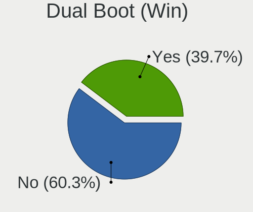
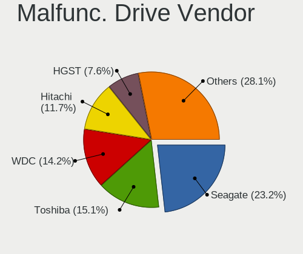
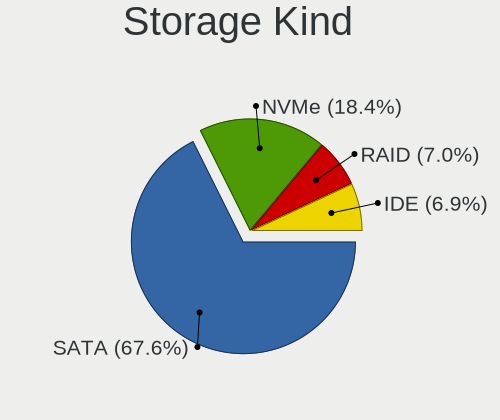
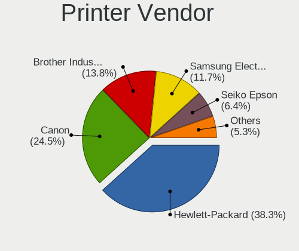
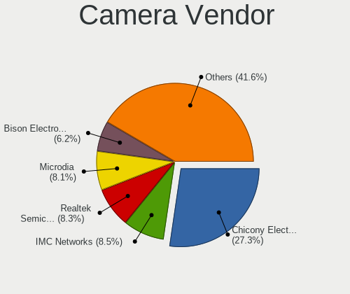
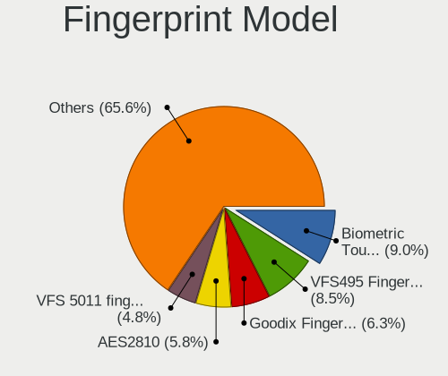

OpenMandriva - Tested Hardware & Statistics (Notebooks)
-------------------------------------------------------

A project to collect tested hardware configurations for OpenMandriva.

Anyone can contribute to this report by the [hw-probe](https://github.com/linuxhw/hw-probe) tool:

    sudo -E hw-probe -all -upload

Please contribute! Especially if your hardware is rare.

Contents
--------

* [ Test Cases ](#test-cases)

* [ System ](#system)
  - [ OS                       ](#os)
  - [ OS Family                ](#os-family)
  - [ Kernel                   ](#kernel)
  - [ Kernel Family            ](#kernel-family)
  - [ Kernel Major Ver.        ](#kernel-major-ver)
  - [ Arch                     ](#arch)
  - [ DE                       ](#de)
  - [ Display Server           ](#display-server)
  - [ Display Manager          ](#display-manager)
  - [ OS Lang                  ](#os-lang)
  - [ Boot Mode                ](#boot-mode)
  - [ Filesystem               ](#filesystem)
  - [ Part. scheme             ](#part-scheme)
  - [ Dual Boot with Linux/BSD ](#dual-boot-with-linuxbsd)
  - [ Dual Boot (Win)          ](#dual-boot-win)

* [ Board ](#board)
  - [ Vendor                   ](#vendor)
  - [ Model                    ](#model)
  - [ Model Family             ](#model-family)
  - [ MFG Year                 ](#mfg-year)
  - [ Form Factor              ](#form-factor)
  - [ Secure Boot              ](#secure-boot)
  - [ Coreboot                 ](#coreboot)
  - [ RAM Size                 ](#ram-size)
  - [ RAM Used                 ](#ram-used)
  - [ Total Drives             ](#total-drives)
  - [ Has CD-ROM               ](#has-cd-rom)
  - [ Has Ethernet             ](#has-ethernet)
  - [ Has WiFi                 ](#has-wifi)
  - [ Has Bluetooth            ](#has-bluetooth)

* [ Location ](#location)
  - [ Country                  ](#country)
  - [ City                     ](#city)

* [ Drives ](#drives)
  - [ Drive Vendor             ](#drive-vendor)
  - [ Drive Model              ](#drive-model)
  - [ HDD Vendor               ](#hdd-vendor)
  - [ SSD Vendor               ](#ssd-vendor)
  - [ Drive Kind               ](#drive-kind)
  - [ Drive Connector          ](#drive-connector)
  - [ Drive Size               ](#drive-size)
  - [ Space Total              ](#space-total)
  - [ Space Used               ](#space-used)
  - [ Malfunc. Drives          ](#malfunc-drives)
  - [ Malfunc. Drive Vendor    ](#malfunc-drive-vendor)
  - [ Malfunc. HDD Vendor      ](#malfunc-hdd-vendor)
  - [ Malfunc. Drive Kind      ](#malfunc-drive-kind)
  - [ Failed Drives            ](#failed-drives)
  - [ Failed Drive Vendor      ](#failed-drive-vendor)
  - [ Drive Status             ](#drive-status)

* [ Storage controller ](#storage-controller)
  - [ Storage Vendor           ](#storage-vendor)
  - [ Storage Model            ](#storage-model)
  - [ Storage Kind             ](#storage-kind)

* [ Processor ](#processor)
  - [ CPU Vendor               ](#cpu-vendor)
  - [ CPU Model                ](#cpu-model)
  - [ CPU Model Family         ](#cpu-model-family)
  - [ CPU Cores                ](#cpu-cores)
  - [ CPU Sockets              ](#cpu-sockets)
  - [ CPU Threads              ](#cpu-threads)
  - [ CPU Op-Modes             ](#cpu-op-modes)
  - [ CPU Microcode            ](#cpu-microcode)
  - [ CPU Microarch            ](#cpu-microarch)

* [ Graphics ](#graphics)
  - [ GPU Vendor               ](#gpu-vendor)
  - [ GPU Model                ](#gpu-model)
  - [ GPU Combo                ](#gpu-combo)
  - [ GPU Driver               ](#gpu-driver)
  - [ GPU Memory               ](#gpu-memory)

* [ Monitor ](#monitor)
  - [ Monitor Vendor           ](#monitor-vendor)
  - [ Monitor Model            ](#monitor-model)
  - [ Monitor Resolution       ](#monitor-resolution)
  - [ Monitor Diagonal         ](#monitor-diagonal)
  - [ Monitor Width            ](#monitor-width)
  - [ Aspect Ratio             ](#aspect-ratio)
  - [ Monitor Area             ](#monitor-area)
  - [ Pixel Density            ](#pixel-density)
  - [ Multiple Monitors        ](#multiple-monitors)

* [ Network ](#network)
  - [ Net Controller Vendor    ](#net-controller-vendor)
  - [ Net Controller Model     ](#net-controller-model)
  - [ Wireless Vendor          ](#wireless-vendor)
  - [ Wireless Model           ](#wireless-model)
  - [ Ethernet Vendor          ](#ethernet-vendor)
  - [ Ethernet Model           ](#ethernet-model)
  - [ Net Controller Kind      ](#net-controller-kind)
  - [ Used Controller          ](#used-controller)
  - [ NICs                     ](#nics)
  - [ IPv6                     ](#ipv6)

* [ Bluetooth ](#bluetooth)
  - [ Bluetooth Vendor         ](#bluetooth-vendor)
  - [ Bluetooth Model          ](#bluetooth-model)

* [ Sound ](#sound)
  - [ Sound Vendor             ](#sound-vendor)
  - [ Sound Model              ](#sound-model)

* [ Memory ](#memory)
  - [ Memory Vendor            ](#memory-vendor)
  - [ Memory Model             ](#memory-model)
  - [ Memory Kind              ](#memory-kind)
  - [ Memory Form Factor       ](#memory-form-factor)
  - [ Memory Size              ](#memory-size)
  - [ Memory Speed             ](#memory-speed)

* [ Printers & scanners ](#printers--scanners)
  - [ Printer Vendor           ](#printer-vendor)
  - [ Printer Model            ](#printer-model)
  - [ Scanner Vendor           ](#scanner-vendor)
  - [ Scanner Model            ](#scanner-model)

* [ Camera ](#camera)
  - [ Camera Vendor            ](#camera-vendor)
  - [ Camera Model             ](#camera-model)

* [ Security ](#security)
  - [ Fingerprint Vendor       ](#fingerprint-vendor)
  - [ Fingerprint Model        ](#fingerprint-model)
  - [ Chipcard Vendor          ](#chipcard-vendor)
  - [ Chipcard Model           ](#chipcard-model)

* [ Unsupported ](#unsupported)
  - [ Unsupported Devices      ](#unsupported-devices)
  - [ Unsupported Device Types ](#unsupported-device-types)

Test Cases
----------

Total: 7132

| Vendor        | Model                       | Probe                                                      | Date         |
|---------------|-----------------------------|------------------------------------------------------------|--------------|
| Dell          | Inspiron 1720               | [1cb123d894](https://linux-hardware.org/?probe=1cb123d894) | Aug 12, 2023 |
| Fujitsu       | FMVA0800C                   | [1dae7b170b](https://linux-hardware.org/?probe=1dae7b170b) | Aug 12, 2023 |
| Lenovo        | ThinkPad L13 Gen 3 21BAS... | [67f821bd4d](https://linux-hardware.org/?probe=67f821bd4d) | Aug 12, 2023 |
| HP            | Compaq nx9420 (RH457EA#A... | [1b7c441369](https://linux-hardware.org/?probe=1b7c441369) | Aug 12, 2023 |
| Lenovo        | V310-14ISK 80SX             | [edd47d65b6](https://linux-hardware.org/?probe=edd47d65b6) | Aug 12, 2023 |
| Lenovo        | V130-15IKB 81HN             | [88a9c5764d](https://linux-hardware.org/?probe=88a9c5764d) | Aug 11, 2023 |
| Acer          | Aspire A515-51              | [4856b9b32f](https://linux-hardware.org/?probe=4856b9b32f) | Aug 11, 2023 |
| Lenovo        | ThinkPad T520 42405FG       | [fad80ecff3](https://linux-hardware.org/?probe=fad80ecff3) | Aug 11, 2023 |
| Lenovo        | ThinkPad T430s 2356LPG      | [97dfe9511b](https://linux-hardware.org/?probe=97dfe9511b) | Aug 10, 2023 |
| Acer          | Aspire ES1-431              | [171fd219cc](https://linux-hardware.org/?probe=171fd219cc) | Aug 10, 2023 |
| Google        | Kip                         | [553df8dcdc](https://linux-hardware.org/?probe=553df8dcdc) | Aug 10, 2023 |
| Acer          | Aspire ES1-431              | [6802a19338](https://linux-hardware.org/?probe=6802a19338) | Aug 10, 2023 |
| Lenovo        | ThinkPad P1 Gen 4i 20Y4S... | [2f64f3ee9a](https://linux-hardware.org/?probe=2f64f3ee9a) | Aug 10, 2023 |
| Acer          | Extensa 5630                | [1cc3eaf69a](https://linux-hardware.org/?probe=1cc3eaf69a) | Aug 10, 2023 |
| Chuwi         | GemiBook Pro                | [b5685bdafc](https://linux-hardware.org/?probe=b5685bdafc) | Aug 10, 2023 |
| HP            | EliteBook 8570p             | [73c1dd0c14](https://linux-hardware.org/?probe=73c1dd0c14) | Aug 10, 2023 |
| ASUSTek       | F3L                         | [b97c082eff](https://linux-hardware.org/?probe=b97c082eff) | Aug 09, 2023 |
| Lenovo        | ThinkPad X220 4290W35       | [64db00247d](https://linux-hardware.org/?probe=64db00247d) | Aug 09, 2023 |
| Lenovo        | ThinkPad X220 4290C37       | [125ac0cbd3](https://linux-hardware.org/?probe=125ac0cbd3) | Aug 08, 2023 |
| ASUSTek       | G750JW                      | [fe527d6231](https://linux-hardware.org/?probe=fe527d6231) | Aug 08, 2023 |
| Lenovo        | ThinkPad L13 Gen 3 21BAS... | [187ac2792a](https://linux-hardware.org/?probe=187ac2792a) | Aug 08, 2023 |
| Lenovo        | ThinkPad L13 Gen 3 21BAS... | [b00519fee7](https://linux-hardware.org/?probe=b00519fee7) | Aug 08, 2023 |
| HP            | Laptop 17-cn1xxx            | [711a5fc7ce](https://linux-hardware.org/?probe=711a5fc7ce) | Aug 08, 2023 |
| Apple         | MacBookPro8,1               | [e8524b0045](https://linux-hardware.org/?probe=e8524b0045) | Aug 08, 2023 |
| HP            | Laptop 14-dq3xxx            | [c547f01fbb](https://linux-hardware.org/?probe=c547f01fbb) | Aug 08, 2023 |
| Acer          | AO756                       | [1ea1658ac0](https://linux-hardware.org/?probe=1ea1658ac0) | Aug 07, 2023 |
| Lenovo        | ThinkPad L13 Gen 3 21BAS... | [a1b9b9fc2c](https://linux-hardware.org/?probe=a1b9b9fc2c) | Aug 07, 2023 |
| MSI           | GL72 7QF                    | [73f4a3b852](https://linux-hardware.org/?probe=73f4a3b852) | Aug 07, 2023 |
| Dell          | Inspiron 5770               | [d6a978f124](https://linux-hardware.org/?probe=d6a978f124) | Aug 07, 2023 |
| Lenovo        | IdeaPad S145-14IWL 81MU     | [eab0544dc6](https://linux-hardware.org/?probe=eab0544dc6) | Aug 06, 2023 |
| Unknown       | Unknown                     | [691c44286e](https://linux-hardware.org/?probe=691c44286e) | Aug 06, 2023 |
| GPD           | G1618-03                    | [070d548515](https://linux-hardware.org/?probe=070d548515) | Aug 06, 2023 |
| Dell          | Inspiron N4050              | [af35c9ce49](https://linux-hardware.org/?probe=af35c9ce49) | Aug 05, 2023 |
| Lenovo        | IdeaPad 510-15ISK 80SR      | [b69ff09aa4](https://linux-hardware.org/?probe=b69ff09aa4) | Aug 05, 2023 |
| Dell          | Precision M2800             | [7d1afe9d42](https://linux-hardware.org/?probe=7d1afe9d42) | Aug 05, 2023 |
| Notebook      | W54_W94_W955TU,-T,-C        | [9db6bfdcfa](https://linux-hardware.org/?probe=9db6bfdcfa) | Aug 05, 2023 |
| HP            | Pavilion g4                 | [2094186715](https://linux-hardware.org/?probe=2094186715) | Aug 05, 2023 |
| MSI           | GE70 0NC                    | [c9fd935b80](https://linux-hardware.org/?probe=c9fd935b80) | Aug 05, 2023 |
| Fujitsu       | LIFEBOOK LH532              | [ba3a2e1773](https://linux-hardware.org/?probe=ba3a2e1773) | Aug 04, 2023 |
| Acer          | Aspire 5738                 | [f5df04e0e6](https://linux-hardware.org/?probe=f5df04e0e6) | Aug 04, 2023 |
| Lenovo        | ThinkPad T480 20L6S9R500    | [3624b5e366](https://linux-hardware.org/?probe=3624b5e366) | Aug 04, 2023 |
| Lenovo        | ThinkPad E14 Gen 3 20Y7C... | [e7810a04a9](https://linux-hardware.org/?probe=e7810a04a9) | Aug 04, 2023 |
| Acer          | Aspire 8943G                | [fedb43e298](https://linux-hardware.org/?probe=fedb43e298) | Aug 04, 2023 |
| GFAST         | N150                        | [bccc2874df](https://linux-hardware.org/?probe=bccc2874df) | Aug 04, 2023 |
| Acer          | Nitro AN517-54              | [aee5a21c76](https://linux-hardware.org/?probe=aee5a21c76) | Aug 04, 2023 |
| MSI           | Titan GT77HX 13VH           | [3acda608a1](https://linux-hardware.org/?probe=3acda608a1) | Aug 03, 2023 |
| HP            | ProBook 6540b               | [6ae3405ec5](https://linux-hardware.org/?probe=6ae3405ec5) | Aug 03, 2023 |
| Samsung       | 900X3C/900X3D/900X3E/900... | [a3401e5a4b](https://linux-hardware.org/?probe=a3401e5a4b) | Aug 03, 2023 |
| Toshiba       | Satellite C855D             | [4835e837bd](https://linux-hardware.org/?probe=4835e837bd) | Aug 03, 2023 |
| Dell          | Latitude E6330              | [75d54a8988](https://linux-hardware.org/?probe=75d54a8988) | Aug 03, 2023 |
| TUXEDO        | Book XA15 / XA17 Gen10      | [18e29b97ac](https://linux-hardware.org/?probe=18e29b97ac) | Aug 02, 2023 |
| Toshiba       | Satellite C850-B239         | [a075f60c70](https://linux-hardware.org/?probe=a075f60c70) | Aug 02, 2023 |
| Dell          | Precision M4500             | [b425204301](https://linux-hardware.org/?probe=b425204301) | Aug 02, 2023 |
| Dell          | Inspiron 1545               | [97d2508df2](https://linux-hardware.org/?probe=97d2508df2) | Aug 02, 2023 |
| MSI           | Modern 15 A10M              | [bab451a11e](https://linux-hardware.org/?probe=bab451a11e) | Aug 02, 2023 |
| Dell          | Inspiron 13-5368            | [695e2dec6b](https://linux-hardware.org/?probe=695e2dec6b) | Aug 02, 2023 |
| Lenovo        | IdeaPad Gaming 3 15ACH6 ... | [c2c27c3268](https://linux-hardware.org/?probe=c2c27c3268) | Aug 01, 2023 |
| Dell          | Vostro 3700                 | [96e4579b7b](https://linux-hardware.org/?probe=96e4579b7b) | Aug 01, 2023 |
| Chuwi         | GemiBook Pro                | [be8a59432a](https://linux-hardware.org/?probe=be8a59432a) | Aug 01, 2023 |
| Apple         | MacBookAir9,1               | [2e59618067](https://linux-hardware.org/?probe=2e59618067) | Aug 01, 2023 |
| Acer          | Aspire 1810TZ               | [8cbec4eb45](https://linux-hardware.org/?probe=8cbec4eb45) | Jul 31, 2023 |
| Lenovo        | V15 G2 ITL 82KB             | [483fbca861](https://linux-hardware.org/?probe=483fbca861) | Jul 31, 2023 |
| Dell          | Latitude E6430              | [9dcf92cce9](https://linux-hardware.org/?probe=9dcf92cce9) | Jul 31, 2023 |
| Lenovo        | ThinkPad E490 20N8CTO1WW    | [7cb3479a69](https://linux-hardware.org/?probe=7cb3479a69) | Jul 31, 2023 |
| Dell          | Inspiron 5558               | [de55f350ab](https://linux-hardware.org/?probe=de55f350ab) | Jul 30, 2023 |
| Toshiba       | Satellite A135              | [2eddaa2a26](https://linux-hardware.org/?probe=2eddaa2a26) | Jul 30, 2023 |
| Chuwi         | HeroBook Pro                | [eb332b024d](https://linux-hardware.org/?probe=eb332b024d) | Jul 30, 2023 |
| Acer          | Aspire 5742                 | [37be5a1c80](https://linux-hardware.org/?probe=37be5a1c80) | Jul 30, 2023 |
| ASUSTek       | E200HA                      | [6ab93e7940](https://linux-hardware.org/?probe=6ab93e7940) | Jul 30, 2023 |
| ASUSTek       | X540NA                      | [68b0d7d1fb](https://linux-hardware.org/?probe=68b0d7d1fb) | Jul 30, 2023 |
| Chuwi         | GemiBook                    | [f892a3970c](https://linux-hardware.org/?probe=f892a3970c) | Jul 30, 2023 |
| ASUSTek       | VivoBook_ASUSLaptop E410... | [5da413f349](https://linux-hardware.org/?probe=5da413f349) | Jul 30, 2023 |
| Lenovo        | ThinkPad T570 W10DG 20JW... | [22f4bc0b5e](https://linux-hardware.org/?probe=22f4bc0b5e) | Jul 29, 2023 |
| Lenovo        | ThinkPad A285 20MXS0AE00    | [a6ada51a02](https://linux-hardware.org/?probe=a6ada51a02) | Jul 29, 2023 |
| Acer          | Aspire E5-511               | [aef96d4eb8](https://linux-hardware.org/?probe=aef96d4eb8) | Jul 29, 2023 |
| ASUSTek       | UX31E                       | [a7b390cdf4](https://linux-hardware.org/?probe=a7b390cdf4) | Jul 29, 2023 |
| Dell          | Latitude E6420              | [a70852def5](https://linux-hardware.org/?probe=a70852def5) | Jul 29, 2023 |
| Lenovo        | ThinkPad T470 20HES2C000    | [6cb5b31808](https://linux-hardware.org/?probe=6cb5b31808) | Jul 29, 2023 |
| ASUSTek       | X102BA                      | [488aa4c5b4](https://linux-hardware.org/?probe=488aa4c5b4) | Jul 29, 2023 |
| Acer          | Aspire 4810T                | [4d3abb525e](https://linux-hardware.org/?probe=4d3abb525e) | Jul 28, 2023 |
| HP            | g14                         | [39d4ce09a1](https://linux-hardware.org/?probe=39d4ce09a1) | Jul 28, 2023 |
| Fujitsu       | LIFEBOOK A3510              | [49b28d270b](https://linux-hardware.org/?probe=49b28d270b) | Jul 27, 2023 |
| ASUSTek       | X550CC                      | [792e9db762](https://linux-hardware.org/?probe=792e9db762) | Jul 27, 2023 |
| Toshiba       | Satellite C50D-A-11G        | [b67508b754](https://linux-hardware.org/?probe=b67508b754) | Jul 27, 2023 |
| A14CR         | Unknown                     | [4ceb4f6761](https://linux-hardware.org/?probe=4ceb4f6761) | Jul 27, 2023 |
| MSI           | Alpha 15 B5EEK              | [d6a4c29101](https://linux-hardware.org/?probe=d6a4c29101) | Jul 27, 2023 |
| GPU Compan... | GWNR71517                   | [ca3906a6c7](https://linux-hardware.org/?probe=ca3906a6c7) | Jul 26, 2023 |
| Lenovo        | ThinkBook 15 G3 ACL 21A4    | [c7b69782db](https://linux-hardware.org/?probe=c7b69782db) | Jul 26, 2023 |
| Lenovo        | ThinkPad E555 20DH0027UK    | [b7bf821032](https://linux-hardware.org/?probe=b7bf821032) | Jul 26, 2023 |
| Positivo      | G800                        | [5dd0f188f8](https://linux-hardware.org/?probe=5dd0f188f8) | Jul 25, 2023 |
| ASUSTek       | P50IJ                       | [d8aff1255a](https://linux-hardware.org/?probe=d8aff1255a) | Jul 25, 2023 |
| Fujitsu Si... | LIFEBOOK S6410              | [47d5775197](https://linux-hardware.org/?probe=47d5775197) | Jul 25, 2023 |
| Acer          | Extensa 2530                | [6691e96edf](https://linux-hardware.org/?probe=6691e96edf) | Jul 25, 2023 |
| Dell          | Latitude 5530               | [cccd0bf0b8](https://linux-hardware.org/?probe=cccd0bf0b8) | Jul 25, 2023 |
| LG Electro... | 17Z90P-K.AA78A1             | [6fc7661aae](https://linux-hardware.org/?probe=6fc7661aae) | Jul 25, 2023 |
| Acer          | Aspire E5-571G              | [3f39162908](https://linux-hardware.org/?probe=3f39162908) | Jul 25, 2023 |
| Lenovo        | ThinkPad E480 20KN001QMX    | [1ff9753d17](https://linux-hardware.org/?probe=1ff9753d17) | Jul 25, 2023 |
| Fujitsu       | LIFEBOOK A3510              | [1cf27b8466](https://linux-hardware.org/?probe=1cf27b8466) | Jul 25, 2023 |
| HP            | 250 G5 Notebook PC          | [007f2e5957](https://linux-hardware.org/?probe=007f2e5957) | Jul 25, 2023 |
| HP            | Laptop 15s-du3xxx           | [e14cb2c24e](https://linux-hardware.org/?probe=e14cb2c24e) | Jul 25, 2023 |
| Toshiba       | IS 1442                     | [3a66df4c2d](https://linux-hardware.org/?probe=3a66df4c2d) | Jul 25, 2023 |
| Acer          | Aspire A114-33              | [a8c1a06e1a](https://linux-hardware.org/?probe=a8c1a06e1a) | Jul 25, 2023 |
| Lenovo        | ThinkPad L560 20F2S32Q00    | [0f437b5e3c](https://linux-hardware.org/?probe=0f437b5e3c) | Jul 25, 2023 |
| Dell          | Latitude 7490               | [066e3b9518](https://linux-hardware.org/?probe=066e3b9518) | Jul 25, 2023 |
| Chuwi         | CoreBook Pro                | [21ab3832ea](https://linux-hardware.org/?probe=21ab3832ea) | Jul 24, 2023 |
| Apple         | MacBookPro13,3              | [ae23c3b0d3](https://linux-hardware.org/?probe=ae23c3b0d3) | Jul 24, 2023 |
| Intel         | powered classmate PC        | [ccbb0cb45a](https://linux-hardware.org/?probe=ccbb0cb45a) | Jul 24, 2023 |
| ASUSTek       | F7E                         | [2aef1cc2c4](https://linux-hardware.org/?probe=2aef1cc2c4) | Jul 24, 2023 |
| Lenovo        | ThinkPad T470 W10DG 20JN... | [78560cbf59](https://linux-hardware.org/?probe=78560cbf59) | Jul 24, 2023 |
| ASUSTek       | X555LD                      | [732fe69d59](https://linux-hardware.org/?probe=732fe69d59) | Jul 23, 2023 |
| Dell          | Inspiron 13-5378            | [7f6b8fc2db](https://linux-hardware.org/?probe=7f6b8fc2db) | Jul 23, 2023 |
| HP            | Laptop 17-ak0xx             | [e9b5ae3c4d](https://linux-hardware.org/?probe=e9b5ae3c4d) | Jul 23, 2023 |
| Lenovo        | IdeaPad 3 14IGL05 81WH      | [92c6b0de0c](https://linux-hardware.org/?probe=92c6b0de0c) | Jul 23, 2023 |
| Lenovo        | IdeaPad 5 14ALC05 82LM      | [9f384d336d](https://linux-hardware.org/?probe=9f384d336d) | Jul 23, 2023 |
| Lenovo        | ThinkPad L460 20FVS01J00    | [96fe0142cd](https://linux-hardware.org/?probe=96fe0142cd) | Jul 23, 2023 |
| Dell          | Inspiron N5110              | [8d94c58c16](https://linux-hardware.org/?probe=8d94c58c16) | Jul 23, 2023 |
| Fujitsu       | LIFEBOOK A3510              | [4824895fac](https://linux-hardware.org/?probe=4824895fac) | Jul 23, 2023 |
| Dell          | Latitude E7270              | [9d14027d6c](https://linux-hardware.org/?probe=9d14027d6c) | Jul 23, 2023 |
| HP            | Compaq Presario C700        | [71ca83faee](https://linux-hardware.org/?probe=71ca83faee) | Jul 23, 2023 |
| HP            | Notebook                    | [1a4ba0be2f](https://linux-hardware.org/?probe=1a4ba0be2f) | Jul 23, 2023 |
| Lenovo        | ThinkPad T480 20L6S6FY01    | [deaede763c](https://linux-hardware.org/?probe=deaede763c) | Jul 23, 2023 |
| HP            | Pavilion dv2500             | [6e86c0a75b](https://linux-hardware.org/?probe=6e86c0a75b) | Jul 23, 2023 |
| Lenovo        | V145-15AST 81MT             | [ecce500445](https://linux-hardware.org/?probe=ecce500445) | Jul 22, 2023 |
| HP            | 255 15.6 inch G9 Noteboo... | [d387ed9d0c](https://linux-hardware.org/?probe=d387ed9d0c) | Jul 22, 2023 |
| HP            | Laptop 17-by3xxx            | [b5fe1f6fca](https://linux-hardware.org/?probe=b5fe1f6fca) | Jul 22, 2023 |
| Lenovo        | ThinkPad T420 4180EP2       | [4ec1a5c6fe](https://linux-hardware.org/?probe=4ec1a5c6fe) | Jul 22, 2023 |
| Lenovo        | ThinkPad S1 Yoga 12 20DK... | [33ee51ddc5](https://linux-hardware.org/?probe=33ee51ddc5) | Jul 22, 2023 |
| Gigabyte      | AERO 15-X9                  | [2849a149b9](https://linux-hardware.org/?probe=2849a149b9) | Jul 22, 2023 |
| Samsung       | 300E5EV/300E4EV/270E5EV/... | [a9af1efc27](https://linux-hardware.org/?probe=a9af1efc27) | Jul 22, 2023 |
| HP            | Pavilion dv6700             | [aed45c2e40](https://linux-hardware.org/?probe=aed45c2e40) | Jul 21, 2023 |
| Packard Be... | EasyNote SL65               | [f66a4415f3](https://linux-hardware.org/?probe=f66a4415f3) | Jul 21, 2023 |
| Standard      | Unknown                     | [74acf0f707](https://linux-hardware.org/?probe=74acf0f707) | Jul 21, 2023 |
| HUAWEI        | BOHK-WAX9X                  | [fe0c696d47](https://linux-hardware.org/?probe=fe0c696d47) | Jul 21, 2023 |
| ASUSTek       | ASUS EXPERTBOOK L1400CDA... | [61837fa4da](https://linux-hardware.org/?probe=61837fa4da) | Jul 21, 2023 |
| Positivo B... | VJFE42F11X-XXXXXX           | [2269e1f3d7](https://linux-hardware.org/?probe=2269e1f3d7) | Jul 21, 2023 |
| ASUSTek       | UX303LB                     | [901f80bb60](https://linux-hardware.org/?probe=901f80bb60) | Jul 20, 2023 |
| HP            | ProBook 6540b               | [ec232bc3fa](https://linux-hardware.org/?probe=ec232bc3fa) | Jul 20, 2023 |
| HP            | Stream Laptop 11-ak0xxx     | [61fa9a2c91](https://linux-hardware.org/?probe=61fa9a2c91) | Jul 20, 2023 |
| Acer          | Aspire A515-56              | [3e0e8609c8](https://linux-hardware.org/?probe=3e0e8609c8) | Jul 19, 2023 |
| Dell          | Latitude E6400              | [7e9ef12f0d](https://linux-hardware.org/?probe=7e9ef12f0d) | Jul 19, 2023 |
| Apple         | MacBookPro10,1              | [c3ec46f79e](https://linux-hardware.org/?probe=c3ec46f79e) | Jul 19, 2023 |
| Dell          | Inspiron N5110              | [140474e198](https://linux-hardware.org/?probe=140474e198) | Jul 19, 2023 |
| Acer          | Aspire E5-476G              | [74af6477be](https://linux-hardware.org/?probe=74af6477be) | Jul 19, 2023 |
| ASUSTek       | VivoBook_ASUSLaptop X712... | [7843df6b43](https://linux-hardware.org/?probe=7843df6b43) | Jul 19, 2023 |
| Lenovo        | ThinkPad T410 2537AT1       | [7d94a6effc](https://linux-hardware.org/?probe=7d94a6effc) | Jul 19, 2023 |
| Lenovo        | ThinkPad E560 20EV002JUS    | [afc31702be](https://linux-hardware.org/?probe=afc31702be) | Jul 18, 2023 |
| Acer          | Predator PH317-56           | [248af0e35c](https://linux-hardware.org/?probe=248af0e35c) | Jul 18, 2023 |
| LG Electro... | P420-G.BE42P1               | [9dea573574](https://linux-hardware.org/?probe=9dea573574) | Jul 18, 2023 |
| Fujitsu       | LIFEBOOK A557               | [96f08b7598](https://linux-hardware.org/?probe=96f08b7598) | Jul 18, 2023 |
| Lenovo        | ThinkPad E15 20RDS1G700     | [6ad3194fd9](https://linux-hardware.org/?probe=6ad3194fd9) | Jul 18, 2023 |
| Acer          | Nitro AN515-57              | [9853a8cf46](https://linux-hardware.org/?probe=9853a8cf46) | Jul 18, 2023 |
| ASUSTek       | K46CB                       | [144d523bf1](https://linux-hardware.org/?probe=144d523bf1) | Jul 18, 2023 |
| HP            | Pavilion Notebook           | [babb224527](https://linux-hardware.org/?probe=babb224527) | Jul 18, 2023 |
| HP            | G42                         | [d42b44461e](https://linux-hardware.org/?probe=d42b44461e) | Jul 18, 2023 |
| HP            | Pavilion Laptop 17-ar0xx    | [574cd2e0f8](https://linux-hardware.org/?probe=574cd2e0f8) | Jul 17, 2023 |
| ASUSTek       | G551JM                      | [393e57db0c](https://linux-hardware.org/?probe=393e57db0c) | Jul 17, 2023 |
| Lenovo        | ThinkPad T480 20L5004HUS    | [6d453b900a](https://linux-hardware.org/?probe=6d453b900a) | Jul 17, 2023 |
| Lenovo        | IdeaPad 5 15ARE05 81YQ      | [afb16ac821](https://linux-hardware.org/?probe=afb16ac821) | Jul 17, 2023 |
| HP            | Stream Laptop 14-ax0XX      | [e2075c4a1e](https://linux-hardware.org/?probe=e2075c4a1e) | Jul 17, 2023 |
| HP            | Laptop 14s-dk0xxx           | [3cf00d1f89](https://linux-hardware.org/?probe=3cf00d1f89) | Jul 16, 2023 |
| Acer          | Aspire E5-573G              | [3cc36162b8](https://linux-hardware.org/?probe=3cc36162b8) | Jul 16, 2023 |
| Toshiba       | TECRA A10                   | [0740ca470e](https://linux-hardware.org/?probe=0740ca470e) | Jul 16, 2023 |
| HP            | Pavilion HDX9200            | [d893c8a2d1](https://linux-hardware.org/?probe=d893c8a2d1) | Jul 16, 2023 |
| ASUSTek       | K53SJ                       | [eb5e64c657](https://linux-hardware.org/?probe=eb5e64c657) | Jul 16, 2023 |
| Acer          | Swift SFE16-43              | [ebdd4b753c](https://linux-hardware.org/?probe=ebdd4b753c) | Jul 16, 2023 |
| Lenovo        | IdeaPad S145-15API 81V7     | [46cfd28279](https://linux-hardware.org/?probe=46cfd28279) | Jul 16, 2023 |
| Lenovo        | ThinkPad T495 20NKS0T101    | [6154504eac](https://linux-hardware.org/?probe=6154504eac) | Jul 15, 2023 |
| ASUSTek       | 1011PX                      | [d91fe40195](https://linux-hardware.org/?probe=d91fe40195) | Jul 15, 2023 |
| MSI           | GE70 2QD                    | [f8ddf3a3a3](https://linux-hardware.org/?probe=f8ddf3a3a3) | Jul 15, 2023 |
| Lenovo        | ThinkPad T400 6474C53       | [e9db1ea8a6](https://linux-hardware.org/?probe=e9db1ea8a6) | Jul 15, 2023 |
| Acer          | Aspire E5-773G              | [a4a4102548](https://linux-hardware.org/?probe=a4a4102548) | Jul 15, 2023 |
| Positivo      | Mobile                      | [fdc2d91a25](https://linux-hardware.org/?probe=fdc2d91a25) | Jul 15, 2023 |
| Dell          | Inspiron MP061              | [0a26ffe33b](https://linux-hardware.org/?probe=0a26ffe33b) | Jul 15, 2023 |
| Toshiba       | Satellite C650              | [252f8adf16](https://linux-hardware.org/?probe=252f8adf16) | Jul 15, 2023 |
| Lenovo        | Legion 5 15IMH05H 82CF      | [804b227bff](https://linux-hardware.org/?probe=804b227bff) | Jul 15, 2023 |
| Packard Be... | EasyNote LM85               | [3efd87a0d8](https://linux-hardware.org/?probe=3efd87a0d8) | Jul 14, 2023 |
| Lenovo        | ThinkPad X230 2325FG0       | [4df76c784c](https://linux-hardware.org/?probe=4df76c784c) | Jul 13, 2023 |
| Dell          | Inspiron 1545               | [0e9916f3e3](https://linux-hardware.org/?probe=0e9916f3e3) | Jul 13, 2023 |
| HP            | Pavilion Laptop 15-eg1xx... | [be2db3ecfa](https://linux-hardware.org/?probe=be2db3ecfa) | Jul 13, 2023 |
| Lenovo        | IdeaPad 110-15IBR 80T7      | [6130474cb1](https://linux-hardware.org/?probe=6130474cb1) | Jul 13, 2023 |
| Acer          | Nitro AN515-45              | [2e11b53615](https://linux-hardware.org/?probe=2e11b53615) | Jul 13, 2023 |
| HP            | Victus by Laptop 16-e0xx... | [d2dd2ac514](https://linux-hardware.org/?probe=d2dd2ac514) | Jul 13, 2023 |
| Acer          | Aspire E5-471G              | [c958efdb37](https://linux-hardware.org/?probe=c958efdb37) | Jul 12, 2023 |
| Apple         | MacBookPro12,1              | [dd19bc7fee](https://linux-hardware.org/?probe=dd19bc7fee) | Jul 12, 2023 |
| Dell          | Inspiron 5748               | [ec95cc29fd](https://linux-hardware.org/?probe=ec95cc29fd) | Jul 11, 2023 |
| Dell          | Inspiron 5749               | [0421d22945](https://linux-hardware.org/?probe=0421d22945) | Jul 11, 2023 |
| ASUSTek       | ROG Strix G531GT_G531GT     | [97f39991c3](https://linux-hardware.org/?probe=97f39991c3) | Jul 11, 2023 |
| Lenovo        | ThinkPad T430 23501B3       | [8f1d64206e](https://linux-hardware.org/?probe=8f1d64206e) | Jul 11, 2023 |
| Apple         | MacBookAir9,1               | [c952cab7d7](https://linux-hardware.org/?probe=c952cab7d7) | Jul 11, 2023 |
| Dell          | Inspiron 1545               | [50ed801045](https://linux-hardware.org/?probe=50ed801045) | Jul 11, 2023 |
| HP            | Pavilion dv6500             | [a714d595da](https://linux-hardware.org/?probe=a714d595da) | Jul 10, 2023 |
| Apple         | MacBookAir9,1               | [703f4fd012](https://linux-hardware.org/?probe=703f4fd012) | Jul 10, 2023 |
| GPU Compan... | GWNR71517                   | [9a58539b66](https://linux-hardware.org/?probe=9a58539b66) | Jul 10, 2023 |
| ASUSTek       | X756UXK                     | [746e141543](https://linux-hardware.org/?probe=746e141543) | Jul 10, 2023 |
| Dell          | Latitude 3490               | [67de502259](https://linux-hardware.org/?probe=67de502259) | Jul 10, 2023 |
| ASUSTek       | ASUS TUF Gaming F15 FX50... | [96ca518dc6](https://linux-hardware.org/?probe=96ca518dc6) | Jul 09, 2023 |
| HP            | ProBook 4420s               | [51e917f03e](https://linux-hardware.org/?probe=51e917f03e) | Jul 09, 2023 |
| HP            | Laptop 17-cp0xxx            | [f17dc1d3c6](https://linux-hardware.org/?probe=f17dc1d3c6) | Jul 09, 2023 |
| Alienware     | 17                          | [90e6911a60](https://linux-hardware.org/?probe=90e6911a60) | Jul 09, 2023 |
| Lenovo        | IdeaPad 3 15ADA05 81W1      | [c6a3712ec9](https://linux-hardware.org/?probe=c6a3712ec9) | Jul 09, 2023 |
| Lenovo        | IdeaPad 1 14IGL7 82V6       | [c1da8fb79e](https://linux-hardware.org/?probe=c1da8fb79e) | Jul 08, 2023 |
| Lenovo        | V145-15AST 81MT             | [a29509646a](https://linux-hardware.org/?probe=a29509646a) | Jul 08, 2023 |
| Acer          | Swift SF514-51              | [74c43ecd5c](https://linux-hardware.org/?probe=74c43ecd5c) | Jul 08, 2023 |
| Acer          | Aspire A315-21              | [d6a3964ff7](https://linux-hardware.org/?probe=d6a3964ff7) | Jul 08, 2023 |
| Toshiba       | Satellite L755              | [cb309977d0](https://linux-hardware.org/?probe=cb309977d0) | Jul 08, 2023 |
| Acer          | TravelMate 5335             | [7422cf6091](https://linux-hardware.org/?probe=7422cf6091) | Jul 08, 2023 |
| HP            | EliteBook 2560p             | [df243ca59d](https://linux-hardware.org/?probe=df243ca59d) | Jul 08, 2023 |
| Acer          | Chapala                     | [6ea600326f](https://linux-hardware.org/?probe=6ea600326f) | Jul 08, 2023 |
| Dell          | Vostro 1720                 | [0bd2fdf8a5](https://linux-hardware.org/?probe=0bd2fdf8a5) | Jul 08, 2023 |
| Toshiba       | dynabook R73/Y              | [37e3897f65](https://linux-hardware.org/?probe=37e3897f65) | Jul 08, 2023 |
| Dell          | Latitude E5470              | [ac0f0dd893](https://linux-hardware.org/?probe=ac0f0dd893) | Jul 08, 2023 |
| Lenovo        | G485 20136                  | [9ce1d97d02](https://linux-hardware.org/?probe=9ce1d97d02) | Jul 07, 2023 |
| HP            | Compaq 6730b (GW687AV)      | [0b81f2e9b0](https://linux-hardware.org/?probe=0b81f2e9b0) | Jul 07, 2023 |
| Lenovo        | IdeaPad 3 15ADA05 81W1      | [de87cf7e95](https://linux-hardware.org/?probe=de87cf7e95) | Jul 07, 2023 |
| Samsung       | 300E5M/300E5L               | [f60025eb2c](https://linux-hardware.org/?probe=f60025eb2c) | Jul 07, 2023 |
| HP            | ZBook 17 G3                 | [e328019dd8](https://linux-hardware.org/?probe=e328019dd8) | Jul 07, 2023 |
| Medion        | Unknown                     | [8fd3bc8734](https://linux-hardware.org/?probe=8fd3bc8734) | Jul 07, 2023 |
| Lenovo        | ThinkPad T510 4349RK6       | [e25d3f6783](https://linux-hardware.org/?probe=e25d3f6783) | Jul 07, 2023 |
| HP            | ProBook 450 G4              | [803b679fbd](https://linux-hardware.org/?probe=803b679fbd) | Jul 07, 2023 |
| HP            | OMEN by Laptop 16-c0xxx     | [e484073491](https://linux-hardware.org/?probe=e484073491) | Jul 07, 2023 |
| Google        | Lick                        | [aa3d137fcf](https://linux-hardware.org/?probe=aa3d137fcf) | Jul 07, 2023 |
| Dell          | Latitude E5450              | [0a1677c02e](https://linux-hardware.org/?probe=0a1677c02e) | Jul 06, 2023 |
| Toshiba       | Satellite P200D             | [609a275664](https://linux-hardware.org/?probe=609a275664) | Jul 06, 2023 |
| Lenovo        | ThinkPad T400 6474W7T       | [56144d66ac](https://linux-hardware.org/?probe=56144d66ac) | Jul 05, 2023 |
| Toshiba       | Satellite L750              | [037db5066a](https://linux-hardware.org/?probe=037db5066a) | Jul 05, 2023 |
| Sony          | VPCCW2S8E                   | [4a3af37e51](https://linux-hardware.org/?probe=4a3af37e51) | Jul 05, 2023 |
| HP            | EliteBook Folio 9480m       | [d992b0a60f](https://linux-hardware.org/?probe=d992b0a60f) | Jul 05, 2023 |
| HP            | 550                         | [f788d05211](https://linux-hardware.org/?probe=f788d05211) | Jul 05, 2023 |
| HP            | EliteBook 840 G2            | [ec4a293de1](https://linux-hardware.org/?probe=ec4a293de1) | Jul 05, 2023 |
| ASUSTek       | TP501UA                     | [ee28aacdd1](https://linux-hardware.org/?probe=ee28aacdd1) | Jul 05, 2023 |
| Packard Be... | IPOWER                      | [3c116708b4](https://linux-hardware.org/?probe=3c116708b4) | Jul 05, 2023 |
| GPU Compan... | GWNR71517                   | [27e3b5a172](https://linux-hardware.org/?probe=27e3b5a172) | Jul 05, 2023 |
| Standard      | ECT                         | [42f38309b9](https://linux-hardware.org/?probe=42f38309b9) | Jul 04, 2023 |
| Lenovo        | ThinkPad L520 5015A12       | [0cb85712d9](https://linux-hardware.org/?probe=0cb85712d9) | Jul 04, 2023 |
| HP            | Laptop 15-db0xxx            | [71de589577](https://linux-hardware.org/?probe=71de589577) | Jul 04, 2023 |
| Lenovo        | IdeaPad 3 15ADA05 81W1      | [9ec1de725f](https://linux-hardware.org/?probe=9ec1de725f) | Jul 04, 2023 |
| eMachines     | Padus                       | [008b3a48cd](https://linux-hardware.org/?probe=008b3a48cd) | Jul 04, 2023 |
| Google        | Gnawty                      | [05c8ee74db](https://linux-hardware.org/?probe=05c8ee74db) | Jul 03, 2023 |
| ASUSTek       | 1015PN                      | [7482ea5fc2](https://linux-hardware.org/?probe=7482ea5fc2) | Jul 03, 2023 |
| ASUSTek       | K55VD                       | [1a3814f9d9](https://linux-hardware.org/?probe=1a3814f9d9) | Jul 03, 2023 |
| ASUSTek       | X541UAK                     | [c4dcbea71d](https://linux-hardware.org/?probe=c4dcbea71d) | Jul 03, 2023 |
| Fujitsu Si... | LIFEBOOK E8420              | [c997fd76cf](https://linux-hardware.org/?probe=c997fd76cf) | Jul 02, 2023 |
| HP            | Stream Laptop 14-cb0XX      | [4a3acc3b0d](https://linux-hardware.org/?probe=4a3acc3b0d) | Jul 02, 2023 |
| Dell          | Inspiron 5559               | [06988fc303](https://linux-hardware.org/?probe=06988fc303) | Jul 02, 2023 |
| Alienware     | 18                          | [7898671060](https://linux-hardware.org/?probe=7898671060) | Jul 02, 2023 |
| Lenovo        | IdeaPad Gaming 3 15ACH6 ... | [f78c4a1930](https://linux-hardware.org/?probe=f78c4a1930) | Jul 01, 2023 |
| Acer          | Predator PT515-51           | [fc639c945e](https://linux-hardware.org/?probe=fc639c945e) | Jul 01, 2023 |
| HP            | 550                         | [7681694808](https://linux-hardware.org/?probe=7681694808) | Jul 01, 2023 |
| ASUSTek       | UX31E                       | [37a73c8939](https://linux-hardware.org/?probe=37a73c8939) | Jul 01, 2023 |
| Acer          | JM11-MS                     | [ad02c854e0](https://linux-hardware.org/?probe=ad02c854e0) | Jul 01, 2023 |
| lapbook       | S15 PRO                     | [06ae615fd1](https://linux-hardware.org/?probe=06ae615fd1) | Jul 01, 2023 |
| Acer          | Aspire E5-772               | [b33f11c7c9](https://linux-hardware.org/?probe=b33f11c7c9) | Jul 01, 2023 |
| ASUSTek       | N752VX                      | [d4fd40a9f3](https://linux-hardware.org/?probe=d4fd40a9f3) | Jul 01, 2023 |
| Packard Be... | EasyNote TSX66HR            | [96253a3da8](https://linux-hardware.org/?probe=96253a3da8) | Jul 01, 2023 |
| Dell          | Inspiron 1545               | [cfcc86ddd5](https://linux-hardware.org/?probe=cfcc86ddd5) | Jun 30, 2023 |
| Acer          | Aspire A314-22              | [ef54ec3027](https://linux-hardware.org/?probe=ef54ec3027) | Jun 30, 2023 |
| Lenovo        | ThinkPad L430 246634S       | [5368d4410f](https://linux-hardware.org/?probe=5368d4410f) | Jun 30, 2023 |
| HP            | Laptop 15-db1xxx            | [6d3d6e002f](https://linux-hardware.org/?probe=6d3d6e002f) | Jun 30, 2023 |
| ASUSTek       | X555LAB                     | [99e1623ea0](https://linux-hardware.org/?probe=99e1623ea0) | Jun 29, 2023 |
| Lenovo        | IdeaPad 100-15IBY 80MJ      | [723de914e2](https://linux-hardware.org/?probe=723de914e2) | Jun 29, 2023 |
| HP            | Notebook                    | [a178cbf707](https://linux-hardware.org/?probe=a178cbf707) | Jun 29, 2023 |
| ASUSTek       | ROG Strix G513QY_G513QY     | [a77c825995](https://linux-hardware.org/?probe=a77c825995) | Jun 29, 2023 |
| Dell          | System XPS L321X            | [abf6b8b341](https://linux-hardware.org/?probe=abf6b8b341) | Jun 29, 2023 |
| Acer          | Aspire 5830TG               | [8c001b69bb](https://linux-hardware.org/?probe=8c001b69bb) | Jun 29, 2023 |
| HP            | Pavilion dv6500             | [0286d2f5e5](https://linux-hardware.org/?probe=0286d2f5e5) | Jun 29, 2023 |
| HP            | Stream Laptop 14-cb1XX      | [1db11a4fa9](https://linux-hardware.org/?probe=1db11a4fa9) | Jun 29, 2023 |
| Lenovo        | ThinkPad L520 50153CJ       | [1793064ee5](https://linux-hardware.org/?probe=1793064ee5) | Jun 29, 2023 |
| Acer          | Aspire A315-42              | [d2a1351f86](https://linux-hardware.org/?probe=d2a1351f86) | Jun 28, 2023 |
| ASUSTek       | K54C                        | [4152d1fcff](https://linux-hardware.org/?probe=4152d1fcff) | Jun 28, 2023 |
| PCsmart       | PCSGOB14p-C                 | [a45977461f](https://linux-hardware.org/?probe=a45977461f) | Jun 27, 2023 |
| Clevo         | M540SS Bottom               | [4b613733a0](https://linux-hardware.org/?probe=4b613733a0) | Jun 27, 2023 |
| Dell          | Inspiron 7720               | [89858274fd](https://linux-hardware.org/?probe=89858274fd) | Jun 27, 2023 |
| Dell          | Inspiron 1545               | [d6b3d5cb90](https://linux-hardware.org/?probe=d6b3d5cb90) | Jun 27, 2023 |
| ASUSTek       | VivoBook_ASUSLaptop X510... | [501d3b5530](https://linux-hardware.org/?probe=501d3b5530) | Jun 25, 2023 |
| HP            | Laptop 15-dw3xxx            | [a80704a116](https://linux-hardware.org/?probe=a80704a116) | Jun 25, 2023 |
| ASUSTek       | M51Vr                       | [16404e70f6](https://linux-hardware.org/?probe=16404e70f6) | Jun 25, 2023 |
| Toshiba       | Satellite A300              | [6f1d7a6089](https://linux-hardware.org/?probe=6f1d7a6089) | Jun 25, 2023 |
| Dell          | Precision M6400             | [b68c09e274](https://linux-hardware.org/?probe=b68c09e274) | Jun 25, 2023 |
| HP            | Pavilion dv6                | [d699670acc](https://linux-hardware.org/?probe=d699670acc) | Jun 25, 2023 |
| Lenovo        | IdeaPad 3 15ITL6 82H8       | [c6edbe5681](https://linux-hardware.org/?probe=c6edbe5681) | Jun 25, 2023 |
| Toshiba       | Satellite Pro L500          | [44e57dc97b](https://linux-hardware.org/?probe=44e57dc97b) | Jun 25, 2023 |
| Lenovo        | ThinkPad T480 20L6S01G00    | [a66d6dba45](https://linux-hardware.org/?probe=a66d6dba45) | Jun 25, 2023 |
| ASUSTek       | VivoBook_ASUSLaptop X509... | [8862b2d8db](https://linux-hardware.org/?probe=8862b2d8db) | Jun 25, 2023 |
| Acer          | Aspire F5-571G              | [fb61026d60](https://linux-hardware.org/?probe=fb61026d60) | Jun 25, 2023 |
| Lenovo        | ThinkPad T450 20BUS0EW1K    | [43f405f4ce](https://linux-hardware.org/?probe=43f405f4ce) | Jun 25, 2023 |
| Toshiba       | IS 1413G                    | [bce89b670d](https://linux-hardware.org/?probe=bce89b670d) | Jun 25, 2023 |
| Lenovo        | V15 G2 ITL 82ME             | [3fde30195c](https://linux-hardware.org/?probe=3fde30195c) | Jun 25, 2023 |
| Dell          | Inspiron 1545               | [7f8217bce2](https://linux-hardware.org/?probe=7f8217bce2) | Jun 25, 2023 |
| eMachines     | eME732ZG                    | [4e1d6873ff](https://linux-hardware.org/?probe=4e1d6873ff) | Jun 24, 2023 |
| Lenovo        | Legion 5 Pro 16ARH7H 82R... | [23c2fe2245](https://linux-hardware.org/?probe=23c2fe2245) | Jun 24, 2023 |
| Packard Be... | EasyNote TK85               | [314e344780](https://linux-hardware.org/?probe=314e344780) | Jun 24, 2023 |
| HP            | G62                         | [e8187f4fb6](https://linux-hardware.org/?probe=e8187f4fb6) | Jun 24, 2023 |
| Packard Be... | EasyNote TJ65               | [cdc135487b](https://linux-hardware.org/?probe=cdc135487b) | Jun 24, 2023 |
| Dell          | Latitude 3180               | [a9a4a63807](https://linux-hardware.org/?probe=a9a4a63807) | Jun 24, 2023 |
| Toshiba       | Satellite C650              | [54ef5b6567](https://linux-hardware.org/?probe=54ef5b6567) | Jun 23, 2023 |
| HP            | 215 G1                      | [0b651dad7d](https://linux-hardware.org/?probe=0b651dad7d) | Jun 23, 2023 |
| HP            | Compaq 610                  | [f312ec5ede](https://linux-hardware.org/?probe=f312ec5ede) | Jun 23, 2023 |
| HP            | Presario CQ56               | [5a8991a97b](https://linux-hardware.org/?probe=5a8991a97b) | Jun 23, 2023 |
| Lenovo        | Flex 2-14 20404             | [4ab121533a](https://linux-hardware.org/?probe=4ab121533a) | Jun 23, 2023 |
| MSI           | S12T 3M/S12 3M              | [f135825cec](https://linux-hardware.org/?probe=f135825cec) | Jun 23, 2023 |
| ASUSTek       | VivoBook_ASUSLaptop X421... | [b47fa47ef7](https://linux-hardware.org/?probe=b47fa47ef7) | Jun 23, 2023 |
| HP            | Stream 11 Pro G4 EE         | [8add1110e7](https://linux-hardware.org/?probe=8add1110e7) | Jun 23, 2023 |
| TUXEDO        | Pulse 15 Gen1               | [efad2eddea](https://linux-hardware.org/?probe=efad2eddea) | Jun 23, 2023 |
| Lenovo        | G570 20079                  | [5879c3e9ad](https://linux-hardware.org/?probe=5879c3e9ad) | Jun 22, 2023 |
| Lenovo        | ThinkPad P52 20M9CTO1WW     | [9d234065ed](https://linux-hardware.org/?probe=9d234065ed) | Jun 22, 2023 |
| Acer          | Aspire ES1-571              | [db93ddfd03](https://linux-hardware.org/?probe=db93ddfd03) | Jun 22, 2023 |
| Acer          | Nitro AN515-57              | [fc54744449](https://linux-hardware.org/?probe=fc54744449) | Jun 22, 2023 |
| ASUSTek       | UX31E                       | [51b4c8d9ef](https://linux-hardware.org/?probe=51b4c8d9ef) | Jun 22, 2023 |
| Dell          | Inspiron 15 3525            | [09f4615df6](https://linux-hardware.org/?probe=09f4615df6) | Jun 22, 2023 |
| Dell          | Inspiron 5557               | [cc0794fa6e](https://linux-hardware.org/?probe=cc0794fa6e) | Jun 21, 2023 |
| Sony          | VGN-NS21M_W                 | [6813d6589e](https://linux-hardware.org/?probe=6813d6589e) | Jun 21, 2023 |
| Acer          | One S1002                   | [f7b8d25603](https://linux-hardware.org/?probe=f7b8d25603) | Jun 21, 2023 |
| Acer          | Aspire R3-131T              | [ab7c961e2b](https://linux-hardware.org/?probe=ab7c961e2b) | Jun 21, 2023 |
| ASUSTek       | K73SD                       | [2dcb7bb5c9](https://linux-hardware.org/?probe=2dcb7bb5c9) | Jun 21, 2023 |
| HP            | Notebook                    | [3460bcb864](https://linux-hardware.org/?probe=3460bcb864) | Jun 20, 2023 |
| Samsung       | 300E4A/300E5A/300E7A/343... | [f84ddd7cac](https://linux-hardware.org/?probe=f84ddd7cac) | Jun 20, 2023 |
| Lenovo        | IdeaPad 3 15ITL6 82MD       | [c40e92156c](https://linux-hardware.org/?probe=c40e92156c) | Jun 20, 2023 |
| Acer          | Aspire F5-771G              | [034d235f5c](https://linux-hardware.org/?probe=034d235f5c) | Jun 19, 2023 |
| Dell          | System XPS L502X            | [463e017820](https://linux-hardware.org/?probe=463e017820) | Jun 19, 2023 |
| Dell          | Studio 1555                 | [d9337bf223](https://linux-hardware.org/?probe=d9337bf223) | Jun 19, 2023 |
| Lenovo        | ThinkPad E580 20KS001JMZ    | [780d549a32](https://linux-hardware.org/?probe=780d549a32) | Jun 18, 2023 |
| HP            | Laptop 14s-dk1xxx           | [16bbd0f687](https://linux-hardware.org/?probe=16bbd0f687) | Jun 18, 2023 |
| HP            | Pavilion dv2                | [3f3b0104a4](https://linux-hardware.org/?probe=3f3b0104a4) | Jun 18, 2023 |
| HP            | Compaq Presario CQ71        | [d5025e2864](https://linux-hardware.org/?probe=d5025e2864) | Jun 18, 2023 |
| HP            | ZBook 15                    | [80caa07733](https://linux-hardware.org/?probe=80caa07733) | Jun 18, 2023 |
| Lenovo        | IdeaPad 3 15ALC6 82KU       | [46692b99cb](https://linux-hardware.org/?probe=46692b99cb) | Jun 18, 2023 |
| Lenovo        | ThinkPad P50 20EQS4840B     | [a60f1ae93e](https://linux-hardware.org/?probe=a60f1ae93e) | Jun 17, 2023 |
| ASUSTek       | X551CAP                     | [9066d9bad2](https://linux-hardware.org/?probe=9066d9bad2) | Jun 17, 2023 |
| Lenovo        | ThinkPad E580 20KSCTO1WW    | [d415965e91](https://linux-hardware.org/?probe=d415965e91) | Jun 17, 2023 |
| Monster       | HUMA H4 V5.2                | [491797a556](https://linux-hardware.org/?probe=491797a556) | Jun 17, 2023 |
| ASUSTek       | G50V                        | [32048be4b5](https://linux-hardware.org/?probe=32048be4b5) | Jun 16, 2023 |
| Dell          | XPS 15 9550                 | [b7faea4be3](https://linux-hardware.org/?probe=b7faea4be3) | Jun 16, 2023 |
| Acer          | Aspire V3-571               | [75c2da2c37](https://linux-hardware.org/?probe=75c2da2c37) | Jun 15, 2023 |
| HP            | EliteBook 2540p             | [20ddd7a28b](https://linux-hardware.org/?probe=20ddd7a28b) | Jun 15, 2023 |
| ASUSTek       | S400CA                      | [d512f1865e](https://linux-hardware.org/?probe=d512f1865e) | Jun 15, 2023 |
| ASUSTek       | X541UAK                     | [5540ea0d6f](https://linux-hardware.org/?probe=5540ea0d6f) | Jun 14, 2023 |
| ASUSTek       | ASUS TUF Gaming A17 FA70... | [b30634c1ba](https://linux-hardware.org/?probe=b30634c1ba) | Jun 14, 2023 |
| Dell          | Inspiron 1501               | [456a49b146](https://linux-hardware.org/?probe=456a49b146) | Jun 13, 2023 |
| LincPlus      | LINNCPLUS P1                | [878dc2b05f](https://linux-hardware.org/?probe=878dc2b05f) | Jun 13, 2023 |
| Chuwi         | GemiBook Pro                | [34cfc4a037](https://linux-hardware.org/?probe=34cfc4a037) | Jun 13, 2023 |
| Positivo      | C14CR01                     | [11d46971fa](https://linux-hardware.org/?probe=11d46971fa) | Jun 12, 2023 |
| Acer          | Aspire F5-571               | [e54e3157fc](https://linux-hardware.org/?probe=e54e3157fc) | Jun 11, 2023 |
| ASUSTek       | X540SAA                     | [ea61fdd09a](https://linux-hardware.org/?probe=ea61fdd09a) | Jun 11, 2023 |
| Acer          | Nitro AN515-44              | [c74a9048c0](https://linux-hardware.org/?probe=c74a9048c0) | Jun 10, 2023 |
| HP            | Compaq CQ58                 | [98a4edb43d](https://linux-hardware.org/?probe=98a4edb43d) | Jun 10, 2023 |
| Acer          | Aspire E1-572               | [532d86f9e6](https://linux-hardware.org/?probe=532d86f9e6) | Jun 10, 2023 |
| ASUSTek       | TUF Gaming FX505GD_FX505... | [03660fb140](https://linux-hardware.org/?probe=03660fb140) | Jun 10, 2023 |
| HP            | G42                         | [83eca37118](https://linux-hardware.org/?probe=83eca37118) | Jun 10, 2023 |
| Lenovo        | ThinkPad T61 7660A25        | [e1617105e0](https://linux-hardware.org/?probe=e1617105e0) | Jun 10, 2023 |
| Dell          | Latitude 3580               | [9c02d2c4c4](https://linux-hardware.org/?probe=9c02d2c4c4) | Jun 10, 2023 |
| Medion        | Akoya E7226                 | [b46a96183b](https://linux-hardware.org/?probe=b46a96183b) | Jun 10, 2023 |
| ASUSTek       | VivoBook 17_ASUS Laptop ... | [08a506ad4e](https://linux-hardware.org/?probe=08a506ad4e) | Jun 09, 2023 |
| Lenovo        | V110-15IAP 80TG             | [68a77b486e](https://linux-hardware.org/?probe=68a77b486e) | Jun 09, 2023 |
| Dell          | Inspiron 7348               | [a2bd4ab5b9](https://linux-hardware.org/?probe=a2bd4ab5b9) | Jun 09, 2023 |
| Toshiba       | Satellite L635              | [4f124d1525](https://linux-hardware.org/?probe=4f124d1525) | Jun 09, 2023 |
| Toshiba       | PORTEGE R705                | [c7a032c5cf](https://linux-hardware.org/?probe=c7a032c5cf) | Jun 09, 2023 |
| Dell          | Vostro 1015                 | [dcd4a1ad41](https://linux-hardware.org/?probe=dcd4a1ad41) | Jun 08, 2023 |
| Lenovo        | ThinkPad L430 24655Q7       | [7b45c0777e](https://linux-hardware.org/?probe=7b45c0777e) | Jun 08, 2023 |
| Lenovo        | ThinkPad L420 7829W1R       | [25d96d98f8](https://linux-hardware.org/?probe=25d96d98f8) | Jun 08, 2023 |
| HP            | Stream Notebook PC 11       | [fd037bb738](https://linux-hardware.org/?probe=fd037bb738) | Jun 08, 2023 |
| ASUSTek       | VivoBook_ASUSLaptop X415... | [c142d83ce5](https://linux-hardware.org/?probe=c142d83ce5) | Jun 07, 2023 |
| MSI           | GS63VR 6RF                  | [4bc33968d1](https://linux-hardware.org/?probe=4bc33968d1) | Jun 06, 2023 |
| Razer         | Blade 15 Advanced Model ... | [8f55e469c8](https://linux-hardware.org/?probe=8f55e469c8) | Jun 06, 2023 |
| ASUSTek       | UX31E                       | [92d0de412b](https://linux-hardware.org/?probe=92d0de412b) | Jun 06, 2023 |
| ASUSTek       | ASUS TUF Gaming F15 FX50... | [4c3091f9ff](https://linux-hardware.org/?probe=4c3091f9ff) | Jun 06, 2023 |
| Lenovo        | Z50-70 20354                | [05a473a2be](https://linux-hardware.org/?probe=05a473a2be) | Jun 06, 2023 |
| MSI           | GF63 Thin 9RCX              | [85ec51dbf3](https://linux-hardware.org/?probe=85ec51dbf3) | Jun 05, 2023 |
| Toshiba       | Satellite L45-B             | [a1bcda2245](https://linux-hardware.org/?probe=a1bcda2245) | Jun 05, 2023 |
| Apple         | MacBookAir7,2               | [44cf28ec0e](https://linux-hardware.org/?probe=44cf28ec0e) | Jun 05, 2023 |
| HP            | Pavilion g4                 | [af0c33de44](https://linux-hardware.org/?probe=af0c33de44) | Jun 05, 2023 |
| HP            | Laptop 17-ak0xx             | [a0430d6f0c](https://linux-hardware.org/?probe=a0430d6f0c) | Jun 05, 2023 |
| Dell          | Latitude E4300              | [cfd95b7e5e](https://linux-hardware.org/?probe=cfd95b7e5e) | Jun 05, 2023 |
| ASUSTek       | VX7SX                       | [ddf3010e73](https://linux-hardware.org/?probe=ddf3010e73) | Jun 05, 2023 |
| Lenovo        | ThinkPad T470s W10DG 20J... | [83982c1aa9](https://linux-hardware.org/?probe=83982c1aa9) | Jun 05, 2023 |
| ASUSTek       | K95VJ                       | [9bbcec82c6](https://linux-hardware.org/?probe=9bbcec82c6) | Jun 05, 2023 |
| Apple         | MacBookAir9,1               | [de1d4d9d23](https://linux-hardware.org/?probe=de1d4d9d23) | Jun 05, 2023 |
| Acer          | AO722                       | [b8f2636f02](https://linux-hardware.org/?probe=b8f2636f02) | Jun 04, 2023 |
| ASUSTek       | VivoBook_ASUSLaptop X712... | [525601c31e](https://linux-hardware.org/?probe=525601c31e) | Jun 04, 2023 |
| Dell          | Inspiron 5567               | [0564fd483d](https://linux-hardware.org/?probe=0564fd483d) | Jun 04, 2023 |
| HP            | 255 G7 Notebook PC          | [8b14da5cf8](https://linux-hardware.org/?probe=8b14da5cf8) | Jun 04, 2023 |
| Samsung       | 355V4C/355V4X/355V5C/355... | [514b3788ed](https://linux-hardware.org/?probe=514b3788ed) | Jun 04, 2023 |
| Lenovo        | IdeaPad 3 15IGL05 81WQ      | [681baff23c](https://linux-hardware.org/?probe=681baff23c) | Jun 04, 2023 |
| Lenovo        | Legion 5 Pro 16ACH6H 82J... | [ac6745cffb](https://linux-hardware.org/?probe=ac6745cffb) | Jun 03, 2023 |
| Lenovo        | IdeaPad 320-17IKB 80XM      | [5d6b08920f](https://linux-hardware.org/?probe=5d6b08920f) | Jun 03, 2023 |
| Compaq        | 420                         | [cf7a8f5641](https://linux-hardware.org/?probe=cf7a8f5641) | Jun 03, 2023 |
| Valve         | Jupiter                     | [3aa6cf6780](https://linux-hardware.org/?probe=3aa6cf6780) | Jun 03, 2023 |
| HP            | EliteBook 8440p             | [7f95f275b3](https://linux-hardware.org/?probe=7f95f275b3) | Jun 03, 2023 |
| Lenovo        | ThinkPad X230 Tablet 343... | [1034aea990](https://linux-hardware.org/?probe=1034aea990) | Jun 03, 2023 |
| Lenovo        | ThinkPad L490 20Q5002DMH    | [6d42b7647b](https://linux-hardware.org/?probe=6d42b7647b) | Jun 02, 2023 |
| Samsung       | 670Z5E                      | [647589cbbd](https://linux-hardware.org/?probe=647589cbbd) | Jun 02, 2023 |
| Lenovo        | ThinkPad X1 Carbon 4th 2... | [1b82c0c3c8](https://linux-hardware.org/?probe=1b82c0c3c8) | Jun 02, 2023 |
| Lenovo        | IdeaPad Z570 HuronRiver ... | [7b5291c6f8](https://linux-hardware.org/?probe=7b5291c6f8) | Jun 02, 2023 |
| HP            | EliteBook 8470p             | [589bd2e1f8](https://linux-hardware.org/?probe=589bd2e1f8) | Jun 01, 2023 |
| Lenovo        | B51-80 80LM                 | [69429cb044](https://linux-hardware.org/?probe=69429cb044) | Jun 01, 2023 |
| Toshiba       | Satellite C50-B             | [1a6c37d8f7](https://linux-hardware.org/?probe=1a6c37d8f7) | Jun 01, 2023 |
| HP            | Laptop 15-dw3xxx            | [a4854b177f](https://linux-hardware.org/?probe=a4854b177f) | Jun 01, 2023 |
| ASUSTek       | X751MA                      | [1b1a5c05ac](https://linux-hardware.org/?probe=1b1a5c05ac) | Jun 01, 2023 |
| Dell          | Latitude 7490               | [31eb124dfb](https://linux-hardware.org/?probe=31eb124dfb) | Jun 01, 2023 |
| Lenovo        | ThinkPad L440 20ASA20VLM    | [1d59682589](https://linux-hardware.org/?probe=1d59682589) | Jun 01, 2023 |
| Apple         | MacBookAir9,1               | [b3e3a95a06](https://linux-hardware.org/?probe=b3e3a95a06) | Jun 01, 2023 |
| Samsung       | 300E5K/300E5Q               | [00d2d07850](https://linux-hardware.org/?probe=00d2d07850) | May 31, 2023 |
| Acer          | Aspire A315-58              | [f9995cb422](https://linux-hardware.org/?probe=f9995cb422) | May 31, 2023 |
| Dell          | System Vostro 3450          | [ae337aeb9c](https://linux-hardware.org/?probe=ae337aeb9c) | May 31, 2023 |
| Timi          | RedmiBook 14 II             | [bad37936c6](https://linux-hardware.org/?probe=bad37936c6) | May 30, 2023 |
| HP            | 255 G8 Notebook PC          | [ea55e0ac39](https://linux-hardware.org/?probe=ea55e0ac39) | May 30, 2023 |
| Lenovo        | ThinkPad X61 76738AG        | [7f52d18c2f](https://linux-hardware.org/?probe=7f52d18c2f) | May 30, 2023 |
| Samsung       | RV419/RV420                 | [ddab046bd5](https://linux-hardware.org/?probe=ddab046bd5) | May 30, 2023 |
| Samsung       | 600B4B/600B5B               | [feba5017b3](https://linux-hardware.org/?probe=feba5017b3) | May 29, 2023 |
| Acer          | Aspire ES1-512              | [3c6e8b6acd](https://linux-hardware.org/?probe=3c6e8b6acd) | May 29, 2023 |
| Lenovo        | IdeaPadFlex 4-1470 80SA     | [e462733019](https://linux-hardware.org/?probe=e462733019) | May 29, 2023 |
| Google        | Auron_Paine                 | [66fd27934f](https://linux-hardware.org/?probe=66fd27934f) | May 29, 2023 |
| Acer          | Aspire E5-573               | [fc839b0b6f](https://linux-hardware.org/?probe=fc839b0b6f) | May 29, 2023 |
| Lenovo        | ThinkPad W541 20EF000MUS    | [44c1329399](https://linux-hardware.org/?probe=44c1329399) | May 29, 2023 |
| Lenovo        | IdeaPad 3 15ADA05 81W1      | [42b817db26](https://linux-hardware.org/?probe=42b817db26) | May 29, 2023 |
| Acer          | Aspire VX5-591G             | [1db96272fe](https://linux-hardware.org/?probe=1db96272fe) | May 29, 2023 |
| Lenovo        | G400 20235                  | [193fbef9a1](https://linux-hardware.org/?probe=193fbef9a1) | May 28, 2023 |
| HP            | Compaq 6910p (GY174UP#AB... | [43ee52e798](https://linux-hardware.org/?probe=43ee52e798) | May 28, 2023 |
| Dell          | Inspiron 7559               | [af1bb009ca](https://linux-hardware.org/?probe=af1bb009ca) | May 28, 2023 |
| Lenovo        | ThinkPad T420 4236N79       | [9908724093](https://linux-hardware.org/?probe=9908724093) | May 28, 2023 |
| Toshiba       | Satellite L500              | [b1213efe40](https://linux-hardware.org/?probe=b1213efe40) | May 28, 2023 |
| Acer          | Aspire 7540                 | [82fcb3124c](https://linux-hardware.org/?probe=82fcb3124c) | May 28, 2023 |
| Toshiba       | Satellite C645D             | [085994472d](https://linux-hardware.org/?probe=085994472d) | May 28, 2023 |
| ASUSTek       | VivoBook_ASUSLaptop X415... | [56fca4583d](https://linux-hardware.org/?probe=56fca4583d) | May 28, 2023 |
| HP            | Pavilion dm4                | [51b921c72d](https://linux-hardware.org/?probe=51b921c72d) | May 28, 2023 |
| Samsung       | 270E5J/2570EJ               | [f90f831805](https://linux-hardware.org/?probe=f90f831805) | May 28, 2023 |
| HP            | 15 Notebook PC              | [3904ffdddf](https://linux-hardware.org/?probe=3904ffdddf) | May 27, 2023 |
| Acer          | Aspire A517-51G             | [bfc89878ce](https://linux-hardware.org/?probe=bfc89878ce) | May 27, 2023 |
| Lenovo        | IdeaPad 330-15IKB 81DE      | [0ccc456c4e](https://linux-hardware.org/?probe=0ccc456c4e) | May 27, 2023 |
| Dell          | Inspiron 5567               | [9dc73257dc](https://linux-hardware.org/?probe=9dc73257dc) | May 27, 2023 |
| HP            | 255 G8 Notebook PC          | [9ecbba0aaa](https://linux-hardware.org/?probe=9ecbba0aaa) | May 26, 2023 |
| Sony          | VGN-FZ31Z                   | [31c6913c14](https://linux-hardware.org/?probe=31c6913c14) | May 26, 2023 |
| Dell          | Latitude 5290               | [fb6cbb6a2f](https://linux-hardware.org/?probe=fb6cbb6a2f) | May 26, 2023 |
| Dell          | Latitude E5440              | [4a5501c365](https://linux-hardware.org/?probe=4a5501c365) | May 26, 2023 |
| MSI           | GL75 Leopard 10SDK          | [41eac45c5e](https://linux-hardware.org/?probe=41eac45c5e) | May 25, 2023 |
| ASUSTek       | VivoBook 15_ASUS Laptop ... | [0ffdb62c45](https://linux-hardware.org/?probe=0ffdb62c45) | May 25, 2023 |
| Acer          | TravelMate 5720             | [1066a7a5c5](https://linux-hardware.org/?probe=1066a7a5c5) | May 25, 2023 |
| Dell          | Inspiron 15-3567            | [a8dd30a7bb](https://linux-hardware.org/?probe=a8dd30a7bb) | May 25, 2023 |
| Timi          | TM1701                      | [c883337466](https://linux-hardware.org/?probe=c883337466) | May 24, 2023 |
| Toshiba       | Satellite C660D             | [cd798092df](https://linux-hardware.org/?probe=cd798092df) | May 23, 2023 |
| HP            | Laptop 15-bs1xx             | [f0b7bf3520](https://linux-hardware.org/?probe=f0b7bf3520) | May 23, 2023 |
| Lenovo        | ThinkPad L520 5017A62       | [a8d01c9adb](https://linux-hardware.org/?probe=a8d01c9adb) | May 23, 2023 |
| Apple         | MacBookPro9,2               | [6855a79270](https://linux-hardware.org/?probe=6855a79270) | May 23, 2023 |
| ASUSTek       | ASUS TUF Gaming F15 FX50... | [76db4a03a1](https://linux-hardware.org/?probe=76db4a03a1) | May 22, 2023 |
| Lenovo        | ThinkPad L440 20AS001CUK    | [8d253e2d7e](https://linux-hardware.org/?probe=8d253e2d7e) | May 22, 2023 |
| MSI           | Modern 14 B10MW             | [319f4883aa](https://linux-hardware.org/?probe=319f4883aa) | May 22, 2023 |
| Lenovo        | ThinkPad T490 20N3S4VV00    | [5c190a4d57](https://linux-hardware.org/?probe=5c190a4d57) | May 22, 2023 |
| Dell          | Latitude E6230              | [89c5618eb8](https://linux-hardware.org/?probe=89c5618eb8) | May 22, 2023 |
| ASUSTek       | K84L                        | [5f14f3b293](https://linux-hardware.org/?probe=5f14f3b293) | May 21, 2023 |
| HP            | Pavilion dv7                | [816fffab13](https://linux-hardware.org/?probe=816fffab13) | May 21, 2023 |
| Philco        | 14H                         | [5dbb0cb3b7](https://linux-hardware.org/?probe=5dbb0cb3b7) | May 21, 2023 |
| Wortmann      | TERRA_MOBILE_1528P/1748P    | [03afaf2468](https://linux-hardware.org/?probe=03afaf2468) | May 21, 2023 |
| Fujitsu       | LIFEBOOK S752               | [906ba8b65c](https://linux-hardware.org/?probe=906ba8b65c) | May 21, 2023 |
| ASUSTek       | N53TK                       | [275e480739](https://linux-hardware.org/?probe=275e480739) | May 21, 2023 |
| Lenovo        | Y50-70 20378                | [2aff70d7c9](https://linux-hardware.org/?probe=2aff70d7c9) | May 21, 2023 |
| Acer          | Aspire 4750                 | [704221c10c](https://linux-hardware.org/?probe=704221c10c) | May 21, 2023 |
| Samsung       | RV411/RV511/E3511/S3511/... | [07039bd959](https://linux-hardware.org/?probe=07039bd959) | May 21, 2023 |
| HP            | 15 Notebook PC              | [e1939cff8f](https://linux-hardware.org/?probe=e1939cff8f) | May 21, 2023 |
| Toshiba       | Satellite P300              | [ed99950768](https://linux-hardware.org/?probe=ed99950768) | May 20, 2023 |
| HP            | Pavilion Gaming Laptop 1... | [59464cac80](https://linux-hardware.org/?probe=59464cac80) | May 20, 2023 |
| Dell          | Inspiron 1501               | [d2fb2ddcce](https://linux-hardware.org/?probe=d2fb2ddcce) | May 20, 2023 |
| Dell          | Latitude 5285               | [0db3cfd34e](https://linux-hardware.org/?probe=0db3cfd34e) | May 20, 2023 |
| HP            | Laptop 15-ef2xxx            | [b563edd887](https://linux-hardware.org/?probe=b563edd887) | May 20, 2023 |
| HP            | 250 G2                      | [e3b94752ac](https://linux-hardware.org/?probe=e3b94752ac) | May 19, 2023 |
| HP            | ProBook 645 G1              | [c1df991f26](https://linux-hardware.org/?probe=c1df991f26) | May 19, 2023 |
| Lenovo        | ThinkPad T14 Gen 1 20S00... | [5e6991f9e3](https://linux-hardware.org/?probe=5e6991f9e3) | May 19, 2023 |
| Lenovo        | ThinkPad W530 24411M9       | [1094884573](https://linux-hardware.org/?probe=1094884573) | May 19, 2023 |
| Chuwi         | HeroBook Pro                | [b25115a01a](https://linux-hardware.org/?probe=b25115a01a) | May 19, 2023 |
| ASUSTek       | F7Se                        | [1cd79e84fd](https://linux-hardware.org/?probe=1cd79e84fd) | May 19, 2023 |
| Lenovo        | ThinkPad L560 20F2S1JP03    | [d0dd999b33](https://linux-hardware.org/?probe=d0dd999b33) | May 18, 2023 |
| Acer          | Aspire A114-32              | [d17a909427](https://linux-hardware.org/?probe=d17a909427) | May 18, 2023 |
| Lenovo        | IdeaPad 3 15IAU7 82RK       | [82dca1cbb8](https://linux-hardware.org/?probe=82dca1cbb8) | May 18, 2023 |
| Toshiba       | Satellite L850-1HQ          | [d16c26b474](https://linux-hardware.org/?probe=d16c26b474) | May 18, 2023 |
| Lenovo        | ThinkPad T14 Gen 2a 20XK... | [df73f83c15](https://linux-hardware.org/?probe=df73f83c15) | May 18, 2023 |
| Google        | Auron_Paine                 | [a836fcd48f](https://linux-hardware.org/?probe=a836fcd48f) | May 18, 2023 |
| Lenovo        | ThinkPad T460s 20FAS2L60... | [a58ebcac7c](https://linux-hardware.org/?probe=a58ebcac7c) | May 17, 2023 |
| HP            | Pavilion g6                 | [da7af17667](https://linux-hardware.org/?probe=da7af17667) | May 17, 2023 |
| Lenovo        | V15-ADA 82C7                | [cfe4d9071b](https://linux-hardware.org/?probe=cfe4d9071b) | May 16, 2023 |
| HP            | Laptop 17z-ca300            | [8daeb02e63](https://linux-hardware.org/?probe=8daeb02e63) | May 16, 2023 |
| ASUSTek       | ZenBook UX325JA_UX325JA     | [f199f11aa5](https://linux-hardware.org/?probe=f199f11aa5) | May 15, 2023 |
| Samsung       | R428/P428                   | [1d93335f58](https://linux-hardware.org/?probe=1d93335f58) | May 15, 2023 |
| Samsung       | R530/R730                   | [d7674fa203](https://linux-hardware.org/?probe=d7674fa203) | May 15, 2023 |
| Lenovo        | ThinkPad X100e 0022CTO      | [842b7a3ee2](https://linux-hardware.org/?probe=842b7a3ee2) | May 14, 2023 |
| HP            | Pavilion dv8                | [422d1fd213](https://linux-hardware.org/?probe=422d1fd213) | May 14, 2023 |
| Acer          | Aspire A114-32              | [6fdf42b8a9](https://linux-hardware.org/?probe=6fdf42b8a9) | May 14, 2023 |
| Lenovo        | ThinkPad A275 20KCS0FT02    | [d697ec6804](https://linux-hardware.org/?probe=d697ec6804) | May 14, 2023 |
| Fujitsu       | LIFEBOOK S752               | [97e9f91d90](https://linux-hardware.org/?probe=97e9f91d90) | May 14, 2023 |
| ASUSTek       | K53BR                       | [96a60a2970](https://linux-hardware.org/?probe=96a60a2970) | May 14, 2023 |
| Dell          | Precision M4500             | [315cccc082](https://linux-hardware.org/?probe=315cccc082) | May 14, 2023 |
| Lenovo        | G50-30 80G0                 | [31d034ce6e](https://linux-hardware.org/?probe=31d034ce6e) | May 13, 2023 |
| Toshiba       | Satellite C55-A-1KZ         | [37c165fa30](https://linux-hardware.org/?probe=37c165fa30) | May 13, 2023 |
| Dell          | Vostro 3400                 | [37eeeb2f31](https://linux-hardware.org/?probe=37eeeb2f31) | May 13, 2023 |
| Lenovo        | IdeaPad 3 15IML05 81WB      | [16954b8f95](https://linux-hardware.org/?probe=16954b8f95) | May 13, 2023 |
| Samsung       | RF510/RF410/RF710           | [4820c25349](https://linux-hardware.org/?probe=4820c25349) | May 12, 2023 |
| ASUSTek       | UX31E                       | [53f535546a](https://linux-hardware.org/?probe=53f535546a) | May 12, 2023 |
| HP            | EliteBook 720 G2            | [d6a156003b](https://linux-hardware.org/?probe=d6a156003b) | May 12, 2023 |
| Toshiba       | Satellite C75-A             | [5be756cc91](https://linux-hardware.org/?probe=5be756cc91) | May 11, 2023 |
| Acer          | Extensa 5220                | [261e743adc](https://linux-hardware.org/?probe=261e743adc) | May 11, 2023 |
| Chuwi         | GemiBook Pro                | [b63292a4f9](https://linux-hardware.org/?probe=b63292a4f9) | May 11, 2023 |
| Infinix       | INBook X1                   | [c005323a1a](https://linux-hardware.org/?probe=c005323a1a) | May 11, 2023 |
| HP            | Laptop 17-by0xxx            | [10b9d3a925](https://linux-hardware.org/?probe=10b9d3a925) | May 11, 2023 |
| Acer          | Aspire E1-521               | [22d77e0e7d](https://linux-hardware.org/?probe=22d77e0e7d) | May 11, 2023 |
| ASUSTek       | X555LAB                     | [2710a15a04](https://linux-hardware.org/?probe=2710a15a04) | May 10, 2023 |
| Samsung       | X420/X520                   | [aec20f5b38](https://linux-hardware.org/?probe=aec20f5b38) | May 10, 2023 |
| Thomson       | N14C64WF                    | [4e5a5f6e51](https://linux-hardware.org/?probe=4e5a5f6e51) | May 10, 2023 |
| Dell          | Precision M3800             | [e7b0097a72](https://linux-hardware.org/?probe=e7b0097a72) | May 09, 2023 |
| Dell          | Inspiron 5559               | [f7cb6c9251](https://linux-hardware.org/?probe=f7cb6c9251) | May 09, 2023 |
| HP            | Compaq Mini CQ10-500        | [4b9087625d](https://linux-hardware.org/?probe=4b9087625d) | May 09, 2023 |
| Dell          | Latitude 5420               | [2f3519c123](https://linux-hardware.org/?probe=2f3519c123) | May 09, 2023 |
| Fujitsu       | FMVA0500TP                  | [61061bd78d](https://linux-hardware.org/?probe=61061bd78d) | May 09, 2023 |
| Sony          | VGN-FZ31Z                   | [6fe358200a](https://linux-hardware.org/?probe=6fe358200a) | May 09, 2023 |
| Acer          | Aspire VN7-592G             | [8ebde36ef2](https://linux-hardware.org/?probe=8ebde36ef2) | May 09, 2023 |
| Acer          | Aspire A515-56              | [57b843a3ca](https://linux-hardware.org/?probe=57b843a3ca) | May 09, 2023 |
| Apple         | MacBookPro11,4              | [83f86e5727](https://linux-hardware.org/?probe=83f86e5727) | May 09, 2023 |
| Dell          | Latitude E6440              | [6b8d3c96c5](https://linux-hardware.org/?probe=6b8d3c96c5) | May 09, 2023 |
| HP            | Pavilion dv7                | [1d9699c86f](https://linux-hardware.org/?probe=1d9699c86f) | May 09, 2023 |
| HP            | Pavilion dv6                | [531adb6cae](https://linux-hardware.org/?probe=531adb6cae) | May 09, 2023 |
| HP            | ProBook 440 G1              | [aea73943e8](https://linux-hardware.org/?probe=aea73943e8) | May 09, 2023 |
| Lenovo        | IdeaPad 110-15ACL 80TJ      | [def28849c6](https://linux-hardware.org/?probe=def28849c6) | May 08, 2023 |
| HP            | 15                          | [fd2af6a225](https://linux-hardware.org/?probe=fd2af6a225) | May 08, 2023 |
| Acer          | Aspire ES1-132              | [10a13dcd68](https://linux-hardware.org/?probe=10a13dcd68) | May 08, 2023 |
| Lenovo        | ThinkPad X1 Nano Gen 1 2... | [d615a9b90f](https://linux-hardware.org/?probe=d615a9b90f) | May 08, 2023 |
| Apple         | MacBookAir9,1               | [a0073c6ff3](https://linux-hardware.org/?probe=a0073c6ff3) | May 08, 2023 |
| ASUSTek       | X202E                       | [6039408aaf](https://linux-hardware.org/?probe=6039408aaf) | May 08, 2023 |
| HP            | 15                          | [162a4b16ae](https://linux-hardware.org/?probe=162a4b16ae) | May 08, 2023 |
| Dell          | XPS 13 9310                 | [3530619c98](https://linux-hardware.org/?probe=3530619c98) | May 07, 2023 |
| Lenovo        | ThinkPad X1 Carbon Gen 1... | [b734a6d6f3](https://linux-hardware.org/?probe=b734a6d6f3) | May 07, 2023 |
| Toshiba       | Satellite L655              | [9eef570443](https://linux-hardware.org/?probe=9eef570443) | May 07, 2023 |
| Lenovo        | G50-70 20351                | [784570bae3](https://linux-hardware.org/?probe=784570bae3) | May 07, 2023 |
| HP            | Presario CQ57               | [370295ac6d](https://linux-hardware.org/?probe=370295ac6d) | May 07, 2023 |
| Acer          | Aspire E5-523G              | [7a77c66c97](https://linux-hardware.org/?probe=7a77c66c97) | May 06, 2023 |
| Lenovo        | ThinkPad L13 Gen 3 21BAS... | [6c404ee491](https://linux-hardware.org/?probe=6c404ee491) | May 06, 2023 |
| Dell          | System XPS L702X            | [210b876fe7](https://linux-hardware.org/?probe=210b876fe7) | May 06, 2023 |
| HP            | Laptop 15s-eq2xxx           | [b3bf20b454](https://linux-hardware.org/?probe=b3bf20b454) | May 06, 2023 |
| Panasonic     | CF-54-1                     | [c964ce47c2](https://linux-hardware.org/?probe=c964ce47c2) | May 06, 2023 |
| Lenovo        | IdeaPad 3 15ALC6 82KU       | [094b22cf5a](https://linux-hardware.org/?probe=094b22cf5a) | May 06, 2023 |
| Toshiba       | Satellite L300D             | [0e2dfb1c74](https://linux-hardware.org/?probe=0e2dfb1c74) | May 06, 2023 |
| HP            | EliteBook 2530p             | [9963aba3a2](https://linux-hardware.org/?probe=9963aba3a2) | May 06, 2023 |
| Quanta        | JW2                         | [eb9ff2a263](https://linux-hardware.org/?probe=eb9ff2a263) | May 06, 2023 |
| Lenovo        | V17 G2 ITL 82NX             | [79c33e919f](https://linux-hardware.org/?probe=79c33e919f) | May 06, 2023 |
| ASUSTek       | K75DE                       | [d99045be1c](https://linux-hardware.org/?probe=d99045be1c) | May 05, 2023 |
| ASUSTek       | X401A1                      | [3fa1a1e9f0](https://linux-hardware.org/?probe=3fa1a1e9f0) | May 05, 2023 |
| Acer          | Aspire A315-42              | [d8f78a98f2](https://linux-hardware.org/?probe=d8f78a98f2) | May 05, 2023 |
| Acer          | Aspire V5-571P              | [2bb77be32b](https://linux-hardware.org/?probe=2bb77be32b) | May 05, 2023 |
| eMachines     | eMG620                      | [224dc7209e](https://linux-hardware.org/?probe=224dc7209e) | May 04, 2023 |
| Dell          | Inspiron 17-7779            | [f5717fc896](https://linux-hardware.org/?probe=f5717fc896) | May 04, 2023 |
| Medion        | E6232                       | [38b433b485](https://linux-hardware.org/?probe=38b433b485) | May 04, 2023 |
| Dell          | Inspiron 1545               | [e60b96481a](https://linux-hardware.org/?probe=e60b96481a) | May 04, 2023 |
| Gateway       | NE46R                       | [05291d9029](https://linux-hardware.org/?probe=05291d9029) | May 04, 2023 |
| HP            | Laptop 17-ak0xx             | [579c16cd5c](https://linux-hardware.org/?probe=579c16cd5c) | May 04, 2023 |
| HP            | EliteBook 8540p             | [11b0a5baa1](https://linux-hardware.org/?probe=11b0a5baa1) | May 04, 2023 |
| Fujitsu       | FMVA705ABS                  | [99cb877cba](https://linux-hardware.org/?probe=99cb877cba) | May 04, 2023 |
| Toshiba       | dynabook SS M42 210E/3W     | [ad7f7da4e4](https://linux-hardware.org/?probe=ad7f7da4e4) | May 04, 2023 |
| Lenovo        | ThinkPad E14 Gen 3 20YDS... | [218ba5d6a5](https://linux-hardware.org/?probe=218ba5d6a5) | May 04, 2023 |
| Lenovo        | ThinkPad T430 2347GR2       | [d8ec895bea](https://linux-hardware.org/?probe=d8ec895bea) | May 03, 2023 |
| Dell          | Latitude E6410              | [8830853258](https://linux-hardware.org/?probe=8830853258) | May 03, 2023 |
| Dynabook      | Satellite Pro C50-G-10M     | [d64568ca9c](https://linux-hardware.org/?probe=d64568ca9c) | May 03, 2023 |
| Dell          | Latitude E6540              | [e9f23b9574](https://linux-hardware.org/?probe=e9f23b9574) | May 03, 2023 |
| Acer          | Predator PH18-71            | [7c5e0a3de1](https://linux-hardware.org/?probe=7c5e0a3de1) | May 02, 2023 |
| Lenovo        | IdeaPad 3 15ADA05 81W1      | [530aaeef9d](https://linux-hardware.org/?probe=530aaeef9d) | May 02, 2023 |
| Toshiba       | Satellite C640              | [20d436bfa7](https://linux-hardware.org/?probe=20d436bfa7) | May 02, 2023 |
| Lenovo        | V15-ADA 82C7                | [b11670d60d](https://linux-hardware.org/?probe=b11670d60d) | May 02, 2023 |
| Lenovo        | ThinkPad T450 20BV000BUS    | [cb2a0efe72](https://linux-hardware.org/?probe=cb2a0efe72) | May 02, 2023 |
| Toshiba       | Satellite L50-B             | [fb815bb11c](https://linux-hardware.org/?probe=fb815bb11c) | May 02, 2023 |
| Toshiba       | Satellite L755              | [20fdcbe744](https://linux-hardware.org/?probe=20fdcbe744) | May 02, 2023 |
| Lenovo        | V15-IGL 82C3                | [583642a695](https://linux-hardware.org/?probe=583642a695) | May 02, 2023 |
| Lenovo        | IdeaPad 330S-15IKB 81F5     | [b56701568d](https://linux-hardware.org/?probe=b56701568d) | May 01, 2023 |
| HP            | Compaq 8510w                | [eea89c8c92](https://linux-hardware.org/?probe=eea89c8c92) | May 01, 2023 |
| ASUSTek       | UX31E                       | [1fb0ca13ff](https://linux-hardware.org/?probe=1fb0ca13ff) | May 01, 2023 |
| TUXEDO        | InfinityBook Pro Gen7 (M... | [15c04364fa](https://linux-hardware.org/?probe=15c04364fa) | May 01, 2023 |
| Sony          | VGN-AW11M_H                 | [2c9f98ca31](https://linux-hardware.org/?probe=2c9f98ca31) | May 01, 2023 |
| lapbook       | S15 PRO                     | [d4b7c4a4db](https://linux-hardware.org/?probe=d4b7c4a4db) | May 01, 2023 |
| Alienware     | m17 R5 AMD                  | [4e665db2b1](https://linux-hardware.org/?probe=4e665db2b1) | May 01, 2023 |
| Lenovo        | Legion 5 15ARH05 82B5       | [6c1969f77e](https://linux-hardware.org/?probe=6c1969f77e) | May 01, 2023 |
| ASUSTek       | X751MA                      | [00fbe71b59](https://linux-hardware.org/?probe=00fbe71b59) | Apr 30, 2023 |
| HP            | Notebook                    | [4cece109d5](https://linux-hardware.org/?probe=4cece109d5) | Apr 30, 2023 |
| ASUSTek       | X501A1                      | [66b02cc148](https://linux-hardware.org/?probe=66b02cc148) | Apr 30, 2023 |
| Acer          | Aspire A315-33              | [fdba59c054](https://linux-hardware.org/?probe=fdba59c054) | Apr 30, 2023 |
| Acer          | AO725                       | [03e5f661fb](https://linux-hardware.org/?probe=03e5f661fb) | Apr 30, 2023 |
| Apple         | MacBook5,1                  | [7077a00b02](https://linux-hardware.org/?probe=7077a00b02) | Apr 30, 2023 |
| HP            | Compaq 6720s                | [cc5f5ee72c](https://linux-hardware.org/?probe=cc5f5ee72c) | Apr 30, 2023 |
| Lenovo        | IdeaPad 330S-15IKB 81F5     | [36ccc3c930](https://linux-hardware.org/?probe=36ccc3c930) | Apr 30, 2023 |
| Packard Be... | EasyNote ENTF71BM           | [99a89a2055](https://linux-hardware.org/?probe=99a89a2055) | Apr 30, 2023 |
| HP            | ProBook 650 G4              | [fd991056e0](https://linux-hardware.org/?probe=fd991056e0) | Apr 30, 2023 |
| Dell          | Inspiron 15 3525            | [41c212fa2c](https://linux-hardware.org/?probe=41c212fa2c) | Apr 30, 2023 |
| Acer          | TravelMate B311-31          | [de172b8988](https://linux-hardware.org/?probe=de172b8988) | Apr 30, 2023 |
| ASUSTek       | K53E                        | [dcb4502d05](https://linux-hardware.org/?probe=dcb4502d05) | Apr 30, 2023 |
| Dell          | Vostro 15 3515              | [8f07407e1a](https://linux-hardware.org/?probe=8f07407e1a) | Apr 29, 2023 |
| Lenovo        | G50-30 80G0                 | [c8d8595af5](https://linux-hardware.org/?probe=c8d8595af5) | Apr 29, 2023 |
| Lenovo        | Unknown                     | [33a55a2347](https://linux-hardware.org/?probe=33a55a2347) | Apr 29, 2023 |
| HP            | Laptop 15-dw1xxx            | [3056c07eb6](https://linux-hardware.org/?probe=3056c07eb6) | Apr 29, 2023 |
| Dell          | Vostro 3558                 | [e1e3261c15](https://linux-hardware.org/?probe=e1e3261c15) | Apr 29, 2023 |
| Lenovo        | ThinkPad T530 24294A1       | [8695d820e4](https://linux-hardware.org/?probe=8695d820e4) | Apr 29, 2023 |
| Toshiba       | PORTEGE R830                | [11dc4b3a3e](https://linux-hardware.org/?probe=11dc4b3a3e) | Apr 29, 2023 |
| Apple         | MacBookPro13,3              | [0f22698060](https://linux-hardware.org/?probe=0f22698060) | Apr 29, 2023 |
| Lenovo        | ThinkPad X270 W10DG 20K5... | [59fcc52279](https://linux-hardware.org/?probe=59fcc52279) | Apr 29, 2023 |
| Acer          | Aspire 5349                 | [aa8c0bb2b9](https://linux-hardware.org/?probe=aa8c0bb2b9) | Apr 29, 2023 |
| HP            | Pavilion Notebook           | [168b3cf595](https://linux-hardware.org/?probe=168b3cf595) | Apr 29, 2023 |
| Dell          | Latitude 7390               | [c24cc9ab68](https://linux-hardware.org/?probe=c24cc9ab68) | Apr 29, 2023 |
| Toshiba       | Satellite L45-B             | [8f1db96b6f](https://linux-hardware.org/?probe=8f1db96b6f) | Apr 29, 2023 |
| Medion        | X6816                       | [2c1807dad7](https://linux-hardware.org/?probe=2c1807dad7) | Apr 29, 2023 |
| HP            | Compaq Presario CQ70        | [b4055572ee](https://linux-hardware.org/?probe=b4055572ee) | Apr 28, 2023 |
| HP            | Pavilion Laptop 14-dv0xx... | [d364cb5ac7](https://linux-hardware.org/?probe=d364cb5ac7) | Apr 28, 2023 |
| Samsung       | 950XCJ/951XCJ/950XCR        | [2dc65d8f07](https://linux-hardware.org/?probe=2dc65d8f07) | Apr 28, 2023 |
| ASUSTek       | X542URR                     | [910cdd940c](https://linux-hardware.org/?probe=910cdd940c) | Apr 28, 2023 |
| GPU Compan... | GWNR71517                   | [5fe84b74b0](https://linux-hardware.org/?probe=5fe84b74b0) | Apr 28, 2023 |
| Dell          | Vostro 3500                 | [7719e2a6c9](https://linux-hardware.org/?probe=7719e2a6c9) | Apr 28, 2023 |
| ASUSTek       | UX31E                       | [e2c8068a7d](https://linux-hardware.org/?probe=e2c8068a7d) | Apr 28, 2023 |
| ASUSTek       | K53BR                       | [27a8681404](https://linux-hardware.org/?probe=27a8681404) | Apr 28, 2023 |
| Acer          | Swift SF314-59              | [a84de33c38](https://linux-hardware.org/?probe=a84de33c38) | Apr 28, 2023 |
| Dell          | Latitude D830               | [2ab0772efb](https://linux-hardware.org/?probe=2ab0772efb) | Apr 28, 2023 |
| Sony          | SVF15212CXW                 | [5d5367dc0e](https://linux-hardware.org/?probe=5d5367dc0e) | Apr 27, 2023 |
| HP            | Pavilion Gaming Laptop 1... | [b21dd8d75a](https://linux-hardware.org/?probe=b21dd8d75a) | Apr 27, 2023 |
| HP            | ProBook 4330s               | [955f91641b](https://linux-hardware.org/?probe=955f91641b) | Apr 27, 2023 |
| HP            | 255 G8 Notebook PC          | [adb8f367ea](https://linux-hardware.org/?probe=adb8f367ea) | Apr 27, 2023 |
| Lenovo        | ThinkPad R61 8943DJG        | [afc3fc578e](https://linux-hardware.org/?probe=afc3fc578e) | Apr 27, 2023 |
| HP            | 15 Notebook PC              | [a63003783d](https://linux-hardware.org/?probe=a63003783d) | Apr 27, 2023 |
| ASUSTek       | S551LN                      | [710070cf4a](https://linux-hardware.org/?probe=710070cf4a) | Apr 27, 2023 |
| Acer          | Nitro AN515-57              | [f549cb502c](https://linux-hardware.org/?probe=f549cb502c) | Apr 27, 2023 |
| Dell          | Inspiron 1545               | [a23cf53cec](https://linux-hardware.org/?probe=a23cf53cec) | Apr 27, 2023 |
| NEC Comput... | PC-LE150C2                  | [a8e48f9686](https://linux-hardware.org/?probe=a8e48f9686) | Apr 27, 2023 |
| Lenovo        | ThinkPad X1 Extreme Gen ... | [32960eca65](https://linux-hardware.org/?probe=32960eca65) | Apr 27, 2023 |
| Dell          | Latitude E6400              | [2cb1305ae1](https://linux-hardware.org/?probe=2cb1305ae1) | Apr 27, 2023 |
| HP            | Victus by Gaming Laptop ... | [486535a4d3](https://linux-hardware.org/?probe=486535a4d3) | Apr 27, 2023 |
| HUAWEI        | BOHK-WAX9X                  | [21577119ad](https://linux-hardware.org/?probe=21577119ad) | Apr 27, 2023 |
| Acer          | Aspire 5737Z                | [121eda50b8](https://linux-hardware.org/?probe=121eda50b8) | Apr 26, 2023 |
| Lenovo        | V15 G2 ALC 82KD             | [e7fb8c3e44](https://linux-hardware.org/?probe=e7fb8c3e44) | Apr 26, 2023 |
| Lenovo        | ThinkPad L512 4444PS9       | [78cf80b13b](https://linux-hardware.org/?probe=78cf80b13b) | Apr 26, 2023 |
| Lenovo        | IdeaPad 3 15ALC6 82MF       | [84bc235979](https://linux-hardware.org/?probe=84bc235979) | Apr 26, 2023 |
| ASUSTek       | X550CA                      | [a63293fe36](https://linux-hardware.org/?probe=a63293fe36) | Apr 26, 2023 |
| Fujitsu       | FMVA05004                   | [c494a8453d](https://linux-hardware.org/?probe=c494a8453d) | Apr 26, 2023 |
| Unknown       | Unknown                     | [208f6823ed](https://linux-hardware.org/?probe=208f6823ed) | Apr 26, 2023 |
| Lenovo        | ThinkPad T430 2349BS7       | [8d832f0261](https://linux-hardware.org/?probe=8d832f0261) | Apr 26, 2023 |
| GPU Compan... | GWNR71517                   | [b8b58af983](https://linux-hardware.org/?probe=b8b58af983) | Apr 26, 2023 |
| HP            | Compaq Presario CQ60        | [00bf0576c4](https://linux-hardware.org/?probe=00bf0576c4) | Apr 26, 2023 |
| Toshiba       | dynabook TV/68KBL           | [19c59e3701](https://linux-hardware.org/?probe=19c59e3701) | Apr 26, 2023 |
| ASUSTek       | X550VQ                      | [3c7d8a0268](https://linux-hardware.org/?probe=3c7d8a0268) | Apr 26, 2023 |
| Lenovo        | IdeaPad 3 14ITL6 82H7       | [ab52633e07](https://linux-hardware.org/?probe=ab52633e07) | Apr 26, 2023 |
| ASUSTek       | ROG Strix G531GW_G531GW     | [2e6de51ded](https://linux-hardware.org/?probe=2e6de51ded) | Apr 26, 2023 |
| Samsung       | 300E5EV/300E4EV/270E5EV/... | [5c79032176](https://linux-hardware.org/?probe=5c79032176) | Apr 25, 2023 |
| HP            | Pavilion g4                 | [5e2040a91f](https://linux-hardware.org/?probe=5e2040a91f) | Apr 25, 2023 |
| Login Info... | LOG-S14BW01-CD              | [5f6e2a61f2](https://linux-hardware.org/?probe=5f6e2a61f2) | Apr 25, 2023 |
| Sony          | VPCS13V9E                   | [3c1551d7be](https://linux-hardware.org/?probe=3c1551d7be) | Apr 25, 2023 |
| Acer          | Swift SF114-34              | [693f0cea98](https://linux-hardware.org/?probe=693f0cea98) | Apr 25, 2023 |
| Acer          | Swift SF314-42              | [a433dd6737](https://linux-hardware.org/?probe=a433dd6737) | Apr 25, 2023 |
| Lenovo        | ThinkPad SL500 2746CTO      | [7283a0f4d9](https://linux-hardware.org/?probe=7283a0f4d9) | Apr 25, 2023 |
| HP            | Compaq 15                   | [4799b2a649](https://linux-hardware.org/?probe=4799b2a649) | Apr 25, 2023 |
| Toshiba       | Satellite L305D             | [1bbf3a5e9c](https://linux-hardware.org/?probe=1bbf3a5e9c) | Apr 25, 2023 |
| ICL           | RAYbook Si1512              | [6aa907fd2e](https://linux-hardware.org/?probe=6aa907fd2e) | Apr 25, 2023 |
| Fujitsu       | LIFEBOOK S935               | [418c2c626e](https://linux-hardware.org/?probe=418c2c626e) | Apr 25, 2023 |
| Toshiba       | Satellite L350D             | [911ac6edf0](https://linux-hardware.org/?probe=911ac6edf0) | Apr 25, 2023 |
| HP            | ProBook 5320m               | [7597710994](https://linux-hardware.org/?probe=7597710994) | Apr 24, 2023 |
| Dell          | Latitude XT2                | [62df7dc069](https://linux-hardware.org/?probe=62df7dc069) | Apr 24, 2023 |
| Medion        | X681X                       | [d72837ad07](https://linux-hardware.org/?probe=d72837ad07) | Apr 24, 2023 |
| Dell          | Latitude E7240              | [b72361ca9e](https://linux-hardware.org/?probe=b72361ca9e) | Apr 24, 2023 |
| Lenovo        | ThinkPad P15s Gen 1 20T5... | [587e06aeb7](https://linux-hardware.org/?probe=587e06aeb7) | Apr 24, 2023 |
| Chuwi         | GemiBook Pro                | [b4d8bd0f23](https://linux-hardware.org/?probe=b4d8bd0f23) | Apr 24, 2023 |
| Acer          | Aspire V5-552P              | [28c276f9da](https://linux-hardware.org/?probe=28c276f9da) | Apr 23, 2023 |
| Toshiba       | Satellite C855              | [b383279bda](https://linux-hardware.org/?probe=b383279bda) | Apr 23, 2023 |
| ASUSTek       | S551LN                      | [9ba55985fd](https://linux-hardware.org/?probe=9ba55985fd) | Apr 23, 2023 |
| Lenovo        | Z51-70 80K6                 | [3d51a6183c](https://linux-hardware.org/?probe=3d51a6183c) | Apr 23, 2023 |
| HP            | Pavilion 15                 | [e72f221b5b](https://linux-hardware.org/?probe=e72f221b5b) | Apr 23, 2023 |
| Lenovo        | G550 2958                   | [7a1a8bb421](https://linux-hardware.org/?probe=7a1a8bb421) | Apr 23, 2023 |
| Toshiba       | dynabook BX/67TG            | [5349d462cd](https://linux-hardware.org/?probe=5349d462cd) | Apr 23, 2023 |
| Lenovo        | IdeaPad L340-15IRH Gamin... | [6115e5ccd4](https://linux-hardware.org/?probe=6115e5ccd4) | Apr 22, 2023 |
| HUAWEI        | NBLK-WAX9X                  | [36ec2bb4c2](https://linux-hardware.org/?probe=36ec2bb4c2) | Apr 22, 2023 |
| ASUSTek       | 1215B                       | [a7fc39a85b](https://linux-hardware.org/?probe=a7fc39a85b) | Apr 22, 2023 |
| Lenovo        | IdeaPad 1 14ADA05 82GW      | [1fc445ac89](https://linux-hardware.org/?probe=1fc445ac89) | Apr 22, 2023 |
| HP            | EliteBook 6930p             | [2ff545a3fc](https://linux-hardware.org/?probe=2ff545a3fc) | Apr 22, 2023 |
| ASUSTek       | VivoBook_ASUSLaptop X415... | [63599179ae](https://linux-hardware.org/?probe=63599179ae) | Apr 22, 2023 |
| Samsung       | R59P/R60P/R61P              | [59ad89854c](https://linux-hardware.org/?probe=59ad89854c) | Apr 22, 2023 |
| HP            | ProBook 4330s               | [f6608ffee2](https://linux-hardware.org/?probe=f6608ffee2) | Apr 22, 2023 |
| HP            | ProBook 450 G3              | [6e52b3ea77](https://linux-hardware.org/?probe=6e52b3ea77) | Apr 22, 2023 |
| Acer          | Extensa 5635Z               | [015e857f63](https://linux-hardware.org/?probe=015e857f63) | Apr 22, 2023 |
| Lenovo        | ThinkPad Yoga 11e 3rd Ge... | [503c99202e](https://linux-hardware.org/?probe=503c99202e) | Apr 21, 2023 |
| HP            | Pavilion dv6                | [b3613186fa](https://linux-hardware.org/?probe=b3613186fa) | Apr 21, 2023 |
| Notebook      | N13_N140ZU                  | [51ee77485d](https://linux-hardware.org/?probe=51ee77485d) | Apr 21, 2023 |
| HUAWEI        | HLYL-WXX9                   | [78adec215e](https://linux-hardware.org/?probe=78adec215e) | Apr 21, 2023 |
| ASUSTek       | S551LN                      | [c974888840](https://linux-hardware.org/?probe=c974888840) | Apr 21, 2023 |
| ASUSTek       | VivoBook_ASUSLaptop M350... | [fc70e3e9e0](https://linux-hardware.org/?probe=fc70e3e9e0) | Apr 21, 2023 |
| HP            | Compaq 6720s                | [b980c3c57d](https://linux-hardware.org/?probe=b980c3c57d) | Apr 21, 2023 |
| Lenovo        | IdeaPad 300-15IBR 80M3      | [da51714544](https://linux-hardware.org/?probe=da51714544) | Apr 21, 2023 |
| Dell          | Inspiron 3520               | [11ea81f23c](https://linux-hardware.org/?probe=11ea81f23c) | Apr 20, 2023 |
| LG Electro... | 17Z90P-K.AA78A1             | [f8f6ec2123](https://linux-hardware.org/?probe=f8f6ec2123) | Apr 20, 2023 |
| Acer          | Aspire 5745                 | [19e6d70ce0](https://linux-hardware.org/?probe=19e6d70ce0) | Apr 20, 2023 |
| ASUSTek       | VivoBook_ASUSLaptop M160... | [44459cbe3a](https://linux-hardware.org/?probe=44459cbe3a) | Apr 20, 2023 |
| ASUSTek       | K50IJ                       | [3b07dc847f](https://linux-hardware.org/?probe=3b07dc847f) | Apr 20, 2023 |
| Dell          | Latitude 5400               | [f0e05c9726](https://linux-hardware.org/?probe=f0e05c9726) | Apr 20, 2023 |
| HP            | G62                         | [a0096bb254](https://linux-hardware.org/?probe=a0096bb254) | Apr 20, 2023 |
| MSI           | GE62 6QD                    | [785d4c1655](https://linux-hardware.org/?probe=785d4c1655) | Apr 20, 2023 |
| Toshiba       | dynabook T451/46EW          | [e45702b9aa](https://linux-hardware.org/?probe=e45702b9aa) | Apr 20, 2023 |
| Dell          | Inspiron 1545               | [68a7470480](https://linux-hardware.org/?probe=68a7470480) | Apr 19, 2023 |
| HP            | ProBook 450 G2              | [14d03d2dd7](https://linux-hardware.org/?probe=14d03d2dd7) | Apr 19, 2023 |
| HP            | 255 G7 Notebook PC          | [b2f977f4a1](https://linux-hardware.org/?probe=b2f977f4a1) | Apr 19, 2023 |
| ASUSTek       | N501VW                      | [a31036cae1](https://linux-hardware.org/?probe=a31036cae1) | Apr 19, 2023 |
| Lenovo        | G780 20138                  | [32360109fa](https://linux-hardware.org/?probe=32360109fa) | Apr 19, 2023 |
| ASUSTek       | UX305CA                     | [0ff08e0727](https://linux-hardware.org/?probe=0ff08e0727) | Apr 19, 2023 |
| Toshiba       | Satellite Pro C850-1HE      | [48d3d92f3d](https://linux-hardware.org/?probe=48d3d92f3d) | Apr 19, 2023 |
| ASUSTek       | TUF Gaming FX705DT_FX705... | [09a37b3301](https://linux-hardware.org/?probe=09a37b3301) | Apr 19, 2023 |
| Acer          | Aspire 5733Z                | [de205c8c62](https://linux-hardware.org/?probe=de205c8c62) | Apr 19, 2023 |
| Dell          | Vostro 5471                 | [5cbbc95995](https://linux-hardware.org/?probe=5cbbc95995) | Apr 19, 2023 |
| Lenovo        | ThinkPad X260 20F5S2WX0W    | [97447a0777](https://linux-hardware.org/?probe=97447a0777) | Apr 19, 2023 |
| Dell          | Inspiron 15-3567            | [c5639cddcb](https://linux-hardware.org/?probe=c5639cddcb) | Apr 19, 2023 |
| Lenovo        | ThinkPad T540p 20BECTO1W... | [ccb7f92798](https://linux-hardware.org/?probe=ccb7f92798) | Apr 19, 2023 |
| Apple         | MacBookPro8,1               | [4e95dc284c](https://linux-hardware.org/?probe=4e95dc284c) | Apr 19, 2023 |
| HP            | Laptop 15s-eq2xxx           | [6fae9a24fb](https://linux-hardware.org/?probe=6fae9a24fb) | Apr 19, 2023 |
| HP            | Unknown                     | [5a295b02bc](https://linux-hardware.org/?probe=5a295b02bc) | Apr 19, 2023 |
| HP            | Pavilion Laptop 17-ar0xx    | [76aabd80a0](https://linux-hardware.org/?probe=76aabd80a0) | Apr 18, 2023 |
| Acer          | AO722                       | [5fe24a9991](https://linux-hardware.org/?probe=5fe24a9991) | Apr 18, 2023 |
| HP            | Laptop 15s-fq1xxx           | [9437766194](https://linux-hardware.org/?probe=9437766194) | Apr 18, 2023 |
| Acer          | Swift SF314-52              | [5fc210eaf2](https://linux-hardware.org/?probe=5fc210eaf2) | Apr 18, 2023 |
| Lenovo        | B50-30 20382                | [d8995dacdc](https://linux-hardware.org/?probe=d8995dacdc) | Apr 18, 2023 |
| Fujitsu       | FMVNA6HE                    | [609572e6f7](https://linux-hardware.org/?probe=609572e6f7) | Apr 18, 2023 |
| Lenovo        | ThinkPad P53 20QN001YUS     | [59549202bd](https://linux-hardware.org/?probe=59549202bd) | Apr 18, 2023 |
| Apple         | MacBookPro8,1               | [fa475c8ca8](https://linux-hardware.org/?probe=fa475c8ca8) | Apr 17, 2023 |
| HP            | ProBook 645 G1              | [e7d992accf](https://linux-hardware.org/?probe=e7d992accf) | Apr 17, 2023 |
| Toshiba       | Satellite C855D-162         | [d8e8774e0b](https://linux-hardware.org/?probe=d8e8774e0b) | Apr 17, 2023 |
| Medion        | P6634                       | [bb900074b5](https://linux-hardware.org/?probe=bb900074b5) | Apr 17, 2023 |
| ASUSTek       | UX303LB                     | [48c19abe8c](https://linux-hardware.org/?probe=48c19abe8c) | Apr 17, 2023 |
| HP            | Laptop 15s-eq2xxx           | [879e47fc04](https://linux-hardware.org/?probe=879e47fc04) | Apr 17, 2023 |
| Lenovo        | G580                        | [e291c2c0aa](https://linux-hardware.org/?probe=e291c2c0aa) | Apr 17, 2023 |
| Medion        | E16401                      | [e6c20783e7](https://linux-hardware.org/?probe=e6c20783e7) | Apr 17, 2023 |
| HP            | Laptop 15-db1xxx            | [f158ac4161](https://linux-hardware.org/?probe=f158ac4161) | Apr 17, 2023 |
| Dell          | Latitude D830               | [3da091adc2](https://linux-hardware.org/?probe=3da091adc2) | Apr 17, 2023 |
| Acer          | TravelMate 5730             | [8e99149abe](https://linux-hardware.org/?probe=8e99149abe) | Apr 17, 2023 |
| Lenovo        | ThinkPad T420 4180MG1       | [132e6ba829](https://linux-hardware.org/?probe=132e6ba829) | Apr 17, 2023 |
| Lenovo        | IdeaPad 1 14ADA05 82GW      | [a2b27dd2d6](https://linux-hardware.org/?probe=a2b27dd2d6) | Apr 17, 2023 |
| Lenovo        | IdeaPad 1 14ADA05 82GW      | [14517ef743](https://linux-hardware.org/?probe=14517ef743) | Apr 17, 2023 |
| Lenovo        | IdeaPad 110-17ACL 80UM      | [66104cc9cf](https://linux-hardware.org/?probe=66104cc9cf) | Apr 16, 2023 |
| HP            | Pavilion Laptop 14-ce3xx... | [f44bbda528](https://linux-hardware.org/?probe=f44bbda528) | Apr 16, 2023 |
| Dell          | XPS 17 9700                 | [3ad1ee8197](https://linux-hardware.org/?probe=3ad1ee8197) | Apr 16, 2023 |
| Dell          | Precision 7510              | [abb2d93e32](https://linux-hardware.org/?probe=abb2d93e32) | Apr 16, 2023 |
| Dell          | Inspiron 5559               | [b74080b280](https://linux-hardware.org/?probe=b74080b280) | Apr 16, 2023 |
| Dell          | Latitude E6330              | [1a75476b96](https://linux-hardware.org/?probe=1a75476b96) | Apr 16, 2023 |
| Chuwi         | HeroBook Air                | [360f364ebf](https://linux-hardware.org/?probe=360f364ebf) | Apr 15, 2023 |
| ASUSTek       | K73E                        | [9ab8e37631](https://linux-hardware.org/?probe=9ab8e37631) | Apr 15, 2023 |
| Fujitsu Si... | ESPRIMO Mobile X9515        | [82ffd0e4bd](https://linux-hardware.org/?probe=82ffd0e4bd) | Apr 15, 2023 |
| Dell          | Inspiron MM061              | [b825c609a9](https://linux-hardware.org/?probe=b825c609a9) | Apr 15, 2023 |
| ASUSTek       | VivoBook 15 ASUS Laptop ... | [6c711c5197](https://linux-hardware.org/?probe=6c711c5197) | Apr 15, 2023 |
| Dell          | Precision 7730              | [0e434903ec](https://linux-hardware.org/?probe=0e434903ec) | Apr 15, 2023 |
| MSI           | Modern 14 B10MW             | [c655afe860](https://linux-hardware.org/?probe=c655afe860) | Apr 15, 2023 |
| Kiano         | Elegance 14.2               | [34062f30df](https://linux-hardware.org/?probe=34062f30df) | Apr 15, 2023 |
| Lenovo        | ThinkPad X250 20CLS0CW00    | [2d25abe83c](https://linux-hardware.org/?probe=2d25abe83c) | Apr 15, 2023 |
| Lenovo        | IdeaPad 1 14ADA05 82GW      | [2e860ef402](https://linux-hardware.org/?probe=2e860ef402) | Apr 15, 2023 |
| ASUSTek       | M51Vr                       | [27d265c73d](https://linux-hardware.org/?probe=27d265c73d) | Apr 15, 2023 |
| GPD           | G1619-01                    | [2edac2c38e](https://linux-hardware.org/?probe=2edac2c38e) | Apr 15, 2023 |
| MSI           | Prestige 15 A12SC           | [51259c6f0a](https://linux-hardware.org/?probe=51259c6f0a) | Apr 15, 2023 |
| Lenovo        | V14 G2 ITL 82NM             | [dfed605628](https://linux-hardware.org/?probe=dfed605628) | Apr 15, 2023 |
| Acer          | Swift SF314-511             | [f960c27052](https://linux-hardware.org/?probe=f960c27052) | Apr 14, 2023 |
| HP            | EliteBook 8440p             | [f3b7c9c255](https://linux-hardware.org/?probe=f3b7c9c255) | Apr 14, 2023 |
| MSI           | Delta 15 A5EFK              | [44cdfb0917](https://linux-hardware.org/?probe=44cdfb0917) | Apr 14, 2023 |
| ASUSTek       | ROG Strix G532LWS_G532LW... | [a5cb4f9095](https://linux-hardware.org/?probe=a5cb4f9095) | Apr 14, 2023 |
| ASUSTek       | UX31E                       | [429e68a4ac](https://linux-hardware.org/?probe=429e68a4ac) | Apr 14, 2023 |
| Acer          | Aspire 5733                 | [981bad2be2](https://linux-hardware.org/?probe=981bad2be2) | Apr 14, 2023 |
| Acer          | AO756                       | [c17d5276ec](https://linux-hardware.org/?probe=c17d5276ec) | Apr 14, 2023 |
| Toshiba       | Satellite L850              | [dc9e77bd65](https://linux-hardware.org/?probe=dc9e77bd65) | Apr 14, 2023 |
| Sony          | VGN-NR11Z_T                 | [d7d5674aa5](https://linux-hardware.org/?probe=d7d5674aa5) | Apr 14, 2023 |
| HP            | Pavilion Laptop 15-cs0xx... | [e3f3f9fd2b](https://linux-hardware.org/?probe=e3f3f9fd2b) | Apr 14, 2023 |
| HP            | Pavilion dv6                | [3f719938aa](https://linux-hardware.org/?probe=3f719938aa) | Apr 14, 2023 |
| Lenovo        | G505 20240                  | [62bdfa97bd](https://linux-hardware.org/?probe=62bdfa97bd) | Apr 14, 2023 |
| ASUSTek       | ROG Strix G513RM_G513RM     | [8fb8771c70](https://linux-hardware.org/?probe=8fb8771c70) | Apr 14, 2023 |
| BANGHO        | MAX G0101                   | [d1ed9e6040](https://linux-hardware.org/?probe=d1ed9e6040) | Apr 14, 2023 |
| Dell          | Latitude E6540              | [61ab891b01](https://linux-hardware.org/?probe=61ab891b01) | Apr 13, 2023 |
| ASUSTek       | K73TA                       | [34319e673a](https://linux-hardware.org/?probe=34319e673a) | Apr 13, 2023 |
| Dell          | Vostro 14-3468              | [947f70ebf7](https://linux-hardware.org/?probe=947f70ebf7) | Apr 13, 2023 |
| HP            | Compaq Presario C700        | [0519471935](https://linux-hardware.org/?probe=0519471935) | Apr 13, 2023 |
| Toshiba       | Satellite L75D-A            | [210a475989](https://linux-hardware.org/?probe=210a475989) | Apr 13, 2023 |
| Acer          | Aspire A315-56              | [8c2cc310b2](https://linux-hardware.org/?probe=8c2cc310b2) | Apr 13, 2023 |
| System76      | Galago Pro                  | [9239e8d213](https://linux-hardware.org/?probe=9239e8d213) | Apr 13, 2023 |
| Lenovo        | ThinkPad T14s Gen 2i 20W... | [a841c5fce3](https://linux-hardware.org/?probe=a841c5fce3) | Apr 13, 2023 |
| Lenovo        | IdeaPad S145-15API 81V7     | [c53ec6a9c0](https://linux-hardware.org/?probe=c53ec6a9c0) | Apr 13, 2023 |
| Samsung       | 300E4C/300E5C/300E7C        | [f983dadfeb](https://linux-hardware.org/?probe=f983dadfeb) | Apr 13, 2023 |
| Lenovo        | ThinkPad X1 Extreme Gen ... | [830a3e27dd](https://linux-hardware.org/?probe=830a3e27dd) | Apr 13, 2023 |
| Toshiba       | Satellite L300D             | [76595cf176](https://linux-hardware.org/?probe=76595cf176) | Apr 12, 2023 |
| ASUSTek       | VivoBook_ASUSLaptop X510... | [af4ccb91b1](https://linux-hardware.org/?probe=af4ccb91b1) | Apr 12, 2023 |
| Toshiba       | Satellite C660              | [551fabbc17](https://linux-hardware.org/?probe=551fabbc17) | Apr 12, 2023 |
| Dell          | Latitude E6230              | [a7cce7ebde](https://linux-hardware.org/?probe=a7cce7ebde) | Apr 12, 2023 |
| Acer          | Aspire 5733Z                | [b42b19277c](https://linux-hardware.org/?probe=b42b19277c) | Apr 12, 2023 |
| ASUSTek       | K53U                        | [19ec753136](https://linux-hardware.org/?probe=19ec753136) | Apr 12, 2023 |
| HUAWEI        | HLYL-WXX9                   | [db51c5a1f3](https://linux-hardware.org/?probe=db51c5a1f3) | Apr 12, 2023 |
| Toshiba       | Satellite L350D             | [df4e0aa857](https://linux-hardware.org/?probe=df4e0aa857) | Apr 12, 2023 |
| Fujitsu Si... | LIFEBOOK S6420              | [6a6e2f88f4](https://linux-hardware.org/?probe=6a6e2f88f4) | Apr 12, 2023 |
| HP            | Presario CQ62               | [edee5d8480](https://linux-hardware.org/?probe=edee5d8480) | Apr 12, 2023 |
| Samsung       | R460                        | [9908964d4a](https://linux-hardware.org/?probe=9908964d4a) | Apr 11, 2023 |
| Lenovo        | IdeaPad Z470                | [2348aee3d4](https://linux-hardware.org/?probe=2348aee3d4) | Apr 11, 2023 |
| Lenovo        | IdeaPad 1 14ADA05 82GW      | [238037e4b8](https://linux-hardware.org/?probe=238037e4b8) | Apr 11, 2023 |
| Dell          | Inspiron N4010              | [c52176294b](https://linux-hardware.org/?probe=c52176294b) | Apr 11, 2023 |
| Lenovo        | ThinkPad L580 20LW000VMX    | [7b2e3794c9](https://linux-hardware.org/?probe=7b2e3794c9) | Apr 11, 2023 |
| Lenovo        | B590 20206                  | [5aad144224](https://linux-hardware.org/?probe=5aad144224) | Apr 11, 2023 |
| ASUSTek       | VivoBook 15_ASUS Laptop ... | [fc305814c4](https://linux-hardware.org/?probe=fc305814c4) | Apr 11, 2023 |
| Acer          | TM6495T                     | [435ae018a2](https://linux-hardware.org/?probe=435ae018a2) | Apr 11, 2023 |
| Avell High... | A52 HYB                     | [0795bca947](https://linux-hardware.org/?probe=0795bca947) | Apr 11, 2023 |
| HP            | Pavilion Laptop 15-eg0xx... | [eb294beef7](https://linux-hardware.org/?probe=eb294beef7) | Apr 11, 2023 |
| Lenovo        | IdeaPad 3 15ITL05 81X8      | [52b464bfd3](https://linux-hardware.org/?probe=52b464bfd3) | Apr 10, 2023 |
| ASUSTek       | X541UV                      | [07b7bedac7](https://linux-hardware.org/?probe=07b7bedac7) | Apr 10, 2023 |
| Lenovo        | 3000 V200 07642XU           | [365e3a50d2](https://linux-hardware.org/?probe=365e3a50d2) | Apr 10, 2023 |
| ASUSTek       | N552VX                      | [a5bf121256](https://linux-hardware.org/?probe=a5bf121256) | Apr 10, 2023 |
| ASUSTek       | G751JY                      | [618a195c21](https://linux-hardware.org/?probe=618a195c21) | Apr 10, 2023 |
| Packard Be... | EasyNote LS11HR             | [56f4b51911](https://linux-hardware.org/?probe=56f4b51911) | Apr 10, 2023 |
| ASUSTek       | UX303UB                     | [f94b0ee950](https://linux-hardware.org/?probe=f94b0ee950) | Apr 10, 2023 |
| HP            | EliteBook 840 G5            | [da4c241466](https://linux-hardware.org/?probe=da4c241466) | Apr 10, 2023 |
| HP            | EliteBook 2170p             | [34f1e1686e](https://linux-hardware.org/?probe=34f1e1686e) | Apr 10, 2023 |
| Lenovo        | ThinkPad X201 3680WFQ       | [f90c2d47c7](https://linux-hardware.org/?probe=f90c2d47c7) | Apr 10, 2023 |
| Lenovo        | ThinkPad T420s 417152U      | [5964d01442](https://linux-hardware.org/?probe=5964d01442) | Apr 10, 2023 |
| Dell          | Inspiron 3583               | [502c993dfd](https://linux-hardware.org/?probe=502c993dfd) | Apr 10, 2023 |
| HP            | Notebook                    | [4a5d785f73](https://linux-hardware.org/?probe=4a5d785f73) | Apr 09, 2023 |
| Gigabyte      | MMLP3AP-00                  | [6fd82ceaec](https://linux-hardware.org/?probe=6fd82ceaec) | Apr 09, 2023 |
| Samsung       | 950XCJ/951XCJ/950XCR        | [332f3ed32f](https://linux-hardware.org/?probe=332f3ed32f) | Apr 09, 2023 |
| Positivo      | A1000BW                     | [02295facdc](https://linux-hardware.org/?probe=02295facdc) | Apr 09, 2023 |
| Sony          | VPCEB1M1E                   | [c182925286](https://linux-hardware.org/?probe=c182925286) | Apr 09, 2023 |
| HP            | EliteBook 8570p             | [854ec28c71](https://linux-hardware.org/?probe=854ec28c71) | Apr 09, 2023 |
| lapbook       | S15 PRO                     | [5a039fc6fb](https://linux-hardware.org/?probe=5a039fc6fb) | Apr 09, 2023 |
| Samsung       | 950XCJ/951XCJ/950XCR        | [d6cbe10f95](https://linux-hardware.org/?probe=d6cbe10f95) | Apr 09, 2023 |
| Lenovo        | B575 1450ABU                | [ef58d2e8e6](https://linux-hardware.org/?probe=ef58d2e8e6) | Apr 09, 2023 |
| Acer          | Aspire 5538                 | [3128c45dbc](https://linux-hardware.org/?probe=3128c45dbc) | Apr 09, 2023 |
| Lenovo        | ThinkPad T61 7661WQQ        | [8def87668b](https://linux-hardware.org/?probe=8def87668b) | Apr 09, 2023 |
| Acer          | Aspire 5250                 | [f2040ffb31](https://linux-hardware.org/?probe=f2040ffb31) | Apr 09, 2023 |
| SLIMBOOK      | EXECUTIVE-14                | [e66056ac2d](https://linux-hardware.org/?probe=e66056ac2d) | Apr 09, 2023 |
| Lenovo        | ThinkPad X131e 33722VU      | [5e2ba16114](https://linux-hardware.org/?probe=5e2ba16114) | Apr 09, 2023 |
| Samsung       | RV419                       | [88985a3d0d](https://linux-hardware.org/?probe=88985a3d0d) | Apr 09, 2023 |
| Sony          | SVE1713A1EW                 | [402fae93d5](https://linux-hardware.org/?probe=402fae93d5) | Apr 09, 2023 |
| Acer          | Aspire ES1-531              | [f36574c96a](https://linux-hardware.org/?probe=f36574c96a) | Apr 09, 2023 |
| Lenovo        | ThinkPad E490 20N9001RBR    | [779e8396d6](https://linux-hardware.org/?probe=779e8396d6) | Apr 09, 2023 |
| HP            | Victus by Laptop 16-e0xx... | [d261eb3697](https://linux-hardware.org/?probe=d261eb3697) | Apr 09, 2023 |
| Lenovo        | IdeaPad Slim 1-14AST-05 ... | [5244868737](https://linux-hardware.org/?probe=5244868737) | Apr 09, 2023 |
| HP            | Laptop 15s-eq1xxx           | [eab5adc4e6](https://linux-hardware.org/?probe=eab5adc4e6) | Apr 09, 2023 |
| Google        | Lindar rev3                 | [e6dd3f6805](https://linux-hardware.org/?probe=e6dd3f6805) | Apr 09, 2023 |
| Dell          | Inspiron 7720               | [27df270817](https://linux-hardware.org/?probe=27df270817) | Apr 09, 2023 |
| ASUSTek       | VivoBook_ASUSLaptop E210... | [fa54308baa](https://linux-hardware.org/?probe=fa54308baa) | Apr 09, 2023 |
| Apple         | MacBook5,2                  | [916db99ea5](https://linux-hardware.org/?probe=916db99ea5) | Apr 09, 2023 |
| Toshiba       | Satellite C660              | [bb9f88795d](https://linux-hardware.org/?probe=bb9f88795d) | Apr 09, 2023 |
| Acer          | Enduro EUN314-51WG          | [7f73117dba](https://linux-hardware.org/?probe=7f73117dba) | Apr 09, 2023 |
| Dell          | Latitude E6420              | [56f5370788](https://linux-hardware.org/?probe=56f5370788) | Apr 09, 2023 |
| Lenovo        | IdeaPad 110-15ISK 80UD      | [ea9bd3a740](https://linux-hardware.org/?probe=ea9bd3a740) | Apr 09, 2023 |
| Lenovo        | ThinkPad T61 7659AB7        | [0b2f9a23ee](https://linux-hardware.org/?probe=0b2f9a23ee) | Apr 09, 2023 |
| Fujitsu       | LIFEBOOK E752               | [e60f7c9b72](https://linux-hardware.org/?probe=e60f7c9b72) | Apr 09, 2023 |
| Lenovo        | IdeaPad S145-14AST 81ST     | [c8173d40cd](https://linux-hardware.org/?probe=c8173d40cd) | Apr 09, 2023 |
| Dell          | Inspiron 7570               | [2bac711aba](https://linux-hardware.org/?probe=2bac711aba) | Apr 09, 2023 |
| Lenovo        | IdeaPad S145-15AST 81N3     | [2652354b7a](https://linux-hardware.org/?probe=2652354b7a) | Apr 09, 2023 |
| Dell          | Inspiron 1720               | [93e9be5f34](https://linux-hardware.org/?probe=93e9be5f34) | Apr 09, 2023 |
| Lenovo        | G50-70 20351                | [7ab9939757](https://linux-hardware.org/?probe=7ab9939757) | Apr 09, 2023 |
| HP            | Pavilion Laptop 15-cw1xx... | [675aea5637](https://linux-hardware.org/?probe=675aea5637) | Apr 09, 2023 |
| Dell          | Inspiron 1720               | [a2e3b07f6b](https://linux-hardware.org/?probe=a2e3b07f6b) | Apr 09, 2023 |
| HP            | Laptop 17-by4xxx            | [03cfb9e574](https://linux-hardware.org/?probe=03cfb9e574) | Apr 09, 2023 |
| HP            | Compaq 6530b (KR978UT#AB... | [3d8060476b](https://linux-hardware.org/?probe=3d8060476b) | Apr 09, 2023 |
| HP            | Laptop 14-dk1xxx            | [5d39494c01](https://linux-hardware.org/?probe=5d39494c01) | Apr 09, 2023 |
| Lenovo        | ThinkPad T450s 20BXCTO1W... | [1701c2baae](https://linux-hardware.org/?probe=1701c2baae) | Apr 08, 2023 |
| ASUSTek       | X540LA                      | [38299d8248](https://linux-hardware.org/?probe=38299d8248) | Apr 08, 2023 |
| Lenovo        | IdeaPad S540-14IWL 81ND     | [869d7607e9](https://linux-hardware.org/?probe=869d7607e9) | Apr 08, 2023 |
| HP            | EliteBook 2560p             | [a4b27a5659](https://linux-hardware.org/?probe=a4b27a5659) | Apr 08, 2023 |
| HP            | 250 G6 Notebook PC          | [22da370a63](https://linux-hardware.org/?probe=22da370a63) | Apr 08, 2023 |
| Lenovo        | IdeaPad 5 15ALC05 82LN      | [12faf271f6](https://linux-hardware.org/?probe=12faf271f6) | Apr 08, 2023 |
| Sony          | VPCSE1V9E                   | [e6dd1647f3](https://linux-hardware.org/?probe=e6dd1647f3) | Apr 08, 2023 |
| ASUSTek       | X751LN                      | [8bf4f37814](https://linux-hardware.org/?probe=8bf4f37814) | Apr 08, 2023 |
| Acer          | Predator PH315-54           | [edbc0b98a4](https://linux-hardware.org/?probe=edbc0b98a4) | Apr 08, 2023 |
| Standard      | SF20BA2                     | [17763324b6](https://linux-hardware.org/?probe=17763324b6) | Apr 08, 2023 |
| HP            | Notebook                    | [584a741058](https://linux-hardware.org/?probe=584a741058) | Apr 08, 2023 |
| Fujitsu Si... | LIFEBOOK S6420              | [52b4a5a0f0](https://linux-hardware.org/?probe=52b4a5a0f0) | Apr 08, 2023 |
| Lenovo        | Z50-75 80EC                 | [1502ff1933](https://linux-hardware.org/?probe=1502ff1933) | Apr 08, 2023 |
| Dell          | Latitude 3410               | [9fd7d9d439](https://linux-hardware.org/?probe=9fd7d9d439) | Apr 08, 2023 |
| Acer          | Aspire E5-575G              | [37194169cd](https://linux-hardware.org/?probe=37194169cd) | Apr 08, 2023 |
| Lenovo        | Legion 7 16ACHg6 82N6       | [14a3d5f4be](https://linux-hardware.org/?probe=14a3d5f4be) | Apr 08, 2023 |
| Dell          | Latitude E5470              | [3e49e9c541](https://linux-hardware.org/?probe=3e49e9c541) | Apr 08, 2023 |
| Dell          | Inspiron 1520               | [b5b9ede1c6](https://linux-hardware.org/?probe=b5b9ede1c6) | Apr 08, 2023 |
| Toshiba       | dynabook R732/H             | [ff99abe105](https://linux-hardware.org/?probe=ff99abe105) | Apr 08, 2023 |
| ASUSTek       | VivoBook_ASUSLaptop M350... | [1a6e63f6b2](https://linux-hardware.org/?probe=1a6e63f6b2) | Apr 08, 2023 |
| HP            | ProBook 6470b               | [9926dac4aa](https://linux-hardware.org/?probe=9926dac4aa) | Apr 08, 2023 |
| MSI           | Katana GF66 12UC            | [5d0c8cade6](https://linux-hardware.org/?probe=5d0c8cade6) | Apr 08, 2023 |
| Acer          | Aspire A515-56              | [7c8165c2ca](https://linux-hardware.org/?probe=7c8165c2ca) | Apr 08, 2023 |
| Acer          | Aspire A515-51G             | [34d03fbbcd](https://linux-hardware.org/?probe=34d03fbbcd) | Apr 08, 2023 |
| HP            | Laptop 15-dy2xxx            | [eadf220620](https://linux-hardware.org/?probe=eadf220620) | Apr 08, 2023 |
| Sony          | VJF155F11X-B0811B           | [89f9cc86a7](https://linux-hardware.org/?probe=89f9cc86a7) | Apr 08, 2023 |
| Acer          | Swift SF314-43              | [95cf4404c3](https://linux-hardware.org/?probe=95cf4404c3) | Apr 08, 2023 |
| Lenovo        | ThinkPad L430 24683NG       | [d5f226c56f](https://linux-hardware.org/?probe=d5f226c56f) | Apr 08, 2023 |
| Lenovo        | G50-70 20351                | [b8dd840f5d](https://linux-hardware.org/?probe=b8dd840f5d) | Apr 08, 2023 |
| VIT           | P2402                       | [1c25795c2f](https://linux-hardware.org/?probe=1c25795c2f) | Apr 07, 2023 |
| ASUSTek       | VivoBook_ASUSLaptop X712... | [99305e0876](https://linux-hardware.org/?probe=99305e0876) | Apr 07, 2023 |
| Acer          | Aspire 5517                 | [bbedb2d88e](https://linux-hardware.org/?probe=bbedb2d88e) | Apr 07, 2023 |
| Dell          | Inspiron 11-3162            | [accdfd2253](https://linux-hardware.org/?probe=accdfd2253) | Apr 07, 2023 |
| Lenovo        | IdeaPad S145-15AST 81N3     | [e5393f2dd6](https://linux-hardware.org/?probe=e5393f2dd6) | Apr 07, 2023 |
| Lenovo        | ThinkBook 13s-IWL 20R9      | [76af734c86](https://linux-hardware.org/?probe=76af734c86) | Apr 07, 2023 |
| HP            | EliteBook 2530p             | [66ec38445f](https://linux-hardware.org/?probe=66ec38445f) | Apr 07, 2023 |
| Notebook      | NJ50_70CU                   | [0ad152ba3c](https://linux-hardware.org/?probe=0ad152ba3c) | Apr 07, 2023 |
| Lenovo        | ThinkPad W530 243852U       | [ea2ee391a5](https://linux-hardware.org/?probe=ea2ee391a5) | Apr 07, 2023 |
| Dell          | Latitude 5400               | [f2d5671ba5](https://linux-hardware.org/?probe=f2d5671ba5) | Apr 07, 2023 |
| Lenovo        | ThinkPad T60 2008VW7        | [de0d5654c0](https://linux-hardware.org/?probe=de0d5654c0) | Apr 07, 2023 |
| ASUSTek       | A8Le                        | [c00ff94698](https://linux-hardware.org/?probe=c00ff94698) | Apr 07, 2023 |
| HP            | 250 G6 Notebook PC          | [859f83bbfc](https://linux-hardware.org/?probe=859f83bbfc) | Apr 07, 2023 |
| Lenovo        | ThinkPad X270 W10DG 20K5... | [aab830c5dd](https://linux-hardware.org/?probe=aab830c5dd) | Apr 07, 2023 |
| HP            | ProBook 650 G4              | [0e9b21ff7e](https://linux-hardware.org/?probe=0e9b21ff7e) | Apr 07, 2023 |
| HP            | Pavilion 17                 | [43d7593dd5](https://linux-hardware.org/?probe=43d7593dd5) | Apr 07, 2023 |
| HP            | ProBook 4530s               | [efd084d9d5](https://linux-hardware.org/?probe=efd084d9d5) | Apr 07, 2023 |
| ASUSTek       | S551LN                      | [2c731aefae](https://linux-hardware.org/?probe=2c731aefae) | Apr 07, 2023 |
| Lenovo        | B51-80 80LM                 | [78e2e080ea](https://linux-hardware.org/?probe=78e2e080ea) | Apr 07, 2023 |
| Lenovo        | IdeaPad Gaming 3 15ACH6 ... | [a3ae05a7cb](https://linux-hardware.org/?probe=a3ae05a7cb) | Apr 07, 2023 |
| Acer          | TravelMate 8572T            | [04f50662d8](https://linux-hardware.org/?probe=04f50662d8) | Apr 07, 2023 |
| ASUSTek       | X555QA                      | [6fb3c3952e](https://linux-hardware.org/?probe=6fb3c3952e) | Apr 07, 2023 |
| ASUSTek       | VivoBook_ASUSLaptop X515... | [5a900adcdc](https://linux-hardware.org/?probe=5a900adcdc) | Apr 07, 2023 |
| Lenovo        | ThinkPad X1 Extreme Gen ... | [d48cada4e3](https://linux-hardware.org/?probe=d48cada4e3) | Apr 07, 2023 |
| Lenovo        | ThinkPad T420 4180AP3       | [6959a0f7fc](https://linux-hardware.org/?probe=6959a0f7fc) | Apr 07, 2023 |
| Dell          | XPS 17 9710                 | [b4c155dc99](https://linux-hardware.org/?probe=b4c155dc99) | Apr 07, 2023 |
| Dell          | Precision M3800             | [6fbee1d04d](https://linux-hardware.org/?probe=6fbee1d04d) | Apr 07, 2023 |
| Dell          | Latitude 5490               | [89f89d2a9e](https://linux-hardware.org/?probe=89f89d2a9e) | Apr 07, 2023 |
| HP            | 620                         | [2e14b2c046](https://linux-hardware.org/?probe=2e14b2c046) | Apr 07, 2023 |
| Lenovo        | ThinkPad T470s 20HF0001M... | [8c6105e5be](https://linux-hardware.org/?probe=8c6105e5be) | Apr 06, 2023 |
| eMachines     | E725                        | [758d0c86b2](https://linux-hardware.org/?probe=758d0c86b2) | Apr 06, 2023 |
| Dell          | Latitude E6440              | [d63602cd95](https://linux-hardware.org/?probe=d63602cd95) | Apr 06, 2023 |
| Acer          | Aspire E5-771               | [2ef87c5f77](https://linux-hardware.org/?probe=2ef87c5f77) | Apr 06, 2023 |
| HP            | ProBook 4740s               | [14fb51de44](https://linux-hardware.org/?probe=14fb51de44) | Apr 06, 2023 |
| Lenovo        | ThinkPad T440s 20ARS2QF0... | [806fc59e4f](https://linux-hardware.org/?probe=806fc59e4f) | Apr 06, 2023 |
| eMachines     | E720 V1.09                  | [278ca903ac](https://linux-hardware.org/?probe=278ca903ac) | Apr 06, 2023 |
| HP            | Compaq Presario CQ70        | [11cd73fbce](https://linux-hardware.org/?probe=11cd73fbce) | Apr 06, 2023 |
| Samsung       | R540/R580/R780/SA41/E452... | [5c446bcf49](https://linux-hardware.org/?probe=5c446bcf49) | Apr 06, 2023 |
| Acer          | Aspire 5750G                | [3fa6f0de7a](https://linux-hardware.org/?probe=3fa6f0de7a) | Apr 06, 2023 |
| ASUSTek       | K46CM                       | [d878fad4d0](https://linux-hardware.org/?probe=d878fad4d0) | Apr 06, 2023 |
| ASUSTek       | X55U                        | [0abf7df439](https://linux-hardware.org/?probe=0abf7df439) | Apr 06, 2023 |
| ASUSTek       | ROG Zephyrus G14 GA401QM... | [3358152092](https://linux-hardware.org/?probe=3358152092) | Apr 06, 2023 |
| Lenovo        | V15 G2 ITL 82KB             | [0ca203f8b0](https://linux-hardware.org/?probe=0ca203f8b0) | Apr 06, 2023 |
| HP            | Laptop 15-bs0xx             | [c73108de7b](https://linux-hardware.org/?probe=c73108de7b) | Apr 06, 2023 |
| HP            | Compaq Presario CQ71        | [82c50e39ad](https://linux-hardware.org/?probe=82c50e39ad) | Apr 06, 2023 |
| Toshiba       | Satellite Pro L350          | [a75b4d94aa](https://linux-hardware.org/?probe=a75b4d94aa) | Apr 06, 2023 |
| MSI           | GL73 8RC                    | [c134ae92fc](https://linux-hardware.org/?probe=c134ae92fc) | Apr 06, 2023 |
| HP            | Laptop 15-db0xxx            | [e05bffcc8a](https://linux-hardware.org/?probe=e05bffcc8a) | Apr 06, 2023 |
| Dell          | Latitude E5430 non-vPro     | [fcfcfdbbe7](https://linux-hardware.org/?probe=fcfcfdbbe7) | Apr 06, 2023 |
| HUAWEI        | BOM-WXX9                    | [d4dd77439e](https://linux-hardware.org/?probe=d4dd77439e) | Apr 06, 2023 |
| Lenovo        | 3000 N200 0769DQJ           | [db1539e64a](https://linux-hardware.org/?probe=db1539e64a) | Apr 06, 2023 |
| Dell          | Inspiron 1720               | [0f0d515832](https://linux-hardware.org/?probe=0f0d515832) | Apr 06, 2023 |
| Dell          | Latitude E7440              | [3fc74781a7](https://linux-hardware.org/?probe=3fc74781a7) | Apr 06, 2023 |
| Positivo      | H14BT58                     | [135bb6e61a](https://linux-hardware.org/?probe=135bb6e61a) | Apr 06, 2023 |
| Apple         | MacBookPro5,5               | [4e0ff5c2f7](https://linux-hardware.org/?probe=4e0ff5c2f7) | Apr 06, 2023 |
| Lenovo        | ThinkPad X230 2324FU0       | [47be9d7510](https://linux-hardware.org/?probe=47be9d7510) | Apr 06, 2023 |
| ASUSTek       | S551LN                      | [bab2c0f0e4](https://linux-hardware.org/?probe=bab2c0f0e4) | Apr 06, 2023 |
| Dell          | Inspiron 3584               | [50f052ef1c](https://linux-hardware.org/?probe=50f052ef1c) | Apr 06, 2023 |
| HP            | 620                         | [ad46cdbb0d](https://linux-hardware.org/?probe=ad46cdbb0d) | Apr 06, 2023 |
| Dell          | Latitude E4200              | [6dae8e5ff4](https://linux-hardware.org/?probe=6dae8e5ff4) | Apr 05, 2023 |
| Dell          | Latitude E5550              | [5527315153](https://linux-hardware.org/?probe=5527315153) | Apr 05, 2023 |
| Lenovo        | ThinkPad X250 20CLS2X60S    | [b5b5fd68e9](https://linux-hardware.org/?probe=b5b5fd68e9) | Apr 05, 2023 |
| Lenovo        | ThinkPad X61s 7666WJ5       | [eb755a4a95](https://linux-hardware.org/?probe=eb755a4a95) | Apr 05, 2023 |
| Apple         | MacBookPro8,1               | [0240b337ac](https://linux-hardware.org/?probe=0240b337ac) | Apr 05, 2023 |
| HP            | EliteBook 6930p             | [8e769590fb](https://linux-hardware.org/?probe=8e769590fb) | Apr 05, 2023 |
| Lenovo        | Yoga Slim 7 Pro 14ACH5 8... | [5d0489d439](https://linux-hardware.org/?probe=5d0489d439) | Apr 05, 2023 |
| HP            | Notebook                    | [99a9d4cae5](https://linux-hardware.org/?probe=99a9d4cae5) | Apr 05, 2023 |
| Toshiba       | Satellite C50-A             | [8e02a6dbed](https://linux-hardware.org/?probe=8e02a6dbed) | Apr 05, 2023 |
| ASUSTek       | X71Q                        | [9a7d0f4b2b](https://linux-hardware.org/?probe=9a7d0f4b2b) | Apr 05, 2023 |
| Toshiba       | Satellite L640              | [8009d927db](https://linux-hardware.org/?probe=8009d927db) | Apr 05, 2023 |
| Lenovo        | ThinkPad E470 20H1006VRT    | [a9b909f3df](https://linux-hardware.org/?probe=a9b909f3df) | Apr 05, 2023 |
| Lenovo        | IdeaPad 330-15ARR 81D2      | [e27fc333c6](https://linux-hardware.org/?probe=e27fc333c6) | Apr 05, 2023 |
| Lenovo        | Yoga Slim 7 13ACN5 82CY     | [10213d8aa1](https://linux-hardware.org/?probe=10213d8aa1) | Apr 05, 2023 |
| Sony          | VGN-CS31MR_P                | [c97f0353d0](https://linux-hardware.org/?probe=c97f0353d0) | Apr 05, 2023 |
| Acer          | Aspire 3680                 | [b5511d9060](https://linux-hardware.org/?probe=b5511d9060) | Apr 05, 2023 |
| HP            | Victus by Gaming Laptop ... | [6ad0f579b6](https://linux-hardware.org/?probe=6ad0f579b6) | Apr 05, 2023 |
| HP            | 245 G6                      | [c6a1e2951c](https://linux-hardware.org/?probe=c6a1e2951c) | Apr 05, 2023 |
| Fujitsu       | FMVA45MRP2                  | [80b1f5983b](https://linux-hardware.org/?probe=80b1f5983b) | Apr 05, 2023 |
| Acer          | Aspire ES1-572              | [bb95a52e54](https://linux-hardware.org/?probe=bb95a52e54) | Apr 05, 2023 |
| Dell          | Latitude E6440              | [eea06ab302](https://linux-hardware.org/?probe=eea06ab302) | Apr 05, 2023 |
| Lenovo        | ThinkPad Edge 0578RZ3       | [d37b6fa47b](https://linux-hardware.org/?probe=d37b6fa47b) | Apr 05, 2023 |
| Evolute       | B14HM21                     | [be41163512](https://linux-hardware.org/?probe=be41163512) | Apr 05, 2023 |
| HP            | Pavilion Laptop 15-cw0xx... | [a2b079980a](https://linux-hardware.org/?probe=a2b079980a) | Apr 05, 2023 |
| ASUSTek       | UX305UA                     | [5c19e22fe1](https://linux-hardware.org/?probe=5c19e22fe1) | Apr 05, 2023 |
| Acer          | Aspire E5-575               | [ba6c827f8f](https://linux-hardware.org/?probe=ba6c827f8f) | Apr 05, 2023 |
| HP            | Notebook                    | [50c03e608d](https://linux-hardware.org/?probe=50c03e608d) | Apr 05, 2023 |
| Lenovo        | V15-ADA 82C7                | [62dd2f5f34](https://linux-hardware.org/?probe=62dd2f5f34) | Apr 05, 2023 |
| HP            | EliteBook 2530p             | [519d2a4d5a](https://linux-hardware.org/?probe=519d2a4d5a) | Apr 04, 2023 |
| Compumax C... | ONIX-CEL-0001               | [b3e9bc2fb0](https://linux-hardware.org/?probe=b3e9bc2fb0) | Apr 04, 2023 |
| ASUSTek       | VivoBook_ASUSLaptop X350... | [f04b34af52](https://linux-hardware.org/?probe=f04b34af52) | Apr 04, 2023 |
| ASUSTek       | N501VW                      | [1db257af9f](https://linux-hardware.org/?probe=1db257af9f) | Apr 04, 2023 |
| HP            | EliteBook 8470w             | [47e8a4441b](https://linux-hardware.org/?probe=47e8a4441b) | Apr 04, 2023 |
| Lenovo        | IdeaPad 320-15IAP 80XR      | [4e7cae1fde](https://linux-hardware.org/?probe=4e7cae1fde) | Apr 04, 2023 |
| TPS           | C48P                        | [df8a2ac617](https://linux-hardware.org/?probe=df8a2ac617) | Apr 04, 2023 |
| Apple         | MacBookAir5,2               | [cb94d3ff68](https://linux-hardware.org/?probe=cb94d3ff68) | Apr 04, 2023 |
| eMachines     | D725                        | [f3cdf26e60](https://linux-hardware.org/?probe=f3cdf26e60) | Apr 04, 2023 |
| Lenovo        | ThinkPad T410 2537WB7       | [d68ffd9d0f](https://linux-hardware.org/?probe=d68ffd9d0f) | Apr 04, 2023 |
| Apple         | MacBookAir5,2               | [8293b6000a](https://linux-hardware.org/?probe=8293b6000a) | Apr 04, 2023 |
| Dell          | Latitude 7280               | [e0fcb10ef5](https://linux-hardware.org/?probe=e0fcb10ef5) | Apr 04, 2023 |
| Lenovo        | ThinkPad X220 4290CTO       | [5dd9277838](https://linux-hardware.org/?probe=5dd9277838) | Apr 04, 2023 |
| ASUSTek       | UX31E                       | [3a1b0cca6b](https://linux-hardware.org/?probe=3a1b0cca6b) | Apr 04, 2023 |
| Lenovo        | IdeaPad L340-15IRH Gamin... | [1af0b7675b](https://linux-hardware.org/?probe=1af0b7675b) | Apr 04, 2023 |
| HP            | ProBook 6570b               | [d42564b34f](https://linux-hardware.org/?probe=d42564b34f) | Apr 04, 2023 |
| MSI           | CR61 2M/CX61 2OC/CX61 2O... | [ceeafa59a2](https://linux-hardware.org/?probe=ceeafa59a2) | Apr 04, 2023 |
| Acer          | Aspire ES1-572              | [39e1087c79](https://linux-hardware.org/?probe=39e1087c79) | Apr 04, 2023 |
| Dell          | Studio 1558                 | [e9b75d657d](https://linux-hardware.org/?probe=e9b75d657d) | Apr 04, 2023 |
| Lenovo        | IdeaPad Z585 20152          | [efb4022e4c](https://linux-hardware.org/?probe=efb4022e4c) | Apr 04, 2023 |
| ASUSTek       | S551LB                      | [cd1746937a](https://linux-hardware.org/?probe=cd1746937a) | Apr 04, 2023 |
| Timi          | TM1703                      | [54b062157f](https://linux-hardware.org/?probe=54b062157f) | Apr 04, 2023 |
| HP            | Compaq nx9420 (RH457EA#A... | [473898ff0e](https://linux-hardware.org/?probe=473898ff0e) | Apr 04, 2023 |
| HP            | 1000                        | [111c9bd980](https://linux-hardware.org/?probe=111c9bd980) | Apr 04, 2023 |
| Unknown       | Unknown                     | [7325272558](https://linux-hardware.org/?probe=7325272558) | Apr 04, 2023 |
| ASUSTek       | X200MA                      | [8cfe6c0f97](https://linux-hardware.org/?probe=8cfe6c0f97) | Apr 04, 2023 |
| Acer          | Aspire 4349                 | [43ae04b9c3](https://linux-hardware.org/?probe=43ae04b9c3) | Apr 04, 2023 |
| Lenovo        | B50-80 80LT                 | [163bfb5525](https://linux-hardware.org/?probe=163bfb5525) | Apr 03, 2023 |
| Toshiba       | Satellite L655              | [1381de4b71](https://linux-hardware.org/?probe=1381de4b71) | Apr 03, 2023 |
| Fujitsu       | LIFEBOOK S935               | [cd18ce0a96](https://linux-hardware.org/?probe=cd18ce0a96) | Apr 03, 2023 |
| Lenovo        | ThinkPad X200 7459J74       | [d7f98c1ddb](https://linux-hardware.org/?probe=d7f98c1ddb) | Apr 03, 2023 |
| HP            | OMEN Laptop 15-en0xxx       | [770caf96be](https://linux-hardware.org/?probe=770caf96be) | Apr 03, 2023 |
| Lenovo        | B50-30 80ES                 | [11da2097ba](https://linux-hardware.org/?probe=11da2097ba) | Apr 03, 2023 |
| ASUSTek       | VivoBook_ASUSLaptop X513... | [d7f3280e60](https://linux-hardware.org/?probe=d7f3280e60) | Apr 03, 2023 |
| Lenovo        | IdeaPad 120S-11IAP 81A4     | [49b1cef736](https://linux-hardware.org/?probe=49b1cef736) | Apr 03, 2023 |
| Acer          | Aspire A515-51              | [c9245a7032](https://linux-hardware.org/?probe=c9245a7032) | Apr 03, 2023 |
| Dell          | Inspiron 3542               | [bcf9cf6ba6](https://linux-hardware.org/?probe=bcf9cf6ba6) | Apr 03, 2023 |
| Compaq        | 420                         | [167996fdd9](https://linux-hardware.org/?probe=167996fdd9) | Apr 03, 2023 |
| Sony          | VPCF22C5E                   | [9d122b8bdd](https://linux-hardware.org/?probe=9d122b8bdd) | Apr 03, 2023 |
| HP            | EliteBook Folio G1          | [ad873ac967](https://linux-hardware.org/?probe=ad873ac967) | Apr 03, 2023 |

...

See full list of test cases in the file [Test_Cases.md](</Dist/OpenMandriva/Notebook/Test_Cases.md>).

System
------

OS
--

Installed operating systems

| Name                | Notebooks | Percent |
|---------------------|-----------|---------|
| OpenMandriva 4.2    | 2198      | 31.64%  |
| OpenMandriva 4.3    | 2126      | 30.6%   |
| OpenMandriva 23.01  | 938       | 13.5%   |
| OpenMandriva 23.03  | 901       | 12.97%  |
| OpenMandriva 4.50   | 421       | 6.06%   |
| OpenMandriva 4.90   | 168       | 2.42%   |
| OpenMandriva 23.07  | 62        | 0.89%   |
| OpenMandriva 23.06  | 55        | 0.79%   |
| OpenMandriva 22.12  | 31        | 0.45%   |
| OpenMandriva 23.90  | 26        | 0.37%   |
| OpenMandriva 23.08  | 8         | 0.12%   |
| OpenMandriva 4.1    | 4         | 0.06%   |
| OpenMandriva 22.90  | 4         | 0.06%   |
| OpenMandriva 3.0    | 3         | 0.04%   |
| OpenMandriva 22.11  | 1         | 0.01%   |
| OpenMandriva 2014.0 | 1         | 0.01%   |

OS Family
---------

OS without a version

| Name         | Notebooks | Percent |
|--------------|-----------|---------|
| OpenMandriva | 6638      | 100%    |

Kernel
------

Version of the Linux kernel

| Version                       | Notebooks | Percent |
|-------------------------------|-----------|---------|
| 5.10.14-desktop-1omv4002      | 2112      | 30.13%  |
| 5.16.7-desktop-1omv4003       | 2007      | 28.63%  |
| 6.2.6-desktop-1omv2390        | 870       | 12.41%  |
| 6.1.1-desktop-1omv2290        | 866       | 12.36%  |
| 5.12.4-desktop-1omv4050       | 149       | 2.13%   |
| 5.18.12-desktop-3omv4090      | 133       | 1.9%    |
| 5.16.13-desktop-1omv4003      | 132       | 1.88%   |
| 6.3.5-desktop-3omv2390        | 111       | 1.58%   |
| 5.11.12-desktop-1omv4002      | 102       | 1.46%   |
| 5.14.7-desktop-1omv4050       | 83        | 1.18%   |
| 5.19.5-desktop-1omv4090       | 77        | 1.1%    |
| 5.19.12-desktop-2omv4090      | 62        | 0.88%   |
| 6.1.4-desktop-1omv2301        | 61        | 0.87%   |
| 6.0.10-desktop-2omv22090      | 33        | 0.47%   |
| 6.2.2-desktop-1omv2390        | 23        | 0.33%   |
| 5.14.14-desktop-1omv4050      | 18        | 0.26%   |
| 6.0.2-desktop-1omv4090        | 15        | 0.21%   |
| 5.17.1-desktop-2omv4050       | 13        | 0.19%   |
| 5.12.7-desktop-1omv4003       | 11        | 0.16%   |
| 6.4.8-desktop-2omv2390        | 8         | 0.11%   |
| 6.2.1-desktop-1omv2390        | 8         | 0.11%   |
| 6.0.2-desktop-1omv4050        | 6         | 0.09%   |
| 5.19.11-desktop-2omv4090      | 6         | 0.09%   |
| 5.19.1-desktop-1omv4090       | 5         | 0.07%   |
| 5.11.0-desktop-clang-1omv4002 | 5         | 0.07%   |
| 6.4.0-desktop-0.rc3.1omv2390  | 4         | 0.06%   |
| 6.1.2-desktop-1omv2301        | 4         | 0.06%   |
| 6.4.3-desktop-2omv2390        | 3         | 0.04%   |
| 6.2.8-desktop-1omv2390        | 3         | 0.04%   |
| 6.2.7-desktop-1omv2390        | 3         | 0.04%   |
| 5.5.12-desktop-1omv4001       | 3         | 0.04%   |
| 5.16.9-desktop-1omv4003       | 3         | 0.04%   |
| 5.16.5-desktop-2omv4003       | 3         | 0.04%   |
| 6.3.1-desktop-1omv2390        | 2         | 0.03%   |
| 6.2.0-desktop-0.rc2.1omv2301  | 2         | 0.03%   |
| 6.1.11-desktop-1omv2390       | 2         | 0.03%   |
| 6.0.9-desktop-1omv22090       | 2         | 0.03%   |
| 5.9.12-desktop-1omv4002       | 2         | 0.03%   |
| 5.19.8-desktop-2omv4090       | 2         | 0.03%   |
| 5.19.3-desktop-1omv4090       | 2         | 0.03%   |

Kernel Family
-------------

Linux kernel without a distro release

| Version | Notebooks | Percent |
|---------|-----------|---------|
| 5.10.14 | 2112      | 30.14%  |
| 5.16.7  | 2008      | 28.65%  |
| 6.2.6   | 870       | 12.41%  |
| 6.1.1   | 866       | 12.36%  |
| 5.12.4  | 149       | 2.13%   |
| 5.18.12 | 133       | 1.9%    |
| 5.16.13 | 133       | 1.9%    |
| 6.3.5   | 111       | 1.58%   |
| 5.11.12 | 102       | 1.46%   |
| 5.14.7  | 83        | 1.18%   |
| 5.19.5  | 77        | 1.1%    |
| 6.1.4   | 62        | 0.88%   |
| 5.19.12 | 62        | 0.88%   |
| 6.0.10  | 33        | 0.47%   |
| 6.2.2   | 23        | 0.33%   |
| 6.0.2   | 21        | 0.3%    |
| 5.14.14 | 18        | 0.26%   |
| 5.17.1  | 15        | 0.21%   |
| 5.12.7  | 12        | 0.17%   |
| 6.4.8   | 8         | 0.11%   |
| 6.2.1   | 8         | 0.11%   |
| 5.11.0  | 7         | 0.1%    |
| 5.19.11 | 6         | 0.09%   |
| 5.19.1  | 5         | 0.07%   |
| 6.4.0   | 4         | 0.06%   |
| 6.1.2   | 4         | 0.06%   |
| 5.16.9  | 4         | 0.06%   |
| 6.4.3   | 3         | 0.04%   |
| 6.2.8   | 3         | 0.04%   |
| 6.2.7   | 3         | 0.04%   |
| 6.2.0   | 3         | 0.04%   |
| 5.5.12  | 3         | 0.04%   |
| 5.16.5  | 3         | 0.04%   |
| 6.3.1   | 2         | 0.03%   |
| 6.1.11  | 2         | 0.03%   |
| 6.0.9   | 2         | 0.03%   |
| 6.0.0   | 2         | 0.03%   |
| 5.9.12  | 2         | 0.03%   |
| 5.19.8  | 2         | 0.03%   |
| 5.19.3  | 2         | 0.03%   |

Kernel Major Ver.
-----------------

Linux kernel major version

| Version | Notebooks | Percent |
|---------|-----------|---------|
| 5.16    | 2121      | 30.4%   |
| 5.10    | 2114      | 30.3%   |
| 6.1     | 938       | 13.44%  |
| 6.2     | 911       | 13.06%  |
| 5.12    | 161       | 2.31%   |
| 5.19    | 156       | 2.24%   |
| 5.18    | 139       | 1.99%   |
| 6.3     | 115       | 1.65%   |
| 5.11    | 113       | 1.62%   |
| 5.14    | 101       | 1.45%   |
| 6.0     | 61        | 0.87%   |
| 6.4     | 17        | 0.24%   |
| 5.17    | 15        | 0.21%   |
| 5.5     | 4         | 0.06%   |
| 5.9     | 2         | 0.03%   |
| 5.15    | 2         | 0.03%   |
| 4.19    | 2         | 0.03%   |
| 5.8     | 1         | 0.01%   |
| 5.13    | 1         | 0.01%   |
| 4.9     | 1         | 0.01%   |
| 4.1     | 1         | 0.01%   |
| Unknown | 1         | 0.01%   |

Arch
----

OS architecture (x86_64, i586, etc.)

| Name    | Notebooks | Percent |
|---------|-----------|---------|
| x86_64  | 6637      | 99.98%  |
| Unknown | 1         | 0.02%   |

DE
--

Desktop Environment

| Name     | Notebooks | Percent |
|----------|-----------|---------|
| KDE5     | 6380      | 95.52%  |
| GNOME    | 197       | 2.95%   |
| LXQt     | 69        | 1.03%   |
| Unknown  | 14        | 0.21%   |
| Cinnamon | 6         | 0.09%   |
| Budgie   | 6         | 0.09%   |
| XFCE     | 5         | 0.07%   |
| KDE4     | 1         | 0.01%   |
| DWM      | 1         | 0.01%   |

Display Server
--------------

X11 or Wayland

| Name    | Notebooks | Percent |
|---------|-----------|---------|
| X11     | 6445      | 96.77%  |
| Wayland | 214       | 3.21%   |
| Tty     | 1         | 0.02%   |

Display Manager
---------------

SDDM, LightDM, etc.

| Name    | Notebooks | Percent |
|---------|-----------|---------|
| SDDM    | 6453      | 96.83%  |
| GDM     | 196       | 2.94%   |
| LightDM | 12        | 0.18%   |
| Unknown | 2         | 0.03%   |
| KDM     | 1         | 0.02%   |

OS Lang
-------

Language

| Lang    | Notebooks | Percent |
|---------|-----------|---------|
| en_US   | 3532      | 52.33%  |
| de_DE   | 506       | 7.5%    |
| fr_FR   | 414       | 6.13%   |
| pl_PL   | 299       | 4.43%   |
| ru_RU   | 283       | 4.19%   |
| pt_BR   | 278       | 4.12%   |
| it_IT   | 211       | 3.13%   |
| en_GB   | 201       | 2.98%   |
| cs_CZ   | 177       | 2.62%   |
| es_ES   | 151       | 2.24%   |
| es_MX   | 77        | 1.14%   |
| es_AR   | 44        | 0.65%   |
| de_AT   | 37        | 0.55%   |
| hu_HU   | 35        | 0.52%   |
| nl_NL   | 33        | 0.49%   |
| en_CA   | 32        | 0.47%   |
| en_IN   | 28        | 0.41%   |
| en_AU   | 26        | 0.39%   |
| pt_PT   | 25        | 0.37%   |
| fr_BE   | 25        | 0.37%   |
| es_CO   | 25        | 0.37%   |
| es_CL   | 25        | 0.37%   |
| tr_TR   | 22        | 0.33%   |
| de_CH   | 20        | 0.3%    |
| fr_CA   | 19        | 0.28%   |
| nl_BE   | 16        | 0.24%   |
| fr_CH   | 16        | 0.24%   |
| da_DK   | 16        | 0.24%   |
| es_PE   | 15        | 0.22%   |
| ro_RO   | 13        | 0.19%   |
| en_NZ   | 11        | 0.16%   |
| Unknown | 11        | 0.16%   |
| ru_UA   | 10        | 0.15%   |
| es_VE   | 10        | 0.15%   |
| es_UY   | 9         | 0.13%   |
| nb_NO   | 8         | 0.12%   |
| es_CR   | 7         | 0.1%    |
| en_AG   | 7         | 0.1%    |
| es_EC   | 6         | 0.09%   |
| uk_UA   | 5         | 0.07%   |

Boot Mode
---------

EFI or BIOS

| Mode | Notebooks | Percent |
|------|-----------|---------|
| EFI  | 3472      | 52.04%  |
| BIOS | 3200      | 47.96%  |

Filesystem
----------

Type of filesystem

| Type     | Notebooks | Percent |
|----------|-----------|---------|
| Overlay  | 4746      | 69.11%  |
| Ext4     | 1934      | 28.16%  |
| Btrfs    | 114       | 1.66%   |
| F2fs     | 32        | 0.47%   |
| Xfs      | 27        | 0.39%   |
| Ext2     | 6         | 0.09%   |
| Unknown  | 4         | 0.06%   |
| Ext3     | 2         | 0.03%   |
| Reiserfs | 1         | 0.01%   |
| Jfs      | 1         | 0.01%   |

Part. scheme
------------

Scheme of partitioning

| Type    | Notebooks | Percent |
|---------|-----------|---------|
| GPT     | 4489      | 67.05%  |
| MBR     | 2198      | 32.83%  |
| Unknown | 8         | 0.12%   |

Dual Boot with Linux/BSD
------------------------

Hosting more than one Linux/BSD

| Dual boot | Notebooks | Percent |
|-----------|-----------|---------|
| No        | 3445      | 50.89%  |
| Yes       | 3325      | 49.11%  |

Dual Boot (Win)
---------------

Hosting Linux and Windows

| Dual boot | Notebooks | Percent |
|-----------|-----------|---------|
| No        | 3937      | 58.94%  |
| Yes       | 2743      | 41.06%  |

Board
-----

Vendor
------

Motherboard manufacturer

| Name                  | Notebooks | Percent |
|-----------------------|-----------|---------|
| Lenovo                | 1297      | 19.54%  |
| Hewlett-Packard       | 1150      | 17.32%  |
| Dell                  | 966       | 14.55%  |
| ASUSTek Computer      | 828       | 12.47%  |
| Acer                  | 741       | 11.16%  |
| Toshiba               | 330       | 4.97%   |
| Sony                  | 151       | 2.27%   |
| Samsung Electronics   | 147       | 2.21%   |
| Apple                 | 116       | 1.75%   |
| MSI                   | 108       | 1.63%   |
| Fujitsu               | 87        | 1.31%   |
| Packard Bell          | 55        | 0.83%   |
| Positivo              | 53        | 0.8%    |
| Medion                | 49        | 0.74%   |
| HUAWEI                | 37        | 0.56%   |
| Unknown               | 33        | 0.5%    |
| Notebook              | 31        | 0.47%   |
| eMachines             | 29        | 0.44%   |
| TUXEDO                | 27        | 0.41%   |
| Fujitsu Siemens       | 24        | 0.36%   |
| Philco                | 22        | 0.33%   |
| Chuwi                 | 21        | 0.32%   |
| Google                | 18        | 0.27%   |
| LG Electronics        | 17        | 0.26%   |
| Gateway               | 13        | 0.2%    |
| Compaq                | 12        | 0.18%   |
| Clevo                 | 12        | 0.18%   |
| Intel                 | 11        | 0.17%   |
| Alienware             | 11        | 0.17%   |
| Timi                  | 10        | 0.15%   |
| NEC Computers         | 10        | 0.15%   |
| Gigabyte Technology   | 10        | 0.15%   |
| System76              | 9         | 0.14%   |
| Panasonic             | 9         | 0.14%   |
| GPU Company           | 8         | 0.12%   |
| Wortmann AG           | 6         | 0.09%   |
| Teclast               | 6         | 0.09%   |
| Positivo Bahia - VAIO | 6         | 0.09%   |
| UMAX                  | 5         | 0.08%   |
| Star Labs             | 5         | 0.08%   |

Model
-----

Motherboard model

| Name                           | Notebooks | Percent |
|--------------------------------|-----------|---------|
| ASUS UX31E                     | 125       | 1.88%   |
| Unknown                        | 70        | 1.05%   |
| HP Notebook                    | 68        | 1.02%   |
| Dell Inspiron 3451             | 32        | 0.48%   |
| HP Pavilion g6                 | 30        | 0.45%   |
| Dell Latitude 3310             | 29        | 0.44%   |
| HP Pavilion dv6                | 26        | 0.39%   |
| Toshiba dynabook T653/46JR     | 24        | 0.36%   |
| Dell Latitude E6430            | 22        | 0.33%   |
| Sony VGN-FZ31Z                 | 21        | 0.32%   |
| HP Pavilion 15                 | 19        | 0.29%   |
| Dell Inspiron 15-3567          | 19        | 0.29%   |
| Lenovo IdeaPad 3 15ADA05 81W1  | 18        | 0.27%   |
| HP 15                          | 17        | 0.26%   |
| Dell Latitude E6410            | 17        | 0.26%   |
| Dell Latitude D630             | 17        | 0.26%   |
| Dell Inspiron 1545             | 17        | 0.26%   |
| Lenovo IdeaPad S145-15AST 81N3 | 16        | 0.24%   |
| Lenovo IdeaPad 1 14ADA05 82GW  | 16        | 0.24%   |
| HP Pavilion Notebook           | 16        | 0.24%   |
| Dell Latitude E6420            | 16        | 0.24%   |
| Dell Latitude E6400            | 16        | 0.24%   |
| ASUS S551LN                    | 15        | 0.23%   |
| Apple MacBookPro8,1            | 15        | 0.23%   |
| Positivo Mobile                | 14        | 0.21%   |
| Apple MacBookPro9,2            | 14        | 0.21%   |
| Dell Latitude E7450            | 13        | 0.2%    |
| Dell Latitude 7490             | 12        | 0.18%   |
| Lenovo IdeaPad 330S-15IKB 81F5 | 11        | 0.17%   |
| Lenovo IdeaPad 330-15IKB 81DE  | 11        | 0.17%   |
| HP Pavilion dv7                | 11        | 0.17%   |
| HP Laptop 15-db0xxx            | 11        | 0.17%   |
| HP 250 G6 Notebook PC          | 11        | 0.17%   |
| Dell Latitude E7440            | 11        | 0.17%   |
| Dell Latitude E6540            | 11        | 0.17%   |
| Dell Inspiron N5110            | 11        | 0.17%   |
| Toshiba Satellite C660         | 10        | 0.15%   |
| Toshiba Satellite A300         | 10        | 0.15%   |
| Lenovo G50-45 80E3             | 10        | 0.15%   |
| HP Pavilion g4                 | 10        | 0.15%   |

Model Family
------------

Motherboard model prefix

| Name                  | Notebooks | Percent |
|-----------------------|-----------|---------|
| Lenovo ThinkPad       | 549       | 8.27%   |
| Acer Aspire           | 544       | 8.2%    |
| Dell Latitude         | 465       | 7.01%   |
| Lenovo IdeaPad        | 400       | 6.03%   |
| Dell Inspiron         | 297       | 4.47%   |
| Toshiba Satellite     | 254       | 3.83%   |
| HP Pavilion           | 243       | 3.66%   |
| HP Laptop             | 176       | 2.65%   |
| HP EliteBook          | 138       | 2.08%   |
| ASUS VivoBook         | 133       | 2%      |
| HP ProBook            | 131       | 1.97%   |
| ASUS UX31E            | 125       | 1.88%   |
| HP Compaq             | 93        | 1.4%    |
| Unknown               | 70        | 1.05%   |
| HP Notebook           | 68        | 1.02%   |
| Fujitsu LIFEBOOK      | 67        | 1.01%   |
| Dell Vostro           | 48        | 0.72%   |
| Dell XPS              | 47        | 0.71%   |
| Dell Precision        | 47        | 0.71%   |
| Packard Bell EasyNote | 46        | 0.69%   |
| Toshiba dynabook      | 42        | 0.63%   |
| Acer TravelMate       | 40        | 0.6%    |
| Acer Nitro            | 38        | 0.57%   |
| Acer Extensa          | 37        | 0.56%   |
| HP 250                | 33        | 0.5%    |
| Acer Swift            | 30        | 0.45%   |
| Lenovo Legion         | 27        | 0.41%   |
| HP 255                | 27        | 0.41%   |
| Lenovo Yoga           | 25        | 0.38%   |
| HP Stream             | 23        | 0.35%   |
| Dell Studio           | 23        | 0.35%   |
| HP ENVY               | 22        | 0.33%   |
| HP 15                 | 22        | 0.33%   |
| ASUS ZenBook          | 22        | 0.33%   |
| Sony VGN-FZ31Z        | 21        | 0.32%   |
| ASUS ROG              | 21        | 0.32%   |
| HP OMEN               | 19        | 0.29%   |
| Dell System           | 19        | 0.29%   |
| ASUS TUF              | 18        | 0.27%   |
| Apple MacBookPro8     | 18        | 0.27%   |

MFG Year
--------

Motherboard manufacture year

| Year    | Notebooks | Percent |
|---------|-----------|---------|
| 2011    | 789       | 11.89%  |
| 2012    | 637       | 9.6%    |
| 2013    | 514       | 7.74%   |
| 2019    | 474       | 7.14%   |
| 2010    | 458       | 6.9%    |
| 2014    | 457       | 6.88%   |
| 2020    | 428       | 6.45%   |
| 2015    | 393       | 5.92%   |
| 2008    | 374       | 5.63%   |
| 2016    | 371       | 5.59%   |
| 2021    | 369       | 5.56%   |
| 2018    | 368       | 5.54%   |
| 2017    | 337       | 5.08%   |
| 2009    | 281       | 4.23%   |
| 2007    | 231       | 3.48%   |
| 2022    | 101       | 1.52%   |
| 2006    | 33        | 0.5%    |
| 2023    | 9         | 0.14%   |
| Unknown | 8         | 0.12%   |
| 2005    | 3         | 0.05%   |
| 2004    | 3         | 0.05%   |

Form Factor
-----------

Physical design of the computer

| Name     | Notebooks | Percent |
|----------|-----------|---------|
| Notebook | 6638      | 100%    |

Secure Boot
-----------

Enabled or disabled

| State    | Notebooks | Percent |
|----------|-----------|---------|
| Disabled | 6638      | 100%    |

Coreboot
--------

Have coreboot on board

| Used | Notebooks | Percent |
|------|-----------|---------|
| No   | 6605      | 99.5%   |
| Yes  | 33        | 0.5%    |

RAM Size
--------

Total RAM memory

| Size in GB  | Notebooks | Percent |
|-------------|-----------|---------|
| 3.01-4.0    | 2319      | 34.72%  |
| 4.01-8.0    | 2132      | 31.92%  |
| 8.01-16.0   | 934       | 13.98%  |
| 16.01-24.0  | 630       | 9.43%   |
| 1.01-2.0    | 288       | 4.31%   |
| 32.01-64.0  | 164       | 2.46%   |
| 2.01-3.0    | 137       | 2.05%   |
| 24.01-32.0  | 33        | 0.49%   |
| 64.01-256.0 | 29        | 0.43%   |
| 0.51-1.0    | 13        | 0.19%   |
| Unknown     | 1         | 0.01%   |

RAM Used
--------

Used RAM memory

| Used GB   | Notebooks | Percent |
|-----------|-----------|---------|
| 1.01-2.0  | 5223      | 76.58%  |
| 2.01-3.0  | 810       | 11.88%  |
| 0.51-1.0  | 612       | 8.97%   |
| 3.01-4.0  | 93        | 1.36%   |
| 0.01-0.5  | 53        | 0.78%   |
| 4.01-8.0  | 25        | 0.37%   |
| 8.01-16.0 | 3         | 0.04%   |
| Unknown   | 1         | 0.01%   |

Total Drives
------------

Number of drives on board

| Drives | Notebooks | Percent |
|--------|-----------|---------|
| 1      | 4926      | 73.63%  |
| 2      | 1459      | 21.81%  |
| 3      | 184       | 2.75%   |
| 0      | 95        | 1.42%   |
| 4      | 23        | 0.34%   |
| 5      | 2         | 0.03%   |
| 7      | 1         | 0.01%   |

Has CD-ROM
----------

Has CD-ROM on board

| Presented | Notebooks | Percent |
|-----------|-----------|---------|
| No        | 3395      | 51%     |
| Yes       | 3262      | 49%     |

Has Ethernet
------------

Has Ethernet on board

| Presented | Notebooks | Percent |
|-----------|-----------|---------|
| Yes       | 5732      | 86.34%  |
| No        | 907       | 13.66%  |

Has WiFi
--------

Has WiFi module

| Presented | Notebooks | Percent |
|-----------|-----------|---------|
| Yes       | 6579      | 99.08%  |
| No        | 61        | 0.92%   |

Has Bluetooth
-------------

Has Bluetooth module

| Presented | Notebooks | Percent |
|-----------|-----------|---------|
| Yes       | 4738      | 71.13%  |
| No        | 1923      | 28.87%  |

Location
--------

Country
-------

Geographic location (country)

| Country     | Notebooks | Percent |
|-------------|-----------|---------|
| USA         | 733       | 11.02%  |
| Germany     | 719       | 10.81%  |
| France      | 493       | 7.41%   |
| Brazil      | 451       | 6.78%   |
| Poland      | 417       | 6.27%   |
| Russia      | 368       | 5.53%   |
| Italy       | 319       | 4.8%    |
| UK          | 240       | 3.61%   |
| Spain       | 211       | 3.17%   |
| Czechia     | 206       | 3.1%    |
| Canada      | 162       | 2.44%   |
| Netherlands | 148       | 2.23%   |
| Mexico      | 126       | 1.89%   |
| Japan       | 118       | 1.77%   |
| India       | 108       | 1.62%   |
| Australia   | 82        | 1.23%   |
| Portugal    | 77        | 1.16%   |
| Indonesia   | 77        | 1.16%   |
| Romania     | 73        | 1.1%    |
| Belgium     | 71        | 1.07%   |
| Finland     | 67        | 1.01%   |
| Switzerland | 66        | 0.99%   |
| Hungary     | 59        | 0.89%   |
| Argentina   | 59        | 0.89%   |
| Sweden      | 56        | 0.84%   |
| Ukraine     | 54        | 0.81%   |
| Turkey      | 54        | 0.81%   |
| Austria     | 53        | 0.8%    |
| Colombia    | 49        | 0.74%   |
| Greece      | 42        | 0.63%   |
| Slovakia    | 41        | 0.62%   |
| Chile       | 40        | 0.6%    |
| Bulgaria    | 37        | 0.56%   |
| China       | 34        | 0.51%   |
| New Zealand | 30        | 0.45%   |
| Serbia      | 28        | 0.42%   |
| Peru        | 28        | 0.42%   |
| Norway      | 28        | 0.42%   |
| Denmark     | 28        | 0.42%   |
| Belarus     | 24        | 0.36%   |

City
----

Geographic location (city)

| City           | Notebooks | Percent |
|----------------|-----------|---------|
| Prague         | 127       | 1.85%   |
| Warsaw         | 78        | 1.14%   |
| Moscow         | 72        | 1.05%   |
| Paris          | 65        | 0.95%   |
| Schagen        | 56        | 0.81%   |
| Berlin         | 50        | 0.73%   |
| Krakow         | 49        | 0.71%   |
| Milan          | 48        | 0.7%    |
| Sao Paulo      | 39        | 0.57%   |
| Munich         | 37        | 0.54%   |
| St Petersburg  | 36        | 0.52%   |
| Rome           | 32        | 0.47%   |
| Vienna         | 31        | 0.45%   |
| Mexico City    | 29        | 0.42%   |
| Hamburg        | 26        | 0.38%   |
| Rio de Janeiro | 25        | 0.36%   |
| Helsinki       | 25        | 0.36%   |
| Madrid         | 23        | 0.33%   |
| Sydney         | 22        | 0.32%   |
| Cologne        | 22        | 0.32%   |
| Funchal        | 21        | 0.31%   |
| Bucharest      | 21        | 0.31%   |
| Poznan         | 20        | 0.29%   |
| Krasnodar      | 20        | 0.29%   |
| Jakarta        | 20        | 0.29%   |
| Budapest       | 20        | 0.29%   |
| Wroclaw        | 19        | 0.28%   |
| Bengaluru      | 19        | 0.28%   |
| Lima           | 18        | 0.26%   |
| Brisbane       | 18        | 0.26%   |
| Barcelona      | 18        | 0.26%   |
| Athens         | 18        | 0.26%   |
| Stuttgart      | 17        | 0.25%   |
| Bogot        | 17        | 0.25%   |
| London         | 16        | 0.23%   |
| Istanbul       | 16        | 0.23%   |
| Buenos Aires   | 16        | 0.23%   |
| Gdansk         | 15        | 0.22%   |
| Amsterdam      | 15        | 0.22%   |
| Thessaloniki   | 13        | 0.19%   |

Drives
------

Drive Vendor
------------

Hard drive vendors

| Vendor              | Notebooks | Drives | Percent |
|---------------------|-----------|--------|---------|
| WDC                 | 1143      | 1232   | 14.43%  |
| Seagate             | 946       | 1035   | 11.94%  |
| Samsung Electronics | 916       | 1046   | 11.56%  |
| Toshiba             | 731       | 786    | 9.23%   |
| Kingston            | 469       | 498    | 5.92%   |
| SanDisk             | 438       | 462    | 5.53%   |
| Hitachi             | 371       | 390    | 4.68%   |
| Unknown             | 315       | 335    | 3.98%   |
| Crucial             | 304       | 334    | 3.84%   |
| HGST                | 248       | 265    | 3.13%   |
| SK hynix            | 214       | 231    | 2.7%    |
| Intel               | 146       | 169    | 1.84%   |
| A-DATA Technology   | 138       | 146    | 1.74%   |
| Micron Technology   | 118       | 127    | 1.49%   |
| China               | 82        | 82     | 1.03%   |
| Fujitsu             | 64        | 67     | 0.81%   |
| GOODRAM             | 63        | 68     | 0.8%    |
| PNY                 | 59        | 66     | 0.74%   |
| Apple               | 58        | 63     | 0.73%   |
| KIOXIA              | 56        | 58     | 0.71%   |
| SPCC                | 54        | 55     | 0.68%   |
| JMicron Technology  | 51        | 53     | 0.64%   |
| Intenso             | 49        | 51     | 0.62%   |
| Unknown             | 48        | 50     | 0.61%   |
| LITEON              | 47        | 48     | 0.59%   |
| Transcend           | 45        | 46     | 0.57%   |
| Patriot             | 41        | 44     | 0.52%   |
| Phison              | 33        | 34     | 0.42%   |
| KingSpec            | 28        | 28     | 0.35%   |
| UMIS                | 23        | 23     | 0.29%   |
| Netac               | 23        | 26     | 0.29%   |
| Gigabyte Technology | 23        | 23     | 0.29%   |
| Apacer              | 23        | 23     | 0.29%   |
| SSSTC               | 22        | 24     | 0.28%   |
| OCZ                 | 22        | 22     | 0.28%   |
| LITEONIT            | 22        | 24     | 0.28%   |
| ASMT                | 21        | 22     | 0.27%   |
| Silicon Motion      | 20        | 23     | 0.25%   |
| SABRENT             | 18        | 22     | 0.23%   |
| Hewlett-Packard     | 17        | 18     | 0.21%   |

Drive Model
-----------

Hard drive models

| Model                               | Notebooks | Percent |
|-------------------------------------|-----------|---------|
| Seagate ST500LT012-1DG142 500GB     | 134       | 1.66%   |
| SanDisk SSD U100 256GB              | 125       | 1.55%   |
| Toshiba MQ01ABF050 500GB            | 107       | 1.33%   |
| Seagate ST1000LM024 HN-M101MBB 1TB  | 103       | 1.28%   |
| Kingston SA400S37240G 240GB SSD     | 98        | 1.21%   |
| Toshiba MQ01ABD100 1TB              | 96        | 1.19%   |
| Seagate ST1000LM035-1RK172 1TB      | 91        | 1.13%   |
| Toshiba MQ04ABF100 1TB              | 73        | 0.9%    |
| Kingston SA400S37480G 480GB SSD     | 61        | 0.76%   |
| Seagate ST9500325AS 500GB           | 60        | 0.74%   |
| HGST HTS545050A7E680 500GB          | 53        | 0.66%   |
| Crucial CT240BX500SSD1 240GB        | 52        | 0.64%   |
| Kingston SA400S37120G 120GB SSD     | 49        | 0.61%   |
| HGST HTS721010A9E630 1TB            | 49        | 0.61%   |
| Unknown                             | 48        | 0.59%   |
| WDC WD10JPVX-22JC3T0 1TB            | 47        | 0.58%   |
| Samsung SSD 860 EVO 500GB           | 47        | 0.58%   |
| HGST HTS541010A9E680 1TB            | 46        | 0.57%   |
| Seagate ST500LM012 HN-M500MBB 500GB | 43        | 0.53%   |
| Toshiba MQ01ABD075 752GB            | 42        | 0.52%   |
| WDC WD5000LPVX-22V0TT0 500GB        | 35        | 0.43%   |
| Kingston SV300S37A120G 120GB SSD    | 34        | 0.42%   |
| Crucial CT500MX500SSD1 500GB        | 34        | 0.42%   |
| Seagate ST500LT012-9WS142 500GB     | 33        | 0.41%   |
| Unknown SD/MMC/MS PRO 128GB         | 32        | 0.4%    |
| Samsung SSD 850 EVO 250GB           | 32        | 0.4%    |
| Samsung SSD 850 EVO 500GB           | 30        | 0.37%   |
| Seagate ST9320325AS 320GB           | 29        | 0.36%   |
| HGST HTS545050A7E380 500GB          | 29        | 0.36%   |
| WDC WDS500G2B0A-00SM50 500GB SSD    | 28        | 0.35%   |
| Hitachi HTS543232A7A384 320GB       | 28        | 0.35%   |
| WDC WDS240G2G0A-00JH30 240GB SSD    | 27        | 0.33%   |
| WDC WD10SPZX-21Z10T0 1TB            | 27        | 0.33%   |
| Hitachi HTS547575A9E384 752GB       | 27        | 0.33%   |
| Hitachi HTS547550A9E384 500GB       | 27        | 0.33%   |
| Toshiba MQ01ABD050 500GB            | 26        | 0.32%   |
| Seagate ST1000LM048-2E7172 1TB      | 26        | 0.32%   |
| Hitachi HTS545050A7E380 500GB       | 26        | 0.32%   |
| Crucial CT1000MX500SSD1 1TB         | 26        | 0.32%   |
| Samsung SSD 860 EVO 250GB           | 25        | 0.31%   |

HDD Vendor
----------

Hard disk drive vendors

| Vendor              | Notebooks | Drives | Percent |
|---------------------|-----------|--------|---------|
| Seagate             | 930       | 1010   | 28.77%  |
| WDC                 | 805       | 858    | 24.91%  |
| Toshiba             | 633       | 676    | 19.59%  |
| Hitachi             | 371       | 390    | 11.48%  |
| HGST                | 248       | 265    | 7.67%   |
| Samsung Electronics | 66        | 69     | 2.04%   |
| Fujitsu             | 64        | 67     | 1.98%   |
| Unknown             | 32        | 32     | 0.99%   |
| JMicron Technology  | 25        | 26     | 0.77%   |
| Apple               | 14        | 14     | 0.43%   |
| ASMT                | 13        | 14     | 0.4%    |
| External            | 6         | 6      | 0.19%   |
| ASMedia             | 6         | 6      | 0.19%   |
| USB3.0              | 3         | 3      | 0.09%   |
| HGST HTS            | 3         | 3      | 0.09%   |
| SSK                 | 2         | 3      | 0.06%   |
| SABRENT             | 2         | 3      | 0.06%   |
| Hewlett-Packard     | 2         | 2      | 0.06%   |
| WD MediaMax         | 1         | 1      | 0.03%   |
| QC-FT-D             | 1         | 1      | 0.03%   |
| Magnetic Data       | 1         | 1      | 0.03%   |
| LaCie               | 1         | 1      | 0.03%   |
| Intenso             | 1         | 1      | 0.03%   |
| Inateck             | 1         | 1      | 0.03%   |
| IBM/Hitachi         | 1         | 1      | 0.03%   |

SSD Vendor
----------

Solid state drive vendors

| Vendor              | Notebooks | Drives | Percent |
|---------------------|-----------|--------|---------|
| Samsung Electronics | 540       | 600    | 17.75%  |
| Kingston            | 384       | 409    | 12.62%  |
| SanDisk             | 376       | 392    | 12.36%  |
| Crucial             | 271       | 297    | 8.91%   |
| WDC                 | 156       | 160    | 5.13%   |
| A-DATA Technology   | 108       | 113    | 3.55%   |
| China               | 82        | 82     | 2.7%    |
| SK hynix            | 72        | 78     | 2.37%   |
| Toshiba             | 66        | 70     | 2.17%   |
| Micron Technology   | 64        | 70     | 2.1%    |
| GOODRAM             | 62        | 67     | 2.04%   |
| Intel               | 57        | 62     | 1.87%   |
| PNY                 | 50        | 54     | 1.64%   |
| SPCC                | 48        | 49     | 1.58%   |
| LITEON              | 44        | 45     | 1.45%   |
| Intenso             | 43        | 45     | 1.41%   |
| Transcend           | 42        | 43     | 1.38%   |
| Patriot             | 40        | 43     | 1.31%   |
| Apple               | 32        | 32     | 1.05%   |
| KingSpec            | 26        | 26     | 0.85%   |
| OCZ                 | 22        | 22     | 0.72%   |
| Netac               | 22        | 25     | 0.72%   |
| LITEONIT            | 22        | 24     | 0.72%   |
| Apacer              | 22        | 22     | 0.72%   |
| Unknown             | 19        | 19     | 0.62%   |
| Gigabyte Technology | 14        | 14     | 0.46%   |
| Lexar               | 13        | 14     | 0.43%   |
| Verbatim            | 12        | 13     | 0.39%   |
| Hewlett-Packard     | 12        | 12     | 0.39%   |
| Plextor             | 11        | 11     | 0.36%   |
| Unknown             | 10        | 10     | 0.33%   |
| Seagate             | 10        | 12     | 0.33%   |
| JMicron Technology  | 10        | 11     | 0.33%   |
| KingDian            | 9         | 9      | 0.3%    |
| Acer                | 9         | 9      | 0.3%    |
| Teclast             | 8         | 8      | 0.26%   |
| Leven               | 8         | 8      | 0.26%   |
| KIOXIA-EXCERIA      | 8         | 8      | 0.26%   |
| KingFast            | 8         | 8      | 0.26%   |
| Dogfish             | 8         | 8      | 0.26%   |

Drive Kind
----------

HDD or SSD

| Kind    | Notebooks | Drives | Percent |
|---------|-----------|--------|---------|
| HDD     | 3121      | 3454   | 41.25%  |
| SSD     | 2829      | 3237   | 37.39%  |
| NVMe    | 1201      | 1407   | 15.87%  |
| MMC     | 340       | 373    | 4.49%   |
| Unknown | 75        | 78     | 0.99%   |

Drive Connector
---------------

SATA, SAS, NVMe, etc.

| Type | Notebooks | Drives | Percent |
|------|-----------|--------|---------|
| SATA | 5413      | 6413   | 74.5%   |
| NVMe | 1192      | 1387   | 16.41%  |
| MMC  | 340       | 373    | 4.68%   |
| SAS  | 321       | 376    | 4.42%   |

Drive Size
----------

Size of hard drive

| Size in TB | Notebooks | Drives | Percent |
|------------|-----------|--------|---------|
| 0.01-0.5   | 4303      | 4941   | 73.44%  |
| 0.51-1.0   | 1428      | 1605   | 24.37%  |
| 1.01-2.0   | 112       | 128    | 1.91%   |
| 3.01-4.0   | 10        | 10     | 0.17%   |
| 4.01-10.0  | 6         | 7      | 0.1%    |

Space Total
-----------

Amount of disk space available on the file system

| Size in GB     | Notebooks | Percent |
|----------------|-----------|---------|
| 1-20           | 3465      | 50.26%  |
| 101-250        | 1199      | 17.39%  |
| 251-500        | 804       | 11.66%  |
| 501-1000       | 400       | 5.8%    |
| 51-100         | 363       | 5.27%   |
| 21-50          | 288       | 4.18%   |
| Unknown        | 255       | 3.7%    |
| 1001-2000      | 87        | 1.26%   |
| 2001-3000      | 21        | 0.3%    |
| More than 3000 | 12        | 0.17%   |

Space Used
----------

Amount of used disk space

| Used GB        | Notebooks | Percent |
|----------------|-----------|---------|
| 1-20           | 5827      | 85.63%  |
| Unknown        | 255       | 3.75%   |
| 21-50          | 250       | 3.67%   |
| 51-100         | 164       | 2.41%   |
| 101-250        | 162       | 2.38%   |
| 251-500        | 88        | 1.29%   |
| 501-1000       | 37        | 0.54%   |
| 1001-2000      | 17        | 0.25%   |
| More than 3000 | 2         | 0.03%   |
| 2001-3000      | 2         | 0.03%   |
| 0              | 1         | 0.01%   |

Malfunc. Drives
---------------

Drive models with a malfunction

| Model                               | Notebooks | Drives | Percent |
|-------------------------------------|-----------|--------|---------|
| SanDisk SSD U100 256GB              | 125       | 125    | 7.43%   |
| Seagate ST9500325AS 500GB           | 43        | 46     | 2.56%   |
| Seagate ST500LT012-1DG142 500GB     | 42        | 44     | 2.5%    |
| Seagate ST1000LM024 HN-M101MBB 1TB  | 41        | 44     | 2.44%   |
| HGST HTS545050A7E680 500GB          | 37        | 37     | 2.2%    |
| Toshiba MQ01ABD075 752GB            | 32        | 33     | 1.9%    |
| Toshiba MQ01ABF050 500GB            | 31        | 31     | 1.84%   |
| Seagate ST500LT012-9WS142 500GB     | 31        | 32     | 1.84%   |
| HGST HTS541010A9E680 1TB            | 29        | 31     | 1.72%   |
| Seagate ST9320325AS 320GB           | 25        | 25     | 1.49%   |
| Toshiba MQ01ABD100 1TB              | 21        | 21     | 1.25%   |
| Seagate ST1000LM035-1RK172 1TB      | 21        | 22     | 1.25%   |
| Hitachi HTS543232A7A384 320GB       | 19        | 20     | 1.13%   |
| Hitachi HTS545050A7E380 500GB       | 18        | 19     | 1.07%   |
| Toshiba MQ01ABD050 500GB            | 17        | 17     | 1.01%   |
| HGST HTS545050A7E380 500GB          | 16        | 16     | 0.95%   |
| Crucial CT240M500SSD1 240GB         | 15        | 16     | 0.89%   |
| Seagate ST500LM012 HN-M500MBB 500GB | 14        | 14     | 0.83%   |
| Hitachi HTS547575A9E384 752GB       | 13        | 14     | 0.77%   |
| HGST HTS721010A9E630 1TB            | 13        | 14     | 0.77%   |
| WDC WD10JPVX-22JC3T0 1TB            | 12        | 12     | 0.71%   |
| Hitachi HTS547550A9E384 500GB       | 12        | 13     | 0.71%   |
| Seagate ST500LM021-1KJ152 500GB     | 11        | 11     | 0.65%   |
| Kingston SV300S37A120G 120GB SSD    | 11        | 11     | 0.65%   |
| HGST HTS725050A7E630 500GB          | 11        | 11     | 0.65%   |
| WDC WD5000LPVX-22V0TT0 500GB        | 10        | 11     | 0.59%   |
| Toshiba MK3265GSX 320GB             | 10        | 11     | 0.59%   |
| Seagate ST9500420AS 500GB           | 10        | 10     | 0.59%   |
| Seagate ST9250827AS 250GB           | 10        | 13     | 0.59%   |
| Hitachi HTS545050B9A300 500GB       | 10        | 12     | 0.59%   |
| HGST HTS541075A9E680 752GB          | 10        | 12     | 0.59%   |
| Seagate ST320LT007-9ZV142 320GB     | 9         | 9      | 0.54%   |
| Hitachi HTS547564A9E384 640GB       | 9         | 10     | 0.54%   |
| Seagate ST9250410AS 250GB           | 8         | 9      | 0.48%   |
| Seagate ST9250315AS 250GB           | 8         | 9      | 0.48%   |
| Hitachi HTS542516K9SA00 160GB       | 8         | 8      | 0.48%   |
| Toshiba MK2555GSX 250GB             | 7         | 7      | 0.42%   |
| Seagate ST9320423AS 320GB           | 7         | 8      | 0.42%   |
| Seagate ST500LM000-1EJ162 500GB     | 7         | 8      | 0.42%   |
| Samsung Electronics HM641JI 640GB   | 7         | 9      | 0.42%   |

Malfunc. Drive Vendor
---------------------

Vendors of faulty drives

| Vendor              | Notebooks | Drives | Percent |
|---------------------|-----------|--------|---------|
| Seagate             | 389       | 412    | 23.2%   |
| Toshiba             | 265       | 272    | 15.8%   |
| WDC                 | 221       | 231    | 13.18%  |
| Hitachi             | 211       | 223    | 12.58%  |
| SanDisk             | 151       | 151    | 9%      |
| HGST                | 131       | 137    | 7.81%   |
| Samsung Electronics | 58        | 62     | 3.46%   |
| Kingston            | 35        | 35     | 2.09%   |
| Crucial             | 34        | 35     | 2.03%   |
| Fujitsu             | 25        | 27     | 1.49%   |
| SK hynix            | 22        | 23     | 1.31%   |
| Intel               | 20        | 22     | 1.19%   |
| A-DATA Technology   | 16        | 18     | 0.95%   |
| China               | 13        | 13     | 0.78%   |
| Micron Technology   | 11        | 12     | 0.66%   |
| LITEON              | 7         | 7      | 0.42%   |
| Apple               | 7         | 7      | 0.42%   |
| OCZ                 | 6         | 6      | 0.36%   |
| KingSpec            | 5         | 5      | 0.3%    |
| SPCC                | 4         | 4      | 0.24%   |
| Plextor             | 3         | 3      | 0.18%   |
| Intenso             | 3         | 3      | 0.18%   |
| Transcend           | 2         | 3      | 0.12%   |
| Teclast             | 2         | 2      | 0.12%   |
| PNY                 | 2         | 3      | 0.12%   |
| Netac               | 2         | 2      | 0.12%   |
| Dogfish             | 2         | 2      | 0.12%   |
| Corsair             | 2         | 3      | 0.12%   |
| ASMT                | 2         | 2      | 0.12%   |
| ASMedia             | 2         | 2      | 0.12%   |
| XrayDisk            | 1         | 1      | 0.06%   |
| Vaseky              | 1         | 1      | 0.06%   |
| USB                 | 1         | 1      | 0.06%   |
| Unknown             | 1         | 1      | 0.06%   |
| Union Memory        | 1         | 1      | 0.06%   |
| TakeMS              | 1         | 1      | 0.06%   |
| SSSTC               | 1         | 1      | 0.06%   |
| Smartbuy            | 1         | 1      | 0.06%   |
| Platinet            | 1         | 1      | 0.06%   |
| Magnetic Data       | 1         | 1      | 0.06%   |

Malfunc. HDD Vendor
-------------------

Vendors of faulty HDD drives

| Vendor              | Notebooks | Drives | Percent |
|---------------------|-----------|--------|---------|
| Seagate             | 388       | 411    | 30.67%  |
| Toshiba             | 260       | 267    | 20.55%  |
| Hitachi             | 211       | 223    | 16.68%  |
| WDC                 | 205       | 215    | 16.21%  |
| HGST                | 131       | 137    | 10.36%  |
| Samsung Electronics | 36        | 38     | 2.85%   |
| Fujitsu             | 25        | 27     | 1.98%   |
| Apple               | 3         | 3      | 0.24%   |
| ASMT                | 2         | 2      | 0.16%   |
| ASMedia             | 2         | 2      | 0.16%   |
| Magnetic Data       | 1         | 1      | 0.08%   |
| IBM/Hitachi         | 1         | 1      | 0.08%   |

Malfunc. Drive Kind
-------------------

Kinds of faulty drives

| Kind    | Notebooks | Drives | Percent |
|---------|-----------|--------|---------|
| HDD     | 1251      | 1327   | 75.27%  |
| SSD     | 393       | 404    | 23.65%  |
| NVMe    | 17        | 19     | 1.02%   |
| Unknown | 1         | 1      | 0.06%   |

Failed Drives
-------------

Failed drive models

| Model                                 | Notebooks | Drives | Percent |
|---------------------------------------|-----------|--------|---------|
| WDC WD3200BEVT-11ZCT0 320GB           | 2         | 2      | 5.13%   |
| WDC WD2500BEVS-22UST0 250GB           | 2         | 2      | 5.13%   |
| Toshiba MQ01ABD100 1TB                | 2         | 2      | 5.13%   |
| Hitachi HTS545050A7E380 500GB         | 2         | 2      | 5.13%   |
| Crucial CT500P2SSD8 500GB             | 2         | 2      | 5.13%   |
| WDC WD5000M22K-24Z1LT0-SSHD-16GB      | 1         | 1      | 2.56%   |
| WDC WD5000LPLX-75ZNTT0 500GB          | 1         | 1      | 2.56%   |
| WDC WD5000BPVT-60HXZT1 500GB          | 1         | 1      | 2.56%   |
| WDC WD5000BEVT-22ZAT0 500GB           | 1         | 1      | 2.56%   |
| WDC WD5000BEVT-22A0RT0 500GB          | 1         | 1      | 2.56%   |
| WDC WD3200BUCT-63TWBY0 320GB          | 1         | 1      | 2.56%   |
| WDC WD3200BEKT-60KA9T0 320GB          | 1         | 1      | 2.56%   |
| WDC WD2500BEVT-60ZCT1 250GB           | 1         | 1      | 2.56%   |
| WDC WD2500BEVT-35A23T0 250GB          | 1         | 1      | 2.56%   |
| WDC WD1600BEVT-75A23T0 160GB          | 1         | 1      | 2.56%   |
| WDC WD10JPVX-60JC3T0 1TB              | 1         | 1      | 2.56%   |
| Toshiba MQ01ABF050 500GB              | 1         | 1      | 2.56%   |
| Toshiba MK3265GSXN 320GB              | 1         | 1      | 2.56%   |
| Toshiba MK3261GSYN 320GB              | 1         | 1      | 2.56%   |
| Toshiba MK3259GSXP 320GB              | 1         | 2      | 2.56%   |
| SK hynix HFS128G39TND-N210A 128GB SSD | 1         | 1      | 2.56%   |
| Seagate ST9500420AS 500GB             | 1         | 1      | 2.56%   |
| Seagate ST500LM012 HN-M500MBB 500GB   | 1         | 1      | 2.56%   |
| Samsung Electronics SSD PM800 TM 64GB | 1         | 1      | 2.56%   |
| Samsung Electronics HM500JI 500GB     | 1         | 1      | 2.56%   |
| Samsung Electronics HM321HI 320GB     | 1         | 1      | 2.56%   |
| Samsung Electronics HM251JI 250GB     | 1         | 1      | 2.56%   |
| Samsung Electronics HM250HI 250GB     | 1         | 1      | 2.56%   |
| Intel SSDSA2BW160G3 160GB             | 1         | 1      | 2.56%   |
| Hitachi HTS723232A7A364 320GB         | 1         | 1      | 2.56%   |
| Hitachi HTS545016B9A300 160GB         | 1         | 1      | 2.56%   |
| HGST HTS545050B7E660 500GB            | 1         | 1      | 2.56%   |
| HGST HTS541010A9E680 1TB              | 1         | 1      | 2.56%   |
| Apple HDD HTS545050A7E362 500GB       | 1         | 1      | 2.56%   |

Failed Drive Vendor
-------------------

Failed drive vendors

| Vendor              | Notebooks | Drives | Percent |
|---------------------|-----------|--------|---------|
| WDC                 | 15        | 15     | 38.46%  |
| Toshiba             | 6         | 7      | 15.38%  |
| Samsung Electronics | 5         | 5      | 12.82%  |
| Hitachi             | 4         | 4      | 10.26%  |
| Seagate             | 2         | 2      | 5.13%   |
| HGST                | 2         | 2      | 5.13%   |
| Crucial             | 2         | 2      | 5.13%   |
| SK hynix            | 1         | 1      | 2.56%   |
| Intel               | 1         | 1      | 2.56%   |
| Apple               | 1         | 1      | 2.56%   |

Drive Status
------------

Number of failed and malfunc. drives

| Status   | Notebooks | Drives | Percent |
|----------|-----------|--------|---------|
| Works    | 4912      | 6021   | 68.03%  |
| Malfunc  | 1644      | 1751   | 22.77%  |
| Detected | 625       | 737    | 8.66%   |
| Failed   | 39        | 40     | 0.54%   |

Storage controller
------------------

Storage Vendor
--------------

Storage controller vendors

| Vendor                                  | Notebooks | Percent |
|-----------------------------------------|-----------|---------|
| Intel                                   | 5066      | 69.47%  |
| AMD                                     | 953       | 13.07%  |
| Samsung Electronics                     | 354       | 4.85%   |
| SanDisk                                 | 220       | 3.02%   |
| SK hynix                                | 129       | 1.77%   |
| Kingston Technology Company             | 87        | 1.19%   |
| Phison Electronics                      | 63        | 0.86%   |
| Nvidia                                  | 59        | 0.81%   |
| KIOXIA                                  | 56        | 0.77%   |
| Micron Technology                       | 55        | 0.75%   |
| Toshiba America Info Systems            | 38        | 0.52%   |
| Silicon Motion                          | 34        | 0.47%   |
| Micron/Crucial Technology               | 33        | 0.45%   |
| Union Memory (Shenzhen)                 | 26        | 0.36%   |
| ADATA Technology                        | 24        | 0.33%   |
| Solid State Storage Technology          | 21        | 0.29%   |
| Realtek Semiconductor                   | 15        | 0.21%   |
| Apple                                   | 10        | 0.14%   |
| Silicon Integrated Systems [SiS]        | 8         | 0.11%   |
| JMicron Technology                      | 7         | 0.1%    |
| Lenovo                                  | 5         | 0.07%   |
| ASMedia Technology                      | 5         | 0.07%   |
| MAXIO Technology (Hangzhou)             | 4         | 0.05%   |
| Biwin Storage Technology                | 4         | 0.05%   |
| Silicon Image                           | 3         | 0.04%   |
| Seagate Technology                      | 3         | 0.04%   |
| Lite-On Technology                      | 3         | 0.04%   |
| Shenzhen Longsys Electronics            | 2         | 0.03%   |
| Marvell Technology Group                | 2         | 0.03%   |
| Yangtze Memory Technologies             | 1         | 0.01%   |
| Transcend                               | 1         | 0.01%   |
| Shenzhen Unionmemory Information System | 1         | 0.01%   |

Storage Model
-------------

Storage controller models

| Model                                                                            | Notebooks | Percent |
|----------------------------------------------------------------------------------|-----------|---------|
| AMD FCH SATA Controller [AHCI mode]                                              | 734       | 9.25%   |
| Intel 7 Series Chipset Family 6-port SATA Controller [AHCI mode]                 | 668       | 8.42%   |
| Intel 6 Series/C200 Series Chipset Family 6 port Mobile SATA AHCI Controller     | 585       | 7.37%   |
| Intel Sunrise Point-LP SATA Controller [AHCI mode]                               | 531       | 6.69%   |
| Intel 82801IBM/IEM (ICH9M/ICH9M-E) 4 port SATA Controller [AHCI mode]            | 408       | 5.14%   |
| Intel 82801 Mobile SATA Controller [RAID mode]                                   | 362       | 4.56%   |
| Intel 5 Series/3400 Series Chipset 4 port SATA AHCI Controller                   | 260       | 3.28%   |
| Intel 82801HM/HEM (ICH8M/ICH8M-E) IDE Controller                                 | 256       | 3.23%   |
| Intel 8 Series SATA Controller 1 [AHCI mode]                                     | 256       | 3.23%   |
| Intel 82801HM/HEM (ICH8M/ICH8M-E) SATA Controller [AHCI mode]                    | 220       | 2.77%   |
| Intel Wildcat Point-LP SATA Controller [AHCI Mode]                               | 215       | 2.71%   |
| Intel Atom Processor E3800 Series SATA AHCI Controller                           | 167       | 2.1%    |
| AMD SB7x0/SB8x0/SB9x0 SATA Controller [AHCI mode]                                | 163       | 2.05%   |
| Intel 8 Series/C220 Series Chipset Family 6-port SATA Controller 1 [AHCI mode]   | 143       | 1.8%    |
| Samsung NVMe SSD Controller SM981/PM981/PM983                                    | 137       | 1.73%   |
| Intel Celeron/Pentium Silver Processor SATA Controller                           | 132       | 1.66%   |
| Intel 5 Series/3400 Series Chipset 6 port SATA AHCI Controller                   | 122       | 1.54%   |
| Samsung NVMe SSD Controller 980                                                  | 120       | 1.51%   |
| Intel Volume Management Device NVMe RAID Controller                              | 110       | 1.39%   |
| Intel Atom/Celeron/Pentium Processor x5-E8000/J3xxx/N3xxx Series SATA Controller | 98        | 1.24%   |
| Intel HM170/QM170 Chipset SATA Controller [AHCI Mode]                            | 92        | 1.16%   |
| Intel Tiger Lake-LP SATA Controller                                              | 77        | 0.97%   |
| Intel Celeron N3350/Pentium N4200/Atom E3900 Series SATA AHCI Controller         | 76        | 0.96%   |
| SanDisk WD Blue SN550 NVMe SSD                                                   | 75        | 0.95%   |
| Intel Cannon Lake Mobile PCH SATA AHCI Controller                                | 65        | 0.82%   |
| Intel Comet Lake SATA AHCI Controller                                            | 55        | 0.69%   |
| Intel 82801HM/HEM (ICH8M/ICH8M-E) SATA Controller [IDE mode]                     | 54        | 0.68%   |
| KIOXIA NVMe SSD Controller BG4 (DRAM-less)                                       | 49        | 0.62%   |
| Intel Ice Lake-LP SATA Controller [AHCI mode]                                    | 49        | 0.62%   |
| Intel 82801IBM/IEM (ICH9M/ICH9M-E) 2 port SATA Controller [IDE mode]             | 46        | 0.58%   |
| AMD SB7x0/SB8x0/SB9x0 IDE Controller                                             | 44        | 0.55%   |
| SK hynix Gold P31/BC711/PC711 NVMe Solid State Drive                             | 40        | 0.5%    |
| SanDisk WD Black SN750 / PC SN730 NVMe SSD                                       | 40        | 0.5%    |
| Samsung NVMe SSD Controller PM9A1/PM9A3/980PRO                                   | 40        | 0.5%    |
| Intel SSD 660P Series                                                            | 40        | 0.5%    |
| Intel Cannon Point-LP SATA Controller [AHCI Mode]                                | 40        | 0.5%    |
| SK hynix BC511 NVMe SSD                                                          | 37        | 0.47%   |
| Samsung NVMe SSD Controller SM961/PM961/SM963                                    | 34        | 0.43%   |
| Intel NM10/ICH7 Family SATA Controller [AHCI mode]                               | 33        | 0.42%   |
| SK hynix BC501 NVMe Solid State Drive                                            | 32        | 0.4%    |

Storage Kind
------------

Kind of storage controller (IDE, SATA, NVMe, SAS, ...)

| Kind | Notebooks | Percent |
|------|-----------|---------|
| SATA | 5403      | 70.38%  |
| NVMe | 1190      | 15.5%   |
| IDE  | 591       | 7.7%    |
| RAID | 493       | 6.42%   |

Processor
---------

CPU Vendor
----------

Processor vendors

| Vendor | Notebooks | Percent |
|--------|-----------|---------|
| Intel  | 5425      | 81.73%  |
| AMD    | 1213      | 18.27%  |

CPU Model
---------

Processor models

| Model                                         | Notebooks | Percent |
|-----------------------------------------------|-----------|---------|
| Intel Core i7-2677M CPU @ 1.80GHz             | 125       | 1.88%   |
| Intel Core i5-7200U CPU @ 2.50GHz             | 98        | 1.48%   |
| Intel Celeron CPU N2840 @ 2.16GHz             | 88        | 1.32%   |
| Intel Core i5-3320M CPU @ 2.60GHz             | 84        | 1.26%   |
| Intel Core i5-8250U CPU @ 1.60GHz             | 80        | 1.2%    |
| Intel Core i5-3210M CPU @ 2.50GHz             | 78        | 1.17%   |
| AMD Ryzen 5 3500U with Radeon Vega Mobile Gfx | 78        | 1.17%   |
| Intel Core i5-5200U CPU @ 2.20GHz             | 71        | 1.07%   |
| Intel Core i5-2520M CPU @ 2.50GHz             | 71        | 1.07%   |
| Intel Core i5-6200U CPU @ 2.30GHz             | 68        | 1.02%   |
| Intel Core i5-3230M CPU @ 2.60GHz             | 58        | 0.87%   |
| Intel Celeron CPU N3060 @ 1.60GHz             | 58        | 0.87%   |
| Intel Core i5-4210U CPU @ 1.70GHz             | 54        | 0.81%   |
| Intel Core i3-2310M CPU @ 2.10GHz             | 54        | 0.81%   |
| Intel Core i5-2450M CPU @ 2.50GHz             | 53        | 0.8%    |
| Intel Core i5-2410M CPU @ 2.30GHz             | 53        | 0.8%    |
| Intel Core i3-5005U CPU @ 2.00GHz             | 53        | 0.8%    |
| Intel Core i5 CPU M 520 @ 2.40GHz             | 52        | 0.78%   |
| Intel 11th Gen Core i5-1135G7 @ 2.40GHz       | 52        | 0.78%   |
| Intel Core i5-6300U CPU @ 2.40GHz             | 51        | 0.77%   |
| Intel Core i5-5300U CPU @ 2.30GHz             | 50        | 0.75%   |
| Intel Core i7-6700HQ CPU @ 2.60GHz            | 48        | 0.72%   |
| Intel Celeron N4020 CPU @ 1.10GHz             | 48        | 0.72%   |
| Intel Core 2 Duo CPU P8600 @ 2.40GHz          | 47        | 0.71%   |
| Intel Celeron CPU N3350 @ 1.10GHz             | 47        | 0.71%   |
| Intel Core i3-6006U CPU @ 2.00GHz             | 46        | 0.69%   |
| Intel Core i3 CPU M 380 @ 2.53GHz             | 45        | 0.68%   |
| Intel Core i5-8265U CPU @ 1.60GHz             | 44        | 0.66%   |
| Intel Core i7-8550U CPU @ 1.80GHz             | 43        | 0.65%   |
| Intel Core i7-6500U CPU @ 2.50GHz             | 42        | 0.63%   |
| Intel Core i3 CPU M 370 @ 2.40GHz             | 42        | 0.63%   |
| Intel Core i3-2350M CPU @ 2.30GHz             | 41        | 0.62%   |
| Intel Core i3-4030U CPU @ 1.90GHz             | 40        | 0.6%    |
| Intel Core 2 Duo CPU P8700 @ 2.53GHz          | 40        | 0.6%    |
| Intel Core i3-7020U CPU @ 2.30GHz             | 39        | 0.59%   |
| Intel Core i3-3110M CPU @ 2.40GHz             | 39        | 0.59%   |
| Intel Core i7-7500U CPU @ 2.70GHz             | 37        | 0.56%   |
| Intel Core i5-2430M CPU @ 2.40GHz             | 36        | 0.54%   |
| Intel Core 2 Duo CPU T8300 @ 2.40GHz          | 36        | 0.54%   |
| Intel Core i5 CPU M 480 @ 2.67GHz             | 34        | 0.51%   |

CPU Model Family
----------------

Processor model prefix

| Model                   | Notebooks | Percent |
|-------------------------|-----------|---------|
| Intel Core i5           | 1611      | 24.26%  |
| Intel Core i7           | 984       | 14.82%  |
| Intel Core i3           | 795       | 11.97%  |
| Intel Celeron           | 622       | 9.37%   |
| Intel Core 2 Duo        | 534       | 8.04%   |
| Intel Pentium           | 274       | 4.13%   |
| Other                   | 273       | 4.11%   |
| AMD Ryzen 5             | 207       | 3.12%   |
| AMD Ryzen 7             | 157       | 2.36%   |
| Intel Pentium Dual-Core | 112       | 1.69%   |
| AMD A6                  | 91        | 1.37%   |
| AMD Ryzen 3             | 78        | 1.17%   |
| AMD E                   | 78        | 1.17%   |
| AMD E1                  | 73        | 1.1%    |
| Intel Pentium Dual      | 66        | 0.99%   |
| AMD A4                  | 63        | 0.95%   |
| AMD A8                  | 60        | 0.9%    |
| Intel Atom              | 58        | 0.87%   |
| AMD A10                 | 44        | 0.66%   |
| AMD E2                  | 41        | 0.62%   |
| Intel Pentium Silver    | 39        | 0.59%   |
| Intel Core 2            | 34        | 0.51%   |
| AMD Athlon              | 31        | 0.47%   |
| AMD C-60                | 29        | 0.44%   |
| Intel Celeron Dual-Core | 26        | 0.39%   |
| AMD Ryzen 9             | 23        | 0.35%   |
| Intel Genuine           | 22        | 0.33%   |
| AMD Turion 64 X2 Mobile | 16        | 0.24%   |
| AMD Athlon II           | 16        | 0.24%   |
| AMD Athlon X2           | 14        | 0.21%   |
| AMD Phenom II           | 13        | 0.2%    |
| AMD C-70                | 11        | 0.17%   |
| AMD A12                 | 10        | 0.15%   |
| AMD Ryzen 5 PRO         | 9         | 0.14%   |
| AMD Athlon 64 X2        | 9         | 0.14%   |
| AMD Ryzen 7 PRO         | 8         | 0.12%   |
| Intel Core m3           | 7         | 0.11%   |
| Intel Core i9           | 7         | 0.11%   |
| Intel Pentium Gold      | 6         | 0.09%   |
| Intel Celeron M         | 6         | 0.09%   |

CPU Cores
---------

Number of processor cores

| Number | Notebooks | Percent |
|--------|-----------|---------|
| 2      | 4663      | 70.19%  |
| 4      | 1414      | 21.29%  |
| 6      | 194       | 2.92%   |
| 8      | 183       | 2.75%   |
| 1      | 147       | 2.21%   |
| 14     | 21        | 0.32%   |
| 10     | 8         | 0.12%   |
| 12     | 5         | 0.08%   |
| 3      | 4         | 0.06%   |
| 24     | 2         | 0.03%   |
| 16     | 1         | 0.02%   |
| 5      | 1         | 0.02%   |

CPU Sockets
-----------

Number of sockets

| Number | Notebooks | Percent |
|--------|-----------|---------|
| 1      | 6638      | 100%    |

CPU Threads
-----------

Threads per core (Hyper-Threading)

| Number | Notebooks | Percent |
|--------|-----------|---------|
| 2      | 4153      | 62.49%  |
| 1      | 2461      | 37.03%  |
| 4      | 16        | 0.24%   |
| 8      | 13        | 0.2%    |
| 12     | 2         | 0.03%   |
| 16     | 1         | 0.02%   |

CPU Op-Modes
------------

CPU Operation Modes (32-bit, 64-bit)

| Op mode        | Notebooks | Percent |
|----------------|-----------|---------|
| 32-bit, 64-bit | 6635      | 99.95%  |
| Unknown        | 3         | 0.05%   |

CPU Microcode
-------------

Microcode number

| Number     | Notebooks | Percent |
|------------|-----------|---------|
| Unknown    | 1033      | 15.24%  |
| 0x206a7    | 709       | 10.46%  |
| 0x306a9    | 523       | 7.71%   |
| 0x1067a    | 344       | 5.07%   |
| 0x20655    | 273       | 4.03%   |
| 0x40651    | 246       | 3.63%   |
| 0x406e3    | 221       | 3.26%   |
| 0x306d4    | 212       | 3.13%   |
| 0x806e9    | 181       | 2.67%   |
| 0x6fd      | 169       | 2.49%   |
| 0x306c3    | 153       | 2.26%   |
| 0x806ea    | 144       | 2.12%   |
| 0x30678    | 142       | 2.09%   |
| 0x08108109 | 133       | 1.96%   |
| 0x806ec    | 127       | 1.87%   |
| 0x10676    | 125       | 1.84%   |
| 0x806c1    | 90        | 1.33%   |
| 0x06006705 | 87        | 1.28%   |
| 0x406c4    | 85        | 1.25%   |
| 0x20652    | 81        | 1.19%   |
| 0x706e5    | 76        | 1.12%   |
| 0x0500010d | 72        | 1.06%   |
| 0x906ea    | 71        | 1.05%   |
| 0x07030105 | 69        | 1.02%   |
| 0x506e3    | 68        | 1%      |
| 0x506c9    | 68        | 1%      |
| 0x08608103 | 64        | 0.94%   |
| 0x08108102 | 62        | 0.91%   |
| 0x706a1    | 61        | 0.9%    |
| 0x706a8    | 54        | 0.8%    |
| 0x0a50000c | 54        | 0.8%    |
| 0x906e9    | 43        | 0.63%   |
| 0x08600106 | 41        | 0.6%    |
| 0x406c3    | 39        | 0.58%   |
| 0xa0652    | 37        | 0.55%   |
| 0x05000101 | 37        | 0.55%   |
| 0x6fb      | 36        | 0.53%   |
| 0x0700010b | 32        | 0.47%   |
| 0x806eb    | 29        | 0.43%   |
| 0x08200103 | 29        | 0.43%   |

CPU Microarch
-------------

Microarchitecture

| Name             | Notebooks | Percent |
|------------------|-----------|---------|
| SandyBridge      | 791       | 11.91%  |
| KabyLake         | 723       | 10.89%  |
| IvyBridge        | 592       | 8.91%   |
| Penryn           | 533       | 8.03%   |
| Haswell          | 456       | 6.87%   |
| Westmere         | 402       | 6.05%   |
| Skylake          | 358       | 5.39%   |
| Silvermont       | 322       | 4.85%   |
| Core             | 314       | 4.73%   |
| Broadwell        | 258       | 3.88%   |
| Zen+             | 206       | 3.1%    |
| Bobcat           | 163       | 2.45%   |
| Goldmont plus    | 146       | 2.2%    |
| Excavator        | 142       | 2.14%   |
| TigerLake        | 140       | 2.11%   |
| Unknown          | 115       | 1.73%   |
| IceLake          | 108       | 1.63%   |
| Puma             | 103       | 1.55%   |
| Zen 2            | 93        | 1.4%    |
| Zen 3            | 84        | 1.26%   |
| Goldmont         | 78        | 1.17%   |
| Zen              | 66        | 0.99%   |
| CometLake        | 56        | 0.84%   |
| Jaguar           | 54        | 0.81%   |
| Piledriver       | 51        | 0.77%   |
| K10              | 49        | 0.74%   |
| K8 Hammer        | 43        | 0.65%   |
| Bonnell          | 42        | 0.63%   |
| Alderlake Hybrid | 36        | 0.54%   |
| K8 & K10 hybrid  | 28        | 0.42%   |
| K10 Llano        | 28        | 0.42%   |
| Nehalem          | 27        | 0.41%   |
| Tremont          | 21        | 0.32%   |
| Steamroller      | 13        | 0.2%    |

Graphics
--------

GPU Vendor
----------

Vendors of graphics cards

| Vendor                           | Notebooks | Percent |
|----------------------------------|-----------|---------|
| Intel                            | 4840      | 61.59%  |
| AMD                              | 1625      | 20.68%  |
| Nvidia                           | 1387      | 17.65%  |
| Silicon Integrated Systems [SiS] | 7         | 0.09%   |

GPU Model
---------

Graphics card models

| Model                                                                                    | Notebooks | Percent |
|------------------------------------------------------------------------------------------|-----------|---------|
| Intel 2nd Generation Core Processor Family Integrated Graphics Controller                | 733       | 8.97%   |
| Intel 3rd Gen Core processor Graphics Controller                                         | 552       | 6.75%   |
| Intel Mobile 4 Series Chipset Integrated Graphics Controller                             | 364       | 4.45%   |
| Intel Core Processor Integrated Graphics Controller                                      | 290       | 3.55%   |
| Intel Haswell-ULT Integrated Graphics Controller                                         | 274       | 3.35%   |
| Intel Skylake GT2 [HD Graphics 520]                                                      | 235       | 2.87%   |
| AMD Picasso/Raven 2 [Radeon Vega Series / Radeon Vega Mobile Series]                     | 234       | 2.86%   |
| Intel HD Graphics 5500                                                                   | 223       | 2.73%   |
| Intel HD Graphics 620                                                                    | 215       | 2.63%   |
| Intel Atom Processor Z36xxx/Z37xxx Series Graphics & Display                             | 179       | 2.19%   |
| Intel Mobile GM965/GL960 Integrated Graphics Controller (secondary)                      | 170       | 2.08%   |
| Intel Mobile GM965/GL960 Integrated Graphics Controller (primary)                        | 170       | 2.08%   |
| Intel UHD Graphics 620                                                                   | 155       | 1.9%    |
| Intel 4th Gen Core Processor Integrated Graphics Controller                              | 151       | 1.85%   |
| Intel Atom/Celeron/Pentium Processor x5-E8000/J3xxx/N3xxx Integrated Graphics Controller | 143       | 1.75%   |
| Intel GeminiLake [UHD Graphics 600]                                                      | 119       | 1.46%   |
| AMD Stoney [Radeon R2/R3/R4/R5 Graphics]                                                 | 105       | 1.28%   |
| Intel TigerLake-LP GT2 [Iris Xe Graphics]                                                | 97        | 1.19%   |
| Intel WhiskeyLake-U GT2 [UHD Graphics 620]                                               | 95        | 1.16%   |
| AMD Renoir                                                                               | 88        | 1.08%   |
| Intel CoffeeLake-H GT2 [UHD Graphics 630]                                                | 81        | 0.99%   |
| Intel CometLake-U GT2 [UHD Graphics]                                                     | 78        | 0.95%   |
| AMD Lucienne                                                                             | 75        | 0.92%   |
| Intel HD Graphics 530                                                                    | 71        | 0.87%   |
| Nvidia GF117M [GeForce 610M/710M/810M/820M / GT 620M/625M/630M/720M]                     | 70        | 0.86%   |
| AMD Cezanne [Radeon Vega Series / Radeon Vega Mobile Series]                             | 69        | 0.84%   |
| AMD Mullins [Radeon R4/R5 Graphics]                                                      | 68        | 0.83%   |
| AMD Sun XT [Radeon HD 8670A/8670M/8690M / R5 M330 / M430 / Radeon 520 Mobile]            | 66        | 0.81%   |
| Intel Iris Plus Graphics G1 (Ice Lake)                                                   | 65        | 0.8%    |
| Intel HD Graphics 500                                                                    | 58        | 0.71%   |
| AMD Topaz XT [Radeon R7 M260/M265 / M340/M360 / M440/M445 / 530/535 / 620/625 Mobile]    | 52        | 0.64%   |
| AMD Park [Mobility Radeon HD 5430/5450/5470]                                             | 51        | 0.62%   |
| AMD Seymour [Radeon HD 6400M/7400M Series]                                               | 48        | 0.59%   |
| AMD Wrestler [Radeon HD 6310]                                                            | 47        | 0.57%   |
| Intel HD Graphics 630                                                                    | 44        | 0.54%   |
| Intel CometLake-H GT2 [UHD Graphics]                                                     | 44        | 0.54%   |
| Nvidia TU117M [GeForce GTX 1650 Mobile / Max-Q]                                          | 43        | 0.53%   |
| Nvidia GP107M [GeForce GTX 1050 Mobile]                                                  | 43        | 0.53%   |
| Intel Tiger Lake-LP GT2 [UHD Graphics G4]                                                | 42        | 0.51%   |
| Nvidia GM108M [GeForce 840M]                                                             | 40        | 0.49%   |

GPU Combo
---------

Combinations of graphics cards

| Name           | Notebooks | Percent |
|----------------|-----------|---------|
| 1 x Intel      | 3541      | 53.15%  |
| 1 x AMD        | 1199      | 18%     |
| Intel + Nvidia | 922       | 13.84%  |
| 1 x Nvidia     | 379       | 5.69%   |
| Intel + AMD    | 217       | 3.26%   |
| 2 x Intel      | 180       | 2.7%    |
| 2 x AMD        | 129       | 1.94%   |
| AMD + Nvidia   | 81        | 1.22%   |
| 2 x Nvidia     | 7         | 0.11%   |
| 1 x SiS        | 7         | 0.11%   |

GPU Driver
----------

Free vs proprietary

| Driver      | Notebooks | Percent |
|-------------|-----------|---------|
| Free        | 6563      | 98.68%  |
| Unknown     | 60        | 0.9%    |
| Proprietary | 28        | 0.42%   |

GPU Memory
----------

Total video memory

| Size in GB | Notebooks | Percent |
|------------|-----------|---------|
| Unknown    | 3871      | 58.18%  |
| 0.01-0.5   | 1084      | 16.29%  |
| 1.01-2.0   | 762       | 11.45%  |
| 0.51-1.0   | 543       | 8.16%   |
| 3.01-4.0   | 251       | 3.77%   |
| 5.01-6.0   | 74        | 1.11%   |
| 7.01-8.0   | 43        | 0.65%   |
| 2.01-3.0   | 19        | 0.29%   |
| 8.01-16.0  | 7         | 0.11%   |

Monitor
-------

Monitor Vendor
--------------

Monitor vendors

| Vendor                  | Notebooks | Percent |
|-------------------------|-----------|---------|
| AU Optronics            | 1416      | 20.67%  |
| LG Display              | 1161      | 16.95%  |
| Chimei Innolux          | 949       | 13.86%  |
| BOE                     | 902       | 13.17%  |
| Samsung Electronics     | 814       | 11.88%  |
| Chi Mei Optoelectronics | 248       | 3.62%   |
| Lenovo                  | 169       | 2.47%   |
| CPT                     | 147       | 2.15%   |
| Apple                   | 116       | 1.69%   |
| LG Philips              | 103       | 1.5%    |
| Sharp                   | 83        | 1.21%   |
| PANDA                   | 61        | 0.89%   |
| Eizo                    | 60        | 0.88%   |
| Dell                    | 60        | 0.88%   |
| InfoVision              | 58        | 0.85%   |
| Goldstar                | 57        | 0.83%   |
| Hewlett-Packard         | 41        | 0.6%    |
| Acer                    | 39        | 0.57%   |
| Sony                    | 29        | 0.42%   |
| AOC                     | 29        | 0.42%   |
| Philips                 | 27        | 0.39%   |
| BenQ                    | 18        | 0.26%   |
| Toshiba                 | 17        | 0.25%   |
| CSO                     | 16        | 0.23%   |
| InnoLux Display         | 15        | 0.22%   |
| HannStar                | 15        | 0.22%   |
| Panasonic               | 14        | 0.2%    |
| Iiyama                  | 13        | 0.19%   |
| ViewSonic               | 12        | 0.18%   |
| Ancor Communications    | 12        | 0.18%   |
| ASUSTek Computer        | 11        | 0.16%   |
| Unknown                 | 8         | 0.12%   |
| KDC                     | 7         | 0.1%    |
| HKC                     | 7         | 0.1%    |
| Vizio                   | 6         | 0.09%   |
| Quanta Display          | 6         | 0.09%   |
| Hitachi                 | 6         | 0.09%   |
| Vestel Elektronik       | 5         | 0.07%   |
| IBM                     | 5         | 0.07%   |
| Fujitsu Siemens         | 5         | 0.07%   |

Monitor Model
-------------

Monitor models

| Model                                                                    | Notebooks | Percent |
|--------------------------------------------------------------------------|-----------|---------|
| CPT LCD Monitor COR17DB 1600x900 293x164mm 13.2-inch                     | 125       | 1.82%   |
| Samsung Electronics LCD Monitor SEC5441 1366x768 344x194mm 15.5-inch     | 71        | 1.03%   |
| Chimei Innolux LCD Monitor CMN15F5 1920x1080 344x193mm 15.5-inch         | 68        | 0.99%   |
| LG Display LCD Monitor LGD02DC 1366x768 344x194mm 15.5-inch              | 65        | 0.95%   |
| AU Optronics LCD Monitor AUO38ED 1920x1080 344x193mm 15.5-inch           | 58        | 0.84%   |
| Eizo EV3285 ENC2979 3840x2160 698x393mm 31.5-inch                        | 56        | 0.81%   |
| Chimei Innolux LCD Monitor CMN15DB 1366x768 344x193mm 15.5-inch          | 55        | 0.8%    |
| AU Optronics LCD Monitor AUO26EC 1366x768 344x193mm 15.5-inch            | 55        | 0.8%    |
| LG Display LCD Monitor LGD033A 1366x768 344x194mm 15.5-inch              | 49        | 0.71%   |
| AU Optronics LCD Monitor AUO22EC 1366x768 344x193mm 15.5-inch            | 48        | 0.7%    |
| LG Display LCD Monitor LGD039F 1366x768 345x194mm 15.6-inch              | 37        | 0.54%   |
| AU Optronics LCD Monitor AUO21ED 1920x1080 344x194mm 15.5-inch           | 36        | 0.52%   |
| Chi Mei Optoelectronics LCD Monitor CMO15A7 1366x768 344x193mm 15.5-inch | 35        | 0.51%   |
| AU Optronics LCD Monitor AUO71EC 1366x768 344x193mm 15.5-inch            | 35        | 0.51%   |
| BOE LCD Monitor BOE0629 1366x768 309x173mm 13.9-inch                     | 32        | 0.47%   |
| AU Optronics LCD Monitor AUO20EC 1366x768 344x193mm 15.5-inch            | 30        | 0.44%   |
| Samsung Electronics LCD Monitor SEC544B 1600x900 382x214mm 17.2-inch     | 29        | 0.42%   |
| Chimei Innolux LCD Monitor CMN14D4 1920x1080 309x173mm 13.9-inch         | 29        | 0.42%   |
| Chimei Innolux LCD Monitor CMN15CA 1366x768 344x193mm 15.5-inch          | 28        | 0.41%   |
| AU Optronics LCD Monitor AUO106C 1366x768 277x156mm 12.5-inch            | 28        | 0.41%   |
| BOE LCD Monitor BOE0812 1920x1080 344x194mm 15.5-inch                    | 27        | 0.39%   |
| AU Optronics LCD Monitor AUO183C 1366x768 309x173mm 13.9-inch            | 26        | 0.38%   |
| Chimei Innolux LCD Monitor CMN15E7 1920x1080 344x193mm 15.5-inch         | 25        | 0.36%   |
| AU Optronics LCD Monitor AUO45EC 1366x768 344x193mm 15.5-inch            | 25        | 0.36%   |
| Chi Mei Optoelectronics LCD Monitor CMO15A3 1366x768 344x193mm 15.5-inch | 24        | 0.35%   |
| BOE LCD Monitor BOE06A5 1366x768 344x194mm 15.5-inch                     | 24        | 0.35%   |
| AU Optronics LCD Monitor AUO70EC 1366x768 344x193mm 15.5-inch            | 24        | 0.35%   |
| AU Optronics LCD Monitor AUO21EC 1366x768 344x193mm 15.5-inch            | 24        | 0.35%   |
| Chi Mei Optoelectronics LCD Monitor CMO1592 1366x768 344x193mm 15.5-inch | 23        | 0.33%   |
| BOE LCD Monitor BOE0675 1366x768 344x194mm 15.5-inch                     | 23        | 0.33%   |
| AU Optronics LCD Monitor AUO23EC 1366x768 344x193mm 15.5-inch            | 23        | 0.33%   |
| AU Optronics LCD Monitor AUO139E 1600x900 382x214mm 17.2-inch            | 23        | 0.33%   |
| Chimei Innolux LCD Monitor CMN15E6 1366x768 344x193mm 15.5-inch          | 22        | 0.32%   |
| AU Optronics LCD Monitor AUO10EC 1366x768 344x193mm 15.5-inch            | 22        | 0.32%   |
| Chimei Innolux LCD Monitor CMN14D6 1366x768 309x173mm 13.9-inch          | 21        | 0.31%   |
| BOE LCD Monitor BOE0672 1366x768 344x194mm 15.5-inch                     | 21        | 0.31%   |
| AU Optronics LCD Monitor AUO723C 1366x768 309x173mm 13.9-inch            | 21        | 0.31%   |
| Chimei Innolux LCD Monitor CMN15DC 1366x768 344x193mm 15.5-inch          | 20        | 0.29%   |
| Chimei Innolux LCD Monitor CMN15AB 1366x768 344x194mm 15.5-inch          | 20        | 0.29%   |
| AU Optronics LCD Monitor AUO81EC 1366x768 344x193mm 15.5-inch            | 20        | 0.29%   |

Monitor Resolution
------------------

Monitor screen resolution

| Resolution         | Notebooks | Percent |
|--------------------|-----------|---------|
| 1366x768 (WXGA)    | 2982      | 44.29%  |
| 1920x1080 (FHD)    | 1994      | 29.62%  |
| 1600x900 (HD+)     | 591       | 8.78%   |
| 1280x800 (WXGA)    | 395       | 5.87%   |
| 3840x2160 (4K)     | 168       | 2.5%    |
| 1440x900 (WXGA+)   | 165       | 2.45%   |
| 1920x1200 (WUXGA)  | 69        | 1.02%   |
| 2560x1440 (QHD)    | 63        | 0.94%   |
| 2560x1600          | 53        | 0.79%   |
| 1680x1050 (WSXGA+) | 52        | 0.77%   |
| 1024x600           | 21        | 0.31%   |
| 2880x1800          | 19        | 0.28%   |
| 1280x1024 (SXGA)   | 19        | 0.28%   |
| 3200x1800 (QHD+)   | 18        | 0.27%   |
| 1360x768           | 14        | 0.21%   |
| 1024x768 (XGA)     | 12        | 0.18%   |
| 2160x1440          | 11        | 0.16%   |
| 1680x945           | 11        | 0.16%   |
| 1920x540           | 9         | 0.13%   |
| 3840x2400          | 8         | 0.12%   |
| 2560x1080          | 7         | 0.1%    |
| 2256x1504          | 6         | 0.09%   |
| 1920x1280          | 6         | 0.09%   |
| 3440x1440          | 5         | 0.07%   |
| 2288x1287          | 5         | 0.07%   |
| 1400x1050          | 4         | 0.06%   |
| 800x1280           | 3         | 0.04%   |
| 3456x2160          | 3         | 0.04%   |
| 2240x1400          | 3         | 0.04%   |
| 3200x2000          | 2         | 0.03%   |
| 1152x864           | 2         | 0.03%   |
| 3840x1100          | 1         | 0.01%   |
| 3840x1080          | 1         | 0.01%   |
| 3300x2200          | 1         | 0.01%   |
| 3000x2000          | 1         | 0.01%   |
| 2880x1920          | 1         | 0.01%   |
| 2560x1700          | 1         | 0.01%   |
| 2304x1440          | 1         | 0.01%   |
| 2160x1350          | 1         | 0.01%   |
| 1920x550           | 1         | 0.01%   |

Monitor Diagonal
----------------

Diagonal size in inches

| Inches  | Notebooks | Percent |
|---------|-----------|---------|
| 15      | 3213      | 46.84%  |
| 13      | 1055      | 15.38%  |
| 14      | 781       | 11.38%  |
| 17      | 664       | 9.68%   |
| 12      | 229       | 3.34%   |
| 11      | 162       | 2.36%   |
| 23      | 98        | 1.43%   |
| 31      | 92        | 1.34%   |
| 27      | 81        | 1.18%   |
| 24      | 64        | 0.93%   |
| 18      | 64        | 0.93%   |
| 21      | 60        | 0.87%   |
| 16      | 52        | 0.76%   |
| 10      | 31        | 0.45%   |
| 19      | 27        | 0.39%   |
| 20      | 23        | 0.34%   |
| 54      | 15        | 0.22%   |
| 22      | 15        | 0.22%   |
| 84      | 14        | 0.2%    |
| 26      | 13        | 0.19%   |
| Unknown | 12        | 0.17%   |
| 72      | 10        | 0.15%   |
| 34      | 10        | 0.15%   |
| 32      | 10        | 0.15%   |
| 40      | 8         | 0.12%   |
| 65      | 6         | 0.09%   |
| 142     | 5         | 0.07%   |
| 25      | 5         | 0.07%   |
| 52      | 4         | 0.06%   |
| 48      | 4         | 0.06%   |
| 39      | 4         | 0.06%   |
| 46      | 3         | 0.04%   |
| 37      | 3         | 0.04%   |
| 7       | 3         | 0.04%   |
| 74      | 2         | 0.03%   |
| 55      | 2         | 0.03%   |
| 47      | 2         | 0.03%   |
| 42      | 2         | 0.03%   |
| 36      | 2         | 0.03%   |
| 85      | 1         | 0.01%   |

Monitor Width
-------------

Physical width

| Width in mm    | Notebooks | Percent |
|----------------|-----------|---------|
| 301-350        | 4449      | 65.03%  |
| 201-300        | 937       | 13.7%   |
| 351-400        | 807       | 11.8%   |
| 501-600        | 243       | 3.55%   |
| 401-500        | 177       | 2.59%   |
| 601-700        | 100       | 1.46%   |
| 1001-1500      | 39        | 0.57%   |
| 1501-2000      | 27        | 0.39%   |
| 701-800        | 23        | 0.34%   |
| 801-900        | 16        | 0.23%   |
| Unknown        | 12        | 0.18%   |
| More than 2000 | 5         | 0.07%   |
| 1-100          | 3         | 0.04%   |
| 901-1000       | 2         | 0.03%   |
| 101-200        | 1         | 0.01%   |

Aspect Ratio
------------

Proportional relationship between the width and the height

| Ratio   | Notebooks | Percent |
|---------|-----------|---------|
| 16/9    | 5566      | 86.4%   |
| 16/10   | 760       | 11.8%   |
| 3/2     | 46        | 0.71%   |
| 4/3     | 22        | 0.34%   |
| 5/4     | 20        | 0.31%   |
| 21/9    | 11        | 0.17%   |
| 1.00    | 5         | 0.08%   |
| 32/9    | 4         | 0.06%   |
| 0.67    | 3         | 0.05%   |
| Unknown | 2         | 0.03%   |
| 3.40    | 1         | 0.02%   |
| 1.96    | 1         | 0.02%   |
| 0.63    | 1         | 0.02%   |

Monitor Area
------------

Area in inch

| Area in inch | Notebooks | Percent |
|----------------|-----------|---------|
| 101-110        | 3214      | 46.86%  |
| 81-90          | 1390      | 20.27%  |
| 121-130        | 545       | 7.95%   |
| 71-80          | 444       | 6.47%   |
| 61-70          | 221       | 3.22%   |
| 201-250        | 206       | 3%      |
| 51-60          | 164       | 2.39%   |
| 351-500        | 116       | 1.69%   |
| 131-140        | 113       | 1.65%   |
| 301-350        | 87        | 1.27%   |
| 141-150        | 67        | 0.98%   |
| 151-200        | 66        | 0.96%   |
| More than 1000 | 64        | 0.93%   |
| 111-120        | 38        | 0.55%   |
| 41-50          | 31        | 0.45%   |
| 251-300        | 30        | 0.44%   |
| 501-1000       | 26        | 0.38%   |
| 91-100         | 21        | 0.31%   |
| Unknown        | 12        | 0.17%   |
| 1-40           | 4         | 0.06%   |

Pixel Density
-------------

Pixels per inch

| Density       | Notebooks | Percent |
|---------------|-----------|---------|
| 101-120       | 3031      | 44.92%  |
| 121-160       | 2268      | 33.61%  |
| 51-100        | 1001      | 14.84%  |
| 161-240       | 301       | 4.46%   |
| More than 240 | 76        | 1.13%   |
| 1-50          | 58        | 0.86%   |
| Unknown       | 12        | 0.18%   |

Multiple Monitors
-----------------

Total monitors connected

| Total | Notebooks | Percent |
|-------|-----------|---------|
| 1     | 6077      | 91.22%  |
| 2     | 548       | 8.23%   |
| 0     | 26        | 0.39%   |
| 3     | 9         | 0.14%   |
| 4     | 2         | 0.03%   |

Network
-------

Net Controller Vendor
---------------------

Controller vendors

| Vendor                            | Notebooks | Percent |
|-----------------------------------|-----------|---------|
| Realtek Semiconductor             | 3586      | 33.25%  |
| Intel                             | 2924      | 27.11%  |
| Qualcomm Atheros                  | 2173      | 20.15%  |
| Broadcom                          | 736       | 6.82%   |
| Broadcom Limited                  | 184       | 1.71%   |
| Marvell Technology Group          | 183       | 1.7%    |
| Samsung Electronics               | 149       | 1.38%   |
| Ralink                            | 136       | 1.26%   |
| MediaTek                          | 82        | 0.76%   |
| JMicron Technology                | 69        | 0.64%   |
| Dell                              | 58        | 0.54%   |
| Huawei Technologies               | 51        | 0.47%   |
| TP-Link                           | 48        | 0.45%   |
| Ericsson Business Mobile Networks | 47        | 0.44%   |
| Ralink Technology                 | 43        | 0.4%    |
| Nvidia                            | 38        | 0.35%   |
| ASIX Electronics                  | 31        | 0.29%   |
| Sierra Wireless                   | 27        | 0.25%   |
| Hewlett-Packard                   | 18        | 0.17%   |
| Xiaomi                            | 17        | 0.16%   |
| Qualcomm Atheros Communications   | 14        | 0.13%   |
| DisplayLink                       | 12        | 0.11%   |
| D-Link                            | 12        | 0.11%   |
| NetGear                           | 10        | 0.09%   |
| Motorola PCS                      | 10        | 0.09%   |
| Linksys                           | 10        | 0.09%   |
| Silicon Integrated Systems [SiS]  | 8         | 0.07%   |
| Qualcomm                          | 8         | 0.07%   |
| ASUSTek Computer                  | 8         | 0.07%   |
| T & A Mobile Phones               | 6         | 0.06%   |
| OnePlus Technology (Shenzhen)     | 6         | 0.06%   |
| D-Link System                     | 6         | 0.06%   |
| ZTE WCDMA Technologies MSM        | 5         | 0.05%   |
| ICS Advent                        | 5         | 0.05%   |
| Edimax Technology                 | 5         | 0.05%   |
| Belkin Components                 | 5         | 0.05%   |
| Apple                             | 5         | 0.05%   |
| Lenovo                            | 4         | 0.04%   |
| Attansic Technology               | 4         | 0.04%   |
| vivo                              | 3         | 0.03%   |

Net Controller Model
--------------------

Controller models

| Model                                                                   | Notebooks | Percent |
|-------------------------------------------------------------------------|-----------|---------|
| Realtek RTL8111/8168/8411 PCI Express Gigabit Ethernet Controller       | 2016      | 15.68%  |
| Realtek RTL810xE PCI Express Fast Ethernet controller                   | 898       | 6.99%   |
| Qualcomm Atheros QCA9565 / AR9565 Wireless Network Adapter              | 402       | 3.13%   |
| Qualcomm Atheros AR9485 Wireless Network Adapter                        | 394       | 3.06%   |
| Qualcomm Atheros AR9285 Wireless Network Adapter (PCI-Express)          | 345       | 2.68%   |
| Qualcomm Atheros QCA9377 802.11ac Wireless Network Adapter              | 322       | 2.5%    |
| Intel 82579LM Gigabit Network Connection (Lewisville)                   | 297       | 2.31%   |
| Realtek RTL8821CE 802.11ac PCIe Wireless Network Adapter                | 219       | 1.7%    |
| Intel Centrino Advanced-N 6205 [Taylor Peak]                            | 215       | 1.67%   |
| Intel Wireless 7265                                                     | 209       | 1.63%   |
| Intel Wireless 7260                                                     | 164       | 1.28%   |
| Realtek RTL8723BE PCIe Wireless Network Adapter                         | 161       | 1.25%   |
| Intel Wireless 8265 / 8275                                              | 160       | 1.24%   |
| Broadcom BCM4313 802.11bgn Wireless Network Adapter                     | 148       | 1.15%   |
| Realtek RTL8153 Gigabit Ethernet Adapter                                | 146       | 1.14%   |
| Realtek RTL8822CE 802.11ac PCIe Wireless Network Adapter                | 142       | 1.1%    |
| Realtek RTL8188CE 802.11b/g/n WiFi Adapter                              | 142       | 1.1%    |
| Samsung Galaxy series, misc. (tethering mode)                           | 140       | 1.09%   |
| Intel Wireless 8260                                                     | 138       | 1.07%   |
| Intel Wi-Fi 6 AX200                                                     | 130       | 1.01%   |
| Qualcomm Atheros QCA6174 802.11ac Wireless Network Adapter              | 120       | 0.93%   |
| Intel Wireless 3165                                                     | 119       | 0.93%   |
| Intel WiFi Link 5100                                                    | 113       | 0.88%   |
| Intel Wireless 3160                                                     | 106       | 0.82%   |
| Qualcomm Atheros AR8151 v2.0 Gigabit Ethernet                           | 103       | 0.8%    |
| Intel PRO/Wireless 3945ABG [Golan] Network Connection                   | 103       | 0.8%    |
| Intel 82577LM Gigabit Network Connection                                | 99        | 0.77%   |
| Intel PRO/Wireless 4965 AG or AGN [Kedron] Network Connection           | 95        | 0.74%   |
| Intel Wi-Fi 6 AX201                                                     | 93        | 0.72%   |
| Intel 82567LM Gigabit Network Connection                                | 91        | 0.71%   |
| Intel Centrino Advanced-N 6200                                          | 86        | 0.67%   |
| Qualcomm Atheros AR242x / AR542x Wireless Network Adapter (PCI-Express) | 84        | 0.65%   |
| Intel Dual Band Wireless-AC 3168NGW [Stone Peak]                        | 81        | 0.63%   |
| Intel Centrino Ultimate-N 6300                                          | 80        | 0.62%   |
| Qualcomm Atheros AR928X Wireless Network Adapter (PCI-Express)          | 78        | 0.61%   |
| Qualcomm Atheros AR9462 Wireless Network Adapter                        | 76        | 0.59%   |
| Intel Centrino Wireless-N 1000 [Condor Peak]                            | 74        | 0.58%   |
| Intel Dual Band Wireless-AC 3165 Plus Bluetooth                         | 73        | 0.57%   |
| Intel Ethernet Connection (3) I218-LM                                   | 71        | 0.55%   |
| Broadcom BCM43142 802.11b/g/n                                           | 70        | 0.54%   |

Wireless Vendor
---------------

Wireless vendors

| Vendor                                | Notebooks | Percent |
|---------------------------------------|-----------|---------|
| Intel                                 | 2781      | 40.78%  |
| Qualcomm Atheros                      | 1906      | 27.95%  |
| Realtek Semiconductor                 | 1144      | 16.78%  |
| Broadcom                              | 491       | 7.2%    |
| Ralink                                | 136       | 1.99%   |
| Broadcom Limited                      | 84        | 1.23%   |
| MediaTek                              | 72        | 1.06%   |
| Ralink Technology                     | 43        | 0.63%   |
| Dell                                  | 31        | 0.45%   |
| Sierra Wireless                       | 27        | 0.4%    |
| TP-Link                               | 19        | 0.28%   |
| Qualcomm Atheros Communications       | 14        | 0.21%   |
| Linksys                               | 8         | 0.12%   |
| Ericsson Business Mobile Networks     | 8         | 0.12%   |
| D-Link                                | 8         | 0.12%   |
| Hewlett-Packard                       | 6         | 0.09%   |
| D-Link System                         | 6         | 0.09%   |
| ASUSTek Computer                      | 6         | 0.09%   |
| NetGear                               | 5         | 0.07%   |
| Edimax Technology                     | 5         | 0.07%   |
| Belkin Components                     | 4         | 0.06%   |
| Qcom                                  | 3         | 0.04%   |
| AVM                                   | 3         | 0.04%   |
| Fibocom                               | 2         | 0.03%   |
| Sitecom Europe                        | 1         | 0.01%   |
| Senao                                 | 1         | 0.01%   |
| Qualcomm                              | 1         | 0.01%   |
| PLANEX                                | 1         | 0.01%   |
| Microsoft                             | 1         | 0.01%   |
| Elecom                                | 1         | 0.01%   |
| 802.11g Adapter [Linksys WUSB54GC v3] | 1         | 0.01%   |

Wireless Model
--------------

Wireless models

| Model                                                                   | Notebooks | Percent |
|-------------------------------------------------------------------------|-----------|---------|
| Qualcomm Atheros QCA9565 / AR9565 Wireless Network Adapter              | 402       | 5.88%   |
| Qualcomm Atheros AR9485 Wireless Network Adapter                        | 394       | 5.76%   |
| Qualcomm Atheros AR9285 Wireless Network Adapter (PCI-Express)          | 345       | 5.05%   |
| Qualcomm Atheros QCA9377 802.11ac Wireless Network Adapter              | 322       | 4.71%   |
| Realtek RTL8821CE 802.11ac PCIe Wireless Network Adapter                | 219       | 3.2%    |
| Intel Centrino Advanced-N 6205 [Taylor Peak]                            | 215       | 3.14%   |
| Intel Wireless 7265                                                     | 209       | 3.06%   |
| Intel Wireless 7260                                                     | 164       | 2.4%    |
| Realtek RTL8723BE PCIe Wireless Network Adapter                         | 161       | 2.35%   |
| Intel Wireless 8265 / 8275                                              | 160       | 2.34%   |
| Broadcom BCM4313 802.11bgn Wireless Network Adapter                     | 148       | 2.16%   |
| Realtek RTL8822CE 802.11ac PCIe Wireless Network Adapter                | 142       | 2.08%   |
| Realtek RTL8188CE 802.11b/g/n WiFi Adapter                              | 142       | 2.08%   |
| Intel Wireless 8260                                                     | 138       | 2.02%   |
| Intel Wi-Fi 6 AX200                                                     | 130       | 1.9%    |
| Qualcomm Atheros QCA6174 802.11ac Wireless Network Adapter              | 120       | 1.75%   |
| Intel Wireless 3165                                                     | 119       | 1.74%   |
| Intel WiFi Link 5100                                                    | 113       | 1.65%   |
| Intel Wireless 3160                                                     | 106       | 1.55%   |
| Intel PRO/Wireless 3945ABG [Golan] Network Connection                   | 103       | 1.51%   |
| Intel PRO/Wireless 4965 AG or AGN [Kedron] Network Connection           | 95        | 1.39%   |
| Intel Wi-Fi 6 AX201                                                     | 93        | 1.36%   |
| Intel Centrino Advanced-N 6200                                          | 86        | 1.26%   |
| Qualcomm Atheros AR242x / AR542x Wireless Network Adapter (PCI-Express) | 84        | 1.23%   |
| Intel Dual Band Wireless-AC 3168NGW [Stone Peak]                        | 81        | 1.18%   |
| Intel Centrino Ultimate-N 6300                                          | 80        | 1.17%   |
| Qualcomm Atheros AR928X Wireless Network Adapter (PCI-Express)          | 78        | 1.14%   |
| Qualcomm Atheros AR9462 Wireless Network Adapter                        | 76        | 1.11%   |
| Intel Centrino Wireless-N 1000 [Condor Peak]                            | 74        | 1.08%   |
| Intel Dual Band Wireless-AC 3165 Plus Bluetooth                         | 73        | 1.07%   |
| Broadcom BCM43142 802.11b/g/n                                           | 70        | 1.02%   |
| Intel PRO/Wireless 5100 AGN [Shiloh] Network Connection                 | 69        | 1.01%   |
| Realtek RTL8188EE Wireless Network Adapter                              | 64        | 0.94%   |
| Intel Cannon Point-LP CNVi [Wireless-AC]                                | 62        | 0.91%   |
| Qualcomm Atheros AR9287 Wireless Network Adapter (PCI-Express)          | 60        | 0.88%   |
| Intel Comet Lake PCH-LP CNVi WiFi                                       | 59        | 0.86%   |
| Intel Centrino Wireless-N 2230                                          | 59        | 0.86%   |
| Intel Cannon Lake PCH CNVi WiFi                                         | 58        | 0.85%   |
| Ralink RT3290 Wireless 802.11n 1T/1R PCIe                               | 57        | 0.83%   |
| Realtek RTL8723DE Wireless Network Adapter                              | 51        | 0.75%   |

Ethernet Vendor
---------------

Ethernet vendors

| Vendor                           | Notebooks | Percent |
|----------------------------------|-----------|---------|
| Realtek Semiconductor            | 3134      | 53.43%  |
| Intel                            | 1073      | 18.29%  |
| Qualcomm Atheros                 | 544       | 9.27%   |
| Broadcom                         | 351       | 5.98%   |
| Marvell Technology Group         | 183       | 3.12%   |
| Samsung Electronics              | 141       | 2.4%    |
| Broadcom Limited                 | 103       | 1.76%   |
| JMicron Technology               | 69        | 1.18%   |
| Huawei Technologies              | 44        | 0.75%   |
| Nvidia                           | 37        | 0.63%   |
| ASIX Electronics                 | 31        | 0.53%   |
| TP-Link                          | 29        | 0.49%   |
| Xiaomi                           | 17        | 0.29%   |
| DisplayLink                      | 12        | 0.2%    |
| MediaTek                         | 10        | 0.17%   |
| Silicon Integrated Systems [SiS] | 8         | 0.14%   |
| Motorola PCS                     | 8         | 0.14%   |
| Qualcomm                         | 7         | 0.12%   |
| OnePlus Technology (Shenzhen)    | 6         | 0.1%    |
| ZTE WCDMA Technologies MSM       | 5         | 0.09%   |
| NetGear                          | 5         | 0.09%   |
| ICS Advent                       | 5         | 0.09%   |
| Apple                            | 5         | 0.09%   |
| Lenovo                           | 4         | 0.07%   |
| Hewlett-Packard                  | 4         | 0.07%   |
| D-Link                           | 4         | 0.07%   |
| Attansic Technology              | 4         | 0.07%   |
| OPPO Electronics                 | 3         | 0.05%   |
| Google                           | 3         | 0.05%   |
| vivo                             | 2         | 0.03%   |
| T & A Mobile Phones              | 2         | 0.03%   |
| Spreadtrum Communications        | 2         | 0.03%   |
| Linksys                          | 2         | 0.03%   |
| ASUSTek Computer                 | 2         | 0.03%   |
| Sitecom Europe                   | 1         | 0.02%   |
| LG Electronics                   | 1         | 0.02%   |
| HTC (High Tech Computer)         | 1         | 0.02%   |
| HMD Global                       | 1         | 0.02%   |
| Belkin Components                | 1         | 0.02%   |
| Archos                           | 1         | 0.02%   |

Ethernet Model
--------------

Ethernet models

| Model                                                                          | Notebooks | Percent |
|--------------------------------------------------------------------------------|-----------|---------|
| Realtek RTL8111/8168/8411 PCI Express Gigabit Ethernet Controller              | 2016      | 34.15%  |
| Realtek RTL810xE PCI Express Fast Ethernet controller                          | 898       | 15.21%  |
| Intel 82579LM Gigabit Network Connection (Lewisville)                          | 297       | 5.03%   |
| Realtek RTL8153 Gigabit Ethernet Adapter                                       | 146       | 2.47%   |
| Samsung Galaxy series, misc. (tethering mode)                                  | 140       | 2.37%   |
| Qualcomm Atheros AR8151 v2.0 Gigabit Ethernet                                  | 103       | 1.74%   |
| Intel 82577LM Gigabit Network Connection                                       | 99        | 1.68%   |
| Intel 82567LM Gigabit Network Connection                                       | 91        | 1.54%   |
| Intel Ethernet Connection (3) I218-LM                                          | 71        | 1.2%    |
| Qualcomm Atheros AR8162 Fast Ethernet                                          | 67        | 1.13%   |
| Intel Ethernet Connection I218-LM                                              | 64        | 1.08%   |
| Qualcomm Atheros AR8152 v2.0 Fast Ethernet                                     | 62        | 1.05%   |
| Intel Ethernet Connection I219-LM                                              | 58        | 0.98%   |
| JMicron JMC250 PCI Express Gigabit Ethernet Controller                         | 56        | 0.95%   |
| Broadcom NetLink BCM57780 Gigabit Ethernet PCIe                                | 55        | 0.93%   |
| Intel Ethernet Connection I217-LM                                              | 53        | 0.9%    |
| Intel Ethernet Connection (4) I219-LM                                          | 52        | 0.88%   |
| Qualcomm Atheros AR8131 Gigabit Ethernet                                       | 50        | 0.85%   |
| Broadcom NetLink BCM57785 Gigabit Ethernet PCIe                                | 48        | 0.81%   |
| Marvell Group 88E8040 PCI-E Fast Ethernet Controller                           | 46        | 0.78%   |
| Qualcomm Atheros AR8161 Gigabit Ethernet                                       | 45        | 0.76%   |
| Qualcomm Atheros QCA8172 Fast Ethernet                                         | 41        | 0.69%   |
| Broadcom NetLink BCM5787M Gigabit Ethernet PCI Express                         | 40        | 0.68%   |
| Intel 82566MM Gigabit Network Connection                                       | 38        | 0.64%   |
| Huawei E353/E3131                                                              | 36        | 0.61%   |
| Broadcom NetXtreme BCM57765 Gigabit Ethernet PCIe                              | 35        | 0.59%   |
| Broadcom NetLink BCM5784M Gigabit Ethernet PCIe                                | 34        | 0.58%   |
| Intel 82579V Gigabit Network Connection                                        | 32        | 0.54%   |
| Qualcomm Atheros AR8152 v1.1 Fast Ethernet                                     | 31        | 0.53%   |
| Marvell Group Yukon Optima 88E8059 [PCIe Gigabit Ethernet Controller with AVB] | 30        | 0.51%   |
| Intel Ethernet Connection I219-V                                               | 30        | 0.51%   |
| Qualcomm Atheros AR8132 Fast Ethernet                                          | 29        | 0.49%   |
| Marvell Group 88E8055 PCI-E Gigabit Ethernet Controller                        | 29        | 0.49%   |
| ASIX AX88179 Gigabit Ethernet                                                  | 28        | 0.47%   |
| Realtek RTL8152 Fast Ethernet Adapter                                          | 27        | 0.46%   |
| TP-Link UE300 10/100/1000 LAN (ethernet mode) [Realtek RTL8153]                | 26        | 0.44%   |
| Qualcomm Atheros AR8121/AR8113/AR8114 Gigabit or Fast Ethernet                 | 26        | 0.44%   |
| Broadcom NetLink BCM5906M Fast Ethernet PCI Express                            | 26        | 0.44%   |
| Realtek Killer E2600 Gigabit Ethernet Controller                               | 25        | 0.42%   |
| Broadcom Limited NetLink BCM57780 Gigabit Ethernet PCIe                        | 25        | 0.42%   |

Net Controller Kind
-------------------

Ethernet, WiFi or modem

| Kind     | Notebooks | Percent |
|----------|-----------|---------|
| WiFi     | 6580      | 52.97%  |
| Ethernet | 5728      | 46.12%  |
| Modem    | 99        | 0.8%    |
| Unknown  | 14        | 0.11%   |

Used Controller
---------------

Currently used network controller

| Kind     | Notebooks | Percent |
|----------|-----------|---------|
| WiFi     | 4562      | 69.92%  |
| Ethernet | 1962      | 30.07%  |
| Modem    | 1         | 0.02%   |

NICs
----

Total network controllers on board

| Total | Notebooks | Percent |
|-------|-----------|---------|
| 2     | 5230      | 78.78%  |
| 1     | 1317      | 19.84%  |
| 0     | 72        | 1.08%   |
| 3     | 20        | 0.3%    |

IPv6
----

IPv6 vs IPv4

| Used | Notebooks | Percent |
|------|-----------|---------|
| No   | 4783      | 71.27%  |
| Yes  | 1928      | 28.73%  |

Bluetooth
---------

Bluetooth Vendor
----------------

Controller vendors

| Vendor                          | Notebooks | Percent |
|---------------------------------|-----------|---------|
| Intel                           | 1789      | 37.59%  |
| Qualcomm Atheros Communications | 577       | 12.12%  |
| Realtek Semiconductor           | 539       | 11.33%  |
| Broadcom                        | 364       | 7.65%   |
| Lite-On Technology              | 319       | 6.7%    |
| IMC Networks                    | 247       | 5.19%   |
| Foxconn / Hon Hai               | 206       | 4.33%   |
| Dell                            | 126       | 2.65%   |
| Toshiba                         | 107       | 2.25%   |
| Apple                           | 104       | 2.19%   |
| Hewlett-Packard                 | 99        | 2.08%   |
| Cambridge Silicon Radio         | 63        | 1.32%   |
| Ralink                          | 57        | 1.2%    |
| Realtek                         | 26        | 0.55%   |
| ASUSTek Computer                | 26        | 0.55%   |
| Alps Electric                   | 21        | 0.44%   |
| Foxconn International           | 19        | 0.4%    |
| Ralink Technology               | 14        | 0.29%   |
| Chicony Electronics             | 13        | 0.27%   |
| Askey Computer                  | 12        | 0.25%   |
| Fujitsu                         | 7         | 0.15%   |
| Taiyo Yuden                     | 6         | 0.13%   |
| Micro Star International        | 4         | 0.08%   |
| MediaTek                        | 4         | 0.08%   |
| Edimax Technology               | 2         | 0.04%   |
| USI                             | 1         | 0.02%   |
| TP-Link                         | 1         | 0.02%   |
| Smart Modular Technologies      | 1         | 0.02%   |
| SINO WEALTH                     | 1         | 0.02%   |
| Qcom                            | 1         | 0.02%   |
| Opticis                         | 1         | 0.02%   |
| D-Link System                   | 1         | 0.02%   |
| Belkin Components               | 1         | 0.02%   |

Bluetooth Model
---------------

Controller models

| Model                                                                               | Notebooks | Percent |
|-------------------------------------------------------------------------------------|-----------|---------|
| Intel Bluetooth wireless interface                                                  | 925       | 19.43%  |
| Realtek Bluetooth Radio                                                             | 338       | 7.1%    |
| Qualcomm Atheros  Bluetooth Device                                                  | 253       | 5.32%   |
| Intel Bluetooth 9460/9560 Jefferson Peak (JfP)                                      | 246       | 5.17%   |
| Intel AX201 Bluetooth                                                               | 181       | 3.8%    |
| Intel AX200 Bluetooth                                                               | 129       | 2.71%   |
| Realtek  Bluetooth 4.2 Adapter                                                      | 128       | 2.69%   |
| Lite-On Qualcomm Atheros QCA9377 Bluetooth                                          | 117       | 2.46%   |
| Qualcomm Atheros AR3011 Bluetooth                                                   | 110       | 2.31%   |
| Qualcomm Atheros AR3012 Bluetooth 4.0                                               | 103       | 2.16%   |
| Intel Centrino Bluetooth Wireless Transceiver                                       | 97        | 2.04%   |
| IMC Networks Bluetooth Radio                                                        | 85        | 1.79%   |
| Broadcom BCM2045B (BDC-2.1)                                                         | 84        | 1.76%   |
| Intel Wireless-AC 3168 Bluetooth                                                    | 82        | 1.72%   |
| Lite-On Atheros AR3012 Bluetooth                                                    | 75        | 1.58%   |
| IMC Networks Bluetooth Device                                                       | 75        | 1.58%   |
| Foxconn / Hon Hai Bluetooth Device                                                  | 68        | 1.43%   |
| Lite-On Bluetooth Device                                                            | 64        | 1.34%   |
| Cambridge Silicon Radio Bluetooth Dongle (HCI mode)                                 | 63        | 1.32%   |
| Broadcom BCM20702 Bluetooth 4.0 [ThinkPad]                                          | 62        | 1.3%    |
| Qualcomm Atheros QCA61x4 Bluetooth 4.0                                              | 59        | 1.24%   |
| Ralink RT3290 Bluetooth                                                             | 57        | 1.2%    |
| Apple Bluetooth Host Controller                                                     | 57        | 1.2%    |
| Intel Centrino Advanced-N 6230 Bluetooth adapter                                    | 56        | 1.18%   |
| HP Broadcom 2070 Bluetooth Combo                                                    | 55        | 1.16%   |
| Dell DW375 Bluetooth Module                                                         | 55        | 1.16%   |
| IMC Networks Atheros AR3012 Bluetooth 4.0 Adapter                                   | 45        | 0.95%   |
| HP Bluetooth 2.0 Interface [Broadcom BCM2045]                                       | 42        | 0.88%   |
| Dell BCM20702A0 Bluetooth Module                                                    | 39        | 0.82%   |
| Realtek RTL8723B Bluetooth                                                          | 35        | 0.74%   |
| Toshiba Bluetooth Device                                                            | 34        | 0.71%   |
| Broadcom BCM2045B (BDC-2.1) [Bluetooth Controller]                                  | 32        | 0.67%   |
| Apple Bluetooth USB Host Controller                                                 | 32        | 0.67%   |
| Qualcomm Atheros AR9462 Bluetooth                                                   | 31        | 0.65%   |
| Foxconn / Hon Hai Foxconn T77H114 BCM2070 [Single-Chip Bluetooth 2.1 + EDR Adapter] | 30        | 0.63%   |
| Intel AX210 Bluetooth                                                               | 27        | 0.57%   |
| Broadcom HP Portable SoftSailing                                                    | 26        | 0.55%   |
| Intel Wireless-AC 9260 Bluetooth Adapter                                            | 25        | 0.53%   |
| Foxconn / Hon Hai Bluetooth USB Host Controller                                     | 25        | 0.53%   |
| Broadcom BCM2045B (BDC-2) [Bluetooth Controller]                                    | 25        | 0.53%   |

Sound
-----

Sound Vendor
------------

Sound card vendors

| Vendor                                       | Notebooks | Percent |
|----------------------------------------------|-----------|---------|
| Intel                                        | 5363      | 70.26%  |
| AMD                                          | 1387      | 18.17%  |
| Nvidia                                       | 737       | 9.66%   |
| C-Media Electronics                          | 19        | 0.25%   |
| Logitech                                     | 12        | 0.16%   |
| Generalplus Technology                       | 12        | 0.16%   |
| Silicon Integrated Systems [SiS]             | 8         | 0.1%    |
| Realtek Semiconductor                        | 8         | 0.1%    |
| JMTek                                        | 8         | 0.1%    |
| Creative Technology                          | 8         | 0.1%    |
| Apple                                        | 7         | 0.09%   |
| Texas Instruments                            | 6         | 0.08%   |
| Lenovo                                       | 6         | 0.08%   |
| GN Netcom                                    | 5         | 0.07%   |
| ASUSTek Computer                             | 4         | 0.05%   |
| Plantronics                                  | 3         | 0.04%   |
| Focusrite-Novation                           | 3         | 0.04%   |
| Thesycon Systemsoftware & Consulting         | 2         | 0.03%   |
| Razer USA                                    | 2         | 0.03%   |
| No brand                                     | 2         | 0.03%   |
| M-Audio                                      | 2         | 0.03%   |
| Corsair                                      | 2         | 0.03%   |
| Conexant Systems                             | 2         | 0.03%   |
| Zoran Co. Personal Media Division (Nogatech) | 1         | 0.01%   |
| Yamaha                                       | 1         | 0.01%   |
| XMOS                                         | 1         | 0.01%   |
| TTGK Technology                              | 1         | 0.01%   |
| THX                                          | 1         | 0.01%   |
| TerraTec Electronic                          | 1         | 0.01%   |
| Tenx Technology                              | 1         | 0.01%   |
| TEAC                                         | 1         | 0.01%   |
| Schiit Audio                                 | 1         | 0.01%   |
| SAVITECH                                     | 1         | 0.01%   |
| Samsung Electronics                          | 1         | 0.01%   |
| Samson Technologies                          | 1         | 0.01%   |
| RODE Microphones                             | 1         | 0.01%   |
| PreSonus Audio Electronics                   | 1         | 0.01%   |
| Phison Electronics                           | 1         | 0.01%   |
| Native Instruments                           | 1         | 0.01%   |
| MosArt Semiconductor                         | 1         | 0.01%   |

Sound Model
-----------

Sound card models

| Model                                                                                             | Notebooks | Percent |
|---------------------------------------------------------------------------------------------------|-----------|---------|
| Intel 7 Series/C216 Chipset Family High Definition Audio Controller                               | 748       | 7.95%   |
| Intel Sunrise Point-LP HD Audio                                                                   | 663       | 7.05%   |
| Intel 6 Series/C200 Series Chipset Family High Definition Audio Controller                        | 635       | 6.75%   |
| AMD Family 17h/19h HD Audio Controller                                                            | 528       | 5.61%   |
| Intel 82801I (ICH9 Family) HD Audio Controller                                                    | 487       | 5.18%   |
| Intel 5 Series/3400 Series Chipset High Definition Audio                                          | 429       | 4.56%   |
| AMD FCH Azalia Controller                                                                         | 309       | 3.28%   |
| Intel 8 Series HD Audio Controller                                                                | 278       | 2.95%   |
| Intel Haswell-ULT HD Audio Controller                                                             | 275       | 2.92%   |
| Intel 82801H (ICH8 Family) HD Audio Controller                                                    | 274       | 2.91%   |
| Intel Broadwell-U Audio Controller                                                                | 258       | 2.74%   |
| Intel Wildcat Point-LP High Definition Audio Controller                                           | 257       | 2.73%   |
| AMD Raven/Raven2/Fenghuang HDMI/DP Audio Controller                                               | 252       | 2.68%   |
| AMD Renoir Radeon High Definition Audio Controller                                                | 211       | 2.24%   |
| AMD SBx00 Azalia (Intel HDA)                                                                      | 200       | 2.13%   |
| AMD Kabini HDMI/DP Audio                                                                          | 194       | 2.06%   |
| Intel 8 Series/C220 Series Chipset High Definition Audio Controller                               | 179       | 1.9%    |
| Intel Atom Processor Z36xxx/Z37xxx Series High Definition Audio Controller                        | 178       | 1.89%   |
| Intel Xeon E3-1200 v3/4th Gen Core Processor HD Audio Controller                                  | 155       | 1.65%   |
| Intel Celeron/Pentium Silver Processor High Definition Audio                                      | 145       | 1.54%   |
| AMD Family 15h (Models 60h-6fh) Audio Controller                                                  | 142       | 1.51%   |
| Intel Tiger Lake-LP Smart Sound Technology Audio Controller                                       | 140       | 1.49%   |
| Nvidia GF108 High Definition Audio Controller                                                     | 135       | 1.43%   |
| AMD Wrestler HDMI Audio                                                                           | 135       | 1.43%   |
| Intel Atom/Celeron/Pentium Processor x5-E8000/J3xxx/N3xxx Series High Definition Audio Controller | 133       | 1.41%   |
| Intel Cannon Point-LP High Definition Audio Controller                                            | 108       | 1.15%   |
| AMD High Definition Audio Controller                                                              | 105       | 1.12%   |
| Intel Cannon Lake PCH cAVS                                                                        | 89        | 0.95%   |
| Intel Comet Lake PCH-LP cAVS                                                                      | 88        | 0.94%   |
| Intel Ice Lake-LP Smart Sound Technology Audio Controller                                         | 87        | 0.92%   |
| Intel 100 Series/C230 Series Chipset Family HD Audio Controller                                   | 84        | 0.89%   |
| Intel NM10/ICH7 Family High Definition Audio Controller                                           | 78        | 0.83%   |
| Intel Celeron N3350/Pentium N4200/Atom E3900 Series Audio Cluster                                 | 78        | 0.83%   |
| Nvidia TU107 GeForce GTX 1650 High Definition Audio Controller                                    | 67        | 0.71%   |
| AMD Cedar HDMI Audio [Radeon HD 5400/6300/7300 Series]                                            | 60        | 0.64%   |
| Intel CM238 HD Audio Controller                                                                   | 55        | 0.58%   |
| AMD Trinity HDMI Audio Controller                                                                 | 51        | 0.54%   |
| Intel Comet Lake PCH cAVS                                                                         | 48        | 0.51%   |
| Nvidia GT216 HDMI Audio Controller                                                                | 47        | 0.5%    |
| Nvidia High Definition Audio Controller                                                           | 43        | 0.46%   |

Memory
------

Memory Vendor
-------------

Memory module vendors

| Vendor              | Notebooks | Percent |
|---------------------|-----------|---------|
| Samsung Electronics | 2128      | 26.39%  |
| SK hynix            | 1695      | 21.02%  |
| Micron Technology   | 804       | 9.97%   |
| Kingston            | 717       | 8.89%   |
| Unknown             | 693       | 8.59%   |
| Elpida              | 342       | 4.24%   |
| Crucial             | 267       | 3.31%   |
| Ramaxel Technology  | 211       | 2.62%   |
| A-DATA Technology   | 189       | 2.34%   |
| Nanya Technology    | 168       | 2.08%   |
| Smart               | 127       | 1.58%   |
| Unknown (ABCD)      | 81        | 1%      |
| Corsair             | 77        | 0.95%   |
| Unknown             | 49        | 0.61%   |
| G.Skill             | 39        | 0.48%   |
| Teikon              | 33        | 0.41%   |
| Transcend           | 28        | 0.35%   |
| ASint Technology    | 28        | 0.35%   |
| Team                | 27        | 0.33%   |
| Patriot             | 27        | 0.33%   |
| High Bridge         | 21        | 0.26%   |
| Apacer              | 20        | 0.25%   |
| Toshiba             | 19        | 0.24%   |
| AMD                 | 19        | 0.24%   |
| GOODRAM             | 18        | 0.22%   |
| Smart Brazil        | 17        | 0.21%   |
| Qimonda             | 15        | 0.19%   |
| Avant               | 12        | 0.15%   |
| PNY                 | 9         | 0.11%   |
| CSX                 | 9         | 0.11%   |
| 48spaces            | 9         | 0.11%   |
| Timetec             | 8         | 0.1%    |
| SHARETRONIC         | 8         | 0.1%    |
| Silicon Power       | 7         | 0.09%   |
| Neo Forza           | 7         | 0.09%   |
| Multilaser          | 7         | 0.09%   |
| Kingmax             | 6         | 0.07%   |
| Goldkey             | 6         | 0.07%   |
| Sesame              | 5         | 0.06%   |
| V-GeN               | 4         | 0.05%   |

Memory Model
------------

Memory module models

| Model                                                            | Notebooks | Percent |
|------------------------------------------------------------------|-----------|---------|
| SK hynix RAM HMT451S6BFR8A-PB 4GB SODIMM DDR3 1600MT/s           | 154       | 1.78%   |
| Samsung RAM M471B5273DH0-CH9 4GB SODIMM DDR3 1334MT/s            | 150       | 1.74%   |
| Unknown RAM Module 2GB SODIMM DDR2 667MT/s                       | 142       | 1.64%   |
| Samsung RAM M471B5173DB0-YK0 4GB SODIMM DDR3 1600MT/s            | 134       | 1.55%   |
| Elpida RAM Module 2GB SODIMM DDR3 1333MT/s                       | 128       | 1.48%   |
| SK hynix RAM HMT351S6CFR8C-PB 4GB SODIMM DDR3 1600MT/s           | 122       | 1.41%   |
| Samsung RAM M471B5173EB0-YK0 4GB SODIMM DDR3 1600MT/s            | 113       | 1.31%   |
| Samsung RAM M471A5244CB0-CTD 4GB SODIMM DDR4 3266MT/s            | 111       | 1.29%   |
| Samsung RAM M471B5173QH0-YK0 4096MB SODIMM DDR3 1600MT/s         | 109       | 1.26%   |
| Samsung RAM M471B5273CH0-CH9 4GB SODIMM DDR3 1334MT/s            | 102       | 1.18%   |
| SK hynix RAM HMT41GS6BFR8A-PB 8GB SODIMM DDR3 1600MT/s           | 79        | 0.91%   |
| Samsung RAM M471A5244CB0-CRC 4GB SODIMM DDR4 2667MT/s            | 79        | 0.91%   |
| SK hynix RAM HMA81GS6AFR8N-UH 8GB SODIMM DDR4 2667MT/s           | 78        | 0.9%    |
| Unknown (ABCD) RAM 123456789012345678 2GB SODIMM LPDDR4 2400MT/s | 74        | 0.86%   |
| Unknown RAM Module 2GB SODIMM DDR2                               | 67        | 0.78%   |
| Samsung RAM M471B5773CHS-CH9 2048MB SODIMM DDR3 4199MT/s         | 61        | 0.71%   |
| SK hynix RAM HMT451S6AFR8A-PB 4GB SODIMM DDR3 1600MT/s           | 60        | 0.69%   |
| Unknown RAM Module 4GB SODIMM DDR3                               | 54        | 0.63%   |
| Samsung RAM M471B5773DH0-CH9 2GB SODIMM 1600MT/s                 | 54        | 0.63%   |
| Samsung RAM M471A5244CB0-CWE 4GB SODIMM DDR4 3200MT/s            | 54        | 0.63%   |
| Samsung RAM M471A1K43CB1-CRC 8GB SODIMM DDR4 2667MT/s            | 54        | 0.63%   |
| SK hynix RAM HYMP125S64CP8-S6 2GB SODIMM DDR 975MT/s             | 53        | 0.61%   |
| Samsung RAM M471B5273CH0-CK0 4GB SODIMM DDR3 1600MT/s            | 53        | 0.61%   |
| Micron RAM 4ATF51264HZ-2G6E1 4GB SODIMM DDR4 2667MT/s            | 53        | 0.61%   |
| Samsung RAM M471B5273DH0-CK0 4GB SODIMM DDR3 1600MT/s            | 52        | 0.6%    |
| Unknown                                                          | 49        | 0.57%   |
| SK hynix RAM HMT351S6BFR8C-H9 4GB SODIMM DDR3 1333MT/s           | 47        | 0.54%   |
| Micron RAM 4ATF51264HZ-2G3B1 4GB SODIMM DDR4 2400MT/s            | 47        | 0.54%   |
| Elpida RAM EBJ41UF8BCS0-DJ-F 4GB SODIMM DDR3 1334MT/s            | 47        | 0.54%   |
| Unknown RAM Module 1GB SODIMM DDR2 667MT/s                       | 46        | 0.53%   |
| Samsung RAM M471B1G73DB0-YK0 8GB SODIMM DDR3 1600MT/s            | 46        | 0.53%   |
| SK hynix RAM HMA851S6AFR6N-UH 4096MB SODIMM DDR4 2667MT/s        | 45        | 0.52%   |
| Samsung RAM M471B5173BH0-YK0 4GB SODIMM DDR3 1600MT/s            | 40        | 0.46%   |
| SK hynix RAM HMT351S6EFR8A-PB 4GB SODIMM DDR3 1600MT/s           | 38        | 0.44%   |
| Samsung RAM M471B1G73QH0-YK0 8GB SODIMM DDR3 1867MT/s            | 38        | 0.44%   |
| Samsung RAM M471B5673FH0-CH9 2GB SODIMM DDR3 1334MT/s            | 37        | 0.43%   |
| Samsung RAM M471B5673FH0-CF8 2048MB SODIMM DDR3 1067MT/s         | 37        | 0.43%   |
| Samsung RAM M471A1G44AB0-CWE 8GB SODIMM DDR4 3200MT/s            | 37        | 0.43%   |
| Samsung RAM M471A1K43CB1-CTD 8GB SODIMM DDR4 2667MT/s            | 36        | 0.42%   |
| Unknown RAM Module 2GB SODIMM DDR3                               | 33        | 0.38%   |

Memory Kind
-----------

Memory module kinds

| Kind    | Notebooks | Percent |
|---------|-----------|---------|
| DDR3    | 3447      | 51.59%  |
| DDR4    | 1909      | 28.57%  |
| DDR2    | 641       | 9.59%   |
| SDRAM   | 236       | 3.53%   |
| LPDDR4  | 230       | 3.44%   |
| Unknown | 73        | 1.09%   |
| LPDDR3  | 63        | 0.94%   |
| DRAM    | 26        | 0.39%   |
| DDR     | 24        | 0.36%   |
| DDR5    | 23        | 0.34%   |
| LPDDR5  | 9         | 0.13%   |

Memory Form Factor
------------------

Physical design of the memory module

| Name         | Notebooks | Percent |
|--------------|-----------|---------|
| SODIMM       | 6258      | 94.65%  |
| Row Of Chips | 281       | 4.25%   |
| DIMM         | 27        | 0.41%   |
| Chip         | 25        | 0.38%   |
| Unknown      | 21        | 0.32%   |

Memory Size
-----------

Memory module size

| Size  | Notebooks | Percent |
|-------|-----------|---------|
| 4096  | 3074      | 40.86%  |
| 8192  | 2024      | 26.9%   |
| 2048  | 1682      | 22.36%  |
| 16384 | 366       | 4.86%   |
| 1024  | 295       | 3.92%   |
| 32768 | 69        | 0.92%   |
| 512   | 14        | 0.19%   |

Memory Speed
------------

Memory module speed

| Speed   | Notebooks | Percent |
|---------|-----------|---------|
| 1600    | 2212      | 29.77%  |
| 2667    | 954       | 12.84%  |
| 1334    | 688       | 9.26%   |
| 3200    | 627       | 8.44%   |
| 1333    | 522       | 7.02%   |
| 2400    | 487       | 6.55%   |
| 667     | 337       | 4.54%   |
| 1067    | 221       | 2.97%   |
| Unknown | 198       | 2.66%   |
| 2133    | 196       | 2.64%   |
| 800     | 185       | 2.49%   |
| 4199    | 135       | 1.82%   |
| 3266    | 111       | 1.49%   |
| 2048    | 88        | 1.18%   |
| 975     | 86        | 1.16%   |
| 1066    | 70        | 0.94%   |
| 1867    | 69        | 0.93%   |
| 533     | 55        | 0.74%   |
| 4267    | 43        | 0.58%   |
| 4266    | 26        | 0.35%   |
| 4800    | 23        | 0.31%   |
| 1866    | 18        | 0.24%   |
| 8400    | 16        | 0.22%   |
| 3733    | 12        | 0.16%   |
| 333     | 12        | 0.16%   |
| 6400    | 9         | 0.12%   |
| 1639    | 9         | 0.12%   |
| 2933    | 5         | 0.07%   |
| 400     | 3         | 0.04%   |
| 3000    | 2         | 0.03%   |
| 2267    | 2         | 0.03%   |
| 266     | 2         | 0.03%   |
| 5600    | 1         | 0.01%   |
| 5500    | 1         | 0.01%   |
| 1776    | 1         | 0.01%   |
| 1596    | 1         | 0.01%   |
| 1200    | 1         | 0.01%   |
| 933     | 1         | 0.01%   |
| 666     | 1         | 0.01%   |
| 200     | 1         | 0.01%   |

Printers & scanners
-------------------

Printer Vendor
--------------

Printer device vendors

| Vendor                | Notebooks | Percent |
|-----------------------|-----------|---------|
| Hewlett-Packard       | 26        | 37.14%  |
| Canon                 | 16        | 22.86%  |
| Brother Industries    | 10        | 14.29%  |
| Samsung Electronics   | 8         | 11.43%  |
| Seiko Epson           | 5         | 7.14%   |
| Xerox                 | 2         | 2.86%   |
| Prolific Technology   | 2         | 2.86%   |
| Lexmark International | 1         | 1.43%   |

Printer Model
-------------

Printer device models

| Model                                   | Notebooks | Percent |
|-----------------------------------------|-----------|---------|
| Brother DCP-7055W                       | 4         | 5.63%   |
| Samsung ML-1640 Series Laser Printer    | 3         | 4.23%   |
| HP Deskjet 2050 J510                    | 3         | 4.23%   |
| Prolific PL2305 Parallel Port           | 2         | 2.82%   |
| HP LaserJet 1020                        | 2         | 2.82%   |
| HP ENVY Photo 6200 series               | 2         | 2.82%   |
| HP DeskJet 3630 series                  | 2         | 2.82%   |
| Canon TR8500 series                     | 2         | 2.82%   |
| Canon PIXMA MG3600 Series               | 2         | 2.82%   |
| Canon PIXMA MG2500 Series               | 2         | 2.82%   |
| Xerox WorkCentre 6025                   | 1         | 1.41%   |
| Xerox Phaser 6000B                      | 1         | 1.41%   |
| Seiko Epson L360 Series                 | 1         | 1.41%   |
| Seiko Epson L355 Series                 | 1         | 1.41%   |
| Seiko Epson L310 Series                 | 1         | 1.41%   |
| Seiko Epson L210 Series                 | 1         | 1.41%   |
| Seiko Epson ET-2710 Series              | 1         | 1.41%   |
| Samsung Xerox Phaser 3117 Laser Printer | 1         | 1.41%   |
| Samsung SCX-3400 Series                 | 1         | 1.41%   |
| Samsung ML-2010P Mono Laser Printer     | 1         | 1.41%   |
| Samsung M2070 Series                    | 1         | 1.41%   |
| Samsung CLP-325 Color Laser Printer     | 1         | 1.41%   |
| Lexmark International E360d             | 1         | 1.41%   |
| HP OfficeJet Pro 69                     | 1         | 1.41%   |
| HP OfficeJet 6950                       | 1         | 1.41%   |
| HP OfficeJet 4300                       | 1         | 1.41%   |
| HP LaserJet P1102                       | 1         | 1.41%   |
| HP LaserJet 3055                        | 1         | 1.41%   |
| HP LaserJet 200 colorMFP M275nw         | 1         | 1.41%   |
| HP LaserJet 1018                        | 1         | 1.41%   |
| HP ENVY 6000 series                     | 1         | 1.41%   |
| HP ENVY 4520 series                     | 1         | 1.41%   |
| HP Deskjet F4500 series                 | 1         | 1.41%   |
| HP DeskJet D1360                        | 1         | 1.41%   |
| HP DeskJet 6122                         | 1         | 1.41%   |
| HP DeskJet 5820 series                  | 1         | 1.41%   |
| HP DeskJet 3700 series                  | 1         | 1.41%   |
| HP DeskJet 2620 All-in-One Printer      | 1         | 1.41%   |
| HP DeskJet 2300 series                  | 1         | 1.41%   |
| HP DeskJet 2130 series                  | 1         | 1.41%   |

Scanner Vendor
--------------

Scanner device vendors

| Vendor          | Notebooks | Percent |
|-----------------|-----------|---------|
| Canon           | 4         | 44.44%  |
| Seiko Epson     | 3         | 33.33%  |
| Hewlett-Packard | 2         | 22.22%  |

Scanner Model
-------------

Scanner device models

| Model                                                    | Notebooks | Percent |
|----------------------------------------------------------|-----------|---------|
| HP ScanJet 5590                                          | 2         | 22.22%  |
| Canon CanoScan LiDE 110                                  | 2         | 22.22%  |
| Seiko Epson Scanner                                      | 1         | 11.11%  |
| Seiko Epson GT-F520/GT-F570 [Perfection 3590 PHOTO]      | 1         | 11.11%  |
| Seiko Epson GT-F500/GT-F550 [Perfection 2480/2580 PHOTO] | 1         | 11.11%  |
| Canon CanoScan N1240U/LiDE 30                            | 1         | 11.11%  |
| Canon CanoScan LiDE 600F                                 | 1         | 11.11%  |

Camera
------

Camera Vendor
-------------

Camera device vendors

| Vendor                                 | Notebooks | Percent |
|----------------------------------------|-----------|---------|
| Chicony Electronics                    | 1535      | 27.54%  |
| Realtek Semiconductor                  | 473       | 8.49%   |
| IMC Networks                           | 469       | 8.41%   |
| Microdia                               | 442       | 7.93%   |
| Suyin                                  | 367       | 6.58%   |
| Bison Electronics                      | 287       | 5.15%   |
| Sunplus Innovation Technology          | 278       | 4.99%   |
| Quanta                                 | 245       | 4.4%    |
| Cheng Uei Precision Industry (Foxlink) | 230       | 4.13%   |
| Syntek                                 | 189       | 3.39%   |
| Acer                                   | 125       | 2.24%   |
| Silicon Motion                         | 121       | 2.17%   |
| Lite-On Technology                     | 109       | 1.96%   |
| Ricoh                                  | 106       | 1.9%    |
| Alcor Micro                            | 93        | 1.67%   |
| Apple                                  | 89        | 1.6%    |
| Lenovo                                 | 56        | 1%      |
| Luxvisions Innotech Limited            | 52        | 0.93%   |
| Importek                               | 47        | 0.84%   |
| Primax Electronics                     | 37        | 0.66%   |
| ALi                                    | 37        | 0.66%   |
| Z-Star Microelectronics                | 20        | 0.36%   |
| OmniVision Technologies                | 20        | 0.36%   |
| DigiTech                               | 19        | 0.34%   |
| Sonix Technology                       | 17        | 0.3%    |
| Logitech                               | 16        | 0.29%   |
| Samsung Electronics                    | 11        | 0.2%    |
| Sunplus Technology                     | 8         | 0.14%   |
| Intel                                  | 7         | 0.13%   |
| icSpring                               | 6         | 0.11%   |
| HRY                                    | 6         | 0.11%   |
| Genesys Logic                          | 6         | 0.11%   |
| Y Media                                | 4         | 0.07%   |
| SunplusIT                              | 4         | 0.07%   |
| Shenzhen Kingcome Optoelectronic       | 4         | 0.07%   |
| Cubeternet                             | 4         | 0.07%   |
| Nebraska Furniture Mart                | 3         | 0.05%   |
| GEMBIRD                                | 3         | 0.05%   |
| Foxconn / Hon Hai                      | 3         | 0.05%   |
| BUFFALO                                | 3         | 0.05%   |

Camera Model
------------

Camera device models

| Model                                                   | Notebooks | Percent |
|---------------------------------------------------------|-----------|---------|
| Chicony Integrated Camera                               | 198       | 3.55%   |
| Chicony HD WebCam                                       | 160       | 2.87%   |
| Microdia Integrated_Webcam_HD                           | 128       | 2.29%   |
| Realtek Integrated_Webcam_HD                            | 102       | 1.83%   |
| IMC Networks USB2.0 HD UVC WebCam                       | 100       | 1.79%   |
| IMC Networks USB2.0 VGA UVC WebCam                      | 90        | 1.61%   |
| IMC Networks Integrated Camera                          | 82        | 1.47%   |
| Syntek Integrated Camera                                | 79        | 1.42%   |
| Microdia Integrated Webcam                              | 76        | 1.36%   |
| Sunplus Integrated_Webcam_HD                            | 75        | 1.34%   |
| Realtek USB Camera                                      | 73        | 1.31%   |
| Suyin Acer/HP Integrated Webcam [CN0314]                | 69        | 1.24%   |
| Chicony VGA Webcam                                      | 66        | 1.18%   |
| Chicony USB 2.0 Camera                                  | 58        | 1.04%   |
| Sunplus HD WebCam                                       | 56        | 1%      |
| Chicony TOSHIBA Web Camera - HD                         | 55        | 0.99%   |
| Chicony HP Truevision HD                                | 54        | 0.97%   |
| Chicony Lenovo EasyCamera                               | 52        | 0.93%   |
| Syntek Lenovo EasyCamera                                | 49        | 0.88%   |
| Bison Integrated Camera                                 | 47        | 0.84%   |
| Chicony USB2.0 HD UVC WebCam                            | 46        | 0.82%   |
| Chicony HP Truevision HD camera                         | 46        | 0.82%   |
| Lite-On Integrated Camera                               | 43        | 0.77%   |
| Chicony FJ Camera                                       | 43        | 0.77%   |
| Quanta HD User Facing                                   | 42        | 0.75%   |
| Cheng Uei Precision Industry (Foxlink) HP Webcam        | 42        | 0.75%   |
| Chicony USB2.0 VGA UVC WebCam                           | 41        | 0.73%   |
| Chicony EasyCamera                                      | 41        | 0.73%   |
| Bison Lenovo EasyCamera                                 | 41        | 0.73%   |
| Suyin Integrated_Webcam_HD                              | 40        | 0.72%   |
| Chicony HD User Facing                                  | 40        | 0.72%   |
| Acer Integrated Camera                                  | 38        | 0.68%   |
| Quanta VGA WebCam                                       | 37        | 0.66%   |
| Chicony HP Webcam                                       | 36        | 0.65%   |
| Luxvisions Innotech Limited HP TrueVision HD Camera     | 35        | 0.63%   |
| IMC Networks UVC VGA Webcam                             | 35        | 0.63%   |
| Bison Lenovo Integrated Webcam                          | 35        | 0.63%   |
| Apple FaceTime HD Camera                                | 35        | 0.63%   |
| Quanta HP Webcam                                        | 34        | 0.61%   |
| Cheng Uei Precision Industry (Foxlink) HP TrueVision HD | 34        | 0.61%   |

Security
--------

Fingerprint Vendor
------------------

Fingerprint sensor vendors

| Vendor                     | Notebooks | Percent |
|----------------------------|-----------|---------|
| Validity Sensors           | 290       | 37.91%  |
| AuthenTec                  | 124       | 16.21%  |
| Upek                       | 81        | 10.59%  |
| Synaptics                  | 72        | 9.41%   |
| Shenzhen Goodix Technology | 60        | 7.84%   |
| Elan Microelectronics      | 59        | 7.71%   |
| LighTuning Technology      | 35        | 4.58%   |
| STMicroelectronics         | 32        | 4.18%   |
| Focal-systems.Corp         | 7         | 0.92%   |
| Samsung Electronics        | 4         | 0.52%   |
| HOLTEK                     | 1         | 0.13%   |

Fingerprint Model
-----------------

Fingerprint sensor models

| Model                                                  | Notebooks | Percent |
|--------------------------------------------------------|-----------|---------|
| Upek Biometric Touchchip/Touchstrip Fingerprint Sensor | 75        | 9.8%    |
| Validity Sensors VFS495 Fingerprint Reader             | 56        | 7.32%   |
| AuthenTec AES2810                                      | 46        | 6.01%   |
| Shenzhen Goodix  FingerPrint Device                    | 44        | 5.75%   |
| Validity Sensors VFS 5011 fingerprint sensor           | 36        | 4.71%   |
| Elan ELAN:Fingerprint                                  | 35        | 4.58%   |
| AuthenTec AES2501 Fingerprint Sensor                   | 34        | 4.44%   |
| STMicroelectronics Fingerprint Reader                  | 32        | 4.18%   |
| Validity Sensors VFS5011 Fingerprint Reader            | 30        | 3.92%   |
| Validity Sensors VFS471 Fingerprint Reader             | 29        | 3.79%   |
| Validity Sensors VFS491                                | 28        | 3.66%   |
| Elan ELAN:ARM-M4                                       | 24        | 3.14%   |
| Validity Sensors VFS451 Fingerprint Reader             | 22        | 2.88%   |
| Synaptics Prometheus MIS Touch Fingerprint Reader      | 19        | 2.48%   |
| AuthenTec AES1600                                      | 17        | 2.22%   |
| LighTuning ES603 Swipe Fingerprint Sensor              | 16        | 2.09%   |
| Validity Sensors Swipe Fingerprint Sensor              | 15        | 1.96%   |
| Validity Sensors Synaptics WBDI                        | 14        | 1.83%   |
| Validity Sensors Fingerprint scanner                   | 14        | 1.83%   |
| AuthenTec Fingerprint Sensor                           | 14        | 1.83%   |
| Validity Sensors VFS7500 Touch Fingerprint Sensor      | 13        | 1.7%    |
| Shenzhen Goodix Fingerprint Reader                     | 12        | 1.57%   |
| LighTuning EgisTec Touch Fingerprint Sensor            | 12        | 1.57%   |
| Synaptics Metallica MIS Touch Fingerprint Reader       | 10        | 1.31%   |
| Validity Sensors VFS101 Fingerprint Reader             | 9         | 1.18%   |
| Validity Sensors VFS301 Fingerprint Reader             | 8         | 1.05%   |
| Synaptics Metallica MOH Touch Fingerprint Reader       | 8         | 1.05%   |
| Synaptics  WBDI                                        | 7         | 0.92%   |
| LighTuning Fingerprint Reader                          | 7         | 0.92%   |
| Focal-systems.Corp FT9201Fingerprint.                  | 7         | 0.92%   |
| AuthenTec AES2550 Fingerprint Sensor                   | 7         | 0.92%   |
| Validity Sensors VFS Fingerprint sensor                | 6         | 0.78%   |
| Upek TCS5B Fingerprint sensor                          | 6         | 0.78%   |
| Synaptics UWP WBDI Device                              | 6         | 0.78%   |
| AuthenTec AES1660 Fingerprint Sensor                   | 6         | 0.78%   |
| Synaptics UWP WBDI                                     | 5         | 0.65%   |
| Validity Sensors VFS300 Fingerprint Reader             | 4         | 0.52%   |
| Synaptics Fingerprint reader [HP G6]                   | 4         | 0.52%   |
| Shenzhen Goodix FingerPrint                            | 4         | 0.52%   |
| Samsung Fingerprint Sensor Device - 730B               | 4         | 0.52%   |

Chipcard Vendor
---------------

Chipcard module vendors

| Vendor                | Notebooks | Percent |
|-----------------------|-----------|---------|
| Broadcom              | 231       | 52.03%  |
| Alcor Micro           | 73        | 16.44%  |
| O2 Micro              | 59        | 13.29%  |
| Upek                  | 36        | 8.11%   |
| Lenovo                | 35        | 7.88%   |
| SCM Microsystems      | 3         | 0.68%   |
| Gemalto (was Gemplus) | 2         | 0.45%   |
| Realtek Semiconductor | 1         | 0.23%   |
| OmniKey               | 1         | 0.23%   |
| Microchip Technology  | 1         | 0.23%   |
| Hewlett-Packard       | 1         | 0.23%   |
| Advanced Card Systems | 1         | 0.23%   |

Chipcard Model
--------------

Chipcard module models

| Model                                                                        | Notebooks | Percent |
|------------------------------------------------------------------------------|-----------|---------|
| Broadcom BCM5880 Secure Applications Processor                               | 115       | 25.9%   |
| Alcor Micro AU9540 Smartcard Reader                                          | 72        | 16.22%  |
| O2 Micro OZ776 CCID Smartcard Reader                                         | 58        | 13.06%  |
| Broadcom BCM5880 Secure Applications Processor with fingerprint swipe sensor | 57        | 12.84%  |
| Broadcom 5880                                                                | 46        | 10.36%  |
| Upek TouchChip Fingerprint Coprocessor (WBF advanced mode)                   | 36        | 8.11%   |
| Lenovo Integrated Smart Card Reader                                          | 35        | 7.88%   |
| Broadcom 58200                                                               | 12        | 2.7%    |
| SCM Microsystems SCR3340 - ExpressCard54 Smart Card Reader                   | 3         | 0.68%   |
| Gemalto (was Gemplus) Compact Smart Card Reader Writer                       | 2         | 0.45%   |
| Realtek Semiconductor Smart Card Reader Interface                            | 1         | 0.23%   |
| OmniKey CardMan 4321                                                         | 1         | 0.23%   |
| O2 Micro Oz776 SmartCard Reader                                              | 1         | 0.23%   |
| Microchip Technology SMSC USX101x Reader                                     | 1         | 0.23%   |
| Hewlett-Packard SC Keyboard - Apollo (Liteon)                                | 1         | 0.23%   |
| Broadcom BCM5880 Secure Applications Processor with fingerprint touch sensor | 1         | 0.23%   |
| Alcor Micro EMV Smartcard Reader                                             | 1         | 0.23%   |
| Advanced Card Systems ACR122U                                                | 1         | 0.23%   |

Unsupported
-----------

Unsupported Devices
-------------------

Total unsupported devices on board

| Total | Notebooks | Percent |
|-------|-----------|---------|
| 0     | 4986      | 74.72%  |
| 1     | 1439      | 21.56%  |
| 2     | 231       | 3.46%   |
| 3     | 16        | 0.24%   |
| 6     | 1         | 0.01%   |

Unsupported Device Types
------------------------

Types of unsupported devices

| Type                     | Notebooks | Percent |
|--------------------------|-----------|---------|
| Fingerprint reader       | 765       | 39.95%  |
| Chipcard                 | 436       | 22.77%  |
| Graphics card            | 308       | 16.08%  |
| Net/wireless             | 110       | 5.74%   |
| Bluetooth                | 89        | 4.65%   |
| Storage                  | 78        | 4.07%   |
| Multimedia controller    | 47        | 2.45%   |
| Camera                   | 39        | 2.04%   |
| Communication controller | 17        | 0.89%   |
| Sound                    | 8         | 0.42%   |
| Flash memory             | 6         | 0.31%   |
| Network                  | 5         | 0.26%   |
| Card reader              | 3         | 0.16%   |
| Net/ethernet             | 2         | 0.1%    |
| Modem                    | 1         | 0.05%   |
| Dvb card                 | 1         | 0.05%   |

