OpenMandriva - Tested Hardware & Statistics
-------------------------------------------

A project to collect tested hardware configurations for OpenMandriva.

Anyone can contribute to this report by the [hw-probe](https://github.com/linuxhw/hw-probe) tool:

    sudo -E hw-probe -all -upload

Please contribute! Especially if your hardware is rare.

This is a report for all computer types. See also reports for [desktops](/Dist/OpenMandriva/Desktop/README.md) and [notebooks](/Dist/OpenMandriva/Notebook/README.md).

Contents
--------

* [ Test Cases ](#test-cases)

* [ System ](#system)
  - [ OS                       ](#os)
  - [ OS Family                ](#os-family)
  - [ Kernel                   ](#kernel)
  - [ Kernel Family            ](#kernel-family)
  - [ Kernel Major Ver.        ](#kernel-major-ver)
  - [ Arch                     ](#arch)
  - [ DE                       ](#de)
  - [ Display Server           ](#display-server)
  - [ Display Manager          ](#display-manager)
  - [ OS Lang                  ](#os-lang)
  - [ Boot Mode                ](#boot-mode)
  - [ Filesystem               ](#filesystem)
  - [ Part. scheme             ](#part-scheme)
  - [ Dual Boot with Linux/BSD ](#dual-boot-with-linuxbsd)
  - [ Dual Boot (Win)          ](#dual-boot-win)

* [ Board ](#board)
  - [ Vendor                   ](#vendor)
  - [ Model                    ](#model)
  - [ Model Family             ](#model-family)
  - [ MFG Year                 ](#mfg-year)
  - [ Form Factor              ](#form-factor)
  - [ Secure Boot              ](#secure-boot)
  - [ Coreboot                 ](#coreboot)
  - [ RAM Size                 ](#ram-size)
  - [ RAM Used                 ](#ram-used)
  - [ Total Drives             ](#total-drives)
  - [ Has CD-ROM               ](#has-cd-rom)
  - [ Has Ethernet             ](#has-ethernet)
  - [ Has WiFi                 ](#has-wifi)
  - [ Has Bluetooth            ](#has-bluetooth)

* [ Location ](#location)
  - [ Country                  ](#country)
  - [ City                     ](#city)

* [ Drives ](#drives)
  - [ Drive Vendor             ](#drive-vendor)
  - [ Drive Model              ](#drive-model)
  - [ HDD Vendor               ](#hdd-vendor)
  - [ SSD Vendor               ](#ssd-vendor)
  - [ Drive Kind               ](#drive-kind)
  - [ Drive Connector          ](#drive-connector)
  - [ Drive Size               ](#drive-size)
  - [ Space Total              ](#space-total)
  - [ Space Used               ](#space-used)
  - [ Malfunc. Drives          ](#malfunc-drives)
  - [ Malfunc. Drive Vendor    ](#malfunc-drive-vendor)
  - [ Malfunc. HDD Vendor      ](#malfunc-hdd-vendor)
  - [ Malfunc. Drive Kind      ](#malfunc-drive-kind)
  - [ Failed Drives            ](#failed-drives)
  - [ Failed Drive Vendor      ](#failed-drive-vendor)
  - [ Drive Status             ](#drive-status)

* [ Storage controller ](#storage-controller)
  - [ Storage Vendor           ](#storage-vendor)
  - [ Storage Model            ](#storage-model)
  - [ Storage Kind             ](#storage-kind)

* [ Processor ](#processor)
  - [ CPU Vendor               ](#cpu-vendor)
  - [ CPU Model                ](#cpu-model)
  - [ CPU Model Family         ](#cpu-model-family)
  - [ CPU Cores                ](#cpu-cores)
  - [ CPU Sockets              ](#cpu-sockets)
  - [ CPU Threads              ](#cpu-threads)
  - [ CPU Op-Modes             ](#cpu-op-modes)
  - [ CPU Microcode            ](#cpu-microcode)
  - [ CPU Microarch            ](#cpu-microarch)

* [ Graphics ](#graphics)
  - [ GPU Vendor               ](#gpu-vendor)
  - [ GPU Model                ](#gpu-model)
  - [ GPU Combo                ](#gpu-combo)
  - [ GPU Driver               ](#gpu-driver)
  - [ GPU Memory               ](#gpu-memory)

* [ Monitor ](#monitor)
  - [ Monitor Vendor           ](#monitor-vendor)
  - [ Monitor Model            ](#monitor-model)
  - [ Monitor Resolution       ](#monitor-resolution)
  - [ Monitor Diagonal         ](#monitor-diagonal)
  - [ Monitor Width            ](#monitor-width)
  - [ Aspect Ratio             ](#aspect-ratio)
  - [ Monitor Area             ](#monitor-area)
  - [ Pixel Density            ](#pixel-density)
  - [ Multiple Monitors        ](#multiple-monitors)

* [ Network ](#network)
  - [ Net Controller Vendor    ](#net-controller-vendor)
  - [ Net Controller Model     ](#net-controller-model)
  - [ Wireless Vendor          ](#wireless-vendor)
  - [ Wireless Model           ](#wireless-model)
  - [ Ethernet Vendor          ](#ethernet-vendor)
  - [ Ethernet Model           ](#ethernet-model)
  - [ Net Controller Kind      ](#net-controller-kind)
  - [ Used Controller          ](#used-controller)
  - [ NICs                     ](#nics)
  - [ IPv6                     ](#ipv6)

* [ Bluetooth ](#bluetooth)
  - [ Bluetooth Vendor         ](#bluetooth-vendor)
  - [ Bluetooth Model          ](#bluetooth-model)

* [ Sound ](#sound)
  - [ Sound Vendor             ](#sound-vendor)
  - [ Sound Model              ](#sound-model)

* [ Memory ](#memory)
  - [ Memory Vendor            ](#memory-vendor)
  - [ Memory Model             ](#memory-model)
  - [ Memory Kind              ](#memory-kind)
  - [ Memory Form Factor       ](#memory-form-factor)
  - [ Memory Size              ](#memory-size)
  - [ Memory Speed             ](#memory-speed)

* [ Printers & scanners ](#printers--scanners)
  - [ Printer Vendor           ](#printer-vendor)
  - [ Printer Model            ](#printer-model)
  - [ Scanner Vendor           ](#scanner-vendor)
  - [ Scanner Model            ](#scanner-model)

* [ Camera ](#camera)
  - [ Camera Vendor            ](#camera-vendor)
  - [ Camera Model             ](#camera-model)

* [ Security ](#security)
  - [ Fingerprint Vendor       ](#fingerprint-vendor)
  - [ Fingerprint Model        ](#fingerprint-model)
  - [ Chipcard Vendor          ](#chipcard-vendor)
  - [ Chipcard Model           ](#chipcard-model)

* [ Unsupported ](#unsupported)
  - [ Unsupported Devices      ](#unsupported-devices)
  - [ Unsupported Device Types ](#unsupported-device-types)

Test Cases
----------

Total: 37331

| Vendor        | Model                       | Form-Factor | Probe                                                      | Date         |
|---------------|-----------------------------|-------------|------------------------------------------------------------|--------------|
| HP            | Laptop 15-fc0xxx            | Notebook    | [28e81fb884](https://linux-hardware.org/?probe=28e81fb884) | Jan 03, 2026 |
| Lenovo        | LOQ 15IRX10 83JE            | Notebook    | [684b0955e8](https://linux-hardware.org/?probe=684b0955e8) | Jan 03, 2026 |
| ASUSTek       | P8H61-M LX2 R2.0            | Desktop     | [35c31243ba](https://linux-hardware.org/?probe=35c31243ba) | Jan 03, 2026 |
| ASUSTek       | PRIME A520M-K               | Desktop     | [fc8f0f20d3](https://linux-hardware.org/?probe=fc8f0f20d3) | Jan 03, 2026 |
| Lenovo        | ThinkPad T490 20N3S4SR00    | Notebook    | [636e2f513a](https://linux-hardware.org/?probe=636e2f513a) | Jan 03, 2026 |
| HP            | ENVY x360 2-in-1 Laptop ... | Convertible | [9bfd5cb338](https://linux-hardware.org/?probe=9bfd5cb338) | Jan 03, 2026 |
| ASUSTek       | ROG Zephyrus G14 GA402RJ... | Notebook    | [85618a8644](https://linux-hardware.org/?probe=85618a8644) | Jan 03, 2026 |
| ASUSTek       | UL80VT                      | Notebook    | [24af6615ea](https://linux-hardware.org/?probe=24af6615ea) | Jan 03, 2026 |
| HP            | Pavilion Laptop 15-cs0xx... | Notebook    | [525e798c63](https://linux-hardware.org/?probe=525e798c63) | Jan 03, 2026 |
| HP            | 845A                        | Desktop     | [8a5bdf4de4](https://linux-hardware.org/?probe=8a5bdf4de4) | Jan 03, 2026 |
| ASUSTek       | PRIME B760-PLUS             | Desktop     | [cb5776f9a8](https://linux-hardware.org/?probe=cb5776f9a8) | Jan 03, 2026 |
| ASRock        | B550 Taichi                 | Desktop     | [d9e4e8a238](https://linux-hardware.org/?probe=d9e4e8a238) | Jan 03, 2026 |
| ASUSTek       | B150M-A/M.2                 | Desktop     | [32f1a88547](https://linux-hardware.org/?probe=32f1a88547) | Jan 03, 2026 |
| HP            | Laptop 15-fc0xxx            | Notebook    | [a4778456df](https://linux-hardware.org/?probe=a4778456df) | Jan 03, 2026 |
| Unknown       | Unknown                     | Tablet      | [16dfa0f029](https://linux-hardware.org/?probe=16dfa0f029) | Jan 03, 2026 |
| Dell          | Latitude 7290               | Notebook    | [93064c141c](https://linux-hardware.org/?probe=93064c141c) | Jan 03, 2026 |
| Lenovo        | G40-45 80E1                 | Notebook    | [b7776e4ae0](https://linux-hardware.org/?probe=b7776e4ae0) | Jan 03, 2026 |
| Lenovo        | IdeaPad 330-15ICH 81FK      | Notebook    | [fc5a9da8b8](https://linux-hardware.org/?probe=fc5a9da8b8) | Jan 03, 2026 |
| HUAWEI        | VGHH-XX                     | Notebook    | [9e8448417b](https://linux-hardware.org/?probe=9e8448417b) | Jan 03, 2026 |
| Lenovo        | ThinkPad P14s Gen 4 21HG... | Notebook    | [0cec4e8d9d](https://linux-hardware.org/?probe=0cec4e8d9d) | Jan 03, 2026 |
| Qilive        | QW2214FR                    | Notebook    | [220eb6b8d1](https://linux-hardware.org/?probe=220eb6b8d1) | Jan 03, 2026 |
| Unknown       | Unknown                     | Notebook    | [a262a2b92b](https://linux-hardware.org/?probe=a262a2b92b) | Jan 03, 2026 |
| Dell          | Latitude 5290               | Notebook    | [b70447c1a0](https://linux-hardware.org/?probe=b70447c1a0) | Jan 03, 2026 |
| ASUSTek       | PRIME B450M-A II            | Desktop     | [ec642a449d](https://linux-hardware.org/?probe=ec642a449d) | Jan 03, 2026 |
| Lenovo        | IdeaPad Slim 3 15IRH10 8... | Notebook    | [48dad43a94](https://linux-hardware.org/?probe=48dad43a94) | Jan 03, 2026 |
| AOKZOE        | A1X                         | Notebook    | [674ada4c8f](https://linux-hardware.org/?probe=674ada4c8f) | Jan 03, 2026 |
| Lenovo        | ThinkPad T540p 20BE004FU... | Notebook    | [0501722036](https://linux-hardware.org/?probe=0501722036) | Jan 03, 2026 |
| ASRock        | B550M-HDV                   | Desktop     | [766409fb1c](https://linux-hardware.org/?probe=766409fb1c) | Jan 03, 2026 |
| Intel         | NUC6i3SYB H81132-503        | Mini pc     | [1d09e5ad75](https://linux-hardware.org/?probe=1d09e5ad75) | Jan 02, 2026 |
| Gigabyte      | Z690 UD DDR4                | Desktop     | [23e2fced0b](https://linux-hardware.org/?probe=23e2fced0b) | Jan 02, 2026 |
| Apple         | MacBookPro6,2               | Notebook    | [c000bcbafb](https://linux-hardware.org/?probe=c000bcbafb) | Jan 02, 2026 |
| Lenovo        | ThinkPad X1 Yoga Gen 8 2... | Convertible | [21ab6eac53](https://linux-hardware.org/?probe=21ab6eac53) | Jan 02, 2026 |
| HP            | 8054                        | Desktop     | [3a92aa6278](https://linux-hardware.org/?probe=3a92aa6278) | Jan 02, 2026 |
| HP            | Pavilion Laptop 15-cw1xx... | Notebook    | [41269d55ef](https://linux-hardware.org/?probe=41269d55ef) | Jan 02, 2026 |
| Dell          | 0773VG A00                  | Desktop     | [e913d436ed](https://linux-hardware.org/?probe=e913d436ed) | Jan 02, 2026 |
| Gigabyte      | AB350-Gaming 3-CF           | Desktop     | [1e1454f73b](https://linux-hardware.org/?probe=1e1454f73b) | Jan 02, 2026 |
| Lenovo        | ThinkPad L430 2465CU4       | Notebook    | [ec859393d4](https://linux-hardware.org/?probe=ec859393d4) | Jan 02, 2026 |
| Lenovo        | ThinkPad T495 20NKS2H000    | Notebook    | [c7c3bdf251](https://linux-hardware.org/?probe=c7c3bdf251) | Jan 02, 2026 |
| Framework     | Laptop 13 (AMD Ryzen AI ... | Notebook    | [d109c41cef](https://linux-hardware.org/?probe=d109c41cef) | Jan 02, 2026 |
| ASUSTek       | VivoBook_ASUSLaptop X530... | Notebook    | [812ba24f12](https://linux-hardware.org/?probe=812ba24f12) | Jan 02, 2026 |
| Star Labs     | StarLite                    | Tablet      | [c6d9baf351](https://linux-hardware.org/?probe=c6d9baf351) | Jan 02, 2026 |
| Dell          | Latitude E5270              | Notebook    | [4532601d57](https://linux-hardware.org/?probe=4532601d57) | Jan 02, 2026 |
| Gigabyte      | X570 AORUS MASTER           | Desktop     | [f0b2576842](https://linux-hardware.org/?probe=f0b2576842) | Jan 02, 2026 |
| MSI           | MPG B850I EDGE TI WIFI      | Desktop     | [7f67f42acc](https://linux-hardware.org/?probe=7f67f42acc) | Jan 02, 2026 |
| MSI           | PRO B650-VC WIFI            | Desktop     | [3e8068ce5d](https://linux-hardware.org/?probe=3e8068ce5d) | Jan 02, 2026 |
| Lenovo        | ThinkPad T490 20N3S88U0F    | Notebook    | [7abe7a0c77](https://linux-hardware.org/?probe=7abe7a0c77) | Jan 02, 2026 |
| Gigabyte      | X570S AERO G                | Desktop     | [fdabecd5cb](https://linux-hardware.org/?probe=fdabecd5cb) | Jan 02, 2026 |
| Google        | Candy                       | Notebook    | [cecd9e87aa](https://linux-hardware.org/?probe=cecd9e87aa) | Jan 02, 2026 |
| Apple         | Mac-B809C3757DA9BB8D iMa... | All in one  | [db464f7528](https://linux-hardware.org/?probe=db464f7528) | Jan 02, 2026 |
| HP            | Pavilion x360 2-in-1 Lap... | Convertible | [65ac9a0b7d](https://linux-hardware.org/?probe=65ac9a0b7d) | Jan 02, 2026 |
| HP            | ProBook 4530s               | Notebook    | [70889ef691](https://linux-hardware.org/?probe=70889ef691) | Jan 02, 2026 |
| WeiBu         | ADL-N Prod                  | Desktop     | [ec8b464350](https://linux-hardware.org/?probe=ec8b464350) | Jan 02, 2026 |
| Gigabyte      | B550 UD AC-Y1               | Desktop     | [ad0309952e](https://linux-hardware.org/?probe=ad0309952e) | Jan 02, 2026 |
| Lenovo        | IdeaPad 1 15AMN7 82VG       | Notebook    | [9032b9ee50](https://linux-hardware.org/?probe=9032b9ee50) | Jan 02, 2026 |
| Fujitsu       | D3161-A1 S26361-D3161-A1    | Desktop     | [1f6c3f5db6](https://linux-hardware.org/?probe=1f6c3f5db6) | Jan 01, 2026 |
| Lenovo        | 14w 81MQS01K00              | Notebook    | [01b611e0ca](https://linux-hardware.org/?probe=01b611e0ca) | Jan 01, 2026 |
| ASUSTek       | ROG Maximus Z690 HERO       | Desktop     | [7fca3541c8](https://linux-hardware.org/?probe=7fca3541c8) | Jan 01, 2026 |
| Toshiba       | Satellite C55-C             | Notebook    | [41b10d27c1](https://linux-hardware.org/?probe=41b10d27c1) | Jan 01, 2026 |
| Dell          | System XPS L702X            | Notebook    | [2df82f2b93](https://linux-hardware.org/?probe=2df82f2b93) | Jan 01, 2026 |
| MSI           | B450 TOMAHAWK MAX           | Desktop     | [5d8cb6284e](https://linux-hardware.org/?probe=5d8cb6284e) | Jan 01, 2026 |
| Dell          | Inspiron 15-3567            | Notebook    | [9893c20cee](https://linux-hardware.org/?probe=9893c20cee) | Jan 01, 2026 |
| Lenovo        | ThinkPad 13 2nd Gen 20J2... | Notebook    | [9072b841f8](https://linux-hardware.org/?probe=9072b841f8) | Jan 01, 2026 |
| LG Electro... | 17Z90R-A.ADB9U1             | Notebook    | [c99b42009e](https://linux-hardware.org/?probe=c99b42009e) | Jan 01, 2026 |
| Dell          | Inspiron 11 - 3147          | Notebook    | [443738a1ac](https://linux-hardware.org/?probe=443738a1ac) | Jan 01, 2026 |
| Framework     | Laptop (12th Gen Intel C... | Notebook    | [ad0461d5a7](https://linux-hardware.org/?probe=ad0461d5a7) | Jan 01, 2026 |
| Framework     | Laptop 16 (AMD Ryzen 704... | Notebook    | [bef396568b](https://linux-hardware.org/?probe=bef396568b) | Jan 01, 2026 |
| Dell          | 14 Plus 2-in-1 DB04250      | Notebook    | [83ea1f3da7](https://linux-hardware.org/?probe=83ea1f3da7) | Jan 01, 2026 |
| Framework     | Laptop 13 (AMD Ryzen 704... | Notebook    | [524dd3caf6](https://linux-hardware.org/?probe=524dd3caf6) | Jan 01, 2026 |
| Lenovo        | ThinkPad X240 20AL007SMD    | Notebook    | [030248ee6c](https://linux-hardware.org/?probe=030248ee6c) | Jan 01, 2026 |
| HP            | ENVY x360 m6 Convertible    | Convertible | [bcdbe5981f](https://linux-hardware.org/?probe=bcdbe5981f) | Jan 01, 2026 |
| Dell          | XPS 13 9310                 | Notebook    | [75f667f931](https://linux-hardware.org/?probe=75f667f931) | Jan 01, 2026 |
| ASUSTek       | VivoBook_ASUSLaptop TP42... | Convertible | [66fc37cceb](https://linux-hardware.org/?probe=66fc37cceb) | Jan 01, 2026 |
| ASUSTek       | UX550VE                     | Notebook    | [e3ff5623d1](https://linux-hardware.org/?probe=e3ff5623d1) | Jan 01, 2026 |
| HP            | Laptop 15s-eq2xxx           | Notebook    | [80004573e2](https://linux-hardware.org/?probe=80004573e2) | Jan 01, 2026 |
| Framework     | Laptop 13 (AMD Ryzen 704... | Notebook    | [d5aecf9527](https://linux-hardware.org/?probe=d5aecf9527) | Jan 01, 2026 |
| Lenovo        | IdeaPadFlex 5 14ABR8 82X... | Convertible | [af101cc75d](https://linux-hardware.org/?probe=af101cc75d) | Jan 01, 2026 |
| Lenovo        | IdeaPad 3 15IGL05 81WQ      | Notebook    | [d7747a9fd3](https://linux-hardware.org/?probe=d7747a9fd3) | Jan 01, 2026 |
| Google        | Garg                        | Notebook    | [04a022719d](https://linux-hardware.org/?probe=04a022719d) | Jan 01, 2026 |
| Acer          | Swift SF514-55T             | Notebook    | [718dd3b34e](https://linux-hardware.org/?probe=718dd3b34e) | Jan 01, 2026 |
| HP            | 829A                        | Mini pc     | [5f238f9a81](https://linux-hardware.org/?probe=5f238f9a81) | Jan 01, 2026 |
| Lenovo        | IdeaPadFlex 5 16IAU7 82R... | Convertible | [6b0d1435b3](https://linux-hardware.org/?probe=6b0d1435b3) | Jan 01, 2026 |
| Lenovo        | SHARKBAY 0B98401 WIN        | Desktop     | [71a9a4d890](https://linux-hardware.org/?probe=71a9a4d890) | Jan 01, 2026 |
| Lenovo        | SHARKBAY NOK                | Desktop     | [82b2d22781](https://linux-hardware.org/?probe=82b2d22781) | Jan 01, 2026 |
| Dell          | Latitude 3330               | Notebook    | [78162cb725](https://linux-hardware.org/?probe=78162cb725) | Jan 01, 2026 |
| ASUSTek       | ZenBook UX325EA_UX325EA     | Notebook    | [57eb7853d7](https://linux-hardware.org/?probe=57eb7853d7) | Jan 01, 2026 |
| MSI           | A520M-A PRO                 | Desktop     | [84e9314956](https://linux-hardware.org/?probe=84e9314956) | Jan 01, 2026 |
| Toshiba       | Satellite C75D-A            | Notebook    | [1e7eba6bb8](https://linux-hardware.org/?probe=1e7eba6bb8) | Jan 01, 2026 |
| ASUSTek       | ROG Ally X RC72LA_RC72LA    | Tablet      | [75054fc3e4](https://linux-hardware.org/?probe=75054fc3e4) | Jan 01, 2026 |
| Medion        | E3216 MD60900               | Convertible | [1283f7fb35](https://linux-hardware.org/?probe=1283f7fb35) | Jan 01, 2026 |
| Dell          | Latitude 7430               | Notebook    | [87f6c23d12](https://linux-hardware.org/?probe=87f6c23d12) | Jan 01, 2026 |
| ASRock        | A620M-HDV/M.2+              | Desktop     | [085df30531](https://linux-hardware.org/?probe=085df30531) | Jan 01, 2026 |
| ASUSTek       | X556UB                      | Notebook    | [0686ecb473](https://linux-hardware.org/?probe=0686ecb473) | Jan 01, 2026 |
| ASUSTek       | VivoBook_ASUSLaptop X515... | Notebook    | [c830365928](https://linux-hardware.org/?probe=c830365928) | Jan 01, 2026 |
| Lenovo        | 3141 SDK0J40697 WIN 3305... | Desktop     | [8111f9b49b](https://linux-hardware.org/?probe=8111f9b49b) | Jan 01, 2026 |
| ASUSTek       | TUF Gaming B550-PLUS        | Desktop     | [9928cdd762](https://linux-hardware.org/?probe=9928cdd762) | Jan 01, 2026 |
| ASRock        | A520M-ITX/ac                | Desktop     | [b7161dd32f](https://linux-hardware.org/?probe=b7161dd32f) | Jan 01, 2026 |
| Lenovo        | Yoga 900-13ISK2 80UE        | Notebook    | [ff273b8073](https://linux-hardware.org/?probe=ff273b8073) | Jan 01, 2026 |
| Framework     | Laptop 13 (AMD Ryzen 704... | Notebook    | [8083d7004f](https://linux-hardware.org/?probe=8083d7004f) | Dec 31, 2025 |
| Dell          | Precision 5510              | Notebook    | [37d95f4cf9](https://linux-hardware.org/?probe=37d95f4cf9) | Dec 31, 2025 |
| ECS           | H61H2-M6                    | Desktop     | [a3e3912b2c](https://linux-hardware.org/?probe=a3e3912b2c) | Dec 31, 2025 |
| HP            | 8753                        | Desktop     | [1fcc729c9f](https://linux-hardware.org/?probe=1fcc729c9f) | Dec 31, 2025 |
| Gigabyte      | P61A-D3                     | Desktop     | [7df0d15efc](https://linux-hardware.org/?probe=7df0d15efc) | Dec 31, 2025 |
| Unknown       | NB156D-H                    | Notebook    | [849b5f259d](https://linux-hardware.org/?probe=849b5f259d) | Dec 31, 2025 |
| Lenovo        | ThinkPad X1 Extreme 2nd ... | Notebook    | [803c1d7451](https://linux-hardware.org/?probe=803c1d7451) | Dec 31, 2025 |
| Apple         | Mac-27AD2F918AE68F61 Mac... | Desktop     | [4022e0ba09](https://linux-hardware.org/?probe=4022e0ba09) | Dec 31, 2025 |
| ASUSTek       | ROG Ally X RC72LA_RC72LA    | Tablet      | [6fc8089fbb](https://linux-hardware.org/?probe=6fc8089fbb) | Dec 31, 2025 |
| Toshiba       | PORTEGE R930                | Notebook    | [c424552903](https://linux-hardware.org/?probe=c424552903) | Dec 31, 2025 |
| Acer          | Aspire V5-471               | Notebook    | [423ccefb85](https://linux-hardware.org/?probe=423ccefb85) | Dec 31, 2025 |
| ASRock        | X570 Phantom Gaming 4       | Desktop     | [fe25d63580](https://linux-hardware.org/?probe=fe25d63580) | Dec 31, 2025 |
| HP            | Presario CQ43               | Notebook    | [6a1a248c06](https://linux-hardware.org/?probe=6a1a248c06) | Dec 31, 2025 |
| Acer          | Acadia V1.40                | Notebook    | [021fc9c856](https://linux-hardware.org/?probe=021fc9c856) | Dec 31, 2025 |
| HP            | 81C5 MVB                    | Desktop     | [b1fcbdb039](https://linux-hardware.org/?probe=b1fcbdb039) | Dec 31, 2025 |
| MSI           | B85I GAMING                 | Desktop     | [e3bd83c88d](https://linux-hardware.org/?probe=e3bd83c88d) | Dec 31, 2025 |
| AZW           | SER V2.0                    | Mini pc     | [8118d14262](https://linux-hardware.org/?probe=8118d14262) | Dec 31, 2025 |
| Lenovo        | IdeaPadFlex 5 14ABR8 82X... | Convertible | [710ab21382](https://linux-hardware.org/?probe=710ab21382) | Dec 31, 2025 |
| GMKtec        | NucBox M7 Pro               | Desktop     | [ce07b55854](https://linux-hardware.org/?probe=ce07b55854) | Dec 31, 2025 |
| Gigabyte      | GA-MA78LMT-S2               | Desktop     | [cff486190f](https://linux-hardware.org/?probe=cff486190f) | Dec 31, 2025 |
| Gigabyte      | 970A-DS3P                   | Desktop     | [4d210ed7d4](https://linux-hardware.org/?probe=4d210ed7d4) | Dec 31, 2025 |
| HP            | Laptop 15-fc0xxx            | Notebook    | [9c88771bde](https://linux-hardware.org/?probe=9c88771bde) | Dec 31, 2025 |
| ASUSTek       | TUF Gaming B850-E WIFI      | Desktop     | [a6bd95cd3b](https://linux-hardware.org/?probe=a6bd95cd3b) | Dec 31, 2025 |
| Lenovo        | IdeaPad 3 15IGL05 81WQ      | Notebook    | [1cf145d066](https://linux-hardware.org/?probe=1cf145d066) | Dec 31, 2025 |
| HP            | ZBook 14u G6                | Notebook    | [323b0f55d3](https://linux-hardware.org/?probe=323b0f55d3) | Dec 31, 2025 |
| ASUSTek       | TUF Gaming FX505GE_FX86F... | Notebook    | [be25621cf5](https://linux-hardware.org/?probe=be25621cf5) | Dec 31, 2025 |
| Lenovo        | ThinkCentre M71e 3167C67    | Desktop     | [d86edd036e](https://linux-hardware.org/?probe=d86edd036e) | Dec 31, 2025 |
| Gigabyte      | B450M DS3H-CF               | Desktop     | [5dfb646141](https://linux-hardware.org/?probe=5dfb646141) | Dec 31, 2025 |
| Lenovo        | ThinkPad L480 20LTSAUK00    | Notebook    | [8d2896f397](https://linux-hardware.org/?probe=8d2896f397) | Dec 31, 2025 |
| Lenovo        | ThinkPad T470 20HES0QL00    | Notebook    | [5b0e1cd590](https://linux-hardware.org/?probe=5b0e1cd590) | Dec 31, 2025 |
| ASUSTek       | X540LA                      | Notebook    | [6576bc364e](https://linux-hardware.org/?probe=6576bc364e) | Dec 31, 2025 |
| Fujitsu       | D3221-A1 S26361-D3221-A1    | Desktop     | [cb0f6ade54](https://linux-hardware.org/?probe=cb0f6ade54) | Dec 31, 2025 |
| Intel         | NUC13SBBi9 M58736-302       | Mini pc     | [c9d76e5ae7](https://linux-hardware.org/?probe=c9d76e5ae7) | Dec 31, 2025 |
| Dell          | Precision 7770              | Notebook    | [5ceb676905](https://linux-hardware.org/?probe=5ceb676905) | Dec 31, 2025 |
| ASRock        | B550M Steel Legend          | Desktop     | [2167f91228](https://linux-hardware.org/?probe=2167f91228) | Dec 31, 2025 |
| Lenovo        | 3111 SDK0J40697 WIN 3305... | Mini pc     | [28b882f722](https://linux-hardware.org/?probe=28b882f722) | Dec 31, 2025 |
| System76      | Pangolin                    | Notebook    | [9a25e34886](https://linux-hardware.org/?probe=9a25e34886) | Dec 31, 2025 |
| Dell          | 0RM5DR A00                  | Desktop     | [f29b727a4f](https://linux-hardware.org/?probe=f29b727a4f) | Dec 31, 2025 |
| MSI           | B450 TOMAHAWK MAX           | Desktop     | [31e4de6ff2](https://linux-hardware.org/?probe=31e4de6ff2) | Dec 31, 2025 |
| GEEKOM        | MiniAir 11                  | Server      | [83eff5dcb5](https://linux-hardware.org/?probe=83eff5dcb5) | Dec 31, 2025 |
| ASUSTek       | PRIME B840-PLUS WIFI        | Desktop     | [e2862c6d46](https://linux-hardware.org/?probe=e2862c6d46) | Dec 31, 2025 |
| Dell          | Latitude E6540              | Notebook    | [c31853478c](https://linux-hardware.org/?probe=c31853478c) | Dec 31, 2025 |
| Dell          | Inspiron N5050              | Notebook    | [03edb766a6](https://linux-hardware.org/?probe=03edb766a6) | Dec 31, 2025 |
| Dell          | Latitude 3390 2-in-1        | Convertible | [54376336cb](https://linux-hardware.org/?probe=54376336cb) | Dec 31, 2025 |
| Lenovo        | LOQ 15IAX9E 83ME            | Notebook    | [13e643c73b](https://linux-hardware.org/?probe=13e643c73b) | Dec 31, 2025 |
| Dell          | Latitude 5480               | Notebook    | [3a37b7158b](https://linux-hardware.org/?probe=3a37b7158b) | Dec 31, 2025 |
| Biostar       | TB360-BTC PRO               | Desktop     | [5e8cf2d30f](https://linux-hardware.org/?probe=5e8cf2d30f) | Dec 31, 2025 |
| HP            | Victus by Laptop 16t-d00... | Notebook    | [ed4e3f22fa](https://linux-hardware.org/?probe=ed4e3f22fa) | Dec 31, 2025 |
| Dell          | Latitude 7420               | Notebook    | [2c712c1f95](https://linux-hardware.org/?probe=2c712c1f95) | Dec 31, 2025 |
| Biostar       | H510MHP                     | Desktop     | [3591012626](https://linux-hardware.org/?probe=3591012626) | Dec 31, 2025 |
| Dell          | Latitude 5400               | Notebook    | [77acd8d5cd](https://linux-hardware.org/?probe=77acd8d5cd) | Dec 31, 2025 |
| HP            | ENVY x360 m6 Convertible    | Convertible | [37cf6dd4ed](https://linux-hardware.org/?probe=37cf6dd4ed) | Dec 31, 2025 |
| Dell          | 0200DY A02                  | Desktop     | [d761ba87da](https://linux-hardware.org/?probe=d761ba87da) | Dec 31, 2025 |
| Lenovo        | ThinkPad X1 Carbon Gen 9... | Notebook    | [ee54697ac4](https://linux-hardware.org/?probe=ee54697ac4) | Dec 31, 2025 |
| GMKtec        | NucBox M6 Ultra             | Mini pc     | [c777e37e61](https://linux-hardware.org/?probe=c777e37e61) | Dec 31, 2025 |
| ASUSTek       | Z170M-PLUS                  | Desktop     | [b37890fb7f](https://linux-hardware.org/?probe=b37890fb7f) | Dec 31, 2025 |
| Dell          | 0TTDMJ A00                  | Desktop     | [431a100468](https://linux-hardware.org/?probe=431a100468) | Dec 31, 2025 |
| Acer          | Calpella                    | Notebook    | [f93e5f8729](https://linux-hardware.org/?probe=f93e5f8729) | Dec 31, 2025 |
| Dell          | Precision 7750              | Notebook    | [26574077d2](https://linux-hardware.org/?probe=26574077d2) | Dec 31, 2025 |
| MSI           | MPG B550 GAMING PLUS        | Desktop     | [681f6adbc8](https://linux-hardware.org/?probe=681f6adbc8) | Dec 31, 2025 |
| HP            | Laptop 15-fd1xxx            | Notebook    | [1c5ea55954](https://linux-hardware.org/?probe=1c5ea55954) | Dec 31, 2025 |
| Dell          | XPS 15 9560                 | Notebook    | [6b606275d5](https://linux-hardware.org/?probe=6b606275d5) | Dec 31, 2025 |
| Acer          | TravelMate P215-41-G2       | Notebook    | [359426ffd0](https://linux-hardware.org/?probe=359426ffd0) | Dec 31, 2025 |
| ASRock        | B550M Pro4                  | Desktop     | [122f1a6b6f](https://linux-hardware.org/?probe=122f1a6b6f) | Dec 31, 2025 |
| MSI           | PRO Z790-P WIFI             | Desktop     | [08e2cb99cd](https://linux-hardware.org/?probe=08e2cb99cd) | Dec 31, 2025 |
| Lenovo        | ThinkPad T480 20L6SF8X00    | Notebook    | [f0a4466a60](https://linux-hardware.org/?probe=f0a4466a60) | Dec 31, 2025 |
| ASUSTek       | ROG CROSSHAIR VIII EXTRE... | Desktop     | [135bb1ccd9](https://linux-hardware.org/?probe=135bb1ccd9) | Dec 31, 2025 |
| HP            | Laptop 15-fd0xxx            | Notebook    | [27fee1c168](https://linux-hardware.org/?probe=27fee1c168) | Dec 31, 2025 |
| ASUSTek       | Z87-PRO                     | Desktop     | [66ed29ea77](https://linux-hardware.org/?probe=66ed29ea77) | Dec 31, 2025 |
| Lenovo        | Legion Y545 PG0 81T2        | Notebook    | [76198ed5ce](https://linux-hardware.org/?probe=76198ed5ce) | Dec 31, 2025 |
| Lenovo        | ThinkPad X1 Carbon Gen 9... | Notebook    | [0b94b72cc1](https://linux-hardware.org/?probe=0b94b72cc1) | Dec 31, 2025 |
| Lenovo        | SHARKBAY 0B98401 WIN        | Desktop     | [a600ef953a](https://linux-hardware.org/?probe=a600ef953a) | Dec 31, 2025 |
| Lenovo        | IdeaPad 1 15AMN7 82VG       | Notebook    | [7dc9c6bcd3](https://linux-hardware.org/?probe=7dc9c6bcd3) | Dec 31, 2025 |
| Gigabyte      | Z97-HD3                     | Desktop     | [e910eac568](https://linux-hardware.org/?probe=e910eac568) | Dec 31, 2025 |
| ASUSTek       | ROG STRIX B450-F GAMING     | Desktop     | [5b6e0eb0a8](https://linux-hardware.org/?probe=5b6e0eb0a8) | Dec 31, 2025 |
| HP            | Laptop 15-bs0xx             | Notebook    | [42c46e0b0b](https://linux-hardware.org/?probe=42c46e0b0b) | Dec 31, 2025 |
| ASRock        | X370 Killer SLI/ac          | Desktop     | [93c30ecada](https://linux-hardware.org/?probe=93c30ecada) | Dec 31, 2025 |
| VSAP          | VNJH-1402                   | Notebook    | [baba5bb5ad](https://linux-hardware.org/?probe=baba5bb5ad) | Dec 31, 2025 |
| HP            | EliteBook x360 1030 G2      | Convertible | [296bfe59e3](https://linux-hardware.org/?probe=296bfe59e3) | Dec 31, 2025 |
| Gigabyte      | B650 AORUS ELITE AX ICE     | Desktop     | [9baaa4b62a](https://linux-hardware.org/?probe=9baaa4b62a) | Dec 31, 2025 |
| ASUSTek       | Vivobook Go E1504FA_E150... | Notebook    | [58edfabeaf](https://linux-hardware.org/?probe=58edfabeaf) | Dec 31, 2025 |
| Dell          | Precision 5510              | Notebook    | [f68de6114e](https://linux-hardware.org/?probe=f68de6114e) | Dec 31, 2025 |
| ASUSTek       | VivoBook_ASUSLaptop X415... | Notebook    | [332d910a45](https://linux-hardware.org/?probe=332d910a45) | Dec 30, 2025 |
| GMKtec        | NucBoxG3S                   | Mini pc     | [84ee856cba](https://linux-hardware.org/?probe=84ee856cba) | Dec 30, 2025 |
| Medion        | E11201                      | Notebook    | [7fdafac742](https://linux-hardware.org/?probe=7fdafac742) | Dec 30, 2025 |
| HP            | 81C5 MVB                    | Desktop     | [f65aebcb8b](https://linux-hardware.org/?probe=f65aebcb8b) | Dec 30, 2025 |
| Lenovo        | ThinkPad T14 Gen 6 21QCC... | Notebook    | [3c3521eeef](https://linux-hardware.org/?probe=3c3521eeef) | Dec 30, 2025 |
| Dell          | 0WHT0G A00                  | All in one  | [9e65af8924](https://linux-hardware.org/?probe=9e65af8924) | Dec 30, 2025 |
| BESSTAR Te... | UM700                       | Desktop     | [49600d1511](https://linux-hardware.org/?probe=49600d1511) | Dec 30, 2025 |
| Acer          | Aspire AG15-42P             | Notebook    | [286eb07b15](https://linux-hardware.org/?probe=286eb07b15) | Dec 30, 2025 |
| ASUSTek       | Pro H610M-C                 | Desktop     | [3e9c303fb2](https://linux-hardware.org/?probe=3e9c303fb2) | Dec 30, 2025 |
| HP            | EliteBook 865 16 inch G9... | Notebook    | [4769953143](https://linux-hardware.org/?probe=4769953143) | Dec 30, 2025 |
| Lenovo        | Yoga 9 14IRP8 83B1          | Convertible | [61c09caa84](https://linux-hardware.org/?probe=61c09caa84) | Dec 30, 2025 |
| Apple         | MacBookAir6,2               | Notebook    | [4c7327e543](https://linux-hardware.org/?probe=4c7327e543) | Dec 30, 2025 |
| ASUSTek       | TP501UAM                    | Notebook    | [cfd3a9aecb](https://linux-hardware.org/?probe=cfd3a9aecb) | Dec 30, 2025 |
| HP            | EliteBook 8540p             | Notebook    | [2f4e248b39](https://linux-hardware.org/?probe=2f4e248b39) | Dec 30, 2025 |
| Dell          | XPS 15 9560                 | Notebook    | [8954bd0541](https://linux-hardware.org/?probe=8954bd0541) | Dec 30, 2025 |
| Acer          | Aspire S3-391               | Notebook    | [05a0381593](https://linux-hardware.org/?probe=05a0381593) | Dec 30, 2025 |
| GMKtec        | NucBox_K12                  | Mini pc     | [d8f45ff121](https://linux-hardware.org/?probe=d8f45ff121) | Dec 30, 2025 |
| Intel         | NUC10i3FNB K61362-303       | Mini pc     | [3528690df6](https://linux-hardware.org/?probe=3528690df6) | Dec 30, 2025 |
| Acer          | Extensa 5635Z               | Notebook    | [6072e75059](https://linux-hardware.org/?probe=6072e75059) | Dec 30, 2025 |
| ASUSTek       | VivoBook_ASUSLaptop E510... | Notebook    | [28a780eedd](https://linux-hardware.org/?probe=28a780eedd) | Dec 30, 2025 |
| Dell          | Inspiron 15 3515            | Notebook    | [f53275843c](https://linux-hardware.org/?probe=f53275843c) | Dec 30, 2025 |
| Intel         | NUC6i5SYB H81131-505        | Mini pc     | [9101634def](https://linux-hardware.org/?probe=9101634def) | Dec 30, 2025 |
| Lenovo        | ThinkPad X250 20CLS06800    | Notebook    | [ac469bf595](https://linux-hardware.org/?probe=ac469bf595) | Dec 30, 2025 |
| Lenovo        | IdeaPad 330S-14IKB 81F4     | Notebook    | [7fa04f1742](https://linux-hardware.org/?probe=7fa04f1742) | Dec 30, 2025 |
| Unknown       | M4 PLUS2                    | Notebook    | [f92a0f798b](https://linux-hardware.org/?probe=f92a0f798b) | Dec 30, 2025 |
| Lenovo        | Legion 5 15IRX10 83LY       | Notebook    | [4f082892b3](https://linux-hardware.org/?probe=4f082892b3) | Dec 30, 2025 |
| Gigabyte      | Z690 GAMING X DDR4          | Desktop     | [b4b579c78e](https://linux-hardware.org/?probe=b4b579c78e) | Dec 30, 2025 |
| ASUSTek       | UL30A                       | Notebook    | [f53a318199](https://linux-hardware.org/?probe=f53a318199) | Dec 30, 2025 |
| Medion        | E3216 MD60900               | Convertible | [7c5f9eedce](https://linux-hardware.org/?probe=7c5f9eedce) | Dec 30, 2025 |
| Lenovo        | ThinkPad T14s Gen 2i 20W... | Notebook    | [e561e361ec](https://linux-hardware.org/?probe=e561e361ec) | Dec 30, 2025 |
| HP            | 88C1                        | Desktop     | [95e6a6a18a](https://linux-hardware.org/?probe=95e6a6a18a) | Dec 30, 2025 |
| Gigabyte      | X670 AORUS ELITE AX         | Desktop     | [d0c2089079](https://linux-hardware.org/?probe=d0c2089079) | Dec 30, 2025 |
| ASRock        | A320M/ac                    | Desktop     | [d446de9bdb](https://linux-hardware.org/?probe=d446de9bdb) | Dec 30, 2025 |
| HP            | Laptop 17-by2xxx            | Notebook    | [17fb0b7e26](https://linux-hardware.org/?probe=17fb0b7e26) | Dec 30, 2025 |
| Acer          | Aspire 5552                 | Notebook    | [ff294dd6cd](https://linux-hardware.org/?probe=ff294dd6cd) | Dec 30, 2025 |
| HP            | 2000                        | Notebook    | [39a122d321](https://linux-hardware.org/?probe=39a122d321) | Dec 30, 2025 |
| Lenovo        | IdeaPad Slim 5 14AKP10 8... | Notebook    | [f3f691f518](https://linux-hardware.org/?probe=f3f691f518) | Dec 30, 2025 |
| Microsoft     | Surface Pro 3               | Tablet      | [219d754783](https://linux-hardware.org/?probe=219d754783) | Dec 30, 2025 |
| Dell          | Latitude 7300               | Notebook    | [8eb0ef61c9](https://linux-hardware.org/?probe=8eb0ef61c9) | Dec 30, 2025 |
| Dell          | Inspiron 3521               | Notebook    | [1b4154b46b](https://linux-hardware.org/?probe=1b4154b46b) | Dec 30, 2025 |
| Lenovo        | ThinkBook 14 G2 ARE 20VF    | Notebook    | [844b4cc1c4](https://linux-hardware.org/?probe=844b4cc1c4) | Dec 30, 2025 |
| Toshiba       | QOSMIO X70-A                | Notebook    | [7bbe5ef619](https://linux-hardware.org/?probe=7bbe5ef619) | Dec 30, 2025 |
| ASUSTek       | PRIME Z370-P                | Desktop     | [781b6e2444](https://linux-hardware.org/?probe=781b6e2444) | Dec 30, 2025 |
| ASUSTek       | ROG STRIX B460-G GAMING     | Desktop     | [c8c69cd98c](https://linux-hardware.org/?probe=c8c69cd98c) | Dec 30, 2025 |
| HP            | 802F                        | Desktop     | [664ac5acd1](https://linux-hardware.org/?probe=664ac5acd1) | Dec 30, 2025 |
| Lenovo        | B570e 52152HG               | Notebook    | [d0385e8681](https://linux-hardware.org/?probe=d0385e8681) | Dec 30, 2025 |
| HP            | Pavilion Sleekbook 14       | Notebook    | [392964f715](https://linux-hardware.org/?probe=392964f715) | Dec 30, 2025 |
| Lenovo        | ThinkPad P14s Gen 5 21G2... | Notebook    | [fd8517a95e](https://linux-hardware.org/?probe=fd8517a95e) | Dec 30, 2025 |
| Sony          | VPCF22S1E                   | Notebook    | [f1318dcb8f](https://linux-hardware.org/?probe=f1318dcb8f) | Dec 30, 2025 |
| Lenovo        | IdeaPadFlex 5 14ARE05 81... | Convertible | [2845a0f81a](https://linux-hardware.org/?probe=2845a0f81a) | Dec 30, 2025 |
| Samsung       | 500R4K/500R5H/5400RK/501... | Notebook    | [7b5c617f4f](https://linux-hardware.org/?probe=7b5c617f4f) | Dec 30, 2025 |
| HP            | Pavilion 15                 | Notebook    | [1a558aa514](https://linux-hardware.org/?probe=1a558aa514) | Dec 30, 2025 |
| ASUSTek       | ROG STRIX Z790-F GAMING ... | Desktop     | [565f7f1d70](https://linux-hardware.org/?probe=565f7f1d70) | Dec 29, 2025 |
| Lenovo        | ThinkPad L570 20J9S0Q500    | Notebook    | [3b5825dfe7](https://linux-hardware.org/?probe=3b5825dfe7) | Dec 29, 2025 |
| HP            | Unknown                     | Notebook    | [f4a87edcbf](https://linux-hardware.org/?probe=f4a87edcbf) | Dec 29, 2025 |
| HP            | 1905                        | Desktop     | [efe697e75b](https://linux-hardware.org/?probe=efe697e75b) | Dec 29, 2025 |
| MSI           | H81M-P33                    | Desktop     | [9753790362](https://linux-hardware.org/?probe=9753790362) | Dec 29, 2025 |
| Lenovo        | ThinkPad P14s Gen 1 20Y1... | Notebook    | [d8102ad023](https://linux-hardware.org/?probe=d8102ad023) | Dec 29, 2025 |
| HP            | EliteBook 840 G3            | Notebook    | [344a67bcc1](https://linux-hardware.org/?probe=344a67bcc1) | Dec 29, 2025 |
| HP            | EliteBook 845 G7 Noteboo... | Notebook    | [9b95796474](https://linux-hardware.org/?probe=9b95796474) | Dec 29, 2025 |
| ASRock        | X570 Pro4                   | Desktop     | [0939b4b56a](https://linux-hardware.org/?probe=0939b4b56a) | Dec 29, 2025 |
| Gigabyte      | X570S UD                    | Desktop     | [ab5ce06e60](https://linux-hardware.org/?probe=ab5ce06e60) | Dec 29, 2025 |
| Gigabyte      | GA-970A-D3                  | Desktop     | [b831eb7a27](https://linux-hardware.org/?probe=b831eb7a27) | Dec 29, 2025 |
| Acer          | Aspire V3-372               | Notebook    | [d8098ad25c](https://linux-hardware.org/?probe=d8098ad25c) | Dec 29, 2025 |
| LG Electro... | 16Z90R-G.AAM7U1             | Notebook    | [2c08f951e0](https://linux-hardware.org/?probe=2c08f951e0) | Dec 29, 2025 |
| Intel         | NUC6i5SYB H81131-505        | Mini pc     | [5a74a77983](https://linux-hardware.org/?probe=5a74a77983) | Dec 29, 2025 |
| NEC Comput... | PC-LL750MSW                 | Notebook    | [e9484e4a95](https://linux-hardware.org/?probe=e9484e4a95) | Dec 29, 2025 |
| Gigabyte      | X570 AORUS ELITE            | Desktop     | [5ffd279ab1](https://linux-hardware.org/?probe=5ffd279ab1) | Dec 29, 2025 |
| HP            | Notebook                    | Notebook    | [3fe5ac71a3](https://linux-hardware.org/?probe=3fe5ac71a3) | Dec 29, 2025 |
| Lenovo        | ThinkBook 16 G8 IRL 21SH    | Notebook    | [520c507496](https://linux-hardware.org/?probe=520c507496) | Dec 29, 2025 |
| Valve         | Jupiter                     | Notebook    | [8c886bde28](https://linux-hardware.org/?probe=8c886bde28) | Dec 29, 2025 |
| ASUSTek       | TUF Gaming B550-PLUS WIF... | Desktop     | [dd920e4c8b](https://linux-hardware.org/?probe=dd920e4c8b) | Dec 29, 2025 |
| Acer          | Aspire S5-391               | Notebook    | [4161fa464a](https://linux-hardware.org/?probe=4161fa464a) | Dec 29, 2025 |
| ASUSTek       | VivoBook_ASUSLaptop E510... | Notebook    | [54231261c4](https://linux-hardware.org/?probe=54231261c4) | Dec 29, 2025 |
| HP            | 339A                        | Desktop     | [b860cf1d1f](https://linux-hardware.org/?probe=b860cf1d1f) | Dec 29, 2025 |
| Dell          | Latitude 7430               | Notebook    | [8643b094a5](https://linux-hardware.org/?probe=8643b094a5) | Dec 29, 2025 |
| HP            | 15                          | Notebook    | [8e4c49e029](https://linux-hardware.org/?probe=8e4c49e029) | Dec 29, 2025 |
| Dell          | Inspiron 3521               | Notebook    | [00b9b17f56](https://linux-hardware.org/?probe=00b9b17f56) | Dec 29, 2025 |
| Intel         | X99E V1.0                   | Desktop     | [d916c24c78](https://linux-hardware.org/?probe=d916c24c78) | Dec 29, 2025 |
| HP            | ProBook 6470b               | Notebook    | [4839d051af](https://linux-hardware.org/?probe=4839d051af) | Dec 29, 2025 |
| Dell          | Latitude 5410               | Notebook    | [e07270da68](https://linux-hardware.org/?probe=e07270da68) | Dec 29, 2025 |
| Lenovo        | ThinkPad T430 2349Q57       | Notebook    | [7d33df1d41](https://linux-hardware.org/?probe=7d33df1d41) | Dec 29, 2025 |
| HUAWEI        | KPL-W0X                     | Notebook    | [83ccda88d7](https://linux-hardware.org/?probe=83ccda88d7) | Dec 29, 2025 |
| JINGSHA       | B75A                        | Desktop     | [0462500c4e](https://linux-hardware.org/?probe=0462500c4e) | Dec 29, 2025 |
| Lenovo        | ThinkPad P16s Gen 2 21K9... | Notebook    | [36a052c845](https://linux-hardware.org/?probe=36a052c845) | Dec 29, 2025 |
| Dell          | Latitude E6230              | Notebook    | [3962cf5911](https://linux-hardware.org/?probe=3962cf5911) | Dec 29, 2025 |
| MSI           | B550-A PRO                  | Desktop     | [a019c92f31](https://linux-hardware.org/?probe=a019c92f31) | Dec 29, 2025 |
| Dell          | XPS 13 9360                 | Notebook    | [addf7e6e56](https://linux-hardware.org/?probe=addf7e6e56) | Dec 29, 2025 |
| Lenovo        | ThinkPad L15 Gen 1 20U8S... | Notebook    | [44eeb5bc6a](https://linux-hardware.org/?probe=44eeb5bc6a) | Dec 28, 2025 |
| Lenovo        | V15 G2 IJL 82QY             | Notebook    | [ff3feab16a](https://linux-hardware.org/?probe=ff3feab16a) | Dec 28, 2025 |
| HP            | 15                          | Notebook    | [50952cae73](https://linux-hardware.org/?probe=50952cae73) | Dec 28, 2025 |
| ASUSTek       | TUF Gaming FX505GT_FX505... | Notebook    | [525d46a6ba](https://linux-hardware.org/?probe=525d46a6ba) | Dec 28, 2025 |
| HP            | Laptop 15-fd0xxx            | Notebook    | [098956e95c](https://linux-hardware.org/?probe=098956e95c) | Dec 28, 2025 |
| Fujitsu       | T580                        | Notebook    | [b90bb28423](https://linux-hardware.org/?probe=b90bb28423) | Dec 28, 2025 |
| HP            | Elite x2 1012 G2            | Tablet      | [ab3df3855f](https://linux-hardware.org/?probe=ab3df3855f) | Dec 28, 2025 |
| Lenovo        | IdeaPad Slim 5 14AHP9 83... | Notebook    | [c9e89a6e44](https://linux-hardware.org/?probe=c9e89a6e44) | Dec 28, 2025 |
| Lenovo        | ThinkPad T410 2522AD7       | Notebook    | [ed5d14436c](https://linux-hardware.org/?probe=ed5d14436c) | Dec 28, 2025 |
| Dell          | Latitude 3180               | Notebook    | [986eb540c8](https://linux-hardware.org/?probe=986eb540c8) | Dec 28, 2025 |
| VIT           | P2400                       | Notebook    | [06b4179915](https://linux-hardware.org/?probe=06b4179915) | Dec 28, 2025 |
| HP            | 845A                        | Desktop     | [a315d4194e](https://linux-hardware.org/?probe=a315d4194e) | Dec 28, 2025 |
| Acer          | Aspire A315-24P             | Notebook    | [8dc3baeb3e](https://linux-hardware.org/?probe=8dc3baeb3e) | Dec 28, 2025 |
| Acer          | Aspire A315-53              | Notebook    | [1029255302](https://linux-hardware.org/?probe=1029255302) | Dec 28, 2025 |
| ASUSTek       | SABERTOOTH 990FX R2.0       | Desktop     | [533691af7d](https://linux-hardware.org/?probe=533691af7d) | Dec 28, 2025 |
| Lenovo        | ThinkPad Yoga 370 20JJS0... | Convertible | [0d6b3107c6](https://linux-hardware.org/?probe=0d6b3107c6) | Dec 28, 2025 |
| Lenovo        | ThinkPad T470 20HES3JR02    | Notebook    | [dc0d86c1b0](https://linux-hardware.org/?probe=dc0d86c1b0) | Dec 28, 2025 |
| Google        | Candy                       | Notebook    | [5b672f4153](https://linux-hardware.org/?probe=5b672f4153) | Dec 28, 2025 |
| MSI           | B250M PRO-VDH               | Desktop     | [55cfe330f1](https://linux-hardware.org/?probe=55cfe330f1) | Dec 28, 2025 |
| Lenovo        | IdeaPadFlex 5 14ABR8 82X... | Convertible | [36b43584f2](https://linux-hardware.org/?probe=36b43584f2) | Dec 28, 2025 |
| HP            | Compaq 6710b                | Notebook    | [f79af1b495](https://linux-hardware.org/?probe=f79af1b495) | Dec 28, 2025 |
| ASUSTek       | P8H61-MX R2.0               | Desktop     | [354e138521](https://linux-hardware.org/?probe=354e138521) | Dec 28, 2025 |
| Gigabyte      | B760M DS3H DDR4             | Desktop     | [ef66edb387](https://linux-hardware.org/?probe=ef66edb387) | Dec 28, 2025 |
| Lenovo        | Legion Go 8APU1 83E1        | Tablet      | [ba65def0fd](https://linux-hardware.org/?probe=ba65def0fd) | Dec 28, 2025 |
| Unknown       | HX90                        | Desktop     | [e7d99097af](https://linux-hardware.org/?probe=e7d99097af) | Dec 28, 2025 |
| MSI           | P45 Neo-F                   | Desktop     | [69786494c3](https://linux-hardware.org/?probe=69786494c3) | Dec 28, 2025 |
| Dell          | Latitude 5420               | Notebook    | [70c4b6c70c](https://linux-hardware.org/?probe=70c4b6c70c) | Dec 28, 2025 |
| Dell          | Inspiron 7720               | Notebook    | [63ffd7165b](https://linux-hardware.org/?probe=63ffd7165b) | Dec 28, 2025 |
| Framework     | Laptop 13 (AMD Ryzen 704... | Notebook    | [e66be4f12a](https://linux-hardware.org/?probe=e66be4f12a) | Dec 28, 2025 |
| HP            | 8D35 A                      | Desktop     | [23df420f28](https://linux-hardware.org/?probe=23df420f28) | Dec 28, 2025 |
| Apple         | Mac-942B59F58194171B iMa... | All in one  | [73c58a9bc9](https://linux-hardware.org/?probe=73c58a9bc9) | Dec 28, 2025 |
| Dell          | Inspiron 3593               | Notebook    | [c5d5543aba](https://linux-hardware.org/?probe=c5d5543aba) | Dec 28, 2025 |
| ASRock        | B450M-HDV R4.0              | Desktop     | [f84034415e](https://linux-hardware.org/?probe=f84034415e) | Dec 28, 2025 |
| Lenovo        | ThinkPad T440p 20AN006NU... | Notebook    | [ec351c328e](https://linux-hardware.org/?probe=ec351c328e) | Dec 27, 2025 |
| Delta Comp... | DCB-B560M                   | Desktop     | [aaf78aeebd](https://linux-hardware.org/?probe=aaf78aeebd) | Dec 27, 2025 |
| HP            | 8A96 11                     | Desktop     | [3c2c74af43](https://linux-hardware.org/?probe=3c2c74af43) | Dec 27, 2025 |
| Dell          | System Inspiron N7110       | Notebook    | [c5c2861973](https://linux-hardware.org/?probe=c5c2861973) | Dec 27, 2025 |
| Lenovo        | ThinkPad T14s Gen 2i 20W... | Notebook    | [82c62b7628](https://linux-hardware.org/?probe=82c62b7628) | Dec 27, 2025 |
| ASRock        | B250M Pro4                  | Desktop     | [e96bca37df](https://linux-hardware.org/?probe=e96bca37df) | Dec 27, 2025 |
| MSI           | MAG Z590 TOMAHAWK WIFI      | Desktop     | [2ed3ef4e34](https://linux-hardware.org/?probe=2ed3ef4e34) | Dec 27, 2025 |
| HP            | 82F2 A01                    | Desktop     | [8c43379bba](https://linux-hardware.org/?probe=8c43379bba) | Dec 27, 2025 |
| ASUSTek       | Z170 PRO GAMING             | Desktop     | [29ee92fbc4](https://linux-hardware.org/?probe=29ee92fbc4) | Dec 27, 2025 |
| Dell          | 02K9CR A02                  | Desktop     | [6aabbefa1b](https://linux-hardware.org/?probe=6aabbefa1b) | Dec 27, 2025 |
| ASUSTek       | M4N68T-M-LE-V2              | Desktop     | [ed304bde5a](https://linux-hardware.org/?probe=ed304bde5a) | Dec 27, 2025 |
| Shenzhen D... | MP100                       | Desktop     | [c779624a7c](https://linux-hardware.org/?probe=c779624a7c) | Dec 27, 2025 |
| Shenzhen M... | F8BSC                       | Mini pc     | [33c8c7ade8](https://linux-hardware.org/?probe=33c8c7ade8) | Dec 27, 2025 |
| Lenovo        | V330-14ARR 81B1             | Notebook    | [d6890ba306](https://linux-hardware.org/?probe=d6890ba306) | Dec 27, 2025 |
| Lenovo        | ThinkPad T440 20B7S0JF09    | Notebook    | [063f67ca68](https://linux-hardware.org/?probe=063f67ca68) | Dec 27, 2025 |
| ASUSTek       | ROG STRIX B450-I GAMING     | Desktop     | [8534f1117c](https://linux-hardware.org/?probe=8534f1117c) | Dec 27, 2025 |
| Framework     | Laptop 13 (Intel Core Ul... | Notebook    | [5b17d9a342](https://linux-hardware.org/?probe=5b17d9a342) | Dec 27, 2025 |
| Toshiba       | Satellite C855-1VV          | Notebook    | [711ef08915](https://linux-hardware.org/?probe=711ef08915) | Dec 27, 2025 |
| ASUSTek       | PRIME Z890-P                | Desktop     | [c534bd7c2a](https://linux-hardware.org/?probe=c534bd7c2a) | Dec 27, 2025 |
| Dell          | Latitude 7480               | Notebook    | [b539bba001](https://linux-hardware.org/?probe=b539bba001) | Dec 27, 2025 |
| ASRock        | 990FX Extreme3              | Desktop     | [a4957b0fb6](https://linux-hardware.org/?probe=a4957b0fb6) | Dec 27, 2025 |
| MECHREVO      | JiguangX Series GM6IR7C     | Notebook    | [a403adf2f0](https://linux-hardware.org/?probe=a403adf2f0) | Dec 27, 2025 |
| Lenovo        | G50-45 80E3                 | Notebook    | [f56a01e94e](https://linux-hardware.org/?probe=f56a01e94e) | Dec 27, 2025 |
| Panasonic     | CF-SX1GDHYS                 | Notebook    | [ed137e4105](https://linux-hardware.org/?probe=ed137e4105) | Dec 27, 2025 |
| ASRock        | H110M-ITX/ac                | Desktop     | [8b27cfafb1](https://linux-hardware.org/?probe=8b27cfafb1) | Dec 27, 2025 |
| ASUSTek       | VivoBook_ASUSLaptop X513... | Notebook    | [bdfb53b043](https://linux-hardware.org/?probe=bdfb53b043) | Dec 27, 2025 |
| Toshiba       | All In One PC               | All in one  | [af134e9ed4](https://linux-hardware.org/?probe=af134e9ed4) | Dec 27, 2025 |
| Acer          | Aspire TC-780               | Desktop     | [40400b4ed0](https://linux-hardware.org/?probe=40400b4ed0) | Dec 27, 2025 |
| Samsung       | 550XDA                      | Notebook    | [7d55122f35](https://linux-hardware.org/?probe=7d55122f35) | Dec 27, 2025 |
| ASUSTek       | TUF Gaming B650-PLUS WIF... | Desktop     | [55bc36a829](https://linux-hardware.org/?probe=55bc36a829) | Dec 27, 2025 |
| HP            | Laptop 15-da0xxx            | Notebook    | [cae56fe6e7](https://linux-hardware.org/?probe=cae56fe6e7) | Dec 27, 2025 |
| Dell          | Inspiron 5755               | Notebook    | [baaf3fdf85](https://linux-hardware.org/?probe=baaf3fdf85) | Dec 27, 2025 |
| Minix         | NEO G41V-4 Max              | Desktop     | [e80119c5a1](https://linux-hardware.org/?probe=e80119c5a1) | Dec 27, 2025 |
| Lenovo        | ThinkPad X1 Yoga 1st 20F... | Convertible | [18389e473d](https://linux-hardware.org/?probe=18389e473d) | Dec 27, 2025 |
| ASUSTek       | STRIX X99 GAMING            | Desktop     | [7b114d25e3](https://linux-hardware.org/?probe=7b114d25e3) | Dec 27, 2025 |
| Shenzhen M... | SHWSA                       | Mini pc     | [9ce4309c1f](https://linux-hardware.org/?probe=9ce4309c1f) | Dec 27, 2025 |
| Lenovo        | ThinkPad X1 Yoga Gen 5 2... | Convertible | [c453556728](https://linux-hardware.org/?probe=c453556728) | Dec 27, 2025 |
| MSI           | MAG B550 TOMAHAWK           | Desktop     | [14f8b333c8](https://linux-hardware.org/?probe=14f8b333c8) | Dec 27, 2025 |
| MSI           | B450 TOMAHAWK MAX           | Desktop     | [2c80d94d55](https://linux-hardware.org/?probe=2c80d94d55) | Dec 26, 2025 |
| ASUSTek       | PRIME B850-PLUS WIFI        | Desktop     | [4f6a18b66c](https://linux-hardware.org/?probe=4f6a18b66c) | Dec 26, 2025 |
| Gigabyte      | H61M-USB3H                  | Desktop     | [582b37b5d3](https://linux-hardware.org/?probe=582b37b5d3) | Dec 26, 2025 |
| Dell          | 0HN7XN A01                  | Desktop     | [f558575672](https://linux-hardware.org/?probe=f558575672) | Dec 26, 2025 |
| ASUSTek       | ROG Strix G18 G814PM_G81... | Notebook    | [7250793a0b](https://linux-hardware.org/?probe=7250793a0b) | Dec 26, 2025 |
| ASUSTek       | ProArt X870E-CREATOR WIF... | Desktop     | [098e61e334](https://linux-hardware.org/?probe=098e61e334) | Dec 26, 2025 |
| Acer          | Aspire AG14-22P             | Notebook    | [2f0c2b653d](https://linux-hardware.org/?probe=2f0c2b653d) | Dec 26, 2025 |
| Lenovo        | ThinkPad T14 Gen 1 20UES... | Notebook    | [d0d35377e6](https://linux-hardware.org/?probe=d0d35377e6) | Dec 26, 2025 |
| ASUSTek       | Z170-E                      | Desktop     | [235e8f2580](https://linux-hardware.org/?probe=235e8f2580) | Dec 26, 2025 |
| Lenovo        | ThinkPad X380 Yoga 20LJS... | Convertible | [ab34e172af](https://linux-hardware.org/?probe=ab34e172af) | Dec 26, 2025 |
| Dell          | 0NV0M7 A01                  | Desktop     | [568ea89c69](https://linux-hardware.org/?probe=568ea89c69) | Dec 26, 2025 |
| HP            | Laptop 15-bw0xx             | Notebook    | [c92ffed220](https://linux-hardware.org/?probe=c92ffed220) | Dec 26, 2025 |
| ASUSTek       | ROG STRIX B650E-F GAMING... | Desktop     | [64c4725089](https://linux-hardware.org/?probe=64c4725089) | Dec 26, 2025 |
| Dell          | 0X8DXD A00                  | Desktop     | [1b22977f5f](https://linux-hardware.org/?probe=1b22977f5f) | Dec 26, 2025 |
| Acer          | Aspire A515-57G             | Notebook    | [3624607afd](https://linux-hardware.org/?probe=3624607afd) | Dec 26, 2025 |
| ASUSTek       | STRIX B250G GAMING          | Desktop     | [e71d05d160](https://linux-hardware.org/?probe=e71d05d160) | Dec 26, 2025 |
| Lenovo        | ThinkPad T420 4180PKC       | Notebook    | [96452fed0f](https://linux-hardware.org/?probe=96452fed0f) | Dec 26, 2025 |
| HP            | Spectre x360 Convertible... | Convertible | [7a11828554](https://linux-hardware.org/?probe=7a11828554) | Dec 26, 2025 |
| Lenovo        | ThinkPad X1 Yoga 2nd 20J... | Convertible | [89d57f2f75](https://linux-hardware.org/?probe=89d57f2f75) | Dec 26, 2025 |
| HP            | 1998                        | Desktop     | [50d21fc50c](https://linux-hardware.org/?probe=50d21fc50c) | Dec 26, 2025 |
| Dell          | Precision 5530              | Notebook    | [931531787f](https://linux-hardware.org/?probe=931531787f) | Dec 26, 2025 |
| Lenovo        | ThinkPad T430 23427YU       | Notebook    | [b71594e500](https://linux-hardware.org/?probe=b71594e500) | Dec 26, 2025 |
| ASUSTek       | PRIME X299-A II             | Desktop     | [4f9347a625](https://linux-hardware.org/?probe=4f9347a625) | Dec 26, 2025 |
| Lenovo        | Dory CRB                    | Desktop     | [18948f2673](https://linux-hardware.org/?probe=18948f2673) | Dec 26, 2025 |
| ASUSTek       | Maximus VI GENE             | Desktop     | [35fea44d4a](https://linux-hardware.org/?probe=35fea44d4a) | Dec 26, 2025 |
| HP            | 650                         | Notebook    | [b319584109](https://linux-hardware.org/?probe=b319584109) | Dec 26, 2025 |
| ASUSTek       | PRIME H410M-E               | Desktop     | [66c427f539](https://linux-hardware.org/?probe=66c427f539) | Dec 25, 2025 |
| Lenovo        | ThinkPad T495 20NKS1ER02    | Notebook    | [ca8b4720f4](https://linux-hardware.org/?probe=ca8b4720f4) | Dec 25, 2025 |
| ASUSTek       | PRIME A320M-K               | Desktop     | [565d3c1077](https://linux-hardware.org/?probe=565d3c1077) | Dec 25, 2025 |
| Lenovo        | Legion Go 8APU1 83E1        | Tablet      | [dc36d440bb](https://linux-hardware.org/?probe=dc36d440bb) | Dec 25, 2025 |
| HP            | 8653 A                      | Desktop     | [e0ce3d28c7](https://linux-hardware.org/?probe=e0ce3d28c7) | Dec 25, 2025 |
| HP            | 250 15.6 inch G9 Noteboo... | Notebook    | [90a4c49fb9](https://linux-hardware.org/?probe=90a4c49fb9) | Dec 25, 2025 |
| ASRock        | 890GX Pro3                  | Desktop     | [2b5a65ec48](https://linux-hardware.org/?probe=2b5a65ec48) | Dec 25, 2025 |
| HP            | Pavilion Notebook           | Notebook    | [b6ba923155](https://linux-hardware.org/?probe=b6ba923155) | Dec 25, 2025 |
| Gigabyte      | Z97X-UD5H-BK                | Desktop     | [76e4abaef2](https://linux-hardware.org/?probe=76e4abaef2) | Dec 25, 2025 |
| Lenovo        | 3151 SDK0J40697 WIN 3305... | Mini pc     | [66d5d888da](https://linux-hardware.org/?probe=66d5d888da) | Dec 25, 2025 |
| Dell          | XPS 13 9360                 | Notebook    | [32f61185fd](https://linux-hardware.org/?probe=32f61185fd) | Dec 25, 2025 |
| Gigabyte      | H77-DS3H                    | Desktop     | [c3cf713ae0](https://linux-hardware.org/?probe=c3cf713ae0) | Dec 25, 2025 |
| Adreamer      | AriesBox 10                 | Mini pc     | [96491d2fc9](https://linux-hardware.org/?probe=96491d2fc9) | Dec 25, 2025 |
| ASRock        | B450 Steel Legend           | Desktop     | [85415e35d1](https://linux-hardware.org/?probe=85415e35d1) | Dec 25, 2025 |
| Star Labs     | Lite                        | Notebook    | [c904f51dc1](https://linux-hardware.org/?probe=c904f51dc1) | Dec 25, 2025 |
| AZW           | SER V1.0                    | Desktop     | [bbda7a958c](https://linux-hardware.org/?probe=bbda7a958c) | Dec 25, 2025 |
| HP            | 240 G7 Notebook PC          | Notebook    | [596eaf2b2c](https://linux-hardware.org/?probe=596eaf2b2c) | Dec 25, 2025 |
| ASUSTek       | PRIME A520M-K               | Desktop     | [17a31af109](https://linux-hardware.org/?probe=17a31af109) | Dec 25, 2025 |
| ASRock        | B450M Steel Legend          | Desktop     | [caadcf23bf](https://linux-hardware.org/?probe=caadcf23bf) | Dec 25, 2025 |
| Lenovo        | IdeaPad 3 15ITL6 82H8       | Notebook    | [18a6632442](https://linux-hardware.org/?probe=18a6632442) | Dec 25, 2025 |
| Lenovo        | 30D2 SDK0J40697 WIN 3305... | Desktop     | [b0f6b3ac36](https://linux-hardware.org/?probe=b0f6b3ac36) | Dec 25, 2025 |
| Dell          | Latitude E6420              | Notebook    | [caba9d466f](https://linux-hardware.org/?probe=caba9d466f) | Dec 24, 2025 |
| MSI           | A320M-A PRO                 | Desktop     | [de2944ad97](https://linux-hardware.org/?probe=de2944ad97) | Dec 24, 2025 |
| Medion        | Akoya E1317T                | Notebook    | [b27563db99](https://linux-hardware.org/?probe=b27563db99) | Dec 24, 2025 |
| Apple         | MacBookPro6,1               | Notebook    | [1a98b19fe4](https://linux-hardware.org/?probe=1a98b19fe4) | Dec 24, 2025 |
| Dell          | Latitude E7440              | Notebook    | [999ccb208d](https://linux-hardware.org/?probe=999ccb208d) | Dec 24, 2025 |
| ASUSTek       | P8H77-M LE                  | Desktop     | [73dbe60577](https://linux-hardware.org/?probe=73dbe60577) | Dec 24, 2025 |
| HP            | Laptop 14-cf2xxx            | Notebook    | [ec37fd14b3](https://linux-hardware.org/?probe=ec37fd14b3) | Dec 24, 2025 |
| Framework     | Laptop 13 (AMD Ryzen 704... | Notebook    | [0702844c45](https://linux-hardware.org/?probe=0702844c45) | Dec 24, 2025 |
| MSI           | X370 GAMING PRO CARBON A... | Desktop     | [55fe86ac38](https://linux-hardware.org/?probe=55fe86ac38) | Dec 24, 2025 |
| ASUSTek       | SABERTOOTH P67              | Desktop     | [b2dda1e2cb](https://linux-hardware.org/?probe=b2dda1e2cb) | Dec 24, 2025 |
| AZW           | SER V1.0                    | Mini pc     | [37b9f21c4b](https://linux-hardware.org/?probe=37b9f21c4b) | Dec 24, 2025 |
| Gigabyte      | X570 AORUS ELITE WIFI       | Desktop     | [fab657d6ba](https://linux-hardware.org/?probe=fab657d6ba) | Dec 24, 2025 |
| Lenovo        | 31900058 STD                | All in one  | [c53a9b28e6](https://linux-hardware.org/?probe=c53a9b28e6) | Dec 24, 2025 |
| Acer          | Aspire E5-773G              | Notebook    | [ec4b2ed4a9](https://linux-hardware.org/?probe=ec4b2ed4a9) | Dec 24, 2025 |
| Dell          | Inspiron 7520               | Notebook    | [91deb79e5c](https://linux-hardware.org/?probe=91deb79e5c) | Dec 24, 2025 |
| Acer          | Aspire A315-53G             | Notebook    | [6044890213](https://linux-hardware.org/?probe=6044890213) | Dec 24, 2025 |
| HP            | 8643 SMVB                   | Desktop     | [f9571ce94b](https://linux-hardware.org/?probe=f9571ce94b) | Dec 24, 2025 |
| Intel         | X79-SERVER V1.1             | Desktop     | [b39495b335](https://linux-hardware.org/?probe=b39495b335) | Dec 24, 2025 |
| Gigabyte      | B650 UD AC-Y1               | Desktop     | [e53b73db18](https://linux-hardware.org/?probe=e53b73db18) | Dec 24, 2025 |
| HP            | OMEN Gaming Laptop 16-ae... | Notebook    | [977ad400e3](https://linux-hardware.org/?probe=977ad400e3) | Dec 24, 2025 |
| Dell          | 0N826N A01                  | Desktop     | [ce4e163173](https://linux-hardware.org/?probe=ce4e163173) | Dec 24, 2025 |
| Lenovo        | ThinkPad T430s 23551Q2      | Notebook    | [6164446b76](https://linux-hardware.org/?probe=6164446b76) | Dec 24, 2025 |
| Unknown       | AX15                        | Notebook    | [1539976c75](https://linux-hardware.org/?probe=1539976c75) | Dec 24, 2025 |
| ASUSTek       | PRIME B350-PLUS             | Desktop     | [6e068a2f66](https://linux-hardware.org/?probe=6e068a2f66) | Dec 24, 2025 |
| Acer          | Aspire AG15-21PT            | Notebook    | [5295c7569d](https://linux-hardware.org/?probe=5295c7569d) | Dec 24, 2025 |
| Google        | Ezkinil                     | Notebook    | [1a160c1f40](https://linux-hardware.org/?probe=1a160c1f40) | Dec 24, 2025 |
| Dell          | Inspiron 5558               | Notebook    | [bbe910f6db](https://linux-hardware.org/?probe=bbe910f6db) | Dec 24, 2025 |
| Dell          | Inspiron 3531               | Notebook    | [34f28e7139](https://linux-hardware.org/?probe=34f28e7139) | Dec 24, 2025 |
| ASUSTek       | Z97-PRO GAMER               | Desktop     | [f011d81cdf](https://linux-hardware.org/?probe=f011d81cdf) | Dec 23, 2025 |
| Toshiba       | TECRA S11                   | Notebook    | [5631c19be6](https://linux-hardware.org/?probe=5631c19be6) | Dec 23, 2025 |
| ASUSTek       | UN65H                       | Desktop     | [5de4b66763](https://linux-hardware.org/?probe=5de4b66763) | Dec 23, 2025 |
| Lenovo        | ThinkPad X200s 7470V9F      | Notebook    | [a60ba2ac93](https://linux-hardware.org/?probe=a60ba2ac93) | Dec 23, 2025 |
| Lenovo        | Legion Go 8APU1 83E1        | Tablet      | [a7dea29293](https://linux-hardware.org/?probe=a7dea29293) | Dec 23, 2025 |
| Acer          | Aspire A515-45              | Notebook    | [e397b73b3b](https://linux-hardware.org/?probe=e397b73b3b) | Dec 23, 2025 |
| Lenovo        | IdeaPad S145-15IIL 81W8     | Notebook    | [3c5b1f9823](https://linux-hardware.org/?probe=3c5b1f9823) | Dec 23, 2025 |
| HP            | Pavilion 15                 | Notebook    | [7a0754f69a](https://linux-hardware.org/?probe=7a0754f69a) | Dec 23, 2025 |
| HP            | Compaq Presario CQ50        | Notebook    | [15f5fb4521](https://linux-hardware.org/?probe=15f5fb4521) | Dec 23, 2025 |
| MSI           | MPG B550 GAMING PLUS        | Desktop     | [780a9316a7](https://linux-hardware.org/?probe=780a9316a7) | Dec 23, 2025 |
| Lenovo        | LOQ 15IAX9 83GS             | Notebook    | [1530fef382](https://linux-hardware.org/?probe=1530fef382) | Dec 23, 2025 |
| HP            | 339A                        | Desktop     | [85b52b2255](https://linux-hardware.org/?probe=85b52b2255) | Dec 23, 2025 |
| Lenovo        | Yoga 7 14ARP8 82YM          | Notebook    | [36ef28c4c7](https://linux-hardware.org/?probe=36ef28c4c7) | Dec 23, 2025 |
| Dell          | Latitude 3380               | Notebook    | [4f6130fc1c](https://linux-hardware.org/?probe=4f6130fc1c) | Dec 23, 2025 |
| Gigabyte      | B550M AORUS ELITE AX        | Desktop     | [416c9912bf](https://linux-hardware.org/?probe=416c9912bf) | Dec 23, 2025 |
| Lenovo        | Yoga 6 13ABR8 83B2          | Convertible | [c02805857d](https://linux-hardware.org/?probe=c02805857d) | Dec 23, 2025 |
| BESSTAR Te... | ATB15                       | Server      | [a766236794](https://linux-hardware.org/?probe=a766236794) | Dec 23, 2025 |
| ASUSTek       | P8H61-M LX                  | Desktop     | [9493f0443e](https://linux-hardware.org/?probe=9493f0443e) | Dec 23, 2025 |
| Lenovo        | IdeaPad S145-15API 81V7     | Notebook    | [f73cd0397c](https://linux-hardware.org/?probe=f73cd0397c) | Dec 22, 2025 |
| Google        | Candy                       | Notebook    | [4e367db3a2](https://linux-hardware.org/?probe=4e367db3a2) | Dec 22, 2025 |
| Gigabyte      | X570S AORUS ELITE AX        | Desktop     | [23756bfe0d](https://linux-hardware.org/?probe=23756bfe0d) | Dec 22, 2025 |
| HP            | ProBook 440 G8 Notebook ... | Notebook    | [6abbaf5eca](https://linux-hardware.org/?probe=6abbaf5eca) | Dec 22, 2025 |
| Intel         | B75                         | Desktop     | [ba14dd73c2](https://linux-hardware.org/?probe=ba14dd73c2) | Dec 22, 2025 |
| MSI           | B550M PRO-VDH WIFI          | Desktop     | [46c65b128c](https://linux-hardware.org/?probe=46c65b128c) | Dec 22, 2025 |
| OE            | B75 Ver:1.51                | Desktop     | [cb67b893d9](https://linux-hardware.org/?probe=cb67b893d9) | Dec 22, 2025 |
| Lenovo        | ThinkPad T530 2394A36       | Notebook    | [e7ab3e1586](https://linux-hardware.org/?probe=e7ab3e1586) | Dec 22, 2025 |
| Lenovo        | Yoga 530-14IKB 81EK         | Convertible | [6dd881fa35](https://linux-hardware.org/?probe=6dd881fa35) | Dec 22, 2025 |
| MSI           | MPG X570 GAMING EDGE WIF... | Desktop     | [c815fe997d](https://linux-hardware.org/?probe=c815fe997d) | Dec 22, 2025 |
| ASRock        | 990FX Extreme3              | Desktop     | [d6133eb3d9](https://linux-hardware.org/?probe=d6133eb3d9) | Dec 22, 2025 |
| Acer          | Aspire E5-576G              | Notebook    | [47e67041a7](https://linux-hardware.org/?probe=47e67041a7) | Dec 22, 2025 |
| Foxconn       | G41M/G41M-S/G41M-V          | Desktop     | [eb68f35597](https://linux-hardware.org/?probe=eb68f35597) | Dec 22, 2025 |
| Lenovo        | Z50-70 20354                | Notebook    | [5eb7b24d25](https://linux-hardware.org/?probe=5eb7b24d25) | Dec 22, 2025 |
| ASRock        | B550M Phantom Gaming 4      | Desktop     | [7782334deb](https://linux-hardware.org/?probe=7782334deb) | Dec 22, 2025 |
| Gigabyte      | GA-M56S-S3                  | Desktop     | [60669aabfa](https://linux-hardware.org/?probe=60669aabfa) | Dec 22, 2025 |
| HP            | 1494                        | Desktop     | [e32d33455b](https://linux-hardware.org/?probe=e32d33455b) | Dec 22, 2025 |
| Dell          | 0WWJRX A00                  | Desktop     | [c495486733](https://linux-hardware.org/?probe=c495486733) | Dec 22, 2025 |
| HP            | Stream Laptop 14-ax0XX      | Notebook    | [2d4cb6744f](https://linux-hardware.org/?probe=2d4cb6744f) | Dec 22, 2025 |
| Lenovo        | Legion Pro 5 16IAX10H 83... | Notebook    | [c1fe4092d2](https://linux-hardware.org/?probe=c1fe4092d2) | Dec 22, 2025 |
| HP            | 3397                        | Desktop     | [9e4aba9002](https://linux-hardware.org/?probe=9e4aba9002) | Dec 22, 2025 |
| Fujitsu       | LIFEBOOK V1020              | Notebook    | [f63611f79b](https://linux-hardware.org/?probe=f63611f79b) | Dec 22, 2025 |
| Lenovo        | ThinkPad T540p 20BF002FU... | Notebook    | [9245485b92](https://linux-hardware.org/?probe=9245485b92) | Dec 21, 2025 |
| Lenovo        | IdeaPad Slim 5 14IAH8 83... | Notebook    | [9da0129a5c](https://linux-hardware.org/?probe=9da0129a5c) | Dec 21, 2025 |
| MSI           | B450 GAMING PRO CARBON A... | Desktop     | [8da20a34c6](https://linux-hardware.org/?probe=8da20a34c6) | Dec 21, 2025 |
| Microsoft     | Surface 3                   | Tablet      | [bbf13f8b4e](https://linux-hardware.org/?probe=bbf13f8b4e) | Dec 21, 2025 |
| Dell          | 042P49 A01                  | Desktop     | [7e8e0f2179](https://linux-hardware.org/?probe=7e8e0f2179) | Dec 21, 2025 |
| Gigabyte      | A320M-S2H-CF                | Desktop     | [9264d36162](https://linux-hardware.org/?probe=9264d36162) | Dec 21, 2025 |
| Lenovo        | 312A SDK0J40697 WIN 3305... | Desktop     | [26785f4225](https://linux-hardware.org/?probe=26785f4225) | Dec 21, 2025 |
| Dell          | Precision 3530              | Notebook    | [2a56cc3a22](https://linux-hardware.org/?probe=2a56cc3a22) | Dec 21, 2025 |
| HUAWEI        | FLMH-XX                     | Notebook    | [685d24bad3](https://linux-hardware.org/?probe=685d24bad3) | Dec 21, 2025 |
| eMachines     | eME642G                     | Notebook    | [0f2e86ec06](https://linux-hardware.org/?probe=0f2e86ec06) | Dec 21, 2025 |
| HP            | ProBook 450 G3              | Notebook    | [168c01856a](https://linux-hardware.org/?probe=168c01856a) | Dec 21, 2025 |
| Unknown       | Unknown                     | Desktop     | [55009de48b](https://linux-hardware.org/?probe=55009de48b) | Dec 21, 2025 |
| Dell          | Inspiron 3421               | Notebook    | [9ff979e0db](https://linux-hardware.org/?probe=9ff979e0db) | Dec 21, 2025 |
| HUAWEI        | VGHH-XX                     | Notebook    | [89f78dbc4e](https://linux-hardware.org/?probe=89f78dbc4e) | Dec 21, 2025 |
| Lenovo        | ThinkPad X230 23252QG       | Notebook    | [ca6be1deca](https://linux-hardware.org/?probe=ca6be1deca) | Dec 21, 2025 |
| Dell          | 0D441T A03                  | Desktop     | [e16ce77649](https://linux-hardware.org/?probe=e16ce77649) | Dec 21, 2025 |
| ASUSTek       | G74Sx                       | Notebook    | [318c9231a6](https://linux-hardware.org/?probe=318c9231a6) | Dec 21, 2025 |
| Dell          | Inspiron 15 3530            | Notebook    | [49f2806461](https://linux-hardware.org/?probe=49f2806461) | Dec 21, 2025 |
| HP            | Pavilion 15                 | Notebook    | [141ab518d1](https://linux-hardware.org/?probe=141ab518d1) | Dec 21, 2025 |
| Dell          | Latitude E6520              | Notebook    | [6d61d30862](https://linux-hardware.org/?probe=6d61d30862) | Dec 21, 2025 |
| MSI           | PRO B650M-P                 | Desktop     | [a9a383654e](https://linux-hardware.org/?probe=a9a383654e) | Dec 21, 2025 |
| Lenovo        | SHARKBAY 0B98401 WIN        | Desktop     | [51ac5c2410](https://linux-hardware.org/?probe=51ac5c2410) | Dec 21, 2025 |
| HP            | Stream Laptop 11-ak1xxx     | Notebook    | [5d26ac243c](https://linux-hardware.org/?probe=5d26ac243c) | Dec 21, 2025 |
| ASUSTek       | K53SV                       | Notebook    | [337805ccd3](https://linux-hardware.org/?probe=337805ccd3) | Dec 21, 2025 |
| Dell          | XPS 13 9360                 | Notebook    | [0ff3989798](https://linux-hardware.org/?probe=0ff3989798) | Dec 21, 2025 |
| Dell          | Inspiron 7547               | Notebook    | [ddb0ede18d](https://linux-hardware.org/?probe=ddb0ede18d) | Dec 21, 2025 |
| Acer          | Batman A01                  | Desktop     | [91c64528db](https://linux-hardware.org/?probe=91c64528db) | Dec 20, 2025 |
| Lenovo        | V15 G2 ALC 82KD             | Notebook    | [1a7b70460e](https://linux-hardware.org/?probe=1a7b70460e) | Dec 20, 2025 |
| Samsung       | 300E5K/300E5Q               | Notebook    | [811ac4667a](https://linux-hardware.org/?probe=811ac4667a) | Dec 20, 2025 |
| Dell          | Inspiron 3521               | Notebook    | [db687bea2b](https://linux-hardware.org/?probe=db687bea2b) | Dec 20, 2025 |
| Apple         | Mac-F2238AC8                | All in one  | [a03315ce5d](https://linux-hardware.org/?probe=a03315ce5d) | Dec 20, 2025 |
| MSI           | B450M MORTAR TITANIUM       | Desktop     | [516ace5fac](https://linux-hardware.org/?probe=516ace5fac) | Dec 20, 2025 |
| HP            | Pavilion Aero Laptop 13-... | Notebook    | [c67ec6d179](https://linux-hardware.org/?probe=c67ec6d179) | Dec 20, 2025 |
| BESSTAR Te... | B550                        | Desktop     | [4ccc224c5a](https://linux-hardware.org/?probe=4ccc224c5a) | Dec 20, 2025 |
| ASRock        | B550 PG Velocita            | Desktop     | [5f735cc297](https://linux-hardware.org/?probe=5f735cc297) | Dec 20, 2025 |
| MSI           | MAG B550M MORTAR WIFI       | Desktop     | [1dabb6acae](https://linux-hardware.org/?probe=1dabb6acae) | Dec 20, 2025 |
| Lenovo        | ThinkPad T14 Gen 4 21K3C... | Notebook    | [4f90185a1b](https://linux-hardware.org/?probe=4f90185a1b) | Dec 20, 2025 |
| Lenovo        | ThinkPad T61 765801U        | Notebook    | [d3860bc423](https://linux-hardware.org/?probe=d3860bc423) | Dec 20, 2025 |
| TUXEDO        | Stellaris Slim 15 Intel ... | Notebook    | [04db9c6632](https://linux-hardware.org/?probe=04db9c6632) | Dec 20, 2025 |
| ASUSTek       | ROG STRIX B650E-F GAMING... | Desktop     | [8e0212c9c0](https://linux-hardware.org/?probe=8e0212c9c0) | Dec 20, 2025 |
| Lenovo        | ThinkPad X250 20CLA0U2AR    | Notebook    | [bd2bb746e3](https://linux-hardware.org/?probe=bd2bb746e3) | Dec 20, 2025 |
| MSI           | MEG X570 UNIFY              | Desktop     | [88f4293e7a](https://linux-hardware.org/?probe=88f4293e7a) | Dec 20, 2025 |
| Gigabyte      | Z97X-SLI-CF                 | Desktop     | [6b503ef89b](https://linux-hardware.org/?probe=6b503ef89b) | Dec 20, 2025 |
| Google        | Bluebird                    | Notebook    | [57d5fc18f3](https://linux-hardware.org/?probe=57d5fc18f3) | Dec 20, 2025 |
| Dell          | Latitude 7480               | Notebook    | [2666c82bac](https://linux-hardware.org/?probe=2666c82bac) | Dec 20, 2025 |
| MSI           | Vector A18 HX A9WHG         | Notebook    | [741acf5826](https://linux-hardware.org/?probe=741acf5826) | Dec 20, 2025 |
| HP            | 2820h                       | Desktop     | [f8e50af8f5](https://linux-hardware.org/?probe=f8e50af8f5) | Dec 20, 2025 |
| Lenovo        | ThinkPad P50 20EQS4XN00     | Notebook    | [1bf3d1e594](https://linux-hardware.org/?probe=1bf3d1e594) | Dec 20, 2025 |
| Lenovo        | ThinkPad E595 20NF0012US    | Notebook    | [ff45de17ce](https://linux-hardware.org/?probe=ff45de17ce) | Dec 20, 2025 |
| Lenovo        | ThinkPad X13 Gen 1 20UF0... | Notebook    | [d9eb4f9a65](https://linux-hardware.org/?probe=d9eb4f9a65) | Dec 19, 2025 |
| Dell          | Precision 3510              | Notebook    | [837b21034a](https://linux-hardware.org/?probe=837b21034a) | Dec 19, 2025 |
| MSI           | Z170A SLI                   | Desktop     | [23538b468b](https://linux-hardware.org/?probe=23538b468b) | Dec 19, 2025 |
| Gigabyte      | 970A-DS3P                   | Desktop     | [3bd5c81259](https://linux-hardware.org/?probe=3bd5c81259) | Dec 19, 2025 |
| Microsoft     | Surface Pro                 | Tablet      | [6c76ce9686](https://linux-hardware.org/?probe=6c76ce9686) | Dec 19, 2025 |
| Dell          | Inspiron 5593               | Notebook    | [ef28d0c0ca](https://linux-hardware.org/?probe=ef28d0c0ca) | Dec 19, 2025 |
| ASUSTek       | Zenbook UX3402ZA_UX3402Z... | Notebook    | [c9b5b726f4](https://linux-hardware.org/?probe=c9b5b726f4) | Dec 19, 2025 |
| ASUSTek       | H81M-C                      | Desktop     | [ed3c5b543a](https://linux-hardware.org/?probe=ed3c5b543a) | Dec 19, 2025 |
| Gigabyte      | B550 AORUS ELITE AX V2      | Desktop     | [fbcea10748](https://linux-hardware.org/?probe=fbcea10748) | Dec 19, 2025 |
| Lenovo        | IdeaPad 5 Pro 16ACH6 82L... | Notebook    | [bad68def3c](https://linux-hardware.org/?probe=bad68def3c) | Dec 19, 2025 |
| Lenovo        | ThinkBook 16 G7 ARP 21MW    | Notebook    | [6f0814c66a](https://linux-hardware.org/?probe=6f0814c66a) | Dec 19, 2025 |
| TUXEDO        | InfinityBook S Gen8         | Notebook    | [ad59133cd2](https://linux-hardware.org/?probe=ad59133cd2) | Dec 19, 2025 |
| ASUSTek       | ROG Ally X RC72LA_RC72LA    | Tablet      | [4c6ed6fd4a](https://linux-hardware.org/?probe=4c6ed6fd4a) | Dec 19, 2025 |
| ASUSTek       | H61M-C                      | Desktop     | [44829ff4b8](https://linux-hardware.org/?probe=44829ff4b8) | Dec 19, 2025 |
| HP            | G56                         | Notebook    | [8252ba20df](https://linux-hardware.org/?probe=8252ba20df) | Dec 19, 2025 |
| HP            | ProBook 450 G3              | Notebook    | [6b736b9996](https://linux-hardware.org/?probe=6b736b9996) | Dec 19, 2025 |
| Lenovo        | IdeaPad S145-14IWL 81MU     | Notebook    | [9892ac4179](https://linux-hardware.org/?probe=9892ac4179) | Dec 19, 2025 |
| ASUSTek       | SABERTOOTH X79              | Desktop     | [a495a1bef1](https://linux-hardware.org/?probe=a495a1bef1) | Dec 19, 2025 |
| Lenovo        | ThinkPad L15 Gen 1 20U70... | Notebook    | [3fb1b1adc2](https://linux-hardware.org/?probe=3fb1b1adc2) | Dec 19, 2025 |
| Gigabyte      | Z590 AORUS ULTRA            | Desktop     | [90ec4eb6da](https://linux-hardware.org/?probe=90ec4eb6da) | Dec 19, 2025 |
| Acer          | Chapala                     | Notebook    | [3d8d891a38](https://linux-hardware.org/?probe=3d8d891a38) | Dec 19, 2025 |
| Dell          | 0MWYPT A02                  | Desktop     | [dcafbfb1a6](https://linux-hardware.org/?probe=dcafbfb1a6) | Dec 19, 2025 |
| MSI           | X570-A PRO                  | Desktop     | [da7609dc43](https://linux-hardware.org/?probe=da7609dc43) | Dec 19, 2025 |
| Acer          | Aspire TC-895 V:1.0         | Desktop     | [1f796f6802](https://linux-hardware.org/?probe=1f796f6802) | Dec 19, 2025 |
| AMD           | B450M                       | Desktop     | [bdf4c47478](https://linux-hardware.org/?probe=bdf4c47478) | Dec 18, 2025 |
| eMachines     | D525                        | Notebook    | [d005c4a481](https://linux-hardware.org/?probe=d005c4a481) | Dec 18, 2025 |
| Acer          | Aspire E5-573               | Notebook    | [5760348aab](https://linux-hardware.org/?probe=5760348aab) | Dec 18, 2025 |
| IceWhale T... | ZimaBoard 832 ZMB           | Desktop     | [9473885a41](https://linux-hardware.org/?probe=9473885a41) | Dec 18, 2025 |
| Acer          | Unknown                     | Notebook    | [0f5d44f1c0](https://linux-hardware.org/?probe=0f5d44f1c0) | Dec 18, 2025 |
| Star Labs     | Byte                        | Desktop     | [fe67cfe474](https://linux-hardware.org/?probe=fe67cfe474) | Dec 18, 2025 |
| Lenovo        | G570 20079                  | Notebook    | [17d52291c0](https://linux-hardware.org/?probe=17d52291c0) | Dec 18, 2025 |
| HP            | Victus by Gaming Laptop ... | Notebook    | [70f2ab3a99](https://linux-hardware.org/?probe=70f2ab3a99) | Dec 18, 2025 |
| OEM           | PB-1900-A                   | Desktop     | [495d273691](https://linux-hardware.org/?probe=495d273691) | Dec 18, 2025 |
| Acer          | Aspire 7741                 | Notebook    | [5f400fbc8a](https://linux-hardware.org/?probe=5f400fbc8a) | Dec 18, 2025 |
| Gigabyte      | A520M K V2                  | Desktop     | [ba9ffb859e](https://linux-hardware.org/?probe=ba9ffb859e) | Dec 18, 2025 |
| ASUSTek       | E403NA                      | Notebook    | [011fd2f55a](https://linux-hardware.org/?probe=011fd2f55a) | Dec 18, 2025 |
| Chuwi         | CW129-6 N150 V2             | Notebook    | [f2ba70b775](https://linux-hardware.org/?probe=f2ba70b775) | Dec 18, 2025 |
| American M... | F158G                       | Notebook    | [848793c774](https://linux-hardware.org/?probe=848793c774) | Dec 18, 2025 |
| ASUSTek       | ROG STRIX B550-E GAMING     | Desktop     | [13fbb3e02b](https://linux-hardware.org/?probe=13fbb3e02b) | Dec 17, 2025 |
| HP            | 1998                        | Desktop     | [3ecbc3c907](https://linux-hardware.org/?probe=3ecbc3c907) | Dec 17, 2025 |
| HP            | ProBook 4520s               | Notebook    | [a5168e84e1](https://linux-hardware.org/?probe=a5168e84e1) | Dec 17, 2025 |
| Red Hat       | RHEL RHEL-9.6.0 PC          | Desktop     | [bc0e534974](https://linux-hardware.org/?probe=bc0e534974) | Dec 17, 2025 |
| ASUSTek       | VivoBook_ASUSLaptop X515... | Notebook    | [76ee4bb3f5](https://linux-hardware.org/?probe=76ee4bb3f5) | Dec 17, 2025 |
| HP            | EliteBook 830 G6            | Notebook    | [08674a5055](https://linux-hardware.org/?probe=08674a5055) | Dec 17, 2025 |
| Red Hat       | RHEL RHEL-9.6.0 PC          | Desktop     | [d1780074a6](https://linux-hardware.org/?probe=d1780074a6) | Dec 17, 2025 |
| Lenovo        | 313A SDK0J40697 WIN 3305... | Desktop     | [c599e94e88](https://linux-hardware.org/?probe=c599e94e88) | Dec 17, 2025 |
| Gigabyte      | X870 EAGLE WIFI7            | Desktop     | [8e122f3cde](https://linux-hardware.org/?probe=8e122f3cde) | Dec 17, 2025 |
| Lenovo        | ThinkPad SL410 28429GC      | Notebook    | [22a698eb58](https://linux-hardware.org/?probe=22a698eb58) | Dec 17, 2025 |
| Dell          | Precision 7530              | Notebook    | [f941ed3407](https://linux-hardware.org/?probe=f941ed3407) | Dec 17, 2025 |
| Notebook      | V54x_6x_TU                  | Notebook    | [4cfc48b7a2](https://linux-hardware.org/?probe=4cfc48b7a2) | Dec 17, 2025 |
| Advantech     | TPC-B200-J13AE              | Desktop     | [25a13cb7df](https://linux-hardware.org/?probe=25a13cb7df) | Dec 17, 2025 |
| Acer          | Aspire ES1-731              | Notebook    | [ce1d9a3399](https://linux-hardware.org/?probe=ce1d9a3399) | Dec 17, 2025 |
| Metabox       | Edge NL57AU                 | Notebook    | [92d323de40](https://linux-hardware.org/?probe=92d323de40) | Dec 17, 2025 |
| Gigabyte      | P55A-UD3                    | Desktop     | [67a6cdab27](https://linux-hardware.org/?probe=67a6cdab27) | Dec 17, 2025 |
| Login Info... | BLUE-B75-M2                 | Desktop     | [14fa271ebf](https://linux-hardware.org/?probe=14fa271ebf) | Dec 17, 2025 |
| Dell          | 0Y56T3 A00                  | Desktop     | [7c944c14d8](https://linux-hardware.org/?probe=7c944c14d8) | Dec 17, 2025 |
| ASRock        | X570 Pro4                   | Desktop     | [394e9e17a5](https://linux-hardware.org/?probe=394e9e17a5) | Dec 17, 2025 |
| Lenovo        | 30BC SDK0J40705 WIN 3425... | Desktop     | [cce1476dee](https://linux-hardware.org/?probe=cce1476dee) | Dec 16, 2025 |
| Dell          | Inspiron N5050              | Notebook    | [d7a590d28a](https://linux-hardware.org/?probe=d7a590d28a) | Dec 16, 2025 |
| Lenovo        | IdeaPad 5 15ABA7 82SG       | Notebook    | [2bf39f0be8](https://linux-hardware.org/?probe=2bf39f0be8) | Dec 16, 2025 |
| HP            | Presario CQ57               | Notebook    | [e188bc0c3b](https://linux-hardware.org/?probe=e188bc0c3b) | Dec 16, 2025 |
| ASUSTek       | VivoBook_ASUSLaptop M370... | Notebook    | [20df968610](https://linux-hardware.org/?probe=20df968610) | Dec 16, 2025 |
| Acer          | Veriton X2640G V:1.0        | Desktop     | [65d519bdac](https://linux-hardware.org/?probe=65d519bdac) | Dec 16, 2025 |
| Lenovo        | IdeaPad 320-17AST 80XW      | Notebook    | [162147506c](https://linux-hardware.org/?probe=162147506c) | Dec 16, 2025 |
| MSI           | Katana GF76 11UD            | Notebook    | [e6f43953fe](https://linux-hardware.org/?probe=e6f43953fe) | Dec 16, 2025 |
| Gigabyte      | H410M S2H V2                | Desktop     | [dc55be6862](https://linux-hardware.org/?probe=dc55be6862) | Dec 16, 2025 |
| GMKtec        | NucBox_K12                  | Mini pc     | [7de532f728](https://linux-hardware.org/?probe=7de532f728) | Dec 16, 2025 |
| Lenovo        | ThinkPad P50 20EN001EUS     | Notebook    | [368658e2e0](https://linux-hardware.org/?probe=368658e2e0) | Dec 16, 2025 |
| Lenovo        | 0B98401 PRO                 | Desktop     | [0561e227af](https://linux-hardware.org/?probe=0561e227af) | Dec 16, 2025 |
| Gigabyte      | H61M-D2P-B3                 | Desktop     | [cafc2c974d](https://linux-hardware.org/?probe=cafc2c974d) | Dec 16, 2025 |
| MSI           | MAG B550 TOMAHAWK           | Desktop     | [a06353a3f7](https://linux-hardware.org/?probe=a06353a3f7) | Dec 16, 2025 |
| MSI           | B550M PRO-VDH WIFI [CEC]    | Desktop     | [0dc93357d3](https://linux-hardware.org/?probe=0dc93357d3) | Dec 16, 2025 |
| Google        | Caroline                    | Notebook    | [c173bf1b5b](https://linux-hardware.org/?probe=c173bf1b5b) | Dec 16, 2025 |
| ASUSTek       | PN41-S1                     | Mini pc     | [a9064d4c29](https://linux-hardware.org/?probe=a9064d4c29) | Dec 16, 2025 |
| Dell          | 06FW8P A02                  | Desktop     | [cc762f21db](https://linux-hardware.org/?probe=cc762f21db) | Dec 16, 2025 |
| Dell          | XPS 13 9333                 | Notebook    | [6bd30ef469](https://linux-hardware.org/?probe=6bd30ef469) | Dec 16, 2025 |
| ASUSTek       | PRIME Z590-P                | Desktop     | [662a13c7ad](https://linux-hardware.org/?probe=662a13c7ad) | Dec 16, 2025 |
| HP            | Laptop 15s-eq2xxx           | Notebook    | [fb209e6f23](https://linux-hardware.org/?probe=fb209e6f23) | Dec 16, 2025 |
| Framework     | Laptop 13 (AMD Ryzen 704... | Notebook    | [a9d2d9236c](https://linux-hardware.org/?probe=a9d2d9236c) | Dec 16, 2025 |
| HP            | Laptop 14-dq0xxx            | Notebook    | [e308d226d1](https://linux-hardware.org/?probe=e308d226d1) | Dec 15, 2025 |
| Intel         | NUC10i5FNB K61361-303       | Mini pc     | [b45c7afde4](https://linux-hardware.org/?probe=b45c7afde4) | Dec 15, 2025 |
| Acer          | Aspire V3-772               | Notebook    | [1f50ac7ca7](https://linux-hardware.org/?probe=1f50ac7ca7) | Dec 15, 2025 |
| HP            | Laptop 14-dk1xxx            | Notebook    | [682f8cec95](https://linux-hardware.org/?probe=682f8cec95) | Dec 15, 2025 |
| Dell          | 0F6X5P A00                  | Desktop     | [3c0bd50d08](https://linux-hardware.org/?probe=3c0bd50d08) | Dec 15, 2025 |
| HP            | Presario CQ56               | Notebook    | [ee464eac85](https://linux-hardware.org/?probe=ee464eac85) | Dec 15, 2025 |
| Dell          | Inspiron 5566               | Notebook    | [c2581895fa](https://linux-hardware.org/?probe=c2581895fa) | Dec 15, 2025 |
| Dell          | 0WR7PY A03                  | Desktop     | [64001fab76](https://linux-hardware.org/?probe=64001fab76) | Dec 15, 2025 |
| Dell          | Precision 3591              | Notebook    | [7a39272292](https://linux-hardware.org/?probe=7a39272292) | Dec 15, 2025 |
| LTD Delovo... | EVE 14 C414 NA9144BXW01     | Notebook    | [f7b097204d](https://linux-hardware.org/?probe=f7b097204d) | Dec 15, 2025 |
| Lenovo        | V14-IGL 82C2                | Notebook    | [97fc5eaf71](https://linux-hardware.org/?probe=97fc5eaf71) | Dec 15, 2025 |
| Toshiba       | Satellite C55-B             | Notebook    | [61cd5a8446](https://linux-hardware.org/?probe=61cd5a8446) | Dec 15, 2025 |
| Dell          | 0GY6Y8 A02                  | Desktop     | [8927de3e68](https://linux-hardware.org/?probe=8927de3e68) | Dec 15, 2025 |
| ASUSTek       | TP550LAB                    | Notebook    | [090bb38699](https://linux-hardware.org/?probe=090bb38699) | Dec 15, 2025 |
| Lenovo        | B40-80 80F6                 | Notebook    | [318f112a2f](https://linux-hardware.org/?probe=318f112a2f) | Dec 15, 2025 |
| Dell          | Precision 5550              | Notebook    | [d9869d3db4](https://linux-hardware.org/?probe=d9869d3db4) | Dec 14, 2025 |
| System76      | Lemur Pro                   | Notebook    | [f3dee0a43c](https://linux-hardware.org/?probe=f3dee0a43c) | Dec 14, 2025 |
| ASRock        | B450M Pro4-F                | Desktop     | [c87ba34148](https://linux-hardware.org/?probe=c87ba34148) | Dec 14, 2025 |
| Shenzhen M... | AHBNW                       | Desktop     | [eae7242a29](https://linux-hardware.org/?probe=eae7242a29) | Dec 14, 2025 |
| Lenovo        | IdeaPad 3 15ITL6 82H8       | Notebook    | [bf5f2b8915](https://linux-hardware.org/?probe=bf5f2b8915) | Dec 14, 2025 |
| Apple         | MacBookAir7,2               | Notebook    | [4ca98c090e](https://linux-hardware.org/?probe=4ca98c090e) | Dec 14, 2025 |
| Gigabyte      | B450M GAMING                | Desktop     | [1679c968c7](https://linux-hardware.org/?probe=1679c968c7) | Dec 14, 2025 |
| Microsoft     | Surface Pro 2               | Tablet      | [c2e5a3b9d5](https://linux-hardware.org/?probe=c2e5a3b9d5) | Dec 14, 2025 |
| ASUSTek       | PRIME B450M-A               | Desktop     | [6830acdf36](https://linux-hardware.org/?probe=6830acdf36) | Dec 14, 2025 |
| Dell          | 0WR7PY A02                  | Desktop     | [295df02dbe](https://linux-hardware.org/?probe=295df02dbe) | Dec 14, 2025 |
| Acer          | Predator G9-793             | Notebook    | [d632a2779b](https://linux-hardware.org/?probe=d632a2779b) | Dec 14, 2025 |
| HP            | Laptop 15s-fq1xxx           | Notebook    | [f641534840](https://linux-hardware.org/?probe=f641534840) | Dec 14, 2025 |
| Lenovo        | 0B98401 PRO                 | Desktop     | [b782f1ce5e](https://linux-hardware.org/?probe=b782f1ce5e) | Dec 14, 2025 |
| MSI           | Katana A15 AI B8VG          | Notebook    | [53c3c4ab7d](https://linux-hardware.org/?probe=53c3c4ab7d) | Dec 14, 2025 |
| Shenzhen M... | F7BSI                       | Mini pc     | [d976cc7f09](https://linux-hardware.org/?probe=d976cc7f09) | Dec 14, 2025 |
| ASUSTek       | ROG Maximus XII FORMULA     | Desktop     | [2d4656fbc3](https://linux-hardware.org/?probe=2d4656fbc3) | Dec 14, 2025 |
| HP            | 829A                        | Mini pc     | [fb8b6dcd07](https://linux-hardware.org/?probe=fb8b6dcd07) | Dec 14, 2025 |
| Apple         | MacBookPro5,1               | Notebook    | [b6e86aa2c5](https://linux-hardware.org/?probe=b6e86aa2c5) | Dec 14, 2025 |
| Acer          | Nitro AN515-53              | Notebook    | [beb118bc4d](https://linux-hardware.org/?probe=beb118bc4d) | Dec 14, 2025 |
| ASUSTek       | M4N68T-M-V2                 | Desktop     | [30ccb550fb](https://linux-hardware.org/?probe=30ccb550fb) | Dec 14, 2025 |
| AISURIX       | H81 Motherboard V2.0        | Desktop     | [3bcae0d33b](https://linux-hardware.org/?probe=3bcae0d33b) | Dec 14, 2025 |
| Dell          | Latitude 7290               | Notebook    | [bac30e8863](https://linux-hardware.org/?probe=bac30e8863) | Dec 14, 2025 |
| ASRock        | X470 Taichi                 | Desktop     | [486188ffb5](https://linux-hardware.org/?probe=486188ffb5) | Dec 14, 2025 |
| ASUSTek       | Z890 AYW GAMING WIFI W      | Desktop     | [85a7c9f044](https://linux-hardware.org/?probe=85a7c9f044) | Dec 14, 2025 |
| Dell          | XPS 15 9510                 | Notebook    | [d1d5ce44ac](https://linux-hardware.org/?probe=d1d5ce44ac) | Dec 14, 2025 |
| Lenovo        | ThinkPad T480s 20L8SD590... | Notebook    | [589f150f6c](https://linux-hardware.org/?probe=589f150f6c) | Dec 13, 2025 |
| Acer          | Aspire 5732Z                | Notebook    | [daf979c7a4](https://linux-hardware.org/?probe=daf979c7a4) | Dec 13, 2025 |
| ASUSTek       | ROG STRIX Z370-F GAMING     | Desktop     | [128479f1a4](https://linux-hardware.org/?probe=128479f1a4) | Dec 13, 2025 |
| HP            | 8653 A                      | Desktop     | [171013bdf0](https://linux-hardware.org/?probe=171013bdf0) | Dec 13, 2025 |
| MSI           | FM2-A75MA-E35               | Desktop     | [e9a24502c1](https://linux-hardware.org/?probe=e9a24502c1) | Dec 13, 2025 |
| Framework     | Laptop (12th Gen Intel C... | Notebook    | [0447d7e48a](https://linux-hardware.org/?probe=0447d7e48a) | Dec 13, 2025 |
| ASUSTek       | Maximus VI HERO             | Desktop     | [cb50f8feae](https://linux-hardware.org/?probe=cb50f8feae) | Dec 13, 2025 |
| Gigabyte      | 965P-DS3                    | Desktop     | [3ed3880244](https://linux-hardware.org/?probe=3ed3880244) | Dec 13, 2025 |
| HP            | ZBook Fury 15 G7 Mobile ... | Notebook    | [a9f7b118a6](https://linux-hardware.org/?probe=a9f7b118a6) | Dec 13, 2025 |
| Lenovo        | 312D SDK0J40697 WIN 3305... | Mini pc     | [055473b5c9](https://linux-hardware.org/?probe=055473b5c9) | Dec 13, 2025 |
| Acer          | TravelMate P215-41          | Notebook    | [bb1fcf4ab5](https://linux-hardware.org/?probe=bb1fcf4ab5) | Dec 13, 2025 |
| Biostar       | J1900NH3                    | Desktop     | [1e930d6b14](https://linux-hardware.org/?probe=1e930d6b14) | Dec 13, 2025 |
| Lenovo        | ThinkPad T420 4180AP3       | Notebook    | [e2272e5d10](https://linux-hardware.org/?probe=e2272e5d10) | Dec 13, 2025 |
| HP            | ProBook 4440s               | Notebook    | [eb344b3ec7](https://linux-hardware.org/?probe=eb344b3ec7) | Dec 13, 2025 |
| ASUSTek       | VivoBook_ASUSLaptop X412... | Notebook    | [5dbe4c8459](https://linux-hardware.org/?probe=5dbe4c8459) | Dec 13, 2025 |
| ASUSTek       | M32CD_A_F_K20CD_K31CD       | Desktop     | [e3405a28d2](https://linux-hardware.org/?probe=e3405a28d2) | Dec 13, 2025 |
| HP            | Laptop 15t-dy200            | Notebook    | [5e4f8694bc](https://linux-hardware.org/?probe=5e4f8694bc) | Dec 13, 2025 |
| MSI           | AM1I                        | Desktop     | [d417a20279](https://linux-hardware.org/?probe=d417a20279) | Dec 13, 2025 |
| Lenovo        | Yoga 7 14ITL5 82BH          | Convertible | [6ff4301934](https://linux-hardware.org/?probe=6ff4301934) | Dec 13, 2025 |
| ASUSTek       | M5A78L-M PLUS/USB3          | Desktop     | [dfc517c3dc](https://linux-hardware.org/?probe=dfc517c3dc) | Dec 12, 2025 |
| MSI           | B550-A PRO                  | Desktop     | [9d28ea9b93](https://linux-hardware.org/?probe=9d28ea9b93) | Dec 12, 2025 |
| Lenovo        | E50-80 80J2                 | Notebook    | [a1f0305f36](https://linux-hardware.org/?probe=a1f0305f36) | Dec 12, 2025 |
| Dell          | 0TDG4V A00                  | Desktop     | [f823041d88](https://linux-hardware.org/?probe=f823041d88) | Dec 12, 2025 |
| ASUSTek       | ZenBook UX425UG_Q408UG      | Notebook    | [1588520e31](https://linux-hardware.org/?probe=1588520e31) | Dec 12, 2025 |
| Gigabyte      | B550 GAMING X V2            | Desktop     | [0fcebc2db8](https://linux-hardware.org/?probe=0fcebc2db8) | Dec 12, 2025 |
| Lenovo        | ThinkPad X1 Nano Gen 2 2... | Notebook    | [bf0f954b20](https://linux-hardware.org/?probe=bf0f954b20) | Dec 12, 2025 |
| Lenovo        | ThinkPad Yoga 11e 3rd Ge... | Convertible | [871bc433a3](https://linux-hardware.org/?probe=871bc433a3) | Dec 12, 2025 |
| Gigabyte      | H410M H V2                  | Desktop     | [e6c5d99360](https://linux-hardware.org/?probe=e6c5d99360) | Dec 12, 2025 |
| ASRock        | X670E Pro RS                | Desktop     | [5668cbda62](https://linux-hardware.org/?probe=5668cbda62) | Dec 12, 2025 |
| Google        | Caroline                    | Notebook    | [0c5e76ba92](https://linux-hardware.org/?probe=0c5e76ba92) | Dec 12, 2025 |
| HP            | EliteBook 8460p             | Notebook    | [39701f5e59](https://linux-hardware.org/?probe=39701f5e59) | Dec 12, 2025 |
| Lenovo        | ThinkPad S1 Yoga 20CD003... | Notebook    | [98c12c9846](https://linux-hardware.org/?probe=98c12c9846) | Dec 11, 2025 |
| Acer          | Aspire A715-76G             | Notebook    | [406e7a33c8](https://linux-hardware.org/?probe=406e7a33c8) | Dec 11, 2025 |
| Fujitsu       | D3501-A1 S26361-D3501-A1    | Desktop     | [246b8ac592](https://linux-hardware.org/?probe=246b8ac592) | Dec 11, 2025 |
| Samsung       | RV420/RV520/RV720/E3530/... | Notebook    | [07fe9c458e](https://linux-hardware.org/?probe=07fe9c458e) | Dec 11, 2025 |
| ASUSTek       | K52Je                       | Notebook    | [545d7add56](https://linux-hardware.org/?probe=545d7add56) | Dec 11, 2025 |
| Dell          | Latitude E6410              | Notebook    | [31391bef9e](https://linux-hardware.org/?probe=31391bef9e) | Dec 11, 2025 |
| ASRock        | P55 Pro                     | Desktop     | [78115959ff](https://linux-hardware.org/?probe=78115959ff) | Dec 11, 2025 |
| Google        | Snappy                      | Notebook    | [030aaf60c7](https://linux-hardware.org/?probe=030aaf60c7) | Dec 11, 2025 |
| HP            | Laptop 15s-eq1xxx           | Notebook    | [0b13b563bb](https://linux-hardware.org/?probe=0b13b563bb) | Dec 11, 2025 |
| ASUSTek       | H87-PLUS                    | Desktop     | [a4d9702276](https://linux-hardware.org/?probe=a4d9702276) | Dec 11, 2025 |
| Lenovo        | G50-45 80E3                 | Notebook    | [ad1a09a421](https://linux-hardware.org/?probe=ad1a09a421) | Dec 11, 2025 |
| Unknown       | NY-01                       | Notebook    | [252d431720](https://linux-hardware.org/?probe=252d431720) | Dec 11, 2025 |
| HP            | Laptop 14-dq0xxx            | Notebook    | [03b2a72922](https://linux-hardware.org/?probe=03b2a72922) | Dec 11, 2025 |
| Gigabyte      | AM1M-S2P                    | Desktop     | [326988b8b1](https://linux-hardware.org/?probe=326988b8b1) | Dec 11, 2025 |
| ASUSTek       | VivoBook_ASUSLaptop X515... | Notebook    | [14463e87aa](https://linux-hardware.org/?probe=14463e87aa) | Dec 11, 2025 |
| ASUSTek       | H61M-K                      | Desktop     | [3f65e2993b](https://linux-hardware.org/?probe=3f65e2993b) | Dec 11, 2025 |
| HP            | EliteBook 2560p             | Notebook    | [8d60f412b4](https://linux-hardware.org/?probe=8d60f412b4) | Dec 11, 2025 |
| Lenovo        | ThinkPad T500 2241VCM       | Notebook    | [df749e4a6b](https://linux-hardware.org/?probe=df749e4a6b) | Dec 10, 2025 |
| ASUSTek       | K53TA                       | Notebook    | [7c45b5f4f6](https://linux-hardware.org/?probe=7c45b5f4f6) | Dec 10, 2025 |
| Alienware     | 16 Aurora AC16250           | Notebook    | [78c6064246](https://linux-hardware.org/?probe=78c6064246) | Dec 10, 2025 |
| Lenovo        | ThinkPad T460 20FMS64X01    | Notebook    | [7b5bc5fd53](https://linux-hardware.org/?probe=7b5bc5fd53) | Dec 10, 2025 |
| Gigabyte      | W480 VISION W               | Desktop     | [8bfd787845](https://linux-hardware.org/?probe=8bfd787845) | Dec 10, 2025 |
| GPU Compan... | GWTC71427                   | Notebook    | [39ae6d31e6](https://linux-hardware.org/?probe=39ae6d31e6) | Dec 10, 2025 |
| ASUSTek       | X200MA                      | Notebook    | [aa5a97dba8](https://linux-hardware.org/?probe=aa5a97dba8) | Dec 10, 2025 |
| ASUSTek       | Rampage II Extreme          | Desktop     | [59a9a62717](https://linux-hardware.org/?probe=59a9a62717) | Dec 10, 2025 |
| Lenovo        | Yoga Pro 7 14ASP10 83LX     | Notebook    | [cb4f9b6123](https://linux-hardware.org/?probe=cb4f9b6123) | Dec 10, 2025 |
| Red Hat       | RHEL RHEL-10.0.0 PC         | Desktop     | [60d8f0fb82](https://linux-hardware.org/?probe=60d8f0fb82) | Dec 10, 2025 |
| Gigabyte      | B450 AORUS PRO-CF           | Desktop     | [7fcfc5e3c2](https://linux-hardware.org/?probe=7fcfc5e3c2) | Dec 10, 2025 |
| Lenovo        | ThinkPad 11e Yoga Gen 6 ... | Convertible | [4fa0fa7f14](https://linux-hardware.org/?probe=4fa0fa7f14) | Dec 10, 2025 |
| MSI           | 2A9C                        | Desktop     | [bc5e5c731f](https://linux-hardware.org/?probe=bc5e5c731f) | Dec 10, 2025 |
| ASUSTek       | P8B75-M LX                  | Desktop     | [59dbd8a680](https://linux-hardware.org/?probe=59dbd8a680) | Dec 10, 2025 |
| ASUSTek       | ROG STRIX Z890-H GAMING ... | Desktop     | [d63e8a0e84](https://linux-hardware.org/?probe=d63e8a0e84) | Dec 10, 2025 |
| ASRock        | X570 Phantom Gaming 4 Wi... | Desktop     | [c8f67b4c2e](https://linux-hardware.org/?probe=c8f67b4c2e) | Dec 10, 2025 |
| Lenovo        | Y520-15IKBM 80YY            | Notebook    | [e6c7a15772](https://linux-hardware.org/?probe=e6c7a15772) | Dec 10, 2025 |
| HP            | EliteBook 8470p             | Notebook    | [da693e2fc3](https://linux-hardware.org/?probe=da693e2fc3) | Dec 10, 2025 |
| Lenovo        | IdeaPadFlex 5 16IAU7 82R... | Convertible | [2f001a2774](https://linux-hardware.org/?probe=2f001a2774) | Dec 10, 2025 |
| ECS           | JSLM-MINI                   | Desktop     | [bb14f5d2fc](https://linux-hardware.org/?probe=bb14f5d2fc) | Dec 09, 2025 |
| Dell          | Latitude 7300               | Notebook    | [a93a650f89](https://linux-hardware.org/?probe=a93a650f89) | Dec 09, 2025 |
| Lenovo        | ThinkPad L430 24663N1       | Notebook    | [a6b37eec4a](https://linux-hardware.org/?probe=a6b37eec4a) | Dec 09, 2025 |
| ASUSTek       | H81M-C                      | Desktop     | [dcdc41b589](https://linux-hardware.org/?probe=dcdc41b589) | Dec 09, 2025 |
| ASUSTek       | ZN242GD                     | All in one  | [771a87e37a](https://linux-hardware.org/?probe=771a87e37a) | Dec 09, 2025 |
| Dell          | Inspiron 3585               | Notebook    | [57480e1b05](https://linux-hardware.org/?probe=57480e1b05) | Dec 09, 2025 |
| ASUSTek       | PN50                        | Mini pc     | [ae88a7e379](https://linux-hardware.org/?probe=ae88a7e379) | Dec 09, 2025 |
| GEEKOM        | A5                          | Desktop     | [0e6a68c570](https://linux-hardware.org/?probe=0e6a68c570) | Dec 09, 2025 |
| HUAWEI        | BOM-WXX9                    | Notebook    | [7642734385](https://linux-hardware.org/?probe=7642734385) | Dec 09, 2025 |
| ASUSTek       | ROG Zephyrus M16 GU603HM... | Notebook    | [2cbe078972](https://linux-hardware.org/?probe=2cbe078972) | Dec 09, 2025 |
| HP            | 1906                        | Desktop     | [2a62c7fe62](https://linux-hardware.org/?probe=2a62c7fe62) | Dec 09, 2025 |
| Intel         | DH67CL AAG10212-210         | Desktop     | [45fc7fed5e](https://linux-hardware.org/?probe=45fc7fed5e) | Dec 09, 2025 |
| ASUSTek       | VivoBook_ASUSLaptop X712... | Notebook    | [da74174297](https://linux-hardware.org/?probe=da74174297) | Dec 09, 2025 |
| Dell          | Latitude 3570               | Notebook    | [41b2cba7dd](https://linux-hardware.org/?probe=41b2cba7dd) | Dec 09, 2025 |
| Acer          | Aspire ES1-521              | Notebook    | [bdebb56fa9](https://linux-hardware.org/?probe=bdebb56fa9) | Dec 09, 2025 |
| Acer          | Aspire A315-23              | Notebook    | [ce62a45be1](https://linux-hardware.org/?probe=ce62a45be1) | Dec 09, 2025 |
| Intel         | NUC10i3FNB K61362-303       | Mini pc     | [be64316cc8](https://linux-hardware.org/?probe=be64316cc8) | Dec 09, 2025 |
| Gigabyte      | B650M AORUS ELITE AX ICE    | Desktop     | [5309ac37b6](https://linux-hardware.org/?probe=5309ac37b6) | Dec 09, 2025 |
| Dell          | Inspiron 16 5635            | Notebook    | [62c8e9a87a](https://linux-hardware.org/?probe=62c8e9a87a) | Dec 09, 2025 |
| HP            | 8054                        | Desktop     | [3474aaf11c](https://linux-hardware.org/?probe=3474aaf11c) | Dec 09, 2025 |
| Dell          | 0X9M3X A03                  | Desktop     | [7ac2ad0c08](https://linux-hardware.org/?probe=7ac2ad0c08) | Dec 08, 2025 |
| Dell          | Inspiron 13-5368            | Notebook    | [b352ce78a1](https://linux-hardware.org/?probe=b352ce78a1) | Dec 08, 2025 |
| ASUSTek       | ROG STRIX B550-F GAMING ... | Desktop     | [fbc8b24431](https://linux-hardware.org/?probe=fbc8b24431) | Dec 08, 2025 |
| HP            | 1589                        | Desktop     | [cf33fc05ba](https://linux-hardware.org/?probe=cf33fc05ba) | Dec 08, 2025 |
| ASUSTek       | ASUS TUF Gaming A17 FA70... | Notebook    | [b753c6e61e](https://linux-hardware.org/?probe=b753c6e61e) | Dec 08, 2025 |
| Lenovo        | 312A SDK0J40697 WIN 3305... | Desktop     | [c8b2958c62](https://linux-hardware.org/?probe=c8b2958c62) | Dec 08, 2025 |
| Acer          | Aspire A315-56              | Notebook    | [613e1dfb9e](https://linux-hardware.org/?probe=613e1dfb9e) | Dec 08, 2025 |
| Framework     | Laptop 13 (AMD Ryzen 704... | Notebook    | [a08e82856f](https://linux-hardware.org/?probe=a08e82856f) | Dec 08, 2025 |
| Gigabyte      | GA-H110M-H-CF               | Desktop     | [4c446050d7](https://linux-hardware.org/?probe=4c446050d7) | Dec 08, 2025 |
| Dell          | Latitude 5410               | Notebook    | [29940f31a8](https://linux-hardware.org/?probe=29940f31a8) | Dec 08, 2025 |
| Dell          | Inspiron 5521               | Notebook    | [c6ceb1aca8](https://linux-hardware.org/?probe=c6ceb1aca8) | Dec 08, 2025 |
| Lenovo        | ThinkPad T420 4177QGU       | Notebook    | [0b8ae400b8](https://linux-hardware.org/?probe=0b8ae400b8) | Dec 08, 2025 |
| Acer          | Aspire ES1-512              | Notebook    | [3c6489822b](https://linux-hardware.org/?probe=3c6489822b) | Dec 08, 2025 |
| MSI           | B450M-A PRO MAX II          | Desktop     | [672df2e588](https://linux-hardware.org/?probe=672df2e588) | Dec 08, 2025 |
| Lenovo        | 30D9 SDK0J40705 WIN 3425... | Desktop     | [eef5bd860d](https://linux-hardware.org/?probe=eef5bd860d) | Dec 08, 2025 |
| Lenovo        | Legion Go S 8APU1 83N6      | Tablet      | [35e3ac5214](https://linux-hardware.org/?probe=35e3ac5214) | Dec 08, 2025 |
| Lenovo        | 14w 81MQS01K00              | Notebook    | [c287c29a85](https://linux-hardware.org/?probe=c287c29a85) | Dec 08, 2025 |
| Intel         | X99 V1.0                    | Desktop     | [69320d4ba8](https://linux-hardware.org/?probe=69320d4ba8) | Dec 08, 2025 |
| HP            | ZBook 15 G3                 | Notebook    | [aec2d4ebe0](https://linux-hardware.org/?probe=aec2d4ebe0) | Dec 07, 2025 |
| Lenovo        | ThinkPad P53 20QN001YUS     | Notebook    | [04ff75abf1](https://linux-hardware.org/?probe=04ff75abf1) | Dec 07, 2025 |
| Entroware     | Orion                       | Notebook    | [1f329394d9](https://linux-hardware.org/?probe=1f329394d9) | Dec 07, 2025 |
| Intel         | H61                         | Desktop     | [0ffd0a3ece](https://linux-hardware.org/?probe=0ffd0a3ece) | Dec 07, 2025 |
| ASUSTek       | ROG Strix G513QY_G513QY     | Notebook    | [0b2577997a](https://linux-hardware.org/?probe=0b2577997a) | Dec 07, 2025 |
| Lenovo        | Legion 7 16ITHg6 82K6       | Notebook    | [f63c889157](https://linux-hardware.org/?probe=f63c889157) | Dec 07, 2025 |
| ASUSTek       | ROG STRIX X870E-H GAMING... | Desktop     | [04a392296f](https://linux-hardware.org/?probe=04a392296f) | Dec 07, 2025 |
| HP            | 256R 15.6 inch G9 Notebo... | Notebook    | [2cb543f9cc](https://linux-hardware.org/?probe=2cb543f9cc) | Dec 07, 2025 |
| ASRock        | B650M PG Lightning          | Desktop     | [a23007c264](https://linux-hardware.org/?probe=a23007c264) | Dec 07, 2025 |
| Apple         | MacBookPro11,2              | Notebook    | [6aa16084f0](https://linux-hardware.org/?probe=6aa16084f0) | Dec 07, 2025 |
| Intel         | H55                         | Desktop     | [6456f6a275](https://linux-hardware.org/?probe=6456f6a275) | Dec 07, 2025 |
| ASUSTek       | ROG Strix G713PV_G713PV     | Notebook    | [05668fd161](https://linux-hardware.org/?probe=05668fd161) | Dec 07, 2025 |
| Acer          | Aspire A314-23P             | Notebook    | [ded4b1c54b](https://linux-hardware.org/?probe=ded4b1c54b) | Dec 07, 2025 |
| Apple         | Mac-F2268CC8                | All in one  | [21371821a1](https://linux-hardware.org/?probe=21371821a1) | Dec 07, 2025 |
| ASRock        | B650M-HDV/M.2               | Desktop     | [4faf4c7271](https://linux-hardware.org/?probe=4faf4c7271) | Dec 07, 2025 |
| ASUSTek       | ROG STRIX X570-F GAMING     | Desktop     | [a304bf1dc1](https://linux-hardware.org/?probe=a304bf1dc1) | Dec 07, 2025 |
| Acer          | E1-510P                     | Notebook    | [406b259017](https://linux-hardware.org/?probe=406b259017) | Dec 07, 2025 |
| ASUSTek       | G750JH                      | Notebook    | [1b010af049](https://linux-hardware.org/?probe=1b010af049) | Dec 07, 2025 |
| MSI           | MPG X870E EDGE TI WIFI      | Desktop     | [4d025e023e](https://linux-hardware.org/?probe=4d025e023e) | Dec 07, 2025 |
| Acer          | Swift SF514-52T             | Notebook    | [5bad7ddd5d](https://linux-hardware.org/?probe=5bad7ddd5d) | Dec 07, 2025 |
| Lenovo        | IdeaPad 1 11IGL05 81VT      | Notebook    | [f6afea25f0](https://linux-hardware.org/?probe=f6afea25f0) | Dec 07, 2025 |
| ASUSTek       | UX305FA                     | Notebook    | [71a0dc8d18](https://linux-hardware.org/?probe=71a0dc8d18) | Dec 07, 2025 |
| Gigabyte      | AX370-Gaming K5-CF          | Desktop     | [fcbf05c830](https://linux-hardware.org/?probe=fcbf05c830) | Dec 07, 2025 |
| Unknown       | Unknown                     | Desktop     | [5d1c156238](https://linux-hardware.org/?probe=5d1c156238) | Dec 07, 2025 |
| Acer          | Aspire E5-571G              | Notebook    | [c64572b878](https://linux-hardware.org/?probe=c64572b878) | Dec 07, 2025 |
| Acer          | Aspire V5-531               | Notebook    | [25e8c3b8e8](https://linux-hardware.org/?probe=25e8c3b8e8) | Dec 07, 2025 |
| MSI           | PRO X670-P WIFI             | Desktop     | [bdef4fbb6f](https://linux-hardware.org/?probe=bdef4fbb6f) | Dec 06, 2025 |
| HP            | 630                         | Notebook    | [12d723831e](https://linux-hardware.org/?probe=12d723831e) | Dec 06, 2025 |
| Unknown       | Unknown                     | Desktop     | [399d1c5771](https://linux-hardware.org/?probe=399d1c5771) | Dec 06, 2025 |
| Pegatron      | VIOLET                      | Desktop     | [70a90b22b1](https://linux-hardware.org/?probe=70a90b22b1) | Dec 06, 2025 |
| iRU           | 110JLCN                     | Mini pc     | [4b28ca0323](https://linux-hardware.org/?probe=4b28ca0323) | Dec 06, 2025 |
| Dell          | 0TNDVR A02                  | Desktop     | [002d237d1f](https://linux-hardware.org/?probe=002d237d1f) | Dec 06, 2025 |
| ASUSTek       | PRIME Z370-A                | Desktop     | [57c9985606](https://linux-hardware.org/?probe=57c9985606) | Dec 06, 2025 |
| ASUSTek       | PRIME B250M-K               | Desktop     | [87e5aeef2b](https://linux-hardware.org/?probe=87e5aeef2b) | Dec 06, 2025 |
| ASUSTek       | P8H61-MX                    | Desktop     | [df6776add4](https://linux-hardware.org/?probe=df6776add4) | Dec 06, 2025 |
| COM1          | NBINF-X5-9G6                | Notebook    | [fa51f34a45](https://linux-hardware.org/?probe=fa51f34a45) | Dec 06, 2025 |
| Dell          | Latitude 3560               | Notebook    | [e1be39118d](https://linux-hardware.org/?probe=e1be39118d) | Dec 06, 2025 |
| Lenovo        | MAHOBAY NO DPK              | Desktop     | [ed4d53721d](https://linux-hardware.org/?probe=ed4d53721d) | Dec 06, 2025 |
| System76      | Lemur Pro                   | Notebook    | [4bf0208d80](https://linux-hardware.org/?probe=4bf0208d80) | Dec 06, 2025 |
| Packard Be... | DOT S                       | Notebook    | [75f2f1d8b0](https://linux-hardware.org/?probe=75f2f1d8b0) | Dec 06, 2025 |
| Acer          | Nitro AN17-41               | Notebook    | [9acc2afad8](https://linux-hardware.org/?probe=9acc2afad8) | Dec 06, 2025 |
| Lenovo        | IdeaPad Slim 5 16AHP9 83... | Notebook    | [02703f52f2](https://linux-hardware.org/?probe=02703f52f2) | Dec 06, 2025 |
| MSI           | MAG B850 TOMAHAWK MAX WI... | Desktop     | [1e568457b1](https://linux-hardware.org/?probe=1e568457b1) | Dec 06, 2025 |
| ASUSTek       | ProArt Z690-CREATOR WIFI    | Desktop     | [6a39b03ef7](https://linux-hardware.org/?probe=6a39b03ef7) | Dec 06, 2025 |
| ASUSTek       | ROG STRIX B550-A GAMING     | Desktop     | [643dd3254e](https://linux-hardware.org/?probe=643dd3254e) | Dec 06, 2025 |
| ASUSTek       | VivoBook_ASUSLaptop TP42... | Convertible | [8aaec0fadd](https://linux-hardware.org/?probe=8aaec0fadd) | Dec 05, 2025 |
| Biostar       | TA880GU3+                   | Desktop     | [655a547ed5](https://linux-hardware.org/?probe=655a547ed5) | Dec 05, 2025 |
| MSI           | B350 TOMAHAWK               | Desktop     | [a975d00fb5](https://linux-hardware.org/?probe=a975d00fb5) | Dec 05, 2025 |
| Core Innov... | CLC14364                    | Notebook    | [4236e0195b](https://linux-hardware.org/?probe=4236e0195b) | Dec 05, 2025 |
| Dell          | Precision 7530              | Notebook    | [3a0e3a87a3](https://linux-hardware.org/?probe=3a0e3a87a3) | Dec 05, 2025 |
| Microsoft     | Surface Pro 2               | Tablet      | [307b8d80f4](https://linux-hardware.org/?probe=307b8d80f4) | Dec 05, 2025 |
| ASRock        | Z87 Extreme4                | Desktop     | [1ae6317304](https://linux-hardware.org/?probe=1ae6317304) | Dec 05, 2025 |
| ASRock        | B650M-HDV/M.2               | Desktop     | [240a18463d](https://linux-hardware.org/?probe=240a18463d) | Dec 05, 2025 |
| Gigabyte      | B650 EAGLE AX               | Desktop     | [9279f80aeb](https://linux-hardware.org/?probe=9279f80aeb) | Dec 05, 2025 |
| ASUSTek       | UL80VT                      | Notebook    | [575da95b7b](https://linux-hardware.org/?probe=575da95b7b) | Dec 05, 2025 |
| Apple         | Mac-FA842E06C61E91C5 iMa... | All in one  | [f4a9071071](https://linux-hardware.org/?probe=f4a9071071) | Dec 05, 2025 |
| Dell          | Latitude 5290               | Notebook    | [d082bb5923](https://linux-hardware.org/?probe=d082bb5923) | Dec 05, 2025 |
| Toshiba       | TECRA R850                  | Notebook    | [a49951dbc1](https://linux-hardware.org/?probe=a49951dbc1) | Dec 05, 2025 |
| ASUSTek       | PRIME B450M-A               | Desktop     | [985bb99e1e](https://linux-hardware.org/?probe=985bb99e1e) | Dec 05, 2025 |
| Framework     | Laptop 13 (AMD Ryzen 704... | Notebook    | [8a2f97768b](https://linux-hardware.org/?probe=8a2f97768b) | Dec 05, 2025 |
| Unknown       | Unknown                     | Desktop     | [89ee417986](https://linux-hardware.org/?probe=89ee417986) | Dec 05, 2025 |
| Gigabyte      | GA-78LMT-S2                 | Desktop     | [acc306e4e6](https://linux-hardware.org/?probe=acc306e4e6) | Dec 04, 2025 |
| MSI           | B450 TOMAHAWK MAX           | Desktop     | [1f89be23ff](https://linux-hardware.org/?probe=1f89be23ff) | Dec 04, 2025 |
| MSI           | X370 GAMING PLUS            | Desktop     | [b08e6b54fa](https://linux-hardware.org/?probe=b08e6b54fa) | Dec 04, 2025 |
| Lenovo        | ThinkPad T440s 20AQ008FU... | Notebook    | [8cd11dd88f](https://linux-hardware.org/?probe=8cd11dd88f) | Dec 04, 2025 |
| Gigabyte      | AB350-Gaming 3-CF           | Desktop     | [88c8704e10](https://linux-hardware.org/?probe=88c8704e10) | Dec 04, 2025 |
| Dell          | Latitude 7410               | Notebook    | [0829dee7fe](https://linux-hardware.org/?probe=0829dee7fe) | Dec 04, 2025 |
| HP            | ProBook 445 14 inch G10 ... | Notebook    | [f24ed84a5f](https://linux-hardware.org/?probe=f24ed84a5f) | Dec 04, 2025 |
| Apple         | MacBookPro6,2               | Notebook    | [7e8bf19f10](https://linux-hardware.org/?probe=7e8bf19f10) | Dec 04, 2025 |
| HP            | EliteBook 8570w             | Notebook    | [e3bd9ed5d4](https://linux-hardware.org/?probe=e3bd9ed5d4) | Dec 04, 2025 |
| HP            | Laptop 15-dy2xxx            | Notebook    | [6cc42d6c7e](https://linux-hardware.org/?probe=6cc42d6c7e) | Dec 04, 2025 |
| Gigabyte      | H81M-H                      | Desktop     | [c61ffc5306](https://linux-hardware.org/?probe=c61ffc5306) | Dec 04, 2025 |
| ASUSTek       | G15DK                       | Desktop     | [b33abbfabd](https://linux-hardware.org/?probe=b33abbfabd) | Dec 04, 2025 |
| Lenovo        | ThinkPad X1 Carbon Gen 1... | Notebook    | [0f0a106d26](https://linux-hardware.org/?probe=0f0a106d26) | Dec 04, 2025 |
| Dell          | 0VRWRC A00                  | Desktop     | [3a7bee249a](https://linux-hardware.org/?probe=3a7bee249a) | Dec 04, 2025 |
| Lenovo        | ThinkPad X200 7459ZMU       | Notebook    | [9750fe792b](https://linux-hardware.org/?probe=9750fe792b) | Dec 04, 2025 |
| MSI           | GF63 Thin 11UC              | Notebook    | [4028228fee](https://linux-hardware.org/?probe=4028228fee) | Dec 04, 2025 |
| MSI           | MAG H670 TOMAHAWK WIFI D... | Desktop     | [2216f869f3](https://linux-hardware.org/?probe=2216f869f3) | Dec 04, 2025 |
| Lenovo        | 0B98401 PRO                 | Desktop     | [e5f5c6bf89](https://linux-hardware.org/?probe=e5f5c6bf89) | Dec 04, 2025 |
| Google        | Fleex                       | Notebook    | [349355c526](https://linux-hardware.org/?probe=349355c526) | Dec 04, 2025 |
| Gigabyte      | B650 AORUS ELITE AX         | Desktop     | [0b1960f34f](https://linux-hardware.org/?probe=0b1960f34f) | Dec 04, 2025 |
| ASUSTek       | VivoBook_ASUSLaptop X412... | Notebook    | [4b2e93c67d](https://linux-hardware.org/?probe=4b2e93c67d) | Dec 04, 2025 |
| Acer          | TravelMate P259-G2-M        | Notebook    | [12d6a8e06c](https://linux-hardware.org/?probe=12d6a8e06c) | Dec 04, 2025 |
| ASUSTek       | PRIME X870-P WIFI           | Desktop     | [b22c625b6e](https://linux-hardware.org/?probe=b22c625b6e) | Dec 04, 2025 |
| MSI           | MAG B650 TOMAHAWK WIFI      | Desktop     | [0bd1a3af76](https://linux-hardware.org/?probe=0bd1a3af76) | Dec 04, 2025 |
| ASUSTek       | PRIME B450M-A II            | Desktop     | [b618a90c1a](https://linux-hardware.org/?probe=b618a90c1a) | Dec 04, 2025 |
| Acer          | Aspire A515-58M             | Notebook    | [979d10fb23](https://linux-hardware.org/?probe=979d10fb23) | Dec 04, 2025 |
| Unknown       | Unknown                     | Notebook    | [6460374751](https://linux-hardware.org/?probe=6460374751) | Dec 03, 2025 |
| Gigabyte      | Z590I AORUS ULTRA           | Desktop     | [b5bad82aa1](https://linux-hardware.org/?probe=b5bad82aa1) | Dec 03, 2025 |
| HP            | ProBook 650 G2              | Notebook    | [2b230b3dcd](https://linux-hardware.org/?probe=2b230b3dcd) | Dec 03, 2025 |
| ASRock        | Z790-C                      | Desktop     | [a1d8e8246d](https://linux-hardware.org/?probe=a1d8e8246d) | Dec 03, 2025 |
| HP            | Spectre x360 Convertible... | Convertible | [22852a1bbb](https://linux-hardware.org/?probe=22852a1bbb) | Dec 03, 2025 |
| HP            | 2B3B                        | All in one  | [33e7f6933b](https://linux-hardware.org/?probe=33e7f6933b) | Dec 03, 2025 |
| HP            | Laptop 15-fc0xxx            | Notebook    | [e5f5a808d2](https://linux-hardware.org/?probe=e5f5a808d2) | Dec 03, 2025 |
| ASUSTek       | N56VB                       | Notebook    | [814a08c9d5](https://linux-hardware.org/?probe=814a08c9d5) | Dec 03, 2025 |
| Lenovo        | ThinkPad T520 4242A85       | Notebook    | [1e892f3944](https://linux-hardware.org/?probe=1e892f3944) | Dec 03, 2025 |
| HP            | Laptop 15-ef3xxx            | Notebook    | [045db89bee](https://linux-hardware.org/?probe=045db89bee) | Dec 03, 2025 |
| HP            | Laptop 15-bw0xx             | Notebook    | [8ac0fbac96](https://linux-hardware.org/?probe=8ac0fbac96) | Dec 03, 2025 |
| ASUSTek       | ROG STRIX B550-I GAMING     | Desktop     | [04ad62e831](https://linux-hardware.org/?probe=04ad62e831) | Dec 03, 2025 |
| Lenovo        | ThinkPad X1 Nano Gen 1 2... | Notebook    | [78a96c26c1](https://linux-hardware.org/?probe=78a96c26c1) | Dec 03, 2025 |
| TongFang      | GX4MRXL                     | Notebook    | [f5492261fc](https://linux-hardware.org/?probe=f5492261fc) | Dec 03, 2025 |
| Lenovo        | IdeaPad S145-15AST 81N3     | Notebook    | [ac47a556b8](https://linux-hardware.org/?probe=ac47a556b8) | Dec 03, 2025 |
| Lenovo        | IdeaPad 3 17IML05 81WC      | Notebook    | [9c8c4bb508](https://linux-hardware.org/?probe=9c8c4bb508) | Dec 03, 2025 |
| ASUSTek       | K56CA                       | Notebook    | [c5ffce941e](https://linux-hardware.org/?probe=c5ffce941e) | Dec 03, 2025 |
| Lenovo        | ThinkPad X220 4291CF3       | Notebook    | [3dbf7f1b45](https://linux-hardware.org/?probe=3dbf7f1b45) | Dec 03, 2025 |
| Core Innov... | CLC14364                    | Notebook    | [3b53c6729f](https://linux-hardware.org/?probe=3b53c6729f) | Dec 02, 2025 |
| Microsoft     | Surface Pro 2               | Tablet      | [8df202130f](https://linux-hardware.org/?probe=8df202130f) | Dec 02, 2025 |
| Core Innov... | CLC14364                    | Notebook    | [9328700beb](https://linux-hardware.org/?probe=9328700beb) | Dec 02, 2025 |
| ASUSTek       | P5W DH Deluxe               | Desktop     | [e42901afe8](https://linux-hardware.org/?probe=e42901afe8) | Dec 02, 2025 |
| ASUSTek       | M5A97 R2.0                  | Desktop     | [73c4ec0233](https://linux-hardware.org/?probe=73c4ec0233) | Dec 02, 2025 |
| Acer          | Aspire A315-59              | Notebook    | [0639dde5f6](https://linux-hardware.org/?probe=0639dde5f6) | Dec 02, 2025 |
| ASUSTek       | ZenBook UX325EA_UX325EA     | Notebook    | [8622f08fab](https://linux-hardware.org/?probe=8622f08fab) | Dec 02, 2025 |
| Acer          | Aspire A314-22              | Notebook    | [618ae0cb96](https://linux-hardware.org/?probe=618ae0cb96) | Dec 02, 2025 |
| HP            | ProBook 6555b               | Notebook    | [e97e272856](https://linux-hardware.org/?probe=e97e272856) | Dec 02, 2025 |
| ASUSTek       | ROG STRIX B450-F GAMING     | Desktop     | [e418771103](https://linux-hardware.org/?probe=e418771103) | Dec 02, 2025 |
| Dell          | Latitude 7290               | Notebook    | [d2937ae023](https://linux-hardware.org/?probe=d2937ae023) | Dec 02, 2025 |
| Dell          | Inspiron 15-5578            | Notebook    | [7603d345e4](https://linux-hardware.org/?probe=7603d345e4) | Dec 02, 2025 |
| Google        | Kip                         | Notebook    | [9e9179cdfa](https://linux-hardware.org/?probe=9e9179cdfa) | Dec 02, 2025 |
| Dell          | Precision 5530              | Notebook    | [415707cfc9](https://linux-hardware.org/?probe=415707cfc9) | Dec 02, 2025 |
| Gigabyte      | B450M DS3H V2               | Desktop     | [c1b73d575f](https://linux-hardware.org/?probe=c1b73d575f) | Dec 02, 2025 |
| Apple         | MacBookPro12,1              | Notebook    | [b8dc1df387](https://linux-hardware.org/?probe=b8dc1df387) | Dec 02, 2025 |
| Apple         | MacBookPro8,1               | Notebook    | [9afcd6bec8](https://linux-hardware.org/?probe=9afcd6bec8) | Dec 02, 2025 |
| Dell          | Latitude E5570              | Notebook    | [5cb7f598ad](https://linux-hardware.org/?probe=5cb7f598ad) | Dec 02, 2025 |
| HP            | Pavilion x360 2-in-1 Lap... | Convertible | [737f4148df](https://linux-hardware.org/?probe=737f4148df) | Dec 01, 2025 |
| Huanan        | X99-F8 GAMING V5.0          | Desktop     | [b3369d435d](https://linux-hardware.org/?probe=b3369d435d) | Dec 01, 2025 |
| Acer          | Aspire A514-54              | Notebook    | [a234ad5734](https://linux-hardware.org/?probe=a234ad5734) | Dec 01, 2025 |
| HUAWEI        | HKD-WXX                     | Notebook    | [5248df118f](https://linux-hardware.org/?probe=5248df118f) | Dec 01, 2025 |
| HP            | Stream Laptop 11-ak0xxx     | Notebook    | [2a8d5a6d48](https://linux-hardware.org/?probe=2a8d5a6d48) | Dec 01, 2025 |
| Acer          | Swift SF514-55T             | Notebook    | [8fcd9ebe20](https://linux-hardware.org/?probe=8fcd9ebe20) | Dec 01, 2025 |
| Framework     | Laptop 16 (AMD Ryzen 704... | Notebook    | [ca8a23559f](https://linux-hardware.org/?probe=ca8a23559f) | Dec 01, 2025 |
| Samsung       | RV411/RV511/E3511/S3511/... | Notebook    | [865bff5948](https://linux-hardware.org/?probe=865bff5948) | Dec 01, 2025 |
| Gigabyte      | X670 GAMING X AX            | Desktop     | [095ff236bd](https://linux-hardware.org/?probe=095ff236bd) | Dec 01, 2025 |
| Lenovo        | ThinkPad P16s Gen 2 21K9... | Notebook    | [ebafd6414e](https://linux-hardware.org/?probe=ebafd6414e) | Dec 01, 2025 |
| Framework     | Laptop 13 (AMD Ryzen 704... | Notebook    | [41463d6994](https://linux-hardware.org/?probe=41463d6994) | Dec 01, 2025 |
| Dell          | Inspiron 14 5435            | Notebook    | [342f08b2fb](https://linux-hardware.org/?probe=342f08b2fb) | Dec 01, 2025 |
| Medion        | H110H4-CM2                  | Desktop     | [b6172d4443](https://linux-hardware.org/?probe=b6172d4443) | Dec 01, 2025 |
| Lenovo        | IdeaPad 120S-14IAP 81A5     | Notebook    | [06497a212d](https://linux-hardware.org/?probe=06497a212d) | Dec 01, 2025 |
| MSI           | PX60 6QD                    | Notebook    | [167bc28437](https://linux-hardware.org/?probe=167bc28437) | Dec 01, 2025 |
| ASUSTek       | UX550VE                     | Notebook    | [a5e1f77bdd](https://linux-hardware.org/?probe=a5e1f77bdd) | Dec 01, 2025 |
| Packard Be... | EasyNote TE11HC             | Notebook    | [dcd1f8ec65](https://linux-hardware.org/?probe=dcd1f8ec65) | Dec 01, 2025 |
| ASUSTek       | TUF Gaming FX505DT_FX505... | Notebook    | [76b3d9a6bf](https://linux-hardware.org/?probe=76b3d9a6bf) | Dec 01, 2025 |
| Dell          | XPS 13 9310                 | Notebook    | [5b34ca4aec](https://linux-hardware.org/?probe=5b34ca4aec) | Dec 01, 2025 |
| Lenovo        | 100w Gen 3 82HY             | Notebook    | [8c93e2eda9](https://linux-hardware.org/?probe=8c93e2eda9) | Dec 01, 2025 |
| LG Electro... | 17Z90R-A.ADB9U1             | Notebook    | [519f0740ea](https://linux-hardware.org/?probe=519f0740ea) | Dec 01, 2025 |
| Dell          | Latitude 7430               | Notebook    | [180533cb49](https://linux-hardware.org/?probe=180533cb49) | Dec 01, 2025 |
| ASUSTek       | ROG Zephyrus G14 GA402XV... | Notebook    | [d93a3dd6e8](https://linux-hardware.org/?probe=d93a3dd6e8) | Dec 01, 2025 |
| ASUSTek       | VivoBook_ASUSLaptop TP42... | Convertible | [9db89ea093](https://linux-hardware.org/?probe=9db89ea093) | Dec 01, 2025 |
| PELADN        | WI-6                        | Desktop     | [b09ba1d898](https://linux-hardware.org/?probe=b09ba1d898) | Dec 01, 2025 |
| Medion        | E11201                      | Notebook    | [6dc5739c8d](https://linux-hardware.org/?probe=6dc5739c8d) | Dec 01, 2025 |
| Framework     | Laptop 13 (AMD Ryzen 704... | Notebook    | [93eec88e11](https://linux-hardware.org/?probe=93eec88e11) | Dec 01, 2025 |
| SZ Reachin... | DQ05proplus                 | Notebook    | [37887211bd](https://linux-hardware.org/?probe=37887211bd) | Dec 01, 2025 |
| Dell          | XPS 13 9370                 | Notebook    | [269b2763a9](https://linux-hardware.org/?probe=269b2763a9) | Dec 01, 2025 |
| ASUSTek       | G74Sx                       | Notebook    | [045e6a7f5d](https://linux-hardware.org/?probe=045e6a7f5d) | Dec 01, 2025 |
| MSI           | Z370M MORTAR                | Desktop     | [1bb9d23991](https://linux-hardware.org/?probe=1bb9d23991) | Dec 01, 2025 |
| Lenovo        | 0B98401 PRO                 | Desktop     | [4d73152bb7](https://linux-hardware.org/?probe=4d73152bb7) | Dec 01, 2025 |
| Positivo      | POS-PIB150DT                | Desktop     | [2fb94995c6](https://linux-hardware.org/?probe=2fb94995c6) | Dec 01, 2025 |
| NEC Comput... | MS-AE231                    | All in one  | [1d607d3bee](https://linux-hardware.org/?probe=1d607d3bee) | Dec 01, 2025 |
| GMKtec        | NucBox K8                   | Mini pc     | [2f44a60ba7](https://linux-hardware.org/?probe=2f44a60ba7) | Dec 01, 2025 |
| Lenovo        | IdeaPad 1 15IJL7 82LX       | Notebook    | [a61830fed3](https://linux-hardware.org/?probe=a61830fed3) | Dec 01, 2025 |
| ASUSTek       | P5G41T-M LX                 | Desktop     | [5f36a68f84](https://linux-hardware.org/?probe=5f36a68f84) | Nov 30, 2025 |
| Samsung       | R540/R580/R780/SA41/E452    | Notebook    | [ee211236f6](https://linux-hardware.org/?probe=ee211236f6) | Nov 30, 2025 |
| DANEW         | Dbook141C                   | Notebook    | [3755429d2e](https://linux-hardware.org/?probe=3755429d2e) | Nov 30, 2025 |
| Acer          | Veriton X2631G V:1.0        | Desktop     | [8a39bd8d30](https://linux-hardware.org/?probe=8a39bd8d30) | Nov 30, 2025 |
| Dell          | Latitude 5501               | Notebook    | [643ef2185f](https://linux-hardware.org/?probe=643ef2185f) | Nov 30, 2025 |
| Gigabyte      | B550 UD AC-Y1               | Desktop     | [8a6f925af3](https://linux-hardware.org/?probe=8a6f925af3) | Nov 30, 2025 |
| HP            | Laptop 15-fc0xxx            | Notebook    | [f082c90e01](https://linux-hardware.org/?probe=f082c90e01) | Nov 30, 2025 |
| HP            | Laptop 17-cn0xxx            | Notebook    | [61d0ac6ea6](https://linux-hardware.org/?probe=61d0ac6ea6) | Nov 30, 2025 |
| Apple         | MacBookAir4,1               | Notebook    | [d323d2d21b](https://linux-hardware.org/?probe=d323d2d21b) | Nov 30, 2025 |
| Dell          | Inspiron 5555               | Notebook    | [d75767cecd](https://linux-hardware.org/?probe=d75767cecd) | Nov 30, 2025 |
| Lenovo        | IdeaPad 1 14IGL05 81VU      | Notebook    | [4ffe130ec0](https://linux-hardware.org/?probe=4ffe130ec0) | Nov 30, 2025 |
| HP            | ZBook Fury 16 G10 Mobile... | Notebook    | [cac55ee7ff](https://linux-hardware.org/?probe=cac55ee7ff) | Nov 30, 2025 |
| HP            | ProBook 6475b               | Notebook    | [00eb32da0d](https://linux-hardware.org/?probe=00eb32da0d) | Nov 30, 2025 |
| Medion        | Scout E20                   | Notebook    | [eca9e1f444](https://linux-hardware.org/?probe=eca9e1f444) | Nov 30, 2025 |
| Dell          | Inspiron 11 - 3147          | Notebook    | [0da89a66bd](https://linux-hardware.org/?probe=0da89a66bd) | Nov 30, 2025 |
| HP            | Laptop 15s-eq1xxx           | Notebook    | [8111d46ac3](https://linux-hardware.org/?probe=8111d46ac3) | Nov 30, 2025 |
| ASUSTek       | PRIME X370-PRO              | Desktop     | [f0f5a408e7](https://linux-hardware.org/?probe=f0f5a408e7) | Nov 29, 2025 |
| HP            | ENVY Laptop 17m-ae1xx       | Notebook    | [643cde5828](https://linux-hardware.org/?probe=643cde5828) | Nov 29, 2025 |
| ASRock        | B550M Steel Legend          | Desktop     | [1b4d25d2eb](https://linux-hardware.org/?probe=1b4d25d2eb) | Nov 29, 2025 |
| Lenovo        | IdeaPad 1 14IGL05 81VU      | Notebook    | [8ba2e0dc97](https://linux-hardware.org/?probe=8ba2e0dc97) | Nov 29, 2025 |
| ASUSTek       | ROG STRIX B550-F GAMING     | Desktop     | [7233ed9879](https://linux-hardware.org/?probe=7233ed9879) | Nov 29, 2025 |
| Acer          | Aspire 7736                 | Notebook    | [3fc0431f30](https://linux-hardware.org/?probe=3fc0431f30) | Nov 29, 2025 |
| Dell          | XPS 13 9310                 | Notebook    | [2457a8be91](https://linux-hardware.org/?probe=2457a8be91) | Nov 29, 2025 |
| Dell          | 09M8Y8 A01                  | Desktop     | [03cf5676be](https://linux-hardware.org/?probe=03cf5676be) | Nov 29, 2025 |
| ASUSTek       | X540NV                      | Notebook    | [47f975460d](https://linux-hardware.org/?probe=47f975460d) | Nov 29, 2025 |
| Lenovo        | IdeaPad 3 14ITL6 82H7       | Notebook    | [a87ccfc228](https://linux-hardware.org/?probe=a87ccfc228) | Nov 29, 2025 |
| ASUSTek       | X751NA                      | Notebook    | [3f20e6f1b8](https://linux-hardware.org/?probe=3f20e6f1b8) | Nov 29, 2025 |
| Lenovo        | 10064                       | All in one  | [6e0a79a977](https://linux-hardware.org/?probe=6e0a79a977) | Nov 29, 2025 |
| HP            | ProBook 640 G1              | Notebook    | [5d214afddf](https://linux-hardware.org/?probe=5d214afddf) | Nov 29, 2025 |
| System76      | Darter Pro                  | Notebook    | [7b0b5adb9a](https://linux-hardware.org/?probe=7b0b5adb9a) | Nov 29, 2025 |
| ASUSTek       | P7H55-M PRO                 | Desktop     | [0e7ade2b54](https://linux-hardware.org/?probe=0e7ade2b54) | Nov 29, 2025 |
| Dell          | 0F6X5P A00                  | Desktop     | [3dfc44fb16](https://linux-hardware.org/?probe=3dfc44fb16) | Nov 29, 2025 |
| ASUSTek       | PRIME B450M-GAMING/BR       | Desktop     | [fec762ddea](https://linux-hardware.org/?probe=fec762ddea) | Nov 29, 2025 |
| ASUSTek       | P8Z77-V LX                  | Desktop     | [193badfb1f](https://linux-hardware.org/?probe=193badfb1f) | Nov 29, 2025 |
| HP            | 8595                        | Desktop     | [a37ffe2e31](https://linux-hardware.org/?probe=a37ffe2e31) | Nov 29, 2025 |
| HP            | 2B2C                        | Desktop     | [73bb0f4c49](https://linux-hardware.org/?probe=73bb0f4c49) | Nov 29, 2025 |
| Lenovo        | SHARKBAY NOK                | Desktop     | [c134460441](https://linux-hardware.org/?probe=c134460441) | Nov 29, 2025 |
| Lenovo        | IdeaPad Gaming 3 15ACH6 ... | Notebook    | [16340d4fd7](https://linux-hardware.org/?probe=16340d4fd7) | Nov 29, 2025 |
| MSI           | A320M PRO-VH PLUS           | Desktop     | [975e542cf0](https://linux-hardware.org/?probe=975e542cf0) | Nov 29, 2025 |
| Lenovo        | IdeaPad 300-17ISK 80QH      | Notebook    | [94bc2e4d53](https://linux-hardware.org/?probe=94bc2e4d53) | Nov 29, 2025 |
| Lenovo        | ThinkPad T510 4314DZG       | Notebook    | [938339c969](https://linux-hardware.org/?probe=938339c969) | Nov 29, 2025 |
| Apple         | Mac-F2268DC8                | All in one  | [28510d1b04](https://linux-hardware.org/?probe=28510d1b04) | Nov 29, 2025 |
| Dell          | Latitude E5440              | Notebook    | [fa44a455a0](https://linux-hardware.org/?probe=fa44a455a0) | Nov 29, 2025 |
| ASRock        | H170M Pro4S                 | Desktop     | [8e2528f9e2](https://linux-hardware.org/?probe=8e2528f9e2) | Nov 29, 2025 |
| ASUSTek       | ROG CROSSHAIR VIII HERO     | Desktop     | [45050f3ebf](https://linux-hardware.org/?probe=45050f3ebf) | Nov 29, 2025 |
| Dell          | Latitude E6330              | Notebook    | [445aa942f4](https://linux-hardware.org/?probe=445aa942f4) | Nov 29, 2025 |
| Lenovo        | Legion Slim 5 16ARP9 83E... | Notebook    | [3d1cbabf56](https://linux-hardware.org/?probe=3d1cbabf56) | Nov 29, 2025 |
| HP            | Laptop 15-fd0xxx            | Notebook    | [d6eea9a6bd](https://linux-hardware.org/?probe=d6eea9a6bd) | Nov 29, 2025 |
| MSI           | MAG X870E TOMAHAWK WIFI     | Desktop     | [4d7004ff72](https://linux-hardware.org/?probe=4d7004ff72) | Nov 29, 2025 |
| Gigabyte      | H61M-S2PV                   | Desktop     | [f94841a146](https://linux-hardware.org/?probe=f94841a146) | Nov 29, 2025 |
| Fujitsu       | D3162-C1 S26361-D3162-C1    | Desktop     | [d86cdea371](https://linux-hardware.org/?probe=d86cdea371) | Nov 29, 2025 |
| MSI           | CR70 2M/CX70 2OC/CX70 2O... | Notebook    | [01b6fc996c](https://linux-hardware.org/?probe=01b6fc996c) | Nov 29, 2025 |
| Gigabyte      | X470 AORUS ULTRA GAMING-... | Desktop     | [dec90112ea](https://linux-hardware.org/?probe=dec90112ea) | Nov 29, 2025 |
| GMKtec        | NucBox K8 Plus              | Desktop     | [0f15a46d4e](https://linux-hardware.org/?probe=0f15a46d4e) | Nov 29, 2025 |
| Framework     | Laptop 13 (AMD Ryzen 704... | Notebook    | [524ae7bbcd](https://linux-hardware.org/?probe=524ae7bbcd) | Nov 29, 2025 |
| Dell          | 0YNVJG A02                  | Desktop     | [42b030f53f](https://linux-hardware.org/?probe=42b030f53f) | Nov 29, 2025 |
| Gigabyte      | B550 AORUS ELITE AX V2      | Desktop     | [6bcfd8baa3](https://linux-hardware.org/?probe=6bcfd8baa3) | Nov 29, 2025 |
| Fujitsu       | LIFEBOOK A544               | Notebook    | [8faee56196](https://linux-hardware.org/?probe=8faee56196) | Nov 29, 2025 |
| Google        | Nasher                      | Notebook    | [d3d309f2af](https://linux-hardware.org/?probe=d3d309f2af) | Nov 29, 2025 |
| MSI           | MPG B850 EDGE TI WIFI       | Desktop     | [a6b2e5fc7b](https://linux-hardware.org/?probe=a6b2e5fc7b) | Nov 29, 2025 |
| ASUSTek       | P8Z68-V LX                  | Desktop     | [37b7e444e6](https://linux-hardware.org/?probe=37b7e444e6) | Nov 29, 2025 |
| Dell          | Latitude E5570              | Notebook    | [69da3657fd](https://linux-hardware.org/?probe=69da3657fd) | Nov 29, 2025 |
| Gigabyte      | X570 AORUS ELITE            | Desktop     | [b216e01019](https://linux-hardware.org/?probe=b216e01019) | Nov 29, 2025 |
| Panasonic     | CF-54-3                     | Notebook    | [525d569a44](https://linux-hardware.org/?probe=525d569a44) | Nov 29, 2025 |
| ASUSTek       | ROG CROSSHAIR VIII DARK ... | Desktop     | [eeec55e6ec](https://linux-hardware.org/?probe=eeec55e6ec) | Nov 29, 2025 |
| MSI           | B450 GAMING PLUS MAX        | Desktop     | [abadafe92b](https://linux-hardware.org/?probe=abadafe92b) | Nov 29, 2025 |
| ASUSTek       | VivoBook_ASUSLaptop M370... | Notebook    | [e265161006](https://linux-hardware.org/?probe=e265161006) | Nov 29, 2025 |
| Dell          | G7 7588                     | Notebook    | [e2c8a30a14](https://linux-hardware.org/?probe=e2c8a30a14) | Nov 29, 2025 |
| Acer          | Nitro AN515-54              | Notebook    | [9485572542](https://linux-hardware.org/?probe=9485572542) | Nov 29, 2025 |
| ASUSTek       | B650E MAX GAMING WIFI       | Desktop     | [3d5782bcf5](https://linux-hardware.org/?probe=3d5782bcf5) | Nov 29, 2025 |
| Intel         | S3420GP E77063-302          | Server      | [70b0a77361](https://linux-hardware.org/?probe=70b0a77361) | Nov 29, 2025 |
| Gigabyte      | X870 AORUS ELITE WIFI7      | Desktop     | [eed8223c24](https://linux-hardware.org/?probe=eed8223c24) | Nov 29, 2025 |
| ASRock        | 970 Extreme3                | Desktop     | [b40eb194e0](https://linux-hardware.org/?probe=b40eb194e0) | Nov 29, 2025 |
| HP            | 86FC MVB                    | Desktop     | [154d64d508](https://linux-hardware.org/?probe=154d64d508) | Nov 29, 2025 |
| Lenovo        | ThinkPad T420 4180AF6       | Notebook    | [f1ab0d5731](https://linux-hardware.org/?probe=f1ab0d5731) | Nov 29, 2025 |
| Lenovo        | B50-45 20388                | Notebook    | [3530a351c9](https://linux-hardware.org/?probe=3530a351c9) | Nov 29, 2025 |
| Lenovo        | ThinkPad T14 Gen 5 21MC0... | Notebook    | [ad383dcb97](https://linux-hardware.org/?probe=ad383dcb97) | Nov 29, 2025 |
| Dell          | Inspiron N4050              | Notebook    | [7bca8d942f](https://linux-hardware.org/?probe=7bca8d942f) | Nov 29, 2025 |
| Unknown       | Unknown                     | All in one  | [40a7623921](https://linux-hardware.org/?probe=40a7623921) | Nov 29, 2025 |
| Lenovo        | 3181 SDK0J40700 WIN 3258... | Mini pc     | [eeaad6c4c8](https://linux-hardware.org/?probe=eeaad6c4c8) | Nov 28, 2025 |
| Fujitsu       | D3230-A1 S26361-D3230-A1    | Desktop     | [fc5bd10887](https://linux-hardware.org/?probe=fc5bd10887) | Nov 28, 2025 |
| Lenovo        | ThinkPad T480 20L6SBHF00    | Notebook    | [c6dd3c5426](https://linux-hardware.org/?probe=c6dd3c5426) | Nov 28, 2025 |
| Lenovo        | MAHOBAY NO DPK              | Desktop     | [6f691d6f96](https://linux-hardware.org/?probe=6f691d6f96) | Nov 28, 2025 |
| Dell          | 0JP3NX A02                  | Desktop     | [c2217b6482](https://linux-hardware.org/?probe=c2217b6482) | Nov 28, 2025 |
| GOLDENTEC     | B450 Ver:1.00               | Desktop     | [2ad8254460](https://linux-hardware.org/?probe=2ad8254460) | Nov 28, 2025 |
| ASUSTek       | ZenBook Q406DA              | Convertible | [2eb5123043](https://linux-hardware.org/?probe=2eb5123043) | Nov 28, 2025 |
| ASUSTek       | Z170-P                      | Desktop     | [61492af0eb](https://linux-hardware.org/?probe=61492af0eb) | Nov 28, 2025 |
| ASRock        | B850M Pro-A                 | Desktop     | [9f9bca3da4](https://linux-hardware.org/?probe=9f9bca3da4) | Nov 28, 2025 |
| ASUSTek       | TUF Gaming X570-PLUS        | Desktop     | [f683be6a39](https://linux-hardware.org/?probe=f683be6a39) | Nov 28, 2025 |
| Lenovo        | Legion 5 15ARH05 82B5       | Notebook    | [a1cbe88e9f](https://linux-hardware.org/?probe=a1cbe88e9f) | Nov 28, 2025 |
| Dell          | Precision M6500             | Notebook    | [4db424ec2c](https://linux-hardware.org/?probe=4db424ec2c) | Nov 28, 2025 |
| HP            | 1495                        | Desktop     | [c289b299f1](https://linux-hardware.org/?probe=c289b299f1) | Nov 28, 2025 |
| Dell          | Latitude E5450              | Notebook    | [2fd2b46559](https://linux-hardware.org/?probe=2fd2b46559) | Nov 28, 2025 |
| ASUSTek       | Pro A520M-C II              | Desktop     | [50acf402af](https://linux-hardware.org/?probe=50acf402af) | Nov 28, 2025 |
| HP            | 250 G3                      | Notebook    | [0e8e063408](https://linux-hardware.org/?probe=0e8e063408) | Nov 28, 2025 |
| Shenzhen M... | DNBIB                       | Desktop     | [dbeb7f232a](https://linux-hardware.org/?probe=dbeb7f232a) | Nov 28, 2025 |
| ASRock        | B550 Steel Legend           | Desktop     | [7c7149544f](https://linux-hardware.org/?probe=7c7149544f) | Nov 28, 2025 |
| Lenovo        | ThinkPad T420 4178BAG       | Notebook    | [fbf9fb09fb](https://linux-hardware.org/?probe=fbf9fb09fb) | Nov 28, 2025 |
| ASUSTek       | P7P55D-E                    | Desktop     | [55a21561be](https://linux-hardware.org/?probe=55a21561be) | Nov 28, 2025 |
| Gigabyte      | B550 EAGLE WIFI6            | Desktop     | [7daf16db97](https://linux-hardware.org/?probe=7daf16db97) | Nov 28, 2025 |
| HP            | Victus by Gaming Laptop ... | Notebook    | [cafa83b24e](https://linux-hardware.org/?probe=cafa83b24e) | Nov 28, 2025 |
| ASUSTek       | G74Sx                       | Notebook    | [9e9bf4f20d](https://linux-hardware.org/?probe=9e9bf4f20d) | Nov 28, 2025 |
| Acer          | Nitro AN16-51               | Notebook    | [66b6669090](https://linux-hardware.org/?probe=66b6669090) | Nov 28, 2025 |
| AZW           | SER8 V10                    | Mini pc     | [d281153602](https://linux-hardware.org/?probe=d281153602) | Nov 28, 2025 |
| MSI           | X399 SLI PLUS               | Desktop     | [a72e2f79b7](https://linux-hardware.org/?probe=a72e2f79b7) | Nov 28, 2025 |
| Dell          | Precision M6800             | Notebook    | [7794f3d6e9](https://linux-hardware.org/?probe=7794f3d6e9) | Nov 28, 2025 |
| Lenovo        | ThinkPad P16v Gen 1 21FC... | Notebook    | [ce61626e70](https://linux-hardware.org/?probe=ce61626e70) | Nov 28, 2025 |
| Gigabyte      | AB350-Gaming 3-CF           | Desktop     | [5b553b27b9](https://linux-hardware.org/?probe=5b553b27b9) | Nov 28, 2025 |
| Acer          | Aspire TC-115               | Desktop     | [ee71deaff1](https://linux-hardware.org/?probe=ee71deaff1) | Nov 28, 2025 |
| Acer          | Aspire A315-44P             | Notebook    | [7b498db6f6](https://linux-hardware.org/?probe=7b498db6f6) | Nov 28, 2025 |
| Multilaser    | PC31X                       | Notebook    | [8d13219537](https://linux-hardware.org/?probe=8d13219537) | Nov 28, 2025 |
| Lenovo        | ThinkPad P16s Gen 2 21K9... | Notebook    | [5c59d106f3](https://linux-hardware.org/?probe=5c59d106f3) | Nov 28, 2025 |
| Lenovo        | IdeaPad Slim 5 16AHP10 8... | Notebook    | [0b6e0402bc](https://linux-hardware.org/?probe=0b6e0402bc) | Nov 28, 2025 |
| HP            | ProBook 440 14 inch G10 ... | Notebook    | [cad2de6417](https://linux-hardware.org/?probe=cad2de6417) | Nov 28, 2025 |
| ASRock        | B550AM Gaming               | Desktop     | [db060dba72](https://linux-hardware.org/?probe=db060dba72) | Nov 28, 2025 |
| Acer          | Nitro N50-600 V:1.1         | Desktop     | [5195d681b7](https://linux-hardware.org/?probe=5195d681b7) | Nov 28, 2025 |

...

See full list of test cases in the file [Test_Cases.md](</Dist/OpenMandriva/All/Test_Cases.md>).

System
------

OS
--

Installed operating systems

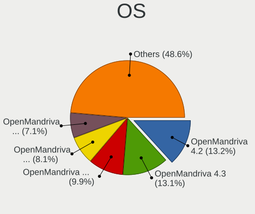

| Name                | Computers | Percent |
|---------------------|-----------|---------|
| OpenMandriva 4.2    | 4804      | 13.24%  |
| OpenMandriva 4.3    | 4747      | 13.08%  |
| OpenMandriva 24.12  | 3597      | 9.91%   |
| OpenMandriva 25.90  | 2926      | 8.06%   |
| OpenMandriva 23.08  | 2575      | 7.1%    |
| OpenMandriva 6.0    | 2141      | 5.9%    |
| OpenMandriva 23.01  | 2051      | 5.65%   |
| OpenMandriva 23.03  | 2049      | 5.65%   |
| OpenMandriva 25.06  | 1996      | 5.5%    |
| OpenMandriva 5.0    | 1978      | 5.45%   |
| OpenMandriva 24.07  | 1352      | 3.73%   |
| OpenMandriva 25.01  | 994       | 2.74%   |
| OpenMandriva 4.50   | 879       | 2.42%   |
| OpenMandriva 25.04  | 808       | 2.23%   |
| OpenMandriva 25.03  | 741       | 2.04%   |
| OpenMandriva 4.90   | 354       | 0.98%   |
| OpenMandriva 25.11  | 336       | 0.93%   |
| OpenMandriva 23.11  | 234       | 0.64%   |
| OpenMandriva 23.09  | 210       | 0.58%   |
| OpenMandriva 25.02  | 193       | 0.53%   |
| OpenMandriva 24.01  | 178       | 0.49%   |
| OpenMandriva 24.09  | 150       | 0.41%   |
| OpenMandriva 24.08  | 143       | 0.39%   |
| OpenMandriva 23.90  | 137       | 0.38%   |
| OpenMandriva 23.07  | 132       | 0.36%   |
| OpenMandriva 23.10  | 129       | 0.36%   |
| OpenMandriva 24.90  | 124       | 0.34%   |
| OpenMandriva 23.06  | 123       | 0.34%   |
| OpenMandriva 22.12  | 84        | 0.23%   |
| OpenMandriva 24.06  | 35        | 0.1%    |
| OpenMandriva 24.03  | 27        | 0.07%   |
| OpenMandriva 24.04  | 15        | 0.04%   |
| OpenMandriva 4.1    | 14        | 0.04%   |
| OpenMandriva 22.11  | 8         | 0.02%   |
| OpenMandriva 24.11  | 7         | 0.02%   |
| OpenMandriva 22.90  | 6         | 0.02%   |
| OpenMandriva 2014.0 | 4         | 0.01%   |
| OpenMandriva 3.0    | 3         | 0.01%   |
| OpenMandriva 24.05  | 3         | 0.01%   |
| OpenMandriva 4.0    | 2         | 0.01%   |

OS Family
---------

OS without a version

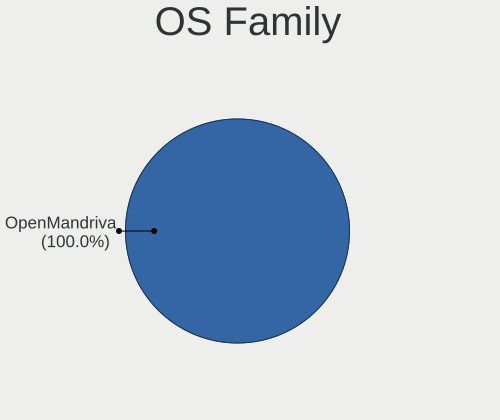

| Name         | Computers | Percent |
|--------------|-----------|---------|
| OpenMandriva | 32770     | 100%    |

Kernel
------

Version of the Linux kernel

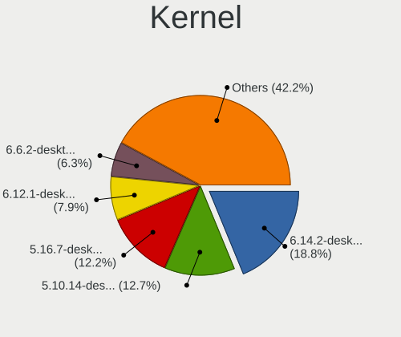

| Version                       | Computers | Percent |
|-------------------------------|-----------|---------|
| 6.14.2-desktop-3omv2590       | 6833      | 18.79%  |
| 5.10.14-desktop-1omv4002      | 4631      | 12.73%  |
| 5.16.7-desktop-1omv4003       | 4436      | 12.2%   |
| 6.12.1-desktop-1omv2490       | 2863      | 7.87%   |
| 6.6.2-desktop-1omv2390        | 2277      | 6.26%   |
| 6.4.11-desktop-1omv2390       | 2059      | 5.66%   |
| 6.2.6-desktop-1omv2390        | 1985      | 5.46%   |
| 6.1.1-desktop-1omv2290        | 1881      | 5.17%   |
| 6.12.9-desktop-1omv2490       | 1064      | 2.93%   |
| 6.10.0-desktop-1omv2490       | 1037      | 2.85%   |
| 6.12.6-desktop-1omv2490       | 635       | 1.75%   |
| 6.4.8-desktop-2omv2390        | 584       | 1.61%   |
| 6.15.0-desktop-0.rc2.3omv2590 | 474       | 1.3%    |
| 5.12.4-desktop-1omv4050       | 374       | 1.03%   |
| 5.16.13-desktop-1omv4003      | 365       | 1%      |
| 5.18.12-desktop-3omv4090      | 305       | 0.84%   |
| 6.9.7-desktop-1omv2490        | 286       | 0.79%   |
| 6.3.5-desktop-3omv2390        | 237       | 0.65%   |
| 6.13.5-desktop-1omv2590       | 230       | 0.63%   |
| 5.11.12-desktop-1omv4002      | 221       | 0.61%   |
| 6.10.1-desktop-1omv2490       | 200       | 0.55%   |
| 6.17.7-desktop-1omv2590       | 186       | 0.51%   |
| 5.19.5-desktop-1omv4090       | 170       | 0.47%   |
| 6.13.4-desktop-2omv2590       | 157       | 0.43%   |
| 6.5.5-desktop-1omv2390        | 147       | 0.4%    |
| 6.1.4-desktop-1omv2301        | 147       | 0.4%    |
| 6.14.0-desktop-0.rc4.2omv2590 | 141       | 0.39%   |
| 6.13.9-desktop-3omv2590       | 140       | 0.38%   |
| 6.11.0-desktop-2omv2490       | 137       | 0.38%   |
| 5.19.12-desktop-2omv4090      | 127       | 0.35%   |
| 6.13.7-desktop-1omv2590       | 113       | 0.31%   |
| 6.18.0-desktop-1omv2590       | 110       | 0.3%    |
| 5.14.7-desktop-1omv4050       | 107       | 0.29%   |
| 6.14.2-desktop-2omv2590       | 89        | 0.24%   |
| 6.0.10-desktop-2omv22090      | 84        | 0.23%   |
| 6.14.0-desktop-0.rc6.2omv2590 | 79        | 0.22%   |
| 6.5.0-desktop-1omv2390        | 76        | 0.21%   |
| 6.5.3-desktop-1omv2390        | 67        | 0.18%   |
| 6.14.0-desktop-3omv2590       | 61        | 0.17%   |
| 6.2.2-desktop-1omv2390        | 47        | 0.13%   |

Kernel Family
-------------

Linux kernel without a distro release

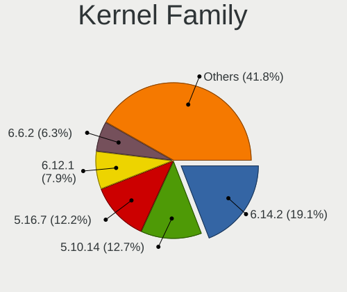

| Version | Computers | Percent |
|---------|-----------|---------|
| 6.14.2  | 6948      | 19.11%  |
| 5.10.14 | 4631      | 12.74%  |
| 5.16.7  | 4438      | 12.21%  |
| 6.12.1  | 2863      | 7.87%   |
| 6.6.2   | 2279      | 6.27%   |
| 6.4.11  | 2059      | 5.66%   |
| 6.2.6   | 1985      | 5.46%   |
| 6.1.1   | 1881      | 5.17%   |
| 6.12.9  | 1066      | 2.93%   |
| 6.10.0  | 1040      | 2.86%   |
| 6.12.6  | 637       | 1.75%   |
| 6.4.8   | 584       | 1.61%   |
| 6.15.0  | 504       | 1.39%   |
| 6.14.0  | 379       | 1.04%   |
| 5.12.4  | 374       | 1.03%   |
| 5.16.13 | 368       | 1.01%   |
| 5.18.12 | 305       | 0.84%   |
| 6.9.7   | 286       | 0.79%   |
| 6.13.5  | 246       | 0.68%   |
| 6.3.5   | 237       | 0.65%   |
| 5.11.12 | 221       | 0.61%   |
| 6.10.1  | 200       | 0.55%   |
| 6.17.7  | 187       | 0.51%   |
| 5.19.5  | 170       | 0.47%   |
| 6.13.4  | 163       | 0.45%   |
| 6.1.4   | 150       | 0.41%   |
| 6.5.5   | 148       | 0.41%   |
| 6.13.9  | 141       | 0.39%   |
| 6.11.0  | 139       | 0.38%   |
| 5.19.12 | 128       | 0.35%   |
| 6.18.0  | 122       | 0.34%   |
| 6.13.7  | 116       | 0.32%   |
| 5.14.7  | 107       | 0.29%   |
| 6.0.10  | 86        | 0.24%   |
| 6.5.0   | 79        | 0.22%   |
| 6.5.3   | 67        | 0.18%   |
| 6.13.3  | 54        | 0.15%   |
| 6.2.2   | 47        | 0.13%   |
| 6.13.0  | 47        | 0.13%   |
| 6.5.1   | 35        | 0.1%    |

Kernel Major Ver.
-----------------

Linux kernel major version

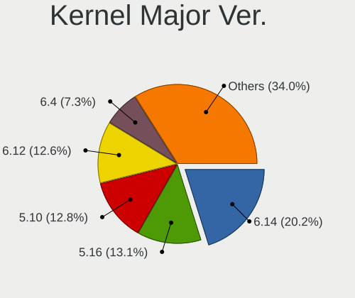

| Version | Computers | Percent |
|---------|-----------|---------|
| 6.14    | 7308      | 20.18%  |
| 5.16    | 4741      | 13.09%  |
| 5.10    | 4642      | 12.82%  |
| 6.12    | 4562      | 12.6%   |
| 6.4     | 2657      | 7.34%   |
| 6.6     | 2352      | 6.49%   |
| 6.2     | 2077      | 5.73%   |
| 6.1     | 2060      | 5.69%   |
| 6.10    | 1269      | 3.5%    |
| 6.13    | 787       | 2.17%   |
| 6.15    | 554       | 1.53%   |
| 5.12    | 404       | 1.12%   |
| 6.5     | 358       | 0.99%   |
| 5.19    | 332       | 0.92%   |
| 6.9     | 331       | 0.91%   |
| 5.18    | 318       | 0.88%   |
| 6.3     | 248       | 0.68%   |
| 5.11    | 241       | 0.67%   |
| 6.17    | 235       | 0.65%   |
| 6.11    | 163       | 0.45%   |
| 5.14    | 136       | 0.38%   |
| 6.18    | 131       | 0.36%   |
| 6.0     | 125       | 0.35%   |
| 6.8     | 56        | 0.15%   |
| 6.16    | 33        | 0.09%   |
| 6.7     | 29        | 0.08%   |
| 5.17    | 27        | 0.07%   |
| 5.5     | 14        | 0.04%   |
| 5.15    | 7         | 0.02%   |
| 5.13    | 5         | 0.01%   |
| 4.1     | 4         | 0.01%   |
| 5.9     | 2         | 0.01%   |
| 5.8     | 2         | 0.01%   |
| 5.1     | 2         | 0.01%   |
| 4.19    | 2         | 0.01%   |
| Unknown | 2         | 0.01%   |
| 5.3     | 1         | 0.003%  |
| 4.9     | 1         | 0.003%  |

Arch
----

OS architecture (x86_64, i586, etc.)

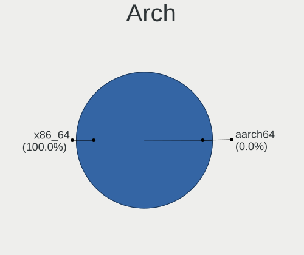

| Name    | Computers | Percent |
|---------|-----------|---------|
| x86_64  | 32767     | 99.99%  |
| Unknown | 2         | 0.01%   |
| aarch64 | 1         | 0.003%  |

DE
--

Desktop Environment

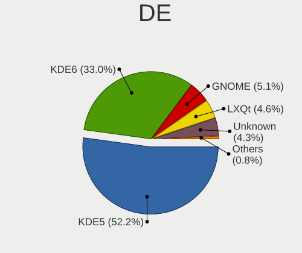

| Name            | Computers | Percent |
|-----------------|-----------|---------|
| KDE5            | 17823     | 52.17%  |
| KDE6            | 11285     | 33.03%  |
| GNOME           | 1735      | 5.08%   |
| LXQt            | 1569      | 4.59%   |
| Unknown         | 1483      | 4.34%   |
| XFCE            | 91        | 0.27%   |
| Cinnamon        | 75        | 0.22%   |
| Budgie          | 59        | 0.17%   |
| MATE            | 25        | 0.07%   |
| i3              | 7         | 0.02%   |
| GNOME Flashback | 5         | 0.01%   |
| LXDE            | 3         | 0.01%   |
| KDE4            | 2         | 0.01%   |
| KDE             | 2         | 0.01%   |
| DWM             | 1         | 0.003%  |

Display Server
--------------

X11 or Wayland

| Name    | Computers | Percent |
|---------|-----------|---------|
| X11     | 23787     | 69.46%  |
| Wayland | 10417     | 30.42%  |
| Unknown | 39        | 0.11%   |
| Tty     | 1         | 0.003%  |

Display Manager
---------------

SDDM, LightDM, etc.

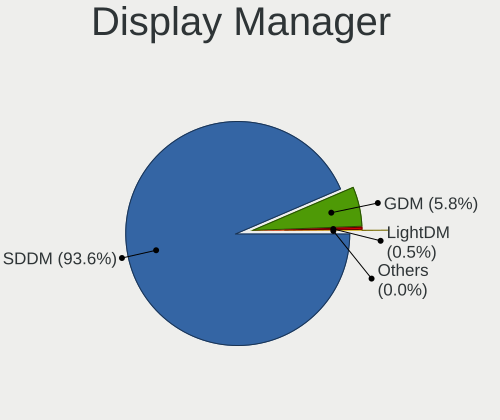

| Name    | Computers | Percent |
|---------|-----------|---------|
| SDDM    | 30993     | 93.56%  |
| GDM     | 1932      | 5.83%   |
| LightDM | 152       | 0.46%   |
| Unknown | 38        | 0.11%   |
| GREETD  | 8         | 0.02%   |
| KDM     | 2         | 0.01%   |
| TDM     | 1         | 0.003%  |
| Ly      | 1         | 0.003%  |

OS Lang
-------

Language

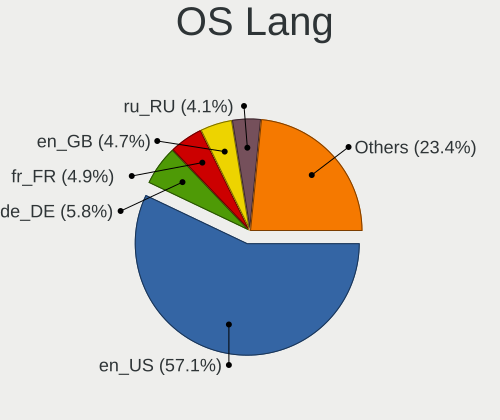

| Lang  | Computers | Percent |
|-------|-----------|---------|
| en_US | 19236     | 57.07%  |
| de_DE | 1956      | 5.8%    |
| fr_FR | 1647      | 4.89%   |
| en_GB | 1572      | 4.66%   |
| ru_RU | 1397      | 4.14%   |
| pl_PL | 1252      | 3.71%   |
| pt_BR | 1077      | 3.2%    |
| it_IT | 789       | 2.34%   |
| es_ES | 611       | 1.81%   |
| en_CA | 433       | 1.28%   |
| cs_CZ | 397       | 1.18%   |
| es_MX | 357       | 1.06%   |
| en_AU | 313       | 0.93%   |
| es_AR | 226       | 0.67%   |
| hu_HU | 199       | 0.59%   |
| en_IN | 163       | 0.48%   |
| de_AT | 159       | 0.47%   |
| nl_NL | 139       | 0.41%   |
| tr_TR | 115       | 0.34%   |
| fr_CA | 101       | 0.3%    |
| pt_PT | 89        | 0.26%   |
| de_CH | 89        | 0.26%   |
| es_CO | 88        | 0.26%   |
| fr_BE | 74        | 0.22%   |
| nl_BE | 70        | 0.21%   |
| es_VE | 69        | 0.2%    |
| es_CL | 68        | 0.2%    |
| en_NZ | 67        | 0.2%    |
| da_DK | 62        | 0.18%   |
| en_ZA | 56        | 0.17%   |
| ro_RO | 48        | 0.14%   |
| ru_UA | 44        | 0.13%   |
| nb_NO | 43        | 0.13%   |
| fr_CH | 41        | 0.12%   |
| es_PE | 41        | 0.12%   |
| en_SG | 40        | 0.12%   |
| en_PH | 36        | 0.11%   |
| en_DK | 35        | 0.1%    |
| sv_SE | 34        | 0.1%    |
| ja_JP | 33        | 0.1%    |

Boot Mode
---------

EFI or BIOS

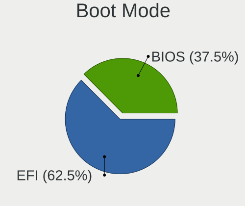

| Mode | Computers | Percent |
|------|-----------|---------|
| EFI  | 20720     | 62.55%  |
| BIOS | 12407     | 37.45%  |

Filesystem
----------

Type of filesystem

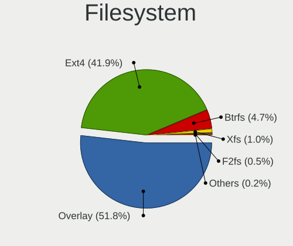

| Type     | Computers | Percent |
|----------|-----------|---------|
| Overlay  | 17823     | 51.79%  |
| Ext4     | 14406     | 41.86%  |
| Btrfs    | 1626      | 4.72%   |
| Xfs      | 334       | 0.97%   |
| F2fs     | 157       | 0.46%   |
| Ext3     | 21        | 0.06%   |
| Ext2     | 13        | 0.04%   |
| Reiserfs | 10        | 0.03%   |
| Jfs      | 10        | 0.03%   |
| Unknown  | 9         | 0.03%   |
| Bcachefs | 2         | 0.01%   |
| Udf      | 1         | 0.003%  |
| Tmpfs    | 1         | 0.003%  |
| Aufs     | 1         | 0.003%  |

Part. scheme
------------

Scheme of partitioning

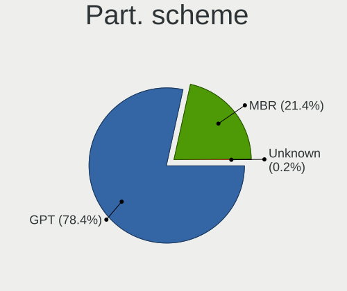

| Type    | Computers | Percent |
|---------|-----------|---------|
| GPT     | 26087     | 78.43%  |
| MBR     | 7126      | 21.42%  |
| Unknown | 50        | 0.15%   |

Dual Boot with Linux/BSD
------------------------

Hosting more than one Linux/BSD

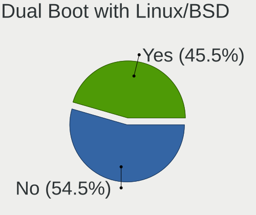

| Dual boot | Computers | Percent |
|-----------|-----------|---------|
| No        | 18409     | 54.46%  |
| Yes       | 15391     | 45.54%  |

Dual Boot (Win)
---------------

Hosting Linux and Windows

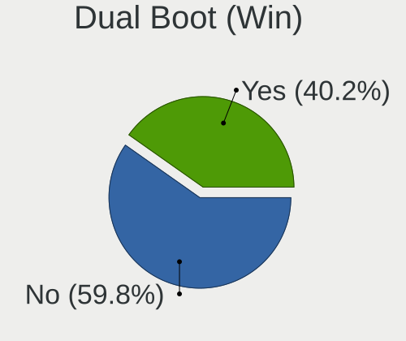

| Dual boot | Computers | Percent |
|-----------|-----------|---------|
| No        | 19907     | 59.77%  |
| Yes       | 13397     | 40.23%  |

Board
-----

Vendor
------

Motherboard manufacturer

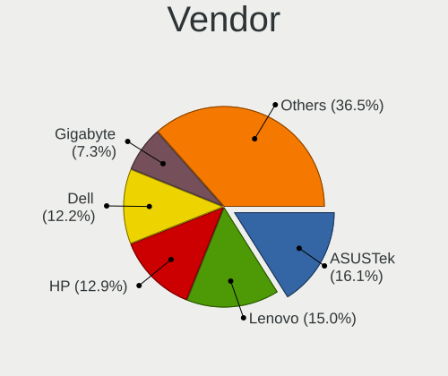

| Name                                 | Computers | Percent |
|--------------------------------------|-----------|---------|
| ASUSTek Computer                     | 5262      | 16.06%  |
| Lenovo                               | 4920      | 15.01%  |
| Hewlett-Packard                      | 4233      | 12.92%  |
| Dell                                 | 3982      | 12.15%  |
| Gigabyte Technology                  | 2403      | 7.33%   |
| MSI                                  | 1928      | 5.88%   |
| Acer                                 | 1831      | 5.59%   |
| ASRock                               | 1278      | 3.9%    |
| Intel                                | 624       | 1.9%    |
| Toshiba                              | 595       | 1.82%   |
| Apple                                | 537       | 1.64%   |
| Fujitsu                              | 375       | 1.14%   |
| Samsung Electronics                  | 313       | 0.96%   |
| Unknown                              | 311       | 0.95%   |
| Sony                                 | 253       | 0.77%   |
| Medion                               | 196       | 0.6%    |
| AZW                                  | 196       | 0.6%    |
| Google                               | 183       | 0.56%   |
| Framework                            | 163       | 0.5%    |
| Biostar                              | 154       | 0.47%   |
| Microsoft                            | 144       | 0.44%   |
| Positivo                             | 140       | 0.43%   |
| Foxconn                              | 137       | 0.42%   |
| Pegatron                             | 131       | 0.4%    |
| Packard Bell                         | 121       | 0.37%   |
| ECS                                  | 97        | 0.3%    |
| HUAWEI                               | 93        | 0.28%   |
| Shenzhen Meigao Electronic Equipment | 77        | 0.23%   |
| Alienware                            | 69        | 0.21%   |
| Notebook                             | 67        | 0.2%    |
| Chuwi                                | 64        | 0.2%    |
| LG Electronics                       | 63        | 0.19%   |
| Core Innovations                     | 60        | 0.18%   |
| Fujitsu Siemens                      | 57        | 0.17%   |
| System76                             | 56        | 0.17%   |
| eMachines                            | 56        | 0.17%   |
| TUXEDO                               | 54        | 0.16%   |
| BESSTAR Tech                         | 48        | 0.15%   |
| Gateway                              | 47        | 0.14%   |
| Supermicro                           | 40        | 0.12%   |

Model
-----

Motherboard model

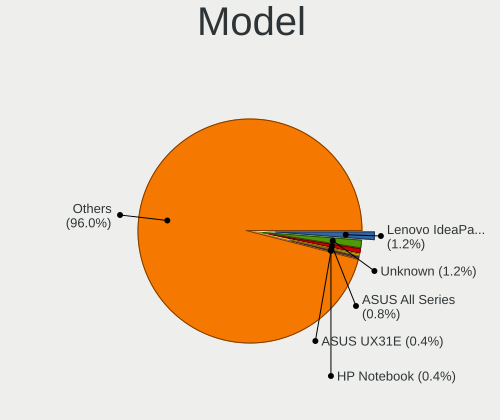

| Name                                        | Computers | Percent |
|---------------------------------------------|-----------|---------|
| Lenovo IdeaPad 1 14IGL7 82V6                | 405       | 1.24%   |
| Unknown                                     | 405       | 1.24%   |
| ASUS All Series                             | 253       | 0.77%   |
| ASUS UX31E                                  | 129       | 0.39%   |
| HP Notebook                                 | 124       | 0.38%   |
| Dell OptiPlex 7010                          | 113       | 0.34%   |
| AZW SER                                     | 78        | 0.24%   |
| MSI MS-7C56                                 | 70        | 0.21%   |
| Dell OptiPlex 9020                          | 67        | 0.2%    |
| Intel H61                                   | 65        | 0.2%    |
| ASUS PRIME A320M-K                          | 64        | 0.2%    |
| Core Innovations CLC14364                   | 60        | 0.18%   |
| MSI MS-7C91                                 | 59        | 0.18%   |
| ASUS TUF Gaming X570-PLUS                   | 59        | 0.18%   |
| ASUS ROG STRIX B550-F GAMING                | 57        | 0.17%   |
| Dell OptiPlex 780                           | 55        | 0.17%   |
| HP Pavilion g6                              | 54        | 0.16%   |
| Dell OptiPlex 3020                          | 54        | 0.16%   |
| Dell Latitude E6430                         | 54        | 0.16%   |
| Framework Laptop 13 (AMD Ryzen 7040Series)  | 50        | 0.15%   |
| Dell Latitude 3120                          | 48        | 0.15%   |
| Dell Latitude E6410                         | 47        | 0.14%   |
| MSI MS-7C02                                 | 46        | 0.14%   |
| MSI MS-7817                                 | 46        | 0.14%   |
| MSI MS-7B86                                 | 45        | 0.14%   |
| HP Pavilion dv6                             | 45        | 0.14%   |
| MSI MS-7C37                                 | 44        | 0.13%   |
| HP EliteDesk 800 G1 SFF                     | 42        | 0.13%   |
| Dell OptiPlex 790                           | 42        | 0.13%   |
| HP Pavilion Notebook                        | 40        | 0.12%   |
| ASUS PRIME B450M-A II                       | 40        | 0.12%   |
| Dell Latitude 3190 2-in-1                   | 39        | 0.12%   |
| Dell Latitude E6420                         | 38        | 0.12%   |
| HP Pavilion 15                              | 37        | 0.11%   |
| Gigabyte B450M DS3H                         | 37        | 0.11%   |
| Framework Laptop 16 (AMD Ryzen 7040 Series) | 37        | 0.11%   |
| Dell Latitude 7490                          | 37        | 0.11%   |
| ASUS PRIME B450M-A                          | 37        | 0.11%   |
| MSI MS-7A38                                 | 35        | 0.11%   |
| HP Compaq Pro 6300 SFF                      | 35        | 0.11%   |

Model Family
------------

Motherboard model prefix

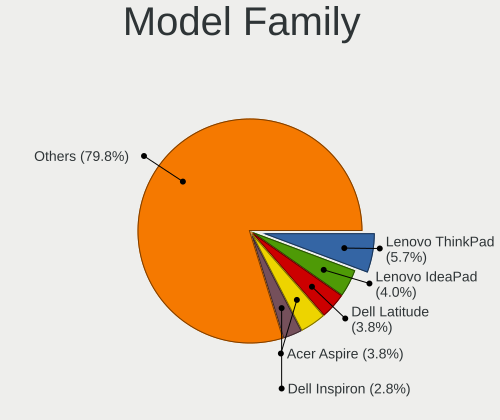

| Name               | Computers | Percent |
|--------------------|-----------|---------|
| Lenovo ThinkPad    | 1869      | 5.7%    |
| Lenovo IdeaPad     | 1322      | 4.03%   |
| Dell Latitude      | 1258      | 3.84%   |
| Acer Aspire        | 1255      | 3.83%   |
| Dell Inspiron      | 915       | 2.79%   |
| Dell OptiPlex      | 885       | 2.7%    |
| ASUS PRIME         | 696       | 2.12%   |
| HP Pavilion        | 634       | 1.93%   |
| HP Laptop          | 527       | 1.61%   |
| ASUS ROG           | 507       | 1.55%   |
| HP Compaq          | 506       | 1.54%   |
| ASUS VivoBook      | 482       | 1.47%   |
| Lenovo ThinkCentre | 474       | 1.45%   |
| Toshiba Satellite  | 466       | 1.42%   |
| HP EliteBook       | 426       | 1.3%    |
| Unknown            | 405       | 1.24%   |
| ASUS TUF           | 341       | 1.04%   |
| HP ProBook         | 326       | 0.99%   |
| Dell Precision     | 304       | 0.93%   |
| HP EliteDesk       | 262       | 0.8%    |
| ASUS All           | 253       | 0.77%   |
| Dell XPS           | 237       | 0.72%   |
| Dell Vostro        | 168       | 0.51%   |
| Framework Laptop   | 162       | 0.49%   |
| Lenovo Yoga        | 148       | 0.45%   |
| HP ProDesk         | 148       | 0.45%   |
| Fujitsu LIFEBOOK   | 148       | 0.45%   |
| Fujitsu ESPRIMO    | 148       | 0.45%   |
| Microsoft Surface  | 144       | 0.44%   |
| HP ENVY            | 134       | 0.41%   |
| ASUS UX31E         | 129       | 0.39%   |
| Lenovo Legion      | 128       | 0.39%   |
| HP Notebook        | 124       | 0.38%   |
| ASUS ASUS          | 124       | 0.38%   |
| Acer Nitro         | 112       | 0.34%   |
| ASUS M5A78L-M      | 109       | 0.33%   |
| Lenovo IdeaCentre  | 106       | 0.32%   |
| Gigabyte B450M     | 105       | 0.32%   |
| Gigabyte B550      | 91        | 0.28%   |
| Acer Veriton       | 88        | 0.27%   |

MFG Year
--------

Motherboard manufacture year

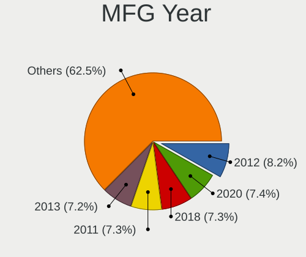

| Year    | Computers | Percent |
|---------|-----------|---------|
| 2012    | 2684      | 8.19%   |
| 2020    | 2433      | 7.42%   |
| 2018    | 2399      | 7.32%   |
| 2011    | 2394      | 7.31%   |
| 2013    | 2368      | 7.23%   |
| 2019    | 2209      | 6.74%   |
| 2021    | 2192      | 6.69%   |
| 2014    | 1941      | 5.92%   |
| 2022    | 1859      | 5.67%   |
| 2017    | 1848      | 5.64%   |
| 2010    | 1571      | 4.79%   |
| 2015    | 1567      | 4.78%   |
| 2016    | 1519      | 4.64%   |
| 2009    | 1327      | 4.05%   |
| 2023    | 1207      | 3.68%   |
| 2008    | 1202      | 3.67%   |
| 2024    | 798       | 2.44%   |
| 2007    | 707       | 2.16%   |
| 2006    | 275       | 0.84%   |
| 2025    | 198       | 0.6%    |
| 2005    | 46        | 0.14%   |
| 2004    | 14        | 0.04%   |
| Unknown | 10        | 0.03%   |
| 2003    | 1         | 0.003%  |
| 2000    | 1         | 0.003%  |

Form Factor
-----------

Physical design of the computer

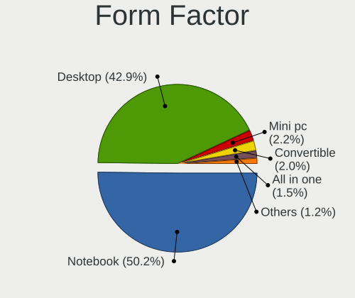

| Name           | Computers | Percent |
|----------------|-----------|---------|
| Notebook       | 16447     | 50.19%  |
| Desktop        | 14047     | 42.87%  |
| Mini pc        | 727       | 2.22%   |
| Convertible    | 666       | 2.03%   |
| All in one     | 491       | 1.5%    |
| Tablet         | 285       | 0.87%   |
| Server         | 96        | 0.29%   |
| Other          | 7         | 0.02%   |
| Stick pc       | 3         | 0.01%   |
| System on chip | 1         | 0.003%  |

Secure Boot
-----------

Enabled or disabled

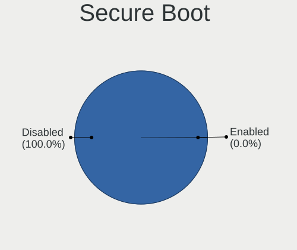

| State    | Computers | Percent |
|----------|-----------|---------|
| Disabled | 32769     | 100%    |
| Enabled  | 1         | 0.003%  |

Coreboot
--------

Have coreboot on board

| Used | Computers | Percent |
|------|-----------|---------|
| No   | 32519     | 99.23%  |
| Yes  | 252       | 0.77%   |

RAM Size
--------

Total RAM memory

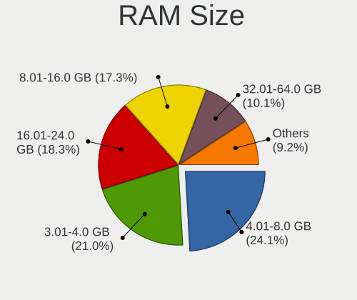

| Size in GB      | Computers | Percent |
|-----------------|-----------|---------|
| 4.01-8.0        | 8018      | 24.09%  |
| 3.01-4.0        | 6991      | 21.01%  |
| 16.01-24.0      | 6086      | 18.29%  |
| 8.01-16.0       | 5742      | 17.25%  |
| 32.01-64.0      | 3375      | 10.14%  |
| 64.01-256.0     | 892       | 2.68%   |
| 24.01-32.0      | 851       | 2.56%   |
| 1.01-2.0        | 833       | 2.5%    |
| 2.01-3.0        | 413       | 1.24%   |
| 0.51-1.0        | 52        | 0.16%   |
| More than 256.0 | 25        | 0.08%   |
| Unknown         | 2         | 0.01%   |
| 0.01-0.5        | 1         | 0.003%  |

RAM Used
--------

Used RAM memory

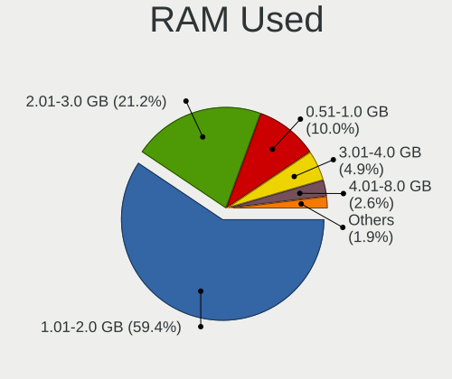

| Used GB     | Computers | Percent |
|-------------|-----------|---------|
| 1.01-2.0    | 20716     | 59.41%  |
| 2.01-3.0    | 7383      | 21.17%  |
| 0.51-1.0    | 3483      | 9.99%   |
| 3.01-4.0    | 1704      | 4.89%   |
| 4.01-8.0    | 912       | 2.62%   |
| 0.01-0.5    | 510       | 1.46%   |
| 8.01-16.0   | 121       | 0.35%   |
| 16.01-24.0  | 18        | 0.05%   |
| 32.01-64.0  | 10        | 0.03%   |
| 24.01-32.0  | 7         | 0.02%   |
| Unknown     | 2         | 0.01%   |
| 64.01-256.0 | 1         | 0.003%  |

Total Drives
------------

Number of drives on board

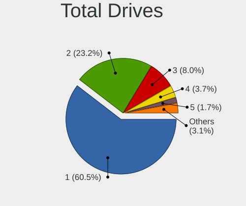

| Drives | Computers | Percent |
|--------|-----------|---------|
| 1      | 20330     | 60.46%  |
| 2      | 7790      | 23.17%  |
| 3      | 2697      | 8.02%   |
| 4      | 1229      | 3.65%   |
| 5      | 556       | 1.65%   |
| 0      | 509       | 1.51%   |
| 6      | 262       | 0.78%   |
| 7      | 110       | 0.33%   |
| 8      | 66        | 0.2%    |
| 9      | 24        | 0.07%   |
| 10     | 16        | 0.05%   |
| 11     | 12        | 0.04%   |
| 12     | 9         | 0.03%   |
| 13     | 8         | 0.02%   |
| 15     | 3         | 0.01%   |
| 18     | 2         | 0.01%   |
| 14     | 2         | 0.01%   |
| 25     | 1         | 0.003%  |
| 17     | 1         | 0.003%  |
| 16     | 1         | 0.003%  |

Has CD-ROM
----------

Has CD-ROM on board

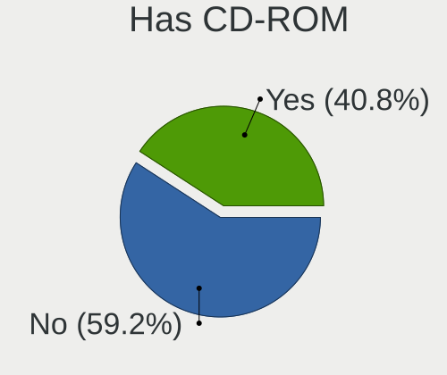

| Presented | Computers | Percent |
|-----------|-----------|---------|
| No        | 19545     | 59.18%  |
| Yes       | 13481     | 40.82%  |

Has Ethernet
------------

Has Ethernet on board

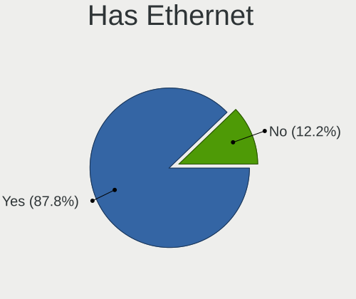

| Presented | Computers | Percent |
|-----------|-----------|---------|
| Yes       | 28795     | 87.82%  |
| No        | 3994      | 12.18%  |

Has WiFi
--------

Has WiFi module

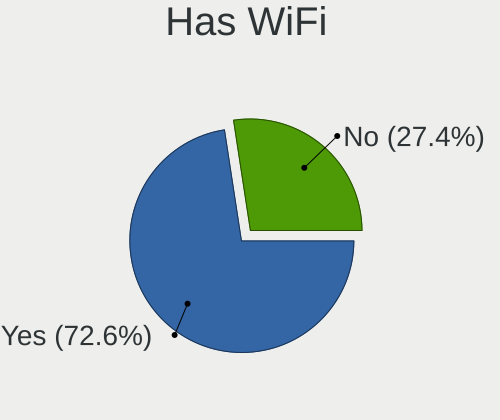

| Presented | Computers | Percent |
|-----------|-----------|---------|
| Yes       | 23928     | 72.58%  |
| No        | 9038      | 27.42%  |

Has Bluetooth
-------------

Has Bluetooth module

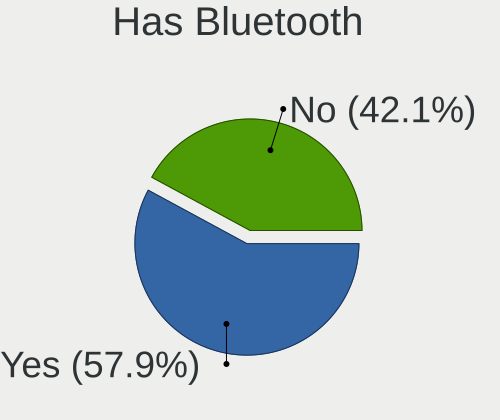

| Presented | Computers | Percent |
|-----------|-----------|---------|
| Yes       | 19114     | 57.9%   |
| No        | 13898     | 42.1%   |

Location
--------

Country
-------

Geographic location (country)

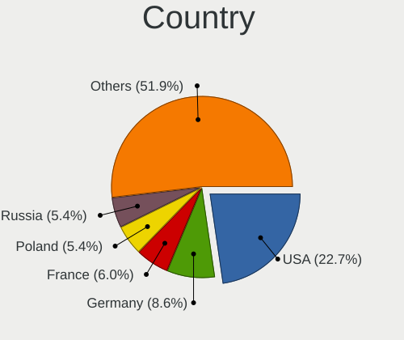

| Country      | Computers | Percent |
|--------------|-----------|---------|
| USA          | 7458      | 22.7%   |
| Germany      | 2827      | 8.6%    |
| France       | 1973      | 6%      |
| Poland       | 1779      | 5.41%   |
| Russia       | 1778      | 5.41%   |
| Brazil       | 1763      | 5.37%   |
| UK           | 1243      | 3.78%   |
| Italy        | 1217      | 3.7%    |
| Canada       | 1007      | 3.06%   |
| Spain        | 865       | 2.63%   |
| Australia    | 674       | 2.05%   |
| Netherlands  | 571       | 1.74%   |
| Mexico       | 507       | 1.54%   |
| Czechia      | 496       | 1.51%   |
| India        | 421       | 1.28%   |
| Japan        | 398       | 1.21%   |
| Hungary      | 332       | 1.01%   |
| Finland      | 319       | 0.97%   |
| Sweden       | 311       | 0.95%   |
| Argentina    | 305       | 0.93%   |
| Indonesia    | 298       | 0.91%   |
| Romania      | 283       | 0.86%   |
| Austria      | 267       | 0.81%   |
| Belgium      | 265       | 0.81%   |
| Switzerland  | 242       | 0.74%   |
| Portugal     | 228       | 0.69%   |
| Turkey       | 226       | 0.69%   |
| Greece       | 215       | 0.65%   |
| Ukraine      | 196       | 0.6%    |
| Norway       | 173       | 0.53%   |
| Colombia     | 171       | 0.52%   |
| Bulgaria     | 167       | 0.51%   |
| Slovakia     | 159       | 0.48%   |
| China        | 147       | 0.45%   |
| Serbia       | 146       | 0.44%   |
| New Zealand  | 139       | 0.42%   |
| Chile        | 138       | 0.42%   |
| South Africa | 132       | 0.4%    |
| Venezuela    | 129       | 0.39%   |
| Denmark      | 128       | 0.39%   |

City
----

Geographic location (city)

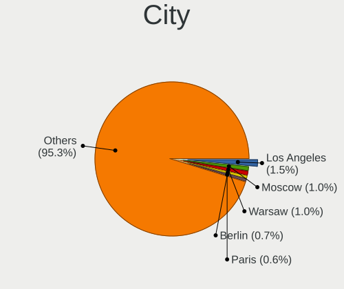

| City           | Computers | Percent |
|----------------|-----------|---------|
| Los Angeles    | 525       | 1.52%   |
| Moscow         | 335       | 0.97%   |
| Warsaw         | 331       | 0.96%   |
| Berlin         | 231       | 0.67%   |
| Paris          | 215       | 0.62%   |
| Prague         | 212       | 0.61%   |
| Sydney         | 197       | 0.57%   |
| Milan          | 191       | 0.55%   |
| Sao Paulo      | 175       | 0.51%   |
| Melbourne      | 161       | 0.47%   |
| Vienna         | 151       | 0.44%   |
| St Petersburg  | 150       | 0.43%   |
| Munich         | 139       | 0.4%    |
| Schagen        | 137       | 0.4%    |
| Rome           | 133       | 0.38%   |
| Helsinki       | 129       | 0.37%   |
| Krakow         | 128       | 0.37%   |
| Rio de Janeiro | 118       | 0.34%   |
| Madrid         | 112       | 0.32%   |
| Budapest       | 108       | 0.31%   |
| Hamburg        | 107       | 0.31%   |
| Brisbane       | 103       | 0.3%    |
| Athens         | 93        | 0.27%   |
| Mexico City    | 88        | 0.25%   |
| Seattle        | 87        | 0.25%   |
| Denver         | 87        | 0.25%   |
| Istanbul       | 84        | 0.24%   |
| Chicago        | 84        | 0.24%   |
| Wroclaw        | 81        | 0.23%   |
| Montreal       | 79        | 0.23%   |
| Bengaluru      | 79        | 0.23%   |
| Barcelona      | 78        | 0.23%   |
| Poznan         | 77        | 0.22%   |
| Toronto        | 75        | 0.22%   |
| Portland       | 66        | 0.19%   |
| Novosibirsk    | 66        | 0.19%   |
| London         | 66        | 0.19%   |
| Belgrade       | 66        | 0.19%   |
| Stockholm      | 65        | 0.19%   |
| Buenos Aires   | 65        | 0.19%   |

Drives
------

Drive Vendor
------------

Hard drive vendors

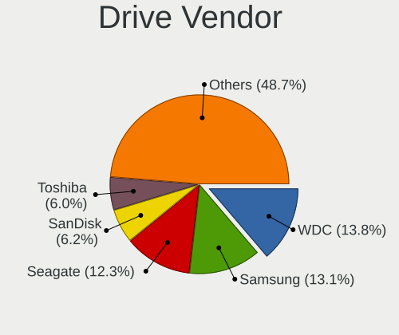

| Vendor                      | Computers | Drives | Percent |
|-----------------------------|-----------|--------|---------|
| WDC                         | 6639      | 8979   | 13.76%  |
| Samsung Electronics         | 6306      | 8629   | 13.07%  |
| Seagate                     | 5940      | 7904   | 12.31%  |
| SanDisk                     | 2991      | 3549   | 6.2%    |
| Toshiba                     | 2874      | 3380   | 5.96%   |
| Kingston                    | 2678      | 3253   | 5.55%   |
| Crucial                     | 1925      | 2370   | 3.99%   |
| Unknown                     | 1888      | 2236   | 3.91%   |
| Hitachi                     | 1371      | 1576   | 2.84%   |
| SK hynix                    | 978       | 1117   | 2.03%   |
| Intel                       | 863       | 1014   | 1.79%   |
| A-DATA Technology           | 826       | 947    | 1.71%   |
| Micron Technology           | 778       | 883    | 1.61%   |
| China                       | 751       | 871    | 1.56%   |
| HGST                        | 691       | 814    | 1.43%   |
| Micron/Crucial Technology   | 438       | 514    | 0.91%   |
| PNY                         | 437       | 532    | 0.91%   |
| SPCC                        | 435       | 519    | 0.9%    |
| Phison Electronics          | 417       | 500    | 0.86%   |
| Kingston Technology Company | 400       | 452    | 0.83%   |
| Patriot                     | 355       | 399    | 0.74%   |
| GOODRAM                     | 333       | 405    | 0.69%   |
| KIOXIA                      | 329       | 363    | 0.68%   |
| Unknown                     | 313       | 338    | 0.65%   |
| Intenso                     | 309       | 371    | 0.64%   |
| MAXIO Technology (Hangzhou) | 296       | 346    | 0.61%   |
| Silicon Motion              | 287       | 322    | 0.59%   |
| Apple                       | 254       | 298    | 0.53%   |
| Team                        | 212       | 249    | 0.44%   |
| JMicron Technology          | 197       | 211    | 0.41%   |
| Transcend                   | 191       | 215    | 0.4%    |
| Apacer                      | 186       | 216    | 0.39%   |
| Netac                       | 177       | 208    | 0.37%   |
| Maxtor                      | 177       | 225    | 0.37%   |
| ADATA Technology            | 174       | 201    | 0.36%   |
| LITEON                      | 163       | 177    | 0.34%   |
| KingSpec                    | 159       | 173    | 0.33%   |
| Phison                      | 156       | 201    | 0.32%   |
| Realtek Semiconductor       | 151       | 158    | 0.31%   |
| Lexar                       | 146       | 161    | 0.3%    |

Drive Model
-----------

Hard drive models

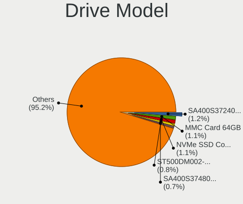

| Model                                                 | Computers | Percent |
|-------------------------------------------------------|-----------|---------|
| Kingston SA400S37240G 240GB SSD                       | 606       | 1.15%   |
| Unknown MMC Card  64GB                                | 591       | 1.12%   |
| Samsung NVMe SSD Controller SM981/PM981/PM983 1TB     | 589       | 1.12%   |
| Seagate ST500DM002-1BD142 500GB                       | 398       | 0.76%   |
| Kingston SA400S37480G 480GB SSD                       | 343       | 0.65%   |
| Samsung NVMe SSD Controller PM9A1/PM9A3/980PRO 1TB    | 340       | 0.65%   |
| Unknown                                               | 313       | 0.59%   |
| Seagate ST1000DM010-2EP102 1TB                        | 311       | 0.59%   |
| Crucial CT500MX500SSD1 500GB                          | 290       | 0.55%   |
| Samsung SSD 860 EVO 500GB                             | 269       | 0.51%   |
| Kingston SA400S37120G 120GB SSD                       | 269       | 0.51%   |
| Crucial CT240BX500SSD1 240GB                          | 256       | 0.49%   |
| Unknown SD/MMC/MS PRO 2GB                             | 254       | 0.48%   |
| Toshiba DT01ACA100 1TB                                | 250       | 0.47%   |
| Samsung SSD 850 EVO 250GB                             | 247       | 0.47%   |
| Seagate ST500LT012-1DG142 500GB                       | 242       | 0.46%   |
| Toshiba MQ01ABF050 500GB                              | 234       | 0.44%   |
| Seagate ST1000LM035-1RK172 1TB                        | 231       | 0.44%   |
| Crucial CT1000MX500SSD1 1TB                           | 231       | 0.44%   |
| Toshiba MQ01ABD100 1TB                                | 229       | 0.43%   |
| Seagate ST2000DM008-2FR102 2TB                        | 216       | 0.41%   |
| Seagate ST1000LM024 HN-M101MBB 1TB                    | 214       | 0.41%   |
| MAXIO (Hangzhou) NVMe SSD Controller MAP1202 2TB      | 210       | 0.4%    |
| WDC WD10EZEX-08WN4A0 1TB                              | 209       | 0.4%    |
| Micron/Crucial P2 NVMe PCIe SSD 2TB                   | 208       | 0.39%   |
| Kingston SV300S37A120G 120GB SSD                      | 205       | 0.39%   |
| Samsung SSD 850 EVO 500GB                             | 189       | 0.36%   |
| Samsung SSD 860 EVO 250GB                             | 184       | 0.35%   |
| Seagate ST9500325AS 500GB                             | 181       | 0.34%   |
| Toshiba MQ04ABF100 1TB                                | 167       | 0.32%   |
| Sandisk WD Blue SN550 NVMe SSD 1024GB                 | 165       | 0.31%   |
| WDC WDS240G2G0A-00JH30 240GB SSD                      | 163       | 0.31%   |
| Samsung SSD 860 EVO 1TB                               | 160       | 0.3%    |
| Samsung SSD 870 EVO 500GB                             | 158       | 0.3%    |
| Silicon Motion SM2263EN/SM2263XT SSD Controller 512GB | 157       | 0.3%    |
| Seagate ST3500418AS 500GB                             | 154       | 0.29%   |
| Toshiba DT01ACA050 500GB                              | 153       | 0.29%   |
| Samsung SSD 870 EVO 1TB                               | 147       | 0.28%   |
| HGST HTS721010A9E630 1TB                              | 147       | 0.28%   |
| Unknown MMC Card  32GB                                | 140       | 0.27%   |

HDD Vendor
----------

Hard disk drive vendors

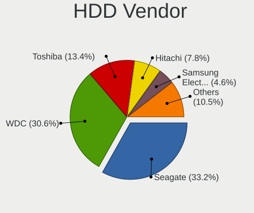

| Vendor              | Computers | Drives | Percent |
|---------------------|-----------|--------|---------|
| Seagate             | 5840      | 7729   | 33.16%  |
| WDC                 | 5388      | 7160   | 30.59%  |
| Toshiba             | 2354      | 2781   | 13.37%  |
| Hitachi             | 1368      | 1573   | 7.77%   |
| Samsung Electronics | 811       | 989    | 4.6%    |
| HGST                | 691       | 814    | 3.92%   |
| Unknown             | 265       | 294    | 1.5%    |
| Maxtor              | 170       | 216    | 0.97%   |
| Fujitsu             | 141       | 168    | 0.8%    |
| JMicron Technology  | 112       | 120    | 0.64%   |
| Apple               | 100       | 108    | 0.57%   |
| USB3.0              | 27        | 27     | 0.15%   |
| Intenso             | 24        | 26     | 0.14%   |
| Hewlett-Packard     | 24        | 46     | 0.14%   |
| TO Exter            | 23        | 24     | 0.13%   |
| External            | 21        | 21     | 0.12%   |
| ASMT                | 19        | 30     | 0.11%   |
| WD MediaMax         | 16        | 24     | 0.09%   |
| USB                 | 15        | 16     | 0.09%   |
| HPE                 | 14        | 19     | 0.08%   |
| ExcelStor           | 14        | 15     | 0.08%   |
| ASMedia             | 14        | 15     | 0.08%   |
| Unknown             | 14        | 15     | 0.08%   |
| SSK                 | 13        | 15     | 0.07%   |
| Inateck             | 11        | 13     | 0.06%   |
| SAGE                | 9         | 9      | 0.05%   |
| SABRENT             | 8         | 12     | 0.05%   |
| IBM/Hitachi         | 8         | 11     | 0.05%   |
| HGST HTS            | 8         | 8      | 0.05%   |
| JetFlash            | 7         | 7      | 0.04%   |
| QEMU                | 6         | 10     | 0.03%   |
| QUANTUM             | 5         | 5      | 0.03%   |
| Magnetic Data       | 5         | 5      | 0.03%   |
| Initio              | 5         | 6      | 0.03%   |
| HPQ                 | 5         | 5      | 0.03%   |
| StoreJet            | 4         | 4      | 0.02%   |
| SATAFIRM            | 4         | 4      | 0.02%   |
| China               | 4         | 5      | 0.02%   |
| Min Yi U            | 3         | 3      | 0.02%   |
| MaxDigital          | 3         | 3      | 0.02%   |

SSD Vendor
----------

Solid state drive vendors

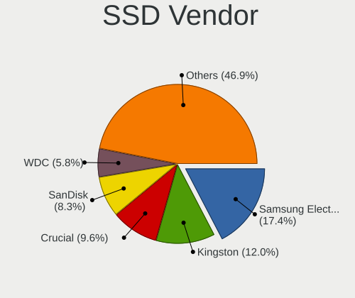

| Vendor              | Computers | Drives | Percent |
|---------------------|-----------|--------|---------|
| Samsung Electronics | 3062      | 3975   | 17.35%  |
| Kingston            | 2121      | 2537   | 12.02%  |
| Crucial             | 1700      | 2067   | 9.63%   |
| SanDisk             | 1471      | 1699   | 8.34%   |
| WDC                 | 1019      | 1208   | 5.77%   |
| China               | 745       | 864    | 4.22%   |
| A-DATA Technology   | 700       | 786    | 3.97%   |
| PNY                 | 407       | 494    | 2.31%   |
| SPCC                | 384       | 455    | 2.18%   |
| Intel               | 348       | 385    | 1.97%   |
| GOODRAM             | 327       | 396    | 1.85%   |
| Patriot             | 310       | 353    | 1.76%   |
| Intenso             | 282       | 338    | 1.6%    |
| SK hynix            | 243       | 274    | 1.38%   |
| Micron Technology   | 241       | 282    | 1.37%   |
| Toshiba             | 238       | 268    | 1.35%   |
| Team                | 183       | 218    | 1.04%   |
| Apacer              | 170       | 195    | 0.96%   |
| Transcend           | 169       | 190    | 0.96%   |
| Unknown             | 156       | 170    | 0.88%   |
| KingSpec            | 153       | 167    | 0.87%   |
| LITEON              | 152       | 165    | 0.86%   |
| OCZ                 | 144       | 165    | 0.82%   |
| Netac               | 140       | 167    | 0.79%   |
| Apple               | 123       | 134    | 0.7%    |
| Lexar               | 110       | 121    | 0.62%   |
| LITEONIT            | 89        | 103    | 0.5%    |
| Hewlett-Packard     | 81        | 88     | 0.46%   |
| Gigabyte Technology | 81        | 93     | 0.46%   |
| Verbatim            | 75        | 87     | 0.43%   |
| Fanxiang            | 69        | 77     | 0.39%   |
| Corsair             | 67        | 74     | 0.38%   |
| KIOXIA-EXCERIA      | 63        | 70     | 0.36%   |
| KingFast            | 60        | 65     | 0.34%   |
| Emtec               | 57        | 63     | 0.32%   |
| T-FORCE             | 56        | 62     | 0.32%   |
| Plextor             | 56        | 62     | 0.32%   |
| ASMT                | 53        | 54     | 0.3%    |
| Seagate             | 49        | 61     | 0.28%   |
| Leven               | 44        | 52     | 0.25%   |

Drive Kind
----------

HDD or SSD

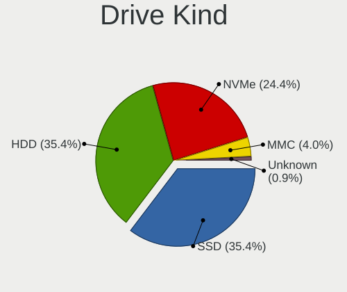

| Kind    | Computers | Drives | Percent |
|---------|-----------|--------|---------|
| SSD     | 14855     | 20943  | 35.36%  |
| HDD     | 14852     | 22404  | 35.35%  |
| NVMe    | 10258     | 14135  | 24.42%  |
| MMC     | 1685      | 1875   | 4.01%   |
| Unknown | 363       | 540    | 0.86%   |

Drive Connector
---------------

SATA, SAS, NVMe, etc.

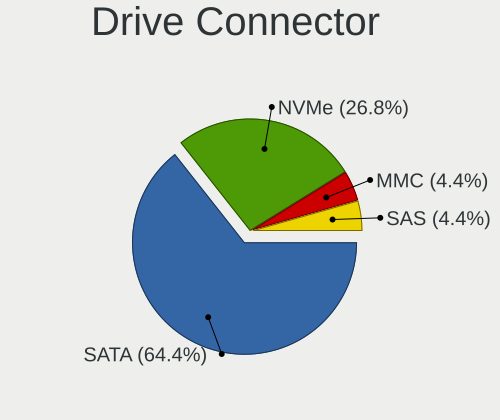

| Type | Computers | Drives | Percent |
|------|-----------|--------|---------|
| SATA | 24568     | 41734  | 64.37%  |
| NVMe | 10236     | 14027  | 26.82%  |
| MMC  | 1685      | 1875   | 4.42%   |
| SAS  | 1676      | 2261   | 4.39%   |

Drive Size
----------

Size of hard drive

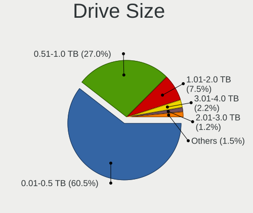

| Size in TB | Computers | Drives | Percent |
|------------|-----------|--------|---------|
| 0.01-0.5   | 18707     | 26684  | 60.51%  |
| 0.51-1.0   | 8345      | 11205  | 26.99%  |
| 1.01-2.0   | 2334      | 3244   | 7.55%   |
| 3.01-4.0   | 680       | 976    | 2.2%    |
| 2.01-3.0   | 378       | 513    | 1.22%   |
| 4.01-10.0  | 371       | 579    | 1.2%    |
| 10.01-20.0 | 96        | 136    | 0.31%   |
| 20.01-50.0 | 5         | 8      | 0.02%   |
| 0          | 2         | 2      | 0.01%   |

Space Total
-----------

Amount of disk space available on the file system

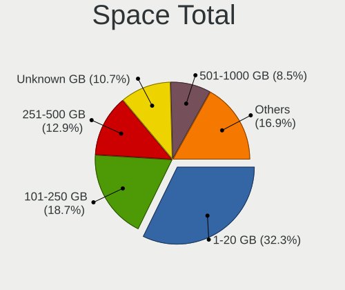

| Size in GB     | Computers | Percent |
|----------------|-----------|---------|
| 1-20           | 11311     | 32.27%  |
| 101-250        | 6557      | 18.7%   |
| 251-500        | 4532      | 12.93%  |
| Unknown        | 3742      | 10.67%  |
| 501-1000       | 2986      | 8.52%   |
| 51-100         | 2013      | 5.74%   |
| 1001-2000      | 1326      | 3.78%   |
| 21-50          | 1280      | 3.65%   |
| More than 3000 | 800       | 2.28%   |
| 2001-3000      | 508       | 1.45%   |

Space Used
----------

Amount of used disk space

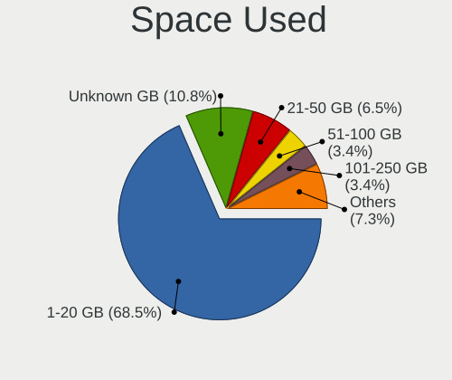

| Used GB        | Computers | Percent |
|----------------|-----------|---------|
| 1-20           | 23676     | 68.5%   |
| Unknown        | 3742      | 10.83%  |
| 21-50          | 2258      | 6.53%   |
| 51-100         | 1188      | 3.44%   |
| 101-250        | 1169      | 3.38%   |
| 251-500        | 785       | 2.27%   |
| 0              | 639       | 1.85%   |
| 501-1000       | 550       | 1.59%   |
| 1001-2000      | 306       | 0.89%   |
| More than 3000 | 137       | 0.4%    |
| 2001-3000      | 113       | 0.33%   |

Malfunc. Drives
---------------

Drive models with a malfunction

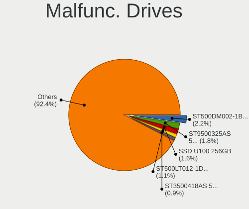

| Model                                                         | Computers | Drives | Percent |
|---------------------------------------------------------------|-----------|--------|---------|
| Seagate ST500DM002-1BD142 500GB                               | 186       | 211    | 2.25%   |
| Seagate ST9500325AS 500GB                                     | 149       | 164    | 1.8%    |
| SanDisk SSD U100 256GB                                        | 129       | 130    | 1.56%   |
| Seagate ST500LT012-1DG142 500GB                               | 87        | 95     | 1.05%   |
| Seagate ST3500418AS 500GB                                     | 78        | 91     | 0.94%   |
| Seagate ST1000LM024 HN-M101MBB 1TB                            | 73        | 83     | 0.88%   |
| Seagate ST500LT012-9WS142 500GB                               | 70        | 77     | 0.85%   |
| HGST HTS545050A7E680 500GB                                    | 69        | 74     | 0.83%   |
| Toshiba MQ01ABD100 1TB                                        | 63        | 68     | 0.76%   |
| Toshiba MQ01ABF050 500GB                                      | 59        | 66     | 0.71%   |
| Kingston SV300S37A120G 120GB SSD                              | 56        | 59     | 0.68%   |
| Seagate ST9320325AS 320GB                                     | 49        | 51     | 0.59%   |
| Toshiba DT01ACA100 1TB                                        | 48        | 57     | 0.58%   |
| HGST HTS721010A9E630 1TB                                      | 47        | 54     | 0.57%   |
| HGST HTS541010A9E680 1TB                                      | 47        | 53     | 0.57%   |
| Seagate ST1000DM010-2EP102 1TB                                | 46        | 56     | 0.56%   |
| Toshiba MQ01ABD075 752GB                                      | 45        | 46     | 0.54%   |
| Seagate ST1000LM035-1RK172 1TB                                | 45        | 48     | 0.54%   |
| WDC WDS240G2G0A-00JH30 240GB SSD                              | 42        | 45     | 0.51%   |
| HGST HTS725050A7E630 500GB                                    | 42        | 45     | 0.51%   |
| Toshiba MQ01ABD050 500GB                                      | 39        | 41     | 0.47%   |
| Samsung Electronics NVMe SSD Controller SM981/PM981/PM983 1TB | 39        | 46     | 0.47%   |
| Hitachi HTS545050A7E380 500GB                                 | 39        | 43     | 0.47%   |
| Seagate ST500LM021-1KJ152 500GB                               | 36        | 38     | 0.43%   |
| Hitachi HTS543232A7A384 320GB                                 | 36        | 37     | 0.43%   |
| Seagate ST31000524AS 1TB                                      | 35        | 41     | 0.42%   |
| Toshiba DT01ACA050 500GB                                      | 34        | 41     | 0.41%   |
| WDC WD5000AAKX-001CA0 500GB                                   | 33        | 36     | 0.4%    |
| HGST HTS545050A7E380 500GB                                    | 33        | 37     | 0.4%    |
| Seagate ST500LM012 HN-M500MBB 500GB                           | 32        | 36     | 0.39%   |
| Seagate ST2000DM001-1CH164 2TB                                | 32        | 35     | 0.39%   |
| WDC WD10EARS-00Y5B1 1TB                                       | 30        | 35     | 0.36%   |
| Samsung Electronics HD322HJ 320GB                             | 30        | 34     | 0.36%   |
| Seagate ST3500413AS 500GB                                     | 29        | 32     | 0.35%   |
| Seagate ST1000DM003-1CH162 1TB                                | 29        | 36     | 0.35%   |
| SanDisk SSD PLUS 480GB                                        | 28        | 31     | 0.34%   |
| SanDisk SSD PLUS 240GB                                        | 28        | 35     | 0.34%   |
| WDC WD5000AAKX-75U6AA0 500GB                                  | 27        | 30     | 0.33%   |
| Seagate ST31000528AS 1TB                                      | 27        | 32     | 0.33%   |
| Hitachi HDS721050CLA362 500GB                                 | 26        | 34     | 0.31%   |

Malfunc. Drive Vendor
---------------------

Vendors of faulty drives

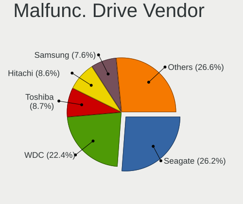

| Vendor                | Computers | Drives | Percent |
|-----------------------|-----------|--------|---------|
| Seagate               | 2109      | 2451   | 26.18%  |
| WDC                   | 1807      | 2125   | 22.43%  |
| Toshiba               | 699       | 762    | 8.68%   |
| Hitachi               | 691       | 772    | 8.58%   |
| Samsung Electronics   | 610       | 739    | 7.57%   |
| HGST                  | 304       | 339    | 3.77%   |
| SanDisk               | 285       | 302    | 3.54%   |
| Kingston              | 211       | 235    | 2.62%   |
| Intel                 | 129       | 141    | 1.6%    |
| Crucial               | 129       | 144    | 1.6%    |
| Maxtor                | 113       | 137    | 1.4%    |
| SK hynix              | 104       | 116    | 1.29%   |
| China                 | 91        | 96     | 1.13%   |
| A-DATA Technology     | 91        | 101    | 1.13%   |
| Fujitsu               | 67        | 76     | 0.83%   |
| Micron Technology     | 50        | 57     | 0.62%   |
| Apple                 | 30        | 31     | 0.37%   |
| SPCC                  | 28        | 29     | 0.35%   |
| OCZ                   | 26        | 31     | 0.32%   |
| Realtek Semiconductor | 24        | 25     | 0.3%    |
| Netac                 | 23        | 25     | 0.29%   |
| Patriot               | 16        | 16     | 0.2%    |
| LITEON                | 16        | 16     | 0.2%    |
| SSSTC                 | 15        | 16     | 0.19%   |
| Corsair               | 15        | 17     | 0.19%   |
| Hewlett-Packard       | 14        | 16     | 0.17%   |
| KingSpec              | 13        | 13     | 0.16%   |
| Unknown               | 13        | 13     | 0.16%   |
| LITEONIT              | 12        | 17     | 0.15%   |
| Intenso               | 12        | 15     | 0.15%   |
| ASMT                  | 12        | 14     | 0.15%   |
| PNY                   | 10        | 11     | 0.12%   |
| GOODRAM               | 10        | 10     | 0.12%   |
| ExcelStor             | 9         | 9      | 0.11%   |
| Transcend             | 7         | 9      | 0.09%   |
| Team                  | 7         | 7      | 0.09%   |
| Plextor               | 7         | 7      | 0.09%   |
| Dogfish               | 7         | 8      | 0.09%   |
| ADATA Technology      | 7         | 8      | 0.09%   |
| XPG                   | 6         | 6      | 0.07%   |

Malfunc. HDD Vendor
-------------------

Vendors of faulty HDD drives

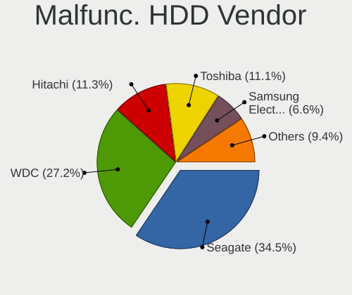

| Vendor              | Computers | Drives | Percent |
|---------------------|-----------|--------|---------|
| Seagate             | 2108      | 2450   | 34.47%  |
| WDC                 | 1662      | 1957   | 27.17%  |
| Hitachi             | 691       | 772    | 11.3%   |
| Toshiba             | 679       | 740    | 11.1%   |
| Samsung Electronics | 403       | 476    | 6.59%   |
| HGST                | 304       | 339    | 4.97%   |
| Maxtor              | 113       | 137    | 1.85%   |
| Fujitsu             | 66        | 75     | 1.08%   |
| Apple               | 19        | 20     | 0.31%   |
| ExcelStor           | 9         | 9      | 0.15%   |
| Hewlett-Packard     | 8         | 9      | 0.13%   |
| IBM/Hitachi         | 6         | 9      | 0.1%    |
| WD MediaMax         | 5         | 6      | 0.08%   |
| HPE                 | 4         | 5      | 0.07%   |
| ASMT                | 4         | 6      | 0.07%   |
| ASMedia             | 4         | 4      | 0.07%   |
| USB3.0              | 3         | 3      | 0.05%   |
| Unknown             | 3         | 3      | 0.05%   |
| Magnetic Data       | 3         | 3      | 0.05%   |
| Initio              | 3         | 3      | 0.05%   |
| Unknown             | 3         | 3      | 0.05%   |
| SAGE                | 2         | 2      | 0.03%   |
| QUANTUM             | 2         | 2      | 0.03%   |
| JMicron Technology  | 2         | 2      | 0.03%   |
| USB                 | 1         | 1      | 0.02%   |
| TO Exter            | 1         | 1      | 0.02%   |
| StoreJet            | 1         | 1      | 0.02%   |
| SATAFIRM            | 1         | 1      | 0.02%   |
| RSH-339             | 1         | 1      | 0.02%   |
| RSH-319             | 1         | 1      | 0.02%   |
| Inateck             | 1         | 1      | 0.02%   |
| IB                  | 1         | 1      | 0.02%   |
| HGST HTS            | 1         | 1      | 0.02%   |
| China               | 1         | 1      | 0.02%   |

Malfunc. Drive Kind
-------------------

Kinds of faulty drives

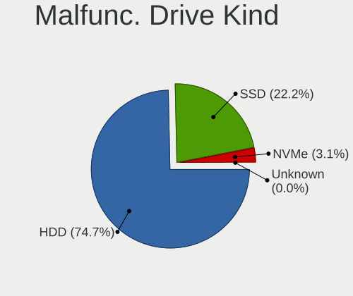

| Kind    | Computers | Drives | Percent |
|---------|-----------|--------|---------|
| HDD     | 5675      | 7045   | 74.66%  |
| SSD     | 1691      | 1900   | 22.25%  |
| NVMe    | 232       | 267    | 3.05%   |
| Unknown | 3         | 4      | 0.04%   |

Failed Drives
-------------

Failed drive models

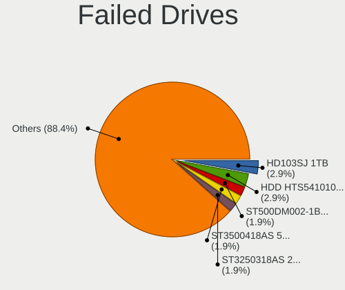

| Model                                                          | Computers | Drives | Percent |
|----------------------------------------------------------------|-----------|--------|---------|
| Samsung Electronics HD103SJ 1TB                                | 6         | 6      | 2.9%    |
| Apple HDD HTS541010A9E662 1TB                                  | 6         | 6      | 2.9%    |
| Seagate ST500DM002-1BD142 500GB                                | 4         | 4      | 1.93%   |
| Seagate ST3500418AS 500GB                                      | 4         | 6      | 1.93%   |
| Seagate ST3250318AS 250GB                                      | 4         | 4      | 1.93%   |
| Seagate ST31000528AS 1TB                                       | 4         | 4      | 1.93%   |
| Samsung Electronics HD502HJ 500GB                              | 4         | 4      | 1.93%   |
| HGST HTS541010A9E680 1TB                                       | 4         | 4      | 1.93%   |
| WDC WD3200BEVT-00ZCT0 320GB                                    | 3         | 3      | 1.45%   |
| Toshiba MQ01ABD050 500GB                                       | 3         | 3      | 1.45%   |
| Toshiba DT01ACA100 1TB                                         | 3         | 3      | 1.45%   |
| SK hynix BC501 NVMe Solid State Drive 512GB                    | 3         | 3      | 1.45%   |
| WDC WD800JD-00LSA0 80GB                                        | 2         | 3      | 0.97%   |
| WDC WD5000BEVT-22ZAT0 500GB                                    | 2         | 2      | 0.97%   |
| WDC WD3200BEVT-11ZCT0 320GB                                    | 2         | 2      | 0.97%   |
| WDC WD2500BEVS-22UST0 250GB                                    | 2         | 3      | 0.97%   |
| WDC WD20EZRX-00D8PB0 2TB                                       | 2         | 2      | 0.97%   |
| WDC WD20EARS-00MVWB0 2TB                                       | 2         | 2      | 0.97%   |
| WDC WD10EZEX-22MFCA0 1TB                                       | 2         | 2      | 0.97%   |
| WDC WD10EZEX-08WN4A0 1TB                                       | 2         | 2      | 0.97%   |
| Toshiba MQ01ABF032 320GB                                       | 2         | 2      | 0.97%   |
| Toshiba MQ01ABD100 1TB                                         | 2         | 2      | 0.97%   |
| Toshiba MK7575GSX 752GB                                        | 2         | 2      | 0.97%   |
| Toshiba MK3265GSXN 320GB                                       | 2         | 2      | 0.97%   |
| Toshiba MK2555GSX 250GB                                        | 2         | 2      | 0.97%   |
| Toshiba DT01ACA050 500GB                                       | 2         | 2      | 0.97%   |
| Seagate ST3320418AS 320GB                                      | 2         | 2      | 0.97%   |
| Samsung Electronics NVMe SSD Controller PM9A1/PM9A3/980PRO 1TB | 2         | 5      | 0.97%   |
| Samsung Electronics MZNTY128HDHP-00000 128GB SSD               | 2         | 3      | 0.97%   |
| Samsung Electronics HM321HI 320GB                              | 2         | 2      | 0.97%   |
| Samsung Electronics HM250HI 250GB                              | 2         | 2      | 0.97%   |
| Samsung Electronics HD103UJ 1TB                                | 2         | 4      | 0.97%   |
| Hitachi HTS723232A7A364 320GB                                  | 2         | 2      | 0.97%   |
| Hitachi HTS545050A7E380 500GB                                  | 2         | 2      | 0.97%   |
| Crucial CT500P2SSD8 500GB                                      | 2         | 2      | 0.97%   |
| WDC WD800JD-75MSA3 80GB                                        | 1         | 1      | 0.48%   |
| WDC WD800JD-00MSA1 80GB                                        | 1         | 1      | 0.48%   |
| WDC WD7501AALS-00J7B0 752GB                                    | 1         | 1      | 0.48%   |
| WDC WD7500BPVT-22HXZT3 752GB                                   | 1         | 1      | 0.48%   |
| WDC WD5000M22K-24Z1LT0-SSHD-16GB                               | 1         | 1      | 0.48%   |

Failed Drive Vendor
-------------------

Failed drive vendors

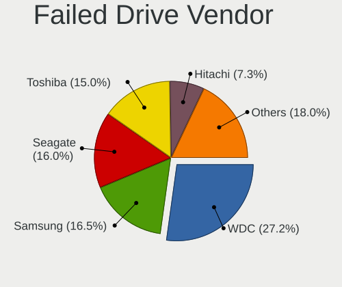

| Vendor                    | Computers | Drives | Percent |
|---------------------------|-----------|--------|---------|
| WDC                       | 56        | 58     | 27.18%  |
| Samsung Electronics       | 34        | 40     | 16.5%   |
| Seagate                   | 33        | 36     | 16.02%  |
| Toshiba                   | 31        | 32     | 15.05%  |
| Hitachi                   | 15        | 15     | 7.28%   |
| HGST                      | 7         | 7      | 3.4%    |
| Apple                     | 7         | 7      | 3.4%    |
| SK hynix                  | 6         | 14     | 2.91%   |
| Kingston                  | 3         | 3      | 1.46%   |
| Intel                     | 2         | 2      | 0.97%   |
| Crucial                   | 2         | 2      | 0.97%   |
| Union Memory (Shenzhen)   | 1         | 1      | 0.49%   |
| Transcend                 | 1         | 1      | 0.49%   |
| TPH00800640GB             | 1         | 1      | 0.49%   |
| Realtek Semiconductor     | 1         | 1      | 0.49%   |
| Micron/Crucial Technology | 1         | 1      | 0.49%   |
| Maxtor                    | 1         | 1      | 0.49%   |
| GOODRAM                   | 1         | 1      | 0.49%   |
| External                  | 1         | 1      | 0.49%   |
| China                     | 1         | 1      | 0.49%   |
| Unknown                   | 1         | 1      | 0.49%   |

Drive Status
------------

Number of failed and malfunc. drives

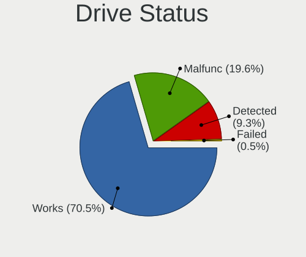

| Status   | Computers | Drives | Percent |
|----------|-----------|--------|---------|
| Works    | 26490     | 46027  | 70.52%  |
| Malfunc  | 7380      | 9216   | 19.65%  |
| Detected | 3492      | 4428   | 9.3%    |
| Failed   | 202       | 226    | 0.54%   |

Storage controller
------------------

Storage Vendor
--------------

Storage controller vendors

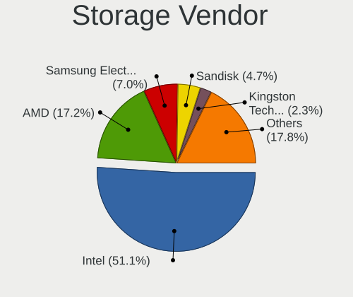

| Vendor                                  | Computers | Percent |
|-----------------------------------------|-----------|---------|
| Intel                                   | 21462     | 51.05%  |
| AMD                                     | 7240      | 17.22%  |
| Samsung Electronics                     | 2938      | 6.99%   |
| Sandisk                                 | 1955      | 4.65%   |
| Kingston Technology Company             | 980       | 2.33%   |
| Phison Electronics                      | 722       | 1.72%   |
| SK hynix                                | 716       | 1.7%    |
| Micron/Crucial Technology               | 661       | 1.57%   |
| ASMedia Technology                      | 638       | 1.52%   |
| Micron Technology                       | 563       | 1.34%   |
| Nvidia                                  | 470       | 1.12%   |
| JMicron Technology                      | 403       | 0.96%   |
| Silicon Motion                          | 399       | 0.95%   |
| MAXIO Technology (Hangzhou)             | 374       | 0.89%   |
| Marvell Technology Group                | 356       | 0.85%   |
| KIOXIA                                  | 347       | 0.83%   |
| Toshiba America Info Systems            | 295       | 0.7%    |
| ADATA Technology                        | 284       | 0.68%   |
| Realtek Semiconductor                   | 225       | 0.54%   |
| Shenzhen Longsys Electronics            | 128       | 0.3%    |
| Union Memory (Shenzhen)                 | 94        | 0.22%   |
| VIA Technologies                        | 89        | 0.21%   |
| Solid State Storage Technology          | 83        | 0.2%    |
| Seagate Technology                      | 65        | 0.15%   |
| INNOGRIT                                | 54        | 0.13%   |
| Broadcom / LSI                          | 51        | 0.12%   |
| Solidigm                                | 44        | 0.1%    |
| LSI Logic / Symbios Logic               | 37        | 0.09%   |
| Hosin Global Electronics                | 35        | 0.08%   |
| Biwin Storage Technology                | 32        | 0.08%   |
| Apple                                   | 32        | 0.08%   |
| Lenovo                                  | 30        | 0.07%   |
| Lite-On Technology                      | 29        | 0.07%   |
| Silicon Image                           | 28        | 0.07%   |
| Netac Technology                        | 27        | 0.06%   |
| Silicon Integrated Systems [SiS]        | 25        | 0.06%   |
| Integrated Technology Express           | 17        | 0.04%   |
| Adaptec                                 | 17        | 0.04%   |
| Shenzhen Unionmemory Information System | 12        | 0.03%   |
| Red Hat                                 | 10        | 0.02%   |

Storage Model
-------------

Storage controller models

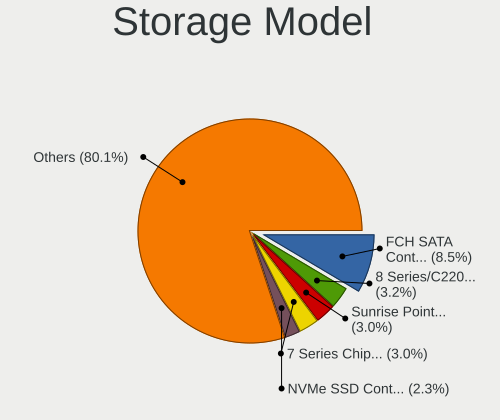

| Model                                                                                   | Computers | Percent |
|-----------------------------------------------------------------------------------------|-----------|---------|
| AMD FCH SATA Controller [AHCI mode]                                                     | 4120      | 8.54%   |
| Intel 8 Series/C220 Series Chipset Family 6-port SATA Controller 1 [AHCI mode]          | 1540      | 3.19%   |
| Intel Sunrise Point-LP SATA Controller [AHCI mode]                                      | 1442      | 2.99%   |
| Intel 7 Series Chipset Family 6-port SATA Controller [AHCI mode]                        | 1428      | 2.96%   |
| Samsung NVMe SSD Controller SM981/PM981/PM983                                           | 1087      | 2.25%   |
| Intel 6 Series/C200 Series Chipset Family 6 port Mobile SATA AHCI Controller            | 1044      | 2.16%   |
| Intel 82801 Mobile SATA Controller [RAID mode]                                          | 962       | 1.99%   |
| Intel Celeron/Pentium Silver Processor SATA Controller                                  | 954       | 1.98%   |
| AMD 400 Series Chipset SATA Controller                                                  | 920       | 1.91%   |
| AMD 500 Series Chipset SATA Controller                                                  | 851       | 1.76%   |
| Intel 6 Series/C200 Series Chipset Family 6 port Desktop SATA AHCI Controller           | 797       | 1.65%   |
| Intel Q170/Q150/B150/H170/H110/Z170/CM236 Chipset SATA Controller [AHCI Mode]           | 787       | 1.63%   |
| AMD SB7x0/SB8x0/SB9x0 SATA Controller [AHCI mode]                                       | 781       | 1.62%   |
| Intel 82801IBM/IEM (ICH9M/ICH9M-E) 4 port SATA Controller [AHCI mode]                   | 742       | 1.54%   |
| AMD SB7x0/SB8x0/SB9x0 IDE Controller                                                    | 702       | 1.46%   |
| Intel NM10/ICH7 Family SATA Controller [IDE mode]                                       | 658       | 1.36%   |
| Intel 7 Series/C210 Series Chipset Family 6-port SATA Controller [AHCI mode]            | 648       | 1.34%   |
| Samsung NVMe SSD Controller 980 (DRAM-less)                                             | 642       | 1.33%   |
| Intel 8 Series SATA Controller 1 [AHCI mode]                                            | 642       | 1.33%   |
| Intel 200 Series PCH SATA controller [AHCI mode]                                        | 608       | 1.26%   |
| ASMedia ASM1061/ASM1062 Serial ATA Controller                                           | 553       | 1.15%   |
| Intel Volume Management Device NVMe RAID Controller                                     | 550       | 1.14%   |
| Intel SATA Controller [RAID mode]                                                       | 540       | 1.12%   |
| Intel Wildcat Point-LP SATA Controller [AHCI Mode]                                      | 515       | 1.07%   |
| Intel 82801G (ICH7 Family) IDE Controller                                               | 515       | 1.07%   |
| Samsung NVMe SSD Controller PM9A1/PM9A3/980PRO                                          | 504       | 1.05%   |
| Intel 5 Series/3400 Series Chipset 4 port SATA AHCI Controller                          | 498       | 1.03%   |
| AMD SB7x0/SB8x0/SB9x0 SATA Controller [IDE mode]                                        | 470       | 0.97%   |
| AMD 600 Series Chipset SATA Controller                                                  | 441       | 0.91%   |
| Intel 82801HM/HEM (ICH8M/ICH8M-E) IDE Controller                                        | 433       | 0.9%    |
| Intel Cannon Lake PCH SATA AHCI Controller                                              | 422       | 0.88%   |
| Intel 5 Series/3400 Series Chipset 6 port SATA AHCI Controller                          | 411       | 0.85%   |
| Intel Atom Processor E3800 Series SATA AHCI Controller                                  | 401       | 0.83%   |
| Intel 82801HM/HEM (ICH8M/ICH8M-E) SATA Controller [AHCI mode]                           | 383       | 0.79%   |
| SanDisk Ultra 3D / WD PC SN530, IX SN530, Blue SN550 NVMe SSD (DRAM-less)               | 359       | 0.74%   |
| SanDisk WD SN560/SN740/SN770/SN5000 NVMe SSD                                            | 341       | 0.71%   |
| Micron/Crucial P2 [Nick P2] / P3 / P3 Plus NVMe PCIe SSD (DRAM-less)                    | 340       | 0.7%    |
| Intel 6 Series/C200 Series Chipset Family Desktop SATA Controller (IDE mode, ports 4-5) | 332       | 0.69%   |
| Intel 6 Series/C200 Series Chipset Family Desktop SATA Controller (IDE mode, ports 0-3) | 330       | 0.68%   |
| Silicon Motion SM2263EN/SM2263XT (DRAM-less) NVMe SSD Controllers                       | 321       | 0.67%   |

Storage Kind
------------

Kind of storage controller (IDE, SATA, NVMe, SAS, ...)

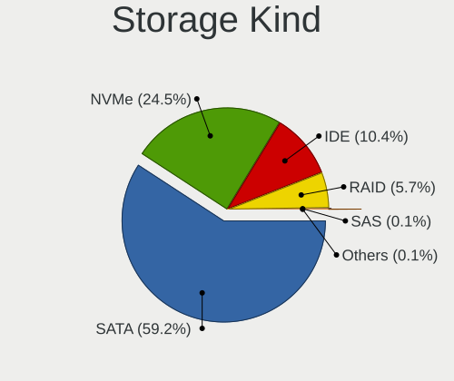

| Kind | Computers | Percent |
|------|-----------|---------|
| SATA | 24739     | 59.21%  |
| NVMe | 10223     | 24.47%  |
| IDE  | 4336      | 10.38%  |
| RAID | 2382      | 5.7%    |
| SAS  | 58        | 0.14%   |
| SCSI | 45        | 0.11%   |

Processor
---------

CPU Vendor
----------

Processor vendors

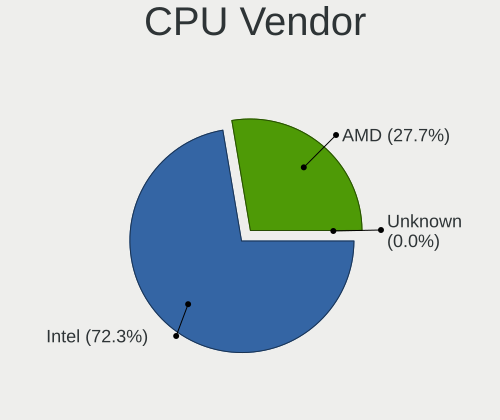

| Vendor  | Computers | Percent |
|---------|-----------|---------|
| Intel   | 23707     | 72.34%  |
| AMD     | 9063      | 27.65%  |
| ARM     | 1         | 0.003%  |
| Unknown | 1         | 0.003%  |

CPU Model
---------

Processor models

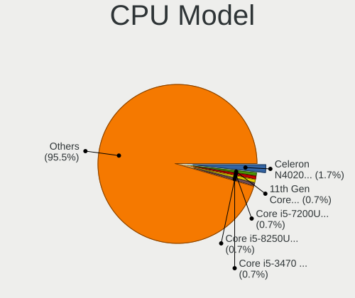

| Model                                         | Computers | Percent |
|-----------------------------------------------|-----------|---------|
| Intel Celeron N4020 CPU @ 1.10GHz             | 566       | 1.72%   |
| Intel 11th Gen Core i5-1135G7 @ 2.40GHz       | 231       | 0.7%    |
| Intel Core i5-7200U CPU @ 2.50GHz             | 230       | 0.7%    |
| Intel Core i5-8250U CPU @ 1.60GHz             | 229       | 0.7%    |
| Intel Core i5-3470 CPU @ 3.20GHz              | 221       | 0.67%   |
| AMD Ryzen 5 3600 6-Core Processor             | 199       | 0.61%   |
| AMD Ryzen 5 5600G with Radeon Graphics        | 196       | 0.6%    |
| Intel Celeron CPU N3350 @ 1.10GHz             | 190       | 0.58%   |
| Intel Core i5-6200U CPU @ 2.30GHz             | 185       | 0.56%   |
| Intel Core i5-6300U CPU @ 2.40GHz             | 183       | 0.56%   |
| Intel Core i5-3320M CPU @ 2.60GHz             | 183       | 0.56%   |
| Intel Core i5-2520M CPU @ 2.50GHz             | 175       | 0.53%   |
| Intel Core i5-3210M CPU @ 2.50GHz             | 170       | 0.52%   |
| AMD Ryzen 5 5600X 6-Core Processor            | 166       | 0.5%    |
| Intel Core 2 Duo CPU E8400 @ 3.00GHz          | 164       | 0.5%    |
| Intel Core i5-2400 CPU @ 3.10GHz              | 158       | 0.48%   |
| Intel 11th Gen Core i7-1165G7 @ 2.80GHz       | 156       | 0.47%   |
| Intel Core i7-3770 CPU @ 3.40GHz              | 153       | 0.47%   |
| Intel Core i5-5200U CPU @ 2.20GHz             | 153       | 0.47%   |
| AMD Ryzen 5 3500U with Radeon Vega Mobile Gfx | 153       | 0.47%   |
| Intel Celeron CPU N2840 @ 2.16GHz             | 151       | 0.46%   |
| AMD Ryzen 7 3700X 8-Core Processor            | 148       | 0.45%   |
| AMD Ryzen 5 5500U with Radeon Graphics        | 148       | 0.45%   |
| Intel Core i5-6500 CPU @ 3.20GHz              | 145       | 0.44%   |
| Intel Core i7-8550U CPU @ 1.80GHz             | 139       | 0.42%   |
| AMD Ryzen 7 5700U with Radeon Graphics        | 137       | 0.42%   |
| Intel Celeron CPU N3060 @ 1.60GHz             | 132       | 0.4%    |
| AMD Ryzen 7 5700G with Radeon Graphics        | 132       | 0.4%    |
| Intel Core i7-4790 CPU @ 3.60GHz              | 131       | 0.4%    |
| Intel Core i7-2677M CPU @ 1.80GHz             | 130       | 0.4%    |
| AMD Ryzen 7 5800X 8-Core Processor            | 129       | 0.39%   |
| Intel Core i5-8350U CPU @ 1.70GHz             | 128       | 0.39%   |
| Intel Core i5-5300U CPU @ 2.30GHz             | 125       | 0.38%   |
| Intel Core i5-4570 CPU @ 3.20GHz              | 124       | 0.38%   |
| Intel Core i3-2120 CPU @ 3.30GHz              | 124       | 0.38%   |
| Intel Core i7-7500U CPU @ 2.70GHz             | 120       | 0.37%   |
| Intel Core i3-3220 CPU @ 3.30GHz              | 120       | 0.37%   |
| Intel Core i5-4590 CPU @ 3.30GHz              | 115       | 0.35%   |
| AMD Ryzen 5 2600 Six-Core Processor           | 115       | 0.35%   |
| Intel Core i5-8265U CPU @ 1.60GHz             | 114       | 0.35%   |

CPU Model Family
----------------

Processor model prefix

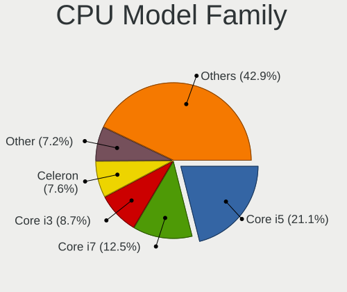

| Model                   | Computers | Percent |
|-------------------------|-----------|---------|
| Intel Core i5           | 6923      | 21.08%  |
| Intel Core i7           | 4089      | 12.45%  |
| Intel Core i3           | 2873      | 8.75%   |
| Intel Celeron           | 2506      | 7.63%   |
| Other                   | 2357      | 7.18%   |
| AMD Ryzen 5             | 2213      | 6.74%   |
| AMD Ryzen 7             | 1855      | 5.65%   |
| Intel Core 2 Duo        | 1422      | 4.33%   |
| Intel Pentium           | 999       | 3.04%   |
| AMD Ryzen 9             | 611       | 1.86%   |
| Intel Xeon              | 608       | 1.85%   |
| AMD Ryzen 3             | 503       | 1.53%   |
| AMD FX                  | 480       | 1.46%   |
| Intel Pentium Dual-Core | 441       | 1.34%   |
| AMD A8                  | 305       | 0.93%   |
| Intel Core 2 Quad       | 304       | 0.93%   |
| AMD A6                  | 293       | 0.89%   |
| AMD A10                 | 248       | 0.76%   |
| Intel Atom              | 239       | 0.73%   |
| AMD A4                  | 239       | 0.73%   |
| Intel Pentium Silver    | 218       | 0.66%   |
| Intel Pentium Dual      | 180       | 0.55%   |
| AMD Athlon              | 168       | 0.51%   |
| Intel Core 2            | 162       | 0.49%   |
| AMD Phenom II X4        | 156       | 0.48%   |
| AMD Athlon II X2        | 155       | 0.47%   |
| AMD E                   | 153       | 0.47%   |
| AMD E1                  | 139       | 0.42%   |
| Intel Core              | 138       | 0.42%   |
| AMD Athlon 64 X2        | 135       | 0.41%   |
| AMD Ryzen 5 PRO         | 126       | 0.38%   |
| Intel Core i9           | 113       | 0.34%   |
| AMD Ryzen 7 PRO         | 111       | 0.34%   |
| Intel Genuine           | 108       | 0.33%   |
| AMD E2                  | 92        | 0.28%   |
| Intel Pentium Gold      | 78        | 0.24%   |
| AMD Athlon II X4        | 68        | 0.21%   |
| AMD Phenom II X6        | 59        | 0.18%   |
| Intel Pentium 4         | 48        | 0.15%   |
| AMD Sempron             | 48        | 0.15%   |

CPU Cores
---------

Number of processor cores

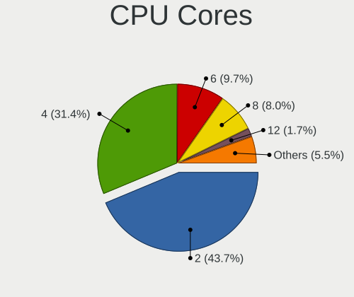

| Number  | Computers | Percent |
|---------|-----------|---------|
| 2       | 14375     | 43.7%   |
| 4       | 10317     | 31.37%  |
| 6       | 3175      | 9.65%   |
| 8       | 2635      | 8.01%   |
| 12      | 573       | 1.74%   |
| 1       | 554       | 1.68%   |
| 16      | 356       | 1.08%   |
| 10      | 338       | 1.03%   |
| 14      | 237       | 0.72%   |
| 3       | 155       | 0.47%   |
| 24      | 91        | 0.28%   |
| 20      | 44        | 0.13%   |
| 18      | 8         | 0.02%   |
| 28      | 7         | 0.02%   |
| 32      | 6         | 0.02%   |
| 5       | 5         | 0.02%   |
| 44      | 3         | 0.01%   |
| 36      | 3         | 0.01%   |
| 22      | 2         | 0.01%   |
| Unknown | 2         | 0.01%   |
| 128     | 1         | 0.003%  |
| 112     | 1         | 0.003%  |
| 96      | 1         | 0.003%  |
| 52      | 1         | 0.003%  |
| 40      | 1         | 0.003%  |

CPU Sockets
-----------

Number of sockets

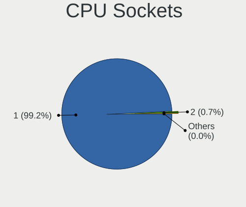

| Number  | Computers | Percent |
|---------|-----------|---------|
| 1       | 32524     | 99.23%  |
| 2       | 220       | 0.67%   |
| 4       | 25        | 0.08%   |
| 8       | 4         | 0.01%   |
| 16      | 1         | 0.003%  |
| 14      | 1         | 0.003%  |
| 12      | 1         | 0.003%  |
| 6       | 1         | 0.003%  |
| Unknown | 1         | 0.003%  |

CPU Threads
-----------

Threads per core (Hyper-Threading)

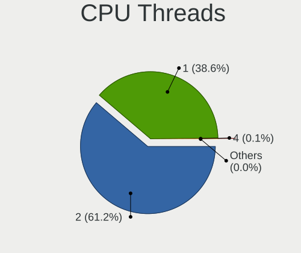

| Number  | Computers | Percent |
|---------|-----------|---------|
| 2       | 20125     | 61.22%  |
| 1       | 12675     | 38.56%  |
| 4       | 37        | 0.11%   |
| 8       | 25        | 0.08%   |
| 12      | 6         | 0.02%   |
| Unknown | 2         | 0.01%   |
| 16      | 1         | 0.003%  |
| 6       | 1         | 0.003%  |

CPU Op-Modes
------------

CPU Operation Modes (32-bit, 64-bit)

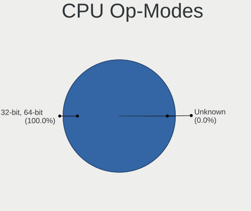

| Op mode        | Computers | Percent |
|----------------|-----------|---------|
| 32-bit, 64-bit | 32764     | 99.98%  |
| Unknown        | 7         | 0.02%   |

CPU Microcode
-------------

Microcode number

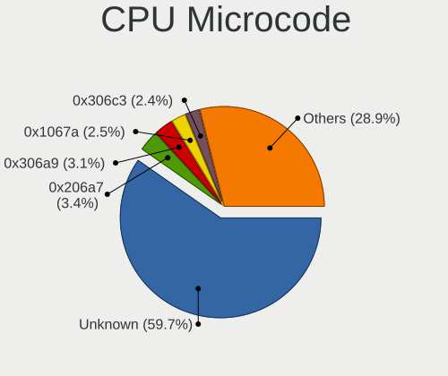

| Number     | Computers | Percent |
|------------|-----------|---------|
| Unknown    | 20392     | 59.71%  |
| 0x206a7    | 1172      | 3.43%   |
| 0x306a9    | 1072      | 3.14%   |
| 0x1067a    | 837       | 2.45%   |
| 0x306c3    | 807       | 2.36%   |
| 0x20655    | 341       | 1%      |
| 0x08108109 | 328       | 0.96%   |
| 0x506e3    | 295       | 0.86%   |
| 0x40651    | 290       | 0.85%   |
| 0x08701021 | 268       | 0.78%   |
| 0x6fd      | 261       | 0.76%   |
| 0x406e3    | 253       | 0.74%   |
| 0x906ea    | 251       | 0.73%   |
| 0x306d4    | 237       | 0.69%   |
| 0x806e9    | 233       | 0.68%   |
| 0x906e9    | 211       | 0.62%   |
| 0x10676    | 203       | 0.59%   |
| 0x06001119 | 201       | 0.59%   |
| 0x806ea    | 196       | 0.57%   |
| 0x30678    | 184       | 0.54%   |
| 0x010000c8 | 184       | 0.54%   |
| 0x0a50000c | 161       | 0.47%   |
| 0x0800820d | 160       | 0.47%   |
| 0x806ec    | 147       | 0.43%   |
| 0x0a50000d | 136       | 0.4%    |
| 0x706a1    | 135       | 0.4%    |
| 0x06006705 | 130       | 0.38%   |
| 0x6fb      | 125       | 0.37%   |
| 0x08101016 | 124       | 0.36%   |
| 0x706a8    | 122       | 0.36%   |
| 0x406c4    | 120       | 0.35%   |
| 0x20652    | 119       | 0.35%   |
| 0x06000822 | 119       | 0.35%   |
| 0x06003106 | 117       | 0.34%   |
| 0x08600106 | 115       | 0.34%   |
| 0x506c9    | 109       | 0.32%   |
| 0x08608103 | 108       | 0.32%   |
| 0x07030105 | 107       | 0.31%   |
| 0x806c1    | 106       | 0.31%   |
| 0x0500010d | 101       | 0.3%    |

CPU Microarch
-------------

Microarchitecture

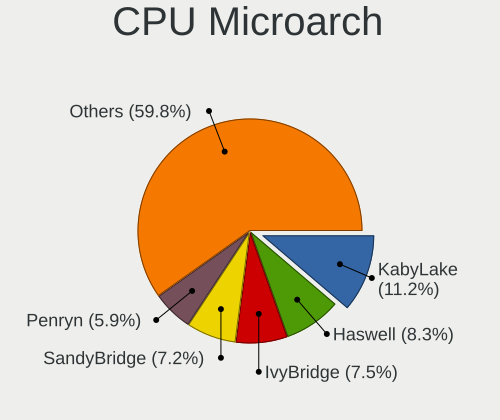

| Name               | Computers | Percent |
|--------------------|-----------|---------|
| KabyLake           | 3693      | 11.25%  |
| Haswell            | 2738      | 8.34%   |
| IvyBridge          | 2456      | 7.48%   |
| SandyBridge        | 2369      | 7.21%   |
| Penryn             | 1933      | 5.89%   |
| Skylake            | 1731      | 5.27%   |
| Zen 3              | 1603      | 4.88%   |
| Unknown            | 1513      | 4.61%   |
| Zen+               | 1089      | 3.32%   |
| Alderlake Hybrid   | 1070      | 3.26%   |
| Goldmont plus      | 1044      | 3.18%   |
| Zen 2              | 1040      | 3.17%   |
| Westmere           | 1029      | 3.13%   |
| Core               | 911       | 2.77%   |
| Silvermont         | 864       | 2.63%   |
| Broadwell          | 711       | 2.17%   |
| Piledriver         | 704       | 2.14%   |
| K10                | 686       | 2.09%   |
| TigerLake          | 647       | 1.97%   |
| Zen                | 622       | 1.89%   |
| CometLake          | 562       | 1.71%   |
| IceLake            | 495       | 1.51%   |
| Excavator          | 481       | 1.46%   |
| Goldmont           | 342       | 1.04%   |
| Bobcat             | 328       | 1%      |
| Nehalem            | 268       | 0.82%   |
| K8 Hammer          | 266       | 0.81%   |
| Puma               | 248       | 0.76%   |
| Tremont            | 205       | 0.62%   |
| Gracemont          | 193       | 0.59%   |
| Steamroller        | 191       | 0.58%   |
| Jaguar             | 160       | 0.49%   |
| Bonnell            | 146       | 0.44%   |
| K10 Llano          | 132       | 0.4%    |
| NetBurst           | 100       | 0.3%    |
| Meteorlake Hybrid  | 96        | 0.29%   |
| Bulldozer          | 90        | 0.27%   |
| K8 & K10 hybrid    | 48        | 0.15%   |
| Lunarlake Hybrid   | 27        | 0.08%   |
| ArrowLake-H Hybrid | 3         | 0.01%   |

Graphics
--------

GPU Vendor
----------

Vendors of graphics cards

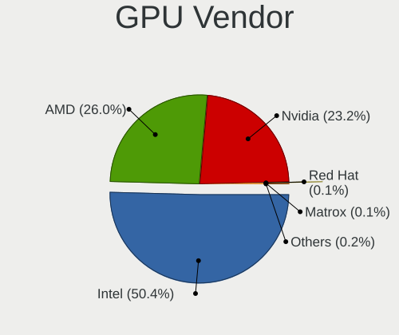

| Vendor                                       | Computers | Percent |
|----------------------------------------------|-----------|---------|
| Intel                                        | 18542     | 50.42%  |
| AMD                                          | 9570      | 26.02%  |
| Nvidia                                       | 8523      | 23.18%  |
| Red Hat                                      | 38        | 0.1%    |
| Matrox Electronics Systems                   | 34        | 0.09%   |
| ASPEED Technology                            | 28        | 0.08%   |
| Silicon Integrated Systems [SiS]             | 14        | 0.04%   |
| VIA Technologies                             | 9         | 0.02%   |
| ATI Technologies                             | 9         | 0.02%   |
| NVidia / SGS Thomson (Joint Venture)         | 3         | 0.01%   |
| XGI Technology (eXtreme Graphics Innovation) | 2         | 0.01%   |
| S3 Graphics                                  | 1         | 0.003%  |
| Huawei Technologies                          | 1         | 0.003%  |
| Conexant Systems                             | 1         | 0.003%  |

GPU Model
---------

Graphics card models

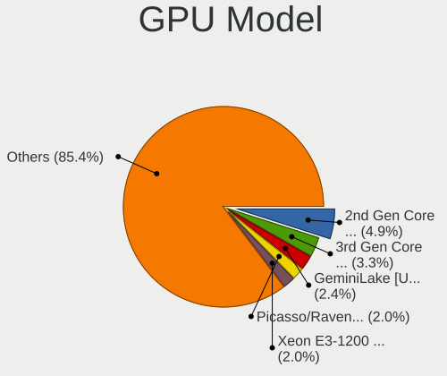

| Model                                                                                    | Computers | Percent |
|------------------------------------------------------------------------------------------|-----------|---------|
| Intel 2nd Generation Core Processor Family Integrated Graphics Controller                | 1872      | 4.94%   |
| Intel 3rd Gen Core processor Graphics Controller                                         | 1239      | 3.27%   |
| Intel GeminiLake [UHD Graphics 600]                                                      | 906       | 2.39%   |
| AMD Picasso/Raven 2 [Radeon Vega Series / Radeon Vega Mobile Series]                     | 776       | 2.05%   |
| Intel Xeon E3-1200 v3/4th Gen Core Processor Integrated Graphics Controller              | 755       | 1.99%   |
| Intel Haswell-ULT Integrated Graphics Controller                                         | 711       | 1.88%   |
| Intel Skylake-U GT2 [HD Graphics 520]                                                    | 680       | 1.79%   |
| Intel Mobile 4 Series Chipset Integrated Graphics Controller                             | 665       | 1.75%   |
| Intel Core Processor Integrated Graphics Controller                                      | 651       | 1.72%   |
| Intel Kaby Lake-U GT2 [HD Graphics 620]                                                  | 613       | 1.62%   |
| Intel Kaby Lake-R GT2 [UHD Graphics 620]                                                 | 611       | 1.61%   |
| AMD Cezanne [Radeon Vega Series / Radeon Vega Mobile Series]                             | 566       | 1.49%   |
| Intel Broadwell-U GT2 [HD Graphics 5500]                                                 | 519       | 1.37%   |
| Intel Xeon E3-1200 v2/3rd Gen Core processor Graphics Controller                         | 512       | 1.35%   |
| Intel TigerLake-LP GT2 [Iris Xe Graphics]                                                | 503       | 1.33%   |
| AMD Ellesmere [Radeon RX 470/480/570/570X/580/580X/590]                                  | 482       | 1.27%   |
| Intel Atom Processor Z36xxx/Z37xxx Series Graphics & Display                             | 462       | 1.22%   |
| Intel Skylake-S GT2 [HD Graphics 530]                                                    | 444       | 1.17%   |
| Intel Atom/Celeron/Pentium Processor x5-E8000/J3xxx/N3xxx Integrated Graphics Controller | 398       | 1.05%   |
| Intel 4th Gen Core Processor Integrated Graphics Controller                              | 393       | 1.04%   |
| Intel 4 Series Chipset Integrated Graphics Controller                                    | 384       | 1.01%   |
| AMD Renoir [Radeon Vega Series / Radeon Vega Mobile Series]                              | 372       | 0.98%   |
| Intel CoffeeLake-S GT2 [UHD Graphics 630]                                                | 327       | 0.86%   |
| AMD Raven Ridge [Radeon Vega Series / Radeon Vega Mobile Series]                         | 327       | 0.86%   |
| AMD Lucienne                                                                             | 319       | 0.84%   |
| Nvidia GK208B [GeForce GT 710]                                                           | 301       | 0.79%   |
| Intel WhiskeyLake-U GT2 [UHD Graphics 620]                                               | 293       | 0.77%   |
| Intel CometLake-U GT2 [UHD Graphics]                                                     | 282       | 0.74%   |
| Intel Apollo Lake GT1 [HD Graphics 500]                                                  | 276       | 0.73%   |
| Intel Mobile GM965/GL960 Integrated Graphics Controller (secondary)                      | 274       | 0.72%   |
| Intel Mobile GM965/GL960 Integrated Graphics Controller (primary)                        | 274       | 0.72%   |
| AMD Stoney [Radeon R2/R3/R4/R5 Graphics]                                                 | 267       | 0.7%    |
| Intel CoffeeLake-H GT2 [UHD Graphics 630]                                                | 262       | 0.69%   |
| Intel Kaby Lake-S GT2 [HD Graphics 630]                                                  | 260       | 0.69%   |
| Nvidia GP107 [GeForce GTX 1050 Ti]                                                       | 256       | 0.68%   |
| Nvidia GP108 [GeForce GT 1030]                                                           | 231       | 0.61%   |
| AMD Navi 23 [Radeon RX 6600/6600 XT/6600M]                                               | 229       | 0.6%    |
| AMD Raphael                                                                              | 225       | 0.59%   |
| AMD Phoenix1                                                                             | 224       | 0.59%   |
| Nvidia GT218 [GeForce 210]                                                               | 209       | 0.55%   |

GPU Combo
---------

Combinations of graphics cards

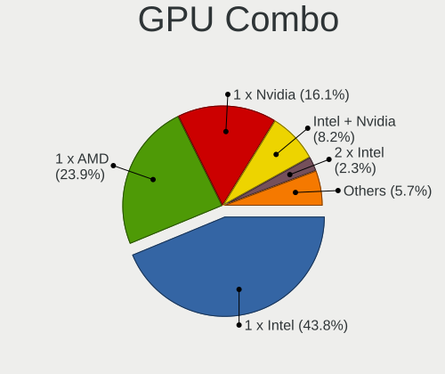

| Name                                          | Computers | Percent |
|-----------------------------------------------|-----------|---------|
| 1 x Intel                                     | 14464     | 43.78%  |
| 1 x AMD                                       | 7900      | 23.91%  |
| 1 x Nvidia                                    | 5318      | 16.1%   |
| Intel + Nvidia                                | 2698      | 8.17%   |
| 2 x Intel                                     | 775       | 2.35%   |
| 2 x AMD                                       | 640       | 1.94%   |
| Intel + AMD                                   | 591       | 1.79%   |
| AMD + Nvidia                                  | 463       | 1.4%    |
| 2 x Nvidia                                    | 42        | 0.13%   |
| 1 x Red Hat                                   | 38        | 0.12%   |
| 1 x Matrox                                    | 28        | 0.08%   |
| 1 x SiS                                       | 14        | 0.04%   |
| 1 x ASPEED                                    | 13        | 0.04%   |
| Nvidia + ASPEED                               | 10        | 0.03%   |
| 1 x VIA                                       | 9         | 0.03%   |
| Nvidia + Matrox                               | 5         | 0.02%   |
| Intel + AMD + 1 x Nvidia                      | 4         | 0.01%   |
| AMD + ASPEED                                  | 4         | 0.01%   |
| 3 x AMD                                       | 3         | 0.01%   |
| Intel + 2 x Nvidia                            | 3         | 0.01%   |
| Other                                         | 2         | 0.01%   |
| 2 x Intel + 1 x Nvidia                        | 2         | 0.01%   |
| 1 x NVidia / SGS Thomson (Joint Venture)      | 2         | 0.01%   |
| AMD + 2 x Nvidia                              | 2         | 0.01%   |
| AMD + Matrox                                  | 2         | 0.01%   |
| 2 x Nvidia + 1 x Matrox                       | 1         | 0.003%  |
| 2 x AMD + 1 x Nvidia                          | 1         | 0.003%  |
| 1 x XGI                                       | 1         | 0.003%  |
| 1 x S3 Graphics                               | 1         | 0.003%  |
| Nvidia + XGI                                  | 1         | 0.003%  |
| Nvidia + NVidia / SGS Thomson (Joint Venture) | 1         | 0.003%  |
| Intel + Conexant Systems                      | 1         | 0.003%  |
| Intel + ASPEED                                | 1         | 0.003%  |
| 1 x Huawei Technologies                       | 1         | 0.003%  |

GPU Driver
----------

Free vs proprietary

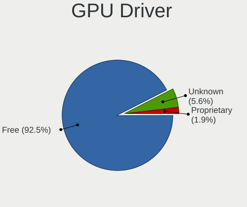

| Driver      | Computers | Percent |
|-------------|-----------|---------|
| Free        | 30536     | 92.46%  |
| Unknown     | 1861      | 5.63%   |
| Proprietary | 629       | 1.9%    |

GPU Memory
----------

Total video memory

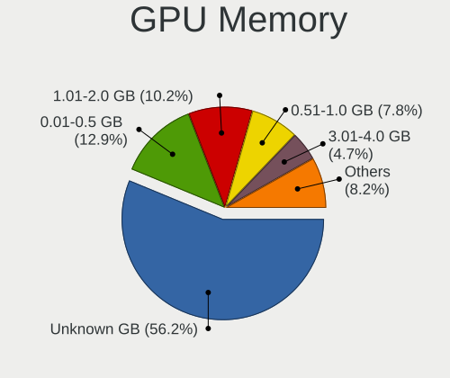

| Size in GB     | Computers | Percent |
|----------------|-----------|---------|
| Unknown        | 18734     | 56.23%  |
| 0.01-0.5       | 4302      | 12.91%  |
| 1.01-2.0       | 3414      | 10.25%  |
| 0.51-1.0       | 2589      | 7.77%   |
| 3.01-4.0       | 1560      | 4.68%   |
| 7.01-8.0       | 1292      | 3.88%   |
| 8.01-16.0      | 669       | 2.01%   |
| 5.01-6.0       | 407       | 1.22%   |
| 2.01-3.0       | 213       | 0.64%   |
| 16.01-24.0     | 123       | 0.37%   |
| 4.01-5.0       | 8         | 0.02%   |
| 32.01-64.0     | 2         | 0.01%   |
| 24.01-32.0     | 2         | 0.01%   |
| More than 64.0 | 1         | 0.003%  |

Monitor
-------

Monitor Vendor
--------------

Monitor vendors

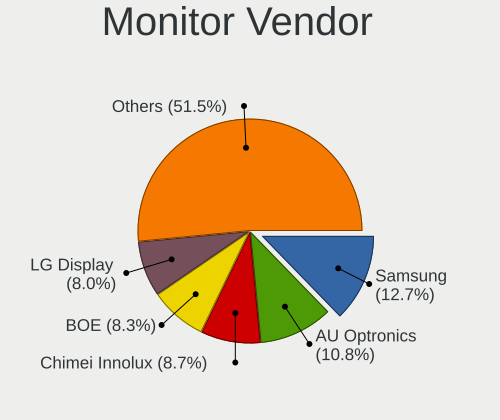

| Vendor                  | Computers | Percent |
|-------------------------|-----------|---------|
| Samsung Electronics     | 4331      | 12.74%  |
| AU Optronics            | 3657      | 10.75%  |
| Chimei Innolux          | 2942      | 8.65%   |
| BOE                     | 2827      | 8.31%   |
| LG Display              | 2728      | 8.02%   |
| Goldstar                | 1933      | 5.68%   |
| Dell                    | 1709      | 5.03%   |
| Hewlett-Packard         | 1360      | 4%      |
| Acer                    | 1306      | 3.84%   |
| AOC                     | 903       | 2.66%   |
| Lenovo                  | 858       | 2.52%   |
| Philips                 | 805       | 2.37%   |
| BenQ                    | 673       | 1.98%   |
| Ancor Communications    | 605       | 1.78%   |
| Chi Mei Optoelectronics | 462       | 1.36%   |
| Apple                   | 450       | 1.32%   |
| ASUSTek Computer        | 435       | 1.28%   |
| Sharp                   | 413       | 1.21%   |
| ViewSonic               | 405       | 1.19%   |
| Iiyama                  | 358       | 1.05%   |
| Sony                    | 231       | 0.68%   |
| MSI                     | 231       | 0.68%   |
| InfoVision              | 223       | 0.66%   |
| PANDA                   | 204       | 0.6%    |
| LG Philips              | 183       | 0.54%   |
| Eizo                    | 177       | 0.52%   |
| CPT                     | 170       | 0.5%    |
| NEC Computers           | 130       | 0.38%   |
| Panasonic               | 129       | 0.38%   |
| Fujitsu Siemens         | 126       | 0.37%   |
| Sceptre Tech            | 119       | 0.35%   |
| HannStar                | 105       | 0.31%   |
| Toshiba                 | 98        | 0.29%   |
| HKC                     | 95        | 0.28%   |
| Gigabyte Technology     | 94        | 0.28%   |
| Vizio                   | 92        | 0.27%   |
| RGT                     | 74        | 0.22%   |
| RTK                     | 70        | 0.21%   |
| Hitachi                 | 70        | 0.21%   |
| Unknown                 | 67        | 0.2%    |

Monitor Model
-------------

Monitor models

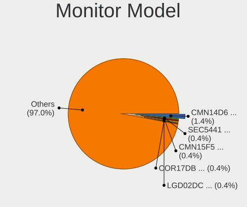

| Model                                                                    | Computers | Percent |
|--------------------------------------------------------------------------|-----------|---------|
| Chimei Innolux LCD Monitor CMN14D6 1366x768 309x173mm 13.9-inch          | 471       | 1.37%   |
| Samsung Electronics LCD Monitor SEC5441 1280x800 331x207mm 15.4-inch     | 150       | 0.43%   |
| Chimei Innolux LCD Monitor CMN15F5 1920x1080 344x193mm 15.5-inch         | 147       | 0.43%   |
| CPT LCD Monitor COR17DB 1600x900 293x164mm 13.2-inch                     | 129       | 0.37%   |
| LG Display LCD Monitor LGD02DC 1366x768 344x194mm 15.5-inch              | 128       | 0.37%   |
| Chimei Innolux LCD Monitor CMN14D4 1920x1080 309x173mm 13.9-inch         | 116       | 0.34%   |
| AU Optronics LCD Monitor AUO38ED 1920x1080 344x193mm 15.5-inch           | 108       | 0.31%   |
| Goldstar FULL HD GSM5B55 1920x1080 480x270mm 21.7-inch                   | 105       | 0.3%    |
| Chimei Innolux LCD Monitor CMN15E7 1920x1080 344x193mm 15.5-inch         | 105       | 0.3%    |
| Chimei Innolux LCD Monitor CMN15DB 1366x768 344x193mm 15.5-inch          | 105       | 0.3%    |
| AU Optronics LCD Monitor AUO21ED 1920x1080 344x193mm 15.5-inch           | 101       | 0.29%   |
| AU Optronics LCD Monitor AUO22EC 1366x768 344x193mm 15.5-inch            | 100       | 0.29%   |
| AU Optronics LCD Monitor AUO26EC 1366x768 344x193mm 15.5-inch            | 97        | 0.28%   |
| Samsung Electronics C27F390 SAM0D32 1920x1080 598x336mm 27.0-inch        | 86        | 0.25%   |
| LG Display LCD Monitor LGD033A 1366x768 344x194mm 15.5-inch              | 86        | 0.25%   |
| AOC 27G2G4 AOC2702 1920x1080 598x336mm 27.0-inch                         | 77        | 0.22%   |
| Samsung Electronics C24F390 SAM0D2C 1920x1080 521x293mm 23.5-inch        | 74        | 0.21%   |
| Chi Mei Optoelectronics LCD Monitor CMO15A7 1366x768 344x193mm 15.5-inch | 70        | 0.2%    |
| Chimei Innolux LCD Monitor CMN15E6 1366x768 344x193mm 15.5-inch          | 68        | 0.2%    |
| AU Optronics LCD Monitor AUO71EC 1366x768 344x193mm 15.5-inch            | 67        | 0.19%   |
| AU Optronics LCD Monitor AUO106C 1366x768 276x155mm 12.5-inch            | 67        | 0.19%   |
| RGT LCD Monitor RGT5211 1366x768 518x333mm 24.2-inch                     | 61        | 0.18%   |
| AOC 24G2W1G3 AOC2402 1920x1080 527x296mm 23.8-inch                       | 61        | 0.18%   |
| Goldstar LG ULTRAWIDE GSM59F1 2560x1080 670x280mm 28.6-inch              | 60        | 0.17%   |
| AU Optronics LCD Monitor AUO20EC 1366x768 344x193mm 15.5-inch            | 60        | 0.17%   |
| Eizo EV3285 ENC2979 3840x2160 698x393mm 31.5-inch                        | 59        | 0.17%   |
| Chimei Innolux LCD Monitor CMN1132 1366x768 256x144mm 11.6-inch          | 59        | 0.17%   |
| BOE LCD Monitor BOE095F 2256x1504 285x190mm 13.5-inch                    | 59        | 0.17%   |
| LG Display LCD Monitor LGD039F 1366x768 345x194mm 15.6-inch              | 56        | 0.16%   |
| Chimei Innolux LCD Monitor CMN1521 1920x1080 344x193mm 15.5-inch         | 56        | 0.16%   |
| BOE LCD Monitor BOE0812 1920x1080 344x194mm 15.5-inch                    | 52        | 0.15%   |
| Chimei Innolux LCD Monitor CMN15CA 1366x768 344x193mm 15.5-inch          | 50        | 0.14%   |
| Vestel Elektronik 40UHD_LCD_TV VES3700 3840x2160 880x500mm 39.8-inch     | 49        | 0.14%   |
| Samsung Electronics LCD Monitor SEC544B 1600x900 382x214mm 17.2-inch     | 49        | 0.14%   |
| AU Optronics LCD Monitor AUO10EC 1366x768 344x193mm 15.5-inch            | 49        | 0.14%   |
| Chimei Innolux LCD Monitor CMN14C9 1920x1080 309x173mm 13.9-inch         | 48        | 0.14%   |
| AU Optronics LCD Monitor AUO183C 1366x768 309x173mm 13.9-inch            | 48        | 0.14%   |
| LG Display LCD Monitor LGD02D8 1366x768 277x156mm 12.5-inch              | 47        | 0.14%   |
| Chimei Innolux LCD Monitor CMN14C3 1366x768 309x173mm 13.9-inch          | 47        | 0.14%   |
| AU Optronics LCD Monitor AUO70EC 1366x768 344x193mm 15.5-inch            | 47        | 0.14%   |

Monitor Resolution
------------------

Monitor screen resolution

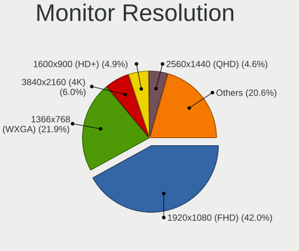

| Resolution         | Computers | Percent |
|--------------------|-----------|---------|
| 1920x1080 (FHD)    | 13907     | 41.99%  |
| 1366x768 (WXGA)    | 7262      | 21.93%  |
| 3840x2160 (4K)     | 1980      | 5.98%   |
| 1600x900 (HD+)     | 1623      | 4.9%    |
| 2560x1440 (QHD)    | 1525      | 4.61%   |
| 1280x1024 (SXGA)   | 1034      | 3.12%   |
| 1920x1200 (WUXGA)  | 942       | 2.84%   |
| 1440x900 (WXGA+)   | 870       | 2.63%   |
| 1680x1050 (WSXGA+) | 859       | 2.59%   |
| 1280x800 (WXGA)    | 694       | 2.1%    |
| 3440x1440          | 323       | 0.98%   |
| 2560x1600          | 301       | 0.91%   |
| 1360x768           | 244       | 0.74%   |
| 2560x1080          | 191       | 0.58%   |
| 2880x1800          | 140       | 0.42%   |
| 1920x540           | 121       | 0.37%   |
| 2256x1504          | 119       | 0.36%   |
| 1024x768 (XGA)     | 95        | 0.29%   |
| 2880x1920          | 83        | 0.25%   |
| 2160x1440          | 70        | 0.21%   |
| 3840x1080          | 60        | 0.18%   |
| 1600x1200          | 59        | 0.18%   |
| 3840x2400          | 58        | 0.18%   |
| 3200x1800 (QHD+)   | 54        | 0.16%   |
| 1024x600           | 52        | 0.16%   |
| 1920x1280          | 41        | 0.12%   |
| 2560x1397          | 38        | 0.11%   |
| Unknown            | 36        | 0.11%   |
| 1280x720 (HD)      | 34        | 0.1%    |
| 2288x1287          | 31        | 0.09%   |
| 3840x1600          | 25        | 0.08%   |
| 1280x960           | 23        | 0.07%   |
| 3200x2000          | 17        | 0.05%   |
| 3072x1920          | 16        | 0.05%   |
| 2736x1824          | 14        | 0.04%   |
| 1800x1200          | 14        | 0.04%   |
| 1680x945           | 14        | 0.04%   |
| 2400x1600          | 13        | 0.04%   |
| 1400x1050          | 13        | 0.04%   |
| 800x1280           | 12        | 0.04%   |

Monitor Diagonal
----------------

Diagonal size in inches

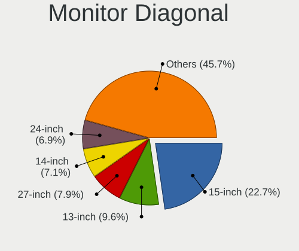

| Inches  | Computers | Percent |
|---------|-----------|---------|
| 15      | 7731      | 22.74%  |
| 13      | 3277      | 9.64%   |
| 27      | 2682      | 7.89%   |
| 14      | 2427      | 7.14%   |
| 24      | 2348      | 6.91%   |
| 23      | 2343      | 6.89%   |
| 21      | 1987      | 5.85%   |
| 17      | 1958      | 5.76%   |
| 31      | 1239      | 3.65%   |
| 19      | 1108      | 3.26%   |
| 18      | 820       | 2.41%   |
| 12      | 631       | 1.86%   |
| 22      | 614       | 1.81%   |
| 20      | 577       | 1.7%    |
| 11      | 575       | 1.69%   |
| 16      | 449       | 1.32%   |
| 34      | 435       | 1.28%   |
| Unknown | 326       | 0.96%   |
| 84      | 291       | 0.86%   |
| 32      | 250       | 0.74%   |
| 54      | 182       | 0.54%   |
| 40      | 177       | 0.52%   |
| 72      | 169       | 0.5%    |
| 26      | 136       | 0.4%    |
| 10      | 121       | 0.36%   |
| 25      | 105       | 0.31%   |
| 28      | 88        | 0.26%   |
| 63      | 77        | 0.23%   |
| 48      | 76        | 0.22%   |
| 29      | 76        | 0.22%   |
| 52      | 63        | 0.19%   |
| 65      | 60        | 0.18%   |
| 46      | 54        | 0.16%   |
| 49      | 51        | 0.15%   |
| 42      | 46        | 0.14%   |
| 37      | 44        | 0.13%   |
| 74      | 38        | 0.11%   |
| 36      | 31        | 0.09%   |
| 39      | 30        | 0.09%   |
| 33      | 29        | 0.09%   |

Monitor Width
-------------

Physical width

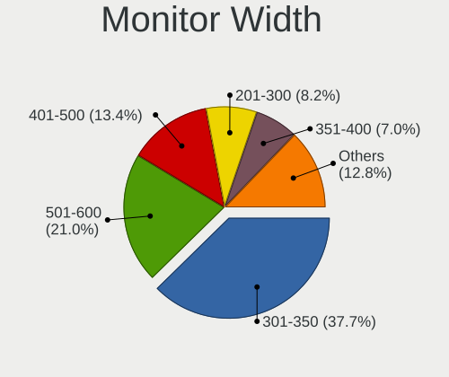

| Width in mm    | Computers | Percent |
|----------------|-----------|---------|
| 301-350        | 12638     | 37.66%  |
| 501-600        | 7036      | 20.97%  |
| 401-500        | 4498      | 13.4%   |
| 201-300        | 2748      | 8.19%   |
| 351-400        | 2339      | 6.97%   |
| 601-700        | 1614      | 4.81%   |
| 701-800        | 738       | 2.2%    |
| 1001-1500      | 656       | 1.95%   |
| 1501-2000      | 522       | 1.56%   |
| Unknown        | 326       | 0.97%   |
| 801-900        | 293       | 0.87%   |
| 901-1000       | 86        | 0.26%   |
| 101-200        | 27        | 0.08%   |
| More than 2000 | 25        | 0.07%   |
| 1-100          | 12        | 0.04%   |

Aspect Ratio
------------

Proportional relationship between the width and the height

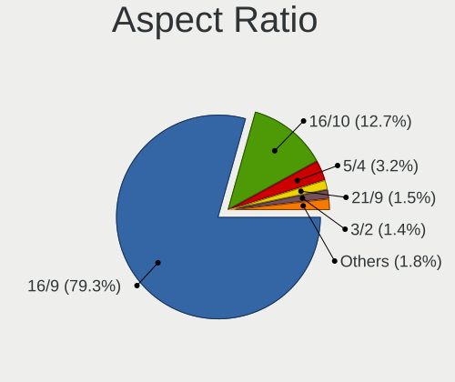

| Ratio   | Computers | Percent |
|---------|-----------|---------|
| 16/9    | 25467     | 79.35%  |
| 16/10   | 4072      | 12.69%  |
| 5/4     | 1024      | 3.19%   |
| 21/9    | 495       | 1.54%   |
| 3/2     | 459       | 1.43%   |
| 4/3     | 257       | 0.8%    |
| Unknown | 104       | 0.32%   |
| 32/9    | 99        | 0.31%   |
| 6/5     | 26        | 0.08%   |
| 1.00    | 25        | 0.08%   |
| 1.96    | 12        | 0.04%   |
| 0.56    | 12        | 0.04%   |
| 0.67    | 11        | 0.03%   |
| 0.63    | 11        | 0.03%   |
| 2.00    | 5         | 0.02%   |
| 2.12    | 4         | 0.01%   |
| 3.40    | 2         | 0.01%   |
| 3.20    | 2         | 0.01%   |
| 0.89    | 2         | 0.01%   |
| 3.75    | 1         | 0.003%  |
| 2.70    | 1         | 0.003%  |
| 2.51    | 1         | 0.003%  |
| 2.01    | 1         | 0.003%  |
| 0.75    | 1         | 0.003%  |
| 0.62    | 1         | 0.003%  |

Monitor Area
------------

Area in inch²

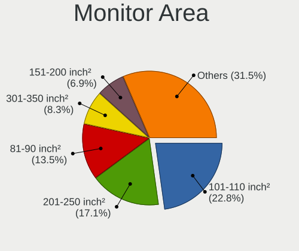

| Area in inch² | Computers | Percent |
|----------------|-----------|---------|
| 101-110        | 7696      | 22.8%   |
| 201-250        | 5764      | 17.08%  |
| 81-90          | 4568      | 13.53%  |
| 301-350        | 2790      | 8.27%   |
| 151-200        | 2313      | 6.85%   |
| 351-500        | 2056      | 6.09%   |
| 121-130        | 1217      | 3.61%   |
| 141-150        | 1184      | 3.51%   |
| 71-80          | 1122      | 3.32%   |
| More than 1000 | 1055      | 3.13%   |
| 251-300        | 1024      | 3.03%   |
| 51-60          | 599       | 1.77%   |
| 61-70          | 589       | 1.74%   |
| 501-1000       | 543       | 1.61%   |
| 111-120        | 435       | 1.29%   |
| Unknown        | 326       | 0.97%   |
| 131-140        | 264       | 0.78%   |
| 41-50          | 100       | 0.3%    |
| 91-100         | 72        | 0.21%   |
| 1-40           | 39        | 0.12%   |

Pixel Density
-------------

Pixels per inch

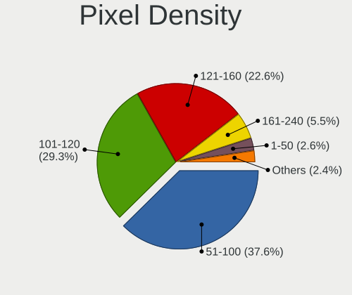

| Density       | Computers | Percent |
|---------------|-----------|---------|
| 51-100        | 12436     | 37.61%  |
| 101-120       | 9678      | 29.27%  |
| 121-160       | 7484      | 22.63%  |
| 161-240       | 1818      | 5.5%    |
| 1-50          | 858       | 2.59%   |
| More than 240 | 468       | 1.42%   |
| Unknown       | 327       | 0.99%   |

Multiple Monitors
-----------------

Total monitors connected

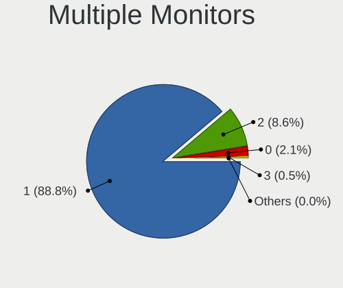

| Total | Computers | Percent |
|-------|-----------|---------|
| 1     | 29423     | 88.83%  |
| 2     | 2839      | 8.57%   |
| 0     | 682       | 2.06%   |
| 3     | 159       | 0.48%   |
| 4     | 14        | 0.04%   |
| 6     | 2         | 0.01%   |
| 7     | 1         | 0.003%  |
| 5     | 1         | 0.003%  |

Network
-------

Net Controller Vendor
---------------------

Controller vendors

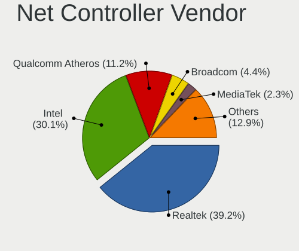

| Vendor                            | Computers | Percent |
|-----------------------------------|-----------|---------|
| Realtek Semiconductor             | 18819     | 39.2%   |
| Intel                             | 14427     | 30.05%  |
| Qualcomm Atheros                  | 5390      | 11.23%  |
| Broadcom                          | 2100      | 4.37%   |
| MediaTek                          | 1093      | 2.28%   |
| ASIX Electronics                  | 687       | 1.43%   |
| Broadcom Limited                  | 524       | 1.09%   |
| Ralink Technology                 | 522       | 1.09%   |
| Marvell Technology Group          | 509       | 1.06%   |
| TP-Link                           | 444       | 0.92%   |
| Ralink                            | 436       | 0.91%   |
| Nvidia                            | 371       | 0.77%   |
| Samsung Electronics               | 275       | 0.57%   |
| Qualcomm Atheros Communications   | 141       | 0.29%   |
| Dell                              | 120       | 0.25%   |
| Huawei Technologies               | 117       | 0.24%   |
| JMicron Technology                | 115       | 0.24%   |
| Sierra Wireless                   | 109       | 0.23%   |
| Ericsson Business Mobile Networks | 107       | 0.22%   |
| D-Link                            | 104       | 0.22%   |
| NetGear                           | 99        | 0.21%   |
| Aquantia                          | 82        | 0.17%   |
| Microsoft                         | 80        | 0.17%   |
| ASUSTek Computer                  | 76        | 0.16%   |
| D-Link System                     | 74        | 0.15%   |
| Qualcomm                          | 71        | 0.15%   |
| Shenzhen Goodix Technology        | 61        | 0.13%   |
| Xiaomi                            | 56        | 0.12%   |
| Motorola PCS                      | 54        | 0.11%   |
| DisplayLink                       | 53        | 0.11%   |
| Hewlett-Packard                   | 50        | 0.1%    |
| VIA Technologies                  | 45        | 0.09%   |
| Belkin Components                 | 44        | 0.09%   |
| ZTE WCDMA Technologies MSM        | 42        | 0.09%   |
| Lenovo                            | 38        | 0.08%   |
| Edimax Technology                 | 38        | 0.08%   |
| Linksys                           | 37        | 0.08%   |
| OPPO Electronics                  | 36        | 0.07%   |
| Google                            | 32        | 0.07%   |
| Qualcomm Technologies             | 31        | 0.06%   |

Net Controller Model
--------------------

Controller models

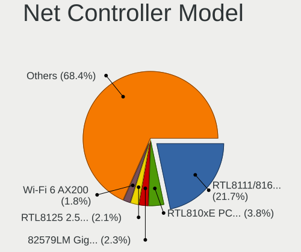

| Model                                                                  | Computers | Percent |
|------------------------------------------------------------------------|-----------|---------|
| Realtek RTL8111/8168/8211/8411 PCI Express Gigabit Ethernet Controller | 12223     | 21.73%  |
| Realtek RTL810xE PCI Express Fast Ethernet controller                  | 2130      | 3.79%   |
| Intel 82579LM Gigabit Network Connection (Lewisville)                  | 1274      | 2.26%   |
| Realtek RTL8125 2.5GbE Controller                                      | 1166      | 2.07%   |
| Intel Wi-Fi 6 AX200                                                    | 998       | 1.77%   |
| Realtek RTL8821CE 802.11ac PCIe Wireless Network Adapter               | 961       | 1.71%   |
| Intel Wireless 8265 / 8275                                             | 859       | 1.53%   |
| Qualcomm Atheros AR9485 Wireless Network Adapter                       | 799       | 1.42%   |
| Qualcomm Atheros QCA9565 / AR9565 Wireless Network Adapter             | 729       | 1.3%    |
| Intel Wireless 7265                                                    | 722       | 1.28%   |
| Qualcomm Atheros QCA9377 802.11ac Wireless Network Adapter             | 720       | 1.28%   |
| Qualcomm Atheros AR9285 Wireless Network Adapter (PCI-Express)         | 674       | 1.2%    |
| ASIX AX88179 Gigabit Ethernet                                          | 653       | 1.16%   |
| Realtek RTL8852BE PCIe 802.11ax Wireless Network Controller            | 631       | 1.12%   |
| Realtek RTL8153 Gigabit Ethernet Adapter                               | 614       | 1.09%   |
| Intel Wireless 7260                                                    | 614       | 1.09%   |
| Intel Ethernet Connection I217-LM                                      | 576       | 1.02%   |
| Intel Wi-Fi 6E(802.11ax) AX210/AX1675* 2x2 [Typhoon Peak]              | 531       | 0.94%   |
| Intel Centrino Advanced-N 6205 [Taylor Peak]                           | 523       | 0.93%   |
| Realtek RTL8822CE 802.11ac PCIe Wireless Network Adapter               | 515       | 0.92%   |
| Intel Wireless 8260                                                    | 515       | 0.92%   |
| Intel I211 Gigabit Network Connection                                  | 500       | 0.89%   |
| Intel Wi-Fi 6 AX201                                                    | 456       | 0.81%   |
| Intel Wireless 3165                                                    | 435       | 0.77%   |
| MediaTek MT7922 802.11ax PCI Express Wireless Network Adapter          | 433       | 0.77%   |
| Intel Ethernet Controller I225-V                                       | 415       | 0.74%   |
| Intel Ethernet Connection (2) I219-V                                   | 413       | 0.73%   |
| Intel Dual Band Wireless-AC 3168NGW [Stone Peak]                       | 411       | 0.73%   |
| Qualcomm Atheros QCA6174 802.11ac Wireless Network Adapter             | 391       | 0.7%    |
| Realtek RTL8188CE 802.11b/g/n WiFi Adapter                             | 352       | 0.63%   |
| Realtek RTL8723BE PCIe Wireless Network Adapter                        | 346       | 0.62%   |
| Intel Ethernet Connection (4) I219-LM                                  | 333       | 0.59%   |
| Broadcom BCM4313 802.11bgn Wireless Network Adapter                    | 315       | 0.56%   |
| MediaTek MT7921 802.11ax PCIe Wireless Network Adapter [Filogic 330]   | 309       | 0.55%   |
| Qualcomm Atheros AR8151 v2.0 Gigabit Ethernet                          | 308       | 0.55%   |
| Intel Alder Lake-P PCH CNVi WiFi                                       | 292       | 0.52%   |
| Intel Ethernet Connection (2) I219-LM                                  | 271       | 0.48%   |
| Intel 82579V Gigabit Network Connection                                | 269       | 0.48%   |
| Ralink MT7601U Wireless Adapter                                        | 267       | 0.47%   |
| Intel Wi-Fi 5(802.11ac) Wireless-AC 9x6x [Thunder Peak]                | 261       | 0.46%   |

Wireless Vendor
---------------

Wireless vendors

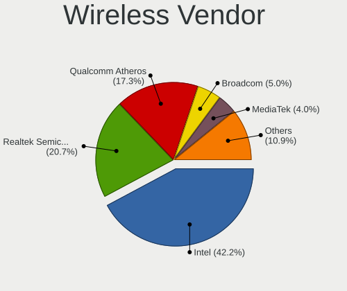

| Vendor                                | Computers | Percent |
|---------------------------------------|-----------|---------|
| Intel                                 | 10471     | 42.18%  |
| Realtek Semiconductor                 | 5131      | 20.67%  |
| Qualcomm Atheros                      | 4283      | 17.25%  |
| Broadcom                              | 1250      | 5.04%   |
| MediaTek                              | 994       | 4%      |
| Ralink Technology                     | 522       | 2.1%    |
| Ralink                                | 436       | 1.76%   |
| TP-Link                               | 378       | 1.52%   |
| Broadcom Limited                      | 258       | 1.04%   |
| Qualcomm Atheros Communications       | 141       | 0.57%   |
| Sierra Wireless                       | 109       | 0.44%   |
| D-Link                                | 95        | 0.38%   |
| NetGear                               | 92        | 0.37%   |
| Dell                                  | 73        | 0.29%   |
| ASUSTek Computer                      | 71        | 0.29%   |
| Marvell Technology Group              | 69        | 0.28%   |
| Microsoft                             | 64        | 0.26%   |
| D-Link System                         | 46        | 0.19%   |
| Qualcomm                              | 42        | 0.17%   |
| Belkin Components                     | 42        | 0.17%   |
| Edimax Technology                     | 38        | 0.15%   |
| Linksys                               | 32        | 0.13%   |
| AVM                                   | 20        | 0.08%   |
| IMC Networks                          | 17        | 0.07%   |
| Fibocom                               | 16        | 0.06%   |
| Mercucys                              | 13        | 0.05%   |
| Qualcomm Technologies                 | 11        | 0.04%   |
| Hewlett-Packard                       | 9         | 0.04%   |
| Gemtek                                | 9         | 0.04%   |
| 802.11g Adapter [Linksys WUSB54GC v3] | 9         | 0.04%   |
| ZyDAS                                 | 8         | 0.03%   |
| BUFFALO                               | 7         | 0.03%   |
| Sitecom Europe                        | 6         | 0.02%   |
| Guillemot                             | 5         | 0.02%   |
| Elecom                                | 5         | 0.02%   |
| ZyXEL Communications                  | 4         | 0.02%   |
| Wilocity                              | 4         | 0.02%   |
| Tenda                                 | 4         | 0.02%   |
| PLANEX                                | 4         | 0.02%   |
| Wacom                                 | 3         | 0.01%   |

Wireless Model
--------------

Wireless models

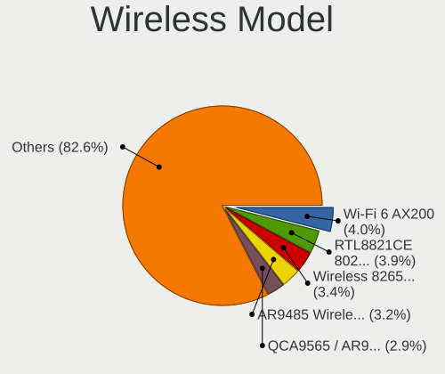

| Model                                                                | Computers | Percent |
|----------------------------------------------------------------------|-----------|---------|
| Intel Wi-Fi 6 AX200                                                  | 998       | 4%      |
| Realtek RTL8821CE 802.11ac PCIe Wireless Network Adapter             | 961       | 3.86%   |
| Intel Wireless 8265 / 8275                                           | 859       | 3.45%   |
| Qualcomm Atheros AR9485 Wireless Network Adapter                     | 799       | 3.21%   |
| Qualcomm Atheros QCA9565 / AR9565 Wireless Network Adapter           | 729       | 2.92%   |
| Intel Wireless 7265                                                  | 722       | 2.9%    |
| Qualcomm Atheros QCA9377 802.11ac Wireless Network Adapter           | 720       | 2.89%   |
| Qualcomm Atheros AR9285 Wireless Network Adapter (PCI-Express)       | 674       | 2.7%    |
| Intel Wireless 7260                                                  | 614       | 2.46%   |
| Realtek RTL8852BE PCIe 802.11ax Wireless Network Controller          | 571       | 2.29%   |
| Intel Wi-Fi 6E(802.11ax) AX210/AX1675* 2x2 [Typhoon Peak]            | 531       | 2.13%   |
| Intel Centrino Advanced-N 6205 [Taylor Peak]                         | 523       | 2.1%    |
| Realtek RTL8822CE 802.11ac PCIe Wireless Network Adapter             | 515       | 2.07%   |
| Intel Wireless 8260                                                  | 515       | 2.07%   |
| Intel Wi-Fi 6 AX201                                                  | 456       | 1.83%   |
| Intel Wireless 3165                                                  | 435       | 1.75%   |
| Intel Dual Band Wireless-AC 3168NGW [Stone Peak]                     | 411       | 1.65%   |
| MediaTek MT7922 802.11ax PCI Express Wireless Network Adapter        | 402       | 1.61%   |
| Qualcomm Atheros QCA6174 802.11ac Wireless Network Adapter           | 391       | 1.57%   |
| Realtek RTL8188CE 802.11b/g/n WiFi Adapter                           | 352       | 1.41%   |
| Realtek RTL8723BE PCIe Wireless Network Adapter                      | 346       | 1.39%   |
| Broadcom BCM4313 802.11bgn Wireless Network Adapter                  | 315       | 1.26%   |
| MediaTek MT7921 802.11ax PCIe Wireless Network Adapter [Filogic 330] | 309       | 1.24%   |
| Ralink MT7601U Wireless Adapter                                      | 267       | 1.07%   |
| Intel Wi-Fi 5(802.11ac) Wireless-AC 9x6x [Thunder Peak]              | 261       | 1.05%   |
| Intel Cannon Lake PCH CNVi WiFi                                      | 261       | 1.05%   |
| Intel Wireless 3160                                                  | 251       | 1.01%   |
| Intel Comet Lake PCH-LP CNVi WiFi                                    | 247       | 0.99%   |
| Realtek RTL8188EUS 802.11n Wireless Network Adapter                  | 241       | 0.97%   |
| Qualcomm Atheros AR9462 Wireless Network Adapter                     | 233       | 0.93%   |
| Realtek RTL8188EE Wireless Network Adapter                           | 222       | 0.89%   |
| Intel Cannon Point-LP CNVi [Wireless-AC]                             | 220       | 0.88%   |
| Intel Centrino Ultimate-N 6300                                       | 194       | 0.78%   |
| Realtek 802.11ac NIC                                                 | 186       | 0.75%   |
| Intel Alder Lake-P PCH CNVi WiFi                                     | 182       | 0.73%   |
| Intel Gemini Lake PCH CNVi WiFi                                      | 181       | 0.73%   |
| Intel WiFi Link 5100                                                 | 180       | 0.72%   |
| Qualcomm Atheros AR928X Wireless Network Adapter (PCI-Express)       | 178       | 0.71%   |
| Intel Centrino Advanced-N 6200                                       | 177       | 0.71%   |
| Intel Dual Band Wireless-AC 3165 Plus Bluetooth                      | 164       | 0.66%   |

Ethernet Vendor
---------------

Ethernet vendors

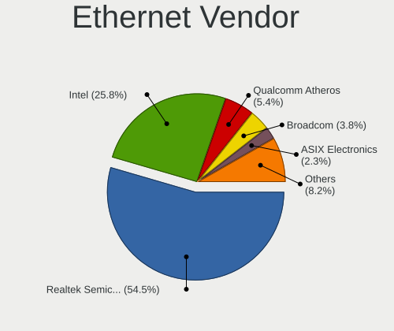

| Vendor                                 | Computers | Percent |
|----------------------------------------|-----------|---------|
| Realtek Semiconductor                  | 16472     | 54.5%   |
| Intel                                  | 7788      | 25.77%  |
| Qualcomm Atheros                       | 1643      | 5.44%   |
| Broadcom                               | 1140      | 3.77%   |
| ASIX Electronics                       | 687       | 2.27%   |
| Marvell Technology Group               | 440       | 1.46%   |
| Nvidia                                 | 370       | 1.22%   |
| Broadcom Limited                       | 273       | 0.9%    |
| Samsung Electronics                    | 270       | 0.89%   |
| JMicron Technology                     | 115       | 0.38%   |
| Huawei Technologies                    | 102       | 0.34%   |
| MediaTek                               | 100       | 0.33%   |
| Aquantia                               | 82        | 0.27%   |
| TP-Link                                | 69        | 0.23%   |
| Xiaomi                                 | 56        | 0.19%   |
| Motorola PCS                           | 54        | 0.18%   |
| DisplayLink                            | 53        | 0.18%   |
| VIA Technologies                       | 42        | 0.14%   |
| Lenovo                                 | 37        | 0.12%   |
| OPPO Electronics                       | 36        | 0.12%   |
| Google                                 | 32        | 0.11%   |
| Qualcomm                               | 29        | 0.1%    |
| D-Link System                          | 28        | 0.09%   |
| ICS Advent                             | 25        | 0.08%   |
| Silicon Integrated Systems [SiS]       | 23        | 0.08%   |
| Suzhou Motorcomm Electronic Technology | 20        | 0.07%   |
| Qualcomm Technologies                  | 20        | 0.07%   |
| Mellanox Technologies                  | 16        | 0.05%   |
| Hewlett-Packard                        | 16        | 0.05%   |
| Apple                                  | 16        | 0.05%   |
| 3Com                                   | 16        | 0.05%   |
| ZTE WCDMA Technologies MSM             | 12        | 0.04%   |
| Microsoft                              | 12        | 0.04%   |
| Spreadtrum Communications              | 9         | 0.03%   |
| OnePlus Technology (Shenzhen)          | 9         | 0.03%   |
| LG Electronics                         | 9         | 0.03%   |
| D-Link                                 | 9         | 0.03%   |
| Attansic Technology                    | 9         | 0.03%   |
| T & A Mobile Phones                    | 8         | 0.03%   |
| NetGear                                | 7         | 0.02%   |

Ethernet Model
--------------

Ethernet models

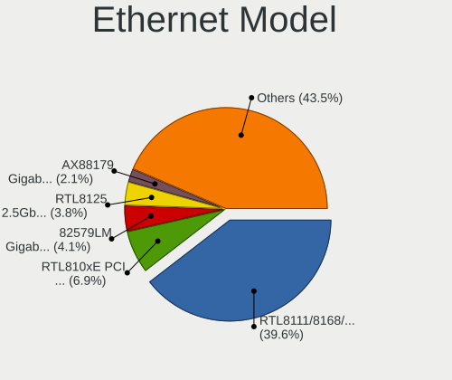

| Model                                                                  | Computers | Percent |
|------------------------------------------------------------------------|-----------|---------|
| Realtek RTL8111/8168/8211/8411 PCI Express Gigabit Ethernet Controller | 12223     | 39.55%  |
| Realtek RTL810xE PCI Express Fast Ethernet controller                  | 2130      | 6.89%   |
| Intel 82579LM Gigabit Network Connection (Lewisville)                  | 1274      | 4.12%   |
| Realtek RTL8125 2.5GbE Controller                                      | 1166      | 3.77%   |
| ASIX AX88179 Gigabit Ethernet                                          | 653       | 2.11%   |
| Realtek RTL8153 Gigabit Ethernet Adapter                               | 614       | 1.99%   |
| Intel Ethernet Connection I217-LM                                      | 576       | 1.86%   |
| Intel I211 Gigabit Network Connection                                  | 500       | 1.62%   |
| Intel Ethernet Controller I225-V                                       | 415       | 1.34%   |
| Intel Ethernet Connection (2) I219-V                                   | 413       | 1.34%   |
| Intel Ethernet Connection (4) I219-LM                                  | 333       | 1.08%   |
| Qualcomm Atheros AR8151 v2.0 Gigabit Ethernet                          | 308       | 1%      |
| Intel Ethernet Connection (2) I219-LM                                  | 271       | 0.88%   |
| Intel 82579V Gigabit Network Connection                                | 269       | 0.87%   |
| Samsung Galaxy series, misc. (tethering mode)                          | 231       | 0.75%   |
| Intel 82577LM Gigabit Network Connection                               | 227       | 0.73%   |
| Intel Ethernet Connection I219-LM                                      | 221       | 0.72%   |
| Intel Ethernet Connection (3) I218-LM                                  | 196       | 0.63%   |
| Intel Ethernet Connection I218-LM                                      | 191       | 0.62%   |
| Intel 82567LM-3 Gigabit Network Connection                             | 191       | 0.62%   |
| Intel Ethernet Connection (7) I219-V                                   | 176       | 0.57%   |
| Qualcomm Atheros AR8161 Gigabit Ethernet                               | 172       | 0.56%   |
| Intel 82567LM Gigabit Network Connection                               | 172       | 0.56%   |
| Qualcomm Atheros AR8131 Gigabit Ethernet                               | 168       | 0.54%   |
| Nvidia MCP61 Ethernet                                                  | 167       | 0.54%   |
| Realtek RTL-8100/8101L/8139 PCI Fast Ethernet Adapter                  | 165       | 0.53%   |
| Intel Ethernet Connection I217-V                                       | 164       | 0.53%   |
| Qualcomm Atheros AR8152 v2.0 Fast Ethernet                             | 145       | 0.47%   |
| Intel Ethernet Connection (4) I219-V                                   | 140       | 0.45%   |
| Broadcom NetLink BCM57780 Gigabit Ethernet PCIe                        | 137       | 0.44%   |
| Intel Ethernet Connection (7) I219-LM                                  | 132       | 0.43%   |
| Broadcom NetXtreme BCM57765 Gigabit Ethernet PCIe                      | 124       | 0.4%    |
| Intel Ethernet Connection (5) I219-LM                                  | 123       | 0.4%    |
| Intel Ethernet Controller I226-V                                       | 117       | 0.38%   |
| Qualcomm Atheros AR8162 Fast Ethernet                                  | 116       | 0.38%   |
| Qualcomm Atheros Killer E220x Gigabit Ethernet Controller              | 114       | 0.37%   |
| Intel Alder Lake-P PCH CNVi WiFi                                       | 110       | 0.36%   |
| Qualcomm Atheros QCA8171 Gigabit Ethernet                              | 106       | 0.34%   |
| Qualcomm Atheros AR8121/AR8113/AR8114 Gigabit or Fast Ethernet         | 106       | 0.34%   |
| Intel Ethernet Connection I219-V                                       | 106       | 0.34%   |

Net Controller Kind
-------------------

Ethernet, WiFi or modem

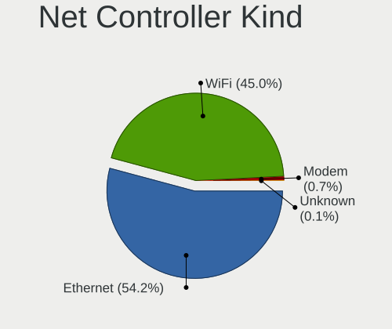

| Kind     | Computers | Percent |
|----------|-----------|---------|
| Ethernet | 28775     | 54.17%  |
| WiFi     | 23918     | 45.03%  |
| Modem    | 378       | 0.71%   |
| Unknown  | 44        | 0.08%   |

Used Controller
---------------

Currently used network controller

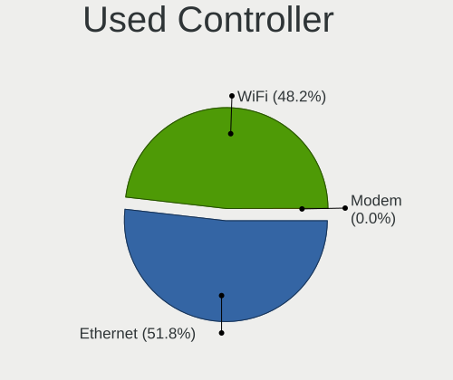

| Kind     | Computers | Percent |
|----------|-----------|---------|
| Ethernet | 16807     | 51.81%  |
| WiFi     | 15625     | 48.16%  |
| Modem    | 10        | 0.03%   |

NICs
----

Total network controllers on board

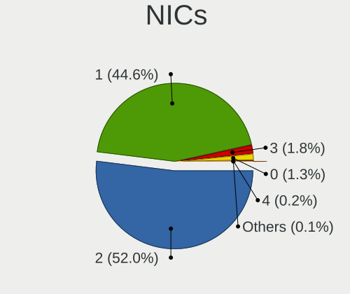

| Total | Computers | Percent |
|-------|-----------|---------|
| 2     | 17084     | 51.95%  |
| 1     | 14665     | 44.6%   |
| 3     | 591       | 1.8%    |
| 0     | 439       | 1.34%   |
| 4     | 64        | 0.19%   |
| 5     | 19        | 0.06%   |
| 6     | 16        | 0.05%   |
| 7     | 4         | 0.01%   |
| 10    | 1         | 0.003%  |

IPv6
----

IPv6 vs IPv4

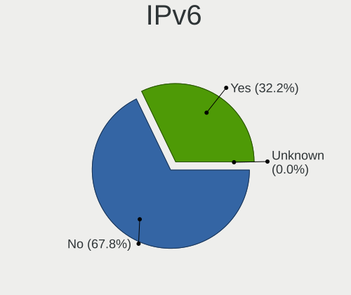

| Used    | Computers | Percent |
|---------|-----------|---------|
| No      | 22667     | 67.84%  |
| Yes     | 10744     | 32.16%  |
| Unknown | 1         | 0.003%  |

Bluetooth
---------

Bluetooth Vendor
----------------

Controller vendors

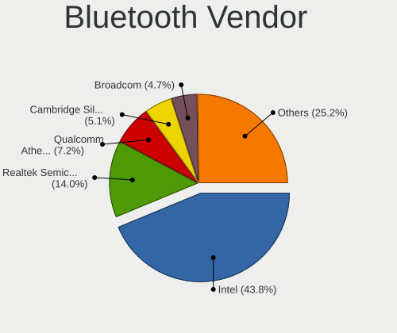

| Vendor                          | Computers | Percent |
|---------------------------------|-----------|---------|
| Intel                           | 8450      | 43.75%  |
| Realtek Semiconductor           | 2709      | 14.03%  |
| Qualcomm Atheros Communications | 1386      | 7.18%   |
| Cambridge Silicon Radio         | 984       | 5.1%    |
| Broadcom                        | 914       | 4.73%   |
| IMC Networks                    | 893       | 4.62%   |
| Foxconn / Hon Hai               | 719       | 3.72%   |
| Lite-On Technology              | 653       | 3.38%   |
| Apple                           | 497       | 2.57%   |
| MediaTek                        | 442       | 2.29%   |
| ASUSTek Computer                | 272       | 1.41%   |
| Dell                            | 262       | 1.36%   |
| Hewlett-Packard                 | 213       | 1.1%    |
| Toshiba                         | 174       | 0.9%    |
| TP-Link                         | 127       | 0.66%   |
| Ralink                          | 94        | 0.49%   |
| Marvell Semiconductor           | 85        | 0.44%   |
| Realtek                         | 68        | 0.35%   |
| Foxconn International           | 42        | 0.22%   |
| Alps Electric                   | 37        | 0.19%   |
| USI                             | 36        | 0.19%   |
| Unknown                         | 25        | 0.13%   |
| Actions                         | 24        | 0.12%   |
| Chicony Electronics             | 22        | 0.11%   |
| Integrated System Solution      | 21        | 0.11%   |
| Edimax Technology               | 19        | 0.1%    |
| Ralink Technology               | 18        | 0.09%   |
| Askey Computer                  | 16        | 0.08%   |
| Belkin Components               | 15        | 0.08%   |
| Fujitsu                         | 14        | 0.07%   |
| Dynex                           | 14        | 0.07%   |
| Primax Electronics              | 11        | 0.06%   |
| Micro Star International        | 9         | 0.05%   |
| Qcom                            | 8         | 0.04%   |
| Taiyo Yuden                     | 7         | 0.04%   |
| Smart Modular Technologies      | 5         | 0.03%   |
| SiW                             | 4         | 0.02%   |
| SINO WEALTH                     | 4         | 0.02%   |
| Quectel Wireless Solutions      | 4         | 0.02%   |
| HTC (High Tech Computer)        | 4         | 0.02%   |

Bluetooth Model
---------------

Controller models

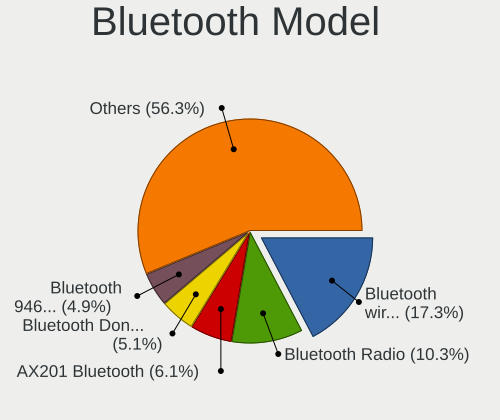

| Model                                               | Computers | Percent |
|-----------------------------------------------------|-----------|---------|
| Intel Bluetooth wireless interface                  | 3348      | 17.32%  |
| Realtek Bluetooth Radio                             | 1996      | 10.33%  |
| Intel AX201 Bluetooth                               | 1172      | 6.06%   |
| Cambridge Silicon Radio Bluetooth Dongle (HCI mode) | 984       | 5.09%   |
| Intel Bluetooth 9460/9560 Jefferson Peak (JfP)      | 954       | 4.94%   |
| Intel AX200 Bluetooth                               | 949       | 4.91%   |
| Qualcomm Atheros  Bluetooth Device                  | 682       | 3.53%   |
| Intel Bluetooth Device                              | 536       | 2.77%   |
| Intel AX210 Bluetooth                               | 502       | 2.6%    |
| Realtek  Bluetooth 4.2 Adapter                      | 467       | 2.42%   |
| MediaTek Wireless_Device                            | 439       | 2.27%   |
| Intel Wireless-AC 3168 Bluetooth                    | 401       | 2.07%   |
| IMC Networks Bluetooth Radio                        | 393       | 2.03%   |
| Intel Centrino Bluetooth Wireless Transceiver       | 249       | 1.29%   |
| Intel Wireless-AC 9260 Bluetooth Adapter            | 245       | 1.27%   |
| Qualcomm Atheros AR3011 Bluetooth                   | 223       | 1.15%   |
| Lite-On Qualcomm Atheros QCA9377 Bluetooth          | 215       | 1.11%   |
| Foxconn / Hon Hai Bluetooth Device                  | 207       | 1.07%   |
| Apple Bluetooth Host Controller                     | 202       | 1.05%   |
| IMC Networks Wireless_Device                        | 198       | 1.02%   |
| Broadcom BCM2045B (BDC-2.1)                         | 192       | 0.99%   |
| Qualcomm Atheros AR3012 Bluetooth 4.0               | 187       | 0.97%   |
| Foxconn / Hon Hai Wireless_Device                   | 185       | 0.96%   |
| IMC Networks Bluetooth Device                       | 168       | 0.87%   |
| Lite-On Bluetooth Device                            | 150       | 0.78%   |
| Qualcomm Atheros QCA61x4 Bluetooth 4.0              | 149       | 0.77%   |
| Broadcom BCM20702 Bluetooth 4.0 [ThinkPad]          | 147       | 0.76%   |
| Apple Bluetooth USB Host Controller                 | 143       | 0.74%   |
| TP-Link TP-T@- UB500 Adapter                        | 127       | 0.66%   |
| HP Broadcom 2070 Bluetooth Combo                    | 127       | 0.66%   |
| Lite-On Atheros AR3012 Bluetooth                    | 126       | 0.65%   |
| Dell DW375 Bluetooth Module                         | 121       | 0.63%   |
| Apple Built-in Bluetooth 2.0+EDR HCI                | 105       | 0.54%   |
| Intel Centrino Advanced-N 6230 Bluetooth adapter    | 98        | 0.51%   |
| Foxconn / Hon Hai MediaTek Bluetooth Adapter        | 98        | 0.51%   |
| Ralink RT3290 Bluetooth                             | 94        | 0.49%   |
| Broadcom BCM20702A0 Bluetooth 4.0                   | 93        | 0.48%   |
| Dell BCM20702A0 Bluetooth Module                    | 86        | 0.44%   |
| Qualcomm Atheros AR9462 Bluetooth                   | 85        | 0.44%   |
| HP Bluetooth 2.0 Interface [Broadcom BCM2045]       | 81        | 0.42%   |

Sound
-----

Sound Vendor
------------

Sound card vendors

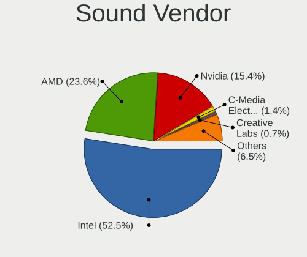

| Vendor                                       | Computers | Percent |
|----------------------------------------------|-----------|---------|
| Intel                                        | 23192     | 52.48%  |
| AMD                                          | 10410     | 23.56%  |
| Nvidia                                       | 6802      | 15.39%  |
| C-Media Electronics                          | 615       | 1.39%   |
| Creative Labs                                | 323       | 0.73%   |
| Logitech                                     | 240       | 0.54%   |
| Texas Instruments                            | 143       | 0.32%   |
| JMTek                                        | 134       | 0.3%    |
| Generalplus Technology                       | 130       | 0.29%   |
| ASUSTek Computer                             | 126       | 0.29%   |
| Creative Technology                          | 119       | 0.27%   |
| Micro Star International                     | 96        | 0.22%   |
| Zoran Co. Personal Media Division (Nogatech) | 81        | 0.18%   |
| Realtek Semiconductor                        | 79        | 0.18%   |
| Razer USA                                    | 74        | 0.17%   |
| Hewlett-Packard                              | 67        | 0.15%   |
| Focusrite-Novation                           | 67        | 0.15%   |
| SteelSeries ApS                              | 64        | 0.14%   |
| Kingston Technology                          | 57        | 0.13%   |
| Tenx Technology                              | 52        | 0.12%   |
| GN Netcom                                    | 50        | 0.11%   |
| KTMicro                                      | 49        | 0.11%   |
| Corsair                                      | 47        | 0.11%   |
| VIA Technologies                             | 45        | 0.1%    |
| Lenovo                                       | 41        | 0.09%   |
| Jieli Technology                             | 41        | 0.09%   |
| Thesycon Systemsoftware & Consulting         | 35        | 0.08%   |
| Apple                                        | 34        | 0.08%   |
| Sony                                         | 33        | 0.07%   |
| Plantronics                                  | 32        | 0.07%   |
| BEHRINGER International                      | 30        | 0.07%   |
| XMOS                                         | 27        | 0.06%   |
| Blue Microphones                             | 25        | 0.06%   |
| Silicon Integrated Systems [SiS]             | 24        | 0.05%   |
| PreSonus Audio Electronics                   | 24        | 0.05%   |
| Dell                                         | 24        | 0.05%   |
| Giga-Byte Technology                         | 23        | 0.05%   |
| Unknown                                      | 23        | 0.05%   |
| Samson Technologies                          | 20        | 0.05%   |
| FiiO Electronics Technology                  | 19        | 0.04%   |

Sound Model
-----------

Sound card models

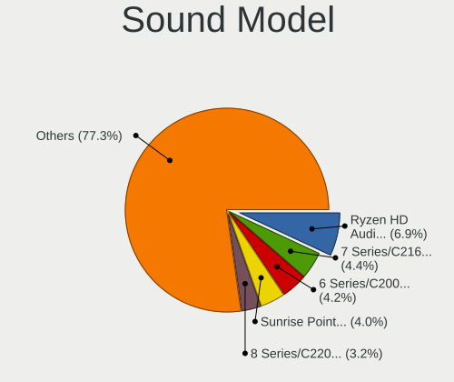

| Model                                                                                             | Computers | Percent |
|---------------------------------------------------------------------------------------------------|-----------|---------|
| AMD Ryzen HD Audio Controller                                                                     | 3753      | 6.92%   |
| Intel 7 Series/C216 Chipset Family High Definition Audio Controller                               | 2394      | 4.42%   |
| Intel 6 Series/C200 Series Chipset Family High Definition Audio Controller                        | 2283      | 4.21%   |
| Intel Sunrise Point-LP HD Audio                                                                   | 2173      | 4.01%   |
| Intel 8 Series/C220 Series Chipset High Definition Audio Controller                               | 1721      | 3.18%   |
| AMD Renoir/Cezanne HDMI/DP Audio Controller                                                       | 1514      | 2.79%   |
| AMD SBx00 Azalia (Intel HDA)                                                                      | 1299      | 2.4%    |
| AMD Starship/Matisse HD Audio Controller                                                          | 1240      | 2.29%   |
| Intel Xeon E3-1200 v3/4th Gen Core Processor HD Audio Controller                                  | 1239      | 2.29%   |
| AMD FCH Azalia Controller                                                                         | 1173      | 2.16%   |
| Intel 5 Series/3400 Series Chipset High Definition Audio                                          | 1139      | 2.1%    |
| AMD Raven/Raven2/Fenghuang HDMI/DP Audio Controller                                               | 1058      | 1.95%   |
| Intel 82801I (ICH9 Family) HD Audio Controller                                                    | 1057      | 1.95%   |
| Intel Celeron/Pentium Silver Processor High Definition Audio                                      | 1041      | 1.92%   |
| AMD Radeon High Definition Audio Controller                                                       | 921       | 1.7%    |
| Intel 100 Series/C230 Series Chipset Family HD Audio Controller                                   | 919       | 1.7%    |
| Intel NM10/ICH7 Family High Definition Audio Controller                                           | 809       | 1.49%   |
| Intel Cannon Lake PCH cAVS                                                                        | 767       | 1.42%   |
| Intel 8 Series HD Audio Controller                                                                | 721       | 1.33%   |
| Intel Haswell-ULT HD Audio Controller                                                             | 717       | 1.32%   |
| AMD Navi 21/23 HDMI/DP Audio Controller                                                           | 699       | 1.29%   |
| Intel 200 Series PCH HD Audio                                                                     | 667       | 1.23%   |
| Intel Tiger Lake-LP Smart Sound Technology Audio Controller                                       | 645       | 1.19%   |
| Intel Broadwell-U Audio Controller                                                                | 633       | 1.17%   |
| Intel Wildcat Point-LP High Definition Audio Controller                                           | 617       | 1.14%   |
| Nvidia GK208 HDMI/DP Audio Controller                                                             | 583       | 1.08%   |
| AMD Kabini HDMI/DP Audio                                                                          | 569       | 1.05%   |
| Intel 82801H (ICH8 Family) HD Audio Controller                                                    | 558       | 1.03%   |
| AMD Family 17h (Models 00h-0fh) HD Audio Controller                                               | 528       | 0.97%   |
| AMD Ellesmere HDMI Audio [Radeon RX 470/480 / 570/580/590]                                        | 517       | 0.95%   |
| Nvidia GF108 High Definition Audio Controller                                                     | 509       | 0.94%   |
| Nvidia GP107GL High Definition Audio Controller                                                   | 490       | 0.9%    |
| Nvidia High Definition Audio Controller                                                           | 485       | 0.89%   |
| AMD Family 15h (Models 60h-6fh) Audio Controller                                                  | 461       | 0.85%   |
| Intel Atom Processor Z36xxx/Z37xxx Series High Definition Audio Controller                        | 452       | 0.83%   |
| Intel Alder Lake PCH-P High Definition Audio Controller                                           | 436       | 0.8%    |
| Intel Cannon Point-LP High Definition Audio Controller                                            | 356       | 0.66%   |
| Intel Celeron N3350/Pentium N4200/Atom E3900 Series Audio Cluster                                 | 342       | 0.63%   |
| AMD Navi 31 HDMI/DP Audio                                                                         | 342       | 0.63%   |
| Intel Atom/Celeron/Pentium Processor x5-E8000/J3xxx/N3xxx Series High Definition Audio Controller | 327       | 0.6%    |

Memory
------

Memory Vendor
-------------

Memory module vendors

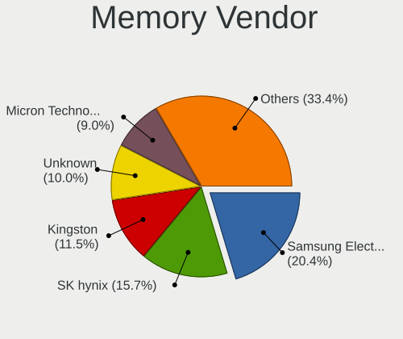

| Vendor              | Computers | Percent |
|---------------------|-----------|---------|
| Samsung Electronics | 7885      | 20.35%  |
| SK hynix            | 6074      | 15.68%  |
| Kingston            | 4472      | 11.54%  |
| Unknown             | 3861      | 9.97%   |
| Micron Technology   | 3496      | 9.02%   |
| Crucial             | 2162      | 5.58%   |
| Corsair             | 1860      | 4.8%    |
| G.Skill             | 1388      | 3.58%   |
| A-DATA Technology   | 856       | 2.21%   |
| Elpida              | 712       | 1.84%   |
| Unknown             | 689       | 1.78%   |
| Ramaxel Technology  | 679       | 1.75%   |
| Nanya Technology    | 576       | 1.49%   |
| Team                | 379       | 0.98%   |
| Unknown (ABCD)      | 365       | 0.94%   |
| Smart               | 297       | 0.77%   |
| Patriot             | 275       | 0.71%   |
| Goodram             | 173       | 0.45%   |
| Transcend           | 152       | 0.39%   |
| Apacer              | 121       | 0.31%   |
| Timetec             | 113       | 0.29%   |
| AMD                 | 104       | 0.27%   |
| Silicon Power       | 86        | 0.22%   |
| PNY                 | 84        | 0.22%   |
| Teikon              | 79        | 0.2%    |
| ASint Technology    | 66        | 0.17%   |
| Avant               | 59        | 0.15%   |
| Qimonda             | 54        | 0.14%   |
| Kingmax             | 48        | 0.12%   |
| Lexar               | 46        | 0.12%   |
| Toshiba             | 43        | 0.11%   |
| GeIL                | 38        | 0.1%    |
| Unifosa             | 36        | 0.09%   |
| Unknown (0x0E9D)    | 35        | 0.09%   |
| Neo Forza           | 32        | 0.08%   |
| High Bridge         | 31        | 0.08%   |
| CSX                 | 31        | 0.08%   |
| Red Hat             | 30        | 0.08%   |
| Multilaser          | 30        | 0.08%   |
| Smart Brazil        | 29        | 0.07%   |

Memory Model
------------

Memory module models

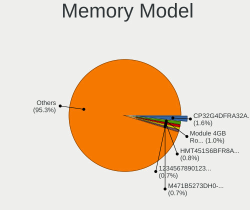

| Model                                                            | Computers | Percent |
|------------------------------------------------------------------|-----------|---------|
| Unknown                                                          | 689       | 1.65%   |
| Samsung RAM Module 4GB Row Of Chips DDR4 2400MT/s                | 413       | 0.99%   |
| SK hynix RAM HMT451S6BFR8A-PB 4GB SODIMM DDR3 1600MT/s           | 320       | 0.76%   |
| Unknown (ABCD) RAM 123456789012345678 2GB SODIMM LPDDR4 2400MT/s | 282       | 0.67%   |
| Samsung RAM M471B5273DH0-CH9 4GB SODIMM DDR3 1600MT/s            | 281       | 0.67%   |
| Samsung RAM M471B5173DB0-YK0 4GB SODIMM DDR3 1600MT/s            | 276       | 0.66%   |
| Samsung RAM M471B5173EB0-YK0 4GB SODIMM DDR3 1600MT/s            | 269       | 0.64%   |
| Samsung RAM M471B5173QH0-YK0 4GB SODIMM DDR3 1600MT/s            | 262       | 0.63%   |
| SK hynix RAM HMA81GS6AFR8N-UH 8GB SODIMM DDR4 2667MT/s           | 260       | 0.62%   |
| Samsung RAM M471A5244CB0-CTD 4GB SODIMM DDR4 3266MT/s            | 260       | 0.62%   |
| Unknown RAM Module 2GB SODIMM DDR2 667MT/s                       | 216       | 0.52%   |
| Samsung RAM M471A5244CB0-CWE 4GB SODIMM DDR4 3200MT/s            | 211       | 0.5%    |
| Samsung RAM M471B5273CH0-CH9 4GB SODIMM DDR3 1334MT/s            | 193       | 0.46%   |
| SK hynix RAM HMT351S6CFR8C-PB 4GB SODIMM DDR3 1600MT/s           | 180       | 0.43%   |
| SK hynix RAM HMT41GS6BFR8A-PB 8GB SODIMM DDR3 2667MT/s           | 171       | 0.41%   |
| Samsung RAM M471A1K43CB1-CRC 8GB SODIMM DDR4 8400MT/s            | 168       | 0.4%    |
| Unknown RAM Module 4GB DIMM 1333MT/s                             | 166       | 0.4%    |
| Corsair RAM CMK16GX4M2B3200C16 8GB DIMM DDR4 3600MT/s            | 161       | 0.38%   |
| Samsung RAM M471A5244CB0-CRC 4GB SODIMM DDR4 2667MT/s            | 159       | 0.38%   |
| Unknown RAM Module 2GB DIMM SDRAM                                | 152       | 0.36%   |
| Unknown RAM Module 2GB DIMM DDR2 800MT/s                         | 151       | 0.36%   |
| Elpida RAM Module 2GB SODIMM DDR3 1333MT/s                       | 150       | 0.36%   |
| Unknown RAM Module 2GB DIMM 800MT/s                              | 143       | 0.34%   |
| Samsung RAM M471B1G73DB0-YK0 8GB SODIMM DDR3 1600MT/s            | 142       | 0.34%   |
| Samsung RAM M471A1G44AB0-CWE 8GiB SODIMM DDR4 3200MT/s           | 142       | 0.34%   |
| SK hynix RAM HMT451S6AFR8A-PB 4GB SODIMM DDR3 1600MT/s           | 132       | 0.32%   |
| Samsung RAM M471B1G73QH0-YK0 8GB SODIMM DDR3 1600MT/s            | 129       | 0.31%   |
| Samsung RAM M471A1K43EB1-CWE 8GB SODIMM DDR4 3200MT/s            | 126       | 0.3%    |
| Samsung RAM M471B5773CHS-CH9 2GB SODIMM DDR3 4199MT/s            | 119       | 0.28%   |
| SK hynix RAM HMA851S6AFR6N-UH 4GB SODIMM DDR4 2667MT/s           | 116       | 0.28%   |
| Micron RAM 4ATF51264HZ-3G2J1 4GB SODIMM DDR4 3200MT/s            | 116       | 0.28%   |
| Unknown RAM Module 4GB DIMM DDR3 1333MT/s                        | 115       | 0.27%   |
| Samsung RAM M471A1K43CB1-CTD 8GB SODIMM DDR4 3200MT/s            | 112       | 0.27%   |
| Unknown RAM Module 2GB DIMM 1333MT/s                             | 109       | 0.26%   |
| Samsung RAM M471B5773DH0-CH9 2GB SODIMM DDR3 1600MT/s            | 109       | 0.26%   |
| Micron RAM 4ATF51264HZ-2G6E1 4GB SODIMM DDR4 2667MT/s            | 109       | 0.26%   |
| Samsung RAM M378B5173QH0-CK0 4GB DIMM DDR3                       | 108       | 0.26%   |
| Micron RAM 8JTF51264AZ-1G6E1 4GB DIMM DDR3 1600MT/s              | 107       | 0.26%   |
| Samsung RAM M471B5273DH0-CK0 4GB SODIMM DDR3 2400MT/s            | 106       | 0.25%   |
| Unknown RAM Module 2GB SODIMM DDR2                               | 105       | 0.25%   |

Memory Kind
-----------

Memory module kinds

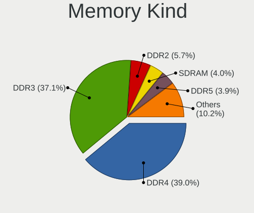

| Kind         | Computers | Percent |
|--------------|-----------|---------|
| DDR4         | 12944     | 38.99%  |
| DDR3         | 12324     | 37.12%  |
| DDR2         | 1881      | 5.67%   |
| SDRAM        | 1344      | 4.05%   |
| DDR5         | 1305      | 3.93%   |
| Unknown      | 1145      | 3.45%   |
| LPDDR4       | 1010      | 3.04%   |
| LPDDR5       | 491       | 1.48%   |
| LPDDR3       | 453       | 1.36%   |
| DDR          | 190       | 0.57%   |
| DRAM         | 70        | 0.21%   |
| RAM          | 40        | 0.12%   |
| HBM2         | 1         | 0.003%  |
| DDR2 FB-DIMM | 1         | 0.003%  |

Memory Form Factor
------------------

Physical design of the memory module

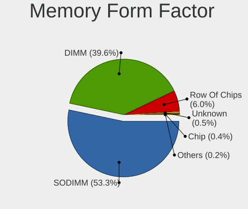

| Name            | Computers | Percent |
|-----------------|-----------|---------|
| SODIMM          | 17421     | 53.3%   |
| DIMM            | 12957     | 39.64%  |
| Row Of Chips    | 1973      | 6.04%   |
| Unknown         | 155       | 0.47%   |
| Chip            | 127       | 0.39%   |
| RIMM            | 26        | 0.08%   |
| FB-DIMM         | 22        | 0.07%   |
| Proprietary Car | 4         | 0.01%   |
| Die             | 1         | 0.003%  |

Memory Size
-----------

Memory module size

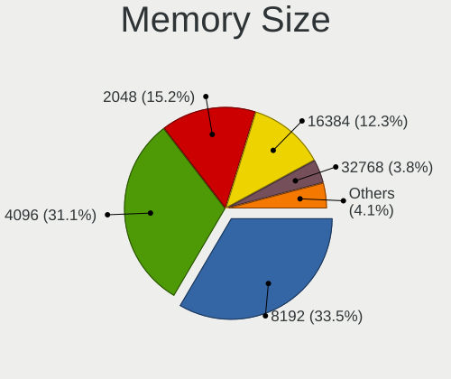

| Size  | Computers | Percent |
|-------|-----------|---------|
| 8192  | 12298     | 33.47%  |
| 4096  | 11425     | 31.09%  |
| 2048  | 5599      | 15.24%  |
| 16384 | 4517      | 12.29%  |
| 32768 | 1401      | 3.81%   |
| 1024  | 1251      | 3.4%    |
| 512   | 111       | 0.3%    |
| 49152 | 42        | 0.11%   |
| 24576 | 20        | 0.05%   |
| 3072  | 19        | 0.05%   |
| 6144  | 15        | 0.04%   |
| 12288 | 14        | 0.04%   |
| 65536 | 11        | 0.03%   |
| 256   | 6         | 0.02%   |
| 1536  | 2         | 0.01%   |
| 15616 | 1         | 0.003%  |
| 12536 | 1         | 0.003%  |
| 12333 | 1         | 0.003%  |
| 9096  | 1         | 0.003%  |
| 9000  | 1         | 0.003%  |
| 8124  | 1         | 0.003%  |
| 3814  | 1         | 0.003%  |
| 616   | 1         | 0.003%  |
| 64    | 1         | 0.003%  |
| 32    | 1         | 0.003%  |
| 16    | 1         | 0.003%  |
| 8     | 1         | 0.003%  |

Memory Speed
------------

Memory module speed

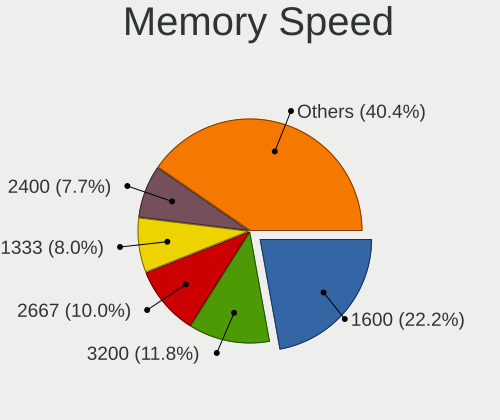

| Speed   | Computers | Percent |
|---------|-----------|---------|
| 1600    | 8140      | 22.16%  |
| 3200    | 4337      | 11.81%  |
| 2667    | 3677      | 10.01%  |
| 1333    | 2924      | 7.96%   |
| 2400    | 2820      | 7.68%   |
| 2133    | 1405      | 3.82%   |
| 3600    | 1078      | 2.93%   |
| 667     | 1057      | 2.88%   |
| 1334    | 1040      | 2.83%   |
| 800     | 990       | 2.69%   |
| Unknown | 777       | 2.11%   |
| 1867    | 571       | 1.55%   |
| 1067    | 557       | 1.52%   |
| 5600    | 515       | 1.4%    |
| 1866    | 358       | 0.97%   |
| 6400    | 332       | 0.9%    |
| 1066    | 329       | 0.9%    |
| 4800    | 325       | 0.88%   |
| 3266    | 320       | 0.87%   |
| 3733    | 304       | 0.83%   |
| 4199    | 302       | 0.82%   |
| 4267    | 296       | 0.81%   |
| 6000    | 262       | 0.71%   |
| 2666    | 254       | 0.69%   |
| 1800    | 235       | 0.64%   |
| 2048    | 229       | 0.62%   |
| 8400    | 225       | 0.61%   |
| 3800    | 216       | 0.59%   |
| 3000    | 188       | 0.51%   |
| 4000    | 181       | 0.49%   |
| 533     | 181       | 0.49%   |
| 3400    | 179       | 0.49%   |
| 2933    | 163       | 0.44%   |
| 975     | 144       | 0.39%   |
| 400     | 134       | 0.36%   |
| 7500    | 112       | 0.3%    |
| 3466    | 107       | 0.29%   |
| 4266    | 84        | 0.23%   |
| 3066    | 72        | 0.2%    |
| 1639    | 65        | 0.18%   |

Printers & scanners
-------------------

Printer Vendor
--------------

Printer device vendors

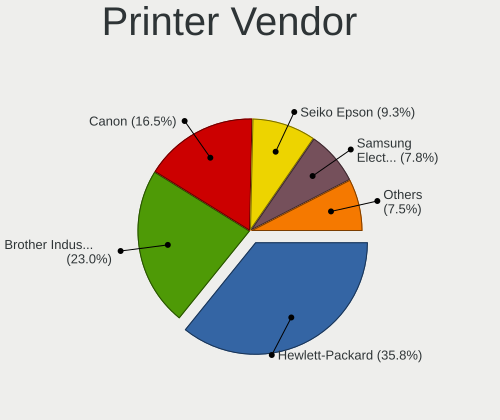

| Vendor                       | Computers | Percent |
|------------------------------|-----------|---------|
| Hewlett-Packard              | 356       | 35.81%  |
| Brother Industries           | 229       | 23.04%  |
| Canon                        | 164       | 16.5%   |
| Seiko Epson                  | 92        | 9.26%   |
| Samsung Electronics          | 78        | 7.85%   |
| Lexmark International        | 15        | 1.51%   |
| Prolific Technology          | 11        | 1.11%   |
| Xerox                        | 9         | 0.91%   |
| Kyocera                      | 6         | 0.6%    |
| QinHeng Electronics          | 5         | 0.5%    |
| Dymo-CoStar                  | 5         | 0.5%    |
| Ricoh                        | 4         | 0.4%    |
| Oki Data                     | 3         | 0.3%    |
| Pantum                       | 2         | 0.2%    |
| Zebra Technologies           | 1         | 0.1%    |
| Zebra                        | 1         | 0.1%    |
| Xiaomi                       | 1         | 0.1%    |
| Wincor Nixdorf International | 1         | 0.1%    |
| STMicroelectronics           | 1         | 0.1%    |
| Sony                         | 1         | 0.1%    |
| Sagem                        | 1         | 0.1%    |
| Philips (or NXP)             | 1         | 0.1%    |
| NXP Semiconductors           | 1         | 0.1%    |
| MIIIW                        | 1         | 0.1%    |
| Lenovo                       | 1         | 0.1%    |
| Konica Minolta               | 1         | 0.1%    |
| ICS Advent                   | 1         | 0.1%    |
| Citizen                      | 1         | 0.1%    |
| Apple                        | 1         | 0.1%    |

Printer Model
-------------

Printer device models

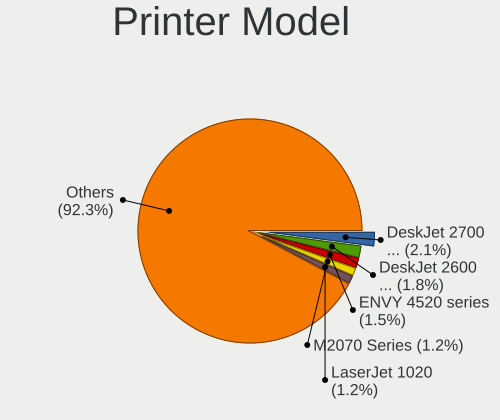

| Model                                | Computers | Percent |
|--------------------------------------|-----------|---------|
| HP DeskJet 2700 series               | 21        | 2.09%   |
| HP DeskJet 2600 series               | 18        | 1.79%   |
| HP ENVY 4520 series                  | 15        | 1.49%   |
| Samsung M2070 Series                 | 12        | 1.19%   |
| HP LaserJet 1020                     | 12        | 1.19%   |
| Prolific PL2305 Parallel Port        | 11        | 1.09%   |
| Canon PIXMA MG3600 Series            | 11        | 1.09%   |
| HP DeskJet 3630 series               | 10        | 0.99%   |
| Canon LiDE 400                       | 10        | 0.99%   |
| Seiko Epson ET-2710 Series           | 9         | 0.89%   |
| HP LaserJet 1018                     | 9         | 0.89%   |
| Brother Printer                      | 9         | 0.89%   |
| Samsung ML-1640 Series Laser Printer | 8         | 0.79%   |
| HP LaserJet P1005                    | 8         | 0.79%   |
| HP DeskJet 4100 series               | 8         | 0.79%   |
| HP DeskJet 2130 series               | 8         | 0.79%   |
| Canon TS3100 series                  | 8         | 0.79%   |
| Brother MFC-L2700DW                  | 8         | 0.79%   |
| Brother HL-2270DW Laser Printer      | 8         | 0.79%   |
| Samsung M2020 Series                 | 7         | 0.7%    |
| HP OfficeJet 3830 series             | 7         | 0.7%    |
| HP ENVY 5000 series                  | 7         | 0.7%    |
| Canon PIXMA MG2500 Series            | 7         | 0.7%    |
| Canon LiDE 300                       | 7         | 0.7%    |
| Brother HL-L2390DW                   | 7         | 0.7%    |
| Brother HL-L2305 series              | 7         | 0.7%    |
| HP OfficeJet Pro 7740 series         | 6         | 0.6%    |
| HP LaserJet P1006                    | 6         | 0.6%    |
| HP Ink Tank Wireless 410 series      | 6         | 0.6%    |
| Brother MFC-J470DW                   | 6         | 0.6%    |
| Brother HL-L2320D series             | 6         | 0.6%    |
| Brother HL-L2300D series             | 6         | 0.6%    |
| Seiko Epson L120 Series              | 5         | 0.5%    |
| Samsung ML-1660 Series               | 5         | 0.5%    |
| QinHeng CH340S                       | 5         | 0.5%    |
| HP LaserJet M14-M17                  | 5         | 0.5%    |
| HP LaserJet 1200                     | 5         | 0.5%    |
| HP LaserJet 1010                     | 5         | 0.5%    |
| HP ENVY Photo 6200 series            | 5         | 0.5%    |
| HP DeskJet 3700 series               | 5         | 0.5%    |

Scanner Vendor
--------------

Scanner device vendors

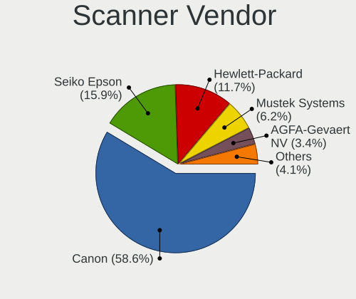

| Vendor                      | Computers | Percent |
|-----------------------------|-----------|---------|
| Canon                       | 85        | 58.62%  |
| Seiko Epson                 | 23        | 15.86%  |
| Hewlett-Packard             | 17        | 11.72%  |
| Mustek Systems              | 9         | 6.21%   |
| AGFA-Gevaert NV             | 5         | 3.45%   |
| KYE Systems (Mouse Systems) | 2         | 1.38%   |
| Ultima Electronics          | 1         | 0.69%   |
| Plustek                     | 1         | 0.69%   |
| Fujitsu                     | 1         | 0.69%   |
| Acer Peripherals (now BenQ) | 1         | 0.69%   |

Scanner Model
-------------

Scanner device models

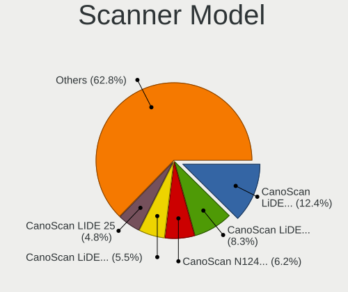

| Model                                                                                 | Computers | Percent |
|---------------------------------------------------------------------------------------|-----------|---------|
| Canon CanoScan LiDE 110                                                               | 18        | 12.41%  |
| Canon CanoScan LiDE 210                                                               | 12        | 8.28%   |
| Canon CanoScan N1240U/LiDE 30                                                         | 9         | 6.21%   |
| Canon CanoScan LiDE 100                                                               | 8         | 5.52%   |
| Canon CanoScan LIDE 25                                                                | 7         | 4.83%   |
| Mustek Systems ScanExpress 1200 UB                                                    | 5         | 3.45%   |
| Canon CanoScan LiDE 220                                                               | 5         | 3.45%   |
| Canon CanoScan LiDE 120                                                               | 5         | 3.45%   |
| Seiko Epson GT-F500/GT-F550 [Perfection 2480/2580 PHOTO]                              | 3         | 2.07%   |
| Seiko Epson GT-7300U [Perfection 1260/1260 PHOTO]                                     | 3         | 2.07%   |
| Canon CanoScan N670U/N676U/LiDE 20                                                    | 3         | 2.07%   |
| Canon CanoScan LiDE 200                                                               | 3         | 2.07%   |
| AGFA-Gevaert NV SnapScan e20                                                          | 3         | 2.07%   |
| Seiko Epson GT-X900 [Perfection V700/V750 Photo]                                      | 2         | 1.38%   |
| Seiko Epson GT-F730 [GT-S630/Perfection V33/V330 Photo]                               | 2         | 1.38%   |
| Seiko Epson GT-F650 [GT-S600/Perfection V10/V100]                                     | 2         | 1.38%   |
| Seiko Epson GT-9300UF [Perfection 2400 PHOTO]                                         | 2         | 1.38%   |
| HP ScanJet 5590                                                                       | 2         | 1.38%   |
| HP ScanJet 4500C/5550C                                                                | 2         | 1.38%   |
| HP ScanJet 2400c                                                                      | 2         | 1.38%   |
| Canon CanoScan LiDE 700F                                                              | 2         | 1.38%   |
| Canon CanoScan LiDE 70                                                                | 2         | 1.38%   |
| Canon CanoScan LiDE 60                                                                | 2         | 1.38%   |
| Canon CanoScan 1220U                                                                  | 2         | 1.38%   |
| Ultima Artec Ultima 2000 (GT6801 based)/Lifetec LT9385/ScanMagic 1200 UB Plus Scanner | 1         | 0.69%   |
| Seiko Epson Scanner                                                                   | 1         | 0.69%   |
| Seiko Epson Perfection V37/V370                                                       | 1         | 0.69%   |
| Seiko Epson GT-X820 [Perfection V600 Photo]                                           | 1         | 0.69%   |
| Seiko Epson GT-X770 [Perfection V500]                                                 | 1         | 0.69%   |
| Seiko Epson GT-F720 [GT-S620/Perfection V30/V300 Photo]                               | 1         | 0.69%   |
| Seiko Epson GT-F700 [Perfection V350]                                                 | 1         | 0.69%   |
| Seiko Epson GT-F520/GT-F570 [Perfection 3590 PHOTO]                                   | 1         | 0.69%   |
| Seiko Epson GT-9400UF [Perfection 3170]                                               | 1         | 0.69%   |
| Seiko Epson GT-7400U [Perfection 1270]                                                | 1         | 0.69%   |
| Plustek 600DPI USB Scanner                                                            | 1         | 0.69%   |
| Mustek Systems SNAPSCAN e22                                                           | 1         | 0.69%   |
| Mustek Systems ScanExpress 1200 CU                                                    | 1         | 0.69%   |
| Mustek Systems BearPaw 2448 CU Pro                                                    | 1         | 0.69%   |
| Mustek Systems BearPaw 1200 CU Plus                                                   | 1         | 0.69%   |
| KYE Systems (Mouse Systems) ColorPage-Vivid4                                          | 1         | 0.69%   |

Camera
------

Camera Vendor
-------------

Camera device vendors

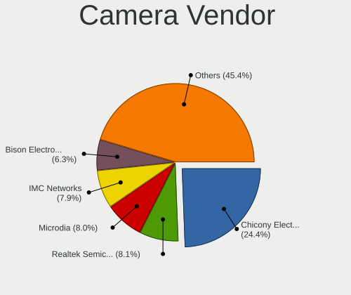

| Vendor                                 | Computers | Percent |
|----------------------------------------|-----------|---------|
| Chicony Electronics                    | 4260      | 24.4%   |
| Realtek Semiconductor                  | 1410      | 8.08%   |
| Microdia                               | 1393      | 7.98%   |
| IMC Networks                           | 1374      | 7.87%   |
| Bison Electronics                      | 1102      | 6.31%   |
| Sunplus Innovation Technology          | 879       | 5.04%   |
| Quanta                                 | 757       | 4.34%   |
| Logitech                               | 741       | 4.24%   |
| Suyin                                  | 647       | 3.71%   |
| Cheng Uei Precision Industry (Foxlink) | 584       | 3.35%   |
| Syntek                                 | 492       | 2.82%   |
| Apple                                  | 393       | 2.25%   |
| Luxvisions Innotech Limited            | 354       | 2.03%   |
| Lite-On Technology                     | 322       | 1.84%   |
| Alcor Micro                            | 240       | 1.37%   |
| Silicon Motion                         | 231       | 1.32%   |
| Ricoh                                  | 190       | 1.09%   |
| Microsoft                              | 159       | 0.91%   |
| Sonix Technology                       | 138       | 0.79%   |
| Lenovo                                 | 127       | 0.73%   |
| Importek                               | 110       | 0.63%   |
| Z-Star Microelectronics                | 106       | 0.61%   |
| icSpring                               | 96        | 0.55%   |
| Acer                                   | 93        | 0.53%   |
| ALi                                    | 70        | 0.4%    |
| Samsung Electronics                    | 67        | 0.38%   |
| Primax Electronics                     | 66        | 0.38%   |
| ShineTech                              | 53        | 0.3%    |
| Generalplus Technology                 | 49        | 0.28%   |
| SunplusIT                              | 38        | 0.22%   |
| GEMBIRD                                | 37        | 0.21%   |
| Creative Technology                    | 37        | 0.21%   |
| KYE Systems (Mouse Systems)            | 33        | 0.19%   |
| DigiTech                               | 33        | 0.19%   |
| OmniVision Technologies                | 30        | 0.17%   |
| MacroSilicon                           | 29        | 0.17%   |
| ARC International                      | 26        | 0.15%   |
| Unknown                                | 24        | 0.14%   |
| Hewlett-Packard                        | 23        | 0.13%   |
| Jieli Technology                       | 22        | 0.13%   |

Camera Model
------------

Camera device models

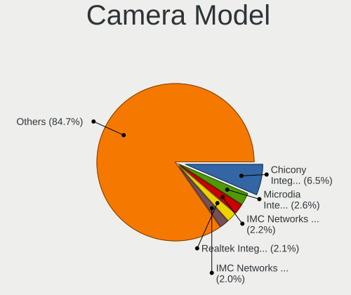

| Model                                               | Computers | Percent |
|-----------------------------------------------------|-----------|---------|
| Chicony Integrated Camera                           | 1136      | 6.45%   |
| Microdia Integrated_Webcam_HD                       | 458       | 2.6%    |
| IMC Networks USB2.0 HD UVC WebCam                   | 382       | 2.17%   |
| Realtek Integrated_Webcam_HD                        | 376       | 2.14%   |
| IMC Networks Integrated Camera                      | 346       | 1.97%   |
| Chicony HD WebCam                                   | 324       | 1.84%   |
| Bison Integrated Camera                             | 300       | 1.7%    |
| Syntek Integrated Camera                            | 291       | 1.65%   |
| Sunplus Integrated_Webcam_HD                        | 269       | 1.53%   |
| IMC Networks USB2.0 VGA UVC WebCam                  | 206       | 1.17%   |
| Logitech Webcam C270                                | 180       | 1.02%   |
| Microdia Integrated Webcam                          | 168       | 0.95%   |
| Realtek USB Camera                                  | 134       | 0.76%   |
| Chicony HP TrueVision HD Camera                     | 134       | 0.76%   |
| Luxvisions Innotech Limited HP TrueVision HD Camera | 128       | 0.73%   |
| Lite-On Integrated Camera                           | 128       | 0.73%   |
| Apple FaceTime HD Camera (Built-in)                 | 122       | 0.69%   |
| Apple Built-in iSight                               | 121       | 0.69%   |
| Bison Lenovo EasyCamera                             | 120       | 0.68%   |
| Chicony HD User Facing                              | 119       | 0.68%   |
| Chicony HP Truevision HD                            | 112       | 0.64%   |
| Sunplus HD WebCam                                   | 110       | 0.63%   |
| Quanta HD User Facing                               | 109       | 0.62%   |
| Suyin Acer/HP Integrated Webcam [CN0314]            | 108       | 0.61%   |
| Chicony TOSHIBA Web Camera - HD                     | 107       | 0.61%   |
| Chicony USB2.0 HD UVC WebCam                        | 106       | 0.6%    |
| Realtek Integrated Webcam HD                        | 104       | 0.59%   |
| Chicony FJ Camera                                   | 103       | 0.59%   |
| Logitech HD Pro Webcam C920                         | 102       | 0.58%   |
| Chicony VGA Webcam                                  | 101       | 0.57%   |
| icSpring camera                                     | 96        | 0.55%   |
| Chicony Integrated Camera (1280x720@30)             | 96        | 0.55%   |
| Chicony EasyCamera                                  | 96        | 0.55%   |
| Sonix USB2.0 HD UVC WebCam                          | 94        | 0.53%   |
| Cheng Uei Precision Industry (Foxlink) HP Webcam    | 93        | 0.53%   |
| Microdia USB 2.0 Camera                             | 92        | 0.52%   |
| Chicony USB 2.0 Camera                              | 92        | 0.52%   |
| Chicony HP HD Camera                                | 90        | 0.51%   |
| Bison HD Webcam                                     | 90        | 0.51%   |
| Quanta HD Webcam                                    | 89        | 0.51%   |

Security
--------

Fingerprint Vendor
------------------

Fingerprint sensor vendors

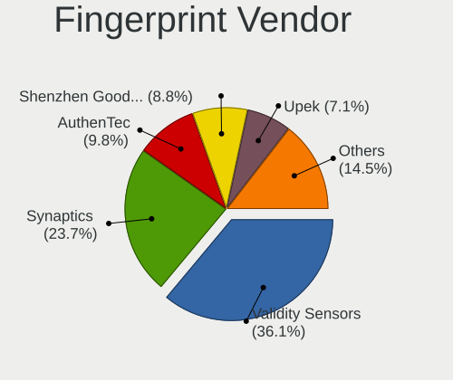

| Vendor                             | Computers | Percent |
|------------------------------------|-----------|---------|
| Validity Sensors                   | 835       | 36.07%  |
| Synaptics                          | 549       | 23.71%  |
| AuthenTec                          | 226       | 9.76%   |
| Shenzhen Goodix Technology         | 204       | 8.81%   |
| Upek                               | 165       | 7.13%   |
| Elan Microelectronics              | 162       | 7%      |
| LighTuning Technology              | 80        | 3.46%   |
| STMicroelectronics                 | 47        | 2.03%   |
| Focal-systems.Corp                 | 17        | 0.73%   |
| Samsung Electronics                | 12        | 0.52%   |
| Realtek USB2.0 Finger Print Bridge | 11        | 0.48%   |
| HOLTEK                             | 6         | 0.26%   |
| DigitalPersona                     | 1         | 0.04%   |

Fingerprint Model
-----------------

Fingerprint sensor models

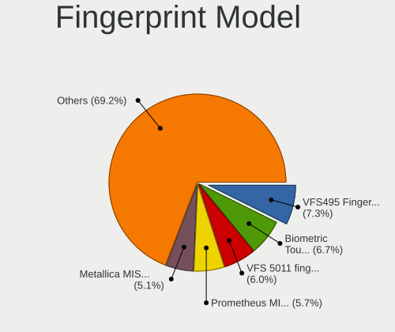

| Model                                                                      | Computers | Percent |
|----------------------------------------------------------------------------|-----------|---------|
| Validity Sensors VFS495 Fingerprint Reader                                 | 170       | 7.34%   |
| Upek Biometric Touchchip/Touchstrip Fingerprint Sensor                     | 155       | 6.7%    |
| Validity Sensors VFS 5011 fingerprint sensor                               | 139       | 6%      |
| Synaptics Prometheus MIS Touch Fingerprint Reader                          | 131       | 5.66%   |
| Synaptics Metallica MIS Touch Fingerprint Reader                           | 119       | 5.14%   |
| Shenzhen Goodix  FingerPrint Device                                        | 110       | 4.75%   |
| Elan ELAN:Fingerprint                                                      | 97        | 4.19%   |
| AuthenTec AES2810                                                          | 93        | 4.02%   |
| Validity Sensors VFS5011 Fingerprint Reader                                | 79        | 3.41%   |
| Validity Sensors Synaptics WBDI                                            | 79        | 3.41%   |
| Validity Sensors VFS491                                                    | 66        | 2.85%   |
| Elan ELAN:ARM-M4                                                           | 65        | 2.81%   |
| Shenzhen Goodix Fingerprint Reader                                         | 63        | 2.72%   |
| Validity Sensors VFS471 Fingerprint Reader                                 | 62        | 2.68%   |
| AuthenTec AES2501 Fingerprint Sensor                                       | 53        | 2.29%   |
| STMicroelectronics Fingerprint Reader                                      | 47        | 2.03%   |
| Synaptics  WBDI                                                            | 46        | 1.99%   |
| Validity Sensors VFS451 Fingerprint Reader                                 | 43        | 1.86%   |
| Synaptics UWP WBDI Device                                                  | 41        | 1.77%   |
| Validity Sensors VFS7500 Touch Fingerprint Sensor                          | 37        | 1.6%    |
| Synaptics FS7604 Touch Fingerprint Sensor with PurePrint                   | 36        | 1.56%   |
| AuthenTec Fingerprint Sensor                                               | 36        | 1.56%   |
| Synaptics WBDI                                                             | 35        | 1.51%   |
| Validity Sensors Swipe Fingerprint Sensor                                  | 34        | 1.47%   |
| Validity Sensors Fingerprint scanner                                       | 33        | 1.43%   |
| Synaptics Prometheus Fingerprint Reader                                    | 31        | 1.34%   |
| Shenzhen Goodix FingerPrint                                                | 31        | 1.34%   |
| Synaptics Fingerprint reader [HP G6]                                       | 30        | 1.3%    |
| LighTuning ES603 Swipe Fingerprint Sensor                                  | 30        | 1.3%    |
| LighTuning EgisTec Touch Fingerprint Sensor                                | 27        | 1.17%   |
| AuthenTec AES1600                                                          | 27        | 1.17%   |
| Validity Sensors Synaptics VFS7552 Touch Fingerprint Sensor with PurePrint | 26        | 1.12%   |
| Synaptics UWP WBDI                                                         | 21        | 0.91%   |
| Focal-systems.Corp FT9201Fingerprint.                                      | 17        | 0.73%   |
| Validity Sensors VFS301 Fingerprint Reader                                 | 15        | 0.65%   |
| Validity Sensors VFS101 Fingerprint Reader                                 | 15        | 0.65%   |
| Synaptics  FS7604 Touch Fingerprint Sensor with PurePrint                  | 13        | 0.56%   |
| Synaptics Metallica MOH Touch Fingerprint Reader                           | 13        | 0.56%   |
| LighTuning Fingerprint Reader                                              | 13        | 0.56%   |
| Validity Sensors VFS Fingerprint sensor                                    | 11        | 0.48%   |

Chipcard Vendor
---------------

Chipcard module vendors

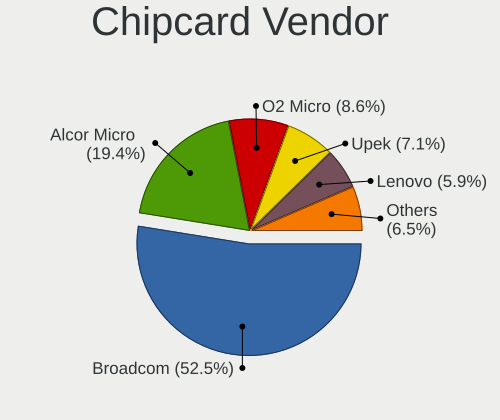

| Vendor                            | Computers | Percent |
|-----------------------------------|-----------|---------|
| Broadcom                          | 673       | 52.54%  |
| Alcor Micro                       | 249       | 19.44%  |
| O2 Micro                          | 110       | 8.59%   |
| Upek                              | 91        | 7.1%    |
| Lenovo                            | 75        | 5.85%   |
| SCM Microsystems                  | 22        | 1.72%   |
| Gemalto (was Gemplus)             | 14        | 1.09%   |
| Realtek Semiconductor             | 8         | 0.62%   |
| OmniKey                           | 5         | 0.39%   |
| Cherry                            | 4         | 0.31%   |
| Yubico.com                        | 3         | 0.23%   |
| Reiner SCT Kartensysteme          | 3         | 0.23%   |
| Chicony Electronics               | 3         | 0.23%   |
| Bit4id                            | 3         | 0.23%   |
| Aladdin Knowledge Systems         | 3         | 0.23%   |
| Advanced Card Systems             | 3         | 0.23%   |
| NXP Semiconductors                | 2         | 0.16%   |
| Fujitsu Siemens Computers         | 2         | 0.16%   |
| Aktiv                             | 2         | 0.16%   |
| VASCO Data Security International | 1         | 0.08%   |
| Thetis                            | 1         | 0.08%   |
| Microchip Technology              | 1         | 0.08%   |
| MagTek                            | 1         | 0.08%   |
| Hewlett-Packard                   | 1         | 0.08%   |
| Castles Technology                | 1         | 0.08%   |

Chipcard Model
--------------

Chipcard module models

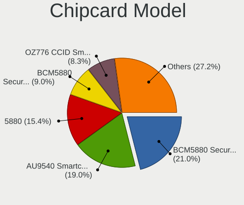

| Model                                                                        | Computers | Percent |
|------------------------------------------------------------------------------|-----------|---------|
| Broadcom BCM5880 Secure Applications Processor                               | 270       | 21.04%  |
| Alcor Micro AU9540 Smartcard Reader                                          | 244       | 19.02%  |
| Broadcom 5880                                                                | 197       | 15.35%  |
| Broadcom BCM5880 Secure Applications Processor with fingerprint swipe sensor | 116       | 9.04%   |
| O2 Micro OZ776 CCID Smartcard Reader                                         | 107       | 8.34%   |
| Upek TouchChip Fingerprint Coprocessor (WBF advanced mode)                   | 91        | 7.09%   |
| Lenovo Integrated Smart Card Reader                                          | 75        | 5.85%   |
| Broadcom BCM58200 ControlVault 3 (FingerPrint sensor + Contacted SmartCard)  | 50        | 3.9%    |
| Broadcom 58200                                                               | 39        | 3.04%   |
| Realtek Semiconductor Smart Card Reader Interface                            | 8         | 0.62%   |
| Gemalto (was Gemplus) GemPC Twin SmartCard Reader                            | 8         | 0.62%   |
| SCM Microsystems SCR3340 - ExpressCard54 Smart Card Reader                   | 7         | 0.55%   |
| SCM Microsystems SCR331-LC1 / SCR3310 SmartCard Reader                       | 6         | 0.47%   |
| Gemalto (was Gemplus) Compact Smart Card Reader Writer                       | 4         | 0.31%   |
| Alcor Micro Watchdata W 1981                                                 | 4         | 0.31%   |
| Yubico.com Yubikey 4/5 U2F+CCID                                              | 3         | 0.23%   |
| Reiner SCT Kartensysteme cyberJack RFID basis contactless smartcard reader   | 3         | 0.23%   |
| O2 Micro Oz776 SmartCard Reader                                              | 3         | 0.23%   |
| Chicony Electronics HP Skylab USB Smartcard Keyboard                         | 3         | 0.23%   |
| Broadcom BCM5880 Secure Applications Processor with fingerprint touch sensor | 3         | 0.23%   |
| Aladdin Knowledge Systems Token JC                                           | 3         | 0.23%   |
| SCM Microsystems uTrust 3700 F CL Reader                                     | 2         | 0.16%   |
| SCM Microsystems Identiv SmartOS Reader                                      | 2         | 0.16%   |
| OmniKey CardMan 1021                                                         | 2         | 0.16%   |
| NXP Semiconductors PR533                                                     | 2         | 0.16%   |
| Fujitsu Siemens Computers SmartCard Reader 2A                                | 2         | 0.16%   |
| Cherry SmartCard Reader Keyboard KC 1000 SC                                  | 2         | 0.16%   |
| Bit4id miniLector EVO                                                        | 2         | 0.16%   |
| Aktiv Rutoken lite                                                           | 2         | 0.16%   |
| Advanced Card Systems ACR38 SmartCard Reader                                 | 2         | 0.16%   |
| VASCO Data Security International Digipass 905 SmartCard Reader              | 1         | 0.08%   |
| Thetis Security Key(F829)                                                    | 1         | 0.08%   |
| SCM Microsystems SCR35xx Smart Card Reader                                   | 1         | 0.08%   |
| SCM Microsystems SCR3500 A Contact Reader                                    | 1         | 0.08%   |
| SCM Microsystems SCR335 SmartCard Reader                                     | 1         | 0.08%   |
| SCM Microsystems SCR333 SmartCard Reader                                     | 1         | 0.08%   |
| SCM Microsystems CLOUD 2700 F Smart Card Reader                              | 1         | 0.08%   |
| OmniKey CardMan 4321                                                         | 1         | 0.08%   |
| OmniKey CardMan 3121 (HID Technologies)                                      | 1         | 0.08%   |
| OmniKey CardMan 3021 / 3121                                                  | 1         | 0.08%   |

Unsupported
-----------

Unsupported Devices
-------------------

Total unsupported devices on board

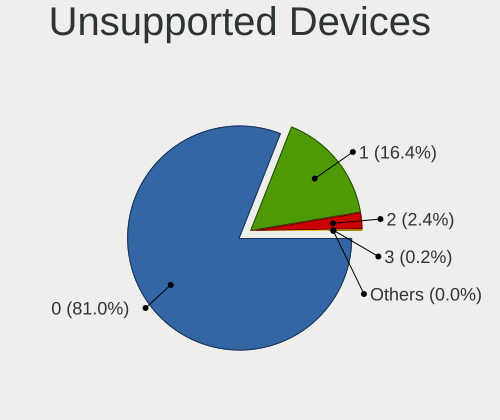

| Total | Computers | Percent |
|-------|-----------|---------|
| 0     | 26776     | 80.98%  |
| 1     | 5407      | 16.35%  |
| 2     | 796       | 2.41%   |
| 3     | 67        | 0.2%    |
| 4     | 6         | 0.02%   |
| 5     | 5         | 0.02%   |
| 7     | 3         | 0.01%   |
| 6     | 3         | 0.01%   |

Unsupported Device Types
------------------------

Types of unsupported devices

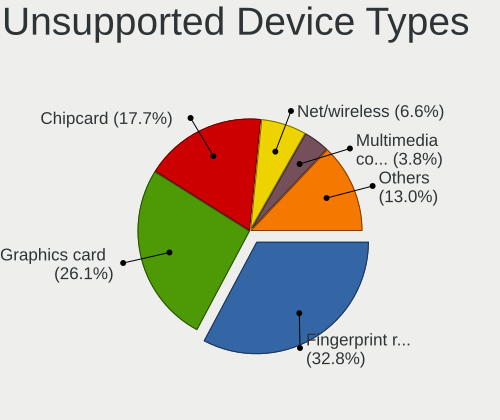

| Type                     | Computers | Percent |
|--------------------------|-----------|---------|
| Fingerprint reader       | 2314      | 32.79%  |
| Graphics card            | 1844      | 26.13%  |
| Chipcard                 | 1248      | 17.68%  |
| Net/wireless             | 468       | 6.63%   |
| Multimedia controller    | 269       | 3.81%   |
| Unassigned class         | 167       | 2.37%   |
| Communication controller | 165       | 2.34%   |
| Storage                  | 158       | 2.24%   |
| Bluetooth                | 145       | 2.05%   |
| Camera                   | 100       | 1.42%   |
| Net/ethernet             | 39        | 0.55%   |
| Card reader              | 37        | 0.52%   |
| Sound                    | 34        | 0.48%   |
| Network                  | 17        | 0.24%   |
| Storage/raid             | 13        | 0.18%   |
| Flash memory             | 12        | 0.17%   |
| Modem                    | 10        | 0.14%   |
| Dvb card                 | 6         | 0.09%   |
| Wireless                 | 5         | 0.07%   |
| Storage/ata              | 2         | 0.03%   |
| Firewire controller      | 2         | 0.03%   |
| Unclassified device      | 1         | 0.01%   |
| Tv card                  | 1         | 0.01%   |

