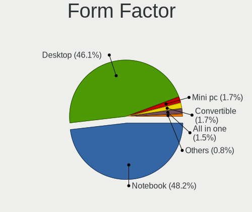

OpenMandriva - Tested Hardware & Statistics
-------------------------------------------

A project to collect tested hardware configurations for OpenMandriva.

Anyone can contribute to this report by the [hw-probe](https://github.com/linuxhw/hw-probe) tool:

    sudo -E hw-probe -all -upload

Please contribute! Especially if your hardware is rare.

This is a report for all computer types. See also reports for [desktops](/Dist/OpenMandriva/Desktop/README.md) and [notebooks](/Dist/OpenMandriva/Notebook/README.md).

Contents
--------

* [ Test Cases ](#test-cases)

* [ System ](#system)
  - [ OS                       ](#os)
  - [ OS Family                ](#os-family)
  - [ Kernel                   ](#kernel)
  - [ Kernel Family            ](#kernel-family)
  - [ Kernel Major Ver.        ](#kernel-major-ver)
  - [ Arch                     ](#arch)
  - [ DE                       ](#de)
  - [ Display Server           ](#display-server)
  - [ Display Manager          ](#display-manager)
  - [ OS Lang                  ](#os-lang)
  - [ Boot Mode                ](#boot-mode)
  - [ Filesystem               ](#filesystem)
  - [ Part. scheme             ](#part-scheme)
  - [ Dual Boot with Linux/BSD ](#dual-boot-with-linuxbsd)
  - [ Dual Boot (Win)          ](#dual-boot-win)

* [ Board ](#board)
  - [ Vendor                   ](#vendor)
  - [ Model                    ](#model)
  - [ Model Family             ](#model-family)
  - [ MFG Year                 ](#mfg-year)
  - [ Form Factor              ](#form-factor)
  - [ Secure Boot              ](#secure-boot)
  - [ Coreboot                 ](#coreboot)
  - [ RAM Size                 ](#ram-size)
  - [ RAM Used                 ](#ram-used)
  - [ Total Drives             ](#total-drives)
  - [ Has CD-ROM               ](#has-cd-rom)
  - [ Has Ethernet             ](#has-ethernet)
  - [ Has WiFi                 ](#has-wifi)
  - [ Has Bluetooth            ](#has-bluetooth)

* [ Location ](#location)
  - [ Country                  ](#country)
  - [ City                     ](#city)

* [ Drives ](#drives)
  - [ Drive Vendor             ](#drive-vendor)
  - [ Drive Model              ](#drive-model)
  - [ HDD Vendor               ](#hdd-vendor)
  - [ SSD Vendor               ](#ssd-vendor)
  - [ Drive Kind               ](#drive-kind)
  - [ Drive Connector          ](#drive-connector)
  - [ Drive Size               ](#drive-size)
  - [ Space Total              ](#space-total)
  - [ Space Used               ](#space-used)
  - [ Malfunc. Drives          ](#malfunc-drives)
  - [ Malfunc. Drive Vendor    ](#malfunc-drive-vendor)
  - [ Malfunc. HDD Vendor      ](#malfunc-hdd-vendor)
  - [ Malfunc. Drive Kind      ](#malfunc-drive-kind)
  - [ Failed Drives            ](#failed-drives)
  - [ Failed Drive Vendor      ](#failed-drive-vendor)
  - [ Drive Status             ](#drive-status)

* [ Storage controller ](#storage-controller)
  - [ Storage Vendor           ](#storage-vendor)
  - [ Storage Model            ](#storage-model)
  - [ Storage Kind             ](#storage-kind)

* [ Processor ](#processor)
  - [ CPU Vendor               ](#cpu-vendor)
  - [ CPU Model                ](#cpu-model)
  - [ CPU Model Family         ](#cpu-model-family)
  - [ CPU Cores                ](#cpu-cores)
  - [ CPU Sockets              ](#cpu-sockets)
  - [ CPU Threads              ](#cpu-threads)
  - [ CPU Op-Modes             ](#cpu-op-modes)
  - [ CPU Microcode            ](#cpu-microcode)
  - [ CPU Microarch            ](#cpu-microarch)

* [ Graphics ](#graphics)
  - [ GPU Vendor               ](#gpu-vendor)
  - [ GPU Model                ](#gpu-model)
  - [ GPU Combo                ](#gpu-combo)
  - [ GPU Driver               ](#gpu-driver)
  - [ GPU Memory               ](#gpu-memory)

* [ Monitor ](#monitor)
  - [ Monitor Vendor           ](#monitor-vendor)
  - [ Monitor Model            ](#monitor-model)
  - [ Monitor Resolution       ](#monitor-resolution)
  - [ Monitor Diagonal         ](#monitor-diagonal)
  - [ Monitor Width            ](#monitor-width)
  - [ Aspect Ratio             ](#aspect-ratio)
  - [ Monitor Area             ](#monitor-area)
  - [ Pixel Density            ](#pixel-density)
  - [ Multiple Monitors        ](#multiple-monitors)

* [ Network ](#network)
  - [ Net Controller Vendor    ](#net-controller-vendor)
  - [ Net Controller Model     ](#net-controller-model)
  - [ Wireless Vendor          ](#wireless-vendor)
  - [ Wireless Model           ](#wireless-model)
  - [ Ethernet Vendor          ](#ethernet-vendor)
  - [ Ethernet Model           ](#ethernet-model)
  - [ Net Controller Kind      ](#net-controller-kind)
  - [ Used Controller          ](#used-controller)
  - [ NICs                     ](#nics)
  - [ IPv6                     ](#ipv6)

* [ Bluetooth ](#bluetooth)
  - [ Bluetooth Vendor         ](#bluetooth-vendor)
  - [ Bluetooth Model          ](#bluetooth-model)

* [ Sound ](#sound)
  - [ Sound Vendor             ](#sound-vendor)
  - [ Sound Model              ](#sound-model)

* [ Memory ](#memory)
  - [ Memory Vendor            ](#memory-vendor)
  - [ Memory Model             ](#memory-model)
  - [ Memory Kind              ](#memory-kind)
  - [ Memory Form Factor       ](#memory-form-factor)
  - [ Memory Size              ](#memory-size)
  - [ Memory Speed             ](#memory-speed)

* [ Printers & scanners ](#printers--scanners)
  - [ Printer Vendor           ](#printer-vendor)
  - [ Printer Model            ](#printer-model)
  - [ Scanner Vendor           ](#scanner-vendor)
  - [ Scanner Model            ](#scanner-model)

* [ Camera ](#camera)
  - [ Camera Vendor            ](#camera-vendor)
  - [ Camera Model             ](#camera-model)

* [ Security ](#security)
  - [ Fingerprint Vendor       ](#fingerprint-vendor)
  - [ Fingerprint Model        ](#fingerprint-model)
  - [ Chipcard Vendor          ](#chipcard-vendor)
  - [ Chipcard Model           ](#chipcard-model)

* [ Unsupported ](#unsupported)
  - [ Unsupported Devices      ](#unsupported-devices)
  - [ Unsupported Device Types ](#unsupported-device-types)

Test Cases
----------

Total: 13819

| Vendor        | Model                       | Form-Factor | Probe                                                      | Date         |
|---------------|-----------------------------|-------------|------------------------------------------------------------|--------------|
| ASUSTek       | SABERTOOTH 990FX R2.0       | Desktop     | [41e9bb9584](https://linux-hardware.org/?probe=41e9bb9584) | May 01, 2023 |
| Alienware     | m17 R5 AMD                  | Notebook    | [4e665db2b1](https://linux-hardware.org/?probe=4e665db2b1) | May 01, 2023 |
| HP            | 822A                        | Desktop     | [b373ff6def](https://linux-hardware.org/?probe=b373ff6def) | May 01, 2023 |
| Lenovo        | Legion 5 15ARH05 82B5       | Notebook    | [6c1969f77e](https://linux-hardware.org/?probe=6c1969f77e) | May 01, 2023 |
| Dell          | 06D7TR A00                  | Desktop     | [e7905065dd](https://linux-hardware.org/?probe=e7905065dd) | Apr 30, 2023 |
| MSI           | B450M PRO-M2                | Desktop     | [b650f0a26e](https://linux-hardware.org/?probe=b650f0a26e) | Apr 30, 2023 |
| DIEBOLD       | NM70-I                      | Desktop     | [c01a40d58c](https://linux-hardware.org/?probe=c01a40d58c) | Apr 30, 2023 |
| HP            | ProLiant ML310e Gen8 v2     | Desktop     | [501d26e477](https://linux-hardware.org/?probe=501d26e477) | Apr 30, 2023 |
| ASUSTek       | X751MA                      | Notebook    | [00fbe71b59](https://linux-hardware.org/?probe=00fbe71b59) | Apr 30, 2023 |
| ASRock        | 760GM-HD                    | Desktop     | [db79e93331](https://linux-hardware.org/?probe=db79e93331) | Apr 30, 2023 |
| Gigabyte      | Z77M-D3H                    | Desktop     | [a3d2b3dcd3](https://linux-hardware.org/?probe=a3d2b3dcd3) | Apr 30, 2023 |
| HP            | Notebook                    | Notebook    | [4cece109d5](https://linux-hardware.org/?probe=4cece109d5) | Apr 30, 2023 |
| ASUSTek       | X501A1                      | Notebook    | [66b02cc148](https://linux-hardware.org/?probe=66b02cc148) | Apr 30, 2023 |
| Acer          | Aspire A315-33              | Notebook    | [fdba59c054](https://linux-hardware.org/?probe=fdba59c054) | Apr 30, 2023 |
| Acer          | AO725                       | Notebook    | [03e5f661fb](https://linux-hardware.org/?probe=03e5f661fb) | Apr 30, 2023 |
| Apple         | MacBook5,1                  | Notebook    | [7077a00b02](https://linux-hardware.org/?probe=7077a00b02) | Apr 30, 2023 |
| Fujitsu       | D3161-A1 S26361-D3161-A1    | Desktop     | [ac7894081f](https://linux-hardware.org/?probe=ac7894081f) | Apr 30, 2023 |
| Medion        | D3F3-EM                     | Desktop     | [6b9e38ad6c](https://linux-hardware.org/?probe=6b9e38ad6c) | Apr 30, 2023 |
| MSI           | A68HM GRENADE               | Desktop     | [938aa1cb46](https://linux-hardware.org/?probe=938aa1cb46) | Apr 30, 2023 |
| HP            | Compaq 6720s                | Notebook    | [cc5f5ee72c](https://linux-hardware.org/?probe=cc5f5ee72c) | Apr 30, 2023 |
| Gigabyte      | H77-DS3H                    | Desktop     | [6750e5f83d](https://linux-hardware.org/?probe=6750e5f83d) | Apr 30, 2023 |
| Acer          | E661GXM                     | Desktop     | [d5433b46bd](https://linux-hardware.org/?probe=d5433b46bd) | Apr 30, 2023 |
| Acer          | Aspire X3950                | Desktop     | [406366d5c1](https://linux-hardware.org/?probe=406366d5c1) | Apr 30, 2023 |
| Lenovo        | IdeaPad 330S-15IKB 81F5     | Notebook    | [36ccc3c930](https://linux-hardware.org/?probe=36ccc3c930) | Apr 30, 2023 |
| T-bao         | MINI PC V1.0                | Desktop     | [8e77950434](https://linux-hardware.org/?probe=8e77950434) | Apr 30, 2023 |
| Packard Be... | EasyNote ENTF71BM           | Notebook    | [99a89a2055](https://linux-hardware.org/?probe=99a89a2055) | Apr 30, 2023 |
| HP            | ProBook 650 G4              | Notebook    | [fd991056e0](https://linux-hardware.org/?probe=fd991056e0) | Apr 30, 2023 |
| Dell          | Inspiron 15 3525            | Notebook    | [41c212fa2c](https://linux-hardware.org/?probe=41c212fa2c) | Apr 30, 2023 |
| Acer          | TravelMate B311-31          | Notebook    | [de172b8988](https://linux-hardware.org/?probe=de172b8988) | Apr 30, 2023 |
| ASUSTek       | K53E                        | Notebook    | [dcb4502d05](https://linux-hardware.org/?probe=dcb4502d05) | Apr 30, 2023 |
| Intel         | H61                         | Desktop     | [167616bc61](https://linux-hardware.org/?probe=167616bc61) | Apr 30, 2023 |
| Dell          | 0GXM1W A02                  | Desktop     | [7dcb847a6c](https://linux-hardware.org/?probe=7dcb847a6c) | Apr 30, 2023 |
| Dell          | Vostro 15 3515              | Notebook    | [8f07407e1a](https://linux-hardware.org/?probe=8f07407e1a) | Apr 29, 2023 |
| Dell          | 0773VG A02                  | Desktop     | [a684ad4938](https://linux-hardware.org/?probe=a684ad4938) | Apr 29, 2023 |
| Lenovo        | G50-30 80G0                 | Notebook    | [c8d8595af5](https://linux-hardware.org/?probe=c8d8595af5) | Apr 29, 2023 |
| ASUSTek       | H81M-C/BR                   | Desktop     | [32942be783](https://linux-hardware.org/?probe=32942be783) | Apr 29, 2023 |
| Lenovo        | Unknown                     | Notebook    | [33a55a2347](https://linux-hardware.org/?probe=33a55a2347) | Apr 29, 2023 |
| HP            | Laptop 15-dw1xxx            | Notebook    | [3056c07eb6](https://linux-hardware.org/?probe=3056c07eb6) | Apr 29, 2023 |
| ASRock        | 890FX Deluxe4               | Desktop     | [327a1a2b37](https://linux-hardware.org/?probe=327a1a2b37) | Apr 29, 2023 |
| Dell          | Vostro 3558                 | Notebook    | [e1e3261c15](https://linux-hardware.org/?probe=e1e3261c15) | Apr 29, 2023 |
| Lenovo        | ThinkPad T530 24294A1       | Notebook    | [8695d820e4](https://linux-hardware.org/?probe=8695d820e4) | Apr 29, 2023 |
| ASUSTek       | Z97-P                       | Desktop     | [8ea78b28f1](https://linux-hardware.org/?probe=8ea78b28f1) | Apr 29, 2023 |
| Toshiba       | PORTEGE R830                | Notebook    | [11dc4b3a3e](https://linux-hardware.org/?probe=11dc4b3a3e) | Apr 29, 2023 |
| Apple         | MacBookPro13,3              | Notebook    | [0f22698060](https://linux-hardware.org/?probe=0f22698060) | Apr 29, 2023 |
| Lenovo        | ThinkPad X270 W10DG 20K5... | Notebook    | [59fcc52279](https://linux-hardware.org/?probe=59fcc52279) | Apr 29, 2023 |
| Acer          | Aspire 5349                 | Notebook    | [aa8c0bb2b9](https://linux-hardware.org/?probe=aa8c0bb2b9) | Apr 29, 2023 |
| MSI           | MS-9661 SA                  | Server      | [1888fa6df7](https://linux-hardware.org/?probe=1888fa6df7) | Apr 29, 2023 |
| HP            | Pavilion Notebook           | Notebook    | [168b3cf595](https://linux-hardware.org/?probe=168b3cf595) | Apr 29, 2023 |
| Dell          | Latitude 7390               | Notebook    | [c24cc9ab68](https://linux-hardware.org/?probe=c24cc9ab68) | Apr 29, 2023 |
| Toshiba       | Satellite L45-B             | Notebook    | [8f1db96b6f](https://linux-hardware.org/?probe=8f1db96b6f) | Apr 29, 2023 |
| Foxconn       | 2AB7                        | Desktop     | [01e7b05d2a](https://linux-hardware.org/?probe=01e7b05d2a) | Apr 29, 2023 |
| Medion        | X6816                       | Notebook    | [2c1807dad7](https://linux-hardware.org/?probe=2c1807dad7) | Apr 29, 2023 |
| HP            | Compaq Presario CQ70        | Notebook    | [b4055572ee](https://linux-hardware.org/?probe=b4055572ee) | Apr 28, 2023 |
| HP            | Pavilion Laptop 14-dv0xx... | Notebook    | [d364cb5ac7](https://linux-hardware.org/?probe=d364cb5ac7) | Apr 28, 2023 |
| ASRock        | A320M-DVS R4.0              | Desktop     | [7e7da68aa3](https://linux-hardware.org/?probe=7e7da68aa3) | Apr 28, 2023 |
| Samsung       | 950XCJ/951XCJ/950XCR        | Notebook    | [2dc65d8f07](https://linux-hardware.org/?probe=2dc65d8f07) | Apr 28, 2023 |
| ASUSTek       | X542URR                     | Notebook    | [910cdd940c](https://linux-hardware.org/?probe=910cdd940c) | Apr 28, 2023 |
| GPU Compan... | GWNR71517                   | Notebook    | [5fe84b74b0](https://linux-hardware.org/?probe=5fe84b74b0) | Apr 28, 2023 |
| Dell          | Vostro 3500                 | Notebook    | [7719e2a6c9](https://linux-hardware.org/?probe=7719e2a6c9) | Apr 28, 2023 |
| AZW           | MINI S 10                   | Desktop     | [12ba32f977](https://linux-hardware.org/?probe=12ba32f977) | Apr 28, 2023 |
| ASUSTek       | UX31E                       | Notebook    | [e2c8068a7d](https://linux-hardware.org/?probe=e2c8068a7d) | Apr 28, 2023 |
| ASUSTek       | K53BR                       | Notebook    | [27a8681404](https://linux-hardware.org/?probe=27a8681404) | Apr 28, 2023 |
| Acer          | Swift SF314-59              | Notebook    | [a84de33c38](https://linux-hardware.org/?probe=a84de33c38) | Apr 28, 2023 |
| ASUSTek       | ROG STRIX B550-F GAMING     | Desktop     | [92be2563a8](https://linux-hardware.org/?probe=92be2563a8) | Apr 28, 2023 |
| Dell          | Latitude D830               | Notebook    | [2ab0772efb](https://linux-hardware.org/?probe=2ab0772efb) | Apr 28, 2023 |
| ASUSTek       | TUF Gaming Z690-PLUS WIF... | Desktop     | [2beb48be05](https://linux-hardware.org/?probe=2beb48be05) | Apr 27, 2023 |
| Sony          | SVF15212CXW                 | Notebook    | [5d5367dc0e](https://linux-hardware.org/?probe=5d5367dc0e) | Apr 27, 2023 |
| HP            | Pavilion Gaming Laptop 1... | Notebook    | [b21dd8d75a](https://linux-hardware.org/?probe=b21dd8d75a) | Apr 27, 2023 |
| HP            | ProBook 4330s               | Notebook    | [955f91641b](https://linux-hardware.org/?probe=955f91641b) | Apr 27, 2023 |
| HP            | 255 G8 Notebook PC          | Notebook    | [adb8f367ea](https://linux-hardware.org/?probe=adb8f367ea) | Apr 27, 2023 |
| Lenovo        | ThinkPad R61 8943DJG        | Notebook    | [afc3fc578e](https://linux-hardware.org/?probe=afc3fc578e) | Apr 27, 2023 |
| Microsoft     | Surface Go 2                | Tablet      | [da50afdd1c](https://linux-hardware.org/?probe=da50afdd1c) | Apr 27, 2023 |
| HP            | 15 Notebook PC              | Notebook    | [a63003783d](https://linux-hardware.org/?probe=a63003783d) | Apr 27, 2023 |
| Dell          | 0XKD8M A00                  | All in one  | [1629350aa9](https://linux-hardware.org/?probe=1629350aa9) | Apr 27, 2023 |
| ASUSTek       | S551LN                      | Notebook    | [710070cf4a](https://linux-hardware.org/?probe=710070cf4a) | Apr 27, 2023 |
| Acer          | Nitro AN515-57              | Notebook    | [f549cb502c](https://linux-hardware.org/?probe=f549cb502c) | Apr 27, 2023 |
| MSI           | H81M-P33                    | Desktop     | [2099cafe74](https://linux-hardware.org/?probe=2099cafe74) | Apr 27, 2023 |
| ASUSTek       | P5GC-VM/SI                  | Desktop     | [abf277ec59](https://linux-hardware.org/?probe=abf277ec59) | Apr 27, 2023 |
| ASRock        | H510M-HDV R2.0              | Desktop     | [91930613cb](https://linux-hardware.org/?probe=91930613cb) | Apr 27, 2023 |
| Dell          | Inspiron 1545               | Notebook    | [a23cf53cec](https://linux-hardware.org/?probe=a23cf53cec) | Apr 27, 2023 |
| MSI           | A78M-E35 V2                 | Desktop     | [5eb0f9d104](https://linux-hardware.org/?probe=5eb0f9d104) | Apr 27, 2023 |
| NEC Comput... | PC-LE150C2                  | Notebook    | [a8e48f9686](https://linux-hardware.org/?probe=a8e48f9686) | Apr 27, 2023 |
| Lenovo        | ThinkPad X1 Extreme Gen ... | Notebook    | [32960eca65](https://linux-hardware.org/?probe=32960eca65) | Apr 27, 2023 |
| Dell          | Latitude E6400              | Notebook    | [2cb1305ae1](https://linux-hardware.org/?probe=2cb1305ae1) | Apr 27, 2023 |
| Samsung       | 950QED                      | Convertible | [0135cc3aa4](https://linux-hardware.org/?probe=0135cc3aa4) | Apr 27, 2023 |
| HP            | Victus by Gaming Laptop ... | Notebook    | [486535a4d3](https://linux-hardware.org/?probe=486535a4d3) | Apr 27, 2023 |
| HUAWEI        | BOHK-WAX9X                  | Notebook    | [21577119ad](https://linux-hardware.org/?probe=21577119ad) | Apr 27, 2023 |
| Lenovo        | SHARKBAY SDK0E50512 STD     | Desktop     | [6601cb2397](https://linux-hardware.org/?probe=6601cb2397) | Apr 26, 2023 |
| Lenovo        | SHARKBAY NOK                | Desktop     | [54dea0607f](https://linux-hardware.org/?probe=54dea0607f) | Apr 26, 2023 |
| ASUSTek       | AM1M-A                      | Desktop     | [ab3c4ea199](https://linux-hardware.org/?probe=ab3c4ea199) | Apr 26, 2023 |
| ASUSTek       | PRIME B250M-C               | Desktop     | [aca5bf366f](https://linux-hardware.org/?probe=aca5bf366f) | Apr 26, 2023 |
| Gigabyte      | GA-MA785GM-US2H             | Desktop     | [238598d9ab](https://linux-hardware.org/?probe=238598d9ab) | Apr 26, 2023 |
| Biostar       | H610MH                      | Desktop     | [935928c60d](https://linux-hardware.org/?probe=935928c60d) | Apr 26, 2023 |
| Acer          | Aspire 5737Z                | Notebook    | [121eda50b8](https://linux-hardware.org/?probe=121eda50b8) | Apr 26, 2023 |
| Lenovo        | V15 G2 ALC 82KD             | Notebook    | [e7fb8c3e44](https://linux-hardware.org/?probe=e7fb8c3e44) | Apr 26, 2023 |
| Lenovo        | ThinkPad L512 4444PS9       | Notebook    | [78cf80b13b](https://linux-hardware.org/?probe=78cf80b13b) | Apr 26, 2023 |
| Lenovo        | IdeaPad 3 15ALC6 82MF       | Notebook    | [84bc235979](https://linux-hardware.org/?probe=84bc235979) | Apr 26, 2023 |
| ASUSTek       | X550CA                      | Notebook    | [a63293fe36](https://linux-hardware.org/?probe=a63293fe36) | Apr 26, 2023 |
| Fujitsu       | FMVA05004                   | Notebook    | [c494a8453d](https://linux-hardware.org/?probe=c494a8453d) | Apr 26, 2023 |
| Unknown       | Unknown                     | Notebook    | [208f6823ed](https://linux-hardware.org/?probe=208f6823ed) | Apr 26, 2023 |
| Acer          | Aspire TC-605               | Desktop     | [b9dcc7f752](https://linux-hardware.org/?probe=b9dcc7f752) | Apr 26, 2023 |
| Lenovo        | ThinkPad T430 2349BS7       | Notebook    | [8d832f0261](https://linux-hardware.org/?probe=8d832f0261) | Apr 26, 2023 |
| GPU Compan... | GWNR71517                   | Notebook    | [b8b58af983](https://linux-hardware.org/?probe=b8b58af983) | Apr 26, 2023 |
| HP            | Compaq Presario CQ60        | Notebook    | [00bf0576c4](https://linux-hardware.org/?probe=00bf0576c4) | Apr 26, 2023 |
| Gigabyte      | B75M-D3H                    | Desktop     | [4f1e4da37e](https://linux-hardware.org/?probe=4f1e4da37e) | Apr 26, 2023 |
| Toshiba       | dynabook TV/68KBL           | Notebook    | [19c59e3701](https://linux-hardware.org/?probe=19c59e3701) | Apr 26, 2023 |
| Intel         | H81                         | Desktop     | [9a14132581](https://linux-hardware.org/?probe=9a14132581) | Apr 26, 2023 |
| ASUSTek       | X550VQ                      | Notebook    | [3c7d8a0268](https://linux-hardware.org/?probe=3c7d8a0268) | Apr 26, 2023 |
| HP            | 83E2                        | Desktop     | [f10d975821](https://linux-hardware.org/?probe=f10d975821) | Apr 26, 2023 |
| ASUSTek       | PRIME H270-PLUS             | Desktop     | [8a0cd0bb6e](https://linux-hardware.org/?probe=8a0cd0bb6e) | Apr 26, 2023 |
| Lenovo        | IdeaPad 3 14ITL6 82H7       | Notebook    | [ab52633e07](https://linux-hardware.org/?probe=ab52633e07) | Apr 26, 2023 |
| Dell          | 0RCGCR A04                  | Server      | [8ef63cb2de](https://linux-hardware.org/?probe=8ef63cb2de) | Apr 26, 2023 |
| ASUSTek       | ROG Strix G531GW_G531GW     | Notebook    | [2e6de51ded](https://linux-hardware.org/?probe=2e6de51ded) | Apr 26, 2023 |
| Samsung       | 300E5EV/300E4EV/270E5EV/... | Notebook    | [5c79032176](https://linux-hardware.org/?probe=5c79032176) | Apr 25, 2023 |
| HP            | 3029h                       | Desktop     | [35be4d25c4](https://linux-hardware.org/?probe=35be4d25c4) | Apr 25, 2023 |
| ASUSTek       | P8P67 LE                    | Desktop     | [e46f340908](https://linux-hardware.org/?probe=e46f340908) | Apr 25, 2023 |
| HP            | Pavilion g4                 | Notebook    | [5e2040a91f](https://linux-hardware.org/?probe=5e2040a91f) | Apr 25, 2023 |
| ASRock        | AB350M-HDV                  | Desktop     | [44ac797451](https://linux-hardware.org/?probe=44ac797451) | Apr 25, 2023 |
| Microsoft     | Surface Go                  | Tablet      | [e2f309bb08](https://linux-hardware.org/?probe=e2f309bb08) | Apr 25, 2023 |
| MSI           | B250M PRO-VH                | Desktop     | [f132c966f5](https://linux-hardware.org/?probe=f132c966f5) | Apr 25, 2023 |
| Login Info... | LOG-S14BW01-CD              | Notebook    | [5f6e2a61f2](https://linux-hardware.org/?probe=5f6e2a61f2) | Apr 25, 2023 |
| ASUSTek       | A68HM-K                     | Desktop     | [ae90303c3a](https://linux-hardware.org/?probe=ae90303c3a) | Apr 25, 2023 |
| ASUSTek       | J1800I-C                    | Desktop     | [0a58f3fa51](https://linux-hardware.org/?probe=0a58f3fa51) | Apr 25, 2023 |
| Lenovo        | ThinkCentre A70z 0401G6G    | Desktop     | [b1b8bf3df6](https://linux-hardware.org/?probe=b1b8bf3df6) | Apr 25, 2023 |
| Sony          | VPCS13V9E                   | Notebook    | [3c1551d7be](https://linux-hardware.org/?probe=3c1551d7be) | Apr 25, 2023 |
| Acer          | Swift SF114-34              | Notebook    | [693f0cea98](https://linux-hardware.org/?probe=693f0cea98) | Apr 25, 2023 |
| Acer          | Swift SF314-42              | Notebook    | [a433dd6737](https://linux-hardware.org/?probe=a433dd6737) | Apr 25, 2023 |
| Dell          | 0773VG A01                  | Desktop     | [40cf2f15c2](https://linux-hardware.org/?probe=40cf2f15c2) | Apr 25, 2023 |
| Lenovo        | ThinkPad SL500 2746CTO      | Notebook    | [7283a0f4d9](https://linux-hardware.org/?probe=7283a0f4d9) | Apr 25, 2023 |
| HP            | Compaq 15                   | Notebook    | [4799b2a649](https://linux-hardware.org/?probe=4799b2a649) | Apr 25, 2023 |
| HP            | 18E9                        | Desktop     | [b9bb679cca](https://linux-hardware.org/?probe=b9bb679cca) | Apr 25, 2023 |
| ASUSTek       | PRIME A520M-K               | Desktop     | [a437a858a4](https://linux-hardware.org/?probe=a437a858a4) | Apr 25, 2023 |
| Lenovo        | SHARKBAY NOK                | Desktop     | [c5adfbd376](https://linux-hardware.org/?probe=c5adfbd376) | Apr 25, 2023 |
| Gigabyte      | 945GCM-S2L                  | Desktop     | [405bcbb43c](https://linux-hardware.org/?probe=405bcbb43c) | Apr 25, 2023 |
| ASRock        | H81M-VG4 R2.0               | Desktop     | [09c7ae9819](https://linux-hardware.org/?probe=09c7ae9819) | Apr 25, 2023 |
| Toshiba       | Satellite L305D             | Notebook    | [1bbf3a5e9c](https://linux-hardware.org/?probe=1bbf3a5e9c) | Apr 25, 2023 |
| ICL           | RAYbook Si1512              | Notebook    | [6aa907fd2e](https://linux-hardware.org/?probe=6aa907fd2e) | Apr 25, 2023 |
| Gigabyte      | Z77M-D3H                    | Desktop     | [915147a191](https://linux-hardware.org/?probe=915147a191) | Apr 25, 2023 |
| Fujitsu       | LIFEBOOK S935               | Notebook    | [418c2c626e](https://linux-hardware.org/?probe=418c2c626e) | Apr 25, 2023 |
| Gigabyte      | Z77M-D3H                    | Desktop     | [92a968e58d](https://linux-hardware.org/?probe=92a968e58d) | Apr 25, 2023 |
| Toshiba       | Satellite L350D             | Notebook    | [911ac6edf0](https://linux-hardware.org/?probe=911ac6edf0) | Apr 25, 2023 |
| HP            | ProBook 5320m               | Notebook    | [7597710994](https://linux-hardware.org/?probe=7597710994) | Apr 24, 2023 |
| Dell          | Latitude XT2                | Notebook    | [62df7dc069](https://linux-hardware.org/?probe=62df7dc069) | Apr 24, 2023 |
| Lenovo        | SHARKBAY 0B98401 PRO        | Desktop     | [d9ad034d8c](https://linux-hardware.org/?probe=d9ad034d8c) | Apr 24, 2023 |
| Medion        | X681X                       | Notebook    | [d72837ad07](https://linux-hardware.org/?probe=d72837ad07) | Apr 24, 2023 |
| ASUSTek       | P7P55D-E                    | Desktop     | [0e79aaac72](https://linux-hardware.org/?probe=0e79aaac72) | Apr 24, 2023 |
| ASRock        | H97M Anniversary            | Desktop     | [fdcfb2bde7](https://linux-hardware.org/?probe=fdcfb2bde7) | Apr 24, 2023 |
| ASUSTek       | PRIME Z590-P                | Desktop     | [ebe492b020](https://linux-hardware.org/?probe=ebe492b020) | Apr 24, 2023 |
| Dell          | Latitude E7240              | Notebook    | [b72361ca9e](https://linux-hardware.org/?probe=b72361ca9e) | Apr 24, 2023 |
| Lenovo        | ThinkPad P15s Gen 1 20T5... | Notebook    | [587e06aeb7](https://linux-hardware.org/?probe=587e06aeb7) | Apr 24, 2023 |
| Chuwi         | GemiBook Pro                | Notebook    | [b4d8bd0f23](https://linux-hardware.org/?probe=b4d8bd0f23) | Apr 24, 2023 |
| HP            | ProLiant DL360p Gen8        | Server      | [961a066e6b](https://linux-hardware.org/?probe=961a066e6b) | Apr 24, 2023 |
| ASRock        | X570 Taichi                 | Desktop     | [0842334fa2](https://linux-hardware.org/?probe=0842334fa2) | Apr 24, 2023 |
| Lenovo        | SHARKBAY 0B98401 WIN        | Desktop     | [6531aafbfe](https://linux-hardware.org/?probe=6531aafbfe) | Apr 24, 2023 |
| Acer          | Aspire V5-552P              | Notebook    | [28c276f9da](https://linux-hardware.org/?probe=28c276f9da) | Apr 23, 2023 |
| Gigabyte      | GA-970A-UD3                 | Desktop     | [6f3f14d26d](https://linux-hardware.org/?probe=6f3f14d26d) | Apr 23, 2023 |
| ASUSTek       | Z170-K                      | Desktop     | [538ebf1f96](https://linux-hardware.org/?probe=538ebf1f96) | Apr 23, 2023 |
| Toshiba       | Satellite C855              | Notebook    | [b383279bda](https://linux-hardware.org/?probe=b383279bda) | Apr 23, 2023 |
| ASUSTek       | S551LN                      | Notebook    | [9ba55985fd](https://linux-hardware.org/?probe=9ba55985fd) | Apr 23, 2023 |
| HP            | 0AA8h                       | Desktop     | [b927834a03](https://linux-hardware.org/?probe=b927834a03) | Apr 23, 2023 |
| Gigabyte      | B550 GAMING X V2            | Desktop     | [22594512d1](https://linux-hardware.org/?probe=22594512d1) | Apr 23, 2023 |
| Shenzhen M... | F6CQW                       | Desktop     | [c2be3dd62b](https://linux-hardware.org/?probe=c2be3dd62b) | Apr 23, 2023 |
| Lenovo        | Z51-70 80K6                 | Notebook    | [3d51a6183c](https://linux-hardware.org/?probe=3d51a6183c) | Apr 23, 2023 |
| HP            | Pavilion 15                 | Notebook    | [e72f221b5b](https://linux-hardware.org/?probe=e72f221b5b) | Apr 23, 2023 |
| Gigabyte      | H61M-S2PH                   | Desktop     | [ec36f4ada2](https://linux-hardware.org/?probe=ec36f4ada2) | Apr 23, 2023 |
| Lenovo        | G550 2958                   | Notebook    | [7a1a8bb421](https://linux-hardware.org/?probe=7a1a8bb421) | Apr 23, 2023 |
| MSI           | B450 GAMING PLUS MAX        | Desktop     | [cc80f06375](https://linux-hardware.org/?probe=cc80f06375) | Apr 23, 2023 |
| Gigabyte      | X570 AORUS ULTRA            | Desktop     | [3fa24b1a91](https://linux-hardware.org/?probe=3fa24b1a91) | Apr 23, 2023 |
| Toshiba       | dynabook BX/67TG            | Notebook    | [5349d462cd](https://linux-hardware.org/?probe=5349d462cd) | Apr 23, 2023 |
| Gigabyte      | GA-78LMT-USB3 R2 sex        | Desktop     | [93790f1835](https://linux-hardware.org/?probe=93790f1835) | Apr 23, 2023 |
| Acer          | Spin SP315-51               | Convertible | [42da7880dd](https://linux-hardware.org/?probe=42da7880dd) | Apr 23, 2023 |
| Gigabyte      | 990FXA-UD3                  | Desktop     | [bf1dbf49a8](https://linux-hardware.org/?probe=bf1dbf49a8) | Apr 22, 2023 |
| Gigabyte      | EP45-UD3                    | Desktop     | [5d45f63468](https://linux-hardware.org/?probe=5d45f63468) | Apr 22, 2023 |
| Lenovo        | IdeaPad L340-15IRH Gamin... | Notebook    | [6115e5ccd4](https://linux-hardware.org/?probe=6115e5ccd4) | Apr 22, 2023 |
| ASUSTek       | P8H77-I                     | Desktop     | [e2276c080b](https://linux-hardware.org/?probe=e2276c080b) | Apr 22, 2023 |
| Intel         | NUC12WSBi5 M46425-303       | Mini pc     | [9d1c8d691f](https://linux-hardware.org/?probe=9d1c8d691f) | Apr 22, 2023 |
| Biostar       | A75MG                       | Desktop     | [50cb5c256e](https://linux-hardware.org/?probe=50cb5c256e) | Apr 22, 2023 |
| HUAWEI        | NBLK-WAX9X                  | Notebook    | [36ec2bb4c2](https://linux-hardware.org/?probe=36ec2bb4c2) | Apr 22, 2023 |
| ASUSTek       | 1215B                       | Notebook    | [a7fc39a85b](https://linux-hardware.org/?probe=a7fc39a85b) | Apr 22, 2023 |
| Lenovo        | IdeaPad 1 14ADA05 82GW      | Notebook    | [1fc445ac89](https://linux-hardware.org/?probe=1fc445ac89) | Apr 22, 2023 |
| HP            | EliteBook 6930p             | Notebook    | [2ff545a3fc](https://linux-hardware.org/?probe=2ff545a3fc) | Apr 22, 2023 |
| ASUSTek       | VivoBook_ASUSLaptop X415... | Notebook    | [63599179ae](https://linux-hardware.org/?probe=63599179ae) | Apr 22, 2023 |
| Samsung       | R59P/R60P/R61P              | Notebook    | [59ad89854c](https://linux-hardware.org/?probe=59ad89854c) | Apr 22, 2023 |
| HP            | ProBook 4330s               | Notebook    | [f6608ffee2](https://linux-hardware.org/?probe=f6608ffee2) | Apr 22, 2023 |
| Gigabyte      | B550M S2H                   | Desktop     | [485f002152](https://linux-hardware.org/?probe=485f002152) | Apr 22, 2023 |
| Fujitsu       | FJNB037                     | Desktop     | [00e5e30f9b](https://linux-hardware.org/?probe=00e5e30f9b) | Apr 22, 2023 |
| Dell          | 0K240Y A02                  | Desktop     | [2d1b73d846](https://linux-hardware.org/?probe=2d1b73d846) | Apr 22, 2023 |
| ECS           | APLD-MINI                   | Desktop     | [8f3546722b](https://linux-hardware.org/?probe=8f3546722b) | Apr 22, 2023 |
| HP            | ProBook 450 G3              | Notebook    | [6e52b3ea77](https://linux-hardware.org/?probe=6e52b3ea77) | Apr 22, 2023 |
| Acer          | Spin SP314-51               | Convertible | [5fd72bcee7](https://linux-hardware.org/?probe=5fd72bcee7) | Apr 22, 2023 |
| ASUSTek       | PRIME H510M-K               | Desktop     | [820acdb913](https://linux-hardware.org/?probe=820acdb913) | Apr 22, 2023 |
| MSI           | B360M BAZOOKA               | Desktop     | [46516c6f3a](https://linux-hardware.org/?probe=46516c6f3a) | Apr 22, 2023 |
| Fujitsu Si... | D2156-A1 S26361-D2156-A1    | Desktop     | [617f821f9a](https://linux-hardware.org/?probe=617f821f9a) | Apr 22, 2023 |
| Acer          | Extensa 5635Z               | Notebook    | [015e857f63](https://linux-hardware.org/?probe=015e857f63) | Apr 22, 2023 |
| Intel         | DG41RQ AAE54511-203         | Desktop     | [6a17fe6ead](https://linux-hardware.org/?probe=6a17fe6ead) | Apr 21, 2023 |
| Lenovo        | ThinkPad Yoga 11e 3rd Ge... | Notebook    | [503c99202e](https://linux-hardware.org/?probe=503c99202e) | Apr 21, 2023 |
| ASRock        | H310CM-HG4                  | Desktop     | [6f49f4b883](https://linux-hardware.org/?probe=6f49f4b883) | Apr 21, 2023 |
| HP            | Pavilion dv6                | Notebook    | [b3613186fa](https://linux-hardware.org/?probe=b3613186fa) | Apr 21, 2023 |
| Intel         | DB65AL AAG12530-310         | Desktop     | [c625f3747a](https://linux-hardware.org/?probe=c625f3747a) | Apr 21, 2023 |
| Notebook      | N13_N140ZU                  | Notebook    | [51ee77485d](https://linux-hardware.org/?probe=51ee77485d) | Apr 21, 2023 |
| Gigabyte      | B75M-HD3                    | Desktop     | [cde822d71c](https://linux-hardware.org/?probe=cde822d71c) | Apr 21, 2023 |
| HP            | 18E5                        | Desktop     | [0437b3deb1](https://linux-hardware.org/?probe=0437b3deb1) | Apr 21, 2023 |
| HUAWEI        | HLYL-WXX9                   | Notebook    | [78adec215e](https://linux-hardware.org/?probe=78adec215e) | Apr 21, 2023 |
| ASUSTek       | F2A85-V                     | Desktop     | [422eb87f07](https://linux-hardware.org/?probe=422eb87f07) | Apr 21, 2023 |
| Dell          | 0GDG8Y A00                  | Desktop     | [a315eaa776](https://linux-hardware.org/?probe=a315eaa776) | Apr 21, 2023 |
| ASUSTek       | S551LN                      | Notebook    | [c974888840](https://linux-hardware.org/?probe=c974888840) | Apr 21, 2023 |
| Dell          | 040DDP A01                  | Desktop     | [6720e15331](https://linux-hardware.org/?probe=6720e15331) | Apr 21, 2023 |
| ASUSTek       | VivoBook_ASUSLaptop M350... | Notebook    | [fc70e3e9e0](https://linux-hardware.org/?probe=fc70e3e9e0) | Apr 21, 2023 |
| ASUSTek       | K30AD_M31AD_M51AD_M32AD     | Desktop     | [fd91075868](https://linux-hardware.org/?probe=fd91075868) | Apr 21, 2023 |
| HP            | Compaq 6720s                | Notebook    | [b980c3c57d](https://linux-hardware.org/?probe=b980c3c57d) | Apr 21, 2023 |
| ASUSTek       | PN62S                       | Mini pc     | [8b7d9ca6fd](https://linux-hardware.org/?probe=8b7d9ca6fd) | Apr 21, 2023 |
| MouseCompu... | Z87-S01                     | Desktop     | [8caff0d2f2](https://linux-hardware.org/?probe=8caff0d2f2) | Apr 21, 2023 |
| Lenovo        | IdeaPad 300-15IBR 80M3      | Notebook    | [da51714544](https://linux-hardware.org/?probe=da51714544) | Apr 21, 2023 |
| ASRock        | P43DE                       | Desktop     | [8f2c0ecc69](https://linux-hardware.org/?probe=8f2c0ecc69) | Apr 21, 2023 |
| ASRock        | Z270 Taichi                 | Desktop     | [faf3402431](https://linux-hardware.org/?probe=faf3402431) | Apr 21, 2023 |
| Intel         | DG965RY AAD41691-301        | Desktop     | [0a153df418](https://linux-hardware.org/?probe=0a153df418) | Apr 20, 2023 |
| ASUSTek       | M5A78L-M PLUS/USB3          | Desktop     | [5f1a1c6abd](https://linux-hardware.org/?probe=5f1a1c6abd) | Apr 20, 2023 |
| Dell          | Inspiron 3520               | Notebook    | [11ea81f23c](https://linux-hardware.org/?probe=11ea81f23c) | Apr 20, 2023 |
| LG Electro... | 17Z90P-K.AA78A1             | Notebook    | [f8f6ec2123](https://linux-hardware.org/?probe=f8f6ec2123) | Apr 20, 2023 |
| Acer          | Aspire 5745                 | Notebook    | [19e6d70ce0](https://linux-hardware.org/?probe=19e6d70ce0) | Apr 20, 2023 |
| ASUSTek       | VivoBook_ASUSLaptop M160... | Notebook    | [44459cbe3a](https://linux-hardware.org/?probe=44459cbe3a) | Apr 20, 2023 |
| MSI           | B550-A PRO                  | Desktop     | [f2fc6a5da5](https://linux-hardware.org/?probe=f2fc6a5da5) | Apr 20, 2023 |
| ASUSTek       | K50IJ                       | Notebook    | [3b07dc847f](https://linux-hardware.org/?probe=3b07dc847f) | Apr 20, 2023 |
| Intel         | DG43GT AAE62768-301         | Desktop     | [643ed4ce33](https://linux-hardware.org/?probe=643ed4ce33) | Apr 20, 2023 |
| Gigabyte      | H61M-DS2                    | Desktop     | [8c43353ee9](https://linux-hardware.org/?probe=8c43353ee9) | Apr 20, 2023 |
| Acer          | Aspire XC-710 V:1.1         | Desktop     | [a09ea158cc](https://linux-hardware.org/?probe=a09ea158cc) | Apr 20, 2023 |
| HP            | 0B4Ch D                     | Desktop     | [69c613b55f](https://linux-hardware.org/?probe=69c613b55f) | Apr 20, 2023 |
| Dell          | Latitude 5400               | Notebook    | [f0e05c9726](https://linux-hardware.org/?probe=f0e05c9726) | Apr 20, 2023 |
| ASUSTek       | P5K SE                      | Desktop     | [eeff4cd84c](https://linux-hardware.org/?probe=eeff4cd84c) | Apr 20, 2023 |
| HP            | G62                         | Notebook    | [a0096bb254](https://linux-hardware.org/?probe=a0096bb254) | Apr 20, 2023 |
| Gigabyte      | H81N                        | Desktop     | [5729c6c6a9](https://linux-hardware.org/?probe=5729c6c6a9) | Apr 20, 2023 |
| ASUSTek       | M5A78L-M/USB3               | Desktop     | [561b87c8b4](https://linux-hardware.org/?probe=561b87c8b4) | Apr 20, 2023 |
| MSI           | GE62 6QD                    | Notebook    | [785d4c1655](https://linux-hardware.org/?probe=785d4c1655) | Apr 20, 2023 |
| Toshiba       | dynabook T451/46EW          | Notebook    | [e45702b9aa](https://linux-hardware.org/?probe=e45702b9aa) | Apr 20, 2023 |
| Gigabyte      | G31M-S2C                    | Desktop     | [0c45fc6929](https://linux-hardware.org/?probe=0c45fc6929) | Apr 20, 2023 |
| Intel         | H61S                        | Desktop     | [e29d71587a](https://linux-hardware.org/?probe=e29d71587a) | Apr 20, 2023 |
| Dell          | Inspiron 1545               | Notebook    | [68a7470480](https://linux-hardware.org/?probe=68a7470480) | Apr 19, 2023 |
| HP            | ProBook 450 G2              | Notebook    | [14d03d2dd7](https://linux-hardware.org/?probe=14d03d2dd7) | Apr 19, 2023 |
| HP            | 255 G7 Notebook PC          | Notebook    | [b2f977f4a1](https://linux-hardware.org/?probe=b2f977f4a1) | Apr 19, 2023 |
| HP            | 18E4                        | Desktop     | [1bd96a017f](https://linux-hardware.org/?probe=1bd96a017f) | Apr 19, 2023 |
| ASUSTek       | N501VW                      | Notebook    | [a31036cae1](https://linux-hardware.org/?probe=a31036cae1) | Apr 19, 2023 |
| Microsoft     | Surface Pro                 | Tablet      | [6a0eced5fc](https://linux-hardware.org/?probe=6a0eced5fc) | Apr 19, 2023 |
| ASRock        | B560M-HDV                   | Desktop     | [b835e48fad](https://linux-hardware.org/?probe=b835e48fad) | Apr 19, 2023 |
| Lenovo        | G780 20138                  | Notebook    | [32360109fa](https://linux-hardware.org/?probe=32360109fa) | Apr 19, 2023 |
| ASUSTek       | UX305CA                     | Notebook    | [0ff08e0727](https://linux-hardware.org/?probe=0ff08e0727) | Apr 19, 2023 |
| Dell          | 0NDYHG A01                  | Desktop     | [9c7e865b56](https://linux-hardware.org/?probe=9c7e865b56) | Apr 19, 2023 |
| Foxconn       | 2ABF                        | Desktop     | [53d3a8d066](https://linux-hardware.org/?probe=53d3a8d066) | Apr 19, 2023 |
| Toshiba       | Satellite Pro C850-1HE      | Notebook    | [48d3d92f3d](https://linux-hardware.org/?probe=48d3d92f3d) | Apr 19, 2023 |
| ASUSTek       | TUF Gaming FX705DT_FX705... | Notebook    | [09a37b3301](https://linux-hardware.org/?probe=09a37b3301) | Apr 19, 2023 |
| ECS           | BSW-MINI                    | Desktop     | [5d3161092f](https://linux-hardware.org/?probe=5d3161092f) | Apr 19, 2023 |
| Acer          | Aspire 5733Z                | Notebook    | [de205c8c62](https://linux-hardware.org/?probe=de205c8c62) | Apr 19, 2023 |
| Dell          | Vostro 5471                 | Notebook    | [5cbbc95995](https://linux-hardware.org/?probe=5cbbc95995) | Apr 19, 2023 |
| ASRock        | B550M Pro4                  | Desktop     | [5fa6c74be4](https://linux-hardware.org/?probe=5fa6c74be4) | Apr 19, 2023 |
| Lenovo        | ThinkPad X260 20F5S2WX0W    | Notebook    | [97447a0777](https://linux-hardware.org/?probe=97447a0777) | Apr 19, 2023 |
| MSI           | 0B58h                       | Desktop     | [6473456480](https://linux-hardware.org/?probe=6473456480) | Apr 19, 2023 |
| Dell          | Inspiron 15-3567            | Notebook    | [c5639cddcb](https://linux-hardware.org/?probe=c5639cddcb) | Apr 19, 2023 |
| ECS           | H61H2-CM                    | Desktop     | [4396b0b045](https://linux-hardware.org/?probe=4396b0b045) | Apr 19, 2023 |
| Lenovo        | ThinkPad T540p 20BECTO1W... | Notebook    | [ccb7f92798](https://linux-hardware.org/?probe=ccb7f92798) | Apr 19, 2023 |
| Apple         | MacBookPro8,1               | Notebook    | [4e95dc284c](https://linux-hardware.org/?probe=4e95dc284c) | Apr 19, 2023 |
| HP            | Laptop 15s-eq2xxx           | Notebook    | [6fae9a24fb](https://linux-hardware.org/?probe=6fae9a24fb) | Apr 19, 2023 |
| HP            | 8309                        | Desktop     | [d82a6a4488](https://linux-hardware.org/?probe=d82a6a4488) | Apr 19, 2023 |
| HP            | Unknown                     | Notebook    | [5a295b02bc](https://linux-hardware.org/?probe=5a295b02bc) | Apr 19, 2023 |
| MSI           | MS-7235                     | Desktop     | [efaeac524b](https://linux-hardware.org/?probe=efaeac524b) | Apr 18, 2023 |
| HP            | Pavilion Laptop 17-ar0xx    | Notebook    | [76aabd80a0](https://linux-hardware.org/?probe=76aabd80a0) | Apr 18, 2023 |
| Acer          | AO722                       | Notebook    | [5fe24a9991](https://linux-hardware.org/?probe=5fe24a9991) | Apr 18, 2023 |
| Fujitsu       | D2778-C1 S26361-D2778-C1    | Desktop     | [10693010af](https://linux-hardware.org/?probe=10693010af) | Apr 18, 2023 |
| Biostar       | A960D+V2                    | Desktop     | [34c47b4141](https://linux-hardware.org/?probe=34c47b4141) | Apr 18, 2023 |
| MSI           | B450 TOMAHAWK               | Desktop     | [fb3d31599f](https://linux-hardware.org/?probe=fb3d31599f) | Apr 18, 2023 |
| HP            | Laptop 15s-fq1xxx           | Notebook    | [9437766194](https://linux-hardware.org/?probe=9437766194) | Apr 18, 2023 |
| Dell          | 0KRC95 A00                  | Desktop     | [99ea2c7790](https://linux-hardware.org/?probe=99ea2c7790) | Apr 18, 2023 |
| NEC Comput... | MS-7451VM                   | Desktop     | [dc094ceba3](https://linux-hardware.org/?probe=dc094ceba3) | Apr 18, 2023 |
| ASRock        | B450M Pro4                  | Desktop     | [4c6abc2653](https://linux-hardware.org/?probe=4c6abc2653) | Apr 18, 2023 |
| Acer          | Swift SF314-52              | Notebook    | [5fc210eaf2](https://linux-hardware.org/?probe=5fc210eaf2) | Apr 18, 2023 |
| ASUSTek       | P5QC                        | Desktop     | [7d47aa511b](https://linux-hardware.org/?probe=7d47aa511b) | Apr 18, 2023 |
| ASUSTek       | ROG STRIX B550-I GAMING     | Desktop     | [dc707578c9](https://linux-hardware.org/?probe=dc707578c9) | Apr 18, 2023 |
| ASUSTek       | P8H67-M PRO                 | Desktop     | [9eb59318e2](https://linux-hardware.org/?probe=9eb59318e2) | Apr 18, 2023 |
| Lenovo        | B50-30 20382                | Notebook    | [d8995dacdc](https://linux-hardware.org/?probe=d8995dacdc) | Apr 18, 2023 |
| Acer          | FQ965M MP                   | Desktop     | [9be9793747](https://linux-hardware.org/?probe=9be9793747) | Apr 18, 2023 |
| Fujitsu       | FMVNA6HE                    | Notebook    | [609572e6f7](https://linux-hardware.org/?probe=609572e6f7) | Apr 18, 2023 |
| Lenovo        | ThinkPad P53 20QN001YUS     | Notebook    | [59549202bd](https://linux-hardware.org/?probe=59549202bd) | Apr 18, 2023 |
| HP            | 18E9                        | Desktop     | [8c36235f13](https://linux-hardware.org/?probe=8c36235f13) | Apr 18, 2023 |
| Gigabyte      | H370 AORUS GAMING 3-CF      | Desktop     | [8b585cf135](https://linux-hardware.org/?probe=8b585cf135) | Apr 18, 2023 |
| Apple         | MacBookPro8,1               | Notebook    | [fa475c8ca8](https://linux-hardware.org/?probe=fa475c8ca8) | Apr 17, 2023 |
| ASUSTek       | Pro WS X570-ACE             | Desktop     | [8944559c50](https://linux-hardware.org/?probe=8944559c50) | Apr 17, 2023 |
| HP            | ProBook 645 G1              | Notebook    | [e7d992accf](https://linux-hardware.org/?probe=e7d992accf) | Apr 17, 2023 |
| Toshiba       | Satellite C855D-162         | Notebook    | [d8e8774e0b](https://linux-hardware.org/?probe=d8e8774e0b) | Apr 17, 2023 |
| Samsung       | 930QED                      | Convertible | [fdfe04c5c9](https://linux-hardware.org/?probe=fdfe04c5c9) | Apr 17, 2023 |
| Medion        | P6634                       | Notebook    | [bb900074b5](https://linux-hardware.org/?probe=bb900074b5) | Apr 17, 2023 |
| Microsoft     | Surface Laptop Go           | Tablet      | [8166aa6314](https://linux-hardware.org/?probe=8166aa6314) | Apr 17, 2023 |
| ASUSTek       | UX303LB                     | Notebook    | [48c19abe8c](https://linux-hardware.org/?probe=48c19abe8c) | Apr 17, 2023 |
| Gigabyte      | G31M-ES2L                   | Desktop     | [0244194778](https://linux-hardware.org/?probe=0244194778) | Apr 17, 2023 |
| HP            | 1850                        | Desktop     | [fa2fa68792](https://linux-hardware.org/?probe=fa2fa68792) | Apr 17, 2023 |
| HP            | 8062                        | Desktop     | [a2558d47e8](https://linux-hardware.org/?probe=a2558d47e8) | Apr 17, 2023 |
| HP            | Laptop 15s-eq2xxx           | Notebook    | [879e47fc04](https://linux-hardware.org/?probe=879e47fc04) | Apr 17, 2023 |
| Lenovo        | G580                        | Notebook    | [e291c2c0aa](https://linux-hardware.org/?probe=e291c2c0aa) | Apr 17, 2023 |
| ASUSTek       | TUF Gaming X570-PLUS        | Desktop     | [4174faae23](https://linux-hardware.org/?probe=4174faae23) | Apr 17, 2023 |
| Medion        | E16401                      | Notebook    | [e6c20783e7](https://linux-hardware.org/?probe=e6c20783e7) | Apr 17, 2023 |
| HP            | Laptop 15-db1xxx            | Notebook    | [f158ac4161](https://linux-hardware.org/?probe=f158ac4161) | Apr 17, 2023 |
| Dell          | Latitude D830               | Notebook    | [3da091adc2](https://linux-hardware.org/?probe=3da091adc2) | Apr 17, 2023 |
| Acer          | TravelMate 5730             | Notebook    | [8e99149abe](https://linux-hardware.org/?probe=8e99149abe) | Apr 17, 2023 |
| Lenovo        | ThinkPad T420 4180MG1       | Notebook    | [132e6ba829](https://linux-hardware.org/?probe=132e6ba829) | Apr 17, 2023 |
| ASRock        | H61M-DGS R2.0               | Desktop     | [695446a864](https://linux-hardware.org/?probe=695446a864) | Apr 17, 2023 |
| Lenovo        | IdeaPad 1 14ADA05 82GW      | Notebook    | [a2b27dd2d6](https://linux-hardware.org/?probe=a2b27dd2d6) | Apr 17, 2023 |
| Lenovo        | IdeaPad 1 14ADA05 82GW      | Notebook    | [14517ef743](https://linux-hardware.org/?probe=14517ef743) | Apr 17, 2023 |
| ASRock        | X99 Extreme4                | Desktop     | [e375be2ea6](https://linux-hardware.org/?probe=e375be2ea6) | Apr 17, 2023 |
| Lenovo        | IdeaPad 110-17ACL 80UM      | Notebook    | [66104cc9cf](https://linux-hardware.org/?probe=66104cc9cf) | Apr 16, 2023 |
| Medion        | MS-7728                     | Desktop     | [1da2d605db](https://linux-hardware.org/?probe=1da2d605db) | Apr 16, 2023 |
| Acer          | Aspire X3950                | Desktop     | [5a9abbd85f](https://linux-hardware.org/?probe=5a9abbd85f) | Apr 16, 2023 |
| eMachines     | E945GCU                     | Desktop     | [4e6aa4be24](https://linux-hardware.org/?probe=4e6aa4be24) | Apr 16, 2023 |
| HP            | Pavilion Laptop 14-ce3xx... | Notebook    | [f44bbda528](https://linux-hardware.org/?probe=f44bbda528) | Apr 16, 2023 |
| ASUSTek       | X99-A/USB                   | Desktop     | [d686a4d03c](https://linux-hardware.org/?probe=d686a4d03c) | Apr 16, 2023 |
| MSI           | H310M PRO-VDH               | Desktop     | [01452c33d1](https://linux-hardware.org/?probe=01452c33d1) | Apr 16, 2023 |
| Gigabyte      | H61M-D2H-USB3               | Desktop     | [0134b33f82](https://linux-hardware.org/?probe=0134b33f82) | Apr 16, 2023 |
| Microsoft     | Surface Pro 7               | Tablet      | [6ac02f43f2](https://linux-hardware.org/?probe=6ac02f43f2) | Apr 16, 2023 |
| Samsung       | 950QDB                      | Convertible | [29ae07c7f1](https://linux-hardware.org/?probe=29ae07c7f1) | Apr 16, 2023 |
| Dell          | XPS 17 9700                 | Notebook    | [3ad1ee8197](https://linux-hardware.org/?probe=3ad1ee8197) | Apr 16, 2023 |
| ASRock        | N68-GS4 FX                  | Desktop     | [19a6cddfe0](https://linux-hardware.org/?probe=19a6cddfe0) | Apr 16, 2023 |
| Lenovo        | 3704 SDK0R32862 WIN 3258... | Desktop     | [4d3cbcc4d9](https://linux-hardware.org/?probe=4d3cbcc4d9) | Apr 16, 2023 |
| Dell          | 0RF705                      | Desktop     | [32dbb3206b](https://linux-hardware.org/?probe=32dbb3206b) | Apr 16, 2023 |
| ASUSTek       | PRIME A320M-K               | Desktop     | [a2596e8d06](https://linux-hardware.org/?probe=a2596e8d06) | Apr 16, 2023 |
| ASRock        | B650M PG Riptide            | Desktop     | [71643d03ec](https://linux-hardware.org/?probe=71643d03ec) | Apr 16, 2023 |
| Dell          | Precision 7510              | Notebook    | [abb2d93e32](https://linux-hardware.org/?probe=abb2d93e32) | Apr 16, 2023 |
| ASUSTek       | PRIME H410M-E               | Desktop     | [fedecfd9ff](https://linux-hardware.org/?probe=fedecfd9ff) | Apr 16, 2023 |
| Dell          | Inspiron 5559               | Notebook    | [b74080b280](https://linux-hardware.org/?probe=b74080b280) | Apr 16, 2023 |
| Foxconn       | ALOE                        | Desktop     | [702f958604](https://linux-hardware.org/?probe=702f958604) | Apr 16, 2023 |
| MSI           | MAG B550 TOMAHAWK           | Desktop     | [980c6d63d6](https://linux-hardware.org/?probe=980c6d63d6) | Apr 16, 2023 |
| Lenovo        | SHARKBAY SDK0J40700 WIN ... | Desktop     | [00b59d56cd](https://linux-hardware.org/?probe=00b59d56cd) | Apr 16, 2023 |
| Dell          | Latitude E6330              | Notebook    | [1a75476b96](https://linux-hardware.org/?probe=1a75476b96) | Apr 16, 2023 |
| ASUSTek       | PRIME X299-DELUXE II        | Desktop     | [fad0ef7fef](https://linux-hardware.org/?probe=fad0ef7fef) | Apr 16, 2023 |
| ASUSTek       | ROG STRIX X570-F GAMING     | Desktop     | [0853728b34](https://linux-hardware.org/?probe=0853728b34) | Apr 16, 2023 |
| MSI           | B150A GAMING PRO            | Desktop     | [26432a7622](https://linux-hardware.org/?probe=26432a7622) | Apr 16, 2023 |
| Chuwi         | HeroBook Air                | Notebook    | [360f364ebf](https://linux-hardware.org/?probe=360f364ebf) | Apr 15, 2023 |
| ASUSTek       | K73E                        | Notebook    | [9ab8e37631](https://linux-hardware.org/?probe=9ab8e37631) | Apr 15, 2023 |
| Fujitsu Si... | ESPRIMO Mobile X9515        | Notebook    | [82ffd0e4bd](https://linux-hardware.org/?probe=82ffd0e4bd) | Apr 15, 2023 |
| Dell          | Inspiron MM061              | Notebook    | [b825c609a9](https://linux-hardware.org/?probe=b825c609a9) | Apr 15, 2023 |
| ASUSTek       | VivoBook 15 ASUS Laptop ... | Notebook    | [6c711c5197](https://linux-hardware.org/?probe=6c711c5197) | Apr 15, 2023 |
| Dell          | Precision 7730              | Notebook    | [0e434903ec](https://linux-hardware.org/?probe=0e434903ec) | Apr 15, 2023 |
| MSI           | Modern 14 B10MW             | Notebook    | [c655afe860](https://linux-hardware.org/?probe=c655afe860) | Apr 15, 2023 |
| ASUSTek       | PRIME X570-P                | Desktop     | [337102cd4c](https://linux-hardware.org/?probe=337102cd4c) | Apr 15, 2023 |
| ASUSTek       | STRIX Z270H GAMING          | Desktop     | [7ac461b735](https://linux-hardware.org/?probe=7ac461b735) | Apr 15, 2023 |
| Kiano         | Elegance 14.2               | Notebook    | [34062f30df](https://linux-hardware.org/?probe=34062f30df) | Apr 15, 2023 |
| Gigabyte      | F2A85XN-WIFI                | Desktop     | [80a8d69a06](https://linux-hardware.org/?probe=80a8d69a06) | Apr 15, 2023 |
| Lenovo        | ThinkPad X250 20CLS0CW00    | Notebook    | [2d25abe83c](https://linux-hardware.org/?probe=2d25abe83c) | Apr 15, 2023 |
| Lenovo        | IdeaPad 1 14ADA05 82GW      | Notebook    | [2e860ef402](https://linux-hardware.org/?probe=2e860ef402) | Apr 15, 2023 |
| Foxconn       | 2A8C                        | Desktop     | [8a75d034c7](https://linux-hardware.org/?probe=8a75d034c7) | Apr 15, 2023 |
| Acidanther... | Mac-27AD2F918AE68F61 Mac... | Desktop     | [e17175b9ac](https://linux-hardware.org/?probe=e17175b9ac) | Apr 15, 2023 |
| ASUSTek       | M51Vr                       | Notebook    | [27d265c73d](https://linux-hardware.org/?probe=27d265c73d) | Apr 15, 2023 |
| ASUSTek       | ROG CROSSHAIR VIII IMPAC... | Desktop     | [83d43e489d](https://linux-hardware.org/?probe=83d43e489d) | Apr 15, 2023 |
| GPD           | G1619-01                    | Notebook    | [2edac2c38e](https://linux-hardware.org/?probe=2edac2c38e) | Apr 15, 2023 |
| Lenovo        | ThinkCentre M58p 6234CZ6    | Desktop     | [e412c388d8](https://linux-hardware.org/?probe=e412c388d8) | Apr 15, 2023 |
| MSI           | Prestige 15 A12SC           | Notebook    | [51259c6f0a](https://linux-hardware.org/?probe=51259c6f0a) | Apr 15, 2023 |
| MSI           | MPG Z390 GAMING PLUS        | Desktop     | [82abb09c06](https://linux-hardware.org/?probe=82abb09c06) | Apr 15, 2023 |
| Lenovo        | V14 G2 ITL 82NM             | Notebook    | [dfed605628](https://linux-hardware.org/?probe=dfed605628) | Apr 15, 2023 |
| Gigabyte      | GA-870A-UD3                 | Desktop     | [a359e8f3ea](https://linux-hardware.org/?probe=a359e8f3ea) | Apr 15, 2023 |
| Acer          | Swift SF314-511             | Notebook    | [f960c27052](https://linux-hardware.org/?probe=f960c27052) | Apr 14, 2023 |
| HP            | EliteBook 8440p             | Notebook    | [f3b7c9c255](https://linux-hardware.org/?probe=f3b7c9c255) | Apr 14, 2023 |
| MSI           | Delta 15 A5EFK              | Notebook    | [44cdfb0917](https://linux-hardware.org/?probe=44cdfb0917) | Apr 14, 2023 |
| ASUSTek       | ROG Strix G532LWS_G532LW... | Notebook    | [a5cb4f9095](https://linux-hardware.org/?probe=a5cb4f9095) | Apr 14, 2023 |
| Fujitsu Si... | D2824-A1 S26361-D2824-A1    | Desktop     | [8a5b5b102c](https://linux-hardware.org/?probe=8a5b5b102c) | Apr 14, 2023 |
| Gigabyte      | GA-990XA-UD3                | Desktop     | [d5669e92ed](https://linux-hardware.org/?probe=d5669e92ed) | Apr 14, 2023 |
| ASUSTek       | UX31E                       | Notebook    | [429e68a4ac](https://linux-hardware.org/?probe=429e68a4ac) | Apr 14, 2023 |
| Gigabyte      | P55-UD3R                    | Desktop     | [5e8538987d](https://linux-hardware.org/?probe=5e8538987d) | Apr 14, 2023 |
| Gigabyte      | X570 I AORUS PRO WIFI       | Desktop     | [3741318176](https://linux-hardware.org/?probe=3741318176) | Apr 14, 2023 |
| Acer          | Aspire 5733                 | Notebook    | [981bad2be2](https://linux-hardware.org/?probe=981bad2be2) | Apr 14, 2023 |
| Acer          | AO756                       | Notebook    | [c17d5276ec](https://linux-hardware.org/?probe=c17d5276ec) | Apr 14, 2023 |
| Toshiba       | Satellite L850              | Notebook    | [dc9e77bd65](https://linux-hardware.org/?probe=dc9e77bd65) | Apr 14, 2023 |
| Sony          | VGN-NR11Z_T                 | Notebook    | [d7d5674aa5](https://linux-hardware.org/?probe=d7d5674aa5) | Apr 14, 2023 |
| HP            | Pavilion Laptop 15-cs0xx... | Notebook    | [e3f3f9fd2b](https://linux-hardware.org/?probe=e3f3f9fd2b) | Apr 14, 2023 |
| HP            | Pavilion dv6                | Notebook    | [3f719938aa](https://linux-hardware.org/?probe=3f719938aa) | Apr 14, 2023 |
| Lenovo        | G505 20240                  | Notebook    | [62bdfa97bd](https://linux-hardware.org/?probe=62bdfa97bd) | Apr 14, 2023 |
| ASUSTek       | ROG Strix G513RM_G513RM     | Notebook    | [8fb8771c70](https://linux-hardware.org/?probe=8fb8771c70) | Apr 14, 2023 |
| BANGHO        | MAX G0101                   | Notebook    | [d1ed9e6040](https://linux-hardware.org/?probe=d1ed9e6040) | Apr 14, 2023 |
| HP            | 1791                        | Desktop     | [c87bf6d0e1](https://linux-hardware.org/?probe=c87bf6d0e1) | Apr 13, 2023 |
| Dell          | Latitude E6540              | Notebook    | [61ab891b01](https://linux-hardware.org/?probe=61ab891b01) | Apr 13, 2023 |
| ASUSTek       | K73TA                       | Notebook    | [34319e673a](https://linux-hardware.org/?probe=34319e673a) | Apr 13, 2023 |
| ASUSTek       | PRIME A320M-K               | Desktop     | [1bf207dfca](https://linux-hardware.org/?probe=1bf207dfca) | Apr 13, 2023 |
| Gigabyte      | MQHUDVI                     | All in one  | [1dc2419a21](https://linux-hardware.org/?probe=1dc2419a21) | Apr 13, 2023 |
| Dell          | 0GXM1W A00                  | Desktop     | [f96d907026](https://linux-hardware.org/?probe=f96d907026) | Apr 13, 2023 |
| Lenovo        | 30C0 SDK0J40705 WIN 3425... | Desktop     | [490a059818](https://linux-hardware.org/?probe=490a059818) | Apr 13, 2023 |
| HP            | 1589                        | Desktop     | [b1ca06250e](https://linux-hardware.org/?probe=b1ca06250e) | Apr 13, 2023 |
| Dell          | Vostro 14-3468              | Notebook    | [947f70ebf7](https://linux-hardware.org/?probe=947f70ebf7) | Apr 13, 2023 |
| Gigabyte      | GA-78LMT-S2P                | Desktop     | [d79266b94f](https://linux-hardware.org/?probe=d79266b94f) | Apr 13, 2023 |
| HP            | 3397                        | Desktop     | [0e4d29ffcd](https://linux-hardware.org/?probe=0e4d29ffcd) | Apr 13, 2023 |
| HP            | Compaq Presario C700        | Notebook    | [0519471935](https://linux-hardware.org/?probe=0519471935) | Apr 13, 2023 |
| Toshiba       | Satellite L75D-A            | Notebook    | [210a475989](https://linux-hardware.org/?probe=210a475989) | Apr 13, 2023 |
| Acer          | Aspire A315-56              | Notebook    | [8c2cc310b2](https://linux-hardware.org/?probe=8c2cc310b2) | Apr 13, 2023 |
| Gigabyte      | Z77M-D3H                    | Desktop     | [ffdcd55e2e](https://linux-hardware.org/?probe=ffdcd55e2e) | Apr 13, 2023 |
| System76      | Galago Pro                  | Notebook    | [9239e8d213](https://linux-hardware.org/?probe=9239e8d213) | Apr 13, 2023 |
| Lenovo        | ThinkPad T14s Gen 2i 20W... | Notebook    | [a841c5fce3](https://linux-hardware.org/?probe=a841c5fce3) | Apr 13, 2023 |
| Gigabyte      | H61M-HD2                    | Desktop     | [ea4bae8ef7](https://linux-hardware.org/?probe=ea4bae8ef7) | Apr 13, 2023 |
| MSI           | MS-7360                     | Desktop     | [48bee654fc](https://linux-hardware.org/?probe=48bee654fc) | Apr 13, 2023 |
| Lenovo        | IdeaPad S145-15API 81V7     | Notebook    | [c53ec6a9c0](https://linux-hardware.org/?probe=c53ec6a9c0) | Apr 13, 2023 |
| Samsung       | 300E4C/300E5C/300E7C        | Notebook    | [f983dadfeb](https://linux-hardware.org/?probe=f983dadfeb) | Apr 13, 2023 |
| Lenovo        | ThinkPad X1 Extreme Gen ... | Notebook    | [830a3e27dd](https://linux-hardware.org/?probe=830a3e27dd) | Apr 13, 2023 |
| Toshiba       | Satellite L300D             | Notebook    | [76595cf176](https://linux-hardware.org/?probe=76595cf176) | Apr 12, 2023 |
| ASUSTek       | VivoBook_ASUSLaptop X510... | Notebook    | [af4ccb91b1](https://linux-hardware.org/?probe=af4ccb91b1) | Apr 12, 2023 |
| HP            | 1998                        | Desktop     | [8f0fef0b77](https://linux-hardware.org/?probe=8f0fef0b77) | Apr 12, 2023 |
| HP            | 805D                        | Desktop     | [f12230e709](https://linux-hardware.org/?probe=f12230e709) | Apr 12, 2023 |
| Toshiba       | Satellite C660              | Notebook    | [551fabbc17](https://linux-hardware.org/?probe=551fabbc17) | Apr 12, 2023 |
| ASRock        | Z97M Pro4                   | Desktop     | [d98390c8a7](https://linux-hardware.org/?probe=d98390c8a7) | Apr 12, 2023 |
| Dell          | Latitude E6230              | Notebook    | [a7cce7ebde](https://linux-hardware.org/?probe=a7cce7ebde) | Apr 12, 2023 |
| Acer          | Aspire 5733Z                | Notebook    | [b42b19277c](https://linux-hardware.org/?probe=b42b19277c) | Apr 12, 2023 |
| ASUSTek       | K53U                        | Notebook    | [19ec753136](https://linux-hardware.org/?probe=19ec753136) | Apr 12, 2023 |
| Dell          | 02K9CR A01                  | Desktop     | [45c419b8d6](https://linux-hardware.org/?probe=45c419b8d6) | Apr 12, 2023 |
| HUAWEI        | HLYL-WXX9                   | Notebook    | [db51c5a1f3](https://linux-hardware.org/?probe=db51c5a1f3) | Apr 12, 2023 |
| Gigabyte      | A320M-H-CF                  | Desktop     | [6ac890debf](https://linux-hardware.org/?probe=6ac890debf) | Apr 12, 2023 |
| Toshiba       | Satellite L350D             | Notebook    | [df4e0aa857](https://linux-hardware.org/?probe=df4e0aa857) | Apr 12, 2023 |
| ASRock        | M3N78D FX                   | Desktop     | [618073d9e9](https://linux-hardware.org/?probe=618073d9e9) | Apr 12, 2023 |
| Gigabyte      | H310M S2H x.x               | Desktop     | [203aeef6a1](https://linux-hardware.org/?probe=203aeef6a1) | Apr 12, 2023 |
| Unknown       | SKYBAY                      | Desktop     | [9cd0292459](https://linux-hardware.org/?probe=9cd0292459) | Apr 12, 2023 |
| Gigabyte      | B450M DS3H V2               | Desktop     | [63c52bc5db](https://linux-hardware.org/?probe=63c52bc5db) | Apr 12, 2023 |
| Fujitsu Si... | LIFEBOOK S6420              | Notebook    | [6a6e2f88f4](https://linux-hardware.org/?probe=6a6e2f88f4) | Apr 12, 2023 |
| HP            | Presario CQ62               | Notebook    | [edee5d8480](https://linux-hardware.org/?probe=edee5d8480) | Apr 12, 2023 |
| Samsung       | R460                        | Notebook    | [9908964d4a](https://linux-hardware.org/?probe=9908964d4a) | Apr 11, 2023 |
| ABIT          | NF-M2S                      | Desktop     | [30e3a2e8c4](https://linux-hardware.org/?probe=30e3a2e8c4) | Apr 11, 2023 |
| ASUSTek       | P5LD2-X/1333                | Desktop     | [e0e655f63c](https://linux-hardware.org/?probe=e0e655f63c) | Apr 11, 2023 |
| Lenovo        | IdeaPad Z470                | Notebook    | [2348aee3d4](https://linux-hardware.org/?probe=2348aee3d4) | Apr 11, 2023 |
| Unknown       | Unknown                     | Desktop     | [c67c78ba10](https://linux-hardware.org/?probe=c67c78ba10) | Apr 11, 2023 |
| Lenovo        | IdeaPad 1 14ADA05 82GW      | Notebook    | [238037e4b8](https://linux-hardware.org/?probe=238037e4b8) | Apr 11, 2023 |
| Dell          | Inspiron N4010              | Notebook    | [c52176294b](https://linux-hardware.org/?probe=c52176294b) | Apr 11, 2023 |
| MSI           | 970A GAMING PRO CARBON      | Desktop     | [b6cae4ec58](https://linux-hardware.org/?probe=b6cae4ec58) | Apr 11, 2023 |
| Lenovo        | ThinkPad L580 20LW000VMX    | Notebook    | [7b2e3794c9](https://linux-hardware.org/?probe=7b2e3794c9) | Apr 11, 2023 |
| Acer          | Aspire TC-780               | Desktop     | [ce8b386e5b](https://linux-hardware.org/?probe=ce8b386e5b) | Apr 11, 2023 |
| Lenovo        | B590 20206                  | Notebook    | [5aad144224](https://linux-hardware.org/?probe=5aad144224) | Apr 11, 2023 |
| ASUSTek       | VivoBook 15_ASUS Laptop ... | Notebook    | [fc305814c4](https://linux-hardware.org/?probe=fc305814c4) | Apr 11, 2023 |
| Acer          | TM6495T                     | Notebook    | [435ae018a2](https://linux-hardware.org/?probe=435ae018a2) | Apr 11, 2023 |
| MSI           | X370 GAMING PRO CARBON      | Desktop     | [ad8009e647](https://linux-hardware.org/?probe=ad8009e647) | Apr 11, 2023 |
| Avell High... | A52 HYB                     | Notebook    | [0795bca947](https://linux-hardware.org/?probe=0795bca947) | Apr 11, 2023 |
| Lenovo        | Dory CRB                    | Desktop     | [cab4258e1b](https://linux-hardware.org/?probe=cab4258e1b) | Apr 11, 2023 |
| Dell          | 0WR7PY A02                  | Desktop     | [2cec768fe1](https://linux-hardware.org/?probe=2cec768fe1) | Apr 11, 2023 |
| HP            | Pavilion Laptop 15-eg0xx... | Notebook    | [eb294beef7](https://linux-hardware.org/?probe=eb294beef7) | Apr 11, 2023 |
| HP            | 805B                        | Desktop     | [591658775d](https://linux-hardware.org/?probe=591658775d) | Apr 11, 2023 |
| Lenovo        | IdeaPad 3 15ITL05 81X8      | Notebook    | [52b464bfd3](https://linux-hardware.org/?probe=52b464bfd3) | Apr 10, 2023 |
| ASUSTek       | X541UV                      | Notebook    | [07b7bedac7](https://linux-hardware.org/?probe=07b7bedac7) | Apr 10, 2023 |
| Lenovo        | 3000 V200 07642XU           | Notebook    | [365e3a50d2](https://linux-hardware.org/?probe=365e3a50d2) | Apr 10, 2023 |
| ASUSTek       | N552VX                      | Notebook    | [a5bf121256](https://linux-hardware.org/?probe=a5bf121256) | Apr 10, 2023 |
| ASUSTek       | G751JY                      | Notebook    | [618a195c21](https://linux-hardware.org/?probe=618a195c21) | Apr 10, 2023 |
| MSI           | B450M MORTAR MAX            | Desktop     | [e2cffb810b](https://linux-hardware.org/?probe=e2cffb810b) | Apr 10, 2023 |
| Packard Be... | EasyNote LS11HR             | Notebook    | [56f4b51911](https://linux-hardware.org/?probe=56f4b51911) | Apr 10, 2023 |
| Biostar       | H61MHV                      | Desktop     | [13b4632c72](https://linux-hardware.org/?probe=13b4632c72) | Apr 10, 2023 |
| Gigabyte      | B550 AORUS ELITE V2         | Desktop     | [35f953cfe0](https://linux-hardware.org/?probe=35f953cfe0) | Apr 10, 2023 |
| ASUSTek       | P5KPL-AM SE                 | Desktop     | [979e7ab8f3](https://linux-hardware.org/?probe=979e7ab8f3) | Apr 10, 2023 |
| ASRock        | B550M-ITX/ac                | Desktop     | [e043c1c94c](https://linux-hardware.org/?probe=e043c1c94c) | Apr 10, 2023 |
| ASUSTek       | UX303UB                     | Notebook    | [f94b0ee950](https://linux-hardware.org/?probe=f94b0ee950) | Apr 10, 2023 |
| Gigabyte      | H61M-D2-B3                  | Desktop     | [bf18b5af69](https://linux-hardware.org/?probe=bf18b5af69) | Apr 10, 2023 |
| HP            | 3032h                       | Desktop     | [824604840a](https://linux-hardware.org/?probe=824604840a) | Apr 10, 2023 |
| HP            | EliteBook 840 G5            | Notebook    | [da4c241466](https://linux-hardware.org/?probe=da4c241466) | Apr 10, 2023 |
| HP            | EliteBook 2170p             | Notebook    | [34f1e1686e](https://linux-hardware.org/?probe=34f1e1686e) | Apr 10, 2023 |
| Lenovo        | ThinkPad X201 3680WFQ       | Notebook    | [f90c2d47c7](https://linux-hardware.org/?probe=f90c2d47c7) | Apr 10, 2023 |
| Lanix         | ChiefRiver                  | Desktop     | [ef23ac88e4](https://linux-hardware.org/?probe=ef23ac88e4) | Apr 10, 2023 |
| Lenovo        | ThinkPad T420s 417152U      | Notebook    | [5964d01442](https://linux-hardware.org/?probe=5964d01442) | Apr 10, 2023 |
| Dell          | Inspiron 3583               | Notebook    | [502c993dfd](https://linux-hardware.org/?probe=502c993dfd) | Apr 10, 2023 |
| Biostar       | H81MHV3L                    | Desktop     | [8638a242be](https://linux-hardware.org/?probe=8638a242be) | Apr 10, 2023 |
| HP            | Notebook                    | Notebook    | [4a5d785f73](https://linux-hardware.org/?probe=4a5d785f73) | Apr 09, 2023 |
| Gigabyte      | MMLP3AP-00                  | Notebook    | [6fd82ceaec](https://linux-hardware.org/?probe=6fd82ceaec) | Apr 09, 2023 |
| Samsung       | 950XCJ/951XCJ/950XCR        | Notebook    | [332f3ed32f](https://linux-hardware.org/?probe=332f3ed32f) | Apr 09, 2023 |
| Biostar       | A320MH                      | Desktop     | [a2aef00c0c](https://linux-hardware.org/?probe=a2aef00c0c) | Apr 09, 2023 |
| Positivo      | A1000BW                     | Notebook    | [02295facdc](https://linux-hardware.org/?probe=02295facdc) | Apr 09, 2023 |
| Sony          | VPCEB1M1E                   | Notebook    | [c182925286](https://linux-hardware.org/?probe=c182925286) | Apr 09, 2023 |
| ASRock        | X570 Pro4                   | Desktop     | [feb08fab62](https://linux-hardware.org/?probe=feb08fab62) | Apr 09, 2023 |
| HP            | EliteBook 8570p             | Notebook    | [854ec28c71](https://linux-hardware.org/?probe=854ec28c71) | Apr 09, 2023 |
| lapbook       | S15 PRO                     | Notebook    | [5a039fc6fb](https://linux-hardware.org/?probe=5a039fc6fb) | Apr 09, 2023 |
| Fujitsu Si... | D2312-A3 S26361-D2312-A3    | Desktop     | [54fabc7712](https://linux-hardware.org/?probe=54fabc7712) | Apr 09, 2023 |
| ASUSTek       | ZN240IC                     | All in one  | [557e50987c](https://linux-hardware.org/?probe=557e50987c) | Apr 09, 2023 |
| Samsung       | 950XCJ/951XCJ/950XCR        | Notebook    | [d6cbe10f95](https://linux-hardware.org/?probe=d6cbe10f95) | Apr 09, 2023 |
| Lenovo        | B575 1450ABU                | Notebook    | [ef58d2e8e6](https://linux-hardware.org/?probe=ef58d2e8e6) | Apr 09, 2023 |
| Acer          | Aspire 5538                 | Notebook    | [3128c45dbc](https://linux-hardware.org/?probe=3128c45dbc) | Apr 09, 2023 |
| Lenovo        | ThinkPad T61 7661WQQ        | Notebook    | [8def87668b](https://linux-hardware.org/?probe=8def87668b) | Apr 09, 2023 |
| MACHINIST     | X99-k9 V1.0                 | Desktop     | [650acc25ef](https://linux-hardware.org/?probe=650acc25ef) | Apr 09, 2023 |
| Acer          | Aspire 5250                 | Notebook    | [f2040ffb31](https://linux-hardware.org/?probe=f2040ffb31) | Apr 09, 2023 |
| SLIMBOOK      | EXECUTIVE-14                | Notebook    | [e66056ac2d](https://linux-hardware.org/?probe=e66056ac2d) | Apr 09, 2023 |
| Lenovo        | ThinkPad X131e 33722VU      | Notebook    | [5e2ba16114](https://linux-hardware.org/?probe=5e2ba16114) | Apr 09, 2023 |
| ASRock        | Q1900M                      | Desktop     | [6ff7177033](https://linux-hardware.org/?probe=6ff7177033) | Apr 09, 2023 |
| Pegatron      | 2A73h                       | Desktop     | [5de48bf7df](https://linux-hardware.org/?probe=5de48bf7df) | Apr 09, 2023 |
| ECS           | H61H2-M17                   | Desktop     | [a2860baaee](https://linux-hardware.org/?probe=a2860baaee) | Apr 09, 2023 |
| HP            | 1998                        | Desktop     | [3974cfbb0c](https://linux-hardware.org/?probe=3974cfbb0c) | Apr 09, 2023 |
| Samsung       | RV419                       | Notebook    | [88985a3d0d](https://linux-hardware.org/?probe=88985a3d0d) | Apr 09, 2023 |
| Sony          | SVE1713A1EW                 | Notebook    | [402fae93d5](https://linux-hardware.org/?probe=402fae93d5) | Apr 09, 2023 |
| Acer          | Aspire ES1-531              | Notebook    | [f36574c96a](https://linux-hardware.org/?probe=f36574c96a) | Apr 09, 2023 |
| Dell          | 0TTDMJ A00                  | Desktop     | [2b039ea053](https://linux-hardware.org/?probe=2b039ea053) | Apr 09, 2023 |
| Lenovo        | ThinkPad E490 20N9001RBR    | Notebook    | [779e8396d6](https://linux-hardware.org/?probe=779e8396d6) | Apr 09, 2023 |
| HP            | Victus by Laptop 16-e0xx... | Notebook    | [d261eb3697](https://linux-hardware.org/?probe=d261eb3697) | Apr 09, 2023 |
| Lenovo        | IdeaPad Slim 1-14AST-05 ... | Notebook    | [5244868737](https://linux-hardware.org/?probe=5244868737) | Apr 09, 2023 |
| ASUSTek       | AM1M-A                      | Desktop     | [120f5780bd](https://linux-hardware.org/?probe=120f5780bd) | Apr 09, 2023 |
| HP            | Laptop 15s-eq1xxx           | Notebook    | [eab5adc4e6](https://linux-hardware.org/?probe=eab5adc4e6) | Apr 09, 2023 |
| ASUSTek       | B85M-E                      | Desktop     | [fe9976de62](https://linux-hardware.org/?probe=fe9976de62) | Apr 09, 2023 |
| Gigabyte      | H370 HD3-CF                 | Desktop     | [b2c9afc61f](https://linux-hardware.org/?probe=b2c9afc61f) | Apr 09, 2023 |
| MSI           | B350M MORTAR                | Desktop     | [03960a3def](https://linux-hardware.org/?probe=03960a3def) | Apr 09, 2023 |
| Lenovo        | ThinkCentre M90p 5536W67    | Desktop     | [f67448dd99](https://linux-hardware.org/?probe=f67448dd99) | Apr 09, 2023 |
| Google        | Lindar rev3                 | Notebook    | [e6dd3f6805](https://linux-hardware.org/?probe=e6dd3f6805) | Apr 09, 2023 |
| Dell          | Inspiron 7720               | Notebook    | [27df270817](https://linux-hardware.org/?probe=27df270817) | Apr 09, 2023 |
| ASUSTek       | VivoBook_ASUSLaptop E210... | Notebook    | [fa54308baa](https://linux-hardware.org/?probe=fa54308baa) | Apr 09, 2023 |
| Apple         | MacBook5,2                  | Notebook    | [916db99ea5](https://linux-hardware.org/?probe=916db99ea5) | Apr 09, 2023 |
| Unknown       | Unknown                     | Desktop     | [2765290b8c](https://linux-hardware.org/?probe=2765290b8c) | Apr 09, 2023 |
| Dell          | 0Y2MRG A01                  | Desktop     | [d512dee0ba](https://linux-hardware.org/?probe=d512dee0ba) | Apr 09, 2023 |
| Toshiba       | Satellite C660              | Notebook    | [bb9f88795d](https://linux-hardware.org/?probe=bb9f88795d) | Apr 09, 2023 |
| Acer          | Enduro EUN314-51WG          | Notebook    | [7f73117dba](https://linux-hardware.org/?probe=7f73117dba) | Apr 09, 2023 |
| ASUSTek       | P5K                         | Desktop     | [00a17a60bf](https://linux-hardware.org/?probe=00a17a60bf) | Apr 09, 2023 |
| Dell          | Latitude E6420              | Notebook    | [56f5370788](https://linux-hardware.org/?probe=56f5370788) | Apr 09, 2023 |
| AMI           | Aptio CRB                   | Mini pc     | [bc18513752](https://linux-hardware.org/?probe=bc18513752) | Apr 09, 2023 |
| MSI           | MPG X570 GAMING EDGE WIF... | Desktop     | [4644a0ea43](https://linux-hardware.org/?probe=4644a0ea43) | Apr 09, 2023 |
| Lenovo        | IdeaPad 110-15ISK 80UD      | Notebook    | [ea9bd3a740](https://linux-hardware.org/?probe=ea9bd3a740) | Apr 09, 2023 |
| Lenovo        | ThinkPad T61 7659AB7        | Notebook    | [0b2f9a23ee](https://linux-hardware.org/?probe=0b2f9a23ee) | Apr 09, 2023 |
| Fujitsu       | LIFEBOOK E752               | Notebook    | [e60f7c9b72](https://linux-hardware.org/?probe=e60f7c9b72) | Apr 09, 2023 |
| Lenovo        | IdeaPad S145-14AST 81ST     | Notebook    | [c8173d40cd](https://linux-hardware.org/?probe=c8173d40cd) | Apr 09, 2023 |
| ASUSTek       | P8H61-M LE/USB3             | Desktop     | [0f364f6e82](https://linux-hardware.org/?probe=0f364f6e82) | Apr 09, 2023 |
| Lenovo        | 318E SDK0J40697 WIN 3305... | Desktop     | [436d55c73e](https://linux-hardware.org/?probe=436d55c73e) | Apr 09, 2023 |
| Dell          | Inspiron 7570               | Notebook    | [2bac711aba](https://linux-hardware.org/?probe=2bac711aba) | Apr 09, 2023 |
| Lenovo        | IdeaPad S145-15AST 81N3     | Notebook    | [2652354b7a](https://linux-hardware.org/?probe=2652354b7a) | Apr 09, 2023 |
| Dell          | Inspiron 1720               | Notebook    | [93e9be5f34](https://linux-hardware.org/?probe=93e9be5f34) | Apr 09, 2023 |
| ASRock        | X300-ITX                    | Desktop     | [dbdef76cc2](https://linux-hardware.org/?probe=dbdef76cc2) | Apr 09, 2023 |
| Lenovo        | G50-70 20351                | Notebook    | [7ab9939757](https://linux-hardware.org/?probe=7ab9939757) | Apr 09, 2023 |
| SYWZ          | S210H Series                | Desktop     | [5989537064](https://linux-hardware.org/?probe=5989537064) | Apr 09, 2023 |
| HP            | Pavilion Laptop 15-cw1xx... | Notebook    | [675aea5637](https://linux-hardware.org/?probe=675aea5637) | Apr 09, 2023 |
| AZW           | U59                         | Desktop     | [404036be4e](https://linux-hardware.org/?probe=404036be4e) | Apr 09, 2023 |
| Dell          | Inspiron 1720               | Notebook    | [a2e3b07f6b](https://linux-hardware.org/?probe=a2e3b07f6b) | Apr 09, 2023 |
| ASRock        | B150 Combo                  | Desktop     | [c4acc08020](https://linux-hardware.org/?probe=c4acc08020) | Apr 09, 2023 |
| HP            | Laptop 17-by4xxx            | Notebook    | [03cfb9e574](https://linux-hardware.org/?probe=03cfb9e574) | Apr 09, 2023 |
| HP            | Compaq 6530b (KR978UT#AB... | Notebook    | [3d8060476b](https://linux-hardware.org/?probe=3d8060476b) | Apr 09, 2023 |
| ASUSTek       | PRIME Z590-P WIFI           | Desktop     | [e579aabfdb](https://linux-hardware.org/?probe=e579aabfdb) | Apr 09, 2023 |
| HP            | Laptop 14-dk1xxx            | Notebook    | [5d39494c01](https://linux-hardware.org/?probe=5d39494c01) | Apr 09, 2023 |
| MSI           | A68HM-E33 V2                | Desktop     | [05fc2725cf](https://linux-hardware.org/?probe=05fc2725cf) | Apr 09, 2023 |
| Dell          | 0PU052                      | Desktop     | [8f8c7f3a02](https://linux-hardware.org/?probe=8f8c7f3a02) | Apr 09, 2023 |
| Intel         | DH67BL AAG10189-207         | Desktop     | [1f13dff346](https://linux-hardware.org/?probe=1f13dff346) | Apr 08, 2023 |
| AZW           | SEi                         | Mini pc     | [8042bca2e6](https://linux-hardware.org/?probe=8042bca2e6) | Apr 08, 2023 |
| Lenovo        | ThinkPad T450s 20BXCTO1W... | Notebook    | [1701c2baae](https://linux-hardware.org/?probe=1701c2baae) | Apr 08, 2023 |
| HP            | 829E                        | Mini pc     | [8111885092](https://linux-hardware.org/?probe=8111885092) | Apr 08, 2023 |
| ASUSTek       | X540LA                      | Notebook    | [38299d8248](https://linux-hardware.org/?probe=38299d8248) | Apr 08, 2023 |
| Lenovo        | IdeaPad S540-14IWL 81ND     | Notebook    | [869d7607e9](https://linux-hardware.org/?probe=869d7607e9) | Apr 08, 2023 |
| HP            | EliteBook 2560p             | Notebook    | [a4b27a5659](https://linux-hardware.org/?probe=a4b27a5659) | Apr 08, 2023 |
| MSI           | B350 PC MATE                | Desktop     | [5c6c535e4d](https://linux-hardware.org/?probe=5c6c535e4d) | Apr 08, 2023 |
| Gigabyte      | B550 AORUS PRO V2           | Desktop     | [3fe1220d26](https://linux-hardware.org/?probe=3fe1220d26) | Apr 08, 2023 |
| HP            | 250 G6 Notebook PC          | Notebook    | [22da370a63](https://linux-hardware.org/?probe=22da370a63) | Apr 08, 2023 |
| Lenovo        | IdeaPad 5 15ALC05 82LN      | Notebook    | [12faf271f6](https://linux-hardware.org/?probe=12faf271f6) | Apr 08, 2023 |
| Sony          | VPCSE1V9E                   | Notebook    | [e6dd1647f3](https://linux-hardware.org/?probe=e6dd1647f3) | Apr 08, 2023 |
| ASUSTek       | X751LN                      | Notebook    | [8bf4f37814](https://linux-hardware.org/?probe=8bf4f37814) | Apr 08, 2023 |
| Acer          | Predator PH315-54           | Notebook    | [edbc0b98a4](https://linux-hardware.org/?probe=edbc0b98a4) | Apr 08, 2023 |
| Standard      | SF20BA2                     | Notebook    | [17763324b6](https://linux-hardware.org/?probe=17763324b6) | Apr 08, 2023 |
| HP            | 1459                        | Desktop     | [201dc05036](https://linux-hardware.org/?probe=201dc05036) | Apr 08, 2023 |
| ASRock        | 4X4-R1000                   | Desktop     | [56af110ee1](https://linux-hardware.org/?probe=56af110ee1) | Apr 08, 2023 |
| ASUSTek       | P8Z77-V PRO                 | Desktop     | [e1d6888ead](https://linux-hardware.org/?probe=e1d6888ead) | Apr 08, 2023 |
| Gigabyte      | GA-73PVM-S2                 | Desktop     | [2149d942b3](https://linux-hardware.org/?probe=2149d942b3) | Apr 08, 2023 |
| MSI           | B450 TOMAHAWK MAX           | Desktop     | [e657bedde3](https://linux-hardware.org/?probe=e657bedde3) | Apr 08, 2023 |
| HP            | Notebook                    | Notebook    | [584a741058](https://linux-hardware.org/?probe=584a741058) | Apr 08, 2023 |
| Fujitsu Si... | LIFEBOOK S6420              | Notebook    | [52b4a5a0f0](https://linux-hardware.org/?probe=52b4a5a0f0) | Apr 08, 2023 |
| Lenovo        | Z50-75 80EC                 | Notebook    | [1502ff1933](https://linux-hardware.org/?probe=1502ff1933) | Apr 08, 2023 |
| ASUSTek       | A88XM-A                     | Desktop     | [52728f9e37](https://linux-hardware.org/?probe=52728f9e37) | Apr 08, 2023 |
| ASUSTek       | P5KPL-AM SE                 | Desktop     | [4b4e5dfe24](https://linux-hardware.org/?probe=4b4e5dfe24) | Apr 08, 2023 |
| ASUSTek       | P5K                         | Desktop     | [ea3489709c](https://linux-hardware.org/?probe=ea3489709c) | Apr 08, 2023 |
| Dell          | Latitude 3410               | Notebook    | [9fd7d9d439](https://linux-hardware.org/?probe=9fd7d9d439) | Apr 08, 2023 |
| Acer          | Aspire E5-575G              | Notebook    | [37194169cd](https://linux-hardware.org/?probe=37194169cd) | Apr 08, 2023 |
| Lenovo        | Legion 7 16ACHg6 82N6       | Notebook    | [14a3d5f4be](https://linux-hardware.org/?probe=14a3d5f4be) | Apr 08, 2023 |
| Fujitsu       | D3603-A1 S26361-D3603-A1    | Desktop     | [9cd5518f53](https://linux-hardware.org/?probe=9cd5518f53) | Apr 08, 2023 |
| Dell          | Latitude E5470              | Notebook    | [3e49e9c541](https://linux-hardware.org/?probe=3e49e9c541) | Apr 08, 2023 |
| Dell          | Inspiron 1520               | Notebook    | [b5b9ede1c6](https://linux-hardware.org/?probe=b5b9ede1c6) | Apr 08, 2023 |
| Gigabyte      | B450M S2H                   | Desktop     | [f08d8d6bbd](https://linux-hardware.org/?probe=f08d8d6bbd) | Apr 08, 2023 |
| ASUSTek       | P8P67                       | Desktop     | [a62766f42e](https://linux-hardware.org/?probe=a62766f42e) | Apr 08, 2023 |
| MSI           | B550M-A PRO                 | Desktop     | [e3fcf877c0](https://linux-hardware.org/?probe=e3fcf877c0) | Apr 08, 2023 |
| Toshiba       | dynabook R732/H             | Notebook    | [ff99abe105](https://linux-hardware.org/?probe=ff99abe105) | Apr 08, 2023 |
| Acer          | Aspire X3990                | Desktop     | [4d4816d6f8](https://linux-hardware.org/?probe=4d4816d6f8) | Apr 08, 2023 |
| ASRock        | 960GC-GS FX                 | Desktop     | [90cb74d9f0](https://linux-hardware.org/?probe=90cb74d9f0) | Apr 08, 2023 |
| ASRock        | 970 Pro3 R2.0               | Desktop     | [375bb1794b](https://linux-hardware.org/?probe=375bb1794b) | Apr 08, 2023 |
| ASUSTek       | VivoBook_ASUSLaptop M350... | Notebook    | [1a6e63f6b2](https://linux-hardware.org/?probe=1a6e63f6b2) | Apr 08, 2023 |
| HP            | ProBook 6470b               | Notebook    | [9926dac4aa](https://linux-hardware.org/?probe=9926dac4aa) | Apr 08, 2023 |
| ASUSTek       | A68HM-K                     | Desktop     | [55d971a67f](https://linux-hardware.org/?probe=55d971a67f) | Apr 08, 2023 |
| MSI           | Katana GF66 12UC            | Notebook    | [5d0c8cade6](https://linux-hardware.org/?probe=5d0c8cade6) | Apr 08, 2023 |
| Acer          | Aspire A515-56              | Notebook    | [7c8165c2ca](https://linux-hardware.org/?probe=7c8165c2ca) | Apr 08, 2023 |
| Acer          | Aspire A515-51G             | Notebook    | [34d03fbbcd](https://linux-hardware.org/?probe=34d03fbbcd) | Apr 08, 2023 |
| Lenovo        | No DPK                      | Desktop     | [7028629b85](https://linux-hardware.org/?probe=7028629b85) | Apr 08, 2023 |
| Gigabyte      | X470 AORUS ULTRA GAMING-... | Desktop     | [c2132caa73](https://linux-hardware.org/?probe=c2132caa73) | Apr 08, 2023 |
| HP            | Laptop 15-dy2xxx            | Notebook    | [eadf220620](https://linux-hardware.org/?probe=eadf220620) | Apr 08, 2023 |
| Sony          | VJF155F11X-B0811B           | Notebook    | [89f9cc86a7](https://linux-hardware.org/?probe=89f9cc86a7) | Apr 08, 2023 |
| Acer          | Swift SF314-43              | Notebook    | [95cf4404c3](https://linux-hardware.org/?probe=95cf4404c3) | Apr 08, 2023 |
| Lenovo        | ThinkPad L430 24683NG       | Notebook    | [d5f226c56f](https://linux-hardware.org/?probe=d5f226c56f) | Apr 08, 2023 |
| Lenovo        | G50-70 20351                | Notebook    | [b8dd840f5d](https://linux-hardware.org/?probe=b8dd840f5d) | Apr 08, 2023 |
| Biostar       | A520MH                      | Desktop     | [9cf296886b](https://linux-hardware.org/?probe=9cf296886b) | Apr 07, 2023 |
| VIT           | P2402                       | Notebook    | [1c25795c2f](https://linux-hardware.org/?probe=1c25795c2f) | Apr 07, 2023 |
| ASRock        | B550 Phantom Gaming 4/ac    | Desktop     | [fa161c8db8](https://linux-hardware.org/?probe=fa161c8db8) | Apr 07, 2023 |
| ASUSTek       | VivoBook_ASUSLaptop X712... | Notebook    | [99305e0876](https://linux-hardware.org/?probe=99305e0876) | Apr 07, 2023 |
| Acer          | Aspire 5517                 | Notebook    | [bbedb2d88e](https://linux-hardware.org/?probe=bbedb2d88e) | Apr 07, 2023 |
| Dell          | Inspiron 11-3162            | Notebook    | [accdfd2253](https://linux-hardware.org/?probe=accdfd2253) | Apr 07, 2023 |
| Lenovo        | IdeaPad S145-15AST 81N3     | Notebook    | [e5393f2dd6](https://linux-hardware.org/?probe=e5393f2dd6) | Apr 07, 2023 |
| ASRock        | B360M/OEM                   | Desktop     | [d1feabb956](https://linux-hardware.org/?probe=d1feabb956) | Apr 07, 2023 |
| Lenovo        | ThinkBook 13s-IWL 20R9      | Notebook    | [76af734c86](https://linux-hardware.org/?probe=76af734c86) | Apr 07, 2023 |
| HP            | EliteBook 2530p             | Notebook    | [66ec38445f](https://linux-hardware.org/?probe=66ec38445f) | Apr 07, 2023 |
| ASUSTek       | H110M-R                     | Desktop     | [d4e3e5d85c](https://linux-hardware.org/?probe=d4e3e5d85c) | Apr 07, 2023 |
| Gigabyte      | GA-78LMT-USB3               | Desktop     | [2d355e87d7](https://linux-hardware.org/?probe=2d355e87d7) | Apr 07, 2023 |
| Dell          | 0KRC95 A01                  | Desktop     | [9300a95302](https://linux-hardware.org/?probe=9300a95302) | Apr 07, 2023 |
| Notebook      | NJ50_70CU                   | Notebook    | [0ad152ba3c](https://linux-hardware.org/?probe=0ad152ba3c) | Apr 07, 2023 |
| Lenovo        | ThinkPad W530 243852U       | Notebook    | [ea2ee391a5](https://linux-hardware.org/?probe=ea2ee391a5) | Apr 07, 2023 |
| ASUSTek       | PRIME B350-PLUS             | Desktop     | [bd1dc31213](https://linux-hardware.org/?probe=bd1dc31213) | Apr 07, 2023 |
| Intel         | NUC6i7KYB H90766-406        | Mini pc     | [fccb05fbef](https://linux-hardware.org/?probe=fccb05fbef) | Apr 07, 2023 |
| ASRock        | H97M Pro4                   | Desktop     | [904fc9e194](https://linux-hardware.org/?probe=904fc9e194) | Apr 07, 2023 |
| Dell          | Latitude 5400               | Notebook    | [f2d5671ba5](https://linux-hardware.org/?probe=f2d5671ba5) | Apr 07, 2023 |
| Lenovo        | ThinkPad T60 2008VW7        | Notebook    | [de0d5654c0](https://linux-hardware.org/?probe=de0d5654c0) | Apr 07, 2023 |
| Apple         | Mac-F4238CC8 PVT            | All in one  | [2f4fb987b8](https://linux-hardware.org/?probe=2f4fb987b8) | Apr 07, 2023 |
| Fujitsu       | D2990-A2 S26361-D2990-A2    | Desktop     | [c76171c0a7](https://linux-hardware.org/?probe=c76171c0a7) | Apr 07, 2023 |
| ASUSTek       | A8Le                        | Notebook    | [c00ff94698](https://linux-hardware.org/?probe=c00ff94698) | Apr 07, 2023 |
| HP            | 250 G6 Notebook PC          | Notebook    | [859f83bbfc](https://linux-hardware.org/?probe=859f83bbfc) | Apr 07, 2023 |
| ASRock        | 970A-G                      | Desktop     | [819194bd46](https://linux-hardware.org/?probe=819194bd46) | Apr 07, 2023 |
| Lenovo        | ThinkPad X270 W10DG 20K5... | Notebook    | [aab830c5dd](https://linux-hardware.org/?probe=aab830c5dd) | Apr 07, 2023 |
| MSI           | B450 TOMAHAWK MAX           | Desktop     | [0f3e23c7ce](https://linux-hardware.org/?probe=0f3e23c7ce) | Apr 07, 2023 |
| Gigabyte      | GA-78LMT-S2PT               | Desktop     | [10c9b38ed6](https://linux-hardware.org/?probe=10c9b38ed6) | Apr 07, 2023 |
| Intel         | NUC7i5BNB J31144-306        | Mini pc     | [05b1bdf24d](https://linux-hardware.org/?probe=05b1bdf24d) | Apr 07, 2023 |
| Dell          | Inspiron 7506 2n1           | Convertible | [8b4666305d](https://linux-hardware.org/?probe=8b4666305d) | Apr 07, 2023 |
| Gigabyte      | B75M-D3H                    | Desktop     | [bf0c0bb982](https://linux-hardware.org/?probe=bf0c0bb982) | Apr 07, 2023 |
| HP            | ProBook 650 G4              | Notebook    | [0e9b21ff7e](https://linux-hardware.org/?probe=0e9b21ff7e) | Apr 07, 2023 |
| HP            | Pavilion 17                 | Notebook    | [43d7593dd5](https://linux-hardware.org/?probe=43d7593dd5) | Apr 07, 2023 |
| HP            | ProBook 4530s               | Notebook    | [efd084d9d5](https://linux-hardware.org/?probe=efd084d9d5) | Apr 07, 2023 |
| Gigabyte      | H61M-S2PV                   | Desktop     | [8c4f851451](https://linux-hardware.org/?probe=8c4f851451) | Apr 07, 2023 |
| HP            | 82A2                        | Desktop     | [68d2b054d7](https://linux-hardware.org/?probe=68d2b054d7) | Apr 07, 2023 |
| ASUSTek       | S551LN                      | Notebook    | [2c731aefae](https://linux-hardware.org/?probe=2c731aefae) | Apr 07, 2023 |
| Lenovo        | B51-80 80LM                 | Notebook    | [78e2e080ea](https://linux-hardware.org/?probe=78e2e080ea) | Apr 07, 2023 |
| Lenovo        | IdeaPad Gaming 3 15ACH6 ... | Notebook    | [a3ae05a7cb](https://linux-hardware.org/?probe=a3ae05a7cb) | Apr 07, 2023 |
| Acer          | TravelMate 8572T            | Notebook    | [04f50662d8](https://linux-hardware.org/?probe=04f50662d8) | Apr 07, 2023 |
| ASUSTek       | X555QA                      | Notebook    | [6fb3c3952e](https://linux-hardware.org/?probe=6fb3c3952e) | Apr 07, 2023 |
| ASUSTek       | VivoBook_ASUSLaptop X515... | Notebook    | [5a900adcdc](https://linux-hardware.org/?probe=5a900adcdc) | Apr 07, 2023 |
| Lenovo        | ThinkPad X1 Extreme Gen ... | Notebook    | [d48cada4e3](https://linux-hardware.org/?probe=d48cada4e3) | Apr 07, 2023 |
| Lenovo        | ThinkPad T420 4180AP3       | Notebook    | [6959a0f7fc](https://linux-hardware.org/?probe=6959a0f7fc) | Apr 07, 2023 |
| Gigabyte      | Z77M-D3H                    | Desktop     | [d76bd92923](https://linux-hardware.org/?probe=d76bd92923) | Apr 07, 2023 |
| ASUSTek       | M4N98TD EVO                 | Desktop     | [8a2a2cf1ce](https://linux-hardware.org/?probe=8a2a2cf1ce) | Apr 07, 2023 |
| Alienware     | 0TYR0X A01                  | Desktop     | [35c94d7cd4](https://linux-hardware.org/?probe=35c94d7cd4) | Apr 07, 2023 |
| Dell          | XPS 17 9710                 | Notebook    | [b4c155dc99](https://linux-hardware.org/?probe=b4c155dc99) | Apr 07, 2023 |
| ASRock        | Z370 Taichi                 | Desktop     | [49aced4300](https://linux-hardware.org/?probe=49aced4300) | Apr 07, 2023 |
| Dell          | Precision M3800             | Notebook    | [6fbee1d04d](https://linux-hardware.org/?probe=6fbee1d04d) | Apr 07, 2023 |
| MSI           | KA790GX                     | Desktop     | [c3dfb7614d](https://linux-hardware.org/?probe=c3dfb7614d) | Apr 07, 2023 |
| Intel         | NUC7JYB J67969-401          | Mini pc     | [d955cbb060](https://linux-hardware.org/?probe=d955cbb060) | Apr 07, 2023 |
| HP            | 1998                        | Desktop     | [50421ddca5](https://linux-hardware.org/?probe=50421ddca5) | Apr 07, 2023 |
| Dell          | Latitude 5490               | Notebook    | [89f89d2a9e](https://linux-hardware.org/?probe=89f89d2a9e) | Apr 07, 2023 |
| HP            | 620                         | Notebook    | [2e14b2c046](https://linux-hardware.org/?probe=2e14b2c046) | Apr 07, 2023 |
| Lenovo        | ThinkPad T470s 20HF0001M... | Notebook    | [8c6105e5be](https://linux-hardware.org/?probe=8c6105e5be) | Apr 06, 2023 |
| Biostar       | G41D3                       | Desktop     | [969695eafd](https://linux-hardware.org/?probe=969695eafd) | Apr 06, 2023 |
| Dell          | 0DFRFW A01                  | Desktop     | [773a0244a1](https://linux-hardware.org/?probe=773a0244a1) | Apr 06, 2023 |
| eMachines     | E725                        | Notebook    | [758d0c86b2](https://linux-hardware.org/?probe=758d0c86b2) | Apr 06, 2023 |
| Dell          | Latitude E6440              | Notebook    | [d63602cd95](https://linux-hardware.org/?probe=d63602cd95) | Apr 06, 2023 |
| ASUSTek       | P8H61-M LX                  | Desktop     | [df6a8a3453](https://linux-hardware.org/?probe=df6a8a3453) | Apr 06, 2023 |
| Acer          | Aspire E5-771               | Notebook    | [2ef87c5f77](https://linux-hardware.org/?probe=2ef87c5f77) | Apr 06, 2023 |
| Dell          | 04GJJT A00                  | Desktop     | [5c7df0085d](https://linux-hardware.org/?probe=5c7df0085d) | Apr 06, 2023 |
| Gigabyte      | B450 AORUS PRO-CF           | Desktop     | [4a0aa9f6d0](https://linux-hardware.org/?probe=4a0aa9f6d0) | Apr 06, 2023 |
| MSI           | J1800I                      | Desktop     | [983e4f18d4](https://linux-hardware.org/?probe=983e4f18d4) | Apr 06, 2023 |
| Samsung       | 950QED                      | Convertible | [c691077d2f](https://linux-hardware.org/?probe=c691077d2f) | Apr 06, 2023 |
| HP            | ProBook 4740s               | Notebook    | [14fb51de44](https://linux-hardware.org/?probe=14fb51de44) | Apr 06, 2023 |
| Lenovo        | ThinkPad T440s 20ARS2QF0... | Notebook    | [806fc59e4f](https://linux-hardware.org/?probe=806fc59e4f) | Apr 06, 2023 |
| ASRock        | A320M-DVS R4.0              | Desktop     | [c6e30ff3cc](https://linux-hardware.org/?probe=c6e30ff3cc) | Apr 06, 2023 |
| Dell          | 0HD5W2 A01                  | Desktop     | [294131b150](https://linux-hardware.org/?probe=294131b150) | Apr 06, 2023 |
| eMachines     | E720 V1.09                  | Notebook    | [278ca903ac](https://linux-hardware.org/?probe=278ca903ac) | Apr 06, 2023 |
| ASRock        | H61M-DGS                    | Desktop     | [e2dd28ca36](https://linux-hardware.org/?probe=e2dd28ca36) | Apr 06, 2023 |
| Biostar       | G31D-M7                     | Desktop     | [9d1a5129bd](https://linux-hardware.org/?probe=9d1a5129bd) | Apr 06, 2023 |
| HP            | Compaq Presario CQ70        | Notebook    | [11cd73fbce](https://linux-hardware.org/?probe=11cd73fbce) | Apr 06, 2023 |
| Samsung       | R540/R580/R780/SA41/E452... | Notebook    | [5c446bcf49](https://linux-hardware.org/?probe=5c446bcf49) | Apr 06, 2023 |
| Acer          | Aspire 5750G                | Notebook    | [3fa6f0de7a](https://linux-hardware.org/?probe=3fa6f0de7a) | Apr 06, 2023 |
| ASUSTek       | K46CM                       | Notebook    | [d878fad4d0](https://linux-hardware.org/?probe=d878fad4d0) | Apr 06, 2023 |
| Gigabyte      | A320M-S2H-CF                | Desktop     | [e04829aef9](https://linux-hardware.org/?probe=e04829aef9) | Apr 06, 2023 |
| ASUSTek       | X55U                        | Notebook    | [0abf7df439](https://linux-hardware.org/?probe=0abf7df439) | Apr 06, 2023 |
| ASUSTek       | ROG Zephyrus G14 GA401QM... | Notebook    | [3358152092](https://linux-hardware.org/?probe=3358152092) | Apr 06, 2023 |
| Gigabyte      | F2A55M-DS2                  | Desktop     | [fea5792a8b](https://linux-hardware.org/?probe=fea5792a8b) | Apr 06, 2023 |
| Lenovo        | V15 G2 ITL 82KB             | Notebook    | [0ca203f8b0](https://linux-hardware.org/?probe=0ca203f8b0) | Apr 06, 2023 |
| HP            | Laptop 15-bs0xx             | Notebook    | [c73108de7b](https://linux-hardware.org/?probe=c73108de7b) | Apr 06, 2023 |
| HP            | Compaq Presario CQ71        | Notebook    | [82c50e39ad](https://linux-hardware.org/?probe=82c50e39ad) | Apr 06, 2023 |
| MSI           | A88XM-E35 V2                | Desktop     | [bf4c16404e](https://linux-hardware.org/?probe=bf4c16404e) | Apr 06, 2023 |
| ASUSTek       | PRIME B450M-A               | Desktop     | [122c9d0ae2](https://linux-hardware.org/?probe=122c9d0ae2) | Apr 06, 2023 |
| Toshiba       | Satellite Pro L350          | Notebook    | [a75b4d94aa](https://linux-hardware.org/?probe=a75b4d94aa) | Apr 06, 2023 |
| ASUSTek       | H170-PRO                    | Desktop     | [8756f8891c](https://linux-hardware.org/?probe=8756f8891c) | Apr 06, 2023 |
| MSI           | GL73 8RC                    | Notebook    | [c134ae92fc](https://linux-hardware.org/?probe=c134ae92fc) | Apr 06, 2023 |
| ASUSTek       | A68HM-E                     | Desktop     | [0c9ae9bcd7](https://linux-hardware.org/?probe=0c9ae9bcd7) | Apr 06, 2023 |
| ASUSTek       | PRIME B450-PLUS             | Desktop     | [9e99b4150b](https://linux-hardware.org/?probe=9e99b4150b) | Apr 06, 2023 |
| HP            | Laptop 15-db0xxx            | Notebook    | [e05bffcc8a](https://linux-hardware.org/?probe=e05bffcc8a) | Apr 06, 2023 |
| eMachines     | EL1352                      | Desktop     | [ccd83551e0](https://linux-hardware.org/?probe=ccd83551e0) | Apr 06, 2023 |
| Dell          | Latitude E5430 non-vPro     | Notebook    | [fcfcfdbbe7](https://linux-hardware.org/?probe=fcfcfdbbe7) | Apr 06, 2023 |
| ASUSTek       | P5B                         | Desktop     | [a2a4936e2c](https://linux-hardware.org/?probe=a2a4936e2c) | Apr 06, 2023 |
| HUAWEI        | BOM-WXX9                    | Notebook    | [d4dd77439e](https://linux-hardware.org/?probe=d4dd77439e) | Apr 06, 2023 |
| Lenovo        | 3000 N200 0769DQJ           | Notebook    | [db1539e64a](https://linux-hardware.org/?probe=db1539e64a) | Apr 06, 2023 |
| HP            | 86F3 00100                  | All in one  | [5ed7d0b86c](https://linux-hardware.org/?probe=5ed7d0b86c) | Apr 06, 2023 |
| Gigabyte      | Z690 UD DDR4                | Desktop     | [7644d4a8fa](https://linux-hardware.org/?probe=7644d4a8fa) | Apr 06, 2023 |
| Dell          | Inspiron 1720               | Notebook    | [0f0d515832](https://linux-hardware.org/?probe=0f0d515832) | Apr 06, 2023 |
| Lenovo        | Yoga 520-14IKB 80X8         | Convertible | [3fdeb525d1](https://linux-hardware.org/?probe=3fdeb525d1) | Apr 06, 2023 |
| Dell          | 0HHV7N A00                  | Desktop     | [73cc9e48a0](https://linux-hardware.org/?probe=73cc9e48a0) | Apr 06, 2023 |
| Dell          | Latitude E7440              | Notebook    | [3fc74781a7](https://linux-hardware.org/?probe=3fc74781a7) | Apr 06, 2023 |
| Positivo      | H14BT58                     | Notebook    | [135bb6e61a](https://linux-hardware.org/?probe=135bb6e61a) | Apr 06, 2023 |
| Apple         | MacBookPro5,5               | Notebook    | [4e0ff5c2f7](https://linux-hardware.org/?probe=4e0ff5c2f7) | Apr 06, 2023 |
| ASUSTek       | PRIME A320M-K               | Desktop     | [8b92d25f91](https://linux-hardware.org/?probe=8b92d25f91) | Apr 06, 2023 |
| Lenovo        | ThinkPad X230 2324FU0       | Notebook    | [47be9d7510](https://linux-hardware.org/?probe=47be9d7510) | Apr 06, 2023 |
| ASUSTek       | S551LN                      | Notebook    | [bab2c0f0e4](https://linux-hardware.org/?probe=bab2c0f0e4) | Apr 06, 2023 |
| Dell          | Inspiron 3584               | Notebook    | [50f052ef1c](https://linux-hardware.org/?probe=50f052ef1c) | Apr 06, 2023 |
| HP            | 620                         | Notebook    | [ad46cdbb0d](https://linux-hardware.org/?probe=ad46cdbb0d) | Apr 06, 2023 |
| Dell          | 03GP4T A01                  | Server      | [621a5675e8](https://linux-hardware.org/?probe=621a5675e8) | Apr 06, 2023 |
| Dell          | 0F5C5X A00                  | Desktop     | [0e0a176bf8](https://linux-hardware.org/?probe=0e0a176bf8) | Apr 06, 2023 |
| HP            | 830C                        | Desktop     | [ab6399decd](https://linux-hardware.org/?probe=ab6399decd) | Apr 06, 2023 |
| Dell          | 0GXM1W A02                  | Desktop     | [3fae5e4d5c](https://linux-hardware.org/?probe=3fae5e4d5c) | Apr 05, 2023 |
| Gigabyte      | B560 DS3H AC-Y1             | Desktop     | [0893f3016e](https://linux-hardware.org/?probe=0893f3016e) | Apr 05, 2023 |
| Gigabyte      | X570 GAMING X               | Desktop     | [83132b245e](https://linux-hardware.org/?probe=83132b245e) | Apr 05, 2023 |
| Dell          | 0HN7XN A01                  | Desktop     | [43469cea83](https://linux-hardware.org/?probe=43469cea83) | Apr 05, 2023 |
| MSI           | A320M-A PRO MAX             | Desktop     | [8c33d7498d](https://linux-hardware.org/?probe=8c33d7498d) | Apr 05, 2023 |
| Dell          | Latitude E4200              | Notebook    | [6dae8e5ff4](https://linux-hardware.org/?probe=6dae8e5ff4) | Apr 05, 2023 |
| Dell          | Latitude E5550              | Notebook    | [5527315153](https://linux-hardware.org/?probe=5527315153) | Apr 05, 2023 |
| Lenovo        | ThinkPad X250 20CLS2X60S    | Notebook    | [b5b5fd68e9](https://linux-hardware.org/?probe=b5b5fd68e9) | Apr 05, 2023 |
| HP            | 3397                        | Desktop     | [2c3fa64234](https://linux-hardware.org/?probe=2c3fa64234) | Apr 05, 2023 |
| Lenovo        | ThinkPad X61s 7666WJ5       | Notebook    | [eb755a4a95](https://linux-hardware.org/?probe=eb755a4a95) | Apr 05, 2023 |
| Gigabyte      | H97-HD3                     | Desktop     | [caf5563d44](https://linux-hardware.org/?probe=caf5563d44) | Apr 05, 2023 |
| Acer          | Aspire XC-330               | Desktop     | [a0e2b31c08](https://linux-hardware.org/?probe=a0e2b31c08) | Apr 05, 2023 |
| Acer          | EG31M R01-C3                | Desktop     | [a548c9e661](https://linux-hardware.org/?probe=a548c9e661) | Apr 05, 2023 |
| Apple         | MacBookPro8,1               | Notebook    | [0240b337ac](https://linux-hardware.org/?probe=0240b337ac) | Apr 05, 2023 |
| ASRock        | A320M-DVS R4.0              | Desktop     | [6da0293a4b](https://linux-hardware.org/?probe=6da0293a4b) | Apr 05, 2023 |
| HP            | EliteBook 6930p             | Notebook    | [8e769590fb](https://linux-hardware.org/?probe=8e769590fb) | Apr 05, 2023 |
| MSI           | X470 GAMING PLUS MAX        | Desktop     | [0e7d453676](https://linux-hardware.org/?probe=0e7d453676) | Apr 05, 2023 |
| Acer          | Spin SP314-51               | Convertible | [4b3e9e100d](https://linux-hardware.org/?probe=4b3e9e100d) | Apr 05, 2023 |
| Lenovo        | Yoga Slim 7 Pro 14ACH5 8... | Notebook    | [5d0489d439](https://linux-hardware.org/?probe=5d0489d439) | Apr 05, 2023 |
| ASUSTek       | P5KPL-CM                    | Desktop     | [78c525b19b](https://linux-hardware.org/?probe=78c525b19b) | Apr 05, 2023 |
| HP            | Notebook                    | Notebook    | [99a9d4cae5](https://linux-hardware.org/?probe=99a9d4cae5) | Apr 05, 2023 |
| Gigabyte      | F2A75M-HD2                  | Desktop     | [04694eb1f9](https://linux-hardware.org/?probe=04694eb1f9) | Apr 05, 2023 |
| MSI           | B150 PC MATE                | Desktop     | [da2d2d3d5c](https://linux-hardware.org/?probe=da2d2d3d5c) | Apr 05, 2023 |
| Toshiba       | Satellite C50-A             | Notebook    | [8e02a6dbed](https://linux-hardware.org/?probe=8e02a6dbed) | Apr 05, 2023 |
| ASUSTek       | X71Q                        | Notebook    | [9a7d0f4b2b](https://linux-hardware.org/?probe=9a7d0f4b2b) | Apr 05, 2023 |
| ASRock        | B450 Steel Legend           | Desktop     | [62bdbae29c](https://linux-hardware.org/?probe=62bdbae29c) | Apr 05, 2023 |
| Toshiba       | Satellite L640              | Notebook    | [8009d927db](https://linux-hardware.org/?probe=8009d927db) | Apr 05, 2023 |
| Lenovo        | ThinkPad E470 20H1006VRT    | Notebook    | [a9b909f3df](https://linux-hardware.org/?probe=a9b909f3df) | Apr 05, 2023 |
| Lenovo        | IdeaPad 330-15ARR 81D2      | Notebook    | [e27fc333c6](https://linux-hardware.org/?probe=e27fc333c6) | Apr 05, 2023 |
| Lenovo        | Yoga Slim 7 13ACN5 82CY     | Notebook    | [10213d8aa1](https://linux-hardware.org/?probe=10213d8aa1) | Apr 05, 2023 |
| Sony          | VGN-CS31MR_P                | Notebook    | [c97f0353d0](https://linux-hardware.org/?probe=c97f0353d0) | Apr 05, 2023 |
| HP            | 2AA2                        | Desktop     | [28c42fc95f](https://linux-hardware.org/?probe=28c42fc95f) | Apr 05, 2023 |
| ASRock        | B75 Pro3-M                  | Desktop     | [81b76a458e](https://linux-hardware.org/?probe=81b76a458e) | Apr 05, 2023 |
| ASUSTek       | ROG STRIX B450-F GAMING ... | Desktop     | [5881a47fd0](https://linux-hardware.org/?probe=5881a47fd0) | Apr 05, 2023 |
| Gigabyte      | GA-A75M-UD2H                | Desktop     | [7f4b812a58](https://linux-hardware.org/?probe=7f4b812a58) | Apr 05, 2023 |
| Acer          | Aspire 3680                 | Notebook    | [b5511d9060](https://linux-hardware.org/?probe=b5511d9060) | Apr 05, 2023 |
| HP            | Victus by Gaming Laptop ... | Notebook    | [6ad0f579b6](https://linux-hardware.org/?probe=6ad0f579b6) | Apr 05, 2023 |
| HP            | 245 G6                      | Notebook    | [c6a1e2951c](https://linux-hardware.org/?probe=c6a1e2951c) | Apr 05, 2023 |
| MSI           | Z97 GAMING 5                | Desktop     | [41a5c82c1e](https://linux-hardware.org/?probe=41a5c82c1e) | Apr 05, 2023 |
| Fujitsu       | FMVA45MRP2                  | Notebook    | [80b1f5983b](https://linux-hardware.org/?probe=80b1f5983b) | Apr 05, 2023 |
| Gigabyte      | B660M DS3H DDR4             | Desktop     | [59d486f5bd](https://linux-hardware.org/?probe=59d486f5bd) | Apr 05, 2023 |
| Acer          | Aspire ES1-572              | Notebook    | [bb95a52e54](https://linux-hardware.org/?probe=bb95a52e54) | Apr 05, 2023 |
| Dell          | Latitude E6440              | Notebook    | [eea06ab302](https://linux-hardware.org/?probe=eea06ab302) | Apr 05, 2023 |
| ASUSTek       | K30BF_M32BF_A_F_K31BF_6     | Desktop     | [4505cd8ddc](https://linux-hardware.org/?probe=4505cd8ddc) | Apr 05, 2023 |
| ASUSTek       | PRIME B360M-K               | Desktop     | [caa685db91](https://linux-hardware.org/?probe=caa685db91) | Apr 05, 2023 |
| Lenovo        | ThinkPad Edge 0578RZ3       | Notebook    | [d37b6fa47b](https://linux-hardware.org/?probe=d37b6fa47b) | Apr 05, 2023 |
| ASUSTek       | PRIME Z370M-PLUS II         | Desktop     | [9fc5c6f8a7](https://linux-hardware.org/?probe=9fc5c6f8a7) | Apr 05, 2023 |
| Dell          | 0V8WGR A02                  | Desktop     | [3b8d266671](https://linux-hardware.org/?probe=3b8d266671) | Apr 05, 2023 |
| Evolute       | B14HM21                     | Notebook    | [be41163512](https://linux-hardware.org/?probe=be41163512) | Apr 05, 2023 |
| HP            | Pavilion Laptop 15-cw0xx... | Notebook    | [a2b079980a](https://linux-hardware.org/?probe=a2b079980a) | Apr 05, 2023 |
| ASUSTek       | UX305UA                     | Notebook    | [5c19e22fe1](https://linux-hardware.org/?probe=5c19e22fe1) | Apr 05, 2023 |
| Acer          | Aspire E5-575               | Notebook    | [ba6c827f8f](https://linux-hardware.org/?probe=ba6c827f8f) | Apr 05, 2023 |
| HP            | Notebook                    | Notebook    | [50c03e608d](https://linux-hardware.org/?probe=50c03e608d) | Apr 05, 2023 |
| Lenovo        | V15-ADA 82C7                | Notebook    | [62dd2f5f34](https://linux-hardware.org/?probe=62dd2f5f34) | Apr 05, 2023 |
| MSI           | B450 TOMAHAWK MAX           | Desktop     | [540d1f11a6](https://linux-hardware.org/?probe=540d1f11a6) | Apr 05, 2023 |
| HP            | 18E5                        | Desktop     | [71c68a2c6a](https://linux-hardware.org/?probe=71c68a2c6a) | Apr 05, 2023 |
| ASRock        | H61MV-ITX                   | Desktop     | [c721707e0a](https://linux-hardware.org/?probe=c721707e0a) | Apr 05, 2023 |
| HP            | EliteBook 2530p             | Notebook    | [519d2a4d5a](https://linux-hardware.org/?probe=519d2a4d5a) | Apr 04, 2023 |
| Compumax C... | ONIX-CEL-0001               | Notebook    | [b3e9bc2fb0](https://linux-hardware.org/?probe=b3e9bc2fb0) | Apr 04, 2023 |
| ASUSTek       | VivoBook_ASUSLaptop X350... | Notebook    | [f04b34af52](https://linux-hardware.org/?probe=f04b34af52) | Apr 04, 2023 |
| MSI           | MS-7529                     | Desktop     | [2c6cdf6397](https://linux-hardware.org/?probe=2c6cdf6397) | Apr 04, 2023 |
| ASUSTek       | N501VW                      | Notebook    | [1db257af9f](https://linux-hardware.org/?probe=1db257af9f) | Apr 04, 2023 |
| HP            | EliteBook 8470w             | Notebook    | [47e8a4441b](https://linux-hardware.org/?probe=47e8a4441b) | Apr 04, 2023 |
| Lenovo        | IdeaPad 320-15IAP 80XR      | Notebook    | [4e7cae1fde](https://linux-hardware.org/?probe=4e7cae1fde) | Apr 04, 2023 |
| ASUSTek       | P8Z77-I DELUXE              | Desktop     | [d8dc8a37b1](https://linux-hardware.org/?probe=d8dc8a37b1) | Apr 04, 2023 |
| ASUSTek       | TUF Gaming B550-PLUS        | Desktop     | [f43197a66f](https://linux-hardware.org/?probe=f43197a66f) | Apr 04, 2023 |
| TPS           | C48P                        | Notebook    | [df8a2ac617](https://linux-hardware.org/?probe=df8a2ac617) | Apr 04, 2023 |
| ASUSTek       | A68HM-PLUS                  | Desktop     | [4246e4df2b](https://linux-hardware.org/?probe=4246e4df2b) | Apr 04, 2023 |
| Apple         | MacBookAir5,2               | Notebook    | [cb94d3ff68](https://linux-hardware.org/?probe=cb94d3ff68) | Apr 04, 2023 |
| eMachines     | D725                        | Notebook    | [f3cdf26e60](https://linux-hardware.org/?probe=f3cdf26e60) | Apr 04, 2023 |
| Gigabyte      | GA-A75M-D2H                 | Desktop     | [9885a8adee](https://linux-hardware.org/?probe=9885a8adee) | Apr 04, 2023 |
| Lenovo        | ThinkPad T410 2537WB7       | Notebook    | [d68ffd9d0f](https://linux-hardware.org/?probe=d68ffd9d0f) | Apr 04, 2023 |
| Apple         | MacBookAir5,2               | Notebook    | [8293b6000a](https://linux-hardware.org/?probe=8293b6000a) | Apr 04, 2023 |
| Dell          | Latitude 7280               | Notebook    | [e0fcb10ef5](https://linux-hardware.org/?probe=e0fcb10ef5) | Apr 04, 2023 |
| Lenovo        | ThinkPad X220 4290CTO       | Notebook    | [5dd9277838](https://linux-hardware.org/?probe=5dd9277838) | Apr 04, 2023 |
| MSI           | Z390-A PRO                  | Desktop     | [60583d2cb0](https://linux-hardware.org/?probe=60583d2cb0) | Apr 04, 2023 |
| ASUSTek       | UX31E                       | Notebook    | [3a1b0cca6b](https://linux-hardware.org/?probe=3a1b0cca6b) | Apr 04, 2023 |
| Acer          | Aspire M1470                | Desktop     | [d0120a6452](https://linux-hardware.org/?probe=d0120a6452) | Apr 04, 2023 |
| MSI           | H310M PRO-VDH PLUS          | Desktop     | [1eae1b3796](https://linux-hardware.org/?probe=1eae1b3796) | Apr 04, 2023 |
| Lenovo        | IdeaPad L340-15IRH Gamin... | Notebook    | [1af0b7675b](https://linux-hardware.org/?probe=1af0b7675b) | Apr 04, 2023 |
| ASUSTek       | PRIME A320M-C R2.0          | Desktop     | [70b2a73996](https://linux-hardware.org/?probe=70b2a73996) | Apr 04, 2023 |
| Dell          | 040DDP A00                  | Desktop     | [af03c6afe4](https://linux-hardware.org/?probe=af03c6afe4) | Apr 04, 2023 |
| HP            | ProBook 6570b               | Notebook    | [d42564b34f](https://linux-hardware.org/?probe=d42564b34f) | Apr 04, 2023 |
| MSI           | CR61 2M/CX61 2OC/CX61 2O... | Notebook    | [ceeafa59a2](https://linux-hardware.org/?probe=ceeafa59a2) | Apr 04, 2023 |
| MSI           | B450-A PRO MAX              | Desktop     | [31d10a7e98](https://linux-hardware.org/?probe=31d10a7e98) | Apr 04, 2023 |
| Acer          | Aspire ES1-572              | Notebook    | [39e1087c79](https://linux-hardware.org/?probe=39e1087c79) | Apr 04, 2023 |
| Dell          | Studio 1558                 | Notebook    | [e9b75d657d](https://linux-hardware.org/?probe=e9b75d657d) | Apr 04, 2023 |
| Lenovo        | 3140 NOK                    | Desktop     | [207d400267](https://linux-hardware.org/?probe=207d400267) | Apr 04, 2023 |
| Lenovo        | IdeaPad Z585 20152          | Notebook    | [efb4022e4c](https://linux-hardware.org/?probe=efb4022e4c) | Apr 04, 2023 |
| Fujitsu       | D3236-S1 S26361-D3236-S1    | Desktop     | [89962b2435](https://linux-hardware.org/?probe=89962b2435) | Apr 04, 2023 |
| ASUSTek       | S551LB                      | Notebook    | [cd1746937a](https://linux-hardware.org/?probe=cd1746937a) | Apr 04, 2023 |
| ASUSTek       | A55BM-E                     | Desktop     | [3e174ff8a3](https://linux-hardware.org/?probe=3e174ff8a3) | Apr 04, 2023 |
| ECS           | Iris8                       | Desktop     | [f86927f9ff](https://linux-hardware.org/?probe=f86927f9ff) | Apr 04, 2023 |
| Timi          | TM1703                      | Notebook    | [54b062157f](https://linux-hardware.org/?probe=54b062157f) | Apr 04, 2023 |
| ASUSTek       | ROG Maximus X HERO          | Desktop     | [e13bc4c0b8](https://linux-hardware.org/?probe=e13bc4c0b8) | Apr 04, 2023 |
| HP            | Compaq nx9420 (RH457EA#A... | Notebook    | [473898ff0e](https://linux-hardware.org/?probe=473898ff0e) | Apr 04, 2023 |
| HP            | 1000                        | Notebook    | [111c9bd980](https://linux-hardware.org/?probe=111c9bd980) | Apr 04, 2023 |
| Intel         | B75                         | Desktop     | [8d116f68cf](https://linux-hardware.org/?probe=8d116f68cf) | Apr 04, 2023 |
| Unknown       | Unknown                     | Notebook    | [7325272558](https://linux-hardware.org/?probe=7325272558) | Apr 04, 2023 |
| Dell          | 00F82W A00                  | Desktop     | [a78ce73463](https://linux-hardware.org/?probe=a78ce73463) | Apr 04, 2023 |
| Dell          | 0RN4PJ A01                  | Server      | [93dbb217b4](https://linux-hardware.org/?probe=93dbb217b4) | Apr 04, 2023 |
| Dell          | 0D6H9T A01                  | Desktop     | [dd49afbf3f](https://linux-hardware.org/?probe=dd49afbf3f) | Apr 04, 2023 |
| ASUSTek       | X200MA                      | Notebook    | [8cfe6c0f97](https://linux-hardware.org/?probe=8cfe6c0f97) | Apr 04, 2023 |
| ASUSTek       | M5A78L-M PLUS/USB3          | Desktop     | [8db8b523f3](https://linux-hardware.org/?probe=8db8b523f3) | Apr 04, 2023 |
| ASUSTek       | PRIME Q270M-C               | Desktop     | [a3d5910e8e](https://linux-hardware.org/?probe=a3d5910e8e) | Apr 04, 2023 |
| Acer          | Aspire 4349                 | Notebook    | [43ae04b9c3](https://linux-hardware.org/?probe=43ae04b9c3) | Apr 04, 2023 |
| ASUSTek       | M5A97 LE R2.0               | Desktop     | [f637374c21](https://linux-hardware.org/?probe=f637374c21) | Apr 03, 2023 |
| Intel         | NUC11TNBi3 M11908-403       | Mini pc     | [ae870e97bb](https://linux-hardware.org/?probe=ae870e97bb) | Apr 03, 2023 |
| Lenovo        | B50-80 80LT                 | Notebook    | [163bfb5525](https://linux-hardware.org/?probe=163bfb5525) | Apr 03, 2023 |
| ASRock        | 990FX Extreme3              | Desktop     | [013cd9b246](https://linux-hardware.org/?probe=013cd9b246) | Apr 03, 2023 |
| Toshiba       | Satellite L655              | Notebook    | [1381de4b71](https://linux-hardware.org/?probe=1381de4b71) | Apr 03, 2023 |
| Intel         | DZ87KLT75K AAG74721-304     | Desktop     | [4f97ce0a4b](https://linux-hardware.org/?probe=4f97ce0a4b) | Apr 03, 2023 |
| ASUSTek       | ROG Maximus XIII HERO       | Desktop     | [de861c6d3f](https://linux-hardware.org/?probe=de861c6d3f) | Apr 03, 2023 |
| ASRock        | FM2A68M-DG3+                | Desktop     | [47c6d88922](https://linux-hardware.org/?probe=47c6d88922) | Apr 03, 2023 |
| MSI           | H81M-E33                    | Desktop     | [34b04c305a](https://linux-hardware.org/?probe=34b04c305a) | Apr 03, 2023 |
| ASRock        | A55M-HVS                    | Desktop     | [426d150c30](https://linux-hardware.org/?probe=426d150c30) | Apr 03, 2023 |
| MSI           | 760GM-P23                   | Desktop     | [7c446415d8](https://linux-hardware.org/?probe=7c446415d8) | Apr 03, 2023 |
| Foxconn       | H67MP-S/-V/H67MP            | Desktop     | [08612f7258](https://linux-hardware.org/?probe=08612f7258) | Apr 03, 2023 |
| ASUSTek       | PRIME B450M-GAMING/BR       | Desktop     | [65668a06ad](https://linux-hardware.org/?probe=65668a06ad) | Apr 03, 2023 |
| ASUSTek       | ROG STRIX Z590-A GAMING ... | Desktop     | [2cbd354a8f](https://linux-hardware.org/?probe=2cbd354a8f) | Apr 03, 2023 |
| Fujitsu       | LIFEBOOK S935               | Notebook    | [cd18ce0a96](https://linux-hardware.org/?probe=cd18ce0a96) | Apr 03, 2023 |
| Lenovo        | ThinkPad X200 7459J74       | Notebook    | [d7f98c1ddb](https://linux-hardware.org/?probe=d7f98c1ddb) | Apr 03, 2023 |
| HP            | OMEN Laptop 15-en0xxx       | Notebook    | [770caf96be](https://linux-hardware.org/?probe=770caf96be) | Apr 03, 2023 |
| AZW           | GTR V01                     | Mini pc     | [83603a9aa8](https://linux-hardware.org/?probe=83603a9aa8) | Apr 03, 2023 |
| Lenovo        | 3724                        | All in one  | [690f25d1ab](https://linux-hardware.org/?probe=690f25d1ab) | Apr 03, 2023 |
| Pegatron      | JESSE                       | Desktop     | [60c37e2dda](https://linux-hardware.org/?probe=60c37e2dda) | Apr 03, 2023 |
| Lenovo        | B50-30 80ES                 | Notebook    | [11da2097ba](https://linux-hardware.org/?probe=11da2097ba) | Apr 03, 2023 |
| ASUSTek       | VivoBook_ASUSLaptop X513... | Notebook    | [d7f3280e60](https://linux-hardware.org/?probe=d7f3280e60) | Apr 03, 2023 |
| Dell          | 09KPNV A00                  | Desktop     | [2296872799](https://linux-hardware.org/?probe=2296872799) | Apr 03, 2023 |
| Lenovo        | IdeaPad 120S-11IAP 81A4     | Notebook    | [49b1cef736](https://linux-hardware.org/?probe=49b1cef736) | Apr 03, 2023 |
| Gigabyte      | B360M H                     | Desktop     | [cc5feeb3eb](https://linux-hardware.org/?probe=cc5feeb3eb) | Apr 03, 2023 |
| ASUSTek       | H61M-K                      | Desktop     | [f4b76d1e01](https://linux-hardware.org/?probe=f4b76d1e01) | Apr 03, 2023 |
| Acer          | Aspire A515-51              | Notebook    | [c9245a7032](https://linux-hardware.org/?probe=c9245a7032) | Apr 03, 2023 |
| Gigabyte      | H61M-S2P                    | Desktop     | [6d808d8c4d](https://linux-hardware.org/?probe=6d808d8c4d) | Apr 03, 2023 |
| MSI           | B450M MORTAR MAX            | Desktop     | [53ace0533c](https://linux-hardware.org/?probe=53ace0533c) | Apr 03, 2023 |
| Dell          | Inspiron 3542               | Notebook    | [bcf9cf6ba6](https://linux-hardware.org/?probe=bcf9cf6ba6) | Apr 03, 2023 |
| Compaq        | 420                         | Notebook    | [167996fdd9](https://linux-hardware.org/?probe=167996fdd9) | Apr 03, 2023 |
| Sony          | VPCF22C5E                   | Notebook    | [9d122b8bdd](https://linux-hardware.org/?probe=9d122b8bdd) | Apr 03, 2023 |
| HP            | EliteBook Folio G1          | Notebook    | [ad873ac967](https://linux-hardware.org/?probe=ad873ac967) | Apr 03, 2023 |
| Lenovo        | 370A SDK0J40700 WIN 3258... | Desktop     | [8566b9511a](https://linux-hardware.org/?probe=8566b9511a) | Apr 02, 2023 |
| Gigabyte      | B450 AORUS ELITE V2         | Desktop     | [07089aebf5](https://linux-hardware.org/?probe=07089aebf5) | Apr 02, 2023 |
| Dell          | Latitude 7480               | Notebook    | [f1ca485181](https://linux-hardware.org/?probe=f1ca485181) | Apr 02, 2023 |
| Lenovo        | ThinkCentre M91p 4518RH1    | Desktop     | [ead0ecfb3a](https://linux-hardware.org/?probe=ead0ecfb3a) | Apr 02, 2023 |
| MSI           | A88XM-E35                   | Desktop     | [fb40e13d92](https://linux-hardware.org/?probe=fb40e13d92) | Apr 02, 2023 |
| HP            | 2215                        | Desktop     | [9e43555613](https://linux-hardware.org/?probe=9e43555613) | Apr 02, 2023 |
| Gigabyte      | X570 AORUS ULTRA            | Desktop     | [f9d9946012](https://linux-hardware.org/?probe=f9d9946012) | Apr 02, 2023 |
| ASRock        | Q1900M                      | Desktop     | [dfae44d3f6](https://linux-hardware.org/?probe=dfae44d3f6) | Apr 02, 2023 |
| Dell          | Inspiron 7591 2n1           | Convertible | [5e264cd03f](https://linux-hardware.org/?probe=5e264cd03f) | Apr 02, 2023 |
| ASUSTek       | Z97-K                       | Desktop     | [d56ea84c5f](https://linux-hardware.org/?probe=d56ea84c5f) | Apr 02, 2023 |
| Gigabyte      | GA-880GM-UD2H               | Desktop     | [f46913bb86](https://linux-hardware.org/?probe=f46913bb86) | Apr 02, 2023 |
| ASUSTek       | UX303UB                     | Notebook    | [9b46784fd5](https://linux-hardware.org/?probe=9b46784fd5) | Apr 02, 2023 |
| MSI           | H510M-A PRO                 | Desktop     | [f580fda8f1](https://linux-hardware.org/?probe=f580fda8f1) | Apr 02, 2023 |
| HP            | EliteBook 840 G3            | Notebook    | [20e885eb0b](https://linux-hardware.org/?probe=20e885eb0b) | Apr 02, 2023 |
| HP            | Laptop 17-ca0xxx            | Notebook    | [6399f19b22](https://linux-hardware.org/?probe=6399f19b22) | Apr 02, 2023 |
| HP            | OMEN by Laptop              | Notebook    | [647c427d7b](https://linux-hardware.org/?probe=647c427d7b) | Apr 02, 2023 |
| MSI           | FM2-A75IA-E53               | Desktop     | [f8092c0da9](https://linux-hardware.org/?probe=f8092c0da9) | Apr 02, 2023 |
| ASRock        | H81M-VG4 R2.0               | Desktop     | [f811a203a0](https://linux-hardware.org/?probe=f811a203a0) | Apr 02, 2023 |
| ASUSTek       | ROG STRIX X570-F GAMING     | Desktop     | [3a8d512ae4](https://linux-hardware.org/?probe=3a8d512ae4) | Apr 02, 2023 |
| HP            | Laptop 14-cm0xxx            | Notebook    | [984d71ee3d](https://linux-hardware.org/?probe=984d71ee3d) | Apr 02, 2023 |
| ASUSTek       | G71V                        | Notebook    | [6594dac071](https://linux-hardware.org/?probe=6594dac071) | Apr 02, 2023 |
| MSI           | MPG Z590 GAMING CARBON W... | Desktop     | [d0006b7678](https://linux-hardware.org/?probe=d0006b7678) | Apr 02, 2023 |
| HP            | 2AF3                        | Desktop     | [fe33aa7257](https://linux-hardware.org/?probe=fe33aa7257) | Apr 02, 2023 |
| Lenovo        | Legion 5P 15ARH05H 82GU     | Notebook    | [3ec9fed32b](https://linux-hardware.org/?probe=3ec9fed32b) | Apr 02, 2023 |
| HP            | 8959                        | All in one  | [a44d50ae5c](https://linux-hardware.org/?probe=a44d50ae5c) | Apr 02, 2023 |
| ASUSTek       | N53SV                       | Notebook    | [5b2c0ea506](https://linux-hardware.org/?probe=5b2c0ea506) | Apr 02, 2023 |
| HP            | Laptop 15q-ds0xxx           | Notebook    | [42bd53a04e](https://linux-hardware.org/?probe=42bd53a04e) | Apr 02, 2023 |
| HP            | 8430 1000                   | All in one  | [380754e2f6](https://linux-hardware.org/?probe=380754e2f6) | Apr 02, 2023 |
| MSI           | A320M-A PRO MAX             | Desktop     | [54fbd647bc](https://linux-hardware.org/?probe=54fbd647bc) | Apr 02, 2023 |
| ASUSTek       | ROG STRIX X570-F GAMING     | Desktop     | [024be9ff96](https://linux-hardware.org/?probe=024be9ff96) | Apr 02, 2023 |
| ASUSTek       | X555LAB                     | Notebook    | [95f5025351](https://linux-hardware.org/?probe=95f5025351) | Apr 02, 2023 |
| Gigabyte      | H410M S2 V3                 | Desktop     | [b908036588](https://linux-hardware.org/?probe=b908036588) | Apr 02, 2023 |
| HP            | 3397                        | Desktop     | [04943f0d5f](https://linux-hardware.org/?probe=04943f0d5f) | Apr 02, 2023 |
| ASUSTek       | B150M-K D3                  | Desktop     | [08df6b50be](https://linux-hardware.org/?probe=08df6b50be) | Apr 02, 2023 |
| Dell          | 096JG8 A01                  | Desktop     | [d016e78eab](https://linux-hardware.org/?probe=d016e78eab) | Apr 02, 2023 |
| Acer          | Veriton X2632G V:1.0        | Desktop     | [f5eafafc96](https://linux-hardware.org/?probe=f5eafafc96) | Apr 02, 2023 |
| ASUSTek       | G752VM                      | Notebook    | [13d6602e92](https://linux-hardware.org/?probe=13d6602e92) | Apr 02, 2023 |
| Dell          | 0GDG8Y A02                  | Desktop     | [83110b2400](https://linux-hardware.org/?probe=83110b2400) | Apr 02, 2023 |
| ULTRATOP      | C2017-LIVA-ZE               | Desktop     | [96d0c389b8](https://linux-hardware.org/?probe=96d0c389b8) | Apr 02, 2023 |
| Acer          | EQ45LM                      | Desktop     | [5bafe47784](https://linux-hardware.org/?probe=5bafe47784) | Apr 02, 2023 |
| Intel         | B75                         | Desktop     | [caad7f240a](https://linux-hardware.org/?probe=caad7f240a) | Apr 02, 2023 |
| AZW           | Speed S                     | Notebook    | [52292a4968](https://linux-hardware.org/?probe=52292a4968) | Apr 02, 2023 |
| ASUSTek       | ROG STRIX X670E-E GAMING... | Desktop     | [7ccbfd0fd3](https://linux-hardware.org/?probe=7ccbfd0fd3) | Apr 02, 2023 |
| Dell          | 02YYK5 A01                  | Desktop     | [ecfba44652](https://linux-hardware.org/?probe=ecfba44652) | Apr 02, 2023 |
| PCSMART S.... | PNTGOB11CPE                 | Notebook    | [874d355cc4](https://linux-hardware.org/?probe=874d355cc4) | Apr 02, 2023 |
| Dell          | Latitude E5400              | Notebook    | [4b69d7d67c](https://linux-hardware.org/?probe=4b69d7d67c) | Apr 02, 2023 |
| ASUSTek       | G750JW                      | Notebook    | [b7c8d9cc5f](https://linux-hardware.org/?probe=b7c8d9cc5f) | Apr 01, 2023 |
| Unknown       | Unknown                     | Desktop     | [089fc02d40](https://linux-hardware.org/?probe=089fc02d40) | Apr 01, 2023 |
| Lenovo        | Yoga C940-14IIL 81Q9        | Convertible | [a55c39912f](https://linux-hardware.org/?probe=a55c39912f) | Apr 01, 2023 |
| Nvidia        | MCP7A 2                     | Desktop     | [26ab83ffcb](https://linux-hardware.org/?probe=26ab83ffcb) | Apr 01, 2023 |
| Supermicro    | X12SDV-8C-SP6F              | Server      | [3751d50dde](https://linux-hardware.org/?probe=3751d50dde) | Apr 01, 2023 |
| Dell          | System XPS L502X            | Notebook    | [2ed08c70a9](https://linux-hardware.org/?probe=2ed08c70a9) | Apr 01, 2023 |
| Fujitsu       | D3061-A1 S26361-D3061-A1    | Desktop     | [d645276b0a](https://linux-hardware.org/?probe=d645276b0a) | Apr 01, 2023 |
| HP            | ProBook 455 G1              | Notebook    | [869f36fc4c](https://linux-hardware.org/?probe=869f36fc4c) | Apr 01, 2023 |
| Acer          | RS880M05                    | Desktop     | [bddd902030](https://linux-hardware.org/?probe=bddd902030) | Apr 01, 2023 |
| ASUSTek       | M5A97 LE R2.0               | Desktop     | [4f9739adf7](https://linux-hardware.org/?probe=4f9739adf7) | Apr 01, 2023 |
| MSI           | MPG X570S CARBON MAX WIF... | Desktop     | [b7848305ec](https://linux-hardware.org/?probe=b7848305ec) | Apr 01, 2023 |
| Gigabyte      | H410M DS2V                  | Desktop     | [67b081e859](https://linux-hardware.org/?probe=67b081e859) | Apr 01, 2023 |
| Dell          | Latitude 5511               | Notebook    | [86b4fcff61](https://linux-hardware.org/?probe=86b4fcff61) | Apr 01, 2023 |
| Gigabyte      | Z68X-UD4-B3                 | Desktop     | [79bcb88c5b](https://linux-hardware.org/?probe=79bcb88c5b) | Apr 01, 2023 |
| Gigabyte      | GA-6LXSG 01234567           | Server      | [92bff0d0ac](https://linux-hardware.org/?probe=92bff0d0ac) | Apr 01, 2023 |
| ASUSTek       | PRIME A320M-K               | Desktop     | [5919c1d671](https://linux-hardware.org/?probe=5919c1d671) | Apr 01, 2023 |
| Dell          | Latitude E7470              | Notebook    | [3eb8069059](https://linux-hardware.org/?probe=3eb8069059) | Apr 01, 2023 |
| Acer          | Aspire C27-962              | All in one  | [a82a90955e](https://linux-hardware.org/?probe=a82a90955e) | Apr 01, 2023 |
| Acer          | Aspire A515-41G             | Notebook    | [f047e9361c](https://linux-hardware.org/?probe=f047e9361c) | Apr 01, 2023 |
| Acidanther... | Mac-27AD2F918AE68F61 Mac... | Desktop     | [217bb72a30](https://linux-hardware.org/?probe=217bb72a30) | Apr 01, 2023 |
| HUAWEI        | HVY-WXX9                    | Notebook    | [eb7bbd9b91](https://linux-hardware.org/?probe=eb7bbd9b91) | Apr 01, 2023 |
| Notebook      | W54BL                       | Notebook    | [5e3ba9b128](https://linux-hardware.org/?probe=5e3ba9b128) | Apr 01, 2023 |
| Biostar       | H61MLV                      | Desktop     | [db9714357e](https://linux-hardware.org/?probe=db9714357e) | Apr 01, 2023 |
| Toshiba       | dynabook T653/46JR          | Notebook    | [7f0e2d07b5](https://linux-hardware.org/?probe=7f0e2d07b5) | Apr 01, 2023 |
| Acer          | Aspire A715-41G             | Notebook    | [cea0d2797d](https://linux-hardware.org/?probe=cea0d2797d) | Apr 01, 2023 |
| Google        | Lulu                        | Notebook    | [0183eadbc8](https://linux-hardware.org/?probe=0183eadbc8) | Apr 01, 2023 |
| Lenovo        | MIIX 320-10ICR 80XF         | Tablet      | [a3f98a53f0](https://linux-hardware.org/?probe=a3f98a53f0) | Apr 01, 2023 |
| ASUSTek       | Z170 PRO GAMING             | Desktop     | [b272d7b271](https://linux-hardware.org/?probe=b272d7b271) | Apr 01, 2023 |
| ASUSTek       | PRIME Z490-P                | Desktop     | [bbbfbb2dfc](https://linux-hardware.org/?probe=bbbfbb2dfc) | Apr 01, 2023 |
| Intel         | DB75EN AAG39650-303         | Desktop     | [50d4a766a6](https://linux-hardware.org/?probe=50d4a766a6) | Apr 01, 2023 |
| Apple         | MacBookPro9,2               | Notebook    | [b0beffe006](https://linux-hardware.org/?probe=b0beffe006) | Apr 01, 2023 |
| ASUSTek       | M5A97 EVO R2.0              | Desktop     | [3f218796ae](https://linux-hardware.org/?probe=3f218796ae) | Apr 01, 2023 |
| ZOTAC         | ZBOX-EN1070/1060,EN1070K... | Mini pc     | [5f703bfc7d](https://linux-hardware.org/?probe=5f703bfc7d) | Apr 01, 2023 |
| Dell          | Inspiron 15 5510            | Notebook    | [e169cd0886](https://linux-hardware.org/?probe=e169cd0886) | Apr 01, 2023 |
| Lenovo        | MIIX 320-10ICR 80XF         | Tablet      | [06acff9e6b](https://linux-hardware.org/?probe=06acff9e6b) | Apr 01, 2023 |
| HP            | Pavilion g7                 | Notebook    | [7820d2ca67](https://linux-hardware.org/?probe=7820d2ca67) | Apr 01, 2023 |
| ASUSTek       | TUF B450M-PLUS GAMING       | Desktop     | [5ef1391fb2](https://linux-hardware.org/?probe=5ef1391fb2) | Apr 01, 2023 |
| Lenovo        | 317E SDK0K17763 WIN 1801... | Desktop     | [a4cad34ac9](https://linux-hardware.org/?probe=a4cad34ac9) | Apr 01, 2023 |
| Acer          | Aspire V5-121               | Notebook    | [d6cc7a67ab](https://linux-hardware.org/?probe=d6cc7a67ab) | Apr 01, 2023 |
| Acer          | Aspire 5740                 | Notebook    | [eeba9d18fa](https://linux-hardware.org/?probe=eeba9d18fa) | Apr 01, 2023 |
| Lenovo        | ThinkPad P1 Gen 4i 20Y30... | Notebook    | [96c53eccb0](https://linux-hardware.org/?probe=96c53eccb0) | Apr 01, 2023 |
| Acer          | Aspire A315-35              | Notebook    | [659a4cfd5a](https://linux-hardware.org/?probe=659a4cfd5a) | Apr 01, 2023 |
| Lenovo        | 3111 SDK0J40697 WIN 3305... | Mini pc     | [d27ec7c05b](https://linux-hardware.org/?probe=d27ec7c05b) | Apr 01, 2023 |
| ASUSTek       | N752VX                      | Notebook    | [d426499408](https://linux-hardware.org/?probe=d426499408) | Apr 01, 2023 |
| ASUSTek       | PRIME X470-PRO              | Desktop     | [96fcc41161](https://linux-hardware.org/?probe=96fcc41161) | Apr 01, 2023 |
| ASRock        | B450 Pro4 R2.0              | Desktop     | [046d59655e](https://linux-hardware.org/?probe=046d59655e) | Apr 01, 2023 |
| ASUSTek       | B250 MINING EXPERT          | Desktop     | [da86fa8f75](https://linux-hardware.org/?probe=da86fa8f75) | Apr 01, 2023 |
| MSI           | MEG X670E ACE               | Desktop     | [2b9356529f](https://linux-hardware.org/?probe=2b9356529f) | Apr 01, 2023 |
| Lenovo        | IdeaPad 510-15IKB 80SV      | Notebook    | [6ab0a0226d](https://linux-hardware.org/?probe=6ab0a0226d) | Apr 01, 2023 |
| Unknown       | X133                        | Notebook    | [950572f119](https://linux-hardware.org/?probe=950572f119) | Apr 01, 2023 |
| ASUSTek       | F3JP                        | Notebook    | [e561213582](https://linux-hardware.org/?probe=e561213582) | Apr 01, 2023 |
| Lenovo        | SHARKBAY NOK                | Desktop     | [091d2eda88](https://linux-hardware.org/?probe=091d2eda88) | Apr 01, 2023 |
| MSI           | MAG X570S TORPEDO MAX       | Desktop     | [664da8ff45](https://linux-hardware.org/?probe=664da8ff45) | Apr 01, 2023 |
| ASUSTek       | ASUS EXPERTBOOK B1500CEA... | Notebook    | [87bc2601f3](https://linux-hardware.org/?probe=87bc2601f3) | Apr 01, 2023 |
| Gigabyte      | MZGLKDP-00                  | Desktop     | [c9427f4873](https://linux-hardware.org/?probe=c9427f4873) | Apr 01, 2023 |
| Gigabyte      | F2A78M-DS2                  | Desktop     | [0528b2df2b](https://linux-hardware.org/?probe=0528b2df2b) | Apr 01, 2023 |
| ASUSTek       | PRIME B350M-A               | Desktop     | [f8afb163dc](https://linux-hardware.org/?probe=f8afb163dc) | Apr 01, 2023 |
| ASRock        | B460M Pro4                  | Desktop     | [1f3b96d1a0](https://linux-hardware.org/?probe=1f3b96d1a0) | Apr 01, 2023 |
| ASUSTek       | S551LN                      | Notebook    | [916adbdf9f](https://linux-hardware.org/?probe=916adbdf9f) | Apr 01, 2023 |
| Acer          | Aspire XC-780               | Desktop     | [206239c162](https://linux-hardware.org/?probe=206239c162) | Apr 01, 2023 |
| Sony          | VPCEH1S1R                   | Notebook    | [12100cdd4b](https://linux-hardware.org/?probe=12100cdd4b) | Apr 01, 2023 |
| Lenovo        | G505 20240                  | Notebook    | [d873632b2b](https://linux-hardware.org/?probe=d873632b2b) | Apr 01, 2023 |
| MSI           | H97M-G43                    | Desktop     | [b93caf26e4](https://linux-hardware.org/?probe=b93caf26e4) | Apr 01, 2023 |
| HP            | Pavilion Gaming Laptop 1... | Notebook    | [70fb59cd4f](https://linux-hardware.org/?probe=70fb59cd4f) | Apr 01, 2023 |
| HP            | EliteBook 8470p             | Notebook    | [178ccc8d4d](https://linux-hardware.org/?probe=178ccc8d4d) | Apr 01, 2023 |
| Fujitsu       | D3432-A1 S26361-D3432-A1    | Desktop     | [86241cd6ad](https://linux-hardware.org/?probe=86241cd6ad) | Apr 01, 2023 |
| Lenovo        | IdeaPad 3 15IIL05 81WE      | Notebook    | [9db0830268](https://linux-hardware.org/?probe=9db0830268) | Apr 01, 2023 |
| Lenovo        | G560 20042                  | Notebook    | [c5a4783dfb](https://linux-hardware.org/?probe=c5a4783dfb) | Apr 01, 2023 |
| HP            | 304Ah                       | Desktop     | [14d92e85a2](https://linux-hardware.org/?probe=14d92e85a2) | Apr 01, 2023 |
| HP            | 84FD                        | Desktop     | [79367d5f7d](https://linux-hardware.org/?probe=79367d5f7d) | Apr 01, 2023 |
| Gigabyte      | B450 AORUS M                | Desktop     | [c1a0385d07](https://linux-hardware.org/?probe=c1a0385d07) | Apr 01, 2023 |
| Toshiba       | Satellite C55-B             | Notebook    | [250e5371c1](https://linux-hardware.org/?probe=250e5371c1) | Apr 01, 2023 |
| ASUSTek       | PRIME B550M-A WIFI II       | Desktop     | [ad3ead1116](https://linux-hardware.org/?probe=ad3ead1116) | Apr 01, 2023 |
| ASUSTek       | PRIME A320M-K               | Desktop     | [16f87cd333](https://linux-hardware.org/?probe=16f87cd333) | Apr 01, 2023 |
| Microsoft     | Surface Go 3                | Tablet      | [d6d1ab6c61](https://linux-hardware.org/?probe=d6d1ab6c61) | Apr 01, 2023 |
| Lenovo        | ThinkPad X230 2325DV4       | Notebook    | [6cff5cd5d1](https://linux-hardware.org/?probe=6cff5cd5d1) | Apr 01, 2023 |
| Dell          | Latitude 5580               | Notebook    | [10cbd4c04d](https://linux-hardware.org/?probe=10cbd4c04d) | Apr 01, 2023 |
| Fujitsu       | LIFEBOOK S935               | Notebook    | [11b63a22b5](https://linux-hardware.org/?probe=11b63a22b5) | Apr 01, 2023 |
| Gigabyte      | B360 AORUS GAMING 3-CF      | Desktop     | [f54ccba86f](https://linux-hardware.org/?probe=f54ccba86f) | Apr 01, 2023 |
| Sony          | VPCEA3BFX                   | Notebook    | [6215c985dd](https://linux-hardware.org/?probe=6215c985dd) | Apr 01, 2023 |
| ASUSTek       | P8Z77-V PREMIUM             | Desktop     | [d774a892d1](https://linux-hardware.org/?probe=d774a892d1) | Apr 01, 2023 |
| Lenovo        | 0x36C4 SDK0J40679 WIN 32... | All in one  | [5d5eb8d675](https://linux-hardware.org/?probe=5d5eb8d675) | Apr 01, 2023 |
| Dell          | 0TTDMJ A00                  | Desktop     | [5d6606235d](https://linux-hardware.org/?probe=5d6606235d) | Apr 01, 2023 |
| Lenovo        | V15-IGL 82C3                | Notebook    | [4773b9449c](https://linux-hardware.org/?probe=4773b9449c) | Apr 01, 2023 |
| Dell          | 0M5DCD A00                  | Desktop     | [91cc314380](https://linux-hardware.org/?probe=91cc314380) | Apr 01, 2023 |
| Dell          | Vostro 15 3515              | Notebook    | [eea311b1bb](https://linux-hardware.org/?probe=eea311b1bb) | Apr 01, 2023 |
| HP            | Laptop 15s-eq3xxx           | Notebook    | [758bb2556e](https://linux-hardware.org/?probe=758bb2556e) | Apr 01, 2023 |
| Gigabyte      | F2A88XM-HD3                 | Desktop     | [39bc576f7f](https://linux-hardware.org/?probe=39bc576f7f) | Apr 01, 2023 |
| Lenovo        | ThinkPad T530 23594LU       | Notebook    | [9de89fee19](https://linux-hardware.org/?probe=9de89fee19) | Apr 01, 2023 |
| Lenovo        | ThinkPad T420s 4173R44      | Notebook    | [84e9a5f3d9](https://linux-hardware.org/?probe=84e9a5f3d9) | Apr 01, 2023 |
| UMAX          | VisionBook 14Wa Plus        | Notebook    | [ea8016c4a5](https://linux-hardware.org/?probe=ea8016c4a5) | Apr 01, 2023 |
| HP            | 8053                        | Desktop     | [6c887800bb](https://linux-hardware.org/?probe=6c887800bb) | Apr 01, 2023 |
| Dell          | Latitude E7450              | Notebook    | [8bf693a890](https://linux-hardware.org/?probe=8bf693a890) | Apr 01, 2023 |
| MSI           | H310M PRO-VDH PLUS          | Desktop     | [369bd03522](https://linux-hardware.org/?probe=369bd03522) | Apr 01, 2023 |
| Pegatron      | 2AC2                        | Desktop     | [ca0b0464d7](https://linux-hardware.org/?probe=ca0b0464d7) | Apr 01, 2023 |
| Samsung       | 340XAA/350XAA/550XAA        | Notebook    | [93ef0bb287](https://linux-hardware.org/?probe=93ef0bb287) | Apr 01, 2023 |
| Dell          | 04YP6J A02                  | Desktop     | [0223f7bb3e](https://linux-hardware.org/?probe=0223f7bb3e) | Mar 31, 2023 |
| ECS           | GeForce 8000 series         | Desktop     | [32e951a2ca](https://linux-hardware.org/?probe=32e951a2ca) | Mar 31, 2023 |
| Samsung       | 270E5G/270E5U               | Notebook    | [67b91e463a](https://linux-hardware.org/?probe=67b91e463a) | Mar 31, 2023 |
| Acer          | Aspire A315-54K             | Notebook    | [d325177071](https://linux-hardware.org/?probe=d325177071) | Mar 31, 2023 |
| ASUSTek       | ROG STRIX B450-F GAMING     | Desktop     | [9e09a54915](https://linux-hardware.org/?probe=9e09a54915) | Mar 31, 2023 |
| HP            | ProBook 440 G6              | Notebook    | [5198509903](https://linux-hardware.org/?probe=5198509903) | Mar 31, 2023 |
| HP            | 2AFA                        | Desktop     | [d177838277](https://linux-hardware.org/?probe=d177838277) | Mar 31, 2023 |
| Lenovo        | IdeaPad Yoga 13 20175       | Notebook    | [66a1075056](https://linux-hardware.org/?probe=66a1075056) | Mar 31, 2023 |
| Quanta        | QL3 TBD                     | Notebook    | [21673aecac](https://linux-hardware.org/?probe=21673aecac) | Mar 31, 2023 |
| ASRock        | Z87 Extreme6                | Desktop     | [675d214cbe](https://linux-hardware.org/?probe=675d214cbe) | Mar 31, 2023 |
| Dell          | 0JP3NX A00                  | Desktop     | [016632c560](https://linux-hardware.org/?probe=016632c560) | Mar 31, 2023 |
| HP            | Compaq Presario CQ60        | Notebook    | [e5a729243d](https://linux-hardware.org/?probe=e5a729243d) | Mar 31, 2023 |
| Microtech     | ebookPro                    | Notebook    | [ffe1da27cc](https://linux-hardware.org/?probe=ffe1da27cc) | Mar 31, 2023 |
| Dell          | XPS M1330                   | Notebook    | [46b9a5cfde](https://linux-hardware.org/?probe=46b9a5cfde) | Mar 31, 2023 |
| Intel         | Kabylake Platform           | Notebook    | [2b0fd79264](https://linux-hardware.org/?probe=2b0fd79264) | Mar 31, 2023 |
| ASUSTek       | PRIME B660-PLUS D4          | Desktop     | [1ac381c18f](https://linux-hardware.org/?probe=1ac381c18f) | Mar 31, 2023 |
| MSI           | H81M-P33                    | Desktop     | [e2442d5cac](https://linux-hardware.org/?probe=e2442d5cac) | Mar 31, 2023 |
| Gigabyte      | Z77-DS3H                    | Desktop     | [79e2cfa0f1](https://linux-hardware.org/?probe=79e2cfa0f1) | Mar 31, 2023 |
| Fujitsu Si... | MS-7504VP-PV                | Desktop     | [32c138c982](https://linux-hardware.org/?probe=32c138c982) | Mar 31, 2023 |
| Toshiba       | Satellite L655              | Notebook    | [d527726a1c](https://linux-hardware.org/?probe=d527726a1c) | Mar 31, 2023 |
| HP            | Pavilion Aero Laptop 13-... | Notebook    | [59b2b4e152](https://linux-hardware.org/?probe=59b2b4e152) | Mar 31, 2023 |
| Samsung       | 300V3A/300V4A/300V5A/200... | Notebook    | [ad92e27c90](https://linux-hardware.org/?probe=ad92e27c90) | Mar 31, 2023 |
| Acer          | Aspire 7720                 | Notebook    | [073d49ce6b](https://linux-hardware.org/?probe=073d49ce6b) | Mar 31, 2023 |
| Dell          | Precision 5570              | Notebook    | [a3d5f928ee](https://linux-hardware.org/?probe=a3d5f928ee) | Mar 31, 2023 |
| Samsung       | 950QED                      | Convertible | [fb238a74f2](https://linux-hardware.org/?probe=fb238a74f2) | Mar 31, 2023 |
| Dell          | Inspiron 1545               | Notebook    | [ca44e7f419](https://linux-hardware.org/?probe=ca44e7f419) | Mar 31, 2023 |
| Gigabyte      | B250M-DS3H-CF               | Desktop     | [a025953f4c](https://linux-hardware.org/?probe=a025953f4c) | Mar 31, 2023 |
| Dell          | Latitude E7440              | Notebook    | [fdd9fda693](https://linux-hardware.org/?probe=fdd9fda693) | Mar 31, 2023 |
| HP            | Compaq 6730b (GB987ET#UU... | Notebook    | [6c6ceb9bc3](https://linux-hardware.org/?probe=6c6ceb9bc3) | Mar 31, 2023 |
| ASUSTek       | PN51-E1                     | Mini pc     | [14761d1566](https://linux-hardware.org/?probe=14761d1566) | Mar 31, 2023 |
| HP            | 250 G5 Notebook PC          | Notebook    | [d271318192](https://linux-hardware.org/?probe=d271318192) | Mar 31, 2023 |
| Dell          | 0WMJ54 A00                  | Desktop     | [d11328af2a](https://linux-hardware.org/?probe=d11328af2a) | Mar 31, 2023 |

...

See full list of test cases in the file [Test_Cases.md](</Dist/OpenMandriva/All/Test_Cases.md>).

System
------

OS
--

Installed operating systems

| Name                | Computers | Percent |
|---------------------|-----------|---------|
| OpenMandriva 4.2    | 4634      | 34.42%  |
| OpenMandriva 4.3    | 4430      | 32.9%   |
| OpenMandriva 23.01  | 1902      | 14.13%  |
| OpenMandriva 23.03  | 1143      | 8.49%   |
| OpenMandriva 4.50   | 863       | 6.41%   |
| OpenMandriva 4.90   | 346       | 2.57%   |
| OpenMandriva 22.12  | 80        | 0.59%   |
| OpenMandriva 23.90  | 30        | 0.22%   |
| OpenMandriva 4.1    | 14        | 0.1%    |
| OpenMandriva 22.11  | 8         | 0.06%   |
| OpenMandriva 22.90  | 5         | 0.04%   |
| OpenMandriva 2014.0 | 4         | 0.03%   |
| OpenMandriva 4.0    | 2         | 0.01%   |
| OpenMandriva 3.0    | 2         | 0.01%   |
| OpenMandriva 4.0.1  | 1         | 0.01%   |

OS Family
---------

OS without a version

| Name         | Computers | Percent |
|--------------|-----------|---------|
| OpenMandriva | 12907     | 100%    |

Kernel
------

Version of the Linux kernel

| Version                       | Computers | Percent |
|-------------------------------|-----------|---------|
| 5.10.14-desktop-1omv4002      | 4463      | 32.85%  |
| 5.16.7-desktop-1omv4003       | 4198      | 30.9%   |
| 6.1.1-desktop-1omv2290        | 1737      | 12.79%  |
| 6.2.6-desktop-1omv2390        | 1074      | 7.91%   |
| 5.12.4-desktop-1omv4050       | 371       | 2.73%   |
| 5.18.12-desktop-3omv4090      | 297       | 2.19%   |
| 5.16.13-desktop-1omv4003      | 256       | 1.88%   |
| 5.11.12-desktop-1omv4002      | 208       | 1.53%   |
| 5.19.5-desktop-1omv4090       | 160       | 1.18%   |
| 6.1.4-desktop-1omv2301        | 137       | 1.01%   |
| 5.19.12-desktop-2omv4090      | 122       | 0.9%    |
| 5.14.7-desktop-1omv4050       | 107       | 0.79%   |
| 6.0.10-desktop-2omv22090      | 80        | 0.59%   |
| 6.2.2-desktop-1omv2390        | 43        | 0.32%   |
| 5.14.14-desktop-1omv4050      | 25        | 0.18%   |
| 5.12.7-desktop-1omv4003       | 22        | 0.16%   |
| 6.2.1-desktop-1omv2390        | 21        | 0.15%   |
| 5.17.1-desktop-2omv4050       | 21        | 0.15%   |
| 5.19.11-desktop-2omv4090      | 17        | 0.13%   |
| 6.0.2-desktop-1omv4090        | 16        | 0.12%   |
| 6.1.2-desktop-1omv2301        | 12        | 0.09%   |
| 5.5.12-desktop-1omv4001       | 12        | 0.09%   |
| 5.11.0-desktop-clang-1omv4002 | 10        | 0.07%   |
| 6.2.0-desktop-0.rc2.1omv2301  | 7         | 0.05%   |
| 6.1.11-desktop-1omv2390       | 7         | 0.05%   |
| 6.0.2-desktop-1omv4050        | 7         | 0.05%   |
| 6.2.8-desktop-1omv2390        | 6         | 0.04%   |
| 5.19.1-desktop-1omv4090       | 6         | 0.04%   |
| 5.16.3-desktop-2omv4050       | 6         | 0.04%   |
| 6.0.9-desktop-1omv22090       | 5         | 0.04%   |
| 5.18.13-desktop-1omv4090      | 5         | 0.04%   |
| 5.10.13-desktop-1omv4002      | 5         | 0.04%   |
| 5.19.0-desktop-1omv4090       | 4         | 0.03%   |
| 5.18.9-desktop-gcc-1omv4090   | 4         | 0.03%   |
| 6.2.7-desktop-1omv2390        | 3         | 0.02%   |
| 6.1.4-desktop-gcc-1omv2301    | 3         | 0.02%   |
| 5.19.8-desktop-2omv4090       | 3         | 0.02%   |
| 5.16.9-desktop-1omv4003       | 3         | 0.02%   |
| 5.16.5-desktop-2omv4003       | 3         | 0.02%   |
| 5.12.7-desktop-clang-1omv4003 | 3         | 0.02%   |

Kernel Family
-------------

Linux kernel without a distro release

| Version | Computers | Percent |
|---------|-----------|---------|
| 5.10.14 | 4463      | 32.85%  |
| 5.16.7  | 4200      | 30.92%  |
| 6.1.1   | 1737      | 12.79%  |
| 6.2.6   | 1074      | 7.91%   |
| 5.12.4  | 371       | 2.73%   |
| 5.18.12 | 297       | 2.19%   |
| 5.16.13 | 258       | 1.9%    |
| 5.11.12 | 208       | 1.53%   |
| 5.19.5  | 160       | 1.18%   |
| 6.1.4   | 140       | 1.03%   |
| 5.19.12 | 123       | 0.91%   |
| 5.14.7  | 107       | 0.79%   |
| 6.0.10  | 82        | 0.6%    |
| 6.2.2   | 43        | 0.32%   |
| 5.14.14 | 25        | 0.18%   |
| 5.12.7  | 25        | 0.18%   |
| 6.0.2   | 23        | 0.17%   |
| 5.17.1  | 23        | 0.17%   |
| 6.2.1   | 21        | 0.15%   |
| 5.19.11 | 18        | 0.13%   |
| 6.1.2   | 12        | 0.09%   |
| 5.5.12  | 12        | 0.09%   |
| 5.11.0  | 12        | 0.09%   |
| 6.2.0   | 9         | 0.07%   |
| 6.1.11  | 7         | 0.05%   |
| 6.0.9   | 7         | 0.05%   |
| 6.2.8   | 6         | 0.04%   |
| 5.19.1  | 6         | 0.04%   |
| 5.16.3  | 6         | 0.04%   |
| 6.0.0   | 5         | 0.04%   |
| 5.18.13 | 5         | 0.04%   |
| 5.10.13 | 5         | 0.04%   |
| 5.19.0  | 4         | 0.03%   |
| 5.18.9  | 4         | 0.03%   |
| 5.16.9  | 4         | 0.03%   |
| 5.16.5  | 4         | 0.03%   |
| 5.13.2  | 4         | 0.03%   |
| 6.2.7   | 3         | 0.02%   |
| 5.19.8  | 3         | 0.02%   |
| 5.11.11 | 3         | 0.02%   |

Kernel Major Ver.
-----------------

Linux kernel major version

| Version | Computers | Percent |
|---------|-----------|---------|
| 5.10    | 4474      | 33.07%  |
| 5.16    | 4424      | 32.7%   |
| 6.1     | 1904      | 14.07%  |
| 6.2     | 1157      | 8.55%   |
| 5.12    | 401       | 2.96%   |
| 5.19    | 317       | 2.34%   |
| 5.18    | 309       | 2.28%   |
| 5.11    | 228       | 1.69%   |
| 5.14    | 133       | 0.98%   |
| 6.0     | 120       | 0.89%   |
| 5.17    | 25        | 0.18%   |
| 5.5     | 14        | 0.1%    |
| 5.13    | 5         | 0.04%   |
| 4.1     | 4         | 0.03%   |
| 5.15    | 3         | 0.02%   |
| 5.9     | 2         | 0.01%   |
| 5.8     | 2         | 0.01%   |
| 5.1     | 2         | 0.01%   |
| 4.19    | 2         | 0.01%   |
| 6.3     | 1         | 0.01%   |
| 5.3     | 1         | 0.01%   |
| Unknown | 1         | 0.01%   |

Arch
----

OS architecture (x86_64, i586, etc.)

| Name    | Computers | Percent |
|---------|-----------|---------|
| x86_64  | 12905     | 99.98%  |
| aarch64 | 1         | 0.01%   |
| Unknown | 1         | 0.01%   |

DE
--

Desktop Environment

| Name     | Computers | Percent |
|----------|-----------|---------|
| KDE5     | 12462     | 96.08%  |
| GNOME    | 371       | 2.86%   |
| LXQt     | 85        | 0.66%   |
| Unknown  | 24        | 0.19%   |
| Cinnamon | 9         | 0.07%   |
| Budgie   | 9         | 0.07%   |
| XFCE     | 6         | 0.05%   |
| KDE4     | 2         | 0.02%   |
| KDE      | 2         | 0.02%   |

Display Server
--------------

X11 or Wayland

| Name    | Computers | Percent |
|---------|-----------|---------|
| X11     | 12522     | 96.69%  |
| Wayland | 425       | 3.28%   |
| Unknown | 2         | 0.02%   |
| Tty     | 1         | 0.01%   |

Display Manager
---------------

SDDM, LightDM, etc.

| Name    | Computers | Percent |
|---------|-----------|---------|
| SDDM    | 12559     | 96.98%  |
| GDM     | 371       | 2.86%   |
| LightDM | 11        | 0.08%   |
| Unknown | 7         | 0.05%   |
| KDM     | 2         | 0.02%   |

OS Lang
-------

Language

| Lang    | Computers | Percent |
|---------|-----------|---------|
| en_US   | 7043      | 53.67%  |
| de_DE   | 1049      | 7.99%   |
| fr_FR   | 750       | 5.71%   |
| ru_RU   | 728       | 5.55%   |
| pt_BR   | 522       | 3.98%   |
| pl_PL   | 468       | 3.57%   |
| it_IT   | 363       | 2.77%   |
| en_GB   | 320       | 2.44%   |
| es_ES   | 298       | 2.27%   |
| cs_CZ   | 236       | 1.8%    |
| es_MX   | 120       | 0.91%   |
| es_AR   | 99        | 0.75%   |
| de_AT   | 92        | 0.7%    |
| hu_HU   | 86        | 0.66%   |
| en_CA   | 73        | 0.56%   |
| en_AU   | 67        | 0.51%   |
| nl_NL   | 65        | 0.5%    |
| en_IN   | 51        | 0.39%   |
| fr_CA   | 44        | 0.34%   |
| es_CO   | 44        | 0.34%   |
| de_CH   | 44        | 0.34%   |
| pt_PT   | 41        | 0.31%   |
| tr_TR   | 37        | 0.28%   |
| fr_BE   | 37        | 0.28%   |
| es_CL   | 37        | 0.28%   |
| ru_UA   | 29        | 0.22%   |
| da_DK   | 28        | 0.21%   |
| es_VE   | 27        | 0.21%   |
| nl_BE   | 24        | 0.18%   |
| Unknown | 23        | 0.18%   |
| es_PE   | 22        | 0.17%   |
| ro_RO   | 20        | 0.15%   |
| fr_CH   | 18        | 0.14%   |
| es_UY   | 15        | 0.11%   |
| en_NZ   | 13        | 0.1%    |
| nb_NO   | 12        | 0.09%   |
| uk_UA   | 11        | 0.08%   |
| en_ZA   | 11        | 0.08%   |
| en_HK   | 11        | 0.08%   |
| en_AG   | 11        | 0.08%   |

Boot Mode
---------

EFI or BIOS

| Mode | Computers | Percent |
|------|-----------|---------|
| BIOS | 6571      | 50.63%  |
| EFI  | 6407      | 49.37%  |

Filesystem
----------

Type of filesystem

| Type     | Computers | Percent |
|----------|-----------|---------|
| Overlay  | 9950      | 74.67%  |
| Ext4     | 3115      | 23.38%  |
| Btrfs    | 158       | 1.19%   |
| F2fs     | 36        | 0.27%   |
| Xfs      | 34        | 0.26%   |
| Ext3     | 8         | 0.06%   |
| Unknown  | 8         | 0.06%   |
| Ext2     | 7         | 0.05%   |
| Jfs      | 5         | 0.04%   |
| Reiserfs | 3         | 0.02%   |
| Tmpfs    | 1         | 0.01%   |

Part. scheme
------------

Scheme of partitioning

| Type    | Computers | Percent |
|---------|-----------|---------|
| GPT     | 8529      | 65.51%  |
| MBR     | 4455      | 34.22%  |
| Unknown | 35        | 0.27%   |

Dual Boot with Linux/BSD
------------------------

Hosting more than one Linux/BSD

| Dual boot | Computers | Percent |
|-----------|-----------|---------|
| Yes       | 7273      | 55.46%  |
| No        | 5842      | 44.54%  |

Dual Boot (Win)
---------------

Hosting Linux and Windows

| Dual boot | Computers | Percent |
|-----------|-----------|---------|
| No        | 6819      | 52.43%  |
| Yes       | 6186      | 47.57%  |

Board
-----

Vendor
------

Motherboard manufacturer

| Name                | Computers | Percent |
|---------------------|-----------|---------|
| ASUSTek Computer    | 2293      | 17.77%  |
| Hewlett-Packard     | 1662      | 12.88%  |
| Lenovo              | 1526      | 11.82%  |
| Dell                | 1519      | 11.77%  |
| Gigabyte Technology | 1095      | 8.48%   |
| Acer                | 865       | 6.7%    |
| MSI                 | 764       | 5.92%   |
| ASRock              | 564       | 4.37%   |
| Toshiba             | 306       | 2.37%   |
| Intel               | 246       | 1.91%   |
| Apple               | 181       | 1.4%    |
| Fujitsu             | 166       | 1.29%   |
| Sony                | 153       | 1.19%   |
| Samsung Electronics | 145       | 1.12%   |
| Medion              | 111       | 0.86%   |
| Unknown             | 76        | 0.59%   |
| Pegatron            | 75        | 0.58%   |
| Biostar             | 75        | 0.58%   |
| Foxconn             | 73        | 0.57%   |
| Positivo            | 72        | 0.56%   |
| Packard Bell        | 64        | 0.5%    |
| ECS                 | 50        | 0.39%   |
| Fujitsu Siemens     | 38        | 0.29%   |
| HUAWEI              | 37        | 0.29%   |
| eMachines           | 32        | 0.25%   |
| AZW                 | 32        | 0.25%   |
| Notebook            | 31        | 0.24%   |
| Microsoft           | 26        | 0.2%    |
| TUXEDO              | 25        | 0.19%   |
| Philco              | 25        | 0.19%   |
| Chuwi               | 23        | 0.18%   |
| Gateway             | 22        | 0.17%   |
| BESSTAR Tech        | 21        | 0.16%   |
| Alienware           | 20        | 0.15%   |
| LG Electronics      | 19        | 0.15%   |
| Supermicro          | 18        | 0.14%   |
| Shuttle             | 14        | 0.11%   |
| NEC Computers       | 14        | 0.11%   |
| Google              | 14        | 0.11%   |
| ZOTAC               | 12        | 0.09%   |

Model
-----

Motherboard model

| Name                           | Computers | Percent |
|--------------------------------|-----------|---------|
| ASUS All Series                | 129       | 1%      |
| ASUS UX31E                     | 119       | 0.92%   |
| Unknown                        | 117       | 0.91%   |
| HP Notebook                    | 66        | 0.51%   |
| Dell Latitude 3120             | 48        | 0.37%   |
| Dell OptiPlex 7010             | 44        | 0.34%   |
| Dell OptiPlex 780              | 37        | 0.29%   |
| Dell Latitude 3190 2-in-1      | 34        | 0.26%   |
| Dell Inspiron 3451             | 32        | 0.25%   |
| ASUS PRIME A320M-K             | 31        | 0.24%   |
| HP Pavilion g6                 | 29        | 0.22%   |
| Dell Latitude 3310             | 29        | 0.22%   |
| Gigabyte H410M H V3            | 27        | 0.21%   |
| Toshiba dynabook T653/46JR     | 24        | 0.19%   |
| HP Pavilion dv6                | 24        | 0.19%   |
| HP EliteDesk 800 G1 SFF        | 24        | 0.19%   |
| Dell OptiPlex 9020             | 24        | 0.19%   |
| Intel H61                      | 23        | 0.18%   |
| Gigabyte 970A-DS3P             | 23        | 0.18%   |
| Dell OptiPlex 3020             | 22        | 0.17%   |
| MSI MS-7817                    | 21        | 0.16%   |
| MSI MS-7721                    | 21        | 0.16%   |
| Dell Latitude E6430            | 21        | 0.16%   |
| ASUS TUF Gaming X570-PLUS      | 21        | 0.16%   |
| Sony VGN-FZ31Z                 | 20        | 0.15%   |
| HP Compaq Pro 6300 SFF         | 20        | 0.15%   |
| Gigabyte B450M DS3H            | 20        | 0.15%   |
| ASUS SABERTOOTH Z77            | 20        | 0.15%   |
| ASUS PRIME B450M-A             | 20        | 0.15%   |
| MSI MS-7C37                    | 19        | 0.15%   |
| HP Pavilion 15                 | 19        | 0.15%   |
| Gigabyte A320M-S2H             | 19        | 0.15%   |
| Dell OptiPlex 790              | 19        | 0.15%   |
| MSI MS-7C02                    | 18        | 0.14%   |
| Dell Inspiron 15-3567          | 18        | 0.14%   |
| ASUS M5A78L-M/USB3             | 18        | 0.14%   |
| Dell Latitude D630             | 17        | 0.13%   |
| Lenovo IdeaPad S145-15AST 81N3 | 16        | 0.12%   |
| Lenovo IdeaPad 1 14ADA05 82GW  | 16        | 0.12%   |
| Dell OptiPlex 380              | 16        | 0.12%   |

Model Family
------------

Motherboard model prefix

| Name                  | Computers | Percent |
|-----------------------|-----------|---------|
| Acer Aspire           | 618       | 4.79%   |
| Dell Latitude         | 526       | 4.08%   |
| Lenovo ThinkPad       | 494       | 3.83%   |
| Lenovo IdeaPad        | 378       | 2.93%   |
| Dell OptiPlex         | 339       | 2.63%   |
| Dell Inspiron         | 336       | 2.6%    |
| ASUS PRIME            | 284       | 2.2%    |
| HP Pavilion           | 282       | 2.18%   |
| HP Compaq             | 266       | 2.06%   |
| Toshiba Satellite     | 232       | 1.8%    |
| HP Laptop             | 159       | 1.23%   |
| Lenovo ThinkCentre    | 157       | 1.22%   |
| ASUS VivoBook         | 134       | 1.04%   |
| HP EliteBook          | 132       | 1.02%   |
| ASUS All              | 129       | 1%      |
| HP ProBook            | 128       | 0.99%   |
| ASUS ROG              | 127       | 0.98%   |
| ASUS UX31E            | 119       | 0.92%   |
| Unknown               | 117       | 0.91%   |
| ASUS TUF              | 114       | 0.88%   |
| Dell Precision        | 89        | 0.69%   |
| HP EliteDesk          | 85        | 0.66%   |
| Dell Vostro           | 82        | 0.64%   |
| Fujitsu ESPRIMO       | 72        | 0.56%   |
| HP ProDesk            | 66        | 0.51%   |
| HP Notebook           | 66        | 0.51%   |
| Fujitsu LIFEBOOK      | 65        | 0.5%    |
| Dell XPS              | 64        | 0.5%    |
| ASUS M5A78L-M         | 62        | 0.48%   |
| Lenovo IdeaCentre     | 60        | 0.46%   |
| Lenovo Yoga           | 46        | 0.36%   |
| Gigabyte B450M        | 46        | 0.36%   |
| Packard Bell EasyNote | 42        | 0.33%   |
| Toshiba dynabook      | 41        | 0.32%   |
| ASUS P8H61-M          | 41        | 0.32%   |
| Acer TravelMate       | 40        | 0.31%   |
| ASUS SABERTOOTH       | 37        | 0.29%   |
| Gigabyte H410M        | 36        | 0.28%   |
| Gigabyte B450         | 36        | 0.28%   |
| Acer Veriton          | 36        | 0.28%   |

MFG Year
--------

Motherboard manufacture year

| Year    | Computers | Percent |
|---------|-----------|---------|
| 2012    | 1284      | 9.95%   |
| 2011    | 1244      | 9.64%   |
| 2013    | 1065      | 8.25%   |
| 2018    | 945       | 7.32%   |
| 2019    | 926       | 7.17%   |
| 2014    | 875       | 6.78%   |
| 2020    | 871       | 6.75%   |
| 2010    | 827       | 6.41%   |
| 2017    | 724       | 5.61%   |
| 2021    | 723       | 5.6%    |
| 2015    | 685       | 5.31%   |
| 2008    | 648       | 5.02%   |
| 2009    | 645       | 5%      |
| 2016    | 632       | 4.9%    |
| 2007    | 412       | 3.19%   |
| 2022    | 196       | 1.52%   |
| 2006    | 158       | 1.22%   |
| 2005    | 23        | 0.18%   |
| 2023    | 8         | 0.06%   |
| 2004    | 8         | 0.06%   |
| Unknown | 8         | 0.06%   |

Form Factor
-----------

Physical design of the computer

| Name           | Computers | Percent |
|----------------|-----------|---------|
| Notebook       | 6163      | 47.75%  |
| Desktop        | 6039      | 46.79%  |
| Convertible    | 227       | 1.76%   |
| All in one     | 202       | 1.57%   |
| Mini pc        | 189       | 1.46%   |
| Tablet         | 51        | 0.4%    |
| Server         | 35        | 0.27%   |
| System on chip | 1         | 0.01%   |

Secure Boot
-----------

Enabled or disabled

| State    | Computers | Percent |
|----------|-----------|---------|
| Disabled | 12907     | 100%    |

Coreboot
--------

Have coreboot on board

| Used | Computers | Percent |
|------|-----------|---------|
| No   | 12877     | 99.77%  |
| Yes  | 30        | 0.23%   |

RAM Size
--------

Total RAM memory

| Size in GB      | Computers | Percent |
|-----------------|-----------|---------|
| 3.01-4.0        | 3511      | 27.02%  |
| 4.01-8.0        | 3424      | 26.35%  |
| 8.01-16.0       | 2369      | 18.23%  |
| 16.01-24.0      | 1957      | 15.06%  |
| 32.01-64.0      | 751       | 5.78%   |
| 1.01-2.0        | 466       | 3.59%   |
| 2.01-3.0        | 180       | 1.39%   |
| 24.01-32.0      | 158       | 1.22%   |
| 64.01-256.0     | 149       | 1.15%   |
| 0.51-1.0        | 22        | 0.17%   |
| More than 256.0 | 7         | 0.05%   |
| Unknown         | 1         | 0.01%   |

RAM Used
--------

Used RAM memory

| Used GB    | Computers | Percent |
|------------|-----------|---------|
| 1.01-2.0   | 9742      | 73.54%  |
| 0.51-1.0   | 1532      | 11.56%  |
| 2.01-3.0   | 1488      | 11.23%  |
| 0.01-0.5   | 219       | 1.65%   |
| 3.01-4.0   | 183       | 1.38%   |
| 4.01-8.0   | 62        | 0.47%   |
| 8.01-16.0  | 19        | 0.14%   |
| 16.01-24.0 | 2         | 0.02%   |
| Unknown    | 1         | 0.01%   |

Total Drives
------------

Number of drives on board

| Drives | Computers | Percent |
|--------|-----------|---------|
| 1      | 7677      | 58.77%  |
| 2      | 3174      | 24.3%   |
| 3      | 1080      | 8.27%   |
| 4      | 525       | 4.02%   |
| 0      | 216       | 1.65%   |
| 5      | 211       | 1.62%   |
| 6      | 87        | 0.67%   |
| 7      | 41        | 0.31%   |
| 8      | 29        | 0.22%   |
| 9      | 8         | 0.06%   |
| 12     | 4         | 0.03%   |
| 11     | 3         | 0.02%   |
| 15     | 2         | 0.02%   |
| 10     | 2         | 0.02%   |
| 25     | 1         | 0.01%   |
| 18     | 1         | 0.01%   |
| 17     | 1         | 0.01%   |
| 13     | 1         | 0.01%   |

Has CD-ROM
----------

Has CD-ROM on board

| Presented | Computers | Percent |
|-----------|-----------|---------|
| Yes       | 6832      | 52.73%  |
| No        | 6125      | 47.27%  |

Has Ethernet
------------

Has Ethernet on board

| Presented | Computers | Percent |
|-----------|-----------|---------|
| Yes       | 11811     | 91.5%   |
| No        | 1097      | 8.5%    |

Has WiFi
--------

Has WiFi module

| Presented | Computers | Percent |
|-----------|-----------|---------|
| Yes       | 8876      | 68.58%  |
| No        | 4066      | 31.42%  |

Has Bluetooth
-------------

Has Bluetooth module

| Presented | Computers | Percent |
|-----------|-----------|---------|
| No        | 6559      | 50.64%  |
| Yes       | 6393      | 49.36%  |

Location
--------

Country
-------

Geographic location (country)

| Country      | Computers | Percent |
|--------------|-----------|---------|
| USA          | 1550      | 11.99%  |
| Germany      | 1494      | 11.56%  |
| Russia       | 935       | 7.23%   |
| France       | 930       | 7.19%   |
| Brazil       | 842       | 6.51%   |
| Poland       | 688       | 5.32%   |
| Italy        | 588       | 4.55%   |
| UK           | 445       | 3.44%   |
| Spain        | 423       | 3.27%   |
| Canada       | 358       | 2.77%   |
| Netherlands  | 314       | 2.43%   |
| Czechia      | 284       | 2.2%    |
| Mexico       | 211       | 1.63%   |
| Australia    | 203       | 1.57%   |
| Japan        | 182       | 1.41%   |
| India        | 180       | 1.39%   |
| Hungary      | 144       | 1.11%   |
| Finland      | 139       | 1.08%   |
| Ukraine      | 133       | 1.03%   |
| Argentina    | 132       | 1.02%   |
| Austria      | 131       | 1.01%   |
| Romania      | 123       | 0.95%   |
| Portugal     | 123       | 0.95%   |
| Belgium      | 116       | 0.9%    |
| Indonesia    | 114       | 0.88%   |
| Switzerland  | 112       | 0.87%   |
| Sweden       | 101       | 0.78%   |
| Turkey       | 88        | 0.68%   |
| Slovakia     | 79        | 0.61%   |
| Greece       | 79        | 0.61%   |
| Colombia     | 73        | 0.56%   |
| Serbia       | 70        | 0.54%   |
| Bulgaria     | 67        | 0.52%   |
| Chile        | 64        | 0.5%    |
| China        | 61        | 0.47%   |
| Norway       | 53        | 0.41%   |
| Denmark      | 50        | 0.39%   |
| Venezuela    | 47        | 0.36%   |
| Belarus      | 46        | 0.36%   |
| South Africa | 45        | 0.35%   |

City
----

Geographic location (city)

| City             | Computers | Percent |
|------------------|-----------|---------|
| Moscow           | 178       | 1.34%   |
| Prague           | 147       | 1.11%   |
| Schagen          | 137       | 1.03%   |
| Warsaw           | 117       | 0.88%   |
| Berlin           | 105       | 0.79%   |
| Paris            | 104       | 0.78%   |
| Sao Paulo        | 90        | 0.68%   |
| Milan            | 82        | 0.62%   |
| St Petersburg    | 77        | 0.58%   |
| Vienna           | 66        | 0.5%    |
| Rome             | 63        | 0.47%   |
| Munich           | 61        | 0.46%   |
| Rio de Janeiro   | 60        | 0.45%   |
| Krakow           | 60        | 0.45%   |
| Helsinki         | 60        | 0.45%   |
| Mexico City      | 57        | 0.43%   |
| Madrid           | 49        | 0.37%   |
| Hamburg          | 47        | 0.35%   |
| Sydney           | 45        | 0.34%   |
| Melbourne        | 39        | 0.29%   |
| Budapest         | 39        | 0.29%   |
| Brisbane         | 33        | 0.25%   |
| Barcelona        | 33        | 0.25%   |
| Cologne          | 32        | 0.24%   |
| Yekaterinburg    | 31        | 0.23%   |
| Stuttgart        | 31        | 0.23%   |
| Nizhniy Novgorod | 31        | 0.23%   |
| Krasnodar        | 31        | 0.23%   |
| Jakarta          | 31        | 0.23%   |
| Buenos Aires     | 31        | 0.23%   |
| Athens           | 31        | 0.23%   |
| Istanbul         | 30        | 0.23%   |
| Bucharest        | 30        | 0.23%   |
| Belgrade         | 30        | 0.23%   |
| Wroclaw          | 29        | 0.22%   |
| Poznan           | 29        | 0.22%   |
| Porto Alegre     | 29        | 0.22%   |
| Lima             | 28        | 0.21%   |
| Novosibirsk      | 27        | 0.2%    |
| Cairo            | 27        | 0.2%    |

Drives
------

Drive Vendor
------------

Hard drive vendors

| Vendor              | Computers | Drives | Percent |
|---------------------|-----------|--------|---------|
| WDC                 | 3328      | 4205   | 17.71%  |
| Seagate             | 3011      | 3758   | 16.03%  |
| Samsung Electronics | 2254      | 2881   | 12%     |
| Toshiba             | 1317      | 1469   | 7.01%   |
| Kingston            | 1163      | 1312   | 6.19%   |
| SanDisk             | 836       | 938    | 4.45%   |
| Crucial             | 834       | 984    | 4.44%   |
| Hitachi             | 738       | 807    | 3.93%   |
| Unknown             | 500       | 563    | 2.66%   |
| A-DATA Technology   | 392       | 436    | 2.09%   |
| HGST                | 318       | 361    | 1.69%   |
| SK hynix            | 289       | 304    | 1.54%   |
| Intel               | 260       | 301    | 1.38%   |
| China               | 231       | 253    | 1.23%   |
| Micron Technology   | 158       | 171    | 0.84%   |
| PNY                 | 156       | 178    | 0.83%   |
| SPCC                | 148       | 165    | 0.79%   |
| GOODRAM             | 136       | 153    | 0.72%   |
| Intenso             | 128       | 141    | 0.68%   |
| Patriot             | 124       | 133    | 0.66%   |
| Maxtor              | 106       | 120    | 0.56%   |
| JMicron Technology  | 102       | 106    | 0.54%   |
| Transcend           | 100       | 103    | 0.53%   |
| Phison              | 89        | 106    | 0.47%   |
| Apacer              | 86        | 93     | 0.46%   |
| Unknown             | 83        | 87     | 0.44%   |
| Fujitsu             | 80        | 83     | 0.43%   |
| Apple               | 77        | 84     | 0.41%   |
| OCZ                 | 75        | 79     | 0.4%    |
| KIOXIA              | 72        | 75     | 0.38%   |
| LITEON              | 71        | 72     | 0.38%   |
| Gigabyte Technology | 63        | 70     | 0.34%   |
| Corsair             | 62        | 68     | 0.33%   |
| Silicon Motion      | 55        | 60     | 0.29%   |
| Netac               | 55        | 58     | 0.29%   |
| Hewlett-Packard     | 55        | 66     | 0.29%   |
| ASMT                | 55        | 63     | 0.29%   |
| Team                | 53        | 55     | 0.28%   |
| KingSpec            | 45        | 45     | 0.24%   |
| SABRENT             | 35        | 41     | 0.19%   |

Drive Model
-----------

Hard drive models

| Model                               | Computers | Percent |
|-------------------------------------|-----------|---------|
| Kingston SA400S37240G 240GB SSD     | 256       | 1.24%   |
| Seagate ST500DM002-1BD142 500GB     | 202       | 0.98%   |
| Seagate ST1000DM010-2EP102 1TB      | 159       | 0.77%   |
| Seagate ST500LT012-1DG142 500GB     | 146       | 0.71%   |
| Kingston SA400S37480G 480GB SSD     | 135       | 0.66%   |
| Kingston SA400S37120G 120GB SSD     | 130       | 0.63%   |
| Samsung SSD 860 EVO 500GB           | 124       | 0.6%    |
| Toshiba DT01ACA100 1TB              | 123       | 0.6%    |
| Seagate ST1000LM024 HN-M101MBB 1TB  | 123       | 0.6%    |
| SanDisk SSD U100 256GB              | 119       | 0.58%   |
| Toshiba MQ01ABF050 500GB            | 118       | 0.57%   |
| Unknown SD/MMC/MS PRO 249GB         | 113       | 0.55%   |
| Crucial CT500MX500SSD1 500GB        | 111       | 0.54%   |
| Crucial CT240BX500SSD1 240GB        | 111       | 0.54%   |
| Toshiba MQ01ABD100 1TB              | 110       | 0.53%   |
| Kingston SV300S37A120G 120GB SSD    | 109       | 0.53%   |
| Seagate ST2000DM008-2FR102 2TB      | 108       | 0.53%   |
| Seagate ST1000LM035-1RK172 970GB    | 106       | 0.52%   |
| WDC WD10EZEX-08WN4A0 1TB            | 98        | 0.48%   |
| Samsung SSD 850 EVO 250GB           | 98        | 0.48%   |
| Samsung SSD 860 EVO 250GB           | 92        | 0.45%   |
| Crucial CT1000MX500SSD1 1TB         | 90        | 0.44%   |
| Toshiba DT01ACA050 500GB            | 86        | 0.42%   |
| WDC WDS240G2G0A-00JH30 240GB SSD    | 83        | 0.4%    |
| Seagate ST3500418AS 500GB           | 83        | 0.4%    |
| Unknown                             | 83        | 0.4%    |
| Samsung SSD 850 EVO 500GB           | 82        | 0.4%    |
| Toshiba MQ04ABF100 1TB              | 74        | 0.36%   |
| Seagate ST1000DM003-1ER162 1TB      | 74        | 0.36%   |
| Crucial CT480BX500SSD1 480GB        | 74        | 0.36%   |
| Seagate ST9500325AS 500GB           | 73        | 0.35%   |
| HGST HTS721010A9E630 1TB            | 70        | 0.34%   |
| Samsung SSD 970 EVO Plus 500GB      | 68        | 0.33%   |
| WDC WDS500G2B0A-00SM50 500GB SSD    | 62        | 0.3%    |
| Toshiba HDWD110 1TB                 | 61        | 0.3%    |
| HGST HTS545050A7E680 500GB          | 60        | 0.29%   |
| Seagate ST500LM012 HN-M500MBB 500GB | 59        | 0.29%   |
| Samsung SSD 970 EVO Plus 1TB        | 58        | 0.28%   |
| Samsung SSD 860 EVO 1TB             | 58        | 0.28%   |
| JMicron Generic 1TB                 | 57        | 0.28%   |

HDD Vendor
----------

Hard disk drive vendors

| Vendor              | Computers | Drives | Percent |
|---------------------|-----------|--------|---------|
| Seagate             | 2968      | 3686   | 33.45%  |
| WDC                 | 2693      | 3337   | 30.35%  |
| Toshiba             | 1157      | 1289   | 13.04%  |
| Hitachi             | 738       | 807    | 8.32%   |
| Samsung Electronics | 477       | 545    | 5.38%   |
| HGST                | 318       | 361    | 3.58%   |
| Unknown             | 117       | 120    | 1.32%   |
| Maxtor              | 102       | 116    | 1.15%   |
| Fujitsu             | 79        | 82     | 0.89%   |
| JMicron Technology  | 60        | 62     | 0.68%   |
| Apple               | 35        | 35     | 0.39%   |
| Hewlett-Packard     | 14        | 19     | 0.16%   |
| USB3.0              | 11        | 11     | 0.12%   |
| ASMedia             | 10        | 10     | 0.11%   |
| Intenso             | 9         | 9      | 0.1%    |
| WD MediaMax         | 8         | 11     | 0.09%   |
| ASMT                | 8         | 15     | 0.09%   |
| IBM/Hitachi         | 6         | 7      | 0.07%   |
| ExcelStor           | 6         | 6      | 0.07%   |
| HPE                 | 5         | 5      | 0.06%   |
| HGST HTS            | 5         | 5      | 0.06%   |
| SAGE                | 4         | 4      | 0.05%   |
| QUANTUM             | 4         | 4      | 0.05%   |
| Inateck             | 4         | 4      | 0.05%   |
| SABRENT             | 3         | 4      | 0.03%   |
| Magnetic Data       | 3         | 3      | 0.03%   |
| China               | 3         | 4      | 0.03%   |
| Unknown             | 3         | 3      | 0.03%   |
| StoreJet            | 2         | 2      | 0.02%   |
| RSH-319             | 2         | 2      | 0.02%   |
| MDT                 | 2         | 2      | 0.02%   |
| KESU                | 2         | 3      | 0.02%   |
| USB 3.0             | 1         | 2      | 0.01%   |
| USB                 | 1         | 2      | 0.01%   |
| TPH00800640GB       | 1         | 1      | 0.01%   |
| T-CREATE            | 1         | 1      | 0.01%   |
| Super Talent        | 1         | 1      | 0.01%   |
| RSH-339             | 1         | 1      | 0.01%   |
| QC-FT-D             | 1         | 1      | 0.01%   |
| Promise             | 1         | 1      | 0.01%   |

SSD Vendor
----------

Solid state drive vendors

| Vendor              | Computers | Drives | Percent |
|---------------------|-----------|--------|---------|
| Samsung Electronics | 1199      | 1459   | 17.11%  |
| Kingston            | 965       | 1082   | 13.77%  |
| SanDisk             | 725       | 804    | 10.35%  |
| Crucial             | 706       | 825    | 10.08%  |
| WDC                 | 426       | 472    | 6.08%   |
| A-DATA Technology   | 320       | 348    | 4.57%   |
| China               | 228       | 249    | 3.25%   |
| PNY                 | 135       | 154    | 1.93%   |
| GOODRAM             | 132       | 146    | 1.88%   |
| SPCC                | 122       | 134    | 1.74%   |
| Intel               | 117       | 128    | 1.67%   |
| Toshiba             | 115       | 121    | 1.64%   |
| Patriot             | 113       | 122    | 1.61%   |
| Intenso             | 112       | 123    | 1.6%    |
| Micron Technology   | 96        | 104    | 1.37%   |
| SK hynix            | 91        | 97     | 1.3%    |
| Transcend           | 89        | 91     | 1.27%   |
| Apacer              | 76        | 81     | 1.08%   |
| OCZ                 | 75        | 79     | 1.07%   |
| LITEON              | 64        | 65     | 0.91%   |
| Unknown             | 49        | 51     | 0.7%    |
| Netac               | 46        | 49     | 0.66%   |
| Team                | 44        | 45     | 0.63%   |
| KingSpec            | 43        | 43     | 0.61%   |
| ASMT                | 42        | 43     | 0.6%    |
| Gigabyte Technology | 36        | 38     | 0.51%   |
| Apple               | 34        | 34     | 0.49%   |
| Corsair             | 33        | 37     | 0.47%   |
| LITEONIT            | 29        | 31     | 0.41%   |
| Unknown             | 28        | 29     | 0.4%    |
| Hewlett-Packard     | 28        | 30     | 0.4%    |
| Lexar               | 27        | 28     | 0.39%   |
| Plextor             | 24        | 26     | 0.34%   |
| KIOXIA-EXCERIA      | 23        | 23     | 0.33%   |
| Seagate             | 21        | 25     | 0.3%    |
| KingFast            | 21        | 23     | 0.3%    |
| XrayDisk            | 20        | 20     | 0.29%   |
| Verbatim            | 19        | 19     | 0.27%   |
| Leven               | 19        | 20     | 0.27%   |
| KingDian            | 19        | 20     | 0.27%   |

Drive Kind
----------

HDD or SSD

| Kind    | Computers | Drives | Percent |
|---------|-----------|--------|---------|
| HDD     | 7487      | 10591  | 45.47%  |
| SSD     | 5948      | 7835   | 36.12%  |
| NVMe    | 2447      | 3060   | 14.86%  |
| MMC     | 403       | 450    | 2.45%   |
| Unknown | 182       | 222    | 1.11%   |

Drive Connector
---------------

SATA, SAS, NVMe, etc.

| Type | Computers | Drives | Percent |
|------|-----------|--------|---------|
| SATA | 11144     | 17647  | 75.17%  |
| NVMe | 2427      | 3006   | 16.37%  |
| SAS  | 851       | 1055   | 5.74%   |
| MMC  | 403       | 450    | 2.72%   |

Drive Size
----------

Size of hard drive

| Size in TB | Computers | Drives | Percent |
|------------|-----------|--------|---------|
| 0.01-0.5   | 8807      | 11912  | 63.26%  |
| 0.51-1.0   | 3633      | 4615   | 26.1%   |
| 1.01-2.0   | 894       | 1127   | 6.42%   |
| 3.01-4.0   | 221       | 296    | 1.59%   |
| 2.01-3.0   | 187       | 236    | 1.34%   |
| 4.01-10.0  | 143       | 198    | 1.03%   |
| 10.01-20.0 | 36        | 42     | 0.26%   |

Space Total
-----------

Amount of disk space available on the file system

| Size in GB     | Computers | Percent |
|----------------|-----------|---------|
| 1-20           | 6621      | 49.5%   |
| 101-250        | 2027      | 15.15%  |
| 251-500        | 1333      | 9.96%   |
| Unknown        | 1225      | 9.16%   |
| 501-1000       | 704       | 5.26%   |
| 51-100         | 599       | 4.48%   |
| 21-50          | 511       | 3.82%   |
| 1001-2000      | 224       | 1.67%   |
| 2001-3000      | 69        | 0.52%   |
| More than 3000 | 64        | 0.48%   |

Space Used
----------

Amount of used disk space

| Used GB        | Computers | Percent |
|----------------|-----------|---------|
| 1-20           | 10643     | 80.43%  |
| Unknown        | 1225      | 9.26%   |
| 21-50          | 374       | 2.83%   |
| 101-250        | 309       | 2.34%   |
| 51-100         | 271       | 2.05%   |
| 251-500        | 192       | 1.45%   |
| 501-1000       | 132       | 1%      |
| 1001-2000      | 55        | 0.42%   |
| 2001-3000      | 17        | 0.13%   |
| More than 3000 | 14        | 0.11%   |
| 0              | 1         | 0.01%   |

Malfunc. Drives
---------------

Drive models with a malfunction

| Model                               | Computers | Drives | Percent |
|-------------------------------------|-----------|--------|---------|
| SanDisk SSD U100 256GB              | 119       | 119    | 3.03%   |
| Seagate ST500DM002-1BD142 500GB     | 87        | 90     | 2.21%   |
| Seagate ST9500325AS 500GB           | 57        | 61     | 1.45%   |
| Seagate ST1000LM024 HN-M101MBB 1TB  | 48        | 50     | 1.22%   |
| Seagate ST500LT012-1DG142 500GB     | 46        | 48     | 1.17%   |
| HGST HTS545050A7E680 500GB          | 41        | 42     | 1.04%   |
| Seagate ST3500418AS 500GB           | 39        | 43     | 0.99%   |
| Seagate ST500LT012-9WS142 500GB     | 37        | 39     | 0.94%   |
| Toshiba MQ01ABD075 752GB            | 33        | 34     | 0.84%   |
| Toshiba MQ01ABF050 500GB            | 31        | 31     | 0.79%   |
| Seagate ST9320325AS 320GB           | 30        | 30     | 0.76%   |
| Kingston SV300S37A120G 120GB SSD    | 29        | 30     | 0.74%   |
| HGST HTS541010A9E680 1TB            | 28        | 30     | 0.71%   |
| Toshiba MQ01ABD100 1TB              | 23        | 23     | 0.59%   |
| Seagate ST1000LM035-1RK172 970GB    | 22        | 23     | 0.56%   |
| HGST HTS721010A9E630 1TB            | 22        | 26     | 0.56%   |
| Toshiba DT01ACA100 1TB              | 20        | 21     | 0.51%   |
| Seagate ST31000528AS 1TB            | 20        | 21     | 0.51%   |
| Seagate ST31000524AS 1TB            | 20        | 20     | 0.51%   |
| Hitachi HTS543232A7A384 320GB       | 19        | 20     | 0.48%   |
| HGST HTS545050A7E380 500GB          | 19        | 20     | 0.48%   |
| WDC WD5000AAKX-75U6AA0 500GB        | 18        | 19     | 0.46%   |
| Toshiba MQ01ABD050 500GB            | 18        | 18     | 0.46%   |
| Seagate ST500LM021-1KJ152 500GB     | 18        | 18     | 0.46%   |
| Seagate ST500LM012 HN-M500MBB 500GB | 18        | 18     | 0.46%   |
| Seagate ST1000DM010-2EP102 1TB      | 18        | 19     | 0.46%   |
| Hitachi HTS545050A7E380 500GB       | 18        | 19     | 0.46%   |
| Crucial CT240M500SSD1 240GB         | 18        | 18     | 0.46%   |
| WDC WD5000AAKX-001CA0 500GB         | 17        | 20     | 0.43%   |
| Toshiba DT01ACA050 500GB            | 17        | 19     | 0.43%   |
| HGST HTS725050A7E630 500GB          | 17        | 17     | 0.43%   |
| WDC WD10JPVX-22JC3T0 1TB            | 16        | 16     | 0.41%   |
| Seagate ST3500413AS 500GB           | 16        | 16     | 0.41%   |
| Seagate ST2000DM001-1CH164 2TB      | 16        | 16     | 0.41%   |
| Samsung Electronics HD322HJ 320GB   | 16        | 18     | 0.41%   |
| WDC WDS240G2G0A-00JH30 240GB SSD    | 15        | 17     | 0.38%   |
| Seagate ST3320418AS 320GB           | 15        | 16     | 0.38%   |
| Seagate ST1000DM003-9YN162 1TB      | 15        | 16     | 0.38%   |
| Samsung Electronics HD502HJ 500GB   | 14        | 14     | 0.36%   |
| Hitachi HTS547575A9E384 752GB       | 14        | 14     | 0.36%   |

Malfunc. Drive Vendor
---------------------

Vendors of faulty drives

| Vendor              | Computers | Drives | Percent |
|---------------------|-----------|--------|---------|
| Seagate             | 1051      | 1157   | 27.58%  |
| WDC                 | 851       | 962    | 22.33%  |
| Hitachi             | 367       | 397    | 9.63%   |
| Toshiba             | 335       | 345    | 8.79%   |
| Samsung Electronics | 283       | 312    | 7.43%   |
| SanDisk             | 182       | 186    | 4.78%   |
| HGST                | 153       | 164    | 4.01%   |
| Kingston            | 97        | 101    | 2.55%   |
| Maxtor              | 68        | 72     | 1.78%   |
| Crucial             | 54        | 56     | 1.42%   |
| Intel               | 42        | 46     | 1.1%    |
| A-DATA Technology   | 36        | 38     | 0.94%   |
| Fujitsu             | 29        | 31     | 0.76%   |
| China               | 28        | 28     | 0.73%   |
| SK hynix            | 25        | 26     | 0.66%   |
| Micron Technology   | 15        | 17     | 0.39%   |
| OCZ                 | 13        | 13     | 0.34%   |
| ASMT                | 10        | 11     | 0.26%   |
| Hewlett-Packard     | 9         | 9      | 0.24%   |
| Apple               | 9         | 9      | 0.24%   |
| SPCC                | 8         | 8      | 0.21%   |
| Netac               | 8         | 8      | 0.21%   |
| GOODRAM             | 8         | 8      | 0.21%   |
| Unknown             | 8         | 8      | 0.21%   |
| LITEON              | 7         | 7      | 0.18%   |
| KingSpec            | 7         | 7      | 0.18%   |
| Corsair             | 7         | 8      | 0.18%   |
| Intenso             | 6         | 6      | 0.16%   |
| Plextor             | 4         | 4      | 0.1%    |
| Patriot             | 4         | 4      | 0.1%    |
| IBM/Hitachi         | 4         | 5      | 0.1%    |
| Transcend           | 3         | 3      | 0.08%   |
| Initio              | 3         | 3      | 0.08%   |
| ASMedia             | 3         | 3      | 0.08%   |
| Apacer              | 3         | 4      | 0.08%   |
| XrayDisk            | 2         | 2      | 0.05%   |
| XPG                 | 2         | 2      | 0.05%   |
| WD MediaMax         | 2         | 2      | 0.05%   |
| USB3.0              | 2         | 2      | 0.05%   |
| Teclast             | 2         | 2      | 0.05%   |

Malfunc. HDD Vendor
-------------------

Vendors of faulty HDD drives

| Vendor              | Computers | Drives | Percent |
|---------------------|-----------|--------|---------|
| Seagate             | 1050      | 1156   | 34.18%  |
| WDC                 | 812       | 916    | 26.43%  |
| Hitachi             | 367       | 397    | 11.95%  |
| Toshiba             | 329       | 339    | 10.71%  |
| Samsung Electronics | 228       | 252    | 7.42%   |
| HGST                | 153       | 164    | 4.98%   |
| Maxtor              | 68        | 72     | 2.21%   |
| Fujitsu             | 29        | 31     | 0.94%   |
| Hewlett-Packard     | 6         | 6      | 0.2%    |
| Apple               | 5         | 5      | 0.16%   |
| IBM/Hitachi         | 4         | 5      | 0.13%   |
| ASMT                | 3         | 4      | 0.1%    |
| ASMedia             | 3         | 3      | 0.1%    |
| WD MediaMax         | 2         | 2      | 0.07%   |
| USB3.0              | 2         | 2      | 0.07%   |
| HPE                 | 2         | 2      | 0.07%   |
| ExcelStor           | 2         | 2      | 0.07%   |
| RSH-339             | 1         | 1      | 0.03%   |
| RSH-319             | 1         | 1      | 0.03%   |
| Quantum             | 1         | 1      | 0.03%   |
| Magnetic Data       | 1         | 1      | 0.03%   |
| IB                  | 1         | 1      | 0.03%   |
| China               | 1         | 1      | 0.03%   |
| Unknown             | 1         | 1      | 0.03%   |

Malfunc. Drive Kind
-------------------

Kinds of faulty drives

| Kind    | Computers | Drives | Percent |
|---------|-----------|--------|---------|
| HDD     | 2849      | 3365   | 79.45%  |
| SSD     | 688       | 722    | 19.19%  |
| NVMe    | 47        | 49     | 1.31%   |
| Unknown | 2         | 2      | 0.06%   |

Failed Drives
-------------

Failed drive models

| Model                             | Computers | Drives | Percent |
|-----------------------------------|-----------|--------|---------|
| Apple HDD HTS541010A9E662 1TB     | 4         | 4      | 3.96%   |
| Seagate ST3500418AS 500GB         | 3         | 4      | 2.97%   |
| Seagate ST3250318AS 250GB         | 3         | 3      | 2.97%   |
| Samsung Electronics HD103SJ 1TB   | 3         | 3      | 2.97%   |
| WDC WD800JD-00LSA0 80GB           | 2         | 3      | 1.98%   |
| WDC WD3200BEVT-11ZCT0 320GB       | 2         | 2      | 1.98%   |
| WDC WD2500BEVS-22UST0 250GB       | 2         | 2      | 1.98%   |
| WDC WD20EZRX-00D8PB0 2TB          | 2         | 2      | 1.98%   |
| Toshiba MQ01ABD100 1TB            | 2         | 2      | 1.98%   |
| Seagate ST500DM002-1BD142 500GB   | 2         | 2      | 1.98%   |
| Samsung Electronics HD502HJ 500GB | 2         | 2      | 1.98%   |
| Samsung Electronics HD103UJ 1TB   | 2         | 3      | 1.98%   |
| Hitachi HTS545050A7E380 500GB     | 2         | 2      | 1.98%   |
| Crucial CT500P2SSD8 500GB         | 2         | 2      | 1.98%   |
| WDC WD800JD-75MSA3 80GB           | 1         | 1      | 0.99%   |
| WDC WD7501AALS-00J7B0 752GB       | 1         | 1      | 0.99%   |
| WDC WD7500BPVT-22HXZT3 752GB      | 1         | 1      | 0.99%   |
| WDC WD5000M22K-24Z1LT0-SSHD-16GB  | 1         | 1      | 0.99%   |
| WDC WD5000LPLX-75ZNTT0 500GB      | 1         | 1      | 0.99%   |
| WDC WD5000BPVT-60HXZT1 500GB      | 1         | 1      | 0.99%   |
| WDC WD5000BEVT-22ZAT0 500GB       | 1         | 1      | 0.99%   |
| WDC WD5000BEVT-22A0RT0 500GB      | 1         | 1      | 0.99%   |
| WDC WD5000AAKS-00C8A0 500GB       | 1         | 1      | 0.99%   |
| WDC WD3200BEKT-60KA9T0 320GB      | 1         | 1      | 0.99%   |
| WDC WD3200AAJS-60Z0A0 320GB       | 1         | 1      | 0.99%   |
| WDC WD2500BEVT-60ZCT1 250GB       | 1         | 1      | 0.99%   |
| WDC WD2500BEVT-35A23T0 250GB      | 1         | 1      | 0.99%   |
| WDC WD20EARS-00MVWB0 2TB          | 1         | 1      | 0.99%   |
| WDC WD1600YS-23SHB0 160GB         | 1         | 1      | 0.99%   |
| WDC WD1600BEVT-75A23T0 160GB      | 1         | 1      | 0.99%   |
| WDC WD1600AAJS-00YZCA0 160GB      | 1         | 1      | 0.99%   |
| WDC WD10JPVX-60JC3T0 1TB          | 1         | 1      | 0.99%   |
| WDC WD10JPVT-75A1YT0 1TB          | 1         | 1      | 0.99%   |
| WDC WD10EARX-22N0YB0 1TB          | 1         | 1      | 0.99%   |
| WDC WD10EALX-759BA1 1TB           | 1         | 1      | 0.99%   |
| TPH00800640GB 640GB               | 1         | 1      | 0.99%   |
| Toshiba MQ01ABF050 500GB          | 1         | 1      | 0.99%   |
| Toshiba MQ01ABD050 500GB          | 1         | 1      | 0.99%   |
| Toshiba MK3265GSXN 320GB          | 1         | 1      | 0.99%   |
| Toshiba MK3261GSYN 320GB          | 1         | 1      | 0.99%   |

Failed Drive Vendor
-------------------

Failed drive vendors

| Vendor              | Computers | Drives | Percent |
|---------------------|-----------|--------|---------|
| WDC                 | 29        | 30     | 28.71%  |
| Samsung Electronics | 20        | 21     | 19.8%   |
| Seagate             | 19        | 20     | 18.81%  |
| Toshiba             | 9         | 10     | 8.91%   |
| Hitachi             | 8         | 8      | 7.92%   |
| Apple               | 5         | 5      | 4.95%   |
| HGST                | 2         | 2      | 1.98%   |
| Crucial             | 2         | 2      | 1.98%   |
| TPH00800640GB       | 1         | 1      | 0.99%   |
| SK hynix            | 1         | 1      | 0.99%   |
| Maxtor              | 1         | 1      | 0.99%   |
| Kingston            | 1         | 1      | 0.99%   |
| Intel               | 1         | 1      | 0.99%   |
| GOODRAM             | 1         | 1      | 0.99%   |
| External            | 1         | 1      | 0.99%   |

Drive Status
------------

Number of failed and malfunc. drives

| Status   | Computers | Drives | Percent |
|----------|-----------|--------|---------|
| Works    | 10006     | 16178  | 66.8%   |
| Malfunc  | 3506      | 4138   | 23.41%  |
| Detected | 1368      | 1737   | 9.13%   |
| Failed   | 99        | 105    | 0.66%   |

Storage controller
------------------

Storage Vendor
--------------

Storage controller vendors

| Vendor                           | Computers | Percent |
|----------------------------------|-----------|---------|
| Intel                            | 9059      | 58.08%  |
| AMD                              | 2924      | 18.75%  |
| Samsung Electronics              | 763       | 4.89%   |
| SanDisk                          | 420       | 2.69%   |
| Nvidia                           | 282       | 1.81%   |
| ASMedia Technology               | 242       | 1.55%   |
| Phison Electronics               | 224       | 1.44%   |
| JMicron Technology               | 223       | 1.43%   |
| Kingston Technology Company      | 220       | 1.41%   |
| Marvell Technology Group         | 186       | 1.19%   |
| SK hynix                         | 183       | 1.17%   |
| Micron/Crucial Technology        | 136       | 0.87%   |
| Silicon Motion                   | 131       | 0.84%   |
| KIOXIA                           | 77        | 0.49%   |
| Micron Technology                | 71        | 0.46%   |
| ADATA Technology                 | 67        | 0.43%   |
| VIA Technologies                 | 60        | 0.38%   |
| Toshiba America Info Systems     | 60        | 0.38%   |
| Realtek Semiconductor            | 41        | 0.26%   |
| Solid State Storage Technology   | 31        | 0.2%    |
| Union Memory (Shenzhen)          | 25        | 0.16%   |
| Seagate Technology               | 20        | 0.13%   |
| Silicon Image                    | 18        | 0.12%   |
| MAXIO Technology (Hangzhou)      | 17        | 0.11%   |
| Broadcom / LSI                   | 16        | 0.1%    |
| LSI Logic / Symbios Logic        | 13        | 0.08%   |
| Lite-On Technology               | 12        | 0.08%   |
| Silicon Integrated Systems [SiS] | 11        | 0.07%   |
| Shenzhen Longsys Electronics     | 10        | 0.06%   |
| Integrated Technology Express    | 10        | 0.06%   |
| Biwin Storage Technology         | 6         | 0.04%   |
| Apple                            | 6         | 0.04%   |
| Adaptec                          | 6         | 0.04%   |
| Promise Technology               | 5         | 0.03%   |
| Lite-On IT Corp. / Plextor       | 4         | 0.03%   |
| Hewlett-Packard                  | 4         | 0.03%   |
| Lenovo                           | 3         | 0.02%   |
| Yangtze Memory Technologies      | 2         | 0.01%   |
| OCZ Technology Group             | 2         | 0.01%   |
| Netac Technology                 | 2         | 0.01%   |

Storage Model
-------------

Storage controller models

| Model                                                                                   | Computers | Percent |
|-----------------------------------------------------------------------------------------|-----------|---------|
| AMD FCH SATA Controller [AHCI mode]                                                     | 1789      | 9.62%   |
| Intel 8 Series/C220 Series Chipset Family 6-port SATA Controller 1 [AHCI mode]          | 666       | 3.58%   |
| Intel 7 Series Chipset Family 6-port SATA Controller [AHCI mode]                        | 653       | 3.51%   |
| Intel Sunrise Point-LP SATA Controller [AHCI mode]                                      | 565       | 3.04%   |
| Intel 6 Series/C200 Series Chipset Family 6 port Mobile SATA AHCI Controller            | 553       | 2.97%   |
| AMD SB7x0/SB8x0/SB9x0 SATA Controller [AHCI mode]                                       | 442       | 2.38%   |
| AMD SB7x0/SB8x0/SB9x0 IDE Controller                                                    | 413       | 2.22%   |
| Intel 82801IBM/IEM (ICH9M/ICH9M-E) 4 port SATA Controller [AHCI mode]                   | 377       | 2.03%   |
| Intel NM10/ICH7 Family SATA Controller [IDE mode]                                       | 372       | 2%      |
| Intel 6 Series/C200 Series Chipset Family 6 port Desktop SATA AHCI Controller           | 370       | 1.99%   |
| AMD 400 Series Chipset SATA Controller                                                  | 369       | 1.98%   |
| Intel 82801 Mobile SATA Controller [RAID mode]                                          | 356       | 1.91%   |
| Samsung NVMe SSD Controller SM981/PM981/PM983                                           | 349       | 1.88%   |
| Intel 7 Series/C210 Series Chipset Family 6-port SATA Controller [AHCI mode]            | 309       | 1.66%   |
| Intel Q170/Q150/B150/H170/H110/Z170/CM236 Chipset SATA Controller [AHCI Mode]           | 302       | 1.62%   |
| Intel 82801G (ICH7 Family) IDE Controller                                               | 286       | 1.54%   |
| Intel 8 Series SATA Controller 1 [AHCI mode]                                            | 271       | 1.46%   |
| AMD SB7x0/SB8x0/SB9x0 SATA Controller [IDE mode]                                        | 264       | 1.42%   |
| Intel 82801HM/HEM (ICH8M/ICH8M-E) IDE Controller                                        | 254       | 1.37%   |
| Intel 5 Series/3400 Series Chipset 4 port SATA AHCI Controller                          | 251       | 1.35%   |
| Intel Celeron/Pentium Silver Processor SATA Controller                                  | 245       | 1.32%   |
| Intel 200 Series PCH SATA controller [AHCI mode]                                        | 238       | 1.28%   |
| ASMedia ASM1062 Serial ATA Controller                                                   | 219       | 1.18%   |
| Intel 82801HM/HEM (ICH8M/ICH8M-E) SATA Controller [AHCI mode]                           | 217       | 1.17%   |
| Intel Wildcat Point-LP SATA Controller [AHCI Mode]                                      | 216       | 1.16%   |
| Intel Atom Processor E3800 Series SATA AHCI Controller                                  | 207       | 1.11%   |
| Samsung NVMe SSD Controller 980                                                         | 204       | 1.1%    |
| Intel SATA Controller [RAID mode]                                                       | 201       | 1.08%   |
| AMD 500 Series Chipset SATA Controller                                                  | 197       | 1.06%   |
| Intel Cannon Lake PCH SATA AHCI Controller                                              | 187       | 1.01%   |
| Intel 5 Series/3400 Series Chipset 6 port SATA AHCI Controller                          | 187       | 1.01%   |
| Intel 6 Series/C200 Series Chipset Family Desktop SATA Controller (IDE mode, ports 4-5) | 183       | 0.98%   |
| Intel 6 Series/C200 Series Chipset Family Desktop SATA Controller (IDE mode, ports 0-3) | 181       | 0.97%   |
| AMD FCH SATA Controller D                                                               | 139       | 0.75%   |
| JMicron JMB363 SATA/IDE Controller                                                      | 131       | 0.7%    |
| SanDisk WD Blue SN550 NVMe SSD                                                          | 126       | 0.68%   |
| Intel Atom/Celeron/Pentium Processor x5-E8000/J3xxx/N3xxx Series SATA Controller        | 122       | 0.66%   |
| Intel 500 Series Chipset Family SATA AHCI Controller                                    | 122       | 0.66%   |
| Nvidia MCP61 SATA Controller                                                            | 120       | 0.65%   |
| Intel Celeron N3350/Pentium N4200/Atom E3900 Series SATA AHCI Controller                | 116       | 0.62%   |

Storage Kind
------------

Kind of storage controller (IDE, SATA, NVMe, SAS, ...)

| Kind | Computers | Percent |
|------|-----------|---------|
| SATA | 10190     | 64.08%  |
| IDE  | 2478      | 15.58%  |
| NVMe | 2420      | 15.22%  |
| RAID | 776       | 4.88%   |
| SAS  | 23        | 0.14%   |
| SCSI | 16        | 0.1%    |

Processor
---------

CPU Vendor
----------

Processor vendors

| Vendor | Computers | Percent |
|--------|-----------|---------|
| Intel  | 9550      | 73.99%  |
| AMD    | 3356      | 26%     |
| ARM    | 1         | 0.01%   |

CPU Model
---------

Processor models

| Model                                         | Computers | Percent |
|-----------------------------------------------|-----------|---------|
| Intel Core i7-2677M CPU @ 1.80GHz             | 119       | 0.92%   |
| Intel Core i5-7200U CPU @ 2.50GHz             | 106       | 0.82%   |
| Intel Core 2 Duo CPU E8400 @ 3.00GHz          | 94        | 0.73%   |
| Intel Core i5-3470 CPU @ 3.20GHz              | 87        | 0.67%   |
| Intel Core i5-8250U CPU @ 1.60GHz             | 84        | 0.65%   |
| Intel Celeron CPU N2840 @ 2.16GHz             | 83        | 0.64%   |
| AMD Ryzen 5 3600 6-Core Processor             | 81        | 0.63%   |
| Intel Core i5-3320M CPU @ 2.60GHz             | 80        | 0.62%   |
| Intel Core i5-3210M CPU @ 2.50GHz             | 78        | 0.6%    |
| AMD Ryzen 5 3500U with Radeon Vega Mobile Gfx | 75        | 0.58%   |
| Intel Core i5-2400 CPU @ 3.10GHz              | 72        | 0.56%   |
| Intel Core i5-6200U CPU @ 2.30GHz             | 68        | 0.53%   |
| Intel Core i5-5200U CPU @ 2.20GHz             | 67        | 0.52%   |
| AMD Ryzen 7 3700X 8-Core Processor            | 67        | 0.52%   |
| Intel Core i3-3220 CPU @ 3.30GHz              | 66        | 0.51%   |
| Intel Core i5-2520M CPU @ 2.50GHz             | 65        | 0.5%    |
| Intel Core i3-2120 CPU @ 3.30GHz              | 65        | 0.5%    |
| Intel Celeron CPU N3060 @ 1.60GHz             | 61        | 0.47%   |
| AMD FX-8350 Eight-Core Processor              | 61        | 0.47%   |
| Intel Core 2 Duo CPU E7500 @ 2.93GHz          | 60        | 0.46%   |
| Intel Core i7-3770 CPU @ 3.40GHz              | 59        | 0.46%   |
| Intel Core i5-4570 CPU @ 3.20GHz              | 58        | 0.45%   |
| Intel Core i5-10400 CPU @ 2.90GHz             | 58        | 0.45%   |
| Intel Core i5-3230M CPU @ 2.60GHz             | 57        | 0.44%   |
| Intel Pentium Silver N6000 @ 1.10GHz          | 56        | 0.43%   |
| Intel Core i5-4210U CPU @ 1.70GHz             | 55        | 0.43%   |
| Intel Core i3-2100 CPU @ 3.10GHz              | 55        | 0.43%   |
| Intel Core i5-6300U CPU @ 2.40GHz             | 54        | 0.42%   |
| Intel Core i5-4590 CPU @ 3.30GHz              | 54        | 0.42%   |
| Intel Core i3-5005U CPU @ 2.00GHz             | 54        | 0.42%   |
| AMD Ryzen 5 5600G with Radeon Graphics        | 54        | 0.42%   |
| Intel Celeron CPU N3350 @ 1.10GHz             | 52        | 0.4%    |
| Intel Core 2 Quad CPU Q6600 @ 2.40GHz         | 51        | 0.39%   |
| Intel Core i7-8550U CPU @ 1.80GHz             | 50        | 0.39%   |
| Intel Core i7-4790 CPU @ 3.60GHz              | 50        | 0.39%   |
| Intel Core i5-2450M CPU @ 2.50GHz             | 50        | 0.39%   |
| Intel Core i5-2410M CPU @ 2.30GHz             | 50        | 0.39%   |
| Intel 11th Gen Core i5-1135G7 @ 2.40GHz       | 50        | 0.39%   |
| Intel Core i3-2310M CPU @ 2.10GHz             | 49        | 0.38%   |
| AMD Ryzen 5 2600 Six-Core Processor           | 49        | 0.38%   |

CPU Model Family
----------------

Processor model prefix

| Model                   | Computers | Percent |
|-------------------------|-----------|---------|
| Intel Core i5           | 2784      | 21.55%  |
| Intel Core i7           | 1566      | 12.12%  |
| Intel Core i3           | 1413      | 10.94%  |
| Intel Celeron           | 892       | 6.9%    |
| Intel Core 2 Duo        | 812       | 6.28%   |
| AMD Ryzen 5             | 673       | 5.21%   |
| Intel Pentium           | 525       | 4.06%   |
| AMD Ryzen 7             | 406       | 3.14%   |
| Other                   | 382       | 2.96%   |
| AMD FX                  | 259       | 2%      |
| Intel Pentium Dual-Core | 249       | 1.93%   |
| AMD Ryzen 3             | 202       | 1.56%   |
| Intel Xeon              | 196       | 1.52%   |
| Intel Core 2 Quad       | 182       | 1.41%   |
| AMD A8                  | 165       | 1.28%   |
| AMD A6                  | 146       | 1.13%   |
| Intel Pentium Silver    | 131       | 1.01%   |
| AMD A4                  | 126       | 0.98%   |
| AMD A10                 | 122       | 0.94%   |
| AMD Ryzen 9             | 117       | 0.91%   |
| Intel Pentium Dual      | 108       | 0.84%   |
| Intel Core 2            | 98        | 0.76%   |
| AMD Athlon II X2        | 97        | 0.75%   |
| AMD Athlon              | 90        | 0.7%    |
| AMD Phenom II X4        | 88        | 0.68%   |
| Intel Atom              | 87        | 0.67%   |
| AMD E                   | 87        | 0.67%   |
| AMD E1                  | 84        | 0.65%   |
| AMD Athlon 64 X2        | 83        | 0.64%   |
| AMD E2                  | 46        | 0.36%   |
| AMD Athlon II X4        | 41        | 0.32%   |
| Intel Core i9           | 39        | 0.3%    |
| Intel Pentium Gold      | 35        | 0.27%   |
| AMD Phenom II X6        | 35        | 0.27%   |
| AMD Phenom              | 33        | 0.26%   |
| AMD C-60                | 30        | 0.23%   |
| Intel Pentium 4         | 29        | 0.22%   |
| Intel Pentium D         | 28        | 0.22%   |
| AMD Sempron             | 28        | 0.22%   |
| Intel Genuine           | 27        | 0.21%   |

CPU Cores
---------

Number of processor cores

| Number  | Computers | Percent |
|---------|-----------|---------|
| 2       | 6742      | 52.16%  |
| 4       | 4001      | 30.95%  |
| 6       | 965       | 7.47%   |
| 8       | 567       | 4.39%   |
| 1       | 327       | 2.53%   |
| 3       | 107       | 0.83%   |
| 12      | 97        | 0.75%   |
| 16      | 49        | 0.38%   |
| 10      | 30        | 0.23%   |
| 14      | 25        | 0.19%   |
| 24      | 5         | 0.04%   |
| 28      | 3         | 0.02%   |
| 32      | 2         | 0.02%   |
| 20      | 2         | 0.02%   |
| 128     | 1         | 0.01%   |
| 44      | 1         | 0.01%   |
| 5       | 1         | 0.01%   |
| Unknown | 1         | 0.01%   |

CPU Sockets
-----------

Number of sockets

| Number | Computers | Percent |
|--------|-----------|---------|
| 1      | 12863     | 99.65%  |
| 2      | 45        | 0.35%   |

CPU Threads
-----------

Threads per core (Hyper-Threading)

| Number  | Computers | Percent |
|---------|-----------|---------|
| 2       | 7182      | 55.58%  |
| 1       | 5691      | 44.04%  |
| 4       | 27        | 0.21%   |
| 8       | 15        | 0.12%   |
| 12      | 4         | 0.03%   |
| 16      | 1         | 0.01%   |
| 6       | 1         | 0.01%   |
| Unknown | 1         | 0.01%   |

CPU Op-Modes
------------

CPU Operation Modes (32-bit, 64-bit)

| Op mode        | Computers | Percent |
|----------------|-----------|---------|
| 32-bit, 64-bit | 12901     | 99.95%  |
| Unknown        | 6         | 0.05%   |

CPU Microcode
-------------

Microcode number

| Number     | Computers | Percent |
|------------|-----------|---------|
| Unknown    | 1253      | 9.56%   |
| 0x206a7    | 1119      | 8.53%   |
| 0x306a9    | 1007      | 7.68%   |
| 0x1067a    | 787       | 6%      |
| 0x306c3    | 764       | 5.83%   |
| 0x20655    | 324       | 2.47%   |
| 0x506e3    | 282       | 2.15%   |
| 0x40651    | 271       | 2.07%   |
| 0x906ea    | 245       | 1.87%   |
| 0x6fd      | 242       | 1.85%   |
| 0x406e3    | 235       | 1.79%   |
| 0x306d4    | 230       | 1.75%   |
| 0x806e9    | 224       | 1.71%   |
| 0x08701021 | 219       | 1.67%   |
| 0x08108109 | 215       | 1.64%   |
| 0x906e9    | 202       | 1.54%   |
| 0x10676    | 189       | 1.44%   |
| 0x806ea    | 188       | 1.43%   |
| 0x30678    | 178       | 1.36%   |
| 0x06001119 | 158       | 1.2%    |
| 0x806ec    | 142       | 1.08%   |
| 0x010000c8 | 137       | 1.04%   |
| 0x706a1    | 129       | 0.98%   |
| 0x6fb      | 122       | 0.93%   |
| 0x0800820d | 120       | 0.92%   |
| 0x706a8    | 115       | 0.88%   |
| 0x406c4    | 111       | 0.85%   |
| 0x20652    | 111       | 0.85%   |
| 0x0a50000c | 104       | 0.79%   |
| 0x506c9    | 103       | 0.79%   |
| 0x806c1    | 102       | 0.78%   |
| 0x08101016 | 93        | 0.71%   |
| 0x06006705 | 92        | 0.7%    |
| 0xa0653    | 89        | 0.68%   |
| 0x08600106 | 88        | 0.67%   |
| 0x106e5    | 87        | 0.66%   |
| 0x07030105 | 85        | 0.65%   |
| 0x06000822 | 85        | 0.65%   |
| 0x706e5    | 84        | 0.64%   |
| 0x906c0    | 82        | 0.63%   |

CPU Microarch
-------------

Microarchitecture

| Name             | Computers | Percent |
|------------------|-----------|---------|
| KabyLake         | 1312      | 10.16%  |
| SandyBridge      | 1222      | 9.46%   |
| Haswell          | 1157      | 8.96%   |
| IvyBridge        | 1112      | 8.61%   |
| Penryn           | 1064      | 8.24%   |
| Skylake          | 611       | 4.73%   |
| Core             | 547       | 4.24%   |
| Westmere         | 485       | 3.76%   |
| Zen+             | 448       | 3.47%   |
| Zen 2            | 415       | 3.21%   |
| K10              | 406       | 3.14%   |
| Piledriver       | 399       | 3.09%   |
| Silvermont       | 398       | 3.08%   |
| Zen              | 301       | 2.33%   |
| Zen 3            | 296       | 2.29%   |
| Broadwell        | 275       | 2.13%   |
| Goldmont plus    | 259       | 2.01%   |
| CometLake        | 241       | 1.87%   |
| Excavator        | 197       | 1.53%   |
| Bobcat           | 182       | 1.41%   |
| K8 Hammer        | 152       | 1.18%   |
| IceLake          | 149       | 1.15%   |
| TigerLake        | 138       | 1.07%   |
| Nehalem          | 135       | 1.05%   |
| Unknown          | 133       | 1.03%   |
| Puma             | 132       | 1.02%   |
| Goldmont         | 117       | 0.91%   |
| Steamroller      | 99        | 0.77%   |
| Tremont          | 87        | 0.67%   |
| Jaguar           | 86        | 0.67%   |
| Alderlake Hybrid | 83        | 0.64%   |
| K10 Llano        | 67        | 0.52%   |
| NetBurst         | 64        | 0.5%    |
| Bonnell          | 63        | 0.49%   |
| Bulldozer        | 56        | 0.43%   |
| K8 & K10 hybrid  | 24        | 0.19%   |

Graphics
--------

GPU Vendor
----------

Vendors of graphics cards

| Vendor                                       | Computers | Percent |
|----------------------------------------------|-----------|---------|
| Intel                                        | 7107      | 49.61%  |
| Nvidia                                       | 3601      | 25.14%  |
| AMD                                          | 3573      | 24.94%  |
| Matrox Electronics Systems                   | 19        | 0.13%   |
| Silicon Integrated Systems [SiS]             | 7         | 0.05%   |
| ASPEED Technology                            | 7         | 0.05%   |
| VIA Technologies                             | 6         | 0.04%   |
| ATI Technologies                             | 3         | 0.02%   |
| XGI Technology (eXtreme Graphics Innovation) | 1         | 0.01%   |
| Conexant Systems                             | 1         | 0.01%   |

GPU Model
---------

Graphics card models

| Model                                                                                    | Computers | Percent |
|------------------------------------------------------------------------------------------|-----------|---------|
| Intel 2nd Generation Core Processor Family Integrated Graphics Controller                | 961       | 6.52%   |
| Intel 3rd Gen Core processor Graphics Controller                                         | 544       | 3.69%   |
| Intel Xeon E3-1200 v3/4th Gen Core Processor Integrated Graphics Controller              | 354       | 2.4%    |
| Intel Mobile 4 Series Chipset Integrated Graphics Controller                             | 337       | 2.29%   |
| Intel Core Processor Integrated Graphics Controller                                      | 320       | 2.17%   |
| AMD Picasso/Raven 2 [Radeon Vega Series / Radeon Vega Mobile Series]                     | 311       | 2.11%   |
| Intel Haswell-ULT Integrated Graphics Controller                                         | 288       | 1.95%   |
| Intel Xeon E3-1200 v2/3rd Gen Core processor Graphics Controller                         | 239       | 1.62%   |
| Intel HD Graphics 620                                                                    | 238       | 1.61%   |
| Intel Skylake GT2 [HD Graphics 520]                                                      | 237       | 1.61%   |
| Intel HD Graphics 5500                                                                   | 218       | 1.48%   |
| Intel Atom Processor Z36xxx/Z37xxx Series Graphics & Display                             | 218       | 1.48%   |
| Intel 4 Series Chipset Integrated Graphics Controller                                    | 210       | 1.42%   |
| Intel HD Graphics 530                                                                    | 205       | 1.39%   |
| Intel GeminiLake [UHD Graphics 600]                                                      | 187       | 1.27%   |
| AMD Ellesmere [Radeon RX 470/480/570/570X/580/580X/590]                                  | 186       | 1.26%   |
| Intel Atom/Celeron/Pentium Processor x5-E8000/J3xxx/N3xxx Integrated Graphics Controller | 178       | 1.21%   |
| Nvidia GK208B [GeForce GT 710]                                                           | 170       | 1.15%   |
| Intel UHD Graphics 620                                                                   | 169       | 1.15%   |
| Intel Mobile GM965/GL960 Integrated Graphics Controller (secondary)                      | 161       | 1.09%   |
| Intel Mobile GM965/GL960 Integrated Graphics Controller (primary)                        | 161       | 1.09%   |
| AMD Cezanne [Radeon Vega Series / Radeon Vega Mobile Series]                             | 146       | 0.99%   |
| AMD Raven Ridge [Radeon Vega Series / Radeon Vega Mobile Series]                         | 143       | 0.97%   |
| Intel 4th Gen Core Processor Integrated Graphics Controller                              | 142       | 0.96%   |
| AMD Renoir                                                                               | 138       | 0.94%   |
| Intel CoffeeLake-S GT2 [UHD Graphics 630]                                                | 134       | 0.91%   |
| Intel HD Graphics 630                                                                    | 131       | 0.89%   |
| Nvidia GT218 [GeForce 210]                                                               | 128       | 0.87%   |
| Nvidia GP107 [GeForce GTX 1050 Ti]                                                       | 128       | 0.87%   |
| AMD Stoney [Radeon R2/R3/R4/R5 Graphics]                                                 | 113       | 0.77%   |
| Nvidia GP108 [GeForce GT 1030]                                                           | 103       | 0.7%    |
| Intel WhiskeyLake-U GT2 [UHD Graphics 620]                                               | 101       | 0.69%   |
| Intel 4th Generation Core Processor Family Integrated Graphics Controller                | 100       | 0.68%   |
| Intel TigerLake-LP GT2 [Iris Xe Graphics]                                                | 99        | 0.67%   |
| Intel CometLake-S GT2 [UHD Graphics 630]                                                 | 97        | 0.66%   |
| Nvidia GK208B [GeForce GT 730]                                                           | 95        | 0.64%   |
| Intel HD Graphics 500                                                                    | 90        | 0.61%   |
| Intel CometLake-U GT2 [UHD Graphics]                                                     | 89        | 0.6%    |
| Intel JasperLake [UHD Graphics]                                                          | 87        | 0.59%   |
| AMD Lucienne                                                                             | 82        | 0.56%   |

GPU Combo
---------

Combinations of graphics cards

| Name                     | Computers | Percent |
|--------------------------|-----------|---------|
| 1 x Intel                | 5663      | 43.68%  |
| 1 x AMD                  | 3028      | 23.36%  |
| 1 x Nvidia               | 2520      | 19.44%  |
| Intel + Nvidia           | 960       | 7.4%    |
| Intel + AMD              | 250       | 1.93%   |
| 2 x AMD                  | 198       | 1.53%   |
| 2 x Intel                | 179       | 1.38%   |
| AMD + Nvidia             | 100       | 0.77%   |
| 2 x Nvidia               | 21        | 0.16%   |
| 1 x Matrox               | 15        | 0.12%   |
| 1 x SiS                  | 7         | 0.05%   |
| 1 x VIA                  | 6         | 0.05%   |
| 1 x ASPEED               | 6         | 0.05%   |
| Nvidia + Matrox          | 2         | 0.02%   |
| Intel + 2 x Nvidia       | 2         | 0.02%   |
| Other                    | 1         | 0.01%   |
| 3 x AMD                  | 1         | 0.01%   |
| 2 x Nvidia + 1 x Matrox  | 1         | 0.01%   |
| Nvidia + XGI             | 1         | 0.01%   |
| Nvidia + ASPEED          | 1         | 0.01%   |
| Intel + Conexant Systems | 1         | 0.01%   |
| Intel + AMD + 1 x Nvidia | 1         | 0.01%   |
| AMD + Matrox             | 1         | 0.01%   |

GPU Driver
----------

Free vs proprietary

| Driver      | Computers | Percent |
|-------------|-----------|---------|
| Free        | 12610     | 97.49%  |
| Unknown     | 262       | 2.03%   |
| Proprietary | 63        | 0.49%   |

GPU Memory
----------

Total video memory

| Size in GB | Computers | Percent |
|------------|-----------|---------|
| Unknown    | 6160      | 47.51%  |
| 0.01-0.5   | 1940      | 14.96%  |
| 1.01-2.0   | 1826      | 14.08%  |
| 0.51-1.0   | 1498      | 11.55%  |
| 3.01-4.0   | 703       | 5.42%   |
| 7.01-8.0   | 422       | 3.25%   |
| 5.01-6.0   | 243       | 1.87%   |
| 2.01-3.0   | 82        | 0.63%   |
| 8.01-16.0  | 79        | 0.61%   |
| 16.01-24.0 | 9         | 0.07%   |
| 4.01-5.0   | 4         | 0.03%   |

Monitor
-------

Monitor Vendor
--------------

Monitor vendors

| Vendor                  | Computers | Percent |
|-------------------------|-----------|---------|
| Samsung Electronics     | 1872      | 14.41%  |
| AU Optronics            | 1382      | 10.64%  |
| LG Display              | 1111      | 8.55%   |
| Chimei Innolux          | 909       | 7%      |
| BOE                     | 902       | 6.95%   |
| Goldstar                | 797       | 6.14%   |
| Dell                    | 617       | 4.75%   |
| Hewlett-Packard         | 616       | 4.74%   |
| Acer                    | 525       | 4.04%   |
| Philips                 | 404       | 3.11%   |
| AOC                     | 380       | 2.93%   |
| BenQ                    | 308       | 2.37%   |
| Lenovo                  | 276       | 2.13%   |
| Ancor Communications    | 259       | 1.99%   |
| Chi Mei Optoelectronics | 234       | 1.8%    |
| ViewSonic               | 162       | 1.25%   |
| Apple                   | 154       | 1.19%   |
| Iiyama                  | 148       | 1.14%   |
| CPT                     | 140       | 1.08%   |
| Eizo                    | 110       | 0.85%   |
| Sharp                   | 106       | 0.82%   |
| ASUSTek Computer        | 106       | 0.82%   |
| Sony                    | 95        | 0.73%   |
| LG Philips              | 93        | 0.72%   |
| PANDA                   | 76        | 0.59%   |
| InfoVision              | 68        | 0.52%   |
| Fujitsu Siemens         | 67        | 0.52%   |
| NEC Computers           | 55        | 0.42%   |
| HannStar                | 53        | 0.41%   |
| Toshiba                 | 42        | 0.32%   |
| Panasonic               | 42        | 0.32%   |
| Unknown                 | 33        | 0.25%   |
| Medion                  | 32        | 0.25%   |
| Vizio                   | 31        | 0.24%   |
| Sceptre Tech            | 29        | 0.22%   |
| Vestel Elektronik       | 28        | 0.22%   |
| MSI                     | 26        | 0.2%    |
| Hitachi                 | 24        | 0.18%   |
| InnoLux Display         | 18        | 0.14%   |
| MStar                   | 17        | 0.13%   |

Monitor Model
-------------

Monitor models

| Model                                                                    | Computers | Percent |
|--------------------------------------------------------------------------|-----------|---------|
| CPT LCD Monitor COR17DB 1600x900 293x164mm 13.2-inch                     | 119       | 0.91%   |
| Samsung Electronics LCD Monitor SEC5441 1366x768 344x194mm 15.5-inch     | 67        | 0.51%   |
| Chimei Innolux LCD Monitor CMN15F5 1920x1080 344x193mm 15.5-inch         | 64        | 0.49%   |
| LG Display LCD Monitor LGD02DC 1366x768 344x194mm 15.5-inch              | 60        | 0.46%   |
| AU Optronics LCD Monitor AUO38ED 1920x1080 344x193mm 15.5-inch           | 55        | 0.42%   |
| Chimei Innolux LCD Monitor CMN15DB 1366x768 344x193mm 15.5-inch          | 53        | 0.4%    |
| Eizo EV3285 ENC2979 3840x2160 698x393mm 31.5-inch                        | 51        | 0.39%   |
| AU Optronics LCD Monitor AUO26EC 1366x768 344x193mm 15.5-inch            | 49        | 0.37%   |
| Goldstar FULL HD GSM5B55 1920x1080 480x270mm 21.7-inch                   | 48        | 0.37%   |
| LG Display LCD Monitor LGD033A 1366x768 344x194mm 15.5-inch              | 46        | 0.35%   |
| AU Optronics LCD Monitor AUO22EC 1366x768 344x193mm 15.5-inch            | 46        | 0.35%   |
| LG Display LCD Monitor LGD039F 1366x768 345x194mm 15.6-inch              | 37        | 0.28%   |
| Chi Mei Optoelectronics LCD Monitor CMO15A7 1366x768 344x193mm 15.5-inch | 34        | 0.26%   |
| AU Optronics LCD Monitor AUO21ED 1920x1080 344x193mm 15.5-inch           | 34        | 0.26%   |
| Samsung Electronics C24F390 SAM0D2C 1920x1080 521x293mm 23.5-inch        | 33        | 0.25%   |
| BOE LCD Monitor BOE093D 1366x768 256x144mm 11.6-inch                     | 33        | 0.25%   |
| AU Optronics LCD Monitor AUO71EC 1366x768 344x193mm 15.5-inch            | 33        | 0.25%   |
| Chimei Innolux LCD Monitor CMN14D4 1920x1080 309x173mm 13.9-inch         | 32        | 0.24%   |
| BOE LCD Monitor BOE0629 1366x768 309x173mm 13.9-inch                     | 32        | 0.24%   |
| Samsung Electronics C27F390 SAM0D32 1920x1080 598x336mm 27.0-inch        | 30        | 0.23%   |
| Vestel Elektronik 55UHD_LCD_TV VES3700 3840x2160 1872x1053mm 84.6-inch   | 28        | 0.21%   |
| AU Optronics LCD Monitor AUO20EC 1366x768 344x193mm 15.5-inch            | 28        | 0.21%   |
| Samsung Electronics LCD Monitor SEC544B 1600x900 310x174mm 14.0-inch     | 27        | 0.21%   |
| Goldstar ULTRAWIDE GSM59F1 2560x1080 673x284mm 28.8-inch                 | 27        | 0.21%   |
| Chimei Innolux LCD Monitor CMN15CA 1366x768 344x193mm 15.5-inch          | 27        | 0.21%   |
| BOE LCD Monitor BOE0812 1920x1080 344x194mm 15.5-inch                    | 27        | 0.21%   |
| Chimei Innolux LCD Monitor CMN15E7 1920x1080 344x193mm 15.5-inch         | 26        | 0.2%    |
| Chimei Innolux LCD Monitor CMN14D6 1366x768 309x173mm 13.9-inch          | 26        | 0.2%    |
| AU Optronics LCD Monitor AUO106C 1366x768 277x156mm 12.5-inch            | 26        | 0.2%    |
| AOC 2270W AOC2270 1920x1080 477x268mm 21.5-inch                          | 25        | 0.19%   |
| Chi Mei Optoelectronics LCD Monitor CMO15A3 1366x768 344x193mm 15.5-inch | 24        | 0.18%   |
| AU Optronics LCD Monitor AUO45EC 1366x768 344x193mm 15.5-inch            | 24        | 0.18%   |
| Samsung Electronics S24F350 SAM0D20 1920x1080 521x293mm 23.5-inch        | 23        | 0.18%   |
| BOE LCD Monitor BOE06A5 1366x768 344x194mm 15.5-inch                     | 23        | 0.18%   |
| BOE LCD Monitor BOE0675 1366x768 344x194mm 15.5-inch                     | 23        | 0.18%   |
| AU Optronics LCD Monitor AUO23EC 1366x768 344x193mm 15.5-inch            | 23        | 0.18%   |
| AU Optronics LCD Monitor AUO21EC 1366x768 344x193mm 15.5-inch            | 23        | 0.18%   |
| Dell D1918H DEL2005 1366x768 410x230mm 18.5-inch                         | 22        | 0.17%   |
| Chi Mei Optoelectronics LCD Monitor CMO1592 1366x768 344x193mm 15.5-inch | 22        | 0.17%   |
| AU Optronics LCD Monitor AUO723C 1366x768 309x173mm 13.9-inch            | 22        | 0.17%   |

Monitor Resolution
------------------

Monitor screen resolution

| Resolution         | Computers | Percent |
|--------------------|-----------|---------|
| 1920x1080 (FHD)    | 5096      | 39.94%  |
| 1366x768 (WXGA)    | 3208      | 25.15%  |
| 1600x900 (HD+)     | 761       | 5.96%   |
| 3840x2160 (4K)     | 649       | 5.09%   |
| 1280x1024 (SXGA)   | 563       | 4.41%   |
| 1680x1050 (WSXGA+) | 460       | 3.61%   |
| 1440x900 (WXGA+)   | 421       | 3.3%    |
| 1280x800 (WXGA)    | 382       | 2.99%   |
| 2560x1440 (QHD)    | 359       | 2.81%   |
| 1920x1200 (WUXGA)  | 221       | 1.73%   |
| 1360x768           | 127       | 1%      |
| 2560x1080          | 67        | 0.53%   |
| 3440x1440          | 65        | 0.51%   |
| 2560x1600          | 50        | 0.39%   |
| 1024x768 (XGA)     | 43        | 0.34%   |
| 1920x540           | 42        | 0.33%   |
| 1600x1200          | 22        | 0.17%   |
| 1024x600           | 21        | 0.16%   |
| 3200x1800 (QHD+)   | 18        | 0.14%   |
| 2880x1800          | 16        | 0.13%   |
| 1280x720 (HD)      | 16        | 0.13%   |
| 2736x1824          | 14        | 0.11%   |
| 2160x1440          | 14        | 0.11%   |
| 2288x1287          | 12        | 0.09%   |
| 1280x960           | 12        | 0.09%   |
| 1680x945           | 11        | 0.09%   |
| 3840x2400          | 9         | 0.07%   |
| 3840x1080          | 8         | 0.06%   |
| 2048x1152          | 7         | 0.05%   |
| 1920x1280          | 7         | 0.05%   |
| 2256x1504          | 6         | 0.05%   |
| Unknown            | 6         | 0.05%   |
| 1400x1050          | 5         | 0.04%   |
| 1280x768           | 5         | 0.04%   |
| 3840x1600          | 3         | 0.02%   |
| 3456x2160          | 3         | 0.02%   |
| 2240x1400          | 3         | 0.02%   |
| 1800x1200          | 3         | 0.02%   |
| 800x1280           | 2         | 0.02%   |
| 2880x1920          | 2         | 0.02%   |

Monitor Diagonal
----------------

Diagonal size in inches

| Inches  | Computers | Percent |
|---------|-----------|---------|
| 15      | 3139      | 24.14%  |
| 23      | 1063      | 8.17%   |
| 13      | 1044      | 8.03%   |
| 21      | 949       | 7.3%    |
| 17      | 902       | 6.94%   |
| 27      | 857       | 6.59%   |
| 24      | 814       | 6.26%   |
| 14      | 750       | 5.77%   |
| 19      | 555       | 4.27%   |
| 18      | 415       | 3.19%   |
| 31      | 337       | 2.59%   |
| 22      | 313       | 2.41%   |
| 20      | 264       | 2.03%   |
| 11      | 250       | 1.92%   |
| 12      | 244       | 1.88%   |
| Unknown | 120       | 0.92%   |
| 34      | 115       | 0.88%   |
| 84      | 114       | 0.88%   |
| 32      | 74        | 0.57%   |
| 54      | 66        | 0.51%   |
| 40      | 64        | 0.49%   |
| 72      | 60        | 0.46%   |
| 26      | 54        | 0.42%   |
| 16      | 54        | 0.42%   |
| 25      | 51        | 0.39%   |
| 10      | 40        | 0.31%   |
| 52      | 31        | 0.24%   |
| 65      | 27        | 0.21%   |
| 28      | 21        | 0.16%   |
| 48      | 20        | 0.15%   |
| 37      | 17        | 0.13%   |
| 46      | 15        | 0.12%   |
| 33      | 14        | 0.11%   |
| 35      | 13        | 0.1%    |
| 29      | 13        | 0.1%    |
| 42      | 12        | 0.09%   |
| 39      | 12        | 0.09%   |
| 142     | 11        | 0.08%   |
| 74      | 11        | 0.08%   |
| 60      | 10        | 0.08%   |

Monitor Width
-------------

Physical width

| Width in mm    | Computers | Percent |
|----------------|-----------|---------|
| 301-350        | 4602      | 35.79%  |
| 501-600        | 2619      | 20.37%  |
| 401-500        | 2198      | 17.09%  |
| 351-400        | 1058      | 8.23%   |
| 201-300        | 1052      | 8.18%   |
| 601-700        | 458       | 3.56%   |
| 701-800        | 213       | 1.66%   |
| 1001-1500      | 208       | 1.62%   |
| 1501-2000      | 188       | 1.46%   |
| Unknown        | 120       | 0.93%   |
| 801-900        | 107       | 0.83%   |
| 901-1000       | 22        | 0.17%   |
| More than 2000 | 11        | 0.09%   |
| 1-100          | 2         | 0.02%   |
| 101-200        | 1         | 0.01%   |

Aspect Ratio
------------

Proportional relationship between the width and the height

| Ratio   | Computers | Percent |
|---------|-----------|---------|
| 16/9    | 9787      | 79.07%  |
| 16/10   | 1599      | 12.92%  |
| 5/4     | 550       | 4.44%   |
| 21/9    | 127       | 1.03%   |
| 4/3     | 116       | 0.94%   |
| 3/2     | 106       | 0.86%   |
| Unknown | 40        | 0.32%   |
| 32/9    | 16        | 0.13%   |
| 6/5     | 13        | 0.11%   |
| 1.00    | 11        | 0.09%   |
| 2.12    | 2         | 0.02%   |
| 1.96    | 2         | 0.02%   |
| 0.67    | 2         | 0.02%   |
| 3.40    | 1         | 0.01%   |
| 3.20    | 1         | 0.01%   |
| 2.01    | 1         | 0.01%   |
| 0.75    | 1         | 0.01%   |
| 0.63    | 1         | 0.01%   |
| 0.56    | 1         | 0.01%   |

Monitor Area
------------

Area in inch

| Area in inch | Computers | Percent |
|----------------|-----------|---------|
| 101-110        | 3121      | 24.14%  |
| 201-250        | 2551      | 19.73%  |
| 81-90          | 1342      | 10.38%  |
| 151-200        | 1158      | 8.96%   |
| 301-350        | 896       | 6.93%   |
| 141-150        | 619       | 4.79%   |
| 351-500        | 562       | 4.35%   |
| 121-130        | 510       | 3.94%   |
| 71-80          | 468       | 3.62%   |
| More than 1000 | 373       | 2.89%   |
| 251-300        | 333       | 2.58%   |
| 51-60          | 254       | 1.96%   |
| 61-70          | 217       | 1.68%   |
| 501-1000       | 170       | 1.31%   |
| Unknown        | 120       | 0.93%   |
| 131-140        | 119       | 0.92%   |
| 111-120        | 49        | 0.38%   |
| 41-50          | 37        | 0.29%   |
| 91-100         | 26        | 0.2%    |
| 1-40           | 3         | 0.02%   |

Pixel Density
-------------

Pixels per inch

| Density       | Computers | Percent |
|---------------|-----------|---------|
| 51-100        | 5282      | 41.61%  |
| 101-120       | 4044      | 31.86%  |
| 121-160       | 2428      | 19.13%  |
| 161-240       | 408       | 3.21%   |
| 1-50          | 319       | 2.51%   |
| Unknown       | 120       | 0.95%   |
| More than 240 | 92        | 0.72%   |

Multiple Monitors
-----------------

Total monitors connected

| Total | Computers | Percent |
|-------|-----------|---------|
| 1     | 11799     | 91.09%  |
| 2     | 957       | 7.39%   |
| 0     | 144       | 1.11%   |
| 3     | 43        | 0.33%   |
| 4     | 6         | 0.05%   |
| 6     | 2         | 0.02%   |
| 7     | 1         | 0.01%   |
| 5     | 1         | 0.01%   |

Network
-------

Net Controller Vendor
---------------------

Controller vendors

| Vendor                            | Computers | Percent |
|-----------------------------------|-----------|---------|
| Realtek Semiconductor             | 7534      | 39.67%  |
| Intel                             | 5090      | 26.8%   |
| Qualcomm Atheros                  | 2728      | 14.36%  |
| Broadcom                          | 954       | 5.02%   |
| Marvell Technology Group          | 262       | 1.38%   |
| Ralink Technology                 | 256       | 1.35%   |
| Broadcom Limited                  | 246       | 1.3%    |
| Ralink                            | 244       | 1.28%   |
| Nvidia                            | 225       | 1.18%   |
| Samsung Electronics               | 162       | 0.85%   |
| TP-Link                           | 137       | 0.72%   |
| MediaTek                          | 119       | 0.63%   |
| Huawei Technologies               | 81        | 0.43%   |
| Qualcomm Atheros Communications   | 76        | 0.4%    |
| JMicron Technology                | 69        | 0.36%   |
| Dell                              | 56        | 0.29%   |
| ASIX Electronics                  | 50        | 0.26%   |
| D-Link                            | 45        | 0.24%   |
| Ericsson Business Mobile Networks | 44        | 0.23%   |
| D-Link System                     | 43        | 0.23%   |
| NetGear                           | 38        | 0.2%    |
| ASUSTek Computer                  | 35        | 0.18%   |
| Belkin Components                 | 29        | 0.15%   |
| Xiaomi                            | 27        | 0.14%   |
| VIA Technologies                  | 27        | 0.14%   |
| Sierra Wireless                   | 27        | 0.14%   |
| Motorola PCS                      | 24        | 0.13%   |
| Microsoft                         | 24        | 0.13%   |
| Aquantia                          | 21        | 0.11%   |
| Linksys                           | 19        | 0.1%    |
| DisplayLink                       | 19        | 0.1%    |
| ZTE WCDMA Technologies MSM        | 18        | 0.09%   |
| Hewlett-Packard                   | 18        | 0.09%   |
| Edimax Technology                 | 18        | 0.09%   |
| IMC Networks                      | 14        | 0.07%   |
| AVM                               | 13        | 0.07%   |
| Qualcomm                          | 12        | 0.06%   |
| OPPO Electronics                  | 12        | 0.06%   |
| 3Com                              | 12        | 0.06%   |
| Silicon Integrated Systems [SiS]  | 11        | 0.06%   |

Net Controller Model
--------------------

Controller models

| Model                                                             | Computers | Percent |
|-------------------------------------------------------------------|-----------|---------|
| Realtek RTL8111/8168/8411 PCI Express Gigabit Ethernet Controller | 5392      | 24.63%  |
| Realtek RTL810xE PCI Express Fast Ethernet controller             | 1026      | 4.69%   |
| Intel 82579LM Gigabit Network Connection (Lewisville)             | 520       | 2.37%   |
| Qualcomm Atheros AR9485 Wireless Network Adapter                  | 429       | 1.96%   |
| Qualcomm Atheros QCA9565 / AR9565 Wireless Network Adapter        | 404       | 1.85%   |
| Qualcomm Atheros AR9285 Wireless Network Adapter (PCI-Express)    | 363       | 1.66%   |
| Qualcomm Atheros QCA9377 802.11ac Wireless Network Adapter        | 351       | 1.6%    |
| Intel Wi-Fi 6 AX200                                               | 310       | 1.42%   |
| Realtek RTL8821CE 802.11ac PCIe Wireless Network Adapter          | 278       | 1.27%   |
| Intel Wireless 7265                                               | 257       | 1.17%   |
| Intel Ethernet Connection I217-LM                                 | 223       | 1.02%   |
| Intel Wireless 8265 / 8275                                        | 213       | 0.97%   |
| Intel Centrino Advanced-N 6205 [Taylor Peak]                      | 206       | 0.94%   |
| Realtek RTL8125 2.5GbE Controller                                 | 201       | 0.92%   |
| Intel I211 Gigabit Network Connection                             | 197       | 0.9%    |
| Intel Wireless 7260                                               | 196       | 0.9%    |
| Realtek RTL8153 Gigabit Ethernet Adapter                          | 188       | 0.86%   |
| Intel Wireless 3165                                               | 175       | 0.8%    |
| Intel Dual Band Wireless-AC 3168NGW [Stone Peak]                  | 175       | 0.8%    |
| Realtek RTL8723BE PCIe Wireless Network Adapter                   | 174       | 0.79%   |
| Realtek RTL8188CE 802.11b/g/n WiFi Adapter                        | 166       | 0.76%   |
| Intel Ethernet Connection (2) I219-V                              | 164       | 0.75%   |
| Qualcomm Atheros AR8151 v2.0 Gigabit Ethernet                     | 162       | 0.74%   |
| Realtek RTL8822CE 802.11ac PCIe Wireless Network Adapter          | 159       | 0.73%   |
| Intel Wireless 8260                                               | 156       | 0.71%   |
| Samsung Galaxy series, misc. (tethering mode)                     | 154       | 0.7%    |
| Qualcomm Atheros QCA6174 802.11ac Wireless Network Adapter        | 148       | 0.68%   |
| Intel 82579V Gigabit Network Connection                           | 146       | 0.67%   |
| Broadcom BCM4313 802.11bgn Wireless Network Adapter               | 140       | 0.64%   |
| Ralink MT7601U Wireless Adapter                                   | 117       | 0.53%   |
| Intel Wireless 3160                                               | 115       | 0.53%   |
| Realtek RTL8188EUS 802.11n Wireless Network Adapter               | 113       | 0.52%   |
| Intel 82567LM-3 Gigabit Network Connection                        | 113       | 0.52%   |
| Nvidia MCP61 Ethernet                                             | 105       | 0.48%   |
| Intel WiFi Link 5100                                              | 104       | 0.47%   |
| Intel PRO/Wireless 3945ABG [Golan] Network Connection             | 98        | 0.45%   |
| Realtek RTL-8100/8101L/8139 PCI Fast Ethernet Adapter             | 97        | 0.44%   |
| Intel Wi-Fi 6 AX201                                               | 96        | 0.44%   |
| Intel Ethernet Controller I225-V                                  | 93        | 0.42%   |
| Intel Cannon Lake PCH CNVi WiFi                                   | 93        | 0.42%   |

Wireless Vendor
---------------

Wireless vendors

| Vendor                                | Computers | Percent |
|---------------------------------------|-----------|---------|
| Intel                                 | 3532      | 38.4%   |
| Qualcomm Atheros                      | 2168      | 23.57%  |
| Realtek Semiconductor                 | 1705      | 18.54%  |
| Broadcom                              | 539       | 5.86%   |
| Ralink Technology                     | 256       | 2.78%   |
| Ralink                                | 244       | 2.65%   |
| TP-Link                               | 106       | 1.15%   |
| Broadcom Limited                      | 103       | 1.12%   |
| MediaTek                              | 100       | 1.09%   |
| Qualcomm Atheros Communications       | 76        | 0.83%   |
| D-Link                                | 41        | 0.45%   |
| ASUSTek Computer                      | 35        | 0.38%   |
| NetGear                               | 31        | 0.34%   |
| Dell                                  | 28        | 0.3%    |
| Belkin Components                     | 28        | 0.3%    |
| Sierra Wireless                       | 23        | 0.25%   |
| Microsoft                             | 22        | 0.24%   |
| D-Link System                         | 22        | 0.24%   |
| Edimax Technology                     | 18        | 0.2%    |
| Linksys                               | 17        | 0.18%   |
| Marvell Technology Group              | 14        | 0.15%   |
| IMC Networks                          | 14        | 0.15%   |
| AVM                                   | 13        | 0.14%   |
| Hewlett-Packard                       | 6         | 0.07%   |
| Mercucys                              | 5         | 0.05%   |
| 802.11g Adapter [Linksys WUSB54GC v3] | 5         | 0.05%   |
| ZyDAS                                 | 4         | 0.04%   |
| Wilocity                              | 4         | 0.04%   |
| Sitecom Europe                        | 4         | 0.04%   |
| Qcom                                  | 3         | 0.03%   |
| PLANEX                                | 3         | 0.03%   |
| Guillemot                             | 3         | 0.03%   |
| FIBOCOM                               | 3         | 0.03%   |
| ZyXEL Communications                  | 2         | 0.02%   |
| Wacom                                 | 2         | 0.02%   |
| Senao                                 | 2         | 0.02%   |
| Philips (or NXP)                      | 2         | 0.02%   |
| Gemtek                                | 2         | 0.02%   |
| Chu Yuen Enterprise                   | 2         | 0.02%   |
| VIA Technologies                      | 1         | 0.01%   |

Wireless Model
--------------

Wireless models

| Model                                                                   | Computers | Percent |
|-------------------------------------------------------------------------|-----------|---------|
| Qualcomm Atheros AR9485 Wireless Network Adapter                        | 429       | 4.65%   |
| Qualcomm Atheros QCA9565 / AR9565 Wireless Network Adapter              | 404       | 4.38%   |
| Qualcomm Atheros AR9285 Wireless Network Adapter (PCI-Express)          | 363       | 3.93%   |
| Qualcomm Atheros QCA9377 802.11ac Wireless Network Adapter              | 351       | 3.8%    |
| Intel Wi-Fi 6 AX200                                                     | 310       | 3.36%   |
| Realtek RTL8821CE 802.11ac PCIe Wireless Network Adapter                | 278       | 3.01%   |
| Intel Wireless 7265                                                     | 257       | 2.78%   |
| Intel Wireless 8265 / 8275                                              | 213       | 2.31%   |
| Intel Centrino Advanced-N 6205 [Taylor Peak]                            | 206       | 2.23%   |
| Intel Wireless 7260                                                     | 196       | 2.12%   |
| Intel Wireless 3165                                                     | 175       | 1.9%    |
| Intel Dual Band Wireless-AC 3168NGW [Stone Peak]                        | 175       | 1.9%    |
| Realtek RTL8723BE PCIe Wireless Network Adapter                         | 174       | 1.88%   |
| Realtek RTL8188CE 802.11b/g/n WiFi Adapter                              | 166       | 1.8%    |
| Realtek RTL8822CE 802.11ac PCIe Wireless Network Adapter                | 159       | 1.72%   |
| Intel Wireless 8260                                                     | 156       | 1.69%   |
| Qualcomm Atheros QCA6174 802.11ac Wireless Network Adapter              | 148       | 1.6%    |
| Broadcom BCM4313 802.11bgn Wireless Network Adapter                     | 140       | 1.52%   |
| Ralink MT7601U Wireless Adapter                                         | 117       | 1.27%   |
| Intel Wireless 3160                                                     | 115       | 1.25%   |
| Realtek RTL8188EUS 802.11n Wireless Network Adapter                     | 113       | 1.22%   |
| Intel WiFi Link 5100                                                    | 104       | 1.13%   |
| Intel PRO/Wireless 3945ABG [Golan] Network Connection                   | 98        | 1.06%   |
| Intel Wi-Fi 6 AX201                                                     | 96        | 1.04%   |
| Intel Cannon Lake PCH CNVi WiFi                                         | 93        | 1.01%   |
| Realtek RTL8188EE Wireless Network Adapter                              | 91        | 0.99%   |
| Intel Dual Band Wireless-AC 3165 Plus Bluetooth                         | 91        | 0.99%   |
| Qualcomm Atheros AR9462 Wireless Network Adapter                        | 89        | 0.96%   |
| Intel PRO/Wireless 4965 AG or AGN [Kedron] Network Connection           | 88        | 0.95%   |
| Intel Cannon Point-LP CNVi [Wireless-AC]                                | 84        | 0.91%   |
| Intel Wireless-AC 9260                                                  | 83        | 0.9%    |
| Qualcomm Atheros AR242x / AR542x Wireless Network Adapter (PCI-Express) | 82        | 0.89%   |
| Intel Centrino Advanced-N 6200                                          | 82        | 0.89%   |
| Qualcomm Atheros AR928X Wireless Network Adapter (PCI-Express)          | 81        | 0.88%   |
| Qualcomm Atheros AR9287 Wireless Network Adapter (PCI-Express)          | 79        | 0.86%   |
| Intel Centrino Ultimate-N 6300                                          | 76        | 0.82%   |
| Intel Comet Lake PCH-LP CNVi WiFi                                       | 74        | 0.8%    |
| Realtek RTL8821AE 802.11ac PCIe Wireless Network Adapter                | 73        | 0.79%   |
| Broadcom BCM43142 802.11b/g/n                                           | 70        | 0.76%   |
| Intel Gemini Lake PCH CNVi WiFi                                         | 69        | 0.75%   |

Ethernet Vendor
---------------

Ethernet vendors

| Vendor                           | Computers | Percent |
|----------------------------------|-----------|---------|
| Realtek Semiconductor            | 6919      | 56.17%  |
| Intel                            | 2724      | 22.11%  |
| Qualcomm Atheros                 | 843       | 6.84%   |
| Broadcom                         | 536       | 4.35%   |
| Marvell Technology Group         | 248       | 2.01%   |
| Nvidia                           | 224       | 1.82%   |
| Samsung Electronics              | 154       | 1.25%   |
| Broadcom Limited                 | 146       | 1.19%   |
| Huawei Technologies              | 72        | 0.58%   |
| JMicron Technology               | 69        | 0.56%   |
| ASIX Electronics                 | 50        | 0.41%   |
| TP-Link                          | 33        | 0.27%   |
| Xiaomi                           | 27        | 0.22%   |
| VIA Technologies                 | 24        | 0.19%   |
| D-Link System                    | 21        | 0.17%   |
| Aquantia                         | 21        | 0.17%   |
| MediaTek                         | 19        | 0.15%   |
| DisplayLink                      | 19        | 0.15%   |
| ZTE WCDMA Technologies MSM       | 17        | 0.14%   |
| Motorola PCS                     | 16        | 0.13%   |
| OPPO Electronics                 | 12        | 0.1%    |
| 3Com                             | 12        | 0.1%    |
| Silicon Integrated Systems [SiS] | 11        | 0.09%   |
| Qualcomm                         | 11        | 0.09%   |
| OnePlus Technology (Shenzhen)    | 8         | 0.06%   |
| NetGear                          | 7         | 0.06%   |
| ICS Advent                       | 6         | 0.05%   |
| T & A Mobile Phones              | 5         | 0.04%   |
| Spreadtrum Communications        | 4         | 0.03%   |
| Sierra Wireless                  | 4         | 0.03%   |
| Lenovo                           | 4         | 0.03%   |
| HTC (High Tech Computer)         | 4         | 0.03%   |
| Hewlett-Packard                  | 4         | 0.03%   |
| Google                           | 4         | 0.03%   |
| D-Link                           | 4         | 0.03%   |
| vivo                             | 3         | 0.02%   |
| Mellanox Technologies            | 3         | 0.02%   |
| HMD Global                       | 3         | 0.02%   |
| Attansic Technology              | 3         | 0.02%   |
| Apple                            | 3         | 0.02%   |

Ethernet Model
--------------

Ethernet models

| Model                                                             | Computers | Percent |
|-------------------------------------------------------------------|-----------|---------|
| Realtek RTL8111/8168/8411 PCI Express Gigabit Ethernet Controller | 5392      | 43.07%  |
| Realtek RTL810xE PCI Express Fast Ethernet controller             | 1026      | 8.19%   |
| Intel 82579LM Gigabit Network Connection (Lewisville)             | 520       | 4.15%   |
| Intel Ethernet Connection I217-LM                                 | 223       | 1.78%   |
| Realtek RTL8125 2.5GbE Controller                                 | 201       | 1.61%   |
| Intel I211 Gigabit Network Connection                             | 197       | 1.57%   |
| Realtek RTL8153 Gigabit Ethernet Adapter                          | 188       | 1.5%    |
| Intel Ethernet Connection (2) I219-V                              | 164       | 1.31%   |
| Qualcomm Atheros AR8151 v2.0 Gigabit Ethernet                     | 162       | 1.29%   |
| Samsung Galaxy series, misc. (tethering mode)                     | 154       | 1.23%   |
| Intel 82579V Gigabit Network Connection                           | 146       | 1.17%   |
| Intel 82567LM-3 Gigabit Network Connection                        | 113       | 0.9%    |
| Nvidia MCP61 Ethernet                                             | 105       | 0.84%   |
| Realtek RTL-8100/8101L/8139 PCI Fast Ethernet Adapter             | 97        | 0.77%   |
| Intel Ethernet Controller I225-V                                  | 93        | 0.74%   |
| Intel 82577LM Gigabit Network Connection                          | 92        | 0.73%   |
| Intel 82567LM Gigabit Network Connection                          | 86        | 0.69%   |
| Intel Ethernet Connection (7) I219-V                              | 83        | 0.66%   |
| Qualcomm Atheros AR8152 v2.0 Fast Ethernet                        | 80        | 0.64%   |
| Qualcomm Atheros AR8161 Gigabit Ethernet                          | 78        | 0.62%   |
| Broadcom NetLink BCM57780 Gigabit Ethernet PCIe                   | 76        | 0.61%   |
| Qualcomm Atheros AR8131 Gigabit Ethernet                          | 73        | 0.58%   |
| Qualcomm Atheros AR8121/AR8113/AR8114 Gigabit or Fast Ethernet    | 71        | 0.57%   |
| Intel Ethernet Connection (2) I219-LM                             | 68        | 0.54%   |
| Intel Ethernet Connection I217-V                                  | 67        | 0.54%   |
| Intel Ethernet Connection (3) I218-LM                             | 67        | 0.54%   |
| Qualcomm Atheros AR8162 Fast Ethernet                             | 66        | 0.53%   |
| Intel Ethernet Connection I218-LM                                 | 62        | 0.5%    |
| JMicron JMC250 PCI Express Gigabit Ethernet Controller            | 57        | 0.46%   |
| Intel Ethernet Connection I219-LM                                 | 57        | 0.46%   |
| Huawei E353/E3131                                                 | 51        | 0.41%   |
| Qualcomm Atheros Killer E220x Gigabit Ethernet Controller         | 50        | 0.4%    |
| Qualcomm Atheros QCA8171 Gigabit Ethernet                         | 49        | 0.39%   |
| Broadcom NetXtreme BCM57765 Gigabit Ethernet PCIe                 | 49        | 0.39%   |
| Broadcom NetXtreme BCM5761 Gigabit Ethernet PCIe                  | 49        | 0.39%   |
| Intel Ethernet Connection (4) I219-LM                             | 48        | 0.38%   |
| Intel 82574L Gigabit Network Connection                           | 45        | 0.36%   |
| Broadcom NetLink BCM57785 Gigabit Ethernet PCIe                   | 45        | 0.36%   |
| Intel Ethernet Connection (2) I218-V                              | 44        | 0.35%   |
| Marvell Group 88E8040 PCI-E Fast Ethernet Controller              | 43        | 0.34%   |

Net Controller Kind
-------------------

Ethernet, WiFi or modem

| Kind     | Computers | Percent |
|----------|-----------|---------|
| Ethernet | 11807     | 56.69%  |
| WiFi     | 8878      | 42.63%  |
| Modem    | 121       | 0.58%   |
| Unknown  | 22        | 0.11%   |

Used Controller
---------------

Currently used network controller

| Kind     | Computers | Percent |
|----------|-----------|---------|
| Ethernet | 7189      | 56.6%   |
| WiFi     | 5512      | 43.39%  |
| Modem    | 1         | 0.01%   |

NICs
----

Total network controllers on board

| Total | Computers | Percent |
|-------|-----------|---------|
| 2     | 6783      | 52.48%  |
| 1     | 5836      | 45.16%  |
| 3     | 167       | 1.29%   |
| 0     | 111       | 0.86%   |
| 4     | 20        | 0.15%   |
| 5     | 3         | 0.02%   |
| 6     | 2         | 0.02%   |
| 10    | 1         | 0.01%   |
| 7     | 1         | 0.01%   |

IPv6
----

IPv6 vs IPv4

| Used    | Computers | Percent |
|---------|-----------|---------|
| No      | 9452      | 72.57%  |
| Yes     | 3571      | 27.42%  |
| Unknown | 1         | 0.01%   |

Bluetooth
---------

Bluetooth Vendor
----------------

Controller vendors

| Vendor                          | Computers | Percent |
|---------------------------------|-----------|---------|
| Intel                           | 2549      | 39.59%  |
| Realtek Semiconductor           | 676       | 10.5%   |
| Qualcomm Atheros Communications | 637       | 9.89%   |
| Cambridge Silicon Radio         | 460       | 7.14%   |
| Broadcom                        | 422       | 6.55%   |
| Lite-On Technology              | 322       | 5%      |
| IMC Networks                    | 286       | 4.44%   |
| Foxconn / Hon Hai               | 198       | 3.08%   |
| Apple                           | 174       | 2.7%    |
| Dell                            | 122       | 1.89%   |
| ASUSTek Computer                | 116       | 1.8%    |
| Toshiba                         | 96        | 1.49%   |
| Hewlett-Packard                 | 89        | 1.38%   |
| Ralink                          | 60        | 0.93%   |
| MediaTek                        | 30        | 0.47%   |
| Realtek                         | 28        | 0.43%   |
| Alps Electric                   | 20        | 0.31%   |
| Foxconn International           | 19        | 0.3%    |
| Marvell Semiconductor           | 15        | 0.23%   |
| Ralink Technology               | 13        | 0.2%    |
| Chicony Electronics             | 13        | 0.2%    |
| Belkin Components               | 12        | 0.19%   |
| Askey Computer                  | 12        | 0.19%   |
| Integrated System Solution      | 11        | 0.17%   |
| TP-Link                         | 10        | 0.16%   |
| Micro Star International        | 6         | 0.09%   |
| Fujitsu                         | 6         | 0.09%   |
| Edimax Technology               | 6         | 0.09%   |
| Dynex                           | 6         | 0.09%   |
| Primax Electronics              | 5         | 0.08%   |
| Taiyo Yuden                     | 4         | 0.06%   |
| Qcom                            | 3         | 0.05%   |
| Unknown                         | 3         | 0.05%   |
| SINO WEALTH                     | 2         | 0.03%   |
| Accel Semiconductor             | 2         | 0.03%   |
| USI                             | 1         | 0.02%   |
| Unknown                         | 1         | 0.02%   |
| Smart Modular Technologies      | 1         | 0.02%   |
| Opticis                         | 1         | 0.02%   |
| i.Tech Dynamic Limited          | 1         | 0.02%   |

Bluetooth Model
---------------

Controller models

| Model                                                                               | Computers | Percent |
|-------------------------------------------------------------------------------------|-----------|---------|
| Intel Bluetooth wireless interface                                                  | 1142      | 17.73%  |
| Cambridge Silicon Radio Bluetooth Dongle (HCI mode)                                 | 460       | 7.14%   |
| Realtek Bluetooth Radio                                                             | 418       | 6.49%   |
| Qualcomm Atheros  Bluetooth Device                                                  | 352       | 5.46%   |
| Intel Bluetooth 9460/9560 Jefferson Peak (JfP)                                      | 338       | 5.25%   |
| Intel AX200 Bluetooth                                                               | 297       | 4.61%   |
| Intel AX201 Bluetooth                                                               | 281       | 4.36%   |
| Realtek  Bluetooth 4.2 Adapter                                                      | 172       | 2.67%   |
| Intel Wireless-AC 3168 Bluetooth                                                    | 172       | 2.67%   |
| Qualcomm Atheros AR3011 Bluetooth                                                   | 121       | 1.88%   |
| Lite-On Qualcomm Atheros QCA9377 Bluetooth                                          | 118       | 1.83%   |
| IMC Networks Bluetooth Radio                                                        | 113       | 1.75%   |
| Intel Centrino Bluetooth Wireless Transceiver                                       | 103       | 1.6%    |
| Qualcomm Atheros AR3012 Bluetooth 4.0                                               | 100       | 1.55%   |
| IMC Networks Bluetooth Device                                                       | 80        | 1.24%   |
| Broadcom BCM2045B (BDC-2.1)                                                         | 78        | 1.21%   |
| Lite-On Atheros AR3012 Bluetooth                                                    | 74        | 1.15%   |
| Intel Wireless-AC 9260 Bluetooth Adapter                                            | 74        | 1.15%   |
| Lite-On Bluetooth Device                                                            | 73        | 1.13%   |
| Apple Bluetooth Host Controller                                                     | 71        | 1.1%    |
| Foxconn / Hon Hai Bluetooth Device                                                  | 67        | 1.04%   |
| Ralink RT3290 Bluetooth                                                             | 60        | 0.93%   |
| Intel AX210 Bluetooth                                                               | 60        | 0.93%   |
| Broadcom BCM20702 Bluetooth 4.0 [ThinkPad]                                          | 59        | 0.92%   |
| Intel Centrino Advanced-N 6230 Bluetooth adapter                                    | 54        | 0.84%   |
| Apple Bluetooth USB Host Controller                                                 | 53        | 0.82%   |
| Dell DW375 Bluetooth Module                                                         | 52        | 0.81%   |
| HP Broadcom 2070 Bluetooth Combo                                                    | 48        | 0.75%   |
| IMC Networks Atheros AR3012 Bluetooth 4.0 Adapter                                   | 43        | 0.67%   |
| Broadcom BCM20702A0 Bluetooth 4.0                                                   | 40        | 0.62%   |
| Qualcomm Atheros AR9462 Bluetooth                                                   | 39        | 0.61%   |
| HP Bluetooth 2.0 Interface [Broadcom BCM2045]                                       | 38        | 0.59%   |
| Realtek RTL8723B Bluetooth                                                          | 37        | 0.57%   |
| Dell BCM20702A0 Bluetooth Module                                                    | 37        | 0.57%   |
| Foxconn / Hon Hai Foxconn T77H114 BCM2070 [Single-Chip Bluetooth 2.1 + EDR Adapter] | 32        | 0.5%    |
| Broadcom BCM2045B (BDC-2.1) [Bluetooth Controller]                                  | 32        | 0.5%    |
| Realtek RTL8821A Bluetooth                                                          | 30        | 0.47%   |
| Apple Built-in Bluetooth 2.0+EDR HCI                                                | 30        | 0.47%   |
| Toshiba Bluetooth Device                                                            | 29        | 0.45%   |
| Intel Bluetooth Device                                                              | 29        | 0.45%   |

Sound
-----

Sound Vendor
------------

Sound card vendors

| Vendor                               | Computers | Percent |
|--------------------------------------|-----------|---------|
| Intel                                | 9297      | 54.23%  |
| AMD                                  | 3897      | 22.73%  |
| Nvidia                               | 2817      | 16.43%  |
| C-Media Electronics                  | 234       | 1.36%   |
| Creative Labs                        | 170       | 0.99%   |
| Logitech                             | 77        | 0.45%   |
| Texas Instruments                    | 52        | 0.3%    |
| Creative Technology                  | 45        | 0.26%   |
| JMTek                                | 44        | 0.26%   |
| Generalplus Technology               | 44        | 0.26%   |
| ASUSTek Computer                     | 29        | 0.17%   |
| VIA Technologies                     | 27        | 0.16%   |
| Tenx Technology                      | 18        | 0.1%    |
| Razer USA                            | 18        | 0.1%    |
| GN Netcom                            | 16        | 0.09%   |
| Focusrite-Novation                   | 15        | 0.09%   |
| Realtek Semiconductor                | 13        | 0.08%   |
| Silicon Integrated Systems [SiS]     | 11        | 0.06%   |
| Plantronics                          | 10        | 0.06%   |
| Kingston Technology                  | 10        | 0.06%   |
| Dell                                 | 10        | 0.06%   |
| XMOS                                 | 9         | 0.05%   |
| KTMicro                              | 9         | 0.05%   |
| Thesycon Systemsoftware & Consulting | 8         | 0.05%   |
| Giga-Byte Technology                 | 8         | 0.05%   |
| Samson Technologies                  | 7         | 0.04%   |
| Micro Star International             | 7         | 0.04%   |
| M-Audio                              | 7         | 0.04%   |
| Hewlett-Packard                      | 7         | 0.04%   |
| Corsair                              | 7         | 0.04%   |
| Yamaha                               | 6         | 0.03%   |
| SteelSeries ApS                      | 6         | 0.03%   |
| SAVITECH                             | 6         | 0.03%   |
| PreSonus Audio Electronics           | 6         | 0.03%   |
| Lenovo                               | 6         | 0.03%   |
| Blue Microphones                     | 6         | 0.03%   |
| Sony                                 | 5         | 0.03%   |
| ROCCAT                               | 5         | 0.03%   |
| GYROCOM C&C                          | 5         | 0.03%   |
| FiiO Electronics Technology          | 5         | 0.03%   |

Sound Model
-----------

Sound card models

| Model                                                                                             | Computers | Percent |
|---------------------------------------------------------------------------------------------------|-----------|---------|
| Intel 6 Series/C200 Series Chipset Family High Definition Audio Controller                        | 1149      | 5.57%   |
| Intel 7 Series/C216 Chipset Family High Definition Audio Controller                               | 1118      | 5.42%   |
| AMD Family 17h/19h HD Audio Controller                                                            | 900       | 4.37%   |
| AMD SBx00 Azalia (Intel HDA)                                                                      | 726       | 3.52%   |
| Intel 8 Series/C220 Series Chipset High Definition Audio Controller                               | 720       | 3.49%   |
| Intel Sunrise Point-LP HD Audio                                                                   | 718       | 3.48%   |
| AMD FCH Azalia Controller                                                                         | 644       | 3.12%   |
| Intel 82801I (ICH9 Family) HD Audio Controller                                                    | 568       | 2.75%   |
| Intel Xeon E3-1200 v3/4th Gen Core Processor HD Audio Controller                                  | 548       | 2.66%   |
| Intel 5 Series/3400 Series Chipset High Definition Audio                                          | 548       | 2.66%   |
| Intel NM10/ICH7 Family High Definition Audio Controller                                           | 439       | 2.13%   |
| AMD Raven/Raven2/Fenghuang HDMI/DP Audio Controller                                               | 437       | 2.12%   |
| AMD Renoir Radeon High Definition Audio Controller                                                | 376       | 1.82%   |
| Intel 100 Series/C230 Series Chipset Family HD Audio Controller                                   | 366       | 1.78%   |
| AMD Starship/Matisse HD Audio Controller                                                          | 356       | 1.73%   |
| Intel 82801H (ICH8 Family) HD Audio Controller                                                    | 329       | 1.6%    |
| Nvidia GK208 HDMI/DP Audio Controller                                                             | 321       | 1.56%   |
| Intel 8 Series HD Audio Controller                                                                | 292       | 1.42%   |
| Intel Haswell-ULT HD Audio Controller                                                             | 289       | 1.4%    |
| Intel Cannon Lake PCH cAVS                                                                        | 287       | 1.39%   |
| Nvidia GF108 High Definition Audio Controller                                                     | 273       | 1.32%   |
| AMD Kabini HDMI/DP Audio                                                                          | 273       | 1.32%   |
| Intel Broadwell-U Audio Controller                                                                | 259       | 1.26%   |
| AMD Family 17h (Models 00h-0fh) HD Audio Controller                                               | 257       | 1.25%   |
| Intel Celeron/Pentium Silver Processor High Definition Audio                                      | 256       | 1.24%   |
| Intel Wildcat Point-LP High Definition Audio Controller                                           | 254       | 1.23%   |
| Intel 200 Series PCH HD Audio                                                                     | 252       | 1.22%   |
| Nvidia High Definition Audio Controller                                                           | 245       | 1.19%   |
| Nvidia GP107GL High Definition Audio Controller                                                   | 227       | 1.1%    |
| Intel Atom Processor Z36xxx/Z37xxx Series High Definition Audio Controller                        | 219       | 1.06%   |
| AMD Family 15h (Models 60h-6fh) Audio Controller                                                  | 193       | 0.94%   |
| AMD Ellesmere HDMI Audio [Radeon RX 470/480 / 570/580/590]                                        | 187       | 0.91%   |
| AMD Oland/Hainan/Cape Verde/Pitcairn HDMI Audio [Radeon HD 7000 Series]                           | 163       | 0.79%   |
| Intel 82801JI (ICH10 Family) HD Audio Controller                                                  | 162       | 0.79%   |
| Intel Atom/Celeron/Pentium Processor x5-E8000/J3xxx/N3xxx Series High Definition Audio Controller | 159       | 0.77%   |
| AMD Wrestler HDMI Audio                                                                           | 148       | 0.72%   |
| AMD Cedar HDMI Audio [Radeon HD 5400/6300/7300 Series]                                            | 141       | 0.68%   |
| Nvidia GF119 HDMI Audio Controller                                                                | 139       | 0.67%   |
| Intel Tiger Lake-LP Smart Sound Technology Audio Controller                                       | 137       | 0.66%   |
| Nvidia GM107 High Definition Audio Controller [GeForce 940MX]                                     | 136       | 0.66%   |

Memory
------

Memory Vendor
-------------

Memory module vendors

| Vendor              | Computers | Percent |
|---------------------|-----------|---------|
| Samsung Electronics | 2843      | 18.53%  |
| SK hynix            | 2319      | 15.11%  |
| Unknown             | 2061      | 13.43%  |
| Kingston            | 2024      | 13.19%  |
| Micron Technology   | 1201      | 7.83%   |
| Crucial             | 823       | 5.36%   |
| Corsair             | 658       | 4.29%   |
| G.Skill             | 469       | 3.06%   |
| Elpida              | 390       | 2.54%   |
| A-DATA Technology   | 341       | 2.22%   |
| Ramaxel Technology  | 282       | 1.84%   |
| Nanya Technology    | 259       | 1.69%   |
| Smart               | 158       | 1.03%   |
| Unknown             | 133       | 0.87%   |
| Unknown (ABCD)      | 126       | 0.82%   |
| Patriot             | 118       | 0.77%   |
| Team                | 116       | 0.76%   |
| GOODRAM             | 82        | 0.53%   |
| Transcend           | 67        | 0.44%   |
| AMD                 | 53        | 0.35%   |
| Apacer              | 51        | 0.33%   |
| Teikon              | 40        | 0.26%   |
| ASint Technology    | 33        | 0.22%   |
| Toshiba             | 29        | 0.19%   |
| Silicon Power       | 29        | 0.19%   |
| Kingmax             | 29        | 0.19%   |
| Qimonda             | 28        | 0.18%   |
| Avant               | 27        | 0.18%   |
| Unifosa             | 23        | 0.15%   |
| GeIL                | 22        | 0.14%   |
| High Bridge         | 21        | 0.14%   |
| PNY                 | 20        | 0.13%   |
| Multilaser          | 19        | 0.12%   |
| CSX                 | 19        | 0.12%   |
| Smart Brazil        | 16        | 0.1%    |
| Timetec             | 15        | 0.1%    |
| Goldkey             | 12        | 0.08%   |
| Atermiter           | 10        | 0.07%   |
| SHARETRONIC         | 9         | 0.06%   |
| Sesame              | 9         | 0.06%   |

Memory Model
------------

Memory module models

| Model                                                            | Computers | Percent |
|------------------------------------------------------------------|-----------|---------|
| SK hynix RAM HMT451S6BFR8A-PB 4GB SODIMM DDR3 1600MT/s           | 160       | 0.96%   |
| Samsung RAM M471B5273DH0-CH9 4GB SODIMM DDR3 1334MT/s            | 143       | 0.86%   |
| Samsung RAM M471B5173DB0-YK0 4GB SODIMM DDR3 1600MT/s            | 136       | 0.82%   |
| Unknown RAM Module 2GB SODIMM DDR2 667MT/s                       | 134       | 0.8%    |
| Unknown                                                          | 133       | 0.8%    |
| Elpida RAM Module 2GB SODIMM DDR3 1333MT/s                       | 124       | 0.74%   |
| SK hynix RAM HMT351S6CFR8C-PB 4GB SODIMM DDR3 1600MT/s           | 119       | 0.71%   |
| Samsung RAM M471B5173EB0-YK0 4GB SODIMM DDR3 1600MT/s            | 115       | 0.69%   |
| Samsung RAM M471B5173QH0-YK0 4GB SODIMM DDR3 1600MT/s            | 114       | 0.68%   |
| Samsung RAM M471A5244CB0-CTD 4GB SODIMM DDR4 3266MT/s            | 111       | 0.67%   |
| Unknown RAM Module 2GB DIMM 800MT/s                              | 100       | 0.6%    |
| Samsung RAM M471B5273CH0-CH9 4GB SODIMM DDR3 1334MT/s            | 100       | 0.6%    |
| Unknown RAM Module 2GB DIMM DDR2 800MT/s                         | 92        | 0.55%   |
| Unknown (ABCD) RAM 123456789012345678 3GB SODIMM LPDDR4 2400MT/s | 90        | 0.54%   |
| Unknown RAM Module 2GB DIMM SDRAM                                | 89        | 0.53%   |
| Unknown RAM Module 4GB DIMM 1333MT/s                             | 88        | 0.53%   |
| SK hynix RAM HMT41GS6BFR8A-PB 8GB SODIMM DDR3 1600MT/s           | 85        | 0.51%   |
| Samsung RAM M471A5244CB0-CRC 4GB SODIMM DDR4 2667MT/s            | 85        | 0.51%   |
| SK hynix RAM HMA81GS6AFR8N-UH 8GB SODIMM DDR4 2667MT/s           | 81        | 0.49%   |
| Unknown RAM Module 4GB DIMM DDR3 1333MT/s                        | 66        | 0.4%    |
| Unknown RAM Module 2GB SODIMM DDR2                               | 63        | 0.38%   |
| SK hynix RAM HMT451S6AFR8A-PB 4GB SODIMM DDR3 1600MT/s           | 63        | 0.38%   |
| Samsung RAM M471A1K43CB1-CRC 8GB SODIMM DDR4 2667MT/s            | 63        | 0.38%   |
| Unknown RAM Module 2GB DIMM 1333MT/s                             | 60        | 0.36%   |
| Samsung RAM M471B5773CHS-CH9 2GB SODIMM DDR3 4199MT/s            | 59        | 0.35%   |
| Samsung RAM M471A5244CB0-CWE 4GB SODIMM DDR4 3200MT/s            | 57        | 0.34%   |
| Corsair RAM CMK16GX4M2B3200C16 8GB DIMM DDR4 3600MT/s            | 55        | 0.33%   |
| Unknown RAM Module 4GB SODIMM DDR3                               | 54        | 0.32%   |
| Samsung RAM M471B5273DH0-CK0 4GB SODIMM DDR3 1600MT/s            | 54        | 0.32%   |
| Samsung RAM M471B5773DH0-CH9 2GB SODIMM DDR3 1600MT/s            | 53        | 0.32%   |
| Micron RAM 4ATF51264HZ-2G6E1 4GB SODIMM DDR4 2667MT/s            | 52        | 0.31%   |
| Micron RAM 4ATF51264HZ-2G3B1 4GB SODIMM DDR4 2400MT/s            | 52        | 0.31%   |
| Samsung RAM M471B5273CH0-CK0 4GB SODIMM DDR3 1600MT/s            | 51        | 0.31%   |
| Samsung RAM M471B1G73DB0-YK0 8GB SODIMM DDR3 1600MT/s            | 48        | 0.29%   |
| Kingston RAM KHX1600C10D3/8G 8GB DIMM DDR3 1600MT/s              | 48        | 0.29%   |
| SK hynix RAM HMA851S6AFR6N-UH 4GB SODIMM DDR4 2667MT/s           | 47        | 0.28%   |
| Samsung RAM M378B5173QH0-CK0 4GB DIMM DDR3 1600MT/s              | 47        | 0.28%   |
| Unknown RAM Module 2GB DIMM DDR2 667MT/s                         | 46        | 0.28%   |
| Unknown RAM Module 1GB SODIMM DDR2 667MT/s                       | 46        | 0.28%   |
| SK hynix RAM HYMP125S64CP8-S6 2GB SODIMM DDR 800MT/s             | 46        | 0.28%   |

Memory Kind
-----------

Memory module kinds

| Kind    | Computers | Percent |
|---------|-----------|---------|
| DDR3    | 5925      | 45.48%  |
| DDR4    | 4142      | 31.79%  |
| DDR2    | 1077      | 8.27%   |
| Unknown | 639       | 4.9%    |
| SDRAM   | 628       | 4.82%   |
| LPDDR4  | 336       | 2.58%   |
| DDR     | 113       | 0.87%   |
| LPDDR3  | 95        | 0.73%   |
| DDR5    | 32        | 0.25%   |
| DRAM    | 28        | 0.21%   |
| LPDDR5  | 13        | 0.1%    |

Memory Form Factor
------------------

Physical design of the memory module

| Name         | Computers | Percent |
|--------------|-----------|---------|
| SODIMM       | 6682      | 52.17%  |
| DIMM         | 5710      | 44.58%  |
| Row Of Chips | 350       | 2.73%   |
| Chip         | 28        | 0.22%   |
| Unknown      | 20        | 0.16%   |
| RIMM         | 10        | 0.08%   |
| FB-DIMM      | 8         | 0.06%   |

Memory Size
-----------

Memory module size

| Size  | Computers | Percent |
|-------|-----------|---------|
| 4096  | 5358      | 37.14%  |
| 8192  | 4162      | 28.85%  |
| 2048  | 3037      | 21.05%  |
| 16384 | 899       | 6.23%   |
| 1024  | 709       | 4.91%   |
| 32768 | 184       | 1.28%   |
| 512   | 71        | 0.49%   |
| 256   | 2         | 0.01%   |
| 65536 | 1         | 0.01%   |
| 3072  | 1         | 0.01%   |
| 64    | 1         | 0.01%   |
| 32    | 1         | 0.01%   |

Memory Speed
------------

Memory module speed

| Speed   | Computers | Percent |
|---------|-----------|---------|
| 1600    | 3702      | 25.52%  |
| 1333    | 1588      | 10.95%  |
| 2667    | 1317      | 9.08%   |
| 2400    | 997       | 6.87%   |
| 3200    | 981       | 6.76%   |
| 1334    | 682       | 4.7%    |
| 667     | 599       | 4.13%   |
| 800     | 584       | 4.03%   |
| 2133    | 499       | 3.44%   |
| Unknown | 415       | 2.86%   |
| 3600    | 306       | 2.11%   |
| 1067    | 290       | 2%      |
| 1867    | 255       | 1.76%   |
| 1066    | 167       | 1.15%   |
| 3266    | 144       | 0.99%   |
| 1866    | 142       | 0.98%   |
| 4199    | 132       | 0.91%   |
| 2048    | 107       | 0.74%   |
| 533     | 107       | 0.74%   |
| 2666    | 106       | 0.73%   |
| 3400    | 96        | 0.66%   |
| 4267    | 94        | 0.65%   |
| 3000    | 90        | 0.62%   |
| 2933    | 86        | 0.59%   |
| 400     | 83        | 0.57%   |
| 975     | 78        | 0.54%   |
| 1800    | 77        | 0.53%   |
| 3466    | 62        | 0.43%   |
| 3733    | 49        | 0.34%   |
| 3800    | 39        | 0.27%   |
| 2800    | 39        | 0.27%   |
| 3866    | 38        | 0.26%   |
| 333     | 33        | 0.23%   |
| 4266    | 30        | 0.21%   |
| 3666    | 27        | 0.19%   |
| 1639    | 27        | 0.19%   |
| 4800    | 26        | 0.18%   |
| 2000    | 25        | 0.17%   |
| 49926   | 20        | 0.14%   |
| 3066    | 20        | 0.14%   |

Printers & scanners
-------------------

Printer Vendor
--------------

Printer device vendors

| Vendor                | Computers | Percent |
|-----------------------|-----------|---------|
| Hewlett-Packard       | 185       | 39.78%  |
| Brother Industries    | 92        | 19.78%  |
| Canon                 | 71        | 15.27%  |
| Samsung Electronics   | 40        | 8.6%    |
| Seiko Epson           | 38        | 8.17%   |
| Lexmark International | 10        | 2.15%   |
| Prolific Technology   | 6         | 1.29%   |
| QinHeng Electronics   | 5         | 1.08%   |
| Xerox                 | 4         | 0.86%   |
| Kyocera               | 4         | 0.86%   |
| Dymo-CoStar           | 3         | 0.65%   |
| Ricoh                 | 2         | 0.43%   |
| Zebra                 | 1         | 0.22%   |
| Oki Data              | 1         | 0.22%   |
| NXP Semiconductors    | 1         | 0.22%   |
| MIIIW                 | 1         | 0.22%   |
| Citizen               | 1         | 0.22%   |

Printer Model
-------------

Printer device models

| Model                                | Computers | Percent |
|--------------------------------------|-----------|---------|
| HP DeskJet 2700 series               | 8         | 1.69%   |
| HP DeskJet 2620 All-in-One Printer   | 8         | 1.69%   |
| HP ENVY 4520 series                  | 7         | 1.48%   |
| HP DeskJet 3630 series               | 7         | 1.48%   |
| Samsung ML-1640 Series Laser Printer | 6         | 1.27%   |
| Prolific PL2305 Parallel Port        | 6         | 1.27%   |
| Brother Printer                      | 6         | 1.27%   |
| Samsung M2070 Series                 | 5         | 1.06%   |
| Samsung M2020 Series                 | 5         | 1.06%   |
| QinHeng CH340S                       | 5         | 1.06%   |
| HP LaserJet 1020                     | 5         | 1.06%   |
| HP LaserJet 1018                     | 5         | 1.06%   |
| HP DeskJet 2130 series               | 5         | 1.06%   |
| Brother HL-L2390DW                   | 5         | 1.06%   |
| HP LaserJet P1006                    | 4         | 0.85%   |
| HP LaserJet P1005                    | 4         | 0.85%   |
| HP Ink Tank Wireless 410 series      | 4         | 0.85%   |
| HP ENVY Photo 6200 series            | 4         | 0.85%   |
| Canon PIXMA MX920 Series             | 4         | 0.85%   |
| Canon PIXMA MG3600 Series            | 4         | 0.85%   |
| Brother DCP-7055W                    | 4         | 0.85%   |
| Seiko Epson L3150 Series             | 3         | 0.64%   |
| Seiko Epson L120 Series              | 3         | 0.64%   |
| Samsung SCX-3400 Series              | 3         | 0.64%   |
| Samsung ML-2010P Mono Laser Printer  | 3         | 0.64%   |
| HP OfficeJet Pro 7740 series         | 3         | 0.64%   |
| HP OfficeJet 6950                    | 3         | 0.64%   |
| HP LaserJet Pro M148f-M149f          | 3         | 0.64%   |
| HP LaserJet P1102                    | 3         | 0.64%   |
| HP LaserJet 1200                     | 3         | 0.64%   |
| HP LaserJet 1010                     | 3         | 0.64%   |
| HP ENVY 5000 series                  | 3         | 0.64%   |
| HP Deskjet F4500 series              | 3         | 0.64%   |
| HP Deskjet 2050 J510                 | 3         | 0.64%   |
| HP Deskjet 1050 J410                 | 3         | 0.64%   |
| Canon TS5100 series                  | 3         | 0.64%   |
| Canon TR8500 series                  | 3         | 0.64%   |
| Canon PIXMA MG2500 Series            | 3         | 0.64%   |
| Canon LiDE 300                       | 3         | 0.64%   |
| Canon iP7200 series                  | 3         | 0.64%   |

Scanner Vendor
--------------

Scanner device vendors

| Vendor                      | Computers | Percent |
|-----------------------------|-----------|---------|
| Canon                       | 47        | 54.02%  |
| Hewlett-Packard             | 13        | 14.94%  |
| Seiko Epson                 | 12        | 13.79%  |
| Mustek Systems              | 7         | 8.05%   |
| AGFA-Gevaert NV             | 3         | 3.45%   |
| KYE Systems (Mouse Systems) | 2         | 2.3%    |
| Plustek                     | 1         | 1.15%   |
| Fujitsu                     | 1         | 1.15%   |
| Acer Peripherals (now BenQ) | 1         | 1.15%   |

Scanner Model
-------------

Scanner device models

| Model                                                    | Computers | Percent |
|----------------------------------------------------------|-----------|---------|
| Canon CanoScan LiDE 110                                  | 9         | 10.34%  |
| Canon CanoScan LiDE 210                                  | 6         | 6.9%    |
| Canon CanoScan LiDE 100                                  | 6         | 6.9%    |
| Canon CanoScan LiDE 120                                  | 4         | 4.6%    |
| Mustek Systems ScanExpress 1200 UB                       | 3         | 3.45%   |
| Canon CanoScan N1240U/LiDE 30                            | 3         | 3.45%   |
| Canon CanoScan LIDE 25                                   | 3         | 3.45%   |
| Seiko Epson GT-F500/GT-F550 [Perfection 2480/2580 PHOTO] | 2         | 2.3%    |
| Seiko Epson GT-9300UF [Perfection 2400 PHOTO]            | 2         | 2.3%    |
| HP ScanJet 5590                                          | 2         | 2.3%    |
| HP ScanJet 4500C/5550C                                   | 2         | 2.3%    |
| Canon CanoScan N670U/N676U/LiDE 20                       | 2         | 2.3%    |
| Canon CanoScan LiDE 70                                   | 2         | 2.3%    |
| Canon CanoScan LiDE 60                                   | 2         | 2.3%    |
| Canon CanoScan LiDE 220                                  | 2         | 2.3%    |
| Canon CanoScan LiDE 200                                  | 2         | 2.3%    |
| AGFA-Gevaert NV SnapScan e20                             | 2         | 2.3%    |
| Seiko Epson Scanner                                      | 1         | 1.15%   |
| Seiko Epson GT-X820 [Perfection V600 Photo]              | 1         | 1.15%   |
| Seiko Epson GT-X770 [Perfection V500]                    | 1         | 1.15%   |
| Seiko Epson GT-F730 [GT-S630/Perfection V33/V330 Photo]  | 1         | 1.15%   |
| Seiko Epson GT-F700 [Perfection V350]                    | 1         | 1.15%   |
| Seiko Epson GT-F650 [GT-S600/Perfection V10/V100]        | 1         | 1.15%   |
| Seiko Epson GT-F520/GT-F570 [Perfection 3590 PHOTO]      | 1         | 1.15%   |
| Seiko Epson GT-7400U [Perfection 1270]                   | 1         | 1.15%   |
| Plustek 600DPI USB Scanner                               | 1         | 1.15%   |
| Mustek Systems SNAPSCAN e22                              | 1         | 1.15%   |
| Mustek Systems ScanExpress 1200 CU                       | 1         | 1.15%   |
| Mustek Systems BearPaw 2448 CU Pro                       | 1         | 1.15%   |
| Mustek Systems BearPaw 1200 CU Plus                      | 1         | 1.15%   |
| KYE Systems (Mouse Systems) ColorPage-Vivid4             | 1         | 1.15%   |
| KYE Systems (Mouse Systems) ColorPage-Vivid 1200 XE      | 1         | 1.15%   |
| HP ScanJet G4010                                         | 1         | 1.15%   |
| HP ScanJet 4570c                                         | 1         | 1.15%   |
| HP ScanJet 4370                                          | 1         | 1.15%   |
| HP ScanJet 3800c                                         | 1         | 1.15%   |
| HP ScanJet 3670                                          | 1         | 1.15%   |
| HP ScanJet 2400c                                         | 1         | 1.15%   |
| HP ScanJet 2300c                                         | 1         | 1.15%   |
| HP ScanJet 2200c                                         | 1         | 1.15%   |

Camera
------

Camera Vendor
-------------

Camera device vendors

| Vendor                                 | Computers | Percent |
|----------------------------------------|-----------|---------|
| Chicony Electronics                    | 1517      | 23.24%  |
| Realtek Semiconductor                  | 572       | 8.76%   |
| Microdia                               | 542       | 8.3%    |
| IMC Networks                           | 467       | 7.15%   |
| Suyin                                  | 347       | 5.32%   |
| Logitech                               | 331       | 5.07%   |
| Sunplus Innovation Technology          | 323       | 4.95%   |
| Quanta                                 | 240       | 3.68%   |
| Acer                                   | 234       | 3.59%   |
| Cheng Uei Precision Industry (Foxlink) | 230       | 3.52%   |
| Syntek                                 | 192       | 2.94%   |
| Bison Electronics                      | 169       | 2.59%   |
| Apple                                  | 140       | 2.14%   |
| Alcor Micro                            | 120       | 1.84%   |
| Silicon Motion                         | 116       | 1.78%   |
| Lite-On Technology                     | 114       | 1.75%   |
| Ricoh                                  | 102       | 1.56%   |
| Microsoft                              | 68        | 1.04%   |
| Lenovo                                 | 57        | 0.87%   |
| Z-Star Microelectronics                | 55        | 0.84%   |
| Luxvisions Innotech Limited            | 50        | 0.77%   |
| Importek                               | 45        | 0.69%   |
| ALi                                    | 38        | 0.58%   |
| Primax Electronics                     | 36        | 0.55%   |
| Samsung Electronics                    | 25        | 0.38%   |
| Generalplus Technology                 | 22        | 0.34%   |
| GEMBIRD                                | 22        | 0.34%   |
| OmniVision Technologies                | 19        | 0.29%   |
| DigiTech                               | 19        | 0.29%   |
| Sonix Technology                       | 18        | 0.28%   |
| Cubeternet                             | 17        | 0.26%   |
| KYE Systems (Mouse Systems)            | 16        | 0.25%   |
| Creative Technology                    | 16        | 0.25%   |
| Aveo Technology                        | 16        | 0.25%   |
| ARC International                      | 14        | 0.21%   |
| Genesys Logic                          | 12        | 0.18%   |
| Jieli Technology                       | 11        | 0.17%   |
| Hewlett-Packard                        | 11        | 0.17%   |
| Sunplus Technology                     | 10        | 0.15%   |
| Huawei Technologies                    | 10        | 0.15%   |

Camera Model
------------

Camera device models

| Model                                                   | Computers | Percent |
|---------------------------------------------------------|-----------|---------|
| Chicony Integrated Camera                               | 185       | 2.81%   |
| Microdia Integrated_Webcam_HD                           | 167       | 2.54%   |
| Chicony HD WebCam                                       | 162       | 2.46%   |
| Realtek Integrated_Webcam_HD                            | 125       | 1.9%    |
| IMC Networks USB2.0 HD UVC WebCam                       | 103       | 1.57%   |
| Sunplus Integrated_Webcam_HD                            | 101       | 1.54%   |
| IMC Networks USB2.0 VGA UVC WebCam                      | 92        | 1.4%    |
| Logitech Webcam C270                                    | 81        | 1.23%   |
| IMC Networks Integrated Camera                          | 79        | 1.2%    |
| Syntek Integrated Camera                                | 78        | 1.19%   |
| Microdia Integrated Webcam                              | 72        | 1.09%   |
| Chicony VGA Webcam                                      | 65        | 0.99%   |
| Suyin Acer/HP Integrated Webcam [CN0314]                | 64        | 0.97%   |
| Realtek USB Camera                                      | 64        | 0.97%   |
| Chicony USB 2.0 Camera                                  | 60        | 0.91%   |
| Realtek Integrated_Webcam_5M                            | 59        | 0.9%    |
| Chicony HP Truevision HD                                | 53        | 0.81%   |
| Sunplus HD Webcam                                       | 52        | 0.79%   |
| Chicony Lenovo EasyCamera                               | 52        | 0.79%   |
| Acer Integrated Camera                                  | 52        | 0.79%   |
| Chicony TOSHIBA Web Camera - HD                         | 50        | 0.76%   |
| Syntek Lenovo EasyCamera                                | 49        | 0.75%   |
| Apple Built-in iSight                                   | 48        | 0.73%   |
| Chicony USB2.0 HD UVC WebCam                            | 47        | 0.71%   |
| Chicony EasyCamera                                      | 44        | 0.67%   |
| Lite-On Integrated Camera                               | 42        | 0.64%   |
| Chicony HP TrueVision HD Camera                         | 41        | 0.62%   |
| Suyin Integrated_Webcam_HD                              | 40        | 0.61%   |
| Logitech HD Pro Webcam C920                             | 40        | 0.61%   |
| Chicony FJ Camera                                       | 40        | 0.61%   |
| Microdia USB 2.0 Camera                                 | 39        | 0.59%   |
| Chicony USB2.0 VGA UVC WebCam                           | 39        | 0.59%   |
| Chicony HP Webcam                                       | 39        | 0.59%   |
| Acer Lenovo EasyCamera                                  | 39        | 0.59%   |
| Quanta HD User Facing                                   | 38        | 0.58%   |
| Chicony HD User Facing                                  | 37        | 0.56%   |
| Quanta VGA WebCam                                       | 36        | 0.55%   |
| Cheng Uei Precision Industry (Foxlink) HP TrueVision HD | 36        | 0.55%   |
| Bison Integrated Camera                                 | 36        | 0.55%   |
| Cheng Uei Precision Industry (Foxlink) HP Webcam        | 34        | 0.52%   |

Security
--------

Fingerprint Vendor
------------------

Fingerprint sensor vendors

| Vendor                     | Computers | Percent |
|----------------------------|-----------|---------|
| Validity Sensors           | 282       | 37.11%  |
| AuthenTec                  | 119       | 15.66%  |
| Synaptics                  | 80        | 10.53%  |
| Upek                       | 79        | 10.39%  |
| Shenzhen Goodix Technology | 64        | 8.42%   |
| Elan Microelectronics      | 57        | 7.5%    |
| LighTuning Technology      | 39        | 5.13%   |
| STMicroelectronics         | 30        | 3.95%   |
| Samsung Electronics        | 4         | 0.53%   |
| Focal-systems.Corp         | 4         | 0.53%   |
| HOLTEK                     | 1         | 0.13%   |
| DigitalPersona             | 1         | 0.13%   |

Fingerprint Model
-----------------

Fingerprint sensor models

| Model                                                      | Computers | Percent |
|------------------------------------------------------------|-----------|---------|
| Upek Biometric Touchchip/Touchstrip Fingerprint Sensor     | 73        | 9.61%   |
| Validity Sensors VFS495 Fingerprint Reader                 | 54        | 7.11%   |
| AuthenTec AES2810                                          | 43        | 5.66%   |
| Shenzhen Goodix  Fingerprint Device                        | 41        | 5.39%   |
| Validity Sensors VFS 5011 fingerprint sensor               | 36        | 4.74%   |
| Elan ELAN:Fingerprint                                      | 36        | 4.74%   |
| STMicroelectronics Fingerprint Reader                      | 30        | 3.95%   |
| AuthenTec AES2501 Fingerprint Sensor                       | 30        | 3.95%   |
| Validity Sensors VFS471 Fingerprint Reader                 | 28        | 3.68%   |
| Validity Sensors VFS5011 Fingerprint Reader                | 26        | 3.42%   |
| Validity Sensors VFS491                                    | 26        | 3.42%   |
| Validity Sensors VFS451 Fingerprint Reader                 | 21        | 2.76%   |
| Elan ELAN:ARM-M4                                           | 21        | 2.76%   |
| Shenzhen Goodix Fingerprint Reader                         | 20        | 2.63%   |
| AuthenTec AES1600                                          | 19        | 2.5%    |
| Validity Sensors Synaptics WBDI                            | 16        | 2.11%   |
| Validity Sensors Swipe Fingerprint Sensor                  | 16        | 2.11%   |
| Synaptics  WBDI                                            | 16        | 2.11%   |
| LighTuning ES603 Swipe Fingerprint Sensor                  | 16        | 2.11%   |
| Synaptics Prometheus MIS Touch Fingerprint Reader          | 15        | 1.97%   |
| AuthenTec Fingerprint Sensor                               | 15        | 1.97%   |
| Validity Sensors VFS7500 Touch Fingerprint Sensor          | 13        | 1.71%   |
| LighTuning EgisTec Touch Fingerprint Sensor                | 13        | 1.71%   |
| Validity Sensors Fingerprint scanner                       | 12        | 1.58%   |
| Validity Sensors VFS101 Fingerprint Reader                 | 9         | 1.18%   |
| Validity Sensors VFS301 Fingerprint Reader                 | 8         | 1.05%   |
| Upek TCS5B Fingerprint sensor                              | 6         | 0.79%   |
| Synaptics WBDI                                             | 6         | 0.79%   |
| Synaptics UWP WBDI                                         | 6         | 0.79%   |
| Synaptics  VFS7552 Touch Fingerprint Sensor with PurePrint | 6         | 0.79%   |
| Synaptics Metallica MIS Touch Fingerprint Reader           | 6         | 0.79%   |
| LighTuning Fingerprint Reader                              | 6         | 0.79%   |
| AuthenTec AES2550 Fingerprint Sensor                       | 6         | 0.79%   |
| AuthenTec AES1660 Fingerprint Sensor                       | 6         | 0.79%   |
| Validity Sensors VFS Fingerprint sensor                    | 5         | 0.66%   |
| Synaptics UWP WBDI Device                                  | 5         | 0.66%   |
| Synaptics Metallica MOH Touch Fingerprint Reader           | 5         | 0.66%   |
| Synaptics WBDI Fingerprint Reader USB 102                  | 4         | 0.53%   |
| Samsung Fingerprint Sensor Device - 730B                   | 4         | 0.53%   |
| LighTuning Fingerprint Sensor                              | 4         | 0.53%   |

Chipcard Vendor
---------------

Chipcard module vendors

| Vendor                            | Computers | Percent |
|-----------------------------------|-----------|---------|
| Broadcom                          | 218       | 48.66%  |
| Alcor Micro                       | 72        | 16.07%  |
| O2 Micro                          | 57        | 12.72%  |
| Upek                              | 34        | 7.59%   |
| Lenovo                            | 31        | 6.92%   |
| SCM Microsystems                  | 8         | 1.79%   |
| Gemalto (was Gemplus)             | 6         | 1.34%   |
| Realtek Semiconductor             | 5         | 1.12%   |
| OmniKey                           | 3         | 0.67%   |
| Bit4id                            | 3         | 0.67%   |
| Reiner SCT Kartensysteme          | 2         | 0.45%   |
| Advanced Card Systems             | 2         | 0.45%   |
| VASCO Data Security International | 1         | 0.22%   |
| Microchip Technology              | 1         | 0.22%   |
| Hewlett-Packard                   | 1         | 0.22%   |
| Fujitsu Siemens Computers         | 1         | 0.22%   |
| Cherry                            | 1         | 0.22%   |
| Castles Technology                | 1         | 0.22%   |
| Aladdin Knowledge Systems         | 1         | 0.22%   |

Chipcard Model
--------------

Chipcard module models

| Model                                                                        | Computers | Percent |
|------------------------------------------------------------------------------|-----------|---------|
| Broadcom BCM5880 Secure Applications Processor                               | 109       | 24.33%  |
| Alcor Micro AU9540 Smartcard Reader                                          | 69        | 15.4%   |
| O2 Micro OZ776 CCID Smartcard Reader                                         | 56        | 12.5%   |
| Broadcom BCM5880 Secure Applications Processor with fingerprint swipe sensor | 54        | 12.05%  |
| Broadcom 5880                                                                | 43        | 9.6%    |
| Upek TouchChip Fingerprint Coprocessor (WBF advanced mode)                   | 34        | 7.59%   |
| Lenovo Integrated Smart Card Reader                                          | 31        | 6.92%   |
| Broadcom 58200                                                               | 11        | 2.46%   |
| Realtek Semiconductor Smart Card Reader Interface                            | 5         | 1.12%   |
| SCM Microsystems SCR3340 - ExpressCard54 Smart Card Reader                   | 3         | 0.67%   |
| Gemalto (was Gemplus) GemPC Twin SmartCard Reader                            | 3         | 0.67%   |
| Reiner SCT Kartensysteme cyberJack RFID basis contactless smartcard reader   | 2         | 0.45%   |
| Gemalto (was Gemplus) Compact Smart Card Reader Writer                       | 2         | 0.45%   |
| Bit4id miniLector EVO                                                        | 2         | 0.45%   |
| Alcor Micro Watchdata W 1981                                                 | 2         | 0.45%   |
| Advanced Card Systems ACR38 SmartCard Reader                                 | 2         | 0.45%   |
| VASCO Data Security International Digipass 905 SmartCard Reader              | 1         | 0.22%   |
| SCM Microsystems uTrust 3700 F CL Reader                                     | 1         | 0.22%   |
| SCM Microsystems SCR335 SmartCard Reader                                     | 1         | 0.22%   |
| SCM Microsystems SCR333 SmartCard Reader                                     | 1         | 0.22%   |
| SCM Microsystems SCR331-LC1 / SCR3310 SmartCard Reader                       | 1         | 0.22%   |
| SCM Microsystems CLOUD 2700 F Smart Card Reader                              | 1         | 0.22%   |
| OmniKey CardMan 4321                                                         | 1         | 0.22%   |
| OmniKey CardMan 3021 / 3121                                                  | 1         | 0.22%   |
| OmniKey CardMan 1021                                                         | 1         | 0.22%   |
| O2 Micro Oz776 SmartCard Reader                                              | 1         | 0.22%   |
| Microchip Technology SMSC USX101x Reader                                     | 1         | 0.22%   |
| Hewlett-Packard SC Keyboard - Apollo (Liteon)                                | 1         | 0.22%   |
| Gemalto (was Gemplus) GemPC Key SmartCard Reader                             | 1         | 0.22%   |
| Fujitsu Siemens Computers SmartCard Reader 2A                                | 1         | 0.22%   |
| Cherry Smart Terminal XX44                                                   | 1         | 0.22%   |
| Castles Technology EZC                                                       | 1         | 0.22%   |
| Broadcom BCM5880 Secure Applications Processor with fingerprint touch sensor | 1         | 0.22%   |
| BIT4ID miniLector AIR NFC v3                                                 | 1         | 0.22%   |
| Alcor Micro EMV Smartcard Reader                                             | 1         | 0.22%   |
| Aladdin Knowledge Systems Token JC                                           | 1         | 0.22%   |

Unsupported
-----------

Unsupported Devices
-------------------

Total unsupported devices on board

| Total | Computers | Percent |
|-------|-----------|---------|
| 0     | 10662     | 82.31%  |
| 1     | 1986      | 15.33%  |
| 2     | 277       | 2.14%   |
| 3     | 24        | 0.19%   |
| 6     | 2         | 0.02%   |
| 4     | 2         | 0.02%   |
| 7     | 1         | 0.01%   |

Unsupported Device Types
------------------------

Types of unsupported devices

| Type                     | Computers | Percent |
|--------------------------|-----------|---------|
| Fingerprint reader       | 760       | 29.4%   |
| Graphics card            | 619       | 23.95%  |
| Chipcard                 | 436       | 16.87%  |
| Net/wireless             | 244       | 9.44%   |
| Multimedia controller    | 132       | 5.11%   |
| Bluetooth                | 103       | 3.98%   |
| Storage                  | 70        | 2.71%   |
| Communication controller | 59        | 2.28%   |
| Camera                   | 56        | 2.17%   |
| Unassigned class         | 49        | 1.9%    |
| Sound                    | 13        | 0.5%    |
| Network                  | 12        | 0.46%   |
| Card reader              | 8         | 0.31%   |
| Flash memory             | 6         | 0.23%   |
| Wireless                 | 4         | 0.15%   |
| Net/ethernet             | 4         | 0.15%   |
| Modem                    | 4         | 0.15%   |
| Storage/raid             | 2         | 0.08%   |
| Storage/ata              | 2         | 0.08%   |
| Unclassified device      | 1         | 0.04%   |
| Dvb card                 | 1         | 0.04%   |

