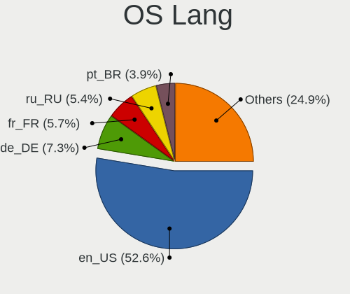
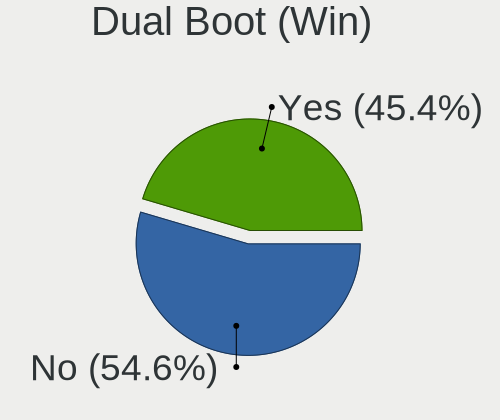
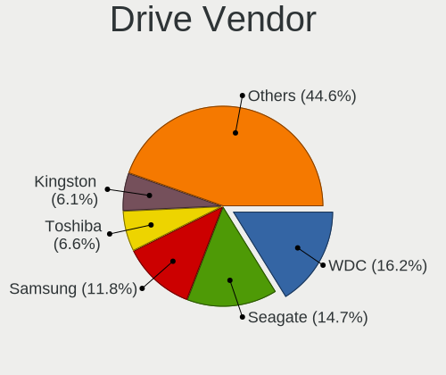
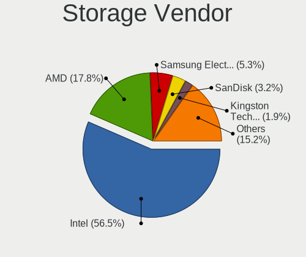
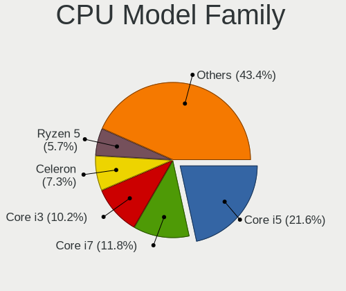
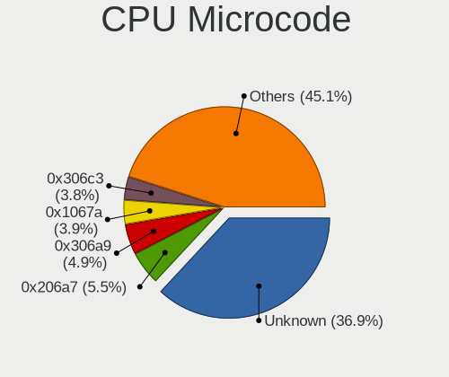
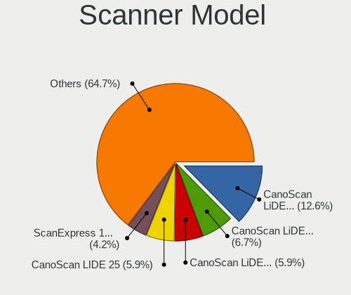

OpenMandriva - Tested Hardware & Statistics
-------------------------------------------

A project to collect tested hardware configurations for OpenMandriva.

Anyone can contribute to this report by the [hw-probe](https://github.com/linuxhw/hw-probe) tool:

    sudo -E hw-probe -all -upload

Please contribute! Especially if your hardware is rare.

This is a report for all computer types. See also reports for [desktops](/Dist/OpenMandriva/Desktop/README.md) and [notebooks](/Dist/OpenMandriva/Notebook/README.md).

Contents
--------

* [ Test Cases ](#test-cases)

* [ System ](#system)
  - [ OS                       ](#os)
  - [ OS Family                ](#os-family)
  - [ Kernel                   ](#kernel)
  - [ Kernel Family            ](#kernel-family)
  - [ Kernel Major Ver.        ](#kernel-major-ver)
  - [ Arch                     ](#arch)
  - [ DE                       ](#de)
  - [ Display Server           ](#display-server)
  - [ Display Manager          ](#display-manager)
  - [ OS Lang                  ](#os-lang)
  - [ Boot Mode                ](#boot-mode)
  - [ Filesystem               ](#filesystem)
  - [ Part. scheme             ](#part-scheme)
  - [ Dual Boot with Linux/BSD ](#dual-boot-with-linuxbsd)
  - [ Dual Boot (Win)          ](#dual-boot-win)

* [ Board ](#board)
  - [ Vendor                   ](#vendor)
  - [ Model                    ](#model)
  - [ Model Family             ](#model-family)
  - [ MFG Year                 ](#mfg-year)
  - [ Form Factor              ](#form-factor)
  - [ Secure Boot              ](#secure-boot)
  - [ Coreboot                 ](#coreboot)
  - [ RAM Size                 ](#ram-size)
  - [ RAM Used                 ](#ram-used)
  - [ Total Drives             ](#total-drives)
  - [ Has CD-ROM               ](#has-cd-rom)
  - [ Has Ethernet             ](#has-ethernet)
  - [ Has WiFi                 ](#has-wifi)
  - [ Has Bluetooth            ](#has-bluetooth)

* [ Location ](#location)
  - [ Country                  ](#country)
  - [ City                     ](#city)

* [ Drives ](#drives)
  - [ Drive Vendor             ](#drive-vendor)
  - [ Drive Model              ](#drive-model)
  - [ HDD Vendor               ](#hdd-vendor)
  - [ SSD Vendor               ](#ssd-vendor)
  - [ Drive Kind               ](#drive-kind)
  - [ Drive Connector          ](#drive-connector)
  - [ Drive Size               ](#drive-size)
  - [ Space Total              ](#space-total)
  - [ Space Used               ](#space-used)
  - [ Malfunc. Drives          ](#malfunc-drives)
  - [ Malfunc. Drive Vendor    ](#malfunc-drive-vendor)
  - [ Malfunc. HDD Vendor      ](#malfunc-hdd-vendor)
  - [ Malfunc. Drive Kind      ](#malfunc-drive-kind)
  - [ Failed Drives            ](#failed-drives)
  - [ Failed Drive Vendor      ](#failed-drive-vendor)
  - [ Drive Status             ](#drive-status)

* [ Storage controller ](#storage-controller)
  - [ Storage Vendor           ](#storage-vendor)
  - [ Storage Model            ](#storage-model)
  - [ Storage Kind             ](#storage-kind)

* [ Processor ](#processor)
  - [ CPU Vendor               ](#cpu-vendor)
  - [ CPU Model                ](#cpu-model)
  - [ CPU Model Family         ](#cpu-model-family)
  - [ CPU Cores                ](#cpu-cores)
  - [ CPU Sockets              ](#cpu-sockets)
  - [ CPU Threads              ](#cpu-threads)
  - [ CPU Op-Modes             ](#cpu-op-modes)
  - [ CPU Microcode            ](#cpu-microcode)
  - [ CPU Microarch            ](#cpu-microarch)

* [ Graphics ](#graphics)
  - [ GPU Vendor               ](#gpu-vendor)
  - [ GPU Model                ](#gpu-model)
  - [ GPU Combo                ](#gpu-combo)
  - [ GPU Driver               ](#gpu-driver)
  - [ GPU Memory               ](#gpu-memory)

* [ Monitor ](#monitor)
  - [ Monitor Vendor           ](#monitor-vendor)
  - [ Monitor Model            ](#monitor-model)
  - [ Monitor Resolution       ](#monitor-resolution)
  - [ Monitor Diagonal         ](#monitor-diagonal)
  - [ Monitor Width            ](#monitor-width)
  - [ Aspect Ratio             ](#aspect-ratio)
  - [ Monitor Area             ](#monitor-area)
  - [ Pixel Density            ](#pixel-density)
  - [ Multiple Monitors        ](#multiple-monitors)

* [ Network ](#network)
  - [ Net Controller Vendor    ](#net-controller-vendor)
  - [ Net Controller Model     ](#net-controller-model)
  - [ Wireless Vendor          ](#wireless-vendor)
  - [ Wireless Model           ](#wireless-model)
  - [ Ethernet Vendor          ](#ethernet-vendor)
  - [ Ethernet Model           ](#ethernet-model)
  - [ Net Controller Kind      ](#net-controller-kind)
  - [ Used Controller          ](#used-controller)
  - [ NICs                     ](#nics)
  - [ IPv6                     ](#ipv6)

* [ Bluetooth ](#bluetooth)
  - [ Bluetooth Vendor         ](#bluetooth-vendor)
  - [ Bluetooth Model          ](#bluetooth-model)

* [ Sound ](#sound)
  - [ Sound Vendor             ](#sound-vendor)
  - [ Sound Model              ](#sound-model)

* [ Memory ](#memory)
  - [ Memory Vendor            ](#memory-vendor)
  - [ Memory Model             ](#memory-model)
  - [ Memory Kind              ](#memory-kind)
  - [ Memory Form Factor       ](#memory-form-factor)
  - [ Memory Size              ](#memory-size)
  - [ Memory Speed             ](#memory-speed)

* [ Printers & scanners ](#printers--scanners)
  - [ Printer Vendor           ](#printer-vendor)
  - [ Printer Model            ](#printer-model)
  - [ Scanner Vendor           ](#scanner-vendor)
  - [ Scanner Model            ](#scanner-model)

* [ Camera ](#camera)
  - [ Camera Vendor            ](#camera-vendor)
  - [ Camera Model             ](#camera-model)

* [ Security ](#security)
  - [ Fingerprint Vendor       ](#fingerprint-vendor)
  - [ Fingerprint Model        ](#fingerprint-model)
  - [ Chipcard Vendor          ](#chipcard-vendor)
  - [ Chipcard Model           ](#chipcard-model)

* [ Unsupported ](#unsupported)
  - [ Unsupported Devices      ](#unsupported-devices)
  - [ Unsupported Device Types ](#unsupported-device-types)

Test Cases
----------

Total: 9121

| Vendor        | Model                       | Form-Factor | Probe                                                      | Date         |
|---------------|-----------------------------|-------------|------------------------------------------------------------|--------------|
| ASRock        | J5005-ITX                   | Desktop     | [783c72d32e](https://linux-hardware.org/?probe=783c72d32e) | Oct 01, 2022 |
| Dell          | Inspiron 1545               | Notebook    | [ba72c7ee42](https://linux-hardware.org/?probe=ba72c7ee42) | Oct 01, 2022 |
| MSI           | MS-7235                     | Desktop     | [838e2c27f1](https://linux-hardware.org/?probe=838e2c27f1) | Oct 01, 2022 |
| Lenovo        | 3000 N200 0769B4G           | Notebook    | [947f124efc](https://linux-hardware.org/?probe=947f124efc) | Oct 01, 2022 |
| Lenovo        | 0x30F617AA NOK              | Desktop     | [bb13b87bd5](https://linux-hardware.org/?probe=bb13b87bd5) | Oct 01, 2022 |
| Itautec       | Infoway a7420               | Notebook    | [bb52fe66cf](https://linux-hardware.org/?probe=bb52fe66cf) | Oct 01, 2022 |
| Lenovo        | IdeaPad 1 14ADA05 82GW      | Notebook    | [7ff2c5ad1c](https://linux-hardware.org/?probe=7ff2c5ad1c) | Oct 01, 2022 |
| Lenovo        | IdeaPad 1 14ADA05 82GW      | Notebook    | [a64cec6a4d](https://linux-hardware.org/?probe=a64cec6a4d) | Oct 01, 2022 |
| ASUSTek       | UX303UB                     | Notebook    | [e09f793c1a](https://linux-hardware.org/?probe=e09f793c1a) | Oct 01, 2022 |
| Lenovo        | IdeaPad 530S-14ARR 81H1     | Notebook    | [68b0c0ca1a](https://linux-hardware.org/?probe=68b0c0ca1a) | Oct 01, 2022 |
| MSI           | B350M PRO-VDH               | Desktop     | [1a0d8b695d](https://linux-hardware.org/?probe=1a0d8b695d) | Oct 01, 2022 |
| Lenovo        | 3098 NOK                    | Desktop     | [a46521af41](https://linux-hardware.org/?probe=a46521af41) | Oct 01, 2022 |
| Fujitsu       | D2990-A2 S26361-D2990-A2    | Desktop     | [982b143d73](https://linux-hardware.org/?probe=982b143d73) | Oct 01, 2022 |
| ASUSTek       | K53SM                       | Notebook    | [f05f33fa9b](https://linux-hardware.org/?probe=f05f33fa9b) | Oct 01, 2022 |
| ASUSTek       | M5A78L-M LX                 | Desktop     | [d967f57569](https://linux-hardware.org/?probe=d967f57569) | Oct 01, 2022 |
| HP            | Pavilion dv2700             | Notebook    | [0da9fb0afd](https://linux-hardware.org/?probe=0da9fb0afd) | Oct 01, 2022 |
| ASUSTek       | M5A87                       | Desktop     | [89ca067566](https://linux-hardware.org/?probe=89ca067566) | Oct 01, 2022 |
| Gigabyte      | GA-970A-D3                  | Desktop     | [8c24fa2271](https://linux-hardware.org/?probe=8c24fa2271) | Oct 01, 2022 |
| Dell          | Inspiron 3451               | Notebook    | [aee33639b9](https://linux-hardware.org/?probe=aee33639b9) | Oct 01, 2022 |
| Gigabyte      | B360 AORUS GAMING 3-CF      | Desktop     | [87a1c21540](https://linux-hardware.org/?probe=87a1c21540) | Oct 01, 2022 |
| Sony          | VPCYB3V1E                   | Notebook    | [de50c8a304](https://linux-hardware.org/?probe=de50c8a304) | Oct 01, 2022 |
| Lenovo        | IdeaPad S145-15AST 81N3     | Notebook    | [f50a823779](https://linux-hardware.org/?probe=f50a823779) | Oct 01, 2022 |
| ASUSTek       | ASUS EXPERTBOOK B1500CEA... | Notebook    | [24aefc4138](https://linux-hardware.org/?probe=24aefc4138) | Oct 01, 2022 |
| HP            | Laptop 15-bs0xx             | Notebook    | [646f4ffa8e](https://linux-hardware.org/?probe=646f4ffa8e) | Oct 01, 2022 |
| Sony          | VPCEH2D0E                   | Notebook    | [a08d0148e2](https://linux-hardware.org/?probe=a08d0148e2) | Sep 30, 2022 |
| Intel         | H61                         | Desktop     | [37af3b0cdb](https://linux-hardware.org/?probe=37af3b0cdb) | Sep 30, 2022 |
| ASRock        | B450M Pro4-F                | Desktop     | [75b0aa3c75](https://linux-hardware.org/?probe=75b0aa3c75) | Sep 30, 2022 |
| Lenovo        | 0x36A017AA SDK0J40700 WI... | Desktop     | [a6b14fdcf3](https://linux-hardware.org/?probe=a6b14fdcf3) | Sep 30, 2022 |
| Dell          | Inspiron 11-3162            | Notebook    | [8cd15b2f0c](https://linux-hardware.org/?probe=8cd15b2f0c) | Sep 30, 2022 |
| Acer          | Batman A01                  | Desktop     | [f8ebe348e4](https://linux-hardware.org/?probe=f8ebe348e4) | Sep 30, 2022 |
| ASUSTek       | PRIME B360M-A               | Desktop     | [f0eae50061](https://linux-hardware.org/?probe=f0eae50061) | Sep 30, 2022 |
| ASUSTek       | PRIME B450M-A               | Desktop     | [cfe1aba7e6](https://linux-hardware.org/?probe=cfe1aba7e6) | Sep 30, 2022 |
| ASUSTek       | P5KPL-AM EPU                | Desktop     | [66877298d4](https://linux-hardware.org/?probe=66877298d4) | Sep 30, 2022 |
| Dell          | Latitude E6520              | Notebook    | [04817b4ceb](https://linux-hardware.org/?probe=04817b4ceb) | Sep 30, 2022 |
| Lenovo        | G460 20041                  | Notebook    | [9018f40ad5](https://linux-hardware.org/?probe=9018f40ad5) | Sep 30, 2022 |
| Dell          | Latitude 3190 2-in-1        | Convertible | [11e4602764](https://linux-hardware.org/?probe=11e4602764) | Sep 30, 2022 |
| Dell          | Latitude 3310               | Notebook    | [3c4874fa51](https://linux-hardware.org/?probe=3c4874fa51) | Sep 30, 2022 |
| HP            | Laptop 15-bs0xx             | Notebook    | [7ed786bee9](https://linux-hardware.org/?probe=7ed786bee9) | Sep 30, 2022 |
| HP            | 250 G5 Notebook PC          | Notebook    | [26961d1b30](https://linux-hardware.org/?probe=26961d1b30) | Sep 29, 2022 |
| Lenovo        | ThinkBook 13s-IML 20RR      | Notebook    | [d153a4f97a](https://linux-hardware.org/?probe=d153a4f97a) | Sep 29, 2022 |
| Toshiba       | Satellite L505              | Notebook    | [3e91e2bfaf](https://linux-hardware.org/?probe=3e91e2bfaf) | Sep 29, 2022 |
| Dell          | Latitude D531               | Notebook    | [331cad8b98](https://linux-hardware.org/?probe=331cad8b98) | Sep 29, 2022 |
| HP            | Laptop 14s-fq1xxx           | Notebook    | [3990ec6cb0](https://linux-hardware.org/?probe=3990ec6cb0) | Sep 29, 2022 |
| HP            | 3398                        | Desktop     | [c2190a0657](https://linux-hardware.org/?probe=c2190a0657) | Sep 29, 2022 |
| Dell          | 0Y5DDC A00                  | Desktop     | [f9efac58da](https://linux-hardware.org/?probe=f9efac58da) | Sep 29, 2022 |
| HP            | Compaq 6720s                | Notebook    | [ddb5163310](https://linux-hardware.org/?probe=ddb5163310) | Sep 29, 2022 |
| Apple         | MacBook7,1                  | Notebook    | [88d57c6319](https://linux-hardware.org/?probe=88d57c6319) | Sep 29, 2022 |
| Huanan        | X79 (INTEL Xeon E5/Corei... | Desktop     | [a40d59533c](https://linux-hardware.org/?probe=a40d59533c) | Sep 29, 2022 |
| Dell          | Inspiron 15-3552            | Notebook    | [9414d73ae0](https://linux-hardware.org/?probe=9414d73ae0) | Sep 29, 2022 |
| Acer          | Veriton M275                | Desktop     | [f871926a8e](https://linux-hardware.org/?probe=f871926a8e) | Sep 29, 2022 |
| Intel         | DQ67SW AAG12527-310         | Desktop     | [235930defb](https://linux-hardware.org/?probe=235930defb) | Sep 28, 2022 |
| Gigabyte      | Z87X-UD5H-CF                | Desktop     | [5a7ad7dba9](https://linux-hardware.org/?probe=5a7ad7dba9) | Sep 28, 2022 |
| Dell          | XPS 13 9360                 | Notebook    | [6f1ecca2f0](https://linux-hardware.org/?probe=6f1ecca2f0) | Sep 28, 2022 |
| ASUSTek       | M5A97 LE R2.0               | Desktop     | [372cdc3726](https://linux-hardware.org/?probe=372cdc3726) | Sep 28, 2022 |
| Dell          | Latitude 3310               | Notebook    | [c21a321dce](https://linux-hardware.org/?probe=c21a321dce) | Sep 28, 2022 |
| Dell          | Inspiron 5558               | Notebook    | [a42a4722f7](https://linux-hardware.org/?probe=a42a4722f7) | Sep 28, 2022 |
| Dell          | Latitude 3120               | Convertible | [2e9902fee0](https://linux-hardware.org/?probe=2e9902fee0) | Sep 28, 2022 |
| Dell          | Vostro 5391                 | Notebook    | [61a25cdb83](https://linux-hardware.org/?probe=61a25cdb83) | Sep 28, 2022 |
| Dell          | Latitude 3120               | Convertible | [932a938506](https://linux-hardware.org/?probe=932a938506) | Sep 28, 2022 |
| Dell          | Latitude 3190 2-in-1        | Convertible | [c3041b210f](https://linux-hardware.org/?probe=c3041b210f) | Sep 28, 2022 |
| HP            | 18E7                        | Desktop     | [132a87f746](https://linux-hardware.org/?probe=132a87f746) | Sep 28, 2022 |
| Toshiba       | dynabook T653/46JR          | Notebook    | [9a613eaf66](https://linux-hardware.org/?probe=9a613eaf66) | Sep 28, 2022 |
| Gigabyte      | 970A-DS3P                   | Desktop     | [ada186ce05](https://linux-hardware.org/?probe=ada186ce05) | Sep 27, 2022 |
| Biostar       | A10N-8800E                  | Desktop     | [d27bf09dc8](https://linux-hardware.org/?probe=d27bf09dc8) | Sep 27, 2022 |
| Sony          | VPCEH1S1R                   | Notebook    | [5214bb023f](https://linux-hardware.org/?probe=5214bb023f) | Sep 27, 2022 |
| Dell          | Latitude 3300               | Notebook    | [365349d964](https://linux-hardware.org/?probe=365349d964) | Sep 27, 2022 |
| Dell          | Latitude 3190 2-in-1        | Convertible | [af23e43e99](https://linux-hardware.org/?probe=af23e43e99) | Sep 27, 2022 |
| Dell          | Latitude 3310               | Notebook    | [313ab64584](https://linux-hardware.org/?probe=313ab64584) | Sep 27, 2022 |
| HP            | 844C                        | Desktop     | [51cb0bca57](https://linux-hardware.org/?probe=51cb0bca57) | Sep 27, 2022 |
| HP            | 0A60h                       | Desktop     | [ccb90a4b31](https://linux-hardware.org/?probe=ccb90a4b31) | Sep 27, 2022 |
| Dell          | Latitude 3190 2-in-1        | Convertible | [d46d96565b](https://linux-hardware.org/?probe=d46d96565b) | Sep 27, 2022 |
| Dell          | Latitude 3190 2-in-1        | Convertible | [f5f99a7234](https://linux-hardware.org/?probe=f5f99a7234) | Sep 27, 2022 |
| Toshiba       | Satellite C850-1LK          | Notebook    | [f0240dcb2d](https://linux-hardware.org/?probe=f0240dcb2d) | Sep 27, 2022 |
| Dell          | Latitude 3190 2-in-1        | Convertible | [7cea84adb2](https://linux-hardware.org/?probe=7cea84adb2) | Sep 27, 2022 |
| Lenovo        | IdeaPad Z580                | Notebook    | [a33ab40c8b](https://linux-hardware.org/?probe=a33ab40c8b) | Sep 27, 2022 |
| Dell          | Latitude 3120               | Convertible | [bc34bf4d73](https://linux-hardware.org/?probe=bc34bf4d73) | Sep 27, 2022 |
| ASUSTek       | PRIME Z690-P D4             | Desktop     | [3bafc34ffc](https://linux-hardware.org/?probe=3bafc34ffc) | Sep 27, 2022 |
| Positivo      | SW6H                        | Notebook    | [4cfa6665bb](https://linux-hardware.org/?probe=4cfa6665bb) | Sep 27, 2022 |
| Packard Be... | EasyNote LS44SB             | Notebook    | [184a0768bd](https://linux-hardware.org/?probe=184a0768bd) | Sep 26, 2022 |
| Dell          | Latitude 3120               | Convertible | [56ac60a3dc](https://linux-hardware.org/?probe=56ac60a3dc) | Sep 26, 2022 |
| ASUSTek       | VivoBook_ASUSLaptop E210... | Notebook    | [898f9bf963](https://linux-hardware.org/?probe=898f9bf963) | Sep 26, 2022 |
| Dell          | Latitude 3120               | Convertible | [8736347f60](https://linux-hardware.org/?probe=8736347f60) | Sep 26, 2022 |
| Dell          | Latitude 3420               | Notebook    | [ee7c1fce66](https://linux-hardware.org/?probe=ee7c1fce66) | Sep 26, 2022 |
| Dell          | Latitude 3190 2-in-1        | Convertible | [9d1392e945](https://linux-hardware.org/?probe=9d1392e945) | Sep 26, 2022 |
| MSI           | MAG B460 TOMAHAWK           | Desktop     | [a213c6d22a](https://linux-hardware.org/?probe=a213c6d22a) | Sep 26, 2022 |
| Dell          | Latitude 3310               | Notebook    | [0f1fb4687f](https://linux-hardware.org/?probe=0f1fb4687f) | Sep 26, 2022 |
| Dell          | Latitude 3190 2-in-1        | Convertible | [6ce0a09785](https://linux-hardware.org/?probe=6ce0a09785) | Sep 26, 2022 |
| Dell          | Latitude 3310               | Notebook    | [a6ce17cd6b](https://linux-hardware.org/?probe=a6ce17cd6b) | Sep 26, 2022 |
| Acer          | Aspire V5-471               | Notebook    | [66437a2187](https://linux-hardware.org/?probe=66437a2187) | Sep 26, 2022 |
| Dell          | Latitude 3310               | Notebook    | [87af9a8980](https://linux-hardware.org/?probe=87af9a8980) | Sep 26, 2022 |
| Dell          | Latitude 3120               | Convertible | [9458cffde8](https://linux-hardware.org/?probe=9458cffde8) | Sep 26, 2022 |
| Dell          | Latitude E5250              | Notebook    | [e4ffe3583d](https://linux-hardware.org/?probe=e4ffe3583d) | Sep 26, 2022 |
| ASUSTek       | P7H55-M LX                  | Desktop     | [8d3b235d4c](https://linux-hardware.org/?probe=8d3b235d4c) | Sep 25, 2022 |
| CCE           | Capella & IbexPeak-M Chi... | Notebook    | [07554a7a2b](https://linux-hardware.org/?probe=07554a7a2b) | Sep 25, 2022 |
| Gigabyte      | B450 AORUS ELITE            | Desktop     | [8749a17d26](https://linux-hardware.org/?probe=8749a17d26) | Sep 25, 2022 |
| Intel         | NUC10i7FNB K61360-305       | Mini pc     | [a7aadaeed0](https://linux-hardware.org/?probe=a7aadaeed0) | Sep 25, 2022 |
| HP            | Laptop 17-by3xxx            | Notebook    | [41db205ec7](https://linux-hardware.org/?probe=41db205ec7) | Sep 25, 2022 |
| Acer          | Aspire A315-51              | Notebook    | [21121aa007](https://linux-hardware.org/?probe=21121aa007) | Sep 25, 2022 |
| Lenovo        | ThinkPad SL500 27464DG      | Notebook    | [6c2b4ce4b1](https://linux-hardware.org/?probe=6c2b4ce4b1) | Sep 25, 2022 |
| ASUSTek       | CM1740                      | Desktop     | [6ebc913933](https://linux-hardware.org/?probe=6ebc913933) | Sep 25, 2022 |
| HP            | 250 G5 Notebook PC          | Notebook    | [6c6ae30eba](https://linux-hardware.org/?probe=6c6ae30eba) | Sep 24, 2022 |
| BESSTAR Te... | UM350                       | Desktop     | [8442ff18ca](https://linux-hardware.org/?probe=8442ff18ca) | Sep 24, 2022 |
| HP            | Pavilion 15                 | Notebook    | [32670a0451](https://linux-hardware.org/?probe=32670a0451) | Sep 24, 2022 |
| Dell          | 0NV0M7 A02                  | Desktop     | [02925c7220](https://linux-hardware.org/?probe=02925c7220) | Sep 24, 2022 |
| MSI           | Z390-A PRO                  | Desktop     | [e78a82387b](https://linux-hardware.org/?probe=e78a82387b) | Sep 24, 2022 |
| HP            | 198E                        | Desktop     | [ffa9a79cc0](https://linux-hardware.org/?probe=ffa9a79cc0) | Sep 24, 2022 |
| ASRock        | X300M-STX                   | Desktop     | [c354f2b293](https://linux-hardware.org/?probe=c354f2b293) | Sep 24, 2022 |
| Dell          | Inspiron 3721               | Notebook    | [7411a700cf](https://linux-hardware.org/?probe=7411a700cf) | Sep 24, 2022 |
| HP            | Laptop 17-cp0xxx            | Notebook    | [dafafa97a4](https://linux-hardware.org/?probe=dafafa97a4) | Sep 24, 2022 |
| Acidanther... | Mac-A369DDC4E67F1C45 iMa... | All in one  | [0e9b82f312](https://linux-hardware.org/?probe=0e9b82f312) | Sep 24, 2022 |
| Unknown       | WZBTDT1 R110                | Desktop     | [8b6b5af31a](https://linux-hardware.org/?probe=8b6b5af31a) | Sep 24, 2022 |
| Intel         | DG41WV AAE90316-103         | Desktop     | [425dd57672](https://linux-hardware.org/?probe=425dd57672) | Sep 24, 2022 |
| ASUSTek       | PRIME A320M-K               | Desktop     | [815fe42722](https://linux-hardware.org/?probe=815fe42722) | Sep 23, 2022 |
| Fujitsu       | LIFEBOOK S760               | Notebook    | [ceda61113a](https://linux-hardware.org/?probe=ceda61113a) | Sep 23, 2022 |
| Dell          | 0M5DCD A00                  | Desktop     | [991137f04f](https://linux-hardware.org/?probe=991137f04f) | Sep 23, 2022 |
| HP            | 0AA8h                       | Desktop     | [9c02e3fc31](https://linux-hardware.org/?probe=9c02e3fc31) | Sep 23, 2022 |
| Dell          | 0PTTT9 A00                  | Desktop     | [21bde061e9](https://linux-hardware.org/?probe=21bde061e9) | Sep 23, 2022 |
| Lenovo        | ThinkCentre M58p 6137CR4    | Desktop     | [72e0bfca3b](https://linux-hardware.org/?probe=72e0bfca3b) | Sep 23, 2022 |
| Dell          | Latitude 3120               | Convertible | [5281ee08e1](https://linux-hardware.org/?probe=5281ee08e1) | Sep 23, 2022 |
| Dell          | Latitude 3310               | Notebook    | [4c5dc33267](https://linux-hardware.org/?probe=4c5dc33267) | Sep 23, 2022 |
| Dell          | Latitude 3190 2-in-1        | Convertible | [9c4d48864b](https://linux-hardware.org/?probe=9c4d48864b) | Sep 23, 2022 |
| Lenovo        | ThinkCentre Edge71 1578D... | Desktop     | [95dded89b8](https://linux-hardware.org/?probe=95dded89b8) | Sep 23, 2022 |
| Dell          | Latitude 3190 2-in-1        | Convertible | [443df1ca5c](https://linux-hardware.org/?probe=443df1ca5c) | Sep 23, 2022 |
| Dell          | Latitude 3190 2-in-1        | Convertible | [061ef6f153](https://linux-hardware.org/?probe=061ef6f153) | Sep 23, 2022 |
| ASUSTek       | PRIME B560M-A AC            | Desktop     | [a99682c38d](https://linux-hardware.org/?probe=a99682c38d) | Sep 23, 2022 |
| Apple         | MacBook4,1                  | Notebook    | [69a66aefdd](https://linux-hardware.org/?probe=69a66aefdd) | Sep 23, 2022 |
| Dell          | Latitude 7480               | Notebook    | [e1a3ca1d32](https://linux-hardware.org/?probe=e1a3ca1d32) | Sep 22, 2022 |
| Lenovo        | IdeaPad 3 14ALC6 82KT       | Notebook    | [2b37d81d4c](https://linux-hardware.org/?probe=2b37d81d4c) | Sep 22, 2022 |
| HP            | ProBook 450 G1              | Notebook    | [2527dc6ea0](https://linux-hardware.org/?probe=2527dc6ea0) | Sep 22, 2022 |
| Acer          | Nitro AN515-31              | Notebook    | [9b451feb14](https://linux-hardware.org/?probe=9b451feb14) | Sep 22, 2022 |
| HP            | Compaq 15                   | Notebook    | [345fe48777](https://linux-hardware.org/?probe=345fe48777) | Sep 22, 2022 |
| Lenovo        | ThinkPad X200s 7470WWD      | Notebook    | [268aa65de3](https://linux-hardware.org/?probe=268aa65de3) | Sep 22, 2022 |
| HP            | 1998                        | Desktop     | [f8399e0d3a](https://linux-hardware.org/?probe=f8399e0d3a) | Sep 22, 2022 |
| ASUSTek       | B85M-E                      | Desktop     | [07477a078f](https://linux-hardware.org/?probe=07477a078f) | Sep 22, 2022 |
| ASUSTek       | K70AD                       | Notebook    | [49dff3ffb5](https://linux-hardware.org/?probe=49dff3ffb5) | Sep 22, 2022 |
| Lenovo        | XiaoXinPro-13ARE 2020 82... | Notebook    | [c1edc96aa7](https://linux-hardware.org/?probe=c1edc96aa7) | Sep 21, 2022 |
| ASUSTek       | X441BA                      | Notebook    | [e542a68ddf](https://linux-hardware.org/?probe=e542a68ddf) | Sep 21, 2022 |
| Lenovo        | 30BB SDK0J40697 WIN 3305... | All in one  | [989f23b214](https://linux-hardware.org/?probe=989f23b214) | Sep 21, 2022 |
| MSI           | Z370 GAMING PRO CARBON      | Desktop     | [978c6dd9dd](https://linux-hardware.org/?probe=978c6dd9dd) | Sep 21, 2022 |
| HP            | 1998                        | Desktop     | [5148539ae1](https://linux-hardware.org/?probe=5148539ae1) | Sep 21, 2022 |
| Toshiba       | dynabook T653/46JR          | Notebook    | [ee93820bdf](https://linux-hardware.org/?probe=ee93820bdf) | Sep 21, 2022 |
| Dell          | G5 5505                     | Notebook    | [82017aa2ae](https://linux-hardware.org/?probe=82017aa2ae) | Sep 21, 2022 |
| MACHINIST     | B75 PRO V1.0                | Desktop     | [752cb8efae](https://linux-hardware.org/?probe=752cb8efae) | Sep 21, 2022 |
| ASUSTek       | UX303LAB                    | Notebook    | [2165b4b046](https://linux-hardware.org/?probe=2165b4b046) | Sep 20, 2022 |
| Dell          | XPS 9320                    | Notebook    | [cd57903024](https://linux-hardware.org/?probe=cd57903024) | Sep 20, 2022 |
| Dell          | Precision M3800             | Notebook    | [2d5d8707dd](https://linux-hardware.org/?probe=2d5d8707dd) | Sep 20, 2022 |
| Gigabyte      | GA-780T-D3L                 | Desktop     | [3e0939e549](https://linux-hardware.org/?probe=3e0939e549) | Sep 20, 2022 |
| Acer          | Aspire A315-23              | Notebook    | [dd730980b1](https://linux-hardware.org/?probe=dd730980b1) | Sep 20, 2022 |
| Gigabyte      | H61M-S2PV                   | Desktop     | [a82f4ceccc](https://linux-hardware.org/?probe=a82f4ceccc) | Sep 20, 2022 |
| Lenovo        | MAHOBAY Win8 STD MM DPK ... | Desktop     | [4d5fc6b39f](https://linux-hardware.org/?probe=4d5fc6b39f) | Sep 20, 2022 |
| MSI           | X470 GAMING PLUS MAX        | Desktop     | [9c483616f6](https://linux-hardware.org/?probe=9c483616f6) | Sep 20, 2022 |
| Acer          | Aspire V3-471               | Notebook    | [b04cc2ea05](https://linux-hardware.org/?probe=b04cc2ea05) | Sep 20, 2022 |
| Lenovo        | 3728 SDK0R32862 WIN 3258... | Desktop     | [d78d85bde3](https://linux-hardware.org/?probe=d78d85bde3) | Sep 20, 2022 |
| HP            | Pavilion Gaming Laptop 1... | Notebook    | [8003baae8c](https://linux-hardware.org/?probe=8003baae8c) | Sep 19, 2022 |
| ASUSTek       | PN41                        | Mini pc     | [a2d230d217](https://linux-hardware.org/?probe=a2d230d217) | Sep 19, 2022 |
| Acer          | Nitro AN515-31              | Notebook    | [33e582251a](https://linux-hardware.org/?probe=33e582251a) | Sep 19, 2022 |
| Lenovo        | G50-80 80R0                 | Notebook    | [f04ed15344](https://linux-hardware.org/?probe=f04ed15344) | Sep 19, 2022 |
| Samsung       | R530/R730                   | Notebook    | [0d4e13e70f](https://linux-hardware.org/?probe=0d4e13e70f) | Sep 19, 2022 |
| Dell          | Latitude 3310               | Notebook    | [0e1784b38d](https://linux-hardware.org/?probe=0e1784b38d) | Sep 19, 2022 |
| Dell          | Latitude 3120               | Convertible | [983266d6ba](https://linux-hardware.org/?probe=983266d6ba) | Sep 19, 2022 |
| Dell          | Latitude 3120               | Convertible | [374de3c13c](https://linux-hardware.org/?probe=374de3c13c) | Sep 19, 2022 |
| Dell          | Latitude 3190 2-in-1        | Convertible | [bc2dd8505b](https://linux-hardware.org/?probe=bc2dd8505b) | Sep 19, 2022 |
| HP            | 2B34                        | Desktop     | [a9e82bbb40](https://linux-hardware.org/?probe=a9e82bbb40) | Sep 19, 2022 |
| Dell          | Latitude 3310               | Notebook    | [55332651e0](https://linux-hardware.org/?probe=55332651e0) | Sep 19, 2022 |
| Dell          | Latitude 3120               | Convertible | [e6b9b405e8](https://linux-hardware.org/?probe=e6b9b405e8) | Sep 19, 2022 |
| Dell          | Latitude 3190 2-in-1        | Convertible | [448ba707f6](https://linux-hardware.org/?probe=448ba707f6) | Sep 19, 2022 |
| Dell          | Latitude 3120               | Notebook    | [558e95141d](https://linux-hardware.org/?probe=558e95141d) | Sep 19, 2022 |
| Toshiba       | PORTEGE Z30-A               | Notebook    | [419bf72e22](https://linux-hardware.org/?probe=419bf72e22) | Sep 19, 2022 |
| Dell          | Latitude 3300               | Notebook    | [a2513a9849](https://linux-hardware.org/?probe=a2513a9849) | Sep 19, 2022 |
| HP            | Laptop 15-ef2xxx            | Notebook    | [c9ab60a094](https://linux-hardware.org/?probe=c9ab60a094) | Sep 19, 2022 |
| ECS           | A55F2-M4                    | Desktop     | [335d28e72c](https://linux-hardware.org/?probe=335d28e72c) | Sep 19, 2022 |
| ASUSTek       | M5A88-V EVO                 | Desktop     | [9dc35eec1a](https://linux-hardware.org/?probe=9dc35eec1a) | Sep 19, 2022 |
| Positivo      | C14CR21                     | Notebook    | [e72ef2677b](https://linux-hardware.org/?probe=e72ef2677b) | Sep 19, 2022 |
| Lenovo        | ThinkPad T400 6474WPU       | Notebook    | [892c3fb361](https://linux-hardware.org/?probe=892c3fb361) | Sep 18, 2022 |
| HP            | EliteBook 2740p             | Notebook    | [6643773237](https://linux-hardware.org/?probe=6643773237) | Sep 18, 2022 |
| NEC Comput... | PC-VK26MXZCE                | Notebook    | [db8f5e4181](https://linux-hardware.org/?probe=db8f5e4181) | Sep 18, 2022 |
| ASUSTek       | PRIME B550M-K               | Desktop     | [f5fb874e1e](https://linux-hardware.org/?probe=f5fb874e1e) | Sep 18, 2022 |
| ASUSTek       | X510UQ                      | Notebook    | [eb619ed1c5](https://linux-hardware.org/?probe=eb619ed1c5) | Sep 18, 2022 |
| HP            | 2B29                        | Desktop     | [391e407d29](https://linux-hardware.org/?probe=391e407d29) | Sep 18, 2022 |
| Dell          | Vostro 3500                 | Notebook    | [08bd4157a3](https://linux-hardware.org/?probe=08bd4157a3) | Sep 18, 2022 |
| ASRock        | A75M-HVS                    | Desktop     | [7f906bad42](https://linux-hardware.org/?probe=7f906bad42) | Sep 18, 2022 |
| HP            | 843F                        | Desktop     | [7694ed2ffa](https://linux-hardware.org/?probe=7694ed2ffa) | Sep 18, 2022 |
| Lenovo        | ThinkPad T430 23501M2       | Notebook    | [b9503c9c28](https://linux-hardware.org/?probe=b9503c9c28) | Sep 18, 2022 |
| Lenovo        | IdeaPad L340-15API 81LW     | Notebook    | [65c4f113d8](https://linux-hardware.org/?probe=65c4f113d8) | Sep 18, 2022 |
| HP            | ProBook 6470b               | Notebook    | [3821322b95](https://linux-hardware.org/?probe=3821322b95) | Sep 18, 2022 |
| Acer          | Switch SA5-271P             | Tablet      | [c9900a8e2f](https://linux-hardware.org/?probe=c9900a8e2f) | Sep 17, 2022 |
| HP            | Notebook                    | Notebook    | [d29681d2ed](https://linux-hardware.org/?probe=d29681d2ed) | Sep 17, 2022 |
| Lenovo        | B50-45 20388                | Notebook    | [d55d9fad24](https://linux-hardware.org/?probe=d55d9fad24) | Sep 17, 2022 |
| Lenovo        | ThinkPad E570 20H5009NUS    | Notebook    | [c64258edc0](https://linux-hardware.org/?probe=c64258edc0) | Sep 17, 2022 |
| Dell          | Latitude 7390               | Notebook    | [64c9b13553](https://linux-hardware.org/?probe=64c9b13553) | Sep 17, 2022 |
| Toshiba       | TECRA S10                   | Notebook    | [602d81b7c5](https://linux-hardware.org/?probe=602d81b7c5) | Sep 17, 2022 |
| NEC Comput... | PC-VY21AEZ75                | Notebook    | [a24d79ffc2](https://linux-hardware.org/?probe=a24d79ffc2) | Sep 17, 2022 |
| Toshiba       | Satellite P845T             | Notebook    | [0d5f5ac925](https://linux-hardware.org/?probe=0d5f5ac925) | Sep 17, 2022 |
| ASUSTek       | P8P67                       | Desktop     | [a790b35cc1](https://linux-hardware.org/?probe=a790b35cc1) | Sep 17, 2022 |
| Gigabyte      | GA-78LMT-S2                 | Desktop     | [f75308c465](https://linux-hardware.org/?probe=f75308c465) | Sep 17, 2022 |
| MSI           | MAG B550 TOMAHAWK           | Desktop     | [e55484acd4](https://linux-hardware.org/?probe=e55484acd4) | Sep 17, 2022 |
| Dell          | Precision 7720              | Notebook    | [9658507a0b](https://linux-hardware.org/?probe=9658507a0b) | Sep 17, 2022 |
| HP            | Laptop 15-ef0xxx            | Notebook    | [19d0260ef6](https://linux-hardware.org/?probe=19d0260ef6) | Sep 17, 2022 |
| HP            | 255 G5 Notebook PC          | Notebook    | [6d8f7ffe97](https://linux-hardware.org/?probe=6d8f7ffe97) | Sep 17, 2022 |
| Toshiba       | dynabook T653/46JR          | Notebook    | [7f9cf09305](https://linux-hardware.org/?probe=7f9cf09305) | Sep 17, 2022 |
| Intel         | H61                         | Desktop     | [d1b17183d7](https://linux-hardware.org/?probe=d1b17183d7) | Sep 16, 2022 |
| Dell          | Latitude 5290 2-in-1        | Notebook    | [21620af2bb](https://linux-hardware.org/?probe=21620af2bb) | Sep 16, 2022 |
| Apple         | MacBook6,1                  | Notebook    | [93b43e5bb5](https://linux-hardware.org/?probe=93b43e5bb5) | Sep 16, 2022 |
| Lenovo        | ThinkPad T420 4180A32       | Notebook    | [44841341fd](https://linux-hardware.org/?probe=44841341fd) | Sep 16, 2022 |
| Valve         | Jupiter                     | Notebook    | [d5464b13f9](https://linux-hardware.org/?probe=d5464b13f9) | Sep 16, 2022 |
| HP            | 82F2 A01                    | Desktop     | [f97faeff54](https://linux-hardware.org/?probe=f97faeff54) | Sep 16, 2022 |
| Dell          | Latitude 3120               | Convertible | [e472e7fdde](https://linux-hardware.org/?probe=e472e7fdde) | Sep 16, 2022 |
| Dell          | Latitude 3190 2-in-1        | Convertible | [1ccce4a76a](https://linux-hardware.org/?probe=1ccce4a76a) | Sep 16, 2022 |
| Dell          | Latitude 3120               | Convertible | [e04ec1834f](https://linux-hardware.org/?probe=e04ec1834f) | Sep 16, 2022 |
| ASUSTek       | M5A97 LE R2.0               | Desktop     | [52fe410fe3](https://linux-hardware.org/?probe=52fe410fe3) | Sep 16, 2022 |
| HP            | Compaq Presario CQ50        | Notebook    | [41dcd9ffc4](https://linux-hardware.org/?probe=41dcd9ffc4) | Sep 16, 2022 |
| Sony          | VAIO                        | All in one  | [71ae1045da](https://linux-hardware.org/?probe=71ae1045da) | Sep 15, 2022 |
| Dell          | Inspiron 3451               | Notebook    | [fcdfa43a37](https://linux-hardware.org/?probe=fcdfa43a37) | Sep 15, 2022 |
| Chuwi         | HeroBook Pro                | Notebook    | [9a7d178f1b](https://linux-hardware.org/?probe=9a7d178f1b) | Sep 15, 2022 |
| Lenovo        | IdeaPad Y570 20091          | Notebook    | [5e2681360e](https://linux-hardware.org/?probe=5e2681360e) | Sep 15, 2022 |
| Lenovo        | ThinkPad T530 2429F33       | Notebook    | [790a0f2a25](https://linux-hardware.org/?probe=790a0f2a25) | Sep 14, 2022 |
| Lenovo        | V330-15IKB 81AX             | Notebook    | [0a91582802](https://linux-hardware.org/?probe=0a91582802) | Sep 14, 2022 |
| Lenovo        | IdeaPad S145-15AST 81N3     | Notebook    | [b552f0482d](https://linux-hardware.org/?probe=b552f0482d) | Sep 14, 2022 |
| Gigabyte      | G41MT-S2PT                  | Desktop     | [8366bd494c](https://linux-hardware.org/?probe=8366bd494c) | Sep 14, 2022 |
| Dell          | Inspiron 14-3467            | Notebook    | [e92b56817a](https://linux-hardware.org/?probe=e92b56817a) | Sep 14, 2022 |
| BESSTAR Te... | HM50                        | Desktop     | [a2632415a2](https://linux-hardware.org/?probe=a2632415a2) | Sep 14, 2022 |
| Dell          | Latitude E7470              | Notebook    | [9d15a7c8a2](https://linux-hardware.org/?probe=9d15a7c8a2) | Sep 14, 2022 |
| HP            | 1495                        | Desktop     | [462389df36](https://linux-hardware.org/?probe=462389df36) | Sep 14, 2022 |
| ASUSTek       | Maximus VIII RANGER         | Desktop     | [832824de54](https://linux-hardware.org/?probe=832824de54) | Sep 14, 2022 |
| HP            | 1496                        | Desktop     | [cb6033fc21](https://linux-hardware.org/?probe=cb6033fc21) | Sep 14, 2022 |
| Toshiba       | Satellite C660              | Notebook    | [39b26715f0](https://linux-hardware.org/?probe=39b26715f0) | Sep 14, 2022 |
| ASUSTek       | ProArt B550-CREATOR         | Desktop     | [6ee9d3e2c4](https://linux-hardware.org/?probe=6ee9d3e2c4) | Sep 14, 2022 |
| Dell          | Inspiron 5584               | Notebook    | [677d683644](https://linux-hardware.org/?probe=677d683644) | Sep 14, 2022 |
| Timi          | TM1612                      | Notebook    | [536fc04dcb](https://linux-hardware.org/?probe=536fc04dcb) | Sep 14, 2022 |
| Gigabyte      | F2A88X-D3H                  | Desktop     | [06d4572f5e](https://linux-hardware.org/?probe=06d4572f5e) | Sep 14, 2022 |
| ASUSTek       | H81M-A/BR                   | Desktop     | [daab24c8b6](https://linux-hardware.org/?probe=daab24c8b6) | Sep 14, 2022 |
| ASUSTek       | PRIME H310M-E R2.0          | Desktop     | [331a481ab0](https://linux-hardware.org/?probe=331a481ab0) | Sep 14, 2022 |
| Lenovo        | ThinkPad X230 2324GA1       | Notebook    | [c4e6cc1489](https://linux-hardware.org/?probe=c4e6cc1489) | Sep 14, 2022 |
| Lenovo        | ThinkCentre M71e 3157AE2    | Desktop     | [d88e0026dc](https://linux-hardware.org/?probe=d88e0026dc) | Sep 14, 2022 |
| Toshiba       | Satellite L55-B             | Notebook    | [b593ff9e20](https://linux-hardware.org/?probe=b593ff9e20) | Sep 14, 2022 |
| HP            | Notebook                    | Notebook    | [963af7e07b](https://linux-hardware.org/?probe=963af7e07b) | Sep 13, 2022 |
| Gigabyte      | X570 AORUS PRO              | Desktop     | [7858c98403](https://linux-hardware.org/?probe=7858c98403) | Sep 13, 2022 |
| Dell          | Latitude 3120               | Convertible | [a8315e1147](https://linux-hardware.org/?probe=a8315e1147) | Sep 13, 2022 |
| Sun Micros... | ASSY,MOTHERBOARD,X4170 5... | Server      | [ea845ec5ea](https://linux-hardware.org/?probe=ea845ec5ea) | Sep 13, 2022 |
| Dell          | Inspiron 3451               | Notebook    | [f06aa45765](https://linux-hardware.org/?probe=f06aa45765) | Sep 13, 2022 |
| Lenovo        | SHARKBAY NOK                | Desktop     | [bfd4a6b00a](https://linux-hardware.org/?probe=bfd4a6b00a) | Sep 13, 2022 |
| Lenovo        | IdeaPad 1 14ADA05 82GW      | Notebook    | [e558fd5212](https://linux-hardware.org/?probe=e558fd5212) | Sep 13, 2022 |
| Medion        | E4251 MD61227               | Notebook    | [8b3475f65b](https://linux-hardware.org/?probe=8b3475f65b) | Sep 13, 2022 |
| MSI           | Z97 MPOWER                  | Desktop     | [a98aedda05](https://linux-hardware.org/?probe=a98aedda05) | Sep 13, 2022 |
| Compal        | NCL60/61                    | Notebook    | [f1f5499af8](https://linux-hardware.org/?probe=f1f5499af8) | Sep 12, 2022 |
| ASUSTek       | PRIME H310-PLUS             | Desktop     | [0937dcb89c](https://linux-hardware.org/?probe=0937dcb89c) | Sep 12, 2022 |
| ASRock        | X99 Taichi                  | Desktop     | [2eb979e980](https://linux-hardware.org/?probe=2eb979e980) | Sep 12, 2022 |
| Toshiba       | Satellite C655              | Notebook    | [16a4aa3cd8](https://linux-hardware.org/?probe=16a4aa3cd8) | Sep 12, 2022 |
| Dell          | 0H8052                      | Desktop     | [1ade497706](https://linux-hardware.org/?probe=1ade497706) | Sep 12, 2022 |
| Dell          | XPS 15 9530                 | Notebook    | [fbb3c09289](https://linux-hardware.org/?probe=fbb3c09289) | Sep 12, 2022 |
| Dell          | XPS 15 9530                 | Notebook    | [fccf3eb345](https://linux-hardware.org/?probe=fccf3eb345) | Sep 12, 2022 |
| Gigabyte      | EX58-UD3R                   | Desktop     | [e482e214bd](https://linux-hardware.org/?probe=e482e214bd) | Sep 12, 2022 |
| Shuttle       | XH310V2                     | Desktop     | [c99efae947](https://linux-hardware.org/?probe=c99efae947) | Sep 12, 2022 |
| MSI           | MAG Z390M MORTAR            | Desktop     | [175f37281b](https://linux-hardware.org/?probe=175f37281b) | Sep 12, 2022 |
| MSI           | GP73 Leopard 8RE            | Notebook    | [21744558cb](https://linux-hardware.org/?probe=21744558cb) | Sep 12, 2022 |
| HP            | 158B                        | Desktop     | [ba2366e9ad](https://linux-hardware.org/?probe=ba2366e9ad) | Sep 12, 2022 |
| HP            | ProBook 440 G1              | Notebook    | [58b48039ce](https://linux-hardware.org/?probe=58b48039ce) | Sep 12, 2022 |
| ASRock        | B450M-HDV R4.0              | Desktop     | [73684f0e47](https://linux-hardware.org/?probe=73684f0e47) | Sep 12, 2022 |
| Intel         | D945GCNL AAD97184-106       | Desktop     | [a2bdc2d18c](https://linux-hardware.org/?probe=a2bdc2d18c) | Sep 11, 2022 |
| HP            | 304Bh                       | Desktop     | [0a7bcbdd9e](https://linux-hardware.org/?probe=0a7bcbdd9e) | Sep 11, 2022 |
| HP            | Laptop 15-dy2xxx            | Notebook    | [5523f4050c](https://linux-hardware.org/?probe=5523f4050c) | Sep 11, 2022 |
| ASUSTek       | PRIME H310M-E R2.0          | Desktop     | [b76fc41706](https://linux-hardware.org/?probe=b76fc41706) | Sep 11, 2022 |
| Microsoft     | Surface Pro 3               | Tablet      | [5d0092ffc1](https://linux-hardware.org/?probe=5d0092ffc1) | Sep 11, 2022 |
| ASUSTek       | UX31E                       | Notebook    | [910cdee832](https://linux-hardware.org/?probe=910cdee832) | Sep 11, 2022 |
| MSI           | B560M PRO                   | Desktop     | [6c43058545](https://linux-hardware.org/?probe=6c43058545) | Sep 11, 2022 |
| HP            | Notebook                    | Notebook    | [2984aef090](https://linux-hardware.org/?probe=2984aef090) | Sep 11, 2022 |
| Lenovo        | 3708 SDK0J40700 WIN 3258... | Desktop     | [4db3f9151e](https://linux-hardware.org/?probe=4db3f9151e) | Sep 11, 2022 |
| MSI           | A68HM-E33 V2                | Desktop     | [0225ec89d7](https://linux-hardware.org/?probe=0225ec89d7) | Sep 11, 2022 |
| ASUSTek       | ROG CROSSHAIR VIII DARK ... | Desktop     | [6168b7089f](https://linux-hardware.org/?probe=6168b7089f) | Sep 11, 2022 |
| ASUSTek       | K46CA                       | Notebook    | [9e730cbd6a](https://linux-hardware.org/?probe=9e730cbd6a) | Sep 11, 2022 |
| MSI           | 0A48                        | Desktop     | [2619140b48](https://linux-hardware.org/?probe=2619140b48) | Sep 10, 2022 |
| HUAWEI        | KPL-W0X                     | Notebook    | [eff4400b7d](https://linux-hardware.org/?probe=eff4400b7d) | Sep 10, 2022 |
| Dell          | 01TKCC A01                  | Desktop     | [6d032338c0](https://linux-hardware.org/?probe=6d032338c0) | Sep 10, 2022 |
| Gigabyte      | GB-BRR7H-4800               | Desktop     | [5fb806b2c8](https://linux-hardware.org/?probe=5fb806b2c8) | Sep 10, 2022 |
| Lenovo        | Unknown                     | Notebook    | [b5842ca017](https://linux-hardware.org/?probe=b5842ca017) | Sep 10, 2022 |
| ASUSTek       | P8B75-M LX                  | Desktop     | [0533bc0e86](https://linux-hardware.org/?probe=0533bc0e86) | Sep 10, 2022 |
| HP            | 3396                        | Desktop     | [964f32cccf](https://linux-hardware.org/?probe=964f32cccf) | Sep 10, 2022 |
| Dell          | 03NVJ6 A00                  | Desktop     | [ef8c1a9dee](https://linux-hardware.org/?probe=ef8c1a9dee) | Sep 10, 2022 |
| Samsung       | R530/R730/R540              | Notebook    | [72aea277e6](https://linux-hardware.org/?probe=72aea277e6) | Sep 10, 2022 |
| ASRock        | G41M-VS3                    | Desktop     | [021bcda428](https://linux-hardware.org/?probe=021bcda428) | Sep 10, 2022 |
| Lenovo        | ThinkPad L420 7829H86       | Notebook    | [406535e915](https://linux-hardware.org/?probe=406535e915) | Sep 10, 2022 |
| HP            | Pavilion g6                 | Notebook    | [0774a3c97d](https://linux-hardware.org/?probe=0774a3c97d) | Sep 10, 2022 |
| Gigabyte      | Z68AP-D3                    | Desktop     | [1ac8cbcc47](https://linux-hardware.org/?probe=1ac8cbcc47) | Sep 10, 2022 |
| LG Electro... | U560-G.BG31P1               | Notebook    | [741c3eddbe](https://linux-hardware.org/?probe=741c3eddbe) | Sep 10, 2022 |
| Dell          | 0J3C2F A00                  | Desktop     | [40c43aff10](https://linux-hardware.org/?probe=40c43aff10) | Sep 10, 2022 |
| Samsung       | SX60P                       | Notebook    | [1e0ea8e787](https://linux-hardware.org/?probe=1e0ea8e787) | Sep 09, 2022 |
| Apple         | Mac-F221BEC8                | Desktop     | [c0353e7c9e](https://linux-hardware.org/?probe=c0353e7c9e) | Sep 09, 2022 |
| Acer          | Aspire E1-572               | Notebook    | [1cfbfd9b91](https://linux-hardware.org/?probe=1cfbfd9b91) | Sep 09, 2022 |
| ASUSTek       | TUF Gaming B460M-PLUS       | Desktop     | [cd84312899](https://linux-hardware.org/?probe=cd84312899) | Sep 09, 2022 |
| Dell          | 04075X A00                  | All in one  | [e2ff438b3c](https://linux-hardware.org/?probe=e2ff438b3c) | Sep 09, 2022 |
| Dell          | Precision 7560              | Notebook    | [3e2d1a120c](https://linux-hardware.org/?probe=3e2d1a120c) | Sep 09, 2022 |
| Dell          | Latitude E4300              | Notebook    | [634c1467f8](https://linux-hardware.org/?probe=634c1467f8) | Sep 09, 2022 |
| Dell          | Latitude 3120               | Convertible | [6b2b6b7aa9](https://linux-hardware.org/?probe=6b2b6b7aa9) | Sep 09, 2022 |
| ASUSTek       | ROG CROSSHAIR VIII HERO     | Desktop     | [36b349b529](https://linux-hardware.org/?probe=36b349b529) | Sep 09, 2022 |
| Acer          | Aspire 5738                 | Notebook    | [5c21c2acc6](https://linux-hardware.org/?probe=5c21c2acc6) | Sep 09, 2022 |
| ASUSTek       | VivoBook_ASUSLaptop X412... | Notebook    | [628d805267](https://linux-hardware.org/?probe=628d805267) | Sep 09, 2022 |
| Positivo      | H14BT58                     | Notebook    | [669a466b1c](https://linux-hardware.org/?probe=669a466b1c) | Sep 09, 2022 |
| Dell          | 0M5DCD A00                  | Desktop     | [1a5c8e32b7](https://linux-hardware.org/?probe=1a5c8e32b7) | Sep 09, 2022 |
| Lenovo        | IdeaPad S400 20195          | Notebook    | [6bd3292f42](https://linux-hardware.org/?probe=6bd3292f42) | Sep 08, 2022 |
| HP            | Laptop 15-bw0xx             | Notebook    | [2154b21ff3](https://linux-hardware.org/?probe=2154b21ff3) | Sep 08, 2022 |
| Dell          | Latitude 3190 2-in-1        | Convertible | [ee7071f4e7](https://linux-hardware.org/?probe=ee7071f4e7) | Sep 08, 2022 |
| ASUSTek       | K53U                        | Notebook    | [d13ff70895](https://linux-hardware.org/?probe=d13ff70895) | Sep 08, 2022 |
| Lenovo        | ThinkBook 14-IML 20RV       | Notebook    | [e3976254ee](https://linux-hardware.org/?probe=e3976254ee) | Sep 08, 2022 |
| Gigabyte      | A520M DS3H                  | Desktop     | [036c262ad4](https://linux-hardware.org/?probe=036c262ad4) | Sep 08, 2022 |
| Dell          | 0MN1TX A02                  | Desktop     | [c9d50b8db9](https://linux-hardware.org/?probe=c9d50b8db9) | Sep 08, 2022 |
| Dell          | G5 5505                     | Notebook    | [e26e58afac](https://linux-hardware.org/?probe=e26e58afac) | Sep 08, 2022 |
| Intel         | D33217CK G76541-301         | Desktop     | [1f1e6e67ab](https://linux-hardware.org/?probe=1f1e6e67ab) | Sep 07, 2022 |
| Lenovo        | B5400 20278                 | Notebook    | [1c9d752f91](https://linux-hardware.org/?probe=1c9d752f91) | Sep 07, 2022 |
| HP            | Pavilion dv7                | Notebook    | [4a39ae67d5](https://linux-hardware.org/?probe=4a39ae67d5) | Sep 07, 2022 |
| Lenovo        | G580                        | Notebook    | [922ede2a50](https://linux-hardware.org/?probe=922ede2a50) | Sep 07, 2022 |
| ASRock        | Z170 Extreme4               | Desktop     | [70e3d85420](https://linux-hardware.org/?probe=70e3d85420) | Sep 07, 2022 |
| MSI           | IONA                        | Desktop     | [11d081dfc3](https://linux-hardware.org/?probe=11d081dfc3) | Sep 07, 2022 |
| Positivo      | POS-PQ45AU                  | Desktop     | [2770dcd81a](https://linux-hardware.org/?probe=2770dcd81a) | Sep 07, 2022 |
| Lenovo        | IdeaPad 3 15IIL05 81WE      | Notebook    | [22171cc2a6](https://linux-hardware.org/?probe=22171cc2a6) | Sep 07, 2022 |
| Unknown       | GSUO H61V10C                | Desktop     | [4eeb38bb0a](https://linux-hardware.org/?probe=4eeb38bb0a) | Sep 07, 2022 |
| Lenovo        | IdeaPad L340-15IRH Gamin... | Notebook    | [14f91e3a08](https://linux-hardware.org/?probe=14f91e3a08) | Sep 07, 2022 |
| Samsung       | RC420/RC520/RC720           | Notebook    | [a6b07acfe5](https://linux-hardware.org/?probe=a6b07acfe5) | Sep 07, 2022 |
| Samsung       | 3570R/370R/470R/450R/510... | Notebook    | [cf398ae303](https://linux-hardware.org/?probe=cf398ae303) | Sep 07, 2022 |
| HP            | ProBook 430 G1              | Notebook    | [cca59cbb3c](https://linux-hardware.org/?probe=cca59cbb3c) | Sep 07, 2022 |
| Positivo      | Mobile                      | Notebook    | [1378222b07](https://linux-hardware.org/?probe=1378222b07) | Sep 07, 2022 |
| ASRock        | J3355B-ITX                  | Desktop     | [1cf7076b74](https://linux-hardware.org/?probe=1cf7076b74) | Sep 07, 2022 |
| Gigabyte      | VM900M                      | Desktop     | [c6eefaabf9](https://linux-hardware.org/?probe=c6eefaabf9) | Sep 07, 2022 |
| LG Electro... | A530-T.BE76P1               | Notebook    | [46161b573f](https://linux-hardware.org/?probe=46161b573f) | Sep 06, 2022 |
| Lenovo        | ThinkPad Edge E531 68856... | Notebook    | [498682ac13](https://linux-hardware.org/?probe=498682ac13) | Sep 06, 2022 |
| MSI           | A320M PRO-M2 V2             | Desktop     | [c211642362](https://linux-hardware.org/?probe=c211642362) | Sep 06, 2022 |
| Gigabyte      | Z390 UD                     | Desktop     | [01ab1f5015](https://linux-hardware.org/?probe=01ab1f5015) | Sep 06, 2022 |
| ASUSTek       | P8H61-M LE/USB3             | Desktop     | [8a66fbdadd](https://linux-hardware.org/?probe=8a66fbdadd) | Sep 06, 2022 |
| Sony          | VPCSB3X9E                   | Notebook    | [03bd901e4f](https://linux-hardware.org/?probe=03bd901e4f) | Sep 06, 2022 |
| Acer          | TravelMate B118-M           | Notebook    | [614d44ff70](https://linux-hardware.org/?probe=614d44ff70) | Sep 06, 2022 |
| ECS           | GeForce 8000 series         | Desktop     | [7a60cea111](https://linux-hardware.org/?probe=7a60cea111) | Sep 06, 2022 |
| Lenovo        | ThinkPad T420 4236PNP       | Notebook    | [7c3dc0af20](https://linux-hardware.org/?probe=7c3dc0af20) | Sep 06, 2022 |
| Toshiba       | Satellite C75D-B            | Notebook    | [78e0cb1ca2](https://linux-hardware.org/?probe=78e0cb1ca2) | Sep 06, 2022 |
| Acer          | Aspire 5745                 | Notebook    | [39bc7728ac](https://linux-hardware.org/?probe=39bc7728ac) | Sep 06, 2022 |
| Dell          | Latitude E4300              | Notebook    | [4589ef4489](https://linux-hardware.org/?probe=4589ef4489) | Sep 06, 2022 |
| ASRock        | H61M-DGS                    | Desktop     | [51b15f6d34](https://linux-hardware.org/?probe=51b15f6d34) | Sep 06, 2022 |
| Lenovo        | B71-80 80RJ                 | Notebook    | [c16dc3a768](https://linux-hardware.org/?probe=c16dc3a768) | Sep 06, 2022 |
| Lenovo        | ThinkPad L440 20ASS11T00    | Notebook    | [526d97c730](https://linux-hardware.org/?probe=526d97c730) | Sep 06, 2022 |
| ASUSTek       | ET2040I                     | Desktop     | [44ab433428](https://linux-hardware.org/?probe=44ab433428) | Sep 06, 2022 |
| Gigabyte      | 970A-DS3P                   | Desktop     | [537708f71a](https://linux-hardware.org/?probe=537708f71a) | Sep 06, 2022 |
| ASUSTek       | VivoBook_ASUSLaptop X512... | Notebook    | [5d61bcd114](https://linux-hardware.org/?probe=5d61bcd114) | Sep 06, 2022 |
| HP            | Stream Laptop 14-cb0XX      | Notebook    | [6f848cd309](https://linux-hardware.org/?probe=6f848cd309) | Sep 06, 2022 |
| Dell          | Vostro 14-5480              | Notebook    | [fb3ae25db8](https://linux-hardware.org/?probe=fb3ae25db8) | Sep 06, 2022 |
| Lenovo        | IdeaPad 700-15ISK 80RU      | Notebook    | [5263a99ed8](https://linux-hardware.org/?probe=5263a99ed8) | Sep 05, 2022 |
| HP            | 18E4                        | Desktop     | [2c113164fd](https://linux-hardware.org/?probe=2c113164fd) | Sep 05, 2022 |
| Pegatron      | NARRA5                      | Desktop     | [b5e07ae97b](https://linux-hardware.org/?probe=b5e07ae97b) | Sep 05, 2022 |
| MSI           | B85M-E43 DASH               | Desktop     | [f52a53f4a7](https://linux-hardware.org/?probe=f52a53f4a7) | Sep 05, 2022 |
| Unknown       | SKYBAY                      | Desktop     | [6098d39f63](https://linux-hardware.org/?probe=6098d39f63) | Sep 05, 2022 |
| Gigabyte      | 990FXA-UD3                  | Desktop     | [a132b449e4](https://linux-hardware.org/?probe=a132b449e4) | Sep 05, 2022 |
| Dell          | Latitude E6220              | Notebook    | [af87786838](https://linux-hardware.org/?probe=af87786838) | Sep 05, 2022 |
| Lenovo        | ThinkPad T530 2429W4Y       | Notebook    | [572b46f025](https://linux-hardware.org/?probe=572b46f025) | Sep 05, 2022 |
| Gigabyte      | G31M-ES2L                   | Desktop     | [49bd6dbb99](https://linux-hardware.org/?probe=49bd6dbb99) | Sep 05, 2022 |
| Lenovo        | ThinkPad T470 20HD005GUS    | Notebook    | [af984a6d00](https://linux-hardware.org/?probe=af984a6d00) | Sep 05, 2022 |
| ASUSTek       | K53BY                       | Notebook    | [efbc2be1a7](https://linux-hardware.org/?probe=efbc2be1a7) | Sep 05, 2022 |
| HP            | ProBook 450 G1              | Notebook    | [d9a3103936](https://linux-hardware.org/?probe=d9a3103936) | Sep 05, 2022 |
| ECS           | GeForce 8000 series         | Desktop     | [0e44b5b729](https://linux-hardware.org/?probe=0e44b5b729) | Sep 05, 2022 |
| MSI           | B350M PRO-VDH               | Desktop     | [ac68238341](https://linux-hardware.org/?probe=ac68238341) | Sep 05, 2022 |
| Toshiba       | Satellite C55-A-157         | Notebook    | [483a0f4f49](https://linux-hardware.org/?probe=483a0f4f49) | Sep 05, 2022 |
| Fujitsu       | LIFEBOOK AH531              | Notebook    | [a783dcd3ca](https://linux-hardware.org/?probe=a783dcd3ca) | Sep 05, 2022 |
| Lenovo        | IdeaPad 330-15IKB 81DE      | Notebook    | [cb809c935a](https://linux-hardware.org/?probe=cb809c935a) | Sep 05, 2022 |
| HP            | 8076                        | Desktop     | [e6fa33cc02](https://linux-hardware.org/?probe=e6fa33cc02) | Sep 05, 2022 |
| HP            | OMEN by Laptop 17-cb1xxx    | Notebook    | [f0a6826f9d](https://linux-hardware.org/?probe=f0a6826f9d) | Sep 05, 2022 |
| Acer          | Aspire S5-371               | Notebook    | [ed31a97b57](https://linux-hardware.org/?probe=ed31a97b57) | Sep 05, 2022 |
| ASRock        | B450 Pro4                   | Desktop     | [4d5b865aed](https://linux-hardware.org/?probe=4d5b865aed) | Sep 05, 2022 |
| Unknown       | Unknown                     | Desktop     | [e2115bf207](https://linux-hardware.org/?probe=e2115bf207) | Sep 05, 2022 |
| ASUSTek       | X45C                        | Notebook    | [7267b251b6](https://linux-hardware.org/?probe=7267b251b6) | Sep 05, 2022 |
| PCWare        | IPMH61R3                    | Desktop     | [1cbe0ee116](https://linux-hardware.org/?probe=1cbe0ee116) | Sep 04, 2022 |
| ASUSTek       | VivoBook_ASUSLaptop TP40... | Convertible | [739d82814f](https://linux-hardware.org/?probe=739d82814f) | Sep 04, 2022 |
| ASUSTek       | SABERTOOTH Z77              | Desktop     | [b36d7be7c1](https://linux-hardware.org/?probe=b36d7be7c1) | Sep 04, 2022 |
| HP            | 304Bh                       | Desktop     | [d395dd6c91](https://linux-hardware.org/?probe=d395dd6c91) | Sep 04, 2022 |
| HP            | ENVY x360 Convertible 15... | Convertible | [dcfbebc2dd](https://linux-hardware.org/?probe=dcfbebc2dd) | Sep 04, 2022 |
| Gigabyte      | H97N-WIFI                   | Desktop     | [fb64be85f1](https://linux-hardware.org/?probe=fb64be85f1) | Sep 04, 2022 |
| Apple         | MacBookPro8,1               | Notebook    | [113f737135](https://linux-hardware.org/?probe=113f737135) | Sep 04, 2022 |
| Dell          | Latitude E5430 non-vPro     | Notebook    | [96d17dc188](https://linux-hardware.org/?probe=96d17dc188) | Sep 04, 2022 |
| Dell          | 09KPNV A01                  | Desktop     | [b5cc00787f](https://linux-hardware.org/?probe=b5cc00787f) | Sep 04, 2022 |
| ASUSTek       | P5G41T-M LX2/GB             | Desktop     | [792cbc3418](https://linux-hardware.org/?probe=792cbc3418) | Sep 04, 2022 |
| ASUSTek       | X540LA                      | Notebook    | [3ba0635033](https://linux-hardware.org/?probe=3ba0635033) | Sep 04, 2022 |
| MSI           | MS-168B                     | Notebook    | [a0a6645eef](https://linux-hardware.org/?probe=a0a6645eef) | Sep 04, 2022 |
| Jumper        | EZbook                      | Notebook    | [d67fae436c](https://linux-hardware.org/?probe=d67fae436c) | Sep 04, 2022 |
| HP            | 8767 A                      | Desktop     | [33800541e3](https://linux-hardware.org/?probe=33800541e3) | Sep 04, 2022 |
| Lenovo        | IdeaPad 1 14ADA05 82GW      | Notebook    | [66724351c4](https://linux-hardware.org/?probe=66724351c4) | Sep 04, 2022 |
| ASUSTek       | VivoBook_ASUSLaptop X515... | Notebook    | [d7c3304983](https://linux-hardware.org/?probe=d7c3304983) | Sep 04, 2022 |
| Gigabyte      | B560 AORUS PRO AX           | Desktop     | [fbd2e39516](https://linux-hardware.org/?probe=fbd2e39516) | Sep 04, 2022 |
| Toshiba       | dynabook T653/46JR          | Notebook    | [adfeeb4193](https://linux-hardware.org/?probe=adfeeb4193) | Sep 04, 2022 |
| ECS           | H61H-G11/7.0                | Desktop     | [790b93cbee](https://linux-hardware.org/?probe=790b93cbee) | Sep 03, 2022 |
| Samsung       | 300E5M/300E5L               | Notebook    | [3d542c8484](https://linux-hardware.org/?probe=3d542c8484) | Sep 03, 2022 |
| Sony          | VGN-FZ31Z                   | Notebook    | [b99831e9f4](https://linux-hardware.org/?probe=b99831e9f4) | Sep 03, 2022 |
| Acer          | Extensa 5635ZG              | Notebook    | [f79a7aaa6f](https://linux-hardware.org/?probe=f79a7aaa6f) | Sep 03, 2022 |
| HP            | Compaq Presario CQ60        | Notebook    | [c2251f33ef](https://linux-hardware.org/?probe=c2251f33ef) | Sep 03, 2022 |
| HP            | 620                         | Notebook    | [34002dc814](https://linux-hardware.org/?probe=34002dc814) | Sep 02, 2022 |
| Unknown       | Intel X79                   | Desktop     | [9e666e1530](https://linux-hardware.org/?probe=9e666e1530) | Sep 02, 2022 |
| ASUSTek       | UX31E                       | Notebook    | [21183dcf00](https://linux-hardware.org/?probe=21183dcf00) | Sep 02, 2022 |
| UMAX          | VisionBook 14Wr Plus        | Notebook    | [6a2cb26049](https://linux-hardware.org/?probe=6a2cb26049) | Sep 02, 2022 |
| Getac         | B300-X                      | Notebook    | [927b99c2e0](https://linux-hardware.org/?probe=927b99c2e0) | Sep 02, 2022 |
| Toshiba       | Satellite C660              | Notebook    | [448c7a24e2](https://linux-hardware.org/?probe=448c7a24e2) | Sep 02, 2022 |
| Dell          | Latitude 3120               | Notebook    | [8716f564d8](https://linux-hardware.org/?probe=8716f564d8) | Sep 02, 2022 |
| Dell          | Latitude 3120               | Convertible | [44a711d7ce](https://linux-hardware.org/?probe=44a711d7ce) | Sep 02, 2022 |
| Intel         | DH61WW AAG23116-204         | Desktop     | [3310a4c592](https://linux-hardware.org/?probe=3310a4c592) | Sep 02, 2022 |
| Dell          | Latitude 3120               | Convertible | [cb976a52d2](https://linux-hardware.org/?probe=cb976a52d2) | Sep 02, 2022 |
| HP            | 8053                        | Desktop     | [2e48f3f13e](https://linux-hardware.org/?probe=2e48f3f13e) | Sep 02, 2022 |
| Dell          | 0TP412                      | Desktop     | [73ec9dcd98](https://linux-hardware.org/?probe=73ec9dcd98) | Sep 02, 2022 |
| HP            | Laptop 17-by4xxx            | Notebook    | [b9502cc4a9](https://linux-hardware.org/?probe=b9502cc4a9) | Sep 02, 2022 |
| Gigabyte      | 945GCM-S2L                  | Desktop     | [99613365f5](https://linux-hardware.org/?probe=99613365f5) | Sep 01, 2022 |
| HP            | Laptop 15-ef1xxx            | Notebook    | [d27c20dcf9](https://linux-hardware.org/?probe=d27c20dcf9) | Sep 01, 2022 |
| Packard Be... | DOT S                       | Notebook    | [b5b03f1cf7](https://linux-hardware.org/?probe=b5b03f1cf7) | Sep 01, 2022 |
| Gigabyte      | 970A-DS3P                   | Desktop     | [5ba20eb04b](https://linux-hardware.org/?probe=5ba20eb04b) | Sep 01, 2022 |
| ASRock        | A320M-DVS R4.0              | Desktop     | [143e6e1816](https://linux-hardware.org/?probe=143e6e1816) | Sep 01, 2022 |
| Lenovo        | Y520-15IKBN 80WK            | Notebook    | [7b6028e52d](https://linux-hardware.org/?probe=7b6028e52d) | Sep 01, 2022 |
| Gigabyte      | Z590 GAMING X               | Desktop     | [b84d0acafb](https://linux-hardware.org/?probe=b84d0acafb) | Sep 01, 2022 |
| Acer          | Aspire 5715Z                | Notebook    | [82086ce1c6](https://linux-hardware.org/?probe=82086ce1c6) | Sep 01, 2022 |
| Lenovo        | IdeaPad Slim 1-14AST-05 ... | Notebook    | [c83430605e](https://linux-hardware.org/?probe=c83430605e) | Sep 01, 2022 |
| HP            | ZBook 17 G2                 | Notebook    | [e2fc506c38](https://linux-hardware.org/?probe=e2fc506c38) | Sep 01, 2022 |
| Lenovo        | IdeaPad 1 14ADA05 82GW      | Notebook    | [8a7e7ce8ea](https://linux-hardware.org/?probe=8a7e7ce8ea) | Sep 01, 2022 |
| Lenovo        | ThinkCentre M58e 7408BA5    | Desktop     | [4384314f98](https://linux-hardware.org/?probe=4384314f98) | Sep 01, 2022 |
| Dell          | Latitude 3190               | Notebook    | [d30269b33c](https://linux-hardware.org/?probe=d30269b33c) | Sep 01, 2022 |
| ASUSTek       | ZenBook UX425QA_UM425QA     | Notebook    | [c48154f5f4](https://linux-hardware.org/?probe=c48154f5f4) | Sep 01, 2022 |
| Foxconn       | 2ABF                        | Desktop     | [c9a801a4d2](https://linux-hardware.org/?probe=c9a801a4d2) | Sep 01, 2022 |
| Dell          | Latitude 3190 2-in-1        | Convertible | [7140822520](https://linux-hardware.org/?probe=7140822520) | Sep 01, 2022 |
| ASRock        | B450M Pro4-F                | Desktop     | [d48b9efca4](https://linux-hardware.org/?probe=d48b9efca4) | Sep 01, 2022 |
| ASUSTek       | VivoBook_ASUSLaptop X515... | Notebook    | [6566bc7d09](https://linux-hardware.org/?probe=6566bc7d09) | Sep 01, 2022 |
| ASUSTek       | X550ZE                      | Notebook    | [187a6feadf](https://linux-hardware.org/?probe=187a6feadf) | Sep 01, 2022 |
| ASRock        | X99 Taichi                  | Desktop     | [4cd4bf6c89](https://linux-hardware.org/?probe=4cd4bf6c89) | Sep 01, 2022 |
| HP            | Laptop 14s-fq1xxx           | Notebook    | [1a173c5ea0](https://linux-hardware.org/?probe=1a173c5ea0) | Sep 01, 2022 |
| HP            | Pavilion g6                 | Notebook    | [cc725d880c](https://linux-hardware.org/?probe=cc725d880c) | Aug 31, 2022 |
| Apple         | MacBookPro9,2               | Notebook    | [3662302886](https://linux-hardware.org/?probe=3662302886) | Aug 31, 2022 |
| Lenovo        | IdeaPad Slim 1-14AST-05 ... | Notebook    | [ad6c7ea5ab](https://linux-hardware.org/?probe=ad6c7ea5ab) | Aug 31, 2022 |
| ASRock        | B550M-ITX/ac                | Desktop     | [7850c07cdc](https://linux-hardware.org/?probe=7850c07cdc) | Aug 31, 2022 |
| Dell          | Inspiron 15-3567            | Notebook    | [710d1e9a9b](https://linux-hardware.org/?probe=710d1e9a9b) | Aug 31, 2022 |
| MSI           | H510M-A PRO                 | Desktop     | [120400698e](https://linux-hardware.org/?probe=120400698e) | Aug 31, 2022 |
| Vorke         | V1 Plus                     | Desktop     | [0f36a3adcb](https://linux-hardware.org/?probe=0f36a3adcb) | Aug 31, 2022 |
| ASUSTek       | VivoBook_ASUS Laptop E51... | Notebook    | [b895a2ae7c](https://linux-hardware.org/?probe=b895a2ae7c) | Aug 31, 2022 |
| HP            | Notebook                    | Notebook    | [2ca7fbbfa9](https://linux-hardware.org/?probe=2ca7fbbfa9) | Aug 31, 2022 |
| Dell          | 040DDP A00                  | Desktop     | [09ffe165d3](https://linux-hardware.org/?probe=09ffe165d3) | Aug 30, 2022 |
| MSI           | Z97 GAMING 7                | Desktop     | [c9ebe69583](https://linux-hardware.org/?probe=c9ebe69583) | Aug 30, 2022 |
| ASRock        | N68C-S UCC                  | Desktop     | [f3389e42f8](https://linux-hardware.org/?probe=f3389e42f8) | Aug 30, 2022 |
| Gigabyte      | VM900M                      | Desktop     | [f446d835da](https://linux-hardware.org/?probe=f446d835da) | Aug 30, 2022 |
| Dell          | 0R230R A00                  | Desktop     | [0ea749e83c](https://linux-hardware.org/?probe=0ea749e83c) | Aug 30, 2022 |
| Dell          | Precision M6400             | Notebook    | [3cf32e24fa](https://linux-hardware.org/?probe=3cf32e24fa) | Aug 30, 2022 |
| ASUSTek       | VivoBook_ASUS Laptop E51... | Notebook    | [a2940c76f5](https://linux-hardware.org/?probe=a2940c76f5) | Aug 30, 2022 |
| HP            | 0A60h                       | Desktop     | [d801f7cb0c](https://linux-hardware.org/?probe=d801f7cb0c) | Aug 30, 2022 |
| MSI           | MAG X570S TOMAHAWK MAX W... | Desktop     | [33aaa7baf4](https://linux-hardware.org/?probe=33aaa7baf4) | Aug 29, 2022 |
| Lenovo        | ThinkCentre M91p 4518AU8    | Desktop     | [0099ab3432](https://linux-hardware.org/?probe=0099ab3432) | Aug 29, 2022 |
| Dell          | Latitude 3190 2-in-1        | Convertible | [536742931b](https://linux-hardware.org/?probe=536742931b) | Aug 29, 2022 |
| Dell          | Latitude 3300               | Notebook    | [bea8e53929](https://linux-hardware.org/?probe=bea8e53929) | Aug 29, 2022 |
| Apple         | MacBookPro5,5               | Notebook    | [97fdbc4a5b](https://linux-hardware.org/?probe=97fdbc4a5b) | Aug 29, 2022 |
| Lenovo        | ThinkCentre M58p 6234CL2    | Desktop     | [14449a705a](https://linux-hardware.org/?probe=14449a705a) | Aug 29, 2022 |
| Lenovo        | V14-ADA 82C6                | Notebook    | [ce25a77e25](https://linux-hardware.org/?probe=ce25a77e25) | Aug 29, 2022 |
| HP            | Pavilion Laptop 17-ar0xx    | Notebook    | [9336d821f8](https://linux-hardware.org/?probe=9336d821f8) | Aug 29, 2022 |
| Lenovo        | IdeaPad 1 14ADA05 82GW      | Notebook    | [3b26a2ffe2](https://linux-hardware.org/?probe=3b26a2ffe2) | Aug 29, 2022 |
| IP3 Tech      | GB3B                        | Mini pc     | [99f7df96c2](https://linux-hardware.org/?probe=99f7df96c2) | Aug 29, 2022 |
| ASUSTek       | SABERTOOTH X58              | Desktop     | [efb40be4e1](https://linux-hardware.org/?probe=efb40be4e1) | Aug 28, 2022 |
| Lenovo        | IdeaPad 1 14ADA05 82GW      | Notebook    | [98ac365e3c](https://linux-hardware.org/?probe=98ac365e3c) | Aug 28, 2022 |
| Dell          | Studio 1735                 | Notebook    | [912f409b37](https://linux-hardware.org/?probe=912f409b37) | Aug 28, 2022 |
| ASUSTek       | A88XM-A                     | Desktop     | [d8a4e4d954](https://linux-hardware.org/?probe=d8a4e4d954) | Aug 28, 2022 |
| Acer          | Aspire A315-23              | Notebook    | [4c16a58579](https://linux-hardware.org/?probe=4c16a58579) | Aug 28, 2022 |
| HP            | 620                         | Notebook    | [b16c60f4cf](https://linux-hardware.org/?probe=b16c60f4cf) | Aug 28, 2022 |
| Medion        | B460H6-EM                   | Desktop     | [91371e505d](https://linux-hardware.org/?probe=91371e505d) | Aug 28, 2022 |
| Acer          | AO722                       | Notebook    | [377ad8686f](https://linux-hardware.org/?probe=377ad8686f) | Aug 28, 2022 |
| Lenovo        | IdeaPad 1 14ADA05 82GW      | Notebook    | [ee07c7a93a](https://linux-hardware.org/?probe=ee07c7a93a) | Aug 27, 2022 |
| Gigabyte      | GA-MA78LMT-S2               | Desktop     | [a18db0fafd](https://linux-hardware.org/?probe=a18db0fafd) | Aug 27, 2022 |
| ASUSTek       | P8B WS                      | Desktop     | [5f89ab0d00](https://linux-hardware.org/?probe=5f89ab0d00) | Aug 27, 2022 |
| Fujitsu       | D3061-A1 S26361-D3061-A1    | Desktop     | [f74dc71ad8](https://linux-hardware.org/?probe=f74dc71ad8) | Aug 27, 2022 |
| ASUSTek       | ROG Zephyrus G15 GA503QR... | Notebook    | [d6c013a669](https://linux-hardware.org/?probe=d6c013a669) | Aug 27, 2022 |
| ASRock        | A320M-HDV R4.0              | Desktop     | [67712f11d9](https://linux-hardware.org/?probe=67712f11d9) | Aug 27, 2022 |
| Toshiba       | dynabook T653/46JR          | Notebook    | [b97366daa0](https://linux-hardware.org/?probe=b97366daa0) | Aug 27, 2022 |
| ASUSTek       | PRIME Z390-A                | Desktop     | [459c7c1eee](https://linux-hardware.org/?probe=459c7c1eee) | Aug 27, 2022 |
| Lenovo        | IdeaPad S130-14IGM 81J2     | Notebook    | [1ea46f19be](https://linux-hardware.org/?probe=1ea46f19be) | Aug 27, 2022 |
| Lenovo        | G570 4334                   | Notebook    | [7bea18122c](https://linux-hardware.org/?probe=7bea18122c) | Aug 27, 2022 |
| MSI           | G31TM-P21                   | Desktop     | [cf0bc232f5](https://linux-hardware.org/?probe=cf0bc232f5) | Aug 26, 2022 |
| ASRock        | FM2A68M-HD+                 | Desktop     | [22cc477cd2](https://linux-hardware.org/?probe=22cc477cd2) | Aug 26, 2022 |
| Apple         | Mac-CFF7D910A743CAAF iMa... | All in one  | [1b562e8768](https://linux-hardware.org/?probe=1b562e8768) | Aug 26, 2022 |
| MSI           | 760GM-P21                   | Desktop     | [7e45cde899](https://linux-hardware.org/?probe=7e45cde899) | Aug 26, 2022 |
| HP            | 1497                        | Desktop     | [82e518a338](https://linux-hardware.org/?probe=82e518a338) | Aug 26, 2022 |
| ASUSTek       | M5A78L LE                   | Desktop     | [e4a6425675](https://linux-hardware.org/?probe=e4a6425675) | Aug 26, 2022 |
| HP            | 8509                        | Desktop     | [0656e40cba](https://linux-hardware.org/?probe=0656e40cba) | Aug 26, 2022 |
| HP            | 15                          | Notebook    | [310d617e09](https://linux-hardware.org/?probe=310d617e09) | Aug 26, 2022 |
| Dell          | 06MC09 A00                  | Mini pc     | [71402e3c39](https://linux-hardware.org/?probe=71402e3c39) | Aug 26, 2022 |
| NCR           | Pocono                      | Desktop     | [c209b1443a](https://linux-hardware.org/?probe=c209b1443a) | Aug 25, 2022 |
| Dell          | 0RJ290                      | Desktop     | [ca82162ed5](https://linux-hardware.org/?probe=ca82162ed5) | Aug 25, 2022 |
| Acer          | Aspire XC-710 V:1.1         | Desktop     | [0b76e0f97d](https://linux-hardware.org/?probe=0b76e0f97d) | Aug 25, 2022 |
| Foxconn       | H61M/H61M-S                 | Desktop     | [18e7da32e9](https://linux-hardware.org/?probe=18e7da32e9) | Aug 25, 2022 |
| ASRock        | N68C-GS4 FX                 | Desktop     | [0462079328](https://linux-hardware.org/?probe=0462079328) | Aug 25, 2022 |
| Lenovo        | IdeaPad 110-15ISK 80UD      | Notebook    | [72888e9acb](https://linux-hardware.org/?probe=72888e9acb) | Aug 25, 2022 |
| HP            | Laptop 15-dy2xxx            | Notebook    | [26572efe76](https://linux-hardware.org/?probe=26572efe76) | Aug 25, 2022 |
| ASUSTek       | PRIME B350M-A               | Desktop     | [1c98247f4c](https://linux-hardware.org/?probe=1c98247f4c) | Aug 25, 2022 |
| HP            | Laptop 14-dk0xxx            | Notebook    | [82da7782ec](https://linux-hardware.org/?probe=82da7782ec) | Aug 25, 2022 |
| HP            | Laptop 15-dy2xxx            | Notebook    | [bcd578a016](https://linux-hardware.org/?probe=bcd578a016) | Aug 25, 2022 |
| HP            | 829A                        | Mini pc     | [76cb57e98d](https://linux-hardware.org/?probe=76cb57e98d) | Aug 25, 2022 |
| MSI           | GE70 0NC/GE70 0ND           | Notebook    | [a7c9d17455](https://linux-hardware.org/?probe=a7c9d17455) | Aug 25, 2022 |
| OEM           | A320                        | Desktop     | [4dffd629cf](https://linux-hardware.org/?probe=4dffd629cf) | Aug 25, 2022 |
| HP            | Notebook                    | Notebook    | [0d4422145a](https://linux-hardware.org/?probe=0d4422145a) | Aug 25, 2022 |
| HP            | Laptop 15-dy1xxx            | Notebook    | [b201192ebb](https://linux-hardware.org/?probe=b201192ebb) | Aug 25, 2022 |
| Dell          | Latitude E5510              | Notebook    | [c237161d31](https://linux-hardware.org/?probe=c237161d31) | Aug 24, 2022 |
| ASUSTek       | TUF Gaming X570-PLUS        | Desktop     | [d1cae6aca8](https://linux-hardware.org/?probe=d1cae6aca8) | Aug 24, 2022 |
| HP            | 21D0                        | Desktop     | [1bd58d519c](https://linux-hardware.org/?probe=1bd58d519c) | Aug 24, 2022 |
| Lenovo        | ThinkPad T420 4180F75       | Notebook    | [f4a6e9705d](https://linux-hardware.org/?probe=f4a6e9705d) | Aug 24, 2022 |
| Lenovo        | IdeaPad 3 15ADA6 82KR       | Notebook    | [f20e68e820](https://linux-hardware.org/?probe=f20e68e820) | Aug 24, 2022 |
| Gigabyte      | Z68A-D3H-B3                 | Desktop     | [e75751c55b](https://linux-hardware.org/?probe=e75751c55b) | Aug 24, 2022 |
| ASUSTek       | TUF Gaming B450-PLUS II     | Desktop     | [7332174749](https://linux-hardware.org/?probe=7332174749) | Aug 24, 2022 |
| Gigabyte      | F2A68HM-H                   | Desktop     | [c824203d0a](https://linux-hardware.org/?probe=c824203d0a) | Aug 24, 2022 |
| Lenovo        | IdeaPad 320-15IAP 81A3      | Notebook    | [81b42d221d](https://linux-hardware.org/?probe=81b42d221d) | Aug 24, 2022 |
| Dell          | XPS 13 7390                 | Notebook    | [d609bf3253](https://linux-hardware.org/?probe=d609bf3253) | Aug 24, 2022 |
| Dell          | 08HPGT A01                  | Desktop     | [744f838dc2](https://linux-hardware.org/?probe=744f838dc2) | Aug 24, 2022 |
| Supermicro    | X10SDV-8C+-LN2F             | Server      | [a4ec1f93e5](https://linux-hardware.org/?probe=a4ec1f93e5) | Aug 23, 2022 |
| Acer          | Aspire A315-54K             | Notebook    | [685d6acc51](https://linux-hardware.org/?probe=685d6acc51) | Aug 23, 2022 |
| ICP / iEi     | B217 V1.0                   | Desktop     | [9b540ece9f](https://linux-hardware.org/?probe=9b540ece9f) | Aug 23, 2022 |
| Gigabyte      | B550M AORUS PRO-P           | Desktop     | [7dae220687](https://linux-hardware.org/?probe=7dae220687) | Aug 23, 2022 |
| ASUSTek       | P8H61-M LX2 R2.0            | Desktop     | [5754d37860](https://linux-hardware.org/?probe=5754d37860) | Aug 23, 2022 |
| Dell          | Latitude E5470              | Notebook    | [4cf5f4680f](https://linux-hardware.org/?probe=4cf5f4680f) | Aug 23, 2022 |
| ASUSTek       | M4N68T-M-V2                 | Desktop     | [1528da74f6](https://linux-hardware.org/?probe=1528da74f6) | Aug 22, 2022 |
| HP            | 8158 A01                    | Mini pc     | [443d203df8](https://linux-hardware.org/?probe=443d203df8) | Aug 22, 2022 |
| Google        | Galtic                      | Notebook    | [f06baf315d](https://linux-hardware.org/?probe=f06baf315d) | Aug 22, 2022 |
| ASUSTek       | P5KPL-CM                    | Desktop     | [53a4b425d3](https://linux-hardware.org/?probe=53a4b425d3) | Aug 22, 2022 |
| Dell          | 0YJPT1 A00                  | Desktop     | [1de0aeba8f](https://linux-hardware.org/?probe=1de0aeba8f) | Aug 22, 2022 |
| ASUSTek       | PRIME Z390-P                | Desktop     | [ca7534d4dc](https://linux-hardware.org/?probe=ca7534d4dc) | Aug 22, 2022 |
| Intel         | NUC11ATBC4 M53051-202       | Mini pc     | [6568854eef](https://linux-hardware.org/?probe=6568854eef) | Aug 22, 2022 |
| Acer          | Enduro EUN314-51WG          | Notebook    | [aa9ea3d520](https://linux-hardware.org/?probe=aa9ea3d520) | Aug 22, 2022 |
| Acer          | TravelMate 5760             | Notebook    | [3d9c208d81](https://linux-hardware.org/?probe=3d9c208d81) | Aug 22, 2022 |
| HP            | 82B4                        | Desktop     | [e3200ae579](https://linux-hardware.org/?probe=e3200ae579) | Aug 22, 2022 |
| Dell          | Latitude 3300               | Notebook    | [e8b139ecad](https://linux-hardware.org/?probe=e8b139ecad) | Aug 22, 2022 |
| Dell          | Latitude 3310               | Notebook    | [dedda1b96c](https://linux-hardware.org/?probe=dedda1b96c) | Aug 22, 2022 |
| Acer          | TravelMate 5730             | Notebook    | [ec6fd6cddb](https://linux-hardware.org/?probe=ec6fd6cddb) | Aug 22, 2022 |
| ASUSTek       | M5A78L-M/USB3               | Desktop     | [fa5f1121d5](https://linux-hardware.org/?probe=fa5f1121d5) | Aug 22, 2022 |
| Lenovo        | 36FB SDK0L77769 WIN 3423... | All in one  | [c65b675fc8](https://linux-hardware.org/?probe=c65b675fc8) | Aug 22, 2022 |
| HP            | Pavilion Laptop 15-cs0xx... | Notebook    | [8c7493d7d1](https://linux-hardware.org/?probe=8c7493d7d1) | Aug 22, 2022 |
| Intel         | H61                         | Desktop     | [f0a810114c](https://linux-hardware.org/?probe=f0a810114c) | Aug 22, 2022 |
| Lenovo        | IdeaPad 500S-14ISK 80Q3     | Notebook    | [fdbec5aab2](https://linux-hardware.org/?probe=fdbec5aab2) | Aug 22, 2022 |
| MSI           | MPG X570 GAMING PLUS        | Desktop     | [e064c453da](https://linux-hardware.org/?probe=e064c453da) | Aug 21, 2022 |
| Fujitsu       | LIFEBOOK UH552              | Notebook    | [15a1f49654](https://linux-hardware.org/?probe=15a1f49654) | Aug 21, 2022 |
| Acer          | AO725                       | Notebook    | [5eed64f77d](https://linux-hardware.org/?probe=5eed64f77d) | Aug 21, 2022 |
| ASUSTek       | Z87-C                       | Desktop     | [8de83c544f](https://linux-hardware.org/?probe=8de83c544f) | Aug 21, 2022 |
| HP            | 1998                        | Desktop     | [69b6b04268](https://linux-hardware.org/?probe=69b6b04268) | Aug 21, 2022 |
| Lenovo        | ThinkPad X200 7458FZ3       | Notebook    | [232835b00b](https://linux-hardware.org/?probe=232835b00b) | Aug 21, 2022 |
| Acer          | Aspire E1-531               | Notebook    | [1292b2297f](https://linux-hardware.org/?probe=1292b2297f) | Aug 21, 2022 |
| Acer          | Predator G9-791             | Notebook    | [782f581f0b](https://linux-hardware.org/?probe=782f581f0b) | Aug 21, 2022 |
| ASRock        | N68C-S UCC                  | Desktop     | [bb19c0586c](https://linux-hardware.org/?probe=bb19c0586c) | Aug 20, 2022 |
| Gigabyte      | B365M DS3H WIFI             | Desktop     | [142e25352d](https://linux-hardware.org/?probe=142e25352d) | Aug 20, 2022 |
| Packard Be... | PT890-8237A                 | Desktop     | [36a4120390](https://linux-hardware.org/?probe=36a4120390) | Aug 20, 2022 |
| ASUSTek       | PRIME B450M-A II            | Desktop     | [56a34e0816](https://linux-hardware.org/?probe=56a34e0816) | Aug 20, 2022 |
| ASUSTek       | P5KPL-SE                    | Desktop     | [2925e63a87](https://linux-hardware.org/?probe=2925e63a87) | Aug 20, 2022 |
| AZW           | MII-V                       | Desktop     | [59698f6b33](https://linux-hardware.org/?probe=59698f6b33) | Aug 20, 2022 |
| OEM           | Intel H81                   | Desktop     | [5e354c60d1](https://linux-hardware.org/?probe=5e354c60d1) | Aug 20, 2022 |
| ASUSTek       | UX31E                       | Notebook    | [84ed4c9d73](https://linux-hardware.org/?probe=84ed4c9d73) | Aug 20, 2022 |
| Lenovo        | ThinkPad E590 20NB0029GE    | Notebook    | [ee75702cd5](https://linux-hardware.org/?probe=ee75702cd5) | Aug 20, 2022 |
| HP            | Pavilion dv6                | Notebook    | [0aae35eb95](https://linux-hardware.org/?probe=0aae35eb95) | Aug 19, 2022 |
| Dell          | 0XHGV1 A01                  | Desktop     | [b05fac6451](https://linux-hardware.org/?probe=b05fac6451) | Aug 19, 2022 |
| HP            | 15                          | Notebook    | [d519e672ca](https://linux-hardware.org/?probe=d519e672ca) | Aug 19, 2022 |
| ASUSTek       | P5KPL-VM                    | Desktop     | [803031cd3b](https://linux-hardware.org/?probe=803031cd3b) | Aug 19, 2022 |
| HP            | Pavilion dm4                | Notebook    | [46bb1c7064](https://linux-hardware.org/?probe=46bb1c7064) | Aug 19, 2022 |
| Dell          | XPS 13 9360                 | Notebook    | [74b0bedd54](https://linux-hardware.org/?probe=74b0bedd54) | Aug 19, 2022 |
| Dell          | Latitude E5430 non-vPro     | Notebook    | [ac7fb69037](https://linux-hardware.org/?probe=ac7fb69037) | Aug 19, 2022 |
| HP            | ProBook 440 G1              | Notebook    | [eb86fd2237](https://linux-hardware.org/?probe=eb86fd2237) | Aug 19, 2022 |
| HP            | Stream Laptop 14-cb1xxx     | Notebook    | [c954da96ad](https://linux-hardware.org/?probe=c954da96ad) | Aug 18, 2022 |
| Intel         | NUC7i7BNB J31145-310        | Mini pc     | [d9f1c174b3](https://linux-hardware.org/?probe=d9f1c174b3) | Aug 18, 2022 |
| ASUSTek       | X75A1                       | Notebook    | [870fcf0f3c](https://linux-hardware.org/?probe=870fcf0f3c) | Aug 18, 2022 |
| Acer          | Aspire 7750G                | Notebook    | [6110ab7d79](https://linux-hardware.org/?probe=6110ab7d79) | Aug 18, 2022 |
| Dell          | Latitude E5510              | Notebook    | [c7defb71d5](https://linux-hardware.org/?probe=c7defb71d5) | Aug 18, 2022 |
| Medion        | Akoya E6418 MD99620         | Notebook    | [6817b38103](https://linux-hardware.org/?probe=6817b38103) | Aug 18, 2022 |
| Acer          | Aspire A515-51G             | Notebook    | [d29438c201](https://linux-hardware.org/?probe=d29438c201) | Aug 18, 2022 |
| Gigabyte      | B450M S2H                   | Desktop     | [a0a7a845e3](https://linux-hardware.org/?probe=a0a7a845e3) | Aug 18, 2022 |
| Gigabyte      | P43-ES3G                    | Desktop     | [de6e02672c](https://linux-hardware.org/?probe=de6e02672c) | Aug 18, 2022 |
| Lenovo        | IdeaPad 3 14IGL05 81WH      | Notebook    | [d78fb85708](https://linux-hardware.org/?probe=d78fb85708) | Aug 18, 2022 |
| Toshiba       | dynabook T653/46JR          | Notebook    | [decfecaa20](https://linux-hardware.org/?probe=decfecaa20) | Aug 18, 2022 |
| Positivo B... | S14SL03                     | Notebook    | [558f5a2f24](https://linux-hardware.org/?probe=558f5a2f24) | Aug 18, 2022 |
| ASUSTek       | PRIME Z390-A                | Desktop     | [859884934f](https://linux-hardware.org/?probe=859884934f) | Aug 17, 2022 |
| Acer          | MRS600M                     | Desktop     | [ec4c10d06e](https://linux-hardware.org/?probe=ec4c10d06e) | Aug 17, 2022 |
| ASUSTek       | PRIME B250-PRO              | Desktop     | [870d7102f5](https://linux-hardware.org/?probe=870d7102f5) | Aug 17, 2022 |
| Packard Be... | EasyNote TK37               | Notebook    | [996a14d9f4](https://linux-hardware.org/?probe=996a14d9f4) | Aug 17, 2022 |
| Gigabyte      | H410M S2 V2                 | Desktop     | [944a99ea66](https://linux-hardware.org/?probe=944a99ea66) | Aug 17, 2022 |
| ASUSTek       | VivoBook_ASUSLaptop M350... | Notebook    | [93b2d066d6](https://linux-hardware.org/?probe=93b2d066d6) | Aug 17, 2022 |
| Acer          | Nitro AN515-31              | Notebook    | [471659ffff](https://linux-hardware.org/?probe=471659ffff) | Aug 17, 2022 |
| Gigabyte      | B450 AORUS PRO-CF           | Desktop     | [3ab7d6393c](https://linux-hardware.org/?probe=3ab7d6393c) | Aug 17, 2022 |
| Dell          | Latitude 3380               | Notebook    | [a99b3cef26](https://linux-hardware.org/?probe=a99b3cef26) | Aug 17, 2022 |
| ASUSTek       | VivoBook 14_ASUS Laptop ... | Notebook    | [9bdceca056](https://linux-hardware.org/?probe=9bdceca056) | Aug 17, 2022 |
| ASUSTek       | N75SF                       | Notebook    | [3b6f89e145](https://linux-hardware.org/?probe=3b6f89e145) | Aug 17, 2022 |
| NEC Comput... | PC-LJ730MG6W                | Notebook    | [c0e6c7edb7](https://linux-hardware.org/?probe=c0e6c7edb7) | Aug 17, 2022 |
| Dell          | Latitude 3310               | Notebook    | [92f66bf3aa](https://linux-hardware.org/?probe=92f66bf3aa) | Aug 17, 2022 |
| Gigabyte      | H81M-S2PH                   | Desktop     | [c8f8e78df8](https://linux-hardware.org/?probe=c8f8e78df8) | Aug 17, 2022 |
| HP            | Pavilion Laptop 15-eh0xx... | Notebook    | [59080cc039](https://linux-hardware.org/?probe=59080cc039) | Aug 17, 2022 |
| ASUSTek       | Z550SA                      | Notebook    | [03ef043fd9](https://linux-hardware.org/?probe=03ef043fd9) | Aug 17, 2022 |
| Gigabyte      | B460M DS3H                  | Desktop     | [2b97e09efa](https://linux-hardware.org/?probe=2b97e09efa) | Aug 17, 2022 |
| HP            | Laptop 14s-fq1xxx           | Notebook    | [92c0a6fe2a](https://linux-hardware.org/?probe=92c0a6fe2a) | Aug 17, 2022 |
| Dell          | XPS 15 9530                 | Notebook    | [71f62cef7a](https://linux-hardware.org/?probe=71f62cef7a) | Aug 16, 2022 |
| Fujitsu       | LIFEBOOK AH531              | Notebook    | [a880d764be](https://linux-hardware.org/?probe=a880d764be) | Aug 16, 2022 |
| Fujitsu       | D3233-A1 S26361-D3233-A1    | Desktop     | [7b3d6b544c](https://linux-hardware.org/?probe=7b3d6b544c) | Aug 16, 2022 |
| Lenovo        | ThinkPad L412 0585A84       | Notebook    | [637fa23dca](https://linux-hardware.org/?probe=637fa23dca) | Aug 16, 2022 |
| Dell          | Latitude 3310               | Notebook    | [1694bfcea7](https://linux-hardware.org/?probe=1694bfcea7) | Aug 16, 2022 |
| Dell          | 0T656F A01                  | Desktop     | [ec4014a549](https://linux-hardware.org/?probe=ec4014a549) | Aug 16, 2022 |
| Packard Be... | EasyNote TE11BZ             | Notebook    | [2a8e801b4e](https://linux-hardware.org/?probe=2a8e801b4e) | Aug 16, 2022 |
| Dell          | 0GM819                      | Desktop     | [f7745d3d3a](https://linux-hardware.org/?probe=f7745d3d3a) | Aug 16, 2022 |
| Lenovo        | IdeaPad 3 15ITL05 81X8      | Notebook    | [b4757c5ff7](https://linux-hardware.org/?probe=b4757c5ff7) | Aug 16, 2022 |
| TUXEDO        | Book BA1510                 | Notebook    | [6d8040e80b](https://linux-hardware.org/?probe=6d8040e80b) | Aug 15, 2022 |
| ASRock        | B450 Pro4                   | Desktop     | [79f5c08bff](https://linux-hardware.org/?probe=79f5c08bff) | Aug 15, 2022 |
| Acer          | Aspire ES1-532G             | Notebook    | [cf05c858ab](https://linux-hardware.org/?probe=cf05c858ab) | Aug 15, 2022 |
| Dell          | Latitude E6430              | Notebook    | [6c31827147](https://linux-hardware.org/?probe=6c31827147) | Aug 15, 2022 |
| Gigabyte      | B550 AORUS ELITE            | Desktop     | [08e3444b3c](https://linux-hardware.org/?probe=08e3444b3c) | Aug 15, 2022 |
| HP            | 2AE2                        | Desktop     | [1fd0bb70dc](https://linux-hardware.org/?probe=1fd0bb70dc) | Aug 15, 2022 |
| Dell          | Inspiron 1501               | Notebook    | [11b4c83b79](https://linux-hardware.org/?probe=11b4c83b79) | Aug 15, 2022 |
| HP            | Notebook                    | Notebook    | [975f3e38e3](https://linux-hardware.org/?probe=975f3e38e3) | Aug 15, 2022 |
| Dell          | 0C27VV A01                  | Desktop     | [04f75d45cb](https://linux-hardware.org/?probe=04f75d45cb) | Aug 15, 2022 |
| ASUSTek       | PRIME B450M-A II            | Desktop     | [4ba26713bc](https://linux-hardware.org/?probe=4ba26713bc) | Aug 15, 2022 |
| Samsung       | NC210/NC110                 | Notebook    | [3dcdc1dc6a](https://linux-hardware.org/?probe=3dcdc1dc6a) | Aug 15, 2022 |
| Gigabyte      | P43-ES3G                    | Desktop     | [2b0691bddd](https://linux-hardware.org/?probe=2b0691bddd) | Aug 15, 2022 |
| Dell          | 0PC5F7 A03                  | Desktop     | [56ee42afe3](https://linux-hardware.org/?probe=56ee42afe3) | Aug 15, 2022 |
| HP            | Laptop 14-bs1xx             | Notebook    | [4b603b6b08](https://linux-hardware.org/?probe=4b603b6b08) | Aug 15, 2022 |
| Dell          | 0NC2VH A01                  | Desktop     | [170b178361](https://linux-hardware.org/?probe=170b178361) | Aug 15, 2022 |
| HP            | Pavilion Laptop 15-eh1xx... | Notebook    | [4b1440875b](https://linux-hardware.org/?probe=4b1440875b) | Aug 14, 2022 |
| ASUSTek       | X540LA                      | Notebook    | [15ffff65c0](https://linux-hardware.org/?probe=15ffff65c0) | Aug 14, 2022 |
| HP            | ProBook 4330s               | Notebook    | [62ff6ffc08](https://linux-hardware.org/?probe=62ff6ffc08) | Aug 14, 2022 |
| HP            | 18E7                        | Desktop     | [06374a6240](https://linux-hardware.org/?probe=06374a6240) | Aug 14, 2022 |
| ASRock        | 960GM-VGS3 FX               | Desktop     | [55c4e8059c](https://linux-hardware.org/?probe=55c4e8059c) | Aug 14, 2022 |
| ASUSTek       | P8H61-M LX3                 | Desktop     | [7c37c2a6d7](https://linux-hardware.org/?probe=7c37c2a6d7) | Aug 14, 2022 |
| Acer          | Aspire M5-581T              | Notebook    | [7efdb0e467](https://linux-hardware.org/?probe=7efdb0e467) | Aug 14, 2022 |
| MSI           | X570-A PRO                  | Desktop     | [30146876c6](https://linux-hardware.org/?probe=30146876c6) | Aug 14, 2022 |
| Acer          | Aspire A515-54G             | Notebook    | [e9c64a8a5c](https://linux-hardware.org/?probe=e9c64a8a5c) | Aug 14, 2022 |
| Acer          | Aspire 5680                 | Notebook    | [20c2c97a69](https://linux-hardware.org/?probe=20c2c97a69) | Aug 14, 2022 |
| Unknown       | 1.0                         | Desktop     | [35d076bae0](https://linux-hardware.org/?probe=35d076bae0) | Aug 14, 2022 |
| ASRock        | J3455-ITX                   | Desktop     | [4386fccad1](https://linux-hardware.org/?probe=4386fccad1) | Aug 14, 2022 |
| Acer          | Aspire VN7-571G             | Notebook    | [0d6dfdd6e0](https://linux-hardware.org/?probe=0d6dfdd6e0) | Aug 14, 2022 |
| HP            | Pavilion dv9500             | Notebook    | [fd3bd18049](https://linux-hardware.org/?probe=fd3bd18049) | Aug 14, 2022 |
| HP            | 829A                        | Mini pc     | [0e36f81a7b](https://linux-hardware.org/?probe=0e36f81a7b) | Aug 13, 2022 |
| Lenovo        | SHARKBAY NOK                | Desktop     | [ee169e47b3](https://linux-hardware.org/?probe=ee169e47b3) | Aug 13, 2022 |
| Toshiba       | Satellite P200              | Notebook    | [83fcabac55](https://linux-hardware.org/?probe=83fcabac55) | Aug 13, 2022 |
| Dell          | Vostro 1520                 | Notebook    | [9dab88f3ee](https://linux-hardware.org/?probe=9dab88f3ee) | Aug 13, 2022 |
| Positivo      | EC10IS1                     | Notebook    | [b66cd42f99](https://linux-hardware.org/?probe=b66cd42f99) | Aug 13, 2022 |
| Dell          | 08WKV3 A00                  | Desktop     | [4e57c20454](https://linux-hardware.org/?probe=4e57c20454) | Aug 13, 2022 |
| Lenovo        | ThinkCentre XXXX 739527G    | Desktop     | [ca5fe11e2c](https://linux-hardware.org/?probe=ca5fe11e2c) | Aug 13, 2022 |
| ASUSTek       | ROG STRIX B365-F GAMING     | Desktop     | [1ae946a847](https://linux-hardware.org/?probe=1ae946a847) | Aug 13, 2022 |
| HP            | Unknown                     | Notebook    | [7375604d06](https://linux-hardware.org/?probe=7375604d06) | Aug 13, 2022 |
| Toshiba       | Satellite L500              | Notebook    | [0d58c17039](https://linux-hardware.org/?probe=0d58c17039) | Aug 13, 2022 |
| ASUSTek       | PRIME B450M-A II            | Desktop     | [fd41ccab04](https://linux-hardware.org/?probe=fd41ccab04) | Aug 13, 2022 |
| ASUSTek       | PRIME B450M-A II            | Desktop     | [32bf5bd8b8](https://linux-hardware.org/?probe=32bf5bd8b8) | Aug 13, 2022 |
| HP            | 1850                        | Desktop     | [33933e3e5d](https://linux-hardware.org/?probe=33933e3e5d) | Aug 12, 2022 |
| ASRock        | H61M-DGS                    | Desktop     | [50b7221c5a](https://linux-hardware.org/?probe=50b7221c5a) | Aug 12, 2022 |
| Positivo      | Mobile                      | Notebook    | [bddf3b59d4](https://linux-hardware.org/?probe=bddf3b59d4) | Aug 12, 2022 |
| ASUSTek       | PRIME B450M-A II            | Desktop     | [bc32ff70b7](https://linux-hardware.org/?probe=bc32ff70b7) | Aug 12, 2022 |
| Gigabyte      | EP35C-DS3R                  | Desktop     | [762d78160d](https://linux-hardware.org/?probe=762d78160d) | Aug 12, 2022 |
| ASUSTek       | ZenBook UX431DA_UM431DA     | Notebook    | [40814201a2](https://linux-hardware.org/?probe=40814201a2) | Aug 12, 2022 |
| Lenovo        | ThinkPad T61 64665DG        | Notebook    | [ff1be50f8c](https://linux-hardware.org/?probe=ff1be50f8c) | Aug 12, 2022 |
| Lenovo        | ThinkPad X201 3626HMG       | Notebook    | [1d08c103c7](https://linux-hardware.org/?probe=1d08c103c7) | Aug 12, 2022 |
| Fujitsu       | LIFEBOOK S904               | Notebook    | [0e3107a650](https://linux-hardware.org/?probe=0e3107a650) | Aug 12, 2022 |
| ASUSTek       | K73BR                       | Notebook    | [67f5d3f176](https://linux-hardware.org/?probe=67f5d3f176) | Aug 12, 2022 |
| Acer          | Aspire 4330 V1.22           | Notebook    | [dee8895134](https://linux-hardware.org/?probe=dee8895134) | Aug 12, 2022 |
| HP            | EliteBook 820 G3            | Notebook    | [c1b14847f1](https://linux-hardware.org/?probe=c1b14847f1) | Aug 12, 2022 |
| MSI           | A68HM-E33 V2                | Desktop     | [2f3db9cd91](https://linux-hardware.org/?probe=2f3db9cd91) | Aug 12, 2022 |
| Dell          | Latitude 7420               | Notebook    | [26cd6bbb87](https://linux-hardware.org/?probe=26cd6bbb87) | Aug 12, 2022 |
| Lenovo        | ThinkPad L470 20J4002FMX    | Notebook    | [d949d71a19](https://linux-hardware.org/?probe=d949d71a19) | Aug 12, 2022 |
| Lenovo        | Unknown                     | Notebook    | [79688945e1](https://linux-hardware.org/?probe=79688945e1) | Aug 11, 2022 |
| ASRock        | Z97M Pro4                   | Desktop     | [245d189a61](https://linux-hardware.org/?probe=245d189a61) | Aug 11, 2022 |
| Gateway       | MT6723                      | Notebook    | [368de1c083](https://linux-hardware.org/?probe=368de1c083) | Aug 11, 2022 |
| Dell          | G5 5505                     | Notebook    | [cbbcb7c9a2](https://linux-hardware.org/?probe=cbbcb7c9a2) | Aug 11, 2022 |
| Dell          | Vostro 3401                 | Notebook    | [29f3354492](https://linux-hardware.org/?probe=29f3354492) | Aug 11, 2022 |
| MSI           | MPG Z390 GAMING PLUS        | Desktop     | [73bf30c596](https://linux-hardware.org/?probe=73bf30c596) | Aug 11, 2022 |
| Gigabyte      | P35-DS3L                    | Desktop     | [c765f5b81c](https://linux-hardware.org/?probe=c765f5b81c) | Aug 11, 2022 |
| Lenovo        | IdeaPad S145-14AST 81ST     | Notebook    | [cac00fb432](https://linux-hardware.org/?probe=cac00fb432) | Aug 11, 2022 |
| HP            | Pavilion dm3                | Notebook    | [7152a48ede](https://linux-hardware.org/?probe=7152a48ede) | Aug 10, 2022 |
| Lenovo        | IdeaPad 330-15IKB 81DE      | Notebook    | [cc51e49c51](https://linux-hardware.org/?probe=cc51e49c51) | Aug 10, 2022 |
| Foxconn       | 2ABF                        | Desktop     | [3b20387bcc](https://linux-hardware.org/?probe=3b20387bcc) | Aug 10, 2022 |
| HP            | 240 G3                      | Notebook    | [77225815d2](https://linux-hardware.org/?probe=77225815d2) | Aug 10, 2022 |
| HUAWEI        | BOHB-WAX9                   | Notebook    | [9d55b54de7](https://linux-hardware.org/?probe=9d55b54de7) | Aug 10, 2022 |
| ASRock        | H81M-DGS                    | Desktop     | [31bdc504d4](https://linux-hardware.org/?probe=31bdc504d4) | Aug 10, 2022 |
| HP            | Laptop 17-ca1xxx            | Notebook    | [f57b28ff2c](https://linux-hardware.org/?probe=f57b28ff2c) | Aug 10, 2022 |
| MSI           | MPG Z390 GAMING PLUS        | Desktop     | [a3aa50c16a](https://linux-hardware.org/?probe=a3aa50c16a) | Aug 10, 2022 |
| Dell          | 07KY25 A00                  | Desktop     | [676025f81a](https://linux-hardware.org/?probe=676025f81a) | Aug 10, 2022 |
| ASUSTek       | TUF B360-PRO GAMING         | Desktop     | [62d813423e](https://linux-hardware.org/?probe=62d813423e) | Aug 10, 2022 |
| MSI           | MPG X570 GAMING PLUS        | Desktop     | [568e96b2a5](https://linux-hardware.org/?probe=568e96b2a5) | Aug 10, 2022 |
| HP            | Pavilion HDX9200            | Notebook    | [079cb2197b](https://linux-hardware.org/?probe=079cb2197b) | Aug 10, 2022 |
| Lenovo        | 3111 SDK0J40697 WIN 3305... | Mini pc     | [3aa3a0b4ee](https://linux-hardware.org/?probe=3aa3a0b4ee) | Aug 10, 2022 |
| MSI           | X470 GAMING M7 AC           | Desktop     | [58947090d5](https://linux-hardware.org/?probe=58947090d5) | Aug 09, 2022 |
| eMachines     | Veriton V2110               | Desktop     | [3492540d77](https://linux-hardware.org/?probe=3492540d77) | Aug 09, 2022 |
| ASUSTek       | V230IC                      | All in one  | [bac1e9869d](https://linux-hardware.org/?probe=bac1e9869d) | Aug 09, 2022 |
| Compaq        | Presario CQ-31              | Notebook    | [d22794a255](https://linux-hardware.org/?probe=d22794a255) | Aug 09, 2022 |
| Lenovo        | 36ED SDK0M26027 WIN 3273... | All in one  | [6481787b51](https://linux-hardware.org/?probe=6481787b51) | Aug 09, 2022 |
| ASRock        | AB350 Pro4                  | Desktop     | [2df31a9fbf](https://linux-hardware.org/?probe=2df31a9fbf) | Aug 09, 2022 |
| Toshiba       | Satellite A300              | Notebook    | [4f83e69c06](https://linux-hardware.org/?probe=4f83e69c06) | Aug 09, 2022 |
| Sony          | VPCYB3V1E                   | Notebook    | [a6cd208cf2](https://linux-hardware.org/?probe=a6cd208cf2) | Aug 09, 2022 |
| ASUSTek       | Z87-PRO                     | Desktop     | [89a77b442f](https://linux-hardware.org/?probe=89a77b442f) | Aug 09, 2022 |
| HP            | 630                         | Notebook    | [fc9bc69e9a](https://linux-hardware.org/?probe=fc9bc69e9a) | Aug 09, 2022 |
| Dell          | Latitude 3190 2-in-1        | Convertible | [0afee77b44](https://linux-hardware.org/?probe=0afee77b44) | Aug 09, 2022 |
| MSI           | MPG X570 GAMING PLUS        | Desktop     | [fc526feeed](https://linux-hardware.org/?probe=fc526feeed) | Aug 09, 2022 |
| ASUSTek       | ROG CROSSHAIR VI EXTREME    | Desktop     | [280f4b2669](https://linux-hardware.org/?probe=280f4b2669) | Aug 09, 2022 |
| Gigabyte      | EP35-DS3P                   | Desktop     | [5c29aee903](https://linux-hardware.org/?probe=5c29aee903) | Aug 08, 2022 |
| Intel         | NUC7JYB J67967-405          | Mini pc     | [06fdb19375](https://linux-hardware.org/?probe=06fdb19375) | Aug 08, 2022 |
| ASUSTek       | VivoBook_ASUSLaptop X513... | Notebook    | [9d6be5eb68](https://linux-hardware.org/?probe=9d6be5eb68) | Aug 08, 2022 |
| ASUSTek       | AT3IONT-I DELUXE            | Desktop     | [642e31466d](https://linux-hardware.org/?probe=642e31466d) | Aug 08, 2022 |
| Dell          | 0782GW A01                  | Desktop     | [b3ebc3aed3](https://linux-hardware.org/?probe=b3ebc3aed3) | Aug 08, 2022 |
| Acer          | Nitro AN515-31              | Notebook    | [0dbab56588](https://linux-hardware.org/?probe=0dbab56588) | Aug 08, 2022 |
| HP            | 15                          | Notebook    | [ef66e0296e](https://linux-hardware.org/?probe=ef66e0296e) | Aug 08, 2022 |
| HP            | ProBook 430 G4              | Notebook    | [616a031820](https://linux-hardware.org/?probe=616a031820) | Aug 08, 2022 |
| Dell          | Latitude E7240              | Notebook    | [1f20b0f54b](https://linux-hardware.org/?probe=1f20b0f54b) | Aug 08, 2022 |
| ASUSTek       | X550CL                      | Notebook    | [83626d765b](https://linux-hardware.org/?probe=83626d765b) | Aug 08, 2022 |
| HP            | 304Bh                       | Desktop     | [e1e3f301cb](https://linux-hardware.org/?probe=e1e3f301cb) | Aug 08, 2022 |
| Dell          | Latitude 3190 2-in-1        | Convertible | [362398e54e](https://linux-hardware.org/?probe=362398e54e) | Aug 08, 2022 |
| MSI           | H81M-P33                    | Desktop     | [f79c49386d](https://linux-hardware.org/?probe=f79c49386d) | Aug 08, 2022 |
| Dell          | Latitude E6420              | Notebook    | [3817e724ac](https://linux-hardware.org/?probe=3817e724ac) | Aug 08, 2022 |
| Intel         | H61                         | Desktop     | [eabc8be629](https://linux-hardware.org/?probe=eabc8be629) | Aug 08, 2022 |
| BESSTAR Te... | AB1                         | Mini pc     | [fc51f2c4b7](https://linux-hardware.org/?probe=fc51f2c4b7) | Aug 08, 2022 |
| Gigabyte      | H55M-UD2H                   | Desktop     | [4d6a861120](https://linux-hardware.org/?probe=4d6a861120) | Aug 07, 2022 |
| ASUSTek       | PRIME A320M-K               | Desktop     | [40808a05c1](https://linux-hardware.org/?probe=40808a05c1) | Aug 07, 2022 |
| MSI           | A320M PRO-M2                | Desktop     | [43f6f3c828](https://linux-hardware.org/?probe=43f6f3c828) | Aug 07, 2022 |
| HP            | Compaq 15                   | Notebook    | [de4b6e0511](https://linux-hardware.org/?probe=de4b6e0511) | Aug 07, 2022 |
| ASUSTek       | SABERTOOTH Z77              | Desktop     | [95f444c24c](https://linux-hardware.org/?probe=95f444c24c) | Aug 07, 2022 |
| ASUSTek       | X555LA                      | Notebook    | [0a98c50d83](https://linux-hardware.org/?probe=0a98c50d83) | Aug 07, 2022 |
| Apple         | MacBookPro9,2               | Notebook    | [85dc12b4d1](https://linux-hardware.org/?probe=85dc12b4d1) | Aug 07, 2022 |
| ASUSTek       | VivoBook_ASUSLaptop X509... | Notebook    | [b85ec0e551](https://linux-hardware.org/?probe=b85ec0e551) | Aug 07, 2022 |
| Gigabyte      | EP45-UD3R                   | Desktop     | [6c434341ce](https://linux-hardware.org/?probe=6c434341ce) | Aug 07, 2022 |
| ASUSTek       | M3A78 PRO                   | Desktop     | [0b63e92a55](https://linux-hardware.org/?probe=0b63e92a55) | Aug 07, 2022 |
| ASUSTek       | VivoBook_ASUSLaptop X421... | Notebook    | [f9850e0a1e](https://linux-hardware.org/?probe=f9850e0a1e) | Aug 07, 2022 |
| Timi          | RedmiBook Pro 15S           | Notebook    | [4e36acba35](https://linux-hardware.org/?probe=4e36acba35) | Aug 07, 2022 |
| Dell          | Latitude 3189               | Notebook    | [63c2818521](https://linux-hardware.org/?probe=63c2818521) | Aug 07, 2022 |
| HP            | Stream Laptop 14-ax0XX      | Notebook    | [810a9d1c2c](https://linux-hardware.org/?probe=810a9d1c2c) | Aug 07, 2022 |
| MSI           | GL75 Leopard 10SDK          | Notebook    | [bfceb8ba35](https://linux-hardware.org/?probe=bfceb8ba35) | Aug 07, 2022 |
| Lenovo        | IdeaPad S145-15IKB 81VD     | Notebook    | [f3a36d0f3a](https://linux-hardware.org/?probe=f3a36d0f3a) | Aug 07, 2022 |
| Acer          | Swift SF114-31              | Notebook    | [b1cba472dc](https://linux-hardware.org/?probe=b1cba472dc) | Aug 06, 2022 |
| HP            | 2215                        | Desktop     | [75304ada6c](https://linux-hardware.org/?probe=75304ada6c) | Aug 06, 2022 |
| ASUSTek       | PRIME B550-PLUS             | Desktop     | [b18ee3a2ff](https://linux-hardware.org/?probe=b18ee3a2ff) | Aug 06, 2022 |
| Lenovo        | ThinkPad T430s 2356LNG      | Notebook    | [255560d675](https://linux-hardware.org/?probe=255560d675) | Aug 06, 2022 |
| ASUSTek       | X555LN                      | Notebook    | [77092711a0](https://linux-hardware.org/?probe=77092711a0) | Aug 06, 2022 |
| Toshiba       | STI 006998G                 | Desktop     | [3de3fa77fc](https://linux-hardware.org/?probe=3de3fa77fc) | Aug 06, 2022 |
| ASRock        | H110M-STX                   | Desktop     | [62b1924710](https://linux-hardware.org/?probe=62b1924710) | Aug 06, 2022 |
| Gigabyte      | A320M-H-CF                  | Desktop     | [4015089c1e](https://linux-hardware.org/?probe=4015089c1e) | Aug 06, 2022 |
| Biostar       | B550MX/E PRO                | Desktop     | [53596a82d1](https://linux-hardware.org/?probe=53596a82d1) | Aug 06, 2022 |
| MSI           | 2A9C                        | Desktop     | [8913065613](https://linux-hardware.org/?probe=8913065613) | Aug 06, 2022 |
| Lenovo        | IdeaPad 100S-14IBR 80R9     | Notebook    | [6b1d79046a](https://linux-hardware.org/?probe=6b1d79046a) | Aug 06, 2022 |
| Lenovo        | ThinkPad X270 20HN0015GE    | Notebook    | [2577ffae50](https://linux-hardware.org/?probe=2577ffae50) | Aug 06, 2022 |
| Gigabyte      | B450M GAMING                | Desktop     | [c1d23f2838](https://linux-hardware.org/?probe=c1d23f2838) | Aug 06, 2022 |
| Gigabyte      | X570 AORUS ULTRA            | Desktop     | [c6d818b28f](https://linux-hardware.org/?probe=c6d818b28f) | Aug 06, 2022 |
| ASUSTek       | UX303UA                     | Notebook    | [73145490fa](https://linux-hardware.org/?probe=73145490fa) | Aug 06, 2022 |
| Dell          | Latitude E6540              | Notebook    | [d47b2c5c2b](https://linux-hardware.org/?probe=d47b2c5c2b) | Aug 06, 2022 |
| Dell          | 0NV0M7 A02                  | Desktop     | [dbf000aacd](https://linux-hardware.org/?probe=dbf000aacd) | Aug 06, 2022 |
| Gigabyte      | A520M S2H                   | Desktop     | [daa1f68f01](https://linux-hardware.org/?probe=daa1f68f01) | Aug 06, 2022 |
| MACHINIST     | X79 (INTEL Xeon E5/Corei... | Desktop     | [a722bef081](https://linux-hardware.org/?probe=a722bef081) | Aug 06, 2022 |
| ASUSTek       | TUF Gaming FX505DY_FX505... | Notebook    | [b9a68ae76c](https://linux-hardware.org/?probe=b9a68ae76c) | Aug 06, 2022 |
| ASRock        | B75M                        | Desktop     | [78fbdcd0f7](https://linux-hardware.org/?probe=78fbdcd0f7) | Aug 05, 2022 |
| MSI           | Z87-G43 GAMING              | Desktop     | [490239de9e](https://linux-hardware.org/?probe=490239de9e) | Aug 05, 2022 |
| Lenovo        | IdeaPad C340-14IWL 81N4     | Convertible | [bbcc5fa79d](https://linux-hardware.org/?probe=bbcc5fa79d) | Aug 05, 2022 |
| Dell          | 0GY6Y8 A01                  | Desktop     | [1ad9e54625](https://linux-hardware.org/?probe=1ad9e54625) | Aug 05, 2022 |
| Lenovo        | ThinkPad R500 27148UG       | Notebook    | [1b7557ac14](https://linux-hardware.org/?probe=1b7557ac14) | Aug 05, 2022 |
| Supermicro    | X8DTL                       | Server      | [efb288164c](https://linux-hardware.org/?probe=efb288164c) | Aug 05, 2022 |
| ASUSTek       | M2N68-AM SE2                | Desktop     | [b68c110fde](https://linux-hardware.org/?probe=b68c110fde) | Aug 05, 2022 |
| Acer          | E1-510                      | Notebook    | [05ea3ff386](https://linux-hardware.org/?probe=05ea3ff386) | Aug 05, 2022 |
| ASRock        | A300M-STX                   | Desktop     | [f6b820d15f](https://linux-hardware.org/?probe=f6b820d15f) | Aug 05, 2022 |
| Foxconn       | 2AB7                        | Desktop     | [72cef2e703](https://linux-hardware.org/?probe=72cef2e703) | Aug 05, 2022 |
| ASRock        | H270M-ITX/ac                | Desktop     | [273c214064](https://linux-hardware.org/?probe=273c214064) | Aug 05, 2022 |
| ASUSTek       | M3A78                       | Desktop     | [bda5207234](https://linux-hardware.org/?probe=bda5207234) | Aug 05, 2022 |
| Dell          | Latitude 3190 2-in-1        | Convertible | [f52779262f](https://linux-hardware.org/?probe=f52779262f) | Aug 05, 2022 |
| Dell          | Latitude 3310               | Notebook    | [97ac18f196](https://linux-hardware.org/?probe=97ac18f196) | Aug 05, 2022 |
| Lenovo        | G50-30 80G0                 | Notebook    | [2cd0131bb6](https://linux-hardware.org/?probe=2cd0131bb6) | Aug 05, 2022 |
| Dell          | Latitude 3410               | Notebook    | [8181c3588f](https://linux-hardware.org/?probe=8181c3588f) | Aug 05, 2022 |
| Dell          | Precision M4700             | Notebook    | [25efd53898](https://linux-hardware.org/?probe=25efd53898) | Aug 05, 2022 |
| Compaq        | 430                         | Notebook    | [581a8bbf00](https://linux-hardware.org/?probe=581a8bbf00) | Aug 05, 2022 |
| Dell          | Latitude E4310              | Notebook    | [dc6787d2b7](https://linux-hardware.org/?probe=dc6787d2b7) | Aug 05, 2022 |
| HP            | ProBook 6450b               | Notebook    | [699b27e34f](https://linux-hardware.org/?probe=699b27e34f) | Aug 05, 2022 |
| Samsung       | 355V4C/355V4X/355V5C/355... | Notebook    | [0a34d32db6](https://linux-hardware.org/?probe=0a34d32db6) | Aug 05, 2022 |
| Dell          | 0KG317                      | Desktop     | [65c105e2be](https://linux-hardware.org/?probe=65c105e2be) | Aug 04, 2022 |
| ASUSTek       | P5N-E SLI                   | Desktop     | [237c4a2367](https://linux-hardware.org/?probe=237c4a2367) | Aug 04, 2022 |
| ASUSTek       | A68HM-K                     | Desktop     | [d5d981cf7b](https://linux-hardware.org/?probe=d5d981cf7b) | Aug 04, 2022 |
| Lenovo        | ThinkPad X230 2325U9T       | Notebook    | [0f0e8ec24f](https://linux-hardware.org/?probe=0f0e8ec24f) | Aug 04, 2022 |
| ASUSTek       | H110M-K                     | Desktop     | [8c6442a868](https://linux-hardware.org/?probe=8c6442a868) | Aug 04, 2022 |
| ASUSTek       | VivoBook_ASUSLaptop X512... | Notebook    | [cdc1f14772](https://linux-hardware.org/?probe=cdc1f14772) | Aug 04, 2022 |
| Dell          | Latitude 3490               | Notebook    | [fa1c5f753f](https://linux-hardware.org/?probe=fa1c5f753f) | Aug 04, 2022 |
| Dell          | Latitude 3190 2-in-1        | Convertible | [1b51c25d37](https://linux-hardware.org/?probe=1b51c25d37) | Aug 04, 2022 |
| Dell          | Latitude 3310               | Notebook    | [9b9bed6ac6](https://linux-hardware.org/?probe=9b9bed6ac6) | Aug 04, 2022 |
| Dell          | Latitude 3190 2-in-1        | Convertible | [9a4f5806f8](https://linux-hardware.org/?probe=9a4f5806f8) | Aug 04, 2022 |
| ASRock        | H77 Pro4-M                  | Desktop     | [71ffad2942](https://linux-hardware.org/?probe=71ffad2942) | Aug 04, 2022 |
| Dell          | Latitude 3120               | Convertible | [d3e0c77946](https://linux-hardware.org/?probe=d3e0c77946) | Aug 04, 2022 |
| Intel         | NUC8BEB J72692-310          | Mini pc     | [fa975ac535](https://linux-hardware.org/?probe=fa975ac535) | Aug 04, 2022 |
| Intel         | NUC6i7KYB H90766-403        | Mini pc     | [fa04804b78](https://linux-hardware.org/?probe=fa04804b78) | Aug 04, 2022 |
| Dell          | Latitude E6430              | Notebook    | [388b301ced](https://linux-hardware.org/?probe=388b301ced) | Aug 04, 2022 |
| Dell          | Latitude 3190 2-in-1        | Convertible | [dabb21caca](https://linux-hardware.org/?probe=dabb21caca) | Aug 04, 2022 |
| Microsoft     | Surface Pro 4               | Tablet      | [a4b3c07cd2](https://linux-hardware.org/?probe=a4b3c07cd2) | Aug 04, 2022 |
| Gigabyte      | GA-990FXA-UD3               | Desktop     | [7893ade7cb](https://linux-hardware.org/?probe=7893ade7cb) | Aug 04, 2022 |
| Dell          | Latitude E5470              | Notebook    | [9e78351999](https://linux-hardware.org/?probe=9e78351999) | Aug 04, 2022 |
| ASUSTek       | PRIME B350M-E               | Desktop     | [f9e07e62c2](https://linux-hardware.org/?probe=f9e07e62c2) | Aug 04, 2022 |
| Unknown       | Unknown                     | Desktop     | [0725792da0](https://linux-hardware.org/?probe=0725792da0) | Aug 04, 2022 |
| Dell          | System Inspiron N4110       | Notebook    | [22938e2e62](https://linux-hardware.org/?probe=22938e2e62) | Aug 03, 2022 |
| Lenovo        | Yoga 530-14ARR 81H9         | Convertible | [e93346b04c](https://linux-hardware.org/?probe=e93346b04c) | Aug 03, 2022 |
| Gigabyte      | B360M GAMING HD             | Desktop     | [95e1eb0fcb](https://linux-hardware.org/?probe=95e1eb0fcb) | Aug 03, 2022 |
| ASUSTek       | PN40                        | Mini pc     | [dfec9de2ff](https://linux-hardware.org/?probe=dfec9de2ff) | Aug 03, 2022 |
| Lenovo        | ThinkPad T530 2429W4Z       | Notebook    | [2d95f7cc7e](https://linux-hardware.org/?probe=2d95f7cc7e) | Aug 03, 2022 |
| ASRock        | NUC-8265U                   | Desktop     | [32b0ae0f97](https://linux-hardware.org/?probe=32b0ae0f97) | Aug 03, 2022 |
| HP            | 339A                        | Desktop     | [27ddbfd51d](https://linux-hardware.org/?probe=27ddbfd51d) | Aug 03, 2022 |
| ASUSTek       | ZenBook UX425QA_UM425QA     | Notebook    | [f1d5a6ab3f](https://linux-hardware.org/?probe=f1d5a6ab3f) | Aug 03, 2022 |
| ASUSTek       | 1225B                       | Notebook    | [a5fb38b287](https://linux-hardware.org/?probe=a5fb38b287) | Aug 03, 2022 |
| Lenovo        | 3102                        | Desktop     | [73e0fee2bc](https://linux-hardware.org/?probe=73e0fee2bc) | Aug 03, 2022 |
| Lenovo        | ThinkPad SL510 28477NG      | Notebook    | [5ddf195177](https://linux-hardware.org/?probe=5ddf195177) | Aug 03, 2022 |
| HP            | 1493                        | Desktop     | [2ac16ddc1f](https://linux-hardware.org/?probe=2ac16ddc1f) | Aug 03, 2022 |
| ASUSTek       | K50IE                       | Notebook    | [0472e4609b](https://linux-hardware.org/?probe=0472e4609b) | Aug 03, 2022 |
| Gigabyte      | Z170X-UD3-CF                | Desktop     | [450fee0496](https://linux-hardware.org/?probe=450fee0496) | Aug 03, 2022 |
| MSI           | GE62VR 7RF                  | Notebook    | [e5f6f7e14c](https://linux-hardware.org/?probe=e5f6f7e14c) | Aug 03, 2022 |
| Biostar       | G41D3C                      | Desktop     | [8a5b81e472](https://linux-hardware.org/?probe=8a5b81e472) | Aug 03, 2022 |
| HP            | 2B29                        | Desktop     | [5fcf3a8320](https://linux-hardware.org/?probe=5fcf3a8320) | Aug 02, 2022 |
| ASUSTek       | PRIME B450M-A               | Desktop     | [97dba8f5e3](https://linux-hardware.org/?probe=97dba8f5e3) | Aug 02, 2022 |
| Apple         | Mac-FFE5EF870D7BA81A iMa... | All in one  | [f6f97a58c4](https://linux-hardware.org/?probe=f6f97a58c4) | Aug 02, 2022 |
| HP            | Notebook                    | Notebook    | [5320991330](https://linux-hardware.org/?probe=5320991330) | Aug 02, 2022 |
| ASUSTek       | TUF Gaming B560M-PLUS       | Desktop     | [6b790e8a9b](https://linux-hardware.org/?probe=6b790e8a9b) | Aug 02, 2022 |
| Acer          | EM61SM/EM61PM               | Desktop     | [1a35a6d7dc](https://linux-hardware.org/?probe=1a35a6d7dc) | Aug 02, 2022 |
| Lenovo        | ThinkPad T61 76653JG        | Notebook    | [0fae1da16b](https://linux-hardware.org/?probe=0fae1da16b) | Aug 02, 2022 |
| Foxconn       | 2ABF                        | Desktop     | [4f1fca6662](https://linux-hardware.org/?probe=4f1fca6662) | Aug 02, 2022 |
| Intel         | NUC11PABi3 M11790-305       | Mini pc     | [792c8d97b5](https://linux-hardware.org/?probe=792c8d97b5) | Aug 02, 2022 |
| HP            | EliteBook 2570p             | Notebook    | [b352b7e051](https://linux-hardware.org/?probe=b352b7e051) | Aug 02, 2022 |
| Dell          | Latitude E6430              | Notebook    | [15e26c7cc5](https://linux-hardware.org/?probe=15e26c7cc5) | Aug 02, 2022 |
| ASUSTek       | P8H67                       | Desktop     | [508b0275e3](https://linux-hardware.org/?probe=508b0275e3) | Aug 02, 2022 |
| Dell          | Latitude 3410               | Notebook    | [b2d717d59e](https://linux-hardware.org/?probe=b2d717d59e) | Aug 02, 2022 |
| Gigabyte      | H61M-S2PH                   | Desktop     | [31bd0a48c9](https://linux-hardware.org/?probe=31bd0a48c9) | Aug 02, 2022 |
| ASUSTek       | PRIME B250M-A               | Desktop     | [b9f727338f](https://linux-hardware.org/?probe=b9f727338f) | Aug 01, 2022 |
| Lenovo        | ThinkPad X220 Tablet 429... | Notebook    | [71c6ba6061](https://linux-hardware.org/?probe=71c6ba6061) | Aug 01, 2022 |
| HP            | Pavilion 15                 | Notebook    | [442aaa6069](https://linux-hardware.org/?probe=442aaa6069) | Aug 01, 2022 |
| Dell          | Latitude E7450              | Notebook    | [38051fe609](https://linux-hardware.org/?probe=38051fe609) | Aug 01, 2022 |
| ASUSTek       | ROG STRIX B450-F GAMING     | Desktop     | [ba5b0b9620](https://linux-hardware.org/?probe=ba5b0b9620) | Aug 01, 2022 |
| Toshiba       | Satellite L500              | Notebook    | [21d4b0ac95](https://linux-hardware.org/?probe=21d4b0ac95) | Aug 01, 2022 |
| Packard Be... | EasyNote TK13BZ             | Notebook    | [530d3ad8db](https://linux-hardware.org/?probe=530d3ad8db) | Aug 01, 2022 |
| Intel         | DH61WW AAG23116-204         | Desktop     | [30715e2f04](https://linux-hardware.org/?probe=30715e2f04) | Aug 01, 2022 |
| TrekStor      | Primebook C13               | Convertible | [e45c26fec9](https://linux-hardware.org/?probe=e45c26fec9) | Aug 01, 2022 |
| Gigabyte      | H87-HD3                     | Desktop     | [daaf600950](https://linux-hardware.org/?probe=daaf600950) | Aug 01, 2022 |
| Gigabyte      | GA-78LMT-S2P                | Desktop     | [b5fded6824](https://linux-hardware.org/?probe=b5fded6824) | Aug 01, 2022 |
| Gigabyte      | B550 AORUS PRO AC           | Desktop     | [b59f87dd02](https://linux-hardware.org/?probe=b59f87dd02) | Aug 01, 2022 |
| Apple         | MacBookPro5,5               | Notebook    | [4eeca116f8](https://linux-hardware.org/?probe=4eeca116f8) | Aug 01, 2022 |
| HP            | ProBook 440 G2              | Notebook    | [00dd80ba31](https://linux-hardware.org/?probe=00dd80ba31) | Aug 01, 2022 |
| ASUSTek       | X555LAB                     | Notebook    | [33a1712f4d](https://linux-hardware.org/?probe=33a1712f4d) | Aug 01, 2022 |
| Acer          | Z476                        | Notebook    | [ade85b90c1](https://linux-hardware.org/?probe=ade85b90c1) | Aug 01, 2022 |
| HP            | 339A                        | Desktop     | [251a764917](https://linux-hardware.org/?probe=251a764917) | Aug 01, 2022 |
| MSI           | B450M BAZOOKA MAX WIFI      | Desktop     | [f57732be64](https://linux-hardware.org/?probe=f57732be64) | Aug 01, 2022 |
| Toshiba       | Satellite-C845              | Notebook    | [6ee9ea90a5](https://linux-hardware.org/?probe=6ee9ea90a5) | Aug 01, 2022 |
| Gigabyte      | B450 AORUS PRO-CF           | Desktop     | [81c46b891f](https://linux-hardware.org/?probe=81c46b891f) | Aug 01, 2022 |
| GPU Compan... | GWNR71517                   | Notebook    | [72278643e8](https://linux-hardware.org/?probe=72278643e8) | Aug 01, 2022 |
| ASUSTek       | P7P55D-E PRO                | Desktop     | [d58be7b6d1](https://linux-hardware.org/?probe=d58be7b6d1) | Aug 01, 2022 |
| MSI           | Z590-A PRO                  | Desktop     | [7051f56dda](https://linux-hardware.org/?probe=7051f56dda) | Aug 01, 2022 |
| ASUSTek       | ZenBook UX425QA_UM425QA     | Notebook    | [6e8a2d15be](https://linux-hardware.org/?probe=6e8a2d15be) | Aug 01, 2022 |
| MSI           | Z77A-GD65                   | Desktop     | [fcadad42a5](https://linux-hardware.org/?probe=fcadad42a5) | Aug 01, 2022 |
| Acer          | Aspire ES1-523              | Notebook    | [d14f053671](https://linux-hardware.org/?probe=d14f053671) | Aug 01, 2022 |
| HP            | 843F                        | Desktop     | [eeba83fecb](https://linux-hardware.org/?probe=eeba83fecb) | Aug 01, 2022 |
| Lenovo        | IdeaPad 3 14ALC6 82KT       | Notebook    | [15382de4bf](https://linux-hardware.org/?probe=15382de4bf) | Aug 01, 2022 |
| Acer          | Aspire E1-571               | Notebook    | [7102c56d5b](https://linux-hardware.org/?probe=7102c56d5b) | Aug 01, 2022 |
| Packard Be... | EasyNote TM85               | Notebook    | [a6df06f9e5](https://linux-hardware.org/?probe=a6df06f9e5) | Jul 31, 2022 |
| ASUSTek       | ProArt X570-CREATOR WIFI    | Desktop     | [7e6cd7bcb3](https://linux-hardware.org/?probe=7e6cd7bcb3) | Jul 31, 2022 |
| Lenovo        | ThinkPad T460 20FMS02R0G    | Notebook    | [0aa31e3c39](https://linux-hardware.org/?probe=0aa31e3c39) | Jul 31, 2022 |
| Acer          | Veriton M4620G v1.0         | Desktop     | [13304f7d9e](https://linux-hardware.org/?probe=13304f7d9e) | Jul 31, 2022 |
| Gigabyte      | X570 AORUS MASTER           | Desktop     | [c48b2966d6](https://linux-hardware.org/?probe=c48b2966d6) | Jul 31, 2022 |
| Acer          | TravelMate B118-M           | Notebook    | [490edd75cf](https://linux-hardware.org/?probe=490edd75cf) | Jul 31, 2022 |
| HP            | ProBook 6570b               | Notebook    | [333a24bdee](https://linux-hardware.org/?probe=333a24bdee) | Jul 31, 2022 |
| Acer          | Aspire VN7-791G             | Notebook    | [3e72040097](https://linux-hardware.org/?probe=3e72040097) | Jul 31, 2022 |
| HP            | Pavilion Notebook           | Notebook    | [f312865dc0](https://linux-hardware.org/?probe=f312865dc0) | Jul 31, 2022 |
| ASRock        | AB350 Pro4                  | Desktop     | [c300f62638](https://linux-hardware.org/?probe=c300f62638) | Jul 31, 2022 |
| Toshiba       | All In One PC MP            | All in one  | [4d493ab3df](https://linux-hardware.org/?probe=4d493ab3df) | Jul 31, 2022 |
| Gigabyte      | GA-M56S-S3                  | Desktop     | [cb93c45a3a](https://linux-hardware.org/?probe=cb93c45a3a) | Jul 31, 2022 |
| ASUSTek       | P8B75-M LX                  | Desktop     | [653f46c8e3](https://linux-hardware.org/?probe=653f46c8e3) | Jul 31, 2022 |
| HP            | ProBook 450 G7              | Notebook    | [ebbca00473](https://linux-hardware.org/?probe=ebbca00473) | Jul 31, 2022 |
| HP            | 250 G7 Notebook PC          | Notebook    | [6204ce9d95](https://linux-hardware.org/?probe=6204ce9d95) | Jul 31, 2022 |
| Intel         | NUC8BEB J72692-309          | Mini pc     | [7aeef461ea](https://linux-hardware.org/?probe=7aeef461ea) | Jul 31, 2022 |
| ASUSTek       | P5G41C-M LX                 | Desktop     | [4e30dc6361](https://linux-hardware.org/?probe=4e30dc6361) | Jul 31, 2022 |
| Gigabyte      | H77-DS3H                    | Desktop     | [a6889e4564](https://linux-hardware.org/?probe=a6889e4564) | Jul 31, 2022 |
| MSI           | B85M-P33                    | Desktop     | [6e9af1d1e4](https://linux-hardware.org/?probe=6e9af1d1e4) | Jul 31, 2022 |
| Micro Elec... | MG-VCP17I-3080              | Notebook    | [06191acfe0](https://linux-hardware.org/?probe=06191acfe0) | Jul 31, 2022 |
| Fujitsu       | LIFEBOOK T937               | Convertible | [7b4f4fdf8a](https://linux-hardware.org/?probe=7b4f4fdf8a) | Jul 31, 2022 |
| HP            | Laptop 15-dy2xxx            | Notebook    | [6fe07f99fd](https://linux-hardware.org/?probe=6fe07f99fd) | Jul 31, 2022 |
| ASUSTek       | ROG STRIX Z390-E GAMING     | Desktop     | [cb7c9442d6](https://linux-hardware.org/?probe=cb7c9442d6) | Jul 31, 2022 |
| Unknown       | Unknown                     | Desktop     | [a8e41fdaaa](https://linux-hardware.org/?probe=a8e41fdaaa) | Jul 31, 2022 |
| eMachines     | Unknown                     | Notebook    | [8c6dcb08a7](https://linux-hardware.org/?probe=8c6dcb08a7) | Jul 31, 2022 |
| Lenovo        | IdeaPad Z570 1024AMU        | Notebook    | [3d5ec8319b](https://linux-hardware.org/?probe=3d5ec8319b) | Jul 31, 2022 |
| Notebook      | W54_W94_W955TU,-T,-C        | Notebook    | [7b0b52e138](https://linux-hardware.org/?probe=7b0b52e138) | Jul 31, 2022 |
| Acer          | Nitro AN515-43              | Notebook    | [79117d81e0](https://linux-hardware.org/?probe=79117d81e0) | Jul 31, 2022 |
| HP            | 86EE                        | All in one  | [12c8904699](https://linux-hardware.org/?probe=12c8904699) | Jul 31, 2022 |
| Lenovo        | ThinkPad W500 406132U       | Notebook    | [6f403cb15a](https://linux-hardware.org/?probe=6f403cb15a) | Jul 30, 2022 |
| ASUSTek       | Z97-A-USB31                 | Desktop     | [25db3983fe](https://linux-hardware.org/?probe=25db3983fe) | Jul 30, 2022 |
| Compaq        | Presario CQ-23              | Notebook    | [76ea82c314](https://linux-hardware.org/?probe=76ea82c314) | Jul 30, 2022 |
| Acer          | Aspire C27-962              | All in one  | [f8a944df6f](https://linux-hardware.org/?probe=f8a944df6f) | Jul 30, 2022 |
| ASUSTek       | TUF Gaming B550-PLUS        | Desktop     | [10ece2cb6c](https://linux-hardware.org/?probe=10ece2cb6c) | Jul 30, 2022 |
| Fujitsu       | LIFEBOOK U727               | Notebook    | [7aa483a43c](https://linux-hardware.org/?probe=7aa483a43c) | Jul 30, 2022 |
| MSI           | A68HM-E33 V2                | Desktop     | [86af6982c5](https://linux-hardware.org/?probe=86af6982c5) | Jul 30, 2022 |
| HP            | 250 G2                      | Notebook    | [43d1d3ae24](https://linux-hardware.org/?probe=43d1d3ae24) | Jul 30, 2022 |
| Lenovo        | IdeaPad S145-15API 81UT     | Notebook    | [34958fdaac](https://linux-hardware.org/?probe=34958fdaac) | Jul 30, 2022 |
| HP            | EliteBook 8470p             | Notebook    | [2171abfd3d](https://linux-hardware.org/?probe=2171abfd3d) | Jul 30, 2022 |
| ASRock        | FM2A75M Pro4+               | Desktop     | [9cb3ed38a5](https://linux-hardware.org/?probe=9cb3ed38a5) | Jul 30, 2022 |
| ASUSTek       | GA15DH                      | Desktop     | [ae5b3f7aa5](https://linux-hardware.org/?probe=ae5b3f7aa5) | Jul 30, 2022 |
| Gigabyte      | AB350-Gaming 3-CF           | Desktop     | [bc1c5d997f](https://linux-hardware.org/?probe=bc1c5d997f) | Jul 30, 2022 |
| Apple         | MacBookPro7,1               | Notebook    | [b846739765](https://linux-hardware.org/?probe=b846739765) | Jul 30, 2022 |
| ASUSTek       | K501LX                      | Notebook    | [8ea0c7daa9](https://linux-hardware.org/?probe=8ea0c7daa9) | Jul 30, 2022 |
| ASUSTek       | VivoBook_ASUSLaptop TP40... | Convertible | [04537652c1](https://linux-hardware.org/?probe=04537652c1) | Jul 30, 2022 |
| MSI           | B550M-A PRO                 | Desktop     | [14bbcb7e47](https://linux-hardware.org/?probe=14bbcb7e47) | Jul 30, 2022 |
| ASRock        | J5040-ITX                   | Desktop     | [714707a291](https://linux-hardware.org/?probe=714707a291) | Jul 30, 2022 |
| ECS           | H61H2-M12                   | Desktop     | [6761a8774d](https://linux-hardware.org/?probe=6761a8774d) | Jul 30, 2022 |
| Intel         | NUC6i7KYB H90766-406        | Mini pc     | [22775850ff](https://linux-hardware.org/?probe=22775850ff) | Jul 30, 2022 |
| Acer          | RS880M05                    | Desktop     | [0a5ede14e3](https://linux-hardware.org/?probe=0a5ede14e3) | Jul 30, 2022 |
| ASRock        | B365M Pro4                  | Desktop     | [ecc6f6025c](https://linux-hardware.org/?probe=ecc6f6025c) | Jul 30, 2022 |
| Gigabyte      | PH67A-D3-B3                 | Desktop     | [0c9e0bd6d5](https://linux-hardware.org/?probe=0c9e0bd6d5) | Jul 30, 2022 |
| ASUSTek       | TUF Gaming B450-PLUS II     | Desktop     | [edd98c5418](https://linux-hardware.org/?probe=edd98c5418) | Jul 30, 2022 |
| HP            | Laptop 15s-eq1xxx           | Notebook    | [ee5c151c3a](https://linux-hardware.org/?probe=ee5c151c3a) | Jul 30, 2022 |
| Lenovo        | IdeaPad Y470 0855           | Notebook    | [395d0c25d7](https://linux-hardware.org/?probe=395d0c25d7) | Jul 30, 2022 |
| ASUSTek       | K53E                        | Notebook    | [3ca340212e](https://linux-hardware.org/?probe=3ca340212e) | Jul 30, 2022 |
| MSI           | MAG B550 TOMAHAWK           | Desktop     | [630db8885b](https://linux-hardware.org/?probe=630db8885b) | Jul 30, 2022 |
| Dell          | 042P49 A02                  | Desktop     | [2b09076619](https://linux-hardware.org/?probe=2b09076619) | Jul 30, 2022 |
| HP            | 339A                        | Desktop     | [7f2505acd4](https://linux-hardware.org/?probe=7f2505acd4) | Jul 30, 2022 |
| Lenovo        | G570 4334                   | Notebook    | [a29c1c816a](https://linux-hardware.org/?probe=a29c1c816a) | Jul 30, 2022 |
| Dell          | 051FJ8 A00                  | Desktop     | [f2bdee0d64](https://linux-hardware.org/?probe=f2bdee0d64) | Jul 30, 2022 |
| ASUSTek       | PRIME A320M-A               | Desktop     | [38d33f0f0e](https://linux-hardware.org/?probe=38d33f0f0e) | Jul 30, 2022 |
| ASUSTek       | VivoBook_ASUSLaptop TP40... | Convertible | [a1a557ec82](https://linux-hardware.org/?probe=a1a557ec82) | Jul 30, 2022 |
| Fujitsu       | LIFEBOOK V1020              | Notebook    | [e33ac2916d](https://linux-hardware.org/?probe=e33ac2916d) | Jul 30, 2022 |
| Toshiba       | dynabook T653/46JR          | Notebook    | [ea8bb6486b](https://linux-hardware.org/?probe=ea8bb6486b) | Jul 30, 2022 |
| ASRock        | J5040-ITX                   | Desktop     | [2cc4fd5d75](https://linux-hardware.org/?probe=2cc4fd5d75) | Jul 30, 2022 |
| ASUSTek       | M3A78 PRO                   | Desktop     | [c30fca013c](https://linux-hardware.org/?probe=c30fca013c) | Jul 30, 2022 |
| MSI           | GF63 8RD                    | Notebook    | [fdb72c3ec3](https://linux-hardware.org/?probe=fdb72c3ec3) | Jul 29, 2022 |
| ASUSTek       | PRIME Z590-P                | Desktop     | [a90cc43a4b](https://linux-hardware.org/?probe=a90cc43a4b) | Jul 29, 2022 |
| HP            | 3047h                       | Desktop     | [a9b59b34f9](https://linux-hardware.org/?probe=a9b59b34f9) | Jul 29, 2022 |
| HP            | 2ADC                        | Desktop     | [86608333bc](https://linux-hardware.org/?probe=86608333bc) | Jul 29, 2022 |
| Lenovo        | G700 20251                  | Notebook    | [24a9e92897](https://linux-hardware.org/?probe=24a9e92897) | Jul 29, 2022 |
| Acer          | Aspire A317-33              | Notebook    | [ab07e43574](https://linux-hardware.org/?probe=ab07e43574) | Jul 29, 2022 |
| ASUSTek       | K50ID                       | Notebook    | [2c1dddeaea](https://linux-hardware.org/?probe=2c1dddeaea) | Jul 29, 2022 |
| Gigabyte      | X570 AORUS MASTER           | Desktop     | [87e132446d](https://linux-hardware.org/?probe=87e132446d) | Jul 29, 2022 |
| Acer          | Swift SF114-32              | Notebook    | [9e219bd7c2](https://linux-hardware.org/?probe=9e219bd7c2) | Jul 29, 2022 |
| Sony          | VPCEA45FL                   | Notebook    | [8079ec1351](https://linux-hardware.org/?probe=8079ec1351) | Jul 29, 2022 |
| Lenovo        | ThinkPad T440s 20ARS4PR0... | Notebook    | [5b91ff037d](https://linux-hardware.org/?probe=5b91ff037d) | Jul 29, 2022 |
| HP            | ProBook 6570b               | Notebook    | [231ebd2edc](https://linux-hardware.org/?probe=231ebd2edc) | Jul 29, 2022 |
| BESSTAR Te... | DMAF5 V1.0                  | Desktop     | [a6237b3a28](https://linux-hardware.org/?probe=a6237b3a28) | Jul 29, 2022 |
| HP            | 2B28                        | Desktop     | [059ba6d074](https://linux-hardware.org/?probe=059ba6d074) | Jul 29, 2022 |
| PCWare        | IPMH61R2                    | Desktop     | [b3245af28d](https://linux-hardware.org/?probe=b3245af28d) | Jul 29, 2022 |
| Acer          | Aspire 7741                 | Notebook    | [02e9f6a808](https://linux-hardware.org/?probe=02e9f6a808) | Jul 29, 2022 |
| Gigabyte      | G41MT-S2P                   | Desktop     | [ea545ae9ed](https://linux-hardware.org/?probe=ea545ae9ed) | Jul 29, 2022 |
| Lenovo        | Larne CRB 31900058 WIN 2... | All in one  | [6154705788](https://linux-hardware.org/?probe=6154705788) | Jul 29, 2022 |
| Dell          | Vostro 15-3568              | Notebook    | [a42627d17e](https://linux-hardware.org/?probe=a42627d17e) | Jul 29, 2022 |
| Dell          | Latitude E6410              | Notebook    | [f2220a772e](https://linux-hardware.org/?probe=f2220a772e) | Jul 29, 2022 |
| HP            | 0AA0h                       | Desktop     | [5d21c69a99](https://linux-hardware.org/?probe=5d21c69a99) | Jul 29, 2022 |
| HP            | 18E4                        | Desktop     | [d13265fa57](https://linux-hardware.org/?probe=d13265fa57) | Jul 29, 2022 |
| Lenovo        | ThinkPad S5 Yoga 15 20DR... | Notebook    | [147d305ac1](https://linux-hardware.org/?probe=147d305ac1) | Jul 29, 2022 |
| ASRock        | B550 PG Velocita            | Desktop     | [febba0671f](https://linux-hardware.org/?probe=febba0671f) | Jul 29, 2022 |
| ASUSTek       | Z87-PRO                     | Desktop     | [715fac7551](https://linux-hardware.org/?probe=715fac7551) | Jul 29, 2022 |
| Lenovo        | ThinkPad X230 23253B3       | Notebook    | [fa19ec3adf](https://linux-hardware.org/?probe=fa19ec3adf) | Jul 29, 2022 |
| Acer          | Aspire A315-51              | Notebook    | [e6f2cdc55e](https://linux-hardware.org/?probe=e6f2cdc55e) | Jul 29, 2022 |
| HP            | 1825                        | Desktop     | [4a21a02ae4](https://linux-hardware.org/?probe=4a21a02ae4) | Jul 29, 2022 |
| Gigabyte      | GB-BSi7A-6500               | Notebook    | [048b38a923](https://linux-hardware.org/?probe=048b38a923) | Jul 29, 2022 |
| ASUSTek       | TUF Gaming X570-PLUS_BR     | Desktop     | [e1d666e84a](https://linux-hardware.org/?probe=e1d666e84a) | Jul 29, 2022 |
| Digiboard     | NM70-TI                     | Desktop     | [007a69093c](https://linux-hardware.org/?probe=007a69093c) | Jul 29, 2022 |
| Acer          | Veriton M4610G              | Desktop     | [00ec5bea11](https://linux-hardware.org/?probe=00ec5bea11) | Jul 29, 2022 |
| ASUSTek       | SABERTOOTH X58              | Desktop     | [7b9ea25abf](https://linux-hardware.org/?probe=7b9ea25abf) | Jul 29, 2022 |
| ASRock        | X570 Steel Legend WiFi a... | Desktop     | [ceb09e103c](https://linux-hardware.org/?probe=ceb09e103c) | Jul 29, 2022 |
| Google        | Candy                       | Notebook    | [cba2906cfd](https://linux-hardware.org/?probe=cba2906cfd) | Jul 29, 2022 |
| HP            | ProBook 430 G5              | Notebook    | [f424705bd7](https://linux-hardware.org/?probe=f424705bd7) | Jul 29, 2022 |
| Acer          | Aspire 5750                 | Notebook    | [e3f2dd0271](https://linux-hardware.org/?probe=e3f2dd0271) | Jul 29, 2022 |
| Lenovo        | IdeaPad S145-15IWL 81MV     | Notebook    | [03b39a36f1](https://linux-hardware.org/?probe=03b39a36f1) | Jul 29, 2022 |
| ASUSTek       | VivoBook_ASUSLaptop X412... | Notebook    | [4bb1d70cf2](https://linux-hardware.org/?probe=4bb1d70cf2) | Jul 29, 2022 |
| ASUSTek       | M5A78L-M/USB3               | Desktop     | [6888dc4f99](https://linux-hardware.org/?probe=6888dc4f99) | Jul 29, 2022 |
| ASUSTek       | ROG Zephyrus G14 GA401IV... | Notebook    | [46bb82fece](https://linux-hardware.org/?probe=46bb82fece) | Jul 29, 2022 |
| HP            | 83E9                        | Desktop     | [4a551e605d](https://linux-hardware.org/?probe=4a551e605d) | Jul 29, 2022 |
| Dell          | Precision 7510              | Notebook    | [fb6266c1dc](https://linux-hardware.org/?probe=fb6266c1dc) | Jul 29, 2022 |
| ASRock        | X570 Steel Legend           | Desktop     | [826b96e8d1](https://linux-hardware.org/?probe=826b96e8d1) | Jul 29, 2022 |
| Lenovo        | G50-45 80E3                 | Notebook    | [61a6277614](https://linux-hardware.org/?probe=61a6277614) | Jul 28, 2022 |
| ASUSTek       | X551MA                      | Notebook    | [668a02296d](https://linux-hardware.org/?probe=668a02296d) | Jul 28, 2022 |
| ASUSTek       | PRIME B250M-A               | Desktop     | [14b9dbb179](https://linux-hardware.org/?probe=14b9dbb179) | Jul 28, 2022 |
| HP            | ProBook 4515s               | Notebook    | [b9759d3b5d](https://linux-hardware.org/?probe=b9759d3b5d) | Jul 28, 2022 |
| Dell          | OptiPlex 780                | Desktop     | [7a029315b9](https://linux-hardware.org/?probe=7a029315b9) | Jul 28, 2022 |
| Gigabyte      | P55M-UD2                    | Desktop     | [1920d703bb](https://linux-hardware.org/?probe=1920d703bb) | Jul 28, 2022 |
| ASRock        | Z97 Anniversary             | Desktop     | [768b11cbe4](https://linux-hardware.org/?probe=768b11cbe4) | Jul 28, 2022 |
| Pegatron      | NARRA3                      | Desktop     | [5fd0fd95f8](https://linux-hardware.org/?probe=5fd0fd95f8) | Jul 28, 2022 |
| MSI           | G31TM-P35                   | Desktop     | [1bc8def241](https://linux-hardware.org/?probe=1bc8def241) | Jul 28, 2022 |
| MSI           | MPG X570S CARBON MAX WIF... | Desktop     | [54d5ee0a3a](https://linux-hardware.org/?probe=54d5ee0a3a) | Jul 28, 2022 |
| MSI           | B250M PRO-VD                | Desktop     | [e58c8fca5a](https://linux-hardware.org/?probe=e58c8fca5a) | Jul 28, 2022 |
| Dell          | Latitude E6430s             | Notebook    | [356556d83a](https://linux-hardware.org/?probe=356556d83a) | Jul 28, 2022 |
| MSI           | AM1I                        | Desktop     | [63e6d4040e](https://linux-hardware.org/?probe=63e6d4040e) | Jul 28, 2022 |
| HP            | 250 G5 Notebook PC          | Notebook    | [75477a4d7a](https://linux-hardware.org/?probe=75477a4d7a) | Jul 28, 2022 |
| ASUSTek       | K53U                        | Notebook    | [7db28a1538](https://linux-hardware.org/?probe=7db28a1538) | Jul 28, 2022 |
| ASRock        | FM2A55M-DGS                 | Desktop     | [d30fc86506](https://linux-hardware.org/?probe=d30fc86506) | Jul 28, 2022 |
| ASUSTek       | N751JK                      | Notebook    | [ca6cba3420](https://linux-hardware.org/?probe=ca6cba3420) | Jul 28, 2022 |
| Dell          | 0HY9JP A00                  | Desktop     | [97a5d12c90](https://linux-hardware.org/?probe=97a5d12c90) | Jul 28, 2022 |
| Dell          | Latitude E6400              | Notebook    | [1c067a436c](https://linux-hardware.org/?probe=1c067a436c) | Jul 28, 2022 |
| Lenovo        | Legion 7 16ACHg6 82N6       | Notebook    | [7356bc9abc](https://linux-hardware.org/?probe=7356bc9abc) | Jul 28, 2022 |
| Acer          | Aspire 3100                 | Notebook    | [26c6af2a55](https://linux-hardware.org/?probe=26c6af2a55) | Jul 28, 2022 |
| MSI           | C236A WORKSTATION           | Desktop     | [d38b99326b](https://linux-hardware.org/?probe=d38b99326b) | Jul 28, 2022 |
| eMachines     | EL1360G                     | Desktop     | [47cb733920](https://linux-hardware.org/?probe=47cb733920) | Jul 28, 2022 |
| ASRock        | FM2A55M-VG3+                | Desktop     | [5d4a26735e](https://linux-hardware.org/?probe=5d4a26735e) | Jul 28, 2022 |
| Toshiba       | Satellite P50-B-118         | Notebook    | [b46f72c280](https://linux-hardware.org/?probe=b46f72c280) | Jul 28, 2022 |
| ASUSTek       | VivoBook_ASUSLaptop X509... | Notebook    | [057703210a](https://linux-hardware.org/?probe=057703210a) | Jul 28, 2022 |
| Gigabyte      | H67MA-USB3-B3               | Desktop     | [d29d943a24](https://linux-hardware.org/?probe=d29d943a24) | Jul 28, 2022 |
| Microsoft     | Surface Pro 4               | Tablet      | [a555c41bb7](https://linux-hardware.org/?probe=a555c41bb7) | Jul 28, 2022 |
| ASRock        | 970M Pro3                   | Desktop     | [19ecff6fcc](https://linux-hardware.org/?probe=19ecff6fcc) | Jul 28, 2022 |
| Biostar       | B365MHC                     | Desktop     | [9defcd36e9](https://linux-hardware.org/?probe=9defcd36e9) | Jul 28, 2022 |
| Gigabyte      | G41M-ES2L                   | Desktop     | [036e802b2a](https://linux-hardware.org/?probe=036e802b2a) | Jul 28, 2022 |
| Gigabyte      | B450M H                     | Desktop     | [1357e3b3d3](https://linux-hardware.org/?probe=1357e3b3d3) | Jul 28, 2022 |
| ASUSTek       | H110M-A/M.2                 | Desktop     | [93ad7b0efb](https://linux-hardware.org/?probe=93ad7b0efb) | Jul 28, 2022 |
| Acer          | Aspire 5742                 | Notebook    | [4e2290847d](https://linux-hardware.org/?probe=4e2290847d) | Jul 28, 2022 |
| MSI           | H110M PRO-VH                | Desktop     | [2058561297](https://linux-hardware.org/?probe=2058561297) | Jul 28, 2022 |
| ASRock        | B450M Steel Legend          | Desktop     | [db492973ec](https://linux-hardware.org/?probe=db492973ec) | Jul 28, 2022 |
| HP            | 2000                        | Notebook    | [531b786836](https://linux-hardware.org/?probe=531b786836) | Jul 28, 2022 |
| Lenovo        | Yoga 510-14AST 80S9         | Convertible | [afaf75a141](https://linux-hardware.org/?probe=afaf75a141) | Jul 28, 2022 |
| ASRock        | A320M-HDV                   | Desktop     | [cc72c3c914](https://linux-hardware.org/?probe=cc72c3c914) | Jul 28, 2022 |
| Toshiba       | dynabook B350/22A           | Notebook    | [7a5344db19](https://linux-hardware.org/?probe=7a5344db19) | Jul 28, 2022 |
| ASRock        | B450M Steel Legend          | Desktop     | [814a5e0ed8](https://linux-hardware.org/?probe=814a5e0ed8) | Jul 28, 2022 |
| ASUSTek       | F2A55-M LK2 PLUS            | Desktop     | [a0a4abeb19](https://linux-hardware.org/?probe=a0a4abeb19) | Jul 28, 2022 |
| HP            | Laptop 17z-ca300            | Notebook    | [e2dd650164](https://linux-hardware.org/?probe=e2dd650164) | Jul 28, 2022 |
| Wortmann      | TERRA_MOBILE_1528P/1748P    | Notebook    | [7bcdc30be3](https://linux-hardware.org/?probe=7bcdc30be3) | Jul 28, 2022 |
| Dell          | Vostro 3550                 | Notebook    | [db7097f5f3](https://linux-hardware.org/?probe=db7097f5f3) | Jul 28, 2022 |
| Toshiba       | Satellite C655              | Notebook    | [2a2e3da71d](https://linux-hardware.org/?probe=2a2e3da71d) | Jul 28, 2022 |
| ASUSTek       | M5A97 LE R2.0               | Desktop     | [24e94dd87e](https://linux-hardware.org/?probe=24e94dd87e) | Jul 28, 2022 |
| Digibras      | NH4CU03                     | Notebook    | [bf8a8c589a](https://linux-hardware.org/?probe=bf8a8c589a) | Jul 28, 2022 |
| Acer          | Aspire 5742G                | Notebook    | [e42501aacb](https://linux-hardware.org/?probe=e42501aacb) | Jul 28, 2022 |
| ASUSTek       | PRIME B450M-A II            | Desktop     | [d85cd905fd](https://linux-hardware.org/?probe=d85cd905fd) | Jul 28, 2022 |
| Lenovo        | 36EB SDK0J40700 WIN 3258... | Desktop     | [0068653ca3](https://linux-hardware.org/?probe=0068653ca3) | Jul 28, 2022 |
| Dell          | Latitude E6540              | Notebook    | [40b854996f](https://linux-hardware.org/?probe=40b854996f) | Jul 28, 2022 |
| Dell          | 0P301D A00                  | Desktop     | [48d1ed3099](https://linux-hardware.org/?probe=48d1ed3099) | Jul 28, 2022 |
| HP            | 18E6                        | Desktop     | [60d1a8e6da](https://linux-hardware.org/?probe=60d1a8e6da) | Jul 28, 2022 |
| ASUSTek       | X555YA                      | Notebook    | [ddd00fbeea](https://linux-hardware.org/?probe=ddd00fbeea) | Jul 28, 2022 |
| Dell          | Inspiron 3421               | Notebook    | [67e0e7d1ba](https://linux-hardware.org/?probe=67e0e7d1ba) | Jul 28, 2022 |
| Positivo      | H14BT58                     | Notebook    | [7f271e5d68](https://linux-hardware.org/?probe=7f271e5d68) | Jul 28, 2022 |

...

See full list of test cases in the file [Test_Cases.md](</Dist/OpenMandriva/All/Test_Cases.md>).

System
------

OS
--

Installed operating systems

| Name                | Computers | Percent |
|---------------------|-----------|---------|
| OpenMandriva 4.2    | 4537      | 50.81%  |
| OpenMandriva 4.3    | 3467      | 38.83%  |
| OpenMandriva 4.50   | 615       | 6.89%   |
| OpenMandriva 4.90   | 287       | 3.21%   |
| OpenMandriva 4.1    | 14        | 0.16%   |
| OpenMandriva 2014.0 | 4         | 0.04%   |
| OpenMandriva 4.0    | 2         | 0.02%   |
| OpenMandriva 3.0    | 2         | 0.02%   |
| OpenMandriva 4.0.1  | 1         | 0.01%   |

OS Family
---------

OS without a version

| Name         | Computers | Percent |
|--------------|-----------|---------|
| OpenMandriva | 8903      | 100%    |

Kernel
------

Version of the Linux kernel

| Version                        | Computers | Percent |
|--------------------------------|-----------|---------|
| 5.10.14-desktop-1omv4002       | 4369      | 48.64%  |
| 5.16.7-desktop-1omv4003        | 3352      | 37.32%  |
| 5.12.4-desktop-1omv4050        | 367       | 4.09%   |
| 5.18.12-desktop-3omv4090       | 258       | 2.87%   |
| 5.11.12-desktop-1omv4002       | 187       | 2.08%   |
| 5.14.7-desktop-1omv4050        | 102       | 1.14%   |
| 5.16.13-desktop-1omv4003       | 85        | 0.95%   |
| 5.19.5-desktop-1omv4090        | 67        | 0.75%   |
| 5.14.14-desktop-1omv4050       | 24        | 0.27%   |
| 5.12.7-desktop-1omv4003        | 22        | 0.24%   |
| 5.17.1-desktop-2omv4050        | 17        | 0.19%   |
| 5.5.12-desktop-1omv4001        | 12        | 0.13%   |
| 5.11.0-desktop-clang-1omv4002  | 10        | 0.11%   |
| 5.19.1-desktop-1omv4090        | 6         | 0.07%   |
| 5.16.3-desktop-2omv4050        | 6         | 0.07%   |
| 5.18.13-desktop-1omv4090       | 5         | 0.06%   |
| 5.10.13-desktop-1omv4002       | 5         | 0.06%   |
| 5.18.9-desktop-gcc-1omv4090    | 4         | 0.04%   |
| 5.19.0-desktop-1omv4090        | 3         | 0.03%   |
| 5.16.9-desktop-1omv4003        | 3         | 0.03%   |
| 5.16.5-desktop-2omv4003        | 3         | 0.03%   |
| 5.12.7-desktop-clang-1omv4003  | 3         | 0.03%   |
| 5.9.12-desktop-1omv4002        | 2         | 0.02%   |
| 5.5.0-desktop-1omv4001         | 2         | 0.02%   |
| 5.19.3-desktop-1omv4090        | 2         | 0.02%   |
| 5.17.7-desktop-1omv4090        | 2         | 0.02%   |
| 5.17.1-desktop-clang-2omv4050  | 2         | 0.02%   |
| 5.16.0-desktop-1omv4050        | 2         | 0.02%   |
| 5.13.2-desktop-clang-1omv4050  | 2         | 0.02%   |
| 5.11.13-desktop-clang-1omv4050 | 2         | 0.02%   |
| 5.11.11-desktop-clang-1omv4050 | 2         | 0.02%   |
| 4.1.12-nrj-server-1omv         | 2         | 0.02%   |
| 6.0.0-desktop-0.rc3.1omv4090   | 1         | 0.01%   |
| 5.8.13-desktop-clang-1omv4002  | 1         | 0.01%   |
| 5.8.13-desktop-1omv4002        | 1         | 0.01%   |
| 5.3.7-desktop-1omv4000         | 1         | 0.01%   |
| 5.19.8-desktop-2omv4090        | 1         | 0.01%   |
| 5.19.2-desktop-1omv4090        | 1         | 0.01%   |
| 5.19.12-desktop-2omv4090       | 1         | 0.01%   |
| 5.19.11-desktop-2omv4090       | 1         | 0.01%   |

Kernel Family
-------------

Linux kernel without a distro release

| Version | Computers | Percent |
|---------|-----------|---------|
| 5.10.14 | 4369      | 48.64%  |
| 5.16.7  | 3354      | 37.34%  |
| 5.12.4  | 367       | 4.09%   |
| 5.18.12 | 258       | 2.87%   |
| 5.11.12 | 187       | 2.08%   |
| 5.14.7  | 102       | 1.14%   |
| 5.16.13 | 86        | 0.96%   |
| 5.19.5  | 67        | 0.75%   |
| 5.12.7  | 25        | 0.28%   |
| 5.14.14 | 24        | 0.27%   |
| 5.17.1  | 19        | 0.21%   |
| 5.5.12  | 12        | 0.13%   |
| 5.11.0  | 12        | 0.13%   |
| 5.19.1  | 6         | 0.07%   |
| 5.16.3  | 6         | 0.07%   |
| 5.18.13 | 5         | 0.06%   |
| 5.10.13 | 5         | 0.06%   |
| 5.18.9  | 4         | 0.04%   |
| 5.16.9  | 4         | 0.04%   |
| 5.16.5  | 4         | 0.04%   |
| 5.13.2  | 4         | 0.04%   |
| 5.19.0  | 3         | 0.03%   |
| 5.11.11 | 3         | 0.03%   |
| 5.9.12  | 2         | 0.02%   |
| 5.8.13  | 2         | 0.02%   |
| 5.5.0   | 2         | 0.02%   |
| 5.19.3  | 2         | 0.02%   |
| 5.18.11 | 2         | 0.02%   |
| 5.17.7  | 2         | 0.02%   |
| 5.16.0  | 2         | 0.02%   |
| 5.12.12 | 2         | 0.02%   |
| 5.12.1  | 2         | 0.02%   |
| 5.11.13 | 2         | 0.02%   |
| 4.1.15  | 2         | 0.02%   |
| 4.1.12  | 2         | 0.02%   |
| 6.0.0   | 1         | 0.01%   |
| 5.3.7   | 1         | 0.01%   |
| 5.19.8  | 1         | 0.01%   |
| 5.19.2  | 1         | 0.01%   |
| 5.19.12 | 1         | 0.01%   |

Kernel Major Ver.
-----------------

Linux kernel major version

| Version | Computers | Percent |
|---------|-----------|---------|
| 5.10    | 4380      | 48.78%  |
| 5.16    | 3458      | 38.51%  |
| 5.12    | 397       | 4.42%   |
| 5.18    | 270       | 3.01%   |
| 5.11    | 207       | 2.31%   |
| 5.14    | 127       | 1.41%   |
| 5.19    | 82        | 0.91%   |
| 5.17    | 21        | 0.23%   |
| 5.5     | 14        | 0.16%   |
| 5.13    | 5         | 0.06%   |
| 4.1     | 4         | 0.04%   |
| 5.15    | 3         | 0.03%   |
| 5.9     | 2         | 0.02%   |
| 5.8     | 2         | 0.02%   |
| 5.1     | 2         | 0.02%   |
| 4.19    | 2         | 0.02%   |
| 6.0     | 1         | 0.01%   |
| 5.3     | 1         | 0.01%   |
| Unknown | 1         | 0.01%   |

Arch
----

OS architecture (x86_64, i586, etc.)

| Name    | Computers | Percent |
|---------|-----------|---------|
| x86_64  | 8901      | 99.98%  |
| aarch64 | 1         | 0.01%   |
| Unknown | 1         | 0.01%   |

DE
--

Desktop Environment

| Name     | Computers | Percent |
|----------|-----------|---------|
| KDE5     | 8869      | 99.57%  |
| Unknown  | 16        | 0.18%   |
| LXQt     | 12        | 0.13%   |
| KDE4     | 2         | 0.02%   |
| KDE      | 2         | 0.02%   |
| GNOME    | 2         | 0.02%   |
| Cinnamon | 2         | 0.02%   |
| XFCE     | 1         | 0.01%   |
| Budgie   | 1         | 0.01%   |

Display Server
--------------

X11 or Wayland

| Name    | Computers | Percent |
|---------|-----------|---------|
| X11     | 8852      | 99.4%   |
| Wayland | 50        | 0.56%   |
| Unknown | 2         | 0.02%   |
| Tty     | 1         | 0.01%   |

Display Manager
---------------

SDDM, LightDM, etc.

| Name    | Computers | Percent |
|---------|-----------|---------|
| SDDM    | 8896      | 99.91%  |
| Unknown | 5         | 0.06%   |
| KDM     | 2         | 0.02%   |
| LightDM | 1         | 0.01%   |

OS Lang
-------

Language

| Lang    | Computers | Percent |
|---------|-----------|---------|
| en_US   | 4833      | 54.11%  |
| de_DE   | 748       | 8.37%   |
| ru_RU   | 509       | 5.7%    |
| fr_FR   | 477       | 5.34%   |
| pt_BR   | 365       | 4.09%   |
| pl_PL   | 328       | 3.67%   |
| it_IT   | 240       | 2.69%   |
| es_ES   | 204       | 2.28%   |
| cs_CZ   | 181       | 2.03%   |
| en_GB   | 168       | 1.88%   |
| es_AR   | 78        | 0.87%   |
| es_MX   | 69        | 0.77%   |
| hu_HU   | 63        | 0.71%   |
| de_AT   | 63        | 0.71%   |
| nl_NL   | 39        | 0.44%   |
| en_AU   | 36        | 0.4%    |
| en_IN   | 34        | 0.38%   |
| en_CA   | 31        | 0.35%   |
| fr_CA   | 30        | 0.34%   |
| es_CO   | 29        | 0.32%   |
| fr_BE   | 28        | 0.31%   |
| de_CH   | 27        | 0.3%    |
| ru_UA   | 26        | 0.29%   |
| pt_PT   | 26        | 0.29%   |
| es_CL   | 23        | 0.26%   |
| Unknown | 23        | 0.26%   |
| da_DK   | 20        | 0.22%   |
| nl_BE   | 19        | 0.21%   |
| ro_RO   | 18        | 0.2%    |
| tr_TR   | 17        | 0.19%   |
| es_VE   | 15        | 0.17%   |
| fr_CH   | 12        | 0.13%   |
| es_PE   | 12        | 0.13%   |
| nb_NO   | 11        | 0.12%   |
| uk_UA   | 9         | 0.1%    |
| en_ZA   | 9         | 0.1%    |
| en_HK   | 9         | 0.1%    |
| es_CR   | 8         | 0.09%   |
| it_CH   | 7         | 0.08%   |
| es_SV   | 7         | 0.08%   |

Boot Mode
---------

EFI or BIOS

| Mode | Computers | Percent |
|------|-----------|---------|
| BIOS | 4814      | 54.04%  |
| EFI  | 4095      | 45.96%  |

Filesystem
----------

Type of filesystem

| Type     | Computers | Percent |
|----------|-----------|---------|
| Overlay  | 7268      | 81.07%  |
| Ext4     | 1612      | 17.98%  |
| Btrfs    | 36        | 0.4%    |
| F2fs     | 14        | 0.16%   |
| Xfs      | 10        | 0.11%   |
| Unknown  | 8         | 0.09%   |
| Ext3     | 6         | 0.07%   |
| Ext2     | 6         | 0.07%   |
| Jfs      | 3         | 0.03%   |
| Reiserfs | 2         | 0.02%   |

Part. scheme
------------

Scheme of partitioning

| Type    | Computers | Percent |
|---------|-----------|---------|
| GPT     | 5475      | 61.37%  |
| MBR     | 3417      | 38.3%   |
| Unknown | 29        | 0.33%   |

Dual Boot with Linux/BSD
------------------------

Hosting more than one Linux/BSD

| Dual boot | Computers | Percent |
|-----------|-----------|---------|
| Yes       | 5079      | 56.85%  |
| No        | 3855      | 43.15%  |

Dual Boot (Win)
---------------

Hosting Linux and Windows

| Dual boot | Computers | Percent |
|-----------|-----------|---------|
| No        | 4592      | 51.51%  |
| Yes       | 4322      | 48.49%  |

Board
-----

Vendor
------

Motherboard manufacturer

| Name                | Computers | Percent |
|---------------------|-----------|---------|
| ASUSTek Computer    | 1593      | 17.89%  |
| Hewlett-Packard     | 1149      | 12.91%  |
| Dell                | 1064      | 11.95%  |
| Lenovo              | 1012      | 11.37%  |
| Gigabyte Technology | 781       | 8.77%   |
| Acer                | 576       | 6.47%   |
| MSI                 | 530       | 5.95%   |
| ASRock              | 406       | 4.56%   |
| Toshiba             | 214       | 2.4%    |
| Intel               | 179       | 2.01%   |
| Apple               | 119       | 1.34%   |
| Sony                | 118       | 1.33%   |
| Fujitsu             | 112       | 1.26%   |
| Samsung Electronics | 98        | 1.1%    |
| Medion              | 80        | 0.9%    |
| Biostar             | 57        | 0.64%   |
| Positivo            | 56        | 0.63%   |
| Foxconn             | 53        | 0.6%    |
| Unknown             | 51        | 0.57%   |
| Pegatron            | 50        | 0.56%   |
| Packard Bell        | 49        | 0.55%   |
| ECS                 | 33        | 0.37%   |
| HUAWEI              | 23        | 0.26%   |
| eMachines           | 23        | 0.26%   |
| Fujitsu Siemens     | 22        | 0.25%   |
| Philco              | 20        | 0.22%   |
| Notebook            | 19        | 0.21%   |
| TUXEDO              | 18        | 0.2%    |
| BESSTAR Tech        | 17        | 0.19%   |
| LG Electronics      | 15        | 0.17%   |
| Gateway             | 15        | 0.17%   |
| Chuwi               | 14        | 0.16%   |
| Alienware           | 14        | 0.16%   |
| Supermicro          | 13        | 0.15%   |
| Microsoft           | 13        | 0.15%   |
| Shuttle             | 12        | 0.13%   |
| PCWare              | 11        | 0.12%   |
| AZW                 | 11        | 0.12%   |
| NEC Computers       | 8         | 0.09%   |
| Clevo               | 8         | 0.09%   |

Model
-----

Motherboard model

| Name                        | Computers | Percent |
|-----------------------------|-----------|---------|
| ASUS UX31E                  | 98        | 1.1%    |
| ASUS All Series             | 92        | 1.03%   |
| Unknown                     | 82        | 0.92%   |
| Dell Latitude 3120          | 47        | 0.53%   |
| HP Notebook                 | 41        | 0.46%   |
| Dell OptiPlex 780           | 33        | 0.37%   |
| Dell Latitude 3190 2-in-1   | 33        | 0.37%   |
| Dell Latitude 3310          | 29        | 0.33%   |
| Dell OptiPlex 7010          | 28        | 0.31%   |
| Gigabyte H410M H V3         | 27        | 0.3%    |
| Dell Inspiron 3451          | 27        | 0.3%    |
| HP Pavilion g6              | 23        | 0.26%   |
| HP Pavilion dv6             | 20        | 0.22%   |
| ASUS PRIME A320M-K          | 20        | 0.22%   |
| Sony VGN-FZ31Z              | 19        | 0.21%   |
| ASUS SABERTOOTH Z77         | 19        | 0.21%   |
| Dell Latitude E6430         | 18        | 0.2%    |
| Intel H61                   | 17        | 0.19%   |
| HP EliteDesk 800 G1 SFF     | 17        | 0.19%   |
| HP Compaq Pro 6300 SFF      | 17        | 0.19%   |
| Gigabyte B450M DS3H         | 17        | 0.19%   |
| Dell OptiPlex 9020          | 17        | 0.19%   |
| MSI MS-7817                 | 16        | 0.18%   |
| MSI MS-7721                 | 16        | 0.18%   |
| Gigabyte 970A-DS3P          | 16        | 0.18%   |
| MSI MS-7C37                 | 15        | 0.17%   |
| HP Pavilion 15              | 15        | 0.17%   |
| Dell OptiPlex 790           | 15        | 0.17%   |
| HP Compaq 8200 Elite SFF PC | 14        | 0.16%   |
| Gigabyte A320M-S2H          | 14        | 0.16%   |
| Dell OptiPlex 3020          | 14        | 0.16%   |
| Dell Latitude D630          | 14        | 0.16%   |
| ASUS PRIME B450M-A          | 14        | 0.16%   |
| ASUS M5A78L-M/USB3          | 14        | 0.16%   |
| Medion E2292                | 13        | 0.15%   |
| Dell Latitude E6410         | 13        | 0.15%   |
| ASUS TUF Gaming X570-PLUS   | 13        | 0.15%   |
| Positivo Mobile             | 12        | 0.13%   |
| MSI MS-7C02                 | 11        | 0.12%   |
| MSI MS-7A38                 | 11        | 0.12%   |

Model Family
------------

Motherboard model prefix

| Name                  | Computers | Percent |
|-----------------------|-----------|---------|
| Acer Aspire           | 413       | 4.64%   |
| Dell Latitude         | 409       | 4.59%   |
| Lenovo ThinkPad       | 323       | 3.63%   |
| Lenovo IdeaPad        | 251       | 2.82%   |
| Dell OptiPlex         | 231       | 2.59%   |
| Dell Inspiron         | 221       | 2.48%   |
| HP Pavilion           | 199       | 2.24%   |
| HP Compaq             | 196       | 2.2%    |
| ASUS PRIME            | 170       | 1.91%   |
| Toshiba Satellite     | 169       | 1.9%    |
| HP Laptop             | 120       | 1.35%   |
| Lenovo ThinkCentre    | 108       | 1.21%   |
| ASUS UX31E            | 98        | 1.1%    |
| ASUS All              | 92        | 1.03%   |
| HP ProBook            | 88        | 0.99%   |
| HP EliteBook          | 85        | 0.95%   |
| ASUS VivoBook         | 84        | 0.94%   |
| Unknown               | 82        | 0.92%   |
| ASUS ROG              | 81        | 0.91%   |
| ASUS TUF              | 66        | 0.74%   |
| HP EliteDesk          | 57        | 0.64%   |
| Dell Vostro           | 57        | 0.64%   |
| Dell Precision        | 54        | 0.61%   |
| Fujitsu ESPRIMO       | 47        | 0.53%   |
| Fujitsu LIFEBOOK      | 46        | 0.52%   |
| ASUS M5A78L-M         | 46        | 0.52%   |
| Lenovo IdeaCentre     | 45        | 0.51%   |
| HP ProDesk            | 41        | 0.46%   |
| HP Notebook           | 41        | 0.46%   |
| Dell XPS              | 38        | 0.43%   |
| Gigabyte B450M        | 34        | 0.38%   |
| ASUS SABERTOOTH       | 34        | 0.38%   |
| Packard Bell EasyNote | 32        | 0.36%   |
| Gigabyte H410M        | 31        | 0.35%   |
| Acer Extensa          | 29        | 0.33%   |
| ASUS P8H61-M          | 28        | 0.31%   |
| Gigabyte X570         | 27        | 0.3%    |
| Acer TravelMate       | 27        | 0.3%    |
| Gigabyte B450         | 25        | 0.28%   |
| HP ENVY               | 23        | 0.26%   |

MFG Year
--------

Motherboard manufacture year

| Year    | Computers | Percent |
|---------|-----------|---------|
| 2011    | 911       | 10.23%  |
| 2012    | 904       | 10.15%  |
| 2013    | 743       | 8.35%   |
| 2019    | 677       | 7.6%    |
| 2010    | 638       | 7.17%   |
| 2014    | 634       | 7.12%   |
| 2018    | 630       | 7.08%   |
| 2020    | 563       | 6.32%   |
| 2017    | 494       | 5.55%   |
| 2008    | 468       | 5.26%   |
| 2009    | 463       | 5.2%    |
| 2015    | 450       | 5.05%   |
| 2016    | 448       | 5.03%   |
| 2021    | 397       | 4.46%   |
| 2007    | 303       | 3.4%    |
| 2006    | 120       | 1.35%   |
| 2022    | 28        | 0.31%   |
| 2005    | 20        | 0.22%   |
| 2004    | 6         | 0.07%   |
| Unknown | 6         | 0.07%   |

Form Factor
-----------

Physical design of the computer

| Name           | Computers | Percent |
|----------------|-----------|---------|
| Desktop        | 4229      | 47.5%   |
| Notebook       | 4208      | 47.26%  |
| Convertible    | 163       | 1.83%   |
| All in one     | 144       | 1.62%   |
| Mini pc        | 116       | 1.3%    |
| Tablet         | 26        | 0.29%   |
| Server         | 16        | 0.18%   |
| System on chip | 1         | 0.01%   |

Secure Boot
-----------

Enabled or disabled

| State    | Computers | Percent |
|----------|-----------|---------|
| Disabled | 8903      | 100%    |

Coreboot
--------

Have coreboot on board

| Used | Computers | Percent |
|------|-----------|---------|
| No   | 8894      | 99.9%   |
| Yes  | 9         | 0.1%    |

RAM Size
--------

Total RAM memory

| Size in GB      | Computers | Percent |
|-----------------|-----------|---------|
| 3.01-4.0        | 2582      | 28.97%  |
| 4.01-8.0        | 2365      | 26.53%  |
| 8.01-16.0       | 1621      | 18.19%  |
| 16.01-24.0      | 1242      | 13.93%  |
| 32.01-64.0      | 443       | 4.97%   |
| 1.01-2.0        | 344       | 3.86%   |
| 2.01-3.0        | 127       | 1.42%   |
| 24.01-32.0      | 91        | 1.02%   |
| 64.01-256.0     | 76        | 0.85%   |
| 0.51-1.0        | 18        | 0.2%    |
| More than 256.0 | 3         | 0.03%   |
| Unknown         | 1         | 0.01%   |

RAM Used
--------

Used RAM memory

| Used GB    | Computers | Percent |
|------------|-----------|---------|
| 1.01-2.0   | 6857      | 76.61%  |
| 0.51-1.0   | 1215      | 13.57%  |
| 2.01-3.0   | 609       | 6.8%    |
| 0.01-0.5   | 173       | 1.93%   |
| 3.01-4.0   | 55        | 0.61%   |
| 4.01-8.0   | 28        | 0.31%   |
| 8.01-16.0  | 12        | 0.13%   |
| 16.01-24.0 | 1         | 0.01%   |
| Unknown    | 1         | 0.01%   |

Total Drives
------------

Number of drives on board

| Drives | Computers | Percent |
|--------|-----------|---------|
| 1      | 5361      | 60.14%  |
| 2      | 2118      | 23.76%  |
| 3      | 713       | 8%      |
| 4      | 333       | 3.74%   |
| 0      | 158       | 1.77%   |
| 5      | 124       | 1.39%   |
| 6      | 50        | 0.56%   |
| 7      | 25        | 0.28%   |
| 8      | 17        | 0.19%   |
| 9      | 6         | 0.07%   |
| 12     | 4         | 0.04%   |
| 15     | 2         | 0.02%   |
| 18     | 1         | 0.01%   |
| 11     | 1         | 0.01%   |
| 10     | 1         | 0.01%   |

Has CD-ROM
----------

Has CD-ROM on board

| Presented | Computers | Percent |
|-----------|-----------|---------|
| Yes       | 4932      | 55.36%  |
| No        | 3977      | 44.64%  |

Has Ethernet
------------

Has Ethernet on board

| Presented | Computers | Percent |
|-----------|-----------|---------|
| Yes       | 8204      | 92.15%  |
| No        | 699       | 7.85%   |

Has WiFi
--------

Has WiFi module

| Presented | Computers | Percent |
|-----------|-----------|---------|
| Yes       | 5989      | 67.26%  |
| No        | 2915      | 32.74%  |

Has Bluetooth
-------------

Has Bluetooth module

| Presented | Computers | Percent |
|-----------|-----------|---------|
| No        | 4677      | 52.53%  |
| Yes       | 4227      | 47.47%  |

Location
--------

Country
-------

Geographic location (country)

| Country      | Computers | Percent |
|--------------|-----------|---------|
| Germany      | 1079      | 12.12%  |
| USA          | 1015      | 11.4%   |
| Russia       | 647       | 7.27%   |
| France       | 622       | 6.99%   |
| Brazil       | 604       | 6.78%   |
| Poland       | 503       | 5.65%   |
| Italy        | 391       | 4.39%   |
| Spain        | 292       | 3.28%   |
| UK           | 275       | 3.09%   |
| Netherlands  | 246       | 2.76%   |
| Canada       | 232       | 2.61%   |
| Czechia      | 219       | 2.46%   |
| Mexico       | 147       | 1.65%   |
| Australia    | 137       | 1.54%   |
| India        | 134       | 1.5%    |
| Ukraine      | 121       | 1.36%   |
| Argentina    | 106       | 1.19%   |
| Hungary      | 99        | 1.11%   |
| Japan        | 97        | 1.09%   |
| Austria      | 94        | 1.06%   |
| Portugal     | 91        | 1.02%   |
| Sweden       | 82        | 0.92%   |
| Indonesia    | 81        | 0.91%   |
| Belgium      | 80        | 0.9%    |
| Romania      | 78        | 0.88%   |
| Switzerland  | 73        | 0.82%   |
| Greece       | 62        | 0.7%    |
| Finland      | 58        | 0.65%   |
| Slovakia     | 52        | 0.58%   |
| Bulgaria     | 51        | 0.57%   |
| Serbia       | 49        | 0.55%   |
| Colombia     | 48        | 0.54%   |
| China        | 47        | 0.53%   |
| Turkey       | 46        | 0.52%   |
| Norway       | 38        | 0.43%   |
| Denmark      | 36        | 0.4%    |
| Chile        | 35        | 0.39%   |
| Belarus      | 35        | 0.39%   |
| South Africa | 34        | 0.38%   |
| Israel       | 31        | 0.35%   |

City
----

Geographic location (city)

| City           | Computers | Percent |
|----------------|-----------|---------|
| Schagen        | 135       | 1.51%   |
| Moscow         | 119       | 1.33%   |
| Prague         | 113       | 1.26%   |
| Paris          | 79        | 0.88%   |
| Warsaw         | 71        | 0.79%   |
| Berlin         | 70        | 0.78%   |
| Sao Paulo      | 69        | 0.77%   |
| St Petersburg  | 55        | 0.62%   |
| Milan          | 53        | 0.59%   |
| Vienna         | 48        | 0.54%   |
| Krakow         | 47        | 0.53%   |
| Munich         | 44        | 0.49%   |
| Mexico City    | 42        | 0.47%   |
| Rome           | 41        | 0.46%   |
| Rio de Janeiro | 41        | 0.46%   |
| Hamburg        | 34        | 0.38%   |
| Sydney         | 30        | 0.34%   |
| Helsinki       | 30        | 0.34%   |
| Madrid         | 29        | 0.32%   |
| Yekaterinburg  | 26        | 0.29%   |
| Wroclaw        | 25        | 0.28%   |
| Buenos Aires   | 25        | 0.28%   |
| Athens         | 25        | 0.28%   |
| Belgrade       | 24        | 0.27%   |
| Stuttgart      | 23        | 0.26%   |
| Porto Alegre   | 23        | 0.26%   |
| Melbourne      | 23        | 0.26%   |
| Krasnodar      | 23        | 0.26%   |
| Kyiv           | 22        | 0.25%   |
| Gonikoppal     | 22        | 0.25%   |
| Budapest       | 22        | 0.25%   |
| Barcelona      | 22        | 0.25%   |
| Lima           | 21        | 0.24%   |
| Montreal       | 20        | 0.22%   |
| Jakarta        | 20        | 0.22%   |
| Funchal        | 20        | 0.22%   |
| Dortmund       | 20        | 0.22%   |
| Poznan         | 19        | 0.21%   |
| Nuremberg      | 19        | 0.21%   |
| Brisbane       | 19        | 0.21%   |

Drives
------

Drive Vendor
------------

Hard drive vendors

| Vendor              | Computers | Drives | Percent |
|---------------------|-----------|--------|---------|
| WDC                 | 2376      | 2852   | 18.85%  |
| Seagate             | 2131      | 2523   | 16.9%   |
| Samsung Electronics | 1543      | 1864   | 12.24%  |
| Toshiba             | 927       | 992    | 7.35%   |
| Kingston            | 739       | 798    | 5.86%   |
| SanDisk             | 549       | 592    | 4.35%   |
| Hitachi             | 529       | 556    | 4.2%    |
| Crucial             | 519       | 598    | 4.12%   |
| Unknown             | 326       | 359    | 2.59%   |
| A-DATA Technology   | 274       | 294    | 2.17%   |
| HGST                | 212       | 230    | 1.68%   |
| SK hynix            | 207       | 212    | 1.64%   |
| Intel               | 170       | 189    | 1.35%   |
| China               | 128       | 137    | 1.02%   |
| GOODRAM             | 89        | 96     | 0.71%   |
| Micron Technology   | 88        | 90     | 0.7%    |
| PNY                 | 87        | 96     | 0.69%   |
| Intenso             | 81        | 86     | 0.64%   |
| Patriot             | 74        | 78     | 0.59%   |
| Maxtor              | 73        | 83     | 0.58%   |
| SPCC                | 71        | 74     | 0.56%   |
| Fujitsu             | 60        | 60     | 0.48%   |
| OCZ                 | 57        | 58     | 0.45%   |
| Apacer              | 57        | 61     | 0.45%   |
| Phison              | 54        | 65     | 0.43%   |
| JMicron Technology  | 54        | 55     | 0.43%   |
| Transcend           | 53        | 54     | 0.42%   |
| Apple               | 52        | 56     | 0.41%   |
| Unknown             | 51        | 52     | 0.4%    |
| LITEON              | 50        | 50     | 0.4%    |
| Corsair             | 49        | 51     | 0.39%   |
| KIOXIA              | 39        | 41     | 0.31%   |
| ASMT                | 39        | 42     | 0.31%   |
| Hewlett-Packard     | 37        | 42     | 0.29%   |
| Gigabyte Technology | 36        | 38     | 0.29%   |
| Netac               | 29        | 30     | 0.23%   |
| KingSpec            | 29        | 29     | 0.23%   |
| Silicon Motion      | 28        | 31     | 0.22%   |
| Plextor             | 26        | 28     | 0.21%   |
| Team                | 25        | 27     | 0.2%    |

Drive Model
-----------

Hard drive models

| Model                               | Computers | Percent |
|-------------------------------------|-----------|---------|
| Kingston SA400S37240G 240GB SSD     | 153       | 1.11%   |
| Seagate ST500DM002-1BD142 500GB     | 141       | 1.02%   |
| Seagate ST1000DM010-2EP102 1TB      | 111       | 0.81%   |
| Seagate ST500LT012-1DG142 500GB     | 107       | 0.78%   |
| SanDisk SSD U100 256GB              | 98        | 0.71%   |
| Samsung SSD 860 EVO 500GB           | 94        | 0.68%   |
| Kingston SA400S37120G 120GB SSD     | 93        | 0.68%   |
| Toshiba MQ01ABF050 500GB            | 91        | 0.66%   |
| Seagate ST1000LM024 HN-M101MBB 1TB  | 90        | 0.65%   |
| Toshiba DT01ACA100 1TB              | 83        | 0.6%    |
| Kingston SV300S37A120G 120GB SSD    | 82        | 0.6%    |
| Unknown SD/MMC/MS PRO 2GB           | 77        | 0.56%   |
| Kingston SA400S37480G 480GB SSD     | 76        | 0.55%   |
| Toshiba MQ01ABD100 1TB              | 75        | 0.55%   |
| Seagate ST1000LM035-1RK172 1TB      | 75        | 0.55%   |
| WDC WD10EZEX-08WN4A0 1TB            | 74        | 0.54%   |
| Samsung SSD 850 EVO 250GB           | 74        | 0.54%   |
| Crucial CT240BX500SSD1 240GB        | 73        | 0.53%   |
| Toshiba DT01ACA050 500GB            | 67        | 0.49%   |
| Seagate ST2000DM008-2FR102 2TB      | 67        | 0.49%   |
| Samsung SSD 860 EVO 250GB           | 67        | 0.49%   |
| Crucial CT500MX500SSD1 500GB        | 67        | 0.49%   |
| WDC WDS240G2G0A-00JH30 240GB SSD    | 60        | 0.44%   |
| Seagate ST3500418AS 500GB           | 60        | 0.44%   |
| Samsung SSD 850 EVO 500GB           | 60        | 0.44%   |
| Seagate ST1000DM003-1ER162 1TB      | 56        | 0.41%   |
| Seagate ST9500325AS 500GB           | 53        | 0.39%   |
| Toshiba MQ04ABF100 1TB              | 52        | 0.38%   |
| Crucial CT1000MX500SSD1 1TB         | 52        | 0.38%   |
| WDC WDS500G2B0A-00SM50 500GB SSD    | 51        | 0.37%   |
| Unknown                             | 51        | 0.37%   |
| HGST HTS721010A9E630 1TB            | 49        | 0.36%   |
| Toshiba HDWD110 1TB                 | 48        | 0.35%   |
| Samsung SSD 970 EVO Plus 500GB      | 47        | 0.34%   |
| Crucial CT480BX500SSD1 480GB        | 44        | 0.32%   |
| Seagate ST500LM012 HN-M500MBB 500GB | 43        | 0.31%   |
| Seagate ST3500413AS 500GB           | 41        | 0.3%    |
| Seagate ST1000DM003-1SB102 1TB      | 40        | 0.29%   |
| Seagate ST1000DM003-1CH162 1TB      | 40        | 0.29%   |
| SanDisk SSD PLUS 240GB              | 37        | 0.27%   |

HDD Vendor
----------

Hard disk drive vendors

| Vendor              | Computers | Drives | Percent |
|---------------------|-----------|--------|---------|
| Seagate             | 2104      | 2482   | 33.22%  |
| WDC                 | 1968      | 2317   | 31.08%  |
| Toshiba             | 822       | 877    | 12.98%  |
| Hitachi             | 529       | 556    | 8.35%   |
| Samsung Electronics | 362       | 399    | 5.72%   |
| HGST                | 212       | 230    | 3.35%   |
| Unknown             | 80        | 80     | 1.26%   |
| Maxtor              | 71        | 81     | 1.12%   |
| Fujitsu             | 59        | 59     | 0.93%   |
| Apple               | 29        | 29     | 0.46%   |
| ASMT                | 10        | 13     | 0.16%   |
| WD MediaMax         | 8         | 9      | 0.13%   |
| Hewlett-Packard     | 7         | 7      | 0.11%   |
| ASMedia             | 7         | 7      | 0.11%   |
| IBM/Hitachi         | 6         | 6      | 0.09%   |
| USB3.0              | 4         | 4      | 0.06%   |
| Quantum             | 4         | 4      | 0.06%   |
| Intenso             | 4         | 4      | 0.06%   |
| HPE                 | 4         | 4      | 0.06%   |
| SABRENT             | 3         | 4      | 0.05%   |
| Magnetic Data       | 3         | 3      | 0.05%   |
| JMicron Technology  | 3         | 3      | 0.05%   |
| ExcelStor           | 3         | 3      | 0.05%   |
| USB                 | 2         | 2      | 0.03%   |
| SAGE                | 2         | 2      | 0.03%   |
| MDT                 | 2         | 2      | 0.03%   |
| KESU                | 2         | 2      | 0.03%   |
| Inateck             | 2         | 2      | 0.03%   |
| HGST HTS            | 2         | 2      | 0.03%   |
| China               | 2         | 2      | 0.03%   |
| Unknown             | 2         | 2      | 0.03%   |
| USB 3.0             | 1         | 2      | 0.02%   |
| TPH00800640GB       | 1         | 1      | 0.02%   |
| StoreJet            | 1         | 1      | 0.02%   |
| SATAFIRM            | 1         | 1      | 0.02%   |
| RSH-339             | 1         | 1      | 0.02%   |
| RSH-319             | 1         | 1      | 0.02%   |
| QC-FT-D             | 1         | 1      | 0.02%   |
| Promise             | 1         | 1      | 0.02%   |
| MARVELL             | 1         | 1      | 0.02%   |

SSD Vendor
----------

Solid state drive vendors

| Vendor              | Computers | Drives | Percent |
|---------------------|-----------|--------|---------|
| Samsung Electronics | 851       | 981    | 18.6%   |
| Kingston            | 636       | 684    | 13.9%   |
| SanDisk             | 509       | 544    | 11.12%  |
| Crucial             | 454       | 519    | 9.92%   |
| WDC                 | 285       | 300    | 6.23%   |
| A-DATA Technology   | 226       | 238    | 4.94%   |
| China               | 126       | 135    | 2.75%   |
| GOODRAM             | 86        | 91     | 1.88%   |
| Intel               | 81        | 86     | 1.77%   |
| PNY                 | 79        | 86     | 1.73%   |
| Toshiba             | 73        | 76     | 1.6%    |
| Intenso             | 73        | 78     | 1.6%    |
| SK hynix            | 71        | 73     | 1.55%   |
| Patriot             | 67        | 71     | 1.46%   |
| Micron Technology   | 66        | 68     | 1.44%   |
| OCZ                 | 57        | 58     | 1.25%   |
| SPCC                | 55        | 57     | 1.2%    |
| Apacer              | 52        | 55     | 1.14%   |
| Transcend           | 47        | 48     | 1.03%   |
| LITEON              | 45        | 45     | 0.98%   |
| Unknown             | 31        | 31     | 0.68%   |
| KingSpec            | 29        | 29     | 0.63%   |
| Corsair             | 28        | 29     | 0.61%   |
| Netac               | 26        | 27     | 0.57%   |
| ASMT                | 26        | 26     | 0.57%   |
| Unknown             | 24        | 25     | 0.52%   |
| Team                | 23        | 24     | 0.5%    |
| Hewlett-Packard     | 22        | 24     | 0.48%   |
| Plextor             | 21        | 23     | 0.46%   |
| LITEONIT            | 21        | 22     | 0.46%   |
| Gigabyte Technology | 20        | 20     | 0.44%   |
| Apple               | 19        | 19     | 0.42%   |
| KingDian            | 16        | 17     | 0.35%   |
| Seagate             | 12        | 12     | 0.26%   |
| KingFast            | 12        | 13     | 0.26%   |
| Lexar               | 11        | 11     | 0.24%   |
| Colorful            | 11        | 11     | 0.24%   |
| Leven               | 10        | 10     | 0.22%   |
| TCSUNBOW            | 9         | 9      | 0.2%    |
| KIOXIA-EXCERIA      | 9         | 9      | 0.2%    |

Drive Kind
----------

HDD or SSD

| Kind    | Computers | Drives | Percent |
|---------|-----------|--------|---------|
| HDD     | 5392      | 7214   | 48.31%  |
| SSD     | 3956      | 4945   | 35.44%  |
| NVMe    | 1454      | 1715   | 13.03%  |
| MMC     | 250       | 271    | 2.24%   |
| Unknown | 109       | 132    | 0.98%   |

Drive Connector
---------------

SATA, SAS, NVMe, etc.

| Type | Computers | Drives | Percent |
|------|-----------|--------|---------|
| SATA | 7841      | 11735  | 78.27%  |
| NVMe | 1406      | 1644   | 14.03%  |
| SAS  | 521       | 627    | 5.2%    |
| MMC  | 250       | 271    | 2.5%    |

Drive Size
----------

Size of hard drive

| Size in TB | Computers | Drives | Percent |
|------------|-----------|--------|---------|
| 0.01-0.5   | 6256      | 8046   | 64.64%  |
| 0.51-1.0   | 2473      | 2955   | 25.55%  |
| 1.01-2.0   | 600       | 718    | 6.2%    |
| 2.01-3.0   | 130       | 157    | 1.34%   |
| 3.01-4.0   | 124       | 163    | 1.28%   |
| 4.01-10.0  | 78        | 103    | 0.81%   |
| 10.01-20.0 | 17        | 17     | 0.18%   |

Space Total
-----------

Amount of disk space available on the file system

| Size in GB     | Computers | Percent |
|----------------|-----------|---------|
| 1-20           | 4813      | 53.68%  |
| 101-250        | 1178      | 13.14%  |
| Unknown        | 950       | 10.6%   |
| 251-500        | 793       | 8.84%   |
| 501-1000       | 397       | 4.43%   |
| 51-100         | 351       | 3.91%   |
| 21-50          | 308       | 3.44%   |
| 1001-2000      | 114       | 1.27%   |
| 2001-3000      | 34        | 0.38%   |
| More than 3000 | 28        | 0.31%   |

Space Used
----------

Amount of used disk space

| Used GB        | Computers | Percent |
|----------------|-----------|---------|
| 1-20           | 7294      | 81.45%  |
| Unknown        | 950       | 10.61%  |
| 21-50          | 180       | 2.01%   |
| 101-250        | 176       | 1.97%   |
| 51-100         | 142       | 1.59%   |
| 251-500        | 102       | 1.14%   |
| 501-1000       | 62        | 0.69%   |
| 1001-2000      | 33        | 0.37%   |
| More than 3000 | 9         | 0.1%    |
| 2001-3000      | 6         | 0.07%   |
| 0              | 1         | 0.01%   |

Malfunc. Drives
---------------

Drive models with a malfunction

| Model                               | Computers | Drives | Percent |
|-------------------------------------|-----------|--------|---------|
| SanDisk SSD U100 256GB              | 98        | 98     | 3.57%   |
| Seagate ST500DM002-1BD142 500GB     | 62        | 64     | 2.26%   |
| Seagate ST9500325AS 500GB           | 40        | 42     | 1.46%   |
| Seagate ST1000LM024 HN-M101MBB 1TB  | 34        | 35     | 1.24%   |
| Seagate ST500LT012-1DG142 500GB     | 33        | 33     | 1.2%    |
| Seagate ST3500418AS 500GB           | 27        | 28     | 0.98%   |
| Toshiba MQ01ABF050 500GB            | 26        | 26     | 0.95%   |
| Seagate ST500LT012-9WS142 500GB     | 26        | 27     | 0.95%   |
| Kingston SV300S37A120G 120GB SSD    | 24        | 24     | 0.87%   |
| HGST HTS545050A7E680 500GB          | 23        | 23     | 0.84%   |
| Seagate ST9320325AS 320GB           | 21        | 21     | 0.76%   |
| HGST HTS541010A9E680 1TB            | 21        | 21     | 0.76%   |
| Hitachi HTS545050A7E380 500GB       | 15        | 15     | 0.55%   |
| Hitachi HTS543232A7A384 320GB       | 15        | 15     | 0.55%   |
| WDC WD5000AAKX-001CA0 500GB         | 14        | 15     | 0.51%   |
| Toshiba MQ01ABD100 1TB              | 14        | 14     | 0.51%   |
| Toshiba MQ01ABD075 752GB            | 14        | 14     | 0.51%   |
| Toshiba DT01ACA100 1TB              | 14        | 14     | 0.51%   |
| Seagate ST1000LM035-1RK172 1TB      | 14        | 14     | 0.51%   |
| HGST HTS721010A9E630 1TB            | 14        | 15     | 0.51%   |
| Crucial CT240M500SSD1 240GB         | 14        | 14     | 0.51%   |
| WDC WDS240G2G0A-00JH30 240GB SSD    | 13        | 13     | 0.47%   |
| WDC WD10JPVX-22JC3T0 1TB            | 13        | 13     | 0.47%   |
| Toshiba MQ01ABD050 500GB            | 13        | 13     | 0.47%   |
| Toshiba DT01ACA050 500GB            | 13        | 13     | 0.47%   |
| HGST HTS545050A7E380 500GB          | 13        | 13     | 0.47%   |
| Seagate ST500LM021-1KJ152 500GB     | 12        | 12     | 0.44%   |
| Seagate ST3500413AS 500GB           | 12        | 12     | 0.44%   |
| Seagate ST31000524AS 1TB            | 12        | 12     | 0.44%   |
| Samsung Electronics HD322HJ 320GB   | 12        | 12     | 0.44%   |
| Hitachi HTS547550A9E384 500GB       | 12        | 13     | 0.44%   |
| Seagate ST500LM012 HN-M500MBB 500GB | 11        | 11     | 0.4%    |
| Seagate ST31000528AS 1TB            | 11        | 11     | 0.4%    |
| Seagate ST1000DM010-2EP102 1TB      | 11        | 11     | 0.4%    |
| Samsung Electronics HD161HJ 160GB   | 11        | 11     | 0.4%    |
| Hitachi HDS721050CLA362 500GB       | 11        | 12     | 0.4%    |
| HGST HTS725050A7E630 500GB          | 11        | 11     | 0.4%    |
| WDC WD5000LPVX-22V0TT0 500GB        | 10        | 10     | 0.36%   |
| Seagate ST9250315AS 250GB           | 10        | 10     | 0.36%   |
| Seagate ST1000DM003-9YN162 1TB      | 10        | 10     | 0.36%   |

Malfunc. Drive Vendor
---------------------

Vendors of faulty drives

| Vendor              | Computers | Drives | Percent |
|---------------------|-----------|--------|---------|
| Seagate             | 714       | 761    | 26.79%  |
| WDC                 | 625       | 686    | 23.45%  |
| Hitachi             | 262       | 274    | 9.83%   |
| Toshiba             | 230       | 232    | 8.63%   |
| Samsung Electronics | 219       | 231    | 8.22%   |
| SanDisk             | 141       | 141    | 5.29%   |
| HGST                | 100       | 101    | 3.75%   |
| Kingston            | 68        | 70     | 2.55%   |
| Maxtor              | 43        | 44     | 1.61%   |
| Crucial             | 40        | 41     | 1.5%    |
| Intel               | 25        | 25     | 0.94%   |
| Fujitsu             | 24        | 24     | 0.9%    |
| A-DATA Technology   | 24        | 25     | 0.9%    |
| SK hynix            | 17        | 18     | 0.64%   |
| China               | 14        | 14     | 0.53%   |
| Micron Technology   | 11        | 11     | 0.41%   |
| OCZ                 | 7         | 7      | 0.26%   |
| GOODRAM             | 7         | 7      | 0.26%   |
| SPCC                | 6         | 6      | 0.23%   |
| LITEON              | 5         | 5      | 0.19%   |
| Corsair             | 5         | 5      | 0.19%   |
| ASMT                | 5         | 5      | 0.19%   |
| Apple               | 5         | 5      | 0.19%   |
| IBM/Hitachi         | 4         | 4      | 0.15%   |
| Transcend           | 3         | 3      | 0.11%   |
| KingSpec            | 3         | 3      | 0.11%   |
| Intenso             | 3         | 3      | 0.11%   |
| Hewlett-Packard     | 3         | 3      | 0.11%   |
| Unknown             | 3         | 3      | 0.11%   |
| WD MediaMax         | 2         | 2      | 0.08%   |
| Plextor             | 2         | 2      | 0.08%   |
| Netac               | 2         | 2      | 0.08%   |
| LITEONIT            | 2         | 2      | 0.08%   |
| KingDian            | 2         | 2      | 0.08%   |
| HPE                 | 2         | 2      | 0.08%   |
| Dogfish             | 2         | 2      | 0.08%   |
| Colorful            | 2         | 2      | 0.08%   |
| ASMedia             | 2         | 2      | 0.08%   |
| Apacer              | 2         | 3      | 0.08%   |
| XPG                 | 1         | 1      | 0.04%   |

Malfunc. HDD Vendor
-------------------

Vendors of faulty HDD drives

| Vendor              | Computers | Drives | Percent |
|---------------------|-----------|--------|---------|
| Seagate             | 714       | 761    | 32.98%  |
| WDC                 | 598       | 656    | 27.62%  |
| Hitachi             | 262       | 274    | 12.1%   |
| Toshiba             | 226       | 228    | 10.44%  |
| Samsung Electronics | 176       | 186    | 8.13%   |
| HGST                | 100       | 101    | 4.62%   |
| Maxtor              | 43        | 44     | 1.99%   |
| Fujitsu             | 24        | 24     | 1.11%   |
| IBM/Hitachi         | 4         | 4      | 0.18%   |
| Apple               | 4         | 4      | 0.18%   |
| WD MediaMax         | 2         | 2      | 0.09%   |
| HPE                 | 2         | 2      | 0.09%   |
| ASMedia             | 2         | 2      | 0.09%   |
| RSH-339             | 1         | 1      | 0.05%   |
| Quantum             | 1         | 1      | 0.05%   |
| Magnetic Data       | 1         | 1      | 0.05%   |
| IB                  | 1         | 1      | 0.05%   |
| Hewlett-Packard     | 1         | 1      | 0.05%   |
| ExcelStor           | 1         | 1      | 0.05%   |
| China               | 1         | 1      | 0.05%   |
| Unknown             | 1         | 1      | 0.05%   |

Malfunc. Drive Kind
-------------------

Kinds of faulty drives

| Kind | Computers | Drives | Percent |
|------|-----------|--------|---------|
| HDD  | 2015      | 2296   | 80.12%  |
| SSD  | 477       | 488    | 18.97%  |
| NVMe | 23        | 23     | 0.91%   |

Failed Drives
-------------

Failed drive models

| Model                                 | Computers | Drives | Percent |
|---------------------------------------|-----------|--------|---------|
| Apple HDD HTS541010A9E662 1TB         | 4         | 4      | 5.41%   |
| Samsung Electronics HD103SJ 1TB       | 3         | 3      | 4.05%   |
| WDC WD800JD-00LSA0 80GB               | 2         | 2      | 2.7%    |
| WDC WD3200BEVT-11ZCT0 320GB           | 2         | 2      | 2.7%    |
| WDC WD2500BEVS-22UST0 250GB           | 2         | 2      | 2.7%    |
| WDC WD20EZRX-00D8PB0 2TB              | 2         | 2      | 2.7%    |
| Seagate ST3500418AS 500GB             | 2         | 3      | 2.7%    |
| Seagate ST3250318AS 250GB             | 2         | 2      | 2.7%    |
| Hitachi HTS545050A7E380 500GB         | 2         | 2      | 2.7%    |
| Crucial CT500P2SSD8 500GB             | 2         | 2      | 2.7%    |
| WDC WD800JD-75MSA3 80GB               | 1         | 1      | 1.35%   |
| WDC WD5000M22K-24Z1LT0-SSHD-16GB      | 1         | 1      | 1.35%   |
| WDC WD5000LPLX-75ZNTT0 500GB          | 1         | 1      | 1.35%   |
| WDC WD5000BPVT-60HXZT1 500GB          | 1         | 1      | 1.35%   |
| WDC WD5000BEVT-22ZAT0 500GB           | 1         | 1      | 1.35%   |
| WDC WD5000BEVT-22A0RT0 500GB          | 1         | 1      | 1.35%   |
| WDC WD3200AAJS-60Z0A0 320GB           | 1         | 1      | 1.35%   |
| WDC WD2500BEVT-60ZCT1 250GB           | 1         | 1      | 1.35%   |
| WDC WD20EARS-00MVWB0 2TB              | 1         | 1      | 1.35%   |
| WDC WD1600YS-23SHB0 160GB             | 1         | 1      | 1.35%   |
| WDC WD1600BEVT-75A23T0 160GB          | 1         | 1      | 1.35%   |
| WDC WD10JPVX-60JC3T0 1TB              | 1         | 1      | 1.35%   |
| WDC WD10JPVT-75A1YT0 1TB              | 1         | 1      | 1.35%   |
| WDC WD10EALX-759BA1 1TB               | 1         | 1      | 1.35%   |
| TPH00800640GB 640GB                   | 1         | 1      | 1.35%   |
| Toshiba MQ01ABF050 500GB              | 1         | 1      | 1.35%   |
| Toshiba MQ01ABD100 1TB                | 1         | 1      | 1.35%   |
| Toshiba MK3265GSXN 320GB              | 1         | 1      | 1.35%   |
| Toshiba MK3259GSXP 320GB              | 1         | 1      | 1.35%   |
| Toshiba MK3256GSY 320GB               | 1         | 1      | 1.35%   |
| SK hynix HFS128G39TND-N210A 128GB SSD | 1         | 1      | 1.35%   |
| Seagate STM3250318AS 250GB            | 1         | 1      | 1.35%   |
| Seagate STM31000528AS 1TB             | 1         | 1      | 1.35%   |
| Seagate ST980811AS 80GB               | 1         | 1      | 1.35%   |
| Seagate ST9500420AS 500GB             | 1         | 1      | 1.35%   |
| Seagate ST500LM012 HN-M500MBB 500GB   | 1         | 1      | 1.35%   |
| Seagate ST500DM002-1BD142 500GB       | 1         | 1      | 1.35%   |
| Seagate ST3320418AS 320GB             | 1         | 1      | 1.35%   |
| Seagate ST3160215A 160GB              | 1         | 1      | 1.35%   |
| Seagate ST31000528AS 1TB              | 1         | 1      | 1.35%   |

Failed Drive Vendor
-------------------

Failed drive vendors

| Vendor              | Computers | Drives | Percent |
|---------------------|-----------|--------|---------|
| WDC                 | 22        | 22     | 29.73%  |
| Seagate             | 13        | 14     | 17.57%  |
| Samsung Electronics | 13        | 13     | 17.57%  |
| Hitachi             | 6         | 6      | 8.11%   |
| Toshiba             | 5         | 5      | 6.76%   |
| Apple               | 5         | 5      | 6.76%   |
| Crucial             | 2         | 2      | 2.7%    |
| TPH00800640GB       | 1         | 1      | 1.35%   |
| SK hynix            | 1         | 1      | 1.35%   |
| Maxtor              | 1         | 1      | 1.35%   |
| Kingston            | 1         | 1      | 1.35%   |
| Intel               | 1         | 1      | 1.35%   |
| HGST                | 1         | 1      | 1.35%   |
| GOODRAM             | 1         | 1      | 1.35%   |
| External            | 1         | 1      | 1.35%   |

Drive Status
------------

Number of failed and malfunc. drives

| Status   | Computers | Drives | Percent |
|----------|-----------|--------|---------|
| Works    | 6755      | 10287  | 66.39%  |
| Malfunc  | 2462      | 2807   | 24.2%   |
| Detected | 885       | 1108   | 8.7%    |
| Failed   | 73        | 75     | 0.72%   |

Storage controller
------------------

Storage Vendor
--------------

Storage controller vendors

| Vendor                           | Computers | Percent |
|----------------------------------|-----------|---------|
| Intel                            | 6325      | 60.02%  |
| AMD                              | 1984      | 18.83%  |
| Samsung Electronics              | 444       | 4.21%   |
| SanDisk                          | 235       | 2.23%   |
| Nvidia                           | 207       | 1.96%   |
| JMicron Technology               | 167       | 1.58%   |
| ASMedia Technology               | 164       | 1.56%   |
| Marvell Technology Group         | 147       | 1.39%   |
| Phison Electronics               | 131       | 1.24%   |
| SK hynix                         | 125       | 1.19%   |
| Kingston Technology Company      | 112       | 1.06%   |
| Micron/Crucial Technology        | 71        | 0.67%   |
| Silicon Motion                   | 64        | 0.61%   |
| VIA Technologies                 | 53        | 0.5%    |
| KIOXIA                           | 43        | 0.41%   |
| ADATA Technology                 | 42        | 0.4%    |
| Toshiba America Info Systems     | 36        | 0.34%   |
| Micron Technology                | 28        | 0.27%   |
| Realtek Semiconductor            | 24        | 0.23%   |
| Solid State Storage Technology   | 22        | 0.21%   |
| Union Memory (Shenzhen)          | 15        | 0.14%   |
| Silicon Image                    | 13        | 0.12%   |
| Seagate Technology               | 13        | 0.12%   |
| Broadcom / LSI                   | 10        | 0.09%   |
| Lite-On Technology               | 9         | 0.09%   |
| Silicon Integrated Systems [SiS] | 8         | 0.08%   |
| LSI Logic / Symbios Logic        | 8         | 0.08%   |
| Integrated Technology Express    | 6         | 0.06%   |
| Lite-On IT Corp. / Plextor       | 4         | 0.04%   |
| Biwin Storage Technology         | 4         | 0.04%   |
| Apple                            | 4         | 0.04%   |
| Adaptec                          | 4         | 0.04%   |
| MAXIO Technology (Hangzhou)      | 3         | 0.03%   |
| Yangtze Memory Technologies      | 2         | 0.02%   |
| Shenzhen Longsys Electronics     | 2         | 0.02%   |
| Promise Technology               | 2         | 0.02%   |
| OCZ Technology Group             | 2         | 0.02%   |
| Lenovo                           | 2         | 0.02%   |
| Unknown                          | 1         | 0.01%   |
| Hewlett-Packard                  | 1         | 0.01%   |

Storage Model
-------------

Storage controller models

| Model                                                                                   | Computers | Percent |
|-----------------------------------------------------------------------------------------|-----------|---------|
| AMD FCH SATA Controller [AHCI mode]                                                     | 1200      | 9.45%   |
| Intel 8 Series/C220 Series Chipset Family 6-port SATA Controller 1 [AHCI mode]          | 473       | 3.72%   |
| Intel 7 Series Chipset Family 6-port SATA Controller [AHCI mode]                        | 465       | 3.66%   |
| Intel 6 Series/C200 Series Chipset Family 6 port Mobile SATA AHCI Controller            | 405       | 3.19%   |
| Intel Sunrise Point-LP SATA Controller [AHCI mode]                                      | 388       | 3.05%   |
| AMD SB7x0/SB8x0/SB9x0 SATA Controller [AHCI mode]                                       | 326       | 2.57%   |
| AMD SB7x0/SB8x0/SB9x0 IDE Controller                                                    | 317       | 2.5%    |
| Intel NM10/ICH7 Family SATA Controller [IDE mode]                                       | 283       | 2.23%   |
| Intel 82801IBM/IEM (ICH9M/ICH9M-E) 4 port SATA Controller [AHCI mode]                   | 269       | 2.12%   |
| Intel 6 Series/C200 Series Chipset Family 6 port Desktop SATA AHCI Controller           | 265       | 2.09%   |
| Intel 82801 Mobile SATA Controller [RAID mode]                                          | 251       | 1.98%   |
| AMD 400 Series Chipset SATA Controller                                                  | 243       | 1.91%   |
| Samsung NVMe SSD Controller SM981/PM981/PM983                                           | 221       | 1.74%   |
| Intel 7 Series/C210 Series Chipset Family 6-port SATA Controller [AHCI mode]            | 213       | 1.68%   |
| Intel 82801G (ICH7 Family) IDE Controller                                               | 209       | 1.65%   |
| AMD SB7x0/SB8x0/SB9x0 SATA Controller [IDE mode]                                        | 203       | 1.6%    |
| Intel Q170/Q150/B150/H170/H110/Z170/CM236 Chipset SATA Controller [AHCI Mode]           | 194       | 1.53%   |
| Intel 82801HM/HEM (ICH8M/ICH8M-E) IDE Controller                                        | 194       | 1.53%   |
| Intel Celeron/Pentium Silver Processor SATA Controller                                  | 181       | 1.42%   |
| Intel 5 Series/3400 Series Chipset 4 port SATA AHCI Controller                          | 180       | 1.42%   |
| Intel 8 Series SATA Controller 1 [AHCI mode]                                            | 177       | 1.39%   |
| Intel 200 Series PCH SATA controller [AHCI mode]                                        | 163       | 1.28%   |
| Intel 82801HM/HEM (ICH8M/ICH8M-E) SATA Controller [AHCI mode]                           | 162       | 1.28%   |
| ASMedia ASM1062 Serial ATA Controller                                                   | 153       | 1.2%    |
| Intel Atom Processor E3800 Series SATA AHCI Controller                                  | 152       | 1.2%    |
| Intel SATA Controller [RAID mode]                                                       | 150       | 1.18%   |
| Intel Wildcat Point-LP SATA Controller [AHCI Mode]                                      | 144       | 1.13%   |
| Intel 6 Series/C200 Series Chipset Family Desktop SATA Controller (IDE mode, ports 4-5) | 138       | 1.09%   |
| Intel 6 Series/C200 Series Chipset Family Desktop SATA Controller (IDE mode, ports 0-3) | 138       | 1.09%   |
| Intel 5 Series/3400 Series Chipset 6 port SATA AHCI Controller                          | 131       | 1.03%   |
| Intel Cannon Lake PCH SATA AHCI Controller                                              | 126       | 0.99%   |
| Samsung NVMe SSD Controller 980                                                         | 113       | 0.89%   |
| AMD FCH SATA Controller D                                                               | 103       | 0.81%   |
| AMD 500 Series Chipset SATA Controller                                                  | 98        | 0.77%   |
| JMicron JMB363 SATA/IDE Controller                                                      | 94        | 0.74%   |
| Nvidia MCP61 SATA Controller                                                            | 89        | 0.7%    |
| Intel Atom/Celeron/Pentium Processor x5-E8000/J3xxx/N3xxx Series SATA Controller        | 85        | 0.67%   |
| Intel Celeron N3350/Pentium N4200/Atom E3900 Series SATA AHCI Controller                | 83        | 0.65%   |
| Nvidia MCP61 IDE                                                                        | 82        | 0.65%   |
| Intel 4 Series Chipset PT IDER Controller                                               | 78        | 0.61%   |

Storage Kind
------------

Kind of storage controller (IDE, SATA, NVMe, SAS, ...)

| Kind | Computers | Percent |
|------|-----------|---------|
| SATA | 6989      | 64.85%  |
| IDE  | 1849      | 17.16%  |
| NVMe | 1402      | 13.01%  |
| RAID | 514       | 4.77%   |
| SAS  | 14        | 0.13%   |
| SCSI | 9         | 0.08%   |

Processor
---------

CPU Vendor
----------

Processor vendors

| Vendor | Computers | Percent |
|--------|-----------|---------|
| Intel  | 6639      | 74.57%  |
| AMD    | 2263      | 25.42%  |
| ARM    | 1         | 0.01%   |

CPU Model
---------

Processor models

| Model                                         | Computers | Percent |
|-----------------------------------------------|-----------|---------|
| Intel Core i7-2677M CPU @ 1.80GHz             | 98        | 1.1%    |
| Intel Core 2 Duo CPU E8400 @ 3.00GHz          | 75        | 0.84%   |
| Intel Core i5-7200U CPU @ 2.50GHz             | 71        | 0.8%    |
| Intel Celeron CPU N2840 @ 2.16GHz             | 62        | 0.7%    |
| Intel Core i5-3470 CPU @ 3.20GHz              | 61        | 0.69%   |
| Intel Core i5-8250U CPU @ 1.60GHz             | 60        | 0.67%   |
| Intel Core i5-3320M CPU @ 2.60GHz             | 59        | 0.66%   |
| Intel Core i5-2400 CPU @ 3.10GHz              | 55        | 0.62%   |
| AMD Ryzen 5 3600 6-Core Processor             | 55        | 0.62%   |
| Intel Pentium Silver N6000 @ 1.10GHz          | 53        | 0.6%    |
| AMD Ryzen 5 3500U with Radeon Vega Mobile Gfx | 53        | 0.6%    |
| Intel Core i5-3210M CPU @ 2.50GHz             | 51        | 0.57%   |
| Intel Core i3-2120 CPU @ 3.30GHz              | 48        | 0.54%   |
| Intel Core i5-5200U CPU @ 2.20GHz             | 47        | 0.53%   |
| Intel Celeron CPU N3060 @ 1.60GHz             | 47        | 0.53%   |
| AMD FX-8350 Eight-Core Processor              | 47        | 0.53%   |
| Intel Core i5-6200U CPU @ 2.30GHz             | 46        | 0.52%   |
| Intel Core i5-2520M CPU @ 2.50GHz             | 46        | 0.52%   |
| Intel Core i5-10400 CPU @ 2.90GHz             | 46        | 0.52%   |
| Intel Core i3-3220 CPU @ 3.30GHz              | 45        | 0.51%   |
| AMD Ryzen 7 3700X 8-Core Processor            | 42        | 0.47%   |
| Intel Core 2 Duo CPU E7500 @ 2.93GHz          | 41        | 0.46%   |
| Intel Core i5-4570 CPU @ 3.20GHz              | 40        | 0.45%   |
| Intel Core i5-3230M CPU @ 2.60GHz             | 40        | 0.45%   |
| Intel Core i3-5005U CPU @ 2.00GHz             | 40        | 0.45%   |
| Intel Core i5-4590 CPU @ 3.30GHz              | 39        | 0.44%   |
| Intel Core i3-2100 CPU @ 3.10GHz              | 39        | 0.44%   |
| Intel Core i5-8265U CPU @ 1.60GHz             | 38        | 0.43%   |
| Intel Core i5-3570K CPU @ 3.40GHz             | 37        | 0.42%   |
| Intel Celeron CPU N3350 @ 1.10GHz             | 37        | 0.42%   |
| Intel Core i5-4210U CPU @ 1.70GHz             | 36        | 0.4%    |
| Intel Core i5-2410M CPU @ 2.30GHz             | 36        | 0.4%    |
| Intel Core i5 CPU M 520 @ 2.40GHz             | 36        | 0.4%    |
| Intel Core i7-3770 CPU @ 3.40GHz              | 35        | 0.39%   |
| Intel Core i5-6300U CPU @ 2.40GHz             | 35        | 0.39%   |
| AMD Ryzen 3 2200G with Radeon Vega Graphics   | 35        | 0.39%   |
| Intel Core i3-2310M CPU @ 2.10GHz             | 34        | 0.38%   |
| Intel Core i5-2450M CPU @ 2.50GHz             | 33        | 0.37%   |
| Intel Core i3-6006U CPU @ 2.00GHz             | 33        | 0.37%   |
| Intel Core i3 CPU M 380 @ 2.53GHz             | 33        | 0.37%   |

CPU Model Family
----------------

Processor model prefix

| Model                   | Computers | Percent |
|-------------------------|-----------|---------|
| Intel Core i5           | 1926      | 21.63%  |
| Intel Core i7           | 1058      | 11.88%  |
| Intel Core i3           | 1018      | 11.43%  |
| Intel Celeron           | 628       | 7.05%   |
| Intel Core 2 Duo        | 605       | 6.8%    |
| AMD Ryzen 5             | 394       | 4.43%   |
| Intel Pentium           | 378       | 4.25%   |
| AMD Ryzen 7             | 235       | 2.64%   |
| AMD FX                  | 190       | 2.13%   |
| Intel Pentium Dual-Core | 184       | 2.07%   |
| Other                   | 178       | 2%      |
| AMD Ryzen 3             | 134       | 1.51%   |
| Intel Core 2 Quad       | 128       | 1.44%   |
| AMD A8                  | 126       | 1.42%   |
| Intel Xeon              | 125       | 1.4%    |
| Intel Pentium Silver    | 113       | 1.27%   |
| AMD A6                  | 100       | 1.12%   |
| AMD A4                  | 89        | 1%      |
| AMD A10                 | 87        | 0.98%   |
| Intel Pentium Dual      | 78        | 0.88%   |
| AMD Athlon II X2        | 78        | 0.88%   |
| Intel Core 2            | 75        | 0.84%   |
| AMD Athlon              | 69        | 0.78%   |
| AMD Athlon 64 X2        | 68        | 0.76%   |
| AMD Phenom II X4        | 67        | 0.75%   |
| AMD E                   | 65        | 0.73%   |
| AMD Ryzen 9             | 62        | 0.7%    |
| Intel Atom              | 61        | 0.69%   |
| AMD E1                  | 60        | 0.67%   |
| AMD E2                  | 38        | 0.43%   |
| AMD Athlon II X4        | 32        | 0.36%   |
| Intel Core i9           | 25        | 0.28%   |
| AMD Phenom II X6        | 25        | 0.28%   |
| AMD Phenom              | 25        | 0.28%   |
| Intel Pentium 4         | 22        | 0.25%   |
| AMD C-60                | 22        | 0.25%   |
| Intel Pentium Gold      | 21        | 0.24%   |
| AMD Sempron             | 20        | 0.22%   |
| Intel Pentium D         | 19        | 0.21%   |
| Intel Genuine           | 18        | 0.2%    |

CPU Cores
---------

Number of processor cores

| Number  | Computers | Percent |
|---------|-----------|---------|
| 2       | 4823      | 54.17%  |
| 4       | 2764      | 31.04%  |
| 6       | 599       | 6.73%   |
| 8       | 319       | 3.58%   |
| 1       | 226       | 2.54%   |
| 3       | 77        | 0.86%   |
| 12      | 51        | 0.57%   |
| 16      | 23        | 0.26%   |
| 10      | 13        | 0.15%   |
| 14      | 3         | 0.03%   |
| 24      | 2         | 0.02%   |
| 32      | 1         | 0.01%   |
| 20      | 1         | 0.01%   |
| 5       | 1         | 0.01%   |
| Unknown | 1         | 0.01%   |

CPU Sockets
-----------

Number of sockets

| Number | Computers | Percent |
|--------|-----------|---------|
| 1      | 8882      | 99.75%  |
| 2      | 22        | 0.25%   |

CPU Threads
-----------

Threads per core (Hyper-Threading)

| Number  | Computers | Percent |
|---------|-----------|---------|
| 2       | 4771      | 53.59%  |
| 1       | 4117      | 46.24%  |
| 8       | 9         | 0.1%    |
| 4       | 4         | 0.04%   |
| 6       | 1         | 0.01%   |
| Unknown | 1         | 0.01%   |

CPU Op-Modes
------------

CPU Operation Modes (32-bit, 64-bit)

| Op mode        | Computers | Percent |
|----------------|-----------|---------|
| 32-bit, 64-bit | 8897      | 99.93%  |
| Unknown        | 6         | 0.07%   |

CPU Microcode
-------------

Microcode number

| Number     | Computers | Percent |
|------------|-----------|---------|
| 0x206a7    | 867       | 9.73%   |
| 0x306a9    | 760       | 8.53%   |
| 0x1067a    | 613       | 6.88%   |
| 0x306c3    | 581       | 6.52%   |
| Unknown    | 271       | 3.04%   |
| 0x20655    | 247       | 2.77%   |
| 0x506e3    | 199       | 2.23%   |
| 0x6fd      | 192       | 2.16%   |
| 0x40651    | 188       | 2.11%   |
| 0x906ea    | 184       | 2.07%   |
| 0x406e3    | 182       | 2.04%   |
| 0x806e9    | 169       | 1.9%    |
| 0x306d4    | 167       | 1.87%   |
| 0x10676    | 150       | 1.68%   |
| 0x08701021 | 149       | 1.67%   |
| 0x906e9    | 146       | 1.64%   |
| 0x08108109 | 142       | 1.59%   |
| 0x30678    | 138       | 1.55%   |
| 0x806ea    | 136       | 1.53%   |
| 0x06001119 | 114       | 1.28%   |
| 0x806ec    | 112       | 1.26%   |
| 0x706a1    | 108       | 1.21%   |
| 0x010000c8 | 105       | 1.18%   |
| 0x20652    | 92        | 1.03%   |
| 0x6fb      | 90        | 1.01%   |
| 0x406c4    | 87        | 0.98%   |
| 0x706a8    | 82        | 0.92%   |
| 0x0800820d | 81        | 0.91%   |
| 0x506c9    | 78        | 0.88%   |
| 0x706e5    | 71        | 0.8%    |
| 0x08101016 | 69        | 0.77%   |
| 0x07030105 | 67        | 0.75%   |
| 0xa0653    | 65        | 0.73%   |
| 0x06006705 | 63        | 0.71%   |
| 0x906c0    | 62        | 0.7%    |
| 0x106e5    | 60        | 0.67%   |
| 0xa0655    | 57        | 0.64%   |
| 0x06003106 | 57        | 0.64%   |
| 0x806c1    | 56        | 0.63%   |
| 0x06000822 | 56        | 0.63%   |

CPU Microarch
-------------

Microarchitecture

| Name             | Computers | Percent |
|------------------|-----------|---------|
| SandyBridge      | 898       | 10.09%  |
| KabyLake         | 887       | 9.96%   |
| Haswell          | 797       | 8.95%   |
| Penryn           | 790       | 8.87%   |
| IvyBridge        | 780       | 8.76%   |
| Skylake          | 403       | 4.53%   |
| Core             | 400       | 4.49%   |
| Westmere         | 353       | 3.96%   |
| K10              | 307       | 3.45%   |
| Zen+             | 304       | 3.41%   |
| Piledriver       | 288       | 3.23%   |
| Silvermont       | 280       | 3.15%   |
| Zen 2            | 272       | 3.06%   |
| Zen              | 218       | 2.45%   |
| Goldmont plus    | 190       | 2.13%   |
| Broadwell        | 180       | 2.02%   |
| CometLake        | 156       | 1.75%   |
| Excavator        | 136       | 1.53%   |
| Bobcat           | 131       | 1.47%   |
| K8 Hammer        | 120       | 1.35%   |
| Zen 3            | 111       | 1.25%   |
| Puma             | 105       | 1.18%   |
| Icelake          | 98        | 1.1%    |
| Nehalem          | 96        | 1.08%   |
| Goldmont         | 83        | 0.93%   |
| Steamroller      | 72        | 0.81%   |
| Tremont          | 62        | 0.7%    |
| TigerLake        | 61        | 0.69%   |
| Jaguar           | 57        | 0.64%   |
| Unknown          | 54        | 0.61%   |
| Bonnell          | 50        | 0.56%   |
| NetBurst         | 47        | 0.53%   |
| Bulldozer        | 46        | 0.52%   |
| K10 Llano        | 44        | 0.49%   |
| K8 & K10 hybrid  | 14        | 0.16%   |
| Alderlake Hybrid | 13        | 0.15%   |

Graphics
--------

GPU Vendor
----------

Vendors of graphics cards

| Vendor                           | Computers | Percent |
|----------------------------------|-----------|---------|
| Intel                            | 4883      | 49.78%  |
| Nvidia                           | 2488      | 25.36%  |
| AMD                              | 2414      | 24.61%  |
| Matrox Electronics Systems       | 8         | 0.08%   |
| VIA Technologies                 | 6         | 0.06%   |
| Silicon Integrated Systems [SiS] | 6         | 0.06%   |
| ATI Technologies                 | 2         | 0.02%   |
| ASPEED Technology                | 2         | 0.02%   |

GPU Model
---------

Graphics card models

| Model                                                                                    | Computers | Percent |
|------------------------------------------------------------------------------------------|-----------|---------|
| Intel 2nd Generation Core Processor Family Integrated Graphics Controller                | 694       | 6.88%   |
| Intel 3rd Gen Core processor Graphics Controller                                         | 394       | 3.91%   |
| Intel Xeon E3-1200 v3/4th Gen Core Processor Integrated Graphics Controller              | 246       | 2.44%   |
| Intel Mobile 4 Series Chipset Integrated Graphics Controller                             | 236       | 2.34%   |
| Intel Core Processor Integrated Graphics Controller                                      | 232       | 2.3%    |
| AMD Picasso/Raven 2 [Radeon Vega Series / Radeon Vega Mobile Series]                     | 210       | 2.08%   |
| Intel Haswell-ULT Integrated Graphics Controller                                         | 187       | 1.85%   |
| Intel Skylake GT2 [HD Graphics 520]                                                      | 166       | 1.65%   |
| Intel Atom Processor Z36xxx/Z37xxx Series Graphics & Display                             | 160       | 1.59%   |
| Intel Xeon E3-1200 v2/3rd Gen Core processor Graphics Controller                         | 157       | 1.56%   |
| Intel 4 Series Chipset Integrated Graphics Controller                                    | 157       | 1.56%   |
| Intel HD Graphics 620                                                                    | 148       | 1.47%   |
| Intel HD Graphics 5500                                                                   | 145       | 1.44%   |
| Intel GeminiLake [UHD Graphics 600]                                                      | 132       | 1.31%   |
| AMD Ellesmere [Radeon RX 470/480/570/570X/580/580X/590]                                  | 130       | 1.29%   |
| Nvidia GK208B [GeForce GT 710]                                                           | 126       | 1.25%   |
| Intel HD Graphics 530                                                                    | 126       | 1.25%   |
| Intel Atom/Celeron/Pentium Processor x5-E8000/J3xxx/N3xxx Integrated Graphics Controller | 119       | 1.18%   |
| Intel Mobile GM965/GL960 Integrated Graphics Controller (secondary)                      | 117       | 1.16%   |
| Intel Mobile GM965/GL960 Integrated Graphics Controller (primary)                        | 117       | 1.16%   |
| Intel UHD Graphics 620                                                                   | 110       | 1.09%   |
| AMD Raven Ridge [Radeon Vega Series / Radeon Vega Mobile Series]                         | 104       | 1.03%   |
| Nvidia GT218 [GeForce 210]                                                               | 102       | 1.01%   |
| Intel 4th Gen Core Processor Integrated Graphics Controller                              | 100       | 0.99%   |
| Intel CoffeeLake-S GT2 [UHD Graphics 630]                                                | 91        | 0.9%    |
| Intel HD Graphics 630                                                                    | 90        | 0.89%   |
| AMD Renoir                                                                               | 85        | 0.84%   |
| Nvidia GP107 [GeForce GTX 1050 Ti]                                                       | 83        | 0.82%   |
| AMD Stoney [Radeon R2/R3/R4/R5 Graphics]                                                 | 79        | 0.78%   |
| Intel WhiskeyLake-U GT2 [UHD Graphics 620]                                               | 73        | 0.72%   |
| Intel CometLake-S GT2 [UHD Graphics 630]                                                 | 73        | 0.72%   |
| Intel 4th Generation Core Processor Family Integrated Graphics Controller                | 72        | 0.71%   |
| Intel HD Graphics 500                                                                    | 67        | 0.66%   |
| Nvidia GP108 [GeForce GT 1030]                                                           | 66        | 0.65%   |
| Nvidia GK208B [GeForce GT 730]                                                           | 62        | 0.61%   |
| Intel JasperLake [UHD Graphics]                                                          | 62        | 0.61%   |
| AMD Mullins [Radeon R4/R5 Graphics]                                                      | 62        | 0.61%   |
| Intel GeminiLake [UHD Graphics 605]                                                      | 58        | 0.57%   |
| Intel CometLake-U GT2 [UHD Graphics]                                                     | 58        | 0.57%   |
| Intel CoffeeLake-H GT2 [UHD Graphics 630]                                                | 54        | 0.54%   |

GPU Combo
---------

Combinations of graphics cards

| Name                    | Computers | Percent |
|-------------------------|-----------|---------|
| 1 x Intel               | 4013      | 45.07%  |
| 1 x AMD                 | 2066      | 23.2%   |
| 1 x Nvidia              | 1794      | 20.15%  |
| Intel + Nvidia          | 628       | 7.05%   |
| Intel + AMD             | 155       | 1.74%   |
| 2 x AMD                 | 145       | 1.63%   |
| AMD + Nvidia            | 49        | 0.55%   |
| 2 x Intel               | 17        | 0.19%   |
| 2 x Nvidia              | 14        | 0.16%   |
| 1 x VIA                 | 6         | 0.07%   |
| 1 x SiS                 | 6         | 0.07%   |
| 1 x Matrox              | 5         | 0.06%   |
| Nvidia + Matrox         | 2         | 0.02%   |
| 1 x ASPEED              | 2         | 0.02%   |
| Other                   | 1         | 0.01%   |
| 2 x Nvidia + 1 x Matrox | 1         | 0.01%   |

GPU Driver
----------

Free vs proprietary

| Driver      | Computers | Percent |
|-------------|-----------|---------|
| Free        | 8712      | 97.82%  |
| Unknown     | 183       | 2.05%   |
| Proprietary | 11        | 0.12%   |

GPU Memory
----------

Total video memory

| Size in GB | Computers | Percent |
|------------|-----------|---------|
| Unknown    | 4249      | 47.71%  |
| 0.01-0.5   | 1368      | 15.36%  |
| 1.01-2.0   | 1241      | 13.93%  |
| 0.51-1.0   | 1104      | 12.4%   |
| 3.01-4.0   | 446       | 5.01%   |
| 7.01-8.0   | 257       | 2.89%   |
| 5.01-6.0   | 142       | 1.59%   |
| 2.01-3.0   | 62        | 0.7%    |
| 8.01-16.0  | 32        | 0.36%   |
| 16.01-24.0 | 4         | 0.04%   |
| 4.01-5.0   | 1         | 0.01%   |

Monitor
-------

Monitor Vendor
--------------

Monitor vendors

| Vendor                  | Computers | Percent |
|-------------------------|-----------|---------|
| Samsung Electronics     | 1316      | 14.76%  |
| AU Optronics            | 943       | 10.58%  |
| LG Display              | 757       | 8.49%   |
| BOE                     | 626       | 7.02%   |
| Chimei Innolux          | 603       | 6.76%   |
| Goldstar                | 575       | 6.45%   |
| Dell                    | 430       | 4.82%   |
| Hewlett-Packard         | 419       | 4.7%    |
| Acer                    | 354       | 3.97%   |
| Philips                 | 297       | 3.33%   |
| AOC                     | 257       | 2.88%   |
| BenQ                    | 214       | 2.4%    |
| Lenovo                  | 191       | 2.14%   |
| Ancor Communications    | 189       | 2.12%   |
| Chi Mei Optoelectronics | 169       | 1.9%    |
| CPT                     | 116       | 1.3%    |
| ViewSonic               | 114       | 1.28%   |
| Iiyama                  | 107       | 1.2%    |
| Apple                   | 103       | 1.16%   |
| Eizo                    | 77        | 0.86%   |
| Sony                    | 66        | 0.74%   |
| LG Philips              | 62        | 0.7%    |
| Sharp                   | 60        | 0.67%   |
| ASUSTek Computer        | 52        | 0.58%   |
| Fujitsu Siemens         | 48        | 0.54%   |
| InfoVision              | 47        | 0.53%   |
| PANDA                   | 43        | 0.48%   |
| NEC Computers           | 42        | 0.47%   |
| HannStar                | 37        | 0.41%   |
| Toshiba                 | 34        | 0.38%   |
| Vizio                   | 23        | 0.26%   |
| Vestel Elektronik       | 22        | 0.25%   |
| Panasonic               | 22        | 0.25%   |
| Unknown                 | 21        | 0.24%   |
| Sceptre Tech            | 21        | 0.24%   |
| Medion                  | 18        | 0.2%    |
| ___                     | 13        | 0.15%   |
| InnoLux Display         | 13        | 0.15%   |
| Hitachi                 | 13        | 0.15%   |
| MStar                   | 12        | 0.13%   |

Monitor Model
-------------

Monitor models

| Model                                                                    | Computers | Percent |
|--------------------------------------------------------------------------|-----------|---------|
| CPT LCD Monitor COR17DB 1600x900 293x164mm 13.2-inch                     | 98        | 1.09%   |
| Samsung Electronics LCD Monitor SEC5441 1366x768 353x198mm 15.9-inch     | 52        | 0.58%   |
| LG Display LCD Monitor LGD02DC 1366x768 344x194mm 15.5-inch              | 40        | 0.44%   |
| AU Optronics LCD Monitor AUO38ED 1920x1080 344x193mm 15.5-inch           | 38        | 0.42%   |
| AU Optronics LCD Monitor AUO22EC 1366x768 344x193mm 15.5-inch            | 37        | 0.41%   |
| Chimei Innolux LCD Monitor CMN15DB 1366x768 344x193mm 15.5-inch          | 35        | 0.39%   |
| Goldstar FULL HD GSM5B55 1920x1080 480x270mm 21.7-inch                   | 34        | 0.38%   |
| Eizo EV3285 ENC2979 3840x2160 698x393mm 31.5-inch                        | 34        | 0.38%   |
| LG Display LCD Monitor LGD033A 1366x768 344x194mm 15.5-inch              | 32        | 0.36%   |
| Chimei Innolux LCD Monitor CMN15F5 1920x1080 344x193mm 15.5-inch         | 32        | 0.36%   |
| BOE LCD Monitor BOE093D 1366x768 256x144mm 11.6-inch                     | 32        | 0.36%   |
| Chi Mei Optoelectronics LCD Monitor CMO15A7 1366x768 344x193mm 15.5-inch | 29        | 0.32%   |
| AU Optronics LCD Monitor AUO26EC 1366x768 344x193mm 15.5-inch            | 29        | 0.32%   |
| BOE LCD Monitor BOE0629 1366x768 309x173mm 13.9-inch                     | 27        | 0.3%    |
| AU Optronics LCD Monitor AUO61ED 1920x1080 344x194mm 15.5-inch           | 26        | 0.29%   |
| AU Optronics LCD Monitor AUO71EC 1366x768 344x193mm 15.5-inch            | 25        | 0.28%   |
| Goldstar ULTRAWIDE GSM59F1 2560x1080 673x284mm 28.8-inch                 | 24        | 0.27%   |
| Samsung Electronics LCD Monitor SEC544B 1600x900 382x215mm 17.3-inch     | 23        | 0.26%   |
| Vestel Elektronik 24W_LCD_TV VES3700 1920x1080 706x398mm 31.9-inch       | 22        | 0.24%   |
| Dell D1918H DEL2005 1366x768 410x230mm 18.5-inch                         | 22        | 0.24%   |
| Chimei Innolux LCD Monitor CMN14D6 1366x768 309x173mm 13.9-inch          | 21        | 0.23%   |
| Chimei Innolux LCD Monitor CMN14D4 1920x1080 309x173mm 13.9-inch         | 21        | 0.23%   |
| AU Optronics LCD Monitor AUO21ED 1920x1080 344x193mm 15.5-inch           | 21        | 0.23%   |
| Samsung Electronics C24F390 SAM0D2C 1920x1080 521x293mm 23.5-inch        | 20        | 0.22%   |
| AU Optronics LCD Monitor AUO202D 1920x1080 293x165mm 13.2-inch           | 20        | 0.22%   |
| AU Optronics LCD Monitor AUO106C 1366x768 277x156mm 12.5-inch            | 20        | 0.22%   |
| Samsung Electronics C27F390 SAM0D32 1920x1080 600x340mm 27.2-inch        | 19        | 0.21%   |
| BOE LCD Monitor BOE0812 1920x1080 344x194mm 15.5-inch                    | 19        | 0.21%   |
| AU Optronics LCD Monitor AUO45EC 1366x768 344x193mm 15.5-inch            | 19        | 0.21%   |
| LG Display LCD Monitor LGD039F 1366x768 345x194mm 15.6-inch              | 18        | 0.2%    |
| Chimei Innolux LCD Monitor CMN15CA 1366x768 344x193mm 15.5-inch          | 18        | 0.2%    |
| AU Optronics LCD Monitor AUO23EC 1366x768 344x193mm 15.5-inch            | 18        | 0.2%    |
| AOC 2270W AOC2270 1920x1080 477x268mm 21.5-inch                          | 18        | 0.2%    |
| Chi Mei Optoelectronics LCD Monitor CMO15A3 1366x768 344x193mm 15.5-inch | 17        | 0.19%   |
| BOE LCD Monitor BOE0675 1366x768 344x194mm 15.5-inch                     | 17        | 0.19%   |
| AU Optronics LCD Monitor AUO21EC 1366x768 344x193mm 15.5-inch            | 17        | 0.19%   |
| AU Optronics LCD Monitor AUO20EC 1366x768 344x193mm 15.5-inch            | 17        | 0.19%   |
| Samsung Electronics LCD Monitor SEC3945 1280x800 331x207mm 15.4-inch     | 16        | 0.18%   |
| PANDA LC116LF3L03 NCP000A 1920x1080 256x144mm 11.6-inch                  | 16        | 0.18%   |
| Chimei Innolux LCD Monitor CMN1735 1920x1080 382x215mm 17.3-inch         | 16        | 0.18%   |

Monitor Resolution
------------------

Monitor screen resolution

| Resolution         | Computers | Percent |
|--------------------|-----------|---------|
| 1920x1080 (FHD)    | 3391      | 38.63%  |
| 1366x768 (WXGA)    | 2303      | 26.24%  |
| 1600x900 (HD+)     | 573       | 6.53%   |
| 1280x1024 (SXGA)   | 417       | 4.75%   |
| 3840x2160 (4K)     | 404       | 4.6%    |
| 1680x1050 (WSXGA+) | 334       | 3.8%    |
| 1440x900 (WXGA+)   | 298       | 3.39%   |
| 1280x800 (WXGA)    | 273       | 3.11%   |
| 2560x1440 (QHD)    | 235       | 2.68%   |
| 1920x1200 (WUXGA)  | 146       | 1.66%   |
| 1360x768           | 85        | 0.97%   |
| 2560x1080          | 46        | 0.52%   |
| 3440x1440          | 36        | 0.41%   |
| 1024x768 (XGA)     | 32        | 0.36%   |
| 1920x540           | 31        | 0.35%   |
| 2560x1600          | 20        | 0.23%   |
| 1600x1200          | 17        | 0.19%   |
| 1024x600           | 15        | 0.17%   |
| 1280x720 (HD)      | 12        | 0.14%   |
| 3200x1800 (QHD+)   | 11        | 0.13%   |
| 2160x1440          | 10        | 0.11%   |
| 1280x960           | 9         | 0.1%    |
| 2880x1800          | 7         | 0.08%   |
| 2736x1824          | 7         | 0.08%   |
| 1680x945           | 7         | 0.08%   |
| 2288x1287          | 6         | 0.07%   |
| 2256x1504          | 6         | 0.07%   |
| 2048x1152          | 6         | 0.07%   |
| 3840x1080          | 5         | 0.06%   |
| 1920x1280          | 5         | 0.06%   |
| 1400x1050          | 4         | 0.05%   |
| 1280x768           | 4         | 0.05%   |
| 3840x2400          | 3         | 0.03%   |
| 3840x1600          | 3         | 0.03%   |
| 3456x2160          | 2         | 0.02%   |
| 1152x864           | 2         | 0.02%   |
| 800x1280           | 1         | 0.01%   |
| 3840x1200          | 1         | 0.01%   |
| 3840x1100          | 1         | 0.01%   |
| 3300x2200          | 1         | 0.01%   |

Monitor Diagonal
----------------

Diagonal size in inches

| Inches  | Computers | Percent |
|---------|-----------|---------|
| 15      | 2107      | 23.6%   |
| 13      | 756       | 8.47%   |
| 23      | 732       | 8.2%    |
| 21      | 682       | 7.64%   |
| 17      | 645       | 7.22%   |
| 27      | 586       | 6.56%   |
| 24      | 536       | 6%      |
| 14      | 497       | 5.57%   |
| 19      | 408       | 4.57%   |
| 18      | 310       | 3.47%   |
| 22      | 228       | 2.55%   |
| 31      | 217       | 2.43%   |
| 11      | 192       | 2.15%   |
| 20      | 187       | 2.09%   |
| 12      | 165       | 1.85%   |
| 34      | 79        | 0.88%   |
| 84      | 75        | 0.84%   |
| Unknown | 58        | 0.65%   |
| 32      | 55        | 0.62%   |
| 72      | 45        | 0.5%    |
| 54      | 45        | 0.5%    |
| 26      | 36        | 0.4%    |
| 25      | 31        | 0.35%   |
| 40      | 24        | 0.27%   |
| 10      | 23        | 0.26%   |
| 16      | 22        | 0.25%   |
| 65      | 19        | 0.21%   |
| 52      | 19        | 0.21%   |
| 28      | 14        | 0.16%   |
| 46      | 12        | 0.13%   |
| 39      | 11        | 0.12%   |
| 37      | 11        | 0.12%   |
| 33      | 11        | 0.12%   |
| 74      | 9         | 0.1%    |
| 48      | 9         | 0.1%    |
| 29      | 9         | 0.1%    |
| 60      | 8         | 0.09%   |
| 42      | 7         | 0.08%   |
| 142     | 6         | 0.07%   |
| 47      | 6         | 0.07%   |

Monitor Width
-------------

Physical width

| Width in mm    | Computers | Percent |
|----------------|-----------|---------|
| 301-350        | 3113      | 35.19%  |
| 501-600        | 1789      | 20.22%  |
| 401-500        | 1604      | 18.13%  |
| 201-300        | 756       | 8.55%   |
| 351-400        | 746       | 8.43%   |
| 601-700        | 298       | 3.37%   |
| 701-800        | 146       | 1.65%   |
| 1001-1500      | 133       | 1.5%    |
| 1501-2000      | 131       | 1.48%   |
| Unknown        | 58        | 0.66%   |
| 801-900        | 51        | 0.58%   |
| 901-1000       | 14        | 0.16%   |
| More than 2000 | 6         | 0.07%   |
| 1-100          | 1         | 0.01%   |

Aspect Ratio
------------

Proportional relationship between the width and the height

| Ratio   | Computers | Percent |
|---------|-----------|---------|
| 16/9    | 6748      | 79.1%   |
| 16/10   | 1103      | 12.93%  |
| 5/4     | 404       | 4.74%   |
| 4/3     | 88        | 1.03%   |
| 21/9    | 80        | 0.94%   |
| 3/2     | 74        | 0.87%   |
| 6/5     | 10        | 0.12%   |
| 32/9    | 8         | 0.09%   |
| 1.00    | 6         | 0.07%   |
| Unknown | 4         | 0.05%   |
| 3.40    | 1         | 0.01%   |
| 3.20    | 1         | 0.01%   |
| 2.01    | 1         | 0.01%   |
| 1.96    | 1         | 0.01%   |
| 0.75    | 1         | 0.01%   |
| 0.67    | 1         | 0.01%   |

Monitor Area
------------

Area in inch

| Area in inch | Computers | Percent |
|----------------|-----------|---------|
| 101-110        | 2090      | 23.55%  |
| 201-250        | 1768      | 19.92%  |
| 81-90          | 918       | 10.34%  |
| 151-200        | 844       | 9.51%   |
| 301-350        | 615       | 6.93%   |
| 141-150        | 460       | 5.18%   |
| 351-500        | 370       | 4.17%   |
| 121-130        | 359       | 4.05%   |
| 71-80          | 341       | 3.84%   |
| More than 1000 | 245       | 2.76%   |
| 251-300        | 219       | 2.47%   |
| 51-60          | 194       | 2.19%   |
| 61-70          | 151       | 1.7%    |
| 501-1000       | 97        | 1.09%   |
| 131-140        | 79        | 0.89%   |
| Unknown        | 58        | 0.65%   |
| 111-120        | 25        | 0.28%   |
| 41-50          | 22        | 0.25%   |
| 91-100         | 19        | 0.21%   |
| 1-40           | 1         | 0.01%   |

Pixel Density
-------------

Pixels per inch

| Density       | Computers | Percent |
|---------------|-----------|---------|
| 51-100        | 3681      | 42.16%  |
| 101-120       | 2880      | 32.99%  |
| 121-160       | 1590      | 18.21%  |
| 161-240       | 257       | 2.94%   |
| 1-50          | 219       | 2.51%   |
| Unknown       | 58        | 0.66%   |
| More than 240 | 45        | 0.52%   |

Multiple Monitors
-----------------

Total monitors connected

| Total | Computers | Percent |
|-------|-----------|---------|
| 1     | 8157      | 91.59%  |
| 2     | 621       | 6.97%   |
| 0     | 90        | 1.01%   |
| 3     | 30        | 0.34%   |
| 4     | 4         | 0.04%   |
| 6     | 2         | 0.02%   |
| 7     | 1         | 0.01%   |
| 5     | 1         | 0.01%   |

Network
-------

Net Controller Vendor
---------------------

Controller vendors

| Vendor                            | Computers | Percent |
|-----------------------------------|-----------|---------|
| Realtek Semiconductor             | 5176      | 39.75%  |
| Intel                             | 3428      | 26.32%  |
| Qualcomm Atheros                  | 1945      | 14.94%  |
| Broadcom                          | 639       | 4.91%   |
| Marvell Technology Group          | 202       | 1.55%   |
| Ralink                            | 181       | 1.39%   |
| Ralink Technology                 | 170       | 1.31%   |
| Broadcom Limited                  | 165       | 1.27%   |
| Nvidia                            | 163       | 1.25%   |
| Samsung Electronics               | 128       | 0.98%   |
| TP-Link                           | 91        | 0.7%    |
| Huawei Technologies               | 58        | 0.45%   |
| Qualcomm Atheros Communications   | 53        | 0.41%   |
| JMicron Technology                | 51        | 0.39%   |
| MediaTek                          | 46        | 0.35%   |
| Dell                              | 42        | 0.32%   |
| Ericsson Business Mobile Networks | 34        | 0.26%   |
| D-Link                            | 34        | 0.26%   |
| D-Link System                     | 33        | 0.25%   |
| VIA Technologies                  | 23        | 0.18%   |
| NetGear                           | 23        | 0.18%   |
| ASIX Electronics                  | 23        | 0.18%   |
| Motorola PCS                      | 21        | 0.16%   |
| Xiaomi                            | 18        | 0.14%   |
| Microsoft                         | 18        | 0.14%   |
| Sierra Wireless                   | 17        | 0.13%   |
| ASUSTek Computer                  | 17        | 0.13%   |
| Aquantia                          | 16        | 0.12%   |
| ZTE WCDMA Technologies MSM        | 14        | 0.11%   |
| Hewlett-Packard                   | 12        | 0.09%   |
| Belkin Components                 | 12        | 0.09%   |
| Edimax Technology                 | 11        | 0.08%   |
| DisplayLink                       | 11        | 0.08%   |
| Linksys                           | 10        | 0.08%   |
| 3Com                              | 10        | 0.08%   |
| IMC Networks                      | 9         | 0.07%   |
| Silicon Integrated Systems [SiS]  | 8         | 0.06%   |
| Qualcomm                          | 7         | 0.05%   |
| AVM                               | 7         | 0.05%   |
| OPPO Electronics                  | 6         | 0.05%   |

Net Controller Model
--------------------

Controller models

| Model                                                             | Computers | Percent |
|-------------------------------------------------------------------|-----------|---------|
| Realtek RTL8111/8168/8411 PCI Express Gigabit Ethernet Controller | 3763      | 25.1%   |
| Realtek RTL810xE PCI Express Fast Ethernet controller             | 747       | 4.98%   |
| Intel 82579LM Gigabit Network Connection (Lewisville)             | 382       | 2.55%   |
| Qualcomm Atheros AR9485 Wireless Network Adapter                  | 319       | 2.13%   |
| Qualcomm Atheros QCA9565 / AR9565 Wireless Network Adapter        | 288       | 1.92%   |
| Qualcomm Atheros AR9285 Wireless Network Adapter (PCI-Express)    | 256       | 1.71%   |
| Qualcomm Atheros QCA9377 802.11ac Wireless Network Adapter        | 250       | 1.67%   |
| Realtek RTL8821CE 802.11ac PCIe Wireless Network Adapter          | 192       | 1.28%   |
| Intel Wi-Fi 6 AX200                                               | 190       | 1.27%   |
| Intel Wireless 7265                                               | 160       | 1.07%   |
| Intel Centrino Advanced-N 6205 [Taylor Peak]                      | 159       | 1.06%   |
| Intel Ethernet Connection I217-LM                                 | 146       | 0.97%   |
| Intel Wireless 8265 / 8275                                        | 145       | 0.97%   |
| Intel I211 Gigabit Network Connection                             | 139       | 0.93%   |
| Realtek RTL8188CE 802.11b/g/n WiFi Adapter                        | 133       | 0.89%   |
| Realtek RTL8723BE PCIe Wireless Network Adapter                   | 129       | 0.86%   |
| Qualcomm Atheros AR8151 v2.0 Gigabit Ethernet                     | 123       | 0.82%   |
| Intel Wireless 7260                                               | 123       | 0.82%   |
| Samsung Galaxy series, misc. (tethering mode)                     | 122       | 0.81%   |
| Intel Ethernet Connection (2) I219-V                              | 117       | 0.78%   |
| Intel Dual Band Wireless-AC 3168NGW [Stone Peak]                  | 114       | 0.76%   |
| Intel 82579V Gigabit Network Connection                           | 112       | 0.75%   |
| Qualcomm Atheros QCA6174 802.11ac Wireless Network Adapter        | 106       | 0.71%   |
| Realtek RTL8125 2.5GbE Controller                                 | 104       | 0.69%   |
| Intel Wireless 3165                                               | 103       | 0.69%   |
| Realtek RTL8153 Gigabit Ethernet Adapter                          | 100       | 0.67%   |
| Intel Wireless 8260                                               | 96        | 0.64%   |
| Intel 82567LM-3 Gigabit Network Connection                        | 93        | 0.62%   |
| Broadcom BCM4313 802.11bgn Wireless Network Adapter               | 92        | 0.61%   |
| Realtek RTL8822CE 802.11ac PCIe Wireless Network Adapter          | 91        | 0.61%   |
| Nvidia MCP61 Ethernet                                             | 77        | 0.51%   |
| Realtek RTL-8100/8101L/8139 PCI Fast Ethernet Adapter             | 76        | 0.51%   |
| Realtek RTL8188EUS 802.11n Wireless Network Adapter               | 75        | 0.5%    |
| Intel Wireless 3160                                               | 75        | 0.5%    |
| Ralink MT7601U Wireless Adapter                                   | 73        | 0.49%   |
| Intel WiFi Link 5100                                              | 73        | 0.49%   |
| Intel PRO/Wireless 4965 AG or AGN [Kedron] Network Connection     | 72        | 0.48%   |
| Intel 82577LM Gigabit Network Connection                          | 72        | 0.48%   |
| Intel PRO/Wireless 3945ABG [Golan] Network Connection             | 69        | 0.46%   |
| Intel Dual Band Wireless-AC 3165 Plus Bluetooth                   | 66        | 0.44%   |

Wireless Vendor
---------------

Wireless vendors

| Vendor                                | Computers | Percent |
|---------------------------------------|-----------|---------|
| Intel                                 | 2322      | 37.52%  |
| Qualcomm Atheros                      | 1544      | 24.95%  |
| Realtek Semiconductor                 | 1146      | 18.52%  |
| Broadcom                              | 364       | 5.88%   |
| Ralink                                | 181       | 2.92%   |
| Ralink Technology                     | 170       | 2.75%   |
| TP-Link                               | 72        | 1.16%   |
| Broadcom Limited                      | 69        | 1.11%   |
| Qualcomm Atheros Communications       | 53        | 0.86%   |
| MediaTek                              | 35        | 0.57%   |
| D-Link                                | 31        | 0.5%    |
| Dell                                  | 23        | 0.37%   |
| NetGear                               | 19        | 0.31%   |
| Sierra Wireless                       | 17        | 0.27%   |
| Microsoft                             | 17        | 0.27%   |
| ASUSTek Computer                      | 17        | 0.27%   |
| D-Link System                         | 15        | 0.24%   |
| Belkin Components                     | 12        | 0.19%   |
| Edimax Technology                     | 11        | 0.18%   |
| Marvell Technology Group              | 9         | 0.15%   |
| Linksys                               | 9         | 0.15%   |
| IMC Networks                          | 9         | 0.15%   |
| AVM                                   | 7         | 0.11%   |
| Ericsson Business Mobile Networks     | 5         | 0.08%   |
| Wilocity                              | 4         | 0.06%   |
| Sitecom Europe                        | 4         | 0.06%   |
| ZyDAS                                 | 3         | 0.05%   |
| Mercucys                              | 3         | 0.05%   |
| Hewlett-Packard                       | 3         | 0.05%   |
| Guillemot                             | 3         | 0.05%   |
| Wacom                                 | 2         | 0.03%   |
| Chu Yuen Enterprise                   | 2         | 0.03%   |
| ZyXEL Communications                  | 1         | 0.02%   |
| Senao                                 | 1         | 0.02%   |
| Qcom                                  | 1         | 0.02%   |
| Philips (or NXP)                      | 1         | 0.02%   |
| Logitec                               | 1         | 0.02%   |
| FIBOCOM                               | 1         | 0.02%   |
| BUFFALO                               | 1         | 0.02%   |
| 802.11g Adapter [Linksys WUSB54GC v3] | 1         | 0.02%   |

Wireless Model
--------------

Wireless models

| Model                                                                   | Computers | Percent |
|-------------------------------------------------------------------------|-----------|---------|
| Qualcomm Atheros AR9485 Wireless Network Adapter                        | 319       | 5.14%   |
| Qualcomm Atheros QCA9565 / AR9565 Wireless Network Adapter              | 288       | 4.64%   |
| Qualcomm Atheros AR9285 Wireless Network Adapter (PCI-Express)          | 256       | 4.12%   |
| Qualcomm Atheros QCA9377 802.11ac Wireless Network Adapter              | 250       | 4.03%   |
| Realtek RTL8821CE 802.11ac PCIe Wireless Network Adapter                | 192       | 3.09%   |
| Intel Wi-Fi 6 AX200                                                     | 190       | 3.06%   |
| Intel Wireless 7265                                                     | 160       | 2.58%   |
| Intel Centrino Advanced-N 6205 [Taylor Peak]                            | 159       | 2.56%   |
| Intel Wireless 8265 / 8275                                              | 145       | 2.34%   |
| Realtek RTL8188CE 802.11b/g/n WiFi Adapter                              | 133       | 2.14%   |
| Realtek RTL8723BE PCIe Wireless Network Adapter                         | 129       | 2.08%   |
| Intel Wireless 7260                                                     | 123       | 1.98%   |
| Intel Dual Band Wireless-AC 3168NGW [Stone Peak]                        | 114       | 1.84%   |
| Qualcomm Atheros QCA6174 802.11ac Wireless Network Adapter              | 106       | 1.71%   |
| Intel Wireless 3165                                                     | 103       | 1.66%   |
| Intel Wireless 8260                                                     | 96        | 1.55%   |
| Broadcom BCM4313 802.11bgn Wireless Network Adapter                     | 92        | 1.48%   |
| Realtek RTL8822CE 802.11ac PCIe Wireless Network Adapter                | 91        | 1.47%   |
| Realtek RTL8188EUS 802.11n Wireless Network Adapter                     | 75        | 1.21%   |
| Intel Wireless 3160                                                     | 75        | 1.21%   |
| Ralink MT7601U Wireless Adapter                                         | 73        | 1.18%   |
| Intel WiFi Link 5100                                                    | 73        | 1.18%   |
| Intel PRO/Wireless 4965 AG or AGN [Kedron] Network Connection           | 72        | 1.16%   |
| Intel PRO/Wireless 3945ABG [Golan] Network Connection                   | 69        | 1.11%   |
| Intel Dual Band Wireless-AC 3165 Plus Bluetooth                         | 66        | 1.06%   |
| Realtek RTL8188EE Wireless Network Adapter                              | 64        | 1.03%   |
| Intel Centrino Advanced-N 6200                                          | 63        | 1.01%   |
| Intel Cannon Lake PCH CNVi WiFi                                         | 63        | 1.01%   |
| Intel Cannon Point-LP CNVi [Wireless-AC]                                | 62        | 1%      |
| Qualcomm Atheros AR928X Wireless Network Adapter (PCI-Express)          | 59        | 0.95%   |
| Qualcomm Atheros AR242x / AR542x Wireless Network Adapter (PCI-Express) | 58        | 0.93%   |
| Intel Wireless-AC 9260                                                  | 58        | 0.93%   |
| Qualcomm Atheros AR9462 Wireless Network Adapter                        | 57        | 0.92%   |
| Intel Wi-Fi 6 AX201 160MHz                                              | 56        | 0.9%    |
| Intel Centrino Ultimate-N 6300                                          | 54        | 0.87%   |
| Realtek RTL8821AE 802.11ac PCIe Wireless Network Adapter                | 51        | 0.82%   |
| Intel Comet Lake PCH-LP CNVi WiFi                                       | 51        | 0.82%   |
| Intel Centrino Wireless-N 1000 [Condor Peak]                            | 50        | 0.81%   |
| Qualcomm Atheros AR9287 Wireless Network Adapter (PCI-Express)          | 49        | 0.79%   |
| Intel PRO/Wireless 5100 AGN [Shiloh] Network Connection                 | 49        | 0.79%   |

Ethernet Vendor
---------------

Ethernet vendors

| Vendor                            | Computers | Percent |
|-----------------------------------|-----------|---------|
| Realtek Semiconductor             | 4790      | 55.95%  |
| Intel                             | 1884      | 22.01%  |
| Qualcomm Atheros                  | 597       | 6.97%   |
| Broadcom                          | 356       | 4.16%   |
| Marvell Technology Group          | 193       | 2.25%   |
| Nvidia                            | 162       | 1.89%   |
| Samsung Electronics               | 128       | 1.5%    |
| Broadcom Limited                  | 98        | 1.14%   |
| Huawei Technologies               | 52        | 0.61%   |
| JMicron Technology                | 51        | 0.6%    |
| ASIX Electronics                  | 23        | 0.27%   |
| VIA Technologies                  | 21        | 0.25%   |
| TP-Link                           | 20        | 0.23%   |
| Xiaomi                            | 18        | 0.21%   |
| D-Link System                     | 18        | 0.21%   |
| Aquantia                          | 16        | 0.19%   |
| ZTE WCDMA Technologies MSM        | 13        | 0.15%   |
| Motorola PCS                      | 13        | 0.15%   |
| MediaTek                          | 11        | 0.13%   |
| DisplayLink                       | 11        | 0.13%   |
| 3Com                              | 10        | 0.12%   |
| Silicon Integrated Systems [SiS]  | 8         | 0.09%   |
| Qualcomm                          | 7         | 0.08%   |
| OPPO Electronics                  | 6         | 0.07%   |
| T & A Mobile Phones               | 4         | 0.05%   |
| OnePlus Technology (Shenzhen)     | 4         | 0.05%   |
| NetGear                           | 4         | 0.05%   |
| ICS Advent                        | 4         | 0.05%   |
| Hewlett-Packard                   | 4         | 0.05%   |
| Google                            | 4         | 0.05%   |
| HMD Global                        | 3         | 0.04%   |
| D-Link                            | 3         | 0.04%   |
| Apple                             | 3         | 0.04%   |
| Sundance Technology Inc / IC Plus | 2         | 0.02%   |
| Spreadtrum Communications         | 2         | 0.02%   |
| Lenovo                            | 2         | 0.02%   |
| HTC (High Tech Computer)          | 2         | 0.02%   |
| Sitecom Europe                    | 1         | 0.01%   |
| Netchip Technology                | 1         | 0.01%   |
| Microsoft                         | 1         | 0.01%   |

Ethernet Model
--------------

Ethernet models

| Model                                                             | Computers | Percent |
|-------------------------------------------------------------------|-----------|---------|
| Realtek RTL8111/8168/8411 PCI Express Gigabit Ethernet Controller | 3763      | 43.3%   |
| Realtek RTL810xE PCI Express Fast Ethernet controller             | 747       | 8.6%    |
| Intel 82579LM Gigabit Network Connection (Lewisville)             | 382       | 4.4%    |
| Intel Ethernet Connection I217-LM                                 | 146       | 1.68%   |
| Intel I211 Gigabit Network Connection                             | 139       | 1.6%    |
| Qualcomm Atheros AR8151 v2.0 Gigabit Ethernet                     | 123       | 1.42%   |
| Samsung Galaxy series, misc. (tethering mode)                     | 122       | 1.4%    |
| Intel Ethernet Connection (2) I219-V                              | 117       | 1.35%   |
| Intel 82579V Gigabit Network Connection                           | 112       | 1.29%   |
| Realtek RTL8125 2.5GbE Controller                                 | 104       | 1.2%    |
| Realtek RTL8153 Gigabit Ethernet Adapter                          | 100       | 1.15%   |
| Intel 82567LM-3 Gigabit Network Connection                        | 93        | 1.07%   |
| Nvidia MCP61 Ethernet                                             | 77        | 0.89%   |
| Realtek RTL-8100/8101L/8139 PCI Fast Ethernet Adapter             | 76        | 0.87%   |
| Intel 82577LM Gigabit Network Connection                          | 72        | 0.83%   |
| Intel 82567LM Gigabit Network Connection                          | 62        | 0.71%   |
| Qualcomm Atheros AR8152 v2.0 Fast Ethernet                        | 61        | 0.7%    |
| Qualcomm Atheros AR8161 Gigabit Ethernet                          | 57        | 0.66%   |
| Intel Ethernet Connection (7) I219-V                              | 55        | 0.63%   |
| Qualcomm Atheros AR8121/AR8113/AR8114 Gigabit or Fast Ethernet    | 53        | 0.61%   |
| Intel Ethernet Controller I225-V                                  | 52        | 0.6%    |
| Qualcomm Atheros AR8131 Gigabit Ethernet                          | 48        | 0.55%   |
| Intel Ethernet Connection I217-V                                  | 47        | 0.54%   |
| Broadcom NetLink BCM57780 Gigabit Ethernet PCIe                   | 47        | 0.54%   |
| JMicron JMC250 PCI Express Gigabit Ethernet Controller            | 44        | 0.51%   |
| Intel Ethernet Connection (3) I218-LM                             | 42        | 0.48%   |
| Intel Ethernet Connection (2) I219-LM                             | 41        | 0.47%   |
| Intel Ethernet Connection I219-LM                                 | 39        | 0.45%   |
| Huawei E353/E3131                                                 | 39        | 0.45%   |
| Qualcomm Atheros Killer E220x Gigabit Ethernet Controller         | 38        | 0.44%   |
| Intel Ethernet Connection I218-LM                                 | 38        | 0.44%   |
| Broadcom NetXtreme BCM5761 Gigabit Ethernet PCIe                  | 37        | 0.43%   |
| Qualcomm Atheros QCA8171 Gigabit Ethernet                         | 36        | 0.41%   |
| Marvell Group 88E8040 PCI-E Fast Ethernet Controller              | 32        | 0.37%   |
| Qualcomm Atheros AR8162 Fast Ethernet                             | 31        | 0.36%   |
| Broadcom NetXtreme BCM57765 Gigabit Ethernet PCIe                 | 30        | 0.35%   |
| Qualcomm Atheros QCA8172 Fast Ethernet                            | 29        | 0.33%   |
| Broadcom NetLink BCM5784M Gigabit Ethernet PCIe                   | 29        | 0.33%   |
| Intel Ethernet Connection (2) I218-V                              | 28        | 0.32%   |
| Intel 82574L Gigabit Network Connection                           | 28        | 0.32%   |

Net Controller Kind
-------------------

Ethernet, WiFi or modem

| Kind     | Computers | Percent |
|----------|-----------|---------|
| Ethernet | 8202      | 57.42%  |
| WiFi     | 5991      | 41.94%  |
| Modem    | 74        | 0.52%   |
| Unknown  | 18        | 0.13%   |

Used Controller
---------------

Currently used network controller

| Kind     | Computers | Percent |
|----------|-----------|---------|
| Ethernet | 5080      | 58.14%  |
| WiFi     | 3657      | 41.86%  |

NICs
----

Total network controllers on board

| Total | Computers | Percent |
|-------|-----------|---------|
| 2     | 4655      | 52.27%  |
| 1     | 4053      | 45.51%  |
| 3     | 118       | 1.33%   |
| 0     | 65        | 0.73%   |
| 4     | 11        | 0.12%   |
| 5     | 2         | 0.02%   |
| 7     | 1         | 0.01%   |

IPv6
----

IPv6 vs IPv4

| Used    | Computers | Percent |
|---------|-----------|---------|
| No      | 6677      | 74.92%  |
| Yes     | 2234      | 25.07%  |
| Unknown | 1         | 0.01%   |

Bluetooth
---------

Bluetooth Vendor
----------------

Controller vendors

| Vendor                          | Computers | Percent |
|---------------------------------|-----------|---------|
| Intel                           | 1605      | 37.76%  |
| Qualcomm Atheros Communications | 451       | 10.61%  |
| Realtek Semiconductor           | 440       | 10.35%  |
| Cambridge Silicon Radio         | 312       | 7.34%   |
| Broadcom                        | 300       | 7.06%   |
| Lite-On Technology              | 223       | 5.25%   |
| IMC Networks                    | 183       | 4.3%    |
| Foxconn / Hon Hai               | 133       | 3.13%   |
| Apple                           | 114       | 2.68%   |
| Dell                            | 93        | 2.19%   |
| ASUSTek Computer                | 80        | 1.88%   |
| Toshiba                         | 71        | 1.67%   |
| Hewlett-Packard                 | 59        | 1.39%   |
| Ralink                          | 45        | 1.06%   |
| Realtek                         | 18        | 0.42%   |
| Foxconn International           | 15        | 0.35%   |
| Ralink Technology               | 13        | 0.31%   |
| Alps Electric                   | 13        | 0.31%   |
| Chicony Electronics             | 11        | 0.26%   |
| Marvell Semiconductor           | 10        | 0.24%   |
| MediaTek                        | 8         | 0.19%   |
| Integrated System Solution      | 7         | 0.16%   |
| Askey Computer                  | 7         | 0.16%   |
| Belkin Components               | 6         | 0.14%   |
| Taiyo Yuden                     | 4         | 0.09%   |
| Fujitsu                         | 4         | 0.09%   |
| TP-Link                         | 3         | 0.07%   |
| Primax Electronics              | 3         | 0.07%   |
| Micro Star International        | 3         | 0.07%   |
| Edimax Technology               | 3         | 0.07%   |
| Dynex                           | 3         | 0.07%   |
| Unknown                         | 3         | 0.07%   |
| Unknown                         | 2         | 0.05%   |
| USI                             | 1         | 0.02%   |
| SINO WEALTH                     | 1         | 0.02%   |
| Qcom                            | 1         | 0.02%   |
| Opticis                         | 1         | 0.02%   |
| i.Tech Dynamic Limited          | 1         | 0.02%   |
| D-Link System                   | 1         | 0.02%   |

Bluetooth Model
---------------

Controller models

| Model                                                                               | Computers | Percent |
|-------------------------------------------------------------------------------------|-----------|---------|
| Intel Bluetooth wireless interface                                                  | 730       | 17.17%  |
| Cambridge Silicon Radio Bluetooth Dongle (HCI mode)                                 | 312       | 7.34%   |
| Realtek Bluetooth Radio                                                             | 278       | 6.54%   |
| Intel Bluetooth 9460/9560 Jefferson Peak (JfP)                                      | 219       | 5.15%   |
| Qualcomm Atheros  Bluetooth Device                                                  | 212       | 4.99%   |
| Intel AX200 Bluetooth                                                               | 183       | 4.3%    |
| Intel AX201 Bluetooth                                                               | 169       | 3.98%   |
| Realtek  Bluetooth 4.2 Adapter                                                      | 123       | 2.89%   |
| Intel Wireless-AC 3168 Bluetooth                                                    | 113       | 2.66%   |
| Lite-On Qualcomm Atheros QCA9377 Bluetooth                                          | 82        | 1.93%   |
| Qualcomm Atheros AR3011 Bluetooth                                                   | 77        | 1.81%   |
| Intel Centrino Bluetooth Wireless Transceiver                                       | 74        | 1.74%   |
| IMC Networks Bluetooth Radio                                                        | 70        | 1.65%   |
| Qualcomm Atheros AR3012 Bluetooth 4.0                                               | 67        | 1.58%   |
| IMC Networks Bluetooth Device                                                       | 59        | 1.39%   |
| Broadcom BCM2045B (BDC-2.1)                                                         | 59        | 1.39%   |
| Lite-On Atheros AR3012 Bluetooth                                                    | 55        | 1.29%   |
| Lite-On Bluetooth Device                                                            | 54        | 1.27%   |
| Intel Wireless-AC 9260 Bluetooth Adapter                                            | 53        | 1.25%   |
| Qualcomm Atheros QCA61x4 Bluetooth 4.0                                              | 46        | 1.08%   |
| Apple Bluetooth Host Controller                                                     | 46        | 1.08%   |
| Ralink RT3290 Bluetooth                                                             | 45        | 1.06%   |
| Foxconn / Hon Hai Bluetooth Device                                                  | 43        | 1.01%   |
| Broadcom BCM20702 Bluetooth 4.0 [ThinkPad]                                          | 43        | 1.01%   |
| Dell DW375 Bluetooth Module                                                         | 42        | 0.99%   |
| Intel Centrino Advanced-N 6230 Bluetooth adapter                                    | 38        | 0.89%   |
| Apple Bluetooth USB Host Controller                                                 | 38        | 0.89%   |
| HP Broadcom 2070 Bluetooth Combo                                                    | 32        | 0.75%   |
| IMC Networks Atheros AR3012 Bluetooth 4.0 Adapter                                   | 30        | 0.71%   |
| Realtek RTL8723B Bluetooth                                                          | 29        | 0.68%   |
| Qualcomm Atheros AR9462 Bluetooth                                                   | 29        | 0.68%   |
| Broadcom BCM20702A0 Bluetooth 4.0                                                   | 29        | 0.68%   |
| Foxconn / Hon Hai Foxconn T77H114 BCM2070 [Single-Chip Bluetooth 2.1 + EDR Adapter] | 26        | 0.61%   |
| Dell BCM20702A0 Bluetooth Module                                                    | 26        | 0.61%   |
| Intel AX210 Bluetooth                                                               | 25        | 0.59%   |
| HP Bluetooth 2.0 Interface [Broadcom BCM2045]                                       | 25        | 0.59%   |
| Broadcom BCM2045B (BDC-2.1) [Bluetooth Controller]                                  | 23        | 0.54%   |
| Broadcom BCM2045 Bluetooth                                                          | 23        | 0.54%   |
| Foxconn / Hon Hai Bluetooth USB Host Controller                                     | 22        | 0.52%   |
| Toshiba Bluetooth Device                                                            | 20        | 0.47%   |

Sound
-----

Sound Vendor
------------

Sound card vendors

| Vendor                                          | Computers | Percent |
|-------------------------------------------------|-----------|---------|
| Intel                                           | 6465      | 54.8%   |
| AMD                                             | 2652      | 22.48%  |
| Nvidia                                          | 1951      | 16.54%  |
| C-Media Electronics                             | 154       | 1.31%   |
| Creative Labs                                   | 118       | 1%      |
| Logitech                                        | 59        | 0.5%    |
| Texas Instruments                               | 37        | 0.31%   |
| JMTek                                           | 32        | 0.27%   |
| Creative Technology                             | 28        | 0.24%   |
| VIA Technologies                                | 23        | 0.19%   |
| Generalplus Technology                          | 22        | 0.19%   |
| ASUSTek Computer                                | 16        | 0.14%   |
| Razer USA                                       | 12        | 0.1%    |
| GN Netcom                                       | 10        | 0.08%   |
| Tenx Technology                                 | 9         | 0.08%   |
| Silicon Integrated Systems [SiS]                | 8         | 0.07%   |
| Focusrite-Novation                              | 8         | 0.07%   |
| Realtek Semiconductor                           | 7         | 0.06%   |
| Kingston Technology                             | 7         | 0.06%   |
| XMOS                                            | 6         | 0.05%   |
| Samson Technologies                             | 6         | 0.05%   |
| Plantronics                                     | 6         | 0.05%   |
| Blue Microphones                                | 6         | 0.05%   |
| Thesycon Systemsoftware & Consulting            | 5         | 0.04%   |
| Sony                                            | 5         | 0.04%   |
| M-Audio                                         | 5         | 0.04%   |
| Giga-Byte Technology                            | 5         | 0.04%   |
| Yamaha                                          | 4         | 0.03%   |
| SteelSeries ApS                                 | 4         | 0.03%   |
| ROCCAT                                          | 4         | 0.03%   |
| PreSonus Audio Electronics                      | 4         | 0.03%   |
| Ensoniq                                         | 4         | 0.03%   |
| Dell                                            | 4         | 0.03%   |
| Corsair                                         | 4         | 0.03%   |
| Bose                                            | 4         | 0.03%   |
| Apple                                           | 4         | 0.03%   |
| SAVITECH                                        | 3         | 0.03%   |
| Licensed by Sony Computer Entertainment America | 3         | 0.03%   |
| Lenovo                                          | 3         | 0.03%   |
| GYROCOM C&C                                     | 3         | 0.03%   |

Sound Model
-----------

Sound card models

| Model                                                                                             | Computers | Percent |
|---------------------------------------------------------------------------------------------------|-----------|---------|
| Intel 6 Series/C200 Series Chipset Family High Definition Audio Controller                        | 846       | 6%      |
| Intel 7 Series/C216 Chipset Family High Definition Audio Controller                               | 787       | 5.58%   |
| AMD SBx00 Azalia (Intel HDA)                                                                      | 546       | 3.87%   |
| AMD Family 17h/19h HD Audio Controller                                                            | 519       | 3.68%   |
| Intel 8 Series/C220 Series Chipset High Definition Audio Controller                               | 516       | 3.66%   |
| Intel Sunrise Point-LP HD Audio                                                                   | 486       | 3.45%   |
| AMD FCH Azalia Controller                                                                         | 466       | 3.31%   |
| Intel 82801I (ICH9 Family) HD Audio Controller                                                    | 410       | 2.91%   |
| Intel 5 Series/3400 Series Chipset High Definition Audio                                          | 395       | 2.8%    |
| Intel Xeon E3-1200 v3/4th Gen Core Processor HD Audio Controller                                  | 384       | 2.72%   |
| Intel NM10/ICH7 Family High Definition Audio Controller                                           | 328       | 2.33%   |
| AMD Raven/Raven2/Fenghuang HDMI/DP Audio Controller                                               | 304       | 2.16%   |
| Intel 82801H (ICH8 Family) HD Audio Controller                                                    | 246       | 1.74%   |
| Intel 100 Series/C230 Series Chipset Family HD Audio Controller                                   | 240       | 1.7%    |
| Nvidia GK208 HDMI/DP Audio Controller                                                             | 227       | 1.61%   |
| AMD Starship/Matisse HD Audio Controller                                                          | 217       | 1.54%   |
| Nvidia GF108 High Definition Audio Controller                                                     | 202       | 1.43%   |
| AMD Kabini HDMI/DP Audio                                                                          | 197       | 1.4%    |
| Intel Cannon Lake PCH cAVS                                                                        | 193       | 1.37%   |
| Nvidia High Definition Audio Controller                                                           | 189       | 1.34%   |
| Intel 8 Series HD Audio Controller                                                                | 189       | 1.34%   |
| Intel Celeron/Pentium Silver Processor High Definition Audio                                      | 188       | 1.33%   |
| Intel Haswell-ULT HD Audio Controller                                                             | 187       | 1.33%   |
| AMD Family 17h (Models 00h-0fh) HD Audio Controller                                               | 182       | 1.29%   |
| Intel Broadwell-U Audio Controller                                                                | 172       | 1.22%   |
| Intel 200 Series PCH HD Audio                                                                     | 172       | 1.22%   |
| Intel Wildcat Point-LP High Definition Audio Controller                                           | 169       | 1.2%    |
| AMD Renoir Radeon High Definition Audio Controller                                                | 163       | 1.16%   |
| Intel Atom Processor Z36xxx/Z37xxx Series High Definition Audio Controller                        | 161       | 1.14%   |
| Nvidia GP107GL High Definition Audio Controller                                                   | 150       | 1.06%   |
| AMD Family 15h (Models 60h-6fh) Audio Controller                                                  | 132       | 0.94%   |
| AMD Ellesmere HDMI Audio [Radeon RX 470/480 / 570/580/590]                                        | 131       | 0.93%   |
| Intel 82801JI (ICH10 Family) HD Audio Controller                                                  | 122       | 0.87%   |
| AMD Oland/Hainan/Cape Verde/Pitcairn HDMI Audio [Radeon HD 7000 Series]                           | 114       | 0.81%   |
| Nvidia GF119 HDMI Audio Controller                                                                | 113       | 0.8%    |
| Intel Atom/Celeron/Pentium Processor x5-E8000/J3xxx/N3xxx Series High Definition Audio Controller | 110       | 0.78%   |
| AMD Wrestler HDMI Audio                                                                           | 105       | 0.74%   |
| Nvidia GK107 HDMI Audio Controller                                                                | 101       | 0.72%   |
| Intel 82801JD/DO (ICH10 Family) HD Audio Controller                                               | 101       | 0.72%   |
| AMD Cedar HDMI Audio [Radeon HD 5400/6300/7300 Series]                                            | 100       | 0.71%   |

Memory
------

Memory Vendor
-------------

Memory module vendors

| Vendor              | Computers | Percent |
|---------------------|-----------|---------|
| Samsung Electronics | 1946      | 18.54%  |
| SK hynix            | 1560      | 14.86%  |
| Unknown             | 1524      | 14.52%  |
| Kingston            | 1383      | 13.18%  |
| Micron Technology   | 771       | 7.35%   |
| Crucial             | 535       | 5.1%    |
| Corsair             | 430       | 4.1%    |
| G.Skill             | 312       | 2.97%   |
| Elpida              | 294       | 2.8%    |
| A-DATA Technology   | 227       | 2.16%   |
| Ramaxel Technology  | 193       | 1.84%   |
| Nanya Technology    | 175       | 1.67%   |
| Smart               | 117       | 1.11%   |
| Unknown (ABCD)      | 90        | 0.86%   |
| Patriot             | 85        | 0.81%   |
| Unknown             | 74        | 0.71%   |
| Team                | 68        | 0.65%   |
| Goodram             | 54        | 0.51%   |
| Transcend           | 46        | 0.44%   |
| AMD                 | 39        | 0.37%   |
| Apacer              | 38        | 0.36%   |
| Teikon              | 29        | 0.28%   |
| ASint Technology    | 28        | 0.27%   |
| Kingmax             | 26        | 0.25%   |
| Qimonda             | 25        | 0.24%   |
| Toshiba             | 21        | 0.2%    |
| Silicon Power       | 21        | 0.2%    |
| Unifosa             | 18        | 0.17%   |
| High Bridge         | 17        | 0.16%   |
| GeIL                | 17        | 0.16%   |
| Avant               | 16        | 0.15%   |
| PNY                 | 15        | 0.14%   |
| Multilaser          | 13        | 0.12%   |
| CSX                 | 12        | 0.11%   |
| Smart Brazil        | 11        | 0.1%    |
| Goldkey             | 9         | 0.09%   |
| Qumo                | 7         | 0.07%   |
| OCZ                 | 7         | 0.07%   |
| Atermiter           | 7         | 0.07%   |
| TakeMS              | 6         | 0.06%   |

Memory Model
------------

Memory module models

| Model                                                            | Computers | Percent |
|------------------------------------------------------------------|-----------|---------|
| Samsung RAM M471B5273DH0-CH9 4GB SODIMM DDR3 1334MT/s            | 107       | 0.94%   |
| Elpida RAM Module 2GB SODIMM DDR3 1333MT/s                       | 102       | 0.89%   |
| Samsung RAM M471B5173DB0-YK0 4GB SODIMM DDR3 1600MT/s            | 96        | 0.84%   |
| Unknown RAM Module 2GB SODIMM DDR2 667MT/s                       | 94        | 0.82%   |
| Samsung RAM M471B5173QH0-YK0 4GB SODIMM DDR3 1600MT/s            | 86        | 0.75%   |
| Samsung RAM M471B5173EB0-YK0 4GB SODIMM DDR3 1600MT/s            | 83        | 0.73%   |
| SK hynix RAM HMT351S6CFR8C-PB 4GB SODIMM DDR3 1600MT/s           | 81        | 0.71%   |
| Samsung RAM M471A5244CB0-CTD 4GB SODIMM DDR4 3266MT/s            | 79        | 0.69%   |
| Unknown                                                          | 74        | 0.65%   |
| Unknown RAM Module 2GB DIMM DDR2 800MT/s                         | 69        | 0.6%    |
| Samsung RAM M471B5273CH0-CH9 4GB SODIMM DDR3 1334MT/s            | 69        | 0.6%    |
| Unknown RAM Module 2GB DIMM 800MT/s                              | 68        | 0.6%    |
| Unknown RAM Module 4GB DIMM 1333MT/s                             | 64        | 0.56%   |
| Unknown (ABCD) RAM 123456789012345678 1GB SODIMM LPDDR4 2400MT/s | 63        | 0.55%   |
| Unknown RAM Module 2GB DIMM SDRAM                                | 61        | 0.53%   |
| SK hynix RAM HMT451S6BFR8A-PB 4096MB SODIMM DDR3 1600MT/s        | 59        | 0.52%   |
| Samsung RAM M471A5244CB0-CRC 4GB SODIMM DDR4 2667MT/s            | 59        | 0.52%   |
| Unknown RAM Module 2GB SODIMM DDR2                               | 53        | 0.46%   |
| SK hynix RAM HMT451S6BFR8A-PB 4GB SODIMM DDR3 1600MT/s           | 53        | 0.46%   |
| SK hynix RAM HMT41GS6BFR8A-PB 8GB SODIMM DDR3 1600MT/s           | 51        | 0.45%   |
| Unknown RAM Module 2GB DIMM 1333MT/s                             | 49        | 0.43%   |
| Unknown RAM Module 4GB DIMM DDR3 1333MT/s                        | 44        | 0.39%   |
| SK hynix RAM HCNNNBKMMLXR-NEE 4GB Row Of Chips LPDDR4 4267MT/s   | 43        | 0.38%   |
| Samsung RAM M471B5773DH0-CH9 2GB SODIMM DDR3 1600MT/s            | 42        | 0.37%   |
| Samsung RAM M471B5273DH0-CK0 4096MB SODIMM DDR3 1600MT/s         | 42        | 0.37%   |
| Unknown RAM Module 4GB SODIMM DDR3                               | 41        | 0.36%   |
| SK hynix RAM HMA81GS6AFR8N-UH 8192MB SODIMM DDR4 2667MT/s        | 41        | 0.36%   |
| Samsung RAM M471A1K43CB1-CRC 8GB SODIMM DDR4 2667MT/s            | 40        | 0.35%   |
| Samsung RAM M471A5244CB0-CWE 4GB SODIMM DDR4 3200MT/s            | 38        | 0.33%   |
| Unknown RAM Module 4GB DIMM 1600MT/s                             | 37        | 0.32%   |
| Unknown RAM Module 1GB SODIMM DDR2 667MT/s                       | 37        | 0.32%   |
| SK hynix RAM HMT451S6AFR8A-PB 4GB SODIMM DDR3 1600MT/s           | 37        | 0.32%   |
| Kingston RAM KHX1600C10D3/8G 8GB DIMM DDR3 1600MT/s              | 37        | 0.32%   |
| Samsung RAM M471B5773CHS-CH9 2GB SODIMM DDR3 4199MT/s            | 36        | 0.32%   |
| Micron RAM 4ATF51264HZ-2G6E1 4GB SODIMM DDR4 2667MT/s            | 36        | 0.32%   |
| SK hynix RAM HMA851S6AFR6N-UH 4GB SODIMM DDR4 2667MT/s           | 35        | 0.31%   |
| Samsung RAM M471B1G73DB0-YK0 8GB SODIMM DDR3 1600MT/s            | 35        | 0.31%   |
| Unknown RAM Module 2GB DIMM DDR2 667MT/s                         | 34        | 0.3%    |
| Samsung RAM M471B5173BH0-YK0 4GB SODIMM DDR3 1600MT/s            | 34        | 0.3%    |
| SK hynix RAM HMT351S6BFR8C-H9 4GB SODIMM DDR3 1333MT/s           | 32        | 0.28%   |

Memory Kind
-----------

Memory module kinds

| Kind    | Computers | Percent |
|---------|-----------|---------|
| DDR3    | 4223      | 47.15%  |
| DDR4    | 2636      | 29.43%  |
| DDR2    | 802       | 8.95%   |
| Unknown | 485       | 5.42%   |
| SDRAM   | 420       | 4.69%   |
| LPDDR4  | 225       | 2.51%   |
| DDR     | 79        | 0.88%   |
| LPDDR3  | 59        | 0.66%   |
| DRAM    | 23        | 0.26%   |
| LPDDR5  | 2         | 0.02%   |
| DDR5    | 2         | 0.02%   |

Memory Form Factor
------------------

Physical design of the memory module

| Name         | Computers | Percent |
|--------------|-----------|---------|
| SODIMM       | 4550      | 51.69%  |
| DIMM         | 4018      | 45.65%  |
| Row Of Chips | 200       | 2.27%   |
| Chip         | 19        | 0.22%   |
| Unknown      | 7         | 0.08%   |
| RIMM         | 5         | 0.06%   |
| FB-DIMM      | 3         | 0.03%   |

Memory Size
-----------

Memory module size

| Size  | Computers | Percent |
|-------|-----------|---------|
| 4096  | 3859      | 39.03%  |
| 8192  | 2584      | 26.14%  |
| 2048  | 2223      | 22.48%  |
| 1024  | 543       | 5.49%   |
| 16384 | 534       | 5.4%    |
| 32768 | 85        | 0.86%   |
| 512   | 54        | 0.55%   |
| 256   | 2         | 0.02%   |
| 3072  | 1         | 0.01%   |
| 64    | 1         | 0.01%   |
| 32    | 1         | 0.01%   |

Memory Speed
------------

Memory module speed

| Speed   | Computers | Percent |
|---------|-----------|---------|
| 1600    | 2595      | 26.03%  |
| 1333    | 1191      | 11.95%  |
| 2667    | 887       | 8.9%    |
| 2400    | 691       | 6.93%   |
| 3200    | 527       | 5.29%   |
| 1334    | 484       | 4.85%   |
| 667     | 450       | 4.51%   |
| 800     | 431       | 4.32%   |
| 2133    | 336       | 3.37%   |
| Unknown | 320       | 3.21%   |
| 1067    | 219       | 2.2%    |
| 3600    | 193       | 1.94%   |
| 1867    | 179       | 1.8%    |
| 1066    | 121       | 1.21%   |
| 1866    | 102       | 1.02%   |
| 3266    | 84        | 0.84%   |
| 2666    | 81        | 0.81%   |
| 4199    | 80        | 0.8%    |
| 533     | 76        | 0.76%   |
| 2048    | 72        | 0.72%   |
| 4267    | 70        | 0.7%    |
| 3466    | 69        | 0.69%   |
| 2933    | 65        | 0.65%   |
| 400     | 63        | 0.63%   |
| 3000    | 59        | 0.59%   |
| 1800    | 57        | 0.57%   |
| 975     | 49        | 0.49%   |
| 3400    | 32        | 0.32%   |
| 333     | 28        | 0.28%   |
| 2800    | 25        | 0.25%   |
| 3733    | 24        | 0.24%   |
| 1639    | 19        | 0.19%   |
| 2000    | 18        | 0.18%   |
| 3066    | 16        | 0.16%   |
| 49926   | 14        | 0.14%   |
| 1400    | 14        | 0.14%   |
| 8400    | 13        | 0.13%   |
| 3800    | 13        | 0.13%   |
| 4266    | 12        | 0.12%   |
| 2200    | 11        | 0.11%   |

Printers & scanners
-------------------

Printer Vendor
--------------

Printer device vendors

| Vendor                | Computers | Percent |
|-----------------------|-----------|---------|
| Hewlett-Packard       | 138       | 42.07%  |
| Brother Industries    | 62        | 18.9%   |
| Canon                 | 41        | 12.5%   |
| Samsung Electronics   | 33        | 10.06%  |
| Seiko Epson           | 28        | 8.54%   |
| Lexmark International | 6         | 1.83%   |
| QinHeng Electronics   | 4         | 1.22%   |
| Xerox                 | 3         | 0.91%   |
| Prolific Technology   | 3         | 0.91%   |
| Kyocera               | 3         | 0.91%   |
| Dymo-CoStar           | 3         | 0.91%   |
| Ricoh                 | 2         | 0.61%   |
| Oki Data              | 1         | 0.3%    |
| NXP Semiconductors    | 1         | 0.3%    |

Printer Model
-------------

Printer device models

| Model                                | Computers | Percent |
|--------------------------------------|-----------|---------|
| HP DeskJet 3630 series               | 7         | 2.12%   |
| HP ENVY 4520 series                  | 6         | 1.82%   |
| HP DeskJet 2620 All-in-One Printer   | 6         | 1.82%   |
| Samsung ML-1640 Series Laser Printer | 5         | 1.52%   |
| Samsung M2020 Series                 | 5         | 1.52%   |
| HP LaserJet 1020                     | 5         | 1.52%   |
| Samsung M2070 Series                 | 4         | 1.21%   |
| QinHeng CH340S                       | 4         | 1.21%   |
| HP LaserJet P1006                    | 4         | 1.21%   |
| HP LaserJet 1018                     | 4         | 1.21%   |
| HP DeskJet 2130 series               | 4         | 1.21%   |
| Brother DCP-7055W                    | 4         | 1.21%   |
| Samsung SCX-3400 Series              | 3         | 0.91%   |
| Prolific PL2305 Parallel Port        | 3         | 0.91%   |
| HP LaserJet P1102                    | 3         | 0.91%   |
| HP LaserJet 1200                     | 3         | 0.91%   |
| HP LaserJet 1010                     | 3         | 0.91%   |
| HP Ink Tank Wireless 410 series      | 3         | 0.91%   |
| HP DeskJet 2700 series               | 3         | 0.91%   |
| HP Deskjet 1050 J410                 | 3         | 0.91%   |
| Canon PIXMA MX920 Series             | 3         | 0.91%   |
| Canon PIXMA MG2500 Series            | 3         | 0.91%   |
| Brother Printer                      | 3         | 0.91%   |
| Brother MFC-J470DW                   | 3         | 0.91%   |
| Seiko Epson XP-243 245 247 Series    | 2         | 0.61%   |
| Seiko Epson L365 Series              | 2         | 0.61%   |
| Seiko Epson L120 Series              | 2         | 0.61%   |
| Seiko Epson ET-4760 Series           | 2         | 0.61%   |
| Samsung ML-2010P Mono Laser Printer  | 2         | 0.61%   |
| Kyocera ECOSYS P5021cdw              | 2         | 0.61%   |
| HP OfficeJet Pro 6960                | 2         | 0.61%   |
| HP OfficeJet 6950                    | 2         | 0.61%   |
| HP LaserJet Pro M148f-M149f          | 2         | 0.61%   |
| HP LaserJet P1005                    | 2         | 0.61%   |
| HP LaserJet M14-M17                  | 2         | 0.61%   |
| HP LaserJet 1022                     | 2         | 0.61%   |
| HP LaserJet 1000                     | 2         | 0.61%   |
| HP ENVY Photo 6200 series            | 2         | 0.61%   |
| HP ENVY 4500 series                  | 2         | 0.61%   |
| HP Deskjet F4500 series              | 2         | 0.61%   |

Scanner Vendor
--------------

Scanner device vendors

| Vendor                      | Computers | Percent |
|-----------------------------|-----------|---------|
| Canon                       | 36        | 54.55%  |
| Hewlett-Packard             | 12        | 18.18%  |
| Seiko Epson                 | 8         | 12.12%  |
| Mustek Systems              | 6         | 9.09%   |
| AGFA-Gevaert NV             | 2         | 3.03%   |
| Plustek                     | 1         | 1.52%   |
| KYE Systems (Mouse Systems) | 1         | 1.52%   |

Scanner Model
-------------

Scanner device models

| Model                                                    | Computers | Percent |
|----------------------------------------------------------|-----------|---------|
| Canon CanoScan LiDE 210                                  | 6         | 9.09%   |
| Canon CanoScan LiDE 110                                  | 6         | 9.09%   |
| Canon CanoScan LiDE 100                                  | 5         | 7.58%   |
| Canon CanoScan N1240U/LiDE 30                            | 3         | 4.55%   |
| Canon CanoScan LiDE 120                                  | 3         | 4.55%   |
| Seiko Epson GT-F500/GT-F550 [Perfection 2480/2580 PHOTO] | 2         | 3.03%   |
| Seiko Epson GT-9300UF [Perfection 2400 PHOTO]            | 2         | 3.03%   |
| Mustek Systems ScanExpress 1200 UB                       | 2         | 3.03%   |
| HP ScanJet 5590                                          | 2         | 3.03%   |
| Canon CanoScan N670U/N676U/LiDE 20                       | 2         | 3.03%   |
| Canon CanoScan LIDE 25                                   | 2         | 3.03%   |
| Seiko Epson Scanner                                      | 1         | 1.52%   |
| Seiko Epson GT-F730 [GT-S630/Perfection V33/V330 Photo]  | 1         | 1.52%   |
| Seiko Epson GT-F650 [GT-S600/Perfection V10/V100]        | 1         | 1.52%   |
| Seiko Epson GT-7400U [Perfection 1270]                   | 1         | 1.52%   |
| Plustek 600DPI USB Scanner                               | 1         | 1.52%   |
| Mustek Systems SNAPSCAN e22                              | 1         | 1.52%   |
| Mustek Systems ScanExpress 1200 CU                       | 1         | 1.52%   |
| Mustek Systems BearPaw 2448 CU Pro                       | 1         | 1.52%   |
| Mustek Systems BearPaw 1200 CU Plus                      | 1         | 1.52%   |
| KYE Systems (Mouse Systems) ColorPage-Vivid4             | 1         | 1.52%   |
| HP ScanJet G4010                                         | 1         | 1.52%   |
| HP ScanJet 4570c                                         | 1         | 1.52%   |
| HP ScanJet 4500C/5550C                                   | 1         | 1.52%   |
| HP ScanJet 4370                                          | 1         | 1.52%   |
| HP ScanJet 3800c                                         | 1         | 1.52%   |
| HP ScanJet 3670                                          | 1         | 1.52%   |
| HP ScanJet 2400c                                         | 1         | 1.52%   |
| HP ScanJet 2300c                                         | 1         | 1.52%   |
| HP ScanJet 2200c                                         | 1         | 1.52%   |
| HP PSC 1200                                              | 1         | 1.52%   |
| Canon CanoScan N650U/N656U                               | 1         | 1.52%   |
| Canon CanoScan LiDE 700F                                 | 1         | 1.52%   |
| Canon CanoScan LiDE 70                                   | 1         | 1.52%   |
| Canon CanoScan LiDE 600F                                 | 1         | 1.52%   |
| Canon CanoScan LiDE 60                                   | 1         | 1.52%   |
| Canon CanoScan LiDE 500F                                 | 1         | 1.52%   |
| Canon CanoScan LiDE 220                                  | 1         | 1.52%   |
| Canon CanoScan LiDE 200                                  | 1         | 1.52%   |
| Canon CanoScan 5200F                                     | 1         | 1.52%   |

Camera
------

Camera Vendor
-------------

Camera device vendors

| Vendor                                 | Computers | Percent |
|----------------------------------------|-----------|---------|
| Chicony Electronics                    | 1036      | 23.11%  |
| Realtek Semiconductor                  | 400       | 8.92%   |
| Microdia                               | 396       | 8.83%   |
| IMC Networks                           | 296       | 6.6%    |
| Acer                                   | 267       | 5.96%   |
| Suyin                                  | 246       | 5.49%   |
| Logitech                               | 242       | 5.4%    |
| Sunplus Innovation Technology          | 224       | 5%      |
| Cheng Uei Precision Industry (Foxlink) | 169       | 3.77%   |
| Quanta                                 | 150       | 3.35%   |
| Syntek                                 | 129       | 2.88%   |
| Apple                                  | 94        | 2.1%    |
| Lite-On Technology                     | 84        | 1.87%   |
| Alcor Micro                            | 83        | 1.85%   |
| Silicon Motion                         | 81        | 1.81%   |
| Ricoh                                  | 79        | 1.76%   |
| Microsoft                              | 49        | 1.09%   |
| Lenovo                                 | 40        | 0.89%   |
| Z-Star Microelectronics                | 38        | 0.85%   |
| Importek                               | 30        | 0.67%   |
| ALi                                    | 29        | 0.65%   |
| Luxvisions Innotech Limited            | 27        | 0.6%    |
| Primax Electronics                     | 24        | 0.54%   |
| GEMBIRD                                | 18        | 0.4%    |
| DigiTech                               | 16        | 0.36%   |
| Generalplus Technology                 | 13        | 0.29%   |
| Aveo Technology                        | 13        | 0.29%   |
| Sonix Technology                       | 12        | 0.27%   |
| Samsung Electronics                    | 12        | 0.27%   |
| Cubeternet                             | 12        | 0.27%   |
| KYE Systems (Mouse Systems)            | 11        | 0.25%   |
| Creative Technology                    | 11        | 0.25%   |
| OmniVision Technologies                | 10        | 0.22%   |
| Genesys Logic                          | 10        | 0.22%   |
| ARC International                      | 10        | 0.22%   |
| Huawei Technologies                    | 8         | 0.18%   |
| Unknown                                | 7         | 0.16%   |
| Trust                                  | 7         | 0.16%   |
| Sunplus Technology                     | 7         | 0.16%   |
| Hewlett-Packard                        | 7         | 0.16%   |

Camera Model
------------

Camera device models

| Model                                                   | Computers | Percent |
|---------------------------------------------------------|-----------|---------|
| Microdia Integrated_Webcam_HD                           | 131       | 2.9%    |
| Chicony HD WebCam                                       | 108       | 2.39%   |
| Chicony Integrated Camera                               | 106       | 2.34%   |
| Realtek Integrated_Webcam_HD                            | 83        | 1.84%   |
| Sunplus Integrated_Webcam_HD                            | 73        | 1.61%   |
| IMC Networks USB2.0 VGA UVC WebCam                      | 61        | 1.35%   |
| IMC Networks USB2.0 HD UVC WebCam                       | 61        | 1.35%   |
| Realtek Integrated_Webcam_5M                            | 57        | 1.26%   |
| Chicony USB 2.0 Camera                                  | 57        | 1.26%   |
| Logitech Webcam C270                                    | 56        | 1.24%   |
| Syntek Integrated Camera                                | 48        | 1.06%   |
| Suyin Acer/HP Integrated Webcam [CN0314]                | 47        | 1.04%   |
| Realtek USB Camera                                      | 47        | 1.04%   |
| Acer Integrated Camera                                  | 46        | 1.02%   |
| Microdia Integrated Webcam                              | 45        | 1%      |
| Acer Lenovo EasyCamera                                  | 45        | 1%      |
| Chicony VGA WebCam                                      | 44        | 0.97%   |
| IMC Networks Integrated Camera                          | 43        | 0.95%   |
| Chicony USB2.0 HD UVC WebCam                            | 39        | 0.86%   |
| Apple Built-in iSight                                   | 38        | 0.84%   |
| Chicony TOSHIBA Web Camera - HD                         | 36        | 0.8%    |
| Chicony HP TrueVision HD                                | 36        | 0.8%    |
| Chicony Lenovo EasyCamera                               | 35        | 0.77%   |
| Chicony EasyCamera                                      | 35        | 0.77%   |
| Chicony USB2.0 VGA UVC WebCam                           | 34        | 0.75%   |
| Syntek Lenovo EasyCamera                                | 33        | 0.73%   |
| Sunplus HD WebCam                                       | 33        | 0.73%   |
| Suyin Integrated_Webcam_HD                              | 31        | 0.69%   |
| Logitech HD Pro Webcam C920                             | 31        | 0.69%   |
| Acer Lenovo Integrated Webcam                           | 30        | 0.66%   |
| Chicony FJ Camera                                       | 29        | 0.64%   |
| Lite-On Integrated Camera                               | 28        | 0.62%   |
| Chicony HP Webcam                                       | 27        | 0.6%    |
| Cheng Uei Precision Industry (Foxlink) HP Webcam        | 27        | 0.6%    |
| Cheng Uei Precision Industry (Foxlink) HP TrueVision HD | 27        | 0.6%    |
| Acer EasyCamera                                         | 27        | 0.6%    |
| Quanta HP Webcam                                        | 26        | 0.57%   |
| Quanta HP TrueVision HD Camera                          | 26        | 0.57%   |
| Chicony HP Truevision HD camera                         | 26        | 0.57%   |
| Syntek EasyCamera                                       | 25        | 0.55%   |

Security
--------

Fingerprint Vendor
------------------

Fingerprint sensor vendors

| Vendor                     | Computers | Percent |
|----------------------------|-----------|---------|
| Validity Sensors           | 184       | 37.86%  |
| AuthenTec                  | 78        | 16.05%  |
| Upek                       | 51        | 10.49%  |
| Synaptics                  | 48        | 9.88%   |
| Elan Microelectronics      | 37        | 7.61%   |
| Shenzhen Goodix Technology | 35        | 7.2%    |
| LighTuning Technology      | 26        | 5.35%   |
| STMicroelectronics         | 23        | 4.73%   |
| Focal-systems.Corp         | 2         | 0.41%   |
| Samsung Electronics        | 1         | 0.21%   |
| HOLTEK                     | 1         | 0.21%   |

Fingerprint Model
-----------------

Fingerprint sensor models

| Model                                                                      | Computers | Percent |
|----------------------------------------------------------------------------|-----------|---------|
| Upek Biometric Touchchip/Touchstrip Fingerprint Sensor                     | 46        | 9.47%   |
| Validity Sensors VFS495 Fingerprint Reader                                 | 34        | 7%      |
| AuthenTec AES2810                                                          | 28        | 5.76%   |
| Shenzhen Goodix  FingerPrint Device                                        | 25        | 5.14%   |
| Validity Sensors VFS 5011 fingerprint sensor                               | 23        | 4.73%   |
| STMicroelectronics Fingerprint Reader                                      | 23        | 4.73%   |
| Elan ELAN:Fingerprint                                                      | 23        | 4.73%   |
| AuthenTec AES2501 Fingerprint Sensor                                       | 21        | 4.32%   |
| Validity Sensors VFS5011 Fingerprint Reader                                | 20        | 4.12%   |
| Validity Sensors VFS471 Fingerprint Reader                                 | 17        | 3.5%    |
| Validity Sensors VFS491                                                    | 16        | 3.29%   |
| Validity Sensors VFS451 Fingerprint Reader                                 | 14        | 2.88%   |
| Elan ELAN:ARM-M4                                                           | 14        | 2.88%   |
| Synaptics  WBDI                                                            | 13        | 2.67%   |
| AuthenTec AES1600                                                          | 13        | 2.67%   |
| Validity Sensors Swipe Fingerprint Sensor                                  | 12        | 2.47%   |
| LighTuning EgisTec Touch Fingerprint Sensor                                | 12        | 2.47%   |
| Validity Sensors VFS7500 Touch Fingerprint Sensor                          | 11        | 2.26%   |
| Unknown                                                                    | 11        | 2.26%   |
| LighTuning ES603 Swipe Fingerprint Sensor                                  | 10        | 2.06%   |
| AuthenTec Fingerprint Sensor                                               | 10        | 2.06%   |
| Synaptics Prometheus MIS Touch Fingerprint Reader                          | 9         | 1.85%   |
| Validity Sensors Fingerprint scanner                                       | 8         | 1.65%   |
| Shenzhen Goodix Fingerprint Reader                                         | 8         | 1.65%   |
| Validity Sensors VFS301 Fingerprint Reader                                 | 7         | 1.44%   |
| Validity Sensors VFS101 Fingerprint Reader                                 | 6         | 1.23%   |
| Validity Sensors Synaptics WBDI                                            | 5         | 1.03%   |
| Upek TCS5B Fingerprint sensor                                              | 5         | 1.03%   |
| Validity Sensors VFS Fingerprint sensor                                    | 4         | 0.82%   |
| Synaptics  VFS7552 Touch Fingerprint Sensor with PurePrint                 | 4         | 0.82%   |
| AuthenTec AES2550 Fingerprint Sensor                                       | 4         | 0.82%   |
| Synaptics WBDI Device                                                      | 3         | 0.62%   |
| Synaptics  FS7604 Touch Fingerprint Sensor with PurePrint                  | 3         | 0.62%   |
| Synaptics Metallica MOH Touch Fingerprint Reader                           | 3         | 0.62%   |
| LighTuning Fingerprint Reader                                              | 3         | 0.62%   |
| Validity Sensors VFS300 Fingerprint Reader                                 | 2         | 0.41%   |
| Validity Sensors Synaptics VFS7552 Touch Fingerprint Sensor with PurePrint | 2         | 0.41%   |
| Validity Sensors Synaptics VFS7552 Touch Fingerprint Sensor                | 2         | 0.41%   |
| Synaptics Metallica MIS Touch Fingerprint Reader                           | 2         | 0.41%   |
| Shenzhen Goodix FingerPrint                                                | 2         | 0.41%   |

Chipcard Vendor
---------------

Chipcard module vendors

| Vendor                            | Computers | Percent |
|-----------------------------------|-----------|---------|
| Broadcom                          | 148       | 50.17%  |
| Alcor Micro                       | 41        | 13.9%   |
| O2 Micro                          | 40        | 13.56%  |
| Lenovo                            | 21        | 7.12%   |
| Upek                              | 20        | 6.78%   |
| SCM Microsystems                  | 6         | 2.03%   |
| Gemalto (was Gemplus)             | 4         | 1.36%   |
| OmniKey                           | 3         | 1.02%   |
| Realtek Semiconductor             | 2         | 0.68%   |
| Bit4id                            | 2         | 0.68%   |
| VASCO Data Security International | 1         | 0.34%   |
| Reiner SCT Kartensysteme          | 1         | 0.34%   |
| Microchip Technology              | 1         | 0.34%   |
| Hewlett-Packard                   | 1         | 0.34%   |
| Fujitsu Siemens Computers         | 1         | 0.34%   |
| Cherry                            | 1         | 0.34%   |
| Aladdin Knowledge Systems         | 1         | 0.34%   |
| Advanced Card Systems             | 1         | 0.34%   |

Chipcard Model
--------------

Chipcard module models

| Model                                                                        | Computers | Percent |
|------------------------------------------------------------------------------|-----------|---------|
| Broadcom BCM5880 Secure Applications Processor                               | 84        | 28.47%  |
| O2 Micro OZ776 CCID Smartcard Reader                                         | 39        | 13.22%  |
| Broadcom BCM5880 Secure Applications Processor with fingerprint swipe sensor | 38        | 12.88%  |
| Alcor Micro AU9540 Smartcard Reader                                          | 38        | 12.88%  |
| Lenovo Integrated Smart Card Reader                                          | 21        | 7.12%   |
| Broadcom 5880                                                                | 21        | 7.12%   |
| Upek TouchChip Fingerprint Coprocessor (WBF advanced mode)                   | 20        | 6.78%   |
| Broadcom 58200                                                               | 5         | 1.69%   |
| SCM Microsystems SCR3340 - ExpressCard54 Smart Card Reader                   | 3         | 1.02%   |
| Realtek Semiconductor Smart Card Reader Interface                            | 2         | 0.68%   |
| Gemalto (was Gemplus) GemPC Twin SmartCard Reader                            | 2         | 0.68%   |
| Bit4id miniLector EVO                                                        | 2         | 0.68%   |
| Alcor Micro Watchdata W 1981                                                 | 2         | 0.68%   |
| VASCO Data Security International Digipass 905 SmartCard Reader              | 1         | 0.34%   |
| SCM Microsystems SCR335 SmartCard Reader                                     | 1         | 0.34%   |
| SCM Microsystems SCR331-LC1 / SCR3310 SmartCard Reader                       | 1         | 0.34%   |
| SCM Microsystems CLOUD 2700 F Smart Card Reader                              | 1         | 0.34%   |
| Reiner SCT Kartensysteme cyberJack RFID basis contactless smartcard reader   | 1         | 0.34%   |
| OmniKey CardMan 4321                                                         | 1         | 0.34%   |
| OmniKey CardMan 3021 / 3121                                                  | 1         | 0.34%   |
| OmniKey CardMan 1021                                                         | 1         | 0.34%   |
| O2 Micro Oz776 SmartCard Reader                                              | 1         | 0.34%   |
| Microchip Technology SMSC USX101x Reader                                     | 1         | 0.34%   |
| Hewlett-Packard SC Keyboard - Apollo (Liteon)                                | 1         | 0.34%   |
| Gemalto (was Gemplus) GemPC Key SmartCard Reader                             | 1         | 0.34%   |
| Gemalto (was Gemplus) Compact Smart Card Reader Writer                       | 1         | 0.34%   |
| Fujitsu Siemens Computers SmartCard Reader 2A                                | 1         | 0.34%   |
| Cherry Smart Terminal XX44                                                   | 1         | 0.34%   |
| Alcor Micro EMV Smartcard Reader                                             | 1         | 0.34%   |
| Aladdin Knowledge Systems Token JC                                           | 1         | 0.34%   |
| Advanced Card Systems ACR38 SmartCard Reader                                 | 1         | 0.34%   |

Unsupported
-----------

Unsupported Devices
-------------------

Total unsupported devices on board

| Total | Computers | Percent |
|-------|-----------|---------|
| 0     | 7510      | 84.33%  |
| 1     | 1225      | 13.76%  |
| 2     | 158       | 1.77%   |
| 3     | 10        | 0.11%   |
| 6     | 2         | 0.02%   |

Unsupported Device Types
------------------------

Types of unsupported devices

| Type                     | Computers | Percent |
|--------------------------|-----------|---------|
| Fingerprint reader       | 486       | 31.21%  |
| Chipcard                 | 286       | 18.37%  |
| Graphics card            | 259       | 16.63%  |
| Net/wireless             | 157       | 10.08%  |
| Multimedia controller    | 98        | 6.29%   |
| Bluetooth                | 75        | 4.82%   |
| Storage                  | 56        | 3.6%    |
| Communication controller | 39        | 2.5%    |
| Camera                   | 31        | 1.99%   |
| Unassigned class         | 26        | 1.67%   |
| Network                  | 9         | 0.58%   |
| Sound                    | 8         | 0.51%   |
| Card reader              | 8         | 0.51%   |
| Flash memory             | 5         | 0.32%   |
| Wireless                 | 4         | 0.26%   |
| Modem                    | 3         | 0.19%   |
| Storage/ata              | 2         | 0.13%   |
| Net/ethernet             | 2         | 0.13%   |
| Unclassified device      | 1         | 0.06%   |
| Storage/raid             | 1         | 0.06%   |
| Dvb card                 | 1         | 0.06%   |

