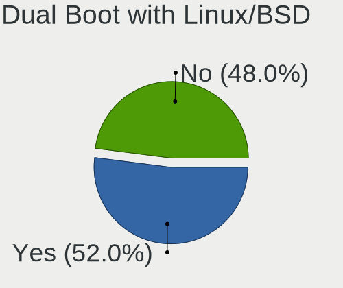
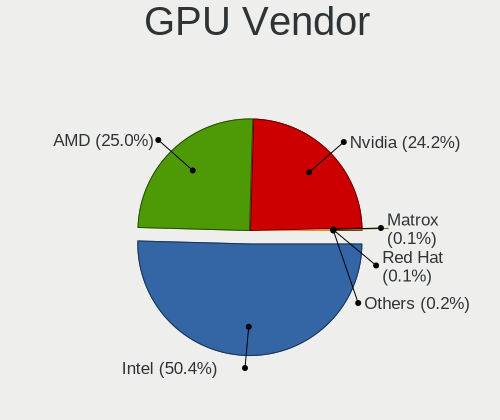
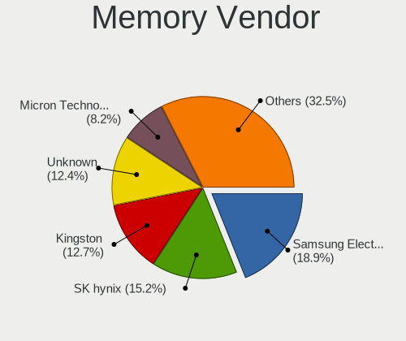
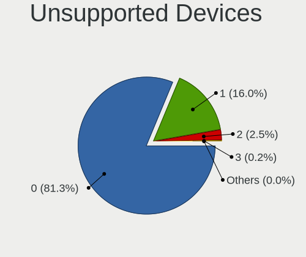
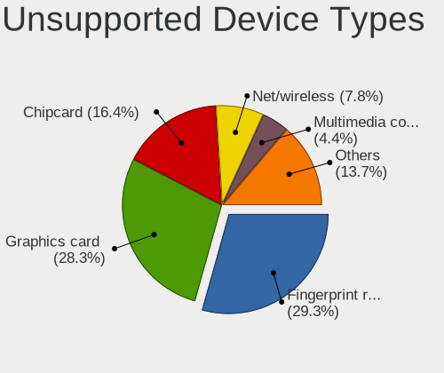

OpenMandriva - Tested Hardware & Statistics
-------------------------------------------

A project to collect tested hardware configurations for OpenMandriva.

Anyone can contribute to this report by the [hw-probe](https://github.com/linuxhw/hw-probe) tool:

    sudo -E hw-probe -all -upload

Please contribute! Especially if your hardware is rare.

This is a report for all computer types. See also reports for [desktops](/Dist/OpenMandriva/Desktop/README.md) and [notebooks](/Dist/OpenMandriva/Notebook/README.md).

Contents
--------

* [ Test Cases ](#test-cases)

* [ System ](#system)
  - [ OS                       ](#os)
  - [ OS Family                ](#os-family)
  - [ Kernel                   ](#kernel)
  - [ Kernel Family            ](#kernel-family)
  - [ Kernel Major Ver.        ](#kernel-major-ver)
  - [ Arch                     ](#arch)
  - [ DE                       ](#de)
  - [ Display Server           ](#display-server)
  - [ Display Manager          ](#display-manager)
  - [ OS Lang                  ](#os-lang)
  - [ Boot Mode                ](#boot-mode)
  - [ Filesystem               ](#filesystem)
  - [ Part. scheme             ](#part-scheme)
  - [ Dual Boot with Linux/BSD ](#dual-boot-with-linuxbsd)
  - [ Dual Boot (Win)          ](#dual-boot-win)

* [ Board ](#board)
  - [ Vendor                   ](#vendor)
  - [ Model                    ](#model)
  - [ Model Family             ](#model-family)
  - [ MFG Year                 ](#mfg-year)
  - [ Form Factor              ](#form-factor)
  - [ Secure Boot              ](#secure-boot)
  - [ Coreboot                 ](#coreboot)
  - [ RAM Size                 ](#ram-size)
  - [ RAM Used                 ](#ram-used)
  - [ Total Drives             ](#total-drives)
  - [ Has CD-ROM               ](#has-cd-rom)
  - [ Has Ethernet             ](#has-ethernet)
  - [ Has WiFi                 ](#has-wifi)
  - [ Has Bluetooth            ](#has-bluetooth)

* [ Location ](#location)
  - [ Country                  ](#country)
  - [ City                     ](#city)

* [ Drives ](#drives)
  - [ Drive Vendor             ](#drive-vendor)
  - [ Drive Model              ](#drive-model)
  - [ HDD Vendor               ](#hdd-vendor)
  - [ SSD Vendor               ](#ssd-vendor)
  - [ Drive Kind               ](#drive-kind)
  - [ Drive Connector          ](#drive-connector)
  - [ Drive Size               ](#drive-size)
  - [ Space Total              ](#space-total)
  - [ Space Used               ](#space-used)
  - [ Malfunc. Drives          ](#malfunc-drives)
  - [ Malfunc. Drive Vendor    ](#malfunc-drive-vendor)
  - [ Malfunc. HDD Vendor      ](#malfunc-hdd-vendor)
  - [ Malfunc. Drive Kind      ](#malfunc-drive-kind)
  - [ Failed Drives            ](#failed-drives)
  - [ Failed Drive Vendor      ](#failed-drive-vendor)
  - [ Drive Status             ](#drive-status)

* [ Storage controller ](#storage-controller)
  - [ Storage Vendor           ](#storage-vendor)
  - [ Storage Model            ](#storage-model)
  - [ Storage Kind             ](#storage-kind)

* [ Processor ](#processor)
  - [ CPU Vendor               ](#cpu-vendor)
  - [ CPU Model                ](#cpu-model)
  - [ CPU Model Family         ](#cpu-model-family)
  - [ CPU Cores                ](#cpu-cores)
  - [ CPU Sockets              ](#cpu-sockets)
  - [ CPU Threads              ](#cpu-threads)
  - [ CPU Op-Modes             ](#cpu-op-modes)
  - [ CPU Microcode            ](#cpu-microcode)
  - [ CPU Microarch            ](#cpu-microarch)

* [ Graphics ](#graphics)
  - [ GPU Vendor               ](#gpu-vendor)
  - [ GPU Model                ](#gpu-model)
  - [ GPU Combo                ](#gpu-combo)
  - [ GPU Driver               ](#gpu-driver)
  - [ GPU Memory               ](#gpu-memory)

* [ Monitor ](#monitor)
  - [ Monitor Vendor           ](#monitor-vendor)
  - [ Monitor Model            ](#monitor-model)
  - [ Monitor Resolution       ](#monitor-resolution)
  - [ Monitor Diagonal         ](#monitor-diagonal)
  - [ Monitor Width            ](#monitor-width)
  - [ Aspect Ratio             ](#aspect-ratio)
  - [ Monitor Area             ](#monitor-area)
  - [ Pixel Density            ](#pixel-density)
  - [ Multiple Monitors        ](#multiple-monitors)

* [ Network ](#network)
  - [ Net Controller Vendor    ](#net-controller-vendor)
  - [ Net Controller Model     ](#net-controller-model)
  - [ Wireless Vendor          ](#wireless-vendor)
  - [ Wireless Model           ](#wireless-model)
  - [ Ethernet Vendor          ](#ethernet-vendor)
  - [ Ethernet Model           ](#ethernet-model)
  - [ Net Controller Kind      ](#net-controller-kind)
  - [ Used Controller          ](#used-controller)
  - [ NICs                     ](#nics)
  - [ IPv6                     ](#ipv6)

* [ Bluetooth ](#bluetooth)
  - [ Bluetooth Vendor         ](#bluetooth-vendor)
  - [ Bluetooth Model          ](#bluetooth-model)

* [ Sound ](#sound)
  - [ Sound Vendor             ](#sound-vendor)
  - [ Sound Model              ](#sound-model)

* [ Memory ](#memory)
  - [ Memory Vendor            ](#memory-vendor)
  - [ Memory Model             ](#memory-model)
  - [ Memory Kind              ](#memory-kind)
  - [ Memory Form Factor       ](#memory-form-factor)
  - [ Memory Size              ](#memory-size)
  - [ Memory Speed             ](#memory-speed)

* [ Printers & scanners ](#printers--scanners)
  - [ Printer Vendor           ](#printer-vendor)
  - [ Printer Model            ](#printer-model)
  - [ Scanner Vendor           ](#scanner-vendor)
  - [ Scanner Model            ](#scanner-model)

* [ Camera ](#camera)
  - [ Camera Vendor            ](#camera-vendor)
  - [ Camera Model             ](#camera-model)

* [ Security ](#security)
  - [ Fingerprint Vendor       ](#fingerprint-vendor)
  - [ Fingerprint Model        ](#fingerprint-model)
  - [ Chipcard Vendor          ](#chipcard-vendor)
  - [ Chipcard Model           ](#chipcard-model)

* [ Unsupported ](#unsupported)
  - [ Unsupported Devices      ](#unsupported-devices)
  - [ Unsupported Device Types ](#unsupported-device-types)

Test Cases
----------

Total: 16765

| Vendor        | Model                       | Form-Factor | Probe                                                      | Date         |
|---------------|-----------------------------|-------------|------------------------------------------------------------|--------------|
| Lenovo        | SHARKBAY NOK                | Desktop     | [26332591d7](https://linux-hardware.org/?probe=26332591d7) | Nov 06, 2023 |
| ASUSTek       | PRIME Z270-A                | Desktop     | [725ce23e28](https://linux-hardware.org/?probe=725ce23e28) | Nov 06, 2023 |
| Gigabyte      | B550 AORUS ELITE V2         | Desktop     | [77a31d50ce](https://linux-hardware.org/?probe=77a31d50ce) | Nov 06, 2023 |
| MSI           | A520M PRO                   | Desktop     | [b83b272494](https://linux-hardware.org/?probe=b83b272494) | Nov 06, 2023 |
| ASUSTek       | X751MA                      | Notebook    | [d5e1758d4e](https://linux-hardware.org/?probe=d5e1758d4e) | Nov 06, 2023 |
| Gigabyte      | B550M S2H                   | Desktop     | [b58de33b7d](https://linux-hardware.org/?probe=b58de33b7d) | Nov 06, 2023 |
| Toshiba       | Satellite C855-10N          | Notebook    | [7afd607141](https://linux-hardware.org/?probe=7afd607141) | Nov 06, 2023 |
| HP            | 255 G7 Notebook PC          | Notebook    | [216faa6f5d](https://linux-hardware.org/?probe=216faa6f5d) | Nov 06, 2023 |
| HP            | ProBook 450 15.6 inch G9... | Notebook    | [37d32a1fd5](https://linux-hardware.org/?probe=37d32a1fd5) | Nov 06, 2023 |
| Dell          | Inspiron 15-3567            | Notebook    | [b42102e397](https://linux-hardware.org/?probe=b42102e397) | Nov 06, 2023 |
| GPU Compan... | GWNR71517                   | Notebook    | [7676ff267d](https://linux-hardware.org/?probe=7676ff267d) | Nov 06, 2023 |
| ASUSTek       | A68HM-K                     | Desktop     | [c3e5415128](https://linux-hardware.org/?probe=c3e5415128) | Nov 06, 2023 |
| MSI           | MAG B650 TOMAHAWK WIFI      | Desktop     | [ff199303a2](https://linux-hardware.org/?probe=ff199303a2) | Nov 06, 2023 |
| Dell          | Latitude E6410              | Notebook    | [b6ac4a50b7](https://linux-hardware.org/?probe=b6ac4a50b7) | Nov 06, 2023 |
| Gigabyte      | A320M-H-CF                  | Desktop     | [105d51f329](https://linux-hardware.org/?probe=105d51f329) | Nov 05, 2023 |
| HP            | ProBook 640 G1              | Notebook    | [1cc495d15b](https://linux-hardware.org/?probe=1cc495d15b) | Nov 05, 2023 |
| MSI           | A55M-E33                    | Desktop     | [d1def05873](https://linux-hardware.org/?probe=d1def05873) | Nov 05, 2023 |
| Acidanther... | Mac-CFF7D910A743CAAF iMa... | All in one  | [4601ae11d9](https://linux-hardware.org/?probe=4601ae11d9) | Nov 05, 2023 |
| HP            | Compaq 6710b                | Notebook    | [7a0b2fd29b](https://linux-hardware.org/?probe=7a0b2fd29b) | Nov 05, 2023 |
| HP            | 8959                        | All in one  | [68870f0170](https://linux-hardware.org/?probe=68870f0170) | Nov 05, 2023 |
| Apple         | MacBookPro9,2               | Notebook    | [1801a9c841](https://linux-hardware.org/?probe=1801a9c841) | Nov 05, 2023 |
| HP            | 802F                        | Desktop     | [8fe557cc85](https://linux-hardware.org/?probe=8fe557cc85) | Nov 05, 2023 |
| Gigabyte      | AB350-Gaming 3-CF           | Desktop     | [2710dfedf4](https://linux-hardware.org/?probe=2710dfedf4) | Nov 05, 2023 |
| ASUSTek       | G11CD                       | Desktop     | [8fcbd49e37](https://linux-hardware.org/?probe=8fcbd49e37) | Nov 05, 2023 |
| HP            | ProBook 4330s               | Notebook    | [b22a07c92b](https://linux-hardware.org/?probe=b22a07c92b) | Nov 05, 2023 |
| ASRock        | 970 Pro3 R2.0               | Desktop     | [f070e73453](https://linux-hardware.org/?probe=f070e73453) | Nov 05, 2023 |
| Lenovo        | ThinkPad T470 20HD0000BM    | Notebook    | [3e379ff6e8](https://linux-hardware.org/?probe=3e379ff6e8) | Nov 04, 2023 |
| ASUSTek       | M5A78L-M LX/BR              | Desktop     | [459eb3cd2a](https://linux-hardware.org/?probe=459eb3cd2a) | Nov 04, 2023 |
| Acer          | Aspire M1920                | Desktop     | [f6ffcb0c41](https://linux-hardware.org/?probe=f6ffcb0c41) | Nov 04, 2023 |
| HP            | Pavilion 11 x360 PC         | Notebook    | [399dda92eb](https://linux-hardware.org/?probe=399dda92eb) | Nov 04, 2023 |
| Lenovo        | ThinkPad T460 20FMS3YT01    | Notebook    | [89b8df73c1](https://linux-hardware.org/?probe=89b8df73c1) | Nov 04, 2023 |
| Gigabyte      | GA-870A-USB3L               | Desktop     | [d2412dfd7c](https://linux-hardware.org/?probe=d2412dfd7c) | Nov 04, 2023 |
| ASRock        | FM2A68M-HD+                 | Desktop     | [2b5c984cd8](https://linux-hardware.org/?probe=2b5c984cd8) | Nov 04, 2023 |
| Acer          | Aspire E5-573G              | Notebook    | [c74051abb7](https://linux-hardware.org/?probe=c74051abb7) | Nov 04, 2023 |
| ASUSTek       | ROG Zephyrus G14 GA401QM... | Notebook    | [b0487db7bf](https://linux-hardware.org/?probe=b0487db7bf) | Nov 04, 2023 |
| Dell          | 0W0CHX A00                  | Desktop     | [3ed37b3d70](https://linux-hardware.org/?probe=3ed37b3d70) | Nov 04, 2023 |
| Acidanther... | MacBookPro15,2              | Notebook    | [ae60650070](https://linux-hardware.org/?probe=ae60650070) | Nov 04, 2023 |
| MSI           | MS-1759                     | Notebook    | [2dd46c2a71](https://linux-hardware.org/?probe=2dd46c2a71) | Nov 04, 2023 |
| Dell          | Latitude E7450              | Notebook    | [e7effc42ed](https://linux-hardware.org/?probe=e7effc42ed) | Nov 04, 2023 |
| Dell          | Latitude E5450              | Notebook    | [1f23c5fd7c](https://linux-hardware.org/?probe=1f23c5fd7c) | Nov 04, 2023 |
| ASUSTek       | H110M-D                     | Desktop     | [03303fa6ed](https://linux-hardware.org/?probe=03303fa6ed) | Nov 04, 2023 |
| Toshiba       | TECRA W50-A                 | Notebook    | [ad6c61de24](https://linux-hardware.org/?probe=ad6c61de24) | Nov 04, 2023 |
| Lenovo        | IdeaPad 1 15AMN7 82VG       | Notebook    | [d2a9171090](https://linux-hardware.org/?probe=d2a9171090) | Nov 04, 2023 |
| ASRock        | B450M Steel Legend          | Desktop     | [ea9a865ed2](https://linux-hardware.org/?probe=ea9a865ed2) | Nov 03, 2023 |
| Lenovo        | ThinkPad X220 4293A25       | Notebook    | [95a5125a73](https://linux-hardware.org/?probe=95a5125a73) | Nov 03, 2023 |
| HP            | EliteBook 6930p             | Notebook    | [300c72bf93](https://linux-hardware.org/?probe=300c72bf93) | Nov 03, 2023 |
| Dell          | Latitude 3420               | Notebook    | [9211e0f588](https://linux-hardware.org/?probe=9211e0f588) | Nov 03, 2023 |
| Unknown       | Unknown                     | Notebook    | [d27cd12013](https://linux-hardware.org/?probe=d27cd12013) | Nov 03, 2023 |
| Lenovo        | IdeaPad 1 15AMN7 82VG       | Notebook    | [6c0dc28b9f](https://linux-hardware.org/?probe=6c0dc28b9f) | Nov 03, 2023 |
| ASUSTek       | X550VQ                      | Notebook    | [b6d6ff10aa](https://linux-hardware.org/?probe=b6d6ff10aa) | Nov 03, 2023 |
| Toshiba       | Satellite C650              | Notebook    | [6844fc4fcf](https://linux-hardware.org/?probe=6844fc4fcf) | Nov 03, 2023 |
| Dell          | 0MGK50 A02                  | Desktop     | [ca062f44be](https://linux-hardware.org/?probe=ca062f44be) | Nov 03, 2023 |
| HP            | 2215                        | Desktop     | [6acbe1a873](https://linux-hardware.org/?probe=6acbe1a873) | Nov 03, 2023 |
| Biostar       | B250MHC                     | Desktop     | [528c04a30a](https://linux-hardware.org/?probe=528c04a30a) | Nov 02, 2023 |
| HP            | ProBook 6450b               | Notebook    | [a63f28d2be](https://linux-hardware.org/?probe=a63f28d2be) | Nov 02, 2023 |
| Intel         | NUC7JYB J67969-403          | Mini pc     | [a7afcdcef2](https://linux-hardware.org/?probe=a7afcdcef2) | Nov 02, 2023 |
| MSI           | H110M PRO-D                 | Desktop     | [da5c3ffb7e](https://linux-hardware.org/?probe=da5c3ffb7e) | Nov 02, 2023 |
| ASUSTek       | VivoBook_ASUSLaptop X411... | Notebook    | [8ac5fd2789](https://linux-hardware.org/?probe=8ac5fd2789) | Nov 02, 2023 |
| Intel         | powered classmate PC        | Notebook    | [122f9662f5](https://linux-hardware.org/?probe=122f9662f5) | Nov 02, 2023 |
| ASRock        | H81M-HG4 R4.0               | Desktop     | [0f5f162498](https://linux-hardware.org/?probe=0f5f162498) | Nov 02, 2023 |
| HP            | 8924 1101                   | All in one  | [84ae0b3012](https://linux-hardware.org/?probe=84ae0b3012) | Nov 02, 2023 |
| ASUSTek       | VivoBook 15_ASUS Laptop ... | Notebook    | [e5b852ff3e](https://linux-hardware.org/?probe=e5b852ff3e) | Nov 02, 2023 |
| Google        | Falco                       | Notebook    | [0ea6d932bf](https://linux-hardware.org/?probe=0ea6d932bf) | Nov 01, 2023 |
| Lenovo        | IdeaPad 3 15ABA7 82RN       | Notebook    | [11c06a97d7](https://linux-hardware.org/?probe=11c06a97d7) | Nov 01, 2023 |
| Lenovo        | ThinkPad E560 20EVA02SSP    | Notebook    | [165be504bf](https://linux-hardware.org/?probe=165be504bf) | Nov 01, 2023 |
| ASUSTek       | PRIME B550M-A WIFI II       | Desktop     | [801d83a570](https://linux-hardware.org/?probe=801d83a570) | Nov 01, 2023 |
| ALLDOCUBE     | i1025P                      | Tablet      | [9f4abf0556](https://linux-hardware.org/?probe=9f4abf0556) | Nov 01, 2023 |
| Fujitsu       | LIFEBOOK T936               | Convertible | [2aa8c832a5](https://linux-hardware.org/?probe=2aa8c832a5) | Nov 01, 2023 |
| Foxconn       | 2ADA                        | Desktop     | [18271c13c3](https://linux-hardware.org/?probe=18271c13c3) | Nov 01, 2023 |
| Lenovo        | ThinkPad T430 23493V2       | Notebook    | [0d5b87b380](https://linux-hardware.org/?probe=0d5b87b380) | Nov 01, 2023 |
| ASUSTek       | M3A32-MVP DELUXE            | Desktop     | [fecdf24435](https://linux-hardware.org/?probe=fecdf24435) | Nov 01, 2023 |
| AMI           | Intel                       | Desktop     | [c4587092bf](https://linux-hardware.org/?probe=c4587092bf) | Nov 01, 2023 |
| Dell          | Inspiron 13-5368            | Notebook    | [6d00cda16c](https://linux-hardware.org/?probe=6d00cda16c) | Nov 01, 2023 |
| Framework     | Laptop                      | Notebook    | [eb0a6abacc](https://linux-hardware.org/?probe=eb0a6abacc) | Nov 01, 2023 |
| Dell          | Inspiron 3542               | Notebook    | [87ec116ea6](https://linux-hardware.org/?probe=87ec116ea6) | Nov 01, 2023 |
| HP            | ProLiant ML310e Gen8 v2     | Desktop     | [27d8415c88](https://linux-hardware.org/?probe=27d8415c88) | Nov 01, 2023 |
| Acer          | Predator PH18-71            | Notebook    | [a0393f21c9](https://linux-hardware.org/?probe=a0393f21c9) | Nov 01, 2023 |
| HP            | EliteBook 840 G3            | Notebook    | [a09d649781](https://linux-hardware.org/?probe=a09d649781) | Nov 01, 2023 |
| Gigabyte      | B75M-HD3                    | Desktop     | [e27c813285](https://linux-hardware.org/?probe=e27c813285) | Oct 31, 2023 |
| ZOTAC         | ZBOX-MI623/MI643 Rev.00     | Mini pc     | [4b769dbcca](https://linux-hardware.org/?probe=4b769dbcca) | Oct 31, 2023 |
| Gigabyte      | A320M-S2H V2-CF             | Desktop     | [763630b66c](https://linux-hardware.org/?probe=763630b66c) | Oct 31, 2023 |
| Acer          | Veriton M480                | Desktop     | [fb5c756319](https://linux-hardware.org/?probe=fb5c756319) | Oct 30, 2023 |
| Acer          | Aspire E5-576G              | Notebook    | [c0626d553b](https://linux-hardware.org/?probe=c0626d553b) | Oct 30, 2023 |
| Fujitsu       | D3062-A1 S26361-D3062-A1    | Desktop     | [4d9e5a7157](https://linux-hardware.org/?probe=4d9e5a7157) | Oct 30, 2023 |
| Gigabyte      | H81M-HD3                    | Desktop     | [1be6955dfc](https://linux-hardware.org/?probe=1be6955dfc) | Oct 30, 2023 |
| MSI           | MPG B550 GAMING PLUS        | Desktop     | [09d5186c37](https://linux-hardware.org/?probe=09d5186c37) | Oct 30, 2023 |
| Dell          | Latitude 7480               | Notebook    | [fcae1c21f4](https://linux-hardware.org/?probe=fcae1c21f4) | Oct 30, 2023 |
| ASUSTek       | X555LD                      | Notebook    | [2c79650ee2](https://linux-hardware.org/?probe=2c79650ee2) | Oct 29, 2023 |
| ASUSTek       | P5E Deluxe                  | Desktop     | [5601096ffc](https://linux-hardware.org/?probe=5601096ffc) | Oct 29, 2023 |
| Intel         | B75                         | Desktop     | [a46db29108](https://linux-hardware.org/?probe=a46db29108) | Oct 29, 2023 |
| Gigabyte      | X570 GAMING X               | Desktop     | [1addefe3fc](https://linux-hardware.org/?probe=1addefe3fc) | Oct 29, 2023 |
| ASUSTek       | PRIME B250-PRO              | Desktop     | [ac060a5eb6](https://linux-hardware.org/?probe=ac060a5eb6) | Oct 29, 2023 |
| Gigabyte      | GA-890GPA-UD3H              | Desktop     | [0be3861a6a](https://linux-hardware.org/?probe=0be3861a6a) | Oct 29, 2023 |
| ASUSTek       | P5B                         | Desktop     | [aa136c9e44](https://linux-hardware.org/?probe=aa136c9e44) | Oct 29, 2023 |
| Samsung       | RC410/RC510/RC710           | Notebook    | [3cc0feaa4e](https://linux-hardware.org/?probe=3cc0feaa4e) | Oct 29, 2023 |
| Acer          | AOD270                      | Notebook    | [83c4a5920f](https://linux-hardware.org/?probe=83c4a5920f) | Oct 29, 2023 |
| Dell          | 03NVJ6 A01                  | Desktop     | [09d76f025a](https://linux-hardware.org/?probe=09d76f025a) | Oct 29, 2023 |
| Gigabyte      | H61MA-D3V                   | Desktop     | [0c4d99e9dc](https://linux-hardware.org/?probe=0c4d99e9dc) | Oct 29, 2023 |
| Lenovo        | ThinkPad T460 20FMS5E018    | Notebook    | [98c446abbd](https://linux-hardware.org/?probe=98c446abbd) | Oct 29, 2023 |
| Gigabyte      | 970A-DS3P                   | Desktop     | [31d6b19c8d](https://linux-hardware.org/?probe=31d6b19c8d) | Oct 29, 2023 |
| HP            | 339A                        | Desktop     | [a1ef9b1cd4](https://linux-hardware.org/?probe=a1ef9b1cd4) | Oct 29, 2023 |
| Dell          | XPS 15 9570                 | Notebook    | [17de10e607](https://linux-hardware.org/?probe=17de10e607) | Oct 29, 2023 |
| Koloe         | X58                         | Desktop     | [91fbabe04c](https://linux-hardware.org/?probe=91fbabe04c) | Oct 29, 2023 |
| HP            | Laptop 15-da0xxx            | Notebook    | [39d06d7acf](https://linux-hardware.org/?probe=39d06d7acf) | Oct 28, 2023 |
| Dell          | Inspiron MM061              | Notebook    | [7545369484](https://linux-hardware.org/?probe=7545369484) | Oct 28, 2023 |
| Dell          | 0JP3NX A00                  | Desktop     | [434961d005](https://linux-hardware.org/?probe=434961d005) | Oct 28, 2023 |
| HP            | Pavilion g6                 | Notebook    | [ecc6e8d906](https://linux-hardware.org/?probe=ecc6e8d906) | Oct 28, 2023 |
| Samsung       | 370E4K                      | Notebook    | [78ec3e796a](https://linux-hardware.org/?probe=78ec3e796a) | Oct 28, 2023 |
| ASRock        | B450 Steel Legend           | Desktop     | [21beb00969](https://linux-hardware.org/?probe=21beb00969) | Oct 28, 2023 |
| Unknown       | Phitronics G31VS-M          | Desktop     | [10bcfab3cb](https://linux-hardware.org/?probe=10bcfab3cb) | Oct 28, 2023 |
| HP            | Laptop 15s-fq0xxx           | Notebook    | [e3154e94cf](https://linux-hardware.org/?probe=e3154e94cf) | Oct 28, 2023 |
| ASUSTek       | X101                        | Notebook    | [dab1a6368d](https://linux-hardware.org/?probe=dab1a6368d) | Oct 27, 2023 |
| Fujitsu       | LIFEBOOK S792               | Notebook    | [5eaa7922e7](https://linux-hardware.org/?probe=5eaa7922e7) | Oct 27, 2023 |
| Gigabyte      | Z370M D3H-CF                | Desktop     | [80b6c027b0](https://linux-hardware.org/?probe=80b6c027b0) | Oct 27, 2023 |
| ASUSTek       | A68HM-PLUS                  | Desktop     | [9d662bd187](https://linux-hardware.org/?probe=9d662bd187) | Oct 27, 2023 |
| AMI           | Aptio CRB                   | Mini pc     | [d0b884f8e1](https://linux-hardware.org/?probe=d0b884f8e1) | Oct 27, 2023 |
| Dell          | Precision M6800             | Notebook    | [e8fd7cce51](https://linux-hardware.org/?probe=e8fd7cce51) | Oct 27, 2023 |
| Toshiba       | dynabook T350/56ARK         | Notebook    | [802dacc8cc](https://linux-hardware.org/?probe=802dacc8cc) | Oct 27, 2023 |
| Foxconn       | 17A0                        | Desktop     | [ce8f3561ee](https://linux-hardware.org/?probe=ce8f3561ee) | Oct 27, 2023 |
| MSI           | GL73 8RD                    | Notebook    | [62d3ea64dd](https://linux-hardware.org/?probe=62d3ea64dd) | Oct 27, 2023 |
| Dell          | Inspiron 5737               | Notebook    | [6ed0863a43](https://linux-hardware.org/?probe=6ed0863a43) | Oct 27, 2023 |
| Lenovo        | IdeaPad 3 17IIL05 81WF      | Notebook    | [3a2901251b](https://linux-hardware.org/?probe=3a2901251b) | Oct 27, 2023 |
| Dell          | Inspiron 1525               | Notebook    | [0a0a08dd5f](https://linux-hardware.org/?probe=0a0a08dd5f) | Oct 26, 2023 |
| HP            | 8054                        | Desktop     | [3f9ecca91a](https://linux-hardware.org/?probe=3f9ecca91a) | Oct 26, 2023 |
| Apple         | MacBookPro6,2               | Notebook    | [af9b5b05e9](https://linux-hardware.org/?probe=af9b5b05e9) | Oct 26, 2023 |
| Apple         | MacBookPro7,1               | Notebook    | [cb27a04bd5](https://linux-hardware.org/?probe=cb27a04bd5) | Oct 26, 2023 |
| HP            | Pavilion g6                 | Notebook    | [00e978bda2](https://linux-hardware.org/?probe=00e978bda2) | Oct 26, 2023 |
| Acer          | EG31M R01-C3                | Desktop     | [8a4232c8f0](https://linux-hardware.org/?probe=8a4232c8f0) | Oct 26, 2023 |
| ECS           | H81H3-M3S                   | Desktop     | [6f4c530a93](https://linux-hardware.org/?probe=6f4c530a93) | Oct 26, 2023 |
| ASUSTek       | P5E-VM HDMI                 | Desktop     | [4491bc9ec0](https://linux-hardware.org/?probe=4491bc9ec0) | Oct 26, 2023 |
| Pegatron      | 2AC3                        | Desktop     | [1508d1c2f7](https://linux-hardware.org/?probe=1508d1c2f7) | Oct 26, 2023 |
| ASUSTek       | M5A78L-M LX3                | Desktop     | [d3dacafdc2](https://linux-hardware.org/?probe=d3dacafdc2) | Oct 26, 2023 |
| HP            | 650                         | Notebook    | [0625bd022d](https://linux-hardware.org/?probe=0625bd022d) | Oct 26, 2023 |
| Dell          | 03NJH0 A01                  | Desktop     | [dbb152a219](https://linux-hardware.org/?probe=dbb152a219) | Oct 26, 2023 |
| SLIMBOOK      | EXECUTIVE-14                | Notebook    | [39250155c4](https://linux-hardware.org/?probe=39250155c4) | Oct 26, 2023 |
| ASUSTek       | H170M-PLUS                  | Desktop     | [a108993a7e](https://linux-hardware.org/?probe=a108993a7e) | Oct 25, 2023 |
| MSI           | H110M PRO-VD                | Desktop     | [b62701c032](https://linux-hardware.org/?probe=b62701c032) | Oct 25, 2023 |
| Toshiba       | Satellite C670D-126         | Notebook    | [b117860daf](https://linux-hardware.org/?probe=b117860daf) | Oct 25, 2023 |
| NEC Comput... | PC-VJ22LFWZHSRF             | Notebook    | [b229c83a28](https://linux-hardware.org/?probe=b229c83a28) | Oct 25, 2023 |
| HP            | 198E                        | Desktop     | [3102593d74](https://linux-hardware.org/?probe=3102593d74) | Oct 25, 2023 |
| ASUSTek       | X551CAP                     | Notebook    | [bff9909d9b](https://linux-hardware.org/?probe=bff9909d9b) | Oct 24, 2023 |
| HP            | Laptop 17-by2xxx            | Notebook    | [9f728690ee](https://linux-hardware.org/?probe=9f728690ee) | Oct 24, 2023 |
| MSI           | GF615M-P33                  | Desktop     | [364be0dfae](https://linux-hardware.org/?probe=364be0dfae) | Oct 24, 2023 |
| Lenovo        | ThinkCentre M90 5485W2L     | Desktop     | [0fcc4fe794](https://linux-hardware.org/?probe=0fcc4fe794) | Oct 24, 2023 |
| MSI           | Z490-A PRO                  | Desktop     | [011bfdd699](https://linux-hardware.org/?probe=011bfdd699) | Oct 24, 2023 |
| HP            | EliteBook 8770w             | Notebook    | [50cab103c8](https://linux-hardware.org/?probe=50cab103c8) | Oct 24, 2023 |
| ASUSTek       | UX303LB                     | Notebook    | [1fdfa51ddc](https://linux-hardware.org/?probe=1fdfa51ddc) | Oct 24, 2023 |
| Lenovo        | G580 2189                   | Notebook    | [18dc8e53d9](https://linux-hardware.org/?probe=18dc8e53d9) | Oct 24, 2023 |
| EPSON DIRE... | AT992E                      | Desktop     | [b61468f9c5](https://linux-hardware.org/?probe=b61468f9c5) | Oct 24, 2023 |
| Dell          | Inspiron 15 3511            | Notebook    | [8d2894b3d1](https://linux-hardware.org/?probe=8d2894b3d1) | Oct 24, 2023 |
| HP            | ProBook 450 G6              | Notebook    | [17c7c26cd0](https://linux-hardware.org/?probe=17c7c26cd0) | Oct 24, 2023 |
| LG Electro... | 17ZT90P-G.AX33U1            | Notebook    | [0d53262cff](https://linux-hardware.org/?probe=0d53262cff) | Oct 23, 2023 |
| ASUSTek       | VivoBook_ASUSLaptop X515... | Notebook    | [dc730f5631](https://linux-hardware.org/?probe=dc730f5631) | Oct 23, 2023 |
| Fujitsu       | D2778-C1 S26361-D2778-C1    | Desktop     | [e22a3baeb9](https://linux-hardware.org/?probe=e22a3baeb9) | Oct 23, 2023 |
| Lenovo        | 30C7 SDK0J40709 WIN 3259... | Desktop     | [71fd7dde1d](https://linux-hardware.org/?probe=71fd7dde1d) | Oct 23, 2023 |
| Dell          | Inspiron 11 - 3147          | Notebook    | [7be979fc66](https://linux-hardware.org/?probe=7be979fc66) | Oct 23, 2023 |
| MSI           | PRO Z690-P DDR4             | Desktop     | [35e54833e8](https://linux-hardware.org/?probe=35e54833e8) | Oct 23, 2023 |
| Lenovo        | 30D0 SDK0J40697 WIN 3305... | Desktop     | [1e4819e6d1](https://linux-hardware.org/?probe=1e4819e6d1) | Oct 23, 2023 |
| Samsung       | RF511/RF411/RF711           | Notebook    | [6a62fa5cb6](https://linux-hardware.org/?probe=6a62fa5cb6) | Oct 23, 2023 |
| HP            | 3397                        | Desktop     | [3f8e8810c1](https://linux-hardware.org/?probe=3f8e8810c1) | Oct 23, 2023 |
| ASUSTek       | P5G41T-M LX                 | Desktop     | [6f72e3839d](https://linux-hardware.org/?probe=6f72e3839d) | Oct 23, 2023 |
| Gigabyte      | EX38-DS5                    | Desktop     | [79e9d5669a](https://linux-hardware.org/?probe=79e9d5669a) | Oct 23, 2023 |
| Gigabyte      | G41MT-S2                    | Desktop     | [3df6a3e3e4](https://linux-hardware.org/?probe=3df6a3e3e4) | Oct 23, 2023 |
| Toshiba       | Satellite P55W-C            | Notebook    | [60911595dc](https://linux-hardware.org/?probe=60911595dc) | Oct 23, 2023 |
| Apple         | Mac-F2238BAE iMac11,3       | All in one  | [d21c4ec9dd](https://linux-hardware.org/?probe=d21c4ec9dd) | Oct 23, 2023 |
| ASUSTek       | ROG Flow X13 GV301RC_GV3... | Convertible | [2d3766505f](https://linux-hardware.org/?probe=2d3766505f) | Oct 22, 2023 |
| Lenovo        | Unknown                     | Notebook    | [21cf9c327a](https://linux-hardware.org/?probe=21cf9c327a) | Oct 22, 2023 |
| ASUSTek       | UL80VT                      | Notebook    | [7991ecc4ee](https://linux-hardware.org/?probe=7991ecc4ee) | Oct 22, 2023 |
| Fujitsu       | D3162-A1 S26361-D3162-A1    | Desktop     | [3e46064143](https://linux-hardware.org/?probe=3e46064143) | Oct 22, 2023 |
| Dell          | System Vostro 3750          | Notebook    | [33345af29b](https://linux-hardware.org/?probe=33345af29b) | Oct 22, 2023 |
| ASUSTek       | X550LA                      | Notebook    | [10e4a414fd](https://linux-hardware.org/?probe=10e4a414fd) | Oct 22, 2023 |
| Lenovo        | ThinkPad P15s Gen 2i 20W... | Notebook    | [a02e93f0a5](https://linux-hardware.org/?probe=a02e93f0a5) | Oct 21, 2023 |
| Sony          | VGN-FZ21M                   | Notebook    | [ba7c93bcd4](https://linux-hardware.org/?probe=ba7c93bcd4) | Oct 21, 2023 |
| ASUSTek       | ROG STRIX B550-F GAMING     | Desktop     | [9d3213958f](https://linux-hardware.org/?probe=9d3213958f) | Oct 21, 2023 |
| Acer          | Aspire 5742                 | Notebook    | [f30dc155bd](https://linux-hardware.org/?probe=f30dc155bd) | Oct 21, 2023 |
| Lenovo        | IdeaPad S145-15IGM 81WT     | Notebook    | [ad7ca8e192](https://linux-hardware.org/?probe=ad7ca8e192) | Oct 21, 2023 |
| Gigabyte      | B550 AORUS ELITE V2         | Desktop     | [91318c1cf1](https://linux-hardware.org/?probe=91318c1cf1) | Oct 21, 2023 |
| WinFast       | 761GXK8MC                   | Desktop     | [7b4f49eda5](https://linux-hardware.org/?probe=7b4f49eda5) | Oct 21, 2023 |
| HP            | Laptop 15s-eq1xxx           | Notebook    | [5795100325](https://linux-hardware.org/?probe=5795100325) | Oct 21, 2023 |
| HP            | 09F0h                       | Desktop     | [97710d8f02](https://linux-hardware.org/?probe=97710d8f02) | Oct 21, 2023 |
| MSI           | B350M MORTAR                | Desktop     | [8dce4bcd71](https://linux-hardware.org/?probe=8dce4bcd71) | Oct 21, 2023 |
| ASUSTek       | H170 PRO GAMING             | Desktop     | [859edb18bd](https://linux-hardware.org/?probe=859edb18bd) | Oct 21, 2023 |
| Gateway       | NV55C                       | Notebook    | [bb0eb9e5dd](https://linux-hardware.org/?probe=bb0eb9e5dd) | Oct 21, 2023 |
| Acer          | Aspire A315-23              | Notebook    | [d3b1d639f5](https://linux-hardware.org/?probe=d3b1d639f5) | Oct 21, 2023 |
| HP            | Pavilion dm1                | Notebook    | [74c8fce8f0](https://linux-hardware.org/?probe=74c8fce8f0) | Oct 21, 2023 |
| Lenovo        | G510 20238                  | Notebook    | [d6bd0eda6d](https://linux-hardware.org/?probe=d6bd0eda6d) | Oct 21, 2023 |
| ASUSTek       | PRIME B250M-A               | Desktop     | [ff0d8bbab4](https://linux-hardware.org/?probe=ff0d8bbab4) | Oct 21, 2023 |
| HP            | TouchSmart tm2              | Notebook    | [a79b82edd3](https://linux-hardware.org/?probe=a79b82edd3) | Oct 21, 2023 |
| Compaq        | 434                         | Notebook    | [094bba21f8](https://linux-hardware.org/?probe=094bba21f8) | Oct 21, 2023 |
| Biostar       | H61MH                       | Desktop     | [996528ed4e](https://linux-hardware.org/?probe=996528ed4e) | Oct 21, 2023 |
| Lenovo        | IdeaPad 330-17AST 81D7      | Notebook    | [314c39b6d1](https://linux-hardware.org/?probe=314c39b6d1) | Oct 21, 2023 |
| Dell          | Inspiron 5559               | Notebook    | [83811b2a84](https://linux-hardware.org/?probe=83811b2a84) | Oct 21, 2023 |
| Toshiba       | Satellite A660              | Notebook    | [a5e343d353](https://linux-hardware.org/?probe=a5e343d353) | Oct 21, 2023 |
| Lenovo        | ThinkPad T470s W10DG 20J... | Notebook    | [1ff62f5fd7](https://linux-hardware.org/?probe=1ff62f5fd7) | Oct 21, 2023 |
| Dell          | G15 5510                    | Notebook    | [5e7232a684](https://linux-hardware.org/?probe=5e7232a684) | Oct 21, 2023 |
| Acer          | Spin SP314-51               | Convertible | [b8e1c5b1dd](https://linux-hardware.org/?probe=b8e1c5b1dd) | Oct 21, 2023 |
| Gigabyte      | H370 AORUS GAMING 3-CF      | Desktop     | [1303e88b7c](https://linux-hardware.org/?probe=1303e88b7c) | Oct 21, 2023 |
| ASUSTek       | P5KPL-AM                    | Desktop     | [b5bf9b7639](https://linux-hardware.org/?probe=b5bf9b7639) | Oct 21, 2023 |
| MACHINIST     | X99-RS9 V2.0                | Desktop     | [2fb0ec8fa2](https://linux-hardware.org/?probe=2fb0ec8fa2) | Oct 21, 2023 |
| Samsung       | R530/R730/P590              | Notebook    | [6a774fbae7](https://linux-hardware.org/?probe=6a774fbae7) | Oct 21, 2023 |
| HP            | 802F                        | Desktop     | [d01e0550a3](https://linux-hardware.org/?probe=d01e0550a3) | Oct 20, 2023 |
| Lenovo        | ThinkPad X201 3680V5T       | Notebook    | [b30e261022](https://linux-hardware.org/?probe=b30e261022) | Oct 20, 2023 |
| Biostar       | B450MH                      | Desktop     | [cc72642215](https://linux-hardware.org/?probe=cc72642215) | Oct 20, 2023 |
| MSI           | G41TM-P31                   | Desktop     | [3ed69770a6](https://linux-hardware.org/?probe=3ed69770a6) | Oct 20, 2023 |
| ASUSTek       | P8H77-M PRO                 | Desktop     | [968efc7996](https://linux-hardware.org/?probe=968efc7996) | Oct 20, 2023 |
| HP            | Compaq 15                   | Notebook    | [992044ca80](https://linux-hardware.org/?probe=992044ca80) | Oct 20, 2023 |
| ASUSTek       | S400CA                      | Notebook    | [1c0c1df851](https://linux-hardware.org/?probe=1c0c1df851) | Oct 20, 2023 |
| Lenovo        | ThinkPad L540 20AUA044FR    | Notebook    | [70d42f0667](https://linux-hardware.org/?probe=70d42f0667) | Oct 20, 2023 |
| Toshiba       | dynabook R732/H             | Notebook    | [4852b6da95](https://linux-hardware.org/?probe=4852b6da95) | Oct 20, 2023 |
| Lenovo        | G505s 20255                 | Notebook    | [71bfa98c37](https://linux-hardware.org/?probe=71bfa98c37) | Oct 20, 2023 |
| Acer          | Aspire A114-33              | Notebook    | [34ffce7f83](https://linux-hardware.org/?probe=34ffce7f83) | Oct 20, 2023 |
| Lenovo        | 30D0 NOK                    | Desktop     | [e67eff74dc](https://linux-hardware.org/?probe=e67eff74dc) | Oct 20, 2023 |
| Lenovo        | Y50-70 20378                | Notebook    | [2593407253](https://linux-hardware.org/?probe=2593407253) | Oct 20, 2023 |
| ASUSTek       | M5A78L-M/USB3               | Desktop     | [3fd9b0b53f](https://linux-hardware.org/?probe=3fd9b0b53f) | Oct 20, 2023 |
| Biostar       | TA970                       | Desktop     | [afb4cf630f](https://linux-hardware.org/?probe=afb4cf630f) | Oct 20, 2023 |
| Toshiba       | Satellite P50t-B-118        | Notebook    | [5237c0866e](https://linux-hardware.org/?probe=5237c0866e) | Oct 19, 2023 |
| Acer          | AOD270                      | Notebook    | [b8c4966af7](https://linux-hardware.org/?probe=b8c4966af7) | Oct 19, 2023 |
| ASUSTek       | M5A78L-M LE                 | Desktop     | [3f5646fdfb](https://linux-hardware.org/?probe=3f5646fdfb) | Oct 19, 2023 |
| Lenovo        | IdeaPad 110-15ISK 80UD      | Notebook    | [b8ee9cff90](https://linux-hardware.org/?probe=b8ee9cff90) | Oct 19, 2023 |
| Dell          | Vostro 3560                 | Notebook    | [aa95d1c178](https://linux-hardware.org/?probe=aa95d1c178) | Oct 19, 2023 |
| HP            | TouchSmart tm2              | Notebook    | [f72f6a43b5](https://linux-hardware.org/?probe=f72f6a43b5) | Oct 19, 2023 |
| Intel         | DH55HC AAE70933-505         | Desktop     | [f1bc373847](https://linux-hardware.org/?probe=f1bc373847) | Oct 19, 2023 |
| ASRock        | H510M-HVS                   | Desktop     | [0766c5afbd](https://linux-hardware.org/?probe=0766c5afbd) | Oct 19, 2023 |
| ASUSTek       | X542UR                      | Notebook    | [72390695fd](https://linux-hardware.org/?probe=72390695fd) | Oct 19, 2023 |
| ASRock        | H110M-HDV R3.0              | Desktop     | [491538303f](https://linux-hardware.org/?probe=491538303f) | Oct 19, 2023 |
| ASUSTek       | X540LJ                      | Notebook    | [a0c126c4ce](https://linux-hardware.org/?probe=a0c126c4ce) | Oct 19, 2023 |
| Dell          | Inspiron 5547               | Notebook    | [3dc947b334](https://linux-hardware.org/?probe=3dc947b334) | Oct 19, 2023 |
| HP            | EliteBook 8570p             | Notebook    | [5cea3b7124](https://linux-hardware.org/?probe=5cea3b7124) | Oct 18, 2023 |
| ASRock        | A88M-G                      | Desktop     | [05d17c88b7](https://linux-hardware.org/?probe=05d17c88b7) | Oct 18, 2023 |
| Gigabyte      | Z370 HD3P-CF                | Desktop     | [0994d6d9a2](https://linux-hardware.org/?probe=0994d6d9a2) | Oct 18, 2023 |
| ASUSTek       | PRIME H510M-A               | Desktop     | [04e9833b48](https://linux-hardware.org/?probe=04e9833b48) | Oct 18, 2023 |
| Dell          | Latitude E6320              | Notebook    | [91e5128fd5](https://linux-hardware.org/?probe=91e5128fd5) | Oct 18, 2023 |
| Lenovo        | SHARKBAY 0B98401 PRO        | Desktop     | [6e81d4f878](https://linux-hardware.org/?probe=6e81d4f878) | Oct 18, 2023 |
| Fujitsu       | D3603-A1 S26361-D3603-A1    | Desktop     | [793ba23be0](https://linux-hardware.org/?probe=793ba23be0) | Oct 18, 2023 |
| Lenovo        | IdeaPad 330-15ARR 81D2      | Notebook    | [d8ab8a8fc8](https://linux-hardware.org/?probe=d8ab8a8fc8) | Oct 18, 2023 |
| Chuwi         | M01ALWR310-ADA90B           | Mini pc     | [4dbcbacf46](https://linux-hardware.org/?probe=4dbcbacf46) | Oct 18, 2023 |
| HP            | OMEN Laptop 15-ek0xxx       | Notebook    | [501f7abc3b](https://linux-hardware.org/?probe=501f7abc3b) | Oct 18, 2023 |
| Unknown       | Unknown                     | Notebook    | [e1751f1726](https://linux-hardware.org/?probe=e1751f1726) | Oct 17, 2023 |
| HP            | EliteBook 830 G6            | Notebook    | [c9ab502087](https://linux-hardware.org/?probe=c9ab502087) | Oct 17, 2023 |
| ASRock        | N68-VGS3 FX                 | Desktop     | [2a39f005cb](https://linux-hardware.org/?probe=2a39f005cb) | Oct 17, 2023 |
| Foxconn       | 2ABF                        | Desktop     | [5d936f030f](https://linux-hardware.org/?probe=5d936f030f) | Oct 17, 2023 |
| MSI           | MAG B460 TOMAHAWK           | Desktop     | [37b97d2dd2](https://linux-hardware.org/?probe=37b97d2dd2) | Oct 17, 2023 |
| Lenovo        | Yoga 7 14ARP8 82YM          | Notebook    | [7e446027c0](https://linux-hardware.org/?probe=7e446027c0) | Oct 17, 2023 |
| HP            | Pavilion Notebook           | Notebook    | [5981bba0dd](https://linux-hardware.org/?probe=5981bba0dd) | Oct 17, 2023 |
| HP            | Laptop 15s-eq2xxx           | Notebook    | [7b5cf8abfc](https://linux-hardware.org/?probe=7b5cf8abfc) | Oct 17, 2023 |
| HP            | 212B                        | Desktop     | [f3793f3e05](https://linux-hardware.org/?probe=f3793f3e05) | Oct 17, 2023 |
| Lenovo        | IdeaPad 100S-14IBR 80R9     | Notebook    | [f3bd5c6632](https://linux-hardware.org/?probe=f3bd5c6632) | Oct 17, 2023 |
| Dell          | Vostro 1510                 | Notebook    | [cf920dcf20](https://linux-hardware.org/?probe=cf920dcf20) | Oct 17, 2023 |
| Acer          | Veriton X2660G              | Desktop     | [d122988e18](https://linux-hardware.org/?probe=d122988e18) | Oct 17, 2023 |
| ASUSTek       | VivoBook_ASUSLaptop X515... | Notebook    | [9f9777f778](https://linux-hardware.org/?probe=9f9777f778) | Oct 17, 2023 |
| Acer          | EG31M P01-A0                | Desktop     | [1e500b6b4a](https://linux-hardware.org/?probe=1e500b6b4a) | Oct 17, 2023 |
| ASRock        | B460M Pro4                  | Desktop     | [bc01f51395](https://linux-hardware.org/?probe=bc01f51395) | Oct 17, 2023 |
| ASRock        | X470 Master SLI/ac          | Desktop     | [9258f94300](https://linux-hardware.org/?probe=9258f94300) | Oct 17, 2023 |
| HP            | Folio 13 - 2000             | Notebook    | [c541a1603c](https://linux-hardware.org/?probe=c541a1603c) | Oct 17, 2023 |
| ASUSTek       | N61Jv                       | Notebook    | [cb8a1ca22a](https://linux-hardware.org/?probe=cb8a1ca22a) | Oct 17, 2023 |
| Fujitsu Si... | D2312-A3 S26361-D2312-A3    | Desktop     | [eb657acc28](https://linux-hardware.org/?probe=eb657acc28) | Oct 16, 2023 |
| HP            | EliteBook 2760p             | Notebook    | [3d62b547f3](https://linux-hardware.org/?probe=3d62b547f3) | Oct 16, 2023 |
| HP            | 2000                        | Notebook    | [c2669ff6cb](https://linux-hardware.org/?probe=c2669ff6cb) | Oct 16, 2023 |
| HP            | 630                         | Notebook    | [db6efff83b](https://linux-hardware.org/?probe=db6efff83b) | Oct 16, 2023 |
| Dell          | Inspiron 1545               | Notebook    | [03670e3e53](https://linux-hardware.org/?probe=03670e3e53) | Oct 16, 2023 |
| Acer          | Aspire GX-281               | Desktop     | [17fad55365](https://linux-hardware.org/?probe=17fad55365) | Oct 16, 2023 |
| Shenzhen M... | F7BSC                       | Desktop     | [8522bfdadd](https://linux-hardware.org/?probe=8522bfdadd) | Oct 16, 2023 |
| MSI           | Z97A GAMING 7               | Desktop     | [8af7152ba5](https://linux-hardware.org/?probe=8af7152ba5) | Oct 16, 2023 |
| Lenovo        | ThinkPad R61 8935AC7        | Notebook    | [fc4f024a54](https://linux-hardware.org/?probe=fc4f024a54) | Oct 16, 2023 |
| ASRock        | N68-S3 FX                   | Desktop     | [b1a36d42aa](https://linux-hardware.org/?probe=b1a36d42aa) | Oct 16, 2023 |
| Dell          | Latitude E5470              | Notebook    | [0c6b7d2953](https://linux-hardware.org/?probe=0c6b7d2953) | Oct 16, 2023 |
| Sony          | VPCEF2S1E                   | Notebook    | [e4be1dd0e0](https://linux-hardware.org/?probe=e4be1dd0e0) | Oct 16, 2023 |
| Gigabyte      | GA-E350N-USB3               | Desktop     | [62f5ab12ea](https://linux-hardware.org/?probe=62f5ab12ea) | Oct 15, 2023 |
| Shenzhen M... | F7BSC                       | Desktop     | [e41e92379e](https://linux-hardware.org/?probe=e41e92379e) | Oct 15, 2023 |
| HP            | 3397                        | Desktop     | [d45da2936e](https://linux-hardware.org/?probe=d45da2936e) | Oct 15, 2023 |
| MSI           | GT70 0NC/GT70 0NC           | Notebook    | [24e93d9411](https://linux-hardware.org/?probe=24e93d9411) | Oct 15, 2023 |
| Toshiba       | Satellite L655              | Notebook    | [9bda720e30](https://linux-hardware.org/?probe=9bda720e30) | Oct 15, 2023 |
| Gigabyte      | GA-78LMT-S2 R2              | Desktop     | [038f59eb24](https://linux-hardware.org/?probe=038f59eb24) | Oct 15, 2023 |
| Intel         | DG41RQ AAE54511-203         | Desktop     | [64738e1724](https://linux-hardware.org/?probe=64738e1724) | Oct 15, 2023 |
| Intel         | D945GTP AAC97837-309        | Other       | [49d064bc5d](https://linux-hardware.org/?probe=49d064bc5d) | Oct 15, 2023 |
| Dell          | Inspiron 3576               | Notebook    | [28b33e764d](https://linux-hardware.org/?probe=28b33e764d) | Oct 15, 2023 |
| Samsung       | 550XCJ/550XCR               | Notebook    | [579dc4dabc](https://linux-hardware.org/?probe=579dc4dabc) | Oct 15, 2023 |
| ACTION        | M5A78L-M lX V2              | Desktop     | [fe141a8a31](https://linux-hardware.org/?probe=fe141a8a31) | Oct 15, 2023 |
| Dell          | 0F5C5X A00                  | Desktop     | [78e96592c1](https://linux-hardware.org/?probe=78e96592c1) | Oct 14, 2023 |
| PCWare        | IPMH61R1                    | Desktop     | [145dc39d14](https://linux-hardware.org/?probe=145dc39d14) | Oct 14, 2023 |
| HP            | Unknown                     | Notebook    | [cae9b0ba31](https://linux-hardware.org/?probe=cae9b0ba31) | Oct 14, 2023 |
| Gigabyte      | 970A-UD3P                   | Desktop     | [1d90e142fd](https://linux-hardware.org/?probe=1d90e142fd) | Oct 14, 2023 |
| ASUSTek       | P8Q77-M                     | Desktop     | [ed4ca29c66](https://linux-hardware.org/?probe=ed4ca29c66) | Oct 14, 2023 |
| HP            | Victus by Laptop 16-e0xx... | Notebook    | [36327d381a](https://linux-hardware.org/?probe=36327d381a) | Oct 14, 2023 |
| Fujitsu       | D3221-A1 S26361-D3221-A1    | Desktop     | [babe25d4ce](https://linux-hardware.org/?probe=babe25d4ce) | Oct 14, 2023 |
| Valve         | Jupiter                     | Notebook    | [94366b8682](https://linux-hardware.org/?probe=94366b8682) | Oct 14, 2023 |
| Dell          | Precision 7720              | Notebook    | [574a292adb](https://linux-hardware.org/?probe=574a292adb) | Oct 14, 2023 |
| Lenovo        | ThinkPad T400 64757D7       | Notebook    | [b374e214af](https://linux-hardware.org/?probe=b374e214af) | Oct 13, 2023 |
| Notebook      | NJ50_70CU                   | Notebook    | [885120121b](https://linux-hardware.org/?probe=885120121b) | Oct 13, 2023 |
| ASRock        | A320M-HD                    | Desktop     | [2b45321310](https://linux-hardware.org/?probe=2b45321310) | Oct 13, 2023 |
| HP            | 1495                        | Desktop     | [e524318d58](https://linux-hardware.org/?probe=e524318d58) | Oct 13, 2023 |
| Lenovo        | ThinkPad T61 7661WQQ        | Notebook    | [d14e3ec320](https://linux-hardware.org/?probe=d14e3ec320) | Oct 13, 2023 |
| Fujitsu       | FMVNS7HE                    | Notebook    | [2408a69be7](https://linux-hardware.org/?probe=2408a69be7) | Oct 13, 2023 |
| Acer          | Aspire A515-45              | Notebook    | [f5e57e4558](https://linux-hardware.org/?probe=f5e57e4558) | Oct 13, 2023 |
| Toshiba       | Satellite L755              | Notebook    | [04b09d7164](https://linux-hardware.org/?probe=04b09d7164) | Oct 12, 2023 |
| Dell          | XPS 13 9360                 | Notebook    | [d227c42e18](https://linux-hardware.org/?probe=d227c42e18) | Oct 12, 2023 |
| HP            | 14                          | Notebook    | [e207fce0d4](https://linux-hardware.org/?probe=e207fce0d4) | Oct 12, 2023 |
| Lenovo        | IdeaPad P500 20210          | Notebook    | [ba316cb723](https://linux-hardware.org/?probe=ba316cb723) | Oct 12, 2023 |
| Foxconn       | 45CMX/45GMX/45CMX-K         | Desktop     | [eed28015b6](https://linux-hardware.org/?probe=eed28015b6) | Oct 12, 2023 |
| Gigabyte      | B550M S2H                   | Desktop     | [fdcf79df44](https://linux-hardware.org/?probe=fdcf79df44) | Oct 12, 2023 |
| ASUSTek       | P5Q3 DELUXE                 | Desktop     | [29bb46e198](https://linux-hardware.org/?probe=29bb46e198) | Oct 12, 2023 |
| Dell          | Latitude E6430              | Notebook    | [802b70a3c0](https://linux-hardware.org/?probe=802b70a3c0) | Oct 11, 2023 |
| ASUSTek       | M2N68-AM SE2                | Desktop     | [398c921a7c](https://linux-hardware.org/?probe=398c921a7c) | Oct 11, 2023 |
| ASUSTek       | P5QL-ASUS-SE                | Desktop     | [6edb73b1b7](https://linux-hardware.org/?probe=6edb73b1b7) | Oct 11, 2023 |
| Lenovo        | ThinkPad T530 23594LU       | Notebook    | [b18b8f45a4](https://linux-hardware.org/?probe=b18b8f45a4) | Oct 11, 2023 |
| Toshiba       | Satellite C870-D7K          | Notebook    | [150f57bc3d](https://linux-hardware.org/?probe=150f57bc3d) | Oct 11, 2023 |
| MSI           | GL75 9SE                    | Notebook    | [bffc7bdfe6](https://linux-hardware.org/?probe=bffc7bdfe6) | Oct 11, 2023 |
| Lenovo        | MIIX 510-12IKB 80XE         | Tablet      | [82ab455c69](https://linux-hardware.org/?probe=82ab455c69) | Oct 10, 2023 |
| Acer          | Aspire A317-53              | Notebook    | [cfcd99cc4f](https://linux-hardware.org/?probe=cfcd99cc4f) | Oct 10, 2023 |
| Dell          | Latitude E6440              | Notebook    | [7471faa299](https://linux-hardware.org/?probe=7471faa299) | Oct 10, 2023 |
| Lenovo        | 30D2 NOK                    | Desktop     | [e81b1e1e21](https://linux-hardware.org/?probe=e81b1e1e21) | Oct 10, 2023 |
| Dell          | Inspiron 3521               | Notebook    | [290872884b](https://linux-hardware.org/?probe=290872884b) | Oct 10, 2023 |
| ASUSTek       | M5A88-M                     | Desktop     | [e73165d1b3](https://linux-hardware.org/?probe=e73165d1b3) | Oct 10, 2023 |
| MSI           | B450M BAZOOKA V2            | Desktop     | [3b598550c2](https://linux-hardware.org/?probe=3b598550c2) | Oct 10, 2023 |
| HP            | 158A                        | Desktop     | [9e43d14a8e](https://linux-hardware.org/?probe=9e43d14a8e) | Oct 10, 2023 |
| ASRock        | A320M-HDV R4.0              | Desktop     | [d1d30ae371](https://linux-hardware.org/?probe=d1d30ae371) | Oct 10, 2023 |
| Lenovo        | Yoga 520-14IKB 80YM         | Convertible | [a794ef5a77](https://linux-hardware.org/?probe=a794ef5a77) | Oct 10, 2023 |
| Toshiba       | Satellite A665              | Notebook    | [b80211d14f](https://linux-hardware.org/?probe=b80211d14f) | Oct 10, 2023 |
| Medion        | E11201                      | Notebook    | [25afe8c1be](https://linux-hardware.org/?probe=25afe8c1be) | Oct 09, 2023 |
| Gigabyte      | H270-HD3-CF                 | Desktop     | [8c6732798b](https://linux-hardware.org/?probe=8c6732798b) | Oct 09, 2023 |
| Lenovo        | ThinkCentre M90p 5536W67    | Desktop     | [3e075f72d8](https://linux-hardware.org/?probe=3e075f72d8) | Oct 09, 2023 |
| ASUSTek       | PRIME B450M-K II            | Desktop     | [a3401cc125](https://linux-hardware.org/?probe=a3401cc125) | Oct 09, 2023 |
| HP            | 15 TS                       | Notebook    | [a57405a3be](https://linux-hardware.org/?probe=a57405a3be) | Oct 09, 2023 |
| Dell          | 0FDT3J A03                  | Server      | [8904f36bde](https://linux-hardware.org/?probe=8904f36bde) | Oct 09, 2023 |
| Dell          | Latitude E5440              | Notebook    | [a039ff25ef](https://linux-hardware.org/?probe=a039ff25ef) | Oct 08, 2023 |
| Itautec       | SM 3321 SM-3321 Padrao 0... | Desktop     | [923cec3568](https://linux-hardware.org/?probe=923cec3568) | Oct 08, 2023 |
| Lenovo        | IdeaPad 3 15IML05 81WB      | Notebook    | [c237b78f41](https://linux-hardware.org/?probe=c237b78f41) | Oct 08, 2023 |
| Lenovo        | G580 20150                  | Notebook    | [fa47449843](https://linux-hardware.org/?probe=fa47449843) | Oct 08, 2023 |
| Pegatron      | Benicia                     | Desktop     | [895d65cd9b](https://linux-hardware.org/?probe=895d65cd9b) | Oct 08, 2023 |
| ASUSTek       | P5KR                        | Desktop     | [641c856c71](https://linux-hardware.org/?probe=641c856c71) | Oct 08, 2023 |
| Biostar       | A320MH                      | Desktop     | [73bce2d7a8](https://linux-hardware.org/?probe=73bce2d7a8) | Oct 08, 2023 |
| HP            | Laptop 15-dw0xxx            | Notebook    | [c6da0d1963](https://linux-hardware.org/?probe=c6da0d1963) | Oct 08, 2023 |
| Gigabyte      | A520M AORUS ELITE           | Desktop     | [bd385e5c4d](https://linux-hardware.org/?probe=bd385e5c4d) | Oct 08, 2023 |
| Acer          | Aspire ES1-572              | Notebook    | [ac5943ef0c](https://linux-hardware.org/?probe=ac5943ef0c) | Oct 08, 2023 |
| Lenovo        | IdeaPad 310 Touch-15IKB ... | Notebook    | [0f32aa1d9d](https://linux-hardware.org/?probe=0f32aa1d9d) | Oct 08, 2023 |
| HUAWEI        | HLYL-WXX9                   | Notebook    | [89674f77b2](https://linux-hardware.org/?probe=89674f77b2) | Oct 07, 2023 |
| ASUSTek       | PRIME Z690-P D4             | Desktop     | [e7634ed6fe](https://linux-hardware.org/?probe=e7634ed6fe) | Oct 07, 2023 |
| HP            | 0A58h                       | Desktop     | [f55b84ff65](https://linux-hardware.org/?probe=f55b84ff65) | Oct 07, 2023 |
| Lenovo        | 3141 SDK0K17763 WIN 1801... | Desktop     | [da32e6e356](https://linux-hardware.org/?probe=da32e6e356) | Oct 07, 2023 |
| Lenovo        | ThinkPad T480s 20L8S3EJ0... | Notebook    | [f39067b962](https://linux-hardware.org/?probe=f39067b962) | Oct 07, 2023 |
| Dell          | Precision M2800             | Notebook    | [75b0ab2562](https://linux-hardware.org/?probe=75b0ab2562) | Oct 07, 2023 |
| Fujitsu       | D2619 S26361-D2619-N15 W... | Server      | [f7382028bb](https://linux-hardware.org/?probe=f7382028bb) | Oct 07, 2023 |
| Toshiba       | Satellite A305D             | Notebook    | [d2fc1d1762](https://linux-hardware.org/?probe=d2fc1d1762) | Oct 07, 2023 |
| Gigabyte      | B550 AORUS ELITE V2         | Desktop     | [0bf2deeb16](https://linux-hardware.org/?probe=0bf2deeb16) | Oct 07, 2023 |
| Dell          | 0M5DCD A00                  | Desktop     | [30d2522c95](https://linux-hardware.org/?probe=30d2522c95) | Oct 07, 2023 |
| Intel         | H61                         | Desktop     | [a37805d0d3](https://linux-hardware.org/?probe=a37805d0d3) | Oct 07, 2023 |
| ASRock        | N68C-GS FX                  | Desktop     | [cfafd2008d](https://linux-hardware.org/?probe=cfafd2008d) | Oct 07, 2023 |
| Biostar       | B760MZ-E PRO                | Desktop     | [ba4b48ac1b](https://linux-hardware.org/?probe=ba4b48ac1b) | Oct 07, 2023 |
| MSI           | 09AC                        | Desktop     | [f70ac0139f](https://linux-hardware.org/?probe=f70ac0139f) | Oct 07, 2023 |
| MSI           | MS-7235                     | Desktop     | [afb00bf553](https://linux-hardware.org/?probe=afb00bf553) | Oct 07, 2023 |
| Gigabyte      | GA-K8NE                     | Desktop     | [8cb50a99b7](https://linux-hardware.org/?probe=8cb50a99b7) | Oct 07, 2023 |
| Gigabyte      | F2A55M-DS2                  | Desktop     | [75d90cf644](https://linux-hardware.org/?probe=75d90cf644) | Oct 07, 2023 |
| HP            | Compaq Presario C768        | Notebook    | [7b364bd566](https://linux-hardware.org/?probe=7b364bd566) | Oct 07, 2023 |
| AZW           | Green G4 10                 | Desktop     | [d8fb758dec](https://linux-hardware.org/?probe=d8fb758dec) | Oct 07, 2023 |
| Gigabyte      | Z390 AORUS PRO WIFI-CF      | Desktop     | [2ee56e1ee0](https://linux-hardware.org/?probe=2ee56e1ee0) | Oct 07, 2023 |
| MACHINIST     | E5-MR9A PRO V1.2            | Desktop     | [668d09e797](https://linux-hardware.org/?probe=668d09e797) | Oct 07, 2023 |
| Acer          | Aspire E1-571G              | Notebook    | [205a84adc9](https://linux-hardware.org/?probe=205a84adc9) | Oct 07, 2023 |
| Lenovo        | ThinkCentre xxx 7090A17     | Desktop     | [669bc2a016](https://linux-hardware.org/?probe=669bc2a016) | Oct 06, 2023 |
| Lenovo        | IdeaPad S145-15AST 81N3     | Notebook    | [3b423be827](https://linux-hardware.org/?probe=3b423be827) | Oct 06, 2023 |
| Thomson       | WWN15I5-8BK1T               | Notebook    | [10ca155743](https://linux-hardware.org/?probe=10ca155743) | Oct 06, 2023 |
| HP            | Laptop 15s-fq3xxx           | Notebook    | [3cbdc1eb94](https://linux-hardware.org/?probe=3cbdc1eb94) | Oct 06, 2023 |
| ASUSTek       | M5A99X EVO                  | Desktop     | [6347be6a54](https://linux-hardware.org/?probe=6347be6a54) | Oct 06, 2023 |
| ASUSTek       | PRIME H310M-E R2.0          | Desktop     | [bc448fbb82](https://linux-hardware.org/?probe=bc448fbb82) | Oct 05, 2023 |
| Pegatron      | Benicia                     | Desktop     | [b70dfb3fc8](https://linux-hardware.org/?probe=b70dfb3fc8) | Oct 05, 2023 |
| Intel         | NUC5i5RYB H40999-503        | Mini pc     | [be37e5ac47](https://linux-hardware.org/?probe=be37e5ac47) | Oct 05, 2023 |
| Apple         | MacBookPro12,1              | Notebook    | [e627afd34e](https://linux-hardware.org/?probe=e627afd34e) | Oct 05, 2023 |
| HP            | ProBook 6450b               | Notebook    | [f597cfe9d1](https://linux-hardware.org/?probe=f597cfe9d1) | Oct 05, 2023 |
| MSI           | B450-A PRO MAX              | Desktop     | [6e8b2e49f0](https://linux-hardware.org/?probe=6e8b2e49f0) | Oct 05, 2023 |
| ASUSTek       | M5A97 R2.0                  | Desktop     | [1220b29312](https://linux-hardware.org/?probe=1220b29312) | Oct 05, 2023 |
| HP            | ENVY Laptop 16-h0xxx        | Notebook    | [1729f3bfbe](https://linux-hardware.org/?probe=1729f3bfbe) | Oct 05, 2023 |
| ASRock        | B450 Pro4 R2.0              | Desktop     | [cef2fbcb68](https://linux-hardware.org/?probe=cef2fbcb68) | Oct 05, 2023 |
| HP            | 8433 11                     | Desktop     | [7540fc930b](https://linux-hardware.org/?probe=7540fc930b) | Oct 05, 2023 |
| HP            | EliteBook 8460p             | Notebook    | [ce99edd92c](https://linux-hardware.org/?probe=ce99edd92c) | Oct 05, 2023 |
| Lenovo        | IdeaPad C340-14IWL 81N4     | Convertible | [0ef9b0be54](https://linux-hardware.org/?probe=0ef9b0be54) | Oct 05, 2023 |
| eMachines     | EL1352                      | Desktop     | [741a66b428](https://linux-hardware.org/?probe=741a66b428) | Oct 05, 2023 |
| MSI           | X470 GAMING PLUS MAX        | Desktop     | [377e8e1994](https://linux-hardware.org/?probe=377e8e1994) | Oct 05, 2023 |
| Lenovo        | B50-80 80LT                 | Notebook    | [74b54d0f3f](https://linux-hardware.org/?probe=74b54d0f3f) | Oct 05, 2023 |
| Dell          | 0G785M A00                  | Desktop     | [8edd52e89c](https://linux-hardware.org/?probe=8edd52e89c) | Oct 04, 2023 |
| ASUSTek       | P5G41T-M LX2/GB             | Desktop     | [a3ea9b4b56](https://linux-hardware.org/?probe=a3ea9b4b56) | Oct 04, 2023 |
| Apple         | MacBookPro13,3              | Notebook    | [171a2ad768](https://linux-hardware.org/?probe=171a2ad768) | Oct 04, 2023 |
| HP            | 3397                        | Desktop     | [e77e1b6391](https://linux-hardware.org/?probe=e77e1b6391) | Oct 04, 2023 |
| ASUSTek       | TUF Gaming B550M-PLUS       | Desktop     | [a72a2ee89e](https://linux-hardware.org/?probe=a72a2ee89e) | Oct 04, 2023 |
| HP            | 1825                        | Desktop     | [d326bc59ff](https://linux-hardware.org/?probe=d326bc59ff) | Oct 04, 2023 |
| HP            | Pavilion Notebook           | Notebook    | [59c0b6ce9c](https://linux-hardware.org/?probe=59c0b6ce9c) | Oct 04, 2023 |
| ECS           | H61H2-MV                    | Desktop     | [51ec04551f](https://linux-hardware.org/?probe=51ec04551f) | Oct 04, 2023 |
| Gigabyte      | F2A88X-D3H                  | Desktop     | [6ea97d511f](https://linux-hardware.org/?probe=6ea97d511f) | Oct 04, 2023 |
| Apple         | MacBookPro8,2               | Notebook    | [4749aba038](https://linux-hardware.org/?probe=4749aba038) | Oct 04, 2023 |
| Lenovo        | NOK                         | Desktop     | [dd6bffed79](https://linux-hardware.org/?probe=dd6bffed79) | Oct 04, 2023 |
| Lenovo        | Legion 5 15ACH6A 82NW       | Notebook    | [f10db8b926](https://linux-hardware.org/?probe=f10db8b926) | Oct 04, 2023 |
| Dell          | Latitude E6410              | Notebook    | [0b58de80dd](https://linux-hardware.org/?probe=0b58de80dd) | Oct 04, 2023 |
| HP            | 3646h                       | Desktop     | [f39e9c8741](https://linux-hardware.org/?probe=f39e9c8741) | Oct 04, 2023 |
| ASUSTek       | UL80VT                      | Notebook    | [fc4a10d945](https://linux-hardware.org/?probe=fc4a10d945) | Oct 04, 2023 |
| HP            | Pavilion Aero Laptop 13-... | Notebook    | [c40f80d33a](https://linux-hardware.org/?probe=c40f80d33a) | Oct 03, 2023 |
| MSI           | G31TM-P21                   | Desktop     | [84d68335c3](https://linux-hardware.org/?probe=84d68335c3) | Oct 03, 2023 |
| Intel         | JSL MRD                     | Desktop     | [5a4bfcaba3](https://linux-hardware.org/?probe=5a4bfcaba3) | Oct 03, 2023 |
| MSI           | CR620                       | Notebook    | [be490381a9](https://linux-hardware.org/?probe=be490381a9) | Oct 03, 2023 |
| ASUSTek       | VivoBook_ASUSLaptop X712... | Notebook    | [3657d65cec](https://linux-hardware.org/?probe=3657d65cec) | Oct 03, 2023 |
| Samsung       | DP500A2D-A02UK SEC_SW_RE... | All in one  | [60bf4a7baf](https://linux-hardware.org/?probe=60bf4a7baf) | Oct 03, 2023 |
| Intel         | DG41RQ AAE54511-202         | Desktop     | [5d2ec27525](https://linux-hardware.org/?probe=5d2ec27525) | Oct 03, 2023 |
| Lenovo        | ThinkCentre M58p 7484ANU    | Desktop     | [edc20561a3](https://linux-hardware.org/?probe=edc20561a3) | Oct 03, 2023 |
| Dell          | 0Y3R3K A03                  | Desktop     | [0675277f70](https://linux-hardware.org/?probe=0675277f70) | Oct 03, 2023 |
| HP            | 18E4                        | Desktop     | [6707337e0c](https://linux-hardware.org/?probe=6707337e0c) | Oct 03, 2023 |
| Dell          | 0GXM1W A00                  | Desktop     | [fe83d524fb](https://linux-hardware.org/?probe=fe83d524fb) | Oct 02, 2023 |
| ASUSTek       | X550CL                      | Notebook    | [fc47e59598](https://linux-hardware.org/?probe=fc47e59598) | Oct 02, 2023 |
| ASUSTek       | TUF Gaming B550-PLUS WIF... | Desktop     | [244c548d7e](https://linux-hardware.org/?probe=244c548d7e) | Oct 02, 2023 |
| MSI           | 970 GAMING                  | Desktop     | [c095e62997](https://linux-hardware.org/?probe=c095e62997) | Oct 02, 2023 |
| HP            | 8433 11                     | Desktop     | [0fcfc69a01](https://linux-hardware.org/?probe=0fcfc69a01) | Oct 02, 2023 |
| Dell          | Inspiron 13-5368            | Notebook    | [b7463e19f8](https://linux-hardware.org/?probe=b7463e19f8) | Oct 02, 2023 |
| HP            | Pavilion g6                 | Notebook    | [7fadaa78cd](https://linux-hardware.org/?probe=7fadaa78cd) | Oct 02, 2023 |
| Apple         | MacBookAir6,2               | Notebook    | [25d2225829](https://linux-hardware.org/?probe=25d2225829) | Oct 02, 2023 |
| Acer          | Nitro AN515-55              | Notebook    | [9bebc42b46](https://linux-hardware.org/?probe=9bebc42b46) | Oct 02, 2023 |
| Lenovo        | G500 20236                  | Notebook    | [fcef55efdf](https://linux-hardware.org/?probe=fcef55efdf) | Oct 01, 2023 |
| ALLDOCUBE     | i1025P                      | Tablet      | [25a9300c64](https://linux-hardware.org/?probe=25a9300c64) | Oct 01, 2023 |
| Toshiba       | Satellite L775              | Notebook    | [c659fe6fba](https://linux-hardware.org/?probe=c659fe6fba) | Oct 01, 2023 |
| Acer          | Aspire V3-772               | Notebook    | [6e0e08c45e](https://linux-hardware.org/?probe=6e0e08c45e) | Oct 01, 2023 |
| Biostar       | A960D+V2                    | Desktop     | [61b27d4d00](https://linux-hardware.org/?probe=61b27d4d00) | Oct 01, 2023 |
| HP            | 8298                        | Desktop     | [0f73d73d00](https://linux-hardware.org/?probe=0f73d73d00) | Oct 01, 2023 |
| MSI           | B450-A PRO MAX              | Desktop     | [546e058777](https://linux-hardware.org/?probe=546e058777) | Oct 01, 2023 |
| MSI           | B350M PRO-VD PLUS           | Desktop     | [a8c796cebf](https://linux-hardware.org/?probe=a8c796cebf) | Oct 01, 2023 |
| AZW           | MINI S 10                   | Desktop     | [13e3a733fd](https://linux-hardware.org/?probe=13e3a733fd) | Oct 01, 2023 |
| HP            | 0A50h                       | Desktop     | [e2082963e9](https://linux-hardware.org/?probe=e2082963e9) | Oct 01, 2023 |
| MSI           | Z370-A PRO                  | Desktop     | [7c1fdcfb70](https://linux-hardware.org/?probe=7c1fdcfb70) | Oct 01, 2023 |
| HP            | Laptop 17-cn0xxx            | Notebook    | [aa4b869750](https://linux-hardware.org/?probe=aa4b869750) | Oct 01, 2023 |
| Gigabyte      | Z77X-UD5H                   | Desktop     | [def4633785](https://linux-hardware.org/?probe=def4633785) | Oct 01, 2023 |
| Gigabyte      | 970A-DS3P                   | Desktop     | [5d6115a057](https://linux-hardware.org/?probe=5d6115a057) | Oct 01, 2023 |
| ASUSTek       | VivoBook_ASUSLaptop X512... | Notebook    | [2127748080](https://linux-hardware.org/?probe=2127748080) | Oct 01, 2023 |
| ASUSTek       | B85M-G                      | Desktop     | [0166816d1b](https://linux-hardware.org/?probe=0166816d1b) | Oct 01, 2023 |
| Acer          | Aspire A315-58              | Notebook    | [bbab99a4f7](https://linux-hardware.org/?probe=bbab99a4f7) | Sep 30, 2023 |
| Medion        | Deputy P40                  | Notebook    | [7e0fc5b52d](https://linux-hardware.org/?probe=7e0fc5b52d) | Sep 30, 2023 |
| ASRock        | A88M-G                      | Desktop     | [a918b08771](https://linux-hardware.org/?probe=a918b08771) | Sep 30, 2023 |
| Toshiba       | STI 009169                  | Desktop     | [0b76bae8f3](https://linux-hardware.org/?probe=0b76bae8f3) | Sep 30, 2023 |
| Lenovo        | ThinkCentre M55p 8811ZD4    | Desktop     | [710dea5f88](https://linux-hardware.org/?probe=710dea5f88) | Sep 30, 2023 |
| Gigabyte      | H61M-S1                     | Desktop     | [64e8a0bcc2](https://linux-hardware.org/?probe=64e8a0bcc2) | Sep 30, 2023 |
| ASUSTek       | H110M-R                     | Desktop     | [b8aadf6823](https://linux-hardware.org/?probe=b8aadf6823) | Sep 30, 2023 |
| ASUSTek       | ROG STRIX B550-F GAMING ... | Desktop     | [34e5bf82de](https://linux-hardware.org/?probe=34e5bf82de) | Sep 30, 2023 |
| ASUSTek       | P5B-E Plus                  | Desktop     | [78c413cac5](https://linux-hardware.org/?probe=78c413cac5) | Sep 30, 2023 |
| Gigabyte      | P31-ES3G                    | Desktop     | [bee14e504c](https://linux-hardware.org/?probe=bee14e504c) | Sep 30, 2023 |
| Lenovo        | ThinkPad L530 24783R8       | Notebook    | [eda040f456](https://linux-hardware.org/?probe=eda040f456) | Sep 30, 2023 |
| Acer          | Aspire 5560                 | Notebook    | [252d19e4f5](https://linux-hardware.org/?probe=252d19e4f5) | Sep 30, 2023 |
| AZW           | MINI S 10                   | Desktop     | [e065b9c701](https://linux-hardware.org/?probe=e065b9c701) | Sep 30, 2023 |
| Dell          | 0Y958C A00                  | Desktop     | [95bf9d14db](https://linux-hardware.org/?probe=95bf9d14db) | Sep 30, 2023 |
| Toshiba       | Satellite L500              | Notebook    | [9c1b258088](https://linux-hardware.org/?probe=9c1b258088) | Sep 30, 2023 |
| Lenovo        | ThinkPad X1 Carbon 3rd 2... | Notebook    | [2edc7ab56b](https://linux-hardware.org/?probe=2edc7ab56b) | Sep 30, 2023 |
| Toshiba       | Satellite C845D             | Notebook    | [92651c9e51](https://linux-hardware.org/?probe=92651c9e51) | Sep 30, 2023 |
| MSI           | MPG Z390 GAMING EDGE AC     | Desktop     | [5705bf79ad](https://linux-hardware.org/?probe=5705bf79ad) | Sep 30, 2023 |
| Lenovo        | 300s-15ARR 81FB             | Notebook    | [4f7e627fd2](https://linux-hardware.org/?probe=4f7e627fd2) | Sep 30, 2023 |
| Lenovo        | Z50-70 20354                | Notebook    | [eb33abdaae](https://linux-hardware.org/?probe=eb33abdaae) | Sep 29, 2023 |
| ASUSTek       | UX31E                       | Notebook    | [1b6440f722](https://linux-hardware.org/?probe=1b6440f722) | Sep 29, 2023 |
| HP            | ENVY TS Sleekbook 4         | Notebook    | [545098d0d2](https://linux-hardware.org/?probe=545098d0d2) | Sep 29, 2023 |
| OEGStone      | C4100/C5100                 | Notebook    | [0c27e50b14](https://linux-hardware.org/?probe=0c27e50b14) | Sep 29, 2023 |
| ASUSTek       | VivoBook_ASUSLaptop X412... | Notebook    | [6348992a72](https://linux-hardware.org/?probe=6348992a72) | Sep 29, 2023 |
| Dell          | Inspiron 5570               | Notebook    | [7975260826](https://linux-hardware.org/?probe=7975260826) | Sep 29, 2023 |
| MSI           | MPG Z390 GAMING PLUS        | Desktop     | [c602f8fba9](https://linux-hardware.org/?probe=c602f8fba9) | Sep 29, 2023 |
| HP            | 3398                        | Desktop     | [13aa132a7d](https://linux-hardware.org/?probe=13aa132a7d) | Sep 29, 2023 |
| SKIKK         | Sindri 14                   | Notebook    | [9766c80aa9](https://linux-hardware.org/?probe=9766c80aa9) | Sep 29, 2023 |
| Gigabyte      | X570 AORUS ELITE            | Desktop     | [d0fea1d86b](https://linux-hardware.org/?probe=d0fea1d86b) | Sep 29, 2023 |
| WesternDig... | BBC 0001                    | Desktop     | [b31e10d01b](https://linux-hardware.org/?probe=b31e10d01b) | Sep 29, 2023 |
| WesternDig... | BBC 0001                    | Desktop     | [ba340393f7](https://linux-hardware.org/?probe=ba340393f7) | Sep 29, 2023 |
| Dell          | Inspiron 3542               | Notebook    | [b7faf1054b](https://linux-hardware.org/?probe=b7faf1054b) | Sep 29, 2023 |
| Intel         | H110D4-P1                   | Desktop     | [ccedaaab02](https://linux-hardware.org/?probe=ccedaaab02) | Sep 29, 2023 |
| Lenovo        | IdeaPad 3 15IIL05 81WE      | Notebook    | [902918fb1d](https://linux-hardware.org/?probe=902918fb1d) | Sep 29, 2023 |
| HP            | EliteBook 2760p             | Notebook    | [e9d026d0df](https://linux-hardware.org/?probe=e9d026d0df) | Sep 29, 2023 |
| HP            | 1589                        | Desktop     | [c42e75cdd8](https://linux-hardware.org/?probe=c42e75cdd8) | Sep 29, 2023 |
| Pegatron      | Benicia                     | Desktop     | [840b02e356](https://linux-hardware.org/?probe=840b02e356) | Sep 29, 2023 |
| ASUSTek       | PRIME B450M-A               | Desktop     | [6bce0e41d9](https://linux-hardware.org/?probe=6bce0e41d9) | Sep 28, 2023 |
| MSI           | B450M BAZOOKA V2            | Desktop     | [c815d636ce](https://linux-hardware.org/?probe=c815d636ce) | Sep 28, 2023 |
| Lenovo        | H410                        | Desktop     | [f49a6ce32f](https://linux-hardware.org/?probe=f49a6ce32f) | Sep 28, 2023 |
| ASUSTek       | M2N-E SLI                   | Desktop     | [2a5937c5e5](https://linux-hardware.org/?probe=2a5937c5e5) | Sep 28, 2023 |
| Unknown       | Unknown                     | Desktop     | [995b6fba4d](https://linux-hardware.org/?probe=995b6fba4d) | Sep 28, 2023 |
| Intel         | H61                         | Desktop     | [f41171114f](https://linux-hardware.org/?probe=f41171114f) | Sep 28, 2023 |
| HP            | Compaq Presario CQ70        | Notebook    | [8913bbd459](https://linux-hardware.org/?probe=8913bbd459) | Sep 28, 2023 |
| HP            | 84F5                        | Mini pc     | [ef936bc0cb](https://linux-hardware.org/?probe=ef936bc0cb) | Sep 28, 2023 |
| ASUSTek       | VivoBook_ASUSLaptop X509... | Notebook    | [fb4cde69b8](https://linux-hardware.org/?probe=fb4cde69b8) | Sep 28, 2023 |
| Fujitsu       | D3222-A1 S26361-D3222-A1    | Desktop     | [a1ef1eb6e6](https://linux-hardware.org/?probe=a1ef1eb6e6) | Sep 28, 2023 |
| HP            | Laptop 17-bs0xx             | Notebook    | [85548f2790](https://linux-hardware.org/?probe=85548f2790) | Sep 28, 2023 |
| MSI           | Z97-G45 GAMING              | Desktop     | [19c07d0fca](https://linux-hardware.org/?probe=19c07d0fca) | Sep 27, 2023 |
| HP            | ElitePad 1000 G2            | Notebook    | [9c4b30a15c](https://linux-hardware.org/?probe=9c4b30a15c) | Sep 27, 2023 |
| ASUSTek       | PRIME B360M-A               | Desktop     | [7943462da1](https://linux-hardware.org/?probe=7943462da1) | Sep 27, 2023 |
| ASUSTek       | D700MD                      | Desktop     | [91740e63b9](https://linux-hardware.org/?probe=91740e63b9) | Sep 27, 2023 |
| Lenovo        | 3102 SDK0J40697 WIN 3305... | Desktop     | [1d8c54163d](https://linux-hardware.org/?probe=1d8c54163d) | Sep 27, 2023 |
| Toshiba       | Satellite A200              | Notebook    | [6bdac98313](https://linux-hardware.org/?probe=6bdac98313) | Sep 27, 2023 |
| Dell          | 00F82W A01                  | Desktop     | [ac93742033](https://linux-hardware.org/?probe=ac93742033) | Sep 27, 2023 |
| HP            | ElitePad 1000 G2            | Notebook    | [ee4b3f2b76](https://linux-hardware.org/?probe=ee4b3f2b76) | Sep 26, 2023 |
| LG Electro... | 13U70Q-G.AA75B              | Notebook    | [f38b79055b](https://linux-hardware.org/?probe=f38b79055b) | Sep 26, 2023 |
| ASUSTek       | ROG STRIX B550-A GAMING     | Desktop     | [9c9070da5f](https://linux-hardware.org/?probe=9c9070da5f) | Sep 26, 2023 |
| Samsung       | R519/R719                   | Notebook    | [15ae7c9603](https://linux-hardware.org/?probe=15ae7c9603) | Sep 26, 2023 |
| MSI           | B450M-A PRO MAX             | Desktop     | [41f2aab706](https://linux-hardware.org/?probe=41f2aab706) | Sep 26, 2023 |
| Lenovo        | ThinkPad T460 20FMS0RN1S    | Notebook    | [598d621f0d](https://linux-hardware.org/?probe=598d621f0d) | Sep 26, 2023 |
| HP            | EliteBook 840 G3            | Notebook    | [897f671915](https://linux-hardware.org/?probe=897f671915) | Sep 25, 2023 |
| ASUSTek       | UL80VT                      | Notebook    | [1d3c36ccf4](https://linux-hardware.org/?probe=1d3c36ccf4) | Sep 25, 2023 |
| ASUSTek       | TUF B360-PRO GAMING WIFI    | Desktop     | [16c22d9ead](https://linux-hardware.org/?probe=16c22d9ead) | Sep 25, 2023 |
| Acer          | Aspire M5910                | Desktop     | [5b44d1de35](https://linux-hardware.org/?probe=5b44d1de35) | Sep 25, 2023 |
| Dell          | Vostro 1000                 | Notebook    | [38499a1a0f](https://linux-hardware.org/?probe=38499a1a0f) | Sep 25, 2023 |
| Toshiba       | Satellite C50-B             | Notebook    | [92a5c3605c](https://linux-hardware.org/?probe=92a5c3605c) | Sep 25, 2023 |
| Toshiba       | dynabook Satellite B350/... | Notebook    | [2b241af774](https://linux-hardware.org/?probe=2b241af774) | Sep 25, 2023 |
| Gigabyte      | GA-MA770T-UD3               | Desktop     | [85663cb9a6](https://linux-hardware.org/?probe=85663cb9a6) | Sep 25, 2023 |
| Dell          | 0773VG A02                  | Desktop     | [83390c3986](https://linux-hardware.org/?probe=83390c3986) | Sep 25, 2023 |
| HP            | Laptop 17-cn0xxx            | Notebook    | [10ec627bad](https://linux-hardware.org/?probe=10ec627bad) | Sep 25, 2023 |
| Acer          | Aspire F5-573G              | Notebook    | [a2f6814940](https://linux-hardware.org/?probe=a2f6814940) | Sep 25, 2023 |
| Pegatron      | EVANS                       | Desktop     | [b9347254b0](https://linux-hardware.org/?probe=b9347254b0) | Sep 25, 2023 |
| ASRock        | X370 Pro4                   | Desktop     | [1939307392](https://linux-hardware.org/?probe=1939307392) | Sep 25, 2023 |
| Acer          | Aspire E5-571               | Notebook    | [e74a87d3f4](https://linux-hardware.org/?probe=e74a87d3f4) | Sep 25, 2023 |
| ASUSTek       | ROG CROSSHAIR VII HERO      | Desktop     | [78eceb519c](https://linux-hardware.org/?probe=78eceb519c) | Sep 25, 2023 |
| Acer          | Nitro AN515-51              | Notebook    | [6d6d719f30](https://linux-hardware.org/?probe=6d6d719f30) | Sep 25, 2023 |
| ASRock        | FM2A85X Extreme4-M          | Desktop     | [bef6ef227b](https://linux-hardware.org/?probe=bef6ef227b) | Sep 25, 2023 |
| HP            | ElitePad 1000 G2            | Notebook    | [5cfbe2e7e0](https://linux-hardware.org/?probe=5cfbe2e7e0) | Sep 24, 2023 |
| Acer          | Aspire 7730G                | Notebook    | [e21c91c34c](https://linux-hardware.org/?probe=e21c91c34c) | Sep 24, 2023 |
| HP            | 3397                        | Desktop     | [cc6f1cc8ba](https://linux-hardware.org/?probe=cc6f1cc8ba) | Sep 24, 2023 |
| Biostar       | B550MH                      | Desktop     | [4ef9bbad17](https://linux-hardware.org/?probe=4ef9bbad17) | Sep 24, 2023 |
| Toshiba       | Satellite L45-B             | Notebook    | [e998b320d8](https://linux-hardware.org/?probe=e998b320d8) | Sep 24, 2023 |
| Lenovo        | G580 20150                  | Notebook    | [f55e42a884](https://linux-hardware.org/?probe=f55e42a884) | Sep 24, 2023 |
| MSI           | 990FXA-GD80                 | Desktop     | [0648a13752](https://linux-hardware.org/?probe=0648a13752) | Sep 24, 2023 |
| Toshiba       | Satellite S50t-B            | Notebook    | [a574ee83ff](https://linux-hardware.org/?probe=a574ee83ff) | Sep 24, 2023 |
| Gigabyte      | X299 AORUS Gaming-CF        | Desktop     | [4c6071b20c](https://linux-hardware.org/?probe=4c6071b20c) | Sep 24, 2023 |
| Lenovo        | ThinkCentre A70z 0401B7P    | Desktop     | [21a635940f](https://linux-hardware.org/?probe=21a635940f) | Sep 24, 2023 |
| Dell          | System Vostro 3750          | Notebook    | [3b050c2582](https://linux-hardware.org/?probe=3b050c2582) | Sep 24, 2023 |
| ASUSTek       | P5G41T-M LX                 | Desktop     | [a1ced3b0bd](https://linux-hardware.org/?probe=a1ced3b0bd) | Sep 24, 2023 |
| Lenovo        | IdeaPad 320-15ISK 80XH      | Notebook    | [ff891ca545](https://linux-hardware.org/?probe=ff891ca545) | Sep 24, 2023 |
| MSI           | H61MA-E35                   | Desktop     | [888c822527](https://linux-hardware.org/?probe=888c822527) | Sep 24, 2023 |
| Gigabyte      | B550 AORUS PRO V2           | Desktop     | [c0e3bef058](https://linux-hardware.org/?probe=c0e3bef058) | Sep 24, 2023 |
| Acer          | Aspire 5734Z                | Notebook    | [d5219dbfbe](https://linux-hardware.org/?probe=d5219dbfbe) | Sep 24, 2023 |
| PCWare        | APM-A320G                   | Desktop     | [64080404a6](https://linux-hardware.org/?probe=64080404a6) | Sep 24, 2023 |
| Gigabyte      | 945GCM-S2C                  | Desktop     | [9f17460970](https://linux-hardware.org/?probe=9f17460970) | Sep 24, 2023 |
| Dell          | 02YRK5 A02                  | Desktop     | [b738e4741b](https://linux-hardware.org/?probe=b738e4741b) | Sep 23, 2023 |
| Unknown       | Unknown                     | Notebook    | [940b1d1eeb](https://linux-hardware.org/?probe=940b1d1eeb) | Sep 23, 2023 |
| HP            | Dev One Notebook PC         | Notebook    | [1cc979900b](https://linux-hardware.org/?probe=1cc979900b) | Sep 23, 2023 |
| ASUSTek       | Z97-C                       | Desktop     | [e4c1f075b9](https://linux-hardware.org/?probe=e4c1f075b9) | Sep 23, 2023 |
| ASUSTek       | A88XM-A                     | Desktop     | [c2cb8052f9](https://linux-hardware.org/?probe=c2cb8052f9) | Sep 23, 2023 |
| ASUSTek       | PRIME B450-PLUS             | Desktop     | [46a99bb50a](https://linux-hardware.org/?probe=46a99bb50a) | Sep 23, 2023 |
| Gigabyte      | Z68X-UD3H-B3                | Desktop     | [92e5dde8b3](https://linux-hardware.org/?probe=92e5dde8b3) | Sep 23, 2023 |
| Acer          | Aspire 5732Z                | Notebook    | [c86094eac8](https://linux-hardware.org/?probe=c86094eac8) | Sep 23, 2023 |
| Lenovo        | IdeaPad 3 14IIL05 81WD      | Notebook    | [683cbd037a](https://linux-hardware.org/?probe=683cbd037a) | Sep 23, 2023 |
| Lenovo        | ThinkPad L15 Gen 1 20U8S... | Notebook    | [13a9f1d65a](https://linux-hardware.org/?probe=13a9f1d65a) | Sep 23, 2023 |
| Apple         | Mac-BE088AF8C5EB4FA2 iMa... | All in one  | [7e03b87e4b](https://linux-hardware.org/?probe=7e03b87e4b) | Sep 23, 2023 |
| HP            | Laptop 15-dw1xxx            | Notebook    | [be4a46768b](https://linux-hardware.org/?probe=be4a46768b) | Sep 23, 2023 |
| HP            | EliteBook 840 G6            | Notebook    | [10cd0244af](https://linux-hardware.org/?probe=10cd0244af) | Sep 23, 2023 |
| ASUSTek       | TUF Gaming B650-PLUS        | Desktop     | [5783da9442](https://linux-hardware.org/?probe=5783da9442) | Sep 23, 2023 |
| Dell          | 0WR7PY A01                  | Desktop     | [64e4102978](https://linux-hardware.org/?probe=64e4102978) | Sep 23, 2023 |
| Samsung       | 935XDB                      | Notebook    | [a0672b9726](https://linux-hardware.org/?probe=a0672b9726) | Sep 23, 2023 |
| Shuttle       | XS36V                       | Desktop     | [dbcb5658e4](https://linux-hardware.org/?probe=dbcb5658e4) | Sep 23, 2023 |
| ASUSTek       | X750JB                      | Notebook    | [b9db8f6f02](https://linux-hardware.org/?probe=b9db8f6f02) | Sep 23, 2023 |
| HP            | ProBook 4515s               | Notebook    | [0b755bf978](https://linux-hardware.org/?probe=0b755bf978) | Sep 22, 2023 |
| AZW           | GTR V01                     | Mini pc     | [9ea546d36c](https://linux-hardware.org/?probe=9ea546d36c) | Sep 22, 2023 |
| Gigabyte      | 990FXA-UD3 R5               | Desktop     | [2a62bbc302](https://linux-hardware.org/?probe=2a62bbc302) | Sep 22, 2023 |
| LG Electro... | 16Z90P-K.AAS9U1             | Notebook    | [5e60864354](https://linux-hardware.org/?probe=5e60864354) | Sep 22, 2023 |
| Acer          | Aspire A515-47              | Notebook    | [2676f29c41](https://linux-hardware.org/?probe=2676f29c41) | Sep 22, 2023 |
| ASUSTek       | P7P55-M                     | Desktop     | [f5b912e122](https://linux-hardware.org/?probe=f5b912e122) | Sep 22, 2023 |
| Apple         | Mac-942B59F58194171B iMa... | All in one  | [ce0f2babca](https://linux-hardware.org/?probe=ce0f2babca) | Sep 22, 2023 |
| Dell          | Latitude E7440              | Notebook    | [53e90ca355](https://linux-hardware.org/?probe=53e90ca355) | Sep 22, 2023 |
| Apple         | MacBookPro12,1              | Notebook    | [b8b562cc39](https://linux-hardware.org/?probe=b8b562cc39) | Sep 22, 2023 |
| Lenovo        | ThinkCentre M58p 6137B28    | Desktop     | [25c3f2b6f8](https://linux-hardware.org/?probe=25c3f2b6f8) | Sep 22, 2023 |
| HP            | OMEN by Laptop 15-dc1xxx    | Notebook    | [57c3bb43f5](https://linux-hardware.org/?probe=57c3bb43f5) | Sep 22, 2023 |
| Foxconn       | 45CMX/45GMX/45CMX-K         | Desktop     | [43d9a8a827](https://linux-hardware.org/?probe=43d9a8a827) | Sep 22, 2023 |
| ASUSTek       | P5K                         | Desktop     | [4d67ad50cf](https://linux-hardware.org/?probe=4d67ad50cf) | Sep 22, 2023 |
| HP            | Pavilion g6                 | Notebook    | [c5833405a5](https://linux-hardware.org/?probe=c5833405a5) | Sep 22, 2023 |
| HP            | EliteBook 840 G5            | Notebook    | [03d461d3af](https://linux-hardware.org/?probe=03d461d3af) | Sep 22, 2023 |
| Acer          | Aspire VN7-571G             | Notebook    | [0314ce541e](https://linux-hardware.org/?probe=0314ce541e) | Sep 22, 2023 |
| Biostar       | A68N-2100                   | Desktop     | [c035c2e73b](https://linux-hardware.org/?probe=c035c2e73b) | Sep 22, 2023 |
| HP            | 8643 SMVB                   | Desktop     | [913927a01a](https://linux-hardware.org/?probe=913927a01a) | Sep 22, 2023 |
| Acer          | Nitro AN515-57              | Notebook    | [05c9cbc8e5](https://linux-hardware.org/?probe=05c9cbc8e5) | Sep 22, 2023 |
| ASUSTek       | M5A78L-M LX3                | Desktop     | [80928b2dc9](https://linux-hardware.org/?probe=80928b2dc9) | Sep 21, 2023 |
| Acer          | Extensa 5635ZG              | Notebook    | [925fed495b](https://linux-hardware.org/?probe=925fed495b) | Sep 21, 2023 |
| Lenovo        | ThinkPad X220 4286BB2       | Notebook    | [a3b217a707](https://linux-hardware.org/?probe=a3b217a707) | Sep 21, 2023 |
| Fujitsu       | D3230-A1 S26361-D3230-A1    | Desktop     | [3d3b14f0f9](https://linux-hardware.org/?probe=3d3b14f0f9) | Sep 21, 2023 |
| Gigabyte      | AB350N-Gaming WIFI-CF       | Desktop     | [6c9da4e4fa](https://linux-hardware.org/?probe=6c9da4e4fa) | Sep 21, 2023 |
| Acer          | Revo RN86                   | Desktop     | [315559ee42](https://linux-hardware.org/?probe=315559ee42) | Sep 21, 2023 |
| Acer          | Aspire A114-33              | Notebook    | [4b581786a8](https://linux-hardware.org/?probe=4b581786a8) | Sep 21, 2023 |
| Positivo      | POS-AG31AP                  | Desktop     | [2e2072e3ca](https://linux-hardware.org/?probe=2e2072e3ca) | Sep 21, 2023 |
| Megaware      | MW-HDC-M 02/24/2012 - ME... | Desktop     | [d3c9063140](https://linux-hardware.org/?probe=d3c9063140) | Sep 21, 2023 |
| Acer          | Aspire F5-571               | Notebook    | [21bcc4a506](https://linux-hardware.org/?probe=21bcc4a506) | Sep 21, 2023 |
| ASUSTek       | TUF Gaming X570-PLUS        | Desktop     | [4269a04f31](https://linux-hardware.org/?probe=4269a04f31) | Sep 21, 2023 |
| Gigabyte      | B450 AORUS M                | Desktop     | [e2dda8ebb1](https://linux-hardware.org/?probe=e2dda8ebb1) | Sep 21, 2023 |
| Dell          | 0KRC95 A00                  | Desktop     | [61ae2b85c5](https://linux-hardware.org/?probe=61ae2b85c5) | Sep 21, 2023 |
| Gigabyte      | B560M DS3H V2               | Desktop     | [182384fdaa](https://linux-hardware.org/?probe=182384fdaa) | Sep 20, 2023 |
| Unknown       | Unknown                     | Desktop     | [742bffa5fe](https://linux-hardware.org/?probe=742bffa5fe) | Sep 20, 2023 |
| ASUSTek       | TP550LAB                    | Notebook    | [3e07304aa5](https://linux-hardware.org/?probe=3e07304aa5) | Sep 20, 2023 |
| MSI           | Indio                       | Desktop     | [330a2c9640](https://linux-hardware.org/?probe=330a2c9640) | Sep 20, 2023 |
| Intel         | DN2820FYK H24582-204        | Desktop     | [bec0346d1d](https://linux-hardware.org/?probe=bec0346d1d) | Sep 20, 2023 |
| Samsung       | 340XAA/350XAA/550XAA        | Notebook    | [5a74bb7dde](https://linux-hardware.org/?probe=5a74bb7dde) | Sep 20, 2023 |
| HP            | EliteBook 845 14 inch G9... | Notebook    | [35d24c31cf](https://linux-hardware.org/?probe=35d24c31cf) | Sep 20, 2023 |
| Dell          | Latitude 3540               | Notebook    | [3f1c99de44](https://linux-hardware.org/?probe=3f1c99de44) | Sep 20, 2023 |
| Gigabyte      | B760M GAMING X AX DDR4      | Desktop     | [07f641459d](https://linux-hardware.org/?probe=07f641459d) | Sep 20, 2023 |
| Gigabyte      | B660M AORUS PRO AX DDR4     | Desktop     | [c3525c54c3](https://linux-hardware.org/?probe=c3525c54c3) | Sep 20, 2023 |
| ASUSTek       | X453MA                      | Notebook    | [8eacbd2f7a](https://linux-hardware.org/?probe=8eacbd2f7a) | Sep 19, 2023 |
| ASUSTek       | B150M-C D3                  | Desktop     | [179a66ec43](https://linux-hardware.org/?probe=179a66ec43) | Sep 19, 2023 |
| HP            | 83E1                        | Desktop     | [c00bed1d53](https://linux-hardware.org/?probe=c00bed1d53) | Sep 19, 2023 |
| Dell          | Inspiron 3442               | Notebook    | [1f6ca2e4f7](https://linux-hardware.org/?probe=1f6ca2e4f7) | Sep 19, 2023 |
| Biostar       | B550GTQ                     | Desktop     | [5478c7bc91](https://linux-hardware.org/?probe=5478c7bc91) | Sep 19, 2023 |
| ASUSTek       | P9X79                       | Desktop     | [d663285ae0](https://linux-hardware.org/?probe=d663285ae0) | Sep 19, 2023 |
| Pegatron      | 2AB5                        | Desktop     | [b21eddb040](https://linux-hardware.org/?probe=b21eddb040) | Sep 19, 2023 |
| Foxconn       | G31MXP FAB:1.1              | Desktop     | [5c72d9c9a4](https://linux-hardware.org/?probe=5c72d9c9a4) | Sep 19, 2023 |
| HP            | 8298                        | Desktop     | [006592d87f](https://linux-hardware.org/?probe=006592d87f) | Sep 19, 2023 |
| Acer          | Nitro AN517-52              | Notebook    | [32f2e74fe3](https://linux-hardware.org/?probe=32f2e74fe3) | Sep 19, 2023 |
| ASUSTek       | M5A78L-M LX3                | Desktop     | [25d66d7f8a](https://linux-hardware.org/?probe=25d66d7f8a) | Sep 19, 2023 |
| Acer          | Aspire A315-22G             | Notebook    | [0c047cb731](https://linux-hardware.org/?probe=0c047cb731) | Sep 19, 2023 |
| ASUSTek       | VivoBook_ASUSLaptop E410... | Notebook    | [1180346586](https://linux-hardware.org/?probe=1180346586) | Sep 19, 2023 |
| HP            | EliteBook 8470p             | Notebook    | [a8995def08](https://linux-hardware.org/?probe=a8995def08) | Sep 19, 2023 |
| Lenovo        | ThinkPad X240 20AMA1S702    | Notebook    | [5be3b8fc11](https://linux-hardware.org/?probe=5be3b8fc11) | Sep 19, 2023 |
| Pegatron      | 2AB5                        | Desktop     | [6f4fafb23f](https://linux-hardware.org/?probe=6f4fafb23f) | Sep 19, 2023 |
| Acer          | Aspire 5742                 | Notebook    | [430ed1fe6c](https://linux-hardware.org/?probe=430ed1fe6c) | Sep 19, 2023 |
| HP            | Laptop 15s-eq2xxx           | Notebook    | [53549e3b08](https://linux-hardware.org/?probe=53549e3b08) | Sep 18, 2023 |
| Lenovo        | SHARKBAY SDK0E50510 WIN     | Desktop     | [f40bb3790e](https://linux-hardware.org/?probe=f40bb3790e) | Sep 18, 2023 |
| ASUSTek       | M5A78L-M PLUS/USB3          | Desktop     | [0a5f29963e](https://linux-hardware.org/?probe=0a5f29963e) | Sep 18, 2023 |
| Gigabyte      | B85M-D3H                    | Desktop     | [7b51f6f455](https://linux-hardware.org/?probe=7b51f6f455) | Sep 18, 2023 |
| ASUSTek       | A88XM-PLUS                  | Desktop     | [ab79a26993](https://linux-hardware.org/?probe=ab79a26993) | Sep 18, 2023 |
| Lenovo        | ThinkPad T440s 20ARS0NF0... | Notebook    | [54aa39a845](https://linux-hardware.org/?probe=54aa39a845) | Sep 18, 2023 |
| ASUSTek       | PRIME H270M-PLUS            | Desktop     | [fa9b30f699](https://linux-hardware.org/?probe=fa9b30f699) | Sep 18, 2023 |
| Acer          | Swift SF314-42              | Notebook    | [1519801016](https://linux-hardware.org/?probe=1519801016) | Sep 18, 2023 |
| HP            | Notebook                    | Notebook    | [0c80a5c83f](https://linux-hardware.org/?probe=0c80a5c83f) | Sep 18, 2023 |
| MSI           | Modern 14 C11M              | Notebook    | [4c6156df05](https://linux-hardware.org/?probe=4c6156df05) | Sep 18, 2023 |
| ASUSTek       | ASUS TUF Gaming F15 FX50... | Notebook    | [cad09f007e](https://linux-hardware.org/?probe=cad09f007e) | Sep 18, 2023 |
| ASUSTek       | PRIME A320M-K               | Desktop     | [9c94944d56](https://linux-hardware.org/?probe=9c94944d56) | Sep 18, 2023 |
| ASUSTek       | P5GC-MX/1333                | Desktop     | [232bd09926](https://linux-hardware.org/?probe=232bd09926) | Sep 17, 2023 |
| Dell          | 0M863N A01                  | Desktop     | [ef0a92ec76](https://linux-hardware.org/?probe=ef0a92ec76) | Sep 17, 2023 |
| ASUSTek       | M32CD_A_F_K20CD_K31CD       | Desktop     | [e73adff0b5](https://linux-hardware.org/?probe=e73adff0b5) | Sep 17, 2023 |
| MSI           | B450M MORTAR MAX            | Desktop     | [beaa4e5554](https://linux-hardware.org/?probe=beaa4e5554) | Sep 17, 2023 |
| Schenker      | XMG CORE (M19, GTX 1650)    | Notebook    | [612bda7c21](https://linux-hardware.org/?probe=612bda7c21) | Sep 17, 2023 |
| Gigabyte      | A520M H                     | Desktop     | [24efefc447](https://linux-hardware.org/?probe=24efefc447) | Sep 17, 2023 |
| ASUSTek       | P52F                        | Notebook    | [6be70b4b24](https://linux-hardware.org/?probe=6be70b4b24) | Sep 17, 2023 |
| Lenovo        | ThinkPad L440 20ASEB3       | Notebook    | [20d35c7482](https://linux-hardware.org/?probe=20d35c7482) | Sep 17, 2023 |
| Toshiba       | Satellite Pro R50-B         | Notebook    | [e3a895eaa7](https://linux-hardware.org/?probe=e3a895eaa7) | Sep 17, 2023 |
| Notebook      | NP5x_6x_7x_SNx              | Notebook    | [83be57b9aa](https://linux-hardware.org/?probe=83be57b9aa) | Sep 17, 2023 |
| Dell          | System XPS L502X            | Notebook    | [d3154f94d7](https://linux-hardware.org/?probe=d3154f94d7) | Sep 17, 2023 |
| Lenovo        | ThinkPad X270 W10DG 20K6... | Notebook    | [1a5acc2c10](https://linux-hardware.org/?probe=1a5acc2c10) | Sep 17, 2023 |
| NEC Comput... | PC-VK15EBZDG                | Notebook    | [83d74c1e9d](https://linux-hardware.org/?probe=83d74c1e9d) | Sep 17, 2023 |
| Dell          | 0KWVT8 A03                  | Desktop     | [cd0090bea7](https://linux-hardware.org/?probe=cd0090bea7) | Sep 16, 2023 |
| Intel         | H310                        | Desktop     | [7bbb817440](https://linux-hardware.org/?probe=7bbb817440) | Sep 16, 2023 |
| ASUSTek       | K52JT                       | Notebook    | [5cf28fa81f](https://linux-hardware.org/?probe=5cf28fa81f) | Sep 16, 2023 |
| ASRock        | AB350 Pro4                  | Desktop     | [700c5f2d7d](https://linux-hardware.org/?probe=700c5f2d7d) | Sep 16, 2023 |
| Gigabyte      | H55M-UD2H                   | Desktop     | [a95113f868](https://linux-hardware.org/?probe=a95113f868) | Sep 16, 2023 |
| Intel         | DX79SI AAG28808-602         | Desktop     | [2ccc7fc308](https://linux-hardware.org/?probe=2ccc7fc308) | Sep 16, 2023 |
| ASRock        | 960GC-GS FX                 | Desktop     | [513b6982f2](https://linux-hardware.org/?probe=513b6982f2) | Sep 16, 2023 |
| ASUSTek       | PRIME A320M-K               | Desktop     | [bef465f035](https://linux-hardware.org/?probe=bef465f035) | Sep 16, 2023 |
| HP            | EliteBook 725 G3            | Notebook    | [6086fd0180](https://linux-hardware.org/?probe=6086fd0180) | Sep 16, 2023 |
| Lenovo        | ThinkPad X380 Yoga 20LHS... | Convertible | [e18d005071](https://linux-hardware.org/?probe=e18d005071) | Sep 16, 2023 |
| Intel         | DH61CR AAG14064-204         | Desktop     | [e28e555058](https://linux-hardware.org/?probe=e28e555058) | Sep 16, 2023 |
| Lenovo        | ThinkCentre M58 7360BB6     | Desktop     | [cb32849dcc](https://linux-hardware.org/?probe=cb32849dcc) | Sep 16, 2023 |
| Lenovo        | ThinkPad T420 4236B27       | Notebook    | [8cd0ed072f](https://linux-hardware.org/?probe=8cd0ed072f) | Sep 16, 2023 |
| Compaq        | 420                         | Notebook    | [a0ce747ff2](https://linux-hardware.org/?probe=a0ce747ff2) | Sep 16, 2023 |
| ASUSTek       | TUF Gaming B550-PLUS        | Desktop     | [18820f4980](https://linux-hardware.org/?probe=18820f4980) | Sep 15, 2023 |
| HP            | 339A                        | Desktop     | [5808e19d94](https://linux-hardware.org/?probe=5808e19d94) | Sep 15, 2023 |
| HP            | 15                          | Notebook    | [636b9a80a1](https://linux-hardware.org/?probe=636b9a80a1) | Sep 15, 2023 |
| Gigabyte      | P35-DS3                     | Desktop     | [7cf209e4c1](https://linux-hardware.org/?probe=7cf209e4c1) | Sep 15, 2023 |
| MSI           | H310M PRO-VDH               | Desktop     | [100f789658](https://linux-hardware.org/?probe=100f789658) | Sep 15, 2023 |
| HP            | 18E7                        | Desktop     | [e5b07fa901](https://linux-hardware.org/?probe=e5b07fa901) | Sep 15, 2023 |
| Gigabyte      | B450M DS3H-CF               | Desktop     | [b4dcc89eae](https://linux-hardware.org/?probe=b4dcc89eae) | Sep 15, 2023 |
| Fujitsu       | LIFEBOOK E733               | Notebook    | [0613157456](https://linux-hardware.org/?probe=0613157456) | Sep 15, 2023 |
| Gigabyte      | B550 AORUS ELITE            | Desktop     | [dd369f3c60](https://linux-hardware.org/?probe=dd369f3c60) | Sep 15, 2023 |
| ASRock        | H570M Pro4                  | Desktop     | [22dd926ff4](https://linux-hardware.org/?probe=22dd926ff4) | Sep 15, 2023 |
| Lenovo        | IdeaPad 3 17ADA05 81W2      | Notebook    | [e1ac878fa3](https://linux-hardware.org/?probe=e1ac878fa3) | Sep 15, 2023 |
| Lenovo        | ThinkPad T430 2349CV8       | Notebook    | [80e76d50db](https://linux-hardware.org/?probe=80e76d50db) | Sep 15, 2023 |
| Dell          | 073MMW A03                  | Desktop     | [b0fc15849b](https://linux-hardware.org/?probe=b0fc15849b) | Sep 15, 2023 |
| Dell          | 048DY8 A00                  | Desktop     | [3cc67a5e62](https://linux-hardware.org/?probe=3cc67a5e62) | Sep 15, 2023 |
| Gigabyte      | A55M-DS2                    | Desktop     | [6bc7d0b74c](https://linux-hardware.org/?probe=6bc7d0b74c) | Sep 15, 2023 |
| HP            | Compaq 615                  | Notebook    | [f2f7659e5b](https://linux-hardware.org/?probe=f2f7659e5b) | Sep 15, 2023 |
| Foxconn       | 45GM/45CM/45CM-S            | Desktop     | [135712cd9e](https://linux-hardware.org/?probe=135712cd9e) | Sep 14, 2023 |
| Gigabyte      | H61M-S1                     | Desktop     | [40ffb44424](https://linux-hardware.org/?probe=40ffb44424) | Sep 14, 2023 |
| Gigabyte      | B450 AORUS M                | Desktop     | [9b3fc9218b](https://linux-hardware.org/?probe=9b3fc9218b) | Sep 14, 2023 |
| Intel         | H81                         | Desktop     | [34f1a336e3](https://linux-hardware.org/?probe=34f1a336e3) | Sep 14, 2023 |
| Gigabyte      | Z97X-SOC-CF                 | Desktop     | [9c86fc8235](https://linux-hardware.org/?probe=9c86fc8235) | Sep 14, 2023 |
| Lenovo        | ThinkPad T450 20BV000BUS    | Notebook    | [3959de124c](https://linux-hardware.org/?probe=3959de124c) | Sep 14, 2023 |
| Fujitsu       | D3162-A1 S26361-D3162-A1    | Desktop     | [33b3749fc5](https://linux-hardware.org/?probe=33b3749fc5) | Sep 14, 2023 |
| ASUSTek       | TUF Gaming B550M-PLUS       | Desktop     | [9fde2c205d](https://linux-hardware.org/?probe=9fde2c205d) | Sep 14, 2023 |
| BESSTAR Te... | UM700                       | Desktop     | [e839857a74](https://linux-hardware.org/?probe=e839857a74) | Sep 14, 2023 |
| Gigabyte      | GA-MA785GM-US2H             | Desktop     | [b8e5214540](https://linux-hardware.org/?probe=b8e5214540) | Sep 14, 2023 |
| ASUSTek       | NAGAMI2                     | Desktop     | [c0e4ce344f](https://linux-hardware.org/?probe=c0e4ce344f) | Sep 14, 2023 |
| HP            | Laptop 15-bw0xx             | Notebook    | [c0bcb5b2c6](https://linux-hardware.org/?probe=c0bcb5b2c6) | Sep 14, 2023 |
| Dell          | Venue 11 Pro 7130 vPro      | Notebook    | [4ec1be4c03](https://linux-hardware.org/?probe=4ec1be4c03) | Sep 13, 2023 |
| MSI           | B85M-E45                    | Desktop     | [d454b67226](https://linux-hardware.org/?probe=d454b67226) | Sep 13, 2023 |
| Dell          | Latitude 3420               | Notebook    | [e78cbe0564](https://linux-hardware.org/?probe=e78cbe0564) | Sep 13, 2023 |
| HP            | Notebook                    | Notebook    | [1f0357e569](https://linux-hardware.org/?probe=1f0357e569) | Sep 13, 2023 |
| Packard Be... | MCP73                       | Desktop     | [b47efcac04](https://linux-hardware.org/?probe=b47efcac04) | Sep 13, 2023 |
| Acer          | Veriton N4640G              | Desktop     | [df814b2a84](https://linux-hardware.org/?probe=df814b2a84) | Sep 13, 2023 |
| ASUSTek       | P5N72-T PREMIUM             | Desktop     | [e5afd4ceda](https://linux-hardware.org/?probe=e5afd4ceda) | Sep 13, 2023 |
| ASUSTek       | TUF Gaming B550M-PLUS       | Desktop     | [0c8393b2d4](https://linux-hardware.org/?probe=0c8393b2d4) | Sep 13, 2023 |
| HP            | 339A                        | Desktop     | [1b8a467d98](https://linux-hardware.org/?probe=1b8a467d98) | Sep 13, 2023 |
| Positivo      | C14CR21                     | Notebook    | [9d48466eab](https://linux-hardware.org/?probe=9d48466eab) | Sep 13, 2023 |
| Google        | Panther                     | Desktop     | [4bfbab5ff5](https://linux-hardware.org/?probe=4bfbab5ff5) | Sep 13, 2023 |
| ASUSTek       | VivoBook_ASUSLaptop E210... | Notebook    | [1b8a46fc57](https://linux-hardware.org/?probe=1b8a46fc57) | Sep 13, 2023 |
| HP            | 829A                        | Mini pc     | [204c5a2a04](https://linux-hardware.org/?probe=204c5a2a04) | Sep 13, 2023 |
| Pegatron      | 2AC3                        | Desktop     | [4cee44e8ac](https://linux-hardware.org/?probe=4cee44e8ac) | Sep 13, 2023 |
| Acer          | Aspire ES1-311              | Notebook    | [d191439979](https://linux-hardware.org/?probe=d191439979) | Sep 13, 2023 |
| ASUSTek       | PRIME B550M-K               | Desktop     | [3b15d88a26](https://linux-hardware.org/?probe=3b15d88a26) | Sep 13, 2023 |
| MSI           | A88XM GAMING                | Desktop     | [0b0a88f781](https://linux-hardware.org/?probe=0b0a88f781) | Sep 13, 2023 |
| ASUSTek       | G74Sx                       | Notebook    | [aad78d1633](https://linux-hardware.org/?probe=aad78d1633) | Sep 12, 2023 |
| Lenovo        | ThinkPad T61 7659VKF        | Notebook    | [1f07dfc17a](https://linux-hardware.org/?probe=1f07dfc17a) | Sep 12, 2023 |
| LG Electro... | C400-G.BC22P1               | Notebook    | [caef8df1be](https://linux-hardware.org/?probe=caef8df1be) | Sep 12, 2023 |
| Pegatron      | 2ACF                        | Desktop     | [2b7e16f244](https://linux-hardware.org/?probe=2b7e16f244) | Sep 12, 2023 |
| HP            | EliteBook x360 1030 G2      | Convertible | [1d143a22f1](https://linux-hardware.org/?probe=1d143a22f1) | Sep 12, 2023 |
| MSI           | Z170A GAMING M9 ACK         | Desktop     | [49cc8ea6d2](https://linux-hardware.org/?probe=49cc8ea6d2) | Sep 12, 2023 |
| MSI           | B450M PRO-VDH               | Desktop     | [c06182cc86](https://linux-hardware.org/?probe=c06182cc86) | Sep 12, 2023 |
| Intel         | H61                         | Desktop     | [fec08a2214](https://linux-hardware.org/?probe=fec08a2214) | Sep 12, 2023 |
| ZOTAC         | ZBOX-ID88/ID89/ID90         | Mini pc     | [c687b18168](https://linux-hardware.org/?probe=c687b18168) | Sep 12, 2023 |
| ASRock        | AB350M Pro4                 | Desktop     | [dbbb941ae1](https://linux-hardware.org/?probe=dbbb941ae1) | Sep 12, 2023 |
| ASUSTek       | PRIME B550-PLUS AC-HES      | Desktop     | [243a7e547a](https://linux-hardware.org/?probe=243a7e547a) | Sep 12, 2023 |
| Dell          | Latitude E4200              | Notebook    | [ab13ebe930](https://linux-hardware.org/?probe=ab13ebe930) | Sep 12, 2023 |
| Dell          | 0G254H A00                  | Desktop     | [b41d69b7e2](https://linux-hardware.org/?probe=b41d69b7e2) | Sep 12, 2023 |
| HP            | 82A1                        | Desktop     | [8a68160c22](https://linux-hardware.org/?probe=8a68160c22) | Sep 12, 2023 |
| Acer          | Aspire A315-21              | Notebook    | [a7fca90eab](https://linux-hardware.org/?probe=a7fca90eab) | Sep 12, 2023 |
| Lenovo        | ThinkPad Edge E431 62779... | Notebook    | [68f0df2a6c](https://linux-hardware.org/?probe=68f0df2a6c) | Sep 12, 2023 |
| Samsung       | 300E4M/300E4S/300E4L        | Notebook    | [a1f824e885](https://linux-hardware.org/?probe=a1f824e885) | Sep 12, 2023 |
| ASUSTek       | P8Z77-V LE PLUS             | Desktop     | [ef6f0ae453](https://linux-hardware.org/?probe=ef6f0ae453) | Sep 11, 2023 |
| Dell          | 0G3HR7 A00                  | Desktop     | [ae2dfec1af](https://linux-hardware.org/?probe=ae2dfec1af) | Sep 11, 2023 |
| Dell          | Inspiron 5458               | Notebook    | [ab3824f3d0](https://linux-hardware.org/?probe=ab3824f3d0) | Sep 11, 2023 |
| Dell          | OptiPlex 3020               | Desktop     | [12428f0a31](https://linux-hardware.org/?probe=12428f0a31) | Sep 11, 2023 |
| Unknown       | Unknown                     | Desktop     | [7c32a84014](https://linux-hardware.org/?probe=7c32a84014) | Sep 11, 2023 |
| Acer          | Aspire A315-23              | Notebook    | [ecdef7173c](https://linux-hardware.org/?probe=ecdef7173c) | Sep 11, 2023 |
| Intel         | JSL MRD                     | Desktop     | [b360f71c3d](https://linux-hardware.org/?probe=b360f71c3d) | Sep 11, 2023 |
| ASUSTek       | VivoBook_ASUSLaptop X415... | Notebook    | [825795d0df](https://linux-hardware.org/?probe=825795d0df) | Sep 11, 2023 |
| ASUSTek       | M5A97 LE R2.0               | Desktop     | [9c4e42b171](https://linux-hardware.org/?probe=9c4e42b171) | Sep 11, 2023 |
| Lenovo        | SHARKBAY 0B98401 WIN        | Desktop     | [3716cce5f9](https://linux-hardware.org/?probe=3716cce5f9) | Sep 11, 2023 |
| HP            | 304Ah                       | Desktop     | [fe71b825fd](https://linux-hardware.org/?probe=fe71b825fd) | Sep 11, 2023 |
| Intel         | H81 V2.3                    | Desktop     | [0673e1f5ed](https://linux-hardware.org/?probe=0673e1f5ed) | Sep 11, 2023 |
| Lenovo        | Yoga 6 13ALC6 82ND          | Convertible | [32445cd84e](https://linux-hardware.org/?probe=32445cd84e) | Sep 11, 2023 |
| ASUSTek       | P5KPL-AM                    | Desktop     | [3f55a69040](https://linux-hardware.org/?probe=3f55a69040) | Sep 11, 2023 |
| LIVEFAN       | Unknown                     | Notebook    | [102a13c2c5](https://linux-hardware.org/?probe=102a13c2c5) | Sep 11, 2023 |
| Acer          | AOD270                      | Notebook    | [d7d4474d69](https://linux-hardware.org/?probe=d7d4474d69) | Sep 11, 2023 |
| Dell          | Latitude E7440              | Notebook    | [7813372525](https://linux-hardware.org/?probe=7813372525) | Sep 11, 2023 |
| Dell          | 088DT1 A00                  | Desktop     | [08eff7732c](https://linux-hardware.org/?probe=08eff7732c) | Sep 11, 2023 |
| Philco        | DTC-A55                     | Desktop     | [30cdd25bb0](https://linux-hardware.org/?probe=30cdd25bb0) | Sep 11, 2023 |
| ASUSTek       | PRIME H410M-R               | Desktop     | [962fd46c5c](https://linux-hardware.org/?probe=962fd46c5c) | Sep 11, 2023 |
| MSI           | PRO Z690-A                  | Desktop     | [2c892b26d1](https://linux-hardware.org/?probe=2c892b26d1) | Sep 11, 2023 |
| ECS           | A960M-M3                    | Desktop     | [70ee5683a4](https://linux-hardware.org/?probe=70ee5683a4) | Sep 11, 2023 |
| Microsoft     | Surface Go 2                | Tablet      | [f005281aa0](https://linux-hardware.org/?probe=f005281aa0) | Sep 10, 2023 |
| Gigabyte      | GA-880GMA-UD2H              | Desktop     | [36feb258a8](https://linux-hardware.org/?probe=36feb258a8) | Sep 10, 2023 |
| Lenovo        | Z710 20250                  | Notebook    | [9f1aed2560](https://linux-hardware.org/?probe=9f1aed2560) | Sep 10, 2023 |
| Dell          | Vostro 3550                 | Notebook    | [4f0a6ec78c](https://linux-hardware.org/?probe=4f0a6ec78c) | Sep 10, 2023 |
| ASUSTek       | PRIME Z390M-PLUS            | Desktop     | [515cb66794](https://linux-hardware.org/?probe=515cb66794) | Sep 10, 2023 |
| Gigabyte      | H110M-S2PT-CF               | Desktop     | [83ff674ae7](https://linux-hardware.org/?probe=83ff674ae7) | Sep 10, 2023 |
| ASUSTek       | PRIME H310M-E R2.0          | Desktop     | [5cb754a533](https://linux-hardware.org/?probe=5cb754a533) | Sep 10, 2023 |
| Daten Tecn... | DA75PRO                     | Desktop     | [343cbab6e9](https://linux-hardware.org/?probe=343cbab6e9) | Sep 10, 2023 |
| ASRock        | A300M-STX                   | Desktop     | [923e3060e8](https://linux-hardware.org/?probe=923e3060e8) | Sep 10, 2023 |
| HP            | 255 G7 Notebook PC          | Notebook    | [c5be1f9523](https://linux-hardware.org/?probe=c5be1f9523) | Sep 10, 2023 |
| Dell          | Inspiron 11-3162            | Notebook    | [600d8479fe](https://linux-hardware.org/?probe=600d8479fe) | Sep 10, 2023 |
| Dell          | Latitude E6430              | Notebook    | [699eae450e](https://linux-hardware.org/?probe=699eae450e) | Sep 10, 2023 |
| Dell          | 0782GW A00                  | Desktop     | [e763eb02b7](https://linux-hardware.org/?probe=e763eb02b7) | Sep 10, 2023 |
| Foxconn       | H61MXL/H61MXL-K             | Desktop     | [b5b49fefb3](https://linux-hardware.org/?probe=b5b49fefb3) | Sep 09, 2023 |
| MSI           | MAG B550M MORTAR WIFI       | Desktop     | [91b6565880](https://linux-hardware.org/?probe=91b6565880) | Sep 09, 2023 |
| HP            | 8266                        | Desktop     | [fed6cc89fe](https://linux-hardware.org/?probe=fed6cc89fe) | Sep 09, 2023 |
| Fujitsu       | LIFEBOOK S752               | Notebook    | [de16eeb9ef](https://linux-hardware.org/?probe=de16eeb9ef) | Sep 09, 2023 |
| Dell          | Inspiron 3501               | Notebook    | [f7eae2e7c4](https://linux-hardware.org/?probe=f7eae2e7c4) | Sep 09, 2023 |
| ASUSTek       | H110M-R                     | Desktop     | [043800bfdc](https://linux-hardware.org/?probe=043800bfdc) | Sep 09, 2023 |
| ASUSTek       | X541UVK                     | Notebook    | [1a943fda98](https://linux-hardware.org/?probe=1a943fda98) | Sep 09, 2023 |
| ASUSTek       | ROG STRIX B350-F GAMING     | Desktop     | [8723b09478](https://linux-hardware.org/?probe=8723b09478) | Sep 09, 2023 |
| Dell          | Latitude E6400              | Notebook    | [e42cf159af](https://linux-hardware.org/?probe=e42cf159af) | Sep 09, 2023 |
| ASUSTek       | P10S-C Series               | Desktop     | [67829cd702](https://linux-hardware.org/?probe=67829cd702) | Sep 09, 2023 |
| ASRock        | FM2A68M-HD+                 | Desktop     | [a08c0789c1](https://linux-hardware.org/?probe=a08c0789c1) | Sep 09, 2023 |
| HP            | 895E                        | Mini pc     | [13804b587b](https://linux-hardware.org/?probe=13804b587b) | Sep 09, 2023 |
| Lenovo        | V15 G2 ALC 82KD             | Notebook    | [c320e0c618](https://linux-hardware.org/?probe=c320e0c618) | Sep 09, 2023 |
| ASUSTek       | X201EP                      | Notebook    | [a714c5a35a](https://linux-hardware.org/?probe=a714c5a35a) | Sep 09, 2023 |
| Lenovo        | ThinkPad T470 W10DG 20JM... | Notebook    | [218489cc3f](https://linux-hardware.org/?probe=218489cc3f) | Sep 09, 2023 |
| Lenovo        | Annapurna CRB NOK           | Desktop     | [dc4bc20437](https://linux-hardware.org/?probe=dc4bc20437) | Sep 09, 2023 |
| HP            | ProBook 640 G1              | Notebook    | [75c6651a69](https://linux-hardware.org/?probe=75c6651a69) | Sep 09, 2023 |
| ASUSTek       | P8H61-M LE/CSM R2.0         | Desktop     | [59ac0cb01a](https://linux-hardware.org/?probe=59ac0cb01a) | Sep 09, 2023 |
| Dell          | 0WK833                      | Desktop     | [5ec8a9e552](https://linux-hardware.org/?probe=5ec8a9e552) | Sep 09, 2023 |
| HP            | Pavilion m6                 | Notebook    | [2fb7dbd455](https://linux-hardware.org/?probe=2fb7dbd455) | Sep 09, 2023 |
| Dell          | Latitude E6410              | Notebook    | [9b57eaa1eb](https://linux-hardware.org/?probe=9b57eaa1eb) | Sep 09, 2023 |
| HP            | ProBook 6470b               | Notebook    | [1c8817d025](https://linux-hardware.org/?probe=1c8817d025) | Sep 09, 2023 |
| Acer          | EQ45LM                      | Desktop     | [015ea66c32](https://linux-hardware.org/?probe=015ea66c32) | Sep 09, 2023 |
| Dell          | 0YJPT1 A00                  | Desktop     | [b16e6f8c25](https://linux-hardware.org/?probe=b16e6f8c25) | Sep 08, 2023 |
| Dell          | Latitude 7390               | Notebook    | [3644f0b002](https://linux-hardware.org/?probe=3644f0b002) | Sep 08, 2023 |
| HP            | Notebook                    | Notebook    | [5a36d2a3bf](https://linux-hardware.org/?probe=5a36d2a3bf) | Sep 08, 2023 |
| Chuwi         | UBook XPro                  | Convertible | [a4724d44e8](https://linux-hardware.org/?probe=a4724d44e8) | Sep 08, 2023 |
| Apple         | MacBookPro10,1              | Notebook    | [81aab795b5](https://linux-hardware.org/?probe=81aab795b5) | Sep 08, 2023 |
| Lenovo        | Yoga 6-13ALC6 Laptop 82N... | Convertible | [9c82ad0fd7](https://linux-hardware.org/?probe=9c82ad0fd7) | Sep 08, 2023 |
| MSI           | H61MA-E35                   | Desktop     | [e64c5d24b0](https://linux-hardware.org/?probe=e64c5d24b0) | Sep 08, 2023 |
| Dell          | 0J37VM A01                  | Desktop     | [cfd16871a7](https://linux-hardware.org/?probe=cfd16871a7) | Sep 08, 2023 |
| Acer          | Nitro AN515-44              | Notebook    | [032db27cfa](https://linux-hardware.org/?probe=032db27cfa) | Sep 08, 2023 |
| Lenovo        | V15-ADA 82C7                | Notebook    | [d98be8d71c](https://linux-hardware.org/?probe=d98be8d71c) | Sep 08, 2023 |
| Gigabyte      | X570 I AORUS PRO WIFI       | Desktop     | [c06ee9858a](https://linux-hardware.org/?probe=c06ee9858a) | Sep 08, 2023 |
| Intel         | H81                         | Desktop     | [52fa5b7a15](https://linux-hardware.org/?probe=52fa5b7a15) | Sep 08, 2023 |
| ASUSTek       | PRIME B450M-A               | Desktop     | [0db457cc0b](https://linux-hardware.org/?probe=0db457cc0b) | Sep 08, 2023 |
| MSI           | 760GA-P43                   | Desktop     | [b067d69499](https://linux-hardware.org/?probe=b067d69499) | Sep 08, 2023 |
| Apple         | Mac-942B5BF58194151B        | All in one  | [c65d5d49b1](https://linux-hardware.org/?probe=c65d5d49b1) | Sep 08, 2023 |
| ASUSTek       | VivoBook_ASUSLaptop X513... | Notebook    | [ecef237a9c](https://linux-hardware.org/?probe=ecef237a9c) | Sep 07, 2023 |
| ASUSTek       | ROG STRIX B550-E GAMING     | Desktop     | [7a0e6bd16c](https://linux-hardware.org/?probe=7a0e6bd16c) | Sep 07, 2023 |
| Medion        | H110H4-CM2                  | Desktop     | [184f133a7d](https://linux-hardware.org/?probe=184f133a7d) | Sep 07, 2023 |
| ASRock        | H310CM-HDV                  | Desktop     | [7aa11cd98f](https://linux-hardware.org/?probe=7aa11cd98f) | Sep 07, 2023 |
| ASUSTek       | UL80VT                      | Notebook    | [daa7101bf4](https://linux-hardware.org/?probe=daa7101bf4) | Sep 07, 2023 |
| Lenovo        | SHARKBAY SDK0E50510 WIN     | Desktop     | [7bdd695dc3](https://linux-hardware.org/?probe=7bdd695dc3) | Sep 07, 2023 |
| Samsung       | 300E5M/300E5L               | Notebook    | [8274cbca33](https://linux-hardware.org/?probe=8274cbca33) | Sep 07, 2023 |
| Acer          | AO722                       | Notebook    | [ae49a1e9c0](https://linux-hardware.org/?probe=ae49a1e9c0) | Sep 07, 2023 |
| Lenovo        | V15-IGL 82C3                | Notebook    | [78ecb1b882](https://linux-hardware.org/?probe=78ecb1b882) | Sep 07, 2023 |
| Apple         | MacBookPro9,2               | Notebook    | [f3bdad3061](https://linux-hardware.org/?probe=f3bdad3061) | Sep 07, 2023 |
| ASUSTek       | P8H77-V LE                  | Desktop     | [38ebaae5c3](https://linux-hardware.org/?probe=38ebaae5c3) | Sep 07, 2023 |
| Gigabyte      | H610M S2 V2 DDR4            | Desktop     | [7323821425](https://linux-hardware.org/?probe=7323821425) | Sep 07, 2023 |
| Gigabyte      | Z87X-UD3H-CF                | Desktop     | [43f205483a](https://linux-hardware.org/?probe=43f205483a) | Sep 07, 2023 |
| AZW           | GTR V01                     | Mini pc     | [1bc029ed5e](https://linux-hardware.org/?probe=1bc029ed5e) | Sep 07, 2023 |
| Dell          | Latitude 5480               | Notebook    | [166d57f310](https://linux-hardware.org/?probe=166d57f310) | Sep 07, 2023 |
| ASRock        | A68M-ITX                    | Desktop     | [f995094d6b](https://linux-hardware.org/?probe=f995094d6b) | Sep 07, 2023 |
| ASUSTek       | ProArt B550-CREATOR         | Desktop     | [5b276b13a8](https://linux-hardware.org/?probe=5b276b13a8) | Sep 07, 2023 |
| Google        | Blooguard                   | Notebook    | [c9dec98f0f](https://linux-hardware.org/?probe=c9dec98f0f) | Sep 07, 2023 |
| HP            | Pavilion Gaming Laptop 1... | Notebook    | [5254176a5a](https://linux-hardware.org/?probe=5254176a5a) | Sep 07, 2023 |
| Lenovo        | IdeaPad 330-15IKB 81FE      | Notebook    | [7410c2416c](https://linux-hardware.org/?probe=7410c2416c) | Sep 07, 2023 |
| ASUSTek       | PRIME H510M-E               | Desktop     | [0be77d9ece](https://linux-hardware.org/?probe=0be77d9ece) | Sep 07, 2023 |
| Toshiba       | STI 006998G                 | Desktop     | [d34aadcc92](https://linux-hardware.org/?probe=d34aadcc92) | Sep 07, 2023 |
| ASUSTek       | ROG STRIX B560-E GAMING ... | Desktop     | [498958a11d](https://linux-hardware.org/?probe=498958a11d) | Sep 07, 2023 |
| Lenovo        | 32E4 SDK0T76538 WIN 3556... | Mini pc     | [ac035f8420](https://linux-hardware.org/?probe=ac035f8420) | Sep 07, 2023 |
| MSI           | B450 TOMAHAWK MAX II        | Desktop     | [96d3b5db5c](https://linux-hardware.org/?probe=96d3b5db5c) | Sep 07, 2023 |
| HP            | EliteBook 2740p             | Notebook    | [0bada236bc](https://linux-hardware.org/?probe=0bada236bc) | Sep 07, 2023 |
| ALLDOCUBE     | i1025P                      | Tablet      | [987d1bc40e](https://linux-hardware.org/?probe=987d1bc40e) | Sep 06, 2023 |
| ASUSTek       | PRIME Z390M-PLUS            | Desktop     | [f98e7f20ca](https://linux-hardware.org/?probe=f98e7f20ca) | Sep 06, 2023 |
| HC Technol... | HCAR5000-MI                 | Desktop     | [3f98176bb7](https://linux-hardware.org/?probe=3f98176bb7) | Sep 06, 2023 |
| Clevo         | M1100M                      | Notebook    | [399b796d9f](https://linux-hardware.org/?probe=399b796d9f) | Sep 06, 2023 |
| Gigabyte      | H61M-S2PV                   | Desktop     | [29d9f2566a](https://linux-hardware.org/?probe=29d9f2566a) | Sep 06, 2023 |
| ASUSTek       | Z97-K                       | Desktop     | [849ecb3c82](https://linux-hardware.org/?probe=849ecb3c82) | Sep 06, 2023 |
| ASRock        | Z68 Pro3                    | Desktop     | [757ebbe056](https://linux-hardware.org/?probe=757ebbe056) | Sep 06, 2023 |
| Acer          | EQ45LM                      | Desktop     | [22af76a0b6](https://linux-hardware.org/?probe=22af76a0b6) | Sep 06, 2023 |
| Acer          | Swift SF314-51              | Notebook    | [7e7c32364d](https://linux-hardware.org/?probe=7e7c32364d) | Sep 06, 2023 |
| MSI           | GE70 2PE                    | Notebook    | [19dddb0418](https://linux-hardware.org/?probe=19dddb0418) | Sep 06, 2023 |
| MSI           | PRO B650-P WIFI             | Desktop     | [507d1bd39c](https://linux-hardware.org/?probe=507d1bd39c) | Sep 06, 2023 |
| MSI           | Bravo 15 C7VF               | Notebook    | [72b288770a](https://linux-hardware.org/?probe=72b288770a) | Sep 06, 2023 |
| ASUSTek       | ASUS TUF Gaming F17 FX70... | Notebook    | [34fb398b78](https://linux-hardware.org/?probe=34fb398b78) | Sep 06, 2023 |
| Gigabyte      | B75M-D3H                    | Desktop     | [2285c5c493](https://linux-hardware.org/?probe=2285c5c493) | Sep 06, 2023 |
| Gigabyte      | AB350M-Gaming 3-CF          | Desktop     | [a738df6114](https://linux-hardware.org/?probe=a738df6114) | Sep 06, 2023 |
| Intel         | DQ67SW AAG12527-310         | Desktop     | [774ca51623](https://linux-hardware.org/?probe=774ca51623) | Sep 06, 2023 |
| MSI           | Boston                      | Desktop     | [f4749c6ef7](https://linux-hardware.org/?probe=f4749c6ef7) | Sep 06, 2023 |
| Dell          | 00P8G1 A00                  | All in one  | [3ce904c03e](https://linux-hardware.org/?probe=3ce904c03e) | Sep 06, 2023 |
| Gigabyte      | A320M-S2H-CF                | Desktop     | [03e260aff4](https://linux-hardware.org/?probe=03e260aff4) | Sep 06, 2023 |
| ASRock        | H77 Pro4/MVP                | Desktop     | [9e650e7107](https://linux-hardware.org/?probe=9e650e7107) | Sep 06, 2023 |
| Lenovo        | IdeaCentre K330B            | Desktop     | [a53977eb83](https://linux-hardware.org/?probe=a53977eb83) | Sep 06, 2023 |
| Lenovo        | H420                        | Desktop     | [f84aae6411](https://linux-hardware.org/?probe=f84aae6411) | Sep 06, 2023 |
| Intel         | NUC11PABi5 M68265-501       | Mini pc     | [3266fb476d](https://linux-hardware.org/?probe=3266fb476d) | Sep 06, 2023 |
| Dell          | 0PC5F7 A00                  | Desktop     | [9ffb575d81](https://linux-hardware.org/?probe=9ffb575d81) | Sep 06, 2023 |
| Shenzhen M... | F7BFD                       | Desktop     | [3f1c2a5cfa](https://linux-hardware.org/?probe=3f1c2a5cfa) | Sep 06, 2023 |
| Dell          | 0RN4PJ A01                  | Server      | [342dfcbde0](https://linux-hardware.org/?probe=342dfcbde0) | Sep 06, 2023 |
| Lenovo        | MAHOBAY Win8 Pro DPK TPG    | Desktop     | [c43f7a6e53](https://linux-hardware.org/?probe=c43f7a6e53) | Sep 06, 2023 |
| MSI           | GS60 2PC Ghost              | Notebook    | [0b971b067a](https://linux-hardware.org/?probe=0b971b067a) | Sep 06, 2023 |
| Lenovo        | SDK0E50510 WIN              | Desktop     | [4e04252ac1](https://linux-hardware.org/?probe=4e04252ac1) | Sep 06, 2023 |
| Lenovo        | IdeaPad Z360                | Notebook    | [1bb5ebf339](https://linux-hardware.org/?probe=1bb5ebf339) | Sep 06, 2023 |
| ASUSTek       | TUF B450M-PRO GAMING        | Desktop     | [5ba13c092c](https://linux-hardware.org/?probe=5ba13c092c) | Sep 06, 2023 |
| Dell          | 0CU409                      | Desktop     | [f5ae8200cf](https://linux-hardware.org/?probe=f5ae8200cf) | Sep 06, 2023 |
| Google        | Pirika                      | Notebook    | [e05149e1de](https://linux-hardware.org/?probe=e05149e1de) | Sep 06, 2023 |
| Lenovo        | V110-15IAP 80TG             | Notebook    | [783815f79f](https://linux-hardware.org/?probe=783815f79f) | Sep 06, 2023 |
| Acer          | Aspire Z3-615               | All in one  | [10bb2b77f8](https://linux-hardware.org/?probe=10bb2b77f8) | Sep 06, 2023 |
| ASUSTek       | PRIME B450M-A II            | Desktop     | [07f51e668b](https://linux-hardware.org/?probe=07f51e668b) | Sep 06, 2023 |
| ASRock        | B550M Pro4                  | Desktop     | [afba6fc1eb](https://linux-hardware.org/?probe=afba6fc1eb) | Sep 06, 2023 |
| Unknown       | HX90                        | Desktop     | [928ebd5aa7](https://linux-hardware.org/?probe=928ebd5aa7) | Sep 06, 2023 |
| HP            | Notebook                    | Notebook    | [ad9bafda30](https://linux-hardware.org/?probe=ad9bafda30) | Sep 06, 2023 |
| HP            | Pavilion dv4                | Notebook    | [0b01aaddd6](https://linux-hardware.org/?probe=0b01aaddd6) | Sep 06, 2023 |
| Lenovo        | IdeaPad S130-14IGM 81J2     | Notebook    | [dd18138503](https://linux-hardware.org/?probe=dd18138503) | Sep 06, 2023 |
| Purism        | Librem 15 v3                | Notebook    | [d3a66abc8b](https://linux-hardware.org/?probe=d3a66abc8b) | Sep 05, 2023 |
| HP            | 0B54h D                     | Desktop     | [978ff127e9](https://linux-hardware.org/?probe=978ff127e9) | Sep 05, 2023 |
| ASUSTek       | P5KPL-AM-CKD-VISUM-SI       | Desktop     | [4a055a6f9c](https://linux-hardware.org/?probe=4a055a6f9c) | Sep 05, 2023 |
| Lenovo        | ThinkPad T450 20BUS3L502    | Notebook    | [cb8de94658](https://linux-hardware.org/?probe=cb8de94658) | Sep 05, 2023 |
| ASUSTek       | X751LD                      | Notebook    | [ed90b83cc0](https://linux-hardware.org/?probe=ed90b83cc0) | Sep 05, 2023 |
| Lenovo        | Yoga 920-13IKB 80Y7         | Convertible | [5dca7c7315](https://linux-hardware.org/?probe=5dca7c7315) | Sep 05, 2023 |
| MSI           | H270 GAMING M3              | Desktop     | [1c93682de6](https://linux-hardware.org/?probe=1c93682de6) | Sep 05, 2023 |
| ASRock        | 970 Pro3 R2.0               | Desktop     | [01ede034b7](https://linux-hardware.org/?probe=01ede034b7) | Sep 05, 2023 |
| Intel         | H61                         | Desktop     | [d749d1595f](https://linux-hardware.org/?probe=d749d1595f) | Sep 05, 2023 |
| HP            | Laptop 15s-eq2xxx           | Notebook    | [344c861540](https://linux-hardware.org/?probe=344c861540) | Sep 05, 2023 |
| ASUSTek       | UL80VT                      | Notebook    | [aec41416ac](https://linux-hardware.org/?probe=aec41416ac) | Sep 05, 2023 |
| Acer          | Aspire V3-572P              | Notebook    | [1b021435e8](https://linux-hardware.org/?probe=1b021435e8) | Sep 05, 2023 |
| Dell          | Inspiron 3482               | Notebook    | [078746577b](https://linux-hardware.org/?probe=078746577b) | Sep 05, 2023 |
| Dell          | 0T1D10 A01                  | Desktop     | [97ac9f9de8](https://linux-hardware.org/?probe=97ac9f9de8) | Sep 05, 2023 |
| ASRock        | H470M-STX                   | Desktop     | [97e43e20d7](https://linux-hardware.org/?probe=97e43e20d7) | Sep 05, 2023 |
| Intel         | NUC8BEB J72692-303          | Mini pc     | [a66c2d8e50](https://linux-hardware.org/?probe=a66c2d8e50) | Sep 05, 2023 |
| HP            | 0B4Ch D                     | Desktop     | [25b4eff820](https://linux-hardware.org/?probe=25b4eff820) | Sep 05, 2023 |
| Toshiba       | Satellite C650              | Notebook    | [0b87bf5b4b](https://linux-hardware.org/?probe=0b87bf5b4b) | Sep 05, 2023 |
| Toshiba       | Satellite C850-1DZ          | Notebook    | [cf916c2f33](https://linux-hardware.org/?probe=cf916c2f33) | Sep 05, 2023 |
| Lenovo        | ThinkPad Yoga 11e 4th Ge... | Convertible | [5738356b52](https://linux-hardware.org/?probe=5738356b52) | Sep 05, 2023 |
| ASUSTek       | P5G41T-M LX2/GB             | Desktop     | [4823d1487d](https://linux-hardware.org/?probe=4823d1487d) | Sep 05, 2023 |
| ASRock        | E35LM1                      | Desktop     | [663d9ac1e1](https://linux-hardware.org/?probe=663d9ac1e1) | Sep 04, 2023 |
| HP            | mt40                        | Notebook    | [c3a4682e40](https://linux-hardware.org/?probe=c3a4682e40) | Sep 04, 2023 |
| Lenovo        | Dory CRB                    | Desktop     | [4c136b6049](https://linux-hardware.org/?probe=4c136b6049) | Sep 04, 2023 |
| Gigabyte      | H55M-S2HP                   | Desktop     | [f2ac0f8904](https://linux-hardware.org/?probe=f2ac0f8904) | Sep 04, 2023 |
| ASRock        | A55M-HVS                    | Desktop     | [eaa27d1ba6](https://linux-hardware.org/?probe=eaa27d1ba6) | Sep 04, 2023 |
| HP            | Notebook                    | Notebook    | [3a7a5608af](https://linux-hardware.org/?probe=3a7a5608af) | Sep 04, 2023 |
| Dell          | Inspiron 5567               | Notebook    | [3b740d65f2](https://linux-hardware.org/?probe=3b740d65f2) | Sep 04, 2023 |
| Lenovo        | ThinkPad T470 20HD000RUS    | Notebook    | [f7250cb3ae](https://linux-hardware.org/?probe=f7250cb3ae) | Sep 04, 2023 |
| Fujitsu       | D2990-A3 S26361-D2990-A3    | Desktop     | [59b9a21678](https://linux-hardware.org/?probe=59b9a21678) | Sep 04, 2023 |
| ASUSTek       | VivoBook_ASUSLaptop M160... | Notebook    | [08e7b606c8](https://linux-hardware.org/?probe=08e7b606c8) | Sep 04, 2023 |
| ASRock        | X570M Pro4                  | Desktop     | [46627e6392](https://linux-hardware.org/?probe=46627e6392) | Sep 04, 2023 |
| ASUSTek       | P5P43TD/USB3                | Desktop     | [619032e1d0](https://linux-hardware.org/?probe=619032e1d0) | Sep 04, 2023 |
| ASUSTek       | N73SV                       | Notebook    | [1e0b979775](https://linux-hardware.org/?probe=1e0b979775) | Sep 04, 2023 |
| ASUSTek       | M32CD_A_F_K20CD_K31CD       | Desktop     | [c4334a53b6](https://linux-hardware.org/?probe=c4334a53b6) | Sep 04, 2023 |
| ASRock        | B450 Gaming-ITX/ac          | Desktop     | [66dedbf64b](https://linux-hardware.org/?probe=66dedbf64b) | Sep 04, 2023 |
| Dell          | 0J8G6F A03                  | Desktop     | [490dd7a710](https://linux-hardware.org/?probe=490dd7a710) | Sep 04, 2023 |
| ASRock        | B460M-HDV                   | Desktop     | [2380eeae30](https://linux-hardware.org/?probe=2380eeae30) | Sep 04, 2023 |
| ASRock        | N68-S3 FX                   | Desktop     | [2b503dd2b6](https://linux-hardware.org/?probe=2b503dd2b6) | Sep 04, 2023 |
| Lenovo        | ThinkPad SL510 28473QB      | Notebook    | [e1ff8baa87](https://linux-hardware.org/?probe=e1ff8baa87) | Sep 04, 2023 |
| HP            | 8055                        | Desktop     | [2ed2e99af3](https://linux-hardware.org/?probe=2ed2e99af3) | Sep 04, 2023 |
| ASRock        | B450M-HDV R4.0              | Desktop     | [b87e106b6b](https://linux-hardware.org/?probe=b87e106b6b) | Sep 04, 2023 |
| Acer          | Aspire 4741                 | Notebook    | [2f2b673625](https://linux-hardware.org/?probe=2f2b673625) | Sep 04, 2023 |
| Dell          | 06D7TR A00                  | Desktop     | [ce82ba5660](https://linux-hardware.org/?probe=ce82ba5660) | Sep 04, 2023 |
| Dell          | Precision M4800             | Notebook    | [2e40a27b2e](https://linux-hardware.org/?probe=2e40a27b2e) | Sep 04, 2023 |
| ASRock        | NF6-GLAN                    | Desktop     | [80d9233886](https://linux-hardware.org/?probe=80d9233886) | Sep 04, 2023 |
| Dell          | Vostro 5590                 | Notebook    | [24ee101fee](https://linux-hardware.org/?probe=24ee101fee) | Sep 04, 2023 |
| Gigabyte      | EP31-DS3L                   | Desktop     | [bce72e53fa](https://linux-hardware.org/?probe=bce72e53fa) | Sep 04, 2023 |
| Gigabyte      | H310M S2H x.x               | Desktop     | [7c39e7227e](https://linux-hardware.org/?probe=7c39e7227e) | Sep 04, 2023 |
| Acer          | Aspire A315-56              | Notebook    | [1f090fc4fd](https://linux-hardware.org/?probe=1f090fc4fd) | Sep 04, 2023 |
| ASUSTek       | K53TA                       | Notebook    | [b173b156f9](https://linux-hardware.org/?probe=b173b156f9) | Sep 04, 2023 |
| MSI           | H61M-P20                    | Desktop     | [cdf64232fc](https://linux-hardware.org/?probe=cdf64232fc) | Sep 04, 2023 |
| ASRock        | B550 Phantom Gaming-ITX/... | Desktop     | [dcb565d513](https://linux-hardware.org/?probe=dcb565d513) | Sep 04, 2023 |
| HUAWEI        | MateBook HZ-W09             | Tablet      | [1e12adec6b](https://linux-hardware.org/?probe=1e12adec6b) | Sep 04, 2023 |
| Apple         | MacBookPro11,1              | Notebook    | [d8efe50ca5](https://linux-hardware.org/?probe=d8efe50ca5) | Sep 04, 2023 |
| HP            | 8526 MVB, A                 | Desktop     | [3133ab688e](https://linux-hardware.org/?probe=3133ab688e) | Sep 04, 2023 |
| HP            | Laptop 17-by0xxx            | Notebook    | [7c149b5f95](https://linux-hardware.org/?probe=7c149b5f95) | Sep 04, 2023 |
| Lenovo        | ThinkCentre A58 77057FG     | Desktop     | [b96c23b77b](https://linux-hardware.org/?probe=b96c23b77b) | Sep 04, 2023 |
| Lenovo        | IdeaPad 510-15IKB 80SV      | Notebook    | [b3e23f1718](https://linux-hardware.org/?probe=b3e23f1718) | Sep 04, 2023 |
| Intel         | DG41RQ AAE54511-203         | Desktop     | [46aeab1365](https://linux-hardware.org/?probe=46aeab1365) | Sep 04, 2023 |
| OEM           | Intel H81                   | Desktop     | [649a092684](https://linux-hardware.org/?probe=649a092684) | Sep 04, 2023 |
| HUAWEI        | NBLK-WAX9X                  | Notebook    | [02c4374b47](https://linux-hardware.org/?probe=02c4374b47) | Sep 04, 2023 |
| ASRock        | 960GM-VGS3 FX               | Desktop     | [c3059a2ebc](https://linux-hardware.org/?probe=c3059a2ebc) | Sep 04, 2023 |
| Lenovo        | ThinkPad X1 Carbon 3rd 2... | Notebook    | [5f9e18ee26](https://linux-hardware.org/?probe=5f9e18ee26) | Sep 04, 2023 |
| HP            | ProBook 650 G2              | Notebook    | [64026d5e6d](https://linux-hardware.org/?probe=64026d5e6d) | Sep 04, 2023 |
| Samsung       | 950QED                      | Convertible | [3d5bc9f8ca](https://linux-hardware.org/?probe=3d5bc9f8ca) | Sep 04, 2023 |
| Lenovo        | SKYBAY SDK0J40705 WIN 34... | Desktop     | [2ba34b459a](https://linux-hardware.org/?probe=2ba34b459a) | Sep 04, 2023 |
| MSI           | B360M MORTAR                | Desktop     | [d023a05e0b](https://linux-hardware.org/?probe=d023a05e0b) | Sep 04, 2023 |
| AZW           | MINI S 10                   | Desktop     | [54967a6b36](https://linux-hardware.org/?probe=54967a6b36) | Sep 04, 2023 |
| Lenovo        | V130-15IKB 81HN             | Notebook    | [760698ac8a](https://linux-hardware.org/?probe=760698ac8a) | Sep 04, 2023 |
| Dell          | Inspiron 3542               | Notebook    | [6046f9d74b](https://linux-hardware.org/?probe=6046f9d74b) | Sep 04, 2023 |
| Lenovo        | V15-ADA 82C7                | Notebook    | [85cc15f8ea](https://linux-hardware.org/?probe=85cc15f8ea) | Sep 04, 2023 |
| HP            | EliteBook 840 G1            | Notebook    | [318d03cfad](https://linux-hardware.org/?probe=318d03cfad) | Sep 04, 2023 |
| Gigabyte      | GB-BKi3A-7100               | Notebook    | [40c832efb9](https://linux-hardware.org/?probe=40c832efb9) | Sep 04, 2023 |
| MSI           | PRO Z690-A DDR4             | Desktop     | [09e7a8c91b](https://linux-hardware.org/?probe=09e7a8c91b) | Sep 04, 2023 |
| ASRock        | H510M-HDV R2.0              | Desktop     | [27684bd06d](https://linux-hardware.org/?probe=27684bd06d) | Sep 04, 2023 |
| ASUSTek       | PRIME B250M-A               | Desktop     | [02160fded0](https://linux-hardware.org/?probe=02160fded0) | Sep 04, 2023 |
| ASUSTek       | X75A1                       | Notebook    | [d8be6d6952](https://linux-hardware.org/?probe=d8be6d6952) | Sep 04, 2023 |
| Compaq        | 430                         | Notebook    | [ac9fb09e14](https://linux-hardware.org/?probe=ac9fb09e14) | Sep 04, 2023 |
| Gigabyte      | H87-D3H-CF                  | Desktop     | [9918661e50](https://linux-hardware.org/?probe=9918661e50) | Sep 04, 2023 |
| AXIOO         | Mybook 14E                  | Notebook    | [b6ddb628dc](https://linux-hardware.org/?probe=b6ddb628dc) | Sep 04, 2023 |
| SLIMBOOK      | PROX14-AMD                  | Notebook    | [c2da44c04f](https://linux-hardware.org/?probe=c2da44c04f) | Sep 04, 2023 |
| Fujitsu       | D3603-A1 S26361-D3603-A1    | Desktop     | [caa794eff8](https://linux-hardware.org/?probe=caa794eff8) | Sep 04, 2023 |
| HP            | 8449 00100                  | All in one  | [fa5e880618](https://linux-hardware.org/?probe=fa5e880618) | Sep 04, 2023 |
| Foxconn       | G31MX Series                | Desktop     | [4b4c5fb5f8](https://linux-hardware.org/?probe=4b4c5fb5f8) | Sep 04, 2023 |
| HP            | 829E                        | Mini pc     | [205ab47a36](https://linux-hardware.org/?probe=205ab47a36) | Sep 04, 2023 |
| HP            | Pavilion Laptop 14-dv0xx... | Notebook    | [ee6914ebdf](https://linux-hardware.org/?probe=ee6914ebdf) | Sep 04, 2023 |
| Dell          | 0GWHMW A00                  | Desktop     | [b02b2cb5f0](https://linux-hardware.org/?probe=b02b2cb5f0) | Sep 04, 2023 |
| Gigabyte      | AB350M-DS3H V2-CF           | Desktop     | [08a80ee482](https://linux-hardware.org/?probe=08a80ee482) | Sep 04, 2023 |
| ASUSTek       | N56JN                       | Notebook    | [eb9458de08](https://linux-hardware.org/?probe=eb9458de08) | Sep 04, 2023 |
| HP            | 1000                        | Notebook    | [59cd8d1250](https://linux-hardware.org/?probe=59cd8d1250) | Sep 04, 2023 |
| Sony          | VPCEB27FX                   | Notebook    | [268d3a14a7](https://linux-hardware.org/?probe=268d3a14a7) | Sep 04, 2023 |
| HP            | 247 G8 Notebook PC          | Notebook    | [74a7d9e304](https://linux-hardware.org/?probe=74a7d9e304) | Sep 04, 2023 |
| Intel         | NUC12WSBi5 M46425-302       | Mini pc     | [362e60bccc](https://linux-hardware.org/?probe=362e60bccc) | Sep 04, 2023 |
| Chuwi         | GemiBook XPro               | Notebook    | [acf39c0e3f](https://linux-hardware.org/?probe=acf39c0e3f) | Sep 04, 2023 |
| ASUSTek       | PRIME X570-P                | Desktop     | [922ff6eddb](https://linux-hardware.org/?probe=922ff6eddb) | Sep 04, 2023 |
| ASUSTek       | TUF Gaming FA706IU_FA706... | Notebook    | [479e3b96b2](https://linux-hardware.org/?probe=479e3b96b2) | Sep 04, 2023 |
| Dell          | Latitude 5480               | Notebook    | [3a25585a10](https://linux-hardware.org/?probe=3a25585a10) | Sep 04, 2023 |
| Lenovo        | SHARKBAY NOK                | Desktop     | [1cc4b106a4](https://linux-hardware.org/?probe=1cc4b106a4) | Sep 04, 2023 |
| HP            | EliteBook Revolve 810 G2    | Notebook    | [3f102b35e3](https://linux-hardware.org/?probe=3f102b35e3) | Sep 04, 2023 |
| ASUSTek       | ZenBook UX425UA_UM425UA     | Notebook    | [49d36f6acc](https://linux-hardware.org/?probe=49d36f6acc) | Sep 04, 2023 |
| Lenovo        | ThinkPad X220 Tablet 429... | Notebook    | [8e29b0ae51](https://linux-hardware.org/?probe=8e29b0ae51) | Sep 04, 2023 |
| Gigabyte      | H510M H                     | Desktop     | [f235f2e7ef](https://linux-hardware.org/?probe=f235f2e7ef) | Sep 04, 2023 |
| Lenovo        | ThinkPad T400 64758S4       | Notebook    | [efcb0a82e1](https://linux-hardware.org/?probe=efcb0a82e1) | Sep 04, 2023 |
| Gigabyte      | H510M S2H                   | Desktop     | [82f3e710d9](https://linux-hardware.org/?probe=82f3e710d9) | Sep 04, 2023 |
| Gigabyte      | A320M-H-CF                  | Desktop     | [8d171f78bf](https://linux-hardware.org/?probe=8d171f78bf) | Sep 04, 2023 |
| VIT           | P2400                       | Notebook    | [d8ea46cf44](https://linux-hardware.org/?probe=d8ea46cf44) | Sep 04, 2023 |
| ASUSTek       | PRIME B550M-A AC            | Desktop     | [6ca26976b6](https://linux-hardware.org/?probe=6ca26976b6) | Sep 04, 2023 |
| ASUSTek       | VivoBook_ASUSLaptop TP42... | Convertible | [518f9f381b](https://linux-hardware.org/?probe=518f9f381b) | Sep 04, 2023 |
| MSI           | B360M MORTAR ILYA MUROME... | Desktop     | [0899e4058a](https://linux-hardware.org/?probe=0899e4058a) | Sep 04, 2023 |
| ASUSTek       | Maximus VIII RANGER         | Desktop     | [0faa734044](https://linux-hardware.org/?probe=0faa734044) | Sep 04, 2023 |
| Lenovo        | Dory CRB                    | Desktop     | [9bacefd984](https://linux-hardware.org/?probe=9bacefd984) | Sep 04, 2023 |
| Lenovo        | ThinkPad T430 2349MPS       | Notebook    | [183e5c528c](https://linux-hardware.org/?probe=183e5c528c) | Sep 03, 2023 |
| Acer          | Aspire XC-830               | Desktop     | [a3356b9a91](https://linux-hardware.org/?probe=a3356b9a91) | Sep 03, 2023 |
| Fujitsu       | LIFEBOOK E734               | Notebook    | [1b89968327](https://linux-hardware.org/?probe=1b89968327) | Sep 03, 2023 |
| Intel         | NUC8i7HNB J68197-603        | Mini pc     | [cfa756b2c1](https://linux-hardware.org/?probe=cfa756b2c1) | Sep 03, 2023 |
| Acer          | Nitro AN515-57              | Notebook    | [95b036ac9a](https://linux-hardware.org/?probe=95b036ac9a) | Sep 03, 2023 |
| ALLDOCUBE     | i1402A                      | Notebook    | [d5d2c60681](https://linux-hardware.org/?probe=d5d2c60681) | Sep 03, 2023 |
| ASUSTek       | X555LJ                      | Notebook    | [c13b1a693d](https://linux-hardware.org/?probe=c13b1a693d) | Sep 03, 2023 |
| Acer          | Nitro AN515-41              | Notebook    | [8d55fa5be4](https://linux-hardware.org/?probe=8d55fa5be4) | Sep 03, 2023 |
| Lenovo        | IdeaPad Z570 HuronRiver ... | Notebook    | [f92734bf2b](https://linux-hardware.org/?probe=f92734bf2b) | Sep 03, 2023 |
| Dell          | 0D441T A03                  | Desktop     | [3ba5173eb2](https://linux-hardware.org/?probe=3ba5173eb2) | Sep 03, 2023 |
| Toshiba       | Satellite C850              | Notebook    | [188a672b4d](https://linux-hardware.org/?probe=188a672b4d) | Sep 03, 2023 |
| MSI           | MAG B550 TOMAHAWK           | Desktop     | [c5ffec4746](https://linux-hardware.org/?probe=c5ffec4746) | Sep 03, 2023 |
| Lenovo        | Z50-75 80EC                 | Notebook    | [12894bacfb](https://linux-hardware.org/?probe=12894bacfb) | Sep 03, 2023 |
| ASUSTek       | P5E-VM SE                   | Desktop     | [6ce264a945](https://linux-hardware.org/?probe=6ce264a945) | Sep 03, 2023 |
| Gigabyte      | X79-UD3                     | Desktop     | [58ff81abf2](https://linux-hardware.org/?probe=58ff81abf2) | Sep 03, 2023 |
| Lenovo        | ThinkPad E15 Gen 2 20TDC... | Notebook    | [7b776b30bd](https://linux-hardware.org/?probe=7b776b30bd) | Sep 03, 2023 |
| Intel         | H61                         | Desktop     | [209644dbc2](https://linux-hardware.org/?probe=209644dbc2) | Sep 03, 2023 |
| Dell          | Latitude E6410              | Notebook    | [23f9814b2b](https://linux-hardware.org/?probe=23f9814b2b) | Sep 03, 2023 |
| Dell          | Studio 1735                 | Notebook    | [88cf1723e0](https://linux-hardware.org/?probe=88cf1723e0) | Sep 03, 2023 |
| Acer          | Aspire ES1-711              | Notebook    | [36b5fac615](https://linux-hardware.org/?probe=36b5fac615) | Sep 03, 2023 |
| HP            | 1825                        | Desktop     | [ea5da3d446](https://linux-hardware.org/?probe=ea5da3d446) | Sep 03, 2023 |
| MSI           | GF63 Thin 9SC               | Notebook    | [510641439b](https://linux-hardware.org/?probe=510641439b) | Sep 03, 2023 |
| ASRock        | FM2A58M-VG3+ R2.0           | Desktop     | [70172e3461](https://linux-hardware.org/?probe=70172e3461) | Sep 03, 2023 |
| ASUSTek       | VivoBook_ASUS Laptop X50... | Notebook    | [2a24e7410f](https://linux-hardware.org/?probe=2a24e7410f) | Sep 03, 2023 |
| Gigabyte      | G41M-Combo                  | Desktop     | [26c9b8cc2c](https://linux-hardware.org/?probe=26c9b8cc2c) | Sep 03, 2023 |
| ASUSTek       | M2N-MX SE Plus              | Desktop     | [5656c8fd0b](https://linux-hardware.org/?probe=5656c8fd0b) | Sep 03, 2023 |
| ASUSTek       | STRIKER II EXTREME          | Desktop     | [eafb53342a](https://linux-hardware.org/?probe=eafb53342a) | Sep 03, 2023 |
| Acer          | Aspire 7745G                | Notebook    | [ce450a1a6e](https://linux-hardware.org/?probe=ce450a1a6e) | Sep 03, 2023 |
| Lenovo        | ThinkPad T410 25188PG       | Notebook    | [603479bd64](https://linux-hardware.org/?probe=603479bd64) | Sep 03, 2023 |
| BESSTAR Te... | Cherry Trail CR             | Desktop     | [3ad034200f](https://linux-hardware.org/?probe=3ad034200f) | Sep 03, 2023 |
| ASUSTek       | PRIME B365M-A               | Desktop     | [b44e37eec5](https://linux-hardware.org/?probe=b44e37eec5) | Sep 03, 2023 |
| Lenovo        | G570 20079                  | Notebook    | [3e995d059e](https://linux-hardware.org/?probe=3e995d059e) | Sep 03, 2023 |
| Lenovo        | ThinkPad T440 20B7S0RD00    | Notebook    | [af57fd1655](https://linux-hardware.org/?probe=af57fd1655) | Sep 03, 2023 |
| ASRock        | FM2A78M-HD+                 | Desktop     | [a2d8c14a71](https://linux-hardware.org/?probe=a2d8c14a71) | Sep 03, 2023 |
| HP            | ENVY m6                     | Notebook    | [0a810c8663](https://linux-hardware.org/?probe=0a810c8663) | Sep 03, 2023 |
| ASUSTek       | VivoBook_ASUSLaptop TP42... | Convertible | [5ed468ca65](https://linux-hardware.org/?probe=5ed468ca65) | Sep 03, 2023 |
| LG Electro... | 22V280 FAB1                 | All in one  | [f02e3011d3](https://linux-hardware.org/?probe=f02e3011d3) | Sep 03, 2023 |
| Dell          | Latitude E6400              | Notebook    | [d669a79662](https://linux-hardware.org/?probe=d669a79662) | Sep 03, 2023 |
| Gigabyte      | B450M DS3H V2               | Desktop     | [e0b3a3a55b](https://linux-hardware.org/?probe=e0b3a3a55b) | Sep 03, 2023 |
| Acer          | Aspire A515-55              | Notebook    | [71305b0cca](https://linux-hardware.org/?probe=71305b0cca) | Sep 03, 2023 |
| Lenovo        | IdeaPad 3 17IML05 81WC      | Notebook    | [2a900ea3bd](https://linux-hardware.org/?probe=2a900ea3bd) | Sep 03, 2023 |
| ASRock        | A320D4-P1                   | Desktop     | [244c92966f](https://linux-hardware.org/?probe=244c92966f) | Sep 03, 2023 |
| HP            | Laptop 15-bs0xx             | Notebook    | [9651a05c1d](https://linux-hardware.org/?probe=9651a05c1d) | Sep 03, 2023 |
| NEC Comput... | MS-7451MA                   | Desktop     | [963dde730a](https://linux-hardware.org/?probe=963dde730a) | Sep 03, 2023 |
| HP            | 828A                        | Desktop     | [13126d5ce1](https://linux-hardware.org/?probe=13126d5ce1) | Sep 03, 2023 |
| ASUSTek       | M5A78L-M LX V2              | Desktop     | [92b5ca6639](https://linux-hardware.org/?probe=92b5ca6639) | Sep 03, 2023 |
| HP            | 843B                        | Desktop     | [d0cef21578](https://linux-hardware.org/?probe=d0cef21578) | Sep 03, 2023 |
| ASUSTek       | PRIME X470-PRO              | Desktop     | [976846f5c4](https://linux-hardware.org/?probe=976846f5c4) | Sep 03, 2023 |

...

See full list of test cases in the file [Test_Cases.md](</Dist/OpenMandriva/All/Test_Cases.md>).

System
------

OS
--

Installed operating systems

| Name                | Computers | Percent |
|---------------------|-----------|---------|
| OpenMandriva 4.2    | 4679      | 28.76%  |
| OpenMandriva 4.3    | 4616      | 28.37%  |
| OpenMandriva 23.01  | 1989      | 12.23%  |
| OpenMandriva 23.03  | 1911      | 11.75%  |
| OpenMandriva 23.08  | 1070      | 6.58%   |
| OpenMandriva 4.50   | 869       | 5.34%   |
| OpenMandriva 4.90   | 351       | 2.16%   |
| OpenMandriva 23.09  | 201       | 1.24%   |
| OpenMandriva 23.07  | 129       | 0.79%   |
| OpenMandriva 23.06  | 114       | 0.7%    |
| OpenMandriva 23.10  | 106       | 0.65%   |
| OpenMandriva 23.90  | 102       | 0.63%   |
| OpenMandriva 22.12  | 80        | 0.49%   |
| OpenMandriva 4.1    | 14        | 0.09%   |
| OpenMandriva 23.11  | 12        | 0.07%   |
| OpenMandriva 22.11  | 8         | 0.05%   |
| OpenMandriva 22.90  | 6         | 0.04%   |
| OpenMandriva 2014.0 | 4         | 0.02%   |
| OpenMandriva 3.0    | 3         | 0.02%   |
| OpenMandriva 4.0    | 2         | 0.01%   |
| OpenMandriva 5.0    | 1         | 0.01%   |
| OpenMandriva 4.0.1  | 1         | 0.01%   |

OS Family
---------

OS without a version

| Name         | Computers | Percent |
|--------------|-----------|---------|
| OpenMandriva | 15184     | 100%    |

Kernel
------

Version of the Linux kernel

| Version                       | Computers | Percent |
|-------------------------------|-----------|---------|
| 5.10.14-desktop-1omv4002      | 4509      | 27.46%  |
| 5.16.7-desktop-1omv4003       | 4319      | 26.3%   |
| 6.2.6-desktop-1omv2390        | 1847      | 11.25%  |
| 6.1.1-desktop-1omv2290        | 1822      | 11.09%  |
| 6.4.11-desktop-1omv2390       | 838       | 5.1%    |
| 5.12.4-desktop-1omv4050       | 372       | 2.27%   |
| 5.16.13-desktop-1omv4003      | 341       | 2.08%   |
| 5.18.12-desktop-3omv4090      | 302       | 1.84%   |
| 6.4.8-desktop-2omv2390        | 258       | 1.57%   |
| 6.3.5-desktop-3omv2390        | 225       | 1.37%   |
| 5.11.12-desktop-1omv4002      | 215       | 1.31%   |
| 5.19.5-desktop-1omv4090       | 165       | 1%      |
| 6.1.4-desktop-1omv2301        | 143       | 0.87%   |
| 5.19.12-desktop-2omv4090      | 124       | 0.76%   |
| 6.5.5-desktop-1omv2390        | 121       | 0.74%   |
| 5.14.7-desktop-1omv4050       | 107       | 0.65%   |
| 6.0.10-desktop-2omv22090      | 80        | 0.49%   |
| 6.5.0-desktop-1omv2390        | 73        | 0.44%   |
| 6.5.3-desktop-1omv2390        | 61        | 0.37%   |
| 6.2.2-desktop-1omv2390        | 46        | 0.28%   |
| 6.5.1-desktop-1omv2390        | 32        | 0.19%   |
| 6.5.2-desktop-1omv2390        | 28        | 0.17%   |
| 5.14.14-desktop-1omv4050      | 26        | 0.16%   |
| 6.2.1-desktop-1omv2390        | 23        | 0.14%   |
| 5.17.1-desktop-2omv4050       | 23        | 0.14%   |
| 5.12.7-desktop-1omv4003       | 22        | 0.13%   |
| 5.19.11-desktop-2omv4090      | 17        | 0.1%    |
| 6.0.2-desktop-1omv4090        | 16        | 0.1%    |
| 6.1.2-desktop-1omv2301        | 14        | 0.09%   |
| 6.6.0-desktop-1omv2390        | 12        | 0.07%   |
| 5.5.12-desktop-1omv4001       | 12        | 0.07%   |
| 5.11.0-desktop-clang-1omv4002 | 10        | 0.06%   |
| 6.2.8-desktop-1omv2390        | 7         | 0.04%   |
| 6.2.0-desktop-0.rc2.1omv2301  | 7         | 0.04%   |
| 6.1.11-desktop-1omv2390       | 7         | 0.04%   |
| 6.0.2-desktop-1omv4050        | 7         | 0.04%   |
| 5.19.1-desktop-1omv4090       | 6         | 0.04%   |
| 5.18.13-desktop-1omv4090      | 6         | 0.04%   |
| 5.16.3-desktop-2omv4050       | 6         | 0.04%   |
| 6.4.3-desktop-2omv2390        | 5         | 0.03%   |

Kernel Family
-------------

Linux kernel without a distro release

| Version | Computers | Percent |
|---------|-----------|---------|
| 5.10.14 | 4509      | 27.46%  |
| 5.16.7  | 4321      | 26.31%  |
| 6.2.6   | 1847      | 11.25%  |
| 6.1.1   | 1822      | 11.1%   |
| 6.4.11  | 838       | 5.1%    |
| 5.12.4  | 372       | 2.27%   |
| 5.16.13 | 343       | 2.09%   |
| 5.18.12 | 302       | 1.84%   |
| 6.4.8   | 258       | 1.57%   |
| 6.3.5   | 225       | 1.37%   |
| 5.11.12 | 215       | 1.31%   |
| 5.19.5  | 165       | 1%      |
| 6.1.4   | 146       | 0.89%   |
| 5.19.12 | 125       | 0.76%   |
| 6.5.5   | 122       | 0.74%   |
| 5.14.7  | 107       | 0.65%   |
| 6.0.10  | 82        | 0.5%    |
| 6.5.0   | 76        | 0.46%   |
| 6.5.3   | 61        | 0.37%   |
| 6.2.2   | 46        | 0.28%   |
| 6.5.1   | 32        | 0.19%   |
| 6.5.2   | 28        | 0.17%   |
| 5.14.14 | 26        | 0.16%   |
| 5.17.1  | 25        | 0.15%   |
| 5.12.7  | 25        | 0.15%   |
| 6.2.1   | 23        | 0.14%   |
| 6.0.2   | 23        | 0.14%   |
| 5.19.11 | 18        | 0.11%   |
| 6.6.0   | 17        | 0.1%    |
| 6.1.2   | 14        | 0.09%   |
| 5.5.12  | 12        | 0.07%   |
| 5.11.0  | 12        | 0.07%   |
| 6.2.0   | 9         | 0.05%   |
| 6.2.8   | 7         | 0.04%   |
| 6.1.11  | 7         | 0.04%   |
| 6.0.9   | 7         | 0.04%   |
| 5.19.1  | 6         | 0.04%   |
| 5.18.13 | 6         | 0.04%   |
| 5.16.5  | 6         | 0.04%   |
| 5.16.3  | 6         | 0.04%   |

Kernel Major Ver.
-----------------

Linux kernel major version

| Version | Computers | Percent |
|---------|-----------|---------|
| 5.16    | 4609      | 28.21%  |
| 5.10    | 4520      | 27.66%  |
| 6.1     | 1995      | 12.21%  |
| 6.2     | 1937      | 11.86%  |
| 6.4     | 1111      | 6.8%    |
| 5.12    | 402       | 2.46%   |
| 5.19    | 323       | 1.98%   |
| 6.5     | 320       | 1.96%   |
| 5.18    | 315       | 1.93%   |
| 6.3     | 236       | 1.44%   |
| 5.11    | 235       | 1.44%   |
| 5.14    | 134       | 0.82%   |
| 6.0     | 121       | 0.74%   |
| 5.17    | 27        | 0.17%   |
| 6.6     | 17        | 0.1%    |
| 5.5     | 14        | 0.09%   |
| 5.13    | 5         | 0.03%   |
| 4.1     | 4         | 0.02%   |
| 5.15    | 3         | 0.02%   |
| 5.9     | 2         | 0.01%   |
| 5.8     | 2         | 0.01%   |
| 5.1     | 2         | 0.01%   |
| 4.19    | 2         | 0.01%   |
| 5.3     | 1         | 0.01%   |
| 4.9     | 1         | 0.01%   |
| Unknown | 1         | 0.01%   |

Arch
----

OS architecture (x86_64, i586, etc.)

| Name    | Computers | Percent |
|---------|-----------|---------|
| x86_64  | 15182     | 99.99%  |
| aarch64 | 1         | 0.01%   |
| Unknown | 1         | 0.01%   |

DE
--

Desktop Environment

| Name     | Computers | Percent |
|----------|-----------|---------|
| KDE5     | 14388     | 93.73%  |
| GNOME    | 577       | 3.76%   |
| LXQt     | 263       | 1.71%   |
| Unknown  | 65        | 0.42%   |
| Cinnamon | 24        | 0.16%   |
| Budgie   | 19        | 0.12%   |
| XFCE     | 10        | 0.07%   |
| KDE4     | 2         | 0.01%   |
| KDE      | 2         | 0.01%   |
| DWM      | 1         | 0.01%   |

Display Server
--------------

X11 or Wayland

| Name    | Computers | Percent |
|---------|-----------|---------|
| X11     | 13639     | 87.94%  |
| Wayland | 1867      | 12.04%  |
| Unknown | 3         | 0.02%   |
| Tty     | 1         | 0.01%   |

Display Manager
---------------

SDDM, LightDM, etc.

| Name    | Computers | Percent |
|---------|-----------|---------|
| SDDM    | 14671     | 95.98%  |
| GDM     | 578       | 3.78%   |
| LightDM | 25        | 0.16%   |
| Unknown | 10        | 0.07%   |
| KDM     | 2         | 0.01%   |

OS Lang
-------

Language

| Lang    | Computers | Percent |
|---------|-----------|---------|
| en_US   | 8198      | 52.64%  |
| de_DE   | 1203      | 7.72%   |
| fr_FR   | 913       | 5.86%   |
| ru_RU   | 854       | 5.48%   |
| pt_BR   | 669       | 4.3%    |
| pl_PL   | 547       | 3.51%   |
| it_IT   | 450       | 2.89%   |
| en_GB   | 436       | 2.8%    |
| es_ES   | 353       | 2.27%   |
| cs_CZ   | 270       | 1.73%   |
| es_MX   | 163       | 1.05%   |
| es_AR   | 113       | 0.73%   |
| de_AT   | 106       | 0.68%   |
| hu_HU   | 105       | 0.67%   |
| en_CA   | 101       | 0.65%   |
| nl_NL   | 79        | 0.51%   |
| en_AU   | 79        | 0.51%   |
| en_IN   | 70        | 0.45%   |
| fr_CA   | 54        | 0.35%   |
| de_CH   | 53        | 0.34%   |
| es_CO   | 51        | 0.33%   |
| pt_PT   | 50        | 0.32%   |
| tr_TR   | 49        | 0.31%   |
| es_CL   | 46        | 0.3%    |
| fr_BE   | 43        | 0.28%   |
| es_VE   | 41        | 0.26%   |
| da_DK   | 35        | 0.22%   |
| nl_BE   | 34        | 0.22%   |
| ru_UA   | 30        | 0.19%   |
| ro_RO   | 27        | 0.17%   |
| es_PE   | 26        | 0.17%   |
| fr_CH   | 24        | 0.15%   |
| Unknown | 24        | 0.15%   |
| es_UY   | 19        | 0.12%   |
| en_NZ   | 17        | 0.11%   |
| en_ZA   | 15        | 0.1%    |
| nb_NO   | 14        | 0.09%   |
| uk_UA   | 13        | 0.08%   |
| ja_JP   | 13        | 0.08%   |
| es_CR   | 12        | 0.08%   |

Boot Mode
---------

EFI or BIOS

| Mode | Computers | Percent |
|------|-----------|---------|
| EFI  | 7779      | 50.8%   |
| BIOS | 7533      | 49.2%   |

Filesystem
----------

Type of filesystem

| Type     | Computers | Percent |
|----------|-----------|---------|
| Overlay  | 10939     | 68.75%  |
| Ext4     | 4496      | 28.26%  |
| Btrfs    | 298       | 1.87%   |
| Xfs      | 66        | 0.41%   |
| F2fs     | 63        | 0.4%    |
| Ext3     | 12        | 0.08%   |
| Ext2     | 11        | 0.07%   |
| Jfs      | 10        | 0.06%   |
| Unknown  | 8         | 0.05%   |
| Reiserfs | 7         | 0.04%   |
| Tmpfs    | 1         | 0.01%   |

Part. scheme
------------

Scheme of partitioning

| Type    | Computers | Percent |
|---------|-----------|---------|
| GPT     | 10390     | 67.48%  |
| MBR     | 4968      | 32.26%  |
| Unknown | 40        | 0.26%   |

Dual Boot with Linux/BSD
------------------------

Hosting more than one Linux/BSD

| Dual boot | Computers | Percent |
|-----------|-----------|---------|
| Yes       | 8375      | 53.81%  |
| No        | 7188      | 46.19%  |

Dual Boot (Win)
---------------

Hosting Linux and Windows

| Dual boot | Computers | Percent |
|-----------|-----------|---------|
| No        | 8195      | 53.3%   |
| Yes       | 7180      | 46.7%   |

Board
-----

Vendor
------

Motherboard manufacturer

| Name                | Computers | Percent |
|---------------------|-----------|---------|
| ASUSTek Computer    | 2626      | 17.29%  |
| Hewlett-Packard     | 1968      | 12.96%  |
| Lenovo              | 1839      | 12.11%  |
| Dell                | 1756      | 11.56%  |
| Gigabyte Technology | 1250      | 8.23%   |
| Acer                | 1015      | 6.68%   |
| MSI                 | 893       | 5.88%   |
| ASRock              | 652       | 4.29%   |
| Toshiba             | 359       | 2.36%   |
| Intel               | 309       | 2.04%   |
| Apple               | 229       | 1.51%   |
| Fujitsu             | 202       | 1.33%   |
| Samsung Electronics | 173       | 1.14%   |
| Sony                | 162       | 1.07%   |
| Medion              | 125       | 0.82%   |
| Foxconn             | 98        | 0.65%   |
| Biostar             | 93        | 0.61%   |
| Unknown             | 91        | 0.6%    |
| Positivo            | 85        | 0.56%   |
| Pegatron            | 85        | 0.56%   |
| Packard Bell        | 74        | 0.49%   |
| ECS                 | 60        | 0.4%    |
| HUAWEI              | 43        | 0.28%   |
| Fujitsu Siemens     | 43        | 0.28%   |
| AZW                 | 43        | 0.28%   |
| Chuwi               | 39        | 0.26%   |
| eMachines           | 36        | 0.24%   |
| Notebook            | 33        | 0.22%   |
| Microsoft           | 31        | 0.2%    |
| TUXEDO              | 27        | 0.18%   |
| LG Electronics      | 27        | 0.18%   |
| BESSTAR Tech        | 27        | 0.18%   |
| Philco              | 26        | 0.17%   |
| Gateway             | 24        | 0.16%   |
| Google              | 22        | 0.14%   |
| Alienware           | 22        | 0.14%   |
| NEC Computers       | 19        | 0.13%   |
| Supermicro          | 18        | 0.12%   |
| Shuttle             | 17        | 0.11%   |
| PCWare              | 17        | 0.11%   |

Model
-----

Motherboard model

| Name                        | Computers | Percent |
|-----------------------------|-----------|---------|
| ASUS All Series             | 139       | 0.92%   |
| Unknown                     | 139       | 0.92%   |
| ASUS UX31E                  | 126       | 0.83%   |
| HP Notebook                 | 70        | 0.46%   |
| Dell OptiPlex 7010          | 54        | 0.36%   |
| Dell Latitude 3120          | 48        | 0.32%   |
| Dell OptiPlex 780           | 40        | 0.26%   |
| HP Pavilion g6              | 35        | 0.23%   |
| Dell Latitude 3190 2-in-1   | 34        | 0.22%   |
| ASUS PRIME A320M-K          | 33        | 0.22%   |
| Intel H61                   | 32        | 0.21%   |
| Dell Inspiron 3451          | 32        | 0.21%   |
| Dell Latitude 3310          | 29        | 0.19%   |
| Dell OptiPlex 9020          | 28        | 0.18%   |
| Gigabyte H410M H V3         | 27        | 0.18%   |
| HP Pavilion dv6             | 26        | 0.17%   |
| Dell OptiPlex 3020          | 26        | 0.17%   |
| HP EliteDesk 800 G1 SFF     | 25        | 0.16%   |
| Dell Latitude E6430         | 25        | 0.16%   |
| Toshiba dynabook T653/46JR  | 24        | 0.16%   |
| MSI MS-7817                 | 24        | 0.16%   |
| Gigabyte B450M DS3H         | 24        | 0.16%   |
| Gigabyte 970A-DS3P          | 24        | 0.16%   |
| MSI MS-7721                 | 23        | 0.15%   |
| HP Compaq Pro 6300 SFF      | 23        | 0.15%   |
| Dell Latitude E6410         | 22        | 0.14%   |
| ASUS TUF Gaming X570-PLUS   | 22        | 0.14%   |
| ASUS PRIME B450M-A          | 22        | 0.14%   |
| Sony VGN-FZ31Z              | 21        | 0.14%   |
| MSI MS-7C37                 | 21        | 0.14%   |
| MSI MS-7C02                 | 21        | 0.14%   |
| ASUS SABERTOOTH Z77         | 21        | 0.14%   |
| ASUS M5A78L-M/USB3          | 21        | 0.14%   |
| HP Pavilion 15              | 20        | 0.13%   |
| Gigabyte A320M-S2H          | 20        | 0.13%   |
| Dell OptiPlex 790           | 20        | 0.13%   |
| MSI MS-7C91                 | 19        | 0.13%   |
| HP Compaq 8200 Elite SFF PC | 19        | 0.13%   |
| Dell Latitude E6400         | 19        | 0.13%   |
| Dell Inspiron 15-3567       | 19        | 0.13%   |

Model Family
------------

Motherboard model prefix

| Name                  | Computers | Percent |
|-----------------------|-----------|---------|
| Acer Aspire           | 708       | 4.66%   |
| Lenovo ThinkPad       | 622       | 4.1%    |
| Dell Latitude         | 587       | 3.87%   |
| Lenovo IdeaPad        | 442       | 2.91%   |
| Dell Inspiron         | 402       | 2.65%   |
| Dell OptiPlex         | 390       | 2.57%   |
| ASUS PRIME            | 322       | 2.12%   |
| HP Pavilion           | 319       | 2.1%    |
| HP Compaq             | 313       | 2.06%   |
| Toshiba Satellite     | 272       | 1.79%   |
| HP Laptop             | 199       | 1.31%   |
| Lenovo ThinkCentre    | 195       | 1.28%   |
| HP EliteBook          | 169       | 1.11%   |
| ASUS VivoBook         | 167       | 1.1%    |
| HP ProBook            | 147       | 0.97%   |
| ASUS ROG              | 144       | 0.95%   |
| ASUS All              | 139       | 0.92%   |
| Unknown               | 139       | 0.92%   |
| ASUS TUF              | 130       | 0.86%   |
| ASUS UX31E            | 126       | 0.83%   |
| Dell Precision        | 109       | 0.72%   |
| HP EliteDesk          | 104       | 0.68%   |
| Dell Vostro           | 96        | 0.63%   |
| Fujitsu ESPRIMO       | 88        | 0.58%   |
| HP ProDesk            | 77        | 0.51%   |
| Fujitsu LIFEBOOK      | 76        | 0.5%    |
| ASUS M5A78L-M         | 75        | 0.49%   |
| Dell XPS              | 73        | 0.48%   |
| HP Notebook           | 70        | 0.46%   |
| Lenovo IdeaCentre     | 62        | 0.41%   |
| Lenovo Yoga           | 57        | 0.38%   |
| Gigabyte B450M        | 56        | 0.37%   |
| Acer Veriton          | 56        | 0.37%   |
| Packard Bell EasyNote | 51        | 0.34%   |
| Toshiba dynabook      | 49        | 0.32%   |
| Acer Nitro            | 47        | 0.31%   |
| ASUS P8H61-M          | 46        | 0.3%    |
| Acer TravelMate       | 45        | 0.3%    |
| Acer Extensa          | 41        | 0.27%   |
| ASUS SABERTOOTH       | 40        | 0.26%   |

MFG Year
--------

Motherboard manufacture year

| Year    | Computers | Percent |
|---------|-----------|---------|
| 2012    | 1495      | 9.85%   |
| 2011    | 1424      | 9.38%   |
| 2013    | 1219      | 8.03%   |
| 2018    | 1122      | 7.39%   |
| 2014    | 1044      | 6.88%   |
| 2019    | 1042      | 6.86%   |
| 2020    | 1032      | 6.8%    |
| 2010    | 968       | 6.38%   |
| 2021    | 902       | 5.94%   |
| 2017    | 865       | 5.7%    |
| 2015    | 768       | 5.06%   |
| 2008    | 752       | 4.95%   |
| 2009    | 744       | 4.9%    |
| 2016    | 742       | 4.89%   |
| 2007    | 467       | 3.08%   |
| 2022    | 312       | 2.05%   |
| 2006    | 177       | 1.17%   |
| 2023    | 65        | 0.43%   |
| 2005    | 28        | 0.18%   |
| 2004    | 8         | 0.05%   |
| Unknown | 8         | 0.05%   |

Form Factor
-----------

Physical design of the computer

| Name           | Computers | Percent |
|----------------|-----------|---------|
| Notebook       | 7267      | 47.86%  |
| Desktop        | 7084      | 46.65%  |
| Convertible    | 258       | 1.7%    |
| All in one     | 239       | 1.57%   |
| Mini pc        | 229       | 1.51%   |
| Tablet         | 65        | 0.43%   |
| Server         | 40        | 0.26%   |
| Other          | 1         | 0.01%   |
| System on chip | 1         | 0.01%   |

Secure Boot
-----------

Enabled or disabled

| State    | Computers | Percent |
|----------|-----------|---------|
| Disabled | 15184     | 100%    |

Coreboot
--------

Have coreboot on board

| Used | Computers | Percent |
|------|-----------|---------|
| No   | 15145     | 99.74%  |
| Yes  | 40        | 0.26%   |

RAM Size
--------

Total RAM memory

| Size in GB      | Computers | Percent |
|-----------------|-----------|---------|
| 4.01-8.0        | 4109      | 26.77%  |
| 3.01-4.0        | 3999      | 26.05%  |
| 8.01-16.0       | 2762      | 17.99%  |
| 16.01-24.0      | 2377      | 15.48%  |
| 32.01-64.0      | 904       | 5.89%   |
| 1.01-2.0        | 541       | 3.52%   |
| 2.01-3.0        | 224       | 1.46%   |
| 24.01-32.0      | 201       | 1.31%   |
| 64.01-256.0     | 198       | 1.29%   |
| 0.51-1.0        | 28        | 0.18%   |
| More than 256.0 | 8         | 0.05%   |
| Unknown         | 1         | 0.01%   |

RAM Used
--------

Used RAM memory

| Used GB    | Computers | Percent |
|------------|-----------|---------|
| 1.01-2.0   | 11230     | 71.01%  |
| 2.01-3.0   | 2121      | 13.41%  |
| 0.51-1.0   | 1795      | 11.35%  |
| 3.01-4.0   | 293       | 1.85%   |
| 0.01-0.5   | 256       | 1.62%   |
| 4.01-8.0   | 94        | 0.59%   |
| 8.01-16.0  | 20        | 0.13%   |
| 16.01-24.0 | 2         | 0.01%   |
| 32.01-64.0 | 1         | 0.01%   |
| 24.01-32.0 | 1         | 0.01%   |
| Unknown    | 1         | 0.01%   |

Total Drives
------------

Number of drives on board

| Drives | Computers | Percent |
|--------|-----------|---------|
| 1      | 9035      | 58.43%  |
| 2      | 3782      | 24.46%  |
| 3      | 1282      | 8.29%   |
| 4      | 614       | 3.97%   |
| 5      | 261       | 1.69%   |
| 0      | 260       | 1.68%   |
| 6      | 113       | 0.73%   |
| 7      | 48        | 0.31%   |
| 8      | 33        | 0.21%   |
| 9      | 10        | 0.06%   |
| 10     | 7         | 0.05%   |
| 13     | 4         | 0.03%   |
| 12     | 4         | 0.03%   |
| 11     | 4         | 0.03%   |
| 18     | 2         | 0.01%   |
| 15     | 2         | 0.01%   |
| 25     | 1         | 0.01%   |
| 17     | 1         | 0.01%   |

Has CD-ROM
----------

Has CD-ROM on board

| Presented | Computers | Percent |
|-----------|-----------|---------|
| Yes       | 7789      | 51%     |
| No        | 7483      | 49%     |

Has Ethernet
------------

Has Ethernet on board

| Presented | Computers | Percent |
|-----------|-----------|---------|
| Yes       | 13823     | 91.03%  |
| No        | 1362      | 8.97%   |

Has WiFi
--------

Has WiFi module

| Presented | Computers | Percent |
|-----------|-----------|---------|
| Yes       | 10514     | 68.95%  |
| No        | 4735      | 31.05%  |

Has Bluetooth
-------------

Has Bluetooth module

| Presented | Computers | Percent |
|-----------|-----------|---------|
| No        | 7666      | 50.21%  |
| Yes       | 7601      | 49.79%  |

Location
--------

Country
-------

Geographic location (country)

| Country     | Computers | Percent |
|-------------|-----------|---------|
| USA         | 1858      | 12.21%  |
| Germany     | 1703      | 11.2%   |
| France      | 1093      | 7.19%   |
| Russia      | 1070      | 7.03%   |
| Brazil      | 1050      | 6.9%    |
| Poland      | 788       | 5.18%   |
| Italy       | 702       | 4.62%   |
| UK          | 520       | 3.42%   |
| Spain       | 494       | 3.25%   |
| Canada      | 426       | 2.8%    |
| Netherlands | 351       | 2.31%   |
| Czechia     | 323       | 2.12%   |
| Mexico      | 259       | 1.7%    |
| Japan       | 233       | 1.53%   |
| Australia   | 233       | 1.53%   |
| India       | 221       | 1.45%   |
| Hungary     | 171       | 1.12%   |
| Romania     | 157       | 1.03%   |
| Finland     | 156       | 1.03%   |
| Austria     | 149       | 0.98%   |
| Argentina   | 149       | 0.98%   |
| Ukraine     | 142       | 0.93%   |
| Belgium     | 140       | 0.92%   |
| Indonesia   | 139       | 0.91%   |
| Portugal    | 136       | 0.89%   |
| Switzerland | 132       | 0.87%   |
| Sweden      | 117       | 0.77%   |
| Turkey      | 103       | 0.68%   |
| Greece      | 96        | 0.63%   |
| Slovakia    | 93        | 0.61%   |
| Colombia    | 88        | 0.58%   |
| Serbia      | 83        | 0.55%   |
| Bulgaria    | 82        | 0.54%   |
| Chile       | 73        | 0.48%   |
| China       | 69        | 0.45%   |
| Norway      | 66        | 0.43%   |
| Denmark     | 63        | 0.41%   |
| Venezuela   | 60        | 0.39%   |
| Malaysia    | 57        | 0.37%   |
| Peru        | 55        | 0.36%   |

City
----

Geographic location (city)

| City             | Computers | Percent |
|------------------|-----------|---------|
| Moscow           | 201       | 1.27%   |
| Prague           | 156       | 0.99%   |
| Schagen          | 137       | 0.87%   |
| Warsaw           | 134       | 0.85%   |
| Berlin           | 123       | 0.78%   |
| Paris            | 119       | 0.75%   |
| Sao Paulo        | 104       | 0.66%   |
| Milan            | 103       | 0.65%   |
| St Petersburg    | 87        | 0.55%   |
| Rio de Janeiro   | 76        | 0.48%   |
| Vienna           | 75        | 0.47%   |
| Rome             | 71        | 0.45%   |
| Munich           | 68        | 0.43%   |
| Krakow           | 68        | 0.43%   |
| Mexico City      | 65        | 0.41%   |
| Helsinki         | 62        | 0.39%   |
| Hamburg          | 60        | 0.38%   |
| Madrid           | 57        | 0.36%   |
| Sydney           | 53        | 0.33%   |
| Melbourne        | 52        | 0.33%   |
| Budapest         | 49        | 0.31%   |
| Athens           | 45        | 0.28%   |
| Brisbane         | 39        | 0.25%   |
| Barcelona        | 39        | 0.25%   |
| Montreal         | 38        | 0.24%   |
| Bucharest        | 37        | 0.23%   |
| Belgrade         | 37        | 0.23%   |
| Yekaterinburg    | 35        | 0.22%   |
| Jakarta          | 35        | 0.22%   |
| Cologne          | 35        | 0.22%   |
| Poznan           | 34        | 0.21%   |
| Bengaluru        | 34        | 0.21%   |
| Wroclaw          | 33        | 0.21%   |
| Porto Alegre     | 33        | 0.21%   |
| Krasnodar        | 33        | 0.21%   |
| Istanbul         | 33        | 0.21%   |
| Buenos Aires     | 33        | 0.21%   |
| Stuttgart        | 32        | 0.2%    |
| Nizhniy Novgorod | 32        | 0.2%    |
| Lima             | 32        | 0.2%    |

Drives
------

Drive Vendor
------------

Hard drive vendors

| Vendor              | Computers | Drives | Percent |
|---------------------|-----------|--------|---------|
| WDC                 | 3843      | 5024   | 17.2%   |
| Seagate             | 3462      | 4452   | 15.5%   |
| Samsung Electronics | 2687      | 3539   | 12.03%  |
| Toshiba             | 1556      | 1789   | 6.97%   |
| Kingston            | 1377      | 1598   | 6.16%   |
| Crucial             | 992       | 1206   | 4.44%   |
| SanDisk             | 977       | 1118   | 4.37%   |
| Hitachi             | 868       | 972    | 3.89%   |
| Unknown             | 606       | 702    | 2.71%   |
| A-DATA Technology   | 459       | 521    | 2.05%   |
| HGST                | 368       | 433    | 1.65%   |
| SK hynix            | 348       | 377    | 1.56%   |
| Intel               | 317       | 373    | 1.42%   |
| China               | 307       | 340    | 1.37%   |
| Micron Technology   | 198       | 220    | 0.89%   |
| SPCC                | 194       | 223    | 0.87%   |
| PNY                 | 190       | 224    | 0.85%   |
| Patriot             | 158       | 173    | 0.71%   |
| Intenso             | 158       | 176    | 0.71%   |
| GOODRAM             | 156       | 180    | 0.7%    |
| Maxtor              | 126       | 151    | 0.56%   |
| JMicron Technology  | 118       | 125    | 0.53%   |
| Unknown             | 118       | 126    | 0.53%   |
| Transcend           | 108       | 117    | 0.48%   |
| Apple               | 108       | 120    | 0.48%   |
| Phison              | 106       | 131    | 0.47%   |
| Apacer              | 101       | 111    | 0.45%   |
| OCZ                 | 91        | 97     | 0.41%   |
| Fujitsu             | 88        | 94     | 0.39%   |
| KIOXIA              | 84        | 91     | 0.38%   |
| LITEON              | 83        | 85     | 0.37%   |
| Netac               | 81        | 92     | 0.36%   |
| Gigabyte Technology | 74        | 83     | 0.33%   |
| Silicon Motion      | 72        | 80     | 0.32%   |
| Corsair             | 71        | 78     | 0.32%   |
| Team                | 69        | 72     | 0.31%   |
| KingSpec            | 63        | 64     | 0.28%   |
| Hewlett-Packard     | 63        | 77     | 0.28%   |
| ASMT                | 58        | 66     | 0.26%   |
| Lexar               | 54        | 57     | 0.24%   |

Drive Model
-----------

Hard drive models

| Model                               | Computers | Percent |
|-------------------------------------|-----------|---------|
| Kingston SA400S37240G 240GB SSD     | 309       | 1.26%   |
| Seagate ST500DM002-1BD142 500GB     | 232       | 0.95%   |
| Seagate ST1000DM010-2EP102 1TB      | 187       | 0.76%   |
| Kingston SA400S37480G 480GB SSD     | 169       | 0.69%   |
| Seagate ST500LT012-1DG142 500GB     | 157       | 0.64%   |
| Toshiba DT01ACA100 1TB              | 148       | 0.61%   |
| Samsung SSD 860 EVO 500GB           | 147       | 0.6%    |
| Kingston SA400S37120G 120GB SSD     | 145       | 0.59%   |
| Toshiba MQ01ABF050 500GB            | 137       | 0.56%   |
| Crucial CT240BX500SSD1 240GB        | 137       | 0.56%   |
| Crucial CT500MX500SSD1 500GB        | 136       | 0.56%   |
| Unknown SD/MMC/MS PRO 16GB          | 133       | 0.54%   |
| Seagate ST1000LM024 HN-M101MBB 1TB  | 133       | 0.54%   |
| Toshiba MQ01ABD100 1TB              | 128       | 0.52%   |
| SanDisk SSD U100 256GB              | 126       | 0.52%   |
| Kingston SV300S37A120G 120GB SSD    | 124       | 0.51%   |
| Seagate ST1000LM035-1RK172 1TB      | 123       | 0.5%    |
| Seagate ST2000DM008-2FR102 2TB      | 122       | 0.5%    |
| Unknown                             | 118       | 0.48%   |
| WDC WD10EZEX-08WN4A0 1TB            | 111       | 0.45%   |
| Samsung SSD 850 EVO 250GB           | 111       | 0.45%   |
| Toshiba DT01ACA050 500GB            | 104       | 0.43%   |
| Crucial CT1000MX500SSD1 1TB         | 102       | 0.42%   |
| Samsung SSD 860 EVO 250GB           | 101       | 0.41%   |
| WDC WDS240G2G0A-00JH30 240GB SSD    | 98        | 0.4%    |
| Seagate ST3500418AS 500GB           | 98        | 0.4%    |
| Toshiba MQ04ABF100 1TB              | 94        | 0.38%   |
| Samsung SSD 850 EVO 500GB           | 91        | 0.37%   |
| Seagate ST9500325AS 500GB           | 89        | 0.36%   |
| Crucial CT480BX500SSD1 480GB        | 86        | 0.35%   |
| Seagate ST1000DM003-1ER162 1TB      | 82        | 0.34%   |
| Samsung SSD 970 EVO Plus 500GB      | 77        | 0.31%   |
| Toshiba HDWD110 1TB                 | 74        | 0.3%    |
| HGST HTS721010A9E630 1TB            | 74        | 0.3%    |
| WDC WDS500G2B0A-00SM50 500GB SSD    | 69        | 0.28%   |
| Samsung SSD 970 EVO Plus 1TB        | 69        | 0.28%   |
| HGST HTS545050A7E680 500GB          | 69        | 0.28%   |
| Seagate ST500LM012 HN-M500MBB 500GB | 68        | 0.28%   |
| JMicron Generic 256GB               | 67        | 0.27%   |
| Seagate ST1000DM003-1CH162 1TB      | 65        | 0.27%   |

HDD Vendor
----------

Hard disk drive vendors

| Vendor              | Computers | Drives | Percent |
|---------------------|-----------|--------|---------|
| Seagate             | 3408      | 4359   | 33.34%  |
| WDC                 | 3090      | 3958   | 30.23%  |
| Toshiba             | 1360      | 1562   | 13.31%  |
| Hitachi             | 868       | 972    | 8.49%   |
| Samsung Electronics | 546       | 633    | 5.34%   |
| HGST                | 368       | 433    | 3.6%    |
| Unknown             | 137       | 145    | 1.34%   |
| Maxtor              | 121       | 145    | 1.18%   |
| Fujitsu             | 87        | 93     | 0.85%   |
| Apple               | 48        | 49     | 0.47%   |
| External            | 19        | 19     | 0.19%   |
| Hewlett-Packard     | 17        | 23     | 0.17%   |
| USB3.0              | 15        | 15     | 0.15%   |
| Intenso             | 13        | 13     | 0.13%   |
| WD MediaMax         | 9         | 14     | 0.09%   |
| ExcelStor           | 9         | 9      | 0.09%   |
| USB                 | 8         | 9      | 0.08%   |
| IBM/Hitachi         | 7         | 8      | 0.07%   |
| SSK                 | 6         | 8      | 0.06%   |
| SAGE                | 6         | 6      | 0.06%   |
| HGST HTS            | 6         | 6      | 0.06%   |
| ASMT                | 6         | 13     | 0.06%   |
| QUANTUM             | 5         | 5      | 0.05%   |
| Initio              | 5         | 5      | 0.05%   |
| HPE                 | 5         | 7      | 0.05%   |
| Unknown             | 5         | 5      | 0.05%   |
| SABRENT             | 4         | 7      | 0.04%   |
| Magnetic Data       | 4         | 4      | 0.04%   |
| StoreJet            | 3         | 3      | 0.03%   |
| Min Yi U            | 3         | 3      | 0.03%   |
| JMicron Technology  | 3         | 3      | 0.03%   |
| China               | 3         | 4      | 0.03%   |
| ASMedia             | 3         | 3      | 0.03%   |
| RSH-319             | 2         | 2      | 0.02%   |
| MDT                 | 2         | 2      | 0.02%   |
| LaCie               | 2         | 2      | 0.02%   |
| KESU                | 2         | 3      | 0.02%   |
| WALRAM              | 1         | 1      | 0.01%   |
| USB 3.0             | 1         | 2      | 0.01%   |
| TPH00800640GB       | 1         | 1      | 0.01%   |

SSD Vendor
----------

Solid state drive vendors

| Vendor              | Computers | Drives | Percent |
|---------------------|-----------|--------|---------|
| Samsung Electronics | 1402      | 1770   | 16.7%   |
| Kingston            | 1132      | 1301   | 13.48%  |
| Crucial             | 831       | 991    | 9.9%    |
| SanDisk             | 821       | 934    | 9.78%   |
| WDC                 | 505       | 583    | 6.02%   |
| A-DATA Technology   | 374       | 414    | 4.46%   |
| China               | 304       | 336    | 3.62%   |
| PNY                 | 167       | 195    | 1.99%   |
| SPCC                | 160       | 180    | 1.91%   |
| GOODRAM             | 152       | 173    | 1.81%   |
| Intel               | 142       | 157    | 1.69%   |
| Patriot             | 140       | 155    | 1.67%   |
| Intenso             | 137       | 153    | 1.63%   |
| Toshiba             | 134       | 147    | 1.6%    |
| Micron Technology   | 119       | 134    | 1.42%   |
| SK hynix            | 112       | 120    | 1.33%   |
| Transcend           | 96        | 104    | 1.14%   |
| OCZ                 | 91        | 97     | 1.08%   |
| Apacer              | 88        | 94     | 1.05%   |
| LITEON              | 75        | 77     | 0.89%   |
| Netac               | 67        | 77     | 0.8%    |
| KingSpec            | 60        | 61     | 0.71%   |
| Unknown             | 58        | 60     | 0.69%   |
| Team                | 57        | 59     | 0.68%   |
| ASMT                | 47        | 48     | 0.56%   |
| Gigabyte Technology | 45        | 47     | 0.54%   |
| Apple               | 44        | 45     | 0.52%   |
| Lexar               | 37        | 40     | 0.44%   |
| Corsair             | 36        | 40     | 0.43%   |
| SABRENT             | 33        | 39     | 0.39%   |
| LITEONIT            | 32        | 36     | 0.38%   |
| Hewlett-Packard     | 32        | 36     | 0.38%   |
| Unknown             | 28        | 29     | 0.33%   |
| KIOXIA-EXCERIA      | 27        | 28     | 0.32%   |
| Verbatim            | 26        | 29     | 0.31%   |
| Seagate             | 26        | 32     | 0.31%   |
| Plextor             | 26        | 28     | 0.31%   |
| KingFast            | 24        | 26     | 0.29%   |
| XrayDisk            | 23        | 23     | 0.27%   |
| Leven               | 23        | 24     | 0.27%   |

Drive Kind
----------

HDD or SSD

| Kind    | Computers | Drives | Percent |
|---------|-----------|--------|---------|
| HDD     | 8587      | 12571  | 44.09%  |
| SSD     | 7074      | 9633   | 36.32%  |
| NVMe    | 3089      | 4011   | 15.86%  |
| MMC     | 501       | 566    | 2.57%   |
| Unknown | 227       | 283    | 1.17%   |

Drive Connector
---------------

SATA, SAS, NVMe, etc.

| Type | Computers | Drives | Percent |
|------|-----------|--------|---------|
| SATA | 12967     | 21262  | 73.84%  |
| NVMe | 3031      | 3896   | 17.26%  |
| SAS  | 1062      | 1340   | 6.05%   |
| MMC  | 501       | 566    | 2.85%   |

Drive Size
----------

Size of hard drive

| Size in TB      | Computers | Drives | Percent |
|-----------------|-----------|--------|---------|
| 0.01-0.5        | 10224     | 14227  | 62.89%  |
| 0.51-1.0        | 4320      | 5673   | 26.57%  |
| 1.01-2.0        | 1040      | 1369   | 6.4%    |
| 2.01-3.0        | 244       | 323    | 1.5%    |
| 3.01-4.0        | 225       | 321    | 1.38%   |
| 4.01-10.0       | 156       | 234    | 0.96%   |
| 10.01-20.0      | 47        | 54     | 0.29%   |
| More than 100.0 | 1         | 2      | 0.01%   |
| 20.01-50.0      | 1         | 1      | 0.01%   |

Space Total
-----------

Amount of disk space available on the file system

| Size in GB     | Computers | Percent |
|----------------|-----------|---------|
| 1-20           | 7393      | 46.11%  |
| 101-250        | 2620      | 16.34%  |
| 251-500        | 1698      | 10.59%  |
| Unknown        | 1342      | 8.37%   |
| 501-1000       | 964       | 6.01%   |
| 51-100         | 813       | 5.07%   |
| 21-50          | 663       | 4.14%   |
| 1001-2000      | 330       | 2.06%   |
| 2001-3000      | 108       | 0.67%   |
| More than 3000 | 101       | 0.63%   |

Space Used
----------

Amount of used disk space

| Used GB        | Computers | Percent |
|----------------|-----------|---------|
| 1-20           | 12492     | 79.38%  |
| Unknown        | 1342      | 8.53%   |
| 21-50          | 567       | 3.6%    |
| 101-250        | 401       | 2.55%   |
| 51-100         | 374       | 2.38%   |
| 251-500        | 258       | 1.64%   |
| 501-1000       | 174       | 1.11%   |
| 1001-2000      | 74        | 0.47%   |
| More than 3000 | 30        | 0.19%   |
| 2001-3000      | 23        | 0.15%   |
| 0              | 2         | 0.01%   |

Malfunc. Drives
---------------

Drive models with a malfunction

| Model                               | Computers | Drives | Percent |
|-------------------------------------|-----------|--------|---------|
| SanDisk SSD U100 256GB              | 126       | 127    | 2.74%   |
| Seagate ST500DM002-1BD142 500GB     | 100       | 109    | 2.17%   |
| Seagate ST9500325AS 500GB           | 70        | 74     | 1.52%   |
| Seagate ST1000LM024 HN-M101MBB 1TB  | 49        | 56     | 1.06%   |
| Seagate ST500LT012-1DG142 500GB     | 48        | 52     | 1.04%   |
| Seagate ST3500418AS 500GB           | 45        | 52     | 0.98%   |
| Seagate ST500LT012-9WS142 500GB     | 43        | 45     | 0.93%   |
| HGST HTS545050A7E680 500GB          | 43        | 46     | 0.93%   |
| Kingston SV300S37A120G 120GB SSD    | 37        | 39     | 0.8%    |
| Toshiba MQ01ABD075 752GB            | 35        | 36     | 0.76%   |
| Toshiba MQ01ABF050 500GB            | 33        | 34     | 0.72%   |
| Seagate ST9320325AS 320GB           | 31        | 31     | 0.67%   |
| HGST HTS541010A9E680 1TB            | 31        | 33     | 0.67%   |
| Toshiba MQ01ABD100 1TB              | 28        | 29     | 0.61%   |
| HGST HTS721010A9E630 1TB            | 26        | 33     | 0.56%   |
| Toshiba DT01ACA100 1TB              | 25        | 30     | 0.54%   |
| Seagate ST1000LM035-1RK172 1TB      | 24        | 25     | 0.52%   |
| Toshiba MQ01ABD050 500GB            | 23        | 23     | 0.5%    |
| Hitachi HTS543232A7A384 320GB       | 23        | 24     | 0.5%    |
| WDC WD5000AAKX-75U6AA0 500GB        | 22        | 23     | 0.48%   |
| Seagate ST31000528AS 1TB            | 22        | 24     | 0.48%   |
| Seagate ST31000524AS 1TB            | 22        | 22     | 0.48%   |
| Seagate ST1000DM010-2EP102 1TB      | 22        | 26     | 0.48%   |
| WDC WD5000AAKX-001CA0 500GB         | 21        | 24     | 0.46%   |
| Toshiba DT01ACA050 500GB            | 21        | 23     | 0.46%   |
| Seagate ST500LM021-1KJ152 500GB     | 21        | 21     | 0.46%   |
| Seagate ST500LM012 HN-M500MBB 500GB | 21        | 21     | 0.46%   |
| Hitachi HTS545050A7E380 500GB       | 21        | 23     | 0.46%   |
| Crucial CT240M500SSD1 240GB         | 20        | 21     | 0.43%   |
| Seagate ST3500413AS 500GB           | 19        | 21     | 0.41%   |
| Samsung Electronics HD322HJ 320GB   | 19        | 21     | 0.41%   |
| HGST HTS725050A7E630 500GB          | 19        | 20     | 0.41%   |
| HGST HTS545050A7E380 500GB          | 19        | 22     | 0.41%   |
| WDC WDS240G2G0A-00JH30 240GB SSD    | 17        | 19     | 0.37%   |
| Seagate ST2000DM001-1CH164 2TB      | 17        | 17     | 0.37%   |
| Seagate ST1000DM003-9YN162 1TB      | 17        | 18     | 0.37%   |
| Samsung Electronics HD161HJ 160GB   | 17        | 17     | 0.37%   |
| Hitachi HDS721050CLA362 500GB       | 17        | 20     | 0.37%   |
| WDC WD10JPVX-22JC3T0 1TB            | 16        | 17     | 0.35%   |
| Seagate ST3320418AS 320GB           | 16        | 19     | 0.35%   |

Malfunc. Drive Vendor
---------------------

Vendors of faulty drives

| Vendor              | Computers | Drives | Percent |
|---------------------|-----------|--------|---------|
| Seagate             | 1203      | 1356   | 26.91%  |
| WDC                 | 999       | 1155   | 22.34%  |
| Hitachi             | 439       | 484    | 9.82%   |
| Toshiba             | 402       | 424    | 8.99%   |
| Samsung Electronics | 327       | 373    | 7.31%   |
| SanDisk             | 199       | 204    | 4.45%   |
| HGST                | 171       | 191    | 3.82%   |
| Kingston            | 115       | 126    | 2.57%   |
| Maxtor              | 80        | 90     | 1.79%   |
| Crucial             | 59        | 63     | 1.32%   |
| Intel               | 50        | 55     | 1.12%   |
| A-DATA Technology   | 47        | 52     | 1.05%   |
| China               | 41        | 42     | 0.92%   |
| SK hynix            | 37        | 39     | 0.83%   |
| Fujitsu             | 32        | 35     | 0.72%   |
| Micron Technology   | 23        | 25     | 0.51%   |
| OCZ                 | 15        | 15     | 0.34%   |
| SPCC                | 14        | 14     | 0.31%   |
| Hewlett-Packard     | 12        | 13     | 0.27%   |
| Netac               | 11        | 11     | 0.25%   |
| LITEON              | 11        | 11     | 0.25%   |
| Apple               | 11        | 11     | 0.25%   |
| ASMT                | 10        | 11     | 0.22%   |
| Unknown             | 9         | 9      | 0.2%    |
| KingSpec            | 8         | 8      | 0.18%   |
| GOODRAM             | 8         | 8      | 0.18%   |
| Intenso             | 7         | 8      | 0.16%   |
| Corsair             | 7         | 8      | 0.16%   |
| Plextor             | 5         | 5      | 0.11%   |
| Patriot             | 5         | 5      | 0.11%   |
| IBM/Hitachi         | 5         | 6      | 0.11%   |
| ExcelStor           | 5         | 5      | 0.11%   |
| JMicron Technology  | 4         | 5      | 0.09%   |
| ASMedia             | 4         | 4      | 0.09%   |
| XPG                 | 3         | 3      | 0.07%   |
| WD MediaMax         | 3         | 3      | 0.07%   |
| Transcend           | 3         | 4      | 0.07%   |
| PNY                 | 3         | 4      | 0.07%   |
| Initio              | 3         | 3      | 0.07%   |
| Dogfish             | 3         | 3      | 0.07%   |

Malfunc. HDD Vendor
-------------------

Vendors of faulty HDD drives

| Vendor              | Computers | Drives | Percent |
|---------------------|-----------|--------|---------|
| Seagate             | 1202      | 1355   | 33.56%  |
| WDC                 | 945       | 1089   | 26.38%  |
| Hitachi             | 439       | 484    | 12.26%  |
| Toshiba             | 395       | 417    | 11.03%  |
| Samsung Electronics | 266       | 297    | 7.43%   |
| HGST                | 171       | 191    | 4.77%   |
| Maxtor              | 80        | 90     | 2.23%   |
| Fujitsu             | 32        | 35     | 0.89%   |
| Hewlett-Packard     | 8         | 9      | 0.22%   |
| Apple               | 7         | 7      | 0.2%    |
| IBM/Hitachi         | 5         | 6      | 0.14%   |
| ExcelStor           | 5         | 5      | 0.14%   |
| WD MediaMax         | 3         | 3      | 0.08%   |
| Initio              | 3         | 3      | 0.08%   |
| ASMedia             | 3         | 3      | 0.08%   |
| USB3.0              | 2         | 2      | 0.06%   |
| QUANTUM             | 2         | 2      | 0.06%   |
| Magnetic Data       | 2         | 2      | 0.06%   |
| HPE                 | 2         | 3      | 0.06%   |
| ASMT                | 2         | 3      | 0.06%   |
| Unknown             | 2         | 2      | 0.06%   |
| USB                 | 1         | 1      | 0.03%   |
| SAGE                | 1         | 1      | 0.03%   |
| RSH-339             | 1         | 1      | 0.03%   |
| RSH-319             | 1         | 1      | 0.03%   |
| IB                  | 1         | 1      | 0.03%   |
| China               | 1         | 1      | 0.03%   |

Malfunc. Drive Kind
-------------------

Kinds of faulty drives

| Kind    | Computers | Drives | Percent |
|---------|-----------|--------|---------|
| HDD     | 3304      | 4014   | 78.91%  |
| SSD     | 817       | 892    | 19.51%  |
| NVMe    | 64        | 68     | 1.53%   |
| Unknown | 2         | 3      | 0.05%   |

Failed Drives
-------------

Failed drive models

| Model                             | Computers | Drives | Percent |
|-----------------------------------|-----------|--------|---------|
| Seagate ST3250318AS 250GB         | 4         | 4      | 3.36%   |
| Apple HDD HTS541010A9E662 1TB     | 4         | 4      | 3.36%   |
| Seagate ST3500418AS 500GB         | 3         | 5      | 2.52%   |
| Samsung Electronics HD502HJ 500GB | 3         | 3      | 2.52%   |
| Samsung Electronics HD103SJ 1TB   | 3         | 3      | 2.52%   |
| WDC WD800JD-00LSA0 80GB           | 2         | 3      | 1.68%   |
| WDC WD3200BEVT-11ZCT0 320GB       | 2         | 2      | 1.68%   |
| WDC WD2500BEVS-22UST0 250GB       | 2         | 2      | 1.68%   |
| WDC WD20EZRX-00D8PB0 2TB          | 2         | 2      | 1.68%   |
| Toshiba MQ01ABD100 1TB            | 2         | 2      | 1.68%   |
| Seagate ST500DM002-1BD142 500GB   | 2         | 2      | 1.68%   |
| Seagate ST31000528AS 1TB          | 2         | 2      | 1.68%   |
| Samsung Electronics HD103UJ 1TB   | 2         | 4      | 1.68%   |
| Hitachi HTS723232A7A364 320GB     | 2         | 2      | 1.68%   |
| Hitachi HTS545050A7E380 500GB     | 2         | 2      | 1.68%   |
| Crucial CT500P2SSD8 500GB         | 2         | 2      | 1.68%   |
| WDC WD800JD-75MSA3 80GB           | 1         | 1      | 0.84%   |
| WDC WD800JD-00MSA1 80GB           | 1         | 1      | 0.84%   |
| WDC WD7501AALS-00J7B0 752GB       | 1         | 1      | 0.84%   |
| WDC WD7500BPVT-22HXZT3 752GB      | 1         | 1      | 0.84%   |
| WDC WD5000M22K-24Z1LT0-SSHD-16GB  | 1         | 1      | 0.84%   |
| WDC WD5000LPLX-75ZNTT0 500GB      | 1         | 1      | 0.84%   |
| WDC WD5000BPVT-60HXZT1 500GB      | 1         | 1      | 0.84%   |
| WDC WD5000BEVT-22ZAT0 500GB       | 1         | 1      | 0.84%   |
| WDC WD5000BEVT-22A0RT0 500GB      | 1         | 1      | 0.84%   |
| WDC WD5000AAKS-00C8A0 500GB       | 1         | 1      | 0.84%   |
| WDC WD3200BUCT-63TWBY0 320GB      | 1         | 1      | 0.84%   |
| WDC WD3200BPVT-22JJ5T0 320GB      | 1         | 1      | 0.84%   |
| WDC WD3200BPVT-00JJ5T0 320GB      | 1         | 1      | 0.84%   |
| WDC WD3200BEKT-60KA9T0 320GB      | 1         | 1      | 0.84%   |
| WDC WD3200AAJS-60Z0A0 320GB       | 1         | 1      | 0.84%   |
| WDC WD2500BEVT-60ZCT1 250GB       | 1         | 1      | 0.84%   |
| WDC WD2500BEVT-35A23T0 250GB      | 1         | 1      | 0.84%   |
| WDC WD20EARS-00MVWB0 2TB          | 1         | 1      | 0.84%   |
| WDC WD1600YS-23SHB0 160GB         | 1         | 1      | 0.84%   |
| WDC WD1600BEVT-75A23T0 160GB      | 1         | 1      | 0.84%   |
| WDC WD1600AAJS-00YZCA0 160GB      | 1         | 1      | 0.84%   |
| WDC WD10JPVX-60JC3T0 1TB          | 1         | 1      | 0.84%   |
| WDC WD10JPVT-75A1YT0 1TB          | 1         | 1      | 0.84%   |
| WDC WD10EZEX-00BN5A0 1TB          | 1         | 1      | 0.84%   |

Failed Drive Vendor
-------------------

Failed drive vendors

| Vendor              | Computers | Drives | Percent |
|---------------------|-----------|--------|---------|
| WDC                 | 35        | 36     | 29.41%  |
| Seagate             | 22        | 24     | 18.49%  |
| Samsung Electronics | 22        | 24     | 18.49%  |
| Toshiba             | 12        | 13     | 10.08%  |
| Hitachi             | 12        | 12     | 10.08%  |
| Apple               | 5         | 5      | 4.2%    |
| HGST                | 2         | 2      | 1.68%   |
| Crucial             | 2         | 2      | 1.68%   |
| TPH00800640GB       | 1         | 1      | 0.84%   |
| SK hynix            | 1         | 1      | 0.84%   |
| Maxtor              | 1         | 1      | 0.84%   |
| Kingston            | 1         | 1      | 0.84%   |
| Intel               | 1         | 1      | 0.84%   |
| GOODRAM             | 1         | 1      | 0.84%   |
| External            | 1         | 1      | 0.84%   |

Drive Status
------------

Number of failed and malfunc. drives

| Status   | Computers | Drives | Percent |
|----------|-----------|--------|---------|
| Works    | 11859     | 19810  | 66.86%  |
| Malfunc  | 4086      | 4977   | 23.04%  |
| Detected | 1676      | 2152   | 9.45%   |
| Failed   | 117       | 125    | 0.66%   |

Storage controller
------------------

Storage Vendor
--------------

Storage controller vendors

| Vendor                           | Computers | Percent |
|----------------------------------|-----------|---------|
| Intel                            | 10661     | 57.8%   |
| AMD                              | 3376      | 18.3%   |
| Samsung Electronics              | 955       | 5.18%   |
| SanDisk                          | 513       | 2.78%   |
| Nvidia                           | 315       | 1.71%   |
| Kingston Technology Company      | 287       | 1.56%   |
| ASMedia Technology               | 281       | 1.52%   |
| Phison Electronics               | 264       | 1.43%   |
| JMicron Technology               | 262       | 1.42%   |
| SK hynix                         | 216       | 1.17%   |
| Marvell Technology Group         | 208       | 1.13%   |
| Micron/Crucial Technology        | 173       | 0.94%   |
| Silicon Motion                   | 165       | 0.89%   |
| Micron Technology                | 91        | 0.49%   |
| KIOXIA                           | 91        | 0.49%   |
| ADATA Technology                 | 82        | 0.44%   |
| Toshiba America Info Systems     | 76        | 0.41%   |
| VIA Technologies                 | 64        | 0.35%   |
| Realtek Semiconductor            | 52        | 0.28%   |
| MAXIO Technology (Hangzhou)      | 44        | 0.24%   |
| Solid State Storage Technology   | 40        | 0.22%   |
| Union Memory (Shenzhen)          | 33        | 0.18%   |
| Seagate Technology               | 24        | 0.13%   |
| Broadcom / LSI                   | 21        | 0.11%   |
| Silicon Image                    | 18        | 0.1%    |
| Shenzhen Longsys Electronics     | 15        | 0.08%   |
| LSI Logic / Symbios Logic        | 14        | 0.08%   |
| Lite-On Technology               | 14        | 0.08%   |
| Silicon Integrated Systems [SiS] | 13        | 0.07%   |
| Apple                            | 11        | 0.06%   |
| Integrated Technology Express    | 10        | 0.05%   |
| Adaptec                          | 8         | 0.04%   |
| Netac Technology                 | 7         | 0.04%   |
| Biwin Storage Technology         | 7         | 0.04%   |
| Lenovo                           | 6         | 0.03%   |
| Promise Technology               | 5         | 0.03%   |
| INNOGRIT                         | 5         | 0.03%   |
| Lite-On IT Corp. / Plextor       | 4         | 0.02%   |
| Hewlett-Packard                  | 4         | 0.02%   |
| Yangtze Memory Technologies      | 2         | 0.01%   |

Storage Model
-------------

Storage controller models

| Model                                                                                   | Computers | Percent |
|-----------------------------------------------------------------------------------------|-----------|---------|
| AMD FCH SATA Controller [AHCI mode]                                                     | 2060      | 9.37%   |
| Intel 8 Series/C220 Series Chipset Family 6-port SATA Controller 1 [AHCI mode]          | 775       | 3.53%   |
| Intel 7 Series Chipset Family 6-port SATA Controller [AHCI mode]                        | 756       | 3.44%   |
| Intel Sunrise Point-LP SATA Controller [AHCI mode]                                      | 681       | 3.1%    |
| Intel 6 Series/C200 Series Chipset Family 6 port Mobile SATA AHCI Controller            | 636       | 2.89%   |
| AMD SB7x0/SB8x0/SB9x0 SATA Controller [AHCI mode]                                       | 486       | 2.21%   |
| AMD SB7x0/SB8x0/SB9x0 IDE Controller                                                    | 470       | 2.14%   |
| Intel NM10/ICH7 Family SATA Controller [IDE mode]                                       | 456       | 2.07%   |
| Intel 82801IBM/IEM (ICH9M/ICH9M-E) 4 port SATA Controller [AHCI mode]                   | 434       | 1.97%   |
| AMD 400 Series Chipset SATA Controller                                                  | 434       | 1.97%   |
| Samsung NVMe SSD Controller SM981/PM981/PM983                                           | 431       | 1.96%   |
| Intel 6 Series/C200 Series Chipset Family 6 port Desktop SATA AHCI Controller           | 426       | 1.94%   |
| Intel 82801 Mobile SATA Controller [RAID mode]                                          | 410       | 1.87%   |
| Intel Q170/Q150/B150/H170/H110/Z170/CM236 Chipset SATA Controller [AHCI Mode]           | 371       | 1.69%   |
| Intel 7 Series/C210 Series Chipset Family 6-port SATA Controller [AHCI mode]            | 358       | 1.63%   |
| Intel 82801G (ICH7 Family) IDE Controller                                               | 350       | 1.59%   |
| Intel 8 Series SATA Controller 1 [AHCI mode]                                            | 322       | 1.47%   |
| AMD SB7x0/SB8x0/SB9x0 SATA Controller [IDE mode]                                        | 311       | 1.42%   |
| Intel Celeron/Pentium Silver Processor SATA Controller                                  | 305       | 1.39%   |
| Intel 5 Series/3400 Series Chipset 4 port SATA AHCI Controller                          | 289       | 1.32%   |
| Intel 82801HM/HEM (ICH8M/ICH8M-E) IDE Controller                                        | 283       | 1.29%   |
| Intel 200 Series PCH SATA controller [AHCI mode]                                        | 282       | 1.28%   |
| Samsung NVMe SSD Controller 980 (DRAM-less)                                             | 260       | 1.18%   |
| Intel Wildcat Point-LP SATA Controller [AHCI Mode]                                      | 255       | 1.16%   |
| ASMedia ASM1062 Serial ATA Controller                                                   | 254       | 1.16%   |
| AMD 500 Series Chipset SATA Controller                                                  | 249       | 1.13%   |
| Intel 82801HM/HEM (ICH8M/ICH8M-E) SATA Controller [AHCI mode]                           | 245       | 1.11%   |
| Intel SATA Controller [RAID mode]                                                       | 239       | 1.09%   |
| Intel Atom Processor E3800 Series SATA AHCI Controller                                  | 237       | 1.08%   |
| Intel 5 Series/3400 Series Chipset 6 port SATA AHCI Controller                          | 221       | 1.01%   |
| Intel 6 Series/C200 Series Chipset Family Desktop SATA Controller (IDE mode, ports 4-5) | 213       | 0.97%   |
| Intel Cannon Lake PCH SATA AHCI Controller                                              | 211       | 0.96%   |
| Intel 6 Series/C200 Series Chipset Family Desktop SATA Controller (IDE mode, ports 0-3) | 211       | 0.96%   |
| AMD FCH SATA Controller D                                                               | 163       | 0.74%   |
| SanDisk Ultra 3D / WD Blue SN550 NVMe SSD                                               | 157       | 0.71%   |
| JMicron JMB363 SATA/IDE Controller                                                      | 150       | 0.68%   |
| Intel Volume Management Device NVMe RAID Controller                                     | 150       | 0.68%   |
| Intel 500 Series Chipset Family SATA AHCI Controller                                    | 137       | 0.62%   |
| Intel Atom/Celeron/Pentium Processor x5-E8000/J3xxx/N3xxx Series SATA Controller        | 136       | 0.62%   |
| Silicon Motion SM2263EN/SM2263XT (DRAM-less) NVMe SSD Controllers                       | 134       | 0.61%   |

Storage Kind
------------

Kind of storage controller (IDE, SATA, NVMe, SAS, ...)

| Kind | Computers | Percent |
|------|-----------|---------|
| SATA | 11953     | 63.62%  |
| NVMe | 3017      | 16.06%  |
| IDE  | 2856      | 15.2%   |
| RAID | 917       | 4.88%   |
| SAS  | 27        | 0.14%   |
| SCSI | 19        | 0.1%    |

Processor
---------

CPU Vendor
----------

Processor vendors

| Vendor | Computers | Percent |
|--------|-----------|---------|
| Intel  | 11277     | 74.27%  |
| AMD    | 3906      | 25.72%  |
| ARM    | 1         | 0.01%   |

CPU Model
---------

Processor models

| Model                                         | Computers | Percent |
|-----------------------------------------------|-----------|---------|
| Intel Core i7-2677M CPU @ 1.80GHz             | 126       | 0.83%   |
| Intel Core i5-7200U CPU @ 2.50GHz             | 123       | 0.81%   |
| Intel Core 2 Duo CPU E8400 @ 3.00GHz          | 116       | 0.76%   |
| Intel Core i5-3470 CPU @ 3.20GHz              | 107       | 0.7%    |
| Intel Core i5-8250U CPU @ 1.60GHz             | 101       | 0.66%   |
| AMD Ryzen 5 3600 6-Core Processor             | 97        | 0.64%   |
| Intel Celeron CPU N2840 @ 2.16GHz             | 91        | 0.6%    |
| Intel Core i5-3320M CPU @ 2.60GHz             | 90        | 0.59%   |
| Intel Core i5-3210M CPU @ 2.50GHz             | 89        | 0.58%   |
| AMD Ryzen 5 3500U with Radeon Vega Mobile Gfx | 88        | 0.58%   |
| Intel Core i5-2400 CPU @ 3.10GHz              | 85        | 0.56%   |
| Intel Core i5-6200U CPU @ 2.30GHz             | 80        | 0.53%   |
| Intel Core i5-2520M CPU @ 2.50GHz             | 79        | 0.52%   |
| AMD Ryzen 7 3700X 8-Core Processor            | 78        | 0.51%   |
| Intel Core i5-5200U CPU @ 2.20GHz             | 76        | 0.5%    |
| Intel Core i3-2120 CPU @ 3.30GHz              | 75        | 0.49%   |
| Intel Core i3-3220 CPU @ 3.30GHz              | 74        | 0.49%   |
| AMD FX-8350 Eight-Core Processor              | 73        | 0.48%   |
| Intel Celeron CPU N3060 @ 1.60GHz             | 70        | 0.46%   |
| Intel 11th Gen Core i5-1135G7 @ 2.40GHz       | 70        | 0.46%   |
| Intel Core i5-6300U CPU @ 2.40GHz             | 69        | 0.45%   |
| Intel Core i5-10400 CPU @ 2.90GHz             | 68        | 0.45%   |
| AMD Ryzen 5 5600G with Radeon Graphics        | 68        | 0.45%   |
| Intel Core i7-3770 CPU @ 3.40GHz              | 67        | 0.44%   |
| Intel Core i3-2100 CPU @ 3.10GHz              | 66        | 0.43%   |
| Intel Core 2 Duo CPU E7500 @ 2.93GHz          | 66        | 0.43%   |
| Intel Core i5-4570 CPU @ 3.20GHz              | 65        | 0.43%   |
| Intel Celeron N4020 CPU @ 1.10GHz             | 65        | 0.43%   |
| Intel Core i5-4590 CPU @ 3.30GHz              | 64        | 0.42%   |
| Intel Core i5-4210U CPU @ 1.70GHz             | 64        | 0.42%   |
| Intel Core i5-3230M CPU @ 2.60GHz             | 64        | 0.42%   |
| Intel Core i3-5005U CPU @ 2.00GHz             | 64        | 0.42%   |
| Intel Core i5-2450M CPU @ 2.50GHz             | 60        | 0.39%   |
| Intel Core i5-2410M CPU @ 2.30GHz             | 60        | 0.39%   |
| AMD Ryzen 5 2600 Six-Core Processor           | 60        | 0.39%   |
| Intel Core i5 CPU M 520 @ 2.40GHz             | 59        | 0.39%   |
| Intel Pentium Silver N6000 @ 1.10GHz          | 58        | 0.38%   |
| Intel Core i7-8550U CPU @ 1.80GHz             | 58        | 0.38%   |
| Intel Core i7-4790 CPU @ 3.60GHz              | 58        | 0.38%   |
| Intel Core i3-2310M CPU @ 2.10GHz             | 58        | 0.38%   |

CPU Model Family
----------------

Processor model prefix

| Model                   | Computers | Percent |
|-------------------------|-----------|---------|
| Intel Core i5           | 3313      | 21.79%  |
| Intel Core i7           | 1812      | 11.92%  |
| Intel Core i3           | 1635      | 10.75%  |
| Intel Celeron           | 1066      | 7.01%   |
| Intel Core 2 Duo        | 931       | 6.12%   |
| AMD Ryzen 5             | 809       | 5.32%   |
| Intel Pentium           | 600       | 3.95%   |
| Other                   | 533       | 3.5%    |
| AMD Ryzen 7             | 496       | 3.26%   |
| AMD FX                  | 302       | 1.99%   |
| Intel Pentium Dual-Core | 297       | 1.95%   |
| AMD Ryzen 3             | 245       | 1.61%   |
| Intel Xeon              | 239       | 1.57%   |
| Intel Core 2 Quad       | 211       | 1.39%   |
| AMD A8                  | 185       | 1.22%   |
| AMD A6                  | 161       | 1.06%   |
| Intel Pentium Silver    | 141       | 0.93%   |
| AMD A4                  | 141       | 0.93%   |
| AMD Ryzen 9             | 134       | 0.88%   |
| AMD A10                 | 128       | 0.84%   |
| Intel Pentium Dual      | 123       | 0.81%   |
| Intel Atom              | 119       | 0.78%   |
| Intel Core 2            | 111       | 0.73%   |
| AMD Athlon II X2        | 108       | 0.71%   |
| AMD Athlon              | 104       | 0.68%   |
| AMD Phenom II X4        | 99        | 0.65%   |
| AMD E                   | 95        | 0.62%   |
| AMD Athlon 64 X2        | 94        | 0.62%   |
| AMD E1                  | 88        | 0.58%   |
| AMD E2                  | 49        | 0.32%   |
| Intel Genuine           | 45        | 0.3%    |
| AMD Athlon II X4        | 45        | 0.3%    |
| Intel Core i9           | 44        | 0.29%   |
| Intel Pentium Gold      | 43        | 0.28%   |
| AMD Ryzen 5 PRO         | 41        | 0.27%   |
| AMD Phenom II X6        | 39        | 0.26%   |
| Intel Pentium 4         | 34        | 0.22%   |
| AMD Sempron             | 34        | 0.22%   |
| AMD Phenom              | 34        | 0.22%   |
| AMD C-60                | 32        | 0.21%   |

CPU Cores
---------

Number of processor cores

| Number  | Computers | Percent |
|---------|-----------|---------|
| 2       | 7831      | 51.46%  |
| 4       | 4732      | 31.1%   |
| 6       | 1169      | 7.68%   |
| 8       | 691       | 4.54%   |
| 1       | 393       | 2.58%   |
| 3       | 126       | 0.83%   |
| 12      | 114       | 0.75%   |
| 16      | 60        | 0.39%   |
| 10      | 40        | 0.26%   |
| 14      | 39        | 0.26%   |
| 24      | 10        | 0.07%   |
| 28      | 3         | 0.02%   |
| 32      | 2         | 0.01%   |
| 20      | 2         | 0.01%   |
| 5       | 2         | 0.01%   |
| 128     | 1         | 0.01%   |
| 44      | 1         | 0.01%   |
| Unknown | 1         | 0.01%   |

CPU Sockets
-----------

Number of sockets

| Number | Computers | Percent |
|--------|-----------|---------|
| 1      | 15131     | 99.64%  |
| 2      | 52        | 0.34%   |
| 16     | 1         | 0.01%   |
| 14     | 1         | 0.01%   |

CPU Threads
-----------

Threads per core (Hyper-Threading)

| Number  | Computers | Percent |
|---------|-----------|---------|
| 2       | 8536      | 56.12%  |
| 1       | 6610      | 43.46%  |
| 4       | 35        | 0.23%   |
| 8       | 20        | 0.13%   |
| 12      | 6         | 0.04%   |
| 16      | 1         | 0.01%   |
| 6       | 1         | 0.01%   |
| Unknown | 1         | 0.01%   |

CPU Op-Modes
------------

CPU Operation Modes (32-bit, 64-bit)

| Op mode        | Computers | Percent |
|----------------|-----------|---------|
| 32-bit, 64-bit | 15179     | 99.96%  |
| Unknown        | 6         | 0.04%   |

CPU Microcode
-------------

Microcode number

| Number     | Computers | Percent |
|------------|-----------|---------|
| Unknown    | 3103      | 19.71%  |
| 0x206a7    | 1142      | 7.25%   |
| 0x306a9    | 1031      | 6.55%   |
| 0x1067a    | 808       | 5.13%   |
| 0x306c3    | 788       | 5.01%   |
| 0x20655    | 334       | 2.12%   |
| 0x506e3    | 288       | 1.83%   |
| 0x40651    | 284       | 1.8%    |
| 0x08108109 | 267       | 1.7%    |
| 0x6fd      | 250       | 1.59%   |
| 0x906ea    | 249       | 1.58%   |
| 0x406e3    | 244       | 1.55%   |
| 0x08701021 | 242       | 1.54%   |
| 0x306d4    | 234       | 1.49%   |
| 0x806e9    | 228       | 1.45%   |
| 0x906e9    | 208       | 1.32%   |
| 0x10676    | 196       | 1.25%   |
| 0x806ea    | 192       | 1.22%   |
| 0x30678    | 182       | 1.16%   |
| 0x06001119 | 170       | 1.08%   |
| 0x010000c8 | 163       | 1.04%   |
| 0x806ec    | 145       | 0.92%   |
| 0x0800820d | 138       | 0.88%   |
| 0x706a1    | 133       | 0.84%   |
| 0x0a50000c | 127       | 0.81%   |
| 0x6fb      | 123       | 0.78%   |
| 0x706a8    | 119       | 0.76%   |
| 0x20652    | 115       | 0.73%   |
| 0x406c4    | 114       | 0.72%   |
| 0x06006705 | 110       | 0.7%    |
| 0x806c1    | 105       | 0.67%   |
| 0x506c9    | 105       | 0.67%   |
| 0x08101016 | 105       | 0.67%   |
| 0x06000822 | 98        | 0.62%   |
| 0x08600106 | 97        | 0.62%   |
| 0x0a50000d | 96        | 0.61%   |
| 0xa0653    | 92        | 0.58%   |
| 0x06003106 | 92        | 0.58%   |
| 0x07030105 | 91        | 0.58%   |
| 0x106e5    | 89        | 0.57%   |

CPU Microarch
-------------

Microarchitecture

| Name             | Computers | Percent |
|------------------|-----------|---------|
| KabyLake         | 1536      | 10.11%  |
| SandyBridge      | 1402      | 9.22%   |
| Haswell          | 1368      | 9%      |
| IvyBridge        | 1290      | 8.49%   |
| Penryn           | 1249      | 8.22%   |
| Skylake          | 749       | 4.93%   |
| Core             | 618       | 4.07%   |
| Westmere         | 569       | 3.74%   |
| Zen+             | 531       | 3.49%   |
| Zen 2            | 479       | 3.15%   |
| Silvermont       | 461       | 3.03%   |
| K10              | 451       | 2.97%   |
| Piledriver       | 447       | 2.94%   |
| Zen 3            | 390       | 2.57%   |
| Zen              | 344       | 2.26%   |
| Goldmont plus    | 325       | 2.14%   |
| Broadwell        | 325       | 2.14%   |
| CometLake        | 287       | 1.89%   |
| Excavator        | 237       | 1.56%   |
| Bobcat           | 198       | 1.3%    |
| Unknown          | 194       | 1.28%   |
| TigerLake        | 190       | 1.25%   |
| Icelake          | 187       | 1.23%   |
| K8 Hammer        | 173       | 1.14%   |
| Nehalem          | 155       | 1.02%   |
| Puma             | 138       | 0.91%   |
| Goldmont         | 132       | 0.87%   |
| Alderlake Hybrid | 130       | 0.86%   |
| Steamroller      | 114       | 0.75%   |
| Tremont          | 103       | 0.68%   |
| Jaguar           | 91        | 0.6%    |
| Bonnell          | 85        | 0.56%   |
| K10 Llano        | 77        | 0.51%   |
| NetBurst         | 71        | 0.47%   |
| Bulldozer        | 61        | 0.4%    |
| K8 & K10 hybrid  | 32        | 0.21%   |
| Gracemont        | 10        | 0.07%   |

Graphics
--------

GPU Vendor
----------

Vendors of graphics cards

| Vendor                                       | Computers | Percent |
|----------------------------------------------|-----------|---------|
| Intel                                        | 8450      | 50.1%   |
| AMD                                          | 4190      | 24.84%  |
| Nvidia                                       | 4175      | 24.75%  |
| Matrox Electronics Systems                   | 20        | 0.12%   |
| Silicon Integrated Systems [SiS]             | 8         | 0.05%   |
| ASPEED Technology                            | 8         | 0.05%   |
| VIA Technologies                             | 6         | 0.04%   |
| ATI Technologies                             | 4         | 0.02%   |
| Red Hat                                      | 2         | 0.01%   |
| XGI Technology (eXtreme Graphics Innovation) | 1         | 0.01%   |
| S3 Graphics                                  | 1         | 0.01%   |
| NVidia / SGS Thomson (Joint Venture)         | 1         | 0.01%   |
| Conexant Systems                             | 1         | 0.01%   |

GPU Model
---------

Graphics card models

| Model                                                                                    | Computers | Percent |
|------------------------------------------------------------------------------------------|-----------|---------|
| Intel 2nd Generation Core Processor Family Integrated Graphics Controller                | 1108      | 6.38%   |
| Intel 3rd Gen Core processor Graphics Controller                                         | 629       | 3.62%   |
| Intel Xeon E3-1200 v3/4th Gen Core Processor Integrated Graphics Controller              | 412       | 2.37%   |
| Intel Mobile 4 Series Chipset Integrated Graphics Controller                             | 392       | 2.26%   |
| AMD Picasso/Raven 2 [Radeon Vega Series / Radeon Vega Mobile Series]                     | 375       | 2.16%   |
| Intel Core Processor Integrated Graphics Controller                                      | 371       | 2.14%   |
| Intel Haswell-ULT Integrated Graphics Controller                                         | 347       | 2%      |
| Intel Skylake GT2 [HD Graphics 520]                                                      | 293       | 1.69%   |
| Intel HD Graphics 620                                                                    | 281       | 1.62%   |
| Intel Xeon E3-1200 v2/3rd Gen Core processor Graphics Controller                         | 279       | 1.61%   |
| Intel 4 Series Chipset Integrated Graphics Controller                                    | 259       | 1.49%   |
| Intel Atom Processor Z36xxx/Z37xxx Series Graphics & Display                             | 256       | 1.47%   |
| Intel HD Graphics 5500                                                                   | 252       | 1.45%   |
| Intel HD Graphics 530                                                                    | 252       | 1.45%   |
| Intel GeminiLake [UHD Graphics 600]                                                      | 246       | 1.42%   |
| AMD Ellesmere [Radeon RX 470/480/570/570X/580/580X/590]                                  | 221       | 1.27%   |
| Intel UHD Graphics 620                                                                   | 206       | 1.19%   |
| Intel Atom/Celeron/Pentium Processor x5-E8000/J3xxx/N3xxx Integrated Graphics Controller | 203       | 1.17%   |
| Nvidia GK208B [GeForce GT 710]                                                           | 196       | 1.13%   |
| AMD Cezanne [Radeon Vega Series / Radeon Vega Mobile Series]                             | 183       | 1.05%   |
| Intel Mobile GM965/GL960 Integrated Graphics Controller (secondary)                      | 179       | 1.03%   |
| Intel Mobile GM965/GL960 Integrated Graphics Controller (primary)                        | 179       | 1.03%   |
| Intel 4th Gen Core Processor Integrated Graphics Controller                              | 172       | 0.99%   |
| AMD Raven Ridge [Radeon Vega Series / Radeon Vega Mobile Series]                         | 167       | 0.96%   |
| AMD Renoir [Radeon RX Vega 6 (Ryzen 4000/5000 Mobile Series)]                            | 160       | 0.92%   |
| Intel HD Graphics 630                                                                    | 158       | 0.91%   |
| Intel CoffeeLake-S GT2 [UHD Graphics 630]                                                | 157       | 0.9%    |
| Nvidia GP107 [GeForce GTX 1050 Ti]                                                       | 150       | 0.86%   |
| Nvidia GT218 [GeForce 210]                                                               | 145       | 0.84%   |
| Intel TigerLake-LP GT2 [Iris Xe Graphics]                                                | 135       | 0.78%   |
| AMD Stoney [Radeon R2/R3/R4/R5 Graphics]                                                 | 134       | 0.77%   |
| Nvidia GP108 [GeForce GT 1030]                                                           | 124       | 0.71%   |
| Intel CometLake-S GT2 [UHD Graphics 630]                                                 | 114       | 0.66%   |
| Intel WhiskeyLake-U GT2 [UHD Graphics 620]                                               | 110       | 0.63%   |
| Intel 4th Generation Core Processor Family Integrated Graphics Controller                | 109       | 0.63%   |
| Intel JasperLake [UHD Graphics]                                                          | 104       | 0.6%    |
| AMD Lucienne                                                                             | 104       | 0.6%    |
| Nvidia GK208B [GeForce GT 730]                                                           | 103       | 0.59%   |
| Intel CometLake-U GT2 [UHD Graphics]                                                     | 102       | 0.59%   |
| Intel HD Graphics 500                                                                    | 100       | 0.58%   |

GPU Combo
---------

Combinations of graphics cards

| Name                                     | Computers | Percent |
|------------------------------------------|-----------|---------|
| 1 x Intel                                | 6696      | 43.8%   |
| 1 x AMD                                  | 3548      | 23.21%  |
| 1 x Nvidia                               | 2896      | 18.94%  |
| Intel + Nvidia                           | 1130      | 7.39%   |
| 2 x Intel                                | 289       | 1.89%   |
| Intel + AMD                              | 289       | 1.89%   |
| 2 x AMD                                  | 235       | 1.54%   |
| AMD + Nvidia                             | 124       | 0.81%   |
| 2 x Nvidia                               | 23        | 0.15%   |
| 1 x Matrox                               | 16        | 0.1%    |
| 1 x SiS                                  | 8         | 0.05%   |
| 1 x VIA                                  | 6         | 0.04%   |
| 1 x ASPEED                               | 6         | 0.04%   |
| Nvidia + Matrox                          | 3         | 0.02%   |
| 1 x Red Hat                              | 2         | 0.01%   |
| Nvidia + ASPEED                          | 2         | 0.01%   |
| Intel + 2 x Nvidia                       | 2         | 0.01%   |
| Intel + AMD + 1 x Nvidia                 | 2         | 0.01%   |
| AMD + Matrox                             | 2         | 0.01%   |
| Other                                    | 1         | 0.01%   |
| 3 x AMD                                  | 1         | 0.01%   |
| 2 x Nvidia + 1 x Matrox                  | 1         | 0.01%   |
| 2 x Intel + 1 x Nvidia                   | 1         | 0.01%   |
| 1 x S3 Graphics                          | 1         | 0.01%   |
| 1 x NVidia / SGS Thomson (Joint Venture) | 1         | 0.01%   |
| Nvidia + XGI                             | 1         | 0.01%   |
| Intel + Conexant Systems                 | 1         | 0.01%   |

GPU Driver
----------

Free vs proprietary

| Driver      | Computers | Percent |
|-------------|-----------|---------|
| Free        | 14817     | 97.17%  |
| Unknown     | 319       | 2.09%   |
| Proprietary | 112       | 0.73%   |

GPU Memory
----------

Total video memory

| Size in GB | Computers | Percent |
|------------|-----------|---------|
| Unknown    | 7358      | 48.09%  |
| 0.01-0.5   | 2243      | 14.66%  |
| 1.01-2.0   | 2141      | 13.99%  |
| 0.51-1.0   | 1696      | 11.08%  |
| 3.01-4.0   | 838       | 5.48%   |
| 7.01-8.0   | 518       | 3.39%   |
| 5.01-6.0   | 282       | 1.84%   |
| 8.01-16.0  | 115       | 0.75%   |
| 2.01-3.0   | 92        | 0.6%    |
| 16.01-24.0 | 13        | 0.08%   |
| 4.01-5.0   | 6         | 0.04%   |

Monitor
-------

Monitor Vendor
--------------

Monitor vendors

| Vendor                  | Computers | Percent |
|-------------------------|-----------|---------|
| Samsung Electronics     | 2175      | 14.16%  |
| AU Optronics            | 1642      | 10.69%  |
| LG Display              | 1303      | 8.48%   |
| BOE                     | 1104      | 7.19%   |
| Chimei Innolux          | 1073      | 6.98%   |
| Goldstar                | 940       | 6.12%   |
| Dell                    | 723       | 4.71%   |
| Hewlett-Packard         | 711       | 4.63%   |
| Acer                    | 625       | 4.07%   |
| Philips                 | 464       | 3.02%   |
| AOC                     | 451       | 2.94%   |
| BenQ                    | 360       | 2.34%   |
| Lenovo                  | 317       | 2.06%   |
| Ancor Communications    | 300       | 1.95%   |
| Chi Mei Optoelectronics | 270       | 1.76%   |
| Apple                   | 198       | 1.29%   |
| ViewSonic               | 197       | 1.28%   |
| Iiyama                  | 179       | 1.17%   |
| CPT                     | 148       | 0.96%   |
| ASUSTek Computer        | 130       | 0.85%   |
| Sharp                   | 126       | 0.82%   |
| Eizo                    | 126       | 0.82%   |
| Sony                    | 112       | 0.73%   |
| LG Philips              | 112       | 0.73%   |
| PANDA                   | 94        | 0.61%   |
| InfoVision              | 85        | 0.55%   |
| Fujitsu Siemens         | 77        | 0.5%    |
| NEC Computers           | 68        | 0.44%   |
| HannStar                | 60        | 0.39%   |
| Toshiba                 | 50        | 0.33%   |
| Panasonic               | 50        | 0.33%   |
| Unknown                 | 41        | 0.27%   |
| MSI                     | 39        | 0.25%   |
| Vizio                   | 34        | 0.22%   |
| Sceptre Tech            | 34        | 0.22%   |
| Medion                  | 33        | 0.21%   |
| Vestel Elektronik       | 30        | 0.2%    |
| Hitachi                 | 29        | 0.19%   |
| RTK                     | 22        | 0.14%   |
| InnoLux Display         | 21        | 0.14%   |

Monitor Model
-------------

Monitor models

| Model                                                                    | Computers | Percent |
|--------------------------------------------------------------------------|-----------|---------|
| CPT LCD Monitor COR17DB 1600x900 293x164mm 13.2-inch                     | 126       | 0.81%   |
| Samsung Electronics LCD Monitor SEC5441 1366x768 309x174mm 14.0-inch     | 77        | 0.49%   |
| Chimei Innolux LCD Monitor CMN15F5 1920x1080 344x193mm 15.5-inch         | 75        | 0.48%   |
| LG Display LCD Monitor LGD02DC 1366x768 344x194mm 15.5-inch              | 71        | 0.46%   |
| AU Optronics LCD Monitor AUO38ED 1920x1080 344x193mm 15.5-inch           | 64        | 0.41%   |
| AU Optronics LCD Monitor AUO26EC 1366x768 344x193mm 15.5-inch            | 62        | 0.4%    |
| Chimei Innolux LCD Monitor CMN15DB 1366x768 344x193mm 15.5-inch          | 59        | 0.38%   |
| Eizo EV3285 ENC2979 3840x2160 698x393mm 31.5-inch                        | 57        | 0.37%   |
| Goldstar FULL HD GSM5B55 1920x1080 480x270mm 21.7-inch                   | 52        | 0.33%   |
| AU Optronics LCD Monitor AUO22EC 1366x768 344x193mm 15.5-inch            | 52        | 0.33%   |
| LG Display LCD Monitor LGD033A 1366x768 344x194mm 15.5-inch              | 51        | 0.33%   |
| Chimei Innolux LCD Monitor CMN14D4 1920x1080 309x173mm 13.9-inch         | 41        | 0.26%   |
| AU Optronics LCD Monitor AUO21ED 1920x1080 344x194mm 15.5-inch           | 40        | 0.26%   |
| LG Display LCD Monitor LGD039F 1366x768 345x194mm 15.6-inch              | 39        | 0.25%   |
| Chi Mei Optoelectronics LCD Monitor CMO15A7 1366x768 344x193mm 15.5-inch | 39        | 0.25%   |
| AU Optronics LCD Monitor AUO71EC 1366x768 344x193mm 15.5-inch            | 38        | 0.24%   |
| Samsung Electronics C24F390 SAM0D2C 1920x1080 521x293mm 23.5-inch        | 37        | 0.24%   |
| Samsung Electronics C27F390 SAM0D32 1920x1080 598x336mm 27.0-inch        | 35        | 0.22%   |
| Chimei Innolux LCD Monitor CMN15E7 1920x1080 344x193mm 15.5-inch         | 33        | 0.21%   |
| Chimei Innolux LCD Monitor CMN14D6 1366x768 309x173mm 13.9-inch          | 33        | 0.21%   |
| BOE LCD Monitor BOE093D 1366x768 256x144mm 11.6-inch                     | 33        | 0.21%   |
| AU Optronics LCD Monitor AUO20EC 1366x768 344x193mm 15.5-inch            | 33        | 0.21%   |
| Samsung Electronics LCD Monitor SEC544B 1600x900 382x214mm 17.2-inch     | 32        | 0.21%   |
| BOE LCD Monitor BOE0629 1366x768 309x173mm 13.9-inch                     | 32        | 0.21%   |
| AU Optronics LCD Monitor AUO106C 1366x768 276x155mm 12.5-inch            | 31        | 0.2%    |
| Vestel Elektronik 42 FHD_LCD-TV VES3700 1920x540                         | 30        | 0.19%   |
| Goldstar LG ULTRAWIDE GSM59F1 2560x1080 800x340mm 34.2-inch              | 30        | 0.19%   |
| BOE LCD Monitor BOE0812 1920x1080 344x194mm 15.5-inch                    | 30        | 0.19%   |
| AU Optronics LCD Monitor AUO183C 1366x768 309x173mm 13.9-inch            | 29        | 0.19%   |
| AOC 2270W AOC2270 1920x1080 477x268mm 21.5-inch                          | 29        | 0.19%   |
| Chimei Innolux LCD Monitor CMN15CA 1366x768 344x193mm 15.5-inch          | 28        | 0.18%   |
| Samsung Electronics S24F350 SAM0D20 1920x1080 521x293mm 23.5-inch        | 27        | 0.17%   |
| AU Optronics LCD Monitor AUO70EC 1366x768 344x193mm 15.5-inch            | 27        | 0.17%   |
| Chimei Innolux LCD Monitor CMN15E6 1366x768 344x193mm 15.5-inch          | 26        | 0.17%   |
| BOE LCD Monitor BOE06A5 1366x768 344x194mm 15.5-inch                     | 26        | 0.17%   |
| AU Optronics LCD Monitor AUO45EC 1366x768 344x193mm 15.5-inch            | 26        | 0.17%   |
| AU Optronics LCD Monitor AUO23EC 1366x768 344x193mm 15.5-inch            | 26        | 0.17%   |
| AOC Q27P2W AOC2702 2560x1440 597x336mm 27.0-inch                         | 26        | 0.17%   |
| Chi Mei Optoelectronics LCD Monitor CMO1592 1366x768 344x193mm 15.5-inch | 25        | 0.16%   |
| AU Optronics LCD Monitor AUO139E 1600x900 382x214mm 17.2-inch            | 25        | 0.16%   |

Monitor Resolution
------------------

Monitor screen resolution

| Resolution         | Computers | Percent |
|--------------------|-----------|---------|
| 1920x1080 (FHD)    | 6060      | 40.2%   |
| 1366x768 (WXGA)    | 3721      | 24.68%  |
| 1600x900 (HD+)     | 882       | 5.85%   |
| 3840x2160 (4K)     | 767       | 5.09%   |
| 1280x1024 (SXGA)   | 644       | 4.27%   |
| 1680x1050 (WSXGA+) | 525       | 3.48%   |
| 1440x900 (WXGA+)   | 499       | 3.31%   |
| 2560x1440 (QHD)    | 455       | 3.02%   |
| 1280x800 (WXGA)    | 423       | 2.81%   |
| 1920x1200 (WUXGA)  | 285       | 1.89%   |
| 1360x768           | 150       | 1%      |
| 2560x1080          | 81        | 0.54%   |
| 3440x1440          | 79        | 0.52%   |
| 2560x1600          | 75        | 0.5%    |
| 1920x540           | 54        | 0.36%   |
| 1024x768 (XGA)     | 50        | 0.33%   |
| 1600x1200          | 30        | 0.2%    |
| 1024x600           | 27        | 0.18%   |
| 2880x1800          | 25        | 0.17%   |
| 2160x1440          | 25        | 0.17%   |
| 1280x720 (HD)      | 23        | 0.15%   |
| 3200x1800 (QHD+)   | 21        | 0.14%   |
| 2288x1287          | 20        | 0.13%   |
| 2736x1824          | 15        | 0.1%    |
| 1920x1280          | 14        | 0.09%   |
| 1280x960           | 13        | 0.09%   |
| 1680x945           | 11        | 0.07%   |
| 3840x2400          | 10        | 0.07%   |
| 3840x1080          | 10        | 0.07%   |
| 2048x1152          | 9         | 0.06%   |
| Unknown            | 9         | 0.06%   |
| 2256x1504          | 7         | 0.05%   |
| 1400x1050          | 6         | 0.04%   |
| 1280x768           | 5         | 0.03%   |
| 800x1280           | 4         | 0.03%   |
| 3840x1600          | 4         | 0.03%   |
| 1152x864           | 4         | 0.03%   |
| 3456x2160          | 3         | 0.02%   |
| 2880x1920          | 3         | 0.02%   |
| 2240x1400          | 3         | 0.02%   |

Monitor Diagonal
----------------

Diagonal size in inches

| Inches  | Computers | Percent |
|---------|-----------|---------|
| 15      | 3649      | 23.72%  |
| 13      | 1246      | 8.1%    |
| 23      | 1227      | 7.98%   |
| 21      | 1129      | 7.34%   |
| 17      | 1053      | 6.85%   |
| 27      | 1013      | 6.59%   |
| 24      | 985       | 6.4%    |
| 14      | 923       | 6%      |
| 19      | 638       | 4.15%   |
| 18      | 488       | 3.17%   |
| 31      | 401       | 2.61%   |
| 22      | 363       | 2.36%   |
| 20      | 318       | 2.07%   |
| 12      | 285       | 1.85%   |
| 11      | 282       | 1.83%   |
| Unknown | 159       | 1.03%   |
| 34      | 134       | 0.87%   |
| 84      | 133       | 0.86%   |
| 54      | 86        | 0.56%   |
| 32      | 86        | 0.56%   |
| 16      | 81        | 0.53%   |
| 72      | 79        | 0.51%   |
| 40      | 76        | 0.49%   |
| 26      | 67        | 0.44%   |
| 10      | 59        | 0.38%   |
| 25      | 55        | 0.36%   |
| 52      | 35        | 0.23%   |
| 28      | 29        | 0.19%   |
| 65      | 28        | 0.18%   |
| 48      | 26        | 0.17%   |
| 37      | 22        | 0.14%   |
| 46      | 21        | 0.14%   |
| 39      | 21        | 0.14%   |
| 33      | 21        | 0.14%   |
| 142     | 16        | 0.1%    |
| 42      | 16        | 0.1%    |
| 29      | 15        | 0.1%    |
| 35      | 13        | 0.08%   |
| 74      | 12        | 0.08%   |
| 36      | 11        | 0.07%   |

Monitor Width
-------------

Physical width

| Width in mm    | Computers | Percent |
|----------------|-----------|---------|
| 301-350        | 5429      | 35.71%  |
| 501-600        | 3084      | 20.28%  |
| 401-500        | 2594      | 17.06%  |
| 201-300        | 1245      | 8.19%   |
| 351-400        | 1238      | 8.14%   |
| 601-700        | 543       | 3.57%   |
| 701-800        | 253       | 1.66%   |
| 1001-1500      | 247       | 1.62%   |
| 1501-2000      | 229       | 1.51%   |
| Unknown        | 159       | 1.05%   |
| 801-900        | 134       | 0.88%   |
| 901-1000       | 28        | 0.18%   |
| More than 2000 | 16        | 0.11%   |
| 1-100          | 4         | 0.03%   |
| 101-200        | 1         | 0.01%   |

Aspect Ratio
------------

Proportional relationship between the width and the height

| Ratio   | Computers | Percent |
|---------|-----------|---------|
| 16/9    | 11534     | 78.88%  |
| 16/10   | 1886      | 12.9%   |
| 5/4     | 634       | 4.34%   |
| 21/9    | 152       | 1.04%   |
| 4/3     | 143       | 0.98%   |
| 3/2     | 141       | 0.96%   |
| Unknown | 63        | 0.43%   |
| 32/9    | 19        | 0.13%   |
| 1.00    | 16        | 0.11%   |
| 6/5     | 14        | 0.1%    |
| 1.96    | 5         | 0.03%   |
| 0.67    | 4         | 0.03%   |
| 2.12    | 2         | 0.01%   |
| 2.00    | 2         | 0.01%   |
| 0.56    | 2         | 0.01%   |
| 3.40    | 1         | 0.01%   |
| 3.20    | 1         | 0.01%   |
| 2.01    | 1         | 0.01%   |
| 0.75    | 1         | 0.01%   |
| 0.63    | 1         | 0.01%   |

Monitor Area
------------

Area in inch

| Area in inch | Computers | Percent |
|----------------|-----------|---------|
| 101-110        | 3624      | 23.72%  |
| 201-250        | 3002      | 19.65%  |
| 81-90          | 1633      | 10.69%  |
| 151-200        | 1332      | 8.72%   |
| 301-350        | 1059      | 6.93%   |
| 141-150        | 717       | 4.69%   |
| 351-500        | 667       | 4.36%   |
| 121-130        | 609       | 3.99%   |
| 71-80          | 556       | 3.64%   |
| More than 1000 | 454       | 2.97%   |
| 251-300        | 416       | 2.72%   |
| 51-60          | 292       | 1.91%   |
| 61-70          | 251       | 1.64%   |
| 501-1000       | 207       | 1.35%   |
| Unknown        | 159       | 1.04%   |
| 131-140        | 145       | 0.95%   |
| 111-120        | 72        | 0.47%   |
| 41-50          | 51        | 0.33%   |
| 91-100         | 30        | 0.2%    |
| 1-40           | 5         | 0.03%   |

Pixel Density
-------------

Pixels per inch

| Density       | Computers | Percent |
|---------------|-----------|---------|
| 51-100        | 6163      | 41.13%  |
| 101-120       | 4734      | 31.59%  |
| 121-160       | 2896      | 19.33%  |
| 161-240       | 539       | 3.6%    |
| 1-50          | 389       | 2.6%    |
| Unknown       | 159       | 1.06%   |
| More than 240 | 104       | 0.69%   |

Multiple Monitors
-----------------

Total monitors connected

| Total | Computers | Percent |
|-------|-----------|---------|
| 1     | 13866     | 90.78%  |
| 2     | 1161      | 7.6%    |
| 0     | 182       | 1.19%   |
| 3     | 54        | 0.35%   |
| 4     | 7         | 0.05%   |
| 6     | 2         | 0.01%   |
| 7     | 1         | 0.01%   |
| 5     | 1         | 0.01%   |

Network
-------

Net Controller Vendor
---------------------

Controller vendors

| Vendor                            | Computers | Percent |
|-----------------------------------|-----------|---------|
| Realtek Semiconductor             | 8860      | 39.66%  |
| Intel                             | 6047      | 27.07%  |
| Qualcomm Atheros                  | 3121      | 13.97%  |
| Broadcom                          | 1123      | 5.03%   |
| Marvell Technology Group          | 294       | 1.32%   |
| Ralink Technology                 | 293       | 1.31%   |
| Broadcom Limited                  | 293       | 1.31%   |
| Ralink                            | 270       | 1.21%   |
| Nvidia                            | 249       | 1.11%   |
| Samsung Electronics               | 180       | 0.81%   |
| MediaTek                          | 175       | 0.78%   |
| TP-Link                           | 174       | 0.78%   |
| Qualcomm Atheros Communications   | 99        | 0.44%   |
| Huawei Technologies               | 89        | 0.4%    |
| JMicron Technology                | 78        | 0.35%   |
| Dell                              | 69        | 0.31%   |
| ASIX Electronics                  | 67        | 0.3%    |
| D-Link                            | 61        | 0.27%   |
| Ericsson Business Mobile Networks | 51        | 0.23%   |
| NetGear                           | 48        | 0.21%   |
| D-Link System                     | 47        | 0.21%   |
| ASUSTek Computer                  | 45        | 0.2%    |
| Sierra Wireless                   | 43        | 0.19%   |
| Xiaomi                            | 32        | 0.14%   |
| Belkin Components                 | 32        | 0.14%   |
| VIA Technologies                  | 28        | 0.13%   |
| Microsoft                         | 28        | 0.13%   |
| Motorola PCS                      | 26        | 0.12%   |
| Aquantia                          | 25        | 0.11%   |
| DisplayLink                       | 23        | 0.1%    |
| ZTE WCDMA Technologies MSM        | 22        | 0.1%    |
| Hewlett-Packard                   | 22        | 0.1%    |
| OPPO Electronics                  | 21        | 0.09%   |
| Linksys                           | 21        | 0.09%   |
| Edimax Technology                 | 19        | 0.09%   |
| IMC Networks                      | 15        | 0.07%   |
| AVM                               | 15        | 0.07%   |
| Qualcomm                          | 14        | 0.06%   |
| 3Com                              | 14        | 0.06%   |
| Silicon Integrated Systems [SiS]  | 13        | 0.06%   |

Net Controller Model
--------------------

Controller models

| Model                                                             | Computers | Percent |
|-------------------------------------------------------------------|-----------|---------|
| Realtek RTL8111/8168/8411 PCI Express Gigabit Ethernet Controller | 6261      | 24.25%  |
| Realtek RTL810xE PCI Express Fast Ethernet controller             | 1203      | 4.66%   |
| Intel 82579LM Gigabit Network Connection (Lewisville)             | 615       | 2.38%   |
| Qualcomm Atheros AR9485 Wireless Network Adapter                  | 487       | 1.89%   |
| Qualcomm Atheros QCA9565 / AR9565 Wireless Network Adapter        | 464       | 1.8%    |
| Qualcomm Atheros QCA9377 802.11ac Wireless Network Adapter        | 402       | 1.56%   |
| Qualcomm Atheros AR9285 Wireless Network Adapter (PCI-Express)    | 398       | 1.54%   |
| Realtek RTL8821CE 802.11ac PCIe Wireless Network Adapter          | 368       | 1.43%   |
| Intel Wi-Fi 6 AX200                                               | 349       | 1.35%   |
| Intel Wireless 7265                                               | 309       | 1.2%    |
| Intel Ethernet Connection I217-LM                                 | 269       | 1.04%   |
| Intel Wireless 8265 / 8275                                        | 267       | 1.03%   |
| Realtek RTL8125 2.5GbE Controller                                 | 257       | 1%      |
| Intel Centrino Advanced-N 6205 [Taylor Peak]                      | 243       | 0.94%   |
| Intel Wireless 7260                                               | 239       | 0.93%   |
| Realtek RTL8153 Gigabit Ethernet Adapter                          | 219       | 0.85%   |
| Intel I211 Gigabit Network Connection                             | 214       | 0.83%   |
| Intel Wireless 3165                                               | 206       | 0.8%    |
| Intel Dual Band Wireless-AC 3168NGW [Stone Peak]                  | 201       | 0.78%   |
| Realtek RTL8822CE 802.11ac PCIe Wireless Network Adapter          | 200       | 0.77%   |
| Realtek RTL8188CE 802.11b/g/n WiFi Adapter                        | 197       | 0.76%   |
| Intel Wireless 8260                                               | 195       | 0.76%   |
| Realtek RTL8723BE PCIe Wireless Network Adapter                   | 193       | 0.75%   |
| Qualcomm Atheros AR8151 v2.0 Gigabit Ethernet                     | 192       | 0.74%   |
| Intel Ethernet Connection (2) I219-V                              | 190       | 0.74%   |
| Samsung Galaxy series, misc. (tethering mode)                     | 169       | 0.65%   |
| Broadcom BCM4313 802.11bgn Wireless Network Adapter               | 168       | 0.65%   |
| Qualcomm Atheros QCA6174 802.11ac Wireless Network Adapter        | 166       | 0.64%   |
| Intel 82579V Gigabit Network Connection                           | 165       | 0.64%   |
| Ralink MT7601U Wireless Adapter                                   | 140       | 0.54%   |
| Intel 82567LM-3 Gigabit Network Connection                        | 138       | 0.53%   |
| Intel Wireless 3160                                               | 133       | 0.52%   |
| Intel Wi-Fi 6 AX201                                               | 130       | 0.5%    |
| Realtek RTL8188EUS 802.11n Wireless Network Adapter               | 128       | 0.5%    |
| Intel Ethernet Controller I225-V                                  | 122       | 0.47%   |
| Intel WiFi Link 5100                                              | 118       | 0.46%   |
| Nvidia MCP61 Ethernet                                             | 115       | 0.45%   |
| Realtek RTL-8100/8101L/8139 PCI Fast Ethernet Adapter             | 113       | 0.44%   |
| Intel Cannon Lake PCH CNVi WiFi                                   | 112       | 0.43%   |
| Realtek RTL8188EE Wireless Network Adapter                        | 110       | 0.43%   |

Wireless Vendor
---------------

Wireless vendors

| Vendor                                | Computers | Percent |
|---------------------------------------|-----------|---------|
| Intel                                 | 4206      | 38.48%  |
| Qualcomm Atheros                      | 2460      | 22.51%  |
| Realtek Semiconductor                 | 2070      | 18.94%  |
| Broadcom                              | 643       | 5.88%   |
| Ralink Technology                     | 293       | 2.68%   |
| Ralink                                | 270       | 2.47%   |
| MediaTek                              | 151       | 1.38%   |
| TP-Link                               | 137       | 1.25%   |
| Broadcom Limited                      | 127       | 1.16%   |
| Qualcomm Atheros Communications       | 99        | 0.91%   |
| D-Link                                | 57        | 0.52%   |
| Sierra Wireless                       | 43        | 0.39%   |
| ASUSTek Computer                      | 43        | 0.39%   |
| NetGear                               | 41        | 0.38%   |
| Dell                                  | 35        | 0.32%   |
| Belkin Components                     | 31        | 0.28%   |
| Microsoft                             | 26        | 0.24%   |
| D-Link System                         | 26        | 0.24%   |
| Linksys                               | 19        | 0.17%   |
| Edimax Technology                     | 19        | 0.17%   |
| Marvell Technology Group              | 17        | 0.16%   |
| IMC Networks                          | 15        | 0.14%   |
| AVM                                   | 15        | 0.14%   |
| Ericsson Business Mobile Networks     | 9         | 0.08%   |
| Mercucys                              | 6         | 0.05%   |
| Hewlett-Packard                       | 6         | 0.05%   |
| Fibocom                               | 5         | 0.05%   |
| 802.11g Adapter [Linksys WUSB54GC v3] | 5         | 0.05%   |
| ZyDAS                                 | 4         | 0.04%   |
| Wilocity                              | 4         | 0.04%   |
| Sitecom Europe                        | 4         | 0.04%   |
| Guillemot                             | 4         | 0.04%   |
| Gemtek                                | 4         | 0.04%   |
| BUFFALO                               | 4         | 0.04%   |
| Qualcomm                              | 3         | 0.03%   |
| Qcom                                  | 3         | 0.03%   |
| PLANEX                                | 3         | 0.03%   |
| ZyXEL Communications                  | 2         | 0.02%   |
| Wacom                                 | 2         | 0.02%   |
| Tenda                                 | 2         | 0.02%   |

Wireless Model
--------------

Wireless models

| Model                                                                   | Computers | Percent |
|-------------------------------------------------------------------------|-----------|---------|
| Qualcomm Atheros AR9485 Wireless Network Adapter                        | 487       | 4.44%   |
| Qualcomm Atheros QCA9565 / AR9565 Wireless Network Adapter              | 464       | 4.23%   |
| Qualcomm Atheros QCA9377 802.11ac Wireless Network Adapter              | 402       | 3.66%   |
| Qualcomm Atheros AR9285 Wireless Network Adapter (PCI-Express)          | 398       | 3.63%   |
| Realtek RTL8821CE 802.11ac PCIe Wireless Network Adapter                | 368       | 3.35%   |
| Intel Wi-Fi 6 AX200                                                     | 349       | 3.18%   |
| Intel Wireless 7265                                                     | 309       | 2.82%   |
| Intel Wireless 8265 / 8275                                              | 267       | 2.43%   |
| Intel Centrino Advanced-N 6205 [Taylor Peak]                            | 243       | 2.21%   |
| Intel Wireless 7260                                                     | 239       | 2.18%   |
| Intel Wireless 3165                                                     | 206       | 1.88%   |
| Intel Dual Band Wireless-AC 3168NGW [Stone Peak]                        | 201       | 1.83%   |
| Realtek RTL8822CE 802.11ac PCIe Wireless Network Adapter                | 200       | 1.82%   |
| Realtek RTL8188CE 802.11b/g/n WiFi Adapter                              | 197       | 1.79%   |
| Intel Wireless 8260                                                     | 195       | 1.78%   |
| Realtek RTL8723BE PCIe Wireless Network Adapter                         | 193       | 1.76%   |
| Broadcom BCM4313 802.11bgn Wireless Network Adapter                     | 168       | 1.53%   |
| Qualcomm Atheros QCA6174 802.11ac Wireless Network Adapter              | 166       | 1.51%   |
| Ralink MT7601U Wireless Adapter                                         | 140       | 1.28%   |
| Intel Wireless 3160                                                     | 133       | 1.21%   |
| Intel Wi-Fi 6 AX201                                                     | 130       | 1.18%   |
| Realtek RTL8188EUS 802.11n Wireless Network Adapter                     | 128       | 1.17%   |
| Intel WiFi Link 5100                                                    | 118       | 1.08%   |
| Intel Cannon Lake PCH CNVi WiFi                                         | 112       | 1.02%   |
| Realtek RTL8188EE Wireless Network Adapter                              | 110       | 1%      |
| Intel PRO/Wireless 3945ABG [Golan] Network Connection                   | 107       | 0.97%   |
| Intel Dual Band Wireless-AC 3165 Plus Bluetooth                         | 107       | 0.97%   |
| Qualcomm Atheros AR9462 Wireless Network Adapter                        | 102       | 0.93%   |
| Intel Wireless-AC 9260                                                  | 101       | 0.92%   |
| Qualcomm Atheros AR928X Wireless Network Adapter (PCI-Express)          | 97        | 0.88%   |
| Intel PRO/Wireless 4965 AG or AGN [Kedron] Network Connection           | 97        | 0.88%   |
| Qualcomm Atheros AR242x / AR542x Wireless Network Adapter (PCI-Express) | 93        | 0.85%   |
| Intel Centrino Advanced-N 6200                                          | 93        | 0.85%   |
| Intel Cannon Point-LP CNVi [Wireless-AC]                                | 92        | 0.84%   |
| Qualcomm Atheros AR9287 Wireless Network Adapter (PCI-Express)          | 91        | 0.83%   |
| Intel Wi-Fi 6 AX210/AX211/AX411 160MHz                                  | 89        | 0.81%   |
| Intel Gemini Lake PCH CNVi WiFi                                         | 89        | 0.81%   |
| Intel Centrino Ultimate-N 6300                                          | 88        | 0.8%    |
| Intel Comet Lake PCH-LP CNVi WiFi                                       | 87        | 0.79%   |
| Qualcomm Atheros AR9271 802.11n                                         | 83        | 0.76%   |

Ethernet Vendor
---------------

Ethernet vendors

| Vendor                            | Computers | Percent |
|-----------------------------------|-----------|---------|
| Realtek Semiconductor             | 8074      | 55.92%  |
| Intel                             | 3263      | 22.6%   |
| Qualcomm Atheros                  | 981       | 6.79%   |
| Broadcom                          | 626       | 4.34%   |
| Marvell Technology Group          | 277       | 1.92%   |
| Nvidia                            | 248       | 1.72%   |
| Samsung Electronics               | 180       | 1.25%   |
| Broadcom Limited                  | 170       | 1.18%   |
| JMicron Technology                | 78        | 0.54%   |
| Huawei Technologies               | 78        | 0.54%   |
| ASIX Electronics                  | 67        | 0.46%   |
| TP-Link                           | 39        | 0.27%   |
| Xiaomi                            | 32        | 0.22%   |
| VIA Technologies                  | 25        | 0.17%   |
| Aquantia                          | 25        | 0.17%   |
| MediaTek                          | 24        | 0.17%   |
| DisplayLink                       | 23        | 0.16%   |
| ZTE WCDMA Technologies MSM        | 21        | 0.15%   |
| OPPO Electronics                  | 21        | 0.15%   |
| D-Link System                     | 21        | 0.15%   |
| Motorola PCS                      | 18        | 0.12%   |
| 3Com                              | 14        | 0.1%    |
| Silicon Integrated Systems [SiS]  | 13        | 0.09%   |
| Qualcomm                          | 11        | 0.08%   |
| ICS Advent                        | 9         | 0.06%   |
| OnePlus Technology (Shenzhen)     | 8         | 0.06%   |
| NetGear                           | 7         | 0.05%   |
| Lenovo                            | 7         | 0.05%   |
| Apple                             | 7         | 0.05%   |
| T & A Mobile Phones               | 6         | 0.04%   |
| Hewlett-Packard                   | 5         | 0.03%   |
| Spreadtrum Communications         | 4         | 0.03%   |
| Microchip Technology              | 4         | 0.03%   |
| LG Electronics                    | 4         | 0.03%   |
| HTC (High Tech Computer)          | 4         | 0.03%   |
| Google                            | 4         | 0.03%   |
| D-Link                            | 4         | 0.03%   |
| Attansic Technology               | 4         | 0.03%   |
| vivo                              | 3         | 0.02%   |
| Sundance Technology Inc / IC Plus | 3         | 0.02%   |

Ethernet Model
--------------

Ethernet models

| Model                                                             | Computers | Percent |
|-------------------------------------------------------------------|-----------|---------|
| Realtek RTL8111/8168/8411 PCI Express Gigabit Ethernet Controller | 6261      | 42.64%  |
| Realtek RTL810xE PCI Express Fast Ethernet controller             | 1203      | 8.19%   |
| Intel 82579LM Gigabit Network Connection (Lewisville)             | 615       | 4.19%   |
| Intel Ethernet Connection I217-LM                                 | 269       | 1.83%   |
| Realtek RTL8125 2.5GbE Controller                                 | 257       | 1.75%   |
| Realtek RTL8153 Gigabit Ethernet Adapter                          | 219       | 1.49%   |
| Intel I211 Gigabit Network Connection                             | 214       | 1.46%   |
| Qualcomm Atheros AR8151 v2.0 Gigabit Ethernet                     | 192       | 1.31%   |
| Intel Ethernet Connection (2) I219-V                              | 190       | 1.29%   |
| Samsung Galaxy series, misc. (tethering mode)                     | 169       | 1.15%   |
| Intel 82579V Gigabit Network Connection                           | 165       | 1.12%   |
| Intel 82567LM-3 Gigabit Network Connection                        | 138       | 0.94%   |
| Intel Ethernet Controller I225-V                                  | 122       | 0.83%   |
| Nvidia MCP61 Ethernet                                             | 115       | 0.78%   |
| Realtek RTL-8100/8101L/8139 PCI Fast Ethernet Adapter             | 113       | 0.77%   |
| Intel 82577LM Gigabit Network Connection                          | 110       | 0.75%   |
| Intel 82567LM Gigabit Network Connection                          | 100       | 0.68%   |
| Qualcomm Atheros AR8131 Gigabit Ethernet                          | 96        | 0.65%   |
| Intel Ethernet Connection (7) I219-V                              | 96        | 0.65%   |
| Qualcomm Atheros AR8161 Gigabit Ethernet                          | 91        | 0.62%   |
| Qualcomm Atheros AR8152 v2.0 Fast Ethernet                        | 91        | 0.62%   |
| Intel Ethernet Connection (2) I219-LM                             | 90        | 0.61%   |
| Broadcom NetLink BCM57780 Gigabit Ethernet PCIe                   | 86        | 0.59%   |
| Intel Ethernet Connection I217-V                                  | 79        | 0.54%   |
| Intel Ethernet Connection (3) I218-LM                             | 78        | 0.53%   |
| Intel Ethernet Connection I219-LM                                 | 76        | 0.52%   |
| Qualcomm Atheros AR8121/AR8113/AR8114 Gigabit or Fast Ethernet    | 75        | 0.51%   |
| Intel Ethernet Connection I218-LM                                 | 75        | 0.51%   |
| Qualcomm Atheros AR8162 Fast Ethernet                             | 73        | 0.5%    |
| Intel Ethernet Connection (4) I219-LM                             | 71        | 0.48%   |
| JMicron JMC250 PCI Express Gigabit Ethernet Controller            | 62        | 0.42%   |
| Qualcomm Atheros Killer E220x Gigabit Ethernet Controller         | 59        | 0.4%    |
| Broadcom NetXtreme BCM57765 Gigabit Ethernet PCIe                 | 58        | 0.4%    |
| Huawei E353/E3131                                                 | 57        | 0.39%   |
| Qualcomm Atheros QCA8171 Gigabit Ethernet                         | 56        | 0.38%   |
| Broadcom NetXtreme BCM5761 Gigabit Ethernet PCIe                  | 53        | 0.36%   |
| Broadcom NetLink BCM57785 Gigabit Ethernet PCIe                   | 53        | 0.36%   |
| Intel 82574L Gigabit Network Connection                           | 52        | 0.35%   |
| ASIX AX88179 Gigabit Ethernet                                     | 51        | 0.35%   |
| Intel Ethernet Connection (2) I218-V                              | 49        | 0.33%   |

Net Controller Kind
-------------------

Ethernet, WiFi or modem

| Kind     | Computers | Percent |
|----------|-----------|---------|
| Ethernet | 13818     | 56.43%  |
| WiFi     | 10515     | 42.94%  |
| Modem    | 127       | 0.52%   |
| Unknown  | 29        | 0.12%   |

Used Controller
---------------

Currently used network controller

| Kind     | Computers | Percent |
|----------|-----------|---------|
| Ethernet | 8385      | 55.84%  |
| WiFi     | 6631      | 44.16%  |
| Modem    | 1         | 0.01%   |

NICs
----

Total network controllers on board

| Total | Computers | Percent |
|-------|-----------|---------|
| 2     | 7962      | 52.32%  |
| 1     | 6866      | 45.12%  |
| 3     | 208       | 1.37%   |
| 0     | 150       | 0.99%   |
| 4     | 24        | 0.16%   |
| 5     | 4         | 0.03%   |
| 6     | 2         | 0.01%   |
| 10    | 1         | 0.01%   |
| 7     | 1         | 0.01%   |

IPv6
----

IPv6 vs IPv4

| Used    | Computers | Percent |
|---------|-----------|---------|
| No      | 10966     | 71.18%  |
| Yes     | 4440      | 28.82%  |
| Unknown | 1         | 0.01%   |

Bluetooth
---------

Bluetooth Vendor
----------------

Controller vendors

| Vendor                          | Computers | Percent |
|---------------------------------|-----------|---------|
| Intel                           | 3065      | 40%     |
| Realtek Semiconductor           | 850       | 11.09%  |
| Qualcomm Atheros Communications | 721       | 9.41%   |
| Cambridge Silicon Radio         | 539       | 7.03%   |
| Broadcom                        | 472       | 6.16%   |
| Lite-On Technology              | 369       | 4.82%   |
| IMC Networks                    | 352       | 4.59%   |
| Foxconn / Hon Hai               | 240       | 3.13%   |
| Apple                           | 214       | 2.79%   |
| Dell                            | 139       | 1.81%   |
| ASUSTek Computer                | 124       | 1.62%   |
| Toshiba                         | 115       | 1.5%    |
| Hewlett-Packard                 | 108       | 1.41%   |
| Ralink                          | 63        | 0.82%   |
| MediaTek                        | 48        | 0.63%   |
| Realtek                         | 31        | 0.4%    |
| Foxconn International           | 23        | 0.3%    |
| Alps Electric                   | 21        | 0.27%   |
| TP-Link                         | 20        | 0.26%   |
| Marvell Semiconductor           | 18        | 0.23%   |
| Ralink Technology               | 14        | 0.18%   |
| Chicony Electronics             | 13        | 0.17%   |
| Belkin Components               | 13        | 0.17%   |
| Integrated System Solution      | 12        | 0.16%   |
| Askey Computer                  | 12        | 0.16%   |
| Unknown                         | 8         | 0.1%    |
| Fujitsu                         | 7         | 0.09%   |
| Edimax Technology               | 7         | 0.09%   |
| Dynex                           | 7         | 0.09%   |
| Taiyo Yuden                     | 6         | 0.08%   |
| Primax Electronics              | 6         | 0.08%   |
| Micro Star International        | 6         | 0.08%   |
| USI                             | 3         | 0.04%   |
| Qcom                            | 3         | 0.04%   |
| ISSC                            | 3         | 0.04%   |
| Smart Modular Technologies      | 2         | 0.03%   |
| SINO WEALTH                     | 2         | 0.03%   |
| Accel Semiconductor             | 2         | 0.03%   |
| Unknown                         | 1         | 0.01%   |
| Opticis                         | 1         | 0.01%   |

Bluetooth Model
---------------

Controller models

| Model                                                                               | Computers | Percent |
|-------------------------------------------------------------------------------------|-----------|---------|
| Intel Bluetooth wireless interface                                                  | 1377      | 17.96%  |
| Realtek Bluetooth Radio                                                             | 547       | 7.14%   |
| Cambridge Silicon Radio Bluetooth Dongle (HCI mode)                                 | 539       | 7.03%   |
| Intel Bluetooth 9460/9560 Jefferson Peak (JfP)                                      | 406       | 5.3%    |
| Intel AX201 Bluetooth                                                               | 344       | 4.49%   |
| Intel AX200 Bluetooth                                                               | 334       | 4.36%   |
| Qualcomm Atheros  Bluetooth Device                                                  | 327       | 4.27%   |
| Realtek  Bluetooth 4.2 Adapter                                                      | 211       | 2.75%   |
| Intel Wireless-AC 3168 Bluetooth                                                    | 198       | 2.58%   |
| IMC Networks Bluetooth Radio                                                        | 140       | 1.83%   |
| Qualcomm Atheros AR3011 Bluetooth                                                   | 133       | 1.73%   |
| Lite-On Qualcomm Atheros QCA9377 Bluetooth                                          | 133       | 1.73%   |
| Intel Centrino Bluetooth Wireless Transceiver                                       | 120       | 1.57%   |
| Qualcomm Atheros AR3012 Bluetooth 4.0                                               | 115       | 1.5%    |
| Intel Bluetooth Device                                                              | 110       | 1.43%   |
| IMC Networks Bluetooth Device                                                       | 101       | 1.32%   |
| Intel Wireless-AC 9260 Bluetooth Adapter                                            | 92        | 1.2%    |
| Broadcom BCM2045B (BDC-2.1)                                                         | 92        | 1.2%    |
| Apple Bluetooth Host Controller                                                     | 91        | 1.19%   |
| Intel AX210 Bluetooth                                                               | 86        | 1.12%   |
| Lite-On Bluetooth Device                                                            | 85        | 1.11%   |
| Lite-On Atheros AR3012 Bluetooth                                                    | 84        | 1.1%    |
| Qualcomm Atheros QCA61x4 Bluetooth 4.0                                              | 73        | 0.95%   |
| Foxconn / Hon Hai Bluetooth Device                                                  | 72        | 0.94%   |
| Broadcom BCM20702 Bluetooth 4.0 [ThinkPad]                                          | 65        | 0.85%   |
| Ralink RT3290 Bluetooth                                                             | 63        | 0.82%   |
| Apple Bluetooth USB Host Controller                                                 | 63        | 0.82%   |
| HP Broadcom 2070 Bluetooth Combo                                                    | 62        | 0.81%   |
| Dell DW375 Bluetooth Module                                                         | 61        | 0.8%    |
| Qualcomm Atheros AR9462 Bluetooth                                                   | 46        | 0.6%    |
| MediaTek Wireless_Device                                                            | 45        | 0.59%   |
| IMC Networks Atheros AR3012 Bluetooth 4.0 Adapter                                   | 45        | 0.59%   |
| HP Bluetooth 2.0 Interface [Broadcom BCM2045]                                       | 43        | 0.56%   |
| Dell BCM20702A0 Bluetooth Module                                                    | 43        | 0.56%   |
| Broadcom BCM20702A0 Bluetooth 4.0                                                   | 42        | 0.55%   |
| Realtek RTL8723B Bluetooth                                                          | 38        | 0.5%    |
| Apple Built-in Bluetooth 2.0+EDR HCI                                                | 38        | 0.5%    |
| Toshiba Bluetooth Device                                                            | 37        | 0.48%   |
| Foxconn / Hon Hai Wireless_Device                                                   | 35        | 0.46%   |
| Foxconn / Hon Hai Foxconn T77H114 BCM2070 [Single-Chip Bluetooth 2.1 + EDR Adapter] | 35        | 0.46%   |

Sound
-----

Sound Vendor
------------

Sound card vendors

| Vendor                               | Computers | Percent |
|--------------------------------------|-----------|---------|
| Intel                                | 10990     | 54.49%  |
| AMD                                  | 4545      | 22.54%  |
| Nvidia                               | 3269      | 16.21%  |
| C-Media Electronics                  | 280       | 1.39%   |
| Creative Labs                        | 187       | 0.93%   |
| Logitech                             | 88        | 0.44%   |
| Texas Instruments                    | 61        | 0.3%    |
| Generalplus Technology               | 56        | 0.28%   |
| Creative Technology                  | 49        | 0.24%   |
| JMTek                                | 47        | 0.23%   |
| ASUSTek Computer                     | 34        | 0.17%   |
| VIA Technologies                     | 31        | 0.15%   |
| GN Netcom                            | 22        | 0.11%   |
| Razer USA                            | 20        | 0.1%    |
| Tenx Technology                      | 19        | 0.09%   |
| Kingston Technology                  | 18        | 0.09%   |
| Realtek Semiconductor                | 17        | 0.08%   |
| Focusrite-Novation                   | 17        | 0.08%   |
| Plantronics                          | 15        | 0.07%   |
| Silicon Integrated Systems [SiS]     | 13        | 0.06%   |
| Micro Star International             | 13        | 0.06%   |
| KTMicro                              | 12        | 0.06%   |
| Corsair                              | 12        | 0.06%   |
| Thesycon Systemsoftware & Consulting | 11        | 0.05%   |
| XMOS                                 | 10        | 0.05%   |
| SteelSeries ApS                      | 10        | 0.05%   |
| Samson Technologies                  | 10        | 0.05%   |
| Dell                                 | 10        | 0.05%   |
| Apple                                | 10        | 0.05%   |
| Yamaha                               | 9         | 0.04%   |
| M-Audio                              | 9         | 0.04%   |
| Hewlett-Packard                      | 9         | 0.04%   |
| Ensoniq                              | 9         | 0.04%   |
| SAVITECH                             | 8         | 0.04%   |
| PreSonus Audio Electronics           | 8         | 0.04%   |
| Lenovo                               | 8         | 0.04%   |
| Giga-Byte Technology                 | 8         | 0.04%   |
| GYROCOM C&C                          | 7         | 0.03%   |
| Blue Microphones                     | 7         | 0.03%   |
| BEHRINGER International              | 7         | 0.03%   |

Sound Model
-----------

Sound card models

| Model                                                                                             | Computers | Percent |
|---------------------------------------------------------------------------------------------------|-----------|---------|
| Intel 6 Series/C200 Series Chipset Family High Definition Audio Controller                        | 1324      | 5.45%   |
| Intel 7 Series/C216 Chipset Family High Definition Audio Controller                               | 1286      | 5.29%   |
| AMD Family 17h/19h HD Audio Controller                                                            | 1120      | 4.61%   |
| Intel Sunrise Point-LP HD Audio                                                                   | 873       | 3.59%   |
| Intel 8 Series/C220 Series Chipset High Definition Audio Controller                               | 850       | 3.5%    |
| AMD SBx00 Azalia (Intel HDA)                                                                      | 822       | 3.38%   |
| AMD FCH Azalia Controller                                                                         | 700       | 2.88%   |
| Intel 82801I (ICH9 Family) HD Audio Controller                                                    | 657       | 2.7%    |
| Intel Xeon E3-1200 v3/4th Gen Core Processor HD Audio Controller                                  | 640       | 2.63%   |
| Intel 5 Series/3400 Series Chipset High Definition Audio                                          | 639       | 2.63%   |
| Intel NM10/ICH7 Family High Definition Audio Controller                                           | 540       | 2.22%   |
| AMD Raven/Raven2/Fenghuang HDMI/DP Audio Controller                                               | 524       | 2.16%   |
| AMD Renoir Radeon High Definition Audio Controller                                                | 476       | 1.96%   |
| Intel 100 Series/C230 Series Chipset Family HD Audio Controller                                   | 440       | 1.81%   |
| AMD Starship/Matisse HD Audio Controller                                                          | 423       | 1.74%   |
| Intel 82801H (ICH8 Family) HD Audio Controller                                                    | 374       | 1.54%   |
| Nvidia GK208 HDMI/DP Audio Controller                                                             | 361       | 1.49%   |
| Intel 8 Series HD Audio Controller                                                                | 352       | 1.45%   |
| Intel Haswell-ULT HD Audio Controller                                                             | 348       | 1.43%   |
| Intel Cannon Lake PCH cAVS                                                                        | 331       | 1.36%   |
| Nvidia GF108 High Definition Audio Controller                                                     | 323       | 1.33%   |
| Intel Celeron/Pentium Silver Processor High Definition Audio                                      | 322       | 1.33%   |
| Intel Broadwell-U Audio Controller                                                                | 304       | 1.25%   |
| Intel Wildcat Point-LP High Definition Audio Controller                                           | 300       | 1.23%   |
| Intel 200 Series PCH HD Audio                                                                     | 298       | 1.23%   |
| AMD Kabini HDMI/DP Audio                                                                          | 297       | 1.22%   |
| AMD Family 17h (Models 00h-0fh) HD Audio Controller                                               | 291       | 1.2%    |
| Nvidia High Definition Audio Controller                                                           | 286       | 1.18%   |
| Nvidia GP107GL High Definition Audio Controller                                                   | 264       | 1.09%   |
| Intel Atom Processor Z36xxx/Z37xxx Series High Definition Audio Controller                        | 252       | 1.04%   |
| AMD Family 15h (Models 60h-6fh) Audio Controller                                                  | 231       | 0.95%   |
| AMD Ellesmere HDMI Audio [Radeon RX 470/480 / 570/580/590]                                        | 227       | 0.93%   |
| Intel Tiger Lake-LP Smart Sound Technology Audio Controller                                       | 189       | 0.78%   |
| AMD Oland/Hainan/Cape Verde/Pitcairn HDMI Audio [Radeon HD 7000 Series]                           | 186       | 0.77%   |
| Intel 82801JI (ICH10 Family) HD Audio Controller                                                  | 182       | 0.75%   |
| Intel Atom/Celeron/Pentium Processor x5-E8000/J3xxx/N3xxx Series High Definition Audio Controller | 181       | 0.74%   |
| Nvidia GM107 High Definition Audio Controller [GeForce 940MX]                                     | 160       | 0.66%   |
| AMD Wrestler HDMI Audio                                                                           | 160       | 0.66%   |
| AMD Cedar HDMI Audio [Radeon HD 5400/6300/7300 Series]                                            | 160       | 0.66%   |
| Nvidia GF119 HDMI Audio Controller                                                                | 157       | 0.65%   |

Memory
------

Memory Vendor
-------------

Memory module vendors

| Vendor              | Computers | Percent |
|---------------------|-----------|---------|
| Samsung Electronics | 3397      | 18.79%  |
| SK hynix            | 2713      | 15.01%  |
| Unknown             | 2379      | 13.16%  |
| Kingston            | 2345      | 12.97%  |
| Micron Technology   | 1443      | 7.98%   |
| Crucial             | 958       | 5.3%    |
| Corsair             | 761       | 4.21%   |
| G.Skill             | 550       | 3.04%   |
| Elpida              | 443       | 2.45%   |
| A-DATA Technology   | 395       | 2.18%   |
| Ramaxel Technology  | 336       | 1.86%   |
| Nanya Technology    | 310       | 1.71%   |
| Smart               | 191       | 1.06%   |
| Unknown             | 172       | 0.95%   |
| Unknown (ABCD)      | 166       | 0.92%   |
| Team                | 139       | 0.77%   |
| Patriot             | 139       | 0.77%   |
| GOODRAM             | 90        | 0.5%    |
| Transcend           | 82        | 0.45%   |
| Apacer              | 63        | 0.35%   |
| AMD                 | 61        | 0.34%   |
| Teikon              | 51        | 0.28%   |
| ASint Technology    | 38        | 0.21%   |
| Silicon Power       | 35        | 0.19%   |
| Kingmax             | 35        | 0.19%   |
| Toshiba             | 32        | 0.18%   |
| Qimonda             | 31        | 0.17%   |
| Avant               | 31        | 0.17%   |
| High Bridge         | 26        | 0.14%   |
| PNY                 | 25        | 0.14%   |
| Unifosa             | 24        | 0.13%   |
| GeIL                | 24        | 0.13%   |
| CSX                 | 23        | 0.13%   |
| Multilaser          | 22        | 0.12%   |
| Smart Brazil        | 19        | 0.11%   |
| Timetec             | 17        | 0.09%   |
| Atermiter           | 15        | 0.08%   |
| Kllisre             | 14        | 0.08%   |
| Goldkey             | 14        | 0.08%   |
| 48spaces            | 14        | 0.08%   |

Memory Model
------------

Memory module models

| Model                                                            | Computers | Percent |
|------------------------------------------------------------------|-----------|---------|
| Unknown                                                          | 172       | 0.87%   |
| Samsung RAM M471B5273DH0-CH9 4GB SODIMM DDR3 1334MT/s            | 165       | 0.84%   |
| Samsung RAM M471B5173DB0-YK0 4GB SODIMM DDR3 1600MT/s            | 160       | 0.81%   |
| SK hynix RAM HMT451S6BFR8A-PB 4GB SODIMM DDR3 1600MT/s           | 155       | 0.79%   |
| Unknown RAM Module 2GB SODIMM DDR2 667MT/s                       | 147       | 0.75%   |
| SK hynix RAM HMT351S6CFR8C-PB 4GB SODIMM DDR3 1600MT/s           | 135       | 0.69%   |
| Samsung RAM M471B5173QH0-YK0 4GB SODIMM DDR3 1600MT/s            | 135       | 0.69%   |
| Elpida RAM Module 2GB SODIMM DDR3 1333MT/s                       | 133       | 0.68%   |
| Samsung RAM M471B5173EB0-YK0 4GB SODIMM DDR3 1600MT/s            | 132       | 0.67%   |
| Samsung RAM M471A5244CB0-CTD 4GB SODIMM DDR4 3266MT/s            | 132       | 0.67%   |
| Unknown (ABCD) RAM 123456789012345678 2GB SODIMM LPDDR4 2400MT/s | 123       | 0.62%   |
| Samsung RAM M471B5273CH0-CH9 4GB SODIMM DDR3 1334MT/s            | 113       | 0.57%   |
| Unknown RAM Module 2GB DIMM 800MT/s                              | 109       | 0.55%   |
| Unknown RAM Module 2GB DIMM DDR2 800MT/s                         | 107       | 0.54%   |
| Unknown RAM Module 2GB DIMM SDRAM                                | 106       | 0.54%   |
| Unknown RAM Module 4GB DIMM 1333MT/s                             | 104       | 0.53%   |
| Samsung RAM M471A5244CB0-CRC 4GB SODIMM DDR4 2667MT/s            | 100       | 0.51%   |
| SK hynix RAM HMA81GS6AFR8N-UH 8GB SODIMM DDR4 2667MT/s           | 94        | 0.48%   |
| SK hynix RAM HMT41GS6BFR8A-PB 8192MB SODIMM DDR3 1600MT/s        | 83        | 0.42%   |
| Unknown RAM Module 4GB DIMM DDR3 1333MT/s                        | 80        | 0.41%   |
| Samsung RAM M471A1K43CB1-CRC 8GB SODIMM DDR4 2667MT/s            | 78        | 0.4%    |
| SK hynix RAM HMT451S6AFR8A-PB 4GB SODIMM DDR3 1600MT/s           | 73        | 0.37%   |
| Samsung RAM M471A5244CB0-CWE 4GB SODIMM DDR4 3200MT/s            | 70        | 0.36%   |
| Unknown RAM Module 2GB SODIMM DDR2                               | 68        | 0.35%   |
| Corsair RAM CMK16GX4M2B3200C16 8GB DIMM DDR4 3600MT/s            | 68        | 0.35%   |
| Unknown RAM Module 2GB DIMM 1333MT/s                             | 66        | 0.34%   |
| Samsung RAM M471B5773CHS-CH9 2GB SODIMM 4199MT/s                 | 66        | 0.34%   |
| Micron RAM 4ATF51264HZ-2G6E1 4GB SODIMM DDR4 2667MT/s            | 61        | 0.31%   |
| Samsung RAM M378B5173QH0-CK0 4GB DIMM DDR3 1600MT/s              | 60        | 0.3%    |
| Unknown RAM Module 2GB DIMM DDR2 667MT/s                         | 59        | 0.3%    |
| Unknown RAM Module 4GB SODIMM DDR3                               | 58        | 0.29%   |
| SK hynix RAM HYMP125S64CP8-S6 2048MB SODIMM DDR 975MT/s          | 58        | 0.29%   |
| Samsung RAM M471B5273DH0-CK0 4GB SODIMM DDR3 1600MT/s            | 58        | 0.29%   |
| Micron RAM 8JTF51264AZ-1G6E1 4GB DIMM DDR3 1600MT/s              | 58        | 0.29%   |
| Samsung RAM M471B1G73DB0-YK0 8GB SODIMM DDR3 1600MT/s            | 57        | 0.29%   |
| Micron RAM 4ATF51264HZ-2G3B1 4GB SODIMM DDR4 3200MT/s            | 57        | 0.29%   |
| Samsung RAM M471B5773DH0-CH9 2048MB SODIMM DDR3 1600MT/s         | 56        | 0.28%   |
| SK hynix RAM HMT351S6BFR8C-H9 4GB SODIMM DDR3 1333MT/s           | 55        | 0.28%   |
| SK hynix RAM HMA851S6AFR6N-UH 4GB SODIMM DDR4 2667MT/s           | 55        | 0.28%   |
| Samsung RAM M471B5273CH0-CK0 4GB SODIMM DDR3 1600MT/s            | 55        | 0.28%   |

Memory Kind
-----------

Memory module kinds

| Kind    | Computers | Percent |
|---------|-----------|---------|
| DDR3    | 6829      | 44.52%  |
| DDR4    | 5002      | 32.61%  |
| DDR2    | 1247      | 8.13%   |
| Unknown | 735       | 4.79%   |
| SDRAM   | 732       | 4.77%   |
| LPDDR4  | 412       | 2.69%   |
| DDR     | 128       | 0.83%   |
| LPDDR3  | 114       | 0.74%   |
| DDR5    | 66        | 0.43%   |
| DRAM    | 40        | 0.26%   |
| LPDDR5  | 32        | 0.21%   |
| RAM     | 2         | 0.01%   |

Memory Form Factor
------------------

Physical design of the memory module

| Name         | Computers | Percent |
|--------------|-----------|---------|
| SODIMM       | 7909      | 52.44%  |
| DIMM         | 6656      | 44.13%  |
| Row Of Chips | 439       | 2.91%   |
| Chip         | 33        | 0.22%   |
| Unknown      | 27        | 0.18%   |
| RIMM         | 11        | 0.07%   |
| FB-DIMM      | 8         | 0.05%   |

Memory Size
-----------

Memory module size

| Size  | Computers | Percent |
|-------|-----------|---------|
| 4096  | 6014      | 35.11%  |
| 8192  | 5206      | 30.39%  |
| 2048  | 3520      | 20.55%  |
| 16384 | 1171      | 6.84%   |
| 1024  | 806       | 4.71%   |
| 32768 | 315       | 1.84%   |
| 512   | 86        | 0.5%    |
| 256   | 4         | 0.02%   |
| 65536 | 1         | 0.01%   |
| 15616 | 1         | 0.01%   |
| 12333 | 1         | 0.01%   |
| 3072  | 1         | 0.01%   |
| 64    | 1         | 0.01%   |
| 32    | 1         | 0.01%   |

Memory Speed
------------

Memory module speed

| Speed   | Computers | Percent |
|---------|-----------|---------|
| 1600    | 4220      | 24.69%  |
| 1333    | 1815      | 10.62%  |
| 2667    | 1573      | 9.2%    |
| 3200    | 1338      | 7.83%   |
| 2400    | 1105      | 6.46%   |
| 1334    | 799       | 4.67%   |
| 667     | 702       | 4.11%   |
| 800     | 674       | 3.94%   |
| 2133    | 604       | 3.53%   |
| Unknown | 478       | 2.8%    |
| 3600    | 336       | 1.97%   |
| 1067    | 333       | 1.95%   |
| 1867    | 291       | 1.7%    |
| 1066    | 197       | 1.15%   |
| 3266    | 173       | 1.01%   |
| 1866    | 169       | 0.99%   |
| 4199    | 148       | 0.87%   |
| 2666    | 132       | 0.77%   |
| 2048    | 129       | 0.75%   |
| 1800    | 128       | 0.75%   |
| 533     | 127       | 0.74%   |
| 2933    | 113       | 0.66%   |
| 4267    | 108       | 0.63%   |
| 3000    | 105       | 0.61%   |
| 3400    | 103       | 0.6%    |
| 3733    | 96        | 0.56%   |
| 975     | 92        | 0.54%   |
| 400     | 91        | 0.53%   |
| 3800    | 50        | 0.29%   |
| 2800    | 47        | 0.27%   |
| 3866    | 45        | 0.26%   |
| 4800    | 42        | 0.25%   |
| 3533    | 38        | 0.22%   |
| 3466    | 38        | 0.22%   |
| 4266    | 37        | 0.22%   |
| 333     | 36        | 0.21%   |
| 3666    | 32        | 0.19%   |
| 2000    | 32        | 0.19%   |
| 1639    | 32        | 0.19%   |
| 6400    | 30        | 0.18%   |

Printers & scanners
-------------------

Printer Vendor
--------------

Printer device vendors

| Vendor                | Computers | Percent |
|-----------------------|-----------|---------|
| Hewlett-Packard       | 221       | 40.4%   |
| Brother Industries    | 105       | 19.2%   |
| Canon                 | 83        | 15.17%  |
| Samsung Electronics   | 48        | 8.78%   |
| Seiko Epson           | 47        | 8.59%   |
| Lexmark International | 11        | 2.01%   |
| Prolific Technology   | 7         | 1.28%   |
| Xerox                 | 5         | 0.91%   |
| QinHeng Electronics   | 5         | 0.91%   |
| Kyocera               | 4         | 0.73%   |
| Dymo-CoStar           | 3         | 0.55%   |
| Ricoh                 | 2         | 0.37%   |
| Zebra                 | 1         | 0.18%   |
| Philips (or NXP)      | 1         | 0.18%   |
| Oki Data              | 1         | 0.18%   |
| NXP Semiconductors    | 1         | 0.18%   |
| MIIIW                 | 1         | 0.18%   |
| Citizen               | 1         | 0.18%   |

Printer Model
-------------

Printer device models

| Model                                | Computers | Percent |
|--------------------------------------|-----------|---------|
| HP DeskJet 2600 series               | 13        | 2.34%   |
| HP DeskJet 2700 series               | 9         | 1.62%   |
| Samsung ML-1640 Series Laser Printer | 8         | 1.44%   |
| HP ENVY 4520 series                  | 8         | 1.44%   |
| Prolific PL2305 Parallel Port        | 7         | 1.26%   |
| HP LaserJet 1020                     | 7         | 1.26%   |
| HP DeskJet 3630 series               | 7         | 1.26%   |
| Samsung M2070 Series                 | 6         | 1.08%   |
| Samsung M2020 Series                 | 6         | 1.08%   |
| HP DeskJet 2130 series               | 6         | 1.08%   |
| Canon PIXMA MG3600 Series            | 6         | 1.08%   |
| Brother Printer                      | 6         | 1.08%   |
| Brother HL-L2390DW                   | 6         | 1.08%   |
| Seiko Epson ET-2710 Series           | 5         | 0.9%    |
| QinHeng CH340S                       | 5         | 0.9%    |
| HP LaserJet 1018                     | 5         | 0.9%    |
| Seiko Epson L120 Series              | 4         | 0.72%   |
| HP OfficeJet Pro 7740 series         | 4         | 0.72%   |
| HP LaserJet P1006                    | 4         | 0.72%   |
| HP LaserJet P1005                    | 4         | 0.72%   |
| HP Ink Tank Wireless 410 series      | 4         | 0.72%   |
| HP ENVY Photo 6200 series            | 4         | 0.72%   |
| HP ENVY 5000 series                  | 4         | 0.72%   |
| HP DeskJet 4100 series               | 4         | 0.72%   |
| Canon PIXMA MX920 Series             | 4         | 0.72%   |
| Canon LiDE 400                       | 4         | 0.72%   |
| Canon LiDE 300                       | 4         | 0.72%   |
| Canon LBP2900                        | 4         | 0.72%   |
| Brother HL-3140CW series             | 4         | 0.72%   |
| Brother DCP-7055W                    | 4         | 0.72%   |
| Seiko Epson L365 Series              | 3         | 0.54%   |
| Samsung SCX-3400 Series              | 3         | 0.54%   |
| Samsung ML-2010P Mono Laser Printer  | 3         | 0.54%   |
| HP OfficeJet 6950                    | 3         | 0.54%   |
| HP OfficeJet 3830 series             | 3         | 0.54%   |
| HP LaserJet Pro M148f-M149f          | 3         | 0.54%   |
| HP LaserJet P1102                    | 3         | 0.54%   |
| HP LaserJet M14-M17                  | 3         | 0.54%   |
| HP LaserJet 1200                     | 3         | 0.54%   |
| HP LaserJet 1010                     | 3         | 0.54%   |

Scanner Vendor
--------------

Scanner device vendors

| Vendor                      | Computers | Percent |
|-----------------------------|-----------|---------|
| Canon                       | 55        | 56.12%  |
| Hewlett-Packard             | 15        | 15.31%  |
| Seiko Epson                 | 13        | 13.27%  |
| Mustek Systems              | 7         | 7.14%   |
| AGFA-Gevaert NV             | 3         | 3.06%   |
| KYE Systems (Mouse Systems) | 2         | 2.04%   |
| Plustek                     | 1         | 1.02%   |
| Fujitsu                     | 1         | 1.02%   |
| Acer Peripherals (now BenQ) | 1         | 1.02%   |

Scanner Model
-------------

Scanner device models

| Model                                                    | Computers | Percent |
|----------------------------------------------------------|-----------|---------|
| Canon CanoScan LiDE 110                                  | 10        | 10.2%   |
| Canon CanoScan LiDE 210                                  | 7         | 7.14%   |
| Canon CanoScan LiDE 100                                  | 6         | 6.12%   |
| Canon CanoScan LIDE 25                                   | 5         | 5.1%    |
| Canon CanoScan N1240U/LiDE 30                            | 4         | 4.08%   |
| Canon CanoScan LiDE 120                                  | 4         | 4.08%   |
| Mustek Systems ScanExpress 1200 UB                       | 3         | 3.06%   |
| Canon CanoScan N670U/N676U/LiDE 20                       | 3         | 3.06%   |
| Canon CanoScan LiDE 220                                  | 3         | 3.06%   |
| Seiko Epson GT-F500/GT-F550 [Perfection 2480/2580 PHOTO] | 2         | 2.04%   |
| Seiko Epson GT-9300UF [Perfection 2400 PHOTO]            | 2         | 2.04%   |
| HP ScanJet 5590                                          | 2         | 2.04%   |
| HP ScanJet 4500C/5550C                                   | 2         | 2.04%   |
| HP ScanJet 2400c                                         | 2         | 2.04%   |
| Canon CanoScan LiDE 70                                   | 2         | 2.04%   |
| Canon CanoScan LiDE 60                                   | 2         | 2.04%   |
| Canon CanoScan LiDE 200                                  | 2         | 2.04%   |
| AGFA-Gevaert NV SnapScan e20                             | 2         | 2.04%   |
| Seiko Epson Scanner                                      | 1         | 1.02%   |
| Seiko Epson GT-X820 [Perfection V600 Photo]              | 1         | 1.02%   |
| Seiko Epson GT-X770 [Perfection V500]                    | 1         | 1.02%   |
| Seiko Epson GT-F730 [GT-S630/Perfection V33/V330 Photo]  | 1         | 1.02%   |
| Seiko Epson GT-F700 [Perfection V350]                    | 1         | 1.02%   |
| Seiko Epson GT-F650 [GT-S600/Perfection V10/V100]        | 1         | 1.02%   |
| Seiko Epson GT-F520/GT-F570 [Perfection 3590 PHOTO]      | 1         | 1.02%   |
| Seiko Epson GT-9400UF [Perfection 3170]                  | 1         | 1.02%   |
| Seiko Epson GT-7400U [Perfection 1270]                   | 1         | 1.02%   |
| Plustek 600DPI USB Scanner                               | 1         | 1.02%   |
| Mustek Systems SNAPSCAN e22                              | 1         | 1.02%   |
| Mustek Systems ScanExpress 1200 CU                       | 1         | 1.02%   |
| Mustek Systems BearPaw 2448 CU Pro                       | 1         | 1.02%   |
| Mustek Systems BearPaw 1200 CU Plus                      | 1         | 1.02%   |
| KYE Systems (Mouse Systems) ColorPage-Vivid4             | 1         | 1.02%   |
| KYE Systems (Mouse Systems) ColorPage-Vivid 1200 XE      | 1         | 1.02%   |
| HP ScanJet G4010                                         | 1         | 1.02%   |
| HP Scanjet G2710                                         | 1         | 1.02%   |
| HP ScanJet 4570c                                         | 1         | 1.02%   |
| HP ScanJet 4370                                          | 1         | 1.02%   |
| HP ScanJet 3800c                                         | 1         | 1.02%   |
| HP ScanJet 3670                                          | 1         | 1.02%   |

Camera
------

Camera Vendor
-------------

Camera device vendors

| Vendor                                 | Computers | Percent |
|----------------------------------------|-----------|---------|
| Chicony Electronics                    | 1785      | 23.31%  |
| Realtek Semiconductor                  | 656       | 8.57%   |
| Microdia                               | 643       | 8.4%    |
| IMC Networks                           | 552       | 7.21%   |
| Suyin                                  | 396       | 5.17%   |
| Sunplus Innovation Technology          | 368       | 4.8%    |
| Logitech                               | 365       | 4.77%   |
| Bison Electronics                      | 363       | 4.74%   |
| Quanta                                 | 294       | 3.84%   |
| Cheng Uei Precision Industry (Foxlink) | 271       | 3.54%   |
| Syntek                                 | 226       | 2.95%   |
| Apple                                  | 175       | 2.28%   |
| Acer                                   | 140       | 1.83%   |
| Silicon Motion                         | 136       | 1.78%   |
| Alcor Micro                            | 132       | 1.72%   |
| Lite-On Technology                     | 131       | 1.71%   |
| Ricoh                                  | 111       | 1.45%   |
| Microsoft                              | 77        | 1.01%   |
| Lenovo                                 | 65        | 0.85%   |
| Luxvisions Innotech Limited            | 64        | 0.84%   |
| Z-Star Microelectronics                | 62        | 0.81%   |
| Importek                               | 54        | 0.71%   |
| ALi                                    | 43        | 0.56%   |
| Primax Electronics                     | 39        | 0.51%   |
| Samsung Electronics                    | 31        | 0.4%    |
| Sonix Technology                       | 28        | 0.37%   |
| Generalplus Technology                 | 28        | 0.37%   |
| GEMBIRD                                | 23        | 0.3%    |
| DigiTech                               | 21        | 0.27%   |
| OmniVision Technologies                | 20        | 0.26%   |
| KYE Systems (Mouse Systems)            | 18        | 0.24%   |
| Cubeternet                             | 17        | 0.22%   |
| Creative Technology                    | 17        | 0.22%   |
| Aveo Technology                        | 17        | 0.22%   |
| ARC International                      | 16        | 0.21%   |
| Hewlett-Packard                        | 14        | 0.18%   |
| Genesys Logic                          | 13        | 0.17%   |
| Sunplus Technology                     | 12        | 0.16%   |
| Jieli Technology                       | 12        | 0.16%   |
| Unknown                                | 11        | 0.14%   |

Camera Model
------------

Camera device models

| Model                                               | Computers | Percent |
|-----------------------------------------------------|-----------|---------|
| Chicony Integrated Camera                           | 238       | 3.09%   |
| Microdia Integrated_Webcam_HD                       | 188       | 2.44%   |
| Chicony HD WebCam                                   | 156       | 2.02%   |
| Realtek Integrated_Webcam_HD                        | 140       | 1.82%   |
| IMC Networks USB2.0 HD UVC WebCam                   | 119       | 1.54%   |
| Sunplus Integrated_Webcam_HD                        | 114       | 1.48%   |
| IMC Networks USB2.0 VGA UVC WebCam                  | 109       | 1.41%   |
| Syntek Integrated Camera                            | 101       | 1.31%   |
| IMC Networks Integrated Camera                      | 98        | 1.27%   |
| Logitech Webcam C270                                | 88        | 1.14%   |
| Microdia Integrated Webcam                          | 83        | 1.08%   |
| Suyin Acer/HP Integrated Webcam [CN0314]            | 74        | 0.96%   |
| Realtek USB Camera                                  | 74        | 0.96%   |
| Chicony USB 2.0 Camera                              | 74        | 0.96%   |
| Chicony VGA WebCam                                  | 68        | 0.88%   |
| Bison Integrated Camera                             | 65        | 0.84%   |
| Acer Integrated Camera                              | 61        | 0.79%   |
| Realtek Integrated_Webcam_5M                        | 59        | 0.76%   |
| Bison Lenovo EasyCamera                             | 59        | 0.76%   |
| Sunplus HD WebCam                                   | 58        | 0.75%   |
| Chicony TOSHIBA Web Camera - HD                     | 58        | 0.75%   |
| Chicony Lenovo EasyCamera                           | 58        | 0.75%   |
| Chicony HP Truevision HD                            | 58        | 0.75%   |
| Chicony HP TrueVision HD Camera                     | 55        | 0.71%   |
| Chicony USB2.0 HD UVC WebCam                        | 54        | 0.7%    |
| Apple Built-in iSight                               | 54        | 0.7%    |
| Syntek Lenovo EasyCamera                            | 52        | 0.67%   |
| Quanta HD User Facing                               | 52        | 0.67%   |
| Chicony EasyCamera                                  | 52        | 0.67%   |
| Alcor Micro USB 2.0 Camera                          | 51        | 0.66%   |
| Chicony FJ Camera                                   | 50        | 0.65%   |
| Quanta VGA WebCam                                   | 49        | 0.64%   |
| Bison Lenovo Integrated Webcam                      | 47        | 0.61%   |
| Apple FaceTime HD Camera (Built-in)                 | 47        | 0.61%   |
| Microdia USB 2.0 Camera                             | 46        | 0.6%    |
| Cheng Uei Precision Industry (Foxlink) HP Webcam    | 46        | 0.6%    |
| Lite-On Integrated Camera                           | 45        | 0.58%   |
| Chicony USB2.0 VGA UVC WebCam                       | 45        | 0.58%   |
| Chicony HD User Facing                              | 45        | 0.58%   |
| Luxvisions Innotech Limited HP TrueVision HD Camera | 42        | 0.54%   |

Security
--------

Fingerprint Vendor
------------------

Fingerprint sensor vendors

| Vendor                             | Computers | Percent |
|------------------------------------|-----------|---------|
| Validity Sensors                   | 360       | 38.67%  |
| AuthenTec                          | 137       | 14.72%  |
| Synaptics                          | 113       | 12.14%  |
| Upek                               | 90        | 9.67%   |
| Shenzhen Goodix Technology         | 74        | 7.95%   |
| Elan Microelectronics              | 67        | 7.2%    |
| LighTuning Technology              | 43        | 4.62%   |
| STMicroelectronics                 | 32        | 3.44%   |
| Focal-systems.Corp                 | 8         | 0.86%   |
| Samsung Electronics                | 4         | 0.43%   |
| Realtek USB2.0 Finger Print Bridge | 1         | 0.11%   |
| HOLTEK                             | 1         | 0.11%   |
| DigitalPersona                     | 1         | 0.11%   |

Fingerprint Model
-----------------

Fingerprint sensor models

| Model                                                                      | Computers | Percent |
|----------------------------------------------------------------------------|-----------|---------|
| Upek Biometric Touchchip/Touchstrip Fingerprint Sensor                     | 83        | 8.92%   |
| Validity Sensors VFS495 Fingerprint Reader                                 | 64        | 6.87%   |
| AuthenTec AES2810                                                          | 51        | 5.48%   |
| Validity Sensors VFS 5011 fingerprint sensor                               | 48        | 5.16%   |
| Shenzhen Goodix  FingerPrint Device                                        | 48        | 5.16%   |
| Elan ELAN:Fingerprint                                                      | 40        | 4.3%    |
| Validity Sensors VFS5011 Fingerprint Reader                                | 37        | 3.97%   |
| AuthenTec AES2501 Fingerprint Sensor                                       | 35        | 3.76%   |
| Validity Sensors VFS491                                                    | 34        | 3.65%   |
| Validity Sensors VFS471 Fingerprint Reader                                 | 32        | 3.44%   |
| STMicroelectronics Fingerprint Reader                                      | 32        | 3.44%   |
| Validity Sensors Synaptics WBDI                                            | 28        | 3.01%   |
| Elan ELAN:ARM-M4                                                           | 27        | 2.9%    |
| Validity Sensors VFS451 Fingerprint Reader                                 | 25        | 2.69%   |
| Synaptics Prometheus MIS Touch Fingerprint Reader                          | 23        | 2.47%   |
| Synaptics  WBDI                                                            | 22        | 2.36%   |
| Shenzhen Goodix Fingerprint Reader                                         | 22        | 2.36%   |
| AuthenTec Fingerprint Sensor                                               | 19        | 2.04%   |
| AuthenTec AES1600                                                          | 19        | 2.04%   |
| Validity Sensors Swipe Fingerprint Sensor                                  | 18        | 1.93%   |
| Validity Sensors VFS7500 Touch Fingerprint Sensor                          | 16        | 1.72%   |
| LighTuning ES603 Swipe Fingerprint Sensor                                  | 16        | 1.72%   |
| Validity Sensors Fingerprint scanner                                       | 15        | 1.61%   |
| LighTuning EgisTec Touch Fingerprint Sensor                                | 14        | 1.5%    |
| Synaptics Metallica MIS Touch Fingerprint Reader                           | 13        | 1.4%    |
| Validity Sensors VFS301 Fingerprint Reader                                 | 10        | 1.07%   |
| Validity Sensors VFS101 Fingerprint Reader                                 | 9         | 0.97%   |
| Synaptics Metallica MOH Touch Fingerprint Reader                           | 8         | 0.86%   |
| LighTuning Fingerprint Reader                                              | 8         | 0.86%   |
| Focal-systems.Corp FT9201Fingerprint.                                      | 8         | 0.86%   |
| Validity Sensors VFS Fingerprint sensor                                    | 7         | 0.75%   |
| Upek TCS5B Fingerprint sensor                                              | 7         | 0.75%   |
| Synaptics WBDI                                                             | 7         | 0.75%   |
| Synaptics UWP WBDI Device                                                  | 7         | 0.75%   |
| Synaptics Fingerprint reader [HP G6]                                       | 7         | 0.75%   |
| AuthenTec AES2550 Fingerprint Sensor                                       | 7         | 0.75%   |
| Validity Sensors Synaptics VFS7552 Touch Fingerprint Sensor with PurePrint | 6         | 0.64%   |
| AuthenTec AES1660 Fingerprint Sensor                                       | 6         | 0.64%   |
| Synaptics TouchPad                                                         | 5         | 0.54%   |
| LighTuning Fingerprint Sensor                                              | 5         | 0.54%   |

Chipcard Vendor
---------------

Chipcard module vendors

| Vendor                            | Computers | Percent |
|-----------------------------------|-----------|---------|
| Broadcom                          | 256       | 48.58%  |
| Alcor Micro                       | 91        | 17.27%  |
| O2 Micro                          | 63        | 11.95%  |
| Upek                              | 38        | 7.21%   |
| Lenovo                            | 37        | 7.02%   |
| SCM Microsystems                  | 9         | 1.71%   |
| Gemalto (was Gemplus)             | 7         | 1.33%   |
| Realtek Semiconductor             | 5         | 0.95%   |
| OmniKey                           | 3         | 0.57%   |
| BIT4ID                            | 3         | 0.57%   |
| Advanced Card Systems             | 3         | 0.57%   |
| Yubico.com                        | 2         | 0.38%   |
| Reiner SCT Kartensysteme          | 2         | 0.38%   |
| Cherry                            | 2         | 0.38%   |
| VASCO Data Security International | 1         | 0.19%   |
| Microchip Technology              | 1         | 0.19%   |
| Hewlett-Packard                   | 1         | 0.19%   |
| Fujitsu Siemens Computers         | 1         | 0.19%   |
| Castles Technology                | 1         | 0.19%   |
| Aladdin Knowledge Systems         | 1         | 0.19%   |

Chipcard Model
--------------

Chipcard module models

| Model                                                                        | Computers | Percent |
|------------------------------------------------------------------------------|-----------|---------|
| Broadcom BCM5880 Secure Applications Processor                               | 127       | 24.1%   |
| Alcor Micro AU9540 Smartcard Reader                                          | 88        | 16.7%   |
| O2 Micro OZ776 CCID Smartcard Reader                                         | 62        | 11.76%  |
| Broadcom BCM5880 Secure Applications Processor with fingerprint swipe sensor | 60        | 11.39%  |
| Broadcom 5880                                                                | 56        | 10.63%  |
| Upek TouchChip Fingerprint Coprocessor (WBF advanced mode)                   | 38        | 7.21%   |
| Lenovo Integrated Smart Card Reader                                          | 37        | 7.02%   |
| Broadcom 58200                                                               | 12        | 2.28%   |
| Realtek Semiconductor Smart Card Reader Interface                            | 5         | 0.95%   |
| SCM Microsystems SCR3340 - ExpressCard54 Smart Card Reader                   | 3         | 0.57%   |
| Gemalto (was Gemplus) GemPC Twin SmartCard Reader                            | 3         | 0.57%   |
| Gemalto (was Gemplus) Compact Smart Card Reader Writer                       | 3         | 0.57%   |
| Yubico.com Yubikey 4/5 U2F+CCID                                              | 2         | 0.38%   |
| SCM Microsystems SCR331-LC1 / SCR3310 SmartCard Reader                       | 2         | 0.38%   |
| Reiner SCT Kartensysteme cyberJack RFID basis contactless smartcard reader   | 2         | 0.38%   |
| Bit4id miniLector EVO                                                        | 2         | 0.38%   |
| Alcor Micro Watchdata W 1981                                                 | 2         | 0.38%   |
| Advanced Card Systems ACR38 SmartCard Reader                                 | 2         | 0.38%   |
| VASCO Data Security International Digipass 905 SmartCard Reader              | 1         | 0.19%   |
| SCM Microsystems uTrust 3700 F CL Reader                                     | 1         | 0.19%   |
| SCM Microsystems SCR335 SmartCard Reader                                     | 1         | 0.19%   |
| SCM Microsystems SCR333 SmartCard Reader                                     | 1         | 0.19%   |
| SCM Microsystems CLOUD 2700 F Smart Card Reader                              | 1         | 0.19%   |
| OmniKey CardMan 4321                                                         | 1         | 0.19%   |
| OmniKey CardMan 3021 / 3121                                                  | 1         | 0.19%   |
| OmniKey CardMan 1021                                                         | 1         | 0.19%   |
| O2 Micro Oz776 SmartCard Reader                                              | 1         | 0.19%   |
| Microchip Technology SMSC USX101x Reader                                     | 1         | 0.19%   |
| Hewlett-Packard SC Keyboard - Apollo (Liteon)                                | 1         | 0.19%   |
| Gemalto (was Gemplus) GemPC Key SmartCard Reader                             | 1         | 0.19%   |
| Fujitsu Siemens Computers SmartCard Reader 2A                                | 1         | 0.19%   |
| Cherry SmartCard Reader Keyboard KC 1000 SC                                  | 1         | 0.19%   |
| Cherry Smart Terminal XX44                                                   | 1         | 0.19%   |
| Castles Technology EZCCID Smart Card Reader                                  | 1         | 0.19%   |
| Broadcom BCM5880 Secure Applications Processor with fingerprint touch sensor | 1         | 0.19%   |
| BIT4ID miniLector AIR NFC v3                                                 | 1         | 0.19%   |
| Alcor Micro EMV Smartcard Reader                                             | 1         | 0.19%   |
| Aladdin Knowledge Systems Token JC                                           | 1         | 0.19%   |
| Advanced Card Systems ACR122U                                                | 1         | 0.19%   |

Unsupported
-----------

Unsupported Devices
-------------------

Total unsupported devices on board

| Total | Computers | Percent |
|-------|-----------|---------|
| 0     | 12579     | 82.32%  |
| 1     | 2349      | 15.37%  |
| 2     | 316       | 2.07%   |
| 3     | 32        | 0.21%   |
| 6     | 2         | 0.01%   |
| 7     | 1         | 0.01%   |
| 4     | 1         | 0.01%   |

Unsupported Device Types
------------------------

Types of unsupported devices

| Type                     | Computers | Percent |
|--------------------------|-----------|---------|
| Fingerprint reader       | 931       | 30.86%  |
| Graphics card            | 681       | 22.57%  |
| Chipcard                 | 513       | 17%     |
| Net/wireless             | 278       | 9.21%   |
| Multimedia controller    | 153       | 5.07%   |
| Bluetooth                | 108       | 3.58%   |
| Storage                  | 85        | 2.82%   |
| Communication controller | 73        | 2.42%   |
| Unassigned class         | 65        | 2.15%   |
| Camera                   | 65        | 2.15%   |
| Sound                    | 14        | 0.46%   |
| Network                  | 13        | 0.43%   |
| Card reader              | 10        | 0.33%   |
| Net/ethernet             | 6         | 0.2%    |
| Flash memory             | 6         | 0.2%    |
| Wireless                 | 4         | 0.13%   |
| Modem                    | 4         | 0.13%   |
| Dvb card                 | 3         | 0.1%    |
| Storage/raid             | 2         | 0.07%   |
| Storage/ata              | 2         | 0.07%   |
| Unclassified device      | 1         | 0.03%   |

