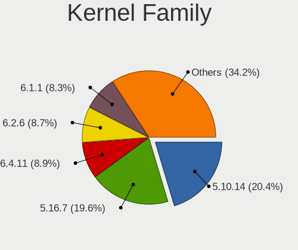
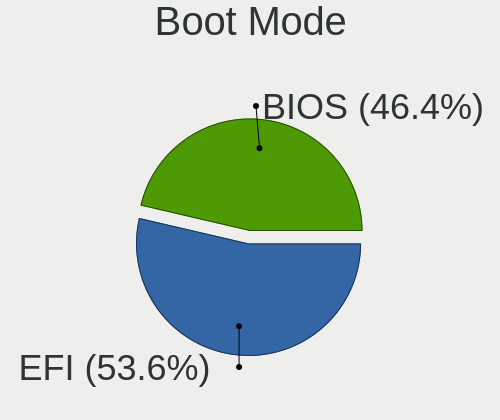
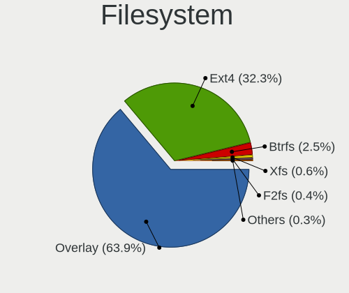
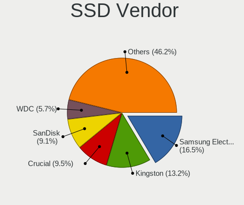

OpenMandriva - Tested Hardware & Statistics
-------------------------------------------

A project to collect tested hardware configurations for OpenMandriva.

Anyone can contribute to this report by the [hw-probe](https://github.com/linuxhw/hw-probe) tool:

    sudo -E hw-probe -all -upload

Please contribute! Especially if your hardware is rare.

This is a report for all computer types. See also reports for [desktops](/Dist/OpenMandriva/Desktop/README.md) and [notebooks](/Dist/OpenMandriva/Notebook/README.md).

Contents
--------

* [ Test Cases ](#test-cases)

* [ System ](#system)
  - [ OS                       ](#os)
  - [ OS Family                ](#os-family)
  - [ Kernel                   ](#kernel)
  - [ Kernel Family            ](#kernel-family)
  - [ Kernel Major Ver.        ](#kernel-major-ver)
  - [ Arch                     ](#arch)
  - [ DE                       ](#de)
  - [ Display Server           ](#display-server)
  - [ Display Manager          ](#display-manager)
  - [ OS Lang                  ](#os-lang)
  - [ Boot Mode                ](#boot-mode)
  - [ Filesystem               ](#filesystem)
  - [ Part. scheme             ](#part-scheme)
  - [ Dual Boot with Linux/BSD ](#dual-boot-with-linuxbsd)
  - [ Dual Boot (Win)          ](#dual-boot-win)

* [ Board ](#board)
  - [ Vendor                   ](#vendor)
  - [ Model                    ](#model)
  - [ Model Family             ](#model-family)
  - [ MFG Year                 ](#mfg-year)
  - [ Form Factor              ](#form-factor)
  - [ Secure Boot              ](#secure-boot)
  - [ Coreboot                 ](#coreboot)
  - [ RAM Size                 ](#ram-size)
  - [ RAM Used                 ](#ram-used)
  - [ Total Drives             ](#total-drives)
  - [ Has CD-ROM               ](#has-cd-rom)
  - [ Has Ethernet             ](#has-ethernet)
  - [ Has WiFi                 ](#has-wifi)
  - [ Has Bluetooth            ](#has-bluetooth)

* [ Location ](#location)
  - [ Country                  ](#country)
  - [ City                     ](#city)

* [ Drives ](#drives)
  - [ Drive Vendor             ](#drive-vendor)
  - [ Drive Model              ](#drive-model)
  - [ HDD Vendor               ](#hdd-vendor)
  - [ SSD Vendor               ](#ssd-vendor)
  - [ Drive Kind               ](#drive-kind)
  - [ Drive Connector          ](#drive-connector)
  - [ Drive Size               ](#drive-size)
  - [ Space Total              ](#space-total)
  - [ Space Used               ](#space-used)
  - [ Malfunc. Drives          ](#malfunc-drives)
  - [ Malfunc. Drive Vendor    ](#malfunc-drive-vendor)
  - [ Malfunc. HDD Vendor      ](#malfunc-hdd-vendor)
  - [ Malfunc. Drive Kind      ](#malfunc-drive-kind)
  - [ Failed Drives            ](#failed-drives)
  - [ Failed Drive Vendor      ](#failed-drive-vendor)
  - [ Drive Status             ](#drive-status)

* [ Storage controller ](#storage-controller)
  - [ Storage Vendor           ](#storage-vendor)
  - [ Storage Model            ](#storage-model)
  - [ Storage Kind             ](#storage-kind)

* [ Processor ](#processor)
  - [ CPU Vendor               ](#cpu-vendor)
  - [ CPU Model                ](#cpu-model)
  - [ CPU Model Family         ](#cpu-model-family)
  - [ CPU Cores                ](#cpu-cores)
  - [ CPU Sockets              ](#cpu-sockets)
  - [ CPU Threads              ](#cpu-threads)
  - [ CPU Op-Modes             ](#cpu-op-modes)
  - [ CPU Microcode            ](#cpu-microcode)
  - [ CPU Microarch            ](#cpu-microarch)

* [ Graphics ](#graphics)
  - [ GPU Vendor               ](#gpu-vendor)
  - [ GPU Model                ](#gpu-model)
  - [ GPU Combo                ](#gpu-combo)
  - [ GPU Driver               ](#gpu-driver)
  - [ GPU Memory               ](#gpu-memory)

* [ Monitor ](#monitor)
  - [ Monitor Vendor           ](#monitor-vendor)
  - [ Monitor Model            ](#monitor-model)
  - [ Monitor Resolution       ](#monitor-resolution)
  - [ Monitor Diagonal         ](#monitor-diagonal)
  - [ Monitor Width            ](#monitor-width)
  - [ Aspect Ratio             ](#aspect-ratio)
  - [ Monitor Area             ](#monitor-area)
  - [ Pixel Density            ](#pixel-density)
  - [ Multiple Monitors        ](#multiple-monitors)

* [ Network ](#network)
  - [ Net Controller Vendor    ](#net-controller-vendor)
  - [ Net Controller Model     ](#net-controller-model)
  - [ Wireless Vendor          ](#wireless-vendor)
  - [ Wireless Model           ](#wireless-model)
  - [ Ethernet Vendor          ](#ethernet-vendor)
  - [ Ethernet Model           ](#ethernet-model)
  - [ Net Controller Kind      ](#net-controller-kind)
  - [ Used Controller          ](#used-controller)
  - [ NICs                     ](#nics)
  - [ IPv6                     ](#ipv6)

* [ Bluetooth ](#bluetooth)
  - [ Bluetooth Vendor         ](#bluetooth-vendor)
  - [ Bluetooth Model          ](#bluetooth-model)

* [ Sound ](#sound)
  - [ Sound Vendor             ](#sound-vendor)
  - [ Sound Model              ](#sound-model)

* [ Memory ](#memory)
  - [ Memory Vendor            ](#memory-vendor)
  - [ Memory Model             ](#memory-model)
  - [ Memory Kind              ](#memory-kind)
  - [ Memory Form Factor       ](#memory-form-factor)
  - [ Memory Size              ](#memory-size)
  - [ Memory Speed             ](#memory-speed)

* [ Printers & scanners ](#printers--scanners)
  - [ Printer Vendor           ](#printer-vendor)
  - [ Printer Model            ](#printer-model)
  - [ Scanner Vendor           ](#scanner-vendor)
  - [ Scanner Model            ](#scanner-model)

* [ Camera ](#camera)
  - [ Camera Vendor            ](#camera-vendor)
  - [ Camera Model             ](#camera-model)

* [ Security ](#security)
  - [ Fingerprint Vendor       ](#fingerprint-vendor)
  - [ Fingerprint Model        ](#fingerprint-model)
  - [ Chipcard Vendor          ](#chipcard-vendor)
  - [ Chipcard Model           ](#chipcard-model)

* [ Unsupported ](#unsupported)
  - [ Unsupported Devices      ](#unsupported-devices)
  - [ Unsupported Device Types ](#unsupported-device-types)

Test Cases
----------

Total: 12919

| Vendor        | Model                       | Form-Factor | Probe                                                      | Date         |
|---------------|-----------------------------|-------------|------------------------------------------------------------|--------------|
| ASUSTek       | Z170 PRO GAMING             | Desktop     | [b272d7b271](https://linux-hardware.org/?probe=b272d7b271) | Apr 01, 2023 |
| ASUSTek       | PRIME Z490-P                | Desktop     | [bbbfbb2dfc](https://linux-hardware.org/?probe=bbbfbb2dfc) | Apr 01, 2023 |
| Intel         | DB75EN AAG39650-303         | Desktop     | [50d4a766a6](https://linux-hardware.org/?probe=50d4a766a6) | Apr 01, 2023 |
| Apple         | MacBookPro9,2               | Notebook    | [b0beffe006](https://linux-hardware.org/?probe=b0beffe006) | Apr 01, 2023 |
| ASUSTek       | M5A97 EVO R2.0              | Desktop     | [3f218796ae](https://linux-hardware.org/?probe=3f218796ae) | Apr 01, 2023 |
| ZOTAC         | ZBOX-EN1070/1060,EN1070K... | Mini pc     | [5f703bfc7d](https://linux-hardware.org/?probe=5f703bfc7d) | Apr 01, 2023 |
| Dell          | Inspiron 15 5510            | Notebook    | [e169cd0886](https://linux-hardware.org/?probe=e169cd0886) | Apr 01, 2023 |
| Lenovo        | MIIX 320-10ICR 80XF         | Tablet      | [06acff9e6b](https://linux-hardware.org/?probe=06acff9e6b) | Apr 01, 2023 |
| HP            | Pavilion g7                 | Notebook    | [7820d2ca67](https://linux-hardware.org/?probe=7820d2ca67) | Apr 01, 2023 |
| ASUSTek       | TUF B450M-PLUS GAMING       | Desktop     | [5ef1391fb2](https://linux-hardware.org/?probe=5ef1391fb2) | Apr 01, 2023 |
| Lenovo        | 317E SDK0K17763 WIN 1801... | Desktop     | [a4cad34ac9](https://linux-hardware.org/?probe=a4cad34ac9) | Apr 01, 2023 |
| Acer          | Aspire V5-121               | Notebook    | [d6cc7a67ab](https://linux-hardware.org/?probe=d6cc7a67ab) | Apr 01, 2023 |
| Acer          | Aspire 5740                 | Notebook    | [eeba9d18fa](https://linux-hardware.org/?probe=eeba9d18fa) | Apr 01, 2023 |
| Lenovo        | ThinkPad P1 Gen 4i 20Y30... | Notebook    | [96c53eccb0](https://linux-hardware.org/?probe=96c53eccb0) | Apr 01, 2023 |
| Acer          | Aspire A315-35              | Notebook    | [659a4cfd5a](https://linux-hardware.org/?probe=659a4cfd5a) | Apr 01, 2023 |
| Lenovo        | 3111 SDK0J40697 WIN 3305... | Mini pc     | [d27ec7c05b](https://linux-hardware.org/?probe=d27ec7c05b) | Apr 01, 2023 |
| ASUSTek       | N752VX                      | Notebook    | [d426499408](https://linux-hardware.org/?probe=d426499408) | Apr 01, 2023 |
| ASUSTek       | PRIME X470-PRO              | Desktop     | [96fcc41161](https://linux-hardware.org/?probe=96fcc41161) | Apr 01, 2023 |
| ASRock        | B450 Pro4 R2.0              | Desktop     | [046d59655e](https://linux-hardware.org/?probe=046d59655e) | Apr 01, 2023 |
| ASUSTek       | B250 MINING EXPERT          | Desktop     | [da86fa8f75](https://linux-hardware.org/?probe=da86fa8f75) | Apr 01, 2023 |
| MSI           | MEG X670E ACE               | Desktop     | [2b9356529f](https://linux-hardware.org/?probe=2b9356529f) | Apr 01, 2023 |
| Lenovo        | IdeaPad 510-15IKB 80SV      | Notebook    | [6ab0a0226d](https://linux-hardware.org/?probe=6ab0a0226d) | Apr 01, 2023 |
| Unknown       | X133                        | Notebook    | [950572f119](https://linux-hardware.org/?probe=950572f119) | Apr 01, 2023 |
| ASUSTek       | F3JP                        | Notebook    | [e561213582](https://linux-hardware.org/?probe=e561213582) | Apr 01, 2023 |
| Lenovo        | SHARKBAY NOK                | Desktop     | [091d2eda88](https://linux-hardware.org/?probe=091d2eda88) | Apr 01, 2023 |
| MSI           | MAG X570S TORPEDO MAX       | Desktop     | [664da8ff45](https://linux-hardware.org/?probe=664da8ff45) | Apr 01, 2023 |
| ASUSTek       | ASUS EXPERTBOOK B1500CEA... | Notebook    | [87bc2601f3](https://linux-hardware.org/?probe=87bc2601f3) | Apr 01, 2023 |
| Gigabyte      | MZGLKDP-00                  | Desktop     | [c9427f4873](https://linux-hardware.org/?probe=c9427f4873) | Apr 01, 2023 |
| Gigabyte      | F2A78M-DS2                  | Desktop     | [0528b2df2b](https://linux-hardware.org/?probe=0528b2df2b) | Apr 01, 2023 |
| ASUSTek       | PRIME B350M-A               | Desktop     | [f8afb163dc](https://linux-hardware.org/?probe=f8afb163dc) | Apr 01, 2023 |
| ASRock        | B460M Pro4                  | Desktop     | [1f3b96d1a0](https://linux-hardware.org/?probe=1f3b96d1a0) | Apr 01, 2023 |
| ASUSTek       | S551LN                      | Notebook    | [916adbdf9f](https://linux-hardware.org/?probe=916adbdf9f) | Apr 01, 2023 |
| Acer          | Aspire XC-780               | Desktop     | [206239c162](https://linux-hardware.org/?probe=206239c162) | Apr 01, 2023 |
| Sony          | VPCEH1S1R                   | Notebook    | [12100cdd4b](https://linux-hardware.org/?probe=12100cdd4b) | Apr 01, 2023 |
| Lenovo        | G505 20240                  | Notebook    | [d873632b2b](https://linux-hardware.org/?probe=d873632b2b) | Apr 01, 2023 |
| MSI           | H97M-G43                    | Desktop     | [b93caf26e4](https://linux-hardware.org/?probe=b93caf26e4) | Apr 01, 2023 |
| HP            | Pavilion Gaming Laptop 1... | Notebook    | [70fb59cd4f](https://linux-hardware.org/?probe=70fb59cd4f) | Apr 01, 2023 |
| HP            | EliteBook 8470p             | Notebook    | [178ccc8d4d](https://linux-hardware.org/?probe=178ccc8d4d) | Apr 01, 2023 |
| Fujitsu       | D3432-A1 S26361-D3432-A1    | Desktop     | [86241cd6ad](https://linux-hardware.org/?probe=86241cd6ad) | Apr 01, 2023 |
| Lenovo        | IdeaPad 3 15IIL05 81WE      | Notebook    | [9db0830268](https://linux-hardware.org/?probe=9db0830268) | Apr 01, 2023 |
| Lenovo        | G560 20042                  | Notebook    | [c5a4783dfb](https://linux-hardware.org/?probe=c5a4783dfb) | Apr 01, 2023 |
| HP            | 304Ah                       | Desktop     | [14d92e85a2](https://linux-hardware.org/?probe=14d92e85a2) | Apr 01, 2023 |
| HP            | 84FD                        | Desktop     | [79367d5f7d](https://linux-hardware.org/?probe=79367d5f7d) | Apr 01, 2023 |
| Gigabyte      | B450 AORUS M                | Desktop     | [c1a0385d07](https://linux-hardware.org/?probe=c1a0385d07) | Apr 01, 2023 |
| Toshiba       | Satellite C55-B             | Notebook    | [250e5371c1](https://linux-hardware.org/?probe=250e5371c1) | Apr 01, 2023 |
| ASUSTek       | PRIME B550M-A WIFI II       | Desktop     | [ad3ead1116](https://linux-hardware.org/?probe=ad3ead1116) | Apr 01, 2023 |
| ASUSTek       | PRIME A320M-K               | Desktop     | [16f87cd333](https://linux-hardware.org/?probe=16f87cd333) | Apr 01, 2023 |
| Microsoft     | Surface Go 3                | Tablet      | [d6d1ab6c61](https://linux-hardware.org/?probe=d6d1ab6c61) | Apr 01, 2023 |
| Lenovo        | ThinkPad X230 2325DV4       | Notebook    | [6cff5cd5d1](https://linux-hardware.org/?probe=6cff5cd5d1) | Apr 01, 2023 |
| Dell          | Latitude 5580               | Notebook    | [10cbd4c04d](https://linux-hardware.org/?probe=10cbd4c04d) | Apr 01, 2023 |
| Fujitsu       | LIFEBOOK S935               | Notebook    | [11b63a22b5](https://linux-hardware.org/?probe=11b63a22b5) | Apr 01, 2023 |
| Gigabyte      | B360 AORUS GAMING 3-CF      | Desktop     | [f54ccba86f](https://linux-hardware.org/?probe=f54ccba86f) | Apr 01, 2023 |
| Sony          | VPCEA3BFX                   | Notebook    | [6215c985dd](https://linux-hardware.org/?probe=6215c985dd) | Apr 01, 2023 |
| ASUSTek       | P8Z77-V PREMIUM             | Desktop     | [d774a892d1](https://linux-hardware.org/?probe=d774a892d1) | Apr 01, 2023 |
| Lenovo        | 0x36C4 SDK0J40679 WIN 32... | All in one  | [5d5eb8d675](https://linux-hardware.org/?probe=5d5eb8d675) | Apr 01, 2023 |
| Dell          | 0TTDMJ A00                  | Desktop     | [5d6606235d](https://linux-hardware.org/?probe=5d6606235d) | Apr 01, 2023 |
| Lenovo        | V15-IGL 82C3                | Notebook    | [4773b9449c](https://linux-hardware.org/?probe=4773b9449c) | Apr 01, 2023 |
| Dell          | 0M5DCD A00                  | Desktop     | [91cc314380](https://linux-hardware.org/?probe=91cc314380) | Apr 01, 2023 |
| Dell          | Vostro 15 3515              | Notebook    | [eea311b1bb](https://linux-hardware.org/?probe=eea311b1bb) | Apr 01, 2023 |
| HP            | Laptop 15s-eq3xxx           | Notebook    | [758bb2556e](https://linux-hardware.org/?probe=758bb2556e) | Apr 01, 2023 |
| Gigabyte      | F2A88XM-HD3                 | Desktop     | [39bc576f7f](https://linux-hardware.org/?probe=39bc576f7f) | Apr 01, 2023 |
| Lenovo        | ThinkPad T530 23594LU       | Notebook    | [9de89fee19](https://linux-hardware.org/?probe=9de89fee19) | Apr 01, 2023 |
| Lenovo        | ThinkPad T420s 4173R44      | Notebook    | [84e9a5f3d9](https://linux-hardware.org/?probe=84e9a5f3d9) | Apr 01, 2023 |
| UMAX          | VisionBook 14Wa Plus        | Notebook    | [ea8016c4a5](https://linux-hardware.org/?probe=ea8016c4a5) | Apr 01, 2023 |
| HP            | 8053                        | Desktop     | [6c887800bb](https://linux-hardware.org/?probe=6c887800bb) | Apr 01, 2023 |
| Dell          | Latitude E7450              | Notebook    | [8bf693a890](https://linux-hardware.org/?probe=8bf693a890) | Apr 01, 2023 |
| MSI           | H310M PRO-VDH PLUS          | Desktop     | [369bd03522](https://linux-hardware.org/?probe=369bd03522) | Apr 01, 2023 |
| Pegatron      | 2AC2                        | Desktop     | [ca0b0464d7](https://linux-hardware.org/?probe=ca0b0464d7) | Apr 01, 2023 |
| Samsung       | 340XAA/350XAA/550XAA        | Notebook    | [93ef0bb287](https://linux-hardware.org/?probe=93ef0bb287) | Apr 01, 2023 |
| Dell          | 04YP6J A02                  | Desktop     | [0223f7bb3e](https://linux-hardware.org/?probe=0223f7bb3e) | Mar 31, 2023 |
| ECS           | GeForce 8000 series         | Desktop     | [32e951a2ca](https://linux-hardware.org/?probe=32e951a2ca) | Mar 31, 2023 |
| Samsung       | 270E5G/270E5U               | Notebook    | [67b91e463a](https://linux-hardware.org/?probe=67b91e463a) | Mar 31, 2023 |
| Acer          | Aspire A315-54K             | Notebook    | [d325177071](https://linux-hardware.org/?probe=d325177071) | Mar 31, 2023 |
| ASUSTek       | ROG STRIX B450-F GAMING     | Desktop     | [9e09a54915](https://linux-hardware.org/?probe=9e09a54915) | Mar 31, 2023 |
| HP            | ProBook 440 G6              | Notebook    | [5198509903](https://linux-hardware.org/?probe=5198509903) | Mar 31, 2023 |
| HP            | 2AFA                        | Desktop     | [d177838277](https://linux-hardware.org/?probe=d177838277) | Mar 31, 2023 |
| Lenovo        | IdeaPad Yoga 13 20175       | Notebook    | [66a1075056](https://linux-hardware.org/?probe=66a1075056) | Mar 31, 2023 |
| Quanta        | QL3 TBD                     | Notebook    | [21673aecac](https://linux-hardware.org/?probe=21673aecac) | Mar 31, 2023 |
| ASRock        | Z87 Extreme6                | Desktop     | [675d214cbe](https://linux-hardware.org/?probe=675d214cbe) | Mar 31, 2023 |
| Dell          | 0JP3NX A00                  | Desktop     | [016632c560](https://linux-hardware.org/?probe=016632c560) | Mar 31, 2023 |
| HP            | Compaq Presario CQ60        | Notebook    | [e5a729243d](https://linux-hardware.org/?probe=e5a729243d) | Mar 31, 2023 |
| Microtech     | ebookPro                    | Notebook    | [ffe1da27cc](https://linux-hardware.org/?probe=ffe1da27cc) | Mar 31, 2023 |
| Dell          | XPS M1330                   | Notebook    | [46b9a5cfde](https://linux-hardware.org/?probe=46b9a5cfde) | Mar 31, 2023 |
| Intel         | Kabylake Platform           | Notebook    | [2b0fd79264](https://linux-hardware.org/?probe=2b0fd79264) | Mar 31, 2023 |
| ASUSTek       | PRIME B660-PLUS D4          | Desktop     | [1ac381c18f](https://linux-hardware.org/?probe=1ac381c18f) | Mar 31, 2023 |
| MSI           | H81M-P33                    | Desktop     | [e2442d5cac](https://linux-hardware.org/?probe=e2442d5cac) | Mar 31, 2023 |
| Gigabyte      | Z77-DS3H                    | Desktop     | [79e2cfa0f1](https://linux-hardware.org/?probe=79e2cfa0f1) | Mar 31, 2023 |
| Fujitsu Si... | MS-7504VP-PV                | Desktop     | [32c138c982](https://linux-hardware.org/?probe=32c138c982) | Mar 31, 2023 |
| Toshiba       | Satellite L655              | Notebook    | [d527726a1c](https://linux-hardware.org/?probe=d527726a1c) | Mar 31, 2023 |
| HP            | Pavilion Aero Laptop 13-... | Notebook    | [59b2b4e152](https://linux-hardware.org/?probe=59b2b4e152) | Mar 31, 2023 |
| Samsung       | 300V3A/300V4A/300V5A/200... | Notebook    | [ad92e27c90](https://linux-hardware.org/?probe=ad92e27c90) | Mar 31, 2023 |
| Acer          | Aspire 7720                 | Notebook    | [073d49ce6b](https://linux-hardware.org/?probe=073d49ce6b) | Mar 31, 2023 |
| Dell          | Precision 5570              | Notebook    | [a3d5f928ee](https://linux-hardware.org/?probe=a3d5f928ee) | Mar 31, 2023 |
| Samsung       | 950QED                      | Convertible | [fb238a74f2](https://linux-hardware.org/?probe=fb238a74f2) | Mar 31, 2023 |
| Dell          | Inspiron 1545               | Notebook    | [ca44e7f419](https://linux-hardware.org/?probe=ca44e7f419) | Mar 31, 2023 |
| Gigabyte      | B250M-DS3H-CF               | Desktop     | [a025953f4c](https://linux-hardware.org/?probe=a025953f4c) | Mar 31, 2023 |
| Dell          | Latitude E7440              | Notebook    | [fdd9fda693](https://linux-hardware.org/?probe=fdd9fda693) | Mar 31, 2023 |
| HP            | Compaq 6730b (GB987ET#UU... | Notebook    | [6c6ceb9bc3](https://linux-hardware.org/?probe=6c6ceb9bc3) | Mar 31, 2023 |
| ASUSTek       | PN51-E1                     | Mini pc     | [14761d1566](https://linux-hardware.org/?probe=14761d1566) | Mar 31, 2023 |
| HP            | 250 G5 Notebook PC          | Notebook    | [d271318192](https://linux-hardware.org/?probe=d271318192) | Mar 31, 2023 |
| Dell          | 0WMJ54 A00                  | Desktop     | [d11328af2a](https://linux-hardware.org/?probe=d11328af2a) | Mar 31, 2023 |
| HP            | Laptop 15-db0xxx            | Notebook    | [c51f53a733](https://linux-hardware.org/?probe=c51f53a733) | Mar 31, 2023 |
| Lenovo        | ThinkPad T430 2347EP7       | Notebook    | [6fd7423cb6](https://linux-hardware.org/?probe=6fd7423cb6) | Mar 31, 2023 |
| MSI           | B550-A PRO                  | Desktop     | [ab4f36e0fa](https://linux-hardware.org/?probe=ab4f36e0fa) | Mar 31, 2023 |
| HP            | Pavilion 15                 | Notebook    | [4dc2c9dfc1](https://linux-hardware.org/?probe=4dc2c9dfc1) | Mar 31, 2023 |
| MSI           | B450 TOMAHAWK MAX           | Desktop     | [c27e3be5ba](https://linux-hardware.org/?probe=c27e3be5ba) | Mar 31, 2023 |
| Wistron       | ProLiant ML110 G5           | Desktop     | [925759c41c](https://linux-hardware.org/?probe=925759c41c) | Mar 31, 2023 |
| HUAWEI        | KPL-W0X                     | Notebook    | [6e93ca4159](https://linux-hardware.org/?probe=6e93ca4159) | Mar 31, 2023 |
| ASUSTek       | VivoBook_ASUSLaptop X515... | Notebook    | [29c4ba04a1](https://linux-hardware.org/?probe=29c4ba04a1) | Mar 31, 2023 |
| Dell          | 0HMX8D A01                  | Desktop     | [36b8532260](https://linux-hardware.org/?probe=36b8532260) | Mar 31, 2023 |
| MSI           | Z270-A PRO                  | Desktop     | [a5d218b9a6](https://linux-hardware.org/?probe=a5d218b9a6) | Mar 31, 2023 |
| Gigabyte      | Z68XP-UD3                   | Desktop     | [029afd6a5c](https://linux-hardware.org/?probe=029afd6a5c) | Mar 31, 2023 |
| Medion        | Iron238G                    | All in one  | [55cab5c7fa](https://linux-hardware.org/?probe=55cab5c7fa) | Mar 31, 2023 |
| ASUSTek       | ET2400E                     | All in one  | [eb1110a2f0](https://linux-hardware.org/?probe=eb1110a2f0) | Mar 31, 2023 |
| Fujitsu       | D3600-A1 S26361-D3600-A1    | Desktop     | [fc9a42e387](https://linux-hardware.org/?probe=fc9a42e387) | Mar 31, 2023 |
| Acer          | Aspire ES1-531              | Notebook    | [aedba72f70](https://linux-hardware.org/?probe=aedba72f70) | Mar 31, 2023 |
| ASUSTek       | TUF Z270 MARK 2             | Desktop     | [6bd60aa5f0](https://linux-hardware.org/?probe=6bd60aa5f0) | Mar 31, 2023 |
| Unknown       | Unknown                     | Notebook    | [c30740a3eb](https://linux-hardware.org/?probe=c30740a3eb) | Mar 31, 2023 |
| ASUSTek       | P8Z77-V                     | Desktop     | [498726ce78](https://linux-hardware.org/?probe=498726ce78) | Mar 31, 2023 |
| HP            | Laptop 17-cp2xxx            | Notebook    | [854de8a433](https://linux-hardware.org/?probe=854de8a433) | Mar 31, 2023 |
| Dell          | 042P49 A02                  | Desktop     | [46dc3b9655](https://linux-hardware.org/?probe=46dc3b9655) | Mar 31, 2023 |
| Medion        | MS-7728                     | Desktop     | [cf66e81623](https://linux-hardware.org/?probe=cf66e81623) | Mar 31, 2023 |
| Lenovo        | Legion 5 15IMH05 82AU       | Notebook    | [36c0a38885](https://linux-hardware.org/?probe=36c0a38885) | Mar 31, 2023 |
| ASUSTek       | X550CL                      | Notebook    | [5d5862d22a](https://linux-hardware.org/?probe=5d5862d22a) | Mar 31, 2023 |
| Fujitsu Si... | ESPRIMO Mobile V5535        | Notebook    | [d6c537b33b](https://linux-hardware.org/?probe=d6c537b33b) | Mar 31, 2023 |
| ASUSTek       | PN51-S1                     | Mini pc     | [2b534dd0fa](https://linux-hardware.org/?probe=2b534dd0fa) | Mar 31, 2023 |
| Apple         | MacBookPro9,2               | Notebook    | [8c60cf0ec1](https://linux-hardware.org/?probe=8c60cf0ec1) | Mar 31, 2023 |
| Lenovo        | IdeaPad 300-15ISK 80Q7      | Notebook    | [54f8c5082d](https://linux-hardware.org/?probe=54f8c5082d) | Mar 31, 2023 |
| AZW           | GTR V01                     | Mini pc     | [ccaf63588a](https://linux-hardware.org/?probe=ccaf63588a) | Mar 31, 2023 |
| ASUSTek       | H110M-R                     | Desktop     | [bd1a48e47d](https://linux-hardware.org/?probe=bd1a48e47d) | Mar 31, 2023 |
| ASUSTek       | TUF Gaming B550M-PLUS       | Desktop     | [7a0f5608b2](https://linux-hardware.org/?probe=7a0f5608b2) | Mar 31, 2023 |
| ASRock        | Z97 Anniversary             | Desktop     | [c23aeb60ba](https://linux-hardware.org/?probe=c23aeb60ba) | Mar 31, 2023 |
| HP            | 3397                        | Desktop     | [5a25984320](https://linux-hardware.org/?probe=5a25984320) | Mar 31, 2023 |
| Gigabyte      | B85M-HD3                    | Desktop     | [3d24b75a10](https://linux-hardware.org/?probe=3d24b75a10) | Mar 31, 2023 |
| Apple         | Mac-031B6874CF7F642A iMa... | All in one  | [2b23ce3fed](https://linux-hardware.org/?probe=2b23ce3fed) | Mar 31, 2023 |
| Lenovo        | 3708 SDK0J40700 WIN 3258... | Desktop     | [e84598d67c](https://linux-hardware.org/?probe=e84598d67c) | Mar 31, 2023 |
| Dell          | 00V62H A01                  | Desktop     | [05d42527df](https://linux-hardware.org/?probe=05d42527df) | Mar 31, 2023 |
| HP            | 1998                        | Desktop     | [c47c52dfc6](https://linux-hardware.org/?probe=c47c52dfc6) | Mar 31, 2023 |
| Acer          | Aspire 1410                 | Notebook    | [58be80ea51](https://linux-hardware.org/?probe=58be80ea51) | Mar 31, 2023 |
| ASRock        | H61M                        | Desktop     | [29327171c4](https://linux-hardware.org/?probe=29327171c4) | Mar 31, 2023 |
| HP            | 8767 A                      | Desktop     | [186bad76b7](https://linux-hardware.org/?probe=186bad76b7) | Mar 31, 2023 |
| Acer          | Aspire 5720Z                | Notebook    | [ca2b750eeb](https://linux-hardware.org/?probe=ca2b750eeb) | Mar 31, 2023 |
| Gigabyte      | H310M A-CF                  | Desktop     | [c26786d423](https://linux-hardware.org/?probe=c26786d423) | Mar 31, 2023 |
| ASUSTek       | H97-PLUS                    | Desktop     | [5f163f6a24](https://linux-hardware.org/?probe=5f163f6a24) | Mar 31, 2023 |
| ASUSTek       | UN65U                       | Desktop     | [70d0f8f069](https://linux-hardware.org/?probe=70d0f8f069) | Mar 31, 2023 |
| Gigabyte      | EP43-DS3L                   | Desktop     | [b7594db73b](https://linux-hardware.org/?probe=b7594db73b) | Mar 31, 2023 |
| ASUSTek       | M5A78L-M LX/BR              | Desktop     | [1fa3e0934f](https://linux-hardware.org/?probe=1fa3e0934f) | Mar 31, 2023 |
| Acer          | TravelMate B311-31          | Notebook    | [3345b754b7](https://linux-hardware.org/?probe=3345b754b7) | Mar 31, 2023 |
| ASUSTek       | PRIME J4005I-C              | Desktop     | [193d27ceac](https://linux-hardware.org/?probe=193d27ceac) | Mar 31, 2023 |
| HP            | EliteBook 8540p             | Notebook    | [570836875c](https://linux-hardware.org/?probe=570836875c) | Mar 31, 2023 |
| MSI           | H110M PRO-VH PLUS           | Desktop     | [0992e2d8d8](https://linux-hardware.org/?probe=0992e2d8d8) | Mar 31, 2023 |
| OEM_MB        | NARRA3                      | Desktop     | [75050a4d2e](https://linux-hardware.org/?probe=75050a4d2e) | Mar 31, 2023 |
| Notebook      | NL40_50GU                   | Notebook    | [a46afd7246](https://linux-hardware.org/?probe=a46afd7246) | Mar 31, 2023 |
| Star Labs     | Lite                        | Notebook    | [e3689ef845](https://linux-hardware.org/?probe=e3689ef845) | Mar 31, 2023 |
| ASUSTek       | M5A78L-M LX3                | Desktop     | [6ff0a3cb3f](https://linux-hardware.org/?probe=6ff0a3cb3f) | Mar 31, 2023 |
| Foxconn       | 2ABF                        | Desktop     | [8daf4bf0a5](https://linux-hardware.org/?probe=8daf4bf0a5) | Mar 30, 2023 |
| ASUSTek       | K54C                        | Notebook    | [a2a91e2071](https://linux-hardware.org/?probe=a2a91e2071) | Mar 30, 2023 |
| ASRock        | H310CM-HDV                  | Desktop     | [a9a41a38ed](https://linux-hardware.org/?probe=a9a41a38ed) | Mar 30, 2023 |
| Acer          | Aspire 7741                 | Notebook    | [34bd6f42b1](https://linux-hardware.org/?probe=34bd6f42b1) | Mar 30, 2023 |
| HP            | Unknown                     | Notebook    | [fb784430a5](https://linux-hardware.org/?probe=fb784430a5) | Mar 30, 2023 |
| ASUSTek       | PRIME A320M-K               | Desktop     | [3670f0a6ed](https://linux-hardware.org/?probe=3670f0a6ed) | Mar 30, 2023 |
| Lenovo        | Yoga 500-15IBD 80N6         | Notebook    | [225e13e1f0](https://linux-hardware.org/?probe=225e13e1f0) | Mar 30, 2023 |
| HP            | Pavilion Gaming Laptop 1... | Notebook    | [8e927ead89](https://linux-hardware.org/?probe=8e927ead89) | Mar 30, 2023 |
| HP            | 82DC 1100                   | All in one  | [4c1c2f908b](https://linux-hardware.org/?probe=4c1c2f908b) | Mar 30, 2023 |
| Toshiba       | Satellite P875              | Notebook    | [aba8c03541](https://linux-hardware.org/?probe=aba8c03541) | Mar 30, 2023 |
| HP            | 843F                        | Desktop     | [862f573134](https://linux-hardware.org/?probe=862f573134) | Mar 30, 2023 |
| ASRock        | 970 Extreme3                | Desktop     | [906f9d6d04](https://linux-hardware.org/?probe=906f9d6d04) | Mar 30, 2023 |
| Gigabyte      | P41T-D3P                    | Desktop     | [c8cadc8a94](https://linux-hardware.org/?probe=c8cadc8a94) | Mar 30, 2023 |
| ASUSTek       | K53SJ                       | Notebook    | [aa9a729217](https://linux-hardware.org/?probe=aa9a729217) | Mar 30, 2023 |
| DFI           | LP UT X58                   | Desktop     | [cd706d90d3](https://linux-hardware.org/?probe=cd706d90d3) | Mar 30, 2023 |
| Notebook      | N150CU                      | Notebook    | [5da0df2cf0](https://linux-hardware.org/?probe=5da0df2cf0) | Mar 30, 2023 |
| Gigabyte      | B250M-DS3H-CF               | Desktop     | [d72978731a](https://linux-hardware.org/?probe=d72978731a) | Mar 30, 2023 |
| MSI           | Z370-A PRO                  | Desktop     | [9aba047596](https://linux-hardware.org/?probe=9aba047596) | Mar 30, 2023 |
| Acer          | Aspire ES1-523              | Notebook    | [a800dab0ab](https://linux-hardware.org/?probe=a800dab0ab) | Mar 30, 2023 |
| Gigabyte      | A520 AORUS ELITE            | Desktop     | [f7f74305ba](https://linux-hardware.org/?probe=f7f74305ba) | Mar 30, 2023 |
| HP            | EliteBook 2540p             | Notebook    | [6aae8ca2a0](https://linux-hardware.org/?probe=6aae8ca2a0) | Mar 30, 2023 |
| HP            | Pavilion dv6                | Notebook    | [c91e4d9c5a](https://linux-hardware.org/?probe=c91e4d9c5a) | Mar 30, 2023 |
| Dell          | XPS 17 9710                 | Notebook    | [6b37881138](https://linux-hardware.org/?probe=6b37881138) | Mar 30, 2023 |
| Intel         | B75A                        | Desktop     | [b7b1423f34](https://linux-hardware.org/?probe=b7b1423f34) | Mar 30, 2023 |
| Biostar       | B550MX/E PRO                | Desktop     | [cffcb0a2a6](https://linux-hardware.org/?probe=cffcb0a2a6) | Mar 30, 2023 |
| Samsung       | 355V4C/356V4C/3445VC/354... | Notebook    | [6b9737a62f](https://linux-hardware.org/?probe=6b9737a62f) | Mar 30, 2023 |
| Gigabyte      | H410M S2H V2                | Desktop     | [cf13162657](https://linux-hardware.org/?probe=cf13162657) | Mar 30, 2023 |
| HP            | ProBook 6360b               | Notebook    | [cf027e03de](https://linux-hardware.org/?probe=cf027e03de) | Mar 30, 2023 |
| ASRock        | FM2A88X Extreme6+           | Desktop     | [ad1392d8c0](https://linux-hardware.org/?probe=ad1392d8c0) | Mar 30, 2023 |
| Acer          | Prespa M                    | Notebook    | [a6541a27d9](https://linux-hardware.org/?probe=a6541a27d9) | Mar 30, 2023 |
| HP            | 82B4                        | Desktop     | [9712d04ab5](https://linux-hardware.org/?probe=9712d04ab5) | Mar 30, 2023 |
| Lenovo        | IdeaPad 3 15ITL6 82H8       | Notebook    | [afd41155ee](https://linux-hardware.org/?probe=afd41155ee) | Mar 30, 2023 |
| Lenovo        | G550 2958                   | Notebook    | [41f23ded68](https://linux-hardware.org/?probe=41f23ded68) | Mar 30, 2023 |
| ASUSTek       | VivoBook_ASUSLaptop X512... | Notebook    | [a1fa08efc6](https://linux-hardware.org/?probe=a1fa08efc6) | Mar 30, 2023 |
| Dell          | 0T7D40 A01                  | Desktop     | [dc44647f41](https://linux-hardware.org/?probe=dc44647f41) | Mar 30, 2023 |
| ASUSTek       | B85M-E                      | Desktop     | [7c7f9d0e36](https://linux-hardware.org/?probe=7c7f9d0e36) | Mar 30, 2023 |
| Packard Be... | FIH57                       | Desktop     | [f1336c6cc4](https://linux-hardware.org/?probe=f1336c6cc4) | Mar 30, 2023 |
| Pegatron      | 2ADC                        | Desktop     | [1326ad508e](https://linux-hardware.org/?probe=1326ad508e) | Mar 30, 2023 |
| Lenovo        | IdeaPad 3 15ITL6 82H8       | Notebook    | [45f39402f0](https://linux-hardware.org/?probe=45f39402f0) | Mar 30, 2023 |
| Packard Be... | MCP73PV                     | Desktop     | [2082d90602](https://linux-hardware.org/?probe=2082d90602) | Mar 30, 2023 |
| Gigabyte      | B550M AORUS PRO-P           | Desktop     | [4ccaa78b43](https://linux-hardware.org/?probe=4ccaa78b43) | Mar 30, 2023 |
| Lenovo        | V15-ADA 82C7                | Notebook    | [552ad08e05](https://linux-hardware.org/?probe=552ad08e05) | Mar 30, 2023 |
| ATOPNUC       | MA90                        | Mini pc     | [3a2e8fcdaa](https://linux-hardware.org/?probe=3a2e8fcdaa) | Mar 30, 2023 |
| HP            | 86ED A01                    | All in one  | [e86753f364](https://linux-hardware.org/?probe=e86753f364) | Mar 30, 2023 |
| MSI           | B450M BAZOOKA V2            | Desktop     | [7888e091f7](https://linux-hardware.org/?probe=7888e091f7) | Mar 30, 2023 |
| Toshiba       | dynabook T653/46JR          | Notebook    | [94a37d865e](https://linux-hardware.org/?probe=94a37d865e) | Mar 30, 2023 |
| ReachingTe... | Dream Quest Office 2021     | Mini pc     | [ed4291eed3](https://linux-hardware.org/?probe=ed4291eed3) | Mar 30, 2023 |
| Gigabyte      | GA-880GA-UD3H               | Desktop     | [393fc00a5d](https://linux-hardware.org/?probe=393fc00a5d) | Mar 30, 2023 |
| Samsung       | 950QED                      | Convertible | [20b6d6f93d](https://linux-hardware.org/?probe=20b6d6f93d) | Mar 30, 2023 |
| Medion        | B250H4-EM                   | Desktop     | [f569d44749](https://linux-hardware.org/?probe=f569d44749) | Mar 30, 2023 |
| Dell          | Latitude E7450              | Notebook    | [63e8748d1f](https://linux-hardware.org/?probe=63e8748d1f) | Mar 30, 2023 |
| Intel         | NUC8BEB J72693-307          | Mini pc     | [507f441bfc](https://linux-hardware.org/?probe=507f441bfc) | Mar 30, 2023 |
| Lenovo        | G505 20240                  | Notebook    | [25c5c7ee2e](https://linux-hardware.org/?probe=25c5c7ee2e) | Mar 30, 2023 |
| ASUSTek       | P8H77-V                     | Desktop     | [1869e23c56](https://linux-hardware.org/?probe=1869e23c56) | Mar 30, 2023 |
| PC Special... | P65_67RSRP                  | Notebook    | [889f3e8521](https://linux-hardware.org/?probe=889f3e8521) | Mar 30, 2023 |
| HP            | Pavilion Notebook           | Notebook    | [d3eafe4568](https://linux-hardware.org/?probe=d3eafe4568) | Mar 30, 2023 |
| MSI           | H97 PC Mate                 | Desktop     | [37c098e51a](https://linux-hardware.org/?probe=37c098e51a) | Mar 30, 2023 |
| Toshiba       | Satellite L655              | Notebook    | [2e6ea8bf5c](https://linux-hardware.org/?probe=2e6ea8bf5c) | Mar 30, 2023 |
| Gigabyte      | Z390 UD                     | Desktop     | [558d551d9a](https://linux-hardware.org/?probe=558d551d9a) | Mar 30, 2023 |
| Lenovo        | ThinkPad Edge E530 3259M... | Notebook    | [9aaa97a931](https://linux-hardware.org/?probe=9aaa97a931) | Mar 30, 2023 |
| ASRock        | B85M Pro4                   | Desktop     | [d237bcc0a2](https://linux-hardware.org/?probe=d237bcc0a2) | Mar 30, 2023 |
| Acer          | NC-M3-581T-33216G52MAKK     | Notebook    | [3f394d8b43](https://linux-hardware.org/?probe=3f394d8b43) | Mar 30, 2023 |
| Gigabyte      | B75M-D3V                    | Desktop     | [d3ae118e3b](https://linux-hardware.org/?probe=d3ae118e3b) | Mar 30, 2023 |
| Dell          | Latitude E6430              | Notebook    | [086b5d0f79](https://linux-hardware.org/?probe=086b5d0f79) | Mar 30, 2023 |
| Shuttle       | FH270                       | Desktop     | [83c990d212](https://linux-hardware.org/?probe=83c990d212) | Mar 30, 2023 |
| Lenovo        | ThinkPad T400 6475J92       | Notebook    | [1d3c812668](https://linux-hardware.org/?probe=1d3c812668) | Mar 30, 2023 |
| Lenovo        | ThinkPad X395 20NLS0J400    | Notebook    | [e9d9710ef9](https://linux-hardware.org/?probe=e9d9710ef9) | Mar 30, 2023 |
| Dell          | Precision 5550              | Notebook    | [c7244f1e31](https://linux-hardware.org/?probe=c7244f1e31) | Mar 30, 2023 |
| Fujitsu       | LIFEBOOK AH530              | Notebook    | [a316144991](https://linux-hardware.org/?probe=a316144991) | Mar 29, 2023 |
| HP            | Notebook                    | Notebook    | [e631e8e62a](https://linux-hardware.org/?probe=e631e8e62a) | Mar 29, 2023 |
| MSI           | H81M-P33                    | Desktop     | [4606b5b93d](https://linux-hardware.org/?probe=4606b5b93d) | Mar 29, 2023 |
| HP            | Laptop 14-bs0xx             | Notebook    | [53504486d2](https://linux-hardware.org/?probe=53504486d2) | Mar 29, 2023 |
| Lenovo        | U41-70 80JV                 | Notebook    | [975da67142](https://linux-hardware.org/?probe=975da67142) | Mar 29, 2023 |
| HP            | Laptop 15s-fq4xxx           | Notebook    | [029fa06a9a](https://linux-hardware.org/?probe=029fa06a9a) | Mar 29, 2023 |
| Fujitsu       | LIFEBOOK A555               | Notebook    | [6f28f9e6ec](https://linux-hardware.org/?probe=6f28f9e6ec) | Mar 29, 2023 |
| Acer          | Aspire A515-57              | Notebook    | [06a3c07a40](https://linux-hardware.org/?probe=06a3c07a40) | Mar 29, 2023 |
| Dell          | 042P49 A01                  | Desktop     | [9a4f4be1ab](https://linux-hardware.org/?probe=9a4f4be1ab) | Mar 29, 2023 |
| HP            | ENVY TS Sleekbook 4         | Notebook    | [f897573506](https://linux-hardware.org/?probe=f897573506) | Mar 29, 2023 |
| Lenovo        | IdeaPad S145-15IWL 81MV     | Notebook    | [5be11a9a6e](https://linux-hardware.org/?probe=5be11a9a6e) | Mar 29, 2023 |
| MSI           | MPG Z390 GAMING PRO CARB... | Desktop     | [fb2605e6fa](https://linux-hardware.org/?probe=fb2605e6fa) | Mar 29, 2023 |
| Dell          | System Inspiron N7110       | Notebook    | [cc23cb7065](https://linux-hardware.org/?probe=cc23cb7065) | Mar 29, 2023 |
| Dell          | 0TP412                      | Desktop     | [f9f3e5cc04](https://linux-hardware.org/?probe=f9f3e5cc04) | Mar 29, 2023 |
| Lenovo        | IdeaPad 100-15IBY 80MJ      | Notebook    | [11c94aa91b](https://linux-hardware.org/?probe=11c94aa91b) | Mar 29, 2023 |
| Gigabyte      | B550 AORUS ELITE V2         | Desktop     | [599577c3b4](https://linux-hardware.org/?probe=599577c3b4) | Mar 29, 2023 |
| MSI           | MAG X570S TOMAHAWK MAX W... | Desktop     | [3b7fe31c07](https://linux-hardware.org/?probe=3b7fe31c07) | Mar 29, 2023 |
| Samsung       | 670Z5E                      | Notebook    | [2bf528dfb1](https://linux-hardware.org/?probe=2bf528dfb1) | Mar 29, 2023 |
| Lenovo        | IdeaPad S145-15API 81UT     | Notebook    | [695a074faf](https://linux-hardware.org/?probe=695a074faf) | Mar 29, 2023 |
| Acer          | Aspire 8930                 | Notebook    | [248dbe002e](https://linux-hardware.org/?probe=248dbe002e) | Mar 29, 2023 |
| Lenovo        | G570 20079                  | Notebook    | [680c7a04ed](https://linux-hardware.org/?probe=680c7a04ed) | Mar 29, 2023 |
| EPoX Compu... | nForce3 DDR: 8KDA7I Seri... | Desktop     | [38e3c2378c](https://linux-hardware.org/?probe=38e3c2378c) | Mar 29, 2023 |
| Notebook      | N85_N87,HJ,HJ1,HK1          | Notebook    | [61ede0b764](https://linux-hardware.org/?probe=61ede0b764) | Mar 29, 2023 |
| Toshiba       | Satellite P200              | Notebook    | [c55a4d3166](https://linux-hardware.org/?probe=c55a4d3166) | Mar 29, 2023 |
| Dell          | 0T2HR0 A02                  | Desktop     | [bf959f65d2](https://linux-hardware.org/?probe=bf959f65d2) | Mar 29, 2023 |
| Acer          | Aspire E1-571G              | Notebook    | [574f00dff5](https://linux-hardware.org/?probe=574f00dff5) | Mar 29, 2023 |
| Intel         | NUC10i5FNB K61361-306       | Mini pc     | [9ec87342fd](https://linux-hardware.org/?probe=9ec87342fd) | Mar 29, 2023 |
| Acer          | Aspire E5-576               | Notebook    | [37fc62a287](https://linux-hardware.org/?probe=37fc62a287) | Mar 29, 2023 |
| Acer          | Aspire E5-773G              | Notebook    | [3cb72ca21c](https://linux-hardware.org/?probe=3cb72ca21c) | Mar 29, 2023 |
| ASUSTek       | ASUS TUF Gaming A15 FA50... | Notebook    | [fa1a582da6](https://linux-hardware.org/?probe=fa1a582da6) | Mar 29, 2023 |
| Gigabyte      | B550M DS3H                  | Desktop     | [612dd1dba2](https://linux-hardware.org/?probe=612dd1dba2) | Mar 29, 2023 |
| Lenovo        | 30D2 NOK                    | Desktop     | [e4d898e37d](https://linux-hardware.org/?probe=e4d898e37d) | Mar 29, 2023 |
| ASUSTek       | PRIME B350-PLUS             | Desktop     | [634c2e1e74](https://linux-hardware.org/?probe=634c2e1e74) | Mar 29, 2023 |
| AZW           | SER V1.0                    | Mini pc     | [1deca47347](https://linux-hardware.org/?probe=1deca47347) | Mar 29, 2023 |
| Samsung       | 300E5M/300E5L               | Notebook    | [9d48f53259](https://linux-hardware.org/?probe=9d48f53259) | Mar 29, 2023 |
| ASRock        | B450 Pro4                   | Desktop     | [c77fc70f0c](https://linux-hardware.org/?probe=c77fc70f0c) | Mar 29, 2023 |
| Acer          | Predator G3-605             | Desktop     | [8a1a55a1da](https://linux-hardware.org/?probe=8a1a55a1da) | Mar 29, 2023 |
| Notebook      | NL40_50CU                   | Notebook    | [fe471635fb](https://linux-hardware.org/?probe=fe471635fb) | Mar 29, 2023 |
| Toshiba       | Satellite L750              | Notebook    | [0bc21ff162](https://linux-hardware.org/?probe=0bc21ff162) | Mar 28, 2023 |
| Intel         | NUC11TNBi5 M11904-404       | Mini pc     | [28a9f53f42](https://linux-hardware.org/?probe=28a9f53f42) | Mar 28, 2023 |
| HP            | 0A60h                       | Desktop     | [6ad65f4f2b](https://linux-hardware.org/?probe=6ad65f4f2b) | Mar 28, 2023 |
| WinFast       | 6100M2MA FAB1.0             | Desktop     | [bed481b8ce](https://linux-hardware.org/?probe=bed481b8ce) | Mar 28, 2023 |
| Dell          | Vostro 5568                 | Notebook    | [0004be15a4](https://linux-hardware.org/?probe=0004be15a4) | Mar 28, 2023 |
| HP            | ENVY Notebook               | Notebook    | [98cd32ea44](https://linux-hardware.org/?probe=98cd32ea44) | Mar 28, 2023 |
| HP            | 3047h                       | Desktop     | [c4f4f0c51d](https://linux-hardware.org/?probe=c4f4f0c51d) | Mar 28, 2023 |
| HP            | 250 G6 Notebook PC          | Notebook    | [94cdfc44d1](https://linux-hardware.org/?probe=94cdfc44d1) | Mar 28, 2023 |
| Acer          | Aspire V3-571G              | Notebook    | [ecde786683](https://linux-hardware.org/?probe=ecde786683) | Mar 28, 2023 |
| HP            | Compaq 6510b (GR680ET)      | Notebook    | [716c4212c7](https://linux-hardware.org/?probe=716c4212c7) | Mar 28, 2023 |
| ASRock        | J5040-ITX                   | Desktop     | [799a14a5d5](https://linux-hardware.org/?probe=799a14a5d5) | Mar 28, 2023 |
| ASUSTek       | TUF Gaming FX505DT_FX505... | Notebook    | [f7222bf293](https://linux-hardware.org/?probe=f7222bf293) | Mar 28, 2023 |
| Lenovo        | V145-15AST 81MT             | Notebook    | [7fff3bb217](https://linux-hardware.org/?probe=7fff3bb217) | Mar 28, 2023 |
| MSI           | B450-A PRO MAX              | Desktop     | [f3ebf80a3d](https://linux-hardware.org/?probe=f3ebf80a3d) | Mar 28, 2023 |
| HP            | ENVY x360 Convertible 15... | Convertible | [40a3ae2220](https://linux-hardware.org/?probe=40a3ae2220) | Mar 28, 2023 |
| Gigabyte      | H310M S2 x.x                | Desktop     | [21504643b4](https://linux-hardware.org/?probe=21504643b4) | Mar 28, 2023 |
| Kiano         | Elegance 14.2               | Notebook    | [ea2013b347](https://linux-hardware.org/?probe=ea2013b347) | Mar 28, 2023 |
| Acer          | Aspire E1-570               | Notebook    | [71b25255fa](https://linux-hardware.org/?probe=71b25255fa) | Mar 28, 2023 |
| Fujitsu       | D3162-A1 S26361-D3162-A1    | Desktop     | [4807db08a9](https://linux-hardware.org/?probe=4807db08a9) | Mar 28, 2023 |
| HP            | OMEN Laptop 15-ek0xxx       | Notebook    | [f44d26ed76](https://linux-hardware.org/?probe=f44d26ed76) | Mar 28, 2023 |
| Acer          | Aspire E5-532G              | Notebook    | [35e076d9b5](https://linux-hardware.org/?probe=35e076d9b5) | Mar 28, 2023 |
| Fujitsu       | LIFEBOOK E556               | Notebook    | [bbd878e897](https://linux-hardware.org/?probe=bbd878e897) | Mar 28, 2023 |
| Dell          | Vostro 14-5480              | Notebook    | [b1ef6303a6](https://linux-hardware.org/?probe=b1ef6303a6) | Mar 28, 2023 |
| Fujitsu       | D3222-A1 S26361-D3222-A1    | Desktop     | [ad5969356b](https://linux-hardware.org/?probe=ad5969356b) | Mar 28, 2023 |
| Gigabyte      | GA-780T-D3L                 | Desktop     | [4f523c6409](https://linux-hardware.org/?probe=4f523c6409) | Mar 28, 2023 |
| Lenovo        | 3178 SDK0J40700 WIN 3258... | Desktop     | [1c14b29af5](https://linux-hardware.org/?probe=1c14b29af5) | Mar 28, 2023 |
| Lenovo        | 36D9 SDK0J40700 WIN 3258... | Desktop     | [16db0eb166](https://linux-hardware.org/?probe=16db0eb166) | Mar 28, 2023 |
| ASUSTek       | P5G41T-M LX                 | Desktop     | [3f2f66842c](https://linux-hardware.org/?probe=3f2f66842c) | Mar 28, 2023 |
| Gigabyte      | H61M-S2P-R3                 | Desktop     | [428dc61d58](https://linux-hardware.org/?probe=428dc61d58) | Mar 28, 2023 |
| Fujitsu       | LIFEBOOK E556               | Notebook    | [3842c12714](https://linux-hardware.org/?probe=3842c12714) | Mar 28, 2023 |
| HP            | Pavilion Notebook           | Notebook    | [783330690d](https://linux-hardware.org/?probe=783330690d) | Mar 28, 2023 |
| Dell          | 0R5KF8 A03                  | Desktop     | [decf0f5193](https://linux-hardware.org/?probe=decf0f5193) | Mar 28, 2023 |
| Gigabyte      | H55M-USB3                   | Desktop     | [140b984b9f](https://linux-hardware.org/?probe=140b984b9f) | Mar 28, 2023 |
| Lenovo        | NO DPK                      | Desktop     | [220c640743](https://linux-hardware.org/?probe=220c640743) | Mar 28, 2023 |
| MSI           | H87-G41 PC Mate             | Desktop     | [0d1345af82](https://linux-hardware.org/?probe=0d1345af82) | Mar 28, 2023 |
| Dell          | 0DKKCF A00                  | All in one  | [bc3d41b77d](https://linux-hardware.org/?probe=bc3d41b77d) | Mar 28, 2023 |
| ASUSTek       | PRIME H310M-A R2.0          | Desktop     | [8e7d5a0eb8](https://linux-hardware.org/?probe=8e7d5a0eb8) | Mar 28, 2023 |
| Dell          | Latitude E5500              | Notebook    | [6fea10bf98](https://linux-hardware.org/?probe=6fea10bf98) | Mar 28, 2023 |
| TEKNOSERVI... | NJ5x_NJ7xLU                 | Notebook    | [2a0feae3f9](https://linux-hardware.org/?probe=2a0feae3f9) | Mar 28, 2023 |
| Apple         | Mac-942B5BF58194151B        | All in one  | [53cd93c3f5](https://linux-hardware.org/?probe=53cd93c3f5) | Mar 28, 2023 |
| Lenovo        | ThinkStation S30 0568E8G    | Desktop     | [ea3855cca5](https://linux-hardware.org/?probe=ea3855cca5) | Mar 28, 2023 |
| ASUSTek       | PN41-S1                     | Mini pc     | [95da0c6b8a](https://linux-hardware.org/?probe=95da0c6b8a) | Mar 28, 2023 |
| Lenovo        | SHARKBAY 31900058 STD       | Desktop     | [5064a5267e](https://linux-hardware.org/?probe=5064a5267e) | Mar 28, 2023 |
| Lenovo        | IdeaPad 100-14IBY 80MH      | Notebook    | [0e8125dc1f](https://linux-hardware.org/?probe=0e8125dc1f) | Mar 28, 2023 |
| ASRock        | X470 Taichi                 | Desktop     | [79d0ee9715](https://linux-hardware.org/?probe=79d0ee9715) | Mar 28, 2023 |
| ASUSTek       | PRIME X570-P                | Desktop     | [8234cd55a8](https://linux-hardware.org/?probe=8234cd55a8) | Mar 28, 2023 |
| Dell          | Latitude 7490               | Notebook    | [41d01ead49](https://linux-hardware.org/?probe=41d01ead49) | Mar 28, 2023 |
| Dell          | Latitude E5570              | Notebook    | [5b3d1ab8b9](https://linux-hardware.org/?probe=5b3d1ab8b9) | Mar 28, 2023 |
| Intel         | H61                         | Desktop     | [56437a0e05](https://linux-hardware.org/?probe=56437a0e05) | Mar 28, 2023 |
| Gigabyte      | H61M-S1                     | Desktop     | [9af85c78cb](https://linux-hardware.org/?probe=9af85c78cb) | Mar 28, 2023 |
| Dell          | Inspiron 3558               | Notebook    | [c80d4c15ce](https://linux-hardware.org/?probe=c80d4c15ce) | Mar 28, 2023 |
| Gigabyte      | A320M-H-CF                  | Desktop     | [6b4122e888](https://linux-hardware.org/?probe=6b4122e888) | Mar 28, 2023 |
| Dell          | Inspiron 5515               | Notebook    | [13a0d1426d](https://linux-hardware.org/?probe=13a0d1426d) | Mar 28, 2023 |
| Lenovo        | ThinkPad W520 4284E79       | Notebook    | [2d9875ca24](https://linux-hardware.org/?probe=2d9875ca24) | Mar 28, 2023 |
| Lenovo        | 0x36A017AA SDK0J40709 WI... | Desktop     | [562426633d](https://linux-hardware.org/?probe=562426633d) | Mar 28, 2023 |
| ASUSTek       | Z170-P                      | Desktop     | [03e9908048](https://linux-hardware.org/?probe=03e9908048) | Mar 28, 2023 |
| ASUSTek       | PRIME B450M-A II            | All in one  | [fcd01e22d7](https://linux-hardware.org/?probe=fcd01e22d7) | Mar 28, 2023 |
| Dell          | 0G261D A00                  | Desktop     | [f63f67f28f](https://linux-hardware.org/?probe=f63f67f28f) | Mar 28, 2023 |
| Samsung       | 950XCJ/951XCJ/950XCR        | Notebook    | [df27b06a95](https://linux-hardware.org/?probe=df27b06a95) | Mar 28, 2023 |
| Dell          | Studio 1558                 | Notebook    | [955946c74d](https://linux-hardware.org/?probe=955946c74d) | Mar 28, 2023 |
| HP            | Pavilion Laptop 14-dv0xx... | Notebook    | [f511f8bcb1](https://linux-hardware.org/?probe=f511f8bcb1) | Mar 28, 2023 |
| Acer          | Predator G3-605             | Desktop     | [8caea0f833](https://linux-hardware.org/?probe=8caea0f833) | Mar 27, 2023 |
| ASUSTek       | X555DG                      | Notebook    | [6a464d8e68](https://linux-hardware.org/?probe=6a464d8e68) | Mar 27, 2023 |
| Acer          | Aspire E5-575               | Notebook    | [5964caaa02](https://linux-hardware.org/?probe=5964caaa02) | Mar 27, 2023 |
| Gigabyte      | B550 AORUS ELITE V2         | Desktop     | [face5f2ef3](https://linux-hardware.org/?probe=face5f2ef3) | Mar 27, 2023 |
| ASRock        | Z77 Extreme6                | Desktop     | [365cc196f2](https://linux-hardware.org/?probe=365cc196f2) | Mar 27, 2023 |
| Gigabyte      | Z370 AORUS Gaming 7         | Desktop     | [91a63afb10](https://linux-hardware.org/?probe=91a63afb10) | Mar 27, 2023 |
| Gigabyte      | B450M S2H                   | Desktop     | [0901eb1e27](https://linux-hardware.org/?probe=0901eb1e27) | Mar 27, 2023 |
| Lenovo        | 36C5 SDK0J40700 WIN 3258... | Desktop     | [8d039976c9](https://linux-hardware.org/?probe=8d039976c9) | Mar 27, 2023 |
| Pegatron      | 2AD5                        | Desktop     | [502ff745d4](https://linux-hardware.org/?probe=502ff745d4) | Mar 27, 2023 |
| ASUSTek       | PRIME Z590-P                | Desktop     | [ab55adbf68](https://linux-hardware.org/?probe=ab55adbf68) | Mar 27, 2023 |
| Gigabyte      | H81M-H                      | Desktop     | [709242697d](https://linux-hardware.org/?probe=709242697d) | Mar 27, 2023 |
| Lenovo        | ThinkPad X250 20CLS47P00    | Notebook    | [e287203572](https://linux-hardware.org/?probe=e287203572) | Mar 27, 2023 |
| Lenovo        | ThinkPad X220 42915P1       | Notebook    | [40d0cf6e14](https://linux-hardware.org/?probe=40d0cf6e14) | Mar 27, 2023 |
| Lenovo        | ThinkPad T420 4236W1K       | Notebook    | [e093aace6e](https://linux-hardware.org/?probe=e093aace6e) | Mar 27, 2023 |
| HP            | 1998                        | Desktop     | [82adc9926e](https://linux-hardware.org/?probe=82adc9926e) | Mar 27, 2023 |
| Dell          | 0G919G A00                  | Desktop     | [139207e1a7](https://linux-hardware.org/?probe=139207e1a7) | Mar 27, 2023 |
| Dell          | Latitude E6430              | Notebook    | [61ec1b65ed](https://linux-hardware.org/?probe=61ec1b65ed) | Mar 27, 2023 |
| Lenovo        | 102F NO DPK                 | Desktop     | [85a4bbf301](https://linux-hardware.org/?probe=85a4bbf301) | Mar 27, 2023 |
| ASUSTek       | P7H55                       | Desktop     | [40158bca43](https://linux-hardware.org/?probe=40158bca43) | Mar 27, 2023 |
| Gigabyte      | H310M H                     | Desktop     | [16ba0fa199](https://linux-hardware.org/?probe=16ba0fa199) | Mar 27, 2023 |
| Sony          | VPCSA2C5E                   | Notebook    | [60e85a64b0](https://linux-hardware.org/?probe=60e85a64b0) | Mar 27, 2023 |
| Lenovo        | ThinkCentre M71e 3157AE2    | Desktop     | [a71ced0077](https://linux-hardware.org/?probe=a71ced0077) | Mar 27, 2023 |
| ASUSTek       | K56CA                       | Notebook    | [43f064cb46](https://linux-hardware.org/?probe=43f064cb46) | Mar 27, 2023 |
| HP            | ENVY x360 Convertible 15... | Convertible | [d6ddfac9d0](https://linux-hardware.org/?probe=d6ddfac9d0) | Mar 27, 2023 |
| ASUSTek       | ROG STRIX B450-F GAMING     | Desktop     | [bcd49e85cb](https://linux-hardware.org/?probe=bcd49e85cb) | Mar 27, 2023 |
| Acer          | Aspire A515-45              | Notebook    | [d480257689](https://linux-hardware.org/?probe=d480257689) | Mar 27, 2023 |
| Gigabyte      | Z790 AORUS ELITE AX         | Desktop     | [fa7272f576](https://linux-hardware.org/?probe=fa7272f576) | Mar 27, 2023 |
| ASRock        | A320M-HDV                   | Desktop     | [9685e81600](https://linux-hardware.org/?probe=9685e81600) | Mar 27, 2023 |
| Lenovo        | ThinkPad T580 20LAS4L216    | Notebook    | [9c3464baf9](https://linux-hardware.org/?probe=9c3464baf9) | Mar 27, 2023 |
| Lenovo        | IdeaPad S145-15AST 81N3     | Notebook    | [580e3a1237](https://linux-hardware.org/?probe=580e3a1237) | Mar 27, 2023 |
| Acer          | Mammoth                     | Notebook    | [d43ab9891b](https://linux-hardware.org/?probe=d43ab9891b) | Mar 27, 2023 |
| Gigabyte      | H87M-D3H                    | Desktop     | [b277bc971f](https://linux-hardware.org/?probe=b277bc971f) | Mar 27, 2023 |
| Lenovo        | ThinkPad L450 20DS0001GE    | Notebook    | [17f869b10d](https://linux-hardware.org/?probe=17f869b10d) | Mar 27, 2023 |
| Acer          | Veriton M4630G V:1.0        | Desktop     | [7fba52ef43](https://linux-hardware.org/?probe=7fba52ef43) | Mar 27, 2023 |
| Sony          | VPCEH1S1E                   | Notebook    | [081294b14c](https://linux-hardware.org/?probe=081294b14c) | Mar 27, 2023 |
| ASUSTek       | N551JM                      | Notebook    | [b8e3d627b5](https://linux-hardware.org/?probe=b8e3d627b5) | Mar 27, 2023 |
| ASUSTek       | P8Z77-V LK                  | Desktop     | [6b088adaf9](https://linux-hardware.org/?probe=6b088adaf9) | Mar 27, 2023 |
| Toshiba       | Satellite C855-1TT          | Notebook    | [ac8e41d993](https://linux-hardware.org/?probe=ac8e41d993) | Mar 27, 2023 |
| IP3 Tech      | GB3B                        | Mini pc     | [58b3789af3](https://linux-hardware.org/?probe=58b3789af3) | Mar 27, 2023 |
| Lenovo        | 36EB SDK0R32862 WIN 3258... | Desktop     | [943075edf7](https://linux-hardware.org/?probe=943075edf7) | Mar 27, 2023 |
| Lenovo        | ThinkPad T450s 20BWS3WY0... | Notebook    | [d1e9fcddfc](https://linux-hardware.org/?probe=d1e9fcddfc) | Mar 27, 2023 |
| TUXEDO        | Pulse 14 Gen1               | Notebook    | [7facc52f0e](https://linux-hardware.org/?probe=7facc52f0e) | Mar 27, 2023 |
| HP            | 250 G6 Notebook PC          | Notebook    | [eb82e949b2](https://linux-hardware.org/?probe=eb82e949b2) | Mar 27, 2023 |
| ASUSTek       | K54HR                       | Notebook    | [ac6cf948d5](https://linux-hardware.org/?probe=ac6cf948d5) | Mar 27, 2023 |
| ASRock        | B450M Pro4                  | Desktop     | [a6bb6f959c](https://linux-hardware.org/?probe=a6bb6f959c) | Mar 27, 2023 |
| Unknown       | Unknown                     | Desktop     | [ecf55ab179](https://linux-hardware.org/?probe=ecf55ab179) | Mar 27, 2023 |
| ASUSTek       | E502NA                      | Notebook    | [a116400859](https://linux-hardware.org/?probe=a116400859) | Mar 27, 2023 |
| Gigabyte      | G31M-ES2C                   | Desktop     | [fcd077e70a](https://linux-hardware.org/?probe=fcd077e70a) | Mar 27, 2023 |
| HP            | 844C                        | Desktop     | [8270d682a8](https://linux-hardware.org/?probe=8270d682a8) | Mar 27, 2023 |
| Lenovo        | Legion 5 Pro 16IAH7H 82R... | Notebook    | [e4a88fa14e](https://linux-hardware.org/?probe=e4a88fa14e) | Mar 27, 2023 |
| Unknown       | 1.0                         | Desktop     | [e09cc1385b](https://linux-hardware.org/?probe=e09cc1385b) | Mar 27, 2023 |
| ASUSTek       | PRIME H310M-A R2.0          | Desktop     | [8af0f96567](https://linux-hardware.org/?probe=8af0f96567) | Mar 27, 2023 |
| Lenovo        | B460e                       | Notebook    | [1c79a13a61](https://linux-hardware.org/?probe=1c79a13a61) | Mar 27, 2023 |
| Acer          | Aspire A315-56              | Notebook    | [db607e02ea](https://linux-hardware.org/?probe=db607e02ea) | Mar 27, 2023 |
| ASUSTek       | P8H61-MX R2.0               | Desktop     | [9064f6704d](https://linux-hardware.org/?probe=9064f6704d) | Mar 27, 2023 |
| TUXEDO        | InfinityBook Pro Gen7 (M... | Notebook    | [84d2bfb9cc](https://linux-hardware.org/?probe=84d2bfb9cc) | Mar 27, 2023 |
| Dell          | Inspiron 5448               | Notebook    | [b800b24cbd](https://linux-hardware.org/?probe=b800b24cbd) | Mar 27, 2023 |
| Acer          | Aspire V3-551               | Notebook    | [48409a7222](https://linux-hardware.org/?probe=48409a7222) | Mar 27, 2023 |
| ASUSTek       | Z97-K R2.0                  | Desktop     | [b1e1f4d711](https://linux-hardware.org/?probe=b1e1f4d711) | Mar 27, 2023 |
| MSI           | H410M PRO-C                 | Desktop     | [95cb5acf9e](https://linux-hardware.org/?probe=95cb5acf9e) | Mar 27, 2023 |
| Dell          | 01TJ2K A03                  | Desktop     | [f390eb34f6](https://linux-hardware.org/?probe=f390eb34f6) | Mar 27, 2023 |
| HP            | Pavilion TS 11              | Notebook    | [e13254735b](https://linux-hardware.org/?probe=e13254735b) | Mar 27, 2023 |
| Dell          | Latitude 7490               | Notebook    | [58ccd5d7e0](https://linux-hardware.org/?probe=58ccd5d7e0) | Mar 27, 2023 |
| ASUSTek       | PRIME B450M-A               | Desktop     | [2077f4f3ab](https://linux-hardware.org/?probe=2077f4f3ab) | Mar 27, 2023 |
| HP            | Pavilion g6                 | Notebook    | [4b08001481](https://linux-hardware.org/?probe=4b08001481) | Mar 27, 2023 |
| Dell          | Inspiron 3537               | Notebook    | [5b1971e361](https://linux-hardware.org/?probe=5b1971e361) | Mar 27, 2023 |
| HP            | 1998                        | Desktop     | [2d5e0737e5](https://linux-hardware.org/?probe=2d5e0737e5) | Mar 27, 2023 |
| Acer          | Aspire A515-41G             | Notebook    | [33bccb2234](https://linux-hardware.org/?probe=33bccb2234) | Mar 27, 2023 |
| Sony          | VJFE52A0711H                | Notebook    | [f2186a4bc4](https://linux-hardware.org/?probe=f2186a4bc4) | Mar 27, 2023 |
| ASUSTek       | M4A78-HTPC                  | Desktop     | [be398d5786](https://linux-hardware.org/?probe=be398d5786) | Mar 27, 2023 |
| HP            | 8704                        | Desktop     | [ab934a36cb](https://linux-hardware.org/?probe=ab934a36cb) | Mar 26, 2023 |
| Gigabyte      | B85M-HD3                    | Desktop     | [36c8e41310](https://linux-hardware.org/?probe=36c8e41310) | Mar 26, 2023 |
| Fujitsu Si... | MS-7504VP-PV                | Desktop     | [83448b2d9b](https://linux-hardware.org/?probe=83448b2d9b) | Mar 26, 2023 |
| Lenovo        | ThinkPad L530 24812SG       | Notebook    | [163d4e376e](https://linux-hardware.org/?probe=163d4e376e) | Mar 26, 2023 |
| HP            | 250 G1                      | Notebook    | [a19b3136b7](https://linux-hardware.org/?probe=a19b3136b7) | Mar 26, 2023 |
| ASUSTek       | PRIME A320M-K               | Desktop     | [8d0ef2d912](https://linux-hardware.org/?probe=8d0ef2d912) | Mar 26, 2023 |
| ASRock        | X300-ITX                    | Desktop     | [34402bbf9b](https://linux-hardware.org/?probe=34402bbf9b) | Mar 26, 2023 |
| ASUSTek       | N552VW                      | Notebook    | [322426698a](https://linux-hardware.org/?probe=322426698a) | Mar 26, 2023 |
| Lenovo        | 3000 G530 4151/200          | Notebook    | [4c0751aa89](https://linux-hardware.org/?probe=4c0751aa89) | Mar 26, 2023 |
| Lenovo        | IdeaPad Y910-17ISK 80V1     | Notebook    | [5e4e7975c1](https://linux-hardware.org/?probe=5e4e7975c1) | Mar 26, 2023 |
| Dell          | XPS 15 9520                 | Notebook    | [35718792af](https://linux-hardware.org/?probe=35718792af) | Mar 26, 2023 |
| Gigabyte      | B550 AORUS PRO AC           | Desktop     | [8decb2b6c4](https://linux-hardware.org/?probe=8decb2b6c4) | Mar 26, 2023 |
| MSI           | MPG B550 GAMING PLUS        | Desktop     | [bf08e5eecd](https://linux-hardware.org/?probe=bf08e5eecd) | Mar 26, 2023 |
| Medion        | P2A4-EM                     | Desktop     | [45e86dd60d](https://linux-hardware.org/?probe=45e86dd60d) | Mar 26, 2023 |
| ASUSTek       | VivoBook_ASUSLaptop X412... | Notebook    | [7dbe4350b5](https://linux-hardware.org/?probe=7dbe4350b5) | Mar 26, 2023 |
| Acer          | Aspire E1-431               | Notebook    | [f56a2c21cf](https://linux-hardware.org/?probe=f56a2c21cf) | Mar 26, 2023 |
| ASUSTek       | P8H67                       | Desktop     | [3b9e638ecb](https://linux-hardware.org/?probe=3b9e638ecb) | Mar 26, 2023 |
| PCWare        | IPMH61R3                    | Desktop     | [2fbd1f3f64](https://linux-hardware.org/?probe=2fbd1f3f64) | Mar 26, 2023 |
| Fujitsu       | D3233-A1 S26361-D3233-A1    | Desktop     | [b527095c8c](https://linux-hardware.org/?probe=b527095c8c) | Mar 26, 2023 |
| Lenovo        | ThinkPad E14 Gen 2 20TA0... | Notebook    | [84af25ca8c](https://linux-hardware.org/?probe=84af25ca8c) | Mar 26, 2023 |
| Fujitsu       | LIFEBOOK E744               | Notebook    | [f32cce4c6f](https://linux-hardware.org/?probe=f32cce4c6f) | Mar 26, 2023 |
| HP            | 8158 A01                    | Mini pc     | [8d1c60fe86](https://linux-hardware.org/?probe=8d1c60fe86) | Mar 26, 2023 |
| Samsung       | RC530/RC730                 | Notebook    | [ad2be3eba7](https://linux-hardware.org/?probe=ad2be3eba7) | Mar 26, 2023 |
| Lenovo        | ThinkPad X220 4290LR3       | Notebook    | [dffa03da18](https://linux-hardware.org/?probe=dffa03da18) | Mar 26, 2023 |
| Gigabyte      | A7 K1                       | Notebook    | [0eca943d2e](https://linux-hardware.org/?probe=0eca943d2e) | Mar 26, 2023 |
| ASUSTek       | K72Jr                       | Notebook    | [f80aed3ccc](https://linux-hardware.org/?probe=f80aed3ccc) | Mar 26, 2023 |
| Dell          | Inspiron 1545               | Notebook    | [70c5569887](https://linux-hardware.org/?probe=70c5569887) | Mar 26, 2023 |
| ASUSTek       | K50IE                       | Notebook    | [bde872583b](https://linux-hardware.org/?probe=bde872583b) | Mar 26, 2023 |
| MSI           | CR620                       | Notebook    | [2fce81cc28](https://linux-hardware.org/?probe=2fce81cc28) | Mar 26, 2023 |
| Medion        | Akoya E6416                 | Notebook    | [bb2e759014](https://linux-hardware.org/?probe=bb2e759014) | Mar 26, 2023 |
| Acer          | Aspire 5820                 | Notebook    | [3e0e45bc17](https://linux-hardware.org/?probe=3e0e45bc17) | Mar 26, 2023 |
| Chuwi         | RZBOX                       | Desktop     | [14ef8add03](https://linux-hardware.org/?probe=14ef8add03) | Mar 26, 2023 |
| HP            | EliteBook Folio 9480m       | Notebook    | [1be38b1b49](https://linux-hardware.org/?probe=1be38b1b49) | Mar 26, 2023 |
| Acer          | Predator G9-791             | Notebook    | [1f820516a3](https://linux-hardware.org/?probe=1f820516a3) | Mar 26, 2023 |
| Dell          | Inspiron 15-3567            | Notebook    | [5c3f0186de](https://linux-hardware.org/?probe=5c3f0186de) | Mar 26, 2023 |
| ASUSTek       | PRIME H510M-K               | Desktop     | [54e2f18738](https://linux-hardware.org/?probe=54e2f18738) | Mar 26, 2023 |
| Dell          | Inspiron 3576               | Notebook    | [18352c181a](https://linux-hardware.org/?probe=18352c181a) | Mar 26, 2023 |
| ASUSTek       | PRIME A520M-K               | Desktop     | [f01520e14a](https://linux-hardware.org/?probe=f01520e14a) | Mar 26, 2023 |
| ASUSTek       | X75VD                       | Notebook    | [9997ce4485](https://linux-hardware.org/?probe=9997ce4485) | Mar 26, 2023 |
| Fujitsu Si... | AMILO Pi 3625               | Notebook    | [076352cb68](https://linux-hardware.org/?probe=076352cb68) | Mar 26, 2023 |
| Lenovo        | ThinkPad X230 2306A44       | Notebook    | [e948a25ef6](https://linux-hardware.org/?probe=e948a25ef6) | Mar 26, 2023 |
| Sony          | VGN-BX61VN                  | Notebook    | [76f62cf9c1](https://linux-hardware.org/?probe=76f62cf9c1) | Mar 26, 2023 |
| Toshiba       | Satellite C845D             | Notebook    | [32341bde2a](https://linux-hardware.org/?probe=32341bde2a) | Mar 26, 2023 |
| Dell          | Inspiron 7506 2n1           | Convertible | [024872acb1](https://linux-hardware.org/?probe=024872acb1) | Mar 26, 2023 |
| Lenovo        | 30C7 SDK0J40700 WIN 3258... | Desktop     | [0730a39a3a](https://linux-hardware.org/?probe=0730a39a3a) | Mar 26, 2023 |
| Apple         | MacBookPro8,1               | Notebook    | [0f1954d5c6](https://linux-hardware.org/?probe=0f1954d5c6) | Mar 26, 2023 |
| Lenovo        | ThinkPad T14 Gen 2i 20W0... | Notebook    | [64485e9b53](https://linux-hardware.org/?probe=64485e9b53) | Mar 25, 2023 |
| Lenovo        | ThinkCentre M58p 6137A2U    | Desktop     | [cc740804d7](https://linux-hardware.org/?probe=cc740804d7) | Mar 25, 2023 |
| Toshiba       | PORTEGE Z30-A               | Notebook    | [114888d7f5](https://linux-hardware.org/?probe=114888d7f5) | Mar 25, 2023 |
| ASUSTek       | P8H77-M                     | Desktop     | [6fc56d2339](https://linux-hardware.org/?probe=6fc56d2339) | Mar 25, 2023 |
| Lenovo        | 36F7 SDK0J40700 WIN 3258... | Desktop     | [e6219e18b1](https://linux-hardware.org/?probe=e6219e18b1) | Mar 25, 2023 |
| Acer          | Aspire C27-962              | All in one  | [d801e40f8c](https://linux-hardware.org/?probe=d801e40f8c) | Mar 25, 2023 |
| HP            | 8433 11                     | Desktop     | [1f76e1dc62](https://linux-hardware.org/?probe=1f76e1dc62) | Mar 25, 2023 |
| MSI           | A520M PRO                   | Desktop     | [c27ea21be5](https://linux-hardware.org/?probe=c27ea21be5) | Mar 25, 2023 |
| Gigabyte      | GA-78LMT-S2P                | Desktop     | [3ce94dae13](https://linux-hardware.org/?probe=3ce94dae13) | Mar 25, 2023 |
| Medion        | E14412                      | Notebook    | [897c73454e](https://linux-hardware.org/?probe=897c73454e) | Mar 25, 2023 |
| Fujitsu       | D3161-A1 S26361-D3161-A1    | Desktop     | [76d02ffbf0](https://linux-hardware.org/?probe=76d02ffbf0) | Mar 25, 2023 |
| ASUSTek       | TUF Gaming B550-PLUS WIF... | Desktop     | [227aba28f2](https://linux-hardware.org/?probe=227aba28f2) | Mar 25, 2023 |
| Dell          | XPS 9315                    | Notebook    | [050fede003](https://linux-hardware.org/?probe=050fede003) | Mar 25, 2023 |
| ASUSTek       | TUF Gaming FX505DU_FX505... | Notebook    | [51d034c8d1](https://linux-hardware.org/?probe=51d034c8d1) | Mar 25, 2023 |
| Dell          | 0654JC A01                  | Desktop     | [3771b8bf2e](https://linux-hardware.org/?probe=3771b8bf2e) | Mar 25, 2023 |
| Gigabyte      | F2A78M-HD2                  | Desktop     | [c7bf2c9968](https://linux-hardware.org/?probe=c7bf2c9968) | Mar 25, 2023 |
| Fujitsu       | D3062-A1 S26361-D3062-A1    | Desktop     | [ca8bcc6073](https://linux-hardware.org/?probe=ca8bcc6073) | Mar 25, 2023 |
| Gigabyte      | H310N                       | Desktop     | [33a905038c](https://linux-hardware.org/?probe=33a905038c) | Mar 24, 2023 |
| Acer          | Aspire ES1-411              | Notebook    | [1a4caa9a83](https://linux-hardware.org/?probe=1a4caa9a83) | Mar 24, 2023 |
| Lenovo        | 0x36BF SDK0J40709 WIN 32... | All in one  | [018bbef1d6](https://linux-hardware.org/?probe=018bbef1d6) | Mar 24, 2023 |
| HP            | 86F3 00100                  | All in one  | [4cf13e2cd3](https://linux-hardware.org/?probe=4cf13e2cd3) | Mar 24, 2023 |
| HP            | 212A                        | Desktop     | [df28b0fdb0](https://linux-hardware.org/?probe=df28b0fdb0) | Mar 24, 2023 |
| HP            | Pavilion Notebook           | Notebook    | [446c510c65](https://linux-hardware.org/?probe=446c510c65) | Mar 24, 2023 |
| Lenovo        | IdeaPad 110-15IBR 80T7      | Notebook    | [178936b7f4](https://linux-hardware.org/?probe=178936b7f4) | Mar 24, 2023 |
| Acer          | Aspire 5733Z                | Notebook    | [8a7f87172d](https://linux-hardware.org/?probe=8a7f87172d) | Mar 24, 2023 |
| ASUSTek       | TUF Gaming B550-PLUS WIF... | Desktop     | [5c811e496f](https://linux-hardware.org/?probe=5c811e496f) | Mar 24, 2023 |
| Gigabyte      | M52S-S3P                    | Desktop     | [c9ac6eb940](https://linux-hardware.org/?probe=c9ac6eb940) | Mar 24, 2023 |
| Gigabyte      | H410M S2                    | Desktop     | [08b36ebc25](https://linux-hardware.org/?probe=08b36ebc25) | Mar 24, 2023 |
| Lenovo        | SDK0E50519 WIN              | Desktop     | [2fb6bb5874](https://linux-hardware.org/?probe=2fb6bb5874) | Mar 24, 2023 |
| Lenovo        | B50-45 20388                | Notebook    | [5bd617a430](https://linux-hardware.org/?probe=5bd617a430) | Mar 24, 2023 |
| Dell          | 0NK5PH A00                  | Desktop     | [f76bc64ee4](https://linux-hardware.org/?probe=f76bc64ee4) | Mar 24, 2023 |
| METAPHYUNI    | MetamechBook                | Notebook    | [7e4076cb61](https://linux-hardware.org/?probe=7e4076cb61) | Mar 24, 2023 |
| Gigabyte      | B360 AORUS GAMING 3 WIFI... | Desktop     | [b03324de35](https://linux-hardware.org/?probe=b03324de35) | Mar 24, 2023 |
| ASUSTek       | M4N98TD EVO                 | Desktop     | [9cb4b84924](https://linux-hardware.org/?probe=9cb4b84924) | Mar 24, 2023 |
| HP            | Unknown                     | Notebook    | [c27dcda931](https://linux-hardware.org/?probe=c27dcda931) | Mar 24, 2023 |
| Intel         | HURONRIVER                  | Desktop     | [5bac43b2f0](https://linux-hardware.org/?probe=5bac43b2f0) | Mar 24, 2023 |
| ASUSTek       | K53SJ                       | Notebook    | [175f99ccdd](https://linux-hardware.org/?probe=175f99ccdd) | Mar 23, 2023 |
| ASUSTek       | GRYPHON Z87                 | Desktop     | [befbe47acc](https://linux-hardware.org/?probe=befbe47acc) | Mar 23, 2023 |
| HP            | 1497                        | Desktop     | [2238b69c99](https://linux-hardware.org/?probe=2238b69c99) | Mar 23, 2023 |
| Dell          | 0NDYHG A01                  | Desktop     | [93bc601af0](https://linux-hardware.org/?probe=93bc601af0) | Mar 23, 2023 |
| Biostar       | G41D3+                      | Desktop     | [ebb9a17568](https://linux-hardware.org/?probe=ebb9a17568) | Mar 23, 2023 |
| Gigabyte      | H61M-DS2                    | Desktop     | [fba2a4dffc](https://linux-hardware.org/?probe=fba2a4dffc) | Mar 23, 2023 |
| MSI           | MS-7255                     | Desktop     | [7322068101](https://linux-hardware.org/?probe=7322068101) | Mar 23, 2023 |
| Digiboard     | NM70-TI                     | Desktop     | [d654b9738a](https://linux-hardware.org/?probe=d654b9738a) | Mar 23, 2023 |
| Dell          | Precision 7720              | Notebook    | [c3ef75d6eb](https://linux-hardware.org/?probe=c3ef75d6eb) | Mar 23, 2023 |
| Acer          | Predator PH315-53           | Notebook    | [25c6ad6f8b](https://linux-hardware.org/?probe=25c6ad6f8b) | Mar 23, 2023 |
| TUXEDO        | InfinityBook Pro Gen7 (M... | Notebook    | [1c88428088](https://linux-hardware.org/?probe=1c88428088) | Mar 22, 2023 |
| ASRock        | H61M-HVGS                   | Desktop     | [5e9cf8fb44](https://linux-hardware.org/?probe=5e9cf8fb44) | Mar 22, 2023 |
| Toshiba       | T20                         | Notebook    | [a0757b47d7](https://linux-hardware.org/?probe=a0757b47d7) | Mar 22, 2023 |
| HP            | 339A                        | Desktop     | [a09a5bd5a9](https://linux-hardware.org/?probe=a09a5bd5a9) | Mar 22, 2023 |
| Packard Be... | EasyNote LJ75               | Notebook    | [1a3b095372](https://linux-hardware.org/?probe=1a3b095372) | Mar 22, 2023 |
| HP            | 802F                        | Desktop     | [89dadeeea6](https://linux-hardware.org/?probe=89dadeeea6) | Mar 22, 2023 |
| Acer          | TravelMate 5744             | Notebook    | [3ad8bf7639](https://linux-hardware.org/?probe=3ad8bf7639) | Mar 22, 2023 |
| HUAWEI        | KPL-W0X                     | Notebook    | [0ae6ab3ff6](https://linux-hardware.org/?probe=0ae6ab3ff6) | Mar 21, 2023 |
| BESSTAR Te... | UM700                       | Desktop     | [32116dbba8](https://linux-hardware.org/?probe=32116dbba8) | Mar 21, 2023 |
| MSI           | B450M PRO-M2 MAX            | Desktop     | [bdfe7a3498](https://linux-hardware.org/?probe=bdfe7a3498) | Mar 21, 2023 |
| Lenovo        | IdeaPad 320-15ABR 80XS      | Notebook    | [7622701d31](https://linux-hardware.org/?probe=7622701d31) | Mar 21, 2023 |
| Dell          | 0NK70N A03                  | Desktop     | [7c5f606c7d](https://linux-hardware.org/?probe=7c5f606c7d) | Mar 21, 2023 |
| Gigabyte      | B75N                        | Desktop     | [8a16ffed3b](https://linux-hardware.org/?probe=8a16ffed3b) | Mar 21, 2023 |
| Intel         | N5095-AIO T1 E1.0G          | All in one  | [4af4017da0](https://linux-hardware.org/?probe=4af4017da0) | Mar 21, 2023 |
| Toshiba       | Satellite A305              | Notebook    | [ed7bc92488](https://linux-hardware.org/?probe=ed7bc92488) | Mar 21, 2023 |
| Dell          | Inspiron 15 7000 Gaming     | Notebook    | [b6b5eb415f](https://linux-hardware.org/?probe=b6b5eb415f) | Mar 21, 2023 |
| Dell          | Latitude 7490               | Notebook    | [e16b99a93a](https://linux-hardware.org/?probe=e16b99a93a) | Mar 21, 2023 |
| Dell          | 0C2KJT A00                  | Desktop     | [54bdc4bbd0](https://linux-hardware.org/?probe=54bdc4bbd0) | Mar 21, 2023 |
| Dell          | 0D441T A03                  | Desktop     | [926d18b722](https://linux-hardware.org/?probe=926d18b722) | Mar 20, 2023 |
| Gigabyte      | A520I AC                    | Desktop     | [a9e094374a](https://linux-hardware.org/?probe=a9e094374a) | Mar 20, 2023 |
| Gigabyte      | GA-990FX-GAMING             | Desktop     | [7f1e3cf271](https://linux-hardware.org/?probe=7f1e3cf271) | Mar 20, 2023 |
| Acer          | Extensa 5235                | Notebook    | [270cd6ed83](https://linux-hardware.org/?probe=270cd6ed83) | Mar 20, 2023 |
| Dell          | 0F6X5P A00                  | Desktop     | [258c8aa62c](https://linux-hardware.org/?probe=258c8aa62c) | Mar 20, 2023 |
| Acer          | Veriton M4610G              | Desktop     | [fed7efcecb](https://linux-hardware.org/?probe=fed7efcecb) | Mar 20, 2023 |
| Gigabyte      | Z68A-D3H-B3                 | Desktop     | [6c420d8fba](https://linux-hardware.org/?probe=6c420d8fba) | Mar 20, 2023 |
| Gigabyte      | P43-ES3G                    | Desktop     | [60a7dc4c2e](https://linux-hardware.org/?probe=60a7dc4c2e) | Mar 20, 2023 |
| Unknown       | Unknown                     | Desktop     | [dfcc73f24d](https://linux-hardware.org/?probe=dfcc73f24d) | Mar 20, 2023 |
| ASUSTek       | M5A99X EVO R2.0             | Desktop     | [db3e17d5f1](https://linux-hardware.org/?probe=db3e17d5f1) | Mar 20, 2023 |
| ASUSTek       | PRIME B350M-A               | Desktop     | [9ee81ffe32](https://linux-hardware.org/?probe=9ee81ffe32) | Mar 20, 2023 |
| Notebook      | NS50_70MU                   | Notebook    | [cb2c031349](https://linux-hardware.org/?probe=cb2c031349) | Mar 20, 2023 |
| ASUSTek       | PRIME H510M-E               | Desktop     | [8c46e42391](https://linux-hardware.org/?probe=8c46e42391) | Mar 20, 2023 |
| ASRock        | 970A-G                      | Desktop     | [52b0aa69ba](https://linux-hardware.org/?probe=52b0aa69ba) | Mar 20, 2023 |
| HP            | 18E7                        | Desktop     | [9e4b5010d8](https://linux-hardware.org/?probe=9e4b5010d8) | Mar 20, 2023 |
| Dell          | Latitude E6430              | Notebook    | [7eafa653dc](https://linux-hardware.org/?probe=7eafa653dc) | Mar 20, 2023 |
| Acer          | TravelMate 5760             | Notebook    | [712e36569d](https://linux-hardware.org/?probe=712e36569d) | Mar 20, 2023 |
| Acer          | Aspire 4736Z                | Notebook    | [30e77255e4](https://linux-hardware.org/?probe=30e77255e4) | Mar 20, 2023 |
| Dell          | Latitude E5500              | Notebook    | [9c76627b98](https://linux-hardware.org/?probe=9c76627b98) | Mar 20, 2023 |
| ASUSTek       | PRIME A320M-K/BR            | Desktop     | [32d80303b6](https://linux-hardware.org/?probe=32d80303b6) | Mar 20, 2023 |
| Lenovo        | IdeaPad 3 15ALC6 82KU       | Notebook    | [e91cad7b1b](https://linux-hardware.org/?probe=e91cad7b1b) | Mar 20, 2023 |
| HP            | 3646h                       | Desktop     | [812e12695b](https://linux-hardware.org/?probe=812e12695b) | Mar 19, 2023 |
| ASRock        | G31M-GS                     | Desktop     | [abef6c6862](https://linux-hardware.org/?probe=abef6c6862) | Mar 19, 2023 |
| Lenovo        | IdeaPad S145-15API 81UT     | Notebook    | [91d4251cb0](https://linux-hardware.org/?probe=91d4251cb0) | Mar 19, 2023 |
| ASUSTek       | M51BC                       | Desktop     | [65db0797b0](https://linux-hardware.org/?probe=65db0797b0) | Mar 19, 2023 |
| Gigabyte      | A520M H                     | Desktop     | [a3cee7c278](https://linux-hardware.org/?probe=a3cee7c278) | Mar 19, 2023 |
| Gigabyte      | 990FXA-UD5                  | Desktop     | [0daa99f732](https://linux-hardware.org/?probe=0daa99f732) | Mar 19, 2023 |
| Lenovo        | IdeaPad 330-15IKB 81DE      | Notebook    | [77b7fd07a4](https://linux-hardware.org/?probe=77b7fd07a4) | Mar 19, 2023 |
| ASUSTek       | P8H61-M LX PLUS             | Desktop     | [cdf57a039e](https://linux-hardware.org/?probe=cdf57a039e) | Mar 19, 2023 |
| Intel         | NUC5CPYB H61145-412         | Mini pc     | [a87d0fe300](https://linux-hardware.org/?probe=a87d0fe300) | Mar 19, 2023 |
| Lenovo        | IdeaPad 320-15IAP 80XR      | Notebook    | [919ccc204b](https://linux-hardware.org/?probe=919ccc204b) | Mar 19, 2023 |
| HP            | 3397                        | Desktop     | [3f0b2c8e5b](https://linux-hardware.org/?probe=3f0b2c8e5b) | Mar 19, 2023 |
| MSI           | GE60 2PE                    | Notebook    | [229b9e0525](https://linux-hardware.org/?probe=229b9e0525) | Mar 19, 2023 |
| Dell          | Inspiron 15 7510            | Notebook    | [f7aebbae36](https://linux-hardware.org/?probe=f7aebbae36) | Mar 18, 2023 |
| ASUSTek       | UX31E                       | Notebook    | [b637fa75c8](https://linux-hardware.org/?probe=b637fa75c8) | Mar 18, 2023 |
| Dell          | Precision M4800             | Notebook    | [26912746f6](https://linux-hardware.org/?probe=26912746f6) | Mar 18, 2023 |
| HP            | 829E                        | Mini pc     | [b9e2d55bc9](https://linux-hardware.org/?probe=b9e2d55bc9) | Mar 18, 2023 |
| Lenovo        | ThinkPad P50 20EQS1MY00     | Notebook    | [beeb327f26](https://linux-hardware.org/?probe=beeb327f26) | Mar 18, 2023 |
| Dell          | 0MM599                      | Desktop     | [df3a1bd31b](https://linux-hardware.org/?probe=df3a1bd31b) | Mar 18, 2023 |
| Dell          | Inspiron 15-3567            | Notebook    | [e90a87f6f2](https://linux-hardware.org/?probe=e90a87f6f2) | Mar 18, 2023 |
| MSI           | GP60 2OD                    | Notebook    | [a3ffd8113f](https://linux-hardware.org/?probe=a3ffd8113f) | Mar 18, 2023 |
| Acer          | Swift SF113-31              | Notebook    | [f1db5ada96](https://linux-hardware.org/?probe=f1db5ada96) | Mar 18, 2023 |
| HP            | EliteBook 840 G3            | Notebook    | [8a2a9a9e75](https://linux-hardware.org/?probe=8a2a9a9e75) | Mar 18, 2023 |
| Intel         | H55                         | Desktop     | [2b6fdbe93c](https://linux-hardware.org/?probe=2b6fdbe93c) | Mar 18, 2023 |
| Dell          | Precision M6600             | Notebook    | [a71645a248](https://linux-hardware.org/?probe=a71645a248) | Mar 18, 2023 |
| Gigabyte      | 970A-DS3P                   | Desktop     | [727e5c46b7](https://linux-hardware.org/?probe=727e5c46b7) | Mar 18, 2023 |
| HONOR         | NBR-WAX9                    | Notebook    | [19fd2af680](https://linux-hardware.org/?probe=19fd2af680) | Mar 18, 2023 |
| Acer          | Aspire A315-55G             | Notebook    | [badcc52c19](https://linux-hardware.org/?probe=badcc52c19) | Mar 18, 2023 |
| ASUSTek       | TUF Gaming B550M-PLUS       | Desktop     | [d8004fdcde](https://linux-hardware.org/?probe=d8004fdcde) | Mar 18, 2023 |
| ASUSTek       | N751JK                      | Notebook    | [813b5026ad](https://linux-hardware.org/?probe=813b5026ad) | Mar 18, 2023 |
| Acer          | Aspire E1-532               | Notebook    | [ed3693c1c8](https://linux-hardware.org/?probe=ed3693c1c8) | Mar 18, 2023 |
| HP            | EliteBook 6930p             | Notebook    | [c9ba614358](https://linux-hardware.org/?probe=c9ba614358) | Mar 18, 2023 |
| MSI           | H310M PRO-VDH PLUS          | Desktop     | [2a1291ac22](https://linux-hardware.org/?probe=2a1291ac22) | Mar 18, 2023 |
| Dell          | 07N90W A02                  | Desktop     | [267dad60ba](https://linux-hardware.org/?probe=267dad60ba) | Mar 18, 2023 |
| Acer          | Aspire 7750G                | Notebook    | [39d6b256fa](https://linux-hardware.org/?probe=39d6b256fa) | Mar 18, 2023 |
| MSI           | H55M-P31                    | Desktop     | [e95e62df99](https://linux-hardware.org/?probe=e95e62df99) | Mar 18, 2023 |
| Notebook      | N8xxEP6                     | Notebook    | [a4bd2c22eb](https://linux-hardware.org/?probe=a4bd2c22eb) | Mar 18, 2023 |
| HP            | Pavilion dv6                | Notebook    | [9c24401930](https://linux-hardware.org/?probe=9c24401930) | Mar 18, 2023 |
| HP            | Laptop 15-dw1xxx            | Notebook    | [63ecda6230](https://linux-hardware.org/?probe=63ecda6230) | Mar 18, 2023 |
| Lenovo        | G570 20079                  | Notebook    | [2d7a146140](https://linux-hardware.org/?probe=2d7a146140) | Mar 18, 2023 |
| Dell          | Latitude D530               | Notebook    | [c02081557b](https://linux-hardware.org/?probe=c02081557b) | Mar 18, 2023 |
| Lenovo        | IdeaPad 3 15ALC6 82KU       | Notebook    | [fce879befb](https://linux-hardware.org/?probe=fce879befb) | Mar 18, 2023 |
| ASRock        | X570 Phantom Gaming 4       | Desktop     | [b346ffbe8e](https://linux-hardware.org/?probe=b346ffbe8e) | Mar 18, 2023 |
| ASUSTek       | VivoBook_ASUSLaptop E410... | Notebook    | [ac3bb4cdf4](https://linux-hardware.org/?probe=ac3bb4cdf4) | Mar 18, 2023 |
| MSI           | MS-7360                     | Desktop     | [6c8cb5d98f](https://linux-hardware.org/?probe=6c8cb5d98f) | Mar 18, 2023 |
| Compaq        | 420                         | Notebook    | [fe4401a9db](https://linux-hardware.org/?probe=fe4401a9db) | Mar 18, 2023 |
| HP            | Notebook                    | Notebook    | [a3496c8509](https://linux-hardware.org/?probe=a3496c8509) | Mar 18, 2023 |
| HP            | 1589                        | Desktop     | [5c483a16fc](https://linux-hardware.org/?probe=5c483a16fc) | Mar 18, 2023 |
| Chuwi         | HeroBook                    | Notebook    | [7a70fa6c57](https://linux-hardware.org/?probe=7a70fa6c57) | Mar 17, 2023 |
| Unknown       | Unknown                     | Desktop     | [d91eb1923c](https://linux-hardware.org/?probe=d91eb1923c) | Mar 17, 2023 |
| Medion        | H81H3-EM2 H81EM2W08.217     | Desktop     | [1e1a430355](https://linux-hardware.org/?probe=1e1a430355) | Mar 17, 2023 |
| Gigabyte      | G41MT-D3                    | Desktop     | [9a4ac88209](https://linux-hardware.org/?probe=9a4ac88209) | Mar 17, 2023 |
| Dell          | 0HN7XN A01                  | Desktop     | [4ce2092fe2](https://linux-hardware.org/?probe=4ce2092fe2) | Mar 17, 2023 |
| Acer          | Aspire 7740                 | Notebook    | [a625fd3d4b](https://linux-hardware.org/?probe=a625fd3d4b) | Mar 17, 2023 |
| Gigabyte      | G41MT-S2P                   | Desktop     | [abb09d2f8e](https://linux-hardware.org/?probe=abb09d2f8e) | Mar 17, 2023 |
| ASUSTek       | PRIME A320M-K/BR            | Desktop     | [452349c032](https://linux-hardware.org/?probe=452349c032) | Mar 17, 2023 |
| Gigabyte      | AB350M-DS3H V2-CF           | Desktop     | [0125449b9f](https://linux-hardware.org/?probe=0125449b9f) | Mar 17, 2023 |
| Intel         | NUC8BEB J72693-306          | Mini pc     | [93fd9dded3](https://linux-hardware.org/?probe=93fd9dded3) | Mar 17, 2023 |
| HP            | Compaq 6730s                | Notebook    | [7e2310fcf0](https://linux-hardware.org/?probe=7e2310fcf0) | Mar 17, 2023 |
| Dell          | 0T1D10 A01                  | Desktop     | [c640b09a8b](https://linux-hardware.org/?probe=c640b09a8b) | Mar 17, 2023 |
| Lenovo        | ThinkCentre A58 7522M4J     | Desktop     | [ba0a303be5](https://linux-hardware.org/?probe=ba0a303be5) | Mar 17, 2023 |
| Acer          | Aspire V3-571G              | Notebook    | [6aee8060e9](https://linux-hardware.org/?probe=6aee8060e9) | Mar 17, 2023 |
| ASUSTek       | P7H55-M PRO                 | Desktop     | [0c7a43b36b](https://linux-hardware.org/?probe=0c7a43b36b) | Mar 17, 2023 |
| Acer          | Batman A01                  | Desktop     | [0d7671ef18](https://linux-hardware.org/?probe=0d7671ef18) | Mar 17, 2023 |
| HP            | Victus by Gaming Laptop ... | Notebook    | [6bee303acb](https://linux-hardware.org/?probe=6bee303acb) | Mar 17, 2023 |
| Dell          | Latitude E7470              | Notebook    | [f2dd0afe92](https://linux-hardware.org/?probe=f2dd0afe92) | Mar 17, 2023 |
| Dell          | Latitude E7440              | Notebook    | [8a6e751b61](https://linux-hardware.org/?probe=8a6e751b61) | Mar 16, 2023 |
| Fujitsu       | D3012-A1 S26361-D3012-A1    | Desktop     | [14c33dda50](https://linux-hardware.org/?probe=14c33dda50) | Mar 16, 2023 |
| ASUSTek       | P5W DH Deluxe               | Desktop     | [761d6accb1](https://linux-hardware.org/?probe=761d6accb1) | Mar 16, 2023 |
| Toshiba       | Satellite L50-C             | Notebook    | [2193d33376](https://linux-hardware.org/?probe=2193d33376) | Mar 16, 2023 |
| Pegatron      | 2AB5                        | Desktop     | [7ab2e7b0ab](https://linux-hardware.org/?probe=7ab2e7b0ab) | Mar 16, 2023 |
| Gigabyte      | F2A68HM-DS2                 | Desktop     | [293b961af2](https://linux-hardware.org/?probe=293b961af2) | Mar 16, 2023 |
| ASUSTek       | CG5290                      | Desktop     | [e0ab58dbfe](https://linux-hardware.org/?probe=e0ab58dbfe) | Mar 16, 2023 |
| ASUSTek       | P5QPL-AM                    | Desktop     | [e89d2059c0](https://linux-hardware.org/?probe=e89d2059c0) | Mar 16, 2023 |
| Gigabyte      | F2A88XM-D3H                 | Desktop     | [c7a98e4c15](https://linux-hardware.org/?probe=c7a98e4c15) | Mar 16, 2023 |
| Acer          | Spin SP513-52N              | Convertible | [7542f3fe88](https://linux-hardware.org/?probe=7542f3fe88) | Mar 16, 2023 |
| Acer          | TravelMate 7750ZG           | Notebook    | [5108cfe57c](https://linux-hardware.org/?probe=5108cfe57c) | Mar 16, 2023 |
| OEM           | B85 JHS359                  | Desktop     | [1d5d7e95fc](https://linux-hardware.org/?probe=1d5d7e95fc) | Mar 16, 2023 |
| Toshiba       | Satellite C55-A-1T6         | Notebook    | [71751e4045](https://linux-hardware.org/?probe=71751e4045) | Mar 16, 2023 |
| HP            | 8299                        | Desktop     | [59417ae66d](https://linux-hardware.org/?probe=59417ae66d) | Mar 16, 2023 |
| HP            | ZBook 15 G5                 | Notebook    | [2af12bdf73](https://linux-hardware.org/?probe=2af12bdf73) | Mar 16, 2023 |
| Intel         | NUC8BEB J72693-306          | Mini pc     | [976729abe2](https://linux-hardware.org/?probe=976729abe2) | Mar 16, 2023 |
| Acer          | FIH57                       | Desktop     | [ee8c95f841](https://linux-hardware.org/?probe=ee8c95f841) | Mar 16, 2023 |
| Biostar       | A10N-8800E                  | Desktop     | [1f081ed675](https://linux-hardware.org/?probe=1f081ed675) | Mar 16, 2023 |
| HP            | 0B40h                       | Desktop     | [b26ab9fc5d](https://linux-hardware.org/?probe=b26ab9fc5d) | Mar 16, 2023 |
| Sony          | VPCEH1S1E                   | Notebook    | [9e8a96156c](https://linux-hardware.org/?probe=9e8a96156c) | Mar 15, 2023 |
| Samsung       | RV410/RV510/S3510/E3510     | Notebook    | [063ed79c8f](https://linux-hardware.org/?probe=063ed79c8f) | Mar 15, 2023 |
| Intel         | Unknown                     | Desktop     | [b4b73aafa0](https://linux-hardware.org/?probe=b4b73aafa0) | Mar 15, 2023 |
| ASUSTek       | P9X79-E WS                  | Desktop     | [e16021b874](https://linux-hardware.org/?probe=e16021b874) | Mar 15, 2023 |
| Lenovo        | Yoga Slim 7 Pro 14ACH5 O... | Notebook    | [ae9acbc4ef](https://linux-hardware.org/?probe=ae9acbc4ef) | Mar 15, 2023 |
| Pegatron      | 2ACF                        | Desktop     | [7e97ed3ca3](https://linux-hardware.org/?probe=7e97ed3ca3) | Mar 15, 2023 |
| Acer          | Aspire C22-760              | All in one  | [e42342d72d](https://linux-hardware.org/?probe=e42342d72d) | Mar 15, 2023 |
| ASUSTek       | T100HAN                     | Notebook    | [b8585e81f9](https://linux-hardware.org/?probe=b8585e81f9) | Mar 15, 2023 |
| ASUSTek       | VC62B                       | Desktop     | [9bf2d226a8](https://linux-hardware.org/?probe=9bf2d226a8) | Mar 15, 2023 |
| Gigabyte      | B550 VISION D-P             | Desktop     | [4707dc8ed6](https://linux-hardware.org/?probe=4707dc8ed6) | Mar 15, 2023 |
| PCWare        | IPX4105G Pro                | Desktop     | [f685771047](https://linux-hardware.org/?probe=f685771047) | Mar 15, 2023 |
| Dell          | 0773VG A00                  | Desktop     | [320dab99e7](https://linux-hardware.org/?probe=320dab99e7) | Mar 15, 2023 |
| ASUSTek       | M5A88-M                     | Desktop     | [4b1712febb](https://linux-hardware.org/?probe=4b1712febb) | Mar 15, 2023 |
| MSI           | H61M-P20                    | Desktop     | [8129a4f5a4](https://linux-hardware.org/?probe=8129a4f5a4) | Mar 15, 2023 |
| MSI           | FM2-A55M-E33                | Desktop     | [d6106fe9e3](https://linux-hardware.org/?probe=d6106fe9e3) | Mar 14, 2023 |
| ASRock        | A320M-HDV R4.0              | Desktop     | [723cb09007](https://linux-hardware.org/?probe=723cb09007) | Mar 14, 2023 |
| Packard Be... | IMEDIA S3840                | Desktop     | [b54abceafe](https://linux-hardware.org/?probe=b54abceafe) | Mar 14, 2023 |
| Acer          | Aspire E1-421               | Notebook    | [bb1dca9ea3](https://linux-hardware.org/?probe=bb1dca9ea3) | Mar 14, 2023 |
| ASUSTek       | P5KR                        | Desktop     | [613bbd6934](https://linux-hardware.org/?probe=613bbd6934) | Mar 14, 2023 |
| Kiano         | Elegance 14.2               | Notebook    | [f9ed050c6a](https://linux-hardware.org/?probe=f9ed050c6a) | Mar 14, 2023 |
| Dell          | Latitude E7240              | Notebook    | [7fbe857344](https://linux-hardware.org/?probe=7fbe857344) | Mar 14, 2023 |
| HP            | 245 G6 Notebook PC          | Notebook    | [8ff2a816b5](https://linux-hardware.org/?probe=8ff2a816b5) | Mar 13, 2023 |
| Lenovo        | ThinkPad SL 2746N8G         | Notebook    | [2124288941](https://linux-hardware.org/?probe=2124288941) | Mar 13, 2023 |
| ZOTAC         | ZBOX-ID41                   | Mini pc     | [620812fe84](https://linux-hardware.org/?probe=620812fe84) | Mar 13, 2023 |
| ASUSTek       | K72Jr                       | Notebook    | [cde6fff1ad](https://linux-hardware.org/?probe=cde6fff1ad) | Mar 13, 2023 |
| ASRock        | G31M-S                      | Desktop     | [7672cc15a2](https://linux-hardware.org/?probe=7672cc15a2) | Mar 13, 2023 |
| Lenovo        | G400s 20244                 | Notebook    | [fed6bb2c17](https://linux-hardware.org/?probe=fed6bb2c17) | Mar 13, 2023 |
| Lenovo        | Yoga 300-11IBR 80M1         | Notebook    | [7ffbc62c94](https://linux-hardware.org/?probe=7ffbc62c94) | Mar 13, 2023 |
| Apple         | MacBookAir7,2               | Notebook    | [9509c77e2b](https://linux-hardware.org/?probe=9509c77e2b) | Mar 13, 2023 |
| Dell          | Inspiron 15-3567            | Notebook    | [97504eea44](https://linux-hardware.org/?probe=97504eea44) | Mar 13, 2023 |
| HP            | Pavilion dv6500             | Notebook    | [03097b6049](https://linux-hardware.org/?probe=03097b6049) | Mar 13, 2023 |
| HP            | EliteBook 840 G3            | Notebook    | [e111e27012](https://linux-hardware.org/?probe=e111e27012) | Mar 13, 2023 |
| ASUSTek       | K53Z                        | Notebook    | [5ec3f96a8e](https://linux-hardware.org/?probe=5ec3f96a8e) | Mar 13, 2023 |
| Dell          | Precision M4500             | Notebook    | [b61053a0de](https://linux-hardware.org/?probe=b61053a0de) | Mar 13, 2023 |
| ASUSTek       | B75M-A                      | Desktop     | [8ca3a8801d](https://linux-hardware.org/?probe=8ca3a8801d) | Mar 13, 2023 |
| ASUSTek       | PRIME X370-PRO              | Desktop     | [05da6b812c](https://linux-hardware.org/?probe=05da6b812c) | Mar 13, 2023 |
| Lenovo        | IdeaPad S540-15IWL 81NE     | Notebook    | [11b2e17886](https://linux-hardware.org/?probe=11b2e17886) | Mar 13, 2023 |
| Pegatron      | 2AB6                        | Desktop     | [8feb2e38c0](https://linux-hardware.org/?probe=8feb2e38c0) | Mar 13, 2023 |
| ASUSTek       | PRIME H410M-A               | Desktop     | [1f67ba4519](https://linux-hardware.org/?probe=1f67ba4519) | Mar 13, 2023 |
| HP            | 8767 A                      | Desktop     | [1e76ecbaa7](https://linux-hardware.org/?probe=1e76ecbaa7) | Mar 12, 2023 |
| ASUSTek       | UX31E                       | Notebook    | [7f3525f6ef](https://linux-hardware.org/?probe=7f3525f6ef) | Mar 12, 2023 |
| Gigabyte      | B85M-D3H-A                  | Desktop     | [4265744c52](https://linux-hardware.org/?probe=4265744c52) | Mar 12, 2023 |
| Acer          | Spin SP111-34N              | Convertible | [9b2e6b22c5](https://linux-hardware.org/?probe=9b2e6b22c5) | Mar 12, 2023 |
| Acer          | Aspire ES1-523              | Notebook    | [4247bd6835](https://linux-hardware.org/?probe=4247bd6835) | Mar 12, 2023 |
| HP            | Pavilion dv6                | Notebook    | [c556c32400](https://linux-hardware.org/?probe=c556c32400) | Mar 12, 2023 |
| HONOR         | HYM-WXX                     | Notebook    | [366d00f0a7](https://linux-hardware.org/?probe=366d00f0a7) | Mar 12, 2023 |
| ASUSTek       | ZenBook UX431FN             | Notebook    | [0185de4fa6](https://linux-hardware.org/?probe=0185de4fa6) | Mar 12, 2023 |
| Dell          | 00V62H A01                  | Desktop     | [a45ebd1b85](https://linux-hardware.org/?probe=a45ebd1b85) | Mar 12, 2023 |
| ASUSTek       | VivoBook_ASUSLaptop X515... | Notebook    | [0d7e6b4a80](https://linux-hardware.org/?probe=0d7e6b4a80) | Mar 12, 2023 |
| HP            | 1998                        | Desktop     | [68d7c4350d](https://linux-hardware.org/?probe=68d7c4350d) | Mar 12, 2023 |
| ASUSTek       | PRIME B350-PLUS             | Desktop     | [964377c32c](https://linux-hardware.org/?probe=964377c32c) | Mar 12, 2023 |
| Unknown       | Unknown                     | Notebook    | [d1336c09a0](https://linux-hardware.org/?probe=d1336c09a0) | Mar 11, 2023 |
| ASUSTek       | PN40                        | Mini pc     | [8c5e382d0a](https://linux-hardware.org/?probe=8c5e382d0a) | Mar 11, 2023 |
| Acer          | Aspire A515-51G             | Notebook    | [757a62eff0](https://linux-hardware.org/?probe=757a62eff0) | Mar 11, 2023 |
| HP            | EliteBook 2560p             | Notebook    | [dcbcb393c0](https://linux-hardware.org/?probe=dcbcb393c0) | Mar 11, 2023 |
| Pegatron      | 2AC2                        | Desktop     | [a6084e8904](https://linux-hardware.org/?probe=a6084e8904) | Mar 11, 2023 |
| ASUSTek       | X55U                        | Notebook    | [b06bd51348](https://linux-hardware.org/?probe=b06bd51348) | Mar 11, 2023 |
| Toshiba       | Satellite C55-A-1K4         | Notebook    | [3ba10eda08](https://linux-hardware.org/?probe=3ba10eda08) | Mar 11, 2023 |
| MSI           | Alpha 15 A3DC               | Notebook    | [feabd7f5bf](https://linux-hardware.org/?probe=feabd7f5bf) | Mar 11, 2023 |
| Acer          | Extensa 5620                | Notebook    | [f95239bf35](https://linux-hardware.org/?probe=f95239bf35) | Mar 11, 2023 |
| ASUSTek       | A88X-PLUS                   | Desktop     | [3624df5386](https://linux-hardware.org/?probe=3624df5386) | Mar 11, 2023 |
| ASUSTek       | PRIME Z270-P                | Desktop     | [8f2b6b3bc1](https://linux-hardware.org/?probe=8f2b6b3bc1) | Mar 11, 2023 |
| Gigabyte      | H81M-H                      | Desktop     | [fd3c999c22](https://linux-hardware.org/?probe=fd3c999c22) | Mar 11, 2023 |
| ASUSTek       | X556UQK                     | Notebook    | [e5c898a856](https://linux-hardware.org/?probe=e5c898a856) | Mar 11, 2023 |
| Gigabyte      | GB-BSi7A-6500               | Notebook    | [b24842e6f1](https://linux-hardware.org/?probe=b24842e6f1) | Mar 11, 2023 |
| Gigabyte      | P55-UD3R                    | Desktop     | [e720741a00](https://linux-hardware.org/?probe=e720741a00) | Mar 11, 2023 |
| HP            | 8433 11                     | Desktop     | [51a4dbf83e](https://linux-hardware.org/?probe=51a4dbf83e) | Mar 11, 2023 |
| Toshiba       | All In One PC MP            | All in one  | [2a3a0b15f8](https://linux-hardware.org/?probe=2a3a0b15f8) | Mar 11, 2023 |
| Fujitsu       | D3041-A1 S26361-D3041-A1    | Desktop     | [c5950249eb](https://linux-hardware.org/?probe=c5950249eb) | Mar 11, 2023 |
| Kiano         | Elegance 14.2               | Notebook    | [5714b30108](https://linux-hardware.org/?probe=5714b30108) | Mar 11, 2023 |
| Gigabyte      | 970A-UD3P                   | Desktop     | [2da8e75f5c](https://linux-hardware.org/?probe=2da8e75f5c) | Mar 11, 2023 |
| Positivo      | C14CU51                     | Notebook    | [0cc5053d97](https://linux-hardware.org/?probe=0cc5053d97) | Mar 11, 2023 |
| Toshiba       | Satellite C665              | Notebook    | [e95e34e3ba](https://linux-hardware.org/?probe=e95e34e3ba) | Mar 11, 2023 |
| Acer          | Aspire R3-131T              | Notebook    | [94435f58ed](https://linux-hardware.org/?probe=94435f58ed) | Mar 11, 2023 |
| HP            | ProBook 6470b               | Notebook    | [6af002fb12](https://linux-hardware.org/?probe=6af002fb12) | Mar 11, 2023 |
| ASUSTek       | P7P55D DELUXE               | Desktop     | [d2b402f3c0](https://linux-hardware.org/?probe=d2b402f3c0) | Mar 11, 2023 |
| Lenovo        | ThinkPad L15 Gen 1 20U70... | Notebook    | [0555c85a89](https://linux-hardware.org/?probe=0555c85a89) | Mar 11, 2023 |
| MSI           | Z170-A PRO                  | Desktop     | [a83243223a](https://linux-hardware.org/?probe=a83243223a) | Mar 10, 2023 |
| MSI           | A68HM-E33 V2                | Desktop     | [7cad3dc309](https://linux-hardware.org/?probe=7cad3dc309) | Mar 10, 2023 |
| Fujitsu       | LIFEBOOK S760               | Notebook    | [1d2e721898](https://linux-hardware.org/?probe=1d2e721898) | Mar 10, 2023 |
| MSI           | G31TM-P21                   | Desktop     | [262750077e](https://linux-hardware.org/?probe=262750077e) | Mar 10, 2023 |
| Dell          | Inspiron 1750               | Notebook    | [354cdf8592](https://linux-hardware.org/?probe=354cdf8592) | Mar 10, 2023 |
| HP            | 0AA0h                       | Desktop     | [f86f0bc187](https://linux-hardware.org/?probe=f86f0bc187) | Mar 10, 2023 |
| Fujitsu Si... | LIFEBOOK E8410              | Notebook    | [c2230a6690](https://linux-hardware.org/?probe=c2230a6690) | Mar 10, 2023 |
| Lenovo        | IdeaPad 320-15IKB 80YH      | Notebook    | [0d8d93d401](https://linux-hardware.org/?probe=0d8d93d401) | Mar 10, 2023 |
| MSI           | GL75 Leopard 10SEK          | Notebook    | [9fdc1bd5c4](https://linux-hardware.org/?probe=9fdc1bd5c4) | Mar 10, 2023 |
| Dell          | 0G2DM9 A02                  | Desktop     | [e6d8fa1563](https://linux-hardware.org/?probe=e6d8fa1563) | Mar 10, 2023 |
| Acer          | Veriton X4640G V:1.1        | Desktop     | [dd3e15feee](https://linux-hardware.org/?probe=dd3e15feee) | Mar 10, 2023 |
| HP            | 1850                        | Desktop     | [1b56ff36d2](https://linux-hardware.org/?probe=1b56ff36d2) | Mar 10, 2023 |
| Gigabyte      | B450M DS3H-CF               | Desktop     | [bf4c797c87](https://linux-hardware.org/?probe=bf4c797c87) | Mar 10, 2023 |
| Inventec      | D CLASS A02                 | Desktop     | [b9e49da1f7](https://linux-hardware.org/?probe=b9e49da1f7) | Mar 10, 2023 |
| Lenovo        | ThinkPad T440p 20AN0070M... | Notebook    | [0d0877faf5](https://linux-hardware.org/?probe=0d0877faf5) | Mar 10, 2023 |
| Hampoo        | P02BD6_HI-122LP             | Tablet      | [bfd26d4727](https://linux-hardware.org/?probe=bfd26d4727) | Mar 10, 2023 |
| HP            | Stream Laptop 14-cb0XX      | Notebook    | [b8dffd9bd3](https://linux-hardware.org/?probe=b8dffd9bd3) | Mar 10, 2023 |
| HP            | Laptop 15-bs1xx             | Notebook    | [fa74606b0c](https://linux-hardware.org/?probe=fa74606b0c) | Mar 10, 2023 |
| ASUSTek       | X540LA                      | Notebook    | [de3c24e686](https://linux-hardware.org/?probe=de3c24e686) | Mar 10, 2023 |
| Lenovo        | IdeaPad 330S-15IKB 81F5     | Notebook    | [041ebfc8c6](https://linux-hardware.org/?probe=041ebfc8c6) | Mar 09, 2023 |
| HP            | Pavilion dv4                | Notebook    | [79a8c505ef](https://linux-hardware.org/?probe=79a8c505ef) | Mar 09, 2023 |
| Lenovo        | G580 2189                   | Notebook    | [5e2c4e9a1c](https://linux-hardware.org/?probe=5e2c4e9a1c) | Mar 09, 2023 |
| MSI           | 970A-G46                    | Desktop     | [322eb2bdf0](https://linux-hardware.org/?probe=322eb2bdf0) | Mar 09, 2023 |
| Fujitsu       | D2912-A1 S26361-D2912-A1    | Desktop     | [fcb5d30135](https://linux-hardware.org/?probe=fcb5d30135) | Mar 09, 2023 |
| Dell          | Latitude E5450              | Notebook    | [6a40dced5b](https://linux-hardware.org/?probe=6a40dced5b) | Mar 09, 2023 |
| Dell          | Vostro 1310                 | Notebook    | [a5677d37dc](https://linux-hardware.org/?probe=a5677d37dc) | Mar 09, 2023 |
| ASRock        | H61M-ITX                    | Desktop     | [ab7e81c6ca](https://linux-hardware.org/?probe=ab7e81c6ca) | Mar 09, 2023 |
| Intel         | NUC10i3FNB K61362-303       | Mini pc     | [d19762a0e5](https://linux-hardware.org/?probe=d19762a0e5) | Mar 09, 2023 |
| Venom         | BlackBook Zero 14(L133)     | Notebook    | [3d9c19c23c](https://linux-hardware.org/?probe=3d9c19c23c) | Mar 09, 2023 |
| ASRock        | A320M-DVS R4.0              | Desktop     | [8e02302d63](https://linux-hardware.org/?probe=8e02302d63) | Mar 09, 2023 |
| Acer          | Aspire A315-21              | Notebook    | [089893622b](https://linux-hardware.org/?probe=089893622b) | Mar 08, 2023 |
| HP            | Pavilion g6                 | Notebook    | [35f93de82d](https://linux-hardware.org/?probe=35f93de82d) | Mar 08, 2023 |
| Gigabyte      | GA-M55PLUS-S3G              | Desktop     | [dfd0b3e3de](https://linux-hardware.org/?probe=dfd0b3e3de) | Mar 08, 2023 |
| ASUSTek       | P5W DH Deluxe               | Desktop     | [df3b5da4ce](https://linux-hardware.org/?probe=df3b5da4ce) | Mar 08, 2023 |
| Lenovo        | IdeaPadFlex 5 14ALC05 82... | Convertible | [79f2717461](https://linux-hardware.org/?probe=79f2717461) | Mar 08, 2023 |
| Sony          | SVF1521B1EW                 | Notebook    | [5b5a9dbc40](https://linux-hardware.org/?probe=5b5a9dbc40) | Mar 08, 2023 |
| HP            | ENVY 6                      | Notebook    | [4873f7b85f](https://linux-hardware.org/?probe=4873f7b85f) | Mar 08, 2023 |
| Lenovo        | MAHOBAY                     | Desktop     | [c756678fad](https://linux-hardware.org/?probe=c756678fad) | Mar 08, 2023 |
| ASUSTek       | B85M-G                      | Desktop     | [70f4bed81b](https://linux-hardware.org/?probe=70f4bed81b) | Mar 08, 2023 |
| Lenovo        | 3102 SDK0K13476 WIN 3306... | Desktop     | [b1a69ac03b](https://linux-hardware.org/?probe=b1a69ac03b) | Mar 08, 2023 |
| ECS           | MCP61PM-GM                  | Desktop     | [ac561937e3](https://linux-hardware.org/?probe=ac561937e3) | Mar 08, 2023 |
| Lenovo        | ThinkPad T61 7661BM5        | Notebook    | [daf29f1a82](https://linux-hardware.org/?probe=daf29f1a82) | Mar 08, 2023 |
| Lenovo        | IdeaPad 320-15ISK 80XH      | Notebook    | [233722f0e1](https://linux-hardware.org/?probe=233722f0e1) | Mar 07, 2023 |
| Acer          | Aspire ES1-732              | Notebook    | [03a5f04251](https://linux-hardware.org/?probe=03a5f04251) | Mar 07, 2023 |
| Lenovo        | IdeaPad 3 15ALC6 82KU       | Notebook    | [6e7ffbd8ad](https://linux-hardware.org/?probe=6e7ffbd8ad) | Mar 07, 2023 |
| Chuwi         | LapBook Plus                | Notebook    | [55365bb7ab](https://linux-hardware.org/?probe=55365bb7ab) | Mar 07, 2023 |
| ASUSTek       | ROG STRIX X570-E GAMING     | Desktop     | [971feb34e4](https://linux-hardware.org/?probe=971feb34e4) | Mar 07, 2023 |
| Apple         | MacBookPro14,1              | Notebook    | [5a9c11da8a](https://linux-hardware.org/?probe=5a9c11da8a) | Mar 07, 2023 |
| Lenovo        | IdeaPad 3 14IGL05 81WH      | Notebook    | [d677609a51](https://linux-hardware.org/?probe=d677609a51) | Mar 07, 2023 |
| Dell          | Studio 1537                 | Notebook    | [2cadadec43](https://linux-hardware.org/?probe=2cadadec43) | Mar 07, 2023 |
| Dell          | 0T1D10 A01                  | Desktop     | [ef67915ff3](https://linux-hardware.org/?probe=ef67915ff3) | Mar 07, 2023 |
| Lenovo        | ThinkPad P1 Gen 4i 20Y30... | Notebook    | [efe5bcec0b](https://linux-hardware.org/?probe=efe5bcec0b) | Mar 07, 2023 |
| GPU Compan... | GWTN156-11                  | Notebook    | [c451be28c3](https://linux-hardware.org/?probe=c451be28c3) | Mar 07, 2023 |
| Lenovo        | IdeaPad 5 14ITL05 82FE      | Notebook    | [67d9219fc2](https://linux-hardware.org/?probe=67d9219fc2) | Mar 07, 2023 |
| MSI           | MAG B550 TOMAHAWK           | Desktop     | [c5809ffd96](https://linux-hardware.org/?probe=c5809ffd96) | Mar 07, 2023 |
| Acer          | Predator PH517-61           | Notebook    | [359903fe58](https://linux-hardware.org/?probe=359903fe58) | Mar 07, 2023 |
| AZW           | GT-R                        | Notebook    | [cce9cccb8f](https://linux-hardware.org/?probe=cce9cccb8f) | Mar 07, 2023 |
| Lenovo        | ThinkPad P1 Gen 4i 20Y30... | Notebook    | [c517071efd](https://linux-hardware.org/?probe=c517071efd) | Mar 06, 2023 |
| Gigabyte      | B450M DS3H-CF               | Desktop     | [c6f9f5a58d](https://linux-hardware.org/?probe=c6f9f5a58d) | Mar 06, 2023 |
| HP            | Notebook                    | Notebook    | [06e805be3d](https://linux-hardware.org/?probe=06e805be3d) | Mar 06, 2023 |
| ASUSTek       | PRIME H310M-E R2.0/BR       | Desktop     | [349f7731c8](https://linux-hardware.org/?probe=349f7731c8) | Mar 06, 2023 |
| Lenovo        | MAHOBAY Win8 Pro DPK TPG    | Desktop     | [0c133c161b](https://linux-hardware.org/?probe=0c133c161b) | Mar 06, 2023 |
| HP            | Compaq Presario CQ60        | Notebook    | [cbdc8bcd6a](https://linux-hardware.org/?probe=cbdc8bcd6a) | Mar 06, 2023 |
| ASUSTek       | UX303LB                     | Notebook    | [4137763385](https://linux-hardware.org/?probe=4137763385) | Mar 06, 2023 |
| HP            | ENVY x360 Convertible 15... | Convertible | [0cd8da5364](https://linux-hardware.org/?probe=0cd8da5364) | Mar 06, 2023 |
| HP            | Laptop 14-cm0xxx            | Notebook    | [e24f683971](https://linux-hardware.org/?probe=e24f683971) | Mar 06, 2023 |
| ASUSTek       | SABERTOOTH 990FX R2.0       | Desktop     | [98f8bd8557](https://linux-hardware.org/?probe=98f8bd8557) | Mar 06, 2023 |
| Dell          | Inspiron 5567               | Notebook    | [780dc15bcc](https://linux-hardware.org/?probe=780dc15bcc) | Mar 06, 2023 |
| Lenovo        | G50-45 80E3                 | Notebook    | [02dfdb807e](https://linux-hardware.org/?probe=02dfdb807e) | Mar 06, 2023 |
| ASUSTek       | PRIME A320M-K               | Desktop     | [38cb86265f](https://linux-hardware.org/?probe=38cb86265f) | Mar 06, 2023 |
| ASUSTek       | M5A97 R2.0                  | Desktop     | [0cda9f83b1](https://linux-hardware.org/?probe=0cda9f83b1) | Mar 06, 2023 |
| Gigabyte      | P35-DS3L                    | Desktop     | [31aeecfcb9](https://linux-hardware.org/?probe=31aeecfcb9) | Mar 06, 2023 |
| ASUSTek       | PRIME X370-PRO              | Desktop     | [9b72e94139](https://linux-hardware.org/?probe=9b72e94139) | Mar 06, 2023 |
| ASUSTek       | M5A78L-M LE/USB3            | Desktop     | [2891c31951](https://linux-hardware.org/?probe=2891c31951) | Mar 06, 2023 |
| MSI           | H110M PRO-VH PLUS           | Desktop     | [e4e66a8215](https://linux-hardware.org/?probe=e4e66a8215) | Mar 06, 2023 |
| GPU Compan... | GWTN156-11                  | Notebook    | [fe4af91506](https://linux-hardware.org/?probe=fe4af91506) | Mar 06, 2023 |
| Dell          | 06D7TR A00                  | Desktop     | [375809fb93](https://linux-hardware.org/?probe=375809fb93) | Mar 06, 2023 |
| Dell          | Latitude 7490               | Notebook    | [4d643d2296](https://linux-hardware.org/?probe=4d643d2296) | Mar 06, 2023 |
| Dell          | 0VRWRC A00                  | Desktop     | [4810cd01e3](https://linux-hardware.org/?probe=4810cd01e3) | Mar 06, 2023 |
| HP            | 212A                        | Desktop     | [faacd553af](https://linux-hardware.org/?probe=faacd553af) | Mar 06, 2023 |
| MSI           | MPG X570 GAMING EDGE WIF... | Desktop     | [c89683aeed](https://linux-hardware.org/?probe=c89683aeed) | Mar 06, 2023 |
| Intel         | Crestline & ICH8M Chipse... | Notebook    | [c9e67a9174](https://linux-hardware.org/?probe=c9e67a9174) | Mar 06, 2023 |
| Gigabyte      | B450M GAMING                | Desktop     | [168b8db115](https://linux-hardware.org/?probe=168b8db115) | Mar 06, 2023 |
| Gigabyte      | B450M S2H V2                | Desktop     | [a2242be67c](https://linux-hardware.org/?probe=a2242be67c) | Mar 05, 2023 |
| Gigabyte      | H370 HD3-CF                 | Desktop     | [30365cbef7](https://linux-hardware.org/?probe=30365cbef7) | Mar 05, 2023 |
| Dell          | Latitude E6510              | Notebook    | [c411615a9f](https://linux-hardware.org/?probe=c411615a9f) | Mar 05, 2023 |
| Lenovo        | ThinkPad T550 20CJS02E00    | Notebook    | [d8535715f8](https://linux-hardware.org/?probe=d8535715f8) | Mar 05, 2023 |
| ASUSTek       | TUF Gaming B550-PLUS        | Desktop     | [91fc2d53f8](https://linux-hardware.org/?probe=91fc2d53f8) | Mar 05, 2023 |
| MSI           | MS-6702E                    | Desktop     | [e17662e6c0](https://linux-hardware.org/?probe=e17662e6c0) | Mar 05, 2023 |
| HP            | 18E5                        | Desktop     | [969462a8a0](https://linux-hardware.org/?probe=969462a8a0) | Mar 05, 2023 |
| Lenovo        | ThinkCentre XXXX 739527G    | Desktop     | [c3e39b21f9](https://linux-hardware.org/?probe=c3e39b21f9) | Mar 05, 2023 |
| ASRock        | A300M-STX                   | Desktop     | [d920a52e51](https://linux-hardware.org/?probe=d920a52e51) | Mar 05, 2023 |
| Gigabyte      | MZBAYAP-00                  | Desktop     | [b090a8b795](https://linux-hardware.org/?probe=b090a8b795) | Mar 05, 2023 |
| HP            | 87A4 10100                  | All in one  | [6b92aede76](https://linux-hardware.org/?probe=6b92aede76) | Mar 05, 2023 |
| Lenovo        | IdeaPad 330-17IKB 81DM      | Notebook    | [c420621505](https://linux-hardware.org/?probe=c420621505) | Mar 05, 2023 |
| Lenovo        | SHARKBAY 0B98401 WIN        | Desktop     | [92b81bb3a1](https://linux-hardware.org/?probe=92b81bb3a1) | Mar 05, 2023 |
| Lenovo        | ThinkPad X1 Carbon 3rd 2... | Notebook    | [80ee932665](https://linux-hardware.org/?probe=80ee932665) | Mar 05, 2023 |
| ASUSTek       | H110M-A/M.2                 | Desktop     | [3c4bf3c1bd](https://linux-hardware.org/?probe=3c4bf3c1bd) | Mar 05, 2023 |
| Lenovo        | IdeaPad 3 15ALC6 82KU       | Notebook    | [7e0a15042f](https://linux-hardware.org/?probe=7e0a15042f) | Mar 05, 2023 |
| ASUSTek       | H81M-E                      | Desktop     | [fc1a09013d](https://linux-hardware.org/?probe=fc1a09013d) | Mar 05, 2023 |
| Toshiba       | Satellite C855-112          | Notebook    | [8635f2eecd](https://linux-hardware.org/?probe=8635f2eecd) | Mar 05, 2023 |
| ASUSTek       | P8H61-M LX3 R2.0            | Desktop     | [17da5ff761](https://linux-hardware.org/?probe=17da5ff761) | Mar 05, 2023 |
| Acer          | Spin SP315-51               | Convertible | [d61c6e3f41](https://linux-hardware.org/?probe=d61c6e3f41) | Mar 04, 2023 |
| HP            | 2B45 0100                   | All in one  | [2694ad74f3](https://linux-hardware.org/?probe=2694ad74f3) | Mar 04, 2023 |
| Gigabyte      | Z370M D3H-CF                | Desktop     | [d000dc6718](https://linux-hardware.org/?probe=d000dc6718) | Mar 04, 2023 |
| Gigabyte      | A320M-S2H-CF                | Desktop     | [b531e1a7a8](https://linux-hardware.org/?probe=b531e1a7a8) | Mar 04, 2023 |
| Gigabyte      | G31M-ES2C                   | Desktop     | [5358a49423](https://linux-hardware.org/?probe=5358a49423) | Mar 04, 2023 |
| HP            | Pavilion g7                 | Notebook    | [1f09b36fde](https://linux-hardware.org/?probe=1f09b36fde) | Mar 04, 2023 |
| ASUSTek       | P7P55D                      | Desktop     | [1c2701a81c](https://linux-hardware.org/?probe=1c2701a81c) | Mar 04, 2023 |
| Lenovo        | ThinkPad T420 4177R3U       | Notebook    | [525dd38cf1](https://linux-hardware.org/?probe=525dd38cf1) | Mar 04, 2023 |
| ASUSTek       | VivoBook_ASUSLaptop X513... | Notebook    | [fdb3bcda29](https://linux-hardware.org/?probe=fdb3bcda29) | Mar 04, 2023 |
| Dell          | Inspiron 11-3162            | Notebook    | [243db51836](https://linux-hardware.org/?probe=243db51836) | Mar 04, 2023 |
| Lenovo        | Yoga Slim 7 13ACN5 82CY     | Notebook    | [9c91f76369](https://linux-hardware.org/?probe=9c91f76369) | Mar 04, 2023 |
| PCWare        | APM-A320G                   | Desktop     | [2bc24b8935](https://linux-hardware.org/?probe=2bc24b8935) | Mar 04, 2023 |
| Toshiba       | NB550D                      | Notebook    | [8ba5171640](https://linux-hardware.org/?probe=8ba5171640) | Mar 04, 2023 |
| ASUSTek       | VivoBook_ASUSLaptop E510... | Notebook    | [9b0664e4d7](https://linux-hardware.org/?probe=9b0664e4d7) | Mar 04, 2023 |
| Dell          | 084J0R A00                  | Desktop     | [dcde5e81ed](https://linux-hardware.org/?probe=dcde5e81ed) | Mar 04, 2023 |
| ASUSTek       | P8H67                       | Desktop     | [99008935e9](https://linux-hardware.org/?probe=99008935e9) | Mar 04, 2023 |
| ASUSTek       | UX31E                       | Notebook    | [ba97297cf9](https://linux-hardware.org/?probe=ba97297cf9) | Mar 04, 2023 |
| Fujitsu       | LIFEBOOK AH530              | Notebook    | [d49f7315d3](https://linux-hardware.org/?probe=d49f7315d3) | Mar 04, 2023 |
| Acer          | Aspire 5336                 | Notebook    | [0a597339ed](https://linux-hardware.org/?probe=0a597339ed) | Mar 04, 2023 |
| Gigabyte      | GA-E7AUM-DS2H               | Desktop     | [825b26708c](https://linux-hardware.org/?probe=825b26708c) | Mar 04, 2023 |
| NEC Comput... | MS-AE211                    | All in one  | [6f4a2d24c1](https://linux-hardware.org/?probe=6f4a2d24c1) | Mar 04, 2023 |
| Gigabyte      | B85M-DS3H-A                 | Desktop     | [914a9990c4](https://linux-hardware.org/?probe=914a9990c4) | Mar 04, 2023 |
| Lenovo        | Yoga Slim 7 Pro 14ACH5 O... | Notebook    | [3b059b2feb](https://linux-hardware.org/?probe=3b059b2feb) | Mar 03, 2023 |
| Microsoft     | Surface Pro 6               | Tablet      | [82ecc9ac72](https://linux-hardware.org/?probe=82ecc9ac72) | Mar 03, 2023 |
| Google        | Lulu                        | Notebook    | [eb4cf4fb11](https://linux-hardware.org/?probe=eb4cf4fb11) | Mar 03, 2023 |
| Dell          | 0PC5F7 A03                  | Desktop     | [0f0a0b4911](https://linux-hardware.org/?probe=0f0a0b4911) | Mar 03, 2023 |
| ASUSTek       | M5A78L-M LX PLUS            | Desktop     | [6b3d496b96](https://linux-hardware.org/?probe=6b3d496b96) | Mar 03, 2023 |
| Lenovo        | Y520-15IKBN 80WK            | Notebook    | [9186971572](https://linux-hardware.org/?probe=9186971572) | Mar 03, 2023 |
| ASUSTek       | PRIME B450M-A II            | Desktop     | [ac3640b913](https://linux-hardware.org/?probe=ac3640b913) | Mar 03, 2023 |
| HP            | Compaq Presario CQ60        | Notebook    | [5ad0c4c383](https://linux-hardware.org/?probe=5ad0c4c383) | Mar 03, 2023 |
| Gigabyte      | B450M DS3H-CF               | Desktop     | [84e37e870d](https://linux-hardware.org/?probe=84e37e870d) | Mar 03, 2023 |
| ASRock        | Z68 Extreme7 Gen3           | Desktop     | [133f8a8bef](https://linux-hardware.org/?probe=133f8a8bef) | Mar 03, 2023 |
| Foxconn       | 2A8C                        | Desktop     | [1cf53baf99](https://linux-hardware.org/?probe=1cf53baf99) | Mar 03, 2023 |
| Intel         | DH61WW AAG23116-204         | Desktop     | [c9b32e7136](https://linux-hardware.org/?probe=c9b32e7136) | Mar 03, 2023 |
| Gigabyte      | A520M DS3H                  | Desktop     | [f3defb812b](https://linux-hardware.org/?probe=f3defb812b) | Mar 03, 2023 |
| HP            | Laptop 15-dw0xxx            | Notebook    | [aca41aef5c](https://linux-hardware.org/?probe=aca41aef5c) | Mar 03, 2023 |
| Gigabyte      | H55M-S2H                    | Desktop     | [196ff8d0dc](https://linux-hardware.org/?probe=196ff8d0dc) | Mar 03, 2023 |
| ASUSTek       | PRIME A520M-K               | Desktop     | [3be3c8d79d](https://linux-hardware.org/?probe=3be3c8d79d) | Mar 03, 2023 |
| ASUSTek       | PRIME B250M-K               | Desktop     | [e9b7260885](https://linux-hardware.org/?probe=e9b7260885) | Mar 03, 2023 |
| Chuwi         | UBook                       | Tablet      | [6cbfc99f43](https://linux-hardware.org/?probe=6cbfc99f43) | Mar 03, 2023 |
| Lenovo        | V14-ADA 82C6                | Notebook    | [f043beec18](https://linux-hardware.org/?probe=f043beec18) | Mar 03, 2023 |
| HP            | 8062                        | Desktop     | [b3adfec9fb](https://linux-hardware.org/?probe=b3adfec9fb) | Mar 03, 2023 |
| Dell          | Latitude E6230              | Notebook    | [83ce975818](https://linux-hardware.org/?probe=83ce975818) | Mar 03, 2023 |
| ASUSTek       | M2N68-AM SE2                | Desktop     | [f4292f5622](https://linux-hardware.org/?probe=f4292f5622) | Mar 03, 2023 |
| Toshiba       | dynabook R73/BN             | Notebook    | [1d81bb5f08](https://linux-hardware.org/?probe=1d81bb5f08) | Mar 03, 2023 |
| Intel         | DB75EN AAG39650-302         | Desktop     | [e828686fc3](https://linux-hardware.org/?probe=e828686fc3) | Mar 03, 2023 |
| ASUSTek       | VivoBook_ASUSLaptop X513... | Notebook    | [a553120d6e](https://linux-hardware.org/?probe=a553120d6e) | Mar 03, 2023 |
| ASUSTek       | N61Vn                       | Notebook    | [9528e36d7b](https://linux-hardware.org/?probe=9528e36d7b) | Mar 03, 2023 |
| Framework     | Laptop                      | Notebook    | [b234e5c5af](https://linux-hardware.org/?probe=b234e5c5af) | Mar 02, 2023 |
| HP            | Pavilion Aero Laptop 13-... | Notebook    | [dae34bbf69](https://linux-hardware.org/?probe=dae34bbf69) | Mar 02, 2023 |
| Lenovo        | IdeaPad 320-15AST 80XV      | Notebook    | [26b308e28a](https://linux-hardware.org/?probe=26b308e28a) | Mar 02, 2023 |
| Dell          | Inspiron 3542               | Notebook    | [e230d5c136](https://linux-hardware.org/?probe=e230d5c136) | Mar 02, 2023 |
| Intel         | NUC5i5RYB H40999-502        | Mini pc     | [71d6eee071](https://linux-hardware.org/?probe=71d6eee071) | Mar 02, 2023 |
| Lenovo        | IdeaPad Z510 20287          | Notebook    | [c11c045673](https://linux-hardware.org/?probe=c11c045673) | Mar 02, 2023 |
| ASUSTek       | Z97-PRO GAMER               | Desktop     | [1da5b61697](https://linux-hardware.org/?probe=1da5b61697) | Mar 02, 2023 |
| HP            | 8053                        | Desktop     | [c48153fe6d](https://linux-hardware.org/?probe=c48153fe6d) | Mar 02, 2023 |
| Dell          | 0KC9NP A00                  | Desktop     | [45397750b4](https://linux-hardware.org/?probe=45397750b4) | Mar 02, 2023 |
| Acer          | Aspire 5755G                | Notebook    | [c1594b1f9d](https://linux-hardware.org/?probe=c1594b1f9d) | Mar 02, 2023 |
| Dell          | Latitude E6410              | Notebook    | [3b99fd709e](https://linux-hardware.org/?probe=3b99fd709e) | Mar 02, 2023 |
| Lenovo        | 3178 SDK0J40697 WIN 3305... | Desktop     | [41d9c3d9ed](https://linux-hardware.org/?probe=41d9c3d9ed) | Mar 02, 2023 |
| ASRock        | 970A-G                      | Desktop     | [4a8ff8612a](https://linux-hardware.org/?probe=4a8ff8612a) | Mar 02, 2023 |
| ASUSTek       | VivoBook_ASUSLaptop X509... | Notebook    | [2dea6717ae](https://linux-hardware.org/?probe=2dea6717ae) | Mar 02, 2023 |
| Dell          | Latitude D830               | Notebook    | [83415c82ac](https://linux-hardware.org/?probe=83415c82ac) | Mar 02, 2023 |
| Dell          | Latitude E7250              | Notebook    | [970d46cc83](https://linux-hardware.org/?probe=970d46cc83) | Mar 01, 2023 |
| ASUSTek       | PRIME H410M-E               | Desktop     | [9cd0a2ea25](https://linux-hardware.org/?probe=9cd0a2ea25) | Mar 01, 2023 |
| Dell          | Latitude E6520              | Notebook    | [2774f2cb16](https://linux-hardware.org/?probe=2774f2cb16) | Mar 01, 2023 |
| Foxconn       | 2ABF                        | Desktop     | [9e63190b6f](https://linux-hardware.org/?probe=9e63190b6f) | Mar 01, 2023 |
| Lenovo        | ThinkPad X1 Carbon 5th 2... | Notebook    | [3a2e77122d](https://linux-hardware.org/?probe=3a2e77122d) | Mar 01, 2023 |
| Dell          | Inspiron 13 5310            | Notebook    | [7e9ff37f98](https://linux-hardware.org/?probe=7e9ff37f98) | Mar 01, 2023 |
| Acer          | Aspire V3-574G              | Notebook    | [e943ab2cde](https://linux-hardware.org/?probe=e943ab2cde) | Mar 01, 2023 |
| Lenovo        | SKYBAY SDK0J40700 WIN 32... | All in one  | [44d8e2e5db](https://linux-hardware.org/?probe=44d8e2e5db) | Mar 01, 2023 |
| Acer          | Predator PH517-61           | Notebook    | [2d1ec6c994](https://linux-hardware.org/?probe=2d1ec6c994) | Mar 01, 2023 |
| ASRock        | N68C-GS FX                  | Desktop     | [d36a0aa45c](https://linux-hardware.org/?probe=d36a0aa45c) | Mar 01, 2023 |
| Lenovo        | Yoga Slim 7 Pro 14ACH5 O... | Notebook    | [fb4531590c](https://linux-hardware.org/?probe=fb4531590c) | Mar 01, 2023 |
| ASUSTek       | PRIME B450M-K II            | Desktop     | [203ab85b69](https://linux-hardware.org/?probe=203ab85b69) | Mar 01, 2023 |
| ASUSTek       | X556URK                     | Notebook    | [aa7492e59a](https://linux-hardware.org/?probe=aa7492e59a) | Mar 01, 2023 |
| Dell          | Latitude E5570              | Notebook    | [89fe2fb4fd](https://linux-hardware.org/?probe=89fe2fb4fd) | Mar 01, 2023 |
| HP            | 3396                        | Desktop     | [2da0f889cb](https://linux-hardware.org/?probe=2da0f889cb) | Mar 01, 2023 |
| ASUSTek       | M5A78L-M/USB3               | Desktop     | [903b322b17](https://linux-hardware.org/?probe=903b322b17) | Mar 01, 2023 |
| Fujitsu Si... | AMILO Li3910                | Notebook    | [f29ead8551](https://linux-hardware.org/?probe=f29ead8551) | Mar 01, 2023 |
| Acer          | Aspire E1-532P              | Notebook    | [8a23f06db4](https://linux-hardware.org/?probe=8a23f06db4) | Mar 01, 2023 |
| MSI           | MPG X570 GAMING PLUS        | Desktop     | [4e701d495f](https://linux-hardware.org/?probe=4e701d495f) | Mar 01, 2023 |
| ASUSTek       | F2A85-V PRO                 | Desktop     | [aa7d308d7e](https://linux-hardware.org/?probe=aa7d308d7e) | Mar 01, 2023 |
| ASRock        | B650E PG Riptide WiFi       | Desktop     | [a637650ff7](https://linux-hardware.org/?probe=a637650ff7) | Mar 01, 2023 |
| Medion        | Erazer X7851 MD60583        | Notebook    | [9ddd4f88b4](https://linux-hardware.org/?probe=9ddd4f88b4) | Feb 28, 2023 |
| Gigabyte      | GA-880GA-UD3H               | Desktop     | [483db5a7bd](https://linux-hardware.org/?probe=483db5a7bd) | Feb 28, 2023 |
| ASUSTek       | X55A                        | Notebook    | [1429627725](https://linux-hardware.org/?probe=1429627725) | Feb 28, 2023 |
| ASRock        | 760GM-HDV                   | Desktop     | [c420a55609](https://linux-hardware.org/?probe=c420a55609) | Feb 28, 2023 |
| Lenovo        | IdeaPad 3 15ALC6 82KU       | Notebook    | [8ec75c8681](https://linux-hardware.org/?probe=8ec75c8681) | Feb 28, 2023 |
| ASUSTek       | N76VB                       | Notebook    | [0043164762](https://linux-hardware.org/?probe=0043164762) | Feb 28, 2023 |
| Acer          | Aspire X3995                | Desktop     | [eccac5b752](https://linux-hardware.org/?probe=eccac5b752) | Feb 28, 2023 |
| Dell          | Latitude 3400               | Notebook    | [2936e7f368](https://linux-hardware.org/?probe=2936e7f368) | Feb 28, 2023 |
| Fujitsu       | D2990-A3 S26361-D2990-A3    | Desktop     | [6f1de5f17c](https://linux-hardware.org/?probe=6f1de5f17c) | Feb 28, 2023 |
| Lenovo        | ThinkPad X1 Yoga 1st 20F... | Convertible | [17605a6808](https://linux-hardware.org/?probe=17605a6808) | Feb 28, 2023 |
| HP            | 8158 A01                    | Mini pc     | [869bfe7d05](https://linux-hardware.org/?probe=869bfe7d05) | Feb 28, 2023 |
| ASUSTek       | PRIME B250-PRO              | Desktop     | [cd58d8a863](https://linux-hardware.org/?probe=cd58d8a863) | Feb 28, 2023 |
| ASUSTek       | VivoBook_ASUSLaptop X412... | Notebook    | [87022bd601](https://linux-hardware.org/?probe=87022bd601) | Feb 28, 2023 |
| HP            | 18E7                        | Desktop     | [a4fb4affcf](https://linux-hardware.org/?probe=a4fb4affcf) | Feb 28, 2023 |
| Acer          | Aspire V3-772               | Notebook    | [5a0c297e10](https://linux-hardware.org/?probe=5a0c297e10) | Feb 28, 2023 |
| HP            | 87D6 SMVB                   | Desktop     | [423aac2b6f](https://linux-hardware.org/?probe=423aac2b6f) | Feb 28, 2023 |
| Philco        | 10D                         | Notebook    | [dd709d35db](https://linux-hardware.org/?probe=dd709d35db) | Feb 28, 2023 |
| Dell          | Latitude D630               | Notebook    | [5175558c99](https://linux-hardware.org/?probe=5175558c99) | Feb 28, 2023 |
| ASUSTek       | PRIME B550M-A               | Desktop     | [a6af4042ea](https://linux-hardware.org/?probe=a6af4042ea) | Feb 28, 2023 |
| ASUSTek       | P8B75-V                     | Desktop     | [cf4c7357eb](https://linux-hardware.org/?probe=cf4c7357eb) | Feb 28, 2023 |
| ASUSTek       | B150M-C                     | Desktop     | [e675a40455](https://linux-hardware.org/?probe=e675a40455) | Feb 28, 2023 |
| Sony          | VPCZ21Z9R                   | Notebook    | [4d3f0c27cd](https://linux-hardware.org/?probe=4d3f0c27cd) | Feb 28, 2023 |
| ASRock        | A320M-HDV                   | Desktop     | [5ba575539c](https://linux-hardware.org/?probe=5ba575539c) | Feb 28, 2023 |
| Sony          | VGN-FW11M                   | Notebook    | [06b355e1de](https://linux-hardware.org/?probe=06b355e1de) | Feb 28, 2023 |
| Foxconn       | G31MX Series                | Desktop     | [79ee8e5da3](https://linux-hardware.org/?probe=79ee8e5da3) | Feb 28, 2023 |
| HP            | EliteBook 8540w             | Notebook    | [057c307bf5](https://linux-hardware.org/?probe=057c307bf5) | Feb 28, 2023 |
| Dell          | Latitude E6420              | Notebook    | [a84f4dbcbb](https://linux-hardware.org/?probe=a84f4dbcbb) | Feb 28, 2023 |
| ASUSTek       | TUF Gaming FX505DD_FX505... | Notebook    | [021853dafb](https://linux-hardware.org/?probe=021853dafb) | Feb 28, 2023 |
| ASUSTek       | PRIME H370-PLUS             | Desktop     | [43afa90be1](https://linux-hardware.org/?probe=43afa90be1) | Feb 28, 2023 |
| Lenovo        | Legion 7 16ACHg6 82N6       | Notebook    | [594ff7091b](https://linux-hardware.org/?probe=594ff7091b) | Feb 27, 2023 |
| ASUSTek       | X550CA                      | Notebook    | [0ce966b8fa](https://linux-hardware.org/?probe=0ce966b8fa) | Feb 27, 2023 |
| ASUSTek       | K75VJ                       | Notebook    | [7fc0fff829](https://linux-hardware.org/?probe=7fc0fff829) | Feb 27, 2023 |
| Intel         | DG41RQ AAE54511-205         | Desktop     | [0cf17a3787](https://linux-hardware.org/?probe=0cf17a3787) | Feb 27, 2023 |
| ASUSTek       | AM1I-A                      | Desktop     | [b5fe605f8b](https://linux-hardware.org/?probe=b5fe605f8b) | Feb 27, 2023 |
| ASUSTek       | M4N68T-M-V2                 | Desktop     | [051b66987e](https://linux-hardware.org/?probe=051b66987e) | Feb 27, 2023 |
| MSI           | B450M MORTAR MAX            | Desktop     | [0335729036](https://linux-hardware.org/?probe=0335729036) | Feb 27, 2023 |
| Acer          | Aspire 8930                 | Notebook    | [837e36aa25](https://linux-hardware.org/?probe=837e36aa25) | Feb 27, 2023 |
| Intel         | H61                         | Desktop     | [b61ef1ed65](https://linux-hardware.org/?probe=b61ef1ed65) | Feb 27, 2023 |
| MSI           | NF750-G55                   | Desktop     | [f279251ffa](https://linux-hardware.org/?probe=f279251ffa) | Feb 27, 2023 |
| ASUSTek       | TUF Gaming B550-PLUS        | Desktop     | [8fc8fee94a](https://linux-hardware.org/?probe=8fc8fee94a) | Feb 27, 2023 |
| HP            | Notebook                    | Notebook    | [7e64e6bc1b](https://linux-hardware.org/?probe=7e64e6bc1b) | Feb 27, 2023 |
| Unknown       | HX90                        | Desktop     | [bc8bed9135](https://linux-hardware.org/?probe=bc8bed9135) | Feb 27, 2023 |
| Acer          | Aspire E5-571               | Notebook    | [5f035002e1](https://linux-hardware.org/?probe=5f035002e1) | Feb 27, 2023 |
| HP            | Notebook                    | Notebook    | [a1180ad479](https://linux-hardware.org/?probe=a1180ad479) | Feb 27, 2023 |
| Lenovo        | G700 20251                  | Notebook    | [8dc4179bbd](https://linux-hardware.org/?probe=8dc4179bbd) | Feb 27, 2023 |
| MSI           | A320M PRO-VH                | Desktop     | [e1266ebf79](https://linux-hardware.org/?probe=e1266ebf79) | Feb 27, 2023 |
| Lenovo        | 3098 SDK0E50510 WIN         | Desktop     | [f15e5303f6](https://linux-hardware.org/?probe=f15e5303f6) | Feb 27, 2023 |
| Acer          | Aspire 1410                 | Notebook    | [40b5704a1c](https://linux-hardware.org/?probe=40b5704a1c) | Feb 26, 2023 |
| Acer          | Aspire ES1-711              | Notebook    | [8e397cc54f](https://linux-hardware.org/?probe=8e397cc54f) | Feb 26, 2023 |
| ASUSTek       | X751LK                      | Notebook    | [f312f303e0](https://linux-hardware.org/?probe=f312f303e0) | Feb 26, 2023 |
| Acer          | EG43M                       | Desktop     | [d533c457eb](https://linux-hardware.org/?probe=d533c457eb) | Feb 26, 2023 |
| ASUSTek       | M5A78L                      | Desktop     | [693582be4e](https://linux-hardware.org/?probe=693582be4e) | Feb 26, 2023 |
| ASUSTek       | PRIME Q270M-C               | Desktop     | [edf748dbbb](https://linux-hardware.org/?probe=edf748dbbb) | Feb 26, 2023 |
| Dell          | Latitude E5530 non-vPro     | Notebook    | [5634c4795c](https://linux-hardware.org/?probe=5634c4795c) | Feb 26, 2023 |
| HP            | 3032h                       | Desktop     | [007bbeffa0](https://linux-hardware.org/?probe=007bbeffa0) | Feb 26, 2023 |
| ASRock        | A320M-HDV R4.0              | Desktop     | [319e003280](https://linux-hardware.org/?probe=319e003280) | Feb 26, 2023 |
| Gigabyte      | M68M-S2P                    | Desktop     | [15b2fe94ae](https://linux-hardware.org/?probe=15b2fe94ae) | Feb 26, 2023 |
| MSI           | MPG X570 GAMING PLUS        | Desktop     | [724039adf2](https://linux-hardware.org/?probe=724039adf2) | Feb 26, 2023 |
| eMachines     | eME728                      | Notebook    | [2331984fc8](https://linux-hardware.org/?probe=2331984fc8) | Feb 26, 2023 |
| Lenovo        | 102F SDK0J40705 WIN 3425... | Desktop     | [484e0755de](https://linux-hardware.org/?probe=484e0755de) | Feb 26, 2023 |
| ASRock        | H110M-HG4                   | Desktop     | [0a5dfbb9e6](https://linux-hardware.org/?probe=0a5dfbb9e6) | Feb 26, 2023 |
| Dell          | Latitude D630               | Notebook    | [cfdc009ff1](https://linux-hardware.org/?probe=cfdc009ff1) | Feb 26, 2023 |
| Dell          | Inspiron 7506 2n1           | Convertible | [3479df4ab9](https://linux-hardware.org/?probe=3479df4ab9) | Feb 26, 2023 |
| ASRock        | 960GM-VGS3 FX               | Desktop     | [66ea6164bf](https://linux-hardware.org/?probe=66ea6164bf) | Feb 25, 2023 |
| Dell          | 0YJHYD A00                  | Desktop     | [5029039f0e](https://linux-hardware.org/?probe=5029039f0e) | Feb 25, 2023 |
| Google        | Lars                        | Notebook    | [ec4b0e7bbc](https://linux-hardware.org/?probe=ec4b0e7bbc) | Feb 25, 2023 |
| Lenovo        | ThinkPad L412 0585A38       | Notebook    | [da6493ef82](https://linux-hardware.org/?probe=da6493ef82) | Feb 25, 2023 |
| Fujitsu       | D3233-A1 S26361-D3233-A1    | Desktop     | [782598981d](https://linux-hardware.org/?probe=782598981d) | Feb 25, 2023 |
| Dell          | 0YF8P5 A00                  | Desktop     | [b387faf4ee](https://linux-hardware.org/?probe=b387faf4ee) | Feb 25, 2023 |
| Acer          | Acadia V1.45                | Notebook    | [faee032e6c](https://linux-hardware.org/?probe=faee032e6c) | Feb 25, 2023 |
| ASRock        | H67M-GE/HT                  | Desktop     | [3410887193](https://linux-hardware.org/?probe=3410887193) | Feb 25, 2023 |
| HP            | 18E7                        | Desktop     | [7b52dfac52](https://linux-hardware.org/?probe=7b52dfac52) | Feb 25, 2023 |
| ASUSTek       | H81M-E                      | Desktop     | [25a3002df1](https://linux-hardware.org/?probe=25a3002df1) | Feb 25, 2023 |
| Samsung       | 550XBE/350XBE               | Notebook    | [d9f49e98fd](https://linux-hardware.org/?probe=d9f49e98fd) | Feb 25, 2023 |
| HP            | Pavilion g7                 | Notebook    | [8f46d24897](https://linux-hardware.org/?probe=8f46d24897) | Feb 25, 2023 |
| Sony          | SVE1513B1EW                 | Notebook    | [c99ef001e4](https://linux-hardware.org/?probe=c99ef001e4) | Feb 25, 2023 |
| Gigabyte      | G31M-S2L                    | Desktop     | [563101d2b2](https://linux-hardware.org/?probe=563101d2b2) | Feb 25, 2023 |
| ASUSTek       | GL702ZC                     | Notebook    | [a40afcb1d9](https://linux-hardware.org/?probe=a40afcb1d9) | Feb 25, 2023 |
| Toshiba       | Satellite C850              | Notebook    | [99d4efbb52](https://linux-hardware.org/?probe=99d4efbb52) | Feb 25, 2023 |
| MSI           | 970A GAMING PRO CARBON      | Desktop     | [0649eea8a9](https://linux-hardware.org/?probe=0649eea8a9) | Feb 25, 2023 |
| ASUSTek       | GL553VD                     | Notebook    | [302b65ed41](https://linux-hardware.org/?probe=302b65ed41) | Feb 25, 2023 |
| ASUSTek       | Z450LA                      | Notebook    | [304be04748](https://linux-hardware.org/?probe=304be04748) | Feb 25, 2023 |
| Gigabyte      | GA-78LMT-USB3 SEx           | Desktop     | [d6fea43eb5](https://linux-hardware.org/?probe=d6fea43eb5) | Feb 25, 2023 |
| Dell          | 0T1D10 A01                  | Desktop     | [87f49d1c7e](https://linux-hardware.org/?probe=87f49d1c7e) | Feb 25, 2023 |
| ASRock        | FM2A58M-VG3+ R2.0           | Desktop     | [92ac86c31b](https://linux-hardware.org/?probe=92ac86c31b) | Feb 25, 2023 |
| Unknown       | 1.0                         | Desktop     | [69594c956a](https://linux-hardware.org/?probe=69594c956a) | Feb 25, 2023 |
| Unknown       | Unknown                     | Notebook    | [6707aef886](https://linux-hardware.org/?probe=6707aef886) | Feb 25, 2023 |
| Dell          | 088DT1 A01                  | Desktop     | [129ed2a520](https://linux-hardware.org/?probe=129ed2a520) | Feb 25, 2023 |
| Dell          | 0VHWTR A01                  | Desktop     | [ab8247e106](https://linux-hardware.org/?probe=ab8247e106) | Feb 24, 2023 |
| Dell          | Latitude D630               | Notebook    | [433f06ecbb](https://linux-hardware.org/?probe=433f06ecbb) | Feb 24, 2023 |
| MSI           | B360M PRO-VH                | Desktop     | [fad0bd20e1](https://linux-hardware.org/?probe=fad0bd20e1) | Feb 24, 2023 |
| Lenovo        | 3111 SDK0J40697 WIN 3305... | Mini pc     | [15cf7c7cd7](https://linux-hardware.org/?probe=15cf7c7cd7) | Feb 24, 2023 |
| ASUSTek       | P5B                         | Desktop     | [60cb8319db](https://linux-hardware.org/?probe=60cb8319db) | Feb 24, 2023 |
| Lenovo        | IdeaPad 3 15ADA05 81W1      | Notebook    | [a8a2fc9d83](https://linux-hardware.org/?probe=a8a2fc9d83) | Feb 24, 2023 |
| HP            | 650                         | Notebook    | [ab0b350259](https://linux-hardware.org/?probe=ab0b350259) | Feb 24, 2023 |
| ASUSTek       | P5QL PRO                    | Desktop     | [c7477f1aca](https://linux-hardware.org/?probe=c7477f1aca) | Feb 24, 2023 |
| Samsung       | 300E4C/300E5C/300E7C        | Notebook    | [c19b7cd0f5](https://linux-hardware.org/?probe=c19b7cd0f5) | Feb 24, 2023 |
| ASUSTek       | B150M-A D3                  | Desktop     | [01caadaee0](https://linux-hardware.org/?probe=01caadaee0) | Feb 24, 2023 |
| MSI           | G41M-P33 Combo              | Desktop     | [91c8d45121](https://linux-hardware.org/?probe=91c8d45121) | Feb 24, 2023 |
| HP            | Pavilion x360 Convertibl... | Convertible | [dc7b5cb76e](https://linux-hardware.org/?probe=dc7b5cb76e) | Feb 24, 2023 |
| HP            | ProBook 4530s               | Notebook    | [305f79455e](https://linux-hardware.org/?probe=305f79455e) | Feb 24, 2023 |
| Fujitsu       | LIFEBOOK A530               | Notebook    | [9035e056b4](https://linux-hardware.org/?probe=9035e056b4) | Feb 24, 2023 |
| HP            | ProBook 4730s               | Notebook    | [6d563800a1](https://linux-hardware.org/?probe=6d563800a1) | Feb 24, 2023 |
| HP            | Compaq CQ58                 | Notebook    | [cfff7e8c96](https://linux-hardware.org/?probe=cfff7e8c96) | Feb 24, 2023 |
| HP            | Notebook                    | Notebook    | [b929a8ff3c](https://linux-hardware.org/?probe=b929a8ff3c) | Feb 24, 2023 |
| ASUSTek       | M4A77T/USB3                 | Desktop     | [6bf574175a](https://linux-hardware.org/?probe=6bf574175a) | Feb 24, 2023 |
| Acer          | Aspire S3                   | Notebook    | [9d0301c490](https://linux-hardware.org/?probe=9d0301c490) | Feb 24, 2023 |
| ASUSTek       | M4A89GTD-PRO/USB3           | Desktop     | [9171567db4](https://linux-hardware.org/?probe=9171567db4) | Feb 24, 2023 |
| ASUSTek       | P8H61-M LX R2.0             | Desktop     | [b410c9f493](https://linux-hardware.org/?probe=b410c9f493) | Feb 24, 2023 |
| ASUSTek       | A68HM-K                     | Desktop     | [5c7e454884](https://linux-hardware.org/?probe=5c7e454884) | Feb 24, 2023 |
| HP            | 1998                        | Desktop     | [145c009f05](https://linux-hardware.org/?probe=145c009f05) | Feb 24, 2023 |
| ASUSTek       | M2N-MX SE Plus              | Desktop     | [21aa20cd64](https://linux-hardware.org/?probe=21aa20cd64) | Feb 24, 2023 |
| Dell          | Inspiron 15-3567            | Notebook    | [f6b6b24623](https://linux-hardware.org/?probe=f6b6b24623) | Feb 24, 2023 |
| ASRock        | A88M-G                      | Desktop     | [917526ad4d](https://linux-hardware.org/?probe=917526ad4d) | Feb 24, 2023 |
| Acer          | Aspire A517-51G             | Notebook    | [12040fcd10](https://linux-hardware.org/?probe=12040fcd10) | Feb 24, 2023 |
| Acer          | AO725                       | Notebook    | [9c6719e733](https://linux-hardware.org/?probe=9c6719e733) | Feb 24, 2023 |
| ASRock        | H81M-HDS                    | Desktop     | [d4a6916e4f](https://linux-hardware.org/?probe=d4a6916e4f) | Feb 24, 2023 |
| Acer          | Aspire E5-575G              | Notebook    | [f7d34fdd3a](https://linux-hardware.org/?probe=f7d34fdd3a) | Feb 24, 2023 |
| Packard Be... | EasyNote TS44HR             | Notebook    | [b0d713ec14](https://linux-hardware.org/?probe=b0d713ec14) | Feb 24, 2023 |
| Gigabyte      | AB350M-Gaming 3-CF          | Desktop     | [2a8b727725](https://linux-hardware.org/?probe=2a8b727725) | Feb 24, 2023 |
| NEC Comput... | PC-VY25AAZR7                | Notebook    | [bc17a98c15](https://linux-hardware.org/?probe=bc17a98c15) | Feb 24, 2023 |
| Lenovo        | IdeaPad S145-15IIL 82DJ     | Notebook    | [c0af9c8bdb](https://linux-hardware.org/?probe=c0af9c8bdb) | Feb 24, 2023 |
| Intel         | NUC10i7FNB K61360-302       | Mini pc     | [fdcb637c97](https://linux-hardware.org/?probe=fdcb637c97) | Feb 24, 2023 |
| Positivo      | N1103                       | Notebook    | [b89c4551aa](https://linux-hardware.org/?probe=b89c4551aa) | Feb 24, 2023 |
| ASRock        | 990FX Killer                | Desktop     | [acfa772cc6](https://linux-hardware.org/?probe=acfa772cc6) | Feb 24, 2023 |
| Toshiba       | Satellite C850-1GF          | Notebook    | [f568855409](https://linux-hardware.org/?probe=f568855409) | Feb 24, 2023 |
| Gigabyte      | B85M-HD3 R4                 | Desktop     | [db83755f3f](https://linux-hardware.org/?probe=db83755f3f) | Feb 24, 2023 |
| HP            | Pavilion Gaming Laptop 1... | Notebook    | [d8d531c22a](https://linux-hardware.org/?probe=d8d531c22a) | Feb 24, 2023 |
| Gigabyte      | Z97-HD3                     | Desktop     | [016a51a4af](https://linux-hardware.org/?probe=016a51a4af) | Feb 23, 2023 |
| Lenovo        | Legion 5 15IMH05C 82AU      | Notebook    | [a5a58a8dc4](https://linux-hardware.org/?probe=a5a58a8dc4) | Feb 23, 2023 |
| Lenovo        | ThinkPad T520 4243F53       | Notebook    | [2e904cc4d7](https://linux-hardware.org/?probe=2e904cc4d7) | Feb 23, 2023 |

...

See full list of test cases in the file [Test_Cases.md](</Dist/OpenMandriva/All/Test_Cases.md>).

System
------

OS
--

Installed operating systems

| Name                | Computers | Percent |
|---------------------|-----------|---------|
| OpenMandriva 4.2    | 4621      | 36.69%  |
| OpenMandriva 4.3    | 4366      | 34.66%  |
| OpenMandriva 23.01  | 1844      | 14.64%  |
| OpenMandriva 4.50   | 856       | 6.8%    |
| OpenMandriva 23.03  | 428       | 3.4%    |
| OpenMandriva 4.90   | 345       | 2.74%   |
| OpenMandriva 22.12  | 76        | 0.6%    |
| OpenMandriva 23.90  | 25        | 0.2%    |
| OpenMandriva 4.1    | 14        | 0.11%   |
| OpenMandriva 22.11  | 8         | 0.06%   |
| OpenMandriva 22.90  | 4         | 0.03%   |
| OpenMandriva 2014.0 | 4         | 0.03%   |
| OpenMandriva 4.0    | 2         | 0.02%   |
| OpenMandriva 3.0    | 2         | 0.02%   |
| OpenMandriva 4.0.1  | 1         | 0.01%   |

OS Family
---------

OS without a version

| Name         | Computers | Percent |
|--------------|-----------|---------|
| OpenMandriva | 12178     | 100%    |

Kernel
------

Version of the Linux kernel

| Version                       | Computers | Percent |
|-------------------------------|-----------|---------|
| 5.10.14-desktop-1omv4002      | 4449      | 35.02%  |
| 5.16.7-desktop-1omv4003       | 4154      | 32.7%   |
| 6.1.1-desktop-1omv2290        | 1687      | 13.28%  |
| 5.12.4-desktop-1omv4050       | 370       | 2.91%   |
| 6.2.6-desktop-1omv2390        | 365       | 2.87%   |
| 5.18.12-desktop-3omv4090      | 296       | 2.33%   |
| 5.16.13-desktop-1omv4003      | 227       | 1.79%   |
| 5.11.12-desktop-1omv4002      | 205       | 1.61%   |
| 5.19.5-desktop-1omv4090       | 156       | 1.23%   |
| 6.1.4-desktop-1omv2301        | 128       | 1.01%   |
| 5.19.12-desktop-2omv4090      | 122       | 0.96%   |
| 5.14.7-desktop-1omv4050       | 107       | 0.84%   |
| 6.0.10-desktop-2omv22090      | 76        | 0.6%    |
| 6.2.2-desktop-1omv2390        | 41        | 0.32%   |
| 5.14.14-desktop-1omv4050      | 25        | 0.2%    |
| 5.12.7-desktop-1omv4003       | 22        | 0.17%   |
| 6.2.1-desktop-1omv2390        | 21        | 0.17%   |
| 5.17.1-desktop-2omv4050       | 20        | 0.16%   |
| 6.0.2-desktop-1omv4090        | 16        | 0.13%   |
| 5.19.11-desktop-2omv4090      | 16        | 0.13%   |
| 5.5.12-desktop-1omv4001       | 12        | 0.09%   |
| 6.1.2-desktop-1omv2301        | 11        | 0.09%   |
| 5.11.0-desktop-clang-1omv4002 | 10        | 0.08%   |
| 6.2.0-desktop-0.rc2.1omv2301  | 7         | 0.06%   |
| 6.1.11-desktop-1omv2390       | 7         | 0.06%   |
| 6.0.2-desktop-1omv4050        | 7         | 0.06%   |
| 5.19.1-desktop-1omv4090       | 6         | 0.05%   |
| 5.16.3-desktop-2omv4050       | 6         | 0.05%   |
| 6.2.8-desktop-1omv2390        | 5         | 0.04%   |
| 6.0.9-desktop-1omv22090       | 5         | 0.04%   |
| 5.18.13-desktop-1omv4090      | 5         | 0.04%   |
| 5.10.13-desktop-1omv4002      | 5         | 0.04%   |
| 5.19.0-desktop-1omv4090       | 4         | 0.03%   |
| 5.18.9-desktop-gcc-1omv4090   | 4         | 0.03%   |
| 6.2.7-desktop-1omv2390        | 3         | 0.02%   |
| 6.1.4-desktop-gcc-1omv2301    | 3         | 0.02%   |
| 5.16.9-desktop-1omv4003       | 3         | 0.02%   |
| 5.16.5-desktop-2omv4003       | 3         | 0.02%   |
| 5.12.7-desktop-clang-1omv4003 | 3         | 0.02%   |
| 6.1.9-desktop-1omv2390        | 2         | 0.02%   |

Kernel Family
-------------

Linux kernel without a distro release

| Version | Computers | Percent |
|---------|-----------|---------|
| 5.10.14 | 4449      | 35.02%  |
| 5.16.7  | 4156      | 32.71%  |
| 6.1.1   | 1687      | 13.28%  |
| 5.12.4  | 370       | 2.91%   |
| 6.2.6   | 365       | 2.87%   |
| 5.18.12 | 296       | 2.33%   |
| 5.16.13 | 229       | 1.8%    |
| 5.11.12 | 205       | 1.61%   |
| 5.19.5  | 156       | 1.23%   |
| 6.1.4   | 131       | 1.03%   |
| 5.19.12 | 123       | 0.97%   |
| 5.14.7  | 107       | 0.84%   |
| 6.0.10  | 78        | 0.61%   |
| 6.2.2   | 41        | 0.32%   |
| 5.14.14 | 25        | 0.2%    |
| 5.12.7  | 25        | 0.2%    |
| 6.0.2   | 23        | 0.18%   |
| 5.17.1  | 22        | 0.17%   |
| 6.2.1   | 21        | 0.17%   |
| 5.19.11 | 17        | 0.13%   |
| 5.5.12  | 12        | 0.09%   |
| 5.11.0  | 12        | 0.09%   |
| 6.1.2   | 11        | 0.09%   |
| 6.2.0   | 9         | 0.07%   |
| 6.1.11  | 7         | 0.06%   |
| 6.0.9   | 7         | 0.06%   |
| 5.19.1  | 6         | 0.05%   |
| 5.16.3  | 6         | 0.05%   |
| 6.2.8   | 5         | 0.04%   |
| 6.0.0   | 5         | 0.04%   |
| 5.18.13 | 5         | 0.04%   |
| 5.10.13 | 5         | 0.04%   |
| 5.19.0  | 4         | 0.03%   |
| 5.18.9  | 4         | 0.03%   |
| 5.16.9  | 4         | 0.03%   |
| 5.16.5  | 4         | 0.03%   |
| 5.13.2  | 4         | 0.03%   |
| 6.2.7   | 3         | 0.02%   |
| 5.11.11 | 3         | 0.02%   |
| 6.1.9   | 2         | 0.02%   |

Kernel Major Ver.
-----------------

Linux kernel major version

| Version | Computers | Percent |
|---------|-----------|---------|
| 5.10    | 4460      | 35.23%  |
| 5.16    | 4359      | 34.44%  |
| 6.1     | 1843      | 14.56%  |
| 6.2     | 444       | 3.51%   |
| 5.12    | 400       | 3.16%   |
| 5.19    | 311       | 2.46%   |
| 5.18    | 308       | 2.43%   |
| 5.11    | 225       | 1.78%   |
| 5.14    | 133       | 1.05%   |
| 6.0     | 115       | 0.91%   |
| 5.17    | 24        | 0.19%   |
| 5.5     | 14        | 0.11%   |
| 5.13    | 5         | 0.04%   |
| 4.1     | 4         | 0.03%   |
| 5.15    | 3         | 0.02%   |
| 5.9     | 2         | 0.02%   |
| 5.8     | 2         | 0.02%   |
| 5.1     | 2         | 0.02%   |
| 4.19    | 2         | 0.02%   |
| 5.3     | 1         | 0.01%   |
| Unknown | 1         | 0.01%   |

Arch
----

OS architecture (x86_64, i586, etc.)

| Name    | Computers | Percent |
|---------|-----------|---------|
| x86_64  | 12176     | 99.98%  |
| aarch64 | 1         | 0.01%   |
| Unknown | 1         | 0.01%   |

DE
--

Desktop Environment

| Name     | Computers | Percent |
|----------|-----------|---------|
| KDE5     | 11821     | 96.7%   |
| GNOME    | 316       | 2.58%   |
| LXQt     | 46        | 0.38%   |
| Unknown  | 22        | 0.18%   |
| Cinnamon | 7         | 0.06%   |
| Budgie   | 5         | 0.04%   |
| XFCE     | 4         | 0.03%   |
| KDE4     | 2         | 0.02%   |
| KDE      | 2         | 0.02%   |

Display Server
--------------

X11 or Wayland

| Name    | Computers | Percent |
|---------|-----------|---------|
| X11     | 11842     | 96.96%  |
| Wayland | 368       | 3.01%   |
| Unknown | 2         | 0.02%   |
| Tty     | 1         | 0.01%   |

Display Manager
---------------

SDDM, LightDM, etc.

| Name    | Computers | Percent |
|---------|-----------|---------|
| SDDM    | 11881     | 97.29%  |
| GDM     | 316       | 2.59%   |
| LightDM | 7         | 0.06%   |
| Unknown | 6         | 0.05%   |
| KDM     | 2         | 0.02%   |

OS Lang
-------

Language

| Lang    | Computers | Percent |
|---------|-----------|---------|
| en_US   | 6678      | 54.09%  |
| de_DE   | 986       | 7.99%   |
| fr_FR   | 705       | 5.71%   |
| ru_RU   | 687       | 5.57%   |
| pt_BR   | 490       | 3.97%   |
| pl_PL   | 446       | 3.61%   |
| it_IT   | 330       | 2.67%   |
| es_ES   | 286       | 2.32%   |
| en_GB   | 277       | 2.24%   |
| cs_CZ   | 225       | 1.82%   |
| es_MX   | 106       | 0.86%   |
| es_AR   | 95        | 0.77%   |
| de_AT   | 87        | 0.7%    |
| hu_HU   | 81        | 0.66%   |
| en_CA   | 61        | 0.49%   |
| nl_NL   | 59        | 0.48%   |
| en_AU   | 56        | 0.45%   |
| en_IN   | 45        | 0.36%   |
| es_CO   | 43        | 0.35%   |
| de_CH   | 43        | 0.35%   |
| fr_CA   | 42        | 0.34%   |
| pt_PT   | 38        | 0.31%   |
| es_CL   | 35        | 0.28%   |
| tr_TR   | 34        | 0.28%   |
| fr_BE   | 33        | 0.27%   |
| ru_UA   | 29        | 0.23%   |
| da_DK   | 26        | 0.21%   |
| nl_BE   | 23        | 0.19%   |
| Unknown | 23        | 0.19%   |
| es_VE   | 22        | 0.18%   |
| ro_RO   | 20        | 0.16%   |
| es_PE   | 20        | 0.16%   |
| fr_CH   | 16        | 0.13%   |
| es_UY   | 14        | 0.11%   |
| nb_NO   | 12        | 0.1%    |
| en_NZ   | 12        | 0.1%    |
| uk_UA   | 11        | 0.09%   |
| en_HK   | 11        | 0.09%   |
| en_ZA   | 9         | 0.07%   |
| en_AG   | 9         | 0.07%   |

Boot Mode
---------

EFI or BIOS

| Mode | Computers | Percent |
|------|-----------|---------|
| BIOS | 6245      | 51.07%  |
| EFI  | 5983      | 48.93%  |

Filesystem
----------

Type of filesystem

| Type     | Computers | Percent |
|----------|-----------|---------|
| Overlay  | 9643      | 77.03%  |
| Ext4     | 2677      | 21.39%  |
| Btrfs    | 110       | 0.88%   |
| F2fs     | 31        | 0.25%   |
| Xfs      | 26        | 0.21%   |
| Ext3     | 8         | 0.06%   |
| Unknown  | 8         | 0.06%   |
| Ext2     | 7         | 0.06%   |
| Jfs      | 4         | 0.03%   |
| Reiserfs | 3         | 0.02%   |
| Tmpfs    | 1         | 0.01%   |

Part. scheme
------------

Scheme of partitioning

| Type    | Computers | Percent |
|---------|-----------|---------|
| GPT     | 7935      | 64.69%  |
| MBR     | 4297      | 35.03%  |
| Unknown | 35        | 0.29%   |

Dual Boot with Linux/BSD
------------------------

Hosting more than one Linux/BSD

| Dual boot | Computers | Percent |
|-----------|-----------|---------|
| Yes       | 6930      | 56.14%  |
| No        | 5415      | 43.86%  |

Dual Boot (Win)
---------------

Hosting Linux and Windows

| Dual boot | Computers | Percent |
|-----------|-----------|---------|
| No        | 6412      | 52.33%  |
| Yes       | 5840      | 47.67%  |

Board
-----

Vendor
------

Motherboard manufacturer

| Name                | Computers | Percent |
|---------------------|-----------|---------|
| ASUSTek Computer    | 2177      | 17.88%  |
| Hewlett-Packard     | 1567      | 12.87%  |
| Dell                | 1435      | 11.78%  |
| Lenovo              | 1429      | 11.73%  |
| Gigabyte Technology | 1042      | 8.56%   |
| Acer                | 819       | 6.73%   |
| MSI                 | 722       | 5.93%   |
| ASRock              | 536       | 4.4%    |
| Toshiba             | 288       | 2.36%   |
| Intel               | 233       | 1.91%   |
| Apple               | 171       | 1.4%    |
| Fujitsu             | 154       | 1.26%   |
| Sony                | 146       | 1.2%    |
| Samsung Electronics | 134       | 1.1%    |
| Medion              | 106       | 0.87%   |
| Pegatron            | 73        | 0.6%    |
| Unknown             | 72        | 0.59%   |
| Positivo            | 70        | 0.57%   |
| Foxconn             | 68        | 0.56%   |
| Biostar             | 68        | 0.56%   |
| Packard Bell        | 62        | 0.51%   |
| ECS                 | 45        | 0.37%   |
| HUAWEI              | 32        | 0.26%   |
| Fujitsu Siemens     | 32        | 0.26%   |
| Notebook            | 28        | 0.23%   |
| eMachines           | 28        | 0.23%   |
| AZW                 | 27        | 0.22%   |
| TUXEDO              | 25        | 0.21%   |
| Philco              | 25        | 0.21%   |
| Gateway             | 22        | 0.18%   |
| Microsoft           | 21        | 0.17%   |
| Chuwi               | 21        | 0.17%   |
| BESSTAR Tech        | 21        | 0.17%   |
| LG Electronics      | 18        | 0.15%   |
| Alienware           | 18        | 0.15%   |
| Supermicro          | 17        | 0.14%   |
| Shuttle             | 14        | 0.11%   |
| ZOTAC               | 12        | 0.1%    |
| PCWare              | 12        | 0.1%    |
| NEC Computers       | 12        | 0.1%    |

Model
-----

Motherboard model

| Name                        | Computers | Percent |
|-----------------------------|-----------|---------|
| ASUS All Series             | 122       | 1%      |
| ASUS UX31E                  | 116       | 0.95%   |
| Unknown                     | 112       | 0.92%   |
| HP Notebook                 | 62        | 0.51%   |
| Dell Latitude 3120          | 48        | 0.39%   |
| Dell OptiPlex 780           | 37        | 0.3%    |
| Dell OptiPlex 7010          | 36        | 0.3%    |
| Dell Latitude 3190 2-in-1   | 34        | 0.28%   |
| Dell Inspiron 3451          | 32        | 0.26%   |
| HP Pavilion g6              | 29        | 0.24%   |
| Dell Latitude 3310          | 29        | 0.24%   |
| ASUS PRIME A320M-K          | 28        | 0.23%   |
| Gigabyte H410M H V3         | 27        | 0.22%   |
| Dell OptiPlex 9020          | 24        | 0.2%    |
| Toshiba dynabook T653/46JR  | 23        | 0.19%   |
| Gigabyte 970A-DS3P          | 23        | 0.19%   |
| Intel H61                   | 22        | 0.18%   |
| HP Pavilion dv6             | 22        | 0.18%   |
| HP EliteDesk 800 G1 SFF     | 22        | 0.18%   |
| Dell Latitude E6430         | 21        | 0.17%   |
| Sony VGN-FZ31Z              | 20        | 0.16%   |
| MSI MS-7721                 | 20        | 0.16%   |
| HP Compaq Pro 6300 SFF      | 20        | 0.16%   |
| Gigabyte B450M DS3H         | 20        | 0.16%   |
| Dell OptiPlex 3020          | 20        | 0.16%   |
| ASUS TUF Gaming X570-PLUS   | 20        | 0.16%   |
| ASUS SABERTOOTH Z77         | 20        | 0.16%   |
| MSI MS-7C37                 | 19        | 0.16%   |
| MSI MS-7817                 | 19        | 0.16%   |
| HP Pavilion 15              | 19        | 0.16%   |
| Dell OptiPlex 790           | 19        | 0.16%   |
| ASUS PRIME B450M-A          | 19        | 0.16%   |
| Gigabyte A320M-S2H          | 18        | 0.15%   |
| ASUS M5A78L-M/USB3          | 18        | 0.15%   |
| Dell Latitude D630          | 17        | 0.14%   |
| Dell Inspiron 15-3567       | 17        | 0.14%   |
| Dell Latitude E6410         | 16        | 0.13%   |
| ASUS PRIME B450M-A II       | 16        | 0.13%   |
| HP Compaq 8200 Elite SFF PC | 15        | 0.12%   |
| HP 15                       | 15        | 0.12%   |

Model Family
------------

Motherboard model prefix

| Name                  | Computers | Percent |
|-----------------------|-----------|---------|
| Acer Aspire           | 591       | 4.85%   |
| Dell Latitude         | 502       | 4.12%   |
| Lenovo ThinkPad       | 458       | 3.76%   |
| Lenovo IdeaPad        | 356       | 2.92%   |
| Dell OptiPlex         | 319       | 2.62%   |
| Dell Inspiron         | 314       | 2.58%   |
| HP Pavilion           | 274       | 2.25%   |
| ASUS PRIME            | 269       | 2.21%   |
| HP Compaq             | 251       | 2.06%   |
| Toshiba Satellite     | 220       | 1.81%   |
| HP Laptop             | 150       | 1.23%   |
| Lenovo ThinkCentre    | 149       | 1.22%   |
| ASUS VivoBook         | 124       | 1.02%   |
| ASUS All              | 122       | 1%      |
| HP ProBook            | 120       | 0.99%   |
| HP EliteBook          | 120       | 0.99%   |
| ASUS ROG              | 117       | 0.96%   |
| ASUS UX31E            | 116       | 0.95%   |
| Unknown               | 112       | 0.92%   |
| ASUS TUF              | 111       | 0.91%   |
| Dell Precision        | 81        | 0.67%   |
| Dell Vostro           | 77        | 0.63%   |
| HP EliteDesk          | 76        | 0.62%   |
| Fujitsu ESPRIMO       | 69        | 0.57%   |
| Dell XPS              | 63        | 0.52%   |
| HP Notebook           | 62        | 0.51%   |
| Fujitsu LIFEBOOK      | 62        | 0.51%   |
| HP ProDesk            | 61        | 0.5%    |
| Lenovo IdeaCentre     | 60        | 0.49%   |
| ASUS M5A78L-M         | 60        | 0.49%   |
| Gigabyte B450M        | 44        | 0.36%   |
| Lenovo Yoga           | 42        | 0.34%   |
| Packard Bell EasyNote | 40        | 0.33%   |
| ASUS P8H61-M          | 39        | 0.32%   |
| Acer TravelMate       | 39        | 0.32%   |
| ASUS SABERTOOTH       | 37        | 0.3%    |
| Toshiba dynabook      | 36        | 0.3%    |
| Gigabyte H410M        | 35        | 0.29%   |
| Gigabyte B450         | 35        | 0.29%   |
| HP ENVY               | 34        | 0.28%   |

MFG Year
--------

Motherboard manufacture year

| Year    | Computers | Percent |
|---------|-----------|---------|
| 2012    | 1211      | 9.94%   |
| 2011    | 1187      | 9.75%   |
| 2013    | 1014      | 8.33%   |
| 2018    | 891       | 7.32%   |
| 2019    | 877       | 7.2%    |
| 2014    | 825       | 6.77%   |
| 2020    | 818       | 6.72%   |
| 2010    | 787       | 6.46%   |
| 2017    | 675       | 5.54%   |
| 2021    | 662       | 5.44%   |
| 2015    | 648       | 5.32%   |
| 2009    | 617       | 5.07%   |
| 2008    | 615       | 5.05%   |
| 2016    | 602       | 4.94%   |
| 2007    | 383       | 3.15%   |
| 2022    | 172       | 1.41%   |
| 2006    | 149       | 1.22%   |
| 2005    | 23        | 0.19%   |
| 2004    | 8         | 0.07%   |
| Unknown | 8         | 0.07%   |
| 2023    | 6         | 0.05%   |

Form Factor
-----------

Physical design of the computer

| Name           | Computers | Percent |
|----------------|-----------|---------|
| Notebook       | 5785      | 47.5%   |
| Desktop        | 5725      | 47.01%  |
| Convertible    | 216       | 1.77%   |
| All in one     | 195       | 1.6%    |
| Mini pc        | 183       | 1.5%    |
| Tablet         | 45        | 0.37%   |
| Server         | 28        | 0.23%   |
| System on chip | 1         | 0.01%   |

Secure Boot
-----------

Enabled or disabled

| State    | Computers | Percent |
|----------|-----------|---------|
| Disabled | 12178     | 100%    |

Coreboot
--------

Have coreboot on board

| Used | Computers | Percent |
|------|-----------|---------|
| No   | 12151     | 99.78%  |
| Yes  | 27        | 0.22%   |

RAM Size
--------

Total RAM memory

| Size in GB      | Computers | Percent |
|-----------------|-----------|---------|
| 3.01-4.0        | 3365      | 27.48%  |
| 4.01-8.0        | 3194      | 26.08%  |
| 8.01-16.0       | 2249      | 18.36%  |
| 16.01-24.0      | 1837      | 15%     |
| 32.01-64.0      | 696       | 5.68%   |
| 1.01-2.0        | 441       | 3.6%    |
| 2.01-3.0        | 166       | 1.36%   |
| 24.01-32.0      | 144       | 1.18%   |
| 64.01-256.0     | 128       | 1.05%   |
| 0.51-1.0        | 21        | 0.17%   |
| More than 256.0 | 5         | 0.04%   |
| Unknown         | 1         | 0.01%   |

RAM Used
--------

Used RAM memory

| Used GB    | Computers | Percent |
|------------|-----------|---------|
| 1.01-2.0   | 9257      | 74.34%  |
| 0.51-1.0   | 1476      | 11.85%  |
| 2.01-3.0   | 1283      | 10.3%   |
| 0.01-0.5   | 210       | 1.69%   |
| 3.01-4.0   | 154       | 1.24%   |
| 4.01-8.0   | 50        | 0.4%    |
| 8.01-16.0  | 19        | 0.15%   |
| 16.01-24.0 | 2         | 0.02%   |
| Unknown    | 1         | 0.01%   |

Total Drives
------------

Number of drives on board

| Drives | Computers | Percent |
|--------|-----------|---------|
| 1      | 7265      | 59.08%  |
| 2      | 2973      | 24.18%  |
| 3      | 994       | 8.08%   |
| 4      | 491       | 3.99%   |
| 0      | 208       | 1.69%   |
| 5      | 197       | 1.6%    |
| 6      | 82        | 0.67%   |
| 7      | 39        | 0.32%   |
| 8      | 27        | 0.22%   |
| 9      | 8         | 0.07%   |
| 12     | 4         | 0.03%   |
| 15     | 2         | 0.02%   |
| 11     | 2         | 0.02%   |
| 18     | 1         | 0.01%   |
| 17     | 1         | 0.01%   |
| 13     | 1         | 0.01%   |
| 10     | 1         | 0.01%   |

Has CD-ROM
----------

Has CD-ROM on board

| Presented | Computers | Percent |
|-----------|-----------|---------|
| Yes       | 6516      | 53.37%  |
| No        | 5693      | 46.63%  |

Has Ethernet
------------

Has Ethernet on board

| Presented | Computers | Percent |
|-----------|-----------|---------|
| Yes       | 11169     | 91.71%  |
| No        | 1009      | 8.29%   |

Has WiFi
--------

Has WiFi module

| Presented | Computers | Percent |
|-----------|-----------|---------|
| Yes       | 8340      | 68.34%  |
| No        | 3864      | 31.66%  |

Has Bluetooth
-------------

Has Bluetooth module

| Presented | Computers | Percent |
|-----------|-----------|---------|
| No        | 6222      | 50.96%  |
| Yes       | 5988      | 49.04%  |

Location
--------

Country
-------

Geographic location (country)

| Country     | Computers | Percent |
|-------------|-----------|---------|
| USA         | 1451      | 11.9%   |
| Germany     | 1419      | 11.64%  |
| Russia      | 891       | 7.31%   |
| France      | 888       | 7.28%   |
| Brazil      | 800       | 6.56%   |
| Poland      | 664       | 5.45%   |
| Italy       | 544       | 4.46%   |
| Spain       | 410       | 3.36%   |
| UK          | 403       | 3.31%   |
| Canada      | 336       | 2.76%   |
| Netherlands | 300       | 2.46%   |
| Czechia     | 273       | 2.24%   |
| Mexico      | 203       | 1.66%   |
| Australia   | 186       | 1.53%   |
| India       | 170       | 1.39%   |
| Japan       | 152       | 1.25%   |
| Hungary     | 136       | 1.12%   |
| Ukraine     | 131       | 1.07%   |
| Argentina   | 126       | 1.03%   |
| Austria     | 125       | 1.03%   |
| Finland     | 123       | 1.01%   |
| Romania     | 118       | 0.97%   |
| Portugal    | 116       | 0.95%   |
| Switzerland | 108       | 0.89%   |
| Belgium     | 108       | 0.89%   |
| Indonesia   | 105       | 0.86%   |
| Sweden      | 99        | 0.81%   |
| Turkey      | 83        | 0.68%   |
| Greece      | 78        | 0.64%   |
| Slovakia    | 71        | 0.58%   |
| Serbia      | 68        | 0.56%   |
| Colombia    | 68        | 0.56%   |
| Bulgaria    | 63        | 0.52%   |
| Chile       | 59        | 0.48%   |
| China       | 56        | 0.46%   |
| Norway      | 51        | 0.42%   |
| Denmark     | 48        | 0.39%   |
| Peru        | 42        | 0.34%   |
| Belarus     | 42        | 0.34%   |
| New Zealand | 40        | 0.33%   |

City
----

Geographic location (city)

| City             | Computers | Percent |
|------------------|-----------|---------|
| Moscow           | 170       | 1.36%   |
| Prague           | 139       | 1.11%   |
| Schagen          | 137       | 1.1%    |
| Warsaw           | 111       | 0.89%   |
| Paris            | 103       | 0.83%   |
| Berlin           | 98        | 0.79%   |
| Sao Paulo        | 88        | 0.71%   |
| St Petersburg    | 75        | 0.6%    |
| Milan            | 75        | 0.6%    |
| Vienna           | 62        | 0.5%    |
| Rio de Janeiro   | 59        | 0.47%   |
| Rome             | 58        | 0.47%   |
| Krakow           | 58        | 0.47%   |
| Munich           | 57        | 0.46%   |
| Mexico City      | 55        | 0.44%   |
| Helsinki         | 52        | 0.42%   |
| Madrid           | 49        | 0.39%   |
| Hamburg          | 44        | 0.35%   |
| Sydney           | 41        | 0.33%   |
| Budapest         | 36        | 0.29%   |
| Melbourne        | 35        | 0.28%   |
| Stuttgart        | 31        | 0.25%   |
| Jakarta          | 31        | 0.25%   |
| Cologne          | 31        | 0.25%   |
| Barcelona        | 31        | 0.25%   |
| Krasnodar        | 30        | 0.24%   |
| Athens           | 30        | 0.24%   |
| Yekaterinburg    | 29        | 0.23%   |
| Nizhniy Novgorod | 29        | 0.23%   |
| Istanbul         | 29        | 0.23%   |
| Buenos Aires     | 29        | 0.23%   |
| Brisbane         | 29        | 0.23%   |
| Belgrade         | 29        | 0.23%   |
| Wroclaw          | 28        | 0.22%   |
| Poznan           | 28        | 0.22%   |
| Bucharest        | 28        | 0.22%   |
| Novosibirsk      | 27        | 0.22%   |
| Porto Alegre     | 26        | 0.21%   |
| Nuremberg        | 26        | 0.21%   |
| Montreal         | 26        | 0.21%   |

Drives
------

Drive Vendor
------------

Hard drive vendors

| Vendor              | Computers | Drives | Percent |
|---------------------|-----------|--------|---------|
| WDC                 | 3180      | 3975   | 18.03%  |
| Seagate             | 2854      | 3523   | 16.18%  |
| Samsung Electronics | 2129      | 2692   | 12.07%  |
| Toshiba             | 1245      | 1367   | 7.06%   |
| Kingston            | 1084      | 1206   | 6.15%   |
| SanDisk             | 780       | 870    | 4.42%   |
| Crucial             | 780       | 917    | 4.42%   |
| Hitachi             | 701       | 762    | 3.97%   |
| Unknown             | 471       | 525    | 2.67%   |
| A-DATA Technology   | 372       | 410    | 2.11%   |
| HGST                | 295       | 329    | 1.67%   |
| SK hynix            | 275       | 287    | 1.56%   |
| Intel               | 241       | 276    | 1.37%   |
| China               | 207       | 227    | 1.17%   |
| PNY                 | 142       | 163    | 0.81%   |
| Micron Technology   | 141       | 151    | 0.8%    |
| GOODRAM             | 130       | 146    | 0.74%   |
| SPCC                | 123       | 136    | 0.7%    |
| Intenso             | 119       | 131    | 0.67%   |
| Patriot             | 115       | 122    | 0.65%   |
| Maxtor              | 99        | 112    | 0.56%   |
| JMicron Technology  | 90        | 92     | 0.51%   |
| Transcend           | 87        | 90     | 0.49%   |
| Phison              | 83        | 99     | 0.47%   |
| Apacer              | 80        | 87     | 0.45%   |
| Unknown             | 79        | 83     | 0.45%   |
| Fujitsu             | 78        | 80     | 0.44%   |
| Apple               | 74        | 81     | 0.42%   |
| OCZ                 | 73        | 77     | 0.41%   |
| LITEON              | 65        | 66     | 0.37%   |
| KIOXIA              | 65        | 67     | 0.37%   |
| Corsair             | 59        | 65     | 0.33%   |
| Gigabyte Technology | 58        | 65     | 0.33%   |
| Netac               | 52        | 54     | 0.29%   |
| Hewlett-Packard     | 51        | 56     | 0.29%   |
| ASMT                | 51        | 59     | 0.29%   |
| Team                | 49        | 51     | 0.28%   |
| Silicon Motion      | 49        | 54     | 0.28%   |
| KingSpec            | 40        | 40     | 0.23%   |
| Lexar               | 32        | 32     | 0.18%   |

Drive Model
-----------

Hard drive models

| Model                               | Computers | Percent |
|-------------------------------------|-----------|---------|
| Kingston SA400S37240G 240GB SSD     | 243       | 1.26%   |
| Seagate ST500DM002-1BD142 500GB     | 192       | 0.99%   |
| Seagate ST1000DM010-2EP102 1TB      | 155       | 0.8%    |
| Seagate ST500LT012-1DG142 500GB     | 140       | 0.73%   |
| Kingston SA400S37480G 480GB SSD     | 122       | 0.63%   |
| Kingston SA400S37120G 120GB SSD     | 122       | 0.63%   |
| Seagate ST1000LM024 HN-M101MBB 1TB  | 120       | 0.62%   |
| Samsung SSD 860 EVO 500GB           | 118       | 0.61%   |
| Toshiba DT01ACA100 1TB              | 116       | 0.6%    |
| SanDisk SSD U100 256GB              | 116       | 0.6%    |
| Toshiba MQ01ABF050 500GB            | 110       | 0.57%   |
| Unknown SD/MMC/MS PRO 64GB          | 108       | 0.56%   |
| Seagate ST2000DM008-2FR102 2TB      | 105       | 0.54%   |
| Kingston SV300S37A120G 120GB SSD    | 104       | 0.54%   |
| Crucial CT240BX500SSD1 240GB        | 104       | 0.54%   |
| Toshiba MQ01ABD100 1TB              | 103       | 0.53%   |
| Seagate ST1000LM035-1RK172 1TB      | 103       | 0.53%   |
| Crucial CT500MX500SSD1 500GB        | 103       | 0.53%   |
| WDC WD10EZEX-08WN4A0 1TB            | 96        | 0.5%    |
| Samsung SSD 850 EVO 250GB           | 94        | 0.49%   |
| Samsung SSD 860 EVO 250GB           | 90        | 0.47%   |
| Crucial CT1000MX500SSD1 1TB         | 85        | 0.44%   |
| Toshiba DT01ACA050 500GB            | 83        | 0.43%   |
| Samsung SSD 850 EVO 500GB           | 80        | 0.41%   |
| Seagate ST3500418AS 500GB           | 79        | 0.41%   |
| Unknown                             | 79        | 0.41%   |
| WDC WDS240G2G0A-00JH30 240GB SSD    | 78        | 0.4%    |
| Toshiba MQ04ABF100 1TB              | 73        | 0.38%   |
| Seagate ST9500325AS 500GB           | 69        | 0.36%   |
| Seagate ST1000DM003-1ER162 1TB      | 69        | 0.36%   |
| Samsung SSD 970 EVO Plus 500GB      | 68        | 0.35%   |
| HGST HTS721010A9E630 1TB            | 68        | 0.35%   |
| Crucial CT480BX500SSD1 480GB        | 68        | 0.35%   |
| WDC WDS500G2B0A-00SM50 500GB SSD    | 61        | 0.32%   |
| Toshiba HDWD110 1TB                 | 60        | 0.31%   |
| Seagate ST500LM012 HN-M500MBB 500GB | 56        | 0.29%   |
| HGST HTS545050A7E680 500GB          | 55        | 0.28%   |
| Seagate ST3500413AS 500GB           | 54        | 0.28%   |
| Seagate ST1000DM003-1SB102 1TB      | 53        | 0.27%   |
| WDC WD10EZEX-00BN5A0 1TB            | 51        | 0.26%   |

HDD Vendor
----------

Hard disk drive vendors

| Vendor              | Computers | Drives | Percent |
|---------------------|-----------|--------|---------|
| Seagate             | 2815      | 3458   | 33.35%  |
| WDC                 | 2581      | 3165   | 30.57%  |
| Toshiba             | 1092      | 1196   | 12.94%  |
| Hitachi             | 701       | 762    | 8.3%    |
| Samsung Electronics | 458       | 517    | 5.43%   |
| HGST                | 295       | 329    | 3.49%   |
| Unknown             | 112       | 113    | 1.33%   |
| Maxtor              | 95        | 108    | 1.13%   |
| Fujitsu             | 77        | 79     | 0.91%   |
| ASMT                | 44        | 52     | 0.52%   |
| Apple               | 35        | 35     | 0.41%   |
| SABRENT             | 25        | 30     | 0.3%    |
| Hewlett-Packard     | 13        | 13     | 0.15%   |
| USB3.0              | 9         | 9      | 0.11%   |
| WD MediaMax         | 8         | 10     | 0.09%   |
| Intenso             | 8         | 8      | 0.09%   |
| ASMedia             | 8         | 8      | 0.09%   |
| IBM/Hitachi         | 6         | 7      | 0.07%   |
| USB                 | 5         | 5      | 0.06%   |
| HPE                 | 5         | 5      | 0.06%   |
| HGST HTS            | 5         | 5      | 0.06%   |
| ExcelStor           | 5         | 5      | 0.06%   |
| SAGE                | 4         | 4      | 0.05%   |
| Quantum             | 4         | 4      | 0.05%   |
| Magnetic Data       | 3         | 3      | 0.04%   |
| JMicron Technology  | 3         | 3      | 0.04%   |
| China               | 3         | 4      | 0.04%   |
| Unknown             | 3         | 3      | 0.04%   |
| MDT                 | 2         | 2      | 0.02%   |
| KESU                | 2         | 3      | 0.02%   |
| USB 3.0             | 1         | 2      | 0.01%   |
| TPH00800640GB       | 1         | 1      | 0.01%   |
| T-CREATE            | 1         | 1      | 0.01%   |
| Super Talent        | 1         | 1      | 0.01%   |
| StoreJet            | 1         | 1      | 0.01%   |
| RSH-339             | 1         | 1      | 0.01%   |
| RSH-319             | 1         | 1      | 0.01%   |
| QC-FT-D             | 1         | 1      | 0.01%   |
| Promise             | 1         | 1      | 0.01%   |
| MARVELL             | 1         | 1      | 0.01%   |

SSD Vendor
----------

Solid state drive vendors

| Vendor              | Computers | Drives | Percent |
|---------------------|-----------|--------|---------|
| Samsung Electronics | 1140      | 1375   | 17.46%  |
| Kingston            | 911       | 1006   | 13.95%  |
| SanDisk             | 684       | 754    | 10.47%  |
| Crucial             | 664       | 774    | 10.17%  |
| WDC                 | 398       | 438    | 6.09%   |
| A-DATA Technology   | 305       | 329    | 4.67%   |
| China               | 204       | 223    | 3.12%   |
| GOODRAM             | 126       | 139    | 1.93%   |
| PNY                 | 123       | 141    | 1.88%   |
| Toshiba             | 109       | 115    | 1.67%   |
| Intel               | 107       | 117    | 1.64%   |
| Patriot             | 104       | 111    | 1.59%   |
| Intenso             | 104       | 115    | 1.59%   |
| SPCC                | 98        | 107    | 1.5%    |
| SK hynix            | 86        | 91     | 1.32%   |
| Micron Technology   | 83        | 90     | 1.27%   |
| Transcend           | 77        | 79     | 1.18%   |
| OCZ                 | 73        | 77     | 1.12%   |
| Apacer              | 71        | 76     | 1.09%   |
| LITEON              | 58        | 59     | 0.89%   |
| JMicron Technology  | 58        | 60     | 0.89%   |
| Unknown             | 46        | 48     | 0.7%    |
| Netac               | 43        | 45     | 0.66%   |
| Team                | 41        | 42     | 0.63%   |
| KingSpec            | 40        | 40     | 0.61%   |
| Gigabyte Technology | 33        | 35     | 0.51%   |
| Corsair             | 33        | 37     | 0.51%   |
| Apple               | 32        | 32     | 0.49%   |
| LITEONIT            | 29        | 30     | 0.44%   |
| Unknown             | 28        | 29     | 0.43%   |
| Hewlett-Packard     | 27        | 29     | 0.41%   |
| Lexar               | 25        | 25     | 0.38%   |
| Plextor             | 23        | 25     | 0.35%   |
| KIOXIA-EXCERIA      | 22        | 22     | 0.34%   |
| XrayDisk            | 19        | 19     | 0.29%   |
| Seagate             | 19        | 21     | 0.29%   |
| KingFast            | 19        | 20     | 0.29%   |
| Leven               | 16        | 16     | 0.24%   |
| KingDian            | 16        | 17     | 0.24%   |
| Verbatim            | 14        | 14     | 0.21%   |

Drive Kind
----------

HDD or SSD

| Kind    | Computers | Drives | Percent |
|---------|-----------|--------|---------|
| HDD     | 7137      | 9963   | 46.09%  |
| SSD     | 5551      | 7264   | 35.85%  |
| NVMe    | 2251      | 2772   | 14.54%  |
| MMC     | 377       | 416    | 2.43%   |
| Unknown | 169       | 208    | 1.09%   |

Drive Connector
---------------

SATA, SAS, NVMe, etc.

| Type | Computers | Drives | Percent |
|------|-----------|--------|---------|
| SATA | 10547     | 16505  | 75.62%  |
| NVMe | 2236      | 2737   | 16.03%  |
| SAS  | 788       | 965    | 5.65%   |
| MMC  | 377       | 416    | 2.7%    |

Drive Size
----------

Size of hard drive

| Size in TB | Computers | Drives | Percent |
|------------|-----------|--------|---------|
| 0.01-0.5   | 8345      | 11200  | 63.38%  |
| 0.51-1.0   | 3426      | 4268   | 26.02%  |
| 1.01-2.0   | 873       | 1093   | 6.63%   |
| 2.01-3.0   | 181       | 220    | 1.37%   |
| 3.01-4.0   | 167       | 221    | 1.27%   |
| 4.01-10.0  | 141       | 187    | 1.07%   |
| 10.01-20.0 | 33        | 38     | 0.25%   |

Space Total
-----------

Amount of disk space available on the file system

| Size in GB     | Computers | Percent |
|----------------|-----------|---------|
| 1-20           | 6395      | 50.93%  |
| 101-250        | 1838      | 14.64%  |
| 251-500        | 1191      | 9.48%   |
| Unknown        | 1189      | 9.47%   |
| 501-1000       | 635       | 5.06%   |
| 51-100         | 541       | 4.31%   |
| 21-50          | 459       | 3.66%   |
| 1001-2000      | 196       | 1.56%   |
| 2001-3000      | 58        | 0.46%   |
| More than 3000 | 55        | 0.44%   |

Space Used
----------

Amount of used disk space

| Used GB        | Computers | Percent |
|----------------|-----------|---------|
| 1-20           | 10066     | 80.79%  |
| Unknown        | 1189      | 9.54%   |
| 21-50          | 317       | 2.54%   |
| 101-250        | 280       | 2.25%   |
| 51-100         | 243       | 1.95%   |
| 251-500        | 171       | 1.37%   |
| 501-1000       | 116       | 0.93%   |
| 1001-2000      | 49        | 0.39%   |
| 2001-3000      | 14        | 0.11%   |
| More than 3000 | 13        | 0.1%    |
| 0              | 1         | 0.01%   |

Malfunc. Drives
---------------

Drive models with a malfunction

| Model                               | Computers | Drives | Percent |
|-------------------------------------|-----------|--------|---------|
| SanDisk SSD U100 256GB              | 116       | 116    | 3.14%   |
| Seagate ST500DM002-1BD142 500GB     | 81        | 84     | 2.19%   |
| Seagate ST9500325AS 500GB           | 54        | 58     | 1.46%   |
| Seagate ST1000LM024 HN-M101MBB 1TB  | 47        | 49     | 1.27%   |
| Seagate ST500LT012-1DG142 500GB     | 44        | 44     | 1.19%   |
| Seagate ST3500418AS 500GB           | 38        | 42     | 1.03%   |
| HGST HTS545050A7E680 500GB          | 38        | 38     | 1.03%   |
| Seagate ST500LT012-9WS142 500GB     | 35        | 36     | 0.95%   |
| Toshiba MQ01ABD075 752GB            | 32        | 33     | 0.86%   |
| Toshiba MQ01ABF050 500GB            | 31        | 31     | 0.84%   |
| Kingston SV300S37A120G 120GB SSD    | 29        | 30     | 0.78%   |
| Seagate ST9320325AS 320GB           | 28        | 28     | 0.76%   |
| HGST HTS541010A9E680 1TB            | 26        | 27     | 0.7%    |
| HGST HTS721010A9E630 1TB            | 21        | 24     | 0.57%   |
| Toshiba DT01ACA100 1TB              | 20        | 20     | 0.54%   |
| Seagate ST1000LM035-1RK172 1TB      | 20        | 21     | 0.54%   |
| Seagate ST31000524AS 1TB            | 19        | 19     | 0.51%   |
| Toshiba MQ01ABD100 1TB              | 18        | 18     | 0.49%   |
| Seagate ST1000DM010-2EP102 1TB      | 18        | 18     | 0.49%   |
| Hitachi HTS545050A7E380 500GB       | 18        | 19     | 0.49%   |
| Crucial CT240M500SSD1 240GB         | 18        | 18     | 0.49%   |
| WDC WD5000AAKX-001CA0 500GB         | 17        | 20     | 0.46%   |
| Seagate ST31000528AS 1TB            | 17        | 18     | 0.46%   |
| Hitachi HTS543232A7A384 320GB       | 17        | 17     | 0.46%   |
| WDC WD10JPVX-22JC3T0 1TB            | 16        | 16     | 0.43%   |
| Toshiba MQ01ABD050 500GB            | 16        | 16     | 0.43%   |
| Toshiba DT01ACA050 500GB            | 16        | 18     | 0.43%   |
| Seagate ST500LM012 HN-M500MBB 500GB | 16        | 16     | 0.43%   |
| Samsung Electronics HD322HJ 320GB   | 16        | 18     | 0.43%   |
| HGST HTS545050A7E380 500GB          | 16        | 16     | 0.43%   |
| Seagate ST500LM021-1KJ152 500GB     | 15        | 15     | 0.41%   |
| Seagate ST3500413AS 500GB           | 15        | 15     | 0.41%   |
| HGST HTS725050A7E630 500GB          | 15        | 15     | 0.41%   |
| WDC WDS240G2G0A-00JH30 240GB SSD    | 14        | 16     | 0.38%   |
| Seagate ST3320418AS 320GB           | 14        | 15     | 0.38%   |
| Seagate ST2000DM001-1CH164 2TB      | 14        | 14     | 0.38%   |
| Seagate ST1000DM003-9YN162 1TB      | 14        | 15     | 0.38%   |
| WDC WD5000AAKX-75U6AA0 500GB        | 13        | 14     | 0.35%   |
| Samsung Electronics HD502HJ 500GB   | 13        | 13     | 0.35%   |
| Samsung Electronics HD161HJ 160GB   | 13        | 13     | 0.35%   |

Malfunc. Drive Vendor
---------------------

Vendors of faulty drives

| Vendor              | Computers | Drives | Percent |
|---------------------|-----------|--------|---------|
| Seagate             | 984       | 1078   | 27.42%  |
| WDC                 | 813       | 912    | 22.66%  |
| Hitachi             | 348       | 373    | 9.7%    |
| Toshiba             | 316       | 324    | 8.81%   |
| Samsung Electronics | 267       | 290    | 7.44%   |
| SanDisk             | 178       | 181    | 4.96%   |
| HGST                | 140       | 145    | 3.9%    |
| Kingston            | 92        | 96     | 2.56%   |
| Maxtor              | 61        | 65     | 1.7%    |
| Crucial             | 52        | 54     | 1.45%   |
| Intel               | 36        | 39     | 1%      |
| A-DATA Technology   | 35        | 36     | 0.98%   |
| Fujitsu             | 27        | 28     | 0.75%   |
| China               | 25        | 25     | 0.7%    |
| SK hynix            | 21        | 22     | 0.59%   |
| OCZ                 | 13        | 13     | 0.36%   |
| Micron Technology   | 13        | 14     | 0.36%   |
| ASMT                | 10        | 11     | 0.28%   |
| Hewlett-Packard     | 9         | 9      | 0.25%   |
| Apple               | 9         | 9      | 0.25%   |
| SPCC                | 8         | 8      | 0.22%   |
| Netac               | 8         | 8      | 0.22%   |
| GOODRAM             | 8         | 8      | 0.22%   |
| Corsair             | 7         | 8      | 0.2%    |
| Unknown             | 7         | 7      | 0.2%    |
| LITEON              | 6         | 6      | 0.17%   |
| KingSpec            | 5         | 5      | 0.14%   |
| Intenso             | 4         | 4      | 0.11%   |
| IBM/Hitachi         | 4         | 5      | 0.11%   |
| Transcend           | 3         | 3      | 0.08%   |
| Plextor             | 3         | 3      | 0.08%   |
| Patriot             | 3         | 3      | 0.08%   |
| Initio              | 3         | 3      | 0.08%   |
| ASMedia             | 3         | 3      | 0.08%   |
| Apacer              | 3         | 4      | 0.08%   |
| XrayDisk            | 2         | 2      | 0.06%   |
| XPG                 | 2         | 2      | 0.06%   |
| WD MediaMax         | 2         | 2      | 0.06%   |
| USB3.0              | 2         | 2      | 0.06%   |
| Team                | 2         | 2      | 0.06%   |

Malfunc. HDD Vendor
-------------------

Vendors of faulty HDD drives

| Vendor              | Computers | Drives | Percent |
|---------------------|-----------|--------|---------|
| Seagate             | 983       | 1077   | 33.87%  |
| WDC                 | 775       | 868    | 26.71%  |
| Hitachi             | 348       | 373    | 11.99%  |
| Toshiba             | 310       | 318    | 10.68%  |
| Samsung Electronics | 216       | 235    | 7.44%   |
| HGST                | 140       | 145    | 4.82%   |
| Maxtor              | 61        | 65     | 2.1%    |
| Fujitsu             | 27        | 28     | 0.93%   |
| ASMT                | 10        | 11     | 0.34%   |
| Hewlett-Packard     | 6         | 6      | 0.21%   |
| Apple               | 5         | 5      | 0.17%   |
| IBM/Hitachi         | 4         | 5      | 0.14%   |
| ASMedia             | 3         | 3      | 0.1%    |
| WD MediaMax         | 2         | 2      | 0.07%   |
| USB3.0              | 2         | 2      | 0.07%   |
| HPE                 | 2         | 2      | 0.07%   |
| USB                 | 1         | 1      | 0.03%   |
| RSH-339             | 1         | 1      | 0.03%   |
| Quantum             | 1         | 1      | 0.03%   |
| Magnetic Data       | 1         | 1      | 0.03%   |
| IB                  | 1         | 1      | 0.03%   |
| ExcelStor           | 1         | 1      | 0.03%   |
| China               | 1         | 1      | 0.03%   |
| Unknown             | 1         | 1      | 0.03%   |

Malfunc. Drive Kind
-------------------

Kinds of faulty drives

| Kind    | Computers | Drives | Percent |
|---------|-----------|--------|---------|
| HDD     | 2696      | 3153   | 79.79%  |
| SSD     | 640       | 670    | 18.94%  |
| NVMe    | 42        | 43     | 1.24%   |
| Unknown | 1         | 1      | 0.03%   |

Failed Drives
-------------

Failed drive models

| Model                             | Computers | Drives | Percent |
|-----------------------------------|-----------|--------|---------|
| Apple HDD HTS541010A9E662 1TB     | 4         | 4      | 4.17%   |
| Seagate ST3500418AS 500GB         | 3         | 4      | 3.13%   |
| Seagate ST3250318AS 250GB         | 3         | 3      | 3.13%   |
| Samsung Electronics HD103SJ 1TB   | 3         | 3      | 3.13%   |
| WDC WD800JD-00LSA0 80GB           | 2         | 3      | 2.08%   |
| WDC WD3200BEVT-11ZCT0 320GB       | 2         | 2      | 2.08%   |
| WDC WD2500BEVS-22UST0 250GB       | 2         | 2      | 2.08%   |
| WDC WD20EZRX-00D8PB0 2TB          | 2         | 2      | 2.08%   |
| Toshiba MQ01ABD100 1TB            | 2         | 2      | 2.08%   |
| Samsung Electronics HD502HJ 500GB | 2         | 2      | 2.08%   |
| Samsung Electronics HD103UJ 1TB   | 2         | 3      | 2.08%   |
| Hitachi HTS545050A7E380 500GB     | 2         | 2      | 2.08%   |
| Crucial CT500P2SSD8 500GB         | 2         | 2      | 2.08%   |
| WDC WD800JD-75MSA3 80GB           | 1         | 1      | 1.04%   |
| WDC WD7501AALS-00J7B0 752GB       | 1         | 1      | 1.04%   |
| WDC WD7500BPVT-22HXZT3 752GB      | 1         | 1      | 1.04%   |
| WDC WD5000M22K-24Z1LT0-SSHD-16GB  | 1         | 1      | 1.04%   |
| WDC WD5000LPLX-75ZNTT0 500GB      | 1         | 1      | 1.04%   |
| WDC WD5000BPVT-60HXZT1 500GB      | 1         | 1      | 1.04%   |
| WDC WD5000BEVT-22ZAT0 500GB       | 1         | 1      | 1.04%   |
| WDC WD5000BEVT-22A0RT0 500GB      | 1         | 1      | 1.04%   |
| WDC WD5000AAKS-00C8A0 500GB       | 1         | 1      | 1.04%   |
| WDC WD3200BEKT-60KA9T0 320GB      | 1         | 1      | 1.04%   |
| WDC WD3200AAJS-60Z0A0 320GB       | 1         | 1      | 1.04%   |
| WDC WD2500BEVT-60ZCT1 250GB       | 1         | 1      | 1.04%   |
| WDC WD2500BEVT-35A23T0 250GB      | 1         | 1      | 1.04%   |
| WDC WD20EARS-00MVWB0 2TB          | 1         | 1      | 1.04%   |
| WDC WD1600YS-23SHB0 160GB         | 1         | 1      | 1.04%   |
| WDC WD1600BEVT-75A23T0 160GB      | 1         | 1      | 1.04%   |
| WDC WD10JPVX-60JC3T0 1TB          | 1         | 1      | 1.04%   |
| WDC WD10JPVT-75A1YT0 1TB          | 1         | 1      | 1.04%   |
| WDC WD10EARX-22N0YB0 1TB          | 1         | 1      | 1.04%   |
| WDC WD10EALX-759BA1 1TB           | 1         | 1      | 1.04%   |
| TPH00800640GB 640GB               | 1         | 1      | 1.04%   |
| Toshiba MQ01ABF050 500GB          | 1         | 1      | 1.04%   |
| Toshiba MQ01ABD050 500GB          | 1         | 1      | 1.04%   |
| Toshiba MK3265GSXN 320GB          | 1         | 1      | 1.04%   |
| Toshiba MK3259GSXP 320GB          | 1         | 2      | 1.04%   |
| Toshiba MK3256GSY 320GB           | 1         | 1      | 1.04%   |
| Toshiba DT01ACA100 1TB            | 1         | 1      | 1.04%   |

Failed Drive Vendor
-------------------

Failed drive vendors

| Vendor              | Computers | Drives | Percent |
|---------------------|-----------|--------|---------|
| WDC                 | 28        | 29     | 29.17%  |
| Samsung Electronics | 20        | 21     | 20.83%  |
| Seagate             | 17        | 18     | 17.71%  |
| Toshiba             | 8         | 9      | 8.33%   |
| Hitachi             | 8         | 8      | 8.33%   |
| Apple               | 5         | 5      | 5.21%   |
| Crucial             | 2         | 2      | 2.08%   |
| TPH00800640GB       | 1         | 1      | 1.04%   |
| SK hynix            | 1         | 1      | 1.04%   |
| Maxtor              | 1         | 1      | 1.04%   |
| Kingston            | 1         | 1      | 1.04%   |
| Intel               | 1         | 1      | 1.04%   |
| HGST                | 1         | 1      | 1.04%   |
| GOODRAM             | 1         | 1      | 1.04%   |
| External            | 1         | 1      | 1.04%   |

Drive Status
------------

Number of failed and malfunc. drives

| Status   | Computers | Drives | Percent |
|----------|-----------|--------|---------|
| Works    | 9395      | 15039  | 66.73%  |
| Malfunc  | 3308      | 3867   | 23.5%   |
| Detected | 1282      | 1617   | 9.11%   |
| Failed   | 94        | 100    | 0.67%   |

Storage controller
------------------

Storage Vendor
--------------

Storage controller vendors

| Vendor                           | Computers | Percent |
|----------------------------------|-----------|---------|
| Intel                            | 8559      | 58.31%  |
| AMD                              | 2756      | 18.78%  |
| Samsung Electronics              | 702       | 4.78%   |
| SanDisk                          | 391       | 2.66%   |
| Nvidia                           | 271       | 1.85%   |
| ASMedia Technology               | 231       | 1.57%   |
| JMicron Technology               | 219       | 1.49%   |
| Phison Electronics               | 203       | 1.38%   |
| Kingston Technology Company      | 192       | 1.31%   |
| Marvell Technology Group         | 180       | 1.23%   |
| SK hynix                         | 174       | 1.19%   |
| Micron/Crucial Technology        | 123       | 0.84%   |
| Silicon Motion                   | 115       | 0.78%   |
| Micron Technology                | 67        | 0.46%   |
| KIOXIA                           | 67        | 0.46%   |
| VIA Technologies                 | 59        | 0.4%    |
| ADATA Technology                 | 59        | 0.4%    |
| Toshiba America Info Systems     | 56        | 0.38%   |
| Realtek Semiconductor            | 39        | 0.27%   |
| Solid State Storage Technology   | 30        | 0.2%    |
| Union Memory (Shenzhen)          | 24        | 0.16%   |
| Seagate Technology               | 20        | 0.14%   |
| Silicon Image                    | 18        | 0.12%   |
| MAXIO Technology (Hangzhou)      | 16        | 0.11%   |
| Broadcom / LSI                   | 15        | 0.1%    |
| LSI Logic / Symbios Logic        | 12        | 0.08%   |
| Lite-On Technology               | 12        | 0.08%   |
| Silicon Integrated Systems [SiS] | 10        | 0.07%   |
| Shenzhen Longsys Electronics     | 10        | 0.07%   |
| Integrated Technology Express    | 9         | 0.06%   |
| Apple                            | 6         | 0.04%   |
| Adaptec                          | 6         | 0.04%   |
| Promise Technology               | 5         | 0.03%   |
| Biwin Storage Technology         | 5         | 0.03%   |
| Lite-On IT Corp. / Plextor       | 4         | 0.03%   |
| Yangtze Memory Technologies      | 2         | 0.01%   |
| OCZ Technology Group             | 2         | 0.01%   |
| Netac Technology                 | 2         | 0.01%   |
| Lenovo                           | 2         | 0.01%   |
| INNOGRIT                         | 2         | 0.01%   |

Storage Model
-------------

Storage controller models

| Model                                                                                   | Computers | Percent |
|-----------------------------------------------------------------------------------------|-----------|---------|
| AMD FCH SATA Controller [AHCI mode]                                                     | 1685      | 9.61%   |
| Intel 8 Series/C220 Series Chipset Family 6-port SATA Controller 1 [AHCI mode]          | 631       | 3.6%    |
| Intel 7 Series Chipset Family 6-port SATA Controller [AHCI mode]                        | 625       | 3.57%   |
| Intel 6 Series/C200 Series Chipset Family 6 port Mobile SATA AHCI Controller            | 526       | 3%      |
| Intel Sunrise Point-LP SATA Controller [AHCI mode]                                      | 516       | 2.94%   |
| AMD SB7x0/SB8x0/SB9x0 SATA Controller [AHCI mode]                                       | 416       | 2.37%   |
| AMD SB7x0/SB8x0/SB9x0 IDE Controller                                                    | 397       | 2.27%   |
| Intel NM10/ICH7 Family SATA Controller [IDE mode]                                       | 357       | 2.04%   |
| Intel 6 Series/C200 Series Chipset Family 6 port Desktop SATA AHCI Controller           | 352       | 2.01%   |
| AMD 400 Series Chipset SATA Controller                                                  | 352       | 2.01%   |
| Intel 82801IBM/IEM (ICH9M/ICH9M-E) 4 port SATA Controller [AHCI mode]                   | 351       | 2%      |
| Intel 82801 Mobile SATA Controller [RAID mode]                                          | 340       | 1.94%   |
| Samsung NVMe SSD Controller SM981/PM981/PM983                                           | 326       | 1.86%   |
| Intel 7 Series/C210 Series Chipset Family 6-port SATA Controller [AHCI mode]            | 289       | 1.65%   |
| Intel Q170/Q150/B150/H170/H110/Z170/CM236 Chipset SATA Controller [AHCI Mode]           | 288       | 1.64%   |
| Intel 82801G (ICH7 Family) IDE Controller                                               | 270       | 1.54%   |
| Intel 8 Series SATA Controller 1 [AHCI mode]                                            | 256       | 1.46%   |
| AMD SB7x0/SB8x0/SB9x0 SATA Controller [IDE mode]                                        | 255       | 1.45%   |
| Intel Celeron/Pentium Silver Processor SATA Controller                                  | 239       | 1.36%   |
| Intel 82801HM/HEM (ICH8M/ICH8M-E) IDE Controller                                        | 239       | 1.36%   |
| Intel 5 Series/3400 Series Chipset 4 port SATA AHCI Controller                          | 238       | 1.36%   |
| Intel 200 Series PCH SATA controller [AHCI mode]                                        | 225       | 1.28%   |
| ASMedia ASM1062 Serial ATA Controller                                                   | 211       | 1.2%    |
| Intel Wildcat Point-LP SATA Controller [AHCI Mode]                                      | 206       | 1.18%   |
| Intel 82801HM/HEM (ICH8M/ICH8M-E) SATA Controller [AHCI mode]                           | 204       | 1.16%   |
| Intel Atom Processor E3800 Series SATA AHCI Controller                                  | 196       | 1.12%   |
| Intel SATA Controller [RAID mode]                                                       | 192       | 1.1%    |
| Samsung NVMe SSD Controller 980                                                         | 184       | 1.05%   |
| AMD 500 Series Chipset SATA Controller                                                  | 183       | 1.04%   |
| Intel Cannon Lake PCH SATA AHCI Controller                                              | 176       | 1%      |
| Intel 6 Series/C200 Series Chipset Family Desktop SATA Controller (IDE mode, ports 4-5) | 176       | 1%      |
| Intel 5 Series/3400 Series Chipset 6 port SATA AHCI Controller                          | 175       | 1%      |
| Intel 6 Series/C200 Series Chipset Family Desktop SATA Controller (IDE mode, ports 0-3) | 174       | 0.99%   |
| AMD FCH SATA Controller D                                                               | 130       | 0.74%   |
| JMicron JMB363 SATA/IDE Controller                                                      | 127       | 0.72%   |
| SanDisk WD Blue SN550 NVMe SSD                                                          | 122       | 0.7%    |
| Nvidia MCP61 SATA Controller                                                            | 116       | 0.66%   |
| Intel Atom/Celeron/Pentium Processor x5-E8000/J3xxx/N3xxx Series SATA Controller        | 113       | 0.64%   |
| Intel 500 Series Chipset Family SATA AHCI Controller                                    | 112       | 0.64%   |
| Intel Celeron N3350/Pentium N4200/Atom E3900 Series SATA AHCI Controller                | 111       | 0.63%   |

Storage Kind
------------

Kind of storage controller (IDE, SATA, NVMe, SAS, ...)

| Kind | Computers | Percent |
|------|-----------|---------|
| SATA | 9610      | 64.19%  |
| IDE  | 2359      | 15.76%  |
| NVMe | 2229      | 14.89%  |
| RAID | 736       | 4.92%   |
| SAS  | 22        | 0.15%   |
| SCSI | 16        | 0.11%   |

Processor
---------

CPU Vendor
----------

Processor vendors

| Vendor | Computers | Percent |
|--------|-----------|---------|
| Intel  | 9013      | 74.01%  |
| AMD    | 3164      | 25.98%  |
| ARM    | 1         | 0.01%   |

CPU Model
---------

Processor models

| Model                                         | Computers | Percent |
|-----------------------------------------------|-----------|---------|
| Intel Core i7-2677M CPU @ 1.80GHz             | 116       | 0.95%   |
| Intel Core i5-7200U CPU @ 2.50GHz             | 99        | 0.81%   |
| Intel Core 2 Duo CPU E8400 @ 3.00GHz          | 92        | 0.75%   |
| Intel Celeron CPU N2840 @ 2.16GHz             | 81        | 0.66%   |
| Intel Core i5-8250U CPU @ 1.60GHz             | 80        | 0.66%   |
| Intel Core i5-3470 CPU @ 3.20GHz              | 80        | 0.66%   |
| Intel Core i5-3320M CPU @ 2.60GHz             | 76        | 0.62%   |
| AMD Ryzen 5 3600 6-Core Processor             | 76        | 0.62%   |
| Intel Core i5-3210M CPU @ 2.50GHz             | 73        | 0.6%    |
| AMD Ryzen 5 3500U with Radeon Vega Mobile Gfx | 69        | 0.57%   |
| Intel Core i5-5200U CPU @ 2.20GHz             | 65        | 0.53%   |
| Intel Core i5-2400 CPU @ 3.10GHz              | 65        | 0.53%   |
| Intel Core i5-2520M CPU @ 2.50GHz             | 61        | 0.5%    |
| AMD Ryzen 7 3700X 8-Core Processor            | 61        | 0.5%    |
| AMD FX-8350 Eight-Core Processor              | 60        | 0.49%   |
| Intel Core i5-6200U CPU @ 2.30GHz             | 59        | 0.48%   |
| Intel Core i3-3220 CPU @ 3.30GHz              | 59        | 0.48%   |
| Intel Core i3-2120 CPU @ 3.30GHz              | 59        | 0.48%   |
| Intel Celeron CPU N3060 @ 1.60GHz             | 58        | 0.48%   |
| Intel Core i5-10400 CPU @ 2.90GHz             | 57        | 0.47%   |
| Intel Core 2 Duo CPU E7500 @ 2.93GHz          | 57        | 0.47%   |
| Intel Pentium Silver N6000 @ 1.10GHz          | 56        | 0.46%   |
| Intel Core i5-3230M CPU @ 2.60GHz             | 56        | 0.46%   |
| Intel Core i7-3770 CPU @ 3.40GHz              | 55        | 0.45%   |
| Intel Core i3-2100 CPU @ 3.10GHz              | 55        | 0.45%   |
| Intel Core i5-4570 CPU @ 3.20GHz              | 54        | 0.44%   |
| Intel Core i5-4210U CPU @ 1.70GHz             | 52        | 0.43%   |
| Intel Core i3-5005U CPU @ 2.00GHz             | 52        | 0.43%   |
| Intel Core i5-6300U CPU @ 2.40GHz             | 50        | 0.41%   |
| Intel Core 2 Quad CPU Q6600 @ 2.40GHz         | 50        | 0.41%   |
| Intel Core i5-4590 CPU @ 3.30GHz              | 49        | 0.4%    |
| Intel Celeron CPU N3350 @ 1.10GHz             | 49        | 0.4%    |
| Intel Core i5-2410M CPU @ 2.30GHz             | 48        | 0.39%   |
| Intel Core i3-2310M CPU @ 2.10GHz             | 48        | 0.39%   |
| AMD Ryzen 5 5600G with Radeon Graphics        | 48        | 0.39%   |
| AMD Ryzen 5 2600 Six-Core Processor           | 48        | 0.39%   |
| Intel Core i7-4790 CPU @ 3.60GHz              | 47        | 0.39%   |
| Intel Core i5-2450M CPU @ 2.50GHz             | 47        | 0.39%   |
| Intel Core i7-8550U CPU @ 1.80GHz             | 46        | 0.38%   |
| Intel Core i5-3570K CPU @ 3.40GHz             | 46        | 0.38%   |

CPU Model Family
----------------

Processor model prefix

| Model                   | Computers | Percent |
|-------------------------|-----------|---------|
| Intel Core i5           | 2629      | 21.58%  |
| Intel Core i7           | 1474      | 12.1%   |
| Intel Core i3           | 1338      | 10.98%  |
| Intel Celeron           | 848       | 6.96%   |
| Intel Core 2 Duo        | 765       | 6.28%   |
| AMD Ryzen 5             | 622       | 5.1%    |
| Intel Pentium           | 501       | 4.11%   |
| AMD Ryzen 7             | 381       | 3.13%   |
| Other                   | 335       | 2.75%   |
| AMD FX                  | 247       | 2.03%   |
| Intel Pentium Dual-Core | 237       | 1.95%   |
| AMD Ryzen 3             | 194       | 1.59%   |
| Intel Xeon              | 184       | 1.51%   |
| Intel Core 2 Quad       | 176       | 1.44%   |
| AMD A8                  | 158       | 1.3%    |
| AMD A6                  | 139       | 1.14%   |
| Intel Pentium Silver    | 131       | 1.08%   |
| AMD A4                  | 119       | 0.98%   |
| AMD A10                 | 113       | 0.93%   |
| AMD Ryzen 9             | 107       | 0.88%   |
| Intel Pentium Dual      | 99        | 0.81%   |
| Intel Core 2            | 93        | 0.76%   |
| AMD Athlon II X2        | 92        | 0.76%   |
| AMD E                   | 86        | 0.71%   |
| Intel Atom              | 85        | 0.7%    |
| AMD Phenom II X4        | 85        | 0.7%    |
| AMD Athlon              | 85        | 0.7%    |
| AMD E1                  | 84        | 0.69%   |
| AMD Athlon 64 X2        | 81        | 0.66%   |
| AMD E2                  | 44        | 0.36%   |
| AMD Athlon II X4        | 40        | 0.33%   |
| Intel Core i9           | 35        | 0.29%   |
| AMD Phenom              | 33        | 0.27%   |
| Intel Pentium Gold      | 32        | 0.26%   |
| AMD Phenom II X6        | 31        | 0.25%   |
| AMD C-60                | 28        | 0.23%   |
| Intel Pentium 4         | 27        | 0.22%   |
| Intel Pentium D         | 26        | 0.21%   |
| AMD Sempron             | 26        | 0.21%   |
| Intel Genuine           | 25        | 0.21%   |

CPU Cores
---------

Number of processor cores

| Number  | Computers | Percent |
|---------|-----------|---------|
| 2       | 6370      | 52.26%  |
| 4       | 3790      | 31.1%   |
| 6       | 905       | 7.43%   |
| 8       | 523       | 4.29%   |
| 1       | 303       | 2.49%   |
| 3       | 102       | 0.84%   |
| 12      | 86        | 0.71%   |
| 16      | 43        | 0.35%   |
| 10      | 29        | 0.24%   |
| 14      | 22        | 0.18%   |
| 24      | 4         | 0.03%   |
| 28      | 3         | 0.02%   |
| 32      | 2         | 0.02%   |
| 20      | 2         | 0.02%   |
| 128     | 1         | 0.01%   |
| 44      | 1         | 0.01%   |
| 5       | 1         | 0.01%   |
| Unknown | 1         | 0.01%   |

CPU Sockets
-----------

Number of sockets

| Number | Computers | Percent |
|--------|-----------|---------|
| 1      | 12139     | 99.67%  |
| 2      | 40        | 0.33%   |

CPU Threads
-----------

Threads per core (Hyper-Threading)

| Number  | Computers | Percent |
|---------|-----------|---------|
| 2       | 6722      | 55.16%  |
| 1       | 5422      | 44.49%  |
| 4       | 22        | 0.18%   |
| 8       | 15        | 0.12%   |
| 12      | 4         | 0.03%   |
| 6       | 1         | 0.01%   |
| Unknown | 1         | 0.01%   |

CPU Op-Modes
------------

CPU Operation Modes (32-bit, 64-bit)

| Op mode        | Computers | Percent |
|----------------|-----------|---------|
| 32-bit, 64-bit | 12172     | 99.95%  |
| Unknown        | 6         | 0.05%   |

CPU Microcode
-------------

Microcode number

| Number     | Computers | Percent |
|------------|-----------|---------|
| 0x206a7    | 1107      | 8.99%   |
| 0x306a9    | 994       | 8.07%   |
| 0x1067a    | 780       | 6.33%   |
| 0x306c3    | 758       | 6.16%   |
| Unknown    | 725       | 5.89%   |
| 0x20655    | 320       | 2.6%    |
| 0x506e3    | 279       | 2.27%   |
| 0x40651    | 271       | 2.2%    |
| 0x906ea    | 243       | 1.97%   |
| 0x6fd      | 238       | 1.93%   |
| 0x406e3    | 231       | 1.88%   |
| 0x306d4    | 228       | 1.85%   |
| 0x806e9    | 223       | 1.81%   |
| 0x08701021 | 211       | 1.71%   |
| 0x906e9    | 200       | 1.62%   |
| 0x08108109 | 200       | 1.62%   |
| 0x10676    | 188       | 1.53%   |
| 0x806ea    | 187       | 1.52%   |
| 0x30678    | 177       | 1.44%   |
| 0x06001119 | 143       | 1.16%   |
| 0x806ec    | 141       | 1.15%   |
| 0x010000c8 | 131       | 1.06%   |
| 0x706a1    | 129       | 1.05%   |
| 0x6fb      | 121       | 0.98%   |
| 0x0800820d | 117       | 0.95%   |
| 0x706a8    | 115       | 0.93%   |
| 0x20652    | 111       | 0.9%    |
| 0x406c4    | 110       | 0.89%   |
| 0x806c1    | 102       | 0.83%   |
| 0x506c9    | 102       | 0.83%   |
| 0x0a50000c | 91        | 0.74%   |
| 0xa0653    | 89        | 0.72%   |
| 0x08101016 | 88        | 0.71%   |
| 0x106e5    | 87        | 0.71%   |
| 0x08600106 | 85        | 0.69%   |
| 0x706e5    | 84        | 0.68%   |
| 0x07030105 | 84        | 0.68%   |
| 0x06006705 | 83        | 0.67%   |
| 0x906c0    | 82        | 0.67%   |
| 0x06000822 | 81        | 0.66%   |

CPU Microarch
-------------

Microarchitecture

| Name             | Computers | Percent |
|------------------|-----------|---------|
| KabyLake         | 1229      | 10.09%  |
| SandyBridge      | 1169      | 9.6%    |
| Haswell          | 1094      | 8.98%   |
| IvyBridge        | 1047      | 8.59%   |
| Penryn           | 1015      | 8.33%   |
| Skylake          | 565       | 4.64%   |
| Core             | 512       | 4.2%    |
| Westmere         | 460       | 3.78%   |
| Zen+             | 428       | 3.51%   |
| Zen 2            | 393       | 3.23%   |
| K10              | 386       | 3.17%   |
| Piledriver       | 376       | 3.09%   |
| Silvermont       | 374       | 3.07%   |
| Zen              | 286       | 2.35%   |
| Broadwell        | 263       | 2.16%   |
| Zen 3            | 260       | 2.13%   |
| Goldmont plus    | 253       | 2.08%   |
| CometLake        | 230       | 1.89%   |
| Excavator        | 183       | 1.5%    |
| Bobcat           | 175       | 1.44%   |
| K8 Hammer        | 144       | 1.18%   |
| IceLake          | 135       | 1.11%   |
| Puma             | 131       | 1.08%   |
| Nehalem          | 131       | 1.08%   |
| Unknown          | 120       | 0.99%   |
| TigerLake        | 119       | 0.98%   |
| Goldmont         | 112       | 0.92%   |
| Steamroller      | 93        | 0.76%   |
| Tremont          | 85        | 0.7%    |
| Jaguar           | 83        | 0.68%   |
| Alderlake Hybrid | 70        | 0.57%   |
| K10 Llano        | 64        | 0.53%   |
| Bonnell          | 62        | 0.51%   |
| NetBurst         | 60        | 0.49%   |
| Bulldozer        | 51        | 0.42%   |
| K8 & K10 hybrid  | 24        | 0.2%    |

Graphics
--------

GPU Vendor
----------

Vendors of graphics cards

| Vendor                           | Computers | Percent |
|----------------------------------|-----------|---------|
| Intel                            | 6693      | 49.55%  |
| Nvidia                           | 3409      | 25.24%  |
| AMD                              | 3366      | 24.92%  |
| Matrox Electronics Systems       | 16        | 0.12%   |
| Silicon Integrated Systems [SiS] | 7         | 0.05%   |
| VIA Technologies                 | 6         | 0.04%   |
| ASPEED Technology                | 6         | 0.04%   |
| ATI Technologies                 | 3         | 0.02%   |
| Conexant Systems                 | 1         | 0.01%   |

GPU Model
---------

Graphics card models

| Model                                                                                    | Computers | Percent |
|------------------------------------------------------------------------------------------|-----------|---------|
| Intel 2nd Generation Core Processor Family Integrated Graphics Controller                | 919       | 6.62%   |
| Intel 3rd Gen Core processor Graphics Controller                                         | 518       | 3.73%   |
| Intel Xeon E3-1200 v3/4th Gen Core Processor Integrated Graphics Controller              | 332       | 2.39%   |
| Intel Mobile 4 Series Chipset Integrated Graphics Controller                             | 313       | 2.25%   |
| Intel Core Processor Integrated Graphics Controller                                      | 303       | 2.18%   |
| AMD Picasso/Raven 2 [Radeon Vega Series / Radeon Vega Mobile Series]                     | 289       | 2.08%   |
| Intel Haswell-ULT Integrated Graphics Controller                                         | 272       | 1.96%   |
| Intel HD Graphics 620                                                                    | 219       | 1.58%   |
| Intel Skylake GT2 [HD Graphics 520]                                                      | 218       | 1.57%   |
| Intel Xeon E3-1200 v2/3rd Gen Core processor Graphics Controller                         | 217       | 1.56%   |
| Intel HD Graphics 5500                                                                   | 208       | 1.5%    |
| Intel Atom Processor Z36xxx/Z37xxx Series Graphics & Display                             | 206       | 1.48%   |
| Intel 4 Series Chipset Integrated Graphics Controller                                    | 201       | 1.45%   |
| Intel HD Graphics 530                                                                    | 192       | 1.38%   |
| Intel GeminiLake [UHD Graphics 600]                                                      | 181       | 1.3%    |
| AMD Ellesmere [Radeon RX 470/480/570/570X/580/580X/590]                                  | 178       | 1.28%   |
| Nvidia GK208B [GeForce GT 710]                                                           | 166       | 1.2%    |
| Intel Atom/Celeron/Pentium Processor x5-E8000/J3xxx/N3xxx Integrated Graphics Controller | 166       | 1.2%    |
| Intel UHD Graphics 620                                                                   | 158       | 1.14%   |
| Intel Mobile GM965/GL960 Integrated Graphics Controller (secondary)                      | 149       | 1.07%   |
| Intel Mobile GM965/GL960 Integrated Graphics Controller (primary)                        | 149       | 1.07%   |
| Intel 4th Gen Core Processor Integrated Graphics Controller                              | 137       | 0.99%   |
| AMD Raven Ridge [Radeon Vega Series / Radeon Vega Mobile Series]                         | 137       | 0.99%   |
| Intel CoffeeLake-S GT2 [UHD Graphics 630]                                                | 129       | 0.93%   |
| AMD Renoir                                                                               | 129       | 0.93%   |
| AMD Cezanne [Radeon Vega Series / Radeon Vega Mobile Series]                             | 129       | 0.93%   |
| Intel HD Graphics 630                                                                    | 127       | 0.91%   |
| Nvidia GT218 [GeForce 210]                                                               | 125       | 0.9%    |
| Nvidia GP107 [GeForce GTX 1050 Ti]                                                       | 119       | 0.86%   |
| AMD Stoney [Radeon R2/R3/R4/R5 Graphics]                                                 | 104       | 0.75%   |
| Intel CometLake-S GT2 [UHD Graphics 630]                                                 | 97        | 0.7%    |
| Intel 4th Generation Core Processor Family Integrated Graphics Controller                | 97        | 0.7%    |
| Nvidia GP108 [GeForce GT 1030]                                                           | 94        | 0.68%   |
| Intel WhiskeyLake-U GT2 [UHD Graphics 620]                                               | 94        | 0.68%   |
| Intel TigerLake-LP GT2 [Iris Xe Graphics]                                                | 89        | 0.64%   |
| Intel HD Graphics 500                                                                    | 87        | 0.63%   |
| Nvidia GK208B [GeForce GT 730]                                                           | 86        | 0.62%   |
| Intel JasperLake [UHD Graphics]                                                          | 85        | 0.61%   |
| Intel CometLake-U GT2 [UHD Graphics]                                                     | 80        | 0.58%   |
| AMD Mullins [Radeon R4/R5 Graphics]                                                      | 78        | 0.56%   |

GPU Combo
---------

Combinations of graphics cards

| Name                     | Computers | Percent |
|--------------------------|-----------|---------|
| 1 x Intel                | 5363      | 43.86%  |
| 1 x AMD                  | 2859      | 23.38%  |
| 1 x Nvidia               | 2395      | 19.59%  |
| Intel + Nvidia           | 904       | 7.39%   |
| Intel + AMD              | 231       | 1.89%   |
| 2 x AMD                  | 189       | 1.55%   |
| 2 x Intel                | 134       | 1.1%    |
| AMD + Nvidia             | 91        | 0.74%   |
| 2 x Nvidia               | 20        | 0.16%   |
| 1 x Matrox               | 13        | 0.11%   |
| 1 x SiS                  | 7         | 0.06%   |
| 1 x VIA                  | 6         | 0.05%   |
| 1 x ASPEED               | 5         | 0.04%   |
| Nvidia + Matrox          | 2         | 0.02%   |
| Intel + 2 x Nvidia       | 2         | 0.02%   |
| Other                    | 1         | 0.01%   |
| 3 x AMD                  | 1         | 0.01%   |
| 2 x Nvidia + 1 x Matrox  | 1         | 0.01%   |
| Nvidia + ASPEED          | 1         | 0.01%   |
| Intel + Conexant Systems | 1         | 0.01%   |
| Intel + AMD + 1 x Nvidia | 1         | 0.01%   |

GPU Driver
----------

Free vs proprietary

| Driver      | Computers | Percent |
|-------------|-----------|---------|
| Free        | 11916     | 97.67%  |
| Unknown     | 248       | 2.03%   |
| Proprietary | 36        | 0.3%    |

GPU Memory
----------

Total video memory

| Size in GB | Computers | Percent |
|------------|-----------|---------|
| Unknown    | 5798      | 47.44%  |
| 0.01-0.5   | 1831      | 14.98%  |
| 1.01-2.0   | 1717      | 14.05%  |
| 0.51-1.0   | 1428      | 11.68%  |
| 3.01-4.0   | 660       | 5.4%    |
| 7.01-8.0   | 402       | 3.29%   |
| 5.01-6.0   | 224       | 1.83%   |
| 2.01-3.0   | 81        | 0.66%   |
| 8.01-16.0  | 69        | 0.56%   |
| 16.01-24.0 | 9         | 0.07%   |
| 4.01-5.0   | 3         | 0.02%   |

Monitor
-------

Monitor Vendor
--------------

Monitor vendors

| Vendor                  | Computers | Percent |
|-------------------------|-----------|---------|
| Samsung Electronics     | 1773      | 14.49%  |
| AU Optronics            | 1296      | 10.6%   |
| LG Display              | 1046      | 8.55%   |
| Chimei Innolux          | 847       | 6.92%   |
| BOE                     | 846       | 6.92%   |
| Goldstar                | 759       | 6.21%   |
| Hewlett-Packard         | 587       | 4.8%    |
| Dell                    | 579       | 4.73%   |
| Acer                    | 497       | 4.06%   |
| Philips                 | 388       | 3.17%   |
| AOC                     | 355       | 2.9%    |
| BenQ                    | 289       | 2.36%   |
| Lenovo                  | 258       | 2.11%   |
| Ancor Communications    | 248       | 2.03%   |
| Chi Mei Optoelectronics | 226       | 1.85%   |
| ViewSonic               | 155       | 1.27%   |
| Iiyama                  | 147       | 1.2%    |
| Apple                   | 145       | 1.19%   |
| CPT                     | 136       | 1.11%   |
| Eizo                    | 107       | 0.87%   |
| Sharp                   | 98        | 0.8%    |
| ASUSTek Computer        | 97        | 0.79%   |
| Sony                    | 89        | 0.73%   |
| LG Philips              | 84        | 0.69%   |
| PANDA                   | 72        | 0.59%   |
| InfoVision              | 66        | 0.54%   |
| Fujitsu Siemens         | 60        | 0.49%   |
| NEC Computers           | 54        | 0.44%   |
| HannStar                | 49        | 0.4%    |
| Toshiba                 | 41        | 0.34%   |
| Panasonic               | 39        | 0.32%   |
| Vizio                   | 30        | 0.25%   |
| Medion                  | 30        | 0.25%   |
| Vestel Elektronik       | 27        | 0.22%   |
| Unknown                 | 27        | 0.22%   |
| Sceptre Tech            | 25        | 0.2%    |
| MSI                     | 22        | 0.18%   |
| Hitachi                 | 21        | 0.17%   |
| MStar                   | 17        | 0.14%   |
| Belinea                 | 17        | 0.14%   |

Monitor Model
-------------

Monitor models

| Model                                                                    | Computers | Percent |
|--------------------------------------------------------------------------|-----------|---------|
| CPT LCD Monitor COR17DB 1600x900 293x164mm 13.2-inch                     | 116       | 0.94%   |
| Samsung Electronics LCD Monitor SEC5441 1366x768 344x194mm 15.5-inch     | 63        | 0.51%   |
| Chimei Innolux LCD Monitor CMN15F5 1920x1080 344x193mm 15.5-inch         | 61        | 0.49%   |
| LG Display LCD Monitor LGD02DC 1366x768 344x194mm 15.5-inch              | 56        | 0.45%   |
| AU Optronics LCD Monitor AUO38ED 1920x1080 344x193mm 15.5-inch           | 50        | 0.4%    |
| Eizo EV3285 ENC2979 3840x2160 698x393mm 31.5-inch                        | 49        | 0.4%    |
| Chimei Innolux LCD Monitor CMN15DB 1366x768 344x193mm 15.5-inch          | 49        | 0.4%    |
| Goldstar FULL HD GSM5B55 1920x1080 480x270mm 21.7-inch                   | 48        | 0.39%   |
| AU Optronics LCD Monitor AUO26EC 1366x768 344x193mm 15.5-inch            | 47        | 0.38%   |
| AU Optronics LCD Monitor AUO22EC 1366x768 344x193mm 15.5-inch            | 44        | 0.36%   |
| LG Display LCD Monitor LGD033A 1366x768 344x194mm 15.5-inch              | 42        | 0.34%   |
| LG Display LCD Monitor LGD039F 1366x768 345x194mm 15.6-inch              | 36        | 0.29%   |
| Chi Mei Optoelectronics LCD Monitor CMO15A7 1366x768 344x193mm 15.5-inch | 34        | 0.27%   |
| AU Optronics LCD Monitor AUO21ED 1920x1080 344x194mm 15.5-inch           | 34        | 0.27%   |
| BOE LCD Monitor BOE093D 1366x768 256x144mm 11.6-inch                     | 33        | 0.27%   |
| BOE LCD Monitor BOE0629 1366x768 309x173mm 13.9-inch                     | 32        | 0.26%   |
| AU Optronics LCD Monitor AUO71EC 1366x768 344x193mm 15.5-inch            | 32        | 0.26%   |
| Samsung Electronics C24F390 SAM0D2C 1920x1080 521x293mm 23.5-inch        | 31        | 0.25%   |
| Samsung Electronics C27F390 SAM0D32 1920x1080 598x336mm 27.0-inch        | 30        | 0.24%   |
| Vestel Elektronik 55UHD_LCD_TV VES3700 3840x2160 1872x1053mm 84.6-inch   | 27        | 0.22%   |
| Samsung Electronics LCD Monitor SEC544B 1600x900 310x174mm 14.0-inch     | 27        | 0.22%   |
| Goldstar ULTRAWIDE GSM59F1 2560x1080 673x284mm 28.8-inch                 | 27        | 0.22%   |
| Chimei Innolux LCD Monitor CMN15CA 1366x768 344x193mm 15.5-inch          | 27        | 0.22%   |
| Chimei Innolux LCD Monitor CMN14D4 1920x1080 309x173mm 13.9-inch         | 27        | 0.22%   |
| BOE LCD Monitor BOE0812 1920x1080 344x194mm 15.5-inch                    | 26        | 0.21%   |
| AU Optronics LCD Monitor AUO20EC 1366x768 344x193mm 15.5-inch            | 26        | 0.21%   |
| AU Optronics LCD Monitor AUO106C 1366x768 276x155mm 12.5-inch            | 25        | 0.2%    |
| Chimei Innolux LCD Monitor CMN14D6 1366x768 309x173mm 13.9-inch          | 24        | 0.19%   |
| AU Optronics LCD Monitor AUO45EC 1366x768 344x193mm 15.5-inch            | 24        | 0.19%   |
| AOC 2270W AOC2270 1920x1080 477x268mm 21.5-inch                          | 24        | 0.19%   |
| Chimei Innolux LCD Monitor CMN15E7 1920x1080 344x193mm 15.5-inch         | 23        | 0.19%   |
| BOE LCD Monitor BOE0675 1366x768 344x194mm 15.5-inch                     | 23        | 0.19%   |
| AU Optronics LCD Monitor AUO23EC 1366x768 344x193mm 15.5-inch            | 23        | 0.19%   |
| Dell D1918H DEL2005 1366x768 410x230mm 18.5-inch                         | 22        | 0.18%   |
| AU Optronics LCD Monitor AUO21EC 1366x768 344x193mm 15.5-inch            | 22        | 0.18%   |
| AU Optronics LCD Monitor AUO139E 1600x900 382x214mm 17.2-inch            | 22        | 0.18%   |
| Samsung Electronics S24F350 SAM0D20 1920x1080 521x293mm 23.5-inch        | 21        | 0.17%   |
| Chi Mei Optoelectronics LCD Monitor CMO15A3 1366x768 344x193mm 15.5-inch | 21        | 0.17%   |
| Chi Mei Optoelectronics LCD Monitor CMO1592 1366x768 344x193mm 15.5-inch | 21        | 0.17%   |
| BOE LCD Monitor BOE06A5 1366x768 344x194mm 15.5-inch                     | 21        | 0.17%   |

Monitor Resolution
------------------

Monitor screen resolution

| Resolution         | Computers | Percent |
|--------------------|-----------|---------|
| 1920x1080 (FHD)    | 4763      | 39.65%  |
| 1366x768 (WXGA)    | 3044      | 25.34%  |
| 1600x900 (HD+)     | 727       | 6.05%   |
| 3840x2160 (4K)     | 607       | 5.05%   |
| 1280x1024 (SXGA)   | 544       | 4.53%   |
| 1680x1050 (WSXGA+) | 436       | 3.63%   |
| 1440x900 (WXGA+)   | 400       | 3.33%   |
| 1280x800 (WXGA)    | 355       | 2.96%   |
| 2560x1440 (QHD)    | 332       | 2.76%   |
| 1920x1200 (WUXGA)  | 209       | 1.74%   |
| 1360x768           | 118       | 0.98%   |
| 2560x1080          | 64        | 0.53%   |
| 3440x1440          | 60        | 0.5%    |
| 2560x1600          | 46        | 0.38%   |
| 1920x540           | 40        | 0.33%   |
| 1024x768 (XGA)     | 40        | 0.33%   |
| 1600x1200          | 24        | 0.2%    |
| 1024x600           | 20        | 0.17%   |
| 3200x1800 (QHD+)   | 18        | 0.15%   |
| 1280x720 (HD)      | 16        | 0.13%   |
| 2880x1800          | 15        | 0.12%   |
| 2160x1440          | 13        | 0.11%   |
| 2736x1824          | 11        | 0.09%   |
| 1680x945           | 11        | 0.09%   |
| 1280x960           | 11        | 0.09%   |
| 2288x1287          | 10        | 0.08%   |
| 3840x2400          | 8         | 0.07%   |
| 3840x1080          | 7         | 0.06%   |
| 2048x1152          | 7         | 0.06%   |
| 2256x1504          | 6         | 0.05%   |
| 1920x1280          | 6         | 0.05%   |
| 1280x768           | 5         | 0.04%   |
| 1400x1050          | 4         | 0.03%   |
| Unknown            | 4         | 0.03%   |
| 3840x1600          | 3         | 0.02%   |
| 3456x2160          | 3         | 0.02%   |
| 800x1280           | 2         | 0.02%   |
| 2880x1920          | 2         | 0.02%   |
| 2240x1400          | 2         | 0.02%   |
| 1800x1200          | 2         | 0.02%   |

Monitor Diagonal
----------------

Diagonal size in inches

| Inches  | Computers | Percent |
|---------|-----------|---------|
| 15      | 2948      | 24.07%  |
| 23      | 1005      | 8.21%   |
| 13      | 981       | 8.01%   |
| 21      | 904       | 7.38%   |
| 17      | 864       | 7.05%   |
| 27      | 809       | 6.61%   |
| 24      | 771       | 6.29%   |
| 14      | 698       | 5.7%    |
| 19      | 525       | 4.29%   |
| 18      | 395       | 3.23%   |
| 31      | 315       | 2.57%   |
| 22      | 295       | 2.41%   |
| 20      | 247       | 2.02%   |
| 11      | 239       | 1.95%   |
| 12      | 222       | 1.81%   |
| 84      | 109       | 0.89%   |
| 34      | 106       | 0.87%   |
| Unknown | 96        | 0.78%   |
| 32      | 73        | 0.6%    |
| 40      | 64        | 0.52%   |
| 54      | 60        | 0.49%   |
| 72      | 56        | 0.46%   |
| 26      | 52        | 0.42%   |
| 25      | 48        | 0.39%   |
| 16      | 46        | 0.38%   |
| 10      | 38        | 0.31%   |
| 52      | 30        | 0.24%   |
| 65      | 26        | 0.21%   |
| 28      | 21        | 0.17%   |
| 48      | 18        | 0.15%   |
| 37      | 15        | 0.12%   |
| 46      | 14        | 0.11%   |
| 33      | 14        | 0.11%   |
| 29      | 13        | 0.11%   |
| 42      | 12        | 0.1%    |
| 39      | 12        | 0.1%    |
| 35      | 12        | 0.1%    |
| 74      | 10        | 0.08%   |
| 142     | 9         | 0.07%   |
| 60      | 9         | 0.07%   |

Monitor Width
-------------

Physical width

| Width in mm    | Computers | Percent |
|----------------|-----------|---------|
| 301-350        | 4321      | 35.68%  |
| 501-600        | 2483      | 20.5%   |
| 401-500        | 2086      | 17.22%  |
| 351-400        | 997       | 8.23%   |
| 201-300        | 989       | 8.17%   |
| 601-700        | 429       | 3.54%   |
| 701-800        | 201       | 1.66%   |
| 1001-1500      | 195       | 1.61%   |
| 1501-2000      | 178       | 1.47%   |
| 801-900        | 104       | 0.86%   |
| Unknown        | 96        | 0.79%   |
| 901-1000       | 21        | 0.17%   |
| More than 2000 | 9         | 0.07%   |
| 1-100          | 2         | 0.02%   |

Aspect Ratio
------------

Proportional relationship between the width and the height

| Ratio   | Computers | Percent |
|---------|-----------|---------|
| 16/9    | 9236      | 79.18%  |
| 16/10   | 1507      | 12.92%  |
| 5/4     | 528       | 4.53%   |
| 21/9    | 118       | 1.01%   |
| 4/3     | 111       | 0.95%   |
| 3/2     | 94        | 0.81%   |
| Unknown | 24        | 0.21%   |
| 32/9    | 16        | 0.14%   |
| 6/5     | 13        | 0.11%   |
| 1.00    | 9         | 0.08%   |
| 1.96    | 2         | 0.02%   |
| 0.67    | 2         | 0.02%   |
| 3.40    | 1         | 0.01%   |
| 3.20    | 1         | 0.01%   |
| 2.01    | 1         | 0.01%   |
| 0.75    | 1         | 0.01%   |
| 0.56    | 1         | 0.01%   |

Monitor Area
------------

Area in inch

| Area in inch | Computers | Percent |
|----------------|-----------|---------|
| 101-110        | 2927      | 24.04%  |
| 201-250        | 2415      | 19.84%  |
| 81-90          | 1253      | 10.29%  |
| 151-200        | 1093      | 8.98%   |
| 301-350        | 850       | 6.98%   |
| 141-150        | 595       | 4.89%   |
| 351-500        | 529       | 4.35%   |
| 121-130        | 489       | 4.02%   |
| 71-80          | 439       | 3.61%   |
| More than 1000 | 349       | 2.87%   |
| 251-300        | 318       | 2.61%   |
| 51-60          | 242       | 1.99%   |
| 61-70          | 199       | 1.63%   |
| 501-1000       | 165       | 1.36%   |
| 131-140        | 107       | 0.88%   |
| Unknown        | 96        | 0.79%   |
| 111-120        | 47        | 0.39%   |
| 41-50          | 36        | 0.3%    |
| 91-100         | 23        | 0.19%   |
| 1-40           | 2         | 0.02%   |

Pixel Density
-------------

Pixels per inch

| Density       | Computers | Percent |
|---------------|-----------|---------|
| 51-100        | 5012      | 41.91%  |
| 101-120       | 3838      | 32.09%  |
| 121-160       | 2250      | 18.81%  |
| 161-240       | 380       | 3.18%   |
| 1-50          | 302       | 2.53%   |
| Unknown       | 96        | 0.8%    |
| More than 240 | 81        | 0.68%   |

Multiple Monitors
-----------------

Total monitors connected

| Total | Computers | Percent |
|-------|-----------|---------|
| 1     | 11131     | 91.16%  |
| 2     | 899       | 7.36%   |
| 0     | 133       | 1.09%   |
| 3     | 37        | 0.3%    |
| 4     | 6         | 0.05%   |
| 6     | 2         | 0.02%   |
| 7     | 1         | 0.01%   |
| 5     | 1         | 0.01%   |

Network
-------

Net Controller Vendor
---------------------

Controller vendors

| Vendor                            | Computers | Percent |
|-----------------------------------|-----------|---------|
| Realtek Semiconductor             | 7114      | 39.71%  |
| Intel                             | 4779      | 26.68%  |
| Qualcomm Atheros                  | 2595      | 14.49%  |
| Broadcom                          | 904       | 5.05%   |
| Marvell Technology Group          | 255       | 1.42%   |
| Ralink Technology                 | 240       | 1.34%   |
| Ralink                            | 231       | 1.29%   |
| Broadcom Limited                  | 229       | 1.28%   |
| Nvidia                            | 217       | 1.21%   |
| Samsung Electronics               | 159       | 0.89%   |
| TP-Link                           | 119       | 0.66%   |
| MediaTek                          | 102       | 0.57%   |
| Huawei Technologies               | 77        | 0.43%   |
| Qualcomm Atheros Communications   | 70        | 0.39%   |
| JMicron Technology                | 68        | 0.38%   |
| Dell                              | 52        | 0.29%   |
| D-Link                            | 44        | 0.25%   |
| Ericsson Business Mobile Networks | 43        | 0.24%   |
| ASIX Electronics                  | 43        | 0.24%   |
| D-Link System                     | 42        | 0.23%   |
| NetGear                           | 34        | 0.19%   |
| ASUSTek Computer                  | 31        | 0.17%   |
| Belkin Components                 | 28        | 0.16%   |
| VIA Technologies                  | 26        | 0.15%   |
| Xiaomi                            | 25        | 0.14%   |
| Sierra Wireless                   | 25        | 0.14%   |
| Motorola PCS                      | 24        | 0.13%   |
| Microsoft                         | 21        | 0.12%   |
| Aquantia                          | 21        | 0.12%   |
| DisplayLink                       | 19        | 0.11%   |
| Hewlett-Packard                   | 18        | 0.1%    |
| Edimax Technology                 | 18        | 0.1%    |
| ZTE WCDMA Technologies MSM        | 17        | 0.09%   |
| Linksys                           | 17        | 0.09%   |
| IMC Networks                      | 13        | 0.07%   |
| 3Com                              | 12        | 0.07%   |
| Qualcomm                          | 11        | 0.06%   |
| OPPO Electronics                  | 11        | 0.06%   |
| Silicon Integrated Systems [SiS]  | 10        | 0.06%   |
| AVM                               | 10        | 0.06%   |

Net Controller Model
--------------------

Controller models

| Model                                                             | Computers | Percent |
|-------------------------------------------------------------------|-----------|---------|
| Realtek RTL8111/8168/8411 PCI Express Gigabit Ethernet Controller | 5104      | 24.74%  |
| Realtek RTL810xE PCI Express Fast Ethernet controller             | 974       | 4.72%   |
| Intel 82579LM Gigabit Network Connection (Lewisville)             | 491       | 2.38%   |
| Qualcomm Atheros AR9485 Wireless Network Adapter                  | 406       | 1.97%   |
| Qualcomm Atheros QCA9565 / AR9565 Wireless Network Adapter        | 390       | 1.89%   |
| Qualcomm Atheros AR9285 Wireless Network Adapter (PCI-Express)    | 346       | 1.68%   |
| Qualcomm Atheros QCA9377 802.11ac Wireless Network Adapter        | 333       | 1.61%   |
| Intel Wi-Fi 6 AX200                                               | 291       | 1.41%   |
| Realtek RTL8821CE 802.11ac PCIe Wireless Network Adapter          | 269       | 1.3%    |
| Intel Wireless 7265                                               | 236       | 1.14%   |
| Intel Ethernet Connection I217-LM                                 | 204       | 0.99%   |
| Intel Wireless 8265 / 8275                                        | 202       | 0.98%   |
| Intel Centrino Advanced-N 6205 [Taylor Peak]                      | 201       | 0.97%   |
| Realtek RTL8125 2.5GbE Controller                                 | 191       | 0.93%   |
| Intel I211 Gigabit Network Connection                             | 187       | 0.91%   |
| Intel Wireless 7260                                               | 186       | 0.9%    |
| Realtek RTL8153 Gigabit Ethernet Adapter                          | 170       | 0.82%   |
| Realtek RTL8723BE PCIe Wireless Network Adapter                   | 169       | 0.82%   |
| Intel Dual Band Wireless-AC 3168NGW [Stone Peak]                  | 164       | 0.79%   |
| Realtek RTL8188CE 802.11b/g/n WiFi Adapter                        | 162       | 0.79%   |
| Intel Wireless 3165                                               | 162       | 0.79%   |
| Intel Ethernet Connection (2) I219-V                              | 157       | 0.76%   |
| Samsung Galaxy series, misc. (tethering mode)                     | 151       | 0.73%   |
| Qualcomm Atheros AR8151 v2.0 Gigabit Ethernet                     | 151       | 0.73%   |
| Realtek RTL8822CE 802.11ac PCIe Wireless Network Adapter          | 143       | 0.69%   |
| Intel Wireless 8260                                               | 142       | 0.69%   |
| Qualcomm Atheros QCA6174 802.11ac Wireless Network Adapter        | 139       | 0.67%   |
| Intel 82579V Gigabit Network Connection                           | 137       | 0.66%   |
| Broadcom BCM4313 802.11bgn Wireless Network Adapter               | 137       | 0.66%   |
| Ralink MT7601U Wireless Adapter                                   | 112       | 0.54%   |
| Intel 82567LM-3 Gigabit Network Connection                        | 111       | 0.54%   |
| Realtek RTL8188EUS 802.11n Wireless Network Adapter               | 107       | 0.52%   |
| Intel Wireless 3160                                               | 107       | 0.52%   |
| Nvidia MCP61 Ethernet                                             | 103       | 0.5%    |
| Intel WiFi Link 5100                                              | 102       | 0.49%   |
| Realtek RTL-8100/8101L/8139 PCI Fast Ethernet Adapter             | 95        | 0.46%   |
| Intel PRO/Wireless 3945ABG [Golan] Network Connection             | 89        | 0.43%   |
| Intel Cannon Lake PCH CNVi WiFi                                   | 89        | 0.43%   |
| Intel 82577LM Gigabit Network Connection                          | 89        | 0.43%   |
| Intel Ethernet Controller I225-V                                  | 88        | 0.43%   |

Wireless Vendor
---------------

Wireless vendors

| Vendor                                | Computers | Percent |
|---------------------------------------|-----------|---------|
| Intel                                 | 3303      | 38.28%  |
| Qualcomm Atheros                      | 2064      | 23.92%  |
| Realtek Semiconductor                 | 1590      | 18.43%  |
| Broadcom                              | 511       | 5.92%   |
| Ralink Technology                     | 240       | 2.78%   |
| Ralink                                | 231       | 2.68%   |
| Broadcom Limited                      | 99        | 1.15%   |
| TP-Link                               | 94        | 1.09%   |
| MediaTek                              | 85        | 0.99%   |
| Qualcomm Atheros Communications       | 70        | 0.81%   |
| D-Link                                | 40        | 0.46%   |
| ASUSTek Computer                      | 31        | 0.36%   |
| NetGear                               | 27        | 0.31%   |
| Belkin Components                     | 27        | 0.31%   |
| Dell                                  | 26        | 0.3%    |
| Sierra Wireless                       | 25        | 0.29%   |
| D-Link System                         | 21        | 0.24%   |
| Microsoft                             | 20        | 0.23%   |
| Edimax Technology                     | 18        | 0.21%   |
| Linksys                               | 15        | 0.17%   |
| Marvell Technology Group              | 13        | 0.15%   |
| IMC Networks                          | 13        | 0.15%   |
| AVM                                   | 10        | 0.12%   |
| Hewlett-Packard                       | 6         | 0.07%   |
| Wilocity                              | 4         | 0.05%   |
| Sitecom Europe                        | 4         | 0.05%   |
| Mercucys                              | 4         | 0.05%   |
| 802.11g Adapter [Linksys WUSB54GC v3] | 4         | 0.05%   |
| ZyDAS                                 | 3         | 0.03%   |
| Qcom                                  | 3         | 0.03%   |
| Guillemot                             | 3         | 0.03%   |
| Fibocom                               | 3         | 0.03%   |
| Wacom                                 | 2         | 0.02%   |
| Senao                                 | 2         | 0.02%   |
| PLANEX                                | 2         | 0.02%   |
| Philips (or NXP)                      | 2         | 0.02%   |
| Gemtek                                | 2         | 0.02%   |
| Chu Yuen Enterprise                   | 2         | 0.02%   |
| ZyXEL Communications                  | 1         | 0.01%   |
| TRENDnet                              | 1         | 0.01%   |

Wireless Model
--------------

Wireless models

| Model                                                                   | Computers | Percent |
|-------------------------------------------------------------------------|-----------|---------|
| Qualcomm Atheros AR9485 Wireless Network Adapter                        | 406       | 4.69%   |
| Qualcomm Atheros QCA9565 / AR9565 Wireless Network Adapter              | 390       | 4.5%    |
| Qualcomm Atheros AR9285 Wireless Network Adapter (PCI-Express)          | 346       | 4%      |
| Qualcomm Atheros QCA9377 802.11ac Wireless Network Adapter              | 333       | 3.85%   |
| Intel Wi-Fi 6 AX200                                                     | 291       | 3.36%   |
| Realtek RTL8821CE 802.11ac PCIe Wireless Network Adapter                | 269       | 3.11%   |
| Intel Wireless 7265                                                     | 236       | 2.73%   |
| Intel Wireless 8265 / 8275                                              | 202       | 2.33%   |
| Intel Centrino Advanced-N 6205 [Taylor Peak]                            | 201       | 2.32%   |
| Intel Wireless 7260                                                     | 186       | 2.15%   |
| Realtek RTL8723BE PCIe Wireless Network Adapter                         | 169       | 1.95%   |
| Intel Dual Band Wireless-AC 3168NGW [Stone Peak]                        | 164       | 1.89%   |
| Realtek RTL8188CE 802.11b/g/n WiFi Adapter                              | 162       | 1.87%   |
| Intel Wireless 3165                                                     | 162       | 1.87%   |
| Realtek RTL8822CE 802.11ac PCIe Wireless Network Adapter                | 143       | 1.65%   |
| Intel Wireless 8260                                                     | 142       | 1.64%   |
| Qualcomm Atheros QCA6174 802.11ac Wireless Network Adapter              | 139       | 1.61%   |
| Broadcom BCM4313 802.11bgn Wireless Network Adapter                     | 137       | 1.58%   |
| Ralink MT7601U Wireless Adapter                                         | 112       | 1.29%   |
| Realtek RTL8188EUS 802.11n Wireless Network Adapter                     | 107       | 1.24%   |
| Intel Wireless 3160                                                     | 107       | 1.24%   |
| Intel WiFi Link 5100                                                    | 102       | 1.18%   |
| Intel PRO/Wireless 3945ABG [Golan] Network Connection                   | 89        | 1.03%   |
| Intel Cannon Lake PCH CNVi WiFi                                         | 89        | 1.03%   |
| Intel Dual Band Wireless-AC 3165 Plus Bluetooth                         | 87        | 1%      |
| Qualcomm Atheros AR9462 Wireless Network Adapter                        | 85        | 0.98%   |
| Realtek RTL8188EE Wireless Network Adapter                              | 84        | 0.97%   |
| Intel PRO/Wireless 4965 AG or AGN [Kedron] Network Connection           | 84        | 0.97%   |
| Intel Wireless-AC 9260                                                  | 82        | 0.95%   |
| Intel Wi-Fi 6 AX201                                                     | 82        | 0.95%   |
| Intel Cannon Point-LP CNVi [Wireless-AC]                                | 79        | 0.91%   |
| Qualcomm Atheros AR928X Wireless Network Adapter (PCI-Express)          | 78        | 0.9%    |
| Intel Centrino Advanced-N 6200                                          | 76        | 0.88%   |
| Qualcomm Atheros AR242x / AR542x Wireless Network Adapter (PCI-Express) | 75        | 0.87%   |
| Qualcomm Atheros AR9287 Wireless Network Adapter (PCI-Express)          | 74        | 0.85%   |
| Realtek RTL8821AE 802.11ac PCIe Wireless Network Adapter                | 70        | 0.81%   |
| Intel Centrino Ultimate-N 6300                                          | 69        | 0.8%    |
| Intel Gemini Lake PCH CNVi WiFi                                         | 67        | 0.77%   |
| Intel Comet Lake PCH-LP CNVi WiFi                                       | 67        | 0.77%   |
| Broadcom BCM43142 802.11b/g/n                                           | 67        | 0.77%   |

Ethernet Vendor
---------------

Ethernet vendors

| Vendor                            | Computers | Percent |
|-----------------------------------|-----------|---------|
| Realtek Semiconductor             | 6546      | 56.15%  |
| Intel                             | 2560      | 21.96%  |
| Qualcomm Atheros                  | 804       | 6.9%    |
| Broadcom                          | 508       | 4.36%   |
| Marvell Technology Group          | 242       | 2.08%   |
| Nvidia                            | 216       | 1.85%   |
| Samsung Electronics               | 159       | 1.36%   |
| Broadcom Limited                  | 132       | 1.13%   |
| Huawei Technologies               | 69        | 0.59%   |
| JMicron Technology                | 68        | 0.58%   |
| ASIX Electronics                  | 43        | 0.37%   |
| TP-Link                           | 27        | 0.23%   |
| Xiaomi                            | 25        | 0.21%   |
| VIA Technologies                  | 24        | 0.21%   |
| D-Link System                     | 21        | 0.18%   |
| Aquantia                          | 21        | 0.18%   |
| DisplayLink                       | 19        | 0.16%   |
| MediaTek                          | 17        | 0.15%   |
| ZTE WCDMA Technologies MSM        | 16        | 0.14%   |
| Motorola PCS                      | 16        | 0.14%   |
| 3Com                              | 12        | 0.1%    |
| OPPO Electronics                  | 11        | 0.09%   |
| Silicon Integrated Systems [SiS]  | 10        | 0.09%   |
| Qualcomm                          | 10        | 0.09%   |
| OnePlus Technology (Shenzhen)     | 8         | 0.07%   |
| NetGear                           | 7         | 0.06%   |
| ICS Advent                        | 6         | 0.05%   |
| T & A Mobile Phones               | 5         | 0.04%   |
| Spreadtrum Communications         | 4         | 0.03%   |
| Lenovo                            | 4         | 0.03%   |
| HTC (High Tech Computer)          | 4         | 0.03%   |
| Hewlett-Packard                   | 4         | 0.03%   |
| Google                            | 4         | 0.03%   |
| D-Link                            | 4         | 0.03%   |
| Mellanox Technologies             | 3         | 0.03%   |
| HMD Global                        | 3         | 0.03%   |
| Apple                             | 3         | 0.03%   |
| Sundance Technology Inc / IC Plus | 2         | 0.02%   |
| Linksys                           | 2         | 0.02%   |
| LG Electronics                    | 2         | 0.02%   |

Ethernet Model
--------------

Ethernet models

| Model                                                             | Computers | Percent |
|-------------------------------------------------------------------|-----------|---------|
| Realtek RTL8111/8168/8411 PCI Express Gigabit Ethernet Controller | 5104      | 43.09%  |
| Realtek RTL810xE PCI Express Fast Ethernet controller             | 974       | 8.22%   |
| Intel 82579LM Gigabit Network Connection (Lewisville)             | 491       | 4.14%   |
| Intel Ethernet Connection I217-LM                                 | 204       | 1.72%   |
| Realtek RTL8125 2.5GbE Controller                                 | 191       | 1.61%   |
| Intel I211 Gigabit Network Connection                             | 187       | 1.58%   |
| Realtek RTL8153 Gigabit Ethernet Adapter                          | 170       | 1.44%   |
| Intel Ethernet Connection (2) I219-V                              | 157       | 1.33%   |
| Samsung Galaxy series, misc. (tethering mode)                     | 151       | 1.27%   |
| Qualcomm Atheros AR8151 v2.0 Gigabit Ethernet                     | 151       | 1.27%   |
| Intel 82579V Gigabit Network Connection                           | 137       | 1.16%   |
| Intel 82567LM-3 Gigabit Network Connection                        | 111       | 0.94%   |
| Nvidia MCP61 Ethernet                                             | 103       | 0.87%   |
| Realtek RTL-8100/8101L/8139 PCI Fast Ethernet Adapter             | 95        | 0.8%    |
| Intel 82577LM Gigabit Network Connection                          | 89        | 0.75%   |
| Intel Ethernet Controller I225-V                                  | 88        | 0.74%   |
| Intel 82567LM Gigabit Network Connection                          | 78        | 0.66%   |
| Intel Ethernet Connection (7) I219-V                              | 77        | 0.65%   |
| Qualcomm Atheros AR8161 Gigabit Ethernet                          | 76        | 0.64%   |
| Qualcomm Atheros AR8152 v2.0 Fast Ethernet                        | 76        | 0.64%   |
| Qualcomm Atheros AR8131 Gigabit Ethernet                          | 71        | 0.6%    |
| Broadcom NetLink BCM57780 Gigabit Ethernet PCIe                   | 71        | 0.6%    |
| Qualcomm Atheros AR8121/AR8113/AR8114 Gigabit or Fast Ethernet    | 69        | 0.58%   |
| Intel Ethernet Connection I217-V                                  | 65        | 0.55%   |
| Qualcomm Atheros AR8162 Fast Ethernet                             | 62        | 0.52%   |
| Intel Ethernet Connection (3) I218-LM                             | 62        | 0.52%   |
| Intel Ethernet Connection I218-LM                                 | 61        | 0.51%   |
| Intel Ethernet Connection (2) I219-LM                             | 61        | 0.51%   |
| JMicron JMC250 PCI Express Gigabit Ethernet Controller            | 56        | 0.47%   |
| Intel Ethernet Connection I219-LM                                 | 53        | 0.45%   |
| Qualcomm Atheros Killer E220x Gigabit Ethernet Controller         | 49        | 0.41%   |
| Huawei E353/E3131                                                 | 49        | 0.41%   |
| Broadcom NetXtreme BCM57765 Gigabit Ethernet PCIe                 | 46        | 0.39%   |
| Broadcom NetXtreme BCM5761 Gigabit Ethernet PCIe                  | 46        | 0.39%   |
| Qualcomm Atheros QCA8171 Gigabit Ethernet                         | 45        | 0.38%   |
| Broadcom NetLink BCM57785 Gigabit Ethernet PCIe                   | 44        | 0.37%   |
| Intel 82574L Gigabit Network Connection                           | 43        | 0.36%   |
| Marvell Group 88E8040 PCI-E Fast Ethernet Controller              | 42        | 0.35%   |
| Intel Ethernet Connection (4) I219-LM                             | 42        | 0.35%   |
| Intel Ethernet Connection (2) I218-V                              | 42        | 0.35%   |

Net Controller Kind
-------------------

Ethernet, WiFi or modem

| Kind     | Computers | Percent |
|----------|-----------|---------|
| Ethernet | 11165     | 56.87%  |
| WiFi     | 8342      | 42.49%  |
| Modem    | 105       | 0.53%   |
| Unknown  | 21        | 0.11%   |

Used Controller
---------------

Currently used network controller

| Kind     | Computers | Percent |
|----------|-----------|---------|
| Ethernet | 6824      | 57.02%  |
| WiFi     | 5144      | 42.98%  |

NICs
----

Total network controllers on board

| Total | Computers | Percent |
|-------|-----------|---------|
| 2     | 6424      | 52.68%  |
| 1     | 5487      | 45%     |
| 3     | 159       | 1.3%    |
| 0     | 101       | 0.83%   |
| 4     | 17        | 0.14%   |
| 5     | 3         | 0.02%   |
| 10    | 1         | 0.01%   |
| 7     | 1         | 0.01%   |
| 6     | 1         | 0.01%   |

IPv6
----

IPv6 vs IPv4

| Used    | Computers | Percent |
|---------|-----------|---------|
| No      | 8940      | 72.9%   |
| Yes     | 3323      | 27.1%   |
| Unknown | 1         | 0.01%   |

Bluetooth
---------

Bluetooth Vendor
----------------

Controller vendors

| Vendor                          | Computers | Percent |
|---------------------------------|-----------|---------|
| Intel                           | 2368      | 39.29%  |
| Realtek Semiconductor           | 633       | 10.5%   |
| Qualcomm Atheros Communications | 605       | 10.04%  |
| Cambridge Silicon Radio         | 432       | 7.17%   |
| Broadcom                        | 398       | 6.6%    |
| Lite-On Technology              | 305       | 5.06%   |
| IMC Networks                    | 263       | 4.36%   |
| Foxconn / Hon Hai               | 191       | 3.17%   |
| Apple                           | 165       | 2.74%   |
| Dell                            | 117       | 1.94%   |
| ASUSTek Computer                | 107       | 1.78%   |
| Toshiba                         | 89        | 1.48%   |
| Hewlett-Packard                 | 83        | 1.38%   |
| Ralink                          | 58        | 0.96%   |
| MediaTek                        | 27        | 0.45%   |
| Realtek                         | 22        | 0.37%   |
| Alps Electric                   | 20        | 0.33%   |
| Foxconn International           | 18        | 0.3%    |
| Marvell Semiconductor           | 14        | 0.23%   |
| Ralink Technology               | 13        | 0.22%   |
| Chicony Electronics             | 13        | 0.22%   |
| Askey Computer                  | 12        | 0.2%    |
| Integrated System Solution      | 11        | 0.18%   |
| Belkin Components               | 10        | 0.17%   |
| TP-Link                         | 9         | 0.15%   |
| Micro Star International        | 5         | 0.08%   |
| Fujitsu                         | 5         | 0.08%   |
| Edimax Technology               | 5         | 0.08%   |
| Dynex                           | 5         | 0.08%   |
| Taiyo Yuden                     | 4         | 0.07%   |
| Primax Electronics              | 4         | 0.07%   |
| Qcom                            | 3         | 0.05%   |
| Unknown                         | 3         | 0.05%   |
| SINO WEALTH                     | 2         | 0.03%   |
| Accel Semiconductor             | 2         | 0.03%   |
| USI                             | 1         | 0.02%   |
| Unknown                         | 1         | 0.02%   |
| Smart Modular Technologies      | 1         | 0.02%   |
| Opticis                         | 1         | 0.02%   |
| i.Tech Dynamic Limited          | 1         | 0.02%   |

Bluetooth Model
---------------

Controller models

| Model                                                                               | Computers | Percent |
|-------------------------------------------------------------------------------------|-----------|---------|
| Intel Bluetooth wireless interface                                                  | 1062      | 17.61%  |
| Cambridge Silicon Radio Bluetooth Dongle (HCI mode)                                 | 432       | 7.16%   |
| Realtek Bluetooth Radio                                                             | 391       | 6.48%   |
| Intel Bluetooth 9460/9560 Jefferson Peak (JfP)                                      | 318       | 5.27%   |
| Intel AX200 Bluetooth                                                               | 278       | 4.61%   |
| Qualcomm Atheros  Bluetooth Device                                                  | 273       | 4.53%   |
| Intel AX201 Bluetooth                                                               | 255       | 4.23%   |
| Realtek  Bluetooth 4.2 Adapter                                                      | 162       | 2.69%   |
| Intel Wireless-AC 3168 Bluetooth                                                    | 161       | 2.67%   |
| Qualcomm Atheros AR3011 Bluetooth                                                   | 115       | 1.91%   |
| Lite-On Qualcomm Atheros QCA9377 Bluetooth                                          | 112       | 1.86%   |
| IMC Networks Bluetooth Radio                                                        | 108       | 1.79%   |
| Intel Centrino Bluetooth Wireless Transceiver                                       | 98        | 1.63%   |
| Qualcomm Atheros AR3012 Bluetooth 4.0                                               | 94        | 1.56%   |
| Broadcom BCM2045B (BDC-2.1)                                                         | 75        | 1.24%   |
| IMC Networks Bluetooth Device                                                       | 74        | 1.23%   |
| Intel Wireless-AC 9260 Bluetooth Adapter                                            | 73        | 1.21%   |
| Lite-On Atheros AR3012 Bluetooth                                                    | 71        | 1.18%   |
| Lite-On Bluetooth Device                                                            | 68        | 1.13%   |
| Foxconn / Hon Hai Bluetooth Device                                                  | 67        | 1.11%   |
| Apple Bluetooth Host Controller                                                     | 66        | 1.09%   |
| Qualcomm Atheros QCA61x4 Bluetooth 4.0                                              | 61        | 1.01%   |
| Ralink RT3290 Bluetooth                                                             | 58        | 0.96%   |
| Broadcom BCM20702 Bluetooth 4.0 [ThinkPad]                                          | 57        | 0.95%   |
| Apple Bluetooth USB Host Controller                                                 | 53        | 0.88%   |
| Intel Centrino Advanced-N 6230 Bluetooth adapter                                    | 51        | 0.85%   |
| Dell DW375 Bluetooth Module                                                         | 51        | 0.85%   |
| Intel AX210 Bluetooth                                                               | 50        | 0.83%   |
| HP Broadcom 2070 Bluetooth Combo                                                    | 46        | 0.76%   |
| IMC Networks Atheros AR3012 Bluetooth 4.0 Adapter                                   | 40        | 0.66%   |
| Qualcomm Atheros AR9462 Bluetooth                                                   | 38        | 0.63%   |
| Broadcom BCM20702A0 Bluetooth 4.0                                                   | 38        | 0.63%   |
| Realtek RTL8723B Bluetooth                                                          | 36        | 0.6%    |
| Dell BCM20702A0 Bluetooth Module                                                    | 35        | 0.58%   |
| HP Bluetooth 2.0 Interface [Broadcom BCM2045]                                       | 34        | 0.56%   |
| Foxconn / Hon Hai Foxconn T77H114 BCM2070 [Single-Chip Bluetooth 2.1 + EDR Adapter] | 32        | 0.53%   |
| Broadcom BCM2045B (BDC-2.1) [Bluetooth Controller]                                  | 30        | 0.5%    |
| Toshiba Bluetooth Device                                                            | 28        | 0.46%   |
| Realtek RTL8821A Bluetooth                                                          | 28        | 0.46%   |
| ASUS Broadcom BCM20702A0 Bluetooth                                                  | 27        | 0.45%   |

Sound
-----

Sound Vendor
------------

Sound card vendors

| Vendor                               | Computers | Percent |
|--------------------------------------|-----------|---------|
| Intel                                | 8774      | 54.21%  |
| AMD                                  | 3680      | 22.74%  |
| Nvidia                               | 2669      | 16.49%  |
| C-Media Electronics                  | 225       | 1.39%   |
| Creative Labs                        | 162       | 1%      |
| Logitech                             | 71        | 0.44%   |
| Texas Instruments                    | 49        | 0.3%    |
| Creative Technology                  | 42        | 0.26%   |
| JMTek                                | 41        | 0.25%   |
| Generalplus Technology               | 34        | 0.21%   |
| VIA Technologies                     | 26        | 0.16%   |
| ASUSTek Computer                     | 26        | 0.16%   |
| Razer USA                            | 18        | 0.11%   |
| Tenx Technology                      | 16        | 0.1%    |
| GN Netcom                            | 16        | 0.1%    |
| Realtek Semiconductor                | 13        | 0.08%   |
| Focusrite-Novation                   | 13        | 0.08%   |
| Silicon Integrated Systems [SiS]     | 10        | 0.06%   |
| Plantronics                          | 10        | 0.06%   |
| Kingston Technology                  | 10        | 0.06%   |
| XMOS                                 | 9         | 0.06%   |
| Dell                                 | 9         | 0.06%   |
| Thesycon Systemsoftware & Consulting | 8         | 0.05%   |
| KTMicro                              | 8         | 0.05%   |
| Giga-Byte Technology                 | 8         | 0.05%   |
| M-Audio                              | 7         | 0.04%   |
| Corsair                              | 7         | 0.04%   |
| Yamaha                               | 6         | 0.04%   |
| SteelSeries ApS                      | 6         | 0.04%   |
| SAVITECH                             | 6         | 0.04%   |
| Samson Technologies                  | 6         | 0.04%   |
| Lenovo                               | 6         | 0.04%   |
| Hewlett-Packard                      | 6         | 0.04%   |
| Blue Microphones                     | 6         | 0.04%   |
| Sony                                 | 5         | 0.03%   |
| ROCCAT                               | 5         | 0.03%   |
| PreSonus Audio Electronics           | 5         | 0.03%   |
| Micro Star International             | 5         | 0.03%   |
| GYROCOM C&C                          | 5         | 0.03%   |
| Ensoniq                              | 5         | 0.03%   |

Sound Model
-----------

Sound card models

| Model                                                                                             | Computers | Percent |
|---------------------------------------------------------------------------------------------------|-----------|---------|
| Intel 6 Series/C200 Series Chipset Family High Definition Audio Controller                        | 1093      | 5.62%   |
| Intel 7 Series/C216 Chipset Family High Definition Audio Controller                               | 1058      | 5.44%   |
| AMD Family 17h/19h HD Audio Controller                                                            | 833       | 4.28%   |
| AMD SBx00 Azalia (Intel HDA)                                                                      | 690       | 3.55%   |
| Intel 8 Series/C220 Series Chipset High Definition Audio Controller                               | 684       | 3.51%   |
| Intel Sunrise Point-LP HD Audio                                                                   | 661       | 3.4%    |
| AMD FCH Azalia Controller                                                                         | 612       | 3.14%   |
| Intel 82801I (ICH9 Family) HD Audio Controller                                                    | 533       | 2.74%   |
| Intel 5 Series/3400 Series Chipset High Definition Audio                                          | 521       | 2.68%   |
| Intel Xeon E3-1200 v3/4th Gen Core Processor HD Audio Controller                                  | 520       | 2.67%   |
| Intel NM10/ICH7 Family High Definition Audio Controller                                           | 419       | 2.15%   |
| AMD Raven/Raven2/Fenghuang HDMI/DP Audio Controller                                               | 410       | 2.11%   |
| Intel 100 Series/C230 Series Chipset Family HD Audio Controller                                   | 344       | 1.77%   |
| AMD Renoir Radeon High Definition Audio Controller                                                | 340       | 1.75%   |
| AMD Starship/Matisse HD Audio Controller                                                          | 331       | 1.7%    |
| Intel 82801H (ICH8 Family) HD Audio Controller                                                    | 310       | 1.59%   |
| Nvidia GK208 HDMI/DP Audio Controller                                                             | 306       | 1.57%   |
| Intel 8 Series HD Audio Controller                                                                | 276       | 1.42%   |
| Intel Haswell-ULT HD Audio Controller                                                             | 273       | 1.4%    |
| Intel Cannon Lake PCH cAVS                                                                        | 271       | 1.39%   |
| AMD Kabini HDMI/DP Audio                                                                          | 266       | 1.37%   |
| Nvidia GF108 High Definition Audio Controller                                                     | 261       | 1.34%   |
| AMD Family 17h (Models 00h-0fh) HD Audio Controller                                               | 251       | 1.29%   |
| Intel Celeron/Pentium Silver Processor High Definition Audio                                      | 250       | 1.28%   |
| Intel Broadwell-U Audio Controller                                                                | 248       | 1.27%   |
| Intel Wildcat Point-LP High Definition Audio Controller                                           | 243       | 1.25%   |
| Intel 200 Series PCH HD Audio                                                                     | 239       | 1.23%   |
| Nvidia High Definition Audio Controller                                                           | 238       | 1.22%   |
| Nvidia GP107GL High Definition Audio Controller                                                   | 214       | 1.1%    |
| Intel Atom Processor Z36xxx/Z37xxx Series High Definition Audio Controller                        | 207       | 1.06%   |
| AMD Family 15h (Models 60h-6fh) Audio Controller                                                  | 179       | 0.92%   |
| AMD Ellesmere HDMI Audio [Radeon RX 470/480 / 570/580/590]                                        | 179       | 0.92%   |
| AMD Oland/Hainan/Cape Verde/Pitcairn HDMI Audio [Radeon HD 7000 Series]                           | 158       | 0.81%   |
| Intel 82801JI (ICH10 Family) HD Audio Controller                                                  | 156       | 0.8%    |
| Intel Atom/Celeron/Pentium Processor x5-E8000/J3xxx/N3xxx Series High Definition Audio Controller | 148       | 0.76%   |
| AMD Wrestler HDMI Audio                                                                           | 141       | 0.72%   |
| AMD Cedar HDMI Audio [Radeon HD 5400/6300/7300 Series]                                            | 135       | 0.69%   |
| Nvidia GF119 HDMI Audio Controller                                                                | 134       | 0.69%   |
| Intel Cannon Point-LP High Definition Audio Controller                                            | 126       | 0.65%   |
| Nvidia GK107 HDMI Audio Controller                                                                | 125       | 0.64%   |

Memory
------

Memory Vendor
-------------

Memory module vendors

| Vendor              | Computers | Percent |
|---------------------|-----------|---------|
| Samsung Electronics | 2663      | 18.44%  |
| SK hynix            | 2172      | 15.04%  |
| Unknown             | 1977      | 13.69%  |
| Kingston            | 1910      | 13.22%  |
| Micron Technology   | 1121      | 7.76%   |
| Crucial             | 774       | 5.36%   |
| Corsair             | 623       | 4.31%   |
| G.Skill             | 447       | 3.09%   |
| Elpida              | 371       | 2.57%   |
| A-DATA Technology   | 324       | 2.24%   |
| Ramaxel Technology  | 268       | 1.86%   |
| Nanya Technology    | 236       | 1.63%   |
| Smart               | 153       | 1.06%   |
| Unknown (ABCD)      | 120       | 0.83%   |
| Unknown             | 118       | 0.82%   |
| Patriot             | 116       | 0.8%    |
| Team                | 102       | 0.71%   |
| Goodram             | 75        | 0.52%   |
| Transcend           | 57        | 0.39%   |
| AMD                 | 52        | 0.36%   |
| Apacer              | 46        | 0.32%   |
| Teikon              | 39        | 0.27%   |
| ASint Technology    | 31        | 0.21%   |
| Silicon Power       | 28        | 0.19%   |
| Kingmax             | 28        | 0.19%   |
| Toshiba             | 27        | 0.19%   |
| Qimonda             | 25        | 0.17%   |
| Avant               | 24        | 0.17%   |
| Unifosa             | 22        | 0.15%   |
| High Bridge         | 21        | 0.15%   |
| PNY                 | 20        | 0.14%   |
| GeIL                | 20        | 0.14%   |
| CSX                 | 18        | 0.12%   |
| Smart Brazil        | 15        | 0.1%    |
| Multilaser          | 15        | 0.1%    |
| Timetec             | 12        | 0.08%   |
| Goldkey             | 11        | 0.08%   |
| Atermiter           | 10        | 0.07%   |
| SHARETRONIC         | 9         | 0.06%   |
| Neo Forza           | 9         | 0.06%   |

Memory Model
------------

Memory module models

| Model                                                            | Computers | Percent |
|------------------------------------------------------------------|-----------|---------|
| SK hynix RAM HMT451S6BFR8A-PB 4GB SODIMM DDR3 1600MT/s           | 153       | 0.98%   |
| Samsung RAM M471B5273DH0-CH9 4GB SODIMM DDR3 1334MT/s            | 139       | 0.89%   |
| Unknown RAM Module 2GB SODIMM DDR2 667MT/s                       | 124       | 0.79%   |
| Samsung RAM M471B5173DB0-YK0 4GB SODIMM DDR3 1600MT/s            | 124       | 0.79%   |
| Elpida RAM Module 2GB SODIMM DDR3 1333MT/s                       | 121       | 0.77%   |
| Unknown                                                          | 118       | 0.75%   |
| Samsung RAM M471B5173QH0-YK0 4GB SODIMM DDR3 1600MT/s            | 107       | 0.68%   |
| Samsung RAM M471A5244CB0-CTD 4GB SODIMM DDR4 3266MT/s            | 107       | 0.68%   |
| Samsung RAM M471B5173EB0-YK0 4GB SODIMM DDR3 1600MT/s            | 106       | 0.68%   |
| Unknown RAM Module 2GB DIMM 800MT/s                              | 97        | 0.62%   |
| Samsung RAM M471B5273CH0-CH9 4GB SODIMM DDR3 1334MT/s            | 96        | 0.61%   |
| Unknown RAM Module 2GB DIMM DDR2 800MT/s                         | 87        | 0.55%   |
| Unknown RAM Module 2GB DIMM SDRAM                                | 85        | 0.54%   |
| Unknown (ABCD) RAM 123456789012345678 2GB SODIMM LPDDR4 2400MT/s | 84        | 0.54%   |
| Unknown RAM Module 4GB DIMM 1333MT/s                             | 82        | 0.52%   |
| Samsung RAM M471A5244CB0-CRC 4GB SODIMM DDR4 2667MT/s            | 81        | 0.52%   |
| SK hynix RAM HMT41GS6BFR8A-PB 8GB SODIMM DDR3 1600MT/s           | 80        | 0.51%   |
| SK hynix RAM HMT351S6CFR8C-PB 4GB SODIMM DDR3 1600MT/s           | 79        | 0.5%    |
| SK hynix RAM HMA81GS6AFR8N-UH 8GB SODIMM DDR4 2667MT/s           | 72        | 0.46%   |
| Unknown RAM Module 4GB DIMM DDR3 1333MT/s                        | 62        | 0.4%    |
| SK hynix RAM HMT451S6AFR8A-PB 4GB SODIMM DDR3 1600MT/s           | 62        | 0.4%    |
| Unknown RAM Module 2GB SODIMM DDR2                               | 61        | 0.39%   |
| Samsung RAM M471A1K43CB1-CRC 8GB SODIMM DDR4 2667MT/s            | 60        | 0.38%   |
| Unknown RAM Module 2GB DIMM 1333MT/s                             | 57        | 0.36%   |
| Samsung RAM M471B5773CHS-CH9 2GB SODIMM DDR3 4199MT/s            | 57        | 0.36%   |
| Samsung RAM M471A5244CB0-CWE 4GB SODIMM DDR4 3200MT/s            | 54        | 0.34%   |
| Samsung RAM M471B5273DH0-CK0 4GB SODIMM DDR3 1600MT/s            | 53        | 0.34%   |
| Corsair RAM CMK16GX4M2B3200C16 8GB DIMM DDR4 3600MT/s            | 53        | 0.34%   |
| Samsung RAM M471B5773DH0-CH9 2GB SODIMM DDR3 1600MT/s            | 52        | 0.33%   |
| Unknown RAM Module 4GB SODIMM DDR3                               | 51        | 0.33%   |
| Samsung RAM M471B5273CH0-CK0 4GB SODIMM DDR3 1600MT/s            | 49        | 0.31%   |
| Micron RAM 4ATF51264HZ-2G6E1 4GB SODIMM DDR4 2667MT/s            | 46        | 0.29%   |
| Samsung RAM M471B1G73DB0-YK0 8GB SODIMM DDR3 1600MT/s            | 45        | 0.29%   |
| Micron RAM 4ATF51264HZ-2G3B1 4GB SODIMM DDR4 2400MT/s            | 45        | 0.29%   |
| Unknown RAM Module 4GB DIMM 1600MT/s                             | 44        | 0.28%   |
| Unknown RAM Module 1GB SODIMM DDR2 667MT/s                       | 44        | 0.28%   |
| SK hynix RAM HYMP125S64CP8-S6 2GB SODIMM DDR 800MT/s             | 44        | 0.28%   |
| SK hynix RAM HCNNNBKMMLXR-NEE 4GB Row Of Chips LPDDR4 4267MT/s   | 44        | 0.28%   |
| Samsung RAM M378B5173QH0-CK0 4GB DIMM DDR3 1600MT/s              | 44        | 0.28%   |
| Kingston RAM KHX1600C10D3/8G 8GB DIMM DDR3 1600MT/s              | 44        | 0.28%   |

Memory Kind
-----------

Memory module kinds

| Kind    | Computers | Percent |
|---------|-----------|---------|
| DDR3    | 5624      | 45.79%  |
| DDR4    | 3868      | 31.49%  |
| DDR2    | 1014      | 8.26%   |
| Unknown | 614       | 5%      |
| SDRAM   | 590       | 4.8%    |
| LPDDR4  | 310       | 2.52%   |
| DDR     | 107       | 0.87%   |
| LPDDR3  | 88        | 0.72%   |
| DDR5    | 30        | 0.24%   |
| DRAM    | 27        | 0.22%   |
| LPDDR5  | 10        | 0.08%   |

Memory Form Factor
------------------

Physical design of the memory module

| Name         | Computers | Percent |
|--------------|-----------|---------|
| SODIMM       | 6288      | 52.06%  |
| DIMM         | 5419      | 44.87%  |
| Row Of Chips | 314       | 2.6%    |
| Chip         | 27        | 0.22%   |
| Unknown      | 15        | 0.12%   |
| FB-DIMM      | 8         | 0.07%   |
| RIMM         | 7         | 0.06%   |

Memory Size
-----------

Memory module size

| Size  | Computers | Percent |
|-------|-----------|---------|
| 4096  | 5086      | 37.45%  |
| 8192  | 3885      | 28.61%  |
| 2048  | 2874      | 21.16%  |
| 16384 | 832       | 6.13%   |
| 1024  | 673       | 4.96%   |
| 32768 | 158       | 1.16%   |
| 512   | 67        | 0.49%   |
| 256   | 2         | 0.01%   |
| 65536 | 1         | 0.01%   |
| 3072  | 1         | 0.01%   |
| 64    | 1         | 0.01%   |
| 32    | 1         | 0.01%   |

Memory Speed
------------

Memory module speed

| Speed   | Computers | Percent |
|---------|-----------|---------|
| 1600    | 3497      | 25.61%  |
| 1333    | 1511      | 11.06%  |
| 2667    | 1229      | 9%      |
| 2400    | 943       | 6.9%    |
| 3200    | 868       | 6.36%   |
| 1334    | 645       | 4.72%   |
| 667     | 562       | 4.12%   |
| 800     | 557       | 4.08%   |
| 2133    | 468       | 3.43%   |
| Unknown | 400       | 2.93%   |
| 1067    | 281       | 2.06%   |
| 3600    | 277       | 2.03%   |
| 1867    | 239       | 1.75%   |
| 1066    | 157       | 1.15%   |
| 3266    | 146       | 1.07%   |
| 1866    | 135       | 0.99%   |
| 4199    | 124       | 0.91%   |
| 2666    | 105       | 0.77%   |
| 3400    | 103       | 0.75%   |
| 2048    | 101       | 0.74%   |
| 533     | 100       | 0.73%   |
| 3000    | 91        | 0.67%   |
| 4267    | 85        | 0.62%   |
| 2933    | 82        | 0.6%    |
| 400     | 82        | 0.6%    |
| 975     | 75        | 0.55%   |
| 1800    | 71        | 0.52%   |
| 3466    | 59        | 0.43%   |
| 3733    | 45        | 0.33%   |
| 3866    | 37        | 0.27%   |
| 2800    | 37        | 0.27%   |
| 3800    | 35        | 0.26%   |
| 333     | 32        | 0.23%   |
| 4266    | 26        | 0.19%   |
| 1639    | 25        | 0.18%   |
| 4800    | 24        | 0.18%   |
| 3666    | 24        | 0.18%   |
| 2000    | 24        | 0.18%   |
| 49926   | 20        | 0.15%   |
| 1648    | 20        | 0.15%   |

Printers & scanners
-------------------

Printer Vendor
--------------

Printer device vendors

| Vendor                | Computers | Percent |
|-----------------------|-----------|---------|
| Hewlett-Packard       | 180       | 40.36%  |
| Brother Industries    | 88        | 19.73%  |
| Canon                 | 67        | 15.02%  |
| Samsung Electronics   | 38        | 8.52%   |
| Seiko Epson           | 34        | 7.62%   |
| Lexmark International | 10        | 2.24%   |
| Prolific Technology   | 6         | 1.35%   |
| QinHeng Electronics   | 5         | 1.12%   |
| Xerox                 | 4         | 0.9%    |
| Kyocera               | 4         | 0.9%    |
| Dymo-CoStar           | 3         | 0.67%   |
| Ricoh                 | 2         | 0.45%   |
| Zebra                 | 1         | 0.22%   |
| Oki Data              | 1         | 0.22%   |
| NXP Semiconductors    | 1         | 0.22%   |
| MIIIW                 | 1         | 0.22%   |
| Citizen               | 1         | 0.22%   |

Printer Model
-------------

Printer device models

| Model                                | Computers | Percent |
|--------------------------------------|-----------|---------|
| HP ENVY 4520 series                  | 7         | 1.56%   |
| HP DeskJet 3630 series               | 7         | 1.56%   |
| HP DeskJet 2700 series               | 7         | 1.56%   |
| HP DeskJet 2600 series               | 7         | 1.56%   |
| Samsung ML-1640 Series Laser Printer | 6         | 1.33%   |
| Prolific PL2305 Parallel Port        | 6         | 1.33%   |
| Samsung M2070 Series                 | 5         | 1.11%   |
| Samsung M2020 Series                 | 5         | 1.11%   |
| QinHeng CH340S                       | 5         | 1.11%   |
| HP LaserJet 1020                     | 5         | 1.11%   |
| HP LaserJet 1018                     | 5         | 1.11%   |
| HP DeskJet 2130 series               | 5         | 1.11%   |
| Brother Printer                      | 5         | 1.11%   |
| HP LaserJet P1006                    | 4         | 0.89%   |
| HP LaserJet P1005                    | 4         | 0.89%   |
| HP Ink Tank Wireless 410 series      | 4         | 0.89%   |
| HP ENVY Photo 6200 series            | 4         | 0.89%   |
| Canon PIXMA MX920 Series             | 4         | 0.89%   |
| Canon PIXMA MG3600 Series            | 4         | 0.89%   |
| Brother HL-L2390DW                   | 4         | 0.89%   |
| Brother DCP-7055W                    | 4         | 0.89%   |
| Samsung SCX-3400 Series              | 3         | 0.67%   |
| Samsung ML-2010P Mono Laser Printer  | 3         | 0.67%   |
| HP OfficeJet Pro 7740 series         | 3         | 0.67%   |
| HP OfficeJet 6950                    | 3         | 0.67%   |
| HP LaserJet Pro M148f-M149f          | 3         | 0.67%   |
| HP LaserJet P1102                    | 3         | 0.67%   |
| HP LaserJet 1200                     | 3         | 0.67%   |
| HP LaserJet 1010                     | 3         | 0.67%   |
| HP Deskjet 2050 J510                 | 3         | 0.67%   |
| HP Deskjet 1050 J410                 | 3         | 0.67%   |
| Canon TS5100 series                  | 3         | 0.67%   |
| Canon TR8500 series                  | 3         | 0.67%   |
| Canon PIXMA MG2500 Series            | 3         | 0.67%   |
| Canon iP7200 series                  | 3         | 0.67%   |
| Brother MFC-L2710DW series           | 3         | 0.67%   |
| Brother MFC-J470DW                   | 3         | 0.67%   |
| Brother HL-L2360D series             | 3         | 0.67%   |
| Seiko Epson XP-243 245 247 Series    | 2         | 0.44%   |
| Seiko Epson L365 Series              | 2         | 0.44%   |

Scanner Vendor
--------------

Scanner device vendors

| Vendor                      | Computers | Percent |
|-----------------------------|-----------|---------|
| Canon                       | 45        | 53.57%  |
| Hewlett-Packard             | 13        | 15.48%  |
| Seiko Epson                 | 12        | 14.29%  |
| Mustek Systems              | 7         | 8.33%   |
| AGFA-Gevaert NV             | 3         | 3.57%   |
| Plustek                     | 1         | 1.19%   |
| KYE Systems (Mouse Systems) | 1         | 1.19%   |
| Fujitsu                     | 1         | 1.19%   |
| Acer Peripherals (now BenQ) | 1         | 1.19%   |

Scanner Model
-------------

Scanner device models

| Model                                                    | Computers | Percent |
|----------------------------------------------------------|-----------|---------|
| Canon CanoScan LiDE 110                                  | 8         | 9.52%   |
| Canon CanoScan LiDE 210                                  | 6         | 7.14%   |
| Canon CanoScan LiDE 100                                  | 6         | 7.14%   |
| Canon CanoScan LiDE 120                                  | 4         | 4.76%   |
| Mustek Systems ScanExpress 1200 UB                       | 3         | 3.57%   |
| Canon CanoScan N1240U/LiDE 30                            | 3         | 3.57%   |
| Canon CanoScan LIDE 25                                   | 3         | 3.57%   |
| Seiko Epson GT-F500/GT-F550 [Perfection 2480/2580 PHOTO] | 2         | 2.38%   |
| Seiko Epson GT-9300UF [Perfection 2400 PHOTO]            | 2         | 2.38%   |
| HP ScanJet 5590                                          | 2         | 2.38%   |
| HP ScanJet 4500C/5550C                                   | 2         | 2.38%   |
| Canon CanoScan N670U/N676U/LiDE 20                       | 2         | 2.38%   |
| Canon CanoScan LiDE 70                                   | 2         | 2.38%   |
| Canon CanoScan LiDE 60                                   | 2         | 2.38%   |
| Canon CanoScan LiDE 220                                  | 2         | 2.38%   |
| Canon CanoScan LiDE 200                                  | 2         | 2.38%   |
| AGFA-Gevaert NV SnapScan e20                             | 2         | 2.38%   |
| Seiko Epson Scanner                                      | 1         | 1.19%   |
| Seiko Epson GT-X820 [Perfection V600 Photo]              | 1         | 1.19%   |
| Seiko Epson GT-X770 [Perfection V500]                    | 1         | 1.19%   |
| Seiko Epson GT-F730 [GT-S630/Perfection V33/V330 Photo]  | 1         | 1.19%   |
| Seiko Epson GT-F700 [Perfection V350]                    | 1         | 1.19%   |
| Seiko Epson GT-F650 [GT-S600/Perfection V10/V100]        | 1         | 1.19%   |
| Seiko Epson GT-F520/GT-F570 [Perfection 3590 PHOTO]      | 1         | 1.19%   |
| Seiko Epson GT-7400U [Perfection 1270]                   | 1         | 1.19%   |
| Plustek 600DPI USB Scanner                               | 1         | 1.19%   |
| Mustek Systems SNAPSCAN e22                              | 1         | 1.19%   |
| Mustek Systems ScanExpress 1200 CU                       | 1         | 1.19%   |
| Mustek Systems BearPaw 2448 CU Pro                       | 1         | 1.19%   |
| Mustek Systems BearPaw 1200 CU Plus                      | 1         | 1.19%   |
| KYE Systems (Mouse Systems) ColorPage-Vivid4             | 1         | 1.19%   |
| HP ScanJet G4010                                         | 1         | 1.19%   |
| HP ScanJet 4570c                                         | 1         | 1.19%   |
| HP ScanJet 4370                                          | 1         | 1.19%   |
| HP ScanJet 3800c                                         | 1         | 1.19%   |
| HP ScanJet 3670                                          | 1         | 1.19%   |
| HP ScanJet 2400c                                         | 1         | 1.19%   |
| HP ScanJet 2300c                                         | 1         | 1.19%   |
| HP ScanJet 2200c                                         | 1         | 1.19%   |
| HP PSC 1200                                              | 1         | 1.19%   |

Camera
------

Camera Vendor
-------------

Camera device vendors

| Vendor                                 | Computers | Percent |
|----------------------------------------|-----------|---------|
| Chicony Electronics                    | 1418      | 23.05%  |
| Realtek Semiconductor                  | 535       | 8.7%    |
| Microdia                               | 515       | 8.37%   |
| IMC Networks                           | 441       | 7.17%   |
| Suyin                                  | 331       | 5.38%   |
| Logitech                               | 317       | 5.15%   |
| Acer                                   | 313       | 5.09%   |
| Sunplus Innovation Technology          | 304       | 4.94%   |
| Quanta                                 | 224       | 3.64%   |
| Cheng Uei Precision Industry (Foxlink) | 220       | 3.58%   |
| Syntek                                 | 182       | 2.96%   |
| Apple                                  | 131       | 2.13%   |
| Alcor Micro                            | 116       | 1.89%   |
| Silicon Motion                         | 112       | 1.82%   |
| Lite-On Technology                     | 106       | 1.72%   |
| Ricoh                                  | 99        | 1.61%   |
| Microsoft                              | 68        | 1.11%   |
| Bison Electronics                      | 65        | 1.06%   |
| Z-Star Microelectronics                | 55        | 0.89%   |
| Lenovo                                 | 53        | 0.86%   |
| Luxvisions Innotech Limited            | 46        | 0.75%   |
| Importek                               | 44        | 0.72%   |
| ALi                                    | 35        | 0.57%   |
| Primax Electronics                     | 34        | 0.55%   |
| GEMBIRD                                | 22        | 0.36%   |
| Samsung Electronics                    | 21        | 0.34%   |
| Sonix Technology                       | 18        | 0.29%   |
| Generalplus Technology                 | 18        | 0.29%   |
| DigiTech                               | 18        | 0.29%   |
| OmniVision Technologies                | 16        | 0.26%   |
| Cubeternet                             | 16        | 0.26%   |
| Creative Technology                    | 16        | 0.26%   |
| KYE Systems (Mouse Systems)            | 15        | 0.24%   |
| Aveo Technology                        | 15        | 0.24%   |
| ARC International                      | 13        | 0.21%   |
| Hewlett-Packard                        | 11        | 0.18%   |
| Genesys Logic                          | 11        | 0.18%   |
| Jieli Technology                       | 10        | 0.16%   |
| Huawei Technologies                    | 9         | 0.15%   |
| Trust                                  | 8         | 0.13%   |

Camera Model
------------

Camera device models

| Model                                                   | Computers | Percent |
|---------------------------------------------------------|-----------|---------|
| Chicony integrated camera                               | 169       | 2.73%   |
| Microdia Integrated_Webcam_HD                           | 159       | 2.56%   |
| Chicony HD WebCam                                       | 146       | 2.36%   |
| Realtek Integrated_Webcam_HD                            | 125       | 2.02%   |
| IMC Networks USB2.0 HD UVC WebCam                       | 97        | 1.56%   |
| Sunplus Integrated_Webcam_HD                            | 96        | 1.55%   |
| IMC Networks USB2.0 VGA UVC WebCam                      | 87        | 1.4%    |
| Logitech Webcam C270                                    | 78        | 1.26%   |
| IMC Networks Integrated Camera                          | 74        | 1.19%   |
| Syntek Integrated Camera                                | 73        | 1.18%   |
| Microdia Integrated Webcam                              | 67        | 1.08%   |
| Chicony VGA WebCam                                      | 62        | 1%      |
| Suyin Acer/HP Integrated Webcam [CN0314]                | 61        | 0.98%   |
| Chicony USB 2.0 Camera                                  | 60        | 0.97%   |
| Realtek Integrated_Webcam_5M                            | 59        | 0.95%   |
| Realtek USB Camera                                      | 57        | 0.92%   |
| Acer Lenovo EasyCamera                                  | 54        | 0.87%   |
| Sunplus HD WebCam                                       | 52        | 0.84%   |
| Chicony Lenovo EasyCamera                               | 50        | 0.81%   |
| Chicony HP Truevision HD                                | 50        | 0.81%   |
| Chicony TOSHIBA Web Camera - HD                         | 49        | 0.79%   |
| Acer Integrated Camera                                  | 49        | 0.79%   |
| Syntek Lenovo EasyCamera                                | 47        | 0.76%   |
| Apple Built-in iSight                                   | 45        | 0.73%   |
| Chicony USB2.0 HD UVC WebCam                            | 44        | 0.71%   |
| Microdia USB 2.0 Camera                                 | 42        | 0.68%   |
| Quanta VGA WebCam                                       | 40        | 0.65%   |
| Lite-On Integrated Camera                               | 40        | 0.65%   |
| Logitech HD Pro Webcam C920                             | 39        | 0.63%   |
| Chicony HP TrueVision HD Camera                         | 39        | 0.63%   |
| Chicony EasyCamera                                      | 39        | 0.63%   |
| Suyin Integrated_Webcam_HD                              | 38        | 0.61%   |
| Chicony USB2.0 VGA UVC WebCam                           | 38        | 0.61%   |
| Chicony HP Webcam                                       | 37        | 0.6%    |
| Acer EasyCamera                                         | 37        | 0.6%    |
| Chicony FJ Camera                                       | 36        | 0.58%   |
| Acer Lenovo Integrated Webcam                           | 36        | 0.58%   |
| Quanta HD User Facing                                   | 35        | 0.56%   |
| Cheng Uei Precision Industry (Foxlink) HP Truevision HD | 35        | 0.56%   |
| Cheng Uei Precision Industry (Foxlink) HP Webcam        | 34        | 0.55%   |

Security
--------

Fingerprint Vendor
------------------

Fingerprint sensor vendors

| Vendor                     | Computers | Percent |
|----------------------------|-----------|---------|
| Validity Sensors           | 263       | 37.84%  |
| AuthenTec                  | 106       | 15.25%  |
| Upek                       | 74        | 10.65%  |
| Synaptics                  | 73        | 10.5%   |
| Shenzhen Goodix Technology | 56        | 8.06%   |
| Elan Microelectronics      | 54        | 7.77%   |
| LighTuning Technology      | 35        | 5.04%   |
| STMicroelectronics         | 28        | 4.03%   |
| Samsung Electronics        | 2         | 0.29%   |
| Focal-systems.Corp         | 2         | 0.29%   |
| HOLTEK                     | 1         | 0.14%   |
| DigitalPersona             | 1         | 0.14%   |

Fingerprint Model
-----------------

Fingerprint sensor models

| Model                                                      | Computers | Percent |
|------------------------------------------------------------|-----------|---------|
| Upek Biometric Touchchip/Touchstrip Fingerprint Sensor     | 69        | 9.93%   |
| Validity Sensors VFS495 Fingerprint Reader                 | 49        | 7.05%   |
| AuthenTec AES2810                                          | 37        | 5.32%   |
| Shenzhen Goodix  FingerPrint Device                        | 36        | 5.18%   |
| Elan ELAN:Fingerprint                                      | 34        | 4.89%   |
| Validity Sensors VFS 5011 fingerprint sensor               | 33        | 4.75%   |
| STMicroelectronics Fingerprint Reader                      | 28        | 4.03%   |
| AuthenTec AES2501 Fingerprint Sensor                       | 27        | 3.88%   |
| Validity Sensors VFS471 Fingerprint Reader                 | 26        | 3.74%   |
| Validity Sensors VFS5011 Fingerprint Reader                | 23        | 3.31%   |
| Validity Sensors VFS491                                    | 22        | 3.17%   |
| Validity Sensors VFS451 Fingerprint Reader                 | 20        | 2.88%   |
| Elan ELAN:ARM-M4                                           | 20        | 2.88%   |
| AuthenTec AES1600                                          | 18        | 2.59%   |
| Shenzhen Goodix Fingerprint Reader                         | 17        | 2.45%   |
| Validity Sensors Swipe Fingerprint Sensor                  | 16        | 2.3%    |
| Validity Sensors Synaptics WBDI                            | 15        | 2.16%   |
| Synaptics  WBDI                                            | 15        | 2.16%   |
| Synaptics Prometheus MIS Touch Fingerprint Reader          | 14        | 2.01%   |
| LighTuning ES603 Swipe Fingerprint Sensor                  | 14        | 2.01%   |
| AuthenTec Fingerprint Sensor                               | 14        | 2.01%   |
| Validity Sensors VFS7500 Touch Fingerprint Sensor          | 13        | 1.87%   |
| LighTuning EgisTec Touch Fingerprint Sensor                | 13        | 1.87%   |
| Validity Sensors Fingerprint scanner                       | 12        | 1.73%   |
| Validity Sensors VFS101 Fingerprint Reader                 | 9         | 1.29%   |
| Validity Sensors VFS301 Fingerprint Reader                 | 8         | 1.15%   |
| Synaptics UWP WBDI                                         | 6         | 0.86%   |
| Synaptics  VFS7552 Touch Fingerprint Sensor with PurePrint | 6         | 0.86%   |
| Validity Sensors VFS Fingerprint sensor                    | 5         | 0.72%   |
| Upek TCS5B Fingerprint sensor                              | 5         | 0.72%   |
| Synaptics WBDI                                             | 5         | 0.72%   |
| Synaptics Metallica MIS Touch Fingerprint Reader           | 5         | 0.72%   |
| LighTuning Fingerprint Reader                              | 5         | 0.72%   |
| AuthenTec AES2550 Fingerprint Sensor                       | 5         | 0.72%   |
| AuthenTec AES1660 Fingerprint Sensor                       | 5         | 0.72%   |
| Synaptics WBDI Fingerprint Reader USB 102                  | 4         | 0.58%   |
| Synaptics UWP WBDI Device                                  | 4         | 0.58%   |
| Synaptics Metallica MOH Touch Fingerprint Reader           | 4         | 0.58%   |
| Validity Sensors VFS7552 Touch Fingerprint Sensor          | 3         | 0.43%   |
| Validity Sensors VFS300 Fingerprint Reader                 | 3         | 0.43%   |

Chipcard Vendor
---------------

Chipcard module vendors

| Vendor                            | Computers | Percent |
|-----------------------------------|-----------|---------|
| Broadcom                          | 206       | 49.05%  |
| Alcor Micro                       | 66        | 15.71%  |
| O2 Micro                          | 51        | 12.14%  |
| Upek                              | 33        | 7.86%   |
| Lenovo                            | 30        | 7.14%   |
| SCM Microsystems                  | 8         | 1.9%    |
| Gemalto (was Gemplus)             | 6         | 1.43%   |
| Realtek Semiconductor             | 4         | 0.95%   |
| OmniKey                           | 3         | 0.71%   |
| BIT4ID                            | 3         | 0.71%   |
| Reiner SCT Kartensysteme          | 2         | 0.48%   |
| Advanced Card Systems             | 2         | 0.48%   |
| VASCO Data Security International | 1         | 0.24%   |
| Microchip Technology              | 1         | 0.24%   |
| Hewlett-Packard                   | 1         | 0.24%   |
| Fujitsu Siemens Computers         | 1         | 0.24%   |
| Cherry                            | 1         | 0.24%   |
| Aladdin Knowledge Systems         | 1         | 0.24%   |

Chipcard Model
--------------

Chipcard module models

| Model                                                                        | Computers | Percent |
|------------------------------------------------------------------------------|-----------|---------|
| Broadcom BCM5880 Secure Applications Processor                               | 108       | 25.71%  |
| Alcor Micro AU9540 Smartcard Reader                                          | 63        | 15%     |
| O2 Micro OZ776 CCID Smartcard Reader                                         | 50        | 11.9%   |
| Broadcom BCM5880 Secure Applications Processor with fingerprint swipe sensor | 50        | 11.9%   |
| Broadcom 5880                                                                | 37        | 8.81%   |
| Upek TouchChip Fingerprint Coprocessor (WBF advanced mode)                   | 33        | 7.86%   |
| Lenovo Integrated Smart Card Reader                                          | 30        | 7.14%   |
| Broadcom 58200                                                               | 10        | 2.38%   |
| Realtek Semiconductor Smart Card Reader Interface                            | 4         | 0.95%   |
| SCM Microsystems SCR3340 - ExpressCard54 Smart Card Reader                   | 3         | 0.71%   |
| Gemalto (was Gemplus) GemPC Twin SmartCard Reader                            | 3         | 0.71%   |
| Reiner SCT Kartensysteme cyberJack RFID basis contactless smartcard reader   | 2         | 0.48%   |
| Gemalto (was Gemplus) Compact Smart Card Reader Writer                       | 2         | 0.48%   |
| BIT4ID miniLector EVO                                                        | 2         | 0.48%   |
| Alcor Micro Watchdata W 1981                                                 | 2         | 0.48%   |
| Advanced Card Systems ACR38 SmartCard Reader                                 | 2         | 0.48%   |
| VASCO Data Security International Digipass 905 SmartCard Reader              | 1         | 0.24%   |
| SCM Microsystems uTrust 3700 F CL Reader                                     | 1         | 0.24%   |
| SCM Microsystems SCR335 SmartCard Reader                                     | 1         | 0.24%   |
| SCM Microsystems SCR333 SmartCard Reader                                     | 1         | 0.24%   |
| SCM Microsystems SCR331-LC1 / SCR3310 SmartCard Reader                       | 1         | 0.24%   |
| SCM Microsystems CLOUD 2700 F Smart Card Reader                              | 1         | 0.24%   |
| OmniKey CardMan 4321                                                         | 1         | 0.24%   |
| OmniKey CardMan 3021 / 3121                                                  | 1         | 0.24%   |
| OmniKey CardMan 1021                                                         | 1         | 0.24%   |
| O2 Micro Oz776 SmartCard Reader                                              | 1         | 0.24%   |
| Microchip Technology SMSC USX101x Reader                                     | 1         | 0.24%   |
| Hewlett-Packard SC Keyboard - Apollo (Liteon)                                | 1         | 0.24%   |
| Gemalto (was Gemplus) GemPC Key SmartCard Reader                             | 1         | 0.24%   |
| Fujitsu Siemens Computers SmartCard Reader 2A                                | 1         | 0.24%   |
| Cherry Smart Terminal XX44                                                   | 1         | 0.24%   |
| Broadcom BCM5880 Secure Applications Processor with fingerprint touch sensor | 1         | 0.24%   |
| BIT4ID miniLector AIR NFC v3                                                 | 1         | 0.24%   |
| Alcor Micro EMV Smartcard Reader                                             | 1         | 0.24%   |
| Aladdin Knowledge Systems Token JC                                           | 1         | 0.24%   |

Unsupported
-----------

Unsupported Devices
-------------------

Total unsupported devices on board

| Total | Computers | Percent |
|-------|-----------|---------|
| 0     | 10090     | 82.64%  |
| 1     | 1825      | 14.95%  |
| 2     | 268       | 2.2%    |
| 3     | 22        | 0.18%   |
| 6     | 2         | 0.02%   |
| 7     | 1         | 0.01%   |
| 4     | 1         | 0.01%   |

Unsupported Device Types
------------------------

Types of unsupported devices

| Type                     | Computers | Percent |
|--------------------------|-----------|---------|
| Fingerprint reader       | 695       | 28.96%  |
| Graphics card            | 562       | 23.42%  |
| Chipcard                 | 408       | 17%     |
| Net/wireless             | 232       | 9.67%   |
| Multimedia controller    | 130       | 5.42%   |
| Bluetooth                | 100       | 4.17%   |
| Storage                  | 69        | 2.88%   |
| Camera                   | 53        | 2.21%   |
| Communication controller | 52        | 2.17%   |
| Unassigned class         | 42        | 1.75%   |
| Sound                    | 13        | 0.54%   |
| Network                  | 12        | 0.5%    |
| Card reader              | 8         | 0.33%   |
| Flash memory             | 6         | 0.25%   |
| Wireless                 | 4         | 0.17%   |
| Net/ethernet             | 4         | 0.17%   |
| Modem                    | 4         | 0.17%   |
| Storage/raid             | 2         | 0.08%   |
| Storage/ata              | 2         | 0.08%   |
| Unclassified device      | 1         | 0.04%   |
| Dvb card                 | 1         | 0.04%   |

