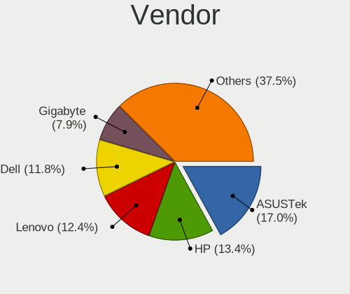
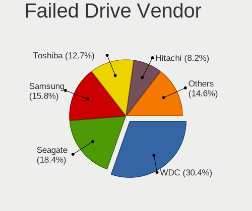
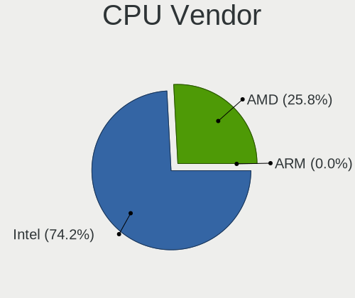
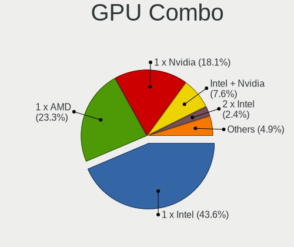
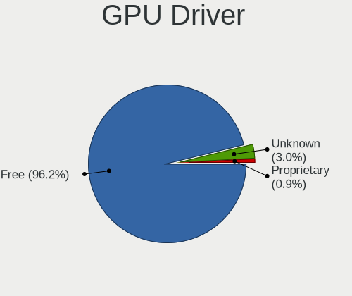
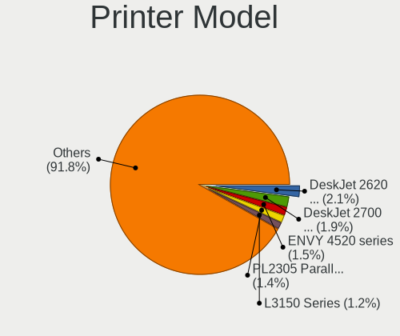

OpenMandriva - Tested Hardware & Statistics
-------------------------------------------

A project to collect tested hardware configurations for OpenMandriva.

Anyone can contribute to this report by the [hw-probe](https://github.com/linuxhw/hw-probe) tool:

    sudo -E hw-probe -all -upload

Please contribute! Especially if your hardware is rare.

This is a report for all computer types. See also reports for [desktops](/Dist/OpenMandriva/Desktop/README.md) and [notebooks](/Dist/OpenMandriva/Notebook/README.md).

Contents
--------

* [ Test Cases ](#test-cases)

* [ System ](#system)
  - [ OS                       ](#os)
  - [ OS Family                ](#os-family)
  - [ Kernel                   ](#kernel)
  - [ Kernel Family            ](#kernel-family)
  - [ Kernel Major Ver.        ](#kernel-major-ver)
  - [ Arch                     ](#arch)
  - [ DE                       ](#de)
  - [ Display Server           ](#display-server)
  - [ Display Manager          ](#display-manager)
  - [ OS Lang                  ](#os-lang)
  - [ Boot Mode                ](#boot-mode)
  - [ Filesystem               ](#filesystem)
  - [ Part. scheme             ](#part-scheme)
  - [ Dual Boot with Linux/BSD ](#dual-boot-with-linuxbsd)
  - [ Dual Boot (Win)          ](#dual-boot-win)

* [ Board ](#board)
  - [ Vendor                   ](#vendor)
  - [ Model                    ](#model)
  - [ Model Family             ](#model-family)
  - [ MFG Year                 ](#mfg-year)
  - [ Form Factor              ](#form-factor)
  - [ Secure Boot              ](#secure-boot)
  - [ Coreboot                 ](#coreboot)
  - [ RAM Size                 ](#ram-size)
  - [ RAM Used                 ](#ram-used)
  - [ Total Drives             ](#total-drives)
  - [ Has CD-ROM               ](#has-cd-rom)
  - [ Has Ethernet             ](#has-ethernet)
  - [ Has WiFi                 ](#has-wifi)
  - [ Has Bluetooth            ](#has-bluetooth)

* [ Location ](#location)
  - [ Country                  ](#country)
  - [ City                     ](#city)

* [ Drives ](#drives)
  - [ Drive Vendor             ](#drive-vendor)
  - [ Drive Model              ](#drive-model)
  - [ HDD Vendor               ](#hdd-vendor)
  - [ SSD Vendor               ](#ssd-vendor)
  - [ Drive Kind               ](#drive-kind)
  - [ Drive Connector          ](#drive-connector)
  - [ Drive Size               ](#drive-size)
  - [ Space Total              ](#space-total)
  - [ Space Used               ](#space-used)
  - [ Malfunc. Drives          ](#malfunc-drives)
  - [ Malfunc. Drive Vendor    ](#malfunc-drive-vendor)
  - [ Malfunc. HDD Vendor      ](#malfunc-hdd-vendor)
  - [ Malfunc. Drive Kind      ](#malfunc-drive-kind)
  - [ Failed Drives            ](#failed-drives)
  - [ Failed Drive Vendor      ](#failed-drive-vendor)
  - [ Drive Status             ](#drive-status)

* [ Storage controller ](#storage-controller)
  - [ Storage Vendor           ](#storage-vendor)
  - [ Storage Model            ](#storage-model)
  - [ Storage Kind             ](#storage-kind)

* [ Processor ](#processor)
  - [ CPU Vendor               ](#cpu-vendor)
  - [ CPU Model                ](#cpu-model)
  - [ CPU Model Family         ](#cpu-model-family)
  - [ CPU Cores                ](#cpu-cores)
  - [ CPU Sockets              ](#cpu-sockets)
  - [ CPU Threads              ](#cpu-threads)
  - [ CPU Op-Modes             ](#cpu-op-modes)
  - [ CPU Microcode            ](#cpu-microcode)
  - [ CPU Microarch            ](#cpu-microarch)

* [ Graphics ](#graphics)
  - [ GPU Vendor               ](#gpu-vendor)
  - [ GPU Model                ](#gpu-model)
  - [ GPU Combo                ](#gpu-combo)
  - [ GPU Driver               ](#gpu-driver)
  - [ GPU Memory               ](#gpu-memory)

* [ Monitor ](#monitor)
  - [ Monitor Vendor           ](#monitor-vendor)
  - [ Monitor Model            ](#monitor-model)
  - [ Monitor Resolution       ](#monitor-resolution)
  - [ Monitor Diagonal         ](#monitor-diagonal)
  - [ Monitor Width            ](#monitor-width)
  - [ Aspect Ratio             ](#aspect-ratio)
  - [ Monitor Area             ](#monitor-area)
  - [ Pixel Density            ](#pixel-density)
  - [ Multiple Monitors        ](#multiple-monitors)

* [ Network ](#network)
  - [ Net Controller Vendor    ](#net-controller-vendor)
  - [ Net Controller Model     ](#net-controller-model)
  - [ Wireless Vendor          ](#wireless-vendor)
  - [ Wireless Model           ](#wireless-model)
  - [ Ethernet Vendor          ](#ethernet-vendor)
  - [ Ethernet Model           ](#ethernet-model)
  - [ Net Controller Kind      ](#net-controller-kind)
  - [ Used Controller          ](#used-controller)
  - [ NICs                     ](#nics)
  - [ IPv6                     ](#ipv6)

* [ Bluetooth ](#bluetooth)
  - [ Bluetooth Vendor         ](#bluetooth-vendor)
  - [ Bluetooth Model          ](#bluetooth-model)

* [ Sound ](#sound)
  - [ Sound Vendor             ](#sound-vendor)
  - [ Sound Model              ](#sound-model)

* [ Memory ](#memory)
  - [ Memory Vendor            ](#memory-vendor)
  - [ Memory Model             ](#memory-model)
  - [ Memory Kind              ](#memory-kind)
  - [ Memory Form Factor       ](#memory-form-factor)
  - [ Memory Size              ](#memory-size)
  - [ Memory Speed             ](#memory-speed)

* [ Printers & scanners ](#printers--scanners)
  - [ Printer Vendor           ](#printer-vendor)
  - [ Printer Model            ](#printer-model)
  - [ Scanner Vendor           ](#scanner-vendor)
  - [ Scanner Model            ](#scanner-model)

* [ Camera ](#camera)
  - [ Camera Vendor            ](#camera-vendor)
  - [ Camera Model             ](#camera-model)

* [ Security ](#security)
  - [ Fingerprint Vendor       ](#fingerprint-vendor)
  - [ Fingerprint Model        ](#fingerprint-model)
  - [ Chipcard Vendor          ](#chipcard-vendor)
  - [ Chipcard Model           ](#chipcard-model)

* [ Unsupported ](#unsupported)
  - [ Unsupported Devices      ](#unsupported-devices)
  - [ Unsupported Device Types ](#unsupported-device-types)

Test Cases
----------

Total: 15020

| Vendor        | Model                       | Form-Factor | Probe                                                      | Date         |
|---------------|-----------------------------|-------------|------------------------------------------------------------|--------------|
| Dell          | Inspiron 1720               | Notebook    | [1cb123d894](https://linux-hardware.org/?probe=1cb123d894) | Aug 12, 2023 |
| ASUSTek       | Z170-P                      | Desktop     | [a32f4633c2](https://linux-hardware.org/?probe=a32f4633c2) | Aug 12, 2023 |
| ASUSTek       | Rampage IV GENE             | Desktop     | [2a494a04b5](https://linux-hardware.org/?probe=2a494a04b5) | Aug 12, 2023 |
| Fujitsu       | FMVA0800C                   | Notebook    | [1dae7b170b](https://linux-hardware.org/?probe=1dae7b170b) | Aug 12, 2023 |
| Lenovo        | ThinkPad L13 Gen 3 21BAS... | Notebook    | [67f821bd4d](https://linux-hardware.org/?probe=67f821bd4d) | Aug 12, 2023 |
| HP            | Compaq nx9420 (RH457EA#A... | Notebook    | [1b7c441369](https://linux-hardware.org/?probe=1b7c441369) | Aug 12, 2023 |
| Gigabyte      | X570 AORUS ELITE            | Desktop     | [0c0df32662](https://linux-hardware.org/?probe=0c0df32662) | Aug 12, 2023 |
| Lenovo        | V310-14ISK 80SX             | Notebook    | [edd47d65b6](https://linux-hardware.org/?probe=edd47d65b6) | Aug 12, 2023 |
| ASRock        | 970A-G                      | Desktop     | [5a2b77eaee](https://linux-hardware.org/?probe=5a2b77eaee) | Aug 12, 2023 |
| ZOTAC         | ZBOXNANO-ID67/ID68/ID69     | Mini pc     | [169c6d3b85](https://linux-hardware.org/?probe=169c6d3b85) | Aug 12, 2023 |
| ASUSTek       | ROG STRIX Z590-I GAMING ... | Desktop     | [8903899ce9](https://linux-hardware.org/?probe=8903899ce9) | Aug 11, 2023 |
| Lenovo        | V130-15IKB 81HN             | Notebook    | [88a9c5764d](https://linux-hardware.org/?probe=88a9c5764d) | Aug 11, 2023 |
| Biostar       | B660GTQ                     | Desktop     | [520d57cadc](https://linux-hardware.org/?probe=520d57cadc) | Aug 11, 2023 |
| MSI           | H410M-A PRO                 | Desktop     | [de3739c2a5](https://linux-hardware.org/?probe=de3739c2a5) | Aug 11, 2023 |
| HP            | x360 310 G2 PC              | Convertible | [a60b6f6ca2](https://linux-hardware.org/?probe=a60b6f6ca2) | Aug 11, 2023 |
| Acer          | Aspire A515-51              | Notebook    | [4856b9b32f](https://linux-hardware.org/?probe=4856b9b32f) | Aug 11, 2023 |
| Lenovo        | ThinkPad T520 42405FG       | Notebook    | [fad80ecff3](https://linux-hardware.org/?probe=fad80ecff3) | Aug 11, 2023 |
| Lenovo        | ThinkPad T430s 2356LPG      | Notebook    | [97dfe9511b](https://linux-hardware.org/?probe=97dfe9511b) | Aug 10, 2023 |
| HP            | ProLiant ML115 G5           | Desktop     | [305ccefd04](https://linux-hardware.org/?probe=305ccefd04) | Aug 10, 2023 |
| Gigabyte      | B450M DS3H-CF               | Desktop     | [ee14fdafcf](https://linux-hardware.org/?probe=ee14fdafcf) | Aug 10, 2023 |
| Acer          | Aspire ES1-431              | Notebook    | [171fd219cc](https://linux-hardware.org/?probe=171fd219cc) | Aug 10, 2023 |
| HP            | 18E7                        | Desktop     | [ff27f888f0](https://linux-hardware.org/?probe=ff27f888f0) | Aug 10, 2023 |
| Google        | Kip                         | Notebook    | [553df8dcdc](https://linux-hardware.org/?probe=553df8dcdc) | Aug 10, 2023 |
| HP            | 2215                        | Desktop     | [40ace58487](https://linux-hardware.org/?probe=40ace58487) | Aug 10, 2023 |
| Acer          | Aspire ES1-431              | Notebook    | [6802a19338](https://linux-hardware.org/?probe=6802a19338) | Aug 10, 2023 |
| Lenovo        | ThinkPad P1 Gen 4i 20Y4S... | Notebook    | [2f64f3ee9a](https://linux-hardware.org/?probe=2f64f3ee9a) | Aug 10, 2023 |
| Acer          | Extensa 5630                | Notebook    | [1cc3eaf69a](https://linux-hardware.org/?probe=1cc3eaf69a) | Aug 10, 2023 |
| Chuwi         | GemiBook Pro                | Notebook    | [b5685bdafc](https://linux-hardware.org/?probe=b5685bdafc) | Aug 10, 2023 |
| HP            | EliteBook 8570p             | Notebook    | [73c1dd0c14](https://linux-hardware.org/?probe=73c1dd0c14) | Aug 10, 2023 |
| Dell          | OptiPlex 755                | Desktop     | [279ed1e2d5](https://linux-hardware.org/?probe=279ed1e2d5) | Aug 10, 2023 |
| ASUSTek       | P5KPL-AM-CKD-VISUM-SI       | Desktop     | [7acbd56a40](https://linux-hardware.org/?probe=7acbd56a40) | Aug 10, 2023 |
| MSI           | A68HM-E33                   | Desktop     | [be692e44b5](https://linux-hardware.org/?probe=be692e44b5) | Aug 10, 2023 |
| ASUSTek       | F3L                         | Notebook    | [b97c082eff](https://linux-hardware.org/?probe=b97c082eff) | Aug 09, 2023 |
| Lenovo        | ThinkPad X220 4290W35       | Notebook    | [64db00247d](https://linux-hardware.org/?probe=64db00247d) | Aug 09, 2023 |
| Dell          | 040DDP A00                  | Desktop     | [13d99d66da](https://linux-hardware.org/?probe=13d99d66da) | Aug 09, 2023 |
| MSI           | B360M PRO-VDH               | Desktop     | [e3cf4cec26](https://linux-hardware.org/?probe=e3cf4cec26) | Aug 09, 2023 |
| Foxconn       | 2A8Ch                       | Desktop     | [a936584caa](https://linux-hardware.org/?probe=a936584caa) | Aug 09, 2023 |
| Apple         | Mac-77EB7D7DAF985301 iMa... | All in one  | [b280ab65dd](https://linux-hardware.org/?probe=b280ab65dd) | Aug 09, 2023 |
| MSI           | MPG B550 GAMING PLUS        | Desktop     | [d073a53c85](https://linux-hardware.org/?probe=d073a53c85) | Aug 08, 2023 |
| Lenovo        | ThinkPad X220 4290C37       | Notebook    | [125ac0cbd3](https://linux-hardware.org/?probe=125ac0cbd3) | Aug 08, 2023 |
| ASUSTek       | G750JW                      | Notebook    | [fe527d6231](https://linux-hardware.org/?probe=fe527d6231) | Aug 08, 2023 |
| Dell          | 0P301D A00                  | Desktop     | [e5091194fb](https://linux-hardware.org/?probe=e5091194fb) | Aug 08, 2023 |
| Dell          | 0X2MKR A00                  | All in one  | [84c3eefc94](https://linux-hardware.org/?probe=84c3eefc94) | Aug 08, 2023 |
| Lenovo        | ThinkPad L13 Gen 3 21BAS... | Notebook    | [187ac2792a](https://linux-hardware.org/?probe=187ac2792a) | Aug 08, 2023 |
| Lenovo        | ThinkPad L13 Gen 3 21BAS... | Notebook    | [b00519fee7](https://linux-hardware.org/?probe=b00519fee7) | Aug 08, 2023 |
| HP            | Laptop 17-cn1xxx            | Notebook    | [711a5fc7ce](https://linux-hardware.org/?probe=711a5fc7ce) | Aug 08, 2023 |
| Apple         | MacBookPro8,1               | Notebook    | [e8524b0045](https://linux-hardware.org/?probe=e8524b0045) | Aug 08, 2023 |
| HP            | Laptop 14-dq3xxx            | Notebook    | [c547f01fbb](https://linux-hardware.org/?probe=c547f01fbb) | Aug 08, 2023 |
| Acer          | AO756                       | Notebook    | [1ea1658ac0](https://linux-hardware.org/?probe=1ea1658ac0) | Aug 07, 2023 |
| Lenovo        | ThinkPad L13 Gen 3 21BAS... | Notebook    | [a1b9b9fc2c](https://linux-hardware.org/?probe=a1b9b9fc2c) | Aug 07, 2023 |
| MSI           | B450 GAMING PLUS MAX        | Desktop     | [c04ac90ce8](https://linux-hardware.org/?probe=c04ac90ce8) | Aug 07, 2023 |
| MSI           | GL72 7QF                    | Notebook    | [73f4a3b852](https://linux-hardware.org/?probe=73f4a3b852) | Aug 07, 2023 |
| Dell          | Inspiron 5770               | Notebook    | [d6a978f124](https://linux-hardware.org/?probe=d6a978f124) | Aug 07, 2023 |
| Digiboard     | NM70-I                      | Desktop     | [280ee6d8fe](https://linux-hardware.org/?probe=280ee6d8fe) | Aug 07, 2023 |
| ASUSTek       | TUF B450M-PLUS GAMING       | Desktop     | [497623fdfd](https://linux-hardware.org/?probe=497623fdfd) | Aug 07, 2023 |
| Dell          | 0M9KCM A02                  | Desktop     | [a854d04706](https://linux-hardware.org/?probe=a854d04706) | Aug 07, 2023 |
| Dell          | 0WR7PY A03                  | Desktop     | [becf318878](https://linux-hardware.org/?probe=becf318878) | Aug 07, 2023 |
| Lenovo        | IdeaPad S145-14IWL 81MU     | Notebook    | [eab0544dc6](https://linux-hardware.org/?probe=eab0544dc6) | Aug 06, 2023 |
| ASUSTek       | M4A77TD                     | Desktop     | [667b258dd5](https://linux-hardware.org/?probe=667b258dd5) | Aug 06, 2023 |
| ASUSTek       | P5GDC                       | Desktop     | [82fefe395d](https://linux-hardware.org/?probe=82fefe395d) | Aug 06, 2023 |
| Unknown       | Unknown                     | Notebook    | [691c44286e](https://linux-hardware.org/?probe=691c44286e) | Aug 06, 2023 |
| MSI           | H310M PRO-D                 | Desktop     | [201844f73e](https://linux-hardware.org/?probe=201844f73e) | Aug 06, 2023 |
| ASUSTek       | TUF Z390M-PRO GAMING        | Desktop     | [a5eb82b4f9](https://linux-hardware.org/?probe=a5eb82b4f9) | Aug 06, 2023 |
| Gigabyte      | EP45-UD3LR                  | Desktop     | [0f3d20a423](https://linux-hardware.org/?probe=0f3d20a423) | Aug 06, 2023 |
| GPD           | G1618-03                    | Notebook    | [070d548515](https://linux-hardware.org/?probe=070d548515) | Aug 06, 2023 |
| Intel         | X79 (INTEL Xeon E5/Corei... | Desktop     | [27792f16e2](https://linux-hardware.org/?probe=27792f16e2) | Aug 06, 2023 |
| Gigabyte      | 970A-UD3P                   | Desktop     | [dcd061dff8](https://linux-hardware.org/?probe=dcd061dff8) | Aug 05, 2023 |
| Dell          | Inspiron N4050              | Notebook    | [af35c9ce49](https://linux-hardware.org/?probe=af35c9ce49) | Aug 05, 2023 |
| Lenovo        | IdeaPad 510-15ISK 80SR      | Notebook    | [b69ff09aa4](https://linux-hardware.org/?probe=b69ff09aa4) | Aug 05, 2023 |
| Dell          | Precision M2800             | Notebook    | [7d1afe9d42](https://linux-hardware.org/?probe=7d1afe9d42) | Aug 05, 2023 |
| Medion        | B550A4-EM                   | Desktop     | [f1bf2b93c1](https://linux-hardware.org/?probe=f1bf2b93c1) | Aug 05, 2023 |
| ASRock        | B550M-HDV                   | Desktop     | [83ee40459a](https://linux-hardware.org/?probe=83ee40459a) | Aug 05, 2023 |
| Acer          | EQ45LM                      | Desktop     | [b9be16315e](https://linux-hardware.org/?probe=b9be16315e) | Aug 05, 2023 |
| Notebook      | W54_W94_W955TU,-T,-C        | Notebook    | [9db6bfdcfa](https://linux-hardware.org/?probe=9db6bfdcfa) | Aug 05, 2023 |
| HP            | Pavilion g4                 | Notebook    | [2094186715](https://linux-hardware.org/?probe=2094186715) | Aug 05, 2023 |
| MSI           | GE70 0NC                    | Notebook    | [c9fd935b80](https://linux-hardware.org/?probe=c9fd935b80) | Aug 05, 2023 |
| Intel         | H81                         | Desktop     | [4441a1a1ca](https://linux-hardware.org/?probe=4441a1a1ca) | Aug 05, 2023 |
| Fujitsu       | LIFEBOOK LH532              | Notebook    | [ba3a2e1773](https://linux-hardware.org/?probe=ba3a2e1773) | Aug 04, 2023 |
| Acer          | Aspire 5738                 | Notebook    | [f5df04e0e6](https://linux-hardware.org/?probe=f5df04e0e6) | Aug 04, 2023 |
| Lenovo        | ThinkPad T480 20L6S9R500    | Notebook    | [3624b5e366](https://linux-hardware.org/?probe=3624b5e366) | Aug 04, 2023 |
| Lenovo        | ThinkPad E14 Gen 3 20Y7C... | Notebook    | [e7810a04a9](https://linux-hardware.org/?probe=e7810a04a9) | Aug 04, 2023 |
| Acer          | Aspire 8943G                | Notebook    | [fedb43e298](https://linux-hardware.org/?probe=fedb43e298) | Aug 04, 2023 |
| ASRock        | G31M-S                      | Desktop     | [02bb341cc9](https://linux-hardware.org/?probe=02bb341cc9) | Aug 04, 2023 |
| GFAST         | N150                        | Notebook    | [bccc2874df](https://linux-hardware.org/?probe=bccc2874df) | Aug 04, 2023 |
| MANCER        | A320M-DA 1006               | Desktop     | [573affec7b](https://linux-hardware.org/?probe=573affec7b) | Aug 04, 2023 |
| Acer          | Nitro AN517-54              | Notebook    | [aee5a21c76](https://linux-hardware.org/?probe=aee5a21c76) | Aug 04, 2023 |
| Dell          | 09M8Y8 A02                  | Desktop     | [4b57bbf30e](https://linux-hardware.org/?probe=4b57bbf30e) | Aug 04, 2023 |
| Gigabyte      | B450 AORUS ELITE            | Desktop     | [e0b5eb8809](https://linux-hardware.org/?probe=e0b5eb8809) | Aug 04, 2023 |
| HP            | 844C                        | Desktop     | [36185008dc](https://linux-hardware.org/?probe=36185008dc) | Aug 03, 2023 |
| MSI           | Titan GT77HX 13VH           | Notebook    | [3acda608a1](https://linux-hardware.org/?probe=3acda608a1) | Aug 03, 2023 |
| HP            | ProBook 6540b               | Notebook    | [6ae3405ec5](https://linux-hardware.org/?probe=6ae3405ec5) | Aug 03, 2023 |
| Gigabyte      | B450M S2H V2                | Desktop     | [a01412b320](https://linux-hardware.org/?probe=a01412b320) | Aug 03, 2023 |
| Samsung       | 900X3C/900X3D/900X3E/900... | Notebook    | [a3401e5a4b](https://linux-hardware.org/?probe=a3401e5a4b) | Aug 03, 2023 |
| Toshiba       | Satellite C855D             | Notebook    | [4835e837bd](https://linux-hardware.org/?probe=4835e837bd) | Aug 03, 2023 |
| HP            | 8767 A                      | Desktop     | [2cf5a8cce4](https://linux-hardware.org/?probe=2cf5a8cce4) | Aug 03, 2023 |
| Dell          | Latitude E6330              | Notebook    | [75d54a8988](https://linux-hardware.org/?probe=75d54a8988) | Aug 03, 2023 |
| TUXEDO        | Book XA15 / XA17 Gen10      | Notebook    | [18e29b97ac](https://linux-hardware.org/?probe=18e29b97ac) | Aug 02, 2023 |
| ASUSTek       | ROG STRIX Z690-E GAMING ... | Desktop     | [221b0f2db2](https://linux-hardware.org/?probe=221b0f2db2) | Aug 02, 2023 |
| MSI           | 760GM-P23                   | Desktop     | [c9e70623fc](https://linux-hardware.org/?probe=c9e70623fc) | Aug 02, 2023 |
| Dell          | 0WR7PY A01                  | Desktop     | [522acc7a8e](https://linux-hardware.org/?probe=522acc7a8e) | Aug 02, 2023 |
| ASUSTek       | TUF Gaming B550M-PLUS       | Desktop     | [c94a18b924](https://linux-hardware.org/?probe=c94a18b924) | Aug 02, 2023 |
| Toshiba       | Satellite C850-B239         | Notebook    | [a075f60c70](https://linux-hardware.org/?probe=a075f60c70) | Aug 02, 2023 |
| Dell          | 0GY6Y8 A02                  | Desktop     | [e1d2deb748](https://linux-hardware.org/?probe=e1d2deb748) | Aug 02, 2023 |
| ASRock        | Z77 Extreme4                | Desktop     | [52c54dc66e](https://linux-hardware.org/?probe=52c54dc66e) | Aug 02, 2023 |
| Dell          | Precision M4500             | Notebook    | [b425204301](https://linux-hardware.org/?probe=b425204301) | Aug 02, 2023 |
| Fujitsu       | D3402-A1 S26361-D3402-A1    | Desktop     | [5cbdefa7c5](https://linux-hardware.org/?probe=5cbdefa7c5) | Aug 02, 2023 |
| Dell          | Inspiron 1545               | Notebook    | [97d2508df2](https://linux-hardware.org/?probe=97d2508df2) | Aug 02, 2023 |
| Gigabyte      | H61M-S2PV                   | Desktop     | [70c8bcf589](https://linux-hardware.org/?probe=70c8bcf589) | Aug 02, 2023 |
| MSI           | Modern 15 A10M              | Notebook    | [bab451a11e](https://linux-hardware.org/?probe=bab451a11e) | Aug 02, 2023 |
| ASUSTek       | ROG STRIX X570-F GAMING     | Desktop     | [4cafb5721e](https://linux-hardware.org/?probe=4cafb5721e) | Aug 02, 2023 |
| Dell          | Inspiron 13-5368            | Notebook    | [695e2dec6b](https://linux-hardware.org/?probe=695e2dec6b) | Aug 02, 2023 |
| ASRock        | H410M-HDV/M.2               | Desktop     | [71a11bdffd](https://linux-hardware.org/?probe=71a11bdffd) | Aug 02, 2023 |
| ASRock        | Z170 Extreme4               | Desktop     | [7ef89d48d6](https://linux-hardware.org/?probe=7ef89d48d6) | Aug 01, 2023 |
| Lenovo        | IdeaPad Gaming 3 15ACH6 ... | Notebook    | [c2c27c3268](https://linux-hardware.org/?probe=c2c27c3268) | Aug 01, 2023 |
| ASRock        | A320M-DVS R4.0              | Desktop     | [648421ac0a](https://linux-hardware.org/?probe=648421ac0a) | Aug 01, 2023 |
| Dell          | Vostro 3700                 | Notebook    | [96e4579b7b](https://linux-hardware.org/?probe=96e4579b7b) | Aug 01, 2023 |
| Fujitsu       | D3162-A1 S26361-D3162-A1    | Desktop     | [b298625640](https://linux-hardware.org/?probe=b298625640) | Aug 01, 2023 |
| Chuwi         | GemiBook Pro                | Notebook    | [be8a59432a](https://linux-hardware.org/?probe=be8a59432a) | Aug 01, 2023 |
| HP            | 18E7                        | Desktop     | [339050cd65](https://linux-hardware.org/?probe=339050cd65) | Aug 01, 2023 |
| ASUSTek       | M5A78L-M/USB3               | Desktop     | [3a500cdb55](https://linux-hardware.org/?probe=3a500cdb55) | Aug 01, 2023 |
| Apple         | MacBookAir9,1               | Notebook    | [2e59618067](https://linux-hardware.org/?probe=2e59618067) | Aug 01, 2023 |
| Apple         | Mac-35C5E08120C7EEAF Mac... | Mini pc     | [b57f8ee5f8](https://linux-hardware.org/?probe=b57f8ee5f8) | Aug 01, 2023 |
| MSI           | B560M PRO-VDH WIFI          | Desktop     | [0d26da86c7](https://linux-hardware.org/?probe=0d26da86c7) | Jul 31, 2023 |
| Acer          | Aspire 1810TZ               | Notebook    | [8cbec4eb45](https://linux-hardware.org/?probe=8cbec4eb45) | Jul 31, 2023 |
| Foxconn       | H61MXL/H61MXL-K             | Desktop     | [e51e841817](https://linux-hardware.org/?probe=e51e841817) | Jul 31, 2023 |
| Dell          | 0C27VV A03                  | Desktop     | [75ff82774b](https://linux-hardware.org/?probe=75ff82774b) | Jul 31, 2023 |
| ASUSTek       | TUF B450M-PLUS GAMING       | Desktop     | [2191e17d89](https://linux-hardware.org/?probe=2191e17d89) | Jul 31, 2023 |
| Lenovo        | V15 G2 ITL 82KB             | Notebook    | [483fbca861](https://linux-hardware.org/?probe=483fbca861) | Jul 31, 2023 |
| Dell          | Latitude E6430              | Notebook    | [9dcf92cce9](https://linux-hardware.org/?probe=9dcf92cce9) | Jul 31, 2023 |
| Gigabyte      | B450 I AORUS PRO WIFI-CF    | Desktop     | [e11390bc86](https://linux-hardware.org/?probe=e11390bc86) | Jul 31, 2023 |
| Supermicro    | X11SSV-Q                    | Server      | [60869ba8f7](https://linux-hardware.org/?probe=60869ba8f7) | Jul 31, 2023 |
| Lenovo        | ThinkPad E490 20N8CTO1WW    | Notebook    | [7cb3479a69](https://linux-hardware.org/?probe=7cb3479a69) | Jul 31, 2023 |
| Dell          | Inspiron 5558               | Notebook    | [de55f350ab](https://linux-hardware.org/?probe=de55f350ab) | Jul 30, 2023 |
| Toshiba       | Satellite A135              | Notebook    | [2eddaa2a26](https://linux-hardware.org/?probe=2eddaa2a26) | Jul 30, 2023 |
| MSI           | A320M-A PRO                 | Desktop     | [a0394c8f0b](https://linux-hardware.org/?probe=a0394c8f0b) | Jul 30, 2023 |
| MSI           | MS-B1591                    | Desktop     | [9bdfd87437](https://linux-hardware.org/?probe=9bdfd87437) | Jul 30, 2023 |
| Chuwi         | HeroBook Pro                | Notebook    | [eb332b024d](https://linux-hardware.org/?probe=eb332b024d) | Jul 30, 2023 |
| Acer          | Aspire 5742                 | Notebook    | [37be5a1c80](https://linux-hardware.org/?probe=37be5a1c80) | Jul 30, 2023 |
| ASUSTek       | E200HA                      | Notebook    | [6ab93e7940](https://linux-hardware.org/?probe=6ab93e7940) | Jul 30, 2023 |
| ASRock        | B650M PG Riptide            | Desktop     | [9f95c471d0](https://linux-hardware.org/?probe=9f95c471d0) | Jul 30, 2023 |
| ASUSTek       | X540NA                      | Notebook    | [68b0d7d1fb](https://linux-hardware.org/?probe=68b0d7d1fb) | Jul 30, 2023 |
| Chuwi         | GemiBook                    | Notebook    | [f892a3970c](https://linux-hardware.org/?probe=f892a3970c) | Jul 30, 2023 |
| ASUSTek       | VivoBook_ASUSLaptop E410... | Notebook    | [5da413f349](https://linux-hardware.org/?probe=5da413f349) | Jul 30, 2023 |
| ASRock        | Z68 Pro3 Gen3               | Desktop     | [7d262746c9](https://linux-hardware.org/?probe=7d262746c9) | Jul 30, 2023 |
| ASUSTek       | P5G41C-M LX                 | Desktop     | [18f28e3fb6](https://linux-hardware.org/?probe=18f28e3fb6) | Jul 29, 2023 |
| Lenovo        | ThinkPad T570 W10DG 20JW... | Notebook    | [22f4bc0b5e](https://linux-hardware.org/?probe=22f4bc0b5e) | Jul 29, 2023 |
| Pegatron      | EVANS                       | Desktop     | [323d6a7283](https://linux-hardware.org/?probe=323d6a7283) | Jul 29, 2023 |
| Lenovo        | ThinkPad A285 20MXS0AE00    | Notebook    | [a6ada51a02](https://linux-hardware.org/?probe=a6ada51a02) | Jul 29, 2023 |
| Dell          | 0N4YC8 A00                  | Desktop     | [be08c309d2](https://linux-hardware.org/?probe=be08c309d2) | Jul 29, 2023 |
| Gigabyte      | Z590 AORUS ULTRA            | Desktop     | [ac8aab1d26](https://linux-hardware.org/?probe=ac8aab1d26) | Jul 29, 2023 |
| Acer          | Aspire E5-511               | Notebook    | [aef96d4eb8](https://linux-hardware.org/?probe=aef96d4eb8) | Jul 29, 2023 |
| ASUSTek       | UX31E                       | Notebook    | [a7b390cdf4](https://linux-hardware.org/?probe=a7b390cdf4) | Jul 29, 2023 |
| Dell          | Latitude E6420              | Notebook    | [a70852def5](https://linux-hardware.org/?probe=a70852def5) | Jul 29, 2023 |
| Lenovo        | ThinkPad T470 20HES2C000    | Notebook    | [6cb5b31808](https://linux-hardware.org/?probe=6cb5b31808) | Jul 29, 2023 |
| Lenovo        | 3111 NOK                    | Desktop     | [bced6fb88a](https://linux-hardware.org/?probe=bced6fb88a) | Jul 29, 2023 |
| HP            | 86F3 00100                  | All in one  | [485fcbfa5d](https://linux-hardware.org/?probe=485fcbfa5d) | Jul 29, 2023 |
| ASUSTek       | X102BA                      | Notebook    | [488aa4c5b4](https://linux-hardware.org/?probe=488aa4c5b4) | Jul 29, 2023 |
| HP            | 84EE 1100                   | All in one  | [52d1413f34](https://linux-hardware.org/?probe=52d1413f34) | Jul 29, 2023 |
| Acer          | Aspire 4810T                | Notebook    | [4d3abb525e](https://linux-hardware.org/?probe=4d3abb525e) | Jul 28, 2023 |
| HP            | g14                         | Notebook    | [39d4ce09a1](https://linux-hardware.org/?probe=39d4ce09a1) | Jul 28, 2023 |
| MSI           | B450M PRO-M2 MAX            | Desktop     | [e4587af8ce](https://linux-hardware.org/?probe=e4587af8ce) | Jul 28, 2023 |
| ASRock        | H270 Pro4                   | Desktop     | [52cefaf6dd](https://linux-hardware.org/?probe=52cefaf6dd) | Jul 28, 2023 |
| Fujitsu       | LIFEBOOK A3510              | Notebook    | [49b28d270b](https://linux-hardware.org/?probe=49b28d270b) | Jul 27, 2023 |
| PCWare        | IPX1800E2                   | Desktop     | [ee17cd82e7](https://linux-hardware.org/?probe=ee17cd82e7) | Jul 27, 2023 |
| ASUSTek       | X550CC                      | Notebook    | [792e9db762](https://linux-hardware.org/?probe=792e9db762) | Jul 27, 2023 |
| Toshiba       | Satellite C50D-A-11G        | Notebook    | [b67508b754](https://linux-hardware.org/?probe=b67508b754) | Jul 27, 2023 |
| A14CR         | Unknown                     | Notebook    | [4ceb4f6761](https://linux-hardware.org/?probe=4ceb4f6761) | Jul 27, 2023 |
| MSI           | Alpha 15 B5EEK              | Notebook    | [d6a4c29101](https://linux-hardware.org/?probe=d6a4c29101) | Jul 27, 2023 |
| Gigabyte      | B250M-Gaming 3-CF           | Desktop     | [1d4e6c23cf](https://linux-hardware.org/?probe=1d4e6c23cf) | Jul 27, 2023 |
| GPU Compan... | GWNR71517                   | Notebook    | [ca3906a6c7](https://linux-hardware.org/?probe=ca3906a6c7) | Jul 26, 2023 |
| Lenovo        | ThinkBook 15 G3 ACL 21A4    | Notebook    | [c7b69782db](https://linux-hardware.org/?probe=c7b69782db) | Jul 26, 2023 |
| Lenovo        | 3190 SDK0J40697 WIN 3305... | Mini pc     | [4fc2e4c331](https://linux-hardware.org/?probe=4fc2e4c331) | Jul 26, 2023 |
| ASUSTek       | M5A78L-M PLUS/USB3          | Desktop     | [55102fad5b](https://linux-hardware.org/?probe=55102fad5b) | Jul 26, 2023 |
| Gigabyte      | G31M-S2L                    | Desktop     | [5af2ea35ee](https://linux-hardware.org/?probe=5af2ea35ee) | Jul 26, 2023 |
| Acer          | EQ45LM                      | Desktop     | [29e2f587cd](https://linux-hardware.org/?probe=29e2f587cd) | Jul 26, 2023 |
| Lenovo        | ThinkPad E555 20DH0027UK    | Notebook    | [b7bf821032](https://linux-hardware.org/?probe=b7bf821032) | Jul 26, 2023 |
| ASRock        | B85M                        | Desktop     | [d69487eb8d](https://linux-hardware.org/?probe=d69487eb8d) | Jul 26, 2023 |
| ASUSTek       | M5A78L-M LE                 | Desktop     | [3cb7454711](https://linux-hardware.org/?probe=3cb7454711) | Jul 25, 2023 |
| Positivo      | G800                        | Notebook    | [5dd0f188f8](https://linux-hardware.org/?probe=5dd0f188f8) | Jul 25, 2023 |
| ASUSTek       | P50IJ                       | Notebook    | [d8aff1255a](https://linux-hardware.org/?probe=d8aff1255a) | Jul 25, 2023 |
| AZW           | U59                         | Desktop     | [fcf46a9025](https://linux-hardware.org/?probe=fcf46a9025) | Jul 25, 2023 |
| Dell          | 0RY206                      | Desktop     | [5f16b7ecda](https://linux-hardware.org/?probe=5f16b7ecda) | Jul 25, 2023 |
| Fujitsu Si... | LIFEBOOK S6410              | Notebook    | [47d5775197](https://linux-hardware.org/?probe=47d5775197) | Jul 25, 2023 |
| ASRock        | B450M Steel Legend          | Desktop     | [4b9680f094](https://linux-hardware.org/?probe=4b9680f094) | Jul 25, 2023 |
| Acer          | Extensa 2530                | Notebook    | [6691e96edf](https://linux-hardware.org/?probe=6691e96edf) | Jul 25, 2023 |
| Dell          | Latitude 5530               | Notebook    | [cccd0bf0b8](https://linux-hardware.org/?probe=cccd0bf0b8) | Jul 25, 2023 |
| LG Electro... | 17Z90P-K.AA78A1             | Notebook    | [6fc7661aae](https://linux-hardware.org/?probe=6fc7661aae) | Jul 25, 2023 |
| HP            | 1495                        | Desktop     | [99072e94e8](https://linux-hardware.org/?probe=99072e94e8) | Jul 25, 2023 |
| Gigabyte      | B550 AORUS ELITE V2         | Desktop     | [0e029ddc2d](https://linux-hardware.org/?probe=0e029ddc2d) | Jul 25, 2023 |
| MSI           | 2A9C                        | Desktop     | [83e6501c96](https://linux-hardware.org/?probe=83e6501c96) | Jul 25, 2023 |
| Acer          | Aspire E5-571G              | Notebook    | [3f39162908](https://linux-hardware.org/?probe=3f39162908) | Jul 25, 2023 |
| Lenovo        | ThinkPad E480 20KN001QMX    | Notebook    | [1ff9753d17](https://linux-hardware.org/?probe=1ff9753d17) | Jul 25, 2023 |
| Acer          | EQ45LM                      | Desktop     | [37f6c76c11](https://linux-hardware.org/?probe=37f6c76c11) | Jul 25, 2023 |
| Gigabyte      | MJPLNBB-00                  | Desktop     | [8f4eb83f05](https://linux-hardware.org/?probe=8f4eb83f05) | Jul 25, 2023 |
| Intel         | DH61WW AAG23116-206         | Desktop     | [64595670db](https://linux-hardware.org/?probe=64595670db) | Jul 25, 2023 |
| Apple         | Mac-F2238AC8                | All in one  | [0b9d6b15a7](https://linux-hardware.org/?probe=0b9d6b15a7) | Jul 25, 2023 |
| ECS           | P43T-A2                     | Desktop     | [a25280247b](https://linux-hardware.org/?probe=a25280247b) | Jul 25, 2023 |
| Fujitsu       | LIFEBOOK A3510              | Notebook    | [1cf27b8466](https://linux-hardware.org/?probe=1cf27b8466) | Jul 25, 2023 |
| HP            | 250 G5 Notebook PC          | Notebook    | [007f2e5957](https://linux-hardware.org/?probe=007f2e5957) | Jul 25, 2023 |
| ZOTAC         | ZBOX-BI322                  | Mini pc     | [f595927b7b](https://linux-hardware.org/?probe=f595927b7b) | Jul 25, 2023 |
| HP            | 8350                        | Desktop     | [51c4120395](https://linux-hardware.org/?probe=51c4120395) | Jul 25, 2023 |
| HP            | 339A                        | Desktop     | [573fb08afb](https://linux-hardware.org/?probe=573fb08afb) | Jul 25, 2023 |
| HP            | 212B                        | Desktop     | [8e6a290d51](https://linux-hardware.org/?probe=8e6a290d51) | Jul 25, 2023 |
| ASRock        | B450 Pro4                   | Desktop     | [a68492f27e](https://linux-hardware.org/?probe=a68492f27e) | Jul 25, 2023 |
| ASUSTek       | PRIME B450-PLUS             | Desktop     | [5ec24ea9ad](https://linux-hardware.org/?probe=5ec24ea9ad) | Jul 25, 2023 |
| ASUSTek       | P8H61-M LX                  | Desktop     | [9ffd99b082](https://linux-hardware.org/?probe=9ffd99b082) | Jul 25, 2023 |
| HP            | 212A                        | Desktop     | [bd9d43276f](https://linux-hardware.org/?probe=bd9d43276f) | Jul 25, 2023 |
| HP            | Laptop 15s-du3xxx           | Notebook    | [e14cb2c24e](https://linux-hardware.org/?probe=e14cb2c24e) | Jul 25, 2023 |
| Toshiba       | IS 1442                     | Notebook    | [3a66df4c2d](https://linux-hardware.org/?probe=3a66df4c2d) | Jul 25, 2023 |
| ASRock        | B450M Pro4 R2.0             | Desktop     | [305e0c0700](https://linux-hardware.org/?probe=305e0c0700) | Jul 25, 2023 |
| Acer          | Aspire A114-33              | Notebook    | [a8c1a06e1a](https://linux-hardware.org/?probe=a8c1a06e1a) | Jul 25, 2023 |
| Lenovo        | ThinkPad L560 20F2S32Q00    | Notebook    | [0f437b5e3c](https://linux-hardware.org/?probe=0f437b5e3c) | Jul 25, 2023 |
| Dell          | Latitude 7490               | Notebook    | [066e3b9518](https://linux-hardware.org/?probe=066e3b9518) | Jul 25, 2023 |
| HP            | 8719                        | Desktop     | [68870aa596](https://linux-hardware.org/?probe=68870aa596) | Jul 24, 2023 |
| PCWare        | IPMH61R3 8MB                | Desktop     | [dcbde0a01d](https://linux-hardware.org/?probe=dcbde0a01d) | Jul 24, 2023 |
| Chuwi         | CoreBook Pro                | Notebook    | [21ab3832ea](https://linux-hardware.org/?probe=21ab3832ea) | Jul 24, 2023 |
| Apple         | MacBookPro13,3              | Notebook    | [ae23c3b0d3](https://linux-hardware.org/?probe=ae23c3b0d3) | Jul 24, 2023 |
| Intel         | powered classmate PC        | Notebook    | [ccbb0cb45a](https://linux-hardware.org/?probe=ccbb0cb45a) | Jul 24, 2023 |
| HP            | 198E                        | Desktop     | [c2f7b19d13](https://linux-hardware.org/?probe=c2f7b19d13) | Jul 24, 2023 |
| Biostar       | H81MHV3 5.0                 | Desktop     | [06e3fae658](https://linux-hardware.org/?probe=06e3fae658) | Jul 24, 2023 |
| HP            | 212B                        | Desktop     | [3e033bf376](https://linux-hardware.org/?probe=3e033bf376) | Jul 24, 2023 |
| MSI           | Z87-G45 GAMING              | Desktop     | [41246e91c0](https://linux-hardware.org/?probe=41246e91c0) | Jul 24, 2023 |
| ASUSTek       | F7E                         | Notebook    | [2aef1cc2c4](https://linux-hardware.org/?probe=2aef1cc2c4) | Jul 24, 2023 |
| Biostar       | A68MDE                      | Desktop     | [8ab5498633](https://linux-hardware.org/?probe=8ab5498633) | Jul 24, 2023 |
| Lenovo        | ThinkPad T470 W10DG 20JN... | Notebook    | [78560cbf59](https://linux-hardware.org/?probe=78560cbf59) | Jul 24, 2023 |
| ASUSTek       | X555LD                      | Notebook    | [732fe69d59](https://linux-hardware.org/?probe=732fe69d59) | Jul 23, 2023 |
| Dell          | Inspiron 13-5378            | Notebook    | [7f6b8fc2db](https://linux-hardware.org/?probe=7f6b8fc2db) | Jul 23, 2023 |
| Dell          | 0F5C5X A00                  | Desktop     | [e382c4d40c](https://linux-hardware.org/?probe=e382c4d40c) | Jul 23, 2023 |
| HP            | Laptop 17-ak0xx             | Notebook    | [e9b5ae3c4d](https://linux-hardware.org/?probe=e9b5ae3c4d) | Jul 23, 2023 |
| Gigabyte      | H61M-DS2                    | Desktop     | [c78c35de44](https://linux-hardware.org/?probe=c78c35de44) | Jul 23, 2023 |
| Lenovo        | IdeaPad 3 14IGL05 81WH      | Notebook    | [92c6b0de0c](https://linux-hardware.org/?probe=92c6b0de0c) | Jul 23, 2023 |
| ASRock        | X670E Steel Legend          | Desktop     | [8744428bf6](https://linux-hardware.org/?probe=8744428bf6) | Jul 23, 2023 |
| Lenovo        | IdeaPad 5 14ALC05 82LM      | Notebook    | [9f384d336d](https://linux-hardware.org/?probe=9f384d336d) | Jul 23, 2023 |
| Lenovo        | ThinkPad L460 20FVS01J00    | Notebook    | [96fe0142cd](https://linux-hardware.org/?probe=96fe0142cd) | Jul 23, 2023 |
| ASUSTek       | M5A78L-M LX3                | Desktop     | [8982fa467c](https://linux-hardware.org/?probe=8982fa467c) | Jul 23, 2023 |
| Dell          | Inspiron N5110              | Notebook    | [8d94c58c16](https://linux-hardware.org/?probe=8d94c58c16) | Jul 23, 2023 |
| ASUSTek       | NARRA                       | Desktop     | [2c0dc7397a](https://linux-hardware.org/?probe=2c0dc7397a) | Jul 23, 2023 |
| Fujitsu       | LIFEBOOK A3510              | Notebook    | [4824895fac](https://linux-hardware.org/?probe=4824895fac) | Jul 23, 2023 |
| Dell          | Latitude E7270              | Notebook    | [9d14027d6c](https://linux-hardware.org/?probe=9d14027d6c) | Jul 23, 2023 |
| HP            | Compaq Presario C700        | Notebook    | [71ca83faee](https://linux-hardware.org/?probe=71ca83faee) | Jul 23, 2023 |
| MSI           | Z87-G43                     | Desktop     | [f153badd8c](https://linux-hardware.org/?probe=f153badd8c) | Jul 23, 2023 |
| HP            | Notebook                    | Notebook    | [1a4ba0be2f](https://linux-hardware.org/?probe=1a4ba0be2f) | Jul 23, 2023 |
| Lenovo        | ThinkPad T480 20L6S6FY01    | Notebook    | [deaede763c](https://linux-hardware.org/?probe=deaede763c) | Jul 23, 2023 |
| Dell          | 0VHWTR A02                  | Desktop     | [c5fe12dadd](https://linux-hardware.org/?probe=c5fe12dadd) | Jul 23, 2023 |
| Dell          | 0VD92X A00                  | Desktop     | [675e646d05](https://linux-hardware.org/?probe=675e646d05) | Jul 23, 2023 |
| HP            | Pavilion dv2500             | Notebook    | [6e86c0a75b](https://linux-hardware.org/?probe=6e86c0a75b) | Jul 23, 2023 |
| Lenovo        | V145-15AST 81MT             | Notebook    | [ecce500445](https://linux-hardware.org/?probe=ecce500445) | Jul 22, 2023 |
| ASUSTek       | M5A78L-M/USB3               | Desktop     | [5072be5d0f](https://linux-hardware.org/?probe=5072be5d0f) | Jul 22, 2023 |
| ASRock        | B650E Steel Legend WiFi     | Desktop     | [550c33b909](https://linux-hardware.org/?probe=550c33b909) | Jul 22, 2023 |
| HP            | 255 15.6 inch G9 Noteboo... | Notebook    | [d387ed9d0c](https://linux-hardware.org/?probe=d387ed9d0c) | Jul 22, 2023 |
| ASUSTek       | PRIME Z270-K                | Desktop     | [97aa2f7158](https://linux-hardware.org/?probe=97aa2f7158) | Jul 22, 2023 |
| Gigabyte      | H81M-DS2V                   | Desktop     | [f27670217e](https://linux-hardware.org/?probe=f27670217e) | Jul 22, 2023 |
| HP            | Laptop 17-by3xxx            | Notebook    | [b5fe1f6fca](https://linux-hardware.org/?probe=b5fe1f6fca) | Jul 22, 2023 |
| Lenovo        | ThinkPad T420 4180EP2       | Notebook    | [4ec1a5c6fe](https://linux-hardware.org/?probe=4ec1a5c6fe) | Jul 22, 2023 |
| Intel         | NUC11PABi5 K90634-302       | Mini pc     | [eb68b04a83](https://linux-hardware.org/?probe=eb68b04a83) | Jul 22, 2023 |
| ASRock        | 970M Pro3                   | Desktop     | [e359256b4f](https://linux-hardware.org/?probe=e359256b4f) | Jul 22, 2023 |
| MSI           | B85M ECO                    | Desktop     | [d37630f7df](https://linux-hardware.org/?probe=d37630f7df) | Jul 22, 2023 |
| Lenovo        | ThinkPad S1 Yoga 12 20DK... | Notebook    | [33ee51ddc5](https://linux-hardware.org/?probe=33ee51ddc5) | Jul 22, 2023 |
| Gigabyte      | AERO 15-X9                  | Notebook    | [2849a149b9](https://linux-hardware.org/?probe=2849a149b9) | Jul 22, 2023 |
| Samsung       | 300E5EV/300E4EV/270E5EV/... | Notebook    | [a9af1efc27](https://linux-hardware.org/?probe=a9af1efc27) | Jul 22, 2023 |
| Gigabyte      | B560M DS3H AC               | Desktop     | [326a94245b](https://linux-hardware.org/?probe=326a94245b) | Jul 22, 2023 |
| Intel         | JSL MRD                     | Desktop     | [4c9c765884](https://linux-hardware.org/?probe=4c9c765884) | Jul 21, 2023 |
| HP            | Pavilion dv6700             | Notebook    | [aed45c2e40](https://linux-hardware.org/?probe=aed45c2e40) | Jul 21, 2023 |
| Packard Be... | EasyNote SL65               | Notebook    | [f66a4415f3](https://linux-hardware.org/?probe=f66a4415f3) | Jul 21, 2023 |
| Gigabyte      | AB350M-DS3H V2-CF           | Desktop     | [55f5c5bd48](https://linux-hardware.org/?probe=55f5c5bd48) | Jul 21, 2023 |
| Standard      | Unknown                     | Notebook    | [74acf0f707](https://linux-hardware.org/?probe=74acf0f707) | Jul 21, 2023 |
| Chuwi         | M01ALWR310-ADA90A           | Mini pc     | [0274c94523](https://linux-hardware.org/?probe=0274c94523) | Jul 21, 2023 |
| HUAWEI        | BOHK-WAX9X                  | Notebook    | [fe0c696d47](https://linux-hardware.org/?probe=fe0c696d47) | Jul 21, 2023 |
| MSI           | B450 TOMAHAWK MAX           | Desktop     | [4f00ba88de](https://linux-hardware.org/?probe=4f00ba88de) | Jul 21, 2023 |
| Foxconn       | 2ABF                        | Desktop     | [6a048ba2cc](https://linux-hardware.org/?probe=6a048ba2cc) | Jul 21, 2023 |
| ASUSTek       | H110S2                      | Desktop     | [3e43d97432](https://linux-hardware.org/?probe=3e43d97432) | Jul 21, 2023 |
| MSI           | Z97 PC Mate                 | Desktop     | [a131a7a5fb](https://linux-hardware.org/?probe=a131a7a5fb) | Jul 21, 2023 |
| Lenovo        | Yoga 520-14IKB 81C8         | Convertible | [dec408556d](https://linux-hardware.org/?probe=dec408556d) | Jul 21, 2023 |
| ASUSTek       | ASUS EXPERTBOOK L1400CDA... | Notebook    | [61837fa4da](https://linux-hardware.org/?probe=61837fa4da) | Jul 21, 2023 |
| Gigabyte      | B450M DS3H-CF               | Desktop     | [556e4cd2c9](https://linux-hardware.org/?probe=556e4cd2c9) | Jul 21, 2023 |
| Lenovo        | MAHOBAY NOK                 | Desktop     | [9b6d9b3e96](https://linux-hardware.org/?probe=9b6d9b3e96) | Jul 21, 2023 |
| Positivo B... | VJFE42F11X-XXXXXX           | Notebook    | [2269e1f3d7](https://linux-hardware.org/?probe=2269e1f3d7) | Jul 21, 2023 |
| HP            | Spectre x360 Convertible... | Convertible | [7d1e7510b2](https://linux-hardware.org/?probe=7d1e7510b2) | Jul 21, 2023 |
| Acer          | Aspire TC-780               | Desktop     | [c058e8c58e](https://linux-hardware.org/?probe=c058e8c58e) | Jul 20, 2023 |
| Intel         | NUC7i3DNB J57625-512        | Mini pc     | [2f55654def](https://linux-hardware.org/?probe=2f55654def) | Jul 20, 2023 |
| ASUSTek       | UX303LB                     | Notebook    | [901f80bb60](https://linux-hardware.org/?probe=901f80bb60) | Jul 20, 2023 |
| HP            | ProBook 6540b               | Notebook    | [ec232bc3fa](https://linux-hardware.org/?probe=ec232bc3fa) | Jul 20, 2023 |
| Dell          | 0M863N A01                  | Desktop     | [682fc212b6](https://linux-hardware.org/?probe=682fc212b6) | Jul 20, 2023 |
| HP            | Stream Laptop 11-ak0xxx     | Notebook    | [61fa9a2c91](https://linux-hardware.org/?probe=61fa9a2c91) | Jul 20, 2023 |
| Gigabyte      | AB350M-DS3H V2-CF           | Desktop     | [08fccc55c8](https://linux-hardware.org/?probe=08fccc55c8) | Jul 20, 2023 |
| ASUSTek       | M11AD                       | Desktop     | [8a8cb2c3e4](https://linux-hardware.org/?probe=8a8cb2c3e4) | Jul 20, 2023 |
| Acer          | Aspire A515-56              | Notebook    | [3e0e8609c8](https://linux-hardware.org/?probe=3e0e8609c8) | Jul 19, 2023 |
| Dell          | Latitude E6400              | Notebook    | [7e9ef12f0d](https://linux-hardware.org/?probe=7e9ef12f0d) | Jul 19, 2023 |
| Apple         | MacBookPro10,1              | Notebook    | [c3ec46f79e](https://linux-hardware.org/?probe=c3ec46f79e) | Jul 19, 2023 |
| Dell          | Inspiron N5110              | Notebook    | [140474e198](https://linux-hardware.org/?probe=140474e198) | Jul 19, 2023 |
| ASRock        | G41C-GS R2.0                | Desktop     | [3ed4a6a897](https://linux-hardware.org/?probe=3ed4a6a897) | Jul 19, 2023 |
| Acer          | Aspire E5-476G              | Notebook    | [74af6477be](https://linux-hardware.org/?probe=74af6477be) | Jul 19, 2023 |
| ASUSTek       | VivoBook_ASUSLaptop X712... | Notebook    | [7843df6b43](https://linux-hardware.org/?probe=7843df6b43) | Jul 19, 2023 |
| Lenovo        | ThinkPad T410 2537AT1       | Notebook    | [7d94a6effc](https://linux-hardware.org/?probe=7d94a6effc) | Jul 19, 2023 |
| HP            | 8055                        | Desktop     | [5f74df3997](https://linux-hardware.org/?probe=5f74df3997) | Jul 19, 2023 |
| Intel X79     | Unknown                     | Desktop     | [360facd1fb](https://linux-hardware.org/?probe=360facd1fb) | Jul 19, 2023 |
| ASRock        | H510M-HDV R2.0              | Desktop     | [cacf2d88c9](https://linux-hardware.org/?probe=cacf2d88c9) | Jul 19, 2023 |
| Lenovo        | ThinkPad E560 20EV002JUS    | Notebook    | [afc31702be](https://linux-hardware.org/?probe=afc31702be) | Jul 18, 2023 |
| Acer          | Predator PH317-56           | Notebook    | [248af0e35c](https://linux-hardware.org/?probe=248af0e35c) | Jul 18, 2023 |
| LG Electro... | P420-G.BE42P1               | Notebook    | [9dea573574](https://linux-hardware.org/?probe=9dea573574) | Jul 18, 2023 |
| ASRock        | B450 Gaming-ITX/ac          | Desktop     | [49a085a451](https://linux-hardware.org/?probe=49a085a451) | Jul 18, 2023 |
| Fujitsu       | LIFEBOOK A557               | Notebook    | [96f08b7598](https://linux-hardware.org/?probe=96f08b7598) | Jul 18, 2023 |
| Lenovo        | ThinkPad E15 20RDS1G700     | Notebook    | [6ad3194fd9](https://linux-hardware.org/?probe=6ad3194fd9) | Jul 18, 2023 |
| ASUSTek       | NARRA2                      | Desktop     | [4d18b60338](https://linux-hardware.org/?probe=4d18b60338) | Jul 18, 2023 |
| Acer          | Nitro AN515-57              | Notebook    | [9853a8cf46](https://linux-hardware.org/?probe=9853a8cf46) | Jul 18, 2023 |
| ASRock        | X99M Extreme4               | Desktop     | [f799654e45](https://linux-hardware.org/?probe=f799654e45) | Jul 18, 2023 |
| AZW           | Gemini J45                  | Desktop     | [0ed36a4286](https://linux-hardware.org/?probe=0ed36a4286) | Jul 18, 2023 |
| ASUSTek       | K46CB                       | Notebook    | [144d523bf1](https://linux-hardware.org/?probe=144d523bf1) | Jul 18, 2023 |
| HP            | Pavilion Notebook           | Notebook    | [babb224527](https://linux-hardware.org/?probe=babb224527) | Jul 18, 2023 |
| HP            | G42                         | Notebook    | [d42b44461e](https://linux-hardware.org/?probe=d42b44461e) | Jul 18, 2023 |
| ZOTAC         | ZBOX                        | Mini pc     | [e5d8647d32](https://linux-hardware.org/?probe=e5d8647d32) | Jul 17, 2023 |
| HP            | Pavilion Laptop 17-ar0xx    | Notebook    | [574cd2e0f8](https://linux-hardware.org/?probe=574cd2e0f8) | Jul 17, 2023 |
| Dell          | 0HD5W2 A00                  | Desktop     | [f4bc253638](https://linux-hardware.org/?probe=f4bc253638) | Jul 17, 2023 |
| Gigabyte      | J1800N-D2H                  | Desktop     | [a62fb79aac](https://linux-hardware.org/?probe=a62fb79aac) | Jul 17, 2023 |
| ASUSTek       | M4A785-M                    | Desktop     | [082165532b](https://linux-hardware.org/?probe=082165532b) | Jul 17, 2023 |
| Fujitsu       | D3401-A1 S26361-D3401-A1    | Desktop     | [c527cf56ad](https://linux-hardware.org/?probe=c527cf56ad) | Jul 17, 2023 |
| ASUSTek       | G551JM                      | Notebook    | [393e57db0c](https://linux-hardware.org/?probe=393e57db0c) | Jul 17, 2023 |
| Lenovo        | ThinkPad T480 20L5004HUS    | Notebook    | [6d453b900a](https://linux-hardware.org/?probe=6d453b900a) | Jul 17, 2023 |
| Lenovo        | IdeaPad 5 15ARE05 81YQ      | Notebook    | [afb16ac821](https://linux-hardware.org/?probe=afb16ac821) | Jul 17, 2023 |
| HP            | Stream Laptop 14-ax0XX      | Notebook    | [e2075c4a1e](https://linux-hardware.org/?probe=e2075c4a1e) | Jul 17, 2023 |
| HP            | 18E8                        | Desktop     | [606aa1f34d](https://linux-hardware.org/?probe=606aa1f34d) | Jul 16, 2023 |
| HP            | Laptop 14s-dk0xxx           | Notebook    | [3cf00d1f89](https://linux-hardware.org/?probe=3cf00d1f89) | Jul 16, 2023 |
| Acer          | Aspire E5-573G              | Notebook    | [3cc36162b8](https://linux-hardware.org/?probe=3cc36162b8) | Jul 16, 2023 |
| Toshiba       | TECRA A10                   | Notebook    | [0740ca470e](https://linux-hardware.org/?probe=0740ca470e) | Jul 16, 2023 |
| ASRock        | X570 Phantom Gaming 4       | Desktop     | [fb1a31ec95](https://linux-hardware.org/?probe=fb1a31ec95) | Jul 16, 2023 |
| ASUSTek       | M5A97 LE R2.0               | Desktop     | [87763ca861](https://linux-hardware.org/?probe=87763ca861) | Jul 16, 2023 |
| HP            | Pavilion HDX9200            | Notebook    | [d893c8a2d1](https://linux-hardware.org/?probe=d893c8a2d1) | Jul 16, 2023 |
| ASUSTek       | K53SJ                       | Notebook    | [eb5e64c657](https://linux-hardware.org/?probe=eb5e64c657) | Jul 16, 2023 |
| Acer          | Swift SFE16-43              | Notebook    | [ebdd4b753c](https://linux-hardware.org/?probe=ebdd4b753c) | Jul 16, 2023 |
| Lenovo        | IdeaPad S145-15API 81V7     | Notebook    | [46cfd28279](https://linux-hardware.org/?probe=46cfd28279) | Jul 16, 2023 |
| Gigabyte      | Z490 AORUS PRO AX           | Desktop     | [1b32b611bf](https://linux-hardware.org/?probe=1b32b611bf) | Jul 16, 2023 |
| Dell          | Inspiron 14 7420 2-in-1     | Convertible | [f2432a7a2a](https://linux-hardware.org/?probe=f2432a7a2a) | Jul 15, 2023 |
| Dell          | 073MMW A03                  | Desktop     | [f76738403e](https://linux-hardware.org/?probe=f76738403e) | Jul 15, 2023 |
| Lenovo        | ThinkPad T495 20NKS0T101    | Notebook    | [6154504eac](https://linux-hardware.org/?probe=6154504eac) | Jul 15, 2023 |
| ASUSTek       | 1011PX                      | Notebook    | [d91fe40195](https://linux-hardware.org/?probe=d91fe40195) | Jul 15, 2023 |
| MSI           | GE70 2QD                    | Notebook    | [f8ddf3a3a3](https://linux-hardware.org/?probe=f8ddf3a3a3) | Jul 15, 2023 |
| Lenovo        | ThinkPad T400 6474C53       | Notebook    | [e9db1ea8a6](https://linux-hardware.org/?probe=e9db1ea8a6) | Jul 15, 2023 |
| Acer          | Aspire E5-773G              | Notebook    | [a4a4102548](https://linux-hardware.org/?probe=a4a4102548) | Jul 15, 2023 |
| Positivo      | Mobile                      | Notebook    | [fdc2d91a25](https://linux-hardware.org/?probe=fdc2d91a25) | Jul 15, 2023 |
| ASUSTek       | TUF Gaming B550-PLUS        | Desktop     | [81d6c4c3bd](https://linux-hardware.org/?probe=81d6c4c3bd) | Jul 15, 2023 |
| Dell          | Inspiron MP061              | Notebook    | [0a26ffe33b](https://linux-hardware.org/?probe=0a26ffe33b) | Jul 15, 2023 |
| Toshiba       | Satellite C650              | Notebook    | [252f8adf16](https://linux-hardware.org/?probe=252f8adf16) | Jul 15, 2023 |
| Lenovo        | Legion 5 15IMH05H 82CF      | Notebook    | [804b227bff](https://linux-hardware.org/?probe=804b227bff) | Jul 15, 2023 |
| HP            | 83EB                        | All in one  | [9a1012bd0d](https://linux-hardware.org/?probe=9a1012bd0d) | Jul 14, 2023 |
| Packard Be... | EasyNote LM85               | Notebook    | [3efd87a0d8](https://linux-hardware.org/?probe=3efd87a0d8) | Jul 14, 2023 |
| Foxconn       | 2ABF                        | Desktop     | [e302c823fc](https://linux-hardware.org/?probe=e302c823fc) | Jul 13, 2023 |
| Lenovo        | ThinkPad X230 2325FG0       | Notebook    | [4df76c784c](https://linux-hardware.org/?probe=4df76c784c) | Jul 13, 2023 |
| MSI           | H510I PRO WIFI              | Desktop     | [23fef6418b](https://linux-hardware.org/?probe=23fef6418b) | Jul 13, 2023 |
| Dell          | Inspiron 1545               | Notebook    | [0e9916f3e3](https://linux-hardware.org/?probe=0e9916f3e3) | Jul 13, 2023 |
| Acer          | Veriton E430G               | Desktop     | [f52d631cce](https://linux-hardware.org/?probe=f52d631cce) | Jul 13, 2023 |
| Fujitsu       | D3233-A1 S26361-D3233-A1    | Desktop     | [6c08fefa24](https://linux-hardware.org/?probe=6c08fefa24) | Jul 13, 2023 |
| HP            | Pavilion Laptop 15-eg1xx... | Notebook    | [be2db3ecfa](https://linux-hardware.org/?probe=be2db3ecfa) | Jul 13, 2023 |
| Dell          | 0WC7KF A00                  | All in one  | [71309341ec](https://linux-hardware.org/?probe=71309341ec) | Jul 13, 2023 |
| Lenovo        | IdeaPad 110-15IBR 80T7      | Notebook    | [6130474cb1](https://linux-hardware.org/?probe=6130474cb1) | Jul 13, 2023 |
| Acer          | Nitro AN515-45              | Notebook    | [2e11b53615](https://linux-hardware.org/?probe=2e11b53615) | Jul 13, 2023 |
| HP            | Victus by Laptop 16-e0xx... | Notebook    | [d2dd2ac514](https://linux-hardware.org/?probe=d2dd2ac514) | Jul 13, 2023 |
| ASUSTek       | A55BM-E                     | Desktop     | [4e99483733](https://linux-hardware.org/?probe=4e99483733) | Jul 13, 2023 |
| Acer          | Aspire E5-471G              | Notebook    | [c958efdb37](https://linux-hardware.org/?probe=c958efdb37) | Jul 12, 2023 |
| ASUSTek       | PRIME B350-PLUS             | Desktop     | [e241cdbe45](https://linux-hardware.org/?probe=e241cdbe45) | Jul 12, 2023 |
| ASUSTek       | ROG STRIX B650E-E GAMING... | Desktop     | [4875c100c1](https://linux-hardware.org/?probe=4875c100c1) | Jul 12, 2023 |
| HP            | 18E8                        | Desktop     | [b892f0dd28](https://linux-hardware.org/?probe=b892f0dd28) | Jul 12, 2023 |
| MSI           | MAG Z690 TOMAHAWK WIFI      | Desktop     | [d7abb793a4](https://linux-hardware.org/?probe=d7abb793a4) | Jul 12, 2023 |
| ASUSTek       | M5A78L-M LX V2              | Desktop     | [ce55d97846](https://linux-hardware.org/?probe=ce55d97846) | Jul 12, 2023 |
| Apple         | Mac-F42386C8 PVT            | All in one  | [682457df13](https://linux-hardware.org/?probe=682457df13) | Jul 12, 2023 |
| Apple         | MacBookPro12,1              | Notebook    | [dd19bc7fee](https://linux-hardware.org/?probe=dd19bc7fee) | Jul 12, 2023 |
| Dell          | Inspiron 5748               | Notebook    | [ec95cc29fd](https://linux-hardware.org/?probe=ec95cc29fd) | Jul 11, 2023 |
| Dell          | Inspiron 5749               | Notebook    | [0421d22945](https://linux-hardware.org/?probe=0421d22945) | Jul 11, 2023 |
| Dell          | 048DY8 A00                  | Desktop     | [66c586dfe4](https://linux-hardware.org/?probe=66c586dfe4) | Jul 11, 2023 |
| ASUSTek       | ROG Strix G531GT_G531GT     | Notebook    | [97f39991c3](https://linux-hardware.org/?probe=97f39991c3) | Jul 11, 2023 |
| HP            | 89D8 SMVB                   | Desktop     | [68ee3dff51](https://linux-hardware.org/?probe=68ee3dff51) | Jul 11, 2023 |
| Dell          | 0T7D40 A01                  | Desktop     | [1ed238ea9b](https://linux-hardware.org/?probe=1ed238ea9b) | Jul 11, 2023 |
| Lenovo        | ThinkPad T430 23501B3       | Notebook    | [8f1d64206e](https://linux-hardware.org/?probe=8f1d64206e) | Jul 11, 2023 |
| ASUSTek       | PRIME H310M-E R2.0          | Desktop     | [7a8f3c985f](https://linux-hardware.org/?probe=7a8f3c985f) | Jul 11, 2023 |
| Apple         | MacBookAir9,1               | Notebook    | [c952cab7d7](https://linux-hardware.org/?probe=c952cab7d7) | Jul 11, 2023 |
| Dell          | Inspiron 1545               | Notebook    | [50ed801045](https://linux-hardware.org/?probe=50ed801045) | Jul 11, 2023 |
| Gigabyte      | GA-MA770-ES3                | Desktop     | [9af789d1d2](https://linux-hardware.org/?probe=9af789d1d2) | Jul 10, 2023 |
| ASUSTek       | P8H61-M LX3 PLUS R2.0       | Desktop     | [b7d5b7b224](https://linux-hardware.org/?probe=b7d5b7b224) | Jul 10, 2023 |
| HP            | Pavilion dv6500             | Notebook    | [a714d595da](https://linux-hardware.org/?probe=a714d595da) | Jul 10, 2023 |
| Unknown       | 1.0                         | Desktop     | [dcf11d8f40](https://linux-hardware.org/?probe=dcf11d8f40) | Jul 10, 2023 |
| Dell          | 04Y8V0 A02                  | Desktop     | [b1b3d1eedc](https://linux-hardware.org/?probe=b1b3d1eedc) | Jul 10, 2023 |
| Apple         | MacBookAir9,1               | Notebook    | [703f4fd012](https://linux-hardware.org/?probe=703f4fd012) | Jul 10, 2023 |
| GPU Compan... | GWNR71517                   | Notebook    | [9a58539b66](https://linux-hardware.org/?probe=9a58539b66) | Jul 10, 2023 |
| ASUSTek       | X756UXK                     | Notebook    | [746e141543](https://linux-hardware.org/?probe=746e141543) | Jul 10, 2023 |
| MSI           | B450M-A PRO MAX             | Desktop     | [84738fcbb3](https://linux-hardware.org/?probe=84738fcbb3) | Jul 10, 2023 |
| Dell          | Latitude 3490               | Notebook    | [67de502259](https://linux-hardware.org/?probe=67de502259) | Jul 10, 2023 |
| ASUSTek       | ASUS TUF Gaming F15 FX50... | Notebook    | [96ca518dc6](https://linux-hardware.org/?probe=96ca518dc6) | Jul 09, 2023 |
| ASUSTek       | Maximus IX FORMULA          | Desktop     | [72cbef111d](https://linux-hardware.org/?probe=72cbef111d) | Jul 09, 2023 |
| AZW           | U55                         | Mini pc     | [274a292b6d](https://linux-hardware.org/?probe=274a292b6d) | Jul 09, 2023 |
| HP            | ProBook 4420s               | Notebook    | [51e917f03e](https://linux-hardware.org/?probe=51e917f03e) | Jul 09, 2023 |
| ASRock        | N68-VS3 FX                  | Desktop     | [9934022e9b](https://linux-hardware.org/?probe=9934022e9b) | Jul 09, 2023 |
| ASUSTek       | P7P55D DELUXE               | Desktop     | [ecba1dae0a](https://linux-hardware.org/?probe=ecba1dae0a) | Jul 09, 2023 |
| HP            | Laptop 17-cp0xxx            | Notebook    | [f17dc1d3c6](https://linux-hardware.org/?probe=f17dc1d3c6) | Jul 09, 2023 |
| Alienware     | 17                          | Notebook    | [90e6911a60](https://linux-hardware.org/?probe=90e6911a60) | Jul 09, 2023 |
| Lenovo        | IdeaPad 3 15ADA05 81W1      | Notebook    | [c6a3712ec9](https://linux-hardware.org/?probe=c6a3712ec9) | Jul 09, 2023 |
| HP            | 1589                        | Desktop     | [73aa19b0a0](https://linux-hardware.org/?probe=73aa19b0a0) | Jul 09, 2023 |
| Unknown       | Unknown                     | Desktop     | [26896deb1e](https://linux-hardware.org/?probe=26896deb1e) | Jul 09, 2023 |
| Lenovo        | IdeaPad 1 14IGL7 82V6       | Notebook    | [c1da8fb79e](https://linux-hardware.org/?probe=c1da8fb79e) | Jul 08, 2023 |
| Acer          | EQ45LM                      | Desktop     | [3cafc83ffb](https://linux-hardware.org/?probe=3cafc83ffb) | Jul 08, 2023 |
| Lenovo        | V145-15AST 81MT             | Notebook    | [a29509646a](https://linux-hardware.org/?probe=a29509646a) | Jul 08, 2023 |
| Gigabyte      | B450M DS3H-CF               | Desktop     | [144cb029ba](https://linux-hardware.org/?probe=144cb029ba) | Jul 08, 2023 |
| Dell          | 0WR7PY A02                  | Desktop     | [e426f18709](https://linux-hardware.org/?probe=e426f18709) | Jul 08, 2023 |
| Acer          | Swift SF514-51              | Notebook    | [74c43ecd5c](https://linux-hardware.org/?probe=74c43ecd5c) | Jul 08, 2023 |
| Acer          | Aspire A315-21              | Notebook    | [d6a3964ff7](https://linux-hardware.org/?probe=d6a3964ff7) | Jul 08, 2023 |
| Gigabyte      | Z170X-UD3-CF                | Desktop     | [f36d062c95](https://linux-hardware.org/?probe=f36d062c95) | Jul 08, 2023 |
| Toshiba       | Satellite L755              | Notebook    | [cb309977d0](https://linux-hardware.org/?probe=cb309977d0) | Jul 08, 2023 |
| Acer          | TravelMate 5335             | Notebook    | [7422cf6091](https://linux-hardware.org/?probe=7422cf6091) | Jul 08, 2023 |
| HP            | EliteBook 2560p             | Notebook    | [df243ca59d](https://linux-hardware.org/?probe=df243ca59d) | Jul 08, 2023 |
| ASUSTek       | P8B75-M                     | Desktop     | [1cc2699f88](https://linux-hardware.org/?probe=1cc2699f88) | Jul 08, 2023 |
| Dell          | 01TKCC A01                  | Desktop     | [b3ab41fd8f](https://linux-hardware.org/?probe=b3ab41fd8f) | Jul 08, 2023 |
| Dell          | 04P1GP A01                  | All in one  | [3a9a768d92](https://linux-hardware.org/?probe=3a9a768d92) | Jul 08, 2023 |
| Acer          | Chapala                     | Notebook    | [6ea600326f](https://linux-hardware.org/?probe=6ea600326f) | Jul 08, 2023 |
| Dell          | Vostro 1720                 | Notebook    | [0bd2fdf8a5](https://linux-hardware.org/?probe=0bd2fdf8a5) | Jul 08, 2023 |
| HP            | 158B                        | Desktop     | [aad7455bc5](https://linux-hardware.org/?probe=aad7455bc5) | Jul 08, 2023 |
| Toshiba       | dynabook R73/Y              | Notebook    | [37e3897f65](https://linux-hardware.org/?probe=37e3897f65) | Jul 08, 2023 |
| Dell          | Latitude E5470              | Notebook    | [ac0f0dd893](https://linux-hardware.org/?probe=ac0f0dd893) | Jul 08, 2023 |
| Apple         | Mac-F221BEC8                | Desktop     | [05d0b7e769](https://linux-hardware.org/?probe=05d0b7e769) | Jul 07, 2023 |
| Lenovo        | G485 20136                  | Notebook    | [9ce1d97d02](https://linux-hardware.org/?probe=9ce1d97d02) | Jul 07, 2023 |
| HP            | Compaq 6730b (GW687AV)      | Notebook    | [0b81f2e9b0](https://linux-hardware.org/?probe=0b81f2e9b0) | Jul 07, 2023 |
| Lenovo        | IdeaPad 3 15ADA05 81W1      | Notebook    | [de87cf7e95](https://linux-hardware.org/?probe=de87cf7e95) | Jul 07, 2023 |
| Positivo      | POS-PIQ77CL POSITIVO        | Desktop     | [c9ccceb765](https://linux-hardware.org/?probe=c9ccceb765) | Jul 07, 2023 |
| Samsung       | 300E5M/300E5L               | Notebook    | [f60025eb2c](https://linux-hardware.org/?probe=f60025eb2c) | Jul 07, 2023 |
| HP            | ZBook 17 G3                 | Notebook    | [e328019dd8](https://linux-hardware.org/?probe=e328019dd8) | Jul 07, 2023 |
| Medion        | Unknown                     | Notebook    | [8fd3bc8734](https://linux-hardware.org/?probe=8fd3bc8734) | Jul 07, 2023 |
| Lenovo        | ThinkPad T510 4349RK6       | Notebook    | [e25d3f6783](https://linux-hardware.org/?probe=e25d3f6783) | Jul 07, 2023 |
| Dell          | 09D2HH A00                  | Desktop     | [2885be7e12](https://linux-hardware.org/?probe=2885be7e12) | Jul 07, 2023 |
| HP            | ProBook 450 G4              | Notebook    | [803b679fbd](https://linux-hardware.org/?probe=803b679fbd) | Jul 07, 2023 |
| HP            | OMEN by Laptop 16-c0xxx     | Notebook    | [e484073491](https://linux-hardware.org/?probe=e484073491) | Jul 07, 2023 |
| Google        | Lick                        | Notebook    | [aa3d137fcf](https://linux-hardware.org/?probe=aa3d137fcf) | Jul 07, 2023 |
| HP            | 0A50h                       | Desktop     | [125782672d](https://linux-hardware.org/?probe=125782672d) | Jul 06, 2023 |
| Dell          | Latitude E5450              | Notebook    | [0a1677c02e](https://linux-hardware.org/?probe=0a1677c02e) | Jul 06, 2023 |
| Toshiba       | Satellite P200D             | Notebook    | [609a275664](https://linux-hardware.org/?probe=609a275664) | Jul 06, 2023 |
| HP            | 829E                        | Mini pc     | [52aaf59200](https://linux-hardware.org/?probe=52aaf59200) | Jul 06, 2023 |
| Gigabyte      | MFLP5IP-00                  | Desktop     | [5f28888f0d](https://linux-hardware.org/?probe=5f28888f0d) | Jul 06, 2023 |
| Microsoft     | Surface Pro 3               | Tablet      | [e21418b71f](https://linux-hardware.org/?probe=e21418b71f) | Jul 06, 2023 |
| ASRock        | H510M-HDV R2.0              | Desktop     | [2cb98a7961](https://linux-hardware.org/?probe=2cb98a7961) | Jul 06, 2023 |
| HP            | 212A                        | Desktop     | [7f7a7fa2e1](https://linux-hardware.org/?probe=7f7a7fa2e1) | Jul 05, 2023 |
| Lenovo        | ThinkPad T400 6474W7T       | Notebook    | [56144d66ac](https://linux-hardware.org/?probe=56144d66ac) | Jul 05, 2023 |
| Toshiba       | Satellite L750              | Notebook    | [037db5066a](https://linux-hardware.org/?probe=037db5066a) | Jul 05, 2023 |
| Dell          | 05XGC8 A01                  | Desktop     | [ef4d169d77](https://linux-hardware.org/?probe=ef4d169d77) | Jul 05, 2023 |
| Gigabyte      | GA-790FXTA-UD5              | Desktop     | [685f105356](https://linux-hardware.org/?probe=685f105356) | Jul 05, 2023 |
| Lenovo        | Yoga 330-11IGM 81A6         | Convertible | [d3738bf0c4](https://linux-hardware.org/?probe=d3738bf0c4) | Jul 05, 2023 |
| Sony          | VPCCW2S8E                   | Notebook    | [4a3af37e51](https://linux-hardware.org/?probe=4a3af37e51) | Jul 05, 2023 |
| HP            | EliteBook Folio 9480m       | Notebook    | [d992b0a60f](https://linux-hardware.org/?probe=d992b0a60f) | Jul 05, 2023 |
| Dell          | 08NPPY A00                  | Desktop     | [b0432f19ba](https://linux-hardware.org/?probe=b0432f19ba) | Jul 05, 2023 |
| HP            | 550                         | Notebook    | [f788d05211](https://linux-hardware.org/?probe=f788d05211) | Jul 05, 2023 |
| HP            | EliteBook 840 G2            | Notebook    | [ec4a293de1](https://linux-hardware.org/?probe=ec4a293de1) | Jul 05, 2023 |
| ASRock        | Z370M Pro4                  | Desktop     | [5b561a0e00](https://linux-hardware.org/?probe=5b561a0e00) | Jul 05, 2023 |
| ASUSTek       | TP501UA                     | Notebook    | [ee28aacdd1](https://linux-hardware.org/?probe=ee28aacdd1) | Jul 05, 2023 |
| Packard Be... | IPOWER                      | Notebook    | [3c116708b4](https://linux-hardware.org/?probe=3c116708b4) | Jul 05, 2023 |
| GPU Compan... | GWNR71517                   | Notebook    | [27e3b5a172](https://linux-hardware.org/?probe=27e3b5a172) | Jul 05, 2023 |
| Dell          | 0WG261                      | Desktop     | [8ef0f126d5](https://linux-hardware.org/?probe=8ef0f126d5) | Jul 04, 2023 |
| Standard      | ECT                         | Notebook    | [42f38309b9](https://linux-hardware.org/?probe=42f38309b9) | Jul 04, 2023 |
| Lenovo        | ThinkPad L520 5015A12       | Notebook    | [0cb85712d9](https://linux-hardware.org/?probe=0cb85712d9) | Jul 04, 2023 |
| HP            | Laptop 15-db0xxx            | Notebook    | [71de589577](https://linux-hardware.org/?probe=71de589577) | Jul 04, 2023 |
| Lenovo        | IdeaPad 3 15ADA05 81W1      | Notebook    | [9ec1de725f](https://linux-hardware.org/?probe=9ec1de725f) | Jul 04, 2023 |
| Apple         | Mac-27ADBB7B4CEE8E61 iMa... | All in one  | [464ff62eaf](https://linux-hardware.org/?probe=464ff62eaf) | Jul 04, 2023 |
| eMachines     | Padus                       | Notebook    | [008b3a48cd](https://linux-hardware.org/?probe=008b3a48cd) | Jul 04, 2023 |
| Biostar       | TA970                       | Desktop     | [31aec054d7](https://linux-hardware.org/?probe=31aec054d7) | Jul 04, 2023 |
| Gigabyte      | B450M GAMING                | Desktop     | [22a13c2e16](https://linux-hardware.org/?probe=22a13c2e16) | Jul 03, 2023 |
| Google        | Gnawty                      | Notebook    | [05c8ee74db](https://linux-hardware.org/?probe=05c8ee74db) | Jul 03, 2023 |
| ASUSTek       | 1015PN                      | Notebook    | [7482ea5fc2](https://linux-hardware.org/?probe=7482ea5fc2) | Jul 03, 2023 |
| ASUSTek       | K55VD                       | Notebook    | [1a3814f9d9](https://linux-hardware.org/?probe=1a3814f9d9) | Jul 03, 2023 |
| ECS           | H55H-M2                     | Desktop     | [344ce5bb17](https://linux-hardware.org/?probe=344ce5bb17) | Jul 03, 2023 |
| Gigabyte      | A320M-H-CF                  | Desktop     | [5634ff05d5](https://linux-hardware.org/?probe=5634ff05d5) | Jul 03, 2023 |
| Intel         | DG45ID AAE27729-307         | Desktop     | [c0610a0bfd](https://linux-hardware.org/?probe=c0610a0bfd) | Jul 03, 2023 |
| ASUSTek       | X541UAK                     | Notebook    | [c4dcbea71d](https://linux-hardware.org/?probe=c4dcbea71d) | Jul 03, 2023 |
| ASUSTek       | UN45                        | Desktop     | [487845dd55](https://linux-hardware.org/?probe=487845dd55) | Jul 03, 2023 |
| Microsoft     | Surface Pro                 | Tablet      | [08fb6b76ce](https://linux-hardware.org/?probe=08fb6b76ce) | Jul 03, 2023 |
| MSI           | Z370 OC GAMING              | Desktop     | [f2796b9262](https://linux-hardware.org/?probe=f2796b9262) | Jul 02, 2023 |
| Fujitsu Si... | LIFEBOOK E8420              | Notebook    | [c997fd76cf](https://linux-hardware.org/?probe=c997fd76cf) | Jul 02, 2023 |
| Lenovo        | Aptio CRB SDK0J40679 WIN... | Mini pc     | [40f510325d](https://linux-hardware.org/?probe=40f510325d) | Jul 02, 2023 |
| MSI           | X99S SLI PLUS               | Desktop     | [84dccd3006](https://linux-hardware.org/?probe=84dccd3006) | Jul 02, 2023 |
| HP            | Stream Laptop 14-cb0XX      | Notebook    | [4a3acc3b0d](https://linux-hardware.org/?probe=4a3acc3b0d) | Jul 02, 2023 |
| Dell          | 05XGC8 A01                  | Desktop     | [eada4fe260](https://linux-hardware.org/?probe=eada4fe260) | Jul 02, 2023 |
| ECS           | P67H2-A3                    | Desktop     | [d23f1fda24](https://linux-hardware.org/?probe=d23f1fda24) | Jul 02, 2023 |
| Gigabyte      | 965P-S3                     | Desktop     | [7aa7550205](https://linux-hardware.org/?probe=7aa7550205) | Jul 02, 2023 |
| MSI           | MAG B550 TOMAHAWK           | Desktop     | [1b82430294](https://linux-hardware.org/?probe=1b82430294) | Jul 02, 2023 |
| Teclast       | X4                          | Tablet      | [a7149387c0](https://linux-hardware.org/?probe=a7149387c0) | Jul 02, 2023 |
| Dell          | Inspiron 5559               | Notebook    | [06988fc303](https://linux-hardware.org/?probe=06988fc303) | Jul 02, 2023 |
| MSI           | PRO X670-P WIFI             | Desktop     | [7beeaf657d](https://linux-hardware.org/?probe=7beeaf657d) | Jul 02, 2023 |
| Dell          | 0Y2MRG A00                  | Desktop     | [e112fcd006](https://linux-hardware.org/?probe=e112fcd006) | Jul 02, 2023 |
| Lenovo        | 310B SDK0J40697 WIN 3305... | Desktop     | [c2b42aaf3c](https://linux-hardware.org/?probe=c2b42aaf3c) | Jul 02, 2023 |
| Alienware     | 18                          | Notebook    | [7898671060](https://linux-hardware.org/?probe=7898671060) | Jul 02, 2023 |
| HP            | 1497                        | Desktop     | [e282eb8fe1](https://linux-hardware.org/?probe=e282eb8fe1) | Jul 02, 2023 |
| MSI           | MAG Z690 TOMAHAWK WIFI D... | Desktop     | [31a9983e65](https://linux-hardware.org/?probe=31a9983e65) | Jul 01, 2023 |
| Lenovo        | IdeaPad Gaming 3 15ACH6 ... | Notebook    | [f78c4a1930](https://linux-hardware.org/?probe=f78c4a1930) | Jul 01, 2023 |
| Acer          | Predator PT515-51           | Notebook    | [fc639c945e](https://linux-hardware.org/?probe=fc639c945e) | Jul 01, 2023 |
| HP            | 550                         | Notebook    | [7681694808](https://linux-hardware.org/?probe=7681694808) | Jul 01, 2023 |
| Gigabyte      | B75-D3V                     | Desktop     | [a05a3f6ca0](https://linux-hardware.org/?probe=a05a3f6ca0) | Jul 01, 2023 |
| T-bao         | MINI PC                     | Desktop     | [b0a115211a](https://linux-hardware.org/?probe=b0a115211a) | Jul 01, 2023 |
| ASUSTek       | UX31E                       | Notebook    | [37a73c8939](https://linux-hardware.org/?probe=37a73c8939) | Jul 01, 2023 |
| Acer          | JM11-MS                     | Notebook    | [ad02c854e0](https://linux-hardware.org/?probe=ad02c854e0) | Jul 01, 2023 |
| lapbook       | S15 PRO                     | Notebook    | [06ae615fd1](https://linux-hardware.org/?probe=06ae615fd1) | Jul 01, 2023 |
| Acer          | Aspire E5-772               | Notebook    | [b33f11c7c9](https://linux-hardware.org/?probe=b33f11c7c9) | Jul 01, 2023 |
| ASUSTek       | N752VX                      | Notebook    | [d4fd40a9f3](https://linux-hardware.org/?probe=d4fd40a9f3) | Jul 01, 2023 |
| Packard Be... | EasyNote TSX66HR            | Notebook    | [96253a3da8](https://linux-hardware.org/?probe=96253a3da8) | Jul 01, 2023 |
| Gigabyte      | GA-78LMT-USB3 SEx           | Desktop     | [af3e6790e4](https://linux-hardware.org/?probe=af3e6790e4) | Jun 30, 2023 |
| Dell          | Inspiron 1545               | Notebook    | [cfcc86ddd5](https://linux-hardware.org/?probe=cfcc86ddd5) | Jun 30, 2023 |
| Toshiba       | All In One PC MP            | All in one  | [d9f55bbac6](https://linux-hardware.org/?probe=d9f55bbac6) | Jun 30, 2023 |
| Gigabyte      | H61M-S1                     | Desktop     | [b6be2d7f9f](https://linux-hardware.org/?probe=b6be2d7f9f) | Jun 30, 2023 |
| HP            | 8056                        | Desktop     | [32d1199c51](https://linux-hardware.org/?probe=32d1199c51) | Jun 30, 2023 |
| Acer          | Aspire A314-22              | Notebook    | [ef54ec3027](https://linux-hardware.org/?probe=ef54ec3027) | Jun 30, 2023 |
| Lenovo        | ThinkPad L430 246634S       | Notebook    | [5368d4410f](https://linux-hardware.org/?probe=5368d4410f) | Jun 30, 2023 |
| HP            | Laptop 15-db1xxx            | Notebook    | [6d3d6e002f](https://linux-hardware.org/?probe=6d3d6e002f) | Jun 30, 2023 |
| ASUSTek       | X555LAB                     | Notebook    | [99e1623ea0](https://linux-hardware.org/?probe=99e1623ea0) | Jun 29, 2023 |
| MSI           | A320M-A PRO                 | Desktop     | [7dffb9055b](https://linux-hardware.org/?probe=7dffb9055b) | Jun 29, 2023 |
| ASUSTek       | H87M-E                      | Desktop     | [7e7af2948c](https://linux-hardware.org/?probe=7e7af2948c) | Jun 29, 2023 |
| Lenovo        | IdeaPad 100-15IBY 80MJ      | Notebook    | [723de914e2](https://linux-hardware.org/?probe=723de914e2) | Jun 29, 2023 |
| HP            | Notebook                    | Notebook    | [a178cbf707](https://linux-hardware.org/?probe=a178cbf707) | Jun 29, 2023 |
| ASUSTek       | ROG Strix G513QY_G513QY     | Notebook    | [a77c825995](https://linux-hardware.org/?probe=a77c825995) | Jun 29, 2023 |
| Dell          | System XPS L321X            | Notebook    | [abf6b8b341](https://linux-hardware.org/?probe=abf6b8b341) | Jun 29, 2023 |
| HP            | 8459                        | Desktop     | [11e9d33725](https://linux-hardware.org/?probe=11e9d33725) | Jun 29, 2023 |
| Acer          | Aspire TC-705               | Desktop     | [326f873ac3](https://linux-hardware.org/?probe=326f873ac3) | Jun 29, 2023 |
| Acer          | Aspire 5830TG               | Notebook    | [8c001b69bb](https://linux-hardware.org/?probe=8c001b69bb) | Jun 29, 2023 |
| Biostar       | H510MHP                     | Desktop     | [7ddeb5c281](https://linux-hardware.org/?probe=7ddeb5c281) | Jun 29, 2023 |
| ASUSTek       | P5G41T-M LX                 | Desktop     | [20f509028b](https://linux-hardware.org/?probe=20f509028b) | Jun 29, 2023 |
| HP            | Pavilion dv6500             | Notebook    | [0286d2f5e5](https://linux-hardware.org/?probe=0286d2f5e5) | Jun 29, 2023 |
| Gigabyte      | H61M-HD2                    | Desktop     | [404728f350](https://linux-hardware.org/?probe=404728f350) | Jun 29, 2023 |
| HP            | Stream Laptop 14-cb1XX      | Notebook    | [1db11a4fa9](https://linux-hardware.org/?probe=1db11a4fa9) | Jun 29, 2023 |
| MSI           | MS-7438 100                 | Desktop     | [4d0d23065e](https://linux-hardware.org/?probe=4d0d23065e) | Jun 29, 2023 |
| ASUSTek       | M5A78L-M PLUS/USB3          | Desktop     | [2f50312c02](https://linux-hardware.org/?probe=2f50312c02) | Jun 29, 2023 |
| Lenovo        | ThinkPad L520 50153CJ       | Notebook    | [1793064ee5](https://linux-hardware.org/?probe=1793064ee5) | Jun 29, 2023 |
| Huanan        | X99-BD4 V1.31               | Desktop     | [fcd9a6b1e2](https://linux-hardware.org/?probe=fcd9a6b1e2) | Jun 28, 2023 |
| Acer          | Aspire A315-42              | Notebook    | [d2a1351f86](https://linux-hardware.org/?probe=d2a1351f86) | Jun 28, 2023 |
| Acer          | EG43M                       | Desktop     | [e6d28dd1e5](https://linux-hardware.org/?probe=e6d28dd1e5) | Jun 28, 2023 |
| ASUSTek       | PRIME Z370M-PLUS II         | Desktop     | [1114cf7328](https://linux-hardware.org/?probe=1114cf7328) | Jun 28, 2023 |
| ASUSTek       | K54C                        | Notebook    | [4152d1fcff](https://linux-hardware.org/?probe=4152d1fcff) | Jun 28, 2023 |
| Foxconn       | G41MD                       | Desktop     | [926a733402](https://linux-hardware.org/?probe=926a733402) | Jun 27, 2023 |
| MSI           | B250M PRO-VH                | Desktop     | [cb47380993](https://linux-hardware.org/?probe=cb47380993) | Jun 27, 2023 |
| ASUSTek       | TUF Gaming B550M-PLUS       | Desktop     | [2ed9f4248c](https://linux-hardware.org/?probe=2ed9f4248c) | Jun 27, 2023 |
| PCsmart       | PCSGOB14p-C                 | Notebook    | [a45977461f](https://linux-hardware.org/?probe=a45977461f) | Jun 27, 2023 |
| ASUSTek       | M5A97 PLUS                  | Desktop     | [2faeb24e37](https://linux-hardware.org/?probe=2faeb24e37) | Jun 27, 2023 |
| MSI           | PRO B660M-B DDR4            | Desktop     | [09f4e0e86a](https://linux-hardware.org/?probe=09f4e0e86a) | Jun 27, 2023 |
| Kennex        | POS-PIG41BA                 | Desktop     | [90addad9e1](https://linux-hardware.org/?probe=90addad9e1) | Jun 27, 2023 |
| Fujitsu       | D3403-U1 S26361-D3403-U1    | Desktop     | [90067b8232](https://linux-hardware.org/?probe=90067b8232) | Jun 27, 2023 |
| Clevo         | M540SS Bottom               | Notebook    | [4b613733a0](https://linux-hardware.org/?probe=4b613733a0) | Jun 27, 2023 |
| Dell          | Inspiron 7720               | Notebook    | [89858274fd](https://linux-hardware.org/?probe=89858274fd) | Jun 27, 2023 |
| Dell          | Inspiron 1545               | Notebook    | [d6b3d5cb90](https://linux-hardware.org/?probe=d6b3d5cb90) | Jun 27, 2023 |
| ASUSTek       | A88XM-E                     | Desktop     | [4557637b8a](https://linux-hardware.org/?probe=4557637b8a) | Jun 26, 2023 |
| Lenovo        | ThinkCentre M90p 5450A26    | Desktop     | [78632c3242](https://linux-hardware.org/?probe=78632c3242) | Jun 26, 2023 |
| GEEKOM        | MiniAir 11                  | Server      | [98c7079daa](https://linux-hardware.org/?probe=98c7079daa) | Jun 26, 2023 |
| HP            | 8430 1000                   | All in one  | [cba036b5d2](https://linux-hardware.org/?probe=cba036b5d2) | Jun 26, 2023 |
| ASUSTek       | PRIME X370-PRO              | Desktop     | [827cec37c7](https://linux-hardware.org/?probe=827cec37c7) | Jun 26, 2023 |
| ASRock        | H110M-HG4                   | Desktop     | [6aba51f328](https://linux-hardware.org/?probe=6aba51f328) | Jun 26, 2023 |
| Gigabyte      | GA-78LMT-S2P                | Desktop     | [713bfcdf62](https://linux-hardware.org/?probe=713bfcdf62) | Jun 26, 2023 |
| ASRock        | B450 Steel Legend           | Desktop     | [734e60af76](https://linux-hardware.org/?probe=734e60af76) | Jun 25, 2023 |
| ASUSTek       | VivoBook_ASUSLaptop X510... | Notebook    | [501d3b5530](https://linux-hardware.org/?probe=501d3b5530) | Jun 25, 2023 |
| Intel         | H61                         | Desktop     | [8013deae02](https://linux-hardware.org/?probe=8013deae02) | Jun 25, 2023 |
| Acer          | EQ45LM                      | Desktop     | [30781f8f1b](https://linux-hardware.org/?probe=30781f8f1b) | Jun 25, 2023 |
| Gigabyte      | B550M AORUS ELITE           | Desktop     | [2f3a03f9d4](https://linux-hardware.org/?probe=2f3a03f9d4) | Jun 25, 2023 |
| Gigabyte      | GA-78LMT-S2                 | Desktop     | [a31908b24b](https://linux-hardware.org/?probe=a31908b24b) | Jun 25, 2023 |
| ASRock        | G31M-GS                     | Desktop     | [f58c462a34](https://linux-hardware.org/?probe=f58c462a34) | Jun 25, 2023 |
| HP            | 3648h                       | Desktop     | [16b9a3d94d](https://linux-hardware.org/?probe=16b9a3d94d) | Jun 25, 2023 |
| HP            | Laptop 15-dw3xxx            | Notebook    | [a80704a116](https://linux-hardware.org/?probe=a80704a116) | Jun 25, 2023 |
| ECS           | P67H2-A3                    | Desktop     | [f35a6b0a66](https://linux-hardware.org/?probe=f35a6b0a66) | Jun 25, 2023 |
| Biostar       | G31M+                       | Desktop     | [d8347c5f07](https://linux-hardware.org/?probe=d8347c5f07) | Jun 25, 2023 |
| ASUSTek       | M51Vr                       | Notebook    | [16404e70f6](https://linux-hardware.org/?probe=16404e70f6) | Jun 25, 2023 |
| HP            | 21B4 A01                    | Desktop     | [e277fd2772](https://linux-hardware.org/?probe=e277fd2772) | Jun 25, 2023 |
| Toshiba       | Satellite A300              | Notebook    | [6f1d7a6089](https://linux-hardware.org/?probe=6f1d7a6089) | Jun 25, 2023 |
| Dell          | Precision M6400             | Notebook    | [b68c09e274](https://linux-hardware.org/?probe=b68c09e274) | Jun 25, 2023 |
| Intel         | DH61WW AAG23116-204         | Desktop     | [4269ca2c0b](https://linux-hardware.org/?probe=4269ca2c0b) | Jun 25, 2023 |
| HP            | Pavilion dv6                | Notebook    | [d699670acc](https://linux-hardware.org/?probe=d699670acc) | Jun 25, 2023 |
| ASUSTek       | P5Q-PRO                     | Desktop     | [eb8a9d675b](https://linux-hardware.org/?probe=eb8a9d675b) | Jun 25, 2023 |
| MSI           | MPG B550 GAMING PLUS        | Desktop     | [eefd044b2b](https://linux-hardware.org/?probe=eefd044b2b) | Jun 25, 2023 |
| Dell          | 0HY9JP A00                  | Desktop     | [92293568ae](https://linux-hardware.org/?probe=92293568ae) | Jun 25, 2023 |
| Lenovo        | ThinkCentre M58p 3285A1G    | Desktop     | [d5e4ce2efa](https://linux-hardware.org/?probe=d5e4ce2efa) | Jun 25, 2023 |
| Unknown       | Unknown                     | Desktop     | [186a7eedb6](https://linux-hardware.org/?probe=186a7eedb6) | Jun 25, 2023 |
| Lenovo        | IdeaPad 3 15ITL6 82H8       | Notebook    | [c6edbe5681](https://linux-hardware.org/?probe=c6edbe5681) | Jun 25, 2023 |
| Toshiba       | Satellite Pro L500          | Notebook    | [44e57dc97b](https://linux-hardware.org/?probe=44e57dc97b) | Jun 25, 2023 |
| Lenovo        | ThinkPad T480 20L6S01G00    | Notebook    | [a66d6dba45](https://linux-hardware.org/?probe=a66d6dba45) | Jun 25, 2023 |
| ASUSTek       | VivoBook_ASUSLaptop X509... | Notebook    | [8862b2d8db](https://linux-hardware.org/?probe=8862b2d8db) | Jun 25, 2023 |
| ASUSTek       | P5Q-E                       | Desktop     | [55179e2249](https://linux-hardware.org/?probe=55179e2249) | Jun 25, 2023 |
| Acer          | Aspire F5-571G              | Notebook    | [fb61026d60](https://linux-hardware.org/?probe=fb61026d60) | Jun 25, 2023 |
| Lenovo        | ThinkPad T450 20BUS0EW1K    | Notebook    | [43f405f4ce](https://linux-hardware.org/?probe=43f405f4ce) | Jun 25, 2023 |
| Toshiba       | IS 1413G                    | Notebook    | [bce89b670d](https://linux-hardware.org/?probe=bce89b670d) | Jun 25, 2023 |
| Lenovo        | V15 G2 ITL 82ME             | Notebook    | [3fde30195c](https://linux-hardware.org/?probe=3fde30195c) | Jun 25, 2023 |
| Dell          | Inspiron 1545               | Notebook    | [7f8217bce2](https://linux-hardware.org/?probe=7f8217bce2) | Jun 25, 2023 |
| Medion        | H110H4-CM2                  | Desktop     | [49df9d792a](https://linux-hardware.org/?probe=49df9d792a) | Jun 25, 2023 |
| eMachines     | eME732ZG                    | Notebook    | [4e1d6873ff](https://linux-hardware.org/?probe=4e1d6873ff) | Jun 24, 2023 |
| HP            | 8055                        | Desktop     | [7fac5a1354](https://linux-hardware.org/?probe=7fac5a1354) | Jun 24, 2023 |
| Lenovo        | Legion 5 Pro 16ARH7H 82R... | Notebook    | [23c2fe2245](https://linux-hardware.org/?probe=23c2fe2245) | Jun 24, 2023 |
| Packard Be... | EasyNote TK85               | Notebook    | [314e344780](https://linux-hardware.org/?probe=314e344780) | Jun 24, 2023 |
| MSI           | MAG B650 TOMAHAWK WIFI      | Desktop     | [6760d73caf](https://linux-hardware.org/?probe=6760d73caf) | Jun 24, 2023 |
| MSI           | B450 GAMING PLUS MAX        | Desktop     | [785d3130e7](https://linux-hardware.org/?probe=785d3130e7) | Jun 24, 2023 |
| HP            | 1496                        | Desktop     | [9d4549de6c](https://linux-hardware.org/?probe=9d4549de6c) | Jun 24, 2023 |
| HP            | G62                         | Notebook    | [e8187f4fb6](https://linux-hardware.org/?probe=e8187f4fb6) | Jun 24, 2023 |
| Packard Be... | EasyNote TJ65               | Notebook    | [cdc135487b](https://linux-hardware.org/?probe=cdc135487b) | Jun 24, 2023 |
| Dell          | Latitude 3180               | Notebook    | [a9a4a63807](https://linux-hardware.org/?probe=a9a4a63807) | Jun 24, 2023 |
| Intel         | DH77EB AAG39073-304         | Desktop     | [6936a9ca21](https://linux-hardware.org/?probe=6936a9ca21) | Jun 24, 2023 |
| PERTOSA       | GA-H110TN-M                 | Desktop     | [43b4160c55](https://linux-hardware.org/?probe=43b4160c55) | Jun 24, 2023 |
| ASUSTek       | Berkeley                    | Desktop     | [5d4d2adebe](https://linux-hardware.org/?probe=5d4d2adebe) | Jun 24, 2023 |
| Gigabyte      | A320M-S2H V2-CF             | Desktop     | [9408842ffc](https://linux-hardware.org/?probe=9408842ffc) | Jun 24, 2023 |
| MSI           | PRO H410M-B                 | Desktop     | [76dd0fc5f1](https://linux-hardware.org/?probe=76dd0fc5f1) | Jun 24, 2023 |
| MSI           | MS-7360                     | Desktop     | [9a0d46b069](https://linux-hardware.org/?probe=9a0d46b069) | Jun 23, 2023 |
| Toshiba       | Satellite C650              | Notebook    | [54ef5b6567](https://linux-hardware.org/?probe=54ef5b6567) | Jun 23, 2023 |
| HP            | 215 G1                      | Notebook    | [0b651dad7d](https://linux-hardware.org/?probe=0b651dad7d) | Jun 23, 2023 |
| HP            | Compaq 610                  | Notebook    | [f312ec5ede](https://linux-hardware.org/?probe=f312ec5ede) | Jun 23, 2023 |
| HP            | Presario CQ56               | Notebook    | [5a8991a97b](https://linux-hardware.org/?probe=5a8991a97b) | Jun 23, 2023 |
| HP            | 1495                        | Desktop     | [eab7d15f02](https://linux-hardware.org/?probe=eab7d15f02) | Jun 23, 2023 |
| ASRock        | B450M Pro4                  | Desktop     | [54d4fa843c](https://linux-hardware.org/?probe=54d4fa843c) | Jun 23, 2023 |
| ASUSTek       | PRIME H410M-A               | Desktop     | [39d5409264](https://linux-hardware.org/?probe=39d5409264) | Jun 23, 2023 |
| ASRock        | Z87M Pro4                   | Desktop     | [762b33c8e7](https://linux-hardware.org/?probe=762b33c8e7) | Jun 23, 2023 |
| Lenovo        | Flex 2-14 20404             | Notebook    | [4ab121533a](https://linux-hardware.org/?probe=4ab121533a) | Jun 23, 2023 |
| Huanan        | X79 V6.11                   | Desktop     | [e94687bb6b](https://linux-hardware.org/?probe=e94687bb6b) | Jun 23, 2023 |
| MSI           | S12T 3M/S12 3M              | Notebook    | [f135825cec](https://linux-hardware.org/?probe=f135825cec) | Jun 23, 2023 |
| Foxconn       | H61MXV/H67MXV               | Desktop     | [167de0618f](https://linux-hardware.org/?probe=167de0618f) | Jun 23, 2023 |
| ASUSTek       | VivoBook_ASUSLaptop X421... | Notebook    | [b47fa47ef7](https://linux-hardware.org/?probe=b47fa47ef7) | Jun 23, 2023 |
| HP            | Stream 11 Pro G4 EE         | Notebook    | [8add1110e7](https://linux-hardware.org/?probe=8add1110e7) | Jun 23, 2023 |
| TUXEDO        | Pulse 15 Gen1               | Notebook    | [efad2eddea](https://linux-hardware.org/?probe=efad2eddea) | Jun 23, 2023 |
| Lenovo        | G570 20079                  | Notebook    | [5879c3e9ad](https://linux-hardware.org/?probe=5879c3e9ad) | Jun 22, 2023 |
| Sony          | VAIO                        | All in one  | [8eda132a31](https://linux-hardware.org/?probe=8eda132a31) | Jun 22, 2023 |
| Lenovo        | ThinkPad P52 20M9CTO1WW     | Notebook    | [9d234065ed](https://linux-hardware.org/?probe=9d234065ed) | Jun 22, 2023 |
| ASUSTek       | PRIME H410M-E               | Desktop     | [cc8a15081a](https://linux-hardware.org/?probe=cc8a15081a) | Jun 22, 2023 |
| ZOTAC         | Unknown                     | Desktop     | [8454119675](https://linux-hardware.org/?probe=8454119675) | Jun 22, 2023 |
| ASUSTek       | P5G41T-M LX                 | Desktop     | [ba9d7c939a](https://linux-hardware.org/?probe=ba9d7c939a) | Jun 22, 2023 |
| Dell          | 0WMJ54 A01                  | Desktop     | [0b8cf1cae7](https://linux-hardware.org/?probe=0b8cf1cae7) | Jun 22, 2023 |
| ASUSTek       | PRIME B365M-A               | Desktop     | [4e877b9c8d](https://linux-hardware.org/?probe=4e877b9c8d) | Jun 22, 2023 |
| Acer          | Aspire ES1-571              | Notebook    | [db93ddfd03](https://linux-hardware.org/?probe=db93ddfd03) | Jun 22, 2023 |
| Acer          | Nitro AN515-57              | Notebook    | [fc54744449](https://linux-hardware.org/?probe=fc54744449) | Jun 22, 2023 |
| Lenovo        | SHARKBAY 0B98401 WIN        | Desktop     | [1c465408de](https://linux-hardware.org/?probe=1c465408de) | Jun 22, 2023 |
| ASUSTek       | UX31E                       | Notebook    | [51b4c8d9ef](https://linux-hardware.org/?probe=51b4c8d9ef) | Jun 22, 2023 |
| Dell          | Inspiron 15 3525            | Notebook    | [09f4615df6](https://linux-hardware.org/?probe=09f4615df6) | Jun 22, 2023 |
| Foxconn       | ETON                        | Desktop     | [ae0d87abfb](https://linux-hardware.org/?probe=ae0d87abfb) | Jun 21, 2023 |
| Dell          | Inspiron 5557               | Notebook    | [cc0794fa6e](https://linux-hardware.org/?probe=cc0794fa6e) | Jun 21, 2023 |
| ASRock        | Z77 Extreme4                | Desktop     | [5c9111463c](https://linux-hardware.org/?probe=5c9111463c) | Jun 21, 2023 |
| Sony          | VGN-NS21M_W                 | Notebook    | [6813d6589e](https://linux-hardware.org/?probe=6813d6589e) | Jun 21, 2023 |
| Foxconn       | 45CMX/45GMX/45CMX-K         | Desktop     | [68ec70d3f8](https://linux-hardware.org/?probe=68ec70d3f8) | Jun 21, 2023 |
| Intel         | D34010WYK H14771-302        | Desktop     | [acda87fcd6](https://linux-hardware.org/?probe=acda87fcd6) | Jun 21, 2023 |
| Acer          | One S1002                   | Notebook    | [f7b8d25603](https://linux-hardware.org/?probe=f7b8d25603) | Jun 21, 2023 |
| Acer          | Aspire R3-131T              | Notebook    | [ab7c961e2b](https://linux-hardware.org/?probe=ab7c961e2b) | Jun 21, 2023 |
| ASUSTek       | K73SD                       | Notebook    | [2dcb7bb5c9](https://linux-hardware.org/?probe=2dcb7bb5c9) | Jun 21, 2023 |
| Acer          | H11H4-AI V:1.0              | Desktop     | [9f5f612aa7](https://linux-hardware.org/?probe=9f5f612aa7) | Jun 21, 2023 |
| HP            | Notebook                    | Notebook    | [3460bcb864](https://linux-hardware.org/?probe=3460bcb864) | Jun 20, 2023 |
| Positivo      | POS-ECIG41BSA               | Desktop     | [abaf6ee67e](https://linux-hardware.org/?probe=abaf6ee67e) | Jun 20, 2023 |
| Samsung       | 300E4A/300E5A/300E7A/343... | Notebook    | [f84ddd7cac](https://linux-hardware.org/?probe=f84ddd7cac) | Jun 20, 2023 |
| Lenovo        | IdeaPad 3 15ITL6 82MD       | Notebook    | [c40e92156c](https://linux-hardware.org/?probe=c40e92156c) | Jun 20, 2023 |
| Lenovo        | SHARKBAY NOK                | Desktop     | [4560c6d34d](https://linux-hardware.org/?probe=4560c6d34d) | Jun 19, 2023 |
| ASUSTek       | P8H61-M LX                  | Desktop     | [35de204113](https://linux-hardware.org/?probe=35de204113) | Jun 19, 2023 |
| Acer          | Aspire F5-771G              | Notebook    | [034d235f5c](https://linux-hardware.org/?probe=034d235f5c) | Jun 19, 2023 |
| Gigabyte      | GA-E350N                    | Desktop     | [dc5ab95b15](https://linux-hardware.org/?probe=dc5ab95b15) | Jun 19, 2023 |
| Dell          | System XPS L502X            | Notebook    | [463e017820](https://linux-hardware.org/?probe=463e017820) | Jun 19, 2023 |
| Dell          | Studio 1555                 | Notebook    | [d9337bf223](https://linux-hardware.org/?probe=d9337bf223) | Jun 19, 2023 |
| Lenovo        | ThinkPad E580 20KS001JMZ    | Notebook    | [780d549a32](https://linux-hardware.org/?probe=780d549a32) | Jun 18, 2023 |
| HP            | Laptop 14s-dk1xxx           | Notebook    | [16bbd0f687](https://linux-hardware.org/?probe=16bbd0f687) | Jun 18, 2023 |
| MSI           | 2AE0                        | Desktop     | [fdfc88e5da](https://linux-hardware.org/?probe=fdfc88e5da) | Jun 18, 2023 |
| Gigabyte      | GA-78LMT-USB3               | Desktop     | [4bafdb9349](https://linux-hardware.org/?probe=4bafdb9349) | Jun 18, 2023 |
| Apple         | Mac-942B5BF58194151B        | All in one  | [651988e989](https://linux-hardware.org/?probe=651988e989) | Jun 18, 2023 |
| Dell          | 0HN7XN A01                  | Desktop     | [7348297d40](https://linux-hardware.org/?probe=7348297d40) | Jun 18, 2023 |
| HP            | Pavilion dv2                | Notebook    | [3f3b0104a4](https://linux-hardware.org/?probe=3f3b0104a4) | Jun 18, 2023 |
| HP            | Compaq Presario CQ71        | Notebook    | [d5025e2864](https://linux-hardware.org/?probe=d5025e2864) | Jun 18, 2023 |
| Gigabyte      | H110M-S2H-CF                | Desktop     | [e33558044f](https://linux-hardware.org/?probe=e33558044f) | Jun 18, 2023 |
| Gigabyte      | AB350M-DS3H-CF              | Desktop     | [fac7a3587a](https://linux-hardware.org/?probe=fac7a3587a) | Jun 18, 2023 |
| HP            | ZBook 15                    | Notebook    | [80caa07733](https://linux-hardware.org/?probe=80caa07733) | Jun 18, 2023 |
| GEEKOM        | MiniAir 11                  | Server      | [ac5a7b3810](https://linux-hardware.org/?probe=ac5a7b3810) | Jun 18, 2023 |
| Lenovo        | IdeaPad 3 15ALC6 82KU       | Notebook    | [46692b99cb](https://linux-hardware.org/?probe=46692b99cb) | Jun 18, 2023 |
| MSI           | Z97 PC Mate                 | Desktop     | [191a3b02ac](https://linux-hardware.org/?probe=191a3b02ac) | Jun 17, 2023 |
| HP            | 2820h                       | Desktop     | [b6d16a685f](https://linux-hardware.org/?probe=b6d16a685f) | Jun 17, 2023 |
| Gigabyte      | GA-M56S-S3                  | Desktop     | [bb3ad00508](https://linux-hardware.org/?probe=bb3ad00508) | Jun 17, 2023 |
| Lenovo        | ThinkPad P50 20EQS4840B     | Notebook    | [a60f1ae93e](https://linux-hardware.org/?probe=a60f1ae93e) | Jun 17, 2023 |
| ASUSTek       | X551CAP                     | Notebook    | [9066d9bad2](https://linux-hardware.org/?probe=9066d9bad2) | Jun 17, 2023 |
| MSI           | MPG X570 GAMING EDGE WIF... | Desktop     | [3050f49c99](https://linux-hardware.org/?probe=3050f49c99) | Jun 17, 2023 |
| Gigabyte      | B450M DS3H-CF               | Desktop     | [3c45e54fd2](https://linux-hardware.org/?probe=3c45e54fd2) | Jun 17, 2023 |
| ASUSTek       | H97-PLUS                    | Desktop     | [adc38f998a](https://linux-hardware.org/?probe=adc38f998a) | Jun 17, 2023 |
| Lenovo        | 3140 SDK0J40700 WIN 3258... | Desktop     | [eebb6ba229](https://linux-hardware.org/?probe=eebb6ba229) | Jun 17, 2023 |
| Acer          | H11H4-AI V:1.0              | Desktop     | [da28ef1e25](https://linux-hardware.org/?probe=da28ef1e25) | Jun 17, 2023 |
| Lenovo        | ThinkPad E580 20KSCTO1WW    | Notebook    | [d415965e91](https://linux-hardware.org/?probe=d415965e91) | Jun 17, 2023 |
| Monster       | HUMA H4 V5.2                | Notebook    | [491797a556](https://linux-hardware.org/?probe=491797a556) | Jun 17, 2023 |
| Lenovo        | 3132 SDK0J40697 WIN 3305... | Desktop     | [2149968671](https://linux-hardware.org/?probe=2149968671) | Jun 16, 2023 |
| ASUSTek       | H61M-A/BR                   | Desktop     | [a587493314](https://linux-hardware.org/?probe=a587493314) | Jun 16, 2023 |
| ASUSTek       | G50V                        | Notebook    | [32048be4b5](https://linux-hardware.org/?probe=32048be4b5) | Jun 16, 2023 |
| ASUSTek       | P5B-Deluxe                  | Desktop     | [4dae4ff7c6](https://linux-hardware.org/?probe=4dae4ff7c6) | Jun 16, 2023 |
| ASUSTek       | P5KPL-VM                    | Desktop     | [e2919326cd](https://linux-hardware.org/?probe=e2919326cd) | Jun 16, 2023 |
| Lenovo        | MAHOBAY                     | Desktop     | [ebedbde736](https://linux-hardware.org/?probe=ebedbde736) | Jun 16, 2023 |
| Dell          | XPS 15 9550                 | Notebook    | [b7faea4be3](https://linux-hardware.org/?probe=b7faea4be3) | Jun 16, 2023 |
| Dell          | 0YXT71 A01                  | Desktop     | [f242fcd667](https://linux-hardware.org/?probe=f242fcd667) | Jun 15, 2023 |
| Acer          | Aspire V3-571               | Notebook    | [75c2da2c37](https://linux-hardware.org/?probe=75c2da2c37) | Jun 15, 2023 |
| HP            | EliteBook 2540p             | Notebook    | [20ddd7a28b](https://linux-hardware.org/?probe=20ddd7a28b) | Jun 15, 2023 |
| Lenovo        | SDK0E50510 WIN              | Desktop     | [8571bdf994](https://linux-hardware.org/?probe=8571bdf994) | Jun 15, 2023 |
| HP            | Spectre x360 Convertible... | Convertible | [699dd5b23e](https://linux-hardware.org/?probe=699dd5b23e) | Jun 15, 2023 |
| ASUSTek       | Benicia                     | Desktop     | [4b99537b32](https://linux-hardware.org/?probe=4b99537b32) | Jun 15, 2023 |
| ASUSTek       | S400CA                      | Notebook    | [d512f1865e](https://linux-hardware.org/?probe=d512f1865e) | Jun 15, 2023 |
| Fujitsu       | D3230-A1 S26361-D3230-A1    | Desktop     | [dbe7676807](https://linux-hardware.org/?probe=dbe7676807) | Jun 15, 2023 |
| Dell          | 0HY9JP A00                  | Desktop     | [d7689b11ad](https://linux-hardware.org/?probe=d7689b11ad) | Jun 14, 2023 |
| ASUSTek       | X541UAK                     | Notebook    | [5540ea0d6f](https://linux-hardware.org/?probe=5540ea0d6f) | Jun 14, 2023 |
| Dell          | 0PTTT9 A01                  | Desktop     | [0fd0fd8195](https://linux-hardware.org/?probe=0fd0fd8195) | Jun 14, 2023 |
| HP            | 2820h                       | Desktop     | [41fa36550a](https://linux-hardware.org/?probe=41fa36550a) | Jun 14, 2023 |
| HP            | 81B3                        | Desktop     | [9ba98d3c27](https://linux-hardware.org/?probe=9ba98d3c27) | Jun 14, 2023 |
| ASUSTek       | ASUS TUF Gaming A17 FA70... | Notebook    | [b30634c1ba](https://linux-hardware.org/?probe=b30634c1ba) | Jun 14, 2023 |
| Unknown       | Unknown                     | Desktop     | [76c1fcc4e5](https://linux-hardware.org/?probe=76c1fcc4e5) | Jun 14, 2023 |
| ASRock        | QC5000-ITX/PH               | Desktop     | [b50d647073](https://linux-hardware.org/?probe=b50d647073) | Jun 14, 2023 |
| Acer          | Veriton M6630G V:1.0        | Desktop     | [d58cd3aa7d](https://linux-hardware.org/?probe=d58cd3aa7d) | Jun 14, 2023 |
| ASUSTek       | ROG CROSSHAIR VIII HERO     | Desktop     | [922c598503](https://linux-hardware.org/?probe=922c598503) | Jun 14, 2023 |
| ASUSTek       | PRIME H510M-A               | Desktop     | [2ae3c4aaca](https://linux-hardware.org/?probe=2ae3c4aaca) | Jun 13, 2023 |
| Lenovo        | SHARKBAY SDK0E50510 WIN     | Desktop     | [83d9a91c16](https://linux-hardware.org/?probe=83d9a91c16) | Jun 13, 2023 |
| ASUSTek       | P5G41T-M LX                 | Desktop     | [c74f83bbea](https://linux-hardware.org/?probe=c74f83bbea) | Jun 13, 2023 |
| Dell          | Inspiron 1501               | Notebook    | [456a49b146](https://linux-hardware.org/?probe=456a49b146) | Jun 13, 2023 |
| LincPlus      | LINNCPLUS P1                | Notebook    | [878dc2b05f](https://linux-hardware.org/?probe=878dc2b05f) | Jun 13, 2023 |
| Intel         | Alder Lake-H PCH E1.0G      | Desktop     | [26e6a1f816](https://linux-hardware.org/?probe=26e6a1f816) | Jun 13, 2023 |
| Chuwi         | GemiBook Pro                | Notebook    | [34cfc4a037](https://linux-hardware.org/?probe=34cfc4a037) | Jun 13, 2023 |
| ASUSTek       | H110M-A                     | Desktop     | [d9cd48b67d](https://linux-hardware.org/?probe=d9cd48b67d) | Jun 12, 2023 |
| Lenovo        | 103D SDK0Q40112 WIN 3305... | Desktop     | [5c2eef3678](https://linux-hardware.org/?probe=5c2eef3678) | Jun 12, 2023 |
| Biostar       | A520MH                      | Desktop     | [70760c5e70](https://linux-hardware.org/?probe=70760c5e70) | Jun 12, 2023 |
| ASUSTek       | P8Z77-V LX                  | Desktop     | [b5b264d1e8](https://linux-hardware.org/?probe=b5b264d1e8) | Jun 12, 2023 |
| Positivo      | C14CR01                     | Notebook    | [11d46971fa](https://linux-hardware.org/?probe=11d46971fa) | Jun 12, 2023 |
| ASUSTek       | M5A99X EVO                  | Desktop     | [45094360f2](https://linux-hardware.org/?probe=45094360f2) | Jun 11, 2023 |
| Acer          | Aspire F5-571               | Notebook    | [e54e3157fc](https://linux-hardware.org/?probe=e54e3157fc) | Jun 11, 2023 |
| ASUSTek       | X540SAA                     | Notebook    | [ea61fdd09a](https://linux-hardware.org/?probe=ea61fdd09a) | Jun 11, 2023 |
| Toshiba       | All In One PC MP            | All in one  | [8d7e520fef](https://linux-hardware.org/?probe=8d7e520fef) | Jun 11, 2023 |
| Dell          | 0WMJ54 A01                  | Desktop     | [a396add68b](https://linux-hardware.org/?probe=a396add68b) | Jun 11, 2023 |
| Acer          | Nitro AN515-44              | Notebook    | [c74a9048c0](https://linux-hardware.org/?probe=c74a9048c0) | Jun 10, 2023 |
| HP            | Compaq CQ58                 | Notebook    | [98a4edb43d](https://linux-hardware.org/?probe=98a4edb43d) | Jun 10, 2023 |
| ASRock        | G41M-VS3                    | Desktop     | [d592b19e9b](https://linux-hardware.org/?probe=d592b19e9b) | Jun 10, 2023 |
| HP            | 339A                        | Desktop     | [348ce53f71](https://linux-hardware.org/?probe=348ce53f71) | Jun 10, 2023 |
| Acer          | Aspire E1-572               | Notebook    | [532d86f9e6](https://linux-hardware.org/?probe=532d86f9e6) | Jun 10, 2023 |
| ASUSTek       | TUF Gaming FX505GD_FX505... | Notebook    | [03660fb140](https://linux-hardware.org/?probe=03660fb140) | Jun 10, 2023 |
| Gigabyte      | GA-880GM-D2H                | Desktop     | [2e46385299](https://linux-hardware.org/?probe=2e46385299) | Jun 10, 2023 |
| Gigabyte      | B560M H                     | Desktop     | [fadb7a6aa8](https://linux-hardware.org/?probe=fadb7a6aa8) | Jun 10, 2023 |
| Dell          | 0D883F A06                  | Desktop     | [f0d5120461](https://linux-hardware.org/?probe=f0d5120461) | Jun 10, 2023 |
| HP            | G42                         | Notebook    | [83eca37118](https://linux-hardware.org/?probe=83eca37118) | Jun 10, 2023 |
| Lenovo        | ThinkPad T61 7660A25        | Notebook    | [e1617105e0](https://linux-hardware.org/?probe=e1617105e0) | Jun 10, 2023 |
| Dell          | Latitude 3580               | Notebook    | [9c02d2c4c4](https://linux-hardware.org/?probe=9c02d2c4c4) | Jun 10, 2023 |
| Wistron       | ProLiant ML110 G5           | Desktop     | [eea1c44d94](https://linux-hardware.org/?probe=eea1c44d94) | Jun 10, 2023 |
| GuoGuang      | IC2M1028V-J                 | Desktop     | [d7c1b01b69](https://linux-hardware.org/?probe=d7c1b01b69) | Jun 10, 2023 |
| Medion        | Akoya E7226                 | Notebook    | [b46a96183b](https://linux-hardware.org/?probe=b46a96183b) | Jun 10, 2023 |
| Acer          | Predator G3600              | Desktop     | [02a0cf3a71](https://linux-hardware.org/?probe=02a0cf3a71) | Jun 10, 2023 |
| ASUSTek       | VivoBook 17_ASUS Laptop ... | Notebook    | [08a506ad4e](https://linux-hardware.org/?probe=08a506ad4e) | Jun 09, 2023 |
| Lenovo        | V110-15IAP 80TG             | Notebook    | [68a77b486e](https://linux-hardware.org/?probe=68a77b486e) | Jun 09, 2023 |
| Dell          | Inspiron 7348               | Notebook    | [a2bd4ab5b9](https://linux-hardware.org/?probe=a2bd4ab5b9) | Jun 09, 2023 |
| MSI           | 970A-G46                    | Desktop     | [e4471b7a38](https://linux-hardware.org/?probe=e4471b7a38) | Jun 09, 2023 |
| ASUSTek       | P8H61-M LX2                 | Desktop     | [3fb94f0c4b](https://linux-hardware.org/?probe=3fb94f0c4b) | Jun 09, 2023 |
| MSI           | A520M-A PRO                 | Desktop     | [8a9223ce9f](https://linux-hardware.org/?probe=8a9223ce9f) | Jun 09, 2023 |
| HP            | 09E0h                       | Desktop     | [b6bb01441c](https://linux-hardware.org/?probe=b6bb01441c) | Jun 09, 2023 |
| Toshiba       | Satellite L635              | Notebook    | [4f124d1525](https://linux-hardware.org/?probe=4f124d1525) | Jun 09, 2023 |
| Toshiba       | PORTEGE R705                | Notebook    | [c7a032c5cf](https://linux-hardware.org/?probe=c7a032c5cf) | Jun 09, 2023 |
| ASRock        | Z690M-ITX/ax                | Desktop     | [f0bad84fca](https://linux-hardware.org/?probe=f0bad84fca) | Jun 08, 2023 |
| Gigabyte      | X570 UD                     | Desktop     | [98a10d2fd9](https://linux-hardware.org/?probe=98a10d2fd9) | Jun 08, 2023 |
| Dell          | Vostro 1015                 | Notebook    | [dcd4a1ad41](https://linux-hardware.org/?probe=dcd4a1ad41) | Jun 08, 2023 |
| Lenovo        | ThinkPad L430 24655Q7       | Notebook    | [7b45c0777e](https://linux-hardware.org/?probe=7b45c0777e) | Jun 08, 2023 |
| MSI           | X470 GAMING PLUS            | Desktop     | [eea4cea0e0](https://linux-hardware.org/?probe=eea4cea0e0) | Jun 08, 2023 |
| HP            | 87A4 10100                  | All in one  | [3c67e34a5e](https://linux-hardware.org/?probe=3c67e34a5e) | Jun 08, 2023 |
| Biostar       | H610MH                      | Desktop     | [2cd4e157d4](https://linux-hardware.org/?probe=2cd4e157d4) | Jun 08, 2023 |
| GuoGuang      | IC2M1028V-J                 | Desktop     | [04527d6ad9](https://linux-hardware.org/?probe=04527d6ad9) | Jun 08, 2023 |
| Lenovo        | ThinkPad L420 7829W1R       | Notebook    | [25d96d98f8](https://linux-hardware.org/?probe=25d96d98f8) | Jun 08, 2023 |
| HP            | Stream Notebook PC 11       | Notebook    | [fd037bb738](https://linux-hardware.org/?probe=fd037bb738) | Jun 08, 2023 |
| AMI           | Cherry Trail CR             | Desktop     | [5816e6a1cf](https://linux-hardware.org/?probe=5816e6a1cf) | Jun 07, 2023 |
| ASUSTek       | VivoBook_ASUSLaptop X415... | Notebook    | [c142d83ce5](https://linux-hardware.org/?probe=c142d83ce5) | Jun 07, 2023 |
| HP            | 1905                        | Desktop     | [0617f4e698](https://linux-hardware.org/?probe=0617f4e698) | Jun 07, 2023 |
| ASUSTek       | M5A97 R2.0                  | Desktop     | [369f5d3044](https://linux-hardware.org/?probe=369f5d3044) | Jun 07, 2023 |
| HP            | 8169                        | Desktop     | [45543e5040](https://linux-hardware.org/?probe=45543e5040) | Jun 07, 2023 |
| Kraftway      | KWH510                      | Desktop     | [3a5ccb373b](https://linux-hardware.org/?probe=3a5ccb373b) | Jun 07, 2023 |
| HP            | 2B34                        | Desktop     | [d0b5c9767f](https://linux-hardware.org/?probe=d0b5c9767f) | Jun 07, 2023 |
| MSI           | GS63VR 6RF                  | Notebook    | [4bc33968d1](https://linux-hardware.org/?probe=4bc33968d1) | Jun 06, 2023 |
| Razer         | Blade 15 Advanced Model ... | Notebook    | [8f55e469c8](https://linux-hardware.org/?probe=8f55e469c8) | Jun 06, 2023 |
| ASUSTek       | UX31E                       | Notebook    | [92d0de412b](https://linux-hardware.org/?probe=92d0de412b) | Jun 06, 2023 |
| ASRock        | Z790 Taichi Carrara         | Desktop     | [bdea2092aa](https://linux-hardware.org/?probe=bdea2092aa) | Jun 06, 2023 |
| HP            | 822A                        | Desktop     | [8cf8694f03](https://linux-hardware.org/?probe=8cf8694f03) | Jun 06, 2023 |
| ASUSTek       | ASUS TUF Gaming F15 FX50... | Notebook    | [4c3091f9ff](https://linux-hardware.org/?probe=4c3091f9ff) | Jun 06, 2023 |
| Lenovo        | 30D2 SDK0J40697 WIN 3305... | Desktop     | [624a84a2fc](https://linux-hardware.org/?probe=624a84a2fc) | Jun 06, 2023 |
| Intel         | E5 V1.0                     | Desktop     | [077c08c2dc](https://linux-hardware.org/?probe=077c08c2dc) | Jun 06, 2023 |
| Lenovo        | Z50-70 20354                | Notebook    | [05a473a2be](https://linux-hardware.org/?probe=05a473a2be) | Jun 06, 2023 |
| Acer          | EQ45LM                      | Desktop     | [73f7a3078f](https://linux-hardware.org/?probe=73f7a3078f) | Jun 06, 2023 |
| Acer          | WMCP78M                     | Desktop     | [a7a466de8a](https://linux-hardware.org/?probe=a7a466de8a) | Jun 06, 2023 |
| MSI           | GF63 Thin 9RCX              | Notebook    | [85ec51dbf3](https://linux-hardware.org/?probe=85ec51dbf3) | Jun 05, 2023 |
| Toshiba       | Satellite L45-B             | Notebook    | [a1bcda2245](https://linux-hardware.org/?probe=a1bcda2245) | Jun 05, 2023 |
| ASUSTek       | M5A78L-M LE/USB3            | Desktop     | [1bd1a651bb](https://linux-hardware.org/?probe=1bd1a651bb) | Jun 05, 2023 |
| HP            | 8265                        | Desktop     | [7afc259b97](https://linux-hardware.org/?probe=7afc259b97) | Jun 05, 2023 |
| Apple         | MacBookAir7,2               | Notebook    | [44cf28ec0e](https://linux-hardware.org/?probe=44cf28ec0e) | Jun 05, 2023 |
| MSI           | H110M ECO                   | Desktop     | [4215fc5993](https://linux-hardware.org/?probe=4215fc5993) | Jun 05, 2023 |
| HP            | Pavilion g4                 | Notebook    | [af0c33de44](https://linux-hardware.org/?probe=af0c33de44) | Jun 05, 2023 |
| Gigabyte      | B550M DS3H                  | Desktop     | [4895fe7746](https://linux-hardware.org/?probe=4895fe7746) | Jun 05, 2023 |
| HP            | Laptop 17-ak0xx             | Notebook    | [a0430d6f0c](https://linux-hardware.org/?probe=a0430d6f0c) | Jun 05, 2023 |
| ASUSTek       | PRIME Z590-P                | Desktop     | [933aa24820](https://linux-hardware.org/?probe=933aa24820) | Jun 05, 2023 |
| Dell          | Latitude E4300              | Notebook    | [cfd95b7e5e](https://linux-hardware.org/?probe=cfd95b7e5e) | Jun 05, 2023 |
| ASUSTek       | VX7SX                       | Notebook    | [ddf3010e73](https://linux-hardware.org/?probe=ddf3010e73) | Jun 05, 2023 |
| Lenovo        | ThinkPad T470s W10DG 20J... | Notebook    | [83982c1aa9](https://linux-hardware.org/?probe=83982c1aa9) | Jun 05, 2023 |
| AMD           | A88                         | Desktop     | [a7f64b7e4b](https://linux-hardware.org/?probe=a7f64b7e4b) | Jun 05, 2023 |
| ASRock        | 960GM-GS3 FX                | Desktop     | [72702690e5](https://linux-hardware.org/?probe=72702690e5) | Jun 05, 2023 |
| Intel         | DE3815TYKH H26998-402       | Desktop     | [d2f97c16e9](https://linux-hardware.org/?probe=d2f97c16e9) | Jun 05, 2023 |
| ASUSTek       | K95VJ                       | Notebook    | [9bbcec82c6](https://linux-hardware.org/?probe=9bbcec82c6) | Jun 05, 2023 |
| NEC Comput... | MS-AD611                    | All in one  | [219795e31d](https://linux-hardware.org/?probe=219795e31d) | Jun 05, 2023 |
| HP            | ENVY x360 Convertible 15... | Convertible | [48d99dbec6](https://linux-hardware.org/?probe=48d99dbec6) | Jun 05, 2023 |
| ASRock        | B150M Pro4                  | Desktop     | [0b59eacbd3](https://linux-hardware.org/?probe=0b59eacbd3) | Jun 05, 2023 |
| Apple         | MacBookAir9,1               | Notebook    | [de1d4d9d23](https://linux-hardware.org/?probe=de1d4d9d23) | Jun 05, 2023 |
| ASUSTek       | CROSSHAIR V FORMULA-Z       | Desktop     | [d275c3c00b](https://linux-hardware.org/?probe=d275c3c00b) | Jun 05, 2023 |
| HP            | 1850                        | Desktop     | [bddc14be8b](https://linux-hardware.org/?probe=bddc14be8b) | Jun 05, 2023 |
| HP            | 8643 SMVB                   | Desktop     | [697cc43136](https://linux-hardware.org/?probe=697cc43136) | Jun 04, 2023 |
| ASUSTek       | ROG STRIX B450-F GAMING ... | Desktop     | [3af6e03b1c](https://linux-hardware.org/?probe=3af6e03b1c) | Jun 04, 2023 |
| Acer          | AO722                       | Notebook    | [b8f2636f02](https://linux-hardware.org/?probe=b8f2636f02) | Jun 04, 2023 |
| ASUSTek       | VivoBook_ASUSLaptop X712... | Notebook    | [525601c31e](https://linux-hardware.org/?probe=525601c31e) | Jun 04, 2023 |
| Dell          | Inspiron 5567               | Notebook    | [0564fd483d](https://linux-hardware.org/?probe=0564fd483d) | Jun 04, 2023 |
| HP            | 1495                        | Desktop     | [0cbf6bee1f](https://linux-hardware.org/?probe=0cbf6bee1f) | Jun 04, 2023 |
| Acer          | Veriton X4630G V:1.0        | Desktop     | [5106e40f32](https://linux-hardware.org/?probe=5106e40f32) | Jun 04, 2023 |
| HP            | 255 G7 Notebook PC          | Notebook    | [8b14da5cf8](https://linux-hardware.org/?probe=8b14da5cf8) | Jun 04, 2023 |
| MSI           | MPG X570 GAMING PLUS        | Desktop     | [70e5950511](https://linux-hardware.org/?probe=70e5950511) | Jun 04, 2023 |
| Samsung       | 355V4C/355V4X/355V5C/355... | Notebook    | [514b3788ed](https://linux-hardware.org/?probe=514b3788ed) | Jun 04, 2023 |
| MSI           | Boston                      | Desktop     | [95b4d5183d](https://linux-hardware.org/?probe=95b4d5183d) | Jun 04, 2023 |
| Lenovo        | IdeaPad 3 15IGL05 81WQ      | Notebook    | [681baff23c](https://linux-hardware.org/?probe=681baff23c) | Jun 04, 2023 |
| Foxconn       | G41MD                       | Desktop     | [f988a585c9](https://linux-hardware.org/?probe=f988a585c9) | Jun 04, 2023 |
| Lenovo        | Legion 5 Pro 16ACH6H 82J... | Notebook    | [ac6745cffb](https://linux-hardware.org/?probe=ac6745cffb) | Jun 03, 2023 |
| ASUSTek       | Pro B550M-C                 | Desktop     | [094889a0e2](https://linux-hardware.org/?probe=094889a0e2) | Jun 03, 2023 |
| Lenovo        | IdeaPad 320-17IKB 80XM      | Notebook    | [5d6b08920f](https://linux-hardware.org/?probe=5d6b08920f) | Jun 03, 2023 |
| ECS           | G31T-M                      | Desktop     | [55d38b75c7](https://linux-hardware.org/?probe=55d38b75c7) | Jun 03, 2023 |
| Compaq        | 420                         | Notebook    | [cf7a8f5641](https://linux-hardware.org/?probe=cf7a8f5641) | Jun 03, 2023 |
| Valve         | Jupiter                     | Notebook    | [3aa6cf6780](https://linux-hardware.org/?probe=3aa6cf6780) | Jun 03, 2023 |
| ASUSTek       | PRIME A520M-A               | Desktop     | [7dac003c12](https://linux-hardware.org/?probe=7dac003c12) | Jun 03, 2023 |
| HP            | EliteBook 8440p             | Notebook    | [7f95f275b3](https://linux-hardware.org/?probe=7f95f275b3) | Jun 03, 2023 |
| MSI           | H110M PRO-VH PLUS           | Desktop     | [79e14478a3](https://linux-hardware.org/?probe=79e14478a3) | Jun 03, 2023 |
| Lenovo        | ThinkPad X230 Tablet 343... | Notebook    | [1034aea990](https://linux-hardware.org/?probe=1034aea990) | Jun 03, 2023 |
| Positivo      | POS-PIG41BA                 | Desktop     | [f630c0b9cd](https://linux-hardware.org/?probe=f630c0b9cd) | Jun 03, 2023 |
| Lenovo        | ThinkPad L490 20Q5002DMH    | Notebook    | [6d42b7647b](https://linux-hardware.org/?probe=6d42b7647b) | Jun 02, 2023 |
| Dell          | 0GX832 A01                  | Desktop     | [19b718a96c](https://linux-hardware.org/?probe=19b718a96c) | Jun 02, 2023 |
| Samsung       | 670Z5E                      | Notebook    | [647589cbbd](https://linux-hardware.org/?probe=647589cbbd) | Jun 02, 2023 |
| Fujitsu       | D3161-A1 S26361-D3161-A1    | Desktop     | [70a097a219](https://linux-hardware.org/?probe=70a097a219) | Jun 02, 2023 |
| Lenovo        | ThinkPad X1 Carbon 4th 2... | Notebook    | [1b82c0c3c8](https://linux-hardware.org/?probe=1b82c0c3c8) | Jun 02, 2023 |
| Lenovo        | IdeaPad Z570 HuronRiver ... | Notebook    | [7b5291c6f8](https://linux-hardware.org/?probe=7b5291c6f8) | Jun 02, 2023 |
| HP            | EliteBook 8470p             | Notebook    | [589bd2e1f8](https://linux-hardware.org/?probe=589bd2e1f8) | Jun 01, 2023 |
| ASUSTek       | PRIME B550-PLUS             | Desktop     | [f22933cdb1](https://linux-hardware.org/?probe=f22933cdb1) | Jun 01, 2023 |
| Gigabyte      | Z390 AORUS ELITE-CF         | Desktop     | [75c4e47bea](https://linux-hardware.org/?probe=75c4e47bea) | Jun 01, 2023 |
| Teclast       | X4                          | Tablet      | [2392aa748a](https://linux-hardware.org/?probe=2392aa748a) | Jun 01, 2023 |
| MSI           | MAG B550 TOMAHAWK           | Desktop     | [e242ec473b](https://linux-hardware.org/?probe=e242ec473b) | Jun 01, 2023 |
| Lenovo        | B51-80 80LM                 | Notebook    | [69429cb044](https://linux-hardware.org/?probe=69429cb044) | Jun 01, 2023 |
| Fujitsu Si... | D2740-A2 S26361-D2740-A2    | Desktop     | [165491db1f](https://linux-hardware.org/?probe=165491db1f) | Jun 01, 2023 |
| Toshiba       | Satellite C50-B             | Notebook    | [1a6c37d8f7](https://linux-hardware.org/?probe=1a6c37d8f7) | Jun 01, 2023 |
| HP            | Laptop 15-dw3xxx            | Notebook    | [a4854b177f](https://linux-hardware.org/?probe=a4854b177f) | Jun 01, 2023 |
| ASUSTek       | X751MA                      | Notebook    | [1b1a5c05ac](https://linux-hardware.org/?probe=1b1a5c05ac) | Jun 01, 2023 |
| Dell          | Latitude 7490               | Notebook    | [31eb124dfb](https://linux-hardware.org/?probe=31eb124dfb) | Jun 01, 2023 |
| Lenovo        | ThinkPad L440 20ASA20VLM    | Notebook    | [1d59682589](https://linux-hardware.org/?probe=1d59682589) | Jun 01, 2023 |
| Apple         | MacBookAir9,1               | Notebook    | [b3e3a95a06](https://linux-hardware.org/?probe=b3e3a95a06) | Jun 01, 2023 |
| OEM           | Intel H81                   | Desktop     | [b62ec659fa](https://linux-hardware.org/?probe=b62ec659fa) | Jun 01, 2023 |
| ASUSTek       | P8Z77-V LE PLUS             | Desktop     | [d94ba8fb27](https://linux-hardware.org/?probe=d94ba8fb27) | Jun 01, 2023 |
| Samsung       | 300E5K/300E5Q               | Notebook    | [00d2d07850](https://linux-hardware.org/?probe=00d2d07850) | May 31, 2023 |
| Gigabyte      | B550M AORUS PRO-P           | Desktop     | [417320253a](https://linux-hardware.org/?probe=417320253a) | May 31, 2023 |
| Acer          | Aspire A315-58              | Notebook    | [f9995cb422](https://linux-hardware.org/?probe=f9995cb422) | May 31, 2023 |
| Inventec      | 0PY33N A01                  | Mini pc     | [01452a68b3](https://linux-hardware.org/?probe=01452a68b3) | May 31, 2023 |
| Foxconn       | 2ABF                        | Desktop     | [ca4691fd95](https://linux-hardware.org/?probe=ca4691fd95) | May 31, 2023 |
| ASUSTek       | P5G41T-M LX3                | Desktop     | [483bf9a882](https://linux-hardware.org/?probe=483bf9a882) | May 31, 2023 |
| ASUSTek       | TUF Gaming X570-PLUS        | Desktop     | [eda1870d76](https://linux-hardware.org/?probe=eda1870d76) | May 31, 2023 |
| Dell          | System Vostro 3450          | Notebook    | [ae337aeb9c](https://linux-hardware.org/?probe=ae337aeb9c) | May 31, 2023 |
| BESSTAR Te... | GB7                         | Mini pc     | [11bab4bc11](https://linux-hardware.org/?probe=11bab4bc11) | May 30, 2023 |
| TPV-INVENT... | 2AC6 A01                    | Desktop     | [1ac394c97c](https://linux-hardware.org/?probe=1ac394c97c) | May 30, 2023 |
| Timi          | RedmiBook 14 II             | Notebook    | [bad37936c6](https://linux-hardware.org/?probe=bad37936c6) | May 30, 2023 |
| ASRock        | H310CM-HG4                  | Desktop     | [9fa8d9d320](https://linux-hardware.org/?probe=9fa8d9d320) | May 30, 2023 |
| HP            | 255 G8 Notebook PC          | Notebook    | [ea55e0ac39](https://linux-hardware.org/?probe=ea55e0ac39) | May 30, 2023 |
| Lenovo        | ThinkPad X61 76738AG        | Notebook    | [7f52d18c2f](https://linux-hardware.org/?probe=7f52d18c2f) | May 30, 2023 |
| Samsung       | RV419/RV420                 | Notebook    | [ddab046bd5](https://linux-hardware.org/?probe=ddab046bd5) | May 30, 2023 |
| HP            | EliteBook x360 1030 G3      | Convertible | [f762140894](https://linux-hardware.org/?probe=f762140894) | May 30, 2023 |
| ASUSTek       | P5KPL-AM                    | Desktop     | [48359795cc](https://linux-hardware.org/?probe=48359795cc) | May 30, 2023 |
| HP            | 82F2 A01                    | Desktop     | [fb729f1358](https://linux-hardware.org/?probe=fb729f1358) | May 29, 2023 |
| ASUSTek       | SABERTOOTH 990FX R2.0       | Desktop     | [a46f523ea2](https://linux-hardware.org/?probe=a46f523ea2) | May 29, 2023 |
| MSI           | P67A-GD65                   | Desktop     | [fe5e3bcd7b](https://linux-hardware.org/?probe=fe5e3bcd7b) | May 29, 2023 |
| Samsung       | 600B4B/600B5B               | Notebook    | [feba5017b3](https://linux-hardware.org/?probe=feba5017b3) | May 29, 2023 |
| Acer          | Aspire ES1-512              | Notebook    | [3c6e8b6acd](https://linux-hardware.org/?probe=3c6e8b6acd) | May 29, 2023 |
| Lenovo        | IdeaPadFlex 4-1470 80SA     | Notebook    | [e462733019](https://linux-hardware.org/?probe=e462733019) | May 29, 2023 |
| Google        | Auron_Paine                 | Notebook    | [66fd27934f](https://linux-hardware.org/?probe=66fd27934f) | May 29, 2023 |
| Gigabyte      | Z690 UD                     | Desktop     | [feab206ef4](https://linux-hardware.org/?probe=feab206ef4) | May 29, 2023 |
| ASRock        | X670E Taichi Carrara        | Desktop     | [7b001db11a](https://linux-hardware.org/?probe=7b001db11a) | May 29, 2023 |
| Acer          | Aspire E5-573               | Notebook    | [fc839b0b6f](https://linux-hardware.org/?probe=fc839b0b6f) | May 29, 2023 |
| Lenovo        | ThinkPad W541 20EF000MUS    | Notebook    | [44c1329399](https://linux-hardware.org/?probe=44c1329399) | May 29, 2023 |
| Gigabyte      | X570 AORUS MASTER           | Desktop     | [528f7440b7](https://linux-hardware.org/?probe=528f7440b7) | May 29, 2023 |
| Gigabyte      | H61M-DS2 x.x                | Desktop     | [e58b7bfc92](https://linux-hardware.org/?probe=e58b7bfc92) | May 29, 2023 |
| Lenovo        | IdeaPad 3 15ADA05 81W1      | Notebook    | [42b817db26](https://linux-hardware.org/?probe=42b817db26) | May 29, 2023 |
| Acer          | Aspire VX5-591G             | Notebook    | [1db96272fe](https://linux-hardware.org/?probe=1db96272fe) | May 29, 2023 |
| ASUSTek       | H81M-C                      | Desktop     | [ece00aac41](https://linux-hardware.org/?probe=ece00aac41) | May 29, 2023 |
| ASUSTek       | 970 PRO GAMING/AURA         | Desktop     | [1c87272ed8](https://linux-hardware.org/?probe=1c87272ed8) | May 29, 2023 |
| Lenovo        | G400 20235                  | Notebook    | [193fbef9a1](https://linux-hardware.org/?probe=193fbef9a1) | May 28, 2023 |
| HP            | Compaq 6910p (GY174UP#AB... | Notebook    | [43ee52e798](https://linux-hardware.org/?probe=43ee52e798) | May 28, 2023 |
| Dell          | Inspiron 7559               | Notebook    | [af1bb009ca](https://linux-hardware.org/?probe=af1bb009ca) | May 28, 2023 |
| ASRock        | G41M-VS3                    | Desktop     | [4d002c31be](https://linux-hardware.org/?probe=4d002c31be) | May 28, 2023 |
| ASRock        | B450M Steel Legend          | Desktop     | [b8436530b0](https://linux-hardware.org/?probe=b8436530b0) | May 28, 2023 |
| Lenovo        | ThinkPad T420 4236N79       | Notebook    | [9908724093](https://linux-hardware.org/?probe=9908724093) | May 28, 2023 |
| Toshiba       | Satellite L500              | Notebook    | [b1213efe40](https://linux-hardware.org/?probe=b1213efe40) | May 28, 2023 |
| Acer          | Aspire 7540                 | Notebook    | [82fcb3124c](https://linux-hardware.org/?probe=82fcb3124c) | May 28, 2023 |
| Toshiba       | Satellite C645D             | Notebook    | [085994472d](https://linux-hardware.org/?probe=085994472d) | May 28, 2023 |
| Gateway       | DT55                        | Desktop     | [22d84550c6](https://linux-hardware.org/?probe=22d84550c6) | May 28, 2023 |
| Gigabyte      | GA-MA78LMT-S2               | Desktop     | [bf3b702d7a](https://linux-hardware.org/?probe=bf3b702d7a) | May 28, 2023 |
| ASUSTek       | VivoBook_ASUSLaptop X415... | Notebook    | [56fca4583d](https://linux-hardware.org/?probe=56fca4583d) | May 28, 2023 |
| HP            | Pavilion dm4                | Notebook    | [51b921c72d](https://linux-hardware.org/?probe=51b921c72d) | May 28, 2023 |
| Samsung       | 270E5J/2570EJ               | Notebook    | [f90f831805](https://linux-hardware.org/?probe=f90f831805) | May 28, 2023 |
| ASUSTek       | TUF Gaming B460M-PLUS       | Desktop     | [ad8e3ea3ea](https://linux-hardware.org/?probe=ad8e3ea3ea) | May 27, 2023 |
| HP            | 15 Notebook PC              | Notebook    | [3904ffdddf](https://linux-hardware.org/?probe=3904ffdddf) | May 27, 2023 |
| ASRock        | A320M-HDV R4.0              | Desktop     | [3e43db6ab5](https://linux-hardware.org/?probe=3e43db6ab5) | May 27, 2023 |
| ASUSTek       | F2A85-V PRO                 | Desktop     | [f2181d0270](https://linux-hardware.org/?probe=f2181d0270) | May 27, 2023 |
| Acer          | Aspire A517-51G             | Notebook    | [bfc89878ce](https://linux-hardware.org/?probe=bfc89878ce) | May 27, 2023 |
| Dell          | 0TP412                      | Desktop     | [112fa3015f](https://linux-hardware.org/?probe=112fa3015f) | May 27, 2023 |
| Wistron       | ProLiant ML110 G6           | Desktop     | [bc1c76bb8f](https://linux-hardware.org/?probe=bc1c76bb8f) | May 27, 2023 |
| MSI           | B560M PRO-VDH               | Desktop     | [b0435ce0dc](https://linux-hardware.org/?probe=b0435ce0dc) | May 27, 2023 |
| Intel         | B75                         | Desktop     | [8dba7fa195](https://linux-hardware.org/?probe=8dba7fa195) | May 27, 2023 |
| Fujitsu Si... | D2824-A1 S26361-D2824-A1    | Desktop     | [3900a03a2c](https://linux-hardware.org/?probe=3900a03a2c) | May 27, 2023 |
| MSI           | B450 TOMAHAWK               | Desktop     | [3e9709dc25](https://linux-hardware.org/?probe=3e9709dc25) | May 27, 2023 |
| Lenovo        | IdeaPad 330-15IKB 81DE      | Notebook    | [0ccc456c4e](https://linux-hardware.org/?probe=0ccc456c4e) | May 27, 2023 |
| Dell          | Inspiron 5567               | Notebook    | [9dc73257dc](https://linux-hardware.org/?probe=9dc73257dc) | May 27, 2023 |
| Pegatron      | 2A94h                       | Desktop     | [b17003f11e](https://linux-hardware.org/?probe=b17003f11e) | May 27, 2023 |
| MSI           | B250M BAZOOKA               | Desktop     | [2bfe50d945](https://linux-hardware.org/?probe=2bfe50d945) | May 27, 2023 |
| HP            | 255 G8 Notebook PC          | Notebook    | [9ecbba0aaa](https://linux-hardware.org/?probe=9ecbba0aaa) | May 26, 2023 |
| MSI           | B450 GAMING PLUS MAX        | Desktop     | [5977804b94](https://linux-hardware.org/?probe=5977804b94) | May 26, 2023 |
| Gigabyte      | B450M DS3H V2               | Desktop     | [c4af5a7969](https://linux-hardware.org/?probe=c4af5a7969) | May 26, 2023 |
| Sony          | VGN-FZ31Z                   | Notebook    | [31c6913c14](https://linux-hardware.org/?probe=31c6913c14) | May 26, 2023 |
| Dell          | Latitude 5290               | Notebook    | [fb6cbb6a2f](https://linux-hardware.org/?probe=fb6cbb6a2f) | May 26, 2023 |
| Dell          | Latitude E5440              | Notebook    | [4a5501c365](https://linux-hardware.org/?probe=4a5501c365) | May 26, 2023 |
| Gigabyte      | B550M AORUS ELITE           | Desktop     | [5d54a10d85](https://linux-hardware.org/?probe=5d54a10d85) | May 26, 2023 |
| ASRock        | A320M-HDV R4.0              | Desktop     | [c897394a34](https://linux-hardware.org/?probe=c897394a34) | May 26, 2023 |
| Fujitsu Si... | D2464-A1 S26361-D2464-A1    | Desktop     | [313c8a3663](https://linux-hardware.org/?probe=313c8a3663) | May 26, 2023 |
| Acer          | EQ45LM                      | Desktop     | [a49c4c8438](https://linux-hardware.org/?probe=a49c4c8438) | May 26, 2023 |
| Acer          | Aspire M3910                | Desktop     | [f4dedc13f9](https://linux-hardware.org/?probe=f4dedc13f9) | May 25, 2023 |
| MSI           | Z590 PLUS                   | Desktop     | [1f531f4e58](https://linux-hardware.org/?probe=1f531f4e58) | May 25, 2023 |
| MSI           | GL75 Leopard 10SDK          | Notebook    | [41eac45c5e](https://linux-hardware.org/?probe=41eac45c5e) | May 25, 2023 |
| LG Electro... | 22V280 FAB1                 | All in one  | [0df1994f25](https://linux-hardware.org/?probe=0df1994f25) | May 25, 2023 |
| ASUSTek       | VivoBook 15_ASUS Laptop ... | Notebook    | [0ffdb62c45](https://linux-hardware.org/?probe=0ffdb62c45) | May 25, 2023 |
| Acer          | TravelMate 5720             | Notebook    | [1066a7a5c5](https://linux-hardware.org/?probe=1066a7a5c5) | May 25, 2023 |
| MSI           | A520M-A PRO                 | Desktop     | [6f1a19d503](https://linux-hardware.org/?probe=6f1a19d503) | May 25, 2023 |
| ASRock        | B550M-HDV                   | Desktop     | [5311e723a0](https://linux-hardware.org/?probe=5311e723a0) | May 25, 2023 |
| Dell          | Inspiron 15-3567            | Notebook    | [a8dd30a7bb](https://linux-hardware.org/?probe=a8dd30a7bb) | May 25, 2023 |
| ASUSTek       | P8B75-V                     | Desktop     | [cbcfc55949](https://linux-hardware.org/?probe=cbcfc55949) | May 25, 2023 |
| Dell          | 0XJ8C4 A00                  | Desktop     | [b6b7396e06](https://linux-hardware.org/?probe=b6b7396e06) | May 25, 2023 |
| Timi          | TM1701                      | Notebook    | [c883337466](https://linux-hardware.org/?probe=c883337466) | May 24, 2023 |
| ASUSTek       | PRIME H510M-E               | Desktop     | [1247209c34](https://linux-hardware.org/?probe=1247209c34) | May 24, 2023 |
| Lenovo        | Yoga 530-14IKB 81EK         | Convertible | [701c6c3410](https://linux-hardware.org/?probe=701c6c3410) | May 24, 2023 |
| Lenovo        | 318E SDK0L22692 WIN 3792... | Desktop     | [5fb6f16a6d](https://linux-hardware.org/?probe=5fb6f16a6d) | May 24, 2023 |
| Gigabyte      | B365M DS3H                  | Desktop     | [149a19eeeb](https://linux-hardware.org/?probe=149a19eeeb) | May 24, 2023 |
| Gigabyte      | 8I945GZME-RH                | Desktop     | [3b4c63eddb](https://linux-hardware.org/?probe=3b4c63eddb) | May 24, 2023 |
| Toshiba       | Satellite C660D             | Notebook    | [cd798092df](https://linux-hardware.org/?probe=cd798092df) | May 23, 2023 |
| Intel         | H61                         | Desktop     | [794ecc6c43](https://linux-hardware.org/?probe=794ecc6c43) | May 23, 2023 |
| HP            | Laptop 15-bs1xx             | Notebook    | [f0b7bf3520](https://linux-hardware.org/?probe=f0b7bf3520) | May 23, 2023 |
| HP            | 81B3                        | Desktop     | [6b35d06402](https://linux-hardware.org/?probe=6b35d06402) | May 23, 2023 |
| ASUSTek       | PRIME X299-DELUXE           | Desktop     | [c13217076b](https://linux-hardware.org/?probe=c13217076b) | May 23, 2023 |
| Dell          | 0H19HD A06                  | Server      | [25975db1c4](https://linux-hardware.org/?probe=25975db1c4) | May 23, 2023 |
| BESSTAR Te... | UM350                       | Desktop     | [e177bb8db5](https://linux-hardware.org/?probe=e177bb8db5) | May 23, 2023 |
| Lenovo        | ThinkPad L520 5017A62       | Notebook    | [a8d01c9adb](https://linux-hardware.org/?probe=a8d01c9adb) | May 23, 2023 |
| ASUSTek       | H81M-K                      | Desktop     | [f65eac842b](https://linux-hardware.org/?probe=f65eac842b) | May 23, 2023 |
| Unknown       | Unknown                     | Desktop     | [9cbda228a9](https://linux-hardware.org/?probe=9cbda228a9) | May 23, 2023 |
| Foxconn       | G41MD                       | Desktop     | [a3a8a67867](https://linux-hardware.org/?probe=a3a8a67867) | May 23, 2023 |
| Dell          | 0X2YVY A00                  | All in one  | [cf15aa9b1a](https://linux-hardware.org/?probe=cf15aa9b1a) | May 23, 2023 |
| Apple         | MacBookPro9,2               | Notebook    | [6855a79270](https://linux-hardware.org/?probe=6855a79270) | May 23, 2023 |
| ASUSTek       | ASUS TUF Gaming F15 FX50... | Notebook    | [76db4a03a1](https://linux-hardware.org/?probe=76db4a03a1) | May 22, 2023 |
| BESSTAR Te... | HM90                        | Desktop     | [bc2b7d421d](https://linux-hardware.org/?probe=bc2b7d421d) | May 22, 2023 |
| Lenovo        | ThinkPad L440 20AS001CUK    | Notebook    | [8d253e2d7e](https://linux-hardware.org/?probe=8d253e2d7e) | May 22, 2023 |
| HP            | 2AF3                        | Desktop     | [e70a1c12fb](https://linux-hardware.org/?probe=e70a1c12fb) | May 22, 2023 |
| MSI           | Modern 14 B10MW             | Notebook    | [319f4883aa](https://linux-hardware.org/?probe=319f4883aa) | May 22, 2023 |
| ASRock        | H310M-STX                   | Desktop     | [c5d385dd80](https://linux-hardware.org/?probe=c5d385dd80) | May 22, 2023 |
| ASUSTek       | P8H61-M LX3 R2.0            | Desktop     | [2f1b921a18](https://linux-hardware.org/?probe=2f1b921a18) | May 22, 2023 |
| Lenovo        | ThinkPad T490 20N3S4VV00    | Notebook    | [5c190a4d57](https://linux-hardware.org/?probe=5c190a4d57) | May 22, 2023 |
| Gigabyte      | X470 AORUS ULTRA GAMING-... | Desktop     | [63a27f785d](https://linux-hardware.org/?probe=63a27f785d) | May 22, 2023 |
| HP            | 1632                        | Desktop     | [ed47689eec](https://linux-hardware.org/?probe=ed47689eec) | May 22, 2023 |
| Dell          | Latitude E6230              | Notebook    | [89c5618eb8](https://linux-hardware.org/?probe=89c5618eb8) | May 22, 2023 |
| ASUSTek       | K84L                        | Notebook    | [5f14f3b293](https://linux-hardware.org/?probe=5f14f3b293) | May 21, 2023 |
| HP            | Pavilion dv7                | Notebook    | [816fffab13](https://linux-hardware.org/?probe=816fffab13) | May 21, 2023 |
| Teclast       | X4                          | Tablet      | [9dc0b8fa7b](https://linux-hardware.org/?probe=9dc0b8fa7b) | May 21, 2023 |
| Dell          | 0PC5F7 A03                  | Desktop     | [0ef682fa85](https://linux-hardware.org/?probe=0ef682fa85) | May 21, 2023 |
| Philco        | 14H                         | Notebook    | [5dbb0cb3b7](https://linux-hardware.org/?probe=5dbb0cb3b7) | May 21, 2023 |
| Wortmann      | TERRA_MOBILE_1528P/1748P    | Notebook    | [03afaf2468](https://linux-hardware.org/?probe=03afaf2468) | May 21, 2023 |
| ASUSTek       | P7P55-M                     | Desktop     | [1c5c9709dd](https://linux-hardware.org/?probe=1c5c9709dd) | May 21, 2023 |
| Fujitsu       | LIFEBOOK S752               | Notebook    | [906ba8b65c](https://linux-hardware.org/?probe=906ba8b65c) | May 21, 2023 |
| Gigabyte      | A320M-S2H-CF                | Desktop     | [7ff619a028](https://linux-hardware.org/?probe=7ff619a028) | May 21, 2023 |
| ASUSTek       | N53TK                       | Notebook    | [275e480739](https://linux-hardware.org/?probe=275e480739) | May 21, 2023 |
| Lenovo        | Y50-70 20378                | Notebook    | [2aff70d7c9](https://linux-hardware.org/?probe=2aff70d7c9) | May 21, 2023 |
| Acer          | Aspire 4750                 | Notebook    | [704221c10c](https://linux-hardware.org/?probe=704221c10c) | May 21, 2023 |
| ASRock        | Q1900M                      | Desktop     | [0290a65c70](https://linux-hardware.org/?probe=0290a65c70) | May 21, 2023 |
| ASUSTek       | P8H77-M LE                  | Desktop     | [e9b749f2ba](https://linux-hardware.org/?probe=e9b749f2ba) | May 21, 2023 |
| ASRock        | Z68 Pro3-M                  | Desktop     | [0deaff38f5](https://linux-hardware.org/?probe=0deaff38f5) | May 21, 2023 |
| Unknown       | Unknown                     | Desktop     | [c3af6442c9](https://linux-hardware.org/?probe=c3af6442c9) | May 21, 2023 |
| Samsung       | RV411/RV511/E3511/S3511/... | Notebook    | [07039bd959](https://linux-hardware.org/?probe=07039bd959) | May 21, 2023 |
| HP            | 15 Notebook PC              | Notebook    | [e1939cff8f](https://linux-hardware.org/?probe=e1939cff8f) | May 21, 2023 |
| Toshiba       | Satellite P300              | Notebook    | [ed99950768](https://linux-hardware.org/?probe=ed99950768) | May 20, 2023 |
| HP            | Pavilion Gaming Laptop 1... | Notebook    | [59464cac80](https://linux-hardware.org/?probe=59464cac80) | May 20, 2023 |
| ASUSTek       | ROG STRIX Z370-G GAMING     | Desktop     | [b68e5e0285](https://linux-hardware.org/?probe=b68e5e0285) | May 20, 2023 |
| Intel         | NUC6CAYB J23203-409         | Mini pc     | [f39a134aa1](https://linux-hardware.org/?probe=f39a134aa1) | May 20, 2023 |
| Dell          | Inspiron 1501               | Notebook    | [d2fb2ddcce](https://linux-hardware.org/?probe=d2fb2ddcce) | May 20, 2023 |
| ASUSTek       | P8Z77-V                     | Desktop     | [b38a68e146](https://linux-hardware.org/?probe=b38a68e146) | May 20, 2023 |
| Dell          | Latitude 5285               | Notebook    | [0db3cfd34e](https://linux-hardware.org/?probe=0db3cfd34e) | May 20, 2023 |
| HP            | Laptop 15-ef2xxx            | Notebook    | [b563edd887](https://linux-hardware.org/?probe=b563edd887) | May 20, 2023 |
| Foxconn       | G41MD                       | Desktop     | [1a649b0512](https://linux-hardware.org/?probe=1a649b0512) | May 20, 2023 |
| ASRock        | B550 Phantom Gaming 4/ac    | Desktop     | [f4ed05479f](https://linux-hardware.org/?probe=f4ed05479f) | May 19, 2023 |
| HP            | 250 G2                      | Notebook    | [e3b94752ac](https://linux-hardware.org/?probe=e3b94752ac) | May 19, 2023 |
| Gigabyte      | F2A88X-D3H                  | Desktop     | [76bae0c7fb](https://linux-hardware.org/?probe=76bae0c7fb) | May 19, 2023 |
| HP            | ProBook 645 G1              | Notebook    | [c1df991f26](https://linux-hardware.org/?probe=c1df991f26) | May 19, 2023 |
| Lenovo        | ThinkPad T14 Gen 1 20S00... | Notebook    | [5e6991f9e3](https://linux-hardware.org/?probe=5e6991f9e3) | May 19, 2023 |
| Lenovo        | ThinkPad W530 24411M9       | Notebook    | [1094884573](https://linux-hardware.org/?probe=1094884573) | May 19, 2023 |
| ASRock        | Z590M Pro4                  | Desktop     | [d039ed90c5](https://linux-hardware.org/?probe=d039ed90c5) | May 19, 2023 |
| Gigabyte      | H510M H                     | Desktop     | [39725fefa4](https://linux-hardware.org/?probe=39725fefa4) | May 19, 2023 |
| Chuwi         | HeroBook Pro                | Notebook    | [b25115a01a](https://linux-hardware.org/?probe=b25115a01a) | May 19, 2023 |
| ASUSTek       | F7Se                        | Notebook    | [1cd79e84fd](https://linux-hardware.org/?probe=1cd79e84fd) | May 19, 2023 |
| Lenovo        | ThinkPad L560 20F2S1JP03    | Notebook    | [d0dd999b33](https://linux-hardware.org/?probe=d0dd999b33) | May 18, 2023 |
| HP            | 0A54h                       | Desktop     | [76953e42f8](https://linux-hardware.org/?probe=76953e42f8) | May 18, 2023 |
| Acer          | Aspire A114-32              | Notebook    | [d17a909427](https://linux-hardware.org/?probe=d17a909427) | May 18, 2023 |
| Lenovo        | IdeaPad 3 15IAU7 82RK       | Notebook    | [82dca1cbb8](https://linux-hardware.org/?probe=82dca1cbb8) | May 18, 2023 |
| ASUSTek       | P5KPL-SE                    | Desktop     | [2914e5278a](https://linux-hardware.org/?probe=2914e5278a) | May 18, 2023 |
| ASUSTek       | PRIME Z790-P                | Desktop     | [99d6173179](https://linux-hardware.org/?probe=99d6173179) | May 18, 2023 |
| Toshiba       | Satellite L850-1HQ          | Notebook    | [d16c26b474](https://linux-hardware.org/?probe=d16c26b474) | May 18, 2023 |
| AZW           | SER V1.0                    | Mini pc     | [05379205f4](https://linux-hardware.org/?probe=05379205f4) | May 18, 2023 |
| Dell          | 0GDG8Y A00                  | Desktop     | [bc0a4ba851](https://linux-hardware.org/?probe=bc0a4ba851) | May 18, 2023 |
| Gigabyte      | GA-970A-D3                  | Desktop     | [b30dee1244](https://linux-hardware.org/?probe=b30dee1244) | May 18, 2023 |
| Lenovo        | ThinkPad T14 Gen 2a 20XK... | Notebook    | [df73f83c15](https://linux-hardware.org/?probe=df73f83c15) | May 18, 2023 |
| Google        | Auron_Paine                 | Notebook    | [a836fcd48f](https://linux-hardware.org/?probe=a836fcd48f) | May 18, 2023 |
| Lenovo        | ThinkPad T460s 20FAS2L60... | Notebook    | [a58ebcac7c](https://linux-hardware.org/?probe=a58ebcac7c) | May 17, 2023 |
| ASRock        | N68-GS4/USB3 FX             | Desktop     | [80fa152a82](https://linux-hardware.org/?probe=80fa152a82) | May 17, 2023 |
| UMAX          | VisionBook 13Wg Flex        | Convertible | [170db25383](https://linux-hardware.org/?probe=170db25383) | May 17, 2023 |
| Fujitsu       | D3420-U1 S26361-D3420-U1    | Desktop     | [958b2ab1f9](https://linux-hardware.org/?probe=958b2ab1f9) | May 17, 2023 |
| Gigabyte      | B450M H                     | Desktop     | [4bd367b4c7](https://linux-hardware.org/?probe=4bd367b4c7) | May 17, 2023 |
| HP            | Pavilion g6                 | Notebook    | [da7af17667](https://linux-hardware.org/?probe=da7af17667) | May 17, 2023 |
| NEC Comput... | SK15 3A3B                   | All in one  | [80a4b43ab9](https://linux-hardware.org/?probe=80a4b43ab9) | May 17, 2023 |
| Fujitsu       | LIFEBOOK P728               | Convertible | [55db12e408](https://linux-hardware.org/?probe=55db12e408) | May 17, 2023 |

...

See full list of test cases in the file [Test_Cases.md](</Dist/OpenMandriva/All/Test_Cases.md>).

System
------

OS
--

Installed operating systems

| Name                | Computers | Percent |
|---------------------|-----------|---------|
| OpenMandriva 4.2    | 4655      | 31.91%  |
| OpenMandriva 4.3    | 4529      | 31.05%  |
| OpenMandriva 23.01  | 1954      | 13.39%  |
| OpenMandriva 23.03  | 1813      | 12.43%  |
| OpenMandriva 4.50   | 868       | 5.95%   |
| OpenMandriva 4.90   | 351       | 2.41%   |
| OpenMandriva 23.07  | 120       | 0.82%   |
| OpenMandriva 23.06  | 107       | 0.73%   |
| OpenMandriva 22.12  | 80        | 0.55%   |
| OpenMandriva 23.90  | 56        | 0.38%   |
| OpenMandriva 23.08  | 17        | 0.12%   |
| OpenMandriva 4.1    | 14        | 0.1%    |
| OpenMandriva 22.11  | 8         | 0.05%   |
| OpenMandriva 22.90  | 6         | 0.04%   |
| OpenMandriva 2014.0 | 4         | 0.03%   |
| OpenMandriva 3.0    | 3         | 0.02%   |
| OpenMandriva 4.0    | 2         | 0.01%   |
| OpenMandriva 4.0.1  | 1         | 0.01%   |

OS Family
---------

OS without a version

| Name         | Computers | Percent |
|--------------|-----------|---------|
| OpenMandriva | 13845     | 100%    |

Kernel
------

Version of the Linux kernel

| Version                       | Computers | Percent |
|-------------------------------|-----------|---------|
| 5.10.14-desktop-1omv4002      | 4485      | 30.44%  |
| 5.16.7-desktop-1omv4003       | 4257      | 28.89%  |
| 6.1.1-desktop-1omv2290        | 1789      | 12.14%  |
| 6.2.6-desktop-1omv2390        | 1751      | 11.88%  |
| 5.12.4-desktop-1omv4050       | 372       | 2.52%   |
| 5.16.13-desktop-1omv4003      | 312       | 2.12%   |
| 5.18.12-desktop-3omv4090      | 302       | 2.05%   |
| 5.11.12-desktop-1omv4002      | 214       | 1.45%   |
| 6.3.5-desktop-3omv2390        | 210       | 1.43%   |
| 5.19.5-desktop-1omv4090       | 164       | 1.11%   |
| 6.1.4-desktop-1omv2301        | 139       | 0.94%   |
| 5.19.12-desktop-2omv4090      | 123       | 0.83%   |
| 5.14.7-desktop-1omv4050       | 107       | 0.73%   |
| 6.0.10-desktop-2omv22090      | 80        | 0.54%   |
| 6.2.2-desktop-1omv2390        | 45        | 0.31%   |
| 5.14.14-desktop-1omv4050      | 26        | 0.18%   |
| 6.2.1-desktop-1omv2390        | 22        | 0.15%   |
| 5.12.7-desktop-1omv4003       | 22        | 0.15%   |
| 5.17.1-desktop-2omv4050       | 21        | 0.14%   |
| 6.4.8-desktop-2omv2390        | 17        | 0.12%   |
| 5.19.11-desktop-2omv4090      | 17        | 0.12%   |
| 6.0.2-desktop-1omv4090        | 16        | 0.11%   |
| 6.1.2-desktop-1omv2301        | 14        | 0.1%    |
| 5.5.12-desktop-1omv4001       | 12        | 0.08%   |
| 5.11.0-desktop-clang-1omv4002 | 10        | 0.07%   |
| 6.2.8-desktop-1omv2390        | 7         | 0.05%   |
| 6.2.0-desktop-0.rc2.1omv2301  | 7         | 0.05%   |
| 6.1.11-desktop-1omv2390       | 7         | 0.05%   |
| 6.0.2-desktop-1omv4050        | 7         | 0.05%   |
| 5.19.1-desktop-1omv4090       | 6         | 0.04%   |
| 5.18.13-desktop-1omv4090      | 6         | 0.04%   |
| 5.16.3-desktop-2omv4050       | 6         | 0.04%   |
| 6.0.9-desktop-1omv22090       | 5         | 0.03%   |
| 5.16.5-desktop-2omv4003       | 5         | 0.03%   |
| 5.10.13-desktop-1omv4002      | 5         | 0.03%   |
| 6.4.3-desktop-2omv2390        | 4         | 0.03%   |
| 6.4.0-desktop-0.rc3.1omv2390  | 4         | 0.03%   |
| 5.19.0-desktop-1omv4090       | 4         | 0.03%   |
| 5.18.9-desktop-gcc-1omv4090   | 4         | 0.03%   |
| 6.4.7-desktop-1omv2390        | 3         | 0.02%   |

Kernel Family
-------------

Linux kernel without a distro release

| Version | Computers | Percent |
|---------|-----------|---------|
| 5.10.14 | 4485      | 30.44%  |
| 5.16.7  | 4259      | 28.91%  |
| 6.1.1   | 1789      | 12.14%  |
| 6.2.6   | 1751      | 11.89%  |
| 5.12.4  | 372       | 2.53%   |
| 5.16.13 | 314       | 2.13%   |
| 5.18.12 | 302       | 2.05%   |
| 5.11.12 | 214       | 1.45%   |
| 6.3.5   | 210       | 1.43%   |
| 5.19.5  | 164       | 1.11%   |
| 6.1.4   | 142       | 0.96%   |
| 5.19.12 | 124       | 0.84%   |
| 5.14.7  | 107       | 0.73%   |
| 6.0.10  | 82        | 0.56%   |
| 6.2.2   | 45        | 0.31%   |
| 5.14.14 | 26        | 0.18%   |
| 5.12.7  | 25        | 0.17%   |
| 6.0.2   | 23        | 0.16%   |
| 5.17.1  | 23        | 0.16%   |
| 6.2.1   | 22        | 0.15%   |
| 5.19.11 | 18        | 0.12%   |
| 6.4.8   | 17        | 0.12%   |
| 6.1.2   | 14        | 0.1%    |
| 5.5.12  | 12        | 0.08%   |
| 5.11.0  | 12        | 0.08%   |
| 6.2.0   | 9         | 0.06%   |
| 6.2.8   | 7         | 0.05%   |
| 6.1.11  | 7         | 0.05%   |
| 6.0.9   | 7         | 0.05%   |
| 5.19.1  | 6         | 0.04%   |
| 5.18.13 | 6         | 0.04%   |
| 5.16.5  | 6         | 0.04%   |
| 5.16.3  | 6         | 0.04%   |
| 6.0.0   | 5         | 0.03%   |
| 5.10.13 | 5         | 0.03%   |
| 6.4.3   | 4         | 0.03%   |
| 6.4.0   | 4         | 0.03%   |
| 6.3.0   | 4         | 0.03%   |
| 5.19.0  | 4         | 0.03%   |
| 5.18.9  | 4         | 0.03%   |

Kernel Major Ver.
-----------------

Linux kernel major version

| Version | Computers | Percent |
|---------|-----------|---------|
| 5.16    | 4523      | 30.86%  |
| 5.10    | 4496      | 30.67%  |
| 6.1     | 1959      | 13.36%  |
| 6.2     | 1839      | 12.55%  |
| 5.12    | 402       | 2.74%   |
| 5.19    | 322       | 2.2%    |
| 5.18    | 315       | 2.15%   |
| 5.11    | 234       | 1.6%    |
| 6.3     | 221       | 1.51%   |
| 5.14    | 134       | 0.91%   |
| 6.0     | 121       | 0.83%   |
| 6.4     | 30        | 0.2%    |
| 5.17    | 25        | 0.17%   |
| 5.5     | 14        | 0.1%    |
| 5.13    | 5         | 0.03%   |
| 4.1     | 4         | 0.03%   |
| 5.15    | 3         | 0.02%   |
| 5.9     | 2         | 0.01%   |
| 5.8     | 2         | 0.01%   |
| 5.1     | 2         | 0.01%   |
| 4.19    | 2         | 0.01%   |
| 5.3     | 1         | 0.01%   |
| 4.9     | 1         | 0.01%   |
| Unknown | 1         | 0.01%   |

Arch
----

OS architecture (x86_64, i586, etc.)

| Name    | Computers | Percent |
|---------|-----------|---------|
| x86_64  | 13843     | 99.99%  |
| aarch64 | 1         | 0.01%   |
| Unknown | 1         | 0.01%   |

DE
--

Desktop Environment

| Name     | Computers | Percent |
|----------|-----------|---------|
| KDE5     | 13291     | 95.34%  |
| GNOME    | 444       | 3.18%   |
| LXQt     | 136       | 0.98%   |
| Unknown  | 28        | 0.2%    |
| Cinnamon | 15        | 0.11%   |
| Budgie   | 12        | 0.09%   |
| XFCE     | 10        | 0.07%   |
| KDE4     | 2         | 0.01%   |
| KDE      | 2         | 0.01%   |
| DWM      | 1         | 0.01%   |

Display Server
--------------

X11 or Wayland

| Name    | Computers | Percent |
|---------|-----------|---------|
| X11     | 13384     | 96.23%  |
| Wayland | 521       | 3.75%   |
| Unknown | 3         | 0.02%   |
| Tty     | 1         | 0.01%   |

Display Manager
---------------

SDDM, LightDM, etc.

| Name    | Computers | Percent |
|---------|-----------|---------|
| SDDM    | 13431     | 96.58%  |
| GDM     | 444       | 3.19%   |
| LightDM | 20        | 0.14%   |
| Unknown | 9         | 0.06%   |
| KDM     | 2         | 0.01%   |

OS Lang
-------

Language

| Lang    | Computers | Percent |
|---------|-----------|---------|
| en_US   | 7518      | 53.19%  |
| de_DE   | 1104      | 7.81%   |
| fr_FR   | 818       | 5.79%   |
| ru_RU   | 774       | 5.48%   |
| pt_BR   | 576       | 4.08%   |
| pl_PL   | 510       | 3.61%   |
| it_IT   | 402       | 2.84%   |
| en_GB   | 374       | 2.65%   |
| es_ES   | 321       | 2.27%   |
| cs_CZ   | 260       | 1.84%   |
| es_MX   | 144       | 1.02%   |
| es_AR   | 104       | 0.74%   |
| de_AT   | 99        | 0.7%    |
| hu_HU   | 92        | 0.65%   |
| en_CA   | 81        | 0.57%   |
| nl_NL   | 70        | 0.5%    |
| en_AU   | 70        | 0.5%    |
| en_IN   | 58        | 0.41%   |
| fr_CA   | 51        | 0.36%   |
| de_CH   | 48        | 0.34%   |
| es_CO   | 46        | 0.33%   |
| fr_BE   | 42        | 0.3%    |
| tr_TR   | 41        | 0.29%   |
| pt_PT   | 41        | 0.29%   |
| es_CL   | 41        | 0.29%   |
| da_DK   | 31        | 0.22%   |
| ru_UA   | 29        | 0.21%   |
| es_VE   | 28        | 0.2%    |
| nl_BE   | 26        | 0.18%   |
| es_PE   | 25        | 0.18%   |
| Unknown | 24        | 0.17%   |
| ro_RO   | 22        | 0.16%   |
| fr_CH   | 21        | 0.15%   |
| es_UY   | 18        | 0.13%   |
| en_NZ   | 15        | 0.11%   |
| nb_NO   | 13        | 0.09%   |
| en_ZA   | 12        | 0.08%   |
| en_HK   | 12        | 0.08%   |
| en_AG   | 12        | 0.08%   |
| uk_UA   | 11        | 0.08%   |

Boot Mode
---------

EFI or BIOS

| Mode | Computers | Percent |
|------|-----------|---------|
| EFI  | 6975      | 50.04%  |
| BIOS | 6965      | 49.96%  |

Filesystem
----------

Type of filesystem

| Type     | Computers | Percent |
|----------|-----------|---------|
| Overlay  | 10346     | 71.85%  |
| Ext4     | 3693      | 25.65%  |
| Btrfs    | 219       | 1.52%   |
| Xfs      | 53        | 0.37%   |
| F2fs     | 51        | 0.35%   |
| Ext3     | 11        | 0.08%   |
| Ext2     | 8         | 0.06%   |
| Unknown  | 8         | 0.06%   |
| Jfs      | 6         | 0.04%   |
| Reiserfs | 4         | 0.03%   |
| Tmpfs    | 1         | 0.01%   |

Part. scheme
------------

Scheme of partitioning

| Type    | Computers | Percent |
|---------|-----------|---------|
| GPT     | 9290      | 66.37%  |
| MBR     | 4670      | 33.36%  |
| Unknown | 38        | 0.27%   |

Dual Boot with Linux/BSD
------------------------

Hosting more than one Linux/BSD

| Dual boot | Computers | Percent |
|-----------|-----------|---------|
| Yes       | 7706      | 54.56%  |
| No        | 6417      | 45.44%  |

Dual Boot (Win)
---------------

Hosting Linux and Windows

| Dual boot | Computers | Percent |
|-----------|-----------|---------|
| No        | 7378      | 52.81%  |
| Yes       | 6594      | 47.19%  |

Board
-----

Vendor
------

Motherboard manufacturer

| Name                | Computers | Percent |
|---------------------|-----------|---------|
| ASUSTek Computer    | 2424      | 17.51%  |
| Hewlett-Packard     | 1793      | 12.95%  |
| Lenovo              | 1655      | 11.95%  |
| Dell                | 1619      | 11.69%  |
| Gigabyte Technology | 1154      | 8.34%   |
| Acer                | 934       | 6.75%   |
| MSI                 | 815       | 5.89%   |
| ASRock              | 605       | 4.37%   |
| Toshiba             | 334       | 2.41%   |
| Intel               | 264       | 1.91%   |
| Apple               | 199       | 1.44%   |
| Fujitsu             | 181       | 1.31%   |
| Sony                | 157       | 1.13%   |
| Samsung Electronics | 155       | 1.12%   |
| Medion              | 115       | 0.83%   |
| Foxconn             | 84        | 0.61%   |
| Unknown             | 83        | 0.6%    |
| Biostar             | 81        | 0.59%   |
| Positivo            | 76        | 0.55%   |
| Pegatron            | 75        | 0.54%   |
| Packard Bell        | 68        | 0.49%   |
| ECS                 | 55        | 0.4%    |
| Fujitsu Siemens     | 43        | 0.31%   |
| HUAWEI              | 38        | 0.27%   |
| eMachines           | 35        | 0.25%   |
| AZW                 | 35        | 0.25%   |
| Notebook            | 31        | 0.22%   |
| Chuwi               | 30        | 0.22%   |
| Microsoft           | 29        | 0.21%   |
| TUXEDO              | 27        | 0.2%    |
| Philco              | 26        | 0.19%   |
| BESSTAR Tech        | 25        | 0.18%   |
| Gateway             | 23        | 0.17%   |
| LG Electronics      | 22        | 0.16%   |
| Alienware           | 21        | 0.15%   |
| Supermicro          | 18        | 0.13%   |
| Google              | 18        | 0.13%   |
| ZOTAC               | 16        | 0.12%   |
| NEC Computers       | 16        | 0.12%   |
| Shuttle             | 15        | 0.11%   |

Model
-----

Motherboard model

| Name                          | Computers | Percent |
|-------------------------------|-----------|---------|
| ASUS All Series               | 132       | 0.95%   |
| Unknown                       | 128       | 0.92%   |
| ASUS UX31E                    | 125       | 0.9%    |
| HP Notebook                   | 68        | 0.49%   |
| Dell OptiPlex 7010            | 50        | 0.36%   |
| Dell Latitude 3120            | 48        | 0.35%   |
| Dell OptiPlex 780             | 38        | 0.27%   |
| Dell Latitude 3190 2-in-1     | 34        | 0.25%   |
| Dell Inspiron 3451            | 32        | 0.23%   |
| ASUS PRIME A320M-K            | 31        | 0.22%   |
| HP Pavilion g6                | 30        | 0.22%   |
| Dell Latitude 3310            | 29        | 0.21%   |
| Gigabyte H410M H V3           | 27        | 0.2%    |
| Dell OptiPlex 9020            | 27        | 0.2%    |
| Intel H61                     | 26        | 0.19%   |
| HP Pavilion dv6               | 26        | 0.19%   |
| Toshiba dynabook T653/46JR    | 24        | 0.17%   |
| HP EliteDesk 800 G1 SFF       | 24        | 0.17%   |
| Gigabyte 970A-DS3P            | 24        | 0.17%   |
| Dell OptiPlex 3020            | 24        | 0.17%   |
| Gigabyte B450M DS3H           | 23        | 0.17%   |
| MSI MS-7817                   | 22        | 0.16%   |
| HP Compaq Pro 6300 SFF        | 22        | 0.16%   |
| Dell Latitude E6430           | 22        | 0.16%   |
| Sony VGN-FZ31Z                | 21        | 0.15%   |
| MSI MS-7C37                   | 21        | 0.15%   |
| MSI MS-7721                   | 21        | 0.15%   |
| ASUS TUF Gaming X570-PLUS     | 21        | 0.15%   |
| MSI MS-7C02                   | 20        | 0.14%   |
| Dell OptiPlex 790             | 20        | 0.14%   |
| ASUS SABERTOOTH Z77           | 20        | 0.14%   |
| ASUS PRIME B450M-A            | 20        | 0.14%   |
| ASUS M5A78L-M/USB3            | 20        | 0.14%   |
| HP Pavilion 15                | 19        | 0.14%   |
| Gigabyte A320M-S2H            | 19        | 0.14%   |
| Dell Inspiron 15-3567         | 19        | 0.14%   |
| Lenovo IdeaPad 3 15ADA05 81W1 | 18        | 0.13%   |
| HP Compaq 8200 Elite SFF PC   | 18        | 0.13%   |
| HP 15                         | 17        | 0.12%   |
| Dell OptiPlex 380             | 17        | 0.12%   |

Model Family
------------

Motherboard model prefix

| Name                  | Computers | Percent |
|-----------------------|-----------|---------|
| Acer Aspire           | 657       | 4.75%   |
| Lenovo ThinkPad       | 558       | 4.03%   |
| Dell Latitude         | 546       | 3.94%   |
| Lenovo IdeaPad        | 402       | 2.9%    |
| Dell OptiPlex         | 365       | 2.64%   |
| Dell Inspiron         | 362       | 2.61%   |
| HP Pavilion           | 301       | 2.17%   |
| ASUS PRIME            | 292       | 2.11%   |
| HP Compaq             | 289       | 2.09%   |
| Toshiba Satellite     | 254       | 1.83%   |
| HP Laptop             | 176       | 1.27%   |
| Lenovo ThinkCentre    | 169       | 1.22%   |
| HP EliteBook          | 143       | 1.03%   |
| ASUS VivoBook         | 143       | 1.03%   |
| ASUS ROG              | 134       | 0.97%   |
| ASUS All              | 132       | 0.95%   |
| HP ProBook            | 131       | 0.95%   |
| Unknown               | 128       | 0.92%   |
| ASUS UX31E            | 125       | 0.9%    |
| ASUS TUF              | 118       | 0.85%   |
| Dell Precision        | 99        | 0.72%   |
| HP EliteDesk          | 90        | 0.65%   |
| Dell Vostro           | 87        | 0.63%   |
| Fujitsu ESPRIMO       | 78        | 0.56%   |
| HP ProDesk            | 71        | 0.51%   |
| Fujitsu LIFEBOOK      | 71        | 0.51%   |
| Dell XPS              | 70        | 0.51%   |
| ASUS M5A78L-M         | 69        | 0.5%    |
| HP Notebook           | 68        | 0.49%   |
| Lenovo IdeaCentre     | 60        | 0.43%   |
| Gigabyte B450M        | 51        | 0.37%   |
| Lenovo Yoga           | 50        | 0.36%   |
| Acer Veriton          | 49        | 0.35%   |
| Packard Bell EasyNote | 46        | 0.33%   |
| ASUS P8H61-M          | 46        | 0.33%   |
| Toshiba dynabook      | 45        | 0.33%   |
| Acer TravelMate       | 42        | 0.3%    |
| Gigabyte H410M        | 38        | 0.27%   |
| ASUS SABERTOOTH       | 38        | 0.27%   |
| Acer Nitro            | 38        | 0.27%   |

MFG Year
--------

Motherboard manufacture year

| Year    | Computers | Percent |
|---------|-----------|---------|
| 2012    | 1364      | 9.85%   |
| 2011    | 1321      | 9.54%   |
| 2013    | 1133      | 8.18%   |
| 2018    | 1020      | 7.37%   |
| 2019    | 979       | 7.07%   |
| 2014    | 933       | 6.74%   |
| 2020    | 928       | 6.7%    |
| 2010    | 883       | 6.38%   |
| 2021    | 816       | 5.89%   |
| 2017    | 771       | 5.57%   |
| 2015    | 719       | 5.19%   |
| 2008    | 703       | 5.08%   |
| 2016    | 683       | 4.93%   |
| 2009    | 683       | 4.93%   |
| 2007    | 441       | 3.19%   |
| 2022    | 239       | 1.73%   |
| 2006    | 165       | 1.19%   |
| 2005    | 26        | 0.19%   |
| 2023    | 22        | 0.16%   |
| 2004    | 8         | 0.06%   |
| Unknown | 8         | 0.06%   |

Form Factor
-----------

Physical design of the computer

| Name           | Computers | Percent |
|----------------|-----------|---------|
| Notebook       | 6638      | 47.95%  |
| Desktop        | 6448      | 46.57%  |
| Convertible    | 241       | 1.74%   |
| All in one     | 222       | 1.6%    |
| Mini pc        | 200       | 1.44%   |
| Tablet         | 57        | 0.41%   |
| Server         | 38        | 0.27%   |
| System on chip | 1         | 0.01%   |

Secure Boot
-----------

Enabled or disabled

| State    | Computers | Percent |
|----------|-----------|---------|
| Disabled | 13845     | 100%    |

Coreboot
--------

Have coreboot on board

| Used | Computers | Percent |
|------|-----------|---------|
| No   | 13811     | 99.75%  |
| Yes  | 34        | 0.25%   |

RAM Size
--------

Total RAM memory

| Size in GB      | Computers | Percent |
|-----------------|-----------|---------|
| 3.01-4.0        | 3742      | 26.79%  |
| 4.01-8.0        | 3691      | 26.42%  |
| 8.01-16.0       | 2523      | 18.06%  |
| 16.01-24.0      | 2119      | 15.17%  |
| 32.01-64.0      | 811       | 5.81%   |
| 1.01-2.0        | 498       | 3.56%   |
| 2.01-3.0        | 206       | 1.47%   |
| 24.01-32.0      | 174       | 1.25%   |
| 64.01-256.0     | 172       | 1.23%   |
| 0.51-1.0        | 26        | 0.19%   |
| More than 256.0 | 7         | 0.05%   |
| Unknown         | 1         | 0.01%   |

RAM Used
--------

Used RAM memory

| Used GB    | Computers | Percent |
|------------|-----------|---------|
| 1.01-2.0   | 10361     | 72.44%  |
| 2.01-3.0   | 1740      | 12.17%  |
| 0.51-1.0   | 1634      | 11.42%  |
| 0.01-0.5   | 240       | 1.68%   |
| 3.01-4.0   | 229       | 1.6%    |
| 4.01-8.0   | 76        | 0.53%   |
| 8.01-16.0  | 19        | 0.13%   |
| 16.01-24.0 | 2         | 0.01%   |
| 32.01-64.0 | 1         | 0.01%   |
| Unknown    | 1         | 0.01%   |

Total Drives
------------

Number of drives on board

| Drives | Computers | Percent |
|--------|-----------|---------|
| 1      | 8250      | 58.71%  |
| 2      | 3423      | 24.36%  |
| 3      | 1153      | 8.2%    |
| 4      | 561       | 3.99%   |
| 0      | 236       | 1.68%   |
| 5      | 232       | 1.65%   |
| 6      | 98        | 0.7%    |
| 7      | 45        | 0.32%   |
| 8      | 31        | 0.22%   |
| 9      | 8         | 0.06%   |
| 12     | 4         | 0.03%   |
| 11     | 3         | 0.02%   |
| 15     | 2         | 0.01%   |
| 13     | 2         | 0.01%   |
| 10     | 2         | 0.01%   |
| 25     | 1         | 0.01%   |
| 18     | 1         | 0.01%   |
| 17     | 1         | 0.01%   |

Has CD-ROM
----------

Has CD-ROM on board

| Presented | Computers | Percent |
|-----------|-----------|---------|
| Yes       | 7259      | 52.19%  |
| No        | 6651      | 47.81%  |

Has Ethernet
------------

Has Ethernet on board

| Presented | Computers | Percent |
|-----------|-----------|---------|
| Yes       | 12636     | 91.26%  |
| No        | 1210      | 8.74%   |

Has WiFi
--------

Has WiFi module

| Presented | Computers | Percent |
|-----------|-----------|---------|
| Yes       | 9555      | 68.77%  |
| No        | 4339      | 31.23%  |

Has Bluetooth
-------------

Has Bluetooth module

| Presented | Computers | Percent |
|-----------|-----------|---------|
| No        | 7028      | 50.52%  |
| Yes       | 6884      | 49.48%  |

Location
--------

Country
-------

Geographic location (country)

| Country     | Computers | Percent |
|-------------|-----------|---------|
| USA         | 1685      | 12.15%  |
| Germany     | 1563      | 11.27%  |
| France      | 999       | 7.2%    |
| Russia      | 985       | 7.1%    |
| Brazil      | 915       | 6.6%    |
| Poland      | 739       | 5.33%   |
| Italy       | 638       | 4.6%    |
| UK          | 472       | 3.4%    |
| Spain       | 450       | 3.24%   |
| Canada      | 385       | 2.78%   |
| Netherlands | 325       | 2.34%   |
| Czechia     | 307       | 2.21%   |
| Mexico      | 233       | 1.68%   |
| Australia   | 212       | 1.53%   |
| Japan       | 211       | 1.52%   |
| India       | 200       | 1.44%   |
| Hungary     | 151       | 1.09%   |
| Finland     | 146       | 1.05%   |
| Austria     | 139       | 1%      |
| Ukraine     | 138       | 1%      |
| Argentina   | 138       | 1%      |
| Romania     | 135       | 0.97%   |
| Switzerland | 125       | 0.9%    |
| Portugal    | 125       | 0.9%    |
| Belgium     | 124       | 0.89%   |
| Indonesia   | 121       | 0.87%   |
| Sweden      | 108       | 0.78%   |
| Turkey      | 92        | 0.66%   |
| Slovakia    | 87        | 0.63%   |
| Greece      | 86        | 0.62%   |
| Colombia    | 80        | 0.58%   |
| Serbia      | 77        | 0.56%   |
| Bulgaria    | 72        | 0.52%   |
| Chile       | 69        | 0.5%    |
| China       | 64        | 0.46%   |
| Norway      | 59        | 0.43%   |
| Denmark     | 57        | 0.41%   |
| Peru        | 52        | 0.37%   |
| Belarus     | 49        | 0.35%   |
| Venezuela   | 48        | 0.35%   |

City
----

Geographic location (city)

| City             | Computers | Percent |
|------------------|-----------|---------|
| Moscow           | 188       | 1.31%   |
| Prague           | 149       | 1.04%   |
| Schagen          | 137       | 0.96%   |
| Warsaw           | 127       | 0.89%   |
| Berlin           | 111       | 0.77%   |
| Paris            | 106       | 0.74%   |
| Sao Paulo        | 91        | 0.63%   |
| Milan            | 91        | 0.63%   |
| St Petersburg    | 83        | 0.58%   |
| Vienna           | 71        | 0.5%    |
| Rio de Janeiro   | 68        | 0.47%   |
| Rome             | 65        | 0.45%   |
| Munich           | 65        | 0.45%   |
| Krakow           | 64        | 0.45%   |
| Mexico City      | 61        | 0.43%   |
| Helsinki         | 58        | 0.4%    |
| Hamburg          | 54        | 0.38%   |
| Madrid           | 53        | 0.37%   |
| Sydney           | 48        | 0.33%   |
| Budapest         | 44        | 0.31%   |
| Melbourne        | 41        | 0.29%   |
| Brisbane         | 39        | 0.27%   |
| Athens           | 37        | 0.26%   |
| Barcelona        | 36        | 0.25%   |
| Montreal         | 35        | 0.24%   |
| Poznan           | 34        | 0.24%   |
| Jakarta          | 34        | 0.24%   |
| Belgrade         | 33        | 0.23%   |
| Lima             | 32        | 0.22%   |
| Krasnodar        | 32        | 0.22%   |
| Cologne          | 32        | 0.22%   |
| Buenos Aires     | 32        | 0.22%   |
| Bucharest        | 32        | 0.22%   |
| Yekaterinburg    | 31        | 0.22%   |
| Bengaluru        | 31        | 0.22%   |
| Wroclaw          | 30        | 0.21%   |
| Stuttgart        | 30        | 0.21%   |
| Nizhniy Novgorod | 30        | 0.21%   |
| Istanbul         | 30        | 0.21%   |
| Bogot          | 30        | 0.21%   |

Drives
------

Drive Vendor
------------

Hard drive vendors

| Vendor              | Computers | Drives | Percent |
|---------------------|-----------|--------|---------|
| WDC                 | 3553      | 4559   | 17.57%  |
| Seagate             | 3203      | 4068   | 15.84%  |
| Samsung Electronics | 2415      | 3138   | 11.94%  |
| Toshiba             | 1422      | 1605   | 7.03%   |
| Kingston            | 1242      | 1419   | 6.14%   |
| Crucial             | 896       | 1064   | 4.43%   |
| SanDisk             | 888       | 1005   | 4.39%   |
| Hitachi             | 805       | 883    | 3.98%   |
| Unknown             | 546       | 616    | 2.7%    |
| A-DATA Technology   | 414       | 464    | 2.05%   |
| HGST                | 337       | 386    | 1.67%   |
| SK hynix            | 313       | 334    | 1.55%   |
| Intel               | 281       | 327    | 1.39%   |
| China               | 259       | 282    | 1.28%   |
| Micron Technology   | 172       | 186    | 0.85%   |
| PNY                 | 171       | 198    | 0.85%   |
| SPCC                | 165       | 187    | 0.82%   |
| GOODRAM             | 143       | 164    | 0.71%   |
| Intenso             | 138       | 154    | 0.68%   |
| Patriot             | 136       | 149    | 0.67%   |
| Maxtor              | 110       | 130    | 0.54%   |
| JMicron Technology  | 107       | 112    | 0.53%   |
| Transcend           | 103       | 108    | 0.51%   |
| Phison              | 97        | 118    | 0.48%   |
| Unknown             | 94        | 98     | 0.46%   |
| Apacer              | 92        | 101    | 0.45%   |
| Apple               | 91        | 101    | 0.45%   |
| Fujitsu             | 84        | 87     | 0.42%   |
| OCZ                 | 79        | 85     | 0.39%   |
| KIOXIA              | 78        | 81     | 0.39%   |
| LITEON              | 74        | 76     | 0.37%   |
| Gigabyte Technology | 71        | 79     | 0.35%   |
| Netac               | 70        | 77     | 0.35%   |
| Corsair             | 67        | 73     | 0.33%   |
| Team                | 59        | 61     | 0.29%   |
| Hewlett-Packard     | 59        | 70     | 0.29%   |
| Silicon Motion      | 58        | 63     | 0.29%   |
| ASMT                | 57        | 65     | 0.28%   |
| KingSpec            | 54        | 54     | 0.27%   |
| Lexar               | 44        | 45     | 0.22%   |

Drive Model
-----------

Hard drive models

| Model                               | Computers | Percent |
|-------------------------------------|-----------|---------|
| Kingston SA400S37240G 240GB SSD     | 270       | 1.22%   |
| Seagate ST500DM002-1BD142 500GB     | 215       | 0.97%   |
| Seagate ST1000DM010-2EP102 1TB      | 168       | 0.76%   |
| Seagate ST500LT012-1DG142 500GB     | 151       | 0.68%   |
| Kingston SA400S37480G 480GB SSD     | 147       | 0.66%   |
| Toshiba DT01ACA100 1TB              | 137       | 0.62%   |
| Samsung SSD 860 EVO 500GB           | 135       | 0.61%   |
| Kingston SA400S37120G 120GB SSD     | 132       | 0.6%    |
| Toshiba MQ01ABF050 500GB            | 127       | 0.57%   |
| Seagate ST1000LM024 HN-M101MBB 1TB  | 126       | 0.57%   |
| SanDisk SSD U100 256GB              | 125       | 0.56%   |
| Crucial CT240BX500SSD1 240GB        | 124       | 0.56%   |
| Unknown SD/MMC/MS PRO 128GB         | 121       | 0.55%   |
| Toshiba MQ01ABD100 1TB              | 120       | 0.54%   |
| Crucial CT500MX500SSD1 500GB        | 117       | 0.53%   |
| Kingston SV300S37A120G 120GB SSD    | 116       | 0.52%   |
| Seagate ST1000LM035-1RK172 1TB      | 115       | 0.52%   |
| Seagate ST2000DM008-2FR102 2TB      | 112       | 0.51%   |
| WDC WD10EZEX-08WN4A0 1TB            | 102       | 0.46%   |
| Samsung SSD 850 EVO 250GB           | 99        | 0.45%   |
| Samsung SSD 860 EVO 250GB           | 96        | 0.43%   |
| Crucial CT1000MX500SSD1 1TB         | 95        | 0.43%   |
| Toshiba DT01ACA050 500GB            | 94        | 0.42%   |
| Unknown                             | 94        | 0.42%   |
| WDC WDS240G2G0A-00JH30 240GB SSD    | 90        | 0.41%   |
| Seagate ST3500418AS 500GB           | 89        | 0.4%    |
| Toshiba MQ04ABF100 1TB              | 85        | 0.38%   |
| Samsung SSD 850 EVO 500GB           | 84        | 0.38%   |
| Crucial CT480BX500SSD1 480GB        | 80        | 0.36%   |
| Seagate ST9500325AS 500GB           | 78        | 0.35%   |
| Seagate ST1000DM003-1ER162 1TB      | 75        | 0.34%   |
| HGST HTS721010A9E630 1TB            | 70        | 0.32%   |
| Samsung SSD 970 EVO Plus 500GB      | 69        | 0.31%   |
| WDC WDS500G2B0A-00SM50 500GB SSD    | 65        | 0.29%   |
| Toshiba HDWD110 1TB                 | 65        | 0.29%   |
| HGST HTS545050A7E680 500GB          | 63        | 0.28%   |
| Seagate ST500LM012 HN-M500MBB 500GB | 62        | 0.28%   |
| Samsung SSD 970 EVO Plus 1TB        | 62        | 0.28%   |
| Samsung SSD 860 EVO 1TB             | 61        | 0.28%   |
| Seagate ST1000DM003-1SB102 1TB      | 59        | 0.27%   |

HDD Vendor
----------

Hard disk drive vendors

| Vendor              | Computers | Drives | Percent |
|---------------------|-----------|--------|---------|
| Seagate             | 3155      | 3987   | 33.17%  |
| WDC                 | 2860      | 3600   | 30.06%  |
| Toshiba             | 1245      | 1404   | 13.09%  |
| Hitachi             | 805       | 883    | 8.46%   |
| Samsung Electronics | 503       | 581    | 5.29%   |
| HGST                | 337       | 386    | 3.54%   |
| Unknown             | 125       | 130    | 1.31%   |
| Maxtor              | 106       | 126    | 1.11%   |
| Fujitsu             | 83        | 86     | 0.87%   |
| JMicron Technology  | 62        | 65     | 0.65%   |
| Apple               | 40        | 41     | 0.42%   |
| ASMT                | 35        | 42     | 0.37%   |
| Hewlett-Packard     | 17        | 22     | 0.18%   |
| External            | 16        | 16     | 0.17%   |
| USB3.0              | 11        | 11     | 0.12%   |
| Intenso             | 11        | 11     | 0.12%   |
| ASMedia             | 11        | 11     | 0.12%   |
| WD MediaMax         | 9         | 13     | 0.09%   |
| ExcelStor           | 7         | 7      | 0.07%   |
| IBM/Hitachi         | 6         | 7      | 0.06%   |
| SSK                 | 5         | 6      | 0.05%   |
| QUANTUM             | 5         | 5      | 0.05%   |
| HPE                 | 5         | 6      | 0.05%   |
| HGST HTS            | 5         | 5      | 0.05%   |
| Initio              | 4         | 4      | 0.04%   |
| Inateck             | 4         | 4      | 0.04%   |
| Unknown             | 4         | 4      | 0.04%   |
| StoreJet            | 3         | 3      | 0.03%   |
| SABRENT             | 3         | 5      | 0.03%   |
| Magnetic Data       | 3         | 3      | 0.03%   |
| China               | 3         | 4      | 0.03%   |
| USB                 | 2         | 3      | 0.02%   |
| RSH-319             | 2         | 2      | 0.02%   |
| MDT                 | 2         | 2      | 0.02%   |
| LaCie               | 2         | 2      | 0.02%   |
| KESU                | 2         | 3      | 0.02%   |
| WALRAM              | 1         | 1      | 0.01%   |
| USB 3.0             | 1         | 2      | 0.01%   |
| TPH00800640GB       | 1         | 1      | 0.01%   |
| Super Talent        | 1         | 1      | 0.01%   |

SSD Vendor
----------

Solid state drive vendors

| Vendor              | Computers | Drives | Percent |
|---------------------|-----------|--------|---------|
| Samsung Electronics | 1276      | 1586   | 17.01%  |
| Kingston            | 1021      | 1160   | 13.61%  |
| SanDisk             | 765       | 857    | 10.2%   |
| Crucial             | 754       | 885    | 10.05%  |
| WDC                 | 467       | 527    | 6.23%   |
| A-DATA Technology   | 339       | 372    | 4.52%   |
| China               | 256       | 278    | 3.41%   |
| PNY                 | 148       | 169    | 1.97%   |
| GOODRAM             | 139       | 157    | 1.85%   |
| SPCC                | 133       | 149    | 1.77%   |
| Intel               | 128       | 140    | 1.71%   |
| Toshiba             | 125       | 133    | 1.67%   |
| Patriot             | 122       | 135    | 1.63%   |
| Intenso             | 119       | 133    | 1.59%   |
| Micron Technology   | 103       | 112    | 1.37%   |
| SK hynix            | 100       | 107    | 1.33%   |
| Transcend           | 91        | 95     | 1.21%   |
| Apacer              | 83        | 88     | 1.11%   |
| OCZ                 | 79        | 85     | 1.05%   |
| LITEON              | 67        | 69     | 0.89%   |
| Netac               | 58        | 65     | 0.77%   |
| Unknown             | 52        | 54     | 0.69%   |
| KingSpec            | 51        | 51     | 0.68%   |
| Team                | 49        | 50     | 0.65%   |
| Gigabyte Technology | 44        | 46     | 0.59%   |
| Apple               | 37        | 37     | 0.49%   |
| Corsair             | 35        | 39     | 0.47%   |
| Lexar               | 32        | 33     | 0.43%   |
| LITEONIT            | 31        | 33     | 0.41%   |
| Hewlett-Packard     | 29        | 31     | 0.39%   |
| Unknown             | 28        | 29     | 0.37%   |
| KIOXIA-EXCERIA      | 26        | 26     | 0.35%   |
| Plextor             | 24        | 26     | 0.32%   |
| Seagate             | 23        | 27     | 0.31%   |
| Leven               | 23        | 24     | 0.31%   |
| Verbatim            | 22        | 23     | 0.29%   |
| XrayDisk            | 21        | 21     | 0.28%   |
| KingFast            | 21        | 23     | 0.28%   |
| KingDian            | 19        | 20     | 0.25%   |
| Emtec               | 17        | 18     | 0.23%   |

Drive Kind
----------

HDD or SSD

| Kind    | Computers | Drives | Percent |
|---------|-----------|--------|---------|
| HDD     | 8000      | 11507  | 45.2%   |
| SSD     | 6372      | 8485   | 36%     |
| NVMe    | 2683      | 3397   | 15.16%  |
| MMC     | 450       | 502    | 2.54%   |
| Unknown | 196       | 236    | 1.11%   |

Drive Connector
---------------

SATA, SAS, NVMe, etc.

| Type | Computers | Drives | Percent |
|------|-----------|--------|---------|
| SATA | 11902     | 19122  | 74.65%  |
| NVMe | 2661      | 3342   | 16.69%  |
| SAS  | 931       | 1161   | 5.84%   |
| MMC  | 450       | 502    | 2.82%   |

Drive Size
----------

Size of hard drive

| Size in TB      | Computers | Drives | Percent |
|-----------------|-----------|--------|---------|
| 0.01-0.5        | 9396      | 12842  | 63.09%  |
| 0.51-1.0        | 3967      | 5137   | 26.64%  |
| 1.01-2.0        | 939       | 1211   | 6.3%    |
| 3.01-4.0        | 204       | 280    | 1.37%   |
| 2.01-3.0        | 201       | 261    | 1.35%   |
| 4.01-10.0       | 147       | 215    | 0.99%   |
| 10.01-20.0      | 38        | 44     | 0.26%   |
| More than 100.0 | 1         | 2      | 0.01%   |

Space Total
-----------

Amount of disk space available on the file system

| Size in GB     | Computers | Percent |
|----------------|-----------|---------|
| 1-20           | 6928      | 47.87%  |
| 101-250        | 2273      | 15.7%   |
| 251-500        | 1475      | 10.19%  |
| Unknown        | 1275      | 8.81%   |
| 501-1000       | 819       | 5.66%   |
| 51-100         | 684       | 4.73%   |
| 21-50          | 584       | 4.03%   |
| 1001-2000      | 270       | 1.87%   |
| 2001-3000      | 86        | 0.59%   |
| More than 3000 | 80        | 0.55%   |

Space Used
----------

Amount of used disk space

| Used GB        | Computers | Percent |
|----------------|-----------|---------|
| 1-20           | 11391     | 79.91%  |
| Unknown        | 1275      | 8.94%   |
| 21-50          | 458       | 3.21%   |
| 101-250        | 346       | 2.43%   |
| 51-100         | 313       | 2.2%    |
| 251-500        | 216       | 1.52%   |
| 501-1000       | 148       | 1.04%   |
| 1001-2000      | 63        | 0.44%   |
| More than 3000 | 23        | 0.16%   |
| 2001-3000      | 20        | 0.14%   |
| 0              | 1         | 0.01%   |

Malfunc. Drives
---------------

Drive models with a malfunction

| Model                               | Computers | Drives | Percent |
|-------------------------------------|-----------|--------|---------|
| SanDisk SSD U100 256GB              | 125       | 125    | 2.97%   |
| Seagate ST500DM002-1BD142 500GB     | 93        | 101    | 2.21%   |
| Seagate ST9500325AS 500GB           | 61        | 65     | 1.45%   |
| Seagate ST1000LM024 HN-M101MBB 1TB  | 49        | 53     | 1.16%   |
| Seagate ST500LT012-1DG142 500GB     | 47        | 49     | 1.12%   |
| Seagate ST3500418AS 500GB           | 42        | 47     | 1%      |
| HGST HTS545050A7E680 500GB          | 41        | 42     | 0.97%   |
| Seagate ST500LT012-9WS142 500GB     | 39        | 41     | 0.93%   |
| Toshiba MQ01ABD075 752GB            | 34        | 35     | 0.81%   |
| Toshiba MQ01ABF050 500GB            | 32        | 32     | 0.76%   |
| Seagate ST9320325AS 320GB           | 31        | 31     | 0.74%   |
| Kingston SV300S37A120G 120GB SSD    | 31        | 32     | 0.74%   |
| HGST HTS541010A9E680 1TB            | 31        | 33     | 0.74%   |
| Toshiba MQ01ABD100 1TB              | 26        | 26     | 0.62%   |
| Seagate ST1000LM035-1RK172 1TB      | 24        | 25     | 0.57%   |
| Toshiba DT01ACA100 1TB              | 23        | 25     | 0.55%   |
| HGST HTS721010A9E630 1TB            | 22        | 27     | 0.52%   |
| WDC WD5000AAKX-001CA0 500GB         | 21        | 24     | 0.5%    |
| Seagate ST31000524AS 1TB            | 21        | 21     | 0.5%    |
| Hitachi HTS545050A7E380 500GB       | 21        | 22     | 0.5%    |
| Toshiba MQ01ABD050 500GB            | 20        | 20     | 0.48%   |
| Seagate ST500LM021-1KJ152 500GB     | 20        | 20     | 0.48%   |
| Seagate ST31000528AS 1TB            | 20        | 21     | 0.48%   |
| Hitachi HTS543232A7A384 320GB       | 20        | 21     | 0.48%   |
| WDC WD5000AAKX-75U6AA0 500GB        | 19        | 20     | 0.45%   |
| Seagate ST500LM012 HN-M500MBB 500GB | 19        | 19     | 0.45%   |
| Seagate ST1000DM010-2EP102 1TB      | 19        | 21     | 0.45%   |
| HGST HTS545050A7E380 500GB          | 19        | 21     | 0.45%   |
| Crucial CT240M500SSD1 240GB         | 19        | 20     | 0.45%   |
| Toshiba DT01ACA050 500GB            | 18        | 20     | 0.43%   |
| Seagate ST3500413AS 500GB           | 18        | 20     | 0.43%   |
| Seagate ST1000DM003-9YN162 1TB      | 17        | 18     | 0.4%    |
| Samsung Electronics HD322HJ 320GB   | 17        | 19     | 0.4%    |
| HGST HTS725050A7E630 500GB          | 17        | 17     | 0.4%    |
| WDC WD10JPVX-22JC3T0 1TB            | 16        | 16     | 0.38%   |
| Seagate ST3320418AS 320GB           | 16        | 18     | 0.38%   |
| Seagate ST2000DM001-1CH164 2TB      | 16        | 16     | 0.38%   |
| Samsung Electronics HD161HJ 160GB   | 16        | 16     | 0.38%   |
| Hitachi HDS721050CLA362 500GB       | 16        | 19     | 0.38%   |
| WDC WDS240G2G0A-00JH30 240GB SSD    | 15        | 17     | 0.36%   |

Malfunc. Drive Vendor
---------------------

Vendors of faulty drives

| Vendor              | Computers | Drives | Percent |
|---------------------|-----------|--------|---------|
| Seagate             | 1114      | 1241   | 27.3%   |
| WDC                 | 916       | 1045   | 22.45%  |
| Hitachi             | 399       | 434    | 9.78%   |
| Toshiba             | 363       | 375    | 8.89%   |
| Samsung Electronics | 298       | 332    | 7.3%    |
| SanDisk             | 189       | 193    | 4.63%   |
| HGST                | 160       | 173    | 3.92%   |
| Kingston            | 105       | 110    | 2.57%   |
| Maxtor              | 69        | 77     | 1.69%   |
| Crucial             | 56        | 59     | 1.37%   |
| Intel               | 45        | 49     | 1.1%    |
| A-DATA Technology   | 39        | 43     | 0.96%   |
| China               | 34        | 34     | 0.83%   |
| Fujitsu             | 32        | 34     | 0.78%   |
| SK hynix            | 28        | 29     | 0.69%   |
| Micron Technology   | 18        | 20     | 0.44%   |
| OCZ                 | 15        | 15     | 0.37%   |
| Hewlett-Packard     | 11        | 11     | 0.27%   |
| SPCC                | 10        | 10     | 0.25%   |
| LITEON              | 10        | 10     | 0.25%   |
| ASMT                | 10        | 11     | 0.25%   |
| Netac               | 9         | 9      | 0.22%   |
| Apple               | 9         | 9      | 0.22%   |
| KingSpec            | 8         | 8      | 0.2%    |
| GOODRAM             | 8         | 8      | 0.2%    |
| Unknown             | 8         | 8      | 0.2%    |
| Intenso             | 7         | 8      | 0.17%   |
| Corsair             | 7         | 8      | 0.17%   |
| Plextor             | 4         | 4      | 0.1%    |
| Patriot             | 4         | 4      | 0.1%    |
| IBM/Hitachi         | 4         | 5      | 0.1%    |
| WD MediaMax         | 3         | 3      | 0.07%   |
| Transcend           | 3         | 4      | 0.07%   |
| JMicron Technology  | 3         | 3      | 0.07%   |
| Initio              | 3         | 3      | 0.07%   |
| ExcelStor           | 3         | 3      | 0.07%   |
| ASMedia             | 3         | 3      | 0.07%   |
| Apacer              | 3         | 4      | 0.07%   |
| XrayDisk            | 2         | 2      | 0.05%   |
| XPG                 | 2         | 2      | 0.05%   |

Malfunc. HDD Vendor
-------------------

Vendors of faulty HDD drives

| Vendor              | Computers | Drives | Percent |
|---------------------|-----------|--------|---------|
| Seagate             | 1113      | 1240   | 33.82%  |
| WDC                 | 872       | 993    | 26.5%   |
| Hitachi             | 399       | 434    | 12.12%  |
| Toshiba             | 357       | 369    | 10.85%  |
| Samsung Electronics | 242       | 269    | 7.35%   |
| HGST                | 160       | 173    | 4.86%   |
| Maxtor              | 69        | 77     | 2.1%    |
| Fujitsu             | 32        | 34     | 0.97%   |
| Hewlett-Packard     | 8         | 8      | 0.24%   |
| ASMT                | 5         | 6      | 0.15%   |
| Apple               | 5         | 5      | 0.15%   |
| IBM/Hitachi         | 4         | 5      | 0.12%   |
| WD MediaMax         | 3         | 3      | 0.09%   |
| Initio              | 3         | 3      | 0.09%   |
| ExcelStor           | 3         | 3      | 0.09%   |
| ASMedia             | 3         | 3      | 0.09%   |
| USB3.0              | 2         | 2      | 0.06%   |
| Quantum             | 2         | 2      | 0.06%   |
| HPE                 | 2         | 2      | 0.06%   |
| RSH-339             | 1         | 1      | 0.03%   |
| RSH-319             | 1         | 1      | 0.03%   |
| Magnetic Data       | 1         | 1      | 0.03%   |
| JMicron Technology  | 1         | 1      | 0.03%   |
| IB                  | 1         | 1      | 0.03%   |
| China               | 1         | 1      | 0.03%   |
| Unknown             | 1         | 1      | 0.03%   |

Malfunc. Drive Kind
-------------------

Kinds of faulty drives

| Kind    | Computers | Drives | Percent |
|---------|-----------|--------|---------|
| HDD     | 3046      | 3638   | 79.47%  |
| SSD     | 734       | 778    | 19.15%  |
| NVMe    | 51        | 54     | 1.33%   |
| Unknown | 2         | 2      | 0.05%   |

Failed Drives
-------------

Failed drive models

| Model                             | Computers | Drives | Percent |
|-----------------------------------|-----------|--------|---------|
| Apple HDD HTS541010A9E662 1TB     | 4         | 4      | 3.7%    |
| Seagate ST3500418AS 500GB         | 3         | 5      | 2.78%   |
| Seagate ST3250318AS 250GB         | 3         | 3      | 2.78%   |
| Samsung Electronics HD502HJ 500GB | 3         | 3      | 2.78%   |
| Samsung Electronics HD103SJ 1TB   | 3         | 3      | 2.78%   |
| WDC WD800JD-00LSA0 80GB           | 2         | 3      | 1.85%   |
| WDC WD3200BEVT-11ZCT0 320GB       | 2         | 2      | 1.85%   |
| WDC WD2500BEVS-22UST0 250GB       | 2         | 2      | 1.85%   |
| WDC WD20EZRX-00D8PB0 2TB          | 2         | 2      | 1.85%   |
| Toshiba MQ01ABD100 1TB            | 2         | 2      | 1.85%   |
| Seagate ST500DM002-1BD142 500GB   | 2         | 2      | 1.85%   |
| Seagate ST31000528AS 1TB          | 2         | 2      | 1.85%   |
| Samsung Electronics HD103UJ 1TB   | 2         | 4      | 1.85%   |
| Hitachi HTS545050A7E380 500GB     | 2         | 2      | 1.85%   |
| Crucial CT500P2SSD8 500GB         | 2         | 2      | 1.85%   |
| WDC WD800JD-75MSA3 80GB           | 1         | 1      | 0.93%   |
| WDC WD7501AALS-00J7B0 752GB       | 1         | 1      | 0.93%   |
| WDC WD7500BPVT-22HXZT3 752GB      | 1         | 1      | 0.93%   |
| WDC WD5000M22K-24Z1LT0-SSHD-16GB  | 1         | 1      | 0.93%   |
| WDC WD5000LPLX-75ZNTT0 500GB      | 1         | 1      | 0.93%   |
| WDC WD5000BPVT-60HXZT1 500GB      | 1         | 1      | 0.93%   |
| WDC WD5000BEVT-22ZAT0 500GB       | 1         | 1      | 0.93%   |
| WDC WD5000BEVT-22A0RT0 500GB      | 1         | 1      | 0.93%   |
| WDC WD5000AAKS-00C8A0 500GB       | 1         | 1      | 0.93%   |
| WDC WD3200BUCT-63TWBY0 320GB      | 1         | 1      | 0.93%   |
| WDC WD3200BPVT-00JJ5T0 320GB      | 1         | 1      | 0.93%   |
| WDC WD3200BEKT-60KA9T0 320GB      | 1         | 1      | 0.93%   |
| WDC WD3200AAJS-60Z0A0 320GB       | 1         | 1      | 0.93%   |
| WDC WD2500BEVT-60ZCT1 250GB       | 1         | 1      | 0.93%   |
| WDC WD2500BEVT-35A23T0 250GB      | 1         | 1      | 0.93%   |
| WDC WD20EARS-00MVWB0 2TB          | 1         | 1      | 0.93%   |
| WDC WD1600YS-23SHB0 160GB         | 1         | 1      | 0.93%   |
| WDC WD1600BEVT-75A23T0 160GB      | 1         | 1      | 0.93%   |
| WDC WD1600AAJS-00YZCA0 160GB      | 1         | 1      | 0.93%   |
| WDC WD10JPVX-60JC3T0 1TB          | 1         | 1      | 0.93%   |
| WDC WD10JPVT-75A1YT0 1TB          | 1         | 1      | 0.93%   |
| WDC WD10EARX-22N0YB0 1TB          | 1         | 1      | 0.93%   |
| WDC WD10EALX-759BA1 1TB           | 1         | 1      | 0.93%   |
| WDC WD1002FAEX-00Z3A0 1TB         | 1         | 1      | 0.93%   |
| TPH00800640GB 640GB               | 1         | 1      | 0.93%   |

Failed Drive Vendor
-------------------

Failed drive vendors

| Vendor              | Computers | Drives | Percent |
|---------------------|-----------|--------|---------|
| WDC                 | 32        | 33     | 29.63%  |
| Samsung Electronics | 22        | 24     | 20.37%  |
| Seagate             | 20        | 22     | 18.52%  |
| Toshiba             | 10        | 11     | 9.26%   |
| Hitachi             | 8         | 8      | 7.41%   |
| Apple               | 5         | 5      | 4.63%   |
| HGST                | 2         | 2      | 1.85%   |
| Crucial             | 2         | 2      | 1.85%   |
| TPH00800640GB       | 1         | 1      | 0.93%   |
| SK hynix            | 1         | 1      | 0.93%   |
| Maxtor              | 1         | 1      | 0.93%   |
| Kingston            | 1         | 1      | 0.93%   |
| Intel               | 1         | 1      | 0.93%   |
| GOODRAM             | 1         | 1      | 0.93%   |
| External            | 1         | 1      | 0.93%   |

Drive Status
------------

Number of failed and malfunc. drives

| Status   | Computers | Drives | Percent |
|----------|-----------|--------|---------|
| Works    | 10760     | 17649  | 66.84%  |
| Malfunc  | 3745      | 4472   | 23.27%  |
| Detected | 1486      | 1892   | 9.23%   |
| Failed   | 106       | 114    | 0.66%   |

Storage controller
------------------

Storage Vendor
--------------

Storage controller vendors

| Vendor                           | Computers | Percent |
|----------------------------------|-----------|---------|
| Intel                            | 9722      | 58.07%  |
| AMD                              | 3105      | 18.55%  |
| Samsung Electronics              | 836       | 4.99%   |
| SanDisk                          | 453       | 2.71%   |
| Nvidia                           | 291       | 1.74%   |
| ASMedia Technology               | 261       | 1.56%   |
| Kingston Technology Company      | 248       | 1.48%   |
| Phison Electronics               | 239       | 1.43%   |
| JMicron Technology               | 235       | 1.4%    |
| SK hynix                         | 195       | 1.16%   |
| Marvell Technology Group         | 191       | 1.14%   |
| Micron/Crucial Technology        | 152       | 0.91%   |
| Silicon Motion                   | 139       | 0.83%   |
| KIOXIA                           | 83        | 0.5%    |
| Micron Technology                | 79        | 0.47%   |
| ADATA Technology                 | 71        | 0.42%   |
| Toshiba America Info Systems     | 67        | 0.4%    |
| VIA Technologies                 | 61        | 0.36%   |
| Realtek Semiconductor            | 47        | 0.28%   |
| Solid State Storage Technology   | 35        | 0.21%   |
| Union Memory (Shenzhen)          | 29        | 0.17%   |
| MAXIO Technology (Hangzhou)      | 27        | 0.16%   |
| Seagate Technology               | 22        | 0.13%   |
| Silicon Image                    | 18        | 0.11%   |
| Broadcom / LSI                   | 17        | 0.1%    |
| LSI Logic / Symbios Logic        | 14        | 0.08%   |
| Lite-On Technology               | 12        | 0.07%   |
| Silicon Integrated Systems [SiS] | 11        | 0.07%   |
| Shenzhen Longsys Electronics     | 11        | 0.07%   |
| Apple                            | 11        | 0.07%   |
| Integrated Technology Express    | 10        | 0.06%   |
| Adaptec                          | 8         | 0.05%   |
| Biwin Storage Technology         | 7         | 0.04%   |
| Promise Technology               | 5         | 0.03%   |
| Netac Technology                 | 5         | 0.03%   |
| Lenovo                           | 5         | 0.03%   |
| Lite-On IT Corp. / Plextor       | 4         | 0.02%   |
| INNOGRIT                         | 4         | 0.02%   |
| Hewlett-Packard                  | 4         | 0.02%   |
| Yangtze Memory Technologies      | 2         | 0.01%   |

Storage Model
-------------

Storage controller models

| Model                                                                                   | Computers | Percent |
|-----------------------------------------------------------------------------------------|-----------|---------|
| AMD FCH SATA Controller [AHCI mode]                                                     | 1900      | 9.51%   |
| Intel 8 Series/C220 Series Chipset Family 6-port SATA Controller 1 [AHCI mode]          | 712       | 3.57%   |
| Intel 7 Series Chipset Family 6-port SATA Controller [AHCI mode]                        | 697       | 3.49%   |
| Intel Sunrise Point-LP SATA Controller [AHCI mode]                                      | 613       | 3.07%   |
| Intel 6 Series/C200 Series Chipset Family 6 port Mobile SATA AHCI Controller            | 592       | 2.96%   |
| AMD SB7x0/SB8x0/SB9x0 SATA Controller [AHCI mode]                                       | 463       | 2.32%   |
| AMD SB7x0/SB8x0/SB9x0 IDE Controller                                                    | 438       | 2.19%   |
| Intel 82801IBM/IEM (ICH9M/ICH9M-E) 4 port SATA Controller [AHCI mode]                   | 409       | 2.05%   |
| Intel NM10/ICH7 Family SATA Controller [IDE mode]                                       | 404       | 2.02%   |
| Intel 6 Series/C200 Series Chipset Family 6 port Desktop SATA AHCI Controller           | 393       | 1.97%   |
| AMD 400 Series Chipset SATA Controller                                                  | 391       | 1.96%   |
| Samsung NVMe SSD Controller SM981/PM981/PM983                                           | 378       | 1.89%   |
| Intel 82801 Mobile SATA Controller [RAID mode]                                          | 373       | 1.87%   |
| Intel Q170/Q150/B150/H170/H110/Z170/CM236 Chipset SATA Controller [AHCI Mode]           | 328       | 1.64%   |
| Intel 7 Series/C210 Series Chipset Family 6-port SATA Controller [AHCI mode]            | 327       | 1.64%   |
| Intel 82801G (ICH7 Family) IDE Controller                                               | 315       | 1.58%   |
| Intel 8 Series SATA Controller 1 [AHCI mode]                                            | 285       | 1.43%   |
| AMD SB7x0/SB8x0/SB9x0 SATA Controller [IDE mode]                                        | 285       | 1.43%   |
| Intel 82801HM/HEM (ICH8M/ICH8M-E) IDE Controller                                        | 275       | 1.38%   |
| Intel Celeron/Pentium Silver Processor SATA Controller                                  | 272       | 1.36%   |
| Intel 5 Series/3400 Series Chipset 4 port SATA AHCI Controller                          | 263       | 1.32%   |
| Intel 200 Series PCH SATA controller [AHCI mode]                                        | 250       | 1.25%   |
| ASMedia ASM1062 Serial ATA Controller                                                   | 237       | 1.19%   |
| Intel 82801HM/HEM (ICH8M/ICH8M-E) SATA Controller [AHCI mode]                           | 236       | 1.18%   |
| Intel Wildcat Point-LP SATA Controller [AHCI Mode]                                      | 235       | 1.18%   |
| Samsung NVMe SSD Controller 980                                                         | 226       | 1.13%   |
| Intel Atom Processor E3800 Series SATA AHCI Controller                                  | 221       | 1.11%   |
| AMD 500 Series Chipset SATA Controller                                                  | 215       | 1.08%   |
| Intel SATA Controller [RAID mode]                                                       | 214       | 1.07%   |
| Intel 5 Series/3400 Series Chipset 6 port SATA AHCI Controller                          | 201       | 1.01%   |
| Intel 6 Series/C200 Series Chipset Family Desktop SATA Controller (IDE mode, ports 4-5) | 196       | 0.98%   |
| Intel Cannon Lake PCH SATA AHCI Controller                                              | 194       | 0.97%   |
| Intel 6 Series/C200 Series Chipset Family Desktop SATA Controller (IDE mode, ports 0-3) | 194       | 0.97%   |
| AMD FCH SATA Controller D                                                               | 146       | 0.73%   |
| SanDisk WD Blue SN550 NVMe SSD                                                          | 139       | 0.7%    |
| JMicron JMB363 SATA/IDE Controller                                                      | 137       | 0.69%   |
| Intel Volume Management Device NVMe RAID Controller                                     | 133       | 0.67%   |
| Intel Atom/Celeron/Pentium Processor x5-E8000/J3xxx/N3xxx Series SATA Controller        | 130       | 0.65%   |
| Intel 500 Series Chipset Family SATA AHCI Controller                                    | 127       | 0.64%   |
| Nvidia MCP61 SATA Controller                                                            | 123       | 0.62%   |

Storage Kind
------------

Kind of storage controller (IDE, SATA, NVMe, SAS, ...)

| Kind | Computers | Percent |
|------|-----------|---------|
| SATA | 10926     | 63.96%  |
| NVMe | 2653      | 15.53%  |
| IDE  | 2633      | 15.41%  |
| RAID | 828       | 4.85%   |
| SAS  | 24        | 0.14%   |
| SCSI | 19        | 0.11%   |

Processor
---------

CPU Vendor
----------

Processor vendors

| Vendor | Computers | Percent |
|--------|-----------|---------|
| Intel  | 10266     | 74.15%  |
| AMD    | 3578      | 25.84%  |
| ARM    | 1         | 0.01%   |

CPU Model
---------

Processor models

| Model                                         | Computers | Percent |
|-----------------------------------------------|-----------|---------|
| Intel Core i7-2677M CPU @ 1.80GHz             | 125       | 0.9%    |
| Intel Core i5-7200U CPU @ 2.50GHz             | 109       | 0.79%   |
| Intel Core 2 Duo CPU E8400 @ 3.00GHz          | 105       | 0.76%   |
| Intel Core i5-8250U CPU @ 1.60GHz             | 96        | 0.69%   |
| Intel Core i5-3470 CPU @ 3.20GHz              | 94        | 0.68%   |
| Intel Celeron CPU N2840 @ 2.16GHz             | 88        | 0.63%   |
| AMD Ryzen 5 3600 6-Core Processor             | 85        | 0.61%   |
| Intel Core i5-3320M CPU @ 2.60GHz             | 84        | 0.61%   |
| Intel Core i5-3210M CPU @ 2.50GHz             | 81        | 0.58%   |
| AMD Ryzen 5 3500U with Radeon Vega Mobile Gfx | 81        | 0.58%   |
| Intel Core i5-2400 CPU @ 3.10GHz              | 76        | 0.55%   |
| Intel Core i5-6200U CPU @ 2.30GHz             | 74        | 0.53%   |
| Intel Core i5-5200U CPU @ 2.20GHz             | 73        | 0.53%   |
| AMD Ryzen 7 3700X 8-Core Processor            | 72        | 0.52%   |
| Intel Core i5-2520M CPU @ 2.50GHz             | 71        | 0.51%   |
| Intel Core i3-2120 CPU @ 3.30GHz              | 71        | 0.51%   |
| Intel Core i3-3220 CPU @ 3.30GHz              | 69        | 0.5%    |
| AMD FX-8350 Eight-Core Processor              | 67        | 0.48%   |
| Intel Celeron CPU N3060 @ 1.60GHz             | 65        | 0.47%   |
| Intel Core i7-3770 CPU @ 3.40GHz              | 64        | 0.46%   |
| Intel Core i5-4570 CPU @ 3.20GHz              | 62        | 0.45%   |
| Intel Core 2 Duo CPU E7500 @ 2.93GHz          | 62        | 0.45%   |
| Intel Core i5-10400 CPU @ 2.90GHz             | 60        | 0.43%   |
| Intel Core i3-2100 CPU @ 3.10GHz              | 60        | 0.43%   |
| Intel Core i5-4590 CPU @ 3.30GHz              | 59        | 0.43%   |
| Intel Core i3-5005U CPU @ 2.00GHz             | 59        | 0.43%   |
| Intel Core i5-6300U CPU @ 2.40GHz             | 58        | 0.42%   |
| Intel Core i5-4210U CPU @ 1.70GHz             | 58        | 0.42%   |
| Intel Core i5-3230M CPU @ 2.60GHz             | 58        | 0.42%   |
| Intel 11th Gen Core i5-1135G7 @ 2.40GHz       | 58        | 0.42%   |
| Intel Pentium Silver N6000 @ 1.10GHz          | 57        | 0.41%   |
| AMD Ryzen 5 5600G with Radeon Graphics        | 56        | 0.4%    |
| Intel Core i5-2410M CPU @ 2.30GHz             | 55        | 0.4%    |
| Intel Core 2 Quad CPU Q6600 @ 2.40GHz         | 55        | 0.4%    |
| Intel Celeron CPU N3350 @ 1.10GHz             | 55        | 0.4%    |
| Intel Core i7-8550U CPU @ 1.80GHz             | 54        | 0.39%   |
| Intel Core i3-2310M CPU @ 2.10GHz             | 54        | 0.39%   |
| Intel Celeron N4020 CPU @ 1.10GHz             | 54        | 0.39%   |
| Intel Core i7-4790 CPU @ 3.60GHz              | 53        | 0.38%   |
| Intel Core i5-2450M CPU @ 2.50GHz             | 53        | 0.38%   |

CPU Model Family
----------------

Processor model prefix

| Model                   | Computers | Percent |
|-------------------------|-----------|---------|
| Intel Core i5           | 2976      | 21.46%  |
| Intel Core i7           | 1663      | 11.99%  |
| Intel Core i3           | 1512      | 10.9%   |
| Intel Celeron           | 973       | 7.02%   |
| Intel Core 2 Duo        | 884       | 6.38%   |
| AMD Ryzen 5             | 719       | 5.19%   |
| Intel Pentium           | 554       | 4%      |
| Other                   | 448       | 3.23%   |
| AMD Ryzen 7             | 444       | 3.2%    |
| AMD FX                  | 279       | 2.01%   |
| Intel Pentium Dual-Core | 264       | 1.9%    |
| AMD Ryzen 3             | 220       | 1.59%   |
| Intel Xeon              | 213       | 1.54%   |
| Intel Core 2 Quad       | 194       | 1.4%    |
| AMD A8                  | 173       | 1.25%   |
| AMD A6                  | 150       | 1.08%   |
| Intel Pentium Silver    | 136       | 0.98%   |
| AMD A4                  | 135       | 0.97%   |
| AMD Ryzen 9             | 125       | 0.9%    |
| AMD A10                 | 122       | 0.88%   |
| Intel Pentium Dual      | 116       | 0.84%   |
| Intel Core 2            | 104       | 0.75%   |
| Intel Atom              | 101       | 0.73%   |
| AMD Athlon II X2        | 100       | 0.72%   |
| AMD Athlon              | 95        | 0.69%   |
| AMD Phenom II X4        | 91        | 0.66%   |
| AMD E                   | 91        | 0.66%   |
| AMD Athlon 64 X2        | 88        | 0.63%   |
| AMD E1                  | 86        | 0.62%   |
| AMD E2                  | 48        | 0.35%   |
| AMD Athlon II X4        | 43        | 0.31%   |
| Intel Core i9           | 41        | 0.3%    |
| Intel Pentium Gold      | 37        | 0.27%   |
| AMD Phenom II X6        | 37        | 0.27%   |
| Intel Genuine           | 33        | 0.24%   |
| AMD Ryzen 5 PRO         | 33        | 0.24%   |
| AMD Phenom              | 33        | 0.24%   |
| Intel Pentium 4         | 31        | 0.22%   |
| AMD C-60                | 30        | 0.22%   |
| AMD Sempron             | 29        | 0.21%   |

CPU Cores
---------

Number of processor cores

| Number  | Computers | Percent |
|---------|-----------|---------|
| 2       | 7208      | 51.96%  |
| 4       | 4292      | 30.94%  |
| 6       | 1041      | 7.5%    |
| 8       | 618       | 4.46%   |
| 1       | 358       | 2.58%   |
| 3       | 114       | 0.82%   |
| 12      | 102       | 0.74%   |
| 16      | 55        | 0.4%    |
| 10      | 34        | 0.25%   |
| 14      | 30        | 0.22%   |
| 24      | 9         | 0.06%   |
| 28      | 3         | 0.02%   |
| 32      | 2         | 0.01%   |
| 20      | 2         | 0.01%   |
| 128     | 1         | 0.01%   |
| 44      | 1         | 0.01%   |
| 5       | 1         | 0.01%   |
| Unknown | 1         | 0.01%   |

CPU Sockets
-----------

Number of sockets

| Number | Computers | Percent |
|--------|-----------|---------|
| 1      | 13798     | 99.65%  |
| 2      | 48        | 0.35%   |

CPU Threads
-----------

Threads per core (Hyper-Threading)

| Number  | Computers | Percent |
|---------|-----------|---------|
| 2       | 7726      | 55.72%  |
| 1       | 6081      | 43.86%  |
| 4       | 33        | 0.24%   |
| 8       | 19        | 0.14%   |
| 12      | 4         | 0.03%   |
| 16      | 1         | 0.01%   |
| 6       | 1         | 0.01%   |
| Unknown | 1         | 0.01%   |

CPU Op-Modes
------------

CPU Operation Modes (32-bit, 64-bit)

| Op mode        | Computers | Percent |
|----------------|-----------|---------|
| 32-bit, 64-bit | 13840     | 99.96%  |
| Unknown        | 6         | 0.04%   |

CPU Microcode
-------------

Microcode number

| Number     | Computers | Percent |
|------------|-----------|---------|
| Unknown    | 1976      | 13.93%  |
| 0x206a7    | 1134      | 8%      |
| 0x306a9    | 1021      | 7.2%    |
| 0x1067a    | 801       | 5.65%   |
| 0x306c3    | 779       | 5.49%   |
| 0x20655    | 327       | 2.31%   |
| 0x506e3    | 284       | 2%      |
| 0x40651    | 274       | 1.93%   |
| 0x906ea    | 247       | 1.74%   |
| 0x6fd      | 245       | 1.73%   |
| 0x08108109 | 244       | 1.72%   |
| 0x406e3    | 241       | 1.7%    |
| 0x306d4    | 231       | 1.63%   |
| 0x806e9    | 227       | 1.6%    |
| 0x08701021 | 226       | 1.59%   |
| 0x906e9    | 205       | 1.45%   |
| 0x10676    | 193       | 1.36%   |
| 0x806ea    | 189       | 1.33%   |
| 0x30678    | 181       | 1.28%   |
| 0x06001119 | 163       | 1.15%   |
| 0x806ec    | 144       | 1.02%   |
| 0x010000c8 | 144       | 1.02%   |
| 0x706a1    | 130       | 0.92%   |
| 0x0800820d | 126       | 0.89%   |
| 0x6fb      | 122       | 0.86%   |
| 0x706a8    | 116       | 0.82%   |
| 0x20652    | 113       | 0.8%    |
| 0x0a50000c | 113       | 0.8%    |
| 0x406c4    | 112       | 0.79%   |
| 0x506c9    | 105       | 0.74%   |
| 0x806c1    | 102       | 0.72%   |
| 0x06006705 | 100       | 0.71%   |
| 0x08101016 | 98        | 0.69%   |
| 0xa0653    | 92        | 0.65%   |
| 0x06000822 | 92        | 0.65%   |
| 0x08600106 | 91        | 0.64%   |
| 0x07030105 | 90        | 0.63%   |
| 0x106e5    | 88        | 0.62%   |
| 0x706e5    | 84        | 0.59%   |
| 0x906c0    | 83        | 0.59%   |

CPU Microarch
-------------

Microarchitecture

| Name             | Computers | Percent |
|------------------|-----------|---------|
| KabyLake         | 1400      | 10.1%   |
| SandyBridge      | 1301      | 9.39%   |
| Haswell          | 1234      | 8.91%   |
| IvyBridge        | 1184      | 8.54%   |
| Penryn           | 1152      | 8.31%   |
| Skylake          | 657       | 4.74%   |
| Core             | 583       | 4.21%   |
| Westmere         | 516       | 3.72%   |
| Zen+             | 489       | 3.53%   |
| Zen 2            | 435       | 3.14%   |
| Silvermont       | 429       | 3.1%    |
| Piledriver       | 421       | 3.04%   |
| K10              | 421       | 3.04%   |
| Zen 3            | 333       | 2.4%    |
| Zen              | 314       | 2.27%   |
| Broadwell        | 297       | 2.14%   |
| Goldmont plus    | 289       | 2.09%   |
| CometLake        | 260       | 1.88%   |
| Excavator        | 216       | 1.56%   |
| Bobcat           | 190       | 1.37%   |
| IceLake          | 171       | 1.23%   |
| K8 Hammer        | 163       | 1.18%   |
| TigerLake        | 161       | 1.16%   |
| Unknown          | 155       | 1.12%   |
| Nehalem          | 140       | 1.01%   |
| Puma             | 137       | 0.99%   |
| Goldmont         | 125       | 0.9%    |
| Alderlake Hybrid | 103       | 0.74%   |
| Steamroller      | 102       | 0.74%   |
| Tremont          | 93        | 0.67%   |
| Jaguar           | 90        | 0.65%   |
| Bonnell          | 73        | 0.53%   |
| K10 Llano        | 69        | 0.5%    |
| NetBurst         | 66        | 0.48%   |
| Bulldozer        | 59        | 0.43%   |
| K8 & K10 hybrid  | 28        | 0.2%    |
| Gracemont        | 1         | 0.01%   |

Graphics
--------

GPU Vendor
----------

Vendors of graphics cards

| Vendor                                       | Computers | Percent |
|----------------------------------------------|-----------|---------|
| Intel                                        | 7665      | 49.89%  |
| Nvidia                                       | 3829      | 24.92%  |
| AMD                                          | 3824      | 24.89%  |
| Matrox Electronics Systems                   | 19        | 0.12%   |
| Silicon Integrated Systems [SiS]             | 7         | 0.05%   |
| ASPEED Technology                            | 7         | 0.05%   |
| VIA Technologies                             | 6         | 0.04%   |
| ATI Technologies                             | 3         | 0.02%   |
| XGI Technology (eXtreme Graphics Innovation) | 1         | 0.01%   |
| S3 Graphics                                  | 1         | 0.01%   |
| NVidia / SGS Thomson (Joint Venture)         | 1         | 0.01%   |
| Conexant Systems                             | 1         | 0.01%   |

GPU Model
---------

Graphics card models

| Model                                                                                    | Computers | Percent |
|------------------------------------------------------------------------------------------|-----------|---------|
| Intel 2nd Generation Core Processor Family Integrated Graphics Controller                | 1024      | 6.48%   |
| Intel 3rd Gen Core processor Graphics Controller                                         | 576       | 3.64%   |
| Intel Xeon E3-1200 v3/4th Gen Core Processor Integrated Graphics Controller              | 381       | 2.41%   |
| Intel Mobile 4 Series Chipset Integrated Graphics Controller                             | 366       | 2.31%   |
| AMD Picasso/Raven 2 [Radeon Vega Series / Radeon Vega Mobile Series]                     | 345       | 2.18%   |
| Intel Core Processor Integrated Graphics Controller                                      | 335       | 2.12%   |
| Intel Haswell-ULT Integrated Graphics Controller                                         | 304       | 1.92%   |
| Intel Skylake GT2 [HD Graphics 520]                                                      | 256       | 1.62%   |
| Intel Xeon E3-1200 v2/3rd Gen Core processor Graphics Controller                         | 255       | 1.61%   |
| Intel HD Graphics 620                                                                    | 254       | 1.61%   |
| Intel 4 Series Chipset Integrated Graphics Controller                                    | 239       | 1.51%   |
| Intel HD Graphics 5500                                                                   | 235       | 1.49%   |
| Intel Atom Processor Z36xxx/Z37xxx Series Graphics & Display                             | 235       | 1.49%   |
| Intel HD Graphics 530                                                                    | 221       | 1.4%    |
| Intel GeminiLake [UHD Graphics 600]                                                      | 214       | 1.35%   |
| AMD Ellesmere [Radeon RX 470/480/570/570X/580/580X/590]                                  | 204       | 1.29%   |
| Intel Atom/Celeron/Pentium Processor x5-E8000/J3xxx/N3xxx Integrated Graphics Controller | 192       | 1.21%   |
| Intel UHD Graphics 620                                                                   | 189       | 1.2%    |
| Nvidia GK208B [GeForce GT 710]                                                           | 178       | 1.13%   |
| Intel Mobile GM965/GL960 Integrated Graphics Controller (secondary)                      | 170       | 1.08%   |
| Intel Mobile GM965/GL960 Integrated Graphics Controller (primary)                        | 170       | 1.08%   |
| AMD Cezanne [Radeon Vega Series / Radeon Vega Mobile Series]                             | 158       | 1%      |
| Intel 4th Gen Core Processor Integrated Graphics Controller                              | 155       | 0.98%   |
| AMD Raven Ridge [Radeon Vega Series / Radeon Vega Mobile Series]                         | 150       | 0.95%   |
| AMD Renoir                                                                               | 144       | 0.91%   |
| Intel HD Graphics 630                                                                    | 143       | 0.9%    |
| Intel CoffeeLake-S GT2 [UHD Graphics 630]                                                | 140       | 0.89%   |
| Nvidia GP107 [GeForce GTX 1050 Ti]                                                       | 138       | 0.87%   |
| Nvidia GT218 [GeForce 210]                                                               | 131       | 0.83%   |
| AMD Stoney [Radeon R2/R3/R4/R5 Graphics]                                                 | 124       | 0.78%   |
| Intel TigerLake-LP GT2 [Iris Xe Graphics]                                                | 115       | 0.73%   |
| Nvidia GP108 [GeForce GT 1030]                                                           | 109       | 0.69%   |
| Intel WhiskeyLake-U GT2 [UHD Graphics 620]                                               | 105       | 0.66%   |
| Intel CometLake-S GT2 [UHD Graphics 630]                                                 | 104       | 0.66%   |
| Intel 4th Generation Core Processor Family Integrated Graphics Controller                | 103       | 0.65%   |
| Nvidia GK208B [GeForce GT 730]                                                           | 100       | 0.63%   |
| Intel HD Graphics 500                                                                    | 95        | 0.6%    |
| Intel CometLake-U GT2 [UHD Graphics]                                                     | 95        | 0.6%    |
| Intel JasperLake [UHD Graphics]                                                          | 94        | 0.59%   |
| AMD Lucienne                                                                             | 90        | 0.57%   |

GPU Combo
---------

Combinations of graphics cards

| Name                                     | Computers | Percent |
|------------------------------------------|-----------|---------|
| 1 x Intel                                | 6086      | 43.71%  |
| 1 x AMD                                  | 3243      | 23.29%  |
| 1 x Nvidia                               | 2674      | 19.2%   |
| Intel + Nvidia                           | 1025      | 7.36%   |
| Intel + AMD                              | 262       | 1.88%   |
| 2 x Intel                                | 241       | 1.73%   |
| 2 x AMD                                  | 213       | 1.53%   |
| AMD + Nvidia                             | 110       | 0.79%   |
| 2 x Nvidia                               | 21        | 0.15%   |
| 1 x Matrox                               | 15        | 0.11%   |
| 1 x SiS                                  | 7         | 0.05%   |
| 1 x VIA                                  | 6         | 0.04%   |
| 1 x ASPEED                               | 6         | 0.04%   |
| Nvidia + Matrox                          | 2         | 0.01%   |
| Intel + 2 x Nvidia                       | 2         | 0.01%   |
| Intel + AMD + 1 x Nvidia                 | 2         | 0.01%   |
| Other                                    | 1         | 0.01%   |
| 3 x AMD                                  | 1         | 0.01%   |
| 2 x Nvidia + 1 x Matrox                  | 1         | 0.01%   |
| 1 x S3 Graphics                          | 1         | 0.01%   |
| 1 x NVidia / SGS Thomson (Joint Venture) | 1         | 0.01%   |
| Nvidia + XGI                             | 1         | 0.01%   |
| Nvidia + ASPEED                          | 1         | 0.01%   |
| Intel + Conexant Systems                 | 1         | 0.01%   |
| AMD + Matrox                             | 1         | 0.01%   |

GPU Driver
----------

Free vs proprietary

| Driver      | Computers | Percent |
|-------------|-----------|---------|
| Free        | 13509     | 97.27%  |
| Unknown     | 290       | 2.09%   |
| Proprietary | 89        | 0.64%   |

GPU Memory
----------

Total video memory

| Size in GB | Computers | Percent |
|------------|-----------|---------|
| Unknown    | 6670      | 47.87%  |
| 0.01-0.5   | 2061      | 14.79%  |
| 1.01-2.0   | 1950      | 14%     |
| 0.51-1.0   | 1572      | 11.28%  |
| 3.01-4.0   | 757       | 5.43%   |
| 7.01-8.0   | 469       | 3.37%   |
| 5.01-6.0   | 261       | 1.87%   |
| 8.01-16.0  | 92        | 0.66%   |
| 2.01-3.0   | 85        | 0.61%   |
| 16.01-24.0 | 12        | 0.09%   |
| 4.01-5.0   | 4         | 0.03%   |

Monitor
-------

Monitor Vendor
--------------

Monitor vendors

| Vendor                  | Computers | Percent |
|-------------------------|-----------|---------|
| Samsung Electronics     | 1994      | 14.29%  |
| AU Optronics            | 1485      | 10.64%  |
| LG Display              | 1192      | 8.54%   |
| BOE                     | 987       | 7.07%   |
| Chimei Innolux          | 980       | 7.02%   |
| Goldstar                | 854       | 6.12%   |
| Dell                    | 666       | 4.77%   |
| Hewlett-Packard         | 653       | 4.68%   |
| Acer                    | 558       | 4%      |
| Philips                 | 424       | 3.04%   |
| AOC                     | 411       | 2.94%   |
| BenQ                    | 327       | 2.34%   |
| Lenovo                  | 291       | 2.08%   |
| Ancor Communications    | 273       | 1.96%   |
| Chi Mei Optoelectronics | 250       | 1.79%   |
| ViewSonic               | 177       | 1.27%   |
| Apple                   | 172       | 1.23%   |
| Iiyama                  | 159       | 1.14%   |
| CPT                     | 147       | 1.05%   |
| Eizo                    | 118       | 0.85%   |
| ASUSTek Computer        | 118       | 0.85%   |
| Sharp                   | 115       | 0.82%   |
| LG Philips              | 103       | 0.74%   |
| Sony                    | 99        | 0.71%   |
| PANDA                   | 81        | 0.58%   |
| InfoVision              | 74        | 0.53%   |
| Fujitsu Siemens         | 68        | 0.49%   |
| NEC Computers           | 62        | 0.44%   |
| HannStar                | 57        | 0.41%   |
| Toshiba                 | 46        | 0.33%   |
| Panasonic               | 45        | 0.32%   |
| Unknown                 | 36        | 0.26%   |
| Vizio                   | 33        | 0.24%   |
| Sceptre Tech            | 32        | 0.23%   |
| Medion                  | 32        | 0.23%   |
| Vestel Elektronik       | 30        | 0.21%   |
| MSI                     | 28        | 0.2%    |
| Hitachi                 | 24        | 0.17%   |
| RTK                     | 19        | 0.14%   |
| MStar                   | 19        | 0.14%   |

Monitor Model
-------------

Monitor models

| Model                                                                    | Computers | Percent |
|--------------------------------------------------------------------------|-----------|---------|
| CPT LCD Monitor COR17DB 1600x900 293x164mm 13.2-inch                     | 125       | 0.88%   |
| Samsung Electronics LCD Monitor SEC5441 1366x768 344x194mm 15.5-inch     | 71        | 0.5%    |
| Chimei Innolux LCD Monitor CMN15F5 1920x1080 344x193mm 15.5-inch         | 68        | 0.48%   |
| LG Display LCD Monitor LGD02DC 1366x768 344x194mm 15.5-inch              | 65        | 0.46%   |
| AU Optronics LCD Monitor AUO38ED 1920x1080 344x193mm 15.5-inch           | 58        | 0.41%   |
| Eizo EV3285 ENC2979 3840x2160 698x393mm 31.5-inch                        | 56        | 0.4%    |
| Chimei Innolux LCD Monitor CMN15DB 1366x768 344x193mm 15.5-inch          | 55        | 0.39%   |
| AU Optronics LCD Monitor AUO26EC 1366x768 344x193mm 15.5-inch            | 55        | 0.39%   |
| Goldstar FULL HD GSM5B55 1920x1080 480x270mm 21.7-inch                   | 51        | 0.36%   |
| LG Display LCD Monitor LGD033A 1366x768 344x194mm 15.5-inch              | 49        | 0.35%   |
| AU Optronics LCD Monitor AUO22EC 1366x768 344x193mm 15.5-inch            | 48        | 0.34%   |
| LG Display LCD Monitor LGD039F 1366x768 345x194mm 15.6-inch              | 37        | 0.26%   |
| Chimei Innolux LCD Monitor CMN14D4 1920x1080 309x173mm 13.9-inch         | 36        | 0.25%   |
| AU Optronics LCD Monitor AUO21ED 1920x1080 344x194mm 15.5-inch           | 36        | 0.25%   |
| Samsung Electronics C24F390 SAM0D2C 1920x1080 521x293mm 23.5-inch        | 35        | 0.25%   |
| Chi Mei Optoelectronics LCD Monitor CMO15A7 1366x768 344x193mm 15.5-inch | 35        | 0.25%   |
| AU Optronics LCD Monitor AUO71EC 1366x768 344x193mm 15.5-inch            | 35        | 0.25%   |
| BOE LCD Monitor BOE093D 1366x768 256x144mm 11.6-inch                     | 33        | 0.23%   |
| Samsung Electronics C27F390 SAM0D32 1920x1080 598x336mm 27.0-inch        | 32        | 0.23%   |
| BOE LCD Monitor BOE0629 1366x768 309x173mm 13.9-inch                     | 32        | 0.23%   |
| Vestel Elektronik 42 FHD_LCD-TV VES3700 1920x540                         | 30        | 0.21%   |
| AU Optronics LCD Monitor AUO20EC 1366x768 344x193mm 15.5-inch            | 30        | 0.21%   |
| Samsung Electronics LCD Monitor SEC544B 1600x900 382x214mm 17.2-inch     | 29        | 0.21%   |
| Goldstar ULTRAWIDE GSM59F1 2560x1080 673x284mm 28.8-inch                 | 29        | 0.21%   |
| Chimei Innolux LCD Monitor CMN15CA 1366x768 344x193mm 15.5-inch          | 28        | 0.2%    |
| Chimei Innolux LCD Monitor CMN14D6 1366x768 309x173mm 13.9-inch          | 28        | 0.2%    |
| AU Optronics LCD Monitor AUO106C 1366x768 277x156mm 12.5-inch            | 28        | 0.2%    |
| AOC 2270W AOC2270 1920x1080 477x268mm 21.5-inch                          | 28        | 0.2%    |
| Chimei Innolux LCD Monitor CMN15E7 1920x1080 344x193mm 15.5-inch         | 27        | 0.19%   |
| BOE LCD Monitor BOE0812 1920x1080 344x194mm 15.5-inch                    | 27        | 0.19%   |
| AU Optronics LCD Monitor AUO183C 1366x768 309x173mm 13.9-inch            | 26        | 0.18%   |
| AU Optronics LCD Monitor AUO45EC 1366x768 344x193mm 15.5-inch            | 25        | 0.18%   |
| Samsung Electronics S24F350 SAM0D20 1920x1080 521x293mm 23.5-inch        | 24        | 0.17%   |
| Chi Mei Optoelectronics LCD Monitor CMO15A3 1366x768 344x193mm 15.5-inch | 24        | 0.17%   |
| BOE LCD Monitor BOE06A5 1366x768 344x194mm 15.5-inch                     | 24        | 0.17%   |
| AU Optronics LCD Monitor AUO70EC 1366x768 344x193mm 15.5-inch            | 24        | 0.17%   |
| AU Optronics LCD Monitor AUO21EC 1366x768 344x193mm 15.5-inch            | 24        | 0.17%   |
| AOC Q27G2SG4 AOC2702 2560x1440 597x336mm 27.0-inch                       | 24        | 0.17%   |
| Chi Mei Optoelectronics LCD Monitor CMO1592 1366x768 344x193mm 15.5-inch | 23        | 0.16%   |
| BOE LCD Monitor BOE0675 1366x768 344x194mm 15.5-inch                     | 23        | 0.16%   |

Monitor Resolution
------------------

Monitor screen resolution

| Resolution         | Computers | Percent |
|--------------------|-----------|---------|
| 1920x1080 (FHD)    | 5464      | 39.83%  |
| 1366x768 (WXGA)    | 3426      | 24.98%  |
| 1600x900 (HD+)     | 817       | 5.96%   |
| 3840x2160 (4K)     | 700       | 5.1%    |
| 1280x1024 (SXGA)   | 595       | 4.34%   |
| 1680x1050 (WSXGA+) | 492       | 3.59%   |
| 1440x900 (WXGA+)   | 451       | 3.29%   |
| 2560x1440 (QHD)    | 410       | 2.99%   |
| 1280x800 (WXGA)    | 399       | 2.91%   |
| 1920x1200 (WUXGA)  | 252       | 1.84%   |
| 1360x768           | 137       | 1%      |
| 2560x1080          | 73        | 0.53%   |
| 3440x1440          | 71        | 0.52%   |
| 2560x1600          | 64        | 0.47%   |
| 1920x540           | 47        | 0.34%   |
| 1024x768 (XGA)     | 45        | 0.33%   |
| 1600x1200          | 24        | 0.17%   |
| 1024x600           | 22        | 0.16%   |
| 3200x1800 (QHD+)   | 19        | 0.14%   |
| 2880x1800          | 19        | 0.14%   |
| 2160x1440          | 19        | 0.14%   |
| 1280x720 (HD)      | 17        | 0.12%   |
| 2736x1824          | 15        | 0.11%   |
| 2288x1287          | 15        | 0.11%   |
| 1280x960           | 12        | 0.09%   |
| 1680x945           | 11        | 0.08%   |
| 3840x1080          | 10        | 0.07%   |
| 3840x2400          | 9         | 0.07%   |
| 1920x1280          | 9         | 0.07%   |
| Unknown            | 8         | 0.06%   |
| 2048x1152          | 7         | 0.05%   |
| 2256x1504          | 6         | 0.04%   |
| 1400x1050          | 5         | 0.04%   |
| 1280x768           | 5         | 0.04%   |
| 1152x864           | 4         | 0.03%   |
| 800x1280           | 3         | 0.02%   |
| 3840x1600          | 3         | 0.02%   |
| 3456x2160          | 3         | 0.02%   |
| 2880x1920          | 3         | 0.02%   |
| 2240x1400          | 3         | 0.02%   |

Monitor Diagonal
----------------

Diagonal size in inches

| Inches  | Computers | Percent |
|---------|-----------|---------|
| 15      | 3354      | 23.98%  |
| 13      | 1127      | 8.06%   |
| 23      | 1126      | 8.05%   |
| 21      | 1027      | 7.34%   |
| 17      | 969       | 6.93%   |
| 27      | 918       | 6.56%   |
| 24      | 883       | 6.31%   |
| 14      | 816       | 5.84%   |
| 19      | 593       | 4.24%   |
| 18      | 445       | 3.18%   |
| 31      | 366       | 2.62%   |
| 22      | 335       | 2.4%    |
| 20      | 282       | 2.02%   |
| 11      | 266       | 1.9%    |
| 12      | 261       | 1.87%   |
| Unknown | 137       | 0.98%   |
| 34      | 125       | 0.89%   |
| 84      | 119       | 0.85%   |
| 32      | 79        | 0.56%   |
| 54      | 71        | 0.51%   |
| 72      | 66        | 0.47%   |
| 40      | 66        | 0.47%   |
| 26      | 62        | 0.44%   |
| 16      | 61        | 0.44%   |
| 25      | 51        | 0.36%   |
| 10      | 43        | 0.31%   |
| 52      | 33        | 0.24%   |
| 65      | 26        | 0.19%   |
| 48      | 24        | 0.17%   |
| 28      | 23        | 0.16%   |
| 46      | 19        | 0.14%   |
| 39      | 19        | 0.14%   |
| 33      | 19        | 0.14%   |
| 37      | 18        | 0.13%   |
| 35      | 14        | 0.1%    |
| 29      | 14        | 0.1%    |
| 142     | 13        | 0.09%   |
| 42      | 13        | 0.09%   |
| 74      | 11        | 0.08%   |
| 36      | 11        | 0.08%   |

Monitor Width
-------------

Physical width

| Width in mm    | Computers | Percent |
|----------------|-----------|---------|
| 301-350        | 4942      | 35.77%  |
| 501-600        | 2797      | 20.24%  |
| 401-500        | 2368      | 17.14%  |
| 351-400        | 1134      | 8.21%   |
| 201-300        | 1126      | 8.15%   |
| 601-700        | 493       | 3.57%   |
| 701-800        | 235       | 1.7%    |
| 1001-1500      | 226       | 1.64%   |
| 1501-2000      | 201       | 1.45%   |
| Unknown        | 137       | 0.99%   |
| 801-900        | 118       | 0.85%   |
| 901-1000       | 23        | 0.17%   |
| More than 2000 | 13        | 0.09%   |
| 1-100          | 3         | 0.02%   |
| 101-200        | 1         | 0.01%   |

Aspect Ratio
------------

Proportional relationship between the width and the height

| Ratio   | Computers | Percent |
|---------|-----------|---------|
| 16/9    | 10499     | 78.95%  |
| 16/10   | 1712      | 12.87%  |
| 5/4     | 583       | 4.38%   |
| 21/9    | 138       | 1.04%   |
| 4/3     | 127       | 0.96%   |
| 3/2     | 124       | 0.93%   |
| Unknown | 53        | 0.4%    |
| 32/9    | 18        | 0.14%   |
| 6/5     | 13        | 0.1%    |
| 1.00    | 13        | 0.1%    |
| 1.96    | 5         | 0.04%   |
| 0.67    | 3         | 0.02%   |
| 2.12    | 2         | 0.02%   |
| 2.00    | 2         | 0.02%   |
| 3.40    | 1         | 0.01%   |
| 3.20    | 1         | 0.01%   |
| 2.01    | 1         | 0.01%   |
| 0.75    | 1         | 0.01%   |
| 0.63    | 1         | 0.01%   |
| 0.56    | 1         | 0.01%   |

Monitor Area
------------

Area in inch

| Area in inch | Computers | Percent |
|----------------|-----------|---------|
| 101-110        | 3332      | 23.99%  |
| 201-250        | 2735      | 19.69%  |
| 81-90          | 1457      | 10.49%  |
| 151-200        | 1225      | 8.82%   |
| 301-350        | 962       | 6.93%   |
| 141-150        | 661       | 4.76%   |
| 351-500        | 613       | 4.41%   |
| 121-130        | 552       | 3.97%   |
| 71-80          | 502       | 3.61%   |
| More than 1000 | 396       | 2.85%   |
| 251-300        | 363       | 2.61%   |
| 51-60          | 271       | 1.95%   |
| 61-70          | 231       | 1.66%   |
| 501-1000       | 191       | 1.38%   |
| Unknown        | 137       | 0.99%   |
| 131-140        | 130       | 0.94%   |
| 111-120        | 62        | 0.45%   |
| 41-50          | 40        | 0.29%   |
| 91-100         | 26        | 0.19%   |
| 1-40           | 4         | 0.03%   |

Pixel Density
-------------

Pixels per inch

| Density       | Computers | Percent |
|---------------|-----------|---------|
| 51-100        | 5621      | 41.24%  |
| 101-120       | 4346      | 31.88%  |
| 121-160       | 2617      | 19.2%   |
| 161-240       | 460       | 3.37%   |
| 1-50          | 354       | 2.6%    |
| Unknown       | 137       | 1.01%   |
| More than 240 | 96        | 0.7%    |

Multiple Monitors
-----------------

Total monitors connected

| Total | Computers | Percent |
|-------|-----------|---------|
| 1     | 12661     | 91.07%  |
| 2     | 1040      | 7.48%   |
| 0     | 141       | 1.01%   |
| 3     | 50        | 0.36%   |
| 4     | 7         | 0.05%   |
| 6     | 2         | 0.01%   |
| 7     | 1         | 0.01%   |
| 5     | 1         | 0.01%   |

Network
-------

Net Controller Vendor
---------------------

Controller vendors

| Vendor                            | Computers | Percent |
|-----------------------------------|-----------|---------|
| Realtek Semiconductor             | 8074      | 39.64%  |
| Intel                             | 5483      | 26.92%  |
| Qualcomm Atheros                  | 2894      | 14.21%  |
| Broadcom                          | 1027      | 5.04%   |
| Marvell Technology Group          | 280       | 1.37%   |
| Ralink Technology                 | 271       | 1.33%   |
| Broadcom Limited                  | 265       | 1.3%    |
| Ralink                            | 257       | 1.26%   |
| Nvidia                            | 232       | 1.14%   |
| Samsung Electronics               | 174       | 0.85%   |
| MediaTek                          | 146       | 0.72%   |
| TP-Link                           | 145       | 0.71%   |
| Qualcomm Atheros Communications   | 86        | 0.42%   |
| Huawei Technologies               | 83        | 0.41%   |
| JMicron Technology                | 75        | 0.37%   |
| Dell                              | 59        | 0.29%   |
| ASIX Electronics                  | 57        | 0.28%   |
| Ericsson Business Mobile Networks | 47        | 0.23%   |
| D-Link                            | 47        | 0.23%   |
| D-Link System                     | 45        | 0.22%   |
| NetGear                           | 41        | 0.2%    |
| ASUSTek Computer                  | 41        | 0.2%    |
| Sierra Wireless                   | 32        | 0.16%   |
| Xiaomi                            | 30        | 0.15%   |
| Belkin Components                 | 30        | 0.15%   |
| VIA Technologies                  | 27        | 0.13%   |
| Microsoft                         | 26        | 0.13%   |
| Motorola PCS                      | 25        | 0.12%   |
| Aquantia                          | 24        | 0.12%   |
| Linksys                           | 20        | 0.1%    |
| DisplayLink                       | 20        | 0.1%    |
| ZTE WCDMA Technologies MSM        | 19        | 0.09%   |
| Edimax Technology                 | 19        | 0.09%   |
| Hewlett-Packard                   | 18        | 0.09%   |
| IMC Networks                      | 14        | 0.07%   |
| AVM                               | 14        | 0.07%   |
| OPPO Electronics                  | 13        | 0.06%   |
| 3Com                              | 13        | 0.06%   |
| Qualcomm                          | 12        | 0.06%   |
| Silicon Integrated Systems [SiS]  | 11        | 0.05%   |

Net Controller Model
--------------------

Controller models

| Model                                                             | Computers | Percent |
|-------------------------------------------------------------------|-----------|---------|
| Realtek RTL8111/8168/8411 PCI Express Gigabit Ethernet Controller | 5747      | 24.44%  |
| Realtek RTL810xE PCI Express Fast Ethernet controller             | 1099      | 4.67%   |
| Intel 82579LM Gigabit Network Connection (Lewisville)             | 554       | 2.36%   |
| Qualcomm Atheros AR9485 Wireless Network Adapter                  | 458       | 1.95%   |
| Qualcomm Atheros QCA9565 / AR9565 Wireless Network Adapter        | 433       | 1.84%   |
| Qualcomm Atheros AR9285 Wireless Network Adapter (PCI-Express)    | 373       | 1.59%   |
| Qualcomm Atheros QCA9377 802.11ac Wireless Network Adapter        | 372       | 1.58%   |
| Intel Wi-Fi 6 AX200                                               | 320       | 1.36%   |
| Realtek RTL8821CE 802.11ac PCIe Wireless Network Adapter          | 317       | 1.35%   |
| Intel Wireless 7265                                               | 280       | 1.19%   |
| Intel Ethernet Connection I217-LM                                 | 244       | 1.04%   |
| Intel Wireless 8265 / 8275                                        | 230       | 0.98%   |
| Realtek RTL8125 2.5GbE Controller                                 | 222       | 0.94%   |
| Intel Centrino Advanced-N 6205 [Taylor Peak]                      | 220       | 0.94%   |
| Intel Wireless 7260                                               | 210       | 0.89%   |
| Intel I211 Gigabit Network Connection                             | 204       | 0.87%   |
| Realtek RTL8153 Gigabit Ethernet Adapter                          | 199       | 0.85%   |
| Intel Dual Band Wireless-AC 3168NGW [Stone Peak]                  | 189       | 0.8%    |
| Intel Wireless 3165                                               | 187       | 0.8%    |
| Realtek RTL8723BE PCIe Wireless Network Adapter                   | 183       | 0.78%   |
| Realtek RTL8188CE 802.11b/g/n WiFi Adapter                        | 179       | 0.76%   |
| Qualcomm Atheros AR8151 v2.0 Gigabit Ethernet                     | 178       | 0.76%   |
| Intel Ethernet Connection (2) I219-V                              | 175       | 0.74%   |
| Realtek RTL8822CE 802.11ac PCIe Wireless Network Adapter          | 173       | 0.74%   |
| Intel Wireless 8260                                               | 171       | 0.73%   |
| Samsung Galaxy series, misc. (tethering mode)                     | 163       | 0.69%   |
| Qualcomm Atheros QCA6174 802.11ac Wireless Network Adapter        | 156       | 0.66%   |
| Intel 82579V Gigabit Network Connection                           | 152       | 0.65%   |
| Broadcom BCM4313 802.11bgn Wireless Network Adapter               | 151       | 0.64%   |
| Ralink MT7601U Wireless Adapter                                   | 127       | 0.54%   |
| Intel 82567LM-3 Gigabit Network Connection                        | 126       | 0.54%   |
| Intel Wireless 3160                                               | 122       | 0.52%   |
| Realtek RTL8188EUS 802.11n Wireless Network Adapter               | 118       | 0.5%    |
| Intel WiFi Link 5100                                              | 116       | 0.49%   |
| Intel Wi-Fi 6 AX201                                               | 109       | 0.46%   |
| Nvidia MCP61 Ethernet                                             | 108       | 0.46%   |
| Realtek RTL-8100/8101L/8139 PCI Fast Ethernet Adapter             | 105       | 0.45%   |
| Intel Ethernet Controller I225-V                                  | 104       | 0.44%   |
| Intel PRO/Wireless 3945ABG [Golan] Network Connection             | 103       | 0.44%   |
| Realtek RTL8188EE Wireless Network Adapter                        | 102       | 0.43%   |

Wireless Vendor
---------------

Wireless vendors

| Vendor                                | Computers | Percent |
|---------------------------------------|-----------|---------|
| Intel                                 | 3812      | 38.44%  |
| Qualcomm Atheros                      | 2293      | 23.12%  |
| Realtek Semiconductor                 | 1853      | 18.69%  |
| Broadcom                              | 585       | 5.9%    |
| Ralink Technology                     | 271       | 2.73%   |
| Ralink                                | 257       | 2.59%   |
| MediaTek                              | 124       | 1.25%   |
| TP-Link                               | 112       | 1.13%   |
| Broadcom Limited                      | 111       | 1.12%   |
| Qualcomm Atheros Communications       | 86        | 0.87%   |
| D-Link                                | 43        | 0.43%   |
| ASUSTek Computer                      | 39        | 0.39%   |
| NetGear                               | 34        | 0.34%   |
| Sierra Wireless                       | 32        | 0.32%   |
| Dell                                  | 31        | 0.31%   |
| Belkin Components                     | 29        | 0.29%   |
| Microsoft                             | 24        | 0.24%   |
| D-Link System                         | 24        | 0.24%   |
| Edimax Technology                     | 19        | 0.19%   |
| Linksys                               | 18        | 0.18%   |
| Marvell Technology Group              | 16        | 0.16%   |
| IMC Networks                          | 14        | 0.14%   |
| AVM                                   | 14        | 0.14%   |
| Ericsson Business Mobile Networks     | 8         | 0.08%   |
| Hewlett-Packard                       | 6         | 0.06%   |
| Mercucys                              | 5         | 0.05%   |
| 802.11g Adapter [Linksys WUSB54GC v3] | 5         | 0.05%   |
| ZyDAS                                 | 4         | 0.04%   |
| Wilocity                              | 4         | 0.04%   |
| Sitecom Europe                        | 4         | 0.04%   |
| Gemtek                                | 4         | 0.04%   |
| Qcom                                  | 3         | 0.03%   |
| PLANEX                                | 3         | 0.03%   |
| Guillemot                             | 3         | 0.03%   |
| Fibocom                               | 3         | 0.03%   |
| ZyXEL Communications                  | 2         | 0.02%   |
| Wacom                                 | 2         | 0.02%   |
| Sweex                                 | 2         | 0.02%   |
| Senao                                 | 2         | 0.02%   |
| Philips (or NXP)                      | 2         | 0.02%   |

Wireless Model
--------------

Wireless models

| Model                                                                   | Computers | Percent |
|-------------------------------------------------------------------------|-----------|---------|
| Qualcomm Atheros AR9485 Wireless Network Adapter                        | 458       | 4.6%    |
| Qualcomm Atheros QCA9565 / AR9565 Wireless Network Adapter              | 433       | 4.35%   |
| Qualcomm Atheros AR9285 Wireless Network Adapter (PCI-Express)          | 373       | 3.75%   |
| Qualcomm Atheros QCA9377 802.11ac Wireless Network Adapter              | 372       | 3.74%   |
| Intel Wi-Fi 6 AX200                                                     | 320       | 3.21%   |
| Realtek RTL8821CE 802.11ac PCIe Wireless Network Adapter                | 317       | 3.18%   |
| Intel Wireless 7265                                                     | 280       | 2.81%   |
| Intel Wireless 8265 / 8275                                              | 230       | 2.31%   |
| Intel Centrino Advanced-N 6205 [Taylor Peak]                            | 220       | 2.21%   |
| Intel Wireless 7260                                                     | 210       | 2.11%   |
| Intel Dual Band Wireless-AC 3168NGW [Stone Peak]                        | 189       | 1.9%    |
| Intel Wireless 3165                                                     | 187       | 1.88%   |
| Realtek RTL8723BE PCIe Wireless Network Adapter                         | 183       | 1.84%   |
| Realtek RTL8188CE 802.11b/g/n WiFi Adapter                              | 179       | 1.8%    |
| Realtek RTL8822CE 802.11ac PCIe Wireless Network Adapter                | 173       | 1.74%   |
| Intel Wireless 8260                                                     | 171       | 1.72%   |
| Qualcomm Atheros QCA6174 802.11ac Wireless Network Adapter              | 156       | 1.57%   |
| Broadcom BCM4313 802.11bgn Wireless Network Adapter                     | 151       | 1.52%   |
| Ralink MT7601U Wireless Adapter                                         | 127       | 1.28%   |
| Intel Wireless 3160                                                     | 122       | 1.23%   |
| Realtek RTL8188EUS 802.11n Wireless Network Adapter                     | 118       | 1.19%   |
| Intel WiFi Link 5100                                                    | 116       | 1.17%   |
| Intel Wi-Fi 6 AX201                                                     | 109       | 1.09%   |
| Intel PRO/Wireless 3945ABG [Golan] Network Connection                   | 103       | 1.03%   |
| Realtek RTL8188EE Wireless Network Adapter                              | 102       | 1.02%   |
| Intel Dual Band Wireless-AC 3165 Plus Bluetooth                         | 101       | 1.01%   |
| Intel Cannon Lake PCH CNVi WiFi                                         | 100       | 1%      |
| Intel PRO/Wireless 4965 AG or AGN [Kedron] Network Connection           | 96        | 0.96%   |
| Qualcomm Atheros AR9462 Wireless Network Adapter                        | 92        | 0.92%   |
| Intel Wireless-AC 9260                                                  | 91        | 0.91%   |
| Qualcomm Atheros AR928X Wireless Network Adapter (PCI-Express)          | 88        | 0.88%   |
| Qualcomm Atheros AR242x / AR542x Wireless Network Adapter (PCI-Express) | 87        | 0.87%   |
| Intel Centrino Advanced-N 6200                                          | 86        | 0.86%   |
| Intel Cannon Point-LP CNVi [Wireless-AC]                                | 86        | 0.86%   |
| Qualcomm Atheros AR9287 Wireless Network Adapter (PCI-Express)          | 83        | 0.83%   |
| Intel Gemini Lake PCH CNVi WiFi                                         | 81        | 0.81%   |
| Intel Centrino Ultimate-N 6300                                          | 81        | 0.81%   |
| Intel Comet Lake PCH-LP CNVi WiFi                                       | 79        | 0.79%   |
| Broadcom BCM43142 802.11b/g/n                                           | 75        | 0.75%   |
| Realtek RTL8821AE 802.11ac PCIe Wireless Network Adapter                | 74        | 0.74%   |

Ethernet Vendor
---------------

Ethernet vendors

| Vendor                           | Computers | Percent |
|----------------------------------|-----------|---------|
| Realtek Semiconductor            | 7392      | 56.06%  |
| Intel                            | 2941      | 22.3%   |
| Qualcomm Atheros                 | 901       | 6.83%   |
| Broadcom                         | 572       | 4.34%   |
| Marvell Technology Group         | 264       | 2%      |
| Nvidia                           | 231       | 1.75%   |
| Samsung Electronics              | 164       | 1.24%   |
| Broadcom Limited                 | 157       | 1.19%   |
| JMicron Technology               | 75        | 0.57%   |
| Huawei Technologies              | 74        | 0.56%   |
| ASIX Electronics                 | 57        | 0.43%   |
| TP-Link                          | 35        | 0.27%   |
| Xiaomi                           | 30        | 0.23%   |
| VIA Technologies                 | 24        | 0.18%   |
| Aquantia                         | 24        | 0.18%   |
| MediaTek                         | 22        | 0.17%   |
| D-Link System                    | 21        | 0.16%   |
| DisplayLink                      | 20        | 0.15%   |
| ZTE WCDMA Technologies MSM       | 18        | 0.14%   |
| Motorola PCS                     | 17        | 0.13%   |
| OPPO Electronics                 | 13        | 0.1%    |
| 3Com                             | 13        | 0.1%    |
| Silicon Integrated Systems [SiS] | 11        | 0.08%   |
| Qualcomm                         | 11        | 0.08%   |
| OnePlus Technology (Shenzhen)    | 8         | 0.06%   |
| NetGear                          | 7         | 0.05%   |
| ICS Advent                       | 7         | 0.05%   |
| T & A Mobile Phones              | 6         | 0.05%   |
| Lenovo                           | 6         | 0.05%   |
| Apple                            | 6         | 0.05%   |
| Spreadtrum Communications        | 4         | 0.03%   |
| HTC (High Tech Computer)         | 4         | 0.03%   |
| Hewlett-Packard                  | 4         | 0.03%   |
| Google                           | 4         | 0.03%   |
| D-Link                           | 4         | 0.03%   |
| Attansic Technology              | 4         | 0.03%   |
| vivo                             | 3         | 0.02%   |
| Mellanox Technologies            | 3         | 0.02%   |
| LG Electronics                   | 3         | 0.02%   |
| HMD Global                       | 3         | 0.02%   |

Ethernet Model
--------------

Ethernet models

| Model                                                             | Computers | Percent |
|-------------------------------------------------------------------|-----------|---------|
| Realtek RTL8111/8168/8411 PCI Express Gigabit Ethernet Controller | 5747      | 42.87%  |
| Realtek RTL810xE PCI Express Fast Ethernet controller             | 1099      | 8.2%    |
| Intel 82579LM Gigabit Network Connection (Lewisville)             | 554       | 4.13%   |
| Intel Ethernet Connection I217-LM                                 | 244       | 1.82%   |
| Realtek RTL8125 2.5GbE Controller                                 | 222       | 1.66%   |
| Intel I211 Gigabit Network Connection                             | 204       | 1.52%   |
| Realtek RTL8153 Gigabit Ethernet Adapter                          | 199       | 1.48%   |
| Qualcomm Atheros AR8151 v2.0 Gigabit Ethernet                     | 178       | 1.33%   |
| Intel Ethernet Connection (2) I219-V                              | 175       | 1.31%   |
| Samsung Galaxy series, misc. (tethering mode)                     | 163       | 1.22%   |
| Intel 82579V Gigabit Network Connection                           | 152       | 1.13%   |
| Intel 82567LM-3 Gigabit Network Connection                        | 126       | 0.94%   |
| Nvidia MCP61 Ethernet                                             | 108       | 0.81%   |
| Realtek RTL-8100/8101L/8139 PCI Fast Ethernet Adapter             | 105       | 0.78%   |
| Intel Ethernet Controller I225-V                                  | 104       | 0.78%   |
| Intel 82577LM Gigabit Network Connection                          | 99        | 0.74%   |
| Intel 82567LM Gigabit Network Connection                          | 92        | 0.69%   |
| Qualcomm Atheros AR8161 Gigabit Ethernet                          | 87        | 0.65%   |
| Intel Ethernet Connection (7) I219-V                              | 86        | 0.64%   |
| Qualcomm Atheros AR8152 v2.0 Fast Ethernet                        | 84        | 0.63%   |
| Qualcomm Atheros AR8131 Gigabit Ethernet                          | 80        | 0.6%    |
| Broadcom NetLink BCM57780 Gigabit Ethernet PCIe                   | 80        | 0.6%    |
| Intel Ethernet Connection (2) I219-LM                             | 78        | 0.58%   |
| Qualcomm Atheros AR8121/AR8113/AR8114 Gigabit or Fast Ethernet    | 75        | 0.56%   |
| Intel Ethernet Connection (3) I218-LM                             | 72        | 0.54%   |
| Intel Ethernet Connection I217-V                                  | 70        | 0.52%   |
| Qualcomm Atheros AR8162 Fast Ethernet                             | 67        | 0.5%    |
| Intel Ethernet Connection I218-LM                                 | 65        | 0.48%   |
| Intel Ethernet Connection I219-LM                                 | 62        | 0.46%   |
| JMicron JMC250 PCI Express Gigabit Ethernet Controller            | 60        | 0.45%   |
| Intel Ethernet Connection (4) I219-LM                             | 55        | 0.41%   |
| Huawei E353/E3131                                                 | 53        | 0.4%    |
| Qualcomm Atheros QCA8171 Gigabit Ethernet                         | 52        | 0.39%   |
| Qualcomm Atheros Killer E220x Gigabit Ethernet Controller         | 52        | 0.39%   |
| Broadcom NetXtreme BCM57765 Gigabit Ethernet PCIe                 | 51        | 0.38%   |
| Broadcom NetXtreme BCM5761 Gigabit Ethernet PCIe                  | 50        | 0.37%   |
| Intel 82574L Gigabit Network Connection                           | 48        | 0.36%   |
| Broadcom NetLink BCM57785 Gigabit Ethernet PCIe                   | 48        | 0.36%   |
| Intel Ethernet Connection (2) I218-V                              | 47        | 0.35%   |
| Marvell Group 88E8040 PCI-E Fast Ethernet Controller              | 46        | 0.34%   |

Net Controller Kind
-------------------

Ethernet, WiFi or modem

| Kind     | Computers | Percent |
|----------|-----------|---------|
| Ethernet | 12632     | 56.55%  |
| WiFi     | 9557      | 42.79%  |
| Modem    | 119       | 0.53%   |
| Unknown  | 28        | 0.13%   |

Used Controller
---------------

Currently used network controller

| Kind     | Computers | Percent |
|----------|-----------|---------|
| Ethernet | 7675      | 56.22%  |
| WiFi     | 5975      | 43.77%  |
| Modem    | 1         | 0.01%   |

NICs
----

Total network controllers on board

| Total | Computers | Percent |
|-------|-----------|---------|
| 2     | 7284      | 52.52%  |
| 1     | 6243      | 45.01%  |
| 3     | 184       | 1.33%   |
| 0     | 127       | 0.92%   |
| 4     | 23        | 0.17%   |
| 5     | 4         | 0.03%   |
| 6     | 2         | 0.01%   |
| 10    | 1         | 0.01%   |
| 7     | 1         | 0.01%   |

IPv6
----

IPv6 vs IPv4

| Used    | Computers | Percent |
|---------|-----------|---------|
| No      | 10087     | 72.05%  |
| Yes     | 3912      | 27.94%  |
| Unknown | 1         | 0.01%   |

Bluetooth
---------

Bluetooth Vendor
----------------

Controller vendors

| Vendor                          | Computers | Percent |
|---------------------------------|-----------|---------|
| Intel                           | 2750      | 39.64%  |
| Realtek Semiconductor           | 745       | 10.74%  |
| Qualcomm Atheros Communications | 665       | 9.59%   |
| Cambridge Silicon Radio         | 499       | 7.19%   |
| Broadcom                        | 443       | 6.39%   |
| Lite-On Technology              | 345       | 4.97%   |
| IMC Networks                    | 316       | 4.56%   |
| Foxconn / Hon Hai               | 216       | 3.11%   |
| Apple                           | 186       | 2.68%   |
| Dell                            | 128       | 1.85%   |
| ASUSTek Computer                | 118       | 1.7%    |
| Toshiba                         | 108       | 1.56%   |
| Hewlett-Packard                 | 101       | 1.46%   |
| Ralink                          | 61        | 0.88%   |
| MediaTek                        | 38        | 0.55%   |
| Realtek                         | 29        | 0.42%   |
| Alps Electric                   | 21        | 0.3%    |
| Foxconn International           | 19        | 0.27%   |
| Marvell Semiconductor           | 17        | 0.25%   |
| Ralink Technology               | 14        | 0.2%    |
| TP-Link                         | 13        | 0.19%   |
| Chicony Electronics             | 13        | 0.19%   |
| Belkin Components               | 13        | 0.19%   |
| Askey Computer                  | 12        | 0.17%   |
| Integrated System Solution      | 11        | 0.16%   |
| Fujitsu                         | 7         | 0.1%    |
| Taiyo Yuden                     | 6         | 0.09%   |
| Primax Electronics              | 6         | 0.09%   |
| Micro Star International        | 6         | 0.09%   |
| Edimax Technology               | 6         | 0.09%   |
| Dynex                           | 6         | 0.09%   |
| Qcom                            | 3         | 0.04%   |
| ISSC                            | 3         | 0.04%   |
| Unknown                         | 3         | 0.04%   |
| SINO WEALTH                     | 2         | 0.03%   |
| Accel Semiconductor             | 2         | 0.03%   |
| USI                             | 1         | 0.01%   |
| Unknown                         | 1         | 0.01%   |
| Smart Modular Technologies      | 1         | 0.01%   |
| Opticis                         | 1         | 0.01%   |

Bluetooth Model
---------------

Controller models

| Model                                               | Computers | Percent |
|-----------------------------------------------------|-----------|---------|
| Intel Bluetooth wireless interface                  | 1232      | 17.75%  |
| Cambridge Silicon Radio Bluetooth Dongle (HCI mode) | 499       | 7.19%   |
| Realtek Bluetooth Radio                             | 466       | 6.71%   |
| Intel Bluetooth 9460/9560 Jefferson Peak (JfP)      | 369       | 5.32%   |
| Intel AX200 Bluetooth                               | 307       | 4.42%   |
| Intel AX201 Bluetooth                               | 304       | 4.38%   |
| Qualcomm Atheros  Bluetooth Device                  | 300       | 4.32%   |
| Realtek  Bluetooth 4.2 Adapter                      | 189       | 2.72%   |
| Intel Wireless-AC 3168 Bluetooth                    | 186       | 2.68%   |
| Lite-On Qualcomm Atheros QCA9377 Bluetooth          | 127       | 1.83%   |
| Qualcomm Atheros AR3011 Bluetooth                   | 125       | 1.8%    |
| IMC Networks Bluetooth Radio                        | 123       | 1.77%   |
| Intel Centrino Bluetooth Wireless Transceiver       | 108       | 1.56%   |
| Qualcomm Atheros AR3012 Bluetooth 4.0               | 106       | 1.53%   |
| IMC Networks Bluetooth Device                       | 93        | 1.34%   |
| Broadcom BCM2045B (BDC-2.1)                         | 84        | 1.21%   |
| Intel Wireless-AC 9260 Bluetooth Adapter            | 81        | 1.17%   |
| Lite-On Atheros AR3012 Bluetooth                    | 78        | 1.12%   |
| Lite-On Bluetooth Device                            | 77        | 1.11%   |
| Intel AX210 Bluetooth                               | 70        | 1.01%   |
| Apple Bluetooth Host Controller                     | 70        | 1.01%   |
| Qualcomm Atheros QCA61x4 Bluetooth 4.0              | 69        | 0.99%   |
| Foxconn / Hon Hai Bluetooth Device                  | 69        | 0.99%   |
| Broadcom BCM20702 Bluetooth 4.0 [ThinkPad]          | 62        | 0.89%   |
| Apple Bluetooth USB Host Controller                 | 62        | 0.89%   |
| Ralink RT3290 Bluetooth                             | 61        | 0.88%   |
| Intel Centrino Advanced-N 6230 Bluetooth adapter    | 57        | 0.82%   |
| HP Broadcom 2070 Bluetooth Combo                    | 55        | 0.79%   |
| Dell DW375 Bluetooth Module                         | 55        | 0.79%   |
| IMC Networks Atheros AR3012 Bluetooth 4.0 Adapter   | 45        | 0.65%   |
| HP Bluetooth 2.0 Interface [Broadcom BCM2045]       | 43        | 0.62%   |
| Broadcom BCM20702A0 Bluetooth 4.0                   | 41        | 0.59%   |
| Qualcomm Atheros AR9462 Bluetooth                   | 40        | 0.58%   |
| Dell BCM20702A0 Bluetooth Module                    | 39        | 0.56%   |
| Intel Bluetooth Device                              | 38        | 0.55%   |
| Realtek RTL8723B Bluetooth                          | 37        | 0.53%   |
| MediaTek Wireless_Device                            | 36        | 0.52%   |
| Toshiba Bluetooth Device                            | 34        | 0.49%   |
| Apple Built-in Bluetooth 2.0+EDR HCI                | 33        | 0.48%   |
| Realtek RTL8821A Bluetooth                          | 32        | 0.46%   |

Sound
-----

Sound Vendor
------------

Sound card vendors

| Vendor                               | Computers | Percent |
|--------------------------------------|-----------|---------|
| Intel                                | 10006     | 54.39%  |
| AMD                                  | 4165      | 22.64%  |
| Nvidia                               | 2992      | 16.26%  |
| C-Media Electronics                  | 257       | 1.4%    |
| Creative Labs                        | 175       | 0.95%   |
| Logitech                             | 81        | 0.44%   |
| Texas Instruments                    | 57        | 0.31%   |
| Generalplus Technology               | 49        | 0.27%   |
| Creative Technology                  | 45        | 0.24%   |
| JMTek                                | 44        | 0.24%   |
| ASUSTek Computer                     | 32        | 0.17%   |
| VIA Technologies                     | 29        | 0.16%   |
| Tenx Technology                      | 19        | 0.1%    |
| Razer USA                            | 19        | 0.1%    |
| GN Netcom                            | 19        | 0.1%    |
| Kingston Technology                  | 14        | 0.08%   |
| Focusrite-Novation                   | 14        | 0.08%   |
| Realtek Semiconductor                | 13        | 0.07%   |
| Plantronics                          | 13        | 0.07%   |
| Silicon Integrated Systems [SiS]     | 11        | 0.06%   |
| Micro Star International             | 11        | 0.06%   |
| KTMicro                              | 11        | 0.06%   |
| Thesycon Systemsoftware & Consulting | 10        | 0.05%   |
| SteelSeries ApS                      | 10        | 0.05%   |
| Dell                                 | 10        | 0.05%   |
| XMOS                                 | 9         | 0.05%   |
| Samson Technologies                  | 9         | 0.05%   |
| Hewlett-Packard                      | 9         | 0.05%   |
| Apple                                | 9         | 0.05%   |
| Yamaha                               | 8         | 0.04%   |
| SAVITECH                             | 8         | 0.04%   |
| Giga-Byte Technology                 | 8         | 0.04%   |
| Corsair                              | 8         | 0.04%   |
| PreSonus Audio Electronics           | 7         | 0.04%   |
| M-Audio                              | 7         | 0.04%   |
| Lenovo                               | 7         | 0.04%   |
| Blue Microphones                     | 7         | 0.04%   |
| ROCCAT                               | 6         | 0.03%   |
| FiiO Electronics Technology          | 6         | 0.03%   |
| BEHRINGER International              | 6         | 0.03%   |

Sound Model
-----------

Sound card models

| Model                                                                                             | Computers | Percent |
|---------------------------------------------------------------------------------------------------|-----------|---------|
| Intel 6 Series/C200 Series Chipset Family High Definition Audio Controller                        | 1226      | 5.54%   |
| Intel 7 Series/C216 Chipset Family High Definition Audio Controller                               | 1186      | 5.36%   |
| AMD Family 17h/19h HD Audio Controller                                                            | 990       | 4.47%   |
| Intel Sunrise Point-LP HD Audio                                                                   | 781       | 3.53%   |
| Intel 8 Series/C220 Series Chipset High Definition Audio Controller                               | 774       | 3.5%    |
| AMD SBx00 Azalia (Intel HDA)                                                                      | 771       | 3.48%   |
| AMD FCH Azalia Controller                                                                         | 668       | 3.02%   |
| Intel 82801I (ICH9 Family) HD Audio Controller                                                    | 613       | 2.77%   |
| Intel Xeon E3-1200 v3/4th Gen Core Processor HD Audio Controller                                  | 585       | 2.64%   |
| Intel 5 Series/3400 Series Chipset High Definition Audio                                          | 580       | 2.62%   |
| Intel NM10/ICH7 Family High Definition Audio Controller                                           | 479       | 2.16%   |
| AMD Raven/Raven2/Fenghuang HDMI/DP Audio Controller                                               | 477       | 2.15%   |
| AMD Renoir Radeon High Definition Audio Controller                                                | 414       | 1.87%   |
| Intel 100 Series/C230 Series Chipset Family HD Audio Controller                                   | 397       | 1.79%   |
| AMD Starship/Matisse HD Audio Controller                                                          | 378       | 1.71%   |
| Intel 82801H (ICH8 Family) HD Audio Controller                                                    | 357       | 1.61%   |
| Nvidia GK208 HDMI/DP Audio Controller                                                             | 337       | 1.52%   |
| Intel 8 Series HD Audio Controller                                                                | 308       | 1.39%   |
| Intel Haswell-ULT HD Audio Controller                                                             | 304       | 1.37%   |
| Intel Cannon Lake PCH cAVS                                                                        | 299       | 1.35%   |
| Nvidia GF108 High Definition Audio Controller                                                     | 291       | 1.31%   |
| AMD Kabini HDMI/DP Audio                                                                          | 287       | 1.3%    |
| Intel Celeron/Pentium Silver Processor High Definition Audio                                      | 286       | 1.29%   |
| Intel Broadwell-U Audio Controller                                                                | 280       | 1.26%   |
| Intel Wildcat Point-LP High Definition Audio Controller                                           | 276       | 1.25%   |
| AMD Family 17h (Models 00h-0fh) HD Audio Controller                                               | 269       | 1.22%   |
| Intel 200 Series PCH HD Audio                                                                     | 264       | 1.19%   |
| Nvidia High Definition Audio Controller                                                           | 250       | 1.13%   |
| Nvidia GP107GL High Definition Audio Controller                                                   | 242       | 1.09%   |
| Intel Atom Processor Z36xxx/Z37xxx Series High Definition Audio Controller                        | 235       | 1.06%   |
| AMD Family 15h (Models 60h-6fh) Audio Controller                                                  | 211       | 0.95%   |
| AMD Ellesmere HDMI Audio [Radeon RX 470/480 / 570/580/590]                                        | 206       | 0.93%   |
| AMD Oland/Hainan/Cape Verde/Pitcairn HDMI Audio [Radeon HD 7000 Series]                           | 173       | 0.78%   |
| Intel Atom/Celeron/Pentium Processor x5-E8000/J3xxx/N3xxx Series High Definition Audio Controller | 171       | 0.77%   |
| Intel 82801JI (ICH10 Family) HD Audio Controller                                                  | 171       | 0.77%   |
| Intel Tiger Lake-LP Smart Sound Technology Audio Controller                                       | 160       | 0.72%   |
| AMD Wrestler HDMI Audio                                                                           | 154       | 0.7%    |
| AMD Cedar HDMI Audio [Radeon HD 5400/6300/7300 Series]                                            | 151       | 0.68%   |
| Nvidia GF119 HDMI Audio Controller                                                                | 146       | 0.66%   |
| Nvidia GM107 High Definition Audio Controller [GeForce 940MX]                                     | 143       | 0.65%   |

Memory
------

Memory Vendor
-------------

Memory module vendors

| Vendor              | Computers | Percent |
|---------------------|-----------|---------|
| Samsung Electronics | 3084      | 18.73%  |
| SK hynix            | 2476      | 15.04%  |
| Unknown             | 2195      | 13.33%  |
| Kingston            | 2150      | 13.06%  |
| Micron Technology   | 1305      | 7.92%   |
| Crucial             | 877       | 5.33%   |
| Corsair             | 696       | 4.23%   |
| G.Skill             | 505       | 3.07%   |
| Elpida              | 416       | 2.53%   |
| A-DATA Technology   | 365       | 2.22%   |
| Ramaxel Technology  | 308       | 1.87%   |
| Nanya Technology    | 286       | 1.74%   |
| Smart               | 168       | 1.02%   |
| Unknown (ABCD)      | 147       | 0.89%   |
| Unknown             | 146       | 0.89%   |
| Team                | 124       | 0.75%   |
| Patriot             | 122       | 0.74%   |
| GOODRAM             | 84        | 0.51%   |
| Transcend           | 71        | 0.43%   |
| AMD                 | 56        | 0.34%   |
| Apacer              | 54        | 0.33%   |
| Teikon              | 42        | 0.26%   |
| ASint Technology    | 33        | 0.2%    |
| Silicon Power       | 32        | 0.19%   |
| Kingmax             | 32        | 0.19%   |
| Toshiba             | 31        | 0.19%   |
| Qimonda             | 30        | 0.18%   |
| Avant               | 30        | 0.18%   |
| Unifosa             | 24        | 0.15%   |
| GeIL                | 23        | 0.14%   |
| High Bridge         | 22        | 0.13%   |
| PNY                 | 21        | 0.13%   |
| Multilaser          | 20        | 0.12%   |
| CSX                 | 19        | 0.12%   |
| Smart Brazil        | 17        | 0.1%    |
| Timetec             | 16        | 0.1%    |
| Goldkey             | 12        | 0.07%   |
| Atermiter           | 12        | 0.07%   |
| Kllisre             | 11        | 0.07%   |
| Neo Forza           | 10        | 0.06%   |

Memory Model
------------

Memory module models

| Model                                                            | Computers | Percent |
|------------------------------------------------------------------|-----------|---------|
| SK hynix RAM HMT451S6BFR8A-PB 4GB SODIMM DDR3 1600MT/s           | 171       | 0.95%   |
| Samsung RAM M471B5273DH0-CH9 4GB SODIMM DDR3 1334MT/s            | 152       | 0.85%   |
| Samsung RAM M471B5173DB0-YK0 4GB SODIMM DDR3 1600MT/s            | 148       | 0.83%   |
| Unknown                                                          | 146       | 0.81%   |
| Unknown RAM Module 2GB SODIMM DDR2 667MT/s                       | 145       | 0.81%   |
| Elpida RAM Module 2GB SODIMM DDR3 1333MT/s                       | 131       | 0.73%   |
| SK hynix RAM HMT351S6CFR8C-PB 4GB SODIMM DDR3 1600MT/s           | 126       | 0.7%    |
| Samsung RAM M471B5173QH0-YK0 4096MB SODIMM DDR3 1600MT/s         | 124       | 0.69%   |
| Samsung RAM M471B5173EB0-YK0 4GB SODIMM DDR3 1600MT/s            | 122       | 0.68%   |
| Samsung RAM M471A5244CB0-CTD 4GB SODIMM DDR4 3266MT/s            | 121       | 0.68%   |
| Unknown (ABCD) RAM 123456789012345678 2GB SODIMM LPDDR4 2400MT/s | 107       | 0.6%    |
| Samsung RAM M471B5273CH0-CH9 4GB SODIMM DDR3 1334MT/s            | 106       | 0.59%   |
| Unknown RAM Module 2GB DIMM SDRAM                                | 101       | 0.56%   |
| Unknown RAM Module 2GB DIMM 800MT/s                              | 100       | 0.56%   |
| Unknown RAM Module 2GB DIMM DDR2 800MT/s                         | 98        | 0.55%   |
| Unknown RAM Module 4GB DIMM 1333MT/s                             | 94        | 0.52%   |
| Samsung RAM M471A5244CB0-CRC 4GB SODIMM DDR4 2667MT/s            | 91        | 0.51%   |
| SK hynix RAM HMT41GS6BFR8A-PB 8GB SODIMM DDR3 1600MT/s           | 90        | 0.5%    |
| SK hynix RAM HMA81GS6AFR8N-UH 8GB SODIMM DDR4 2667MT/s           | 87        | 0.49%   |
| Unknown RAM Module 4GB DIMM DDR3 1333MT/s                        | 76        | 0.42%   |
| Unknown RAM Module 2GB SODIMM DDR2                               | 68        | 0.38%   |
| Samsung RAM M471A1K43CB1-CRC 8GB SODIMM DDR4 2667MT/s            | 68        | 0.38%   |
| SK hynix RAM HMT451S6AFR8A-PB 4GB SODIMM DDR3 1600MT/s           | 67        | 0.37%   |
| Unknown RAM Module 2GB DIMM 1333MT/s                             | 64        | 0.36%   |
| Samsung RAM M471A5244CB0-CWE 4GB SODIMM DDR4 3200MT/s            | 63        | 0.35%   |
| Samsung RAM M471B5773CHS-CH9 2048MB SODIMM DDR3 4199MT/s         | 62        | 0.35%   |
| Corsair RAM CMK16GX4M2B3200C16 8GB DIMM DDR4 3600MT/s            | 59        | 0.33%   |
| Micron RAM 4ATF51264HZ-2G6E1 4GB SODIMM DDR4 2667MT/s            | 58        | 0.32%   |
| Unknown RAM Module 4GB SODIMM DDR3                               | 56        | 0.31%   |
| Samsung RAM M471B5273DH0-CK0 4GB SODIMM DDR3 1600MT/s            | 55        | 0.31%   |
| Micron RAM 4ATF51264HZ-2G3B1 4GB SODIMM DDR4 2400MT/s            | 55        | 0.31%   |
| Samsung RAM M471B5773DH0-CH9 2GB SODIMM 1600MT/s                 | 54        | 0.3%    |
| SK hynix RAM HYMP125S64CP8-S6 2GB SODIMM DDR 975MT/s             | 53        | 0.3%    |
| Samsung RAM M471B5273CH0-CK0 4GB SODIMM DDR3 1600MT/s            | 53        | 0.3%    |
| Samsung RAM M378B5173QH0-CK0 4GB DIMM DDR3 1600MT/s              | 53        | 0.3%    |
| Samsung RAM M471B1G73DB0-YK0 8GB SODIMM DDR3 1600MT/s            | 52        | 0.29%   |
| Micron RAM 8JTF51264AZ-1G6E1 4GB DIMM DDR3 1600MT/s              | 51        | 0.28%   |
| SK hynix RAM HMA851S6AFR6N-UH 4096MB SODIMM DDR4 2667MT/s        | 50        | 0.28%   |
| Unknown RAM Module 2GB DIMM DDR2 667MT/s                         | 49        | 0.27%   |
| Kingston RAM KHX1600C10D3/8G 8GB DIMM DDR3 1600MT/s              | 49        | 0.27%   |

Memory Kind
-----------

Memory module kinds

| Kind    | Computers | Percent |
|---------|-----------|---------|
| DDR3    | 6296      | 45.01%  |
| DDR4    | 4477      | 32.01%  |
| DDR2    | 1171      | 8.37%   |
| SDRAM   | 684       | 4.89%   |
| Unknown | 669       | 4.78%   |
| LPDDR4  | 373       | 2.67%   |
| DDR     | 119       | 0.85%   |
| LPDDR3  | 101       | 0.72%   |
| DDR5    | 49        | 0.35%   |
| DRAM    | 30        | 0.21%   |
| LPDDR5  | 18        | 0.13%   |

Memory Form Factor
------------------

Physical design of the memory module

| Name         | Computers | Percent |
|--------------|-----------|---------|
| SODIMM       | 7202      | 52.39%  |
| DIMM         | 6085      | 44.26%  |
| Row Of Chips | 391       | 2.84%   |
| Chip         | 30        | 0.22%   |
| Unknown      | 21        | 0.15%   |
| RIMM         | 10        | 0.07%   |
| FB-DIMM      | 8         | 0.06%   |

Memory Size
-----------

Memory module size

| Size  | Computers | Percent |
|-------|-----------|---------|
| 4096  | 5577      | 35.8%   |
| 8192  | 4669      | 29.97%  |
| 2048  | 3248      | 20.85%  |
| 16384 | 1041      | 6.68%   |
| 1024  | 753       | 4.83%   |
| 32768 | 204       | 1.31%   |
| 512   | 80        | 0.51%   |
| 256   | 3         | 0.02%   |
| 65536 | 1         | 0.01%   |
| 3072  | 1         | 0.01%   |
| 64    | 1         | 0.01%   |
| 32    | 1         | 0.01%   |

Memory Speed
------------

Memory module speed

| Speed   | Computers | Percent |
|---------|-----------|---------|
| 1600    | 3899      | 25.06%  |
| 1333    | 1690      | 10.86%  |
| 2667    | 1432      | 9.2%    |
| 3200    | 1101      | 7.08%   |
| 2400    | 1058      | 6.8%    |
| 1334    | 734       | 4.72%   |
| 667     | 649       | 4.17%   |
| 800     | 621       | 3.99%   |
| 2133    | 530       | 3.41%   |
| Unknown | 449       | 2.89%   |
| 3600    | 325       | 2.09%   |
| 1067    | 305       | 1.96%   |
| 1867    | 266       | 1.71%   |
| 1066    | 175       | 1.12%   |
| 3266    | 159       | 1.02%   |
| 1866    | 155       | 1%      |
| 4199    | 141       | 0.91%   |
| 2048    | 123       | 0.79%   |
| 1800    | 119       | 0.76%   |
| 533     | 117       | 0.75%   |
| 2666    | 114       | 0.73%   |
| 4267    | 100       | 0.64%   |
| 3400    | 98        | 0.63%   |
| 3000    | 94        | 0.6%    |
| 2933    | 92        | 0.59%   |
| 975     | 86        | 0.55%   |
| 400     | 84        | 0.54%   |
| 3733    | 57        | 0.37%   |
| 3800    | 42        | 0.27%   |
| 3866    | 41        | 0.26%   |
| 2800    | 39        | 0.25%   |
| 3533    | 35        | 0.22%   |
| 3466    | 34        | 0.22%   |
| 333     | 34        | 0.22%   |
| 4800    | 31        | 0.2%    |
| 4266    | 31        | 0.2%    |
| 3666    | 30        | 0.19%   |
| 2000    | 27        | 0.17%   |
| 1639    | 27        | 0.17%   |
| 1648    | 24        | 0.15%   |

Printers & scanners
-------------------

Printer Vendor
--------------

Printer device vendors

| Vendor                | Computers | Percent |
|-----------------------|-----------|---------|
| Hewlett-Packard       | 199       | 39.8%   |
| Brother Industries    | 97        | 19.4%   |
| Canon                 | 76        | 15.2%   |
| Samsung Electronics   | 44        | 8.8%    |
| Seiko Epson           | 42        | 8.4%    |
| Lexmark International | 10        | 2%      |
| Prolific Technology   | 7         | 1.4%    |
| Xerox                 | 5         | 1%      |
| QinHeng Electronics   | 5         | 1%      |
| Kyocera               | 4         | 0.8%    |
| Dymo-CoStar           | 3         | 0.6%    |
| Ricoh                 | 2         | 0.4%    |
| Zebra                 | 1         | 0.2%    |
| Philips (or NXP)      | 1         | 0.2%    |
| Oki Data              | 1         | 0.2%    |
| NXP Semiconductors    | 1         | 0.2%    |
| MIIIW                 | 1         | 0.2%    |
| Citizen               | 1         | 0.2%    |

Printer Model
-------------

Printer device models

| Model                                | Computers | Percent |
|--------------------------------------|-----------|---------|
| HP DeskJet 2620 All-in-One Printer   | 9         | 1.77%   |
| HP DeskJet 2700 series               | 8         | 1.57%   |
| Samsung ML-1640 Series Laser Printer | 7         | 1.38%   |
| Prolific PL2305 Parallel Port        | 7         | 1.38%   |
| HP ENVY 4520 series                  | 7         | 1.38%   |
| HP DeskJet 3630 series               | 7         | 1.38%   |
| Samsung M2070 Series                 | 6         | 1.18%   |
| HP DeskJet 2130 series               | 6         | 1.18%   |
| Brother Printer                      | 6         | 1.18%   |
| Brother HL-L2390DW                   | 6         | 1.18%   |
| Samsung M2020 Series                 | 5         | 0.98%   |
| QinHeng CH340S                       | 5         | 0.98%   |
| HP LaserJet 1020                     | 5         | 0.98%   |
| HP LaserJet 1018                     | 5         | 0.98%   |
| Canon PIXMA MG3600 Series            | 5         | 0.98%   |
| Seiko Epson ET-2710 Series           | 4         | 0.79%   |
| HP OfficeJet Pro 7740 series         | 4         | 0.79%   |
| HP LaserJet P1006                    | 4         | 0.79%   |
| HP LaserJet P1005                    | 4         | 0.79%   |
| HP Ink Tank Wireless 410 series      | 4         | 0.79%   |
| HP ENVY Photo 6200 series            | 4         | 0.79%   |
| Canon PIXMA MX920 Series             | 4         | 0.79%   |
| Canon CanoScan LiDE 300              | 4         | 0.79%   |
| Brother HL-3140CW series             | 4         | 0.79%   |
| Brother DCP-7055W                    | 4         | 0.79%   |
| Seiko Epson L365 Series              | 3         | 0.59%   |
| Seiko Epson L120 Series              | 3         | 0.59%   |
| Samsung SCX-3400 Series              | 3         | 0.59%   |
| Samsung ML-2010P Mono Laser Printer  | 3         | 0.59%   |
| HP OfficeJet 6950                    | 3         | 0.59%   |
| HP LaserJet Pro M148f-M149f          | 3         | 0.59%   |
| HP LaserJet P1102                    | 3         | 0.59%   |
| HP LaserJet 1200                     | 3         | 0.59%   |
| HP LaserJet 1010                     | 3         | 0.59%   |
| HP ENVY 5000 series                  | 3         | 0.59%   |
| HP Deskjet F4500 series              | 3         | 0.59%   |
| HP Deskjet 2050 J510                 | 3         | 0.59%   |
| HP Deskjet 1050 J410                 | 3         | 0.59%   |
| Canon TS5100 series                  | 3         | 0.59%   |
| Canon TR8500 series                  | 3         | 0.59%   |

Scanner Vendor
--------------

Scanner device vendors

| Vendor                      | Computers | Percent |
|-----------------------------|-----------|---------|
| Canon                       | 50        | 54.95%  |
| Seiko Epson                 | 13        | 14.29%  |
| Hewlett-Packard             | 13        | 14.29%  |
| Mustek Systems              | 7         | 7.69%   |
| AGFA-Gevaert NV             | 3         | 3.3%    |
| KYE Systems (Mouse Systems) | 2         | 2.2%    |
| Plustek                     | 1         | 1.1%    |
| Fujitsu                     | 1         | 1.1%    |
| Acer Peripherals (now BenQ) | 1         | 1.1%    |

Scanner Model
-------------

Scanner device models

| Model                                                    | Computers | Percent |
|----------------------------------------------------------|-----------|---------|
| Canon CanoScan LiDE 110                                  | 9         | 9.89%   |
| Canon CanoScan LiDE 210                                  | 7         | 7.69%   |
| Canon CanoScan LiDE 100                                  | 6         | 6.59%   |
| Canon CanoScan N1240U/LiDE 30                            | 4         | 4.4%    |
| Canon CanoScan LiDE 120                                  | 4         | 4.4%    |
| Mustek Systems ScanExpress 1200 UB                       | 3         | 3.3%    |
| Canon CanoScan LIDE 25                                   | 3         | 3.3%    |
| Seiko Epson GT-F500/GT-F550 [Perfection 2480/2580 PHOTO] | 2         | 2.2%    |
| Seiko Epson GT-9300UF [Perfection 2400 PHOTO]            | 2         | 2.2%    |
| HP ScanJet 5590                                          | 2         | 2.2%    |
| HP ScanJet 4500C/5550C                                   | 2         | 2.2%    |
| Canon CanoScan N670U/N676U/LiDE 20                       | 2         | 2.2%    |
| Canon CanoScan LiDE 70                                   | 2         | 2.2%    |
| Canon CanoScan LiDE 60                                   | 2         | 2.2%    |
| Canon CanoScan LiDE 220                                  | 2         | 2.2%    |
| Canon CanoScan LiDE 200                                  | 2         | 2.2%    |
| AGFA-Gevaert NV SnapScan e20                             | 2         | 2.2%    |
| Seiko Epson Scanner                                      | 1         | 1.1%    |
| Seiko Epson GT-X820 [Perfection V600 Photo]              | 1         | 1.1%    |
| Seiko Epson GT-X770 [Perfection V500]                    | 1         | 1.1%    |
| Seiko Epson GT-F730 [GT-S630/Perfection V33/V330 Photo]  | 1         | 1.1%    |
| Seiko Epson GT-F700 [Perfection V350]                    | 1         | 1.1%    |
| Seiko Epson GT-F650 [GT-S600/Perfection V10/V100]        | 1         | 1.1%    |
| Seiko Epson GT-F520/GT-F570 [Perfection 3590 PHOTO]      | 1         | 1.1%    |
| Seiko Epson GT-9400UF [Perfection 3170]                  | 1         | 1.1%    |
| Seiko Epson GT-7400U [Perfection 1270]                   | 1         | 1.1%    |
| Plustek 600DPI USB Scanner                               | 1         | 1.1%    |
| Mustek Systems SNAPSCAN e22                              | 1         | 1.1%    |
| Mustek Systems ScanExpress 1200 CU                       | 1         | 1.1%    |
| Mustek Systems BearPaw 2448 CU Pro                       | 1         | 1.1%    |
| Mustek Systems BearPaw 1200 CU Plus                      | 1         | 1.1%    |
| KYE Systems (Mouse Systems) ColorPage-Vivid4             | 1         | 1.1%    |
| KYE Systems (Mouse Systems) ColorPage-Vivid 1200 XE      | 1         | 1.1%    |
| HP ScanJet G4010                                         | 1         | 1.1%    |
| HP ScanJet 4570c                                         | 1         | 1.1%    |
| HP ScanJet 4370                                          | 1         | 1.1%    |
| HP ScanJet 3800c                                         | 1         | 1.1%    |
| HP ScanJet 3670                                          | 1         | 1.1%    |
| HP ScanJet 2400c                                         | 1         | 1.1%    |
| HP ScanJet 2300c                                         | 1         | 1.1%    |

Camera
------

Camera Vendor
-------------

Camera device vendors

| Vendor                                 | Computers | Percent |
|----------------------------------------|-----------|---------|
| Chicony Electronics                    | 1633      | 23.34%  |
| Realtek Semiconductor                  | 601       | 8.59%   |
| Microdia                               | 577       | 8.25%   |
| IMC Networks                           | 505       | 7.22%   |
| Suyin                                  | 374       | 5.34%   |
| Logitech                               | 347       | 4.96%   |
| Sunplus Innovation Technology          | 345       | 4.93%   |
| Bison Electronics                      | 295       | 4.22%   |
| Quanta                                 | 263       | 3.76%   |
| Cheng Uei Precision Industry (Foxlink) | 253       | 3.62%   |
| Syntek                                 | 210       | 3%      |
| Apple                                  | 154       | 2.2%    |
| Acer                                   | 144       | 2.06%   |
| Silicon Motion                         | 125       | 1.79%   |
| Alcor Micro                            | 123       | 1.76%   |
| Lite-On Technology                     | 118       | 1.69%   |
| Ricoh                                  | 108       | 1.54%   |
| Microsoft                              | 71        | 1.01%   |
| Lenovo                                 | 58        | 0.83%   |
| Z-Star Microelectronics                | 57        | 0.81%   |
| Luxvisions Innotech Limited            | 56        | 0.8%    |
| Importek                               | 50        | 0.71%   |
| ALi                                    | 38        | 0.54%   |
| Primax Electronics                     | 37        | 0.53%   |
| Samsung Electronics                    | 29        | 0.41%   |
| Generalplus Technology                 | 25        | 0.36%   |
| Sonix Technology                       | 22        | 0.31%   |
| GEMBIRD                                | 22        | 0.31%   |
| OmniVision Technologies                | 20        | 0.29%   |
| DigiTech                               | 19        | 0.27%   |
| KYE Systems (Mouse Systems)            | 17        | 0.24%   |
| Cubeternet                             | 17        | 0.24%   |
| Creative Technology                    | 17        | 0.24%   |
| Aveo Technology                        | 17        | 0.24%   |
| ARC International                      | 15        | 0.21%   |
| Hewlett-Packard                        | 12        | 0.17%   |
| Genesys Logic                          | 12        | 0.17%   |
| Sunplus Technology                     | 11        | 0.16%   |
| Jieli Technology                       | 11        | 0.16%   |
| Huawei Technologies                    | 10        | 0.14%   |

Camera Model
------------

Camera device models

| Model                                            | Computers | Percent |
|--------------------------------------------------|-----------|---------|
| Chicony Integrated Camera                        | 209       | 2.96%   |
| Microdia Integrated_Webcam_HD                    | 175       | 2.48%   |
| Chicony HD WebCam                                | 171       | 2.43%   |
| Realtek Integrated_Webcam_HD                     | 126       | 1.79%   |
| IMC Networks USB2.0 HD UVC WebCam                | 107       | 1.52%   |
| Sunplus Integrated_Webcam_HD                     | 106       | 1.5%    |
| IMC Networks USB2.0 VGA UVC WebCam               | 100       | 1.42%   |
| Syntek Integrated Camera                         | 91        | 1.29%   |
| IMC Networks Integrated Camera                   | 91        | 1.29%   |
| Logitech Webcam C270                             | 86        | 1.22%   |
| Realtek USB Camera                               | 80        | 1.13%   |
| Microdia Integrated Webcam                       | 76        | 1.08%   |
| Suyin Acer/HP Integrated Webcam [CN0314]         | 69        | 0.98%   |
| Chicony VGA Webcam                               | 66        | 0.94%   |
| Chicony USB 2.0 Camera                           | 63        | 0.89%   |
| Realtek Integrated_Webcam_5M                     | 59        | 0.84%   |
| Sunplus HD WebCam                                | 56        | 0.79%   |
| Chicony HP Truevision HD                         | 56        | 0.79%   |
| Chicony TOSHIBA Web Camera - HD                  | 55        | 0.78%   |
| Acer Integrated Camera                           | 54        | 0.77%   |
| Chicony Lenovo EasyCamera                        | 53        | 0.75%   |
| Alcor Micro USB 2.0 Camera                       | 52        | 0.74%   |
| Syntek Lenovo EasyCamera                         | 50        | 0.71%   |
| Apple Built-in iSight                            | 50        | 0.71%   |
| Chicony USB2.0 HD UVC WebCam                     | 49        | 0.69%   |
| Chicony EasyCamera                               | 47        | 0.67%   |
| Bison Integrated Camera                          | 47        | 0.67%   |
| Chicony HP Truevision HD camera                  | 46        | 0.65%   |
| Chicony FJ Camera                                | 46        | 0.65%   |
| Cheng Uei Precision Industry (Foxlink) HP Webcam | 44        | 0.62%   |
| Lite-On Integrated Camera                        | 43        | 0.61%   |
| Quanta HD User Facing                            | 42        | 0.6%    |
| Microdia USB 2.0 Camera                          | 42        | 0.6%    |
| Chicony USB2.0 VGA UVC WebCam                    | 41        | 0.58%   |
| Bison Lenovo EasyCamera                          | 41        | 0.58%   |
| Suyin Integrated_Webcam_HD                       | 40        | 0.57%   |
| Logitech HD Pro Webcam C920                      | 40        | 0.57%   |
| Chicony HD User Facing                           | 40        | 0.57%   |
| Apple FaceTime HD Camera (Built-in)              | 40        | 0.57%   |
| Chicony HP Webcam                                | 39        | 0.55%   |

Security
--------

Fingerprint Vendor
------------------

Fingerprint sensor vendors

| Vendor                     | Computers | Percent |
|----------------------------|-----------|---------|
| Validity Sensors           | 306       | 36.82%  |
| AuthenTec                  | 127       | 15.28%  |
| Synaptics                  | 99        | 11.91%  |
| Upek                       | 83        | 9.99%   |
| Shenzhen Goodix Technology | 69        | 8.3%    |
| Elan Microelectronics      | 62        | 7.46%   |
| LighTuning Technology      | 40        | 4.81%   |
| STMicroelectronics         | 32        | 3.85%   |
| Focal-systems.Corp         | 7         | 0.84%   |
| Samsung Electronics        | 4         | 0.48%   |
| HOLTEK                     | 1         | 0.12%   |
| DigitalPersona             | 1         | 0.12%   |

Fingerprint Model
-----------------

Fingerprint sensor models

| Model                                                                      | Computers | Percent |
|----------------------------------------------------------------------------|-----------|---------|
| Upek Biometric Touchchip/Touchstrip Fingerprint Sensor                     | 77        | 9.27%   |
| Validity Sensors VFS495 Fingerprint Reader                                 | 56        | 6.74%   |
| AuthenTec AES2810                                                          | 46        | 5.54%   |
| Shenzhen Goodix  FingerPrint Device                                        | 44        | 5.29%   |
| Validity Sensors VFS 5011 fingerprint sensor                               | 38        | 4.57%   |
| Elan ELAN:Fingerprint                                                      | 38        | 4.57%   |
| AuthenTec AES2501 Fingerprint Sensor                                       | 34        | 4.09%   |
| STMicroelectronics Fingerprint Reader                                      | 32        | 3.85%   |
| Validity Sensors VFS5011 Fingerprint Reader                                | 31        | 3.73%   |
| Validity Sensors VFS471 Fingerprint Reader                                 | 29        | 3.49%   |
| Validity Sensors VFS491                                                    | 28        | 3.37%   |
| Elan ELAN:ARM-M4                                                           | 24        | 2.89%   |
| Validity Sensors VFS451 Fingerprint Reader                                 | 22        | 2.65%   |
| Synaptics Prometheus MIS Touch Fingerprint Reader                          | 21        | 2.53%   |
| Shenzhen Goodix Fingerprint Reader                                         | 21        | 2.53%   |
| Validity Sensors Synaptics WBDI                                            | 19        | 2.29%   |
| Synaptics  WBDI                                                            | 19        | 2.29%   |
| AuthenTec AES1600                                                          | 19        | 2.29%   |
| Validity Sensors Swipe Fingerprint Sensor                                  | 17        | 2.05%   |
| LighTuning ES603 Swipe Fingerprint Sensor                                  | 16        | 1.93%   |
| Validity Sensors VFS7500 Touch Fingerprint Sensor                          | 15        | 1.81%   |
| AuthenTec Fingerprint Sensor                                               | 15        | 1.81%   |
| Validity Sensors Fingerprint scanner                                       | 14        | 1.68%   |
| LighTuning EgisTec Touch Fingerprint Sensor                                | 13        | 1.56%   |
| Synaptics Metallica MIS Touch Fingerprint Reader                           | 10        | 1.2%    |
| Validity Sensors VFS101 Fingerprint Reader                                 | 9         | 1.08%   |
| Validity Sensors VFS301 Fingerprint Reader                                 | 8         | 0.96%   |
| Synaptics Metallica MOH Touch Fingerprint Reader                           | 8         | 0.96%   |
| Synaptics UWP WBDI                                                         | 7         | 0.84%   |
| LighTuning Fingerprint Reader                                              | 7         | 0.84%   |
| Focal-systems.Corp FT9201Fingerprint.                                      | 7         | 0.84%   |
| AuthenTec AES2550 Fingerprint Sensor                                       | 7         | 0.84%   |
| Validity Sensors VFS Fingerprint sensor                                    | 6         | 0.72%   |
| Upek TCS5B Fingerprint sensor                                              | 6         | 0.72%   |
| Synaptics WBDI                                                             | 6         | 0.72%   |
| Synaptics UWP WBDI Device                                                  | 6         | 0.72%   |
| Synaptics Fingerprint reader [HP G6]                                       | 6         | 0.72%   |
| AuthenTec AES1660 Fingerprint Sensor                                       | 6         | 0.72%   |
| Validity Sensors VFS300 Fingerprint Reader                                 | 4         | 0.48%   |
| Validity Sensors Synaptics VFS7552 Touch Fingerprint Sensor with PurePrint | 4         | 0.48%   |

Chipcard Vendor
---------------

Chipcard module vendors

| Vendor                            | Computers | Percent |
|-----------------------------------|-----------|---------|
| Broadcom                          | 231       | 48.02%  |
| Alcor Micro                       | 82        | 17.05%  |
| O2 Micro                          | 60        | 12.47%  |
| Upek                              | 36        | 7.48%   |
| Lenovo                            | 35        | 7.28%   |
| SCM Microsystems                  | 8         | 1.66%   |
| Gemalto (was Gemplus)             | 6         | 1.25%   |
| Realtek Semiconductor             | 5         | 1.04%   |
| OmniKey                           | 3         | 0.62%   |
| BIT4ID                            | 3         | 0.62%   |
| Advanced Card Systems             | 3         | 0.62%   |
| Reiner SCT Kartensysteme          | 2         | 0.42%   |
| VASCO Data Security International | 1         | 0.21%   |
| Microchip Technology              | 1         | 0.21%   |
| Hewlett-Packard                   | 1         | 0.21%   |
| Fujitsu Siemens Computers         | 1         | 0.21%   |
| Cherry                            | 1         | 0.21%   |
| Castles Technology                | 1         | 0.21%   |
| Aladdin Knowledge Systems         | 1         | 0.21%   |

Chipcard Model
--------------

Chipcard module models

| Model                                                                        | Computers | Percent |
|------------------------------------------------------------------------------|-----------|---------|
| Broadcom BCM5880 Secure Applications Processor                               | 115       | 23.91%  |
| Alcor Micro AU9540 Smartcard Reader                                          | 79        | 16.42%  |
| O2 Micro OZ776 CCID Smartcard Reader                                         | 59        | 12.27%  |
| Broadcom BCM5880 Secure Applications Processor with fingerprint swipe sensor | 57        | 11.85%  |
| Broadcom 5880                                                                | 46        | 9.56%   |
| Upek TouchChip Fingerprint Coprocessor (WBF advanced mode)                   | 36        | 7.48%   |
| Lenovo Integrated Smart Card Reader                                          | 35        | 7.28%   |
| Broadcom 58200                                                               | 12        | 2.49%   |
| Realtek Semiconductor Smart Card Reader Interface                            | 5         | 1.04%   |
| SCM Microsystems SCR3340 - ExpressCard54 Smart Card Reader                   | 3         | 0.62%   |
| Gemalto (was Gemplus) GemPC Twin SmartCard Reader                            | 3         | 0.62%   |
| Reiner SCT Kartensysteme cyberJack RFID basis contactless smartcard reader   | 2         | 0.42%   |
| Gemalto (was Gemplus) Compact Smart Card Reader Writer                       | 2         | 0.42%   |
| BIT4ID miniLector EVO                                                        | 2         | 0.42%   |
| Alcor Micro Watchdata W 1981                                                 | 2         | 0.42%   |
| Advanced Card Systems ACR38 SmartCard Reader                                 | 2         | 0.42%   |
| VASCO Data Security International Digipass 905 SmartCard Reader              | 1         | 0.21%   |
| SCM Microsystems uTrust 3700 F CL Reader                                     | 1         | 0.21%   |
| SCM Microsystems SCR335 SmartCard Reader                                     | 1         | 0.21%   |
| SCM Microsystems SCR333 SmartCard Reader                                     | 1         | 0.21%   |
| SCM Microsystems SCR331-LC1 / SCR3310 SmartCard Reader                       | 1         | 0.21%   |
| SCM Microsystems CLOUD 2700 F Smart Card Reader                              | 1         | 0.21%   |
| OmniKey CardMan 4321                                                         | 1         | 0.21%   |
| OmniKey CardMan 3021 / 3121                                                  | 1         | 0.21%   |
| OmniKey CardMan 1021                                                         | 1         | 0.21%   |
| O2 Micro Oz776 SmartCard Reader                                              | 1         | 0.21%   |
| Microchip Technology SMSC USX101x Reader                                     | 1         | 0.21%   |
| Hewlett-Packard SC Keyboard - Apollo (Liteon)                                | 1         | 0.21%   |
| Gemalto (was Gemplus) GemPC Key SmartCard Reader                             | 1         | 0.21%   |
| Fujitsu Siemens Computers SmartCard Reader 2A                                | 1         | 0.21%   |
| Cherry Smart Terminal XX44                                                   | 1         | 0.21%   |
| Castles Technology EZCCID Smart Card Reader                                  | 1         | 0.21%   |
| Broadcom BCM5880 Secure Applications Processor with fingerprint touch sensor | 1         | 0.21%   |
| BIT4ID miniLector AIR NFC v3                                                 | 1         | 0.21%   |
| Alcor Micro EMV Smartcard Reader                                             | 1         | 0.21%   |
| Aladdin Knowledge Systems Token JC                                           | 1         | 0.21%   |
| Advanced Card Systems ACR122U                                                | 1         | 0.21%   |

Unsupported
-----------

Unsupported Devices
-------------------

Total unsupported devices on board

| Total | Computers | Percent |
|-------|-----------|---------|
| 0     | 11468     | 82.44%  |
| 1     | 2127      | 15.29%  |
| 2     | 284       | 2.04%   |
| 3     | 27        | 0.19%   |
| 6     | 2         | 0.01%   |
| 7     | 1         | 0.01%   |
| 4     | 1         | 0.01%   |

Unsupported Device Types
------------------------

Types of unsupported devices

| Type                     | Computers | Percent |
|--------------------------|-----------|---------|
| Fingerprint reader       | 831       | 30.46%  |
| Graphics card            | 607       | 22.25%  |
| Chipcard                 | 470       | 17.23%  |
| Net/wireless             | 257       | 9.42%   |
| Multimedia controller    | 138       | 5.06%   |
| Bluetooth                | 104       | 3.81%   |
| Storage                  | 79        | 2.9%    |
| Communication controller | 65        | 2.38%   |
| Camera                   | 62        | 2.27%   |
| Unassigned class         | 55        | 2.02%   |
| Sound                    | 14        | 0.51%   |
| Network                  | 12        | 0.44%   |
| Card reader              | 8         | 0.29%   |
| Flash memory             | 6         | 0.22%   |
| Net/ethernet             | 5         | 0.18%   |
| Wireless                 | 4         | 0.15%   |
| Modem                    | 4         | 0.15%   |
| Storage/raid             | 2         | 0.07%   |
| Storage/ata              | 2         | 0.07%   |
| Dvb card                 | 2         | 0.07%   |
| Unclassified device      | 1         | 0.04%   |

