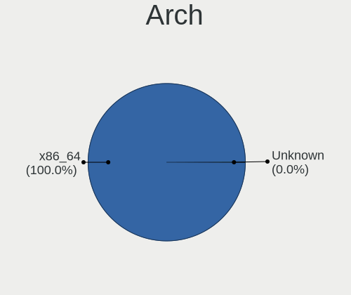
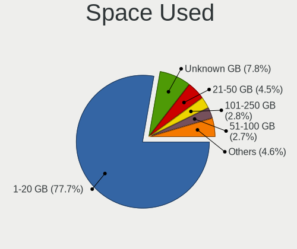
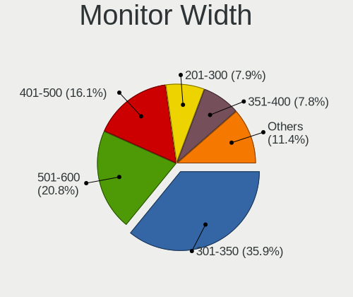
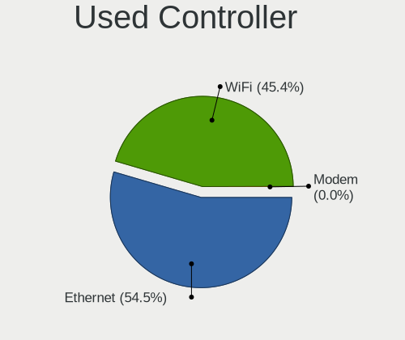

OpenMandriva - Tested Hardware & Statistics
-------------------------------------------

A project to collect tested hardware configurations for OpenMandriva.

Anyone can contribute to this report by the [hw-probe](https://github.com/linuxhw/hw-probe) tool:

    sudo -E hw-probe -all -upload

Please contribute! Especially if your hardware is rare.

This is a report for all computer types. See also reports for [desktops](/Dist/OpenMandriva/Desktop/README.md) and [notebooks](/Dist/OpenMandriva/Notebook/README.md).

Contents
--------

* [ Test Cases ](#test-cases)

* [ System ](#system)
  - [ OS                       ](#os)
  - [ OS Family                ](#os-family)
  - [ Kernel                   ](#kernel)
  - [ Kernel Family            ](#kernel-family)
  - [ Kernel Major Ver.        ](#kernel-major-ver)
  - [ Arch                     ](#arch)
  - [ DE                       ](#de)
  - [ Display Server           ](#display-server)
  - [ Display Manager          ](#display-manager)
  - [ OS Lang                  ](#os-lang)
  - [ Boot Mode                ](#boot-mode)
  - [ Filesystem               ](#filesystem)
  - [ Part. scheme             ](#part-scheme)
  - [ Dual Boot with Linux/BSD ](#dual-boot-with-linuxbsd)
  - [ Dual Boot (Win)          ](#dual-boot-win)

* [ Board ](#board)
  - [ Vendor                   ](#vendor)
  - [ Model                    ](#model)
  - [ Model Family             ](#model-family)
  - [ MFG Year                 ](#mfg-year)
  - [ Form Factor              ](#form-factor)
  - [ Secure Boot              ](#secure-boot)
  - [ Coreboot                 ](#coreboot)
  - [ RAM Size                 ](#ram-size)
  - [ RAM Used                 ](#ram-used)
  - [ Total Drives             ](#total-drives)
  - [ Has CD-ROM               ](#has-cd-rom)
  - [ Has Ethernet             ](#has-ethernet)
  - [ Has WiFi                 ](#has-wifi)
  - [ Has Bluetooth            ](#has-bluetooth)

* [ Location ](#location)
  - [ Country                  ](#country)
  - [ City                     ](#city)

* [ Drives ](#drives)
  - [ Drive Vendor             ](#drive-vendor)
  - [ Drive Model              ](#drive-model)
  - [ HDD Vendor               ](#hdd-vendor)
  - [ SSD Vendor               ](#ssd-vendor)
  - [ Drive Kind               ](#drive-kind)
  - [ Drive Connector          ](#drive-connector)
  - [ Drive Size               ](#drive-size)
  - [ Space Total              ](#space-total)
  - [ Space Used               ](#space-used)
  - [ Malfunc. Drives          ](#malfunc-drives)
  - [ Malfunc. Drive Vendor    ](#malfunc-drive-vendor)
  - [ Malfunc. HDD Vendor      ](#malfunc-hdd-vendor)
  - [ Malfunc. Drive Kind      ](#malfunc-drive-kind)
  - [ Failed Drives            ](#failed-drives)
  - [ Failed Drive Vendor      ](#failed-drive-vendor)
  - [ Drive Status             ](#drive-status)

* [ Storage controller ](#storage-controller)
  - [ Storage Vendor           ](#storage-vendor)
  - [ Storage Model            ](#storage-model)
  - [ Storage Kind             ](#storage-kind)

* [ Processor ](#processor)
  - [ CPU Vendor               ](#cpu-vendor)
  - [ CPU Model                ](#cpu-model)
  - [ CPU Model Family         ](#cpu-model-family)
  - [ CPU Cores                ](#cpu-cores)
  - [ CPU Sockets              ](#cpu-sockets)
  - [ CPU Threads              ](#cpu-threads)
  - [ CPU Op-Modes             ](#cpu-op-modes)
  - [ CPU Microcode            ](#cpu-microcode)
  - [ CPU Microarch            ](#cpu-microarch)

* [ Graphics ](#graphics)
  - [ GPU Vendor               ](#gpu-vendor)
  - [ GPU Model                ](#gpu-model)
  - [ GPU Combo                ](#gpu-combo)
  - [ GPU Driver               ](#gpu-driver)
  - [ GPU Memory               ](#gpu-memory)

* [ Monitor ](#monitor)
  - [ Monitor Vendor           ](#monitor-vendor)
  - [ Monitor Model            ](#monitor-model)
  - [ Monitor Resolution       ](#monitor-resolution)
  - [ Monitor Diagonal         ](#monitor-diagonal)
  - [ Monitor Width            ](#monitor-width)
  - [ Aspect Ratio             ](#aspect-ratio)
  - [ Monitor Area             ](#monitor-area)
  - [ Pixel Density            ](#pixel-density)
  - [ Multiple Monitors        ](#multiple-monitors)

* [ Network ](#network)
  - [ Net Controller Vendor    ](#net-controller-vendor)
  - [ Net Controller Model     ](#net-controller-model)
  - [ Wireless Vendor          ](#wireless-vendor)
  - [ Wireless Model           ](#wireless-model)
  - [ Ethernet Vendor          ](#ethernet-vendor)
  - [ Ethernet Model           ](#ethernet-model)
  - [ Net Controller Kind      ](#net-controller-kind)
  - [ Used Controller          ](#used-controller)
  - [ NICs                     ](#nics)
  - [ IPv6                     ](#ipv6)

* [ Bluetooth ](#bluetooth)
  - [ Bluetooth Vendor         ](#bluetooth-vendor)
  - [ Bluetooth Model          ](#bluetooth-model)

* [ Sound ](#sound)
  - [ Sound Vendor             ](#sound-vendor)
  - [ Sound Model              ](#sound-model)

* [ Memory ](#memory)
  - [ Memory Vendor            ](#memory-vendor)
  - [ Memory Model             ](#memory-model)
  - [ Memory Kind              ](#memory-kind)
  - [ Memory Form Factor       ](#memory-form-factor)
  - [ Memory Size              ](#memory-size)
  - [ Memory Speed             ](#memory-speed)

* [ Printers & scanners ](#printers--scanners)
  - [ Printer Vendor           ](#printer-vendor)
  - [ Printer Model            ](#printer-model)
  - [ Scanner Vendor           ](#scanner-vendor)
  - [ Scanner Model            ](#scanner-model)

* [ Camera ](#camera)
  - [ Camera Vendor            ](#camera-vendor)
  - [ Camera Model             ](#camera-model)

* [ Security ](#security)
  - [ Fingerprint Vendor       ](#fingerprint-vendor)
  - [ Fingerprint Model        ](#fingerprint-model)
  - [ Chipcard Vendor          ](#chipcard-vendor)
  - [ Chipcard Model           ](#chipcard-model)

* [ Unsupported ](#unsupported)
  - [ Unsupported Devices      ](#unsupported-devices)
  - [ Unsupported Device Types ](#unsupported-device-types)

Test Cases
----------

Total: 7462

| Vendor        | Model                       | Form-Factor | Probe                                                      | Date         |
|---------------|-----------------------------|-------------|------------------------------------------------------------|--------------|
| Intel         | D2700DC AAG32420-602        | Desktop     | [a55bb5f425](https://linux-hardware.org/?probe=a55bb5f425) | Jun 01, 2022 |
| Medion        | E7220                       | Notebook    | [d4a700af57](https://linux-hardware.org/?probe=d4a700af57) | Jun 01, 2022 |
| Dell          | Inspiron 3451               | Notebook    | [04e9ce0ba0](https://linux-hardware.org/?probe=04e9ce0ba0) | Jun 01, 2022 |
| Lenovo        | ThinkPad S2 3rd Gen 20L1... | Notebook    | [ee8d9751b0](https://linux-hardware.org/?probe=ee8d9751b0) | Jun 01, 2022 |
| Medion        | E2292                       | Convertible | [85296d99ac](https://linux-hardware.org/?probe=85296d99ac) | Jun 01, 2022 |
| Lenovo        | Yoga 2 11 20332             | Notebook    | [ad92325747](https://linux-hardware.org/?probe=ad92325747) | Jun 01, 2022 |
| Dell          | 0J3C2F A02                  | Desktop     | [9ff329a1fd](https://linux-hardware.org/?probe=9ff329a1fd) | May 31, 2022 |
| Gigabyte      | B460 AORUS PRO AC           | Desktop     | [2966cd34b8](https://linux-hardware.org/?probe=2966cd34b8) | May 31, 2022 |
| Lenovo        | ThinkCentre M57 00P4496     | Desktop     | [07ba75838a](https://linux-hardware.org/?probe=07ba75838a) | May 31, 2022 |
| HP            | 3047h                       | Desktop     | [59affe5430](https://linux-hardware.org/?probe=59affe5430) | May 31, 2022 |
| Lenovo        | 3148 SDK0K13476 WIN 3306... | Desktop     | [5723328e24](https://linux-hardware.org/?probe=5723328e24) | May 31, 2022 |
| Lenovo        | IdeaPad S300 20197          | Notebook    | [fcb07ac9aa](https://linux-hardware.org/?probe=fcb07ac9aa) | May 31, 2022 |
| HYPA          | FLUX                        | Notebook    | [8a69e3a34e](https://linux-hardware.org/?probe=8a69e3a34e) | May 31, 2022 |
| ASUSTek       | VivoBook_ASUSLaptop TP42... | Convertible | [ead15ec00b](https://linux-hardware.org/?probe=ead15ec00b) | May 31, 2022 |
| Philco        | 10D                         | Notebook    | [b4fc893791](https://linux-hardware.org/?probe=b4fc893791) | May 31, 2022 |
| Gigabyte      | X570 AORUS PRO              | Desktop     | [c39f904361](https://linux-hardware.org/?probe=c39f904361) | May 30, 2022 |
| ASUSTek       | Maximus II Formula          | Desktop     | [84df720c51](https://linux-hardware.org/?probe=84df720c51) | May 30, 2022 |
| ASRock        | A88M-G                      | Desktop     | [9b82b09acc](https://linux-hardware.org/?probe=9b82b09acc) | May 30, 2022 |
| Lenovo        | ThinkPad T430 2349BS7       | Notebook    | [2369e183ec](https://linux-hardware.org/?probe=2369e183ec) | May 30, 2022 |
| Lenovo        | ThinkPad Edge E430 32543... | Notebook    | [dc9d61a80b](https://linux-hardware.org/?probe=dc9d61a80b) | May 30, 2022 |
| Lenovo        | ThinkCentre M90p 5536WAZ    | Desktop     | [c6c32dc36b](https://linux-hardware.org/?probe=c6c32dc36b) | May 30, 2022 |
| Intel         | DG43GT AAE62768-300         | Desktop     | [643ebac3b3](https://linux-hardware.org/?probe=643ebac3b3) | May 29, 2022 |
| Fujitsu Si... | D2464-A1 S26361-D2464-A1    | Desktop     | [2f5bdf6497](https://linux-hardware.org/?probe=2f5bdf6497) | May 29, 2022 |
| Dell          | Vostro 5468                 | Notebook    | [551400dba1](https://linux-hardware.org/?probe=551400dba1) | May 29, 2022 |
| ASUSTek       | PRIME H310M-K R2.0          | Desktop     | [1a8dbccc21](https://linux-hardware.org/?probe=1a8dbccc21) | May 29, 2022 |
| Lenovo        | 3178 SDK0J40697 WIN 3305... | Desktop     | [63747954e9](https://linux-hardware.org/?probe=63747954e9) | May 29, 2022 |
| Dell          | Inspiron 3451               | Notebook    | [8ad9f9f5d9](https://linux-hardware.org/?probe=8ad9f9f5d9) | May 29, 2022 |
| System76      | Lemur Pro                   | Notebook    | [4a6174b7a4](https://linux-hardware.org/?probe=4a6174b7a4) | May 29, 2022 |
| ASRock        | B85M-HDS                    | Desktop     | [54a1e6b445](https://linux-hardware.org/?probe=54a1e6b445) | May 29, 2022 |
| Toshiba       | Satellite C850-1KN          | Notebook    | [60b2c12831](https://linux-hardware.org/?probe=60b2c12831) | May 29, 2022 |
| Lenovo        | IdeaPad Z500 20202          | Notebook    | [8e577a4a1a](https://linux-hardware.org/?probe=8e577a4a1a) | May 29, 2022 |
| Gigabyte      | A320M-H-CF                  | Desktop     | [522da9476b](https://linux-hardware.org/?probe=522da9476b) | May 29, 2022 |
| AZW           | GT-R                        | Notebook    | [7823df6a86](https://linux-hardware.org/?probe=7823df6a86) | May 29, 2022 |
| ASUSTek       | UX31E                       | Notebook    | [201add5732](https://linux-hardware.org/?probe=201add5732) | May 29, 2022 |
| Gigabyte      | GA-MA770-UD3                | Desktop     | [d1c4685112](https://linux-hardware.org/?probe=d1c4685112) | May 29, 2022 |
| MSI           | Z590-A PRO                  | Desktop     | [55a37b3d9c](https://linux-hardware.org/?probe=55a37b3d9c) | May 29, 2022 |
| ASUSTek       | AM1M-A/BR                   | Desktop     | [c8532fbb66](https://linux-hardware.org/?probe=c8532fbb66) | May 29, 2022 |
| HP            | ENVY x360 Convertible 15... | Convertible | [ced26bb73e](https://linux-hardware.org/?probe=ced26bb73e) | May 29, 2022 |
| Acer          | Aspire 4349                 | Notebook    | [3d1051c72e](https://linux-hardware.org/?probe=3d1051c72e) | May 29, 2022 |
| TUXEDO        | Unknown                     | Notebook    | [6bda60151b](https://linux-hardware.org/?probe=6bda60151b) | May 29, 2022 |
| ASUSTek       | VivoBook_ASUSLaptop X712... | Notebook    | [d1c3a33e75](https://linux-hardware.org/?probe=d1c3a33e75) | May 28, 2022 |
| Dell          | Inspiron 15-3567            | Notebook    | [ba66fccfa1](https://linux-hardware.org/?probe=ba66fccfa1) | May 28, 2022 |
| HP            | 81C3                        | Desktop     | [7a57cdec90](https://linux-hardware.org/?probe=7a57cdec90) | May 28, 2022 |
| Teclast       | X4                          | Tablet      | [2b831ad0d3](https://linux-hardware.org/?probe=2b831ad0d3) | May 28, 2022 |
| Lenovo        | G50-70 20351                | Notebook    | [1150f03cf0](https://linux-hardware.org/?probe=1150f03cf0) | May 28, 2022 |
| ASUSTek       | Strix 17 GL703GE            | Notebook    | [5d5ba64239](https://linux-hardware.org/?probe=5d5ba64239) | May 28, 2022 |
| Gigabyte      | B560M H                     | Desktop     | [7e17227514](https://linux-hardware.org/?probe=7e17227514) | May 27, 2022 |
| Dell          | Inspiron 3451               | Notebook    | [798f65546b](https://linux-hardware.org/?probe=798f65546b) | May 27, 2022 |
| HP            | EliteBook 840 G2            | Notebook    | [eeab3d23c4](https://linux-hardware.org/?probe=eeab3d23c4) | May 27, 2022 |
| MSI           | 785G-E53                    | Desktop     | [18ee1d0980](https://linux-hardware.org/?probe=18ee1d0980) | May 27, 2022 |
| TUXEDO        | Unknown                     | Notebook    | [2d5566dd3f](https://linux-hardware.org/?probe=2d5566dd3f) | May 27, 2022 |
| Positivo      | POS-PIQ57BQA                | Desktop     | [f33ecab5de](https://linux-hardware.org/?probe=f33ecab5de) | May 27, 2022 |
| ASRock        | H270M-ITX/ac                | Desktop     | [e77300d74a](https://linux-hardware.org/?probe=e77300d74a) | May 27, 2022 |
| Intel         | NUC5i5RYB H40999-502        | Mini pc     | [3edceaf423](https://linux-hardware.org/?probe=3edceaf423) | May 27, 2022 |
| Apple         | MacBookPro5,5               | Notebook    | [75eebad111](https://linux-hardware.org/?probe=75eebad111) | May 27, 2022 |
| MSI           | Boston                      | Desktop     | [7e3c443fb1](https://linux-hardware.org/?probe=7e3c443fb1) | May 27, 2022 |
| BESSTAR Te... | UM350                       | Desktop     | [e4082f489e](https://linux-hardware.org/?probe=e4082f489e) | May 27, 2022 |
| HP            | 212B                        | Desktop     | [14db1a01c5](https://linux-hardware.org/?probe=14db1a01c5) | May 26, 2022 |
| ASUSTek       | U31Jg                       | Notebook    | [b761173e5e](https://linux-hardware.org/?probe=b761173e5e) | May 26, 2022 |
| Intel         | DP67BA AAG10219-300         | Desktop     | [005b9cdb8e](https://linux-hardware.org/?probe=005b9cdb8e) | May 26, 2022 |
| Samsung       | 300V3A/300V4A/300V5A/200... | Notebook    | [36d7baa56d](https://linux-hardware.org/?probe=36d7baa56d) | May 26, 2022 |
| Gigabyte      | 990XA-UD3                   | Desktop     | [6cc0861cc3](https://linux-hardware.org/?probe=6cc0861cc3) | May 26, 2022 |
| Positivo      | POS-PIQ57BQA                | Desktop     | [2175bbae83](https://linux-hardware.org/?probe=2175bbae83) | May 26, 2022 |
| ASRock        | ALiveNF6G-GLAN              | Desktop     | [ae17b83ca5](https://linux-hardware.org/?probe=ae17b83ca5) | May 26, 2022 |
| Dell          | Latitude E5410              | Notebook    | [fcb77d9c00](https://linux-hardware.org/?probe=fcb77d9c00) | May 26, 2022 |
| Gigabyte      | B85M-D3H-A                  | Desktop     | [36e5918bc8](https://linux-hardware.org/?probe=36e5918bc8) | May 25, 2022 |
| Acer          | Aspire E5-571               | Notebook    | [b43bf0505e](https://linux-hardware.org/?probe=b43bf0505e) | May 25, 2022 |
| Clevo         | W55xEU                      | Notebook    | [c5fd2417f4](https://linux-hardware.org/?probe=c5fd2417f4) | May 25, 2022 |
| HP            | Pavilion g4                 | Notebook    | [0c943e458a](https://linux-hardware.org/?probe=0c943e458a) | May 25, 2022 |
| Gigabyte      | GA-MA78GM-S2H               | Desktop     | [93d4bd3b14](https://linux-hardware.org/?probe=93d4bd3b14) | May 25, 2022 |
| ASUSTek       | X540LJ                      | Notebook    | [dbbcdcd2b5](https://linux-hardware.org/?probe=dbbcdcd2b5) | May 25, 2022 |
| Lenovo        | ThinkPad W520 428223G       | Notebook    | [5672a27a7e](https://linux-hardware.org/?probe=5672a27a7e) | May 24, 2022 |
| ASUSTek       | UX31E                       | Notebook    | [3905de150e](https://linux-hardware.org/?probe=3905de150e) | May 24, 2022 |
| HP            | 255 G3                      | Notebook    | [a6e7ea804b](https://linux-hardware.org/?probe=a6e7ea804b) | May 24, 2022 |
| Gigabyte      | B550 AORUS PRO AC           | Desktop     | [7260e3bf3b](https://linux-hardware.org/?probe=7260e3bf3b) | May 24, 2022 |
| Fujitsu       | LIFEBOOK S760               | Notebook    | [4a88ea0c1f](https://linux-hardware.org/?probe=4a88ea0c1f) | May 24, 2022 |
| Intel         | D2500HN AAG81480-500        | Desktop     | [bc39db0484](https://linux-hardware.org/?probe=bc39db0484) | May 24, 2022 |
| HP            | 1000                        | Notebook    | [e83bc1e8fe](https://linux-hardware.org/?probe=e83bc1e8fe) | May 24, 2022 |
| Lenovo        | MAHOBAY Win8 STD MM DPK ... | Desktop     | [b3958742aa](https://linux-hardware.org/?probe=b3958742aa) | May 24, 2022 |
| Acer          | Aspire E5-411               | Notebook    | [7c3a3077ff](https://linux-hardware.org/?probe=7c3a3077ff) | May 24, 2022 |
| ASUSTek       | B150M-A/M.2                 | Desktop     | [3aea6596c6](https://linux-hardware.org/?probe=3aea6596c6) | May 23, 2022 |
| Intel         | DH55HC AAE70933-505         | Desktop     | [6c27613f85](https://linux-hardware.org/?probe=6c27613f85) | May 23, 2022 |
| HP            | Compaq 15                   | Notebook    | [262d99131a](https://linux-hardware.org/?probe=262d99131a) | May 23, 2022 |
| Lenovo        | IdeaPad 100-15IBY 80MJ      | Notebook    | [db944454c8](https://linux-hardware.org/?probe=db944454c8) | May 23, 2022 |
| HP            | ProBook 450 G1              | Notebook    | [0097404cab](https://linux-hardware.org/?probe=0097404cab) | May 23, 2022 |
| HP            | 240 G7                      | Notebook    | [687546391a](https://linux-hardware.org/?probe=687546391a) | May 23, 2022 |
| HP            | ProBook 6475b               | Notebook    | [5202cf8c75](https://linux-hardware.org/?probe=5202cf8c75) | May 23, 2022 |
| HP            | 1495                        | Desktop     | [68ead7bd6a](https://linux-hardware.org/?probe=68ead7bd6a) | May 23, 2022 |
| MSI           | B450I GAMING PLUS AC        | Desktop     | [dbc555961b](https://linux-hardware.org/?probe=dbc555961b) | May 23, 2022 |
| ASUSTek       | PRIME B450M-A II            | Desktop     | [ee4d26d407](https://linux-hardware.org/?probe=ee4d26d407) | May 23, 2022 |
| Toshiba       | Satellite A100              | Notebook    | [a789d51565](https://linux-hardware.org/?probe=a789d51565) | May 23, 2022 |
| Unknown       | P4M800Pro-8237              | Desktop     | [31c80b1ea7](https://linux-hardware.org/?probe=31c80b1ea7) | May 23, 2022 |
| HP            | Laptop 14-dk1xxx            | Notebook    | [f05080d3fd](https://linux-hardware.org/?probe=f05080d3fd) | May 22, 2022 |
| Lenovo        | ThinkPad T61 7661BM5        | Notebook    | [9a6d69d512](https://linux-hardware.org/?probe=9a6d69d512) | May 22, 2022 |
| Acer          | Aspire E1-530               | Notebook    | [48747611a5](https://linux-hardware.org/?probe=48747611a5) | May 22, 2022 |
| Foxconn       | 2A8C                        | Desktop     | [eda69f1faf](https://linux-hardware.org/?probe=eda69f1faf) | May 22, 2022 |
| Lenovo        | SDK0E50510 WIN              | Desktop     | [6efef2bd1e](https://linux-hardware.org/?probe=6efef2bd1e) | May 22, 2022 |
| MSI           | MS-7235                     | Desktop     | [cb9b6ded76](https://linux-hardware.org/?probe=cb9b6ded76) | May 22, 2022 |
| MSI           | B150M BAZOOKA               | Desktop     | [b8ec3bee43](https://linux-hardware.org/?probe=b8ec3bee43) | May 22, 2022 |
| MSI           | GF63 Thin 8RCS              | Notebook    | [8cd1ebfa12](https://linux-hardware.org/?probe=8cd1ebfa12) | May 22, 2022 |
| ASUSTek       | H170M-PLUS/BR               | Desktop     | [da237b1570](https://linux-hardware.org/?probe=da237b1570) | May 21, 2022 |
| Dell          | Inspiron 3451               | Notebook    | [38c450f343](https://linux-hardware.org/?probe=38c450f343) | May 21, 2022 |
| MSI           | B350M PRO-VD PLUS           | Desktop     | [6098005a1a](https://linux-hardware.org/?probe=6098005a1a) | May 21, 2022 |
| Dell          | Latitude E6320              | Notebook    | [7f2af32493](https://linux-hardware.org/?probe=7f2af32493) | May 21, 2022 |
| ASUSTek       | UX31E                       | Notebook    | [12407852be](https://linux-hardware.org/?probe=12407852be) | May 21, 2022 |
| MSI           | MS-7235                     | Desktop     | [4dfaad64fd](https://linux-hardware.org/?probe=4dfaad64fd) | May 21, 2022 |
| Unknown       | Unknown                     | Notebook    | [261a0bf179](https://linux-hardware.org/?probe=261a0bf179) | May 21, 2022 |
| Lenovo        | Z50-75 80EC                 | Notebook    | [adddbe7947](https://linux-hardware.org/?probe=adddbe7947) | May 21, 2022 |
| Lenovo        | G50-70 20351                | Notebook    | [b6f469418c](https://linux-hardware.org/?probe=b6f469418c) | May 21, 2022 |
| Medion        | P6624                       | Notebook    | [ed8bd28269](https://linux-hardware.org/?probe=ed8bd28269) | May 21, 2022 |
| Lenovo        | IdeaPad 100-14IBY 80MH      | Notebook    | [1c63e5e513](https://linux-hardware.org/?probe=1c63e5e513) | May 21, 2022 |
| Lenovo        | Z710 20250                  | Notebook    | [ce719211e5](https://linux-hardware.org/?probe=ce719211e5) | May 21, 2022 |
| Gigabyte      | Z77P-D3                     | Desktop     | [fc0a2b2595](https://linux-hardware.org/?probe=fc0a2b2595) | May 21, 2022 |
| ASUSTek       | F7L                         | Notebook    | [f5bcd583ac](https://linux-hardware.org/?probe=f5bcd583ac) | May 21, 2022 |
| ASUSTek       | K73SD                       | Notebook    | [8c77e10639](https://linux-hardware.org/?probe=8c77e10639) | May 21, 2022 |
| Notebook      | N8xxEP6                     | Notebook    | [ae2202ea9e](https://linux-hardware.org/?probe=ae2202ea9e) | May 21, 2022 |
| ASUSTek       | K42Jc                       | Notebook    | [29538e9e80](https://linux-hardware.org/?probe=29538e9e80) | May 21, 2022 |
| MSI           | 970 GAMING                  | Desktop     | [082a1ac531](https://linux-hardware.org/?probe=082a1ac531) | May 21, 2022 |
| Acer          | Aspire 5332                 | Notebook    | [f48da95c17](https://linux-hardware.org/?probe=f48da95c17) | May 21, 2022 |
| Dell          | Inspiron 3451               | Notebook    | [d14ff2c62e](https://linux-hardware.org/?probe=d14ff2c62e) | May 20, 2022 |
| Acer          | Aspire 7750G                | Notebook    | [0fd6c8569c](https://linux-hardware.org/?probe=0fd6c8569c) | May 20, 2022 |
| Positivo      | S15KL                       | Notebook    | [71fffe977a](https://linux-hardware.org/?probe=71fffe977a) | May 20, 2022 |
| ASUSTek       | TUF Gaming FX705DU_FX705... | Notebook    | [a3e1bf045d](https://linux-hardware.org/?probe=a3e1bf045d) | May 20, 2022 |
| MSI           | MS-7309                     | Desktop     | [9093ca0773](https://linux-hardware.org/?probe=9093ca0773) | May 20, 2022 |
| ASUSTek       | SABERTOOTH 990FX R2.0       | Desktop     | [886a958a28](https://linux-hardware.org/?probe=886a958a28) | May 20, 2022 |
| Acer          | Aspire A314-22              | Notebook    | [b476e4fd95](https://linux-hardware.org/?probe=b476e4fd95) | May 20, 2022 |
| Microsoft     | Surface Pro 7               | Tablet      | [d06ddc54ef](https://linux-hardware.org/?probe=d06ddc54ef) | May 20, 2022 |
| Dell          | Inspiron 3502               | Notebook    | [0d26fe46da](https://linux-hardware.org/?probe=0d26fe46da) | May 19, 2022 |
| Fujitsu       | D3403-A1 S26361-D3403-A1    | Desktop     | [ccf347729e](https://linux-hardware.org/?probe=ccf347729e) | May 19, 2022 |
| Gigabyte      | A520M S2H                   | Desktop     | [74a45b7cec](https://linux-hardware.org/?probe=74a45b7cec) | May 19, 2022 |
| Dell          | Inspiron 5520               | Notebook    | [0e7bf88677](https://linux-hardware.org/?probe=0e7bf88677) | May 19, 2022 |
| Lenovo        | V15-ADA 82C7                | Notebook    | [b42178398a](https://linux-hardware.org/?probe=b42178398a) | May 19, 2022 |
| ASRock        | A88M-G                      | Desktop     | [e2baae7114](https://linux-hardware.org/?probe=e2baae7114) | May 19, 2022 |
| Lenovo        | ThinkCentre M57 9181A28     | Desktop     | [51ec46a243](https://linux-hardware.org/?probe=51ec46a243) | May 19, 2022 |
| Dell          | 05842Y A00                  | Desktop     | [7c67079823](https://linux-hardware.org/?probe=7c67079823) | May 19, 2022 |
| Gigabyte      | Z390 AORUS ELITE-CF         | Desktop     | [95ac26b654](https://linux-hardware.org/?probe=95ac26b654) | May 19, 2022 |
| Compaq        | Presario CQ-25              | Notebook    | [4412b90950](https://linux-hardware.org/?probe=4412b90950) | May 19, 2022 |
| MSI           | B450-A PRO MAX              | Desktop     | [7b1a855704](https://linux-hardware.org/?probe=7b1a855704) | May 19, 2022 |
| Biostar       | A68N-5600E                  | Desktop     | [025e31f0d1](https://linux-hardware.org/?probe=025e31f0d1) | May 19, 2022 |
| Gigabyte      | Z68XP-UD3                   | Desktop     | [063aeed1a1](https://linux-hardware.org/?probe=063aeed1a1) | May 19, 2022 |
| Dell          | Latitude 7400               | Notebook    | [caf85903ad](https://linux-hardware.org/?probe=caf85903ad) | May 19, 2022 |
| Positivo      | Mobile                      | Notebook    | [1ef43bb988](https://linux-hardware.org/?probe=1ef43bb988) | May 19, 2022 |
| Dell          | Inspiron 3437               | Notebook    | [fcd1a7ae14](https://linux-hardware.org/?probe=fcd1a7ae14) | May 19, 2022 |
| Sony          | VGN-NR32L_S                 | Notebook    | [2709583292](https://linux-hardware.org/?probe=2709583292) | May 18, 2022 |
| EVGA          | 151-IB-E699                 | Desktop     | [7df0c6167d](https://linux-hardware.org/?probe=7df0c6167d) | May 18, 2022 |
| ASUSTek       | VivoBook_ASUSLaptop X515... | Notebook    | [a18c103de9](https://linux-hardware.org/?probe=a18c103de9) | May 18, 2022 |
| ASUSTek       | UX305FA                     | Notebook    | [5ec0821cdf](https://linux-hardware.org/?probe=5ec0821cdf) | May 18, 2022 |
| Gigabyte      | H55M-S2                     | Desktop     | [4d68acc78c](https://linux-hardware.org/?probe=4d68acc78c) | May 18, 2022 |
| ASUSTek       | 1015PE                      | Notebook    | [3ca5e4d427](https://linux-hardware.org/?probe=3ca5e4d427) | May 18, 2022 |
| Gigabyte      | GA-E6010N                   | Desktop     | [679cd1e540](https://linux-hardware.org/?probe=679cd1e540) | May 18, 2022 |
| Lenovo        | ThinkPad T61 6463Y3W        | Notebook    | [065aa2538b](https://linux-hardware.org/?probe=065aa2538b) | May 18, 2022 |
| Lenovo        | IdeaPad 330S-14IKB 81JM     | Notebook    | [3b3d6ba1e3](https://linux-hardware.org/?probe=3b3d6ba1e3) | May 18, 2022 |
| Dell          | Latitude E7450              | Notebook    | [26b07c8dfc](https://linux-hardware.org/?probe=26b07c8dfc) | May 18, 2022 |
| MSI           | Z97-G45 GAMING              | Desktop     | [1b02844b0b](https://linux-hardware.org/?probe=1b02844b0b) | May 18, 2022 |
| HP            | EliteBook 8570p             | Notebook    | [703787dd00](https://linux-hardware.org/?probe=703787dd00) | May 17, 2022 |
| Toshiba       | Satellite L350D             | Notebook    | [ff1e87338a](https://linux-hardware.org/?probe=ff1e87338a) | May 17, 2022 |
| Dell          | Studio 1555                 | Notebook    | [2f84ca8885](https://linux-hardware.org/?probe=2f84ca8885) | May 17, 2022 |
| ASUSTek       | TUF Gaming B550-PLUS        | Desktop     | [91638ab9be](https://linux-hardware.org/?probe=91638ab9be) | May 17, 2022 |
| Gigabyte      | B75N                        | Desktop     | [b3e561590b](https://linux-hardware.org/?probe=b3e561590b) | May 17, 2022 |
| ASUSTek       | P5QL PRO                    | Desktop     | [60e61a51df](https://linux-hardware.org/?probe=60e61a51df) | May 17, 2022 |
| Toshiba       | Satellite C850              | Notebook    | [5927aac0b7](https://linux-hardware.org/?probe=5927aac0b7) | May 17, 2022 |
| Dell          | Inspiron 3459               | Notebook    | [b36df0b4df](https://linux-hardware.org/?probe=b36df0b4df) | May 17, 2022 |
| ASUSTek       | P5Q                         | Desktop     | [614f6cf0c6](https://linux-hardware.org/?probe=614f6cf0c6) | May 16, 2022 |
| HP            | 885E A01                    | All in one  | [6b6dd9140a](https://linux-hardware.org/?probe=6b6dd9140a) | May 16, 2022 |
| HP            | ENVY Notebook 13-ab0XX      | Notebook    | [26ed58e99a](https://linux-hardware.org/?probe=26ed58e99a) | May 16, 2022 |
| Dell          | Latitude E6400              | Notebook    | [d89696196c](https://linux-hardware.org/?probe=d89696196c) | May 16, 2022 |
| ASUSTek       | H110T                       | Desktop     | [e1d711b496](https://linux-hardware.org/?probe=e1d711b496) | May 16, 2022 |
| Lenovo        | ThinkPad T530 23594LU       | Notebook    | [cbed91f90e](https://linux-hardware.org/?probe=cbed91f90e) | May 16, 2022 |
| HP            | 8056                        | Desktop     | [e9d15128a7](https://linux-hardware.org/?probe=e9d15128a7) | May 16, 2022 |
| Gigabyte      | X38-DQ6                     | Desktop     | [653ffc4014](https://linux-hardware.org/?probe=653ffc4014) | May 16, 2022 |
| Dell          | 0Y2MRG A00                  | Desktop     | [1cf635a476](https://linux-hardware.org/?probe=1cf635a476) | May 16, 2022 |
| BESSTAR Te... | ATB15                       | Server      | [06625fa3f2](https://linux-hardware.org/?probe=06625fa3f2) | May 15, 2022 |
| ASUSTek       | ROG STRIX B550-F GAMING     | Desktop     | [39824d4e4d](https://linux-hardware.org/?probe=39824d4e4d) | May 15, 2022 |
| Sony          | VPCCB3S1E                   | Notebook    | [e6451d9a9a](https://linux-hardware.org/?probe=e6451d9a9a) | May 15, 2022 |
| ASUSTek       | M4N68T-M-V2                 | Desktop     | [528659dab4](https://linux-hardware.org/?probe=528659dab4) | May 15, 2022 |
| Dell          | Inspiron 1750               | Notebook    | [b37b4cdbbb](https://linux-hardware.org/?probe=b37b4cdbbb) | May 15, 2022 |
| ASUSTek       | B85M-G                      | Desktop     | [dd305c13de](https://linux-hardware.org/?probe=dd305c13de) | May 15, 2022 |
| Dell          | Inspiron 3520               | Notebook    | [a045c6d50f](https://linux-hardware.org/?probe=a045c6d50f) | May 15, 2022 |
| Dell          | Inspiron 11-3162            | Notebook    | [d1e811474c](https://linux-hardware.org/?probe=d1e811474c) | May 15, 2022 |
| Fujitsu Si... | LIFEBOOK S7110              | Notebook    | [8586a581d0](https://linux-hardware.org/?probe=8586a581d0) | May 15, 2022 |
| Toshiba       | Satellite C670D-126         | Notebook    | [9df3447b21](https://linux-hardware.org/?probe=9df3447b21) | May 14, 2022 |
| ASUSTek       | ROG STRIX X570-F GAMING     | Desktop     | [52c0b4a6e0](https://linux-hardware.org/?probe=52c0b4a6e0) | May 14, 2022 |
| Packard Be... | EasyNote ENTF71BM           | Notebook    | [e8808a770a](https://linux-hardware.org/?probe=e8808a770a) | May 14, 2022 |
| ASUSTek       | UX31E                       | Notebook    | [85613b8729](https://linux-hardware.org/?probe=85613b8729) | May 14, 2022 |
| Lenovo        | ThinkPad T410 2522W6S       | Notebook    | [79cd5bf620](https://linux-hardware.org/?probe=79cd5bf620) | May 14, 2022 |
| ASUSTek       | M2A-VM                      | Desktop     | [7708e385fb](https://linux-hardware.org/?probe=7708e385fb) | May 14, 2022 |
| ASUSTek       | H110M-K                     | Desktop     | [d0f043ff65](https://linux-hardware.org/?probe=d0f043ff65) | May 14, 2022 |
| Dell          | 0FM586                      | Desktop     | [82aefc332b](https://linux-hardware.org/?probe=82aefc332b) | May 14, 2022 |
| Gigabyte      | P55-UD3R                    | Desktop     | [638e77ebd8](https://linux-hardware.org/?probe=638e77ebd8) | May 13, 2022 |
| Packard Be... | EasyNote MH35               | Notebook    | [f3180b0817](https://linux-hardware.org/?probe=f3180b0817) | May 13, 2022 |
| Dell          | Studio 1558                 | Notebook    | [ccffb59f97](https://linux-hardware.org/?probe=ccffb59f97) | May 13, 2022 |
| ASUSTek       | UX31E                       | Notebook    | [b83f4f894e](https://linux-hardware.org/?probe=b83f4f894e) | May 13, 2022 |
| ASUSTek       | B85M-G                      | Desktop     | [6dee77b5ca](https://linux-hardware.org/?probe=6dee77b5ca) | May 13, 2022 |
| Gigabyte      | B550M AORUS ELITE           | Desktop     | [434d2b0bec](https://linux-hardware.org/?probe=434d2b0bec) | May 13, 2022 |
| Dell          | Precision M2800             | Notebook    | [266af2c2b7](https://linux-hardware.org/?probe=266af2c2b7) | May 13, 2022 |
| Lenovo        | ThinkCentre M58 7360WQK     | Desktop     | [9002375046](https://linux-hardware.org/?probe=9002375046) | May 13, 2022 |
| ASUSTek       | NARRA3                      | Desktop     | [ca524c9e95](https://linux-hardware.org/?probe=ca524c9e95) | May 13, 2022 |
| Dell          | Latitude 3190 2-in-1        | Convertible | [49c8fb1741](https://linux-hardware.org/?probe=49c8fb1741) | May 13, 2022 |
| ASRock        | H61M-HP4                    | Desktop     | [f0bda638ba](https://linux-hardware.org/?probe=f0bda638ba) | May 13, 2022 |
| ASUSTek       | H110M-R                     | Desktop     | [adbb3eb389](https://linux-hardware.org/?probe=adbb3eb389) | May 12, 2022 |
| Lenovo        | B70-80 80MR                 | Notebook    | [73a1a28362](https://linux-hardware.org/?probe=73a1a28362) | May 12, 2022 |
| Lenovo        | ThinkPad T510 43147UG       | Notebook    | [e4f5ef2c77](https://linux-hardware.org/?probe=e4f5ef2c77) | May 12, 2022 |
| ASUSTek       | TUF Gaming B460-PLUS        | Desktop     | [a83103153b](https://linux-hardware.org/?probe=a83103153b) | May 12, 2022 |
| HP            | Pavilion Laptop 15-cc5xx    | Notebook    | [ed11a30da0](https://linux-hardware.org/?probe=ed11a30da0) | May 12, 2022 |
| Biostar       | G31M+                       | Desktop     | [7440220607](https://linux-hardware.org/?probe=7440220607) | May 12, 2022 |
| ASUSTek       | M5A78L-M LE/USB3            | Desktop     | [3494019436](https://linux-hardware.org/?probe=3494019436) | May 11, 2022 |
| Dell          | 0HD5W2 A00                  | Desktop     | [9f28ef42a4](https://linux-hardware.org/?probe=9f28ef42a4) | May 11, 2022 |
| Lenovo        | ThinkPad W530 2463A64       | Notebook    | [f45c19aa6c](https://linux-hardware.org/?probe=f45c19aa6c) | May 11, 2022 |
| HP            | 0AA8h                       | Desktop     | [7d29587a1a](https://linux-hardware.org/?probe=7d29587a1a) | May 11, 2022 |
| Samsung       | R519/R719                   | Notebook    | [8deee99c2d](https://linux-hardware.org/?probe=8deee99c2d) | May 11, 2022 |
| Compaq        | 420                         | Notebook    | [1525a9b616](https://linux-hardware.org/?probe=1525a9b616) | May 10, 2022 |
| Alienware     | 17                          | Notebook    | [b30786ba0e](https://linux-hardware.org/?probe=b30786ba0e) | May 10, 2022 |
| ASUSTek       | ROG Zephyrus G14 GA402RJ... | Notebook    | [ee9f39e915](https://linux-hardware.org/?probe=ee9f39e915) | May 10, 2022 |
| Acer          | AO722                       | Notebook    | [645156f92d](https://linux-hardware.org/?probe=645156f92d) | May 10, 2022 |
| Dell          | Latitude 3120               | Convertible | [216d204154](https://linux-hardware.org/?probe=216d204154) | May 10, 2022 |
| Dell          | 02YYK5 A01                  | Desktop     | [96f6c5bf2a](https://linux-hardware.org/?probe=96f6c5bf2a) | May 10, 2022 |
| Apple         | MacBookPro7,1               | Notebook    | [e2430a36a4](https://linux-hardware.org/?probe=e2430a36a4) | May 09, 2022 |
| MSI           | 760GM-P34                   | Desktop     | [85bea22dfe](https://linux-hardware.org/?probe=85bea22dfe) | May 09, 2022 |
| Fujitsu       | FMVNTCAKB                   | Notebook    | [66083f4e27](https://linux-hardware.org/?probe=66083f4e27) | May 09, 2022 |
| HP            | Pavilion Laptop 15-cc0xx    | Notebook    | [324d23305d](https://linux-hardware.org/?probe=324d23305d) | May 09, 2022 |
| Dell          | Latitude E6410              | Notebook    | [0cac068895](https://linux-hardware.org/?probe=0cac068895) | May 08, 2022 |
| Samsung       | 350V5C/351V5C/3540VC/344... | Notebook    | [877b9a8dea](https://linux-hardware.org/?probe=877b9a8dea) | May 08, 2022 |
| Apple         | Mac-35C5E08120C7EEAF Mac... | Mini pc     | [fa1582c73d](https://linux-hardware.org/?probe=fa1582c73d) | May 08, 2022 |
| Dell          | Latitude E6220              | Notebook    | [f5ba7cbb31](https://linux-hardware.org/?probe=f5ba7cbb31) | May 08, 2022 |
| ASUSTek       | CROSSHAIR                   | Desktop     | [39f623cf4d](https://linux-hardware.org/?probe=39f623cf4d) | May 08, 2022 |
| HP            | 1998                        | Desktop     | [b717b34f5b](https://linux-hardware.org/?probe=b717b34f5b) | May 08, 2022 |
| Positivo      | POS-PIG41BA                 | Desktop     | [40a9a00430](https://linux-hardware.org/?probe=40a9a00430) | May 08, 2022 |
| Lenovo        | ThinkPad T530 24296G9       | Notebook    | [934e13a24c](https://linux-hardware.org/?probe=934e13a24c) | May 08, 2022 |
| ASUSTek       | PRIME B365M-A               | Desktop     | [a281b3c075](https://linux-hardware.org/?probe=a281b3c075) | May 07, 2022 |
| Fujitsu       | D3221-A1 S26361-D3221-A1    | Desktop     | [d7c94f5e83](https://linux-hardware.org/?probe=d7c94f5e83) | May 07, 2022 |
| HP            | 802F                        | Desktop     | [5afe279c1b](https://linux-hardware.org/?probe=5afe279c1b) | May 07, 2022 |
| Lenovo        | SDK0E50510 WIN 262504835... | Desktop     | [5565a2f131](https://linux-hardware.org/?probe=5565a2f131) | May 07, 2022 |
| Positivo      | POS-PIH81DI                 | Desktop     | [f7b64e05f8](https://linux-hardware.org/?probe=f7b64e05f8) | May 06, 2022 |
| ASUSTek       | N501VW                      | Notebook    | [71d02059fa](https://linux-hardware.org/?probe=71d02059fa) | May 06, 2022 |
| Dell          | Latitude 3120               | Notebook    | [0da044ae6c](https://linux-hardware.org/?probe=0da044ae6c) | May 06, 2022 |
| Packard Be... | EasyNote TS44HR             | Notebook    | [2eff4001dc](https://linux-hardware.org/?probe=2eff4001dc) | May 06, 2022 |
| HP            | Compaq 15                   | Notebook    | [25db1ef15f](https://linux-hardware.org/?probe=25db1ef15f) | May 06, 2022 |
| Lenovo        | IdeaPad Gaming 3 15ARH05... | Notebook    | [a49301cdaf](https://linux-hardware.org/?probe=a49301cdaf) | May 05, 2022 |
| Positivo      | POS-PARS760GCD              | Desktop     | [dfc00dfd71](https://linux-hardware.org/?probe=dfc00dfd71) | May 05, 2022 |
| Lenovo        | 371C No DPK                 | All in one  | [c5fc878a83](https://linux-hardware.org/?probe=c5fc878a83) | May 05, 2022 |
| Toshiba       | Satellite C670D             | Notebook    | [3eedd8ce6b](https://linux-hardware.org/?probe=3eedd8ce6b) | May 05, 2022 |
| MSI           | MPG Z490 GAMING EDGE WIF... | Desktop     | [76e6cc98aa](https://linux-hardware.org/?probe=76e6cc98aa) | May 05, 2022 |
| ASUSTek       | A68HM-PLUS                  | Desktop     | [149d1c8c87](https://linux-hardware.org/?probe=149d1c8c87) | May 05, 2022 |
| ASUSTek       | X551MA                      | Notebook    | [4a12d6b5d9](https://linux-hardware.org/?probe=4a12d6b5d9) | May 05, 2022 |
| Gigabyte      | B450 I AORUS PRO WIFI-CF    | Desktop     | [8f15e66f2d](https://linux-hardware.org/?probe=8f15e66f2d) | May 05, 2022 |
| Dell          | Latitude E7440              | Notebook    | [8496c35f54](https://linux-hardware.org/?probe=8496c35f54) | May 05, 2022 |
| Lenovo        | V110-15ISK 80TL             | Notebook    | [d9436bb9f5](https://linux-hardware.org/?probe=d9436bb9f5) | May 05, 2022 |
| ASRock        | QC5000-ITX/WiFi             | Desktop     | [ec48bca283](https://linux-hardware.org/?probe=ec48bca283) | May 05, 2022 |
| ASUSTek       | VivoBook_ASUSLaptop TP40... | Convertible | [7c416a8fb7](https://linux-hardware.org/?probe=7c416a8fb7) | May 05, 2022 |
| Intel         | NUC7JYB J67967-404          | Mini pc     | [23b39ddb3a](https://linux-hardware.org/?probe=23b39ddb3a) | May 05, 2022 |
| Gigabyte      | B150N-GSM-CF                | Desktop     | [b49d3deec3](https://linux-hardware.org/?probe=b49d3deec3) | May 05, 2022 |
| HP            | 18E7                        | Desktop     | [57194bb53c](https://linux-hardware.org/?probe=57194bb53c) | May 04, 2022 |
| HP            | 1998                        | Desktop     | [b35fc936e5](https://linux-hardware.org/?probe=b35fc936e5) | May 04, 2022 |
| MSI           | B360M PRO-VDH               | Desktop     | [23b80ec93e](https://linux-hardware.org/?probe=23b80ec93e) | May 04, 2022 |
| Apple         | MacBookAir7,2               | Notebook    | [c08ef3e666](https://linux-hardware.org/?probe=c08ef3e666) | May 04, 2022 |
| Dell          | 03NVJ6 A04                  | Desktop     | [ebacf887d7](https://linux-hardware.org/?probe=ebacf887d7) | May 04, 2022 |
| HP            | ProBook 470 G0              | Notebook    | [17a1e97761](https://linux-hardware.org/?probe=17a1e97761) | May 04, 2022 |
| ASUSTek       | X75A1                       | Notebook    | [78e4325ae6](https://linux-hardware.org/?probe=78e4325ae6) | May 04, 2022 |
| HP            | ProBook 6560b               | Notebook    | [10ed31948a](https://linux-hardware.org/?probe=10ed31948a) | May 04, 2022 |
| Lenovo        | 3102 NOK                    | Desktop     | [8ef837bdb4](https://linux-hardware.org/?probe=8ef837bdb4) | May 04, 2022 |
| Toshiba       | Satellite C645D             | Notebook    | [53153cb65d](https://linux-hardware.org/?probe=53153cb65d) | May 04, 2022 |
| Lenovo        | IdeaPad Z370                | Notebook    | [be37f3c962](https://linux-hardware.org/?probe=be37f3c962) | May 04, 2022 |
| HP            | 2B47                        | Desktop     | [e7433db9d1](https://linux-hardware.org/?probe=e7433db9d1) | May 03, 2022 |
| ASRock        | Z77 Pro3                    | Desktop     | [050aee0a5f](https://linux-hardware.org/?probe=050aee0a5f) | May 03, 2022 |
| ASUSTek       | PRIME X370-A                | Desktop     | [4d1f9886c2](https://linux-hardware.org/?probe=4d1f9886c2) | May 03, 2022 |
| HP            | Compaq CQ58                 | Notebook    | [e42824ac37](https://linux-hardware.org/?probe=e42824ac37) | May 03, 2022 |
| Acer          | H57M01                      | Desktop     | [180132b3e1](https://linux-hardware.org/?probe=180132b3e1) | May 03, 2022 |
| Dell          | Latitude E7470              | Notebook    | [7991dfd7a5](https://linux-hardware.org/?probe=7991dfd7a5) | May 03, 2022 |
| Lenovo        | 3724                        | All in one  | [fa47d5fd48](https://linux-hardware.org/?probe=fa47d5fd48) | May 03, 2022 |
| Dell          | 0M9KCM A01                  | Desktop     | [76d9159d32](https://linux-hardware.org/?probe=76d9159d32) | May 03, 2022 |
| Dell          | Latitude 3120               | Convertible | [a7375cad0b](https://linux-hardware.org/?probe=a7375cad0b) | May 03, 2022 |
| Lenovo        | ThinkPad R500 27326FG       | Notebook    | [1ed6992177](https://linux-hardware.org/?probe=1ed6992177) | May 03, 2022 |
| Acer          | Aspire XC-230               | Desktop     | [b80fa8b04f](https://linux-hardware.org/?probe=b80fa8b04f) | May 03, 2022 |
| ASUSTek       | P8H67-M PRO                 | Desktop     | [d874b5668c](https://linux-hardware.org/?probe=d874b5668c) | May 02, 2022 |
| Dell          | Latitude 3190 2-in-1        | Convertible | [b5bb3e821e](https://linux-hardware.org/?probe=b5bb3e821e) | May 02, 2022 |
| Dell          | Latitude 3310               | Notebook    | [2b74207996](https://linux-hardware.org/?probe=2b74207996) | May 02, 2022 |
| Dell          | Latitude 3120               | Convertible | [ce61c0c036](https://linux-hardware.org/?probe=ce61c0c036) | May 02, 2022 |
| Acer          | Nitro AN515-45              | Notebook    | [8115992c41](https://linux-hardware.org/?probe=8115992c41) | May 02, 2022 |
| Acer          | Aspire F5-573               | Notebook    | [f571b0dc6f](https://linux-hardware.org/?probe=f571b0dc6f) | May 02, 2022 |
| Medion        | E2292                       | Convertible | [6823c98493](https://linux-hardware.org/?probe=6823c98493) | May 01, 2022 |
| HP            | 255 G1                      | Notebook    | [48c43a229d](https://linux-hardware.org/?probe=48c43a229d) | May 01, 2022 |
| Lenovo        | G710 20252                  | Notebook    | [9390db3498](https://linux-hardware.org/?probe=9390db3498) | May 01, 2022 |
| ASUSTek       | UX31E                       | Notebook    | [35c8958673](https://linux-hardware.org/?probe=35c8958673) | May 01, 2022 |
| Sony          | VGN-FZ31Z                   | Notebook    | [ebe91972ba](https://linux-hardware.org/?probe=ebe91972ba) | May 01, 2022 |
| Intel         | DG31PR AAE58249-306         | Desktop     | [53f6946eba](https://linux-hardware.org/?probe=53f6946eba) | May 01, 2022 |
| HP            | Pavilion g6                 | Notebook    | [bc4107a3bf](https://linux-hardware.org/?probe=bc4107a3bf) | May 01, 2022 |
| Lenovo        | IdeaPad 100-15IBY 80MJ      | Notebook    | [ea3bd2e330](https://linux-hardware.org/?probe=ea3bd2e330) | May 01, 2022 |
| Positivo      | POS-EIBTPDC                 | Desktop     | [a9a49f094d](https://linux-hardware.org/?probe=a9a49f094d) | May 01, 2022 |
| Dell          | Latitude E5550              | Notebook    | [42a576bd39](https://linux-hardware.org/?probe=42a576bd39) | May 01, 2022 |
| ASUSTek       | PRIME H270M-PLUS            | Desktop     | [5498c8b84f](https://linux-hardware.org/?probe=5498c8b84f) | May 01, 2022 |
| MSI           | MS-7267                     | Desktop     | [12ef52bd6d](https://linux-hardware.org/?probe=12ef52bd6d) | May 01, 2022 |
| Intel         | powered classmate PC        | Tablet      | [61790801c2](https://linux-hardware.org/?probe=61790801c2) | May 01, 2022 |
| Lenovo        | ThinkPad X230 Tablet 343... | Notebook    | [db2efb40d4](https://linux-hardware.org/?probe=db2efb40d4) | May 01, 2022 |
| Dell          | Inspiron 3793               | Notebook    | [9d2383d1f8](https://linux-hardware.org/?probe=9d2383d1f8) | Apr 30, 2022 |
| ASUSTek       | ROG Maximus X HERO          | Desktop     | [18daf9705b](https://linux-hardware.org/?probe=18daf9705b) | Apr 30, 2022 |
| HP            | 650                         | Notebook    | [1332a3196c](https://linux-hardware.org/?probe=1332a3196c) | Apr 30, 2022 |
| MSI           | A320M-A PRO MAX             | Desktop     | [dc1c0d091e](https://linux-hardware.org/?probe=dc1c0d091e) | Apr 30, 2022 |
| Dell          | Latitude 3330               | Notebook    | [1843c62895](https://linux-hardware.org/?probe=1843c62895) | Apr 30, 2022 |
| Lenovo        | Z50-70 20354                | Notebook    | [f253fe8221](https://linux-hardware.org/?probe=f253fe8221) | Apr 30, 2022 |
| ASRock        | 880GM-LE FX                 | Desktop     | [f695420d7e](https://linux-hardware.org/?probe=f695420d7e) | Apr 30, 2022 |
| Apple         | MacBookAir5,1               | Notebook    | [45c12c8fc4](https://linux-hardware.org/?probe=45c12c8fc4) | Apr 30, 2022 |
| ASUSTek       | P5QL                        | Desktop     | [121da21f08](https://linux-hardware.org/?probe=121da21f08) | Apr 30, 2022 |
| Gigabyte      | M68MT-S2                    | Desktop     | [f3b89e43d4](https://linux-hardware.org/?probe=f3b89e43d4) | Apr 30, 2022 |
| ASUSTek       | ROG STRIX B560-I GAMING ... | Desktop     | [e8fee79ec7](https://linux-hardware.org/?probe=e8fee79ec7) | Apr 30, 2022 |
| Lenovo        | ThinkCentre M58 7627AD5     | Desktop     | [05a686b922](https://linux-hardware.org/?probe=05a686b922) | Apr 30, 2022 |
| ASUSTek       | P5KPL-AM                    | Desktop     | [7c398e1d2b](https://linux-hardware.org/?probe=7c398e1d2b) | Apr 30, 2022 |
| ASUSTek       | ROG STRIX B550-F GAMING     | Desktop     | [f4a6777382](https://linux-hardware.org/?probe=f4a6777382) | Apr 30, 2022 |
| HP            | 1497                        | Desktop     | [559a844943](https://linux-hardware.org/?probe=559a844943) | Apr 30, 2022 |
| ASUSTek       | PRIME B350-PLUS             | Desktop     | [13fd8e249d](https://linux-hardware.org/?probe=13fd8e249d) | Apr 30, 2022 |
| Lenovo        | 3098 SDK0E50510 WIN 2625... | Desktop     | [3b9e57fc42](https://linux-hardware.org/?probe=3b9e57fc42) | Apr 30, 2022 |
| Philco        | 14I                         | Notebook    | [03bb0fdeef](https://linux-hardware.org/?probe=03bb0fdeef) | Apr 30, 2022 |
| HP            | Laptop 17-by4xxx            | Notebook    | [767590ac38](https://linux-hardware.org/?probe=767590ac38) | Apr 29, 2022 |
| ASUSTek       | S551LN                      | Notebook    | [a5f0e1cee7](https://linux-hardware.org/?probe=a5f0e1cee7) | Apr 29, 2022 |
| Lenovo        | IdeaPad Y700-17ISK 80Q0     | Notebook    | [2c8a1c2444](https://linux-hardware.org/?probe=2c8a1c2444) | Apr 29, 2022 |
| ASRock        | ALiveNF6G-GLAN              | Desktop     | [7dfb4ca9f5](https://linux-hardware.org/?probe=7dfb4ca9f5) | Apr 29, 2022 |
| MSI           | MPG B550 GAMING PLUS        | Desktop     | [af2b0de49b](https://linux-hardware.org/?probe=af2b0de49b) | Apr 29, 2022 |
| ASUSTek       | UX31E                       | Notebook    | [8f165f54aa](https://linux-hardware.org/?probe=8f165f54aa) | Apr 29, 2022 |
| TUXEDO        | Book BM15 Gen10             | Notebook    | [45b5b1bba9](https://linux-hardware.org/?probe=45b5b1bba9) | Apr 29, 2022 |
| HP            | 83EE                        | Desktop     | [55171637ca](https://linux-hardware.org/?probe=55171637ca) | Apr 29, 2022 |
| ASUSTek       | TUF Gaming X570-PLUS        | Desktop     | [7e84138ea1](https://linux-hardware.org/?probe=7e84138ea1) | Apr 29, 2022 |
| Intel         | X79 V2.72B                  | Desktop     | [396faf60b6](https://linux-hardware.org/?probe=396faf60b6) | Apr 29, 2022 |
| Foxconn       | 2A8C                        | Desktop     | [eb747a3063](https://linux-hardware.org/?probe=eb747a3063) | Apr 29, 2022 |
| ASUSTek       | B150M-A                     | Desktop     | [fa213f6681](https://linux-hardware.org/?probe=fa213f6681) | Apr 28, 2022 |
| Intel         | NUC6CAYB J23203-409         | Mini pc     | [3b927afe90](https://linux-hardware.org/?probe=3b927afe90) | Apr 28, 2022 |
| Dell          | Inspiron 3593               | Notebook    | [54087491d8](https://linux-hardware.org/?probe=54087491d8) | Apr 28, 2022 |
| Acer          | Extensa 5635G               | Notebook    | [6e69a86d63](https://linux-hardware.org/?probe=6e69a86d63) | Apr 28, 2022 |
| Intel         | NUC10i7FNB K61360-305       | Mini pc     | [8ef2e84f50](https://linux-hardware.org/?probe=8ef2e84f50) | Apr 28, 2022 |
| Dell          | Latitude 3120               | Convertible | [952eee1425](https://linux-hardware.org/?probe=952eee1425) | Apr 28, 2022 |
| HUAWEI        | NBM-WXX9                    | Notebook    | [4f15ab06cc](https://linux-hardware.org/?probe=4f15ab06cc) | Apr 28, 2022 |
| Samsung       | RC530/RC730                 | Notebook    | [2e44e9228e](https://linux-hardware.org/?probe=2e44e9228e) | Apr 28, 2022 |
| ECS           | H61H2-CM                    | Desktop     | [00620504c7](https://linux-hardware.org/?probe=00620504c7) | Apr 27, 2022 |
| Dell          | 0YJHYD A00                  | Desktop     | [6111a9976e](https://linux-hardware.org/?probe=6111a9976e) | Apr 27, 2022 |
| ASUSTek       | UX31E                       | Notebook    | [ef86b0396a](https://linux-hardware.org/?probe=ef86b0396a) | Apr 27, 2022 |
| ASUSTek       | M51BC                       | Desktop     | [f997f2d1c1](https://linux-hardware.org/?probe=f997f2d1c1) | Apr 27, 2022 |
| Dell          | Latitude E4310              | Notebook    | [41db45879c](https://linux-hardware.org/?probe=41db45879c) | Apr 27, 2022 |
| Gigabyte      | B550M AORUS PRO-P           | Desktop     | [b15f34dd41](https://linux-hardware.org/?probe=b15f34dd41) | Apr 27, 2022 |
| ASUSTek       | SABERTOOTH Z77              | Desktop     | [d354934f98](https://linux-hardware.org/?probe=d354934f98) | Apr 27, 2022 |
| ASUSTek       | X505BA                      | Notebook    | [30972759d1](https://linux-hardware.org/?probe=30972759d1) | Apr 27, 2022 |
| Foxconn       | H61MXE                      | Desktop     | [d8168e72e7](https://linux-hardware.org/?probe=d8168e72e7) | Apr 27, 2022 |
| Notebook      | W130SV                      | Notebook    | [a88535a3a5](https://linux-hardware.org/?probe=a88535a3a5) | Apr 27, 2022 |
| Fujitsu Si... | D2151-A1 S26361-D2151-A1    | Desktop     | [4db68ede02](https://linux-hardware.org/?probe=4db68ede02) | Apr 27, 2022 |
| Positivo      | S14SL01                     | Notebook    | [f8bdbe707d](https://linux-hardware.org/?probe=f8bdbe707d) | Apr 27, 2022 |
| Lenovo        | ThinkPad X1 Carbon 4th 2... | Notebook    | [14f1d071ae](https://linux-hardware.org/?probe=14f1d071ae) | Apr 26, 2022 |
| PC Special... | NJ50_70CU                   | Notebook    | [a9b4399cad](https://linux-hardware.org/?probe=a9b4399cad) | Apr 26, 2022 |
| HP            | ZBook 17 G3                 | Notebook    | [133232a304](https://linux-hardware.org/?probe=133232a304) | Apr 26, 2022 |
| Intel         | Unknown                     | Notebook    | [41b673dda8](https://linux-hardware.org/?probe=41b673dda8) | Apr 26, 2022 |
| Chuwi         | UBOOK                       | Convertible | [5899252c4d](https://linux-hardware.org/?probe=5899252c4d) | Apr 26, 2022 |
| Lenovo        | IdeaPad 330-15IKB 81FE      | Notebook    | [64cd863479](https://linux-hardware.org/?probe=64cd863479) | Apr 26, 2022 |
| Gigabyte      | X570 AORUS ULTRA            | Desktop     | [00728feb75](https://linux-hardware.org/?probe=00728feb75) | Apr 26, 2022 |
| Gigabyte      | B85M-D2V                    | Desktop     | [ca876d7b83](https://linux-hardware.org/?probe=ca876d7b83) | Apr 26, 2022 |
| Medion        | S17402 MD63000              | Notebook    | [fe73d0023a](https://linux-hardware.org/?probe=fe73d0023a) | Apr 25, 2022 |
| Acer          | Aspire TC-780               | Desktop     | [501877dba5](https://linux-hardware.org/?probe=501877dba5) | Apr 25, 2022 |
| Dell          | Latitude E6410              | Notebook    | [bc9515e4a7](https://linux-hardware.org/?probe=bc9515e4a7) | Apr 25, 2022 |
| ASUSTek       | P6T DELUXE V2               | Desktop     | [0e266b4987](https://linux-hardware.org/?probe=0e266b4987) | Apr 25, 2022 |
| ASUSTek       | PRIME A320M-K               | Desktop     | [f4f8108d1e](https://linux-hardware.org/?probe=f4f8108d1e) | Apr 25, 2022 |
| Dell          | Latitude 3120               | Convertible | [57a9cd74db](https://linux-hardware.org/?probe=57a9cd74db) | Apr 25, 2022 |
| Dell          | Inspiron 3537               | Notebook    | [2fcc2371d9](https://linux-hardware.org/?probe=2fcc2371d9) | Apr 25, 2022 |
| Dell          | Latitude E7270              | Notebook    | [d8dedbd4f6](https://linux-hardware.org/?probe=d8dedbd4f6) | Apr 25, 2022 |
| Samsung       | 340XAA/350XAA/550XAA        | Notebook    | [7423afe5a1](https://linux-hardware.org/?probe=7423afe5a1) | Apr 25, 2022 |
| Dell          | Inspiron 7460               | Notebook    | [6a67f6de58](https://linux-hardware.org/?probe=6a67f6de58) | Apr 25, 2022 |
| Intel         | DH61CR AAG14064-204         | Desktop     | [82d6475ef3](https://linux-hardware.org/?probe=82d6475ef3) | Apr 25, 2022 |
| Fujitsu       | D3173-A1 S26361-D3173-A1    | Mini pc     | [16265ec944](https://linux-hardware.org/?probe=16265ec944) | Apr 25, 2022 |
| Fujitsu       | FMVA06004                   | Notebook    | [4c63e1bcc2](https://linux-hardware.org/?probe=4c63e1bcc2) | Apr 25, 2022 |
| Lenovo        | ThinkBook 15 G3 ACL 21A4    | Notebook    | [2fcb2f9b19](https://linux-hardware.org/?probe=2fcb2f9b19) | Apr 24, 2022 |
| Lenovo        | ThinkPad W520 4284BL9       | Notebook    | [a7dd5a566e](https://linux-hardware.org/?probe=a7dd5a566e) | Apr 24, 2022 |
| Gigabyte      | AB350M-DS3H V2-CF           | Desktop     | [b0a2546f9f](https://linux-hardware.org/?probe=b0a2546f9f) | Apr 24, 2022 |
| Dell          | 08WKV3 A00                  | Desktop     | [e6ef37e2a0](https://linux-hardware.org/?probe=e6ef37e2a0) | Apr 24, 2022 |
| MSI           | G31M3 V2                    | Desktop     | [4c1d75729a](https://linux-hardware.org/?probe=4c1d75729a) | Apr 24, 2022 |
| Lenovo        | ThinkPad X220 42875TU       | Notebook    | [6748d74892](https://linux-hardware.org/?probe=6748d74892) | Apr 24, 2022 |
| Dell          | 0T1D10 A01                  | Desktop     | [660e4984f7](https://linux-hardware.org/?probe=660e4984f7) | Apr 24, 2022 |
| Gigabyte      | GA-78LMT-USB3 R2 sex        | Desktop     | [a1eaf40bdb](https://linux-hardware.org/?probe=a1eaf40bdb) | Apr 24, 2022 |
| HP            | 2820h                       | Desktop     | [3918640e67](https://linux-hardware.org/?probe=3918640e67) | Apr 23, 2022 |
| Lenovo        | ThinkPad E460 20ET000YLM    | Notebook    | [c82beac367](https://linux-hardware.org/?probe=c82beac367) | Apr 23, 2022 |
| ASUSTek       | X705UQR                     | Notebook    | [e4a27bf740](https://linux-hardware.org/?probe=e4a27bf740) | Apr 23, 2022 |
| Chuwi         | AeroBook Pro                | Notebook    | [a123315898](https://linux-hardware.org/?probe=a123315898) | Apr 23, 2022 |
| ASUSTek       | VivoBook 15_ASUS Laptop ... | Notebook    | [3e3f727deb](https://linux-hardware.org/?probe=3e3f727deb) | Apr 23, 2022 |
| Gigabyte      | A320M-S2H-CF                | Desktop     | [3d101a3380](https://linux-hardware.org/?probe=3d101a3380) | Apr 23, 2022 |
| ASUSTek       | M4A78-EM                    | Desktop     | [5ef7775195](https://linux-hardware.org/?probe=5ef7775195) | Apr 23, 2022 |
| Dell          | 0KJCC5 A00                  | Desktop     | [00181fd144](https://linux-hardware.org/?probe=00181fd144) | Apr 23, 2022 |
| MSI           | PRO B660-A DDR4             | Desktop     | [ec79dfd8b1](https://linux-hardware.org/?probe=ec79dfd8b1) | Apr 23, 2022 |
| Foxconn       | 945 7AD Series              | Desktop     | [04346c58f5](https://linux-hardware.org/?probe=04346c58f5) | Apr 23, 2022 |
| BESSTAR Te... | VB9                         | All in one  | [d38a98aa85](https://linux-hardware.org/?probe=d38a98aa85) | Apr 23, 2022 |
| Apple         | Mac-F226BEC8 PVT            | All in one  | [f9b84e295a](https://linux-hardware.org/?probe=f9b84e295a) | Apr 23, 2022 |
| Acer          | Aspire V5-571G              | Notebook    | [e76a1e5467](https://linux-hardware.org/?probe=e76a1e5467) | Apr 23, 2022 |
| ASUSTek       | K55VD                       | Notebook    | [8c2253380a](https://linux-hardware.org/?probe=8c2253380a) | Apr 23, 2022 |
| Lenovo        | ThinkPad X220 42875TU       | Notebook    | [2dd8baa591](https://linux-hardware.org/?probe=2dd8baa591) | Apr 23, 2022 |
| Lenovo        | Yoga Slim 7 14ARE05 82A2    | Notebook    | [7988499108](https://linux-hardware.org/?probe=7988499108) | Apr 23, 2022 |
| HP            | Pavilion Laptop 15-eh0xx... | Notebook    | [6fbbf00053](https://linux-hardware.org/?probe=6fbbf00053) | Apr 23, 2022 |
| HP            | 18E9                        | Desktop     | [36ff483a2f](https://linux-hardware.org/?probe=36ff483a2f) | Apr 23, 2022 |
| ASUSTek       | H81M-A                      | Desktop     | [01c63fa622](https://linux-hardware.org/?probe=01c63fa622) | Apr 22, 2022 |
| HP            | 8719                        | Desktop     | [7e0ae3d91f](https://linux-hardware.org/?probe=7e0ae3d91f) | Apr 22, 2022 |
| HP            | Pavilion 15                 | Notebook    | [a1b094c360](https://linux-hardware.org/?probe=a1b094c360) | Apr 22, 2022 |
| Acer          | Aspire A515-54G             | Notebook    | [9eeb0ced39](https://linux-hardware.org/?probe=9eeb0ced39) | Apr 22, 2022 |
| ASUSTek       | P5B                         | Desktop     | [223154e54d](https://linux-hardware.org/?probe=223154e54d) | Apr 22, 2022 |
| Dell          | Precision 3560              | Notebook    | [cc7a9c5fe2](https://linux-hardware.org/?probe=cc7a9c5fe2) | Apr 22, 2022 |
| HP            | Laptop 15-ra0xx             | Notebook    | [bc175803f2](https://linux-hardware.org/?probe=bc175803f2) | Apr 22, 2022 |
| Dell          | Inspiron 1545               | Notebook    | [8869defd9c](https://linux-hardware.org/?probe=8869defd9c) | Apr 22, 2022 |
| Toshiba       | Satellite C850-A786         | Notebook    | [e57aca482e](https://linux-hardware.org/?probe=e57aca482e) | Apr 22, 2022 |
| HP            | ProBook 4540s               | Notebook    | [17272efb83](https://linux-hardware.org/?probe=17272efb83) | Apr 22, 2022 |
| MSI           | GE62 6QD                    | Notebook    | [d66e41c50e](https://linux-hardware.org/?probe=d66e41c50e) | Apr 22, 2022 |
| Apple         | MacBookAir4,2               | Notebook    | [1535fd1e85](https://linux-hardware.org/?probe=1535fd1e85) | Apr 21, 2022 |
| Pegatron      | EVANS                       | Desktop     | [118f512619](https://linux-hardware.org/?probe=118f512619) | Apr 21, 2022 |
| HP            | 304Ah                       | Desktop     | [08fbf0f311](https://linux-hardware.org/?probe=08fbf0f311) | Apr 21, 2022 |
| Dell          | Latitude 3310               | Notebook    | [3130a4d7c3](https://linux-hardware.org/?probe=3130a4d7c3) | Apr 21, 2022 |
| Acer          | Aspire E5-551G              | Notebook    | [8dd5e105d1](https://linux-hardware.org/?probe=8dd5e105d1) | Apr 21, 2022 |
| Lenovo        | 3102 SDK0J40697 WIN 3305... | Desktop     | [7b24feb14a](https://linux-hardware.org/?probe=7b24feb14a) | Apr 21, 2022 |
| Philco        | Unknown                     | Notebook    | [16719246ff](https://linux-hardware.org/?probe=16719246ff) | Apr 20, 2022 |
| MSI           | X470 GAMING PLUS            | Desktop     | [33bcd3ec01](https://linux-hardware.org/?probe=33bcd3ec01) | Apr 20, 2022 |
| Samsung       | RC410/RC510/RC710           | Notebook    | [9adfada605](https://linux-hardware.org/?probe=9adfada605) | Apr 20, 2022 |
| Lenovo        | SDK0E50510 WIN              | Desktop     | [3d829a871e](https://linux-hardware.org/?probe=3d829a871e) | Apr 20, 2022 |
| ASUSTek       | P5G41T-M LX3                | Desktop     | [a21dad9ee4](https://linux-hardware.org/?probe=a21dad9ee4) | Apr 20, 2022 |
| Gigabyte      | MZAPLBP-00                  | Desktop     | [62b2cada75](https://linux-hardware.org/?probe=62b2cada75) | Apr 20, 2022 |
| Dell          | 0YF8P5 A00                  | Desktop     | [11d8a53dd0](https://linux-hardware.org/?probe=11d8a53dd0) | Apr 20, 2022 |
| ASRock        | B550 Pro4                   | Desktop     | [a1806b3e86](https://linux-hardware.org/?probe=a1806b3e86) | Apr 20, 2022 |
| Dell          | G3 3579                     | Notebook    | [a85e01d9d0](https://linux-hardware.org/?probe=a85e01d9d0) | Apr 20, 2022 |
| Dell          | 040DDP A01                  | Desktop     | [1f14473753](https://linux-hardware.org/?probe=1f14473753) | Apr 19, 2022 |
| Chuwi         | Hi10 X                      | Tablet      | [c83cb969dc](https://linux-hardware.org/?probe=c83cb969dc) | Apr 19, 2022 |
| Foxconn       | G41MXP/G41MXP-V             | Desktop     | [61c0639dae](https://linux-hardware.org/?probe=61c0639dae) | Apr 19, 2022 |
| HP            | Laptop 15s-eq1xxx           | Notebook    | [b1eb98dd6a](https://linux-hardware.org/?probe=b1eb98dd6a) | Apr 19, 2022 |
| MSI           | B150 PC MATE                | Desktop     | [34c7fe45bc](https://linux-hardware.org/?probe=34c7fe45bc) | Apr 19, 2022 |
| Toshiba       | dynabook Satellite B552/... | Notebook    | [60e6d780aa](https://linux-hardware.org/?probe=60e6d780aa) | Apr 19, 2022 |
| Dell          | Latitude E5470              | Notebook    | [da9241c331](https://linux-hardware.org/?probe=da9241c331) | Apr 19, 2022 |
| MSI           | Z170A GAMING M5             | Desktop     | [9cabfec30b](https://linux-hardware.org/?probe=9cabfec30b) | Apr 19, 2022 |
| Lenovo        | ThinkStation C20 4263BA7    | Desktop     | [d162e9aa70](https://linux-hardware.org/?probe=d162e9aa70) | Apr 19, 2022 |
| HP            | Compaq 6720s                | Notebook    | [23c39d626c](https://linux-hardware.org/?probe=23c39d626c) | Apr 19, 2022 |
| Alienware     | 0VDT73 A00                  | Desktop     | [1053bd7904](https://linux-hardware.org/?probe=1053bd7904) | Apr 18, 2022 |
| ASUSTek       | M2N68-AM                    | Desktop     | [15c9b8ea76](https://linux-hardware.org/?probe=15c9b8ea76) | Apr 18, 2022 |
| Gigabyte      | B450M DS3H-CF               | Desktop     | [66ac59c0a3](https://linux-hardware.org/?probe=66ac59c0a3) | Apr 18, 2022 |
| Toshiba       | Satellite Pro C660          | Notebook    | [678e3209cb](https://linux-hardware.org/?probe=678e3209cb) | Apr 18, 2022 |
| HP            | 2B0D A01                    | All in one  | [26c0536db2](https://linux-hardware.org/?probe=26c0536db2) | Apr 18, 2022 |
| Gigabyte      | B450 AORUS PRO-CF           | Desktop     | [874e39c8ef](https://linux-hardware.org/?probe=874e39c8ef) | Apr 18, 2022 |
| Lenovo        | IdeaPad S510p 20298         | Notebook    | [80943ca395](https://linux-hardware.org/?probe=80943ca395) | Apr 18, 2022 |
| Gigabyte      | B85M-DS3H                   | Desktop     | [c278a421cd](https://linux-hardware.org/?probe=c278a421cd) | Apr 18, 2022 |
| ASUSTek       | ROG STRIX B550-F GAMING     | Desktop     | [4c8ca0d53f](https://linux-hardware.org/?probe=4c8ca0d53f) | Apr 18, 2022 |
| Acer          | Aspire E5-571G              | Notebook    | [f37cea6c6f](https://linux-hardware.org/?probe=f37cea6c6f) | Apr 18, 2022 |
| ASRock        | Z68 Extreme4                | Desktop     | [36da46e911](https://linux-hardware.org/?probe=36da46e911) | Apr 18, 2022 |
| Gigabyte      | G41MT-ES2L                  | Desktop     | [fbeec44852](https://linux-hardware.org/?probe=fbeec44852) | Apr 18, 2022 |
| Fujitsu       | D3162-C1 S26361-D3162-C1    | Desktop     | [3ef27dafd2](https://linux-hardware.org/?probe=3ef27dafd2) | Apr 17, 2022 |
| HP            | 86E9 A                      | Desktop     | [11004e6442](https://linux-hardware.org/?probe=11004e6442) | Apr 17, 2022 |
| ASUSTek       | P8H77-M LE                  | Desktop     | [f940c46866](https://linux-hardware.org/?probe=f940c46866) | Apr 17, 2022 |
| HP            | 1850                        | Desktop     | [7c24268bc3](https://linux-hardware.org/?probe=7c24268bc3) | Apr 17, 2022 |
| Toshiba       | Satellite P200              | Notebook    | [f7726b9903](https://linux-hardware.org/?probe=f7726b9903) | Apr 17, 2022 |
| ASUSTek       | UX31E                       | Notebook    | [fa535559e0](https://linux-hardware.org/?probe=fa535559e0) | Apr 17, 2022 |
| HP            | Unknown                     | Notebook    | [7732ecb02d](https://linux-hardware.org/?probe=7732ecb02d) | Apr 17, 2022 |
| CompuLab      | fitlet                      | Mini pc     | [556d51f12c](https://linux-hardware.org/?probe=556d51f12c) | Apr 17, 2022 |
| Dell          | Inspiron 15-5578            | Notebook    | [4e70c05231](https://linux-hardware.org/?probe=4e70c05231) | Apr 17, 2022 |
| Apple         | MacBookPro5,4               | Notebook    | [918fef81c3](https://linux-hardware.org/?probe=918fef81c3) | Apr 17, 2022 |
| Dell          | Precision M6800             | Notebook    | [46a37b9e8e](https://linux-hardware.org/?probe=46a37b9e8e) | Apr 16, 2022 |
| Dell          | 08WKV3 A00                  | Desktop     | [f3afe20dae](https://linux-hardware.org/?probe=f3afe20dae) | Apr 16, 2022 |
| Dell          | Latitude E6320              | Notebook    | [84523d9bd9](https://linux-hardware.org/?probe=84523d9bd9) | Apr 16, 2022 |
| ASRock        | B560M Pro4                  | Desktop     | [2fe297dc4b](https://linux-hardware.org/?probe=2fe297dc4b) | Apr 16, 2022 |
| Acer          | Nitro AN517-41              | Notebook    | [e955d40057](https://linux-hardware.org/?probe=e955d40057) | Apr 16, 2022 |
| Gigabyte      | Z390 GAMING X-CF            | Desktop     | [65b68d5bb9](https://linux-hardware.org/?probe=65b68d5bb9) | Apr 16, 2022 |
| ASUSTek       | P52F                        | Notebook    | [0cb00534d0](https://linux-hardware.org/?probe=0cb00534d0) | Apr 16, 2022 |
| Acer          | Aspire R3-131T              | Notebook    | [776575ecdb](https://linux-hardware.org/?probe=776575ecdb) | Apr 16, 2022 |
| ASUSTek       | P8H67-M LX                  | Desktop     | [65116c3b59](https://linux-hardware.org/?probe=65116c3b59) | Apr 16, 2022 |
| Gigabyte      | G41MT-D3                    | Desktop     | [1785652200](https://linux-hardware.org/?probe=1785652200) | Apr 16, 2022 |
| HP            | Pavilion dv6                | Notebook    | [639a7422d8](https://linux-hardware.org/?probe=639a7422d8) | Apr 16, 2022 |
| Gigabyte      | G5 GD                       | Notebook    | [2b2833576e](https://linux-hardware.org/?probe=2b2833576e) | Apr 16, 2022 |
| HP            | Pavilion Laptop 15-eg0xx... | Notebook    | [e9a5e187ad](https://linux-hardware.org/?probe=e9a5e187ad) | Apr 15, 2022 |
| Acer          | Aspire 5750G                | Notebook    | [73d1368d93](https://linux-hardware.org/?probe=73d1368d93) | Apr 15, 2022 |
| Gigabyte      | EP31-DS3L                   | Desktop     | [a0a68f0980](https://linux-hardware.org/?probe=a0a68f0980) | Apr 15, 2022 |
| ASUSTek       | M2NPV-MX                    | Desktop     | [8192abd2c4](https://linux-hardware.org/?probe=8192abd2c4) | Apr 15, 2022 |
| ASUSTek       | PRIME B450M-A II            | Desktop     | [bdc8f9b39e](https://linux-hardware.org/?probe=bdc8f9b39e) | Apr 15, 2022 |
| Acer          | Aspire 5735                 | Notebook    | [e43434e15c](https://linux-hardware.org/?probe=e43434e15c) | Apr 15, 2022 |
| Dell          | 0HN7XN A01                  | Desktop     | [5a9ba12201](https://linux-hardware.org/?probe=5a9ba12201) | Apr 15, 2022 |
| Samsung       | 700T                        | Notebook    | [ff97fa9856](https://linux-hardware.org/?probe=ff97fa9856) | Apr 15, 2022 |
| Lenovo        | ThinkCentre M58p 6234CZ6    | Desktop     | [0a8d0e5302](https://linux-hardware.org/?probe=0a8d0e5302) | Apr 15, 2022 |
| Dell          | 0TWFTR A01                  | All in one  | [77c3745dab](https://linux-hardware.org/?probe=77c3745dab) | Apr 15, 2022 |
| ASRock        | H110M-DGS                   | Desktop     | [33d09ef3fd](https://linux-hardware.org/?probe=33d09ef3fd) | Apr 15, 2022 |
| Gigabyte      | GA-A55M-S2V                 | Desktop     | [36d5c02824](https://linux-hardware.org/?probe=36d5c02824) | Apr 15, 2022 |
| ASUSTek       | P8Z68 DELUXE                | Desktop     | [7cc9a1bbb7](https://linux-hardware.org/?probe=7cc9a1bbb7) | Apr 15, 2022 |
| MSI           | 790FX-GD70                  | Desktop     | [0a8776ac60](https://linux-hardware.org/?probe=0a8776ac60) | Apr 15, 2022 |
| Dell          | Latitude E6530              | Notebook    | [d6f985e2ca](https://linux-hardware.org/?probe=d6f985e2ca) | Apr 15, 2022 |
| Apple         | Mac-942B59F58194171B iMa... | All in one  | [c0b4f81509](https://linux-hardware.org/?probe=c0b4f81509) | Apr 15, 2022 |
| Sony          | VPCEE23FX                   | Notebook    | [4c7634a096](https://linux-hardware.org/?probe=4c7634a096) | Apr 15, 2022 |
| GALAX         | A320M G10g                  | Desktop     | [958fc1bf94](https://linux-hardware.org/?probe=958fc1bf94) | Apr 14, 2022 |
| MSI           | A68HM-E33 V2                | Desktop     | [9f77473319](https://linux-hardware.org/?probe=9f77473319) | Apr 14, 2022 |
| Fujitsu       | LIFEBOOK E743               | Notebook    | [43ee1b9237](https://linux-hardware.org/?probe=43ee1b9237) | Apr 14, 2022 |
| Sony          | VGN-FZ11M                   | Notebook    | [23731be3a1](https://linux-hardware.org/?probe=23731be3a1) | Apr 14, 2022 |
| HP            | ProBook 650 G5              | Notebook    | [db89b961c4](https://linux-hardware.org/?probe=db89b961c4) | Apr 14, 2022 |
| Lenovo        | IdeaPad 510-15IKB 80SV      | Notebook    | [3e5c6ada15](https://linux-hardware.org/?probe=3e5c6ada15) | Apr 14, 2022 |
| Intel         | NUC5i5RYB H40999-507        | Mini pc     | [469cf437ca](https://linux-hardware.org/?probe=469cf437ca) | Apr 14, 2022 |
| Acer          | Aspire A717-71G             | Notebook    | [7bf2eeb5cc](https://linux-hardware.org/?probe=7bf2eeb5cc) | Apr 14, 2022 |
| Biostar       | H61MLV2                     | Desktop     | [43a89f5d91](https://linux-hardware.org/?probe=43a89f5d91) | Apr 14, 2022 |
| Dell          | Latitude E6500              | Notebook    | [d88c77328a](https://linux-hardware.org/?probe=d88c77328a) | Apr 13, 2022 |
| Dell          | 0YC03K A04                  | Desktop     | [4fd6bd10ff](https://linux-hardware.org/?probe=4fd6bd10ff) | Apr 13, 2022 |
| Sony          | SVE1713A1EW                 | Notebook    | [fda4c51d3c](https://linux-hardware.org/?probe=fda4c51d3c) | Apr 13, 2022 |
| HP            | Pavilion dv6500             | Notebook    | [31d34f3d2d](https://linux-hardware.org/?probe=31d34f3d2d) | Apr 13, 2022 |
| Acer          | Aspire R3-131T              | Notebook    | [44a4c66cfe](https://linux-hardware.org/?probe=44a4c66cfe) | Apr 13, 2022 |
| Lenovo        | G405 20239                  | Notebook    | [ab55cb1e13](https://linux-hardware.org/?probe=ab55cb1e13) | Apr 13, 2022 |
| Acer          | Nitro AN515-41              | Notebook    | [b938e715f4](https://linux-hardware.org/?probe=b938e715f4) | Apr 13, 2022 |
| HP            | Laptop 15-db0xxx            | Notebook    | [5adcbc1b64](https://linux-hardware.org/?probe=5adcbc1b64) | Apr 13, 2022 |
| Samsung       | 750XDA                      | Notebook    | [e2c10772c0](https://linux-hardware.org/?probe=e2c10772c0) | Apr 13, 2022 |
| Unknown       | Unknown                     | Desktop     | [4d5c3fc937](https://linux-hardware.org/?probe=4d5c3fc937) | Apr 13, 2022 |
| HP            | Pavilion Laptop 15-eh0xx... | Notebook    | [28897f0c7b](https://linux-hardware.org/?probe=28897f0c7b) | Apr 13, 2022 |
| HP            | 2215                        | Desktop     | [5acea5fa0a](https://linux-hardware.org/?probe=5acea5fa0a) | Apr 13, 2022 |
| Acer          | Extensa 5635Z               | Notebook    | [641be7bf1b](https://linux-hardware.org/?probe=641be7bf1b) | Apr 12, 2022 |
| HP            | Presario CQ57               | Notebook    | [ece28d4d57](https://linux-hardware.org/?probe=ece28d4d57) | Apr 12, 2022 |
| Positivo      | Mobile                      | Notebook    | [1bd294322c](https://linux-hardware.org/?probe=1bd294322c) | Apr 12, 2022 |
| Gigabyte      | F2A88XM-D3H                 | Desktop     | [c5c12d6818](https://linux-hardware.org/?probe=c5c12d6818) | Apr 12, 2022 |
| Lenovo        | ThinkCentre M71e 5033A3U    | Desktop     | [9b0b83369e](https://linux-hardware.org/?probe=9b0b83369e) | Apr 12, 2022 |
| ASRock        | N68-VS3 UCC                 | Desktop     | [1ca06f94c7](https://linux-hardware.org/?probe=1ca06f94c7) | Apr 12, 2022 |
| Fujitsu       | D3221-A1 S26361-D3221-A1    | Desktop     | [842cfcf606](https://linux-hardware.org/?probe=842cfcf606) | Apr 12, 2022 |
| AMI           | Aptio CRB                   | Mini pc     | [64b8dd4120](https://linux-hardware.org/?probe=64b8dd4120) | Apr 12, 2022 |
| ASUSTek       | M4A88T-M                    | Desktop     | [934e06ad74](https://linux-hardware.org/?probe=934e06ad74) | Apr 12, 2022 |
| Lenovo        | ThinkPad Helix 36986CG      | Notebook    | [f0aa04a603](https://linux-hardware.org/?probe=f0aa04a603) | Apr 12, 2022 |
| ASUSTek       | PRIME X470-PRO              | Desktop     | [40d527cfe8](https://linux-hardware.org/?probe=40d527cfe8) | Apr 12, 2022 |
| ASUSTek       | A88XM-PLUS                  | Desktop     | [54f7cac3d4](https://linux-hardware.org/?probe=54f7cac3d4) | Apr 11, 2022 |
| Intel         | NUC8BEB J72693-304          | Mini pc     | [760d46f52e](https://linux-hardware.org/?probe=760d46f52e) | Apr 11, 2022 |
| HP            | 87F9 A00                    | All in one  | [a5081405c2](https://linux-hardware.org/?probe=a5081405c2) | Apr 11, 2022 |
| Positivo      | POS-MI945AA                 | Desktop     | [581272b7c1](https://linux-hardware.org/?probe=581272b7c1) | Apr 11, 2022 |
| HP            | ProBook 470 G3              | Notebook    | [5c65c7eedd](https://linux-hardware.org/?probe=5c65c7eedd) | Apr 10, 2022 |
| MSI           | Z370-A PRO                  | Desktop     | [94fccb48fd](https://linux-hardware.org/?probe=94fccb48fd) | Apr 10, 2022 |
| Lenovo        | 3000 V200 076472G           | Notebook    | [11a06d9b03](https://linux-hardware.org/?probe=11a06d9b03) | Apr 10, 2022 |
| Itautec       | ST 4265                     | Desktop     | [b2facb728e](https://linux-hardware.org/?probe=b2facb728e) | Apr 10, 2022 |
| ASUSTek       | GL702VM                     | Notebook    | [70ff5129b4](https://linux-hardware.org/?probe=70ff5129b4) | Apr 10, 2022 |
| MSI           | H510M-A PRO                 | Desktop     | [d93ab23121](https://linux-hardware.org/?probe=d93ab23121) | Apr 10, 2022 |
| Dell          | 055H3G A01                  | Desktop     | [a41b7fbf00](https://linux-hardware.org/?probe=a41b7fbf00) | Apr 10, 2022 |
| Digma         | CITI 10 C402T CS1044EW      | Tablet      | [86b7cacae8](https://linux-hardware.org/?probe=86b7cacae8) | Apr 10, 2022 |
| Apple         | MacBookPro9,2               | Notebook    | [9ec146cb7c](https://linux-hardware.org/?probe=9ec146cb7c) | Apr 10, 2022 |
| Lenovo        | ThinkCentre M58p 7484ANU    | Desktop     | [2d7d0de436](https://linux-hardware.org/?probe=2d7d0de436) | Apr 10, 2022 |
| HP            | 15                          | Notebook    | [43254accc2](https://linux-hardware.org/?probe=43254accc2) | Apr 10, 2022 |
| ASUSTek       | VivoBook_ASUSLaptop X515... | Notebook    | [34b32b5b14](https://linux-hardware.org/?probe=34b32b5b14) | Apr 10, 2022 |
| Acer          | Aspire E5-575G              | Notebook    | [de3e230ca3](https://linux-hardware.org/?probe=de3e230ca3) | Apr 10, 2022 |
| Gigabyte      | H81M-S2PV                   | Desktop     | [4c37e32ae6](https://linux-hardware.org/?probe=4c37e32ae6) | Apr 10, 2022 |
| Lenovo        | IdeaPad 3 17IIL05 81WF      | Notebook    | [eb69184ad7](https://linux-hardware.org/?probe=eb69184ad7) | Apr 10, 2022 |
| Gigabyte      | B450M DS3H-CF               | Desktop     | [6e993bc145](https://linux-hardware.org/?probe=6e993bc145) | Apr 10, 2022 |
| HP            | Notebook                    | Notebook    | [4ffd4d11a5](https://linux-hardware.org/?probe=4ffd4d11a5) | Apr 09, 2022 |
| MSI           | H110M ECO                   | Desktop     | [c01d51d1f5](https://linux-hardware.org/?probe=c01d51d1f5) | Apr 09, 2022 |
| ASUSTek       | UX31E                       | Notebook    | [7f4e9c9158](https://linux-hardware.org/?probe=7f4e9c9158) | Apr 09, 2022 |
| ASUSTek       | X555LJ                      | Notebook    | [e7e9bc2b60](https://linux-hardware.org/?probe=e7e9bc2b60) | Apr 09, 2022 |
| ASUSTek       | TUF Gaming B550M-PLUS       | Desktop     | [b0840dd295](https://linux-hardware.org/?probe=b0840dd295) | Apr 09, 2022 |
| MSI           | MS-7369                     | Desktop     | [0a32c9427a](https://linux-hardware.org/?probe=0a32c9427a) | Apr 09, 2022 |
| ASUSTek       | PRIME B450-PLUS             | Desktop     | [48c13b2a02](https://linux-hardware.org/?probe=48c13b2a02) | Apr 09, 2022 |
| Apple         | MacBook5,1                  | Notebook    | [dc76bbdce6](https://linux-hardware.org/?probe=dc76bbdce6) | Apr 09, 2022 |
| ASRock        | Z170 Extreme6               | Desktop     | [616ea06acb](https://linux-hardware.org/?probe=616ea06acb) | Apr 09, 2022 |
| Gigabyte      | MZBSWAP-K4                  | Desktop     | [8f7798d84a](https://linux-hardware.org/?probe=8f7798d84a) | Apr 08, 2022 |
| Acer          | Aspire R3-131T              | Notebook    | [15f16fd968](https://linux-hardware.org/?probe=15f16fd968) | Apr 08, 2022 |
| Fujitsu       | D3028-A1 S26361-D3028-A1    | Desktop     | [1a031845b1](https://linux-hardware.org/?probe=1a031845b1) | Apr 08, 2022 |
| Intel         | H81                         | Desktop     | [ffcfab5f12](https://linux-hardware.org/?probe=ffcfab5f12) | Apr 08, 2022 |
| HP            | 3397                        | Desktop     | [d22ff33b0e](https://linux-hardware.org/?probe=d22ff33b0e) | Apr 08, 2022 |
| HP            | ProBook 650 G1              | Notebook    | [a7d004962f](https://linux-hardware.org/?probe=a7d004962f) | Apr 08, 2022 |
| Gigabyte      | Z77M-D3H-MVP                | Desktop     | [8ee23e0e96](https://linux-hardware.org/?probe=8ee23e0e96) | Apr 08, 2022 |
| Apple         | MacBookPro9,2               | Notebook    | [8ae799c372](https://linux-hardware.org/?probe=8ae799c372) | Apr 08, 2022 |
| Dell          | Latitude E5500              | Notebook    | [485521f38b](https://linux-hardware.org/?probe=485521f38b) | Apr 08, 2022 |
| ASUSTek       | X541SA                      | Notebook    | [1d7a301fe2](https://linux-hardware.org/?probe=1d7a301fe2) | Apr 08, 2022 |
| Acer          | Aspire A315-54              | Notebook    | [596a2a878c](https://linux-hardware.org/?probe=596a2a878c) | Apr 08, 2022 |
| Positivo      | NB50TH                      | Notebook    | [8b6dbaa2a6](https://linux-hardware.org/?probe=8b6dbaa2a6) | Apr 08, 2022 |
| ASRock        | Z270 Extreme4               | Desktop     | [526a5a16bd](https://linux-hardware.org/?probe=526a5a16bd) | Apr 07, 2022 |
| Dell          | 040DDP A01                  | Desktop     | [8e31fed1d4](https://linux-hardware.org/?probe=8e31fed1d4) | Apr 07, 2022 |
| Dell          | 040DDP A01                  | Desktop     | [ff072aa20b](https://linux-hardware.org/?probe=ff072aa20b) | Apr 07, 2022 |
| Dell          | 040DDP A01                  | Desktop     | [9cd507e648](https://linux-hardware.org/?probe=9cd507e648) | Apr 07, 2022 |
| Dell          | 040DDP A01                  | Desktop     | [e5b52520a8](https://linux-hardware.org/?probe=e5b52520a8) | Apr 07, 2022 |
| Biostar       | N68S3B                      | Desktop     | [9410ef1116](https://linux-hardware.org/?probe=9410ef1116) | Apr 07, 2022 |
| ECS           | Nettle2                     | Desktop     | [65cedbb00d](https://linux-hardware.org/?probe=65cedbb00d) | Apr 07, 2022 |
| Toshiba       | TECRA A10                   | Notebook    | [b062d23fb7](https://linux-hardware.org/?probe=b062d23fb7) | Apr 07, 2022 |
| Dell          | Latitude E4310              | Notebook    | [e89d84e0dd](https://linux-hardware.org/?probe=e89d84e0dd) | Apr 07, 2022 |
| ASRock        | Z87 Extreme6                | Desktop     | [7d74be6897](https://linux-hardware.org/?probe=7d74be6897) | Apr 07, 2022 |
| HP            | Laptop 17-by0xxx            | Notebook    | [40d9656aec](https://linux-hardware.org/?probe=40d9656aec) | Apr 07, 2022 |
| ASUSTek       | X556UQ                      | Notebook    | [ee38be8ddd](https://linux-hardware.org/?probe=ee38be8ddd) | Apr 07, 2022 |
| HP            | 18E7                        | Desktop     | [35dbcc5737](https://linux-hardware.org/?probe=35dbcc5737) | Apr 07, 2022 |
| ASUSTek       | ROG Zephyrus M16 GU603HE... | Notebook    | [ba0958caab](https://linux-hardware.org/?probe=ba0958caab) | Apr 07, 2022 |
| Gigabyte      | B450 AORUS M                | Desktop     | [ff329f98b5](https://linux-hardware.org/?probe=ff329f98b5) | Apr 07, 2022 |
| HP            | Laptop 14q-cy0xxx           | Notebook    | [625bad986e](https://linux-hardware.org/?probe=625bad986e) | Apr 07, 2022 |
| Positivo      | S14SL01                     | Notebook    | [092f7c7d2b](https://linux-hardware.org/?probe=092f7c7d2b) | Apr 07, 2022 |
| ASRock        | X399 Phantom Gaming 6       | Desktop     | [111167cacb](https://linux-hardware.org/?probe=111167cacb) | Apr 07, 2022 |
| HP            | 2000                        | Notebook    | [e4610bcc0e](https://linux-hardware.org/?probe=e4610bcc0e) | Apr 07, 2022 |
| ARKA          | BOOK                        | Notebook    | [44809cec7b](https://linux-hardware.org/?probe=44809cec7b) | Apr 06, 2022 |
| Acer          | Aspire XC-605               | Desktop     | [201896f70b](https://linux-hardware.org/?probe=201896f70b) | Apr 06, 2022 |
| Toshiba       | Satellite A350D             | Notebook    | [ea021d7947](https://linux-hardware.org/?probe=ea021d7947) | Apr 06, 2022 |
| HP            | Pavilion dv6                | Notebook    | [209dbfbea6](https://linux-hardware.org/?probe=209dbfbea6) | Apr 06, 2022 |
| ASUSTek       | A88XM-A                     | Desktop     | [0f8ce13fb9](https://linux-hardware.org/?probe=0f8ce13fb9) | Apr 06, 2022 |
| ASUSTek       | K52Jc                       | Notebook    | [645adad8a7](https://linux-hardware.org/?probe=645adad8a7) | Apr 06, 2022 |
| Lenovo        | SHARKBAY 0B98401 PRO        | Desktop     | [55568ec828](https://linux-hardware.org/?probe=55568ec828) | Apr 06, 2022 |
| Acer          | Aspire xxxx                 | Notebook    | [c389f4acb2](https://linux-hardware.org/?probe=c389f4acb2) | Apr 06, 2022 |
| ASUSTek       | UX31E                       | Notebook    | [7249da837c](https://linux-hardware.org/?probe=7249da837c) | Apr 06, 2022 |
| ASUSTek       | ROG Zephyrus M16 GU603HE... | Notebook    | [0107774596](https://linux-hardware.org/?probe=0107774596) | Apr 06, 2022 |
| Medion        | E2292                       | Convertible | [3302d8f658](https://linux-hardware.org/?probe=3302d8f658) | Apr 06, 2022 |
| ASUSTek       | VivoBook_ASUSLaptop X515... | Notebook    | [c5c24ea4c2](https://linux-hardware.org/?probe=c5c24ea4c2) | Apr 06, 2022 |
| Dell          | Latitude 3120               | Convertible | [f24c4b6564](https://linux-hardware.org/?probe=f24c4b6564) | Apr 06, 2022 |
| Positivo B... | VJFE41F11X-XXXXXX           | Notebook    | [7ba2d85c09](https://linux-hardware.org/?probe=7ba2d85c09) | Apr 06, 2022 |
| Lenovo        | IdeaPad 3 15ALC6 82MF       | Notebook    | [3719a80289](https://linux-hardware.org/?probe=3719a80289) | Apr 06, 2022 |
| ASUSTek       | P8H61-M LX2 R2.0            | Desktop     | [dff8141976](https://linux-hardware.org/?probe=dff8141976) | Apr 06, 2022 |
| Toshiba       | dynabook R73/BN             | Notebook    | [af1ad57286](https://linux-hardware.org/?probe=af1ad57286) | Apr 06, 2022 |
| Unknown       | P4M800CE-8237               | Desktop     | [4c6b9a3f5e](https://linux-hardware.org/?probe=4c6b9a3f5e) | Apr 06, 2022 |
| ASRock        | FM2A78M-ITX+                | Desktop     | [63799d0adb](https://linux-hardware.org/?probe=63799d0adb) | Apr 06, 2022 |
| MSI           | Z97 PC Mate                 | Desktop     | [0e99e2c6cb](https://linux-hardware.org/?probe=0e99e2c6cb) | Apr 05, 2022 |
| Apple         | MacBookAir4,2               | Notebook    | [0c1f8b4efe](https://linux-hardware.org/?probe=0c1f8b4efe) | Apr 05, 2022 |
| ASUSTek       | VM62                        | Desktop     | [ae684cdf71](https://linux-hardware.org/?probe=ae684cdf71) | Apr 05, 2022 |
| Lenovo        | V145-15AST 81MT             | Notebook    | [ee0a7bc711](https://linux-hardware.org/?probe=ee0a7bc711) | Apr 05, 2022 |
| Dell          | Latitude 3120               | Convertible | [12457a7d44](https://linux-hardware.org/?probe=12457a7d44) | Apr 05, 2022 |
| Dell          | Latitude 3120               | Convertible | [1d02403c4e](https://linux-hardware.org/?probe=1d02403c4e) | Apr 05, 2022 |
| Dell          | Latitude 3189               | Notebook    | [326c734059](https://linux-hardware.org/?probe=326c734059) | Apr 05, 2022 |
| Dell          | Latitude 3310               | Notebook    | [69ee7c1eaf](https://linux-hardware.org/?probe=69ee7c1eaf) | Apr 05, 2022 |
| Packard Be... | EasyNote TJ71               | Notebook    | [9afad803e0](https://linux-hardware.org/?probe=9afad803e0) | Apr 05, 2022 |
| Dell          | 0CT017                      | Desktop     | [27bdeec11d](https://linux-hardware.org/?probe=27bdeec11d) | Apr 04, 2022 |
| Philco        | 14H                         | Notebook    | [4408057803](https://linux-hardware.org/?probe=4408057803) | Apr 04, 2022 |
| Gigabyte      | G41MT-S2PT                  | Desktop     | [9d1398934f](https://linux-hardware.org/?probe=9d1398934f) | Apr 04, 2022 |
| Fujitsu       | LIFEBOOK S752               | Notebook    | [307e875610](https://linux-hardware.org/?probe=307e875610) | Apr 04, 2022 |
| ASUSTek       | VivoBook_ASUSLaptop X515... | Notebook    | [952a71b37e](https://linux-hardware.org/?probe=952a71b37e) | Apr 04, 2022 |
| Gigabyte      | H410M H V3                  | Desktop     | [afc10b77f7](https://linux-hardware.org/?probe=afc10b77f7) | Apr 04, 2022 |
| Lenovo        | SKYBAY SDK0J40709 WIN 32... | All in one  | [9f7bf085d3](https://linux-hardware.org/?probe=9f7bf085d3) | Apr 04, 2022 |
| Gigabyte      | Z690 UD AX                  | Desktop     | [e7083be036](https://linux-hardware.org/?probe=e7083be036) | Apr 04, 2022 |
| Foxconn       | 2A8Ch                       | Desktop     | [6354cfe078](https://linux-hardware.org/?probe=6354cfe078) | Apr 04, 2022 |
| Gigabyte      | H55M-S2HP                   | Desktop     | [5079856030](https://linux-hardware.org/?probe=5079856030) | Apr 04, 2022 |
| MSI           | MAG X570 TOMAHAWK WIFI      | Desktop     | [e12e7fdd89](https://linux-hardware.org/?probe=e12e7fdd89) | Apr 04, 2022 |
| Lenovo        | IdeaPad 320-14IKB 80YF      | Notebook    | [4fdc33f1a2](https://linux-hardware.org/?probe=4fdc33f1a2) | Apr 04, 2022 |
| HP            | Pavilion 14                 | Notebook    | [136105017c](https://linux-hardware.org/?probe=136105017c) | Apr 04, 2022 |
| AWOW          | AK41                        | Notebook    | [f491f6f0fa](https://linux-hardware.org/?probe=f491f6f0fa) | Apr 04, 2022 |
| HP            | ProBook 450 G5              | Notebook    | [3aa8c7cbc6](https://linux-hardware.org/?probe=3aa8c7cbc6) | Apr 04, 2022 |
| ASUSTek       | PRIME B450-PLUS             | Desktop     | [f067a2d929](https://linux-hardware.org/?probe=f067a2d929) | Apr 04, 2022 |
| ASUSTek       | X455YA                      | Notebook    | [cf17e2bba2](https://linux-hardware.org/?probe=cf17e2bba2) | Apr 03, 2022 |
| ASUSTek       | H61M-D                      | Desktop     | [b9c2af0976](https://linux-hardware.org/?probe=b9c2af0976) | Apr 03, 2022 |
| Sony          | VGN-FZ31M                   | Notebook    | [5e1ef6c19a](https://linux-hardware.org/?probe=5e1ef6c19a) | Apr 03, 2022 |
| EPoX Compu... | NF550/570 DDR2: AF550/57... | Desktop     | [2ad5eecadc](https://linux-hardware.org/?probe=2ad5eecadc) | Apr 03, 2022 |
| HP            | 1905                        | Desktop     | [6a3aaab7b9](https://linux-hardware.org/?probe=6a3aaab7b9) | Apr 03, 2022 |
| Dell          | Inspiron N5110              | Notebook    | [cd682e107d](https://linux-hardware.org/?probe=cd682e107d) | Apr 03, 2022 |
| MSI           | X58M                        | Desktop     | [7484dce6ce](https://linux-hardware.org/?probe=7484dce6ce) | Apr 03, 2022 |
| Gigabyte      | P35C-DS3R                   | Desktop     | [e8ed38bd3d](https://linux-hardware.org/?probe=e8ed38bd3d) | Apr 03, 2022 |
| Fujitsu       | D3313-B1 S26361-D3313-B1    | Desktop     | [01c14c16ca](https://linux-hardware.org/?probe=01c14c16ca) | Apr 03, 2022 |
| Lenovo        | ThinkPad X100e 0022CTO      | Notebook    | [ad4b7e6509](https://linux-hardware.org/?probe=ad4b7e6509) | Apr 03, 2022 |
| Intel         | DH61WW AAG23116-204         | Desktop     | [7ec10d98e3](https://linux-hardware.org/?probe=7ec10d98e3) | Apr 03, 2022 |
| Toshiba       | Satellite S855D             | Notebook    | [45b97d03ed](https://linux-hardware.org/?probe=45b97d03ed) | Apr 03, 2022 |
| Acer          | Aspire F5-571               | Notebook    | [68cb5f9f95](https://linux-hardware.org/?probe=68cb5f9f95) | Apr 03, 2022 |
| Dell          | XPS 15 9510                 | Notebook    | [ca9b5c03cb](https://linux-hardware.org/?probe=ca9b5c03cb) | Apr 03, 2022 |
| Lenovo        | IdeaPad Y500 20193          | Notebook    | [8506a077af](https://linux-hardware.org/?probe=8506a077af) | Apr 02, 2022 |
| ASUSTek       | H81M-PLUS                   | Desktop     | [bd717d57c2](https://linux-hardware.org/?probe=bd717d57c2) | Apr 02, 2022 |
| Dell          | Latitude E6420              | Notebook    | [41c4a5b886](https://linux-hardware.org/?probe=41c4a5b886) | Apr 02, 2022 |
| Fujitsu       | LIFEBOOK P701               | Notebook    | [5789c0842c](https://linux-hardware.org/?probe=5789c0842c) | Apr 02, 2022 |
| ASUSTek       | P5KPL-AM EPU                | Desktop     | [9919bf1e95](https://linux-hardware.org/?probe=9919bf1e95) | Apr 02, 2022 |
| Acer          | Aspire M1920                | Desktop     | [00d3df045a](https://linux-hardware.org/?probe=00d3df045a) | Apr 02, 2022 |
| HP            | 255 G7 Notebook PC          | Notebook    | [a7d794c2d8](https://linux-hardware.org/?probe=a7d794c2d8) | Apr 02, 2022 |
| Gigabyte      | H61M-S1                     | Desktop     | [4a26394306](https://linux-hardware.org/?probe=4a26394306) | Apr 02, 2022 |
| Dell          | 09KPNV A00                  | Desktop     | [fad7c9dda0](https://linux-hardware.org/?probe=fad7c9dda0) | Apr 02, 2022 |
| Lenovo        | 3106 SDK0J40705 WIN 3425... | Desktop     | [b3a74c237d](https://linux-hardware.org/?probe=b3a74c237d) | Apr 02, 2022 |
| HP            | Elite x2 1012 G1            | Notebook    | [6c5dee9e74](https://linux-hardware.org/?probe=6c5dee9e74) | Apr 02, 2022 |
| HP            | Pavilion 17                 | Notebook    | [e3071e1f70](https://linux-hardware.org/?probe=e3071e1f70) | Apr 02, 2022 |
| Gigabyte      | H97M-D3H                    | Desktop     | [72d527b649](https://linux-hardware.org/?probe=72d527b649) | Apr 02, 2022 |
| Pegatron      | 2A73h                       | Desktop     | [1aff91c424](https://linux-hardware.org/?probe=1aff91c424) | Apr 02, 2022 |
| ASUSTek       | UX31E                       | Notebook    | [beb645df2c](https://linux-hardware.org/?probe=beb645df2c) | Apr 02, 2022 |
| ASUSTek       | X71Sr                       | Notebook    | [0e6ffbc190](https://linux-hardware.org/?probe=0e6ffbc190) | Apr 01, 2022 |
| Lenovo        | ThinkPad X61 7675LG2        | Notebook    | [bcbd5eb3f6](https://linux-hardware.org/?probe=bcbd5eb3f6) | Apr 01, 2022 |
| Intel         | H61                         | Desktop     | [47b28b972b](https://linux-hardware.org/?probe=47b28b972b) | Apr 01, 2022 |
| HP            | 255 G7 Notebook PC          | Notebook    | [290217f248](https://linux-hardware.org/?probe=290217f248) | Apr 01, 2022 |
| ASUSTek       | PN51-E1                     | Mini pc     | [c22fa84e7b](https://linux-hardware.org/?probe=c22fa84e7b) | Apr 01, 2022 |
| HP            | Laptop 15-da0xxx            | Notebook    | [b73099e091](https://linux-hardware.org/?probe=b73099e091) | Apr 01, 2022 |
| Intel         | DG45ID AAE27729-310         | Desktop     | [4a15651672](https://linux-hardware.org/?probe=4a15651672) | Apr 01, 2022 |
| Dell          | Latitude 3390 2-in-1        | Convertible | [d75716478b](https://linux-hardware.org/?probe=d75716478b) | Apr 01, 2022 |
| Acer          | Aspire E5-773G              | Notebook    | [b43b436e59](https://linux-hardware.org/?probe=b43b436e59) | Mar 31, 2022 |
| ASUSTek       | P8H61-M PRO                 | Desktop     | [a30091eb45](https://linux-hardware.org/?probe=a30091eb45) | Mar 31, 2022 |
| ASUSTek       | UX31E                       | Notebook    | [54717b42d3](https://linux-hardware.org/?probe=54717b42d3) | Mar 31, 2022 |
| Dell          | Latitude 3189               | Notebook    | [36115f4eb5](https://linux-hardware.org/?probe=36115f4eb5) | Mar 31, 2022 |
| Gigabyte      | GA-E6010N                   | Desktop     | [0ab26a135d](https://linux-hardware.org/?probe=0ab26a135d) | Mar 31, 2022 |
| Dell          | Latitude E6230              | Notebook    | [c45161f6f3](https://linux-hardware.org/?probe=c45161f6f3) | Mar 31, 2022 |
| Packard Be... | EasyNote ENTG71BM           | Notebook    | [f236b5007a](https://linux-hardware.org/?probe=f236b5007a) | Mar 31, 2022 |
| MSI           | MPG B550 GAMING PLUS        | Desktop     | [abacf8ed50](https://linux-hardware.org/?probe=abacf8ed50) | Mar 30, 2022 |
| Lenovo        | V15-IIL 82C5                | Notebook    | [722eee0995](https://linux-hardware.org/?probe=722eee0995) | Mar 30, 2022 |
| MSI           | MS-7388                     | Desktop     | [d5eabb8266](https://linux-hardware.org/?probe=d5eabb8266) | Mar 30, 2022 |
| Pegatron      | SM 3322                     | Desktop     | [5f56bb615a](https://linux-hardware.org/?probe=5f56bb615a) | Mar 30, 2022 |
| HP            | Pavilion g7                 | Notebook    | [a162ae9ffa](https://linux-hardware.org/?probe=a162ae9ffa) | Mar 30, 2022 |
| HP            | Pavilion dv5                | Notebook    | [29096b57ad](https://linux-hardware.org/?probe=29096b57ad) | Mar 30, 2022 |
| MouseCompu... | B85H3-M4/2.0                | Desktop     | [3b58b2a122](https://linux-hardware.org/?probe=3b58b2a122) | Mar 30, 2022 |
| Pegatron      | IPMSB-GS                    | Desktop     | [57ed5ec512](https://linux-hardware.org/?probe=57ed5ec512) | Mar 30, 2022 |
| Fujitsu Si... | LIFEBOOK E8420              | Notebook    | [1f81c3ef0a](https://linux-hardware.org/?probe=1f81c3ef0a) | Mar 30, 2022 |
| ASUSTek       | M2R-FVM                     | Desktop     | [94beabac6e](https://linux-hardware.org/?probe=94beabac6e) | Mar 30, 2022 |
| Dell          | 07N90W A02                  | Desktop     | [4fd59735d6](https://linux-hardware.org/?probe=4fd59735d6) | Mar 30, 2022 |
| Samsung       | 300E4A/300E5A/300E7A/343... | Notebook    | [7abb97f630](https://linux-hardware.org/?probe=7abb97f630) | Mar 30, 2022 |
| Philco        | 14I                         | Notebook    | [f49a55854c](https://linux-hardware.org/?probe=f49a55854c) | Mar 30, 2022 |
| Dell          | 0FR6WH A01                  | Desktop     | [3ebf09bc41](https://linux-hardware.org/?probe=3ebf09bc41) | Mar 30, 2022 |
| HP            | 355 G2                      | Notebook    | [5a5271a7df](https://linux-hardware.org/?probe=5a5271a7df) | Mar 29, 2022 |
| ASUSTek       | AM1M-A                      | Desktop     | [29e10859da](https://linux-hardware.org/?probe=29e10859da) | Mar 29, 2022 |
| Lenovo        | IdeaPad 3 17ITL6 82H9       | Notebook    | [0befbade0d](https://linux-hardware.org/?probe=0befbade0d) | Mar 29, 2022 |
| ASUSTek       | UX31E                       | Notebook    | [d83c6588f2](https://linux-hardware.org/?probe=d83c6588f2) | Mar 29, 2022 |
| HP            | Pavilion 17                 | Notebook    | [da4b84712e](https://linux-hardware.org/?probe=da4b84712e) | Mar 29, 2022 |
| Lenovo        | Legion Y530-15ICH 81FV      | Notebook    | [fc7ebbef4e](https://linux-hardware.org/?probe=fc7ebbef4e) | Mar 29, 2022 |
| Dell          | Inspiron N5110              | Notebook    | [ce630f6abb](https://linux-hardware.org/?probe=ce630f6abb) | Mar 29, 2022 |
| Lenovo        | ThinkCentre M81 5049E7F     | Desktop     | [cfb0af9c1b](https://linux-hardware.org/?probe=cfb0af9c1b) | Mar 29, 2022 |
| ASUSTek       | SABERTOOTH X58              | Desktop     | [1c58a58ead](https://linux-hardware.org/?probe=1c58a58ead) | Mar 29, 2022 |
| ASUSTek       | PRIME B250M-K               | Desktop     | [2812792752](https://linux-hardware.org/?probe=2812792752) | Mar 28, 2022 |
| Intel         | DH61BF AAG81311-101         | Desktop     | [126de118c4](https://linux-hardware.org/?probe=126de118c4) | Mar 28, 2022 |
| Lenovo        | IdeaPad 310-15ABR 80ST      | Notebook    | [60aa56878d](https://linux-hardware.org/?probe=60aa56878d) | Mar 28, 2022 |
| Intel         | D2500HN AAG34776-402        | Desktop     | [990923b5a7](https://linux-hardware.org/?probe=990923b5a7) | Mar 28, 2022 |
| ASRock        | B560M Steel Legend          | Desktop     | [8caaa96b19](https://linux-hardware.org/?probe=8caaa96b19) | Mar 28, 2022 |
| ASUSTek       | UX31E                       | Notebook    | [67c079dd83](https://linux-hardware.org/?probe=67c079dd83) | Mar 28, 2022 |
| Dell          | Latitude E5550              | Notebook    | [f01dc93afc](https://linux-hardware.org/?probe=f01dc93afc) | Mar 28, 2022 |
| Lenovo        | 0C48431 PRO                 | Desktop     | [5376a37772](https://linux-hardware.org/?probe=5376a37772) | Mar 28, 2022 |
| Toshiba       | PORTEGE R935                | Notebook    | [b209a8e000](https://linux-hardware.org/?probe=b209a8e000) | Mar 28, 2022 |
| Coradir       | Coradir/ES10IS5             | Notebook    | [dfc5a02c31](https://linux-hardware.org/?probe=dfc5a02c31) | Mar 28, 2022 |
| ASUSTek       | H97M-PLUS                   | Desktop     | [ccf4457b51](https://linux-hardware.org/?probe=ccf4457b51) | Mar 28, 2022 |
| Acer          | FMP55                       | Desktop     | [3464cd398f](https://linux-hardware.org/?probe=3464cd398f) | Mar 28, 2022 |
| Gigabyte      | A520M S2H                   | Desktop     | [eb0a725911](https://linux-hardware.org/?probe=eb0a725911) | Mar 28, 2022 |
| Gigabyte      | F2A78M-HD2                  | Desktop     | [1991a3f990](https://linux-hardware.org/?probe=1991a3f990) | Mar 28, 2022 |
| Dell          | XPS 13 9360                 | Notebook    | [9579421df6](https://linux-hardware.org/?probe=9579421df6) | Mar 28, 2022 |
| Gigabyte      | EP31-DS3L                   | Desktop     | [7a4dfc156e](https://linux-hardware.org/?probe=7a4dfc156e) | Mar 28, 2022 |
| Infinix       | INBook X1                   | Notebook    | [a06d137316](https://linux-hardware.org/?probe=a06d137316) | Mar 28, 2022 |
| Lenovo        | ThinkPad T61 6464W4J        | Notebook    | [5f73680acf](https://linux-hardware.org/?probe=5f73680acf) | Mar 28, 2022 |
| Lenovo        | SDK0E50510 WIN              | Desktop     | [996a5d269c](https://linux-hardware.org/?probe=996a5d269c) | Mar 28, 2022 |
| ASUSTek       | AM1M-A                      | Desktop     | [2f7bece339](https://linux-hardware.org/?probe=2f7bece339) | Mar 27, 2022 |
| HP            | 250 G5 Notebook PC          | Notebook    | [a9ce7cfa0b](https://linux-hardware.org/?probe=a9ce7cfa0b) | Mar 27, 2022 |
| ASUSTek       | P7H55                       | Desktop     | [12a9db8849](https://linux-hardware.org/?probe=12a9db8849) | Mar 27, 2022 |
| Intel         | D945GCCR AAD78647-300       | Desktop     | [c3d1b55376](https://linux-hardware.org/?probe=c3d1b55376) | Mar 27, 2022 |
| ASUSTek       | UX31E                       | Notebook    | [582d76d560](https://linux-hardware.org/?probe=582d76d560) | Mar 27, 2022 |
| Koloe         | X58                         | Desktop     | [8025987817](https://linux-hardware.org/?probe=8025987817) | Mar 27, 2022 |
| MSI           | GF63 Thin 9SCXR             | Notebook    | [46acaeb2db](https://linux-hardware.org/?probe=46acaeb2db) | Mar 27, 2022 |
| MSI           | MS-B1711                    | Desktop     | [29b3da3fb7](https://linux-hardware.org/?probe=29b3da3fb7) | Mar 27, 2022 |
| ASUSTek       | PRIME B350M-A               | Desktop     | [3839ca9677](https://linux-hardware.org/?probe=3839ca9677) | Mar 27, 2022 |
| ASUSTek       | H81M-C/BR                   | Desktop     | [4d07e31cee](https://linux-hardware.org/?probe=4d07e31cee) | Mar 27, 2022 |
| Positivo      | Z100                        | Notebook    | [5577927db3](https://linux-hardware.org/?probe=5577927db3) | Mar 27, 2022 |
| ASUSTek       | M5A78L-M/USB3               | Desktop     | [b1645fed59](https://linux-hardware.org/?probe=b1645fed59) | Mar 26, 2022 |
| Biostar       | H81MLV3                     | Desktop     | [140139f958](https://linux-hardware.org/?probe=140139f958) | Mar 26, 2022 |
| ASRock        | 970 Pro3                    | Desktop     | [1b877e6f7a](https://linux-hardware.org/?probe=1b877e6f7a) | Mar 26, 2022 |
| ASUSTek       | M2R-FVM                     | Desktop     | [76ec39764b](https://linux-hardware.org/?probe=76ec39764b) | Mar 26, 2022 |
| ASUSTek       | N76VJ                       | Notebook    | [53ec863214](https://linux-hardware.org/?probe=53ec863214) | Mar 26, 2022 |
| ASUSTek       | ROG STRIX X470-F GAMING     | Desktop     | [b625abc938](https://linux-hardware.org/?probe=b625abc938) | Mar 26, 2022 |
| ASUSTek       | B360M-D3H                   | Desktop     | [bf6e46cd01](https://linux-hardware.org/?probe=bf6e46cd01) | Mar 26, 2022 |
| Lenovo        | ThinkPad A485 20MU0007CD    | Notebook    | [1e231d6b08](https://linux-hardware.org/?probe=1e231d6b08) | Mar 26, 2022 |
| Toshiba       | Satellite C855-2G8          | Notebook    | [37b97513a6](https://linux-hardware.org/?probe=37b97513a6) | Mar 26, 2022 |
| Gigabyte      | Z87P-D3                     | Desktop     | [3313178485](https://linux-hardware.org/?probe=3313178485) | Mar 25, 2022 |
| Apple         | MacBookPro7,1               | Notebook    | [ca93a32a4b](https://linux-hardware.org/?probe=ca93a32a4b) | Mar 25, 2022 |
| Dell          | Latitude E7450              | Notebook    | [db931ebb1f](https://linux-hardware.org/?probe=db931ebb1f) | Mar 25, 2022 |
| Fujitsu       | LIFEBOOK AH531              | Notebook    | [f92c8b77dc](https://linux-hardware.org/?probe=f92c8b77dc) | Mar 25, 2022 |
| ASUSTek       | M5A78L-M LX                 | Desktop     | [b5ee1f293e](https://linux-hardware.org/?probe=b5ee1f293e) | Mar 25, 2022 |
| Gigabyte      | GA-78LMT-USB3 R2            | Desktop     | [d1e5c0bc9f](https://linux-hardware.org/?probe=d1e5c0bc9f) | Mar 25, 2022 |
| ASUSTek       | UX31E                       | Notebook    | [6df7f8330c](https://linux-hardware.org/?probe=6df7f8330c) | Mar 25, 2022 |
| HP            | 843E A01                    | Desktop     | [8b6e63fbd4](https://linux-hardware.org/?probe=8b6e63fbd4) | Mar 25, 2022 |
| HP            | Pavilion dv6                | Notebook    | [c7dff2cc50](https://linux-hardware.org/?probe=c7dff2cc50) | Mar 25, 2022 |
| Dell          | Latitude 3300               | Notebook    | [0dbed1a827](https://linux-hardware.org/?probe=0dbed1a827) | Mar 25, 2022 |
| ASUSTek       | M2R-FVM                     | Desktop     | [eaaef17c19](https://linux-hardware.org/?probe=eaaef17c19) | Mar 25, 2022 |
| Login Info... | LOG-H110M-G3                | Desktop     | [30a691b952](https://linux-hardware.org/?probe=30a691b952) | Mar 25, 2022 |
| Lenovo        | ThinkPad X230 Tablet 343... | Notebook    | [1cf6ad2e8e](https://linux-hardware.org/?probe=1cf6ad2e8e) | Mar 25, 2022 |
| ASUSTek       | X455YA                      | Notebook    | [b0469d5342](https://linux-hardware.org/?probe=b0469d5342) | Mar 25, 2022 |
| ASUSTek       | VivoBook_ASUSLaptop X515... | Notebook    | [57c51a1a1c](https://linux-hardware.org/?probe=57c51a1a1c) | Mar 25, 2022 |
| Lenovo        | ThinkPad X61s 7667CB5       | Notebook    | [05a3f6eba9](https://linux-hardware.org/?probe=05a3f6eba9) | Mar 25, 2022 |
| Dell          | 01KD4V A01                  | Desktop     | [9fae82a988](https://linux-hardware.org/?probe=9fae82a988) | Mar 24, 2022 |
| ASUSTek       | UX31E                       | Notebook    | [ad8feeb6a4](https://linux-hardware.org/?probe=ad8feeb6a4) | Mar 24, 2022 |
| Gigabyte      | H55-UD3H                    | Desktop     | [1cf4bf2cfd](https://linux-hardware.org/?probe=1cf4bf2cfd) | Mar 24, 2022 |
| HP            | Pavilion TS Sleekbook 14    | Notebook    | [73c4a3b7b4](https://linux-hardware.org/?probe=73c4a3b7b4) | Mar 24, 2022 |
| HP            | Pavilion 11 x360 PC         | Notebook    | [7c506671a1](https://linux-hardware.org/?probe=7c506671a1) | Mar 24, 2022 |
| Lenovo        | IdeaPad 5 Pro 14ACN6 82L... | Notebook    | [5170bfb594](https://linux-hardware.org/?probe=5170bfb594) | Mar 24, 2022 |
| Biostar       | H81MHV3                     | Desktop     | [66b47eae5d](https://linux-hardware.org/?probe=66b47eae5d) | Mar 24, 2022 |
| Gigabyte      | B560 DS3H AC-Y1             | Desktop     | [f1007aa153](https://linux-hardware.org/?probe=f1007aa153) | Mar 24, 2022 |
| Gigabyte      | EX58-UD5                    | Desktop     | [beb844045e](https://linux-hardware.org/?probe=beb844045e) | Mar 24, 2022 |
| ASRock        | X300M-STX                   | Desktop     | [0d7d21ac36](https://linux-hardware.org/?probe=0d7d21ac36) | Mar 24, 2022 |
| HP            | Pavilion g6                 | Notebook    | [984b59ccb9](https://linux-hardware.org/?probe=984b59ccb9) | Mar 24, 2022 |
| ECS           | H61H2-M13                   | Desktop     | [de7d87020c](https://linux-hardware.org/?probe=de7d87020c) | Mar 24, 2022 |
| HP            | ENVY x360 Convertible 15... | Convertible | [cafc2e5aad](https://linux-hardware.org/?probe=cafc2e5aad) | Mar 24, 2022 |
| ASUSTek       | N56JN                       | Notebook    | [8302116452](https://linux-hardware.org/?probe=8302116452) | Mar 24, 2022 |
| Dell          | Inspiron 3543               | Notebook    | [e2163528af](https://linux-hardware.org/?probe=e2163528af) | Mar 24, 2022 |
| ASRock        | G31M-GS                     | Desktop     | [9304842ca4](https://linux-hardware.org/?probe=9304842ca4) | Mar 24, 2022 |
| Alienware     | 0R3FWM A00                  | Desktop     | [fcbc77d9e4](https://linux-hardware.org/?probe=fcbc77d9e4) | Mar 24, 2022 |
| Lenovo        | ThinkPad X260 20F5S2C600    | Notebook    | [12df54f389](https://linux-hardware.org/?probe=12df54f389) | Mar 24, 2022 |
| MSI           | Alpha 15 A3DDK              | Notebook    | [ba7e272251](https://linux-hardware.org/?probe=ba7e272251) | Mar 23, 2022 |
| Dell          | XPS 13 9360                 | Notebook    | [30003161fe](https://linux-hardware.org/?probe=30003161fe) | Mar 23, 2022 |
| Dell          | 0HN7XN A01                  | Desktop     | [53f17c5666](https://linux-hardware.org/?probe=53f17c5666) | Mar 23, 2022 |
| MSI           | GE72VR 6RF                  | Notebook    | [b957669e37](https://linux-hardware.org/?probe=b957669e37) | Mar 23, 2022 |
| Gigabyte      | B660 GAMING X DDR4          | Desktop     | [1b81b37d97](https://linux-hardware.org/?probe=1b81b37d97) | Mar 23, 2022 |
| HP            | ZBook Firefly 15 G7 Mobi... | Notebook    | [c923ffc942](https://linux-hardware.org/?probe=c923ffc942) | Mar 23, 2022 |
| Dell          | Latitude 3120               | Convertible | [6296dda66d](https://linux-hardware.org/?probe=6296dda66d) | Mar 23, 2022 |
| Dell          | Latitude 3120               | Convertible | [72ad8d3201](https://linux-hardware.org/?probe=72ad8d3201) | Mar 23, 2022 |
| Sony          | SVE1711G1RB                 | Notebook    | [f6c732711b](https://linux-hardware.org/?probe=f6c732711b) | Mar 23, 2022 |
| ASUSTek       | PRIME B550M-A               | Desktop     | [ccfdbc46a0](https://linux-hardware.org/?probe=ccfdbc46a0) | Mar 23, 2022 |
| Dell          | Latitude E6220              | Notebook    | [b006a7da3b](https://linux-hardware.org/?probe=b006a7da3b) | Mar 23, 2022 |
| Dell          | 0XHGV1 A01                  | Desktop     | [f9fb419fef](https://linux-hardware.org/?probe=f9fb419fef) | Mar 23, 2022 |
| ASUSTek       | M2R-FVM                     | Desktop     | [eb934cc46a](https://linux-hardware.org/?probe=eb934cc46a) | Mar 23, 2022 |
| Unknown       | Unknown                     | Notebook    | [e0dc423b2a](https://linux-hardware.org/?probe=e0dc423b2a) | Mar 23, 2022 |
| Dell          | Latitude 3120               | Convertible | [111659c2f2](https://linux-hardware.org/?probe=111659c2f2) | Mar 23, 2022 |
| Dell          | Latitude 3120               | Convertible | [b38c76b426](https://linux-hardware.org/?probe=b38c76b426) | Mar 23, 2022 |
| Gigabyte      | B560M AORUS PRO AX          | Desktop     | [a9df37f3f0](https://linux-hardware.org/?probe=a9df37f3f0) | Mar 23, 2022 |
| HP            | Elite x2 1012 G1            | Notebook    | [d8c3d46ad9](https://linux-hardware.org/?probe=d8c3d46ad9) | Mar 23, 2022 |
| Acer          | Aspire 4738                 | Notebook    | [c809b67c9e](https://linux-hardware.org/?probe=c809b67c9e) | Mar 23, 2022 |
| Dell          | Latitude 7490               | Notebook    | [46726fbceb](https://linux-hardware.org/?probe=46726fbceb) | Mar 23, 2022 |
| MSI           | 2A9C                        | Desktop     | [5789a9614f](https://linux-hardware.org/?probe=5789a9614f) | Mar 23, 2022 |
| Dell          | 0YMVJ6 A00                  | Desktop     | [0db6363744](https://linux-hardware.org/?probe=0db6363744) | Mar 22, 2022 |
| Gigabyte      | B450M S2H V2                | Desktop     | [a8e8d6dd5e](https://linux-hardware.org/?probe=a8e8d6dd5e) | Mar 22, 2022 |
| Dell          | Latitude 3189               | Notebook    | [1ba82561d5](https://linux-hardware.org/?probe=1ba82561d5) | Mar 22, 2022 |
| ASUSTek       | UX31E                       | Notebook    | [3f268da44f](https://linux-hardware.org/?probe=3f268da44f) | Mar 22, 2022 |
| MSI           | MS-7619                     | Desktop     | [65c73f26b0](https://linux-hardware.org/?probe=65c73f26b0) | Mar 22, 2022 |
| Dell          | Latitude 3120               | Convertible | [f674dfe98c](https://linux-hardware.org/?probe=f674dfe98c) | Mar 22, 2022 |
| ASUSTek       | P8H61-M LX2 R2.0            | Desktop     | [91d5c07184](https://linux-hardware.org/?probe=91d5c07184) | Mar 22, 2022 |
| HP            | OMEN Laptop 15-en0xxx       | Notebook    | [35488c8cce](https://linux-hardware.org/?probe=35488c8cce) | Mar 22, 2022 |
| MSI           | GE72VR 6RF                  | Notebook    | [73be3ca633](https://linux-hardware.org/?probe=73be3ca633) | Mar 22, 2022 |
| ASRock        | N68C-S UCC                  | Desktop     | [4346995b24](https://linux-hardware.org/?probe=4346995b24) | Mar 22, 2022 |
| HP            | ProBook 450 G6              | Notebook    | [e8072f850f](https://linux-hardware.org/?probe=e8072f850f) | Mar 22, 2022 |
| ASRock        | B450 Steel Legend           | Desktop     | [6a631fae48](https://linux-hardware.org/?probe=6a631fae48) | Mar 22, 2022 |
| Packard Be... | DOT S                       | Notebook    | [591be1d465](https://linux-hardware.org/?probe=591be1d465) | Mar 22, 2022 |
| Dell          | Inspiron 5423               | Notebook    | [ea335b5e3b](https://linux-hardware.org/?probe=ea335b5e3b) | Mar 21, 2022 |
| ASUSTek       | N752VX                      | Notebook    | [9eb7fe04cf](https://linux-hardware.org/?probe=9eb7fe04cf) | Mar 21, 2022 |
| HUAWEI        | MACH-WX9                    | Notebook    | [44d6d432f9](https://linux-hardware.org/?probe=44d6d432f9) | Mar 21, 2022 |
| Apple         | Mac-BE088AF8C5EB4FA2 iMa... | All in one  | [50fd3adf1a](https://linux-hardware.org/?probe=50fd3adf1a) | Mar 21, 2022 |
| ASUSTek       | K40IJ                       | Notebook    | [dbc0e61f47](https://linux-hardware.org/?probe=dbc0e61f47) | Mar 21, 2022 |
| ASUSTek       | UX31E                       | Notebook    | [86242fab56](https://linux-hardware.org/?probe=86242fab56) | Mar 21, 2022 |
| Dell          | Inspiron 13-5368            | Notebook    | [d98411620e](https://linux-hardware.org/?probe=d98411620e) | Mar 21, 2022 |
| Lenovo        | 3172 SDK0T08861 WIN 3305... | Mini pc     | [eb86d89d86](https://linux-hardware.org/?probe=eb86d89d86) | Mar 21, 2022 |
| HP            | 255 G8 Notebook PC          | Notebook    | [5adc6f4d6b](https://linux-hardware.org/?probe=5adc6f4d6b) | Mar 21, 2022 |
| ASUSTek       | K46CA                       | Notebook    | [08985cbe9e](https://linux-hardware.org/?probe=08985cbe9e) | Mar 21, 2022 |
| Dell          | System XPS L322X            | Notebook    | [ee172af23a](https://linux-hardware.org/?probe=ee172af23a) | Mar 21, 2022 |
| Samsung       | RV420/RV520/RV720/E3530/... | Notebook    | [c845b9c738](https://linux-hardware.org/?probe=c845b9c738) | Mar 21, 2022 |
| VIT           | P2402                       | Notebook    | [5d9e3733ea](https://linux-hardware.org/?probe=5d9e3733ea) | Mar 21, 2022 |
| eMachines     | E525                        | Notebook    | [269a5e5794](https://linux-hardware.org/?probe=269a5e5794) | Mar 20, 2022 |
| Apple         | MacBook5,2                  | Notebook    | [26c6fa4da4](https://linux-hardware.org/?probe=26c6fa4da4) | Mar 20, 2022 |
| MSI           | H81M-E34                    | Desktop     | [2278c36b03](https://linux-hardware.org/?probe=2278c36b03) | Mar 20, 2022 |
| Acer          | Aspire X1440                | Desktop     | [dba7164067](https://linux-hardware.org/?probe=dba7164067) | Mar 20, 2022 |
| Lenovo        | 3140 SDK0J40700 WIN 3258... | Desktop     | [8ab51e0212](https://linux-hardware.org/?probe=8ab51e0212) | Mar 20, 2022 |
| ASUSTek       | M3A32-MVP DELUXE            | Desktop     | [1bfef458ea](https://linux-hardware.org/?probe=1bfef458ea) | Mar 20, 2022 |
| Lenovo        | B560 43308VG                | Notebook    | [f1e07e69d0](https://linux-hardware.org/?probe=f1e07e69d0) | Mar 20, 2022 |
| Lenovo        | ThinkPad T520 4243M75       | Notebook    | [d7a393fd7b](https://linux-hardware.org/?probe=d7a393fd7b) | Mar 20, 2022 |
| Lenovo        | G50-45 80E3                 | Notebook    | [9ffca5e95b](https://linux-hardware.org/?probe=9ffca5e95b) | Mar 20, 2022 |
| Dell          | Precision M4800             | Notebook    | [71dd646f94](https://linux-hardware.org/?probe=71dd646f94) | Mar 20, 2022 |
| Lenovo        | ThinkPad X230 2325BA3       | Notebook    | [d4170940f0](https://linux-hardware.org/?probe=d4170940f0) | Mar 20, 2022 |
| Acer          | Acadia V1.21                | Notebook    | [e6541adef3](https://linux-hardware.org/?probe=e6541adef3) | Mar 20, 2022 |
| Dell          | XPS 13 9360                 | Notebook    | [f350633b4c](https://linux-hardware.org/?probe=f350633b4c) | Mar 20, 2022 |
| HP            | 1906                        | Desktop     | [5a67de9420](https://linux-hardware.org/?probe=5a67de9420) | Mar 19, 2022 |
| ASUSTek       | VivoBook S15 X510UF         | Notebook    | [93eefcdc91](https://linux-hardware.org/?probe=93eefcdc91) | Mar 19, 2022 |
| ASUSTek       | VC62B                       | Desktop     | [c7bb3b876e](https://linux-hardware.org/?probe=c7bb3b876e) | Mar 19, 2022 |
| ASUSTek       | H110I-PLUS                  | Desktop     | [6a83a88b15](https://linux-hardware.org/?probe=6a83a88b15) | Mar 19, 2022 |
| HP            | Laptop 15-da0xxx            | Notebook    | [66de21a937](https://linux-hardware.org/?probe=66de21a937) | Mar 19, 2022 |
| HP            | 83EB                        | All in one  | [26fea5e4f7](https://linux-hardware.org/?probe=26fea5e4f7) | Mar 19, 2022 |
| ASUSTek       | J1800I-C/BR                 | Desktop     | [4d11bb964b](https://linux-hardware.org/?probe=4d11bb964b) | Mar 19, 2022 |
| ASUSTek       | X555LJ                      | Notebook    | [9e38b0860e](https://linux-hardware.org/?probe=9e38b0860e) | Mar 19, 2022 |
| Gigabyte      | B75M-D3V                    | Desktop     | [116074683a](https://linux-hardware.org/?probe=116074683a) | Mar 19, 2022 |
| HP            | 212A                        | Desktop     | [785ff8748d](https://linux-hardware.org/?probe=785ff8748d) | Mar 19, 2022 |
| ASUSTek       | PRIME H310M-E R2.0/BR       | Desktop     | [e7534ca823](https://linux-hardware.org/?probe=e7534ca823) | Mar 19, 2022 |
| Fujitsu       | FMVA05003                   | Notebook    | [d61a791168](https://linux-hardware.org/?probe=d61a791168) | Mar 19, 2022 |
| HP            | EliteBook 8470p             | Notebook    | [0207f22677](https://linux-hardware.org/?probe=0207f22677) | Mar 19, 2022 |
| Positivo      | Mobile                      | Notebook    | [a1eb18d712](https://linux-hardware.org/?probe=a1eb18d712) | Mar 18, 2022 |
| Gigabyte      | H410M H V3                  | Desktop     | [4d4f3f2f75](https://linux-hardware.org/?probe=4d4f3f2f75) | Mar 18, 2022 |
| Gigabyte      | M68MT-S2P                   | Desktop     | [74bdda89c3](https://linux-hardware.org/?probe=74bdda89c3) | Mar 18, 2022 |
| Gigabyte      | A520I AC                    | Desktop     | [5a27854c64](https://linux-hardware.org/?probe=5a27854c64) | Mar 18, 2022 |
| Dell          | Latitude 3190 2-in-1        | Convertible | [687497e8c2](https://linux-hardware.org/?probe=687497e8c2) | Mar 18, 2022 |
| Dell          | Latitude 3189               | Notebook    | [89ec672f05](https://linux-hardware.org/?probe=89ec672f05) | Mar 18, 2022 |
| Sony          | VPCEB4E1E                   | Notebook    | [51c7b5aa1a](https://linux-hardware.org/?probe=51c7b5aa1a) | Mar 18, 2022 |
| Fujitsu       | LIFEBOOK A3510              | Notebook    | [2072cd9c30](https://linux-hardware.org/?probe=2072cd9c30) | Mar 18, 2022 |
| ASUSTek       | TUF Gaming FX705DT_FX705... | Notebook    | [0833c34819](https://linux-hardware.org/?probe=0833c34819) | Mar 18, 2022 |
| HP            | 81B3                        | Desktop     | [1924290221](https://linux-hardware.org/?probe=1924290221) | Mar 17, 2022 |
| ASRock        | G31M-VS2                    | Desktop     | [129721c7ce](https://linux-hardware.org/?probe=129721c7ce) | Mar 17, 2022 |
| Gigabyte      | Z390 M GAMING-CF            | Desktop     | [d75cb4d8c6](https://linux-hardware.org/?probe=d75cb4d8c6) | Mar 17, 2022 |
| Biostar       | H61MHV2                     | Desktop     | [e35ee37a65](https://linux-hardware.org/?probe=e35ee37a65) | Mar 17, 2022 |
| HP            | Pavilion dv6                | Notebook    | [e039f6eb58](https://linux-hardware.org/?probe=e039f6eb58) | Mar 17, 2022 |
| Dell          | Latitude 3390 2-in-1        | Convertible | [2df1532313](https://linux-hardware.org/?probe=2df1532313) | Mar 17, 2022 |
| Gigabyte      | X570 AORUS ULTRA            | Desktop     | [9d6f42b14f](https://linux-hardware.org/?probe=9d6f42b14f) | Mar 17, 2022 |
| Acer          | Aspire 5820                 | Notebook    | [5288ae7fc8](https://linux-hardware.org/?probe=5288ae7fc8) | Mar 17, 2022 |
| Intel         | DH61WW AAG23116-204         | Desktop     | [a1c0612337](https://linux-hardware.org/?probe=a1c0612337) | Mar 17, 2022 |
| Gigabyte      | GA-A75M-DS2                 | Desktop     | [7e23b31c1b](https://linux-hardware.org/?probe=7e23b31c1b) | Mar 17, 2022 |
| Dell          | Precision M4600             | Notebook    | [deec5e6e2b](https://linux-hardware.org/?probe=deec5e6e2b) | Mar 16, 2022 |
| HP            | 83E2                        | Desktop     | [d39e85ed10](https://linux-hardware.org/?probe=d39e85ed10) | Mar 16, 2022 |
| Dell          | XPS 13 9365                 | Convertible | [08dc6f6fe3](https://linux-hardware.org/?probe=08dc6f6fe3) | Mar 16, 2022 |
| Pegatron      | 2ACF                        | Desktop     | [56d5f5b8ec](https://linux-hardware.org/?probe=56d5f5b8ec) | Mar 16, 2022 |
| Lenovo        | ThinkPad X230 23331D9       | Notebook    | [6edcc3117e](https://linux-hardware.org/?probe=6edcc3117e) | Mar 16, 2022 |
| Dell          | Latitude 3120               | Convertible | [5a7e1993ff](https://linux-hardware.org/?probe=5a7e1993ff) | Mar 16, 2022 |
| ASUSTek       | SABERTOOTH Z77              | Desktop     | [3563d1c4c9](https://linux-hardware.org/?probe=3563d1c4c9) | Mar 16, 2022 |
| Toshiba       | Satellite C55D-A            | Notebook    | [fccc5b2ef5](https://linux-hardware.org/?probe=fccc5b2ef5) | Mar 16, 2022 |
| Acer          | Aspire 7741                 | Notebook    | [abbf6e7e7b](https://linux-hardware.org/?probe=abbf6e7e7b) | Mar 16, 2022 |
| ASUSTek       | TUF Gaming FX504GD_FX80G... | Notebook    | [2bb6b8bfd0](https://linux-hardware.org/?probe=2bb6b8bfd0) | Mar 16, 2022 |
| Acer          | Predator G9-793             | Notebook    | [c8068717f8](https://linux-hardware.org/?probe=c8068717f8) | Mar 16, 2022 |
| Acer          | Swift SF314-52              | Notebook    | [24c4fad70d](https://linux-hardware.org/?probe=24c4fad70d) | Mar 16, 2022 |
| Lenovo        | N22 80S6                    | Notebook    | [279ca719c8](https://linux-hardware.org/?probe=279ca719c8) | Mar 16, 2022 |
| Gigabyte      | H81M-S1                     | Desktop     | [d45d4a8339](https://linux-hardware.org/?probe=d45d4a8339) | Mar 15, 2022 |
| MSI           | GE72VR 6RF                  | Notebook    | [b64205ca2e](https://linux-hardware.org/?probe=b64205ca2e) | Mar 15, 2022 |
| Lenovo        | Gardenia CRB SDK0J40700 ... | All in one  | [8408512e28](https://linux-hardware.org/?probe=8408512e28) | Mar 15, 2022 |
| Dell          | 06X1TJ A00                  | Desktop     | [0480518e2e](https://linux-hardware.org/?probe=0480518e2e) | Mar 15, 2022 |
| ASUSTek       | P5KPL-AM                    | Desktop     | [4fc92e9a16](https://linux-hardware.org/?probe=4fc92e9a16) | Mar 15, 2022 |
| Dell          | Latitude 3120               | Convertible | [68195969f8](https://linux-hardware.org/?probe=68195969f8) | Mar 15, 2022 |
| ASUSTek       | VivoBook_ASUSLaptop X421... | Notebook    | [1b91ffaa87](https://linux-hardware.org/?probe=1b91ffaa87) | Mar 15, 2022 |
| Lenovo        | ThinkPad L15 Gen 2a 20X7... | Notebook    | [1829c59f64](https://linux-hardware.org/?probe=1829c59f64) | Mar 14, 2022 |
| Lenovo        | ThinkPad R61 7733B46        | Notebook    | [d2220c6c2e](https://linux-hardware.org/?probe=d2220c6c2e) | Mar 14, 2022 |
| MSI           | AM1I                        | Desktop     | [f19c9ef173](https://linux-hardware.org/?probe=f19c9ef173) | Mar 14, 2022 |
| ASUSTek       | G75VX                       | Notebook    | [2b94fd73ea](https://linux-hardware.org/?probe=2b94fd73ea) | Mar 14, 2022 |
| Dell          | Latitude E5440              | Notebook    | [cc385d8327](https://linux-hardware.org/?probe=cc385d8327) | Mar 14, 2022 |
| Fujitsu Si... | ESPRIMO Mobile U9210        | Notebook    | [bf87e829d7](https://linux-hardware.org/?probe=bf87e829d7) | Mar 14, 2022 |
| ASRock        | FM2A88X Extreme4+           | Desktop     | [7e32829960](https://linux-hardware.org/?probe=7e32829960) | Mar 13, 2022 |
| HP            | Laptop 15s-eq2xxx           | Notebook    | [189e272099](https://linux-hardware.org/?probe=189e272099) | Mar 13, 2022 |
| MSI           | Z390-A PRO                  | Desktop     | [6645577bc5](https://linux-hardware.org/?probe=6645577bc5) | Mar 13, 2022 |
| HP            | 2AFB                        | Desktop     | [38a1e87f23](https://linux-hardware.org/?probe=38a1e87f23) | Mar 13, 2022 |
| Acer          | Aspire E5-571               | Notebook    | [824c5eb97d](https://linux-hardware.org/?probe=824c5eb97d) | Mar 13, 2022 |
| Intel         | DH61WW AAG23116-303         | Desktop     | [8cc21d5508](https://linux-hardware.org/?probe=8cc21d5508) | Mar 13, 2022 |
| Gigabyte      | Z87-D3HP-CF                 | Desktop     | [315b8be1e1](https://linux-hardware.org/?probe=315b8be1e1) | Mar 13, 2022 |
| Lenovo        | G40-30 80FY                 | Notebook    | [7b54425ba2](https://linux-hardware.org/?probe=7b54425ba2) | Mar 13, 2022 |
| Toshiba       | Satellite Pro S500          | Notebook    | [9976a7321c](https://linux-hardware.org/?probe=9976a7321c) | Mar 13, 2022 |
| Lenovo        | ThinkPad X230 2325DV5       | Notebook    | [c622952988](https://linux-hardware.org/?probe=c622952988) | Mar 13, 2022 |
| Intel         | DP43TF AAE34878-403         | Desktop     | [72da5eadd9](https://linux-hardware.org/?probe=72da5eadd9) | Mar 13, 2022 |
| Gigabyte      | X79-UD3                     | Desktop     | [32e2e3a0f0](https://linux-hardware.org/?probe=32e2e3a0f0) | Mar 13, 2022 |
| Toshiba       | Satellite Pro C660          | Notebook    | [2a2400c148](https://linux-hardware.org/?probe=2a2400c148) | Mar 13, 2022 |
| Lenovo        | ThinkCentre M71e 3132B7M    | Desktop     | [fe771db462](https://linux-hardware.org/?probe=fe771db462) | Mar 13, 2022 |
| HP            | Laptop 15-bs0xx             | Notebook    | [2dd60fe836](https://linux-hardware.org/?probe=2dd60fe836) | Mar 13, 2022 |
| HP            | Presario CQ62               | Notebook    | [143eade9bc](https://linux-hardware.org/?probe=143eade9bc) | Mar 13, 2022 |
| Medion        | B560H6-EM2                  | Desktop     | [b60d99a16b](https://linux-hardware.org/?probe=b60d99a16b) | Mar 13, 2022 |
| Biostar       | G31-M7 TE                   | Desktop     | [f08be29479](https://linux-hardware.org/?probe=f08be29479) | Mar 12, 2022 |
| Gigabyte      | H110M-DS2-CF                | Desktop     | [9cad95edc1](https://linux-hardware.org/?probe=9cad95edc1) | Mar 12, 2022 |
| ASUSTek       | PRIME Z590-A                | Desktop     | [7320ed668a](https://linux-hardware.org/?probe=7320ed668a) | Mar 12, 2022 |
| HP            | Pavilion Notebook           | Notebook    | [1de76aac69](https://linux-hardware.org/?probe=1de76aac69) | Mar 12, 2022 |
| Apple         | Mac-942B59F58194171B iMa... | All in one  | [0677e5b134](https://linux-hardware.org/?probe=0677e5b134) | Mar 12, 2022 |
| Intel         | H61                         | Desktop     | [8efa81cf12](https://linux-hardware.org/?probe=8efa81cf12) | Mar 12, 2022 |
| ASUSTek       | P5QL-E                      | Desktop     | [e73adbc339](https://linux-hardware.org/?probe=e73adbc339) | Mar 12, 2022 |
| ASRock        | FM2A55M-VG3                 | Desktop     | [96683b7f45](https://linux-hardware.org/?probe=96683b7f45) | Mar 12, 2022 |
| MSI           | A68HM-E33 V2                | Desktop     | [dfa0722637](https://linux-hardware.org/?probe=dfa0722637) | Mar 12, 2022 |
| Lenovo        | SHARKBAY NOK                | Desktop     | [382125d883](https://linux-hardware.org/?probe=382125d883) | Mar 12, 2022 |
| Philco        | 10D                         | Notebook    | [c983be3bb0](https://linux-hardware.org/?probe=c983be3bb0) | Mar 11, 2022 |
| ASUSTek       | UX31E                       | Notebook    | [620772c443](https://linux-hardware.org/?probe=620772c443) | Mar 11, 2022 |
| ASUSTek       | K53U                        | Notebook    | [7f78b941ce](https://linux-hardware.org/?probe=7f78b941ce) | Mar 11, 2022 |
| Foxconn       | 2AAF                        | Desktop     | [5160788fcc](https://linux-hardware.org/?probe=5160788fcc) | Mar 11, 2022 |
| HP            | ENVY Notebook               | Notebook    | [591f84e3bb](https://linux-hardware.org/?probe=591f84e3bb) | Mar 11, 2022 |
| ASUSTek       | UX303LAB                    | Notebook    | [f3d0e8fbea](https://linux-hardware.org/?probe=f3d0e8fbea) | Mar 11, 2022 |
| ASUSTek       | PRIME H410M-E               | Desktop     | [1f267ffe6e](https://linux-hardware.org/?probe=1f267ffe6e) | Mar 11, 2022 |
| Dell          | Latitude 3310               | Notebook    | [d0f00ace6c](https://linux-hardware.org/?probe=d0f00ace6c) | Mar 11, 2022 |
| Dell          | Latitude 3390 2-in-1        | Notebook    | [b482b781bd](https://linux-hardware.org/?probe=b482b781bd) | Mar 11, 2022 |
| HP            | 1495                        | Desktop     | [65180550c1](https://linux-hardware.org/?probe=65180550c1) | Mar 11, 2022 |
| ASUSTek       | PRIME A520M-A               | Desktop     | [63d555c391](https://linux-hardware.org/?probe=63d555c391) | Mar 11, 2022 |
| Lenovo        | 36E0 SDK0J40709 WIN 3259... | All in one  | [0dd6576588](https://linux-hardware.org/?probe=0dd6576588) | Mar 11, 2022 |
| Dell          | Inspiron 1525               | Notebook    | [83a319f258](https://linux-hardware.org/?probe=83a319f258) | Mar 11, 2022 |
| Gigabyte      | H410M H V3                  | Desktop     | [41088e9fa5](https://linux-hardware.org/?probe=41088e9fa5) | Mar 11, 2022 |
| Gigabyte      | H410M H V3                  | Desktop     | [2669052d03](https://linux-hardware.org/?probe=2669052d03) | Mar 11, 2022 |
| Gigabyte      | H410M H V3                  | Desktop     | [04495b10d4](https://linux-hardware.org/?probe=04495b10d4) | Mar 11, 2022 |
| Dell          | Latitude 3120               | Convertible | [11a913c19d](https://linux-hardware.org/?probe=11a913c19d) | Mar 11, 2022 |
| Gigabyte      | H410M H V3                  | Desktop     | [e8d1f7870b](https://linux-hardware.org/?probe=e8d1f7870b) | Mar 11, 2022 |
| Gigabyte      | H410M H V3                  | Desktop     | [cd44006f68](https://linux-hardware.org/?probe=cd44006f68) | Mar 11, 2022 |
| Gigabyte      | H410M H V3                  | Desktop     | [a0206ab2c4](https://linux-hardware.org/?probe=a0206ab2c4) | Mar 11, 2022 |
| Gigabyte      | H410M H V3                  | Desktop     | [2d8b8572f9](https://linux-hardware.org/?probe=2d8b8572f9) | Mar 11, 2022 |
| Gigabyte      | H410M H V3                  | Desktop     | [77f1ffb185](https://linux-hardware.org/?probe=77f1ffb185) | Mar 11, 2022 |
| Gigabyte      | H410M H V3                  | Desktop     | [03e601d730](https://linux-hardware.org/?probe=03e601d730) | Mar 11, 2022 |
| Gigabyte      | H410M H V3                  | Desktop     | [fae4aba20f](https://linux-hardware.org/?probe=fae4aba20f) | Mar 11, 2022 |
| Gigabyte      | H410M H V3                  | Desktop     | [19106d39f2](https://linux-hardware.org/?probe=19106d39f2) | Mar 11, 2022 |
| Gigabyte      | H410M H V3                  | Desktop     | [953465453c](https://linux-hardware.org/?probe=953465453c) | Mar 11, 2022 |
| Gigabyte      | H410M H V3                  | Desktop     | [d2bb880660](https://linux-hardware.org/?probe=d2bb880660) | Mar 11, 2022 |
| Gigabyte      | H410M H V3                  | Desktop     | [da0ed74962](https://linux-hardware.org/?probe=da0ed74962) | Mar 11, 2022 |
| Medion        | E6228                       | Notebook    | [47099a8c6c](https://linux-hardware.org/?probe=47099a8c6c) | Mar 11, 2022 |
| MSI           | 0A90                        | Desktop     | [2874988a21](https://linux-hardware.org/?probe=2874988a21) | Mar 11, 2022 |
| Gigabyte      | GA-78LMT-USB3 R2            | Desktop     | [7a484a0d61](https://linux-hardware.org/?probe=7a484a0d61) | Mar 11, 2022 |
| ASUSTek       | PRIME H270M-PLUS            | Desktop     | [b170ce8fbe](https://linux-hardware.org/?probe=b170ce8fbe) | Mar 11, 2022 |
| Dell          | Latitude E5470              | Notebook    | [7fcd9d2c98](https://linux-hardware.org/?probe=7fcd9d2c98) | Mar 11, 2022 |
| Toshiba       | QOSMIO X770                 | Notebook    | [86f68b585b](https://linux-hardware.org/?probe=86f68b585b) | Mar 10, 2022 |
| Sony          | VGN-FZ31Z                   | Notebook    | [17e3cb9771](https://linux-hardware.org/?probe=17e3cb9771) | Mar 10, 2022 |
| Lenovo        | Legion 5 15ARH05H 82B1      | Notebook    | [05b4cceab2](https://linux-hardware.org/?probe=05b4cceab2) | Mar 10, 2022 |
| Dell          | Latitude 5411               | Notebook    | [b56bb115a0](https://linux-hardware.org/?probe=b56bb115a0) | Mar 10, 2022 |
| Acer          | Aspire A317-33              | Notebook    | [a4c0271977](https://linux-hardware.org/?probe=a4c0271977) | Mar 10, 2022 |
| Acer          | Aspire S3                   | Notebook    | [6ae9c3b307](https://linux-hardware.org/?probe=6ae9c3b307) | Mar 10, 2022 |
| Fujitsu Si... | AMILO Li3910                | Notebook    | [8762e9c632](https://linux-hardware.org/?probe=8762e9c632) | Mar 10, 2022 |
| Gigabyte      | G31M-S2C                    | Desktop     | [85d36fac37](https://linux-hardware.org/?probe=85d36fac37) | Mar 10, 2022 |
| Biostar       | TA785G3                     | Desktop     | [320e862589](https://linux-hardware.org/?probe=320e862589) | Mar 10, 2022 |
| Pegatron      | Benicia                     | Desktop     | [00bcb5f530](https://linux-hardware.org/?probe=00bcb5f530) | Mar 10, 2022 |
| Lenovo        | B590 20208                  | Notebook    | [46d63f7527](https://linux-hardware.org/?probe=46d63f7527) | Mar 10, 2022 |
| ONDA          | A68V+                       | Desktop     | [2c4c04ae22](https://linux-hardware.org/?probe=2c4c04ae22) | Mar 10, 2022 |
| Lenovo        | ThinkPad X260 20F5S1MN00    | Notebook    | [0f20b300ec](https://linux-hardware.org/?probe=0f20b300ec) | Mar 09, 2022 |
| Fujitsu       | LIFEBOOK S792               | Notebook    | [55da3ab4e0](https://linux-hardware.org/?probe=55da3ab4e0) | Mar 09, 2022 |
| Dell          | 088DT1 A01                  | Desktop     | [7d57d04480](https://linux-hardware.org/?probe=7d57d04480) | Mar 09, 2022 |
| ASUSTek       | UX305FA                     | Notebook    | [f1641a436c](https://linux-hardware.org/?probe=f1641a436c) | Mar 09, 2022 |
| ASUSTek       | UX31E                       | Notebook    | [62f3b41d12](https://linux-hardware.org/?probe=62f3b41d12) | Mar 09, 2022 |
| Dell          | 0427JK A00                  | Desktop     | [96996cefb1](https://linux-hardware.org/?probe=96996cefb1) | Mar 09, 2022 |
| Acer          | Extensa 5220                | Notebook    | [fa85be94b2](https://linux-hardware.org/?probe=fa85be94b2) | Mar 09, 2022 |
| Acer          | Aspire Z1620                | All in one  | [33937e8f75](https://linux-hardware.org/?probe=33937e8f75) | Mar 09, 2022 |
| ASUSTek       | X450EA                      | Notebook    | [a7394d72a0](https://linux-hardware.org/?probe=a7394d72a0) | Mar 09, 2022 |
| Gigabyte      | H61M-DS2 DVI                | Desktop     | [1cac878272](https://linux-hardware.org/?probe=1cac878272) | Mar 09, 2022 |
| ASRock        | A320M-HDV R4.0              | Desktop     | [145e63a7a5](https://linux-hardware.org/?probe=145e63a7a5) | Mar 09, 2022 |
| Gigabyte      | B660 GAMING X DDR4          | Desktop     | [77b32e1116](https://linux-hardware.org/?probe=77b32e1116) | Mar 09, 2022 |
| Acer          | AO722                       | Notebook    | [fc0bccc42d](https://linux-hardware.org/?probe=fc0bccc42d) | Mar 09, 2022 |
| Toshiba       | Satellite L450D             | Notebook    | [343578bf21](https://linux-hardware.org/?probe=343578bf21) | Mar 09, 2022 |
| Toshiba       | Satellite L350D             | Notebook    | [8023f07e6c](https://linux-hardware.org/?probe=8023f07e6c) | Mar 09, 2022 |
| ASUSTek       | K53Z                        | Notebook    | [1a3f77be23](https://linux-hardware.org/?probe=1a3f77be23) | Mar 09, 2022 |
| Dell          | Latitude 3120               | Convertible | [2de1ff0870](https://linux-hardware.org/?probe=2de1ff0870) | Mar 09, 2022 |
| Apple         | MacBookPro9,2               | Notebook    | [ef06c07ea8](https://linux-hardware.org/?probe=ef06c07ea8) | Mar 08, 2022 |
| ASUSTek       | F3Sr                        | Notebook    | [ab9d32a3ff](https://linux-hardware.org/?probe=ab9d32a3ff) | Mar 08, 2022 |
| Acer          | Predator G3-710             | Desktop     | [5caa62791e](https://linux-hardware.org/?probe=5caa62791e) | Mar 08, 2022 |
| Supermicro    | X11SCAA                     | Server      | [b850cd60f6](https://linux-hardware.org/?probe=b850cd60f6) | Mar 08, 2022 |
| ASUSTek       | P5QPL-AM                    | Desktop     | [a16ebd0f29](https://linux-hardware.org/?probe=a16ebd0f29) | Mar 08, 2022 |
| Gigabyte      | Z590M GAMING X              | Desktop     | [0f91bdb0c4](https://linux-hardware.org/?probe=0f91bdb0c4) | Mar 08, 2022 |
| ASUSTek       | A88XM-A                     | Desktop     | [ce5f22f97a](https://linux-hardware.org/?probe=ce5f22f97a) | Mar 08, 2022 |
| HP            | 0A54h                       | Desktop     | [2dfc948414](https://linux-hardware.org/?probe=2dfc948414) | Mar 08, 2022 |
| ASUSTek       | PRIME H310M-E R2.0          | Desktop     | [ea074742d5](https://linux-hardware.org/?probe=ea074742d5) | Mar 08, 2022 |
| HP            | EliteBook 840 G3            | Notebook    | [ce025d2364](https://linux-hardware.org/?probe=ce025d2364) | Mar 08, 2022 |
| Intel         | Unknown                     | Notebook    | [9390bef13c](https://linux-hardware.org/?probe=9390bef13c) | Mar 08, 2022 |
| Lenovo        | ThinkPad T450s 20BXCTO1W... | Notebook    | [bd22f532ef](https://linux-hardware.org/?probe=bd22f532ef) | Mar 08, 2022 |
| Dell          | Inspiron 3493               | Notebook    | [dcefffbbbf](https://linux-hardware.org/?probe=dcefffbbbf) | Mar 08, 2022 |
| Acer          | WG43M                       | Desktop     | [874dcfa2a0](https://linux-hardware.org/?probe=874dcfa2a0) | Mar 08, 2022 |
| Intel         | DH55TC AAE70932-206         | Desktop     | [fc51cc26a3](https://linux-hardware.org/?probe=fc51cc26a3) | Mar 07, 2022 |
| Dell          | 0XFWHV A00                  | Desktop     | [ce108fc7c0](https://linux-hardware.org/?probe=ce108fc7c0) | Mar 07, 2022 |
| Samsung       | 950XCJ/951XCJ/950XCR        | Notebook    | [3a9118e8bc](https://linux-hardware.org/?probe=3a9118e8bc) | Mar 07, 2022 |
| Lenovo        | Unknown                     | Notebook    | [4308edfd8d](https://linux-hardware.org/?probe=4308edfd8d) | Mar 07, 2022 |
| ASUSTek       | B85M-G                      | Desktop     | [6c639bb98e](https://linux-hardware.org/?probe=6c639bb98e) | Mar 07, 2022 |
| Toshiba       | Satellite U400              | Notebook    | [e21b12ca9f](https://linux-hardware.org/?probe=e21b12ca9f) | Mar 07, 2022 |
| Foxconn       | 2A8C                        | Desktop     | [9bcfd85a21](https://linux-hardware.org/?probe=9bcfd85a21) | Mar 07, 2022 |
| ASUSTek       | UX31E                       | Notebook    | [889c1ad7d2](https://linux-hardware.org/?probe=889c1ad7d2) | Mar 07, 2022 |
| HP            | 0A64h                       | Desktop     | [75e39b1761](https://linux-hardware.org/?probe=75e39b1761) | Mar 07, 2022 |
| Intel         | DQ965MT AAD36265-505        | Desktop     | [93758c64fa](https://linux-hardware.org/?probe=93758c64fa) | Mar 07, 2022 |
| Lenovo        | Flex 2-15 20405             | Notebook    | [3e4ac3a045](https://linux-hardware.org/?probe=3e4ac3a045) | Mar 07, 2022 |
| Dell          | Latitude 3310               | Notebook    | [0268bb19d1](https://linux-hardware.org/?probe=0268bb19d1) | Mar 07, 2022 |
| Dell          | Latitude 3120               | Convertible | [18f9eef1a1](https://linux-hardware.org/?probe=18f9eef1a1) | Mar 07, 2022 |
| Toshiba       | Satellite C70               | Notebook    | [d8f6f051b3](https://linux-hardware.org/?probe=d8f6f051b3) | Mar 07, 2022 |
| HP            | Pavilion dv7                | Notebook    | [eda63a0bb2](https://linux-hardware.org/?probe=eda63a0bb2) | Mar 07, 2022 |
| ASUSTek       | P5GC-MX/1333                | Desktop     | [7708a6ffb9](https://linux-hardware.org/?probe=7708a6ffb9) | Mar 07, 2022 |
| ASRock        | G41M-S3                     | Desktop     | [a5d8ab9493](https://linux-hardware.org/?probe=a5d8ab9493) | Mar 07, 2022 |
| ASUSTek       | ProArt Z690-CREATOR WIFI    | Desktop     | [a789a0bd98](https://linux-hardware.org/?probe=a789a0bd98) | Mar 06, 2022 |
| Dell          | Latitude D830               | Notebook    | [a1fd190f57](https://linux-hardware.org/?probe=a1fd190f57) | Mar 06, 2022 |
| ASUSTek       | PRIME X299-DELUXE II        | Desktop     | [5183569327](https://linux-hardware.org/?probe=5183569327) | Mar 06, 2022 |
| HP            | Laptop 15-dw0xxx            | Notebook    | [71ec492183](https://linux-hardware.org/?probe=71ec492183) | Mar 06, 2022 |
| Toshiba       | PORTEGE R835                | Notebook    | [67e8021c81](https://linux-hardware.org/?probe=67e8021c81) | Mar 06, 2022 |
| Packard Be... | EasyNote TK11BZ             | Notebook    | [d52d456239](https://linux-hardware.org/?probe=d52d456239) | Mar 06, 2022 |
| HP            | EliteBook 820 G2            | Notebook    | [ecb1064b14](https://linux-hardware.org/?probe=ecb1064b14) | Mar 06, 2022 |
| Toshiba       | Satellite Pro P200          | Notebook    | [6a8be21d50](https://linux-hardware.org/?probe=6a8be21d50) | Mar 06, 2022 |
| ASUSTek       | Crosshair V Formula         | Desktop     | [060ea89f97](https://linux-hardware.org/?probe=060ea89f97) | Mar 06, 2022 |
| Acer          | Extensa 5620                | Notebook    | [3104016080](https://linux-hardware.org/?probe=3104016080) | Mar 06, 2022 |
| ASUSTek       | PRIME B660-PLUS D4          | Desktop     | [fe252970ae](https://linux-hardware.org/?probe=fe252970ae) | Mar 06, 2022 |
| Lenovo        | 36FA No DPK                 | All in one  | [231da9915b](https://linux-hardware.org/?probe=231da9915b) | Mar 06, 2022 |
| ASUSTek       | M5A78L-M LE/USB3            | Desktop     | [ee546897fd](https://linux-hardware.org/?probe=ee546897fd) | Mar 06, 2022 |
| ASUSTek       | SABERTOOTH 990FX R2.0       | Desktop     | [b50e430cd8](https://linux-hardware.org/?probe=b50e430cd8) | Mar 06, 2022 |
| Gigabyte      | F2A88XN-WIFI                | Desktop     | [30faf7e57a](https://linux-hardware.org/?probe=30faf7e57a) | Mar 06, 2022 |
| MSI           | B450M PRO-M2                | Desktop     | [723ab179b6](https://linux-hardware.org/?probe=723ab179b6) | Mar 06, 2022 |
| Lenovo        | ThinkPad T420 4177R3U       | Notebook    | [2d58d0613a](https://linux-hardware.org/?probe=2d58d0613a) | Mar 05, 2022 |
| Dell          | XPS 13 9350                 | Notebook    | [ce5fd5227f](https://linux-hardware.org/?probe=ce5fd5227f) | Mar 05, 2022 |
| Acer          | Aspire 5733                 | Notebook    | [79a1d21f1e](https://linux-hardware.org/?probe=79a1d21f1e) | Mar 05, 2022 |
| Dell          | Latitude D630               | Notebook    | [b7b428082a](https://linux-hardware.org/?probe=b7b428082a) | Mar 05, 2022 |
| Gigabyte      | H81M-S2PH                   | Desktop     | [4a1c505260](https://linux-hardware.org/?probe=4a1c505260) | Mar 05, 2022 |
| ASUSTek       | UX31E                       | Notebook    | [885cc74a20](https://linux-hardware.org/?probe=885cc74a20) | Mar 05, 2022 |
| ASUSTek       | VivoBook_ASUSLaptop X571... | Notebook    | [85f724141f](https://linux-hardware.org/?probe=85f724141f) | Mar 05, 2022 |
| ASUSTek       | E205SA                      | Notebook    | [4c896c9379](https://linux-hardware.org/?probe=4c896c9379) | Mar 05, 2022 |
| Apple         | Mac-F65AE981FFA204ED Mac... | Mini pc     | [703034e8c4](https://linux-hardware.org/?probe=703034e8c4) | Mar 05, 2022 |
| Biostar       | A68N-5600                   | Desktop     | [63c0dd5a2a](https://linux-hardware.org/?probe=63c0dd5a2a) | Mar 05, 2022 |
| Gigabyte      | A320M-S2H V2-CF             | Desktop     | [d62cbb546d](https://linux-hardware.org/?probe=d62cbb546d) | Mar 05, 2022 |
| Lenovo        | ThinkPad W541 20EGS03100    | Notebook    | [f7b51cf262](https://linux-hardware.org/?probe=f7b51cf262) | Mar 05, 2022 |
| Gigabyte      | B450 I AORUS PRO WIFI-CF    | Desktop     | [980908e205](https://linux-hardware.org/?probe=980908e205) | Mar 05, 2022 |
| ASUSTek       | P5E3 Deluxe                 | Desktop     | [db85b45bf6](https://linux-hardware.org/?probe=db85b45bf6) | Mar 05, 2022 |
| ASUSTek       | X555DG                      | Notebook    | [74e5474a84](https://linux-hardware.org/?probe=74e5474a84) | Mar 05, 2022 |
| Dell          | Inspiron 1545               | Notebook    | [bb9daa5ab1](https://linux-hardware.org/?probe=bb9daa5ab1) | Mar 05, 2022 |
| HP            | Pavilion dv5000 (EZ535UA... | Notebook    | [1ce1458a5f](https://linux-hardware.org/?probe=1ce1458a5f) | Mar 05, 2022 |
| ASUSTek       | P8H61-M LX2                 | Desktop     | [c972c35bde](https://linux-hardware.org/?probe=c972c35bde) | Mar 05, 2022 |
| Panasonic     | CF-30KTPA9NP                | Notebook    | [fffe3abd97](https://linux-hardware.org/?probe=fffe3abd97) | Mar 05, 2022 |
| ASUSTek       | TUF Gaming B450-PLUS II     | Desktop     | [88e2ccd4e5](https://linux-hardware.org/?probe=88e2ccd4e5) | Mar 05, 2022 |
| Samsung       | 530U3BI/530U4BI/530U4BH     | Notebook    | [18b982d433](https://linux-hardware.org/?probe=18b982d433) | Mar 05, 2022 |
| Acer          | Aspire ES1-331              | Notebook    | [cbba045d50](https://linux-hardware.org/?probe=cbba045d50) | Mar 05, 2022 |
| Toshiba       | TECRA M11                   | Notebook    | [ff568f1c19](https://linux-hardware.org/?probe=ff568f1c19) | Mar 05, 2022 |
| Lenovo        | MAHOBAY                     | Desktop     | [b05aa15bb2](https://linux-hardware.org/?probe=b05aa15bb2) | Mar 04, 2022 |
| Apple         | MacBookPro5,2               | Notebook    | [a1728941bf](https://linux-hardware.org/?probe=a1728941bf) | Mar 04, 2022 |
| Dell          | Inspiron 5593               | Notebook    | [eca1413f3f](https://linux-hardware.org/?probe=eca1413f3f) | Mar 04, 2022 |
| Gigabyte      | G41M-Combo                  | Desktop     | [21e65fb534](https://linux-hardware.org/?probe=21e65fb534) | Mar 04, 2022 |
| HP            | 340 G2                      | Notebook    | [c4f663b37b](https://linux-hardware.org/?probe=c4f663b37b) | Mar 04, 2022 |
| Positivo B... | VJFE52F11X-XXXXXX           | Notebook    | [d40ec33f5e](https://linux-hardware.org/?probe=d40ec33f5e) | Mar 04, 2022 |
| Lenovo        | IdeaPadFlex 10 20324        | Notebook    | [9f925455e8](https://linux-hardware.org/?probe=9f925455e8) | Mar 04, 2022 |
| MSI           | 760GM-P23                   | Desktop     | [5097aa7911](https://linux-hardware.org/?probe=5097aa7911) | Mar 04, 2022 |
| Acer          | Aspire A315-57G             | Notebook    | [83f0bbb366](https://linux-hardware.org/?probe=83f0bbb366) | Mar 04, 2022 |
| Lenovo        | G40-45 80E1                 | Notebook    | [28f40df81d](https://linux-hardware.org/?probe=28f40df81d) | Mar 04, 2022 |
| Lenovo        | G570 20079                  | Notebook    | [55a854b0c1](https://linux-hardware.org/?probe=55a854b0c1) | Mar 04, 2022 |
| Gigabyte      | 965P-DS3                    | Desktop     | [71481e0139](https://linux-hardware.org/?probe=71481e0139) | Mar 04, 2022 |
| HP            | Pavilion dv5                | Notebook    | [81371d4535](https://linux-hardware.org/?probe=81371d4535) | Mar 04, 2022 |
| Lenovo        | 102F SDK0E50510 WIN 2625... | Desktop     | [efc3112f5a](https://linux-hardware.org/?probe=efc3112f5a) | Mar 04, 2022 |
| Lenovo        | 3172 SDK0T08861 WIN 3305... | Mini pc     | [ee32355409](https://linux-hardware.org/?probe=ee32355409) | Mar 03, 2022 |
| Lenovo        | ThinkPad X220 Tablet 429... | Notebook    | [e8dd84a845](https://linux-hardware.org/?probe=e8dd84a845) | Mar 03, 2022 |
| Lenovo        | ThinkPad T460 20FN003LUK    | Notebook    | [e604cd4180](https://linux-hardware.org/?probe=e604cd4180) | Mar 03, 2022 |
| HP            | 18E7                        | Desktop     | [795f8bd0ed](https://linux-hardware.org/?probe=795f8bd0ed) | Mar 03, 2022 |
| Lenovo        | ThinkPad T430 2349T7Z       | Notebook    | [b567c4922e](https://linux-hardware.org/?probe=b567c4922e) | Mar 03, 2022 |
| Dell          | Latitude 3120               | Convertible | [6f02843a83](https://linux-hardware.org/?probe=6f02843a83) | Mar 03, 2022 |
| Dell          | Studio 1737                 | Notebook    | [874afb5afd](https://linux-hardware.org/?probe=874afb5afd) | Mar 03, 2022 |
| Lenovo        | G505s 20255                 | Notebook    | [36cd8309bc](https://linux-hardware.org/?probe=36cd8309bc) | Mar 03, 2022 |
| Lenovo        | 36F4 SDK0J40709 WIN 3259... | All in one  | [68b6455d7a](https://linux-hardware.org/?probe=68b6455d7a) | Mar 03, 2022 |
| ASRock        | X470 Gaming K4              | Desktop     | [a5070f4f7a](https://linux-hardware.org/?probe=a5070f4f7a) | Mar 03, 2022 |
| Dell          | Latitude 3120               | Convertible | [b4cda44b20](https://linux-hardware.org/?probe=b4cda44b20) | Mar 03, 2022 |
| Dell          | Latitude 3190 2-in-1        | Convertible | [70d2afda85](https://linux-hardware.org/?probe=70d2afda85) | Mar 03, 2022 |
| Dell          | Latitude 3190 2-in-1        | Convertible | [d4bbdbf3d7](https://linux-hardware.org/?probe=d4bbdbf3d7) | Mar 03, 2022 |
| Dell          | Latitude E7240              | Notebook    | [7004ac549b](https://linux-hardware.org/?probe=7004ac549b) | Mar 03, 2022 |
| ASUSTek       | UX31E                       | Notebook    | [c4106a59b1](https://linux-hardware.org/?probe=c4106a59b1) | Mar 03, 2022 |
| Apple         | Mac-F4208DC8 PVT            | Desktop     | [3d54b5db38](https://linux-hardware.org/?probe=3d54b5db38) | Mar 03, 2022 |
| Apple         | Mac-F2208EC8                | Mini pc     | [d7f1687670](https://linux-hardware.org/?probe=d7f1687670) | Mar 03, 2022 |
| HP            | Pavilion g4                 | Notebook    | [16ba341ccd](https://linux-hardware.org/?probe=16ba341ccd) | Mar 03, 2022 |
| Gigabyte      | B560M GAMING HD             | Desktop     | [e9ed858ae7](https://linux-hardware.org/?probe=e9ed858ae7) | Mar 03, 2022 |
| Gigabyte      | X570 AORUS ELITE WIFI       | Desktop     | [0718b9b50a](https://linux-hardware.org/?probe=0718b9b50a) | Mar 03, 2022 |
| Dell          | Latitude E6500              | Notebook    | [e801665544](https://linux-hardware.org/?probe=e801665544) | Mar 03, 2022 |
| Dell          | Inspiron 1420               | Notebook    | [30424b62be](https://linux-hardware.org/?probe=30424b62be) | Mar 03, 2022 |
| MSI           | A58M-E33                    | Desktop     | [58f83fb7fc](https://linux-hardware.org/?probe=58f83fb7fc) | Mar 02, 2022 |
| Lenovo        | IdeaPad S340-14API 81NB     | Notebook    | [12ab030882](https://linux-hardware.org/?probe=12ab030882) | Mar 02, 2022 |
| Biostar       | G41D3+                      | Desktop     | [62ba30cf71](https://linux-hardware.org/?probe=62ba30cf71) | Mar 02, 2022 |
| Intel         | H61 V1.05                   | Desktop     | [51ad5bd7b7](https://linux-hardware.org/?probe=51ad5bd7b7) | Mar 02, 2022 |
| Acer          | Aspire V3-371               | Notebook    | [038cc99ead](https://linux-hardware.org/?probe=038cc99ead) | Mar 02, 2022 |
| ASUSTek       | UL20A                       | Notebook    | [c4efddb6b4](https://linux-hardware.org/?probe=c4efddb6b4) | Mar 02, 2022 |
| Biostar       | H61MHV                      | Desktop     | [84dbc7383f](https://linux-hardware.org/?probe=84dbc7383f) | Mar 02, 2022 |
| Fujitsu       | Unknown                     | Notebook    | [bc81b988ce](https://linux-hardware.org/?probe=bc81b988ce) | Mar 02, 2022 |
| HP            | 245 G3                      | Notebook    | [879094e00f](https://linux-hardware.org/?probe=879094e00f) | Mar 02, 2022 |
| Apple         | Mac-031AEE4D24BFF0B1 Mac... | Mini pc     | [7f038fab29](https://linux-hardware.org/?probe=7f038fab29) | Mar 02, 2022 |
| Gigabyte      | H55M-UD2H                   | Desktop     | [074d13c1d2](https://linux-hardware.org/?probe=074d13c1d2) | Mar 01, 2022 |
| Lenovo        | IdeaPad S145-15IIL 82DJ     | Notebook    | [8c1bcab1d9](https://linux-hardware.org/?probe=8c1bcab1d9) | Mar 01, 2022 |
| Lenovo        | IdeaPadFlex 5 14ARE05 81... | Convertible | [dcd6f3190e](https://linux-hardware.org/?probe=dcd6f3190e) | Mar 01, 2022 |
| Medion        | E2292                       | Convertible | [e7fb0bbd0d](https://linux-hardware.org/?probe=e7fb0bbd0d) | Mar 01, 2022 |
| HP            | ProBook 4340s               | Notebook    | [2b4257b1c2](https://linux-hardware.org/?probe=2b4257b1c2) | Mar 01, 2022 |
| ASUSTek       | P5KPL-AM-CKD-VISUM-SI       | Desktop     | [6a159a891a](https://linux-hardware.org/?probe=6a159a891a) | Mar 01, 2022 |
| Dell          | XPS 13 9310 2-in-1          | Convertible | [6f14fd298c](https://linux-hardware.org/?probe=6f14fd298c) | Mar 01, 2022 |
| ABIT          | AN8 32X                     | Desktop     | [bd11e8ebd1](https://linux-hardware.org/?probe=bd11e8ebd1) | Mar 01, 2022 |
| IP3 Tech      | GB3B                        | Mini pc     | [34b97f062b](https://linux-hardware.org/?probe=34b97f062b) | Mar 01, 2022 |
| Gigabyte      | GA-MA770T-UD3               | Desktop     | [4bb09313d1](https://linux-hardware.org/?probe=4bb09313d1) | Mar 01, 2022 |
| Fujitsu       | AMILO Pi 3560               | Notebook    | [ea68b8ed21](https://linux-hardware.org/?probe=ea68b8ed21) | Mar 01, 2022 |
| ASUSTek       | K50IJ                       | Notebook    | [fde5cc4a6c](https://linux-hardware.org/?probe=fde5cc4a6c) | Mar 01, 2022 |
| Pegatron      | IPM41-D3                    | Desktop     | [0e8fbc26f1](https://linux-hardware.org/?probe=0e8fbc26f1) | Mar 01, 2022 |
| Acer          | Aspire V3-771               | Notebook    | [6d5acc6be7](https://linux-hardware.org/?probe=6d5acc6be7) | Mar 01, 2022 |
| Sony          | VGN-Z690N                   | Notebook    | [d3465abe44](https://linux-hardware.org/?probe=d3465abe44) | Mar 01, 2022 |
| Sony          | VGN-FZ31Z                   | Notebook    | [01b50ec980](https://linux-hardware.org/?probe=01b50ec980) | Mar 01, 2022 |
| HP            | Laptop 14-fq0xxx            | Notebook    | [b610aeabed](https://linux-hardware.org/?probe=b610aeabed) | Mar 01, 2022 |
| Dell          | OptiPlex 7020               | Desktop     | [ba82f9d852](https://linux-hardware.org/?probe=ba82f9d852) | Mar 01, 2022 |
| Dell          | 0YXT71 A02                  | Desktop     | [a449a65a87](https://linux-hardware.org/?probe=a449a65a87) | Mar 01, 2022 |
| Medion        | Akoya E7221                 | Notebook    | [a66540bc44](https://linux-hardware.org/?probe=a66540bc44) | Mar 01, 2022 |
| Gigabyte      | Z68A-D3H-B3                 | Desktop     | [3bba8576a0](https://linux-hardware.org/?probe=3bba8576a0) | Feb 28, 2022 |
| Dell          | 00V62H A01                  | Desktop     | [70f59ecacf](https://linux-hardware.org/?probe=70f59ecacf) | Feb 28, 2022 |
| Foxconn       | 2A92                        | Desktop     | [d41fb8dda1](https://linux-hardware.org/?probe=d41fb8dda1) | Feb 28, 2022 |
| Toshiba       | Satellite C855              | Notebook    | [a757f64435](https://linux-hardware.org/?probe=a757f64435) | Feb 28, 2022 |
| HP            | Notebook                    | Notebook    | [f820b3f676](https://linux-hardware.org/?probe=f820b3f676) | Feb 28, 2022 |
| Toshiba       | Satellite C50-A-19T         | Notebook    | [daa7733b2d](https://linux-hardware.org/?probe=daa7733b2d) | Feb 28, 2022 |
| HP            | 843B                        | Desktop     | [a7c940f943](https://linux-hardware.org/?probe=a7c940f943) | Feb 28, 2022 |
| ASUSTek       | P5LD2-X                     | Desktop     | [c8826083d1](https://linux-hardware.org/?probe=c8826083d1) | Feb 28, 2022 |
| MSI           | MPG Z390 GAMING PLUS        | Desktop     | [9648d5b905](https://linux-hardware.org/?probe=9648d5b905) | Feb 28, 2022 |
| ASUSTek       | X202E                       | Notebook    | [a8ceeefa2d](https://linux-hardware.org/?probe=a8ceeefa2d) | Feb 28, 2022 |
| Toshiba       | Satellite C50D-A-138        | Notebook    | [06b11bf254](https://linux-hardware.org/?probe=06b11bf254) | Feb 28, 2022 |
| ASUSTek       | UX31E                       | Notebook    | [36ea5044b6](https://linux-hardware.org/?probe=36ea5044b6) | Feb 28, 2022 |
| Biostar       | A68MHE                      | Desktop     | [b2146327c4](https://linux-hardware.org/?probe=b2146327c4) | Feb 28, 2022 |
| Gigabyte      | Z77MX-D3H                   | Desktop     | [7a24cb7e43](https://linux-hardware.org/?probe=7a24cb7e43) | Feb 28, 2022 |
| Lenovo        | IdeaPad 110-15IBR 80T7      | Notebook    | [03a49e64cf](https://linux-hardware.org/?probe=03a49e64cf) | Feb 28, 2022 |
| Dell          | Latitude E7240              | Notebook    | [4cf8d57b13](https://linux-hardware.org/?probe=4cf8d57b13) | Feb 28, 2022 |
| ASUSTek       | B85M-G R2.0                 | Desktop     | [03ca8a4bf7](https://linux-hardware.org/?probe=03ca8a4bf7) | Feb 28, 2022 |
| Medion        | P6624                       | Notebook    | [0a502fd230](https://linux-hardware.org/?probe=0a502fd230) | Feb 28, 2022 |
| Apple         | Mac-DB15BD556843C820 iMa... | All in one  | [c0830f8e91](https://linux-hardware.org/?probe=c0830f8e91) | Feb 28, 2022 |
| Biostar       | N68S3+                      | Desktop     | [d27fca4784](https://linux-hardware.org/?probe=d27fca4784) | Feb 28, 2022 |
| eMachines     | E525                        | Notebook    | [3dcd8ced36](https://linux-hardware.org/?probe=3dcd8ced36) | Feb 27, 2022 |
| MSI           | Indio                       | Desktop     | [5005ca76bd](https://linux-hardware.org/?probe=5005ca76bd) | Feb 27, 2022 |
| Gigabyte      | Z370 AORUS Gaming 7         | Desktop     | [9699b8889c](https://linux-hardware.org/?probe=9699b8889c) | Feb 27, 2022 |
| ASRock        | B450M Pro4                  | Desktop     | [469f1aa208](https://linux-hardware.org/?probe=469f1aa208) | Feb 27, 2022 |
| Acer          | Aspire V3-571G              | Notebook    | [40f6802b71](https://linux-hardware.org/?probe=40f6802b71) | Feb 27, 2022 |
| Acer          | RS880M05                    | Desktop     | [53e88a31a0](https://linux-hardware.org/?probe=53e88a31a0) | Feb 27, 2022 |
| ASUSTek       | N551VW                      | Notebook    | [b7250e82a1](https://linux-hardware.org/?probe=b7250e82a1) | Feb 27, 2022 |
| HP            | OMEN Laptop 15-en0xxx       | Notebook    | [5f6664d102](https://linux-hardware.org/?probe=5f6664d102) | Feb 27, 2022 |
| Acer          | EG43M                       | Desktop     | [eb63ef98be](https://linux-hardware.org/?probe=eb63ef98be) | Feb 27, 2022 |
| ASUSTek       | M2N-VM DVI                  | Desktop     | [9445334bf6](https://linux-hardware.org/?probe=9445334bf6) | Feb 27, 2022 |
| HP            | Pavilion dv6                | Notebook    | [d04802b99e](https://linux-hardware.org/?probe=d04802b99e) | Feb 27, 2022 |
| Gigabyte      | B250M-DS3H-CF               | Desktop     | [5a78616e2f](https://linux-hardware.org/?probe=5a78616e2f) | Feb 27, 2022 |
| Fujitsu       | D3062-A1 S26361-D3062-A1    | Desktop     | [fe75c17f25](https://linux-hardware.org/?probe=fe75c17f25) | Feb 27, 2022 |
| ASUSTek       | X540SA                      | Notebook    | [b73a01ebca](https://linux-hardware.org/?probe=b73a01ebca) | Feb 27, 2022 |
| ASUSTek       | P5Q SE2                     | Desktop     | [2b2338382c](https://linux-hardware.org/?probe=2b2338382c) | Feb 27, 2022 |
| HP            | Laptop 17-cp0xxx            | Notebook    | [3b6604efc1](https://linux-hardware.org/?probe=3b6604efc1) | Feb 27, 2022 |
| ASUSTek       | K73BY                       | Notebook    | [ea3bb81aaf](https://linux-hardware.org/?probe=ea3bb81aaf) | Feb 27, 2022 |
| Gigabyte      | X570 AORUS ELITE            | Desktop     | [a2ab2cc330](https://linux-hardware.org/?probe=a2ab2cc330) | Feb 27, 2022 |
| ASUSTek       | B85M-G                      | Desktop     | [ee2e8bab58](https://linux-hardware.org/?probe=ee2e8bab58) | Feb 27, 2022 |
| Gigabyte      | B450 AORUS ELITE V2         | Desktop     | [7bdf3a8998](https://linux-hardware.org/?probe=7bdf3a8998) | Feb 27, 2022 |
| Positivo      | C14CU41TV                   | Notebook    | [7cabe0e07c](https://linux-hardware.org/?probe=7cabe0e07c) | Feb 27, 2022 |
| Lenovo        | G560 0679                   | Notebook    | [7109402c58](https://linux-hardware.org/?probe=7109402c58) | Feb 27, 2022 |
| HP            | Pavilion 15                 | Notebook    | [c68dd3c495](https://linux-hardware.org/?probe=c68dd3c495) | Feb 27, 2022 |
| ASUSTek       | UL30A                       | Notebook    | [1fd1b8def7](https://linux-hardware.org/?probe=1fd1b8def7) | Feb 27, 2022 |
| Lenovo        | IdeaPad Y700-17ISK 80Q0     | Notebook    | [55773feeee](https://linux-hardware.org/?probe=55773feeee) | Feb 27, 2022 |
| ASUSTek       | ROG STRIX B550-F GAMING     | Desktop     | [4f0307c6be](https://linux-hardware.org/?probe=4f0307c6be) | Feb 26, 2022 |
| Sony          | VGN-FZ31Z                   | Notebook    | [1d156021e3](https://linux-hardware.org/?probe=1d156021e3) | Feb 26, 2022 |
| Foxconn       | 2ADA                        | Desktop     | [fe3763eb05](https://linux-hardware.org/?probe=fe3763eb05) | Feb 26, 2022 |
| Lenovo        | ThinkPad X1 Carbon 4th 2... | Notebook    | [21e2170d4a](https://linux-hardware.org/?probe=21e2170d4a) | Feb 26, 2022 |
| ECS           | MCP61PM-AMA                 | Desktop     | [4069bb915a](https://linux-hardware.org/?probe=4069bb915a) | Feb 26, 2022 |
| HP            | 339A                        | Desktop     | [d0e8f5af90](https://linux-hardware.org/?probe=d0e8f5af90) | Feb 26, 2022 |
| Sony          | VGN-FZ31Z                   | Notebook    | [b223305dc1](https://linux-hardware.org/?probe=b223305dc1) | Feb 26, 2022 |
| ASUSTek       | VivoBook 15_ASUS Laptop ... | Notebook    | [0ac4073b44](https://linux-hardware.org/?probe=0ac4073b44) | Feb 26, 2022 |
| Acer          | Aspire XC-105               | Desktop     | [0dd55e5b26](https://linux-hardware.org/?probe=0dd55e5b26) | Feb 26, 2022 |
| HP            | Pavilion dv6                | Notebook    | [073fabe370](https://linux-hardware.org/?probe=073fabe370) | Feb 26, 2022 |
| ASUSTek       | P5QC                        | Desktop     | [8d2d104db6](https://linux-hardware.org/?probe=8d2d104db6) | Feb 26, 2022 |
| ASUSTek       | P8H61 R2.0                  | Desktop     | [e762babc96](https://linux-hardware.org/?probe=e762babc96) | Feb 26, 2022 |
| Toshiba       | Satellite L775-166          | Notebook    | [f0ad0a4da5](https://linux-hardware.org/?probe=f0ad0a4da5) | Feb 26, 2022 |
| Lenovo        | NOK                         | Desktop     | [05c2b02bd3](https://linux-hardware.org/?probe=05c2b02bd3) | Feb 26, 2022 |
| Gigabyte      | H410M H V3                  | Desktop     | [d0ee45a4b1](https://linux-hardware.org/?probe=d0ee45a4b1) | Feb 26, 2022 |
| ASUSTek       | AM1M-A                      | Desktop     | [6926e87bd5](https://linux-hardware.org/?probe=6926e87bd5) | Feb 26, 2022 |
| HP            | 2000                        | Notebook    | [53d7131a3d](https://linux-hardware.org/?probe=53d7131a3d) | Feb 26, 2022 |
| MSI           | H410M PRO                   | Desktop     | [60cb5eed90](https://linux-hardware.org/?probe=60cb5eed90) | Feb 26, 2022 |
| Fujitsu       | FMVA33LB2                   | Notebook    | [2dc30249b7](https://linux-hardware.org/?probe=2dc30249b7) | Feb 26, 2022 |
| Lenovo        | ThinkPad X220 4290LG4       | Notebook    | [bfb13999b0](https://linux-hardware.org/?probe=bfb13999b0) | Feb 26, 2022 |
| HP            | Compaq 6910p                | Notebook    | [1ba50507cc](https://linux-hardware.org/?probe=1ba50507cc) | Feb 26, 2022 |
| Gigabyte      | F2A88X-D3H                  | Desktop     | [bc86e829a1](https://linux-hardware.org/?probe=bc86e829a1) | Feb 26, 2022 |
| MSI           | 990FXA-GD65                 | Desktop     | [290919912c](https://linux-hardware.org/?probe=290919912c) | Feb 26, 2022 |
| ASRock        | A320M-DVS R4.0              | Desktop     | [e6b5acbb9e](https://linux-hardware.org/?probe=e6b5acbb9e) | Feb 25, 2022 |
| HP            | G60                         | Notebook    | [00a44feca2](https://linux-hardware.org/?probe=00a44feca2) | Feb 25, 2022 |
| Acer          | Aspire A515-51G             | Notebook    | [28a9d8d6a4](https://linux-hardware.org/?probe=28a9d8d6a4) | Feb 25, 2022 |
| Biostar       | NM70I-1017U                 | Desktop     | [f35ed03897](https://linux-hardware.org/?probe=f35ed03897) | Feb 25, 2022 |
| Lenovo        | G70-80 80FF                 | Notebook    | [0a349a2a70](https://linux-hardware.org/?probe=0a349a2a70) | Feb 25, 2022 |
| MSI           | B85-G41 PC Mate             | Desktop     | [ba28960b69](https://linux-hardware.org/?probe=ba28960b69) | Feb 25, 2022 |
| Acer          | Aspire XC-830               | Desktop     | [89acf6268c](https://linux-hardware.org/?probe=89acf6268c) | Feb 25, 2022 |
| Clevo         | M740TU(N)/M760TU(N)/W7X0... | Notebook    | [810f5ad6fa](https://linux-hardware.org/?probe=810f5ad6fa) | Feb 25, 2022 |
| Toshiba       | Satellite Pro C650          | Notebook    | [15fb8724cf](https://linux-hardware.org/?probe=15fb8724cf) | Feb 25, 2022 |
| Intel         | NUC10i7FNB K61360-304       | Mini pc     | [5b1bd88da3](https://linux-hardware.org/?probe=5b1bd88da3) | Feb 25, 2022 |
| Toshiba       | Satellite P500              | Notebook    | [980cb1d4af](https://linux-hardware.org/?probe=980cb1d4af) | Feb 25, 2022 |
| ASUSTek       | UX31E                       | Notebook    | [477b323b68](https://linux-hardware.org/?probe=477b323b68) | Feb 25, 2022 |
| MSI           | B450M GAMING PLUS           | Desktop     | [abb828286d](https://linux-hardware.org/?probe=abb828286d) | Feb 25, 2022 |
| HP            | 158B                        | Desktop     | [bbe3d75a37](https://linux-hardware.org/?probe=bbe3d75a37) | Feb 25, 2022 |
| HP            | Compaq Presario CQ61        | Notebook    | [96b71ee82f](https://linux-hardware.org/?probe=96b71ee82f) | Feb 25, 2022 |
| Dell          | 0KRXWM A02                  | Desktop     | [01a5ebd96b](https://linux-hardware.org/?probe=01a5ebd96b) | Feb 25, 2022 |
| MSI           | Z270 GAMING PLUS            | Desktop     | [b4e5bf2bd6](https://linux-hardware.org/?probe=b4e5bf2bd6) | Feb 25, 2022 |
| MSI           | A320M-A PRO                 | Desktop     | [9f18f01c7a](https://linux-hardware.org/?probe=9f18f01c7a) | Feb 25, 2022 |
| Gigabyte      | B450M DS3H-CF               | Desktop     | [2ffdc9f169](https://linux-hardware.org/?probe=2ffdc9f169) | Feb 25, 2022 |
| Dell          | 0NKW6Y A01                  | Desktop     | [cf92b61f90](https://linux-hardware.org/?probe=cf92b61f90) | Feb 25, 2022 |
| HP            | 18E4                        | Desktop     | [e7d597600e](https://linux-hardware.org/?probe=e7d597600e) | Feb 25, 2022 |
| HP            | ZBook 15 G3                 | Notebook    | [7b9e3082bf](https://linux-hardware.org/?probe=7b9e3082bf) | Feb 25, 2022 |
| ASUSTek       | ET2002G                     | All in one  | [72365e4985](https://linux-hardware.org/?probe=72365e4985) | Feb 25, 2022 |
| Shuttle       | FH170                       | Desktop     | [768e13fd34](https://linux-hardware.org/?probe=768e13fd34) | Feb 25, 2022 |
| MSI           | KA780G                      | Desktop     | [f6bc0eda57](https://linux-hardware.org/?probe=f6bc0eda57) | Feb 25, 2022 |
| HP            | Stream Laptop 11-ak0xxx     | Notebook    | [76f891b923](https://linux-hardware.org/?probe=76f891b923) | Feb 25, 2022 |
| MSI           | MAG X570 TOMAHAWK WIFI      | Desktop     | [922a24d848](https://linux-hardware.org/?probe=922a24d848) | Feb 25, 2022 |
| Biostar       | H81MHV3                     | Desktop     | [3fd07aef04](https://linux-hardware.org/?probe=3fd07aef04) | Feb 25, 2022 |
| ASUSTek       | K53Z                        | Notebook    | [0bd403b2c1](https://linux-hardware.org/?probe=0bd403b2c1) | Feb 25, 2022 |
| Gigabyte      | Z77M-D3H                    | Desktop     | [7adb11305e](https://linux-hardware.org/?probe=7adb11305e) | Feb 25, 2022 |
| Supermicro    | X7DA8                       | Desktop     | [fcf69abc8f](https://linux-hardware.org/?probe=fcf69abc8f) | Feb 25, 2022 |
| ASUSTek       | X555LA                      | Notebook    | [35acd46342](https://linux-hardware.org/?probe=35acd46342) | Feb 25, 2022 |
| Toshiba       | Satellite C55-A-1P6         | Notebook    | [870c0d1042](https://linux-hardware.org/?probe=870c0d1042) | Feb 25, 2022 |
| ZOTAC         | ZBOX-MI/CI625/645/665NAN... | Mini pc     | [28eaf0b05c](https://linux-hardware.org/?probe=28eaf0b05c) | Feb 24, 2022 |
| Lenovo        | ThinkPad T61 64659TU        | Notebook    | [b00d789d5d](https://linux-hardware.org/?probe=b00d789d5d) | Feb 24, 2022 |
| Gigabyte      | MJPLNAB-00                  | Desktop     | [007ec5dbf5](https://linux-hardware.org/?probe=007ec5dbf5) | Feb 24, 2022 |
| MSI           | MPG B550 GAMING EDGE WIF... | Desktop     | [bca185ed94](https://linux-hardware.org/?probe=bca185ed94) | Feb 24, 2022 |
| ASUSTek       | TUF Gaming B550-PLUS        | Desktop     | [69ac34390b](https://linux-hardware.org/?probe=69ac34390b) | Feb 24, 2022 |
| HP            | 3047h                       | Desktop     | [34a5c05e7d](https://linux-hardware.org/?probe=34a5c05e7d) | Feb 24, 2022 |
| HP            | 0AA0h                       | Desktop     | [eaf5cda818](https://linux-hardware.org/?probe=eaf5cda818) | Feb 24, 2022 |
| MSI           | H310M PRO-D                 | Desktop     | [e81725af53](https://linux-hardware.org/?probe=e81725af53) | Feb 24, 2022 |
| Gigabyte      | H81M-S1                     | Desktop     | [c5e6e53bf0](https://linux-hardware.org/?probe=c5e6e53bf0) | Feb 24, 2022 |
| Dell          | Inspiron 15-3552            | Notebook    | [969cea89d7](https://linux-hardware.org/?probe=969cea89d7) | Feb 24, 2022 |
| ASUSTek       | A68HM-K                     | Desktop     | [e6c9e3133f](https://linux-hardware.org/?probe=e6c9e3133f) | Feb 24, 2022 |
| Gigabyte      | H110M-S2PH-CF               | Desktop     | [3b3c38ec7d](https://linux-hardware.org/?probe=3b3c38ec7d) | Feb 24, 2022 |
| Lenovo        | IdeaPad Gaming 3 15IMH05... | Notebook    | [7803f9b898](https://linux-hardware.org/?probe=7803f9b898) | Feb 24, 2022 |
| Dell          | Inspiron 3531               | Notebook    | [d2d231ddeb](https://linux-hardware.org/?probe=d2d231ddeb) | Feb 24, 2022 |
| Acer          | Aspire M3970                | Desktop     | [ba6546f689](https://linux-hardware.org/?probe=ba6546f689) | Feb 24, 2022 |
| Lenovo        | IdeaPad S206 20154          | Notebook    | [8c712aa419](https://linux-hardware.org/?probe=8c712aa419) | Feb 24, 2022 |
| Toshiba       | Satellite C850-1GF          | Notebook    | [9ace91eeb9](https://linux-hardware.org/?probe=9ace91eeb9) | Feb 24, 2022 |
| ASUSTek       | X55U                        | Notebook    | [c7c38f077d](https://linux-hardware.org/?probe=c7c38f077d) | Feb 24, 2022 |
| HP            | EliteBook 820 G1            | Notebook    | [916b00f114](https://linux-hardware.org/?probe=916b00f114) | Feb 24, 2022 |
| ASUSTek       | P5Q                         | Desktop     | [73b06b11d3](https://linux-hardware.org/?probe=73b06b11d3) | Feb 24, 2022 |
| Dell          | Latitude E6510              | Notebook    | [b2b28d822c](https://linux-hardware.org/?probe=b2b28d822c) | Feb 24, 2022 |
| ASRock        | P55 Pro/USB3                | Desktop     | [a251cf49af](https://linux-hardware.org/?probe=a251cf49af) | Feb 24, 2022 |
| Lenovo        | Z70-80 80FG                 | Notebook    | [6b2428cbfd](https://linux-hardware.org/?probe=6b2428cbfd) | Feb 24, 2022 |
| Dell          | Latitude E5500              | Notebook    | [1b8d8ffa33](https://linux-hardware.org/?probe=1b8d8ffa33) | Feb 24, 2022 |
| MSI           | MAG X570 TOMAHAWK WIFI      | Desktop     | [b80a8fbd1b](https://linux-hardware.org/?probe=b80a8fbd1b) | Feb 24, 2022 |
| Dell          | 0D6H9T A01                  | Desktop     | [73aaec6a38](https://linux-hardware.org/?probe=73aaec6a38) | Feb 24, 2022 |
| Packard Be... | EasyNote_MX67               | Notebook    | [0687a8a072](https://linux-hardware.org/?probe=0687a8a072) | Feb 23, 2022 |
| ASUSTek       | PRIME Z390M-PLUS            | Desktop     | [544dbac379](https://linux-hardware.org/?probe=544dbac379) | Feb 23, 2022 |
| ASUSTek       | PRIME A320M-K               | Desktop     | [500a30847d](https://linux-hardware.org/?probe=500a30847d) | Feb 23, 2022 |
| ASRock        | Q1900M                      | Desktop     | [428eb82cd0](https://linux-hardware.org/?probe=428eb82cd0) | Feb 23, 2022 |
| Sony          | SVD13215PLB                 | Notebook    | [82c4287f85](https://linux-hardware.org/?probe=82c4287f85) | Feb 23, 2022 |
| ASUSTek       | U32U                        | Notebook    | [b7944a1493](https://linux-hardware.org/?probe=b7944a1493) | Feb 23, 2022 |
| ASUSTek       | UX31E                       | Notebook    | [a6dae44349](https://linux-hardware.org/?probe=a6dae44349) | Feb 23, 2022 |
| Lenovo        | IdeaPad S340-14API 81NB     | Notebook    | [b27662968a](https://linux-hardware.org/?probe=b27662968a) | Feb 23, 2022 |
| Dell          | 0GM819                      | Desktop     | [28011d003e](https://linux-hardware.org/?probe=28011d003e) | Feb 23, 2022 |
| Lenovo        | ThinkPad T61 6464WBN        | Notebook    | [dde4e34ede](https://linux-hardware.org/?probe=dde4e34ede) | Feb 23, 2022 |
| Toshiba       | Satellite Pro R50-C         | Notebook    | [37ebd6d5b2](https://linux-hardware.org/?probe=37ebd6d5b2) | Feb 23, 2022 |
| HP            | 245 G6 Notebook PC          | Notebook    | [4cf4344d75](https://linux-hardware.org/?probe=4cf4344d75) | Feb 23, 2022 |
| Acer          | AO725                       | Notebook    | [65d4162ffe](https://linux-hardware.org/?probe=65d4162ffe) | Feb 23, 2022 |
| Gigabyte      | Z490 UD                     | Desktop     | [3f8ccee299](https://linux-hardware.org/?probe=3f8ccee299) | Feb 23, 2022 |
| Lenovo        | IdeaPad S206 2638           | Notebook    | [84772cc34d](https://linux-hardware.org/?probe=84772cc34d) | Feb 23, 2022 |
| MSI           | P35 Platinum                | Desktop     | [e9c24cd6e9](https://linux-hardware.org/?probe=e9c24cd6e9) | Feb 23, 2022 |
| ASUSTek       | PRIME A320M-K               | Desktop     | [f7f5346da6](https://linux-hardware.org/?probe=f7f5346da6) | Feb 23, 2022 |
| Lenovo        | IdeaPad Z580                | Notebook    | [c6aaa68e9c](https://linux-hardware.org/?probe=c6aaa68e9c) | Feb 23, 2022 |
| Dell          | Latitude 5511               | Notebook    | [4a0ed580d9](https://linux-hardware.org/?probe=4a0ed580d9) | Feb 23, 2022 |
| Foxconn       | 2AB1                        | Desktop     | [1910bcdea5](https://linux-hardware.org/?probe=1910bcdea5) | Feb 23, 2022 |
| HP            | Pavilion Laptop 15-cw0xx... | Notebook    | [fe042017e6](https://linux-hardware.org/?probe=fe042017e6) | Feb 23, 2022 |
| TrekStor      | Primebook C13               | Convertible | [ddf3fa152c](https://linux-hardware.org/?probe=ddf3fa152c) | Feb 23, 2022 |
| ASUSTek       | SABERTOOTH 990FX R2.0       | Desktop     | [f699397a64](https://linux-hardware.org/?probe=f699397a64) | Feb 22, 2022 |
| Lenovo        | B71-80 80RJ                 | Notebook    | [a5b06f50bd](https://linux-hardware.org/?probe=a5b06f50bd) | Feb 22, 2022 |
| Dell          | Latitude D630               | Notebook    | [df4da93a6c](https://linux-hardware.org/?probe=df4da93a6c) | Feb 22, 2022 |
| Alienware     | Area-51m R2                 | Notebook    | [65a1979bb3](https://linux-hardware.org/?probe=65a1979bb3) | Feb 22, 2022 |
| HP            | Laptop 15-db0xxx            | Notebook    | [cfdb3aa79b](https://linux-hardware.org/?probe=cfdb3aa79b) | Feb 22, 2022 |
| Acer          | Aspire ES1-512              | Notebook    | [924c20d0e4](https://linux-hardware.org/?probe=924c20d0e4) | Feb 22, 2022 |
| MSI           | MAG B550 TOMAHAWK           | Desktop     | [4fb61ea315](https://linux-hardware.org/?probe=4fb61ea315) | Feb 22, 2022 |
| Lenovo        | IdeaPad Y510P 20217         | Notebook    | [1085285f79](https://linux-hardware.org/?probe=1085285f79) | Feb 22, 2022 |
| Dell          | G15 5515                    | Notebook    | [820ff78ebe](https://linux-hardware.org/?probe=820ff78ebe) | Feb 22, 2022 |
| Acer          | Aspire A115-31              | Notebook    | [b4e968ba72](https://linux-hardware.org/?probe=b4e968ba72) | Feb 22, 2022 |
| Gigabyte      | GA-880GM-UD2H               | Desktop     | [1398ef93be](https://linux-hardware.org/?probe=1398ef93be) | Feb 22, 2022 |
| Lenovo        | IdeaPad 5 15ARE05 81YQ      | Notebook    | [8b7ccdff57](https://linux-hardware.org/?probe=8b7ccdff57) | Feb 22, 2022 |
| HP            | Stream Laptop 14-ax0XX      | Notebook    | [3285a9a5f6](https://linux-hardware.org/?probe=3285a9a5f6) | Feb 22, 2022 |
| ASUSTek       | H61M-K                      | Desktop     | [456ab60c06](https://linux-hardware.org/?probe=456ab60c06) | Feb 22, 2022 |
| Dell          | 054KM3 A01                  | Desktop     | [f00a30a31e](https://linux-hardware.org/?probe=f00a30a31e) | Feb 22, 2022 |
| Gigabyte      | H410M H V3                  | Desktop     | [4c58660705](https://linux-hardware.org/?probe=4c58660705) | Feb 22, 2022 |
| HP            | EliteBook 6930p             | Notebook    | [82000c3346](https://linux-hardware.org/?probe=82000c3346) | Feb 22, 2022 |
| Acer          | Swift SF314-52              | Notebook    | [d5d23d1841](https://linux-hardware.org/?probe=d5d23d1841) | Feb 22, 2022 |
| HP            | EliteBook 820 G1            | Notebook    | [f7beb95ac9](https://linux-hardware.org/?probe=f7beb95ac9) | Feb 22, 2022 |
| MSI           | B450M PRO-VDH MAX           | Desktop     | [d521452c73](https://linux-hardware.org/?probe=d521452c73) | Feb 22, 2022 |
| HP            | Pavilion dv5                | Notebook    | [38d3a28768](https://linux-hardware.org/?probe=38d3a28768) | Feb 22, 2022 |
| ASUSTek       | P5VDC-X                     | Desktop     | [40943e3ee0](https://linux-hardware.org/?probe=40943e3ee0) | Feb 22, 2022 |
| HP            | ProBook 450 G1              | Notebook    | [1f26dfd88f](https://linux-hardware.org/?probe=1f26dfd88f) | Feb 22, 2022 |
| Dell          | Latitude E5270              | Notebook    | [5d2d5947f3](https://linux-hardware.org/?probe=5d2d5947f3) | Feb 22, 2022 |
| ASUSTek       | P5QL-CM                     | Desktop     | [448c00878c](https://linux-hardware.org/?probe=448c00878c) | Feb 22, 2022 |
| Lenovo        | IdeaPadFlex 5 14ALC05 82... | Convertible | [023181dc71](https://linux-hardware.org/?probe=023181dc71) | Feb 22, 2022 |
| MSI           | MPG X570 GAMING EDGE WIF... | Desktop     | [5e1b3410ac](https://linux-hardware.org/?probe=5e1b3410ac) | Feb 22, 2022 |
| HP            | Pavilion g4                 | Notebook    | [ec1f96551c](https://linux-hardware.org/?probe=ec1f96551c) | Feb 22, 2022 |
| Lenovo        | 36E1 SDK0J40709 WIN 3259... | Desktop     | [229d0b25bc](https://linux-hardware.org/?probe=229d0b25bc) | Feb 22, 2022 |
| Positivo      | Mobile                      | Notebook    | [5192d94c20](https://linux-hardware.org/?probe=5192d94c20) | Feb 22, 2022 |
| Dell          | 09M8Y8 A02                  | Desktop     | [862667e874](https://linux-hardware.org/?probe=862667e874) | Feb 22, 2022 |
| ASUSTek       | X551MA                      | Notebook    | [4f5ec67daf](https://linux-hardware.org/?probe=4f5ec67daf) | Feb 22, 2022 |
| Samsung       | R530/R730                   | Notebook    | [18c21aabf3](https://linux-hardware.org/?probe=18c21aabf3) | Feb 22, 2022 |
| Toshiba       | Satellite L300D             | Notebook    | [b930bd727d](https://linux-hardware.org/?probe=b930bd727d) | Feb 22, 2022 |
| Dell          | 0Y5DDC A00                  | Desktop     | [3c7daed552](https://linux-hardware.org/?probe=3c7daed552) | Feb 22, 2022 |
| Dell          | 09M8Y8 A02                  | Desktop     | [202fc1f0b9](https://linux-hardware.org/?probe=202fc1f0b9) | Feb 22, 2022 |
| Lenovo        | IdeaPad S145-15IWL 81S9     | Notebook    | [c4ba00804b](https://linux-hardware.org/?probe=c4ba00804b) | Feb 22, 2022 |
| BESSTAR Te... | UM700 V1.0                  | Desktop     | [85a4c9eb1d](https://linux-hardware.org/?probe=85a4c9eb1d) | Feb 21, 2022 |
| HP            | Pavilion Laptop 15-eh0xx... | Notebook    | [a9a21f6964](https://linux-hardware.org/?probe=a9a21f6964) | Feb 21, 2022 |
| ASRock        | H61M-GS                     | Desktop     | [00b85049e6](https://linux-hardware.org/?probe=00b85049e6) | Feb 21, 2022 |
| HP            | Laptop 15-db0xxx            | Notebook    | [32942f112f](https://linux-hardware.org/?probe=32942f112f) | Feb 21, 2022 |
| Dell          | 0C4Y3R A00                  | Server      | [3b0d723e31](https://linux-hardware.org/?probe=3b0d723e31) | Feb 21, 2022 |
| HP            | ProBook 4720s               | Notebook    | [532e0a288f](https://linux-hardware.org/?probe=532e0a288f) | Feb 21, 2022 |
| Fujitsu       | D3041-A1 S26361-D3041-A1    | Desktop     | [1f607a3c8c](https://linux-hardware.org/?probe=1f607a3c8c) | Feb 21, 2022 |
| ASUSTek       | PN41                        | Mini pc     | [6c00869d7b](https://linux-hardware.org/?probe=6c00869d7b) | Feb 21, 2022 |
| ASUSTek       | PRIME X570-P                | Desktop     | [177c3db384](https://linux-hardware.org/?probe=177c3db384) | Feb 21, 2022 |
| ASUSTek       | VivoBook_ASUS Laptop E41... | Notebook    | [d2119e4516](https://linux-hardware.org/?probe=d2119e4516) | Feb 21, 2022 |
| ASUSTek       | P8H61-M LX3                 | Desktop     | [a4a377f7fe](https://linux-hardware.org/?probe=a4a377f7fe) | Feb 21, 2022 |
| MSI           | B350 TOMAHAWK               | Desktop     | [a07d445338](https://linux-hardware.org/?probe=a07d445338) | Feb 21, 2022 |
| Gigabyte      | EP45-DS4                    | Desktop     | [a679fc7402](https://linux-hardware.org/?probe=a679fc7402) | Feb 21, 2022 |
| Apple         | MacBook4,1                  | Notebook    | [094a087c1a](https://linux-hardware.org/?probe=094a087c1a) | Feb 21, 2022 |
| HP            | ENVY TS 15                  | Notebook    | [af3e40938c](https://linux-hardware.org/?probe=af3e40938c) | Feb 21, 2022 |
| Intel         | DG45ID AAE27729-310         | Desktop     | [22f612efca](https://linux-hardware.org/?probe=22f612efca) | Feb 21, 2022 |
| ASUSTek       | P6T                         | Desktop     | [4fc27b844e](https://linux-hardware.org/?probe=4fc27b844e) | Feb 21, 2022 |
| Dell          | Latitude E6440              | Notebook    | [2585c1cfb6](https://linux-hardware.org/?probe=2585c1cfb6) | Feb 21, 2022 |
| Dell          | Latitude E5420              | Notebook    | [6a57df1a59](https://linux-hardware.org/?probe=6a57df1a59) | Feb 21, 2022 |
| HP            | x360 310 G2 PC              | Convertible | [7d900282ad](https://linux-hardware.org/?probe=7d900282ad) | Feb 21, 2022 |
| Alienware     | 0C92D0 A00                  | Desktop     | [5764fbfde4](https://linux-hardware.org/?probe=5764fbfde4) | Feb 20, 2022 |
| MSI           | B450M PRO-VDH MAX           | Desktop     | [f4ded8b967](https://linux-hardware.org/?probe=f4ded8b967) | Feb 20, 2022 |
| ASRock        | ALiveNF6P-VSTA              | Desktop     | [eb361d0491](https://linux-hardware.org/?probe=eb361d0491) | Feb 20, 2022 |
| Alienware     | 0FPV4P A00                  | Desktop     | [a80e15326f](https://linux-hardware.org/?probe=a80e15326f) | Feb 20, 2022 |
| ASRock        | X570 Steel Legend           | Desktop     | [c8f8294a07](https://linux-hardware.org/?probe=c8f8294a07) | Feb 20, 2022 |
| ASUSTek       | X200CA                      | Notebook    | [eea123637a](https://linux-hardware.org/?probe=eea123637a) | Feb 20, 2022 |
| Lenovo        | 3098 0B98401 PRO            | Desktop     | [709ca2add8](https://linux-hardware.org/?probe=709ca2add8) | Feb 20, 2022 |
| Toshiba       | Satellite C650D             | Notebook    | [99c0e6257f](https://linux-hardware.org/?probe=99c0e6257f) | Feb 20, 2022 |
| Sony          | VPCEB1J8E                   | Notebook    | [b00a6a15b2](https://linux-hardware.org/?probe=b00a6a15b2) | Feb 20, 2022 |
| Dell          | 0HY9JP A02                  | Desktop     | [3c4a78636b](https://linux-hardware.org/?probe=3c4a78636b) | Feb 20, 2022 |
| HP            | Compaq Presario CQ61        | Notebook    | [a9e075e530](https://linux-hardware.org/?probe=a9e075e530) | Feb 20, 2022 |
| Dell          | 0773VG A02                  | Desktop     | [15909c5366](https://linux-hardware.org/?probe=15909c5366) | Feb 20, 2022 |
| MSI           | H61M-P31/W8                 | Desktop     | [d91667374d](https://linux-hardware.org/?probe=d91667374d) | Feb 20, 2022 |
| HP            | 304Bh                       | Desktop     | [5228a8de2d](https://linux-hardware.org/?probe=5228a8de2d) | Feb 20, 2022 |
| Lenovo        | ThinkPad E495 20NE0002US    | Notebook    | [235260070b](https://linux-hardware.org/?probe=235260070b) | Feb 20, 2022 |
| Lenovo        | ThinkPad Edge E531 68852... | Notebook    | [af3bef5727](https://linux-hardware.org/?probe=af3bef5727) | Feb 20, 2022 |
| Unknown       | T3 MRD                      | Desktop     | [bcb5d92f02](https://linux-hardware.org/?probe=bcb5d92f02) | Feb 20, 2022 |
| MSI           | B450M PRO-M2 MAX            | Desktop     | [2d6eeb7dbc](https://linux-hardware.org/?probe=2d6eeb7dbc) | Feb 20, 2022 |
| ASUSTek       | PRIME B450-PLUS             | Desktop     | [c5fc2ff073](https://linux-hardware.org/?probe=c5fc2ff073) | Feb 20, 2022 |
| Gigabyte      | 970A-DS3P                   | Desktop     | [99514a7dd5](https://linux-hardware.org/?probe=99514a7dd5) | Feb 20, 2022 |
| Teclast       | F7                          | Notebook    | [fccda8fbdc](https://linux-hardware.org/?probe=fccda8fbdc) | Feb 20, 2022 |
| Lenovo        | IdeaPad 100S-14IBR 80R9     | Notebook    | [0f818bf6e7](https://linux-hardware.org/?probe=0f818bf6e7) | Feb 20, 2022 |
| Gigabyte      | EP35-DS4                    | Desktop     | [5810977ba5](https://linux-hardware.org/?probe=5810977ba5) | Feb 20, 2022 |
| Gigabyte      | C1037UN-EU                  | Desktop     | [9bdd0a91ca](https://linux-hardware.org/?probe=9bdd0a91ca) | Feb 20, 2022 |
| UMAX          | VisionBook 14Wr Plus        | Notebook    | [2e2c2de75c](https://linux-hardware.org/?probe=2e2c2de75c) | Feb 20, 2022 |
| Intel         | CRESCENTBAY                 | Desktop     | [281c863152](https://linux-hardware.org/?probe=281c863152) | Feb 20, 2022 |
| Lenovo        | IdeaPad 100-15IBD 80QQ      | Notebook    | [cd97a5dfb4](https://linux-hardware.org/?probe=cd97a5dfb4) | Feb 20, 2022 |
| ASUSTek       | VM62                        | Desktop     | [b94bd6bcf1](https://linux-hardware.org/?probe=b94bd6bcf1) | Feb 20, 2022 |
| ASUSTek       | PRIME B450-PLUS             | Desktop     | [1e921b3373](https://linux-hardware.org/?probe=1e921b3373) | Feb 20, 2022 |
| Dell          | Studio 1555                 | Notebook    | [0fd5d9a994](https://linux-hardware.org/?probe=0fd5d9a994) | Feb 20, 2022 |
| HP            | ENVY 15                     | Notebook    | [9758bb9b66](https://linux-hardware.org/?probe=9758bb9b66) | Feb 20, 2022 |
| Gigabyte      | Z590M                       | Desktop     | [561cf3500e](https://linux-hardware.org/?probe=561cf3500e) | Feb 20, 2022 |
| Positivo B... | VJFE42F11X-XXXXXX           | Notebook    | [e844adcca1](https://linux-hardware.org/?probe=e844adcca1) | Feb 20, 2022 |
| Dell          | Vostro 3405                 | Notebook    | [f869338cb0](https://linux-hardware.org/?probe=f869338cb0) | Feb 20, 2022 |
| Dell          | 088DT1 A01                  | Desktop     | [eb61dff93b](https://linux-hardware.org/?probe=eb61dff93b) | Feb 20, 2022 |
| BESSTAR Te... | ATB15                       | Server      | [0ab1ff409b](https://linux-hardware.org/?probe=0ab1ff409b) | Feb 20, 2022 |
| ASUSTek       | ZenBook UX425UA_UM425UA     | Notebook    | [571c932872](https://linux-hardware.org/?probe=571c932872) | Feb 20, 2022 |
| Acer          | Aspire V5-573G              | Notebook    | [62bd52b74c](https://linux-hardware.org/?probe=62bd52b74c) | Feb 20, 2022 |
| ASUSTek       | M5A97 R2.0                  | Desktop     | [61ba5c5bc9](https://linux-hardware.org/?probe=61ba5c5bc9) | Feb 19, 2022 |
| MSI           | Boston                      | Desktop     | [0f7a7dd744](https://linux-hardware.org/?probe=0f7a7dd744) | Feb 19, 2022 |
| Dell          | 0P4T42 A01                  | All in one  | [6b8b0ec7f9](https://linux-hardware.org/?probe=6b8b0ec7f9) | Feb 19, 2022 |
| Acer          | Aspire A517-51              | Notebook    | [997108b078](https://linux-hardware.org/?probe=997108b078) | Feb 19, 2022 |
| MSI           | X370 GAMING PLUS            | Desktop     | [07968f0946](https://linux-hardware.org/?probe=07968f0946) | Feb 19, 2022 |
| HP            | 3032h                       | Desktop     | [df23e573ba](https://linux-hardware.org/?probe=df23e573ba) | Feb 19, 2022 |
| Gigabyte      | X570 GAMING X               | Desktop     | [346c976e4b](https://linux-hardware.org/?probe=346c976e4b) | Feb 19, 2022 |
| Toshiba       | Satellite L355              | Notebook    | [d66c60d09a](https://linux-hardware.org/?probe=d66c60d09a) | Feb 19, 2022 |
| Digitron      | G31T-M7                     | Desktop     | [8c83de382a](https://linux-hardware.org/?probe=8c83de382a) | Feb 19, 2022 |
| MSI           | B450M PRO-VDH MAX           | Desktop     | [621f2c5bec](https://linux-hardware.org/?probe=621f2c5bec) | Feb 19, 2022 |
| Dell          | 03NVJ6 A03                  | Desktop     | [88a9e6e59c](https://linux-hardware.org/?probe=88a9e6e59c) | Feb 19, 2022 |
| Lenovo        | IdeaPad 320-15AST 80XV      | Notebook    | [013349e12a](https://linux-hardware.org/?probe=013349e12a) | Feb 19, 2022 |
| Dell          | System XPS L502X            | Notebook    | [110f0aa3e3](https://linux-hardware.org/?probe=110f0aa3e3) | Feb 19, 2022 |
| ASUSTek       | ZenBook UX425JA_UX425JA     | Notebook    | [7ad48c7fcf](https://linux-hardware.org/?probe=7ad48c7fcf) | Feb 19, 2022 |
| Lenovo        | ThinkPad T430 2349G2G       | Notebook    | [14f905c347](https://linux-hardware.org/?probe=14f905c347) | Feb 19, 2022 |
| Acer          | Aspire V3-771               | Notebook    | [962c444158](https://linux-hardware.org/?probe=962c444158) | Feb 19, 2022 |
| Fujitsu       | LIFEBOOK AH532              | Notebook    | [8aaf1cdcde](https://linux-hardware.org/?probe=8aaf1cdcde) | Feb 19, 2022 |
| HP            | Pavilion g6                 | Notebook    | [792465ee85](https://linux-hardware.org/?probe=792465ee85) | Feb 19, 2022 |
| Acer          | Aspire E5-511               | Notebook    | [6b5a96e6cf](https://linux-hardware.org/?probe=6b5a96e6cf) | Feb 19, 2022 |
| Toshiba       | dynabook Satellite B552/... | Notebook    | [b86bbc9d7c](https://linux-hardware.org/?probe=b86bbc9d7c) | Feb 19, 2022 |
| Acer          | Aspire 4738                 | Notebook    | [f4b2c409f4](https://linux-hardware.org/?probe=f4b2c409f4) | Feb 19, 2022 |
| Gigabyte      | GA-78LMT-USB3               | Desktop     | [a49c48355c](https://linux-hardware.org/?probe=a49c48355c) | Feb 19, 2022 |
| HP            | Compaq CQ58                 | Notebook    | [6f67712b57](https://linux-hardware.org/?probe=6f67712b57) | Feb 19, 2022 |
| Acer          | Aspire E5-571G              | Notebook    | [276c87bdc5](https://linux-hardware.org/?probe=276c87bdc5) | Feb 19, 2022 |
| ASUSTek       | M4A78LT-M-LE                | Desktop     | [a4aca283a8](https://linux-hardware.org/?probe=a4aca283a8) | Feb 19, 2022 |
| Acer          | Aspire A515-51G             | Notebook    | [c11057eac9](https://linux-hardware.org/?probe=c11057eac9) | Feb 19, 2022 |
| PROLINE       | ProlinePartner              | Desktop     | [df914c13d7](https://linux-hardware.org/?probe=df914c13d7) | Feb 19, 2022 |
| Acer          | Aspire E5-575G              | Notebook    | [52f178c230](https://linux-hardware.org/?probe=52f178c230) | Feb 19, 2022 |
| ASUSTek       | TUF Gaming B550-PLUS        | Desktop     | [8b5be0871c](https://linux-hardware.org/?probe=8b5be0871c) | Feb 19, 2022 |
| ASUSTek       | ROG STRIX B550-E GAMING     | Desktop     | [38d5887ae2](https://linux-hardware.org/?probe=38d5887ae2) | Feb 19, 2022 |
| HP            | 3031h                       | Desktop     | [78b80c1159](https://linux-hardware.org/?probe=78b80c1159) | Feb 19, 2022 |
| HP            | Laptop 15-bw0xx             | Notebook    | [fa638b506a](https://linux-hardware.org/?probe=fa638b506a) | Feb 19, 2022 |
| Gigabyte      | G41MT-S2PT                  | Desktop     | [2ddf4948c9](https://linux-hardware.org/?probe=2ddf4948c9) | Feb 19, 2022 |
| ASUSTek       | K56CM                       | Notebook    | [c6e3cad977](https://linux-hardware.org/?probe=c6e3cad977) | Feb 19, 2022 |
| Acer          | Aspire M1470                | Desktop     | [ff70969c70](https://linux-hardware.org/?probe=ff70969c70) | Feb 19, 2022 |
| Lenovo        | Legion 5 15ARH05 82B5       | Notebook    | [f41ff1607c](https://linux-hardware.org/?probe=f41ff1607c) | Feb 19, 2022 |
| Dell          | System XPS L702X            | Notebook    | [e1d4821ec2](https://linux-hardware.org/?probe=e1d4821ec2) | Feb 19, 2022 |
| Toshiba       | Satellite L775-11N          | Notebook    | [497c03b2e2](https://linux-hardware.org/?probe=497c03b2e2) | Feb 19, 2022 |
| MSI           | MS-B1711                    | Desktop     | [24a0b63540](https://linux-hardware.org/?probe=24a0b63540) | Feb 19, 2022 |
| Gigabyte      | H61M-S2PV                   | Desktop     | [9e10ad29c3](https://linux-hardware.org/?probe=9e10ad29c3) | Feb 19, 2022 |
| MSI           | 970 GAMING                  | Desktop     | [ceceebf84f](https://linux-hardware.org/?probe=ceceebf84f) | Feb 19, 2022 |
| Gigabyte      | H170-HD3-CF                 | Desktop     | [eb3ca47cd7](https://linux-hardware.org/?probe=eb3ca47cd7) | Feb 19, 2022 |
| HP            | Pavilion g6                 | Notebook    | [77bcf6cc10](https://linux-hardware.org/?probe=77bcf6cc10) | Feb 19, 2022 |
| HP            | Notebook                    | Notebook    | [a1f9f76ed0](https://linux-hardware.org/?probe=a1f9f76ed0) | Feb 19, 2022 |
| HP            | 339A                        | Desktop     | [9b621085cf](https://linux-hardware.org/?probe=9b621085cf) | Feb 19, 2022 |
| ASUSTek       | X75A1                       | Notebook    | [232712babb](https://linux-hardware.org/?probe=232712babb) | Feb 19, 2022 |
| Lenovo        | ThinkPad L530 24812SG       | Notebook    | [6eb3e0ed53](https://linux-hardware.org/?probe=6eb3e0ed53) | Feb 19, 2022 |
| Acer          | Aspire V5-471               | Notebook    | [700b7ea8e8](https://linux-hardware.org/?probe=700b7ea8e8) | Feb 18, 2022 |
| Gigabyte      | Z97-HD3                     | Desktop     | [e9d45ff571](https://linux-hardware.org/?probe=e9d45ff571) | Feb 18, 2022 |
| HP            | Pavilion x360 Convertibl... | Convertible | [71a33fcc72](https://linux-hardware.org/?probe=71a33fcc72) | Feb 18, 2022 |
| Acer          | Swift SF114-34              | Notebook    | [5ed3b0b48e](https://linux-hardware.org/?probe=5ed3b0b48e) | Feb 18, 2022 |
| HP            | Pavilion g6                 | Notebook    | [298655060c](https://linux-hardware.org/?probe=298655060c) | Feb 18, 2022 |
| HP            | 620                         | Notebook    | [9824e767d3](https://linux-hardware.org/?probe=9824e767d3) | Feb 18, 2022 |
| Acer          | Switch SA5-271              | Tablet      | [c6dc41a2a5](https://linux-hardware.org/?probe=c6dc41a2a5) | Feb 18, 2022 |
| ASUSTek       | ROG Strix G731GU_G731GU     | Notebook    | [f358f74d41](https://linux-hardware.org/?probe=f358f74d41) | Feb 18, 2022 |
| ASUSTek       | X705UDR                     | Notebook    | [6788479ad3](https://linux-hardware.org/?probe=6788479ad3) | Feb 18, 2022 |
| ASUSTek       | VivoBook_ASUSLaptop X512... | Notebook    | [7b9e4b097d](https://linux-hardware.org/?probe=7b9e4b097d) | Feb 18, 2022 |
| Lenovo        | ThinkPad P50 20EN0005GE     | Notebook    | [1f8abac9d7](https://linux-hardware.org/?probe=1f8abac9d7) | Feb 18, 2022 |
| Lenovo        | Yoga 2 11 20332             | Notebook    | [8544ed95e5](https://linux-hardware.org/?probe=8544ed95e5) | Feb 18, 2022 |
| Lenovo        | ThinkPad X230 2325FG0       | Notebook    | [d8480748c7](https://linux-hardware.org/?probe=d8480748c7) | Feb 18, 2022 |
| ASUSTek       | K50IJ                       | Notebook    | [e8a3ceb5a9](https://linux-hardware.org/?probe=e8a3ceb5a9) | Feb 18, 2022 |
| MSI           | MS-B9181                    | Desktop     | [e9c63013e3](https://linux-hardware.org/?probe=e9c63013e3) | Feb 18, 2022 |
| Apple         | Mac-942B5BF58194151B        | All in one  | [781ef18260](https://linux-hardware.org/?probe=781ef18260) | Feb 18, 2022 |
| Apple         | Mac-F22C86C8                | Mini pc     | [f114f6ea54](https://linux-hardware.org/?probe=f114f6ea54) | Feb 18, 2022 |
| Gigabyte      | B550 AORUS PRO V2           | Desktop     | [2d8f28d6c4](https://linux-hardware.org/?probe=2d8f28d6c4) | Feb 18, 2022 |
| AZW           | SEi                         | Notebook    | [e6305c0c34](https://linux-hardware.org/?probe=e6305c0c34) | Feb 18, 2022 |
| ASUSTek       | UX31E                       | Notebook    | [5651fbf2c8](https://linux-hardware.org/?probe=5651fbf2c8) | Feb 18, 2022 |
| MSI           | P55-GD80                    | Desktop     | [1b84542ad4](https://linux-hardware.org/?probe=1b84542ad4) | Feb 18, 2022 |
| Dell          | 0KC9NP A01                  | Desktop     | [f9a0fa24f8](https://linux-hardware.org/?probe=f9a0fa24f8) | Feb 18, 2022 |
| HP            | 8717                        | Desktop     | [d5d2ee0ab5](https://linux-hardware.org/?probe=d5d2ee0ab5) | Feb 18, 2022 |
| Dell          | 08NPPY A00                  | Desktop     | [476adbddc1](https://linux-hardware.org/?probe=476adbddc1) | Feb 18, 2022 |
| Lenovo        | IdeaPad S340-14API 81NB     | Notebook    | [482b871e32](https://linux-hardware.org/?probe=482b871e32) | Feb 18, 2022 |
| NEC Comput... | IH81M                       | Desktop     | [5e60991665](https://linux-hardware.org/?probe=5e60991665) | Feb 18, 2022 |
| ASUSTek       | M4A88TD-V EVO/USB3          | Desktop     | [664d13320f](https://linux-hardware.org/?probe=664d13320f) | Feb 18, 2022 |
| Apple         | Mac-031AEE4D24BFF0B1 Mac... | Mini pc     | [06229db02b](https://linux-hardware.org/?probe=06229db02b) | Feb 18, 2022 |
| Acer          | Nitro AN517-41              | Notebook    | [14f6daa0b9](https://linux-hardware.org/?probe=14f6daa0b9) | Feb 18, 2022 |
| HP            | Pavilion x360 Convertibl... | Convertible | [84e32bec2d](https://linux-hardware.org/?probe=84e32bec2d) | Feb 18, 2022 |
| Lenovo        | ThinkPad T440p 20AWS3HP0... | Notebook    | [3a79f95039](https://linux-hardware.org/?probe=3a79f95039) | Feb 18, 2022 |
| Fujitsu       | D2812-A2 S26361-D2812-A2    | Desktop     | [f064e4f947](https://linux-hardware.org/?probe=f064e4f947) | Feb 18, 2022 |
| ASUSTek       | PRIME X570-P                | Desktop     | [7715b88922](https://linux-hardware.org/?probe=7715b88922) | Feb 18, 2022 |
| Dell          | Latitude E6440              | Notebook    | [1d4bac917c](https://linux-hardware.org/?probe=1d4bac917c) | Feb 18, 2022 |
| ASUSTek       | X555YI                      | Notebook    | [8bc0136607](https://linux-hardware.org/?probe=8bc0136607) | Feb 18, 2022 |
| HP            | Notebook                    | Notebook    | [ab39875441](https://linux-hardware.org/?probe=ab39875441) | Feb 18, 2022 |
| ASRock        | B450M-HDV R4.0              | Desktop     | [78d585ee32](https://linux-hardware.org/?probe=78d585ee32) | Feb 18, 2022 |
| Acer          | One Z1402                   | Notebook    | [8746e0e3e7](https://linux-hardware.org/?probe=8746e0e3e7) | Feb 18, 2022 |
| ASUSTek       | Q504UA                      | Notebook    | [515d64e480](https://linux-hardware.org/?probe=515d64e480) | Feb 18, 2022 |
| Lenovo        | IdeaPad Slim 1-14AST-05 ... | Notebook    | [97a3db4f2f](https://linux-hardware.org/?probe=97a3db4f2f) | Feb 18, 2022 |
| Compaq        | Presario CQ-17              | Notebook    | [02d0a5926f](https://linux-hardware.org/?probe=02d0a5926f) | Feb 18, 2022 |
| Biostar       | A960A3+                     | Desktop     | [cafdbc0ef4](https://linux-hardware.org/?probe=cafdbc0ef4) | Feb 18, 2022 |
| MSI           | MAG B550 TOMAHAWK           | Desktop     | [5a5f32380c](https://linux-hardware.org/?probe=5a5f32380c) | Feb 18, 2022 |
| Gigabyte      | P55A-UD3                    | Desktop     | [a41009753e](https://linux-hardware.org/?probe=a41009753e) | Feb 18, 2022 |
| Gateway       | EC14D                       | Notebook    | [8a943f6b57](https://linux-hardware.org/?probe=8a943f6b57) | Feb 18, 2022 |
| Intel         | HURONRIVER                  | Desktop     | [d0372ba4af](https://linux-hardware.org/?probe=d0372ba4af) | Feb 18, 2022 |
| LincPlus      | P1                          | Notebook    | [24e3b52251](https://linux-hardware.org/?probe=24e3b52251) | Feb 18, 2022 |
| Lenovo        | ThinkPad T480 20L50067US    | Notebook    | [db1d64253e](https://linux-hardware.org/?probe=db1d64253e) | Feb 17, 2022 |
| BESSTAR Te... | UM270 V1.0                  | Desktop     | [3228f18f20](https://linux-hardware.org/?probe=3228f18f20) | Feb 17, 2022 |
| Lenovo        | ThinkPad X240 20AMA4V500    | Notebook    | [e6a94741de](https://linux-hardware.org/?probe=e6a94741de) | Feb 17, 2022 |
| Lenovo        | ThinkCentre xxx 7090A17     | Desktop     | [f46ff370b9](https://linux-hardware.org/?probe=f46ff370b9) | Feb 17, 2022 |
| Dell          | Latitude E5410              | Notebook    | [c60f9e4a42](https://linux-hardware.org/?probe=c60f9e4a42) | Feb 17, 2022 |
| ASRock        | H61M-VS                     | Desktop     | [20a40d4eea](https://linux-hardware.org/?probe=20a40d4eea) | Feb 17, 2022 |
| Dell          | 05GD68 A00                  | Desktop     | [315a1d0e29](https://linux-hardware.org/?probe=315a1d0e29) | Feb 17, 2022 |
| Dell          | 0J3C2F A02                  | Desktop     | [bbd3dfcc18](https://linux-hardware.org/?probe=bbd3dfcc18) | Feb 17, 2022 |
| Lenovo        | ThinkPad T430 2349H2G       | Notebook    | [f873bcc6c8](https://linux-hardware.org/?probe=f873bcc6c8) | Feb 17, 2022 |
| Acer          | Extensa 5230                | Notebook    | [3c58103e6a](https://linux-hardware.org/?probe=3c58103e6a) | Feb 17, 2022 |
| Acer          | Aspire 5749                 | Notebook    | [c2beca7751](https://linux-hardware.org/?probe=c2beca7751) | Feb 17, 2022 |
| Chuwi         | GemiBook                    | Notebook    | [596102e73f](https://linux-hardware.org/?probe=596102e73f) | Feb 17, 2022 |
| Gigabyte      | GA-880GM-USB3               | Desktop     | [4054007b41](https://linux-hardware.org/?probe=4054007b41) | Feb 17, 2022 |
| Lenovo        | Flex 2-14 20404             | Notebook    | [41713d7553](https://linux-hardware.org/?probe=41713d7553) | Feb 17, 2022 |
| Lenovo        | G710 20252                  | Notebook    | [528af81a3a](https://linux-hardware.org/?probe=528af81a3a) | Feb 17, 2022 |
| ASUSTek       | TUF Gaming FX504GM_FX80G... | Notebook    | [e418af16aa](https://linux-hardware.org/?probe=e418af16aa) | Feb 17, 2022 |
| Lenovo        | G505s 20255                 | Notebook    | [2be9f6bed4](https://linux-hardware.org/?probe=2be9f6bed4) | Feb 17, 2022 |
| Lenovo        | ThinkPad X395 20NLS0J400    | Notebook    | [a122ee336d](https://linux-hardware.org/?probe=a122ee336d) | Feb 17, 2022 |
| Gigabyte      | F2A88XM-D3H                 | Desktop     | [99909847e0](https://linux-hardware.org/?probe=99909847e0) | Feb 17, 2022 |
| BESSTAR Te... | GB1B                        | Mini pc     | [cd52e3675a](https://linux-hardware.org/?probe=cd52e3675a) | Feb 17, 2022 |
| ASUSTek       | M5A78L                      | Desktop     | [5d05f6fc45](https://linux-hardware.org/?probe=5d05f6fc45) | Feb 17, 2022 |
| Intel         | DN2820FYK H24582-204        | Desktop     | [c79110bc16](https://linux-hardware.org/?probe=c79110bc16) | Feb 17, 2022 |
| MSI           | MPG B550 GAMING PLUS        | Desktop     | [dba2436c5c](https://linux-hardware.org/?probe=dba2436c5c) | Feb 17, 2022 |
| HP            | 2B31                        | All in one  | [f9526f3928](https://linux-hardware.org/?probe=f9526f3928) | Feb 17, 2022 |
| ASRock        | N68C-S UCC                  | Desktop     | [87de36a11b](https://linux-hardware.org/?probe=87de36a11b) | Feb 17, 2022 |
| ASUSTek       | PRIME Z270M-PLUS            | Desktop     | [0faabbb741](https://linux-hardware.org/?probe=0faabbb741) | Feb 17, 2022 |
| MSI           | A68HM GRENADE               | Desktop     | [ca74f33fe0](https://linux-hardware.org/?probe=ca74f33fe0) | Feb 17, 2022 |
| Samsung       | 300E4A/300E5A/300E7A/343... | Notebook    | [dc90cd578a](https://linux-hardware.org/?probe=dc90cd578a) | Feb 17, 2022 |
| ASUSTek       | H87-PRO                     | Desktop     | [2e068751d5](https://linux-hardware.org/?probe=2e068751d5) | Feb 17, 2022 |
| MSI           | B450 TOMAHAWK MAX           | Desktop     | [740ff0ffcc](https://linux-hardware.org/?probe=740ff0ffcc) | Feb 17, 2022 |
| Fujitsu       | D3062-A1 S26361-D3062-A1    | Desktop     | [e8c4c665b1](https://linux-hardware.org/?probe=e8c4c665b1) | Feb 17, 2022 |
| Pegatron      | 2ACF                        | Desktop     | [d0f6143b51](https://linux-hardware.org/?probe=d0f6143b51) | Feb 17, 2022 |
| ASUSTek       | X540LA                      | Notebook    | [b2efca795b](https://linux-hardware.org/?probe=b2efca795b) | Feb 17, 2022 |
| ASUSTek       | F1A55-M LX PLUS             | Desktop     | [7de981a63c](https://linux-hardware.org/?probe=7de981a63c) | Feb 17, 2022 |
| Apple         | Mac-77F17D7DA9285301 iMa... | All in one  | [be010e2d04](https://linux-hardware.org/?probe=be010e2d04) | Feb 17, 2022 |
| Pegatron      | 2AB6                        | Desktop     | [4659956809](https://linux-hardware.org/?probe=4659956809) | Feb 17, 2022 |
| MSI           | Z370-A PRO                  | Desktop     | [51dfd147ef](https://linux-hardware.org/?probe=51dfd147ef) | Feb 17, 2022 |
| MSI           | A88XM-E45                   | Desktop     | [b58bd64798](https://linux-hardware.org/?probe=b58bd64798) | Feb 17, 2022 |
| ASUSTek       | M2A74-AM SE                 | Desktop     | [d8b6a265a1](https://linux-hardware.org/?probe=d8b6a265a1) | Feb 17, 2022 |
| MSI           | B450 GAMING PRO CARBON M... | Desktop     | [7172fb1f48](https://linux-hardware.org/?probe=7172fb1f48) | Feb 17, 2022 |
| Lenovo        | Yoga 6 13ALC6 82ND          | Convertible | [f5267ed91e](https://linux-hardware.org/?probe=f5267ed91e) | Feb 17, 2022 |
| Lenovo        | MAHOBAY NO DPK              | Desktop     | [7fa47971c2](https://linux-hardware.org/?probe=7fa47971c2) | Feb 17, 2022 |
| ASUSTek       | ROG STRIX B560-F GAMING ... | Desktop     | [f7ee45924c](https://linux-hardware.org/?probe=f7ee45924c) | Feb 17, 2022 |
| Gigabyte      | M61PME-S2P                  | Desktop     | [37f7024a37](https://linux-hardware.org/?probe=37f7024a37) | Feb 17, 2022 |
| Dell          | Vostro 3500                 | Notebook    | [e3f3a2ed38](https://linux-hardware.org/?probe=e3f3a2ed38) | Feb 17, 2022 |
| HP            | Compaq 6730b                | Notebook    | [bd5616251e](https://linux-hardware.org/?probe=bd5616251e) | Feb 17, 2022 |
| ASUSTek       | GL702ZC                     | Notebook    | [4a213a20c0](https://linux-hardware.org/?probe=4a213a20c0) | Feb 17, 2022 |
| ASRock        | B660M Pro RS                | Desktop     | [e421d6584e](https://linux-hardware.org/?probe=e421d6584e) | Feb 17, 2022 |
| HP            | 821D                        | Desktop     | [f059d8132b](https://linux-hardware.org/?probe=f059d8132b) | Feb 17, 2022 |
| ASRock        | B550M Pro4                  | Desktop     | [b39fbbaec6](https://linux-hardware.org/?probe=b39fbbaec6) | Feb 16, 2022 |
| ASUSTek       | K53SD                       | Notebook    | [d0ecebab71](https://linux-hardware.org/?probe=d0ecebab71) | Feb 16, 2022 |
| ASUSTek       | X556UB                      | Notebook    | [33eaab7189](https://linux-hardware.org/?probe=33eaab7189) | Feb 16, 2022 |
| Lenovo        | IdeaPad Z580                | Notebook    | [26e55e169b](https://linux-hardware.org/?probe=26e55e169b) | Feb 16, 2022 |
| HP            | 304Ah                       | Desktop     | [8bbd035899](https://linux-hardware.org/?probe=8bbd035899) | Feb 16, 2022 |
| ASUSTek       | M3A78-EM                    | Desktop     | [116a92ffa8](https://linux-hardware.org/?probe=116a92ffa8) | Feb 16, 2022 |
| Dell          | Latitude E6520              | Notebook    | [f921803f50](https://linux-hardware.org/?probe=f921803f50) | Feb 16, 2022 |
| Lenovo        | XiaoXinPro-13ARE 2020 82... | Notebook    | [dae3397144](https://linux-hardware.org/?probe=dae3397144) | Feb 16, 2022 |
| TAGTech       | TAGITOP-Pro                 | Notebook    | [59879a1182](https://linux-hardware.org/?probe=59879a1182) | Feb 16, 2022 |
| Gigabyte      | H61M-DS2                    | Desktop     | [214381cf00](https://linux-hardware.org/?probe=214381cf00) | Feb 16, 2022 |
| Fujitsu       | LIFEBOOK E736               | Notebook    | [b5da44235a](https://linux-hardware.org/?probe=b5da44235a) | Feb 16, 2022 |
| Intel         | DP55WB AAE64798-205         | Desktop     | [a1e396ab15](https://linux-hardware.org/?probe=a1e396ab15) | Feb 16, 2022 |
| Radio Vict... | B34 SLIM                    | Notebook    | [8a100feae7](https://linux-hardware.org/?probe=8a100feae7) | Feb 16, 2022 |
| HP            | 8598                        | Desktop     | [2a1509dc40](https://linux-hardware.org/?probe=2a1509dc40) | Feb 16, 2022 |
| Lenovo        | ThinkPad T460s 20FAS0A50... | Notebook    | [964c1a1526](https://linux-hardware.org/?probe=964c1a1526) | Feb 16, 2022 |
| Intel         | DH55PJ AAE93812-302         | Desktop     | [491016ec7c](https://linux-hardware.org/?probe=491016ec7c) | Feb 16, 2022 |
| Gigabyte      | B85M-DS3H-A                 | Desktop     | [16f0a2b700](https://linux-hardware.org/?probe=16f0a2b700) | Feb 16, 2022 |
| ASRock        | N68-GS                      | Desktop     | [06e4bc5238](https://linux-hardware.org/?probe=06e4bc5238) | Feb 16, 2022 |
| Lenovo        | IdeaPad S340-14API 81NB     | Notebook    | [d0e44d293a](https://linux-hardware.org/?probe=d0e44d293a) | Feb 16, 2022 |
| Lenovo        | G580 20157                  | Notebook    | [0938ea75fa](https://linux-hardware.org/?probe=0938ea75fa) | Feb 16, 2022 |
| HP            | Pavilion g7                 | Notebook    | [d550adc412](https://linux-hardware.org/?probe=d550adc412) | Feb 16, 2022 |
| Gigabyte      | G41MT-D3V                   | Desktop     | [1d0a4e4e9e](https://linux-hardware.org/?probe=1d0a4e4e9e) | Feb 16, 2022 |
| ASRock        | 760GM-HDV                   | Desktop     | [c561b5d4a6](https://linux-hardware.org/?probe=c561b5d4a6) | Feb 16, 2022 |
| HP            | 3031h                       | Desktop     | [2c5079d9d8](https://linux-hardware.org/?probe=2c5079d9d8) | Feb 16, 2022 |
| Gigabyte      | MJPLNCB-00                  | Desktop     | [d9a5169bbc](https://linux-hardware.org/?probe=d9a5169bbc) | Feb 16, 2022 |
| Lenovo        | ThinkPad T530 2394A11       | Notebook    | [c926008d79](https://linux-hardware.org/?probe=c926008d79) | Feb 16, 2022 |
| MSI           | Bravo 17 A4DDR              | Notebook    | [3dcfa13df7](https://linux-hardware.org/?probe=3dcfa13df7) | Feb 16, 2022 |
| Toshiba       | Satellite S55-B             | Notebook    | [3379e836d1](https://linux-hardware.org/?probe=3379e836d1) | Feb 16, 2022 |
| Acer          | Aspire A315-34              | Notebook    | [f6383e06d7](https://linux-hardware.org/?probe=f6383e06d7) | Feb 16, 2022 |
| ASUSTek       | P5B-Deluxe                  | Desktop     | [9a95256627](https://linux-hardware.org/?probe=9a95256627) | Feb 16, 2022 |
| HP            | 3048h                       | Desktop     | [6f448e856a](https://linux-hardware.org/?probe=6f448e856a) | Feb 16, 2022 |
| Samsung       | 535U4C                      | Notebook    | [f5f9256781](https://linux-hardware.org/?probe=f5f9256781) | Feb 16, 2022 |
| ASUSTek       | Z97I-PLUS                   | Desktop     | [7da122cf5b](https://linux-hardware.org/?probe=7da122cf5b) | Feb 16, 2022 |
| Dell          | Latitude E7440              | Notebook    | [1efc982c71](https://linux-hardware.org/?probe=1efc982c71) | Feb 16, 2022 |
| Lenovo        | ThinkPad L460 20FVS07C00    | Notebook    | [e062302c48](https://linux-hardware.org/?probe=e062302c48) | Feb 16, 2022 |
| AZW           | U59                         | Desktop     | [f3eee45bda](https://linux-hardware.org/?probe=f3eee45bda) | Feb 16, 2022 |
| HP            | 18E5                        | Desktop     | [5832416e72](https://linux-hardware.org/?probe=5832416e72) | Feb 16, 2022 |
| Gigabyte      | Z390 AORUS PRO WIFI-CF      | Desktop     | [e9f7ef6cdd](https://linux-hardware.org/?probe=e9f7ef6cdd) | Feb 16, 2022 |
| ASUSTek       | G751JY                      | Notebook    | [f4ccf15bdc](https://linux-hardware.org/?probe=f4ccf15bdc) | Feb 16, 2022 |
| Toshiba       | Satellite Pro R50-C         | Notebook    | [d185900f87](https://linux-hardware.org/?probe=d185900f87) | Feb 16, 2022 |
| ASRock        | H97M Pro4                   | Desktop     | [dfa4523477](https://linux-hardware.org/?probe=dfa4523477) | Feb 16, 2022 |
| ASRock        | H370 Pro4                   | Desktop     | [053dc521e0](https://linux-hardware.org/?probe=053dc521e0) | Feb 16, 2022 |
| HP            | Stream Laptop 14-ds0xxx     | Notebook    | [0ecb6e8bdf](https://linux-hardware.org/?probe=0ecb6e8bdf) | Feb 16, 2022 |
| Lenovo        | ThinkPad X230 2330A17       | Notebook    | [882f7d3c8b](https://linux-hardware.org/?probe=882f7d3c8b) | Feb 16, 2022 |
| Gigabyte      | Z87X-UD4H-CF                | Desktop     | [b111f4af09](https://linux-hardware.org/?probe=b111f4af09) | Feb 16, 2022 |
| Acer          | Aspire 7745                 | Notebook    | [59246d05e2](https://linux-hardware.org/?probe=59246d05e2) | Feb 16, 2022 |
| Intel         | H55                         | Desktop     | [b890b6f13e](https://linux-hardware.org/?probe=b890b6f13e) | Feb 16, 2022 |
| Gigabyte      | B560M DS3H                  | Desktop     | [0bba38da27](https://linux-hardware.org/?probe=0bba38da27) | Feb 16, 2022 |
| Gigabyte      | GB-BSi7A-6500               | Notebook    | [9cfc09f66c](https://linux-hardware.org/?probe=9cfc09f66c) | Feb 16, 2022 |
| Dell          | 073MMW A03                  | Desktop     | [0e15edeb64](https://linux-hardware.org/?probe=0e15edeb64) | Feb 15, 2022 |
| HP            | Compaq 6910p (GB951EA#AK... | Notebook    | [b136dd5def](https://linux-hardware.org/?probe=b136dd5def) | Feb 15, 2022 |
| eMachines     | E625                        | Notebook    | [a8d173c56b](https://linux-hardware.org/?probe=a8d173c56b) | Feb 15, 2022 |
| Lenovo        | Yoga 520-14IKB 80X8         | Convertible | [2322337991](https://linux-hardware.org/?probe=2322337991) | Feb 15, 2022 |
| MSI           | Z270 GAMING PRO             | Desktop     | [6c6a916a0b](https://linux-hardware.org/?probe=6c6a916a0b) | Feb 15, 2022 |
| Lenovo        | Yoga 510-14IKB 80VB         | Convertible | [5a7d92aa02](https://linux-hardware.org/?probe=5a7d92aa02) | Feb 15, 2022 |
| Lenovo        | ThinkPad T420 4180F64       | Notebook    | [e9c9ca949c](https://linux-hardware.org/?probe=e9c9ca949c) | Feb 15, 2022 |
| Acer          | Aspire ES1-512              | Notebook    | [deb108070d](https://linux-hardware.org/?probe=deb108070d) | Feb 15, 2022 |
| Acer          | Aspire 4349                 | Notebook    | [31ff379e39](https://linux-hardware.org/?probe=31ff379e39) | Feb 15, 2022 |
| Toshiba       | Satellite Pro NB10-A-109    | Notebook    | [c3049f32df](https://linux-hardware.org/?probe=c3049f32df) | Feb 15, 2022 |
| HP            | Notebook                    | Notebook    | [7e7b9be307](https://linux-hardware.org/?probe=7e7b9be307) | Feb 15, 2022 |
| Fujitsu       | D3221-A1 S26361-D3221-A1    | Desktop     | [752f501827](https://linux-hardware.org/?probe=752f501827) | Feb 15, 2022 |
| Lenovo        | ThinkCentre M58p 7630A38    | Desktop     | [5317cf122d](https://linux-hardware.org/?probe=5317cf122d) | Feb 15, 2022 |
| Huanan        | X79-ZD3 V2.3                | Desktop     | [c20523ee1f](https://linux-hardware.org/?probe=c20523ee1f) | Feb 15, 2022 |
| Dell          | Studio 1737                 | Notebook    | [498b2b8c3a](https://linux-hardware.org/?probe=498b2b8c3a) | Feb 15, 2022 |
| Dell          | 00V62H A01                  | Desktop     | [7e2f445655](https://linux-hardware.org/?probe=7e2f445655) | Feb 15, 2022 |
| Lenovo        | Legion 5 Pro 16ACH6H 82J... | Notebook    | [adc2a96901](https://linux-hardware.org/?probe=adc2a96901) | Feb 15, 2022 |
| Apple         | Mac-F65AE981FFA204ED Mac... | Mini pc     | [34d933c2f3](https://linux-hardware.org/?probe=34d933c2f3) | Feb 15, 2022 |
| ASRock        | Z390 Taichi                 | Desktop     | [6355b5cd92](https://linux-hardware.org/?probe=6355b5cd92) | Feb 15, 2022 |
| Dell          | 0VRWRC A00                  | Desktop     | [1e54431036](https://linux-hardware.org/?probe=1e54431036) | Feb 15, 2022 |
| Toshiba       | Satellite C50-A             | Notebook    | [e88fd90806](https://linux-hardware.org/?probe=e88fd90806) | Feb 15, 2022 |
| ASRock        | 970M Pro3                   | Desktop     | [9f10f0a7a0](https://linux-hardware.org/?probe=9f10f0a7a0) | Feb 15, 2022 |
| HP            | Presario CQ57               | Notebook    | [14148f0279](https://linux-hardware.org/?probe=14148f0279) | Feb 15, 2022 |
| Toshiba       | Satellite S855D             | Notebook    | [47a0325074](https://linux-hardware.org/?probe=47a0325074) | Feb 15, 2022 |
| ASUSTek       | TUF Z390-PLUS GAMING        | Desktop     | [71ecb0275e](https://linux-hardware.org/?probe=71ecb0275e) | Feb 15, 2022 |
| Gigabyte      | H410M H V3                  | Desktop     | [44d0691c56](https://linux-hardware.org/?probe=44d0691c56) | Feb 15, 2022 |
| Gigabyte      | H81M-D2V                    | Desktop     | [283cf4fd8d](https://linux-hardware.org/?probe=283cf4fd8d) | Feb 15, 2022 |
| Dell          | 0TT708 A01                  | Desktop     | [4f615ac094](https://linux-hardware.org/?probe=4f615ac094) | Feb 15, 2022 |
| Lenovo        | ThinkPad X230 23252SG       | Notebook    | [a5179b9681](https://linux-hardware.org/?probe=a5179b9681) | Feb 15, 2022 |
| HP            | Pavilion 15                 | Notebook    | [3bd713bd35](https://linux-hardware.org/?probe=3bd713bd35) | Feb 15, 2022 |
| Lenovo        | IdeaPad 320-15IKB 80XL      | Notebook    | [507f27294e](https://linux-hardware.org/?probe=507f27294e) | Feb 15, 2022 |
| MSI           | 970A-G46                    | Desktop     | [36ec26d9e5](https://linux-hardware.org/?probe=36ec26d9e5) | Feb 15, 2022 |
| Centrium      | C2014-H81H3-M4              | Desktop     | [6b0be9c067](https://linux-hardware.org/?probe=6b0be9c067) | Feb 15, 2022 |
| Apple         | Mac-35C5E08120C7EEAF Mac... | Mini pc     | [8441ab9eb2](https://linux-hardware.org/?probe=8441ab9eb2) | Feb 15, 2022 |
| Acer          | Aspire XC-603G              | Desktop     | [60e7f92534](https://linux-hardware.org/?probe=60e7f92534) | Feb 15, 2022 |
| ASUSTek       | VivoBook_ASUS Laptop E40... | Notebook    | [b4d07e8ab1](https://linux-hardware.org/?probe=b4d07e8ab1) | Feb 15, 2022 |
| Lenovo        | G560 20042                  | Notebook    | [5c4a8043b1](https://linux-hardware.org/?probe=5c4a8043b1) | Feb 15, 2022 |
| Gigabyte      | H77N-WIFI                   | Desktop     | [19c20b4b30](https://linux-hardware.org/?probe=19c20b4b30) | Feb 15, 2022 |
| ASUSTek       | VivoBook 15_ASUS Laptop ... | Notebook    | [85d4a8278e](https://linux-hardware.org/?probe=85d4a8278e) | Feb 15, 2022 |
| Toshiba       | Satellite C55-A             | Notebook    | [19133950aa](https://linux-hardware.org/?probe=19133950aa) | Feb 15, 2022 |
| Lenovo        | G70-35 80Q5                 | Notebook    | [bdf84bbcc1](https://linux-hardware.org/?probe=bdf84bbcc1) | Feb 14, 2022 |
| Gigabyte      | GA-78LMT-USB3 SEx           | Desktop     | [7d549bc9f4](https://linux-hardware.org/?probe=7d549bc9f4) | Feb 14, 2022 |
| ASUSTek       | H81M-R                      | Desktop     | [95ccf112af](https://linux-hardware.org/?probe=95ccf112af) | Feb 14, 2022 |
| Samsung       | 300E4C/300E5C/300E7C        | Notebook    | [25518083e9](https://linux-hardware.org/?probe=25518083e9) | Feb 14, 2022 |
| Dell          | Latitude E6540              | Notebook    | [a06de7f66f](https://linux-hardware.org/?probe=a06de7f66f) | Feb 14, 2022 |
| Computer D... | W240EU/W250EUQ/W270EUQ      | Notebook    | [730b3737e2](https://linux-hardware.org/?probe=730b3737e2) | Feb 14, 2022 |
| ASUSTek       | K53U                        | Notebook    | [06e94593cc](https://linux-hardware.org/?probe=06e94593cc) | Feb 14, 2022 |
| Acer          | Aspire 3820                 | Notebook    | [7364dc5d5e](https://linux-hardware.org/?probe=7364dc5d5e) | Feb 14, 2022 |
| Dell          | 0KWVT8 A03                  | Desktop     | [8112bfd058](https://linux-hardware.org/?probe=8112bfd058) | Feb 14, 2022 |
| Schenker      | XMG CORE (TGL/M21)          | Notebook    | [56e3cdba6d](https://linux-hardware.org/?probe=56e3cdba6d) | Feb 14, 2022 |
| Lenovo        | ThinkPad T410 2537AT1       | Notebook    | [7ecf503a63](https://linux-hardware.org/?probe=7ecf503a63) | Feb 14, 2022 |
| Lenovo        | IdeaPad 5 15ALC05 82LN      | Notebook    | [b64b02ec69](https://linux-hardware.org/?probe=b64b02ec69) | Feb 14, 2022 |
| Dell          | 02YYK5 A01                  | Desktop     | [bfeed2f132](https://linux-hardware.org/?probe=bfeed2f132) | Feb 14, 2022 |
| ASUSTek       | SABERTOOTH Z77              | Desktop     | [9ca035e8ea](https://linux-hardware.org/?probe=9ca035e8ea) | Feb 14, 2022 |
| Fujitsu       | LIFEBOOK A3510              | Notebook    | [621c548147](https://linux-hardware.org/?probe=621c548147) | Feb 14, 2022 |
| Lenovo        | SHARKBAY NO DPK             | Desktop     | [a53c16de6d](https://linux-hardware.org/?probe=a53c16de6d) | Feb 14, 2022 |
| Samsung       | 700T                        | Notebook    | [a8a433333d](https://linux-hardware.org/?probe=a8a433333d) | Feb 14, 2022 |
| HP            | 0B54h D                     | Desktop     | [5081de1d10](https://linux-hardware.org/?probe=5081de1d10) | Feb 14, 2022 |
| Lenovo        | SHARKBAY SDK0E50510 WIN     | Desktop     | [bd08b06c7d](https://linux-hardware.org/?probe=bd08b06c7d) | Feb 14, 2022 |
| BESSTAR Te... | UM270 V1.0                  | Desktop     | [1916cd8623](https://linux-hardware.org/?probe=1916cd8623) | Feb 14, 2022 |
| Toshiba       | Satellite Pro L650          | Notebook    | [8cc610d205](https://linux-hardware.org/?probe=8cc610d205) | Feb 14, 2022 |
| Dell          | System Inspiron N4110       | Notebook    | [695b7bb3dd](https://linux-hardware.org/?probe=695b7bb3dd) | Feb 14, 2022 |
| Apple         | Mac-F2268CC8                | All in one  | [4f76cf1bc8](https://linux-hardware.org/?probe=4f76cf1bc8) | Feb 14, 2022 |
| Acer          | Aspire A514-53              | Notebook    | [5765e1b103](https://linux-hardware.org/?probe=5765e1b103) | Feb 14, 2022 |
| HP            | ProBook 4330s               | Notebook    | [3781146b1f](https://linux-hardware.org/?probe=3781146b1f) | Feb 14, 2022 |
| Gigabyte      | AB350-Gaming 3-CF           | Desktop     | [38219ed82a](https://linux-hardware.org/?probe=38219ed82a) | Feb 14, 2022 |
| Packard Be... | EasyNote TJ65               | Notebook    | [8a31f29547](https://linux-hardware.org/?probe=8a31f29547) | Feb 14, 2022 |
| ASUSTek       | K52Je                       | Notebook    | [45a1a6ff08](https://linux-hardware.org/?probe=45a1a6ff08) | Feb 14, 2022 |
| Dell          | 073MMW A02                  | Desktop     | [ab6cd0396d](https://linux-hardware.org/?probe=ab6cd0396d) | Feb 14, 2022 |
| HP            | 655                         | Notebook    | [b0189b16b1](https://linux-hardware.org/?probe=b0189b16b1) | Feb 14, 2022 |
| ASUSTek       | M5A97 LE R2.0               | Desktop     | [3496364e83](https://linux-hardware.org/?probe=3496364e83) | Feb 14, 2022 |
| ASUSTek       | Z97-PRO                     | Desktop     | [7da7e083a2](https://linux-hardware.org/?probe=7da7e083a2) | Feb 14, 2022 |
| Dell          | 0C27VV A01                  | Desktop     | [5760b6c177](https://linux-hardware.org/?probe=5760b6c177) | Feb 14, 2022 |
| Fujitsu       | FMVNA1SE                    | Notebook    | [e2cd0bdcb5](https://linux-hardware.org/?probe=e2cd0bdcb5) | Feb 14, 2022 |
| Lenovo        | ThinkPad T430 23476P9       | Notebook    | [e55e8897a7](https://linux-hardware.org/?probe=e55e8897a7) | Feb 14, 2022 |
| HP            | 18E7                        | Desktop     | [f54499a95e](https://linux-hardware.org/?probe=f54499a95e) | Feb 14, 2022 |
| ASUSTek       | ROG STRIX X570-E GAMING     | Desktop     | [2bec614106](https://linux-hardware.org/?probe=2bec614106) | Feb 14, 2022 |
| Samsung       | 550XBE/350XBE               | Notebook    | [6846e14550](https://linux-hardware.org/?probe=6846e14550) | Feb 14, 2022 |
| Dell          | Latitude E6330              | Notebook    | [7346afde52](https://linux-hardware.org/?probe=7346afde52) | Feb 14, 2022 |
| Dell          | System Vostro 3750          | Notebook    | [4a5289bfbe](https://linux-hardware.org/?probe=4a5289bfbe) | Feb 14, 2022 |
| HP            | OMEN by Laptop 15-ce0xx     | Notebook    | [b032bf234f](https://linux-hardware.org/?probe=b032bf234f) | Feb 14, 2022 |
| Dell          | Latitude 7490               | Notebook    | [0aac64c377](https://linux-hardware.org/?probe=0aac64c377) | Feb 14, 2022 |
| ASRock        | H81M-ITX                    | Desktop     | [bf52168e79](https://linux-hardware.org/?probe=bf52168e79) | Feb 14, 2022 |
| Acer          | V5-171                      | Notebook    | [0200220f80](https://linux-hardware.org/?probe=0200220f80) | Feb 14, 2022 |
| Philco        | 10D                         | Desktop     | [2efb7555a1](https://linux-hardware.org/?probe=2efb7555a1) | Feb 14, 2022 |
| ASUSTek       | M3N78 PRO                   | Desktop     | [3625d4d1d0](https://linux-hardware.org/?probe=3625d4d1d0) | Feb 14, 2022 |
| Chuwi         | AeroBook                    | Notebook    | [82d37bd4b8](https://linux-hardware.org/?probe=82d37bd4b8) | Feb 14, 2022 |
| Lenovo        | SHARKBAY 0B98401 WIN        | Desktop     | [bfd82a6119](https://linux-hardware.org/?probe=bfd82a6119) | Feb 14, 2022 |
| ASUSTek       | X55A                        | Notebook    | [c6b17158ac](https://linux-hardware.org/?probe=c6b17158ac) | Feb 14, 2022 |
| Gigabyte      | M68MT-S2P                   | Desktop     | [de3c02ce74](https://linux-hardware.org/?probe=de3c02ce74) | Feb 14, 2022 |
| ASUSTek       | VivoBook 14_ASUS Laptop ... | Notebook    | [e783775e08](https://linux-hardware.org/?probe=e783775e08) | Feb 14, 2022 |
| ASUSTek       | X555LJ                      | Notebook    | [c2f63ae6d7](https://linux-hardware.org/?probe=c2f63ae6d7) | Feb 14, 2022 |
| Lenovo        | IdeaPad S145-15API 81UT     | Notebook    | [d9b970a3f2](https://linux-hardware.org/?probe=d9b970a3f2) | Feb 14, 2022 |
| Lenovo        | V15-IGL 82C3                | Notebook    | [35d928e17b](https://linux-hardware.org/?probe=35d928e17b) | Feb 14, 2022 |
| Gateway       | DX4370G                     | Desktop     | [10f0788a75](https://linux-hardware.org/?probe=10f0788a75) | Feb 14, 2022 |
| MSI           | MS-16F1                     | Notebook    | [cd35935349](https://linux-hardware.org/?probe=cd35935349) | Feb 13, 2022 |
| ASUSTek       | TUF Gaming B460M-PLUS       | Desktop     | [731457f46c](https://linux-hardware.org/?probe=731457f46c) | Feb 13, 2022 |
| HP            | EliteBook 8440p             | Notebook    | [ae8afcd09f](https://linux-hardware.org/?probe=ae8afcd09f) | Feb 13, 2022 |
| HARDKERNEL    | ODROID-H2                   | Desktop     | [c30826317d](https://linux-hardware.org/?probe=c30826317d) | Feb 13, 2022 |
| Dell          | Inspiron 5558               | Notebook    | [999c4f7ab1](https://linux-hardware.org/?probe=999c4f7ab1) | Feb 13, 2022 |
| HP            | OMEN by Laptop 15-dc0xxx    | Notebook    | [429d06ed33](https://linux-hardware.org/?probe=429d06ed33) | Feb 13, 2022 |
| Acer          | Swift SF114-34              | Notebook    | [31d020671e](https://linux-hardware.org/?probe=31d020671e) | Feb 13, 2022 |
| Lenovo        | IdeaPad 510-15ISK 80SR      | Notebook    | [a5407aa128](https://linux-hardware.org/?probe=a5407aa128) | Feb 13, 2022 |
| Acer          | Extensa 5620                | Notebook    | [d56ce9d11a](https://linux-hardware.org/?probe=d56ce9d11a) | Feb 13, 2022 |
| AMI           | Intel                       | Convertible | [393441b657](https://linux-hardware.org/?probe=393441b657) | Feb 13, 2022 |
| MSI           | GV72 7RE                    | Notebook    | [d199f3e50a](https://linux-hardware.org/?probe=d199f3e50a) | Feb 13, 2022 |
| Positivo      | POS-PIH81DI                 | Desktop     | [64c37730f6](https://linux-hardware.org/?probe=64c37730f6) | Feb 13, 2022 |
| Lenovo        | ThinkCentre M58 7360WYV     | Desktop     | [dc7929d9bd](https://linux-hardware.org/?probe=dc7929d9bd) | Feb 13, 2022 |
| Gigabyte      | EP35C-DS3R                  | Desktop     | [1bade168b7](https://linux-hardware.org/?probe=1bade168b7) | Feb 13, 2022 |
| Acer          | Aspire A114-32              | Notebook    | [ac87b42a18](https://linux-hardware.org/?probe=ac87b42a18) | Feb 13, 2022 |
| Acer          | Extensa 2519                | Notebook    | [4da8d63710](https://linux-hardware.org/?probe=4da8d63710) | Feb 13, 2022 |
| ASUSTek       | UX330UAK                    | Notebook    | [8731a73bfa](https://linux-hardware.org/?probe=8731a73bfa) | Feb 13, 2022 |
| Lenovo        | 370A SDK0J40700 WIN 3258... | Desktop     | [4583e687ca](https://linux-hardware.org/?probe=4583e687ca) | Feb 13, 2022 |
| HP            | 250 G7 Notebook PC          | Notebook    | [f2968206ac](https://linux-hardware.org/?probe=f2968206ac) | Feb 13, 2022 |
| ASUSTek       | ROG STRIX Z590-A GAMING ... | Desktop     | [4ff66e932f](https://linux-hardware.org/?probe=4ff66e932f) | Feb 13, 2022 |
| Toshiba       | Satellite L755              | Notebook    | [0c388987dc](https://linux-hardware.org/?probe=0c388987dc) | Feb 13, 2022 |
| ASUSTek       | ZenBook UX334FLC_UX334FL    | Notebook    | [d74ad9fc94](https://linux-hardware.org/?probe=d74ad9fc94) | Feb 13, 2022 |
| Lenovo        | 36ED SDK0J40700 WIN 3258... | All in one  | [b5d4b3357a](https://linux-hardware.org/?probe=b5d4b3357a) | Feb 13, 2022 |
| Intel         | NUC8BEB J72693-308          | Mini pc     | [dd2342ba11](https://linux-hardware.org/?probe=dd2342ba11) | Feb 13, 2022 |
| MSI           | MS-7360                     | Desktop     | [9f4470ea28](https://linux-hardware.org/?probe=9f4470ea28) | Feb 13, 2022 |
| Acer          | Aspire ES1-523              | Notebook    | [594cf4fa2f](https://linux-hardware.org/?probe=594cf4fa2f) | Feb 13, 2022 |
| Gigabyte      | B450M DS3H-CF               | Desktop     | [e48e07387e](https://linux-hardware.org/?probe=e48e07387e) | Feb 13, 2022 |
| HP            | Pavilion dm1                | Notebook    | [577f05089d](https://linux-hardware.org/?probe=577f05089d) | Feb 13, 2022 |
| MSI           | X470 GAMING PLUS MAX        | Desktop     | [018c788b63](https://linux-hardware.org/?probe=018c788b63) | Feb 13, 2022 |
| ASUSTek       | P5K SE/EPU                  | Desktop     | [003f3cafc0](https://linux-hardware.org/?probe=003f3cafc0) | Feb 13, 2022 |
| ASUSTek       | M5A78L-M LX3 PLUS           | Desktop     | [9295ca6d10](https://linux-hardware.org/?probe=9295ca6d10) | Feb 13, 2022 |
| Medion        | Akoya THE TOUCH 10          | Notebook    | [220896c95e](https://linux-hardware.org/?probe=220896c95e) | Feb 13, 2022 |
| ASUSTek       | ROG STRIX X570-E GAMING     | Desktop     | [8753c04911](https://linux-hardware.org/?probe=8753c04911) | Feb 13, 2022 |
| ASUSTek       | M5A78L-M/USB3               | Desktop     | [6071bd2108](https://linux-hardware.org/?probe=6071bd2108) | Feb 13, 2022 |
| Dell          | Inspiron 5579               | Notebook    | [8ae7432b94](https://linux-hardware.org/?probe=8ae7432b94) | Feb 13, 2022 |
| Acer          | Aspire 5715Z                | Notebook    | [cdd4414bbd](https://linux-hardware.org/?probe=cdd4414bbd) | Feb 13, 2022 |
| Lenovo        | IdeaPad 5 Pro 14ACN6 82L... | Notebook    | [30c1919c89](https://linux-hardware.org/?probe=30c1919c89) | Feb 13, 2022 |
| Sony          | SVF1521G6EW                 | Notebook    | [365ef21d2a](https://linux-hardware.org/?probe=365ef21d2a) | Feb 13, 2022 |
| MSI           | H61M-E33                    | Desktop     | [86bdb696b0](https://linux-hardware.org/?probe=86bdb696b0) | Feb 13, 2022 |
| Gigabyte      | H110M-S2H-CF                | Desktop     | [50224f8f4c](https://linux-hardware.org/?probe=50224f8f4c) | Feb 13, 2022 |
| ASUSTek       | M5A99X EVO R2.0             | Desktop     | [186c62676c](https://linux-hardware.org/?probe=186c62676c) | Feb 13, 2022 |
| ASRock        | FM2A55M-HD+                 | Desktop     | [52ca8c0d7c](https://linux-hardware.org/?probe=52ca8c0d7c) | Feb 13, 2022 |
| Toshiba       | Satellite L350              | Notebook    | [85b90b81ce](https://linux-hardware.org/?probe=85b90b81ce) | Feb 13, 2022 |
| HP            | 339A                        | Desktop     | [05148d7fb4](https://linux-hardware.org/?probe=05148d7fb4) | Feb 13, 2022 |
| Lenovo        | 36DB SDK0J40700 WIN 3258... | All in one  | [d10a3cb152](https://linux-hardware.org/?probe=d10a3cb152) | Feb 13, 2022 |
| HP            | 805D                        | Desktop     | [db88b9cb70](https://linux-hardware.org/?probe=db88b9cb70) | Feb 13, 2022 |
| HP            | 09F8h                       | Desktop     | [d887fef9ff](https://linux-hardware.org/?probe=d887fef9ff) | Feb 13, 2022 |
| ASRock        | B450 Gaming-ITX/ac          | Desktop     | [3d320cc4d6](https://linux-hardware.org/?probe=3d320cc4d6) | Feb 13, 2022 |
| MSI           | B360M GAMING PLUS           | Desktop     | [6068e205c1](https://linux-hardware.org/?probe=6068e205c1) | Feb 13, 2022 |
| MSI           | GF615M-P33 V2               | Desktop     | [b5bfcbf8dc](https://linux-hardware.org/?probe=b5bfcbf8dc) | Feb 13, 2022 |
| Acer          | Aspire V5-122               | Notebook    | [d516569472](https://linux-hardware.org/?probe=d516569472) | Feb 13, 2022 |
| ASUSTek       | M5A78L-M LE                 | Desktop     | [341f21c92c](https://linux-hardware.org/?probe=341f21c92c) | Feb 13, 2022 |
| Acer          | Aspire E1-530               | Notebook    | [21e2a6f70a](https://linux-hardware.org/?probe=21e2a6f70a) | Feb 13, 2022 |
| ASRock        | A320M-HDV R4.0              | Desktop     | [1493ffdab1](https://linux-hardware.org/?probe=1493ffdab1) | Feb 13, 2022 |
| Fujitsu       | LIFEBOOK E780               | Notebook    | [0ba38c6605](https://linux-hardware.org/?probe=0ba38c6605) | Feb 13, 2022 |
| MSI           | Z590 PRO WIFI               | Desktop     | [121d08a889](https://linux-hardware.org/?probe=121d08a889) | Feb 13, 2022 |
| HP            | 245 G1                      | Notebook    | [30c3eb937a](https://linux-hardware.org/?probe=30c3eb937a) | Feb 13, 2022 |
| MSI           | X570-A PRO                  | Desktop     | [976cefe591](https://linux-hardware.org/?probe=976cefe591) | Feb 13, 2022 |
| HP            | EliteBook 8530p             | Notebook    | [6b45115b9e](https://linux-hardware.org/?probe=6b45115b9e) | Feb 13, 2022 |
| Fanless Mi... | Rev GMLR1                   | Mini pc     | [1fffd953f4](https://linux-hardware.org/?probe=1fffd953f4) | Feb 13, 2022 |
| HP            | ProBook 650 G1              | Notebook    | [789c553d62](https://linux-hardware.org/?probe=789c553d62) | Feb 13, 2022 |
| Lenovo        | ThinkPad X230T 34382AG      | Notebook    | [bec561800f](https://linux-hardware.org/?probe=bec561800f) | Feb 13, 2022 |
| Gigabyte      | H410M S2H V2                | Desktop     | [4dd3773193](https://linux-hardware.org/?probe=4dd3773193) | Feb 13, 2022 |
| HP            | 843B                        | Desktop     | [fd4cf1b6af](https://linux-hardware.org/?probe=fd4cf1b6af) | Feb 13, 2022 |
| Gigabyte      | EP45-UD3P                   | Desktop     | [5b1d12de98](https://linux-hardware.org/?probe=5b1d12de98) | Feb 13, 2022 |
| Dell          | Precision 7520              | Notebook    | [8f91185b52](https://linux-hardware.org/?probe=8f91185b52) | Feb 13, 2022 |
| ASRock        | A320M-HDV R4.0              | Desktop     | [a5d02d3a03](https://linux-hardware.org/?probe=a5d02d3a03) | Feb 13, 2022 |
| Lenovo        | IdeaPad 330-17AST 81D7      | Notebook    | [0c52b3ab5c](https://linux-hardware.org/?probe=0c52b3ab5c) | Feb 13, 2022 |
| Lenovo        | ThinkPad X250 20CLS02V00    | Notebook    | [e64257c29a](https://linux-hardware.org/?probe=e64257c29a) | Feb 13, 2022 |
| Acer          | Aspire E5-571P              | Notebook    | [9e290336c1](https://linux-hardware.org/?probe=9e290336c1) | Feb 13, 2022 |
| Dell          | Latitude E5450              | Notebook    | [09fa63b2aa](https://linux-hardware.org/?probe=09fa63b2aa) | Feb 13, 2022 |
| Unknown       | Unknown                     | Notebook    | [fa14786b94](https://linux-hardware.org/?probe=fa14786b94) | Feb 13, 2022 |
| Dell          | 0Y7WYT A00                  | Desktop     | [3a6bb92957](https://linux-hardware.org/?probe=3a6bb92957) | Feb 13, 2022 |
| HP            | Laptop 17-ak0xx             | Notebook    | [874b22af5d](https://linux-hardware.org/?probe=874b22af5d) | Feb 13, 2022 |
| MSI           | A78-G41 PC Mate             | Desktop     | [38885f39bb](https://linux-hardware.org/?probe=38885f39bb) | Feb 13, 2022 |
| Toshiba       | Satellite C840              | Notebook    | [cb53c43003](https://linux-hardware.org/?probe=cb53c43003) | Feb 13, 2022 |
| ASUSTek       | X541UV                      | Notebook    | [fb81da9fa5](https://linux-hardware.org/?probe=fb81da9fa5) | Feb 13, 2022 |
| Lenovo        | ThinkPad X201 3680AE2       | Notebook    | [cb777c91bc](https://linux-hardware.org/?probe=cb777c91bc) | Feb 13, 2022 |
| Dell          | Inspiron 3421               | Notebook    | [dd5c587aaa](https://linux-hardware.org/?probe=dd5c587aaa) | Feb 13, 2022 |
| Lenovo        | 0B98417 PRO                 | Desktop     | [6e5fa50531](https://linux-hardware.org/?probe=6e5fa50531) | Feb 13, 2022 |
| Dell          | 0D28YY A00                  | Desktop     | [1fe2aa51aa](https://linux-hardware.org/?probe=1fe2aa51aa) | Feb 13, 2022 |
| Biostar       | TZ77XE3                     | Desktop     | [574676710e](https://linux-hardware.org/?probe=574676710e) | Feb 13, 2022 |
| MSI           | A68HM GRENADE               | Desktop     | [ca0bc05e3d](https://linux-hardware.org/?probe=ca0bc05e3d) | Feb 13, 2022 |
| Gigabyte      | Z170X-Gaming 7              | Desktop     | [a1e2d401fe](https://linux-hardware.org/?probe=a1e2d401fe) | Feb 13, 2022 |
| Lenovo        | ThinkPad X260 20F5S3FY00    | Notebook    | [08006b1c3a](https://linux-hardware.org/?probe=08006b1c3a) | Feb 13, 2022 |
| Lenovo        | IdeaPad 110-15IBR 80W2      | Notebook    | [045c989217](https://linux-hardware.org/?probe=045c989217) | Feb 13, 2022 |
| HP            | 1825                        | Desktop     | [0e6723f81a](https://linux-hardware.org/?probe=0e6723f81a) | Feb 13, 2022 |
| Gigabyte      | EP45-DS3L                   | Desktop     | [bec0b9ac1e](https://linux-hardware.org/?probe=bec0b9ac1e) | Feb 13, 2022 |
| HP            | Laptop 15s-eq1xxx           | Notebook    | [574d71e586](https://linux-hardware.org/?probe=574d71e586) | Feb 13, 2022 |
| HP            | Pavilion dv7                | Notebook    | [937e0f27c0](https://linux-hardware.org/?probe=937e0f27c0) | Feb 13, 2022 |
| ASUSTek       | P8H77-M                     | Desktop     | [b6851e2e2d](https://linux-hardware.org/?probe=b6851e2e2d) | Feb 13, 2022 |
| MSI           | GS73VR 7RF                  | Notebook    | [132f615f1d](https://linux-hardware.org/?probe=132f615f1d) | Feb 13, 2022 |
| Intel         | NUC5i7RYB H73774-101        | Mini pc     | [87a77e0618](https://linux-hardware.org/?probe=87a77e0618) | Feb 12, 2022 |
| HP            | Compaq 15                   | Notebook    | [fa22db8854](https://linux-hardware.org/?probe=fa22db8854) | Feb 12, 2022 |
| Packard Be... | EasyNote TE11HC             | Notebook    | [9bf695f39f](https://linux-hardware.org/?probe=9bf695f39f) | Feb 12, 2022 |
| MSI           | X470 GAMING PLUS MAX        | Desktop     | [05460455bc](https://linux-hardware.org/?probe=05460455bc) | Feb 12, 2022 |
| HP            | G72                         | Notebook    | [b27d05f546](https://linux-hardware.org/?probe=b27d05f546) | Feb 12, 2022 |
| ASUSTek       | X550EP                      | Notebook    | [4a316b0aef](https://linux-hardware.org/?probe=4a316b0aef) | Feb 12, 2022 |
| Gigabyte      | H55M-D2H                    | Desktop     | [f85ece5bf7](https://linux-hardware.org/?probe=f85ece5bf7) | Feb 12, 2022 |
| Gigabyte      | B85M-D3H                    | Desktop     | [02643059e9](https://linux-hardware.org/?probe=02643059e9) | Feb 12, 2022 |
| ASRock        | X370 Gaming-ITX/ac          | Desktop     | [9b7c48a9e7](https://linux-hardware.org/?probe=9b7c48a9e7) | Feb 12, 2022 |
| Lenovo        | ThinkPad W510 4876A46       | Notebook    | [d4b8bb3ed1](https://linux-hardware.org/?probe=d4b8bb3ed1) | Feb 12, 2022 |
| HP            | ENVY 14                     | Notebook    | [8f15540064](https://linux-hardware.org/?probe=8f15540064) | Feb 12, 2022 |
| ASUSTek       | SABERTOOTH Z77              | Desktop     | [b8658db7ef](https://linux-hardware.org/?probe=b8658db7ef) | Feb 12, 2022 |
| HP            | 1998                        | Desktop     | [6b68df0b96](https://linux-hardware.org/?probe=6b68df0b96) | Feb 12, 2022 |
| Lenovo        | MAHOBAY NO DPK              | Desktop     | [2038767b43](https://linux-hardware.org/?probe=2038767b43) | Feb 12, 2022 |
| Dell          | Latitude 3390 2-in-1        | Notebook    | [c6fa52f6e0](https://linux-hardware.org/?probe=c6fa52f6e0) | Feb 12, 2022 |
| Gigabyte      | B450 AORUS PRO-CF           | Desktop     | [1eb72bde90](https://linux-hardware.org/?probe=1eb72bde90) | Feb 12, 2022 |
| ASUSTek       | P8B75-M LE                  | Desktop     | [bc22a75684](https://linux-hardware.org/?probe=bc22a75684) | Feb 12, 2022 |
| Acer          | Aspire X3950                | Desktop     | [28f9470608](https://linux-hardware.org/?probe=28f9470608) | Feb 12, 2022 |
| ASUSTek       | P7H55-M                     | Desktop     | [295d9daf15](https://linux-hardware.org/?probe=295d9daf15) | Feb 12, 2022 |
| Dell          | Inspiron N5110              | Notebook    | [a87e7380d9](https://linux-hardware.org/?probe=a87e7380d9) | Feb 12, 2022 |
| Unknown       | Unknown                     | Desktop     | [b1ed0635ab](https://linux-hardware.org/?probe=b1ed0635ab) | Feb 12, 2022 |
| BESSTAR Te... | UM250 V1.0                  | Desktop     | [204eaf4081](https://linux-hardware.org/?probe=204eaf4081) | Feb 12, 2022 |
| Intel         | NUC8BEB J72692-305          | Mini pc     | [c39feb563d](https://linux-hardware.org/?probe=c39feb563d) | Feb 12, 2022 |
| ASUSTek       | K52F                        | Notebook    | [46e3780be8](https://linux-hardware.org/?probe=46e3780be8) | Feb 12, 2022 |
| ASRock        | 970 Pro3 R2.0               | Desktop     | [e9838d6bb3](https://linux-hardware.org/?probe=e9838d6bb3) | Feb 12, 2022 |
| ASUSTek       | VivoBook_ASUSLaptop M350... | Notebook    | [5d3d7c5340](https://linux-hardware.org/?probe=5d3d7c5340) | Feb 12, 2022 |
| Acer          | Aspire E5-575               | Notebook    | [3e75911df8](https://linux-hardware.org/?probe=3e75911df8) | Feb 12, 2022 |
| Intel         | DG45ID AAE27729-308         | Desktop     | [91f90c2997](https://linux-hardware.org/?probe=91f90c2997) | Feb 12, 2022 |
| ASUSTek       | X541UAK                     | Notebook    | [402470c7c4](https://linux-hardware.org/?probe=402470c7c4) | Feb 12, 2022 |
| HP            | 3397                        | Desktop     | [f92e367657](https://linux-hardware.org/?probe=f92e367657) | Feb 12, 2022 |
| HP            | Notebook                    | Notebook    | [7d0124e894](https://linux-hardware.org/?probe=7d0124e894) | Feb 12, 2022 |
| Lenovo        | SHARKBAY NOK                | Desktop     | [dec96a3fee](https://linux-hardware.org/?probe=dec96a3fee) | Feb 12, 2022 |
| Gigabyte      | B250M-DS3H-CF               | Desktop     | [57de891506](https://linux-hardware.org/?probe=57de891506) | Feb 12, 2022 |
| ASUSTek       | PRIME X299-DELUXE II        | Desktop     | [b229af38f0](https://linux-hardware.org/?probe=b229af38f0) | Feb 12, 2022 |
| Gigabyte      | B75M-D3V                    | Desktop     | [84ebaedb6c](https://linux-hardware.org/?probe=84ebaedb6c) | Feb 12, 2022 |
| HUAWEI        | NBLK-WAX9X                  | Notebook    | [9d3a4e4a04](https://linux-hardware.org/?probe=9d3a4e4a04) | Feb 12, 2022 |
| Fujitsu Si... | ESPRIMO Mobile V5535        | Notebook    | [889a7efca0](https://linux-hardware.org/?probe=889a7efca0) | Feb 12, 2022 |
| ASUSTek       | P8Z68-V PRO GEN3            | Desktop     | [9637033a52](https://linux-hardware.org/?probe=9637033a52) | Feb 12, 2022 |
| Intel         | H55                         | Desktop     | [1b1b5c3ed8](https://linux-hardware.org/?probe=1b1b5c3ed8) | Feb 12, 2022 |
| ASUSTek       | A8JR                        | Notebook    | [3fbe9d478e](https://linux-hardware.org/?probe=3fbe9d478e) | Feb 12, 2022 |
| ASUSTek       | X202E                       | Notebook    | [74bdbf8e59](https://linux-hardware.org/?probe=74bdbf8e59) | Feb 12, 2022 |
| HP            | ProBook 4730s               | Notebook    | [2a3ff15659](https://linux-hardware.org/?probe=2a3ff15659) | Feb 12, 2022 |
| Dell          | Vostro 3559                 | Notebook    | [02bc6c4a34](https://linux-hardware.org/?probe=02bc6c4a34) | Feb 12, 2022 |
| HP            | Compaq CQ58                 | Notebook    | [a7eac41f26](https://linux-hardware.org/?probe=a7eac41f26) | Feb 12, 2022 |
| MSI           | GF65 Thin 10SDR             | Notebook    | [bd57e9ab22](https://linux-hardware.org/?probe=bd57e9ab22) | Feb 12, 2022 |
| Dell          | Inspiron 1525               | Notebook    | [673daa75d1](https://linux-hardware.org/?probe=673daa75d1) | Feb 12, 2022 |
| ASRock        | 960GM-VGS3 FX               | Desktop     | [26ac1f4605](https://linux-hardware.org/?probe=26ac1f4605) | Feb 12, 2022 |
| HP            | 255 G4                      | Notebook    | [9ee2c88cb4](https://linux-hardware.org/?probe=9ee2c88cb4) | Feb 12, 2022 |
| MSI           | B450 TOMAHAWK MAX II        | Desktop     | [c2a1175605](https://linux-hardware.org/?probe=c2a1175605) | Feb 12, 2022 |
| ASUSTek       | K55A                        | Notebook    | [e88dba3a7e](https://linux-hardware.org/?probe=e88dba3a7e) | Feb 12, 2022 |
| ASUSTek       | P8H61-M LX                  | Desktop     | [a016adec7d](https://linux-hardware.org/?probe=a016adec7d) | Feb 12, 2022 |
| Toshiba       | Satellite C70-C-18E         | Notebook    | [c9ca181b40](https://linux-hardware.org/?probe=c9ca181b40) | Feb 12, 2022 |
| ASRock        | X570 Phantom Gaming 4       | Desktop     | [9544722d31](https://linux-hardware.org/?probe=9544722d31) | Feb 12, 2022 |
| HP            | 2240                        | Desktop     | [eb5e8a711a](https://linux-hardware.org/?probe=eb5e8a711a) | Feb 12, 2022 |
| HP            | Laptop 17-ak0xx             | Notebook    | [5ac054b0e2](https://linux-hardware.org/?probe=5ac054b0e2) | Feb 12, 2022 |
| AZW           | BT3 X                       | Desktop     | [583bf1d943](https://linux-hardware.org/?probe=583bf1d943) | Feb 12, 2022 |
| Lenovo        | IdeaPad S205 Brazos         | Notebook    | [402bdafb5f](https://linux-hardware.org/?probe=402bdafb5f) | Feb 12, 2022 |
| EVOO          | EG-LP4                      | Notebook    | [2d358de8cb](https://linux-hardware.org/?probe=2d358de8cb) | Feb 12, 2022 |
| Dell          | 0PC5F7 A00                  | Desktop     | [db9f96cef3](https://linux-hardware.org/?probe=db9f96cef3) | Feb 12, 2022 |
| Lenovo        | IdeaPad Y700-17ISK 80Q0     | Notebook    | [eea0ec2b64](https://linux-hardware.org/?probe=eea0ec2b64) | Feb 12, 2022 |
| MSI           | H510M-A PRO                 | Desktop     | [e189ec36c5](https://linux-hardware.org/?probe=e189ec36c5) | Feb 12, 2022 |
| ASUSTek       | P8Z77-M                     | Desktop     | [2662081a67](https://linux-hardware.org/?probe=2662081a67) | Feb 12, 2022 |
| Samsung       | 770Z5E/780Z5E               | Notebook    | [a19da5635c](https://linux-hardware.org/?probe=a19da5635c) | Feb 12, 2022 |
| Acer          | Aspire ES1-411              | Notebook    | [e534d71dc2](https://linux-hardware.org/?probe=e534d71dc2) | Feb 12, 2022 |
| Lenovo        | ThinkPad T500 2241CT7       | Notebook    | [e8559e7aba](https://linux-hardware.org/?probe=e8559e7aba) | Feb 12, 2022 |
| ASUSTek       | ROG STRIX Z370-F GAMING     | Desktop     | [aaf3557539](https://linux-hardware.org/?probe=aaf3557539) | Feb 12, 2022 |
| Dell          | 05YDCW A01                  | Desktop     | [569f5a48d8](https://linux-hardware.org/?probe=569f5a48d8) | Feb 12, 2022 |
| ASUSTek       | X756UXM                     | Notebook    | [d4ecf98490](https://linux-hardware.org/?probe=d4ecf98490) | Feb 12, 2022 |
| ASUSTek       | PRIME B450M-A               | Desktop     | [cc1c8c3a5e](https://linux-hardware.org/?probe=cc1c8c3a5e) | Feb 12, 2022 |
| HP            | Pavilion Laptop 15-cc1xx    | Notebook    | [9ce361abd3](https://linux-hardware.org/?probe=9ce361abd3) | Feb 12, 2022 |
| ASRock        | A320M-DVS R4.0              | Desktop     | [5356027467](https://linux-hardware.org/?probe=5356027467) | Feb 12, 2022 |
| MSI           | MS-7345                     | Desktop     | [3412e837ef](https://linux-hardware.org/?probe=3412e837ef) | Feb 12, 2022 |
| Biostar       | A10N-8800E                  | Desktop     | [8231d95ddc](https://linux-hardware.org/?probe=8231d95ddc) | Feb 12, 2022 |
| MSI           | 0A48                        | Desktop     | [29ea38af38](https://linux-hardware.org/?probe=29ea38af38) | Feb 12, 2022 |
| Gigabyte      | Z390 AORUS PRO WIFI-CF      | Desktop     | [69ed884ade](https://linux-hardware.org/?probe=69ed884ade) | Feb 12, 2022 |
| Lenovo        | ThinkPad Edge E325 1297A... | Notebook    | [81d584f653](https://linux-hardware.org/?probe=81d584f653) | Feb 12, 2022 |
| MSI           | B450 TOMAHAWK MAX II        | Desktop     | [4a136af33b](https://linux-hardware.org/?probe=4a136af33b) | Feb 12, 2022 |
| Acer          | Aspire TC-330               | Desktop     | [07a9d7bbd1](https://linux-hardware.org/?probe=07a9d7bbd1) | Feb 12, 2022 |
| HP            | Spectre 13 Ultrabook        | Notebook    | [6a23f734fb](https://linux-hardware.org/?probe=6a23f734fb) | Feb 12, 2022 |
| HP            | Pavilion dv6500             | Notebook    | [16dbcf63f1](https://linux-hardware.org/?probe=16dbcf63f1) | Feb 12, 2022 |
| TUXEDO        | Pulse 14 Gen1               | Notebook    | [08833de386](https://linux-hardware.org/?probe=08833de386) | Feb 11, 2022 |
| Gigabyte      | X399 AORUS XTREME-CF        | Desktop     | [562f2116cd](https://linux-hardware.org/?probe=562f2116cd) | Feb 11, 2022 |
| ASUSTek       | VivoBook_ASUSLaptop X515... | Notebook    | [331b62c0e9](https://linux-hardware.org/?probe=331b62c0e9) | Feb 11, 2022 |
| MSI           | G31TM-P21                   | Desktop     | [d9dbe1d02f](https://linux-hardware.org/?probe=d9dbe1d02f) | Feb 11, 2022 |
| Lenovo        | ThinkPad T430 2351AK9       | Notebook    | [59d473ded9](https://linux-hardware.org/?probe=59d473ded9) | Feb 11, 2022 |
| ASRock        | 890FX Deluxe4               | Desktop     | [33a47b3c4b](https://linux-hardware.org/?probe=33a47b3c4b) | Feb 11, 2022 |
| Dell          | Latitude D630               | Notebook    | [b73fc865fd](https://linux-hardware.org/?probe=b73fc865fd) | Feb 11, 2022 |
| Lenovo        | ThinkPad X240 20AM007QMS    | Notebook    | [d1a972806c](https://linux-hardware.org/?probe=d1a972806c) | Feb 11, 2022 |
| Gigabyte      | GA-M56S-S3                  | Desktop     | [8a37ffb80e](https://linux-hardware.org/?probe=8a37ffb80e) | Feb 11, 2022 |
| ASUSTek       | UX31E                       | Notebook    | [7b2a1e633f](https://linux-hardware.org/?probe=7b2a1e633f) | Feb 11, 2022 |
| Gigabyte      | B460 HD3                    | Desktop     | [f3368b9129](https://linux-hardware.org/?probe=f3368b9129) | Feb 11, 2022 |
| ASUSTek       | P5G41T-M LX                 | Desktop     | [165720aab0](https://linux-hardware.org/?probe=165720aab0) | Feb 11, 2022 |
| MSI           | MS-7345                     | Desktop     | [3bbbb89ce1](https://linux-hardware.org/?probe=3bbbb89ce1) | Feb 11, 2022 |
| Lenovo        | 3151 SDK0J40697 WIN 3305... | Mini pc     | [fe9b9a47f1](https://linux-hardware.org/?probe=fe9b9a47f1) | Feb 11, 2022 |
| ASUSTek       | CG5290                      | Desktop     | [10458b81d3](https://linux-hardware.org/?probe=10458b81d3) | Feb 11, 2022 |
| HP            | 1494                        | Desktop     | [b8af49b874](https://linux-hardware.org/?probe=b8af49b874) | Feb 11, 2022 |
| Dell          | Latitude E7450              | Notebook    | [d3eeb3ec1b](https://linux-hardware.org/?probe=d3eeb3ec1b) | Feb 11, 2022 |
| ASUSTek       | A88X-PLUS                   | Desktop     | [64281aefaa](https://linux-hardware.org/?probe=64281aefaa) | Feb 11, 2022 |
| Foxconn       | A88GMV                      | Desktop     | [a1004894e9](https://linux-hardware.org/?probe=a1004894e9) | Feb 11, 2022 |
| HP            | 339A                        | Desktop     | [6f8e63bfb0](https://linux-hardware.org/?probe=6f8e63bfb0) | Feb 11, 2022 |
| Lenovo        | SHARKBAY 0B98401 PRO        | Desktop     | [276233dff5](https://linux-hardware.org/?probe=276233dff5) | Feb 11, 2022 |
| HP            | Notebook                    | Notebook    | [1b41ca9725](https://linux-hardware.org/?probe=1b41ca9725) | Feb 11, 2022 |
| Gateway       | FX6860                      | Desktop     | [c5d971a94c](https://linux-hardware.org/?probe=c5d971a94c) | Feb 11, 2022 |
| MSI           | B450 TOMAHAWK MAX II        | Desktop     | [674524b893](https://linux-hardware.org/?probe=674524b893) | Feb 11, 2022 |
| HP            | ProBook 455 G3              | Notebook    | [7d8d1c9adb](https://linux-hardware.org/?probe=7d8d1c9adb) | Feb 11, 2022 |
| Sony          | VPCEB2E1E                   | Notebook    | [e3df114520](https://linux-hardware.org/?probe=e3df114520) | Feb 11, 2022 |
| Dell          | Inspiron N4010              | Notebook    | [b04de36c04](https://linux-hardware.org/?probe=b04de36c04) | Feb 11, 2022 |
| Gigabyte      | B450M DS3H WIFI-CF          | Desktop     | [f3f24ac890](https://linux-hardware.org/?probe=f3f24ac890) | Feb 11, 2022 |
| Foxconn       | 2A8C                        | Desktop     | [9dc9075c9b](https://linux-hardware.org/?probe=9dc9075c9b) | Feb 11, 2022 |
| Lenovo        | G510 20238                  | Notebook    | [0ab9f95484](https://linux-hardware.org/?probe=0ab9f95484) | Feb 11, 2022 |
| Samsung       | 300E4A/300E5A/300E7A/343... | Notebook    | [9b7b4aa697](https://linux-hardware.org/?probe=9b7b4aa697) | Feb 11, 2022 |
| ASRock        | Z370M Pro4                  | Desktop     | [f98f8c1b7e](https://linux-hardware.org/?probe=f98f8c1b7e) | Feb 11, 2022 |
| Lenovo        | No DPK                      | All in one  | [3e79cadcea](https://linux-hardware.org/?probe=3e79cadcea) | Feb 11, 2022 |
| HP            | 304Bh                       | Desktop     | [ee8368a314](https://linux-hardware.org/?probe=ee8368a314) | Feb 11, 2022 |
| Gigabyte      | X570 I AORUS PRO WIFI       | Desktop     | [a36bb76b5e](https://linux-hardware.org/?probe=a36bb76b5e) | Feb 11, 2022 |
| ASUSTek       | PRIME A320M-K               | Desktop     | [4cbfb2942d](https://linux-hardware.org/?probe=4cbfb2942d) | Feb 11, 2022 |
| Philco        | 10D                         | Notebook    | [562bb178d4](https://linux-hardware.org/?probe=562bb178d4) | Feb 11, 2022 |
| Positivo      | POS-EIBTPDC                 | Desktop     | [ff7b84fe78](https://linux-hardware.org/?probe=ff7b84fe78) | Feb 11, 2022 |
| HP            | 339A                        | Desktop     | [a4eac4d7b8](https://linux-hardware.org/?probe=a4eac4d7b8) | Feb 11, 2022 |
| TUXEDO        | Aura 15 Gen1                | Notebook    | [832b48c46d](https://linux-hardware.org/?probe=832b48c46d) | Feb 11, 2022 |
| MSI           | B360-A PRO                  | Desktop     | [1447e1f0e6](https://linux-hardware.org/?probe=1447e1f0e6) | Feb 11, 2022 |
| MSI           | X470 GAMING PRO CARBON      | Desktop     | [b138a07f00](https://linux-hardware.org/?probe=b138a07f00) | Feb 11, 2022 |
| HP            | 1494                        | Desktop     | [93502b8c70](https://linux-hardware.org/?probe=93502b8c70) | Feb 11, 2022 |
| Sony          | VPCZ11X9E                   | Notebook    | [41f76e701c](https://linux-hardware.org/?probe=41f76e701c) | Feb 11, 2022 |
| MSI           | B550-A PRO                  | Desktop     | [577fc1abce](https://linux-hardware.org/?probe=577fc1abce) | Feb 11, 2022 |
| Gigabyte      | B460M DS3H                  | Desktop     | [136ea58ce8](https://linux-hardware.org/?probe=136ea58ce8) | Feb 11, 2022 |
| MouseCompu... | B75H2-M2                    | Desktop     | [f0199da02b](https://linux-hardware.org/?probe=f0199da02b) | Feb 11, 2022 |
| Gigabyte      | B75M-HD3                    | Desktop     | [81fb0bce4d](https://linux-hardware.org/?probe=81fb0bce4d) | Feb 11, 2022 |
| Dell          | 0YXT71 A01                  | Desktop     | [aab6383ad8](https://linux-hardware.org/?probe=aab6383ad8) | Feb 11, 2022 |
| Gigabyte      | H87M-D3H                    | Desktop     | [50d11c7fd7](https://linux-hardware.org/?probe=50d11c7fd7) | Feb 11, 2022 |
| ASUSTek       | K50IJ                       | Notebook    | [0dd30d1e7e](https://linux-hardware.org/?probe=0dd30d1e7e) | Feb 11, 2022 |
| ASRock        | Q1900-ITX                   | Desktop     | [606783a7c4](https://linux-hardware.org/?probe=606783a7c4) | Feb 11, 2022 |
| Acer          | Swift SF314-43              | Notebook    | [b78e30f502](https://linux-hardware.org/?probe=b78e30f502) | Feb 11, 2022 |
| Lenovo        | ThinkPad T14 Gen 1 20S00... | Notebook    | [39dbce5e49](https://linux-hardware.org/?probe=39dbce5e49) | Feb 11, 2022 |
| HP            | 0B4Ch D                     | Desktop     | [0600ea1165](https://linux-hardware.org/?probe=0600ea1165) | Feb 11, 2022 |
| Medion        | E2228T MD61900              | Convertible | [0b23ffe088](https://linux-hardware.org/?probe=0b23ffe088) | Feb 11, 2022 |
| Dell          | Inspiron 5537               | Notebook    | [e9448e54b5](https://linux-hardware.org/?probe=e9448e54b5) | Feb 11, 2022 |
| Lenovo        | NOK                         | Desktop     | [f860aaeaf3](https://linux-hardware.org/?probe=f860aaeaf3) | Feb 11, 2022 |
| ASUSTek       | X751SA                      | Notebook    | [007765d1b3](https://linux-hardware.org/?probe=007765d1b3) | Feb 11, 2022 |
| Dell          | Inspiron 7472               | Notebook    | [62bdd11635](https://linux-hardware.org/?probe=62bdd11635) | Feb 11, 2022 |
| Dell          | 06NWYK A00                  | Desktop     | [a4654ee182](https://linux-hardware.org/?probe=a4654ee182) | Feb 11, 2022 |
| Beelink       | Gemini N                    | Notebook    | [fa50b7bb95](https://linux-hardware.org/?probe=fa50b7bb95) | Feb 11, 2022 |
| ASRock        | J4125-ITX                   | Desktop     | [bea5cd5426](https://linux-hardware.org/?probe=bea5cd5426) | Feb 11, 2022 |
| Toshiba       | Satellite C660              | Notebook    | [9e9b592889](https://linux-hardware.org/?probe=9e9b592889) | Feb 11, 2022 |
| Apple         | Mac-F226BEC8 PVT            | All in one  | [285b0fc2fd](https://linux-hardware.org/?probe=285b0fc2fd) | Feb 11, 2022 |
| Lenovo        | IdeaPad 320-17IKB 80XM      | Notebook    | [8b6707f9c9](https://linux-hardware.org/?probe=8b6707f9c9) | Feb 11, 2022 |
| Dell          | Latitude E5450              | Notebook    | [b426feb1d9](https://linux-hardware.org/?probe=b426feb1d9) | Feb 11, 2022 |
| Dell          | Latitude 7420               | Notebook    | [2547d7836e](https://linux-hardware.org/?probe=2547d7836e) | Feb 11, 2022 |
| MSI           | MPG X570 GAMING PRO CARB... | Desktop     | [c5b6cfb8bc](https://linux-hardware.org/?probe=c5b6cfb8bc) | Feb 11, 2022 |
| Samsung       | 355V4C/356V4C/3445VC/354... | Notebook    | [c1ba1e4fe7](https://linux-hardware.org/?probe=c1ba1e4fe7) | Feb 11, 2022 |
| Dell          | 0C27VV A03                  | Desktop     | [503d846174](https://linux-hardware.org/?probe=503d846174) | Feb 11, 2022 |
| HP            | 1998                        | Desktop     | [800ceec2ea](https://linux-hardware.org/?probe=800ceec2ea) | Feb 11, 2022 |
| Lenovo        | IdeaPad 5 15ALC05 82LN      | Notebook    | [ba593a6cdd](https://linux-hardware.org/?probe=ba593a6cdd) | Feb 11, 2022 |
| Dell          | Latitude E7240              | Notebook    | [3893c38bf7](https://linux-hardware.org/?probe=3893c38bf7) | Feb 11, 2022 |
| ASUSTek       | PRIME H310-PLUS             | Desktop     | [217c73c9a6](https://linux-hardware.org/?probe=217c73c9a6) | Feb 11, 2022 |
| HP            | 8061                        | Desktop     | [f721051d60](https://linux-hardware.org/?probe=f721051d60) | Feb 11, 2022 |
| ASUSTek       | X102BA                      | Notebook    | [401e015fff](https://linux-hardware.org/?probe=401e015fff) | Feb 11, 2022 |
| Lenovo        | ThinkPad E15 20RD005HUS     | Notebook    | [bc65ffe3b4](https://linux-hardware.org/?probe=bc65ffe3b4) | Feb 11, 2022 |
| Gigabyte      | H170M-HD3 DDR3-CF           | Desktop     | [5503a29249](https://linux-hardware.org/?probe=5503a29249) | Feb 11, 2022 |
| ASRock        | B250 Gaming K4              | Desktop     | [226e1abd06](https://linux-hardware.org/?probe=226e1abd06) | Feb 11, 2022 |
| HP            | 650                         | Notebook    | [7369d6635b](https://linux-hardware.org/?probe=7369d6635b) | Feb 11, 2022 |
| PCWare        | IPMH61R3 8MB                | Desktop     | [58a0a81447](https://linux-hardware.org/?probe=58a0a81447) | Feb 11, 2022 |
| ASUSTek       | P7H55-M/USB3                | Desktop     | [302e757209](https://linux-hardware.org/?probe=302e757209) | Feb 11, 2022 |
| MSI           | A320M PRO-VD PLUS           | Desktop     | [078b45782e](https://linux-hardware.org/?probe=078b45782e) | Feb 11, 2022 |
| Dell          | Latitude E5570              | Notebook    | [35cd880438](https://linux-hardware.org/?probe=35cd880438) | Feb 11, 2022 |
| ASUSTek       | TUF Gaming B550M-PLUS       | Desktop     | [91e577540a](https://linux-hardware.org/?probe=91e577540a) | Feb 11, 2022 |
| MSI           | MAG X570 TOMAHAWK WIFI      | Desktop     | [ace22bd471](https://linux-hardware.org/?probe=ace22bd471) | Feb 11, 2022 |
| Digibras      | CL341                       | Notebook    | [f3b678924d](https://linux-hardware.org/?probe=f3b678924d) | Feb 11, 2022 |
| HP            | Laptop 15-da0xxx            | Notebook    | [18fa19a4f0](https://linux-hardware.org/?probe=18fa19a4f0) | Feb 10, 2022 |
| HUAWEI        | BOHK-WAX9X                  | Notebook    | [68d863ab48](https://linux-hardware.org/?probe=68d863ab48) | Feb 10, 2022 |
| ASUSTek       | PRIME H510M-K               | Desktop     | [fbe680477b](https://linux-hardware.org/?probe=fbe680477b) | Feb 10, 2022 |
| Acer          | TravelMate B117-M           | Notebook    | [148a39d164](https://linux-hardware.org/?probe=148a39d164) | Feb 10, 2022 |
| Lenovo        | IdeaPad Y580                | Notebook    | [37a6572cb9](https://linux-hardware.org/?probe=37a6572cb9) | Feb 10, 2022 |
| MSI           | A320M PRO-VD/S              | Desktop     | [70fb79e62b](https://linux-hardware.org/?probe=70fb79e62b) | Feb 10, 2022 |
| HP            | ProBook 4510s               | Notebook    | [1ec304f4f6](https://linux-hardware.org/?probe=1ec304f4f6) | Feb 10, 2022 |
| ASUSTek       | P5Q SE PLUS                 | Desktop     | [2c11e74904](https://linux-hardware.org/?probe=2c11e74904) | Feb 10, 2022 |
| Dell          | 0WR7PY A03                  | Desktop     | [69fbdda8ae](https://linux-hardware.org/?probe=69fbdda8ae) | Feb 10, 2022 |
| HP            | OMEN by Laptop 15-dc0xxx    | Notebook    | [a0ba6bf4e9](https://linux-hardware.org/?probe=a0ba6bf4e9) | Feb 10, 2022 |
| ASUSTek       | TUF B365M-PLUS GAMING       | Desktop     | [529666b867](https://linux-hardware.org/?probe=529666b867) | Feb 10, 2022 |
| Acer          | Aspire ES1-520              | Notebook    | [dadc839fc9](https://linux-hardware.org/?probe=dadc839fc9) | Feb 10, 2022 |
| ASRock        | H81M-HDS                    | Desktop     | [5f2ada50f9](https://linux-hardware.org/?probe=5f2ada50f9) | Feb 10, 2022 |
| Toshiba       | Satellite S50t-B            | Notebook    | [5aa437b5e0](https://linux-hardware.org/?probe=5aa437b5e0) | Feb 10, 2022 |
| Acer          | Aspire 7739G                | Notebook    | [f8150dd53e](https://linux-hardware.org/?probe=f8150dd53e) | Feb 10, 2022 |
| Dell          | Latitude E6420              | Notebook    | [b13a898011](https://linux-hardware.org/?probe=b13a898011) | Feb 10, 2022 |
| Packard Be... | IMEDIA S2190                | Desktop     | [d0b8d7064b](https://linux-hardware.org/?probe=d0b8d7064b) | Feb 10, 2022 |
| Acer          | EG43M                       | Desktop     | [9d294230e4](https://linux-hardware.org/?probe=9d294230e4) | Feb 10, 2022 |
| ASRock        | 970 Pro3 R2.0               | Desktop     | [c83ca2e528](https://linux-hardware.org/?probe=c83ca2e528) | Feb 10, 2022 |
| MSI           | 970A-G43 PLUS               | Desktop     | [04a0fad784](https://linux-hardware.org/?probe=04a0fad784) | Feb 10, 2022 |
| Packard Be... | FIH57                       | Desktop     | [d0d43c4388](https://linux-hardware.org/?probe=d0d43c4388) | Feb 10, 2022 |
| Lenovo        | G50-70 20351                | Notebook    | [0d63a077fb](https://linux-hardware.org/?probe=0d63a077fb) | Feb 10, 2022 |
| HP            | Laptop 17-ca0xxx            | Notebook    | [9be0b91a9a](https://linux-hardware.org/?probe=9be0b91a9a) | Feb 10, 2022 |
| ASUSTek       | P5Q-WS                      | Desktop     | [068af08645](https://linux-hardware.org/?probe=068af08645) | Feb 10, 2022 |
| Toshiba       | Satellite P200              | Notebook    | [31e65951de](https://linux-hardware.org/?probe=31e65951de) | Feb 10, 2022 |
| HP            | ProBook 640 G4              | Notebook    | [c155b2bd06](https://linux-hardware.org/?probe=c155b2bd06) | Feb 10, 2022 |
| ASRock        | G41C-GS R2.0                | Desktop     | [9eed789082](https://linux-hardware.org/?probe=9eed789082) | Feb 10, 2022 |
| MSI           | MAG X570 TOMAHAWK WIFI      | Desktop     | [aab268e083](https://linux-hardware.org/?probe=aab268e083) | Feb 10, 2022 |
| Medion        | H81H3-EM2 H81EM2W08.309     | Desktop     | [849ce8b82a](https://linux-hardware.org/?probe=849ce8b82a) | Feb 10, 2022 |
| Lenovo        | G50-80 80E5                 | Notebook    | [5182b3bbf6](https://linux-hardware.org/?probe=5182b3bbf6) | Feb 10, 2022 |
| ASUSTek       | VivoBook_ASUSLaptop X512... | Notebook    | [c4ac76b8e8](https://linux-hardware.org/?probe=c4ac76b8e8) | Feb 10, 2022 |
| Fujitsu       | D3171-A1 S26361-D3171-A1    | Desktop     | [421e056029](https://linux-hardware.org/?probe=421e056029) | Feb 10, 2022 |
| Gigabyte      | GA-970A-UD3                 | Desktop     | [c68353f191](https://linux-hardware.org/?probe=c68353f191) | Feb 10, 2022 |
| Toshiba       | TECRA R950                  | Notebook    | [cb85483d3d](https://linux-hardware.org/?probe=cb85483d3d) | Feb 10, 2022 |
| ASRock        | 960GM/U3S3 FX               | Desktop     | [4225e4762c](https://linux-hardware.org/?probe=4225e4762c) | Feb 10, 2022 |
| ASUSTek       | M2N                         | Desktop     | [1f54a226be](https://linux-hardware.org/?probe=1f54a226be) | Feb 10, 2022 |
| Dell          | G3 3500                     | Notebook    | [0010596573](https://linux-hardware.org/?probe=0010596573) | Feb 10, 2022 |
| Gigabyte      | H81M-H                      | Desktop     | [da554d50b7](https://linux-hardware.org/?probe=da554d50b7) | Feb 10, 2022 |
| Lenovo        | IdeaPad 1 11IGL05 81VT      | Notebook    | [30b9a925de](https://linux-hardware.org/?probe=30b9a925de) | Feb 10, 2022 |
| Lenovo        | Yoga 500-15IBD 80N6         | Notebook    | [33a40b952e](https://linux-hardware.org/?probe=33a40b952e) | Feb 10, 2022 |
| Lenovo        | IdeaPad 330-15IKB 81FE      | Notebook    | [6a4a06344a](https://linux-hardware.org/?probe=6a4a06344a) | Feb 10, 2022 |
| Sony          | VPCEL2S1E                   | Notebook    | [5bc3063386](https://linux-hardware.org/?probe=5bc3063386) | Feb 10, 2022 |
| MSI           | MS-7502 Fab D               | Desktop     | [16d13ffcd0](https://linux-hardware.org/?probe=16d13ffcd0) | Feb 10, 2022 |
| MSI           | X58 Pro                     | Desktop     | [b2b7d3ff51](https://linux-hardware.org/?probe=b2b7d3ff51) | Feb 10, 2022 |
| Acer          | Aspire E5-571               | Notebook    | [c9317e5bc5](https://linux-hardware.org/?probe=c9317e5bc5) | Feb 10, 2022 |
| HP            | 8717                        | Desktop     | [97d99714a1](https://linux-hardware.org/?probe=97d99714a1) | Feb 10, 2022 |
| ASUSTek       | Crosshair IV Formula        | Desktop     | [afb3c1d02c](https://linux-hardware.org/?probe=afb3c1d02c) | Feb 10, 2022 |
| HP            | 829A                        | Mini pc     | [67a56e0954](https://linux-hardware.org/?probe=67a56e0954) | Feb 10, 2022 |
| ASUSTek       | SABERTOOTH Z77              | Desktop     | [4706a4f369](https://linux-hardware.org/?probe=4706a4f369) | Feb 10, 2022 |
| ASUSTek       | X555LAB                     | Notebook    | [4c0c519cde](https://linux-hardware.org/?probe=4c0c519cde) | Feb 10, 2022 |
| ASUSTek       | P8B75-M                     | Desktop     | [ba9d045c2d](https://linux-hardware.org/?probe=ba9d045c2d) | Feb 10, 2022 |
| Fujitsu       | D3222-A1 S26361-D3222-A1    | Desktop     | [1382b7bcc6](https://linux-hardware.org/?probe=1382b7bcc6) | Feb 10, 2022 |
| HP            | Compaq Presario CQ71        | Notebook    | [497c6a5a22](https://linux-hardware.org/?probe=497c6a5a22) | Feb 10, 2022 |
| Gigabyte      | EP45-DS3L                   | Desktop     | [9829aba3d7](https://linux-hardware.org/?probe=9829aba3d7) | Feb 10, 2022 |
| Gigabyte      | H410M H V3                  | Desktop     | [473350fcea](https://linux-hardware.org/?probe=473350fcea) | Feb 10, 2022 |
| Acer          | Veriton M4630G V:1.0        | Desktop     | [d0c6871bff](https://linux-hardware.org/?probe=d0c6871bff) | Feb 10, 2022 |
| Gigabyte      | H410M H V3                  | Desktop     | [93c353df0c](https://linux-hardware.org/?probe=93c353df0c) | Feb 10, 2022 |
| ASUSTek       | P8H61                       | Desktop     | [ee693a0a41](https://linux-hardware.org/?probe=ee693a0a41) | Feb 10, 2022 |
| Lenovo        | ThinkPad T460 20FMS07000    | Notebook    | [9a91ce673b](https://linux-hardware.org/?probe=9a91ce673b) | Feb 10, 2022 |
| ASUSTek       | B150M-K D3                  | Desktop     | [2f698f5683](https://linux-hardware.org/?probe=2f698f5683) | Feb 10, 2022 |
| Dell          | Latitude E6230              | Notebook    | [a8aeb155b0](https://linux-hardware.org/?probe=a8aeb155b0) | Feb 10, 2022 |
| Dell          | Latitude E6230              | Notebook    | [9a78278ecc](https://linux-hardware.org/?probe=9a78278ecc) | Feb 10, 2022 |
| Gigabyte      | B250M-DS3H-CF               | Desktop     | [3d76f83751](https://linux-hardware.org/?probe=3d76f83751) | Feb 10, 2022 |
| Gigabyte      | H410M H V3                  | Desktop     | [a70524e39c](https://linux-hardware.org/?probe=a70524e39c) | Feb 10, 2022 |
| Lenovo        | ThinkPad T460 20FMS1DH01    | Notebook    | [80b214a273](https://linux-hardware.org/?probe=80b214a273) | Feb 10, 2022 |
| HP            | 158B                        | Desktop     | [5e959216d6](https://linux-hardware.org/?probe=5e959216d6) | Feb 10, 2022 |
| Clevo         | W240BU                      | Notebook    | [dd745527d7](https://linux-hardware.org/?probe=dd745527d7) | Feb 10, 2022 |
| Dell          | Latitude E5570              | Notebook    | [bc4b4080fd](https://linux-hardware.org/?probe=bc4b4080fd) | Feb 10, 2022 |
| Acer          | Aspire VN7-592G             | Notebook    | [fe5dd7a63b](https://linux-hardware.org/?probe=fe5dd7a63b) | Feb 10, 2022 |
| ASRock        | J3455M                      | Desktop     | [ad065cc2d7](https://linux-hardware.org/?probe=ad065cc2d7) | Feb 10, 2022 |
| HP            | 3047h                       | Desktop     | [ee6260c5f4](https://linux-hardware.org/?probe=ee6260c5f4) | Feb 10, 2022 |
| Lenovo        | IdeaPad S145-15API 81UT     | Notebook    | [869a837ab1](https://linux-hardware.org/?probe=869a837ab1) | Feb 10, 2022 |
| ASRock        | B550 Phantom Gaming-ITX/... | Desktop     | [3d105cd6ef](https://linux-hardware.org/?probe=3d105cd6ef) | Feb 10, 2022 |
| Gigabyte      | H370 HD3-CF                 | Desktop     | [a3bb7b5f22](https://linux-hardware.org/?probe=a3bb7b5f22) | Feb 10, 2022 |
| Gigabyte      | Z390 AORUS PRO WIFI-CF      | Desktop     | [e0ec55512a](https://linux-hardware.org/?probe=e0ec55512a) | Feb 10, 2022 |
| Alienware     | 0R3FWM A00                  | Desktop     | [47bf582948](https://linux-hardware.org/?probe=47bf582948) | Feb 10, 2022 |
| ECS           | KAM1-I                      | Desktop     | [be38f855ff](https://linux-hardware.org/?probe=be38f855ff) | Feb 10, 2022 |
| ASRock        | B450 Gaming-ITX/ac          | Desktop     | [218f370835](https://linux-hardware.org/?probe=218f370835) | Feb 10, 2022 |
| Apple         | Mac-77F17D7DA9285301 iMa... | All in one  | [2211a987c4](https://linux-hardware.org/?probe=2211a987c4) | Feb 10, 2022 |
| Lenovo        | ThinkPad T430 23427YU       | Notebook    | [82a3c63b3f](https://linux-hardware.org/?probe=82a3c63b3f) | Feb 10, 2022 |
| ASUSTek       | A320M-C                     | Desktop     | [11443172e0](https://linux-hardware.org/?probe=11443172e0) | Feb 10, 2022 |
| Acer          | Aspire A315-54              | Notebook    | [d4e5b617c7](https://linux-hardware.org/?probe=d4e5b617c7) | Feb 10, 2022 |
| MSI           | MAG B550 TOMAHAWK           | Desktop     | [efd6cf168c](https://linux-hardware.org/?probe=efd6cf168c) | Feb 10, 2022 |
| Dell          | Latitude D620               | Notebook    | [dfbcd57dc6](https://linux-hardware.org/?probe=dfbcd57dc6) | Feb 10, 2022 |
| Lenovo        | ThinkPad X230 2325CZ1       | Notebook    | [77b71981b3](https://linux-hardware.org/?probe=77b71981b3) | Feb 10, 2022 |
| Lenovo        | ThinkPad X240 20AMS36W0X    | Notebook    | [2bf21d3499](https://linux-hardware.org/?probe=2bf21d3499) | Feb 10, 2022 |
| Lenovo        | IdeaPad 100-15IBY 80MJ      | Notebook    | [23251c9e05](https://linux-hardware.org/?probe=23251c9e05) | Feb 10, 2022 |
| Lenovo        | Unknown                     | Notebook    | [a3a3ea2bd9](https://linux-hardware.org/?probe=a3a3ea2bd9) | Feb 10, 2022 |
| ASUSTek       | ROG STRIX B550-F GAMING     | Desktop     | [3196a6c153](https://linux-hardware.org/?probe=3196a6c153) | Feb 09, 2022 |
| ASUSTek       | F3E                         | Notebook    | [1715199afd](https://linux-hardware.org/?probe=1715199afd) | Feb 09, 2022 |
| ASUSTek       | H81M-E                      | Desktop     | [3643285f59](https://linux-hardware.org/?probe=3643285f59) | Feb 09, 2022 |
| Fujitsu Si... | D2811-A1 S26361-D2811-A1    | Desktop     | [bc32230a7f](https://linux-hardware.org/?probe=bc32230a7f) | Feb 09, 2022 |
| HP            | Pavilion dv6500             | Notebook    | [c1302b751d](https://linux-hardware.org/?probe=c1302b751d) | Feb 09, 2022 |
| Lenovo        | G510 20238                  | Notebook    | [a45f27f8f3](https://linux-hardware.org/?probe=a45f27f8f3) | Feb 09, 2022 |
| ASRock        | B450 Pro4                   | Desktop     | [9758db6134](https://linux-hardware.org/?probe=9758db6134) | Feb 09, 2022 |
| Shuttle       | FH87                        | Desktop     | [1588ed0352](https://linux-hardware.org/?probe=1588ed0352) | Feb 09, 2022 |
| Notebook      | W65_67SZ                    | Notebook    | [747ffa0acc](https://linux-hardware.org/?probe=747ffa0acc) | Feb 09, 2022 |
| Gigabyte      | GA-78LMT-USB3               | Desktop     | [36743acaa2](https://linux-hardware.org/?probe=36743acaa2) | Feb 09, 2022 |
| ASRock        | B460M-HDV                   | Desktop     | [c9af89da15](https://linux-hardware.org/?probe=c9af89da15) | Feb 09, 2022 |
| Intel         | H61                         | Desktop     | [6d80839afa](https://linux-hardware.org/?probe=6d80839afa) | Feb 09, 2022 |
| Apple         | MacBookPro6,2               | Notebook    | [7208fba41e](https://linux-hardware.org/?probe=7208fba41e) | Feb 09, 2022 |
| Gigabyte      | B450M DS3H-CF               | Desktop     | [b01520659c](https://linux-hardware.org/?probe=b01520659c) | Feb 09, 2022 |
| ECS           | Livermore8                  | Desktop     | [e400ebae28](https://linux-hardware.org/?probe=e400ebae28) | Feb 09, 2022 |
| MSI           | MPG B550 GAMING PLUS        | Desktop     | [8df3c1d7cb](https://linux-hardware.org/?probe=8df3c1d7cb) | Feb 09, 2022 |
| Gigabyte      | B365M DS3H                  | Desktop     | [fc6c97721c](https://linux-hardware.org/?probe=fc6c97721c) | Feb 09, 2022 |
| Acer          | Aspire XC-895 V:1.0         | Desktop     | [56bdbd5cc9](https://linux-hardware.org/?probe=56bdbd5cc9) | Feb 09, 2022 |
| Lenovo        | ThinkPad T430 23501B3       | Notebook    | [565edc6010](https://linux-hardware.org/?probe=565edc6010) | Feb 09, 2022 |
| TYAN Compu... | S4882                       | Server      | [18b25ac51a](https://linux-hardware.org/?probe=18b25ac51a) | Feb 09, 2022 |
| ASUSTek       | TUF B450M-PLUS GAMING       | Desktop     | [ef8e38b63b](https://linux-hardware.org/?probe=ef8e38b63b) | Feb 09, 2022 |
| HP            | 82DC 1100                   | All in one  | [e3a85b9aaf](https://linux-hardware.org/?probe=e3a85b9aaf) | Feb 09, 2022 |
| Dell          | Latitude 5580               | Notebook    | [d648fbb34d](https://linux-hardware.org/?probe=d648fbb34d) | Feb 09, 2022 |
| ASUSTek       | VivoBook_ASUSLaptop X510... | Notebook    | [b3067b4ba2](https://linux-hardware.org/?probe=b3067b4ba2) | Feb 09, 2022 |
| ASUSTek       | P5SD2-VM                    | Desktop     | [1766237f62](https://linux-hardware.org/?probe=1766237f62) | Feb 09, 2022 |
| Lenovo        | ThinkPad T480s 20L8S3FG0... | Notebook    | [3a6e35daab](https://linux-hardware.org/?probe=3a6e35daab) | Feb 09, 2022 |
| Fujitsu       | LIFEBOOK NH532              | Notebook    | [b161688ec9](https://linux-hardware.org/?probe=b161688ec9) | Feb 09, 2022 |
| Gigabyte      | Z390 UD                     | Desktop     | [bb86a3d7b7](https://linux-hardware.org/?probe=bb86a3d7b7) | Feb 09, 2022 |
| Dell          | XPS 13 9310 2-in-1          | Convertible | [a44429e7a1](https://linux-hardware.org/?probe=a44429e7a1) | Feb 09, 2022 |
| ASUSTek       | M5A78L-M/USB3               | Desktop     | [f57e835c6e](https://linux-hardware.org/?probe=f57e835c6e) | Feb 09, 2022 |
| ASRock        | Z77 Extreme4                | Desktop     | [ef5bb8ff46](https://linux-hardware.org/?probe=ef5bb8ff46) | Feb 09, 2022 |
| Dell          | Latitude E5530 non-vPro     | Notebook    | [953a03517c](https://linux-hardware.org/?probe=953a03517c) | Feb 09, 2022 |
| Dell          | XPS 15 9570                 | Notebook    | [38bb8e64f6](https://linux-hardware.org/?probe=38bb8e64f6) | Feb 09, 2022 |
| HP            | ProBook 470 G2              | Notebook    | [a2a21ce34a](https://linux-hardware.org/?probe=a2a21ce34a) | Feb 09, 2022 |
| ASUSTek       | X751LAB                     | Notebook    | [53d804a7ed](https://linux-hardware.org/?probe=53d804a7ed) | Feb 09, 2022 |
| HP            | 240 G7 Notebook PC          | Notebook    | [03f63a3789](https://linux-hardware.org/?probe=03f63a3789) | Feb 09, 2022 |
| Fujitsu       | LIFEBOOK E559               | Notebook    | [66696218c1](https://linux-hardware.org/?probe=66696218c1) | Feb 09, 2022 |
| MSI           | G31TM-P35                   | Desktop     | [6312e054ab](https://linux-hardware.org/?probe=6312e054ab) | Feb 09, 2022 |
| MSI           | H81M-P33                    | Desktop     | [d45239c6f0](https://linux-hardware.org/?probe=d45239c6f0) | Feb 09, 2022 |
| ASUSTek       | VivoBook_ASUSLaptop X513... | Notebook    | [8bcb36b8c7](https://linux-hardware.org/?probe=8bcb36b8c7) | Feb 09, 2022 |
| Intel         | S3420GP E51974-406          | Server      | [16885bd699](https://linux-hardware.org/?probe=16885bd699) | Feb 09, 2022 |
| PC Special... | PA70Hx                      | Notebook    | [c42b9bab78](https://linux-hardware.org/?probe=c42b9bab78) | Feb 09, 2022 |
| Intel         | DQ57TM AAE70931-401         | Desktop     | [532b003b77](https://linux-hardware.org/?probe=532b003b77) | Feb 09, 2022 |
| MSI           | 970A-G43                    | Desktop     | [9675bd9aaa](https://linux-hardware.org/?probe=9675bd9aaa) | Feb 09, 2022 |
| Gigabyte      | W480 VISION W               | Desktop     | [50112672d6](https://linux-hardware.org/?probe=50112672d6) | Feb 09, 2022 |
| Lenovo        | V320-17IKB 81CN             | Notebook    | [07f4b5fa29](https://linux-hardware.org/?probe=07f4b5fa29) | Feb 09, 2022 |
| ASUSTek       | PRIME B450M-K               | Desktop     | [dbb1d3b9dd](https://linux-hardware.org/?probe=dbb1d3b9dd) | Feb 09, 2022 |
| ASRock        | H370M Pro4                  | Desktop     | [acd8487e01](https://linux-hardware.org/?probe=acd8487e01) | Feb 09, 2022 |
| Medion        | B460H6-EM                   | Desktop     | [b32b83ff4b](https://linux-hardware.org/?probe=b32b83ff4b) | Feb 09, 2022 |
| Intel         | DH61WW AAG23116-204         | Desktop     | [638abe9878](https://linux-hardware.org/?probe=638abe9878) | Feb 09, 2022 |
| Acer          | VAG70_HC                    | Notebook    | [89df31dc20](https://linux-hardware.org/?probe=89df31dc20) | Feb 09, 2022 |
| ASUSTek       | M11AD                       | Desktop     | [a6fd984676](https://linux-hardware.org/?probe=a6fd984676) | Feb 09, 2022 |
| HP            | Pavilion Laptop 15-cs3xx... | Notebook    | [545af13c86](https://linux-hardware.org/?probe=545af13c86) | Feb 09, 2022 |
| HP            | Pavilion x360 Convertibl... | Convertible | [b8a4437ef8](https://linux-hardware.org/?probe=b8a4437ef8) | Feb 09, 2022 |
| Dell          | 0C27VV A00                  | Desktop     | [4ce2b5c0b9](https://linux-hardware.org/?probe=4ce2b5c0b9) | Feb 09, 2022 |
| Toshiba       | Satellite P200              | Notebook    | [f5c17b2b2a](https://linux-hardware.org/?probe=f5c17b2b2a) | Feb 09, 2022 |
| Packard Be... | FMP55                       | Desktop     | [f83c583918](https://linux-hardware.org/?probe=f83c583918) | Feb 09, 2022 |
| HP            | 8055                        | Desktop     | [d41aa6d1f7](https://linux-hardware.org/?probe=d41aa6d1f7) | Feb 09, 2022 |
| Acer          | Extensa 2540                | Notebook    | [f4d594d720](https://linux-hardware.org/?probe=f4d594d720) | Feb 09, 2022 |
| HP            | 1497                        | Desktop     | [a80fd6e442](https://linux-hardware.org/?probe=a80fd6e442) | Feb 09, 2022 |
| Acer          | Aspire M3870                | Desktop     | [e718b5d2e4](https://linux-hardware.org/?probe=e718b5d2e4) | Feb 09, 2022 |
| HP            | 2000                        | Notebook    | [a090a60014](https://linux-hardware.org/?probe=a090a60014) | Feb 09, 2022 |
| ASUSTek       | E202SA                      | Notebook    | [ced358c593](https://linux-hardware.org/?probe=ced358c593) | Feb 09, 2022 |
| Gigabyte      | 990XA-UD3                   | Desktop     | [7e801d22d8](https://linux-hardware.org/?probe=7e801d22d8) | Feb 09, 2022 |
| ASUSTek       | X555LD                      | Notebook    | [bdda853706](https://linux-hardware.org/?probe=bdda853706) | Feb 09, 2022 |
| Lenovo        | ThinkPad T430s 2356H83      | Notebook    | [a5201c533e](https://linux-hardware.org/?probe=a5201c533e) | Feb 09, 2022 |
| Acer          | TravelMate 5720             | Notebook    | [d0756aac7e](https://linux-hardware.org/?probe=d0756aac7e) | Feb 09, 2022 |
| ASUSTek       | PRIME X570-PRO              | Desktop     | [ee8d9394ff](https://linux-hardware.org/?probe=ee8d9394ff) | Feb 09, 2022 |
| ASUSTek       | VivoBook 15_ASUS Laptop ... | Notebook    | [d31f5e23d5](https://linux-hardware.org/?probe=d31f5e23d5) | Feb 09, 2022 |
| Huanan        | X99-F8                      | Desktop     | [b8d5df2c09](https://linux-hardware.org/?probe=b8d5df2c09) | Feb 09, 2022 |
| Gigabyte      | H310M S2 x.x                | Desktop     | [63cbb99892](https://linux-hardware.org/?probe=63cbb99892) | Feb 09, 2022 |
| Sony          | VPCEB4M1E                   | Notebook    | [373127eb11](https://linux-hardware.org/?probe=373127eb11) | Feb 09, 2022 |
| ASUSTek       | SABERTOOTH Z77              | Desktop     | [c904b1a608](https://linux-hardware.org/?probe=c904b1a608) | Feb 09, 2022 |
| Dell          | 0YJPT1 A00                  | Desktop     | [455ada7882](https://linux-hardware.org/?probe=455ada7882) | Feb 09, 2022 |
| Lenovo        | ThinkPad X230 2324A14       | Notebook    | [502457cef5](https://linux-hardware.org/?probe=502457cef5) | Feb 09, 2022 |
| MSI           | B450M PRO-VDH MAX           | Desktop     | [c3ad47497a](https://linux-hardware.org/?probe=c3ad47497a) | Feb 09, 2022 |
| ECS           | A78F2P-M2                   | Desktop     | [8ddba334a5](https://linux-hardware.org/?probe=8ddba334a5) | Feb 09, 2022 |
| Intel         | DH55HC AAE70933-502         | Desktop     | [daabbb468a](https://linux-hardware.org/?probe=daabbb468a) | Feb 09, 2022 |
| Gigabyte      | H310M M.2                   | Desktop     | [41502e29af](https://linux-hardware.org/?probe=41502e29af) | Feb 09, 2022 |
| Dell          | XPS L401X                   | Notebook    | [1db7a71e79](https://linux-hardware.org/?probe=1db7a71e79) | Feb 09, 2022 |
| Intel         | DB75EN AAG39650-302         | Desktop     | [da2b6f0bce](https://linux-hardware.org/?probe=da2b6f0bce) | Feb 09, 2022 |
| ASUSTek       | H97-PLUS                    | Desktop     | [435e9532a8](https://linux-hardware.org/?probe=435e9532a8) | Feb 09, 2022 |
| Acer          | Aspire A515-43              | Notebook    | [be2c091c74](https://linux-hardware.org/?probe=be2c091c74) | Feb 09, 2022 |
| HP            | EliteBook 2170p             | Notebook    | [8abee6201f](https://linux-hardware.org/?probe=8abee6201f) | Feb 09, 2022 |
| HP            | 3397                        | Desktop     | [cc7b1c4cf6](https://linux-hardware.org/?probe=cc7b1c4cf6) | Feb 09, 2022 |
| MSI           | H61M-P20                    | Desktop     | [81b315b229](https://linux-hardware.org/?probe=81b315b229) | Feb 09, 2022 |
| ASUSTek       | M5A78L-M LE                 | Desktop     | [03c0e0a702](https://linux-hardware.org/?probe=03c0e0a702) | Feb 09, 2022 |
| Lenovo        | ThinkPad X61 76753BJ        | Notebook    | [76a7934681](https://linux-hardware.org/?probe=76a7934681) | Feb 09, 2022 |
| MSI           | H110M PRO-D 2017-09-06      | Desktop     | [441f4bb2f9](https://linux-hardware.org/?probe=441f4bb2f9) | Feb 09, 2022 |
| ASRock        | B450M Steel Legend          | Desktop     | [bd05301177](https://linux-hardware.org/?probe=bd05301177) | Feb 09, 2022 |
| ASUSTek       | VivoBook_ASUSLaptop X415... | Notebook    | [565e324069](https://linux-hardware.org/?probe=565e324069) | Feb 09, 2022 |
| Gigabyte      | H81M-HD3                    | Desktop     | [c0334497da](https://linux-hardware.org/?probe=c0334497da) | Feb 09, 2022 |
| Lenovo        | ThinkPad X240 20AMA18CIX    | Notebook    | [d1a32f6e9e](https://linux-hardware.org/?probe=d1a32f6e9e) | Feb 09, 2022 |
| Lenovo        | ThinkCentre A70z 0401G6G    | Desktop     | [96fedec8a8](https://linux-hardware.org/?probe=96fedec8a8) | Feb 09, 2022 |
| Wortmann      | TERRA_MOBILE_1512/1712      | Notebook    | [6715b531e2](https://linux-hardware.org/?probe=6715b531e2) | Feb 09, 2022 |
| Acer          | Swift SF314-59              | Notebook    | [67a0a393d1](https://linux-hardware.org/?probe=67a0a393d1) | Feb 09, 2022 |
| Unknown       | Unknown                     | Notebook    | [736a64df69](https://linux-hardware.org/?probe=736a64df69) | Feb 09, 2022 |
| Lenovo        | IdeaPad S340-14API 81NB     | Notebook    | [c08078130a](https://linux-hardware.org/?probe=c08078130a) | Feb 09, 2022 |
| Gigabyte      | H410M H V3                  | Desktop     | [ba4d22ff13](https://linux-hardware.org/?probe=ba4d22ff13) | Feb 09, 2022 |
| Sony          | VGN-FW51JF_H                | Notebook    | [922a10f2f4](https://linux-hardware.org/?probe=922a10f2f4) | Feb 09, 2022 |
| ASRock        | N68-VGS3 FX                 | Desktop     | [601f46e5a4](https://linux-hardware.org/?probe=601f46e5a4) | Feb 09, 2022 |
| Lenovo        | G505 20240                  | Notebook    | [ed806edbbb](https://linux-hardware.org/?probe=ed806edbbb) | Feb 09, 2022 |
| HP            | Compaq CQ45                 | Notebook    | [3c75fd14fb](https://linux-hardware.org/?probe=3c75fd14fb) | Feb 09, 2022 |
| HP            | 304Ah                       | Desktop     | [078b605c39](https://linux-hardware.org/?probe=078b605c39) | Feb 09, 2022 |
| Gigabyte      | H410M H V3                  | Desktop     | [12985472a1](https://linux-hardware.org/?probe=12985472a1) | Feb 09, 2022 |
| Gigabyte      | H410M H V3                  | Desktop     | [075bf197c2](https://linux-hardware.org/?probe=075bf197c2) | Feb 09, 2022 |
| Gigabyte      | B450M S2H                   | Desktop     | [010f1c23a9](https://linux-hardware.org/?probe=010f1c23a9) | Feb 09, 2022 |
| Dell          | Latitude 5480               | Notebook    | [eddd68780f](https://linux-hardware.org/?probe=eddd68780f) | Feb 09, 2022 |
| Gigabyte      | H410M H V3                  | Desktop     | [e17b468160](https://linux-hardware.org/?probe=e17b468160) | Feb 09, 2022 |
| HP            | 18E5                        | Desktop     | [85267de714](https://linux-hardware.org/?probe=85267de714) | Feb 09, 2022 |
| ASUSTek       | P8H61-MX R2.0               | Desktop     | [ba54a33408](https://linux-hardware.org/?probe=ba54a33408) | Feb 09, 2022 |
| Gigabyte      | Z370 HD3-CF                 | Desktop     | [48bdfd6acb](https://linux-hardware.org/?probe=48bdfd6acb) | Feb 09, 2022 |
| Fujitsu       | D3431-A1 S26361-D3431-A1    | Desktop     | [e19a7be811](https://linux-hardware.org/?probe=e19a7be811) | Feb 09, 2022 |
| Lenovo        | IdeaPad Z460 20059          | Notebook    | [aa037a1c8c](https://linux-hardware.org/?probe=aa037a1c8c) | Feb 09, 2022 |
| ASRock        | H55DE3                      | Desktop     | [7d4fb5775f](https://linux-hardware.org/?probe=7d4fb5775f) | Feb 09, 2022 |
| ASRock        | N68C-GS UCC                 | Desktop     | [42dfb79217](https://linux-hardware.org/?probe=42dfb79217) | Feb 09, 2022 |
| Dell          | Latitude E6520              | Notebook    | [6a40ef6090](https://linux-hardware.org/?probe=6a40ef6090) | Feb 09, 2022 |
| Lenovo        | ThinkPad T500 20828VG       | Notebook    | [f79076499b](https://linux-hardware.org/?probe=f79076499b) | Feb 09, 2022 |
| HP            | Pavilion dv6                | Notebook    | [efb945cc4f](https://linux-hardware.org/?probe=efb945cc4f) | Feb 09, 2022 |
| ASUSTek       | PN50                        | Mini pc     | [2f6df3fff6](https://linux-hardware.org/?probe=2f6df3fff6) | Feb 09, 2022 |
| ASUSTek       | Q87M-E                      | Desktop     | [a34ad8b81e](https://linux-hardware.org/?probe=a34ad8b81e) | Feb 09, 2022 |
| Lenovo        | IdeaPad Gaming 3 15IMH05... | Notebook    | [6e83303f73](https://linux-hardware.org/?probe=6e83303f73) | Feb 09, 2022 |
| ASRock        | X570M Pro4                  | Desktop     | [ebf8ed89a1](https://linux-hardware.org/?probe=ebf8ed89a1) | Feb 09, 2022 |
| Gigabyte      | GA-880GM-USB3               | Desktop     | [9c02ccf9fb](https://linux-hardware.org/?probe=9c02ccf9fb) | Feb 09, 2022 |
| Dell          | 0J3C2F A02                  | Desktop     | [2a3e957626](https://linux-hardware.org/?probe=2a3e957626) | Feb 09, 2022 |
| Dell          | Inspiron 5567               | Notebook    | [eec17e2cdc](https://linux-hardware.org/?probe=eec17e2cdc) | Feb 09, 2022 |
| ASUSTek       | H61M-A/BR                   | Desktop     | [48e68c86d6](https://linux-hardware.org/?probe=48e68c86d6) | Feb 09, 2022 |
| HP            | HDX18                       | Notebook    | [9ac5cd7c4b](https://linux-hardware.org/?probe=9ac5cd7c4b) | Feb 09, 2022 |
| Sony          | VJFE52A0711H                | Notebook    | [0a29c49c46](https://linux-hardware.org/?probe=0a29c49c46) | Feb 09, 2022 |
| MSI           | MS-168A                     | Notebook    | [12e8387951](https://linux-hardware.org/?probe=12e8387951) | Feb 09, 2022 |
| Positivo      | POS-EINM70CS POSITIVO       | Desktop     | [28b687e587](https://linux-hardware.org/?probe=28b687e587) | Feb 09, 2022 |
| ASUSTek       | CM5570                      | Desktop     | [8ca1643160](https://linux-hardware.org/?probe=8ca1643160) | Feb 09, 2022 |
| ASRock        | B250M-HDV                   | Desktop     | [fcaddfe60e](https://linux-hardware.org/?probe=fcaddfe60e) | Feb 09, 2022 |
| Compaq        | TL009                       | All in one  | [f97345c4f4](https://linux-hardware.org/?probe=f97345c4f4) | Feb 09, 2022 |
| Acer          | Aspire 5735                 | Notebook    | [13c6c15c9e](https://linux-hardware.org/?probe=13c6c15c9e) | Feb 09, 2022 |
| HP            | 15                          | Notebook    | [e2d83073ec](https://linux-hardware.org/?probe=e2d83073ec) | Feb 09, 2022 |
| Lenovo        | IdeaPad S145-15API 81V7     | Notebook    | [0d09c987ef](https://linux-hardware.org/?probe=0d09c987ef) | Feb 09, 2022 |
| AOpen         | i945GCt-DN 558ET10I120      | Desktop     | [b18526bb51](https://linux-hardware.org/?probe=b18526bb51) | Feb 09, 2022 |
| Gigabyte      | H81M-D2V                    | Desktop     | [3e5f48037c](https://linux-hardware.org/?probe=3e5f48037c) | Feb 09, 2022 |
| Dell          | 0GY6Y8 A01                  | Desktop     | [e051462e50](https://linux-hardware.org/?probe=e051462e50) | Feb 09, 2022 |
| ASUSTek       | TUF Gaming B550M-PLUS       | Desktop     | [b6402a0817](https://linux-hardware.org/?probe=b6402a0817) | Feb 09, 2022 |
| HP            | EliteBook 8560p             | Notebook    | [f8a96f73d1](https://linux-hardware.org/?probe=f8a96f73d1) | Feb 09, 2022 |
| Acidanther... | Mac-7BA5B2D9E42DDD94 iMa... | All in one  | [e7ce3f2f38](https://linux-hardware.org/?probe=e7ce3f2f38) | Feb 09, 2022 |
| HP            | 8449 00100                  | All in one  | [a1cb66a671](https://linux-hardware.org/?probe=a1cb66a671) | Feb 09, 2022 |
| MSI           | GE62 7RE                    | Notebook    | [dba21298d0](https://linux-hardware.org/?probe=dba21298d0) | Feb 09, 2022 |
| Kennex        | POS-PIG41BA                 | Desktop     | [54cfa11e20](https://linux-hardware.org/?probe=54cfa11e20) | Feb 09, 2022 |
| HP            | Pavilion Aero Laptop 13-... | Notebook    | [d596970450](https://linux-hardware.org/?probe=d596970450) | Feb 09, 2022 |
| HP            | 8906 SMVB                   | Desktop     | [d73530de34](https://linux-hardware.org/?probe=d73530de34) | Feb 09, 2022 |
| Fujitsu       | D3403-A1 S26361-D3403-A1    | Desktop     | [e44d50036a](https://linux-hardware.org/?probe=e44d50036a) | Feb 09, 2022 |
| ASUSTek       | M4A785TD-V EVO              | Desktop     | [b28eb819f0](https://linux-hardware.org/?probe=b28eb819f0) | Feb 09, 2022 |
| Gigabyte      | H310M M.2 x.x               | Desktop     | [cdb7b11995](https://linux-hardware.org/?probe=cdb7b11995) | Feb 09, 2022 |
| HP            | Compaq Presario CQ60        | Notebook    | [f5d9f92aad](https://linux-hardware.org/?probe=f5d9f92aad) | Feb 09, 2022 |
| Lenovo        | ThinkPad T460p 20FXS0MF0... | Notebook    | [4071e2b845](https://linux-hardware.org/?probe=4071e2b845) | Feb 09, 2022 |
| Fujitsu       | LIFEBOOK S751               | Notebook    | [42d5c28f38](https://linux-hardware.org/?probe=42d5c28f38) | Feb 09, 2022 |
| Dell          | 0773VG A00                  | Desktop     | [e81f82fd5e](https://linux-hardware.org/?probe=e81f82fd5e) | Feb 09, 2022 |
| ASUSTek       | M5A97 EVO R2.0              | Desktop     | [1dac9367c9](https://linux-hardware.org/?probe=1dac9367c9) | Feb 08, 2022 |
| Alienware     | m15 Ryzen Ed. R5            | Notebook    | [d13b0ff958](https://linux-hardware.org/?probe=d13b0ff958) | Feb 08, 2022 |
| Intel         | NUC8BEB J72688-305          | Mini pc     | [57130ac0ab](https://linux-hardware.org/?probe=57130ac0ab) | Feb 08, 2022 |
| MSI           | 970A-G43 PLUS               | Desktop     | [39a6b91358](https://linux-hardware.org/?probe=39a6b91358) | Feb 08, 2022 |
| Acer          | Aspire A515-43              | Notebook    | [2b3ad05e55](https://linux-hardware.org/?probe=2b3ad05e55) | Feb 08, 2022 |
| Acer          | Aspire 6935                 | Notebook    | [d0dd380298](https://linux-hardware.org/?probe=d0dd380298) | Feb 08, 2022 |
| ASRock        | B450M Steel Legend          | Desktop     | [f81e6843ba](https://linux-hardware.org/?probe=f81e6843ba) | Feb 08, 2022 |
| Gigabyte      | 970A-D3P                    | Desktop     | [23ac2f5563](https://linux-hardware.org/?probe=23ac2f5563) | Feb 08, 2022 |
| HP            | ENVY 15                     | Notebook    | [91c40a9559](https://linux-hardware.org/?probe=91c40a9559) | Feb 08, 2022 |
| ASUSTek       | P8H61-M LX2 R2.0            | Desktop     | [9f8ac3fe7f](https://linux-hardware.org/?probe=9f8ac3fe7f) | Feb 08, 2022 |
| Fujitsu Si... | D2811-A1 S26361-D2811-A1    | Desktop     | [c2c63c372d](https://linux-hardware.org/?probe=c2c63c372d) | Feb 08, 2022 |
| MSI           | Z77A-G43                    | Desktop     | [74fde42ed9](https://linux-hardware.org/?probe=74fde42ed9) | Feb 08, 2022 |
| ASUSTek       | Rampage Formula             | Desktop     | [2cf0349fbe](https://linux-hardware.org/?probe=2cf0349fbe) | Feb 08, 2022 |
| Samsung       | X420/X520                   | Notebook    | [cd4b91a032](https://linux-hardware.org/?probe=cd4b91a032) | Feb 08, 2022 |
| Intel         | H61                         | Desktop     | [71ed0d632b](https://linux-hardware.org/?probe=71ed0d632b) | Feb 08, 2022 |
| ASUSTek       | B85M-G                      | Desktop     | [8ed1aa83eb](https://linux-hardware.org/?probe=8ed1aa83eb) | Feb 08, 2022 |
| ASUSTek       | M5A78L-M LX3                | Desktop     | [5e040d4846](https://linux-hardware.org/?probe=5e040d4846) | Feb 08, 2022 |
| Packard Be... | EasyNote TE69CX             | Notebook    | [fb1073cdd0](https://linux-hardware.org/?probe=fb1073cdd0) | Feb 08, 2022 |
| MSI           | Z390-A PRO                  | Desktop     | [692e311416](https://linux-hardware.org/?probe=692e311416) | Feb 08, 2022 |
| Medion        | P6402 MD60800               | Notebook    | [a749ba246d](https://linux-hardware.org/?probe=a749ba246d) | Feb 08, 2022 |
| Lenovo        | V15-ADA 82C7                | Notebook    | [85f930f1fc](https://linux-hardware.org/?probe=85f930f1fc) | Feb 08, 2022 |
| HP            | Pavilion g6                 | Notebook    | [5d20c75fe1](https://linux-hardware.org/?probe=5d20c75fe1) | Feb 08, 2022 |
| Dell          | 0200DY A01                  | Desktop     | [25c14425f5](https://linux-hardware.org/?probe=25c14425f5) | Feb 08, 2022 |
| Medion        | P2A4-EM                     | Desktop     | [4af039380f](https://linux-hardware.org/?probe=4af039380f) | Feb 08, 2022 |
| Lenovo        | ThinkPad SL510 28477MG      | Notebook    | [8c6f03c8f7](https://linux-hardware.org/?probe=8c6f03c8f7) | Feb 08, 2022 |
| ASRock        | Z87M Pro4                   | Desktop     | [9fc521ec2a](https://linux-hardware.org/?probe=9fc521ec2a) | Feb 08, 2022 |
| Dell          | 0KWVT8 A02                  | Desktop     | [d48b27d912](https://linux-hardware.org/?probe=d48b27d912) | Feb 08, 2022 |
| Foxconn       | 2AB1 DVT                    | Desktop     | [96763fa031](https://linux-hardware.org/?probe=96763fa031) | Feb 08, 2022 |
| Acer          | Aspire 7740                 | Notebook    | [3963a3b387](https://linux-hardware.org/?probe=3963a3b387) | Feb 08, 2022 |
| ASUSTek       | A88X-PRO                    | Desktop     | [3aa018ff2b](https://linux-hardware.org/?probe=3aa018ff2b) | Feb 08, 2022 |
| Lenovo        | IdeaPad Gaming 3 15ARH05... | Notebook    | [bf3e4dae03](https://linux-hardware.org/?probe=bf3e4dae03) | Feb 08, 2022 |
| MSI           | MAG B550 TOMAHAWK           | Desktop     | [cd6d825a3e](https://linux-hardware.org/?probe=cd6d825a3e) | Feb 08, 2022 |
| Pegatron      | 2AB6                        | Desktop     | [1700ea2cb1](https://linux-hardware.org/?probe=1700ea2cb1) | Feb 08, 2022 |
| Dell          | 0HX555                      | Desktop     | [f8c149fc7c](https://linux-hardware.org/?probe=f8c149fc7c) | Feb 08, 2022 |
| MSI           | B75A-G43                    | Desktop     | [5decf8afd5](https://linux-hardware.org/?probe=5decf8afd5) | Feb 08, 2022 |
| Lenovo        | HASWELLREFRESHDT 3190005... | All in one  | [e18cf3c9d1](https://linux-hardware.org/?probe=e18cf3c9d1) | Feb 08, 2022 |
| ECS           | MCP61M-M3                   | Desktop     | [3e1e057d1f](https://linux-hardware.org/?probe=3e1e057d1f) | Feb 08, 2022 |
| Toshiba       | Satellite L40               | Notebook    | [ba6d18935b](https://linux-hardware.org/?probe=ba6d18935b) | Feb 08, 2022 |
| HP            | Pavilion Aero Laptop 13-... | Notebook    | [bbedc56833](https://linux-hardware.org/?probe=bbedc56833) | Feb 08, 2022 |
| ASRock        | B365M Phantom Gaming 4      | Desktop     | [9dd59e5403](https://linux-hardware.org/?probe=9dd59e5403) | Feb 08, 2022 |
| Lenovo        | G50-30 80G0                 | Notebook    | [18bd9bbbe0](https://linux-hardware.org/?probe=18bd9bbbe0) | Feb 08, 2022 |
| HP            | Pavilion 11 x360 PC         | Notebook    | [f252168753](https://linux-hardware.org/?probe=f252168753) | Feb 08, 2022 |
| Lenovo        | ThinkPad T420 4180AT9       | Notebook    | [d83b7599cb](https://linux-hardware.org/?probe=d83b7599cb) | Feb 08, 2022 |
| Dell          | 0M5DCD A00                  | Desktop     | [a2bd6e316e](https://linux-hardware.org/?probe=a2bd6e316e) | Feb 08, 2022 |
| Gigabyte      | B365 M AORUS ELITE-CF       | Desktop     | [3c0edffcbd](https://linux-hardware.org/?probe=3c0edffcbd) | Feb 08, 2022 |
| ASUSTek       | ROG STRIX B450-F GAMING     | Desktop     | [8f66106772](https://linux-hardware.org/?probe=8f66106772) | Feb 08, 2022 |
| Gigabyte      | A320M-S2H-CF                | Desktop     | [23adc0f637](https://linux-hardware.org/?probe=23adc0f637) | Feb 08, 2022 |
| MSI           | H77MA-G43                   | Desktop     | [67f0fd2098](https://linux-hardware.org/?probe=67f0fd2098) | Feb 08, 2022 |
| ASUSTek       | TUF Gaming B450-PLUS II     | Desktop     | [10fa8a5f53](https://linux-hardware.org/?probe=10fa8a5f53) | Feb 08, 2022 |
| MSI           | B250M PRO-VDH               | Desktop     | [264a4470eb](https://linux-hardware.org/?probe=264a4470eb) | Feb 08, 2022 |
| Dell          | 0Y2MRG A00                  | Desktop     | [2503dd3cc9](https://linux-hardware.org/?probe=2503dd3cc9) | Feb 08, 2022 |
| Dell          | Latitude E6420              | Notebook    | [68c5bccf12](https://linux-hardware.org/?probe=68c5bccf12) | Feb 08, 2022 |
| HP            | 18E5                        | Desktop     | [f47102a5ea](https://linux-hardware.org/?probe=f47102a5ea) | Feb 08, 2022 |
| Lenovo        | IdeaPad 110-17IKB 80VK      | Notebook    | [df89a1b937](https://linux-hardware.org/?probe=df89a1b937) | Feb 08, 2022 |
| ASUSTek       | VivoBook_ASUSLaptop X540... | Notebook    | [fc5afec8d7](https://linux-hardware.org/?probe=fc5afec8d7) | Feb 08, 2022 |
| Medion        | H81H3-EM2 H81EM2W08.309     | Desktop     | [d15b5662dc](https://linux-hardware.org/?probe=d15b5662dc) | Feb 08, 2022 |
| ASUSTek       | M32CD_A_F_K20CD_K31CD       | Desktop     | [1d535ba047](https://linux-hardware.org/?probe=1d535ba047) | Feb 08, 2022 |
| Medion        | Akoya P2214T                | Notebook    | [55708cb128](https://linux-hardware.org/?probe=55708cb128) | Feb 08, 2022 |
| Gigabyte      | Z77X-UD3H                   | Desktop     | [6d72583104](https://linux-hardware.org/?probe=6d72583104) | Feb 08, 2022 |
| Intel         | NUC6CAYB J23203-403         | Mini pc     | [5beef7a5b1](https://linux-hardware.org/?probe=5beef7a5b1) | Feb 08, 2022 |
| Packard Be... | EasyNote LM98               | Notebook    | [21d535f4e4](https://linux-hardware.org/?probe=21d535f4e4) | Feb 08, 2022 |
| Gigabyte      | B85M-D3V                    | Desktop     | [d00c78fd08](https://linux-hardware.org/?probe=d00c78fd08) | Feb 08, 2022 |
| Intel         | NUC6i3SYB H81132-502        | Mini pc     | [db86e412b7](https://linux-hardware.org/?probe=db86e412b7) | Feb 08, 2022 |
| ASUSTek       | UX31E                       | Notebook    | [f70763fe0a](https://linux-hardware.org/?probe=f70763fe0a) | Feb 08, 2022 |
| Lenovo        | MAHOBAY                     | Desktop     | [5939855fc2](https://linux-hardware.org/?probe=5939855fc2) | Feb 08, 2022 |
| ASUSTek       | P8B75-V                     | Desktop     | [fd04c0293f](https://linux-hardware.org/?probe=fd04c0293f) | Feb 08, 2022 |
| HP            | EliteBook 840 G3            | Notebook    | [383572d5be](https://linux-hardware.org/?probe=383572d5be) | Feb 08, 2022 |
| Dell          | Latitude 5520               | Notebook    | [4c6abde0d6](https://linux-hardware.org/?probe=4c6abde0d6) | Feb 08, 2022 |
| Radxa         | ROCK Pi X v1.4              | Notebook    | [6a3bd80ed5](https://linux-hardware.org/?probe=6a3bd80ed5) | Feb 08, 2022 |
| Lenovo        | IdeaPad S145-15IWL 81MV     | Notebook    | [73738d3f0c](https://linux-hardware.org/?probe=73738d3f0c) | Feb 08, 2022 |
| Notebook      | N85_N87,HJ,HJ1,HK1          | Notebook    | [0ec0943d03](https://linux-hardware.org/?probe=0ec0943d03) | Feb 08, 2022 |
| ASUSTek       | PRIME A520M-K               | Desktop     | [1ce92ab181](https://linux-hardware.org/?probe=1ce92ab181) | Feb 08, 2022 |
| Clevo         | W251ESQ/W270ESQ             | Notebook    | [ece30938ed](https://linux-hardware.org/?probe=ece30938ed) | Feb 08, 2022 |
| Lenovo        | Aptio CRB NOK               | Mini pc     | [03220f70d0](https://linux-hardware.org/?probe=03220f70d0) | Feb 08, 2022 |
| TUXEDO        | InfinityBook S 14 Gen6      | Notebook    | [3d7b583aeb](https://linux-hardware.org/?probe=3d7b583aeb) | Feb 08, 2022 |
| Gigabyte      | H87-HD3                     | Desktop     | [8262493e8d](https://linux-hardware.org/?probe=8262493e8d) | Feb 08, 2022 |
| Positivo B... | VJFE42F11X-XXXXXX           | Notebook    | [9aa6cb1e41](https://linux-hardware.org/?probe=9aa6cb1e41) | Feb 08, 2022 |
| MSI           | 760GM-P21                   | Desktop     | [2d1f440712](https://linux-hardware.org/?probe=2d1f440712) | Feb 08, 2022 |
| HP            | 8103 A01                    | Mini pc     | [60924b9fd9](https://linux-hardware.org/?probe=60924b9fd9) | Feb 08, 2022 |
| Lenovo        | ThinkPad T420s 4174NEG      | Notebook    | [dbb4a7778e](https://linux-hardware.org/?probe=dbb4a7778e) | Feb 08, 2022 |
| HP            | G6000 (GH831EA#ABD)         | Notebook    | [26992ff697](https://linux-hardware.org/?probe=26992ff697) | Feb 08, 2022 |
| Acer          | Aspire A515-51G             | Notebook    | [539119f529](https://linux-hardware.org/?probe=539119f529) | Feb 08, 2022 |
| ASRock        | B550 Phantom Gaming 4/ac    | Desktop     | [161788a66e](https://linux-hardware.org/?probe=161788a66e) | Feb 08, 2022 |
| Acer          | TravelMate 5760G            | Notebook    | [3024952eba](https://linux-hardware.org/?probe=3024952eba) | Feb 08, 2022 |
| MSI           | B550-A PRO                  | Desktop     | [a7c60ed07d](https://linux-hardware.org/?probe=a7c60ed07d) | Feb 08, 2022 |
| HP            | 339A                        | Desktop     | [55b76d666c](https://linux-hardware.org/?probe=55b76d666c) | Feb 08, 2022 |
| ASRock        | A55M-HVS                    | Desktop     | [c4c68e7dd1](https://linux-hardware.org/?probe=c4c68e7dd1) | Feb 08, 2022 |
| Dell          | 0HP962                      | Desktop     | [3dd3f98208](https://linux-hardware.org/?probe=3dd3f98208) | Feb 08, 2022 |
| Dell          | Latitude E5410              | Notebook    | [b153d79a85](https://linux-hardware.org/?probe=b153d79a85) | Feb 08, 2022 |
| Samsung       | 550XDA                      | Notebook    | [ec92003cdd](https://linux-hardware.org/?probe=ec92003cdd) | Feb 08, 2022 |
| ASUSTek       | Z170-K                      | Desktop     | [ad24d41607](https://linux-hardware.org/?probe=ad24d41607) | Feb 08, 2022 |
| ASUSTek       | TUF Gaming X570-PLUS        | Desktop     | [59c28827db](https://linux-hardware.org/?probe=59c28827db) | Feb 08, 2022 |
| Lenovo        | Yoga 910-13IKB 80VF         | Convertible | [e1f5370987](https://linux-hardware.org/?probe=e1f5370987) | Feb 08, 2022 |
| Dell          | Latitude E4300              | Notebook    | [07ce1c5924](https://linux-hardware.org/?probe=07ce1c5924) | Feb 08, 2022 |
| Toshiba       | Satellite L755              | Notebook    | [11aa592c89](https://linux-hardware.org/?probe=11aa592c89) | Feb 08, 2022 |
| Acer          | Aspire XC-886 V:2.0         | Desktop     | [44cd92d342](https://linux-hardware.org/?probe=44cd92d342) | Feb 08, 2022 |
| Intel         | D945GNT AAC96315-405        | Desktop     | [050a95af06](https://linux-hardware.org/?probe=050a95af06) | Feb 08, 2022 |
| Acer          | Aspire E1-571G              | Notebook    | [6db3ca9f6d](https://linux-hardware.org/?probe=6db3ca9f6d) | Feb 08, 2022 |
| Fujitsu       | D3432-A1 S26361-D3432-A1    | Desktop     | [76f58a410b](https://linux-hardware.org/?probe=76f58a410b) | Feb 08, 2022 |
| Fujitsu       | D3041-A1 S26361-D3041-A1    | Desktop     | [decf9c65a0](https://linux-hardware.org/?probe=decf9c65a0) | Feb 08, 2022 |
| Acer          | Swift SF114-34              | Notebook    | [f0ffadac92](https://linux-hardware.org/?probe=f0ffadac92) | Feb 08, 2022 |
| Acer          | Aspire TC-780               | Desktop     | [96ab8fecfb](https://linux-hardware.org/?probe=96ab8fecfb) | Feb 08, 2022 |
| MCJ           | H67H2-M4                    | Desktop     | [3814208f36](https://linux-hardware.org/?probe=3814208f36) | Feb 08, 2022 |
| ASRock        | A320M-HDV                   | Desktop     | [1090fc46ed](https://linux-hardware.org/?probe=1090fc46ed) | Feb 08, 2022 |
| HP            | ProBook 6475b               | Notebook    | [770340d4f9](https://linux-hardware.org/?probe=770340d4f9) | Feb 08, 2022 |
| Gigabyte      | Z390 UD                     | Desktop     | [523ae21d77](https://linux-hardware.org/?probe=523ae21d77) | Feb 08, 2022 |
| Apple         | Mac-F42386C8 PVT            | All in one  | [c26f81e381](https://linux-hardware.org/?probe=c26f81e381) | Feb 08, 2022 |
| MSI           | H510I PRO WIFI              | Desktop     | [b9c77d9df2](https://linux-hardware.org/?probe=b9c77d9df2) | Feb 08, 2022 |
| ASRock        | B550M Pro4                  | Desktop     | [df943fa94a](https://linux-hardware.org/?probe=df943fa94a) | Feb 08, 2022 |
| ASUSTek       | B85-PRO GAMER               | Desktop     | [ccc2ed8c61](https://linux-hardware.org/?probe=ccc2ed8c61) | Feb 08, 2022 |
| Lenovo        | ThinkCentre M58e 7307AR8    | Desktop     | [0d155507f8](https://linux-hardware.org/?probe=0d155507f8) | Feb 08, 2022 |
| ASUSTek       | B85M-G                      | Desktop     | [3192836e87](https://linux-hardware.org/?probe=3192836e87) | Feb 08, 2022 |
| Lenovo        | ThinkPad X240 20ALCTO1WW    | Notebook    | [1620a85467](https://linux-hardware.org/?probe=1620a85467) | Feb 08, 2022 |
| Dell          | 09M8Y8 A01                  | Desktop     | [e0748343d9](https://linux-hardware.org/?probe=e0748343d9) | Feb 08, 2022 |
| ASUSTek       | PRIME B350-PLUS             | Desktop     | [4ae22f289a](https://linux-hardware.org/?probe=4ae22f289a) | Feb 08, 2022 |
| ASRock        | 970 Extreme4                | Desktop     | [ec794a0697](https://linux-hardware.org/?probe=ec794a0697) | Feb 08, 2022 |
| Gigabyte      | Z87X-UD3H-CF                | Desktop     | [7fb23c35de](https://linux-hardware.org/?probe=7fb23c35de) | Feb 08, 2022 |
| Gigabyte      | 970A-DS3P                   | Desktop     | [1f6b5440d5](https://linux-hardware.org/?probe=1f6b5440d5) | Feb 08, 2022 |
| HP            | 3395                        | All in one  | [7814e00461](https://linux-hardware.org/?probe=7814e00461) | Feb 08, 2022 |
| HP            | Pavilion Laptop 15-cs3xx... | Notebook    | [a2e640db60](https://linux-hardware.org/?probe=a2e640db60) | Feb 08, 2022 |
| HP            | 8446                        | All in one  | [46a47ab08e](https://linux-hardware.org/?probe=46a47ab08e) | Feb 08, 2022 |
| MSI           | Z390-A PRO                  | Desktop     | [f63e17bd4c](https://linux-hardware.org/?probe=f63e17bd4c) | Feb 08, 2022 |
| Lenovo        | 3307 SDK0J40697 WIN 3305... | Mini pc     | [d99ca518f9](https://linux-hardware.org/?probe=d99ca518f9) | Feb 08, 2022 |
| Lenovo        | Flex 2-15D 20377            | Notebook    | [6825bda258](https://linux-hardware.org/?probe=6825bda258) | Feb 08, 2022 |
| Lenovo        | ThinkPad X61 76733NJ        | Notebook    | [42dec79e1d](https://linux-hardware.org/?probe=42dec79e1d) | Feb 08, 2022 |
| ASUSTek       | M4A87TD EVO                 | Desktop     | [ba1c658949](https://linux-hardware.org/?probe=ba1c658949) | Feb 08, 2022 |
| PC Special... | GK5NPFO                     | Notebook    | [14695b59b4](https://linux-hardware.org/?probe=14695b59b4) | Feb 08, 2022 |
| MSI           | X470 GAMING PLUS MAX        | Desktop     | [6ddacf7875](https://linux-hardware.org/?probe=6ddacf7875) | Feb 08, 2022 |
| Lenovo        | ThinkPad L380 20M5003FUK    | Notebook    | [fe486b4de6](https://linux-hardware.org/?probe=fe486b4de6) | Feb 08, 2022 |
| Acer          | Aspire E5-774G              | Notebook    | [791321d27d](https://linux-hardware.org/?probe=791321d27d) | Feb 08, 2022 |
| Fujitsu       | LIFEBOOK U9310X             | Convertible | [372f02f59c](https://linux-hardware.org/?probe=372f02f59c) | Feb 08, 2022 |
| Quanta        | TW8/SW8/DW8                 | Notebook    | [a542c42556](https://linux-hardware.org/?probe=a542c42556) | Feb 08, 2022 |
| HP            | Laptop 15-bs0xx             | Notebook    | [422c043d76](https://linux-hardware.org/?probe=422c043d76) | Feb 08, 2022 |
| HP            | 2B34                        | Desktop     | [a44a14f358](https://linux-hardware.org/?probe=a44a14f358) | Feb 08, 2022 |
| MSI           | GP60 2PE                    | Notebook    | [e597f61177](https://linux-hardware.org/?probe=e597f61177) | Feb 08, 2022 |
| Samsung       | Q310                        | Notebook    | [a558af5b07](https://linux-hardware.org/?probe=a558af5b07) | Feb 08, 2022 |
| Lenovo        | IdeaPad 5 Pro 16ACH6 82L... | Notebook    | [6fc44d8cf2](https://linux-hardware.org/?probe=6fc44d8cf2) | Feb 08, 2022 |
| HP            | 339A                        | Desktop     | [eccd4901fd](https://linux-hardware.org/?probe=eccd4901fd) | Feb 08, 2022 |
| HP            | 250 G6 Notebook PC          | Notebook    | [fe1ccafd2b](https://linux-hardware.org/?probe=fe1ccafd2b) | Feb 08, 2022 |
| ASUSTek       | A88XM-A/USB                 | Desktop     | [02fcb19f44](https://linux-hardware.org/?probe=02fcb19f44) | Feb 08, 2022 |
| Acer          | Aspire A515-52G             | Notebook    | [01b863976d](https://linux-hardware.org/?probe=01b863976d) | Feb 08, 2022 |
| ASUSTek       | X541SA                      | Notebook    | [afafec99f9](https://linux-hardware.org/?probe=afafec99f9) | Feb 08, 2022 |
| ASUSTek       | M4A78L-M LE                 | Desktop     | [06fca38713](https://linux-hardware.org/?probe=06fca38713) | Feb 08, 2022 |
| ASUSTek       | H81M-K                      | Desktop     | [e362930c92](https://linux-hardware.org/?probe=e362930c92) | Feb 08, 2022 |
| Acer          | Aspire F5-573G              | Notebook    | [e1f58e9713](https://linux-hardware.org/?probe=e1f58e9713) | Feb 08, 2022 |
| Lenovo        | G50-30 80G0                 | Notebook    | [6d631d4a4d](https://linux-hardware.org/?probe=6d631d4a4d) | Feb 08, 2022 |
| Lenovo        | G570 20079                  | Notebook    | [61d85f383b](https://linux-hardware.org/?probe=61d85f383b) | Feb 08, 2022 |
| Dell          | Latitude E6430              | Notebook    | [dbbb970199](https://linux-hardware.org/?probe=dbbb970199) | Feb 08, 2022 |
| Gigabyte      | 990FXA-UD3                  | Desktop     | [693c650770](https://linux-hardware.org/?probe=693c650770) | Feb 08, 2022 |
| Gigabyte      | AB350-Gaming-CF             | Desktop     | [11369f4292](https://linux-hardware.org/?probe=11369f4292) | Feb 08, 2022 |
| Dell          | Latitude E6220              | Notebook    | [5c2160f294](https://linux-hardware.org/?probe=5c2160f294) | Feb 08, 2022 |
| Digiboard     | NM70-TI                     | Desktop     | [94fb04410f](https://linux-hardware.org/?probe=94fb04410f) | Feb 08, 2022 |
| Dell          | Latitude E6410              | Notebook    | [6754affc30](https://linux-hardware.org/?probe=6754affc30) | Feb 08, 2022 |
| AZW           | GTR V01                     | Mini pc     | [b26b2947cc](https://linux-hardware.org/?probe=b26b2947cc) | Feb 08, 2022 |
| Gigabyte      | F2A55M-HD2                  | Desktop     | [c4cba809c4](https://linux-hardware.org/?probe=c4cba809c4) | Feb 08, 2022 |
| Gigabyte      | 970A-DS3P                   | Desktop     | [7e4947c275](https://linux-hardware.org/?probe=7e4947c275) | Feb 08, 2022 |
| MSI           | 785GM-P45                   | Desktop     | [7427aee673](https://linux-hardware.org/?probe=7427aee673) | Feb 08, 2022 |
| HP            | Pavilion g7                 | Notebook    | [897512dac8](https://linux-hardware.org/?probe=897512dac8) | Feb 08, 2022 |
| ASUSTek       | G74Sx                       | Notebook    | [d0f48fef55](https://linux-hardware.org/?probe=d0f48fef55) | Feb 08, 2022 |
| Samsung       | 550XCJ/550XCR               | Notebook    | [36b7150c17](https://linux-hardware.org/?probe=36b7150c17) | Feb 08, 2022 |
| HP            | 18E7                        | Desktop     | [a8cbd541ac](https://linux-hardware.org/?probe=a8cbd541ac) | Feb 08, 2022 |
| ASRock        | X370 Killer SLI/ac          | Desktop     | [6323b7dfbe](https://linux-hardware.org/?probe=6323b7dfbe) | Feb 08, 2022 |
| HP            | ProBook 645 G1              | Notebook    | [98bdb87a7c](https://linux-hardware.org/?probe=98bdb87a7c) | Feb 08, 2022 |
| ASUSTek       | VivoBook_ASUSLaptop X513... | Notebook    | [0cc7c7e225](https://linux-hardware.org/?probe=0cc7c7e225) | Feb 08, 2022 |
| Lenovo        | ThinkPad T470 20HES23B0U    | Notebook    | [c080812ddb](https://linux-hardware.org/?probe=c080812ddb) | Feb 08, 2022 |
| Lanix         | A V16                       | Notebook    | [2cbb463004](https://linux-hardware.org/?probe=2cbb463004) | Feb 08, 2022 |
| ASRock        | FM2A88M Extreme4+           | Desktop     | [43af5ac17f](https://linux-hardware.org/?probe=43af5ac17f) | Feb 08, 2022 |
| ASUSTek       | PRIME B450M-A               | Desktop     | [59e0e72397](https://linux-hardware.org/?probe=59e0e72397) | Feb 08, 2022 |
| ASRock        | H67M-GE/HT                  | Desktop     | [c804a0cb49](https://linux-hardware.org/?probe=c804a0cb49) | Feb 08, 2022 |
| Toshiba       | dynabook Satellite B453/... | Notebook    | [279ff9b0f0](https://linux-hardware.org/?probe=279ff9b0f0) | Feb 08, 2022 |
| ASUSTek       | G20CB                       | Desktop     | [ea2e422fb5](https://linux-hardware.org/?probe=ea2e422fb5) | Feb 08, 2022 |
| ASUSTek       | P53E                        | Notebook    | [b05ea988a5](https://linux-hardware.org/?probe=b05ea988a5) | Feb 08, 2022 |
| Gigabyte      | B560M DS3H                  | Desktop     | [3c0ad9ce1b](https://linux-hardware.org/?probe=3c0ad9ce1b) | Feb 08, 2022 |
| Gigabyte      | EP43-DS3L                   | Desktop     | [869ae4b0e8](https://linux-hardware.org/?probe=869ae4b0e8) | Feb 08, 2022 |
| Lenovo        | G580 2189                   | Notebook    | [12cb40d9b7](https://linux-hardware.org/?probe=12cb40d9b7) | Feb 08, 2022 |
| Dell          | 088DT1 A01                  | Desktop     | [6e306699ef](https://linux-hardware.org/?probe=6e306699ef) | Feb 08, 2022 |
| Acer          | Nitro AN517-51              | Notebook    | [250845433c](https://linux-hardware.org/?probe=250845433c) | Feb 08, 2022 |
| ASUSTek       | PRIME B450M-A               | Desktop     | [b23b568543](https://linux-hardware.org/?probe=b23b568543) | Feb 08, 2022 |
| Dell          | Inspiron 5558               | Notebook    | [72501fb765](https://linux-hardware.org/?probe=72501fb765) | Feb 08, 2022 |
| Microsoft     | Surface Pro 6               | Tablet      | [ac97187fe6](https://linux-hardware.org/?probe=ac97187fe6) | Feb 08, 2022 |
| Dell          | 0GM819                      | Desktop     | [473d90da33](https://linux-hardware.org/?probe=473d90da33) | Feb 08, 2022 |
| MSI           | MPG X570 GAMING EDGE WIF... | Desktop     | [6eeae24799](https://linux-hardware.org/?probe=6eeae24799) | Feb 08, 2022 |
| ASRock        | Z77 Extreme4                | Desktop     | [b9391856c6](https://linux-hardware.org/?probe=b9391856c6) | Feb 08, 2022 |
| Gigabyte      | H81M-D2W                    | Desktop     | [43a458cd6d](https://linux-hardware.org/?probe=43a458cd6d) | Feb 08, 2022 |
| MSI           | GS66 Stealth 10UH           | Notebook    | [a154ac8369](https://linux-hardware.org/?probe=a154ac8369) | Feb 08, 2022 |
| Dell          | Latitude E7440              | Notebook    | [e244c28777](https://linux-hardware.org/?probe=e244c28777) | Feb 08, 2022 |
| Lenovo        | B51-35 80LH                 | Notebook    | [4dc8595d0d](https://linux-hardware.org/?probe=4dc8595d0d) | Feb 08, 2022 |
| Gigabyte      | H110M-S2V-CF                | Desktop     | [f424a1b3be](https://linux-hardware.org/?probe=f424a1b3be) | Feb 08, 2022 |
| Pegatron      | 2A73                        | Desktop     | [c03e3773c2](https://linux-hardware.org/?probe=c03e3773c2) | Feb 08, 2022 |
| Apple         | MacBookPro8,1               | Notebook    | [e22836d761](https://linux-hardware.org/?probe=e22836d761) | Feb 08, 2022 |
| ASRock        | X300M-STX                   | Desktop     | [739bf4f36a](https://linux-hardware.org/?probe=739bf4f36a) | Feb 08, 2022 |
| Samsung       | R580                        | Notebook    | [f822930ecf](https://linux-hardware.org/?probe=f822930ecf) | Feb 08, 2022 |
| HP            | Presario CQ62               | Notebook    | [591c0a9cfd](https://linux-hardware.org/?probe=591c0a9cfd) | Feb 08, 2022 |
| Acer          | Aspire F5-573T              | Notebook    | [0f3251e85b](https://linux-hardware.org/?probe=0f3251e85b) | Feb 08, 2022 |
| Samsung       | RF510/RF410/RF710           | Notebook    | [8bb90d9533](https://linux-hardware.org/?probe=8bb90d9533) | Feb 08, 2022 |
| HP            | Laptop 17-ak0xx             | Notebook    | [fe99f0793f](https://linux-hardware.org/?probe=fe99f0793f) | Feb 08, 2022 |
| Dell          | 09KPNV A01                  | Desktop     | [8fc6552bc9](https://linux-hardware.org/?probe=8fc6552bc9) | Feb 08, 2022 |
| ASUSTek       | H81M-A/BR                   | Desktop     | [5195720c69](https://linux-hardware.org/?probe=5195720c69) | Feb 08, 2022 |
| HP            | 250 G6 Notebook PC          | Notebook    | [40b0583970](https://linux-hardware.org/?probe=40b0583970) | Feb 08, 2022 |
| Lenovo        | ThinkPad X1 Yoga 1st 20F... | Convertible | [11fec5bd85](https://linux-hardware.org/?probe=11fec5bd85) | Feb 08, 2022 |
| Lenovo        | Yoga 500-14IBD 80N4         | Notebook    | [277f7ae4fd](https://linux-hardware.org/?probe=277f7ae4fd) | Feb 08, 2022 |
| Gigabyte      | H510M S2H                   | Desktop     | [24368cd6ce](https://linux-hardware.org/?probe=24368cd6ce) | Feb 08, 2022 |
| Gigabyte      | MTGU5AB-00                  | Desktop     | [21eedf9331](https://linux-hardware.org/?probe=21eedf9331) | Feb 08, 2022 |
| Gigabyte      | Z490M                       | Desktop     | [f61241414c](https://linux-hardware.org/?probe=f61241414c) | Feb 08, 2022 |
| Sony          | VPCF236FM                   | Notebook    | [08bf40800a](https://linux-hardware.org/?probe=08bf40800a) | Feb 08, 2022 |
| MSI           | Z370 GAMING PRO CARBON      | Desktop     | [2485a2de04](https://linux-hardware.org/?probe=2485a2de04) | Feb 08, 2022 |
| MSI           | A88XM-E35 V2                | Desktop     | [ef9a71e704](https://linux-hardware.org/?probe=ef9a71e704) | Feb 08, 2022 |
| Morshow       | rev1.0                      | All in one  | [10e8b5b5bd](https://linux-hardware.org/?probe=10e8b5b5bd) | Feb 08, 2022 |
| Shuttle       | FH270                       | Desktop     | [d43be8b1a4](https://linux-hardware.org/?probe=d43be8b1a4) | Feb 08, 2022 |
| Gigabyte      | GA-78LMT-USB3 x.x           | Desktop     | [0defb36db4](https://linux-hardware.org/?probe=0defb36db4) | Feb 08, 2022 |
| HUAWEI        | NBLK-WAX9X                  | Notebook    | [09af3e68dd](https://linux-hardware.org/?probe=09af3e68dd) | Feb 07, 2022 |
| ASRock        | X570 Phantom Gaming 4       | Desktop     | [c71df10fb4](https://linux-hardware.org/?probe=c71df10fb4) | Feb 07, 2022 |
| Gigabyte      | B450M GAMING                | Desktop     | [16aaa53716](https://linux-hardware.org/?probe=16aaa53716) | Feb 07, 2022 |
| Gigabyte      | Z390 M GAMING-CF            | Desktop     | [cdab54c6de](https://linux-hardware.org/?probe=cdab54c6de) | Feb 07, 2022 |
| Dell          | Latitude E6540              | Notebook    | [aafec74a25](https://linux-hardware.org/?probe=aafec74a25) | Feb 07, 2022 |
| Dell          | 0GY6Y8 A01                  | Desktop     | [8b8eda08e4](https://linux-hardware.org/?probe=8b8eda08e4) | Feb 07, 2022 |
| HP            | 82F2                        | Desktop     | [75ddf923ec](https://linux-hardware.org/?probe=75ddf923ec) | Feb 07, 2022 |
| ASUSTek       | ROG Maximus XIII HERO       | Desktop     | [def3788ff1](https://linux-hardware.org/?probe=def3788ff1) | Feb 07, 2022 |
| Inventec      | ZQ Class A02                | Desktop     | [f97438dd66](https://linux-hardware.org/?probe=f97438dd66) | Feb 07, 2022 |
| Dell          | Inspiron 3542               | Notebook    | [9d53729c91](https://linux-hardware.org/?probe=9d53729c91) | Feb 07, 2022 |
| Lenovo        | ThinkPad Edge 13IAL# 019... | Notebook    | [78011da841](https://linux-hardware.org/?probe=78011da841) | Feb 07, 2022 |
| Gigabyte      | X570 AORUS ELITE            | Desktop     | [2bf75fae6b](https://linux-hardware.org/?probe=2bf75fae6b) | Feb 07, 2022 |
| Gigabyte      | F2A88XM-D3HP                | Desktop     | [76ffe2d7cc](https://linux-hardware.org/?probe=76ffe2d7cc) | Feb 07, 2022 |
| ASRock        | B450 Steel Legend           | Desktop     | [26ae09cc1a](https://linux-hardware.org/?probe=26ae09cc1a) | Feb 07, 2022 |
| Dell          | Latitude E5410              | Notebook    | [68418aaa43](https://linux-hardware.org/?probe=68418aaa43) | Feb 07, 2022 |
| Dell          | 042P49 A00                  | Desktop     | [9f98143f82](https://linux-hardware.org/?probe=9f98143f82) | Feb 07, 2022 |
| Medion        | MS-7646                     | Desktop     | [2102f0dbc0](https://linux-hardware.org/?probe=2102f0dbc0) | Feb 07, 2022 |
| Toshiba       | Satellite U500              | Notebook    | [a5e6d93704](https://linux-hardware.org/?probe=a5e6d93704) | Feb 07, 2022 |
| Acer          | Swift SF113-31              | Notebook    | [04cad1ea2f](https://linux-hardware.org/?probe=04cad1ea2f) | Feb 07, 2022 |
| HP            | Laptop 15s-fq1xxx           | Notebook    | [d6f9a9112f](https://linux-hardware.org/?probe=d6f9a9112f) | Feb 07, 2022 |
| ASUSTek       | TUF Gaming X570-PLUS        | Desktop     | [231aaa6f98](https://linux-hardware.org/?probe=231aaa6f98) | Feb 07, 2022 |
| Supermicro    | X11SCZ-Q                    | Server      | [ffc55dbfa7](https://linux-hardware.org/?probe=ffc55dbfa7) | Feb 07, 2022 |
| HP            | EliteBook 2540p             | Notebook    | [006afe98fe](https://linux-hardware.org/?probe=006afe98fe) | Feb 07, 2022 |
| Dell          | OptiPlex 3020               | Desktop     | [d428f63ac6](https://linux-hardware.org/?probe=d428f63ac6) | Feb 07, 2022 |
| ASUSTek       | A68HM-PLUS                  | Desktop     | [416a8fa0e3](https://linux-hardware.org/?probe=416a8fa0e3) | Feb 07, 2022 |
| Gigabyte      | Z68XP-UD3P                  | Desktop     | [e442030d39](https://linux-hardware.org/?probe=e442030d39) | Feb 07, 2022 |
| Fujitsu       | LIFEBOOK E734               | Notebook    | [4605034148](https://linux-hardware.org/?probe=4605034148) | Feb 07, 2022 |
| ASUSTek       | ROG STRIX B550-E GAMING     | Desktop     | [b45a25dc18](https://linux-hardware.org/?probe=b45a25dc18) | Feb 07, 2022 |
| Lenovo        | ThinkPad E490 20N8CTO1WW    | Notebook    | [5dbb969bd8](https://linux-hardware.org/?probe=5dbb969bd8) | Feb 07, 2022 |
| Biostar       | TZ77XE4                     | Desktop     | [081c3be70e](https://linux-hardware.org/?probe=081c3be70e) | Feb 07, 2022 |
| Dataton       | WATCHPAX 3362               | Notebook    | [a46a99f5f7](https://linux-hardware.org/?probe=a46a99f5f7) | Feb 07, 2022 |
| Toshiba       | Satellite C855-112          | Notebook    | [99cb514a47](https://linux-hardware.org/?probe=99cb514a47) | Feb 07, 2022 |
| HUAWEI        | KLVL-WXX9                   | Notebook    | [837b0e80ef](https://linux-hardware.org/?probe=837b0e80ef) | Feb 07, 2022 |
| Lenovo        | ThinkPad SL410 2842AKG      | Notebook    | [d5e2c893f5](https://linux-hardware.org/?probe=d5e2c893f5) | Feb 07, 2022 |
| HP            | 0B4Ch D                     | Desktop     | [14cb40cede](https://linux-hardware.org/?probe=14cb40cede) | Feb 07, 2022 |
| ASUSTek       | PN50                        | Mini pc     | [dd43a073ac](https://linux-hardware.org/?probe=dd43a073ac) | Feb 07, 2022 |
| Lenovo        | IdeaPad 330-15ARR 81D2      | Notebook    | [3f5b85f478](https://linux-hardware.org/?probe=3f5b85f478) | Feb 07, 2022 |
| ASUSTek       | ROG STRIX X570-F GAMING     | Desktop     | [4cd52923d0](https://linux-hardware.org/?probe=4cd52923d0) | Feb 07, 2022 |
| HUAWEI        | NBLK-WAX9X                  | Notebook    | [dbc7cbcfe1](https://linux-hardware.org/?probe=dbc7cbcfe1) | Feb 07, 2022 |
| Dell          | Inspiron 17-7778            | Notebook    | [5713c1770f](https://linux-hardware.org/?probe=5713c1770f) | Feb 07, 2022 |
| ASUSTek       | PRIME Z390-A                | Desktop     | [e7524a8c81](https://linux-hardware.org/?probe=e7524a8c81) | Feb 07, 2022 |
| Dell          | 0K240Y A01                  | Desktop     | [e76acf08bd](https://linux-hardware.org/?probe=e76acf08bd) | Feb 07, 2022 |
| MSI           | A320M-A PRO                 | Desktop     | [b21be94001](https://linux-hardware.org/?probe=b21be94001) | Feb 07, 2022 |
| HP            | Pavilion 11 x360 PC         | Notebook    | [dcd0177f71](https://linux-hardware.org/?probe=dcd0177f71) | Feb 07, 2022 |
| Dell          | Latitude E5520m             | Notebook    | [0e5f84866b](https://linux-hardware.org/?probe=0e5f84866b) | Feb 07, 2022 |
| HP            | Laptop 14-fq0xxx            | Notebook    | [ae7230ad66](https://linux-hardware.org/?probe=ae7230ad66) | Feb 07, 2022 |
| Lenovo        | V130-15IGM 81HL             | Notebook    | [c2ea636dd2](https://linux-hardware.org/?probe=c2ea636dd2) | Feb 07, 2022 |
| Gigabyte      | B450 AORUS PRO-CF           | Desktop     | [a32dfea06a](https://linux-hardware.org/?probe=a32dfea06a) | Feb 07, 2022 |
| HP            | ProBook 430 G2              | Notebook    | [789e7207f3](https://linux-hardware.org/?probe=789e7207f3) | Feb 07, 2022 |
| Gigabyte      | Z97-HD3                     | Desktop     | [24bbb404b7](https://linux-hardware.org/?probe=24bbb404b7) | Feb 07, 2022 |
| ASUSTek       | X200MA                      | Notebook    | [535688daec](https://linux-hardware.org/?probe=535688daec) | Feb 07, 2022 |
| ASUSTek       | X555UA                      | Notebook    | [04ae1e78b7](https://linux-hardware.org/?probe=04ae1e78b7) | Feb 07, 2022 |
| ASUSTek       | GL702VM                     | Notebook    | [015ed8325e](https://linux-hardware.org/?probe=015ed8325e) | Feb 07, 2022 |
| Dell          | 0R6JMP A00                  | Desktop     | [90f03403ae](https://linux-hardware.org/?probe=90f03403ae) | Feb 07, 2022 |
| Lenovo        | ThinkPad P50 20EN0005PG     | Notebook    | [0043180375](https://linux-hardware.org/?probe=0043180375) | Feb 07, 2022 |
| ASRock        | P67 Extreme4 Gen3           | Desktop     | [3a7e065d08](https://linux-hardware.org/?probe=3a7e065d08) | Feb 07, 2022 |
| ASUSTek       | M5A78L-M PLUS/USB3          | Desktop     | [9da285faa6](https://linux-hardware.org/?probe=9da285faa6) | Feb 07, 2022 |
| Acer          | Swift SF314-43              | Notebook    | [386053c3ce](https://linux-hardware.org/?probe=386053c3ce) | Feb 07, 2022 |
| Gigabyte      | Z170-HD3-CF                 | Desktop     | [f570e38ccd](https://linux-hardware.org/?probe=f570e38ccd) | Feb 07, 2022 |
| ASUSTek       | N56VZ                       | Notebook    | [b1702aa9ef](https://linux-hardware.org/?probe=b1702aa9ef) | Feb 07, 2022 |
| Gigabyte      | EP45-UD3LR                  | Desktop     | [239eb94a17](https://linux-hardware.org/?probe=239eb94a17) | Feb 07, 2022 |
| Gigabyte      | B550M DS3H                  | Desktop     | [9f13c18500](https://linux-hardware.org/?probe=9f13c18500) | Feb 07, 2022 |
| ASRock        | 970A-G                      | Desktop     | [de12500bf9](https://linux-hardware.org/?probe=de12500bf9) | Feb 07, 2022 |
| MSI           | MS-B0A21                    | Desktop     | [3cb5894f81](https://linux-hardware.org/?probe=3cb5894f81) | Feb 07, 2022 |
| TUXEDO        | Pulse 15 Gen1               | Notebook    | [33521d7a03](https://linux-hardware.org/?probe=33521d7a03) | Feb 07, 2022 |
| Dell          | Latitude E7250              | Notebook    | [a7ba3830f7](https://linux-hardware.org/?probe=a7ba3830f7) | Feb 07, 2022 |
| TUXEDO        | InfinityBook Pro 15 v4      | Notebook    | [46ad65f3ca](https://linux-hardware.org/?probe=46ad65f3ca) | Feb 07, 2022 |
| Gateway       | NV55C                       | Notebook    | [27fd1ff7f1](https://linux-hardware.org/?probe=27fd1ff7f1) | Feb 07, 2022 |
| Dell          | 0CKCXH A04                  | Desktop     | [a9815c1942](https://linux-hardware.org/?probe=a9815c1942) | Feb 07, 2022 |
| Biostar       | H61MLV                      | Desktop     | [675b0c3faf](https://linux-hardware.org/?probe=675b0c3faf) | Feb 07, 2022 |
| Gigabyte      | B85M-DS3H                   | Desktop     | [98d6451ac1](https://linux-hardware.org/?probe=98d6451ac1) | Feb 07, 2022 |
| MSI           | X470 GAMING PLUS MAX        | Desktop     | [08cbea7180](https://linux-hardware.org/?probe=08cbea7180) | Feb 07, 2022 |
| Lenovo        | MAHOBAY Win8 STD MM DPK ... | All in one  | [485e063883](https://linux-hardware.org/?probe=485e063883) | Feb 07, 2022 |
| HP            | Laptop 15s-fq1xxx           | Notebook    | [24186d3b9e](https://linux-hardware.org/?probe=24186d3b9e) | Feb 07, 2022 |
| ASUSTek       | A68HM-PLUS                  | Desktop     | [db93ace578](https://linux-hardware.org/?probe=db93ace578) | Feb 07, 2022 |
| MSI           | Z77A-G45                    | Desktop     | [ff87ac3184](https://linux-hardware.org/?probe=ff87ac3184) | Feb 07, 2022 |
| MSI           | 970A-G46                    | Desktop     | [b31d6b3fdb](https://linux-hardware.org/?probe=b31d6b3fdb) | Feb 07, 2022 |
| Intel         | NUC8BEB J72693-307          | Mini pc     | [52699a1847](https://linux-hardware.org/?probe=52699a1847) | Feb 07, 2022 |
| Gigabyte      | A320M-S2H-CF                | Desktop     | [c8c77fd622](https://linux-hardware.org/?probe=c8c77fd622) | Feb 07, 2022 |
| Dell          | 0HR330                      | Desktop     | [564cd3050e](https://linux-hardware.org/?probe=564cd3050e) | Feb 07, 2022 |
| ASRock        | Z170 Extreme4               | Desktop     | [7586ccd3c6](https://linux-hardware.org/?probe=7586ccd3c6) | Feb 07, 2022 |
| HP            | Laptop 15q-ds0xxx           | Notebook    | [250ec15d99](https://linux-hardware.org/?probe=250ec15d99) | Feb 07, 2022 |
| Gigabyte      | B550M S2H                   | Desktop     | [9a0a4874ac](https://linux-hardware.org/?probe=9a0a4874ac) | Feb 07, 2022 |
| HP            | 802F                        | Desktop     | [d581c9200c](https://linux-hardware.org/?probe=d581c9200c) | Feb 07, 2022 |
| Lenovo        | SKYBAY SDK0J40700 WIN 32... | Desktop     | [54ebd54640](https://linux-hardware.org/?probe=54ebd54640) | Feb 07, 2022 |
| Lenovo        | IdeaPad 100-14IBY 80MH      | Notebook    | [5e0e5de165](https://linux-hardware.org/?probe=5e0e5de165) | Feb 07, 2022 |
| HP            | 8643 SMVB                   | Desktop     | [f6fe9d077a](https://linux-hardware.org/?probe=f6fe9d077a) | Feb 07, 2022 |
| ASUSTek       | K30AD_M31AD_M51AD_M32AD     | Desktop     | [0b667cb9f8](https://linux-hardware.org/?probe=0b667cb9f8) | Feb 07, 2022 |
| ASUSTek       | TUF Gaming B550M-PLUS       | Desktop     | [a7b70904a2](https://linux-hardware.org/?probe=a7b70904a2) | Feb 07, 2022 |
| Lenovo        | 3102 SDK0K13476 WIN 3306... | Desktop     | [10be720f0d](https://linux-hardware.org/?probe=10be720f0d) | Feb 07, 2022 |
| ASUSTek       | PRIME H310M-A R2.0          | Desktop     | [c924cab121](https://linux-hardware.org/?probe=c924cab121) | Feb 07, 2022 |
| MSI           | B150M BAZOOKA               | Desktop     | [1aa14df65c](https://linux-hardware.org/?probe=1aa14df65c) | Feb 07, 2022 |
| Dell          | 0RJJKJ A00                  | All in one  | [727e0d3a2e](https://linux-hardware.org/?probe=727e0d3a2e) | Feb 07, 2022 |
| Dell          | Inspiron 1525               | Notebook    | [9291db4df4](https://linux-hardware.org/?probe=9291db4df4) | Feb 07, 2022 |
| Lenovo        | 3140 NOK                    | Desktop     | [5391d351ee](https://linux-hardware.org/?probe=5391d351ee) | Feb 07, 2022 |
| MSI           | B450M PRO-VDH MAX           | Desktop     | [bfe6169921](https://linux-hardware.org/?probe=bfe6169921) | Feb 07, 2022 |
| HP            | Pavilion dm3                | Notebook    | [d8c2f04630](https://linux-hardware.org/?probe=d8c2f04630) | Feb 07, 2022 |
| Sony          | VGN-FW170J                  | Notebook    | [edead40b0d](https://linux-hardware.org/?probe=edead40b0d) | Feb 07, 2022 |
| Lenovo        | ThinkPad X201 3626AT7       | Notebook    | [92b79d9ade](https://linux-hardware.org/?probe=92b79d9ade) | Feb 07, 2022 |
| Acer          | Aspire V3-571G              | Notebook    | [9ab57d4641](https://linux-hardware.org/?probe=9ab57d4641) | Feb 07, 2022 |
| Acer          | Aspire 5732Z                | Notebook    | [bc1767bd42](https://linux-hardware.org/?probe=bc1767bd42) | Feb 07, 2022 |
| ASUSTek       | PN40                        | Mini pc     | [1264eac747](https://linux-hardware.org/?probe=1264eac747) | Feb 07, 2022 |
| ASRock        | P67 Performance             | Desktop     | [4bed91b4a7](https://linux-hardware.org/?probe=4bed91b4a7) | Feb 07, 2022 |
| ASUSTek       | TUF Gaming B550M-PLUS       | Desktop     | [292fa356f7](https://linux-hardware.org/?probe=292fa356f7) | Feb 07, 2022 |
| Lenovo        | 102F NO DPK                 | Desktop     | [ef9434937d](https://linux-hardware.org/?probe=ef9434937d) | Feb 07, 2022 |
| Acer          | Aspire A515-52G             | Notebook    | [cfc69482e3](https://linux-hardware.org/?probe=cfc69482e3) | Feb 07, 2022 |
| ASUSTek       | P7H55                       | Desktop     | [1ac17e6259](https://linux-hardware.org/?probe=1ac17e6259) | Feb 07, 2022 |
| Toshiba       | Satellite L750              | Notebook    | [3e64e98234](https://linux-hardware.org/?probe=3e64e98234) | Feb 07, 2022 |
| ASUSTek       | K73SD                       | Notebook    | [ee4f8f2bfb](https://linux-hardware.org/?probe=ee4f8f2bfb) | Feb 07, 2022 |
| ASUSTek       | H97I-PLUS                   | Desktop     | [87ed1a4a22](https://linux-hardware.org/?probe=87ed1a4a22) | Feb 07, 2022 |
| SLIMBOOK      | ESSENTIAL15-AMD             | Notebook    | [609b645899](https://linux-hardware.org/?probe=609b645899) | Feb 07, 2022 |
| Framework     | Laptop                      | Notebook    | [55d5b56564](https://linux-hardware.org/?probe=55d5b56564) | Feb 07, 2022 |
| ASUSTek       | M2NPV-VM                    | Desktop     | [2d4a85af0e](https://linux-hardware.org/?probe=2d4a85af0e) | Feb 07, 2022 |
| Foxconn       | 2ABF                        | Desktop     | [9e2a944be5](https://linux-hardware.org/?probe=9e2a944be5) | Feb 07, 2022 |
| Acer          | Aspire 7730G                | Notebook    | [2da9bdb8af](https://linux-hardware.org/?probe=2da9bdb8af) | Feb 07, 2022 |
| ASUSTek       | PRIME B250M-K               | Desktop     | [72f22c503d](https://linux-hardware.org/?probe=72f22c503d) | Feb 07, 2022 |
| TUXEDO        | Aura 15 Gen1                | Notebook    | [776a8f55b3](https://linux-hardware.org/?probe=776a8f55b3) | Feb 07, 2022 |
| ASRock        | A320M Pro4 R2.0             | Desktop     | [aeb7d17744](https://linux-hardware.org/?probe=aeb7d17744) | Feb 07, 2022 |
| HP            | Notebook                    | Notebook    | [be3e049297](https://linux-hardware.org/?probe=be3e049297) | Feb 07, 2022 |
| Gigabyte      | G41MT-S2                    | Desktop     | [9e2a093ef4](https://linux-hardware.org/?probe=9e2a093ef4) | Feb 07, 2022 |
| Gigabyte      | H61M-S2PV                   | Desktop     | [c473a69c44](https://linux-hardware.org/?probe=c473a69c44) | Feb 07, 2022 |
| Apple         | MacBookPro11,4              | Notebook    | [c843bc46b3](https://linux-hardware.org/?probe=c843bc46b3) | Feb 07, 2022 |
| HP            | Pavilion dv7                | Notebook    | [e8cd45b30d](https://linux-hardware.org/?probe=e8cd45b30d) | Feb 07, 2022 |
| ASUSTek       | PRIME X370-PRO              | Desktop     | [c13d124aa5](https://linux-hardware.org/?probe=c13d124aa5) | Feb 07, 2022 |
| HP            | Spectre x360 Convertible... | Convertible | [88b0ecde64](https://linux-hardware.org/?probe=88b0ecde64) | Feb 07, 2022 |
| ASUSTek       | P8P67                       | Desktop     | [59a8e93ae4](https://linux-hardware.org/?probe=59a8e93ae4) | Feb 07, 2022 |
| Sony          | VAIO                        | All in one  | [d1d4080f45](https://linux-hardware.org/?probe=d1d4080f45) | Feb 07, 2022 |
| Toshiba       | Satellite C855-1TT          | Notebook    | [87eacffdb8](https://linux-hardware.org/?probe=87eacffdb8) | Feb 07, 2022 |
| ASUSTek       | P5K SE                      | Desktop     | [4c53e240bc](https://linux-hardware.org/?probe=4c53e240bc) | Feb 07, 2022 |
| Acer          | Nitro AN515-54              | Notebook    | [38aadf36ea](https://linux-hardware.org/?probe=38aadf36ea) | Feb 07, 2022 |
| Dell          | Latitude E7450              | Notebook    | [dd81e34279](https://linux-hardware.org/?probe=dd81e34279) | Feb 07, 2022 |
| MSI           | B450M BAZOOKA MAX WIFI      | Desktop     | [0a09ad1891](https://linux-hardware.org/?probe=0a09ad1891) | Feb 07, 2022 |
| Intel         | X79G V2.x                   | Desktop     | [a6b95e1220](https://linux-hardware.org/?probe=a6b95e1220) | Feb 07, 2022 |
| Biostar       | H81A                        | Desktop     | [e045b16856](https://linux-hardware.org/?probe=e045b16856) | Feb 07, 2022 |
| GPD           | G1619-03                    | Notebook    | [6376e8b18d](https://linux-hardware.org/?probe=6376e8b18d) | Feb 07, 2022 |
| ASUSTek       | CM6630_CM6730_CM6830        | Desktop     | [bb588fd423](https://linux-hardware.org/?probe=bb588fd423) | Feb 07, 2022 |
| HP            | 8169                        | Desktop     | [d6f8ef56a1](https://linux-hardware.org/?probe=d6f8ef56a1) | Feb 07, 2022 |
| Acer          | Aspire 4820TG               | Notebook    | [89b1f265e3](https://linux-hardware.org/?probe=89b1f265e3) | Feb 07, 2022 |
| Intel         | NUC7i5BNB J31144-304        | Mini pc     | [6434338413](https://linux-hardware.org/?probe=6434338413) | Feb 07, 2022 |
| MSI           | B450M PRO-M2 MAX            | Desktop     | [3d38f391fc](https://linux-hardware.org/?probe=3d38f391fc) | Feb 07, 2022 |
| Intel         | DG41CN AAE82429-102         | Desktop     | [efb562bd96](https://linux-hardware.org/?probe=efb562bd96) | Feb 07, 2022 |
| Toshiba       | Satellite C855-22N          | Notebook    | [e8a4451a9d](https://linux-hardware.org/?probe=e8a4451a9d) | Feb 06, 2022 |
| ASUSTek       | P9X79                       | Desktop     | [2e55ebbf9f](https://linux-hardware.org/?probe=2e55ebbf9f) | Feb 06, 2022 |
| ASUSTek       | PRIME X570-P                | Desktop     | [6355138e0b](https://linux-hardware.org/?probe=6355138e0b) | Feb 06, 2022 |
| MSI           | 760GA-P43                   | Desktop     | [6212c219c8](https://linux-hardware.org/?probe=6212c219c8) | Feb 06, 2022 |
| MSI           | Z170A XPOWER GAMING TITA... | Desktop     | [f7d707147c](https://linux-hardware.org/?probe=f7d707147c) | Feb 06, 2022 |
| Dell          | 0C27VV A02                  | Desktop     | [f6bb9b0ffd](https://linux-hardware.org/?probe=f6bb9b0ffd) | Feb 06, 2022 |
| ASUSTek       | UX31E                       | Notebook    | [4346690bc8](https://linux-hardware.org/?probe=4346690bc8) | Feb 06, 2022 |
| HP            | 3397                        | Desktop     | [5e842a74ac](https://linux-hardware.org/?probe=5e842a74ac) | Feb 06, 2022 |
| Dell          | Inspiron 3520               | Notebook    | [3c1c6e0805](https://linux-hardware.org/?probe=3c1c6e0805) | Feb 06, 2022 |
| Apple         | MacBookPro12,1              | Notebook    | [261fb2f356](https://linux-hardware.org/?probe=261fb2f356) | Feb 06, 2022 |
| Dell          | 00V62H A01                  | Desktop     | [a5db2b8436](https://linux-hardware.org/?probe=a5db2b8436) | Feb 06, 2022 |
| Dell          | G3 3779                     | Notebook    | [c9185bcf1f](https://linux-hardware.org/?probe=c9185bcf1f) | Feb 06, 2022 |
| ASUSTek       | X550CA                      | Notebook    | [fb82e73470](https://linux-hardware.org/?probe=fb82e73470) | Feb 06, 2022 |
| Dell          | Inspiron 3451               | Notebook    | [f00c7a8507](https://linux-hardware.org/?probe=f00c7a8507) | Feb 06, 2022 |
| ASUSTek       | ROG CROSSHAIR VIII HERO     | Desktop     | [429dd68374](https://linux-hardware.org/?probe=429dd68374) | Feb 06, 2022 |
| Apple         | MacBookPro5,3               | Notebook    | [7742fa4642](https://linux-hardware.org/?probe=7742fa4642) | Feb 05, 2022 |
| Dell          | Inspiron 3451               | Notebook    | [9c87bc4fca](https://linux-hardware.org/?probe=9c87bc4fca) | Feb 05, 2022 |
| Dell          | Latitude E6410              | Notebook    | [63f2940a7b](https://linux-hardware.org/?probe=63f2940a7b) | Feb 05, 2022 |
| Acer          | Acadia V1.40                | Notebook    | [b18e761c0f](https://linux-hardware.org/?probe=b18e761c0f) | Feb 05, 2022 |
| Medion        | MS-7800                     | Desktop     | [9693a4d35c](https://linux-hardware.org/?probe=9693a4d35c) | Feb 05, 2022 |
| Acer          | Swift SF314-41              | Notebook    | [61007dacfd](https://linux-hardware.org/?probe=61007dacfd) | Feb 05, 2022 |
| ASUSTek       | M4N68T                      | Desktop     | [5052fa9dac](https://linux-hardware.org/?probe=5052fa9dac) | Feb 05, 2022 |
| ASUSTek       | UX31E                       | Notebook    | [1eceff18e2](https://linux-hardware.org/?probe=1eceff18e2) | Feb 05, 2022 |
| Acer          | Extensa 5620                | Notebook    | [d5048cae9a](https://linux-hardware.org/?probe=d5048cae9a) | Feb 05, 2022 |
| ASUSTek       | K52Dr                       | Notebook    | [fef25611fb](https://linux-hardware.org/?probe=fef25611fb) | Feb 05, 2022 |
| ASUSTek       | TUF Gaming FX505DT_FX505... | Notebook    | [6160f71e77](https://linux-hardware.org/?probe=6160f71e77) | Feb 05, 2022 |
| Sony          | VPCF22C5E                   | Notebook    | [1887e093ef](https://linux-hardware.org/?probe=1887e093ef) | Feb 05, 2022 |
| ASUSTek       | H110M-K                     | Desktop     | [10c9ca0b26](https://linux-hardware.org/?probe=10c9ca0b26) | Feb 05, 2022 |
| Lenovo        | IdeaPad 330S-14AST 81F8     | Notebook    | [895bbcb050](https://linux-hardware.org/?probe=895bbcb050) | Feb 05, 2022 |
| Fujitsu       | D3128-A1 S26361-D3128-A1    | Desktop     | [80996b75ff](https://linux-hardware.org/?probe=80996b75ff) | Feb 04, 2022 |
| Dell          | 0N826N A03                  | Desktop     | [87c3ec3dac](https://linux-hardware.org/?probe=87c3ec3dac) | Feb 04, 2022 |
| MSI           | MS-7392                     | Desktop     | [e8f489c1fc](https://linux-hardware.org/?probe=e8f489c1fc) | Feb 04, 2022 |
| HP            | Pavilion dm1                | Notebook    | [4b0fcd3df5](https://linux-hardware.org/?probe=4b0fcd3df5) | Feb 04, 2022 |
| Dell          | 09PV3R A00                  | Desktop     | [23a9613450](https://linux-hardware.org/?probe=23a9613450) | Feb 04, 2022 |
| MSI           | Z170A GAMING M5             | Desktop     | [a9613de1e1](https://linux-hardware.org/?probe=a9613de1e1) | Feb 04, 2022 |
| HP            | 355 G2                      | Notebook    | [2a05eb0f1c](https://linux-hardware.org/?probe=2a05eb0f1c) | Feb 04, 2022 |
| Acer          | Aspire 5715Z                | Notebook    | [378fec89b1](https://linux-hardware.org/?probe=378fec89b1) | Feb 04, 2022 |
| Medion        | E2292                       | Convertible | [10a64531f1](https://linux-hardware.org/?probe=10a64531f1) | Feb 04, 2022 |
| Hampoo        | P02BD6_HI-122LP             | Tablet      | [f3814a8fbd](https://linux-hardware.org/?probe=f3814a8fbd) | Feb 04, 2022 |
| Lenovo        | G50-70 20351                | Notebook    | [c31d2c4893](https://linux-hardware.org/?probe=c31d2c4893) | Feb 04, 2022 |
| HP            | ProBook 640 G1              | Notebook    | [5d9fd312b4](https://linux-hardware.org/?probe=5d9fd312b4) | Feb 03, 2022 |
| Intel         | NUC10i5FNB K61361-306       | Mini pc     | [0d9b753498](https://linux-hardware.org/?probe=0d9b753498) | Feb 03, 2022 |
| Clevo         | P150HMx                     | Notebook    | [8f04d16711](https://linux-hardware.org/?probe=8f04d16711) | Feb 03, 2022 |
| HP            | 1998                        | Desktop     | [263c4b1a93](https://linux-hardware.org/?probe=263c4b1a93) | Feb 03, 2022 |
| Inventec      | Z CLASS A02                 | Desktop     | [32bbd0c80c](https://linux-hardware.org/?probe=32bbd0c80c) | Feb 03, 2022 |
| Dell          | 0773VG A01                  | Desktop     | [b1c8ece218](https://linux-hardware.org/?probe=b1c8ece218) | Feb 03, 2022 |
| Gigabyte      | M61SME-S2                   | Desktop     | [ce0fa6ccd3](https://linux-hardware.org/?probe=ce0fa6ccd3) | Feb 03, 2022 |
| Pegatron      | 2AC2                        | Desktop     | [63c15e2642](https://linux-hardware.org/?probe=63c15e2642) | Feb 03, 2022 |
| Gigabyte      | M61SME-S2L                  | Desktop     | [67e8645c04](https://linux-hardware.org/?probe=67e8645c04) | Feb 03, 2022 |
| Lenovo        | IdeaPad U330p 20267         | Notebook    | [b8645533ae](https://linux-hardware.org/?probe=b8645533ae) | Feb 02, 2022 |
| Lenovo        | ThinkPad T430 2349KQ3       | Notebook    | [42fa6dc2c1](https://linux-hardware.org/?probe=42fa6dc2c1) | Feb 02, 2022 |
| HP            | 8105                        | Desktop     | [8e49155614](https://linux-hardware.org/?probe=8e49155614) | Feb 02, 2022 |
| MSI           | A320M PRO-VD/S              | Desktop     | [5d9bab6a00](https://linux-hardware.org/?probe=5d9bab6a00) | Feb 02, 2022 |
| ASUSTek       | H61M-E                      | Desktop     | [6075abc821](https://linux-hardware.org/?probe=6075abc821) | Feb 02, 2022 |
| Dell          | Latitude D630               | Notebook    | [f7a31d8e3e](https://linux-hardware.org/?probe=f7a31d8e3e) | Feb 02, 2022 |
| Unknown       | X99H                        | Desktop     | [29bd27d08f](https://linux-hardware.org/?probe=29bd27d08f) | Feb 02, 2022 |
| Gigabyte      | Z87M-D3H                    | Desktop     | [71569beb05](https://linux-hardware.org/?probe=71569beb05) | Feb 02, 2022 |
| Lenovo        | ThinkPad W700 27526LG       | Notebook    | [06b01ba136](https://linux-hardware.org/?probe=06b01ba136) | Feb 02, 2022 |
| HP            | 355 G2                      | Notebook    | [96a86baab9](https://linux-hardware.org/?probe=96a86baab9) | Feb 02, 2022 |
| Gigabyte      | F2A55M-DS2                  | Desktop     | [bdb825e963](https://linux-hardware.org/?probe=bdb825e963) | Feb 02, 2022 |
| MSI           | VR201                       | Notebook    | [5d514ac721](https://linux-hardware.org/?probe=5d514ac721) | Feb 01, 2022 |
| ASUSTek       | P8H67-M LX                  | Desktop     | [5e92f5c961](https://linux-hardware.org/?probe=5e92f5c961) | Feb 01, 2022 |
| Gigabyte      | A320M-HD2-CF                | Desktop     | [6ad345c1a5](https://linux-hardware.org/?probe=6ad345c1a5) | Feb 01, 2022 |
| Lenovo        | ThinkPad T520 4243W4K       | Notebook    | [449f0842a4](https://linux-hardware.org/?probe=449f0842a4) | Feb 01, 2022 |
| Sony          | VGN-FE31H                   | Notebook    | [a7185cc26a](https://linux-hardware.org/?probe=a7185cc26a) | Feb 01, 2022 |
| Sony          | VGN-FZ31Z                   | Notebook    | [c3e03d2551](https://linux-hardware.org/?probe=c3e03d2551) | Feb 01, 2022 |
| Toshiba       | Satellite Pro R850          | Notebook    | [8d5f88157a](https://linux-hardware.org/?probe=8d5f88157a) | Feb 01, 2022 |
| ASUSTek       | P8Z68-V PRO GEN3            | Desktop     | [fa1184f2cf](https://linux-hardware.org/?probe=fa1184f2cf) | Feb 01, 2022 |
| HP            | EliteBook 8540p             | Notebook    | [ead4c2c3fb](https://linux-hardware.org/?probe=ead4c2c3fb) | Feb 01, 2022 |
| Dell          | 0C522T A03                  | Desktop     | [b08503a021](https://linux-hardware.org/?probe=b08503a021) | Feb 01, 2022 |
| Lenovo        | V14-ADA 82C6                | Notebook    | [e8c4b3dfce](https://linux-hardware.org/?probe=e8c4b3dfce) | Jan 31, 2022 |
| Acer          | RS880M05                    | Desktop     | [43b14c0f42](https://linux-hardware.org/?probe=43b14c0f42) | Jan 31, 2022 |
| HP            | 86F1 10100                  | All in one  | [4db843d0c6](https://linux-hardware.org/?probe=4db843d0c6) | Jan 31, 2022 |
| ASUSTek       | ProArt X570-CREATOR WIFI    | Desktop     | [5d06ba826f](https://linux-hardware.org/?probe=5d06ba826f) | Jan 31, 2022 |
| Apple         | Mac-031AEE4D24BFF0B1 Mac... | Mini pc     | [41d464f5f8](https://linux-hardware.org/?probe=41d464f5f8) | Jan 30, 2022 |
| Gigabyte      | B150M-D3H-CF                | Desktop     | [ab6c348741](https://linux-hardware.org/?probe=ab6c348741) | Jan 30, 2022 |
| ASUSTek       | K54C                        | Notebook    | [aeaf750011](https://linux-hardware.org/?probe=aeaf750011) | Jan 30, 2022 |
| Teclast       | F15S                        | Notebook    | [f3161d72b0](https://linux-hardware.org/?probe=f3161d72b0) | Jan 30, 2022 |
| HP            | ProBook 6470b               | Notebook    | [86ba660bb5](https://linux-hardware.org/?probe=86ba660bb5) | Jan 30, 2022 |
| Toshiba       | Satellite A300              | Notebook    | [a909d3702b](https://linux-hardware.org/?probe=a909d3702b) | Jan 30, 2022 |
| Toshiba       | Satellite A300              | Notebook    | [b02315f2c0](https://linux-hardware.org/?probe=b02315f2c0) | Jan 30, 2022 |
| Acer          | Aspire A315-23              | Notebook    | [7cf619e5e4](https://linux-hardware.org/?probe=7cf619e5e4) | Jan 30, 2022 |
| Gigabyte      | H81N                        | Desktop     | [9f53b79a7f](https://linux-hardware.org/?probe=9f53b79a7f) | Jan 30, 2022 |
| Gigabyte      | Z97X-Gaming 7               | Desktop     | [83fbdbf54b](https://linux-hardware.org/?probe=83fbdbf54b) | Jan 29, 2022 |
| Acer          | Aspire V5-571               | Notebook    | [9c1e6c6a9e](https://linux-hardware.org/?probe=9c1e6c6a9e) | Jan 29, 2022 |
| Toshiba       | Satellite A300              | Notebook    | [ddf886b767](https://linux-hardware.org/?probe=ddf886b767) | Jan 29, 2022 |
| ASRock        | 970 Extreme4                | Desktop     | [f024dd97a0](https://linux-hardware.org/?probe=f024dd97a0) | Jan 29, 2022 |
| ASUSTek       | Z170-K                      | Desktop     | [33d0a3b270](https://linux-hardware.org/?probe=33d0a3b270) | Jan 29, 2022 |
| ASRock        | ION3D-HT                    | Desktop     | [5a4158f549](https://linux-hardware.org/?probe=5a4158f549) | Jan 29, 2022 |
| Toshiba       | Satellite Pro P200          | Notebook    | [2edecbff69](https://linux-hardware.org/?probe=2edecbff69) | Jan 29, 2022 |
| ASUSTek       | P5G41T-M LX PLUS            | Desktop     | [f3a447ef83](https://linux-hardware.org/?probe=f3a447ef83) | Jan 29, 2022 |
| HP            | Laptop 14-cm0xxx            | Notebook    | [36fa473b25](https://linux-hardware.org/?probe=36fa473b25) | Jan 29, 2022 |
| Lenovo        | ThinkPad T14 Gen 1 20UD0... | Notebook    | [b584b0b69a](https://linux-hardware.org/?probe=b584b0b69a) | Jan 29, 2022 |
| IBM           | PCI-Express Riser Card, ... | Server      | [701b89ac2e](https://linux-hardware.org/?probe=701b89ac2e) | Jan 29, 2022 |
| Acer          | Aspire 8942G                | Notebook    | [97a7a92547](https://linux-hardware.org/?probe=97a7a92547) | Jan 28, 2022 |
| Acer          | Aspire 5738                 | Notebook    | [f35d941d2a](https://linux-hardware.org/?probe=f35d941d2a) | Jan 28, 2022 |
| Packard Be... | EasyNote TJ65               | Notebook    | [9770dbdaeb](https://linux-hardware.org/?probe=9770dbdaeb) | Jan 28, 2022 |
| ASUSTek       | P8H67-I PRO                 | Desktop     | [640b7e8450](https://linux-hardware.org/?probe=640b7e8450) | Jan 28, 2022 |
| Acer          | Aspire V3-571               | Notebook    | [3d4087dc2a](https://linux-hardware.org/?probe=3d4087dc2a) | Jan 28, 2022 |
| ASUSTek       | B121                        | Notebook    | [83ee30aeee](https://linux-hardware.org/?probe=83ee30aeee) | Jan 27, 2022 |
| Dell          | Wolf                        | Notebook    | [8fc168eba7](https://linux-hardware.org/?probe=8fc168eba7) | Jan 27, 2022 |
| Fujitsu Si... | D2824-A1 S26361-D2824-A1    | Desktop     | [044e014d11](https://linux-hardware.org/?probe=044e014d11) | Jan 26, 2022 |
| Gigabyte      | B450 AORUS ELITE            | Desktop     | [e96d993823](https://linux-hardware.org/?probe=e96d993823) | Jan 26, 2022 |
| ASUSTek       | UX31E                       | Notebook    | [d6d51a7ce7](https://linux-hardware.org/?probe=d6d51a7ce7) | Jan 26, 2022 |
| ASRock        | H510M-HVS                   | Desktop     | [ef779f5d49](https://linux-hardware.org/?probe=ef779f5d49) | Jan 26, 2022 |
| Dell          | 0N4YC8 A00                  | Desktop     | [b32bc24608](https://linux-hardware.org/?probe=b32bc24608) | Jan 26, 2022 |
| Gigabyte      | GA-780T-D3L                 | Desktop     | [55f310b74b](https://linux-hardware.org/?probe=55f310b74b) | Jan 26, 2022 |
| Samsung       | RV420/RV520/RV720/E3530/... | Notebook    | [e3308423e5](https://linux-hardware.org/?probe=e3308423e5) | Jan 26, 2022 |
| HP            | ProBook 6550b               | Notebook    | [02d7f3125e](https://linux-hardware.org/?probe=02d7f3125e) | Jan 26, 2022 |
| Lenovo        | IdeaPad 320-15AST 80XV      | Notebook    | [4df21e66db](https://linux-hardware.org/?probe=4df21e66db) | Jan 25, 2022 |
| Gigabyte      | H410M H                     | Desktop     | [1ca8a84549](https://linux-hardware.org/?probe=1ca8a84549) | Jan 25, 2022 |
| HP            | 655                         | Notebook    | [68e37d8274](https://linux-hardware.org/?probe=68e37d8274) | Jan 25, 2022 |
| Dell          | Latitude E5410              | Notebook    | [074ed63eb9](https://linux-hardware.org/?probe=074ed63eb9) | Jan 25, 2022 |
| Lenovo        | V330-15IKB 81AX             | Notebook    | [3bcb1d5f53](https://linux-hardware.org/?probe=3bcb1d5f53) | Jan 25, 2022 |
| Timi          | TM1801                      | Notebook    | [349fdb5215](https://linux-hardware.org/?probe=349fdb5215) | Jan 25, 2022 |
| HP            | Laptop 15-bs2xx             | Notebook    | [0210b11791](https://linux-hardware.org/?probe=0210b11791) | Jan 25, 2022 |
| Dell          | Inspiron 5567               | Notebook    | [e0eb175311](https://linux-hardware.org/?probe=e0eb175311) | Jan 25, 2022 |
| Positivo      | Mobile                      | Notebook    | [9b53719e46](https://linux-hardware.org/?probe=9b53719e46) | Jan 25, 2022 |
| Gigabyte      | H57M-USB3                   | Desktop     | [6210f4db07](https://linux-hardware.org/?probe=6210f4db07) | Jan 25, 2022 |
| Acer          | V5-131                      | Notebook    | [ac6664dce9](https://linux-hardware.org/?probe=ac6664dce9) | Jan 25, 2022 |
| Inventec      | DQ Class A02                | Desktop     | [71c6779d52](https://linux-hardware.org/?probe=71c6779d52) | Jan 24, 2022 |
| Acer          | Extensa 2540                | Notebook    | [27a41f2533](https://linux-hardware.org/?probe=27a41f2533) | Jan 24, 2022 |
| ASUSTek       | A88XM-E/USB                 | Desktop     | [5133eb5fcd](https://linux-hardware.org/?probe=5133eb5fcd) | Jan 24, 2022 |
| Dell          | Inspiron 3451               | Notebook    | [a212372095](https://linux-hardware.org/?probe=a212372095) | Jan 24, 2022 |
| ASUSTek       | P50IJ                       | Notebook    | [154348ae3a](https://linux-hardware.org/?probe=154348ae3a) | Jan 24, 2022 |
| Gigabyte      | F2A88XM-HD3P                | Desktop     | [0cd1cb73e3](https://linux-hardware.org/?probe=0cd1cb73e3) | Jan 24, 2022 |
| Lenovo        | ThinkPad T520 4242NS9       | Notebook    | [100812fcd9](https://linux-hardware.org/?probe=100812fcd9) | Jan 24, 2022 |
| Sony          | VPCEA25FX                   | Notebook    | [fcff8846e5](https://linux-hardware.org/?probe=fcff8846e5) | Jan 24, 2022 |
| ASRock        | AM1B-ITX                    | Desktop     | [5f089eb5bf](https://linux-hardware.org/?probe=5f089eb5bf) | Jan 24, 2022 |
| MSI           | X58M                        | Desktop     | [cf092b7735](https://linux-hardware.org/?probe=cf092b7735) | Jan 24, 2022 |
| Lenovo        | Yoga 500-15IBD 80N6         | Notebook    | [46a5cef815](https://linux-hardware.org/?probe=46a5cef815) | Jan 23, 2022 |
| Acer          | Aspire 7720                 | Notebook    | [20a42368f1](https://linux-hardware.org/?probe=20a42368f1) | Jan 23, 2022 |
| UMAX          | MediaBook 14                | Notebook    | [87cb50f680](https://linux-hardware.org/?probe=87cb50f680) | Jan 23, 2022 |
| HP            | Laptop 17-bs0xx             | Notebook    | [e018d5506c](https://linux-hardware.org/?probe=e018d5506c) | Jan 23, 2022 |
| Acer          | Extensa 4630Z               | Notebook    | [40d8b3d26c](https://linux-hardware.org/?probe=40d8b3d26c) | Jan 23, 2022 |
| eii           | WSA116                      | Notebook    | [ecff258a89](https://linux-hardware.org/?probe=ecff258a89) | Jan 23, 2022 |
| ASUSTek       | A88XM-PLUS                  | Desktop     | [a920db9f29](https://linux-hardware.org/?probe=a920db9f29) | Jan 23, 2022 |
| Medion        | MS-7713                     | Desktop     | [e3eb63e81f](https://linux-hardware.org/?probe=e3eb63e81f) | Jan 22, 2022 |
| MSI           | H110M PRO-VD PLUS           | Desktop     | [c51916b063](https://linux-hardware.org/?probe=c51916b063) | Jan 22, 2022 |
| ASUSTek       | UX31E                       | Notebook    | [c64e8bdde9](https://linux-hardware.org/?probe=c64e8bdde9) | Jan 22, 2022 |
| Gigabyte      | B450M S2H                   | Desktop     | [5c8ac15198](https://linux-hardware.org/?probe=5c8ac15198) | Jan 22, 2022 |
| MACHINIST     | B75 PRO V1.0                | Desktop     | [93a2a7dea6](https://linux-hardware.org/?probe=93a2a7dea6) | Jan 22, 2022 |
| Foxconn       | ALOE                        | Desktop     | [a1c7a071c6](https://linux-hardware.org/?probe=a1c7a071c6) | Jan 22, 2022 |
| Dell          | Inspiron 3451               | Notebook    | [cf464f5bce](https://linux-hardware.org/?probe=cf464f5bce) | Jan 22, 2022 |
| Lenovo        | IdeaPad 3 15IML05 81WB      | Notebook    | [eebb00a00f](https://linux-hardware.org/?probe=eebb00a00f) | Jan 22, 2022 |
| ASUSTek       | P8Z77-V PRO                 | Desktop     | [d2c416e76d](https://linux-hardware.org/?probe=d2c416e76d) | Jan 22, 2022 |
| Notebook      | PCx0Dx                      | Notebook    | [95b7ce0007](https://linux-hardware.org/?probe=95b7ce0007) | Jan 22, 2022 |
| MSI           | 970 GAMING                  | Desktop     | [963e5b822d](https://linux-hardware.org/?probe=963e5b822d) | Jan 21, 2022 |
| Foxconn       | A76GMV                      | Desktop     | [c25b49803b](https://linux-hardware.org/?probe=c25b49803b) | Jan 21, 2022 |
| ASUSTek       | UX31E                       | Notebook    | [08320d55cd](https://linux-hardware.org/?probe=08320d55cd) | Jan 21, 2022 |
| ASUSTek       | P8H67-M EVO                 | Desktop     | [515ba182ff](https://linux-hardware.org/?probe=515ba182ff) | Jan 21, 2022 |
| Philco        | 14I                         | Notebook    | [5006ca52e2](https://linux-hardware.org/?probe=5006ca52e2) | Jan 21, 2022 |
| Dell          | Latitude 3540               | Notebook    | [28339307b2](https://linux-hardware.org/?probe=28339307b2) | Jan 21, 2022 |
| HP            | 1998                        | Desktop     | [422b7b3f1c](https://linux-hardware.org/?probe=422b7b3f1c) | Jan 21, 2022 |
| ASUSTek       | M2N-E SLI                   | Desktop     | [bac342fc0f](https://linux-hardware.org/?probe=bac342fc0f) | Jan 21, 2022 |
| ASRock        | N68C-GS FX                  | Desktop     | [7023fd83fc](https://linux-hardware.org/?probe=7023fd83fc) | Jan 21, 2022 |
| Sony          | VPCEB18FD                   | Notebook    | [5fbd1a31a6](https://linux-hardware.org/?probe=5fbd1a31a6) | Jan 21, 2022 |
| HP            | Laptop 15-da1xxx            | Notebook    | [d6706833ff](https://linux-hardware.org/?probe=d6706833ff) | Jan 21, 2022 |
| HP            | 339A                        | Desktop     | [9a1c8ec615](https://linux-hardware.org/?probe=9a1c8ec615) | Jan 21, 2022 |
| Dell          | Inspiron 3482               | Notebook    | [f13427c9b0](https://linux-hardware.org/?probe=f13427c9b0) | Jan 21, 2022 |
| ASUSTek       | M4A89GTD-PRO/USB3           | Desktop     | [d70ebfd602](https://linux-hardware.org/?probe=d70ebfd602) | Jan 20, 2022 |
| eMachines     | Rhine V1.44                 | Notebook    | [e786e6b325](https://linux-hardware.org/?probe=e786e6b325) | Jan 20, 2022 |
| ASRock        | FM2A58M-DG3+                | Desktop     | [a6f8ac859d](https://linux-hardware.org/?probe=a6f8ac859d) | Jan 20, 2022 |
| Pegatron      | 2AC2                        | Desktop     | [e94ba1d4f2](https://linux-hardware.org/?probe=e94ba1d4f2) | Jan 20, 2022 |
| Acer          | WMCP78M                     | Desktop     | [96428e77d6](https://linux-hardware.org/?probe=96428e77d6) | Jan 20, 2022 |
| ASUSTek       | ROG Maximus XI FORMULA      | Desktop     | [2a013fff75](https://linux-hardware.org/?probe=2a013fff75) | Jan 20, 2022 |
| Apple         | MacBook6,1                  | Notebook    | [6907df60fb](https://linux-hardware.org/?probe=6907df60fb) | Jan 20, 2022 |
| Dell          | Inspiron 3451               | Notebook    | [e47bd66b78](https://linux-hardware.org/?probe=e47bd66b78) | Jan 20, 2022 |
| Acer          | Aspire F5-572G              | Notebook    | [221a91f679](https://linux-hardware.org/?probe=221a91f679) | Jan 19, 2022 |
| Intel         | NUC8i7HVB J68196-504        | Mini pc     | [08e0b12a83](https://linux-hardware.org/?probe=08e0b12a83) | Jan 19, 2022 |
| Acer          | Aspire TC-390               | Desktop     | [a6a7896071](https://linux-hardware.org/?probe=a6a7896071) | Jan 19, 2022 |
| Lenovo        | ThinkPad E560 20EVA02SSP    | Notebook    | [e9bebad8ef](https://linux-hardware.org/?probe=e9bebad8ef) | Jan 19, 2022 |
| Dell          | 0F6X5P A00                  | Desktop     | [3caf7fb5f2](https://linux-hardware.org/?probe=3caf7fb5f2) | Jan 19, 2022 |
| MSI           | GF63 Thin 9RCX              | Notebook    | [c00b17efdc](https://linux-hardware.org/?probe=c00b17efdc) | Jan 19, 2022 |
| HP            | 3029h                       | Desktop     | [21048ac4b2](https://linux-hardware.org/?probe=21048ac4b2) | Jan 19, 2022 |
| Alienware     | 2                           | Desktop     | [e149bdddfa](https://linux-hardware.org/?probe=e149bdddfa) | Jan 18, 2022 |
| Lenovo        | ThinkPad T460 20FN003LUK    | Notebook    | [71cab3efa8](https://linux-hardware.org/?probe=71cab3efa8) | Jan 18, 2022 |
| Dell          | MXG071                      | Notebook    | [cd914ee2f0](https://linux-hardware.org/?probe=cd914ee2f0) | Jan 18, 2022 |
| ASUSTek       | V-P5G31                     | Desktop     | [ab3ad44c74](https://linux-hardware.org/?probe=ab3ad44c74) | Jan 18, 2022 |
| ASRock        | H61M-HVS                    | Desktop     | [95bbde94a9](https://linux-hardware.org/?probe=95bbde94a9) | Jan 18, 2022 |
| Sony          | VGN-FZ31Z                   | Notebook    | [c7f9080e23](https://linux-hardware.org/?probe=c7f9080e23) | Jan 18, 2022 |
| ASUSTek       | S551LN                      | Notebook    | [f6beec1048](https://linux-hardware.org/?probe=f6beec1048) | Jan 18, 2022 |
| Samsung       | R410P                       | Notebook    | [7837bc7c5f](https://linux-hardware.org/?probe=7837bc7c5f) | Jan 17, 2022 |
| HP            | Laptop 17-ca0xxx            | Notebook    | [e88e9c2f3d](https://linux-hardware.org/?probe=e88e9c2f3d) | Jan 17, 2022 |
| ASUSTek       | P5K-VM                      | Desktop     | [8b7c021ac4](https://linux-hardware.org/?probe=8b7c021ac4) | Jan 17, 2022 |
| Dell          | Vostro 1000                 | Notebook    | [bb0c9696ea](https://linux-hardware.org/?probe=bb0c9696ea) | Jan 17, 2022 |
| Acer          | Aspire 5740                 | Notebook    | [005887e692](https://linux-hardware.org/?probe=005887e692) | Jan 17, 2022 |
| Toshiba       | PORTEGE Z30-A               | Notebook    | [6df479c161](https://linux-hardware.org/?probe=6df479c161) | Jan 16, 2022 |
| Lenovo        | V14-IGL 82C2                | Notebook    | [c90b300aea](https://linux-hardware.org/?probe=c90b300aea) | Jan 16, 2022 |
| Lenovo        | B570e HuronRiver Platfor... | Notebook    | [fd321a896a](https://linux-hardware.org/?probe=fd321a896a) | Jan 16, 2022 |
| MSI           | B450-A PRO MAX              | Desktop     | [5baec4640b](https://linux-hardware.org/?probe=5baec4640b) | Jan 16, 2022 |
| ASUSTek       | K53U                        | Notebook    | [7e754deb91](https://linux-hardware.org/?probe=7e754deb91) | Jan 16, 2022 |
| Gigabyte      | 970A-DS3P                   | Desktop     | [d6d4dbbb78](https://linux-hardware.org/?probe=d6d4dbbb78) | Jan 16, 2022 |
| Lenovo        | ThinkPad T420 4236LP7       | Notebook    | [92673f1d6e](https://linux-hardware.org/?probe=92673f1d6e) | Jan 16, 2022 |
| Acer          | Aspire S3-391               | Notebook    | [a83705b242](https://linux-hardware.org/?probe=a83705b242) | Jan 16, 2022 |
| Dell          | 03NVJ6 A02                  | Desktop     | [b59d482466](https://linux-hardware.org/?probe=b59d482466) | Jan 16, 2022 |
| Dell          | 0HN7XN A01                  | Desktop     | [70534d9047](https://linux-hardware.org/?probe=70534d9047) | Jan 16, 2022 |
| ASUSTek       | UX31E                       | Notebook    | [77c7eedd86](https://linux-hardware.org/?probe=77c7eedd86) | Jan 15, 2022 |
| ASUSTek       | X540LA                      | Notebook    | [79a6d45df0](https://linux-hardware.org/?probe=79a6d45df0) | Jan 15, 2022 |
| Dell          | 0KC9NP A00                  | Desktop     | [9cc01ad5c0](https://linux-hardware.org/?probe=9cc01ad5c0) | Jan 15, 2022 |
| Dell          | Inspiron 3451               | Notebook    | [6da7af33f8](https://linux-hardware.org/?probe=6da7af33f8) | Jan 15, 2022 |
| Framework     | Laptop                      | Notebook    | [d3ef0aea76](https://linux-hardware.org/?probe=d3ef0aea76) | Jan 15, 2022 |
| Gigabyte      | B450M DS3H-CF               | Desktop     | [671180553c](https://linux-hardware.org/?probe=671180553c) | Jan 14, 2022 |
| MSI           | 2A9C                        | Desktop     | [09004ce71d](https://linux-hardware.org/?probe=09004ce71d) | Jan 14, 2022 |
| Pegatron      | IPM31G                      | Desktop     | [7ca6a7c129](https://linux-hardware.org/?probe=7ca6a7c129) | Jan 14, 2022 |
| Apple         | Mac-F42386C8 PVT            | All in one  | [27f00874af](https://linux-hardware.org/?probe=27f00874af) | Jan 14, 2022 |
| Lenovo        | IdeaPad 100-15IBY 80MJ      | Notebook    | [efe75d8f3f](https://linux-hardware.org/?probe=efe75d8f3f) | Jan 14, 2022 |
| Fujitsu Si... | D2464-B1 S26361-D2464-B1    | Desktop     | [962a3a8bb0](https://linux-hardware.org/?probe=962a3a8bb0) | Jan 14, 2022 |
| ASRock        | H110M-DGS                   | Desktop     | [d027268e2b](https://linux-hardware.org/?probe=d027268e2b) | Jan 14, 2022 |
| Lenovo        | B50-45 20388                | Notebook    | [ccee69eba1](https://linux-hardware.org/?probe=ccee69eba1) | Jan 14, 2022 |
| MSI           | A320M-A PRO                 | Desktop     | [6b023312e7](https://linux-hardware.org/?probe=6b023312e7) | Jan 14, 2022 |
| Toshiba       | Satellite L45-B             | Notebook    | [5e026ae9b0](https://linux-hardware.org/?probe=5e026ae9b0) | Jan 14, 2022 |
| Seco          | C40 C                       | Desktop     | [4243badc3f](https://linux-hardware.org/?probe=4243badc3f) | Jan 14, 2022 |
| Acer          | Aspire A315-31              | Notebook    | [972630705f](https://linux-hardware.org/?probe=972630705f) | Jan 14, 2022 |
| ASUSTek       | TUF Gaming X570-PLUS        | Desktop     | [5724c20f52](https://linux-hardware.org/?probe=5724c20f52) | Jan 14, 2022 |
| Apple         | MacBookPro12,1              | Notebook    | [f6b8d075cf](https://linux-hardware.org/?probe=f6b8d075cf) | Jan 13, 2022 |
| Gigabyte      | AERO 15-X9                  | Notebook    | [c31a10c0a9](https://linux-hardware.org/?probe=c31a10c0a9) | Jan 13, 2022 |
| MSI           | MS-B0961                    | All in one  | [de1e024cad](https://linux-hardware.org/?probe=de1e024cad) | Jan 13, 2022 |
| MSI           | MS-7A66                     | Desktop     | [fcddf8cda4](https://linux-hardware.org/?probe=fcddf8cda4) | Jan 13, 2022 |
| ASUSTek       | PRIME B450M-A               | Desktop     | [ad49cdde74](https://linux-hardware.org/?probe=ad49cdde74) | Jan 13, 2022 |
| ASUSTek       | M2N-MX SE Plus              | Desktop     | [4fae921f3e](https://linux-hardware.org/?probe=4fae921f3e) | Jan 13, 2022 |
| Dell          | 0TT708 A01                  | Desktop     | [805a0e93cb](https://linux-hardware.org/?probe=805a0e93cb) | Jan 13, 2022 |
| ASUSTek       | A88X-PRO                    | Desktop     | [6dbf0bdf2f](https://linux-hardware.org/?probe=6dbf0bdf2f) | Jan 13, 2022 |
| MSI           | X570-A PRO                  | Desktop     | [cee1b9aefb](https://linux-hardware.org/?probe=cee1b9aefb) | Jan 13, 2022 |
| Toshiba       | Satellite A300              | Notebook    | [59338f2a1a](https://linux-hardware.org/?probe=59338f2a1a) | Jan 12, 2022 |
| Acer          | Aspire T3-710 V:1.1         | Desktop     | [088a0a9608](https://linux-hardware.org/?probe=088a0a9608) | Jan 12, 2022 |
| Lenovo        | ThinkBook 15 G2 ARE 20VG    | Notebook    | [8da79f41e0](https://linux-hardware.org/?probe=8da79f41e0) | Jan 12, 2022 |
| Toshiba       | Satellite C650              | Notebook    | [07ead176f9](https://linux-hardware.org/?probe=07ead176f9) | Jan 12, 2022 |
| Toshiba       | Satellite C55D-B            | Notebook    | [5f8ab9c9ce](https://linux-hardware.org/?probe=5f8ab9c9ce) | Jan 11, 2022 |
| Samsung       | N100SP                      | Notebook    | [47ec2e67d9](https://linux-hardware.org/?probe=47ec2e67d9) | Jan 11, 2022 |
| Dell          | Vostro 1000                 | Notebook    | [bb174ea7b8](https://linux-hardware.org/?probe=bb174ea7b8) | Jan 10, 2022 |
| Sony          | VPCEH1S1E                   | Notebook    | [854163fb58](https://linux-hardware.org/?probe=854163fb58) | Jan 10, 2022 |
| MSI           | A68HM GRENADE               | Desktop     | [0f44471905](https://linux-hardware.org/?probe=0f44471905) | Jan 10, 2022 |
| Gigabyte      | M52S-S3P                    | Desktop     | [5bdd85e9b5](https://linux-hardware.org/?probe=5bdd85e9b5) | Jan 10, 2022 |
| ASUSTek       | PRIME B360M-A               | Desktop     | [83b4312733](https://linux-hardware.org/?probe=83b4312733) | Jan 10, 2022 |
| Medion        | E2292                       | Convertible | [b3b81f7289](https://linux-hardware.org/?probe=b3b81f7289) | Jan 10, 2022 |
| ASUSTek       | Z97-A-USB31                 | Desktop     | [773dad8106](https://linux-hardware.org/?probe=773dad8106) | Jan 09, 2022 |
| Samsung       | R540/R580/R780/SA41/E452... | Notebook    | [e5c6656e15](https://linux-hardware.org/?probe=e5c6656e15) | Jan 09, 2022 |
| Lenovo        | ThinkPad T460 20FMS5JM00    | Notebook    | [ed07d2d8df](https://linux-hardware.org/?probe=ed07d2d8df) | Jan 09, 2022 |
| ASUSTek       | M5A78L-M/USB3               | Desktop     | [409de37ae4](https://linux-hardware.org/?probe=409de37ae4) | Jan 09, 2022 |
| Dell          | Inspiron 3451               | Notebook    | [053236f8c0](https://linux-hardware.org/?probe=053236f8c0) | Jan 09, 2022 |
| System76      | Galago Pro                  | Notebook    | [1295378270](https://linux-hardware.org/?probe=1295378270) | Jan 09, 2022 |
| ASUSTek       | P5K-E                       | Desktop     | [f3ebd22f2f](https://linux-hardware.org/?probe=f3ebd22f2f) | Jan 08, 2022 |
| Wortmann      | TERRA_PC                    | Desktop     | [16239fb870](https://linux-hardware.org/?probe=16239fb870) | Jan 08, 2022 |
| ASUSTek       | UX31E                       | Notebook    | [b976b5921e](https://linux-hardware.org/?probe=b976b5921e) | Jan 08, 2022 |
| ASRock        | G31M-S                      | Desktop     | [30212e6fd6](https://linux-hardware.org/?probe=30212e6fd6) | Jan 08, 2022 |
| HP            | G62                         | Notebook    | [aacfc1cff1](https://linux-hardware.org/?probe=aacfc1cff1) | Jan 08, 2022 |
| Sony          | VGN-FZ31Z                   | Notebook    | [7587e6c439](https://linux-hardware.org/?probe=7587e6c439) | Jan 08, 2022 |
| HP            | Pavilion Gaming Laptop 1... | Notebook    | [0c29e5ae78](https://linux-hardware.org/?probe=0c29e5ae78) | Jan 07, 2022 |
| Lenovo        | IdeaPad 100-15IBD 80QQ      | Notebook    | [ba78c8aef3](https://linux-hardware.org/?probe=ba78c8aef3) | Jan 07, 2022 |
| Acer          | Aspire 1510                 | Notebook    | [26c825b4a7](https://linux-hardware.org/?probe=26c825b4a7) | Jan 07, 2022 |
| MSI           | H61M-P25                    | Desktop     | [f5060a86a8](https://linux-hardware.org/?probe=f5060a86a8) | Jan 07, 2022 |
| ASUSTek       | All Series                  | Notebook    | [951c8c3ffc](https://linux-hardware.org/?probe=951c8c3ffc) | Jan 06, 2022 |
| Lenovo        | IdeaPad 330-15AST 81D6      | Notebook    | [53e9ec174a](https://linux-hardware.org/?probe=53e9ec174a) | Jan 06, 2022 |
| Dell          | 0WR7PY A02                  | Desktop     | [6ef0cffa6b](https://linux-hardware.org/?probe=6ef0cffa6b) | Jan 06, 2022 |
| HP            | 8309                        | Desktop     | [3cee70d4fc](https://linux-hardware.org/?probe=3cee70d4fc) | Jan 06, 2022 |
| ASUSTek       | P5GC-MX                     | Desktop     | [2126180fa9](https://linux-hardware.org/?probe=2126180fa9) | Jan 06, 2022 |
| Intel         | DG41RQ AAE54511-203         | Desktop     | [2cb2bbbfc6](https://linux-hardware.org/?probe=2cb2bbbfc6) | Jan 06, 2022 |
| MSI           | 760GM-P34                   | Desktop     | [42710e0964](https://linux-hardware.org/?probe=42710e0964) | Jan 06, 2022 |
| Dell          | XPS L521X                   | Notebook    | [204c990a51](https://linux-hardware.org/?probe=204c990a51) | Jan 06, 2022 |
| Toshiba       | Satellite A305              | Notebook    | [c4aed880fb](https://linux-hardware.org/?probe=c4aed880fb) | Jan 05, 2022 |
| Chuwi         | Hero Book                   | Notebook    | [b111f44fad](https://linux-hardware.org/?probe=b111f44fad) | Jan 05, 2022 |
| ASUSTek       | M5A78L-M/USB3               | Desktop     | [7a0e13a7c1](https://linux-hardware.org/?probe=7a0e13a7c1) | Jan 05, 2022 |
| Dell          | Latitude 3301               | Notebook    | [e00b2dbfbc](https://linux-hardware.org/?probe=e00b2dbfbc) | Jan 05, 2022 |
| Dell          | Inspiron 3451               | Notebook    | [b34e6337ae](https://linux-hardware.org/?probe=b34e6337ae) | Jan 05, 2022 |
| ASUSTek       | N752VX                      | Notebook    | [073f2c3d43](https://linux-hardware.org/?probe=073f2c3d43) | Jan 05, 2022 |
| HP            | ProBook 4530s               | Notebook    | [c68e298c14](https://linux-hardware.org/?probe=c68e298c14) | Jan 04, 2022 |
| Lenovo        | ThinkPad L530 24791S8       | Notebook    | [030611ecba](https://linux-hardware.org/?probe=030611ecba) | Jan 04, 2022 |
| Lenovo        | IdeaPad Z470                | Notebook    | [b6c0836e89](https://linux-hardware.org/?probe=b6c0836e89) | Jan 04, 2022 |
| HP            | 635                         | Notebook    | [aafd01b4db](https://linux-hardware.org/?probe=aafd01b4db) | Jan 04, 2022 |
| Lenovo        | ThinkPad E14 20RA001DPB     | Notebook    | [cb0f7db023](https://linux-hardware.org/?probe=cb0f7db023) | Jan 04, 2022 |
| Dell          | Latitude E6540              | Notebook    | [665bf5dae7](https://linux-hardware.org/?probe=665bf5dae7) | Jan 04, 2022 |
| HP            | Pavilion m6                 | Notebook    | [be191c0d05](https://linux-hardware.org/?probe=be191c0d05) | Jan 04, 2022 |
| Gateway       | DX4320                      | Desktop     | [64fc897aa2](https://linux-hardware.org/?probe=64fc897aa2) | Jan 04, 2022 |
| MSI           | 880G-E45                    | Desktop     | [b45f683278](https://linux-hardware.org/?probe=b45f683278) | Jan 04, 2022 |
| ASUSTek       | TUF Gaming X570-PLUS        | Desktop     | [ef297a39aa](https://linux-hardware.org/?probe=ef297a39aa) | Jan 04, 2022 |
| Lenovo        | V15 G2 ITL 82KB             | Notebook    | [95f33224e9](https://linux-hardware.org/?probe=95f33224e9) | Jan 04, 2022 |
| ASUSTek       | H81T                        | Desktop     | [fb5cc5d8e3](https://linux-hardware.org/?probe=fb5cc5d8e3) | Jan 03, 2022 |
| Sony          | VGN-NW2SRF_S                | Notebook    | [e1e99e3e88](https://linux-hardware.org/?probe=e1e99e3e88) | Jan 03, 2022 |
| ASUSTek       | B75M-PLUS                   | Desktop     | [7b813765f3](https://linux-hardware.org/?probe=7b813765f3) | Jan 03, 2022 |
| Dell          | 0F3KHR A00                  | Desktop     | [a1905b9b4a](https://linux-hardware.org/?probe=a1905b9b4a) | Jan 03, 2022 |
| ASUSTek       | CM1735                      | Desktop     | [92165700b1](https://linux-hardware.org/?probe=92165700b1) | Jan 02, 2022 |
| HP            | Laptop 15-db0xxx            | Notebook    | [b4d1a18243](https://linux-hardware.org/?probe=b4d1a18243) | Jan 02, 2022 |
| Lenovo        | 3181 SDK0J40697 WIN 3305... | Mini pc     | [56f9a83d77](https://linux-hardware.org/?probe=56f9a83d77) | Jan 02, 2022 |
| ASUSTek       | T102HA                      | Tablet      | [bc3cdc4e31](https://linux-hardware.org/?probe=bc3cdc4e31) | Jan 02, 2022 |
| Dell          | XPS M1530                   | Notebook    | [edfbd4eb1c](https://linux-hardware.org/?probe=edfbd4eb1c) | Jan 02, 2022 |
| Gigabyte      | M61SME-S2                   | Desktop     | [972e998ff5](https://linux-hardware.org/?probe=972e998ff5) | Jan 02, 2022 |
| HP            | Notebook                    | Notebook    | [48f175a513](https://linux-hardware.org/?probe=48f175a513) | Jan 02, 2022 |
| HP            | Laptop 15s-eq1xxx           | Notebook    | [393b7857f2](https://linux-hardware.org/?probe=393b7857f2) | Jan 02, 2022 |
| Lenovo        | ThinkPad X250 20CLA21MJP    | Notebook    | [850c0ae1da](https://linux-hardware.org/?probe=850c0ae1da) | Jan 02, 2022 |
| Framework     | Laptop                      | Notebook    | [5edea08ae1](https://linux-hardware.org/?probe=5edea08ae1) | Jan 02, 2022 |
| Gigabyte      | Z370 HD3-CF                 | Desktop     | [b1e6f7cd7c](https://linux-hardware.org/?probe=b1e6f7cd7c) | Jan 01, 2022 |
| Lenovo        | G50-45 80E3                 | Notebook    | [616c133c6e](https://linux-hardware.org/?probe=616c133c6e) | Jan 01, 2022 |
| Dell          | 088DT1 A01                  | Desktop     | [2126000e67](https://linux-hardware.org/?probe=2126000e67) | Jan 01, 2022 |
| ASUSTek       | UX31E                       | Notebook    | [926c4f82d1](https://linux-hardware.org/?probe=926c4f82d1) | Jan 01, 2022 |
| ASUSTek       | P5G41T-M LX3                | Desktop     | [2a3dbdc07a](https://linux-hardware.org/?probe=2a3dbdc07a) | Jan 01, 2022 |
| eMachines     | E525                        | Notebook    | [192bbb8b30](https://linux-hardware.org/?probe=192bbb8b30) | Jan 01, 2022 |
| Dell          | Latitude E5430 vPro         | Notebook    | [a073f421c1](https://linux-hardware.org/?probe=a073f421c1) | Jan 01, 2022 |
| ASUSTek       | PRIME B365M-K               | Desktop     | [428a598475](https://linux-hardware.org/?probe=428a598475) | Dec 31, 2021 |
| Acer          | Swift SF314-59              | Notebook    | [820456adab](https://linux-hardware.org/?probe=820456adab) | Dec 31, 2021 |
| HP            | 83E8                        | Desktop     | [c79a0cc45e](https://linux-hardware.org/?probe=c79a0cc45e) | Dec 31, 2021 |
| ASUSTek       | TUF B450M-PRO GAMING        | Desktop     | [e333cc58cb](https://linux-hardware.org/?probe=e333cc58cb) | Dec 31, 2021 |
| ASUSTek       | STRIX X99 GAMING            | Desktop     | [f7f99c478d](https://linux-hardware.org/?probe=f7f99c478d) | Dec 31, 2021 |
| ASUSTek       | H110M-A/M.2                 | Desktop     | [667da7e2b7](https://linux-hardware.org/?probe=667da7e2b7) | Dec 31, 2021 |
| Intel         | DP35DP AAD81073-208         | Desktop     | [469127a5f9](https://linux-hardware.org/?probe=469127a5f9) | Dec 31, 2021 |
| Dell          | Latitude E6230              | Notebook    | [45bd8ebfa3](https://linux-hardware.org/?probe=45bd8ebfa3) | Dec 31, 2021 |
| Toshiba       | Satellite C870D-119         | Notebook    | [2731f273f4](https://linux-hardware.org/?probe=2731f273f4) | Dec 30, 2021 |
| Samsung       | R540/SA41/E452              | Notebook    | [5e1fcfa3a5](https://linux-hardware.org/?probe=5e1fcfa3a5) | Dec 30, 2021 |
| Lenovo        | ZIWB2                       | Notebook    | [508a010438](https://linux-hardware.org/?probe=508a010438) | Dec 30, 2021 |
| Sony          | VGN-FZ31Z                   | Notebook    | [38b3f4d971](https://linux-hardware.org/?probe=38b3f4d971) | Dec 30, 2021 |
| ASRock        | 945GCM-S                    | Desktop     | [b089710f53](https://linux-hardware.org/?probe=b089710f53) | Dec 30, 2021 |
| ASUSTek       | PRIME Z690-P WIFI           | Desktop     | [428d5b007d](https://linux-hardware.org/?probe=428d5b007d) | Dec 30, 2021 |
| Lenovo        | B590 20208                  | Notebook    | [da7dd95049](https://linux-hardware.org/?probe=da7dd95049) | Dec 29, 2021 |
| Sony          | VGN-FZ31Z                   | Notebook    | [d1a2146c05](https://linux-hardware.org/?probe=d1a2146c05) | Dec 29, 2021 |
| ASUSTek       | P8H61-M LX3 R2.0            | Desktop     | [b699cbc873](https://linux-hardware.org/?probe=b699cbc873) | Dec 29, 2021 |
| Lenovo        | IdeaPad P500 20210          | Notebook    | [395d599207](https://linux-hardware.org/?probe=395d599207) | Dec 29, 2021 |
| ASRock        | B85M-HDS                    | Desktop     | [8806a9db07](https://linux-hardware.org/?probe=8806a9db07) | Dec 29, 2021 |
| MSI           | B450M PRO-VDH MAX           | Desktop     | [204ffe4516](https://linux-hardware.org/?probe=204ffe4516) | Dec 29, 2021 |
| RKM           | Cherry Trail CR             | Desktop     | [907cacf8cc](https://linux-hardware.org/?probe=907cacf8cc) | Dec 29, 2021 |
| ASUSTek       | P7H55-M                     | Desktop     | [3550171788](https://linux-hardware.org/?probe=3550171788) | Dec 29, 2021 |
| ASUSTek       | P5QPL-AM                    | Desktop     | [f87be438d3](https://linux-hardware.org/?probe=f87be438d3) | Dec 29, 2021 |
| Acer          | Aspire 5733                 | Notebook    | [50ccc07d3e](https://linux-hardware.org/?probe=50ccc07d3e) | Dec 29, 2021 |
| Biostar       | A960D+V2                    | Desktop     | [447fc7af58](https://linux-hardware.org/?probe=447fc7af58) | Dec 29, 2021 |
| Toshiba       | Satellite L655              | Notebook    | [aad84241ca](https://linux-hardware.org/?probe=aad84241ca) | Dec 29, 2021 |
| Acer          | Aspire ES1-571              | Notebook    | [ae601c56b8](https://linux-hardware.org/?probe=ae601c56b8) | Dec 28, 2021 |
| Apple         | Mac-F226BEC8 PVT            | All in one  | [461677d69d](https://linux-hardware.org/?probe=461677d69d) | Dec 28, 2021 |
| ASRock        | H61MV-ITX                   | Desktop     | [be772b3f4a](https://linux-hardware.org/?probe=be772b3f4a) | Dec 28, 2021 |
| MSI           | B450M PRO-M2 MAX            | Desktop     | [509959fdd1](https://linux-hardware.org/?probe=509959fdd1) | Dec 28, 2021 |
| ASUSTek       | VivoBook_ASUSLaptop TP40... | Convertible | [0f2350ed15](https://linux-hardware.org/?probe=0f2350ed15) | Dec 28, 2021 |
| Lenovo        | ThinkStation E20 4220RF8    | Desktop     | [e525340bef](https://linux-hardware.org/?probe=e525340bef) | Dec 28, 2021 |
| ASUSTek       | P5G41T-M/USB3               | Desktop     | [2948415606](https://linux-hardware.org/?probe=2948415606) | Dec 28, 2021 |
| ASRock        | FM2A68M-DG3+                | Desktop     | [8b9308b9a4](https://linux-hardware.org/?probe=8b9308b9a4) | Dec 28, 2021 |
| ASUSTek       | N75SF                       | Notebook    | [6587985fe7](https://linux-hardware.org/?probe=6587985fe7) | Dec 28, 2021 |
| MSI           | A68HM GRENADE               | Desktop     | [18ca0bdd91](https://linux-hardware.org/?probe=18ca0bdd91) | Dec 27, 2021 |
| MSI           | MS-7922                     | Desktop     | [d0837f687b](https://linux-hardware.org/?probe=d0837f687b) | Dec 27, 2021 |
| ASUSTek       | UX31E                       | Notebook    | [cd8cc790a0](https://linux-hardware.org/?probe=cd8cc790a0) | Dec 27, 2021 |
| ASUSTek       | X45U                        | Notebook    | [55d2da3313](https://linux-hardware.org/?probe=55d2da3313) | Dec 27, 2021 |
| Sony          | SVT11125CBS                 | Notebook    | [961f242a60](https://linux-hardware.org/?probe=961f242a60) | Dec 27, 2021 |
| Intel         | MAHOBAY                     | Desktop     | [e3c3ae36a2](https://linux-hardware.org/?probe=e3c3ae36a2) | Dec 27, 2021 |
| HP            | 0AA0h                       | Desktop     | [8786bc36f4](https://linux-hardware.org/?probe=8786bc36f4) | Dec 27, 2021 |
| HP            | EliteBook 8740w             | Notebook    | [6f583dfeaf](https://linux-hardware.org/?probe=6f583dfeaf) | Dec 27, 2021 |
| ZOTAC         | H55                         | Desktop     | [08e8c1aff2](https://linux-hardware.org/?probe=08e8c1aff2) | Dec 27, 2021 |
| HP            | Notebook                    | Notebook    | [d496159ad3](https://linux-hardware.org/?probe=d496159ad3) | Dec 26, 2021 |
| HP            | EliteBook 6930p             | Notebook    | [0346ff374d](https://linux-hardware.org/?probe=0346ff374d) | Dec 26, 2021 |
| ASUSTek       | P5KPL-AM-CKD-VISUM-SI       | Desktop     | [28aad352f5](https://linux-hardware.org/?probe=28aad352f5) | Dec 26, 2021 |
| Dell          | Inspiron 3451               | Notebook    | [d0340265ee](https://linux-hardware.org/?probe=d0340265ee) | Dec 26, 2021 |
| Lenovo        | IdeaPad 5 14ALC05 82LM      | Notebook    | [13f35d1d12](https://linux-hardware.org/?probe=13f35d1d12) | Dec 26, 2021 |
| Acer          | Aspire ES1-571              | Notebook    | [4973bd9cc7](https://linux-hardware.org/?probe=4973bd9cc7) | Dec 25, 2021 |
| Lenovo        | V145-15AST 81MT             | Notebook    | [24ba3bb7a0](https://linux-hardware.org/?probe=24ba3bb7a0) | Dec 25, 2021 |
| Sony          | VPCEB1M1E                   | Notebook    | [1e9385a74f](https://linux-hardware.org/?probe=1e9385a74f) | Dec 25, 2021 |
| Acer          | Aspire 5742                 | Notebook    | [45a5de08c7](https://linux-hardware.org/?probe=45a5de08c7) | Dec 25, 2021 |
| Gigabyte      | G31M-S2L                    | Desktop     | [4c00491c87](https://linux-hardware.org/?probe=4c00491c87) | Dec 25, 2021 |
| Dell          | Latitude E4300              | Notebook    | [33f7188443](https://linux-hardware.org/?probe=33f7188443) | Dec 25, 2021 |
| Acer          | Aspire 5920G                | Notebook    | [f06229224a](https://linux-hardware.org/?probe=f06229224a) | Dec 25, 2021 |
| ASUSTek       | UX31E                       | Notebook    | [62488dea12](https://linux-hardware.org/?probe=62488dea12) | Dec 25, 2021 |
| LEADER        | NH5BT11                     | Notebook    | [763efa7eb2](https://linux-hardware.org/?probe=763efa7eb2) | Dec 25, 2021 |
| HP            | 650                         | Notebook    | [339ab3e2d2](https://linux-hardware.org/?probe=339ab3e2d2) | Dec 25, 2021 |
| Lenovo        | ThinkPad T500 2087A75       | Notebook    | [6a1f2d337c](https://linux-hardware.org/?probe=6a1f2d337c) | Dec 25, 2021 |
| ASUSTek       | VivoBook_ASUSLaptop X712... | Notebook    | [840f7b0eff](https://linux-hardware.org/?probe=840f7b0eff) | Dec 25, 2021 |
| Acer          | Aspire E5-521G              | Notebook    | [e39d6256d4](https://linux-hardware.org/?probe=e39d6256d4) | Dec 24, 2021 |
| ASRock        | G31M-S                      | Desktop     | [a9a5a44f67](https://linux-hardware.org/?probe=a9a5a44f67) | Dec 24, 2021 |
| ASRock        | H470M-HDV                   | Desktop     | [1f95a18db2](https://linux-hardware.org/?probe=1f95a18db2) | Dec 24, 2021 |
| ASRock        | H470M-HDV                   | Desktop     | [65a6c91940](https://linux-hardware.org/?probe=65a6c91940) | Dec 24, 2021 |
| Gigabyte      | B75M-D3H                    | Desktop     | [1524f751eb](https://linux-hardware.org/?probe=1524f751eb) | Dec 24, 2021 |
| Dell          | Inspiron 3451               | Notebook    | [73576a9684](https://linux-hardware.org/?probe=73576a9684) | Dec 24, 2021 |
| Samsung       | 3570R/370R/470R/450R/510... | Notebook    | [8e6899196e](https://linux-hardware.org/?probe=8e6899196e) | Dec 24, 2021 |
| Dell          | Inspiron N4010              | Notebook    | [bf8476146c](https://linux-hardware.org/?probe=bf8476146c) | Dec 24, 2021 |
| Acer          | Extensa 215-51K             | Notebook    | [eb7ebb463b](https://linux-hardware.org/?probe=eb7ebb463b) | Dec 23, 2021 |
| Toshiba       | Satellite L355              | Notebook    | [63c919a1ed](https://linux-hardware.org/?probe=63c919a1ed) | Dec 23, 2021 |
| HUAWEI        | BOHB-WAX9                   | Notebook    | [2797b5bd37](https://linux-hardware.org/?probe=2797b5bd37) | Dec 23, 2021 |
| MSI           | 0A90                        | Desktop     | [b08d40599d](https://linux-hardware.org/?probe=b08d40599d) | Dec 23, 2021 |
| Gigabyte      | MJPLNCB-00                  | Desktop     | [fe81720eae](https://linux-hardware.org/?probe=fe81720eae) | Dec 23, 2021 |
| Medion        | P6630                       | Notebook    | [de245dfdb6](https://linux-hardware.org/?probe=de245dfdb6) | Dec 23, 2021 |
| Fujitsu       | FMVNA7BEC                   | Notebook    | [5a7719cad2](https://linux-hardware.org/?probe=5a7719cad2) | Dec 23, 2021 |
| MSI           | A68HM-P33 V2                | Desktop     | [4b36ec9c1a](https://linux-hardware.org/?probe=4b36ec9c1a) | Dec 23, 2021 |
| ASRock        | Q1900M                      | Desktop     | [627eef9622](https://linux-hardware.org/?probe=627eef9622) | Dec 22, 2021 |
| ASUSTek       | A68HM-K                     | Desktop     | [a6fc4a2adb](https://linux-hardware.org/?probe=a6fc4a2adb) | Dec 22, 2021 |
| HP            | 198E                        | Desktop     | [bb9b36a65b](https://linux-hardware.org/?probe=bb9b36a65b) | Dec 22, 2021 |
| HP            | 2B47                        | Desktop     | [64a4b36df8](https://linux-hardware.org/?probe=64a4b36df8) | Dec 22, 2021 |
| Lenovo        | MAHOBAY                     | Desktop     | [2c859e7444](https://linux-hardware.org/?probe=2c859e7444) | Dec 22, 2021 |
| Dell          | 0NW6H5 A00                  | Desktop     | [146165d8d1](https://linux-hardware.org/?probe=146165d8d1) | Dec 22, 2021 |
| Lenovo        | M30-70 20446                | Notebook    | [127f503834](https://linux-hardware.org/?probe=127f503834) | Dec 22, 2021 |
| Biostar       | A68N-5600E                  | Desktop     | [9ed7856f41](https://linux-hardware.org/?probe=9ed7856f41) | Dec 22, 2021 |
| Gigabyte      | H270M-Gaming3-CF            | Desktop     | [bf6a8005bc](https://linux-hardware.org/?probe=bf6a8005bc) | Dec 22, 2021 |
| Dell          | Latitude E6510              | Notebook    | [e637c26490](https://linux-hardware.org/?probe=e637c26490) | Dec 21, 2021 |
| HP            | EliteBook 8470p             | Notebook    | [8ab831bf5f](https://linux-hardware.org/?probe=8ab831bf5f) | Dec 21, 2021 |
| Acer          | Aspire One 522              | Notebook    | [7f495fc85b](https://linux-hardware.org/?probe=7f495fc85b) | Dec 21, 2021 |
| Gigabyte      | H110M-DS2-CF                | Desktop     | [729cb86592](https://linux-hardware.org/?probe=729cb86592) | Dec 21, 2021 |
| Dell          | Latitude E6430              | Notebook    | [5d9ca1d1db](https://linux-hardware.org/?probe=5d9ca1d1db) | Dec 21, 2021 |
| Lenovo        | ThinkPad T410 25376B8       | Notebook    | [0b0d4dd23f](https://linux-hardware.org/?probe=0b0d4dd23f) | Dec 21, 2021 |
| Acer          | TravelMate P259-MG          | Notebook    | [e589fbcecc](https://linux-hardware.org/?probe=e589fbcecc) | Dec 20, 2021 |
| Dell          | Inspiron 1545               | Notebook    | [f163884100](https://linux-hardware.org/?probe=f163884100) | Dec 20, 2021 |
| HP            | 8158 A01                    | Mini pc     | [85ef8f7dba](https://linux-hardware.org/?probe=85ef8f7dba) | Dec 20, 2021 |
| Dell          | G5 5590                     | Notebook    | [d548c52867](https://linux-hardware.org/?probe=d548c52867) | Dec 20, 2021 |
| Itautec       | AL 2022 AL 2022 Padrao 0... | All in one  | [9defc41ed2](https://linux-hardware.org/?probe=9defc41ed2) | Dec 20, 2021 |
| eMachines     | Unknown                     | Notebook    | [6b9767faba](https://linux-hardware.org/?probe=6b9767faba) | Dec 20, 2021 |
| Dell          | Latitude E5400              | Notebook    | [ea58337ba8](https://linux-hardware.org/?probe=ea58337ba8) | Dec 20, 2021 |
| MSI           | Z97-G45 GAMING              | Desktop     | [dd3539200c](https://linux-hardware.org/?probe=dd3539200c) | Dec 20, 2021 |
| HP            | Laptop 15s-eq2xxx           | Notebook    | [899ca3371c](https://linux-hardware.org/?probe=899ca3371c) | Dec 20, 2021 |
| ASUSTek       | K60IJ                       | Notebook    | [63d2e73104](https://linux-hardware.org/?probe=63d2e73104) | Dec 19, 2021 |
| Acer          | TP-W701P-53334G1            | Notebook    | [674f2996b5](https://linux-hardware.org/?probe=674f2996b5) | Dec 19, 2021 |
| MSI           | B450-A PRO MAX              | Desktop     | [61993c502d](https://linux-hardware.org/?probe=61993c502d) | Dec 19, 2021 |
| ASRock        | G31M-VS                     | Desktop     | [af2a2e4db9](https://linux-hardware.org/?probe=af2a2e4db9) | Dec 19, 2021 |
| HP            | Notebook                    | Notebook    | [5aaca3e01e](https://linux-hardware.org/?probe=5aaca3e01e) | Dec 19, 2021 |
| Lenovo        | 367D NOK                    | Desktop     | [8f43fc0047](https://linux-hardware.org/?probe=8f43fc0047) | Dec 18, 2021 |
| Lenovo        | IdeaPad 100-15IBD 80QQ      | Notebook    | [90575747f7](https://linux-hardware.org/?probe=90575747f7) | Dec 18, 2021 |
| Dell          | 0478VN A00                  | Desktop     | [67955910cb](https://linux-hardware.org/?probe=67955910cb) | Dec 18, 2021 |
| Gigabyte      | M61SME-S2                   | Desktop     | [f2380fb2f3](https://linux-hardware.org/?probe=f2380fb2f3) | Dec 18, 2021 |
| ASUSTek       | P5B-MX/WiFi-AP              | Desktop     | [97a556a1b1](https://linux-hardware.org/?probe=97a556a1b1) | Dec 18, 2021 |
| ASUSTek       | TUF Gaming B560-PLUS WIF... | Desktop     | [7dc1a10587](https://linux-hardware.org/?probe=7dc1a10587) | Dec 18, 2021 |
| Dell          | 0J468K A00                  | Desktop     | [8233d2b0d6](https://linux-hardware.org/?probe=8233d2b0d6) | Dec 18, 2021 |
| Unknown       | SKYBAY                      | Desktop     | [19694f0921](https://linux-hardware.org/?probe=19694f0921) | Dec 18, 2021 |
| HP            | 250 G8 Notebook PC          | Notebook    | [fda86b8b4a](https://linux-hardware.org/?probe=fda86b8b4a) | Dec 18, 2021 |
| Toshiba       | Satellite C855D             | Notebook    | [daee1ba27b](https://linux-hardware.org/?probe=daee1ba27b) | Dec 18, 2021 |
| Samsung       | 550XDA                      | Notebook    | [6b3fd04b47](https://linux-hardware.org/?probe=6b3fd04b47) | Dec 18, 2021 |
| Dell          | Inspiron 3451               | Notebook    | [bd37d8fdf8](https://linux-hardware.org/?probe=bd37d8fdf8) | Dec 18, 2021 |
| ASUSTek       | UX31E                       | Notebook    | [8c6db8aa19](https://linux-hardware.org/?probe=8c6db8aa19) | Dec 17, 2021 |
| Acer          | Aspire 5733                 | Notebook    | [3854ed74f2](https://linux-hardware.org/?probe=3854ed74f2) | Dec 17, 2021 |
| Sony          | VPCEF3E1E                   | Notebook    | [f26bff938f](https://linux-hardware.org/?probe=f26bff938f) | Dec 17, 2021 |
| HP            | 0A00h                       | Desktop     | [56585a2839](https://linux-hardware.org/?probe=56585a2839) | Dec 17, 2021 |
| MSI           | G31TM-P35                   | Desktop     | [320ad12871](https://linux-hardware.org/?probe=320ad12871) | Dec 17, 2021 |
| Acer          | Aspire ES1-571              | Notebook    | [972c765b35](https://linux-hardware.org/?probe=972c765b35) | Dec 17, 2021 |
| Dell          | Latitude E6330              | Notebook    | [1333b200c3](https://linux-hardware.org/?probe=1333b200c3) | Dec 17, 2021 |
| MSI           | 2AE0                        | Desktop     | [f40b9dbbbe](https://linux-hardware.org/?probe=f40b9dbbbe) | Dec 16, 2021 |
| Dell          | 09KPNV A00                  | Desktop     | [52dca5cabc](https://linux-hardware.org/?probe=52dca5cabc) | Dec 16, 2021 |
| ASUSTek       | K53SJ                       | Notebook    | [1ffcc2cfda](https://linux-hardware.org/?probe=1ffcc2cfda) | Dec 16, 2021 |
| ASUSTek       | X541NA                      | Notebook    | [70801591a7](https://linux-hardware.org/?probe=70801591a7) | Dec 16, 2021 |
| Positivo      | S14BW01                     | Notebook    | [94de31910c](https://linux-hardware.org/?probe=94de31910c) | Dec 16, 2021 |
| MSI           | H310M PRO-VDH PLUS          | Desktop     | [2e00250378](https://linux-hardware.org/?probe=2e00250378) | Dec 16, 2021 |
| ASUSTek       | P5GC-MX/1333                | Desktop     | [64d0453982](https://linux-hardware.org/?probe=64d0453982) | Dec 15, 2021 |
| Dell          | Inspiron N5010              | Notebook    | [061faf00df](https://linux-hardware.org/?probe=061faf00df) | Dec 15, 2021 |
| ASUSTek       | H81-GAMER                   | Desktop     | [74658e6a83](https://linux-hardware.org/?probe=74658e6a83) | Dec 15, 2021 |
| ASUSTek       | A_F_K20CE                   | Desktop     | [926db6c655](https://linux-hardware.org/?probe=926db6c655) | Dec 15, 2021 |
| HP            | ProBook 450 G4              | Notebook    | [0573beab82](https://linux-hardware.org/?probe=0573beab82) | Dec 15, 2021 |
| Unknown       | Unknown                     | Notebook    | [9e4b4af367](https://linux-hardware.org/?probe=9e4b4af367) | Dec 15, 2021 |
| Intel         | DG41RQ AAE54511-205         | Desktop     | [aea3d82ee8](https://linux-hardware.org/?probe=aea3d82ee8) | Dec 15, 2021 |
| Chuwi         | Hero Book                   | Notebook    | [27e37e5a15](https://linux-hardware.org/?probe=27e37e5a15) | Dec 14, 2021 |
| Intel         | NUC10i3FNB M38070-307       | Mini pc     | [81c28c074e](https://linux-hardware.org/?probe=81c28c074e) | Dec 14, 2021 |
| Gigabyte      | B450 AORUS ELITE V2         | Desktop     | [5b22d90ef7](https://linux-hardware.org/?probe=5b22d90ef7) | Dec 14, 2021 |
| ASUSTek       | P8B75-M LX                  | Desktop     | [4575aea29e](https://linux-hardware.org/?probe=4575aea29e) | Dec 14, 2021 |
| Fujitsu       | LIFEBOOK LH530              | Notebook    | [8db7409ab5](https://linux-hardware.org/?probe=8db7409ab5) | Dec 14, 2021 |
| Acer          | Aspire A315-54K             | Notebook    | [56741904bd](https://linux-hardware.org/?probe=56741904bd) | Dec 13, 2021 |
| ASUSTek       | UL30A                       | Notebook    | [3f3677f6ee](https://linux-hardware.org/?probe=3f3677f6ee) | Dec 13, 2021 |
| ASUSTek       | UX31E                       | Notebook    | [f5d5138937](https://linux-hardware.org/?probe=f5d5138937) | Dec 13, 2021 |
| Toshiba       | Satellite L750              | Notebook    | [30ad7918cd](https://linux-hardware.org/?probe=30ad7918cd) | Dec 13, 2021 |
| Dell          | 0HN7XN A01                  | Desktop     | [f17f39439e](https://linux-hardware.org/?probe=f17f39439e) | Dec 13, 2021 |
| MSI           | B450 GAMING PRO CARBON A... | Desktop     | [6aa9f4ce8d](https://linux-hardware.org/?probe=6aa9f4ce8d) | Dec 13, 2021 |
| HP            | 18E9                        | Desktop     | [870f4a67a7](https://linux-hardware.org/?probe=870f4a67a7) | Dec 13, 2021 |
| MSI           | A88XM-E35 V2                | Desktop     | [ecd99b833d](https://linux-hardware.org/?probe=ecd99b833d) | Dec 13, 2021 |
| Dell          | Latitude E6430              | Notebook    | [5d4005ae4c](https://linux-hardware.org/?probe=5d4005ae4c) | Dec 13, 2021 |
| Dell          | 0HJ781                      | Desktop     | [acac78cc8a](https://linux-hardware.org/?probe=acac78cc8a) | Dec 12, 2021 |
| ASRock        | N68-S3 FX                   | Desktop     | [3cbe6d3002](https://linux-hardware.org/?probe=3cbe6d3002) | Dec 12, 2021 |
| ASUSTek       | UX31E                       | Notebook    | [d48bfc96ce](https://linux-hardware.org/?probe=d48bfc96ce) | Dec 12, 2021 |
| Pegatron      | Benicia                     | Desktop     | [500489691f](https://linux-hardware.org/?probe=500489691f) | Dec 11, 2021 |
| Lenovo        | Unknown                     | Convertible | [fac9e252e4](https://linux-hardware.org/?probe=fac9e252e4) | Dec 11, 2021 |
| ASRock        | 4Core1600-GLAN              | Desktop     | [d533c4790e](https://linux-hardware.org/?probe=d533c4790e) | Dec 10, 2021 |
| HP            | Pavilion 15                 | Notebook    | [99645415a4](https://linux-hardware.org/?probe=99645415a4) | Dec 10, 2021 |
| Lenovo        | ThinkPad T410 2537Z7A       | Notebook    | [d6ddba3925](https://linux-hardware.org/?probe=d6ddba3925) | Dec 10, 2021 |
| Sony          | SVE1513B1EW                 | Notebook    | [094d9138e5](https://linux-hardware.org/?probe=094d9138e5) | Dec 10, 2021 |
| Lenovo        | ThinkPad E460 20ETCTO1WW    | Notebook    | [e5a940ffdf](https://linux-hardware.org/?probe=e5a940ffdf) | Dec 10, 2021 |
| HP            | 0A54h                       | Desktop     | [417e076869](https://linux-hardware.org/?probe=417e076869) | Dec 10, 2021 |
| HP            | 250 G6 Notebook PC          | Notebook    | [3b955f362a](https://linux-hardware.org/?probe=3b955f362a) | Dec 10, 2021 |
| Toshiba       | TE5                         | Notebook    | [fb39721f00](https://linux-hardware.org/?probe=fb39721f00) | Dec 10, 2021 |
| ASUSTek       | P8Z77-V PRO                 | Desktop     | [bc8f942a1a](https://linux-hardware.org/?probe=bc8f942a1a) | Dec 10, 2021 |
| ASRock        | B560M-HDV                   | Desktop     | [6390e2db9b](https://linux-hardware.org/?probe=6390e2db9b) | Dec 09, 2021 |
| LG Electro... | A410-G.BC49P1               | Notebook    | [5f952dc625](https://linux-hardware.org/?probe=5f952dc625) | Dec 09, 2021 |
| Lenovo        | ThinkPad E550 20DF002YUS    | Notebook    | [1533118145](https://linux-hardware.org/?probe=1533118145) | Dec 09, 2021 |
| Gigabyte      | 8I945GZME-RH                | Desktop     | [2cdee48749](https://linux-hardware.org/?probe=2cdee48749) | Dec 09, 2021 |
| ASUSTek       | Z170M-PLUS                  | Desktop     | [730046deb9](https://linux-hardware.org/?probe=730046deb9) | Dec 09, 2021 |
| eMachines     | D520 V1.04                  | Notebook    | [932e776d87](https://linux-hardware.org/?probe=932e776d87) | Dec 08, 2021 |
| Gigabyte      | G41M-ES2L                   | Desktop     | [fe423d9f2d](https://linux-hardware.org/?probe=fe423d9f2d) | Dec 08, 2021 |
| Lenovo        | IdeaPad S145-15IIL 81W8     | Notebook    | [9df7c17faf](https://linux-hardware.org/?probe=9df7c17faf) | Dec 08, 2021 |
| Acer          | M945G                       | Desktop     | [5c72066083](https://linux-hardware.org/?probe=5c72066083) | Dec 08, 2021 |
| HP            | 620                         | Notebook    | [7612676b9a](https://linux-hardware.org/?probe=7612676b9a) | Dec 08, 2021 |
| HP            | Laptop 15-dw0xxx            | Notebook    | [96f8dadd49](https://linux-hardware.org/?probe=96f8dadd49) | Dec 08, 2021 |
| Biostar       | NF520-A2 TE                 | Desktop     | [5878187120](https://linux-hardware.org/?probe=5878187120) | Dec 07, 2021 |
| Fujitsu       | D3003-A1 S26361-D3003-A1    | Desktop     | [e96b1f7f6b](https://linux-hardware.org/?probe=e96b1f7f6b) | Dec 07, 2021 |
| ASUSTek       | X550CL                      | Notebook    | [319b95b99d](https://linux-hardware.org/?probe=319b95b99d) | Dec 07, 2021 |
| ASUSTek       | Maximus V EXTREME           | Desktop     | [db3905e629](https://linux-hardware.org/?probe=db3905e629) | Dec 07, 2021 |
| Dell          | Inspiron 7773               | Notebook    | [2f7c3c0c0b](https://linux-hardware.org/?probe=2f7c3c0c0b) | Dec 07, 2021 |
| OEM           | B75                         | Desktop     | [d6a1e29a32](https://linux-hardware.org/?probe=d6a1e29a32) | Dec 07, 2021 |
| eMachines     | E525                        | Notebook    | [eb1ee3fb6c](https://linux-hardware.org/?probe=eb1ee3fb6c) | Dec 07, 2021 |
| MSI           | H61M-P20                    | Desktop     | [614ffcb196](https://linux-hardware.org/?probe=614ffcb196) | Dec 07, 2021 |
| ASUSTek       | M4A89TD PRO USB3            | Desktop     | [add6c240f9](https://linux-hardware.org/?probe=add6c240f9) | Dec 07, 2021 |
| Huanan        | B85                         | Desktop     | [d2b55c013c](https://linux-hardware.org/?probe=d2b55c013c) | Dec 07, 2021 |
| Chuwi         | LapBook Pro                 | Notebook    | [ad5d162393](https://linux-hardware.org/?probe=ad5d162393) | Dec 06, 2021 |
| Gateway       | DT55                        | Desktop     | [efc935f11c](https://linux-hardware.org/?probe=efc935f11c) | Dec 06, 2021 |
| Positivo      | J14AL11                     | Notebook    | [2e5fd22945](https://linux-hardware.org/?probe=2e5fd22945) | Dec 06, 2021 |
| ASRock        | A520M Pro4                  | Desktop     | [5a00aff0fc](https://linux-hardware.org/?probe=5a00aff0fc) | Dec 06, 2021 |
| Unknown       | Phitronics PN73PVS-M        | Desktop     | [f64b92d5b2](https://linux-hardware.org/?probe=f64b92d5b2) | Dec 06, 2021 |
| Gigabyte      | X570 AORUS ELITE WIFI       | Desktop     | [17c270ac38](https://linux-hardware.org/?probe=17c270ac38) | Dec 06, 2021 |
| Gigabyte      | G31M-S2C                    | Desktop     | [75933dd4ba](https://linux-hardware.org/?probe=75933dd4ba) | Dec 06, 2021 |
| Acer          | Aspire E1-421               | Notebook    | [a7c18d534d](https://linux-hardware.org/?probe=a7c18d534d) | Dec 06, 2021 |
| RM            | NOTEBOOK 320                | Notebook    | [6998aef680](https://linux-hardware.org/?probe=6998aef680) | Dec 06, 2021 |
| Lenovo        | IdeaPad L340-15IRH Gamin... | Notebook    | [331d419175](https://linux-hardware.org/?probe=331d419175) | Dec 06, 2021 |
| Dell          | Inspiron M5030              | Notebook    | [b28a3fe6a7](https://linux-hardware.org/?probe=b28a3fe6a7) | Dec 05, 2021 |
| ASUSTek       | P5QL PRO                    | Desktop     | [fb041fdb69](https://linux-hardware.org/?probe=fb041fdb69) | Dec 05, 2021 |
| ASRock        | FM2A88X Extreme4+           | Desktop     | [a864c07042](https://linux-hardware.org/?probe=a864c07042) | Dec 05, 2021 |
| Gigabyte      | H61M-S2-B3                  | Desktop     | [960d7d5035](https://linux-hardware.org/?probe=960d7d5035) | Dec 05, 2021 |
| ASUSTek       | A8N5X                       | Desktop     | [69533e4c80](https://linux-hardware.org/?probe=69533e4c80) | Dec 05, 2021 |
| HP            | Notebook                    | Notebook    | [d7c2bef552](https://linux-hardware.org/?probe=d7c2bef552) | Dec 05, 2021 |
| Dell          | Latitude E6430              | Notebook    | [eee07229a4](https://linux-hardware.org/?probe=eee07229a4) | Dec 05, 2021 |
| Dell          | Latitude E6410              | Notebook    | [07ca5fc75a](https://linux-hardware.org/?probe=07ca5fc75a) | Dec 05, 2021 |
| ASUSTek       | K84L                        | Notebook    | [dce2044275](https://linux-hardware.org/?probe=dce2044275) | Dec 05, 2021 |
| Acer          | Aspire 7540                 | Notebook    | [ebaf96fd07](https://linux-hardware.org/?probe=ebaf96fd07) | Dec 04, 2021 |
| ASUSTek       | ZenBook Pro Duo UX582LR_... | Notebook    | [26964d4c51](https://linux-hardware.org/?probe=26964d4c51) | Dec 04, 2021 |
| HP            | Pavilion g7                 | Notebook    | [795980ab4c](https://linux-hardware.org/?probe=795980ab4c) | Dec 04, 2021 |
| Acer          | Aspire 5755G                | Notebook    | [13138046a6](https://linux-hardware.org/?probe=13138046a6) | Dec 03, 2021 |
| ASUSTek       | UX31E                       | Notebook    | [04c3a4b6c7](https://linux-hardware.org/?probe=04c3a4b6c7) | Dec 03, 2021 |
| Gigabyte      | Z590 VISION G               | Desktop     | [51e33fc095](https://linux-hardware.org/?probe=51e33fc095) | Dec 03, 2021 |
| ASUSTek       | P5K SE                      | Desktop     | [89a5a0d5ac](https://linux-hardware.org/?probe=89a5a0d5ac) | Dec 03, 2021 |
| Lenovo        | IdeaPad 110-15ISK 80UD      | Notebook    | [b71a9c285d](https://linux-hardware.org/?probe=b71a9c285d) | Dec 03, 2021 |
| Medion        | E2292                       | Convertible | [956ff1bc48](https://linux-hardware.org/?probe=956ff1bc48) | Dec 03, 2021 |
| Gigabyte      | B450M S2H                   | Desktop     | [5df988dd63](https://linux-hardware.org/?probe=5df988dd63) | Dec 03, 2021 |
| ASUSTek       | H81M-K                      | Desktop     | [615600f1dc](https://linux-hardware.org/?probe=615600f1dc) | Dec 03, 2021 |
| LG Electro... | S460-G.BG31P1               | Notebook    | [bbdfd3b78e](https://linux-hardware.org/?probe=bbdfd3b78e) | Dec 02, 2021 |
| Medion        | Akoya E1317T                | Notebook    | [0d8103d7b7](https://linux-hardware.org/?probe=0d8103d7b7) | Dec 02, 2021 |
| Positivo      | H14BT58                     | Notebook    | [7e692b3a7a](https://linux-hardware.org/?probe=7e692b3a7a) | Dec 02, 2021 |
| HP            | EliteBook 8460p             | Notebook    | [07bcad31f5](https://linux-hardware.org/?probe=07bcad31f5) | Dec 02, 2021 |
| MSI           | GE72 2QC                    | Notebook    | [db92825225](https://linux-hardware.org/?probe=db92825225) | Dec 02, 2021 |
| Philco        | 14F                         | Notebook    | [ab69e64295](https://linux-hardware.org/?probe=ab69e64295) | Dec 02, 2021 |

...

See full list of test cases in the file [Test_Cases.md](</Dist/OpenMandriva/All/Test_Cases.md>).

System
------

OS
--

Installed operating systems

| Name                | Computers | Percent |
|---------------------|-----------|---------|
| OpenMandriva 4.2    | 4460      | 61.26%  |
| OpenMandriva 4.3    | 2262      | 31.07%  |
| OpenMandriva 4.50   | 534       | 7.33%   |
| OpenMandriva 4.1    | 14        | 0.19%   |
| OpenMandriva 2014.0 | 4         | 0.05%   |
| OpenMandriva 4.90   | 2         | 0.03%   |
| OpenMandriva 4.0    | 2         | 0.03%   |
| OpenMandriva 3.0    | 2         | 0.03%   |
| OpenMandriva 4.0.1  | 1         | 0.01%   |

OS Family
---------

OS without a version

| Name         | Computers | Percent |
|--------------|-----------|---------|
| OpenMandriva | 7255      | 100%    |

Kernel
------

Version of the Linux kernel

| Version                        | Computers | Percent |
|--------------------------------|-----------|---------|
| 5.10.14-desktop-1omv4002       | 4297      | 58.59%  |
| 5.16.7-desktop-1omv4003        | 2218      | 30.24%  |
| 5.12.4-desktop-1omv4050        | 366       | 4.99%   |
| 5.11.12-desktop-1omv4002       | 182       | 2.48%   |
| 5.14.7-desktop-1omv4050        | 94        | 1.28%   |
| 5.16.13-desktop-1omv4003       | 29        | 0.4%    |
| 5.12.7-desktop-1omv4003        | 22        | 0.3%    |
| 5.14.14-desktop-1omv4050       | 21        | 0.29%   |
| 5.5.12-desktop-1omv4001        | 12        | 0.16%   |
| 5.11.0-desktop-clang-1omv4002  | 10        | 0.14%   |
| 5.17.1-desktop-2omv4050        | 5         | 0.07%   |
| 5.16.3-desktop-2omv4050        | 5         | 0.07%   |
| 5.10.13-desktop-1omv4002       | 5         | 0.07%   |
| 5.16.9-desktop-1omv4003        | 3         | 0.04%   |
| 5.16.5-desktop-2omv4003        | 3         | 0.04%   |
| 5.12.7-desktop-clang-1omv4003  | 3         | 0.04%   |
| 5.9.12-desktop-1omv4002        | 2         | 0.03%   |
| 5.5.0-desktop-1omv4001         | 2         | 0.03%   |
| 5.17.7-desktop-1omv4090        | 2         | 0.03%   |
| 5.16.0-desktop-1omv4050        | 2         | 0.03%   |
| 5.13.2-desktop-clang-1omv4050  | 2         | 0.03%   |
| 5.11.13-desktop-clang-1omv4050 | 2         | 0.03%   |
| 5.11.11-desktop-clang-1omv4050 | 2         | 0.03%   |
| 4.1.12-nrj-server-1omv         | 2         | 0.03%   |
| 5.8.13-desktop-clang-1omv4002  | 1         | 0.01%   |
| 5.8.13-desktop-1omv4002        | 1         | 0.01%   |
| 5.3.7-desktop-1omv4000         | 1         | 0.01%   |
| 5.16.9-desktop-1omv4050        | 1         | 0.01%   |
| 5.16.8-desktop-1omv4050        | 1         | 0.01%   |
| 5.16.7-desktop-clang-1omv4003  | 1         | 0.01%   |
| 5.16.7-desktop-2omv4050        | 1         | 0.01%   |
| 5.16.5-desktop-1omv4050        | 1         | 0.01%   |
| 5.16.2-desktop-2omv4050        | 1         | 0.01%   |
| 5.16.13-desktop-1omv4050       | 1         | 0.01%   |
| 5.15.13-desktop-1omv4050       | 1         | 0.01%   |
| 5.15.11-desktop-1omv4050       | 1         | 0.01%   |
| 5.14.2-desktop-1omv4050        | 1         | 0.01%   |
| 5.13.4-server-clang-1omv4050   | 1         | 0.01%   |
| 5.13.2-desktop-2.0mjn4.5       | 1         | 0.01%   |
| 5.13.2-desktop-1omv4050        | 1         | 0.01%   |
| 5.12.8-desktop-clang-1omv4050  | 1         | 0.01%   |
| 5.12.6-desktop-clang-1omv4050  | 1         | 0.01%   |
| 5.12.5-desktop-clang-1omv4050  | 1         | 0.01%   |
| 5.12.12-server-clang-1omv4050  | 1         | 0.01%   |
| 5.12.12-desktop-clang-1omv4050 | 1         | 0.01%   |
| 5.12.1-server-4omv4050         | 1         | 0.01%   |
| 5.12.1-desktop-clang-4omv4050  | 1         | 0.01%   |
| 5.11.16-desktop-clang-1omv4050 | 1         | 0.01%   |
| 5.11.14-desktop-clang-1omv4050 | 1         | 0.01%   |
| 5.11.11-server-1omv4050        | 1         | 0.01%   |
| 5.11.1-desktop-74.1.1bomv4002  | 1         | 0.01%   |
| 5.11.0-desktop-1omv4002        | 1         | 0.01%   |
| 5.11.0-desktop-0.rc4.1omv4002  | 1         | 0.01%   |
| 5.10.9-desktop-1omv4002        | 1         | 0.01%   |
| 5.10.7-desktop-1omv4002        | 1         | 0.01%   |
| 5.10.3-desktop-2omv4002        | 1         | 0.01%   |
| 5.10.2-desktop-clang-1omv4002  | 1         | 0.01%   |
| 5.10.15-desktop-1omv4002       | 1         | 0.01%   |
| 5.10.12-desktop-clang-1omv4002 | 1         | 0.01%   |
| 5.1.7-desktop-1omv4000         | 1         | 0.01%   |

Kernel Family
-------------

Linux kernel without a distro release

| Version | Computers | Percent |
|---------|-----------|---------|
| 5.10.14 | 4297      | 58.59%  |
| 5.16.7  | 2220      | 30.27%  |
| 5.12.4  | 366       | 4.99%   |
| 5.11.12 | 182       | 2.48%   |
| 5.14.7  | 94        | 1.28%   |
| 5.16.13 | 30        | 0.41%   |
| 5.12.7  | 25        | 0.34%   |
| 5.14.14 | 21        | 0.29%   |
| 5.5.12  | 12        | 0.16%   |
| 5.11.0  | 12        | 0.16%   |
| 5.17.1  | 5         | 0.07%   |
| 5.16.3  | 5         | 0.07%   |
| 5.10.13 | 5         | 0.07%   |
| 5.16.9  | 4         | 0.05%   |
| 5.16.5  | 4         | 0.05%   |
| 5.13.2  | 4         | 0.05%   |
| 5.11.11 | 3         | 0.04%   |
| 5.9.12  | 2         | 0.03%   |
| 5.8.13  | 2         | 0.03%   |
| 5.5.0   | 2         | 0.03%   |
| 5.17.7  | 2         | 0.03%   |
| 5.16.0  | 2         | 0.03%   |
| 5.12.12 | 2         | 0.03%   |
| 5.12.1  | 2         | 0.03%   |
| 5.11.13 | 2         | 0.03%   |
| 4.1.15  | 2         | 0.03%   |
| 4.1.12  | 2         | 0.03%   |
| 5.3.7   | 1         | 0.01%   |
| 5.16.8  | 1         | 0.01%   |
| 5.16.2  | 1         | 0.01%   |
| 5.15.13 | 1         | 0.01%   |
| 5.15.11 | 1         | 0.01%   |
| 5.14.2  | 1         | 0.01%   |
| 5.13.4  | 1         | 0.01%   |
| 5.12.8  | 1         | 0.01%   |
| 5.12.6  | 1         | 0.01%   |
| 5.12.5  | 1         | 0.01%   |
| 5.11.16 | 1         | 0.01%   |
| 5.11.14 | 1         | 0.01%   |
| 5.11.1  | 1         | 0.01%   |
| 5.10.9  | 1         | 0.01%   |
| 5.10.7  | 1         | 0.01%   |
| 5.10.3  | 1         | 0.01%   |
| 5.10.2  | 1         | 0.01%   |
| 5.10.15 | 1         | 0.01%   |
| 5.10.12 | 1         | 0.01%   |
| 5.1.7   | 1         | 0.01%   |
| 5.1.5   | 1         | 0.01%   |
| 5.1.3   | 1         | 0.01%   |
| 4.19.38 | 1         | 0.01%   |
| 4.19.17 | 1         | 0.01%   |
| Unknown | 1         | 0.01%   |

Kernel Major Ver.
-----------------

Linux kernel major version

| Version | Computers | Percent |
|---------|-----------|---------|
| 5.10    | 4308      | 58.76%  |
| 5.16    | 2267      | 30.92%  |
| 5.12    | 396       | 5.4%    |
| 5.11    | 202       | 2.76%   |
| 5.14    | 116       | 1.58%   |
| 5.5     | 14        | 0.19%   |
| 5.17    | 7         | 0.1%    |
| 5.13    | 5         | 0.07%   |
| 4.1     | 4         | 0.05%   |
| 5.9     | 2         | 0.03%   |
| 5.8     | 2         | 0.03%   |
| 5.15    | 2         | 0.03%   |
| 5.1     | 2         | 0.03%   |
| 4.19    | 2         | 0.03%   |
| 5.3     | 1         | 0.01%   |
| Unknown | 1         | 0.01%   |

Arch
----

OS architecture (x86_64, i586, etc.)

| Name    | Computers | Percent |
|---------|-----------|---------|
| x86_64  | 7253      | 99.97%  |
| aarch64 | 1         | 0.01%   |
| Unknown | 1         | 0.01%   |

DE
--

Desktop Environment

| Name     | Computers | Percent |
|----------|-----------|---------|
| KDE5     | 7239      | 99.72%  |
| Unknown  | 8         | 0.11%   |
| LXQt     | 4         | 0.06%   |
| KDE4     | 2         | 0.03%   |
| KDE      | 2         | 0.03%   |
| GNOME    | 2         | 0.03%   |
| Cinnamon | 2         | 0.03%   |

Display Server
--------------

X11 or Wayland

| Name    | Computers | Percent |
|---------|-----------|---------|
| X11     | 7213      | 99.39%  |
| Wayland | 41        | 0.56%   |
| Unknown | 2         | 0.03%   |
| Tty     | 1         | 0.01%   |

Display Manager
---------------

SDDM, LightDM, etc.

| Name    | Computers | Percent |
|---------|-----------|---------|
| SDDM    | 7249      | 99.9%   |
| Unknown | 5         | 0.07%   |
| KDM     | 2         | 0.03%   |

OS Lang
-------

Language

| Lang    | Computers | Percent |
|---------|-----------|---------|
| en_US   | 3796      | 52.11%  |
| de_DE   | 663       | 9.1%    |
| ru_RU   | 426       | 5.85%   |
| fr_FR   | 392       | 5.38%   |
| pt_BR   | 297       | 4.08%   |
| pl_PL   | 283       | 3.89%   |
| it_IT   | 210       | 2.88%   |
| es_ES   | 181       | 2.48%   |
| cs_CZ   | 158       | 2.17%   |
| en_GB   | 135       | 1.85%   |
| es_AR   | 67        | 0.92%   |
| es_MX   | 63        | 0.86%   |
| de_AT   | 59        | 0.81%   |
| hu_HU   | 53        | 0.73%   |
| nl_NL   | 32        | 0.44%   |
| en_IN   | 31        | 0.43%   |
| en_AU   | 30        | 0.41%   |
| fr_CA   | 26        | 0.36%   |
| es_CO   | 25        | 0.34%   |
| ru_UA   | 24        | 0.33%   |
| de_CH   | 23        | 0.32%   |
| Unknown | 23        | 0.32%   |
| fr_BE   | 21        | 0.29%   |
| en_CA   | 20        | 0.27%   |
| nl_BE   | 18        | 0.25%   |
| da_DK   | 18        | 0.25%   |
| pt_PT   | 17        | 0.23%   |
| es_CL   | 17        | 0.23%   |
| ro_RO   | 14        | 0.19%   |
| es_VE   | 13        | 0.18%   |
| tr_TR   | 12        | 0.16%   |
| nb_NO   | 10        | 0.14%   |
| es_PE   | 10        | 0.14%   |
| fr_CH   | 9         | 0.12%   |
| en_ZA   | 9         | 0.12%   |
| uk_UA   | 7         | 0.1%    |
| it_CH   | 7         | 0.1%    |
| es_CR   | 7         | 0.1%    |
| en_HK   | 7         | 0.1%    |
| es_SV   | 6         | 0.08%   |
| es_EC   | 6         | 0.08%   |
| en_IL   | 6         | 0.08%   |
| en_IE   | 5         | 0.07%   |
| es_UY   | 4         | 0.05%   |
| en_SG   | 4         | 0.05%   |
| en_NZ   | 4         | 0.05%   |
| es_PY   | 3         | 0.04%   |
| es_BO   | 3         | 0.04%   |
| en_AG   | 3         | 0.04%   |
| es_GT   | 2         | 0.03%   |
| es_DO   | 2         | 0.03%   |
| en_DK   | 2         | 0.03%   |
| de_LI   | 2         | 0.03%   |
| ar_TN   | 2         | 0.03%   |
| ar_SA   | 2         | 0.03%   |
| ar_EG   | 2         | 0.03%   |
| ar_DZ   | 2         | 0.03%   |
| af_ZA   | 2         | 0.03%   |
| tr_CY   | 1         | 0.01%   |
| nl_AW   | 1         | 0.01%   |

Boot Mode
---------

EFI or BIOS

| Mode | Computers | Percent |
|------|-----------|---------|
| BIOS | 4087      | 56.29%  |
| EFI  | 3174      | 43.71%  |

Filesystem
----------

Type of filesystem

| Type     | Computers | Percent |
|----------|-----------|---------|
| Overlay  | 5929      | 81.03%  |
| Ext4     | 1310      | 17.9%   |
| Btrfs    | 33        | 0.45%   |
| F2fs     | 11        | 0.15%   |
| Xfs      | 9         | 0.12%   |
| Unknown  | 8         | 0.11%   |
| Ext3     | 6         | 0.08%   |
| Ext2     | 6         | 0.08%   |
| Jfs      | 3         | 0.04%   |
| Reiserfs | 2         | 0.03%   |

Part. scheme
------------

Scheme of partitioning

| Type    | Computers | Percent |
|---------|-----------|---------|
| GPT     | 4350      | 59.81%  |
| MBR     | 2898      | 39.85%  |
| Unknown | 25        | 0.34%   |

Dual Boot with Linux/BSD
------------------------

Hosting more than one Linux/BSD

| Dual boot | Computers | Percent |
|-----------|-----------|---------|
| Yes       | 4185      | 57.44%  |
| No        | 3101      | 42.56%  |

Dual Boot (Win)
---------------

Hosting Linux and Windows

| Dual boot | Computers | Percent |
|-----------|-----------|---------|
| No        | 3761      | 51.76%  |
| Yes       | 3505      | 48.24%  |

Board
-----

Vendor
------

Motherboard manufacturer

| Name                  | Computers | Percent |
|-----------------------|-----------|---------|
| ASUSTek Computer      | 1325      | 18.26%  |
| Hewlett-Packard       | 914       | 12.6%   |
| Lenovo                | 843       | 11.62%  |
| Dell                  | 791       | 10.9%   |
| Gigabyte Technology   | 658       | 9.07%   |
| Acer                  | 466       | 6.42%   |
| MSI                   | 441       | 6.08%   |
| ASRock                | 333       | 4.59%   |
| Toshiba               | 179       | 2.47%   |
| Intel                 | 144       | 1.98%   |
| Sony                  | 100       | 1.38%   |
| Apple                 | 100       | 1.38%   |
| Fujitsu               | 93        | 1.28%   |
| Samsung Electronics   | 85        | 1.17%   |
| Medion                | 75        | 1.03%   |
| Biostar               | 51        | 0.7%    |
| Positivo              | 47        | 0.65%   |
| Pegatron              | 43        | 0.59%   |
| Packard Bell          | 41        | 0.57%   |
| Foxconn               | 40        | 0.55%   |
| Unknown               | 38        | 0.52%   |
| ECS                   | 26        | 0.36%   |
| Fujitsu Siemens       | 21        | 0.29%   |
| Philco                | 20        | 0.28%   |
| HUAWEI                | 19        | 0.26%   |
| eMachines             | 19        | 0.26%   |
| Notebook              | 16        | 0.22%   |
| TUXEDO                | 15        | 0.21%   |
| Chuwi                 | 13        | 0.18%   |
| BESSTAR Tech          | 13        | 0.18%   |
| Alienware             | 13        | 0.18%   |
| Gateway               | 12        | 0.17%   |
| Supermicro            | 11        | 0.15%   |
| Shuttle               | 9         | 0.12%   |
| Microsoft             | 9         | 0.12%   |
| PCWare                | 8         | 0.11%   |
| LG Electronics        | 8         | 0.11%   |
| Clevo                 | 8         | 0.11%   |
| ZOTAC                 | 7         | 0.1%    |
| AZW                   | 7         | 0.1%    |
| Teclast               | 6         | 0.08%   |
| System76              | 6         | 0.08%   |
| Itautec               | 6         | 0.08%   |
| Timi                  | 5         | 0.07%   |
| Positivo Bahia - VAIO | 5         | 0.07%   |
| PC Specialist         | 5         | 0.07%   |
| Inventec              | 5         | 0.07%   |
| Wortmann AG           | 4         | 0.06%   |
| Panasonic             | 4         | 0.06%   |
| NEC Computers         | 4         | 0.06%   |
| IBM                   | 4         | 0.06%   |
| Huanan                | 4         | 0.06%   |
| Compaq                | 4         | 0.06%   |
| VIT                   | 3         | 0.04%   |
| UMAX                  | 3         | 0.04%   |
| Semp Toshiba          | 3         | 0.04%   |
| OEM                   | 3         | 0.04%   |
| MouseComputer         | 3         | 0.04%   |
| Framework             | 3         | 0.04%   |
| AWOW                  | 3         | 0.04%   |

Model
-----

Motherboard model

| Name                                       | Computers | Percent |
|--------------------------------------------|-----------|---------|
| ASUS UX31E                                 | 88        | 1.21%   |
| ASUS All Series                            | 85        | 1.17%   |
| Unknown                                    | 63        | 0.87%   |
| HP Notebook                                | 31        | 0.43%   |
| Dell OptiPlex 780                          | 28        | 0.39%   |
| Gigabyte H410M H V3                        | 26        | 0.36%   |
| Dell OptiPlex 7010                         | 23        | 0.32%   |
| Dell Latitude 3120                         | 21        | 0.29%   |
| HP Pavilion g6                             | 19        | 0.26%   |
| HP Pavilion dv6                            | 17        | 0.23%   |
| Gigabyte B450M DS3H                        | 17        | 0.23%   |
| Dell Inspiron 3451                         | 17        | 0.23%   |
| Sony VGN-FZ31Z                             | 16        | 0.22%   |
| ASUS PRIME A320M-K                         | 16        | 0.22%   |
| HP Compaq Pro 6300 SFF                     | 15        | 0.21%   |
| Dell OptiPlex 9020                         | 15        | 0.21%   |
| MSI MS-7817                                | 13        | 0.18%   |
| Gigabyte A320M-S2H                         | 13        | 0.18%   |
| Dell OptiPlex 790                          | 13        | 0.18%   |
| MSI MS-7721                                | 12        | 0.17%   |
| Medion E2292                               | 12        | 0.17%   |
| HP Pavilion 15                             | 12        | 0.17%   |
| HP EliteDesk 800 G1 SFF                    | 12        | 0.17%   |
| Gigabyte 970A-DS3P                         | 12        | 0.17%   |
| Dell Latitude E6430                        | 12        | 0.17%   |
| Dell Latitude D630                         | 12        | 0.17%   |
| ASUS TUF Gaming X570-PLUS                  | 12        | 0.17%   |
| ASUS PRIME B450M-A                         | 12        | 0.17%   |
| Intel H61                                  | 11        | 0.15%   |
| Dell Latitude E6410                        | 11        | 0.15%   |
| ASUS M5A78L-M/USB3                         | 11        | 0.15%   |
| Positivo Mobile                            | 10        | 0.14%   |
| MSI MS-7C37                                | 10        | 0.14%   |
| MSI MS-7693                                | 10        | 0.14%   |
| MSI MS-7641                                | 10        | 0.14%   |
| HP Compaq 8200 Elite SFF PC                | 10        | 0.14%   |
| Dell OptiPlex 3020                         | 10        | 0.14%   |
| Dell Latitude E6420                        | 10        | 0.14%   |
| MSI MS-7B86                                | 9         | 0.12%   |
| MSI MS-7A38                                | 9         | 0.12%   |
| Gigabyte GA-78LMT-USB3 6.0                 | 9         | 0.12%   |
| Dell OptiPlex 380                          | 9         | 0.12%   |
| Dell Inspiron N5110                        | 9         | 0.12%   |
| Dell Inspiron 15-3567                      | 9         | 0.12%   |
| ASUS SABERTOOTH 990FX R2.0                 | 9         | 0.12%   |
| Toshiba Satellite A300                     | 8         | 0.11%   |
| Samsung 300E4A/300E5A/300E7A/3430EA/3530EA | 8         | 0.11%   |
| MSI MS-7C52                                | 8         | 0.11%   |
| MSI MS-7C02                                | 8         | 0.11%   |
| MSI MS-7B84                                | 8         | 0.11%   |
| HP EliteBook 8440p                         | 8         | 0.11%   |
| HP Compaq Elite 8300 SFF                   | 8         | 0.11%   |
| HP 2000                                    | 8         | 0.11%   |
| Gigabyte H61M-DS2                          | 8         | 0.11%   |
| Gigabyte G31M-ES2L                         | 8         | 0.11%   |
| Gigabyte B75M-D3H                          | 8         | 0.11%   |
| Dell Latitude E6500                        | 8         | 0.11%   |
| ASUS ROG STRIX B550-F GAMING               | 8         | 0.11%   |
| ASUS PRIME B350-PLUS                       | 8         | 0.11%   |
| ASUS M5A97 R2.0                            | 8         | 0.11%   |

Model Family
------------

Motherboard model prefix

| Name                   | Computers | Percent |
|------------------------|-----------|---------|
| Acer Aspire            | 345       | 4.76%   |
| Lenovo ThinkPad        | 274       | 3.78%   |
| Dell Latitude          | 260       | 3.58%   |
| Lenovo IdeaPad         | 196       | 2.7%    |
| Dell Inspiron          | 190       | 2.62%   |
| Dell OptiPlex          | 187       | 2.58%   |
| HP Compaq              | 162       | 2.23%   |
| HP Pavilion            | 158       | 2.18%   |
| Toshiba Satellite      | 148       | 2.04%   |
| ASUS PRIME             | 130       | 1.79%   |
| Lenovo ThinkCentre     | 90        | 1.24%   |
| ASUS UX31E             | 88        | 1.21%   |
| HP Laptop              | 86        | 1.19%   |
| ASUS All               | 85        | 1.17%   |
| HP EliteBook           | 72        | 0.99%   |
| HP ProBook             | 64        | 0.88%   |
| Unknown                | 63        | 0.87%   |
| ASUS ROG               | 61        | 0.84%   |
| ASUS VivoBook          | 57        | 0.79%   |
| ASUS TUF               | 53        | 0.73%   |
| Dell Vostro            | 44        | 0.61%   |
| HP EliteDesk           | 42        | 0.58%   |
| ASUS M5A78L-M          | 42        | 0.58%   |
| Fujitsu ESPRIMO        | 41        | 0.57%   |
| Lenovo IdeaCentre      | 38        | 0.52%   |
| Dell Precision         | 37        | 0.51%   |
| Fujitsu LIFEBOOK       | 36        | 0.5%    |
| HP ProDesk             | 33        | 0.45%   |
| HP Notebook            | 31        | 0.43%   |
| Gigabyte B450M         | 30        | 0.41%   |
| Gigabyte H410M         | 28        | 0.39%   |
| Packard Bell EasyNote  | 27        | 0.37%   |
| Dell XPS               | 27        | 0.37%   |
| Acer Extensa           | 25        | 0.34%   |
| ASUS P8H61-M           | 23        | 0.32%   |
| Gigabyte B450          | 22        | 0.3%    |
| Acer TravelMate        | 22        | 0.3%    |
| HP ENVY                | 21        | 0.29%   |
| Gigabyte X570          | 21        | 0.29%   |
| ASUS P8Z77-V           | 21        | 0.29%   |
| Gigabyte GA-78LMT-USB3 | 20        | 0.28%   |
| ASUS SABERTOOTH        | 18        | 0.25%   |
| Acer Swift             | 18        | 0.25%   |
| Sony VGN-FZ31Z         | 16        | 0.22%   |
| Lenovo Yoga            | 16        | 0.22%   |
| Gigabyte A320M-S2H     | 16        | 0.22%   |
| ASUS P5G41T-M          | 15        | 0.21%   |
| ASUS M5A97             | 15        | 0.21%   |
| HP 250                 | 14        | 0.19%   |
| Gigabyte Z390          | 14        | 0.19%   |
| MSI MS-7817            | 13        | 0.18%   |
| Intel H61              | 13        | 0.18%   |
| ASUS P5K               | 13        | 0.18%   |
| Acer Nitro             | 13        | 0.18%   |
| MSI MS-7721            | 12        | 0.17%   |
| Medion E2292           | 12        | 0.17%   |
| HP 255                 | 12        | 0.17%   |
| Gigabyte 970A-DS3P     | 12        | 0.17%   |
| Dell Studio            | 12        | 0.17%   |
| ASUS P5Q               | 12        | 0.17%   |

MFG Year
--------

Motherboard manufacture year

| Year    | Computers | Percent |
|---------|-----------|---------|
| 2011    | 768       | 10.59%  |
| 2012    | 764       | 10.53%  |
| 2013    | 609       | 8.39%   |
| 2014    | 539       | 7.43%   |
| 2010    | 534       | 7.36%   |
| 2018    | 520       | 7.17%   |
| 2019    | 497       | 6.85%   |
| 2020    | 424       | 5.84%   |
| 2008    | 408       | 5.62%   |
| 2017    | 402       | 5.54%   |
| 2015    | 385       | 5.31%   |
| 2009    | 385       | 5.31%   |
| 2016    | 369       | 5.09%   |
| 2007    | 263       | 3.63%   |
| 2021    | 259       | 3.57%   |
| 2006    | 94        | 1.3%    |
| 2005    | 17        | 0.23%   |
| 2022    | 8         | 0.11%   |
| 2004    | 6         | 0.08%   |
| Unknown | 4         | 0.06%   |

Form Factor
-----------

Physical design of the computer

| Name           | Computers | Percent |
|----------------|-----------|---------|
| Desktop        | 3505      | 48.31%  |
| Notebook       | 3410      | 47%     |
| All in one     | 118       | 1.63%   |
| Convertible    | 95        | 1.31%   |
| Mini pc        | 92        | 1.27%   |
| Tablet         | 21        | 0.29%   |
| Server         | 13        | 0.18%   |
| System on chip | 1         | 0.01%   |

Secure Boot
-----------

Enabled or disabled

| State    | Computers | Percent |
|----------|-----------|---------|
| Disabled | 7255      | 100%    |

Coreboot
--------

Have coreboot on board

| Used | Computers | Percent |
|------|-----------|---------|
| No   | 7250      | 99.93%  |
| Yes  | 5         | 0.07%   |

RAM Size
--------

Total RAM memory

| Size in GB      | Computers | Percent |
|-----------------|-----------|---------|
| 3.01-4.0        | 2130      | 29.32%  |
| 4.01-8.0        | 1870      | 25.74%  |
| 8.01-16.0       | 1354      | 18.64%  |
| 16.01-24.0      | 1044      | 14.37%  |
| 32.01-64.0      | 330       | 4.54%   |
| 1.01-2.0        | 288       | 3.96%   |
| 2.01-3.0        | 104       | 1.43%   |
| 24.01-32.0      | 69        | 0.95%   |
| 64.01-256.0     | 57        | 0.78%   |
| 0.51-1.0        | 15        | 0.21%   |
| More than 256.0 | 3         | 0.04%   |
| Unknown         | 1         | 0.01%   |

RAM Used
--------

Used RAM memory

| Used GB    | Computers | Percent |
|------------|-----------|---------|
| 1.01-2.0   | 5619      | 76.94%  |
| 0.51-1.0   | 982       | 13.45%  |
| 2.01-3.0   | 478       | 6.55%   |
| 0.01-0.5   | 150       | 2.05%   |
| 3.01-4.0   | 38        | 0.52%   |
| 4.01-8.0   | 24        | 0.33%   |
| 8.01-16.0  | 10        | 0.14%   |
| 16.01-24.0 | 1         | 0.01%   |
| Unknown    | 1         | 0.01%   |

Total Drives
------------

Number of drives on board

| Drives | Computers | Percent |
|--------|-----------|---------|
| 1      | 4378      | 60.25%  |
| 2      | 1737      | 23.91%  |
| 3      | 570       | 7.84%   |
| 4      | 261       | 3.59%   |
| 0      | 129       | 1.78%   |
| 5      | 104       | 1.43%   |
| 6      | 40        | 0.55%   |
| 7      | 20        | 0.28%   |
| 8      | 15        | 0.21%   |
| 9      | 5         | 0.07%   |
| 12     | 3         | 0.04%   |
| 15     | 2         | 0.03%   |
| 18     | 1         | 0.01%   |
| 10     | 1         | 0.01%   |

Has CD-ROM
----------

Has CD-ROM on board

| Presented | Computers | Percent |
|-----------|-----------|---------|
| Yes       | 4159      | 57.28%  |
| No        | 3102      | 42.72%  |

Has Ethernet
------------

Has Ethernet on board

| Presented | Computers | Percent |
|-----------|-----------|---------|
| Yes       | 6754      | 93.09%  |
| No        | 501       | 6.91%   |

Has WiFi
--------

Has WiFi module

| Presented | Computers | Percent |
|-----------|-----------|---------|
| Yes       | 4822      | 66.46%  |
| No        | 2434      | 33.54%  |

Has Bluetooth
-------------

Has Bluetooth module

| Presented | Computers | Percent |
|-----------|-----------|---------|
| No        | 3908      | 53.86%  |
| Yes       | 3348      | 46.14%  |

Location
--------

Country
-------

Geographic location (country)

| Country      | Computers | Percent |
|--------------|-----------|---------|
| Germany      | 951       | 13.11%  |
| USA          | 779       | 10.74%  |
| Russia       | 543       | 7.48%   |
| France       | 498       | 6.86%   |
| Brazil       | 489       | 6.74%   |
| Poland       | 430       | 5.93%   |
| Italy        | 339       | 4.67%   |
| Spain        | 260       | 3.58%   |
| UK           | 204       | 2.81%   |
| Canada       | 199       | 2.74%   |
| Czechia      | 189       | 2.6%    |
| Netherlands  | 131       | 1.81%   |
| Mexico       | 127       | 1.75%   |
| Ukraine      | 111       | 1.53%   |
| India        | 107       | 1.47%   |
| Australia    | 107       | 1.47%   |
| Argentina    | 88        | 1.21%   |
| Hungary      | 84        | 1.16%   |
| Austria      | 82        | 1.13%   |
| Portugal     | 70        | 0.96%   |
| Japan        | 69        | 0.95%   |
| Sweden       | 64        | 0.88%   |
| Indonesia    | 63        | 0.87%   |
| Romania      | 60        | 0.83%   |
| Belgium      | 60        | 0.83%   |
| Switzerland  | 54        | 0.74%   |
| Greece       | 49        | 0.68%   |
| Bulgaria     | 46        | 0.63%   |
| Finland      | 45        | 0.62%   |
| Serbia       | 44        | 0.61%   |
| Slovakia     | 43        | 0.59%   |
| China        | 40        | 0.55%   |
| Turkey       | 36        | 0.5%    |
| Colombia     | 36        | 0.5%    |
| Norway       | 33        | 0.45%   |
| Denmark      | 30        | 0.41%   |
| Belarus      | 30        | 0.41%   |
| Chile        | 28        | 0.39%   |
| South Africa | 26        | 0.36%   |
| Israel       | 26        | 0.36%   |
| Costa Rica   | 23        | 0.32%   |
| Venezuela    | 21        | 0.29%   |
| Thailand     | 21        | 0.29%   |
| Taiwan       | 21        | 0.29%   |
| New Zealand  | 21        | 0.29%   |
| Morocco      | 21        | 0.29%   |
| Malaysia     | 21        | 0.29%   |
| Algeria      | 20        | 0.28%   |
| Peru         | 19        | 0.26%   |
| Philippines  | 18        | 0.25%   |
| Ireland      | 18        | 0.25%   |
| Hong Kong    | 18        | 0.25%   |
| Egypt        | 18        | 0.25%   |
| Croatia      | 18        | 0.25%   |
| Saudi Arabia | 17        | 0.23%   |
| Uruguay      | 12        | 0.17%   |
| Kazakhstan   | 11        | 0.15%   |
| Iran         | 11        | 0.15%   |
| Puerto Rico  | 10        | 0.14%   |
| Moldova      | 9         | 0.12%   |

City
----

Geographic location (city)

| City             | Computers | Percent |
|------------------|-----------|---------|
| Prague           | 103       | 1.41%   |
| Moscow           | 95        | 1.3%    |
| Warsaw           | 65        | 0.89%   |
| Berlin           | 64        | 0.88%   |
| Paris            | 60        | 0.82%   |
| Sao Paulo        | 57        | 0.78%   |
| St Petersburg    | 51        | 0.7%    |
| Milan            | 46        | 0.63%   |
| Schagen          | 40        | 0.55%   |
| Rome             | 39        | 0.54%   |
| Vienna           | 37        | 0.51%   |
| Mexico City      | 36        | 0.49%   |
| Krakow           | 35        | 0.48%   |
| Munich           | 34        | 0.47%   |
| Rio de Janeiro   | 31        | 0.43%   |
| Hamburg          | 28        | 0.38%   |
| Madrid           | 27        | 0.37%   |
| Yekaterinburg    | 25        | 0.34%   |
| Wroclaw          | 24        | 0.33%   |
| Helsinki         | 23        | 0.32%   |
| Sydney           | 22        | 0.3%    |
| Stuttgart        | 22        | 0.3%    |
| Porto Alegre     | 22        | 0.3%    |
| Kyiv             | 22        | 0.3%    |
| Gonikoppal       | 22        | 0.3%    |
| Belgrade         | 21        | 0.29%   |
| Barcelona        | 21        | 0.29%   |
| Melbourne        | 20        | 0.27%   |
| Budapest         | 20        | 0.27%   |
| Buenos Aires     | 19        | 0.26%   |
| Athens           | 19        | 0.26%   |
| Nuremberg        | 18        | 0.25%   |
| Krasnodar        | 18        | 0.25%   |
| Dortmund         | 18        | 0.25%   |
| Funchal          | 17        | 0.23%   |
| Cologne          | 17        | 0.23%   |
| Jakarta          | 16        | 0.22%   |
| Istanbul         | 16        | 0.22%   |
| Brisbane         | 16        | 0.22%   |
| Sofia            | 15        | 0.21%   |
| Poznan           | 15        | 0.21%   |
| Montreal         | 15        | 0.21%   |
| Lisbon           | 15        | 0.21%   |
| San Jos        | 14        | 0.19%   |
| Novosibirsk      | 14        | 0.19%   |
| Nizhniy Novgorod | 14        | 0.19%   |
| Mannheim         | 14        | 0.19%   |
| Leipzig          | 14        | 0.19%   |
| Gdansk           | 14        | 0.19%   |
| Curitiba         | 13        | 0.18%   |
| Central          | 13        | 0.18%   |
| Wettringen       | 12        | 0.16%   |
| Thessaloniki     | 12        | 0.16%   |
| Lima             | 12        | 0.16%   |
| Kharkiv          | 12        | 0.16%   |
| Belo Horizonte   | 12        | 0.16%   |
| Vancouver        | 11        | 0.15%   |
| New Taipei       | 11        | 0.15%   |
| Minsk            | 11        | 0.15%   |
| Katowice         | 11        | 0.15%   |

Drives
------

Drive Vendor
------------

Hard drive vendors

| Vendor              | Computers | Drives | Percent |
|---------------------|-----------|--------|---------|
| WDC                 | 1958      | 2362   | 19.12%  |
| Seagate             | 1788      | 2096   | 17.46%  |
| Samsung Electronics | 1244      | 1519   | 12.15%  |
| Toshiba             | 780       | 835    | 7.62%   |
| Kingston            | 616       | 670    | 6.02%   |
| SanDisk             | 448       | 485    | 4.38%   |
| Hitachi             | 432       | 454    | 4.22%   |
| Crucial             | 421       | 479    | 4.11%   |
| Unknown             | 249       | 276    | 2.43%   |
| A-DATA Technology   | 218       | 235    | 2.13%   |
| HGST                | 178       | 194    | 1.74%   |
| Intel               | 142       | 158    | 1.39%   |
| SK Hynix            | 125       | 130    | 1.22%   |
| China               | 97        | 105    | 0.95%   |
| Micron Technology   | 75        | 77     | 0.73%   |
| Intenso             | 73        | 78     | 0.71%   |
| GOODRAM             | 73        | 80     | 0.71%   |
| PNY                 | 64        | 73     | 0.63%   |
| MAXTOR              | 62        | 72     | 0.61%   |
| Patriot             | 61        | 64     | 0.6%    |
| SPCC                | 58        | 61     | 0.57%   |
| Fujitsu             | 53        | 53     | 0.52%   |
| Apacer              | 49        | 53     | 0.48%   |
| OCZ                 | 46        | 47     | 0.45%   |
| Apple               | 46        | 50     | 0.45%   |
| Transcend           | 44        | 45     | 0.43%   |
| Phison              | 44        | 55     | 0.43%   |
| JMicron             | 41        | 41     | 0.4%    |
| Corsair             | 36        | 38     | 0.35%   |
| LITEON              | 35        | 35     | 0.34%   |
| Hewlett-Packard     | 32        | 37     | 0.31%   |
| Unknown             | 32        | 33     | 0.31%   |
| PLEXTOR             | 25        | 27     | 0.24%   |
| KingSpec            | 24        | 24     | 0.23%   |
| ASMT                | 24        | 25     | 0.23%   |
| Team                | 20        | 21     | 0.2%    |
| Silicon Motion      | 20        | 23     | 0.2%    |
| Netac               | 19        | 20     | 0.19%   |
| LITEONIT            | 19        | 20     | 0.19%   |
| Gigabyte Technology | 19        | 19     | 0.19%   |
| Sabrent             | 17        | 20     | 0.17%   |
| KIOXIA              | 16        | 18     | 0.16%   |
| KingDian            | 16        | 17     | 0.16%   |
| XPG                 | 13        | 14     | 0.13%   |
| KIOXIA-EXCERIA      | 11        | 11     | 0.11%   |
| Phison Electronics  | 10        | 11     | 0.1%    |
| KingFast            | 10        | 11     | 0.1%    |
| Colorful            | 10        | 10     | 0.1%    |
| Lexar               | 9         | 9      | 0.09%   |
| WD MediaMax         | 8         | 9      | 0.08%   |
| Leven               | 8         | 8      | 0.08%   |
| External            | 8         | 8      | 0.08%   |
| Verbatim            | 7         | 7      | 0.07%   |
| Teclast             | 7         | 7      | 0.07%   |
| SSSTC               | 7         | 7      | 0.07%   |
| INNOVATION IT       | 7         | 7      | 0.07%   |
| AMD                 | 7         | 7      | 0.07%   |
| XrayDisk            | 6         | 6      | 0.06%   |
| UMIS                | 6         | 6      | 0.06%   |
| TCSUNBOW            | 6         | 6      | 0.06%   |

Drive Model
-----------

Hard drive models

| Model                               | Computers | Percent |
|-------------------------------------|-----------|---------|
| Kingston SA400S37240G 240GB SSD     | 125       | 1.12%   |
| Seagate ST500DM002-1BD142 500GB     | 118       | 1.06%   |
| Seagate ST1000DM010-2EP102 1TB      | 92        | 0.82%   |
| SanDisk SSD U100 256GB              | 88        | 0.79%   |
| Seagate ST500LT012-1DG142 500GB     | 85        | 0.76%   |
| Seagate ST1000LM024 HN-M101MBB 1TB  | 84        | 0.75%   |
| Samsung SSD 860 EVO 500GB           | 82        | 0.73%   |
| Kingston SA400S37120G 120GB SSD     | 80        | 0.72%   |
| Toshiba DT01ACA100 1TB              | 75        | 0.67%   |
| Toshiba MQ01ABF050 500GB            | 74        | 0.66%   |
| Kingston SV300S37A120G 120GB SSD    | 72        | 0.64%   |
| Kingston SA400S37480G 480GB SSD     | 67        | 0.6%    |
| Seagate ST1000LM035-1RK172 1TB      | 64        | 0.57%   |
| Crucial CT240BX500SSD1 240GB        | 62        | 0.55%   |
| Samsung SSD 850 EVO 250GB           | 61        | 0.55%   |
| WDC WD10EZEX-08WN4A0 1TB            | 59        | 0.53%   |
| Toshiba MQ01ABD100 1TB              | 59        | 0.53%   |
| Unknown SD/MMC/MS PRO 999GB         | 57        | 0.51%   |
| WDC WDS240G2G0A-00JH30 240GB SSD    | 53        | 0.47%   |
| Samsung SSD 860 EVO 250GB           | 53        | 0.47%   |
| Toshiba DT01ACA050 500GB            | 52        | 0.47%   |
| Crucial CT500MX500SSD1 500GB        | 52        | 0.47%   |
| Seagate ST3500418AS 500GB           | 50        | 0.45%   |
| Samsung SSD 850 EVO 500GB           | 48        | 0.43%   |
| Toshiba MQ04ABF100 1TB              | 47        | 0.42%   |
| Seagate ST2000DM008-2FR102 2TB      | 47        | 0.42%   |
| Seagate ST9500325AS 500GB           | 46        | 0.41%   |
| Seagate ST1000DM003-1ER162 1TB      | 46        | 0.41%   |
| HGST HTS721010A9E630 1TB            | 44        | 0.39%   |
| Toshiba HDWD110 1TB                 | 43        | 0.38%   |
| WDC WDS500G2B0A-00SM50 500GB SSD    | 40        | 0.36%   |
| Crucial CT1000MX500SSD1 1TB         | 39        | 0.35%   |
| Seagate ST500LM012 HN-M500MBB 500GB | 37        | 0.33%   |
| Seagate ST3500413AS 500GB           | 36        | 0.32%   |
| SanDisk SSD PLUS 240GB              | 35        | 0.31%   |
| Crucial CT480BX500SSD1 480GB        | 35        | 0.31%   |
| Seagate ST1000DM003-1CH162 1TB      | 33        | 0.3%    |
| WDC WD10JPVX-22JC3T0 1TB            | 32        | 0.29%   |
| Toshiba DT01ACA200 2TB              | 32        | 0.29%   |
| Seagate ST2000DM001-1ER164 2TB      | 32        | 0.29%   |
| Seagate ST1000DM003-1SB102 1TB      | 32        | 0.29%   |
| Unknown                             | 32        | 0.29%   |
| Samsung SSD 970 EVO Plus 500GB      | 30        | 0.27%   |
| HGST HTS545050A7E680 500GB          | 30        | 0.27%   |
| WDC WD5000LPVX-22V0TT0 500GB        | 28        | 0.25%   |
| WDC WD10EZEX-00BN5A0 1TB            | 27        | 0.24%   |
| Seagate ST31000528AS 1TB            | 27        | 0.24%   |
| Samsung SSD 860 EVO 1TB             | 27        | 0.24%   |
| Crucial CT120BX500SSD1 120GB        | 27        | 0.24%   |
| Seagate Expansion 4TB               | 26        | 0.23%   |
| HGST HTS541010A9E680 1TB            | 26        | 0.23%   |
| Seagate ST3160815AS 160GB           | 25        | 0.22%   |
| Seagate ST2000DM006-2DM164 2TB      | 25        | 0.22%   |
| SanDisk SSD PLUS 480GB              | 25        | 0.22%   |
| Samsung SSD 840 EVO 120GB           | 25        | 0.22%   |
| JMicron Generic 128GB               | 25        | 0.22%   |
| A-DATA SU630 240GB SSD              | 25        | 0.22%   |
| WDC WD20EZRZ-00Z5HB0 2TB            | 24        | 0.21%   |
| Seagate ST9320325AS 320GB           | 24        | 0.21%   |
| Seagate ST500LT012-9WS142 500GB     | 23        | 0.21%   |

HDD Vendor
----------

Hard disk drive vendors

| Vendor              | Computers | Drives | Percent |
|---------------------|-----------|--------|---------|
| Seagate             | 1766      | 2067   | 33.43%  |
| WDC                 | 1634      | 1941   | 30.93%  |
| Toshiba             | 689       | 736    | 13.04%  |
| Hitachi             | 432       | 454    | 8.18%   |
| Samsung Electronics | 303       | 336    | 5.74%   |
| HGST                | 178       | 194    | 3.37%   |
| MAXTOR              | 61        | 71     | 1.15%   |
| Unknown             | 60        | 60     | 1.14%   |
| Fujitsu             | 53        | 53     | 1%      |
| Apple               | 26        | 26     | 0.49%   |
| SABRENT             | 13        | 16     | 0.25%   |
| ASMT                | 12        | 13     | 0.23%   |
| WD MediaMax         | 8         | 9      | 0.15%   |
| Hewlett-Packard     | 6         | 6      | 0.11%   |
| IBM/Hitachi         | 5         | 5      | 0.09%   |
| QUANTUM             | 4         | 4      | 0.08%   |
| ASMedia             | 4         | 4      | 0.08%   |
| Intenso             | 3         | 3      | 0.06%   |
| USB                 | 2         | 2      | 0.04%   |
| MDT                 | 2         | 2      | 0.04%   |
| HPE                 | 2         | 2      | 0.04%   |
| HGST HTS            | 2         | 2      | 0.04%   |
| ExcelStor           | 2         | 2      | 0.04%   |
| China               | 2         | 2      | 0.04%   |
| USB 3.0             | 1         | 2      | 0.02%   |
| TPH00800640GB       | 1         | 1      | 0.02%   |
| RSH-339             | 1         | 1      | 0.02%   |
| RSH-319             | 1         | 1      | 0.02%   |
| QC-FT-D             | 1         | 1      | 0.02%   |
| Promise             | 1         | 1      | 0.02%   |
| Magnetic Data       | 1         | 1      | 0.02%   |
| LaCie               | 1         | 1      | 0.02%   |
| KESU                | 1         | 1      | 0.02%   |
| IB                  | 1         | 2      | 0.02%   |
| FC-1307             | 1         | 1      | 0.02%   |
| Config              | 1         | 1      | 0.02%   |
| ASMT106x            | 1         | 1      | 0.02%   |
| Unknown             | 1         | 1      | 0.02%   |

SSD Vendor
----------

Solid state drive vendors

| Vendor              | Computers | Drives | Percent |
|---------------------|-----------|--------|---------|
| Samsung Electronics | 700       | 815    | 18.47%  |
| Kingston            | 536       | 580    | 14.14%  |
| SanDisk             | 423       | 455    | 11.16%  |
| Crucial             | 373       | 422    | 9.84%   |
| WDC                 | 239       | 252    | 6.31%   |
| A-DATA Technology   | 185       | 195    | 4.88%   |
| China               | 95        | 103    | 2.51%   |
| Intel               | 72        | 76     | 1.9%    |
| GOODRAM             | 71        | 76     | 1.87%   |
| Intenso             | 67        | 72     | 1.77%   |
| Toshiba             | 64        | 66     | 1.69%   |
| PNY                 | 60        | 67     | 1.58%   |
| Micron Technology   | 59        | 61     | 1.56%   |
| Patriot             | 55        | 58     | 1.45%   |
| SK Hynix            | 54        | 56     | 1.42%   |
| OCZ                 | 46        | 47     | 1.21%   |
| Apacer              | 45        | 48     | 1.19%   |
| SPCC                | 44        | 46     | 1.16%   |
| Transcend           | 39        | 40     | 1.03%   |
| LITEON              | 30        | 30     | 0.79%   |
| JMicron             | 27        | 27     | 0.71%   |
| KingSpec            | 24        | 24     | 0.63%   |
| Unknown             | 23        | 24     | 0.61%   |
| PLEXTOR             | 20        | 22     | 0.53%   |
| Hewlett-Packard     | 20        | 22     | 0.53%   |
| Corsair             | 20        | 21     | 0.53%   |
| Unknown             | 20        | 20     | 0.53%   |
| Team                | 19        | 20     | 0.5%    |
| LITEONIT            | 19        | 20     | 0.5%    |
| Netac               | 18        | 19     | 0.47%   |
| Apple               | 18        | 18     | 0.47%   |
| KingDian            | 14        | 15     | 0.37%   |
| Gigabyte Technology | 13        | 13     | 0.34%   |
| Seagate             | 11        | 11     | 0.29%   |
| KingFast            | 10        | 11     | 0.26%   |
| Colorful            | 10        | 10     | 0.26%   |
| Leven               | 8         | 8      | 0.21%   |
| KIOXIA-EXCERIA      | 8         | 8      | 0.21%   |
| External            | 8         | 8      | 0.21%   |
| ASMT                | 8         | 8      | 0.21%   |
| Lexar               | 7         | 7      | 0.18%   |
| INNOVATION IT       | 7         | 7      | 0.18%   |
| XrayDisk            | 6         | 6      | 0.16%   |
| Verbatim            | 6         | 6      | 0.16%   |
| Teclast             | 6         | 6      | 0.16%   |
| TCSUNBOW            | 6         | 6      | 0.16%   |
| DOGFISH             | 6         | 6      | 0.16%   |
| AMD                 | 6         | 6      | 0.16%   |
| Zheino              | 5         | 5      | 0.13%   |
| TO Exter            | 5         | 5      | 0.13%   |
| Smartbuy            | 5         | 5      | 0.13%   |
| Mushkin             | 4         | 4      | 0.11%   |
| LDLC                | 4         | 5      | 0.11%   |
| Hikvision           | 4         | 4      | 0.11%   |
| FORESEE             | 4         | 5      | 0.11%   |
| BHT                 | 4         | 4      | 0.11%   |
| Vaseky              | 3         | 3      | 0.08%   |
| T-FORCE             | 3         | 3      | 0.08%   |
| QUMO                | 3         | 3      | 0.08%   |
| FOXLINE             | 3         | 3      | 0.08%   |

Drive Kind
----------

HDD or SSD

| Kind    | Computers | Drives | Percent |
|---------|-----------|--------|---------|
| HDD     | 4494      | 6026   | 49.69%  |
| SSD     | 3283      | 4112   | 36.3%   |
| NVMe    | 997       | 1192   | 11.02%  |
| MMC     | 187       | 207    | 2.07%   |
| Unknown | 83        | 97     | 0.92%   |

Drive Connector
---------------

SATA, SAS, NVMe, etc.

| Type | Computers | Drives | Percent |
|------|-----------|--------|---------|
| SATA | 6525      | 9775   | 80.57%  |
| NVMe | 996       | 1186   | 12.3%   |
| SAS  | 391       | 466    | 4.83%   |
| MMC  | 187       | 207    | 2.31%   |

Drive Size
----------

Size of hard drive

| Size in TB | Computers | Drives | Percent |
|------------|-----------|--------|---------|
| 0.01-0.5   | 5166      | 6657   | 64.23%  |
| 0.51-1.0   | 2063      | 2508   | 25.65%  |
| 1.01-2.0   | 498       | 583    | 6.19%   |
| 3.01-4.0   | 121       | 157    | 1.5%    |
| 2.01-3.0   | 102       | 123    | 1.27%   |
| 4.01-10.0  | 80        | 97     | 0.99%   |
| 10.01-20.0 | 13        | 13     | 0.16%   |

Space Total
-----------

Amount of disk space available on the file system

| Size in GB     | Computers | Percent |
|----------------|-----------|---------|
| 1-20           | 3877      | 52.98%  |
| 101-250        | 936       | 12.79%  |
| Unknown        | 829       | 11.33%  |
| 251-500        | 656       | 8.96%   |
| 501-1000       | 327       | 4.47%   |
| 51-100         | 292       | 3.99%   |
| 21-50          | 255       | 3.48%   |
| 1001-2000      | 97        | 1.33%   |
| 2001-3000      | 27        | 0.37%   |
| More than 3000 | 22        | 0.3%    |

Space Used
----------

Amount of used disk space

| Used GB        | Computers | Percent |
|----------------|-----------|---------|
| 1-20           | 5894      | 80.66%  |
| Unknown        | 829       | 11.35%  |
| 101-250        | 149       | 2.04%   |
| 21-50          | 145       | 1.98%   |
| 51-100         | 116       | 1.59%   |
| 251-500        | 84        | 1.15%   |
| 501-1000       | 49        | 0.67%   |
| 1001-2000      | 28        | 0.38%   |
| More than 3000 | 7         | 0.1%    |
| 2001-3000      | 5         | 0.07%   |
| 0              | 1         | 0.01%   |

Malfunc. Drives
---------------

Drive models with a malfunction

| Model                               | Computers | Drives | Percent |
|-------------------------------------|-----------|--------|---------|
| SanDisk SSD U100 256GB              | 88        | 88     | 3.87%   |
| Seagate ST500DM002-1BD142 500GB     | 50        | 52     | 2.2%    |
| Seagate ST9500325AS 500GB           | 35        | 37     | 1.54%   |
| Seagate ST1000LM024 HN-M101MBB 1TB  | 33        | 34     | 1.45%   |
| Seagate ST500LT012-1DG142 500GB     | 30        | 30     | 1.32%   |
| Toshiba MQ01ABF050 500GB            | 25        | 25     | 1.1%    |
| Seagate ST3500418AS 500GB           | 24        | 25     | 1.06%   |
| Kingston SV300S37A120G 120GB SSD    | 22        | 22     | 0.97%   |
| Seagate ST9320325AS 320GB           | 21        | 21     | 0.92%   |
| Seagate ST500LT012-9WS142 500GB     | 20        | 21     | 0.88%   |
| HGST HTS545050A7E680 500GB          | 17        | 17     | 0.75%   |
| HGST HTS541010A9E680 1TB            | 16        | 16     | 0.7%    |
| Toshiba DT01ACA100 1TB              | 14        | 14     | 0.62%   |
| Hitachi HTS543232A7A384 320GB       | 14        | 14     | 0.62%   |
| WDC WD5000AAKX-001CA0 500GB         | 13        | 14     | 0.57%   |
| Seagate ST1000LM035-1RK172 1TB      | 13        | 13     | 0.57%   |
| Hitachi HTS545050A7E380 500GB       | 13        | 13     | 0.57%   |
| HGST HTS721010A9E630 1TB            | 13        | 14     | 0.57%   |
| WDC WD10JPVX-22JC3T0 1TB            | 12        | 12     | 0.53%   |
| Toshiba MQ01ABD100 1TB              | 12        | 12     | 0.53%   |
| Seagate ST500LM021-1KJ152 500GB     | 12        | 12     | 0.53%   |
| HGST HTS545050A7E380 500GB          | 12        | 12     | 0.53%   |
| WDC WDS240G2G0A-00JH30 240GB SSD    | 11        | 11     | 0.48%   |
| Toshiba DT01ACA050 500GB            | 11        | 11     | 0.48%   |
| Seagate ST31000524AS 1TB            | 11        | 11     | 0.48%   |
| Hitachi HTS547550A9E384 500GB       | 11        | 12     | 0.48%   |
| Crucial CT240M500SSD1 240GB         | 11        | 11     | 0.48%   |
| Toshiba MQ01ABD050 500GB            | 10        | 10     | 0.44%   |
| Seagate ST3500413AS 500GB           | 10        | 10     | 0.44%   |
| Seagate ST31000528AS 1TB            | 10        | 10     | 0.44%   |
| Seagate ST1000DM010-2EP102 1TB      | 10        | 10     | 0.44%   |
| Samsung Electronics HD322HJ 320GB   | 10        | 10     | 0.44%   |
| HGST HTS725050A7E630 500GB          | 10        | 10     | 0.44%   |
| Seagate ST3320418AS 320GB           | 9         | 9      | 0.4%    |
| Seagate ST1000DM003-9YN162 1TB      | 9         | 9      | 0.4%    |
| Samsung Electronics HD502HJ 500GB   | 9         | 9      | 0.4%    |
| Hitachi HDS721050CLA362 500GB       | 9         | 10     | 0.4%    |
| WDC WD5000LPVX-22V0TT0 500GB        | 8         | 8      | 0.35%   |
| WDC WD5000AAKX-003CA0 500GB         | 8         | 8      | 0.35%   |
| Seagate ST9250315AS 250GB           | 8         | 8      | 0.35%   |
| Seagate ST500LM012 HN-M500MBB 500GB | 8         | 8      | 0.35%   |
| Samsung Electronics HD161HJ 160GB   | 8         | 8      | 0.35%   |
| Kingston SA400S37480G 480GB SSD     | 8         | 9      | 0.35%   |
| Hitachi HTS542516K9SA00 160GB       | 8         | 8      | 0.35%   |
| HGST HTS541075A9E680 752GB          | 8         | 8      | 0.35%   |
| WDC WD5000AADS-00S9B0 500GB         | 7         | 7      | 0.31%   |
| WDC WD10EZEX-08WN4A0 1TB            | 7         | 7      | 0.31%   |
| WDC WD10EADS-00L5B1 1TB             | 7         | 7      | 0.31%   |
| Toshiba MQ01ABD075 752GB            | 7         | 7      | 0.31%   |
| Toshiba MK3265GSX 320GB             | 7         | 7      | 0.31%   |
| Seagate ST9500420AS 500GB           | 7         | 7      | 0.31%   |
| Seagate ST9320423AS 320GB           | 7         | 7      | 0.31%   |
| Seagate ST3250310AS 250GB           | 7         | 7      | 0.31%   |
| Seagate ST250DM000-1BD141 250GB     | 7         | 7      | 0.31%   |
| SanDisk SSD PLUS 240GB              | 7         | 7      | 0.31%   |
| Samsung Electronics HD103SJ 1TB     | 7         | 8      | 0.31%   |
| Hitachi HTS547575A9E384 752GB       | 7         | 7      | 0.31%   |
| Hitachi HTS547564A9E384 640GB       | 7         | 7      | 0.31%   |
| Hitachi HTS545025B9A300 250GB       | 7         | 7      | 0.31%   |
| WDC WD6400AAKS-22A7B2 640GB         | 6         | 7      | 0.26%   |

Malfunc. Drive Vendor
---------------------

Vendors of faulty drives

| Vendor              | Computers | Drives | Percent |
|---------------------|-----------|--------|---------|
| Seagate             | 608       | 646    | 27.55%  |
| WDC                 | 527       | 583    | 23.88%  |
| Hitachi             | 208       | 217    | 9.42%   |
| Toshiba             | 189       | 191    | 8.56%   |
| Samsung Electronics | 181       | 191    | 8.2%    |
| SanDisk             | 120       | 120    | 5.44%   |
| HGST                | 82        | 83     | 3.72%   |
| Kingston            | 58        | 60     | 2.63%   |
| MAXTOR              | 37        | 38     | 1.68%   |
| Crucial             | 28        | 28     | 1.27%   |
| Intel               | 23        | 23     | 1.04%   |
| Fujitsu             | 22        | 22     | 1%      |
| A-DATA Technology   | 17        | 18     | 0.77%   |
| SK Hynix            | 10        | 11     | 0.45%   |
| Micron Technology   | 9         | 9      | 0.41%   |
| China               | 8         | 8      | 0.36%   |
| SPCC                | 5         | 5      | 0.23%   |
| OCZ                 | 5         | 5      | 0.23%   |
| LITEON              | 4         | 4      | 0.18%   |
| ASMT                | 4         | 4      | 0.18%   |
| Apple               | 4         | 4      | 0.18%   |
| Transcend           | 3         | 3      | 0.14%   |
| KingSpec            | 3         | 3      | 0.14%   |
| Intenso             | 3         | 3      | 0.14%   |
| IBM/Hitachi         | 3         | 3      | 0.14%   |
| Unknown             | 3         | 3      | 0.14%   |
| WD MediaMax         | 2         | 2      | 0.09%   |
| PLEXTOR             | 2         | 2      | 0.09%   |
| Netac               | 2         | 2      | 0.09%   |
| KingDian            | 2         | 2      | 0.09%   |
| Hewlett-Packard     | 2         | 2      | 0.09%   |
| GOODRAM             | 2         | 2      | 0.09%   |
| Corsair             | 2         | 2      | 0.09%   |
| Colorful            | 2         | 2      | 0.09%   |
| Apacer              | 2         | 3      | 0.09%   |
| XPG                 | 1         | 1      | 0.05%   |
| WDC WDS2            | 1         | 1      | 0.05%   |
| Vaseky              | 1         | 1      | 0.05%   |
| Unknown             | 1         | 1      | 0.05%   |
| TO Exter            | 1         | 1      | 0.05%   |
| Team                | 1         | 1      | 0.05%   |
| takeMS              | 1         | 1      | 0.05%   |
| RSH-339             | 1         | 1      | 0.05%   |
| QUANTUM             | 1         | 1      | 0.05%   |
| QIANGHE             | 1         | 1      | 0.05%   |
| Platinet            | 1         | 1      | 0.05%   |
| Neo Forza           | 1         | 1      | 0.05%   |
| LITEONIT            | 1         | 1      | 0.05%   |
| Kingmax             | 1         | 1      | 0.05%   |
| INNOVATION IT       | 1         | 1      | 0.05%   |
| IB                  | 1         | 1      | 0.05%   |
| HPE                 | 1         | 1      | 0.05%   |
| HP Phison           | 1         | 1      | 0.05%   |
| GLOWAY              | 1         | 1      | 0.05%   |
| faspeed             | 1         | 1      | 0.05%   |
| DRVEO               | 1         | 1      | 0.05%   |
| DREVO               | 1         | 1      | 0.05%   |
| DOGFISH             | 1         | 1      | 0.05%   |
| ASMedia             | 1         | 1      | 0.05%   |
| 240G                | 1         | 1      | 0.05%   |

Malfunc. HDD Vendor
-------------------

Vendors of faulty HDD drives

| Vendor              | Computers | Drives | Percent |
|---------------------|-----------|--------|---------|
| Seagate             | 608       | 646    | 33.55%  |
| WDC                 | 503       | 556    | 27.76%  |
| Hitachi             | 208       | 217    | 11.48%  |
| Toshiba             | 187       | 189    | 10.32%  |
| Samsung Electronics | 148       | 157    | 8.17%   |
| HGST                | 82        | 83     | 4.53%   |
| MAXTOR              | 37        | 38     | 2.04%   |
| Fujitsu             | 22        | 22     | 1.21%   |
| IBM/Hitachi         | 3         | 3      | 0.17%   |
| Apple               | 3         | 3      | 0.17%   |
| WD MediaMax         | 2         | 2      | 0.11%   |
| RSH-339             | 1         | 1      | 0.06%   |
| QUANTUM             | 1         | 1      | 0.06%   |
| IB                  | 1         | 1      | 0.06%   |
| HPE                 | 1         | 1      | 0.06%   |
| Hewlett-Packard     | 1         | 1      | 0.06%   |
| China               | 1         | 1      | 0.06%   |
| ASMT                | 1         | 1      | 0.06%   |
| ASMedia             | 1         | 1      | 0.06%   |
| Unknown             | 1         | 1      | 0.06%   |

Malfunc. Drive Kind
-------------------

Kinds of faulty drives

| Kind | Computers | Drives | Percent |
|------|-----------|--------|---------|
| HDD  | 1685      | 1925   | 80.97%  |
| SSD  | 381       | 389    | 18.31%  |
| NVMe | 15        | 15     | 0.72%   |

Failed Drives
-------------

Failed drive models

| Model                                 | Computers | Drives | Percent |
|---------------------------------------|-----------|--------|---------|
| Apple HDD HTS541010A9E662 1TB         | 4         | 4      | 6.67%   |
| WDC WD800JD-00LSA0 80GB               | 2         | 2      | 3.33%   |
| WDC WD2500BEVS-22UST0 250GB           | 2         | 2      | 3.33%   |
| WDC WD20EZRX-00D8PB0 2TB              | 2         | 2      | 3.33%   |
| Seagate ST3500418AS 500GB             | 2         | 3      | 3.33%   |
| Seagate ST3250318AS 250GB             | 2         | 2      | 3.33%   |
| Samsung Electronics HD103SJ 1TB       | 2         | 2      | 3.33%   |
| Crucial CT500P2SSD8 500GB             | 2         | 2      | 3.33%   |
| WDC WD800JD-75MSA3 80GB               | 1         | 1      | 1.67%   |
| WDC WD5000M22K-24Z1LT0-SSHD-16GB      | 1         | 1      | 1.67%   |
| WDC WD5000LPLX-75ZNTT0 500GB          | 1         | 1      | 1.67%   |
| WDC WD5000BPVT-60HXZT1 500GB          | 1         | 1      | 1.67%   |
| WDC WD5000BEVT-22A0RT0 500GB          | 1         | 1      | 1.67%   |
| WDC WD3200BEVT-11ZCT0 320GB           | 1         | 1      | 1.67%   |
| WDC WD3200AAJS-60Z0A0 320GB           | 1         | 1      | 1.67%   |
| WDC WD2500BEVT-60ZCT1 250GB           | 1         | 1      | 1.67%   |
| WDC WD10JPVX-60JC3T0 1TB              | 1         | 1      | 1.67%   |
| WDC WD10JPVT-75A1YT0 1TB              | 1         | 1      | 1.67%   |
| WDC WD10EALX-759BA1 1TB               | 1         | 1      | 1.67%   |
| TPH00800640GB 640GB                   | 1         | 1      | 1.67%   |
| Toshiba MQ01ABF050 500GB              | 1         | 1      | 1.67%   |
| Toshiba MK3265GSXN 320GB              | 1         | 1      | 1.67%   |
| Toshiba MK3259GSXP 320GB              | 1         | 1      | 1.67%   |
| Toshiba MK3256GSY 320GB               | 1         | 1      | 1.67%   |
| SK Hynix HFS128G39TND-N210A 128GB SSD | 1         | 1      | 1.67%   |
| Seagate STM3250318AS 250GB            | 1         | 1      | 1.67%   |
| Seagate STM31000528AS 1TB             | 1         | 1      | 1.67%   |
| Seagate ST980811AS 80GB               | 1         | 1      | 1.67%   |
| Seagate ST500LM012 HN-M500MBB 500GB   | 1         | 1      | 1.67%   |
| Seagate ST3320418AS 320GB             | 1         | 1      | 1.67%   |
| Seagate ST3160215A 160GB              | 1         | 1      | 1.67%   |
| Seagate ST31000528AS 1TB              | 1         | 1      | 1.67%   |
| Samsung Electronics SSD PM800 TM 64GB | 1         | 1      | 1.67%   |
| Samsung Electronics SSD 980 500GB     | 1         | 1      | 1.67%   |
| Samsung Electronics HM321HI 320GB     | 1         | 1      | 1.67%   |
| Samsung Electronics HM160HI 160GB     | 1         | 1      | 1.67%   |
| Samsung Electronics HD502IJ 500GB     | 1         | 1      | 1.67%   |
| Samsung Electronics HD502HJ 500GB     | 1         | 1      | 1.67%   |
| Samsung Electronics HD501LJ 500GB     | 1         | 1      | 1.67%   |
| Samsung Electronics HD103UJ 1TB       | 1         | 1      | 1.67%   |
| MAXTOR STM3500320AS 500GB             | 1         | 1      | 1.67%   |
| Kingston SMS200S360G 64GB SSD         | 1         | 1      | 1.67%   |
| Hitachi HTS725050A7E630 500GB         | 1         | 1      | 1.67%   |
| Hitachi HTS545050A7E380 500GB         | 1         | 1      | 1.67%   |
| Hitachi HDS721010DLE630 1TB           | 1         | 1      | 1.67%   |
| Hitachi HDS721010CLA332 1TB           | 1         | 1      | 1.67%   |
| Hitachi HDP725050GLA360 500GB         | 1         | 1      | 1.67%   |
| HGST HTS541010A9E680 1TB              | 1         | 1      | 1.67%   |
| GOODRAM SSDPR-PX500-256-80 256GB      | 1         | 1      | 1.67%   |
| Apple HDD HTS545050A7E362 500GB       | 1         | 1      | 1.67%   |

Failed Drive Vendor
-------------------

Failed drive vendors

| Vendor              | Computers | Drives | Percent |
|---------------------|-----------|--------|---------|
| WDC                 | 17        | 17     | 28.33%  |
| Seagate             | 11        | 12     | 18.33%  |
| Samsung Electronics | 10        | 10     | 16.67%  |
| Hitachi             | 5         | 5      | 8.33%   |
| Apple               | 5         | 5      | 8.33%   |
| Toshiba             | 4         | 4      | 6.67%   |
| Crucial             | 2         | 2      | 3.33%   |
| TPH00800640GB       | 1         | 1      | 1.67%   |
| SK Hynix            | 1         | 1      | 1.67%   |
| MAXTOR              | 1         | 1      | 1.67%   |
| Kingston            | 1         | 1      | 1.67%   |
| HGST                | 1         | 1      | 1.67%   |
| GOODRAM             | 1         | 1      | 1.67%   |

Drive Status
------------

Number of failed and malfunc. drives

| Status   | Computers | Drives | Percent |
|----------|-----------|--------|---------|
| Works    | 5460      | 8346   | 66.05%  |
| Malfunc  | 2040      | 2329   | 24.68%  |
| Detected | 707       | 898    | 8.55%   |
| Failed   | 59        | 61     | 0.71%   |

Storage controller
------------------

Storage Vendor
--------------

Storage controller vendors

| Vendor                           | Computers | Percent |
|----------------------------------|-----------|---------|
| Intel                            | 5218      | 61.38%  |
| AMD                              | 1625      | 19.12%  |
| Samsung Electronics              | 337       | 3.96%   |
| Nvidia                           | 170       | 2%      |
| Sandisk                          | 163       | 1.92%   |
| JMicron Technology               | 130       | 1.53%   |
| ASMedia Technology               | 124       | 1.46%   |
| Marvell Technology Group         | 121       | 1.42%   |
| Phison Electronics               | 101       | 1.19%   |
| Kingston Technology Company      | 88        | 1.04%   |
| SK Hynix                         | 62        | 0.73%   |
| Micron/Crucial Technology        | 51        | 0.6%    |
| Silicon Motion                   | 45        | 0.53%   |
| VIA Technologies                 | 44        | 0.52%   |
| Toshiba America Info Systems     | 31        | 0.36%   |
| ADATA Technology                 | 30        | 0.35%   |
| Micron Technology                | 21        | 0.25%   |
| KIOXIA                           | 20        | 0.24%   |
| Realtek Semiconductor            | 17        | 0.2%    |
| Silicon Image                    | 12        | 0.14%   |
| Union Memory (Shenzhen)          | 10        | 0.12%   |
| Seagate Technology               | 10        | 0.12%   |
| Solid State Storage Technology   | 9         | 0.11%   |
| Lite-On Technology               | 9         | 0.11%   |
| LSI Logic / Symbios Logic        | 8         | 0.09%   |
| Silicon Integrated Systems [SiS] | 7         | 0.08%   |
| Broadcom / LSI                   | 7         | 0.08%   |
| Integrated Technology Express    | 5         | 0.06%   |
| Lite-On IT Corp. / Plextor       | 4         | 0.05%   |
| Biwin Storage Technology         | 4         | 0.05%   |
| Adaptec                          | 4         | 0.05%   |
| Shenzhen Longsys Electronics     | 2         | 0.02%   |
| Promise Technology               | 2         | 0.02%   |
| OCZ Technology Group             | 2         | 0.02%   |
| Lenovo                           | 2         | 0.02%   |
| Apple                            | 2         | 0.02%   |
| Yangtze Memory Technologies      | 1         | 0.01%   |
| Unknown                          | 1         | 0.01%   |
| Hewlett-Packard                  | 1         | 0.01%   |
| 3ware                            | 1         | 0.01%   |

Storage Model
-------------

Storage controller models

| Model                                                                                   | Computers | Percent |
|-----------------------------------------------------------------------------------------|-----------|---------|
| AMD FCH SATA Controller [AHCI mode]                                                     | 979       | 9.48%   |
| Intel 8 Series/C220 Series Chipset Family 6-port SATA Controller 1 [AHCI mode]          | 392       | 3.8%    |
| Intel 7 Series Chipset Family 6-port SATA Controller [AHCI mode]                        | 383       | 3.71%   |
| Intel 6 Series/C200 Series Chipset Family 6 port Mobile SATA AHCI Controller            | 348       | 3.37%   |
| Intel Sunrise Point-LP SATA Controller [AHCI mode]                                      | 318       | 3.08%   |
| AMD SB7x0/SB8x0/SB9x0 SATA Controller [AHCI mode]                                       | 279       | 2.7%    |
| AMD SB7x0/SB8x0/SB9x0 IDE Controller                                                    | 277       | 2.68%   |
| Intel NM10/ICH7 Family SATA Controller [IDE mode]                                       | 240       | 2.32%   |
| Intel 82801IBM/IEM (ICH9M/ICH9M-E) 4 port SATA Controller [AHCI mode]                   | 229       | 2.22%   |
| Intel 6 Series/C200 Series Chipset Family 6 port Desktop SATA AHCI Controller           | 217       | 2.1%    |
| Intel 82801 Mobile SATA Controller [RAID mode]                                          | 203       | 1.97%   |
| AMD 400 Series Chipset SATA Controller                                                  | 200       | 1.94%   |
| AMD SB7x0/SB8x0/SB9x0 SATA Controller [IDE mode]                                        | 179       | 1.73%   |
| Intel 82801G (ICH7 Family) IDE Controller                                               | 178       | 1.72%   |
| Intel 7 Series/C210 Series Chipset Family 6-port SATA Controller [AHCI mode]            | 175       | 1.69%   |
| Samsung NVMe SSD Controller SM981/PM981/PM983                                           | 172       | 1.67%   |
| Intel 82801HM/HEM (ICH8M/ICH8M-E) IDE Controller                                        | 168       | 1.63%   |
| Intel Q170/Q150/B150/H170/H110/Z170/CM236 Chipset SATA Controller [AHCI Mode]           | 164       | 1.59%   |
| Intel 5 Series/3400 Series Chipset 4 port SATA AHCI Controller                          | 157       | 1.52%   |
| Intel 8 Series SATA Controller 1 [AHCI mode]                                            | 156       | 1.51%   |
| Intel 82801HM/HEM (ICH8M/ICH8M-E) SATA Controller [AHCI mode]                           | 136       | 1.32%   |
| Intel 200 Series PCH SATA controller [AHCI mode]                                        | 126       | 1.22%   |
| Intel SATA Controller [RAID mode]                                                       | 121       | 1.17%   |
| Intel Wildcat Point-LP SATA Controller [AHCI Mode]                                      | 120       | 1.16%   |
| Intel Atom Processor E3800 Series SATA AHCI Controller                                  | 119       | 1.15%   |
| ASMedia ASM1062 Serial ATA Controller                                                   | 116       | 1.12%   |
| Intel Celeron/Pentium Silver Processor SATA Controller                                  | 115       | 1.11%   |
| Intel 5 Series/3400 Series Chipset 6 port SATA AHCI Controller                          | 112       | 1.08%   |
| Intel 6 Series/C200 Series Chipset Family Desktop SATA Controller (IDE mode, ports 4-5) | 110       | 1.07%   |
| Intel 6 Series/C200 Series Chipset Family Desktop SATA Controller (IDE mode, ports 0-3) | 110       | 1.07%   |
| Intel Cannon Lake PCH SATA AHCI Controller                                              | 97        | 0.94%   |
| AMD FCH SATA Controller D                                                               | 85        | 0.82%   |
| Samsung NVMe SSD Controller 980                                                         | 79        | 0.76%   |
| Nvidia MCP61 SATA Controller                                                            | 75        | 0.73%   |
| Intel Atom/Celeron/Pentium Processor x5-E8000/J3xxx/N3xxx Series SATA Controller        | 75        | 0.73%   |
| Nvidia MCP61 IDE                                                                        | 71        | 0.69%   |
| JMicron JMB363 SATA/IDE Controller                                                      | 70        | 0.68%   |
| Intel Comet Lake SATA AHCI Controller                                                   | 68        | 0.66%   |
| Intel Celeron N3350/Pentium N4200/Atom E3900 Series SATA AHCI Controller                | 68        | 0.66%   |
| Intel 4 Series Chipset PT IDER Controller                                               | 66        | 0.64%   |
| AMD 500 Series Chipset SATA Controller                                                  | 66        | 0.64%   |
| Intel 82801I (ICH9 Family) 2 port SATA Controller [IDE mode]                            | 60        | 0.58%   |
| Intel 500 Series Chipset Family SATA AHCI Controller                                    | 60        | 0.58%   |
| AMD FCH IDE Controller                                                                  | 58        | 0.56%   |
| Phison E12 NVMe Controller                                                              | 56        | 0.54%   |
| Intel 5 Series/3400 Series Chipset 4 port SATA IDE Controller                           | 56        | 0.54%   |
| Intel 9 Series Chipset Family SATA Controller [AHCI Mode]                               | 55        | 0.53%   |
| Intel 82801JI (ICH10 Family) 4 port SATA IDE Controller #1                              | 54        | 0.52%   |
| Sandisk WD Blue SN550 NVMe SSD                                                          | 53        | 0.51%   |
| AMD 300 Series Chipset SATA Controller                                                  | 53        | 0.51%   |
| Samsung NVMe SSD Controller SM961/PM961/SM963                                           | 52        | 0.5%    |
| Intel 82801JI (ICH10 Family) 2 port SATA IDE Controller #2                              | 52        | 0.5%    |
| Intel 5 Series/3400 Series Chipset 2 port SATA IDE Controller                           | 51        | 0.49%   |
| Intel HM170/QM170 Chipset SATA Controller [AHCI Mode]                                   | 48        | 0.46%   |
| AMD FCH SATA Controller [IDE mode]                                                      | 46        | 0.45%   |
| Intel 82801HM/HEM (ICH8M/ICH8M-E) SATA Controller [IDE mode]                            | 42        | 0.41%   |
| Intel 82801IR/IO/IH (ICH9R/DO/DH) 4 port SATA Controller [IDE mode]                     | 41        | 0.4%    |
| Intel 82801JI (ICH10 Family) SATA AHCI Controller                                       | 39        | 0.38%   |
| Sandisk WD Black SN750 / PC SN730 NVMe SSD                                              | 37        | 0.36%   |
| Kingston Company A2000 NVMe SSD                                                         | 37        | 0.36%   |

Storage Kind
------------

Kind of storage controller (IDE, SATA, NVMe, SAS, ...)

| Kind | Computers | Percent |
|------|-----------|---------|
| SATA | 5751      | 65.87%  |
| IDE  | 1561      | 17.88%  |
| NVMe | 994       | 11.38%  |
| RAID | 407       | 4.66%   |
| SAS  | 10        | 0.11%   |
| SCSI | 8         | 0.09%   |

Processor
---------

CPU Vendor
----------

Processor vendors

| Vendor | Computers | Percent |
|--------|-----------|---------|
| Intel  | 5417      | 74.67%  |
| AMD    | 1837      | 25.32%  |
| ARM    | 1         | 0.01%   |

CPU Model
---------

Processor models

| Model                                         | Computers | Percent |
|-----------------------------------------------|-----------|---------|
| Intel Core i7-2677M CPU @ 1.80GHz             | 88        | 1.21%   |
| Intel Core 2 Duo CPU E8400 @ 3.00GHz          | 60        | 0.83%   |
| Intel Core i5-7200U CPU @ 2.50GHz             | 55        | 0.76%   |
| Intel Core i5-3470 CPU @ 3.20GHz              | 55        | 0.76%   |
| Intel Core i5-8250U CPU @ 1.60GHz             | 48        | 0.66%   |
| Intel Core i5-3210M CPU @ 2.50GHz             | 46        | 0.63%   |
| Intel Core i5-3320M CPU @ 2.60GHz             | 45        | 0.62%   |
| Intel Core i5-2400 CPU @ 3.10GHz              | 44        | 0.61%   |
| Intel Celeron CPU N2840 @ 2.16GHz             | 44        | 0.61%   |
| AMD Ryzen 5 3600 6-Core Processor             | 43        | 0.59%   |
| AMD Ryzen 5 3500U with Radeon Vega Mobile Gfx | 43        | 0.59%   |
| Intel Core i5-6200U CPU @ 2.30GHz             | 42        | 0.58%   |
| Intel Core i5-10400 CPU @ 2.90GHz             | 40        | 0.55%   |
| Intel Core i3-2120 CPU @ 3.30GHz              | 39        | 0.54%   |
| AMD FX-8350 Eight-Core Processor              | 39        | 0.54%   |
| Intel Core i5-5200U CPU @ 2.20GHz             | 38        | 0.52%   |
| Intel Core i3-3220 CPU @ 3.30GHz              | 38        | 0.52%   |
| Intel Core i5-2520M CPU @ 2.50GHz             | 36        | 0.5%    |
| Intel Celeron CPU N3060 @ 1.60GHz             | 36        | 0.5%    |
| Intel Core i5-3230M CPU @ 2.60GHz             | 35        | 0.48%   |
| Intel Core 2 Duo CPU E7500 @ 2.93GHz          | 35        | 0.48%   |
| Intel Core i5-4590 CPU @ 3.30GHz              | 34        | 0.47%   |
| Intel Core i3-5005U CPU @ 2.00GHz             | 34        | 0.47%   |
| Intel Core i5-2410M CPU @ 2.30GHz             | 32        | 0.44%   |
| Intel Core i3-2100 CPU @ 3.10GHz              | 32        | 0.44%   |
| Intel Core i5-4210U CPU @ 1.70GHz             | 31        | 0.43%   |
| Intel Core i3-2310M CPU @ 2.10GHz             | 31        | 0.43%   |
| Intel Celeron CPU N3350 @ 1.10GHz             | 31        | 0.43%   |
| AMD Ryzen 7 3700X 8-Core Processor            | 31        | 0.43%   |
| Intel Core i7-3770 CPU @ 3.40GHz              | 30        | 0.41%   |
| Intel Core i5-4570 CPU @ 3.20GHz              | 30        | 0.41%   |
| Intel Core i5 CPU M 520 @ 2.40GHz             | 30        | 0.41%   |
| Intel Celeron N4100 CPU @ 1.10GHz             | 30        | 0.41%   |
| Intel Core 2 Duo CPU P8600 @ 2.40GHz          | 28        | 0.39%   |
| Intel Core i5-6300U CPU @ 2.40GHz             | 27        | 0.37%   |
| Intel Core i5-1035G1 CPU @ 1.00GHz            | 27        | 0.37%   |
| Intel Core i3-6006U CPU @ 2.00GHz             | 27        | 0.37%   |
| Intel Core i3 CPU M 380 @ 2.53GHz             | 27        | 0.37%   |
| AMD Ryzen 5 2400G with Radeon Vega Graphics   | 27        | 0.37%   |
| AMD Ryzen 5 1600 Six-Core Processor           | 27        | 0.37%   |
| AMD Ryzen 3 2200G with Radeon Vega Graphics   | 27        | 0.37%   |
| Intel Core i7-6700HQ CPU @ 2.60GHz            | 26        | 0.36%   |
| Intel Core i5-4460 CPU @ 3.20GHz              | 26        | 0.36%   |
| Intel Core i5-2450M CPU @ 2.50GHz             | 26        | 0.36%   |
| Intel Pentium Silver N6000 @ 1.10GHz          | 25        | 0.34%   |
| Intel Core i5-6500 CPU @ 3.20GHz              | 25        | 0.34%   |
| Intel Core i7-6500U CPU @ 2.50GHz             | 24        | 0.33%   |
| Intel Core i7-4790 CPU @ 3.60GHz              | 24        | 0.33%   |
| Intel Core i7-2600 CPU @ 3.40GHz              | 24        | 0.33%   |
| Intel Core i3-4130 CPU @ 3.40GHz              | 24        | 0.33%   |
| Intel Core i3-2350M CPU @ 2.30GHz             | 24        | 0.33%   |
| Intel Core 2 Quad CPU Q6600 @ 2.40GHz         | 24        | 0.33%   |
| Intel Core i7-8700 CPU @ 3.20GHz              | 23        | 0.32%   |
| Intel Core i7-8550U CPU @ 1.80GHz             | 23        | 0.32%   |
| Intel Core i7-7500U CPU @ 2.70GHz             | 23        | 0.32%   |
| Intel Core i5-7400 CPU @ 3.00GHz              | 23        | 0.32%   |
| Intel Core i5-3570K CPU @ 3.40GHz             | 23        | 0.32%   |
| Intel Core i5-10210U CPU @ 1.60GHz            | 23        | 0.32%   |
| Intel Core i3-7020U CPU @ 2.30GHz             | 23        | 0.32%   |
| Intel Core i3-3110M CPU @ 2.40GHz             | 23        | 0.32%   |

CPU Model Family
----------------

Processor model prefix

| Model                   | Computers | Percent |
|-------------------------|-----------|---------|
| Intel Core i5           | 1572      | 21.67%  |
| Intel Core i7           | 890       | 12.27%  |
| Intel Core i3           | 842       | 11.61%  |
| Intel Core 2 Duo        | 513       | 7.07%   |
| Intel Celeron           | 494       | 6.81%   |
| Intel Pentium           | 319       | 4.4%    |
| AMD Ryzen 5             | 312       | 4.3%    |
| AMD Ryzen 7             | 178       | 2.45%   |
| AMD FX                  | 160       | 2.21%   |
| Intel Pentium Dual-Core | 155       | 2.14%   |
| Intel Core 2 Quad       | 111       | 1.53%   |
| Other                   | 106       | 1.46%   |
| AMD A8                  | 106       | 1.46%   |
| AMD Ryzen 3             | 104       | 1.43%   |
| Intel Xeon              | 98        | 1.35%   |
| AMD A4                  | 80        | 1.1%    |
| AMD A6                  | 79        | 1.09%   |
| AMD Athlon II X2        | 70        | 0.96%   |
| AMD A10                 | 68        | 0.94%   |
| Intel Pentium Dual      | 67        | 0.92%   |
| AMD Athlon 64 X2        | 64        | 0.88%   |
| Intel Core 2            | 60        | 0.83%   |
| AMD Phenom II X4        | 60        | 0.83%   |
| AMD E                   | 56        | 0.77%   |
| AMD Athlon              | 55        | 0.76%   |
| Intel Atom              | 52        | 0.72%   |
| Intel Pentium Silver    | 51        | 0.7%    |
| AMD E1                  | 49        | 0.68%   |
| AMD Ryzen 9             | 46        | 0.63%   |
| AMD E2                  | 33        | 0.45%   |
| AMD Athlon II X4        | 29        | 0.4%    |
| AMD Phenom II X6        | 23        | 0.32%   |
| Intel Pentium 4         | 21        | 0.29%   |
| Intel Core i9           | 20        | 0.28%   |
| AMD Phenom              | 19        | 0.26%   |
| Intel Genuine           | 17        | 0.23%   |
| AMD Sempron             | 17        | 0.23%   |
| Intel Pentium Gold      | 16        | 0.22%   |
| Intel Pentium D         | 16        | 0.22%   |
| AMD C-60                | 15        | 0.21%   |
| AMD Athlon X4           | 14        | 0.19%   |
| AMD Athlon II X3        | 14        | 0.19%   |
| AMD Athlon 64           | 13        | 0.18%   |
| Intel Celeron Dual-Core | 12        | 0.17%   |
| AMD Ryzen 5 PRO         | 11        | 0.15%   |
| AMD Ryzen 7 PRO         | 9         | 0.12%   |
| AMD GX                  | 9         | 0.12%   |
| AMD Ryzen Threadripper  | 8         | 0.11%   |
| AMD Phenom II X2        | 8         | 0.11%   |
| AMD Athlon II           | 8         | 0.11%   |
| AMD Athlon Dual Core    | 8         | 0.11%   |
| AMD Ryzen 3 PRO         | 7         | 0.1%    |
| AMD Phenom II           | 7         | 0.1%    |
| AMD Athlon X2           | 7         | 0.1%    |
| Intel Core 2 Extreme    | 6         | 0.08%   |
| AMD C-70                | 6         | 0.08%   |
| AMD A12                 | 6         | 0.08%   |
| Intel Core m3           | 5         | 0.07%   |
| AMD Turion II Dual-Core | 5         | 0.07%   |
| AMD Phenom II X3        | 5         | 0.07%   |

CPU Cores
---------

Number of processor cores

| Number  | Computers | Percent |
|---------|-----------|---------|
| 2       | 3990      | 54.99%  |
| 4       | 2233      | 30.77%  |
| 6       | 470       | 6.48%   |
| 8       | 235       | 3.24%   |
| 1       | 184       | 2.54%   |
| 3       | 66        | 0.91%   |
| 12      | 38        | 0.52%   |
| 16      | 20        | 0.28%   |
| 10      | 11        | 0.15%   |
| 14      | 3         | 0.04%   |
| 24      | 2         | 0.03%   |
| 32      | 1         | 0.01%   |
| 20      | 1         | 0.01%   |
| 5       | 1         | 0.01%   |
| Unknown | 1         | 0.01%   |

CPU Sockets
-----------

Number of sockets

| Number | Computers | Percent |
|--------|-----------|---------|
| 1      | 7237      | 99.74%  |
| 2      | 19        | 0.26%   |

CPU Threads
-----------

Threads per core (Hyper-Threading)

| Number  | Computers | Percent |
|---------|-----------|---------|
| 2       | 3877      | 53.44%  |
| 1       | 3370      | 46.45%  |
| 8       | 6         | 0.08%   |
| 4       | 1         | 0.01%   |
| Unknown | 1         | 0.01%   |

CPU Op-Modes
------------

CPU Operation Modes (32-bit, 64-bit)

| Op mode        | Computers | Percent |
|----------------|-----------|---------|
| 32-bit, 64-bit | 7249      | 99.92%  |
| Unknown        | 6         | 0.08%   |

CPU Microcode
-------------

Microcode number

| Number     | Computers | Percent |
|------------|-----------|---------|
| 0x206a7    | 719       | 9.9%    |
| 0x306a9    | 636       | 8.76%   |
| 0x1067a    | 516       | 7.11%   |
| 0x306c3    | 484       | 6.67%   |
| Unknown    | 223       | 3.07%   |
| 0x20655    | 215       | 2.96%   |
| 0x506e3    | 170       | 2.34%   |
| 0x40651    | 167       | 2.3%    |
| 0x6fd      | 166       | 2.29%   |
| 0x406e3    | 151       | 2.08%   |
| 0x906ea    | 150       | 2.07%   |
| 0x306d4    | 138       | 1.9%    |
| 0x806e9    | 132       | 1.82%   |
| 0x10676    | 131       | 1.8%    |
| 0x08701021 | 118       | 1.63%   |
| 0x906e9    | 115       | 1.58%   |
| 0x30678    | 107       | 1.47%   |
| 0x806ea    | 106       | 1.46%   |
| 0x08108109 | 106       | 1.46%   |
| 0x06001119 | 97        | 1.34%   |
| 0x010000c8 | 94        | 1.29%   |
| 0x706a1    | 82        | 1.13%   |
| 0x806ec    | 77        | 1.06%   |
| 0x20652    | 77        | 1.06%   |
| 0x6fb      | 75        | 1.03%   |
| 0x406c4    | 71        | 0.98%   |
| 0x506c9    | 65        | 0.9%    |
| 0x0800820d | 65        | 0.9%    |
| 0x706e5    | 59        | 0.81%   |
| 0x08101016 | 58        | 0.8%    |
| 0x106e5    | 53        | 0.73%   |
| 0x06006705 | 53        | 0.73%   |
| 0xa0655    | 52        | 0.72%   |
| 0xa0653    | 50        | 0.69%   |
| 0x07030105 | 50        | 0.69%   |
| 0x06003106 | 45        | 0.62%   |
| 0x06000822 | 44        | 0.61%   |
| 0x08108102 | 43        | 0.59%   |
| 0x0500010d | 43        | 0.59%   |
| 0x010000b6 | 43        | 0.59%   |
| 0x706a8    | 41        | 0.56%   |
| 0x08600106 | 38        | 0.52%   |
| 0x08001138 | 38        | 0.52%   |
| 0x6f6      | 35        | 0.48%   |
| 0x906eb    | 32        | 0.44%   |
| 0x806c1    | 32        | 0.44%   |
| 0x0700010b | 32        | 0.44%   |
| 0x906c0    | 30        | 0.41%   |
| 0x0810100b | 30        | 0.41%   |
| 0x906ed    | 28        | 0.39%   |
| 0x406c3    | 28        | 0.39%   |
| 0x0600611a | 28        | 0.39%   |
| 0x03000027 | 26        | 0.36%   |
| 0x6f2      | 25        | 0.34%   |
| 0x0a50000c | 25        | 0.34%   |
| 0x0600081c | 25        | 0.34%   |
| 0xa0671    | 23        | 0.32%   |
| 0x106a5    | 23        | 0.32%   |
| 0x08701013 | 23        | 0.32%   |
| 0x30661    | 21        | 0.29%   |

CPU Microarch
-------------

Microarchitecture

| Name             | Computers | Percent |
|------------------|-----------|---------|
| SandyBridge      | 742       | 10.23%  |
| KabyLake         | 681       | 9.39%   |
| Haswell          | 675       | 9.3%    |
| Penryn           | 671       | 9.25%   |
| IvyBridge        | 652       | 8.99%   |
| Skylake          | 339       | 4.67%   |
| Core             | 336       | 4.63%   |
| Westmere         | 303       | 4.18%   |
| K10              | 268       | 3.69%   |
| Piledriver       | 245       | 3.38%   |
| Zen+             | 239       | 3.29%   |
| Silvermont       | 227       | 3.13%   |
| Zen 2            | 217       | 2.99%   |
| Zen              | 174       | 2.4%    |
| Broadwell        | 146       | 2.01%   |
| CometLake        | 130       | 1.79%   |
| Goldmont plus    | 123       | 1.7%    |
| Excavator        | 112       | 1.54%   |
| Bobcat           | 109       | 1.5%    |
| K8 Hammer        | 104       | 1.43%   |
| Puma             | 83        | 1.14%   |
| Nehalem          | 79        | 1.09%   |
| IceLake          | 76        | 1.05%   |
| Goldmont         | 68        | 0.94%   |
| Zen 3            | 66        | 0.91%   |
| Steamroller      | 56        | 0.77%   |
| Jaguar           | 53        | 0.73%   |
| NetBurst         | 43        | 0.59%   |
| Bonnell          | 41        | 0.57%   |
| Bulldozer        | 39        | 0.54%   |
| K10 Llano        | 36        | 0.5%    |
| Unknown          | 36        | 0.5%    |
| TigerLake        | 35        | 0.48%   |
| Tremont          | 30        | 0.41%   |
| K8 & K10 hybrid  | 12        | 0.17%   |
| Alderlake Hybrid | 9         | 0.12%   |

Graphics
--------

GPU Vendor
----------

Vendors of graphics cards

| Vendor                           | Computers | Percent |
|----------------------------------|-----------|---------|
| Intel                            | 3961      | 49.38%  |
| Nvidia                           | 2086      | 26%     |
| AMD                              | 1957      | 24.4%   |
| Matrox Electronics Systems       | 7         | 0.09%   |
| Silicon Integrated Systems [SiS] | 5         | 0.06%   |
| VIA Technologies                 | 4         | 0.05%   |
| ATI Technologies                 | 2         | 0.02%   |

GPU Model
---------

Graphics card models

| Model                                                                                    | Computers | Percent |
|------------------------------------------------------------------------------------------|-----------|---------|
| Intel 2nd Generation Core Processor Family Integrated Graphics Controller                | 570       | 6.91%   |
| Intel 3rd Gen Core processor Graphics Controller                                         | 329       | 3.99%   |
| Intel Core Processor Integrated Graphics Controller                                      | 207       | 2.51%   |
| Intel Xeon E3-1200 v3/4th Gen Core Processor Integrated Graphics Controller              | 203       | 2.46%   |
| Intel Mobile 4 Series Chipset Integrated Graphics Controller                             | 199       | 2.41%   |
| Intel Haswell-ULT Integrated Graphics Controller                                         | 167       | 2.02%   |
| AMD Picasso/Raven 2 [Radeon Vega Series / Radeon Vega Mobile Series]                     | 151       | 1.83%   |
| Intel Skylake GT2 [HD Graphics 520]                                                      | 138       | 1.67%   |
| Intel 4 Series Chipset Integrated Graphics Controller                                    | 133       | 1.61%   |
| Intel Xeon E3-1200 v2/3rd Gen Core processor Graphics Controller                         | 131       | 1.59%   |
| Intel Atom Processor Z36xxx/Z37xxx Series Graphics & Display                             | 126       | 1.53%   |
| Intel HD Graphics 620                                                                    | 119       | 1.44%   |
| Intel HD Graphics 5500                                                                   | 118       | 1.43%   |
| Intel HD Graphics 530                                                                    | 110       | 1.33%   |
| Nvidia GK208B [GeForce GT 710]                                                           | 106       | 1.28%   |
| Intel Mobile GM965/GL960 Integrated Graphics Controller (secondary)                      | 102       | 1.24%   |
| Intel Mobile GM965/GL960 Integrated Graphics Controller (primary)                        | 102       | 1.24%   |
| AMD Ellesmere [Radeon RX 470/480/570/570X/580/580X/590]                                  | 102       | 1.24%   |
| Intel Atom/Celeron/Pentium Processor x5-E8000/J3xxx/N3xxx Integrated Graphics Controller | 100       | 1.21%   |
| Intel GeminiLake [UHD Graphics 600]                                                      | 99        | 1.2%    |
| AMD Raven Ridge [Radeon Vega Series / Radeon Vega Mobile Series]                         | 88        | 1.07%   |
| Nvidia GT218 [GeForce 210]                                                               | 87        | 1.05%   |
| Intel UHD Graphics 620                                                                   | 86        | 1.04%   |
| Intel 4th Gen Core Processor Integrated Graphics Controller                              | 79        | 0.96%   |
| Intel CoffeeLake-S GT2 [UHD Graphics 630]                                                | 74        | 0.9%    |
| Intel HD Graphics 630                                                                    | 70        | 0.85%   |
| AMD Stoney [Radeon R2/R3/R4/R5 Graphics]                                                 | 68        | 0.82%   |
| Nvidia GP107 [GeForce GTX 1050 Ti]                                                       | 65        | 0.79%   |
| Intel CometLake-S GT2 [UHD Graphics 630]                                                 | 65        | 0.79%   |
| Intel 4th Generation Core Processor Family Integrated Graphics Controller                | 64        | 0.78%   |
| AMD Renoir                                                                               | 64        | 0.78%   |
| Intel HD Graphics 500                                                                    | 55        | 0.67%   |
| Nvidia GP108 [GeForce GT 1030]                                                           | 53        | 0.64%   |
| Nvidia GK208B [GeForce GT 730]                                                           | 52        | 0.63%   |
| Nvidia GF117M [GeForce 610M/710M/810M/820M / GT 620M/625M/630M/720M]                     | 51        | 0.62%   |
| Intel CometLake-U GT2 [UHD Graphics]                                                     | 48        | 0.58%   |
| Intel CoffeeLake-H GT2 [UHD Graphics 630]                                                | 47        | 0.57%   |
| AMD Mullins [Radeon R4/R5 Graphics]                                                      | 47        | 0.57%   |
| Intel Iris Plus Graphics G1 (Ice Lake)                                                   | 46        | 0.56%   |
| AMD Cedar [Radeon HD 5000/6000/7350/8350 Series]                                         | 44        | 0.53%   |
| Intel WhiskeyLake-U GT2 [UHD Graphics 620]                                               | 42        | 0.51%   |
| Nvidia GF119 [GeForce GT 610]                                                            | 40        | 0.48%   |
| AMD Wrestler [Radeon HD 6310]                                                            | 39        | 0.47%   |
| AMD RS780L [Radeon 3000]                                                                 | 37        | 0.45%   |
| AMD Sun XT [Radeon HD 8670A/8670M/8690M / R5 M330 / M430 / Radeon 520 Mobile]            | 36        | 0.44%   |
| Nvidia GM107 [GeForce GTX 750 Ti]                                                        | 35        | 0.42%   |
| AMD Kaveri [Radeon R7 Graphics]                                                          | 34        | 0.41%   |
| Intel 82G33/G31 Express Integrated Graphics Controller                                   | 33        | 0.4%    |
| Nvidia GP106 [GeForce GTX 1060 6GB]                                                      | 32        | 0.39%   |
| AMD Wani [Radeon R5/R6/R7 Graphics]                                                      | 32        | 0.39%   |
| AMD Cezanne                                                                              | 31        | 0.38%   |
| Intel TigerLake-LP GT2 [Iris Xe Graphics]                                                | 30        | 0.36%   |
| Intel JasperLake [UHD Graphics]                                                          | 30        | 0.36%   |
| AMD Navi 10 [Radeon RX 5600 OEM/5600 XT / 5700/5700 XT]                                  | 30        | 0.36%   |
| Nvidia GF108 [GeForce GT 630]                                                            | 29        | 0.35%   |
| AMD Lexa PRO [Radeon 540/540X/550/550X / RX 540X/550/550X]                               | 29        | 0.35%   |
| AMD Baffin [Radeon RX 550 640SP / RX 560/560X]                                           | 29        | 0.35%   |
| Nvidia TU117 [GeForce GTX 1650]                                                          | 28        | 0.34%   |
| AMD Park [Mobility Radeon HD 5430/5450/5470]                                             | 28        | 0.34%   |
| AMD Caicos [Radeon HD 6450/7450/8450 / R5 230 OEM]                                       | 28        | 0.34%   |

GPU Combo
---------

Combinations of graphics cards

| Name                    | Computers | Percent |
|-------------------------|-----------|---------|
| 1 x Intel               | 3242      | 44.68%  |
| 1 x AMD                 | 1667      | 22.97%  |
| 1 x Nvidia              | 1497      | 20.63%  |
| Intel + Nvidia          | 531       | 7.32%   |
| Intel + AMD             | 132       | 1.82%   |
| 2 x AMD                 | 115       | 1.58%   |
| AMD + Nvidia            | 44        | 0.61%   |
| 2 x Nvidia              | 11        | 0.15%   |
| 1 x SiS                 | 5         | 0.07%   |
| 1 x VIA                 | 4         | 0.06%   |
| 1 x Matrox              | 4         | 0.06%   |
| Nvidia + Matrox         | 2         | 0.03%   |
| Other                   | 1         | 0.01%   |
| 2 x Nvidia + 1 x Matrox | 1         | 0.01%   |

GPU Driver
----------

Free vs proprietary

| Driver      | Computers | Percent |
|-------------|-----------|---------|
| Free        | 7105      | 97.89%  |
| Unknown     | 143       | 1.97%   |
| Proprietary | 10        | 0.14%   |

GPU Memory
----------

Total video memory

| Size in GB | Computers | Percent |
|------------|-----------|---------|
| Unknown    | 3403      | 46.89%  |
| 0.01-0.5   | 1130      | 15.57%  |
| 1.01-2.0   | 1033      | 14.23%  |
| 0.51-1.0   | 936       | 12.9%   |
| 3.01-4.0   | 359       | 4.95%   |
| 7.01-8.0   | 204       | 2.81%   |
| 5.01-6.0   | 115       | 1.58%   |
| 2.01-3.0   | 52        | 0.72%   |
| 8.01-16.0  | 22        | 0.3%    |
| 16.01-24.0 | 3         | 0.04%   |
| 4.01-5.0   | 1         | 0.01%   |

Monitor
-------

Monitor Vendor
--------------

Monitor vendors

| Vendor                  | Computers | Percent |
|-------------------------|-----------|---------|
| Samsung Electronics     | 1106      | 15.26%  |
| AU Optronics            | 746       | 10.29%  |
| LG Display              | 629       | 8.68%   |
| Goldstar                | 494       | 6.81%   |
| Chimei Innolux          | 473       | 6.52%   |
| BOE                     | 457       | 6.3%    |
| Dell                    | 361       | 4.98%   |
| Hewlett-Packard         | 335       | 4.62%   |
| Acer                    | 292       | 4.03%   |
| Philips                 | 240       | 3.31%   |
| AOC                     | 202       | 2.79%   |
| BenQ                    | 178       | 2.46%   |
| Ancor Communications    | 159       | 2.19%   |
| Lenovo                  | 154       | 2.12%   |
| Chi Mei Optoelectronics | 143       | 1.97%   |
| CPT                     | 103       | 1.42%   |
| ViewSonic               | 90        | 1.24%   |
| Iiyama                  | 90        | 1.24%   |
| Apple                   | 85        | 1.17%   |
| Eizo                    | 65        | 0.9%    |
| Sony                    | 52        | 0.72%   |
| LG Philips              | 52        | 0.72%   |
| ASUSTek Computer        | 42        | 0.58%   |
| Sharp                   | 41        | 0.57%   |
| Fujitsu Siemens         | 41        | 0.57%   |
| PANDA                   | 39        | 0.54%   |
| NEC Computers           | 37        | 0.51%   |
| InfoVision              | 35        | 0.48%   |
| HannStar                | 30        | 0.41%   |
| Toshiba                 | 22        | 0.3%    |
| Vestel Elektronik       | 20        | 0.28%   |
| Vizio                   | 19        | 0.26%   |
| Unknown                 | 18        | 0.25%   |
| Panasonic               | 17        | 0.23%   |
| Sceptre Tech            | 16        | 0.22%   |
| Medion                  | 15        | 0.21%   |
| MStar                   | 12        | 0.17%   |
| InnoLux Display         | 12        | 0.17%   |
| Hitachi                 | 12        | 0.17%   |
| Belinea                 | 11        | 0.15%   |
| ___                     | 9         | 0.12%   |
| Unknown (XXX)           | 9         | 0.12%   |
| RTK                     | 9         | 0.12%   |
| Packard Bell            | 8         | 0.11%   |
| CHD                     | 8         | 0.11%   |
| MSI                     | 7         | 0.1%    |
| KTC                     | 7         | 0.1%    |
| GDH                     | 6         | 0.08%   |
| Arnos Instruments       | 6         | 0.08%   |
| AMO                     | 6         | 0.08%   |
| TCL                     | 5         | 0.07%   |
| OEM                     | 5         | 0.07%   |
| MiTAC                   | 5         | 0.07%   |
| IOD                     | 5         | 0.07%   |
| Insignia                | 5         | 0.07%   |
| IBM                     | 5         | 0.07%   |
| HKC                     | 5         | 0.07%   |
| Grundig                 | 5         | 0.07%   |
| CTV                     | 5         | 0.07%   |
| CSO                     | 5         | 0.07%   |

Monitor Model
-------------

Monitor models

| Model                                                                    | Computers | Percent |
|--------------------------------------------------------------------------|-----------|---------|
| CPT LCD Monitor COR17DB 1600x900 293x164mm 13.2-inch                     | 88        | 1.2%    |
| Samsung Electronics LCD Monitor SEC5441 1366x768 309x174mm 14.0-inch     | 42        | 0.57%   |
| LG Display LCD Monitor LGD02DC 1366x768 344x194mm 15.5-inch              | 36        | 0.49%   |
| AU Optronics LCD Monitor AUO38ED 1920x1080 344x193mm 15.5-inch           | 31        | 0.42%   |
| Chimei Innolux LCD Monitor CMN15DB 1366x768 344x193mm 15.5-inch          | 30        | 0.41%   |
| LG Display LCD Monitor LGD033A 1366x768 344x194mm 15.5-inch              | 29        | 0.4%    |
| AU Optronics LCD Monitor AUO22EC 1366x768 344x193mm 15.5-inch            | 28        | 0.38%   |
| Goldstar FULL HD GSM5B55 1920x1080 480x270mm 21.7-inch                   | 27        | 0.37%   |
| Chimei Innolux LCD Monitor CMN15F5 1920x1080 344x193mm 15.5-inch         | 27        | 0.37%   |
| Eizo EV3285 ENC2979 3840x2160 698x393mm 31.5-inch                        | 25        | 0.34%   |
| Chi Mei Optoelectronics LCD Monitor CMO15A7 1366x768 344x193mm 15.5-inch | 23        | 0.31%   |
| Dell D1918H DEL2005 1366x768 410x230mm 18.5-inch                         | 22        | 0.3%    |
| AU Optronics LCD Monitor AUO71EC 1366x768 344x193mm 15.5-inch            | 22        | 0.3%    |
| AU Optronics LCD Monitor AUO26EC 1366x768 344x193mm 15.5-inch            | 22        | 0.3%    |
| Vestel Elektronik 22W_LCD_TV VES3700 1920x540                            | 20        | 0.27%   |
| Goldstar ULTRAWIDE GSM59F1 2560x1080 673x284mm 28.8-inch                 | 20        | 0.27%   |
| AU Optronics LCD Monitor AUO61ED 1920x1080 344x194mm 15.5-inch           | 20        | 0.27%   |
| Samsung Electronics LCD Monitor SEC544B 1600x900 310x174mm 14.0-inch     | 19        | 0.26%   |
| Chimei Innolux LCD Monitor CMN14D4 1920x1080 309x173mm 13.9-inch         | 19        | 0.26%   |
| AU Optronics LCD Monitor AUO45EC 1366x768 344x193mm 15.5-inch            | 19        | 0.26%   |
| Samsung Electronics C27F390 SAM0D32 1920x1080 598x336mm 27.0-inch        | 18        | 0.25%   |
| Samsung Electronics C24F390 SAM0D2C 1920x1080 521x293mm 23.5-inch        | 18        | 0.25%   |
| BOE LCD Monitor BOE0629 1366x768 309x173mm 13.9-inch                     | 17        | 0.23%   |
| AU Optronics LCD Monitor AUO21ED 1920x1080 344x194mm 15.5-inch           | 17        | 0.23%   |
| AU Optronics LCD Monitor AUO106C 1366x768 276x155mm 12.5-inch            | 17        | 0.23%   |
| BOE LCD Monitor BOE0812 1920x1080 344x194mm 15.5-inch                    | 16        | 0.22%   |
| PANDA LM116LF3L02 NCP000A 1920x1080 256x144mm 11.6-inch                  | 15        | 0.21%   |
| LG Display LCD Monitor LGD02E9 1366x768 309x174mm 14.0-inch              | 15        | 0.21%   |
| Chimei Innolux LCD Monitor CMN1735 1920x1080 382x215mm 17.3-inch         | 15        | 0.21%   |
| Chimei Innolux LCD Monitor CMN15CA 1366x768 344x193mm 15.5-inch          | 15        | 0.21%   |
| Chi Mei Optoelectronics LCD Monitor CMO15A3 1366x768 344x193mm 15.5-inch | 15        | 0.21%   |
| BOE LCD Monitor BOE0675 1366x768 344x194mm 15.5-inch                     | 15        | 0.21%   |
| AU Optronics LCD Monitor AUO23EC 1366x768 344x193mm 15.5-inch            | 15        | 0.21%   |
| Samsung Electronics LCD Monitor SEC3945 1280x800 331x207mm 15.4-inch     | 14        | 0.19%   |
| BOE LCD Monitor BOE093D 1366x768 256x144mm 11.6-inch                     | 14        | 0.19%   |
| AU Optronics LCD Monitor AUO21EC 1366x768 344x193mm 15.5-inch            | 14        | 0.19%   |
| AU Optronics LCD Monitor AUO20EC 1366x768 344x193mm 15.5-inch            | 14        | 0.19%   |
| AU Optronics LCD Monitor AUO183C 1366x768 309x173mm 13.9-inch            | 14        | 0.19%   |
| AU Optronics LCD Monitor AUO10EC 1366x768 344x193mm 15.5-inch            | 14        | 0.19%   |
| AOC 2270W AOC2270 1920x1080 477x268mm 21.5-inch                          | 14        | 0.19%   |
| Chimei Innolux LCD Monitor CMN15E7 1920x1080 344x193mm 15.5-inch         | 13        | 0.18%   |
| Chimei Innolux LCD Monitor CMN15BF 1366x768 340x190mm 15.3-inch          | 13        | 0.18%   |
| AU Optronics LCD Monitor AUO70EC 1366x768 344x193mm 15.5-inch            | 13        | 0.18%   |
| AU Optronics LCD Monitor AUO139E 1600x900 382x214mm 17.2-inch            | 13        | 0.18%   |
| Ancor Communications ASUS VS247 ACI249A 1920x1080 520x290mm 23.4-inch    | 13        | 0.18%   |
| Chimei Innolux LCD Monitor CMN1728 1600x900 382x215mm 17.3-inch          | 12        | 0.16%   |
| Chi Mei Optoelectronics LCD Monitor CMO1592 1366x768 344x193mm 15.5-inch | 12        | 0.16%   |
| BOE LCD Monitor BOE06A5 1366x768 344x194mm 15.5-inch                     | 12        | 0.16%   |
| AU Optronics LCD Monitor AUO313C 1366x768 309x173mm 13.9-inch            | 12        | 0.16%   |
| AU Optronics LCD Monitor AUO219E 1600x900 382x214mm 17.2-inch            | 12        | 0.16%   |
| Samsung Electronics S24F350 SAM0D20 1920x1080 521x293mm 23.5-inch        | 11        | 0.15%   |
| Samsung Electronics LCD Monitor SEC3741 1280x800 286x179mm 13.3-inch     | 11        | 0.15%   |
| Samsung Electronics LCD Monitor SEC324A 1366x768 344x194mm 15.5-inch     | 11        | 0.15%   |
| Samsung Electronics LCD Monitor SEC3245 1280x800 331x207mm 15.4-inch     | 11        | 0.15%   |
| MStar Demo MST0030 1920x1080 708x398mm 32.0-inch                         | 11        | 0.15%   |
| LG Display LCD Monitor LGD046F 1920x1080 344x194mm 15.5-inch             | 11        | 0.15%   |
| InfoVision LCD Monitor IVO03F4 1024x600 223x125mm 10.1-inch              | 11        | 0.15%   |
| Chimei Innolux LCD Monitor CMN14D6 1366x768 309x173mm 13.9-inch          | 11        | 0.15%   |
| Philips PHL 223V5 PHLC0CF 1920x1080 480x270mm 21.7-inch                  | 10        | 0.14%   |
| Philips 226V4 PHLC0B1 1920x1080 477x268mm 21.5-inch                      | 10        | 0.14%   |

Monitor Resolution
------------------

Monitor screen resolution

| Resolution         | Computers | Percent |
|--------------------|-----------|---------|
| 1920x1080 (FHD)    | 2760      | 38.6%   |
| 1366x768 (WXGA)    | 1830      | 25.59%  |
| 1600x900 (HD+)     | 494       | 6.91%   |
| 1280x1024 (SXGA)   | 358       | 5.01%   |
| 3840x2160 (4K)     | 326       | 4.56%   |
| 1680x1050 (WSXGA+) | 286       | 4%      |
| 1440x900 (WXGA+)   | 250       | 3.5%    |
| 1280x800 (WXGA)    | 228       | 3.19%   |
| 2560x1440 (QHD)    | 176       | 2.46%   |
| 1920x1200 (WUXGA)  | 122       | 1.71%   |
| 1360x768           | 66        | 0.92%   |
| 2560x1080          | 39        | 0.55%   |
| 1024x768 (XGA)     | 28        | 0.39%   |
| 3440x1440          | 27        | 0.38%   |
| 1920x540           | 23        | 0.32%   |
| 2560x1600          | 16        | 0.22%   |
| 1600x1200          | 16        | 0.22%   |
| 1024x600           | 13        | 0.18%   |
| 1280x720 (HD)      | 10        | 0.14%   |
| 1280x960           | 9         | 0.13%   |
| 3200x1800 (QHD+)   | 8         | 0.11%   |
| 2880x1800          | 7         | 0.1%    |
| 2160x1440          | 7         | 0.1%    |
| 1680x945           | 6         | 0.08%   |
| 2736x1824          | 5         | 0.07%   |
| 2288x1287          | 5         | 0.07%   |
| 2256x1504          | 5         | 0.07%   |
| 2048x1152          | 5         | 0.07%   |
| 3840x1080          | 4         | 0.06%   |
| 1280x768           | 4         | 0.06%   |
| 1400x1050          | 3         | 0.04%   |
| 1920x1280          | 2         | 0.03%   |
| 1152x864           | 2         | 0.03%   |
| 3840x1600          | 1         | 0.01%   |
| 3840x1100          | 1         | 0.01%   |
| 3456x2160          | 1         | 0.01%   |
| 3300x2200          | 1         | 0.01%   |
| 3000x2000          | 1         | 0.01%   |
| 2880x1920          | 1         | 0.01%   |
| 2304x1440          | 1         | 0.01%   |
| 2240x1400          | 1         | 0.01%   |
| 2048x1536          | 1         | 0.01%   |
| 1536x2048          | 1         | 0.01%   |
| Unknown            | 1         | 0.01%   |

Monitor Diagonal
----------------

Diagonal size in inches

| Inches  | Computers | Percent |
|---------|-----------|---------|
| 15      | 1725      | 23.74%  |
| 23      | 612       | 8.42%   |
| 13      | 568       | 7.82%   |
| 17      | 560       | 7.71%   |
| 21      | 558       | 7.68%   |
| 27      | 463       | 6.37%   |
| 24      | 440       | 6.06%   |
| 14      | 397       | 5.46%   |
| 19      | 341       | 4.69%   |
| 18      | 266       | 3.66%   |
| 22      | 199       | 2.74%   |
| 31      | 166       | 2.28%   |
| 20      | 154       | 2.12%   |
| 12      | 131       | 1.8%    |
| 11      | 124       | 1.71%   |
| 34      | 66        | 0.91%   |
| 84      | 62        | 0.85%   |
| 32      | 48        | 0.66%   |
| Unknown | 48        | 0.66%   |
| 54      | 39        | 0.54%   |
| 72      | 35        | 0.48%   |
| 26      | 27        | 0.37%   |
| 40      | 24        | 0.33%   |
| 25      | 24        | 0.33%   |
| 10      | 23        | 0.32%   |
| 65      | 17        | 0.23%   |
| 16      | 17        | 0.23%   |
| 52      | 16        | 0.22%   |
| 28      | 13        | 0.18%   |
| 39      | 9         | 0.12%   |
| 74      | 8         | 0.11%   |
| 48      | 8         | 0.11%   |
| 46      | 8         | 0.11%   |
| 29      | 8         | 0.11%   |
| 55      | 7         | 0.1%    |
| 42      | 7         | 0.1%    |
| 37      | 7         | 0.1%    |
| 60      | 6         | 0.08%   |
| 47      | 6         | 0.08%   |
| 142     | 5         | 0.07%   |
| 49      | 4         | 0.06%   |
| 43      | 4         | 0.06%   |
| 33      | 4         | 0.06%   |
| 57      | 2         | 0.03%   |
| 41      | 2         | 0.03%   |
| 38      | 2         | 0.03%   |
| 35      | 2         | 0.03%   |
| 75      | 1         | 0.01%   |
| 50      | 1         | 0.01%   |
| 36      | 1         | 0.01%   |
| 30      | 1         | 0.01%   |

Monitor Width
-------------

Physical width

| Width in mm    | Computers | Percent |
|----------------|-----------|---------|
| 301-350        | 2518      | 34.98%  |
| 501-600        | 1463      | 20.33%  |
| 401-500        | 1338      | 18.59%  |
| 351-400        | 639       | 8.88%   |
| 201-300        | 564       | 7.84%   |
| 601-700        | 231       | 3.21%   |
| 701-800        | 117       | 1.63%   |
| 1001-1500      | 114       | 1.58%   |
| 1501-2000      | 106       | 1.47%   |
| Unknown        | 48        | 0.67%   |
| 801-900        | 42        | 0.58%   |
| 901-1000       | 13        | 0.18%   |
| More than 2000 | 5         | 0.07%   |

Aspect Ratio
------------

Proportional relationship between the width and the height

| Ratio   | Computers | Percent |
|---------|-----------|---------|
| 16/9    | 5460      | 78.46%  |
| 16/10   | 926       | 13.31%  |
| 5/4     | 345       | 4.96%   |
| 4/3     | 79        | 1.14%   |
| 21/9    | 63        | 0.91%   |
| 3/2     | 56        | 0.8%    |
| 6/5     | 10        | 0.14%   |
| 32/9    | 7         | 0.1%    |
| 1.00    | 5         | 0.07%   |
| Unknown | 4         | 0.06%   |
| 3.40    | 1         | 0.01%   |
| 2.01    | 1         | 0.01%   |
| 1.96    | 1         | 0.01%   |
| 0.75    | 1         | 0.01%   |

Monitor Area
------------

Area in inch

| Area in inch | Computers | Percent |
|----------------|-----------|---------|
| 101-110        | 1708      | 23.65%  |
| 201-250        | 1479      | 20.48%  |
| 81-90          | 710       | 9.83%   |
| 151-200        | 700       | 9.69%   |
| 301-350        | 487       | 6.74%   |
| 141-150        | 397       | 5.5%    |
| 121-130        | 309       | 4.28%   |
| 351-500        | 288       | 3.99%   |
| 71-80          | 258       | 3.57%   |
| More than 1000 | 206       | 2.85%   |
| 251-300        | 171       | 2.37%   |
| 51-60          | 126       | 1.74%   |
| 61-70          | 122       | 1.69%   |
| 501-1000       | 82        | 1.14%   |
| 131-140        | 72        | 1%      |
| Unknown        | 48        | 0.66%   |
| 111-120        | 23        | 0.32%   |
| 41-50          | 22        | 0.3%    |
| 91-100         | 15        | 0.21%   |

Pixel Density
-------------

Pixels per inch

| Density       | Computers | Percent |
|---------------|-----------|---------|
| 51-100        | 3047      | 42.92%  |
| 101-120       | 2356      | 33.18%  |
| 121-160       | 1254      | 17.66%  |
| 1-50          | 182       | 2.56%   |
| 161-240       | 180       | 2.54%   |
| Unknown       | 48        | 0.68%   |
| More than 240 | 33        | 0.46%   |

Multiple Monitors
-----------------

Total monitors connected

| Total | Computers | Percent |
|-------|-----------|---------|
| 1     | 6669      | 91.88%  |
| 2     | 486       | 6.7%    |
| 0     | 71        | 0.98%   |
| 3     | 25        | 0.34%   |
| 4     | 4         | 0.06%   |
| 6     | 2         | 0.03%   |
| 5     | 1         | 0.01%   |

Network
-------

Net Controller Vendor
---------------------

Controller vendors

| Vendor                                | Computers | Percent |
|---------------------------------------|-----------|---------|
| Realtek Semiconductor                 | 4229      | 39.84%  |
| Intel                                 | 2727      | 25.69%  |
| Qualcomm Atheros                      | 1604      | 15.11%  |
| Broadcom                              | 537       | 5.06%   |
| Marvell Technology Group              | 171       | 1.61%   |
| Ralink                                | 156       | 1.47%   |
| Nvidia                                | 137       | 1.29%   |
| Broadcom Limited                      | 135       | 1.27%   |
| Ralink Technology                     | 132       | 1.24%   |
| Samsung Electronics                   | 111       | 1.05%   |
| TP-Link                               | 71        | 0.67%   |
| JMicron Technology                    | 49        | 0.46%   |
| Qualcomm Atheros Communications       | 46        | 0.43%   |
| Huawei Technologies                   | 41        | 0.39%   |
| MediaTek                              | 34        | 0.32%   |
| Dell                                  | 33        | 0.31%   |
| Ericsson Business Mobile Networks     | 29        | 0.27%   |
| D-Link                                | 29        | 0.27%   |
| D-Link System                         | 28        | 0.26%   |
| Motorola PCS                          | 20        | 0.19%   |
| NetGear                               | 18        | 0.17%   |
| VIA Technologies                      | 17        | 0.16%   |
| ASIX Electronics                      | 17        | 0.16%   |
| ASUSTek Computer                      | 16        | 0.15%   |
| Xiaomi                                | 14        | 0.13%   |
| Microsoft                             | 14        | 0.13%   |
| Sierra Wireless                       | 13        | 0.12%   |
| ZTE WCDMA Technologies MSM            | 12        | 0.11%   |
| Hewlett-Packard                       | 11        | 0.1%    |
| Belkin Components                     | 11        | 0.1%    |
| Aquantia                              | 11        | 0.1%    |
| Edimax Technology                     | 10        | 0.09%   |
| IMC Networks                          | 9         | 0.08%   |
| DisplayLink                           | 9         | 0.08%   |
| 3Com                                  | 8         | 0.08%   |
| Silicon Integrated Systems [SiS]      | 7         | 0.07%   |
| Linksys                               | 7         | 0.07%   |
| AVM                                   | 7         | 0.07%   |
| OPPO Electronics                      | 5         | 0.05%   |
| Sitecom Europe                        | 4         | 0.04%   |
| Qualcomm                              | 4         | 0.04%   |
| ZyDAS                                 | 3         | 0.03%   |
| Wilocity                              | 3         | 0.03%   |
| OnePlus Technology (Shenzhen)         | 3         | 0.03%   |
| Mercucys                              | 3         | 0.03%   |
| ICS Advent                            | 3         | 0.03%   |
| HMD Global                            | 3         | 0.03%   |
| Apple                                 | 3         | 0.03%   |
| Wacom                                 | 2         | 0.02%   |
| U-Blox                                | 2         | 0.02%   |
| T & A Mobile Phones                   | 2         | 0.02%   |
| Sundance Technology Inc / IC Plus     | 2         | 0.02%   |
| Shenzhen Goodix Technology            | 2         | 0.02%   |
| Motorola                              | 2         | 0.02%   |
| Lenovo                                | 2         | 0.02%   |
| IBM                                   | 2         | 0.02%   |
| HTC (High Tech Computer)              | 2         | 0.02%   |
| Guillemot                             | 2         | 0.02%   |
| AMD                                   | 2         | 0.02%   |
| 802.11g Adapter [Linksys WUSB54GC v3] | 2         | 0.02%   |

Net Controller Model
--------------------

Controller models

| Model                                                                   | Computers | Percent |
|-------------------------------------------------------------------------|-----------|---------|
| Realtek RTL8111/8168/8411 PCI Express Gigabit Ethernet Controller       | 3103      | 25.39%  |
| Realtek RTL810xE PCI Express Fast Ethernet controller                   | 631       | 5.16%   |
| Intel 82579LM Gigabit Network Connection (Lewisville)                   | 315       | 2.58%   |
| Qualcomm Atheros AR9485 Wireless Network Adapter                        | 280       | 2.29%   |
| Qualcomm Atheros QCA9565 / AR9565 Wireless Network Adapter              | 238       | 1.95%   |
| Qualcomm Atheros AR9285 Wireless Network Adapter (PCI-Express)          | 210       | 1.72%   |
| Qualcomm Atheros QCA9377 802.11ac Wireless Network Adapter              | 204       | 1.67%   |
| Intel Wi-Fi 6 AX200                                                     | 146       | 1.19%   |
| Realtek RTL8821CE 802.11ac PCIe Wireless Network Adapter                | 135       | 1.1%    |
| Intel Centrino Advanced-N 6205 [Taylor Peak]                            | 129       | 1.06%   |
| Intel Wireless 7265                                                     | 127       | 1.04%   |
| Intel I211 Gigabit Network Connection                                   | 117       | 0.96%   |
| Realtek RTL8723BE PCIe Wireless Network Adapter                         | 115       | 0.94%   |
| Intel Ethernet Connection I217-LM                                       | 114       | 0.93%   |
| Qualcomm Atheros AR8151 v2.0 Gigabit Ethernet                           | 107       | 0.88%   |
| Samsung Galaxy series, misc. (tethering mode)                           | 105       | 0.86%   |
| Realtek RTL8188CE 802.11b/g/n WiFi Adapter                              | 105       | 0.86%   |
| Intel Wireless 7260                                                     | 104       | 0.85%   |
| Intel Ethernet Connection (2) I219-V                                    | 96        | 0.79%   |
| Intel Dual Band Wireless-AC 3168NGW [Stone Peak]                        | 91        | 0.74%   |
| Intel 82579V Gigabit Network Connection                                 | 87        | 0.71%   |
| Intel Wireless 8265 / 8275                                              | 80        | 0.65%   |
| Intel Wireless 3165                                                     | 80        | 0.65%   |
| Broadcom BCM4313 802.11bgn Wireless Network Adapter                     | 79        | 0.65%   |
| Intel Wireless 8260                                                     | 78        | 0.64%   |
| Intel 82567LM-3 Gigabit Network Connection                              | 77        | 0.63%   |
| Realtek RTL8125 2.5GbE Controller                                       | 72        | 0.59%   |
| Realtek RTL8153 Gigabit Ethernet Adapter                                | 71        | 0.58%   |
| Qualcomm Atheros QCA6174 802.11ac Wireless Network Adapter              | 71        | 0.58%   |
| Nvidia MCP61 Ethernet                                                   | 67        | 0.55%   |
| Intel WiFi Link 5100                                                    | 66        | 0.54%   |
| Realtek RTL8822CE 802.11ac PCIe Wireless Network Adapter                | 63        | 0.52%   |
| Intel 82577LM Gigabit Network Connection                                | 63        | 0.52%   |
| Realtek RTL8188EUS 802.11n Wireless Network Adapter                     | 62        | 0.51%   |
| Realtek RTL-8100/8101L/8139 PCI Fast Ethernet Adapter                   | 62        | 0.51%   |
| Intel Wireless 3160                                                     | 62        | 0.51%   |
| Intel PRO/Wireless 4965 AG or AGN [Kedron] Network Connection           | 61        | 0.5%    |
| Intel PRO/Wireless 3945ABG [Golan] Network Connection                   | 59        | 0.48%   |
| Intel Dual Band Wireless-AC 3165 Plus Bluetooth                         | 56        | 0.46%   |
| Intel Centrino Advanced-N 6200                                          | 56        | 0.46%   |
| Intel Cannon Lake PCH CNVi WiFi                                         | 56        | 0.46%   |
| Ralink MT7601U Wireless Adapter                                         | 54        | 0.44%   |
| Qualcomm Atheros AR8161 Gigabit Ethernet                                | 52        | 0.43%   |
| Intel 82567LM Gigabit Network Connection                                | 52        | 0.43%   |
| Realtek RTL8188EE Wireless Network Adapter                              | 51        | 0.42%   |
| Qualcomm Atheros AR928X Wireless Network Adapter (PCI-Express)          | 51        | 0.42%   |
| Intel Wireless-AC 9260                                                  | 51        | 0.42%   |
| Qualcomm Atheros AR242x / AR542x Wireless Network Adapter (PCI-Express) | 50        | 0.41%   |
| Qualcomm Atheros AR8152 v2.0 Fast Ethernet                              | 46        | 0.38%   |
| Qualcomm Atheros AR8121/AR8113/AR8114 Gigabit or Fast Ethernet          | 46        | 0.38%   |
| Intel Centrino Ultimate-N 6300                                          | 46        | 0.38%   |
| Realtek RTL8821AE 802.11ac PCIe Wireless Network Adapter                | 44        | 0.36%   |
| JMicron JMC250 PCI Express Gigabit Ethernet Controller                  | 43        | 0.35%   |
| Intel Comet Lake PCH-LP CNVi WiFi                                       | 43        | 0.35%   |
| Qualcomm Atheros AR9462 Wireless Network Adapter                        | 42        | 0.34%   |
| Intel PRO/Wireless 5100 AGN [Shiloh] Network Connection                 | 42        | 0.34%   |
| Intel Ethernet Connection (7) I219-V                                    | 42        | 0.34%   |
| Intel Centrino Wireless-N 1000 [Condor Peak]                            | 42        | 0.34%   |
| Broadcom BCM43142 802.11b/g/n                                           | 42        | 0.34%   |
| Qualcomm Atheros AR9287 Wireless Network Adapter (PCI-Express)          | 41        | 0.34%   |

Wireless Vendor
---------------

Wireless vendors

| Vendor                                | Computers | Percent |
|---------------------------------------|-----------|---------|
| Intel                                 | 1828      | 36.73%  |
| Qualcomm Atheros                      | 1259      | 25.3%   |
| Realtek Semiconductor                 | 918       | 18.44%  |
| Broadcom                              | 304       | 6.11%   |
| Ralink                                | 156       | 3.13%   |
| Ralink Technology                     | 132       | 2.65%   |
| TP-Link                               | 63        | 1.27%   |
| Broadcom Limited                      | 57        | 1.15%   |
| Qualcomm Atheros Communications       | 46        | 0.92%   |
| D-Link                                | 26        | 0.52%   |
| MEDIATEK                              | 24        | 0.48%   |
| Dell                                  | 17        | 0.34%   |
| ASUSTek Computer                      | 16        | 0.32%   |
| NetGear                               | 15        | 0.3%    |
| Sierra Wireless                       | 13        | 0.26%   |
| Microsoft                             | 13        | 0.26%   |
| D-Link System                         | 13        | 0.26%   |
| Belkin Components                     | 11        | 0.22%   |
| Edimax Technology                     | 10        | 0.2%    |
| IMC Networks                          | 9         | 0.18%   |
| AVM                                   | 7         | 0.14%   |
| Linksys                               | 6         | 0.12%   |
| Marvell Technology Group              | 5         | 0.1%    |
| ZyDAS                                 | 3         | 0.06%   |
| Wilocity                              | 3         | 0.06%   |
| Sitecom Europe                        | 3         | 0.06%   |
| Mercucys                              | 3         | 0.06%   |
| Hewlett-Packard                       | 3         | 0.06%   |
| Wacom                                 | 2         | 0.04%   |
| Guillemot                             | 2         | 0.04%   |
| 802.11g Adapter [Linksys WUSB54GC v3] | 2         | 0.04%   |
| ZyXEL Communications                  | 1         | 0.02%   |
| Senao                                 | 1         | 0.02%   |
| Qcom                                  | 1         | 0.02%   |
| Philips (or NXP)                      | 1         | 0.02%   |
| Logitec                               | 1         | 0.02%   |
| Fibocom                               | 1         | 0.02%   |
| Chu Yuen Enterprise                   | 1         | 0.02%   |
| BUFFALO                               | 1         | 0.02%   |

Wireless Model
--------------

Wireless models

| Model                                                                   | Computers | Percent |
|-------------------------------------------------------------------------|-----------|---------|
| Qualcomm Atheros AR9485 Wireless Network Adapter                        | 280       | 5.61%   |
| Qualcomm Atheros QCA9565 / AR9565 Wireless Network Adapter              | 238       | 4.77%   |
| Qualcomm Atheros AR9285 Wireless Network Adapter (PCI-Express)          | 210       | 4.21%   |
| Qualcomm Atheros QCA9377 802.11ac Wireless Network Adapter              | 204       | 4.08%   |
| Intel Wi-Fi 6 AX200                                                     | 146       | 2.92%   |
| Realtek RTL8821CE 802.11ac PCIe Wireless Network Adapter                | 135       | 2.7%    |
| Intel Centrino Advanced-N 6205 [Taylor Peak]                            | 129       | 2.58%   |
| Intel Wireless 7265                                                     | 127       | 2.54%   |
| Realtek RTL8723BE PCIe Wireless Network Adapter                         | 115       | 2.3%    |
| Realtek RTL8188CE 802.11b/g/n WiFi Adapter                              | 105       | 2.1%    |
| Intel Wireless 7260                                                     | 104       | 2.08%   |
| Intel Dual Band Wireless-AC 3168NGW [Stone Peak]                        | 91        | 1.82%   |
| Intel Wireless 8265 / 8275                                              | 80        | 1.6%    |
| Intel Wireless 3165                                                     | 80        | 1.6%    |
| Broadcom BCM4313 802.11bgn Wireless Network Adapter                     | 79        | 1.58%   |
| Intel Wireless 8260                                                     | 78        | 1.56%   |
| Qualcomm Atheros QCA6174 802.11ac Wireless Network Adapter              | 71        | 1.42%   |
| Intel WiFi Link 5100                                                    | 66        | 1.32%   |
| Realtek RTL8822CE 802.11ac PCIe Wireless Network Adapter                | 63        | 1.26%   |
| Realtek RTL8188EUS 802.11n Wireless Network Adapter                     | 62        | 1.24%   |
| Intel Wireless 3160                                                     | 62        | 1.24%   |
| Intel PRO/Wireless 4965 AG or AGN [Kedron] Network Connection           | 61        | 1.22%   |
| Intel PRO/Wireless 3945ABG [Golan] Network Connection                   | 59        | 1.18%   |
| Intel Dual Band Wireless-AC 3165 Plus Bluetooth                         | 56        | 1.12%   |
| Intel Centrino Advanced-N 6200                                          | 56        | 1.12%   |
| Intel Cannon Lake PCH CNVi WiFi                                         | 56        | 1.12%   |
| Ralink MT7601U Wireless Adapter                                         | 54        | 1.08%   |
| Realtek RTL8188EE Wireless Network Adapter                              | 51        | 1.02%   |
| Qualcomm Atheros AR928X Wireless Network Adapter (PCI-Express)          | 51        | 1.02%   |
| Intel Wireless-AC 9260                                                  | 51        | 1.02%   |
| Qualcomm Atheros AR242x / AR542x Wireless Network Adapter (PCI-Express) | 50        | 1%      |
| Intel Centrino Ultimate-N 6300                                          | 46        | 0.92%   |
| Realtek RTL8821AE 802.11ac PCIe Wireless Network Adapter                | 44        | 0.88%   |
| Intel Comet Lake PCH-LP CNVi WiFi                                       | 43        | 0.86%   |
| Qualcomm Atheros AR9462 Wireless Network Adapter                        | 42        | 0.84%   |
| Intel PRO/Wireless 5100 AGN [Shiloh] Network Connection                 | 42        | 0.84%   |
| Intel Centrino Wireless-N 1000 [Condor Peak]                            | 42        | 0.84%   |
| Broadcom BCM43142 802.11b/g/n                                           | 42        | 0.84%   |
| Qualcomm Atheros AR9287 Wireless Network Adapter (PCI-Express)          | 41        | 0.82%   |
| Intel Gemini Lake PCH CNVi WiFi                                         | 41        | 0.82%   |
| Intel Centrino Wireless-N 2230                                          | 40        | 0.8%    |
| Ralink RT3290 Wireless 802.11n 1T/1R PCIe                               | 39        | 0.78%   |
| Qualcomm Atheros AR9271 802.11n                                         | 39        | 0.78%   |
| Realtek RTL8723DE Wireless Network Adapter                              | 37        | 0.74%   |
| Ralink RT3090 Wireless 802.11n 1T/1R PCIe                               | 34        | 0.68%   |
| Intel Cannon Point-LP CNVi [Wireless-AC]                                | 33        | 0.66%   |
| Realtek RTL8822BE 802.11a/b/g/n/ac WiFi adapter                         | 28        | 0.56%   |
| Ralink RT5370 Wireless Adapter                                          | 28        | 0.56%   |
| Realtek RTL8723AE PCIe Wireless Network Adapter                         | 27        | 0.54%   |
| Realtek RTL8191SEvB Wireless LAN Controller                             | 27        | 0.54%   |
| Intel Centrino Advanced-N 6235                                          | 27        | 0.54%   |
| Realtek RTL8723BU 802.11b/g/n WLAN Adapter                              | 26        | 0.52%   |
| Ralink RT2870/RT3070 Wireless Adapter                                   | 26        | 0.52%   |
| Intel Comet Lake PCH CNVi WiFi                                          | 26        | 0.52%   |
| Qualcomm Atheros AR93xx Wireless Network Adapter                        | 25        | 0.5%    |
| Intel Wi-Fi 6 AX201 160MHz                                              | 25        | 0.5%    |
| Intel Wi-Fi 6 AX201                                                     | 24        | 0.48%   |
| Broadcom BCM4312 802.11b/g LP-PHY                                       | 23        | 0.46%   |
| Realtek RTL8192EE PCIe Wireless Network Adapter                         | 22        | 0.44%   |
| Realtek RTL8192CU 802.11n WLAN Adapter                                  | 21        | 0.42%   |

Ethernet Vendor
---------------

Ethernet vendors

| Vendor                            | Computers | Percent |
|-----------------------------------|-----------|---------|
| Realtek Semiconductor             | 3937      | 55.92%  |
| Intel                             | 1532      | 21.76%  |
| Qualcomm Atheros                  | 508       | 7.22%   |
| Broadcom                          | 295       | 4.19%   |
| Marvell Technology Group          | 166       | 2.36%   |
| Nvidia                            | 136       | 1.93%   |
| Samsung Electronics               | 111       | 1.58%   |
| Broadcom Limited                  | 80        | 1.14%   |
| JMicron Technology                | 49        | 0.7%    |
| Huawei Technologies               | 36        | 0.51%   |
| ASIX Electronics                  | 17        | 0.24%   |
| VIA Technologies                  | 15        | 0.21%   |
| D-Link System                     | 15        | 0.21%   |
| Xiaomi                            | 14        | 0.2%    |
| Motorola PCS                      | 12        | 0.17%   |
| ZTE WCDMA Technologies MSM        | 11        | 0.16%   |
| Aquantia                          | 11        | 0.16%   |
| MediaTek                          | 10        | 0.14%   |
| TP-Link                           | 9         | 0.13%   |
| DisplayLink                       | 9         | 0.13%   |
| 3Com                              | 8         | 0.11%   |
| Silicon Integrated Systems [SiS]  | 7         | 0.1%    |
| OPPO Electronics                  | 5         | 0.07%   |
| Qualcomm                          | 4         | 0.06%   |
| Hewlett-Packard                   | 4         | 0.06%   |
| OnePlus Technology (Shenzhen)     | 3         | 0.04%   |
| NetGear                           | 3         | 0.04%   |
| ICS Advent                        | 3         | 0.04%   |
| HMD Global                        | 3         | 0.04%   |
| D-Link                            | 3         | 0.04%   |
| Apple                             | 3         | 0.04%   |
| T & A Mobile Phones               | 2         | 0.03%   |
| Sundance Technology Inc / IC Plus | 2         | 0.03%   |
| Lenovo                            | 2         | 0.03%   |
| HTC (High Tech Computer)          | 2         | 0.03%   |
| Spreadtrum Communications         | 1         | 0.01%   |
| Sitecom Europe                    | 1         | 0.01%   |
| Netchip Technology                | 1         | 0.01%   |
| Microsoft                         | 1         | 0.01%   |
| Linksys                           | 1         | 0.01%   |
| LG Electronics                    | 1         | 0.01%   |
| IBM                               | 1         | 0.01%   |
| Google                            | 1         | 0.01%   |
| Foxconn / Hon Hai                 | 1         | 0.01%   |
| Attansic Technology               | 1         | 0.01%   |
| Archos                            | 1         | 0.01%   |
| Allwinner Technology              | 1         | 0.01%   |
| Accton Technology                 | 1         | 0.01%   |

Ethernet Model
--------------

Ethernet models

| Model                                                                          | Computers | Percent |
|--------------------------------------------------------------------------------|-----------|---------|
| Realtek RTL8111/8168/8411 PCI Express Gigabit Ethernet Controller              | 3103      | 43.45%  |
| Realtek RTL810xE PCI Express Fast Ethernet controller                          | 631       | 8.84%   |
| Intel 82579LM Gigabit Network Connection (Lewisville)                          | 315       | 4.41%   |
| Intel I211 Gigabit Network Connection                                          | 117       | 1.64%   |
| Intel Ethernet Connection I217-LM                                              | 114       | 1.6%    |
| Qualcomm Atheros AR8151 v2.0 Gigabit Ethernet                                  | 107       | 1.5%    |
| Samsung Galaxy series, misc. (tethering mode)                                  | 105       | 1.47%   |
| Intel Ethernet Connection (2) I219-V                                           | 96        | 1.34%   |
| Intel 82579V Gigabit Network Connection                                        | 87        | 1.22%   |
| Intel 82567LM-3 Gigabit Network Connection                                     | 77        | 1.08%   |
| Realtek RTL8125 2.5GbE Controller                                              | 72        | 1.01%   |
| Realtek RTL8153 Gigabit Ethernet Adapter                                       | 71        | 0.99%   |
| Nvidia MCP61 Ethernet                                                          | 67        | 0.94%   |
| Intel 82577LM Gigabit Network Connection                                       | 63        | 0.88%   |
| Realtek RTL-8100/8101L/8139 PCI Fast Ethernet Adapter                          | 62        | 0.87%   |
| Qualcomm Atheros AR8161 Gigabit Ethernet                                       | 52        | 0.73%   |
| Intel 82567LM Gigabit Network Connection                                       | 52        | 0.73%   |
| Qualcomm Atheros AR8152 v2.0 Fast Ethernet                                     | 46        | 0.64%   |
| Qualcomm Atheros AR8121/AR8113/AR8114 Gigabit or Fast Ethernet                 | 46        | 0.64%   |
| JMicron JMC250 PCI Express Gigabit Ethernet Controller                         | 43        | 0.6%    |
| Intel Ethernet Connection (7) I219-V                                           | 42        | 0.59%   |
| Broadcom NetLink BCM57780 Gigabit Ethernet PCIe                                | 39        | 0.55%   |
| Qualcomm Atheros AR8131 Gigabit Ethernet                                       | 37        | 0.52%   |
| Intel Ethernet Controller I225-V                                               | 36        | 0.5%    |
| Intel Ethernet Connection I217-V                                               | 36        | 0.5%    |
| Qualcomm Atheros Killer E220x Gigabit Ethernet Controller                      | 34        | 0.48%   |
| Intel Ethernet Connection (2) I219-LM                                          | 34        | 0.48%   |
| Intel Ethernet Connection I218-LM                                              | 33        | 0.46%   |
| Qualcomm Atheros QCA8171 Gigabit Ethernet                                      | 32        | 0.45%   |
| Intel Ethernet Connection I219-LM                                              | 32        | 0.45%   |
| Intel Ethernet Connection (3) I218-LM                                          | 32        | 0.45%   |
| Broadcom NetXtreme BCM5761 Gigabit Ethernet PCIe                               | 30        | 0.42%   |
| Qualcomm Atheros QCA8172 Fast Ethernet                                         | 27        | 0.38%   |
| Marvell Group 88E8040 PCI-E Fast Ethernet Controller                           | 27        | 0.38%   |
| Huawei E353/E3131                                                              | 26        | 0.36%   |
| Intel 82566MM Gigabit Network Connection                                       | 24        | 0.34%   |
| Broadcom NetXtreme BCM57765 Gigabit Ethernet PCIe                              | 24        | 0.34%   |
| Broadcom NetLink BCM5784M Gigabit Ethernet PCIe                                | 24        | 0.34%   |
| Qualcomm Atheros AR8162 Fast Ethernet                                          | 23        | 0.32%   |
| Marvell Group Yukon Optima 88E8059 [PCIe Gigabit Ethernet Controller with AVB] | 23        | 0.32%   |
| Marvell Group 88E8056 PCI-E Gigabit Ethernet Controller                        | 22        | 0.31%   |
| Broadcom NetXtreme BCM5764M Gigabit Ethernet PCIe                              | 22        | 0.31%   |
| Broadcom NetLink BCM5787M Gigabit Ethernet PCI Express                         | 22        | 0.31%   |
| Broadcom NetLink BCM57785 Gigabit Ethernet PCIe                                | 22        | 0.31%   |
| Qualcomm Atheros Attansic L1 Gigabit Ethernet                                  | 21        | 0.29%   |
| Qualcomm Atheros AR8132 Fast Ethernet                                          | 21        | 0.29%   |
| Nvidia MCP79 Ethernet                                                          | 21        | 0.29%   |
| Intel Ethernet Connection (2) I218-V                                           | 21        | 0.29%   |
| Intel 82574L Gigabit Network Connection                                        | 21        | 0.29%   |
| Qualcomm Atheros Killer E2500 Gigabit Ethernet Controller                      | 19        | 0.27%   |
| Marvell Group 88E8036 PCI-E Fast Ethernet Controller                           | 19        | 0.27%   |
| Intel 82578DC Gigabit Network Connection                                       | 19        | 0.27%   |
| Marvell Group 88E8055 PCI-E Gigabit Ethernet Controller                        | 18        | 0.25%   |
| Intel Ethernet Connection I219-V                                               | 18        | 0.25%   |
| Intel 82578DM Gigabit Network Connection                                       | 18        | 0.25%   |
| Broadcom NetXtreme BCM57766 Gigabit Ethernet PCIe                              | 18        | 0.25%   |
| Realtek RTL8169 PCI Gigabit Ethernet Controller                                | 17        | 0.24%   |
| Intel Ethernet Connection (7) I219-LM                                          | 17        | 0.24%   |
| Intel Ethernet Connection (4) I219-LM                                          | 17        | 0.24%   |
| Intel Ethernet Connection (10) I219-V                                          | 15        | 0.21%   |

Net Controller Kind
-------------------

Ethernet, WiFi or modem

| Kind     | Computers | Percent |
|----------|-----------|---------|
| Ethernet | 6752      | 57.91%  |
| WiFi     | 4824      | 41.37%  |
| Modem    | 68        | 0.58%   |
| Unknown  | 16        | 0.14%   |

Used Controller
---------------

Currently used network controller

| Kind     | Computers | Percent |
|----------|-----------|---------|
| Ethernet | 4192      | 58.87%  |
| WiFi     | 2929      | 41.13%  |

NICs
----

Total network controllers on board

| Total | Computers | Percent |
|-------|-----------|---------|
| 2     | 3818      | 52.61%  |
| 1     | 3279      | 45.18%  |
| 3     | 95        | 1.31%   |
| 0     | 56        | 0.77%   |
| 4     | 7         | 0.1%    |
| 7     | 1         | 0.01%   |
| 5     | 1         | 0.01%   |

IPv6
----

IPv6 vs IPv4

| Used    | Computers | Percent |
|---------|-----------|---------|
| No      | 5511      | 75.87%  |
| Yes     | 1752      | 24.12%  |
| Unknown | 1         | 0.01%   |

Bluetooth
---------

Bluetooth Vendor
----------------

Controller vendors

| Vendor                          | Computers | Percent |
|---------------------------------|-----------|---------|
| Intel                           | 1227      | 36.5%   |
| Qualcomm Atheros Communications | 353       | 10.5%   |
| Realtek Semiconductor           | 342       | 10.17%  |
| Cambridge Silicon Radio         | 264       | 7.85%   |
| Broadcom                        | 244       | 7.26%   |
| Lite-On Technology              | 180       | 5.35%   |
| IMC Networks                    | 141       | 4.19%   |
| Foxconn / Hon Hai               | 108       | 3.21%   |
| Apple                           | 96        | 2.86%   |
| Dell                            | 79        | 2.35%   |
| ASUSTek Computer                | 65        | 1.93%   |
| Toshiba                         | 62        | 1.84%   |
| Hewlett-Packard                 | 45        | 1.34%   |
| Ralink                          | 39        | 1.16%   |
| Realtek                         | 16        | 0.48%   |
| Foxconn International           | 14        | 0.42%   |
| Alps Electric                   | 12        | 0.36%   |
| Chicony Electronics             | 11        | 0.33%   |
| Ralink Technology               | 10        | 0.3%    |
| Marvell Semiconductor           | 7         | 0.21%   |
| Integrated System Solution      | 6         | 0.18%   |
| Belkin Components               | 6         | 0.18%   |
| Askey Computer                  | 6         | 0.18%   |
| Taiyo Yuden                     | 4         | 0.12%   |
| MediaTek                        | 3         | 0.09%   |
| Fujitsu                         | 3         | 0.09%   |
| Edimax Technology               | 3         | 0.09%   |
| Dynex                           | 3         | 0.09%   |
| Unknown                         | 2         | 0.06%   |
| Primax Electronics              | 2         | 0.06%   |
| Micro Star International        | 2         | 0.06%   |
| Unknown                         | 2         | 0.06%   |
| USI                             | 1         | 0.03%   |
| TP-Link                         | 1         | 0.03%   |
| Qcom                            | 1         | 0.03%   |
| i.Tech Dynamic Limited          | 1         | 0.03%   |
| D-Link System                   | 1         | 0.03%   |

Bluetooth Model
---------------

Controller models

| Model                                                                               | Computers | Percent |
|-------------------------------------------------------------------------------------|-----------|---------|
| Intel Bluetooth wireless interface                                                  | 558       | 16.6%   |
| Cambridge Silicon Radio Bluetooth Dongle (HCI mode)                                 | 264       | 7.85%   |
| Qualcomm Atheros  Bluetooth Device                                                  | 193       | 5.74%   |
| Realtek Bluetooth Radio                                                             | 190       | 5.65%   |
| Intel Bluetooth 9460/9560 Jefferson Peak (JfP)                                      | 160       | 4.76%   |
| Intel AX200 Bluetooth                                                               | 142       | 4.22%   |
| Intel AX201 Bluetooth                                                               | 114       | 3.39%   |
| Realtek  Bluetooth 4.2 Adapter                                                      | 96        | 2.86%   |
| Intel Wireless-AC 3168 Bluetooth                                                    | 90        | 2.68%   |
| Lite-On Qualcomm Atheros QCA9377 Bluetooth                                          | 71        | 2.11%   |
| Intel Centrino Bluetooth Wireless Transceiver                                       | 66        | 1.96%   |
| Qualcomm Atheros AR3012 Bluetooth 4.0                                               | 60        | 1.78%   |
| Qualcomm Atheros AR3011 Bluetooth                                                   | 59        | 1.75%   |
| Broadcom BCM2045B (BDC-2.1)                                                         | 51        | 1.52%   |
| IMC Networks Bluetooth Radio                                                        | 50        | 1.49%   |
| IMC Networks Bluetooth Device                                                       | 48        | 1.43%   |
| Intel Wireless-AC 9260 Bluetooth Adapter                                            | 47        | 1.4%    |
| Lite-On Atheros AR3012 Bluetooth                                                    | 46        | 1.37%   |
| Ralink RT3290 Bluetooth                                                             | 39        | 1.16%   |
| Dell DW375 Bluetooth Module                                                         | 38        | 1.13%   |
| Apple Bluetooth Host Controller                                                     | 38        | 1.13%   |
| Lite-On Bluetooth Device                                                            | 37        | 1.1%    |
| Foxconn / Hon Hai Bluetooth Device                                                  | 37        | 1.1%    |
| Broadcom BCM20702 Bluetooth 4.0 [ThinkPad]                                          | 36        | 1.07%   |
| Intel Centrino Advanced-N 6230 Bluetooth adapter                                    | 35        | 1.04%   |
| Apple Bluetooth USB Host Controller                                                 | 32        | 0.95%   |
| Qualcomm Atheros QCA61x4 Bluetooth 4.0                                              | 27        | 0.8%    |
| Realtek RTL8723B Bluetooth                                                          | 26        | 0.77%   |
| IMC Networks Atheros AR3012 Bluetooth 4.0 Adapter                                   | 25        | 0.74%   |
| Broadcom BCM20702A0 Bluetooth 4.0                                                   | 24        | 0.71%   |
| HP Broadcom 2070 Bluetooth Combo                                                    | 23        | 0.68%   |
| Realtek 802.11ac WLAN Adapter                                                       | 21        | 0.62%   |
| HP Bluetooth 2.0 Interface [Broadcom BCM2045]                                       | 20        | 0.59%   |
| Toshiba Bluetooth Device                                                            | 19        | 0.57%   |
| Foxconn / Hon Hai Foxconn T77H114 BCM2070 [Single-Chip Bluetooth 2.1 + EDR Adapter] | 19        | 0.57%   |
| Foxconn / Hon Hai Bluetooth USB Host Controller                                     | 19        | 0.57%   |
| Dell BCM20702A0 Bluetooth Module                                                    | 19        | 0.57%   |
| Broadcom BCM2045B (BDC-2.1) [Bluetooth Controller]                                  | 18        | 0.54%   |
| Broadcom BCM2045 Bluetooth                                                          | 18        | 0.54%   |
| Realtek Bluetooth Radio                                                             | 16        | 0.48%   |
| Broadcom BCM2045B (BDC-2) [Bluetooth Controller]                                    | 16        | 0.48%   |
| ASUS Broadcom BCM20702A0 Bluetooth                                                  | 16        | 0.48%   |
| Intel AX210 Bluetooth                                                               | 15        | 0.45%   |
| Foxconn International BCM43142A0 Bluetooth module                                   | 14        | 0.42%   |
| Broadcom BCM2070 Bluetooth 2.1 + EDR                                                | 14        | 0.42%   |
| Toshiba RT Bluetooth Radio                                                          | 13        | 0.39%   |
| Toshiba Integrated Bluetooth HCI                                                    | 13        | 0.39%   |
| Apple Built-in Bluetooth 2.0+EDR HCI                                                | 13        | 0.39%   |
| Dell Wireless 360 Bluetooth                                                         | 12        | 0.36%   |
| Chicony Bluetooth Radio                                                             | 11        | 0.33%   |
| Broadcom HP Portable SoftSailing                                                    | 11        | 0.33%   |
| Lite-On Qualcomm Atheros Bluetooth                                                  | 10        | 0.3%    |
| Broadcom BCM2070 Bluetooth Device                                                   | 10        | 0.3%    |
| ASUS Bluetooth Radio                                                                | 10        | 0.3%    |
| Ralink Motorola BC4 Bluetooth 3.0+HS Adapter                                        | 9         | 0.27%   |
| IMC Networks Bluetooth                                                              | 8         | 0.24%   |
| Foxconn / Hon Hai BCM20702A0                                                        | 8         | 0.24%   |
| Apple Bluetooth HCI MacBookPro (HID mode)                                           | 8         | 0.24%   |
| Realtek RTL8822BE Bluetooth 4.2 Adapter                                             | 7         | 0.21%   |
| Broadcom BCM43142A0 Bluetooth 4.0                                                   | 7         | 0.21%   |

Sound
-----

Sound Vendor
------------

Sound card vendors

| Vendor                                          | Computers | Percent |
|-------------------------------------------------|-----------|---------|
| Intel                                           | 5273      | 54.69%  |
| AMD                                             | 2150      | 22.3%   |
| Nvidia                                          | 1632      | 16.93%  |
| C-Media Electronics                             | 124       | 1.29%   |
| Creative Labs                                   | 102       | 1.06%   |
| Logitech                                        | 44        | 0.46%   |
| Texas Instruments                               | 30        | 0.31%   |
| JMTek                                           | 29        | 0.3%    |
| VIA Technologies                                | 20        | 0.21%   |
| Creative Technology                             | 18        | 0.19%   |
| ASUSTek Computer                                | 16        | 0.17%   |
| Generalplus Technology                          | 14        | 0.15%   |
| Tenx Technology                                 | 8         | 0.08%   |
| GN Netcom                                       | 8         | 0.08%   |
| Focusrite-Novation                              | 8         | 0.08%   |
| Silicon Integrated Systems [SiS]                | 7         | 0.07%   |
| Realtek Semiconductor                           | 7         | 0.07%   |
| Razer USA                                       | 7         | 0.07%   |
| M-Audio                                         | 5         | 0.05%   |
| Kingston Technology                             | 5         | 0.05%   |
| Blue Microphones                                | 5         | 0.05%   |
| XMOS                                            | 4         | 0.04%   |
| Thesycon Systemsoftware & Consulting            | 4         | 0.04%   |
| Samson Technologies                             | 4         | 0.04%   |
| ROCCAT                                          | 4         | 0.04%   |
| Plantronics                                     | 4         | 0.04%   |
| Giga-Byte Technology                            | 4         | 0.04%   |
| Bose                                            | 4         | 0.04%   |
| Yamaha                                          | 3         | 0.03%   |
| SteelSeries ApS                                 | 3         | 0.03%   |
| Sony                                            | 3         | 0.03%   |
| PreSonus Audio Electronics                      | 3         | 0.03%   |
| Licensed by Sony Computer Entertainment America | 3         | 0.03%   |
| Lenovo                                          | 3         | 0.03%   |
| GYROCOM C&C                                     | 3         | 0.03%   |
| ESS Technology                                  | 3         | 0.03%   |
| Ensoniq                                         | 3         | 0.03%   |
| Dell                                            | 3         | 0.03%   |
| Corsair                                         | 3         | 0.03%   |
| Turtle Beach                                    | 2         | 0.02%   |
| Trust                                           | 2         | 0.02%   |
| Syntek                                          | 2         | 0.02%   |
| QinHeng Electronics                             | 2         | 0.02%   |
| Nuforce                                         | 2         | 0.02%   |
| No brand                                        | 2         | 0.02%   |
| Meizu                                           | 2         | 0.02%   |
| Medeli Electronics                              | 2         | 0.02%   |
| Elitegroup Computer Systems (ECS)               | 2         | 0.02%   |
| Conexant Systems                                | 2         | 0.02%   |
| ATI Technologies                                | 2         | 0.02%   |
| Apple                                           | 2         | 0.02%   |
| ZOOM                                            | 1         | 0.01%   |
| Xilinx                                          | 1         | 0.01%   |
| Valve Software                                  | 1         | 0.01%   |
| USB MICROPHONE                                  | 1         | 0.01%   |
| Unknown                                         | 1         | 0.01%   |
| UCQ01000                                        | 1         | 0.01%   |
| TerraTec Electronic                             | 1         | 0.01%   |
| TEAC                                            | 1         | 0.01%   |
| Silicon Labs                                    | 1         | 0.01%   |

Sound Model
-----------

Sound card models

| Model                                                                                             | Computers | Percent |
|---------------------------------------------------------------------------------------------------|-----------|---------|
| Intel 6 Series/C200 Series Chipset Family High Definition Audio Controller                        | 706       | 6.13%   |
| Intel 7 Series/C216 Chipset Family High Definition Audio Controller                               | 648       | 5.63%   |
| AMD SBx00 Azalia (Intel HDA)                                                                      | 470       | 4.08%   |
| Intel 8 Series/C220 Series Chipset High Definition Audio Controller                               | 426       | 3.7%    |
| AMD FCH Azalia Controller                                                                         | 390       | 3.39%   |
| Intel Sunrise Point-LP HD Audio                                                                   | 389       | 3.38%   |
| AMD Family 17h/19h HD Audio Controller                                                            | 382       | 3.32%   |
| Intel 82801I (ICH9 Family) HD Audio Controller                                                    | 349       | 3.03%   |
| Intel 5 Series/3400 Series Chipset High Definition Audio                                          | 341       | 2.96%   |
| Intel Xeon E3-1200 v3/4th Gen Core Processor HD Audio Controller                                  | 316       | 2.75%   |
| Intel NM10/ICH7 Family High Definition Audio Controller                                           | 279       | 2.42%   |
| AMD Raven/Raven2/Fenghuang HDMI/DP Audio Controller                                               | 229       | 1.99%   |
| Intel 82801H (ICH8 Family) HD Audio Controller                                                    | 212       | 1.84%   |
| Intel 100 Series/C230 Series Chipset Family HD Audio Controller                                   | 204       | 1.77%   |
| Nvidia GK208 HDMI/DP Audio Controller                                                             | 194       | 1.69%   |
| Nvidia GF108 High Definition Audio Controller                                                     | 177       | 1.54%   |
| AMD Starship/Matisse HD Audio Controller                                                          | 171       | 1.49%   |
| Intel 8 Series HD Audio Controller                                                                | 168       | 1.46%   |
| Intel Haswell-ULT HD Audio Controller                                                             | 166       | 1.44%   |
| AMD Kabini HDMI/DP Audio                                                                          | 162       | 1.41%   |
| Nvidia High Definition Audio Controller                                                           | 159       | 1.38%   |
| Intel Cannon Lake PCH cAVS                                                                        | 152       | 1.32%   |
| AMD Family 17h (Models 00h-0fh) HD Audio Controller                                               | 150       | 1.3%    |
| Intel Broadwell-U Audio Controller                                                                | 140       | 1.22%   |
| Intel Wildcat Point-LP High Definition Audio Controller                                           | 139       | 1.21%   |
| Intel 200 Series PCH HD Audio                                                                     | 133       | 1.16%   |
| Intel Atom Processor Z36xxx/Z37xxx Series High Definition Audio Controller                        | 127       | 1.1%    |
| Nvidia GP107GL High Definition Audio Controller                                                   | 122       | 1.06%   |
| Intel Celeron/Pentium Silver Processor High Definition Audio                                      | 121       | 1.05%   |
| AMD Family 15h (Models 60h-6fh) Audio Controller                                                  | 109       | 0.95%   |
| AMD Renoir Radeon High Definition Audio Controller                                                | 105       | 0.91%   |
| AMD Ellesmere HDMI Audio [Radeon RX 470/480 / 570/580/590]                                        | 102       | 0.89%   |
| Intel 82801JI (ICH10 Family) HD Audio Controller                                                  | 100       | 0.87%   |
| Nvidia GF119 HDMI Audio Controller                                                                | 93        | 0.81%   |
| Intel Atom/Celeron/Pentium Processor x5-E8000/J3xxx/N3xxx Series High Definition Audio Controller | 91        | 0.79%   |
| AMD Oland/Hainan/Cape Verde/Pitcairn HDMI Audio [Radeon HD 7000 Series]                           | 91        | 0.79%   |
| Nvidia GK107 HDMI Audio Controller                                                                | 90        | 0.78%   |
| AMD Wrestler HDMI Audio                                                                           | 88        | 0.76%   |
| Intel 82801JD/DO (ICH10 Family) HD Audio Controller                                               | 84        | 0.73%   |
| AMD Cedar HDMI Audio [Radeon HD 5400/6300/7300 Series]                                            | 83        | 0.72%   |
| AMD Trinity HDMI Audio Controller                                                                 | 80        | 0.7%    |
| Nvidia GM107 High Definition Audio Controller [GeForce 940MX]                                     | 76        | 0.66%   |
| AMD Baffin HDMI/DP Audio [Radeon RX 550 640SP / RX 560/560X]                                      | 75        | 0.65%   |
| Nvidia MCP61 High Definition Audio                                                                | 72        | 0.63%   |
| Intel Celeron N3350/Pentium N4200/Atom E3900 Series Audio Cluster                                 | 68        | 0.59%   |
| AMD RV710/730 HDMI Audio [Radeon HD 4000 series]                                                  | 68        | 0.59%   |
| AMD High Definition Audio Controller                                                              | 68        | 0.59%   |
| Nvidia GP106 High Definition Audio Controller                                                     | 65        | 0.56%   |
| Nvidia TU116 High Definition Audio Controller                                                     | 61        | 0.53%   |
| Intel Comet Lake PCH-LP cAVS                                                                      | 60        | 0.52%   |
| Intel Ice Lake-LP Smart Sound Technology Audio Controller                                         | 59        | 0.51%   |
| AMD Turks HDMI Audio [Radeon HD 6500/6600 / 6700M Series]                                         | 59        | 0.51%   |
| AMD Caicos HDMI Audio [Radeon HD 6450 / 7450/8450/8490 OEM / R5 230/235/235X OEM]                 | 58        | 0.5%    |
| Intel Cannon Point-LP High Definition Audio Controller                                            | 57        | 0.5%    |
| Intel 9 Series Chipset Family HD Audio Controller                                                 | 55        | 0.48%   |
| Nvidia TU107 GeForce GTX 1650 High Definition Audio Controller                                    | 54        | 0.47%   |
| Nvidia GP108 High Definition Audio Controller                                                     | 53        | 0.46%   |
| Intel Comet Lake PCH cAVS                                                                         | 46        | 0.4%    |
| AMD Kaveri HDMI/DP Audio Controller                                                               | 46        | 0.4%    |
| Nvidia GP104 High Definition Audio Controller                                                     | 45        | 0.39%   |

Memory
------

Memory Vendor
-------------

Memory module vendors

| Vendor              | Computers | Percent |
|---------------------|-----------|---------|
| Samsung Electronics | 1559      | 18.21%  |
| Unknown             | 1288      | 15.05%  |
| SK Hynix            | 1230      | 14.37%  |
| Kingston            | 1175      | 13.73%  |
| Micron Technology   | 612       | 7.15%   |
| Crucial             | 433       | 5.06%   |
| Corsair             | 357       | 4.17%   |
| Elpida              | 255       | 2.98%   |
| G.Skill             | 242       | 2.83%   |
| A-DATA Technology   | 183       | 2.14%   |
| Ramaxel Technology  | 164       | 1.92%   |
| Nanya Technology    | 153       | 1.79%   |
| Smart               | 83        | 0.97%   |
| Unknown (ABCD)      | 76        | 0.89%   |
| Patriot             | 71        | 0.83%   |
| Unknown             | 53        | 0.62%   |
| Team                | 52        | 0.61%   |
| GOODRAM             | 46        | 0.54%   |
| Transcend           | 33        | 0.39%   |
| AMD                 | 33        | 0.39%   |
| Apacer              | 32        | 0.37%   |
| Qimonda             | 22        | 0.26%   |
| ASint Technology    | 22        | 0.26%   |
| Teikon              | 21        | 0.25%   |
| Kingmax             | 19        | 0.22%   |
| Toshiba             | 18        | 0.21%   |
| Silicon Power       | 18        | 0.21%   |
| High Bridge         | 15        | 0.18%   |
| Unifosa             | 14        | 0.16%   |
| GeIL                | 14        | 0.16%   |
| Avant               | 13        | 0.15%   |
| Smart Brazil        | 11        | 0.13%   |
| PNY                 | 9         | 0.11%   |
| Multilaser          | 9         | 0.11%   |
| Goldkey             | 8         | 0.09%   |
| CSX                 | 8         | 0.09%   |
| OCZ                 | 7         | 0.08%   |
| TakeMS              | 6         | 0.07%   |
| atermiter           | 6         | 0.07%   |
| Unknown (AB)        | 5         | 0.06%   |
| Super Talent        | 5         | 0.06%   |
| SHARETRONIC         | 5         | 0.06%   |
| Qumo                | 5         | 0.06%   |
| Novatech            | 5         | 0.06%   |
| OM Nanotech         | 4         | 0.05%   |
| Kreton              | 4         | 0.05%   |
| Klevv               | 4         | 0.05%   |
| TIMETEC             | 3         | 0.04%   |
| Thermaltake         | 3         | 0.04%   |
| Ramos Technology    | 3         | 0.04%   |
| PLEXHD              | 3         | 0.04%   |
| Panram              | 3         | 0.04%   |
| Neo Forza           | 3         | 0.04%   |
| Infineon            | 3         | 0.04%   |
| HT Micron           | 3         | 0.04%   |
| H                   | 3         | 0.04%   |
| Foxline             | 3         | 0.04%   |
| Carry               | 3         | 0.04%   |
| A Force             | 3         | 0.04%   |
| V-Color             | 2         | 0.02%   |

Memory Model
------------

Memory module models

| Model                                                          | Computers | Percent |
|----------------------------------------------------------------|-----------|---------|
| Elpida RAM Module 2GB SODIMM DDR3 1333MT/s                     | 91        | 0.98%   |
| Samsung RAM M471B5273DH0-CH9 4GB SODIMM DDR3 1334MT/s          | 87        | 0.93%   |
| SK Hynix RAM HMT451S6BFR8A-PB 4GB SODIMM DDR3 1600MT/s         | 80        | 0.86%   |
| Unknown RAM Module 2GB SODIMM DDR2 667MT/s                     | 74        | 0.79%   |
| Samsung RAM M471B5173DB0-YK0 4GB SODIMM DDR3 1600MT/s          | 74        | 0.79%   |
| SK Hynix RAM HMT351S6CFR8C-PB 4GB SODIMM DDR3 1600MT/s         | 68        | 0.73%   |
| Samsung RAM M471B5173EB0-YK0 4GB SODIMM DDR3 1600MT/s          | 67        | 0.72%   |
| Samsung RAM M471B5173QH0-YK0 4GB SODIMM DDR3 1600MT/s          | 65        | 0.7%    |
| Samsung RAM M471B5273CH0-CH9 4GB SODIMM DDR3 1334MT/s          | 64        | 0.69%   |
| Unknown RAM Module 2GB DIMM DDR2 800MT/s                       | 60        | 0.64%   |
| Samsung RAM M471A5244CB0-CTD 4GB SODIMM DDR4 3266MT/s          | 59        | 0.63%   |
| Unknown RAM Module 2GB DIMM 800MT/s                            | 57        | 0.61%   |
| Unknown (ABCD) RAM 123456789012345678 2GB SODIMM DDR4 2400MT/s | 54        | 0.58%   |
| Unknown RAM Module 4GB DIMM 1333MT/s                           | 53        | 0.57%   |
| Unknown RAM Module 2GB DIMM SDRAM                              | 53        | 0.57%   |
| Unknown                                                        | 53        | 0.57%   |
| Samsung RAM M471A5244CB0-CRC 4GB SODIMM DDR4 2667MT/s          | 51        | 0.55%   |
| Unknown RAM Module 2GB DIMM 1333MT/s                           | 48        | 0.51%   |
| SK Hynix RAM HMT41GS6BFR8A-PB 8GB SODIMM DDR3 1600MT/s         | 48        | 0.51%   |
| Unknown RAM Module 2GB SODIMM DDR2                             | 44        | 0.47%   |
| Samsung RAM M471B5273DH0-CK0 4096MB SODIMM DDR3 1600MT/s       | 37        | 0.4%    |
| Unknown RAM Module 4GB DIMM DDR3 1333MT/s                      | 36        | 0.39%   |
| Unknown RAM Module 4GB DIMM 1600MT/s                           | 35        | 0.38%   |
| Kingston RAM KHX1600C10D3/8G 4096MB DIMM DDR3 1600MT/s         | 34        | 0.36%   |
| Unknown RAM Module 4GB SODIMM DDR3                             | 33        | 0.35%   |
| Unknown RAM Module 2GB DIMM DDR2 667MT/s                       | 33        | 0.35%   |
| SK Hynix RAM HMT451S6AFR8A-PB 4GB SODIMM DDR3 1600MT/s         | 33        | 0.35%   |
| SK Hynix RAM HMA81GS6AFR8N-UH 8GB SODIMM DDR4 2667MT/s         | 33        | 0.35%   |
| Samsung RAM M471B5773CHS-CH9 2GB SODIMM DDR3 4199MT/s          | 33        | 0.35%   |
| Samsung RAM M471B5773DH0-CH9 2GB SODIMM DDR3 1600MT/s          | 31        | 0.33%   |
| Samsung RAM M471A1K43CB1-CRC 8GB SODIMM DDR4 2667MT/s          | 31        | 0.33%   |
| Samsung RAM M378B5673FH0-CH9 2GB DIMM DDR3 1600MT/s            | 30        | 0.32%   |
| Unknown RAM Module 4GB DIMM DDR3 1600MT/s                      | 29        | 0.31%   |
| Unknown RAM Module 1GB SODIMM DDR2 667MT/s                     | 29        | 0.31%   |
| Micron RAM 4ATF51264HZ-2G6E1 4GB SODIMM DDR4 2667MT/s          | 28        | 0.3%    |
| SK Hynix RAM HMT351U6CFR8C-PB 4096MB DIMM DDR3 1800MT/s        | 26        | 0.28%   |
| Samsung RAM M471B1G73DB0-YK0 8192MB SODIMM DDR3 1600MT/s       | 26        | 0.28%   |
| Samsung RAM M378B5173QH0-CK0 4GB DIMM DDR3 1866MT/s            | 26        | 0.28%   |
| Micron RAM 4ATF51264HZ-2G3B1 4GB SODIMM DDR4 2400MT/s          | 26        | 0.28%   |
| Unknown RAM Module 1GB DIMM DDR2 800MT/s                       | 25        | 0.27%   |
| Elpida RAM EBJ41UF8BCS0-DJ-F 4GB SODIMM DDR3 1334MT/s          | 25        | 0.27%   |
| Unknown RAM Module 2GB DIMM DDR3 1333MT/s                      | 24        | 0.26%   |
| SK Hynix RAM HMA851S6AFR6N-UH 4GB SODIMM DDR4 2667MT/s         | 24        | 0.26%   |
| Unknown RAM Module 1GB DIMM SDRAM                              | 23        | 0.25%   |
| Samsung RAM M471B5673FH0-CH9 2GB SODIMM DDR3 1334MT/s          | 23        | 0.25%   |
| Kingston RAM KHX1600C9D3/4GX 4096MB DIMM DDR3 2400MT/s         | 23        | 0.25%   |
| Corsair RAM CMK16GX4M2B3200C16 8GB DIMM DDR4 3600MT/s          | 23        | 0.25%   |
| Unknown RAM Module 2GB SODIMM DDR3                             | 22        | 0.24%   |
| Unknown RAM Module 1GB DIMM DDR2 667MT/s                       | 22        | 0.24%   |
| Unknown (ABCD) RAM 123456789012345678 2GB DIMM LPDDR4 2400MT/s | 22        | 0.24%   |
| SK Hynix RAM HYMP125S64CP8-S6 2GB SODIMM DDR 975MT/s           | 22        | 0.24%   |
| Samsung RAM M471B5173BH0-YK0 4GB SODIMM DDR3 1600MT/s          | 22        | 0.24%   |
| Samsung RAM M471B1G73QH0-YK0 8192MB SODIMM DDR3 1600MT/s       | 22        | 0.24%   |
| Samsung RAM M471B1G73EB0-YK0 8192MB SODIMM DDR3 1600MT/s       | 22        | 0.24%   |
| Samsung RAM M471A5244CB0-CWE 4GB SODIMM DDR4 3200MT/s          | 22        | 0.24%   |
| Samsung RAM M471B5673FH0-CF8 2048MB SODIMM DDR3 1067MT/s       | 21        | 0.23%   |
| Samsung RAM M471A1K43CB1-CTD 8GB SODIMM DDR4 2667MT/s          | 21        | 0.23%   |
| Samsung RAM M378B5173DB0-CK0 4GB DIMM DDR3 1600MT/s            | 21        | 0.23%   |
| Unknown RAM Module 1GB DIMM 800MT/s                            | 20        | 0.21%   |
| SK Hynix RAM HMA851S6CJR6N-VK 4GB SODIMM DDR4 2667MT/s         | 20        | 0.21%   |

Memory Kind
-----------

Memory module kinds

| Kind    | Computers | Percent |
|---------|-----------|---------|
| DDR3    | 3528      | 48.4%   |
| DDR4    | 2021      | 27.72%  |
| DDR2    | 690       | 9.47%   |
| Unknown | 409       | 5.61%   |
| SDRAM   | 355       | 4.87%   |
| LPDDR4  | 160       | 2.19%   |
| DDR     | 65        | 0.89%   |
| LPDDR3  | 45        | 0.62%   |
| DRAM    | 17        | 0.23%   |

Memory Form Factor
------------------

Physical design of the memory module

| Name         | Computers | Percent |
|--------------|-----------|---------|
| SODIMM       | 3655      | 51.05%  |
| DIMM         | 3347      | 46.75%  |
| Row Of Chips | 130       | 1.82%   |
| Chip         | 14        | 0.2%    |
| RIMM         | 5         | 0.07%   |
| Unknown      | 5         | 0.07%   |
| FB-DIMM      | 3         | 0.04%   |

Memory Size
-----------

Memory module size

| Size  | Computers | Percent |
|-------|-----------|---------|
| 4096  | 3139      | 38.94%  |
| 8192  | 2040      | 25.3%   |
| 2048  | 1904      | 23.62%  |
| 1024  | 466       | 5.78%   |
| 16384 | 401       | 4.97%   |
| 32768 | 62        | 0.77%   |
| 512   | 45        | 0.56%   |
| 256   | 2         | 0.02%   |
| 3072  | 1         | 0.01%   |
| 64    | 1         | 0.01%   |
| 32    | 1         | 0.01%   |

Memory Speed
------------

Memory module speed

| Speed   | Computers | Percent |
|---------|-----------|---------|
| 1600    | 2160      | 26.62%  |
| 1333    | 1022      | 12.59%  |
| 2667    | 708       | 8.72%   |
| 2400    | 540       | 6.65%   |
| 1334    | 400       | 4.93%   |
| 667     | 381       | 4.7%    |
| 800     | 367       | 4.52%   |
| 3200    | 363       | 4.47%   |
| 2133    | 278       | 3.43%   |
| Unknown | 271       | 3.34%   |
| 1067    | 183       | 2.26%   |
| 1867    | 142       | 1.75%   |
| 3600    | 124       | 1.53%   |
| 1066    | 102       | 1.26%   |
| 1866    | 77        | 0.95%   |
| 2666    | 71        | 0.87%   |
| 4199    | 68        | 0.84%   |
| 533     | 68        | 0.84%   |
| 2048    | 65        | 0.8%    |
| 3266    | 63        | 0.78%   |
| 2933    | 57        | 0.7%    |
| 3466    | 56        | 0.69%   |
| 400     | 54        | 0.67%   |
| 1800    | 48        | 0.59%   |
| 3000    | 47        | 0.58%   |
| 975     | 41        | 0.51%   |
| 4267    | 40        | 0.49%   |
| 2800    | 21        | 0.26%   |
| 333     | 21        | 0.26%   |
| 3733    | 17        | 0.21%   |
| 2000    | 16        | 0.2%    |
| 1639    | 15        | 0.18%   |
| 3533    | 14        | 0.17%   |
| 3066    | 13        | 0.16%   |
| 49926   | 12        | 0.15%   |
| 3400    | 11        | 0.14%   |
| 1400    | 11        | 0.14%   |
| 2200    | 10        | 0.12%   |
| 3151    | 9         | 0.11%   |
| 2733    | 9         | 0.11%   |
| 3800    | 8         | 0.1%    |
| 2465    | 8         | 0.1%    |
| 4266    | 7         | 0.09%   |
| 3500    | 7         | 0.09%   |
| 3334    | 7         | 0.09%   |
| 2134    | 6         | 0.07%   |
| 266     | 6         | 0.07%   |
| 4800    | 5         | 0.06%   |
| 3333    | 5         | 0.06%   |
| 3100    | 5         | 0.06%   |
| 8400    | 4         | 0.05%   |
| 3666    | 4         | 0.05%   |
| 3067    | 4         | 0.05%   |
| 2866    | 4         | 0.05%   |
| 200     | 4         | 0.05%   |
| 133     | 4         | 0.05%   |
| 66      | 4         | 0.05%   |
| 4133    | 3         | 0.04%   |
| 4000    | 3         | 0.04%   |
| 2747    | 3         | 0.04%   |

Printers & scanners
-------------------

Printer Vendor
--------------

Printer device vendors

| Vendor                | Computers | Percent |
|-----------------------|-----------|---------|
| Hewlett-Packard       | 112       | 41.95%  |
| Brother Industries    | 46        | 17.23%  |
| Canon                 | 33        | 12.36%  |
| Samsung Electronics   | 29        | 10.86%  |
| Seiko Epson           | 25        | 9.36%   |
| QinHeng Electronics   | 4         | 1.5%    |
| Lexmark International | 4         | 1.5%    |
| Xerox                 | 3         | 1.12%   |
| Prolific Technology   | 3         | 1.12%   |
| Dymo-CoStar           | 3         | 1.12%   |
| Ricoh                 | 2         | 0.75%   |
| Kyocera               | 2         | 0.75%   |
| Oki Data              | 1         | 0.37%   |

Printer Model
-------------

Printer device models

| Model                                                  | Computers | Percent |
|--------------------------------------------------------|-----------|---------|
| HP DeskJet 3630 series                                 | 7         | 2.6%    |
| HP ENVY 4520 series                                    | 6         | 2.23%   |
| HP DeskJet 2620 All-in-One Printer                     | 5         | 1.86%   |
| Samsung ML-1640 Series Laser Printer                   | 4         | 1.49%   |
| Samsung M2070 Series                                   | 4         | 1.49%   |
| Samsung M2020 Series                                   | 4         | 1.49%   |
| QinHeng CH340S                                         | 4         | 1.49%   |
| HP LaserJet P1006                                      | 4         | 1.49%   |
| HP LaserJet 1020                                       | 4         | 1.49%   |
| HP LaserJet 1018                                       | 4         | 1.49%   |
| Samsung SCX-3400 Series                                | 3         | 1.12%   |
| Prolific PL2305 Parallel Port                          | 3         | 1.12%   |
| HP LaserJet P1102                                      | 3         | 1.12%   |
| HP LaserJet 1200                                       | 3         | 1.12%   |
| HP DeskJet 2700 series                                 | 3         | 1.12%   |
| HP DeskJet 2130 series                                 | 3         | 1.12%   |
| Canon PIXMA MX920 Series                               | 3         | 1.12%   |
| Canon PIXMA MG2500 Series                              | 3         | 1.12%   |
| Brother MFC-J470DW                                     | 3         | 1.12%   |
| Seiko Epson XP-243 245 247 Series                      | 2         | 0.74%   |
| Seiko Epson L365 Series                                | 2         | 0.74%   |
| Seiko Epson ET-4760 Series                             | 2         | 0.74%   |
| HP OfficeJet Pro 6960                                  | 2         | 0.74%   |
| HP LaserJet P1005                                      | 2         | 0.74%   |
| HP LaserJet M14-M17                                    | 2         | 0.74%   |
| HP LaserJet 1022                                       | 2         | 0.74%   |
| HP LaserJet 1000                                       | 2         | 0.74%   |
| HP Ink Tank Wireless 410 series                        | 2         | 0.74%   |
| HP ENVY Photo 6200 series                              | 2         | 0.74%   |
| HP ENVY 4500 series                                    | 2         | 0.74%   |
| HP Deskjet F4500 series                                | 2         | 0.74%   |
| HP DeskJet 916C                                        | 2         | 0.74%   |
| HP DeskJet 845c                                        | 2         | 0.74%   |
| HP Deskjet 3520 series                                 | 2         | 0.74%   |
| Canon PIXMA MX530 Series                               | 2         | 0.74%   |
| Canon PIXMA MP280                                      | 2         | 0.74%   |
| Canon PIXMA MG3500 Series                              | 2         | 0.74%   |
| Canon iP7200 series                                    | 2         | 0.74%   |
| Brother HL-L2390DW                                     | 2         | 0.74%   |
| Brother HL-5370DW series                               | 2         | 0.74%   |
| Brother HL-2030 Laser Printer                          | 2         | 0.74%   |
| Brother DCP-L3550CDW series                            | 2         | 0.74%   |
| Xerox Phaser 6510                                      | 1         | 0.37%   |
| Xerox Phaser 6010N                                     | 1         | 0.37%   |
| Xerox Phaser 6000B                                     | 1         | 0.37%   |
| Seiko Epson XP-4100 Series                             | 1         | 0.37%   |
| Seiko Epson XP-230 Series                              | 1         | 0.37%   |
| Seiko Epson XP-2100 Series                             | 1         | 0.37%   |
| Seiko Epson WF-2530 Series                             | 1         | 0.37%   |
| Seiko Epson WF-2510 Series                             | 1         | 0.37%   |
| Seiko Epson USB2.0 Printer (Hi-speed)                  | 1         | 0.37%   |
| Seiko Epson Stylus NX230/SX235W Series                 | 1         | 0.37%   |
| Seiko Epson ME Office 600F/Stylus Office BX300F/TX300F | 1         | 0.37%   |
| Seiko Epson ME 340 Series/Stylus NX130 Series          | 1         | 0.37%   |
| Seiko Epson ME 320/330 Series [Stylus SX125]           | 1         | 0.37%   |
| Seiko Epson L395 Series                                | 1         | 0.37%   |
| Seiko Epson L375 Series                                | 1         | 0.37%   |
| Seiko Epson L312 Series                                | 1         | 0.37%   |
| Seiko Epson L222 Series                                | 1         | 0.37%   |
| Seiko Epson L210 Series                                | 1         | 0.37%   |

Scanner Vendor
--------------

Scanner device vendors

| Vendor                      | Computers | Percent |
|-----------------------------|-----------|---------|
| Canon                       | 28        | 50%     |
| Hewlett-Packard             | 11        | 19.64%  |
| Seiko Epson                 | 7         | 12.5%   |
| Mustek Systems              | 6         | 10.71%  |
| AGFA-Gevaert NV             | 2         | 3.57%   |
| Plustek                     | 1         | 1.79%   |
| KYE Systems (Mouse Systems) | 1         | 1.79%   |

Scanner Model
-------------

Scanner device models

| Model                                                    | Computers | Percent |
|----------------------------------------------------------|-----------|---------|
| Canon CanoScan LiDE 210                                  | 5         | 8.93%   |
| Canon CanoScan LiDE 100                                  | 5         | 8.93%   |
| Canon CanoScan LiDE 120                                  | 3         | 5.36%   |
| Canon CanoScan LiDE 110                                  | 3         | 5.36%   |
| Seiko Epson GT-F500/GT-F550 [Perfection 2480/2580 PHOTO] | 2         | 3.57%   |
| Mustek Systems ScanExpress 1200 UB                       | 2         | 3.57%   |
| HP ScanJet 5590                                          | 2         | 3.57%   |
| Canon CanoScan N1240U/LiDE 30                            | 2         | 3.57%   |
| Canon CanoScan LIDE 25                                   | 2         | 3.57%   |
| Seiko Epson Scanner                                      | 1         | 1.79%   |
| Seiko Epson GT-F730 [GT-S630/Perfection V33/V330 Photo]  | 1         | 1.79%   |
| Seiko Epson GT-F650 [GT-S600/Perfection V10/V100]        | 1         | 1.79%   |
| Seiko Epson GT-9300UF [Perfection 2400 PHOTO]            | 1         | 1.79%   |
| Seiko Epson GT-7400U [Perfection 1270]                   | 1         | 1.79%   |
| Plustek 600DPI USB Scanner                               | 1         | 1.79%   |
| Mustek Systems SNAPSCAN e22                              | 1         | 1.79%   |
| Mustek Systems ScanExpress 1200 CU                       | 1         | 1.79%   |
| Mustek Systems BearPaw 2448 CU Pro                       | 1         | 1.79%   |
| Mustek Systems BearPaw 1200 CU Plus                      | 1         | 1.79%   |
| KYE Systems (Mouse Systems) ColorPage-Vivid4             | 1         | 1.79%   |
| HP ScanJet G4010                                         | 1         | 1.79%   |
| HP ScanJet 4570c                                         | 1         | 1.79%   |
| HP ScanJet 4500C/5550C                                   | 1         | 1.79%   |
| HP ScanJet 4370                                          | 1         | 1.79%   |
| HP ScanJet 3800c                                         | 1         | 1.79%   |
| HP ScanJet 3670                                          | 1         | 1.79%   |
| HP ScanJet 2300c                                         | 1         | 1.79%   |
| HP ScanJet 2200c                                         | 1         | 1.79%   |
| HP PSC 1200                                              | 1         | 1.79%   |
| Canon CanoScan N670U/N676U/LiDE 20                       | 1         | 1.79%   |
| Canon CanoScan N650U/N656U                               | 1         | 1.79%   |
| Canon CanoScan LiDE 700F                                 | 1         | 1.79%   |
| Canon CanoScan LiDE 70                                   | 1         | 1.79%   |
| Canon CanoScan LiDE 500F                                 | 1         | 1.79%   |
| Canon CanoScan LiDE 220                                  | 1         | 1.79%   |
| Canon CanoScan LiDE 200                                  | 1         | 1.79%   |
| Canon CanoScan 5200F                                     | 1         | 1.79%   |
| AGFA-Gevaert NV SnapScan Touch                           | 1         | 1.79%   |
| AGFA-Gevaert NV SnapScan e20                             | 1         | 1.79%   |

Camera
------

Camera Vendor
-------------

Camera device vendors

| Vendor                                 | Computers | Percent |
|----------------------------------------|-----------|---------|
| Chicony Electronics                    | 849       | 23.75%  |
| Microdia                               | 283       | 7.92%   |
| Realtek Semiconductor                  | 275       | 7.69%   |
| IMC Networks                           | 245       | 6.86%   |
| Acer                                   | 235       | 6.58%   |
| Suyin                                  | 203       | 5.68%   |
| Logitech                               | 199       | 5.57%   |
| Sunplus Innovation Technology          | 166       | 4.64%   |
| Cheng Uei Precision Industry (Foxlink) | 132       | 3.69%   |
| Quanta                                 | 114       | 3.19%   |
| Syntek                                 | 113       | 3.16%   |
| Apple                                  | 76        | 2.13%   |
| Silicon Motion                         | 70        | 1.96%   |
| Lite-On Technology                     | 69        | 1.93%   |
| Alcor Micro                            | 68        | 1.9%    |
| Ricoh                                  | 67        | 1.87%   |
| Microsoft                              | 40        | 1.12%   |
| Z-Star Microelectronics                | 33        | 0.92%   |
| Lenovo                                 | 31        | 0.87%   |
| Importek                               | 26        | 0.73%   |
| Primax Electronics                     | 19        | 0.53%   |
| ALi                                    | 19        | 0.53%   |
| Luxvisions Innotech Limited            | 18        | 0.5%    |
| GEMBIRD                                | 16        | 0.45%   |
| DigiTech                               | 13        | 0.36%   |
| Creative Technology                    | 11        | 0.31%   |
| Aveo Technology                        | 11        | 0.31%   |
| OmniVision Technologies                | 10        | 0.28%   |
| Genesys Logic                          | 10        | 0.28%   |
| Cubeternet                             | 10        | 0.28%   |
| Samsung Electronics                    | 9         | 0.25%   |
| KYE Systems (Mouse Systems)            | 9         | 0.25%   |
| Generalplus Technology                 | 9         | 0.25%   |
| Sunplus Technology                     | 7         | 0.2%    |
| Huawei Technologies                    | 7         | 0.2%    |
| Trust                                  | 6         | 0.17%   |
| Sonix Technology                       | 6         | 0.17%   |
| Pixart Imaging                         | 6         | 0.17%   |
| Hewlett-Packard                        | 6         | 0.17%   |
| ARC International                      | 6         | 0.17%   |
| Unknown                                | 5         | 0.14%   |
| Arkmicro Technologies                  | 5         | 0.14%   |
| MacroSilicon                           | 4         | 0.11%   |
| WCM_USB                                | 3         | 0.08%   |
| WaveRider Communications               | 3         | 0.08%   |
| Nebraska Furniture Mart                | 3         | 0.08%   |
| Jieli Technology                       | 3         | 0.08%   |
| Intel                                  | 3         | 0.08%   |
| Foxconn / Hon Hai                      | 3         | 0.08%   |
| A4Tech                                 | 3         | 0.08%   |
| Tobii Technology AB                    | 2         | 0.06%   |
| Sweex                                  | 2         | 0.06%   |
| Mimaki Engineering                     | 2         | 0.06%   |
| LG Electronics                         | 2         | 0.06%   |
| EC2U200                                | 2         | 0.06%   |
| AVerMedia Technologies                 | 2         | 0.06%   |
| YJX                                    | 1         | 0.03%   |
| YGTek                                  | 1         | 0.03%   |
| Xiongmai                               | 1         | 0.03%   |
| Valve Software                         | 1         | 0.03%   |

Camera Model
------------

Camera device models

| Model                                                   | Computers | Percent |
|---------------------------------------------------------|-----------|---------|
| Chicony HD WebCam                                       | 89        | 2.48%   |
| Chicony Integrated Camera                               | 77        | 2.14%   |
| Microdia Integrated_Webcam_HD                           | 66        | 1.84%   |
| Realtek Integrated_Webcam_HD                            | 51        | 1.42%   |
| Chicony USB 2.0 Camera                                  | 50        | 1.39%   |
| IMC Networks USB2.0 VGA UVC WebCam                      | 49        | 1.36%   |
| IMC Networks USB2.0 HD UVC WebCam                       | 46        | 1.28%   |
| Sunplus Integrated_Webcam_HD                            | 45        | 1.25%   |
| Acer Lenovo EasyCamera                                  | 45        | 1.25%   |
| Logitech Webcam C270                                    | 44        | 1.22%   |
| Suyin Acer/HP Integrated Webcam [CN0314]                | 43        | 1.2%    |
| Syntek Integrated Camera                                | 39        | 1.08%   |
| Acer Integrated Camera                                  | 38        | 1.06%   |
| IMC Networks Integrated Camera                          | 37        | 1.03%   |
| Chicony VGA WebCam                                      | 37        | 1.03%   |
| Realtek USB Camera                                      | 35        | 0.97%   |
| Microdia Integrated Webcam                              | 35        | 0.97%   |
| Chicony USB2.0 HD UVC WebCam                            | 33        | 0.92%   |
| Syntek Lenovo EasyCamera                                | 32        | 0.89%   |
| Apple Built-in iSight                                   | 32        | 0.89%   |
| Chicony TOSHIBA Web Camera - HD                         | 30        | 0.83%   |
| Chicony EasyCamera                                      | 30        | 0.83%   |
| Chicony HP Truevision HD                                | 29        | 0.81%   |
| Chicony Lenovo EasyCamera                               | 28        | 0.78%   |
| Lite-On Integrated Camera                               | 26        | 0.72%   |
| Sunplus HD WebCam                                       | 25        | 0.7%    |
| Logitech HD Pro Webcam C920                             | 25        | 0.7%    |
| Chicony FJ Camera                                       | 24        | 0.67%   |
| Acer EasyCamera                                         | 24        | 0.67%   |
| Quanta HP Webcam                                        | 23        | 0.64%   |
| Logitech Webcam C310                                    | 23        | 0.64%   |
| IMC Networks UVC VGA Webcam                             | 23        | 0.64%   |
| Chicony USB2.0 VGA UVC WebCam                           | 23        | 0.64%   |
| Acer Lenovo Integrated Webcam                           | 23        | 0.64%   |
| Syntek EasyCamera                                       | 22        | 0.61%   |
| Suyin HP Truevision HD                                  | 21        | 0.58%   |
| Chicony CNF9055 Toshiba Webcam                          | 21        | 0.58%   |
| Cheng Uei Precision Industry (Foxlink) HP Webcam        | 21        | 0.58%   |
| Suyin Integrated_Webcam_HD                              | 20        | 0.56%   |
| Quanta HP TrueVision HD Camera                          | 20        | 0.56%   |
| Microdia USB 2.0 Camera                                 | 20        | 0.56%   |
| Chicony HP Truevision HD camera                         | 20        | 0.56%   |
| Cheng Uei Precision Industry (Foxlink) HP Truevision HD | 20        | 0.56%   |
| Quanta VGA WebCam                                       | 19        | 0.53%   |
| Realtek Lenovo EasyCamera                               | 18        | 0.5%    |
| Chicony Integrated HP HD Webcam                         | 18        | 0.5%    |
| Chicony HP Webcam                                       | 18        | 0.5%    |
| Alcor Micro SHUNCCM2MP                                  | 18        | 0.5%    |
| Acer BisonCam, NB Pro                                   | 18        | 0.5%    |
| Ricoh Visual Communication Camera VGP-VCC8 [R5U870]     | 17        | 0.47%   |
| Realtek HD WebCam                                       | 17        | 0.47%   |
| Quanta HD User Facing                                   | 17        | 0.47%   |
| Chicony Lenovo Integrated Camera (0.3MP)                | 17        | 0.47%   |
| Chicony Acer CrystalEye Webcam                          | 17        | 0.47%   |
| Apple FaceTime HD Camera                                | 17        | 0.47%   |
| Realtek Integrated_Webcam_5M                            | 16        | 0.45%   |
| Chicony WebCam                                          | 16        | 0.45%   |
| Microsoft LifeCam HD-3000                               | 15        | 0.42%   |
| Luxvisions Innotech Limited HP TrueVision HD Camera     | 15        | 0.42%   |
| Logitech Webcam C170                                    | 15        | 0.42%   |

Security
--------

Fingerprint Vendor
------------------

Fingerprint sensor vendors

| Vendor                     | Computers | Percent |
|----------------------------|-----------|---------|
| Validity Sensors           | 145       | 37.56%  |
| AuthenTec                  | 65        | 16.84%  |
| Upek                       | 41        | 10.62%  |
| Synaptics                  | 36        | 9.33%   |
| Shenzhen Goodix Technology | 30        | 7.77%   |
| Elan Microelectronics      | 25        | 6.48%   |
| LighTuning Technology      | 23        | 5.96%   |
| STMicroelectronics         | 18        | 4.66%   |
| Samsung Electronics        | 1         | 0.26%   |
| HOLTEK                     | 1         | 0.26%   |
| Focal-systems.Corp         | 1         | 0.26%   |

Fingerprint Model
-----------------

Fingerprint sensor models

| Model                                                                      | Computers | Percent |
|----------------------------------------------------------------------------|-----------|---------|
| Upek Biometric Touchchip/Touchstrip Fingerprint Sensor                     | 37        | 9.59%   |
| Validity Sensors VFS495 Fingerprint Reader                                 | 25        | 6.48%   |
| AuthenTec AES2810                                                          | 24        | 6.22%   |
| Shenzhen Goodix  FingerPrint Device                                        | 23        | 5.96%   |
| Validity Sensors VFS 5011 fingerprint sensor                               | 20        | 5.18%   |
| Elan ELAN:Fingerprint                                                      | 19        | 4.92%   |
| STMicroelectronics Fingerprint Reader                                      | 18        | 4.66%   |
| AuthenTec AES2501 Fingerprint Sensor                                       | 18        | 4.66%   |
| Validity Sensors VFS5011 Fingerprint Reader                                | 14        | 3.63%   |
| Validity Sensors VFS471 Fingerprint Reader                                 | 14        | 3.63%   |
| Validity Sensors VFS451 Fingerprint Reader                                 | 12        | 3.11%   |
| AuthenTec AES1600                                                          | 12        | 3.11%   |
| Validity Sensors VFS491                                                    | 11        | 2.85%   |
| Synaptics  WBDI                                                            | 11        | 2.85%   |
| Validity Sensors VFS7500 Touch Fingerprint Sensor                          | 10        | 2.59%   |
| LighTuning EgisTec Touch Fingerprint Sensor                                | 10        | 2.59%   |
| Validity Sensors Swipe Fingerprint Sensor                                  | 9         | 2.33%   |
| LighTuning ES603 Swipe Fingerprint Sensor                                  | 9         | 2.33%   |
| AuthenTec Fingerprint Sensor                                               | 8         | 2.07%   |
| Validity Sensors Fingerprint scanner                                       | 7         | 1.81%   |
| Synaptics Prometheus MIS Touch Fingerprint Reader                          | 7         | 1.81%   |
| Unknown                                                                    | 7         | 1.81%   |
| Validity Sensors VFS301 Fingerprint Reader                                 | 6         | 1.55%   |
| Validity Sensors VFS101 Fingerprint Reader                                 | 6         | 1.55%   |
| Shenzhen Goodix Fingerprint Reader                                         | 6         | 1.55%   |
| Elan ELAN:ARM-M4                                                           | 6         | 1.55%   |
| Validity Sensors Synaptics WBDI                                            | 4         | 1.04%   |
| Upek TCS5B Fingerprint sensor                                              | 4         | 1.04%   |
| Validity Sensors VFS Fingerprint sensor                                    | 3         | 0.78%   |
| Synaptics WBDI Device                                                      | 3         | 0.78%   |
| LighTuning Fingerprint Reader                                              | 3         | 0.78%   |
| Validity Sensors Synaptics VFS7552 Touch Fingerprint Sensor with PurePrint | 2         | 0.52%   |
| Synaptics  VFS7552 Touch Fingerprint Sensor with PurePrint                 | 2         | 0.52%   |
| Synaptics  FS7604 Touch Fingerprint Sensor with PurePrint                  | 2         | 0.52%   |
| Synaptics Metallica MOH Touch Fingerprint Reader                           | 2         | 0.52%   |
| Synaptics Metallica MIS Touch Fingerprint Reader                           | 2         | 0.52%   |
| AuthenTec AES2550 Fingerprint Sensor                                       | 2         | 0.52%   |
| Validity Sensors VFS300 Fingerprint Reader                                 | 1         | 0.26%   |
| Validity Sensors Synaptics VFS7552 Touch Fingerprint Sensor                | 1         | 0.26%   |
| Shenzhen Goodix FingerPrint                                                | 1         | 0.26%   |
| Samsung Fingerprint Sensor Device - 730B                                   | 1         | 0.26%   |
| LighTuning Fingerprint Sensor                                              | 1         | 0.26%   |
| HOLTEK FocalTech Fingerprint Device                                        | 1         | 0.26%   |
| Focal-systems.Corp FT9201Fingerprint.                                      | 1         | 0.26%   |
| AuthenTec AES1660 Fingerprint Sensor                                       | 1         | 0.26%   |

Chipcard Vendor
---------------

Chipcard module vendors

| Vendor                            | Computers | Percent |
|-----------------------------------|-----------|---------|
| Broadcom                          | 119       | 50%     |
| Alcor Micro                       | 34        | 14.29%  |
| O2 Micro                          | 32        | 13.45%  |
| Lenovo                            | 17        | 7.14%   |
| Upek                              | 16        | 6.72%   |
| SCM Microsystems                  | 5         | 2.1%    |
| OmniKey                           | 3         | 1.26%   |
| Realtek Semiconductor             | 2         | 0.84%   |
| Gemalto (was Gemplus)             | 2         | 0.84%   |
| VASCO Data Security International | 1         | 0.42%   |
| Reiner SCT Kartensysteme          | 1         | 0.42%   |
| Microchip Technology              | 1         | 0.42%   |
| Hewlett-Packard                   | 1         | 0.42%   |
| Fujitsu Siemens Computers         | 1         | 0.42%   |
| Cherry                            | 1         | 0.42%   |
| BIT4ID                            | 1         | 0.42%   |
| Advanced Card Systems             | 1         | 0.42%   |

Chipcard Model
--------------

Chipcard module models

| Model                                                                        | Computers | Percent |
|------------------------------------------------------------------------------|-----------|---------|
| Broadcom BCM5880 Secure Applications Processor                               | 71        | 29.83%  |
| Alcor Micro AU9540 Smartcard Reader                                          | 32        | 13.45%  |
| O2 Micro OZ776 CCID Smartcard Reader                                         | 31        | 13.03%  |
| Broadcom BCM5880 Secure Applications Processor with fingerprint swipe sensor | 29        | 12.18%  |
| Lenovo Integrated Smart Card Reader                                          | 17        | 7.14%   |
| Upek TouchChip Fingerprint Coprocessor (WBF advanced mode)                   | 16        | 6.72%   |
| Broadcom 5880                                                                | 14        | 5.88%   |
| Broadcom 58200                                                               | 5         | 2.1%    |
| SCM Microsystems SCR3340 - ExpressCard54 Smart Card Reader                   | 3         | 1.26%   |
| Realtek Semiconductor Smart Card Reader Interface                            | 2         | 0.84%   |
| Gemalto (was Gemplus) GemPC Twin SmartCard Reader                            | 2         | 0.84%   |
| Alcor Micro Watchdata W 1981                                                 | 2         | 0.84%   |
| VASCO Data Security International Digipass 905 SmartCard Reader              | 1         | 0.42%   |
| SCM Microsystems SCR335 SmartCard Reader                                     | 1         | 0.42%   |
| SCM Microsystems CLOUD 2700 F Smart Card Reader                              | 1         | 0.42%   |
| Reiner SCT Kartensysteme cyberJack RFID basis contactless smartcard reader   | 1         | 0.42%   |
| OmniKey CardMan 4321                                                         | 1         | 0.42%   |
| OmniKey CardMan 3021 / 3121                                                  | 1         | 0.42%   |
| OmniKey CardMan 1021                                                         | 1         | 0.42%   |
| O2 Micro Oz776 SmartCard Reader                                              | 1         | 0.42%   |
| Microchip Technology SMSC USX101x Reader                                     | 1         | 0.42%   |
| Hewlett-Packard SC Keyboard - Apollo (Liteon)                                | 1         | 0.42%   |
| Fujitsu Siemens Computers SmartCard Reader 2A                                | 1         | 0.42%   |
| Cherry Smart Terminal XX44                                                   | 1         | 0.42%   |
| BIT4ID miniLector EVO                                                        | 1         | 0.42%   |
| Advanced Card Systems ACR38 SmartCard Reader                                 | 1         | 0.42%   |

Unsupported
-----------

Unsupported Devices
-------------------

Total unsupported devices on board

| Total | Computers | Percent |
|-------|-----------|---------|
| 0     | 6180      | 85.16%  |
| 1     | 954       | 13.15%  |
| 2     | 115       | 1.58%   |
| 3     | 8         | 0.11%   |

Unsupported Device Types
------------------------

Types of unsupported devices

| Type                     | Computers | Percent |
|--------------------------|-----------|---------|
| Fingerprint reader       | 386       | 32.36%  |
| Chipcard                 | 230       | 19.28%  |
| Graphics card            | 176       | 14.75%  |
| Net/wireless             | 128       | 10.73%  |
| Multimedia controller    | 64        | 5.36%   |
| Bluetooth                | 58        | 4.86%   |
| Storage                  | 49        | 4.11%   |
| Communication controller | 29        | 2.43%   |
| Unassigned class         | 22        | 1.84%   |
| Camera                   | 21        | 1.76%   |
| Network                  | 7         | 0.59%   |
| Card reader              | 7         | 0.59%   |
| Sound                    | 4         | 0.34%   |
| Wireless                 | 3         | 0.25%   |
| Modem                    | 3         | 0.25%   |
| Storage/ata              | 2         | 0.17%   |
| Unclassified device      | 1         | 0.08%   |
| Storage/raid             | 1         | 0.08%   |
| Flash memory             | 1         | 0.08%   |
| Dvb card                 | 1         | 0.08%   |

