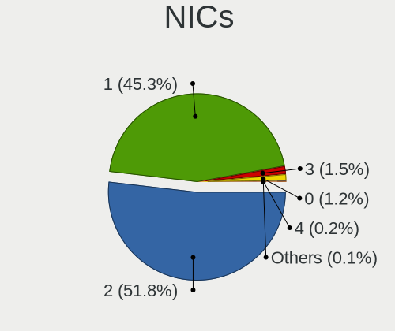
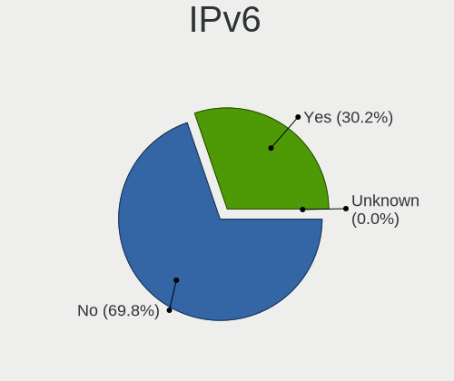

OpenMandriva - Tested Hardware & Statistics
-------------------------------------------

A project to collect tested hardware configurations for OpenMandriva.

Anyone can contribute to this report by the [hw-probe](https://github.com/linuxhw/hw-probe) tool:

    sudo -E hw-probe -all -upload

Please contribute! Especially if your hardware is rare.

This is a report for all computer types. See also reports for [desktops](/Dist/OpenMandriva/Desktop/README.md) and [notebooks](/Dist/OpenMandriva/Notebook/README.md).

Contents
--------

* [ Test Cases ](#test-cases)

* [ System ](#system)
  - [ OS                       ](#os)
  - [ OS Family                ](#os-family)
  - [ Kernel                   ](#kernel)
  - [ Kernel Family            ](#kernel-family)
  - [ Kernel Major Ver.        ](#kernel-major-ver)
  - [ Arch                     ](#arch)
  - [ DE                       ](#de)
  - [ Display Server           ](#display-server)
  - [ Display Manager          ](#display-manager)
  - [ OS Lang                  ](#os-lang)
  - [ Boot Mode                ](#boot-mode)
  - [ Filesystem               ](#filesystem)
  - [ Part. scheme             ](#part-scheme)
  - [ Dual Boot with Linux/BSD ](#dual-boot-with-linuxbsd)
  - [ Dual Boot (Win)          ](#dual-boot-win)

* [ Board ](#board)
  - [ Vendor                   ](#vendor)
  - [ Model                    ](#model)
  - [ Model Family             ](#model-family)
  - [ MFG Year                 ](#mfg-year)
  - [ Form Factor              ](#form-factor)
  - [ Secure Boot              ](#secure-boot)
  - [ Coreboot                 ](#coreboot)
  - [ RAM Size                 ](#ram-size)
  - [ RAM Used                 ](#ram-used)
  - [ Total Drives             ](#total-drives)
  - [ Has CD-ROM               ](#has-cd-rom)
  - [ Has Ethernet             ](#has-ethernet)
  - [ Has WiFi                 ](#has-wifi)
  - [ Has Bluetooth            ](#has-bluetooth)

* [ Location ](#location)
  - [ Country                  ](#country)
  - [ City                     ](#city)

* [ Drives ](#drives)
  - [ Drive Vendor             ](#drive-vendor)
  - [ Drive Model              ](#drive-model)
  - [ HDD Vendor               ](#hdd-vendor)
  - [ SSD Vendor               ](#ssd-vendor)
  - [ Drive Kind               ](#drive-kind)
  - [ Drive Connector          ](#drive-connector)
  - [ Drive Size               ](#drive-size)
  - [ Space Total              ](#space-total)
  - [ Space Used               ](#space-used)
  - [ Malfunc. Drives          ](#malfunc-drives)
  - [ Malfunc. Drive Vendor    ](#malfunc-drive-vendor)
  - [ Malfunc. HDD Vendor      ](#malfunc-hdd-vendor)
  - [ Malfunc. Drive Kind      ](#malfunc-drive-kind)
  - [ Failed Drives            ](#failed-drives)
  - [ Failed Drive Vendor      ](#failed-drive-vendor)
  - [ Drive Status             ](#drive-status)

* [ Storage controller ](#storage-controller)
  - [ Storage Vendor           ](#storage-vendor)
  - [ Storage Model            ](#storage-model)
  - [ Storage Kind             ](#storage-kind)

* [ Processor ](#processor)
  - [ CPU Vendor               ](#cpu-vendor)
  - [ CPU Model                ](#cpu-model)
  - [ CPU Model Family         ](#cpu-model-family)
  - [ CPU Cores                ](#cpu-cores)
  - [ CPU Sockets              ](#cpu-sockets)
  - [ CPU Threads              ](#cpu-threads)
  - [ CPU Op-Modes             ](#cpu-op-modes)
  - [ CPU Microcode            ](#cpu-microcode)
  - [ CPU Microarch            ](#cpu-microarch)

* [ Graphics ](#graphics)
  - [ GPU Vendor               ](#gpu-vendor)
  - [ GPU Model                ](#gpu-model)
  - [ GPU Combo                ](#gpu-combo)
  - [ GPU Driver               ](#gpu-driver)
  - [ GPU Memory               ](#gpu-memory)

* [ Monitor ](#monitor)
  - [ Monitor Vendor           ](#monitor-vendor)
  - [ Monitor Model            ](#monitor-model)
  - [ Monitor Resolution       ](#monitor-resolution)
  - [ Monitor Diagonal         ](#monitor-diagonal)
  - [ Monitor Width            ](#monitor-width)
  - [ Aspect Ratio             ](#aspect-ratio)
  - [ Monitor Area             ](#monitor-area)
  - [ Pixel Density            ](#pixel-density)
  - [ Multiple Monitors        ](#multiple-monitors)

* [ Network ](#network)
  - [ Net Controller Vendor    ](#net-controller-vendor)
  - [ Net Controller Model     ](#net-controller-model)
  - [ Wireless Vendor          ](#wireless-vendor)
  - [ Wireless Model           ](#wireless-model)
  - [ Ethernet Vendor          ](#ethernet-vendor)
  - [ Ethernet Model           ](#ethernet-model)
  - [ Net Controller Kind      ](#net-controller-kind)
  - [ Used Controller          ](#used-controller)
  - [ NICs                     ](#nics)
  - [ IPv6                     ](#ipv6)

* [ Bluetooth ](#bluetooth)
  - [ Bluetooth Vendor         ](#bluetooth-vendor)
  - [ Bluetooth Model          ](#bluetooth-model)

* [ Sound ](#sound)
  - [ Sound Vendor             ](#sound-vendor)
  - [ Sound Model              ](#sound-model)

* [ Memory ](#memory)
  - [ Memory Vendor            ](#memory-vendor)
  - [ Memory Model             ](#memory-model)
  - [ Memory Kind              ](#memory-kind)
  - [ Memory Form Factor       ](#memory-form-factor)
  - [ Memory Size              ](#memory-size)
  - [ Memory Speed             ](#memory-speed)

* [ Printers & scanners ](#printers--scanners)
  - [ Printer Vendor           ](#printer-vendor)
  - [ Printer Model            ](#printer-model)
  - [ Scanner Vendor           ](#scanner-vendor)
  - [ Scanner Model            ](#scanner-model)

* [ Camera ](#camera)
  - [ Camera Vendor            ](#camera-vendor)
  - [ Camera Model             ](#camera-model)

* [ Security ](#security)
  - [ Fingerprint Vendor       ](#fingerprint-vendor)
  - [ Fingerprint Model        ](#fingerprint-model)
  - [ Chipcard Vendor          ](#chipcard-vendor)
  - [ Chipcard Model           ](#chipcard-model)

* [ Unsupported ](#unsupported)
  - [ Unsupported Devices      ](#unsupported-devices)
  - [ Unsupported Device Types ](#unsupported-device-types)

Test Cases
----------

Total: 19292

| Vendor        | Model                       | Form-Factor | Probe                                                      | Date         |
|---------------|-----------------------------|-------------|------------------------------------------------------------|--------------|
| ASUSTek       | ASUS EXPERTBOOK L2502CYA... | Notebook    | [03df260579](https://linux-hardware.org/?probe=03df260579) | May 09, 2024 |
| Dell          | Vostro 15-3568              | Notebook    | [afd5a26a47](https://linux-hardware.org/?probe=afd5a26a47) | May 09, 2024 |
| ASUSTek       | K52F                        | Notebook    | [f67d81858e](https://linux-hardware.org/?probe=f67d81858e) | May 09, 2024 |
| HP            | 3396                        | Desktop     | [5e68a536f2](https://linux-hardware.org/?probe=5e68a536f2) | May 09, 2024 |
| ASUSTek       | X551MA                      | Notebook    | [6ce58b40cb](https://linux-hardware.org/?probe=6ce58b40cb) | May 09, 2024 |
| Dell          | 0VNP2H A00                  | Desktop     | [28953f7c6a](https://linux-hardware.org/?probe=28953f7c6a) | May 09, 2024 |
| Getac         | V110G3                      | Notebook    | [f2bd63cfb8](https://linux-hardware.org/?probe=f2bd63cfb8) | May 09, 2024 |
| Intel         | NUC7i5BNB J31144-311        | Mini pc     | [2de4ca3c36](https://linux-hardware.org/?probe=2de4ca3c36) | May 09, 2024 |
| Shenzhen M... | F7BSC                       | Mini pc     | [5782f1959e](https://linux-hardware.org/?probe=5782f1959e) | May 09, 2024 |
| MSI           | PRO B650M-A WIFI            | Desktop     | [c5f27e5e7b](https://linux-hardware.org/?probe=c5f27e5e7b) | May 09, 2024 |
| Samsung       | 960XGK                      | Notebook    | [4c22b1ca3a](https://linux-hardware.org/?probe=4c22b1ca3a) | May 09, 2024 |
| Dell          | Inspiron 15-3567            | Notebook    | [4f2761bde5](https://linux-hardware.org/?probe=4f2761bde5) | May 09, 2024 |
| HP            | Stream x360 Convertible ... | Convertible | [0fd35e9fda](https://linux-hardware.org/?probe=0fd35e9fda) | May 08, 2024 |
| Dell          | Inspiron N5040              | Notebook    | [5fae884a07](https://linux-hardware.org/?probe=5fae884a07) | May 08, 2024 |
| Gigabyte      | G41MT-S2PT                  | Desktop     | [a415a1e824](https://linux-hardware.org/?probe=a415a1e824) | May 08, 2024 |
| Acer          | Aspire A315-21              | Notebook    | [a838a7101f](https://linux-hardware.org/?probe=a838a7101f) | May 08, 2024 |
| Biostar       | A320MH                      | Desktop     | [404917c360](https://linux-hardware.org/?probe=404917c360) | May 08, 2024 |
| Gigabyte      | B450 AORUS ELITE            | Desktop     | [0cd34decca](https://linux-hardware.org/?probe=0cd34decca) | May 08, 2024 |
| Sony          | VGN-Z51MG_B                 | Notebook    | [6e5ed9d5f6](https://linux-hardware.org/?probe=6e5ed9d5f6) | May 08, 2024 |
| ASRock        | B450M-HDV                   | Desktop     | [098e62d52a](https://linux-hardware.org/?probe=098e62d52a) | May 08, 2024 |
| ASUSTek       | PRIME X470-PRO              | Desktop     | [c9bee8e35a](https://linux-hardware.org/?probe=c9bee8e35a) | May 08, 2024 |
| Dell          | Inspiron 5420               | Notebook    | [24c2d41566](https://linux-hardware.org/?probe=24c2d41566) | May 08, 2024 |
| HP            | EliteBook 8560p             | Notebook    | [fa48702e03](https://linux-hardware.org/?probe=fa48702e03) | May 08, 2024 |
| Fujitsu       | FMVNR1PE                    | Notebook    | [95504ca73e](https://linux-hardware.org/?probe=95504ca73e) | May 08, 2024 |
| HP            | EliteBook 840 G2            | Notebook    | [76e6f087bb](https://linux-hardware.org/?probe=76e6f087bb) | May 08, 2024 |
| Gigabyte      | H310M S2H x.x               | Desktop     | [97598b9cc3](https://linux-hardware.org/?probe=97598b9cc3) | May 07, 2024 |
| Fujitsu Si... | LIFEBOOK E8410              | Notebook    | [30a913526e](https://linux-hardware.org/?probe=30a913526e) | May 07, 2024 |
| HP            | TouchSmart tm2              | Notebook    | [b180e1388d](https://linux-hardware.org/?probe=b180e1388d) | May 07, 2024 |
| MSI           | P67A-G45                    | Desktop     | [f852d50c62](https://linux-hardware.org/?probe=f852d50c62) | May 07, 2024 |
| Lenovo        | IdeaPad 1 14IGL7 82V6       | Notebook    | [8c2b9bb30a](https://linux-hardware.org/?probe=8c2b9bb30a) | May 07, 2024 |
| ASUSTek       | PRIME A320M-E               | Desktop     | [d97bbebd45](https://linux-hardware.org/?probe=d97bbebd45) | May 07, 2024 |
| ECS           | Nettle2                     | Desktop     | [af1b3ee348](https://linux-hardware.org/?probe=af1b3ee348) | May 07, 2024 |
| Intel         | DQ45CB AAE30148-207         | Desktop     | [263e934dc2](https://linux-hardware.org/?probe=263e934dc2) | May 07, 2024 |
| ASRock        | B550 Phantom Gaming 4/ac    | Desktop     | [72d8d32749](https://linux-hardware.org/?probe=72d8d32749) | May 07, 2024 |
| Lenovo        | IdeaPad 3 15ITL6 82H8       | Notebook    | [a5b0e5456a](https://linux-hardware.org/?probe=a5b0e5456a) | May 07, 2024 |
| ASUSTek       | M4A78T-E                    | Desktop     | [2cee8d14ab](https://linux-hardware.org/?probe=2cee8d14ab) | May 06, 2024 |
| Lenovo        | XiaoXin-15IIL 2020 81YL     | Notebook    | [b95cda619a](https://linux-hardware.org/?probe=b95cda619a) | May 06, 2024 |
| Fujitsu       | D3164-A1 S26361-D3164-A1    | Desktop     | [ae1edad2ab](https://linux-hardware.org/?probe=ae1edad2ab) | May 06, 2024 |
| Lenovo        | Unknown                     | Notebook    | [dae6c8e749](https://linux-hardware.org/?probe=dae6c8e749) | May 06, 2024 |
| MSI           | CR61 2M/CX61 2OC/CX61 2O... | Notebook    | [ae77241a92](https://linux-hardware.org/?probe=ae77241a92) | May 06, 2024 |
| Dell          | 0HH807                      | Desktop     | [743dea0fc3](https://linux-hardware.org/?probe=743dea0fc3) | May 06, 2024 |
| HP            | 8053                        | Desktop     | [06b48e5ec6](https://linux-hardware.org/?probe=06b48e5ec6) | May 06, 2024 |
| HP            | EliteBook 820 G2            | Notebook    | [254af47954](https://linux-hardware.org/?probe=254af47954) | May 06, 2024 |
| Lenovo        | LOQ 15IRH8 82XV             | Notebook    | [c741f249e2](https://linux-hardware.org/?probe=c741f249e2) | May 06, 2024 |
| Gigabyte      | B650 AORUS ELITE AX         | Desktop     | [12afc4ec37](https://linux-hardware.org/?probe=12afc4ec37) | May 06, 2024 |
| HP            | 8299                        | Desktop     | [6024274be6](https://linux-hardware.org/?probe=6024274be6) | May 06, 2024 |
| Lenovo        | IdeaPad 1 14IGL7 82V6       | Notebook    | [083cfcc0f3](https://linux-hardware.org/?probe=083cfcc0f3) | May 06, 2024 |
| HP            | 650                         | Notebook    | [8fa3b11e2c](https://linux-hardware.org/?probe=8fa3b11e2c) | May 05, 2024 |
| Intel         | DG45ID AAE27729-312         | Desktop     | [9610cedb7b](https://linux-hardware.org/?probe=9610cedb7b) | May 05, 2024 |
| Lenovo        | V110-15IAP 80TG             | Notebook    | [2ba8347b04](https://linux-hardware.org/?probe=2ba8347b04) | May 05, 2024 |
| ASUSTek       | F5SL                        | Notebook    | [da423af0cb](https://linux-hardware.org/?probe=da423af0cb) | May 05, 2024 |
| Gigabyte      | H61M-S2PV                   | Desktop     | [780a67ef79](https://linux-hardware.org/?probe=780a67ef79) | May 05, 2024 |
| HP            | ProBook 640 G1              | Notebook    | [012a8fbd0c](https://linux-hardware.org/?probe=012a8fbd0c) | May 05, 2024 |
| HP            | 1850                        | Desktop     | [5bab4e9f9b](https://linux-hardware.org/?probe=5bab4e9f9b) | May 05, 2024 |
| HP            | Compaq 6720s                | Notebook    | [e51bd60d05](https://linux-hardware.org/?probe=e51bd60d05) | May 05, 2024 |
| Lenovo        | 0B98401 WIN                 | Desktop     | [8d1ee988ad](https://linux-hardware.org/?probe=8d1ee988ad) | May 05, 2024 |
| ASRock        | E350M1/USB3                 | Desktop     | [d82d76d3e5](https://linux-hardware.org/?probe=d82d76d3e5) | May 05, 2024 |
| Lenovo        | ThinkPad Edge E530 32597... | Notebook    | [a216f0b6d5](https://linux-hardware.org/?probe=a216f0b6d5) | May 05, 2024 |
| Acer          | Switch SW312-31             | Tablet      | [e7fe09d066](https://linux-hardware.org/?probe=e7fe09d066) | May 04, 2024 |
| Lenovo        | ThinkPad T520 4243W29       | Notebook    | [b1e4dde68e](https://linux-hardware.org/?probe=b1e4dde68e) | May 04, 2024 |
| Dell          | 0R6PCT A01                  | Desktop     | [61f596b724](https://linux-hardware.org/?probe=61f596b724) | May 04, 2024 |
| Acer          | EQ45LM                      | Desktop     | [52563cbf82](https://linux-hardware.org/?probe=52563cbf82) | May 04, 2024 |
| ASUSTek       | ROG STRIX Z690-A GAMING ... | Desktop     | [64b195310b](https://linux-hardware.org/?probe=64b195310b) | May 04, 2024 |
| ASUSTek       | ASUS EXPERTBOOK B1500CEA... | Notebook    | [ea3a8f97a7](https://linux-hardware.org/?probe=ea3a8f97a7) | May 04, 2024 |
| MouseCompu... | H61MU-S01                   | Desktop     | [9ab7d4b6e9](https://linux-hardware.org/?probe=9ab7d4b6e9) | May 04, 2024 |
| HP            | 339A                        | Desktop     | [a5f44d3bdb](https://linux-hardware.org/?probe=a5f44d3bdb) | May 04, 2024 |
| Gigabyte      | GA-78LMT-S2                 | Desktop     | [6a9fd41a39](https://linux-hardware.org/?probe=6a9fd41a39) | May 04, 2024 |
| HP            | Notebook                    | Notebook    | [87f06569d7](https://linux-hardware.org/?probe=87f06569d7) | May 04, 2024 |
| Gigabyte      | 970A-DS3P                   | Desktop     | [0cf6542a99](https://linux-hardware.org/?probe=0cf6542a99) | May 04, 2024 |
| Gigabyte      | B550M DS3H AC               | Desktop     | [15375b5d97](https://linux-hardware.org/?probe=15375b5d97) | May 04, 2024 |
| Unknown       | G41 A01                     | Desktop     | [537cc137bd](https://linux-hardware.org/?probe=537cc137bd) | May 04, 2024 |
| Centerm       | C92                         | Desktop     | [beaeac18bc](https://linux-hardware.org/?probe=beaeac18bc) | May 04, 2024 |
| MouseCompu... | Z170-S01                    | Desktop     | [013d513bf9](https://linux-hardware.org/?probe=013d513bf9) | May 04, 2024 |
| ASUSTek       | PRIME B350M-A               | Desktop     | [3d11f9d342](https://linux-hardware.org/?probe=3d11f9d342) | May 03, 2024 |
| HP            | 246                         | Notebook    | [83140d67e2](https://linux-hardware.org/?probe=83140d67e2) | May 03, 2024 |
| OEM           | X79-Turbo                   | Desktop     | [9c9327fa63](https://linux-hardware.org/?probe=9c9327fa63) | May 03, 2024 |
| HP            | Pavilion dm3                | Notebook    | [cb32e79169](https://linux-hardware.org/?probe=cb32e79169) | May 03, 2024 |
| ASUSTek       | K8V-MX                      | Desktop     | [64054e7bf3](https://linux-hardware.org/?probe=64054e7bf3) | May 03, 2024 |
| ASUSTek       | PRIME B460-PLUS             | Desktop     | [dd201d321b](https://linux-hardware.org/?probe=dd201d321b) | May 03, 2024 |
| HP            | 339A                        | Desktop     | [c19ffbdcb6](https://linux-hardware.org/?probe=c19ffbdcb6) | May 03, 2024 |
| Dell          | Inspiron 16 5620            | Notebook    | [37d023541b](https://linux-hardware.org/?probe=37d023541b) | May 03, 2024 |
| Gigabyte      | B450M DS3H V2               | Desktop     | [87b5a4320e](https://linux-hardware.org/?probe=87b5a4320e) | May 03, 2024 |
| ASUSTek       | X751SA                      | Notebook    | [7dadfc10b4](https://linux-hardware.org/?probe=7dadfc10b4) | May 03, 2024 |
| Dell          | 0WR7PY A04                  | Desktop     | [b48e977e84](https://linux-hardware.org/?probe=b48e977e84) | May 03, 2024 |
| Lenovo        | B50-45 20388                | Notebook    | [49ad9c2e0e](https://linux-hardware.org/?probe=49ad9c2e0e) | May 03, 2024 |
| ASRock        | X300M-STX                   | Desktop     | [58d58080cd](https://linux-hardware.org/?probe=58d58080cd) | May 03, 2024 |
| Toshiba       | Satellite Pro L650          | Notebook    | [4e0111f9c9](https://linux-hardware.org/?probe=4e0111f9c9) | May 02, 2024 |
| Intel         | B75                         | Desktop     | [4c39b0616d](https://linux-hardware.org/?probe=4c39b0616d) | May 02, 2024 |
| Lenovo        | ThinkBook 15-IML 20RW       | Notebook    | [3f312360ff](https://linux-hardware.org/?probe=3f312360ff) | May 02, 2024 |
| Lenovo        | ThinkPad T480 20L60034MX    | Notebook    | [eec0c4ee95](https://linux-hardware.org/?probe=eec0c4ee95) | May 02, 2024 |
| HP            | 8298                        | Desktop     | [da2ba36ce9](https://linux-hardware.org/?probe=da2ba36ce9) | May 02, 2024 |
| Acer          | FIH57                       | Desktop     | [8e4b02facb](https://linux-hardware.org/?probe=8e4b02facb) | May 02, 2024 |
| ASUSTek       | X553MA                      | Notebook    | [0418112d2f](https://linux-hardware.org/?probe=0418112d2f) | May 02, 2024 |
| HP            | Unknown                     | Notebook    | [2105666632](https://linux-hardware.org/?probe=2105666632) | May 02, 2024 |
| Apple         | MacBookAir7,2               | Notebook    | [63cf24a977](https://linux-hardware.org/?probe=63cf24a977) | May 02, 2024 |
| HP            | 250 G6 Notebook PC          | Notebook    | [ff4a31241b](https://linux-hardware.org/?probe=ff4a31241b) | May 02, 2024 |
| HP            | 2129                        | Desktop     | [3a5c2b8ae5](https://linux-hardware.org/?probe=3a5c2b8ae5) | May 02, 2024 |
| ASUSTek       | PRIME B660-PLUS D4          | Desktop     | [d7c901b5d7](https://linux-hardware.org/?probe=d7c901b5d7) | May 02, 2024 |
| Apple         | Mac-942B5BF58194151B        | All in one  | [b8a7fbfad1](https://linux-hardware.org/?probe=b8a7fbfad1) | May 01, 2024 |
| Lenovo        | ThinkPad L530 24812K6       | Notebook    | [e7d0c76f65](https://linux-hardware.org/?probe=e7d0c76f65) | May 01, 2024 |
| Acer          | EM61SM/EM61PM               | Desktop     | [3b2c0bd5f6](https://linux-hardware.org/?probe=3b2c0bd5f6) | May 01, 2024 |
| Dell          | 0KRC95 A00                  | Desktop     | [72ba135dda](https://linux-hardware.org/?probe=72ba135dda) | May 01, 2024 |
| Gigabyte      | H81M-HD3                    | Desktop     | [adcbc97b26](https://linux-hardware.org/?probe=adcbc97b26) | May 01, 2024 |
| MSI           | B450M MORTAR MAX            | Desktop     | [527f3123a6](https://linux-hardware.org/?probe=527f3123a6) | May 01, 2024 |
| Packard Be... | EasyNote TJ71               | Notebook    | [f421f823ec](https://linux-hardware.org/?probe=f421f823ec) | May 01, 2024 |
| Dell          | Inspiron 13-5368            | Notebook    | [ac125025cf](https://linux-hardware.org/?probe=ac125025cf) | May 01, 2024 |
| Google        | Bluebird                    | Notebook    | [75db9dc248](https://linux-hardware.org/?probe=75db9dc248) | May 01, 2024 |
| Intel         | NUC5i7RYB H73774-102        | Mini pc     | [f8c5dfd1fd](https://linux-hardware.org/?probe=f8c5dfd1fd) | May 01, 2024 |
| Lenovo        | ThinkPad P1 Gen 4i 20Y4S... | Notebook    | [2445f78890](https://linux-hardware.org/?probe=2445f78890) | May 01, 2024 |
| Lenovo        | H410                        | Desktop     | [d16690b0c4](https://linux-hardware.org/?probe=d16690b0c4) | May 01, 2024 |
| Gigabyte      | B85M-D2V                    | Desktop     | [40ae77d112](https://linux-hardware.org/?probe=40ae77d112) | May 01, 2024 |
| HP            | Pavilion Notebook           | Notebook    | [5d6cdceb37](https://linux-hardware.org/?probe=5d6cdceb37) | May 01, 2024 |
| ASUSTek       | VivoBook_ASUSLaptop X160... | Notebook    | [cee4dd63f5](https://linux-hardware.org/?probe=cee4dd63f5) | Apr 30, 2024 |
| Packard Be... | IMEDIA S2185                | Desktop     | [47d64869d6](https://linux-hardware.org/?probe=47d64869d6) | Apr 30, 2024 |
| MSI           | PRO H610M-G DDR4            | Desktop     | [b8ab800603](https://linux-hardware.org/?probe=b8ab800603) | Apr 30, 2024 |
| Acer          | Aspire 7745G                | Notebook    | [1854a5b427](https://linux-hardware.org/?probe=1854a5b427) | Apr 30, 2024 |
| Biostar       | H310MHP                     | Desktop     | [1faa8b5213](https://linux-hardware.org/?probe=1faa8b5213) | Apr 30, 2024 |
| Biostar       | H310MHP                     | Desktop     | [d5bc5a946f](https://linux-hardware.org/?probe=d5bc5a946f) | Apr 30, 2024 |
| Lenovo        | 30C9 SEK0N11843 IOT 3806... | Desktop     | [517daa7c85](https://linux-hardware.org/?probe=517daa7c85) | Apr 30, 2024 |
| Gigabyte      | B550M DS3H AC               | Desktop     | [0a5a41e025](https://linux-hardware.org/?probe=0a5a41e025) | Apr 30, 2024 |
| Chuwi         | LapBook Air                 | Notebook    | [ee0775cfb7](https://linux-hardware.org/?probe=ee0775cfb7) | Apr 30, 2024 |
| Dell          | Latitude E6530              | Notebook    | [6e04062057](https://linux-hardware.org/?probe=6e04062057) | Apr 30, 2024 |
| Dell          | 0F6X5P A00                  | Desktop     | [d860ea2ea1](https://linux-hardware.org/?probe=d860ea2ea1) | Apr 30, 2024 |
| ASUSTek       | PRIME H410M-K               | Desktop     | [9c6f64ecd9](https://linux-hardware.org/?probe=9c6f64ecd9) | Apr 29, 2024 |
| Lenovo        | IdeaPadFlex 5 14IIL05 81... | Convertible | [e204e319f8](https://linux-hardware.org/?probe=e204e319f8) | Apr 29, 2024 |
| Gigabyte      | Z790 AERO G                 | Desktop     | [f226cfa836](https://linux-hardware.org/?probe=f226cfa836) | Apr 29, 2024 |
| MSI           | A68HM-E33                   | Desktop     | [abf75e8321](https://linux-hardware.org/?probe=abf75e8321) | Apr 29, 2024 |
| ASUSTek       | H81M-P PLUS                 | Desktop     | [e3c17dccb5](https://linux-hardware.org/?probe=e3c17dccb5) | Apr 29, 2024 |
| MSI           | PRO H610M-G DDR4            | Desktop     | [1492484deb](https://linux-hardware.org/?probe=1492484deb) | Apr 29, 2024 |
| Gigabyte      | GA-MA785GMT-UD2H            | Desktop     | [b1f251b92c](https://linux-hardware.org/?probe=b1f251b92c) | Apr 29, 2024 |
| EVGA          | NF66 2                      | Desktop     | [ef1a49773b](https://linux-hardware.org/?probe=ef1a49773b) | Apr 29, 2024 |
| Google        | Gandof                      | Notebook    | [539c66172b](https://linux-hardware.org/?probe=539c66172b) | Apr 28, 2024 |
| ASUSTek       | Maximus VII HERO            | Desktop     | [51efe9cdc9](https://linux-hardware.org/?probe=51efe9cdc9) | Apr 28, 2024 |
| HP            | 0A54h                       | Desktop     | [603811635b](https://linux-hardware.org/?probe=603811635b) | Apr 28, 2024 |
| Dell          | Latitude E6410              | Notebook    | [14cad1b34b](https://linux-hardware.org/?probe=14cad1b34b) | Apr 28, 2024 |
| MSI           | A68HM GRENADE               | Desktop     | [c1a1b60624](https://linux-hardware.org/?probe=c1a1b60624) | Apr 28, 2024 |
| Fujitsu       | D3433-S2 S26361-D3433-S2    | Desktop     | [ed1d2dac2d](https://linux-hardware.org/?probe=ed1d2dac2d) | Apr 28, 2024 |
| ASUSTek       | A8NE-FM                     | Desktop     | [dbabd85077](https://linux-hardware.org/?probe=dbabd85077) | Apr 28, 2024 |
| ASUSTek       | X99-A                       | Desktop     | [eab08c37f7](https://linux-hardware.org/?probe=eab08c37f7) | Apr 28, 2024 |
| Intel         | D945GCL AAD67193-205        | Desktop     | [2520d8fe1d](https://linux-hardware.org/?probe=2520d8fe1d) | Apr 28, 2024 |
| ASUSTek       | P8H61-M LE                  | Desktop     | [15d91ebe7c](https://linux-hardware.org/?probe=15d91ebe7c) | Apr 28, 2024 |
| ASUSTek       | N53SN                       | Notebook    | [4c0db81fd7](https://linux-hardware.org/?probe=4c0db81fd7) | Apr 28, 2024 |
| Lenovo        | ThinkPad T420 4236L35       | Notebook    | [df6f046778](https://linux-hardware.org/?probe=df6f046778) | Apr 28, 2024 |
| Lenovo        | IdeaPad 1 15ALC7 82R4       | Notebook    | [40c7e6e4a3](https://linux-hardware.org/?probe=40c7e6e4a3) | Apr 28, 2024 |
| HP            | 8768 A                      | Desktop     | [aba3b50d67](https://linux-hardware.org/?probe=aba3b50d67) | Apr 28, 2024 |
| Intel         | powered classmate PC MP ... | Notebook    | [7b243a5cb5](https://linux-hardware.org/?probe=7b243a5cb5) | Apr 28, 2024 |
| Lenovo        | ThinkPad T430 23492F5       | Notebook    | [8d26be4497](https://linux-hardware.org/?probe=8d26be4497) | Apr 28, 2024 |
| Lenovo        | Slim Pro 7 14ARP8 83AX      | Notebook    | [1856484488](https://linux-hardware.org/?probe=1856484488) | Apr 27, 2024 |
| ASRock        | A320M-DVS R3.0              | Desktop     | [3af9ef3df5](https://linux-hardware.org/?probe=3af9ef3df5) | Apr 27, 2024 |
| MSI           | G31M3-L V2                  | Desktop     | [0a033139d1](https://linux-hardware.org/?probe=0a033139d1) | Apr 27, 2024 |
| Lenovo        | IdeaPad G485 QAWGE          | Notebook    | [364be8242a](https://linux-hardware.org/?probe=364be8242a) | Apr 27, 2024 |
| ASRock        | Z97 Extreme4                | Desktop     | [611e146e9e](https://linux-hardware.org/?probe=611e146e9e) | Apr 27, 2024 |
| Dell          | 096JG8 A01                  | Desktop     | [5848ea3def](https://linux-hardware.org/?probe=5848ea3def) | Apr 27, 2024 |
| Notebook      | W54BL                       | Notebook    | [adb804fa7f](https://linux-hardware.org/?probe=adb804fa7f) | Apr 27, 2024 |
| Acer          | Aspire 5734Z                | Notebook    | [1b89b729a3](https://linux-hardware.org/?probe=1b89b729a3) | Apr 27, 2024 |
| Dell          | Latitude 5580               | Notebook    | [e646939794](https://linux-hardware.org/?probe=e646939794) | Apr 27, 2024 |
| MSI           | PRO Z690-P DDR4             | Desktop     | [c43d04d511](https://linux-hardware.org/?probe=c43d04d511) | Apr 27, 2024 |
| Acer          | Aspire ES1-732              | Notebook    | [dda97c8536](https://linux-hardware.org/?probe=dda97c8536) | Apr 26, 2024 |
| Lenovo        | ThinkPad X220 4290RW1       | Notebook    | [306c586e02](https://linux-hardware.org/?probe=306c586e02) | Apr 26, 2024 |
| HP            | ZBook 17 G3 Mobile Works... | Notebook    | [e56b499574](https://linux-hardware.org/?probe=e56b499574) | Apr 26, 2024 |
| ASUSTek       | VivoBook_ASUSLaptop X512... | Notebook    | [4f05e448a7](https://linux-hardware.org/?probe=4f05e448a7) | Apr 26, 2024 |
| ASUSTek       | X541NA                      | Notebook    | [bba16f5bc3](https://linux-hardware.org/?probe=bba16f5bc3) | Apr 26, 2024 |
| HP            | EliteBook 840 G6            | Notebook    | [cd5b6c35ae](https://linux-hardware.org/?probe=cd5b6c35ae) | Apr 26, 2024 |
| Lenovo        | IdeaPad Y570 20091          | Notebook    | [67336a137f](https://linux-hardware.org/?probe=67336a137f) | Apr 26, 2024 |
| HP            | 3029h                       | Desktop     | [70cd5cbc22](https://linux-hardware.org/?probe=70cd5cbc22) | Apr 26, 2024 |
| Gigabyte      | Z390 UD                     | Desktop     | [2aebb056ff](https://linux-hardware.org/?probe=2aebb056ff) | Apr 26, 2024 |
| Dell          | Latitude E6400              | Notebook    | [ab58a2d0bd](https://linux-hardware.org/?probe=ab58a2d0bd) | Apr 26, 2024 |
| MSI           | B250I GAMING PRO AC         | Desktop     | [edf573962d](https://linux-hardware.org/?probe=edf573962d) | Apr 25, 2024 |
| Dell          | Inspiron 15 3511            | Notebook    | [48c356da20](https://linux-hardware.org/?probe=48c356da20) | Apr 25, 2024 |
| MAXSUN        | MS-Terminator B550M         | Desktop     | [4960448326](https://linux-hardware.org/?probe=4960448326) | Apr 25, 2024 |
| MACHINIST     | X79 V2.82A                  | Desktop     | [41c6b865b1](https://linux-hardware.org/?probe=41c6b865b1) | Apr 25, 2024 |
| ASRock        | A320M/ac                    | Desktop     | [6441ba6000](https://linux-hardware.org/?probe=6441ba6000) | Apr 25, 2024 |
| HP            | 2AF7                        | Desktop     | [dcff3bbb91](https://linux-hardware.org/?probe=dcff3bbb91) | Apr 25, 2024 |
| Gigabyte      | F2A55M-DS2                  | Desktop     | [8252280757](https://linux-hardware.org/?probe=8252280757) | Apr 25, 2024 |
| Dell          | Inspiron 15 3515            | Notebook    | [cd29a525ed](https://linux-hardware.org/?probe=cd29a525ed) | Apr 24, 2024 |
| Gigabyte      | EX58-UD3R                   | Desktop     | [826b210e79](https://linux-hardware.org/?probe=826b210e79) | Apr 24, 2024 |
| ASUSTek       | PRIME H510M-A               | Desktop     | [a0eca89d4e](https://linux-hardware.org/?probe=a0eca89d4e) | Apr 24, 2024 |
| Dell          | 08NPPY A00                  | Desktop     | [8e54a2234f](https://linux-hardware.org/?probe=8e54a2234f) | Apr 24, 2024 |
| Unknown       | Unknown                     | Notebook    | [d722d0e84b](https://linux-hardware.org/?probe=d722d0e84b) | Apr 24, 2024 |
| HP            | Compaq Presario C700        | Notebook    | [062cdaa3a3](https://linux-hardware.org/?probe=062cdaa3a3) | Apr 24, 2024 |
| HP            | EliteBook 2170p             | Notebook    | [847dec6d8e](https://linux-hardware.org/?probe=847dec6d8e) | Apr 24, 2024 |
| HP            | EliteBook Folio 9470m       | Notebook    | [04e8d2bb6b](https://linux-hardware.org/?probe=04e8d2bb6b) | Apr 24, 2024 |
| Acer          | Revo M2-601 A01             | Desktop     | [54a18aaccb](https://linux-hardware.org/?probe=54a18aaccb) | Apr 24, 2024 |
| HP            | EliteBook 840 G2            | Notebook    | [006661b0c2](https://linux-hardware.org/?probe=006661b0c2) | Apr 23, 2024 |
| Acer          | Veriton X2632G V:1.0        | Desktop     | [88daeba4af](https://linux-hardware.org/?probe=88daeba4af) | Apr 23, 2024 |
| Dell          | Inspiron 5558               | Notebook    | [246047bf8e](https://linux-hardware.org/?probe=246047bf8e) | Apr 23, 2024 |
| Dell          | Latitude 3340               | Notebook    | [097f5b6c08](https://linux-hardware.org/?probe=097f5b6c08) | Apr 23, 2024 |
| Lenovo        | ThinkPad Edge E431 62775... | Notebook    | [ad67ecab25](https://linux-hardware.org/?probe=ad67ecab25) | Apr 23, 2024 |
| Computer D... | W240EU/W250EUQ/W270EUQ      | Notebook    | [2064944dc4](https://linux-hardware.org/?probe=2064944dc4) | Apr 23, 2024 |
| HP            | 2B0C                        | All in one  | [e84d8e93ef](https://linux-hardware.org/?probe=e84d8e93ef) | Apr 23, 2024 |
| HP            | Laptop 15s-fq2xxx           | Notebook    | [06c81aed79](https://linux-hardware.org/?probe=06c81aed79) | Apr 23, 2024 |
| Dell          | Latitude E5550              | Notebook    | [2193ab1cfa](https://linux-hardware.org/?probe=2193ab1cfa) | Apr 23, 2024 |
| ASUSTek       | K53SD                       | Notebook    | [777dfb666e](https://linux-hardware.org/?probe=777dfb666e) | Apr 23, 2024 |
| Gigabyte      | Z390 UD                     | Desktop     | [36a382f0da](https://linux-hardware.org/?probe=36a382f0da) | Apr 23, 2024 |
| Dell          | Inspiron 3501               | Notebook    | [faae79a749](https://linux-hardware.org/?probe=faae79a749) | Apr 23, 2024 |
| ASUSTek       | A68HM-PLUS                  | Desktop     | [c495b7e3d7](https://linux-hardware.org/?probe=c495b7e3d7) | Apr 23, 2024 |
| ASUSTek       | PRIME B550M-A               | Desktop     | [b662ccf901](https://linux-hardware.org/?probe=b662ccf901) | Apr 22, 2024 |
| ASRock        | G31M-S                      | Desktop     | [591e58940a](https://linux-hardware.org/?probe=591e58940a) | Apr 22, 2024 |
| Acer          | Aspire 4736 V1.04           | Other       | [e514221b1f](https://linux-hardware.org/?probe=e514221b1f) | Apr 22, 2024 |
| Dell          | 0VHXCD A01                  | Desktop     | [4b7a01c41a](https://linux-hardware.org/?probe=4b7a01c41a) | Apr 22, 2024 |
| ASUSTek       | K93SM                       | Notebook    | [031f10fad0](https://linux-hardware.org/?probe=031f10fad0) | Apr 22, 2024 |
| ASUSTek       | M5A99X EVO                  | Desktop     | [afb6abad8d](https://linux-hardware.org/?probe=afb6abad8d) | Apr 21, 2024 |
| Acer          | TM8573                      | Notebook    | [9c3c528235](https://linux-hardware.org/?probe=9c3c528235) | Apr 21, 2024 |
| HP            | Pavilion dv7                | Notebook    | [c7af52e729](https://linux-hardware.org/?probe=c7af52e729) | Apr 21, 2024 |
| MSI           | MPG X570 GAMING EDGE WIF... | Desktop     | [a2b7475561](https://linux-hardware.org/?probe=a2b7475561) | Apr 21, 2024 |
| Lenovo        | Yoga 7 14ARP8 82YM          | Convertible | [5a536be44c](https://linux-hardware.org/?probe=5a536be44c) | Apr 21, 2024 |
| ASUSTek       | Amberine                    | Desktop     | [618eece8ca](https://linux-hardware.org/?probe=618eece8ca) | Apr 21, 2024 |
| Positivo      | POS-PIG41BA POSITIVO        | Desktop     | [d5e1581050](https://linux-hardware.org/?probe=d5e1581050) | Apr 21, 2024 |
| Acer          | Aspire F5-573               | Notebook    | [c71f150bd8](https://linux-hardware.org/?probe=c71f150bd8) | Apr 21, 2024 |
| HUAWEI        | BOHK-WAX9X                  | Notebook    | [b69304aa9b](https://linux-hardware.org/?probe=b69304aa9b) | Apr 21, 2024 |
| Dynabook      | P1-K2XP-TB                  | Tablet      | [a59b175278](https://linux-hardware.org/?probe=a59b175278) | Apr 21, 2024 |
| Gigabyte      | H81M-D2V                    | Desktop     | [601836b445](https://linux-hardware.org/?probe=601836b445) | Apr 21, 2024 |
| Lenovo        | ThinkPad R61e 7650DHU       | Notebook    | [93e4fe440f](https://linux-hardware.org/?probe=93e4fe440f) | Apr 21, 2024 |
| Dell          | 0XFN1D A00                  | All in one  | [99aa3181a2](https://linux-hardware.org/?probe=99aa3181a2) | Apr 21, 2024 |
| ASUSTek       | PRIME H410M-A               | Desktop     | [41da917e67](https://linux-hardware.org/?probe=41da917e67) | Apr 21, 2024 |
| Acer          | WG43M                       | Desktop     | [93fcdbd13d](https://linux-hardware.org/?probe=93fcdbd13d) | Apr 20, 2024 |
| GEEKOM        | Mini Air12                  | Server      | [fef2c94714](https://linux-hardware.org/?probe=fef2c94714) | Apr 20, 2024 |
| Lenovo        | ThinkPad X260 20F5S4CC00    | Notebook    | [56a80212e2](https://linux-hardware.org/?probe=56a80212e2) | Apr 20, 2024 |
| Dell          | Inspiron 5559               | Notebook    | [fa44624ceb](https://linux-hardware.org/?probe=fa44624ceb) | Apr 20, 2024 |
| Lenovo        | IdeaPad 510-15IKB 80SV      | Notebook    | [c823822177](https://linux-hardware.org/?probe=c823822177) | Apr 20, 2024 |
| ASUSTek       | Strix 15 GL503GE            | Notebook    | [efeb67efdf](https://linux-hardware.org/?probe=efeb67efdf) | Apr 19, 2024 |
| Foxconn       | G41MX/G41MX-K 2.0 1.0       | Desktop     | [a55114abfa](https://linux-hardware.org/?probe=a55114abfa) | Apr 19, 2024 |
| HP            | 339A                        | Desktop     | [8cb48fe045](https://linux-hardware.org/?probe=8cb48fe045) | Apr 19, 2024 |
| ASUSTek       | A88XM-E                     | Desktop     | [6ff101f38c](https://linux-hardware.org/?probe=6ff101f38c) | Apr 19, 2024 |
| MSI           | MS-7235                     | Desktop     | [d0b1ac0e44](https://linux-hardware.org/?probe=d0b1ac0e44) | Apr 19, 2024 |
| MSI           | B85I                        | Desktop     | [8751cf893f](https://linux-hardware.org/?probe=8751cf893f) | Apr 19, 2024 |
| Sony          | SVE1111M1EW                 | Notebook    | [4303a7cc13](https://linux-hardware.org/?probe=4303a7cc13) | Apr 19, 2024 |
| Lenovo        | Y50-70 20378                | Notebook    | [50de89d752](https://linux-hardware.org/?probe=50de89d752) | Apr 18, 2024 |
| HP            | 2B02                        | Desktop     | [5272c37a4c](https://linux-hardware.org/?probe=5272c37a4c) | Apr 18, 2024 |
| Dell          | 0Y958C A00                  | Desktop     | [88a0060933](https://linux-hardware.org/?probe=88a0060933) | Apr 18, 2024 |
| ASUSTek       | P9X79                       | Desktop     | [3f587bf3dd](https://linux-hardware.org/?probe=3f587bf3dd) | Apr 18, 2024 |
| Lenovo        | Yoga 530-14ARR 81H9         | Convertible | [816cd7c3fe](https://linux-hardware.org/?probe=816cd7c3fe) | Apr 18, 2024 |
| Acer          | V5-171                      | Notebook    | [1c5fdb6bae](https://linux-hardware.org/?probe=1c5fdb6bae) | Apr 18, 2024 |
| HP            | Laptop 15-dy5xxx            | Notebook    | [bb34072490](https://linux-hardware.org/?probe=bb34072490) | Apr 18, 2024 |
| Gigabyte      | H170M-D3H DDR3-CF           | Desktop     | [f7a78f85d8](https://linux-hardware.org/?probe=f7a78f85d8) | Apr 18, 2024 |
| HP            | 240 G8 Notebook PC          | Notebook    | [13af7544f2](https://linux-hardware.org/?probe=13af7544f2) | Apr 17, 2024 |
| Lenovo        | ThinkPad L560 20F2S0TB00    | Notebook    | [943647251c](https://linux-hardware.org/?probe=943647251c) | Apr 17, 2024 |
| Lenovo        | 100-14IBY 80R7              | Notebook    | [c186027176](https://linux-hardware.org/?probe=c186027176) | Apr 17, 2024 |
| ASUSTek       | P8Z77-V LX                  | Desktop     | [686220b484](https://linux-hardware.org/?probe=686220b484) | Apr 17, 2024 |
| Acer          | Aspire A317-52              | Notebook    | [bf62cb2dba](https://linux-hardware.org/?probe=bf62cb2dba) | Apr 17, 2024 |
| Dell          | Latitude E5470              | Notebook    | [f286256e09](https://linux-hardware.org/?probe=f286256e09) | Apr 17, 2024 |
| Pegatron      | Narra6                      | Desktop     | [fb336cac9b](https://linux-hardware.org/?probe=fb336cac9b) | Apr 17, 2024 |
| Intel         | H61                         | Desktop     | [e0bacf6b01](https://linux-hardware.org/?probe=e0bacf6b01) | Apr 17, 2024 |
| ASUSTek       | X751LJ                      | Notebook    | [ee2d127680](https://linux-hardware.org/?probe=ee2d127680) | Apr 16, 2024 |
| ASUSTek       | P5N72-T PREMIUM             | Desktop     | [067b12dd29](https://linux-hardware.org/?probe=067b12dd29) | Apr 16, 2024 |
| Dell          | 0D28YY A03                  | Desktop     | [0332c27e2c](https://linux-hardware.org/?probe=0332c27e2c) | Apr 16, 2024 |
| ASUSTek       | ROG STRIX B650E-I GAMING... | Desktop     | [41c197d579](https://linux-hardware.org/?probe=41c197d579) | Apr 16, 2024 |
| ASUSTek       | GL502VM                     | Notebook    | [d478e55005](https://linux-hardware.org/?probe=d478e55005) | Apr 16, 2024 |
| ASUSTek       | K50IJ                       | Notebook    | [f0d8580bfc](https://linux-hardware.org/?probe=f0d8580bfc) | Apr 16, 2024 |
| Acer          | Aspire E1-572G              | Notebook    | [5428a93214](https://linux-hardware.org/?probe=5428a93214) | Apr 16, 2024 |
| ASUSTek       | P8H61-MX R2.0               | Desktop     | [53a06e22d4](https://linux-hardware.org/?probe=53a06e22d4) | Apr 16, 2024 |
| HP            | 250 G7 Notebook PC          | Notebook    | [be2b691a57](https://linux-hardware.org/?probe=be2b691a57) | Apr 15, 2024 |
| MSI           | H81M-E34                    | Desktop     | [61891eff16](https://linux-hardware.org/?probe=61891eff16) | Apr 15, 2024 |
| HP            | Laptop 15-ef0xxx            | Notebook    | [dbbb032e1b](https://linux-hardware.org/?probe=dbbb032e1b) | Apr 15, 2024 |
| Lenovo        | ThinkPad X280 20KESA5000    | Notebook    | [8571fb3b5c](https://linux-hardware.org/?probe=8571fb3b5c) | Apr 14, 2024 |
| ASUSTek       | ROG STRIX B550-I GAMING     | Desktop     | [4fb5756438](https://linux-hardware.org/?probe=4fb5756438) | Apr 14, 2024 |
| HP            | Unknown                     | Notebook    | [9415eb2f3c](https://linux-hardware.org/?probe=9415eb2f3c) | Apr 14, 2024 |
| HP            | 805D                        | Desktop     | [f3b0ef4a3b](https://linux-hardware.org/?probe=f3b0ef4a3b) | Apr 14, 2024 |
| Lenovo        | IdeaPad Slim 1-14AST-05 ... | Notebook    | [6720cd6b1d](https://linux-hardware.org/?probe=6720cd6b1d) | Apr 14, 2024 |
| Lenovo        | Win8 Pro DPK TPG            | Desktop     | [c6fd918c6e](https://linux-hardware.org/?probe=c6fd918c6e) | Apr 14, 2024 |
| Gigabyte      | H110M-DS2V-CF               | Desktop     | [40fe788bf0](https://linux-hardware.org/?probe=40fe788bf0) | Apr 14, 2024 |
| Acer          | Aspire ES1-533              | Notebook    | [c4059b2efa](https://linux-hardware.org/?probe=c4059b2efa) | Apr 14, 2024 |
| ASUSTek       | ROG STRIX B450-F GAMING     | Desktop     | [a829e68e1f](https://linux-hardware.org/?probe=a829e68e1f) | Apr 14, 2024 |
| Lenovo        | HASWELLREFRESHDT 3190005... | All in one  | [e3a19501c5](https://linux-hardware.org/?probe=e3a19501c5) | Apr 14, 2024 |
| Unknown       | Unknown                     | Notebook    | [9d776d1a83](https://linux-hardware.org/?probe=9d776d1a83) | Apr 14, 2024 |
| Lenovo        | IdeaPad Slim 1-14AST-05 ... | Notebook    | [59540c163c](https://linux-hardware.org/?probe=59540c163c) | Apr 13, 2024 |
| Dell          | Studio XPS 1340             | Notebook    | [cac8add4c8](https://linux-hardware.org/?probe=cac8add4c8) | Apr 13, 2024 |
| ASUSTek       | PRIME H610M-K D4            | Desktop     | [ca76c3d3ec](https://linux-hardware.org/?probe=ca76c3d3ec) | Apr 13, 2024 |
| MAXSUN        | MS-Terminator B760M D4 V... | Desktop     | [5a0687cb6d](https://linux-hardware.org/?probe=5a0687cb6d) | Apr 13, 2024 |
| Fujitsu       | D3313-B1 S26361-D3313-B1    | Desktop     | [2998b9027d](https://linux-hardware.org/?probe=2998b9027d) | Apr 13, 2024 |
| Lenovo        | IdeaPad Slim 1-14AST-05 ... | Notebook    | [6c2703c57b](https://linux-hardware.org/?probe=6c2703c57b) | Apr 13, 2024 |
| Packard Be... | 1.XX                        | Desktop     | [2f25beb1a1](https://linux-hardware.org/?probe=2f25beb1a1) | Apr 12, 2024 |
| Sony          | VPCEH30EB                   | Notebook    | [a3ce44d34f](https://linux-hardware.org/?probe=a3ce44d34f) | Apr 12, 2024 |
| ASRock        | H510M-HDV R2.0              | Desktop     | [5b213df28c](https://linux-hardware.org/?probe=5b213df28c) | Apr 12, 2024 |
| ASRock        | G31M-S                      | Desktop     | [d9694d3f33](https://linux-hardware.org/?probe=d9694d3f33) | Apr 12, 2024 |
| Samsung       | 370E4K                      | Notebook    | [362fb05bf2](https://linux-hardware.org/?probe=362fb05bf2) | Apr 12, 2024 |
| Gigabyte      | GA-970A-D3                  | Desktop     | [1a6e8ab59b](https://linux-hardware.org/?probe=1a6e8ab59b) | Apr 12, 2024 |
| Packard Be... | EasyNote TJ66               | Notebook    | [8fd06fed5d](https://linux-hardware.org/?probe=8fd06fed5d) | Apr 12, 2024 |
| Shuttle       | X50V6                       | Notebook    | [c6b8ac2413](https://linux-hardware.org/?probe=c6b8ac2413) | Apr 12, 2024 |
| Dell          | OptiPlex 7050               | Desktop     | [e6f968f709](https://linux-hardware.org/?probe=e6f968f709) | Apr 11, 2024 |
| Fujitsu       | D3403-U1 S26361-D3403-U1    | Desktop     | [5757303d9a](https://linux-hardware.org/?probe=5757303d9a) | Apr 11, 2024 |
| MSI           | Z77MA-G45                   | Desktop     | [7a6ac2c320](https://linux-hardware.org/?probe=7a6ac2c320) | Apr 11, 2024 |
| HP            | 250 G5 Notebook PC          | Notebook    | [288ebeb8ba](https://linux-hardware.org/?probe=288ebeb8ba) | Apr 11, 2024 |
| MSI           | GE72 2QD                    | Notebook    | [4918e63b82](https://linux-hardware.org/?probe=4918e63b82) | Apr 11, 2024 |
| Dell          | 0NKW6Y A02                  | Desktop     | [fcd30b6392](https://linux-hardware.org/?probe=fcd30b6392) | Apr 11, 2024 |
| Toshiba       | Satellite C50-A             | Notebook    | [b643ba4fed](https://linux-hardware.org/?probe=b643ba4fed) | Apr 11, 2024 |
| HP            | 1998                        | Desktop     | [4e592f29d7](https://linux-hardware.org/?probe=4e592f29d7) | Apr 11, 2024 |
| MSI           | Raider GE78HX SmartTP 13... | Notebook    | [c048dc6e93](https://linux-hardware.org/?probe=c048dc6e93) | Apr 10, 2024 |
| Lenovo        | IdeaPad 3 15IAU7 82RK       | Notebook    | [62a1298341](https://linux-hardware.org/?probe=62a1298341) | Apr 10, 2024 |
| Foxconn       | 2A8C                        | Desktop     | [9d16faea24](https://linux-hardware.org/?probe=9d16faea24) | Apr 10, 2024 |
| Lenovo        | ThinkPad L13 Gen 3 21BAS... | Notebook    | [73f98df7bf](https://linux-hardware.org/?probe=73f98df7bf) | Apr 10, 2024 |
| HP            | OMEN by Laptop 17-an0xx     | Notebook    | [e236ba52be](https://linux-hardware.org/?probe=e236ba52be) | Apr 10, 2024 |
| ASUSTek       | H61M-C                      | Desktop     | [a0e36b103b](https://linux-hardware.org/?probe=a0e36b103b) | Apr 10, 2024 |
| ASUSTek       | GL502VMZ                    | Notebook    | [6b670ef81e](https://linux-hardware.org/?probe=6b670ef81e) | Apr 10, 2024 |
| Dell          | Inspiron 7720               | Notebook    | [3ceb371831](https://linux-hardware.org/?probe=3ceb371831) | Apr 09, 2024 |
| Dell          | 0XKD8M A02                  | All in one  | [ea00ec7c78](https://linux-hardware.org/?probe=ea00ec7c78) | Apr 09, 2024 |
| MSI           | Z97-G43                     | Desktop     | [f8d06c2432](https://linux-hardware.org/?probe=f8d06c2432) | Apr 09, 2024 |
| Quanta        | QL3 TBD                     | Notebook    | [0f0abe3406](https://linux-hardware.org/?probe=0f0abe3406) | Apr 09, 2024 |
| Gigabyte      | B560 DS3H AC-Y1             | Desktop     | [1ea5a5db25](https://linux-hardware.org/?probe=1ea5a5db25) | Apr 09, 2024 |
| ASUSTek       | TUF Gaming B450-PLUS II     | Desktop     | [1163ac6ace](https://linux-hardware.org/?probe=1163ac6ace) | Apr 09, 2024 |
| Lenovo        | IdeaPad S540-15IWL 81NE     | Notebook    | [5b676c4d65](https://linux-hardware.org/?probe=5b676c4d65) | Apr 09, 2024 |
| Lenovo        | ThinkPad T470 W10DG 20JN... | Notebook    | [1da57352b2](https://linux-hardware.org/?probe=1da57352b2) | Apr 08, 2024 |
| ASUSTek       | P5Q                         | Desktop     | [05d54173b4](https://linux-hardware.org/?probe=05d54173b4) | Apr 08, 2024 |
| ASUSTek       | P8H77-V                     | Desktop     | [721926ded3](https://linux-hardware.org/?probe=721926ded3) | Apr 08, 2024 |
| Lenovo        | IdeaPad 100-14IBY 80MH      | Notebook    | [113bdef0c9](https://linux-hardware.org/?probe=113bdef0c9) | Apr 08, 2024 |
| Info Quest... | GTN1402 4-64                | Notebook    | [057ad875b5](https://linux-hardware.org/?probe=057ad875b5) | Apr 08, 2024 |
| ASUSTek       | PRIME X299-A II             | Desktop     | [ccd70d8794](https://linux-hardware.org/?probe=ccd70d8794) | Apr 07, 2024 |
| ASUSTek       | N50Vc                       | Notebook    | [e7ae85215d](https://linux-hardware.org/?probe=e7ae85215d) | Apr 07, 2024 |
| MSI           | G41M-P26                    | Desktop     | [c337a993c8](https://linux-hardware.org/?probe=c337a993c8) | Apr 07, 2024 |
| ASUSTek       | UL80VT                      | Notebook    | [8c290e2826](https://linux-hardware.org/?probe=8c290e2826) | Apr 07, 2024 |
| ASUSTek       | M4A88T-M/USB3               | Desktop     | [69cf49e1b1](https://linux-hardware.org/?probe=69cf49e1b1) | Apr 07, 2024 |
| Daten Tecn... | DA75PRO                     | Desktop     | [aaf78d3f34](https://linux-hardware.org/?probe=aaf78d3f34) | Apr 07, 2024 |
| ASUSTek       | S550CB                      | Notebook    | [04013b8286](https://linux-hardware.org/?probe=04013b8286) | Apr 07, 2024 |
| Lenovo        | ThinkPad T400 6474W7T       | Notebook    | [5b8f0f590e](https://linux-hardware.org/?probe=5b8f0f590e) | Apr 07, 2024 |
| Intel         | B75                         | Desktop     | [7ac22ca55d](https://linux-hardware.org/?probe=7ac22ca55d) | Apr 07, 2024 |
| ASUSTek       | A68HM-K                     | Desktop     | [8a74010840](https://linux-hardware.org/?probe=8a74010840) | Apr 07, 2024 |
| Positivo      | S14BW01                     | Notebook    | [c47eb17b8e](https://linux-hardware.org/?probe=c47eb17b8e) | Apr 07, 2024 |
| Lenovo        | ThinkPad X270 20HN0015GE    | Notebook    | [3446428450](https://linux-hardware.org/?probe=3446428450) | Apr 07, 2024 |
| Lenovo        | G50-30 80G0                 | Notebook    | [901e9f9640](https://linux-hardware.org/?probe=901e9f9640) | Apr 07, 2024 |
| Fujitsu Si... | LIFEBOOK S6410              | Notebook    | [e82877a3db](https://linux-hardware.org/?probe=e82877a3db) | Apr 07, 2024 |
| HP            | 8054                        | Desktop     | [55c6935be9](https://linux-hardware.org/?probe=55c6935be9) | Apr 07, 2024 |
| ASUSTek       | VivoBook_ASUSLaptop M160... | Notebook    | [750503507b](https://linux-hardware.org/?probe=750503507b) | Apr 06, 2024 |
| Dell          | Inspiron 16 5635            | Notebook    | [0f0bacc25d](https://linux-hardware.org/?probe=0f0bacc25d) | Apr 06, 2024 |
| Dell          | 0KP561                      | Desktop     | [dd6f49d82f](https://linux-hardware.org/?probe=dd6f49d82f) | Apr 06, 2024 |
| ASUSTek       | P5P43TD/USB3                | Desktop     | [e8ebc10509](https://linux-hardware.org/?probe=e8ebc10509) | Apr 06, 2024 |
| ASRock        | 960GM-VGS3 FX               | Desktop     | [a477f6d679](https://linux-hardware.org/?probe=a477f6d679) | Apr 06, 2024 |
| ASUSTek       | X550ZE                      | Notebook    | [ce16f4beb9](https://linux-hardware.org/?probe=ce16f4beb9) | Apr 06, 2024 |
| ASUSTek       | TUF Gaming B550-PLUS        | Desktop     | [041f56c14b](https://linux-hardware.org/?probe=041f56c14b) | Apr 06, 2024 |
| Lenovo        | B590 20208                  | Notebook    | [bcf0312d12](https://linux-hardware.org/?probe=bcf0312d12) | Apr 06, 2024 |
| ASRock        | X570 Phantom Gaming 4       | Desktop     | [bc0f74721a](https://linux-hardware.org/?probe=bc0f74721a) | Apr 06, 2024 |
| Login Info... | LOG-M301H                   | Notebook    | [85373f9f2b](https://linux-hardware.org/?probe=85373f9f2b) | Apr 06, 2024 |
| Gigabyte      | H410M S2H V2                | Desktop     | [2713f1fbb2](https://linux-hardware.org/?probe=2713f1fbb2) | Apr 06, 2024 |
| Unknown       | Unknown                     | Desktop     | [0f08ac20fe](https://linux-hardware.org/?probe=0f08ac20fe) | Apr 06, 2024 |
| MSI           | MAG B760M MORTAR WIFI       | Desktop     | [29e4279833](https://linux-hardware.org/?probe=29e4279833) | Apr 06, 2024 |
| Biostar       | A960D+V2                    | Desktop     | [1b995511d1](https://linux-hardware.org/?probe=1b995511d1) | Apr 06, 2024 |
| HP            | 1497                        | Desktop     | [bc9fcab61a](https://linux-hardware.org/?probe=bc9fcab61a) | Apr 06, 2024 |
| HP            | 1790                        | Desktop     | [0038bf2917](https://linux-hardware.org/?probe=0038bf2917) | Apr 06, 2024 |
| ASUSTek       | PRIME A320M-K               | Desktop     | [17dac6592c](https://linux-hardware.org/?probe=17dac6592c) | Apr 06, 2024 |
| ASRock        | B450 Steel Legend           | Desktop     | [8acd2823d2](https://linux-hardware.org/?probe=8acd2823d2) | Apr 06, 2024 |
| Biostar       | TB250-BTC PRO               | Desktop     | [3fceee8ca7](https://linux-hardware.org/?probe=3fceee8ca7) | Apr 06, 2024 |
| Toshiba       | Satellite U500              | Notebook    | [4872d0c452](https://linux-hardware.org/?probe=4872d0c452) | Apr 06, 2024 |
| ASRock        | 970A-G                      | Desktop     | [e1e0f99df4](https://linux-hardware.org/?probe=e1e0f99df4) | Apr 06, 2024 |
| HP            | 8446                        | All in one  | [16d954acab](https://linux-hardware.org/?probe=16d954acab) | Apr 06, 2024 |
| Gigabyte      | B85M-D3H                    | Desktop     | [69a0e2f77d](https://linux-hardware.org/?probe=69a0e2f77d) | Apr 06, 2024 |
| ASRock        | B150M Pro4                  | Desktop     | [75a5d3af57](https://linux-hardware.org/?probe=75a5d3af57) | Apr 06, 2024 |
| HP            | 8653 A                      | Desktop     | [1ab035c8c7](https://linux-hardware.org/?probe=1ab035c8c7) | Apr 06, 2024 |
| Dell          | 02YYK5 A01                  | Desktop     | [e407d84cc9](https://linux-hardware.org/?probe=e407d84cc9) | Apr 06, 2024 |
| MSI           | CSM-H81M-P32                | Desktop     | [d564057957](https://linux-hardware.org/?probe=d564057957) | Apr 06, 2024 |
| ASUSTek       | P5KPL-CM                    | Desktop     | [7fb2e983ef](https://linux-hardware.org/?probe=7fb2e983ef) | Apr 06, 2024 |
| Lenovo        | IdeaPad 330-15IKB 81DE      | Notebook    | [d5c2c9c408](https://linux-hardware.org/?probe=d5c2c9c408) | Apr 06, 2024 |
| Acer          | Aspire 5536                 | Notebook    | [40d6361edd](https://linux-hardware.org/?probe=40d6361edd) | Apr 06, 2024 |
| Samsung       | 355V4C/355V4X/355V5C/355... | Notebook    | [edfce73a66](https://linux-hardware.org/?probe=edfce73a66) | Apr 06, 2024 |
| Gigabyte      | GA-880GM-USB3               | Desktop     | [2ad3b3efa3](https://linux-hardware.org/?probe=2ad3b3efa3) | Apr 06, 2024 |
| Acer          | Aspire E5-571G              | Notebook    | [c43dd19a4d](https://linux-hardware.org/?probe=c43dd19a4d) | Apr 06, 2024 |
| HP            | ZBook 15u G6                | Notebook    | [a1865e5d26](https://linux-hardware.org/?probe=a1865e5d26) | Apr 06, 2024 |
| HP            | Pavilion Laptop 15-cs3xx... | Notebook    | [529868adc3](https://linux-hardware.org/?probe=529868adc3) | Apr 06, 2024 |
| Dell          | Latitude 7210 2-in-1        | Tablet      | [46837d0344](https://linux-hardware.org/?probe=46837d0344) | Apr 06, 2024 |
| TUXEDO        | InfinityBook S 14 v5        | Notebook    | [d977cefb34](https://linux-hardware.org/?probe=d977cefb34) | Apr 06, 2024 |
| HP            | 240 G6 Notebook PC          | Notebook    | [b946fe73c4](https://linux-hardware.org/?probe=b946fe73c4) | Apr 05, 2024 |
| Gigabyte      | B85M-HD3                    | Desktop     | [3d81eb0d82](https://linux-hardware.org/?probe=3d81eb0d82) | Apr 05, 2024 |
| Samsung       | 300E4A/300E5A/300E7A/343... | Notebook    | [c6925e3708](https://linux-hardware.org/?probe=c6925e3708) | Apr 05, 2024 |
| Dell          | Latitude E4300              | Notebook    | [43c75dde9f](https://linux-hardware.org/?probe=43c75dde9f) | Apr 05, 2024 |
| Notebook      | NJx0PU                      | Notebook    | [1c5fb42067](https://linux-hardware.org/?probe=1c5fb42067) | Apr 05, 2024 |
| ASUSTek       | PRIME Z590-P                | Desktop     | [9ef1b07dc2](https://linux-hardware.org/?probe=9ef1b07dc2) | Apr 05, 2024 |
| Medion        | S14406                      | Convertible | [5fc361d14e](https://linux-hardware.org/?probe=5fc361d14e) | Apr 05, 2024 |
| ASRock        | AB350M Pro4                 | Desktop     | [705e1fd7bf](https://linux-hardware.org/?probe=705e1fd7bf) | Apr 05, 2024 |
| MSI           | Z590 PRO WIFI               | Desktop     | [b4b9cef6a6](https://linux-hardware.org/?probe=b4b9cef6a6) | Apr 05, 2024 |
| Dell          | 02YRK5 A02                  | Desktop     | [9e63513a8a](https://linux-hardware.org/?probe=9e63513a8a) | Apr 05, 2024 |
| Lenovo        | G40-80 80E4                 | Notebook    | [76642434b9](https://linux-hardware.org/?probe=76642434b9) | Apr 05, 2024 |
| ASRock        | H87 Pro4                    | Desktop     | [46c9acd849](https://linux-hardware.org/?probe=46c9acd849) | Apr 05, 2024 |
| ASUSTek       | K53U                        | Notebook    | [bd1d2c95e9](https://linux-hardware.org/?probe=bd1d2c95e9) | Apr 05, 2024 |
| Gigabyte      | GA-78LMT-S2 R2 sex          | Desktop     | [2d8c4c947f](https://linux-hardware.org/?probe=2d8c4c947f) | Apr 05, 2024 |
| Lenovo        | ThinkPad T420 423663U       | Notebook    | [2e4f4bbb7a](https://linux-hardware.org/?probe=2e4f4bbb7a) | Apr 05, 2024 |
| Lenovo        | ThinkCentre M90p 5536P79    | Desktop     | [1750bd22db](https://linux-hardware.org/?probe=1750bd22db) | Apr 05, 2024 |
| Lenovo        | ThinkPad W530 24476F1       | Notebook    | [14d694fe39](https://linux-hardware.org/?probe=14d694fe39) | Apr 05, 2024 |
| Lenovo        | IdeaPad 3 15ITL6 82H8       | Notebook    | [b30ba46617](https://linux-hardware.org/?probe=b30ba46617) | Apr 05, 2024 |
| Apple         | Mac-FFE5EF870D7BA81A iMa... | All in one  | [cee5393de5](https://linux-hardware.org/?probe=cee5393de5) | Apr 05, 2024 |
| HP            | EliteBook 840 G2            | Notebook    | [cb733ed3d2](https://linux-hardware.org/?probe=cb733ed3d2) | Apr 05, 2024 |
| ASRock        | Z170 Gaming K4              | Desktop     | [6903ba43b4](https://linux-hardware.org/?probe=6903ba43b4) | Apr 04, 2024 |
| Dell          | 0T1D10 A01                  | Desktop     | [bd3b0fd5b1](https://linux-hardware.org/?probe=bd3b0fd5b1) | Apr 04, 2024 |
| ASUSTek       | PRIME X470-PRO              | Desktop     | [e16e4757cf](https://linux-hardware.org/?probe=e16e4757cf) | Apr 04, 2024 |
| MSI           | H310M PRO-VDH               | Desktop     | [98d131eacb](https://linux-hardware.org/?probe=98d131eacb) | Apr 04, 2024 |
| Shenzhen M... | F7BFC                       | Desktop     | [4b0127a449](https://linux-hardware.org/?probe=4b0127a449) | Apr 04, 2024 |
| Dell          | Latitude 7290               | Notebook    | [b7f36c7c42](https://linux-hardware.org/?probe=b7f36c7c42) | Apr 04, 2024 |
| HP            | ProBook 640 G2              | Notebook    | [f5fc4b58c7](https://linux-hardware.org/?probe=f5fc4b58c7) | Apr 04, 2024 |
| Dell          | Vostro 5468                 | Notebook    | [065b2c71f1](https://linux-hardware.org/?probe=065b2c71f1) | Apr 04, 2024 |
| ASUSTek       | K42F                        | Notebook    | [73ef819d0c](https://linux-hardware.org/?probe=73ef819d0c) | Apr 04, 2024 |
| ECS           | H110M4-C2H                  | Desktop     | [925c280360](https://linux-hardware.org/?probe=925c280360) | Apr 04, 2024 |
| HP            | EliteBook 8460p             | Notebook    | [6e1fd1f1b0](https://linux-hardware.org/?probe=6e1fd1f1b0) | Apr 04, 2024 |
| MSI           | Prestige 14Evo B13M         | Notebook    | [f118f2e24a](https://linux-hardware.org/?probe=f118f2e24a) | Apr 04, 2024 |
| Lenovo        | IdeaPad 1 14IGL7 82V6       | Notebook    | [3fbe8de966](https://linux-hardware.org/?probe=3fbe8de966) | Apr 04, 2024 |
| Lenovo        | G50-30 80G0                 | Notebook    | [8ad07875a5](https://linux-hardware.org/?probe=8ad07875a5) | Apr 04, 2024 |
| ASUSTek       | PRIME H570-PLUS             | Desktop     | [69279a9792](https://linux-hardware.org/?probe=69279a9792) | Apr 04, 2024 |
| ASRock        | A520M Pro4                  | Desktop     | [dd6acd4be2](https://linux-hardware.org/?probe=dd6acd4be2) | Apr 04, 2024 |
| HP            | Pavilion g6                 | Notebook    | [1857b80f6f](https://linux-hardware.org/?probe=1857b80f6f) | Apr 04, 2024 |
| ASRock        | X570 Taichi                 | Desktop     | [cc96dfe356](https://linux-hardware.org/?probe=cc96dfe356) | Apr 03, 2024 |
| Toshiba       | Satellite S855D             | Notebook    | [5f79e80e44](https://linux-hardware.org/?probe=5f79e80e44) | Apr 03, 2024 |
| ASRock        | B450 Pro4 R2.0              | Desktop     | [60056839c9](https://linux-hardware.org/?probe=60056839c9) | Apr 03, 2024 |
| ASRock        | B85M-ITX                    | Desktop     | [d2ef6e4424](https://linux-hardware.org/?probe=d2ef6e4424) | Apr 03, 2024 |
| Acer          | Aspire A315-22G             | Notebook    | [8ebdcaad32](https://linux-hardware.org/?probe=8ebdcaad32) | Apr 03, 2024 |
| ASRock        | H61M-ITX                    | Desktop     | [56a5b3ae2f](https://linux-hardware.org/?probe=56a5b3ae2f) | Apr 03, 2024 |
| Dell          | Latitude E4310              | Notebook    | [e182d9e891](https://linux-hardware.org/?probe=e182d9e891) | Apr 03, 2024 |
| ASUSTek       | TUF Gaming B550-PLUS        | Desktop     | [e3541ebcf4](https://linux-hardware.org/?probe=e3541ebcf4) | Apr 03, 2024 |
| Lenovo        | IdeaPad 1 14IGL7 82V6       | Notebook    | [8d409a59ec](https://linux-hardware.org/?probe=8d409a59ec) | Apr 03, 2024 |
| HP            | 1495                        | Desktop     | [92c2575a1f](https://linux-hardware.org/?probe=92c2575a1f) | Apr 03, 2024 |
| MSI           | GP60 2OD                    | Notebook    | [134464f908](https://linux-hardware.org/?probe=134464f908) | Apr 03, 2024 |
| Gigabyte      | MFLP5IP-00                  | Desktop     | [aedb7d1450](https://linux-hardware.org/?probe=aedb7d1450) | Apr 03, 2024 |
| HP            | 250 G6 Notebook PC          | Notebook    | [bddda9964b](https://linux-hardware.org/?probe=bddda9964b) | Apr 03, 2024 |
| MSI           | MAG B560 TORPEDO            | Desktop     | [492005acf0](https://linux-hardware.org/?probe=492005acf0) | Apr 03, 2024 |
| Dell          | 051FJ8 A00                  | Desktop     | [8f67355bed](https://linux-hardware.org/?probe=8f67355bed) | Apr 03, 2024 |
| ASRock        | P5B-DE                      | Desktop     | [bcf35bb538](https://linux-hardware.org/?probe=bcf35bb538) | Apr 03, 2024 |
| HP            | EliteBook 840 G4            | Notebook    | [f7c3e17f2e](https://linux-hardware.org/?probe=f7c3e17f2e) | Apr 03, 2024 |
| ASUSTek       | X751MJ                      | Notebook    | [cdb26bf7a8](https://linux-hardware.org/?probe=cdb26bf7a8) | Apr 03, 2024 |
| HP            | 3396                        | Desktop     | [641a1891ba](https://linux-hardware.org/?probe=641a1891ba) | Apr 02, 2024 |
| Core Innov... | CLC14364                    | Notebook    | [70bd1ca499](https://linux-hardware.org/?probe=70bd1ca499) | Apr 02, 2024 |
| Dell          | 0XFWHV A00                  | Desktop     | [ea24de6920](https://linux-hardware.org/?probe=ea24de6920) | Apr 02, 2024 |
| Fujitsu       | STYLISTIC Q702              | Notebook    | [1abe698880](https://linux-hardware.org/?probe=1abe698880) | Apr 02, 2024 |
| Philco        | 14H                         | Notebook    | [93e4cd1668](https://linux-hardware.org/?probe=93e4cd1668) | Apr 02, 2024 |
| Dell          | Studio 1537                 | Notebook    | [3e7ce8de4a](https://linux-hardware.org/?probe=3e7ce8de4a) | Apr 02, 2024 |
| Toshiba       | Satellite A205              | Notebook    | [4fcbf3184c](https://linux-hardware.org/?probe=4fcbf3184c) | Apr 02, 2024 |
| Acer          | Nitro AN517-54              | Notebook    | [85318c4993](https://linux-hardware.org/?probe=85318c4993) | Apr 02, 2024 |
| Gigabyte      | F2A68HM-H                   | Desktop     | [e9bf1ed29d](https://linux-hardware.org/?probe=e9bf1ed29d) | Apr 01, 2024 |
| ASUSTek       | K54C                        | Notebook    | [d43311570d](https://linux-hardware.org/?probe=d43311570d) | Apr 01, 2024 |
| Lenovo        | ThinkCentre M58p 6234CL2    | Desktop     | [d2eea8b39c](https://linux-hardware.org/?probe=d2eea8b39c) | Apr 01, 2024 |
| Lenovo        | ThinkPad X1 Carbon 6th 2... | Notebook    | [ffb8608b8e](https://linux-hardware.org/?probe=ffb8608b8e) | Apr 01, 2024 |
| ASUSTek       | PRIME A320I-K               | Desktop     | [463d13b7df](https://linux-hardware.org/?probe=463d13b7df) | Apr 01, 2024 |
| Fujitsu       | LIFEBOOK E746               | Notebook    | [0eda4797d3](https://linux-hardware.org/?probe=0eda4797d3) | Apr 01, 2024 |
| ASUSTek       | PRIME Z390M-PLUS            | Desktop     | [2f1c067d48](https://linux-hardware.org/?probe=2f1c067d48) | Apr 01, 2024 |
| ASUSTek       | CROSSHAIR V FORMULA-Z       | Desktop     | [939cfeb31e](https://linux-hardware.org/?probe=939cfeb31e) | Apr 01, 2024 |
| Apple         | Mac-FC02E91DDD3FA6A4 iMa... | All in one  | [11e0088072](https://linux-hardware.org/?probe=11e0088072) | Apr 01, 2024 |
| Dell          | Inspiron 13-5368            | Notebook    | [3c825d9bc6](https://linux-hardware.org/?probe=3c825d9bc6) | Apr 01, 2024 |
| ASUSTek       | Z97-K                       | Desktop     | [f967d096ac](https://linux-hardware.org/?probe=f967d096ac) | Apr 01, 2024 |
| Gigabyte      | GA-770T-D3L                 | Desktop     | [402894f9cd](https://linux-hardware.org/?probe=402894f9cd) | Apr 01, 2024 |
| ASUSTek       | K53TA                       | Notebook    | [d27da7dcab](https://linux-hardware.org/?probe=d27da7dcab) | Apr 01, 2024 |
| ASRock        | FM2A88X Extreme6+           | Desktop     | [1f8ed16982](https://linux-hardware.org/?probe=1f8ed16982) | Apr 01, 2024 |
| Gigabyte      | B560M DS3H V3               | Desktop     | [7d2e02bbb4](https://linux-hardware.org/?probe=7d2e02bbb4) | Apr 01, 2024 |
| Intel         | H81                         | Desktop     | [b7c3224542](https://linux-hardware.org/?probe=b7c3224542) | Apr 01, 2024 |
| HP            | 2171                        | Desktop     | [3cd1f729a4](https://linux-hardware.org/?probe=3cd1f729a4) | Apr 01, 2024 |
| QIYIDA        | X79-M6 V1.0                 | Desktop     | [ab18c6c58f](https://linux-hardware.org/?probe=ab18c6c58f) | Mar 31, 2024 |
| Pegatron      | Benicia                     | Desktop     | [22f74ed745](https://linux-hardware.org/?probe=22f74ed745) | Mar 31, 2024 |
| ASUSTek       | P5G41T-M LX3                | Desktop     | [766cded093](https://linux-hardware.org/?probe=766cded093) | Mar 31, 2024 |
| Gigabyte      | B250M-Gaming5-CF            | Desktop     | [47d0634e2a](https://linux-hardware.org/?probe=47d0634e2a) | Mar 31, 2024 |
| Dell          | Inspiron 15 3520            | Notebook    | [ceface0ac8](https://linux-hardware.org/?probe=ceface0ac8) | Mar 31, 2024 |
| Gigabyte      | B550M DS3H                  | Desktop     | [2ec08fd0c4](https://linux-hardware.org/?probe=2ec08fd0c4) | Mar 31, 2024 |
| ASUSTek       | ROG STRIX B550-F GAMING     | Desktop     | [30575319dc](https://linux-hardware.org/?probe=30575319dc) | Mar 31, 2024 |
| MSI           | H310M PRO-M2                | Desktop     | [b2753ac794](https://linux-hardware.org/?probe=b2753ac794) | Mar 31, 2024 |
| ASUSTek       | PRIME H310M-D R2.0          | Desktop     | [b251cdc4d6](https://linux-hardware.org/?probe=b251cdc4d6) | Mar 31, 2024 |
| ASUSTek       | P8Z77-V PREMIUM             | Desktop     | [3c3064e23a](https://linux-hardware.org/?probe=3c3064e23a) | Mar 31, 2024 |
| Google        | Blorb                       | Notebook    | [48c735d25a](https://linux-hardware.org/?probe=48c735d25a) | Mar 31, 2024 |
| MouseCompu... | B85H3-M4/2.0                | Desktop     | [0318e0dbfb](https://linux-hardware.org/?probe=0318e0dbfb) | Mar 31, 2024 |
| Acer          | Acadia V1.45                | Notebook    | [f126c80f18](https://linux-hardware.org/?probe=f126c80f18) | Mar 31, 2024 |
| Timi          | Redmi Book Pro 15 2022      | Notebook    | [67084fde52](https://linux-hardware.org/?probe=67084fde52) | Mar 31, 2024 |
| Apple         | Mac-031B6874CF7F642A iMa... | All in one  | [744f6c305b](https://linux-hardware.org/?probe=744f6c305b) | Mar 31, 2024 |
| ASUSTek       | H81M-K                      | Desktop     | [483eaeb53c](https://linux-hardware.org/?probe=483eaeb53c) | Mar 30, 2024 |
| ASRock        | G31M-S                      | Desktop     | [7df654f75f](https://linux-hardware.org/?probe=7df654f75f) | Mar 30, 2024 |
| Dell          | 0H634K A00                  | Desktop     | [cd85e4d384](https://linux-hardware.org/?probe=cd85e4d384) | Mar 30, 2024 |
| Lenovo        | V15 G3 IAP CTO 83C4         | Notebook    | [f1449c2bb2](https://linux-hardware.org/?probe=f1449c2bb2) | Mar 30, 2024 |
| Gigabyte      | X570 I AORUS PRO WIFI       | Desktop     | [1fb5102d8c](https://linux-hardware.org/?probe=1fb5102d8c) | Mar 30, 2024 |
| Positivo      | POS-AG31AP                  | Desktop     | [606557f097](https://linux-hardware.org/?probe=606557f097) | Mar 30, 2024 |
| Dell          | Latitude E6440              | Notebook    | [82a2e96578](https://linux-hardware.org/?probe=82a2e96578) | Mar 30, 2024 |
| Medion        | D3F3-EM                     | Desktop     | [c624415ff5](https://linux-hardware.org/?probe=c624415ff5) | Mar 30, 2024 |
| Gigabyte      | H87-HD3                     | Desktop     | [2dc48c8319](https://linux-hardware.org/?probe=2dc48c8319) | Mar 30, 2024 |
| Gigabyte      | B450M DS3H V2               | Desktop     | [e239e5305b](https://linux-hardware.org/?probe=e239e5305b) | Mar 30, 2024 |
| Lenovo        | ThinkPad T14 Gen 2i 20W0... | Notebook    | [de1d63d35e](https://linux-hardware.org/?probe=de1d63d35e) | Mar 30, 2024 |
| Intel         | B75 V1.6B                   | Desktop     | [6cdcc4a3c5](https://linux-hardware.org/?probe=6cdcc4a3c5) | Mar 30, 2024 |
| ASRock        | B75M                        | Desktop     | [de41218e15](https://linux-hardware.org/?probe=de41218e15) | Mar 30, 2024 |
| HP            | Laptop 17-cp0xxx            | Notebook    | [ad835fa809](https://linux-hardware.org/?probe=ad835fa809) | Mar 30, 2024 |
| ASUSTek       | M4A785-M                    | Desktop     | [cb33f5a0f5](https://linux-hardware.org/?probe=cb33f5a0f5) | Mar 30, 2024 |
| Gigabyte      | H61M-S1                     | Desktop     | [d9f5951310](https://linux-hardware.org/?probe=d9f5951310) | Mar 29, 2024 |
| Foxconn       | H61MXL/H61MXL-K             | Desktop     | [333a0e4aa4](https://linux-hardware.org/?probe=333a0e4aa4) | Mar 29, 2024 |
| ASUSTek       | SABERTOOTH X99              | Desktop     | [9eadaaa051](https://linux-hardware.org/?probe=9eadaaa051) | Mar 29, 2024 |
| ASUSTek       | Zenbook UX3402ZA_UX3402Z... | Notebook    | [b75c8663ed](https://linux-hardware.org/?probe=b75c8663ed) | Mar 29, 2024 |
| Lenovo        | ThinkPad T540p 20BE00B2G... | Notebook    | [158444c545](https://linux-hardware.org/?probe=158444c545) | Mar 29, 2024 |
| Dell          | 0GDG8Y A00                  | Desktop     | [70199cb1ec](https://linux-hardware.org/?probe=70199cb1ec) | Mar 29, 2024 |
| HP            | Compaq 8510p                | Notebook    | [c57e175a01](https://linux-hardware.org/?probe=c57e175a01) | Mar 29, 2024 |
| Metabox       | Alpha-V V158PNH             | Notebook    | [9d020b5c12](https://linux-hardware.org/?probe=9d020b5c12) | Mar 29, 2024 |
| Dell          | 0478VN A00                  | Desktop     | [7300a27a93](https://linux-hardware.org/?probe=7300a27a93) | Mar 29, 2024 |
| Gigabyte      | B560M DS3H V2               | Desktop     | [f99b737a3e](https://linux-hardware.org/?probe=f99b737a3e) | Mar 29, 2024 |
| Lenovo        | ThinkPad Edge E531 68852... | Notebook    | [00fe1930d3](https://linux-hardware.org/?probe=00fe1930d3) | Mar 29, 2024 |
| Toshiba       | dynabook R63/F              | Notebook    | [953540775e](https://linux-hardware.org/?probe=953540775e) | Mar 29, 2024 |
| Foxconn       | D180S/D190S/D290S Series... | Desktop     | [d8ebc08320](https://linux-hardware.org/?probe=d8ebc08320) | Mar 29, 2024 |
| Dell          | 0RF705                      | Desktop     | [0af34bb0be](https://linux-hardware.org/?probe=0af34bb0be) | Mar 29, 2024 |
| Lenovo        | IdeaPad 1 14IGL7 82V6       | Notebook    | [77d9027069](https://linux-hardware.org/?probe=77d9027069) | Mar 29, 2024 |
| Core Innov... | CLC14364                    | Notebook    | [4169f19794](https://linux-hardware.org/?probe=4169f19794) | Mar 29, 2024 |
| Toshiba       | Satellite L700              | Notebook    | [d2073d2786](https://linux-hardware.org/?probe=d2073d2786) | Mar 29, 2024 |
| HP            | Presario CQ62               | Notebook    | [354d7a9fe2](https://linux-hardware.org/?probe=354d7a9fe2) | Mar 29, 2024 |
| HP            | EliteBook 8440p             | Notebook    | [54a537a410](https://linux-hardware.org/?probe=54a537a410) | Mar 29, 2024 |
| ASRock        | Z87 Extreme6                | Desktop     | [a7ffff15ff](https://linux-hardware.org/?probe=a7ffff15ff) | Mar 28, 2024 |
| Fujitsu Si... | ESPRIMO Mobile M9400        | Notebook    | [d056f67a21](https://linux-hardware.org/?probe=d056f67a21) | Mar 28, 2024 |
| Microsoft     | Surface Pro 3               | Tablet      | [decc958edf](https://linux-hardware.org/?probe=decc958edf) | Mar 28, 2024 |
| HP            | 86F3 00100                  | All in one  | [2f05b30c3f](https://linux-hardware.org/?probe=2f05b30c3f) | Mar 28, 2024 |
| GEEKOM        | A5                          | Desktop     | [c7e07714cc](https://linux-hardware.org/?probe=c7e07714cc) | Mar 28, 2024 |
| HP            | Laptop 15-bs0xx             | Notebook    | [671ce6facf](https://linux-hardware.org/?probe=671ce6facf) | Mar 28, 2024 |
| Toshiba       | Satellite L45-B             | Notebook    | [7a6b9a0b7b](https://linux-hardware.org/?probe=7a6b9a0b7b) | Mar 28, 2024 |
| Toshiba       | PORTEGE Z930                | Notebook    | [e1f25da3fd](https://linux-hardware.org/?probe=e1f25da3fd) | Mar 28, 2024 |
| HP            | 2AE3                        | Desktop     | [f068c22e6c](https://linux-hardware.org/?probe=f068c22e6c) | Mar 28, 2024 |
| HP            | EliteBook 840 14 inch G9... | Notebook    | [401fd1d912](https://linux-hardware.org/?probe=401fd1d912) | Mar 28, 2024 |
| Gigabyte      | GA-990X-Gaming SLI-CF       | Desktop     | [697b22a027](https://linux-hardware.org/?probe=697b22a027) | Mar 28, 2024 |
| Gigabyte      | H61M-USB3-B3                | Desktop     | [41ba5dc8ca](https://linux-hardware.org/?probe=41ba5dc8ca) | Mar 28, 2024 |
| Acer          | Aspire E5-772G              | Notebook    | [1900649358](https://linux-hardware.org/?probe=1900649358) | Mar 28, 2024 |
| Dell          | XPS M1530                   | Notebook    | [d252773f43](https://linux-hardware.org/?probe=d252773f43) | Mar 27, 2024 |
| HP            | ProBook 4515s               | Notebook    | [3048353db9](https://linux-hardware.org/?probe=3048353db9) | Mar 27, 2024 |
| Sony          | VPCEB1M1E                   | Notebook    | [0ab1b90960](https://linux-hardware.org/?probe=0ab1b90960) | Mar 27, 2024 |
| Dell          | Inspiron 3521               | Notebook    | [64c0a44737](https://linux-hardware.org/?probe=64c0a44737) | Mar 27, 2024 |
| ASUSTek       | VivoBook_ASUSLaptop X150... | Notebook    | [ea975c743d](https://linux-hardware.org/?probe=ea975c743d) | Mar 27, 2024 |
| Dell          | 0YXT71 A03                  | Desktop     | [d854505a5b](https://linux-hardware.org/?probe=d854505a5b) | Mar 27, 2024 |
| ASUSTek       | K46CM                       | Notebook    | [81723c2d41](https://linux-hardware.org/?probe=81723c2d41) | Mar 27, 2024 |
| Acer          | Aspire A515-47              | Notebook    | [84310b0211](https://linux-hardware.org/?probe=84310b0211) | Mar 27, 2024 |
| HP            | 2AA6 PVT                    | Desktop     | [899a3e57bb](https://linux-hardware.org/?probe=899a3e57bb) | Mar 27, 2024 |
| HP            | EliteBook 840 G2            | Notebook    | [0992034433](https://linux-hardware.org/?probe=0992034433) | Mar 27, 2024 |
| System76      | Adder WS                    | Notebook    | [9d181cd8bf](https://linux-hardware.org/?probe=9d181cd8bf) | Mar 27, 2024 |
| Samsung       | 300E4C/300E5C/300E7C        | Notebook    | [448e52314e](https://linux-hardware.org/?probe=448e52314e) | Mar 26, 2024 |
| Dell          | 0T10XW A01                  | Desktop     | [64d0600046](https://linux-hardware.org/?probe=64d0600046) | Mar 26, 2024 |
| ASUSTek       | P8Z77-V LX                  | Desktop     | [af967ddbdc](https://linux-hardware.org/?probe=af967ddbdc) | Mar 26, 2024 |
| HP            | ENVY Sleekbook 4            | Notebook    | [5814881985](https://linux-hardware.org/?probe=5814881985) | Mar 26, 2024 |
| ASRock        | H310CM-HDV                  | Desktop     | [b4c034c103](https://linux-hardware.org/?probe=b4c034c103) | Mar 26, 2024 |
| ASUSTek       | ASUS TUF Gaming A15 FA50... | Notebook    | [50ff654c73](https://linux-hardware.org/?probe=50ff654c73) | Mar 26, 2024 |
| Gigabyte      | B660 AORUS MASTER           | Desktop     | [65e022cf34](https://linux-hardware.org/?probe=65e022cf34) | Mar 26, 2024 |
| Lenovo        | ThinkPad X1 Yoga Gen 5 2... | Convertible | [1ca23339d5](https://linux-hardware.org/?probe=1ca23339d5) | Mar 26, 2024 |
| ASUSTek       | ROG STRIX B550-I GAMING     | Desktop     | [3f052410d3](https://linux-hardware.org/?probe=3f052410d3) | Mar 26, 2024 |
| Dell          | 0JP3NX A01                  | Desktop     | [01246bca4d](https://linux-hardware.org/?probe=01246bca4d) | Mar 26, 2024 |
| HP            | 550                         | Notebook    | [2e06980f11](https://linux-hardware.org/?probe=2e06980f11) | Mar 26, 2024 |
| Dell          | 088DT1 A01                  | Desktop     | [de5dac0125](https://linux-hardware.org/?probe=de5dac0125) | Mar 26, 2024 |
| Acer          | Aspire 5610                 | Notebook    | [6f172dbbce](https://linux-hardware.org/?probe=6f172dbbce) | Mar 26, 2024 |
| ASRock        | H110M-HG4                   | Desktop     | [0ef9ca77ad](https://linux-hardware.org/?probe=0ef9ca77ad) | Mar 26, 2024 |
| HP            | EliteBook 8440p             | Notebook    | [745804f2b5](https://linux-hardware.org/?probe=745804f2b5) | Mar 26, 2024 |
| Dell          | 07WP95 A01                  | Desktop     | [1c4843f354](https://linux-hardware.org/?probe=1c4843f354) | Mar 26, 2024 |
| ASUSTek       | P5K SE                      | Desktop     | [2391cf9f32](https://linux-hardware.org/?probe=2391cf9f32) | Mar 26, 2024 |
| ASUSTek       | K53SC                       | Notebook    | [c089e8153d](https://linux-hardware.org/?probe=c089e8153d) | Mar 25, 2024 |
| Unknown       | Unknown                     | Notebook    | [f39e53816d](https://linux-hardware.org/?probe=f39e53816d) | Mar 25, 2024 |
| NEC Comput... | 310F                        | Mini pc     | [6d2f0a335b](https://linux-hardware.org/?probe=6d2f0a335b) | Mar 25, 2024 |
| HERBECON S... | HERBECON PRO                | All in one  | [bd9023e2a6](https://linux-hardware.org/?probe=bd9023e2a6) | Mar 25, 2024 |
| Gigabyte      | B450 AORUS PRO WIFI-CF      | Desktop     | [786693fab4](https://linux-hardware.org/?probe=786693fab4) | Mar 25, 2024 |
| Apple         | Mac-031B6874CF7F642A iMa... | All in one  | [910b8aaa31](https://linux-hardware.org/?probe=910b8aaa31) | Mar 25, 2024 |
| ASUSTek       | TUF B360M-PLUS GAMING       | Desktop     | [000bb993d1](https://linux-hardware.org/?probe=000bb993d1) | Mar 25, 2024 |
| MSI           | H110M PRO-VD                | Desktop     | [c250bda654](https://linux-hardware.org/?probe=c250bda654) | Mar 25, 2024 |
| Pegatron      | 2AB5                        | Desktop     | [713be0f3f0](https://linux-hardware.org/?probe=713be0f3f0) | Mar 25, 2024 |
| ASUSTek       | X541NA                      | Notebook    | [6d98c3288f](https://linux-hardware.org/?probe=6d98c3288f) | Mar 24, 2024 |
| ASUSTek       | X550CC                      | Notebook    | [5e519a6603](https://linux-hardware.org/?probe=5e519a6603) | Mar 24, 2024 |
| Dell          | Latitude E6510              | Notebook    | [f8ffac43ca](https://linux-hardware.org/?probe=f8ffac43ca) | Mar 24, 2024 |
| Lenovo        | ThinkPad X200T 7450CTO      | Notebook    | [71d0b95323](https://linux-hardware.org/?probe=71d0b95323) | Mar 24, 2024 |
| AFOX          | IH61-MA5                    | Desktop     | [a5418cfc92](https://linux-hardware.org/?probe=a5418cfc92) | Mar 24, 2024 |
| Lenovo        | 318E SDK0J40697 WIN 3305... | Desktop     | [280e11e5cc](https://linux-hardware.org/?probe=280e11e5cc) | Mar 24, 2024 |
| Dell          | G5 5505                     | Notebook    | [bbe548c3a5](https://linux-hardware.org/?probe=bbe548c3a5) | Mar 24, 2024 |
| Qilive        | QW2214FR                    | Notebook    | [4a5e116692](https://linux-hardware.org/?probe=4a5e116692) | Mar 24, 2024 |
| ASUSTek       | F5RL                        | Notebook    | [6d1c82c10a](https://linux-hardware.org/?probe=6d1c82c10a) | Mar 24, 2024 |
| MSI           | B650 GAMING PLUS WIFI       | Desktop     | [2f0263e786](https://linux-hardware.org/?probe=2f0263e786) | Mar 24, 2024 |
| Dell          | 084J0R A00                  | Desktop     | [691f19e56c](https://linux-hardware.org/?probe=691f19e56c) | Mar 24, 2024 |
| Fujitsu       | LIFEBOOK E734               | Notebook    | [1da01e0e94](https://linux-hardware.org/?probe=1da01e0e94) | Mar 24, 2024 |
| Core Innov... | CLC14364                    | Notebook    | [352c177531](https://linux-hardware.org/?probe=352c177531) | Mar 23, 2024 |
| ASUSTek       | TUF Z390M-PRO GAMING        | Desktop     | [45e2102834](https://linux-hardware.org/?probe=45e2102834) | Mar 23, 2024 |
| Qilive        | QW2214FR                    | Notebook    | [caa8ca0076](https://linux-hardware.org/?probe=caa8ca0076) | Mar 23, 2024 |
| HP            | Laptop 15-dw0xxx            | Notebook    | [b7426e4e08](https://linux-hardware.org/?probe=b7426e4e08) | Mar 23, 2024 |
| Intel         | NUC11PABi3 M68269-400       | Mini pc     | [ffb06dd581](https://linux-hardware.org/?probe=ffb06dd581) | Mar 23, 2024 |
| ASUSTek       | X551MA                      | Notebook    | [05cfb55044](https://linux-hardware.org/?probe=05cfb55044) | Mar 23, 2024 |
| NEC Comput... | 30C4                        | Desktop     | [ad2735fc3a](https://linux-hardware.org/?probe=ad2735fc3a) | Mar 23, 2024 |
| Dell          | Inspiron 1525               | Notebook    | [67b3a30f39](https://linux-hardware.org/?probe=67b3a30f39) | Mar 23, 2024 |
| Apple         | MacBookPro9,2               | Notebook    | [fdfc1584b0](https://linux-hardware.org/?probe=fdfc1584b0) | Mar 23, 2024 |
| HP            | ENVY Notebook               | Notebook    | [cc51a9f994](https://linux-hardware.org/?probe=cc51a9f994) | Mar 23, 2024 |
| HP            | Pavilion g4                 | Notebook    | [c0d748a412](https://linux-hardware.org/?probe=c0d748a412) | Mar 23, 2024 |
| Acer          | Veriton M4620G v1.0         | Desktop     | [d6f6ee455f](https://linux-hardware.org/?probe=d6f6ee455f) | Mar 23, 2024 |
| ECS           | A780LM-M2                   | Desktop     | [008c69e1f0](https://linux-hardware.org/?probe=008c69e1f0) | Mar 22, 2024 |
| Samsung       | 300E5EV/300E4EV/270E5EV/... | Notebook    | [42aee3b9b6](https://linux-hardware.org/?probe=42aee3b9b6) | Mar 22, 2024 |
| Dell          | Latitude 7490               | Notebook    | [869b39d5bd](https://linux-hardware.org/?probe=869b39d5bd) | Mar 22, 2024 |
| Core Innov... | CLC14364                    | Notebook    | [5a8a94c103](https://linux-hardware.org/?probe=5a8a94c103) | Mar 22, 2024 |
| Digiboard     | NM70-TI                     | Desktop     | [1bd7ba8e34](https://linux-hardware.org/?probe=1bd7ba8e34) | Mar 22, 2024 |
| Lenovo        | 30BC SDK0J40705 WIN 3425... | Desktop     | [5a656756e0](https://linux-hardware.org/?probe=5a656756e0) | Mar 22, 2024 |
| Acer          | Aspire E5-571               | Notebook    | [f3e2cf7bad](https://linux-hardware.org/?probe=f3e2cf7bad) | Mar 22, 2024 |
| ASRock        | FM2A58M-VG3+ R2.0           | Desktop     | [e9415eea5c](https://linux-hardware.org/?probe=e9415eea5c) | Mar 22, 2024 |
| ASRock        | A320M-HDV                   | Desktop     | [69bd8b3475](https://linux-hardware.org/?probe=69bd8b3475) | Mar 22, 2024 |
| Lenovo        | ThinkPad T480 20L6SCYF0P    | Notebook    | [aea21a32b6](https://linux-hardware.org/?probe=aea21a32b6) | Mar 22, 2024 |
| HP            | Pavilion 17                 | Notebook    | [fcbbdc0161](https://linux-hardware.org/?probe=fcbbdc0161) | Mar 22, 2024 |
| Unknown       | Unknown                     | Desktop     | [52255354d1](https://linux-hardware.org/?probe=52255354d1) | Mar 21, 2024 |
| Lenovo        | IdeaPad 110-15ISK 80UD      | Notebook    | [886cb214da](https://linux-hardware.org/?probe=886cb214da) | Mar 21, 2024 |
| Dell          | 0K240Y A02                  | Desktop     | [8c345dca31](https://linux-hardware.org/?probe=8c345dca31) | Mar 21, 2024 |
| AMI           | Intel                       | Desktop     | [4bb3934f7d](https://linux-hardware.org/?probe=4bb3934f7d) | Mar 21, 2024 |
| ASUSTek       | P9X79                       | Desktop     | [3764bad531](https://linux-hardware.org/?probe=3764bad531) | Mar 21, 2024 |
| NEC Comput... | PC-LE150C2                  | Notebook    | [3cbfa07c97](https://linux-hardware.org/?probe=3cbfa07c97) | Mar 21, 2024 |
| Intel         | X99                         | Desktop     | [c85af1f29d](https://linux-hardware.org/?probe=c85af1f29d) | Mar 21, 2024 |
| HP            | 1000                        | Notebook    | [47443e706a](https://linux-hardware.org/?probe=47443e706a) | Mar 21, 2024 |
| ASRock        | E35LM1                      | Desktop     | [d67fe2fd09](https://linux-hardware.org/?probe=d67fe2fd09) | Mar 21, 2024 |
| Dell          | 0WG864                      | Desktop     | [ba98cc3250](https://linux-hardware.org/?probe=ba98cc3250) | Mar 21, 2024 |
| Casper        | NIRVANA DESKTOP             | Desktop     | [6428f854e6](https://linux-hardware.org/?probe=6428f854e6) | Mar 21, 2024 |
| Lenovo        | ThinkPad L420 7829W1R       | Notebook    | [21a63cdcb8](https://linux-hardware.org/?probe=21a63cdcb8) | Mar 20, 2024 |
| ASUSTek       | VivoBook 15_ASUS Laptop ... | Notebook    | [e778bbfc4b](https://linux-hardware.org/?probe=e778bbfc4b) | Mar 20, 2024 |
| ASUSTek       | VivoBook_ASUSLaptop X712... | Notebook    | [ac91f9a09e](https://linux-hardware.org/?probe=ac91f9a09e) | Mar 20, 2024 |
| Dell          | Vostro 1015                 | Notebook    | [cdb101a446](https://linux-hardware.org/?probe=cdb101a446) | Mar 20, 2024 |
| EVOO          | TEV-CE-141-2                | Notebook    | [610e0430fb](https://linux-hardware.org/?probe=610e0430fb) | Mar 20, 2024 |
| HP            | 15                          | Notebook    | [42f7c3330f](https://linux-hardware.org/?probe=42f7c3330f) | Mar 20, 2024 |
| ASUSTek       | M2NPV-VM                    | Desktop     | [f06b5e3ad1](https://linux-hardware.org/?probe=f06b5e3ad1) | Mar 19, 2024 |
| Lenovo        | IdeaPad L340-15IRH Gamin... | Notebook    | [e19abf95e9](https://linux-hardware.org/?probe=e19abf95e9) | Mar 19, 2024 |
| HP            | EliteBook 840 G5            | Notebook    | [e47dc593db](https://linux-hardware.org/?probe=e47dc593db) | Mar 19, 2024 |
| Dell          | Latitude E6400              | Notebook    | [b5b129a38b](https://linux-hardware.org/?probe=b5b129a38b) | Mar 19, 2024 |
| Dell          | 0CU409                      | Desktop     | [5c8704734b](https://linux-hardware.org/?probe=5c8704734b) | Mar 19, 2024 |
| Lenovo        | ThinkPad T480 20L6S4G72S    | Notebook    | [301d6aad48](https://linux-hardware.org/?probe=301d6aad48) | Mar 19, 2024 |
| HP            | 8768 A                      | Desktop     | [6c296786d2](https://linux-hardware.org/?probe=6c296786d2) | Mar 19, 2024 |
| Foxconn       | 2ABF                        | Desktop     | [cec4a4b661](https://linux-hardware.org/?probe=cec4a4b661) | Mar 19, 2024 |
| ASUSTek       | X550LA                      | Notebook    | [0e6e1ad03f](https://linux-hardware.org/?probe=0e6e1ad03f) | Mar 19, 2024 |
| EVOO          | TEV-CE-141-2                | Notebook    | [1249a2e867](https://linux-hardware.org/?probe=1249a2e867) | Mar 19, 2024 |
| Lenovo        | 367D SDK0J40709 WIN         | Desktop     | [178bf2c5e4](https://linux-hardware.org/?probe=178bf2c5e4) | Mar 19, 2024 |
| Intel         | NUC7i3BNB J22859-303        | Mini pc     | [052aae188c](https://linux-hardware.org/?probe=052aae188c) | Mar 19, 2024 |
| Lenovo        | 30C0 SDK0J40705 WIN 3425... | Desktop     | [fac66be915](https://linux-hardware.org/?probe=fac66be915) | Mar 19, 2024 |
| Dell          | 0D6H9T A01                  | Desktop     | [c3691d0e66](https://linux-hardware.org/?probe=c3691d0e66) | Mar 19, 2024 |
| ASUSTek       | PRIME B450-PLUS             | Desktop     | [345e2df2db](https://linux-hardware.org/?probe=345e2df2db) | Mar 19, 2024 |
| Lenovo        | 0x36C4 SDK0J40679 WIN 32... | All in one  | [044c3275da](https://linux-hardware.org/?probe=044c3275da) | Mar 19, 2024 |
| HP            | 0B4Ch D                     | Desktop     | [e85fec8591](https://linux-hardware.org/?probe=e85fec8591) | Mar 18, 2024 |
| MSI           | MS-B0A21                    | Desktop     | [e4301d435b](https://linux-hardware.org/?probe=e4301d435b) | Mar 18, 2024 |
| MSI           | X99A RAIDER                 | Desktop     | [8d5dfb7293](https://linux-hardware.org/?probe=8d5dfb7293) | Mar 18, 2024 |
| Toshiba       | Satellite C660D             | Notebook    | [63b9e3f1b8](https://linux-hardware.org/?probe=63b9e3f1b8) | Mar 18, 2024 |
| Gateway       | NE56R                       | Notebook    | [4e5c0a6186](https://linux-hardware.org/?probe=4e5c0a6186) | Mar 18, 2024 |
| HP            | ENVY x360 Convertible 13... | Convertible | [89b3ca44e4](https://linux-hardware.org/?probe=89b3ca44e4) | Mar 17, 2024 |
| ASUSTek       | PRIME A320M-K               | Desktop     | [e631f0ddf7](https://linux-hardware.org/?probe=e631f0ddf7) | Mar 17, 2024 |
| Fujitsu       | D3162-A1 S26361-D3162-A1    | Desktop     | [f0513b05b9](https://linux-hardware.org/?probe=f0513b05b9) | Mar 17, 2024 |
| HP            | 3397                        | Desktop     | [fb9a64a7c0](https://linux-hardware.org/?probe=fb9a64a7c0) | Mar 17, 2024 |
| HP            | 8643 SMVB                   | Desktop     | [30f065cd2e](https://linux-hardware.org/?probe=30f065cd2e) | Mar 17, 2024 |
| ASRock        | X470 Taichi                 | Desktop     | [195c54fe84](https://linux-hardware.org/?probe=195c54fe84) | Mar 17, 2024 |
| ASUSTek       | B150M-C/BR                  | Desktop     | [238d756cd5](https://linux-hardware.org/?probe=238d756cd5) | Mar 17, 2024 |
| ASUSTek       | PRIME Z790-P                | Desktop     | [82c42946af](https://linux-hardware.org/?probe=82c42946af) | Mar 17, 2024 |
| Lenovo        | ThinkPad T560 20FHS0DN00    | Notebook    | [8559c82719](https://linux-hardware.org/?probe=8559c82719) | Mar 16, 2024 |
| Apple         | MacBookPro14,1              | Notebook    | [621ae3ca60](https://linux-hardware.org/?probe=621ae3ca60) | Mar 16, 2024 |
| MSI           | B560M PRO-E                 | Desktop     | [2e1e84fe15](https://linux-hardware.org/?probe=2e1e84fe15) | Mar 16, 2024 |
| NEC Comput... | PC-VK23LBZDU                | Notebook    | [24b87183b2](https://linux-hardware.org/?probe=24b87183b2) | Mar 16, 2024 |
| HP            | 097Ch                       | Desktop     | [23bc1b2344](https://linux-hardware.org/?probe=23bc1b2344) | Mar 15, 2024 |
| Dell          | Inspiron 3583               | Notebook    | [0bd478d9d8](https://linux-hardware.org/?probe=0bd478d9d8) | Mar 15, 2024 |
| Dell          | 0NDYHG A01                  | Desktop     | [fd065468fe](https://linux-hardware.org/?probe=fd065468fe) | Mar 15, 2024 |
| AZW           | MINI S 10                   | Desktop     | [843a0455d6](https://linux-hardware.org/?probe=843a0455d6) | Mar 15, 2024 |
| AZW           | SER V1.0                    | Mini pc     | [b6fa268336](https://linux-hardware.org/?probe=b6fa268336) | Mar 15, 2024 |
| Lenovo        | G50-30 80G0                 | Notebook    | [3c7f756761](https://linux-hardware.org/?probe=3c7f756761) | Mar 15, 2024 |
| HP            | Notebook                    | Notebook    | [a8f1904e27](https://linux-hardware.org/?probe=a8f1904e27) | Mar 15, 2024 |
| Qilive        | QW2214FR                    | Notebook    | [29901f6a01](https://linux-hardware.org/?probe=29901f6a01) | Mar 15, 2024 |
| HUAWEI        | KLVL-WXX9                   | Notebook    | [076c34493c](https://linux-hardware.org/?probe=076c34493c) | Mar 15, 2024 |
| MSI           | Z270 PC MATE                | Desktop     | [87ef1a815e](https://linux-hardware.org/?probe=87ef1a815e) | Mar 15, 2024 |
| Gigabyte      | Z68MA-D2H-B3                | Desktop     | [708c2c7987](https://linux-hardware.org/?probe=708c2c7987) | Mar 15, 2024 |
| Compaq        | 420                         | Notebook    | [af5f1900e1](https://linux-hardware.org/?probe=af5f1900e1) | Mar 15, 2024 |
| HP            | Laptop 15-bs1xx             | Notebook    | [585d283a71](https://linux-hardware.org/?probe=585d283a71) | Mar 15, 2024 |
| ASUSTek       | TUF B450-PRO GAMING         | Desktop     | [cd91e52611](https://linux-hardware.org/?probe=cd91e52611) | Mar 14, 2024 |
| Lenovo        | IdeaPad 3 14ADA05 81W0      | Notebook    | [cd9270ccb4](https://linux-hardware.org/?probe=cd9270ccb4) | Mar 14, 2024 |
| ASUSTek       | K501UW                      | Notebook    | [b340853193](https://linux-hardware.org/?probe=b340853193) | Mar 14, 2024 |
| UMAX          | 13Wr                        | Notebook    | [88c71ba263](https://linux-hardware.org/?probe=88c71ba263) | Mar 14, 2024 |
| ASUSTek       | M2N-MX SE Plus              | Desktop     | [de771fafaf](https://linux-hardware.org/?probe=de771fafaf) | Mar 14, 2024 |
| EVOO          | TEV-CE-141-2                | Notebook    | [9114f3455d](https://linux-hardware.org/?probe=9114f3455d) | Mar 14, 2024 |
| MSI           | B85M-G43                    | Desktop     | [c1b1061c0d](https://linux-hardware.org/?probe=c1b1061c0d) | Mar 14, 2024 |
| Apple         | Mac-F42C88C8 Proto1         | Desktop     | [4e7425d94c](https://linux-hardware.org/?probe=4e7425d94c) | Mar 14, 2024 |
| MSI           | MPG X570 GAMING EDGE WIF... | Desktop     | [4c8d39a7ab](https://linux-hardware.org/?probe=4c8d39a7ab) | Mar 14, 2024 |
| Dell          | Precision M6600             | Notebook    | [8af490c831](https://linux-hardware.org/?probe=8af490c831) | Mar 14, 2024 |
| Lenovo        | IdeaPad 330-15AST 81D6      | Notebook    | [8ff31d6bc3](https://linux-hardware.org/?probe=8ff31d6bc3) | Mar 14, 2024 |
| ASUSTek       | P7P55D EVO                  | Desktop     | [806a262ea9](https://linux-hardware.org/?probe=806a262ea9) | Mar 13, 2024 |
| ASUSTek       | K52F                        | Notebook    | [63015aee4d](https://linux-hardware.org/?probe=63015aee4d) | Mar 13, 2024 |
| Gigabyte      | 945GCMX-S2                  | Desktop     | [fa1bce30a0](https://linux-hardware.org/?probe=fa1bce30a0) | Mar 13, 2024 |
| Lenovo        | 32CB SDK0T76549 WIN 3792... | Desktop     | [343a068616](https://linux-hardware.org/?probe=343a068616) | Mar 13, 2024 |
| ASUSTek       | X541NA                      | Notebook    | [75bc4f3af5](https://linux-hardware.org/?probe=75bc4f3af5) | Mar 13, 2024 |
| ASUSTek       | M4N68T-M-V2                 | Desktop     | [7b684fbb84](https://linux-hardware.org/?probe=7b684fbb84) | Mar 13, 2024 |
| HP            | 650                         | Notebook    | [8968085c5a](https://linux-hardware.org/?probe=8968085c5a) | Mar 13, 2024 |
| eMachines     | E727                        | Notebook    | [af56e195f8](https://linux-hardware.org/?probe=af56e195f8) | Mar 13, 2024 |
| Lenovo        | 3752 NOK                    | Desktop     | [346e8ecb30](https://linux-hardware.org/?probe=346e8ecb30) | Mar 13, 2024 |
| Acer          | Predator PH16-71            | Notebook    | [64c9c165ed](https://linux-hardware.org/?probe=64c9c165ed) | Mar 13, 2024 |
| MSI           | MS-1759                     | Notebook    | [1841b625b6](https://linux-hardware.org/?probe=1841b625b6) | Mar 12, 2024 |
| ASUSTek       | P5G41T-M LX                 | Desktop     | [d89d81deb7](https://linux-hardware.org/?probe=d89d81deb7) | Mar 12, 2024 |
| MSI           | Katana 15 B13VGK            | Notebook    | [b442691d34](https://linux-hardware.org/?probe=b442691d34) | Mar 12, 2024 |
| Acer          | Aspire 5742                 | Notebook    | [280af1d066](https://linux-hardware.org/?probe=280af1d066) | Mar 12, 2024 |
| Lenovo        | 3176 SDK0K17763 WIN 1801... | Desktop     | [51143831ed](https://linux-hardware.org/?probe=51143831ed) | Mar 12, 2024 |
| Dell          | Inspiron 15 3515            | Notebook    | [ed5c4423dc](https://linux-hardware.org/?probe=ed5c4423dc) | Mar 12, 2024 |
| Lenovo        | G485 20136                  | Notebook    | [930fda78a0](https://linux-hardware.org/?probe=930fda78a0) | Mar 12, 2024 |
| HP            | OMEN by Laptop              | Notebook    | [754b3828fc](https://linux-hardware.org/?probe=754b3828fc) | Mar 12, 2024 |
| Lenovo        | IdeaPad 1 14IGL7 82V6       | Notebook    | [f5f2c6557f](https://linux-hardware.org/?probe=f5f2c6557f) | Mar 12, 2024 |
| OEM           | X79-Turbo                   | Desktop     | [b19889facd](https://linux-hardware.org/?probe=b19889facd) | Mar 12, 2024 |
| HP            | Unknown                     | Notebook    | [cd14ad3a78](https://linux-hardware.org/?probe=cd14ad3a78) | Mar 11, 2024 |
| ASUSTek       | P5Q                         | Desktop     | [9e6a34f9fd](https://linux-hardware.org/?probe=9e6a34f9fd) | Mar 11, 2024 |
| HP            | 2171                        | Desktop     | [83cba3a447](https://linux-hardware.org/?probe=83cba3a447) | Mar 11, 2024 |
| Dell          | Inspiron M5010              | Notebook    | [b5456dc305](https://linux-hardware.org/?probe=b5456dc305) | Mar 11, 2024 |
| Intel         | B75                         | Desktop     | [f78757e7b2](https://linux-hardware.org/?probe=f78757e7b2) | Mar 11, 2024 |
| Dell          | 0KV62T A00                  | Desktop     | [fba62e6832](https://linux-hardware.org/?probe=fba62e6832) | Mar 11, 2024 |
| ASUSTek       | PRIME B450M-A II            | Desktop     | [c37a273452](https://linux-hardware.org/?probe=c37a273452) | Mar 11, 2024 |
| Philco        | 14I                         | Notebook    | [67e82d4b02](https://linux-hardware.org/?probe=67e82d4b02) | Mar 11, 2024 |
| Fujitsu       | LIFEBOOK A557               | Notebook    | [48ab1104d0](https://linux-hardware.org/?probe=48ab1104d0) | Mar 11, 2024 |
| Dell          | Latitude E6500              | Notebook    | [0c10bab3da](https://linux-hardware.org/?probe=0c10bab3da) | Mar 10, 2024 |
| ASUSTek       | PRIME X299-A II             | Desktop     | [d74288750c](https://linux-hardware.org/?probe=d74288750c) | Mar 10, 2024 |
| HP            | Pavilion Power Laptop 15... | Notebook    | [67978c3e25](https://linux-hardware.org/?probe=67978c3e25) | Mar 10, 2024 |
| ASUSTek       | H110M-K                     | Desktop     | [321f393354](https://linux-hardware.org/?probe=321f393354) | Mar 10, 2024 |
| Acer          | AOD270                      | Notebook    | [87f42bf5b3](https://linux-hardware.org/?probe=87f42bf5b3) | Mar 10, 2024 |
| Intel         | DG31PR AAE39516-300         | Desktop     | [787913150f](https://linux-hardware.org/?probe=787913150f) | Mar 10, 2024 |
| ASUSTek       | TUF Gaming X670E-PLUS WI... | Desktop     | [7bd68b9029](https://linux-hardware.org/?probe=7bd68b9029) | Mar 10, 2024 |
| ASUSTek       | TUF Gaming A520M-PLUS II    | Desktop     | [32f4bd1301](https://linux-hardware.org/?probe=32f4bd1301) | Mar 10, 2024 |
| Acer          | Nitro AN517-54              | Notebook    | [ad3f4806d3](https://linux-hardware.org/?probe=ad3f4806d3) | Mar 09, 2024 |
| Dell          | Inspiron 11-3168            | Notebook    | [3ca8ccd9c7](https://linux-hardware.org/?probe=3ca8ccd9c7) | Mar 09, 2024 |
| Lenovo        | IdeaPad 3 15ALC6 82MF       | Notebook    | [be36822e7b](https://linux-hardware.org/?probe=be36822e7b) | Mar 09, 2024 |
| Dell          | Latitude 5490               | Notebook    | [ace23bd1bf](https://linux-hardware.org/?probe=ace23bd1bf) | Mar 09, 2024 |
| Gigabyte      | X299 AORUS Gaming-CF        | Desktop     | [a32383cf3e](https://linux-hardware.org/?probe=a32383cf3e) | Mar 09, 2024 |
| Unknown       | Intel X79                   | Desktop     | [221191b973](https://linux-hardware.org/?probe=221191b973) | Mar 09, 2024 |
| ASUSTek       | P7P55D DELUXE               | Desktop     | [8959cf5e28](https://linux-hardware.org/?probe=8959cf5e28) | Mar 09, 2024 |
| Lenovo        | IdeaPad 100-15IBD 80QQ      | Notebook    | [45bd992a0b](https://linux-hardware.org/?probe=45bd992a0b) | Mar 09, 2024 |
| Login Info... | LOG-S14BW01-CD              | Notebook    | [7f65234175](https://linux-hardware.org/?probe=7f65234175) | Mar 08, 2024 |
| Dell          | Latitude E5550              | Notebook    | [4832591086](https://linux-hardware.org/?probe=4832591086) | Mar 08, 2024 |
| Core Innov... | CLC14364                    | Notebook    | [445912b935](https://linux-hardware.org/?probe=445912b935) | Mar 08, 2024 |
| Lenovo        | IdeaPad 1 14IGL7 82V6       | Notebook    | [2187f5b3b3](https://linux-hardware.org/?probe=2187f5b3b3) | Mar 08, 2024 |
| ASRock        | H510M-HDV/M.2 SE            | Desktop     | [ae85537ba0](https://linux-hardware.org/?probe=ae85537ba0) | Mar 08, 2024 |
| Gigabyte      | B75-D3V                     | Desktop     | [52cebe0303](https://linux-hardware.org/?probe=52cebe0303) | Mar 08, 2024 |
| ASUSTek       | P7P55D                      | Desktop     | [21057a4ccd](https://linux-hardware.org/?probe=21057a4ccd) | Mar 08, 2024 |
| Lenovo        | ThinkPad T520 42434WG       | Notebook    | [d491000477](https://linux-hardware.org/?probe=d491000477) | Mar 08, 2024 |
| Acer          | Predator PH16-71            | Notebook    | [51e167f627](https://linux-hardware.org/?probe=51e167f627) | Mar 07, 2024 |
| HP            | 212B                        | Desktop     | [781ec8e8f8](https://linux-hardware.org/?probe=781ec8e8f8) | Mar 07, 2024 |
| Lenovo        | IdeaPad 1 14IGL7 82V6       | Notebook    | [dd85c61d0d](https://linux-hardware.org/?probe=dd85c61d0d) | Mar 07, 2024 |
| ASUSTek       | X541UAK                     | Notebook    | [0bc7007e5a](https://linux-hardware.org/?probe=0bc7007e5a) | Mar 07, 2024 |
| HP            | 248 G1                      | Notebook    | [918afcb1a0](https://linux-hardware.org/?probe=918afcb1a0) | Mar 07, 2024 |
| ASUSTek       | PRIME H510M-E               | Desktop     | [2171fc67cb](https://linux-hardware.org/?probe=2171fc67cb) | Mar 07, 2024 |
| HP            | Pavilion Laptop 15-eh0xx... | Notebook    | [5722090995](https://linux-hardware.org/?probe=5722090995) | Mar 07, 2024 |
| Dell          | 0NC2VH A01                  | Desktop     | [3b3cdc41db](https://linux-hardware.org/?probe=3b3cdc41db) | Mar 07, 2024 |
| MSI           | B450 GAMING PRO CARBON A... | Desktop     | [a04cc41ec5](https://linux-hardware.org/?probe=a04cc41ec5) | Mar 07, 2024 |
| SHANGZHAOY... | X99 PR9                     | Desktop     | [1fbf0df998](https://linux-hardware.org/?probe=1fbf0df998) | Mar 07, 2024 |
| Gigabyte      | X570S UD                    | Desktop     | [6331209e18](https://linux-hardware.org/?probe=6331209e18) | Mar 07, 2024 |
| HP            | Compaq CQ45                 | Notebook    | [8b9fbadb38](https://linux-hardware.org/?probe=8b9fbadb38) | Mar 07, 2024 |
| MSI           | B550-A PRO                  | Desktop     | [1df3b86749](https://linux-hardware.org/?probe=1df3b86749) | Mar 06, 2024 |
| Lenovo        | ThinkPad T60 8744HDG        | Notebook    | [95634ccb20](https://linux-hardware.org/?probe=95634ccb20) | Mar 06, 2024 |
| Apple         | MacBookPro11,4              | Notebook    | [0ecd6e5fc1](https://linux-hardware.org/?probe=0ecd6e5fc1) | Mar 06, 2024 |
| eMachines     | Unknown                     | Notebook    | [419c39fa61](https://linux-hardware.org/?probe=419c39fa61) | Mar 06, 2024 |
| ASUSTek       | ROG STRIX X299-E GAMING ... | Desktop     | [d261ab3479](https://linux-hardware.org/?probe=d261ab3479) | Mar 06, 2024 |
| OEM           | B85 JHS359                  | Desktop     | [30c44600e2](https://linux-hardware.org/?probe=30c44600e2) | Mar 06, 2024 |
| Biostar       | H310MHC2                    | Desktop     | [29b173907b](https://linux-hardware.org/?probe=29b173907b) | Mar 06, 2024 |
| MSI           | MAG X570S TORPEDO MAX       | Desktop     | [3a31238bd4](https://linux-hardware.org/?probe=3a31238bd4) | Mar 05, 2024 |
| MSI           | X570-A PRO                  | Desktop     | [551069870d](https://linux-hardware.org/?probe=551069870d) | Mar 05, 2024 |
| Notebook      | N2x0WU                      | Notebook    | [ef33fc7a3b](https://linux-hardware.org/?probe=ef33fc7a3b) | Mar 05, 2024 |
| MSI           | B350 PC MATE                | Desktop     | [8e5587f137](https://linux-hardware.org/?probe=8e5587f137) | Mar 05, 2024 |
| Wortmann      | Terra_Mobile_1774           | Notebook    | [e73d009a7f](https://linux-hardware.org/?probe=e73d009a7f) | Mar 05, 2024 |
| Intel         | DH77EB AAG39073-304         | Desktop     | [b0109a5dac](https://linux-hardware.org/?probe=b0109a5dac) | Mar 05, 2024 |
| ASUSTek       | X550VX                      | Notebook    | [e423974052](https://linux-hardware.org/?probe=e423974052) | Mar 05, 2024 |
| Huanan        | B85                         | Desktop     | [22ee4d4c6d](https://linux-hardware.org/?probe=22ee4d4c6d) | Mar 05, 2024 |
| HP            | Laptop 15s-eq1xxx           | Notebook    | [42b75630c2](https://linux-hardware.org/?probe=42b75630c2) | Mar 05, 2024 |
| Acer          | Veriton N4630G              | Desktop     | [53fb2ce231](https://linux-hardware.org/?probe=53fb2ce231) | Mar 05, 2024 |
| Supermicro    | C2SBX Hewlett               | Desktop     | [558b4a9b29](https://linux-hardware.org/?probe=558b4a9b29) | Mar 05, 2024 |
| Lenovo        | ThinkPad Yoga 370 20JJS1... | Convertible | [d292b4b1b3](https://linux-hardware.org/?probe=d292b4b1b3) | Mar 05, 2024 |
| Dell          | 0GM819                      | Desktop     | [82f828df2c](https://linux-hardware.org/?probe=82f828df2c) | Mar 04, 2024 |
| Dell          | Latitude 7490               | Notebook    | [fac507688e](https://linux-hardware.org/?probe=fac507688e) | Mar 04, 2024 |
| HP            | OMEN by Laptop 17-ck1xxx    | Notebook    | [3fac30b86d](https://linux-hardware.org/?probe=3fac30b86d) | Mar 04, 2024 |
| HP            | EliteBook 820 G2            | Notebook    | [614d715afd](https://linux-hardware.org/?probe=614d715afd) | Mar 04, 2024 |
| Acer          | EQ45LM                      | Desktop     | [876c209627](https://linux-hardware.org/?probe=876c209627) | Mar 04, 2024 |
| Dell          | 0GM819                      | Desktop     | [1cae3bcd28](https://linux-hardware.org/?probe=1cae3bcd28) | Mar 04, 2024 |
| Intel         | NUC5CPYB H61145-413         | Mini pc     | [2835f6c70b](https://linux-hardware.org/?probe=2835f6c70b) | Mar 04, 2024 |
| Gigabyte      | B660M DS3H DDR4             | Desktop     | [110865b8b0](https://linux-hardware.org/?probe=110865b8b0) | Mar 04, 2024 |
| Dell          | XPS 13 7390                 | Notebook    | [b2e463254b](https://linux-hardware.org/?probe=b2e463254b) | Mar 04, 2024 |
| ASUSTek       | PRIME B550M-A               | Desktop     | [406bdeb1e8](https://linux-hardware.org/?probe=406bdeb1e8) | Mar 04, 2024 |
| HP            | 2B1B                        | Desktop     | [a8d024554f](https://linux-hardware.org/?probe=a8d024554f) | Mar 04, 2024 |
| HP            | Pavilion dv5                | Notebook    | [fe71fbef49](https://linux-hardware.org/?probe=fe71fbef49) | Mar 04, 2024 |
| Fujitsu       | LIFEBOOK A512               | Notebook    | [e3a0187ed0](https://linux-hardware.org/?probe=e3a0187ed0) | Mar 03, 2024 |
| Pegatron      | BYT-X1                      | Desktop     | [2e817a0b80](https://linux-hardware.org/?probe=2e817a0b80) | Mar 03, 2024 |
| MSI           | MAG Z690 TOMAHAWK WIFI D... | Desktop     | [16284b23e7](https://linux-hardware.org/?probe=16284b23e7) | Mar 03, 2024 |
| GPU Compan... | GWTN116-3                   | Notebook    | [e3af309f26](https://linux-hardware.org/?probe=e3af309f26) | Mar 03, 2024 |
| Red Hat       | RHEL RHEL-9.0.0 PC          | Desktop     | [0e55d35354](https://linux-hardware.org/?probe=0e55d35354) | Mar 03, 2024 |
| Acer          | Aspire A315-34              | Notebook    | [de7da2949d](https://linux-hardware.org/?probe=de7da2949d) | Mar 03, 2024 |
| Core Innov... | CLC14364                    | Notebook    | [99a0a4b174](https://linux-hardware.org/?probe=99a0a4b174) | Mar 03, 2024 |
| Cepter        | N530-01                     | Notebook    | [00dd983443](https://linux-hardware.org/?probe=00dd983443) | Mar 03, 2024 |
| Acer          | Aspire A715-71G             | Notebook    | [52962c307f](https://linux-hardware.org/?probe=52962c307f) | Mar 03, 2024 |
| Toshiba       | Satellite C650              | Notebook    | [ee60747898](https://linux-hardware.org/?probe=ee60747898) | Mar 02, 2024 |
| ASUSTek       | P5Q                         | Desktop     | [93b54d8b77](https://linux-hardware.org/?probe=93b54d8b77) | Mar 02, 2024 |
| Razer         | Blade Pro                   | Notebook    | [e7958de2ad](https://linux-hardware.org/?probe=e7958de2ad) | Mar 02, 2024 |
| Gigabyte      | B550 AORUS PRO AC           | Desktop     | [5e2bacbc0c](https://linux-hardware.org/?probe=5e2bacbc0c) | Mar 02, 2024 |
| ASUSTek       | PN50                        | Mini pc     | [4912bd6b0e](https://linux-hardware.org/?probe=4912bd6b0e) | Mar 02, 2024 |
| ASUSTek       | F1A75-M LE                  | Desktop     | [41138f47f9](https://linux-hardware.org/?probe=41138f47f9) | Mar 01, 2024 |
| ASRock        | G41C-GS R2.0                | Desktop     | [c57846f189](https://linux-hardware.org/?probe=c57846f189) | Mar 01, 2024 |
| ASUSTek       | VivoBook_ASUSLaptop X435... | Notebook    | [7d69b22273](https://linux-hardware.org/?probe=7d69b22273) | Mar 01, 2024 |
| Fujitsu       | D3501-A1 S26361-D3501-A1    | Desktop     | [a87711bf87](https://linux-hardware.org/?probe=a87711bf87) | Mar 01, 2024 |
| HP            | Pavilion Gaming Laptop 1... | Notebook    | [de2901851a](https://linux-hardware.org/?probe=de2901851a) | Mar 01, 2024 |
| Fujitsu       | D3432-A1 S26361-D3432-A1    | Desktop     | [cbc637aa6a](https://linux-hardware.org/?probe=cbc637aa6a) | Mar 01, 2024 |
| HP            | 82DC 1000                   | All in one  | [4f6cbb3d87](https://linux-hardware.org/?probe=4f6cbb3d87) | Mar 01, 2024 |
| ASUSTek       | M2N-SLI                     | Desktop     | [5fc7d2a8ca](https://linux-hardware.org/?probe=5fc7d2a8ca) | Mar 01, 2024 |
| Lenovo        | ThinkPad P1 Gen 4i 20Y4S... | Notebook    | [5cabc1a856](https://linux-hardware.org/?probe=5cabc1a856) | Mar 01, 2024 |
| Dell          | System XPS L502X            | Notebook    | [c289512484](https://linux-hardware.org/?probe=c289512484) | Feb 29, 2024 |
| Lenovo        | 3642 SDK0J40700 WIN 3258... | Desktop     | [29c944d669](https://linux-hardware.org/?probe=29c944d669) | Feb 29, 2024 |
| ASRock        | N68-GS4 FX                  | Desktop     | [90b09b13a4](https://linux-hardware.org/?probe=90b09b13a4) | Feb 29, 2024 |
| Acer          | Aspire A515-51G             | Notebook    | [629ba79344](https://linux-hardware.org/?probe=629ba79344) | Feb 29, 2024 |
| Lenovo        | IdeaPad 1 14IGL7 82V6       | Notebook    | [092218e49f](https://linux-hardware.org/?probe=092218e49f) | Feb 29, 2024 |
| Acer          | Aspire ES1-523              | Notebook    | [5d233ce2af](https://linux-hardware.org/?probe=5d233ce2af) | Feb 29, 2024 |
| Core Innov... | CLC14364                    | Notebook    | [83fc99db85](https://linux-hardware.org/?probe=83fc99db85) | Feb 29, 2024 |
| Toshiba       | PORTEGE Z30-A               | Notebook    | [a685c7e5d5](https://linux-hardware.org/?probe=a685c7e5d5) | Feb 28, 2024 |
| Core Innov... | CLC14364                    | Notebook    | [39277f848a](https://linux-hardware.org/?probe=39277f848a) | Feb 28, 2024 |
| ASUSTek       | X550CC                      | Notebook    | [2085227d01](https://linux-hardware.org/?probe=2085227d01) | Feb 28, 2024 |
| ASUSTek       | VANGUARD B85                | Desktop     | [70712f8f34](https://linux-hardware.org/?probe=70712f8f34) | Feb 28, 2024 |
| Acer          | Spin SP513-51               | Convertible | [83c6f25aaa](https://linux-hardware.org/?probe=83c6f25aaa) | Feb 27, 2024 |
| Core Innov... | CLC14364                    | Notebook    | [fd2b9f51f4](https://linux-hardware.org/?probe=fd2b9f51f4) | Feb 27, 2024 |
| Dell          | Latitude E6540              | Notebook    | [68c08dcc39](https://linux-hardware.org/?probe=68c08dcc39) | Feb 27, 2024 |
| Lenovo        | IdeaPad 1 14IGL7 82V6       | Notebook    | [0fe3832f36](https://linux-hardware.org/?probe=0fe3832f36) | Feb 27, 2024 |
| HP            | 304Ah                       | Desktop     | [f01c7352de](https://linux-hardware.org/?probe=f01c7352de) | Feb 27, 2024 |
| AZW           | S5 V01                      | Mini pc     | [6b933c9f80](https://linux-hardware.org/?probe=6b933c9f80) | Feb 27, 2024 |
| ASRock        | H97M-ITX/ac                 | Desktop     | [4fd0ac1af8](https://linux-hardware.org/?probe=4fd0ac1af8) | Feb 27, 2024 |
| Dell          | Inspiron N4010              | Notebook    | [0d25733cfa](https://linux-hardware.org/?probe=0d25733cfa) | Feb 27, 2024 |
| HP            | 1497                        | Desktop     | [58e91b7bbc](https://linux-hardware.org/?probe=58e91b7bbc) | Feb 26, 2024 |
| Dell          | Vostro1710                  | Notebook    | [63df4559ce](https://linux-hardware.org/?probe=63df4559ce) | Feb 26, 2024 |
| ASRock        | Z690M-ITX/ax                | Desktop     | [902fe2d8ab](https://linux-hardware.org/?probe=902fe2d8ab) | Feb 26, 2024 |
| MSI           | MAG B550 TOMAHAWK MAX WI... | Desktop     | [268b75205b](https://linux-hardware.org/?probe=268b75205b) | Feb 26, 2024 |
| ASUSTek       | G75VX                       | Notebook    | [453d89a2d6](https://linux-hardware.org/?probe=453d89a2d6) | Feb 26, 2024 |
| Gigabyte      | B660M AORUS PRO AX DDR4     | Desktop     | [fc8733df5b](https://linux-hardware.org/?probe=fc8733df5b) | Feb 26, 2024 |
| Intel         | D54250WYK H13922-303        | Desktop     | [125932cb50](https://linux-hardware.org/?probe=125932cb50) | Feb 26, 2024 |
| langchao      | IPM41-D3                    | Desktop     | [7f1319de8d](https://linux-hardware.org/?probe=7f1319de8d) | Feb 25, 2024 |
| ASUSTek       | P5LD2                       | Desktop     | [db694867b8](https://linux-hardware.org/?probe=db694867b8) | Feb 25, 2024 |
| ASUSTek       | VivoBook_ASUS Laptop E41... | Notebook    | [14a2b4f3ca](https://linux-hardware.org/?probe=14a2b4f3ca) | Feb 25, 2024 |
| ASUSTek       | VivoBook_ASUSLaptop M370... | Notebook    | [50da9b13a6](https://linux-hardware.org/?probe=50da9b13a6) | Feb 25, 2024 |
| Intel         | D2700MUD AAG32419-600       | Desktop     | [fa79dddb91](https://linux-hardware.org/?probe=fa79dddb91) | Feb 25, 2024 |
| Lenovo        | ThinkPad T420 4236C92       | Notebook    | [57a7f3d065](https://linux-hardware.org/?probe=57a7f3d065) | Feb 25, 2024 |
| ASUSTek       | A88XM-A                     | Desktop     | [0213a33c8b](https://linux-hardware.org/?probe=0213a33c8b) | Feb 25, 2024 |
| Lenovo        | ThinkPad X240 20AMS39F0E    | Notebook    | [28e62d76d4](https://linux-hardware.org/?probe=28e62d76d4) | Feb 25, 2024 |
| Lenovo        | IdeaPad 1 14IGL7 82V6       | Notebook    | [2d693b6cb4](https://linux-hardware.org/?probe=2d693b6cb4) | Feb 24, 2024 |
| ASUSTek       | ROG Zephyrus M15 GU502LV... | Notebook    | [a56a64b06e](https://linux-hardware.org/?probe=a56a64b06e) | Feb 24, 2024 |
| ASUSTek       | VivoBook_ASUSLaptop X712... | Notebook    | [c011a124eb](https://linux-hardware.org/?probe=c011a124eb) | Feb 24, 2024 |
| SGIN          | M15                         | Notebook    | [fe29ae8250](https://linux-hardware.org/?probe=fe29ae8250) | Feb 24, 2024 |
| ASUSTek       | PRIME B450M-A II            | Desktop     | [2ee09e9d30](https://linux-hardware.org/?probe=2ee09e9d30) | Feb 24, 2024 |
| Toshiba       | Satellite A500              | Notebook    | [0a7e7e65e7](https://linux-hardware.org/?probe=0a7e7e65e7) | Feb 23, 2024 |
| Inventec      | D CLASS A02                 | Desktop     | [250eb41823](https://linux-hardware.org/?probe=250eb41823) | Feb 23, 2024 |
| Lenovo        | ThinkPad Edge E325 12972... | Notebook    | [cff3dbd166](https://linux-hardware.org/?probe=cff3dbd166) | Feb 23, 2024 |
| Dell          | 014GRG A03                  | Desktop     | [17454c7fbf](https://linux-hardware.org/?probe=17454c7fbf) | Feb 22, 2024 |
| Acer          | Aspire 7739ZG               | Notebook    | [28c0214fad](https://linux-hardware.org/?probe=28c0214fad) | Feb 22, 2024 |
| Gigabyte      | A320M-S2H-CF                | Desktop     | [4e50b74dd4](https://linux-hardware.org/?probe=4e50b74dd4) | Feb 22, 2024 |
| Gigabyte      | P55A-UD3R                   | Desktop     | [a88836eaad](https://linux-hardware.org/?probe=a88836eaad) | Feb 22, 2024 |
| ASUSTek       | TUF B450M-PRO GAMING        | Desktop     | [346ff4be29](https://linux-hardware.org/?probe=346ff4be29) | Feb 21, 2024 |
| ASUSTek       | M4N68T-M-LE-V2              | Desktop     | [177b3e8210](https://linux-hardware.org/?probe=177b3e8210) | Feb 21, 2024 |
| ASUSTek       | G501JW                      | Notebook    | [fc8be1147a](https://linux-hardware.org/?probe=fc8be1147a) | Feb 21, 2024 |
| Gigabyte      | Z390 UD                     | Desktop     | [81ce4601b2](https://linux-hardware.org/?probe=81ce4601b2) | Feb 21, 2024 |
| ASUSTek       | PRIME B760M-A               | Desktop     | [df41ae1364](https://linux-hardware.org/?probe=df41ae1364) | Feb 20, 2024 |
| ASRock        | QC6000M                     | Desktop     | [c262bb8499](https://linux-hardware.org/?probe=c262bb8499) | Feb 20, 2024 |
| Lenovo        | IdeaPad 1 14IGL7 82V6       | Notebook    | [499dd0a575](https://linux-hardware.org/?probe=499dd0a575) | Feb 20, 2024 |
| ASUSTek       | M4N68T-M-LE-V2              | Desktop     | [5ff0972f57](https://linux-hardware.org/?probe=5ff0972f57) | Feb 20, 2024 |
| HP            | Notebook                    | Notebook    | [c14bb7d685](https://linux-hardware.org/?probe=c14bb7d685) | Feb 20, 2024 |
| Dell          | XPS 9320                    | Notebook    | [0738ae5969](https://linux-hardware.org/?probe=0738ae5969) | Feb 20, 2024 |
| Lenovo        | IdeaPad 1 14IGL7 82V6       | Notebook    | [c0b31c4ed0](https://linux-hardware.org/?probe=c0b31c4ed0) | Feb 20, 2024 |
| Multilaser    | PC310                       | Notebook    | [b385930be9](https://linux-hardware.org/?probe=b385930be9) | Feb 20, 2024 |
| Acer          | Swift SF314-42              | Notebook    | [c998a6d3ea](https://linux-hardware.org/?probe=c998a6d3ea) | Feb 20, 2024 |
| ASUSTek       | X200MA                      | Notebook    | [a782c6aee2](https://linux-hardware.org/?probe=a782c6aee2) | Feb 20, 2024 |
| Sony          | VGN-SR35G_B                 | Notebook    | [aaa8b6533c](https://linux-hardware.org/?probe=aaa8b6533c) | Feb 19, 2024 |
| ASUSTek       | UL80VT                      | Notebook    | [f186dd9b24](https://linux-hardware.org/?probe=f186dd9b24) | Feb 19, 2024 |
| Core Innov... | CLC14364                    | Notebook    | [ca56fe3685](https://linux-hardware.org/?probe=ca56fe3685) | Feb 19, 2024 |
| Acer          | EQ45LM                      | Desktop     | [295ed7c12d](https://linux-hardware.org/?probe=295ed7c12d) | Feb 19, 2024 |
| ASUSTek       | P5KPL-AM EPU                | Desktop     | [2049db8150](https://linux-hardware.org/?probe=2049db8150) | Feb 19, 2024 |
| Dell          | Latitude 3190               | Notebook    | [12aa233733](https://linux-hardware.org/?probe=12aa233733) | Feb 19, 2024 |
| ASUSTek       | PRIME B550M-K               | Desktop     | [a6255b3c5f](https://linux-hardware.org/?probe=a6255b3c5f) | Feb 19, 2024 |
| Core Innov... | CLC14364                    | Notebook    | [044cb194d2](https://linux-hardware.org/?probe=044cb194d2) | Feb 19, 2024 |
| ASUSTek       | E402BA                      | Notebook    | [c5cad3232c](https://linux-hardware.org/?probe=c5cad3232c) | Feb 19, 2024 |
| Positivo      | POS-PIG41BA POSITIVO        | Desktop     | [11567b42c0](https://linux-hardware.org/?probe=11567b42c0) | Feb 19, 2024 |
| ASUSTek       | PRIME Z390M-PLUS            | Desktop     | [522f55db74](https://linux-hardware.org/?probe=522f55db74) | Feb 18, 2024 |
| HP            | 240 G7 Notebook PC          | Notebook    | [5d25d52442](https://linux-hardware.org/?probe=5d25d52442) | Feb 18, 2024 |
| Lenovo        | G500 20236                  | Notebook    | [394984f932](https://linux-hardware.org/?probe=394984f932) | Feb 18, 2024 |
| HP            | 250 G4 Notebook PC          | Notebook    | [748aaedb94](https://linux-hardware.org/?probe=748aaedb94) | Feb 18, 2024 |
| Biostar       | B550M-SILVER                | Desktop     | [3d8121ffba](https://linux-hardware.org/?probe=3d8121ffba) | Feb 18, 2024 |
| ASUSTek       | PRIME B450M-GAMING/BR       | Desktop     | [93992c9687](https://linux-hardware.org/?probe=93992c9687) | Feb 18, 2024 |
| Acer          | Aspire E5-571               | Notebook    | [877b123282](https://linux-hardware.org/?probe=877b123282) | Feb 18, 2024 |
| MSI           | 970A-G46                    | Desktop     | [e35bbb87a0](https://linux-hardware.org/?probe=e35bbb87a0) | Feb 18, 2024 |
| HP            | 8459                        | Desktop     | [50c9809b3f](https://linux-hardware.org/?probe=50c9809b3f) | Feb 18, 2024 |
| Apple         | MacBookAir7,2               | Notebook    | [75fdc8cc2a](https://linux-hardware.org/?probe=75fdc8cc2a) | Feb 18, 2024 |
| ASUSTek       | TUF Gaming B760M-PLUS D4    | Desktop     | [f9c4c79116](https://linux-hardware.org/?probe=f9c4c79116) | Feb 18, 2024 |
| Gigabyte      | G41MT-S2PT                  | Desktop     | [dca61882f5](https://linux-hardware.org/?probe=dca61882f5) | Feb 18, 2024 |
| Lenovo        | Yoga 900S-12ISK 80ML        | Notebook    | [0fc22adf3c](https://linux-hardware.org/?probe=0fc22adf3c) | Feb 18, 2024 |
| HP            | Compaq 610                  | Notebook    | [e32de41ce7](https://linux-hardware.org/?probe=e32de41ce7) | Feb 18, 2024 |
| ASUSTek       | PRIME X370-PRO              | Desktop     | [98c654fd9c](https://linux-hardware.org/?probe=98c654fd9c) | Feb 18, 2024 |
| ASRock        | 970 Pro3 R2.0               | Desktop     | [bb647c01d4](https://linux-hardware.org/?probe=bb647c01d4) | Feb 18, 2024 |
| HP            | 339B                        | Desktop     | [4f6aa657ef](https://linux-hardware.org/?probe=4f6aa657ef) | Feb 18, 2024 |
| Gigabyte      | Z690 AORUS PRO              | Desktop     | [6b11953f07](https://linux-hardware.org/?probe=6b11953f07) | Feb 18, 2024 |
| Lenovo        | IdeaPad 1 14IGL7 82V6       | Notebook    | [76a5867442](https://linux-hardware.org/?probe=76a5867442) | Feb 18, 2024 |
| ASUSTek       | H97M-E                      | Desktop     | [aaf4ef0813](https://linux-hardware.org/?probe=aaf4ef0813) | Feb 18, 2024 |
| HP            | Laptop 17-by3xxx            | Notebook    | [d8d03e7033](https://linux-hardware.org/?probe=d8d03e7033) | Feb 18, 2024 |
| Lenovo        | 30C0 SDK0J40697 WIN 3305... | Desktop     | [130cc65dca](https://linux-hardware.org/?probe=130cc65dca) | Feb 18, 2024 |
| HP            | 2215                        | Desktop     | [dcdc271971](https://linux-hardware.org/?probe=dcdc271971) | Feb 18, 2024 |
| HP            | Compaq 6005 Pro SFF PC      | Desktop     | [16de46e6cf](https://linux-hardware.org/?probe=16de46e6cf) | Feb 18, 2024 |
| Dell          | 088DT1 A01                  | Desktop     | [1656499259](https://linux-hardware.org/?probe=1656499259) | Feb 17, 2024 |
| Acer          | Aspire A515-51              | Notebook    | [15115b84ac](https://linux-hardware.org/?probe=15115b84ac) | Feb 17, 2024 |
| Toshiba       | Satellite C850-1GL          | Notebook    | [56003542f7](https://linux-hardware.org/?probe=56003542f7) | Feb 17, 2024 |
| ASUSTek       | VivoBook_ASUSLaptop X435... | Notebook    | [5867c86aef](https://linux-hardware.org/?probe=5867c86aef) | Feb 17, 2024 |
| ASUSTek       | VivoBook 15_ASUS Laptop ... | Notebook    | [b4370c5953](https://linux-hardware.org/?probe=b4370c5953) | Feb 17, 2024 |
| MouseCompu... | IStNX3-15HP038              | Notebook    | [84f30f4e97](https://linux-hardware.org/?probe=84f30f4e97) | Feb 17, 2024 |
| Lenovo        | ThinkPad Yoga 260 20FD00... | Convertible | [488eacc926](https://linux-hardware.org/?probe=488eacc926) | Feb 17, 2024 |
| ASUSTek       | VivoBook 15_ASUS Laptop ... | Notebook    | [f2d1a190af](https://linux-hardware.org/?probe=f2d1a190af) | Feb 17, 2024 |
| Core Innov... | CLC14364                    | Notebook    | [701a21b229](https://linux-hardware.org/?probe=701a21b229) | Feb 17, 2024 |
| ASUSTek       | X751MA                      | Notebook    | [9f7154507e](https://linux-hardware.org/?probe=9f7154507e) | Feb 17, 2024 |
| Dell          | Studio 1537                 | Notebook    | [9392cffcbe](https://linux-hardware.org/?probe=9392cffcbe) | Feb 17, 2024 |
| Acer          | Aspire A515-54G             | Notebook    | [4a2773a633](https://linux-hardware.org/?probe=4a2773a633) | Feb 17, 2024 |
| Apple         | Mac-FFE5EF870D7BA81A iMa... | All in one  | [7f26beabd5](https://linux-hardware.org/?probe=7f26beabd5) | Feb 17, 2024 |
| ASUSTek       | X750JB                      | Notebook    | [6280d27845](https://linux-hardware.org/?probe=6280d27845) | Feb 16, 2024 |
| Lenovo        | ThinkPad T60 1951BS9        | Notebook    | [ead853576a](https://linux-hardware.org/?probe=ead853576a) | Feb 16, 2024 |
| HP            | EliteBook 850 G2            | Notebook    | [a398d0bc5e](https://linux-hardware.org/?probe=a398d0bc5e) | Feb 16, 2024 |
| HP            | ProBook 640 G1              | Notebook    | [759b600f96](https://linux-hardware.org/?probe=759b600f96) | Feb 16, 2024 |
| Dell          | 08WKV3 A00                  | Desktop     | [5bff5d79c2](https://linux-hardware.org/?probe=5bff5d79c2) | Feb 16, 2024 |
| Acer          | Aspire 4750                 | Notebook    | [bc24c666de](https://linux-hardware.org/?probe=bc24c666de) | Feb 16, 2024 |
| Dell          | 042P49 A02                  | Desktop     | [cae0de6242](https://linux-hardware.org/?probe=cae0de6242) | Feb 16, 2024 |
| ZOTAC         | ZBOXNANO-ID67/ID68/ID69     | Mini pc     | [158f61e9e2](https://linux-hardware.org/?probe=158f61e9e2) | Feb 16, 2024 |
| Lenovo        | ThinkPad T470 20HES2C000    | Notebook    | [e866f9fbc7](https://linux-hardware.org/?probe=e866f9fbc7) | Feb 16, 2024 |
| Google        | Morphius                    | Notebook    | [b12084d8b3](https://linux-hardware.org/?probe=b12084d8b3) | Feb 15, 2024 |
| HP            | Laptop 17-cn0xxx            | Notebook    | [7453a324f5](https://linux-hardware.org/?probe=7453a324f5) | Feb 15, 2024 |
| Gigabyte      | H55-UD3H                    | Desktop     | [87165c913f](https://linux-hardware.org/?probe=87165c913f) | Feb 15, 2024 |
| Gigabyte      | X470 AORUS ULTRA GAMING-... | Desktop     | [966e0998a7](https://linux-hardware.org/?probe=966e0998a7) | Feb 15, 2024 |
| Medion        | AXA                         | All in one  | [f87e76c452](https://linux-hardware.org/?probe=f87e76c452) | Feb 15, 2024 |
| ASUSTek       | 1015BXO                     | Notebook    | [51e861c84c](https://linux-hardware.org/?probe=51e861c84c) | Feb 15, 2024 |
| Lenovo        | V110-15IAP 80TG             | Notebook    | [67b1e7f352](https://linux-hardware.org/?probe=67b1e7f352) | Feb 15, 2024 |
| Dell          | 0D441T A01                  | Desktop     | [13ad4a683c](https://linux-hardware.org/?probe=13ad4a683c) | Feb 15, 2024 |
| Positivo      | POS-MIG31AG                 | Desktop     | [73530ca4c9](https://linux-hardware.org/?probe=73530ca4c9) | Feb 15, 2024 |
| Medion        | Scout E10                   | Notebook    | [39d51a34fe](https://linux-hardware.org/?probe=39d51a34fe) | Feb 14, 2024 |
| Gigabyte      | B550 AORUS ELITE V2         | Desktop     | [c28bc62996](https://linux-hardware.org/?probe=c28bc62996) | Feb 14, 2024 |
| ASRock        | Z77 Extreme4                | Desktop     | [be56fe1029](https://linux-hardware.org/?probe=be56fe1029) | Feb 14, 2024 |
| GFAST         | N150                        | Notebook    | [4379401318](https://linux-hardware.org/?probe=4379401318) | Feb 14, 2024 |
| AMD           | A88DA                       | Desktop     | [89ca695711](https://linux-hardware.org/?probe=89ca695711) | Feb 14, 2024 |
| Dell          | Inspiron 5370               | Notebook    | [626d2f2659](https://linux-hardware.org/?probe=626d2f2659) | Feb 14, 2024 |
| ASUSTek       | H81M-D                      | Desktop     | [9df4273ea0](https://linux-hardware.org/?probe=9df4273ea0) | Feb 14, 2024 |
| Gigabyte      | G41MT-ES2L                  | Desktop     | [60cdce8ae3](https://linux-hardware.org/?probe=60cdce8ae3) | Feb 14, 2024 |
| Acer          | Aspire TC-1660 V:1.1        | Desktop     | [1c0656fae9](https://linux-hardware.org/?probe=1c0656fae9) | Feb 14, 2024 |
| ECS           | G31T-M7                     | Desktop     | [7a7105d6d8](https://linux-hardware.org/?probe=7a7105d6d8) | Feb 14, 2024 |
| Apple         | Mac-7BA5B2DFE22DDD8C Mac... | Mini pc     | [c31162dd06](https://linux-hardware.org/?probe=c31162dd06) | Feb 13, 2024 |
| ASRock        | N68-VS3 UCC                 | Desktop     | [24a8cd9e6e](https://linux-hardware.org/?probe=24a8cd9e6e) | Feb 13, 2024 |
| HP            | 8055                        | Desktop     | [c9502cd080](https://linux-hardware.org/?probe=c9502cd080) | Feb 13, 2024 |
| HP            | Stream Laptop 11-ak0xxx     | Notebook    | [d2ecfb241e](https://linux-hardware.org/?probe=d2ecfb241e) | Feb 13, 2024 |
| ASUSTek       | P5G41-M LE                  | Desktop     | [bb4aa86fa0](https://linux-hardware.org/?probe=bb4aa86fa0) | Feb 13, 2024 |
| Dell          | Inspiron 15 3515            | Notebook    | [d390525317](https://linux-hardware.org/?probe=d390525317) | Feb 13, 2024 |
| Lenovo        | 3000 N500 42336DS           | Notebook    | [7c23ebf66b](https://linux-hardware.org/?probe=7c23ebf66b) | Feb 13, 2024 |
| Dell          | Inspiron 5566               | Notebook    | [455b01be5b](https://linux-hardware.org/?probe=455b01be5b) | Feb 13, 2024 |
| Acer          | Aspire ES1-531              | Notebook    | [6ff8090f67](https://linux-hardware.org/?probe=6ff8090f67) | Feb 13, 2024 |
| Dell          | Inspiron 7720               | Notebook    | [d9409c4dec](https://linux-hardware.org/?probe=d9409c4dec) | Feb 12, 2024 |
| Unknown       | Unknown                     | Desktop     | [599636c242](https://linux-hardware.org/?probe=599636c242) | Feb 12, 2024 |
| ASUSTek       | PRIME H310M-K               | Desktop     | [082308a172](https://linux-hardware.org/?probe=082308a172) | Feb 12, 2024 |
| Toshiba       | dynabook R730/B             | Notebook    | [5de02dedf5](https://linux-hardware.org/?probe=5de02dedf5) | Feb 12, 2024 |
| HP            | Laptop 14-dq3xxx            | Notebook    | [50b3aa8c05](https://linux-hardware.org/?probe=50b3aa8c05) | Feb 12, 2024 |
| Acer          | Aspire 7739G                | Notebook    | [a817ec1ea1](https://linux-hardware.org/?probe=a817ec1ea1) | Feb 11, 2024 |
| Unknown       | Unknown                     | Notebook    | [bad7799ac9](https://linux-hardware.org/?probe=bad7799ac9) | Feb 11, 2024 |
| Pegatron      | 2AC3                        | Desktop     | [a9575c488b](https://linux-hardware.org/?probe=a9575c488b) | Feb 11, 2024 |
| ASUSTek       | X541NA                      | Notebook    | [664fe7b03e](https://linux-hardware.org/?probe=664fe7b03e) | Feb 11, 2024 |
| Gigabyte      | A320M-H-CF                  | Desktop     | [d55251f61e](https://linux-hardware.org/?probe=d55251f61e) | Feb 11, 2024 |
| HP            | ProBook 450 G3              | Notebook    | [d367c2a560](https://linux-hardware.org/?probe=d367c2a560) | Feb 11, 2024 |
| Dell          | 0M5DCD A00                  | Desktop     | [7bb33cf1e5](https://linux-hardware.org/?probe=7bb33cf1e5) | Feb 11, 2024 |
| Microsoft     | Surface Pro 7               | Tablet      | [6f304ee806](https://linux-hardware.org/?probe=6f304ee806) | Feb 11, 2024 |
| ECS           | Iris8                       | Desktop     | [6fc3d3a721](https://linux-hardware.org/?probe=6fc3d3a721) | Feb 11, 2024 |
| ASUSTek       | P8P67 PRO                   | Desktop     | [5b06c8344c](https://linux-hardware.org/?probe=5b06c8344c) | Feb 11, 2024 |
| Dell          | 0VHWTR A02                  | Desktop     | [5b1b7cb4e9](https://linux-hardware.org/?probe=5b1b7cb4e9) | Feb 11, 2024 |
| ASUSTek       | P5B                         | Desktop     | [3b213fb567](https://linux-hardware.org/?probe=3b213fb567) | Feb 10, 2024 |
| ASUSTek       | CROSSHAIR VI HERO           | Desktop     | [9f43349b7d](https://linux-hardware.org/?probe=9f43349b7d) | Feb 10, 2024 |
| Dell          | Latitude D620               | Notebook    | [933222fc00](https://linux-hardware.org/?probe=933222fc00) | Feb 10, 2024 |
| MSI           | 760GM-P33                   | Desktop     | [0e3fce99bb](https://linux-hardware.org/?probe=0e3fce99bb) | Feb 10, 2024 |
| ASUSTek       | TUF Gaming FX505DD_FX505... | Notebook    | [9649be08f2](https://linux-hardware.org/?probe=9649be08f2) | Feb 10, 2024 |
| MSI           | A68HM GRENADE               | Desktop     | [9ae121eacc](https://linux-hardware.org/?probe=9ae121eacc) | Feb 10, 2024 |
| ASUSTek       | P5G41-M LE                  | Desktop     | [16ea131211](https://linux-hardware.org/?probe=16ea131211) | Feb 10, 2024 |
| HP            | 3647h                       | Desktop     | [f504108ab7](https://linux-hardware.org/?probe=f504108ab7) | Feb 10, 2024 |
| Acer          | Aspire 6930G                | Notebook    | [f721e58007](https://linux-hardware.org/?probe=f721e58007) | Feb 10, 2024 |
| MSI           | H81M-E33                    | Desktop     | [df8bed98ed](https://linux-hardware.org/?probe=df8bed98ed) | Feb 10, 2024 |
| HP            | Pavilion dv9500             | Notebook    | [4745fa66f1](https://linux-hardware.org/?probe=4745fa66f1) | Feb 10, 2024 |
| ASUSTek       | ROG STRIX Z370-I GAMING     | Desktop     | [437af6a442](https://linux-hardware.org/?probe=437af6a442) | Feb 10, 2024 |
| Gigabyte      | B550 AORUS ELITE            | Desktop     | [7fbd70f2fa](https://linux-hardware.org/?probe=7fbd70f2fa) | Feb 10, 2024 |
| VIT           | P1400                       | Notebook    | [8cb8362e24](https://linux-hardware.org/?probe=8cb8362e24) | Feb 10, 2024 |
| Positivo      | POS-PIG41BAG                | Desktop     | [ad94b1b798](https://linux-hardware.org/?probe=ad94b1b798) | Feb 10, 2024 |
| HP            | 3646h                       | Desktop     | [711bc33a9e](https://linux-hardware.org/?probe=711bc33a9e) | Feb 10, 2024 |
| Sony          | VPCEH3P1E                   | Notebook    | [63d0520d0e](https://linux-hardware.org/?probe=63d0520d0e) | Feb 10, 2024 |
| HP            | Compaq CQ58                 | Notebook    | [be03210645](https://linux-hardware.org/?probe=be03210645) | Feb 09, 2024 |
| ASUSTek       | P8H61-M LX                  | Desktop     | [4c161aa59a](https://linux-hardware.org/?probe=4c161aa59a) | Feb 09, 2024 |
| ASRock        | N68-GS                      | Desktop     | [06f147ad72](https://linux-hardware.org/?probe=06f147ad72) | Feb 09, 2024 |
| MSI           | B450 GAMING PLUS MAX        | Desktop     | [b60ad9d7c8](https://linux-hardware.org/?probe=b60ad9d7c8) | Feb 09, 2024 |
| ASUSTek       | UX303LB                     | Notebook    | [b9ba4404c0](https://linux-hardware.org/?probe=b9ba4404c0) | Feb 09, 2024 |
| ASUSTek       | SABERTOOTH X58              | Desktop     | [2eda41290c](https://linux-hardware.org/?probe=2eda41290c) | Feb 09, 2024 |
| Lenovo        | ThinkPad E14 Gen 2 20TA0... | Notebook    | [7f55c6bf2e](https://linux-hardware.org/?probe=7f55c6bf2e) | Feb 09, 2024 |
| Acer          | Aspire A315-58              | Notebook    | [7053f118d5](https://linux-hardware.org/?probe=7053f118d5) | Feb 09, 2024 |
| HP            | Pavilion Laptop 15-eg2xx... | Notebook    | [da1cf2600b](https://linux-hardware.org/?probe=da1cf2600b) | Feb 09, 2024 |
| Acer          | EQ45LM                      | Desktop     | [0f040d7ea3](https://linux-hardware.org/?probe=0f040d7ea3) | Feb 09, 2024 |
| MSI           | 760GM-P21                   | Desktop     | [18f56af6bd](https://linux-hardware.org/?probe=18f56af6bd) | Feb 09, 2024 |
| HP            | Pavilion g6                 | Notebook    | [da7ff3a6d1](https://linux-hardware.org/?probe=da7ff3a6d1) | Feb 09, 2024 |
| Apple         | MacBookPro7,1               | Notebook    | [b708422791](https://linux-hardware.org/?probe=b708422791) | Feb 09, 2024 |
| Chuwi         | Hi10 X                      | Tablet      | [aad540b68a](https://linux-hardware.org/?probe=aad540b68a) | Feb 09, 2024 |
| HP            | 250 G7 Notebook PC          | Notebook    | [729d14272d](https://linux-hardware.org/?probe=729d14272d) | Feb 09, 2024 |
| Lenovo        | ThinkPad E15 20RD001XMC     | Notebook    | [5fe617e8a5](https://linux-hardware.org/?probe=5fe617e8a5) | Feb 08, 2024 |
| MSI           | A78M-E35                    | Desktop     | [f3c3be7304](https://linux-hardware.org/?probe=f3c3be7304) | Feb 08, 2024 |
| ASRock        | FM2A88X Extreme4+           | Desktop     | [49efdd6436](https://linux-hardware.org/?probe=49efdd6436) | Feb 08, 2024 |
| Gigabyte      | B75M-D3V                    | Desktop     | [142b258a2b](https://linux-hardware.org/?probe=142b258a2b) | Feb 08, 2024 |
| ASUSTek       | ROG STRIX X670E-E GAMING... | Desktop     | [1e2d466f1b](https://linux-hardware.org/?probe=1e2d466f1b) | Feb 08, 2024 |
| Chuwi         | M01ALWR310-ADA90A           | Mini pc     | [6d5b83c1f8](https://linux-hardware.org/?probe=6d5b83c1f8) | Feb 08, 2024 |
| ASUSTek       | VivoBook_ASUSLaptop E410... | Notebook    | [ab5ad71c2a](https://linux-hardware.org/?probe=ab5ad71c2a) | Feb 08, 2024 |
| ASUSTek       | PRIME Z370-A                | Desktop     | [a63089827b](https://linux-hardware.org/?probe=a63089827b) | Feb 08, 2024 |
| Sony          | SVE14A25CFP                 | Notebook    | [82b1cf235d](https://linux-hardware.org/?probe=82b1cf235d) | Feb 08, 2024 |
| ASUSTek       | K54C                        | Notebook    | [56b8a644da](https://linux-hardware.org/?probe=56b8a644da) | Feb 08, 2024 |
| Gigabyte      | B550 AORUS ELITE            | Desktop     | [44bda25372](https://linux-hardware.org/?probe=44bda25372) | Feb 08, 2024 |
| Supermicro    | X11SSV-Q                    | Server      | [470ef56159](https://linux-hardware.org/?probe=470ef56159) | Feb 07, 2024 |
| ASUSTek       | A68HM-PLUS                  | Desktop     | [214df7602f](https://linux-hardware.org/?probe=214df7602f) | Feb 07, 2024 |
| Dell          | G15 5520                    | Notebook    | [1e1e027895](https://linux-hardware.org/?probe=1e1e027895) | Feb 07, 2024 |
| Lenovo        | U41-70 80JV                 | Notebook    | [343e04ef36](https://linux-hardware.org/?probe=343e04ef36) | Feb 07, 2024 |
| ASUSTek       | K45VM                       | Notebook    | [0c6b8c405a](https://linux-hardware.org/?probe=0c6b8c405a) | Feb 07, 2024 |
| HP            | 3646h                       | Desktop     | [458c563fc1](https://linux-hardware.org/?probe=458c563fc1) | Feb 07, 2024 |
| Sony          | VPCEB38FJ                   | Notebook    | [25e917a912](https://linux-hardware.org/?probe=25e917a912) | Feb 07, 2024 |
| Acer          | Aspire VX5-591G             | Notebook    | [2f528de3f8](https://linux-hardware.org/?probe=2f528de3f8) | Feb 07, 2024 |
| Gigabyte      | F2A55M-S1                   | Desktop     | [527a67ba4f](https://linux-hardware.org/?probe=527a67ba4f) | Feb 07, 2024 |
| Core Innov... | CLC14364                    | Notebook    | [ba758652b8](https://linux-hardware.org/?probe=ba758652b8) | Feb 07, 2024 |
| Lenovo        | IdeaPad 320-14IKB 80XK      | Notebook    | [63843cbf43](https://linux-hardware.org/?probe=63843cbf43) | Feb 07, 2024 |
| Core Innov... | CLC14364                    | Notebook    | [ef69f2c567](https://linux-hardware.org/?probe=ef69f2c567) | Feb 07, 2024 |
| Lenovo        | IdeaPad 1 14IGL7 82V6       | Notebook    | [f9f524028e](https://linux-hardware.org/?probe=f9f524028e) | Feb 06, 2024 |
| ASUSTek       | S551LN                      | Notebook    | [f0fa2180ae](https://linux-hardware.org/?probe=f0fa2180ae) | Feb 06, 2024 |
| Lenovo        | IdeaPad 110-15ISK 80UD      | Notebook    | [8e28ff1d53](https://linux-hardware.org/?probe=8e28ff1d53) | Feb 06, 2024 |
| Acer          | Aspire A515-57              | Notebook    | [ea1ca63d23](https://linux-hardware.org/?probe=ea1ca63d23) | Feb 06, 2024 |
| Lenovo        | IdeaPad 100-15IBY 80MJ      | Notebook    | [c96a13877b](https://linux-hardware.org/?probe=c96a13877b) | Feb 06, 2024 |
| Dell          | 0Y2MRG A00                  | Desktop     | [8705fc5abd](https://linux-hardware.org/?probe=8705fc5abd) | Feb 06, 2024 |
| HP            | Victus by Laptop 16-d0xx... | Notebook    | [a20c673d78](https://linux-hardware.org/?probe=a20c673d78) | Feb 06, 2024 |
| HP            | Pavilion dv7                | Notebook    | [2d1b97ab8f](https://linux-hardware.org/?probe=2d1b97ab8f) | Feb 05, 2024 |
| Dell          | Latitude E7270              | Notebook    | [ff1a8893d9](https://linux-hardware.org/?probe=ff1a8893d9) | Feb 05, 2024 |
| HP            | Laptop 17-ca0xxx            | Notebook    | [dc25270f27](https://linux-hardware.org/?probe=dc25270f27) | Feb 05, 2024 |
| ASUSTek       | ROG STRIX B550-F GAMING ... | Desktop     | [82733ca802](https://linux-hardware.org/?probe=82733ca802) | Feb 05, 2024 |
| ASRock        | P5B-DE                      | Desktop     | [34550c52b4](https://linux-hardware.org/?probe=34550c52b4) | Feb 05, 2024 |
| Apple         | Mac-F2268DAE                | All in one  | [481c817555](https://linux-hardware.org/?probe=481c817555) | Feb 05, 2024 |
| Lenovo        | ThinkPad X13 Gen 2a 20XJ... | Notebook    | [d9db0185ec](https://linux-hardware.org/?probe=d9db0185ec) | Feb 05, 2024 |
| Apple         | MacBookAir9,1               | Notebook    | [8aec869c33](https://linux-hardware.org/?probe=8aec869c33) | Feb 05, 2024 |
| Dell          | G15 5515                    | Notebook    | [7eb4ec5f9b](https://linux-hardware.org/?probe=7eb4ec5f9b) | Feb 05, 2024 |
| HP            | 8265                        | Desktop     | [f6b2554280](https://linux-hardware.org/?probe=f6b2554280) | Feb 05, 2024 |
| Pegatron      | 2A86E01                     | Desktop     | [9f5ddccda6](https://linux-hardware.org/?probe=9f5ddccda6) | Feb 04, 2024 |
| MSI           | 2AE0                        | Desktop     | [dd1f107447](https://linux-hardware.org/?probe=dd1f107447) | Feb 04, 2024 |
| HP            | G62                         | Notebook    | [e4a53339ea](https://linux-hardware.org/?probe=e4a53339ea) | Feb 04, 2024 |
| MSI           | MPG B550 GAMING PLUS        | Desktop     | [b53d397b6a](https://linux-hardware.org/?probe=b53d397b6a) | Feb 04, 2024 |

...

See full list of test cases in the file [Test_Cases.md](</Dist/OpenMandriva/All/Test_Cases.md>).

System
------

OS
--

Installed operating systems

| Name                | Computers | Percent |
|---------------------|-----------|---------|
| OpenMandriva 4.2    | 4722      | 25.28%  |
| OpenMandriva 4.3    | 4674      | 25.03%  |
| OpenMandriva 23.01  | 2016      | 10.79%  |
| OpenMandriva 23.03  | 1979      | 10.6%   |
| OpenMandriva 23.08  | 1949      | 10.44%  |
| OpenMandriva 4.50   | 875       | 4.68%   |
| OpenMandriva 5.0    | 830       | 4.44%   |
| OpenMandriva 4.90   | 354       | 1.9%    |
| OpenMandriva 23.11  | 221       | 1.18%   |
| OpenMandriva 23.09  | 208       | 1.11%   |
| OpenMandriva 24.01  | 164       | 0.88%   |
| OpenMandriva 23.90  | 131       | 0.7%    |
| OpenMandriva 23.07  | 131       | 0.7%    |
| OpenMandriva 23.10  | 127       | 0.68%   |
| OpenMandriva 23.06  | 121       | 0.65%   |
| OpenMandriva 22.12  | 81        | 0.43%   |
| OpenMandriva 24.90  | 26        | 0.14%   |
| OpenMandriva 24.03  | 22        | 0.12%   |
| OpenMandriva 4.1    | 14        | 0.07%   |
| OpenMandriva 24.04  | 8         | 0.04%   |
| OpenMandriva 22.11  | 8         | 0.04%   |
| OpenMandriva 22.90  | 6         | 0.03%   |
| OpenMandriva 2014.0 | 4         | 0.02%   |
| OpenMandriva 3.0    | 3         | 0.02%   |
| OpenMandriva 4.0    | 2         | 0.01%   |
| OpenMandriva 4.0.1  | 1         | 0.01%   |

OS Family
---------

OS without a version

| Name         | Computers | Percent |
|--------------|-----------|---------|
| OpenMandriva | 17131     | 100%    |

Kernel
------

Version of the Linux kernel

| Version                       | Computers | Percent |
|-------------------------------|-----------|---------|
| 5.10.14-desktop-1omv4002      | 4550      | 24.15%  |
| 5.16.7-desktop-1omv4003       | 4365      | 23.17%  |
| 6.2.6-desktop-1omv2390        | 1914      | 10.16%  |
| 6.1.1-desktop-1omv2290        | 1849      | 9.81%   |
| 6.4.11-desktop-1omv2390       | 1651      | 8.76%   |
| 6.6.2-desktop-1omv2390        | 1124      | 5.97%   |
| 5.12.4-desktop-1omv4050       | 373       | 1.98%   |
| 6.4.8-desktop-2omv2390        | 363       | 1.93%   |
| 5.16.13-desktop-1omv4003      | 356       | 1.89%   |
| 5.18.12-desktop-3omv4090      | 305       | 1.62%   |
| 6.3.5-desktop-3omv2390        | 234       | 1.24%   |
| 5.11.12-desktop-1omv4002      | 218       | 1.16%   |
| 5.19.5-desktop-1omv4090       | 167       | 0.89%   |
| 6.1.4-desktop-1omv2301        | 145       | 0.77%   |
| 6.5.5-desktop-1omv2390        | 144       | 0.76%   |
| 5.19.12-desktop-2omv4090      | 127       | 0.67%   |
| 5.14.7-desktop-1omv4050       | 107       | 0.57%   |
| 6.0.10-desktop-2omv22090      | 81        | 0.43%   |
| 6.5.0-desktop-1omv2390        | 76        | 0.4%    |
| 6.5.3-desktop-1omv2390        | 67        | 0.36%   |
| 6.2.2-desktop-1omv2390        | 47        | 0.25%   |
| 6.5.1-desktop-1omv2390        | 35        | 0.19%   |
| 6.6.1-desktop-1omv2390        | 31        | 0.16%   |
| 6.5.2-desktop-1omv2390        | 28        | 0.15%   |
| 5.14.14-desktop-1omv4050      | 28        | 0.15%   |
| 6.6.0-desktop-1omv2390        | 27        | 0.14%   |
| 6.2.1-desktop-1omv2390        | 24        | 0.13%   |
| 5.17.1-desktop-2omv4050       | 23        | 0.12%   |
| 5.12.7-desktop-1omv4003       | 22        | 0.12%   |
| 6.8.7-desktop-1omv2490        | 18        | 0.1%    |
| 5.19.11-desktop-2omv4090      | 17        | 0.09%   |
| 6.0.2-desktop-1omv4090        | 16        | 0.08%   |
| 6.8.1-desktop-3omv2490        | 15        | 0.08%   |
| 6.1.2-desktop-1omv2301        | 14        | 0.07%   |
| 5.5.12-desktop-1omv4001       | 12        | 0.06%   |
| 5.11.0-desktop-clang-1omv4002 | 10        | 0.05%   |
| 6.6.7-desktop-1omv2390        | 7         | 0.04%   |
| 6.2.8-desktop-1omv2390        | 7         | 0.04%   |
| 6.2.0-desktop-0.rc2.1omv2301  | 7         | 0.04%   |
| 6.1.11-desktop-1omv2390       | 7         | 0.04%   |

Kernel Family
-------------

Linux kernel without a distro release

| Version | Computers | Percent |
|---------|-----------|---------|
| 5.10.14 | 4550      | 24.15%  |
| 5.16.7  | 4367      | 23.18%  |
| 6.2.6   | 1914      | 10.16%  |
| 6.1.1   | 1849      | 9.81%   |
| 6.4.11  | 1651      | 8.76%   |
| 6.6.2   | 1125      | 5.97%   |
| 5.12.4  | 373       | 1.98%   |
| 6.4.8   | 363       | 1.93%   |
| 5.16.13 | 358       | 1.9%    |
| 5.18.12 | 305       | 1.62%   |
| 6.3.5   | 234       | 1.24%   |
| 5.11.12 | 218       | 1.16%   |
| 5.19.5  | 167       | 0.89%   |
| 6.1.4   | 148       | 0.79%   |
| 6.5.5   | 145       | 0.77%   |
| 5.19.12 | 128       | 0.68%   |
| 5.14.7  | 107       | 0.57%   |
| 6.0.10  | 83        | 0.44%   |
| 6.5.0   | 79        | 0.42%   |
| 6.5.3   | 67        | 0.36%   |
| 6.2.2   | 47        | 0.25%   |
| 6.5.1   | 35        | 0.19%   |
| 6.6.0   | 32        | 0.17%   |
| 6.6.1   | 31        | 0.16%   |
| 6.5.2   | 28        | 0.15%   |
| 5.14.14 | 28        | 0.15%   |
| 5.17.1  | 25        | 0.13%   |
| 5.12.7  | 25        | 0.13%   |
| 6.2.1   | 24        | 0.13%   |
| 6.0.2   | 23        | 0.12%   |
| 6.8.7   | 19        | 0.1%    |
| 5.19.11 | 18        | 0.1%    |
| 6.8.1   | 17        | 0.09%   |
| 6.1.2   | 14        | 0.07%   |
| 5.5.12  | 12        | 0.06%   |
| 5.11.0  | 12        | 0.06%   |
| 6.2.0   | 9         | 0.05%   |
| 6.7.0   | 7         | 0.04%   |
| 6.6.7   | 7         | 0.04%   |
| 6.2.8   | 7         | 0.04%   |

Kernel Major Ver.
-----------------

Linux kernel major version

| Version | Computers | Percent |
|---------|-----------|---------|
| 5.16    | 4666      | 24.89%  |
| 5.10    | 4561      | 24.33%  |
| 6.4     | 2028      | 10.82%  |
| 6.1     | 2023      | 10.79%  |
| 6.2     | 2006      | 10.7%   |
| 6.6     | 1200      | 6.4%    |
| 5.12    | 403       | 2.15%   |
| 6.5     | 354       | 1.89%   |
| 5.19    | 328       | 1.75%   |
| 5.18    | 318       | 1.7%    |
| 6.3     | 245       | 1.31%   |
| 5.11    | 238       | 1.27%   |
| 5.14    | 136       | 0.73%   |
| 6.0     | 122       | 0.65%   |
| 6.8     | 41        | 0.22%   |
| 5.17    | 27        | 0.14%   |
| 6.7     | 14        | 0.07%   |
| 5.5     | 14        | 0.07%   |
| 5.13    | 5         | 0.03%   |
| 4.1     | 4         | 0.02%   |
| 5.15    | 3         | 0.02%   |
| 5.9     | 2         | 0.01%   |
| 5.8     | 2         | 0.01%   |
| 5.1     | 2         | 0.01%   |
| 4.19    | 2         | 0.01%   |
| 6.9     | 1         | 0.01%   |
| 5.3     | 1         | 0.01%   |
| 4.9     | 1         | 0.01%   |
| Unknown | 1         | 0.01%   |

Arch
----

OS architecture (x86_64, i586, etc.)

| Name    | Computers | Percent |
|---------|-----------|---------|
| x86_64  | 17129     | 99.99%  |
| aarch64 | 1         | 0.01%   |
| Unknown | 1         | 0.01%   |

DE
--

Desktop Environment

| Name     | Computers | Percent |
|----------|-----------|---------|
| KDE5     | 16045     | 92.28%  |
| GNOME    | 711       | 4.09%   |
| LXQt     | 471       | 2.71%   |
| Unknown  | 96        | 0.55%   |
| Cinnamon | 28        | 0.16%   |
| Budgie   | 19        | 0.11%   |
| XFCE     | 12        | 0.07%   |
| KDE4     | 2         | 0.01%   |
| KDE      | 2         | 0.01%   |
| MATE     | 1         | 0.01%   |
| DWM      | 1         | 0.01%   |

Display Server
--------------

X11 or Wayland

| Name    | Computers | Percent |
|---------|-----------|---------|
| X11     | 13879     | 77.85%  |
| Wayland | 3943      | 22.12%  |
| Unknown | 5         | 0.03%   |
| Tty     | 1         | 0.01%   |

Display Manager
---------------

SDDM, LightDM, etc.

| Name    | Computers | Percent |
|---------|-----------|---------|
| SDDM    | 16519     | 95.61%  |
| GDM     | 712       | 4.12%   |
| LightDM | 32        | 0.19%   |
| Unknown | 12        | 0.07%   |
| KDM     | 2         | 0.01%   |

OS Lang
-------

Language

| Lang    | Computers | Percent |
|---------|-----------|---------|
| en_US   | 9229      | 52.35%  |
| de_DE   | 1338      | 7.59%   |
| fr_FR   | 1051      | 5.96%   |
| ru_RU   | 973       | 5.52%   |
| pt_BR   | 740       | 4.2%    |
| pl_PL   | 663       | 3.76%   |
| it_IT   | 516       | 2.93%   |
| en_GB   | 502       | 2.85%   |
| es_ES   | 400       | 2.27%   |
| cs_CZ   | 293       | 1.66%   |
| es_MX   | 192       | 1.09%   |
| es_AR   | 127       | 0.72%   |
| en_CA   | 122       | 0.69%   |
| hu_HU   | 118       | 0.67%   |
| de_AT   | 112       | 0.64%   |
| en_AU   | 89        | 0.5%    |
| nl_NL   | 84        | 0.48%   |
| en_IN   | 81        | 0.46%   |
| pt_PT   | 64        | 0.36%   |
| tr_TR   | 62        | 0.35%   |
| de_CH   | 59        | 0.33%   |
| fr_CA   | 57        | 0.32%   |
| es_CO   | 56        | 0.32%   |
| fr_BE   | 51        | 0.29%   |
| es_CL   | 51        | 0.29%   |
| es_VE   | 49        | 0.28%   |
| nl_BE   | 38        | 0.22%   |
| da_DK   | 36        | 0.2%    |
| ro_RO   | 33        | 0.19%   |
| ru_UA   | 30        | 0.17%   |
| es_PE   | 28        | 0.16%   |
| fr_CH   | 25        | 0.14%   |
| Unknown | 24        | 0.14%   |
| ja_JP   | 22        | 0.12%   |
| en_NZ   | 20        | 0.11%   |
| es_UY   | 19        | 0.11%   |
| en_HK   | 19        | 0.11%   |
| nb_NO   | 17        | 0.1%    |
| en_ZA   | 15        | 0.09%   |
| en_SG   | 15        | 0.09%   |

Boot Mode
---------

EFI or BIOS

| Mode | Computers | Percent |
|------|-----------|---------|
| EFI  | 8998      | 51.96%  |
| BIOS | 8319      | 48.04%  |

Filesystem
----------

Type of filesystem

| Type     | Computers | Percent |
|----------|-----------|---------|
| Overlay  | 11938     | 66.11%  |
| Ext4     | 5504      | 30.48%  |
| Btrfs    | 395       | 2.19%   |
| Xfs      | 87        | 0.48%   |
| F2fs     | 73        | 0.4%    |
| Ext3     | 18        | 0.1%    |
| Ext2     | 12        | 0.07%   |
| Jfs      | 10        | 0.06%   |
| Reiserfs | 8         | 0.04%   |
| Unknown  | 8         | 0.04%   |
| Bcachefs | 2         | 0.01%   |
| Udf      | 1         | 0.01%   |
| Tmpfs    | 1         | 0.01%   |

Part. scheme
------------

Scheme of partitioning

| Type    | Computers | Percent |
|---------|-----------|---------|
| GPT     | 11992     | 68.81%  |
| MBR     | 5394      | 30.95%  |
| Unknown | 42        | 0.24%   |

Dual Boot with Linux/BSD
------------------------

Hosting more than one Linux/BSD

| Dual boot | Computers | Percent |
|-----------|-----------|---------|
| Yes       | 9335      | 52.9%   |
| No        | 8313      | 47.1%   |

Dual Boot (Win)
---------------

Hosting Linux and Windows

| Dual boot | Computers | Percent |
|-----------|-----------|---------|
| No        | 9360      | 53.81%  |
| Yes       | 8035      | 46.19%  |

Board
-----

Vendor
------

Motherboard manufacturer

| Name                | Computers | Percent |
|---------------------|-----------|---------|
| ASUSTek Computer    | 2949      | 17.21%  |
| Hewlett-Packard     | 2254      | 13.16%  |
| Lenovo              | 2070      | 12.08%  |
| Dell                | 1997      | 11.66%  |
| Gigabyte Technology | 1397      | 8.15%   |
| Acer                | 1120      | 6.54%   |
| MSI                 | 991       | 5.78%   |
| ASRock              | 723       | 4.22%   |
| Toshiba             | 387       | 2.26%   |
| Intel               | 352       | 2.05%   |
| Apple               | 259       | 1.51%   |
| Fujitsu             | 230       | 1.34%   |
| Samsung Electronics | 191       | 1.11%   |
| Sony                | 177       | 1.03%   |
| Medion              | 136       | 0.79%   |
| Foxconn             | 110       | 0.64%   |
| Unknown             | 107       | 0.62%   |
| Biostar             | 103       | 0.6%    |
| Positivo            | 93        | 0.54%   |
| Pegatron            | 93        | 0.54%   |
| Packard Bell        | 84        | 0.49%   |
| ECS                 | 70        | 0.41%   |
| AZW                 | 53        | 0.31%   |
| HUAWEI              | 51        | 0.3%    |
| Fujitsu Siemens     | 46        | 0.27%   |
| Chuwi               | 42        | 0.25%   |
| eMachines           | 41        | 0.24%   |
| Notebook            | 38        | 0.22%   |
| Microsoft           | 36        | 0.21%   |
| Google              | 35        | 0.2%    |
| LG Electronics      | 33        | 0.19%   |
| TUXEDO              | 30        | 0.18%   |
| Philco              | 29        | 0.17%   |
| BESSTAR Tech        | 29        | 0.17%   |
| Alienware           | 28        | 0.16%   |
| Gateway             | 26        | 0.15%   |
| NEC Computers       | 23        | 0.13%   |
| Supermicro          | 19        | 0.11%   |
| Shuttle             | 18        | 0.11%   |
| ZOTAC               | 17        | 0.1%    |

Model
-----

Motherboard model

| Name                        | Computers | Percent |
|-----------------------------|-----------|---------|
| Unknown                     | 162       | 0.95%   |
| ASUS All Series             | 158       | 0.92%   |
| ASUS UX31E                  | 126       | 0.74%   |
| HP Notebook                 | 75        | 0.44%   |
| Dell OptiPlex 7010          | 62        | 0.36%   |
| Dell Latitude 3120          | 48        | 0.28%   |
| Dell OptiPlex 780           | 43        | 0.25%   |
| Intel H61                   | 38        | 0.22%   |
| HP Pavilion g6              | 38        | 0.22%   |
| ASUS PRIME A320M-K          | 37        | 0.22%   |
| Dell OptiPlex 9020          | 35        | 0.2%    |
| Dell Latitude 3190 2-in-1   | 35        | 0.2%    |
| Dell Inspiron 3451          | 32        | 0.19%   |
| Gigabyte H410M H V3         | 29        | 0.17%   |
| Dell OptiPlex 3020          | 29        | 0.17%   |
| Dell Latitude 3310          | 29        | 0.17%   |
| HP Pavilion dv6             | 28        | 0.16%   |
| HP EliteDesk 800 G1 SFF     | 28        | 0.16%   |
| Dell Latitude E6430         | 28        | 0.16%   |
| MSI MS-7721                 | 27        | 0.16%   |
| HP Compaq Pro 6300 SFF      | 27        | 0.16%   |
| MSI MS-7817                 | 25        | 0.15%   |
| Gigabyte B450M DS3H         | 25        | 0.15%   |
| Toshiba dynabook T653/46JR  | 24        | 0.14%   |
| MSI MS-7C37                 | 24        | 0.14%   |
| Gigabyte A320M-S2H          | 24        | 0.14%   |
| Gigabyte 970A-DS3P          | 24        | 0.14%   |
| Dell Latitude E6410         | 24        | 0.14%   |
| MSI MS-7C91                 | 23        | 0.13%   |
| ASUS TUF Gaming X570-PLUS   | 23        | 0.13%   |
| ASUS M5A78L-M/USB3          | 23        | 0.13%   |
| Sony VGN-FZ31Z              | 22        | 0.13%   |
| HP Pavilion 15              | 22        | 0.13%   |
| HP Compaq 8200 Elite SFF PC | 22        | 0.13%   |
| Dell OptiPlex 790           | 22        | 0.13%   |
| Dell Latitude E6400         | 22        | 0.13%   |
| ASUS PRIME B450M-A          | 22        | 0.13%   |
| MSI MS-7C56                 | 21        | 0.12%   |
| MSI MS-7C02                 | 21        | 0.12%   |
| ASUS SABERTOOTH Z77         | 21        | 0.12%   |

Model Family
------------

Motherboard model prefix

| Name                  | Computers | Percent |
|-----------------------|-----------|---------|
| Acer Aspire           | 777       | 4.54%   |
| Lenovo ThinkPad       | 704       | 4.11%   |
| Dell Latitude         | 643       | 3.75%   |
| Lenovo IdeaPad        | 501       | 2.92%   |
| Dell Inspiron         | 472       | 2.76%   |
| Dell OptiPlex         | 460       | 2.69%   |
| ASUS PRIME            | 372       | 2.17%   |
| HP Compaq             | 362       | 2.11%   |
| HP Pavilion           | 359       | 2.1%    |
| Toshiba Satellite     | 296       | 1.73%   |
| HP Laptop             | 227       | 1.33%   |
| Lenovo ThinkCentre    | 215       | 1.26%   |
| HP EliteBook          | 198       | 1.16%   |
| ASUS VivoBook         | 194       | 1.13%   |
| ASUS ROG              | 168       | 0.98%   |
| HP ProBook            | 165       | 0.96%   |
| Unknown               | 162       | 0.95%   |
| ASUS All              | 158       | 0.92%   |
| ASUS TUF              | 152       | 0.89%   |
| ASUS UX31E            | 126       | 0.74%   |
| HP EliteDesk          | 123       | 0.72%   |
| Dell Precision        | 123       | 0.72%   |
| Dell Vostro           | 104       | 0.61%   |
| Fujitsu ESPRIMO       | 98        | 0.57%   |
| HP ProDesk            | 90        | 0.53%   |
| Fujitsu LIFEBOOK      | 84        | 0.49%   |
| Dell XPS              | 84        | 0.49%   |
| ASUS M5A78L-M         | 82        | 0.48%   |
| HP Notebook           | 75        | 0.44%   |
| Lenovo Yoga           | 67        | 0.39%   |
| Lenovo IdeaCentre     | 67        | 0.39%   |
| Acer Veriton          | 65        | 0.38%   |
| Gigabyte B450M        | 60        | 0.35%   |
| Packard Bell EasyNote | 58        | 0.34%   |
| Toshiba dynabook      | 54        | 0.32%   |
| Acer Nitro            | 52        | 0.3%    |
| Acer TravelMate       | 49        | 0.29%   |
| ASUS P8H61-M          | 47        | 0.27%   |
| HP ENVY               | 44        | 0.26%   |
| Gigabyte B450         | 44        | 0.26%   |

MFG Year
--------

Motherboard manufacture year

| Year    | Computers | Percent |
|---------|-----------|---------|
| 2012    | 1653      | 9.65%   |
| 2011    | 1565      | 9.14%   |
| 2013    | 1363      | 7.96%   |
| 2018    | 1250      | 7.3%    |
| 2014    | 1160      | 6.77%   |
| 2020    | 1148      | 6.7%    |
| 2019    | 1125      | 6.57%   |
| 2010    | 1074      | 6.27%   |
| 2021    | 1067      | 6.23%   |
| 2017    | 971       | 5.67%   |
| 2015    | 866       | 5.06%   |
| 2008    | 855       | 4.99%   |
| 2016    | 834       | 4.87%   |
| 2009    | 827       | 4.83%   |
| 2007    | 529       | 3.09%   |
| 2022    | 446       | 2.6%    |
| 2006    | 198       | 1.16%   |
| 2023    | 147       | 0.86%   |
| 2005    | 32        | 0.19%   |
| 2004    | 10        | 0.06%   |
| Unknown | 8         | 0.05%   |
| 2024    | 3         | 0.02%   |

Form Factor
-----------

Physical design of the computer

| Name           | Computers | Percent |
|----------------|-----------|---------|
| Notebook       | 8196      | 47.84%  |
| Desktop        | 7994      | 46.66%  |
| Convertible    | 285       | 1.66%   |
| All in one     | 269       | 1.57%   |
| Mini pc        | 263       | 1.54%   |
| Tablet         | 77        | 0.45%   |
| Server         | 44        | 0.26%   |
| Other          | 2         | 0.01%   |
| System on chip | 1         | 0.01%   |

Secure Boot
-----------

Enabled or disabled

| State    | Computers | Percent |
|----------|-----------|---------|
| Disabled | 17131     | 100%    |

Coreboot
--------

Have coreboot on board

| Used | Computers | Percent |
|------|-----------|---------|
| No   | 17078     | 99.68%  |
| Yes  | 54        | 0.32%   |

RAM Size
--------

Total RAM memory

| Size in GB      | Computers | Percent |
|-----------------|-----------|---------|
| 4.01-8.0        | 4596      | 26.46%  |
| 3.01-4.0        | 4445      | 25.59%  |
| 8.01-16.0       | 3112      | 17.91%  |
| 16.01-24.0      | 2744      | 15.8%   |
| 32.01-64.0      | 1079      | 6.21%   |
| 1.01-2.0        | 603       | 3.47%   |
| 2.01-3.0        | 276       | 1.59%   |
| 24.01-32.0      | 238       | 1.37%   |
| 64.01-256.0     | 230       | 1.32%   |
| 0.51-1.0        | 37        | 0.21%   |
| More than 256.0 | 10        | 0.06%   |
| Unknown         | 1         | 0.01%   |

RAM Used
--------

Used RAM memory

| Used GB    | Computers | Percent |
|------------|-----------|---------|
| 1.01-2.0   | 12562     | 69.82%  |
| 2.01-3.0   | 2585      | 14.37%  |
| 0.51-1.0   | 2043      | 11.35%  |
| 3.01-4.0   | 373       | 2.07%   |
| 0.01-0.5   | 282       | 1.57%   |
| 4.01-8.0   | 119       | 0.66%   |
| 8.01-16.0  | 22        | 0.12%   |
| 32.01-64.0 | 3         | 0.02%   |
| 16.01-24.0 | 2         | 0.01%   |
| 24.01-32.0 | 1         | 0.01%   |
| Unknown    | 1         | 0.01%   |

Total Drives
------------

Number of drives on board

| Drives | Computers | Percent |
|--------|-----------|---------|
| 1      | 10255     | 58.43%  |
| 2      | 4291      | 24.45%  |
| 3      | 1469      | 8.37%   |
| 4      | 692       | 3.94%   |
| 5      | 295       | 1.68%   |
| 0      | 286       | 1.63%   |
| 6      | 132       | 0.75%   |
| 7      | 54        | 0.31%   |
| 8      | 36        | 0.21%   |
| 9      | 13        | 0.07%   |
| 10     | 8         | 0.05%   |
| 12     | 6         | 0.03%   |
| 13     | 5         | 0.03%   |
| 11     | 4         | 0.02%   |
| 18     | 2         | 0.01%   |
| 15     | 2         | 0.01%   |
| 25     | 1         | 0.01%   |
| 17     | 1         | 0.01%   |

Has CD-ROM
----------

Has CD-ROM on board

| Presented | Computers | Percent |
|-----------|-----------|---------|
| Yes       | 8711      | 50.47%  |
| No        | 8549      | 49.53%  |

Has Ethernet
------------

Has Ethernet on board

| Presented | Computers | Percent |
|-----------|-----------|---------|
| Yes       | 15536     | 90.68%  |
| No        | 1597      | 9.32%   |

Has WiFi
--------

Has WiFi module

| Presented | Computers | Percent |
|-----------|-----------|---------|
| Yes       | 11915     | 69.15%  |
| No        | 5315      | 30.85%  |

Has Bluetooth
-------------

Has Bluetooth module

| Presented | Computers | Percent |
|-----------|-----------|---------|
| Yes       | 8662      | 50.23%  |
| No        | 8581      | 49.77%  |

Location
--------

Country
-------

Geographic location (country)

| Country     | Computers | Percent |
|-------------|-----------|---------|
| USA         | 2185      | 12.73%  |
| Germany     | 1886      | 10.99%  |
| France      | 1229      | 7.16%   |
| Russia      | 1222      | 7.12%   |
| Brazil      | 1159      | 6.75%   |
| Poland      | 934       | 5.44%   |
| Italy       | 788       | 4.59%   |
| UK          | 578       | 3.37%   |
| Spain       | 546       | 3.18%   |
| Canada      | 468       | 2.73%   |
| Netherlands | 364       | 2.12%   |
| Czechia     | 353       | 2.06%   |
| Mexico      | 295       | 1.72%   |
| Japan       | 270       | 1.57%   |
| Australia   | 258       | 1.5%    |
| India       | 243       | 1.42%   |
| Hungary     | 196       | 1.14%   |
| Romania     | 178       | 1.04%   |
| Finland     | 172       | 1%      |
| Argentina   | 170       | 0.99%   |
| Austria     | 164       | 0.96%   |
| Belgium     | 159       | 0.93%   |
| Indonesia   | 158       | 0.92%   |
| Portugal    | 153       | 0.89%   |
| Ukraine     | 152       | 0.89%   |
| Switzerland | 142       | 0.83%   |
| Turkey      | 130       | 0.76%   |
| Sweden      | 130       | 0.76%   |
| Greece      | 112       | 0.65%   |
| Colombia    | 100       | 0.58%   |
| Slovakia    | 99        | 0.58%   |
| Serbia      | 91        | 0.53%   |
| Bulgaria    | 91        | 0.53%   |
| China       | 85        | 0.5%    |
| Chile       | 82        | 0.48%   |
| Norway      | 73        | 0.43%   |
| Venezuela   | 70        | 0.41%   |
| Denmark     | 66        | 0.38%   |
| Peru        | 60        | 0.35%   |
| Malaysia    | 60        | 0.35%   |

City
----

Geographic location (city)

| City           | Computers | Percent |
|----------------|-----------|---------|
| Moscow         | 229       | 1.27%   |
| Prague         | 168       | 0.93%   |
| Warsaw         | 166       | 0.92%   |
| Berlin         | 142       | 0.79%   |
| Schagen        | 137       | 0.76%   |
| Paris          | 133       | 0.74%   |
| Milan          | 115       | 0.64%   |
| Sao Paulo      | 110       | 0.61%   |
| St Petersburg  | 99        | 0.55%   |
| Vienna         | 85        | 0.47%   |
| Rome           | 85        | 0.47%   |
| Rio de Janeiro | 84        | 0.47%   |
| Munich         | 83        | 0.46%   |
| Krakow         | 80        | 0.44%   |
| Mexico City    | 71        | 0.39%   |
| Hamburg        | 68        | 0.38%   |
| Helsinki       | 66        | 0.37%   |
| Sydney         | 65        | 0.36%   |
| Madrid         | 63        | 0.35%   |
| Melbourne      | 57        | 0.32%   |
| Budapest       | 57        | 0.32%   |
| Athens         | 52        | 0.29%   |
| Los Angeles    | 47        | 0.26%   |
| Barcelona      | 46        | 0.26%   |
| Poznan         | 43        | 0.24%   |
| Montreal       | 43        | 0.24%   |
| Istanbul       | 43        | 0.24%   |
| Brisbane       | 43        | 0.24%   |
| Bucharest      | 42        | 0.23%   |
| Belgrade       | 42        | 0.23%   |
| Stuttgart      | 39        | 0.22%   |
| Krasnodar      | 39        | 0.22%   |
| Bengaluru      | 39        | 0.22%   |
| Wroclaw        | 38        | 0.21%   |
| Jakarta        | 38        | 0.21%   |
| Cologne        | 38        | 0.21%   |
| Yekaterinburg  | 37        | 0.21%   |
| Bogot        | 37        | 0.21%   |
| Porto Alegre   | 36        | 0.2%    |
| Lima           | 36        | 0.2%    |

Drives
------

Drive Vendor
------------

Hard drive vendors

| Vendor              | Computers | Drives | Percent |
|---------------------|-----------|--------|---------|
| WDC                 | 4304      | 5711   | 16.96%  |
| Seagate             | 3848      | 5021   | 15.16%  |
| Samsung Electronics | 3021      | 4052   | 11.9%   |
| Toshiba             | 1734      | 2017   | 6.83%   |
| Kingston            | 1568      | 1861   | 6.18%   |
| Crucial             | 1109      | 1370   | 4.37%   |
| SanDisk             | 1092      | 1268   | 4.3%    |
| Hitachi             | 959       | 1092   | 3.78%   |
| Unknown             | 698       | 859    | 2.75%   |
| A-DATA Technology   | 522       | 601    | 2.06%   |
| HGST                | 413       | 489    | 1.63%   |
| SK hynix            | 398       | 439    | 1.57%   |
| China               | 370       | 421    | 1.46%   |
| Intel               | 362       | 424    | 1.43%   |
| Micron Technology   | 241       | 273    | 0.95%   |
| SPCC                | 231       | 272    | 0.91%   |
| PNY                 | 210       | 252    | 0.83%   |
| Intenso             | 192       | 220    | 0.76%   |
| GOODRAM             | 192       | 225    | 0.76%   |
| Unknown             | 188       | 199    | 0.74%   |
| Patriot             | 180       | 200    | 0.71%   |
| JMicron Technology  | 152       | 163    | 0.6%    |
| Maxtor              | 135       | 168    | 0.53%   |
| Apple               | 123       | 142    | 0.48%   |
| Phison              | 122       | 157    | 0.48%   |
| Apacer              | 120       | 133    | 0.47%   |
| Transcend           | 117       | 128    | 0.46%   |
| OCZ                 | 96        | 107    | 0.38%   |
| KIOXIA              | 95        | 102    | 0.37%   |
| Fujitsu             | 94        | 102    | 0.37%   |
| Netac               | 93        | 105    | 0.37%   |
| LITEON              | 92        | 96     | 0.36%   |
| Team                | 83        | 88     | 0.33%   |
| Silicon Motion      | 81        | 92     | 0.32%   |
| Gigabyte Technology | 80        | 94     | 0.32%   |
| Corsair             | 80        | 89     | 0.32%   |
| KingSpec            | 76        | 80     | 0.3%    |
| Hewlett-Packard     | 76        | 98     | 0.3%    |
| Lexar               | 75        | 83     | 0.3%    |
| ASMT                | 66        | 76     | 0.26%   |

Drive Model
-----------

Hard drive models

| Model                               | Computers | Percent |
|-------------------------------------|-----------|---------|
| Kingston SA400S37240G 240GB SSD     | 345       | 1.24%   |
| Seagate ST500DM002-1BD142 500GB     | 267       | 0.96%   |
| Seagate ST1000DM010-2EP102 1TB      | 208       | 0.75%   |
| Kingston SA400S37480G 480GB SSD     | 192       | 0.69%   |
| Unknown                             | 188       | 0.68%   |
| Seagate ST500LT012-1DG142 500GB     | 179       | 0.64%   |
| Toshiba DT01ACA100 1TB              | 167       | 0.6%    |
| Kingston SA400S37120G 120GB SSD     | 165       | 0.59%   |
| Samsung SSD 860 EVO 500GB           | 157       | 0.56%   |
| Crucial CT500MX500SSD1 500GB        | 155       | 0.56%   |
| Crucial CT240BX500SSD1 240GB        | 152       | 0.55%   |
| Unknown SD/MMC/MS PRO 128GB         | 151       | 0.54%   |
| Toshiba MQ01ABF050 500GB            | 149       | 0.54%   |
| Seagate ST1000LM024 HN-M101MBB 1TB  | 148       | 0.53%   |
| Toshiba MQ01ABD100 1TB              | 142       | 0.51%   |
| Kingston SV300S37A120G 120GB SSD    | 139       | 0.5%    |
| Seagate ST2000DM008-2FR102 2TB      | 136       | 0.49%   |
| Seagate ST1000LM035-1RK172 1TB      | 134       | 0.48%   |
| SanDisk SSD U100 256GB              | 126       | 0.45%   |
| WDC WD10EZEX-08WN4A0 1TB            | 122       | 0.44%   |
| Samsung SSD 850 EVO 250GB           | 118       | 0.42%   |
| Toshiba DT01ACA050 500GB            | 115       | 0.41%   |
| Crucial CT1000MX500SSD1 1TB         | 114       | 0.41%   |
| Toshiba MQ04ABF100 1TB              | 110       | 0.4%    |
| Samsung SSD 860 EVO 250GB           | 110       | 0.4%    |
| WDC WDS240G2G0A-00JH30 240GB SSD    | 109       | 0.39%   |
| Seagate ST3500418AS 500GB           | 106       | 0.38%   |
| Seagate ST9500325AS 500GB           | 104       | 0.37%   |
| Samsung SSD 850 EVO 500GB           | 100       | 0.36%   |
| Crucial CT480BX500SSD1 480GB        | 93        | 0.33%   |
| Seagate ST1000DM003-1ER162 1TB      | 90        | 0.32%   |
| JMicron Generic 320GB               | 88        | 0.32%   |
| Samsung SSD 970 EVO Plus 500GB      | 84        | 0.3%    |
| Toshiba HDWD110 1TB                 | 83        | 0.3%    |
| HGST HTS721010A9E630 1TB            | 82        | 0.29%   |
| WDC WDS500G2B0A-00SM50 500GB SSD    | 78        | 0.28%   |
| HGST HTS545050A7E680 500GB          | 77        | 0.28%   |
| Samsung SSD 970 EVO Plus 1TB        | 76        | 0.27%   |
| Seagate ST500LM012 HN-M500MBB 500GB | 75        | 0.27%   |
| Seagate ST1000DM003-1CH162 1TB      | 74        | 0.27%   |

HDD Vendor
----------

Hard disk drive vendors

| Vendor              | Computers | Drives | Percent |
|---------------------|-----------|--------|---------|
| Seagate             | 3788      | 4920   | 32.94%  |
| WDC                 | 3462      | 4497   | 30.11%  |
| Toshiba             | 1519      | 1765   | 13.21%  |
| Hitachi             | 956       | 1089   | 8.31%   |
| Samsung Electronics | 606       | 715    | 5.27%   |
| HGST                | 413       | 489    | 3.59%   |
| Unknown             | 156       | 166    | 1.36%   |
| Maxtor              | 130       | 162    | 1.13%   |
| JMicron Technology  | 92        | 98     | 0.8%    |
| Fujitsu             | 92        | 100    | 0.8%    |
| Apple               | 54        | 56     | 0.47%   |
| SABRENT             | 36        | 45     | 0.31%   |
| TO Exter            | 22        | 22     | 0.19%   |
| Hewlett-Packard     | 18        | 31     | 0.16%   |
| Intenso             | 15        | 15     | 0.13%   |
| ASMT                | 11        | 20     | 0.1%    |
| WD MediaMax         | 10        | 16     | 0.09%   |
| ExcelStor           | 10        | 10     | 0.09%   |
| ASMedia             | 10        | 11     | 0.09%   |
| Inateck             | 8         | 9      | 0.07%   |
| IBM/Hitachi         | 8         | 11     | 0.07%   |
| SAGE                | 7         | 7      | 0.06%   |
| Unknown             | 7         | 8      | 0.06%   |
| HGST HTS            | 6         | 6      | 0.05%   |
| Quantum             | 5         | 5      | 0.04%   |
| Initio              | 5         | 6      | 0.04%   |
| HPQ                 | 5         | 5      | 0.04%   |
| HPE                 | 5         | 7      | 0.04%   |
| Magnetic Data       | 4         | 4      | 0.03%   |
| StoreJet            | 3         | 3      | 0.03%   |
| Min Yi U            | 3         | 3      | 0.03%   |
| KESU                | 3         | 4      | 0.03%   |
| China               | 3         | 4      | 0.03%   |
| USB                 | 2         | 3      | 0.02%   |
| RSH-319             | 2         | 2      | 0.02%   |
| MDT                 | 2         | 2      | 0.02%   |
| LaCie               | 2         | 2      | 0.02%   |
| WALRAM              | 1         | 1      | 0.01%   |
| USB 3.0             | 1         | 2      | 0.01%   |
| TPH00800640GB       | 1         | 1      | 0.01%   |

SSD Vendor
----------

Solid state drive vendors

| Vendor              | Computers | Drives | Percent |
|---------------------|-----------|--------|---------|
| Samsung Electronics | 1564      | 2019   | 16.48%  |
| Kingston            | 1265      | 1479   | 13.33%  |
| Crucial             | 913       | 1102   | 9.62%   |
| SanDisk             | 885       | 1020   | 9.33%   |
| WDC                 | 561       | 654    | 5.91%   |
| A-DATA Technology   | 416       | 469    | 4.38%   |
| China               | 367       | 417    | 3.87%   |
| SPCC                | 193       | 222    | 2.03%   |
| GOODRAM             | 186       | 216    | 1.96%   |
| PNY                 | 182       | 217    | 1.92%   |
| Intenso             | 168       | 193    | 1.77%   |
| Intel               | 165       | 183    | 1.74%   |
| Patriot             | 158       | 178    | 1.67%   |
| Toshiba             | 142       | 158    | 1.5%    |
| Micron Technology   | 135       | 156    | 1.42%   |
| SK hynix            | 121       | 132    | 1.28%   |
| Transcend           | 104       | 114    | 1.1%    |
| Apacer              | 104       | 112    | 1.1%    |
| OCZ                 | 96        | 107    | 1.01%   |
| LITEON              | 83        | 87     | 0.87%   |
| Unknown             | 77        | 79     | 0.81%   |
| Netac               | 74        | 84     | 0.78%   |
| KingSpec            | 73        | 77     | 0.77%   |
| Team                | 64        | 67     | 0.67%   |
| ASMT                | 50        | 51     | 0.53%   |
| Gigabyte Technology | 48        | 52     | 0.51%   |
| Apple               | 48        | 51     | 0.51%   |
| Lexar               | 45        | 49     | 0.47%   |
| Hewlett-Packard     | 43        | 47     | 0.45%   |
| Corsair             | 40        | 44     | 0.42%   |
| LITEONIT            | 37        | 43     | 0.39%   |
| Verbatim            | 33        | 40     | 0.35%   |
| KIOXIA-EXCERIA      | 31        | 33     | 0.33%   |
| Unknown             | 29        | 30     | 0.31%   |
| KingFast            | 29        | 31     | 0.31%   |
| Seagate             | 28        | 34     | 0.3%    |
| Plextor             | 28        | 31     | 0.3%    |
| Emtec               | 28        | 30     | 0.3%    |
| XrayDisk            | 27        | 29     | 0.28%   |
| Leven               | 25        | 28     | 0.26%   |

Drive Kind
----------

HDD or SSD

| Kind    | Computers | Drives | Percent |
|---------|-----------|--------|---------|
| HDD     | 9630      | 14342  | 43.59%  |
| SSD     | 7982      | 11065  | 36.13%  |
| NVMe    | 3591      | 4775   | 16.26%  |
| MMC     | 613       | 700    | 2.78%   |
| Unknown | 274       | 370    | 1.24%   |

Drive Connector
---------------

SATA, SAS, NVMe, etc.

| Type | Computers | Drives | Percent |
|------|-----------|--------|---------|
| SATA | 14496     | 24207  | 72.75%  |
| NVMe | 3579      | 4717   | 17.96%  |
| SAS  | 1239      | 1628   | 6.22%   |
| MMC  | 613       | 700    | 3.08%   |

Drive Size
----------

Size of hard drive

| Size in TB      | Computers | Drives | Percent |
|-----------------|-----------|--------|---------|
| 0.01-0.5        | 11493     | 16356  | 63.06%  |
| 0.51-1.0        | 4793      | 6384   | 26.3%   |
| 1.01-2.0        | 1205      | 1620   | 6.61%   |
| 3.01-4.0        | 278       | 407    | 1.53%   |
| 2.01-3.0        | 252       | 337    | 1.38%   |
| 4.01-10.0       | 153       | 238    | 0.84%   |
| 10.01-20.0      | 49        | 62     | 0.27%   |
| More than 100.0 | 1         | 2      | 0.01%   |
| 20.01-50.0      | 1         | 1      | 0.01%   |

Space Total
-----------

Amount of disk space available on the file system

| Size in GB     | Computers | Percent |
|----------------|-----------|---------|
| 1-20           | 8096      | 44.31%  |
| 101-250        | 3077      | 16.84%  |
| 251-500        | 2021      | 11.06%  |
| Unknown        | 1461      | 8%      |
| 501-1000       | 1149      | 6.29%   |
| 51-100         | 977       | 5.35%   |
| 21-50          | 803       | 4.4%    |
| 1001-2000      | 420       | 2.3%    |
| 2001-3000      | 137       | 0.75%   |
| More than 3000 | 129       | 0.71%   |

Space Used
----------

Amount of used disk space

| Used GB        | Computers | Percent |
|----------------|-----------|---------|
| 1-20           | 14044     | 78.67%  |
| Unknown        | 1461      | 8.18%   |
| 21-50          | 718       | 4.02%   |
| 101-250        | 477       | 2.67%   |
| 51-100         | 442       | 2.48%   |
| 251-500        | 301       | 1.69%   |
| 501-1000       | 212       | 1.19%   |
| 1001-2000      | 87        | 0.49%   |
| 0              | 44        | 0.25%   |
| More than 3000 | 35        | 0.2%    |
| 2001-3000      | 31        | 0.17%   |

Malfunc. Drives
---------------

Drive models with a malfunction

| Model                               | Computers | Drives | Percent |
|-------------------------------------|-----------|--------|---------|
| SanDisk SSD U100 256GB              | 126       | 127    | 2.43%   |
| Seagate ST500DM002-1BD142 500GB     | 117       | 131    | 2.25%   |
| Seagate ST9500325AS 500GB           | 82        | 87     | 1.58%   |
| Seagate ST500LT012-1DG142 500GB     | 59        | 63     | 1.14%   |
| Seagate ST1000LM024 HN-M101MBB 1TB  | 54        | 62     | 1.04%   |
| Seagate ST3500418AS 500GB           | 50        | 59     | 0.96%   |
| Seagate ST500LT012-9WS142 500GB     | 45        | 48     | 0.87%   |
| HGST HTS545050A7E680 500GB          | 45        | 49     | 0.87%   |
| Kingston SV300S37A120G 120GB SSD    | 40        | 42     | 0.77%   |
| Toshiba MQ01ABD075 752GB            | 38        | 39     | 0.73%   |
| Toshiba MQ01ABF050 500GB            | 36        | 37     | 0.69%   |
| Toshiba MQ01ABD100 1TB              | 34        | 37     | 0.65%   |
| Seagate ST9320325AS 320GB           | 34        | 34     | 0.65%   |
| HGST HTS541010A9E680 1TB            | 34        | 37     | 0.65%   |
| Toshiba DT01ACA100 1TB              | 30        | 36     | 0.58%   |
| HGST HTS721010A9E630 1TB            | 29        | 36     | 0.56%   |
| WDC WD5000AAKX-001CA0 500GB         | 27        | 30     | 0.52%   |
| Seagate ST1000LM035-1RK172 1TB      | 27        | 28     | 0.52%   |
| Seagate ST1000DM010-2EP102 1TB      | 26        | 32     | 0.5%    |
| Hitachi HTS543232A7A384 320GB       | 26        | 27     | 0.5%    |
| Toshiba DT01ACA050 500GB            | 25        | 28     | 0.48%   |
| Seagate ST500LM012 HN-M500MBB 500GB | 24        | 27     | 0.46%   |
| Hitachi HTS545050A7E380 500GB       | 24        | 26     | 0.46%   |
| HGST HTS725050A7E630 500GB          | 24        | 25     | 0.46%   |
| HGST HTS545050A7E380 500GB          | 24        | 27     | 0.46%   |
| Toshiba MQ01ABD050 500GB            | 23        | 24     | 0.44%   |
| Seagate ST31000524AS 1TB            | 23        | 24     | 0.44%   |
| WDC WD5000AAKX-75U6AA0 500GB        | 22        | 24     | 0.42%   |
| Seagate ST3500413AS 500GB           | 22        | 25     | 0.42%   |
| Seagate ST31000528AS 1TB            | 22        | 25     | 0.42%   |
| Crucial CT240M500SSD1 240GB         | 22        | 23     | 0.42%   |
| WDC WDS240G2G0A-00JH30 240GB SSD    | 21        | 23     | 0.4%    |
| Seagate ST500LM021-1KJ152 500GB     | 21        | 23     | 0.4%    |
| Seagate ST2000DM001-1CH164 2TB      | 21        | 22     | 0.4%    |
| Samsung Electronics HD322HJ 320GB   | 21        | 23     | 0.4%    |
| Samsung Electronics HD161HJ 160GB   | 18        | 18     | 0.35%   |
| WDC WD10JPVX-22JC3T0 1TB            | 17        | 18     | 0.33%   |
| Seagate ST1000DM003-9YN162 1TB      | 17        | 19     | 0.33%   |
| Samsung Electronics HD502HJ 500GB   | 17        | 18     | 0.33%   |
| Samsung Electronics HD103SJ 1TB     | 17        | 18     | 0.33%   |

Malfunc. Drive Vendor
---------------------

Vendors of faulty drives

| Vendor              | Computers | Drives | Percent |
|---------------------|-----------|--------|---------|
| Seagate             | 1358      | 1564   | 26.93%  |
| WDC                 | 1154      | 1344   | 22.88%  |
| Hitachi             | 481       | 538    | 9.54%   |
| Toshiba             | 448       | 479    | 8.88%   |
| Samsung Electronics | 372       | 432    | 7.38%   |
| SanDisk             | 210       | 218    | 4.16%   |
| HGST                | 191       | 214    | 3.79%   |
| Kingston            | 129       | 142    | 2.56%   |
| Maxtor              | 87        | 101    | 1.73%   |
| Crucial             | 68        | 72     | 1.35%   |
| Intel               | 56        | 62     | 1.11%   |
| A-DATA Technology   | 54        | 60     | 1.07%   |
| China               | 48        | 50     | 0.95%   |
| SK hynix            | 42        | 45     | 0.83%   |
| Fujitsu             | 34        | 38     | 0.67%   |
| Micron Technology   | 25        | 28     | 0.5%    |
| OCZ                 | 16        | 18     | 0.32%   |
| SPCC                | 15        | 15     | 0.3%    |
| Hewlett-Packard     | 14        | 16     | 0.28%   |
| Apple               | 13        | 14     | 0.26%   |
| Netac               | 12        | 12     | 0.24%   |
| LITEON              | 11        | 11     | 0.22%   |
| ASMT                | 11        | 12     | 0.22%   |
| KingSpec            | 10        | 10     | 0.2%    |
| Unknown             | 10        | 10     | 0.2%    |
| Intenso             | 8         | 10     | 0.16%   |
| GOODRAM             | 8         | 8      | 0.16%   |
| Corsair             | 8         | 9      | 0.16%   |
| IBM/Hitachi         | 6         | 9      | 0.12%   |
| WD MediaMax         | 5         | 5      | 0.1%    |
| Plextor             | 5         | 5      | 0.1%    |
| Patriot             | 5         | 5      | 0.1%    |
| LITEONIT            | 5         | 6      | 0.1%    |
| JMicron Technology  | 5         | 6      | 0.1%    |
| ExcelStor           | 5         | 5      | 0.1%    |
| Transcend           | 4         | 5      | 0.08%   |
| Dogfish             | 4         | 4      | 0.08%   |
| ASMedia             | 4         | 4      | 0.08%   |
| XrayDisk            | 3         | 3      | 0.06%   |
| XPG                 | 3         | 3      | 0.06%   |

Malfunc. HDD Vendor
-------------------

Vendors of faulty HDD drives

| Vendor              | Computers | Drives | Percent |
|---------------------|-----------|--------|---------|
| Seagate             | 1357      | 1563   | 33.61%  |
| WDC                 | 1088      | 1265   | 26.94%  |
| Hitachi             | 481       | 538    | 11.91%  |
| Toshiba             | 441       | 472    | 10.92%  |
| Samsung Electronics | 297       | 338    | 7.36%   |
| HGST                | 191       | 214    | 4.73%   |
| Maxtor              | 87        | 101    | 2.15%   |
| Fujitsu             | 34        | 38     | 0.84%   |
| Apple               | 9         | 10     | 0.22%   |
| Hewlett-Packard     | 8         | 9      | 0.2%    |
| IBM/Hitachi         | 6         | 9      | 0.15%   |
| WD MediaMax         | 5         | 5      | 0.12%   |
| ExcelStor           | 5         | 5      | 0.12%   |
| ASMedia             | 4         | 4      | 0.1%    |
| Initio              | 3         | 3      | 0.07%   |
| ASMT                | 3         | 4      | 0.07%   |
| SAGE                | 2         | 2      | 0.05%   |
| Quantum             | 2         | 2      | 0.05%   |
| Magnetic Data       | 2         | 2      | 0.05%   |
| JMicron Technology  | 2         | 2      | 0.05%   |
| HPE                 | 2         | 3      | 0.05%   |
| Unknown             | 2         | 2      | 0.05%   |
| Unknown             | 1         | 1      | 0.02%   |
| TO Exter            | 1         | 1      | 0.02%   |
| RSH-339             | 1         | 1      | 0.02%   |
| RSH-319             | 1         | 1      | 0.02%   |
| Inateck             | 1         | 1      | 0.02%   |
| IB                  | 1         | 1      | 0.02%   |
| China               | 1         | 1      | 0.02%   |

Malfunc. Drive Kind
-------------------

Kinds of faulty drives

| Kind    | Computers | Drives | Percent |
|---------|-----------|--------|---------|
| HDD     | 3723      | 4598   | 78.81%  |
| SSD     | 927       | 1019   | 19.62%  |
| NVMe    | 71        | 77     | 1.5%    |
| Unknown | 3         | 4      | 0.06%   |

Failed Drives
-------------

Failed drive models

| Model                             | Computers | Drives | Percent |
|-----------------------------------|-----------|--------|---------|
| Samsung Electronics HD103SJ 1TB   | 5         | 5      | 3.7%    |
| Apple HDD HTS541010A9E662 1TB     | 5         | 5      | 3.7%    |
| Seagate ST3500418AS 500GB         | 4         | 6      | 2.96%   |
| Seagate ST3250318AS 250GB         | 4         | 4      | 2.96%   |
| Seagate ST500DM002-1BD142 500GB   | 3         | 3      | 2.22%   |
| Seagate ST31000528AS 1TB          | 3         | 3      | 2.22%   |
| Samsung Electronics HD502HJ 500GB | 3         | 3      | 2.22%   |
| WDC WD800JD-00LSA0 80GB           | 2         | 3      | 1.48%   |
| WDC WD3200BEVT-11ZCT0 320GB       | 2         | 2      | 1.48%   |
| WDC WD2500BEVS-22UST0 250GB       | 2         | 2      | 1.48%   |
| WDC WD20EZRX-00D8PB0 2TB          | 2         | 2      | 1.48%   |
| Toshiba MQ01ABF032 320GB          | 2         | 2      | 1.48%   |
| Toshiba MQ01ABD100 1TB            | 2         | 2      | 1.48%   |
| Toshiba MQ01ABD050 500GB          | 2         | 2      | 1.48%   |
| Toshiba DT01ACA100 1TB            | 2         | 2      | 1.48%   |
| Samsung Electronics HD103UJ 1TB   | 2         | 4      | 1.48%   |
| Hitachi HTS723232A7A364 320GB     | 2         | 2      | 1.48%   |
| Hitachi HTS545050A7E380 500GB     | 2         | 2      | 1.48%   |
| HGST HTS541010A9E680 1TB          | 2         | 2      | 1.48%   |
| Crucial CT500P2SSD8 500GB         | 2         | 2      | 1.48%   |
| WDC WD800JD-75MSA3 80GB           | 1         | 1      | 0.74%   |
| WDC WD800JD-00MSA1 80GB           | 1         | 1      | 0.74%   |
| WDC WD7501AALS-00J7B0 752GB       | 1         | 1      | 0.74%   |
| WDC WD7500BPVT-22HXZT3 752GB      | 1         | 1      | 0.74%   |
| WDC WD5000M22K-24Z1LT0-SSHD-16GB  | 1         | 1      | 0.74%   |
| WDC WD5000LPLX-75ZNTT0 500GB      | 1         | 1      | 0.74%   |
| WDC WD5000BPVT-60HXZT1 500GB      | 1         | 1      | 0.74%   |
| WDC WD5000BEVT-22ZAT0 500GB       | 1         | 1      | 0.74%   |
| WDC WD5000BEVT-22A0RT0 500GB      | 1         | 1      | 0.74%   |
| WDC WD5000AAKS-00C8A0 500GB       | 1         | 1      | 0.74%   |
| WDC WD3200BUCT-63TWBY0 320GB      | 1         | 1      | 0.74%   |
| WDC WD3200BPVT-22JJ5T0 320GB      | 1         | 1      | 0.74%   |
| WDC WD3200BPVT-00JJ5T0 320GB      | 1         | 1      | 0.74%   |
| WDC WD3200BEKT-60KA9T0 320GB      | 1         | 1      | 0.74%   |
| WDC WD3200AAJS-60Z0A0 320GB       | 1         | 1      | 0.74%   |
| WDC WD2500BEVT-60ZCT1 250GB       | 1         | 1      | 0.74%   |
| WDC WD2500BEVT-35A23T0 250GB      | 1         | 1      | 0.74%   |
| WDC WD20EARS-00MVWB0 2TB          | 1         | 1      | 0.74%   |
| WDC WD1600YS-23SHB0 160GB         | 1         | 1      | 0.74%   |
| WDC WD1600BEVT-75A23T0 160GB      | 1         | 1      | 0.74%   |

Failed Drive Vendor
-------------------

Failed drive vendors

| Vendor              | Computers | Drives | Percent |
|---------------------|-----------|--------|---------|
| WDC                 | 36        | 37     | 26.67%  |
| Seagate             | 26        | 28     | 19.26%  |
| Samsung Electronics | 25        | 27     | 18.52%  |
| Toshiba             | 16        | 17     | 11.85%  |
| Hitachi             | 12        | 12     | 8.89%   |
| Apple               | 6         | 6      | 4.44%   |
| HGST                | 4         | 4      | 2.96%   |
| Intel               | 2         | 2      | 1.48%   |
| Crucial             | 2         | 2      | 1.48%   |
| TPH00800640GB       | 1         | 1      | 0.74%   |
| SK hynix            | 1         | 1      | 0.74%   |
| Maxtor              | 1         | 1      | 0.74%   |
| Kingston            | 1         | 1      | 0.74%   |
| GOODRAM             | 1         | 1      | 0.74%   |
| External            | 1         | 1      | 0.74%   |

Drive Status
------------

Number of failed and malfunc. drives

| Status   | Computers | Drives | Percent |
|----------|-----------|--------|---------|
| Works    | 13403     | 22823  | 66.62%  |
| Malfunc  | 4608      | 5698   | 22.9%   |
| Detected | 1975      | 2590   | 9.82%   |
| Failed   | 132       | 141    | 0.66%   |

Storage controller
------------------

Storage Vendor
--------------

Storage controller vendors

| Vendor                           | Computers | Percent |
|----------------------------------|-----------|---------|
| Intel                            | 12009     | 57.41%  |
| AMD                              | 3760      | 17.97%  |
| Samsung Electronics              | 1096      | 5.24%   |
| SanDisk                          | 611       | 2.92%   |
| Kingston Technology Company      | 364       | 1.74%   |
| Nvidia                           | 346       | 1.65%   |
| ASMedia Technology               | 313       | 1.5%    |
| Phison Electronics               | 311       | 1.49%   |
| JMicron Technology               | 288       | 1.38%   |
| SK hynix                         | 257       | 1.23%   |
| Marvell Technology Group         | 225       | 1.08%   |
| Micron/Crucial Technology        | 211       | 1.01%   |
| Silicon Motion                   | 191       | 0.91%   |
| Micron Technology                | 122       | 0.58%   |
| KIOXIA                           | 106       | 0.51%   |
| ADATA Technology                 | 101       | 0.48%   |
| Toshiba America Info Systems     | 84        | 0.4%    |
| VIA Technologies                 | 71        | 0.34%   |
| MAXIO Technology (Hangzhou)      | 67        | 0.32%   |
| Realtek Semiconductor            | 63        | 0.3%    |
| Solid State Storage Technology   | 48        | 0.23%   |
| Union Memory (Shenzhen)          | 35        | 0.17%   |
| Seagate Technology               | 26        | 0.12%   |
| Shenzhen Longsys Electronics     | 25        | 0.12%   |
| Broadcom / LSI                   | 25        | 0.12%   |
| Silicon Image                    | 20        | 0.1%    |
| LSI Logic / Symbios Logic        | 18        | 0.09%   |
| Silicon Integrated Systems [SiS] | 17        | 0.08%   |
| Apple                            | 16        | 0.08%   |
| Lite-On Technology               | 15        | 0.07%   |
| Integrated Technology Express    | 13        | 0.06%   |
| Netac Technology                 | 9         | 0.04%   |
| Biwin Storage Technology         | 8         | 0.04%   |
| Adaptec                          | 8         | 0.04%   |
| Lenovo                           | 7         | 0.03%   |
| INNOGRIT                         | 6         | 0.03%   |
| Promise Technology               | 5         | 0.02%   |
| Lite-On IT Corp. / Plextor       | 4         | 0.02%   |
| Hewlett-Packard                  | 4         | 0.02%   |
| Yangtze Memory Technologies      | 2         | 0.01%   |

Storage Model
-------------

Storage controller models

| Model                                                                                   | Computers | Percent |
|-----------------------------------------------------------------------------------------|-----------|---------|
| AMD FCH SATA Controller [AHCI mode]                                                     | 2250      | 9.07%   |
| Intel 8 Series/C220 Series Chipset Family 6-port SATA Controller 1 [AHCI mode]          | 878       | 3.54%   |
| Intel 7 Series Chipset Family 6-port SATA Controller [AHCI mode]                        | 828       | 3.34%   |
| Intel Sunrise Point-LP SATA Controller [AHCI mode]                                      | 762       | 3.07%   |
| Intel 6 Series/C200 Series Chipset Family 6 port Mobile SATA AHCI Controller            | 682       | 2.75%   |
| AMD SB7x0/SB8x0/SB9x0 SATA Controller [AHCI mode]                                       | 537       | 2.16%   |
| Intel NM10/ICH7 Family SATA Controller [IDE mode]                                       | 505       | 2.04%   |
| AMD SB7x0/SB8x0/SB9x0 IDE Controller                                                    | 505       | 2.04%   |
| Samsung NVMe SSD Controller SM981/PM981/PM983                                           | 487       | 1.96%   |
| Intel 6 Series/C200 Series Chipset Family 6 port Desktop SATA AHCI Controller           | 483       | 1.95%   |
| Intel 82801IBM/IEM (ICH9M/ICH9M-E) 4 port SATA Controller [AHCI mode]                   | 479       | 1.93%   |
| AMD 400 Series Chipset SATA Controller                                                  | 478       | 1.93%   |
| Intel 82801 Mobile SATA Controller [RAID mode]                                          | 462       | 1.86%   |
| Intel Q170/Q150/B150/H170/H110/Z170/CM236 Chipset SATA Controller [AHCI Mode]           | 423       | 1.71%   |
| Intel 7 Series/C210 Series Chipset Family 6-port SATA Controller [AHCI mode]            | 411       | 1.66%   |
| Intel 82801G (ICH7 Family) IDE Controller                                               | 390       | 1.57%   |
| Intel Celeron/Pentium Silver Processor SATA Controller                                  | 355       | 1.43%   |
| Intel 8 Series SATA Controller 1 [AHCI mode]                                            | 349       | 1.41%   |
| AMD SB7x0/SB8x0/SB9x0 SATA Controller [IDE mode]                                        | 340       | 1.37%   |
| Intel 5 Series/3400 Series Chipset 4 port SATA AHCI Controller                          | 323       | 1.3%    |
| Intel 200 Series PCH SATA controller [AHCI mode]                                        | 317       | 1.28%   |
| Intel 82801HM/HEM (ICH8M/ICH8M-E) IDE Controller                                        | 307       | 1.24%   |
| Samsung NVMe SSD Controller 980 (DRAM-less)                                             | 304       | 1.23%   |
| Intel SATA Controller [RAID mode]                                                       | 296       | 1.19%   |
| Intel Wildcat Point-LP SATA Controller [AHCI Mode]                                      | 292       | 1.18%   |
| AMD 500 Series Chipset SATA Controller                                                  | 292       | 1.18%   |
| ASMedia ASM1061/ASM1062 Serial ATA Controller                                           | 279       | 1.12%   |
| Intel 82801HM/HEM (ICH8M/ICH8M-E) SATA Controller [AHCI mode]                           | 269       | 1.08%   |
| Intel Atom Processor E3800 Series SATA AHCI Controller                                  | 266       | 1.07%   |
| Intel 5 Series/3400 Series Chipset 6 port SATA AHCI Controller                          | 249       | 1%      |
| Intel Cannon Lake PCH SATA AHCI Controller                                              | 237       | 0.96%   |
| Intel 6 Series/C200 Series Chipset Family Desktop SATA Controller (IDE mode, ports 4-5) | 235       | 0.95%   |
| Intel 6 Series/C200 Series Chipset Family Desktop SATA Controller (IDE mode, ports 0-3) | 233       | 0.94%   |
| Intel Volume Management Device NVMe RAID Controller                                     | 190       | 0.77%   |
| AMD FCH SATA Controller D                                                               | 186       | 0.75%   |
| SanDisk Ultra 3D / WD Blue SN550 NVMe SSD                                               | 177       | 0.71%   |
| Intel Celeron N3350/Pentium N4200/Atom E3900 Series SATA AHCI Controller                | 173       | 0.7%    |
| JMicron JMB363 SATA/IDE Controller                                                      | 165       | 0.67%   |
| Intel Atom/Celeron/Pentium Processor x5-E8000/J3xxx/N3xxx Series SATA Controller        | 156       | 0.63%   |
| Silicon Motion SM2263EN/SM2263XT (DRAM-less) NVMe SSD Controllers                       | 154       | 0.62%   |

Storage Kind
------------

Kind of storage controller (IDE, SATA, NVMe, SAS, ...)

| Kind | Computers | Percent |
|------|-----------|---------|
| SATA | 13431     | 63.18%  |
| NVMe | 3569      | 16.79%  |
| IDE  | 3134      | 14.74%  |
| RAID | 1068      | 5.02%   |
| SAS  | 37        | 0.17%   |
| SCSI | 20        | 0.09%   |

Processor
---------

CPU Vendor
----------

Processor vendors

| Vendor | Computers | Percent |
|--------|-----------|---------|
| Intel  | 12749     | 74.42%  |
| AMD    | 4381      | 25.57%  |
| ARM    | 1         | 0.01%   |

CPU Model
---------

Processor models

| Model                                         | Computers | Percent |
|-----------------------------------------------|-----------|---------|
| Intel Core i5-7200U CPU @ 2.50GHz             | 131       | 0.76%   |
| Intel Core 2 Duo CPU E8400 @ 3.00GHz          | 129       | 0.75%   |
| Intel Core i7-2677M CPU @ 1.80GHz             | 126       | 0.73%   |
| Intel Core i5-3470 CPU @ 3.20GHz              | 126       | 0.73%   |
| Intel Core i5-8250U CPU @ 1.60GHz             | 109       | 0.63%   |
| AMD Ryzen 5 3600 6-Core Processor             | 109       | 0.63%   |
| Intel Celeron N4020 CPU @ 1.10GHz             | 100       | 0.58%   |
| Intel Core i5-3320M CPU @ 2.60GHz             | 99        | 0.58%   |
| Intel Core i5-2400 CPU @ 3.10GHz              | 99        | 0.58%   |
| Intel Core i5-3210M CPU @ 2.50GHz             | 98        | 0.57%   |
| Intel Celeron CPU N2840 @ 2.16GHz             | 98        | 0.57%   |
| Intel Core i5-6200U CPU @ 2.30GHz             | 92        | 0.54%   |
| AMD Ryzen 5 3500U with Radeon Vega Mobile Gfx | 92        | 0.54%   |
| Intel Celeron CPU N3350 @ 1.10GHz             | 90        | 0.52%   |
| Intel Core i5-5200U CPU @ 2.20GHz             | 89        | 0.52%   |
| Intel Core i3-2120 CPU @ 3.30GHz              | 87        | 0.51%   |
| AMD Ryzen 5 5600G with Radeon Graphics        | 87        | 0.51%   |
| Intel Core i5-2520M CPU @ 2.50GHz             | 86        | 0.5%    |
| Intel 11th Gen Core i5-1135G7 @ 2.40GHz       | 83        | 0.48%   |
| Intel Celeron CPU N3060 @ 1.60GHz             | 81        | 0.47%   |
| Intel Core i7-3770 CPU @ 3.40GHz              | 80        | 0.47%   |
| Intel Core i3-3220 CPU @ 3.30GHz              | 80        | 0.47%   |
| Intel Core i5-6300U CPU @ 2.40GHz             | 78        | 0.45%   |
| AMD Ryzen 7 3700X 8-Core Processor            | 78        | 0.45%   |
| AMD FX-8350 Eight-Core Processor              | 77        | 0.45%   |
| Intel Core i3-2100 CPU @ 3.10GHz              | 75        | 0.44%   |
| Intel Core i5-4570 CPU @ 3.20GHz              | 74        | 0.43%   |
| Intel Core i5-10400 CPU @ 2.90GHz             | 74        | 0.43%   |
| Intel Core i5-3230M CPU @ 2.60GHz             | 72        | 0.42%   |
| Intel Core 2 Duo CPU E7500 @ 2.93GHz          | 72        | 0.42%   |
| Intel Core i7-4790 CPU @ 3.60GHz              | 70        | 0.41%   |
| Intel Core i5-4590 CPU @ 3.30GHz              | 70        | 0.41%   |
| Intel Core i5-4210U CPU @ 1.70GHz             | 69        | 0.4%    |
| Intel Core i3-5005U CPU @ 2.00GHz             | 69        | 0.4%    |
| Intel Core i7-8550U CPU @ 1.80GHz             | 67        | 0.39%   |
| Intel Core i5-6500 CPU @ 3.20GHz              | 67        | 0.39%   |
| Intel Core i5 CPU M 520 @ 2.40GHz             | 65        | 0.38%   |
| Intel Core i5-2450M CPU @ 2.50GHz             | 64        | 0.37%   |
| Intel Core i5-2410M CPU @ 2.30GHz             | 64        | 0.37%   |
| Intel Core 2 Quad CPU Q6600 @ 2.40GHz         | 64        | 0.37%   |

CPU Model Family
----------------

Processor model prefix

| Model                   | Computers | Percent |
|-------------------------|-----------|---------|
| Intel Core i5           | 3712      | 21.63%  |
| Intel Core i7           | 2032      | 11.84%  |
| Intel Core i3           | 1831      | 10.67%  |
| Intel Celeron           | 1252      | 7.3%    |
| Intel Core 2 Duo        | 1014      | 5.91%   |
| AMD Ryzen 5             | 932       | 5.43%   |
| Other                   | 678       | 3.95%   |
| Intel Pentium           | 666       | 3.88%   |
| AMD Ryzen 7             | 564       | 3.29%   |
| AMD FX                  | 328       | 1.91%   |
| Intel Pentium Dual-Core | 324       | 1.89%   |
| Intel Xeon              | 283       | 1.65%   |
| AMD Ryzen 3             | 269       | 1.57%   |
| Intel Core 2 Quad       | 231       | 1.35%   |
| AMD A8                  | 211       | 1.23%   |
| AMD A6                  | 177       | 1.03%   |
| AMD Ryzen 9             | 166       | 0.97%   |
| AMD A4                  | 156       | 0.91%   |
| Intel Pentium Silver    | 149       | 0.87%   |
| AMD A10                 | 146       | 0.85%   |
| Intel Pentium Dual      | 135       | 0.79%   |
| Intel Atom              | 134       | 0.78%   |
| Intel Core 2            | 127       | 0.74%   |
| AMD Athlon II X2        | 119       | 0.69%   |
| AMD Athlon              | 113       | 0.66%   |
| AMD Phenom II X4        | 108       | 0.63%   |
| AMD E                   | 106       | 0.62%   |
| AMD Athlon 64 X2        | 105       | 0.61%   |
| AMD E1                  | 95        | 0.55%   |
| Intel Genuine           | 62        | 0.36%   |
| AMD E2                  | 56        | 0.33%   |
| Intel Pentium Gold      | 52        | 0.3%    |
| Intel Core i9           | 51        | 0.3%    |
| AMD Athlon II X4        | 47        | 0.27%   |
| AMD Ryzen 5 PRO         | 44        | 0.26%   |
| AMD Phenom II X6        | 40        | 0.23%   |
| AMD Sempron             | 38        | 0.22%   |
| Intel Pentium 4         | 37        | 0.22%   |
| AMD Phenom              | 35        | 0.2%    |
| AMD C-60                | 33        | 0.19%   |

CPU Cores
---------

Number of processor cores

| Number  | Computers | Percent |
|---------|-----------|---------|
| 2       | 8745      | 50.93%  |
| 4       | 5346      | 31.14%  |
| 6       | 1348      | 7.85%   |
| 8       | 796       | 4.64%   |
| 1       | 432       | 2.52%   |
| 12      | 152       | 0.89%   |
| 3       | 130       | 0.76%   |
| 16      | 72        | 0.42%   |
| 10      | 63        | 0.37%   |
| 14      | 55        | 0.32%   |
| 24      | 14        | 0.08%   |
| 28      | 3         | 0.02%   |
| 18      | 3         | 0.02%   |
| 32      | 2         | 0.01%   |
| 20      | 2         | 0.01%   |
| 5       | 2         | 0.01%   |
| 128     | 1         | 0.01%   |
| 44      | 1         | 0.01%   |
| 36      | 1         | 0.01%   |
| Unknown | 1         | 0.01%   |

CPU Sockets
-----------

Number of sockets

| Number | Computers | Percent |
|--------|-----------|---------|
| 1      | 17071     | 99.64%  |
| 2      | 57        | 0.33%   |
| 16     | 1         | 0.01%   |
| 14     | 1         | 0.01%   |
| 6      | 1         | 0.01%   |
| 4      | 1         | 0.01%   |

CPU Threads
-----------

Threads per core (Hyper-Threading)

| Number  | Computers | Percent |
|---------|-----------|---------|
| 2       | 9666      | 56.32%  |
| 1       | 7430      | 43.29%  |
| 4       | 37        | 0.22%   |
| 8       | 22        | 0.13%   |
| 12      | 6         | 0.03%   |
| 16      | 1         | 0.01%   |
| 6       | 1         | 0.01%   |
| Unknown | 1         | 0.01%   |

CPU Op-Modes
------------

CPU Operation Modes (32-bit, 64-bit)

| Op mode        | Computers | Percent |
|----------------|-----------|---------|
| 32-bit, 64-bit | 17126     | 99.96%  |
| Unknown        | 6         | 0.04%   |

CPU Microcode
-------------

Microcode number

| Number     | Computers | Percent |
|------------|-----------|---------|
| Unknown    | 4757      | 26.53%  |
| 0x206a7    | 1154      | 6.43%   |
| 0x306a9    | 1043      | 5.82%   |
| 0x1067a    | 822       | 4.58%   |
| 0x306c3    | 794       | 4.43%   |
| 0x20655    | 335       | 1.87%   |
| 0x08108109 | 302       | 1.68%   |
| 0x506e3    | 292       | 1.63%   |
| 0x40651    | 286       | 1.59%   |
| 0x6fd      | 255       | 1.42%   |
| 0x906ea    | 250       | 1.39%   |
| 0x08701021 | 250       | 1.39%   |
| 0x406e3    | 246       | 1.37%   |
| 0x306d4    | 235       | 1.31%   |
| 0x806e9    | 230       | 1.28%   |
| 0x906e9    | 210       | 1.17%   |
| 0x10676    | 198       | 1.1%    |
| 0x806ea    | 194       | 1.08%   |
| 0x06001119 | 188       | 1.05%   |
| 0x30678    | 182       | 1.01%   |
| 0x010000c8 | 173       | 0.96%   |
| 0x0800820d | 149       | 0.83%   |
| 0x806ec    | 146       | 0.81%   |
| 0x0a50000c | 145       | 0.81%   |
| 0x706a1    | 134       | 0.75%   |
| 0x0a50000d | 127       | 0.71%   |
| 0x6fb      | 123       | 0.69%   |
| 0x706a8    | 121       | 0.67%   |
| 0x06006705 | 119       | 0.66%   |
| 0x406c4    | 118       | 0.66%   |
| 0x20652    | 116       | 0.65%   |
| 0x08101016 | 113       | 0.63%   |
| 0x06000822 | 109       | 0.61%   |
| 0x506c9    | 108       | 0.6%    |
| 0x806c1    | 106       | 0.59%   |
| 0x08600106 | 106       | 0.59%   |
| 0x06003106 | 106       | 0.59%   |
| 0x08608103 | 100       | 0.56%   |
| 0x07030105 | 98        | 0.55%   |
| 0xa0653    | 96        | 0.54%   |

CPU Microarch
-------------

Microarchitecture

| Name              | Computers | Percent |
|-------------------|-----------|---------|
| KabyLake          | 1731      | 10.09%  |
| Haswell           | 1536      | 8.96%   |
| SandyBridge       | 1525      | 8.89%   |
| IvyBridge         | 1453      | 8.47%   |
| Penryn            | 1375      | 8.02%   |
| Skylake           | 849       | 4.95%   |
| Core              | 680       | 3.97%   |
| Westmere          | 639       | 3.73%   |
| Zen+              | 589       | 3.43%   |
| Silvermont        | 527       | 3.07%   |
| Zen 2             | 516       | 3.01%   |
| K10               | 493       | 2.87%   |
| Piledriver        | 491       | 2.86%   |
| Zen 3             | 483       | 2.82%   |
| Goldmont plus     | 389       | 2.27%   |
| Broadwell         | 371       | 2.16%   |
| Zen               | 368       | 2.15%   |
| CometLake         | 318       | 1.85%   |
| Excavator         | 255       | 1.49%   |
| Unknown           | 248       | 1.45%   |
| IceLake           | 235       | 1.37%   |
| TigerLake         | 223       | 1.3%    |
| Bobcat            | 221       | 1.29%   |
| Alderlake Hybrid  | 216       | 1.26%   |
| K8 Hammer         | 200       | 1.17%   |
| Goldmont          | 175       | 1.02%   |
| Nehalem           | 171       | 1%      |
| Puma              | 150       | 0.87%   |
| Steamroller       | 130       | 0.76%   |
| Tremont           | 111       | 0.65%   |
| Jaguar            | 103       | 0.6%    |
| Bonnell           | 95        | 0.55%   |
| K10 Llano         | 87        | 0.51%   |
| NetBurst          | 76        | 0.44%   |
| Bulldozer         | 68        | 0.4%    |
| K8 & K10 hybrid   | 35        | 0.2%    |
| Gracemont         | 17        | 0.1%    |
| Meteorlake Hybrid | 1         | 0.01%   |

Graphics
--------

GPU Vendor
----------

Vendors of graphics cards

| Vendor                                       | Computers | Percent |
|----------------------------------------------|-----------|---------|
| Intel                                        | 9583      | 50.25%  |
| AMD                                          | 4724      | 24.77%  |
| Nvidia                                       | 4700      | 24.65%  |
| Matrox Electronics Systems                   | 21        | 0.11%   |
| Silicon Integrated Systems [SiS]             | 10        | 0.05%   |
| ASPEED Technology                            | 8         | 0.04%   |
| VIA Technologies                             | 6         | 0.03%   |
| ATI Technologies                             | 6         | 0.03%   |
| Red Hat                                      | 5         | 0.03%   |
| NVidia / SGS Thomson (Joint Venture)         | 3         | 0.02%   |
| XGI Technology (eXtreme Graphics Innovation) | 1         | 0.01%   |
| S3 Graphics                                  | 1         | 0.01%   |
| Conexant Systems                             | 1         | 0.01%   |

GPU Model
---------

Graphics card models

| Model                                                                                    | Computers | Percent |
|------------------------------------------------------------------------------------------|-----------|---------|
| Intel 2nd Generation Core Processor Family Integrated Graphics Controller                | 1201      | 6.12%   |
| Intel 3rd Gen Core processor Graphics Controller                                         | 698       | 3.56%   |
| Intel Xeon E3-1200 v3/4th Gen Core Processor Integrated Graphics Controller              | 466       | 2.37%   |
| Intel Mobile 4 Series Chipset Integrated Graphics Controller                             | 430       | 2.19%   |
| AMD Picasso/Raven 2 [Radeon Vega Series / Radeon Vega Mobile Series]                     | 418       | 2.13%   |
| Intel Core Processor Integrated Graphics Controller                                      | 416       | 2.12%   |
| Intel Haswell-ULT Integrated Graphics Controller                                         | 378       | 1.93%   |
| Intel Skylake GT2 [HD Graphics 520]                                                      | 336       | 1.71%   |
| Intel Xeon E3-1200 v2/3rd Gen Core processor Graphics Controller                         | 314       | 1.6%    |
| Intel HD Graphics 620                                                                    | 308       | 1.57%   |
| Intel GeminiLake [UHD Graphics 600]                                                      | 302       | 1.54%   |
| Intel Atom Processor Z36xxx/Z37xxx Series Graphics & Display                             | 292       | 1.49%   |
| Intel 4 Series Chipset Integrated Graphics Controller                                    | 289       | 1.47%   |
| Intel HD Graphics 530                                                                    | 287       | 1.46%   |
| Intel HD Graphics 5500                                                                   | 283       | 1.44%   |
| AMD Ellesmere [Radeon RX 470/480/570/570X/580/580X/590]                                  | 252       | 1.28%   |
| Intel UHD Graphics 620                                                                   | 241       | 1.23%   |
| Intel Atom/Celeron/Pentium Processor x5-E8000/J3xxx/N3xxx Integrated Graphics Controller | 233       | 1.19%   |
| Nvidia GK208B [GeForce GT 710]                                                           | 215       | 1.1%    |
| AMD Cezanne [Radeon Vega Series / Radeon Vega Mobile Series]                             | 211       | 1.07%   |
| Intel 4th Gen Core Processor Integrated Graphics Controller                              | 195       | 0.99%   |
| Intel Mobile GM965/GL960 Integrated Graphics Controller (secondary)                      | 193       | 0.98%   |
| Intel Mobile GM965/GL960 Integrated Graphics Controller (primary)                        | 193       | 0.98%   |
| Intel HD Graphics 630                                                                    | 190       | 0.97%   |
| AMD Raven Ridge [Radeon Vega Series / Radeon Vega Mobile Series]                         | 180       | 0.92%   |
| Intel CoffeeLake-S GT2 [UHD Graphics 630]                                                | 176       | 0.9%    |
| AMD Renoir [Radeon RX Vega 6 (Ryzen 4000/5000 Mobile Series)]                            | 174       | 0.89%   |
| Nvidia GP107 [GeForce GTX 1050 Ti]                                                       | 162       | 0.83%   |
| Intel TigerLake-LP GT2 [Iris Xe Graphics]                                                | 159       | 0.81%   |
| Nvidia GT218 [GeForce 210]                                                               | 156       | 0.79%   |
| AMD Stoney [Radeon R2/R3/R4/R5 Graphics]                                                 | 146       | 0.74%   |
| Nvidia GP108 [GeForce GT 1030]                                                           | 139       | 0.71%   |
| Intel HD Graphics 500                                                                    | 137       | 0.7%    |
| Intel CometLake-S GT2 [UHD Graphics 630]                                                 | 122       | 0.62%   |
| AMD Lucienne                                                                             | 121       | 0.62%   |
| Intel WhiskeyLake-U GT2 [UHD Graphics 620]                                               | 120       | 0.61%   |
| Intel CometLake-U GT2 [UHD Graphics]                                                     | 119       | 0.61%   |
| Intel 4th Generation Core Processor Family Integrated Graphics Controller                | 119       | 0.61%   |
| Nvidia GK208B [GeForce GT 730]                                                           | 118       | 0.6%    |
| Intel JasperLake [UHD Graphics]                                                          | 112       | 0.57%   |

GPU Combo
---------

Combinations of graphics cards

| Name                                          | Computers | Percent |
|-----------------------------------------------|-----------|---------|
| 1 x Intel                                     | 7536      | 43.64%  |
| 1 x AMD                                       | 4001      | 23.17%  |
| 1 x Nvidia                                    | 3223      | 18.66%  |
| Intel + Nvidia                                | 1313      | 7.6%    |
| 2 x Intel                                     | 374       | 2.17%   |
| Intel + AMD                                   | 325       | 1.88%   |
| 2 x AMD                                       | 268       | 1.55%   |
| AMD + Nvidia                                  | 138       | 0.8%    |
| 2 x Nvidia                                    | 25        | 0.14%   |
| 1 x Matrox                                    | 17        | 0.1%    |
| 1 x SiS                                       | 10        | 0.06%   |
| 1 x VIA                                       | 6         | 0.03%   |
| 1 x ASPEED                                    | 6         | 0.03%   |
| 1 x Red Hat                                   | 5         | 0.03%   |
| Nvidia + Matrox                               | 3         | 0.02%   |
| 2 x Intel + 1 x Nvidia                        | 2         | 0.01%   |
| 1 x NVidia / SGS Thomson (Joint Venture)      | 2         | 0.01%   |
| Nvidia + ASPEED                               | 2         | 0.01%   |
| Intel + 2 x Nvidia                            | 2         | 0.01%   |
| Intel + AMD + 1 x Nvidia                      | 2         | 0.01%   |
| AMD + Matrox                                  | 2         | 0.01%   |
| Other                                         | 1         | 0.01%   |
| 3 x AMD                                       | 1         | 0.01%   |
| 2 x Nvidia + 1 x Matrox                       | 1         | 0.01%   |
| 1 x S3 Graphics                               | 1         | 0.01%   |
| Nvidia + XGI                                  | 1         | 0.01%   |
| Nvidia + NVidia / SGS Thomson (Joint Venture) | 1         | 0.01%   |
| Intel + Conexant Systems                      | 1         | 0.01%   |

GPU Driver
----------

Free vs proprietary

| Driver      | Computers | Percent |
|-------------|-----------|---------|
| Free        | 16721     | 97.14%  |
| Unknown     | 355       | 2.06%   |
| Proprietary | 137       | 0.8%    |

GPU Memory
----------

Total video memory

| Size in GB | Computers | Percent |
|------------|-----------|---------|
| Unknown    | 8328      | 48.15%  |
| 0.01-0.5   | 2485      | 14.37%  |
| 1.01-2.0   | 2408      | 13.92%  |
| 0.51-1.0   | 1882      | 10.88%  |
| 3.01-4.0   | 982       | 5.68%   |
| 7.01-8.0   | 593       | 3.43%   |
| 5.01-6.0   | 319       | 1.84%   |
| 8.01-16.0  | 161       | 0.93%   |
| 2.01-3.0   | 112       | 0.65%   |
| 16.01-24.0 | 19        | 0.11%   |
| 4.01-5.0   | 6         | 0.03%   |

Monitor
-------

Monitor Vendor
--------------

Monitor vendors

| Vendor                  | Computers | Percent |
|-------------------------|-----------|---------|
| Samsung Electronics     | 2458      | 14.1%   |
| AU Optronics            | 1850      | 10.61%  |
| LG Display              | 1458      | 8.36%   |
| BOE                     | 1252      | 7.18%   |
| Chimei Innolux          | 1229      | 7.05%   |
| Goldstar                | 1065      | 6.11%   |
| Dell                    | 824       | 4.73%   |
| Hewlett-Packard         | 815       | 4.67%   |
| Acer                    | 709       | 4.07%   |
| Philips                 | 515       | 2.95%   |
| AOC                     | 510       | 2.93%   |
| BenQ                    | 389       | 2.23%   |
| Lenovo                  | 354       | 2.03%   |
| Ancor Communications    | 341       | 1.96%   |
| Chi Mei Optoelectronics | 308       | 1.77%   |
| Apple                   | 226       | 1.3%    |
| ViewSonic               | 220       | 1.26%   |
| Iiyama                  | 200       | 1.15%   |
| ASUSTek Computer        | 160       | 0.92%   |
| Sharp                   | 150       | 0.86%   |
| CPT                     | 149       | 0.85%   |
| Sony                    | 132       | 0.76%   |
| LG Philips              | 130       | 0.75%   |
| Eizo                    | 130       | 0.75%   |
| PANDA                   | 105       | 0.6%    |
| InfoVision              | 97        | 0.56%   |
| Fujitsu Siemens         | 88        | 0.5%    |
| NEC Computers           | 84        | 0.48%   |
| HannStar                | 68        | 0.39%   |
| Panasonic               | 65        | 0.37%   |
| Toshiba                 | 54        | 0.31%   |
| MSI                     | 49        | 0.28%   |
| Unknown                 | 47        | 0.27%   |
| Sceptre Tech            | 40        | 0.23%   |
| Vizio                   | 36        | 0.21%   |
| Medion                  | 35        | 0.2%    |
| Vestel Elektronik       | 34        | 0.2%    |
| Hitachi                 | 33        | 0.19%   |
| RTK                     | 28        | 0.16%   |
| HKC                     | 27        | 0.15%   |

Monitor Model
-------------

Monitor models

| Model                                                                    | Computers | Percent |
|--------------------------------------------------------------------------|-----------|---------|
| CPT LCD Monitor COR17DB 1600x900 293x164mm 13.2-inch                     | 126       | 0.71%   |
| Samsung Electronics LCD Monitor SEC5441 1366x768 344x194mm 15.5-inch     | 90        | 0.51%   |
| Chimei Innolux LCD Monitor CMN15F5 1920x1080 344x193mm 15.5-inch         | 81        | 0.46%   |
| LG Display LCD Monitor LGD02DC 1366x768 344x194mm 15.5-inch              | 79        | 0.45%   |
| AU Optronics LCD Monitor AUO38ED 1920x1080 344x193mm 15.5-inch           | 71        | 0.4%    |
| Chimei Innolux LCD Monitor CMN15DB 1366x768 344x193mm 15.5-inch          | 65        | 0.37%   |
| AU Optronics LCD Monitor AUO26EC 1366x768 344x193mm 15.5-inch            | 64        | 0.36%   |
| AU Optronics LCD Monitor AUO22EC 1366x768 344x193mm 15.5-inch            | 61        | 0.35%   |
| Goldstar FULL HD GSM5B55 1920x1080 480x270mm 21.7-inch                   | 58        | 0.33%   |
| Eizo EV3285 ENC2979 3840x2160 698x393mm 31.5-inch                        | 57        | 0.32%   |
| LG Display LCD Monitor LGD033A 1366x768 344x194mm 15.5-inch              | 53        | 0.3%    |
| Samsung Electronics C24F390 SAM0D2C 1920x1080 521x293mm 23.5-inch        | 49        | 0.28%   |
| Chimei Innolux LCD Monitor CMN14D6 1366x768 309x173mm 13.9-inch          | 49        | 0.28%   |
| Chi Mei Optoelectronics LCD Monitor CMO15A7 1366x768 344x193mm 15.5-inch | 47        | 0.27%   |
| Chimei Innolux LCD Monitor CMN14D4 1920x1080 309x173mm 13.9-inch         | 46        | 0.26%   |
| AU Optronics LCD Monitor AUO71EC 1366x768 344x193mm 15.5-inch            | 45        | 0.25%   |
| AU Optronics LCD Monitor AUO21ED 1920x1080 344x193mm 15.5-inch           | 45        | 0.25%   |
| Samsung Electronics C27F390 SAM0D32 1920x1080 598x336mm 27.0-inch        | 43        | 0.24%   |
| Chimei Innolux LCD Monitor CMN15E7 1920x1080 344x193mm 15.5-inch         | 43        | 0.24%   |
| LG Display LCD Monitor LGD039F 1366x768 345x194mm 15.6-inch              | 42        | 0.24%   |
| AU Optronics LCD Monitor AUO20EC 1366x768 344x193mm 15.5-inch            | 39        | 0.22%   |
| AU Optronics LCD Monitor AUO106C 1366x768 277x156mm 12.5-inch            | 35        | 0.2%    |
| AOC 27G2G3 AOC2702 1920x1080 598x336mm 27.0-inch                         | 35        | 0.2%    |
| Vestel Elektronik 22W_LCD_TV VES3700 1920x540                            | 34        | 0.19%   |
| Samsung Electronics LCD Monitor SEC544B 1600x900 310x174mm 14.0-inch     | 34        | 0.19%   |
| Goldstar ULTRAWIDE GSM59F1 2560x1080 673x284mm 28.8-inch                 | 33        | 0.19%   |
| BOE LCD Monitor BOE093D 1366x768 256x144mm 11.6-inch                     | 33        | 0.19%   |
| BOE LCD Monitor BOE0812 1920x1080 344x194mm 15.5-inch                    | 32        | 0.18%   |
| BOE LCD Monitor BOE0629 1366x768 309x173mm 13.9-inch                     | 32        | 0.18%   |
| Chimei Innolux LCD Monitor CMN15CA 1366x768 344x193mm 15.5-inch          | 31        | 0.18%   |
| Samsung Electronics S24F350 SAM0D20 1920x1080 521x293mm 23.5-inch        | 30        | 0.17%   |
| Chimei Innolux LCD Monitor CMN15E6 1366x768 344x193mm 15.5-inch          | 30        | 0.17%   |
| AU Optronics LCD Monitor AUO183C 1366x768 309x173mm 13.9-inch            | 30        | 0.17%   |
| BOE LCD Monitor BOE06A5 1366x768 344x194mm 15.5-inch                     | 29        | 0.16%   |
| BOE LCD Monitor BOE0672 1366x768 344x194mm 15.5-inch                     | 29        | 0.16%   |
| AU Optronics LCD Monitor AUO70EC 1366x768 344x193mm 15.5-inch            | 29        | 0.16%   |
| AU Optronics LCD Monitor AUO45EC 1366x768 344x193mm 15.5-inch            | 29        | 0.16%   |
| AOC 2270W AOC2270 1920x1080 477x268mm 21.5-inch                          | 29        | 0.16%   |
| AU Optronics LCD Monitor AUO21EC 1366x768 344x193mm 15.5-inch            | 28        | 0.16%   |
| AU Optronics LCD Monitor AUO23EC 1366x768 344x193mm 15.5-inch            | 27        | 0.15%   |

Monitor Resolution
------------------

Monitor screen resolution

| Resolution         | Computers | Percent |
|--------------------|-----------|---------|
| 1920x1080 (FHD)    | 6898      | 40.41%  |
| 1366x768 (WXGA)    | 4153      | 24.33%  |
| 1600x900 (HD+)     | 983       | 5.76%   |
| 3840x2160 (4K)     | 874       | 5.12%   |
| 1280x1024 (SXGA)   | 727       | 4.26%   |
| 1680x1050 (WSXGA+) | 587       | 3.44%   |
| 1440x900 (WXGA+)   | 550       | 3.22%   |
| 2560x1440 (QHD)    | 535       | 3.13%   |
| 1280x800 (WXGA)    | 467       | 2.74%   |
| 1920x1200 (WUXGA)  | 337       | 1.97%   |
| 1360x768           | 172       | 1.01%   |
| 2560x1600          | 98        | 0.57%   |
| 2560x1080          | 93        | 0.54%   |
| 3440x1440          | 88        | 0.52%   |
| 1920x540           | 68        | 0.4%    |
| 1024x768 (XGA)     | 62        | 0.36%   |
| 2880x1800          | 36        | 0.21%   |
| 1600x1200          | 32        | 0.19%   |
| 1024x600           | 32        | 0.19%   |
| 2160x1440          | 28        | 0.16%   |
| 3200x1800 (QHD+)   | 24        | 0.14%   |
| 2288x1287          | 24        | 0.14%   |
| 1280x720 (HD)      | 24        | 0.14%   |
| 2736x1824          | 18        | 0.11%   |
| 1280x960           | 16        | 0.09%   |
| 1920x1280          | 15        | 0.09%   |
| 3840x2400          | 13        | 0.08%   |
| 2048x1152          | 12        | 0.07%   |
| 3840x1080          | 11        | 0.06%   |
| 1680x945           | 11        | 0.06%   |
| Unknown            | 9         | 0.05%   |
| 2256x1504          | 8         | 0.05%   |
| 1400x1050          | 6         | 0.04%   |
| 1280x768           | 5         | 0.03%   |
| 800x1280           | 4         | 0.02%   |
| 3840x1600          | 4         | 0.02%   |
| 2880x1920          | 4         | 0.02%   |
| 1152x864           | 4         | 0.02%   |
| 3456x2160          | 3         | 0.02%   |
| 3200x2000          | 3         | 0.02%   |

Monitor Diagonal
----------------

Diagonal size in inches

| Inches  | Computers | Percent |
|---------|-----------|---------|
| 15      | 4107      | 23.53%  |
| 13      | 1399      | 8.02%   |
| 23      | 1350      | 7.73%   |
| 21      | 1267      | 7.26%   |
| 17      | 1182      | 6.77%   |
| 27      | 1170      | 6.7%    |
| 24      | 1167      | 6.69%   |
| 14      | 1056      | 6.05%   |
| 19      | 723       | 4.14%   |
| 18      | 551       | 3.16%   |
| 31      | 473       | 2.71%   |
| 22      | 407       | 2.33%   |
| 20      | 357       | 2.05%   |
| 12      | 318       | 1.82%   |
| 11      | 307       | 1.76%   |
| Unknown | 191       | 1.09%   |
| 34      | 152       | 0.87%   |
| 84      | 151       | 0.87%   |
| 16      | 111       | 0.64%   |
| 54      | 102       | 0.58%   |
| 32      | 102       | 0.58%   |
| 40      | 94        | 0.54%   |
| 72      | 93        | 0.53%   |
| 26      | 75        | 0.43%   |
| 10      | 68        | 0.39%   |
| 25      | 61        | 0.35%   |
| 52      | 40        | 0.23%   |
| 65      | 34        | 0.19%   |
| 28      | 33        | 0.19%   |
| 48      | 29        | 0.17%   |
| 37      | 25        | 0.14%   |
| 46      | 24        | 0.14%   |
| 39      | 23        | 0.13%   |
| 33      | 22        | 0.13%   |
| 142     | 19        | 0.11%   |
| 29      | 19        | 0.11%   |
| 42      | 17        | 0.1%    |
| 35      | 14        | 0.08%   |
| 74      | 13        | 0.07%   |
| 43      | 12        | 0.07%   |

Monitor Width
-------------

Physical width

| Width in mm    | Computers | Percent |
|----------------|-----------|---------|
| 301-350        | 6148      | 35.65%  |
| 501-600        | 3529      | 20.46%  |
| 401-500        | 2915      | 16.9%   |
| 351-400        | 1396      | 8.1%    |
| 201-300        | 1380      | 8%      |
| 601-700        | 629       | 3.65%   |
| 701-800        | 288       | 1.67%   |
| 1001-1500      | 288       | 1.67%   |
| 1501-2000      | 266       | 1.54%   |
| Unknown        | 191       | 1.11%   |
| 801-900        | 159       | 0.92%   |
| 901-1000       | 32        | 0.19%   |
| More than 2000 | 19        | 0.11%   |
| 1-100          | 4         | 0.02%   |
| 101-200        | 1         | 0.01%   |

Aspect Ratio
------------

Proportional relationship between the width and the height

| Ratio   | Computers | Percent |
|---------|-----------|---------|
| 16/9    | 13041     | 78.78%  |
| 16/10   | 2152      | 13%     |
| 5/4     | 717       | 4.33%   |
| 21/9    | 173       | 1.05%   |
| 4/3     | 160       | 0.97%   |
| 3/2     | 158       | 0.95%   |
| Unknown | 75        | 0.45%   |
| 32/9    | 23        | 0.14%   |
| 1.00    | 19        | 0.11%   |
| 6/5     | 15        | 0.09%   |
| 1.96    | 6         | 0.04%   |
| 0.67    | 4         | 0.02%   |
| 2.12    | 2         | 0.01%   |
| 2.00    | 2         | 0.01%   |
| 0.56    | 2         | 0.01%   |
| 3.40    | 1         | 0.01%   |
| 3.20    | 1         | 0.01%   |
| 2.01    | 1         | 0.01%   |
| 0.75    | 1         | 0.01%   |
| 0.63    | 1         | 0.01%   |

Monitor Area
------------

Area in inch

| Area in inch | Computers | Percent |
|----------------|-----------|---------|
| 101-110        | 4083      | 23.55%  |
| 201-250        | 3365      | 19.41%  |
| 81-90          | 1859      | 10.72%  |
| 151-200        | 1489      | 8.59%   |
| 301-350        | 1223      | 7.05%   |
| 141-150        | 815       | 4.7%    |
| 351-500        | 776       | 4.48%   |
| 121-130        | 684       | 3.94%   |
| 71-80          | 618       | 3.56%   |
| More than 1000 | 527       | 3.04%   |
| 251-300        | 512       | 2.95%   |
| 51-60          | 317       | 1.83%   |
| 61-70          | 277       | 1.6%    |
| 501-1000       | 246       | 1.42%   |
| Unknown        | 191       | 1.1%    |
| 131-140        | 159       | 0.92%   |
| 111-120        | 100       | 0.58%   |
| 41-50          | 60        | 0.35%   |
| 91-100         | 34        | 0.2%    |
| 1-40           | 5         | 0.03%   |

Pixel Density
-------------

Pixels per inch

| Density       | Computers | Percent |
|---------------|-----------|---------|
| 51-100        | 7011      | 41.27%  |
| 101-120       | 5318      | 31.3%   |
| 121-160       | 3280      | 19.31%  |
| 161-240       | 620       | 3.65%   |
| 1-50          | 445       | 2.62%   |
| Unknown       | 191       | 1.12%   |
| More than 240 | 123       | 0.72%   |

Multiple Monitors
-----------------

Total monitors connected

| Total | Computers | Percent |
|-------|-----------|---------|
| 1     | 15636     | 90.56%  |
| 2     | 1320      | 7.65%   |
| 0     | 236       | 1.37%   |
| 3     | 62        | 0.36%   |
| 4     | 7         | 0.04%   |
| 6     | 2         | 0.01%   |
| 7     | 1         | 0.01%   |
| 5     | 1         | 0.01%   |

Network
-------

Net Controller Vendor
---------------------

Controller vendors

| Vendor                            | Computers | Percent |
|-----------------------------------|-----------|---------|
| Realtek Semiconductor             | 10020     | 39.78%  |
| Intel                             | 6849      | 27.19%  |
| Qualcomm Atheros                  | 3464      | 13.75%  |
| Broadcom                          | 1253      | 4.97%   |
| Ralink Technology                 | 333       | 1.32%   |
| Marvell Technology Group          | 323       | 1.28%   |
| Broadcom Limited                  | 323       | 1.28%   |
| Ralink                            | 297       | 1.18%   |
| Nvidia                            | 271       | 1.08%   |
| MediaTek                          | 228       | 0.91%   |
| TP-Link                           | 205       | 0.81%   |
| Samsung Electronics               | 189       | 0.75%   |
| Qualcomm Atheros Communications   | 108       | 0.43%   |
| ASIX Electronics                  | 100       | 0.4%    |
| Huawei Technologies               | 94        | 0.37%   |
| JMicron Technology                | 84        | 0.33%   |
| Dell                              | 73        | 0.29%   |
| D-Link                            | 66        | 0.26%   |
| Ericsson Business Mobile Networks | 58        | 0.23%   |
| NetGear                           | 52        | 0.21%   |
| D-Link System                     | 52        | 0.21%   |
| ASUSTek Computer                  | 49        | 0.19%   |
| Sierra Wireless                   | 47        | 0.19%   |
| Xiaomi                            | 37        | 0.15%   |
| Motorola PCS                      | 36        | 0.14%   |
| Belkin Components                 | 36        | 0.14%   |
| VIA Technologies                  | 31        | 0.12%   |
| Microsoft                         | 30        | 0.12%   |
| Aquantia                          | 28        | 0.11%   |
| ZTE WCDMA Technologies MSM        | 27        | 0.11%   |
| DisplayLink                       | 26        | 0.1%    |
| Linksys                           | 24        | 0.1%    |
| Hewlett-Packard                   | 24        | 0.1%    |
| OPPO Electronics                  | 23        | 0.09%   |
| Edimax Technology                 | 22        | 0.09%   |
| Silicon Integrated Systems [SiS]  | 17        | 0.07%   |
| Qualcomm                          | 16        | 0.06%   |
| IMC Networks                      | 15        | 0.06%   |
| AVM                               | 15        | 0.06%   |
| 3Com                              | 15        | 0.06%   |

Net Controller Model
--------------------

Controller models

| Model                                                                  | Computers | Percent |
|------------------------------------------------------------------------|-----------|---------|
| Realtek RTL8111/8168/8211/8411 PCI Express Gigabit Ethernet Controller | 6965      | 23.91%  |
| Realtek RTL810xE PCI Express Fast Ethernet controller                  | 1341      | 4.6%    |
| Intel 82579LM Gigabit Network Connection (Lewisville)                  | 711       | 2.44%   |
| Qualcomm Atheros AR9485 Wireless Network Adapter                       | 541       | 1.86%   |
| Qualcomm Atheros QCA9565 / AR9565 Wireless Network Adapter             | 506       | 1.74%   |
| Qualcomm Atheros AR9285 Wireless Network Adapter (PCI-Express)         | 443       | 1.52%   |
| Qualcomm Atheros QCA9377 802.11ac Wireless Network Adapter             | 442       | 1.52%   |
| Realtek RTL8821CE 802.11ac PCIe Wireless Network Adapter               | 432       | 1.48%   |
| Intel Wi-Fi 6 AX200                                                    | 393       | 1.35%   |
| Intel Wireless 7265                                                    | 340       | 1.17%   |
| Realtek RTL8125 2.5GbE Controller                                      | 322       | 1.11%   |
| Intel Wireless 8265 / 8275                                             | 312       | 1.07%   |
| Intel Ethernet Connection I217-LM                                      | 302       | 1.04%   |
| Intel Centrino Advanced-N 6205 [Taylor Peak]                           | 269       | 0.92%   |
| Intel Wireless 7260                                                    | 267       | 0.92%   |
| Realtek RTL8153 Gigabit Ethernet Adapter                               | 246       | 0.84%   |
| Intel I211 Gigabit Network Connection                                  | 239       | 0.82%   |
| Intel Wireless 3165                                                    | 238       | 0.82%   |
| Realtek RTL8822CE 802.11ac PCIe Wireless Network Adapter               | 229       | 0.79%   |
| Realtek RTL8188CE 802.11b/g/n WiFi Adapter                             | 227       | 0.78%   |
| Intel Dual Band Wireless-AC 3168NGW [Stone Peak]                       | 227       | 0.78%   |
| Intel Wireless 8260                                                    | 223       | 0.77%   |
| Realtek RTL8723BE PCIe Wireless Network Adapter                        | 221       | 0.76%   |
| Qualcomm Atheros AR8151 v2.0 Gigabit Ethernet                          | 216       | 0.74%   |
| Intel Ethernet Connection (2) I219-V                                   | 213       | 0.73%   |
| Broadcom BCM4313 802.11bgn Wireless Network Adapter                    | 190       | 0.65%   |
| Qualcomm Atheros QCA6174 802.11ac Wireless Network Adapter             | 179       | 0.61%   |
| Intel 82579V Gigabit Network Connection                                | 179       | 0.61%   |
| Samsung Galaxy series, misc. (tethering mode)                          | 174       | 0.6%    |
| Ralink MT7601U Wireless Adapter                                        | 161       | 0.55%   |
| Intel Wi-Fi 6 AX201                                                    | 154       | 0.53%   |
| Realtek RTL8188EUS 802.11n Wireless Network Adapter                    | 153       | 0.53%   |
| Intel 82567LM-3 Gigabit Network Connection                             | 153       | 0.53%   |
| Intel Ethernet Controller I225-V                                       | 143       | 0.49%   |
| Intel Wireless 3160                                                    | 142       | 0.49%   |
| Intel WiFi Link 5100                                                   | 133       | 0.46%   |
| Nvidia MCP61 Ethernet                                                  | 127       | 0.44%   |
| Intel 82577LM Gigabit Network Connection                               | 125       | 0.43%   |
| Realtek RTL-8100/8101L/8139 PCI Fast Ethernet Adapter                  | 123       | 0.42%   |
| Realtek RTL8188EE Wireless Network Adapter                             | 120       | 0.41%   |

Wireless Vendor
---------------

Wireless vendors

| Vendor                                | Computers | Percent |
|---------------------------------------|-----------|---------|
| Intel                                 | 4754      | 38.41%  |
| Qualcomm Atheros                      | 2712      | 21.91%  |
| Realtek Semiconductor                 | 2431      | 19.64%  |
| Broadcom                              | 725       | 5.86%   |
| Ralink Technology                     | 333       | 2.69%   |
| Ralink                                | 297       | 2.4%    |
| MediaTek                              | 200       | 1.62%   |
| TP-Link                               | 165       | 1.33%   |
| Broadcom Limited                      | 139       | 1.12%   |
| Qualcomm Atheros Communications       | 108       | 0.87%   |
| D-Link                                | 62        | 0.5%    |
| Sierra Wireless                       | 47        | 0.38%   |
| ASUSTek Computer                      | 47        | 0.38%   |
| NetGear                               | 45        | 0.36%   |
| Dell                                  | 37        | 0.3%    |
| Belkin Components                     | 35        | 0.28%   |
| D-Link System                         | 31        | 0.25%   |
| Microsoft                             | 28        | 0.23%   |
| Edimax Technology                     | 22        | 0.18%   |
| Linksys                               | 19        | 0.15%   |
| Marvell Technology Group              | 18        | 0.15%   |
| IMC Networks                          | 15        | 0.12%   |
| AVM                                   | 15        | 0.12%   |
| Mercucys                              | 7         | 0.06%   |
| FIBOCOM                               | 7         | 0.06%   |
| BUFFALO                               | 7         | 0.06%   |
| Hewlett-Packard                       | 6         | 0.05%   |
| ZyDAS                                 | 5         | 0.04%   |
| 802.11g Adapter [Linksys WUSB54GC v3] | 5         | 0.04%   |
| ZyXEL Communications                  | 4         | 0.03%   |
| Wilocity                              | 4         | 0.03%   |
| Sitecom Europe                        | 4         | 0.03%   |
| PLANEX                                | 4         | 0.03%   |
| Guillemot                             | 4         | 0.03%   |
| Gemtek                                | 4         | 0.03%   |
| Elecom                                | 4         | 0.03%   |
| Senao                                 | 3         | 0.02%   |
| Qualcomm                              | 3         | 0.02%   |
| Qcom                                  | 3         | 0.02%   |
| Wacom                                 | 2         | 0.02%   |

Wireless Model
--------------

Wireless models

| Model                                                                   | Computers | Percent |
|-------------------------------------------------------------------------|-----------|---------|
| Qualcomm Atheros AR9485 Wireless Network Adapter                        | 541       | 4.35%   |
| Qualcomm Atheros QCA9565 / AR9565 Wireless Network Adapter              | 506       | 4.07%   |
| Qualcomm Atheros AR9285 Wireless Network Adapter (PCI-Express)          | 443       | 3.56%   |
| Qualcomm Atheros QCA9377 802.11ac Wireless Network Adapter              | 442       | 3.56%   |
| Realtek RTL8821CE 802.11ac PCIe Wireless Network Adapter                | 432       | 3.48%   |
| Intel Wi-Fi 6 AX200                                                     | 393       | 3.16%   |
| Intel Wireless 7265                                                     | 340       | 2.74%   |
| Intel Wireless 8265 / 8275                                              | 312       | 2.51%   |
| Intel Centrino Advanced-N 6205 [Taylor Peak]                            | 269       | 2.16%   |
| Intel Wireless 7260                                                     | 267       | 2.15%   |
| Intel Wireless 3165                                                     | 238       | 1.91%   |
| Realtek RTL8822CE 802.11ac PCIe Wireless Network Adapter                | 229       | 1.84%   |
| Realtek RTL8188CE 802.11b/g/n WiFi Adapter                              | 227       | 1.83%   |
| Intel Dual Band Wireless-AC 3168NGW [Stone Peak]                        | 227       | 1.83%   |
| Intel Wireless 8260                                                     | 223       | 1.79%   |
| Realtek RTL8723BE PCIe Wireless Network Adapter                         | 221       | 1.78%   |
| Broadcom BCM4313 802.11bgn Wireless Network Adapter                     | 190       | 1.53%   |
| Qualcomm Atheros QCA6174 802.11ac Wireless Network Adapter              | 179       | 1.44%   |
| Ralink MT7601U Wireless Adapter                                         | 161       | 1.3%    |
| Intel Wi-Fi 6 AX201                                                     | 154       | 1.24%   |
| Realtek RTL8188EUS 802.11n Wireless Network Adapter                     | 153       | 1.23%   |
| Intel Wireless 3160                                                     | 142       | 1.14%   |
| Intel WiFi Link 5100                                                    | 133       | 1.07%   |
| Realtek RTL8188EE Wireless Network Adapter                              | 120       | 0.97%   |
| Intel Cannon Lake PCH CNVi WiFi                                         | 120       | 0.97%   |
| Intel PRO/Wireless 3945ABG [Golan] Network Connection                   | 118       | 0.95%   |
| Qualcomm Atheros AR9462 Wireless Network Adapter                        | 115       | 0.93%   |
| Intel Wi-Fi 6E(802.11ax) AX210/AX1675* 2x2 [Typhoon Peak]               | 113       | 0.91%   |
| Intel Dual Band Wireless-AC 3165 Plus Bluetooth                         | 110       | 0.88%   |
| Intel Gemini Lake PCH CNVi WiFi                                         | 108       | 0.87%   |
| Qualcomm Atheros AR928X Wireless Network Adapter (PCI-Express)          | 107       | 0.86%   |
| Intel Wi-Fi 5(802.11ac) Wireless-AC 9x6x [Thunder Peak]                 | 107       | 0.86%   |
| Qualcomm Atheros AR242x / AR542x Wireless Network Adapter (PCI-Express) | 105       | 0.84%   |
| Intel PRO/Wireless 4965 AG or AGN [Kedron] Network Connection           | 105       | 0.84%   |
| Intel Centrino Advanced-N 6200                                          | 105       | 0.84%   |
| Intel Comet Lake PCH-LP CNVi WiFi                                       | 101       | 0.81%   |
| Intel Centrino Ultimate-N 6300                                          | 100       | 0.8%    |
| Intel Cannon Point-LP CNVi [Wireless-AC]                                | 100       | 0.8%    |
| Qualcomm Atheros AR9287 Wireless Network Adapter (PCI-Express)          | 99        | 0.8%    |
| Broadcom BCM43142 802.11b/g/n                                           | 93        | 0.75%   |

Ethernet Vendor
---------------

Ethernet vendors

| Vendor                           | Computers | Percent |
|----------------------------------|-----------|---------|
| Realtek Semiconductor            | 9053      | 55.79%  |
| Intel                            | 3718      | 22.91%  |
| Qualcomm Atheros                 | 1103      | 6.8%    |
| Broadcom                         | 688       | 4.24%   |
| Marvell Technology Group         | 305       | 1.88%   |
| Nvidia                           | 270       | 1.66%   |
| Broadcom Limited                 | 188       | 1.16%   |
| Samsung Electronics              | 187       | 1.15%   |
| ASIX Electronics                 | 100       | 0.62%   |
| JMicron Technology               | 84        | 0.52%   |
| Huawei Technologies              | 80        | 0.49%   |
| TP-Link                          | 42        | 0.26%   |
| Xiaomi                           | 37        | 0.23%   |
| VIA Technologies                 | 28        | 0.17%   |
| MediaTek                         | 28        | 0.17%   |
| Aquantia                         | 28        | 0.17%   |
| DisplayLink                      | 26        | 0.16%   |
| ZTE WCDMA Technologies MSM       | 25        | 0.15%   |
| OPPO Electronics                 | 23        | 0.14%   |
| D-Link System                    | 21        | 0.13%   |
| Motorola PCS                     | 20        | 0.12%   |
| Silicon Integrated Systems [SiS] | 17        | 0.1%    |
| 3Com                             | 15        | 0.09%   |
| Qualcomm                         | 13        | 0.08%   |
| Lenovo                           | 11        | 0.07%   |
| ICS Advent                       | 9         | 0.06%   |
| OnePlus Technology (Shenzhen)    | 8         | 0.05%   |
| Apple                            | 8         | 0.05%   |
| NetGear                          | 7         | 0.04%   |
| Attansic Technology              | 7         | 0.04%   |
| T & A Mobile Phones              | 6         | 0.04%   |
| Hewlett-Packard                  | 6         | 0.04%   |
| Linksys                          | 5         | 0.03%   |
| vivo                             | 4         | 0.02%   |
| Spreadtrum Communications        | 4         | 0.02%   |
| Microchip Technology             | 4         | 0.02%   |
| Mellanox Technologies            | 4         | 0.02%   |
| LG Electronics                   | 4         | 0.02%   |
| HTC (High Tech Computer)         | 4         | 0.02%   |
| HMD Global                       | 4         | 0.02%   |

Ethernet Model
--------------

Ethernet models

| Model                                                                  | Computers | Percent |
|------------------------------------------------------------------------|-----------|---------|
| Realtek RTL8111/8168/8211/8411 PCI Express Gigabit Ethernet Controller | 6965      | 42.19%  |
| Realtek RTL810xE PCI Express Fast Ethernet controller                  | 1341      | 8.12%   |
| Intel 82579LM Gigabit Network Connection (Lewisville)                  | 711       | 4.31%   |
| Realtek RTL8125 2.5GbE Controller                                      | 322       | 1.95%   |
| Intel Ethernet Connection I217-LM                                      | 302       | 1.83%   |
| Realtek RTL8153 Gigabit Ethernet Adapter                               | 246       | 1.49%   |
| Intel I211 Gigabit Network Connection                                  | 239       | 1.45%   |
| Qualcomm Atheros AR8151 v2.0 Gigabit Ethernet                          | 216       | 1.31%   |
| Intel Ethernet Connection (2) I219-V                                   | 213       | 1.29%   |
| Intel 82579V Gigabit Network Connection                                | 179       | 1.08%   |
| Samsung Galaxy series, misc. (tethering mode)                          | 174       | 1.05%   |
| Intel 82567LM-3 Gigabit Network Connection                             | 153       | 0.93%   |
| Intel Ethernet Controller I225-V                                       | 143       | 0.87%   |
| Nvidia MCP61 Ethernet                                                  | 127       | 0.77%   |
| Intel 82577LM Gigabit Network Connection                               | 125       | 0.76%   |
| Realtek RTL-8100/8101L/8139 PCI Fast Ethernet Adapter                  | 123       | 0.75%   |
| Qualcomm Atheros AR8131 Gigabit Ethernet                               | 112       | 0.68%   |
| Intel Ethernet Connection (2) I219-LM                                  | 111       | 0.67%   |
| Intel 82567LM Gigabit Network Connection                               | 109       | 0.66%   |
| Intel Ethernet Connection (7) I219-V                                   | 105       | 0.64%   |
| Qualcomm Atheros AR8161 Gigabit Ethernet                               | 103       | 0.62%   |
| Qualcomm Atheros AR8152 v2.0 Fast Ethernet                             | 100       | 0.61%   |
| Broadcom NetLink BCM57780 Gigabit Ethernet PCIe                        | 91        | 0.55%   |
| Intel Ethernet Connection I217-V                                       | 90        | 0.55%   |
| Intel Ethernet Connection (3) I218-LM                                  | 90        | 0.55%   |
| Intel Ethernet Connection I219-LM                                      | 89        | 0.54%   |
| Intel Ethernet Connection (4) I219-LM                                  | 88        | 0.53%   |
| Qualcomm Atheros AR8121/AR8113/AR8114 Gigabit or Fast Ethernet         | 85        | 0.51%   |
| Intel Ethernet Connection I218-LM                                      | 85        | 0.51%   |
| Qualcomm Atheros AR8162 Fast Ethernet                                  | 82        | 0.5%    |
| ASIX AX88179 Gigabit Ethernet                                          | 81        | 0.49%   |
| Qualcomm Atheros Killer E220x Gigabit Ethernet Controller              | 69        | 0.42%   |
| JMicron JMC250 PCI Express Gigabit Ethernet Controller                 | 67        | 0.41%   |
| Qualcomm Atheros QCA8171 Gigabit Ethernet                              | 65        | 0.39%   |
| Broadcom NetXtreme BCM57765 Gigabit Ethernet PCIe                      | 63        | 0.38%   |
| Huawei E353/E3131                                                      | 59        | 0.36%   |
| Broadcom NetXtreme BCM5761 Gigabit Ethernet PCIe                       | 59        | 0.36%   |
| Intel 82574L Gigabit Network Connection                                | 57        | 0.35%   |
| Broadcom NetLink BCM57785 Gigabit Ethernet PCIe                        | 56        | 0.34%   |
| Intel Ethernet Connection (2) I218-V                                   | 55        | 0.33%   |

Net Controller Kind
-------------------

Ethernet, WiFi or modem

| Kind     | Computers | Percent |
|----------|-----------|---------|
| Ethernet | 15528     | 56.18%  |
| WiFi     | 11913     | 43.1%   |
| Modem    | 155       | 0.56%   |
| Unknown  | 42        | 0.15%   |

Used Controller
---------------

Currently used network controller

| Kind     | Computers | Percent |
|----------|-----------|---------|
| Ethernet | 9405      | 55.42%  |
| WiFi     | 7565      | 44.58%  |
| Modem    | 1         | 0.01%   |

NICs
----

Total network controllers on board

| Total | Computers | Percent |
|-------|-----------|---------|
| 2     | 8943      | 52.04%  |
| 1     | 7784      | 45.3%   |
| 3     | 232       | 1.35%   |
| 0     | 192       | 1.12%   |
| 4     | 24        | 0.14%   |
| 5     | 5         | 0.03%   |
| 6     | 2         | 0.01%   |
| 10    | 1         | 0.01%   |
| 7     | 1         | 0.01%   |

IPv6
----

IPv6 vs IPv4

| Used    | Computers | Percent |
|---------|-----------|---------|
| No      | 12325     | 70.68%  |
| Yes     | 5112      | 29.32%  |
| Unknown | 1         | 0.01%   |

Bluetooth
---------

Bluetooth Vendor
----------------

Controller vendors

| Vendor                          | Computers | Percent |
|---------------------------------|-----------|---------|
| Intel                           | 3492      | 39.96%  |
| Realtek Semiconductor           | 1012      | 11.58%  |
| Qualcomm Atheros Communications | 798       | 9.13%   |
| Cambridge Silicon Radio         | 629       | 7.2%    |
| Broadcom                        | 519       | 5.94%   |
| Lite-On Technology              | 409       | 4.68%   |
| IMC Networks                    | 403       | 4.61%   |
| Foxconn / Hon Hai               | 281       | 3.22%   |
| Apple                           | 238       | 2.72%   |
| Dell                            | 154       | 1.76%   |
| ASUSTek Computer                | 138       | 1.58%   |
| Hewlett-Packard                 | 127       | 1.45%   |
| Toshiba                         | 123       | 1.41%   |
| Ralink                          | 69        | 0.79%   |
| MediaTek                        | 68        | 0.78%   |
| Realtek                         | 35        | 0.4%    |
| Foxconn International           | 26        | 0.3%    |
| TP-Link                         | 25        | 0.29%   |
| Alps Electric                   | 23        | 0.26%   |
| Marvell Semiconductor           | 19        | 0.22%   |
| Chicony Electronics             | 16        | 0.18%   |
| Ralink Technology               | 14        | 0.16%   |
| Integrated System Solution      | 14        | 0.16%   |
| Belkin Components               | 14        | 0.16%   |
| Askey Computer                  | 13        | 0.15%   |
| Unknown                         | 12        | 0.14%   |
| Edimax Technology               | 9         | 0.1%    |
| Fujitsu                         | 8         | 0.09%   |
| Dynex                           | 7         | 0.08%   |
| Taiyo Yuden                     | 6         | 0.07%   |
| Primax Electronics              | 6         | 0.07%   |
| Micro Star International        | 6         | 0.07%   |
| SiW                             | 4         | 0.05%   |
| Qcom                            | 4         | 0.05%   |
| USI                             | 3         | 0.03%   |
| Actions                         | 3         | 0.03%   |
| Smart Modular Technologies      | 2         | 0.02%   |
| SINO WEALTH                     | 2         | 0.02%   |
| Opticis                         | 2         | 0.02%   |
| Accel Semiconductor             | 2         | 0.02%   |

Bluetooth Model
---------------

Controller models

| Model                                               | Computers | Percent |
|-----------------------------------------------------|-----------|---------|
| Intel Bluetooth wireless interface                  | 1040      | 11.9%   |
| Cambridge Silicon Radio Bluetooth Dongle (HCI mode) | 629       | 7.19%   |
| Realtek Bluetooth Radio                             | 609       | 6.97%   |
| Intel Bluetooth Device                              | 504       | 5.76%   |
| Intel Bluetooth 9460/9560 Jefferson Peak (JfP)      | 457       | 5.23%   |
| Intel AX201 Bluetooth                               | 417       | 4.77%   |
| Intel AX200 Bluetooth                               | 376       | 4.3%    |
| Qualcomm Atheros  Bluetooth Device                  | 362       | 4.14%   |
| Intel Wireless-AC 3168 Bluetooth                    | 224       | 2.56%   |
| Realtek  Bluetooth 4.2 Adapter                      | 207       | 2.37%   |
| IMC Networks Bluetooth Radio                        | 159       | 1.82%   |
| Qualcomm Atheros AR3011 Bluetooth                   | 148       | 1.69%   |
| Lite-On Qualcomm Atheros QCA9377 Bluetooth          | 144       | 1.65%   |
| Intel Centrino Bluetooth Wireless Transceiver       | 131       | 1.5%    |
| Qualcomm Atheros AR3012 Bluetooth 4.0               | 128       | 1.46%   |
| IMC Networks Bluetooth Device                       | 115       | 1.32%   |
| Intel AX210 Bluetooth                               | 106       | 1.21%   |
| Broadcom BCM2045B (BDC-2.1)                         | 101       | 1.16%   |
| Apple Bluetooth Host Controller                     | 101       | 1.16%   |
| Intel Wireless-AC 9260 Bluetooth Adapter            | 98        | 1.12%   |
| Lite-On Bluetooth Device                            | 97        | 1.11%   |
| Lite-On Atheros AR3012 Bluetooth                    | 92        | 1.05%   |
| Realtek 802.11ac WLAN Adapter                       | 86        | 0.98%   |
| Foxconn / Hon Hai Bluetooth Device                  | 81        | 0.93%   |
| Qualcomm Atheros QCA61x4 Bluetooth 4.0              | 77        | 0.88%   |
| HP Broadcom 2070 Bluetooth Combo                    | 74        | 0.85%   |
| Intel AX211 Bluetooth                               | 73        | 0.83%   |
| Apple Bluetooth USB Host Controller                 | 72        | 0.82%   |
| Broadcom BCM20702 Bluetooth 4.0 [ThinkPad]          | 70        | 0.8%    |
| Ralink RT3290 Bluetooth                             | 69        | 0.79%   |
| Dell DW375 Bluetooth Module                         | 69        | 0.79%   |
| Intel Centrino Advanced-N 6230 Bluetooth adapter    | 68        | 0.78%   |
| MediaTek Wireless_Device                            | 65        | 0.74%   |
| Qualcomm Atheros AR9462 Bluetooth                   | 51        | 0.58%   |
| HP Bluetooth 2.0 Interface [Broadcom BCM2045]       | 50        | 0.57%   |
| IMC Networks Atheros AR3012 Bluetooth 4.0 Adapter   | 49        | 0.56%   |
| Dell BCM20702A0 Bluetooth Module                    | 47        | 0.54%   |
| Broadcom BCM20702A0 Bluetooth 4.0                   | 47        | 0.54%   |
| Realtek RTL8723B Bluetooth                          | 44        | 0.5%    |
| Apple Built-in Bluetooth 2.0+EDR HCI                | 41        | 0.47%   |

Sound
-----

Sound Vendor
------------

Sound card vendors

| Vendor                                       | Computers | Percent |
|----------------------------------------------|-----------|---------|
| Intel                                        | 12433     | 54.52%  |
| AMD                                          | 5110      | 22.41%  |
| Nvidia                                       | 3681      | 16.14%  |
| C-Media Electronics                          | 335       | 1.47%   |
| Creative Labs                                | 207       | 0.91%   |
| Logitech                                     | 95        | 0.42%   |
| Texas Instruments                            | 69        | 0.3%    |
| Generalplus Technology                       | 67        | 0.29%   |
| Creative Technology                          | 56        | 0.25%   |
| JMTek                                        | 52        | 0.23%   |
| ASUSTek Computer                             | 46        | 0.2%    |
| VIA Technologies                             | 33        | 0.14%   |
| Tenx Technology                              | 24        | 0.11%   |
| Razer USA                                    | 23        | 0.1%    |
| GN Netcom                                    | 23        | 0.1%    |
| Realtek Semiconductor                        | 22        | 0.1%    |
| Kingston Technology                          | 20        | 0.09%   |
| Focusrite-Novation                           | 18        | 0.08%   |
| Silicon Integrated Systems [SiS]             | 17        | 0.07%   |
| Micro Star International                     | 17        | 0.07%   |
| Plantronics                                  | 16        | 0.07%   |
| Apple                                        | 16        | 0.07%   |
| KTMicro                                      | 13        | 0.06%   |
| Corsair                                      | 13        | 0.06%   |
| Thesycon Systemsoftware & Consulting         | 12        | 0.05%   |
| XMOS                                         | 11        | 0.05%   |
| Lenovo                                       | 11        | 0.05%   |
| Dell                                         | 11        | 0.05%   |
| Yamaha                                       | 10        | 0.04%   |
| SteelSeries ApS                              | 10        | 0.04%   |
| Samson Technologies                          | 10        | 0.04%   |
| M-Audio                                      | 10        | 0.04%   |
| Hewlett-Packard                              | 10        | 0.04%   |
| Ensoniq                                      | 10        | 0.04%   |
| Zoran Co. Personal Media Division (Nogatech) | 9         | 0.04%   |
| SAVITECH                                     | 9         | 0.04%   |
| Giga-Byte Technology                         | 9         | 0.04%   |
| PreSonus Audio Electronics                   | 8         | 0.04%   |
| GYROCOM C&C                                  | 8         | 0.04%   |
| FiiO Electronics Technology                  | 8         | 0.04%   |

Sound Model
-----------

Sound card models

| Model                                                                                             | Computers | Percent |
|---------------------------------------------------------------------------------------------------|-----------|---------|
| Intel 6 Series/C200 Series Chipset Family High Definition Audio Controller                        | 1452      | 5.28%   |
| Intel 7 Series/C216 Chipset Family High Definition Audio Controller                               | 1436      | 5.22%   |
| AMD Family 17h/19h HD Audio Controller                                                            | 1291      | 4.7%    |
| Intel Sunrise Point-LP HD Audio                                                                   | 983       | 3.58%   |
| Intel 8 Series/C220 Series Chipset High Definition Audio Controller                               | 968       | 3.52%   |
| AMD SBx00 Azalia (Intel HDA)                                                                      | 907       | 3.3%    |
| AMD FCH Azalia Controller                                                                         | 781       | 2.84%   |
| Intel Xeon E3-1200 v3/4th Gen Core Processor HD Audio Controller                                  | 717       | 2.61%   |
| Intel 82801I (ICH9 Family) HD Audio Controller                                                    | 716       | 2.6%    |
| Intel 5 Series/3400 Series Chipset High Definition Audio                                          | 715       | 2.6%    |
| Intel NM10/ICH7 Family High Definition Audio Controller                                           | 604       | 2.2%    |
| AMD Raven/Raven2/Fenghuang HDMI/DP Audio Controller                                               | 575       | 2.09%   |
| AMD Renoir Radeon High Definition Audio Controller                                                | 561       | 2.04%   |
| Intel 100 Series/C230 Series Chipset Family HD Audio Controller                                   | 499       | 1.82%   |
| AMD Starship/Matisse HD Audio Controller                                                          | 480       | 1.75%   |
| Intel 82801H (ICH8 Family) HD Audio Controller                                                    | 410       | 1.49%   |
| Nvidia GK208 HDMI/DP Audio Controller                                                             | 409       | 1.49%   |
| Intel Celeron/Pentium Silver Processor High Definition Audio                                      | 386       | 1.4%    |
| Intel 8 Series HD Audio Controller                                                                | 383       | 1.39%   |
| Intel Haswell-ULT HD Audio Controller                                                             | 379       | 1.38%   |
| Intel Cannon Lake PCH cAVS                                                                        | 372       | 1.35%   |
| Nvidia GF108 High Definition Audio Controller                                                     | 361       | 1.31%   |
| Intel Broadwell-U Audio Controller                                                                | 347       | 1.26%   |
| Intel 200 Series PCH HD Audio                                                                     | 341       | 1.24%   |
| Intel Wildcat Point-LP High Definition Audio Controller                                           | 338       | 1.23%   |
| Nvidia High Definition Audio Controller                                                           | 321       | 1.17%   |
| AMD Kabini HDMI/DP Audio                                                                          | 321       | 1.17%   |
| AMD Family 17h (Models 00h-0fh) HD Audio Controller                                               | 312       | 1.14%   |
| Nvidia GP107GL High Definition Audio Controller                                                   | 292       | 1.06%   |
| Intel Atom Processor Z36xxx/Z37xxx Series High Definition Audio Controller                        | 286       | 1.04%   |
| AMD Ellesmere HDMI Audio [Radeon RX 470/480 / 570/580/590]                                        | 259       | 0.94%   |
| AMD Family 15h (Models 60h-6fh) Audio Controller                                                  | 249       | 0.91%   |
| Intel Tiger Lake-LP Smart Sound Technology Audio Controller                                       | 222       | 0.81%   |
| AMD Oland/Hainan/Cape Verde/Pitcairn HDMI Audio [Radeon HD 7000 Series]                           | 209       | 0.76%   |
| Intel Atom/Celeron/Pentium Processor x5-E8000/J3xxx/N3xxx Series High Definition Audio Controller | 208       | 0.76%   |
| Intel 82801JI (ICH10 Family) HD Audio Controller                                                  | 203       | 0.74%   |
| AMD Navi 21/23 HDMI/DP Audio Controller                                                           | 189       | 0.69%   |
| Nvidia GM107 High Definition Audio Controller [GeForce 940MX]                                     | 183       | 0.67%   |
| AMD Wrestler HDMI Audio                                                                           | 180       | 0.65%   |
| AMD Cedar HDMI Audio [Radeon HD 5400/6300/7300 Series]                                            | 180       | 0.65%   |

Memory
------

Memory Vendor
-------------

Memory module vendors

| Vendor              | Computers | Percent |
|---------------------|-----------|---------|
| Samsung Electronics | 3855      | 18.84%  |
| SK hynix            | 3078      | 15.04%  |
| Kingston            | 2646      | 12.93%  |
| Unknown             | 2638      | 12.89%  |
| Micron Technology   | 1661      | 8.12%   |
| Crucial             | 1067      | 5.21%   |
| Corsair             | 859       | 4.2%    |
| G.Skill             | 622       | 3.04%   |
| Elpida              | 484       | 2.36%   |
| A-DATA Technology   | 445       | 2.17%   |
| Ramaxel Technology  | 371       | 1.81%   |
| Nanya Technology    | 362       | 1.77%   |
| Unknown             | 212       | 1.04%   |
| Smart               | 208       | 1.02%   |
| Unknown (ABCD)      | 207       | 1.01%   |
| Team                | 157       | 0.77%   |
| Patriot             | 156       | 0.76%   |
| GOODRAM             | 110       | 0.54%   |
| Transcend           | 91        | 0.44%   |
| AMD                 | 72        | 0.35%   |
| Apacer              | 71        | 0.35%   |
| Teikon              | 56        | 0.27%   |
| ASint Technology    | 44        | 0.21%   |
| Silicon Power       | 41        | 0.2%    |
| Kingmax             | 38        | 0.19%   |
| Qimonda             | 34        | 0.17%   |
| Avant               | 34        | 0.17%   |
| Toshiba             | 33        | 0.16%   |
| PNY                 | 32        | 0.16%   |
| Unifosa             | 26        | 0.13%   |
| High Bridge         | 26        | 0.13%   |
| CSX                 | 25        | 0.12%   |
| GeIL                | 24        | 0.12%   |
| Timetec             | 23        | 0.11%   |
| Multilaser          | 23        | 0.11%   |
| Smart Brazil        | 19        | 0.09%   |
| Atermiter           | 18        | 0.09%   |
| 48spaces            | 16        | 0.08%   |
| Kllisre             | 15        | 0.07%   |
| Goldkey             | 15        | 0.07%   |

Memory Model
------------

Memory module models

| Model                                                            | Computers | Percent |
|------------------------------------------------------------------|-----------|---------|
| Unknown                                                          | 212       | 0.95%   |
| SK hynix RAM HMT451S6BFR8A-PB 4GB SODIMM DDR3 1600MT/s           | 197       | 0.88%   |
| Samsung RAM M471B5273DH0-CH9 4GB SODIMM DDR3 1334MT/s            | 180       | 0.81%   |
| Samsung RAM M471B5173DB0-YK0 4GB SODIMM DDR3 1600MT/s            | 180       | 0.81%   |
| Unknown RAM Module 2GB SODIMM DDR2 667MT/s                       | 159       | 0.71%   |
| Unknown (ABCD) RAM 123456789012345678 2GB SODIMM LPDDR4 2400MT/s | 159       | 0.71%   |
| Samsung RAM M471B5173EB0-YK0 4GB SODIMM DDR3 1600MT/s            | 153       | 0.69%   |
| Samsung RAM M471B5173QH0-YK0 4GB SODIMM DDR3 1600MT/s            | 150       | 0.67%   |
| Samsung RAM M471A5244CB0-CTD 4GB SODIMM DDR4 3266MT/s            | 150       | 0.67%   |
| SK hynix RAM HMT351S6CFR8C-PB 4GB SODIMM DDR3 1600MT/s           | 149       | 0.67%   |
| Elpida RAM Module 2GB SODIMM DDR3 1333MT/s                       | 134       | 0.6%    |
| Unknown RAM Module 2GB DIMM SDRAM                                | 119       | 0.53%   |
| Samsung RAM M471B5273CH0-CH9 4GB SODIMM DDR3 1334MT/s            | 119       | 0.53%   |
| Unknown RAM Module 2GB DIMM DDR2 800MT/s                         | 116       | 0.52%   |
| Unknown RAM Module 4GB DIMM 1333MT/s                             | 114       | 0.51%   |
| Unknown RAM Module 2GB DIMM 800MT/s                              | 114       | 0.51%   |
| SK hynix RAM HMA81GS6AFR8N-UH 8GB SODIMM DDR4 2667MT/s           | 111       | 0.5%    |
| SK hynix RAM HMT41GS6BFR8A-PB 8GB SODIMM DDR3 1600MT/s           | 104       | 0.47%   |
| Samsung RAM M471A5244CB0-CRC 4GB SODIMM DDR4 2667MT/s            | 104       | 0.47%   |
| Samsung RAM M471A1K43CB1-CRC 8GB SODIMM DDR4 2667MT/s            | 89        | 0.4%    |
| Unknown RAM Module 4GB DIMM DDR3 1333MT/s                        | 85        | 0.38%   |
| Samsung RAM M471A5244CB0-CWE 4GB SODIMM DDR4 3200MT/s            | 85        | 0.38%   |
| Samsung RAM M471B5773CHS-CH9 2048MB SODIMM DDR3 4199MT/s         | 78        | 0.35%   |
| Unknown RAM Module 2GB SODIMM DDR2                               | 75        | 0.34%   |
| Unknown RAM Module 2GB DIMM 1333MT/s                             | 75        | 0.34%   |
| Micron RAM 8JTF51264AZ-1G6E1 4GB DIMM DDR3 1600MT/s              | 71        | 0.32%   |
| Corsair RAM CMK16GX4M2B3200C16 8GB DIMM DDR4 3600MT/s            | 71        | 0.32%   |
| Micron RAM 4ATF51264HZ-2G6E1 4GB SODIMM DDR4 2667MT/s            | 69        | 0.31%   |
| Unknown RAM Module 4GB SODIMM DDR3                               | 66        | 0.3%    |
| Samsung RAM M378B5173QH0-CK0 4GB DIMM DDR3 1600MT/s              | 66        | 0.3%    |
| Samsung RAM M471B5773DH0-CH9 2GB SODIMM DDR3 1600MT/s            | 65        | 0.29%   |
| Unknown RAM Module 2GB DIMM DDR2 667MT/s                         | 63        | 0.28%   |
| SK hynix RAM HMA851S6AFR6N-UH 4GB SODIMM DDR4 2667MT/s           | 62        | 0.28%   |
| Samsung RAM M471B1G73DB0-YK0 8GB SODIMM DDR3 1600MT/s            | 62        | 0.28%   |
| Samsung RAM M471B1G73QH0-YK0 8GB SODIMM DDR3 1600MT/s            | 61        | 0.27%   |
| SK hynix RAM HYMP125S64CP8-S6 2GB SODIMM DDR2 975MT/s            | 60        | 0.27%   |
| Samsung RAM M471B5273DH0-CK0 4096MB SODIMM DDR3 1600MT/s         | 60        | 0.27%   |
| Micron RAM 4ATF51264HZ-2G3B1 4GB SODIMM DDR4 3200MT/s            | 59        | 0.26%   |
| SK hynix RAM HMT351S6BFR8C-H9 4GB SODIMM DDR3 1333MT/s           | 58        | 0.26%   |
| Samsung RAM M471B5273CH0-CK0 4096MB SODIMM DDR3 1600MT/s         | 58        | 0.26%   |

Memory Kind
-----------

Memory module kinds

| Kind    | Computers | Percent |
|---------|-----------|---------|
| DDR3    | 7604      | 43.87%  |
| DDR4    | 5722      | 33.01%  |
| DDR2    | 1369      | 7.9%    |
| SDRAM   | 825       | 4.76%   |
| Unknown | 817       | 4.71%   |
| LPDDR4  | 495       | 2.86%   |
| DDR     | 145       | 0.84%   |
| LPDDR3  | 128       | 0.74%   |
| DDR5    | 122       | 0.7%    |
| LPDDR5  | 54        | 0.31%   |
| DRAM    | 47        | 0.27%   |
| RAM     | 5         | 0.03%   |

Memory Form Factor
------------------

Physical design of the memory module

| Name            | Computers | Percent |
|-----------------|-----------|---------|
| SODIMM          | 8900      | 52.26%  |
| DIMM            | 7494      | 44%     |
| Row Of Chips    | 535       | 3.14%   |
| Chip            | 39        | 0.23%   |
| Unknown         | 38        | 0.22%   |
| RIMM            | 14        | 0.08%   |
| FB-DIMM         | 10        | 0.06%   |
| Proprietary Car | 1         | 0.01%   |

Memory Size
-----------

Memory module size

| Size  | Computers | Percent |
|-------|-----------|---------|
| 4096  | 6700      | 34.59%  |
| 8192  | 5951      | 30.72%  |
| 2048  | 3885      | 20.05%  |
| 16384 | 1442      | 7.44%   |
| 1024  | 914       | 4.72%   |
| 32768 | 372       | 1.92%   |
| 512   | 92        | 0.47%   |
| 256   | 5         | 0.03%   |
| 65536 | 2         | 0.01%   |
| 3072  | 2         | 0.01%   |
| 24576 | 1         | 0.01%   |
| 15616 | 1         | 0.01%   |
| 12536 | 1         | 0.01%   |
| 12333 | 1         | 0.01%   |
| 64    | 1         | 0.01%   |
| 32    | 1         | 0.01%   |
| 8     | 1         | 0.01%   |

Memory Speed
------------

Memory module speed

| Speed   | Computers | Percent |
|---------|-----------|---------|
| 1600    | 4756      | 24.59%  |
| 1333    | 2001      | 10.35%  |
| 2667    | 1772      | 9.16%   |
| 3200    | 1610      | 8.33%   |
| 2400    | 1299      | 6.72%   |
| 1334    | 871       | 4.5%    |
| 667     | 775       | 4.01%   |
| 800     | 738       | 3.82%   |
| 2133    | 689       | 3.56%   |
| Unknown | 543       | 2.81%   |
| 3600    | 407       | 2.1%    |
| 1067    | 354       | 1.83%   |
| 1867    | 318       | 1.64%   |
| 1066    | 226       | 1.17%   |
| 1866    | 187       | 0.97%   |
| 3266    | 181       | 0.94%   |
| 4199    | 169       | 0.87%   |
| 1800    | 153       | 0.79%   |
| 2048    | 144       | 0.74%   |
| 2666    | 142       | 0.73%   |
| 533     | 138       | 0.71%   |
| 3400    | 125       | 0.65%   |
| 4267    | 123       | 0.64%   |
| 3733    | 119       | 0.62%   |
| 2933    | 109       | 0.56%   |
| 975     | 101       | 0.52%   |
| 400     | 101       | 0.52%   |
| 3000    | 93        | 0.48%   |
| 3800    | 73        | 0.38%   |
| 4800    | 69        | 0.36%   |
| 3866    | 61        | 0.32%   |
| 3066    | 58        | 0.3%    |
| 6400    | 51        | 0.26%   |
| 3466    | 41        | 0.21%   |
| 333     | 41        | 0.21%   |
| 4266    | 40        | 0.21%   |
| 3666    | 35        | 0.18%   |
| 1639    | 35        | 0.18%   |
| 2000    | 34        | 0.18%   |
| 1648    | 32        | 0.17%   |

Printers & scanners
-------------------

Printer Vendor
--------------

Printer device vendors

| Vendor                | Computers | Percent |
|-----------------------|-----------|---------|
| Hewlett-Packard       | 241       | 39.25%  |
| Brother Industries    | 120       | 19.54%  |
| Canon                 | 96        | 15.64%  |
| Samsung Electronics   | 56        | 9.12%   |
| Seiko Epson           | 53        | 8.63%   |
| Lexmark International | 11        | 1.79%   |
| Prolific Technology   | 9         | 1.47%   |
| Xerox                 | 6         | 0.98%   |
| QinHeng Electronics   | 5         | 0.81%   |
| Kyocera               | 4         | 0.65%   |
| Dymo-CoStar           | 3         | 0.49%   |
| Ricoh                 | 2         | 0.33%   |
| Oki Data              | 2         | 0.33%   |
| Zebra                 | 1         | 0.16%   |
| Philips (or NXP)      | 1         | 0.16%   |
| NXP Semiconductors    | 1         | 0.16%   |
| MIIIW                 | 1         | 0.16%   |
| Citizen               | 1         | 0.16%   |
| Apple                 | 1         | 0.16%   |

Printer Model
-------------

Printer device models

| Model                                | Computers | Percent |
|--------------------------------------|-----------|---------|
| HP DeskJet 2600 series               | 14        | 2.25%   |
| HP DeskJet 2700 series               | 11        | 1.77%   |
| Prolific PL2305 Parallel Port        | 9         | 1.44%   |
| HP ENVY 4520 series                  | 9         | 1.44%   |
| Samsung ML-1640 Series Laser Printer | 8         | 1.28%   |
| Samsung M2070 Series                 | 8         | 1.28%   |
| HP DeskJet 3630 series               | 8         | 1.28%   |
| Samsung M2020 Series                 | 7         | 1.12%   |
| HP LaserJet 1020                     | 7         | 1.12%   |
| HP LaserJet 1018                     | 7         | 1.12%   |
| HP DeskJet 2130 series               | 7         | 1.12%   |
| Canon PIXMA MG3600 Series            | 7         | 1.12%   |
| Brother Printer                      | 7         | 1.12%   |
| Seiko Epson ET-2710 Series           | 6         | 0.96%   |
| Canon LiDE 300                       | 6         | 0.96%   |
| Brother HL-L2390DW                   | 6         | 0.96%   |
| QinHeng CH340S                       | 5         | 0.8%    |
| HP OfficeJet Pro 7740 series         | 5         | 0.8%    |
| HP ENVY 5000 series                  | 5         | 0.8%    |
| HP DeskJet 4100 series               | 5         | 0.8%    |
| Seiko Epson L120 Series              | 4         | 0.64%   |
| HP OfficeJet 3830 series             | 4         | 0.64%   |
| HP LaserJet P1006                    | 4         | 0.64%   |
| HP LaserJet P1005                    | 4         | 0.64%   |
| HP Ink Tank Wireless 410 series      | 4         | 0.64%   |
| HP ENVY Photo 6200 series            | 4         | 0.64%   |
| Canon PIXMA MX920 Series             | 4         | 0.64%   |
| Canon LiDE 400                       | 4         | 0.64%   |
| Canon LBP2900                        | 4         | 0.64%   |
| Brother HL-3140CW series             | 4         | 0.64%   |
| Brother DCP-7055W                    | 4         | 0.64%   |
| Seiko Epson L365 Series              | 3         | 0.48%   |
| Samsung SCX-3400 Series              | 3         | 0.48%   |
| Samsung ML-2010P Mono Laser Printer  | 3         | 0.48%   |
| HP OfficeJet Pro 6960                | 3         | 0.48%   |
| HP OfficeJet 6950                    | 3         | 0.48%   |
| HP LaserJet Pro M148f-M149f          | 3         | 0.48%   |
| HP LaserJet P1102                    | 3         | 0.48%   |
| HP LaserJet 1200                     | 3         | 0.48%   |
| HP LaserJet 1010                     | 3         | 0.48%   |

Scanner Vendor
--------------

Scanner device vendors

| Vendor                      | Computers | Percent |
|-----------------------------|-----------|---------|
| Canon                       | 60        | 56.6%   |
| Seiko Epson                 | 15        | 14.15%  |
| Hewlett-Packard             | 15        | 14.15%  |
| Mustek Systems              | 8         | 7.55%   |
| AGFA-Gevaert NV             | 3         | 2.83%   |
| KYE Systems (Mouse Systems) | 2         | 1.89%   |
| Plustek                     | 1         | 0.94%   |
| Fujitsu                     | 1         | 0.94%   |
| Acer Peripherals (now BenQ) | 1         | 0.94%   |

Scanner Model
-------------

Scanner device models

| Model                                                    | Computers | Percent |
|----------------------------------------------------------|-----------|---------|
| Canon CanoScan LiDE 110                                  | 13        | 12.26%  |
| Canon CanoScan LiDE 210                                  | 7         | 6.6%    |
| Canon CanoScan LiDE 100                                  | 7         | 6.6%    |
| Canon CanoScan LIDE 25                                   | 5         | 4.72%   |
| Mustek Systems ScanExpress 1200 UB                       | 4         | 3.77%   |
| Canon CanoScan N1240U/LiDE 30                            | 4         | 3.77%   |
| Canon CanoScan LiDE 120                                  | 4         | 3.77%   |
| Canon CanoScan N670U/N676U/LiDE 20                       | 3         | 2.83%   |
| Canon CanoScan LiDE 220                                  | 3         | 2.83%   |
| Seiko Epson GT-F650 [GT-S600/Perfection V10/V100]        | 2         | 1.89%   |
| Seiko Epson GT-F500/GT-F550 [Perfection 2480/2580 PHOTO] | 2         | 1.89%   |
| Seiko Epson GT-9300UF [Perfection 2400 PHOTO]            | 2         | 1.89%   |
| HP ScanJet 5590                                          | 2         | 1.89%   |
| HP ScanJet 4500C/5550C                                   | 2         | 1.89%   |
| HP ScanJet 2400c                                         | 2         | 1.89%   |
| Canon CanoScan LiDE 70                                   | 2         | 1.89%   |
| Canon CanoScan LiDE 60                                   | 2         | 1.89%   |
| Canon CanoScan LiDE 200                                  | 2         | 1.89%   |
| Canon CanoScan 1220U                                     | 2         | 1.89%   |
| AGFA-Gevaert NV SnapScan e20                             | 2         | 1.89%   |
| Seiko Epson Scanner                                      | 1         | 0.94%   |
| Seiko Epson GT-X820 [Perfection V600 Photo]              | 1         | 0.94%   |
| Seiko Epson GT-X770 [Perfection V500]                    | 1         | 0.94%   |
| Seiko Epson GT-F730 [GT-S630/Perfection V33/V330 Photo]  | 1         | 0.94%   |
| Seiko Epson GT-F700 [Perfection V350]                    | 1         | 0.94%   |
| Seiko Epson GT-F520/GT-F570 [Perfection 3590 PHOTO]      | 1         | 0.94%   |
| Seiko Epson GT-9400UF [Perfection 3170]                  | 1         | 0.94%   |
| Seiko Epson GT-7400U [Perfection 1270]                   | 1         | 0.94%   |
| Seiko Epson GT-7300U [Perfection 1260/1260 PHOTO]        | 1         | 0.94%   |
| Plustek 600DPI USB Scanner                               | 1         | 0.94%   |
| Mustek Systems SNAPSCAN e22                              | 1         | 0.94%   |
| Mustek Systems ScanExpress 1200 CU                       | 1         | 0.94%   |
| Mustek Systems BearPaw 2448 CU Pro                       | 1         | 0.94%   |
| Mustek Systems BearPaw 1200 CU Plus                      | 1         | 0.94%   |
| KYE Systems (Mouse Systems) ColorPage-Vivid4             | 1         | 0.94%   |
| KYE Systems (Mouse Systems) ColorPage-Vivid 1200 XE      | 1         | 0.94%   |
| HP ScanJet G4010                                         | 1         | 0.94%   |
| HP Scanjet G2710                                         | 1         | 0.94%   |
| HP ScanJet 4570c                                         | 1         | 0.94%   |
| HP ScanJet 4370                                          | 1         | 0.94%   |

Camera
------

Camera Vendor
-------------

Camera device vendors

| Vendor                                 | Computers | Percent |
|----------------------------------------|-----------|---------|
| Chicony Electronics                    | 2027      | 23.38%  |
| Microdia                               | 729       | 8.41%   |
| Realtek Semiconductor                  | 723       | 8.34%   |
| IMC Networks                           | 637       | 7.35%   |
| Suyin                                  | 429       | 4.95%   |
| Sunplus Innovation Technology          | 413       | 4.76%   |
| Logitech                               | 408       | 4.71%   |
| Bison Electronics                      | 378       | 4.36%   |
| Quanta                                 | 332       | 3.83%   |
| Cheng Uei Precision Industry (Foxlink) | 313       | 3.61%   |
| Syntek                                 | 254       | 2.93%   |
| Apple                                  | 203       | 2.34%   |
| Acer                                   | 191       | 2.2%    |
| Alcor Micro                            | 150       | 1.73%   |
| Silicon Motion                         | 145       | 1.67%   |
| Lite-On Technology                     | 144       | 1.66%   |
| Ricoh                                  | 122       | 1.41%   |
| Luxvisions Innotech Limited            | 89        | 1.03%   |
| Microsoft                              | 86        | 0.99%   |
| Lenovo                                 | 69        | 0.8%    |
| Z-Star Microelectronics                | 68        | 0.78%   |
| Importek                               | 63        | 0.73%   |
| ALi                                    | 47        | 0.54%   |
| Primax Electronics                     | 41        | 0.47%   |
| Sonix Technology                       | 40        | 0.46%   |
| Samsung Electronics                    | 33        | 0.38%   |
| Generalplus Technology                 | 32        | 0.37%   |
| icSpring                               | 27        | 0.31%   |
| GEMBIRD                                | 26        | 0.3%    |
| DigiTech                               | 22        | 0.25%   |
| Creative Technology                    | 22        | 0.25%   |
| OmniVision Technologies                | 21        | 0.24%   |
| KYE Systems (Mouse Systems)            | 19        | 0.22%   |
| Aveo Technology                        | 18        | 0.21%   |
| Cubeternet                             | 17        | 0.2%    |
| ARC International                      | 17        | 0.2%    |
| Genesys Logic                          | 15        | 0.17%   |
| Hewlett-Packard                        | 14        | 0.16%   |
| Unknown                                | 13        | 0.15%   |
| SunplusIT                              | 13        | 0.15%   |

Camera Model
------------

Camera device models

| Model                                               | Computers | Percent |
|-----------------------------------------------------|-----------|---------|
| Chicony Integrated Camera                           | 287       | 3.29%   |
| Microdia Integrated_Webcam_HD                       | 213       | 2.44%   |
| Chicony HD WebCam                                   | 186       | 2.13%   |
| Realtek Integrated_Webcam_HD                        | 157       | 1.8%    |
| IMC Networks USB2.0 HD UVC WebCam                   | 142       | 1.63%   |
| Sunplus Integrated_Webcam_HD                        | 126       | 1.44%   |
| IMC Networks USB2.0 VGA UVC WebCam                  | 124       | 1.42%   |
| Syntek Integrated Camera                            | 117       | 1.34%   |
| IMC Networks Integrated Camera                      | 115       | 1.32%   |
| Realtek USB Camera                                  | 110       | 1.26%   |
| Bison Integrated Camera                             | 110       | 1.26%   |
| Logitech Webcam C270                                | 101       | 1.16%   |
| Microdia Integrated Webcam                          | 92        | 1.05%   |
| Suyin Acer/HP Integrated Webcam [CN0314]            | 83        | 0.95%   |
| Chicony USB 2.0 Camera                              | 77        | 0.88%   |
| Chicony VGA WebCam                                  | 76        | 0.87%   |
| Chicony USB2.0 HD UVC WebCam                        | 63        | 0.72%   |
| Chicony HP TrueVision HD Camera                     | 62        | 0.71%   |
| Chicony TOSHIBA Web Camera - HD                     | 61        | 0.7%    |
| Chicony HP TrueVision HD                            | 61        | 0.7%    |
| Realtek Integrated_Webcam_5M                        | 60        | 0.69%   |
| Apple FaceTime HD Camera (Built-in)                 | 60        | 0.69%   |
| Sunplus HD WebCam                                   | 59        | 0.68%   |
| Microdia USB 2.0 Camera                             | 59        | 0.68%   |
| Chicony Lenovo EasyCamera                           | 59        | 0.68%   |
| Apple Built-in iSight                               | 59        | 0.68%   |
| Syntek Lenovo EasyCamera                            | 57        | 0.65%   |
| Quanta VGA WebCam                                   | 56        | 0.64%   |
| Quanta HD User Facing                               | 56        | 0.64%   |
| Chicony FJ Camera                                   | 56        | 0.64%   |
| Chicony EasyCamera                                  | 55        | 0.63%   |
| Cheng Uei Precision Industry (Foxlink) HP Webcam    | 55        | 0.63%   |
| Luxvisions Innotech Limited HP TrueVision HD Camera | 54        | 0.62%   |
| Chicony USB2.0 VGA UVC WebCam                       | 51        | 0.58%   |
| Chicony HP Webcam                                   | 51        | 0.58%   |
| Chicony HD User Facing                              | 51        | 0.58%   |
| Logitech HD Pro Webcam C920                         | 50        | 0.57%   |
| Bison EasyCamera                                    | 48        | 0.55%   |
| Lite-On Integrated Camera                           | 47        | 0.54%   |
| Suyin Integrated_Webcam_HD                          | 44        | 0.5%    |

Security
--------

Fingerprint Vendor
------------------

Fingerprint sensor vendors

| Vendor                             | Computers | Percent |
|------------------------------------|-----------|---------|
| Validity Sensors                   | 399       | 37.86%  |
| AuthenTec                          | 147       | 13.95%  |
| Synaptics                          | 135       | 12.81%  |
| Upek                               | 105       | 9.96%   |
| Shenzhen Goodix Technology         | 90        | 8.54%   |
| Elan Microelectronics              | 76        | 7.21%   |
| LighTuning Technology              | 50        | 4.74%   |
| STMicroelectronics                 | 33        | 3.13%   |
| Focal-systems.Corp                 | 10        | 0.95%   |
| Samsung Electronics                | 4         | 0.38%   |
| Realtek USB2.0 Finger Print Bridge | 3         | 0.28%   |
| HOLTEK                             | 1         | 0.09%   |
| DigitalPersona                     | 1         | 0.09%   |

Fingerprint Model
-----------------

Fingerprint sensor models

| Model                                                                      | Computers | Percent |
|----------------------------------------------------------------------------|-----------|---------|
| Upek Biometric Touchchip/Touchstrip Fingerprint Sensor                     | 97        | 9.2%    |
| Validity Sensors VFS495 Fingerprint Reader                                 | 78        | 7.4%    |
| Shenzhen Goodix  FingerPrint Device                                        | 60        | 5.69%   |
| AuthenTec AES2810                                                          | 56        | 5.31%   |
| Validity Sensors VFS 5011 fingerprint sensor                               | 51        | 4.84%   |
| Elan ELAN:Fingerprint                                                      | 43        | 4.08%   |
| Validity Sensors VFS5011 Fingerprint Reader                                | 40        | 3.8%    |
| Validity Sensors VFS491                                                    | 38        | 3.61%   |
| AuthenTec AES2501 Fingerprint Sensor                                       | 36        | 3.42%   |
| Validity Sensors VFS471 Fingerprint Reader                                 | 34        | 3.23%   |
| STMicroelectronics Fingerprint Reader                                      | 33        | 3.13%   |
| Elan ELAN:ARM-M4                                                           | 33        | 3.13%   |
| Validity Sensors Synaptics WBDI                                            | 29        | 2.75%   |
| Validity Sensors VFS451 Fingerprint Reader                                 | 28        | 2.66%   |
| Synaptics Prometheus MIS Touch Fingerprint Reader                          | 27        | 2.56%   |
| Shenzhen Goodix Fingerprint Reader                                         | 25        | 2.37%   |
| Synaptics  WBDI                                                            | 24        | 2.28%   |
| Synaptics Metallica MIS Touch Fingerprint Reader                           | 22        | 2.09%   |
| AuthenTec Fingerprint Sensor                                               | 21        | 1.99%   |
| Validity Sensors Swipe Fingerprint Sensor                                  | 20        | 1.9%    |
| AuthenTec AES1600                                                          | 20        | 1.9%    |
| LighTuning ES603 Swipe Fingerprint Sensor                                  | 19        | 1.8%    |
| Validity Sensors VFS7500 Touch Fingerprint Sensor                          | 17        | 1.61%   |
| Validity Sensors Fingerprint scanner                                       | 17        | 1.61%   |
| LighTuning EgisTec Touch Fingerprint Sensor                                | 15        | 1.42%   |
| Validity Sensors VFS101 Fingerprint Reader                                 | 11        | 1.04%   |
| Validity Sensors VFS301 Fingerprint Reader                                 | 10        | 0.95%   |
| Synaptics WBDI                                                             | 10        | 0.95%   |
| LighTuning Fingerprint Reader                                              | 10        | 0.95%   |
| Focal-systems.Corp FT9201Fingerprint.                                      | 10        | 0.95%   |
| Validity Sensors Synaptics VFS7552 Touch Fingerprint Sensor with PurePrint | 8         | 0.76%   |
| Upek TCS5B Fingerprint sensor                                              | 8         | 0.76%   |
| Synaptics UWP WBDI Device                                                  | 8         | 0.76%   |
| Synaptics Metallica MOH Touch Fingerprint Reader                           | 8         | 0.76%   |
| AuthenTec AES2550 Fingerprint Sensor                                       | 8         | 0.76%   |
| Synaptics Fingerprint reader [HP G6]                                       | 7         | 0.66%   |
| Validity Sensors VFS Fingerprint sensor                                    | 6         | 0.57%   |
| LighTuning Fingerprint Sensor                                              | 6         | 0.57%   |
| AuthenTec AES1660 Fingerprint Sensor                                       | 6         | 0.57%   |
| Synaptics TouchPad                                                         | 5         | 0.47%   |

Chipcard Vendor
---------------

Chipcard module vendors

| Vendor                            | Computers | Percent |
|-----------------------------------|-----------|---------|
| Broadcom                          | 289       | 48.74%  |
| Alcor Micro                       | 103       | 17.37%  |
| O2 Micro                          | 68        | 11.47%  |
| Lenovo                            | 42        | 7.08%   |
| Upek                              | 41        | 6.91%   |
| SCM Microsystems                  | 12        | 2.02%   |
| Gemalto (was Gemplus)             | 9         | 1.52%   |
| Realtek Semiconductor             | 5         | 0.84%   |
| OmniKey                           | 4         | 0.67%   |
| Cherry                            | 3         | 0.51%   |
| Bit4id                            | 3         | 0.51%   |
| Advanced Card Systems             | 3         | 0.51%   |
| Yubico.com                        | 2         | 0.34%   |
| Reiner SCT Kartensysteme          | 2         | 0.34%   |
| VASCO Data Security International | 1         | 0.17%   |
| Microchip Technology              | 1         | 0.17%   |
| Hewlett-Packard                   | 1         | 0.17%   |
| Fujitsu Siemens Computers         | 1         | 0.17%   |
| Chicony Electronics               | 1         | 0.17%   |
| Castles Technology                | 1         | 0.17%   |
| Aladdin Knowledge Systems         | 1         | 0.17%   |

Chipcard Model
--------------

Chipcard module models

| Model                                                                        | Computers | Percent |
|------------------------------------------------------------------------------|-----------|---------|
| Broadcom BCM5880 Secure Applications Processor                               | 142       | 23.95%  |
| Alcor Micro AU9540 Smartcard Reader                                          | 99        | 16.69%  |
| Broadcom 5880                                                                | 69        | 11.64%  |
| O2 Micro OZ776 CCID Smartcard Reader                                         | 66        | 11.13%  |
| Broadcom BCM5880 Secure Applications Processor with fingerprint swipe sensor | 63        | 10.62%  |
| Lenovo Integrated Smart Card Reader                                          | 42        | 7.08%   |
| Upek TouchChip Fingerprint Coprocessor (WBF advanced mode)                   | 41        | 6.91%   |
| Broadcom 58200                                                               | 14        | 2.36%   |
| Realtek Semiconductor Smart Card Reader Interface                            | 5         | 0.84%   |
| Gemalto (was Gemplus) GemPC Twin SmartCard Reader                            | 5         | 0.84%   |
| SCM Microsystems SCR3340 - ExpressCard54 Smart Card Reader                   | 4         | 0.67%   |
| Gemalto (was Gemplus) Compact Smart Card Reader Writer                       | 3         | 0.51%   |
| Alcor Micro Watchdata W 1981                                                 | 3         | 0.51%   |
| Yubico.com Yubikey 4/5 U2F+CCID                                              | 2         | 0.34%   |
| SCM Microsystems SCR331-LC1 / SCR3310 SmartCard Reader                       | 2         | 0.34%   |
| SCM Microsystems Identiv SmartOS Reader                                      | 2         | 0.34%   |
| Reiner SCT Kartensysteme cyberJack RFID basis contactless smartcard reader   | 2         | 0.34%   |
| O2 Micro Oz776 SmartCard Reader                                              | 2         | 0.34%   |
| CHERRY SmartCard Reader Keyboard KC 1000 SC                                  | 2         | 0.34%   |
| Bit4id miniLector EVO                                                        | 2         | 0.34%   |
| Advanced Card Systems ACR38 SmartCard Reader                                 | 2         | 0.34%   |
| VASCO Data Security International Digipass 905 SmartCard Reader              | 1         | 0.17%   |
| SCM Microsystems uTrust 3700 F CL Reader                                     | 1         | 0.17%   |
| SCM Microsystems SCR335 SmartCard Reader                                     | 1         | 0.17%   |
| SCM Microsystems SCR333 SmartCard Reader                                     | 1         | 0.17%   |
| SCM Microsystems CLOUD 2700 F Smart Card Reader                              | 1         | 0.17%   |
| OmniKey CardMan 4321                                                         | 1         | 0.17%   |
| OmniKey CardMan 3121 (HID Technologies)                                      | 1         | 0.17%   |
| OmniKey CardMan 3021 / 3121                                                  | 1         | 0.17%   |
| OmniKey CardMan 1021                                                         | 1         | 0.17%   |
| Microchip Technology SMSC USX101x Reader                                     | 1         | 0.17%   |
| Hewlett-Packard SC Keyboard - Apollo (Liteon)                                | 1         | 0.17%   |
| Gemalto (was Gemplus) GemPC Key SmartCard Reader                             | 1         | 0.17%   |
| Fujitsu Siemens Computers SmartCard Reader 2A                                | 1         | 0.17%   |
| Chicony Electronics HP Skylab USB Smartcard Keyboard                         | 1         | 0.17%   |
| Cherry Smart Terminal XX44                                                   | 1         | 0.17%   |
| Castles Technology EZCCID Smart Card Reader                                  | 1         | 0.17%   |
| Broadcom BCM5880 Secure Applications Processor with fingerprint touch sensor | 1         | 0.17%   |
| BIT4ID miniLector AIR NFC v3                                                 | 1         | 0.17%   |
| Alcor Micro EMV Smartcard Reader                                             | 1         | 0.17%   |

Unsupported
-----------

Unsupported Devices
-------------------

Total unsupported devices on board

| Total | Computers | Percent |
|-------|-----------|---------|
| 0     | 14169     | 82.1%   |
| 1     | 2683      | 15.55%  |
| 2     | 371       | 2.15%   |
| 3     | 31        | 0.18%   |
| 6     | 2         | 0.01%   |
| 4     | 2         | 0.01%   |
| 7     | 1         | 0.01%   |

Unsupported Device Types
------------------------

Types of unsupported devices

| Type                     | Computers | Percent |
|--------------------------|-----------|---------|
| Fingerprint reader       | 1054      | 30.59%  |
| Graphics card            | 818       | 23.74%  |
| Chipcard                 | 576       | 16.72%  |
| Net/wireless             | 305       | 8.85%   |
| Multimedia controller    | 174       | 5.05%   |
| Bluetooth                | 117       | 3.4%    |
| Storage                  | 95        | 2.76%   |
| Communication controller | 83        | 2.41%   |
| Unassigned class         | 76        | 2.21%   |
| Camera                   | 70        | 2.03%   |
| Sound                    | 18        | 0.52%   |
| Network                  | 15        | 0.44%   |
| Card reader              | 11        | 0.32%   |
| Flash memory             | 8         | 0.23%   |
| Net/ethernet             | 7         | 0.2%    |
| Wireless                 | 5         | 0.15%   |
| Storage/raid             | 4         | 0.12%   |
| Modem                    | 4         | 0.12%   |
| Dvb card                 | 3         | 0.09%   |
| Storage/ata              | 2         | 0.06%   |
| Unclassified device      | 1         | 0.03%   |

