OpenMandriva 23.03 - Tested Hardware & Statistics (Desktops)
------------------------------------------------------------

A project to collect tested hardware configurations for OpenMandriva 23.03.

Anyone can contribute to this report by the [hw-probe](https://github.com/linuxhw/hw-probe) tool:

    sudo -E hw-probe -all -upload

Please contribute! Especially if your hardware is rare.

Contents
--------

* [ Test Cases ](#test-cases)

* [ System ](#system)
  - [ Kernel                   ](#kernel)
  - [ Kernel Family            ](#kernel-family)
  - [ Kernel Major Ver.        ](#kernel-major-ver)
  - [ Arch                     ](#arch)
  - [ DE                       ](#de)
  - [ Display Server           ](#display-server)
  - [ Display Manager          ](#display-manager)
  - [ OS Lang                  ](#os-lang)
  - [ Boot Mode                ](#boot-mode)
  - [ Filesystem               ](#filesystem)
  - [ Part. scheme             ](#part-scheme)
  - [ Dual Boot with Linux/BSD ](#dual-boot-with-linuxbsd)
  - [ Dual Boot (Win)          ](#dual-boot-win)

* [ Board ](#board)
  - [ Vendor                   ](#vendor)
  - [ Model                    ](#model)
  - [ Model Family             ](#model-family)
  - [ MFG Year                 ](#mfg-year)
  - [ Form Factor              ](#form-factor)
  - [ Secure Boot              ](#secure-boot)
  - [ Coreboot                 ](#coreboot)
  - [ RAM Size                 ](#ram-size)
  - [ RAM Used                 ](#ram-used)
  - [ Total Drives             ](#total-drives)
  - [ Has CD-ROM               ](#has-cd-rom)
  - [ Has Ethernet             ](#has-ethernet)
  - [ Has WiFi                 ](#has-wifi)
  - [ Has Bluetooth            ](#has-bluetooth)

* [ Location ](#location)
  - [ Country                  ](#country)
  - [ City                     ](#city)

* [ Drives ](#drives)
  - [ Drive Vendor             ](#drive-vendor)
  - [ Drive Model              ](#drive-model)
  - [ HDD Vendor               ](#hdd-vendor)
  - [ SSD Vendor               ](#ssd-vendor)
  - [ Drive Kind               ](#drive-kind)
  - [ Drive Connector          ](#drive-connector)
  - [ Drive Size               ](#drive-size)
  - [ Space Total              ](#space-total)
  - [ Space Used               ](#space-used)
  - [ Malfunc. Drives          ](#malfunc-drives)
  - [ Malfunc. Drive Vendor    ](#malfunc-drive-vendor)
  - [ Malfunc. HDD Vendor      ](#malfunc-hdd-vendor)
  - [ Malfunc. Drive Kind      ](#malfunc-drive-kind)
  - [ Failed Drives            ](#failed-drives)
  - [ Failed Drive Vendor      ](#failed-drive-vendor)
  - [ Drive Status             ](#drive-status)

* [ Storage controller ](#storage-controller)
  - [ Storage Vendor           ](#storage-vendor)
  - [ Storage Model            ](#storage-model)
  - [ Storage Kind             ](#storage-kind)

* [ Processor ](#processor)
  - [ CPU Vendor               ](#cpu-vendor)
  - [ CPU Model                ](#cpu-model)
  - [ CPU Model Family         ](#cpu-model-family)
  - [ CPU Cores                ](#cpu-cores)
  - [ CPU Sockets              ](#cpu-sockets)
  - [ CPU Threads              ](#cpu-threads)
  - [ CPU Op-Modes             ](#cpu-op-modes)
  - [ CPU Microcode            ](#cpu-microcode)
  - [ CPU Microarch            ](#cpu-microarch)

* [ Graphics ](#graphics)
  - [ GPU Vendor               ](#gpu-vendor)
  - [ GPU Model                ](#gpu-model)
  - [ GPU Combo                ](#gpu-combo)
  - [ GPU Driver               ](#gpu-driver)
  - [ GPU Memory               ](#gpu-memory)

* [ Monitor ](#monitor)
  - [ Monitor Vendor           ](#monitor-vendor)
  - [ Monitor Model            ](#monitor-model)
  - [ Monitor Resolution       ](#monitor-resolution)
  - [ Monitor Diagonal         ](#monitor-diagonal)
  - [ Monitor Width            ](#monitor-width)
  - [ Aspect Ratio             ](#aspect-ratio)
  - [ Monitor Area             ](#monitor-area)
  - [ Pixel Density            ](#pixel-density)
  - [ Multiple Monitors        ](#multiple-monitors)

* [ Network ](#network)
  - [ Net Controller Vendor    ](#net-controller-vendor)
  - [ Net Controller Model     ](#net-controller-model)
  - [ Wireless Vendor          ](#wireless-vendor)
  - [ Wireless Model           ](#wireless-model)
  - [ Ethernet Vendor          ](#ethernet-vendor)
  - [ Ethernet Model           ](#ethernet-model)
  - [ Net Controller Kind      ](#net-controller-kind)
  - [ Used Controller          ](#used-controller)
  - [ NICs                     ](#nics)
  - [ IPv6                     ](#ipv6)

* [ Bluetooth ](#bluetooth)
  - [ Bluetooth Vendor         ](#bluetooth-vendor)
  - [ Bluetooth Model          ](#bluetooth-model)

* [ Sound ](#sound)
  - [ Sound Vendor             ](#sound-vendor)
  - [ Sound Model              ](#sound-model)

* [ Memory ](#memory)
  - [ Memory Vendor            ](#memory-vendor)
  - [ Memory Model             ](#memory-model)
  - [ Memory Kind              ](#memory-kind)
  - [ Memory Form Factor       ](#memory-form-factor)
  - [ Memory Size              ](#memory-size)
  - [ Memory Speed             ](#memory-speed)

* [ Printers & scanners ](#printers--scanners)
  - [ Printer Vendor           ](#printer-vendor)
  - [ Printer Model            ](#printer-model)
  - [ Scanner Vendor           ](#scanner-vendor)
  - [ Scanner Model            ](#scanner-model)

* [ Camera ](#camera)
  - [ Camera Vendor            ](#camera-vendor)
  - [ Camera Model             ](#camera-model)

* [ Security ](#security)
  - [ Fingerprint Vendor       ](#fingerprint-vendor)
  - [ Fingerprint Model        ](#fingerprint-model)
  - [ Chipcard Vendor          ](#chipcard-vendor)
  - [ Chipcard Model           ](#chipcard-model)

* [ Unsupported ](#unsupported)
  - [ Unsupported Devices      ](#unsupported-devices)
  - [ Unsupported Device Types ](#unsupported-device-types)

Test Cases
----------

Total: 948

| Vendor        | Model                       | Probe                                                      | Date         |
|---------------|-----------------------------|------------------------------------------------------------|--------------|
| ASUSTek       | P8H77-M LE                  | [73dbe60577](https://linux-hardware.org/?probe=73dbe60577) | Dec 24, 2025 |
| Gigabyte      | B550M AORUS ELITE AX        | [416c9912bf](https://linux-hardware.org/?probe=416c9912bf) | Dec 23, 2025 |
| Lenovo        | 3129 SDK0J40700 WIN 3258... | [1e7ad781af](https://linux-hardware.org/?probe=1e7ad781af) | Sep 30, 2025 |
| MACHINIST     | X99-k9 V1.0                 | [5e78434b35](https://linux-hardware.org/?probe=5e78434b35) | Sep 05, 2025 |
| HP            | 8299                        | [a185dc6289](https://linux-hardware.org/?probe=a185dc6289) | Jul 01, 2025 |
| Unknown       | Unknown                     | [da5dce9e31](https://linux-hardware.org/?probe=da5dce9e31) | Jun 10, 2025 |
| Gigabyte      | B550M AORUS ELITE AX        | [6a6f8d02a5](https://linux-hardware.org/?probe=6a6f8d02a5) | May 20, 2025 |
| Acer          | WMCP78M                     | [0a57299c64](https://linux-hardware.org/?probe=0a57299c64) | May 09, 2025 |
| Gigabyte      | Z77M-D3H                    | [edf5cb6673](https://linux-hardware.org/?probe=edf5cb6673) | Mar 27, 2025 |
| ASRock        | A320M-ITX                   | [4f9f4c1fc1](https://linux-hardware.org/?probe=4f9f4c1fc1) | Mar 24, 2025 |
| ASRock        | B550 Phantom Gaming-ITX/... | [04079d0eec](https://linux-hardware.org/?probe=04079d0eec) | Feb 26, 2025 |
| Gigabyte      | B450M DS3H WIFI-CF          | [7de8475fb2](https://linux-hardware.org/?probe=7de8475fb2) | Feb 02, 2025 |
| Gigabyte      | GA-970A-D3                  | [cd33aa866c](https://linux-hardware.org/?probe=cd33aa866c) | Jan 05, 2025 |
| Gigabyte      | G31M-S2L                    | [c04f5f8431](https://linux-hardware.org/?probe=c04f5f8431) | Jan 03, 2025 |
| ASUSTek       | P8Z77-V PRO                 | [c8a33130de](https://linux-hardware.org/?probe=c8a33130de) | Dec 11, 2024 |
| ASUSTek       | P8Z77-V PRO                 | [f13d7b03f6](https://linux-hardware.org/?probe=f13d7b03f6) | Dec 08, 2024 |
| HP            | 2820h                       | [b2bef4daf8](https://linux-hardware.org/?probe=b2bef4daf8) | Dec 08, 2024 |
| Dell          | 030VXY A05                  | [4897f51a88](https://linux-hardware.org/?probe=4897f51a88) | Nov 25, 2024 |
| Dell          | 0HD5W2 A01                  | [8267823f5e](https://linux-hardware.org/?probe=8267823f5e) | Nov 01, 2024 |
| Dell          | 0NC2VH A01                  | [8a8122e29b](https://linux-hardware.org/?probe=8a8122e29b) | Oct 10, 2024 |
| Intel         | H81                         | [6a28d6befb](https://linux-hardware.org/?probe=6a28d6befb) | Oct 10, 2024 |
| Intel         | D945GCLF AAE27042-407       | [32a164e321](https://linux-hardware.org/?probe=32a164e321) | Oct 07, 2024 |
| ASUSTek       | P5KPL-AM SE                 | [52ae7e37f3](https://linux-hardware.org/?probe=52ae7e37f3) | Sep 28, 2024 |
| HP            | 1494                        | [6fda3b61eb](https://linux-hardware.org/?probe=6fda3b61eb) | Sep 15, 2024 |
| ASRock        | B75 Pro3-M                  | [4427f3ecbe](https://linux-hardware.org/?probe=4427f3ecbe) | Sep 01, 2024 |
| HP            | 339A                        | [570af443c9](https://linux-hardware.org/?probe=570af443c9) | Aug 30, 2024 |
| JGINYUE       | X99M-PLUS D4 V5.3           | [570dedbab6](https://linux-hardware.org/?probe=570dedbab6) | Jul 22, 2024 |
| HP            | 198E                        | [970689672a](https://linux-hardware.org/?probe=970689672a) | Jul 05, 2024 |
| Huanan        | X99-BD4 V1.31               | [ec74004582](https://linux-hardware.org/?probe=ec74004582) | Jun 30, 2024 |
| ASUSTek       | P5G41T-M LX                 | [682b64f7c6](https://linux-hardware.org/?probe=682b64f7c6) | Jun 27, 2024 |
| Gigabyte      | X670 AORUS ELITE AX         | [0bb7bfc506](https://linux-hardware.org/?probe=0bb7bfc506) | Jun 16, 2024 |
| MSI           | B450M PRO-VDH MAX           | [412e8b92af](https://linux-hardware.org/?probe=412e8b92af) | Jun 14, 2024 |
| JGINYUE       | H97I GAMING V1.0            | [e8843a4b9a](https://linux-hardware.org/?probe=e8843a4b9a) | Jun 11, 2024 |
| Gigabyte      | Z77X-UD5H                   | [29e83fd9d4](https://linux-hardware.org/?probe=29e83fd9d4) | Jun 01, 2024 |
| Gigabyte      | GA-78LMT-USB3               | [13a4259c5f](https://linux-hardware.org/?probe=13a4259c5f) | May 28, 2024 |
| Acer          | Aspire M3985                | [62810055f9](https://linux-hardware.org/?probe=62810055f9) | May 11, 2024 |
| ASUSTek       | PRIME X470-PRO              | [c9bee8e35a](https://linux-hardware.org/?probe=c9bee8e35a) | May 08, 2024 |
| HP            | 339A                        | [c19ffbdcb6](https://linux-hardware.org/?probe=c19ffbdcb6) | May 03, 2024 |
| ASUSTek       | A68HM-K                     | [8a74010840](https://linux-hardware.org/?probe=8a74010840) | Apr 07, 2024 |
| MSI           | MAG B760M MORTAR WIFI       | [29e4279833](https://linux-hardware.org/?probe=29e4279833) | Apr 06, 2024 |
| ASRock        | Z170 Gaming K4              | [6903ba43b4](https://linux-hardware.org/?probe=6903ba43b4) | Apr 04, 2024 |
| ASRock        | B85M-ITX                    | [d2ef6e4424](https://linux-hardware.org/?probe=d2ef6e4424) | Apr 03, 2024 |
| ASRock        | P5B-DE                      | [bcf35bb538](https://linux-hardware.org/?probe=bcf35bb538) | Apr 03, 2024 |
| ASUSTek       | P5G41T-M LX3                | [766cded093](https://linux-hardware.org/?probe=766cded093) | Mar 31, 2024 |
| Medion        | D3F3-EM                     | [c624415ff5](https://linux-hardware.org/?probe=c624415ff5) | Mar 30, 2024 |
| Intel         | B75 V1.6B                   | [6cdcc4a3c5](https://linux-hardware.org/?probe=6cdcc4a3c5) | Mar 30, 2024 |
| Foxconn       | H61MXL/H61MXL-K             | [333a0e4aa4](https://linux-hardware.org/?probe=333a0e4aa4) | Mar 29, 2024 |
| Lenovo        | 318E SDK0J40697 WIN 3305... | [280e11e5cc](https://linux-hardware.org/?probe=280e11e5cc) | Mar 24, 2024 |
| Dell          | 0WG864                      | [ba98cc3250](https://linux-hardware.org/?probe=ba98cc3250) | Mar 21, 2024 |
| Intel         | D2700MUD AAG32419-600       | [fa79dddb91](https://linux-hardware.org/?probe=fa79dddb91) | Feb 25, 2024 |
| ASRock        | Z77 Extreme4                | [be56fe1029](https://linux-hardware.org/?probe=be56fe1029) | Feb 14, 2024 |
| MSI           | A78M-E35                    | [f3c3be7304](https://linux-hardware.org/?probe=f3c3be7304) | Feb 08, 2024 |
| Gigabyte      | B550 AORUS ELITE            | [44bda25372](https://linux-hardware.org/?probe=44bda25372) | Feb 08, 2024 |
| Dell          | 0Y2MRG A00                  | [8705fc5abd](https://linux-hardware.org/?probe=8705fc5abd) | Feb 06, 2024 |
| Gigabyte      | X570 AORUS ELITE WIFI       | [7d3d8c9a2f](https://linux-hardware.org/?probe=7d3d8c9a2f) | Feb 01, 2024 |
| HP            | 0B4Ch D                     | [fc77fc72a5](https://linux-hardware.org/?probe=fc77fc72a5) | Jan 29, 2024 |
| Lenovo        | SKYBAY SDK0J40697 WIN 33... | [a0c6f84300](https://linux-hardware.org/?probe=a0c6f84300) | Jan 27, 2024 |
| Dell          | 0NC2VH A01                  | [6e63b66aba](https://linux-hardware.org/?probe=6e63b66aba) | Jan 26, 2024 |
| Lenovo        | 36EB SDK0J40700 WIN 3258... | [7e7e0c8e53](https://linux-hardware.org/?probe=7e7e0c8e53) | Jan 24, 2024 |
| MSI           | MAG B550 TOMAHAWK           | [5ecdfd3d3c](https://linux-hardware.org/?probe=5ecdfd3d3c) | Jan 17, 2024 |
| Dell          | 09M8Y8 A01                  | [0372519ba2](https://linux-hardware.org/?probe=0372519ba2) | Jan 14, 2024 |
| NEC Comput... | 30D4                        | [7dbd07f1f7](https://linux-hardware.org/?probe=7dbd07f1f7) | Jan 07, 2024 |
| Gigabyte      | Z77M-D3H                    | [d20dfe448d](https://linux-hardware.org/?probe=d20dfe448d) | Jan 06, 2024 |
| ASRock        | Z790 PG Lightning           | [0b5268372a](https://linux-hardware.org/?probe=0b5268372a) | Dec 24, 2023 |
| MSI           | H97 PC Mate                 | [f1c5d0d405](https://linux-hardware.org/?probe=f1c5d0d405) | Dec 24, 2023 |
| ASRock        | 4X4-4000 Series             | [b4333bcaaf](https://linux-hardware.org/?probe=b4333bcaaf) | Dec 22, 2023 |
| Pegatron      | 2AB6                        | [fc2beada0a](https://linux-hardware.org/?probe=fc2beada0a) | Dec 21, 2023 |
| ECS           | H61H2-M2                    | [d38a6ca473](https://linux-hardware.org/?probe=d38a6ca473) | Dec 19, 2023 |
| ASUSTek       | M5A78L-M LE                 | [d70deaa140](https://linux-hardware.org/?probe=d70deaa140) | Dec 17, 2023 |
| Gigabyte      | B450 AORUS PRO-CF           | [60e69d071e](https://linux-hardware.org/?probe=60e69d071e) | Dec 17, 2023 |
| ASUSTek       | F2A85-V PRO                 | [1909f0bbc0](https://linux-hardware.org/?probe=1909f0bbc0) | Dec 16, 2023 |
| HP            | 1494                        | [0c31d410f6](https://linux-hardware.org/?probe=0c31d410f6) | Dec 15, 2023 |
| ASRock        | Z68 Pro3-M                  | [5724665c2a](https://linux-hardware.org/?probe=5724665c2a) | Dec 14, 2023 |
| Acer          | Aspire M3910                | [f12298a018](https://linux-hardware.org/?probe=f12298a018) | Dec 14, 2023 |
| MACHINIST     | X79 Z9-D7 PRO V1.0          | [aaeef17ed2](https://linux-hardware.org/?probe=aaeef17ed2) | Dec 12, 2023 |
| MSI           | B450 TOMAHAWK MAX           | [044e8ae8d6](https://linux-hardware.org/?probe=044e8ae8d6) | Dec 05, 2023 |
| Acer          | Aspire X1430                | [e4fa6a217d](https://linux-hardware.org/?probe=e4fa6a217d) | Dec 03, 2023 |
| Gigabyte      | F2A68HM-H                   | [e61dfbe107](https://linux-hardware.org/?probe=e61dfbe107) | Nov 30, 2023 |
| Dell          | 02YRK5 A01                  | [a59aed6ba5](https://linux-hardware.org/?probe=a59aed6ba5) | Nov 29, 2023 |
| ASUSTek       | P8Z68-V GEN3                | [dd98dacf94](https://linux-hardware.org/?probe=dd98dacf94) | Nov 28, 2023 |
| Gigabyte      | GA-MA69G-S3H                | [7a812fcce7](https://linux-hardware.org/?probe=7a812fcce7) | Nov 20, 2023 |
| HP            | 1589                        | [481cc393d1](https://linux-hardware.org/?probe=481cc393d1) | Nov 19, 2023 |
| MSI           | MAG X570S TOMAHAWK MAX W... | [5dfd0d8f38](https://linux-hardware.org/?probe=5dfd0d8f38) | Nov 18, 2023 |
| Alienware     | 0N43JM A00                  | [84a5759af0](https://linux-hardware.org/?probe=84a5759af0) | Nov 18, 2023 |
| Lenovo        | 3106 SDK0J40705 WIN 3425... | [e9e9d46316](https://linux-hardware.org/?probe=e9e9d46316) | Nov 17, 2023 |
| Medion        | DN2820FYB-IS BTNUCW08.11... | [def1bf43ff](https://linux-hardware.org/?probe=def1bf43ff) | Nov 15, 2023 |
| MSI           | H110M PRO-VD                | [954580f051](https://linux-hardware.org/?probe=954580f051) | Nov 12, 2023 |
| Gigabyte      | H81M-S1                     | [cd607f9e87](https://linux-hardware.org/?probe=cd607f9e87) | Nov 12, 2023 |
| BESSTAR Te... | UM700                       | [0c374e0790](https://linux-hardware.org/?probe=0c374e0790) | Nov 11, 2023 |
| ASUSTek       | M3A32-MVP DELUXE            | [fecdf24435](https://linux-hardware.org/?probe=fecdf24435) | Nov 01, 2023 |
| Gigabyte      | A320M-S2H V2-CF             | [763630b66c](https://linux-hardware.org/?probe=763630b66c) | Oct 31, 2023 |
| Acer          | Veriton M480                | [fb5c756319](https://linux-hardware.org/?probe=fb5c756319) | Oct 30, 2023 |
| ASUSTek       | P5B                         | [aa136c9e44](https://linux-hardware.org/?probe=aa136c9e44) | Oct 29, 2023 |
| ASUSTek       | P5G41T-M LX                 | [6f72e3839d](https://linux-hardware.org/?probe=6f72e3839d) | Oct 23, 2023 |
| Foxconn       | 2ABF                        | [5d936f030f](https://linux-hardware.org/?probe=5d936f030f) | Oct 17, 2023 |
| Fujitsu Si... | D2312-A3 S26361-D2312-A3    | [eb657acc28](https://linux-hardware.org/?probe=eb657acc28) | Oct 16, 2023 |
| Dell          | 0F5C5X A00                  | [78e96592c1](https://linux-hardware.org/?probe=78e96592c1) | Oct 14, 2023 |
| Pegatron      | Benicia                     | [895d65cd9b](https://linux-hardware.org/?probe=895d65cd9b) | Oct 08, 2023 |
| HP            | 8433 11                     | [7540fc930b](https://linux-hardware.org/?probe=7540fc930b) | Oct 05, 2023 |
| eMachines     | EL1352                      | [741a66b428](https://linux-hardware.org/?probe=741a66b428) | Oct 05, 2023 |
| HP            | 8433 11                     | [0fcfc69a01](https://linux-hardware.org/?probe=0fcfc69a01) | Oct 02, 2023 |
| Lenovo        | ThinkCentre M55p 8811ZD4    | [710dea5f88](https://linux-hardware.org/?probe=710dea5f88) | Sep 30, 2023 |
| Intel         | H61                         | [f41171114f](https://linux-hardware.org/?probe=f41171114f) | Sep 28, 2023 |
| Gigabyte      | 945GCM-S2C                  | [9f17460970](https://linux-hardware.org/?probe=9f17460970) | Sep 24, 2023 |
| Gigabyte      | B450 AORUS M                | [e2dda8ebb1](https://linux-hardware.org/?probe=e2dda8ebb1) | Sep 21, 2023 |
| Intel         | DN2820FYK H24582-204        | [bec0346d1d](https://linux-hardware.org/?probe=bec0346d1d) | Sep 20, 2023 |
| Gigabyte      | B450M DS3H-CF               | [b4dcc89eae](https://linux-hardware.org/?probe=b4dcc89eae) | Sep 15, 2023 |
| Acer          | Veriton N4640G              | [df814b2a84](https://linux-hardware.org/?probe=df814b2a84) | Sep 13, 2023 |
| ASUSTek       | P8Z77-V LE PLUS             | [ef6f0ae453](https://linux-hardware.org/?probe=ef6f0ae453) | Sep 11, 2023 |
| Dell          | OptiPlex 3020               | [12428f0a31](https://linux-hardware.org/?probe=12428f0a31) | Sep 11, 2023 |
| Foxconn       | H61MXL/H61MXL-K             | [b5b49fefb3](https://linux-hardware.org/?probe=b5b49fefb3) | Sep 09, 2023 |
| Dell          | 0WK833                      | [5ec8a9e552](https://linux-hardware.org/?probe=5ec8a9e552) | Sep 09, 2023 |
| MSI           | 760GA-P43                   | [b067d69499](https://linux-hardware.org/?probe=b067d69499) | Sep 08, 2023 |
| ASUSTek       | Z97-K                       | [849ecb3c82](https://linux-hardware.org/?probe=849ecb3c82) | Sep 06, 2023 |
| ASUSTek       | PRIME X570-P                | [922ff6eddb](https://linux-hardware.org/?probe=922ff6eddb) | Sep 04, 2023 |
| ASUSTek       | PRIME B550M-A AC            | [6ca26976b6](https://linux-hardware.org/?probe=6ca26976b6) | Sep 04, 2023 |
| ASRock        | FM2A78M-HD+                 | [a2d8c14a71](https://linux-hardware.org/?probe=a2d8c14a71) | Sep 03, 2023 |
| Intel         | H81                         | [75aabbccf5](https://linux-hardware.org/?probe=75aabbccf5) | Sep 03, 2023 |
| Fujitsu       | D3313-B1 S26361-D3313-B1    | [8533d021f8](https://linux-hardware.org/?probe=8533d021f8) | Sep 02, 2023 |
| Biostar       | N68S3B                      | [fc063709f7](https://linux-hardware.org/?probe=fc063709f7) | Sep 02, 2023 |
| Intel         | H110                        | [05970c6811](https://linux-hardware.org/?probe=05970c6811) | Sep 01, 2023 |
| Biostar       | G41D3                       | [0d4f48c335](https://linux-hardware.org/?probe=0d4f48c335) | Aug 31, 2023 |
| HP            | 3047h                       | [5a35a1ebd1](https://linux-hardware.org/?probe=5a35a1ebd1) | Aug 30, 2023 |
| ASRock        | B450 Gaming-ITX/ac          | [c95eb85e58](https://linux-hardware.org/?probe=c95eb85e58) | Aug 30, 2023 |
| Intel         | DG45ID AAE27729-312         | [add370815d](https://linux-hardware.org/?probe=add370815d) | Aug 29, 2023 |
| ASUSTek       | M3N78-EH                    | [c0fb869905](https://linux-hardware.org/?probe=c0fb869905) | Aug 29, 2023 |
| MSI           | A68HM-E33 V2                | [bf483bc8d3](https://linux-hardware.org/?probe=bf483bc8d3) | Aug 27, 2023 |
| ASUSTek       | ROG STRIX Z390-F GAMING     | [248f2a9745](https://linux-hardware.org/?probe=248f2a9745) | Aug 27, 2023 |
| ASUSTek       | H97M-E                      | [ff832aca4a](https://linux-hardware.org/?probe=ff832aca4a) | Aug 26, 2023 |
| ASUSTek       | M4A88TD-V EVO/USB3          | [33ad1ac951](https://linux-hardware.org/?probe=33ad1ac951) | Aug 21, 2023 |
| ASUSTek       | B85M-G                      | [c8eaccabf2](https://linux-hardware.org/?probe=c8eaccabf2) | Aug 18, 2023 |
| Dell          | 0XFWHV A00                  | [0ddde115f9](https://linux-hardware.org/?probe=0ddde115f9) | Aug 17, 2023 |
| Gigabyte      | GA-78LMT-USB3 x.x           | [945643bffa](https://linux-hardware.org/?probe=945643bffa) | Aug 16, 2023 |
| Dell          | 0NW6H5 A00                  | [8f1803298d](https://linux-hardware.org/?probe=8f1803298d) | Aug 15, 2023 |
| Gigabyte      | H61M-DS2                    | [2a753fd907](https://linux-hardware.org/?probe=2a753fd907) | Aug 14, 2023 |
| ASUSTek       | PRIME X299-DELUXE II        | [1bb822c058](https://linux-hardware.org/?probe=1bb822c058) | Aug 13, 2023 |
| ASUSTek       | PRIME X299-DELUXE II        | [c24273512e](https://linux-hardware.org/?probe=c24273512e) | Aug 13, 2023 |
| Huanan        | X99-F8 V2.0                 | [60746f5bad](https://linux-hardware.org/?probe=60746f5bad) | Aug 13, 2023 |
| MSI           | B450M-A PRO MAX             | [61908d704c](https://linux-hardware.org/?probe=61908d704c) | Aug 13, 2023 |
| ASUSTek       | Z170-P                      | [a32f4633c2](https://linux-hardware.org/?probe=a32f4633c2) | Aug 12, 2023 |
| ASUSTek       | ROG STRIX Z590-I GAMING ... | [8903899ce9](https://linux-hardware.org/?probe=8903899ce9) | Aug 11, 2023 |
| HP            | 2215                        | [40ace58487](https://linux-hardware.org/?probe=40ace58487) | Aug 10, 2023 |
| Dell          | OptiPlex 755                | [279ed1e2d5](https://linux-hardware.org/?probe=279ed1e2d5) | Aug 10, 2023 |
| MSI           | A68HM-E33                   | [be692e44b5](https://linux-hardware.org/?probe=be692e44b5) | Aug 10, 2023 |
| MSI           | B360M PRO-VDH               | [e3cf4cec26](https://linux-hardware.org/?probe=e3cf4cec26) | Aug 09, 2023 |
| MSI           | MPG B550 GAMING PLUS        | [d073a53c85](https://linux-hardware.org/?probe=d073a53c85) | Aug 08, 2023 |
| MSI           | B450 GAMING PLUS MAX        | [c04ac90ce8](https://linux-hardware.org/?probe=c04ac90ce8) | Aug 07, 2023 |
| Digiboard     | NM70-I                      | [280ee6d8fe](https://linux-hardware.org/?probe=280ee6d8fe) | Aug 07, 2023 |
| ASUSTek       | P5GDC                       | [82fefe395d](https://linux-hardware.org/?probe=82fefe395d) | Aug 06, 2023 |
| MSI           | H310M PRO-D                 | [201844f73e](https://linux-hardware.org/?probe=201844f73e) | Aug 06, 2023 |
| Intel         | X79 (INTEL Xeon E5/Corei... | [27792f16e2](https://linux-hardware.org/?probe=27792f16e2) | Aug 06, 2023 |
| Medion        | B550A4-EM                   | [f1bf2b93c1](https://linux-hardware.org/?probe=f1bf2b93c1) | Aug 05, 2023 |
| Intel         | H81                         | [4441a1a1ca](https://linux-hardware.org/?probe=4441a1a1ca) | Aug 05, 2023 |
| ASRock        | G31M-S                      | [02bb341cc9](https://linux-hardware.org/?probe=02bb341cc9) | Aug 04, 2023 |
| MANCER        | A320M-DA 1006               | [573affec7b](https://linux-hardware.org/?probe=573affec7b) | Aug 04, 2023 |
| HP            | 844C                        | [36185008dc](https://linux-hardware.org/?probe=36185008dc) | Aug 03, 2023 |
| HP            | 8767 A                      | [2cf5a8cce4](https://linux-hardware.org/?probe=2cf5a8cce4) | Aug 03, 2023 |
| MSI           | 760GM-P23                   | [c9e70623fc](https://linux-hardware.org/?probe=c9e70623fc) | Aug 02, 2023 |
| Dell          | 0WR7PY A01                  | [522acc7a8e](https://linux-hardware.org/?probe=522acc7a8e) | Aug 02, 2023 |
| ASRock        | Z77 Extreme4                | [52c54dc66e](https://linux-hardware.org/?probe=52c54dc66e) | Aug 02, 2023 |
| Fujitsu       | D3402-A1 S26361-D3402-A1    | [5cbdefa7c5](https://linux-hardware.org/?probe=5cbdefa7c5) | Aug 02, 2023 |
| Gigabyte      | H61M-S2PV                   | [70c8bcf589](https://linux-hardware.org/?probe=70c8bcf589) | Aug 02, 2023 |
| ASRock        | H410M-HDV/M.2               | [71a11bdffd](https://linux-hardware.org/?probe=71a11bdffd) | Aug 02, 2023 |
| ASRock        | Z170 Extreme4               | [7ef89d48d6](https://linux-hardware.org/?probe=7ef89d48d6) | Aug 01, 2023 |
| Foxconn       | H61MXL/H61MXL-K             | [e51e841817](https://linux-hardware.org/?probe=e51e841817) | Jul 31, 2023 |
| Gigabyte      | B450 I AORUS PRO WIFI-CF    | [e11390bc86](https://linux-hardware.org/?probe=e11390bc86) | Jul 31, 2023 |
| MSI           | A320M-A PRO                 | [a0394c8f0b](https://linux-hardware.org/?probe=a0394c8f0b) | Jul 30, 2023 |
| MSI           | MS-B1591                    | [9bdfd87437](https://linux-hardware.org/?probe=9bdfd87437) | Jul 30, 2023 |
| ASRock        | Z68 Pro3 Gen3               | [7d262746c9](https://linux-hardware.org/?probe=7d262746c9) | Jul 30, 2023 |
| ASUSTek       | P5G41C-M LX                 | [18f28e3fb6](https://linux-hardware.org/?probe=18f28e3fb6) | Jul 29, 2023 |
| Dell          | 0N4YC8 A00                  | [be08c309d2](https://linux-hardware.org/?probe=be08c309d2) | Jul 29, 2023 |
| Lenovo        | 3111 NOK                    | [bced6fb88a](https://linux-hardware.org/?probe=bced6fb88a) | Jul 29, 2023 |
| Gigabyte      | G31M-S2L                    | [5af2ea35ee](https://linux-hardware.org/?probe=5af2ea35ee) | Jul 26, 2023 |
| ASRock        | B85M                        | [d69487eb8d](https://linux-hardware.org/?probe=d69487eb8d) | Jul 26, 2023 |
| ASUSTek       | M5A78L-M LE                 | [3cb7454711](https://linux-hardware.org/?probe=3cb7454711) | Jul 25, 2023 |
| Dell          | 0RY206                      | [5f16b7ecda](https://linux-hardware.org/?probe=5f16b7ecda) | Jul 25, 2023 |
| ASRock        | B450M Steel Legend          | [4b9680f094](https://linux-hardware.org/?probe=4b9680f094) | Jul 25, 2023 |
| HP            | 1495                        | [99072e94e8](https://linux-hardware.org/?probe=99072e94e8) | Jul 25, 2023 |
| MSI           | 2A9C                        | [83e6501c96](https://linux-hardware.org/?probe=83e6501c96) | Jul 25, 2023 |
| Gigabyte      | MJPLNBB-00                  | [8f4eb83f05](https://linux-hardware.org/?probe=8f4eb83f05) | Jul 25, 2023 |
| HP            | 8350                        | [51c4120395](https://linux-hardware.org/?probe=51c4120395) | Jul 25, 2023 |
| ASRock        | B450 Pro4                   | [a68492f27e](https://linux-hardware.org/?probe=a68492f27e) | Jul 25, 2023 |
| PCWare        | IPMH61R3 8MB                | [dcbde0a01d](https://linux-hardware.org/?probe=dcbde0a01d) | Jul 24, 2023 |
| HP            | 198E                        | [c2f7b19d13](https://linux-hardware.org/?probe=c2f7b19d13) | Jul 24, 2023 |
| Biostar       | H81MHV3 5.0                 | [06e3fae658](https://linux-hardware.org/?probe=06e3fae658) | Jul 24, 2023 |
| HP            | 212B                        | [3e033bf376](https://linux-hardware.org/?probe=3e033bf376) | Jul 24, 2023 |
| MSI           | Z87-G45 GAMING              | [41246e91c0](https://linux-hardware.org/?probe=41246e91c0) | Jul 24, 2023 |
| Dell          | 0F5C5X A00                  | [e382c4d40c](https://linux-hardware.org/?probe=e382c4d40c) | Jul 23, 2023 |
| ASUSTek       | M5A78L-M LX3                | [8982fa467c](https://linux-hardware.org/?probe=8982fa467c) | Jul 23, 2023 |
| ASUSTek       | NARRA                       | [2c0dc7397a](https://linux-hardware.org/?probe=2c0dc7397a) | Jul 23, 2023 |
| Gigabyte      | AB350M-DS3H V2-CF           | [55f5c5bd48](https://linux-hardware.org/?probe=55f5c5bd48) | Jul 21, 2023 |
| Gigabyte      | B450M DS3H-CF               | [556e4cd2c9](https://linux-hardware.org/?probe=556e4cd2c9) | Jul 21, 2023 |
| Acer          | Aspire TC-780               | [c058e8c58e](https://linux-hardware.org/?probe=c058e8c58e) | Jul 20, 2023 |
| Gigabyte      | AB350M-DS3H V2-CF           | [08fccc55c8](https://linux-hardware.org/?probe=08fccc55c8) | Jul 20, 2023 |
| ASUSTek       | M11AD                       | [8a8cb2c3e4](https://linux-hardware.org/?probe=8a8cb2c3e4) | Jul 20, 2023 |
| ASRock        | G41C-GS R2.0                | [3ed4a6a897](https://linux-hardware.org/?probe=3ed4a6a897) | Jul 19, 2023 |
| ASRock        | H510M-HDV R2.0              | [cacf2d88c9](https://linux-hardware.org/?probe=cacf2d88c9) | Jul 19, 2023 |
| ASUSTek       | NARRA2                      | [4d18b60338](https://linux-hardware.org/?probe=4d18b60338) | Jul 18, 2023 |
| AZW           | Gemini J45                  | [0ed36a4286](https://linux-hardware.org/?probe=0ed36a4286) | Jul 18, 2023 |
| Dell          | 0HD5W2 A00                  | [f4bc253638](https://linux-hardware.org/?probe=f4bc253638) | Jul 17, 2023 |
| Gigabyte      | J1800N-D2H                  | [a62fb79aac](https://linux-hardware.org/?probe=a62fb79aac) | Jul 17, 2023 |
| ASUSTek       | M4A785-M                    | [082165532b](https://linux-hardware.org/?probe=082165532b) | Jul 17, 2023 |
| HP            | 18E8                        | [606aa1f34d](https://linux-hardware.org/?probe=606aa1f34d) | Jul 16, 2023 |
| Dell          | 073MMW A03                  | [f76738403e](https://linux-hardware.org/?probe=f76738403e) | Jul 15, 2023 |
| MSI           | H510I PRO WIFI              | [23fef6418b](https://linux-hardware.org/?probe=23fef6418b) | Jul 13, 2023 |
| Acer          | Veriton E430G               | [f52d631cce](https://linux-hardware.org/?probe=f52d631cce) | Jul 13, 2023 |
| ASUSTek       | A55BM-E                     | [4e99483733](https://linux-hardware.org/?probe=4e99483733) | Jul 13, 2023 |
| ASUSTek       | PRIME B350-PLUS             | [e241cdbe45](https://linux-hardware.org/?probe=e241cdbe45) | Jul 12, 2023 |
| ASUSTek       | M5A78L-M LX V2              | [ce55d97846](https://linux-hardware.org/?probe=ce55d97846) | Jul 12, 2023 |
| HP            | 89D8 SMVB                   | [68ee3dff51](https://linux-hardware.org/?probe=68ee3dff51) | Jul 11, 2023 |
| Dell          | 0T7D40 A01                  | [1ed238ea9b](https://linux-hardware.org/?probe=1ed238ea9b) | Jul 11, 2023 |
| Unknown       | 1.0                         | [dcf11d8f40](https://linux-hardware.org/?probe=dcf11d8f40) | Jul 10, 2023 |
| MSI           | B450M-A PRO MAX             | [84738fcbb3](https://linux-hardware.org/?probe=84738fcbb3) | Jul 10, 2023 |
| Unknown       | Unknown                     | [26896deb1e](https://linux-hardware.org/?probe=26896deb1e) | Jul 09, 2023 |
| Gigabyte      | Z170X-UD3-CF                | [f36d062c95](https://linux-hardware.org/?probe=f36d062c95) | Jul 08, 2023 |
| ASUSTek       | P8B75-M                     | [1cc2699f88](https://linux-hardware.org/?probe=1cc2699f88) | Jul 08, 2023 |
| HP            | 158B                        | [aad7455bc5](https://linux-hardware.org/?probe=aad7455bc5) | Jul 08, 2023 |
| Apple         | Mac-F221BEC8                | [05d0b7e769](https://linux-hardware.org/?probe=05d0b7e769) | Jul 07, 2023 |
| Dell          | 09D2HH A00                  | [2885be7e12](https://linux-hardware.org/?probe=2885be7e12) | Jul 07, 2023 |
| HP            | 0A50h                       | [125782672d](https://linux-hardware.org/?probe=125782672d) | Jul 06, 2023 |
| HP            | 212A                        | [7f7a7fa2e1](https://linux-hardware.org/?probe=7f7a7fa2e1) | Jul 05, 2023 |
| ASRock        | Z370M Pro4                  | [5b561a0e00](https://linux-hardware.org/?probe=5b561a0e00) | Jul 05, 2023 |
| Biostar       | TA970                       | [31aec054d7](https://linux-hardware.org/?probe=31aec054d7) | Jul 04, 2023 |
| MSI           | MAG B550 TOMAHAWK           | [1b82430294](https://linux-hardware.org/?probe=1b82430294) | Jul 02, 2023 |
| Dell          | 0Y2MRG A00                  | [e112fcd006](https://linux-hardware.org/?probe=e112fcd006) | Jul 02, 2023 |
| HP            | 1497                        | [e282eb8fe1](https://linux-hardware.org/?probe=e282eb8fe1) | Jul 02, 2023 |
| Gigabyte      | GA-78LMT-USB3 SEx           | [af3e6790e4](https://linux-hardware.org/?probe=af3e6790e4) | Jun 30, 2023 |
| HP            | 8056                        | [32d1199c51](https://linux-hardware.org/?probe=32d1199c51) | Jun 30, 2023 |
| MSI           | A320M-A PRO                 | [7dffb9055b](https://linux-hardware.org/?probe=7dffb9055b) | Jun 29, 2023 |
| ASUSTek       | P5G41T-M LX                 | [20f509028b](https://linux-hardware.org/?probe=20f509028b) | Jun 29, 2023 |
| Gigabyte      | H61M-HD2                    | [404728f350](https://linux-hardware.org/?probe=404728f350) | Jun 29, 2023 |
| MSI           | MS-7438 100                 | [4d0d23065e](https://linux-hardware.org/?probe=4d0d23065e) | Jun 29, 2023 |
| ASUSTek       | M5A78L-M PLUS/USB3          | [2f50312c02](https://linux-hardware.org/?probe=2f50312c02) | Jun 29, 2023 |
| Huanan        | X99-BD4 V1.31               | [fcd9a6b1e2](https://linux-hardware.org/?probe=fcd9a6b1e2) | Jun 28, 2023 |
| Acer          | EG43M                       | [e6d28dd1e5](https://linux-hardware.org/?probe=e6d28dd1e5) | Jun 28, 2023 |
| ASUSTek       | PRIME Z370M-PLUS II         | [1114cf7328](https://linux-hardware.org/?probe=1114cf7328) | Jun 28, 2023 |
| Foxconn       | G41MD                       | [926a733402](https://linux-hardware.org/?probe=926a733402) | Jun 27, 2023 |
| MSI           | B250M PRO-VH                | [cb47380993](https://linux-hardware.org/?probe=cb47380993) | Jun 27, 2023 |
| ASUSTek       | TUF Gaming B550M-PLUS       | [2ed9f4248c](https://linux-hardware.org/?probe=2ed9f4248c) | Jun 27, 2023 |
| MSI           | PRO B660M-B DDR4            | [09f4e0e86a](https://linux-hardware.org/?probe=09f4e0e86a) | Jun 27, 2023 |
| Kennex        | POS-PIG41BA                 | [90addad9e1](https://linux-hardware.org/?probe=90addad9e1) | Jun 27, 2023 |
| ASUSTek       | A88XM-E                     | [4557637b8a](https://linux-hardware.org/?probe=4557637b8a) | Jun 26, 2023 |
| ASRock        | H110M-HG4                   | [6aba51f328](https://linux-hardware.org/?probe=6aba51f328) | Jun 26, 2023 |
| Gigabyte      | GA-78LMT-S2P                | [713bfcdf62](https://linux-hardware.org/?probe=713bfcdf62) | Jun 26, 2023 |
| ASRock        | B450 Steel Legend           | [734e60af76](https://linux-hardware.org/?probe=734e60af76) | Jun 25, 2023 |
| Intel         | H61                         | [8013deae02](https://linux-hardware.org/?probe=8013deae02) | Jun 25, 2023 |
| ASRock        | G31M-GS                     | [f58c462a34](https://linux-hardware.org/?probe=f58c462a34) | Jun 25, 2023 |
| Biostar       | G31M+                       | [d8347c5f07](https://linux-hardware.org/?probe=d8347c5f07) | Jun 25, 2023 |
| Unknown       | Unknown                     | [186a7eedb6](https://linux-hardware.org/?probe=186a7eedb6) | Jun 25, 2023 |
| Medion        | H110H4-CM2                  | [49df9d792a](https://linux-hardware.org/?probe=49df9d792a) | Jun 25, 2023 |
| MSI           | MAG B650 TOMAHAWK WIFI      | [6760d73caf](https://linux-hardware.org/?probe=6760d73caf) | Jun 24, 2023 |
| MSI           | B450 GAMING PLUS MAX        | [785d3130e7](https://linux-hardware.org/?probe=785d3130e7) | Jun 24, 2023 |
| ASUSTek       | Berkeley                    | [5d4d2adebe](https://linux-hardware.org/?probe=5d4d2adebe) | Jun 24, 2023 |
| MSI           | PRO H410M-B                 | [76dd0fc5f1](https://linux-hardware.org/?probe=76dd0fc5f1) | Jun 24, 2023 |
| HP            | 1495                        | [eab7d15f02](https://linux-hardware.org/?probe=eab7d15f02) | Jun 23, 2023 |
| ASUSTek       | PRIME H410M-A               | [39d5409264](https://linux-hardware.org/?probe=39d5409264) | Jun 23, 2023 |
| Huanan        | X79 V6.11                   | [e94687bb6b](https://linux-hardware.org/?probe=e94687bb6b) | Jun 23, 2023 |
| Foxconn       | H61MXV/H67MXV               | [167de0618f](https://linux-hardware.org/?probe=167de0618f) | Jun 23, 2023 |
| ZOTAC         | Unknown                     | [8454119675](https://linux-hardware.org/?probe=8454119675) | Jun 22, 2023 |
| ASUSTek       | P5G41T-M LX                 | [ba9d7c939a](https://linux-hardware.org/?probe=ba9d7c939a) | Jun 22, 2023 |
| ASRock        | Z77 Extreme4                | [5c9111463c](https://linux-hardware.org/?probe=5c9111463c) | Jun 21, 2023 |
| Acer          | H11H4-AI V:1.0              | [9f5f612aa7](https://linux-hardware.org/?probe=9f5f612aa7) | Jun 21, 2023 |
| Positivo      | POS-ECIG41BSA               | [abaf6ee67e](https://linux-hardware.org/?probe=abaf6ee67e) | Jun 20, 2023 |
| Gigabyte      | GA-E350N                    | [dc5ab95b15](https://linux-hardware.org/?probe=dc5ab95b15) | Jun 19, 2023 |
| Gigabyte      | GA-78LMT-USB3               | [4bafdb9349](https://linux-hardware.org/?probe=4bafdb9349) | Jun 18, 2023 |
| Dell          | 0HN7XN A01                  | [7348297d40](https://linux-hardware.org/?probe=7348297d40) | Jun 18, 2023 |
| Gigabyte      | AB350M-DS3H-CF              | [fac7a3587a](https://linux-hardware.org/?probe=fac7a3587a) | Jun 18, 2023 |
| Gigabyte      | GA-M56S-S3                  | [bb3ad00508](https://linux-hardware.org/?probe=bb3ad00508) | Jun 17, 2023 |
| MSI           | MPG X570 GAMING EDGE WIF... | [3050f49c99](https://linux-hardware.org/?probe=3050f49c99) | Jun 17, 2023 |
| Lenovo        | 3140 SDK0J40700 WIN 3258... | [eebb6ba229](https://linux-hardware.org/?probe=eebb6ba229) | Jun 17, 2023 |
| Lenovo        | 3132 SDK0J40697 WIN 3305... | [2149968671](https://linux-hardware.org/?probe=2149968671) | Jun 16, 2023 |
| ASUSTek       | P5B-Deluxe                  | [4dae4ff7c6](https://linux-hardware.org/?probe=4dae4ff7c6) | Jun 16, 2023 |
| Lenovo        | MAHOBAY                     | [ebedbde736](https://linux-hardware.org/?probe=ebedbde736) | Jun 16, 2023 |
| Dell          | 0YXT71 A01                  | [f242fcd667](https://linux-hardware.org/?probe=f242fcd667) | Jun 15, 2023 |
| ASUSTek       | Benicia                     | [4b99537b32](https://linux-hardware.org/?probe=4b99537b32) | Jun 15, 2023 |
| Dell          | 0HY9JP A00                  | [d7689b11ad](https://linux-hardware.org/?probe=d7689b11ad) | Jun 14, 2023 |
| HP            | 2820h                       | [41fa36550a](https://linux-hardware.org/?probe=41fa36550a) | Jun 14, 2023 |
| HP            | 81B3                        | [9ba98d3c27](https://linux-hardware.org/?probe=9ba98d3c27) | Jun 14, 2023 |
| ASRock        | QC5000-ITX/PH               | [b50d647073](https://linux-hardware.org/?probe=b50d647073) | Jun 14, 2023 |
| ASUSTek       | PRIME H510M-A               | [2ae3c4aaca](https://linux-hardware.org/?probe=2ae3c4aaca) | Jun 13, 2023 |
| Lenovo        | SHARKBAY SDK0E50510 WIN     | [83d9a91c16](https://linux-hardware.org/?probe=83d9a91c16) | Jun 13, 2023 |
| ASUSTek       | P5G41T-M LX                 | [c74f83bbea](https://linux-hardware.org/?probe=c74f83bbea) | Jun 13, 2023 |
| Biostar       | A520MH                      | [70760c5e70](https://linux-hardware.org/?probe=70760c5e70) | Jun 12, 2023 |
| HP            | 339A                        | [348ce53f71](https://linux-hardware.org/?probe=348ce53f71) | Jun 10, 2023 |
| Dell          | 0D883F A06                  | [f0d5120461](https://linux-hardware.org/?probe=f0d5120461) | Jun 10, 2023 |
| GuoGuang      | IC2M1028V-J                 | [d7c1b01b69](https://linux-hardware.org/?probe=d7c1b01b69) | Jun 10, 2023 |
| Acer          | Predator G3600              | [02a0cf3a71](https://linux-hardware.org/?probe=02a0cf3a71) | Jun 10, 2023 |
| ASUSTek       | P8H61-M LX2                 | [3fb94f0c4b](https://linux-hardware.org/?probe=3fb94f0c4b) | Jun 09, 2023 |
| HP            | 09E0h                       | [b6bb01441c](https://linux-hardware.org/?probe=b6bb01441c) | Jun 09, 2023 |
| Gigabyte      | X570 UD                     | [98a10d2fd9](https://linux-hardware.org/?probe=98a10d2fd9) | Jun 08, 2023 |
| MSI           | X470 GAMING PLUS            | [eea4cea0e0](https://linux-hardware.org/?probe=eea4cea0e0) | Jun 08, 2023 |
| GuoGuang      | IC2M1028V-J                 | [04527d6ad9](https://linux-hardware.org/?probe=04527d6ad9) | Jun 08, 2023 |
| AMI           | Cherry Trail CR             | [5816e6a1cf](https://linux-hardware.org/?probe=5816e6a1cf) | Jun 07, 2023 |
| ASUSTek       | M5A97 R2.0                  | [369f5d3044](https://linux-hardware.org/?probe=369f5d3044) | Jun 07, 2023 |
| HP            | 8169                        | [45543e5040](https://linux-hardware.org/?probe=45543e5040) | Jun 07, 2023 |
| Kraftway      | KWH510                      | [3a5ccb373b](https://linux-hardware.org/?probe=3a5ccb373b) | Jun 07, 2023 |
| HP            | 2B34                        | [d0b5c9767f](https://linux-hardware.org/?probe=d0b5c9767f) | Jun 07, 2023 |
| ASRock        | Z790 Taichi Carrara         | [bdea2092aa](https://linux-hardware.org/?probe=bdea2092aa) | Jun 06, 2023 |
| HP            | 822A                        | [8cf8694f03](https://linux-hardware.org/?probe=8cf8694f03) | Jun 06, 2023 |
| Intel         | E5 V1.0                     | [077c08c2dc](https://linux-hardware.org/?probe=077c08c2dc) | Jun 06, 2023 |
| Acer          | EQ45LM                      | [73f7a3078f](https://linux-hardware.org/?probe=73f7a3078f) | Jun 06, 2023 |
| ASUSTek       | M5A78L-M LE/USB3            | [1bd1a651bb](https://linux-hardware.org/?probe=1bd1a651bb) | Jun 05, 2023 |
| HP            | 8265                        | [7afc259b97](https://linux-hardware.org/?probe=7afc259b97) | Jun 05, 2023 |
| ASUSTek       | PRIME Z590-P                | [933aa24820](https://linux-hardware.org/?probe=933aa24820) | Jun 05, 2023 |
| ASRock        | B150M Pro4                  | [0b59eacbd3](https://linux-hardware.org/?probe=0b59eacbd3) | Jun 05, 2023 |
| ASUSTek       | CROSSHAIR V FORMULA-Z       | [d275c3c00b](https://linux-hardware.org/?probe=d275c3c00b) | Jun 05, 2023 |
| HP            | 8643 SMVB                   | [697cc43136](https://linux-hardware.org/?probe=697cc43136) | Jun 04, 2023 |
| Acer          | Veriton X4630G V:1.0        | [5106e40f32](https://linux-hardware.org/?probe=5106e40f32) | Jun 04, 2023 |
| Foxconn       | G41MD                       | [f988a585c9](https://linux-hardware.org/?probe=f988a585c9) | Jun 04, 2023 |
| ASUSTek       | Pro B550M-C                 | [094889a0e2](https://linux-hardware.org/?probe=094889a0e2) | Jun 03, 2023 |
| ECS           | G31T-M                      | [55d38b75c7](https://linux-hardware.org/?probe=55d38b75c7) | Jun 03, 2023 |
| ASUSTek       | PRIME A520M-A               | [7dac003c12](https://linux-hardware.org/?probe=7dac003c12) | Jun 03, 2023 |
| Fujitsu       | D3161-A1 S26361-D3161-A1    | [70a097a219](https://linux-hardware.org/?probe=70a097a219) | Jun 02, 2023 |
| ASUSTek       | PRIME B550-PLUS             | [f22933cdb1](https://linux-hardware.org/?probe=f22933cdb1) | Jun 01, 2023 |
| Gigabyte      | Z390 AORUS ELITE-CF         | [75c4e47bea](https://linux-hardware.org/?probe=75c4e47bea) | Jun 01, 2023 |
| MSI           | MAG B550 TOMAHAWK           | [e242ec473b](https://linux-hardware.org/?probe=e242ec473b) | Jun 01, 2023 |
| Fujitsu Si... | D2740-A2 S26361-D2740-A2    | [165491db1f](https://linux-hardware.org/?probe=165491db1f) | Jun 01, 2023 |
| OEM           | Intel H81                   | [b62ec659fa](https://linux-hardware.org/?probe=b62ec659fa) | Jun 01, 2023 |
| ASUSTek       | P5G41T-M LX3                | [483bf9a882](https://linux-hardware.org/?probe=483bf9a882) | May 31, 2023 |
| ASUSTek       | TUF Gaming X570-PLUS        | [eda1870d76](https://linux-hardware.org/?probe=eda1870d76) | May 31, 2023 |
| ASRock        | H310CM-HG4                  | [9fa8d9d320](https://linux-hardware.org/?probe=9fa8d9d320) | May 30, 2023 |
| ASUSTek       | P5KPL-AM                    | [48359795cc](https://linux-hardware.org/?probe=48359795cc) | May 30, 2023 |
| HP            | 82F2 A01                    | [fb729f1358](https://linux-hardware.org/?probe=fb729f1358) | May 29, 2023 |
| ASUSTek       | SABERTOOTH 990FX R2.0       | [a46f523ea2](https://linux-hardware.org/?probe=a46f523ea2) | May 29, 2023 |
| MSI           | P67A-GD65                   | [fe5e3bcd7b](https://linux-hardware.org/?probe=fe5e3bcd7b) | May 29, 2023 |
| Gigabyte      | Z690 UD                     | [feab206ef4](https://linux-hardware.org/?probe=feab206ef4) | May 29, 2023 |
| ASUSTek       | H81M-C                      | [ece00aac41](https://linux-hardware.org/?probe=ece00aac41) | May 29, 2023 |
| ASUSTek       | 970 PRO GAMING/AURA         | [1c87272ed8](https://linux-hardware.org/?probe=1c87272ed8) | May 29, 2023 |
| ASRock        | G41M-VS3                    | [4d002c31be](https://linux-hardware.org/?probe=4d002c31be) | May 28, 2023 |
| ASRock        | B450M Steel Legend          | [b8436530b0](https://linux-hardware.org/?probe=b8436530b0) | May 28, 2023 |
| Gateway       | DT55                        | [22d84550c6](https://linux-hardware.org/?probe=22d84550c6) | May 28, 2023 |
| ASUSTek       | TUF Gaming B460M-PLUS       | [ad8e3ea3ea](https://linux-hardware.org/?probe=ad8e3ea3ea) | May 27, 2023 |
| ASUSTek       | F2A85-V PRO                 | [f2181d0270](https://linux-hardware.org/?probe=f2181d0270) | May 27, 2023 |
| Dell          | 0TP412                      | [112fa3015f](https://linux-hardware.org/?probe=112fa3015f) | May 27, 2023 |
| Wistron       | ProLiant ML110 G6           | [bc1c76bb8f](https://linux-hardware.org/?probe=bc1c76bb8f) | May 27, 2023 |
| MSI           | B560M PRO-VDH               | [b0435ce0dc](https://linux-hardware.org/?probe=b0435ce0dc) | May 27, 2023 |
| Fujitsu Si... | D2824-A1 S26361-D2824-A1    | [3900a03a2c](https://linux-hardware.org/?probe=3900a03a2c) | May 27, 2023 |
| MSI           | B450 TOMAHAWK               | [3e9709dc25](https://linux-hardware.org/?probe=3e9709dc25) | May 27, 2023 |
| MSI           | B250M BAZOOKA               | [2bfe50d945](https://linux-hardware.org/?probe=2bfe50d945) | May 27, 2023 |
| MSI           | B450 GAMING PLUS MAX        | [5977804b94](https://linux-hardware.org/?probe=5977804b94) | May 26, 2023 |
| Gigabyte      | B450M DS3H V2               | [c4af5a7969](https://linux-hardware.org/?probe=c4af5a7969) | May 26, 2023 |
| Gigabyte      | B550M AORUS ELITE           | [5d54a10d85](https://linux-hardware.org/?probe=5d54a10d85) | May 26, 2023 |
| ASRock        | A320M-HDV R4.0              | [c897394a34](https://linux-hardware.org/?probe=c897394a34) | May 26, 2023 |
| Fujitsu Si... | D2464-A1 S26361-D2464-A1    | [313c8a3663](https://linux-hardware.org/?probe=313c8a3663) | May 26, 2023 |
| Acer          | EQ45LM                      | [a49c4c8438](https://linux-hardware.org/?probe=a49c4c8438) | May 26, 2023 |
| Acer          | Aspire M3910                | [f4dedc13f9](https://linux-hardware.org/?probe=f4dedc13f9) | May 25, 2023 |
| MSI           | Z590 PLUS                   | [1f531f4e58](https://linux-hardware.org/?probe=1f531f4e58) | May 25, 2023 |
| ASUSTek       | P8B75-V                     | [cbcfc55949](https://linux-hardware.org/?probe=cbcfc55949) | May 25, 2023 |
| Dell          | 0XJ8C4 A00                  | [b6b7396e06](https://linux-hardware.org/?probe=b6b7396e06) | May 25, 2023 |
| ASUSTek       | PRIME H510M-E               | [1247209c34](https://linux-hardware.org/?probe=1247209c34) | May 24, 2023 |
| Lenovo        | 318E SDK0L22692 WIN 3792... | [5fb6f16a6d](https://linux-hardware.org/?probe=5fb6f16a6d) | May 24, 2023 |
| Gigabyte      | 8I945GZME-RH                | [3b4c63eddb](https://linux-hardware.org/?probe=3b4c63eddb) | May 24, 2023 |
| Intel         | H61                         | [794ecc6c43](https://linux-hardware.org/?probe=794ecc6c43) | May 23, 2023 |
| ASUSTek       | PRIME X299-DELUXE           | [c13217076b](https://linux-hardware.org/?probe=c13217076b) | May 23, 2023 |
| Unknown       | Unknown                     | [9cbda228a9](https://linux-hardware.org/?probe=9cbda228a9) | May 23, 2023 |
| Foxconn       | G41MD                       | [a3a8a67867](https://linux-hardware.org/?probe=a3a8a67867) | May 23, 2023 |
| BESSTAR Te... | HM90                        | [bc2b7d421d](https://linux-hardware.org/?probe=bc2b7d421d) | May 22, 2023 |
| HP            | 2AF3                        | [e70a1c12fb](https://linux-hardware.org/?probe=e70a1c12fb) | May 22, 2023 |
| ASRock        | H310M-STX                   | [c5d385dd80](https://linux-hardware.org/?probe=c5d385dd80) | May 22, 2023 |
| ASUSTek       | P8H61-M LX3 R2.0            | [2f1b921a18](https://linux-hardware.org/?probe=2f1b921a18) | May 22, 2023 |
| Gigabyte      | X470 AORUS ULTRA GAMING-... | [63a27f785d](https://linux-hardware.org/?probe=63a27f785d) | May 22, 2023 |
| Dell          | 0PC5F7 A03                  | [0ef682fa85](https://linux-hardware.org/?probe=0ef682fa85) | May 21, 2023 |
| ASUSTek       | P7P55-M                     | [1c5c9709dd](https://linux-hardware.org/?probe=1c5c9709dd) | May 21, 2023 |
| Gigabyte      | A320M-S2H-CF                | [7ff619a028](https://linux-hardware.org/?probe=7ff619a028) | May 21, 2023 |
| ASRock        | Q1900M                      | [0290a65c70](https://linux-hardware.org/?probe=0290a65c70) | May 21, 2023 |
| ASUSTek       | P8H77-M LE                  | [e9b749f2ba](https://linux-hardware.org/?probe=e9b749f2ba) | May 21, 2023 |
| ASRock        | Z68 Pro3-M                  | [0deaff38f5](https://linux-hardware.org/?probe=0deaff38f5) | May 21, 2023 |
| Unknown       | Unknown                     | [c3af6442c9](https://linux-hardware.org/?probe=c3af6442c9) | May 21, 2023 |
| ASUSTek       | ROG STRIX Z370-G GAMING     | [b68e5e0285](https://linux-hardware.org/?probe=b68e5e0285) | May 20, 2023 |
| Foxconn       | G41MD                       | [1a649b0512](https://linux-hardware.org/?probe=1a649b0512) | May 20, 2023 |
| Gigabyte      | F2A88X-D3H                  | [76bae0c7fb](https://linux-hardware.org/?probe=76bae0c7fb) | May 19, 2023 |
| ASRock        | Z590M Pro4                  | [d039ed90c5](https://linux-hardware.org/?probe=d039ed90c5) | May 19, 2023 |
| ASUSTek       | PRIME Z790-P                | [99d6173179](https://linux-hardware.org/?probe=99d6173179) | May 18, 2023 |
| Dell          | 0GDG8Y A00                  | [bc0a4ba851](https://linux-hardware.org/?probe=bc0a4ba851) | May 18, 2023 |
| Gigabyte      | GA-970A-D3                  | [b30dee1244](https://linux-hardware.org/?probe=b30dee1244) | May 18, 2023 |
| Fujitsu       | D3420-U1 S26361-D3420-U1    | [958b2ab1f9](https://linux-hardware.org/?probe=958b2ab1f9) | May 17, 2023 |
| Maxtang       | FP650 V1.0                  | [8f1eba846a](https://linux-hardware.org/?probe=8f1eba846a) | May 16, 2023 |
| Foxconn       | P35A01                      | [d3f10a59ba](https://linux-hardware.org/?probe=d3f10a59ba) | May 16, 2023 |
| ASUSTek       | H110I-PLUS                  | [652d9e0fa9](https://linux-hardware.org/?probe=652d9e0fa9) | May 15, 2023 |
| Gigabyte      | B360M DS3H                  | [eee39f2f10](https://linux-hardware.org/?probe=eee39f2f10) | May 15, 2023 |
| ASUSTek       | M5A88-V EVO                 | [02da78340f](https://linux-hardware.org/?probe=02da78340f) | May 15, 2023 |
| Gigabyte      | H410M H V2                  | [1effa68567](https://linux-hardware.org/?probe=1effa68567) | May 15, 2023 |
| HP            | 8436                        | [ae94b377fd](https://linux-hardware.org/?probe=ae94b377fd) | May 15, 2023 |
| Dell          | 0KRC95 A02                  | [7380a83f05](https://linux-hardware.org/?probe=7380a83f05) | May 14, 2023 |
| ASUSTek       | M2A-MX                      | [43c0de16a2](https://linux-hardware.org/?probe=43c0de16a2) | May 14, 2023 |
| Lenovo        | ThinkCentre M58 7627AD5     | [e0b4de3daf](https://linux-hardware.org/?probe=e0b4de3daf) | May 14, 2023 |
| Inventec      | D CLASS A02                 | [309a617781](https://linux-hardware.org/?probe=309a617781) | May 13, 2023 |
| Gigabyte      | B360M DS3H                  | [82dbe1cdf7](https://linux-hardware.org/?probe=82dbe1cdf7) | May 13, 2023 |
| Dell          | 0NDYHG A01                  | [8fdc05a6ad](https://linux-hardware.org/?probe=8fdc05a6ad) | May 13, 2023 |
| Intel         | H61                         | [685bd5d439](https://linux-hardware.org/?probe=685bd5d439) | May 12, 2023 |
| Lenovo        | SDK0E50510 WIN 262507960... | [2892c822d5](https://linux-hardware.org/?probe=2892c822d5) | May 12, 2023 |
| ASUSTek       | P5B-VM SE                   | [bd1c748eed](https://linux-hardware.org/?probe=bd1c748eed) | May 12, 2023 |
| HP            | 0A58h                       | [b48452bdd9](https://linux-hardware.org/?probe=b48452bdd9) | May 12, 2023 |
| MSI           | MEG X570 GODLIKE            | [989d8eef43](https://linux-hardware.org/?probe=989d8eef43) | May 11, 2023 |
| MSI           | H110M PRO-VH PLUS           | [040f5917ec](https://linux-hardware.org/?probe=040f5917ec) | May 10, 2023 |
| ASUSTek       | PRIME A320M-E               | [8376015b15](https://linux-hardware.org/?probe=8376015b15) | May 10, 2023 |
| Intel         | X58M                        | [666b002908](https://linux-hardware.org/?probe=666b002908) | May 10, 2023 |
| Gigabyte      | GA-78LMT-USB3 SEx           | [8f7bcc525d](https://linux-hardware.org/?probe=8f7bcc525d) | May 10, 2023 |
| ASUSTek       | P8H77-V                     | [f86702afcf](https://linux-hardware.org/?probe=f86702afcf) | May 10, 2023 |
| HP            | 304Ah                       | [7c6a6b156f](https://linux-hardware.org/?probe=7c6a6b156f) | May 09, 2023 |
| Acer          | EG43M                       | [01704e814c](https://linux-hardware.org/?probe=01704e814c) | May 09, 2023 |
| ASUSTek       | M32CD4-K                    | [0bca52bcc5](https://linux-hardware.org/?probe=0bca52bcc5) | May 09, 2023 |
| ASRock        | B450M Steel Legend          | [53d91dca3c](https://linux-hardware.org/?probe=53d91dca3c) | May 08, 2023 |
| Dell          | 0XCR8D A02                  | [5bc5ccdcad](https://linux-hardware.org/?probe=5bc5ccdcad) | May 08, 2023 |
| Gigabyte      | 970A-DS3P                   | [acf61a6132](https://linux-hardware.org/?probe=acf61a6132) | May 08, 2023 |
| Dell          | 0T656F A01                  | [94294c8cf0](https://linux-hardware.org/?probe=94294c8cf0) | May 08, 2023 |
| Gigabyte      | Z68MA-D2H-B3                | [e7b77f5cf0](https://linux-hardware.org/?probe=e7b77f5cf0) | May 08, 2023 |
| Gigabyte      | Z87X-UD3H-CF                | [22bd54d6d1](https://linux-hardware.org/?probe=22bd54d6d1) | May 08, 2023 |
| Gigabyte      | X570S AORUS PRO AX          | [47388f4553](https://linux-hardware.org/?probe=47388f4553) | May 08, 2023 |
| Pegatron      | NARRA5                      | [46a87a6448](https://linux-hardware.org/?probe=46a87a6448) | May 07, 2023 |
| Dell          | 0R230R A00                  | [16611a8ed6](https://linux-hardware.org/?probe=16611a8ed6) | May 07, 2023 |
| ASUSTek       | ROG STRIX B550-F GAMING ... | [893f259653](https://linux-hardware.org/?probe=893f259653) | May 07, 2023 |
| MSI           | H110M PRO-VH                | [d63bc9aeca](https://linux-hardware.org/?probe=d63bc9aeca) | May 07, 2023 |
| Unknown       | Unknown                     | [68e1c1b5a4](https://linux-hardware.org/?probe=68e1c1b5a4) | May 07, 2023 |
| ASUSTek       | TUF Gaming X570-PLUS        | [99fbd772e8](https://linux-hardware.org/?probe=99fbd772e8) | May 07, 2023 |
| ASUSTek       | Pro WS X570-ACE             | [895855ed9a](https://linux-hardware.org/?probe=895855ed9a) | May 07, 2023 |
| Gigabyte      | H470M K                     | [655bbe4068](https://linux-hardware.org/?probe=655bbe4068) | May 07, 2023 |
| Gigabyte      | Z97-D3H-CF                  | [f86e67c005](https://linux-hardware.org/?probe=f86e67c005) | May 07, 2023 |
| Gigabyte      | G41M-Combo                  | [077ced1a40](https://linux-hardware.org/?probe=077ced1a40) | May 06, 2023 |
| ASUSTek       | PRIME B450-PLUS             | [f3ea9b926d](https://linux-hardware.org/?probe=f3ea9b926d) | May 06, 2023 |
| Fujitsu Si... | D2804-A1 S26361-D2804-A1    | [4278efc4ca](https://linux-hardware.org/?probe=4278efc4ca) | May 06, 2023 |
| Alienware     | 0R3FWM A00                  | [c6dbe0270a](https://linux-hardware.org/?probe=c6dbe0270a) | May 06, 2023 |
| Dell          | 0M5DCD A00                  | [70862b2870](https://linux-hardware.org/?probe=70862b2870) | May 06, 2023 |
| ASUSTek       | P5G41T-M LE                 | [d5456946bb](https://linux-hardware.org/?probe=d5456946bb) | May 06, 2023 |
| ASRock        | G41C-GS                     | [03076cae9a](https://linux-hardware.org/?probe=03076cae9a) | May 06, 2023 |
| ASRock        | Q270 Pro BTC+               | [4fc3d2c86f](https://linux-hardware.org/?probe=4fc3d2c86f) | May 05, 2023 |
| Gigabyte      | GA-78LMT-USB3               | [09bd22441b](https://linux-hardware.org/?probe=09bd22441b) | May 05, 2023 |
| Foxconn       | H61MXV/H67MXV               | [ffb03b8bd4](https://linux-hardware.org/?probe=ffb03b8bd4) | May 05, 2023 |
| Gigabyte      | X570S AORUS ELITE           | [6f2b69becc](https://linux-hardware.org/?probe=6f2b69becc) | May 05, 2023 |
| Gigabyte      | AX370-Gaming K7             | [ca84298b9d](https://linux-hardware.org/?probe=ca84298b9d) | May 05, 2023 |
| Dell          | 0PU052                      | [03c6b8486e](https://linux-hardware.org/?probe=03c6b8486e) | May 05, 2023 |
| ASRock        | Z590 Steel Legend           | [d36cec198b](https://linux-hardware.org/?probe=d36cec198b) | May 04, 2023 |
| Gigabyte      | H410M H                     | [6116c0df52](https://linux-hardware.org/?probe=6116c0df52) | May 04, 2023 |
| Gigabyte      | H81M-H                      | [92c9651e22](https://linux-hardware.org/?probe=92c9651e22) | May 04, 2023 |
| ASUSTek       | M4A88TD-V EVO/USB3          | [2dabac74e0](https://linux-hardware.org/?probe=2dabac74e0) | May 03, 2023 |
| Acer          | H57M01                      | [affe73e1a5](https://linux-hardware.org/?probe=affe73e1a5) | May 03, 2023 |
| Unknown       | 1.0                         | [5f99ebeed7](https://linux-hardware.org/?probe=5f99ebeed7) | May 02, 2023 |
| Lenovo        | SHARKBAY NO DPK             | [01bd34ece8](https://linux-hardware.org/?probe=01bd34ece8) | May 01, 2023 |
| HP            | 3031h                       | [84140549cd](https://linux-hardware.org/?probe=84140549cd) | May 01, 2023 |
| MSI           | B550M PRO-VDH WIFI          | [00dc63bf78](https://linux-hardware.org/?probe=00dc63bf78) | May 01, 2023 |
| Lenovo        | ThinkCentre M71e 5033A1U    | [2e39bbf0cf](https://linux-hardware.org/?probe=2e39bbf0cf) | May 01, 2023 |
| HP            | 3033h                       | [31a4e00c60](https://linux-hardware.org/?probe=31a4e00c60) | May 01, 2023 |
| HP            | 3648h                       | [38ab69c4e2](https://linux-hardware.org/?probe=38ab69c4e2) | May 01, 2023 |
| Gigabyte      | Z77M-D3H                    | [6da1ddcef5](https://linux-hardware.org/?probe=6da1ddcef5) | May 01, 2023 |
| Dell          | 06D7TR A00                  | [e7905065dd](https://linux-hardware.org/?probe=e7905065dd) | Apr 30, 2023 |
| MSI           | B450M PRO-M2                | [b650f0a26e](https://linux-hardware.org/?probe=b650f0a26e) | Apr 30, 2023 |
| ASRock        | 760GM-HD                    | [db79e93331](https://linux-hardware.org/?probe=db79e93331) | Apr 30, 2023 |
| Gigabyte      | Z77M-D3H                    | [a3d2b3dcd3](https://linux-hardware.org/?probe=a3d2b3dcd3) | Apr 30, 2023 |
| Fujitsu       | D3161-A1 S26361-D3161-A1    | [ac7894081f](https://linux-hardware.org/?probe=ac7894081f) | Apr 30, 2023 |
| Medion        | D3F3-EM                     | [6b9e38ad6c](https://linux-hardware.org/?probe=6b9e38ad6c) | Apr 30, 2023 |
| MSI           | A68HM GRENADE               | [938aa1cb46](https://linux-hardware.org/?probe=938aa1cb46) | Apr 30, 2023 |
| T-bao         | MINI PC V1.0                | [8e77950434](https://linux-hardware.org/?probe=8e77950434) | Apr 30, 2023 |
| Intel         | H61                         | [167616bc61](https://linux-hardware.org/?probe=167616bc61) | Apr 30, 2023 |
| Dell          | 0GXM1W A02                  | [7dcb847a6c](https://linux-hardware.org/?probe=7dcb847a6c) | Apr 30, 2023 |
| Dell          | 0773VG A02                  | [a684ad4938](https://linux-hardware.org/?probe=a684ad4938) | Apr 29, 2023 |
| ASRock        | A320M-DVS R4.0              | [7e7da68aa3](https://linux-hardware.org/?probe=7e7da68aa3) | Apr 28, 2023 |
| ASUSTek       | ROG STRIX B550-F GAMING     | [92be2563a8](https://linux-hardware.org/?probe=92be2563a8) | Apr 28, 2023 |
| ASUSTek       | TUF Gaming Z690-PLUS WIF... | [2beb48be05](https://linux-hardware.org/?probe=2beb48be05) | Apr 27, 2023 |
| MSI           | H81M-P33                    | [2099cafe74](https://linux-hardware.org/?probe=2099cafe74) | Apr 27, 2023 |
| ASRock        | H510M-HDV R2.0              | [91930613cb](https://linux-hardware.org/?probe=91930613cb) | Apr 27, 2023 |
| MSI           | A78M-E35 V2                 | [5eb0f9d104](https://linux-hardware.org/?probe=5eb0f9d104) | Apr 27, 2023 |
| Lenovo        | SHARKBAY SDK0E50512 STD     | [6601cb2397](https://linux-hardware.org/?probe=6601cb2397) | Apr 26, 2023 |
| Lenovo        | SHARKBAY NOK                | [54dea0607f](https://linux-hardware.org/?probe=54dea0607f) | Apr 26, 2023 |
| ASUSTek       | PRIME B250M-C               | [aca5bf366f](https://linux-hardware.org/?probe=aca5bf366f) | Apr 26, 2023 |
| Biostar       | H610MH                      | [935928c60d](https://linux-hardware.org/?probe=935928c60d) | Apr 26, 2023 |
| Gigabyte      | B75M-D3H                    | [4f1e4da37e](https://linux-hardware.org/?probe=4f1e4da37e) | Apr 26, 2023 |
| Intel         | H81                         | [9a14132581](https://linux-hardware.org/?probe=9a14132581) | Apr 26, 2023 |
| HP            | 83E2                        | [f10d975821](https://linux-hardware.org/?probe=f10d975821) | Apr 26, 2023 |
| ASUSTek       | PRIME H270-PLUS             | [8a0cd0bb6e](https://linux-hardware.org/?probe=8a0cd0bb6e) | Apr 26, 2023 |
| MSI           | B250M PRO-VH                | [f132c966f5](https://linux-hardware.org/?probe=f132c966f5) | Apr 25, 2023 |
| ASUSTek       | J1800I-C                    | [0a58f3fa51](https://linux-hardware.org/?probe=0a58f3fa51) | Apr 25, 2023 |
| ASUSTek       | PRIME A520M-K               | [a437a858a4](https://linux-hardware.org/?probe=a437a858a4) | Apr 25, 2023 |
| Lenovo        | SHARKBAY NOK                | [c5adfbd376](https://linux-hardware.org/?probe=c5adfbd376) | Apr 25, 2023 |
| Gigabyte      | Z77M-D3H                    | [915147a191](https://linux-hardware.org/?probe=915147a191) | Apr 25, 2023 |
| Gigabyte      | Z77M-D3H                    | [92a968e58d](https://linux-hardware.org/?probe=92a968e58d) | Apr 25, 2023 |
| Lenovo        | SHARKBAY 0B98401 PRO        | [d9ad034d8c](https://linux-hardware.org/?probe=d9ad034d8c) | Apr 24, 2023 |
| ASUSTek       | P7P55D-E                    | [0e79aaac72](https://linux-hardware.org/?probe=0e79aaac72) | Apr 24, 2023 |
| ASRock        | H97M Anniversary            | [fdcfb2bde7](https://linux-hardware.org/?probe=fdcfb2bde7) | Apr 24, 2023 |
| ASUSTek       | PRIME Z590-P                | [ebe492b020](https://linux-hardware.org/?probe=ebe492b020) | Apr 24, 2023 |
| ASRock        | X570 Taichi                 | [0842334fa2](https://linux-hardware.org/?probe=0842334fa2) | Apr 24, 2023 |
| Lenovo        | SHARKBAY 0B98401 WIN        | [6531aafbfe](https://linux-hardware.org/?probe=6531aafbfe) | Apr 24, 2023 |
| Gigabyte      | GA-970A-UD3                 | [6f3f14d26d](https://linux-hardware.org/?probe=6f3f14d26d) | Apr 23, 2023 |
| ASUSTek       | Z170-K                      | [538ebf1f96](https://linux-hardware.org/?probe=538ebf1f96) | Apr 23, 2023 |
| Gigabyte      | B550 GAMING X V2            | [22594512d1](https://linux-hardware.org/?probe=22594512d1) | Apr 23, 2023 |
| Shenzhen M... | F6CQW                       | [c2be3dd62b](https://linux-hardware.org/?probe=c2be3dd62b) | Apr 23, 2023 |
| MSI           | B450 GAMING PLUS MAX        | [cc80f06375](https://linux-hardware.org/?probe=cc80f06375) | Apr 23, 2023 |
| Gigabyte      | X570 AORUS ULTRA            | [3fa24b1a91](https://linux-hardware.org/?probe=3fa24b1a91) | Apr 23, 2023 |
| Gigabyte      | GA-78LMT-USB3 R2 sex        | [93790f1835](https://linux-hardware.org/?probe=93790f1835) | Apr 23, 2023 |
| ASUSTek       | P8H77-I                     | [e2276c080b](https://linux-hardware.org/?probe=e2276c080b) | Apr 22, 2023 |
| Gigabyte      | B550M S2H                   | [485f002152](https://linux-hardware.org/?probe=485f002152) | Apr 22, 2023 |
| Fujitsu       | FJNB037                     | [00e5e30f9b](https://linux-hardware.org/?probe=00e5e30f9b) | Apr 22, 2023 |
| Dell          | 0K240Y A02                  | [2d1b73d846](https://linux-hardware.org/?probe=2d1b73d846) | Apr 22, 2023 |
| ECS           | APLD-MINI                   | [8f3546722b](https://linux-hardware.org/?probe=8f3546722b) | Apr 22, 2023 |
| Fujitsu Si... | D2156-A1 S26361-D2156-A1    | [617f821f9a](https://linux-hardware.org/?probe=617f821f9a) | Apr 22, 2023 |
| Intel         | DG41RQ AAE54511-203         | [6a17fe6ead](https://linux-hardware.org/?probe=6a17fe6ead) | Apr 21, 2023 |
| ASRock        | H310CM-HG4                  | [6f49f4b883](https://linux-hardware.org/?probe=6f49f4b883) | Apr 21, 2023 |
| Gigabyte      | B75M-HD3                    | [cde822d71c](https://linux-hardware.org/?probe=cde822d71c) | Apr 21, 2023 |
| HP            | 18E5                        | [0437b3deb1](https://linux-hardware.org/?probe=0437b3deb1) | Apr 21, 2023 |
| ASUSTek       | F2A85-V                     | [422eb87f07](https://linux-hardware.org/?probe=422eb87f07) | Apr 21, 2023 |
| Dell          | 0GDG8Y A00                  | [a315eaa776](https://linux-hardware.org/?probe=a315eaa776) | Apr 21, 2023 |
| Dell          | 040DDP A01                  | [6720e15331](https://linux-hardware.org/?probe=6720e15331) | Apr 21, 2023 |
| MouseCompu... | Z87-S01                     | [8caff0d2f2](https://linux-hardware.org/?probe=8caff0d2f2) | Apr 21, 2023 |
| ASRock        | P43DE                       | [8f2c0ecc69](https://linux-hardware.org/?probe=8f2c0ecc69) | Apr 21, 2023 |
| ASRock        | Z270 Taichi                 | [faf3402431](https://linux-hardware.org/?probe=faf3402431) | Apr 21, 2023 |
| MSI           | B550-A PRO                  | [f2fc6a5da5](https://linux-hardware.org/?probe=f2fc6a5da5) | Apr 20, 2023 |
| Intel         | DG43GT AAE62768-301         | [643ed4ce33](https://linux-hardware.org/?probe=643ed4ce33) | Apr 20, 2023 |
| Gigabyte      | H61M-DS2                    | [8c43353ee9](https://linux-hardware.org/?probe=8c43353ee9) | Apr 20, 2023 |
| Acer          | Aspire XC-710 V:1.1         | [a09ea158cc](https://linux-hardware.org/?probe=a09ea158cc) | Apr 20, 2023 |
| HP            | 0B4Ch D                     | [69c613b55f](https://linux-hardware.org/?probe=69c613b55f) | Apr 20, 2023 |
| ASUSTek       | P5K SE                      | [eeff4cd84c](https://linux-hardware.org/?probe=eeff4cd84c) | Apr 20, 2023 |
| Gigabyte      | H81N                        | [5729c6c6a9](https://linux-hardware.org/?probe=5729c6c6a9) | Apr 20, 2023 |
| Intel         | H61S                        | [e29d71587a](https://linux-hardware.org/?probe=e29d71587a) | Apr 20, 2023 |
| HP            | 18E4                        | [1bd96a017f](https://linux-hardware.org/?probe=1bd96a017f) | Apr 19, 2023 |
| Dell          | 0NDYHG A01                  | [9c7e865b56](https://linux-hardware.org/?probe=9c7e865b56) | Apr 19, 2023 |
| ECS           | BSW-MINI                    | [5d3161092f](https://linux-hardware.org/?probe=5d3161092f) | Apr 19, 2023 |
| ASRock        | B550M Pro4                  | [5fa6c74be4](https://linux-hardware.org/?probe=5fa6c74be4) | Apr 19, 2023 |
| MSI           | 0B58h                       | [6473456480](https://linux-hardware.org/?probe=6473456480) | Apr 19, 2023 |
| ECS           | H61H2-CM                    | [4396b0b045](https://linux-hardware.org/?probe=4396b0b045) | Apr 19, 2023 |
| HP            | 8309                        | [d82a6a4488](https://linux-hardware.org/?probe=d82a6a4488) | Apr 19, 2023 |
| MSI           | MS-7235                     | [efaeac524b](https://linux-hardware.org/?probe=efaeac524b) | Apr 18, 2023 |
| Fujitsu       | D2778-C1 S26361-D2778-C1    | [10693010af](https://linux-hardware.org/?probe=10693010af) | Apr 18, 2023 |
| Biostar       | A960D+V2                    | [34c47b4141](https://linux-hardware.org/?probe=34c47b4141) | Apr 18, 2023 |
| MSI           | B450 TOMAHAWK               | [fb3d31599f](https://linux-hardware.org/?probe=fb3d31599f) | Apr 18, 2023 |
| Dell          | 0KRC95 A00                  | [99ea2c7790](https://linux-hardware.org/?probe=99ea2c7790) | Apr 18, 2023 |
| NEC Comput... | MS-7451VM                   | [dc094ceba3](https://linux-hardware.org/?probe=dc094ceba3) | Apr 18, 2023 |
| ASRock        | B450M Pro4                  | [4c6abc2653](https://linux-hardware.org/?probe=4c6abc2653) | Apr 18, 2023 |
| ASUSTek       | P5QC                        | [7d47aa511b](https://linux-hardware.org/?probe=7d47aa511b) | Apr 18, 2023 |
| ASUSTek       | ROG STRIX B550-I GAMING     | [dc707578c9](https://linux-hardware.org/?probe=dc707578c9) | Apr 18, 2023 |
| ASUSTek       | P8H67-M PRO                 | [9eb59318e2](https://linux-hardware.org/?probe=9eb59318e2) | Apr 18, 2023 |
| Acer          | FQ965M MP                   | [9be9793747](https://linux-hardware.org/?probe=9be9793747) | Apr 18, 2023 |
| HP            | 18E9                        | [8c36235f13](https://linux-hardware.org/?probe=8c36235f13) | Apr 18, 2023 |
| Gigabyte      | H370 AORUS GAMING 3-CF      | [8b585cf135](https://linux-hardware.org/?probe=8b585cf135) | Apr 18, 2023 |
| ASUSTek       | Pro WS X570-ACE             | [8944559c50](https://linux-hardware.org/?probe=8944559c50) | Apr 17, 2023 |
| HP            | 1850                        | [fa2fa68792](https://linux-hardware.org/?probe=fa2fa68792) | Apr 17, 2023 |
| HP            | 8062                        | [a2558d47e8](https://linux-hardware.org/?probe=a2558d47e8) | Apr 17, 2023 |
| ASRock        | H61M-DGS R2.0               | [695446a864](https://linux-hardware.org/?probe=695446a864) | Apr 17, 2023 |
| ASRock        | X99 Extreme4                | [e375be2ea6](https://linux-hardware.org/?probe=e375be2ea6) | Apr 17, 2023 |
| Medion        | MS-7728                     | [1da2d605db](https://linux-hardware.org/?probe=1da2d605db) | Apr 16, 2023 |
| Acer          | Aspire X3950                | [5a9abbd85f](https://linux-hardware.org/?probe=5a9abbd85f) | Apr 16, 2023 |
| MSI           | H310M PRO-VDH               | [01452c33d1](https://linux-hardware.org/?probe=01452c33d1) | Apr 16, 2023 |
| Gigabyte      | H61M-D2H-USB3               | [0134b33f82](https://linux-hardware.org/?probe=0134b33f82) | Apr 16, 2023 |
| ASRock        | N68-GS4 FX                  | [19a6cddfe0](https://linux-hardware.org/?probe=19a6cddfe0) | Apr 16, 2023 |
| Lenovo        | 3704 SDK0R32862 WIN 3258... | [4d3cbcc4d9](https://linux-hardware.org/?probe=4d3cbcc4d9) | Apr 16, 2023 |
| ASUSTek       | PRIME A320M-K               | [a2596e8d06](https://linux-hardware.org/?probe=a2596e8d06) | Apr 16, 2023 |
| ASRock        | B650M PG Riptide            | [71643d03ec](https://linux-hardware.org/?probe=71643d03ec) | Apr 16, 2023 |
| ASUSTek       | PRIME H410M-E               | [fedecfd9ff](https://linux-hardware.org/?probe=fedecfd9ff) | Apr 16, 2023 |
| Foxconn       | ALOE                        | [702f958604](https://linux-hardware.org/?probe=702f958604) | Apr 16, 2023 |
| MSI           | MAG B550 TOMAHAWK           | [980c6d63d6](https://linux-hardware.org/?probe=980c6d63d6) | Apr 16, 2023 |
| Lenovo        | SHARKBAY SDK0J40700 WIN ... | [00b59d56cd](https://linux-hardware.org/?probe=00b59d56cd) | Apr 16, 2023 |
| MSI           | B150A GAMING PRO            | [26432a7622](https://linux-hardware.org/?probe=26432a7622) | Apr 16, 2023 |
| Foxconn       | 2A8C                        | [8a75d034c7](https://linux-hardware.org/?probe=8a75d034c7) | Apr 15, 2023 |
| Acidanther... | Mac-27AD2F918AE68F61 Mac... | [e17175b9ac](https://linux-hardware.org/?probe=e17175b9ac) | Apr 15, 2023 |
| ASUSTek       | ROG CROSSHAIR VIII IMPAC... | [83d43e489d](https://linux-hardware.org/?probe=83d43e489d) | Apr 15, 2023 |
| Lenovo        | ThinkCentre M58p 6234CZ6    | [e412c388d8](https://linux-hardware.org/?probe=e412c388d8) | Apr 15, 2023 |
| MSI           | MPG Z390 GAMING PLUS        | [82abb09c06](https://linux-hardware.org/?probe=82abb09c06) | Apr 15, 2023 |
| Gigabyte      | GA-870A-UD3                 | [a359e8f3ea](https://linux-hardware.org/?probe=a359e8f3ea) | Apr 15, 2023 |
| Fujitsu Si... | D2824-A1 S26361-D2824-A1    | [8a5b5b102c](https://linux-hardware.org/?probe=8a5b5b102c) | Apr 14, 2023 |
| Gigabyte      | X570 I AORUS PRO WIFI       | [3741318176](https://linux-hardware.org/?probe=3741318176) | Apr 14, 2023 |
| HP            | 1791                        | [c87bf6d0e1](https://linux-hardware.org/?probe=c87bf6d0e1) | Apr 13, 2023 |
| ASUSTek       | PRIME A320M-K               | [1bf207dfca](https://linux-hardware.org/?probe=1bf207dfca) | Apr 13, 2023 |
| Lenovo        | 30C0 SDK0J40705 WIN 3425... | [490a059818](https://linux-hardware.org/?probe=490a059818) | Apr 13, 2023 |
| HP            | 1589                        | [b1ca06250e](https://linux-hardware.org/?probe=b1ca06250e) | Apr 13, 2023 |
| Gigabyte      | GA-78LMT-S2P                | [d79266b94f](https://linux-hardware.org/?probe=d79266b94f) | Apr 13, 2023 |
| Gigabyte      | Z77M-D3H                    | [ffdcd55e2e](https://linux-hardware.org/?probe=ffdcd55e2e) | Apr 13, 2023 |
| Gigabyte      | H61M-HD2                    | [ea4bae8ef7](https://linux-hardware.org/?probe=ea4bae8ef7) | Apr 13, 2023 |
| HP            | 1998                        | [8f0fef0b77](https://linux-hardware.org/?probe=8f0fef0b77) | Apr 12, 2023 |
| HP            | 805D                        | [f12230e709](https://linux-hardware.org/?probe=f12230e709) | Apr 12, 2023 |
| Dell          | 02K9CR A01                  | [45c419b8d6](https://linux-hardware.org/?probe=45c419b8d6) | Apr 12, 2023 |
| Gigabyte      | H310M S2H x.x               | [203aeef6a1](https://linux-hardware.org/?probe=203aeef6a1) | Apr 12, 2023 |
| Gigabyte      | B450M DS3H V2               | [63c52bc5db](https://linux-hardware.org/?probe=63c52bc5db) | Apr 12, 2023 |
| ABIT          | NF-M2S                      | [30e3a2e8c4](https://linux-hardware.org/?probe=30e3a2e8c4) | Apr 11, 2023 |
| ASUSTek       | P5LD2-X/1333                | [e0e655f63c](https://linux-hardware.org/?probe=e0e655f63c) | Apr 11, 2023 |
| MSI           | 970A GAMING PRO CARBON      | [b6cae4ec58](https://linux-hardware.org/?probe=b6cae4ec58) | Apr 11, 2023 |
| Acer          | Aspire TC-780               | [ce8b386e5b](https://linux-hardware.org/?probe=ce8b386e5b) | Apr 11, 2023 |
| MSI           | X370 GAMING PRO CARBON      | [ad8009e647](https://linux-hardware.org/?probe=ad8009e647) | Apr 11, 2023 |
| Lenovo        | Dory CRB                    | [cab4258e1b](https://linux-hardware.org/?probe=cab4258e1b) | Apr 11, 2023 |
| HP            | 805B                        | [591658775d](https://linux-hardware.org/?probe=591658775d) | Apr 11, 2023 |
| MSI           | B450M MORTAR MAX            | [e2cffb810b](https://linux-hardware.org/?probe=e2cffb810b) | Apr 10, 2023 |
| Biostar       | H61MHV                      | [13b4632c72](https://linux-hardware.org/?probe=13b4632c72) | Apr 10, 2023 |
| Gigabyte      | B550 AORUS ELITE V2         | [35f953cfe0](https://linux-hardware.org/?probe=35f953cfe0) | Apr 10, 2023 |
| ASUSTek       | P5KPL-AM SE                 | [979e7ab8f3](https://linux-hardware.org/?probe=979e7ab8f3) | Apr 10, 2023 |
| ASRock        | B550M-ITX/ac                | [e043c1c94c](https://linux-hardware.org/?probe=e043c1c94c) | Apr 10, 2023 |
| Gigabyte      | H61M-D2-B3                  | [bf18b5af69](https://linux-hardware.org/?probe=bf18b5af69) | Apr 10, 2023 |
| HP            | 3032h                       | [824604840a](https://linux-hardware.org/?probe=824604840a) | Apr 10, 2023 |
| Lanix         | ChiefRiver                  | [ef23ac88e4](https://linux-hardware.org/?probe=ef23ac88e4) | Apr 10, 2023 |
| Biostar       | H81MHV3L                    | [8638a242be](https://linux-hardware.org/?probe=8638a242be) | Apr 10, 2023 |
| Biostar       | A320MH                      | [a2aef00c0c](https://linux-hardware.org/?probe=a2aef00c0c) | Apr 09, 2023 |
| MACHINIST     | X99-k9 V1.0                 | [650acc25ef](https://linux-hardware.org/?probe=650acc25ef) | Apr 09, 2023 |
| ASRock        | Q1900M                      | [6ff7177033](https://linux-hardware.org/?probe=6ff7177033) | Apr 09, 2023 |
| Pegatron      | 2A73h                       | [5de48bf7df](https://linux-hardware.org/?probe=5de48bf7df) | Apr 09, 2023 |
| ECS           | H61H2-M17                   | [a2860baaee](https://linux-hardware.org/?probe=a2860baaee) | Apr 09, 2023 |
| HP            | 1998                        | [3974cfbb0c](https://linux-hardware.org/?probe=3974cfbb0c) | Apr 09, 2023 |
| Dell          | 0TTDMJ A00                  | [2b039ea053](https://linux-hardware.org/?probe=2b039ea053) | Apr 09, 2023 |
| ASUSTek       | B85M-E                      | [fe9976de62](https://linux-hardware.org/?probe=fe9976de62) | Apr 09, 2023 |
| Gigabyte      | H370 HD3-CF                 | [b2c9afc61f](https://linux-hardware.org/?probe=b2c9afc61f) | Apr 09, 2023 |
| MSI           | B350M MORTAR                | [03960a3def](https://linux-hardware.org/?probe=03960a3def) | Apr 09, 2023 |
| Lenovo        | ThinkCentre M90p 5536W67    | [f67448dd99](https://linux-hardware.org/?probe=f67448dd99) | Apr 09, 2023 |
| Unknown       | Unknown                     | [2765290b8c](https://linux-hardware.org/?probe=2765290b8c) | Apr 09, 2023 |
| Dell          | 0Y2MRG A01                  | [d512dee0ba](https://linux-hardware.org/?probe=d512dee0ba) | Apr 09, 2023 |
| MSI           | MPG X570 GAMING EDGE WIF... | [4644a0ea43](https://linux-hardware.org/?probe=4644a0ea43) | Apr 09, 2023 |
| ASUSTek       | P8H61-M LE/USB3             | [0f364f6e82](https://linux-hardware.org/?probe=0f364f6e82) | Apr 09, 2023 |
| Lenovo        | 318E SDK0J40697 WIN 3305... | [436d55c73e](https://linux-hardware.org/?probe=436d55c73e) | Apr 09, 2023 |
| ASRock        | X300-ITX                    | [dbdef76cc2](https://linux-hardware.org/?probe=dbdef76cc2) | Apr 09, 2023 |
| SYWZ          | S210H Series                | [5989537064](https://linux-hardware.org/?probe=5989537064) | Apr 09, 2023 |
| AZW           | U59                         | [404036be4e](https://linux-hardware.org/?probe=404036be4e) | Apr 09, 2023 |
| ASRock        | B150 Combo                  | [c4acc08020](https://linux-hardware.org/?probe=c4acc08020) | Apr 09, 2023 |
| ASUSTek       | PRIME Z590-P WIFI           | [e579aabfdb](https://linux-hardware.org/?probe=e579aabfdb) | Apr 09, 2023 |
| Dell          | 0PU052                      | [8f8c7f3a02](https://linux-hardware.org/?probe=8f8c7f3a02) | Apr 09, 2023 |
| Intel         | DH67BL AAG10189-207         | [1f13dff346](https://linux-hardware.org/?probe=1f13dff346) | Apr 08, 2023 |
| MSI           | B350 PC MATE                | [5c6c535e4d](https://linux-hardware.org/?probe=5c6c535e4d) | Apr 08, 2023 |
| Gigabyte      | B550 AORUS PRO V2           | [3fe1220d26](https://linux-hardware.org/?probe=3fe1220d26) | Apr 08, 2023 |
| HP            | 1459                        | [201dc05036](https://linux-hardware.org/?probe=201dc05036) | Apr 08, 2023 |
| ASRock        | 4X4-R1000                   | [56af110ee1](https://linux-hardware.org/?probe=56af110ee1) | Apr 08, 2023 |
| ASUSTek       | P8Z77-V PRO                 | [e1d6888ead](https://linux-hardware.org/?probe=e1d6888ead) | Apr 08, 2023 |
| Gigabyte      | GA-73PVM-S2                 | [2149d942b3](https://linux-hardware.org/?probe=2149d942b3) | Apr 08, 2023 |
| MSI           | B450 TOMAHAWK MAX           | [e657bedde3](https://linux-hardware.org/?probe=e657bedde3) | Apr 08, 2023 |
| ASUSTek       | A88XM-A                     | [52728f9e37](https://linux-hardware.org/?probe=52728f9e37) | Apr 08, 2023 |
| ASUSTek       | P5KPL-AM SE                 | [4b4e5dfe24](https://linux-hardware.org/?probe=4b4e5dfe24) | Apr 08, 2023 |
| ASUSTek       | P5K                         | [ea3489709c](https://linux-hardware.org/?probe=ea3489709c) | Apr 08, 2023 |
| Gigabyte      | B450M S2H                   | [f08d8d6bbd](https://linux-hardware.org/?probe=f08d8d6bbd) | Apr 08, 2023 |
| MSI           | B550M-A PRO                 | [e3fcf877c0](https://linux-hardware.org/?probe=e3fcf877c0) | Apr 08, 2023 |
| Acer          | Aspire X3990                | [4d4816d6f8](https://linux-hardware.org/?probe=4d4816d6f8) | Apr 08, 2023 |
| ASRock        | 960GC-GS FX                 | [90cb74d9f0](https://linux-hardware.org/?probe=90cb74d9f0) | Apr 08, 2023 |
| ASRock        | 970 Pro3 R2.0               | [375bb1794b](https://linux-hardware.org/?probe=375bb1794b) | Apr 08, 2023 |
| ASUSTek       | A68HM-K                     | [55d971a67f](https://linux-hardware.org/?probe=55d971a67f) | Apr 08, 2023 |
| Lenovo        | No DPK                      | [7028629b85](https://linux-hardware.org/?probe=7028629b85) | Apr 08, 2023 |
| Gigabyte      | X470 AORUS ULTRA GAMING-... | [c2132caa73](https://linux-hardware.org/?probe=c2132caa73) | Apr 08, 2023 |
| Biostar       | A520MH                      | [9cf296886b](https://linux-hardware.org/?probe=9cf296886b) | Apr 07, 2023 |
| ASRock        | B550 Phantom Gaming 4/ac    | [fa161c8db8](https://linux-hardware.org/?probe=fa161c8db8) | Apr 07, 2023 |
| ASRock        | B360M/OEM                   | [d1feabb956](https://linux-hardware.org/?probe=d1feabb956) | Apr 07, 2023 |
| ASUSTek       | H110M-R                     | [d4e3e5d85c](https://linux-hardware.org/?probe=d4e3e5d85c) | Apr 07, 2023 |
| Dell          | 0KRC95 A01                  | [9300a95302](https://linux-hardware.org/?probe=9300a95302) | Apr 07, 2023 |
| ASRock        | H97M Pro4                   | [904fc9e194](https://linux-hardware.org/?probe=904fc9e194) | Apr 07, 2023 |
| MSI           | B450 TOMAHAWK MAX           | [0f3e23c7ce](https://linux-hardware.org/?probe=0f3e23c7ce) | Apr 07, 2023 |
| Gigabyte      | B75M-D3H                    | [bf0c0bb982](https://linux-hardware.org/?probe=bf0c0bb982) | Apr 07, 2023 |
| HP            | 82A2                        | [68d2b054d7](https://linux-hardware.org/?probe=68d2b054d7) | Apr 07, 2023 |
| Gigabyte      | Z77M-D3H                    | [d76bd92923](https://linux-hardware.org/?probe=d76bd92923) | Apr 07, 2023 |
| Alienware     | 0TYR0X A01                  | [35c94d7cd4](https://linux-hardware.org/?probe=35c94d7cd4) | Apr 07, 2023 |
| ASRock        | Z370 Taichi                 | [49aced4300](https://linux-hardware.org/?probe=49aced4300) | Apr 07, 2023 |
| MSI           | KA790GX                     | [c3dfb7614d](https://linux-hardware.org/?probe=c3dfb7614d) | Apr 07, 2023 |
| HP            | 1998                        | [50421ddca5](https://linux-hardware.org/?probe=50421ddca5) | Apr 07, 2023 |
| Biostar       | G41D3                       | [969695eafd](https://linux-hardware.org/?probe=969695eafd) | Apr 06, 2023 |
| ASUSTek       | P8H61-M LX                  | [df6a8a3453](https://linux-hardware.org/?probe=df6a8a3453) | Apr 06, 2023 |
| Dell          | 04GJJT A00                  | [5c7df0085d](https://linux-hardware.org/?probe=5c7df0085d) | Apr 06, 2023 |
| Gigabyte      | B450 AORUS PRO-CF           | [4a0aa9f6d0](https://linux-hardware.org/?probe=4a0aa9f6d0) | Apr 06, 2023 |
| MSI           | J1800I                      | [983e4f18d4](https://linux-hardware.org/?probe=983e4f18d4) | Apr 06, 2023 |
| Dell          | 0HD5W2 A01                  | [294131b150](https://linux-hardware.org/?probe=294131b150) | Apr 06, 2023 |
| Biostar       | G31D-M7                     | [9d1a5129bd](https://linux-hardware.org/?probe=9d1a5129bd) | Apr 06, 2023 |
| Gigabyte      | A320M-S2H-CF                | [e04829aef9](https://linux-hardware.org/?probe=e04829aef9) | Apr 06, 2023 |
| MSI           | A88XM-E35 V2                | [bf4c16404e](https://linux-hardware.org/?probe=bf4c16404e) | Apr 06, 2023 |
| ASUSTek       | PRIME B450M-A               | [122c9d0ae2](https://linux-hardware.org/?probe=122c9d0ae2) | Apr 06, 2023 |
| ASUSTek       | A68HM-E                     | [0c9ae9bcd7](https://linux-hardware.org/?probe=0c9ae9bcd7) | Apr 06, 2023 |
| eMachines     | EL1352                      | [ccd83551e0](https://linux-hardware.org/?probe=ccd83551e0) | Apr 06, 2023 |
| ASUSTek       | P5B                         | [a2a4936e2c](https://linux-hardware.org/?probe=a2a4936e2c) | Apr 06, 2023 |
| Gigabyte      | Z690 UD DDR4                | [7644d4a8fa](https://linux-hardware.org/?probe=7644d4a8fa) | Apr 06, 2023 |
| Dell          | 0HHV7N A00                  | [73cc9e48a0](https://linux-hardware.org/?probe=73cc9e48a0) | Apr 06, 2023 |
| ASUSTek       | PRIME A320M-K               | [8b92d25f91](https://linux-hardware.org/?probe=8b92d25f91) | Apr 06, 2023 |
| Dell          | 0F5C5X A00                  | [0e0a176bf8](https://linux-hardware.org/?probe=0e0a176bf8) | Apr 06, 2023 |
| Dell          | 0GXM1W A02                  | [3fae5e4d5c](https://linux-hardware.org/?probe=3fae5e4d5c) | Apr 05, 2023 |
| Gigabyte      | B560 DS3H AC-Y1             | [0893f3016e](https://linux-hardware.org/?probe=0893f3016e) | Apr 05, 2023 |
| Gigabyte      | X570 GAMING X               | [83132b245e](https://linux-hardware.org/?probe=83132b245e) | Apr 05, 2023 |
| Dell          | 0HN7XN A01                  | [43469cea83](https://linux-hardware.org/?probe=43469cea83) | Apr 05, 2023 |
| HP            | 3397                        | [2c3fa64234](https://linux-hardware.org/?probe=2c3fa64234) | Apr 05, 2023 |
| Gigabyte      | H97-HD3                     | [caf5563d44](https://linux-hardware.org/?probe=caf5563d44) | Apr 05, 2023 |
| Acer          | Aspire XC-330               | [a0e2b31c08](https://linux-hardware.org/?probe=a0e2b31c08) | Apr 05, 2023 |
| Acer          | EG31M R01-C3                | [a548c9e661](https://linux-hardware.org/?probe=a548c9e661) | Apr 05, 2023 |
| MSI           | X470 GAMING PLUS MAX        | [0e7d453676](https://linux-hardware.org/?probe=0e7d453676) | Apr 05, 2023 |
| Gigabyte      | F2A75M-HD2                  | [04694eb1f9](https://linux-hardware.org/?probe=04694eb1f9) | Apr 05, 2023 |
| MSI           | B150 PC MATE                | [da2d2d3d5c](https://linux-hardware.org/?probe=da2d2d3d5c) | Apr 05, 2023 |
| ASRock        | B450 Steel Legend           | [62bdbae29c](https://linux-hardware.org/?probe=62bdbae29c) | Apr 05, 2023 |
| HP            | 2AA2                        | [28c42fc95f](https://linux-hardware.org/?probe=28c42fc95f) | Apr 05, 2023 |
| ASRock        | B75 Pro3-M                  | [81b76a458e](https://linux-hardware.org/?probe=81b76a458e) | Apr 05, 2023 |
| Gigabyte      | GA-A75M-UD2H                | [7f4b812a58](https://linux-hardware.org/?probe=7f4b812a58) | Apr 05, 2023 |
| MSI           | Z97 GAMING 5                | [41a5c82c1e](https://linux-hardware.org/?probe=41a5c82c1e) | Apr 05, 2023 |
| Gigabyte      | B660M DS3H DDR4             | [59d486f5bd](https://linux-hardware.org/?probe=59d486f5bd) | Apr 05, 2023 |
| ASUSTek       | K30BF_M32BF_A_F_K31BF_6     | [4505cd8ddc](https://linux-hardware.org/?probe=4505cd8ddc) | Apr 05, 2023 |
| ASUSTek       | PRIME B360M-K               | [caa685db91](https://linux-hardware.org/?probe=caa685db91) | Apr 05, 2023 |
| ASUSTek       | PRIME Z370M-PLUS II         | [9fc5c6f8a7](https://linux-hardware.org/?probe=9fc5c6f8a7) | Apr 05, 2023 |
| Dell          | 0V8WGR A02                  | [3b8d266671](https://linux-hardware.org/?probe=3b8d266671) | Apr 05, 2023 |
| HP            | 18E5                        | [71c68a2c6a](https://linux-hardware.org/?probe=71c68a2c6a) | Apr 05, 2023 |
| ASRock        | H61MV-ITX                   | [c721707e0a](https://linux-hardware.org/?probe=c721707e0a) | Apr 05, 2023 |
| MSI           | MS-7529                     | [2c6cdf6397](https://linux-hardware.org/?probe=2c6cdf6397) | Apr 04, 2023 |
| ASUSTek       | TUF Gaming B550-PLUS        | [f43197a66f](https://linux-hardware.org/?probe=f43197a66f) | Apr 04, 2023 |
| ASUSTek       | A68HM-PLUS                  | [4246e4df2b](https://linux-hardware.org/?probe=4246e4df2b) | Apr 04, 2023 |
| Gigabyte      | GA-A75M-D2H                 | [9885a8adee](https://linux-hardware.org/?probe=9885a8adee) | Apr 04, 2023 |
| MSI           | Z390-A PRO                  | [60583d2cb0](https://linux-hardware.org/?probe=60583d2cb0) | Apr 04, 2023 |
| Acer          | Aspire M1470                | [d0120a6452](https://linux-hardware.org/?probe=d0120a6452) | Apr 04, 2023 |
| MSI           | H310M PRO-VDH PLUS          | [1eae1b3796](https://linux-hardware.org/?probe=1eae1b3796) | Apr 04, 2023 |
| ASUSTek       | PRIME A320M-C R2.0          | [70b2a73996](https://linux-hardware.org/?probe=70b2a73996) | Apr 04, 2023 |
| Dell          | 040DDP A00                  | [af03c6afe4](https://linux-hardware.org/?probe=af03c6afe4) | Apr 04, 2023 |
| Lenovo        | 3140 NOK                    | [207d400267](https://linux-hardware.org/?probe=207d400267) | Apr 04, 2023 |
| Fujitsu       | D3236-S1 S26361-D3236-S1    | [89962b2435](https://linux-hardware.org/?probe=89962b2435) | Apr 04, 2023 |
| ASUSTek       | A55BM-E                     | [3e174ff8a3](https://linux-hardware.org/?probe=3e174ff8a3) | Apr 04, 2023 |
| ECS           | Iris8                       | [f86927f9ff](https://linux-hardware.org/?probe=f86927f9ff) | Apr 04, 2023 |
| ASUSTek       | ROG Maximus X HERO          | [e13bc4c0b8](https://linux-hardware.org/?probe=e13bc4c0b8) | Apr 04, 2023 |
| Intel         | B75                         | [8d116f68cf](https://linux-hardware.org/?probe=8d116f68cf) | Apr 04, 2023 |
| Dell          | 0D6H9T A01                  | [dd49afbf3f](https://linux-hardware.org/?probe=dd49afbf3f) | Apr 04, 2023 |
| ASUSTek       | M5A78L-M PLUS/USB3          | [8db8b523f3](https://linux-hardware.org/?probe=8db8b523f3) | Apr 04, 2023 |
| ASUSTek       | PRIME Q270M-C               | [a3d5910e8e](https://linux-hardware.org/?probe=a3d5910e8e) | Apr 04, 2023 |
| ASRock        | FM2A68M-DG3+                | [47c6d88922](https://linux-hardware.org/?probe=47c6d88922) | Apr 03, 2023 |
| MSI           | H81M-E33                    | [34b04c305a](https://linux-hardware.org/?probe=34b04c305a) | Apr 03, 2023 |
| ASRock        | A55M-HVS                    | [426d150c30](https://linux-hardware.org/?probe=426d150c30) | Apr 03, 2023 |
| MSI           | 760GM-P23                   | [7c446415d8](https://linux-hardware.org/?probe=7c446415d8) | Apr 03, 2023 |
| Foxconn       | H67MP-S/-V/H67MP            | [08612f7258](https://linux-hardware.org/?probe=08612f7258) | Apr 03, 2023 |
| ASUSTek       | PRIME B450M-GAMING/BR       | [65668a06ad](https://linux-hardware.org/?probe=65668a06ad) | Apr 03, 2023 |
| ASUSTek       | ROG STRIX Z590-A GAMING ... | [2cbd354a8f](https://linux-hardware.org/?probe=2cbd354a8f) | Apr 03, 2023 |
| Pegatron      | JESSE                       | [60c37e2dda](https://linux-hardware.org/?probe=60c37e2dda) | Apr 03, 2023 |
| Dell          | 09KPNV A00                  | [2296872799](https://linux-hardware.org/?probe=2296872799) | Apr 03, 2023 |
| Gigabyte      | B360M H                     | [cc5feeb3eb](https://linux-hardware.org/?probe=cc5feeb3eb) | Apr 03, 2023 |
| ASUSTek       | H61M-K                      | [f4b76d1e01](https://linux-hardware.org/?probe=f4b76d1e01) | Apr 03, 2023 |
| Gigabyte      | H61M-S2P                    | [6d808d8c4d](https://linux-hardware.org/?probe=6d808d8c4d) | Apr 03, 2023 |
| MSI           | B450M MORTAR MAX            | [53ace0533c](https://linux-hardware.org/?probe=53ace0533c) | Apr 03, 2023 |
| Lenovo        | 370A SDK0J40700 WIN 3258... | [8566b9511a](https://linux-hardware.org/?probe=8566b9511a) | Apr 02, 2023 |
| Gigabyte      | B450 AORUS ELITE V2         | [07089aebf5](https://linux-hardware.org/?probe=07089aebf5) | Apr 02, 2023 |
| Lenovo        | ThinkCentre M91p 4518RH1    | [ead0ecfb3a](https://linux-hardware.org/?probe=ead0ecfb3a) | Apr 02, 2023 |
| MSI           | A88XM-E35                   | [fb40e13d92](https://linux-hardware.org/?probe=fb40e13d92) | Apr 02, 2023 |
| HP            | 2215                        | [9e43555613](https://linux-hardware.org/?probe=9e43555613) | Apr 02, 2023 |
| Gigabyte      | X570 AORUS ULTRA            | [f9d9946012](https://linux-hardware.org/?probe=f9d9946012) | Apr 02, 2023 |
| ASRock        | Q1900M                      | [dfae44d3f6](https://linux-hardware.org/?probe=dfae44d3f6) | Apr 02, 2023 |
| ASUSTek       | Z97-K                       | [d56ea84c5f](https://linux-hardware.org/?probe=d56ea84c5f) | Apr 02, 2023 |
| Gigabyte      | GA-880GM-UD2H               | [f46913bb86](https://linux-hardware.org/?probe=f46913bb86) | Apr 02, 2023 |
| MSI           | H510M-A PRO                 | [f580fda8f1](https://linux-hardware.org/?probe=f580fda8f1) | Apr 02, 2023 |
| MSI           | FM2-A75IA-E53               | [f8092c0da9](https://linux-hardware.org/?probe=f8092c0da9) | Apr 02, 2023 |
| ASRock        | H81M-VG4 R2.0               | [f811a203a0](https://linux-hardware.org/?probe=f811a203a0) | Apr 02, 2023 |
| ASUSTek       | ROG STRIX X570-F GAMING     | [3a8d512ae4](https://linux-hardware.org/?probe=3a8d512ae4) | Apr 02, 2023 |
| MSI           | MPG Z590 GAMING CARBON W... | [d0006b7678](https://linux-hardware.org/?probe=d0006b7678) | Apr 02, 2023 |
| HP            | 2AF3                        | [fe33aa7257](https://linux-hardware.org/?probe=fe33aa7257) | Apr 02, 2023 |
| MSI           | A320M-A PRO MAX             | [54fbd647bc](https://linux-hardware.org/?probe=54fbd647bc) | Apr 02, 2023 |
| Gigabyte      | H410M S2 V3                 | [b908036588](https://linux-hardware.org/?probe=b908036588) | Apr 02, 2023 |
| HP            | 3397                        | [04943f0d5f](https://linux-hardware.org/?probe=04943f0d5f) | Apr 02, 2023 |
| ASUSTek       | B150M-K D3                  | [08df6b50be](https://linux-hardware.org/?probe=08df6b50be) | Apr 02, 2023 |
| Dell          | 096JG8 A01                  | [d016e78eab](https://linux-hardware.org/?probe=d016e78eab) | Apr 02, 2023 |
| Dell          | 0GDG8Y A02                  | [83110b2400](https://linux-hardware.org/?probe=83110b2400) | Apr 02, 2023 |
| ULTRATOP      | C2017-LIVA-ZE               | [96d0c389b8](https://linux-hardware.org/?probe=96d0c389b8) | Apr 02, 2023 |
| Acer          | EQ45LM                      | [5bafe47784](https://linux-hardware.org/?probe=5bafe47784) | Apr 02, 2023 |
| Intel         | B75                         | [caad7f240a](https://linux-hardware.org/?probe=caad7f240a) | Apr 02, 2023 |
| ASUSTek       | ROG STRIX X670E-E GAMING... | [7ccbfd0fd3](https://linux-hardware.org/?probe=7ccbfd0fd3) | Apr 02, 2023 |
| Dell          | 02YYK5 A01                  | [ecfba44652](https://linux-hardware.org/?probe=ecfba44652) | Apr 02, 2023 |
| Unknown       | Unknown                     | [089fc02d40](https://linux-hardware.org/?probe=089fc02d40) | Apr 01, 2023 |
| Nvidia        | MCP7A 2                     | [26ab83ffcb](https://linux-hardware.org/?probe=26ab83ffcb) | Apr 01, 2023 |
| Fujitsu       | D3061-A1 S26361-D3061-A1    | [d645276b0a](https://linux-hardware.org/?probe=d645276b0a) | Apr 01, 2023 |
| Acer          | RS880M05                    | [bddd902030](https://linux-hardware.org/?probe=bddd902030) | Apr 01, 2023 |
| ASUSTek       | M5A97 LE R2.0               | [4f9739adf7](https://linux-hardware.org/?probe=4f9739adf7) | Apr 01, 2023 |
| MSI           | MPG X570S CARBON MAX WIF... | [b7848305ec](https://linux-hardware.org/?probe=b7848305ec) | Apr 01, 2023 |
| Gigabyte      | H410M DS2V                  | [67b081e859](https://linux-hardware.org/?probe=67b081e859) | Apr 01, 2023 |
| Gigabyte      | Z68X-UD4-B3                 | [79bcb88c5b](https://linux-hardware.org/?probe=79bcb88c5b) | Apr 01, 2023 |
| ASUSTek       | PRIME A320M-K               | [5919c1d671](https://linux-hardware.org/?probe=5919c1d671) | Apr 01, 2023 |
| Biostar       | H61MLV                      | [db9714357e](https://linux-hardware.org/?probe=db9714357e) | Apr 01, 2023 |
| ASUSTek       | PRIME Z490-P                | [bbbfbb2dfc](https://linux-hardware.org/?probe=bbbfbb2dfc) | Apr 01, 2023 |
| Intel         | DB75EN AAG39650-303         | [50d4a766a6](https://linux-hardware.org/?probe=50d4a766a6) | Apr 01, 2023 |
| ASUSTek       | M5A97 EVO R2.0              | [3f218796ae](https://linux-hardware.org/?probe=3f218796ae) | Apr 01, 2023 |
| ASUSTek       | TUF B450M-PLUS GAMING       | [5ef1391fb2](https://linux-hardware.org/?probe=5ef1391fb2) | Apr 01, 2023 |
| Lenovo        | 317E SDK0K17763 WIN 1801... | [a4cad34ac9](https://linux-hardware.org/?probe=a4cad34ac9) | Apr 01, 2023 |
| ASRock        | B450 Pro4 R2.0              | [046d59655e](https://linux-hardware.org/?probe=046d59655e) | Apr 01, 2023 |
| ASUSTek       | B250 MINING EXPERT          | [da86fa8f75](https://linux-hardware.org/?probe=da86fa8f75) | Apr 01, 2023 |
| MSI           | MEG X670E ACE               | [2b9356529f](https://linux-hardware.org/?probe=2b9356529f) | Apr 01, 2023 |
| Lenovo        | SHARKBAY NOK                | [091d2eda88](https://linux-hardware.org/?probe=091d2eda88) | Apr 01, 2023 |
| MSI           | MAG X570S TORPEDO MAX       | [664da8ff45](https://linux-hardware.org/?probe=664da8ff45) | Apr 01, 2023 |
| Gigabyte      | MZGLKDP-00                  | [c9427f4873](https://linux-hardware.org/?probe=c9427f4873) | Apr 01, 2023 |
| ASUSTek       | PRIME B350M-A               | [f8afb163dc](https://linux-hardware.org/?probe=f8afb163dc) | Apr 01, 2023 |
| ASRock        | B460M Pro4                  | [1f3b96d1a0](https://linux-hardware.org/?probe=1f3b96d1a0) | Apr 01, 2023 |
| Acer          | Aspire XC-780               | [206239c162](https://linux-hardware.org/?probe=206239c162) | Apr 01, 2023 |
| MSI           | H97M-G43                    | [b93caf26e4](https://linux-hardware.org/?probe=b93caf26e4) | Apr 01, 2023 |
| Fujitsu       | D3432-A1 S26361-D3432-A1    | [86241cd6ad](https://linux-hardware.org/?probe=86241cd6ad) | Apr 01, 2023 |
| HP            | 304Ah                       | [14d92e85a2](https://linux-hardware.org/?probe=14d92e85a2) | Apr 01, 2023 |
| HP            | 84FD                        | [79367d5f7d](https://linux-hardware.org/?probe=79367d5f7d) | Apr 01, 2023 |
| Gigabyte      | B450 AORUS M                | [c1a0385d07](https://linux-hardware.org/?probe=c1a0385d07) | Apr 01, 2023 |
| ASUSTek       | PRIME B550M-A WIFI II       | [ad3ead1116](https://linux-hardware.org/?probe=ad3ead1116) | Apr 01, 2023 |
| ASUSTek       | PRIME A320M-K               | [16f87cd333](https://linux-hardware.org/?probe=16f87cd333) | Apr 01, 2023 |
| ASUSTek       | P8Z77-V PREMIUM             | [d774a892d1](https://linux-hardware.org/?probe=d774a892d1) | Apr 01, 2023 |
| Dell          | 0TTDMJ A00                  | [5d6606235d](https://linux-hardware.org/?probe=5d6606235d) | Apr 01, 2023 |
| Dell          | 0M5DCD A00                  | [91cc314380](https://linux-hardware.org/?probe=91cc314380) | Apr 01, 2023 |
| Gigabyte      | F2A88XM-HD3                 | [39bc576f7f](https://linux-hardware.org/?probe=39bc576f7f) | Apr 01, 2023 |
| HP            | 8053                        | [6c887800bb](https://linux-hardware.org/?probe=6c887800bb) | Apr 01, 2023 |
| MSI           | H310M PRO-VDH PLUS          | [369bd03522](https://linux-hardware.org/?probe=369bd03522) | Apr 01, 2023 |
| Pegatron      | 2AC2                        | [ca0b0464d7](https://linux-hardware.org/?probe=ca0b0464d7) | Apr 01, 2023 |
| Dell          | 04YP6J A02                  | [0223f7bb3e](https://linux-hardware.org/?probe=0223f7bb3e) | Mar 31, 2023 |
| ECS           | GeForce 8000 series         | [32e951a2ca](https://linux-hardware.org/?probe=32e951a2ca) | Mar 31, 2023 |
| ASUSTek       | ROG STRIX B450-F GAMING     | [9e09a54915](https://linux-hardware.org/?probe=9e09a54915) | Mar 31, 2023 |
| ASRock        | Z87 Extreme6                | [675d214cbe](https://linux-hardware.org/?probe=675d214cbe) | Mar 31, 2023 |
| Dell          | 0JP3NX A00                  | [016632c560](https://linux-hardware.org/?probe=016632c560) | Mar 31, 2023 |
| MSI           | H81M-P33                    | [e2442d5cac](https://linux-hardware.org/?probe=e2442d5cac) | Mar 31, 2023 |
| Gigabyte      | Z77-DS3H                    | [79e2cfa0f1](https://linux-hardware.org/?probe=79e2cfa0f1) | Mar 31, 2023 |
| Fujitsu Si... | MS-7504VP-PV                | [32c138c982](https://linux-hardware.org/?probe=32c138c982) | Mar 31, 2023 |
| Gigabyte      | B250M-DS3H-CF               | [a025953f4c](https://linux-hardware.org/?probe=a025953f4c) | Mar 31, 2023 |
| Dell          | 0WMJ54 A00                  | [d11328af2a](https://linux-hardware.org/?probe=d11328af2a) | Mar 31, 2023 |
| MSI           | B550-A PRO                  | [ab4f36e0fa](https://linux-hardware.org/?probe=ab4f36e0fa) | Mar 31, 2023 |
| MSI           | B450 TOMAHAWK MAX           | [c27e3be5ba](https://linux-hardware.org/?probe=c27e3be5ba) | Mar 31, 2023 |
| Dell          | 0HMX8D A01                  | [36b8532260](https://linux-hardware.org/?probe=36b8532260) | Mar 31, 2023 |
| MSI           | Z270-A PRO                  | [a5d218b9a6](https://linux-hardware.org/?probe=a5d218b9a6) | Mar 31, 2023 |
| Gigabyte      | Z68XP-UD3                   | [029afd6a5c](https://linux-hardware.org/?probe=029afd6a5c) | Mar 31, 2023 |
| ASUSTek       | TUF Z270 MARK 2             | [6bd60aa5f0](https://linux-hardware.org/?probe=6bd60aa5f0) | Mar 31, 2023 |
| ASUSTek       | P8Z77-V                     | [498726ce78](https://linux-hardware.org/?probe=498726ce78) | Mar 31, 2023 |
| Dell          | 042P49 A02                  | [46dc3b9655](https://linux-hardware.org/?probe=46dc3b9655) | Mar 31, 2023 |
| Medion        | MS-7728                     | [cf66e81623](https://linux-hardware.org/?probe=cf66e81623) | Mar 31, 2023 |
| ASUSTek       | H110M-R                     | [bd1a48e47d](https://linux-hardware.org/?probe=bd1a48e47d) | Mar 31, 2023 |
| ASUSTek       | TUF Gaming B550M-PLUS       | [7a0f5608b2](https://linux-hardware.org/?probe=7a0f5608b2) | Mar 31, 2023 |
| ASRock        | Z97 Anniversary             | [c23aeb60ba](https://linux-hardware.org/?probe=c23aeb60ba) | Mar 31, 2023 |
| HP            | 3397                        | [5a25984320](https://linux-hardware.org/?probe=5a25984320) | Mar 31, 2023 |
| Gigabyte      | B85M-HD3                    | [3d24b75a10](https://linux-hardware.org/?probe=3d24b75a10) | Mar 31, 2023 |
| Lenovo        | 3708 SDK0J40700 WIN 3258... | [e84598d67c](https://linux-hardware.org/?probe=e84598d67c) | Mar 31, 2023 |
| Dell          | 00V62H A01                  | [05d42527df](https://linux-hardware.org/?probe=05d42527df) | Mar 31, 2023 |
| HP            | 1998                        | [c47c52dfc6](https://linux-hardware.org/?probe=c47c52dfc6) | Mar 31, 2023 |
| ASRock        | H61M                        | [29327171c4](https://linux-hardware.org/?probe=29327171c4) | Mar 31, 2023 |
| HP            | 8767 A                      | [186bad76b7](https://linux-hardware.org/?probe=186bad76b7) | Mar 31, 2023 |
| Gigabyte      | H310M A-CF                  | [c26786d423](https://linux-hardware.org/?probe=c26786d423) | Mar 31, 2023 |
| ASUSTek       | H97-PLUS                    | [5f163f6a24](https://linux-hardware.org/?probe=5f163f6a24) | Mar 31, 2023 |
| ASUSTek       | UN65U                       | [70d0f8f069](https://linux-hardware.org/?probe=70d0f8f069) | Mar 31, 2023 |
| Gigabyte      | EP43-DS3L                   | [b7594db73b](https://linux-hardware.org/?probe=b7594db73b) | Mar 31, 2023 |
| ASUSTek       | PRIME J4005I-C              | [193d27ceac](https://linux-hardware.org/?probe=193d27ceac) | Mar 31, 2023 |
| MSI           | H110M PRO-VH PLUS           | [0992e2d8d8](https://linux-hardware.org/?probe=0992e2d8d8) | Mar 31, 2023 |
| OEM_MB        | NARRA3                      | [75050a4d2e](https://linux-hardware.org/?probe=75050a4d2e) | Mar 31, 2023 |
| ASUSTek       | M5A78L-M LX3                | [6ff0a3cb3f](https://linux-hardware.org/?probe=6ff0a3cb3f) | Mar 31, 2023 |
| Foxconn       | 2ABF                        | [8daf4bf0a5](https://linux-hardware.org/?probe=8daf4bf0a5) | Mar 30, 2023 |
| ASRock        | H310CM-HDV                  | [a9a41a38ed](https://linux-hardware.org/?probe=a9a41a38ed) | Mar 30, 2023 |
| ASUSTek       | PRIME A320M-K               | [3670f0a6ed](https://linux-hardware.org/?probe=3670f0a6ed) | Mar 30, 2023 |
| HP            | 843F                        | [862f573134](https://linux-hardware.org/?probe=862f573134) | Mar 30, 2023 |
| ASRock        | 970 Extreme3                | [906f9d6d04](https://linux-hardware.org/?probe=906f9d6d04) | Mar 30, 2023 |
| Gigabyte      | P41T-D3P                    | [c8cadc8a94](https://linux-hardware.org/?probe=c8cadc8a94) | Mar 30, 2023 |
| DFI           | LP UT X58                   | [cd706d90d3](https://linux-hardware.org/?probe=cd706d90d3) | Mar 30, 2023 |
| Gigabyte      | B250M-DS3H-CF               | [d72978731a](https://linux-hardware.org/?probe=d72978731a) | Mar 30, 2023 |
| MSI           | Z370-A PRO                  | [9aba047596](https://linux-hardware.org/?probe=9aba047596) | Mar 30, 2023 |
| Gigabyte      | A520 AORUS ELITE            | [f7f74305ba](https://linux-hardware.org/?probe=f7f74305ba) | Mar 30, 2023 |
| Intel         | B75A                        | [b7b1423f34](https://linux-hardware.org/?probe=b7b1423f34) | Mar 30, 2023 |
| Biostar       | B550MX/E PRO                | [cffcb0a2a6](https://linux-hardware.org/?probe=cffcb0a2a6) | Mar 30, 2023 |
| ASRock        | FM2A88X Extreme6+           | [ad1392d8c0](https://linux-hardware.org/?probe=ad1392d8c0) | Mar 30, 2023 |
| HP            | 82B4                        | [9712d04ab5](https://linux-hardware.org/?probe=9712d04ab5) | Mar 30, 2023 |
| Dell          | 0T7D40 A01                  | [dc44647f41](https://linux-hardware.org/?probe=dc44647f41) | Mar 30, 2023 |
| ASUSTek       | B85M-E                      | [7c7f9d0e36](https://linux-hardware.org/?probe=7c7f9d0e36) | Mar 30, 2023 |
| Packard Be... | FIH57                       | [f1336c6cc4](https://linux-hardware.org/?probe=f1336c6cc4) | Mar 30, 2023 |
| Pegatron      | 2ADC                        | [1326ad508e](https://linux-hardware.org/?probe=1326ad508e) | Mar 30, 2023 |
| Packard Be... | MCP73PV                     | [2082d90602](https://linux-hardware.org/?probe=2082d90602) | Mar 30, 2023 |
| MSI           | B450M BAZOOKA V2            | [7888e091f7](https://linux-hardware.org/?probe=7888e091f7) | Mar 30, 2023 |
| Gigabyte      | GA-880GA-UD3H               | [393fc00a5d](https://linux-hardware.org/?probe=393fc00a5d) | Mar 30, 2023 |
| ASUSTek       | P8H77-V                     | [1869e23c56](https://linux-hardware.org/?probe=1869e23c56) | Mar 30, 2023 |
| MSI           | H97 PC Mate                 | [37c098e51a](https://linux-hardware.org/?probe=37c098e51a) | Mar 30, 2023 |
| ASRock        | B85M Pro4                   | [d237bcc0a2](https://linux-hardware.org/?probe=d237bcc0a2) | Mar 30, 2023 |
| Shuttle       | FH270                       | [83c990d212](https://linux-hardware.org/?probe=83c990d212) | Mar 30, 2023 |
| MSI           | H81M-P33                    | [4606b5b93d](https://linux-hardware.org/?probe=4606b5b93d) | Mar 29, 2023 |
| Dell          | 042P49 A01                  | [9a4f4be1ab](https://linux-hardware.org/?probe=9a4f4be1ab) | Mar 29, 2023 |
| MSI           | MPG Z390 GAMING PRO CARB... | [fb2605e6fa](https://linux-hardware.org/?probe=fb2605e6fa) | Mar 29, 2023 |
| Dell          | 0TP412                      | [f9f3e5cc04](https://linux-hardware.org/?probe=f9f3e5cc04) | Mar 29, 2023 |
| Gigabyte      | B550 AORUS ELITE V2         | [599577c3b4](https://linux-hardware.org/?probe=599577c3b4) | Mar 29, 2023 |
| MSI           | MAG X570S TOMAHAWK MAX W... | [3b7fe31c07](https://linux-hardware.org/?probe=3b7fe31c07) | Mar 29, 2023 |
| EPoX Compu... | nForce3 DDR: 8KDA7I Seri... | [38e3c2378c](https://linux-hardware.org/?probe=38e3c2378c) | Mar 29, 2023 |
| Dell          | 0T2HR0 A02                  | [bf959f65d2](https://linux-hardware.org/?probe=bf959f65d2) | Mar 29, 2023 |
| Gigabyte      | B550M DS3H                  | [612dd1dba2](https://linux-hardware.org/?probe=612dd1dba2) | Mar 29, 2023 |
| Lenovo        | 30D2 NOK                    | [e4d898e37d](https://linux-hardware.org/?probe=e4d898e37d) | Mar 29, 2023 |
| ASUSTek       | PRIME B350-PLUS             | [634c2e1e74](https://linux-hardware.org/?probe=634c2e1e74) | Mar 29, 2023 |
| WinFast       | 6100M2MA FAB1.0             | [bed481b8ce](https://linux-hardware.org/?probe=bed481b8ce) | Mar 28, 2023 |
| MSI           | B450-A PRO MAX              | [f3ebf80a3d](https://linux-hardware.org/?probe=f3ebf80a3d) | Mar 28, 2023 |
| Gigabyte      | H310M S2 x.x                | [21504643b4](https://linux-hardware.org/?probe=21504643b4) | Mar 28, 2023 |
| Fujitsu       | D3162-A1 S26361-D3162-A1    | [4807db08a9](https://linux-hardware.org/?probe=4807db08a9) | Mar 28, 2023 |
| Fujitsu       | D3222-A1 S26361-D3222-A1    | [ad5969356b](https://linux-hardware.org/?probe=ad5969356b) | Mar 28, 2023 |
| Lenovo        | 3178 SDK0J40700 WIN 3258... | [1c14b29af5](https://linux-hardware.org/?probe=1c14b29af5) | Mar 28, 2023 |
| Lenovo        | 36D9 SDK0J40700 WIN 3258... | [16db0eb166](https://linux-hardware.org/?probe=16db0eb166) | Mar 28, 2023 |
| ASUSTek       | P5G41T-M LX                 | [3f2f66842c](https://linux-hardware.org/?probe=3f2f66842c) | Mar 28, 2023 |
| Dell          | 0R5KF8 A03                  | [decf0f5193](https://linux-hardware.org/?probe=decf0f5193) | Mar 28, 2023 |
| Gigabyte      | H55M-USB3                   | [140b984b9f](https://linux-hardware.org/?probe=140b984b9f) | Mar 28, 2023 |
| MSI           | H87-G41 PC Mate             | [0d1345af82](https://linux-hardware.org/?probe=0d1345af82) | Mar 28, 2023 |
| ASUSTek       | PRIME H310M-A R2.0          | [8e7d5a0eb8](https://linux-hardware.org/?probe=8e7d5a0eb8) | Mar 28, 2023 |
| Lenovo        | ThinkStation S30 0568E8G    | [ea3855cca5](https://linux-hardware.org/?probe=ea3855cca5) | Mar 28, 2023 |
| Lenovo        | SHARKBAY 31900058 STD       | [5064a5267e](https://linux-hardware.org/?probe=5064a5267e) | Mar 28, 2023 |
| ASRock        | X470 Taichi                 | [79d0ee9715](https://linux-hardware.org/?probe=79d0ee9715) | Mar 28, 2023 |
| ASUSTek       | PRIME X570-P                | [8234cd55a8](https://linux-hardware.org/?probe=8234cd55a8) | Mar 28, 2023 |
| Intel         | H61                         | [56437a0e05](https://linux-hardware.org/?probe=56437a0e05) | Mar 28, 2023 |
| Gigabyte      | A320M-H-CF                  | [6b4122e888](https://linux-hardware.org/?probe=6b4122e888) | Mar 28, 2023 |
| Lenovo        | 0x36A017AA SDK0J40709 WI... | [562426633d](https://linux-hardware.org/?probe=562426633d) | Mar 28, 2023 |
| Dell          | 0G261D A00                  | [f63f67f28f](https://linux-hardware.org/?probe=f63f67f28f) | Mar 28, 2023 |
| Acer          | Predator G3-605             | [8caea0f833](https://linux-hardware.org/?probe=8caea0f833) | Mar 27, 2023 |
| ASRock        | Z77 Extreme6                | [365cc196f2](https://linux-hardware.org/?probe=365cc196f2) | Mar 27, 2023 |
| Lenovo        | 36C5 SDK0J40700 WIN 3258... | [8d039976c9](https://linux-hardware.org/?probe=8d039976c9) | Mar 27, 2023 |
| Pegatron      | 2AD5                        | [502ff745d4](https://linux-hardware.org/?probe=502ff745d4) | Mar 27, 2023 |
| ASUSTek       | PRIME Z590-P                | [ab55adbf68](https://linux-hardware.org/?probe=ab55adbf68) | Mar 27, 2023 |
| Gigabyte      | H81M-H                      | [709242697d](https://linux-hardware.org/?probe=709242697d) | Mar 27, 2023 |
| HP            | 1998                        | [82adc9926e](https://linux-hardware.org/?probe=82adc9926e) | Mar 27, 2023 |
| Dell          | 0G919G A00                  | [139207e1a7](https://linux-hardware.org/?probe=139207e1a7) | Mar 27, 2023 |
| Lenovo        | 102F NO DPK                 | [85a4bbf301](https://linux-hardware.org/?probe=85a4bbf301) | Mar 27, 2023 |
| ASUSTek       | P7H55                       | [40158bca43](https://linux-hardware.org/?probe=40158bca43) | Mar 27, 2023 |
| Gigabyte      | H310M H                     | [16ba0fa199](https://linux-hardware.org/?probe=16ba0fa199) | Mar 27, 2023 |
| Lenovo        | ThinkCentre M71e 3157AE2    | [a71ced0077](https://linux-hardware.org/?probe=a71ced0077) | Mar 27, 2023 |
| ASUSTek       | ROG STRIX B450-F GAMING     | [bcd49e85cb](https://linux-hardware.org/?probe=bcd49e85cb) | Mar 27, 2023 |
| Gigabyte      | Z790 AORUS ELITE AX         | [fa7272f576](https://linux-hardware.org/?probe=fa7272f576) | Mar 27, 2023 |
| ASRock        | A320M-HDV                   | [9685e81600](https://linux-hardware.org/?probe=9685e81600) | Mar 27, 2023 |
| Gigabyte      | H87M-D3H                    | [b277bc971f](https://linux-hardware.org/?probe=b277bc971f) | Mar 27, 2023 |
| ASUSTek       | P8Z77-V LK                  | [6b088adaf9](https://linux-hardware.org/?probe=6b088adaf9) | Mar 27, 2023 |
| Lenovo        | 36EB SDK0R32862 WIN 3258... | [943075edf7](https://linux-hardware.org/?probe=943075edf7) | Mar 27, 2023 |
| Unknown       | Unknown                     | [ecf55ab179](https://linux-hardware.org/?probe=ecf55ab179) | Mar 27, 2023 |
| Gigabyte      | G31M-ES2C                   | [fcd077e70a](https://linux-hardware.org/?probe=fcd077e70a) | Mar 27, 2023 |
| HP            | 844C                        | [8270d682a8](https://linux-hardware.org/?probe=8270d682a8) | Mar 27, 2023 |
| Unknown       | 1.0                         | [e09cc1385b](https://linux-hardware.org/?probe=e09cc1385b) | Mar 27, 2023 |
| ASUSTek       | PRIME H310M-A R2.0          | [8af0f96567](https://linux-hardware.org/?probe=8af0f96567) | Mar 27, 2023 |
| ASUSTek       | P8H61-MX R2.0               | [9064f6704d](https://linux-hardware.org/?probe=9064f6704d) | Mar 27, 2023 |
| ASUSTek       | Z97-K R2.0                  | [b1e1f4d711](https://linux-hardware.org/?probe=b1e1f4d711) | Mar 27, 2023 |
| ASUSTek       | PRIME B450M-A               | [2077f4f3ab](https://linux-hardware.org/?probe=2077f4f3ab) | Mar 27, 2023 |
| HP            | 8704                        | [ab934a36cb](https://linux-hardware.org/?probe=ab934a36cb) | Mar 26, 2023 |
| Gigabyte      | B85M-HD3                    | [36c8e41310](https://linux-hardware.org/?probe=36c8e41310) | Mar 26, 2023 |
| Fujitsu Si... | MS-7504VP-PV                | [83448b2d9b](https://linux-hardware.org/?probe=83448b2d9b) | Mar 26, 2023 |
| Gigabyte      | B550 AORUS PRO AC           | [8decb2b6c4](https://linux-hardware.org/?probe=8decb2b6c4) | Mar 26, 2023 |
| MSI           | MPG B550 GAMING PLUS        | [bf08e5eecd](https://linux-hardware.org/?probe=bf08e5eecd) | Mar 26, 2023 |
| ASUSTek       | P8H67                       | [3b9e638ecb](https://linux-hardware.org/?probe=3b9e638ecb) | Mar 26, 2023 |
| PCWare        | IPMH61R3                    | [2fbd1f3f64](https://linux-hardware.org/?probe=2fbd1f3f64) | Mar 26, 2023 |
| Fujitsu       | D3233-A1 S26361-D3233-A1    | [b527095c8c](https://linux-hardware.org/?probe=b527095c8c) | Mar 26, 2023 |
| Chuwi         | RZBOX                       | [14ef8add03](https://linux-hardware.org/?probe=14ef8add03) | Mar 26, 2023 |
| Gigabyte      | F2A78M-HD2                  | [c7bf2c9968](https://linux-hardware.org/?probe=c7bf2c9968) | Mar 25, 2023 |
| Gigabyte      | H310N                       | [33a905038c](https://linux-hardware.org/?probe=33a905038c) | Mar 24, 2023 |
| Gigabyte      | M52S-S3P                    | [c9ac6eb940](https://linux-hardware.org/?probe=c9ac6eb940) | Mar 24, 2023 |
| Dell          | 0NK5PH A00                  | [f76bc64ee4](https://linux-hardware.org/?probe=f76bc64ee4) | Mar 24, 2023 |
| MSI           | B450M PRO-M2 MAX            | [bdfe7a3498](https://linux-hardware.org/?probe=bdfe7a3498) | Mar 21, 2023 |
| Gigabyte      | A520I AC                    | [a9e094374a](https://linux-hardware.org/?probe=a9e094374a) | Mar 20, 2023 |
| Dell          | 0F6X5P A00                  | [258c8aa62c](https://linux-hardware.org/?probe=258c8aa62c) | Mar 20, 2023 |
| ASUSTek       | PRIME H510M-E               | [8c46e42391](https://linux-hardware.org/?probe=8c46e42391) | Mar 20, 2023 |
| ASUSTek       | PRIME A320M-K/BR            | [32d80303b6](https://linux-hardware.org/?probe=32d80303b6) | Mar 20, 2023 |
| HP            | 3646h                       | [812e12695b](https://linux-hardware.org/?probe=812e12695b) | Mar 19, 2023 |
| ASUSTek       | M51BC                       | [65db0797b0](https://linux-hardware.org/?probe=65db0797b0) | Mar 19, 2023 |
| Gigabyte      | 970A-DS3P                   | [727e5c46b7](https://linux-hardware.org/?probe=727e5c46b7) | Mar 18, 2023 |
| ASUSTek       | TUF Gaming B550M-PLUS       | [d8004fdcde](https://linux-hardware.org/?probe=d8004fdcde) | Mar 18, 2023 |
| Dell          | 07N90W A02                  | [267dad60ba](https://linux-hardware.org/?probe=267dad60ba) | Mar 18, 2023 |
| HP            | 1589                        | [5c483a16fc](https://linux-hardware.org/?probe=5c483a16fc) | Mar 18, 2023 |
| ASUSTek       | PRIME A320M-K/BR            | [452349c032](https://linux-hardware.org/?probe=452349c032) | Mar 17, 2023 |
| Lenovo        | ThinkCentre A58 7522M4J     | [ba0a303be5](https://linux-hardware.org/?probe=ba0a303be5) | Mar 17, 2023 |
| Fujitsu       | D3012-A1 S26361-D3012-A1    | [14c33dda50](https://linux-hardware.org/?probe=14c33dda50) | Mar 16, 2023 |
| Gigabyte      | F2A68HM-DS2                 | [293b961af2](https://linux-hardware.org/?probe=293b961af2) | Mar 16, 2023 |
| ASUSTek       | P5QPL-AM                    | [e89d2059c0](https://linux-hardware.org/?probe=e89d2059c0) | Mar 16, 2023 |
| Gigabyte      | F2A88XM-D3H                 | [c7a98e4c15](https://linux-hardware.org/?probe=c7a98e4c15) | Mar 16, 2023 |
| OEM           | B85 JHS359                  | [1d5d7e95fc](https://linux-hardware.org/?probe=1d5d7e95fc) | Mar 16, 2023 |
| Biostar       | A10N-8800E                  | [1f081ed675](https://linux-hardware.org/?probe=1f081ed675) | Mar 16, 2023 |
| Gigabyte      | B550 VISION D-P             | [4707dc8ed6](https://linux-hardware.org/?probe=4707dc8ed6) | Mar 15, 2023 |
| Packard Be... | IMEDIA S3840                | [b54abceafe](https://linux-hardware.org/?probe=b54abceafe) | Mar 14, 2023 |
| ASUSTek       | PRIME X370-PRO              | [05da6b812c](https://linux-hardware.org/?probe=05da6b812c) | Mar 13, 2023 |
| ASUSTek       | A88X-PLUS                   | [3624df5386](https://linux-hardware.org/?probe=3624df5386) | Mar 11, 2023 |
| ASUSTek       | PRIME Z270-P                | [8f2b6b3bc1](https://linux-hardware.org/?probe=8f2b6b3bc1) | Mar 11, 2023 |
| Fujitsu       | D3041-A1 S26361-D3041-A1    | [c5950249eb](https://linux-hardware.org/?probe=c5950249eb) | Mar 11, 2023 |
| MSI           | Z170-A PRO                  | [a83243223a](https://linux-hardware.org/?probe=a83243223a) | Mar 10, 2023 |
| Dell          | 0G2DM9 A02                  | [e6d8fa1563](https://linux-hardware.org/?probe=e6d8fa1563) | Mar 10, 2023 |
| Acer          | Veriton X4640G V:1.1        | [dd3e15feee](https://linux-hardware.org/?probe=dd3e15feee) | Mar 10, 2023 |
| ASUSTek       | PRIME H310M-E R2.0/BR       | [349f7731c8](https://linux-hardware.org/?probe=349f7731c8) | Mar 06, 2023 |
| ASUSTek       | PRIME A320M-K               | [38cb86265f](https://linux-hardware.org/?probe=38cb86265f) | Mar 06, 2023 |
| ASUSTek       | M5A78L-M LE/USB3            | [2891c31951](https://linux-hardware.org/?probe=2891c31951) | Mar 06, 2023 |
| Dell          | 06D7TR A00                  | [375809fb93](https://linux-hardware.org/?probe=375809fb93) | Mar 06, 2023 |
| Dell          | 0VRWRC A00                  | [4810cd01e3](https://linux-hardware.org/?probe=4810cd01e3) | Mar 06, 2023 |
| Gigabyte      | B450M S2H V2                | [a2242be67c](https://linux-hardware.org/?probe=a2242be67c) | Mar 05, 2023 |
| Gigabyte      | H370 HD3-CF                 | [30365cbef7](https://linux-hardware.org/?probe=30365cbef7) | Mar 05, 2023 |
| ASUSTek       | TUF Gaming B550-PLUS        | [91fc2d53f8](https://linux-hardware.org/?probe=91fc2d53f8) | Mar 05, 2023 |
| MSI           | MS-6702E                    | [e17662e6c0](https://linux-hardware.org/?probe=e17662e6c0) | Mar 05, 2023 |
| Foxconn       | 2A8C                        | [1cf53baf99](https://linux-hardware.org/?probe=1cf53baf99) | Mar 03, 2023 |
| Gigabyte      | A520M DS3H                  | [f3defb812b](https://linux-hardware.org/?probe=f3defb812b) | Mar 03, 2023 |
| HP            | 8062                        | [b3adfec9fb](https://linux-hardware.org/?probe=b3adfec9fb) | Mar 03, 2023 |

...

See full list of test cases in the file [Test_Cases.md](</Dist/OpenMandriva_23.03/Desktop/Test_Cases.md>).

System
------

Kernel
------

Version of the Linux kernel

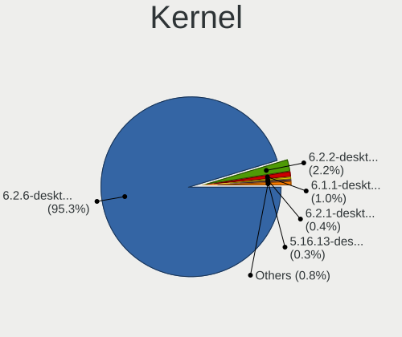

| Version                     | Desktops | Percent |
|-----------------------------|----------|---------|
| 6.2.6-desktop-1omv2390      | 878      | 95.33%  |
| 6.2.2-desktop-1omv2390      | 20       | 2.17%   |
| 6.1.1-desktop-1omv2290      | 9        | 0.98%   |
| 6.2.1-desktop-1omv2390      | 4        | 0.43%   |
| 5.16.13-desktop-1omv4003    | 3        | 0.33%   |
| 6.3.5-desktop-3omv2390      | 2        | 0.22%   |
| 6.1.4-desktop-1omv2301      | 2        | 0.22%   |
| 6.9.3-desktop-2omv2490      | 1        | 0.11%   |
| 6.2.8-desktop-1omv2390      | 1        | 0.11%   |
| 6.2.10-desktop-2.0omv4.9mjn | 1        | 0.11%   |

Kernel Family
-------------

Linux kernel without a distro release

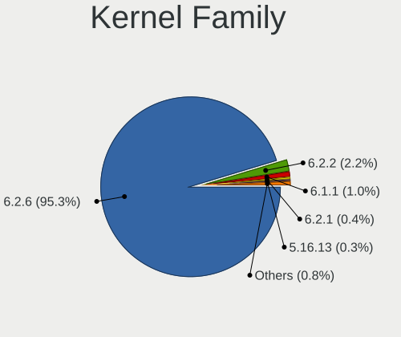

| Version | Desktops | Percent |
|---------|----------|---------|
| 6.2.6   | 878      | 95.33%  |
| 6.2.2   | 20       | 2.17%   |
| 6.1.1   | 9        | 0.98%   |
| 6.2.1   | 4        | 0.43%   |
| 5.16.13 | 3        | 0.33%   |
| 6.3.5   | 2        | 0.22%   |
| 6.1.4   | 2        | 0.22%   |
| 6.9.3   | 1        | 0.11%   |
| 6.2.8   | 1        | 0.11%   |
| 6.2.10  | 1        | 0.11%   |

Kernel Major Ver.
-----------------

Linux kernel major version

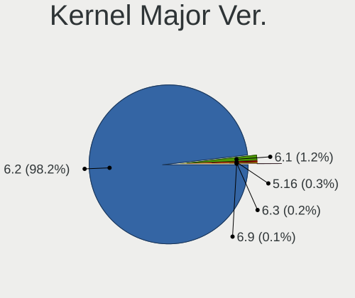

| Version | Desktops | Percent |
|---------|----------|---------|
| 6.2     | 904      | 98.15%  |
| 6.1     | 11       | 1.19%   |
| 5.16    | 3        | 0.33%   |
| 6.3     | 2        | 0.22%   |
| 6.9     | 1        | 0.11%   |

Arch
----

OS architecture (x86_64, i586, etc.)

| Name   | Desktops | Percent |
|--------|----------|---------|
| x86_64 | 921      | 100%    |

DE
--

Desktop Environment

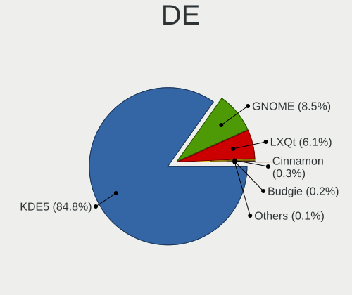

| Name     | Desktops | Percent |
|----------|----------|---------|
| KDE5     | 781      | 84.8%   |
| GNOME    | 78       | 8.47%   |
| LXQt     | 56       | 6.08%   |
| Cinnamon | 3        | 0.33%   |
| Budgie   | 2        | 0.22%   |
| Unknown  | 1        | 0.11%   |

Display Server
--------------

X11 or Wayland

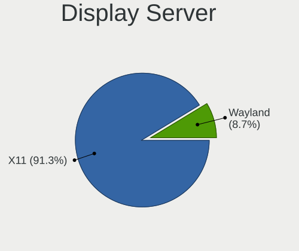

| Name    | Desktops | Percent |
|---------|----------|---------|
| X11     | 841      | 91.31%  |
| Wayland | 80       | 8.69%   |

Display Manager
---------------

SDDM, LightDM, etc.

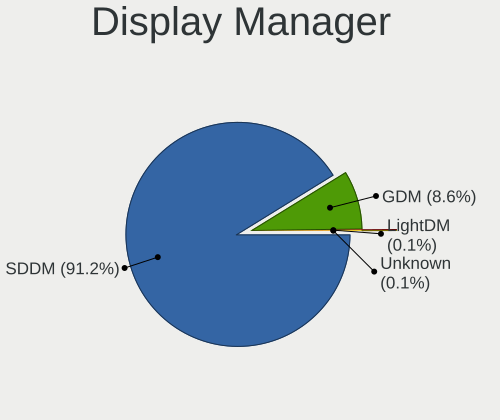

| Name    | Desktops | Percent |
|---------|----------|---------|
| SDDM    | 840      | 91.21%  |
| GDM     | 79       | 8.58%   |
| LightDM | 1        | 0.11%   |
| Unknown | 1        | 0.11%   |

OS Lang
-------

Language

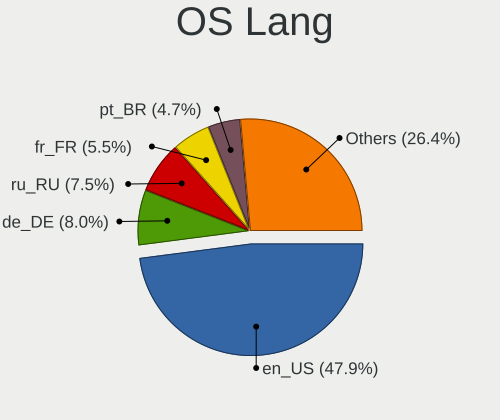

| Lang  | Desktops | Percent |
|-------|----------|---------|
| en_US | 443      | 47.94%  |
| de_DE | 74       | 8.01%   |
| ru_RU | 69       | 7.47%   |
| fr_FR | 51       | 5.52%   |
| pt_BR | 43       | 4.65%   |
| en_GB | 38       | 4.11%   |
| it_IT | 28       | 3.03%   |
| pl_PL | 26       | 2.81%   |
| es_ES | 18       | 1.95%   |
| en_CA | 18       | 1.95%   |
| hu_HU | 13       | 1.41%   |
| es_MX | 12       | 1.3%    |
| en_AU | 11       | 1.19%   |
| de_AT | 10       | 1.08%   |
| cs_CZ | 8        | 0.87%   |
| es_VE | 7        | 0.76%   |
| ja_JP | 6        | 0.65%   |
| fr_CA | 6        | 0.65%   |
| nl_NL | 5        | 0.54%   |
| en_IN | 5        | 0.54%   |
| de_CH | 5        | 0.54%   |
| fr_BE | 3        | 0.32%   |
| es_CO | 3        | 0.32%   |
| es_AR | 3        | 0.32%   |
| tr_TR | 2        | 0.22%   |
| es_UY | 2        | 0.22%   |
| en_ZA | 2        | 0.22%   |
| UTF-8 | 1        | 0.11%   |
| sl_SI | 1        | 0.11%   |
| sk_SK | 1        | 0.11%   |
| ro_RO | 1        | 0.11%   |
| pt_PT | 1        | 0.11%   |
| he_IL | 1        | 0.11%   |
| es_DO | 1        | 0.11%   |
| es_CR | 1        | 0.11%   |
| es_CL | 1        | 0.11%   |
| en_SG | 1        | 0.11%   |
| en_NZ | 1        | 0.11%   |
| de_BE | 1        | 0.11%   |
| da_DK | 1        | 0.11%   |

Boot Mode
---------

EFI or BIOS

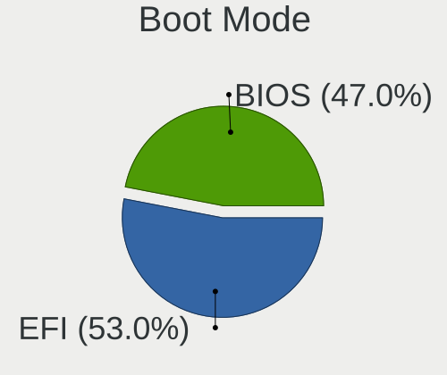

| Mode | Desktops | Percent |
|------|----------|---------|
| EFI  | 489      | 53.04%  |
| BIOS | 433      | 46.96%  |

Filesystem
----------

Type of filesystem

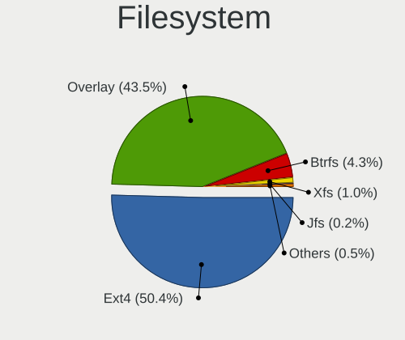

| Type     | Desktops | Percent |
|----------|----------|---------|
| Ext4     | 467      | 50.43%  |
| Overlay  | 403      | 43.52%  |
| Btrfs    | 40       | 4.32%   |
| Xfs      | 9        | 0.97%   |
| Jfs      | 2        | 0.22%   |
| F2fs     | 2        | 0.22%   |
| Ext3     | 2        | 0.22%   |
| Reiserfs | 1        | 0.11%   |

Part. scheme
------------

Scheme of partitioning

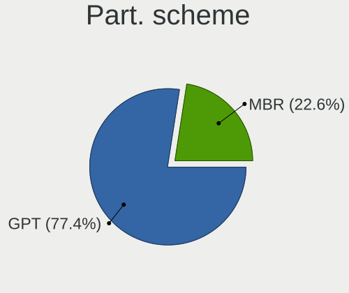

| Type | Desktops | Percent |
|------|----------|---------|
| GPT  | 714      | 77.44%  |
| MBR  | 208      | 22.56%  |

Dual Boot with Linux/BSD
------------------------

Hosting more than one Linux/BSD

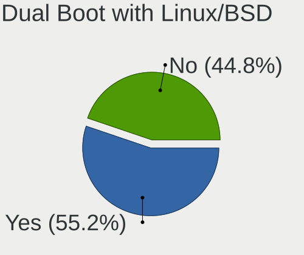

| Dual boot | Desktops | Percent |
|-----------|----------|---------|
| Yes       | 509      | 55.21%  |
| No        | 413      | 44.79%  |

Dual Boot (Win)
---------------

Hosting Linux and Windows

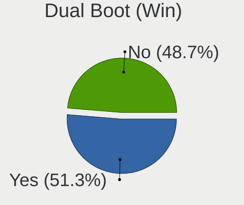

| Dual boot | Desktops | Percent |
|-----------|----------|---------|
| Yes       | 473      | 51.3%   |
| No        | 449      | 48.7%   |

Board
-----

Vendor
------

Motherboard manufacturer

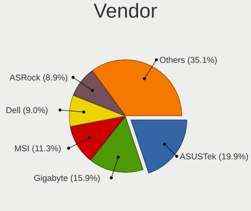

| Name                                 | Desktops | Percent |
|--------------------------------------|----------|---------|
| ASUSTek Computer                     | 183      | 19.87%  |
| Gigabyte Technology                  | 146      | 15.85%  |
| MSI                                  | 104      | 11.29%  |
| Dell                                 | 83       | 9.01%   |
| ASRock                               | 82       | 8.9%    |
| Hewlett-Packard                      | 79       | 8.58%   |
| Lenovo                               | 45       | 4.89%   |
| Acer                                 | 29       | 3.15%   |
| Intel                                | 27       | 2.93%   |
| Biostar                              | 17       | 1.85%   |
| Fujitsu                              | 15       | 1.63%   |
| Foxconn                              | 15       | 1.63%   |
| Unknown                              | 12       | 1.3%    |
| Fujitsu Siemens                      | 9        | 0.98%   |
| Pegatron                             | 8        | 0.87%   |
| ECS                                  | 8        | 0.87%   |
| Medion                               | 6        | 0.65%   |
| Packard Bell                         | 3        | 0.33%   |
| Huanan                               | 3        | 0.33%   |
| Alienware                            | 3        | 0.33%   |
| PCWare                               | 2        | 0.22%   |
| OEM                                  | 2        | 0.22%   |
| NEC Computers                        | 2        | 0.22%   |
| MACHINIST                            | 2        | 0.22%   |
| JGINYUE                              | 2        | 0.22%   |
| GuoGuang                             | 2        | 0.22%   |
| BESSTAR Tech                         | 2        | 0.22%   |
| AZW                                  | 2        | 0.22%   |
| ZOTAC                                | 1        | 0.11%   |
| Wistron                              | 1        | 0.11%   |
| WinFast                              | 1        | 0.11%   |
| ULTRATOP                             | 1        | 0.11%   |
| T-bao                                | 1        | 0.11%   |
| SYWZ                                 | 1        | 0.11%   |
| Shuttle                              | 1        | 0.11%   |
| Shenzhen Meigao Electronic Equipment | 1        | 0.11%   |
| Positivo                             | 1        | 0.11%   |
| OEM_MB                               | 1        | 0.11%   |
| Nvidia                               | 1        | 0.11%   |
| MouseComputer                        | 1        | 0.11%   |

Model
-----

Motherboard model

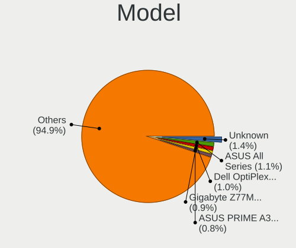

| Name                       | Desktops | Percent |
|----------------------------|----------|---------|
| Unknown                    | 13       | 1.41%   |
| ASUS All Series            | 10       | 1.09%   |
| Dell OptiPlex 7010         | 9        | 0.98%   |
| Gigabyte Z77M-D3H          | 8        | 0.87%   |
| ASUS PRIME A320M-K         | 7        | 0.76%   |
| Intel H61                  | 6        | 0.65%   |
| MSI MS-7C02                | 5        | 0.54%   |
| MSI MS-7B86                | 5        | 0.54%   |
| MSI MS-7721                | 5        | 0.54%   |
| Dell OptiPlex 3020         | 5        | 0.54%   |
| ASUS P5G41T-M LX           | 5        | 0.54%   |
| MSI MS-7C91                | 4        | 0.43%   |
| MSI MS-7C56                | 4        | 0.43%   |
| MSI MS-7817                | 4        | 0.43%   |
| Intel H81                  | 4        | 0.43%   |
| HP EliteDesk 800 G1 SFF    | 4        | 0.43%   |
| Gigabyte GA-78LMT-USB3     | 4        | 0.43%   |
| Foxconn G41MD              | 4        | 0.43%   |
| Dell OptiPlex 9020         | 4        | 0.43%   |
| Dell OptiPlex 7040         | 4        | 0.43%   |
| MSI MS-7C52                | 3        | 0.33%   |
| MSI MS-7850                | 3        | 0.33%   |
| HP Compaq Pro 6300 SFF     | 3        | 0.33%   |
| HP Compaq Elite 8300 SFF   | 3        | 0.33%   |
| Dell OptiPlex 990          | 3        | 0.33%   |
| Dell OptiPlex 755          | 3        | 0.33%   |
| Dell OptiPlex 7020         | 3        | 0.33%   |
| Dell OptiPlex 390          | 3        | 0.33%   |
| ASUS TUF Gaming B550M-PLUS | 3        | 0.33%   |
| ASUS PRIME Z590-P          | 3        | 0.33%   |
| ASUS P8Z77-V PRO           | 3        | 0.33%   |
| ASUS P5KPL-AM SE           | 3        | 0.33%   |
| ASRock Q1900M              | 3        | 0.33%   |
| ASRock B450M Steel Legend  | 3        | 0.33%   |
| Acer Veriton L670G         | 3        | 0.33%   |
| MSI MS-7D54                | 2        | 0.22%   |
| MSI MS-7C51                | 2        | 0.22%   |
| MSI MS-7C37                | 2        | 0.22%   |
| MSI MS-7C09                | 2        | 0.22%   |
| MSI MS-7B89                | 2        | 0.22%   |

Model Family
------------

Motherboard model prefix

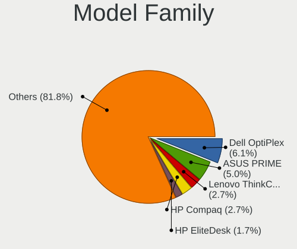

| Name                    | Desktops | Percent |
|-------------------------|----------|---------|
| Dell OptiPlex           | 56       | 6.08%   |
| ASUS PRIME              | 46       | 4.99%   |
| Lenovo ThinkCentre      | 25       | 2.71%   |
| HP Compaq               | 25       | 2.71%   |
| HP EliteDesk            | 16       | 1.74%   |
| Acer Aspire             | 15       | 1.63%   |
| ASUS ROG                | 13       | 1.41%   |
| Unknown                 | 13       | 1.41%   |
| Dell Precision          | 12       | 1.3%    |
| Lenovo IdeaCentre       | 11       | 1.19%   |
| ASUS TUF                | 11       | 1.19%   |
| Acer Veriton            | 11       | 1.19%   |
| Fujitsu ESPRIMO         | 10       | 1.09%   |
| ASUS All                | 10       | 1.09%   |
| HP ProDesk              | 9        | 0.98%   |
| ASUS M5A78L-M           | 9        | 0.98%   |
| Gigabyte Z77M-D3H       | 8        | 0.87%   |
| HP Pavilion             | 7        | 0.76%   |
| Gigabyte GA-78LMT-USB3  | 7        | 0.76%   |
| Gigabyte B550           | 7        | 0.76%   |
| Gigabyte B450M          | 7        | 0.76%   |
| ASUS P8Z77-V            | 7        | 0.76%   |
| ASUS P5G41T-M           | 7        | 0.76%   |
| Intel H61               | 6        | 0.65%   |
| Gigabyte B450           | 6        | 0.65%   |
| Fujitsu Siemens ESPRIMO | 6        | 0.65%   |
| MSI MS-7C02             | 5        | 0.54%   |
| MSI MS-7B86             | 5        | 0.54%   |
| MSI MS-7721             | 5        | 0.54%   |
| Gigabyte X570           | 5        | 0.54%   |
| Dell XPS                | 5        | 0.54%   |
| Dell Vostro             | 5        | 0.54%   |
| ASRock B450             | 5        | 0.54%   |
| MSI MS-7C91             | 4        | 0.43%   |
| MSI MS-7C56             | 4        | 0.43%   |
| MSI MS-7817             | 4        | 0.43%   |
| Lenovo ThinkStation     | 4        | 0.43%   |
| Intel H81               | 4        | 0.43%   |
| Gigabyte H310M          | 4        | 0.43%   |
| Gigabyte B550M          | 4        | 0.43%   |

MFG Year
--------

Motherboard manufacture year

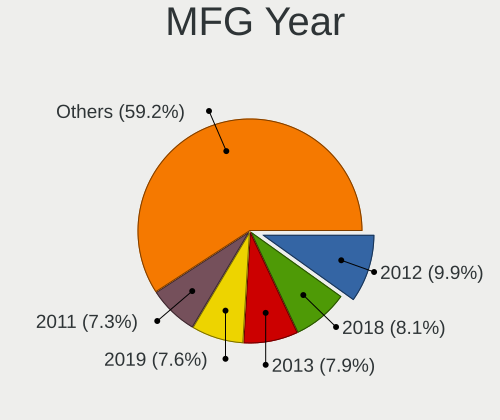

| Year | Desktops | Percent |
|------|----------|---------|
| 2012 | 91       | 9.88%   |
| 2018 | 75       | 8.14%   |
| 2013 | 73       | 7.93%   |
| 2019 | 70       | 7.6%    |
| 2011 | 67       | 7.27%   |
| 2014 | 64       | 6.95%   |
| 2021 | 63       | 6.84%   |
| 2020 | 59       | 6.41%   |
| 2017 | 55       | 5.97%   |
| 2010 | 55       | 5.97%   |
| 2009 | 47       | 5.1%    |
| 2016 | 45       | 4.89%   |
| 2015 | 40       | 4.34%   |
| 2008 | 36       | 3.91%   |
| 2022 | 31       | 3.37%   |
| 2007 | 27       | 2.93%   |
| 2006 | 11       | 1.19%   |
| 2023 | 8        | 0.87%   |
| 2005 | 3        | 0.33%   |
| 2024 | 1        | 0.11%   |

Form Factor
-----------

Physical design of the computer

| Name    | Desktops | Percent |
|---------|----------|---------|
| Desktop | 921      | 100%    |

Secure Boot
-----------

Enabled or disabled

| State    | Desktops | Percent |
|----------|----------|---------|
| Disabled | 921      | 100%    |

Coreboot
--------

Have coreboot on board

| Used | Desktops | Percent |
|------|----------|---------|
| No   | 921      | 100%    |

RAM Size
--------

Total RAM memory

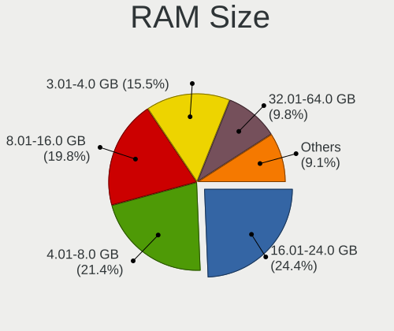

| Size in GB      | Desktops | Percent |
|-----------------|----------|---------|
| 16.01-24.0      | 225      | 24.35%  |
| 4.01-8.0        | 198      | 21.43%  |
| 8.01-16.0       | 183      | 19.81%  |
| 3.01-4.0        | 143      | 15.48%  |
| 32.01-64.0      | 91       | 9.85%   |
| 24.01-32.0      | 24       | 2.6%    |
| 1.01-2.0        | 21       | 2.27%   |
| 64.01-256.0     | 19       | 2.06%   |
| 2.01-3.0        | 15       | 1.62%   |
| More than 256.0 | 3        | 0.32%   |
| 0.51-1.0        | 2        | 0.22%   |

RAM Used
--------

Used RAM memory

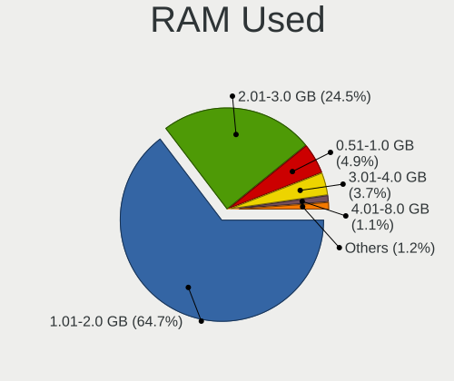

| Used GB   | Desktops | Percent |
|-----------|----------|---------|
| 1.01-2.0  | 602      | 64.66%  |
| 2.01-3.0  | 228      | 24.49%  |
| 0.51-1.0  | 46       | 4.94%   |
| 3.01-4.0  | 34       | 3.65%   |
| 4.01-8.0  | 10       | 1.07%   |
| 0.01-0.5  | 10       | 1.07%   |
| 8.01-16.0 | 1        | 0.11%   |

Total Drives
------------

Number of drives on board

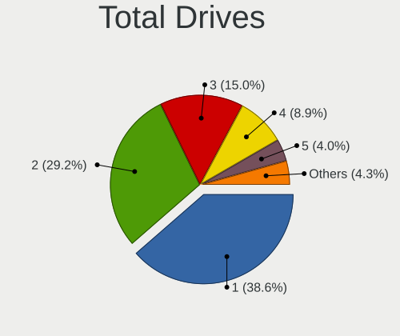

| Drives | Desktops | Percent |
|--------|----------|---------|
| 1      | 357      | 38.59%  |
| 2      | 270      | 29.19%  |
| 3      | 139      | 15.03%  |
| 4      | 82       | 8.86%   |
| 5      | 37       | 4%      |
| 6      | 14       | 1.51%   |
| 0      | 13       | 1.41%   |
| 7      | 5        | 0.54%   |
| 8      | 4        | 0.43%   |
| 10     | 2        | 0.22%   |
| 13     | 1        | 0.11%   |
| 9      | 1        | 0.11%   |

Has CD-ROM
----------

Has CD-ROM on board

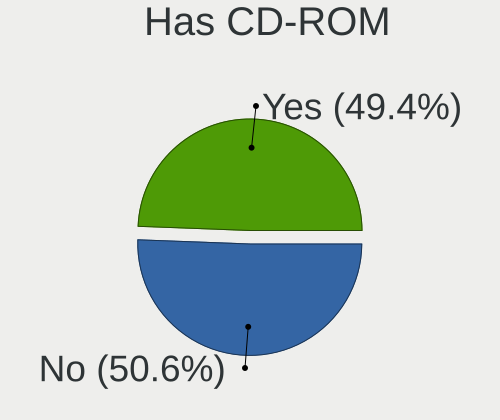

| Presented | Desktops | Percent |
|-----------|----------|---------|
| No        | 467      | 50.6%   |
| Yes       | 456      | 49.4%   |

Has Ethernet
------------

Has Ethernet on board

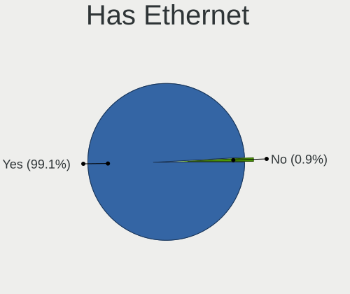

| Presented | Desktops | Percent |
|-----------|----------|---------|
| Yes       | 913      | 99.13%  |
| No        | 8        | 0.87%   |

Has WiFi
--------

Has WiFi module

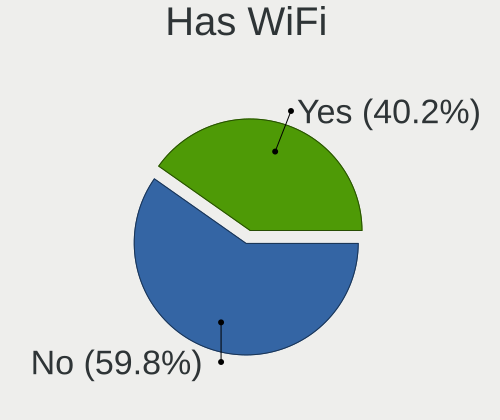

| Presented | Desktops | Percent |
|-----------|----------|---------|
| No        | 551      | 59.76%  |
| Yes       | 371      | 40.24%  |

Has Bluetooth
-------------

Has Bluetooth module

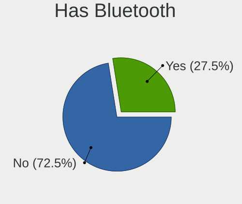

| Presented | Desktops | Percent |
|-----------|----------|---------|
| No        | 669      | 72.48%  |
| Yes       | 254      | 27.52%  |

Location
--------

Country
-------

Geographic location (country)

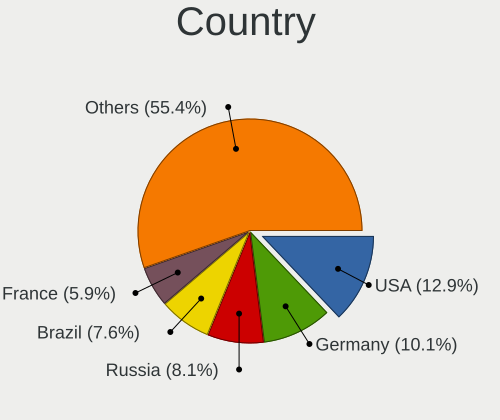

| Country      | Desktops | Percent |
|--------------|----------|---------|
| USA          | 119      | 12.92%  |
| Germany      | 93       | 10.1%   |
| Russia       | 75       | 8.14%   |
| Brazil       | 70       | 7.6%    |
| France       | 54       | 5.86%   |
| Canada       | 38       | 4.13%   |
| Poland       | 37       | 4.02%   |
| UK           | 36       | 3.91%   |
| Italy        | 34       | 3.69%   |
| Japan        | 28       | 3.04%   |
| Spain        | 24       | 2.61%   |
| Australia    | 17       | 1.85%   |
| Hungary      | 16       | 1.74%   |
| Finland      | 14       | 1.52%   |
| Mexico       | 13       | 1.41%   |
| Austria      | 13       | 1.41%   |
| India        | 12       | 1.3%    |
| Czechia      | 11       | 1.19%   |
| Sweden       | 10       | 1.09%   |
| Netherlands  | 10       | 1.09%   |
| Venezuela    | 9        | 0.98%   |
| Argentina    | 8        | 0.87%   |
| Malaysia     | 7        | 0.76%   |
| Greece       | 7        | 0.76%   |
| Ukraine      | 6        | 0.65%   |
| Taiwan       | 6        | 0.65%   |
| Switzerland  | 6        | 0.65%   |
| Indonesia    | 6        | 0.65%   |
| Denmark      | 6        | 0.65%   |
| China        | 6        | 0.65%   |
| Algeria      | 6        | 0.65%   |
| Vietnam      | 5        | 0.54%   |
| South Africa | 5        | 0.54%   |
| Slovakia     | 5        | 0.54%   |
| Romania      | 5        | 0.54%   |
| Portugal     | 5        | 0.54%   |
| Chile        | 5        | 0.54%   |
| Bulgaria     | 5        | 0.54%   |
| Belgium      | 5        | 0.54%   |
| Belarus      | 5        | 0.54%   |

City
----

Geographic location (city)

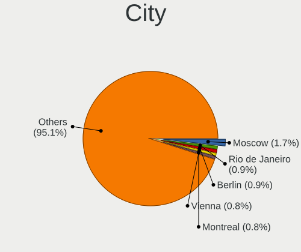

| City           | Desktops | Percent |
|----------------|----------|---------|
| Moscow         | 16       | 1.72%   |
| Rio de Janeiro | 8        | 0.86%   |
| Berlin         | 8        | 0.86%   |
| Vienna         | 7        | 0.75%   |
| Montreal       | 7        | 0.75%   |
| Milan          | 7        | 0.75%   |
| Kuala Lumpur   | 7        | 0.75%   |
| Helsinki       | 7        | 0.75%   |
| Budapest       | 7        | 0.75%   |
| Sao Paulo      | 6        | 0.65%   |
| Munich         | 6        | 0.65%   |
| St Petersburg  | 5        | 0.54%   |
| Hamburg        | 5        | 0.54%   |
| Sydney         | 4        | 0.43%   |
| Santiago       | 4        | 0.43%   |
| New Taipei     | 4        | 0.43%   |
| Mexico City    | 4        | 0.43%   |
| Hemet          | 4        | 0.43%   |
| Glasgow        | 4        | 0.43%   |
| Brisbane       | 4        | 0.43%   |
| Baku           | 4        | 0.43%   |
| Athens         | 4        | 0.43%   |
| Yekaterinburg  | 3        | 0.32%   |
| Windhoek       | 3        | 0.32%   |
| Warsaw         | 3        | 0.32%   |
| Vantaa         | 3        | 0.32%   |
| Tua Chua       | 3        | 0.32%   |
| Singapore      | 3        | 0.32%   |
| Sankt Pölten  | 3        | 0.32%   |
| Rome           | 3        | 0.32%   |
| Porto Alegre   | 3        | 0.32%   |
| Pescara        | 3        | 0.32%   |
| Perm           | 3        | 0.32%   |
| Nottingham     | 3        | 0.32%   |
| Melbourne      | 3        | 0.32%   |
| Lisbon         | 3        | 0.32%   |
| Les Sorinieres | 3        | 0.32%   |
| Les Hogues     | 3        | 0.32%   |
| Jacksonville   | 3        | 0.32%   |
| Heredia        | 3        | 0.32%   |

Drives
------

Drive Vendor
------------

Hard drive vendors

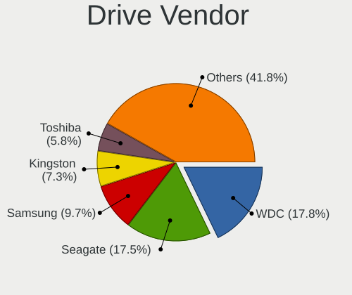

| Vendor              | Desktops | Drives | Percent |
|---------------------|----------|--------|---------|
| WDC                 | 299      | 403    | 17.84%  |
| Seagate             | 294      | 367    | 17.54%  |
| Samsung Electronics | 162      | 237    | 9.67%   |
| Kingston            | 122      | 151    | 7.28%   |
| Toshiba             | 98       | 105    | 5.85%   |
| Crucial             | 86       | 101    | 5.13%   |
| SanDisk             | 59       | 69     | 3.52%   |
| Hitachi             | 54       | 61     | 3.22%   |
| SPCC                | 36       | 41     | 2.15%   |
| China               | 33       | 38     | 1.97%   |
| A-DATA Technology   | 32       | 37     | 1.91%   |
| Unknown             | 22       | 33     | 1.31%   |
| PNY                 | 21       | 22     | 1.25%   |
| Intel               | 19       | 19     | 1.13%   |
| Patriot             | 18       | 18     | 1.07%   |
| HGST                | 18       | 19     | 1.07%   |
| Maxtor              | 15       | 16     | 0.89%   |
| Netac               | 12       | 14     | 0.72%   |
| SK hynix            | 11       | 12     | 0.66%   |
| Micron Technology   | 11       | 12     | 0.66%   |
| Phison              | 10       | 11     | 0.6%    |
| Apacer              | 10       | 11     | 0.6%    |
| XPG                 | 9        | 11     | 0.54%   |
| Team                | 9        | 9      | 0.54%   |
| KingSpec            | 9        | 9      | 0.54%   |
| Intenso             | 9        | 10     | 0.54%   |
| GOODRAM             | 9        | 10     | 0.54%   |
| Corsair             | 8        | 8      | 0.48%   |
| Transcend           | 7        | 7      | 0.42%   |
| KIOXIA-EXCERIA      | 7        | 7      | 0.42%   |
| JMicron Technology  | 7        | 7      | 0.42%   |
| Gigabyte Technology | 7        | 7      | 0.42%   |
| SABRENT             | 6        | 6      | 0.36%   |
| OCZ                 | 6        | 9      | 0.36%   |
| Unknown             | 6        | 7      | 0.36%   |
| Silicon Motion      | 5        | 5      | 0.3%    |
| Phison Electronics  | 4        | 4      | 0.24%   |
| Mushkin             | 4        | 4      | 0.24%   |
| LITEON              | 4        | 4      | 0.24%   |
| Hewlett-Packard     | 4        | 4      | 0.24%   |

Drive Model
-----------

Hard drive models

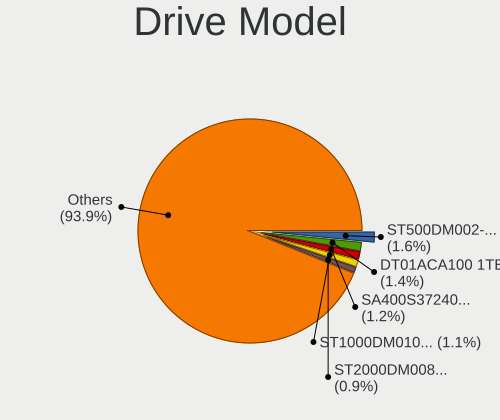

| Model                            | Desktops | Percent |
|----------------------------------|----------|---------|
| Seagate ST500DM002-1BD142 500GB  | 30       | 1.56%   |
| Toshiba DT01ACA100 1TB           | 26       | 1.35%   |
| Kingston SA400S37240G 240GB SSD  | 23       | 1.2%    |
| Seagate ST1000DM010-2EP102 1TB   | 21       | 1.09%   |
| Seagate ST2000DM008-2FR102 2TB   | 17       | 0.89%   |
| Crucial CT240BX500SSD1 240GB     | 15       | 0.78%   |
| Seagate ST1000DM003-1CH162 1TB   | 13       | 0.68%   |
| Kingston SA400S37480G 480GB SSD  | 13       | 0.68%   |
| Crucial CT500MX500SSD1 500GB     | 13       | 0.68%   |
| Toshiba DT01ACA050 500GB         | 12       | 0.63%   |
| WDC WD10EZEX-08WN4A0 1TB         | 11       | 0.57%   |
| Unknown SD/MMC/MS PRO 2GB        | 11       | 0.57%   |
| Samsung SSD 860 EVO 250GB        | 11       | 0.57%   |
| Kingston SA400S37120G 120GB SSD  | 11       | 0.57%   |
| Toshiba HDWD110 1TB              | 10       | 0.52%   |
| Seagate ST3500418AS 500GB        | 10       | 0.52%   |
| Kingston SV300S37A120G 120GB SSD | 10       | 0.52%   |
| WDC WD5000AAKX-75U6AA0 500GB     | 9        | 0.47%   |
| WDC WD5000AAKX-001CA0 500GB      | 8        | 0.42%   |
| SPCC Solid State Disk 1TB        | 8        | 0.42%   |
| Seagate ST31000524AS 1TB         | 8        | 0.42%   |
| Seagate ST2000DM001-1ER164 2TB   | 8        | 0.42%   |
| Seagate ST1000DM003-1SB102 1TB   | 8        | 0.42%   |
| Samsung SSD 970 EVO Plus 1TB     | 8        | 0.42%   |
| Samsung SSD 860 EVO 500GB        | 8        | 0.42%   |
| Crucial CT480BX500SSD1 480GB     | 8        | 0.42%   |
| WDC WDS240G2G0A-00JH30 240GB SSD | 7        | 0.36%   |
| WDC WD10EZEX-60WN4A0 1TB         | 7        | 0.36%   |
| Seagate ST3500414CS 500GB        | 7        | 0.36%   |
| Seagate ST2000DM001-1CH164 2TB   | 7        | 0.36%   |
| Samsung SSD 860 EVO 1TB          | 7        | 0.36%   |
| Hitachi HDS721010CLA332 1TB      | 7        | 0.36%   |
| Crucial CT120BX500SSD1 120GB     | 7        | 0.36%   |
| Crucial CT1000MX500SSD1 1TB      | 7        | 0.36%   |
| WDC WDS120G2G0A-00JH30 120GB SSD | 6        | 0.31%   |
| WDC WDS100T2B0A-00SM50 1TB SSD   | 6        | 0.31%   |
| WDC WD2500AAKX-753CA1 250GB      | 6        | 0.31%   |
| WDC WD10EZEX-08M2NA0 1TB         | 6        | 0.31%   |
| Unknown Compact Flash 977MB      | 6        | 0.31%   |
| Toshiba MQ01ABF050 500GB         | 6        | 0.31%   |

HDD Vendor
----------

Hard disk drive vendors

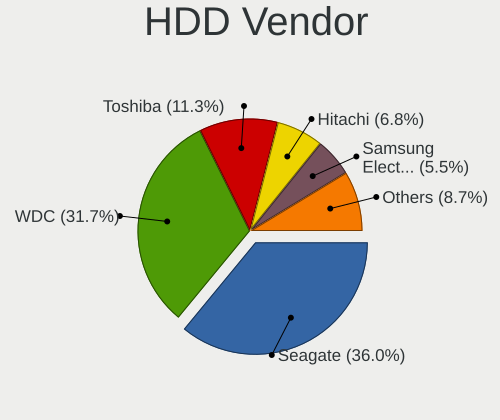

| Vendor              | Desktops | Drives | Percent |
|---------------------|----------|--------|---------|
| Seagate             | 286      | 356    | 35.97%  |
| WDC                 | 252      | 328    | 31.7%   |
| Toshiba             | 90       | 96     | 11.32%  |
| Hitachi             | 54       | 61     | 6.79%   |
| Samsung Electronics | 44       | 54     | 5.53%   |
| HGST                | 18       | 19     | 2.26%   |
| Maxtor              | 14       | 15     | 1.76%   |
| Unknown             | 11       | 11     | 1.38%   |
| JMicron Technology  | 4        | 4      | 0.5%    |
| WD MediaMax         | 2        | 2      | 0.25%   |
| StoreJet            | 2        | 2      | 0.25%   |
| SABRENT             | 2        | 2      | 0.25%   |
| Intenso             | 2        | 2      | 0.25%   |
| External            | 2        | 2      | 0.25%   |
| USB                 | 1        | 1      | 0.13%   |
| TO Exter            | 1        | 1      | 0.13%   |
| SATAFIRM            | 1        | 1      | 0.13%   |
| SAGE                | 1        | 1      | 0.13%   |
| RSH-319             | 1        | 1      | 0.13%   |
| QUANTUM             | 1        | 1      | 0.13%   |
| MaxDigital          | 1        | 1      | 0.13%   |
| KESU                | 1        | 1      | 0.13%   |
| Initio              | 1        | 1      | 0.13%   |
| Fujitsu             | 1        | 1      | 0.13%   |
| ExcelStor           | 1        | 1      | 0.13%   |
| Unknown             | 1        | 1      | 0.13%   |

SSD Vendor
----------

Solid state drive vendors

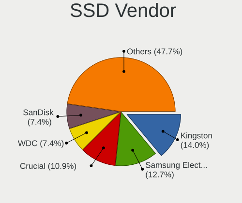

| Vendor              | Desktops | Drives | Percent |
|---------------------|----------|--------|---------|
| Kingston            | 91       | 113    | 13.96%  |
| Samsung Electronics | 83       | 109    | 12.73%  |
| Crucial             | 71       | 76     | 10.89%  |
| WDC                 | 48       | 55     | 7.36%   |
| SanDisk             | 48       | 56     | 7.36%   |
| China               | 33       | 38     | 5.06%   |
| SPCC                | 28       | 30     | 4.29%   |
| A-DATA Technology   | 25       | 28     | 3.83%   |
| PNY                 | 18       | 19     | 2.76%   |
| Patriot             | 17       | 17     | 2.61%   |
| Intel               | 11       | 11     | 1.69%   |
| Netac               | 10       | 11     | 1.53%   |
| Intenso             | 8        | 8      | 1.23%   |
| GOODRAM             | 8        | 9      | 1.23%   |
| Apacer              | 8        | 8      | 1.23%   |
| Micron Technology   | 7        | 8      | 1.07%   |
| KingSpec            | 7        | 7      | 1.07%   |
| Toshiba             | 6        | 6      | 0.92%   |
| Team                | 6        | 6      | 0.92%   |
| OCZ                 | 6        | 9      | 0.92%   |
| Transcend           | 5        | 5      | 0.77%   |
| Gigabyte Technology | 5        | 5      | 0.77%   |
| Unknown             | 5        | 6      | 0.77%   |
| SK hynix            | 4        | 5      | 0.61%   |
| SABRENT             | 4        | 4      | 0.61%   |
| Mushkin             | 4        | 4      | 0.61%   |
| LITEON              | 4        | 4      | 0.61%   |
| XrayDisk            | 3        | 4      | 0.46%   |
| Seagate             | 3        | 3      | 0.46%   |
| KIOXIA-EXCERIA      | 3        | 3      | 0.46%   |
| KingFast            | 3        | 3      | 0.46%   |
| Corsair             | 3        | 3      | 0.46%   |
| ASMT                | 3        | 3      | 0.46%   |
| AMD                 | 3        | 3      | 0.46%   |
| Verbatim            | 2        | 2      | 0.31%   |
| SUNEAST             | 2        | 2      | 0.31%   |
| PNY CS90            | 2        | 2      | 0.31%   |
| NTC                 | 2        | 2      | 0.31%   |
| Lexar               | 2        | 2      | 0.31%   |
| KingDian            | 2        | 2      | 0.31%   |

Drive Kind
----------

HDD or SSD

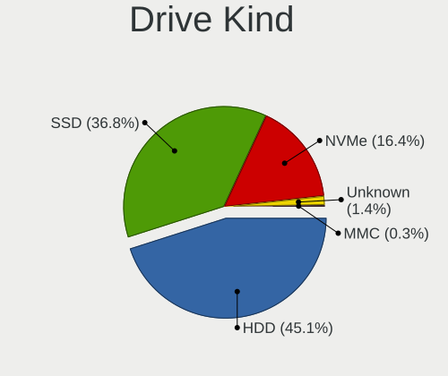

| Kind    | Desktops | Drives | Percent |
|---------|----------|--------|---------|
| HDD     | 622      | 966    | 45.07%  |
| SSD     | 508      | 740    | 36.81%  |
| NVMe    | 226      | 304    | 16.38%  |
| Unknown | 20       | 30     | 1.45%   |
| MMC     | 4        | 4      | 0.29%   |

Drive Connector
---------------

SATA, SAS, NVMe, etc.

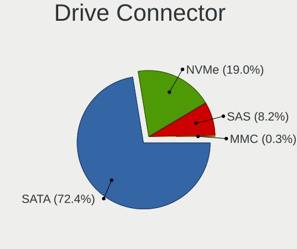

| Type | Desktops | Drives | Percent |
|------|----------|--------|---------|
| SATA | 854      | 1611   | 72.43%  |
| NVMe | 224      | 301    | 19%     |
| SAS  | 97       | 128    | 8.23%   |
| MMC  | 4        | 4      | 0.34%   |

Drive Size
----------

Size of hard drive

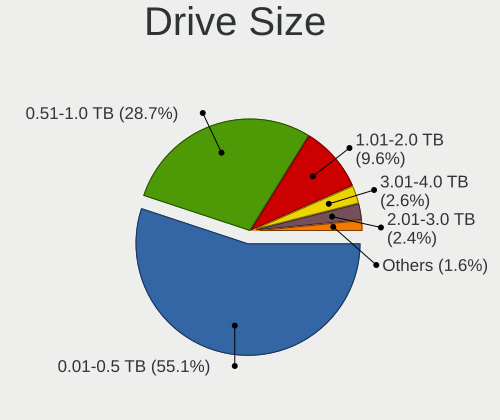

| Size in TB | Desktops | Drives | Percent |
|------------|----------|--------|---------|
| 0.01-0.5   | 667      | 1005   | 55.08%  |
| 0.51-1.0   | 348      | 454    | 28.74%  |
| 1.01-2.0   | 116      | 142    | 9.58%   |
| 3.01-4.0   | 32       | 45     | 2.64%   |
| 2.01-3.0   | 29       | 32     | 2.39%   |
| 4.01-10.0  | 16       | 24     | 1.32%   |
| 10.01-20.0 | 3        | 4      | 0.25%   |

Space Total
-----------

Amount of disk space available on the file system

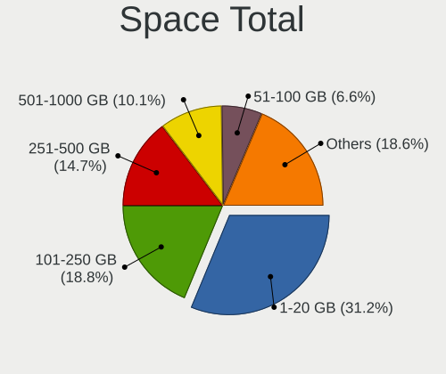

| Size in GB     | Desktops | Percent |
|----------------|----------|---------|
| 1-20           | 290      | 31.25%  |
| 101-250        | 174      | 18.75%  |
| 251-500        | 136      | 14.66%  |
| 501-1000       | 94       | 10.13%  |
| 51-100         | 61       | 6.57%   |
| 21-50          | 56       | 6.03%   |
| Unknown        | 44       | 4.74%   |
| 1001-2000      | 41       | 4.42%   |
| More than 3000 | 16       | 1.72%   |
| 2001-3000      | 16       | 1.72%   |

Space Used
----------

Amount of used disk space

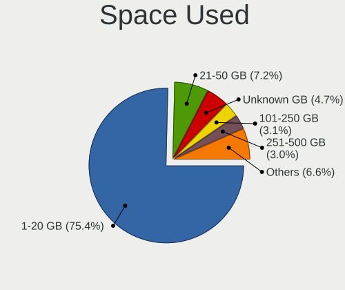

| Used GB        | Desktops | Percent |
|----------------|----------|---------|
| 1-20           | 701      | 75.38%  |
| 21-50          | 67       | 7.2%    |
| Unknown        | 44       | 4.73%   |
| 101-250        | 29       | 3.12%   |
| 251-500        | 28       | 3.01%   |
| 51-100         | 26       | 2.8%    |
| 501-1000       | 21       | 2.26%   |
| More than 3000 | 5        | 0.54%   |
| 2001-3000      | 5        | 0.54%   |
| 1001-2000      | 4        | 0.43%   |

Malfunc. Drives
---------------

Drive models with a malfunction

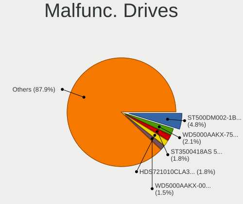

| Model                               | Desktops | Drives | Percent |
|-------------------------------------|----------|--------|---------|
| Seagate ST500DM002-1BD142 500GB     | 16       | 17     | 4.83%   |
| WDC WD5000AAKX-75U6AA0 500GB        | 7        | 7      | 2.11%   |
| Seagate ST3500418AS 500GB           | 6        | 6      | 1.81%   |
| Hitachi HDS721010CLA332 1TB         | 6        | 6      | 1.81%   |
| WDC WD5000AAKX-001CA0 500GB         | 5        | 5      | 1.51%   |
| Toshiba DT01ACA100 1TB              | 5        | 5      | 1.51%   |
| Seagate ST1000DM010-2EP102 1TB      | 5        | 6      | 1.51%   |
| WDC WD20EARX-00PASB0 2TB            | 3        | 3      | 0.91%   |
| WDC WD10EARS-00Y5B1 1TB             | 3        | 3      | 0.91%   |
| WDC WD10EALX-009BA0 1TB             | 3        | 3      | 0.91%   |
| Seagate ST500LT012-9WS142 500GB     | 3        | 3      | 0.91%   |
| Seagate ST3500413AS 500GB           | 3        | 3      | 0.91%   |
| Seagate ST3320418AS 320GB           | 3        | 3      | 0.91%   |
| Seagate ST31000524AS 1TB            | 3        | 3      | 0.91%   |
| Seagate ST2000DM001-1ER164 2TB      | 3        | 4      | 0.91%   |
| Seagate ST1000DM003-1CH162 1TB      | 3        | 4      | 0.91%   |
| Samsung Electronics HD502IJ 500GB   | 3        | 3      | 0.91%   |
| Samsung Electronics HD103SI 1TB     | 3        | 3      | 0.91%   |
| WDC WDS240G2G0A-00JH30 240GB SSD    | 2        | 2      | 0.6%    |
| WDC WD3200AAKS-61L9A0 320GB         | 2        | 2      | 0.6%    |
| WDC WD10EZEX-00BN5A0 1TB            | 2        | 2      | 0.6%    |
| WDC WD1002FAEX-00Z3A0 1TB           | 2        | 2      | 0.6%    |
| Toshiba MQ04ABF100 1TB              | 2        | 2      | 0.6%    |
| Toshiba HDWD110 1TB                 | 2        | 2      | 0.6%    |
| Toshiba DT01ACA050 500GB            | 2        | 2      | 0.6%    |
| Seagate ST9500325AS 500GB           | 2        | 2      | 0.6%    |
| Seagate ST9160301AS 160GB           | 2        | 2      | 0.6%    |
| Seagate ST500LM021-1KJ152 500GB     | 2        | 2      | 0.6%    |
| Seagate ST500LM012 HN-M500MBB 500GB | 2        | 2      | 0.6%    |
| Seagate ST3320813AS 320GB           | 2        | 2      | 0.6%    |
| Seagate ST3250318AS 250GB           | 2        | 2      | 0.6%    |
| Seagate ST3120827AS 120GB           | 2        | 2      | 0.6%    |
| Seagate ST31000528AS 1TB            | 2        | 3      | 0.6%    |
| Seagate ST2000DM001-1CH164 2TB      | 2        | 2      | 0.6%    |
| Seagate ST1000DM003-9YN162 1TB      | 2        | 2      | 0.6%    |
| Samsung Electronics HD161HJ 160GB   | 2        | 2      | 0.6%    |
| Netac SSD 120GB                     | 2        | 2      | 0.6%    |
| Maxtor STM380215AS 80GB             | 2        | 2      | 0.6%    |
| Kingston SV300S37A240G 240GB SSD    | 2        | 2      | 0.6%    |
| Kingston SV300S37A120G 120GB SSD    | 2        | 2      | 0.6%    |

Malfunc. Drive Vendor
---------------------

Vendors of faulty drives

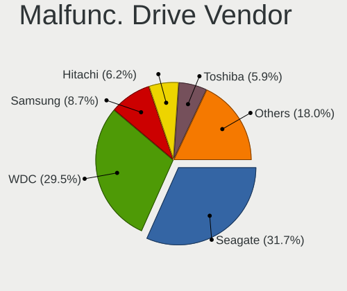

| Vendor              | Desktops | Drives | Percent |
|---------------------|----------|--------|---------|
| Seagate             | 102      | 108    | 31.68%  |
| WDC                 | 95       | 107    | 29.5%   |
| Samsung Electronics | 28       | 34     | 8.7%    |
| Hitachi             | 20       | 20     | 6.21%   |
| Toshiba             | 19       | 19     | 5.9%    |
| Maxtor              | 9        | 10     | 2.8%    |
| Kingston            | 8        | 9      | 2.48%   |
| HGST                | 7        | 7      | 2.17%   |
| China               | 4        | 4      | 1.24%   |
| Intel               | 3        | 3      | 0.93%   |
| Netac               | 2        | 2      | 0.62%   |
| Intenso             | 2        | 2      | 0.62%   |
| Crucial             | 2        | 2      | 0.62%   |
| WD MediaMax         | 1        | 1      | 0.31%   |
| Team                | 1        | 1      | 0.31%   |
| SPCC                | 1        | 1      | 0.31%   |
| SK hynix            | 1        | 1      | 0.31%   |
| SATAFIRM            | 1        | 1      | 0.31%   |
| SanDisk             | 1        | 1      | 0.31%   |
| SAGE                | 1        | 1      | 0.31%   |
| RSH-319             | 1        | 1      | 0.31%   |
| QUANTUM             | 1        | 1      | 0.31%   |
| Patriot             | 1        | 1      | 0.31%   |
| OCZ                 | 1        | 1      | 0.31%   |
| Micron Technology   | 1        | 1      | 0.31%   |
| KingSpec            | 1        | 1      | 0.31%   |
| JMicron Technology  | 1        | 1      | 0.31%   |
| Indilinx            | 1        | 1      | 0.31%   |
| Hewlett-Packard     | 1        | 1      | 0.31%   |
| Fujitsu             | 1        | 1      | 0.31%   |
| Fanxiang            | 1        | 1      | 0.31%   |
| ExcelStor           | 1        | 1      | 0.31%   |
| BAITITON            | 1        | 1      | 0.31%   |
| A-DATA Technology   | 1        | 1      | 0.31%   |

Malfunc. HDD Vendor
-------------------

Vendors of faulty HDD drives

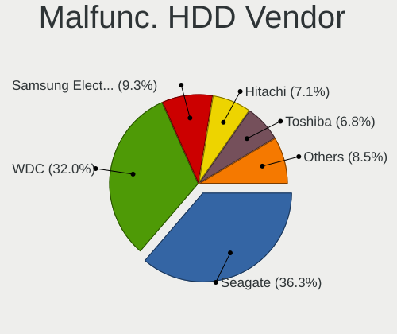

| Vendor              | Desktops | Drives | Percent |
|---------------------|----------|--------|---------|
| Seagate             | 102      | 108    | 36.3%   |
| WDC                 | 90       | 101    | 32.03%  |
| Samsung Electronics | 26       | 31     | 9.25%   |
| Hitachi             | 20       | 20     | 7.12%   |
| Toshiba             | 19       | 19     | 6.76%   |
| Maxtor              | 9        | 10     | 3.2%    |
| HGST                | 7        | 7      | 2.49%   |
| WD MediaMax         | 1        | 1      | 0.36%   |
| SATAFIRM            | 1        | 1      | 0.36%   |
| SAGE                | 1        | 1      | 0.36%   |
| RSH-319             | 1        | 1      | 0.36%   |
| QUANTUM             | 1        | 1      | 0.36%   |
| JMicron Technology  | 1        | 1      | 0.36%   |
| Fujitsu             | 1        | 1      | 0.36%   |
| ExcelStor           | 1        | 1      | 0.36%   |

Malfunc. Drive Kind
-------------------

Kinds of faulty drives

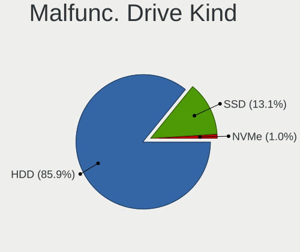

| Kind | Desktops | Drives | Percent |
|------|----------|--------|---------|
| HDD  | 255      | 304    | 85.86%  |
| SSD  | 39       | 40     | 13.13%  |
| NVMe | 3        | 4      | 1.01%   |

Failed Drives
-------------

Failed drive models

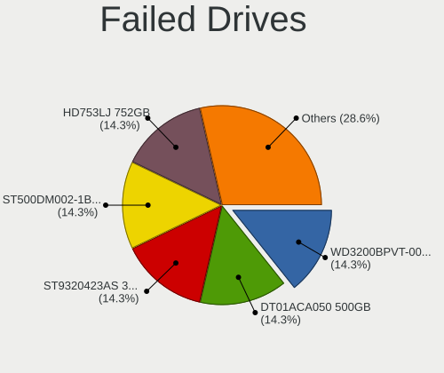

| Model                             | Desktops | Drives | Percent |
|-----------------------------------|----------|--------|---------|
| WDC WD800JD-00MSA1 80GB           | 1        | 1      | 10%     |
| WDC WD3200BPVT-00JJ5T0 320GB      | 1        | 1      | 10%     |
| Toshiba DT01ACA100 1TB            | 1        | 1      | 10%     |
| Toshiba DT01ACA050 500GB          | 1        | 1      | 10%     |
| Seagate ST9320423AS 320GB         | 1        | 1      | 10%     |
| Seagate ST500DM002-1BD142 500GB   | 1        | 1      | 10%     |
| Samsung Electronics HD753LJ 752GB | 1        | 1      | 10%     |
| Samsung Electronics HD502HJ 500GB | 1        | 1      | 10%     |
| Samsung Electronics HD252HJ 250GB | 1        | 1      | 10%     |
| Samsung Electronics HD103UJ 1TB   | 1        | 1      | 10%     |

Failed Drive Vendor
-------------------

Failed drive vendors

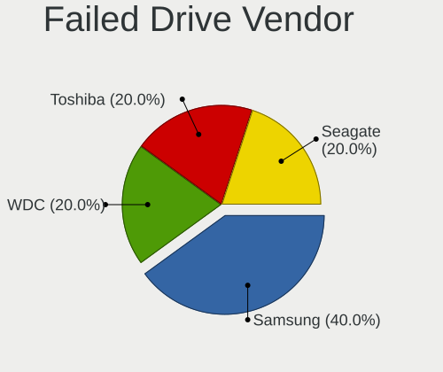

| Vendor              | Desktops | Drives | Percent |
|---------------------|----------|--------|---------|
| Samsung Electronics | 4        | 4      | 40%     |
| WDC                 | 2        | 2      | 20%     |
| Toshiba             | 2        | 2      | 20%     |
| Seagate             | 2        | 2      | 20%     |

Drive Status
------------

Number of failed and malfunc. drives

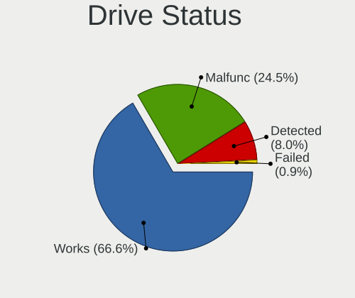

| Status   | Desktops | Drives | Percent |
|----------|----------|--------|---------|
| Works    | 780      | 1566   | 66.61%  |
| Malfunc  | 287      | 348    | 24.51%  |
| Detected | 94       | 120    | 8.03%   |
| Failed   | 10       | 10     | 0.85%   |

Storage controller
------------------

Storage Vendor
--------------

Storage controller vendors

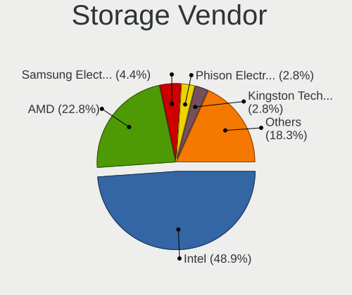

| Vendor                        | Desktops | Percent |
|-------------------------------|----------|---------|
| Intel                         | 609      | 48.88%  |
| AMD                           | 284      | 22.79%  |
| Samsung Electronics           | 55       | 4.41%   |
| Phison Electronics            | 35       | 2.81%   |
| Kingston Technology Company   | 35       | 2.81%   |
| ASMedia Technology            | 35       | 2.81%   |
| SanDisk                       | 29       | 2.33%   |
| Nvidia                        | 24       | 1.93%   |
| Micron/Crucial Technology     | 20       | 1.61%   |
| Silicon Motion                | 18       | 1.44%   |
| Marvell Technology Group      | 15       | 1.2%    |
| ADATA Technology              | 14       | 1.12%   |
| JMicron Technology            | 12       | 0.96%   |
| VIA Technologies              | 10       | 0.8%    |
| MAXIO Technology (Hangzhou)   | 9        | 0.72%   |
| SK hynix                      | 7        | 0.56%   |
| Realtek Semiconductor         | 6        | 0.48%   |
| KIOXIA                        | 5        | 0.4%    |
| Toshiba America Info Systems  | 4        | 0.32%   |
| Micron Technology             | 4        | 0.32%   |
| Broadcom / LSI                | 3        | 0.24%   |
| Seagate Technology            | 2        | 0.16%   |
| Netac Technology              | 2        | 0.16%   |
| Union Memory (Shenzhen)       | 1        | 0.08%   |
| Silicon Image                 | 1        | 0.08%   |
| Shenzhen Longsys Electronics  | 1        | 0.08%   |
| Promise Technology            | 1        | 0.08%   |
| Lite-On Technology            | 1        | 0.08%   |
| Integrated Technology Express | 1        | 0.08%   |
| INNOGRIT                      | 1        | 0.08%   |
| Hosin Global Electronics      | 1        | 0.08%   |
| Biwin Storage Technology      | 1        | 0.08%   |

Storage Model
-------------

Storage controller models

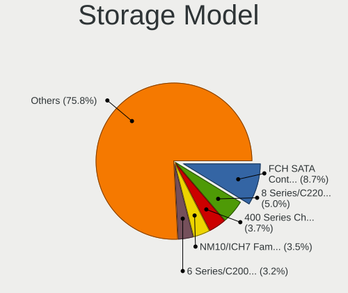

| Model                                                                                   | Desktops | Percent |
|-----------------------------------------------------------------------------------------|----------|---------|
| AMD FCH SATA Controller [AHCI mode]                                                     | 136      | 8.73%   |
| Intel 8 Series/C220 Series Chipset Family 6-port SATA Controller 1 [AHCI mode]          | 78       | 5.01%   |
| AMD 400 Series Chipset SATA Controller                                                  | 58       | 3.72%   |
| Intel NM10/ICH7 Family SATA Controller [IDE mode]                                       | 55       | 3.53%   |
| Intel 6 Series/C200 Series Chipset Family 6 port Desktop SATA AHCI Controller           | 50       | 3.21%   |
| Intel Q170/Q150/B150/H170/H110/Z170/CM236 Chipset SATA Controller [AHCI Mode]           | 47       | 3.02%   |
| Intel 200 Series PCH SATA controller [AHCI mode]                                        | 46       | 2.95%   |
| AMD 500 Series Chipset SATA Controller                                                  | 46       | 2.95%   |
| Intel 82801G (ICH7 Family) IDE Controller                                               | 45       | 2.89%   |
| Intel 7 Series/C210 Series Chipset Family 6-port SATA Controller [AHCI mode]            | 44       | 2.82%   |
| AMD SB7x0/SB8x0/SB9x0 IDE Controller                                                    | 41       | 2.63%   |
| Intel Cannon Lake PCH SATA AHCI Controller                                              | 34       | 2.18%   |
| ASMedia ASM1061/ASM1062 Serial ATA Controller                                           | 33       | 2.12%   |
| Intel SATA Controller [RAID mode]                                                       | 32       | 2.05%   |
| Samsung NVMe SSD Controller SM981/PM981/PM983                                           | 30       | 1.93%   |
| AMD SB7x0/SB8x0/SB9x0 SATA Controller [AHCI mode]                                       | 30       | 1.93%   |
| AMD SB7x0/SB8x0/SB9x0 SATA Controller [IDE mode]                                        | 27       | 1.73%   |
| Intel 6 Series/C200 Series Chipset Family Desktop SATA Controller (IDE mode, ports 4-5) | 26       | 1.67%   |
| Intel 6 Series/C200 Series Chipset Family Desktop SATA Controller (IDE mode, ports 0-3) | 26       | 1.67%   |
| Intel 500 Series Chipset Family SATA AHCI Controller                                    | 23       | 1.48%   |
| AMD A320 Chipset SATA Controller [AHCI mode]                                            | 22       | 1.41%   |
| Intel 4 Series Chipset PT IDER Controller                                               | 16       | 1.03%   |
| Silicon Motion SM2263EN/SM2263XT (DRAM-less) NVMe SSD Controllers                       | 15       | 0.96%   |
| Samsung NVMe SSD Controller 980 (DRAM-less)                                             | 14       | 0.9%    |
| Phison PS5013-E13 PCIe3 NVMe Controller (DRAM-less)                                     | 14       | 0.9%    |
| Intel 7 Series/C210 Series Chipset Family 4-port SATA Controller [IDE mode]             | 14       | 0.9%    |
| Intel 7 Series/C210 Series Chipset Family 2-port SATA Controller [IDE mode]             | 14       | 0.9%    |
| Phison E12 NVMe Controller                                                              | 13       | 0.83%   |
| Intel 9 Series Chipset Family SATA Controller [AHCI Mode]                               | 13       | 0.83%   |
| AMD 300 Series Chipset SATA Controller                                                  | 13       | 0.83%   |
| Micron/Crucial P2 [Nick P2] / P3 / P3 Plus NVMe PCIe SSD (DRAM-less)                    | 12       | 0.77%   |
| Nvidia MCP61 SATA Controller                                                            | 11       | 0.71%   |
| SanDisk Ultra 3D / WD PC SN530, IX SN530, Blue SN550 NVMe SSD (DRAM-less)               | 10       | 0.64%   |
| Nvidia MCP61 IDE                                                                        | 10       | 0.64%   |
| Kingston Company A2000 NVMe SSD [SM2263EN]                                              | 10       | 0.64%   |
| Intel 82801JD/DO (ICH10 Family) SATA AHCI Controller                                    | 10       | 0.64%   |
| Intel 82801H (ICH8 Family) 4 port SATA Controller [IDE mode]                            | 10       | 0.64%   |
| Samsung NVMe SSD Controller PM9A1/PM9A3/980PRO                                          | 9        | 0.58%   |
| Intel 82801JI (ICH10 Family) SATA AHCI Controller                                       | 9        | 0.58%   |
| Intel 82801HR/HO/HH (ICH8R/DO/DH) 2 port SATA Controller [IDE mode]                     | 9        | 0.58%   |

Storage Kind
------------

Kind of storage controller (IDE, SATA, NVMe, SAS, ...)

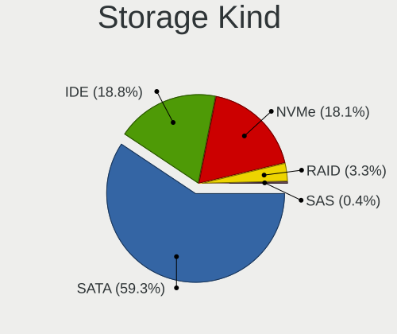

| Kind | Desktops | Percent |
|------|----------|---------|
| SATA | 730      | 59.35%  |
| IDE  | 231      | 18.78%  |
| NVMe | 223      | 18.13%  |
| RAID | 41       | 3.33%   |
| SAS  | 5        | 0.41%   |

Processor
---------

CPU Vendor
----------

Processor vendors

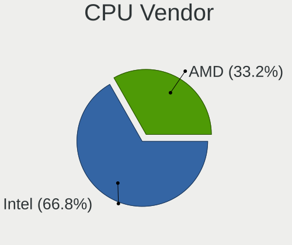

| Vendor | Desktops | Percent |
|--------|----------|---------|
| Intel  | 615      | 66.78%  |
| AMD    | 306      | 33.22%  |

CPU Model
---------

Processor models

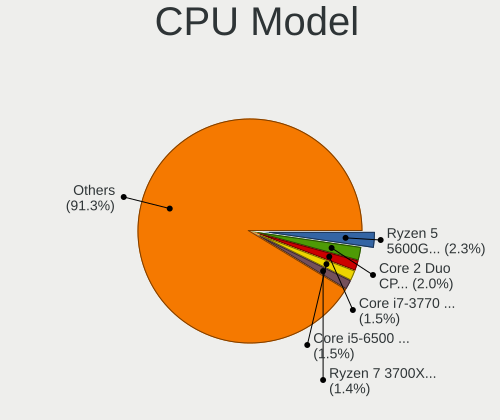

| Model                                       | Desktops | Percent |
|---------------------------------------------|----------|---------|
| AMD Ryzen 5 5600G with Radeon Graphics      | 21       | 2.28%   |
| Intel Core 2 Duo CPU E8400 @ 3.00GHz        | 18       | 1.95%   |
| Intel Core i7-3770 CPU @ 3.40GHz            | 14       | 1.52%   |
| Intel Core i5-6500 CPU @ 3.20GHz            | 14       | 1.52%   |
| AMD Ryzen 7 3700X 8-Core Processor          | 13       | 1.41%   |
| Intel Core i7-4790 CPU @ 3.60GHz            | 12       | 1.3%    |
| Intel Core i5-4590 CPU @ 3.30GHz            | 12       | 1.3%    |
| Intel Core i5-2400 CPU @ 3.10GHz            | 12       | 1.3%    |
| Intel Core i3-2120 CPU @ 3.30GHz            | 12       | 1.3%    |
| Intel Core i3-3220 CPU @ 3.30GHz            | 11       | 1.19%   |
| AMD Ryzen 3 3200G with Radeon Vega Graphics | 11       | 1.19%   |
| Intel Core i5-4570 CPU @ 3.20GHz            | 10       | 1.08%   |
| AMD Ryzen 5 3600 6-Core Processor           | 10       | 1.08%   |
| AMD Ryzen 5 2600 Six-Core Processor         | 10       | 1.08%   |
| Intel Core i7-2600 CPU @ 3.40GHz            | 9        | 0.98%   |
| Intel Core i5-3470 CPU @ 3.20GHz            | 9        | 0.98%   |
| Intel Core 2 Quad CPU Q6600 @ 2.40GHz       | 9        | 0.98%   |
| AMD Ryzen 5 5600X 6-Core Processor          | 9        | 0.98%   |
| Intel Core i5-3330 CPU @ 3.00GHz            | 8        | 0.87%   |
| AMD Ryzen 5 2400G with Radeon Vega Graphics | 8        | 0.87%   |
| Intel Core i7-8700 CPU @ 3.20GHz            | 7        | 0.76%   |
| Intel Core i7-6700 CPU @ 3.40GHz            | 7        | 0.76%   |
| Intel Core i5-6400 CPU @ 2.70GHz            | 7        | 0.76%   |
| Intel Core i5-4460 CPU @ 3.20GHz            | 7        | 0.76%   |
| Intel Core i3-2100 CPU @ 3.10GHz            | 7        | 0.76%   |
| Intel Core 2 Duo CPU E7400 @ 2.80GHz        | 7        | 0.76%   |
| AMD Ryzen 5 3400G with Radeon Vega Graphics | 7        | 0.76%   |
| Intel Core i7-8700K CPU @ 3.70GHz           | 6        | 0.65%   |
| Intel Core i5-9400F CPU @ 2.90GHz           | 6        | 0.65%   |
| Intel Core i5-7400 CPU @ 3.00GHz            | 6        | 0.65%   |
| Intel Core i3-6100 CPU @ 3.70GHz            | 6        | 0.65%   |
| Intel Core i3-10100 CPU @ 3.60GHz           | 6        | 0.65%   |
| Intel 11th Gen Core i5-11400 @ 2.60GHz      | 6        | 0.65%   |
| Intel Pentium Dual-Core CPU E5400 @ 2.70GHz | 5        | 0.54%   |
| Intel Pentium CPU G620 @ 2.60GHz            | 5        | 0.54%   |
| Intel Pentium CPU G4400 @ 3.30GHz           | 5        | 0.54%   |
| Intel Core i7-7700 CPU @ 3.60GHz            | 5        | 0.54%   |
| Intel Core i5-3570 CPU @ 3.40GHz            | 5        | 0.54%   |
| Intel Core i5-2500 CPU @ 3.30GHz            | 5        | 0.54%   |
| Intel Core i5-10400 CPU @ 2.90GHz           | 5        | 0.54%   |

CPU Model Family
----------------

Processor model prefix

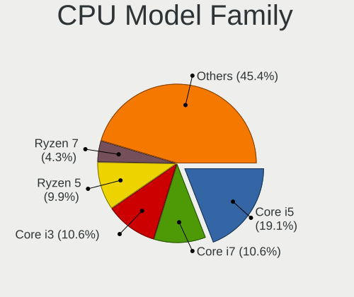

| Model                   | Desktops | Percent |
|-------------------------|----------|---------|
| Intel Core i5           | 176      | 19.11%  |
| Intel Core i7           | 98       | 10.64%  |
| Intel Core i3           | 98       | 10.64%  |
| AMD Ryzen 5             | 91       | 9.88%   |
| AMD Ryzen 7             | 40       | 4.34%   |
| Intel Core 2 Duo        | 39       | 4.23%   |
| Intel Celeron           | 33       | 3.58%   |
| Intel Xeon              | 31       | 3.37%   |
| Other                   | 29       | 3.15%   |
| Intel Pentium           | 28       | 3.04%   |
| AMD FX                  | 28       | 3.04%   |
| Intel Pentium Dual-Core | 23       | 2.5%    |
| Intel Core 2 Quad       | 22       | 2.39%   |
| AMD Ryzen 3             | 21       | 2.28%   |
| AMD A8                  | 15       | 1.63%   |
| AMD Athlon II X2        | 13       | 1.41%   |
| AMD Ryzen 9             | 11       | 1.19%   |
| AMD Athlon 64 X2        | 10       | 1.09%   |
| Intel Core 2            | 9        | 0.98%   |
| AMD A10                 | 9        | 0.98%   |
| AMD A4                  | 8        | 0.87%   |
| Intel Pentium Dual      | 7        | 0.76%   |
| AMD Phenom II X6        | 7        | 0.76%   |
| AMD Athlon              | 7        | 0.76%   |
| Intel Atom              | 6        | 0.65%   |
| Intel Core i9           | 5        | 0.54%   |
| AMD A6                  | 5        | 0.54%   |
| Intel Pentium Gold      | 4        | 0.43%   |
| AMD Ryzen 5 PRO         | 4        | 0.43%   |
| AMD Athlon X4           | 4        | 0.43%   |
| Intel Pentium 4         | 3        | 0.33%   |
| Intel Genuine           | 3        | 0.33%   |
| AMD PRO A10             | 3        | 0.33%   |
| AMD Phenom II X4        | 3        | 0.33%   |
| AMD Phenom              | 3        | 0.33%   |
| AMD Athlon II X4        | 3        | 0.33%   |
| AMD Athlon II X3        | 3        | 0.33%   |
| Intel Pentium Silver    | 2        | 0.22%   |
| AMD Sempron             | 2        | 0.22%   |
| AMD Ryzen 3 PRO         | 2        | 0.22%   |

CPU Cores
---------

Number of processor cores

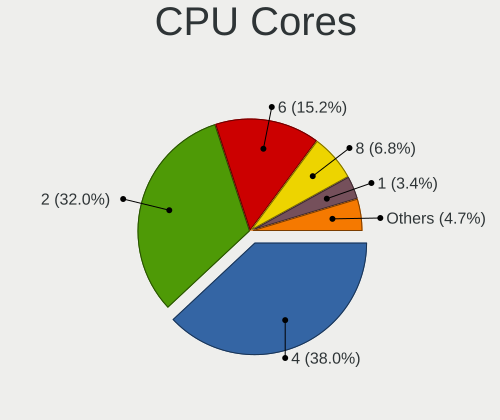

| Number | Desktops | Percent |
|--------|----------|---------|
| 4      | 351      | 38.03%  |
| 2      | 295      | 31.96%  |
| 6      | 140      | 15.17%  |
| 8      | 63       | 6.83%   |
| 1      | 31       | 3.36%   |
| 3      | 13       | 1.41%   |
| 12     | 10       | 1.08%   |
| 16     | 8        | 0.87%   |
| 14     | 6        | 0.65%   |
| 10     | 4        | 0.43%   |
| 24     | 2        | 0.22%   |

CPU Sockets
-----------

Number of sockets

| Number | Desktops | Percent |
|--------|----------|---------|
| 1      | 917      | 99.57%  |
| 2      | 4        | 0.43%   |

CPU Threads
-----------

Threads per core (Hyper-Threading)

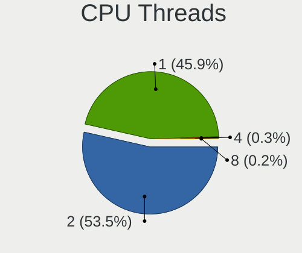

| Number | Desktops | Percent |
|--------|----------|---------|
| 2      | 493      | 53.53%  |
| 1      | 423      | 45.93%  |
| 4      | 3        | 0.33%   |
| 8      | 2        | 0.22%   |

CPU Op-Modes
------------

CPU Operation Modes (32-bit, 64-bit)

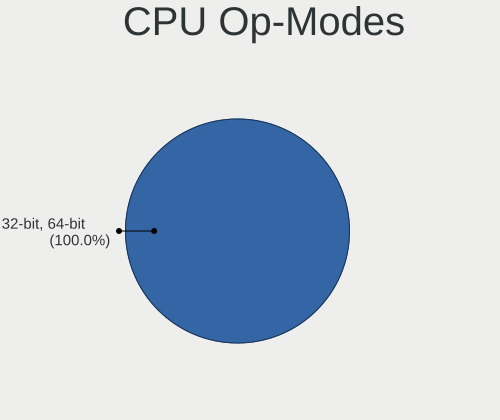

| Op mode        | Desktops | Percent |
|----------------|----------|---------|
| 32-bit, 64-bit | 921      | 100%    |

CPU Microcode
-------------

Microcode number

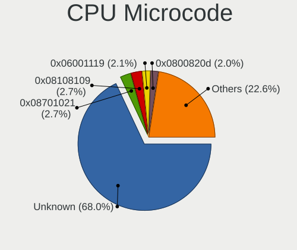

| Number     | Desktops | Percent |
|------------|----------|---------|
| Unknown    | 627      | 68%     |
| 0x08701021 | 25       | 2.71%   |
| 0x08108109 | 25       | 2.71%   |
| 0x06001119 | 19       | 2.06%   |
| 0x0800820d | 18       | 1.95%   |
| 0x0a50000d | 16       | 1.74%   |
| 0x08101016 | 15       | 1.63%   |
| 0x06003106 | 14       | 1.52%   |
| 0x010000c8 | 14       | 1.52%   |
| 0x0a50000c | 12       | 1.3%    |
| 0x06000822 | 11       | 1.19%   |
| 0x0a201016 | 10       | 1.08%   |
| 0x0a20120a | 9        | 0.98%   |
| 0x0600081c | 7        | 0.76%   |
| 0x010000bf | 7        | 0.76%   |
| 0x0a201025 | 6        | 0.65%   |
| 0x0600611a | 5        | 0.54%   |
| 0x08701013 | 4        | 0.43%   |
| 0x010000b6 | 4        | 0.43%   |
| 0x206a7    | 3        | 0.33%   |
| 0x08701030 | 3        | 0.33%   |
| 0x08600109 | 3        | 0.33%   |
| 0x08600106 | 3        | 0.33%   |
| 0x08600103 | 3        | 0.33%   |
| 0x0800820b | 3        | 0.33%   |
| 0x00000000 | 3        | 0.33%   |
| 0x906ea    | 2        | 0.22%   |
| 0x1067a    | 2        | 0.22%   |
| 0x0a601203 | 2        | 0.22%   |
| 0x0a50000f | 2        | 0.22%   |
| 0x08001138 | 2        | 0.22%   |
| 0x0700010b | 2        | 0.22%   |
| 0x06006705 | 2        | 0.22%   |
| 0x06000817 | 2        | 0.22%   |
| 0x06000629 | 2        | 0.22%   |
| 0x05000101 | 2        | 0.22%   |
| 0x03000027 | 2        | 0.22%   |
| 0x010000c7 | 2        | 0.22%   |
| 0x01000095 | 2        | 0.22%   |
| 0x906eb    | 1        | 0.11%   |

CPU Microarch
-------------

Microarchitecture

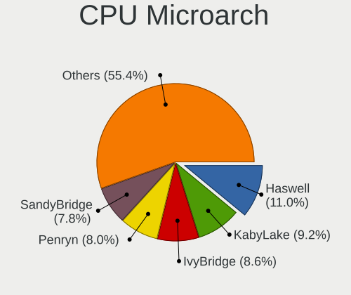

| Name             | Desktops | Percent |
|------------------|----------|---------|
| Haswell          | 101      | 10.95%  |
| KabyLake         | 85       | 9.22%   |
| IvyBridge        | 79       | 8.57%   |
| Penryn           | 74       | 8.03%   |
| SandyBridge      | 72       | 7.81%   |
| Zen 3            | 59       | 6.4%    |
| Skylake          | 58       | 6.29%   |
| Zen+             | 47       | 5.1%    |
| Piledriver       | 43       | 4.66%   |
| Zen 2            | 42       | 4.56%   |
| K10              | 38       | 4.12%   |
| Core             | 32       | 3.47%   |
| CometLake        | 27       | 2.93%   |
| Zen              | 24       | 2.6%    |
| Westmere         | 15       | 1.63%   |
| Steamroller      | 15       | 1.63%   |
| K8 Hammer        | 13       | 1.41%   |
| Icelake          | 12       | 1.3%    |
| Alderlake Hybrid | 12       | 1.3%    |
| Silvermont       | 11       | 1.19%   |
| Nehalem          | 8        | 0.87%   |
| Excavator        | 8        | 0.87%   |
| Goldmont         | 6        | 0.65%   |
| NetBurst         | 5        | 0.54%   |
| Broadwell        | 5        | 0.54%   |
| Bonnell          | 5        | 0.54%   |
| Unknown          | 5        | 0.54%   |
| K10 Llano        | 4        | 0.43%   |
| Tremont          | 3        | 0.33%   |
| Goldmont plus    | 3        | 0.33%   |
| Bulldozer        | 3        | 0.33%   |
| Bobcat           | 3        | 0.33%   |
| Jaguar           | 2        | 0.22%   |
| Gracemont        | 2        | 0.22%   |
| Puma             | 1        | 0.11%   |

Graphics
--------

GPU Vendor
----------

Vendors of graphics cards

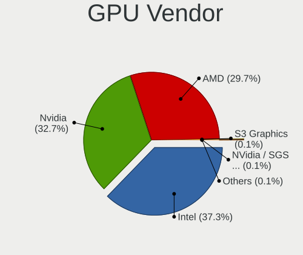

| Vendor                               | Desktops | Percent |
|--------------------------------------|----------|---------|
| Intel                                | 357      | 37.27%  |
| Nvidia                               | 313      | 32.67%  |
| AMD                                  | 285      | 29.75%  |
| S3 Graphics                          | 1        | 0.1%    |
| NVidia / SGS Thomson (Joint Venture) | 1        | 0.1%    |
| ATI Technologies                     | 1        | 0.1%    |

GPU Model
---------

Graphics card models

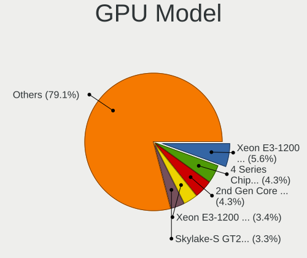

| Model                                                                       | Desktops | Percent |
|-----------------------------------------------------------------------------|----------|---------|
| Intel Xeon E3-1200 v3/4th Gen Core Processor Integrated Graphics Controller | 54       | 5.57%   |
| Intel 4 Series Chipset Integrated Graphics Controller                       | 42       | 4.33%   |
| Intel 2nd Generation Core Processor Family Integrated Graphics Controller   | 42       | 4.33%   |
| Intel Xeon E3-1200 v2/3rd Gen Core processor Graphics Controller            | 33       | 3.41%   |
| Intel Skylake-S GT2 [HD Graphics 530]                                       | 32       | 3.3%    |
| Nvidia GP107 [GeForce GTX 1050 Ti]                                          | 28       | 2.89%   |
| AMD Ellesmere [Radeon RX 470/480/570/570X/580/580X/590]                     | 28       | 2.89%   |
| Intel CoffeeLake-S GT2 [UHD Graphics 630]                                   | 23       | 2.37%   |
| AMD Picasso/Raven 2 [Radeon Vega Series / Radeon Vega Mobile Series]        | 22       | 2.27%   |
| AMD Cezanne [Radeon Vega Series / Radeon Vega Mobile Series]                | 22       | 2.27%   |
| Nvidia GP108 [GeForce GT 1030]                                              | 20       | 2.06%   |
| AMD Raven Ridge [Radeon Vega Series / Radeon Vega Mobile Series]            | 15       | 1.55%   |
| Nvidia GK208B [GeForce GT 730]                                              | 14       | 1.44%   |
| Intel Kaby Lake-S GT2 [HD Graphics 630]                                     | 14       | 1.44%   |
| AMD Cedar [Radeon HD 5000/6000/7350/8350 Series]                            | 14       | 1.44%   |
| Nvidia GK208B [GeForce GT 710]                                              | 13       | 1.34%   |
| Nvidia GP106 [GeForce GTX 1060 6GB]                                         | 12       | 1.24%   |
| AMD Lexa PRO [Radeon 540/540X/550/550X / RX 540X/550/550X]                  | 12       | 1.24%   |
| Nvidia GF119 [GeForce GT 610]                                               | 11       | 1.14%   |
| Nvidia GP107 [GeForce GTX 1050]                                             | 10       | 1.03%   |
| Intel IvyBridge GT2 [HD Graphics 4000]                                      | 10       | 1.03%   |
| AMD Kaveri [Radeon R7 Graphics]                                             | 10       | 1.03%   |
| Nvidia GT218 [GeForce 210]                                                  | 9        | 0.93%   |
| Nvidia GM206 [GeForce GTX 960]                                              | 9        | 0.93%   |
| Nvidia GM107 [GeForce GTX 750 Ti]                                           | 9        | 0.93%   |
| Intel CometLake-S GT2 [UHD Graphics 630]                                    | 9        | 0.93%   |
| Intel 4th Generation Core Processor Family Integrated Graphics Controller   | 9        | 0.93%   |
| Intel Atom Processor Z36xxx/Z37xxx Series Graphics & Display                | 8        | 0.83%   |
| AMD Navi 24 [Radeon RX 6400/6500 XT/6500M]                                  | 8        | 0.83%   |
| AMD Navi 22 [Radeon RX 6700/6700 XT/6750 XT / 6800M/6850M XT]               | 8        | 0.83%   |
| Nvidia TU106 [GeForce RTX 2060 Rev. A]                                      | 7        | 0.72%   |
| AMD RS780L [Radeon 3000]                                                    | 7        | 0.72%   |
| AMD Navi 23 [Radeon RX 6600/6600 XT/6600M]                                  | 7        | 0.72%   |
| AMD Caicos [Radeon HD 6450/7450/8450 / R5 230 OEM]                          | 7        | 0.72%   |
| Nvidia TU116 [GeForce GTX 1660]                                             | 6        | 0.62%   |
| Nvidia TU116 [GeForce GTX 1660 SUPER]                                       | 6        | 0.62%   |
| Nvidia GA106 [GeForce RTX 3060 Lite Hash Rate]                              | 6        | 0.62%   |
| Nvidia G96C [GeForce 9500 GT]                                               | 6        | 0.62%   |
| Nvidia G92 [GeForce 9800 GT]                                                | 6        | 0.62%   |
| Intel Core Processor Integrated Graphics Controller                         | 6        | 0.62%   |

GPU Combo
---------

Combinations of graphics cards

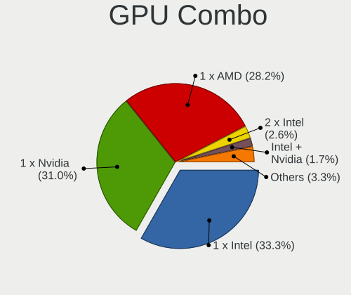

| Name                                     | Desktops | Percent |
|------------------------------------------|----------|---------|
| 1 x Intel                                | 307      | 33.26%  |
| 1 x Nvidia                               | 286      | 30.99%  |
| 1 x AMD                                  | 260      | 28.17%  |
| 2 x Intel                                | 24       | 2.6%    |
| Intel + Nvidia                           | 16       | 1.73%   |
| 2 x AMD                                  | 9        | 0.98%   |
| Intel + AMD                              | 9        | 0.98%   |
| AMD + Nvidia                             | 6        | 0.65%   |
| 2 x Nvidia                               | 2        | 0.22%   |
| Intel + AMD + 1 x Nvidia                 | 2        | 0.22%   |
| 1 x S3 Graphics                          | 1        | 0.11%   |
| 1 x NVidia / SGS Thomson (Joint Venture) | 1        | 0.11%   |

GPU Driver
----------

Free vs proprietary

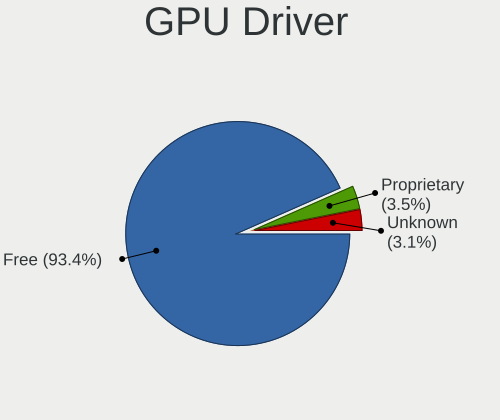

| Driver      | Desktops | Percent |
|-------------|----------|---------|
| Free        | 863      | 93.4%   |
| Proprietary | 32       | 3.46%   |
| Unknown     | 29       | 3.14%   |

GPU Memory
----------

Total video memory

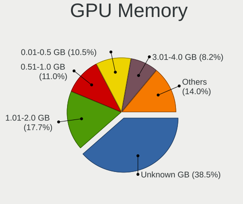

| Size in GB | Desktops | Percent |
|------------|----------|---------|
| Unknown    | 356      | 38.53%  |
| 1.01-2.0   | 164      | 17.75%  |
| 0.51-1.0   | 102      | 11.04%  |
| 0.01-0.5   | 97       | 10.5%   |
| 3.01-4.0   | 76       | 8.23%   |
| 7.01-8.0   | 65       | 7.03%   |
| 5.01-6.0   | 38       | 4.11%   |
| 8.01-16.0  | 19       | 2.06%   |
| 2.01-3.0   | 4        | 0.43%   |
| 16.01-24.0 | 3        | 0.32%   |

Monitor
-------

Monitor Vendor
--------------

Monitor vendors

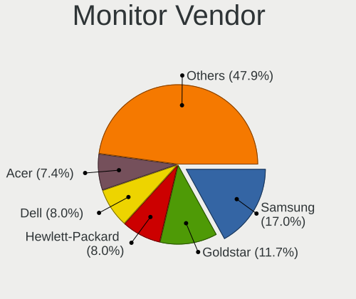

| Vendor               | Desktops | Percent |
|----------------------|----------|---------|
| Samsung Electronics  | 154      | 16.98%  |
| Goldstar             | 106      | 11.69%  |
| Hewlett-Packard      | 73       | 8.05%   |
| Dell                 | 73       | 8.05%   |
| Acer                 | 67       | 7.39%   |
| AOC                  | 60       | 6.62%   |
| Philips              | 49       | 5.4%    |
| BenQ                 | 43       | 4.74%   |
| Ancor Communications | 27       | 2.98%   |
| ViewSonic            | 25       | 2.76%   |
| ASUSTek Computer     | 25       | 2.76%   |
| Iiyama               | 18       | 1.98%   |
| Lenovo               | 15       | 1.65%   |
| Sony                 | 9        | 0.99%   |
| Sceptre Tech         | 9        | 0.99%   |
| NEC Computers        | 9        | 0.99%   |
| Unknown              | 8        | 0.88%   |
| Unknown              | 8        | 0.88%   |
| Fujitsu Siemens      | 6        | 0.66%   |
| Sharp                | 5        | 0.55%   |
| MSI                  | 5        | 0.55%   |
| Seiki                | 4        | 0.44%   |
| Panasonic            | 4        | 0.44%   |
| LG Electronics       | 4        | 0.44%   |
| Unknown (XXX)        | 3        | 0.33%   |
| NCS                  | 3        | 0.33%   |
| Mitsubishi           | 3        | 0.33%   |
| Insignia             | 3        | 0.33%   |
| Eizo                 | 3        | 0.33%   |
| Vizio                | 2        | 0.22%   |
| Viotek               | 2        | 0.22%   |
| VIE                  | 2        | 0.22%   |
| Vestel               | 2        | 0.22%   |
| UMC                  | 2        | 0.22%   |
| UGD                  | 2        | 0.22%   |
| Toshiba              | 2        | 0.22%   |
| SGT                  | 2        | 0.22%   |
| RGT                  | 2        | 0.22%   |
| Pixio                | 2        | 0.22%   |
| ONN                  | 2        | 0.22%   |

Monitor Model
-------------

Monitor models

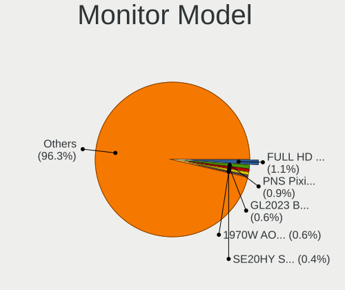

| Model                                                                | Desktops | Percent |
|----------------------------------------------------------------------|----------|---------|
| Goldstar FULL HD GSM5B55 1920x1080 480x270mm 21.7-inch               | 10       | 1.08%   |
| Unknown                                                              | 8        | 0.86%   |
| BenQ GL2023 BNQ78CC 1600x900 443x249mm 20.0-inch                     | 6        | 0.65%   |
| AOC 1970W AOC1970 1366x768 410x230mm 18.5-inch                       | 6        | 0.65%   |
| Seiki SE20HY SEK0CA8 1360x768 440x250mm 19.9-inch                    | 4        | 0.43%   |
| Samsung Electronics SyncMaster SAM0527 1600x900 440x250mm 19.9-inch  | 4        | 0.43%   |
| Samsung Electronics S24F350 SAM0D20 1920x1080 521x293mm 23.5-inch    | 4        | 0.43%   |
| Samsung Electronics C27F390 SAM0D32 1920x1080 598x336mm 27.0-inch    | 4        | 0.43%   |
| Philips PHL 243V7 PHLC155 1920x1080 527x296mm 23.8-inch              | 4        | 0.43%   |
| Goldstar W1943 GSM4BAD 1360x768 406x229mm 18.4-inch                  | 4        | 0.43%   |
| BenQ GW2270 BNQ78DB 1920x1080 476x268mm 21.5-inch                    | 4        | 0.43%   |
| ASUSTek Computer VG245 AUS24A1 1920x1080 531x299mm 24.0-inch         | 4        | 0.43%   |
| AOC 2752 AOC2752 1920x1080 579x336mm 26.4-inch                       | 4        | 0.43%   |
| Samsung Electronics SyncMaster SAM0304 1680x1050 494x320mm 23.2-inch | 3        | 0.32%   |
| Samsung Electronics S24F350 SAM0D21 1920x1080 521x293mm 23.5-inch    | 3        | 0.32%   |
| Samsung Electronics LCD Monitor SAM0659 1920x1080                    | 3        | 0.32%   |
| Samsung Electronics C24F390 SAM0D2C 1920x1080 521x293mm 23.5-inch    | 3        | 0.32%   |
| Philips PHL 243V5 PHLC0D1 1920x1080 521x293mm 23.5-inch              | 3        | 0.32%   |
| NCS LCD Monitor NCS2275 1920x1080 256x192mm 12.6-inch                | 3        | 0.32%   |
| MSI Optix MAG27CQ MSI1462 2560x1440 597x336mm 27.0-inch              | 3        | 0.32%   |
| Hewlett-Packard Z23i HWP3090 1920x1080 509x286mm 23.0-inch           | 3        | 0.32%   |
| Hewlett-Packard w2207 HWP26A9 1680x1050 473x296mm 22.0-inch          | 3        | 0.32%   |
| Hewlett-Packard LA1951 HWP285B 1280x1024 380x300mm 19.1-inch         | 3        | 0.32%   |
| Goldstar IPS225 GSM587B 1920x1080 510x290mm 23.1-inch                | 3        | 0.32%   |
| Goldstar HD GSM5ACD 1366x768 410x230mm 18.5-inch                     | 3        | 0.32%   |
| Dell P2210 DEL404D 1680x1050 474x296mm 22.0-inch                     | 3        | 0.32%   |
| BenQ GW2280 BNQ78E8 1920x1080 476x268mm 21.5-inch                    | 3        | 0.32%   |
| AOC 2470W AOC2470 1920x1080 521x293mm 23.5-inch                      | 3        | 0.32%   |
| AOC 22B15HN AOC2201 1920x1080 478x260mm 21.4-inch                    | 3        | 0.32%   |
| AOC 2270W AOC2270 1920x1080 477x268mm 21.5-inch                      | 3        | 0.32%   |
| AOC 2050W AOC2050 1600x900 432x240mm 19.5-inch                       | 3        | 0.32%   |
| Ancor Communications VW222 ACI22A2 1680x1050 473x296mm 22.0-inch     | 3        | 0.32%   |
| Ancor Communications VG248 ACI24A4 1920x1080 531x299mm 24.0-inch     | 3        | 0.32%   |
| Acer KA240Y ACR08A8 1920x1080 527x296mm 23.8-inch                    | 3        | 0.32%   |
| Acer K242HL ACR03E3 1920x1080 531x299mm 24.0-inch                    | 3        | 0.32%   |
| ViewSonic VX2718-2KPC VSCB73A 2560x1440 598x336mm 27.0-inch          | 2        | 0.22%   |
| ViewSonic VX2452 Series VSCDE2E 1920x1080 521x293mm 23.5-inch        | 2        | 0.22%   |
| ViewSonic VA2445 SERIES VSC712E 1920x1080 521x293mm 23.5-inch        | 2        | 0.22%   |
| Unknown LCD Monitor SAMSUNG 1920x1080                                | 2        | 0.22%   |
| Unknown LCD Monitor FFFF 2288x1287 2550x2550mm 142.0-inch            | 2        | 0.22%   |

Monitor Resolution
------------------

Monitor screen resolution

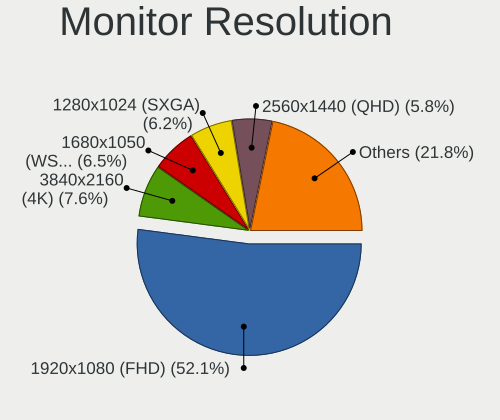

| Resolution         | Desktops | Percent |
|--------------------|----------|---------|
| 1920x1080 (FHD)    | 464      | 52.08%  |
| 3840x2160 (4K)     | 68       | 7.63%   |
| 1680x1050 (WSXGA+) | 58       | 6.51%   |
| 1280x1024 (SXGA)   | 55       | 6.17%   |
| 2560x1440 (QHD)    | 52       | 5.84%   |
| 1366x768 (WXGA)    | 38       | 4.26%   |
| 1600x900 (HD+)     | 33       | 3.7%    |
| 1920x1200 (WUXGA)  | 24       | 2.69%   |
| 1360x768           | 23       | 2.58%   |
| 1440x900 (WXGA+)   | 21       | 2.36%   |
| 3440x1440          | 11       | 1.23%   |
| 1920x540           | 8        | 0.9%    |
| 2560x1080          | 7        | 0.79%   |
| 1024x768 (XGA)     | 7        | 0.79%   |
| Unknown            | 5        | 0.56%   |
| 1600x1200          | 3        | 0.34%   |
| 1280x960           | 3        | 0.34%   |
| 2288x1287          | 2        | 0.22%   |
| 8320x1440          | 1        | 0.11%   |
| 6000x1440          | 1        | 0.11%   |
| 5760x2160          | 1        | 0.11%   |
| 5120x1440          | 1        | 0.11%   |
| 4480x2023          | 1        | 0.11%   |
| 3840x1080          | 1        | 0.11%   |
| 2560x1600          | 1        | 0.11%   |
| 1280x768           | 1        | 0.11%   |
| 1280x720 (HD)      | 1        | 0.11%   |

Monitor Diagonal
----------------

Diagonal size in inches

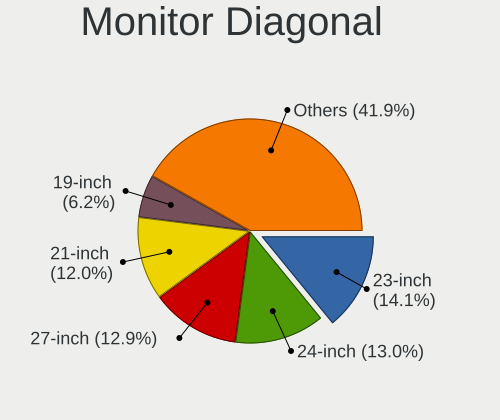

| Inches  | Desktops | Percent |
|---------|----------|---------|
| 23      | 128      | 14.1%   |
| 24      | 118      | 13%     |
| 27      | 117      | 12.89%  |
| 21      | 109      | 12%     |
| 19      | 56       | 6.17%   |
| 22      | 49       | 5.4%    |
| Unknown | 47       | 5.18%   |
| 31      | 45       | 4.96%   |
| 18      | 45       | 4.96%   |
| 20      | 31       | 3.41%   |
| 17      | 23       | 2.53%   |
| 34      | 19       | 2.09%   |
| 54      | 15       | 1.65%   |
| 15      | 14       | 1.54%   |
| 72      | 10       | 1.1%    |
| 84      | 8        | 0.88%   |
| 32      | 8        | 0.88%   |
| 40      | 6        | 0.66%   |
| 39      | 5        | 0.55%   |
| 26      | 5        | 0.55%   |
| 25      | 5        | 0.55%   |
| 65      | 4        | 0.44%   |
| 63      | 4        | 0.44%   |
| 48      | 4        | 0.44%   |
| 12      | 4        | 0.44%   |
| 46      | 3        | 0.33%   |
| 37      | 3        | 0.33%   |
| 142     | 2        | 0.22%   |
| 42      | 2        | 0.22%   |
| 36      | 2        | 0.22%   |
| 28      | 2        | 0.22%   |
| 14      | 2        | 0.22%   |
| 74      | 1        | 0.11%   |
| 64      | 1        | 0.11%   |
| 60      | 1        | 0.11%   |
| 58      | 1        | 0.11%   |
| 52      | 1        | 0.11%   |
| 50      | 1        | 0.11%   |
| 49      | 1        | 0.11%   |
| 35      | 1        | 0.11%   |

Monitor Width
-------------

Physical width

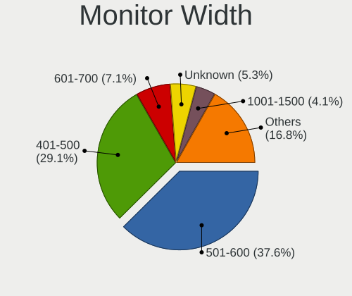

| Width in mm    | Desktops | Percent |
|----------------|----------|---------|
| 501-600        | 333      | 37.58%  |
| 401-500        | 258      | 29.12%  |
| 601-700        | 63       | 7.11%   |
| Unknown        | 47       | 5.3%    |
| 351-400        | 36       | 4.06%   |
| 301-350        | 36       | 4.06%   |
| 1001-1500      | 36       | 4.06%   |
| 701-800        | 31       | 3.5%    |
| 1501-2000      | 19       | 2.14%   |
| 801-900        | 15       | 1.69%   |
| 201-300        | 8        | 0.9%    |
| More than 2000 | 2        | 0.23%   |
| 901-1000       | 2        | 0.23%   |

Aspect Ratio
------------

Proportional relationship between the width and the height

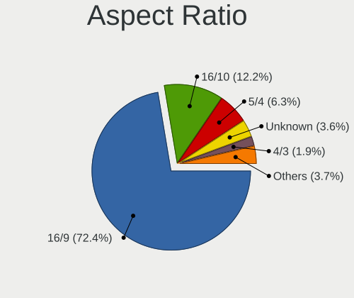

| Ratio   | Desktops | Percent |
|---------|----------|---------|
| 16/9    | 631      | 72.36%  |
| 16/10   | 106      | 12.16%  |
| 5/4     | 55       | 6.31%   |
| Unknown | 31       | 3.56%   |
| 4/3     | 17       | 1.95%   |
| 21/9    | 17       | 1.95%   |
| 3/2     | 9        | 1.03%   |
| 1.00    | 2        | 0.23%   |
| 32/9    | 1        | 0.11%   |
| 2.12    | 1        | 0.11%   |
| 2.00    | 1        | 0.11%   |
| 1.96    | 1        | 0.11%   |

Monitor Area
------------

Area in inch²

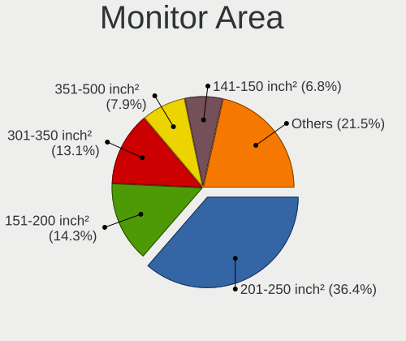

| Area in inch² | Desktops | Percent |
|----------------|----------|---------|
| 201-250        | 327      | 36.37%  |
| 151-200        | 129      | 14.35%  |
| 301-350        | 118      | 13.13%  |
| 351-500        | 71       | 7.9%    |
| 141-150        | 61       | 6.79%   |
| More than 1000 | 53       | 5.9%    |
| Unknown        | 47       | 5.23%   |
| 251-300        | 43       | 4.78%   |
| 501-1000       | 26       | 2.89%   |
| 101-110        | 13       | 1.45%   |
| 71-80          | 4        | 0.44%   |
| 111-120        | 2        | 0.22%   |
| 81-90          | 1        | 0.11%   |
| 51-60          | 1        | 0.11%   |
| 131-140        | 1        | 0.11%   |
| 121-130        | 1        | 0.11%   |
| 91-100         | 1        | 0.11%   |

Pixel Density
-------------

Pixels per inch

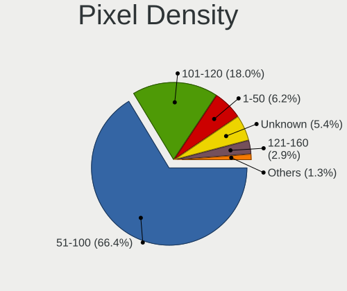

| Density | Desktops | Percent |
|---------|----------|---------|
| 51-100  | 580      | 66.36%  |
| 101-120 | 157      | 17.96%  |
| 1-50    | 54       | 6.18%   |
| Unknown | 47       | 5.38%   |
| 121-160 | 25       | 2.86%   |
| 161-240 | 11       | 1.26%   |

Multiple Monitors
-----------------

Total monitors connected

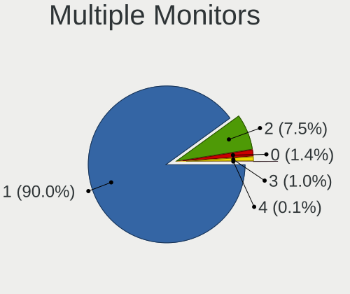

| Total | Desktops | Percent |
|-------|----------|---------|
| 1     | 830      | 90.02%  |
| 2     | 69       | 7.48%   |
| 0     | 13       | 1.41%   |
| 3     | 9        | 0.98%   |
| 4     | 1        | 0.11%   |

Network
-------

Net Controller Vendor
---------------------

Controller vendors

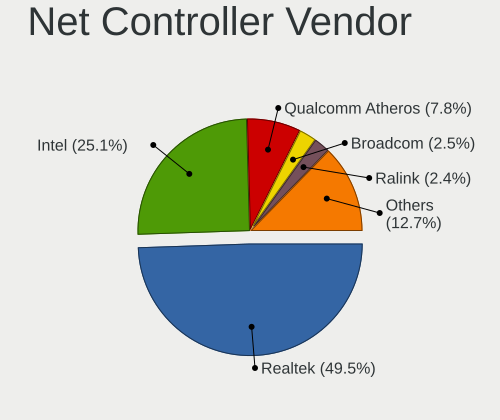

| Vendor                          | Desktops | Percent |
|---------------------------------|----------|---------|
| Realtek Semiconductor           | 603      | 49.47%  |
| Intel                           | 306      | 25.1%   |
| Qualcomm Atheros                | 95       | 7.79%   |
| Broadcom                        | 31       | 2.54%   |
| Ralink Technology               | 29       | 2.38%   |
| MediaTek                        | 20       | 1.64%   |
| Nvidia                          | 18       | 1.48%   |
| TP-Link                         | 15       | 1.23%   |
| Qualcomm Atheros Communications | 15       | 1.23%   |
| Ralink                          | 13       | 1.07%   |
| ASUSTek Computer                | 10       | 0.82%   |
| D-Link                          | 8        | 0.66%   |
| Marvell Technology Group        | 6        | 0.49%   |
| NetGear                         | 5        | 0.41%   |
| Broadcom Limited                | 4        | 0.33%   |
| Aquantia                        | 4        | 0.33%   |
| Microsoft                       | 3        | 0.25%   |
| ASIX Electronics                | 3        | 0.25%   |
| Sigma Sport                     | 2        | 0.16%   |
| Samsung Electronics             | 2        | 0.16%   |
| IMC Networks                    | 2        | 0.16%   |
| Huawei Technologies             | 2        | 0.16%   |
| Gemtek                          | 2        | 0.16%   |
| Edimax Technology               | 2        | 0.16%   |
| D-Link System                   | 2        | 0.16%   |
| ZyDAS                           | 1        | 0.08%   |
| Xiaomi                          | 1        | 0.08%   |
| Wilocity                        | 1        | 0.08%   |
| VIA Technologies                | 1        | 0.08%   |
| THEC64 Joystick                 | 1        | 0.08%   |
| T & A Mobile Phones             | 1        | 0.08%   |
| Qualcomm                        | 1        | 0.08%   |
| OPPO Electronics                | 1        | 0.08%   |
| Motorola PCS                    | 1        | 0.08%   |
| Linksys                         | 1        | 0.08%   |
| JMicron Technology              | 1        | 0.08%   |
| Fitbit                          | 1        | 0.08%   |
| BUFFALO                         | 1        | 0.08%   |
| Belkin Components               | 1        | 0.08%   |
| AVM                             | 1        | 0.08%   |

Net Controller Model
--------------------

Controller models

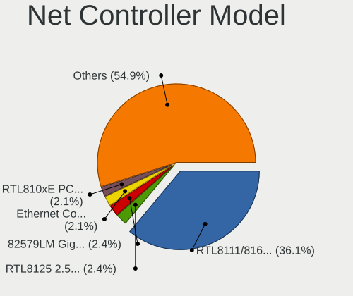

| Model                                                                  | Desktops | Percent |
|------------------------------------------------------------------------|----------|---------|
| Realtek RTL8111/8168/8211/8411 PCI Express Gigabit Ethernet Controller | 490      | 36.08%  |
| Realtek RTL8125 2.5GbE Controller                                      | 33       | 2.43%   |
| Intel 82579LM Gigabit Network Connection (Lewisville)                  | 32       | 2.36%   |
| Intel Ethernet Connection I217-LM                                      | 29       | 2.14%   |
| Realtek RTL810xE PCI Express Fast Ethernet controller                  | 28       | 2.06%   |
| Intel I211 Gigabit Network Connection                                  | 28       | 2.06%   |
| Intel Ethernet Connection (2) I219-V                                   | 26       | 1.91%   |
| Qualcomm Atheros AR8151 v2.0 Gigabit Ethernet                          | 21       | 1.55%   |
| Intel Wi-Fi 6 AX200                                                    | 21       | 1.55%   |
| Intel Dual Band Wireless-AC 3168NGW [Stone Peak]                       | 19       | 1.4%    |
| Intel Ethernet Controller I225-V                                       | 16       | 1.18%   |
| Intel 82579V Gigabit Network Connection                                | 16       | 1.18%   |
| Intel Wi-Fi 6E(802.11ax) AX210/AX1675* 2x2 [Typhoon Peak]              | 15       | 1.1%    |
| Realtek RTL88x2bu [AC1200 Techkey]                                     | 14       | 1.03%   |
| Qualcomm Atheros AR9271 802.11n                                        | 14       | 1.03%   |
| Intel Ethernet Connection (7) I219-V                                   | 14       | 1.03%   |
| Intel 82567LM-3 Gigabit Network Connection                             | 14       | 1.03%   |
| Realtek RTL8821CE 802.11ac PCIe Wireless Network Adapter               | 13       | 0.96%   |
| Intel Ethernet Connection (2) I219-LM                                  | 13       | 0.96%   |
| Intel Wireless 7265                                                    | 12       | 0.88%   |
| Realtek RTL8188EUS 802.11n Wireless Network Adapter                    | 10       | 0.74%   |
| Ralink MT7601U Wireless Adapter                                        | 10       | 0.74%   |
| Qualcomm Atheros AR9485 Wireless Network Adapter                       | 10       | 0.74%   |
| Realtek RTL8192EE PCIe Wireless Network Adapter                        | 8        | 0.59%   |
| Nvidia MCP61 Ethernet                                                  | 8        | 0.59%   |
| Intel Wireless 3165                                                    | 8        | 0.59%   |
| Realtek RTL-8100/8101L/8139 PCI Fast Ethernet Adapter                  | 7        | 0.52%   |
| Realtek 802.11ac NIC                                                   | 7        | 0.52%   |
| Ralink RT5370 Wireless Adapter                                         | 7        | 0.52%   |
| Qualcomm Atheros QCA9377 802.11ac Wireless Network Adapter             | 7        | 0.52%   |
| Qualcomm Atheros AR8161 Gigabit Ethernet                               | 7        | 0.52%   |
| MediaTek MT7921K (RZ608) Wi-Fi 6E 80MHz                                | 7        | 0.52%   |
| Intel Wi-Fi 5(802.11ac) Wireless-AC 9x6x [Thunder Peak]                | 7        | 0.52%   |
| Realtek RTL8822BE 802.11a/b/g/n/ac WiFi adapter                        | 6        | 0.44%   |
| Realtek RTL8812AE 802.11ac PCIe Wireless Network Adapter               | 6        | 0.44%   |
| Realtek RTL8188EE Wireless Network Adapter                             | 6        | 0.44%   |
| Qualcomm Atheros AR8131 Gigabit Ethernet                               | 6        | 0.44%   |
| Intel Ethernet Connection I217-V                                       | 6        | 0.44%   |
| Realtek RTL8192CE PCIe Wireless Network Adapter                        | 5        | 0.37%   |
| Qualcomm Atheros QCA8171 Gigabit Ethernet                              | 5        | 0.37%   |

Wireless Vendor
---------------

Wireless vendors

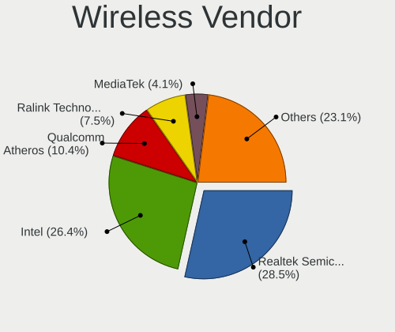

| Vendor                          | Desktops | Percent |
|---------------------------------|----------|---------|
| Realtek Semiconductor           | 110      | 28.5%   |
| Intel                           | 102      | 26.42%  |
| Qualcomm Atheros                | 40       | 10.36%  |
| Ralink Technology               | 29       | 7.51%   |
| MediaTek                        | 16       | 4.15%   |
| Qualcomm Atheros Communications | 15       | 3.89%   |
| TP-Link                         | 14       | 3.63%   |
| Ralink                          | 13       | 3.37%   |
| ASUSTek Computer                | 10       | 2.59%   |
| D-Link                          | 8        | 2.07%   |
| Broadcom                        | 6        | 1.55%   |
| NetGear                         | 5        | 1.3%    |
| Microsoft                       | 3        | 0.78%   |
| IMC Networks                    | 2        | 0.52%   |
| Gemtek                          | 2        | 0.52%   |
| Edimax Technology               | 2        | 0.52%   |
| D-Link System                   | 2        | 0.52%   |
| ZyDAS                           | 1        | 0.26%   |
| Wilocity                        | 1        | 0.26%   |
| VIA Technologies                | 1        | 0.26%   |
| Linksys                         | 1        | 0.26%   |
| BUFFALO                         | 1        | 0.26%   |
| Belkin Components               | 1        | 0.26%   |
| AVM                             | 1        | 0.26%   |

Wireless Model
--------------

Wireless models

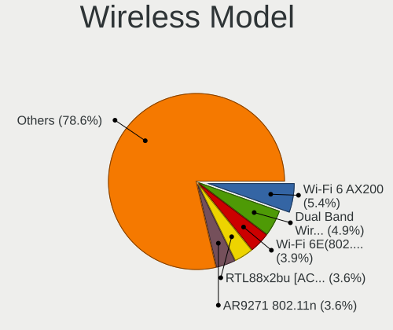

| Model                                                                | Desktops | Percent |
|----------------------------------------------------------------------|----------|---------|
| Intel Wi-Fi 6 AX200                                                  | 21       | 5.41%   |
| Intel Dual Band Wireless-AC 3168NGW [Stone Peak]                     | 19       | 4.9%    |
| Intel Wi-Fi 6E(802.11ax) AX210/AX1675* 2x2 [Typhoon Peak]            | 15       | 3.87%   |
| Realtek RTL88x2bu [AC1200 Techkey]                                   | 14       | 3.61%   |
| Qualcomm Atheros AR9271 802.11n                                      | 14       | 3.61%   |
| Realtek RTL8821CE 802.11ac PCIe Wireless Network Adapter             | 13       | 3.35%   |
| Intel Wireless 7265                                                  | 12       | 3.09%   |
| Realtek RTL8188EUS 802.11n Wireless Network Adapter                  | 10       | 2.58%   |
| Ralink MT7601U Wireless Adapter                                      | 10       | 2.58%   |
| Qualcomm Atheros AR9485 Wireless Network Adapter                     | 10       | 2.58%   |
| Realtek RTL8192EE PCIe Wireless Network Adapter                      | 8        | 2.06%   |
| Intel Wireless 3165                                                  | 8        | 2.06%   |
| Realtek 802.11ac NIC                                                 | 7        | 1.8%    |
| Ralink RT5370 Wireless Adapter                                       | 7        | 1.8%    |
| Qualcomm Atheros QCA9377 802.11ac Wireless Network Adapter           | 7        | 1.8%    |
| MediaTek MT7921K (RZ608) Wi-Fi 6E 80MHz                              | 7        | 1.8%    |
| Intel Wi-Fi 5(802.11ac) Wireless-AC 9x6x [Thunder Peak]              | 7        | 1.8%    |
| Realtek RTL8822BE 802.11a/b/g/n/ac WiFi adapter                      | 6        | 1.55%   |
| Realtek RTL8812AE 802.11ac PCIe Wireless Network Adapter             | 6        | 1.55%   |
| Realtek RTL8188EE Wireless Network Adapter                           | 6        | 1.55%   |
| Realtek RTL8192CE PCIe Wireless Network Adapter                      | 5        | 1.29%   |
| Qualcomm Atheros AR9287 Wireless Network Adapter (PCI-Express)       | 5        | 1.29%   |
| Intel Wireless 7260                                                  | 5        | 1.29%   |
| TP-Link TL-WN722N v2/v3 [Realtek RTL8188EUS]                         | 4        | 1.03%   |
| Realtek RTL8822CE 802.11ac PCIe Wireless Network Adapter             | 4        | 1.03%   |
| Realtek RTL8812AU 802.11a/b/g/n/ac 2T2R DB WLAN Adapter              | 4        | 1.03%   |
| Realtek RTL8192EU 802.11b/g/n WLAN Adapter                           | 4        | 1.03%   |
| Realtek RTL8188CUS 802.11n WLAN Adapter                              | 4        | 1.03%   |
| Realtek RTL8188CE 802.11b/g/n WiFi Adapter                           | 4        | 1.03%   |
| Ralink RT2870/RT3070 Wireless Adapter                                | 4        | 1.03%   |
| TP-Link TL-WN823N v2/v3 [Realtek RTL8192EU]                          | 3        | 0.77%   |
| Realtek RTL8821AE 802.11ac PCIe Wireless Network Adapter             | 3        | 0.77%   |
| Realtek RTL8188FTV 802.11b/g/n 1T1R 2.4G WLAN Adapter                | 3        | 0.77%   |
| Realtek RTL-8185 IEEE 802.11a/b/g Wireless LAN Controller            | 3        | 0.77%   |
| Qualcomm Atheros AR9462 Wireless Network Adapter                     | 3        | 0.77%   |
| Qualcomm Atheros AR93xx Wireless Network Adapter                     | 3        | 0.77%   |
| Microsoft Xbox 360 Wireless Adapter                                  | 3        | 0.77%   |
| MediaTek MT7922 802.11ax PCI Express Wireless Network Adapter        | 3        | 0.77%   |
| MediaTek MT7921 802.11ax PCIe Wireless Network Adapter [Filogic 330] | 3        | 0.77%   |
| Intel 700 Series Chipset CNVi WiFi                                   | 3        | 0.77%   |

Ethernet Vendor
---------------

Ethernet vendors

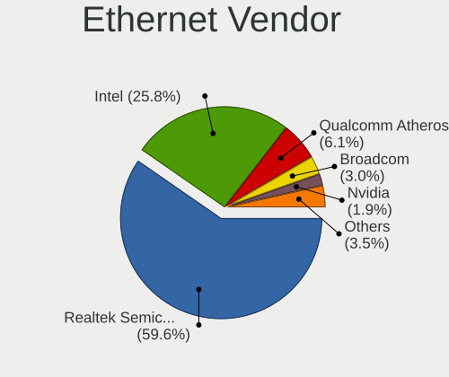

| Vendor                   | Desktops | Percent |
|--------------------------|----------|---------|
| Realtek Semiconductor    | 563      | 59.64%  |
| Intel                    | 244      | 25.85%  |
| Qualcomm Atheros         | 58       | 6.14%   |
| Broadcom                 | 28       | 2.97%   |
| Nvidia                   | 18       | 1.91%   |
| Marvell Technology Group | 6        | 0.64%   |
| MediaTek                 | 4        | 0.42%   |
| Broadcom Limited         | 4        | 0.42%   |
| Aquantia                 | 4        | 0.42%   |
| ASIX Electronics         | 3        | 0.32%   |
| Samsung Electronics      | 2        | 0.21%   |
| Huawei Technologies      | 2        | 0.21%   |
| Xiaomi                   | 1        | 0.11%   |
| TP-Link                  | 1        | 0.11%   |
| T & A Mobile Phones      | 1        | 0.11%   |
| Qualcomm                 | 1        | 0.11%   |
| OPPO Electronics         | 1        | 0.11%   |
| Motorola PCS             | 1        | 0.11%   |
| JMicron Technology       | 1        | 0.11%   |
| 3Com                     | 1        | 0.11%   |

Ethernet Model
--------------

Ethernet models

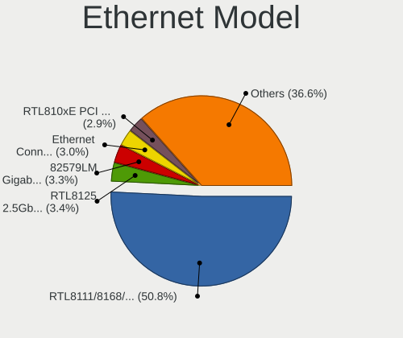

| Model                                                                  | Desktops | Percent |
|------------------------------------------------------------------------|----------|---------|
| Realtek RTL8111/8168/8211/8411 PCI Express Gigabit Ethernet Controller | 490      | 50.78%  |
| Realtek RTL8125 2.5GbE Controller                                      | 33       | 3.42%   |
| Intel 82579LM Gigabit Network Connection (Lewisville)                  | 32       | 3.32%   |
| Intel Ethernet Connection I217-LM                                      | 29       | 3.01%   |
| Realtek RTL810xE PCI Express Fast Ethernet controller                  | 28       | 2.9%    |
| Intel I211 Gigabit Network Connection                                  | 28       | 2.9%    |
| Intel Ethernet Connection (2) I219-V                                   | 26       | 2.69%   |
| Qualcomm Atheros AR8151 v2.0 Gigabit Ethernet                          | 21       | 2.18%   |
| Intel Ethernet Controller I225-V                                       | 16       | 1.66%   |
| Intel 82579V Gigabit Network Connection                                | 16       | 1.66%   |
| Intel Ethernet Connection (7) I219-V                                   | 14       | 1.45%   |
| Intel 82567LM-3 Gigabit Network Connection                             | 14       | 1.45%   |
| Intel Ethernet Connection (2) I219-LM                                  | 13       | 1.35%   |
| Nvidia MCP61 Ethernet                                                  | 8        | 0.83%   |
| Realtek RTL-8100/8101L/8139 PCI Fast Ethernet Adapter                  | 7        | 0.73%   |
| Qualcomm Atheros AR8161 Gigabit Ethernet                               | 7        | 0.73%   |
| Qualcomm Atheros AR8131 Gigabit Ethernet                               | 6        | 0.62%   |
| Intel Ethernet Connection I217-V                                       | 6        | 0.62%   |
| Qualcomm Atheros QCA8171 Gigabit Ethernet                              | 5        | 0.52%   |
| Qualcomm Atheros AR8152 v2.0 Fast Ethernet                             | 5        | 0.52%   |
| Nvidia MCP73 Ethernet                                                  | 5        | 0.52%   |
| Intel Ethernet Connection (14) I219-V                                  | 5        | 0.52%   |
| Intel 82574L Gigabit Network Connection                                | 5        | 0.52%   |
| Intel 82566DM-2 Gigabit Network Connection                             | 5        | 0.52%   |
| Broadcom NetXtreme BCM5761 Gigabit Ethernet PCIe                       | 5        | 0.52%   |
| Broadcom NetLink BCM57788 Gigabit Ethernet PCIe                        | 5        | 0.52%   |
| Realtek RTL8111/8168/8411 PCI Express Gigabit Ethernet Controller      | 4        | 0.41%   |
| Realtek Killer E3000 2.5GbE Controller                                 | 4        | 0.41%   |
| Qualcomm Atheros Attansic L1 Gigabit Ethernet                          | 4        | 0.41%   |
| MediaTek Infinix HOT 50i                                               | 4        | 0.41%   |
| Intel 82566DM Gigabit Network Connection                               | 4        | 0.41%   |
| Broadcom NetXtreme BCM5762 Gigabit Ethernet PCIe                       | 4        | 0.41%   |
| Broadcom NetLink BCM57780 Gigabit Ethernet PCIe                        | 4        | 0.41%   |
| Intel I210 Gigabit Network Connection                                  | 3        | 0.31%   |
| Intel Ethernet Connection (7) I219-LM                                  | 3        | 0.31%   |
| Intel Ethernet Connection (5) I219-LM                                  | 3        | 0.31%   |
| Intel Ethernet Connection (2) I218-V                                   | 3        | 0.31%   |
| Intel Ethernet Connection (12) I219-V                                  | 3        | 0.31%   |
| Intel 82578DM Gigabit Network Connection                               | 3        | 0.31%   |
| Intel 82567V-2 Gigabit Network Connection                              | 3        | 0.31%   |

Net Controller Kind
-------------------

Ethernet, WiFi or modem

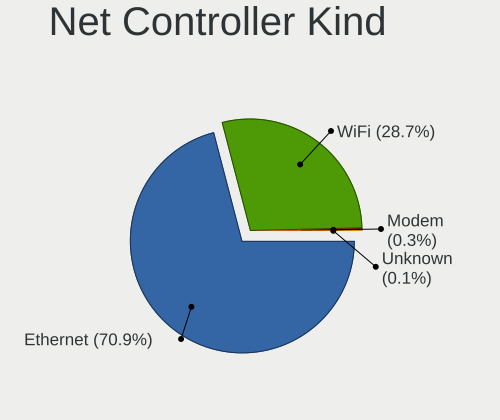

| Kind     | Desktops | Percent |
|----------|----------|---------|
| Ethernet | 913      | 70.94%  |
| WiFi     | 369      | 28.67%  |
| Modem    | 4        | 0.31%   |
| Unknown  | 1        | 0.08%   |

Used Controller
---------------

Currently used network controller

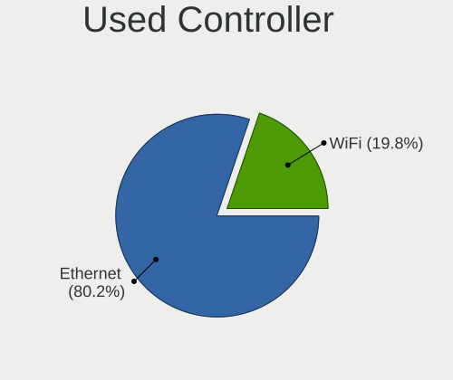

| Kind     | Desktops | Percent |
|----------|----------|---------|
| Ethernet | 737      | 80.2%   |
| WiFi     | 182      | 19.8%   |

NICs
----

Total network controllers on board

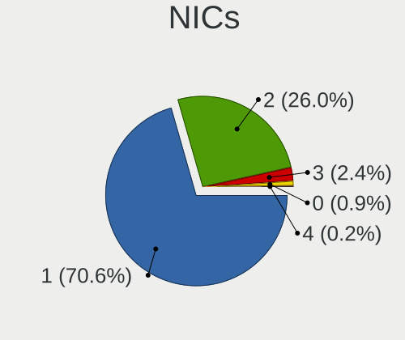

| Total | Desktops | Percent |
|-------|----------|---------|
| 1     | 650      | 70.58%  |
| 2     | 239      | 25.95%  |
| 3     | 22       | 2.39%   |
| 0     | 8        | 0.87%   |
| 4     | 2        | 0.22%   |

IPv6
----

IPv6 vs IPv4

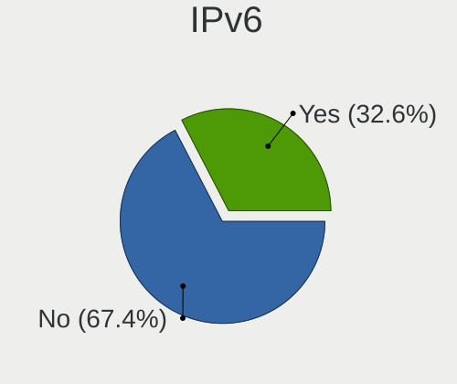

| Used | Desktops | Percent |
|------|----------|---------|
| No   | 622      | 67.39%  |
| Yes  | 301      | 32.61%  |

Bluetooth
---------

Bluetooth Vendor
----------------

Controller vendors

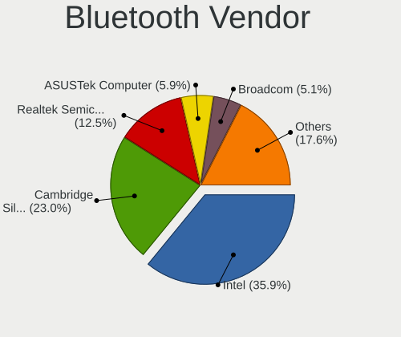

| Vendor                          | Desktops | Percent |
|---------------------------------|----------|---------|
| Intel                           | 92       | 35.94%  |
| Cambridge Silicon Radio         | 59       | 23.05%  |
| Realtek Semiconductor           | 32       | 12.5%   |
| ASUSTek Computer                | 15       | 5.86%   |
| Broadcom                        | 13       | 5.08%   |
| MediaTek                        | 11       | 4.3%    |
| Qualcomm Atheros Communications | 10       | 3.91%   |
| IMC Networks                    | 7        | 2.73%   |
| TP-Link                         | 3        | 1.17%   |
| Edimax Technology               | 2        | 0.78%   |
| Apple                           | 2        | 0.78%   |
| Toshiba                         | 1        | 0.39%   |
| SiW                             | 1        | 0.39%   |
| Realtek                         | 1        | 0.39%   |
| Integrated System Solution      | 1        | 0.39%   |
| Foxconn / Hon Hai               | 1        | 0.39%   |
| Dynex                           | 1        | 0.39%   |
| Dell                            | 1        | 0.39%   |
| Belkin Components               | 1        | 0.39%   |
| Actions                         | 1        | 0.39%   |
| Unknown                         | 1        | 0.39%   |

Bluetooth Model
---------------

Controller models

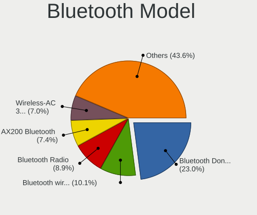

| Model                                                    | Desktops | Percent |
|----------------------------------------------------------|----------|---------|
| Cambridge Silicon Radio Bluetooth Dongle (HCI mode)      | 59       | 22.96%  |
| Intel Bluetooth wireless interface                       | 26       | 10.12%  |
| Realtek Bluetooth Radio                                  | 23       | 8.95%   |
| Intel AX200 Bluetooth                                    | 19       | 7.39%   |
| Intel Wireless-AC 3168 Bluetooth                         | 18       | 7%      |
| Intel AX210 Bluetooth                                    | 15       | 5.84%   |
| MediaTek Wireless_Device                                 | 11       | 4.28%   |
| Qualcomm Atheros  Bluetooth Device                       | 7        | 2.72%   |
| ASUS ASUS USB-BT500                                      | 7        | 2.72%   |
| Realtek  Bluetooth 4.2 Adapter                           | 6        | 2.33%   |
| Intel Wireless-AC 9260 Bluetooth Adapter                 | 5        | 1.95%   |
| Intel AX201 Bluetooth                                    | 5        | 1.95%   |
| IMC Networks Bluetooth Radio                             | 4        | 1.56%   |
| TP-Link TP-T@- UB500 Adapter                             | 3        | 1.17%   |
| Intel Bluetooth Device                                   | 3        | 1.17%   |
| Broadcom BCM20702A0 Bluetooth 4.0                        | 3        | 1.17%   |
| Broadcom BCM2045 Bluetooth                               | 3        | 1.17%   |
| ASUS Broadcom BCM20702A0 Bluetooth                       | 3        | 1.17%   |
| Realtek RTL8822BE Bluetooth 4.2 Adapter                  | 2        | 0.78%   |
| Qualcomm Atheros AR3011 Bluetooth                        | 2        | 0.78%   |
| IMC Networks Bluetooth Device                            | 2        | 0.78%   |
| Toshiba Atheros AR3012 Bluetooth                         | 1        | 0.39%   |
| SiW SiW                                                  | 1        | 0.39%   |
| Realtek RTL8821A Bluetooth                               | 1        | 0.39%   |
| Realtek Bluetooth Radio                                  | 1        | 0.39%   |
| Qualcomm Atheros AR3012 Bluetooth 4.0                    | 1        | 0.39%   |
| Intel Centrino Bluetooth Wireless Transceiver            | 1        | 0.39%   |
| Intel Bluetooth 9460/9560 Jefferson Peak (JfP)           | 1        | 0.39%   |
| Integrated System Solution Bluetooth Device              | 1        | 0.39%   |
| IMC Networks Wireless_Device                             | 1        | 0.39%   |
| Foxconn / Hon Hai MediaTek Bluetooth Adapter             | 1        | 0.39%   |
| Edimax Wi-Fi AC600 Bluetooth4.0 USB Adapter              | 1        | 0.39%   |
| Edimax Bluetooth Device                                  | 1        | 0.39%   |
| Dynex Bluetooth 4.0 Adapter [Broadcom, 1.12, BCM20702A0] | 1        | 0.39%   |
| Dell BT Mini-Receiver                                    | 1        | 0.39%   |
| Broadcom HP Portable Valentine                           | 1        | 0.39%   |
| Broadcom Bluetooth Device                                | 1        | 0.39%   |
| Broadcom Bluetooth Controller                            | 1        | 0.39%   |
| Broadcom Bluetooth 3.0 USB Dongle                        | 1        | 0.39%   |
| Broadcom BCM92046DG-CL1ROM Bluetooth 2.1 UHE Dongle      | 1        | 0.39%   |

Sound
-----

Sound Vendor
------------

Sound card vendors

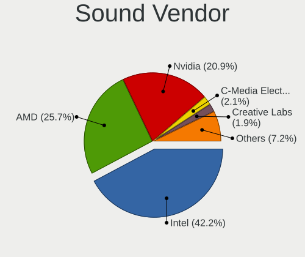

| Vendor                                       | Desktops | Percent |
|----------------------------------------------|----------|---------|
| Intel                                        | 599      | 42.24%  |
| AMD                                          | 364      | 25.67%  |
| Nvidia                                       | 296      | 20.87%  |
| C-Media Electronics                          | 30       | 2.12%   |
| Creative Labs                                | 27       | 1.9%    |
| Logitech                                     | 9        | 0.63%   |
| Generalplus Technology                       | 9        | 0.63%   |
| Micro Star International                     | 5        | 0.35%   |
| Texas Instruments                            | 4        | 0.28%   |
| Tenx Technology                              | 4        | 0.28%   |
| Creative Technology                          | 4        | 0.28%   |
| Zoran Co. Personal Media Division (Nogatech) | 3        | 0.21%   |
| VIA Technologies                             | 3        | 0.21%   |
| SteelSeries ApS                              | 3        | 0.21%   |
| JMTek                                        | 3        | 0.21%   |
| FiiO Electronics Technology                  | 3        | 0.21%   |
| ASUSTek Computer                             | 3        | 0.21%   |
| Schiit Audio                                 | 2        | 0.14%   |
| Samson Technologies                          | 2        | 0.14%   |
| ROCCAT                                       | 2        | 0.14%   |
| Razer USA                                    | 2        | 0.14%   |
| Native Instruments                           | 2        | 0.14%   |
| KTMicro                                      | 2        | 0.14%   |
| Kingston Technology                          | 2        | 0.14%   |
| Hewlett-Packard                              | 2        | 0.14%   |
| GN Netcom                                    | 2        | 0.14%   |
| Focusrite-Novation                           | 2        | 0.14%   |
| DSEA A/S                                     | 2        | 0.14%   |
| Dell                                         | 2        | 0.14%   |
| Yamaha                                       | 1        | 0.07%   |
| XMOS                                         | 1        | 0.07%   |
| Xilinx                                       | 1        | 0.07%   |
| USB-Speaker                                  | 1        | 0.07%   |
| Tdlasunnic                                   | 1        | 0.07%   |
| Sterling                                     | 1        | 0.07%   |
| RODE Microphones                             | 1        | 0.07%   |
| PreSonus Audio Electronics                   | 1        | 0.07%   |
| Nordic Semiconductor ASA                     | 1        | 0.07%   |
| Nintendo                                     | 1        | 0.07%   |
| Logic3 / SpectraVideo                        | 1        | 0.07%   |

Sound Model
-----------

Sound card models

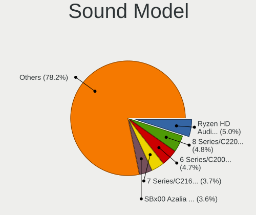

| Model                                                                      | Desktops | Percent |
|----------------------------------------------------------------------------|----------|---------|
| AMD Ryzen HD Audio Controller                                              | 83       | 4.96%   |
| Intel 8 Series/C220 Series Chipset High Definition Audio Controller        | 80       | 4.78%   |
| Intel 6 Series/C200 Series Chipset Family High Definition Audio Controller | 79       | 4.72%   |
| Intel 7 Series/C216 Chipset Family High Definition Audio Controller        | 62       | 3.7%    |
| AMD SBx00 Azalia (Intel HDA)                                               | 61       | 3.64%   |
| AMD Starship/Matisse HD Audio Controller                                   | 59       | 3.52%   |
| Intel NM10/ICH7 Family High Definition Audio Controller                    | 55       | 3.29%   |
| Intel Xeon E3-1200 v3/4th Gen Core Processor HD Audio Controller           | 54       | 3.23%   |
| Intel 100 Series/C230 Series Chipset Family HD Audio Controller            | 54       | 3.23%   |
| Intel 200 Series PCH HD Audio                                              | 50       | 2.99%   |
| AMD FCH Azalia Controller                                                  | 41       | 2.45%   |
| Nvidia GP107GL High Definition Audio Controller                            | 40       | 2.39%   |
| AMD Renoir/Cezanne HDMI/DP Audio Controller                                | 40       | 2.39%   |
| AMD Raven/Raven2/Fenghuang HDMI/DP Audio Controller                        | 37       | 2.21%   |
| Intel Cannon Lake PCH cAVS                                                 | 32       | 1.91%   |
| Nvidia GK208 HDMI/DP Audio Controller                                      | 31       | 1.85%   |
| AMD Family 17h (Models 00h-0fh) HD Audio Controller                        | 29       | 1.73%   |
| AMD Ellesmere HDMI Audio [Radeon RX 470/480 / 570/580/590]                 | 29       | 1.73%   |
| AMD Navi 21/23 HDMI/DP Audio Controller                                    | 26       | 1.55%   |
| Nvidia GP108 High Definition Audio Controller                              | 20       | 1.19%   |
| Nvidia GF108 High Definition Audio Controller                              | 17       | 1.02%   |
| Intel 82801JD/DO (ICH10 Family) HD Audio Controller                        | 17       | 1.02%   |
| AMD Baffin HDMI/DP Audio [Radeon RX 550 640SP / RX 560/560X]               | 17       | 1.02%   |
| Nvidia TU116 High Definition Audio Controller                              | 16       | 0.96%   |
| Nvidia High Definition Audio Controller                                    | 16       | 0.96%   |
| Nvidia GP106 High Definition Audio Controller                              | 16       | 0.96%   |
| Intel 82801JI (ICH10 Family) HD Audio Controller                           | 16       | 0.96%   |
| Nvidia GM107 High Definition Audio Controller [GeForce 940MX]              | 15       | 0.9%    |
| AMD Cedar HDMI Audio [Radeon HD 5400/6300/7300 Series]                     | 15       | 0.9%    |
| Nvidia GF119 HDMI Audio Controller                                         | 14       | 0.84%   |
| Intel 9 Series Chipset Family HD Audio Controller                          | 14       | 0.84%   |
| Intel 5 Series/3400 Series Chipset High Definition Audio                   | 14       | 0.84%   |
| AMD Oland/Hainan/Cape Verde/Pitcairn HDMI Audio [Radeon HD 7000 Series]    | 14       | 0.84%   |
| Intel Tiger Lake-H HD Audio Controller                                     | 13       | 0.78%   |
| Intel 82801I (ICH9 Family) HD Audio Controller                             | 13       | 0.78%   |
| Nvidia GM206 High Definition Audio Controller                              | 12       | 0.72%   |
| Intel 82801H (ICH8 Family) HD Audio Controller                             | 12       | 0.72%   |
| AMD Kaveri HDMI/DP Audio Controller                                        | 12       | 0.72%   |
| Nvidia TU106 High Definition Audio Controller                              | 11       | 0.66%   |
| Nvidia GA104 High Definition Audio Controller                              | 11       | 0.66%   |

Memory
------

Memory Vendor
-------------

Memory module vendors

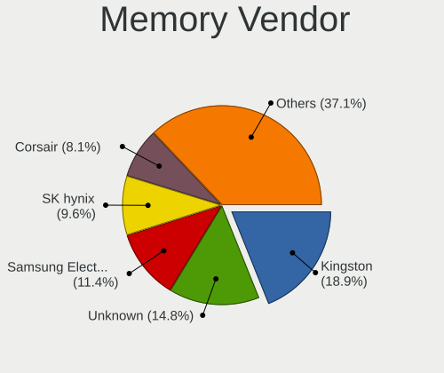

| Vendor                       | Desktops | Percent |
|------------------------------|----------|---------|
| Kingston                     | 202      | 18.91%  |
| Unknown                      | 158      | 14.79%  |
| Samsung Electronics          | 122      | 11.42%  |
| SK hynix                     | 103      | 9.64%   |
| Corsair                      | 87       | 8.15%   |
| Crucial                      | 72       | 6.74%   |
| Micron Technology            | 54       | 5.06%   |
| G.Skill                      | 54       | 5.06%   |
| A-DATA Technology            | 30       | 2.81%   |
| Unknown                      | 22       | 2.06%   |
| Team                         | 19       | 1.78%   |
| Ramaxel Technology           | 18       | 1.69%   |
| Nanya Technology             | 16       | 1.5%    |
| Patriot                      | 9        | 0.84%   |
| Multilaser                   | 7        | 0.66%   |
| GOODRAM                      | 7        | 0.66%   |
| Unifosa                      | 5        | 0.47%   |
| Transcend                    | 5        | 0.47%   |
| Elpida                       | 5        | 0.47%   |
| Apacer                       | 5        | 0.47%   |
| AMD                          | 5        | 0.47%   |
| Unknown (ABCD)               | 4        | 0.37%   |
| Smart                        | 4        | 0.37%   |
| Silicon Power                | 4        | 0.37%   |
| Avant                        | 4        | 0.37%   |
| Qimonda                      | 3        | 0.28%   |
| Kllisre                      | 3        | 0.28%   |
| Hikvision                    | 3        | 0.28%   |
| GeIL                         | 3        | 0.28%   |
| Atermiter                    | 3        | 0.28%   |
| Wilk                         | 2        | 0.19%   |
| Toshiba                      | 2        | 0.19%   |
| Patriot Memory (PDP Systems) | 2        | 0.19%   |
| ASint Technology             | 2        | 0.19%   |
| A Force                      | 2        | 0.19%   |
| Wilk Elektronik              | 1        | 0.09%   |
| Unknown (7F7F7F7F7F7F7F83)   | 1        | 0.09%   |
| Unknown (0x0E9D)             | 1        | 0.09%   |
| Unknown (0x0DD5)             | 1        | 0.09%   |
| Unknown (04E9)               | 1        | 0.09%   |

Memory Model
------------

Memory module models

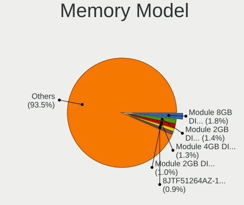

| Model                                                          | Desktops | Percent |
|----------------------------------------------------------------|----------|---------|
| Unknown                                                        | 22       | 1.84%   |
| Unknown RAM Module 2GB DIMM SDRAM                              | 17       | 1.42%   |
| Unknown RAM Module 4GB DIMM 1333MT/s                           | 16       | 1.34%   |
| Unknown RAM Module 2GB DIMM DDR2 800MT/s                       | 12       | 1%      |
| Micron RAM 8JTF51264AZ-1G6E1 4GB DIMM DDR3 1600MT/s            | 11       | 0.92%   |
| Corsair RAM CMK16GX4M2B3200C16 8GB DIMM DDR4 3600MT/s          | 11       | 0.92%   |
| Unknown RAM Module 4GB DIMM DDR3 1333MT/s                      | 10       | 0.84%   |
| Unknown RAM Module 8GB DIMM DDR3 1600MT/s                      | 9        | 0.75%   |
| Samsung RAM M378B5673FH0-CH9 2GB DIMM DDR3 1600MT/s            | 8        | 0.67%   |
| Samsung RAM M378B5273DH0-CH9 4GB DIMM DDR3 2133MT/s            | 8        | 0.67%   |
| Kingston RAM KHX1600C10D3/8G 8GB DIMM DDR3 2133MT/s            | 8        | 0.67%   |
| Unknown RAM Module 2GB DIMM 1333MT/s                           | 7        | 0.58%   |
| Samsung RAM M378B5773DH0-CH9 2GB DIMM DDR3 1333MT/s            | 7        | 0.58%   |
| Kingston RAM KHX1600C9D3/4GX 4GB DIMM DDR3 1867MT/s            | 7        | 0.58%   |
| Corsair RAM CMV4GX3M1A1333C9 4GB DIMM DDR3 1600MT/s            | 7        | 0.58%   |
| Unknown RAM Module 4GB DIMM DDR3 1600MT/s                      | 6        | 0.5%    |
| SK hynix RAM HMT451U6AFR8C-PB 4GB DIMM DDR3 1600MT/s           | 6        | 0.5%    |
| SK hynix RAM HMT351U6CFR8C-PB 4GB DIMM DDR3 1800MT/s           | 6        | 0.5%    |
| Samsung RAM M378B5173QH0-CK0 4GB DIMM DDR3                     | 6        | 0.5%    |
| Samsung RAM M378A1K43CB2-CTD 8GB DIMM DDR4 3266MT/s            | 6        | 0.5%    |
| Kingston RAM KHX3200C16D4/8GX 8GB DIMM DDR4 3733MT/s           | 6        | 0.5%    |
| Kingston RAM KHX2666C16/8G 8GiB DIMM DDR4 3466MT/s             | 6        | 0.5%    |
| Kingston RAM KF3200C16D4/8GX 8GiB DIMM DDR4 3600MT/s           | 6        | 0.5%    |
| Unknown RAM Module 8GB DIMM DDR3 1333MT/s                      | 5        | 0.42%   |
| Unknown RAM Module 2GB DIMM DDR3 1333MT/s                      | 5        | 0.42%   |
| Unknown RAM Module 2GB DIMM DDR2 667MT/s                       | 5        | 0.42%   |
| Unknown RAM Module 2GB DIMM 800MT/s                            | 5        | 0.42%   |
| Unknown RAM Module 1GB DIMM 667MT/s                            | 5        | 0.42%   |
| SK hynix RAM HMA81GU6AFR8N-UH 8GB DIMM DDR4 2400MT/s           | 5        | 0.42%   |
| Samsung RAM Module 2GB DIMM DDR3 1333MT/s                      | 5        | 0.42%   |
| Nanya RAM NT2GC64B88B0NF-CG 2GB DIMM DDR3 1333MT/s             | 5        | 0.42%   |
| Crucial RAM BLS4G3D1609DS1S00. 4GB DIMM DDR3 1600MT/s          | 5        | 0.42%   |
| Corsair RAM CMK32GX4M2E3200C16 16GB DIMM DDR4 3600MT/s         | 5        | 0.42%   |
| A-DATA RAM DDR4 3200 16GB DIMM DDR4 3600MT/s                   | 5        | 0.42%   |
| Unknown RAM Module 1GB DIMM DDR2 800MT/s                       | 4        | 0.33%   |
| Unknown (ABCD) RAM 123456789012345678 2GB DIMM LPDDR4 2133MT/s | 4        | 0.33%   |
| Team RAM TEAMGROUP-UD4-3200 8GB DIMM DDR4 3800MT/s             | 4        | 0.33%   |
| SK hynix RAM HMT451U6BFR8C-PB 4GB DIMM DDR3 1600MT/s           | 4        | 0.33%   |
| SK hynix RAM HMT351U6EFR8C-PB 4GB DIMM DDR3 1600MT/s           | 4        | 0.33%   |
| SK hynix RAM HMA451U6AFR8N-TF 4GB DIMM DDR4 2133MT/s           | 4        | 0.33%   |

Memory Kind
-----------

Memory module kinds

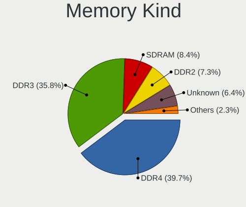

| Kind    | Desktops | Percent |
|---------|----------|---------|
| DDR4    | 373      | 39.72%  |
| DDR3    | 336      | 35.78%  |
| SDRAM   | 79       | 8.41%   |
| DDR2    | 69       | 7.35%   |
| Unknown | 60       | 6.39%   |
| DDR5    | 10       | 1.06%   |
| LPDDR4  | 5        | 0.53%   |
| DDR     | 4        | 0.43%   |
| DRAM    | 2        | 0.21%   |
| LPDDR5  | 1        | 0.11%   |

Memory Form Factor
------------------

Physical design of the memory module

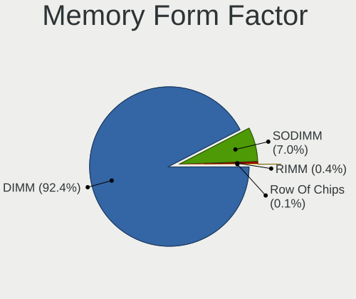

| Name         | Desktops | Percent |
|--------------|----------|---------|
| DIMM         | 840      | 92.41%  |
| SODIMM       | 64       | 7.04%   |
| RIMM         | 4        | 0.44%   |
| Row Of Chips | 1        | 0.11%   |

Memory Size
-----------

Memory module size

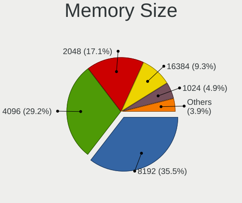

| Size  | Desktops | Percent |
|-------|----------|---------|
| 8192  | 368      | 35.45%  |
| 4096  | 303      | 29.19%  |
| 2048  | 178      | 17.15%  |
| 16384 | 97       | 9.34%   |
| 1024  | 51       | 4.91%   |
| 32768 | 31       | 2.99%   |
| 512   | 8        | 0.77%   |
| 256   | 1        | 0.1%    |
| 64    | 1        | 0.1%    |

Memory Speed
------------

Memory module speed

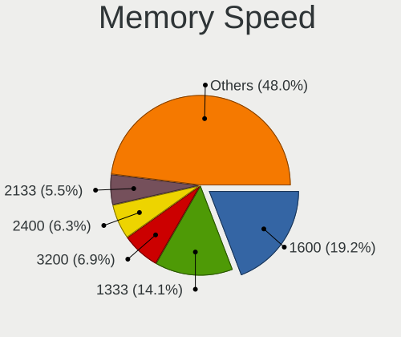

| Speed   | Desktops | Percent |
|---------|----------|---------|
| 1600    | 200      | 19.18%  |
| 1333    | 147      | 14.09%  |
| 3200    | 72       | 6.9%    |
| 2400    | 66       | 6.33%   |
| 2133    | 57       | 5.47%   |
| 3600    | 55       | 5.27%   |
| 2667    | 55       | 5.27%   |
| 667     | 43       | 4.12%   |
| 800     | 41       | 3.93%   |
| Unknown | 30       | 2.88%   |
| 1866    | 23       | 2.21%   |
| 3733    | 15       | 1.44%   |
| 3000    | 14       | 1.34%   |
| 2933    | 14       | 1.34%   |
| 1800    | 14       | 1.34%   |
| 2666    | 13       | 1.25%   |
| 1066    | 12       | 1.15%   |
| 3800    | 11       | 1.05%   |
| 3266    | 10       | 0.96%   |
| 3400    | 9        | 0.86%   |
| 1067    | 9        | 0.86%   |
| 4000    | 8        | 0.77%   |
| 3466    | 8        | 0.77%   |
| 1867    | 7        | 0.67%   |
| 1639    | 6        | 0.58%   |
| 6000    | 5        | 0.48%   |
| 2048    | 5        | 0.48%   |
| 1334    | 5        | 0.48%   |
| 533     | 5        | 0.48%   |
| 49926   | 4        | 0.38%   |
| 3866    | 4        | 0.38%   |
| 3066    | 4        | 0.38%   |
| 1648    | 4        | 0.38%   |
| 400     | 4        | 0.38%   |
| 6400    | 3        | 0.29%   |
| 4266    | 3        | 0.29%   |
| 3666    | 3        | 0.29%   |
| 3333    | 3        | 0.29%   |
| 3151    | 3        | 0.29%   |
| 3007    | 3        | 0.29%   |

Printers & scanners
-------------------

Printer Vendor
--------------

Printer device vendors

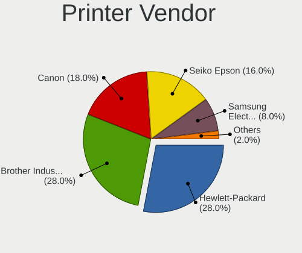

| Vendor              | Desktops | Percent |
|---------------------|----------|---------|
| Hewlett-Packard     | 14       | 28%     |
| Brother Industries  | 14       | 28%     |
| Canon               | 9        | 18%     |
| Seiko Epson         | 8        | 16%     |
| Samsung Electronics | 4        | 8%      |
| Philips (or NXP)    | 1        | 2%      |

Printer Model
-------------

Printer device models

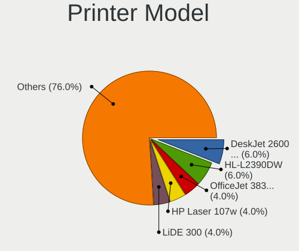

| Model                           | Desktops | Percent |
|---------------------------------|----------|---------|
| HP DeskJet 2600 series          | 3        | 6%      |
| Brother HL-L2390DW              | 3        | 6%      |
| HP OfficeJet 3830 series        | 2        | 4%      |
| HP HP Laser 107w                | 2        | 4%      |
| Canon LiDE 300                  | 2        | 4%      |
| Seiko Epson XP-7100 Series      | 1        | 2%      |
| Seiko Epson Printer             | 1        | 2%      |
| Seiko Epson L6270 Series        | 1        | 2%      |
| Seiko Epson L365 Series         | 1        | 2%      |
| Seiko Epson L3110 Series        | 1        | 2%      |
| Seiko Epson L120 Series         | 1        | 2%      |
| Seiko Epson ET-3750 Series      | 1        | 2%      |
| Seiko Epson ET-2710 Series      | 1        | 2%      |
| Samsung SCX-3200 Series         | 1        | 2%      |
| Samsung ML-1710 Printer         | 1        | 2%      |
| Samsung M267x 287x Series       | 1        | 2%      |
| Samsung M2070 Series            | 1        | 2%      |
| Philips (or NXP) USB Printer    | 1        | 2%      |
| HP LaserJet P1005               | 1        | 2%      |
| HP HP LaserJet M101-M106        | 1        | 2%      |
| HP ENVY 5000 series             | 1        | 2%      |
| HP DeskJet F4200 series         | 1        | 2%      |
| HP DeskJet 959c                 | 1        | 2%      |
| HP DeskJet 5650c                | 1        | 2%      |
| HP coredump                     | 1        | 2%      |
| Canon TS700 series              | 1        | 2%      |
| Canon TS5300 series             | 1        | 2%      |
| Canon TS5100 series             | 1        | 2%      |
| Canon TR7500 series             | 1        | 2%      |
| Canon LiDE 400                  | 1        | 2%      |
| Canon GX7000 series             | 1        | 2%      |
| Canon G3000 series              | 1        | 2%      |
| Brother MFC-J435W               | 1        | 2%      |
| Brother MFC-7460DN              | 1        | 2%      |
| Brother HL-5450DN series        | 1        | 2%      |
| Brother HL-5370DW series        | 1        | 2%      |
| Brother HL-2270DW Laser Printer | 1        | 2%      |
| Brother HL-2140 series          | 1        | 2%      |
| Brother HL-1430 Laser Printer   | 1        | 2%      |
| Brother DCP-T420W               | 1        | 2%      |

Scanner Vendor
--------------

Scanner device vendors

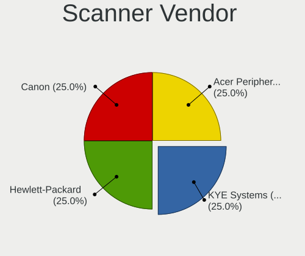

| Vendor                      | Desktops | Percent |
|-----------------------------|----------|---------|
| Canon                       | 5        | 55.56%  |
| Mustek Systems              | 1        | 11.11%  |
| KYE Systems (Mouse Systems) | 1        | 11.11%  |
| Hewlett-Packard             | 1        | 11.11%  |
| Acer Peripherals (now BenQ) | 1        | 11.11%  |

Scanner Model
-------------

Scanner device models

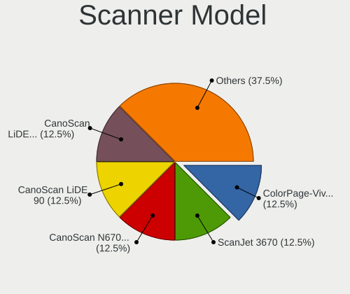

| Model                                               | Desktops | Percent |
|-----------------------------------------------------|----------|---------|
| Mustek Systems ScanExpress 1200 UB                  | 1        | 11.11%  |
| KYE Systems (Mouse Systems) ColorPage-Vivid 1200 XE | 1        | 11.11%  |
| HP ScanJet 3670                                     | 1        | 11.11%  |
| Canon CanoScan N670U/N676U/LiDE 20                  | 1        | 11.11%  |
| Canon CanoScan LiDE 90                              | 1        | 11.11%  |
| Canon CanoScan LIDE 25                              | 1        | 11.11%  |
| Canon CanoScan LiDE 210                             | 1        | 11.11%  |
| Canon CanoScan 1220U                                | 1        | 11.11%  |
| Acer Peripherals (now BenQ) Prisa 1240UT            | 1        | 11.11%  |

Camera
------

Camera Vendor
-------------

Camera device vendors

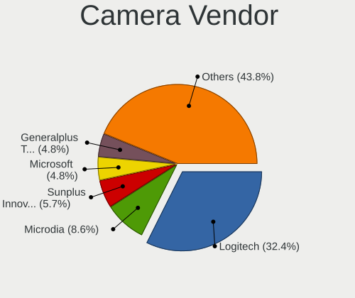

| Vendor                                 | Desktops | Percent |
|----------------------------------------|----------|---------|
| Logitech                               | 34       | 32.38%  |
| Microdia                               | 9        | 8.57%   |
| Sunplus Innovation Technology          | 6        | 5.71%   |
| Microsoft                              | 5        | 4.76%   |
| Generalplus Technology                 | 5        | 4.76%   |
| Chicony Electronics                    | 5        | 4.76%   |
| Realtek Semiconductor                  | 3        | 2.86%   |
| Hewlett-Packard                        | 3        | 2.86%   |
| ARC International                      | 3        | 2.86%   |
| Z-Star Microelectronics                | 2        | 1.9%    |
| WaveRider Communications               | 2        | 1.9%    |
| Unknown                                | 2        | 1.9%    |
| Samsung Electronics                    | 2        | 1.9%    |
| Creative Technology                    | 2        | 1.9%    |
| AVerMedia Technologies                 | 2        | 1.9%    |
| A4Tech                                 | 2        | 1.9%    |
| webcam                                 | 1        | 0.95%   |
| Sony Ericsson Mobile Communications AB | 1        | 0.95%   |
| Sonix Technology                       | 1        | 0.95%   |
| Silicon Motion                         | 1        | 0.95%   |
| SHENZHEN EMEET TECHNOLOGY              | 1        | 0.95%   |
| Razer USA                              | 1        | 0.95%   |
| LG Electronics                         | 1        | 0.95%   |
| Jieli Technology                       | 1        | 0.95%   |
| Genesys Logic                          | 1        | 0.95%   |
| GEMBIRD                                | 1        | 0.95%   |
| eMeet                                  | 1        | 0.95%   |
| Cheng Uei Precision Industry (Foxlink) | 1        | 0.95%   |
| Aveo Technology                        | 1        | 0.95%   |
| ASUSTek Computer                       | 1        | 0.95%   |
| Apple                                  | 1        | 0.95%   |
| ALi                                    | 1        | 0.95%   |
| Alcor Micro                            | 1        | 0.95%   |
| Acer                                   | 1        | 0.95%   |

Camera Model
------------

Camera device models

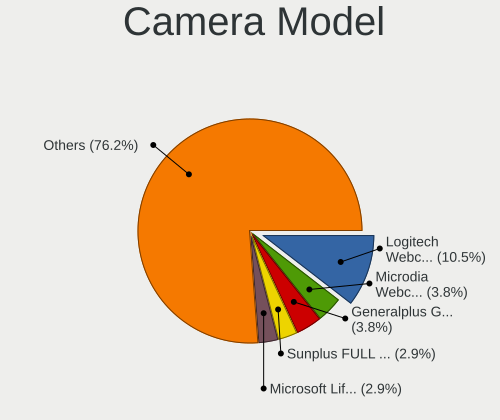

| Model                                           | Desktops | Percent |
|-------------------------------------------------|----------|---------|
| Logitech Webcam C270                            | 11       | 10.48%  |
| Microdia Webcam Vitade AF                       | 4        | 3.81%   |
| Generalplus GENERAL WEBCAM                      | 4        | 3.81%   |
| Sunplus FULL HD webcam                          | 3        | 2.86%   |
| Microsoft LifeCam HD-3000                       | 3        | 2.86%   |
| ARC International Camera                        | 3        | 2.86%   |
| WaveRider USB 2.0 Camera                        | 2        | 1.9%    |
| Unknown HD camera                               | 2        | 1.9%    |
| Samsung Galaxy series, misc. (MTP mode)         | 2        | 1.9%    |
| Realtek USB Camera                              | 2        | 1.9%    |
| Microdia USB 2.0 Camera                         | 2        | 1.9%    |
| Microdia Integrated Camera                      | 2        | 1.9%    |
| Logitech Webcam C310                            | 2        | 1.9%    |
| Logitech Webcam C120                            | 2        | 1.9%    |
| Logitech HD Pro Webcam C920                     | 2        | 1.9%    |
| Logitech C920 PRO HD Webcam                     | 2        | 1.9%    |
| HP Webcam HD 2300                               | 2        | 1.9%    |
| Z-Star Venus USB2.0 Camera                      | 1        | 0.95%   |
| Z-Star A4 TECH USB 2.0 Camera J                 | 1        | 0.95%   |
| webcam webcam                                   | 1        | 0.95%   |
| Sunplus SC-WC-300 Webcam                        | 1        | 0.95%   |
| Sunplus Integrated Camera                       | 1        | 0.95%   |
| Sunplus HK 5M WebCAM                            | 1        | 0.95%   |
| Sony Ericsson Mobile AB Xperia 10 II - Dual SIM | 1        | 0.95%   |
| Sonix USB Camera                                | 1        | 0.95%   |
| Silicon Motion Silicon Motion Camera            | 1        | 0.95%   |
| SHENZHEN EMEET TECHNOLOGY eMeet Nova            | 1        | 0.95%   |
| Realtek HP 1.0MP High Definition Webcam         | 1        | 0.95%   |
| Razer USA Razer Kiyo Pro                        | 1        | 0.95%   |
| Microsoft LifeCam VX-800                        | 1        | 0.95%   |
| Microsoft LifeCam HD-5001                       | 1        | 0.95%   |
| Microdia Camera                                 | 1        | 0.95%   |
| Logitech Webcam C930e                           | 1        | 0.95%   |
| Logitech Webcam C600                            | 1        | 0.95%   |
| Logitech Webcam C210                            | 1        | 0.95%   |
| Logitech Webcam C200                            | 1        | 0.95%   |
| Logitech QuickCam Pro 5000                      | 1        | 0.95%   |
| Logitech Portable Webcam C905                   | 1        | 0.95%   |
| Logitech Logitech Webcam C925e                  | 1        | 0.95%   |
| Logitech Logitech Webcam C100                   | 1        | 0.95%   |

Security
--------

Fingerprint Vendor
------------------

Fingerprint sensor vendors

Zero info for selected period =(

Fingerprint Model
-----------------

Fingerprint sensor models

Zero info for selected period =(

Chipcard Vendor
---------------

Chipcard module vendors

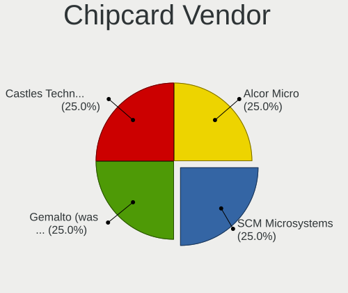

| Vendor                | Desktops | Percent |
|-----------------------|----------|---------|
| SCM Microsystems      | 1        | 25%     |
| Gemalto (was Gemplus) | 1        | 25%     |
| Castles Technology    | 1        | 25%     |
| Alcor Micro           | 1        | 25%     |

Chipcard Model
--------------

Chipcard module models

| Model                                             | Desktops | Percent |
|---------------------------------------------------|----------|---------|
| SCM Microsystems SCR333 SmartCard Reader          | 1        | 25%     |
| Gemalto (was Gemplus) GemPC Twin SmartCard Reader | 1        | 25%     |
| Castles Technology EZCCID Smart Card Reader       | 1        | 25%     |
| Alcor Micro AU9540 Smartcard Reader               | 1        | 25%     |

Unsupported
-----------

Unsupported Devices
-------------------

Total unsupported devices on board

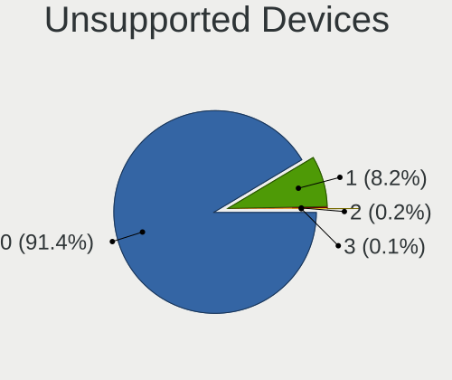

| Total | Desktops | Percent |
|-------|----------|---------|
| 0     | 844      | 91.44%  |
| 1     | 76       | 8.23%   |
| 2     | 2        | 0.22%   |
| 3     | 1        | 0.11%   |

Unsupported Device Types
------------------------

Types of unsupported devices

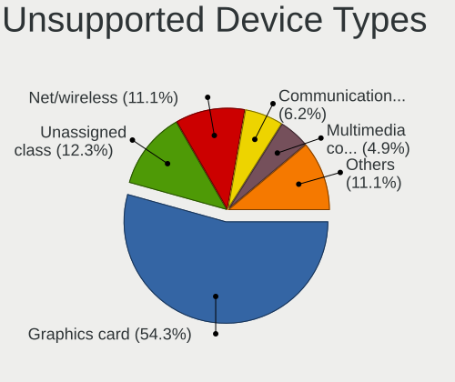

| Type                     | Desktops | Percent |
|--------------------------|----------|---------|
| Graphics card            | 44       | 54.32%  |
| Unassigned class         | 10       | 12.35%  |
| Net/wireless             | 9        | 11.11%  |
| Communication controller | 5        | 6.17%   |
| Multimedia controller    | 4        | 4.94%   |
| Chipcard                 | 4        | 4.94%   |
| Camera                   | 4        | 4.94%   |
| Net/ethernet             | 1        | 1.23%   |

