OpenMandriva 23.03 - Tested Hardware & Statistics (Desktops)
------------------------------------------------------------

A project to collect tested hardware configurations for OpenMandriva 23.03.

Anyone can contribute to this report by the [hw-probe](https://github.com/linuxhw/hw-probe) tool:

    sudo -E hw-probe -all -upload

Please contribute! Especially if your hardware is rare.

Contents
--------

* [ Test Cases ](#test-cases)

* [ System ](#system)
  - [ Kernel                   ](#kernel)
  - [ Kernel Family            ](#kernel-family)
  - [ Kernel Major Ver.        ](#kernel-major-ver)
  - [ Arch                     ](#arch)
  - [ DE                       ](#de)
  - [ Display Server           ](#display-server)
  - [ Display Manager          ](#display-manager)
  - [ OS Lang                  ](#os-lang)
  - [ Boot Mode                ](#boot-mode)
  - [ Filesystem               ](#filesystem)
  - [ Part. scheme             ](#part-scheme)
  - [ Dual Boot with Linux/BSD ](#dual-boot-with-linuxbsd)
  - [ Dual Boot (Win)          ](#dual-boot-win)

* [ Board ](#board)
  - [ Vendor                   ](#vendor)
  - [ Model                    ](#model)
  - [ Model Family             ](#model-family)
  - [ MFG Year                 ](#mfg-year)
  - [ Form Factor              ](#form-factor)
  - [ Secure Boot              ](#secure-boot)
  - [ Coreboot                 ](#coreboot)
  - [ RAM Size                 ](#ram-size)
  - [ RAM Used                 ](#ram-used)
  - [ Total Drives             ](#total-drives)
  - [ Has CD-ROM               ](#has-cd-rom)
  - [ Has Ethernet             ](#has-ethernet)
  - [ Has WiFi                 ](#has-wifi)
  - [ Has Bluetooth            ](#has-bluetooth)

* [ Location ](#location)
  - [ Country                  ](#country)
  - [ City                     ](#city)

* [ Drives ](#drives)
  - [ Drive Vendor             ](#drive-vendor)
  - [ Drive Model              ](#drive-model)
  - [ HDD Vendor               ](#hdd-vendor)
  - [ SSD Vendor               ](#ssd-vendor)
  - [ Drive Kind               ](#drive-kind)
  - [ Drive Connector          ](#drive-connector)
  - [ Drive Size               ](#drive-size)
  - [ Space Total              ](#space-total)
  - [ Space Used               ](#space-used)
  - [ Malfunc. Drives          ](#malfunc-drives)
  - [ Malfunc. Drive Vendor    ](#malfunc-drive-vendor)
  - [ Malfunc. HDD Vendor      ](#malfunc-hdd-vendor)
  - [ Malfunc. Drive Kind      ](#malfunc-drive-kind)
  - [ Failed Drives            ](#failed-drives)
  - [ Failed Drive Vendor      ](#failed-drive-vendor)
  - [ Drive Status             ](#drive-status)

* [ Storage controller ](#storage-controller)
  - [ Storage Vendor           ](#storage-vendor)
  - [ Storage Model            ](#storage-model)
  - [ Storage Kind             ](#storage-kind)

* [ Processor ](#processor)
  - [ CPU Vendor               ](#cpu-vendor)
  - [ CPU Model                ](#cpu-model)
  - [ CPU Model Family         ](#cpu-model-family)
  - [ CPU Cores                ](#cpu-cores)
  - [ CPU Sockets              ](#cpu-sockets)
  - [ CPU Threads              ](#cpu-threads)
  - [ CPU Op-Modes             ](#cpu-op-modes)
  - [ CPU Microcode            ](#cpu-microcode)
  - [ CPU Microarch            ](#cpu-microarch)

* [ Graphics ](#graphics)
  - [ GPU Vendor               ](#gpu-vendor)
  - [ GPU Model                ](#gpu-model)
  - [ GPU Combo                ](#gpu-combo)
  - [ GPU Driver               ](#gpu-driver)
  - [ GPU Memory               ](#gpu-memory)

* [ Monitor ](#monitor)
  - [ Monitor Vendor           ](#monitor-vendor)
  - [ Monitor Model            ](#monitor-model)
  - [ Monitor Resolution       ](#monitor-resolution)
  - [ Monitor Diagonal         ](#monitor-diagonal)
  - [ Monitor Width            ](#monitor-width)
  - [ Aspect Ratio             ](#aspect-ratio)
  - [ Monitor Area             ](#monitor-area)
  - [ Pixel Density            ](#pixel-density)
  - [ Multiple Monitors        ](#multiple-monitors)

* [ Network ](#network)
  - [ Net Controller Vendor    ](#net-controller-vendor)
  - [ Net Controller Model     ](#net-controller-model)
  - [ Wireless Vendor          ](#wireless-vendor)
  - [ Wireless Model           ](#wireless-model)
  - [ Ethernet Vendor          ](#ethernet-vendor)
  - [ Ethernet Model           ](#ethernet-model)
  - [ Net Controller Kind      ](#net-controller-kind)
  - [ Used Controller          ](#used-controller)
  - [ NICs                     ](#nics)
  - [ IPv6                     ](#ipv6)

* [ Bluetooth ](#bluetooth)
  - [ Bluetooth Vendor         ](#bluetooth-vendor)
  - [ Bluetooth Model          ](#bluetooth-model)

* [ Sound ](#sound)
  - [ Sound Vendor             ](#sound-vendor)
  - [ Sound Model              ](#sound-model)

* [ Memory ](#memory)
  - [ Memory Vendor            ](#memory-vendor)
  - [ Memory Model             ](#memory-model)
  - [ Memory Kind              ](#memory-kind)
  - [ Memory Form Factor       ](#memory-form-factor)
  - [ Memory Size              ](#memory-size)
  - [ Memory Speed             ](#memory-speed)

* [ Printers & scanners ](#printers--scanners)
  - [ Printer Vendor           ](#printer-vendor)
  - [ Printer Model            ](#printer-model)
  - [ Scanner Vendor           ](#scanner-vendor)
  - [ Scanner Model            ](#scanner-model)

* [ Camera ](#camera)
  - [ Camera Vendor            ](#camera-vendor)
  - [ Camera Model             ](#camera-model)

* [ Security ](#security)
  - [ Fingerprint Vendor       ](#fingerprint-vendor)
  - [ Fingerprint Model        ](#fingerprint-model)
  - [ Chipcard Vendor          ](#chipcard-vendor)
  - [ Chipcard Model           ](#chipcard-model)

* [ Unsupported ](#unsupported)
  - [ Unsupported Devices      ](#unsupported-devices)
  - [ Unsupported Device Types ](#unsupported-device-types)

Test Cases
----------

Total: 504

| Vendor        | Model                       | Probe                                                      | Date         |
|---------------|-----------------------------|------------------------------------------------------------|--------------|
| Dell          | 06D7TR A00                  | [e7905065dd](https://linux-hardware.org/?probe=e7905065dd) | Apr 30, 2023 |
| MSI           | B450M PRO-M2                | [b650f0a26e](https://linux-hardware.org/?probe=b650f0a26e) | Apr 30, 2023 |
| ASRock        | 760GM-HD                    | [db79e93331](https://linux-hardware.org/?probe=db79e93331) | Apr 30, 2023 |
| Gigabyte      | Z77M-D3H                    | [a3d2b3dcd3](https://linux-hardware.org/?probe=a3d2b3dcd3) | Apr 30, 2023 |
| Fujitsu       | D3161-A1 S26361-D3161-A1    | [ac7894081f](https://linux-hardware.org/?probe=ac7894081f) | Apr 30, 2023 |
| Medion        | D3F3-EM                     | [6b9e38ad6c](https://linux-hardware.org/?probe=6b9e38ad6c) | Apr 30, 2023 |
| MSI           | A68HM GRENADE               | [938aa1cb46](https://linux-hardware.org/?probe=938aa1cb46) | Apr 30, 2023 |
| T-bao         | MINI PC V1.0                | [8e77950434](https://linux-hardware.org/?probe=8e77950434) | Apr 30, 2023 |
| Intel         | H61                         | [167616bc61](https://linux-hardware.org/?probe=167616bc61) | Apr 30, 2023 |
| Dell          | 0GXM1W A02                  | [7dcb847a6c](https://linux-hardware.org/?probe=7dcb847a6c) | Apr 30, 2023 |
| Dell          | 0773VG A02                  | [a684ad4938](https://linux-hardware.org/?probe=a684ad4938) | Apr 29, 2023 |
| ASRock        | A320M-DVS R4.0              | [7e7da68aa3](https://linux-hardware.org/?probe=7e7da68aa3) | Apr 28, 2023 |
| ASUSTek       | ROG STRIX B550-F GAMING     | [92be2563a8](https://linux-hardware.org/?probe=92be2563a8) | Apr 28, 2023 |
| ASUSTek       | TUF Gaming Z690-PLUS WIF... | [2beb48be05](https://linux-hardware.org/?probe=2beb48be05) | Apr 27, 2023 |
| MSI           | H81M-P33                    | [2099cafe74](https://linux-hardware.org/?probe=2099cafe74) | Apr 27, 2023 |
| ASRock        | H510M-HDV R2.0              | [91930613cb](https://linux-hardware.org/?probe=91930613cb) | Apr 27, 2023 |
| MSI           | A78M-E35 V2                 | [5eb0f9d104](https://linux-hardware.org/?probe=5eb0f9d104) | Apr 27, 2023 |
| Lenovo        | SHARKBAY SDK0E50512 STD     | [6601cb2397](https://linux-hardware.org/?probe=6601cb2397) | Apr 26, 2023 |
| Lenovo        | SHARKBAY NOK                | [54dea0607f](https://linux-hardware.org/?probe=54dea0607f) | Apr 26, 2023 |
| ASUSTek       | PRIME B250M-C               | [aca5bf366f](https://linux-hardware.org/?probe=aca5bf366f) | Apr 26, 2023 |
| Biostar       | H610MH                      | [935928c60d](https://linux-hardware.org/?probe=935928c60d) | Apr 26, 2023 |
| Gigabyte      | B75M-D3H                    | [4f1e4da37e](https://linux-hardware.org/?probe=4f1e4da37e) | Apr 26, 2023 |
| Intel         | H81                         | [9a14132581](https://linux-hardware.org/?probe=9a14132581) | Apr 26, 2023 |
| HP            | 83E2                        | [f10d975821](https://linux-hardware.org/?probe=f10d975821) | Apr 26, 2023 |
| ASUSTek       | PRIME H270-PLUS             | [8a0cd0bb6e](https://linux-hardware.org/?probe=8a0cd0bb6e) | Apr 26, 2023 |
| MSI           | B250M PRO-VH                | [f132c966f5](https://linux-hardware.org/?probe=f132c966f5) | Apr 25, 2023 |
| ASUSTek       | J1800I-C                    | [0a58f3fa51](https://linux-hardware.org/?probe=0a58f3fa51) | Apr 25, 2023 |
| ASUSTek       | PRIME A520M-K               | [a437a858a4](https://linux-hardware.org/?probe=a437a858a4) | Apr 25, 2023 |
| Lenovo        | SHARKBAY NOK                | [c5adfbd376](https://linux-hardware.org/?probe=c5adfbd376) | Apr 25, 2023 |
| Gigabyte      | Z77M-D3H                    | [915147a191](https://linux-hardware.org/?probe=915147a191) | Apr 25, 2023 |
| Gigabyte      | Z77M-D3H                    | [92a968e58d](https://linux-hardware.org/?probe=92a968e58d) | Apr 25, 2023 |
| Lenovo        | SHARKBAY 0B98401 PRO        | [d9ad034d8c](https://linux-hardware.org/?probe=d9ad034d8c) | Apr 24, 2023 |
| ASUSTek       | P7P55D-E                    | [0e79aaac72](https://linux-hardware.org/?probe=0e79aaac72) | Apr 24, 2023 |
| ASRock        | H97M Anniversary            | [fdcfb2bde7](https://linux-hardware.org/?probe=fdcfb2bde7) | Apr 24, 2023 |
| ASUSTek       | PRIME Z590-P                | [ebe492b020](https://linux-hardware.org/?probe=ebe492b020) | Apr 24, 2023 |
| ASRock        | X570 Taichi                 | [0842334fa2](https://linux-hardware.org/?probe=0842334fa2) | Apr 24, 2023 |
| Lenovo        | SHARKBAY 0B98401 WIN        | [6531aafbfe](https://linux-hardware.org/?probe=6531aafbfe) | Apr 24, 2023 |
| Gigabyte      | GA-970A-UD3                 | [6f3f14d26d](https://linux-hardware.org/?probe=6f3f14d26d) | Apr 23, 2023 |
| ASUSTek       | Z170-K                      | [538ebf1f96](https://linux-hardware.org/?probe=538ebf1f96) | Apr 23, 2023 |
| Gigabyte      | B550 GAMING X V2            | [22594512d1](https://linux-hardware.org/?probe=22594512d1) | Apr 23, 2023 |
| Shenzhen M... | F6CQW                       | [c2be3dd62b](https://linux-hardware.org/?probe=c2be3dd62b) | Apr 23, 2023 |
| MSI           | B450 GAMING PLUS MAX        | [cc80f06375](https://linux-hardware.org/?probe=cc80f06375) | Apr 23, 2023 |
| Gigabyte      | X570 AORUS ULTRA            | [3fa24b1a91](https://linux-hardware.org/?probe=3fa24b1a91) | Apr 23, 2023 |
| Gigabyte      | GA-78LMT-USB3 R2 sex        | [93790f1835](https://linux-hardware.org/?probe=93790f1835) | Apr 23, 2023 |
| ASUSTek       | P8H77-I                     | [e2276c080b](https://linux-hardware.org/?probe=e2276c080b) | Apr 22, 2023 |
| Gigabyte      | B550M S2H                   | [485f002152](https://linux-hardware.org/?probe=485f002152) | Apr 22, 2023 |
| Fujitsu       | FJNB037                     | [00e5e30f9b](https://linux-hardware.org/?probe=00e5e30f9b) | Apr 22, 2023 |
| Dell          | 0K240Y A02                  | [2d1b73d846](https://linux-hardware.org/?probe=2d1b73d846) | Apr 22, 2023 |
| ECS           | APLD-MINI                   | [8f3546722b](https://linux-hardware.org/?probe=8f3546722b) | Apr 22, 2023 |
| Fujitsu Si... | D2156-A1 S26361-D2156-A1    | [617f821f9a](https://linux-hardware.org/?probe=617f821f9a) | Apr 22, 2023 |
| Intel         | DG41RQ AAE54511-203         | [6a17fe6ead](https://linux-hardware.org/?probe=6a17fe6ead) | Apr 21, 2023 |
| ASRock        | H310CM-HG4                  | [6f49f4b883](https://linux-hardware.org/?probe=6f49f4b883) | Apr 21, 2023 |
| Gigabyte      | B75M-HD3                    | [cde822d71c](https://linux-hardware.org/?probe=cde822d71c) | Apr 21, 2023 |
| HP            | 18E5                        | [0437b3deb1](https://linux-hardware.org/?probe=0437b3deb1) | Apr 21, 2023 |
| ASUSTek       | F2A85-V                     | [422eb87f07](https://linux-hardware.org/?probe=422eb87f07) | Apr 21, 2023 |
| Dell          | 0GDG8Y A00                  | [a315eaa776](https://linux-hardware.org/?probe=a315eaa776) | Apr 21, 2023 |
| Dell          | 040DDP A01                  | [6720e15331](https://linux-hardware.org/?probe=6720e15331) | Apr 21, 2023 |
| MouseCompu... | Z87-S01                     | [8caff0d2f2](https://linux-hardware.org/?probe=8caff0d2f2) | Apr 21, 2023 |
| ASRock        | P43DE                       | [8f2c0ecc69](https://linux-hardware.org/?probe=8f2c0ecc69) | Apr 21, 2023 |
| ASRock        | Z270 Taichi                 | [faf3402431](https://linux-hardware.org/?probe=faf3402431) | Apr 21, 2023 |
| MSI           | B550-A PRO                  | [f2fc6a5da5](https://linux-hardware.org/?probe=f2fc6a5da5) | Apr 20, 2023 |
| Intel         | DG43GT AAE62768-301         | [643ed4ce33](https://linux-hardware.org/?probe=643ed4ce33) | Apr 20, 2023 |
| Gigabyte      | H61M-DS2                    | [8c43353ee9](https://linux-hardware.org/?probe=8c43353ee9) | Apr 20, 2023 |
| Acer          | Aspire XC-710 V:1.1         | [a09ea158cc](https://linux-hardware.org/?probe=a09ea158cc) | Apr 20, 2023 |
| HP            | 0B4Ch D                     | [69c613b55f](https://linux-hardware.org/?probe=69c613b55f) | Apr 20, 2023 |
| ASUSTek       | P5K SE                      | [eeff4cd84c](https://linux-hardware.org/?probe=eeff4cd84c) | Apr 20, 2023 |
| Gigabyte      | H81N                        | [5729c6c6a9](https://linux-hardware.org/?probe=5729c6c6a9) | Apr 20, 2023 |
| Intel         | H61S                        | [e29d71587a](https://linux-hardware.org/?probe=e29d71587a) | Apr 20, 2023 |
| HP            | 18E4                        | [1bd96a017f](https://linux-hardware.org/?probe=1bd96a017f) | Apr 19, 2023 |
| Dell          | 0NDYHG A01                  | [9c7e865b56](https://linux-hardware.org/?probe=9c7e865b56) | Apr 19, 2023 |
| ECS           | BSW-MINI                    | [5d3161092f](https://linux-hardware.org/?probe=5d3161092f) | Apr 19, 2023 |
| ASRock        | B550M Pro4                  | [5fa6c74be4](https://linux-hardware.org/?probe=5fa6c74be4) | Apr 19, 2023 |
| MSI           | 0B58h                       | [6473456480](https://linux-hardware.org/?probe=6473456480) | Apr 19, 2023 |
| ECS           | H61H2-CM                    | [4396b0b045](https://linux-hardware.org/?probe=4396b0b045) | Apr 19, 2023 |
| HP            | 8309                        | [d82a6a4488](https://linux-hardware.org/?probe=d82a6a4488) | Apr 19, 2023 |
| MSI           | MS-7235                     | [efaeac524b](https://linux-hardware.org/?probe=efaeac524b) | Apr 18, 2023 |
| Fujitsu       | D2778-C1 S26361-D2778-C1    | [10693010af](https://linux-hardware.org/?probe=10693010af) | Apr 18, 2023 |
| Biostar       | A960D+V2                    | [34c47b4141](https://linux-hardware.org/?probe=34c47b4141) | Apr 18, 2023 |
| MSI           | B450 TOMAHAWK               | [fb3d31599f](https://linux-hardware.org/?probe=fb3d31599f) | Apr 18, 2023 |
| Dell          | 0KRC95 A00                  | [99ea2c7790](https://linux-hardware.org/?probe=99ea2c7790) | Apr 18, 2023 |
| NEC Comput... | MS-7451VM                   | [dc094ceba3](https://linux-hardware.org/?probe=dc094ceba3) | Apr 18, 2023 |
| ASRock        | B450M Pro4                  | [4c6abc2653](https://linux-hardware.org/?probe=4c6abc2653) | Apr 18, 2023 |
| ASUSTek       | P5QC                        | [7d47aa511b](https://linux-hardware.org/?probe=7d47aa511b) | Apr 18, 2023 |
| ASUSTek       | ROG STRIX B550-I GAMING     | [dc707578c9](https://linux-hardware.org/?probe=dc707578c9) | Apr 18, 2023 |
| ASUSTek       | P8H67-M PRO                 | [9eb59318e2](https://linux-hardware.org/?probe=9eb59318e2) | Apr 18, 2023 |
| Acer          | FQ965M MP                   | [9be9793747](https://linux-hardware.org/?probe=9be9793747) | Apr 18, 2023 |
| HP            | 18E9                        | [8c36235f13](https://linux-hardware.org/?probe=8c36235f13) | Apr 18, 2023 |
| Gigabyte      | H370 AORUS GAMING 3-CF      | [8b585cf135](https://linux-hardware.org/?probe=8b585cf135) | Apr 18, 2023 |
| ASUSTek       | Pro WS X570-ACE             | [8944559c50](https://linux-hardware.org/?probe=8944559c50) | Apr 17, 2023 |
| HP            | 1850                        | [fa2fa68792](https://linux-hardware.org/?probe=fa2fa68792) | Apr 17, 2023 |
| HP            | 8062                        | [a2558d47e8](https://linux-hardware.org/?probe=a2558d47e8) | Apr 17, 2023 |
| ASRock        | H61M-DGS R2.0               | [695446a864](https://linux-hardware.org/?probe=695446a864) | Apr 17, 2023 |
| ASRock        | X99 Extreme4                | [e375be2ea6](https://linux-hardware.org/?probe=e375be2ea6) | Apr 17, 2023 |
| Medion        | MS-7728                     | [1da2d605db](https://linux-hardware.org/?probe=1da2d605db) | Apr 16, 2023 |
| Acer          | Aspire X3950                | [5a9abbd85f](https://linux-hardware.org/?probe=5a9abbd85f) | Apr 16, 2023 |
| MSI           | H310M PRO-VDH               | [01452c33d1](https://linux-hardware.org/?probe=01452c33d1) | Apr 16, 2023 |
| Gigabyte      | H61M-D2H-USB3               | [0134b33f82](https://linux-hardware.org/?probe=0134b33f82) | Apr 16, 2023 |
| ASRock        | N68-GS4 FX                  | [19a6cddfe0](https://linux-hardware.org/?probe=19a6cddfe0) | Apr 16, 2023 |
| Lenovo        | 3704 SDK0R32862 WIN 3258... | [4d3cbcc4d9](https://linux-hardware.org/?probe=4d3cbcc4d9) | Apr 16, 2023 |
| ASUSTek       | PRIME A320M-K               | [a2596e8d06](https://linux-hardware.org/?probe=a2596e8d06) | Apr 16, 2023 |
| ASRock        | B650M PG Riptide            | [71643d03ec](https://linux-hardware.org/?probe=71643d03ec) | Apr 16, 2023 |
| ASUSTek       | PRIME H410M-E               | [fedecfd9ff](https://linux-hardware.org/?probe=fedecfd9ff) | Apr 16, 2023 |
| Foxconn       | ALOE                        | [702f958604](https://linux-hardware.org/?probe=702f958604) | Apr 16, 2023 |
| MSI           | MAG B550 TOMAHAWK           | [980c6d63d6](https://linux-hardware.org/?probe=980c6d63d6) | Apr 16, 2023 |
| Lenovo        | SHARKBAY SDK0J40700 WIN ... | [00b59d56cd](https://linux-hardware.org/?probe=00b59d56cd) | Apr 16, 2023 |
| MSI           | B150A GAMING PRO            | [26432a7622](https://linux-hardware.org/?probe=26432a7622) | Apr 16, 2023 |
| Foxconn       | 2A8C                        | [8a75d034c7](https://linux-hardware.org/?probe=8a75d034c7) | Apr 15, 2023 |
| Acidanther... | Mac-27AD2F918AE68F61 Mac... | [e17175b9ac](https://linux-hardware.org/?probe=e17175b9ac) | Apr 15, 2023 |
| ASUSTek       | ROG CROSSHAIR VIII IMPAC... | [83d43e489d](https://linux-hardware.org/?probe=83d43e489d) | Apr 15, 2023 |
| Lenovo        | ThinkCentre M58p 6234CZ6    | [e412c388d8](https://linux-hardware.org/?probe=e412c388d8) | Apr 15, 2023 |
| MSI           | MPG Z390 GAMING PLUS        | [82abb09c06](https://linux-hardware.org/?probe=82abb09c06) | Apr 15, 2023 |
| Gigabyte      | GA-870A-UD3                 | [a359e8f3ea](https://linux-hardware.org/?probe=a359e8f3ea) | Apr 15, 2023 |
| Fujitsu Si... | D2824-A1 S26361-D2824-A1    | [8a5b5b102c](https://linux-hardware.org/?probe=8a5b5b102c) | Apr 14, 2023 |
| Gigabyte      | X570 I AORUS PRO WIFI       | [3741318176](https://linux-hardware.org/?probe=3741318176) | Apr 14, 2023 |
| HP            | 1791                        | [c87bf6d0e1](https://linux-hardware.org/?probe=c87bf6d0e1) | Apr 13, 2023 |
| ASUSTek       | PRIME A320M-K               | [1bf207dfca](https://linux-hardware.org/?probe=1bf207dfca) | Apr 13, 2023 |
| Lenovo        | 30C0 SDK0J40705 WIN 3425... | [490a059818](https://linux-hardware.org/?probe=490a059818) | Apr 13, 2023 |
| HP            | 1589                        | [b1ca06250e](https://linux-hardware.org/?probe=b1ca06250e) | Apr 13, 2023 |
| Gigabyte      | GA-78LMT-S2P                | [d79266b94f](https://linux-hardware.org/?probe=d79266b94f) | Apr 13, 2023 |
| Gigabyte      | Z77M-D3H                    | [ffdcd55e2e](https://linux-hardware.org/?probe=ffdcd55e2e) | Apr 13, 2023 |
| Gigabyte      | H61M-HD2                    | [ea4bae8ef7](https://linux-hardware.org/?probe=ea4bae8ef7) | Apr 13, 2023 |
| HP            | 1998                        | [8f0fef0b77](https://linux-hardware.org/?probe=8f0fef0b77) | Apr 12, 2023 |
| HP            | 805D                        | [f12230e709](https://linux-hardware.org/?probe=f12230e709) | Apr 12, 2023 |
| Dell          | 02K9CR A01                  | [45c419b8d6](https://linux-hardware.org/?probe=45c419b8d6) | Apr 12, 2023 |
| Gigabyte      | H310M S2H x.x               | [203aeef6a1](https://linux-hardware.org/?probe=203aeef6a1) | Apr 12, 2023 |
| Gigabyte      | B450M DS3H V2               | [63c52bc5db](https://linux-hardware.org/?probe=63c52bc5db) | Apr 12, 2023 |
| ABIT          | NF-M2S                      | [30e3a2e8c4](https://linux-hardware.org/?probe=30e3a2e8c4) | Apr 11, 2023 |
| ASUSTek       | P5LD2-X/1333                | [e0e655f63c](https://linux-hardware.org/?probe=e0e655f63c) | Apr 11, 2023 |
| MSI           | 970A GAMING PRO CARBON      | [b6cae4ec58](https://linux-hardware.org/?probe=b6cae4ec58) | Apr 11, 2023 |
| Acer          | Aspire TC-780               | [ce8b386e5b](https://linux-hardware.org/?probe=ce8b386e5b) | Apr 11, 2023 |
| MSI           | X370 GAMING PRO CARBON      | [ad8009e647](https://linux-hardware.org/?probe=ad8009e647) | Apr 11, 2023 |
| Lenovo        | Dory CRB                    | [cab4258e1b](https://linux-hardware.org/?probe=cab4258e1b) | Apr 11, 2023 |
| HP            | 805B                        | [591658775d](https://linux-hardware.org/?probe=591658775d) | Apr 11, 2023 |
| MSI           | B450M MORTAR MAX            | [e2cffb810b](https://linux-hardware.org/?probe=e2cffb810b) | Apr 10, 2023 |
| Biostar       | H61MHV                      | [13b4632c72](https://linux-hardware.org/?probe=13b4632c72) | Apr 10, 2023 |
| Gigabyte      | B550 AORUS ELITE V2         | [35f953cfe0](https://linux-hardware.org/?probe=35f953cfe0) | Apr 10, 2023 |
| ASUSTek       | P5KPL-AM SE                 | [979e7ab8f3](https://linux-hardware.org/?probe=979e7ab8f3) | Apr 10, 2023 |
| ASRock        | B550M-ITX/ac                | [e043c1c94c](https://linux-hardware.org/?probe=e043c1c94c) | Apr 10, 2023 |
| Gigabyte      | H61M-D2-B3                  | [bf18b5af69](https://linux-hardware.org/?probe=bf18b5af69) | Apr 10, 2023 |
| HP            | 3032h                       | [824604840a](https://linux-hardware.org/?probe=824604840a) | Apr 10, 2023 |
| Lanix         | ChiefRiver                  | [ef23ac88e4](https://linux-hardware.org/?probe=ef23ac88e4) | Apr 10, 2023 |
| Biostar       | H81MHV3L                    | [8638a242be](https://linux-hardware.org/?probe=8638a242be) | Apr 10, 2023 |
| Biostar       | A320MH                      | [a2aef00c0c](https://linux-hardware.org/?probe=a2aef00c0c) | Apr 09, 2023 |
| MACHINIST     | X99-k9 V1.0                 | [650acc25ef](https://linux-hardware.org/?probe=650acc25ef) | Apr 09, 2023 |
| ASRock        | Q1900M                      | [6ff7177033](https://linux-hardware.org/?probe=6ff7177033) | Apr 09, 2023 |
| Pegatron      | 2A73h                       | [5de48bf7df](https://linux-hardware.org/?probe=5de48bf7df) | Apr 09, 2023 |
| ECS           | H61H2-M17                   | [a2860baaee](https://linux-hardware.org/?probe=a2860baaee) | Apr 09, 2023 |
| HP            | 1998                        | [3974cfbb0c](https://linux-hardware.org/?probe=3974cfbb0c) | Apr 09, 2023 |
| Dell          | 0TTDMJ A00                  | [2b039ea053](https://linux-hardware.org/?probe=2b039ea053) | Apr 09, 2023 |
| ASUSTek       | B85M-E                      | [fe9976de62](https://linux-hardware.org/?probe=fe9976de62) | Apr 09, 2023 |
| Gigabyte      | H370 HD3-CF                 | [b2c9afc61f](https://linux-hardware.org/?probe=b2c9afc61f) | Apr 09, 2023 |
| MSI           | B350M MORTAR                | [03960a3def](https://linux-hardware.org/?probe=03960a3def) | Apr 09, 2023 |
| Lenovo        | ThinkCentre M90p 5536W67    | [f67448dd99](https://linux-hardware.org/?probe=f67448dd99) | Apr 09, 2023 |
| Unknown       | Unknown                     | [2765290b8c](https://linux-hardware.org/?probe=2765290b8c) | Apr 09, 2023 |
| Dell          | 0Y2MRG A01                  | [d512dee0ba](https://linux-hardware.org/?probe=d512dee0ba) | Apr 09, 2023 |
| MSI           | MPG X570 GAMING EDGE WIF... | [4644a0ea43](https://linux-hardware.org/?probe=4644a0ea43) | Apr 09, 2023 |
| ASUSTek       | P8H61-M LE/USB3             | [0f364f6e82](https://linux-hardware.org/?probe=0f364f6e82) | Apr 09, 2023 |
| Lenovo        | 318E SDK0J40697 WIN 3305... | [436d55c73e](https://linux-hardware.org/?probe=436d55c73e) | Apr 09, 2023 |
| ASRock        | X300-ITX                    | [dbdef76cc2](https://linux-hardware.org/?probe=dbdef76cc2) | Apr 09, 2023 |
| SYWZ          | S210H Series                | [5989537064](https://linux-hardware.org/?probe=5989537064) | Apr 09, 2023 |
| AZW           | U59                         | [404036be4e](https://linux-hardware.org/?probe=404036be4e) | Apr 09, 2023 |
| ASRock        | B150 Combo                  | [c4acc08020](https://linux-hardware.org/?probe=c4acc08020) | Apr 09, 2023 |
| ASUSTek       | PRIME Z590-P WIFI           | [e579aabfdb](https://linux-hardware.org/?probe=e579aabfdb) | Apr 09, 2023 |
| Dell          | 0PU052                      | [8f8c7f3a02](https://linux-hardware.org/?probe=8f8c7f3a02) | Apr 09, 2023 |
| Intel         | DH67BL AAG10189-207         | [1f13dff346](https://linux-hardware.org/?probe=1f13dff346) | Apr 08, 2023 |
| MSI           | B350 PC MATE                | [5c6c535e4d](https://linux-hardware.org/?probe=5c6c535e4d) | Apr 08, 2023 |
| Gigabyte      | B550 AORUS PRO V2           | [3fe1220d26](https://linux-hardware.org/?probe=3fe1220d26) | Apr 08, 2023 |
| HP            | 1459                        | [201dc05036](https://linux-hardware.org/?probe=201dc05036) | Apr 08, 2023 |
| ASRock        | 4X4-R1000                   | [56af110ee1](https://linux-hardware.org/?probe=56af110ee1) | Apr 08, 2023 |
| ASUSTek       | P8Z77-V PRO                 | [e1d6888ead](https://linux-hardware.org/?probe=e1d6888ead) | Apr 08, 2023 |
| Gigabyte      | GA-73PVM-S2                 | [2149d942b3](https://linux-hardware.org/?probe=2149d942b3) | Apr 08, 2023 |
| MSI           | B450 TOMAHAWK MAX           | [e657bedde3](https://linux-hardware.org/?probe=e657bedde3) | Apr 08, 2023 |
| ASUSTek       | A88XM-A                     | [52728f9e37](https://linux-hardware.org/?probe=52728f9e37) | Apr 08, 2023 |
| ASUSTek       | P5KPL-AM SE                 | [4b4e5dfe24](https://linux-hardware.org/?probe=4b4e5dfe24) | Apr 08, 2023 |
| ASUSTek       | P5K                         | [ea3489709c](https://linux-hardware.org/?probe=ea3489709c) | Apr 08, 2023 |
| Gigabyte      | B450M S2H                   | [f08d8d6bbd](https://linux-hardware.org/?probe=f08d8d6bbd) | Apr 08, 2023 |
| MSI           | B550M-A PRO                 | [e3fcf877c0](https://linux-hardware.org/?probe=e3fcf877c0) | Apr 08, 2023 |
| Acer          | Aspire X3990                | [4d4816d6f8](https://linux-hardware.org/?probe=4d4816d6f8) | Apr 08, 2023 |
| ASRock        | 960GC-GS FX                 | [90cb74d9f0](https://linux-hardware.org/?probe=90cb74d9f0) | Apr 08, 2023 |
| ASRock        | 970 Pro3 R2.0               | [375bb1794b](https://linux-hardware.org/?probe=375bb1794b) | Apr 08, 2023 |
| ASUSTek       | A68HM-K                     | [55d971a67f](https://linux-hardware.org/?probe=55d971a67f) | Apr 08, 2023 |
| Lenovo        | No DPK                      | [7028629b85](https://linux-hardware.org/?probe=7028629b85) | Apr 08, 2023 |
| Gigabyte      | X470 AORUS ULTRA GAMING-... | [c2132caa73](https://linux-hardware.org/?probe=c2132caa73) | Apr 08, 2023 |
| Biostar       | A520MH                      | [9cf296886b](https://linux-hardware.org/?probe=9cf296886b) | Apr 07, 2023 |
| ASRock        | B550 Phantom Gaming 4/ac    | [fa161c8db8](https://linux-hardware.org/?probe=fa161c8db8) | Apr 07, 2023 |
| ASRock        | B360M/OEM                   | [d1feabb956](https://linux-hardware.org/?probe=d1feabb956) | Apr 07, 2023 |
| ASUSTek       | H110M-R                     | [d4e3e5d85c](https://linux-hardware.org/?probe=d4e3e5d85c) | Apr 07, 2023 |
| Dell          | 0KRC95 A01                  | [9300a95302](https://linux-hardware.org/?probe=9300a95302) | Apr 07, 2023 |
| ASRock        | H97M Pro4                   | [904fc9e194](https://linux-hardware.org/?probe=904fc9e194) | Apr 07, 2023 |
| MSI           | B450 TOMAHAWK MAX           | [0f3e23c7ce](https://linux-hardware.org/?probe=0f3e23c7ce) | Apr 07, 2023 |
| Gigabyte      | B75M-D3H                    | [bf0c0bb982](https://linux-hardware.org/?probe=bf0c0bb982) | Apr 07, 2023 |
| HP            | 82A2                        | [68d2b054d7](https://linux-hardware.org/?probe=68d2b054d7) | Apr 07, 2023 |
| Gigabyte      | Z77M-D3H                    | [d76bd92923](https://linux-hardware.org/?probe=d76bd92923) | Apr 07, 2023 |
| Alienware     | 0TYR0X A01                  | [35c94d7cd4](https://linux-hardware.org/?probe=35c94d7cd4) | Apr 07, 2023 |
| ASRock        | Z370 Taichi                 | [49aced4300](https://linux-hardware.org/?probe=49aced4300) | Apr 07, 2023 |
| MSI           | KA790GX                     | [c3dfb7614d](https://linux-hardware.org/?probe=c3dfb7614d) | Apr 07, 2023 |
| HP            | 1998                        | [50421ddca5](https://linux-hardware.org/?probe=50421ddca5) | Apr 07, 2023 |
| Biostar       | G41D3                       | [969695eafd](https://linux-hardware.org/?probe=969695eafd) | Apr 06, 2023 |
| ASUSTek       | P8H61-M LX                  | [df6a8a3453](https://linux-hardware.org/?probe=df6a8a3453) | Apr 06, 2023 |
| Dell          | 04GJJT A00                  | [5c7df0085d](https://linux-hardware.org/?probe=5c7df0085d) | Apr 06, 2023 |
| Gigabyte      | B450 AORUS PRO-CF           | [4a0aa9f6d0](https://linux-hardware.org/?probe=4a0aa9f6d0) | Apr 06, 2023 |
| MSI           | J1800I                      | [983e4f18d4](https://linux-hardware.org/?probe=983e4f18d4) | Apr 06, 2023 |
| Dell          | 0HD5W2 A01                  | [294131b150](https://linux-hardware.org/?probe=294131b150) | Apr 06, 2023 |
| Biostar       | G31D-M7                     | [9d1a5129bd](https://linux-hardware.org/?probe=9d1a5129bd) | Apr 06, 2023 |
| Gigabyte      | A320M-S2H-CF                | [e04829aef9](https://linux-hardware.org/?probe=e04829aef9) | Apr 06, 2023 |
| MSI           | A88XM-E35 V2                | [bf4c16404e](https://linux-hardware.org/?probe=bf4c16404e) | Apr 06, 2023 |
| ASUSTek       | PRIME B450M-A               | [122c9d0ae2](https://linux-hardware.org/?probe=122c9d0ae2) | Apr 06, 2023 |
| ASUSTek       | A68HM-E                     | [0c9ae9bcd7](https://linux-hardware.org/?probe=0c9ae9bcd7) | Apr 06, 2023 |
| eMachines     | EL1352                      | [ccd83551e0](https://linux-hardware.org/?probe=ccd83551e0) | Apr 06, 2023 |
| ASUSTek       | P5B                         | [a2a4936e2c](https://linux-hardware.org/?probe=a2a4936e2c) | Apr 06, 2023 |
| Gigabyte      | Z690 UD DDR4                | [7644d4a8fa](https://linux-hardware.org/?probe=7644d4a8fa) | Apr 06, 2023 |
| Dell          | 0HHV7N A00                  | [73cc9e48a0](https://linux-hardware.org/?probe=73cc9e48a0) | Apr 06, 2023 |
| ASUSTek       | PRIME A320M-K               | [8b92d25f91](https://linux-hardware.org/?probe=8b92d25f91) | Apr 06, 2023 |
| Dell          | 0F5C5X A00                  | [0e0a176bf8](https://linux-hardware.org/?probe=0e0a176bf8) | Apr 06, 2023 |
| Dell          | 0GXM1W A02                  | [3fae5e4d5c](https://linux-hardware.org/?probe=3fae5e4d5c) | Apr 05, 2023 |
| Gigabyte      | B560 DS3H AC-Y1             | [0893f3016e](https://linux-hardware.org/?probe=0893f3016e) | Apr 05, 2023 |
| Gigabyte      | X570 GAMING X               | [83132b245e](https://linux-hardware.org/?probe=83132b245e) | Apr 05, 2023 |
| Dell          | 0HN7XN A01                  | [43469cea83](https://linux-hardware.org/?probe=43469cea83) | Apr 05, 2023 |
| HP            | 3397                        | [2c3fa64234](https://linux-hardware.org/?probe=2c3fa64234) | Apr 05, 2023 |
| Gigabyte      | H97-HD3                     | [caf5563d44](https://linux-hardware.org/?probe=caf5563d44) | Apr 05, 2023 |
| Acer          | Aspire XC-330               | [a0e2b31c08](https://linux-hardware.org/?probe=a0e2b31c08) | Apr 05, 2023 |
| Acer          | EG31M R01-C3                | [a548c9e661](https://linux-hardware.org/?probe=a548c9e661) | Apr 05, 2023 |
| MSI           | X470 GAMING PLUS MAX        | [0e7d453676](https://linux-hardware.org/?probe=0e7d453676) | Apr 05, 2023 |
| Gigabyte      | F2A75M-HD2                  | [04694eb1f9](https://linux-hardware.org/?probe=04694eb1f9) | Apr 05, 2023 |
| MSI           | B150 PC MATE                | [da2d2d3d5c](https://linux-hardware.org/?probe=da2d2d3d5c) | Apr 05, 2023 |
| ASRock        | B450 Steel Legend           | [62bdbae29c](https://linux-hardware.org/?probe=62bdbae29c) | Apr 05, 2023 |
| HP            | 2AA2                        | [28c42fc95f](https://linux-hardware.org/?probe=28c42fc95f) | Apr 05, 2023 |
| ASRock        | B75 Pro3-M                  | [81b76a458e](https://linux-hardware.org/?probe=81b76a458e) | Apr 05, 2023 |
| Gigabyte      | GA-A75M-UD2H                | [7f4b812a58](https://linux-hardware.org/?probe=7f4b812a58) | Apr 05, 2023 |
| MSI           | Z97 GAMING 5                | [41a5c82c1e](https://linux-hardware.org/?probe=41a5c82c1e) | Apr 05, 2023 |
| Gigabyte      | B660M DS3H DDR4             | [59d486f5bd](https://linux-hardware.org/?probe=59d486f5bd) | Apr 05, 2023 |
| ASUSTek       | K30BF_M32BF_A_F_K31BF_6     | [4505cd8ddc](https://linux-hardware.org/?probe=4505cd8ddc) | Apr 05, 2023 |
| ASUSTek       | PRIME B360M-K               | [caa685db91](https://linux-hardware.org/?probe=caa685db91) | Apr 05, 2023 |
| ASUSTek       | PRIME Z370M-PLUS II         | [9fc5c6f8a7](https://linux-hardware.org/?probe=9fc5c6f8a7) | Apr 05, 2023 |
| Dell          | 0V8WGR A02                  | [3b8d266671](https://linux-hardware.org/?probe=3b8d266671) | Apr 05, 2023 |
| HP            | 18E5                        | [71c68a2c6a](https://linux-hardware.org/?probe=71c68a2c6a) | Apr 05, 2023 |
| ASRock        | H61MV-ITX                   | [c721707e0a](https://linux-hardware.org/?probe=c721707e0a) | Apr 05, 2023 |
| MSI           | MS-7529                     | [2c6cdf6397](https://linux-hardware.org/?probe=2c6cdf6397) | Apr 04, 2023 |
| ASUSTek       | TUF Gaming B550-PLUS        | [f43197a66f](https://linux-hardware.org/?probe=f43197a66f) | Apr 04, 2023 |
| ASUSTek       | A68HM-PLUS                  | [4246e4df2b](https://linux-hardware.org/?probe=4246e4df2b) | Apr 04, 2023 |
| Gigabyte      | GA-A75M-D2H                 | [9885a8adee](https://linux-hardware.org/?probe=9885a8adee) | Apr 04, 2023 |
| MSI           | Z390-A PRO                  | [60583d2cb0](https://linux-hardware.org/?probe=60583d2cb0) | Apr 04, 2023 |
| Acer          | Aspire M1470                | [d0120a6452](https://linux-hardware.org/?probe=d0120a6452) | Apr 04, 2023 |
| MSI           | H310M PRO-VDH PLUS          | [1eae1b3796](https://linux-hardware.org/?probe=1eae1b3796) | Apr 04, 2023 |
| ASUSTek       | PRIME A320M-C R2.0          | [70b2a73996](https://linux-hardware.org/?probe=70b2a73996) | Apr 04, 2023 |
| Dell          | 040DDP A00                  | [af03c6afe4](https://linux-hardware.org/?probe=af03c6afe4) | Apr 04, 2023 |
| Lenovo        | 3140 NOK                    | [207d400267](https://linux-hardware.org/?probe=207d400267) | Apr 04, 2023 |
| Fujitsu       | D3236-S1 S26361-D3236-S1    | [89962b2435](https://linux-hardware.org/?probe=89962b2435) | Apr 04, 2023 |
| ASUSTek       | A55BM-E                     | [3e174ff8a3](https://linux-hardware.org/?probe=3e174ff8a3) | Apr 04, 2023 |
| ECS           | Iris8                       | [f86927f9ff](https://linux-hardware.org/?probe=f86927f9ff) | Apr 04, 2023 |
| ASUSTek       | ROG Maximus X HERO          | [e13bc4c0b8](https://linux-hardware.org/?probe=e13bc4c0b8) | Apr 04, 2023 |
| Intel         | B75                         | [8d116f68cf](https://linux-hardware.org/?probe=8d116f68cf) | Apr 04, 2023 |
| Dell          | 0D6H9T A01                  | [dd49afbf3f](https://linux-hardware.org/?probe=dd49afbf3f) | Apr 04, 2023 |
| ASUSTek       | M5A78L-M PLUS/USB3          | [8db8b523f3](https://linux-hardware.org/?probe=8db8b523f3) | Apr 04, 2023 |
| ASUSTek       | PRIME Q270M-C               | [a3d5910e8e](https://linux-hardware.org/?probe=a3d5910e8e) | Apr 04, 2023 |
| ASRock        | FM2A68M-DG3+                | [47c6d88922](https://linux-hardware.org/?probe=47c6d88922) | Apr 03, 2023 |
| MSI           | H81M-E33                    | [34b04c305a](https://linux-hardware.org/?probe=34b04c305a) | Apr 03, 2023 |
| ASRock        | A55M-HVS                    | [426d150c30](https://linux-hardware.org/?probe=426d150c30) | Apr 03, 2023 |
| MSI           | 760GM-P23                   | [7c446415d8](https://linux-hardware.org/?probe=7c446415d8) | Apr 03, 2023 |
| Foxconn       | H67MP-S/-V/H67MP            | [08612f7258](https://linux-hardware.org/?probe=08612f7258) | Apr 03, 2023 |
| ASUSTek       | PRIME B450M-GAMING/BR       | [65668a06ad](https://linux-hardware.org/?probe=65668a06ad) | Apr 03, 2023 |
| ASUSTek       | ROG STRIX Z590-A GAMING ... | [2cbd354a8f](https://linux-hardware.org/?probe=2cbd354a8f) | Apr 03, 2023 |
| Pegatron      | JESSE                       | [60c37e2dda](https://linux-hardware.org/?probe=60c37e2dda) | Apr 03, 2023 |
| Dell          | 09KPNV A00                  | [2296872799](https://linux-hardware.org/?probe=2296872799) | Apr 03, 2023 |
| Gigabyte      | B360M H                     | [cc5feeb3eb](https://linux-hardware.org/?probe=cc5feeb3eb) | Apr 03, 2023 |
| ASUSTek       | H61M-K                      | [f4b76d1e01](https://linux-hardware.org/?probe=f4b76d1e01) | Apr 03, 2023 |
| Gigabyte      | H61M-S2P                    | [6d808d8c4d](https://linux-hardware.org/?probe=6d808d8c4d) | Apr 03, 2023 |
| MSI           | B450M MORTAR MAX            | [53ace0533c](https://linux-hardware.org/?probe=53ace0533c) | Apr 03, 2023 |
| Lenovo        | 370A SDK0J40700 WIN 3258... | [8566b9511a](https://linux-hardware.org/?probe=8566b9511a) | Apr 02, 2023 |
| Gigabyte      | B450 AORUS ELITE V2         | [07089aebf5](https://linux-hardware.org/?probe=07089aebf5) | Apr 02, 2023 |
| Lenovo        | ThinkCentre M91p 4518RH1    | [ead0ecfb3a](https://linux-hardware.org/?probe=ead0ecfb3a) | Apr 02, 2023 |
| MSI           | A88XM-E35                   | [fb40e13d92](https://linux-hardware.org/?probe=fb40e13d92) | Apr 02, 2023 |
| HP            | 2215                        | [9e43555613](https://linux-hardware.org/?probe=9e43555613) | Apr 02, 2023 |
| Gigabyte      | X570 AORUS ULTRA            | [f9d9946012](https://linux-hardware.org/?probe=f9d9946012) | Apr 02, 2023 |
| ASRock        | Q1900M                      | [dfae44d3f6](https://linux-hardware.org/?probe=dfae44d3f6) | Apr 02, 2023 |
| ASUSTek       | Z97-K                       | [d56ea84c5f](https://linux-hardware.org/?probe=d56ea84c5f) | Apr 02, 2023 |
| Gigabyte      | GA-880GM-UD2H               | [f46913bb86](https://linux-hardware.org/?probe=f46913bb86) | Apr 02, 2023 |
| MSI           | H510M-A PRO                 | [f580fda8f1](https://linux-hardware.org/?probe=f580fda8f1) | Apr 02, 2023 |
| MSI           | FM2-A75IA-E53               | [f8092c0da9](https://linux-hardware.org/?probe=f8092c0da9) | Apr 02, 2023 |
| ASRock        | H81M-VG4 R2.0               | [f811a203a0](https://linux-hardware.org/?probe=f811a203a0) | Apr 02, 2023 |
| ASUSTek       | ROG STRIX X570-F GAMING     | [3a8d512ae4](https://linux-hardware.org/?probe=3a8d512ae4) | Apr 02, 2023 |
| MSI           | MPG Z590 GAMING CARBON W... | [d0006b7678](https://linux-hardware.org/?probe=d0006b7678) | Apr 02, 2023 |
| HP            | 2AF3                        | [fe33aa7257](https://linux-hardware.org/?probe=fe33aa7257) | Apr 02, 2023 |
| MSI           | A320M-A PRO MAX             | [54fbd647bc](https://linux-hardware.org/?probe=54fbd647bc) | Apr 02, 2023 |
| Gigabyte      | H410M S2 V3                 | [b908036588](https://linux-hardware.org/?probe=b908036588) | Apr 02, 2023 |
| HP            | 3397                        | [04943f0d5f](https://linux-hardware.org/?probe=04943f0d5f) | Apr 02, 2023 |
| ASUSTek       | B150M-K D3                  | [08df6b50be](https://linux-hardware.org/?probe=08df6b50be) | Apr 02, 2023 |
| Dell          | 096JG8 A01                  | [d016e78eab](https://linux-hardware.org/?probe=d016e78eab) | Apr 02, 2023 |
| Dell          | 0GDG8Y A02                  | [83110b2400](https://linux-hardware.org/?probe=83110b2400) | Apr 02, 2023 |
| ULTRATOP      | C2017-LIVA-ZE               | [96d0c389b8](https://linux-hardware.org/?probe=96d0c389b8) | Apr 02, 2023 |
| Acer          | EQ45LM                      | [5bafe47784](https://linux-hardware.org/?probe=5bafe47784) | Apr 02, 2023 |
| Intel         | B75                         | [caad7f240a](https://linux-hardware.org/?probe=caad7f240a) | Apr 02, 2023 |
| ASUSTek       | ROG STRIX X670E-E GAMING... | [7ccbfd0fd3](https://linux-hardware.org/?probe=7ccbfd0fd3) | Apr 02, 2023 |
| Dell          | 02YYK5 A01                  | [ecfba44652](https://linux-hardware.org/?probe=ecfba44652) | Apr 02, 2023 |
| Unknown       | Unknown                     | [089fc02d40](https://linux-hardware.org/?probe=089fc02d40) | Apr 01, 2023 |
| Nvidia        | MCP7A 2                     | [26ab83ffcb](https://linux-hardware.org/?probe=26ab83ffcb) | Apr 01, 2023 |
| Fujitsu       | D3061-A1 S26361-D3061-A1    | [d645276b0a](https://linux-hardware.org/?probe=d645276b0a) | Apr 01, 2023 |
| Acer          | RS880M05                    | [bddd902030](https://linux-hardware.org/?probe=bddd902030) | Apr 01, 2023 |
| ASUSTek       | M5A97 LE R2.0               | [4f9739adf7](https://linux-hardware.org/?probe=4f9739adf7) | Apr 01, 2023 |
| MSI           | MPG X570S CARBON MAX WIF... | [b7848305ec](https://linux-hardware.org/?probe=b7848305ec) | Apr 01, 2023 |
| Gigabyte      | H410M DS2V                  | [67b081e859](https://linux-hardware.org/?probe=67b081e859) | Apr 01, 2023 |
| Gigabyte      | Z68X-UD4-B3                 | [79bcb88c5b](https://linux-hardware.org/?probe=79bcb88c5b) | Apr 01, 2023 |
| ASUSTek       | PRIME A320M-K               | [5919c1d671](https://linux-hardware.org/?probe=5919c1d671) | Apr 01, 2023 |
| Biostar       | H61MLV                      | [db9714357e](https://linux-hardware.org/?probe=db9714357e) | Apr 01, 2023 |
| ASUSTek       | PRIME Z490-P                | [bbbfbb2dfc](https://linux-hardware.org/?probe=bbbfbb2dfc) | Apr 01, 2023 |
| Intel         | DB75EN AAG39650-303         | [50d4a766a6](https://linux-hardware.org/?probe=50d4a766a6) | Apr 01, 2023 |
| ASUSTek       | M5A97 EVO R2.0              | [3f218796ae](https://linux-hardware.org/?probe=3f218796ae) | Apr 01, 2023 |
| ASUSTek       | TUF B450M-PLUS GAMING       | [5ef1391fb2](https://linux-hardware.org/?probe=5ef1391fb2) | Apr 01, 2023 |
| Lenovo        | 317E SDK0K17763 WIN 1801... | [a4cad34ac9](https://linux-hardware.org/?probe=a4cad34ac9) | Apr 01, 2023 |
| ASRock        | B450 Pro4 R2.0              | [046d59655e](https://linux-hardware.org/?probe=046d59655e) | Apr 01, 2023 |
| ASUSTek       | B250 MINING EXPERT          | [da86fa8f75](https://linux-hardware.org/?probe=da86fa8f75) | Apr 01, 2023 |
| MSI           | MEG X670E ACE               | [2b9356529f](https://linux-hardware.org/?probe=2b9356529f) | Apr 01, 2023 |
| Lenovo        | SHARKBAY NOK                | [091d2eda88](https://linux-hardware.org/?probe=091d2eda88) | Apr 01, 2023 |
| MSI           | MAG X570S TORPEDO MAX       | [664da8ff45](https://linux-hardware.org/?probe=664da8ff45) | Apr 01, 2023 |
| Gigabyte      | MZGLKDP-00                  | [c9427f4873](https://linux-hardware.org/?probe=c9427f4873) | Apr 01, 2023 |
| ASUSTek       | PRIME B350M-A               | [f8afb163dc](https://linux-hardware.org/?probe=f8afb163dc) | Apr 01, 2023 |
| ASRock        | B460M Pro4                  | [1f3b96d1a0](https://linux-hardware.org/?probe=1f3b96d1a0) | Apr 01, 2023 |
| Acer          | Aspire XC-780               | [206239c162](https://linux-hardware.org/?probe=206239c162) | Apr 01, 2023 |
| MSI           | H97M-G43                    | [b93caf26e4](https://linux-hardware.org/?probe=b93caf26e4) | Apr 01, 2023 |
| Fujitsu       | D3432-A1 S26361-D3432-A1    | [86241cd6ad](https://linux-hardware.org/?probe=86241cd6ad) | Apr 01, 2023 |
| HP            | 304Ah                       | [14d92e85a2](https://linux-hardware.org/?probe=14d92e85a2) | Apr 01, 2023 |
| HP            | 84FD                        | [79367d5f7d](https://linux-hardware.org/?probe=79367d5f7d) | Apr 01, 2023 |
| Gigabyte      | B450 AORUS M                | [c1a0385d07](https://linux-hardware.org/?probe=c1a0385d07) | Apr 01, 2023 |
| ASUSTek       | PRIME B550M-A WIFI II       | [ad3ead1116](https://linux-hardware.org/?probe=ad3ead1116) | Apr 01, 2023 |
| ASUSTek       | PRIME A320M-K               | [16f87cd333](https://linux-hardware.org/?probe=16f87cd333) | Apr 01, 2023 |
| ASUSTek       | P8Z77-V PREMIUM             | [d774a892d1](https://linux-hardware.org/?probe=d774a892d1) | Apr 01, 2023 |
| Dell          | 0TTDMJ A00                  | [5d6606235d](https://linux-hardware.org/?probe=5d6606235d) | Apr 01, 2023 |
| Dell          | 0M5DCD A00                  | [91cc314380](https://linux-hardware.org/?probe=91cc314380) | Apr 01, 2023 |
| Gigabyte      | F2A88XM-HD3                 | [39bc576f7f](https://linux-hardware.org/?probe=39bc576f7f) | Apr 01, 2023 |
| HP            | 8053                        | [6c887800bb](https://linux-hardware.org/?probe=6c887800bb) | Apr 01, 2023 |
| MSI           | H310M PRO-VDH PLUS          | [369bd03522](https://linux-hardware.org/?probe=369bd03522) | Apr 01, 2023 |
| Pegatron      | 2AC2                        | [ca0b0464d7](https://linux-hardware.org/?probe=ca0b0464d7) | Apr 01, 2023 |
| Dell          | 04YP6J A02                  | [0223f7bb3e](https://linux-hardware.org/?probe=0223f7bb3e) | Mar 31, 2023 |
| ECS           | GeForce 8000 series         | [32e951a2ca](https://linux-hardware.org/?probe=32e951a2ca) | Mar 31, 2023 |
| ASUSTek       | ROG STRIX B450-F GAMING     | [9e09a54915](https://linux-hardware.org/?probe=9e09a54915) | Mar 31, 2023 |
| ASRock        | Z87 Extreme6                | [675d214cbe](https://linux-hardware.org/?probe=675d214cbe) | Mar 31, 2023 |
| Dell          | 0JP3NX A00                  | [016632c560](https://linux-hardware.org/?probe=016632c560) | Mar 31, 2023 |
| MSI           | H81M-P33                    | [e2442d5cac](https://linux-hardware.org/?probe=e2442d5cac) | Mar 31, 2023 |
| Gigabyte      | Z77-DS3H                    | [79e2cfa0f1](https://linux-hardware.org/?probe=79e2cfa0f1) | Mar 31, 2023 |
| Fujitsu Si... | MS-7504VP-PV                | [32c138c982](https://linux-hardware.org/?probe=32c138c982) | Mar 31, 2023 |
| Gigabyte      | B250M-DS3H-CF               | [a025953f4c](https://linux-hardware.org/?probe=a025953f4c) | Mar 31, 2023 |
| Dell          | 0WMJ54 A00                  | [d11328af2a](https://linux-hardware.org/?probe=d11328af2a) | Mar 31, 2023 |
| MSI           | B550-A PRO                  | [ab4f36e0fa](https://linux-hardware.org/?probe=ab4f36e0fa) | Mar 31, 2023 |
| MSI           | B450 TOMAHAWK MAX           | [c27e3be5ba](https://linux-hardware.org/?probe=c27e3be5ba) | Mar 31, 2023 |
| Dell          | 0HMX8D A01                  | [36b8532260](https://linux-hardware.org/?probe=36b8532260) | Mar 31, 2023 |
| MSI           | Z270-A PRO                  | [a5d218b9a6](https://linux-hardware.org/?probe=a5d218b9a6) | Mar 31, 2023 |
| Gigabyte      | Z68XP-UD3                   | [029afd6a5c](https://linux-hardware.org/?probe=029afd6a5c) | Mar 31, 2023 |
| ASUSTek       | TUF Z270 MARK 2             | [6bd60aa5f0](https://linux-hardware.org/?probe=6bd60aa5f0) | Mar 31, 2023 |
| ASUSTek       | P8Z77-V                     | [498726ce78](https://linux-hardware.org/?probe=498726ce78) | Mar 31, 2023 |
| Dell          | 042P49 A02                  | [46dc3b9655](https://linux-hardware.org/?probe=46dc3b9655) | Mar 31, 2023 |
| Medion        | MS-7728                     | [cf66e81623](https://linux-hardware.org/?probe=cf66e81623) | Mar 31, 2023 |
| ASUSTek       | H110M-R                     | [bd1a48e47d](https://linux-hardware.org/?probe=bd1a48e47d) | Mar 31, 2023 |
| ASUSTek       | TUF Gaming B550M-PLUS       | [7a0f5608b2](https://linux-hardware.org/?probe=7a0f5608b2) | Mar 31, 2023 |
| ASRock        | Z97 Anniversary             | [c23aeb60ba](https://linux-hardware.org/?probe=c23aeb60ba) | Mar 31, 2023 |
| HP            | 3397                        | [5a25984320](https://linux-hardware.org/?probe=5a25984320) | Mar 31, 2023 |
| Gigabyte      | B85M-HD3                    | [3d24b75a10](https://linux-hardware.org/?probe=3d24b75a10) | Mar 31, 2023 |
| Lenovo        | 3708 SDK0J40700 WIN 3258... | [e84598d67c](https://linux-hardware.org/?probe=e84598d67c) | Mar 31, 2023 |
| Dell          | 00V62H A01                  | [05d42527df](https://linux-hardware.org/?probe=05d42527df) | Mar 31, 2023 |
| HP            | 1998                        | [c47c52dfc6](https://linux-hardware.org/?probe=c47c52dfc6) | Mar 31, 2023 |
| ASRock        | H61M                        | [29327171c4](https://linux-hardware.org/?probe=29327171c4) | Mar 31, 2023 |
| HP            | 8767 A                      | [186bad76b7](https://linux-hardware.org/?probe=186bad76b7) | Mar 31, 2023 |
| Gigabyte      | H310M A-CF                  | [c26786d423](https://linux-hardware.org/?probe=c26786d423) | Mar 31, 2023 |
| ASUSTek       | H97-PLUS                    | [5f163f6a24](https://linux-hardware.org/?probe=5f163f6a24) | Mar 31, 2023 |
| ASUSTek       | UN65U                       | [70d0f8f069](https://linux-hardware.org/?probe=70d0f8f069) | Mar 31, 2023 |
| Gigabyte      | EP43-DS3L                   | [b7594db73b](https://linux-hardware.org/?probe=b7594db73b) | Mar 31, 2023 |
| ASUSTek       | PRIME J4005I-C              | [193d27ceac](https://linux-hardware.org/?probe=193d27ceac) | Mar 31, 2023 |
| MSI           | H110M PRO-VH PLUS           | [0992e2d8d8](https://linux-hardware.org/?probe=0992e2d8d8) | Mar 31, 2023 |
| OEM_MB        | NARRA3                      | [75050a4d2e](https://linux-hardware.org/?probe=75050a4d2e) | Mar 31, 2023 |
| ASUSTek       | M5A78L-M LX3                | [6ff0a3cb3f](https://linux-hardware.org/?probe=6ff0a3cb3f) | Mar 31, 2023 |
| Foxconn       | 2ABF                        | [8daf4bf0a5](https://linux-hardware.org/?probe=8daf4bf0a5) | Mar 30, 2023 |
| ASRock        | H310CM-HDV                  | [a9a41a38ed](https://linux-hardware.org/?probe=a9a41a38ed) | Mar 30, 2023 |
| ASUSTek       | PRIME A320M-K               | [3670f0a6ed](https://linux-hardware.org/?probe=3670f0a6ed) | Mar 30, 2023 |
| HP            | 843F                        | [862f573134](https://linux-hardware.org/?probe=862f573134) | Mar 30, 2023 |
| ASRock        | 970 Extreme3                | [906f9d6d04](https://linux-hardware.org/?probe=906f9d6d04) | Mar 30, 2023 |
| Gigabyte      | P41T-D3P                    | [c8cadc8a94](https://linux-hardware.org/?probe=c8cadc8a94) | Mar 30, 2023 |
| DFI           | LP UT X58                   | [cd706d90d3](https://linux-hardware.org/?probe=cd706d90d3) | Mar 30, 2023 |
| Gigabyte      | B250M-DS3H-CF               | [d72978731a](https://linux-hardware.org/?probe=d72978731a) | Mar 30, 2023 |
| MSI           | Z370-A PRO                  | [9aba047596](https://linux-hardware.org/?probe=9aba047596) | Mar 30, 2023 |
| Gigabyte      | A520 AORUS ELITE            | [f7f74305ba](https://linux-hardware.org/?probe=f7f74305ba) | Mar 30, 2023 |
| Intel         | B75A                        | [b7b1423f34](https://linux-hardware.org/?probe=b7b1423f34) | Mar 30, 2023 |
| Biostar       | B550MX/E PRO                | [cffcb0a2a6](https://linux-hardware.org/?probe=cffcb0a2a6) | Mar 30, 2023 |
| ASRock        | FM2A88X Extreme6+           | [ad1392d8c0](https://linux-hardware.org/?probe=ad1392d8c0) | Mar 30, 2023 |
| HP            | 82B4                        | [9712d04ab5](https://linux-hardware.org/?probe=9712d04ab5) | Mar 30, 2023 |
| Dell          | 0T7D40 A01                  | [dc44647f41](https://linux-hardware.org/?probe=dc44647f41) | Mar 30, 2023 |
| ASUSTek       | B85M-E                      | [7c7f9d0e36](https://linux-hardware.org/?probe=7c7f9d0e36) | Mar 30, 2023 |
| Packard Be... | FIH57                       | [f1336c6cc4](https://linux-hardware.org/?probe=f1336c6cc4) | Mar 30, 2023 |
| Pegatron      | 2ADC                        | [1326ad508e](https://linux-hardware.org/?probe=1326ad508e) | Mar 30, 2023 |
| Packard Be... | MCP73PV                     | [2082d90602](https://linux-hardware.org/?probe=2082d90602) | Mar 30, 2023 |
| MSI           | B450M BAZOOKA V2            | [7888e091f7](https://linux-hardware.org/?probe=7888e091f7) | Mar 30, 2023 |
| Gigabyte      | GA-880GA-UD3H               | [393fc00a5d](https://linux-hardware.org/?probe=393fc00a5d) | Mar 30, 2023 |
| ASUSTek       | P8H77-V                     | [1869e23c56](https://linux-hardware.org/?probe=1869e23c56) | Mar 30, 2023 |
| MSI           | H97 PC Mate                 | [37c098e51a](https://linux-hardware.org/?probe=37c098e51a) | Mar 30, 2023 |
| ASRock        | B85M Pro4                   | [d237bcc0a2](https://linux-hardware.org/?probe=d237bcc0a2) | Mar 30, 2023 |
| Shuttle       | FH270                       | [83c990d212](https://linux-hardware.org/?probe=83c990d212) | Mar 30, 2023 |
| MSI           | H81M-P33                    | [4606b5b93d](https://linux-hardware.org/?probe=4606b5b93d) | Mar 29, 2023 |
| Dell          | 042P49 A01                  | [9a4f4be1ab](https://linux-hardware.org/?probe=9a4f4be1ab) | Mar 29, 2023 |
| MSI           | MPG Z390 GAMING PRO CARB... | [fb2605e6fa](https://linux-hardware.org/?probe=fb2605e6fa) | Mar 29, 2023 |
| Dell          | 0TP412                      | [f9f3e5cc04](https://linux-hardware.org/?probe=f9f3e5cc04) | Mar 29, 2023 |
| Gigabyte      | B550 AORUS ELITE V2         | [599577c3b4](https://linux-hardware.org/?probe=599577c3b4) | Mar 29, 2023 |
| MSI           | MAG X570S TOMAHAWK MAX W... | [3b7fe31c07](https://linux-hardware.org/?probe=3b7fe31c07) | Mar 29, 2023 |
| EPoX Compu... | nForce3 DDR: 8KDA7I Seri... | [38e3c2378c](https://linux-hardware.org/?probe=38e3c2378c) | Mar 29, 2023 |
| Dell          | 0T2HR0 A02                  | [bf959f65d2](https://linux-hardware.org/?probe=bf959f65d2) | Mar 29, 2023 |
| Gigabyte      | B550M DS3H                  | [612dd1dba2](https://linux-hardware.org/?probe=612dd1dba2) | Mar 29, 2023 |
| Lenovo        | 30D2 NOK                    | [e4d898e37d](https://linux-hardware.org/?probe=e4d898e37d) | Mar 29, 2023 |
| ASUSTek       | PRIME B350-PLUS             | [634c2e1e74](https://linux-hardware.org/?probe=634c2e1e74) | Mar 29, 2023 |
| WinFast       | 6100M2MA FAB1.0             | [bed481b8ce](https://linux-hardware.org/?probe=bed481b8ce) | Mar 28, 2023 |
| MSI           | B450-A PRO MAX              | [f3ebf80a3d](https://linux-hardware.org/?probe=f3ebf80a3d) | Mar 28, 2023 |
| Gigabyte      | H310M S2 x.x                | [21504643b4](https://linux-hardware.org/?probe=21504643b4) | Mar 28, 2023 |
| Fujitsu       | D3162-A1 S26361-D3162-A1    | [4807db08a9](https://linux-hardware.org/?probe=4807db08a9) | Mar 28, 2023 |
| Fujitsu       | D3222-A1 S26361-D3222-A1    | [ad5969356b](https://linux-hardware.org/?probe=ad5969356b) | Mar 28, 2023 |
| Lenovo        | 3178 SDK0J40700 WIN 3258... | [1c14b29af5](https://linux-hardware.org/?probe=1c14b29af5) | Mar 28, 2023 |
| Lenovo        | 36D9 SDK0J40700 WIN 3258... | [16db0eb166](https://linux-hardware.org/?probe=16db0eb166) | Mar 28, 2023 |
| ASUSTek       | P5G41T-M LX                 | [3f2f66842c](https://linux-hardware.org/?probe=3f2f66842c) | Mar 28, 2023 |
| Dell          | 0R5KF8 A03                  | [decf0f5193](https://linux-hardware.org/?probe=decf0f5193) | Mar 28, 2023 |
| Gigabyte      | H55M-USB3                   | [140b984b9f](https://linux-hardware.org/?probe=140b984b9f) | Mar 28, 2023 |
| MSI           | H87-G41 PC Mate             | [0d1345af82](https://linux-hardware.org/?probe=0d1345af82) | Mar 28, 2023 |
| ASUSTek       | PRIME H310M-A R2.0          | [8e7d5a0eb8](https://linux-hardware.org/?probe=8e7d5a0eb8) | Mar 28, 2023 |
| Lenovo        | ThinkStation S30 0568E8G    | [ea3855cca5](https://linux-hardware.org/?probe=ea3855cca5) | Mar 28, 2023 |
| Lenovo        | SHARKBAY 31900058 STD       | [5064a5267e](https://linux-hardware.org/?probe=5064a5267e) | Mar 28, 2023 |
| ASRock        | X470 Taichi                 | [79d0ee9715](https://linux-hardware.org/?probe=79d0ee9715) | Mar 28, 2023 |
| ASUSTek       | PRIME X570-P                | [8234cd55a8](https://linux-hardware.org/?probe=8234cd55a8) | Mar 28, 2023 |
| Intel         | H61                         | [56437a0e05](https://linux-hardware.org/?probe=56437a0e05) | Mar 28, 2023 |
| Gigabyte      | A320M-H-CF                  | [6b4122e888](https://linux-hardware.org/?probe=6b4122e888) | Mar 28, 2023 |
| Lenovo        | 0x36A017AA SDK0J40709 WI... | [562426633d](https://linux-hardware.org/?probe=562426633d) | Mar 28, 2023 |
| Dell          | 0G261D A00                  | [f63f67f28f](https://linux-hardware.org/?probe=f63f67f28f) | Mar 28, 2023 |
| Acer          | Predator G3-605             | [8caea0f833](https://linux-hardware.org/?probe=8caea0f833) | Mar 27, 2023 |
| ASRock        | Z77 Extreme6                | [365cc196f2](https://linux-hardware.org/?probe=365cc196f2) | Mar 27, 2023 |
| Lenovo        | 36C5 SDK0J40700 WIN 3258... | [8d039976c9](https://linux-hardware.org/?probe=8d039976c9) | Mar 27, 2023 |
| Pegatron      | 2AD5                        | [502ff745d4](https://linux-hardware.org/?probe=502ff745d4) | Mar 27, 2023 |
| ASUSTek       | PRIME Z590-P                | [ab55adbf68](https://linux-hardware.org/?probe=ab55adbf68) | Mar 27, 2023 |
| Gigabyte      | H81M-H                      | [709242697d](https://linux-hardware.org/?probe=709242697d) | Mar 27, 2023 |
| HP            | 1998                        | [82adc9926e](https://linux-hardware.org/?probe=82adc9926e) | Mar 27, 2023 |
| Dell          | 0G919G A00                  | [139207e1a7](https://linux-hardware.org/?probe=139207e1a7) | Mar 27, 2023 |
| Lenovo        | 102F NO DPK                 | [85a4bbf301](https://linux-hardware.org/?probe=85a4bbf301) | Mar 27, 2023 |
| ASUSTek       | P7H55                       | [40158bca43](https://linux-hardware.org/?probe=40158bca43) | Mar 27, 2023 |
| Gigabyte      | H310M H                     | [16ba0fa199](https://linux-hardware.org/?probe=16ba0fa199) | Mar 27, 2023 |
| Lenovo        | ThinkCentre M71e 3157AE2    | [a71ced0077](https://linux-hardware.org/?probe=a71ced0077) | Mar 27, 2023 |
| ASUSTek       | ROG STRIX B450-F GAMING     | [bcd49e85cb](https://linux-hardware.org/?probe=bcd49e85cb) | Mar 27, 2023 |
| Gigabyte      | Z790 AORUS ELITE AX         | [fa7272f576](https://linux-hardware.org/?probe=fa7272f576) | Mar 27, 2023 |
| ASRock        | A320M-HDV                   | [9685e81600](https://linux-hardware.org/?probe=9685e81600) | Mar 27, 2023 |
| Gigabyte      | H87M-D3H                    | [b277bc971f](https://linux-hardware.org/?probe=b277bc971f) | Mar 27, 2023 |
| ASUSTek       | P8Z77-V LK                  | [6b088adaf9](https://linux-hardware.org/?probe=6b088adaf9) | Mar 27, 2023 |
| Lenovo        | 36EB SDK0R32862 WIN 3258... | [943075edf7](https://linux-hardware.org/?probe=943075edf7) | Mar 27, 2023 |
| Unknown       | Unknown                     | [ecf55ab179](https://linux-hardware.org/?probe=ecf55ab179) | Mar 27, 2023 |
| Gigabyte      | G31M-ES2C                   | [fcd077e70a](https://linux-hardware.org/?probe=fcd077e70a) | Mar 27, 2023 |
| HP            | 844C                        | [8270d682a8](https://linux-hardware.org/?probe=8270d682a8) | Mar 27, 2023 |
| Unknown       | 1.0                         | [e09cc1385b](https://linux-hardware.org/?probe=e09cc1385b) | Mar 27, 2023 |
| ASUSTek       | PRIME H310M-A R2.0          | [8af0f96567](https://linux-hardware.org/?probe=8af0f96567) | Mar 27, 2023 |
| ASUSTek       | P8H61-MX R2.0               | [9064f6704d](https://linux-hardware.org/?probe=9064f6704d) | Mar 27, 2023 |
| ASUSTek       | Z97-K R2.0                  | [b1e1f4d711](https://linux-hardware.org/?probe=b1e1f4d711) | Mar 27, 2023 |
| ASUSTek       | PRIME B450M-A               | [2077f4f3ab](https://linux-hardware.org/?probe=2077f4f3ab) | Mar 27, 2023 |
| HP            | 8704                        | [ab934a36cb](https://linux-hardware.org/?probe=ab934a36cb) | Mar 26, 2023 |
| Gigabyte      | B85M-HD3                    | [36c8e41310](https://linux-hardware.org/?probe=36c8e41310) | Mar 26, 2023 |
| Fujitsu Si... | MS-7504VP-PV                | [83448b2d9b](https://linux-hardware.org/?probe=83448b2d9b) | Mar 26, 2023 |
| Gigabyte      | B550 AORUS PRO AC           | [8decb2b6c4](https://linux-hardware.org/?probe=8decb2b6c4) | Mar 26, 2023 |
| MSI           | MPG B550 GAMING PLUS        | [bf08e5eecd](https://linux-hardware.org/?probe=bf08e5eecd) | Mar 26, 2023 |
| ASUSTek       | P8H67                       | [3b9e638ecb](https://linux-hardware.org/?probe=3b9e638ecb) | Mar 26, 2023 |
| PCWare        | IPMH61R3                    | [2fbd1f3f64](https://linux-hardware.org/?probe=2fbd1f3f64) | Mar 26, 2023 |
| Fujitsu       | D3233-A1 S26361-D3233-A1    | [b527095c8c](https://linux-hardware.org/?probe=b527095c8c) | Mar 26, 2023 |
| Chuwi         | RZBOX                       | [14ef8add03](https://linux-hardware.org/?probe=14ef8add03) | Mar 26, 2023 |
| Gigabyte      | F2A78M-HD2                  | [c7bf2c9968](https://linux-hardware.org/?probe=c7bf2c9968) | Mar 25, 2023 |
| Gigabyte      | H310N                       | [33a905038c](https://linux-hardware.org/?probe=33a905038c) | Mar 24, 2023 |
| Gigabyte      | M52S-S3P                    | [c9ac6eb940](https://linux-hardware.org/?probe=c9ac6eb940) | Mar 24, 2023 |
| Dell          | 0NK5PH A00                  | [f76bc64ee4](https://linux-hardware.org/?probe=f76bc64ee4) | Mar 24, 2023 |
| MSI           | B450M PRO-M2 MAX            | [bdfe7a3498](https://linux-hardware.org/?probe=bdfe7a3498) | Mar 21, 2023 |
| Gigabyte      | A520I AC                    | [a9e094374a](https://linux-hardware.org/?probe=a9e094374a) | Mar 20, 2023 |
| Dell          | 0F6X5P A00                  | [258c8aa62c](https://linux-hardware.org/?probe=258c8aa62c) | Mar 20, 2023 |
| ASUSTek       | PRIME H510M-E               | [8c46e42391](https://linux-hardware.org/?probe=8c46e42391) | Mar 20, 2023 |
| ASUSTek       | PRIME A320M-K/BR            | [32d80303b6](https://linux-hardware.org/?probe=32d80303b6) | Mar 20, 2023 |
| HP            | 3646h                       | [812e12695b](https://linux-hardware.org/?probe=812e12695b) | Mar 19, 2023 |
| ASUSTek       | M51BC                       | [65db0797b0](https://linux-hardware.org/?probe=65db0797b0) | Mar 19, 2023 |
| Gigabyte      | 970A-DS3P                   | [727e5c46b7](https://linux-hardware.org/?probe=727e5c46b7) | Mar 18, 2023 |
| ASUSTek       | TUF Gaming B550M-PLUS       | [d8004fdcde](https://linux-hardware.org/?probe=d8004fdcde) | Mar 18, 2023 |
| Dell          | 07N90W A02                  | [267dad60ba](https://linux-hardware.org/?probe=267dad60ba) | Mar 18, 2023 |
| HP            | 1589                        | [5c483a16fc](https://linux-hardware.org/?probe=5c483a16fc) | Mar 18, 2023 |
| ASUSTek       | PRIME A320M-K/BR            | [452349c032](https://linux-hardware.org/?probe=452349c032) | Mar 17, 2023 |
| Lenovo        | ThinkCentre A58 7522M4J     | [ba0a303be5](https://linux-hardware.org/?probe=ba0a303be5) | Mar 17, 2023 |
| Fujitsu       | D3012-A1 S26361-D3012-A1    | [14c33dda50](https://linux-hardware.org/?probe=14c33dda50) | Mar 16, 2023 |
| Gigabyte      | F2A68HM-DS2                 | [293b961af2](https://linux-hardware.org/?probe=293b961af2) | Mar 16, 2023 |
| ASUSTek       | P5QPL-AM                    | [e89d2059c0](https://linux-hardware.org/?probe=e89d2059c0) | Mar 16, 2023 |
| Gigabyte      | F2A88XM-D3H                 | [c7a98e4c15](https://linux-hardware.org/?probe=c7a98e4c15) | Mar 16, 2023 |
| OEM           | B85 JHS359                  | [1d5d7e95fc](https://linux-hardware.org/?probe=1d5d7e95fc) | Mar 16, 2023 |
| Biostar       | A10N-8800E                  | [1f081ed675](https://linux-hardware.org/?probe=1f081ed675) | Mar 16, 2023 |
| Gigabyte      | B550 VISION D-P             | [4707dc8ed6](https://linux-hardware.org/?probe=4707dc8ed6) | Mar 15, 2023 |
| Packard Be... | IMEDIA S3840                | [b54abceafe](https://linux-hardware.org/?probe=b54abceafe) | Mar 14, 2023 |
| ASUSTek       | PRIME X370-PRO              | [05da6b812c](https://linux-hardware.org/?probe=05da6b812c) | Mar 13, 2023 |
| ASUSTek       | A88X-PLUS                   | [3624df5386](https://linux-hardware.org/?probe=3624df5386) | Mar 11, 2023 |
| ASUSTek       | PRIME Z270-P                | [8f2b6b3bc1](https://linux-hardware.org/?probe=8f2b6b3bc1) | Mar 11, 2023 |
| Fujitsu       | D3041-A1 S26361-D3041-A1    | [c5950249eb](https://linux-hardware.org/?probe=c5950249eb) | Mar 11, 2023 |
| MSI           | Z170-A PRO                  | [a83243223a](https://linux-hardware.org/?probe=a83243223a) | Mar 10, 2023 |
| Dell          | 0G2DM9 A02                  | [e6d8fa1563](https://linux-hardware.org/?probe=e6d8fa1563) | Mar 10, 2023 |
| Acer          | Veriton X4640G V:1.1        | [dd3e15feee](https://linux-hardware.org/?probe=dd3e15feee) | Mar 10, 2023 |
| ASUSTek       | PRIME H310M-E R2.0/BR       | [349f7731c8](https://linux-hardware.org/?probe=349f7731c8) | Mar 06, 2023 |
| ASUSTek       | PRIME A320M-K               | [38cb86265f](https://linux-hardware.org/?probe=38cb86265f) | Mar 06, 2023 |
| ASUSTek       | M5A78L-M LE/USB3            | [2891c31951](https://linux-hardware.org/?probe=2891c31951) | Mar 06, 2023 |
| Dell          | 06D7TR A00                  | [375809fb93](https://linux-hardware.org/?probe=375809fb93) | Mar 06, 2023 |
| Dell          | 0VRWRC A00                  | [4810cd01e3](https://linux-hardware.org/?probe=4810cd01e3) | Mar 06, 2023 |
| Gigabyte      | B450M S2H V2                | [a2242be67c](https://linux-hardware.org/?probe=a2242be67c) | Mar 05, 2023 |
| Gigabyte      | H370 HD3-CF                 | [30365cbef7](https://linux-hardware.org/?probe=30365cbef7) | Mar 05, 2023 |
| ASUSTek       | TUF Gaming B550-PLUS        | [91fc2d53f8](https://linux-hardware.org/?probe=91fc2d53f8) | Mar 05, 2023 |
| MSI           | MS-6702E                    | [e17662e6c0](https://linux-hardware.org/?probe=e17662e6c0) | Mar 05, 2023 |
| Foxconn       | 2A8C                        | [1cf53baf99](https://linux-hardware.org/?probe=1cf53baf99) | Mar 03, 2023 |
| Gigabyte      | A520M DS3H                  | [f3defb812b](https://linux-hardware.org/?probe=f3defb812b) | Mar 03, 2023 |
| HP            | 8062                        | [b3adfec9fb](https://linux-hardware.org/?probe=b3adfec9fb) | Mar 03, 2023 |

...

See full list of test cases in the file [Test_Cases.md](</Dist/OpenMandriva_23.03/Desktop/Test_Cases.md>).

System
------

Kernel
------

Version of the Linux kernel

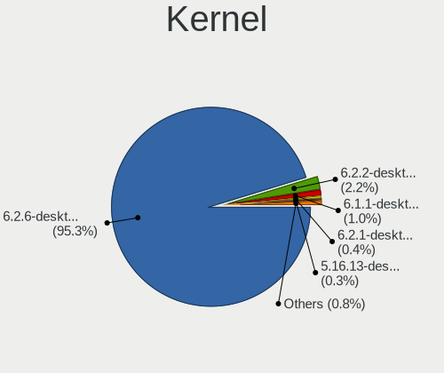

| Version                  | Desktops | Percent |
|--------------------------|----------|---------|
| 6.2.6-desktop-1omv2390   | 464      | 92.61%  |
| 6.2.2-desktop-1omv2390   | 19       | 3.79%   |
| 6.1.1-desktop-1omv2290   | 9        | 1.8%    |
| 6.2.1-desktop-1omv2390   | 4        | 0.8%    |
| 6.1.4-desktop-1omv2301   | 2        | 0.4%    |
| 5.16.13-desktop-1omv4003 | 2        | 0.4%    |
| 6.2.8-desktop-1omv2390   | 1        | 0.2%    |

Kernel Family
-------------

Linux kernel without a distro release

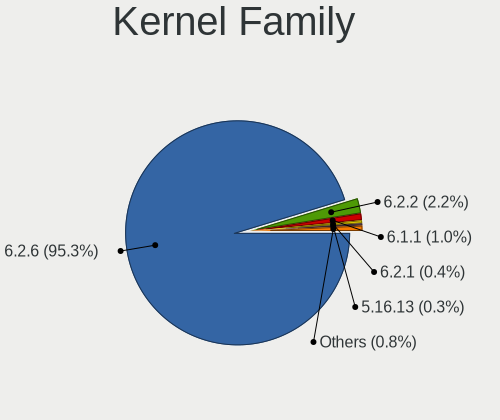

| Version | Desktops | Percent |
|---------|----------|---------|
| 6.2.6   | 464      | 92.61%  |
| 6.2.2   | 19       | 3.79%   |
| 6.1.1   | 9        | 1.8%    |
| 6.2.1   | 4        | 0.8%    |
| 6.1.4   | 2        | 0.4%    |
| 5.16.13 | 2        | 0.4%    |
| 6.2.8   | 1        | 0.2%    |

Kernel Major Ver.
-----------------

Linux kernel major version

| Version | Desktops | Percent |
|---------|----------|---------|
| 6.2     | 488      | 97.41%  |
| 6.1     | 11       | 2.2%    |
| 5.16    | 2        | 0.4%    |

Arch
----

OS architecture (x86_64, i586, etc.)

| Name   | Desktops | Percent |
|--------|----------|---------|
| x86_64 | 501      | 100%    |

DE
--

Desktop Environment

| Name     | Desktops | Percent |
|----------|----------|---------|
| KDE5     | 424      | 84.63%  |
| GNOME    | 44       | 8.78%   |
| LXQt     | 29       | 5.79%   |
| Budgie   | 2        | 0.4%    |
| Cinnamon | 1        | 0.2%    |
| Unknown  | 1        | 0.2%    |

Display Server
--------------

X11 or Wayland

| Name    | Desktops | Percent |
|---------|----------|---------|
| X11     | 457      | 91.22%  |
| Wayland | 44       | 8.78%   |

Display Manager
---------------

SDDM, LightDM, etc.

| Name    | Desktops | Percent |
|---------|----------|---------|
| SDDM    | 455      | 90.82%  |
| GDM     | 44       | 8.78%   |
| LightDM | 1        | 0.2%    |
| Unknown | 1        | 0.2%    |

OS Lang
-------

Language

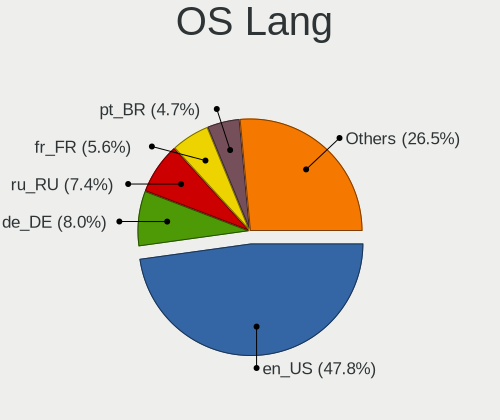

| Lang  | Desktops | Percent |
|-------|----------|---------|
| en_US | 227      | 45.31%  |
| de_DE | 53       | 10.58%  |
| ru_RU | 39       | 7.78%   |
| fr_FR | 27       | 5.39%   |
| en_GB | 23       | 4.59%   |
| pt_BR | 17       | 3.39%   |
| en_CA | 15       | 2.99%   |
| it_IT | 13       | 2.59%   |
| es_ES | 13       | 2.59%   |
| en_AU | 10       | 2%      |
| pl_PL | 8        | 1.6%    |
| hu_HU | 6        | 1.2%    |
| es_VE | 6        | 1.2%    |
| de_AT | 6        | 1.2%    |
| ja_JP | 5        | 1%      |
| es_MX | 5        | 1%      |
| nl_NL | 4        | 0.8%    |
| cs_CZ | 4        | 0.8%    |
| es_AR | 3        | 0.6%    |
| en_IN | 3        | 0.6%    |
| de_CH | 3        | 0.6%    |
| fr_CA | 2        | 0.4%    |
| fr_BE | 2        | 0.4%    |
| tr_TR | 1        | 0.2%    |
| pt_PT | 1        | 0.2%    |
| es_DO | 1        | 0.2%    |
| es_CO | 1        | 0.2%    |
| en_ZA | 1        | 0.2%    |
| en_SG | 1        | 0.2%    |
| da_DK | 1        | 0.2%    |

Boot Mode
---------

EFI or BIOS

| Mode | Desktops | Percent |
|------|----------|---------|
| EFI  | 272      | 54.29%  |
| BIOS | 229      | 45.71%  |

Filesystem
----------

Type of filesystem

| Type    | Desktops | Percent |
|---------|----------|---------|
| Ext4    | 283      | 56.49%  |
| Overlay | 189      | 37.72%  |
| Btrfs   | 20       | 3.99%   |
| Xfs     | 8        | 1.6%    |
| F2fs    | 1        | 0.2%    |

Part. scheme
------------

Scheme of partitioning

| Type | Desktops | Percent |
|------|----------|---------|
| GPT  | 398      | 79.44%  |
| MBR  | 103      | 20.56%  |

Dual Boot with Linux/BSD
------------------------

Hosting more than one Linux/BSD

| Dual boot | Desktops | Percent |
|-----------|----------|---------|
| Yes       | 274      | 54.69%  |
| No        | 227      | 45.31%  |

Dual Boot (Win)
---------------

Hosting Linux and Windows

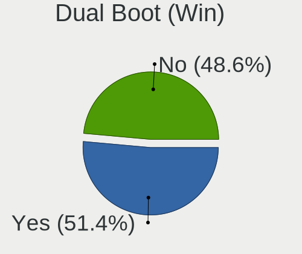

| Dual boot | Desktops | Percent |
|-----------|----------|---------|
| Yes       | 254      | 50.7%   |
| No        | 247      | 49.3%   |

Board
-----

Vendor
------

Motherboard manufacturer

| Name                                 | Desktops | Percent |
|--------------------------------------|----------|---------|
| ASUSTek Computer                     | 101      | 20.16%  |
| Gigabyte Technology                  | 82       | 16.37%  |
| MSI                                  | 62       | 12.38%  |
| Dell                                 | 47       | 9.38%   |
| ASRock                               | 43       | 8.58%   |
| Hewlett-Packard                      | 38       | 7.58%   |
| Lenovo                               | 30       | 5.99%   |
| Acer                                 | 13       | 2.59%   |
| Intel                                | 11       | 2.2%    |
| Fujitsu                              | 11       | 2.2%    |
| Biostar                              | 11       | 2.2%    |
| ECS                                  | 6        | 1.2%    |
| Pegatron                             | 5        | 1%      |
| Foxconn                              | 5        | 1%      |
| Fujitsu Siemens                      | 4        | 0.8%    |
| Unknown                              | 4        | 0.8%    |
| Packard Bell                         | 3        | 0.6%    |
| Medion                               | 3        | 0.6%    |
| WinFast                              | 1        | 0.2%    |
| ULTRATOP                             | 1        | 0.2%    |
| T-bao                                | 1        | 0.2%    |
| SYWZ                                 | 1        | 0.2%    |
| Shuttle                              | 1        | 0.2%    |
| Shenzhen Meigao Electronic Equipment | 1        | 0.2%    |
| PCWare                               | 1        | 0.2%    |
| OEM_MB                               | 1        | 0.2%    |
| OEM                                  | 1        | 0.2%    |
| Nvidia                               | 1        | 0.2%    |
| NEC Computers                        | 1        | 0.2%    |
| MouseComputer                        | 1        | 0.2%    |
| MACHINIST                            | 1        | 0.2%    |
| Lanix                                | 1        | 0.2%    |
| EPoX Computer                        | 1        | 0.2%    |
| eMachines                            | 1        | 0.2%    |
| DFI                                  | 1        | 0.2%    |
| Chuwi                                | 1        | 0.2%    |
| AZW                                  | 1        | 0.2%    |
| Alienware                            | 1        | 0.2%    |
| Acidanthera                          | 1        | 0.2%    |
| ABIT                                 | 1        | 0.2%    |

Model
-----

Motherboard model

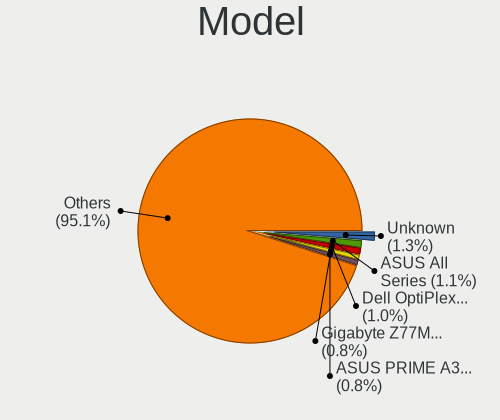

| Name                         | Desktops | Percent |
|------------------------------|----------|---------|
| ASUS PRIME A320M-K           | 7        | 1.4%    |
| Dell OptiPlex 7010           | 6        | 1.2%    |
| ASUS All Series              | 6        | 1.2%    |
| Gigabyte Z77M-D3H            | 5        | 1%      |
| MSI MS-7C02                  | 4        | 0.8%    |
| MSI MS-7817                  | 4        | 0.8%    |
| HP EliteDesk 800 G1 SFF      | 4        | 0.8%    |
| Dell OptiPlex 3020           | 4        | 0.8%    |
| Unknown                      | 4        | 0.8%    |
| MSI MS-7C56                  | 3        | 0.6%    |
| HP Compaq Elite 8300 SFF     | 3        | 0.6%    |
| Dell OptiPlex 990            | 3        | 0.6%    |
| MSI MS-7D54                  | 2        | 0.4%    |
| MSI MS-7C09                  | 2        | 0.4%    |
| MSI MS-7B89                  | 2        | 0.4%    |
| MSI MS-7B86                  | 2        | 0.4%    |
| MSI MS-7B84                  | 2        | 0.4%    |
| MSI MS-7971                  | 2        | 0.4%    |
| MSI MS-7850                  | 2        | 0.4%    |
| MSI MS-7721                  | 2        | 0.4%    |
| Medion MS-7728               | 2        | 0.4%    |
| Intel H61                    | 2        | 0.4%    |
| Intel B75                    | 2        | 0.4%    |
| HP Z420 Workstation          | 2        | 0.4%    |
| HP ProDesk 400 G3 SFF        | 2        | 0.4%    |
| HP EliteDesk 800 G1 USDT     | 2        | 0.4%    |
| Gigabyte H370HD3             | 2        | 0.4%    |
| Gigabyte B85M-HD3            | 2        | 0.4%    |
| Gigabyte B75M-D3H            | 2        | 0.4%    |
| Gigabyte B550 AORUS ELITE V2 | 2        | 0.4%    |
| Gigabyte B250M-DS3H          | 2        | 0.4%    |
| Fujitsu Siemens MS-7504VP-PV | 2        | 0.4%    |
| Dell Precision Tower 5810    | 2        | 0.4%    |
| Dell OptiPlex 7040           | 2        | 0.4%    |
| Dell OptiPlex 7020           | 2        | 0.4%    |
| Dell OptiPlex 390            | 2        | 0.4%    |
| Dell OptiPlex 3070           | 2        | 0.4%    |
| Dell OptiPlex 3040           | 2        | 0.4%    |
| Dell OptiPlex 3010           | 2        | 0.4%    |
| ASUS TUF Gaming B550M-PLUS   | 2        | 0.4%    |

Model Family
------------

Motherboard model prefix

| Name                | Desktops | Percent |
|---------------------|----------|---------|
| Dell OptiPlex       | 34       | 6.79%   |
| ASUS PRIME          | 31       | 6.19%   |
| Lenovo ThinkCentre  | 14       | 2.79%   |
| HP EliteDesk        | 12       | 2.4%    |
| ASUS ROG            | 9        | 1.8%    |
| Lenovo IdeaCentre   | 8        | 1.6%    |
| HP Compaq           | 8        | 1.6%    |
| Fujitsu ESPRIMO     | 8        | 1.6%    |
| Dell Precision      | 7        | 1.4%    |
| ASUS TUF            | 7        | 1.4%    |
| Acer Aspire         | 7        | 1.4%    |
| HP ProDesk          | 6        | 1.2%    |
| Gigabyte B550       | 6        | 1.2%    |
| ASUS All            | 6        | 1.2%    |
| Gigabyte Z77M-D3H   | 5        | 1%      |
| Acer Veriton        | 5        | 1%      |
| MSI MS-7C02         | 4        | 0.8%    |
| MSI MS-7817         | 4        | 0.8%    |
| Gigabyte H310M      | 4        | 0.8%    |
| ASUS P8Z77-V        | 4        | 0.8%    |
| Unknown             | 4        | 0.8%    |
| Packard Bell IMEDIA | 3        | 0.6%    |
| MSI MS-7C56         | 3        | 0.6%    |
| Lenovo ThinkStation | 3        | 0.6%    |
| HP OMEN             | 3        | 0.6%    |
| Gigabyte X570       | 3        | 0.6%    |
| Gigabyte B450M      | 3        | 0.6%    |
| Gigabyte B450       | 3        | 0.6%    |
| Dell Vostro         | 3        | 0.6%    |
| ASUS M5A78L-M       | 3        | 0.6%    |
| MSI MS-7D54         | 2        | 0.4%    |
| MSI MS-7C09         | 2        | 0.4%    |
| MSI MS-7B89         | 2        | 0.4%    |
| MSI MS-7B86         | 2        | 0.4%    |
| MSI MS-7B84         | 2        | 0.4%    |
| MSI MS-7971         | 2        | 0.4%    |
| MSI MS-7850         | 2        | 0.4%    |
| MSI MS-7721         | 2        | 0.4%    |
| Medion MS-7728      | 2        | 0.4%    |
| Lenovo Legion       | 2        | 0.4%    |

MFG Year
--------

Motherboard manufacture year

| Year | Desktops | Percent |
|------|----------|---------|
| 2012 | 52       | 10.38%  |
| 2013 | 46       | 9.18%   |
| 2020 | 42       | 8.38%   |
| 2018 | 40       | 7.98%   |
| 2019 | 39       | 7.78%   |
| 2017 | 37       | 7.39%   |
| 2014 | 34       | 6.79%   |
| 2011 | 34       | 6.79%   |
| 2021 | 32       | 6.39%   |
| 2010 | 29       | 5.79%   |
| 2016 | 25       | 4.99%   |
| 2015 | 22       | 4.39%   |
| 2009 | 18       | 3.59%   |
| 2022 | 17       | 3.39%   |
| 2008 | 17       | 3.39%   |
| 2007 | 8        | 1.6%    |
| 2006 | 6        | 1.2%    |
| 2023 | 2        | 0.4%    |
| 2005 | 1        | 0.2%    |

Form Factor
-----------

Physical design of the computer

| Name    | Desktops | Percent |
|---------|----------|---------|
| Desktop | 501      | 100%    |

Secure Boot
-----------

Enabled or disabled

| State    | Desktops | Percent |
|----------|----------|---------|
| Disabled | 501      | 100%    |

Coreboot
--------

Have coreboot on board

| Used | Desktops | Percent |
|------|----------|---------|
| No   | 501      | 100%    |

RAM Size
--------

Total RAM memory

| Size in GB      | Desktops | Percent |
|-----------------|----------|---------|
| 16.01-24.0      | 125      | 24.95%  |
| 4.01-8.0        | 124      | 24.75%  |
| 8.01-16.0       | 100      | 19.96%  |
| 3.01-4.0        | 63       | 12.57%  |
| 32.01-64.0      | 56       | 11.18%  |
| 24.01-32.0      | 14       | 2.79%   |
| 64.01-256.0     | 8        | 1.6%    |
| 2.01-3.0        | 5        | 1%      |
| 1.01-2.0        | 4        | 0.8%    |
| More than 256.0 | 1        | 0.2%    |
| 0.51-1.0        | 1        | 0.2%    |

RAM Used
--------

Used RAM memory

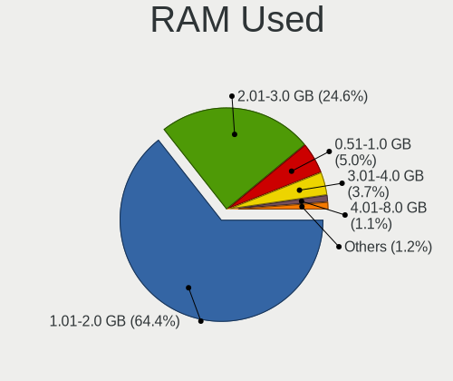

| Used GB   | Desktops | Percent |
|-----------|----------|---------|
| 1.01-2.0  | 320      | 63.87%  |
| 2.01-3.0  | 131      | 26.15%  |
| 0.51-1.0  | 22       | 4.39%   |
| 3.01-4.0  | 19       | 3.79%   |
| 4.01-8.0  | 7        | 1.4%    |
| 8.01-16.0 | 1        | 0.2%    |
| 0.01-0.5  | 1        | 0.2%    |

Total Drives
------------

Number of drives on board

| Drives | Desktops | Percent |
|--------|----------|---------|
| 1      | 188      | 37.52%  |
| 2      | 147      | 29.34%  |
| 3      | 80       | 15.97%  |
| 4      | 51       | 10.18%  |
| 5      | 19       | 3.79%   |
| 6      | 6        | 1.2%    |
| 0      | 5        | 1%      |
| 8      | 2        | 0.4%    |
| 7      | 2        | 0.4%    |
| 9      | 1        | 0.2%    |

Has CD-ROM
----------

Has CD-ROM on board

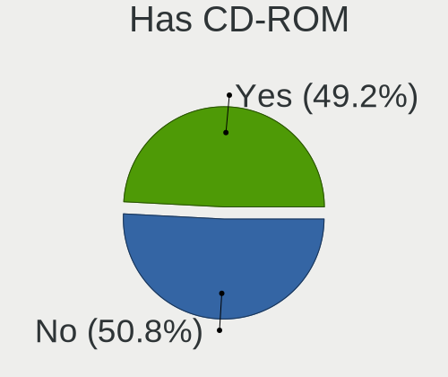

| Presented | Desktops | Percent |
|-----------|----------|---------|
| No        | 253      | 50.5%   |
| Yes       | 248      | 49.5%   |

Has Ethernet
------------

Has Ethernet on board

| Presented | Desktops | Percent |
|-----------|----------|---------|
| Yes       | 495      | 98.8%   |
| No        | 6        | 1.2%    |

Has WiFi
--------

Has WiFi module

| Presented | Desktops | Percent |
|-----------|----------|---------|
| No        | 293      | 58.48%  |
| Yes       | 208      | 41.52%  |

Has Bluetooth
-------------

Has Bluetooth module

| Presented | Desktops | Percent |
|-----------|----------|---------|
| No        | 357      | 71.26%  |
| Yes       | 144      | 28.74%  |

Location
--------

Country
-------

Geographic location (country)

| Country      | Desktops | Percent |
|--------------|----------|---------|
| Germany      | 60       | 11.98%  |
| USA          | 58       | 11.58%  |
| Russia       | 41       | 8.18%   |
| Brazil       | 29       | 5.79%   |
| France       | 28       | 5.59%   |
| UK           | 22       | 4.39%   |
| Canada       | 22       | 4.39%   |
| Italy        | 19       | 3.79%   |
| Japan        | 17       | 3.39%   |
| Spain        | 15       | 2.99%   |
| Australia    | 15       | 2.99%   |
| Poland       | 12       | 2.4%    |
| Finland      | 10       | 2%      |
| Venezuela    | 8        | 1.6%    |
| Hungary      | 8        | 1.6%    |
| Netherlands  | 7        | 1.4%    |
| India        | 7        | 1.4%    |
| Malaysia     | 6        | 1.2%    |
| Czechia      | 6        | 1.2%    |
| China        | 6        | 1.2%    |
| Austria      | 6        | 1.2%    |
| Argentina    | 5        | 1%      |
| Taiwan       | 4        | 0.8%    |
| Switzerland  | 4        | 0.8%    |
| Slovenia     | 4        | 0.8%    |
| Puerto Rico  | 4        | 0.8%    |
| Portugal     | 4        | 0.8%    |
| Mexico       | 4        | 0.8%    |
| Indonesia    | 4        | 0.8%    |
| Greece       | 4        | 0.8%    |
| Bulgaria     | 4        | 0.8%    |
| Belarus      | 4        | 0.8%    |
| Sweden       | 3        | 0.6%    |
| South Africa | 3        | 0.6%    |
| Slovakia     | 3        | 0.6%    |
| Denmark      | 3        | 0.6%    |
| Belgium      | 3        | 0.6%    |
| Ukraine      | 2        | 0.4%    |
| Turkey       | 2        | 0.4%    |
| Israel       | 2        | 0.4%    |

City
----

Geographic location (city)

| City                  | Desktops | Percent |
|-----------------------|----------|---------|
| Moscow                | 9        | 1.8%    |
| Kuala Lumpur          | 6        | 1.2%    |
| Helsinki              | 6        | 1.2%    |
| Vienna                | 5        | 1%      |
| Milan                 | 5        | 1%      |
| Berlin                | 4        | 0.8%    |
| Sydney                | 3        | 0.6%    |
| St Petersburg         | 3        | 0.6%    |
| Saint-Meme-le-Tenu    | 3        | 0.6%    |
| Prague                | 3        | 0.6%    |
| Nizhniy Novgorod      | 3        | 0.6%    |
| New Taipei            | 3        | 0.6%    |
| Nepean                | 3        | 0.6%    |
| London                | 3        | 0.6%    |
| Hanover               | 3        | 0.6%    |
| Hamburg               | 3        | 0.6%    |
| Glasgow               | 3        | 0.6%    |
| Caracas               | 3        | 0.6%    |
| Budapest              | 3        | 0.6%    |
| Brisbane              | 3        | 0.6%    |
| Yoshkar-Ola           | 2        | 0.4%    |
| Yekaterinburg         | 2        | 0.4%    |
| Winnipeg              | 2        | 0.4%    |
| Warsaw                | 2        | 0.4%    |
| Waldkirch             | 2        | 0.4%    |
| Umeda                 | 2        | 0.4%    |
| Uberlndia           | 2        | 0.4%    |
| Tula                  | 2        | 0.4%    |
| Trier                 | 2        | 0.4%    |
| St. Jean Baptiste     | 2        | 0.4%    |
| Scranton              | 2        | 0.4%    |
| Sao Bernardo do Campo | 2        | 0.4%    |
| Santo Domingo         | 2        | 0.4%    |
| Santiago              | 2        | 0.4%    |
| San Juan              | 2        | 0.4%    |
| Riverdale             | 2        | 0.4%    |
| Quinta Do Conde       | 2        | 0.4%    |
| Oviedo                | 2        | 0.4%    |
| Oklahoma City         | 2        | 0.4%    |
| Oberursel             | 2        | 0.4%    |

Drives
------

Drive Vendor
------------

Hard drive vendors

| Vendor              | Desktops | Drives | Percent |
|---------------------|----------|--------|---------|
| Seagate             | 159      | 185    | 17.23%  |
| WDC                 | 154      | 196    | 16.68%  |
| Samsung Electronics | 91       | 123    | 9.86%   |
| Kingston            | 68       | 85     | 7.37%   |
| Crucial             | 56       | 66     | 6.07%   |
| Toshiba             | 53       | 58     | 5.74%   |
| SanDisk             | 39       | 46     | 4.23%   |
| Hitachi             | 26       | 29     | 2.82%   |
| A-DATA Technology   | 21       | 23     | 2.28%   |
| SPCC                | 20       | 23     | 2.17%   |
| PNY                 | 16       | 17     | 1.73%   |
| China               | 15       | 17     | 1.63%   |
| HGST                | 12       | 12     | 1.3%    |
| Maxtor              | 11       | 11     | 1.19%   |
| Intel               | 11       | 11     | 1.19%   |
| Patriot             | 10       | 10     | 1.08%   |
| XPG                 | 8        | 10     | 0.87%   |
| Unknown             | 8        | 9      | 0.87%   |
| Transcend           | 5        | 5      | 0.54%   |
| Team                | 5        | 5      | 0.54%   |
| SABRENT             | 5        | 5      | 0.54%   |
| Micron Technology   | 5        | 5      | 0.54%   |
| KIOXIA-EXCERIA      | 5        | 5      | 0.54%   |
| Corsair             | 5        | 5      | 0.54%   |
| Apacer              | 5        | 5      | 0.54%   |
| Silicon Motion      | 4        | 4      | 0.43%   |
| Phison              | 4        | 5      | 0.43%   |
| OCZ                 | 4        | 6      | 0.43%   |
| LITEON              | 4        | 4      | 0.43%   |
| KingSpec            | 4        | 4      | 0.43%   |
| JMicron Technology  | 4        | 4      | 0.43%   |
| GOODRAM             | 4        | 4      | 0.43%   |
| Gigabyte Technology | 4        | 4      | 0.43%   |
| Netac               | 3        | 3      | 0.33%   |
| Intenso             | 3        | 4      | 0.33%   |
| Hewlett-Packard     | 3        | 3      | 0.33%   |
| Unknown             | 3        | 4      | 0.33%   |
| XrayDisk            | 2        | 2      | 0.22%   |
| StoreJet            | 2        | 2      | 0.22%   |
| PNY CS90            | 2        | 2      | 0.22%   |

Drive Model
-----------

Hard drive models

| Model                            | Desktops | Percent |
|----------------------------------|----------|---------|
| Toshiba DT01ACA100 1TB           | 16       | 1.54%   |
| Seagate ST500DM002-1BD142 500GB  | 16       | 1.54%   |
| Kingston SA400S37240G 240GB SSD  | 15       | 1.44%   |
| Seagate ST1000DM010-2EP102 1TB   | 11       | 1.06%   |
| Crucial CT500MX500SSD1 500GB     | 11       | 1.06%   |
| Seagate ST2000DM008-2FR102 2TB   | 10       | 0.96%   |
| WDC WD10EZEX-08WN4A0 1TB         | 8        | 0.77%   |
| Seagate ST3500418AS 500GB        | 8        | 0.77%   |
| Samsung SSD 970 EVO Plus 1TB     | 8        | 0.77%   |
| Samsung SSD 860 EVO 250GB        | 8        | 0.77%   |
| Kingston SA400S37120G 120GB SSD  | 8        | 0.77%   |
| Crucial CT240BX500SSD1 240GB     | 7        | 0.67%   |
| Unknown SD/MMC/MS PRO 249GB      | 6        | 0.58%   |
| Seagate ST2000DM001-1ER164 2TB   | 6        | 0.58%   |
| Samsung SSD 860 EVO 500GB        | 6        | 0.58%   |
| Kingston SA400S37480G 480GB SSD  | 6        | 0.58%   |
| WDC WD5000AAKX-75U6AA0 500GB     | 5        | 0.48%   |
| Toshiba DT01ACA200 2TB           | 5        | 0.48%   |
| Seagate ST3500414CS 500GB        | 5        | 0.48%   |
| Seagate ST2000DM001-1CH164 2TB   | 5        | 0.48%   |
| Seagate ST1000DM003-1CH162 1TB   | 5        | 0.48%   |
| Samsung SSD 850 EVO 250GB        | 5        | 0.48%   |
| PNY CS900 120GB SSD              | 5        | 0.48%   |
| Kingston SV300S37A240G 240GB SSD | 5        | 0.48%   |
| Kingston SA2000M8500G 500GB      | 5        | 0.48%   |
| Hitachi HDS721010CLA332 1TB      | 5        | 0.48%   |
| Crucial CT480BX500SSD1 480GB     | 5        | 0.48%   |
| Crucial CT120BX500SSD1 120GB     | 5        | 0.48%   |
| XPG GAMMIX S11 Pro 1TB           | 4        | 0.38%   |
| WDC WDS240G2G0A-00JH30 240GB SSD | 4        | 0.38%   |
| WDC WDS120G2G0A-00JH30 120GB SSD | 4        | 0.38%   |
| WDC WDBNCE5000PNC 500GB SSD      | 4        | 0.38%   |
| WDC WD5000AAKX-00ERMA0 500GB     | 4        | 0.38%   |
| WDC WD2500AAKX-753CA1 250GB      | 4        | 0.38%   |
| WDC WD10EZEX-60WN4A0 1TB         | 4        | 0.38%   |
| Toshiba HDWD120 2TB              | 4        | 0.38%   |
| Toshiba DT01ACA050 500GB         | 4        | 0.38%   |
| SPCC Solid State Disk 512GB      | 4        | 0.38%   |
| SPCC Solid State Disk 1TB        | 4        | 0.38%   |
| Seagate ST3250310AS 250GB        | 4        | 0.38%   |

HDD Vendor
----------

Hard disk drive vendors

| Vendor              | Desktops | Drives | Percent |
|---------------------|----------|--------|---------|
| Seagate             | 157      | 182    | 37.29%  |
| WDC                 | 126      | 153    | 29.93%  |
| Toshiba             | 49       | 53     | 11.64%  |
| Samsung Electronics | 27       | 31     | 6.41%   |
| Hitachi             | 26       | 29     | 6.18%   |
| HGST                | 12       | 12     | 2.85%   |
| Maxtor              | 10       | 10     | 2.38%   |
| Unknown             | 6        | 6      | 1.43%   |
| JMicron Technology  | 3        | 3      | 0.71%   |
| StoreJet            | 1        | 1      | 0.24%   |
| RSH-319             | 1        | 1      | 0.24%   |
| KESU                | 1        | 1      | 0.24%   |
| Intenso             | 1        | 1      | 0.24%   |
| Fujitsu             | 1        | 1      | 0.24%   |

SSD Vendor
----------

Solid state drive vendors

| Vendor              | Desktops | Drives | Percent |
|---------------------|----------|--------|---------|
| Samsung Electronics | 51       | 58     | 13.35%  |
| Kingston            | 48       | 60     | 12.57%  |
| Crucial             | 47       | 51     | 12.3%   |
| SanDisk             | 32       | 38     | 8.38%   |
| WDC                 | 31       | 35     | 8.12%   |
| SPCC                | 17       | 18     | 4.45%   |
| A-DATA Technology   | 17       | 18     | 4.45%   |
| China               | 15       | 17     | 3.93%   |
| PNY                 | 14       | 15     | 3.66%   |
| Patriot             | 10       | 10     | 2.62%   |
| Intel               | 5        | 5      | 1.31%   |
| Transcend           | 4        | 4      | 1.05%   |
| OCZ                 | 4        | 6      | 1.05%   |
| LITEON              | 4        | 4      | 1.05%   |
| Apacer              | 4        | 4      | 1.05%   |
| Toshiba             | 3        | 3      | 0.79%   |
| Team                | 3        | 3      | 0.79%   |
| Netac               | 3        | 3      | 0.79%   |
| Micron Technology   | 3        | 3      | 0.79%   |
| KingSpec            | 3        | 3      | 0.79%   |
| Intenso             | 3        | 3      | 0.79%   |
| GOODRAM             | 3        | 3      | 0.79%   |
| Gigabyte Technology | 3        | 3      | 0.79%   |
| Unknown             | 3        | 4      | 0.79%   |
| XrayDisk            | 2        | 2      | 0.52%   |
| Seagate             | 2        | 2      | 0.52%   |
| PNY CS90            | 2        | 2      | 0.52%   |
| KingFast            | 2        | 2      | 0.52%   |
| External            | 2        | 2      | 0.52%   |
| Emtec               | 2        | 2      | 0.52%   |
| ASMT                | 2        | 2      | 0.52%   |
| ANACOMDA            | 2        | 2      | 0.52%   |
| addlink             | 2        | 2      | 0.52%   |
| ZHITAI              | 1        | 1      | 0.26%   |
| XUM                 | 1        | 1      | 0.26%   |
| VERICO              | 1        | 1      | 0.26%   |
| Verbatim            | 1        | 1      | 0.26%   |
| ValueTech           | 1        | 1      | 0.26%   |
| Teclast             | 1        | 1      | 0.26%   |
| TAMMUZ              | 1        | 1      | 0.26%   |

Drive Kind
----------

HDD or SSD

| Kind    | Desktops | Drives | Percent |
|---------|----------|--------|---------|
| HDD     | 324      | 484    | 42.91%  |
| SSD     | 299      | 423    | 39.6%   |
| NVMe    | 125      | 170    | 16.56%  |
| Unknown | 6        | 7      | 0.79%   |
| MMC     | 1        | 1      | 0.13%   |

Drive Connector
---------------

SATA, SAS, NVMe, etc.

| Type | Desktops | Drives | Percent |
|------|----------|--------|---------|
| SATA | 463      | 860    | 72.68%  |
| NVMe | 124      | 165    | 19.47%  |
| SAS  | 49       | 59     | 7.69%   |
| MMC  | 1        | 1      | 0.16%   |

Drive Size
----------

Size of hard drive

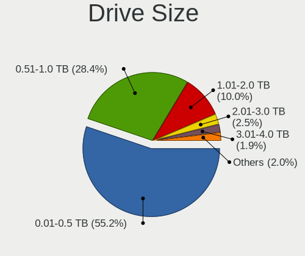

| Size in TB | Desktops | Drives | Percent |
|------------|----------|--------|---------|
| 0.01-0.5   | 372      | 559    | 57.14%  |
| 0.51-1.0   | 179      | 229    | 27.5%   |
| 1.01-2.0   | 64       | 74     | 9.83%   |
| 2.01-3.0   | 13       | 14     | 2%      |
| 3.01-4.0   | 12       | 14     | 1.84%   |
| 4.01-10.0  | 9        | 15     | 1.38%   |
| 10.01-20.0 | 2        | 2      | 0.31%   |

Space Total
-----------

Amount of disk space available on the file system

| Size in GB     | Desktops | Percent |
|----------------|----------|---------|
| 1-20           | 138      | 27.54%  |
| 101-250        | 109      | 21.76%  |
| 251-500        | 79       | 15.77%  |
| 501-1000       | 51       | 10.18%  |
| 21-50          | 31       | 6.19%   |
| 51-100         | 30       | 5.99%   |
| 1001-2000      | 25       | 4.99%   |
| Unknown        | 20       | 3.99%   |
| More than 3000 | 12       | 2.4%    |
| 2001-3000      | 6        | 1.2%    |

Space Used
----------

Amount of used disk space

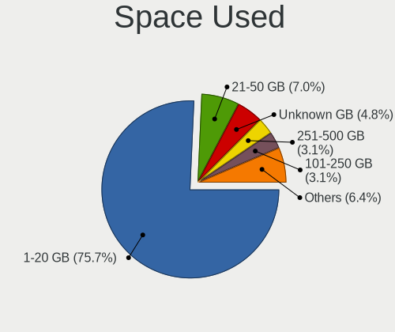

| Used GB        | Desktops | Percent |
|----------------|----------|---------|
| 1-20           | 375      | 74.85%  |
| 21-50          | 37       | 7.39%   |
| Unknown        | 20       | 3.99%   |
| 101-250        | 19       | 3.79%   |
| 51-100         | 16       | 3.19%   |
| 251-500        | 15       | 2.99%   |
| 501-1000       | 12       | 2.4%    |
| 2001-3000      | 3        | 0.6%    |
| 1001-2000      | 3        | 0.6%    |
| More than 3000 | 1        | 0.2%    |

Malfunc. Drives
---------------

Drive models with a malfunction

| Model                               | Desktops | Drives | Percent |
|-------------------------------------|----------|--------|---------|
| Seagate ST500DM002-1BD142 500GB     | 9        | 9      | 5.03%   |
| WDC WD5000AAKX-75U6AA0 500GB        | 5        | 5      | 2.79%   |
| Seagate ST3500418AS 500GB           | 4        | 4      | 2.23%   |
| Hitachi HDS721010CLA332 1TB         | 4        | 4      | 2.23%   |
| Seagate ST1000DM003-1CH162 1TB      | 3        | 3      | 1.68%   |
| WDC WDS240G2G0A-00JH30 240GB SSD    | 2        | 2      | 1.12%   |
| WDC WD20EARX-00PASB0 2TB            | 2        | 2      | 1.12%   |
| Toshiba DT01ACA100 1TB              | 2        | 2      | 1.12%   |
| Seagate ST500LT012-9WS142 500GB     | 2        | 2      | 1.12%   |
| Seagate ST500LM021-1KJ152 500GB     | 2        | 2      | 1.12%   |
| Seagate ST500LM012 HN-M500MBB 500GB | 2        | 2      | 1.12%   |
| Seagate ST31000528AS 1TB            | 2        | 2      | 1.12%   |
| Seagate ST2000DM001-1ER164 2TB      | 2        | 3      | 1.12%   |
| Seagate ST2000DM001-1CH164 2TB      | 2        | 2      | 1.12%   |
| Seagate ST1000DM010-2EP102 1TB      | 2        | 2      | 1.12%   |
| Samsung Electronics HD103SI 1TB     | 2        | 2      | 1.12%   |
| Maxtor STM380215AS 80GB             | 2        | 2      | 1.12%   |
| Kingston SV300S37A240G 240GB SSD    | 2        | 2      | 1.12%   |
| Hitachi HDS721050CLA362 500GB       | 2        | 2      | 1.12%   |
| HGST HTS725050A7E630 500GB          | 2        | 2      | 1.12%   |
| WDC WDS120G2G0A-00JH30 120GB SSD    | 1        | 1      | 0.56%   |
| WDC WDS100T2G0A-00JH30 1TB SSD      | 1        | 1      | 0.56%   |
| WDC WD800JD-23LSA0 80GB             | 1        | 1      | 0.56%   |
| WDC WD800JD-22LSA0 80GB             | 1        | 1      | 0.56%   |
| WDC WD800JB-00JJC0 80GB             | 1        | 1      | 0.56%   |
| WDC WD800BD-22LRA0 80GB             | 1        | 1      | 0.56%   |
| WDC WD5003ABYX-88 LEN 500GB         | 1        | 1      | 0.56%   |
| WDC WD5003ABYX-01WERA0 500GB        | 1        | 1      | 0.56%   |
| WDC WD5002ABYS-02B1B0 500GB         | 1        | 1      | 0.56%   |
| WDC WD5000LPVT-22G33T0 500GB        | 1        | 1      | 0.56%   |
| WDC WD5000AVDS-63U7B1 500GB         | 1        | 1      | 0.56%   |
| WDC WD5000AAVS-00ZTB0 500GB         | 1        | 1      | 0.56%   |
| WDC WD5000AAKX-753CA1 500GB         | 1        | 1      | 0.56%   |
| WDC WD5000AAKX-00ERMA0 500GB        | 1        | 1      | 0.56%   |
| WDC WD5000AAKX-001CA0 500GB         | 1        | 1      | 0.56%   |
| WDC WD5000AAKS-65V0A0 500GB         | 1        | 1      | 0.56%   |
| WDC WD5000AADS-00S9B0 500GB         | 1        | 1      | 0.56%   |
| WDC WD3200YS-01PGB0 320GB           | 1        | 1      | 0.56%   |
| WDC WD3200AVVS-62L2B0 320GB         | 1        | 1      | 0.56%   |
| WDC WD3200AAKX-753CA1 320GB         | 1        | 1      | 0.56%   |

Malfunc. Drive Vendor
---------------------

Vendors of faulty drives

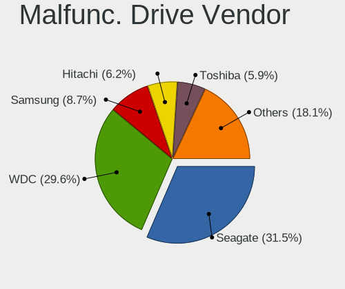

| Vendor              | Desktops | Drives | Percent |
|---------------------|----------|--------|---------|
| Seagate             | 59       | 60     | 33.71%  |
| WDC                 | 47       | 51     | 26.86%  |
| Samsung Electronics | 17       | 18     | 9.71%   |
| Hitachi             | 13       | 13     | 7.43%   |
| Toshiba             | 7        | 7      | 4%      |
| Maxtor              | 7        | 7      | 4%      |
| HGST                | 4        | 4      | 2.29%   |
| Kingston            | 3        | 3      | 1.71%   |
| Intel               | 3        | 3      | 1.71%   |
| Crucial             | 2        | 2      | 1.14%   |
| Team                | 1        | 1      | 0.57%   |
| SATAFIRM            | 1        | 1      | 0.57%   |
| SanDisk             | 1        | 1      | 0.57%   |
| RSH-319             | 1        | 1      | 0.57%   |
| Patriot             | 1        | 1      | 0.57%   |
| Netac               | 1        | 1      | 0.57%   |
| KingSpec            | 1        | 1      | 0.57%   |
| Intenso             | 1        | 1      | 0.57%   |
| Hewlett-Packard     | 1        | 1      | 0.57%   |
| Fujitsu             | 1        | 1      | 0.57%   |
| Fanxiang            | 1        | 1      | 0.57%   |
| China               | 1        | 1      | 0.57%   |
| BAITITON            | 1        | 1      | 0.57%   |

Malfunc. HDD Vendor
-------------------

Vendors of faulty HDD drives

| Vendor              | Desktops | Drives | Percent |
|---------------------|----------|--------|---------|
| Seagate             | 59       | 60     | 39.33%  |
| WDC                 | 43       | 46     | 28.67%  |
| Samsung Electronics | 15       | 16     | 10%     |
| Hitachi             | 13       | 13     | 8.67%   |
| Toshiba             | 7        | 7      | 4.67%   |
| Maxtor              | 7        | 7      | 4.67%   |
| HGST                | 4        | 4      | 2.67%   |
| RSH-319             | 1        | 1      | 0.67%   |
| Fujitsu             | 1        | 1      | 0.67%   |

Malfunc. Drive Kind
-------------------

Kinds of faulty drives

| Kind | Desktops | Drives | Percent |
|------|----------|--------|---------|
| HDD  | 136      | 155    | 83.95%  |
| SSD  | 23       | 23     | 14.2%   |
| NVMe | 3        | 3      | 1.85%   |

Failed Drives
-------------

Failed drive models

| Model                             | Desktops | Drives | Percent |
|-----------------------------------|----------|--------|---------|
| Seagate ST9320423AS 320GB         | 1        | 1      | 20%     |
| Seagate ST500DM002-1BD142 500GB   | 1        | 1      | 20%     |
| Samsung Electronics HD753LJ 752GB | 1        | 1      | 20%     |
| Samsung Electronics HD252HJ 250GB | 1        | 1      | 20%     |
| Samsung Electronics HD103UJ 1TB   | 1        | 1      | 20%     |

Failed Drive Vendor
-------------------

Failed drive vendors

| Vendor              | Desktops | Drives | Percent |
|---------------------|----------|--------|---------|
| Samsung Electronics | 3        | 3      | 60%     |
| Seagate             | 2        | 2      | 40%     |

Drive Status
------------

Number of failed and malfunc. drives

| Status   | Desktops | Drives | Percent |
|----------|----------|--------|---------|
| Works    | 434      | 846    | 67.81%  |
| Malfunc  | 155      | 181    | 24.22%  |
| Detected | 46       | 53     | 7.19%   |
| Failed   | 5        | 5      | 0.78%   |

Storage controller
------------------

Storage Vendor
--------------

Storage controller vendors

| Vendor                       | Desktops | Percent |
|------------------------------|----------|---------|
| Intel                        | 326      | 47.59%  |
| AMD                          | 162      | 23.65%  |
| Samsung Electronics          | 27       | 3.94%   |
| Phison Electronics           | 22       | 3.21%   |
| ASMedia Technology           | 22       | 3.21%   |
| Kingston Technology Company  | 21       | 3.07%   |
| SanDisk                      | 15       | 2.19%   |
| Silicon Motion               | 14       | 2.04%   |
| Nvidia                       | 14       | 2.04%   |
| Micron/Crucial Technology    | 13       | 1.9%    |
| ADATA Technology             | 10       | 1.46%   |
| Marvell Technology Group     | 9        | 1.31%   |
| JMicron Technology           | 7        | 1.02%   |
| KIOXIA                       | 5        | 0.73%   |
| VIA Technologies             | 4        | 0.58%   |
| Toshiba America Info Systems | 2        | 0.29%   |
| Realtek Semiconductor        | 2        | 0.29%   |
| Micron Technology            | 2        | 0.29%   |
| MAXIO Technology (Hangzhou)  | 2        | 0.29%   |
| Broadcom / LSI               | 2        | 0.29%   |
| SK hynix                     | 1        | 0.15%   |
| Silicon Image                | 1        | 0.15%   |
| Promise Technology           | 1        | 0.15%   |
| Biwin Storage Technology     | 1        | 0.15%   |

Storage Model
-------------

Storage controller models

| Model                                                                                   | Desktops | Percent |
|-----------------------------------------------------------------------------------------|----------|---------|
| AMD FCH SATA Controller [AHCI mode]                                                     | 81       | 9.72%   |
| Intel 8 Series/C220 Series Chipset Family 6-port SATA Controller 1 [AHCI mode]          | 47       | 5.64%   |
| Intel 200 Series PCH SATA controller [AHCI mode]                                        | 31       | 3.72%   |
| Intel 6 Series/C200 Series Chipset Family 6 port Desktop SATA AHCI Controller           | 30       | 3.6%    |
| AMD 500 Series Chipset SATA Controller                                                  | 30       | 3.6%    |
| AMD 400 Series Chipset SATA Controller                                                  | 30       | 3.6%    |
| Intel 7 Series/C210 Series Chipset Family 6-port SATA Controller [AHCI mode]            | 25       | 3%      |
| Intel Q170/Q150/B150/H170/H110/Z170/CM236 Chipset SATA Controller [AHCI Mode]           | 23       | 2.76%   |
| Intel Cannon Lake PCH SATA AHCI Controller                                              | 21       | 2.52%   |
| ASMedia ASM1062 Serial ATA Controller                                                   | 20       | 2.4%    |
| Intel NM10/ICH7 Family SATA Controller [IDE mode]                                       | 19       | 2.28%   |
| Samsung NVMe SSD Controller SM981/PM981/PM983                                           | 17       | 2.04%   |
| AMD SB7x0/SB8x0/SB9x0 SATA Controller [AHCI mode]                                       | 17       | 2.04%   |
| AMD SB7x0/SB8x0/SB9x0 IDE Controller                                                    | 16       | 1.92%   |
| AMD FCH SATA Controller D                                                               | 16       | 1.92%   |
| Intel 82801G (ICH7 Family) IDE Controller                                               | 15       | 1.8%    |
| Intel SATA Controller [RAID mode]                                                       | 14       | 1.68%   |
| Intel 6 Series/C200 Series Chipset Family Desktop SATA Controller (IDE mode, ports 4-5) | 14       | 1.68%   |
| Intel 6 Series/C200 Series Chipset Family Desktop SATA Controller (IDE mode, ports 0-3) | 14       | 1.68%   |
| Silicon Motion SM2263EN/SM2263XT SSD Controller                                         | 12       | 1.44%   |
| Phison PS5013 E13 NVMe Controller                                                       | 10       | 1.2%    |
| Intel 9 Series Chipset Family SATA Controller [AHCI Mode]                               | 10       | 1.2%    |
| Intel 500 Series Chipset Family SATA AHCI Controller                                    | 10       | 1.2%    |
| AMD SB7x0/SB8x0/SB9x0 SATA Controller [IDE mode]                                        | 10       | 1.2%    |
| Micron/Crucial P2 NVMe PCIe SSD                                                         | 9        | 1.08%   |
| Kingston Company A2000 NVMe SSD                                                         | 8        | 0.96%   |
| Intel 7 Series/C210 Series Chipset Family 4-port SATA Controller [IDE mode]             | 8        | 0.96%   |
| Intel 7 Series/C210 Series Chipset Family 2-port SATA Controller [IDE mode]             | 8        | 0.96%   |
| Intel 4 Series Chipset PT IDER Controller                                               | 8        | 0.96%   |
| AMD FCH IDE Controller                                                                  | 8        | 0.96%   |
| ADATA XPG SX8200 Pro PCIe Gen3x4 M.2 2280 Solid State Drive                             | 8        | 0.96%   |
| Phison E12 NVMe Controller                                                              | 7        | 0.84%   |
| Samsung NVMe SSD Controller 980                                                         | 6        | 0.72%   |
| Nvidia MCP61 SATA Controller                                                            | 6        | 0.72%   |
| Nvidia MCP61 IDE                                                                        | 6        | 0.72%   |
| Kingston Company Company Non-Volatile memory controller                                 | 6        | 0.72%   |
| JMicron JMB363 SATA/IDE Controller                                                      | 6        | 0.72%   |
| Intel C610/X99 series chipset 6-Port SATA Controller [AHCI mode]                        | 6        | 0.72%   |
| Intel 82801JD/DO (ICH10 Family) SATA AHCI Controller                                    | 5        | 0.6%    |
| Intel 5 Series/3400 Series Chipset 6 port SATA AHCI Controller                          | 5        | 0.6%    |

Storage Kind
------------

Kind of storage controller (IDE, SATA, NVMe, SAS, ...)

| Kind | Desktops | Percent |
|------|----------|---------|
| SATA | 414      | 61.79%  |
| NVMe | 124      | 18.51%  |
| IDE  | 108      | 16.12%  |
| RAID | 20       | 2.99%   |
| SAS  | 4        | 0.6%    |

Processor
---------

CPU Vendor
----------

Processor vendors

| Vendor | Desktops | Percent |
|--------|----------|---------|
| Intel  | 329      | 65.67%  |
| AMD    | 172      | 34.33%  |

CPU Model
---------

Processor models

| Model                                       | Desktops | Percent |
|---------------------------------------------|----------|---------|
| AMD Ryzen 5 5600G with Radeon Graphics      | 15       | 2.99%   |
| Intel Core i5-2400 CPU @ 3.10GHz            | 8        | 1.6%    |
| Intel Core i3-3220 CPU @ 3.30GHz            | 8        | 1.6%    |
| Intel Core i3-2120 CPU @ 3.30GHz            | 8        | 1.6%    |
| AMD Ryzen 7 3700X 8-Core Processor          | 8        | 1.6%    |
| Intel Core i7-4790 CPU @ 3.60GHz            | 7        | 1.4%    |
| Intel Core i7-3770 CPU @ 3.40GHz            | 7        | 1.4%    |
| Intel Core i5-4590 CPU @ 3.30GHz            | 7        | 1.4%    |
| Intel Core i5-3470 CPU @ 3.20GHz            | 7        | 1.4%    |
| AMD Ryzen 5 5600X 6-Core Processor          | 7        | 1.4%    |
| AMD Ryzen 5 3600 6-Core Processor           | 7        | 1.4%    |
| Intel Core i5-6500 CPU @ 3.20GHz            | 6        | 1.2%    |
| Intel Core i5-4570 CPU @ 3.20GHz            | 6        | 1.2%    |
| Intel Core 2 Duo CPU E8400 @ 3.00GHz        | 6        | 1.2%    |
| Intel Pentium CPU G4400 @ 3.30GHz           | 5        | 1%      |
| Intel Core i7-8700K CPU @ 3.70GHz           | 5        | 1%      |
| Intel Core i7-8700 CPU @ 3.20GHz            | 5        | 1%      |
| Intel Core i7-6700 CPU @ 3.40GHz            | 5        | 1%      |
| Intel Core i3-6100 CPU @ 3.70GHz            | 5        | 1%      |
| AMD Ryzen 5 3400G with Radeon Vega Graphics | 5        | 1%      |
| AMD Ryzen 5 2600 Six-Core Processor         | 5        | 1%      |
| AMD Ryzen 5 2400G with Radeon Vega Graphics | 5        | 1%      |
| Intel Core i7-9700 CPU @ 3.00GHz            | 4        | 0.8%    |
| Intel Core i7-2600 CPU @ 3.40GHz            | 4        | 0.8%    |
| Intel Core i5-7500 CPU @ 3.40GHz            | 4        | 0.8%    |
| Intel Core i5-6400 CPU @ 2.70GHz            | 4        | 0.8%    |
| Intel Core i5-4460 CPU @ 3.20GHz            | 4        | 0.8%    |
| Intel Core i5-3570 CPU @ 3.40GHz            | 4        | 0.8%    |
| Intel Core i5-10400 CPU @ 2.90GHz           | 4        | 0.8%    |
| Intel Core i3-9100 CPU @ 3.60GHz            | 4        | 0.8%    |
| Intel Core 2 Quad CPU Q6600 @ 2.40GHz       | 4        | 0.8%    |
| AMD Ryzen 7 2700X Eight-Core Processor      | 4        | 0.8%    |
| AMD Ryzen 5 5600 6-Core Processor           | 4        | 0.8%    |
| Intel Pentium Gold G5400 CPU @ 3.70GHz      | 3        | 0.6%    |
| Intel Pentium Dual-Core CPU E5400 @ 2.70GHz | 3        | 0.6%    |
| Intel Pentium Dual CPU E2160 @ 1.80GHz      | 3        | 0.6%    |
| Intel Pentium CPU G630 @ 2.70GHz            | 3        | 0.6%    |
| Intel Pentium CPU G2030 @ 3.00GHz           | 3        | 0.6%    |
| Intel Core i7-4790K CPU @ 4.00GHz           | 3        | 0.6%    |
| Intel Core i7-4770 CPU @ 3.40GHz            | 3        | 0.6%    |

CPU Model Family
----------------

Processor model prefix

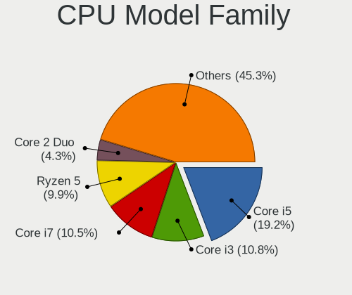

| Model                   | Desktops | Percent |
|-------------------------|----------|---------|
| Intel Core i5           | 101      | 20.16%  |
| Intel Core i3           | 58       | 11.58%  |
| AMD Ryzen 5             | 58       | 11.58%  |
| Intel Core i7           | 57       | 11.38%  |
| AMD Ryzen 7             | 22       | 4.39%   |
| Intel Pentium           | 19       | 3.79%   |
| Intel Celeron           | 18       | 3.59%   |
| Intel Xeon              | 15       | 2.99%   |
| Intel Core 2 Duo        | 14       | 2.79%   |
| Other                   | 13       | 2.59%   |
| AMD FX                  | 12       | 2.4%    |
| AMD A8                  | 12       | 2.4%    |
| Intel Pentium Dual-Core | 11       | 2.2%    |
| Intel Core 2 Quad       | 11       | 2.2%    |
| AMD Ryzen 9             | 7        | 1.4%    |
| AMD Ryzen 3             | 7        | 1.4%    |
| AMD Athlon II X2        | 6        | 1.2%    |
| AMD A4                  | 6        | 1.2%    |
| AMD A10                 | 6        | 1.2%    |
| AMD Athlon              | 5        | 1%      |
| Intel Pentium Gold      | 4        | 0.8%    |
| AMD Phenom II X6        | 4        | 0.8%    |
| Intel Pentium Dual      | 3        | 0.6%    |
| AMD Athlon 64 X2        | 3        | 0.6%    |
| AMD A6                  | 3        | 0.6%    |
| Intel Genuine           | 2        | 0.4%    |
| Intel Core 2            | 2        | 0.4%    |
| AMD Ryzen 5 PRO         | 2        | 0.4%    |
| AMD Phenom II X4        | 2        | 0.4%    |
| AMD Phenom II X2        | 2        | 0.4%    |
| AMD Athlon X4           | 2        | 0.4%    |
| AMD Athlon II X4        | 2        | 0.4%    |
| AMD Athlon II X3        | 2        | 0.4%    |
| AMD Athlon 64           | 2        | 0.4%    |
| Intel Pentium 4         | 1        | 0.2%    |
| Intel Core i9           | 1        | 0.2%    |
| AMD Sempron             | 1        | 0.2%    |
| AMD Ryzen Embedded      | 1        | 0.2%    |
| AMD Ryzen 3 PRO         | 1        | 0.2%    |
| AMD PRO A10             | 1        | 0.2%    |

CPU Cores
---------

Number of processor cores

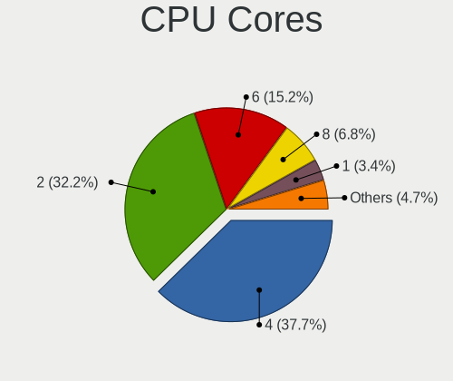

| Number | Desktops | Percent |
|--------|----------|---------|
| 4      | 195      | 38.92%  |
| 2      | 156      | 31.14%  |
| 6      | 80       | 15.97%  |
| 8      | 36       | 7.19%   |
| 1      | 16       | 3.19%   |
| 16     | 6        | 1.2%    |
| 3      | 5        | 1%      |
| 12     | 4        | 0.8%    |
| 24     | 1        | 0.2%    |
| 14     | 1        | 0.2%    |
| 10     | 1        | 0.2%    |

CPU Sockets
-----------

Number of sockets

| Number | Desktops | Percent |
|--------|----------|---------|
| 1      | 500      | 99.8%   |
| 2      | 1        | 0.2%    |

CPU Threads
-----------

Threads per core (Hyper-Threading)

| Number | Desktops | Percent |
|--------|----------|---------|
| 2      | 279      | 55.69%  |
| 1      | 221      | 44.11%  |
| 4      | 1        | 0.2%    |

CPU Op-Modes
------------

CPU Operation Modes (32-bit, 64-bit)

| Op mode        | Desktops | Percent |
|----------------|----------|---------|
| 32-bit, 64-bit | 501      | 100%    |

CPU Microcode
-------------

Microcode number

| Number     | Desktops | Percent |
|------------|----------|---------|
| Unknown    | 331      | 66.07%  |
| 0x08701021 | 16       | 3.19%   |
| 0x0a50000d | 13       | 2.59%   |
| 0x08108109 | 13       | 2.59%   |
| 0x06001119 | 13       | 2.59%   |
| 0x06003106 | 11       | 2.2%    |
| 0x0800820d | 9        | 1.8%    |
| 0x0a50000c | 8        | 1.6%    |
| 0x08101016 | 8        | 1.6%    |
| 0x0a201016 | 7        | 1.4%    |
| 0x010000c8 | 6        | 1.2%    |
| 0x0a20120a | 5        | 1%      |
| 0x06000822 | 5        | 1%      |
| 0x0a201025 | 4        | 0.8%    |
| 0x010000bf | 4        | 0.8%    |
| 0x0600611a | 3        | 0.6%    |
| 0x906ea    | 2        | 0.4%    |
| 0x206a7    | 2        | 0.4%    |
| 0x1067a    | 2        | 0.4%    |
| 0x08600106 | 2        | 0.4%    |
| 0x0600081c | 2        | 0.4%    |
| 0x06000817 | 2        | 0.4%    |
| 0x03000027 | 2        | 0.4%    |
| 0x010000c7 | 2        | 0.4%    |
| 0x010000b6 | 2        | 0.4%    |
| 0x00000000 | 2        | 0.4%    |
| 0x906eb    | 1        | 0.2%    |
| 0x906e9    | 1        | 0.2%    |
| 0x506e3    | 1        | 0.2%    |
| 0x306a9    | 1        | 0.2%    |
| 0x0a601203 | 1        | 0.2%    |
| 0x0a601201 | 1        | 0.2%    |
| 0x0a201205 | 1        | 0.2%    |
| 0x0a201009 | 1        | 0.2%    |
| 0x08701030 | 1        | 0.2%    |
| 0x08701013 | 1        | 0.2%    |
| 0x08701012 | 1        | 0.2%    |
| 0x08600109 | 1        | 0.2%    |
| 0x08600103 | 1        | 0.2%    |
| 0x08101013 | 1        | 0.2%    |

CPU Microarch
-------------

Microarchitecture

| Name             | Desktops | Percent |
|------------------|----------|---------|
| Haswell          | 63       | 12.57%  |
| KabyLake         | 54       | 10.78%  |
| IvyBridge        | 46       | 9.18%   |
| Zen 3            | 40       | 7.98%   |
| SandyBridge      | 40       | 7.98%   |
| Penryn           | 31       | 6.19%   |
| Skylake          | 30       | 5.99%   |
| Zen+             | 24       | 4.79%   |
| Piledriver       | 24       | 4.79%   |
| Zen 2            | 23       | 4.59%   |
| K10              | 20       | 3.99%   |
| Zen              | 14       | 2.79%   |
| Core             | 14       | 2.79%   |
| CometLake        | 12       | 2.4%    |
| Steamroller      | 11       | 2.2%    |
| Westmere         | 8        | 1.6%    |
| K8 Hammer        | 6        | 1.2%    |
| Icelake          | 6        | 1.2%    |
| Silvermont       | 5        | 1%      |
| Nehalem          | 5        | 1%      |
| Alderlake Hybrid | 5        | 1%      |
| K10 Llano        | 4        | 0.8%    |
| Excavator        | 4        | 0.8%    |
| Goldmont         | 3        | 0.6%    |
| Unknown          | 3        | 0.6%    |
| Goldmont plus    | 2        | 0.4%    |
| Broadwell        | 2        | 0.4%    |
| Tremont          | 1        | 0.2%    |
| NetBurst         | 1        | 0.2%    |

Graphics
--------

GPU Vendor
----------

Vendors of graphics cards

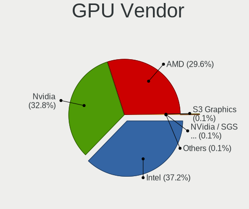

| Vendor           | Desktops | Percent |
|------------------|----------|---------|
| Intel            | 189      | 36.49%  |
| Nvidia           | 174      | 33.59%  |
| AMD              | 154      | 29.73%  |
| ATI Technologies | 1        | 0.19%   |

GPU Model
---------

Graphics card models

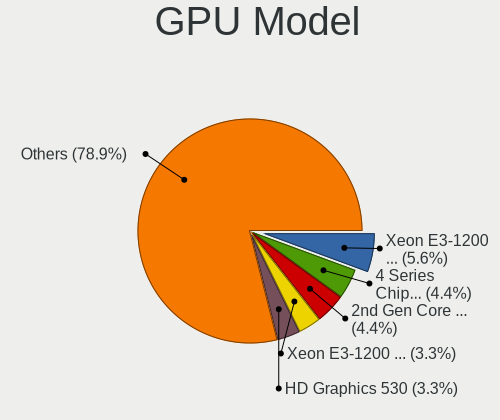

| Model                                                                       | Desktops | Percent |
|-----------------------------------------------------------------------------|----------|---------|
| Intel Xeon E3-1200 v3/4th Gen Core Processor Integrated Graphics Controller | 33       | 6.3%    |
| Intel Xeon E3-1200 v2/3rd Gen Core processor Graphics Controller            | 23       | 4.39%   |
| Intel 2nd Generation Core Processor Family Integrated Graphics Controller   | 23       | 4.39%   |
| Intel 4 Series Chipset Integrated Graphics Controller                       | 18       | 3.44%   |
| AMD Ellesmere [Radeon RX 470/480/570/570X/580/580X/590]                     | 17       | 3.24%   |
| Intel HD Graphics 530                                                       | 15       | 2.86%   |
| Intel CoffeeLake-S GT2 [UHD Graphics 630]                                   | 15       | 2.86%   |
| AMD Cezanne [Radeon Vega Series / Radeon Vega Mobile Series]                | 15       | 2.86%   |
| Nvidia GP107 [GeForce GTX 1050 Ti]                                          | 14       | 2.67%   |
| Nvidia GP108 [GeForce GT 1030]                                              | 10       | 1.91%   |
| Nvidia GK208B [GeForce GT 730]                                              | 10       | 1.91%   |
| AMD Picasso/Raven 2 [Radeon Vega Series / Radeon Vega Mobile Series]        | 10       | 1.91%   |
| AMD Raven Ridge [Radeon Vega Series / Radeon Vega Mobile Series]            | 9        | 1.72%   |
| AMD Kaveri [Radeon R7 Graphics]                                             | 9        | 1.72%   |
| Nvidia GM107 [GeForce GTX 750 Ti]                                           | 7        | 1.34%   |
| Nvidia GK208B [GeForce GT 710]                                              | 7        | 1.34%   |
| Nvidia GF119 [GeForce GT 610]                                               | 7        | 1.34%   |
| Intel HD Graphics 630                                                       | 7        | 1.34%   |
| AMD Lexa PRO [Radeon 540/540X/550/550X / RX 540X/550/550X]                  | 7        | 1.34%   |
| Nvidia GM206 [GeForce GTX 960]                                              | 6        | 1.15%   |
| Intel IvyBridge GT2 [HD Graphics 4000]                                      | 6        | 1.15%   |
| Intel 4th Generation Core Processor Family Integrated Graphics Controller   | 6        | 1.15%   |
| Nvidia TU116 [GeForce GTX 1660]                                             | 5        | 0.95%   |
| Nvidia TU117 [GeForce GTX 1650]                                             | 4        | 0.76%   |
| Nvidia TU116 [GeForce GTX 1660 SUPER]                                       | 4        | 0.76%   |
| Nvidia GT218 [GeForce 210]                                                  | 4        | 0.76%   |
| Nvidia GP107 [GeForce GTX 1050]                                             | 4        | 0.76%   |
| Nvidia GP106 [GeForce GTX 1060 6GB]                                         | 4        | 0.76%   |
| Nvidia GP106 [GeForce GTX 1060 3GB]                                         | 4        | 0.76%   |
| Nvidia G96C [GeForce 9500 GT]                                               | 4        | 0.76%   |
| Intel Core Processor Integrated Graphics Controller                         | 4        | 0.76%   |
| Intel Atom Processor Z36xxx/Z37xxx Series Graphics & Display                | 4        | 0.76%   |
| AMD Navi 24 [Radeon RX 6400/6500 XT/6500M]                                  | 4        | 0.76%   |
| AMD Cedar [Radeon HD 5000/6000/7350/8350 Series]                            | 4        | 0.76%   |
| Nvidia TU116 [GeForce GTX 1660 Ti]                                          | 3        | 0.57%   |
| Nvidia TU106 [GeForce RTX 2060 Rev. A]                                      | 3        | 0.57%   |
| Nvidia GK208B [GeForce GT 720]                                              | 3        | 0.57%   |
| Nvidia GA106 [GeForce RTX 3060 Lite Hash Rate]                              | 3        | 0.57%   |
| Nvidia GA104 [GeForce RTX 3070 Ti]                                          | 3        | 0.57%   |
| Nvidia G92 [GeForce 9800 GT]                                                | 3        | 0.57%   |

GPU Combo
---------

Combinations of graphics cards

| Name                     | Desktops | Percent |
|--------------------------|----------|---------|
| 1 x Intel                | 163      | 32.53%  |
| 1 x Nvidia               | 162      | 32.34%  |
| 1 x AMD                  | 143      | 28.54%  |
| 2 x Intel                | 11       | 2.2%    |
| Intel + Nvidia           | 9        | 1.8%    |
| 2 x AMD                  | 5        | 1%      |
| Intel + AMD              | 5        | 1%      |
| 2 x Nvidia               | 1        | 0.2%    |
| Intel + AMD + 1 x Nvidia | 1        | 0.2%    |
| AMD + Nvidia             | 1        | 0.2%    |

GPU Driver
----------

Free vs proprietary

| Driver      | Desktops | Percent |
|-------------|----------|---------|
| Free        | 463      | 92.42%  |
| Proprietary | 26       | 5.19%   |
| Unknown     | 12       | 2.4%    |

GPU Memory
----------

Total video memory

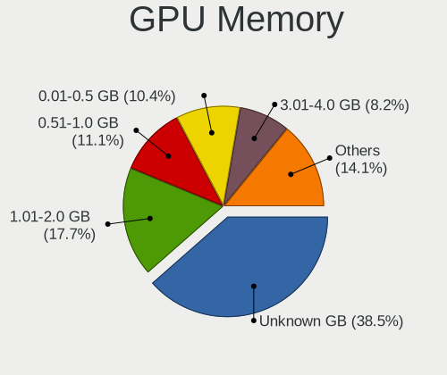

| Size in GB | Desktops | Percent |
|------------|----------|---------|
| Unknown    | 185      | 36.93%  |
| 1.01-2.0   | 85       | 16.97%  |
| 0.51-1.0   | 66       | 13.17%  |
| 0.01-0.5   | 51       | 10.18%  |
| 3.01-4.0   | 40       | 7.98%   |
| 7.01-8.0   | 38       | 7.58%   |
| 5.01-6.0   | 22       | 4.39%   |
| 8.01-16.0  | 9        | 1.8%    |
| 2.01-3.0   | 4        | 0.8%    |
| 16.01-24.0 | 1        | 0.2%    |

Monitor
-------

Monitor Vendor
--------------

Monitor vendors

| Vendor               | Desktops | Percent |
|----------------------|----------|---------|
| Samsung Electronics  | 71       | 14.23%  |
| Goldstar             | 50       | 10.02%  |
| Dell                 | 43       | 8.62%   |
| Hewlett-Packard      | 40       | 8.02%   |
| Acer                 | 39       | 7.82%   |
| AOC                  | 37       | 7.41%   |
| Philips              | 30       | 6.01%   |
| BenQ                 | 29       | 5.81%   |
| ViewSonic            | 15       | 3.01%   |
| Ancor Communications | 15       | 3.01%   |
| ASUSTek Computer     | 12       | 2.4%    |
| Lenovo               | 10       | 2%      |
| Iiyama               | 9        | 1.8%    |
| Unknown              | 7        | 1.4%    |
| Sceptre Tech         | 7        | 1.4%    |
| Unknown              | 7        | 1.4%    |
| Sony                 | 4        | 0.8%    |
| MSI                  | 4        | 0.8%    |
| Fujitsu Siemens      | 4        | 0.8%    |
| Sharp                | 3        | 0.6%    |
| Panasonic            | 3        | 0.6%    |
| LG Electronics       | 3        | 0.6%    |
| Vestel               | 2        | 0.4%    |
| Unknown (XXX)        | 2        | 0.4%    |
| UGD                  | 2        | 0.4%    |
| NEC Computers        | 2        | 0.4%    |
| NCS                  | 2        | 0.4%    |
| Idek Iiyama          | 2        | 0.4%    |
| HKC                  | 2        | 0.4%    |
| Eizo                 | 2        | 0.4%    |
| AOpen                | 2        | 0.4%    |
| Xiaomi               | 1        | 0.2%    |
| VMO                  | 1        | 0.2%    |
| Vizio                | 1        | 0.2%    |
| Vita                 | 1        | 0.2%    |
| Viotek               | 1        | 0.2%    |
| VIE                  | 1        | 0.2%    |
| UMC                  | 1        | 0.2%    |
| Toshiba              | 1        | 0.2%    |
| TopView              | 1        | 0.2%    |

Monitor Model
-------------

Monitor models

| Model                                                                  | Desktops | Percent |
|------------------------------------------------------------------------|----------|---------|
| Unknown                                                                | 7        | 1.38%   |
| BenQ GL2023 BNQ78CC 1600x900 443x249mm 20.0-inch                       | 5        | 0.98%   |
| Goldstar FULL HD GSM5B55 1920x1080 480x270mm 21.7-inch                 | 4        | 0.79%   |
| Samsung Electronics LCD Monitor SAM0659 1920x1080                      | 3        | 0.59%   |
| Philips PHL 243V7 PHLC155 1920x1080 527x296mm 23.8-inch                | 3        | 0.59%   |
| MSI MAG341CQ MSI1462 3440x1440 797x333mm 34.0-inch                     | 3        | 0.59%   |
| Goldstar IPS225 GSM587B 1920x1080 510x290mm 23.1-inch                  | 3        | 0.59%   |
| Dell P2210 DEL404D 1680x1050 474x296mm 22.0-inch                       | 3        | 0.59%   |
| BenQ GW2270 BNQ78DB 1920x1080 476x268mm 21.5-inch                      | 3        | 0.59%   |
| AOC 2050 AOC2050 1600x900 443x249mm 20.0-inch                          | 3        | 0.59%   |
| Ancor Communications VG248 ACI24A4 1920x1080 531x299mm 24.0-inch       | 3        | 0.59%   |
| ViewSonic VX2718-2KPC VSCB73A 2560x1440 598x336mm 27.0-inch            | 2        | 0.39%   |
| Unknown LCD Monitor SAMSUNG 1920x1080                                  | 2        | 0.39%   |
| Unknown LCD Monitor FFFF 2288x1287 2550x2550mm 142.0-inch              | 2        | 0.39%   |
| Samsung Electronics SyncMaster SAM034D 1280x1024 376x301mm 19.0-inch   | 2        | 0.39%   |
| Samsung Electronics S24F350 SAM0D20 1920x1080 521x293mm 23.5-inch      | 2        | 0.39%   |
| Samsung Electronics LCD Monitor SAM0A7D 1920x1080 1060x626mm 48.5-inch | 2        | 0.39%   |
| Samsung Electronics LCD Monitor SAM04FD 1280x720                       | 2        | 0.39%   |
| Philips 191EL PHLC03D 1366x768 410x230mm 18.5-inch                     | 2        | 0.39%   |
| Panasonic TV MEIA296 1280x1024 698x392mm 31.5-inch                     | 2        | 0.39%   |
| NCS LCD Monitor NCS2275 1920x1080 256x192mm 12.6-inch                  | 2        | 0.39%   |
| Lenovo D24-20 LEN66AE 1920x1080 527x296mm 23.8-inch                    | 2        | 0.39%   |
| Hewlett-Packard Z23i HWP3090 1920x1080 509x286mm 23.0-inch             | 2        | 0.39%   |
| Hewlett-Packard V270 HPN3521 1920x1080 598x336mm 27.0-inch             | 2        | 0.39%   |
| Hewlett-Packard LA1951 HWP285B 1280x960 380x300mm 19.1-inch            | 2        | 0.39%   |
| Hewlett-Packard L2105tm HWP2863 1920x1080 477x268mm 21.5-inch          | 2        | 0.39%   |
| Hewlett-Packard 24w HPN3431 1920x1080 527x296mm 23.8-inch              | 2        | 0.39%   |
| Hewlett-Packard 2009 HWP2827 1600x900 443x250mm 20.0-inch              | 2        | 0.39%   |
| Goldstar W1943 GSM4BAD 1360x768 406x229mm 18.4-inch                    | 2        | 0.39%   |
| Goldstar Ultra HD GSM5B09 3840x2160 600x340mm 27.2-inch                | 2        | 0.39%   |
| Goldstar TV SSCR2 GSMC0C8 3840x2160                                    | 2        | 0.39%   |
| Goldstar E1942 GSM4C09 1366x768 410x230mm 18.5-inch                    | 2        | 0.39%   |
| Goldstar 32inch FHD GSM76F5 1920x1080 698x392mm 31.5-inch              | 2        | 0.39%   |
| Dell U2715H DELD066 2560x1440 597x336mm 27.0-inch                      | 2        | 0.39%   |
| Dell U2515H DELD070 2560x1440 553x311mm 25.0-inch                      | 2        | 0.39%   |
| Dell U2414H DELA0A4 1920x1080 527x296mm 23.8-inch                      | 2        | 0.39%   |
| Dell U2312HM DEL4072 1920x1080 510x287mm 23.0-inch                     | 2        | 0.39%   |
| BenQ GW2280 BNQ78E8 1920x1080 476x268mm 21.5-inch                      | 2        | 0.39%   |
| ASUSTek Computer VG245 AUS24A1 1920x1080 531x299mm 24.0-inch           | 2        | 0.39%   |
| AOC Q2790 AOC2790 2560x1440 597x336mm 27.0-inch                        | 2        | 0.39%   |

Monitor Resolution
------------------

Monitor screen resolution

| Resolution         | Desktops | Percent |
|--------------------|----------|---------|
| 1920x1080 (FHD)    | 267      | 53.94%  |
| 3840x2160 (4K)     | 41       | 8.28%   |
| 2560x1440 (QHD)    | 30       | 6.06%   |
| 1680x1050 (WSXGA+) | 29       | 5.86%   |
| 1280x1024 (SXGA)   | 28       | 5.66%   |
| 1920x1200 (WUXGA)  | 18       | 3.64%   |
| 1600x900 (HD+)     | 18       | 3.64%   |
| 1366x768 (WXGA)    | 18       | 3.64%   |
| 1360x768           | 10       | 2.02%   |
| 3440x1440          | 8        | 1.62%   |
| 1440x900 (WXGA+)   | 6        | 1.21%   |
| 2560x1080          | 4        | 0.81%   |
| Unknown            | 4        | 0.81%   |
| 2288x1287          | 2        | 0.4%    |
| 1280x960           | 2        | 0.4%    |
| 1024x768 (XGA)     | 2        | 0.4%    |
| 6000x1440          | 1        | 0.2%    |
| 5760x2160          | 1        | 0.2%    |
| 5120x1440          | 1        | 0.2%    |
| 4480x2023          | 1        | 0.2%    |
| 3840x1080          | 1        | 0.2%    |
| 1920x540           | 1        | 0.2%    |
| 1280x768           | 1        | 0.2%    |
| 1280x720 (HD)      | 1        | 0.2%    |

Monitor Diagonal
----------------

Diagonal size in inches

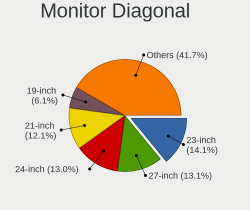

| Inches  | Desktops | Percent |
|---------|----------|---------|
| 24      | 71       | 14.29%  |
| 23      | 71       | 14.29%  |
| 27      | 63       | 12.68%  |
| 21      | 61       | 12.27%  |
| Unknown | 37       | 7.44%   |
| 19      | 31       | 6.24%   |
| 22      | 26       | 5.23%   |
| 31      | 20       | 4.02%   |
| 18      | 20       | 4.02%   |
| 20      | 17       | 3.42%   |
| 34      | 12       | 2.41%   |
| 17      | 10       | 2.01%   |
| 54      | 7        | 1.41%   |
| 84      | 5        | 1.01%   |
| 72      | 5        | 1.01%   |
| 25      | 5        | 1.01%   |
| 15      | 5        | 1.01%   |
| 32      | 3        | 0.6%    |
| 26      | 3        | 0.6%    |
| 142     | 2        | 0.4%    |
| 48      | 2        | 0.4%    |
| 40      | 2        | 0.4%    |
| 37      | 2        | 0.4%    |
| 12      | 2        | 0.4%    |
| 74      | 1        | 0.2%    |
| 65      | 1        | 0.2%    |
| 60      | 1        | 0.2%    |
| 58      | 1        | 0.2%    |
| 55      | 1        | 0.2%    |
| 52      | 1        | 0.2%    |
| 50      | 1        | 0.2%    |
| 46      | 1        | 0.2%    |
| 41      | 1        | 0.2%    |
| 39      | 1        | 0.2%    |
| 35      | 1        | 0.2%    |
| 33      | 1        | 0.2%    |
| 28      | 1        | 0.2%    |
| 14      | 1        | 0.2%    |
| 11      | 1        | 0.2%    |

Monitor Width
-------------

Physical width

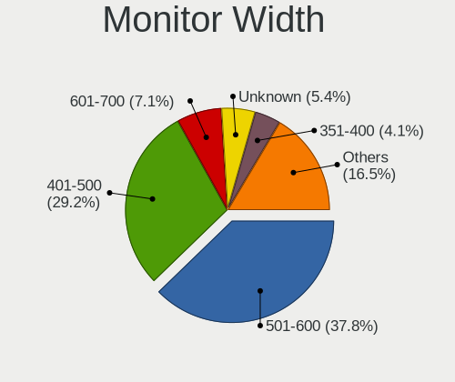

| Width in mm    | Desktops | Percent |
|----------------|----------|---------|
| 501-600        | 189      | 38.89%  |
| 401-500        | 133      | 27.37%  |
| Unknown        | 37       | 7.61%   |
| 601-700        | 33       | 6.79%   |
| 351-400        | 22       | 4.53%   |
| 701-800        | 17       | 3.5%    |
| 1001-1500      | 16       | 3.29%   |
| 301-350        | 15       | 3.09%   |
| 1501-2000      | 11       | 2.26%   |
| 801-900        | 6        | 1.23%   |
| 201-300        | 4        | 0.82%   |
| More than 2000 | 2        | 0.41%   |
| 901-1000       | 1        | 0.21%   |

Aspect Ratio
------------

Proportional relationship between the width and the height

| Ratio   | Desktops | Percent |
|---------|----------|---------|
| 16/9    | 343      | 71.61%  |
| 16/10   | 57       | 11.9%   |
| 5/4     | 30       | 6.26%   |
| Unknown | 26       | 5.43%   |
| 21/9    | 12       | 2.51%   |
| 4/3     | 5        | 1.04%   |
| 3/2     | 3        | 0.63%   |
| 1.00    | 2        | 0.42%   |
| 2.12    | 1        | 0.21%   |

Monitor Area
------------

Area in inch

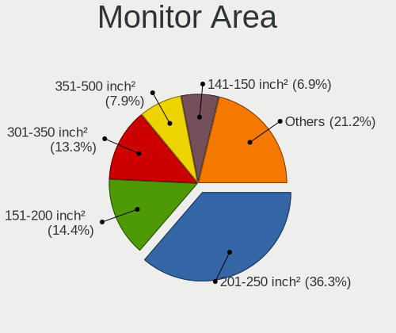

| Area in inch | Desktops | Percent |
|----------------|----------|---------|
| 201-250        | 184      | 37.17%  |
| 151-200        | 72       | 14.55%  |
| 301-350        | 64       | 12.93%  |
| 351-500        | 37       | 7.47%   |
| Unknown        | 37       | 7.47%   |
| More than 1000 | 28       | 5.66%   |
| 251-300        | 28       | 5.66%   |
| 141-150        | 28       | 5.66%   |
| 501-1000       | 8        | 1.62%   |
| 101-110        | 5        | 1.01%   |
| 71-80          | 2        | 0.4%    |
| 51-60          | 1        | 0.2%    |
| 91-100         | 1        | 0.2%    |

Pixel Density
-------------

Pixels per inch

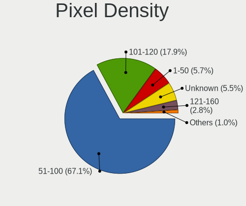

| Density | Desktops | Percent |
|---------|----------|---------|
| 51-100  | 312      | 65.27%  |
| 101-120 | 86       | 17.99%  |
| Unknown | 37       | 7.74%   |
| 1-50    | 22       | 4.6%    |
| 121-160 | 15       | 3.14%   |
| 161-240 | 6        | 1.26%   |

Multiple Monitors
-----------------

Total monitors connected

| Total | Desktops | Percent |
|-------|----------|---------|
| 1     | 452      | 90.22%  |
| 2     | 36       | 7.19%   |
| 0     | 8        | 1.6%    |
| 3     | 5        | 1%      |

Network
-------

Net Controller Vendor
---------------------

Controller vendors

| Vendor                          | Desktops | Percent |
|---------------------------------|----------|---------|
| Realtek Semiconductor           | 335      | 50.07%  |
| Intel                           | 163      | 24.36%  |
| Qualcomm Atheros                | 51       | 7.62%   |
| Ralink Technology               | 22       | 3.29%   |
| Broadcom                        | 15       | 2.24%   |
| MediaTek                        | 11       | 1.64%   |
| TP-Link                         | 10       | 1.49%   |
| Nvidia                          | 10       | 1.49%   |
| Qualcomm Atheros Communications | 9        | 1.35%   |
| Ralink                          | 7        | 1.05%   |
| ASUSTek Computer                | 6        | 0.9%    |
| D-Link                          | 4        | 0.6%    |
| ASIX Electronics                | 3        | 0.45%   |
| NetGear                         | 2        | 0.3%    |
| Microsoft                       | 2        | 0.3%    |
| Marvell Technology Group        | 2        | 0.3%    |
| IMC Networks                    | 2        | 0.3%    |
| Broadcom Limited                | 2        | 0.3%    |
| ZyDAS                           | 1        | 0.15%   |
| VIA Technologies                | 1        | 0.15%   |
| THEC64 Joystick                 | 1        | 0.15%   |
| Samsung Electronics             | 1        | 0.15%   |
| Qualcomm                        | 1        | 0.15%   |
| OPPO Electronics                | 1        | 0.15%   |
| Linksys                         | 1        | 0.15%   |
| Huawei Technologies             | 1        | 0.15%   |
| D-Link System                   | 1        | 0.15%   |
| Belkin Components               | 1        | 0.15%   |
| AVM                             | 1        | 0.15%   |
| Arduino SA                      | 1        | 0.15%   |
| Aquantia                        | 1        | 0.15%   |

Net Controller Model
--------------------

Controller models

| Model                                                             | Desktops | Percent |
|-------------------------------------------------------------------|----------|---------|
| Realtek RTL8111/8168/8411 PCI Express Gigabit Ethernet Controller | 282      | 38.06%  |
| Intel Ethernet Connection I217-LM                                 | 21       | 2.83%   |
| Intel 82579LM Gigabit Network Connection (Lewisville)             | 18       | 2.43%   |
| Intel I211 Gigabit Network Connection                             | 17       | 2.29%   |
| Realtek RTL8125 2.5GbE Controller                                 | 16       | 2.16%   |
| Intel Wi-Fi 6 AX200                                               | 16       | 2.16%   |
| Realtek RTL810xE PCI Express Fast Ethernet controller             | 12       | 1.62%   |
| Realtek RTL88x2bu [AC1200 Techkey]                                | 11       | 1.48%   |
| Qualcomm Atheros AR8151 v2.0 Gigabit Ethernet                     | 10       | 1.35%   |
| Intel Ethernet Connection (2) I219-V                              | 10       | 1.35%   |
| Intel Ethernet Connection (7) I219-V                              | 9        | 1.21%   |
| Intel Dual Band Wireless-AC 3168NGW [Stone Peak]                  | 9        | 1.21%   |
| Intel 82579V Gigabit Network Connection                           | 9        | 1.21%   |
| Qualcomm Atheros AR9271 802.11n                                   | 8        | 1.08%   |
| Intel Wi-Fi 6 AX210/AX211/AX411 160MHz                            | 8        | 1.08%   |
| Intel Ethernet Controller I225-V                                  | 8        | 1.08%   |
| Realtek RTL8192EE PCIe Wireless Network Adapter                   | 7        | 0.94%   |
| Intel Ethernet Connection (2) I219-LM                             | 7        | 0.94%   |
| Intel 82567LM-3 Gigabit Network Connection                        | 7        | 0.94%   |
| Ralink MT7601U Wireless Adapter                                   | 6        | 0.81%   |
| Qualcomm Atheros AR9485 Wireless Network Adapter                  | 6        | 0.81%   |
| Intel Wireless 3165                                               | 6        | 0.81%   |
| Realtek RTL8812AE 802.11ac PCIe Wireless Network Adapter          | 5        | 0.67%   |
| Qualcomm Atheros QCA9377 802.11ac Wireless Network Adapter        | 5        | 0.67%   |
| TP-Link TL-WN722N v2/v3 [Realtek RTL8188EUS]                      | 4        | 0.54%   |
| Realtek RTL8188EUS 802.11n Wireless Network Adapter               | 4        | 0.54%   |
| Realtek RTL-8100/8101L/8139 PCI Fast Ethernet Adapter             | 4        | 0.54%   |
| Ralink RT2870/RT3070 Wireless Adapter                             | 4        | 0.54%   |
| Nvidia MCP73 Ethernet                                             | 4        | 0.54%   |
| Nvidia MCP61 Ethernet                                             | 4        | 0.54%   |
| Intel Wireless 7265                                               | 4        | 0.54%   |
| Intel Ethernet Connection I217-V                                  | 4        | 0.54%   |
| Realtek RTL8822CE 802.11ac PCIe Wireless Network Adapter          | 3        | 0.4%    |
| Realtek RTL8822BE 802.11a/b/g/n/ac WiFi adapter                   | 3        | 0.4%    |
| Realtek RTL8821CE 802.11ac PCIe Wireless Network Adapter          | 3        | 0.4%    |
| Realtek RTL8821AE 802.11ac PCIe Wireless Network Adapter          | 3        | 0.4%    |
| Realtek RTL8812AU 802.11a/b/g/n/ac 2T2R DB WLAN Adapter           | 3        | 0.4%    |
| Realtek RTL8188EE Wireless Network Adapter                        | 3        | 0.4%    |
| Ralink RT5370 Wireless Adapter                                    | 3        | 0.4%    |
| Qualcomm Atheros QCA8171 Gigabit Ethernet                         | 3        | 0.4%    |

Wireless Vendor
---------------

Wireless vendors

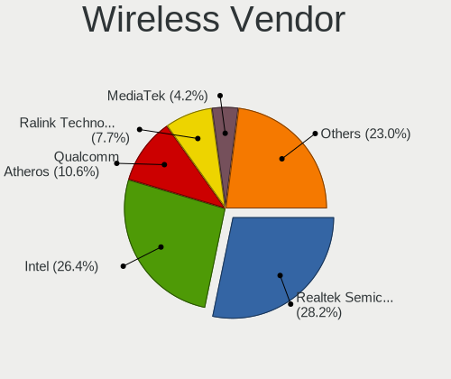

| Vendor                          | Desktops | Percent |
|---------------------------------|----------|---------|
| Realtek Semiconductor           | 57       | 26.03%  |
| Intel                           | 56       | 25.57%  |
| Qualcomm Atheros                | 25       | 11.42%  |
| Ralink Technology               | 22       | 10.05%  |
| TP-Link                         | 10       | 4.57%   |
| Qualcomm Atheros Communications | 9        | 4.11%   |
| MediaTek                        | 9        | 4.11%   |
| Ralink                          | 7        | 3.2%    |
| ASUSTek Computer                | 6        | 2.74%   |
| D-Link                          | 4        | 1.83%   |
| NetGear                         | 2        | 0.91%   |
| Microsoft                       | 2        | 0.91%   |
| IMC Networks                    | 2        | 0.91%   |
| Broadcom                        | 2        | 0.91%   |
| ZyDAS                           | 1        | 0.46%   |
| VIA Technologies                | 1        | 0.46%   |
| Linksys                         | 1        | 0.46%   |
| D-Link System                   | 1        | 0.46%   |
| Belkin Components               | 1        | 0.46%   |
| AVM                             | 1        | 0.46%   |

Wireless Model
--------------

Wireless models

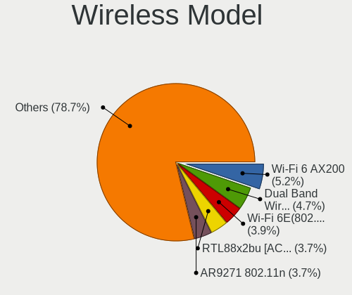

| Model                                                                  | Desktops | Percent |
|------------------------------------------------------------------------|----------|---------|
| Intel Wi-Fi 6 AX200                                                    | 16       | 7.31%   |
| Realtek RTL88x2bu [AC1200 Techkey]                                     | 11       | 5.02%   |
| Intel Dual Band Wireless-AC 3168NGW [Stone Peak]                       | 9        | 4.11%   |
| Qualcomm Atheros AR9271 802.11n                                        | 8        | 3.65%   |
| Intel Wi-Fi 6 AX210/AX211/AX411 160MHz                                 | 8        | 3.65%   |
| Realtek RTL8192EE PCIe Wireless Network Adapter                        | 7        | 3.2%    |
| Ralink MT7601U Wireless Adapter                                        | 6        | 2.74%   |
| Qualcomm Atheros AR9485 Wireless Network Adapter                       | 6        | 2.74%   |
| Intel Wireless 3165                                                    | 6        | 2.74%   |
| Realtek RTL8812AE 802.11ac PCIe Wireless Network Adapter               | 5        | 2.28%   |
| Qualcomm Atheros QCA9377 802.11ac Wireless Network Adapter             | 5        | 2.28%   |
| TP-Link TL-WN722N v2/v3 [Realtek RTL8188EUS]                           | 4        | 1.83%   |
| Realtek RTL8188EUS 802.11n Wireless Network Adapter                    | 4        | 1.83%   |
| Ralink RT2870/RT3070 Wireless Adapter                                  | 4        | 1.83%   |
| Intel Wireless 7265                                                    | 4        | 1.83%   |
| Realtek RTL8822CE 802.11ac PCIe Wireless Network Adapter               | 3        | 1.37%   |
| Realtek RTL8822BE 802.11a/b/g/n/ac WiFi adapter                        | 3        | 1.37%   |
| Realtek RTL8821CE 802.11ac PCIe Wireless Network Adapter               | 3        | 1.37%   |
| Realtek RTL8821AE 802.11ac PCIe Wireless Network Adapter               | 3        | 1.37%   |
| Realtek RTL8812AU 802.11a/b/g/n/ac 2T2R DB WLAN Adapter                | 3        | 1.37%   |
| Realtek RTL8188EE Wireless Network Adapter                             | 3        | 1.37%   |
| Ralink RT5370 Wireless Adapter                                         | 3        | 1.37%   |
| Qualcomm Atheros AR9287 Wireless Network Adapter (PCI-Express)         | 3        | 1.37%   |
| MediaTek MT7921K (RZ608) Wi-Fi 6E 80MHz                                | 3        | 1.37%   |
| MediaTek MT7921 802.11ax PCI Express Wireless Network Adapter          | 3        | 1.37%   |
| Intel Wireless-AC 9260                                                 | 3        | 1.37%   |
| TP-Link TL-WN823N v2/v3 [Realtek RTL8192EU]                            | 2        | 0.91%   |
| Realtek RTL8192CE PCIe Wireless Network Adapter                        | 2        | 0.91%   |
| Realtek RTL8188CE 802.11b/g/n WiFi Adapter                             | 2        | 0.91%   |
| Realtek RTL-8185 IEEE 802.11a/b/g Wireless LAN Controller              | 2        | 0.91%   |
| Realtek 802.11ac NIC                                                   | 2        | 0.91%   |
| Ralink RT5572 Wireless Adapter                                         | 2        | 0.91%   |
| Ralink RT5372 Wireless Adapter                                         | 2        | 0.91%   |
| Ralink RT3072 Wireless Adapter                                         | 2        | 0.91%   |
| Ralink MT7610U ("Archer T2U" 2.4G+5G WLAN Adapter                      | 2        | 0.91%   |
| Ralink RT3092 Wireless 802.11n 2T/2R PCIe                              | 2        | 0.91%   |
| Qualcomm Atheros QCA9565 / AR9565 Wireless Network Adapter             | 2        | 0.91%   |
| Qualcomm Atheros AR93xx Wireless Network Adapter                       | 2        | 0.91%   |
| Qualcomm Atheros AR9285 Wireless Network Adapter (PCI-Express)         | 2        | 0.91%   |
| Qualcomm Atheros AR5416 Wireless Network Adapter [AR5008 802.11(a)bgn] | 2        | 0.91%   |

Ethernet Vendor
---------------

Ethernet vendors

| Vendor                   | Desktops | Percent |
|--------------------------|----------|---------|
| Realtek Semiconductor    | 317      | 62.04%  |
| Intel                    | 129      | 25.24%  |
| Qualcomm Atheros         | 27       | 5.28%   |
| Broadcom                 | 14       | 2.74%   |
| Nvidia                   | 10       | 1.96%   |
| ASIX Electronics         | 3        | 0.59%   |
| MediaTek                 | 2        | 0.39%   |
| Marvell Technology Group | 2        | 0.39%   |
| Broadcom Limited         | 2        | 0.39%   |
| Samsung Electronics      | 1        | 0.2%    |
| Qualcomm                 | 1        | 0.2%    |
| OPPO Electronics         | 1        | 0.2%    |
| Huawei Technologies      | 1        | 0.2%    |
| Aquantia                 | 1        | 0.2%    |

Ethernet Model
--------------

Ethernet models

| Model                                                             | Desktops | Percent |
|-------------------------------------------------------------------|----------|---------|
| Realtek RTL8111/8168/8411 PCI Express Gigabit Ethernet Controller | 282      | 54.23%  |
| Intel Ethernet Connection I217-LM                                 | 21       | 4.04%   |
| Intel 82579LM Gigabit Network Connection (Lewisville)             | 18       | 3.46%   |
| Intel I211 Gigabit Network Connection                             | 17       | 3.27%   |
| Realtek RTL8125 2.5GbE Controller                                 | 16       | 3.08%   |
| Realtek RTL810xE PCI Express Fast Ethernet controller             | 12       | 2.31%   |
| Qualcomm Atheros AR8151 v2.0 Gigabit Ethernet                     | 10       | 1.92%   |
| Intel Ethernet Connection (2) I219-V                              | 10       | 1.92%   |
| Intel Ethernet Connection (7) I219-V                              | 9        | 1.73%   |
| Intel 82579V Gigabit Network Connection                           | 9        | 1.73%   |
| Intel Ethernet Controller I225-V                                  | 8        | 1.54%   |
| Intel Ethernet Connection (2) I219-LM                             | 7        | 1.35%   |
| Intel 82567LM-3 Gigabit Network Connection                        | 7        | 1.35%   |
| Realtek RTL-8100/8101L/8139 PCI Fast Ethernet Adapter             | 4        | 0.77%   |
| Nvidia MCP73 Ethernet                                             | 4        | 0.77%   |
| Nvidia MCP61 Ethernet                                             | 4        | 0.77%   |
| Intel Ethernet Connection I217-V                                  | 4        | 0.77%   |
| Qualcomm Atheros QCA8171 Gigabit Ethernet                         | 3        | 0.58%   |
| Qualcomm Atheros AR8161 Gigabit Ethernet                          | 3        | 0.58%   |
| Intel Ethernet Connection (2) I218-V                              | 3        | 0.58%   |
| Broadcom NetXtreme BCM5761 Gigabit Ethernet PCIe                  | 3        | 0.58%   |
| Broadcom NetLink BCM57788 Gigabit Ethernet PCIe                   | 3        | 0.58%   |
| Broadcom NetLink BCM57780 Gigabit Ethernet PCIe                   | 3        | 0.58%   |
| Realtek RTL8169 PCI Gigabit Ethernet Controller                   | 2        | 0.38%   |
| Realtek RTL8153 Gigabit Ethernet Adapter                          | 2        | 0.38%   |
| Qualcomm Atheros Attansic L1 Gigabit Ethernet                     | 2        | 0.38%   |
| Qualcomm Atheros AR8152 v2.0 Fast Ethernet                        | 2        | 0.38%   |
| Qualcomm Atheros AR8121/AR8113/AR8114 Gigabit or Fast Ethernet    | 2        | 0.38%   |
| MediaTek PRESIDENT_GOLD_10                                        | 2        | 0.38%   |
| Intel I210 Gigabit Network Connection                             | 2        | 0.38%   |
| Intel 82578DM Gigabit Network Connection                          | 2        | 0.38%   |
| Intel 82574L Gigabit Network Connection                           | 2        | 0.38%   |
| Broadcom NetXtreme BCM5762 Gigabit Ethernet PCIe                  | 2        | 0.38%   |
| ASIX AX88179 Gigabit Ethernet                                     | 2        | 0.38%   |
| Samsung Galaxy series, misc. (tethering mode)                     | 1        | 0.19%   |
| Realtek RTL-8110SC/8169SC Gigabit Ethernet                        | 1        | 0.19%   |
| Realtek Killer E2600 Gigabit Ethernet Controller                  | 1        | 0.19%   |
| Qualcomm Nokia XR20                                               | 1        | 0.19%   |
| Qualcomm Atheros Killer E2400 Gigabit Ethernet Controller         | 1        | 0.19%   |
| Qualcomm Atheros Killer E220x Gigabit Ethernet Controller         | 1        | 0.19%   |

Net Controller Kind
-------------------

Ethernet, WiFi or modem

| Kind     | Desktops | Percent |
|----------|----------|---------|
| Ethernet | 495      | 70.21%  |
| WiFi     | 208      | 29.5%   |
| Modem    | 1        | 0.14%   |
| Unknown  | 1        | 0.14%   |

Used Controller
---------------

Currently used network controller

| Kind     | Desktops | Percent |
|----------|----------|---------|
| Ethernet | 397      | 78.93%  |
| WiFi     | 106      | 21.07%  |

NICs
----

Total network controllers on board

| Total | Desktops | Percent |
|-------|----------|---------|
| 1     | 356      | 71.06%  |
| 2     | 131      | 26.15%  |
| 3     | 10       | 2%      |
| 0     | 4        | 0.8%    |

IPv6
----

IPv6 vs IPv4

| Used | Desktops | Percent |
|------|----------|---------|
| No   | 345      | 68.86%  |
| Yes  | 156      | 31.14%  |

Bluetooth
---------

Bluetooth Vendor
----------------

Controller vendors

| Vendor                          | Desktops | Percent |
|---------------------------------|----------|---------|
| Intel                           | 50       | 34.48%  |
| Cambridge Silicon Radio         | 34       | 23.45%  |
| Realtek Semiconductor           | 16       | 11.03%  |
| ASUSTek Computer                | 11       | 7.59%   |
| Qualcomm Atheros Communications | 8        | 5.52%   |
| Broadcom                        | 7        | 4.83%   |
| MediaTek                        | 5        | 3.45%   |
| IMC Networks                    | 5        | 3.45%   |
| TP-Link                         | 1        | 0.69%   |
| Realtek                         | 1        | 0.69%   |
| Integrated System Solution      | 1        | 0.69%   |
| Foxconn / Hon Hai               | 1        | 0.69%   |
| Edimax Technology               | 1        | 0.69%   |
| Dynex                           | 1        | 0.69%   |
| Dell                            | 1        | 0.69%   |
| Belkin Components               | 1        | 0.69%   |
| Apple                           | 1        | 0.69%   |

Bluetooth Model
---------------

Controller models

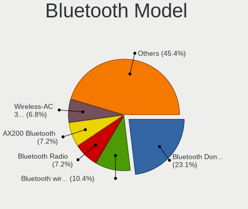

| Model                                                    | Desktops | Percent |
|----------------------------------------------------------|----------|---------|
| Cambridge Silicon Radio Bluetooth Dongle (HCI mode)      | 34       | 23.45%  |
| Intel AX200 Bluetooth                                    | 14       | 9.66%   |
| Intel Bluetooth wireless interface                       | 13       | 8.97%   |
| Realtek Bluetooth Radio                                  | 12       | 8.28%   |
| Intel Wireless-AC 3168 Bluetooth                         | 8        | 5.52%   |
| Intel AX210 Bluetooth                                    | 8        | 5.52%   |
| ASUS ASUS USB-BT500                                      | 7        | 4.83%   |
| Qualcomm Atheros  Bluetooth Device                       | 6        | 4.14%   |
| MediaTek Wireless_Device                                 | 5        | 3.45%   |
| IMC Networks Bluetooth Radio                             | 3        | 2.07%   |
| Intel Wireless-AC 9260 Bluetooth Adapter                 | 2        | 1.38%   |
| Intel AX201 Bluetooth                                    | 2        | 1.38%   |
| ASUS Broadcom BCM20702A0 Bluetooth                       | 2        | 1.38%   |
| TP-Link UB500 Adapter                                    | 1        | 0.69%   |
| Realtek RTL8822BE Bluetooth 4.2 Adapter                  | 1        | 0.69%   |
| Realtek RTL8821A Bluetooth                               | 1        | 0.69%   |
| Realtek  Bluetooth 4.2 Adapter                           | 1        | 0.69%   |
| Realtek Bluetooth 5.1 Radio                              | 1        | 0.69%   |
| Realtek Bluetooth Radio                                  | 1        | 0.69%   |
| Qualcomm Atheros AR3012 Bluetooth 4.0                    | 1        | 0.69%   |
| Qualcomm Atheros AR3011 Bluetooth                        | 1        | 0.69%   |
| Intel Centrino Bluetooth Wireless Transceiver            | 1        | 0.69%   |
| Intel Bluetooth Device                                   | 1        | 0.69%   |
| Intel Bluetooth 9460/9560 Jefferson Peak (JfP)           | 1        | 0.69%   |
| Integrated System Solution Bluetooth Device              | 1        | 0.69%   |
| IMC Networks Wireless_Device                             | 1        | 0.69%   |
| IMC Networks Bluetooth Device                            | 1        | 0.69%   |
| Foxconn / Hon Hai Wireless_Device                        | 1        | 0.69%   |
| Edimax Bluetooth Adapter                                 | 1        | 0.69%   |
| Dynex Bluetooth 4.0 Adapter [Broadcom, 1.12, BCM20702A0] | 1        | 0.69%   |
| Dell BT Mini-Receiver                                    | 1        | 0.69%   |
| Broadcom Bluetooth Device                                | 1        | 0.69%   |
| Broadcom Bluetooth Controller                            | 1        | 0.69%   |
| Broadcom Bluetooth 3.0 Dongle                            | 1        | 0.69%   |
| Broadcom BCM92046DG-CL1ROM Bluetooth 2.1 UHE Dongle      | 1        | 0.69%   |
| Broadcom BCM20702A0 Bluetooth 4.0                        | 1        | 0.69%   |
| Broadcom BCM2035B3 Bluetooth Adapter                     | 1        | 0.69%   |
| Broadcom ANYCOM Blue USB-200/250                         | 1        | 0.69%   |
| Belkin Components Bluetooth Mini Dongle                  | 1        | 0.69%   |
| ASUS BCM20702A0                                          | 1        | 0.69%   |

Sound
-----

Sound Vendor
------------

Sound card vendors

| Vendor                                       | Desktops | Percent |
|----------------------------------------------|----------|---------|
| Intel                                        | 319      | 41.11%  |
| AMD                                          | 199      | 25.64%  |
| Nvidia                                       | 166      | 21.39%  |
| Creative Labs                                | 17       | 2.19%   |
| C-Media Electronics                          | 15       | 1.93%   |
| Logitech                                     | 5        | 0.64%   |
| Generalplus Technology                       | 5        | 0.64%   |
| Micro Star International                     | 4        | 0.52%   |
| Tenx Technology                              | 3        | 0.39%   |
| JMTek                                        | 3        | 0.39%   |
| Creative Technology                          | 3        | 0.39%   |
| VIA Technologies                             | 2        | 0.26%   |
| Native Instruments                           | 2        | 0.26%   |
| KTMicro                                      | 2        | 0.26%   |
| Focusrite-Novation                           | 2        | 0.26%   |
| FiiO Electronics Technology                  | 2        | 0.26%   |
| Dell                                         | 2        | 0.26%   |
| ASUSTek Computer                             | 2        | 0.26%   |
| Zoran Co. Personal Media Division (Nogatech) | 1        | 0.13%   |
| XMOS                                         | 1        | 0.13%   |
| Xilinx                                       | 1        | 0.13%   |
| USB-Speaker                                  | 1        | 0.13%   |
| Texas Instruments                            | 1        | 0.13%   |
| Tdlasunnic                                   | 1        | 0.13%   |
| Sterling                                     | 1        | 0.13%   |
| Samson Technologies                          | 1        | 0.13%   |
| RODE Microphones                             | 1        | 0.13%   |
| ROCCAT                                       | 1        | 0.13%   |
| Razer USA                                    | 1        | 0.13%   |
| Nintendo                                     | 1        | 0.13%   |
| Logic3 / SpectraVideo                        | 1        | 0.13%   |
| Jieli Technology                             | 1        | 0.13%   |
| Hewlett-Packard                              | 1        | 0.13%   |
| GN Netcom                                    | 1        | 0.13%   |
| DSEA A/S                                     | 1        | 0.13%   |
| Digidesign                                   | 1        | 0.13%   |
| Corsair                                      | 1        | 0.13%   |
| BEHRINGER International                      | 1        | 0.13%   |
| AudioQuest                                   | 1        | 0.13%   |
| Audioengine                                  | 1        | 0.13%   |

Sound Model
-----------

Sound card models

| Model                                                                                           | Desktops | Percent |
|-------------------------------------------------------------------------------------------------|----------|---------|
| Intel 8 Series/C220 Series Chipset High Definition Audio Controller                             | 47       | 5.11%   |
| AMD Family 17h/19h HD Audio Controller                                                          | 47       | 5.11%   |
| Intel 6 Series/C200 Series Chipset Family High Definition Audio Controller                      | 46       | 5.01%   |
| AMD Starship/Matisse HD Audio Controller                                                        | 37       | 4.03%   |
| Intel 7 Series/C216 Chipset Family High Definition Audio Controller                             | 36       | 3.92%   |
| Intel 200 Series PCH HD Audio                                                                   | 34       | 3.7%    |
| Intel Xeon E3-1200 v3/4th Gen Core Processor HD Audio Controller                                | 33       | 3.59%   |
| AMD FCH Azalia Controller                                                                       | 28       | 3.05%   |
| Intel 100 Series/C230 Series Chipset Family HD Audio Controller                                 | 26       | 2.83%   |
| AMD SBx00 Azalia (Intel HDA)                                                                    | 26       | 2.83%   |
| AMD Renoir Radeon High Definition Audio Controller                                              | 25       | 2.72%   |
| Nvidia GK208 HDMI/DP Audio Controller                                                           | 21       | 2.29%   |
| Intel Cannon Lake PCH cAVS                                                                      | 20       | 2.18%   |
| Nvidia GP107GL High Definition Audio Controller                                                 | 19       | 2.07%   |
| Intel NM10/ICH7 Family High Definition Audio Controller                                         | 19       | 2.07%   |
| AMD Raven/Raven2/Fenghuang HDMI/DP Audio Controller                                             | 19       | 2.07%   |
| AMD Ellesmere HDMI Audio [Radeon RX 470/480 / 570/580/590]                                      | 17       | 1.85%   |
| AMD Family 17h (Models 00h-0fh) HD Audio Controller                                             | 15       | 1.63%   |
| AMD Navi 21/23 HDMI/DP Audio Controller                                                         | 13       | 1.41%   |
| Nvidia TU116 High Definition Audio Controller                                                   | 12       | 1.31%   |
| Nvidia GP108 High Definition Audio Controller                                                   | 10       | 1.09%   |
| Nvidia GM107 High Definition Audio Controller [GeForce 940MX]                                   | 10       | 1.09%   |
| Nvidia GF119 HDMI Audio Controller                                                              | 10       | 1.09%   |
| Nvidia GF108 High Definition Audio Controller                                                   | 10       | 1.09%   |
| AMD Baffin HDMI/DP Audio [Radeon RX 550 640SP / RX 560/560X]                                    | 10       | 1.09%   |
| Intel 9 Series Chipset Family HD Audio Controller                                               | 9        | 0.98%   |
| Intel 82801JI (ICH10 Family) HD Audio Controller                                                | 9        | 0.98%   |
| Intel 5 Series/3400 Series Chipset High Definition Audio                                        | 9        | 0.98%   |
| AMD Trinity HDMI Audio Controller                                                               | 9        | 0.98%   |
| AMD Kaveri HDMI/DP Audio Controller                                                             | 9        | 0.98%   |
| Nvidia High Definition Audio Controller                                                         | 8        | 0.87%   |
| Nvidia GP106 High Definition Audio Controller                                                   | 8        | 0.87%   |
| Nvidia GA104 High Definition Audio Controller                                                   | 8        | 0.87%   |
| Intel 82801JD/DO (ICH10 Family) HD Audio Controller                                             | 8        | 0.87%   |
| Nvidia GM206 High Definition Audio Controller                                                   | 7        | 0.76%   |
| Intel Tiger Lake-H HD Audio Controller                                                          | 7        | 0.76%   |
| AMD Oland/Hainan/Cape Verde/Pitcairn HDMI Audio [Radeon HD 7000 Series]                         | 7        | 0.76%   |
| Nvidia MCP61 High Definition Audio                                                              | 6        | 0.65%   |
| Intel C610/X99 series chipset HD Audio Controller                                               | 6        | 0.65%   |
| Creative Labs CA0132 Sound Core3D [Sound Blaster Recon3D / Z-Series / Sound BlasterX AE-5 Plus] | 6        | 0.65%   |

Memory
------

Memory Vendor
-------------

Memory module vendors

| Vendor                     | Desktops | Percent |
|----------------------------|----------|---------|
| Kingston                   | 116      | 19.9%   |
| Unknown                    | 74       | 12.69%  |
| Samsung Electronics        | 68       | 11.66%  |
| SK hynix                   | 55       | 9.43%   |
| Crucial                    | 48       | 8.23%   |
| Corsair                    | 47       | 8.06%   |
| G.Skill                    | 29       | 4.97%   |
| Micron Technology          | 28       | 4.8%    |
| A-DATA Technology          | 15       | 2.57%   |
| Team                       | 14       | 2.4%    |
| Ramaxel Technology         | 12       | 2.06%   |
| Unknown                    | 11       | 1.89%   |
| Nanya Technology           | 8        | 1.37%   |
| Patriot                    | 5        | 0.86%   |
| Multilaser                 | 5        | 0.86%   |
| GOODRAM                    | 5        | 0.86%   |
| Elpida                     | 4        | 0.69%   |
| Apacer                     | 4        | 0.69%   |
| Unifosa                    | 3        | 0.51%   |
| Avant                      | 3        | 0.51%   |
| Transcend                  | 2        | 0.34%   |
| Toshiba                    | 2        | 0.34%   |
| Silicon Power              | 2        | 0.34%   |
| Kllisre                    | 2        | 0.34%   |
| GeIL                       | 2        | 0.34%   |
| ASint Technology           | 2        | 0.34%   |
| Wilk Elektronik            | 1        | 0.17%   |
| Unknown (ABCD)             | 1        | 0.17%   |
| Unknown (7F7F7F7F7F7F7F83) | 1        | 0.17%   |
| Unknown (0x0DD5)           | 1        | 0.17%   |
| Timetec                    | 1        | 0.17%   |
| SUPER KINGSTEK             | 1        | 0.17%   |
| Smart                      | 1        | 0.17%   |
| Netac                      | 1        | 0.17%   |
| Kingmax                    | 1        | 0.17%   |
| Juhor                      | 1        | 0.17%   |
| Huanan                     | 1        | 0.17%   |
| Hikvision                  | 1        | 0.17%   |
| H                          | 1        | 0.17%   |
| Chun Well                  | 1        | 0.17%   |

Memory Model
------------

Memory module models

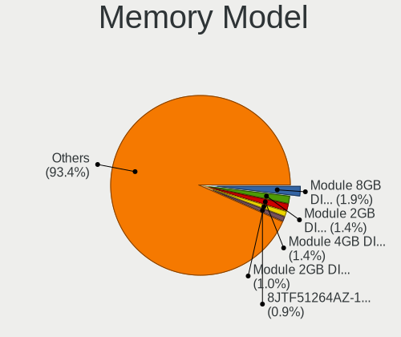

| Model                                                    | Desktops | Percent |
|----------------------------------------------------------|----------|---------|
| Unknown                                                  | 11       | 1.67%   |
| Unknown RAM Module 2GB DIMM DDR2 800MT/s                 | 8        | 1.21%   |
| Kingston RAM KHX1600C10D3/8G 8GB DIMM DDR3 1600MT/s      | 8        | 1.21%   |
| Samsung RAM M378B5273DH0-CH9 4GB DIMM DDR3 2133MT/s      | 7        | 1.06%   |
| Micron RAM 8JTF51264AZ-1G6E1 4GB DIMM DDR3 1600MT/s      | 7        | 1.06%   |
| Kingston RAM KHX1600C9D3/4GX 4GB DIMM DDR3 1600MT/s      | 7        | 1.06%   |
| Unknown RAM Module 4GB DIMM 1333MT/s                     | 6        | 0.91%   |
| Corsair RAM CMV4GX3M1A1333C9 4GB DIMM DDR3 1600MT/s      | 6        | 0.91%   |
| Unknown RAM Module 8GB DIMM DDR3 1600MT/s                | 5        | 0.76%   |
| Unknown RAM Module 4GB DIMM DDR3 1600MT/s                | 5        | 0.76%   |
| Unknown RAM Module 4GB DIMM DDR3 1333MT/s                | 5        | 0.76%   |
| Unknown RAM Module 2GB DIMM 1333MT/s                     | 5        | 0.76%   |
| Samsung RAM M378B5773DH0-CH9 2GB DIMM DDR3 1333MT/s      | 5        | 0.76%   |
| Samsung RAM M378B5673FH0-CH9 2GB DIMM DDR3 1600MT/s      | 5        | 0.76%   |
| Nanya RAM NT2GC64B88B0NF-CG 2GB DIMM DDR3 1333MT/s       | 5        | 0.76%   |
| Kingston RAM KHX3200C16D4/8GX 8GB DIMM DDR4 3600MT/s     | 5        | 0.76%   |
| Unknown RAM Module 2GB DIMM SDRAM                        | 4        | 0.61%   |
| Unknown RAM Module 2GB DIMM DDR3 1333MT/s                | 4        | 0.61%   |
| SK hynix RAM HMT451U6BFR8C-PB 4GB DIMM DDR3 1600MT/s     | 4        | 0.61%   |
| SK hynix RAM HMT351U6CFR8C-PB 4GB DIMM DDR3 1800MT/s     | 4        | 0.61%   |
| Samsung RAM M471B5173QH0-YK0 4GB SODIMM DDR3 1600MT/s    | 4        | 0.61%   |
| Kingston RAM KF3200C16D4/8GX 8GB DIMM DDR4 3600MT/s      | 4        | 0.61%   |
| Corsair RAM CMK16GX4M2B3200C16 8GB DIMM DDR4 3600MT/s    | 4        | 0.61%   |
| Unknown RAM Module 2GB DIMM 800MT/s                      | 3        | 0.46%   |
| Team RAM TEAMGROUP-UD4-3200 8GB DIMM DDR4 3800MT/s       | 3        | 0.46%   |
| SK hynix RAM HMT451U6AFR8C-PB 4096MB DIMM DDR3 1600MT/s  | 3        | 0.46%   |
| SK hynix RAM HMA81GU6AFR8N-UH 8GB DIMM DDR4 2400MT/s     | 3        | 0.46%   |
| Samsung RAM M471B5173DB0-YK0 4GB SODIMM DDR3 1600MT/s    | 3        | 0.46%   |
| Samsung RAM M378B5273DH0-CK0 4GB DIMM DDR3 2200MT/s      | 3        | 0.46%   |
| Samsung RAM M378B5173QH0-CK0 4GB DIMM DDR3 1600MT/s      | 3        | 0.46%   |
| Kingston RAM KHX3200C16D4/4GX 4GB DIMM DDR4 3600MT/s     | 3        | 0.46%   |
| Kingston RAM KHX2666C16/8G 8GB DIMM DDR4 3466MT/s        | 3        | 0.46%   |
| Kingston RAM 99U5471-054.A00LF 8GB DIMM DDR3 1600MT/s    | 3        | 0.46%   |
| Crucial RAM BLS8G4D26BFSEK.8FD 8GB DIMM DDR4 3000MT/s    | 3        | 0.46%   |
| Crucial RAM BLS8G4D26BFSBK.8FD 8GB DIMM DDR4 2933MT/s    | 3        | 0.46%   |
| Crucial RAM BLS4G3D1609DS1S00. 4GB DIMM DDR3 1600MT/s    | 3        | 0.46%   |
| Corsair RAM CMK16GX4M2B3000C15 8192MB DIMM DDR4 3200MT/s | 3        | 0.46%   |
| A-DATA RAM Module 2GB DIMM DDR3 1333MT/s                 | 3        | 0.46%   |
| A-DATA RAM DDR4 3200 8GB DIMM DDR4 3600MT/s              | 3        | 0.46%   |
| Unknown RAM Module 8GB DIMM 1333MT/s                     | 2        | 0.3%    |

Memory Kind
-----------

Memory module kinds

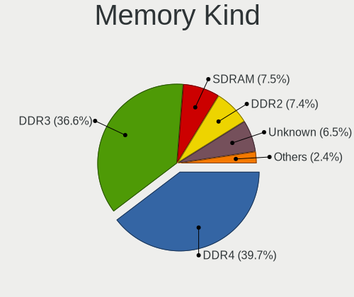

| Kind    | Desktops | Percent |
|---------|----------|---------|
| DDR4    | 210      | 41.5%   |
| DDR3    | 201      | 39.72%  |
| SDRAM   | 34       | 6.72%   |
| Unknown | 28       | 5.53%   |
| DDR2    | 26       | 5.14%   |
| DDR5    | 3        | 0.59%   |
| DDR     | 2        | 0.4%    |
| LPDDR4  | 1        | 0.2%    |
| DRAM    | 1        | 0.2%    |

Memory Form Factor
------------------

Physical design of the memory module

| Name   | Desktops | Percent |
|--------|----------|---------|
| DIMM   | 453      | 92.07%  |
| SODIMM | 35       | 7.11%   |
| RIMM   | 4        | 0.81%   |

Memory Size
-----------

Memory module size

| Size  | Desktops | Percent |
|-------|----------|---------|
| 8192  | 211      | 37.95%  |
| 4096  | 167      | 30.04%  |
| 2048  | 93       | 16.73%  |
| 16384 | 51       | 9.17%   |
| 1024  | 19       | 3.42%   |
| 32768 | 14       | 2.52%   |
| 64    | 1        | 0.18%   |

Memory Speed
------------

Memory module speed

| Speed   | Desktops | Percent |
|---------|----------|---------|
| 1600    | 128      | 22.3%   |
| 1333    | 82       | 14.29%  |
| 2400    | 41       | 7.14%   |
| 3600    | 38       | 6.62%   |
| 2667    | 34       | 5.92%   |
| 3200    | 33       | 5.75%   |
| 2133    | 32       | 5.57%   |
| 800     | 22       | 3.83%   |
| 667     | 16       | 2.79%   |
| 2933    | 13       | 2.26%   |
| 1867    | 12       | 2.09%   |
| Unknown | 10       | 1.74%   |
| 3000    | 8        | 1.39%   |
| 2666    | 8        | 1.39%   |
| 1866    | 8        | 1.39%   |
| 3466    | 6        | 1.05%   |
| 1800    | 6        | 1.05%   |
| 3800    | 5        | 0.87%   |
| 1334    | 5        | 0.87%   |
| 3733    | 4        | 0.7%    |
| 3666    | 4        | 0.7%    |
| 3400    | 4        | 0.7%    |
| 1066    | 4        | 0.7%    |
| 3266    | 3        | 0.52%   |
| 2800    | 3        | 0.52%   |
| 2200    | 3        | 0.52%   |
| 1639    | 3        | 0.52%   |
| 1067    | 3        | 0.52%   |
| 400     | 3        | 0.52%   |
| 3533    | 2        | 0.35%   |
| 3151    | 2        | 0.35%   |
| 3007    | 2        | 0.35%   |
| 2448    | 2        | 0.35%   |
| 333     | 2        | 0.35%   |
| 49926   | 1        | 0.17%   |
| 6400    | 1        | 0.17%   |
| 6000    | 1        | 0.17%   |
| 4802    | 1        | 0.17%   |
| 4800    | 1        | 0.17%   |
| 4266    | 1        | 0.17%   |

Printers & scanners
-------------------

Printer Vendor
--------------

Printer device vendors

| Vendor              | Desktops | Percent |
|---------------------|----------|---------|
| Brother Industries  | 8        | 32%     |
| Seiko Epson         | 5        | 20%     |
| Hewlett-Packard     | 5        | 20%     |
| Canon               | 5        | 20%     |
| Samsung Electronics | 2        | 8%      |

Printer Model
-------------

Printer device models

| Model                              | Desktops | Percent |
|------------------------------------|----------|---------|
| HP DeskJet 2620 All-in-One Printer | 2        | 8%      |
| Brother HL-L2390DW                 | 2        | 8%      |
| Seiko Epson XP-7100 Series         | 1        | 4%      |
| Seiko Epson Printer                | 1        | 4%      |
| Seiko Epson L6160 Series           | 1        | 4%      |
| Seiko Epson L3150 Series           | 1        | 4%      |
| Seiko Epson L120 Series            | 1        | 4%      |
| Samsung ML-1710 Printer            | 1        | 4%      |
| Samsung M267x 287x Series          | 1        | 4%      |
| HP LaserJet P1005                  | 1        | 4%      |
| HP ENVY 5000 series                | 1        | 4%      |
| HP DeskJet 5650c                   | 1        | 4%      |
| Canon TS5300 series                | 1        | 4%      |
| Canon TS5100 series                | 1        | 4%      |
| Canon TR7500 series                | 1        | 4%      |
| Canon LiDE 300                     | 1        | 4%      |
| Canon G3000 series                 | 1        | 4%      |
| Brother MFC-J435W                  | 1        | 4%      |
| Brother MFC-7460DN                 | 1        | 4%      |
| Brother HL-5450DN series           | 1        | 4%      |
| Brother HL-5370DW series           | 1        | 4%      |
| Brother HL-2140 series             | 1        | 4%      |
| Brother DCP-1510                   | 1        | 4%      |

Scanner Vendor
--------------

Scanner device vendors

| Vendor                      | Desktops | Percent |
|-----------------------------|----------|---------|
| KYE Systems (Mouse Systems) | 1        | 25%     |
| Hewlett-Packard             | 1        | 25%     |
| Canon                       | 1        | 25%     |
| Acer Peripherals (now BenQ) | 1        | 25%     |

Scanner Model
-------------

Scanner device models

| Model                                               | Desktops | Percent |
|-----------------------------------------------------|----------|---------|
| KYE Systems (Mouse Systems) ColorPage-Vivid 1200 XE | 1        | 25%     |
| HP ScanJet 3670                                     | 1        | 25%     |
| Canon CanoScan LiDE 90                              | 1        | 25%     |
| Acer Peripherals (now BenQ) Prisa 1240UT            | 1        | 25%     |

Camera
------

Camera Vendor
-------------

Camera device vendors

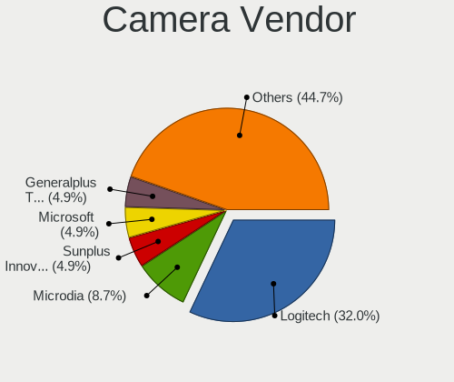

| Vendor                        | Desktops | Percent |
|-------------------------------|----------|---------|
| Logitech                      | 22       | 33.33%  |
| Microdia                      | 5        | 7.58%   |
| Chicony Electronics           | 4        | 6.06%   |
| Sunplus Innovation Technology | 3        | 4.55%   |
| Realtek Semiconductor         | 3        | 4.55%   |
| Generalplus Technology        | 3        | 4.55%   |
| WaveRider Communications      | 2        | 3.03%   |
| Microsoft                     | 2        | 3.03%   |
| ARC International             | 2        | 3.03%   |
| Z-Star Microelectronics       | 1        | 1.52%   |
| Unknown                       | 1        | 1.52%   |
| Silicon Motion                | 1        | 1.52%   |
| Samsung Electronics           | 1        | 1.52%   |
| Razer USA                     | 1        | 1.52%   |
| LG Electronics                | 1        | 1.52%   |
| Jieli Technology              | 1        | 1.52%   |
| Hewlett-Packard               | 1        | 1.52%   |
| Genesys Logic                 | 1        | 1.52%   |
| GEMBIRD                       | 1        | 1.52%   |
| eMeet-200611                  | 1        | 1.52%   |
| eMeet                         | 1        | 1.52%   |
| Creative Technology           | 1        | 1.52%   |
| AVerMedia Technologies        | 1        | 1.52%   |
| Aveo Technology               | 1        | 1.52%   |
| ASUSTek Computer              | 1        | 1.52%   |
| Apple                         | 1        | 1.52%   |
| ALi                           | 1        | 1.52%   |
| Alcor Micro                   | 1        | 1.52%   |
| A4Tech                        | 1        | 1.52%   |

Camera Model
------------

Camera device models

| Model                                                 | Desktops | Percent |
|-------------------------------------------------------|----------|---------|
| Logitech Webcam C270                                  | 6        | 9.09%   |
| Sunplus Canyon CNS-CWC5 Webcam                        | 3        | 4.55%   |
| WaveRider USB 2.0 Camera                              | 2        | 3.03%   |
| Realtek USB Camera                                    | 2        | 3.03%   |
| Microdia USB 2.0 Camera                               | 2        | 3.03%   |
| Microdia Integrated Camera                            | 2        | 3.03%   |
| Generalplus GENERAL WEBCAM                            | 2        | 3.03%   |
| ARC International Camera                              | 2        | 3.03%   |
| Z-Star Venus USB2.0 Camera                            | 1        | 1.52%   |
| Unknown HD camera                                     | 1        | 1.52%   |
| Silicon Motion Silicon Motion Camera                  | 1        | 1.52%   |
| Samsung Galaxy series, misc. (MTP mode)               | 1        | 1.52%   |
| Realtek HP 1.0MP High Definition Webcam               | 1        | 1.52%   |
| Razer USA Razer Kiyo Pro                              | 1        | 1.52%   |
| Microsoft Microsoft LifeCam HD-5001                 | 1        | 1.52%   |
| Microsoft LifeCam VX-800                              | 1        | 1.52%   |
| Microdia Webcam Vitade AF                             | 1        | 1.52%   |
| Logitech Webcam C930e                                 | 1        | 1.52%   |
| Logitech Webcam C925e                                 | 1        | 1.52%   |
| Logitech Webcam C600                                  | 1        | 1.52%   |
| Logitech Webcam C310                                  | 1        | 1.52%   |
| Logitech Webcam C210                                  | 1        | 1.52%   |
| Logitech Webcam C200                                  | 1        | 1.52%   |
| Logitech Webcam C120                                  | 1        | 1.52%   |
| Logitech QuickCam Pro 5000                            | 1        | 1.52%   |
| Logitech Portable Webcam C905                         | 1        | 1.52%   |
| Logitech HD Webcam C910                               | 1        | 1.52%   |
| Logitech HD Webcam C525                               | 1        | 1.52%   |
| Logitech HD Webcam C510                               | 1        | 1.52%   |
| Logitech HD Pro Webcam C920                           | 1        | 1.52%   |
| Logitech CrystalCam                                   | 1        | 1.52%   |
| Logitech C922 Pro Stream Webcam                       | 1        | 1.52%   |
| Logitech C920 PRO HD Webcam                           | 1        | 1.52%   |
| LG LM-X420xxx/G2/G3 Android Phone (MTP/download mode) | 1        | 1.52%   |
| Jieli USB PHY 2.0                                     | 1        | 1.52%   |
| HP USB Webcam                                         | 1        | 1.52%   |
| Genesys Logic Camera                                  | 1        | 1.52%   |
| Generalplus WEB CAM                                   | 1        | 1.52%   |
| GEMBIRD USB2.0 PC CAMERA                              | 1        | 1.52%   |
| eMeet-200611 eMeet Nova                               | 1        | 1.52%   |

Security
--------

Fingerprint Vendor
------------------

Fingerprint sensor vendors

Zero info for selected period =(

Fingerprint Model
-----------------

Fingerprint sensor models

Zero info for selected period =(

Chipcard Vendor
---------------

Chipcard module vendors

| Vendor                | Desktops | Percent |
|-----------------------|----------|---------|
| SCM Microsystems      | 1        | 25%     |
| Gemalto (was Gemplus) | 1        | 25%     |
| Castles Technology    | 1        | 25%     |
| Alcor Micro           | 1        | 25%     |

Chipcard Model
--------------

Chipcard module models

| Model                                             | Desktops | Percent |
|---------------------------------------------------|----------|---------|
| SCM Microsystems SCR333 SmartCard Reader          | 1        | 25%     |
| Gemalto (was Gemplus) GemPC Twin SmartCard Reader | 1        | 25%     |
| Castles Technology EZC                            | 1        | 25%     |
| Alcor Micro AU9540 Smartcard Reader               | 1        | 25%     |

Unsupported
-----------

Unsupported Devices
-------------------

Total unsupported devices on board

| Total | Desktops | Percent |
|-------|----------|---------|
| 0     | 457      | 91.22%  |
| 1     | 41       | 8.18%   |
| 2     | 3        | 0.6%    |

Unsupported Device Types
------------------------

Types of unsupported devices

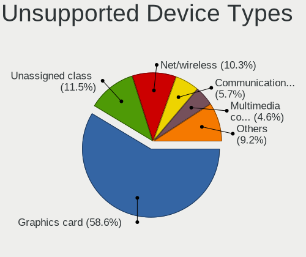

| Type                     | Desktops | Percent |
|--------------------------|----------|---------|
| Graphics card            | 24       | 51.06%  |
| Unassigned class         | 7        | 14.89%  |
| Net/wireless             | 6        | 12.77%  |
| Chipcard                 | 4        | 8.51%   |
| Camera                   | 3        | 6.38%   |
| Multimedia controller    | 2        | 4.26%   |
| Communication controller | 1        | 2.13%   |

