OpenMandriva 23.03 - Tested Hardware & Statistics (Notebooks)
-------------------------------------------------------------

A project to collect tested hardware configurations for OpenMandriva 23.03.

Anyone can contribute to this report by the [hw-probe](https://github.com/linuxhw/hw-probe) tool:

    sudo -E hw-probe -all -upload

Please contribute! Especially if your hardware is rare.

Contents
--------

* [ Test Cases ](#test-cases)

* [ System ](#system)
  - [ Kernel                   ](#kernel)
  - [ Kernel Family            ](#kernel-family)
  - [ Kernel Major Ver.        ](#kernel-major-ver)
  - [ Arch                     ](#arch)
  - [ DE                       ](#de)
  - [ Display Server           ](#display-server)
  - [ Display Manager          ](#display-manager)
  - [ OS Lang                  ](#os-lang)
  - [ Boot Mode                ](#boot-mode)
  - [ Filesystem               ](#filesystem)
  - [ Part. scheme             ](#part-scheme)
  - [ Dual Boot with Linux/BSD ](#dual-boot-with-linuxbsd)
  - [ Dual Boot (Win)          ](#dual-boot-win)

* [ Board ](#board)
  - [ Vendor                   ](#vendor)
  - [ Model                    ](#model)
  - [ Model Family             ](#model-family)
  - [ MFG Year                 ](#mfg-year)
  - [ Form Factor              ](#form-factor)
  - [ Secure Boot              ](#secure-boot)
  - [ Coreboot                 ](#coreboot)
  - [ RAM Size                 ](#ram-size)
  - [ RAM Used                 ](#ram-used)
  - [ Total Drives             ](#total-drives)
  - [ Has CD-ROM               ](#has-cd-rom)
  - [ Has Ethernet             ](#has-ethernet)
  - [ Has WiFi                 ](#has-wifi)
  - [ Has Bluetooth            ](#has-bluetooth)

* [ Location ](#location)
  - [ Country                  ](#country)
  - [ City                     ](#city)

* [ Drives ](#drives)
  - [ Drive Vendor             ](#drive-vendor)
  - [ Drive Model              ](#drive-model)
  - [ HDD Vendor               ](#hdd-vendor)
  - [ SSD Vendor               ](#ssd-vendor)
  - [ Drive Kind               ](#drive-kind)
  - [ Drive Connector          ](#drive-connector)
  - [ Drive Size               ](#drive-size)
  - [ Space Total              ](#space-total)
  - [ Space Used               ](#space-used)
  - [ Malfunc. Drives          ](#malfunc-drives)
  - [ Malfunc. Drive Vendor    ](#malfunc-drive-vendor)
  - [ Malfunc. HDD Vendor      ](#malfunc-hdd-vendor)
  - [ Malfunc. Drive Kind      ](#malfunc-drive-kind)
  - [ Failed Drives            ](#failed-drives)
  - [ Failed Drive Vendor      ](#failed-drive-vendor)
  - [ Drive Status             ](#drive-status)

* [ Storage controller ](#storage-controller)
  - [ Storage Vendor           ](#storage-vendor)
  - [ Storage Model            ](#storage-model)
  - [ Storage Kind             ](#storage-kind)

* [ Processor ](#processor)
  - [ CPU Vendor               ](#cpu-vendor)
  - [ CPU Model                ](#cpu-model)
  - [ CPU Model Family         ](#cpu-model-family)
  - [ CPU Cores                ](#cpu-cores)
  - [ CPU Sockets              ](#cpu-sockets)
  - [ CPU Threads              ](#cpu-threads)
  - [ CPU Op-Modes             ](#cpu-op-modes)
  - [ CPU Microcode            ](#cpu-microcode)
  - [ CPU Microarch            ](#cpu-microarch)

* [ Graphics ](#graphics)
  - [ GPU Vendor               ](#gpu-vendor)
  - [ GPU Model                ](#gpu-model)
  - [ GPU Combo                ](#gpu-combo)
  - [ GPU Driver               ](#gpu-driver)
  - [ GPU Memory               ](#gpu-memory)

* [ Monitor ](#monitor)
  - [ Monitor Vendor           ](#monitor-vendor)
  - [ Monitor Model            ](#monitor-model)
  - [ Monitor Resolution       ](#monitor-resolution)
  - [ Monitor Diagonal         ](#monitor-diagonal)
  - [ Monitor Width            ](#monitor-width)
  - [ Aspect Ratio             ](#aspect-ratio)
  - [ Monitor Area             ](#monitor-area)
  - [ Pixel Density            ](#pixel-density)
  - [ Multiple Monitors        ](#multiple-monitors)

* [ Network ](#network)
  - [ Net Controller Vendor    ](#net-controller-vendor)
  - [ Net Controller Model     ](#net-controller-model)
  - [ Wireless Vendor          ](#wireless-vendor)
  - [ Wireless Model           ](#wireless-model)
  - [ Ethernet Vendor          ](#ethernet-vendor)
  - [ Ethernet Model           ](#ethernet-model)
  - [ Net Controller Kind      ](#net-controller-kind)
  - [ Used Controller          ](#used-controller)
  - [ NICs                     ](#nics)
  - [ IPv6                     ](#ipv6)

* [ Bluetooth ](#bluetooth)
  - [ Bluetooth Vendor         ](#bluetooth-vendor)
  - [ Bluetooth Model          ](#bluetooth-model)

* [ Sound ](#sound)
  - [ Sound Vendor             ](#sound-vendor)
  - [ Sound Model              ](#sound-model)

* [ Memory ](#memory)
  - [ Memory Vendor            ](#memory-vendor)
  - [ Memory Model             ](#memory-model)
  - [ Memory Kind              ](#memory-kind)
  - [ Memory Form Factor       ](#memory-form-factor)
  - [ Memory Size              ](#memory-size)
  - [ Memory Speed             ](#memory-speed)

* [ Printers & scanners ](#printers--scanners)
  - [ Printer Vendor           ](#printer-vendor)
  - [ Printer Model            ](#printer-model)
  - [ Scanner Vendor           ](#scanner-vendor)
  - [ Scanner Model            ](#scanner-model)

* [ Camera ](#camera)
  - [ Camera Vendor            ](#camera-vendor)
  - [ Camera Model             ](#camera-model)

* [ Security ](#security)
  - [ Fingerprint Vendor       ](#fingerprint-vendor)
  - [ Fingerprint Model        ](#fingerprint-model)
  - [ Chipcard Vendor          ](#chipcard-vendor)
  - [ Chipcard Model           ](#chipcard-model)

* [ Unsupported ](#unsupported)
  - [ Unsupported Devices      ](#unsupported-devices)
  - [ Unsupported Device Types ](#unsupported-device-types)

Test Cases
----------

Total: 969

| Vendor        | Model                       | Probe                                                      | Date         |
|---------------|-----------------------------|------------------------------------------------------------|--------------|
| Lenovo        | ThinkPad X260 20F5A0XWJP    | [7aede5c549](https://linux-hardware.org/?probe=7aede5c549) | Dec 16, 2023 |
| Lenovo        | IdeaPad 3 15IGL05 81WQ      | [5ec5788395](https://linux-hardware.org/?probe=5ec5788395) | Dec 13, 2023 |
| Alienware     | 18                          | [e2dc3b99fc](https://linux-hardware.org/?probe=e2dc3b99fc) | Dec 02, 2023 |
| ASUSTek       | ASUS TUF Dash F15 FX517Z... | [f73d3f92cf](https://linux-hardware.org/?probe=f73d3f92cf) | Dec 02, 2023 |
| HP            | EliteBook 6930p             | [0fefa1b40e](https://linux-hardware.org/?probe=0fefa1b40e) | Dec 01, 2023 |
| Dell          | Inspiron 13-5368            | [ab8935b499](https://linux-hardware.org/?probe=ab8935b499) | Dec 01, 2023 |
| Dell          | Precision M4500             | [044aca6d38](https://linux-hardware.org/?probe=044aca6d38) | Nov 27, 2023 |
| Dell          | Inspiron 3593               | [557aba57b5](https://linux-hardware.org/?probe=557aba57b5) | Nov 26, 2023 |
| HP            | Laptop 15z-ef3xxx           | [278b62313d](https://linux-hardware.org/?probe=278b62313d) | Nov 25, 2023 |
| Fujitsu Si... | AMILO Pi 3625               | [e93688d366](https://linux-hardware.org/?probe=e93688d366) | Nov 22, 2023 |
| Toshiba       | Satellite L300D             | [87222a31f3](https://linux-hardware.org/?probe=87222a31f3) | Nov 18, 2023 |
| HP            | Laptop 15-bs0xx             | [6d71a63b67](https://linux-hardware.org/?probe=6d71a63b67) | Nov 16, 2023 |
| Alienware     | 18                          | [129d60c7cc](https://linux-hardware.org/?probe=129d60c7cc) | Nov 15, 2023 |
| Lenovo        | IdeaPad 300-15IBR 80M3      | [1e2c26c06a](https://linux-hardware.org/?probe=1e2c26c06a) | Nov 09, 2023 |
| Exo           | Intel powered classmate ... | [135b2008b7](https://linux-hardware.org/?probe=135b2008b7) | Nov 09, 2023 |
| HP            | Compaq 6710b                | [7a0b2fd29b](https://linux-hardware.org/?probe=7a0b2fd29b) | Nov 05, 2023 |
| Dell          | Inspiron 13-5368            | [6d00cda16c](https://linux-hardware.org/?probe=6d00cda16c) | Nov 01, 2023 |
| ASUSTek       | X551CAP                     | [bff9909d9b](https://linux-hardware.org/?probe=bff9909d9b) | Oct 24, 2023 |
| HP            | ProBook 450 G6              | [17c7c26cd0](https://linux-hardware.org/?probe=17c7c26cd0) | Oct 24, 2023 |
| ASUSTek       | N61Jv                       | [cb8a1ca22a](https://linux-hardware.org/?probe=cb8a1ca22a) | Oct 17, 2023 |
| Fujitsu       | FMVNS7HE                    | [2408a69be7](https://linux-hardware.org/?probe=2408a69be7) | Oct 13, 2023 |
| Apple         | MacBookPro8,2               | [4749aba038](https://linux-hardware.org/?probe=4749aba038) | Oct 04, 2023 |
| Dell          | Inspiron 13-5368            | [b7463e19f8](https://linux-hardware.org/?probe=b7463e19f8) | Oct 02, 2023 |
| Dell          | System Vostro 3750          | [3b050c2582](https://linux-hardware.org/?probe=3b050c2582) | Sep 24, 2023 |
| Apple         | MacBookPro12,1              | [b8b562cc39](https://linux-hardware.org/?probe=b8b562cc39) | Sep 22, 2023 |
| ASUSTek       | TP550LAB                    | [3e07304aa5](https://linux-hardware.org/?probe=3e07304aa5) | Sep 20, 2023 |
| Lenovo        | ThinkPad X270 W10DG 20K6... | [1a5acc2c10](https://linux-hardware.org/?probe=1a5acc2c10) | Sep 17, 2023 |
| NEC Comput... | PC-VK15EBZDG                | [83d74c1e9d](https://linux-hardware.org/?probe=83d74c1e9d) | Sep 17, 2023 |
| Lenovo        | ThinkPad T420 4236B27       | [8cd0ed072f](https://linux-hardware.org/?probe=8cd0ed072f) | Sep 16, 2023 |
| HP            | 15                          | [636b9a80a1](https://linux-hardware.org/?probe=636b9a80a1) | Sep 15, 2023 |
| Positivo      | C14CR21                     | [9d48466eab](https://linux-hardware.org/?probe=9d48466eab) | Sep 13, 2023 |
| Samsung       | 300E4M/300E4S/300E4L        | [a1f824e885](https://linux-hardware.org/?probe=a1f824e885) | Sep 12, 2023 |
| Dell          | Latitude E6400              | [e42cf159af](https://linux-hardware.org/?probe=e42cf159af) | Sep 09, 2023 |
| HP            | Notebook                    | [5a36d2a3bf](https://linux-hardware.org/?probe=5a36d2a3bf) | Sep 08, 2023 |
| Apple         | MacBookPro10,1              | [81aab795b5](https://linux-hardware.org/?probe=81aab795b5) | Sep 08, 2023 |
| Acer          | Nitro AN515-44              | [032db27cfa](https://linux-hardware.org/?probe=032db27cfa) | Sep 08, 2023 |
| Toshiba       | Satellite C850-1DZ          | [cf916c2f33](https://linux-hardware.org/?probe=cf916c2f33) | Sep 05, 2023 |
| Dell          | Precision M4800             | [2e40a27b2e](https://linux-hardware.org/?probe=2e40a27b2e) | Sep 04, 2023 |
| SLIMBOOK      | PROX14-AMD                  | [c2da44c04f](https://linux-hardware.org/?probe=c2da44c04f) | Sep 04, 2023 |
| ASUSTek       | TUF Gaming FA706IU_FA706... | [479e3b96b2](https://linux-hardware.org/?probe=479e3b96b2) | Sep 04, 2023 |
| Lenovo        | ThinkPad X301 2774LEG       | [50f297712d](https://linux-hardware.org/?probe=50f297712d) | Sep 01, 2023 |
| Dell          | Inspiron 13-5368            | [e811db37c5](https://linux-hardware.org/?probe=e811db37c5) | Sep 01, 2023 |
| Apple         | MacBook4,1                  | [04424409ef](https://linux-hardware.org/?probe=04424409ef) | Aug 29, 2023 |
| Lenovo        | IdeaPad Z470                | [d3c372d869](https://linux-hardware.org/?probe=d3c372d869) | Aug 29, 2023 |
| Sony          | VPCEB43FG                   | [99812c6c56](https://linux-hardware.org/?probe=99812c6c56) | Aug 28, 2023 |
| ASUSTek       | VivoBook_ASUSLaptop X515... | [ded7284a37](https://linux-hardware.org/?probe=ded7284a37) | Aug 27, 2023 |
| Acer          | Aspire 4810T                | [4e72e77dc6](https://linux-hardware.org/?probe=4e72e77dc6) | Aug 27, 2023 |
| HP            | Compaq Presario CQ60        | [b407522eb0](https://linux-hardware.org/?probe=b407522eb0) | Aug 25, 2023 |
| Dell          | G5 5590                     | [c13a60889c](https://linux-hardware.org/?probe=c13a60889c) | Aug 25, 2023 |
| HP            | Pavilion Gaming Laptop 1... | [3f37fa5636](https://linux-hardware.org/?probe=3f37fa5636) | Aug 25, 2023 |
| ASUSTek       | X541SA                      | [109de7a1ae](https://linux-hardware.org/?probe=109de7a1ae) | Aug 23, 2023 |
| HP            | EliteBook 2170p             | [0bba785aee](https://linux-hardware.org/?probe=0bba785aee) | Aug 21, 2023 |
| Dell          | Latitude E5520              | [35f02a2ea2](https://linux-hardware.org/?probe=35f02a2ea2) | Aug 19, 2023 |
| Dell          | Latitude E6500              | [5d1f16198a](https://linux-hardware.org/?probe=5d1f16198a) | Aug 18, 2023 |
| Packard Be... | EasyNote TS11HR             | [fb77a4db86](https://linux-hardware.org/?probe=fb77a4db86) | Aug 16, 2023 |
| Gigabyte      | RC14UD                      | [51b04bf027](https://linux-hardware.org/?probe=51b04bf027) | Aug 16, 2023 |
| Acer          | Aspire A315-21G             | [b74079b9cd](https://linux-hardware.org/?probe=b74079b9cd) | Aug 15, 2023 |
| MSI           | GP62 6QF                    | [d9455cbed8](https://linux-hardware.org/?probe=d9455cbed8) | Aug 15, 2023 |
| HP            | EliteBook Folio 9470m       | [d7f0d8e9cd](https://linux-hardware.org/?probe=d7f0d8e9cd) | Aug 15, 2023 |
| ASUSTek       | X553MA                      | [b2ee5cedbe](https://linux-hardware.org/?probe=b2ee5cedbe) | Aug 14, 2023 |
| Lenovo        | ThinkPad E595 20NF0006GE    | [c9c068e82b](https://linux-hardware.org/?probe=c9c068e82b) | Aug 13, 2023 |
| Packard Be... | EasyNote LE69KB             | [42772eba76](https://linux-hardware.org/?probe=42772eba76) | Aug 13, 2023 |
| Sony          | SVE1112M1EW                 | [353fb8c6ff](https://linux-hardware.org/?probe=353fb8c6ff) | Aug 13, 2023 |
| Dell          | Inspiron 1720               | [1cb123d894](https://linux-hardware.org/?probe=1cb123d894) | Aug 12, 2023 |
| Fujitsu       | FMVA0800C                   | [1dae7b170b](https://linux-hardware.org/?probe=1dae7b170b) | Aug 12, 2023 |
| HP            | Compaq nx9420 (RH457EA#A... | [1b7c441369](https://linux-hardware.org/?probe=1b7c441369) | Aug 12, 2023 |
| Lenovo        | V310-14ISK 80SX             | [edd47d65b6](https://linux-hardware.org/?probe=edd47d65b6) | Aug 12, 2023 |
| Lenovo        | V130-15IKB 81HN             | [88a9c5764d](https://linux-hardware.org/?probe=88a9c5764d) | Aug 11, 2023 |
| Acer          | Aspire A515-51              | [4856b9b32f](https://linux-hardware.org/?probe=4856b9b32f) | Aug 11, 2023 |
| Lenovo        | ThinkPad T520 42405FG       | [fad80ecff3](https://linux-hardware.org/?probe=fad80ecff3) | Aug 11, 2023 |
| Lenovo        | ThinkPad T430s 2356LPG      | [97dfe9511b](https://linux-hardware.org/?probe=97dfe9511b) | Aug 10, 2023 |
| Google        | Kip                         | [553df8dcdc](https://linux-hardware.org/?probe=553df8dcdc) | Aug 10, 2023 |
| Acer          | Aspire ES1-431              | [6802a19338](https://linux-hardware.org/?probe=6802a19338) | Aug 10, 2023 |
| Acer          | Extensa 5630                | [1cc3eaf69a](https://linux-hardware.org/?probe=1cc3eaf69a) | Aug 10, 2023 |
| Lenovo        | ThinkPad X220 4290C37       | [125ac0cbd3](https://linux-hardware.org/?probe=125ac0cbd3) | Aug 08, 2023 |
| HP            | Laptop 14-dq3xxx            | [c547f01fbb](https://linux-hardware.org/?probe=c547f01fbb) | Aug 08, 2023 |
| Acer          | AO756                       | [1ea1658ac0](https://linux-hardware.org/?probe=1ea1658ac0) | Aug 07, 2023 |
| Unknown       | Unknown                     | [691c44286e](https://linux-hardware.org/?probe=691c44286e) | Aug 06, 2023 |
| GPD           | G1618-03                    | [070d548515](https://linux-hardware.org/?probe=070d548515) | Aug 06, 2023 |
| Dell          | Inspiron N4050              | [af35c9ce49](https://linux-hardware.org/?probe=af35c9ce49) | Aug 05, 2023 |
| Dell          | Precision M2800             | [7d1afe9d42](https://linux-hardware.org/?probe=7d1afe9d42) | Aug 05, 2023 |
| Notebook      | W54_W94_W955TU,-T,-C        | [9db6bfdcfa](https://linux-hardware.org/?probe=9db6bfdcfa) | Aug 05, 2023 |
| Fujitsu       | LIFEBOOK LH532              | [ba3a2e1773](https://linux-hardware.org/?probe=ba3a2e1773) | Aug 04, 2023 |
| Lenovo        | ThinkPad T480 20L6S9R500    | [3624b5e366](https://linux-hardware.org/?probe=3624b5e366) | Aug 04, 2023 |
| Lenovo        | ThinkPad E14 Gen 3 20Y7C... | [e7810a04a9](https://linux-hardware.org/?probe=e7810a04a9) | Aug 04, 2023 |
| Acer          | Aspire 8943G                | [fedb43e298](https://linux-hardware.org/?probe=fedb43e298) | Aug 04, 2023 |
| GFAST         | N150                        | [bccc2874df](https://linux-hardware.org/?probe=bccc2874df) | Aug 04, 2023 |
| MSI           | Titan GT77HX 13VH           | [3acda608a1](https://linux-hardware.org/?probe=3acda608a1) | Aug 03, 2023 |
| Samsung       | 900X3C/900X3D/900X3E/900... | [a3401e5a4b](https://linux-hardware.org/?probe=a3401e5a4b) | Aug 03, 2023 |
| Dell          | Precision M4500             | [b425204301](https://linux-hardware.org/?probe=b425204301) | Aug 02, 2023 |
| MSI           | Modern 15 A10M              | [bab451a11e](https://linux-hardware.org/?probe=bab451a11e) | Aug 02, 2023 |
| Dell          | Inspiron 13-5368            | [695e2dec6b](https://linux-hardware.org/?probe=695e2dec6b) | Aug 02, 2023 |
| Lenovo        | IdeaPad Gaming 3 15ACH6 ... | [c2c27c3268](https://linux-hardware.org/?probe=c2c27c3268) | Aug 01, 2023 |
| Chuwi         | GemiBook Pro                | [be8a59432a](https://linux-hardware.org/?probe=be8a59432a) | Aug 01, 2023 |
| Acer          | Aspire 1810TZ               | [8cbec4eb45](https://linux-hardware.org/?probe=8cbec4eb45) | Jul 31, 2023 |
| Dell          | Latitude E6430              | [9dcf92cce9](https://linux-hardware.org/?probe=9dcf92cce9) | Jul 31, 2023 |
| Toshiba       | Satellite A135              | [2eddaa2a26](https://linux-hardware.org/?probe=2eddaa2a26) | Jul 30, 2023 |
| Chuwi         | HeroBook Pro                | [eb332b024d](https://linux-hardware.org/?probe=eb332b024d) | Jul 30, 2023 |
| ASUSTek       | E200HA                      | [6ab93e7940](https://linux-hardware.org/?probe=6ab93e7940) | Jul 30, 2023 |
| ASUSTek       | X540NA                      | [68b0d7d1fb](https://linux-hardware.org/?probe=68b0d7d1fb) | Jul 30, 2023 |
| Lenovo        | ThinkPad A285 20MXS0AE00    | [a6ada51a02](https://linux-hardware.org/?probe=a6ada51a02) | Jul 29, 2023 |
| Dell          | Latitude E6420              | [a70852def5](https://linux-hardware.org/?probe=a70852def5) | Jul 29, 2023 |
| ASUSTek       | X102BA                      | [488aa4c5b4](https://linux-hardware.org/?probe=488aa4c5b4) | Jul 29, 2023 |
| Acer          | Aspire 4810T                | [4d3abb525e](https://linux-hardware.org/?probe=4d3abb525e) | Jul 28, 2023 |
| A14CR         | Unknown                     | [4ceb4f6761](https://linux-hardware.org/?probe=4ceb4f6761) | Jul 27, 2023 |
| MSI           | Alpha 15 B5EEK              | [d6a4c29101](https://linux-hardware.org/?probe=d6a4c29101) | Jul 27, 2023 |
| Lenovo        | ThinkPad E555 20DH0027UK    | [b7bf821032](https://linux-hardware.org/?probe=b7bf821032) | Jul 26, 2023 |
| Positivo      | G800                        | [5dd0f188f8](https://linux-hardware.org/?probe=5dd0f188f8) | Jul 25, 2023 |
| ASUSTek       | P50IJ                       | [d8aff1255a](https://linux-hardware.org/?probe=d8aff1255a) | Jul 25, 2023 |
| LG Electro... | 17Z90P-K.AA78A1             | [6fc7661aae](https://linux-hardware.org/?probe=6fc7661aae) | Jul 25, 2023 |
| Toshiba       | IS 1442                     | [3a66df4c2d](https://linux-hardware.org/?probe=3a66df4c2d) | Jul 25, 2023 |
| Dell          | Latitude 7490               | [066e3b9518](https://linux-hardware.org/?probe=066e3b9518) | Jul 25, 2023 |
| Dell          | Inspiron 13-5378            | [7f6b8fc2db](https://linux-hardware.org/?probe=7f6b8fc2db) | Jul 23, 2023 |
| Lenovo        | IdeaPad 3 14IGL05 81WH      | [92c6b0de0c](https://linux-hardware.org/?probe=92c6b0de0c) | Jul 23, 2023 |
| Lenovo        | IdeaPad 5 14ALC05 82LM      | [9f384d336d](https://linux-hardware.org/?probe=9f384d336d) | Jul 23, 2023 |
| HP            | Notebook                    | [1a4ba0be2f](https://linux-hardware.org/?probe=1a4ba0be2f) | Jul 23, 2023 |
| HP            | Pavilion dv2500             | [6e86c0a75b](https://linux-hardware.org/?probe=6e86c0a75b) | Jul 23, 2023 |
| Lenovo        | V145-15AST 81MT             | [ecce500445](https://linux-hardware.org/?probe=ecce500445) | Jul 22, 2023 |
| HP            | 255 15.6 inch G9 Noteboo... | [d387ed9d0c](https://linux-hardware.org/?probe=d387ed9d0c) | Jul 22, 2023 |
| HP            | Laptop 17-by3xxx            | [b5fe1f6fca](https://linux-hardware.org/?probe=b5fe1f6fca) | Jul 22, 2023 |
| HP            | Pavilion dv6700             | [aed45c2e40](https://linux-hardware.org/?probe=aed45c2e40) | Jul 21, 2023 |
| Packard Be... | EasyNote SL65               | [f66a4415f3](https://linux-hardware.org/?probe=f66a4415f3) | Jul 21, 2023 |
| HUAWEI        | BOHK-WAX9X                  | [fe0c696d47](https://linux-hardware.org/?probe=fe0c696d47) | Jul 21, 2023 |
| Dell          | Latitude E6400              | [7e9ef12f0d](https://linux-hardware.org/?probe=7e9ef12f0d) | Jul 19, 2023 |
| Apple         | MacBookPro10,1              | [c3ec46f79e](https://linux-hardware.org/?probe=c3ec46f79e) | Jul 19, 2023 |
| Acer          | Aspire E5-476G              | [74af6477be](https://linux-hardware.org/?probe=74af6477be) | Jul 19, 2023 |
| ASUSTek       | VivoBook_ASUSLaptop X712... | [7843df6b43](https://linux-hardware.org/?probe=7843df6b43) | Jul 19, 2023 |
| LG Electro... | P420-G.BE42P1               | [9dea573574](https://linux-hardware.org/?probe=9dea573574) | Jul 18, 2023 |
| Fujitsu       | LIFEBOOK A557               | [96f08b7598](https://linux-hardware.org/?probe=96f08b7598) | Jul 18, 2023 |
| Lenovo        | ThinkPad E15 20RDS1G700     | [6ad3194fd9](https://linux-hardware.org/?probe=6ad3194fd9) | Jul 18, 2023 |
| ASUSTek       | K46CB                       | [144d523bf1](https://linux-hardware.org/?probe=144d523bf1) | Jul 18, 2023 |
| HP            | Pavilion Notebook           | [babb224527](https://linux-hardware.org/?probe=babb224527) | Jul 18, 2023 |
| HP            | G42                         | [d42b44461e](https://linux-hardware.org/?probe=d42b44461e) | Jul 18, 2023 |
| Lenovo        | ThinkPad T480 20L5004HUS    | [6d453b900a](https://linux-hardware.org/?probe=6d453b900a) | Jul 17, 2023 |
| Toshiba       | TECRA A10                   | [0740ca470e](https://linux-hardware.org/?probe=0740ca470e) | Jul 16, 2023 |
| ASUSTek       | 1011PX                      | [d91fe40195](https://linux-hardware.org/?probe=d91fe40195) | Jul 15, 2023 |
| Lenovo        | ThinkPad T400 6474C53       | [e9db1ea8a6](https://linux-hardware.org/?probe=e9db1ea8a6) | Jul 15, 2023 |
| Acer          | Aspire E5-773G              | [a4a4102548](https://linux-hardware.org/?probe=a4a4102548) | Jul 15, 2023 |
| Positivo      | Mobile                      | [fdc2d91a25](https://linux-hardware.org/?probe=fdc2d91a25) | Jul 15, 2023 |
| Toshiba       | Satellite C650              | [252f8adf16](https://linux-hardware.org/?probe=252f8adf16) | Jul 15, 2023 |
| Packard Be... | EasyNote LM85               | [3efd87a0d8](https://linux-hardware.org/?probe=3efd87a0d8) | Jul 14, 2023 |
| Lenovo        | ThinkPad X230 2325FG0       | [4df76c784c](https://linux-hardware.org/?probe=4df76c784c) | Jul 13, 2023 |
| HP            | Pavilion Laptop 15-eg1xx... | [be2db3ecfa](https://linux-hardware.org/?probe=be2db3ecfa) | Jul 13, 2023 |
| Lenovo        | IdeaPad 110-15IBR 80T7      | [6130474cb1](https://linux-hardware.org/?probe=6130474cb1) | Jul 13, 2023 |
| HP            | Victus by Laptop 16-e0xx... | [d2dd2ac514](https://linux-hardware.org/?probe=d2dd2ac514) | Jul 13, 2023 |
| Apple         | MacBookPro12,1              | [dd19bc7fee](https://linux-hardware.org/?probe=dd19bc7fee) | Jul 12, 2023 |
| Dell          | Inspiron 5748               | [ec95cc29fd](https://linux-hardware.org/?probe=ec95cc29fd) | Jul 11, 2023 |
| Dell          | Inspiron 5749               | [0421d22945](https://linux-hardware.org/?probe=0421d22945) | Jul 11, 2023 |
| Lenovo        | ThinkPad T430 23501B3       | [8f1d64206e](https://linux-hardware.org/?probe=8f1d64206e) | Jul 11, 2023 |
| HP            | Pavilion dv6500             | [a714d595da](https://linux-hardware.org/?probe=a714d595da) | Jul 10, 2023 |
| GPU Compan... | GWNR71517                   | [9a58539b66](https://linux-hardware.org/?probe=9a58539b66) | Jul 10, 2023 |
| Dell          | Latitude 3490               | [67de502259](https://linux-hardware.org/?probe=67de502259) | Jul 10, 2023 |
| ASUSTek       | ASUS TUF Gaming F15 FX50... | [96ca518dc6](https://linux-hardware.org/?probe=96ca518dc6) | Jul 09, 2023 |
| Alienware     | 17                          | [90e6911a60](https://linux-hardware.org/?probe=90e6911a60) | Jul 09, 2023 |
| Lenovo        | IdeaPad 3 15ADA05 81W1      | [c6a3712ec9](https://linux-hardware.org/?probe=c6a3712ec9) | Jul 09, 2023 |
| Lenovo        | V145-15AST 81MT             | [a29509646a](https://linux-hardware.org/?probe=a29509646a) | Jul 08, 2023 |
| Acer          | Aspire A315-21              | [d6a3964ff7](https://linux-hardware.org/?probe=d6a3964ff7) | Jul 08, 2023 |
| Toshiba       | Satellite L755              | [cb309977d0](https://linux-hardware.org/?probe=cb309977d0) | Jul 08, 2023 |
| Acer          | TravelMate 5335             | [7422cf6091](https://linux-hardware.org/?probe=7422cf6091) | Jul 08, 2023 |
| HP            | EliteBook 2560p             | [df243ca59d](https://linux-hardware.org/?probe=df243ca59d) | Jul 08, 2023 |
| Toshiba       | dynabook R73/Y              | [37e3897f65](https://linux-hardware.org/?probe=37e3897f65) | Jul 08, 2023 |
| Dell          | Latitude E5470              | [ac0f0dd893](https://linux-hardware.org/?probe=ac0f0dd893) | Jul 08, 2023 |
| HP            | Compaq 6730b (GW687AV)      | [0b81f2e9b0](https://linux-hardware.org/?probe=0b81f2e9b0) | Jul 07, 2023 |
| Lenovo        | IdeaPad 3 15ADA05 81W1      | [de87cf7e95](https://linux-hardware.org/?probe=de87cf7e95) | Jul 07, 2023 |
| Medion        | Unknown                     | [8fd3bc8734](https://linux-hardware.org/?probe=8fd3bc8734) | Jul 07, 2023 |
| Google        | Lick                        | [aa3d137fcf](https://linux-hardware.org/?probe=aa3d137fcf) | Jul 07, 2023 |
| Dell          | Latitude E5450              | [0a1677c02e](https://linux-hardware.org/?probe=0a1677c02e) | Jul 06, 2023 |
| Toshiba       | Satellite P200D             | [609a275664](https://linux-hardware.org/?probe=609a275664) | Jul 06, 2023 |
| Toshiba       | Satellite L750              | [037db5066a](https://linux-hardware.org/?probe=037db5066a) | Jul 05, 2023 |
| HP            | 550                         | [f788d05211](https://linux-hardware.org/?probe=f788d05211) | Jul 05, 2023 |
| Packard Be... | IPOWER                      | [3c116708b4](https://linux-hardware.org/?probe=3c116708b4) | Jul 05, 2023 |
| Standard      | ECT                         | [42f38309b9](https://linux-hardware.org/?probe=42f38309b9) | Jul 04, 2023 |
| Lenovo        | ThinkPad L520 5015A12       | [0cb85712d9](https://linux-hardware.org/?probe=0cb85712d9) | Jul 04, 2023 |
| Lenovo        | IdeaPad 3 15ADA05 81W1      | [9ec1de725f](https://linux-hardware.org/?probe=9ec1de725f) | Jul 04, 2023 |
| eMachines     | Padus                       | [008b3a48cd](https://linux-hardware.org/?probe=008b3a48cd) | Jul 04, 2023 |
| ASUSTek       | X541UAK                     | [c4dcbea71d](https://linux-hardware.org/?probe=c4dcbea71d) | Jul 03, 2023 |
| Alienware     | 18                          | [7898671060](https://linux-hardware.org/?probe=7898671060) | Jul 02, 2023 |
| Lenovo        | IdeaPad Gaming 3 15ACH6 ... | [f78c4a1930](https://linux-hardware.org/?probe=f78c4a1930) | Jul 01, 2023 |
| Acer          | Predator PT515-51           | [fc639c945e](https://linux-hardware.org/?probe=fc639c945e) | Jul 01, 2023 |
| HP            | 550                         | [7681694808](https://linux-hardware.org/?probe=7681694808) | Jul 01, 2023 |
| Acer          | JM11-MS                     | [ad02c854e0](https://linux-hardware.org/?probe=ad02c854e0) | Jul 01, 2023 |
| lapbook       | S15 PRO                     | [06ae615fd1](https://linux-hardware.org/?probe=06ae615fd1) | Jul 01, 2023 |
| Acer          | Aspire A314-22              | [ef54ec3027](https://linux-hardware.org/?probe=ef54ec3027) | Jun 30, 2023 |
| Lenovo        | ThinkPad L430 246634S       | [5368d4410f](https://linux-hardware.org/?probe=5368d4410f) | Jun 30, 2023 |
| HP            | Laptop 15-db1xxx            | [6d3d6e002f](https://linux-hardware.org/?probe=6d3d6e002f) | Jun 30, 2023 |
| ASUSTek       | X555LAB                     | [99e1623ea0](https://linux-hardware.org/?probe=99e1623ea0) | Jun 29, 2023 |
| Lenovo        | IdeaPad 100-15IBY 80MJ      | [723de914e2](https://linux-hardware.org/?probe=723de914e2) | Jun 29, 2023 |
| ASUSTek       | ROG Strix G513QY_G513QY     | [a77c825995](https://linux-hardware.org/?probe=a77c825995) | Jun 29, 2023 |
| Dell          | System XPS L321X            | [abf6b8b341](https://linux-hardware.org/?probe=abf6b8b341) | Jun 29, 2023 |
| Acer          | Aspire 5830TG               | [8c001b69bb](https://linux-hardware.org/?probe=8c001b69bb) | Jun 29, 2023 |
| HP            | Pavilion dv6500             | [0286d2f5e5](https://linux-hardware.org/?probe=0286d2f5e5) | Jun 29, 2023 |
| HP            | Stream Laptop 14-cb1XX      | [1db11a4fa9](https://linux-hardware.org/?probe=1db11a4fa9) | Jun 29, 2023 |
| Lenovo        | ThinkPad L520 50153CJ       | [1793064ee5](https://linux-hardware.org/?probe=1793064ee5) | Jun 29, 2023 |
| ASUSTek       | K54C                        | [4152d1fcff](https://linux-hardware.org/?probe=4152d1fcff) | Jun 28, 2023 |
| PCsmart       | PCSGOB14p-C                 | [a45977461f](https://linux-hardware.org/?probe=a45977461f) | Jun 27, 2023 |
| Clevo         | M540SS Bottom               | [4b613733a0](https://linux-hardware.org/?probe=4b613733a0) | Jun 27, 2023 |
| Dell          | Inspiron 7720               | [89858274fd](https://linux-hardware.org/?probe=89858274fd) | Jun 27, 2023 |
| ASUSTek       | VivoBook_ASUSLaptop X510... | [501d3b5530](https://linux-hardware.org/?probe=501d3b5530) | Jun 25, 2023 |
| Toshiba       | Satellite A300              | [6f1d7a6089](https://linux-hardware.org/?probe=6f1d7a6089) | Jun 25, 2023 |
| Dell          | Precision M6400             | [b68c09e274](https://linux-hardware.org/?probe=b68c09e274) | Jun 25, 2023 |
| Lenovo        | ThinkPad T480 20L6S01G00    | [a66d6dba45](https://linux-hardware.org/?probe=a66d6dba45) | Jun 25, 2023 |
| Toshiba       | IS 1413G                    | [bce89b670d](https://linux-hardware.org/?probe=bce89b670d) | Jun 25, 2023 |
| Packard Be... | EasyNote TK85               | [314e344780](https://linux-hardware.org/?probe=314e344780) | Jun 24, 2023 |
| HP            | G62                         | [e8187f4fb6](https://linux-hardware.org/?probe=e8187f4fb6) | Jun 24, 2023 |
| Dell          | Latitude 3180               | [a9a4a63807](https://linux-hardware.org/?probe=a9a4a63807) | Jun 24, 2023 |
| HP            | Compaq 610                  | [f312ec5ede](https://linux-hardware.org/?probe=f312ec5ede) | Jun 23, 2023 |
| Lenovo        | Flex 2-14 20404             | [4ab121533a](https://linux-hardware.org/?probe=4ab121533a) | Jun 23, 2023 |
| MSI           | S12T 3M/S12 3M              | [f135825cec](https://linux-hardware.org/?probe=f135825cec) | Jun 23, 2023 |
| Lenovo        | G570 20079                  | [5879c3e9ad](https://linux-hardware.org/?probe=5879c3e9ad) | Jun 22, 2023 |
| Dell          | Inspiron 5557               | [cc0794fa6e](https://linux-hardware.org/?probe=cc0794fa6e) | Jun 21, 2023 |
| Sony          | VGN-NS21M_W                 | [6813d6589e](https://linux-hardware.org/?probe=6813d6589e) | Jun 21, 2023 |
| Acer          | One S1002                   | [f7b8d25603](https://linux-hardware.org/?probe=f7b8d25603) | Jun 21, 2023 |
| HP            | Notebook                    | [3460bcb864](https://linux-hardware.org/?probe=3460bcb864) | Jun 20, 2023 |
| Samsung       | 300E4A/300E5A/300E7A/343... | [f84ddd7cac](https://linux-hardware.org/?probe=f84ddd7cac) | Jun 20, 2023 |
| Acer          | Aspire F5-771G              | [034d235f5c](https://linux-hardware.org/?probe=034d235f5c) | Jun 19, 2023 |
| Dell          | System XPS L502X            | [463e017820](https://linux-hardware.org/?probe=463e017820) | Jun 19, 2023 |
| Lenovo        | ThinkPad E580 20KS001JMZ    | [780d549a32](https://linux-hardware.org/?probe=780d549a32) | Jun 18, 2023 |
| HP            | Laptop 14s-dk1xxx           | [16bbd0f687](https://linux-hardware.org/?probe=16bbd0f687) | Jun 18, 2023 |
| Lenovo        | IdeaPad 3 15ALC6 82KU       | [46692b99cb](https://linux-hardware.org/?probe=46692b99cb) | Jun 18, 2023 |
| Lenovo        | ThinkPad P50 20EQS4840B     | [a60f1ae93e](https://linux-hardware.org/?probe=a60f1ae93e) | Jun 17, 2023 |
| ASUSTek       | X551CAP                     | [9066d9bad2](https://linux-hardware.org/?probe=9066d9bad2) | Jun 17, 2023 |
| Lenovo        | ThinkPad E580 20KSCTO1WW    | [d415965e91](https://linux-hardware.org/?probe=d415965e91) | Jun 17, 2023 |
| Monster       | HUMA H4 V5.2                | [491797a556](https://linux-hardware.org/?probe=491797a556) | Jun 17, 2023 |
| Dell          | XPS 15 9550                 | [b7faea4be3](https://linux-hardware.org/?probe=b7faea4be3) | Jun 16, 2023 |
| Acer          | Aspire V3-571               | [75c2da2c37](https://linux-hardware.org/?probe=75c2da2c37) | Jun 15, 2023 |
| HP            | EliteBook 2540p             | [20ddd7a28b](https://linux-hardware.org/?probe=20ddd7a28b) | Jun 15, 2023 |
| ASUSTek       | S400CA                      | [d512f1865e](https://linux-hardware.org/?probe=d512f1865e) | Jun 15, 2023 |
| Dell          | Inspiron 1501               | [456a49b146](https://linux-hardware.org/?probe=456a49b146) | Jun 13, 2023 |
| LincPlus      | LINNCPLUS P1                | [878dc2b05f](https://linux-hardware.org/?probe=878dc2b05f) | Jun 13, 2023 |
| Chuwi         | GemiBook Pro                | [34cfc4a037](https://linux-hardware.org/?probe=34cfc4a037) | Jun 13, 2023 |
| Positivo      | C14CR01                     | [11d46971fa](https://linux-hardware.org/?probe=11d46971fa) | Jun 12, 2023 |
| ASUSTek       | X540SAA                     | [ea61fdd09a](https://linux-hardware.org/?probe=ea61fdd09a) | Jun 11, 2023 |
| Acer          | Aspire E1-572               | [532d86f9e6](https://linux-hardware.org/?probe=532d86f9e6) | Jun 10, 2023 |
| ASUSTek       | TUF Gaming FX505GD_FX505... | [03660fb140](https://linux-hardware.org/?probe=03660fb140) | Jun 10, 2023 |
| HP            | G42                         | [83eca37118](https://linux-hardware.org/?probe=83eca37118) | Jun 10, 2023 |
| Lenovo        | ThinkPad T61 7660A25        | [e1617105e0](https://linux-hardware.org/?probe=e1617105e0) | Jun 10, 2023 |
| ASUSTek       | VivoBook 17_ASUS Laptop ... | [08a506ad4e](https://linux-hardware.org/?probe=08a506ad4e) | Jun 09, 2023 |
| Dell          | Inspiron 7348               | [a2bd4ab5b9](https://linux-hardware.org/?probe=a2bd4ab5b9) | Jun 09, 2023 |
| HP            | Stream Notebook PC 11       | [fd037bb738](https://linux-hardware.org/?probe=fd037bb738) | Jun 08, 2023 |
| ASUSTek       | VivoBook_ASUSLaptop X415... | [c142d83ce5](https://linux-hardware.org/?probe=c142d83ce5) | Jun 07, 2023 |
| Razer         | Blade 15 Advanced Model ... | [8f55e469c8](https://linux-hardware.org/?probe=8f55e469c8) | Jun 06, 2023 |
| ASUSTek       | ASUS TUF Gaming F15 FX50... | [4c3091f9ff](https://linux-hardware.org/?probe=4c3091f9ff) | Jun 06, 2023 |
| Lenovo        | Z50-70 20354                | [05a473a2be](https://linux-hardware.org/?probe=05a473a2be) | Jun 06, 2023 |
| ASUSTek       | VivoBook_ASUSLaptop X712... | [525601c31e](https://linux-hardware.org/?probe=525601c31e) | Jun 04, 2023 |
| Lenovo        | IdeaPad 3 15IGL05 81WQ      | [681baff23c](https://linux-hardware.org/?probe=681baff23c) | Jun 04, 2023 |
| Lenovo        | Legion 5 Pro 16ACH6H 82J... | [ac6745cffb](https://linux-hardware.org/?probe=ac6745cffb) | Jun 03, 2023 |
| Lenovo        | IdeaPad 320-17IKB 80XM      | [5d6b08920f](https://linux-hardware.org/?probe=5d6b08920f) | Jun 03, 2023 |
| Compaq        | 420                         | [cf7a8f5641](https://linux-hardware.org/?probe=cf7a8f5641) | Jun 03, 2023 |
| Valve         | Jupiter                     | [3aa6cf6780](https://linux-hardware.org/?probe=3aa6cf6780) | Jun 03, 2023 |
| HP            | EliteBook 8440p             | [7f95f275b3](https://linux-hardware.org/?probe=7f95f275b3) | Jun 03, 2023 |
| Lenovo        | ThinkPad X230 Tablet 343... | [1034aea990](https://linux-hardware.org/?probe=1034aea990) | Jun 03, 2023 |
| Lenovo        | B51-80 80LM                 | [69429cb044](https://linux-hardware.org/?probe=69429cb044) | Jun 01, 2023 |
| Toshiba       | Satellite C50-B             | [1a6c37d8f7](https://linux-hardware.org/?probe=1a6c37d8f7) | Jun 01, 2023 |
| HP            | Laptop 15-dw3xxx            | [a4854b177f](https://linux-hardware.org/?probe=a4854b177f) | Jun 01, 2023 |
| Dell          | Latitude 7490               | [31eb124dfb](https://linux-hardware.org/?probe=31eb124dfb) | Jun 01, 2023 |
| Lenovo        | ThinkPad L440 20ASA20VLM    | [1d59682589](https://linux-hardware.org/?probe=1d59682589) | Jun 01, 2023 |
| Apple         | MacBookAir9,1               | [b3e3a95a06](https://linux-hardware.org/?probe=b3e3a95a06) | Jun 01, 2023 |
| Dell          | System Vostro 3450          | [ae337aeb9c](https://linux-hardware.org/?probe=ae337aeb9c) | May 31, 2023 |
| Timi          | RedmiBook 14 II             | [bad37936c6](https://linux-hardware.org/?probe=bad37936c6) | May 30, 2023 |
| HP            | 255 G8 Notebook PC          | [ea55e0ac39](https://linux-hardware.org/?probe=ea55e0ac39) | May 30, 2023 |
| Lenovo        | ThinkPad X61 76738AG        | [7f52d18c2f](https://linux-hardware.org/?probe=7f52d18c2f) | May 30, 2023 |
| Samsung       | RV419/RV420                 | [ddab046bd5](https://linux-hardware.org/?probe=ddab046bd5) | May 30, 2023 |
| Acer          | Aspire ES1-512              | [3c6e8b6acd](https://linux-hardware.org/?probe=3c6e8b6acd) | May 29, 2023 |
| Google        | Auron_Paine                 | [66fd27934f](https://linux-hardware.org/?probe=66fd27934f) | May 29, 2023 |
| Acer          | Aspire E5-573               | [fc839b0b6f](https://linux-hardware.org/?probe=fc839b0b6f) | May 29, 2023 |
| Lenovo        | ThinkPad W541 20EF000MUS    | [44c1329399](https://linux-hardware.org/?probe=44c1329399) | May 29, 2023 |
| Lenovo        | IdeaPad 3 15ADA05 81W1      | [42b817db26](https://linux-hardware.org/?probe=42b817db26) | May 29, 2023 |
| Acer          | Aspire VX5-591G             | [1db96272fe](https://linux-hardware.org/?probe=1db96272fe) | May 29, 2023 |
| Lenovo        | G400 20235                  | [193fbef9a1](https://linux-hardware.org/?probe=193fbef9a1) | May 28, 2023 |
| HP            | Compaq 6910p (GY174UP#AB... | [43ee52e798](https://linux-hardware.org/?probe=43ee52e798) | May 28, 2023 |
| Dell          | Inspiron 7559               | [af1bb009ca](https://linux-hardware.org/?probe=af1bb009ca) | May 28, 2023 |
| Lenovo        | ThinkPad T420 4236N79       | [9908724093](https://linux-hardware.org/?probe=9908724093) | May 28, 2023 |
| Toshiba       | Satellite L500              | [b1213efe40](https://linux-hardware.org/?probe=b1213efe40) | May 28, 2023 |
| Acer          | Aspire 7540                 | [82fcb3124c](https://linux-hardware.org/?probe=82fcb3124c) | May 28, 2023 |
| Toshiba       | Satellite C645D             | [085994472d](https://linux-hardware.org/?probe=085994472d) | May 28, 2023 |
| ASUSTek       | VivoBook_ASUSLaptop X415... | [56fca4583d](https://linux-hardware.org/?probe=56fca4583d) | May 28, 2023 |
| Samsung       | 270E5J/2570EJ               | [f90f831805](https://linux-hardware.org/?probe=f90f831805) | May 28, 2023 |
| HP            | 15 Notebook PC              | [3904ffdddf](https://linux-hardware.org/?probe=3904ffdddf) | May 27, 2023 |
| Acer          | Aspire A517-51G             | [bfc89878ce](https://linux-hardware.org/?probe=bfc89878ce) | May 27, 2023 |
| Lenovo        | IdeaPad 330-15IKB 81DE      | [0ccc456c4e](https://linux-hardware.org/?probe=0ccc456c4e) | May 27, 2023 |
| Dell          | Inspiron 5567               | [9dc73257dc](https://linux-hardware.org/?probe=9dc73257dc) | May 27, 2023 |
| HP            | 255 G8 Notebook PC          | [9ecbba0aaa](https://linux-hardware.org/?probe=9ecbba0aaa) | May 26, 2023 |
| Dell          | Latitude 5290               | [fb6cbb6a2f](https://linux-hardware.org/?probe=fb6cbb6a2f) | May 26, 2023 |
| MSI           | GL75 Leopard 10SDK          | [41eac45c5e](https://linux-hardware.org/?probe=41eac45c5e) | May 25, 2023 |
| Dell          | Inspiron 15-3567            | [a8dd30a7bb](https://linux-hardware.org/?probe=a8dd30a7bb) | May 25, 2023 |
| Timi          | TM1701                      | [c883337466](https://linux-hardware.org/?probe=c883337466) | May 24, 2023 |
| Toshiba       | Satellite C660D             | [cd798092df](https://linux-hardware.org/?probe=cd798092df) | May 23, 2023 |
| Lenovo        | ThinkPad L520 5017A62       | [a8d01c9adb](https://linux-hardware.org/?probe=a8d01c9adb) | May 23, 2023 |
| Apple         | MacBookPro9,2               | [6855a79270](https://linux-hardware.org/?probe=6855a79270) | May 23, 2023 |
| ASUSTek       | ASUS TUF Gaming F15 FX50... | [76db4a03a1](https://linux-hardware.org/?probe=76db4a03a1) | May 22, 2023 |
| Lenovo        | ThinkPad L440 20AS001CUK    | [8d253e2d7e](https://linux-hardware.org/?probe=8d253e2d7e) | May 22, 2023 |
| MSI           | Modern 14 B10MW             | [319f4883aa](https://linux-hardware.org/?probe=319f4883aa) | May 22, 2023 |
| Dell          | Latitude E6230              | [89c5618eb8](https://linux-hardware.org/?probe=89c5618eb8) | May 22, 2023 |
| ASUSTek       | K84L                        | [5f14f3b293](https://linux-hardware.org/?probe=5f14f3b293) | May 21, 2023 |
| HP            | Pavilion dv7                | [816fffab13](https://linux-hardware.org/?probe=816fffab13) | May 21, 2023 |
| Philco        | 14H                         | [5dbb0cb3b7](https://linux-hardware.org/?probe=5dbb0cb3b7) | May 21, 2023 |
| Wortmann      | TERRA_MOBILE_1528P/1748P    | [03afaf2468](https://linux-hardware.org/?probe=03afaf2468) | May 21, 2023 |
| Fujitsu       | LIFEBOOK S752               | [906ba8b65c](https://linux-hardware.org/?probe=906ba8b65c) | May 21, 2023 |
| ASUSTek       | N53TK                       | [275e480739](https://linux-hardware.org/?probe=275e480739) | May 21, 2023 |
| Lenovo        | Y50-70 20378                | [2aff70d7c9](https://linux-hardware.org/?probe=2aff70d7c9) | May 21, 2023 |
| Acer          | Aspire 4750                 | [704221c10c](https://linux-hardware.org/?probe=704221c10c) | May 21, 2023 |
| Samsung       | RV411/RV511/E3511/S3511/... | [07039bd959](https://linux-hardware.org/?probe=07039bd959) | May 21, 2023 |
| HP            | 15 Notebook PC              | [e1939cff8f](https://linux-hardware.org/?probe=e1939cff8f) | May 21, 2023 |
| Toshiba       | Satellite P300              | [ed99950768](https://linux-hardware.org/?probe=ed99950768) | May 20, 2023 |
| HP            | Pavilion Gaming Laptop 1... | [59464cac80](https://linux-hardware.org/?probe=59464cac80) | May 20, 2023 |
| Dell          | Inspiron 1501               | [d2fb2ddcce](https://linux-hardware.org/?probe=d2fb2ddcce) | May 20, 2023 |
| Dell          | Latitude 5285               | [0db3cfd34e](https://linux-hardware.org/?probe=0db3cfd34e) | May 20, 2023 |
| HP            | Laptop 15-ef2xxx            | [b563edd887](https://linux-hardware.org/?probe=b563edd887) | May 20, 2023 |
| HP            | 250 G2                      | [e3b94752ac](https://linux-hardware.org/?probe=e3b94752ac) | May 19, 2023 |
| Lenovo        | ThinkPad T14 Gen 1 20S00... | [5e6991f9e3](https://linux-hardware.org/?probe=5e6991f9e3) | May 19, 2023 |
| Lenovo        | ThinkPad W530 24411M9       | [1094884573](https://linux-hardware.org/?probe=1094884573) | May 19, 2023 |
| Chuwi         | HeroBook Pro                | [b25115a01a](https://linux-hardware.org/?probe=b25115a01a) | May 19, 2023 |
| ASUSTek       | F7Se                        | [1cd79e84fd](https://linux-hardware.org/?probe=1cd79e84fd) | May 19, 2023 |
| Lenovo        | ThinkPad L560 20F2S1JP03    | [d0dd999b33](https://linux-hardware.org/?probe=d0dd999b33) | May 18, 2023 |
| Lenovo        | IdeaPad 3 15IAU7 82RK       | [82dca1cbb8](https://linux-hardware.org/?probe=82dca1cbb8) | May 18, 2023 |
| Toshiba       | Satellite L850-1HQ          | [d16c26b474](https://linux-hardware.org/?probe=d16c26b474) | May 18, 2023 |
| Lenovo        | ThinkPad T14 Gen 2a 20XK... | [df73f83c15](https://linux-hardware.org/?probe=df73f83c15) | May 18, 2023 |
| Google        | Auron_Paine                 | [a836fcd48f](https://linux-hardware.org/?probe=a836fcd48f) | May 18, 2023 |
| Lenovo        | ThinkPad T460s 20FAS2L60... | [a58ebcac7c](https://linux-hardware.org/?probe=a58ebcac7c) | May 17, 2023 |
| HP            | Pavilion g6                 | [da7af17667](https://linux-hardware.org/?probe=da7af17667) | May 17, 2023 |
| Lenovo        | V15-ADA 82C7                | [cfe4d9071b](https://linux-hardware.org/?probe=cfe4d9071b) | May 16, 2023 |
| Samsung       | R428/P428                   | [1d93335f58](https://linux-hardware.org/?probe=1d93335f58) | May 15, 2023 |
| HP            | Pavilion dv8                | [422d1fd213](https://linux-hardware.org/?probe=422d1fd213) | May 14, 2023 |
| Acer          | Aspire A114-32              | [6fdf42b8a9](https://linux-hardware.org/?probe=6fdf42b8a9) | May 14, 2023 |
| Fujitsu       | LIFEBOOK S752               | [97e9f91d90](https://linux-hardware.org/?probe=97e9f91d90) | May 14, 2023 |
| ASUSTek       | K53BR                       | [96a60a2970](https://linux-hardware.org/?probe=96a60a2970) | May 14, 2023 |
| Dell          | Precision M4500             | [315cccc082](https://linux-hardware.org/?probe=315cccc082) | May 14, 2023 |
| Lenovo        | G50-30 80G0                 | [31d034ce6e](https://linux-hardware.org/?probe=31d034ce6e) | May 13, 2023 |
| Toshiba       | Satellite C55-A-1KZ         | [37c165fa30](https://linux-hardware.org/?probe=37c165fa30) | May 13, 2023 |
| Dell          | Vostro 3400                 | [37eeeb2f31](https://linux-hardware.org/?probe=37eeeb2f31) | May 13, 2023 |
| Lenovo        | IdeaPad 3 15IML05 81WB      | [16954b8f95](https://linux-hardware.org/?probe=16954b8f95) | May 13, 2023 |
| Samsung       | RF510/RF410/RF710           | [4820c25349](https://linux-hardware.org/?probe=4820c25349) | May 12, 2023 |
| Toshiba       | Satellite C75-A             | [5be756cc91](https://linux-hardware.org/?probe=5be756cc91) | May 11, 2023 |
| Acer          | Extensa 5220                | [261e743adc](https://linux-hardware.org/?probe=261e743adc) | May 11, 2023 |
| Chuwi         | GemiBook Pro                | [b63292a4f9](https://linux-hardware.org/?probe=b63292a4f9) | May 11, 2023 |
| HP            | Laptop 17-by0xxx            | [10b9d3a925](https://linux-hardware.org/?probe=10b9d3a925) | May 11, 2023 |
| Acer          | Aspire E1-521               | [22d77e0e7d](https://linux-hardware.org/?probe=22d77e0e7d) | May 11, 2023 |
| ASUSTek       | X555LAB                     | [2710a15a04](https://linux-hardware.org/?probe=2710a15a04) | May 10, 2023 |
| Samsung       | X420/X520                   | [aec20f5b38](https://linux-hardware.org/?probe=aec20f5b38) | May 10, 2023 |
| Dell          | Precision M3800             | [e7b0097a72](https://linux-hardware.org/?probe=e7b0097a72) | May 09, 2023 |
| Dell          | Inspiron 5559               | [f7cb6c9251](https://linux-hardware.org/?probe=f7cb6c9251) | May 09, 2023 |
| Dell          | Latitude 5420               | [2f3519c123](https://linux-hardware.org/?probe=2f3519c123) | May 09, 2023 |
| Fujitsu       | FMVA0500TP                  | [61061bd78d](https://linux-hardware.org/?probe=61061bd78d) | May 09, 2023 |
| Acer          | Aspire VN7-592G             | [8ebde36ef2](https://linux-hardware.org/?probe=8ebde36ef2) | May 09, 2023 |
| Acer          | Aspire A515-56              | [57b843a3ca](https://linux-hardware.org/?probe=57b843a3ca) | May 09, 2023 |
| Apple         | MacBookPro11,4              | [83f86e5727](https://linux-hardware.org/?probe=83f86e5727) | May 09, 2023 |
| Dell          | Latitude E6440              | [6b8d3c96c5](https://linux-hardware.org/?probe=6b8d3c96c5) | May 09, 2023 |
| HP            | Pavilion dv7                | [1d9699c86f](https://linux-hardware.org/?probe=1d9699c86f) | May 09, 2023 |
| HP            | Pavilion dv6                | [531adb6cae](https://linux-hardware.org/?probe=531adb6cae) | May 09, 2023 |
| Lenovo        | IdeaPad 110-15ACL 80TJ      | [def28849c6](https://linux-hardware.org/?probe=def28849c6) | May 08, 2023 |
| HP            | 15                          | [fd2af6a225](https://linux-hardware.org/?probe=fd2af6a225) | May 08, 2023 |
| Acer          | Aspire ES1-132              | [10a13dcd68](https://linux-hardware.org/?probe=10a13dcd68) | May 08, 2023 |
| Lenovo        | ThinkPad X1 Nano Gen 1 2... | [d615a9b90f](https://linux-hardware.org/?probe=d615a9b90f) | May 08, 2023 |
| ASUSTek       | X202E                       | [6039408aaf](https://linux-hardware.org/?probe=6039408aaf) | May 08, 2023 |
| HP            | 15                          | [162a4b16ae](https://linux-hardware.org/?probe=162a4b16ae) | May 08, 2023 |
| Dell          | XPS 13 9310                 | [3530619c98](https://linux-hardware.org/?probe=3530619c98) | May 07, 2023 |
| Lenovo        | ThinkPad X1 Carbon Gen 1... | [b734a6d6f3](https://linux-hardware.org/?probe=b734a6d6f3) | May 07, 2023 |
| Toshiba       | Satellite L655              | [9eef570443](https://linux-hardware.org/?probe=9eef570443) | May 07, 2023 |
| Lenovo        | G50-70 20351                | [784570bae3](https://linux-hardware.org/?probe=784570bae3) | May 07, 2023 |
| HP            | Presario CQ57               | [370295ac6d](https://linux-hardware.org/?probe=370295ac6d) | May 07, 2023 |
| Dell          | System XPS L702X            | [210b876fe7](https://linux-hardware.org/?probe=210b876fe7) | May 06, 2023 |
| HP            | Laptop 15s-eq2xxx           | [b3bf20b454](https://linux-hardware.org/?probe=b3bf20b454) | May 06, 2023 |
| Panasonic     | CF-54-1                     | [c964ce47c2](https://linux-hardware.org/?probe=c964ce47c2) | May 06, 2023 |
| Lenovo        | IdeaPad 3 15ALC6 82KU       | [094b22cf5a](https://linux-hardware.org/?probe=094b22cf5a) | May 06, 2023 |
| Toshiba       | Satellite L300D             | [0e2dfb1c74](https://linux-hardware.org/?probe=0e2dfb1c74) | May 06, 2023 |
| HP            | EliteBook 2530p             | [9963aba3a2](https://linux-hardware.org/?probe=9963aba3a2) | May 06, 2023 |
| ASUSTek       | K75DE                       | [d99045be1c](https://linux-hardware.org/?probe=d99045be1c) | May 05, 2023 |
| ASUSTek       | X401A1                      | [3fa1a1e9f0](https://linux-hardware.org/?probe=3fa1a1e9f0) | May 05, 2023 |
| Dell          | Inspiron 17-7779            | [f5717fc896](https://linux-hardware.org/?probe=f5717fc896) | May 04, 2023 |
| Medion        | E6232                       | [38b433b485](https://linux-hardware.org/?probe=38b433b485) | May 04, 2023 |
| Gateway       | NE46R                       | [05291d9029](https://linux-hardware.org/?probe=05291d9029) | May 04, 2023 |
| HP            | Laptop 17-ak0xx             | [579c16cd5c](https://linux-hardware.org/?probe=579c16cd5c) | May 04, 2023 |
| HP            | EliteBook 8540p             | [11b0a5baa1](https://linux-hardware.org/?probe=11b0a5baa1) | May 04, 2023 |
| Fujitsu       | FMVA705ABS                  | [99cb877cba](https://linux-hardware.org/?probe=99cb877cba) | May 04, 2023 |
| Toshiba       | dynabook SS M42 210E/3W     | [ad7f7da4e4](https://linux-hardware.org/?probe=ad7f7da4e4) | May 04, 2023 |
| Lenovo        | ThinkPad E14 Gen 3 20YDS... | [218ba5d6a5](https://linux-hardware.org/?probe=218ba5d6a5) | May 04, 2023 |
| Lenovo        | ThinkPad T430 2347GR2       | [d8ec895bea](https://linux-hardware.org/?probe=d8ec895bea) | May 03, 2023 |
| Dell          | Latitude E6410              | [8830853258](https://linux-hardware.org/?probe=8830853258) | May 03, 2023 |
| Dynabook      | Satellite Pro C50-G-10M     | [d64568ca9c](https://linux-hardware.org/?probe=d64568ca9c) | May 03, 2023 |
| Dell          | Latitude E6540              | [e9f23b9574](https://linux-hardware.org/?probe=e9f23b9574) | May 03, 2023 |
| Lenovo        | IdeaPad 3 15ADA05 81W1      | [530aaeef9d](https://linux-hardware.org/?probe=530aaeef9d) | May 02, 2023 |
| Lenovo        | V15-ADA 82C7                | [b11670d60d](https://linux-hardware.org/?probe=b11670d60d) | May 02, 2023 |
| Lenovo        | ThinkPad T450 20BV000BUS    | [cb2a0efe72](https://linux-hardware.org/?probe=cb2a0efe72) | May 02, 2023 |
| Toshiba       | Satellite L755              | [20fdcbe744](https://linux-hardware.org/?probe=20fdcbe744) | May 02, 2023 |
| Lenovo        | V15-IGL 82C3                | [583642a695](https://linux-hardware.org/?probe=583642a695) | May 02, 2023 |
| Lenovo        | IdeaPad 330S-15IKB 81F5     | [b56701568d](https://linux-hardware.org/?probe=b56701568d) | May 01, 2023 |
| HP            | Compaq 8510w                | [eea89c8c92](https://linux-hardware.org/?probe=eea89c8c92) | May 01, 2023 |
| TUXEDO        | InfinityBook Pro Gen7 (M... | [15c04364fa](https://linux-hardware.org/?probe=15c04364fa) | May 01, 2023 |
| lapbook       | S15 PRO                     | [d4b7c4a4db](https://linux-hardware.org/?probe=d4b7c4a4db) | May 01, 2023 |
| Alienware     | m17 R5 AMD                  | [4e665db2b1](https://linux-hardware.org/?probe=4e665db2b1) | May 01, 2023 |
| Lenovo        | Legion 5 15ARH05 82B5       | [6c1969f77e](https://linux-hardware.org/?probe=6c1969f77e) | May 01, 2023 |
| HP            | Notebook                    | [4cece109d5](https://linux-hardware.org/?probe=4cece109d5) | Apr 30, 2023 |
| ASUSTek       | X501A1                      | [66b02cc148](https://linux-hardware.org/?probe=66b02cc148) | Apr 30, 2023 |
| Acer          | Aspire A315-33              | [fdba59c054](https://linux-hardware.org/?probe=fdba59c054) | Apr 30, 2023 |
| Acer          | AO725                       | [03e5f661fb](https://linux-hardware.org/?probe=03e5f661fb) | Apr 30, 2023 |
| Apple         | MacBook5,1                  | [7077a00b02](https://linux-hardware.org/?probe=7077a00b02) | Apr 30, 2023 |
| HP            | Compaq 6720s                | [cc5f5ee72c](https://linux-hardware.org/?probe=cc5f5ee72c) | Apr 30, 2023 |
| Lenovo        | IdeaPad 330S-15IKB 81F5     | [36ccc3c930](https://linux-hardware.org/?probe=36ccc3c930) | Apr 30, 2023 |
| Packard Be... | EasyNote ENTF71BM           | [99a89a2055](https://linux-hardware.org/?probe=99a89a2055) | Apr 30, 2023 |
| HP            | ProBook 650 G4              | [fd991056e0](https://linux-hardware.org/?probe=fd991056e0) | Apr 30, 2023 |
| Dell          | Inspiron 15 3525            | [41c212fa2c](https://linux-hardware.org/?probe=41c212fa2c) | Apr 30, 2023 |
| Acer          | TravelMate B311-31          | [de172b8988](https://linux-hardware.org/?probe=de172b8988) | Apr 30, 2023 |
| Dell          | Vostro 15 3515              | [8f07407e1a](https://linux-hardware.org/?probe=8f07407e1a) | Apr 29, 2023 |
| Lenovo        | G50-30 80G0                 | [c8d8595af5](https://linux-hardware.org/?probe=c8d8595af5) | Apr 29, 2023 |
| Lenovo        | ThinkPad T530 24294A1       | [8695d820e4](https://linux-hardware.org/?probe=8695d820e4) | Apr 29, 2023 |
| Toshiba       | PORTEGE R830                | [11dc4b3a3e](https://linux-hardware.org/?probe=11dc4b3a3e) | Apr 29, 2023 |
| Apple         | MacBookPro13,3              | [0f22698060](https://linux-hardware.org/?probe=0f22698060) | Apr 29, 2023 |
| Acer          | Aspire 5349                 | [aa8c0bb2b9](https://linux-hardware.org/?probe=aa8c0bb2b9) | Apr 29, 2023 |
| HP            | Pavilion Notebook           | [168b3cf595](https://linux-hardware.org/?probe=168b3cf595) | Apr 29, 2023 |
| Dell          | Latitude 7390               | [c24cc9ab68](https://linux-hardware.org/?probe=c24cc9ab68) | Apr 29, 2023 |
| Medion        | X6816                       | [2c1807dad7](https://linux-hardware.org/?probe=2c1807dad7) | Apr 29, 2023 |
| HP            | Compaq Presario CQ70        | [b4055572ee](https://linux-hardware.org/?probe=b4055572ee) | Apr 28, 2023 |
| HP            | Pavilion Laptop 14-dv0xx... | [d364cb5ac7](https://linux-hardware.org/?probe=d364cb5ac7) | Apr 28, 2023 |
| Samsung       | 950XCJ/951XCJ/950XCR        | [2dc65d8f07](https://linux-hardware.org/?probe=2dc65d8f07) | Apr 28, 2023 |
| ASUSTek       | X542URR                     | [910cdd940c](https://linux-hardware.org/?probe=910cdd940c) | Apr 28, 2023 |
| GPU Compan... | GWNR71517                   | [5fe84b74b0](https://linux-hardware.org/?probe=5fe84b74b0) | Apr 28, 2023 |
| Dell          | Vostro 3500                 | [7719e2a6c9](https://linux-hardware.org/?probe=7719e2a6c9) | Apr 28, 2023 |
| Sony          | SVF15212CXW                 | [5d5367dc0e](https://linux-hardware.org/?probe=5d5367dc0e) | Apr 27, 2023 |
| HP            | Pavilion Gaming Laptop 1... | [b21dd8d75a](https://linux-hardware.org/?probe=b21dd8d75a) | Apr 27, 2023 |
| HP            | ProBook 4330s               | [955f91641b](https://linux-hardware.org/?probe=955f91641b) | Apr 27, 2023 |
| HP            | 255 G8 Notebook PC          | [adb8f367ea](https://linux-hardware.org/?probe=adb8f367ea) | Apr 27, 2023 |
| Lenovo        | ThinkPad R61 8943DJG        | [afc3fc578e](https://linux-hardware.org/?probe=afc3fc578e) | Apr 27, 2023 |
| ASUSTek       | S551LN                      | [710070cf4a](https://linux-hardware.org/?probe=710070cf4a) | Apr 27, 2023 |
| NEC Comput... | PC-LE150C2                  | [a8e48f9686](https://linux-hardware.org/?probe=a8e48f9686) | Apr 27, 2023 |
| Lenovo        | ThinkPad X1 Extreme Gen ... | [32960eca65](https://linux-hardware.org/?probe=32960eca65) | Apr 27, 2023 |
| Dell          | Latitude E6400              | [2cb1305ae1](https://linux-hardware.org/?probe=2cb1305ae1) | Apr 27, 2023 |
| HP            | Victus by Gaming Laptop ... | [486535a4d3](https://linux-hardware.org/?probe=486535a4d3) | Apr 27, 2023 |
| HUAWEI        | BOHK-WAX9X                  | [21577119ad](https://linux-hardware.org/?probe=21577119ad) | Apr 27, 2023 |
| Lenovo        | V15 G2 ALC 82KD             | [e7fb8c3e44](https://linux-hardware.org/?probe=e7fb8c3e44) | Apr 26, 2023 |
| Lenovo        | ThinkPad L512 4444PS9       | [78cf80b13b](https://linux-hardware.org/?probe=78cf80b13b) | Apr 26, 2023 |
| Lenovo        | IdeaPad 3 15ALC6 82MF       | [84bc235979](https://linux-hardware.org/?probe=84bc235979) | Apr 26, 2023 |
| ASUSTek       | X550CA                      | [a63293fe36](https://linux-hardware.org/?probe=a63293fe36) | Apr 26, 2023 |
| Unknown       | Unknown                     | [208f6823ed](https://linux-hardware.org/?probe=208f6823ed) | Apr 26, 2023 |
| Lenovo        | ThinkPad T430 2349BS7       | [8d832f0261](https://linux-hardware.org/?probe=8d832f0261) | Apr 26, 2023 |
| GPU Compan... | GWNR71517                   | [b8b58af983](https://linux-hardware.org/?probe=b8b58af983) | Apr 26, 2023 |
| ASUSTek       | X550VQ                      | [3c7d8a0268](https://linux-hardware.org/?probe=3c7d8a0268) | Apr 26, 2023 |
| Lenovo        | IdeaPad 3 14ITL6 82H7       | [ab52633e07](https://linux-hardware.org/?probe=ab52633e07) | Apr 26, 2023 |
| ASUSTek       | ROG Strix G531GW_G531GW     | [2e6de51ded](https://linux-hardware.org/?probe=2e6de51ded) | Apr 26, 2023 |
| Login Info... | LOG-S14BW01-CD              | [5f6e2a61f2](https://linux-hardware.org/?probe=5f6e2a61f2) | Apr 25, 2023 |
| Sony          | VPCS13V9E                   | [3c1551d7be](https://linux-hardware.org/?probe=3c1551d7be) | Apr 25, 2023 |
| Acer          | Swift SF114-34              | [693f0cea98](https://linux-hardware.org/?probe=693f0cea98) | Apr 25, 2023 |
| Acer          | Swift SF314-42              | [a433dd6737](https://linux-hardware.org/?probe=a433dd6737) | Apr 25, 2023 |
| Lenovo        | ThinkPad SL500 2746CTO      | [7283a0f4d9](https://linux-hardware.org/?probe=7283a0f4d9) | Apr 25, 2023 |
| HP            | Compaq 15                   | [4799b2a649](https://linux-hardware.org/?probe=4799b2a649) | Apr 25, 2023 |
| Toshiba       | Satellite L305D             | [1bbf3a5e9c](https://linux-hardware.org/?probe=1bbf3a5e9c) | Apr 25, 2023 |
| ICL           | RAYbook Si1512              | [6aa907fd2e](https://linux-hardware.org/?probe=6aa907fd2e) | Apr 25, 2023 |
| Fujitsu       | LIFEBOOK S935               | [418c2c626e](https://linux-hardware.org/?probe=418c2c626e) | Apr 25, 2023 |
| Toshiba       | Satellite L350D             | [911ac6edf0](https://linux-hardware.org/?probe=911ac6edf0) | Apr 25, 2023 |
| Dell          | Latitude XT2                | [62df7dc069](https://linux-hardware.org/?probe=62df7dc069) | Apr 24, 2023 |
| Lenovo        | ThinkPad P15s Gen 1 20T5... | [587e06aeb7](https://linux-hardware.org/?probe=587e06aeb7) | Apr 24, 2023 |
| Chuwi         | GemiBook Pro                | [b4d8bd0f23](https://linux-hardware.org/?probe=b4d8bd0f23) | Apr 24, 2023 |
| Acer          | Aspire V5-552P              | [28c276f9da](https://linux-hardware.org/?probe=28c276f9da) | Apr 23, 2023 |
| ASUSTek       | S551LN                      | [9ba55985fd](https://linux-hardware.org/?probe=9ba55985fd) | Apr 23, 2023 |
| Lenovo        | Z51-70 80K6                 | [3d51a6183c](https://linux-hardware.org/?probe=3d51a6183c) | Apr 23, 2023 |
| Lenovo        | G550 2958                   | [7a1a8bb421](https://linux-hardware.org/?probe=7a1a8bb421) | Apr 23, 2023 |
| Toshiba       | dynabook BX/67TG            | [5349d462cd](https://linux-hardware.org/?probe=5349d462cd) | Apr 23, 2023 |
| Lenovo        | IdeaPad L340-15IRH Gamin... | [6115e5ccd4](https://linux-hardware.org/?probe=6115e5ccd4) | Apr 22, 2023 |
| ASUSTek       | 1215B                       | [a7fc39a85b](https://linux-hardware.org/?probe=a7fc39a85b) | Apr 22, 2023 |
| Lenovo        | IdeaPad 1 14ADA05 82GW      | [1fc445ac89](https://linux-hardware.org/?probe=1fc445ac89) | Apr 22, 2023 |
| HP            | EliteBook 6930p             | [2ff545a3fc](https://linux-hardware.org/?probe=2ff545a3fc) | Apr 22, 2023 |
| ASUSTek       | VivoBook_ASUSLaptop X415... | [63599179ae](https://linux-hardware.org/?probe=63599179ae) | Apr 22, 2023 |
| HP            | ProBook 4330s               | [f6608ffee2](https://linux-hardware.org/?probe=f6608ffee2) | Apr 22, 2023 |
| HP            | ProBook 450 G3              | [6e52b3ea77](https://linux-hardware.org/?probe=6e52b3ea77) | Apr 22, 2023 |
| Acer          | Extensa 5635Z               | [015e857f63](https://linux-hardware.org/?probe=015e857f63) | Apr 22, 2023 |
| Notebook      | N13_N140ZU                  | [51ee77485d](https://linux-hardware.org/?probe=51ee77485d) | Apr 21, 2023 |
| ASUSTek       | S551LN                      | [c974888840](https://linux-hardware.org/?probe=c974888840) | Apr 21, 2023 |
| ASUSTek       | VivoBook_ASUSLaptop M350... | [fc70e3e9e0](https://linux-hardware.org/?probe=fc70e3e9e0) | Apr 21, 2023 |
| HP            | Compaq 6720s                | [b980c3c57d](https://linux-hardware.org/?probe=b980c3c57d) | Apr 21, 2023 |
| Lenovo        | IdeaPad 300-15IBR 80M3      | [da51714544](https://linux-hardware.org/?probe=da51714544) | Apr 21, 2023 |
| Dell          | Inspiron 3520               | [11ea81f23c](https://linux-hardware.org/?probe=11ea81f23c) | Apr 20, 2023 |
| LG Electro... | 17Z90P-K.AA78A1             | [f8f6ec2123](https://linux-hardware.org/?probe=f8f6ec2123) | Apr 20, 2023 |
| Acer          | Aspire 5745                 | [19e6d70ce0](https://linux-hardware.org/?probe=19e6d70ce0) | Apr 20, 2023 |
| ASUSTek       | VivoBook_ASUSLaptop M160... | [44459cbe3a](https://linux-hardware.org/?probe=44459cbe3a) | Apr 20, 2023 |
| ASUSTek       | K50IJ                       | [3b07dc847f](https://linux-hardware.org/?probe=3b07dc847f) | Apr 20, 2023 |
| Dell          | Latitude 5400               | [f0e05c9726](https://linux-hardware.org/?probe=f0e05c9726) | Apr 20, 2023 |
| HP            | G62                         | [a0096bb254](https://linux-hardware.org/?probe=a0096bb254) | Apr 20, 2023 |
| MSI           | GE62 6QD                    | [785d4c1655](https://linux-hardware.org/?probe=785d4c1655) | Apr 20, 2023 |
| Toshiba       | dynabook T451/46EW          | [e45702b9aa](https://linux-hardware.org/?probe=e45702b9aa) | Apr 20, 2023 |
| HP            | ProBook 450 G2              | [14d03d2dd7](https://linux-hardware.org/?probe=14d03d2dd7) | Apr 19, 2023 |
| HP            | 255 G7 Notebook PC          | [b2f977f4a1](https://linux-hardware.org/?probe=b2f977f4a1) | Apr 19, 2023 |
| ASUSTek       | N501VW                      | [a31036cae1](https://linux-hardware.org/?probe=a31036cae1) | Apr 19, 2023 |
| Lenovo        | G780 20138                  | [32360109fa](https://linux-hardware.org/?probe=32360109fa) | Apr 19, 2023 |
| ASUSTek       | UX305CA                     | [0ff08e0727](https://linux-hardware.org/?probe=0ff08e0727) | Apr 19, 2023 |
| Toshiba       | Satellite Pro C850-1HE      | [48d3d92f3d](https://linux-hardware.org/?probe=48d3d92f3d) | Apr 19, 2023 |
| ASUSTek       | TUF Gaming FX705DT_FX705... | [09a37b3301](https://linux-hardware.org/?probe=09a37b3301) | Apr 19, 2023 |
| Acer          | Aspire 5733Z                | [de205c8c62](https://linux-hardware.org/?probe=de205c8c62) | Apr 19, 2023 |
| Dell          | Vostro 5471                 | [5cbbc95995](https://linux-hardware.org/?probe=5cbbc95995) | Apr 19, 2023 |
| Dell          | Inspiron 15-3567            | [c5639cddcb](https://linux-hardware.org/?probe=c5639cddcb) | Apr 19, 2023 |
| Apple         | MacBookPro8,1               | [4e95dc284c](https://linux-hardware.org/?probe=4e95dc284c) | Apr 19, 2023 |
| HP            | Laptop 15s-eq2xxx           | [6fae9a24fb](https://linux-hardware.org/?probe=6fae9a24fb) | Apr 19, 2023 |
| HP            | Unknown                     | [5a295b02bc](https://linux-hardware.org/?probe=5a295b02bc) | Apr 19, 2023 |
| HP            | Pavilion Laptop 17-ar0xx    | [76aabd80a0](https://linux-hardware.org/?probe=76aabd80a0) | Apr 18, 2023 |
| Acer          | AO722                       | [5fe24a9991](https://linux-hardware.org/?probe=5fe24a9991) | Apr 18, 2023 |
| Lenovo        | B50-30 20382                | [d8995dacdc](https://linux-hardware.org/?probe=d8995dacdc) | Apr 18, 2023 |
| Fujitsu       | FMVNA6HE                    | [609572e6f7](https://linux-hardware.org/?probe=609572e6f7) | Apr 18, 2023 |
| Lenovo        | ThinkPad P53 20QN001YUS     | [59549202bd](https://linux-hardware.org/?probe=59549202bd) | Apr 18, 2023 |
| Apple         | MacBookPro8,1               | [fa475c8ca8](https://linux-hardware.org/?probe=fa475c8ca8) | Apr 17, 2023 |
| HP            | ProBook 645 G1              | [e7d992accf](https://linux-hardware.org/?probe=e7d992accf) | Apr 17, 2023 |
| Toshiba       | Satellite C855D-162         | [d8e8774e0b](https://linux-hardware.org/?probe=d8e8774e0b) | Apr 17, 2023 |
| HP            | Laptop 15s-eq2xxx           | [879e47fc04](https://linux-hardware.org/?probe=879e47fc04) | Apr 17, 2023 |
| Medion        | E16401                      | [e6c20783e7](https://linux-hardware.org/?probe=e6c20783e7) | Apr 17, 2023 |
| HP            | Laptop 15-db1xxx            | [f158ac4161](https://linux-hardware.org/?probe=f158ac4161) | Apr 17, 2023 |
| Dell          | Latitude D830               | [3da091adc2](https://linux-hardware.org/?probe=3da091adc2) | Apr 17, 2023 |
| Lenovo        | ThinkPad T420 4180MG1       | [132e6ba829](https://linux-hardware.org/?probe=132e6ba829) | Apr 17, 2023 |
| Lenovo        | IdeaPad 1 14ADA05 82GW      | [a2b27dd2d6](https://linux-hardware.org/?probe=a2b27dd2d6) | Apr 17, 2023 |
| Lenovo        | IdeaPad 1 14ADA05 82GW      | [14517ef743](https://linux-hardware.org/?probe=14517ef743) | Apr 17, 2023 |
| HP            | Pavilion Laptop 14-ce3xx... | [f44bbda528](https://linux-hardware.org/?probe=f44bbda528) | Apr 16, 2023 |
| Dell          | XPS 17 9700                 | [3ad1ee8197](https://linux-hardware.org/?probe=3ad1ee8197) | Apr 16, 2023 |
| Dell          | Precision 7510              | [abb2d93e32](https://linux-hardware.org/?probe=abb2d93e32) | Apr 16, 2023 |
| Dell          | Inspiron 5559               | [b74080b280](https://linux-hardware.org/?probe=b74080b280) | Apr 16, 2023 |
| Dell          | Latitude E6330              | [1a75476b96](https://linux-hardware.org/?probe=1a75476b96) | Apr 16, 2023 |
| Chuwi         | HeroBook Air                | [360f364ebf](https://linux-hardware.org/?probe=360f364ebf) | Apr 15, 2023 |
| ASUSTek       | K73E                        | [9ab8e37631](https://linux-hardware.org/?probe=9ab8e37631) | Apr 15, 2023 |
| Fujitsu Si... | ESPRIMO Mobile X9515        | [82ffd0e4bd](https://linux-hardware.org/?probe=82ffd0e4bd) | Apr 15, 2023 |
| ASUSTek       | VivoBook 15 ASUS Laptop ... | [6c711c5197](https://linux-hardware.org/?probe=6c711c5197) | Apr 15, 2023 |
| Dell          | Precision 7730              | [0e434903ec](https://linux-hardware.org/?probe=0e434903ec) | Apr 15, 2023 |
| MSI           | Modern 14 B10MW             | [c655afe860](https://linux-hardware.org/?probe=c655afe860) | Apr 15, 2023 |
| Kiano         | Elegance 14.2               | [34062f30df](https://linux-hardware.org/?probe=34062f30df) | Apr 15, 2023 |
| Lenovo        | ThinkPad X250 20CLS0CW00    | [2d25abe83c](https://linux-hardware.org/?probe=2d25abe83c) | Apr 15, 2023 |
| Lenovo        | IdeaPad 1 14ADA05 82GW      | [2e860ef402](https://linux-hardware.org/?probe=2e860ef402) | Apr 15, 2023 |
| GPD           | G1619-01                    | [2edac2c38e](https://linux-hardware.org/?probe=2edac2c38e) | Apr 15, 2023 |
| MSI           | Prestige 15 A12SC           | [51259c6f0a](https://linux-hardware.org/?probe=51259c6f0a) | Apr 15, 2023 |
| Lenovo        | V14 G2 ITL 82NM             | [dfed605628](https://linux-hardware.org/?probe=dfed605628) | Apr 15, 2023 |
| Acer          | Swift SF314-511             | [f960c27052](https://linux-hardware.org/?probe=f960c27052) | Apr 14, 2023 |
| HP            | EliteBook 8440p             | [f3b7c9c255](https://linux-hardware.org/?probe=f3b7c9c255) | Apr 14, 2023 |
| MSI           | Delta 15 A5EFK              | [44cdfb0917](https://linux-hardware.org/?probe=44cdfb0917) | Apr 14, 2023 |
| ASUSTek       | ROG Strix G532LWS_G532LW... | [a5cb4f9095](https://linux-hardware.org/?probe=a5cb4f9095) | Apr 14, 2023 |
| Toshiba       | Satellite L850              | [dc9e77bd65](https://linux-hardware.org/?probe=dc9e77bd65) | Apr 14, 2023 |
| Sony          | VGN-NR11Z_T                 | [d7d5674aa5](https://linux-hardware.org/?probe=d7d5674aa5) | Apr 14, 2023 |
| HP            | Pavilion Laptop 15-cs0xx... | [e3f3f9fd2b](https://linux-hardware.org/?probe=e3f3f9fd2b) | Apr 14, 2023 |
| HP            | Pavilion dv6                | [3f719938aa](https://linux-hardware.org/?probe=3f719938aa) | Apr 14, 2023 |
| Lenovo        | G505 20240                  | [62bdfa97bd](https://linux-hardware.org/?probe=62bdfa97bd) | Apr 14, 2023 |
| ASUSTek       | ROG Strix G513RM_G513RM     | [8fb8771c70](https://linux-hardware.org/?probe=8fb8771c70) | Apr 14, 2023 |
| Dell          | Latitude E6540              | [61ab891b01](https://linux-hardware.org/?probe=61ab891b01) | Apr 13, 2023 |
| Dell          | Vostro 14-3468              | [947f70ebf7](https://linux-hardware.org/?probe=947f70ebf7) | Apr 13, 2023 |
| Toshiba       | Satellite L75D-A            | [210a475989](https://linux-hardware.org/?probe=210a475989) | Apr 13, 2023 |
| Acer          | Aspire A315-56              | [8c2cc310b2](https://linux-hardware.org/?probe=8c2cc310b2) | Apr 13, 2023 |
| System76      | Galago Pro                  | [9239e8d213](https://linux-hardware.org/?probe=9239e8d213) | Apr 13, 2023 |
| Lenovo        | ThinkPad T14s Gen 2i 20W... | [a841c5fce3](https://linux-hardware.org/?probe=a841c5fce3) | Apr 13, 2023 |
| Samsung       | 300E4C/300E5C/300E7C        | [f983dadfeb](https://linux-hardware.org/?probe=f983dadfeb) | Apr 13, 2023 |
| Lenovo        | ThinkPad X1 Extreme Gen ... | [830a3e27dd](https://linux-hardware.org/?probe=830a3e27dd) | Apr 13, 2023 |
| Toshiba       | Satellite L300D             | [76595cf176](https://linux-hardware.org/?probe=76595cf176) | Apr 12, 2023 |
| Toshiba       | Satellite C660              | [551fabbc17](https://linux-hardware.org/?probe=551fabbc17) | Apr 12, 2023 |
| Dell          | Latitude E6230              | [a7cce7ebde](https://linux-hardware.org/?probe=a7cce7ebde) | Apr 12, 2023 |
| Acer          | Aspire 5733Z                | [b42b19277c](https://linux-hardware.org/?probe=b42b19277c) | Apr 12, 2023 |
| ASUSTek       | K53U                        | [19ec753136](https://linux-hardware.org/?probe=19ec753136) | Apr 12, 2023 |
| HUAWEI        | HLYL-WXX9                   | [db51c5a1f3](https://linux-hardware.org/?probe=db51c5a1f3) | Apr 12, 2023 |
| Toshiba       | Satellite L350D             | [df4e0aa857](https://linux-hardware.org/?probe=df4e0aa857) | Apr 12, 2023 |
| HP            | Presario CQ62               | [edee5d8480](https://linux-hardware.org/?probe=edee5d8480) | Apr 12, 2023 |
| Samsung       | R460                        | [9908964d4a](https://linux-hardware.org/?probe=9908964d4a) | Apr 11, 2023 |
| Lenovo        | IdeaPad Z470                | [2348aee3d4](https://linux-hardware.org/?probe=2348aee3d4) | Apr 11, 2023 |
| Lenovo        | IdeaPad 1 14ADA05 82GW      | [238037e4b8](https://linux-hardware.org/?probe=238037e4b8) | Apr 11, 2023 |
| Dell          | Inspiron N4010              | [c52176294b](https://linux-hardware.org/?probe=c52176294b) | Apr 11, 2023 |
| Lenovo        | ThinkPad L580 20LW000VMX    | [7b2e3794c9](https://linux-hardware.org/?probe=7b2e3794c9) | Apr 11, 2023 |
| Lenovo        | B590 20206                  | [5aad144224](https://linux-hardware.org/?probe=5aad144224) | Apr 11, 2023 |
| ASUSTek       | VivoBook 15_ASUS Laptop ... | [fc305814c4](https://linux-hardware.org/?probe=fc305814c4) | Apr 11, 2023 |
| Acer          | TM6495T                     | [435ae018a2](https://linux-hardware.org/?probe=435ae018a2) | Apr 11, 2023 |
| Avell High... | A52 HYB                     | [0795bca947](https://linux-hardware.org/?probe=0795bca947) | Apr 11, 2023 |
| HP            | Pavilion Laptop 15-eg0xx... | [eb294beef7](https://linux-hardware.org/?probe=eb294beef7) | Apr 11, 2023 |
| Lenovo        | IdeaPad 3 15ITL05 81X8      | [52b464bfd3](https://linux-hardware.org/?probe=52b464bfd3) | Apr 10, 2023 |
| ASUSTek       | X541UV                      | [07b7bedac7](https://linux-hardware.org/?probe=07b7bedac7) | Apr 10, 2023 |
| Lenovo        | 3000 V200 07642XU           | [365e3a50d2](https://linux-hardware.org/?probe=365e3a50d2) | Apr 10, 2023 |
| ASUSTek       | N552VX                      | [a5bf121256](https://linux-hardware.org/?probe=a5bf121256) | Apr 10, 2023 |
| ASUSTek       | G751JY                      | [618a195c21](https://linux-hardware.org/?probe=618a195c21) | Apr 10, 2023 |
| Packard Be... | EasyNote LS11HR             | [56f4b51911](https://linux-hardware.org/?probe=56f4b51911) | Apr 10, 2023 |
| ASUSTek       | UX303UB                     | [f94b0ee950](https://linux-hardware.org/?probe=f94b0ee950) | Apr 10, 2023 |
| HP            | EliteBook 840 G5            | [da4c241466](https://linux-hardware.org/?probe=da4c241466) | Apr 10, 2023 |
| HP            | EliteBook 2170p             | [34f1e1686e](https://linux-hardware.org/?probe=34f1e1686e) | Apr 10, 2023 |
| Lenovo        | ThinkPad X201 3680WFQ       | [f90c2d47c7](https://linux-hardware.org/?probe=f90c2d47c7) | Apr 10, 2023 |
| Lenovo        | ThinkPad T420s 417152U      | [5964d01442](https://linux-hardware.org/?probe=5964d01442) | Apr 10, 2023 |
| Dell          | Inspiron 3583               | [502c993dfd](https://linux-hardware.org/?probe=502c993dfd) | Apr 10, 2023 |
| HP            | Notebook                    | [4a5d785f73](https://linux-hardware.org/?probe=4a5d785f73) | Apr 09, 2023 |
| Gigabyte      | MMLP3AP-00                  | [6fd82ceaec](https://linux-hardware.org/?probe=6fd82ceaec) | Apr 09, 2023 |
| Samsung       | 950XCJ/951XCJ/950XCR        | [332f3ed32f](https://linux-hardware.org/?probe=332f3ed32f) | Apr 09, 2023 |
| Positivo      | A1000BW                     | [02295facdc](https://linux-hardware.org/?probe=02295facdc) | Apr 09, 2023 |
| Sony          | VPCEB1M1E                   | [c182925286](https://linux-hardware.org/?probe=c182925286) | Apr 09, 2023 |
| HP            | EliteBook 8570p             | [854ec28c71](https://linux-hardware.org/?probe=854ec28c71) | Apr 09, 2023 |
| lapbook       | S15 PRO                     | [5a039fc6fb](https://linux-hardware.org/?probe=5a039fc6fb) | Apr 09, 2023 |
| Samsung       | 950XCJ/951XCJ/950XCR        | [d6cbe10f95](https://linux-hardware.org/?probe=d6cbe10f95) | Apr 09, 2023 |
| Lenovo        | B575 1450ABU                | [ef58d2e8e6](https://linux-hardware.org/?probe=ef58d2e8e6) | Apr 09, 2023 |
| Lenovo        | ThinkPad T61 7661WQQ        | [8def87668b](https://linux-hardware.org/?probe=8def87668b) | Apr 09, 2023 |
| SLIMBOOK      | EXECUTIVE-14                | [e66056ac2d](https://linux-hardware.org/?probe=e66056ac2d) | Apr 09, 2023 |
| Lenovo        | ThinkPad X131e 33722VU      | [5e2ba16114](https://linux-hardware.org/?probe=5e2ba16114) | Apr 09, 2023 |
| Samsung       | RV419                       | [88985a3d0d](https://linux-hardware.org/?probe=88985a3d0d) | Apr 09, 2023 |
| Sony          | SVE1713A1EW                 | [402fae93d5](https://linux-hardware.org/?probe=402fae93d5) | Apr 09, 2023 |
| Acer          | Aspire ES1-531              | [f36574c96a](https://linux-hardware.org/?probe=f36574c96a) | Apr 09, 2023 |
| Lenovo        | ThinkPad E490 20N9001RBR    | [779e8396d6](https://linux-hardware.org/?probe=779e8396d6) | Apr 09, 2023 |
| HP            | Victus by Laptop 16-e0xx... | [d261eb3697](https://linux-hardware.org/?probe=d261eb3697) | Apr 09, 2023 |
| HP            | Laptop 15s-eq1xxx           | [eab5adc4e6](https://linux-hardware.org/?probe=eab5adc4e6) | Apr 09, 2023 |
| Google        | Lindar rev3                 | [e6dd3f6805](https://linux-hardware.org/?probe=e6dd3f6805) | Apr 09, 2023 |
| Dell          | Inspiron 7720               | [27df270817](https://linux-hardware.org/?probe=27df270817) | Apr 09, 2023 |
| ASUSTek       | VivoBook_ASUSLaptop E210... | [fa54308baa](https://linux-hardware.org/?probe=fa54308baa) | Apr 09, 2023 |
| Apple         | MacBook5,2                  | [916db99ea5](https://linux-hardware.org/?probe=916db99ea5) | Apr 09, 2023 |
| Toshiba       | Satellite C660              | [bb9f88795d](https://linux-hardware.org/?probe=bb9f88795d) | Apr 09, 2023 |
| Acer          | Enduro EUN314-51WG          | [7f73117dba](https://linux-hardware.org/?probe=7f73117dba) | Apr 09, 2023 |
| Dell          | Latitude E6420              | [56f5370788](https://linux-hardware.org/?probe=56f5370788) | Apr 09, 2023 |
| Lenovo        | IdeaPad 110-15ISK 80UD      | [ea9bd3a740](https://linux-hardware.org/?probe=ea9bd3a740) | Apr 09, 2023 |
| Lenovo        | ThinkPad T61 7659AB7        | [0b2f9a23ee](https://linux-hardware.org/?probe=0b2f9a23ee) | Apr 09, 2023 |
| Fujitsu       | LIFEBOOK E752               | [e60f7c9b72](https://linux-hardware.org/?probe=e60f7c9b72) | Apr 09, 2023 |
| Lenovo        | IdeaPad S145-14AST 81ST     | [c8173d40cd](https://linux-hardware.org/?probe=c8173d40cd) | Apr 09, 2023 |
| Dell          | Inspiron 7570               | [2bac711aba](https://linux-hardware.org/?probe=2bac711aba) | Apr 09, 2023 |
| Lenovo        | IdeaPad S145-15AST 81N3     | [2652354b7a](https://linux-hardware.org/?probe=2652354b7a) | Apr 09, 2023 |
| Dell          | Inspiron 1720               | [93e9be5f34](https://linux-hardware.org/?probe=93e9be5f34) | Apr 09, 2023 |
| Lenovo        | G50-70 20351                | [7ab9939757](https://linux-hardware.org/?probe=7ab9939757) | Apr 09, 2023 |
| HP            | Pavilion Laptop 15-cw1xx... | [675aea5637](https://linux-hardware.org/?probe=675aea5637) | Apr 09, 2023 |
| Dell          | Inspiron 1720               | [a2e3b07f6b](https://linux-hardware.org/?probe=a2e3b07f6b) | Apr 09, 2023 |
| HP            | Laptop 17-by4xxx            | [03cfb9e574](https://linux-hardware.org/?probe=03cfb9e574) | Apr 09, 2023 |
| HP            | Compaq 6530b (KR978UT#AB... | [3d8060476b](https://linux-hardware.org/?probe=3d8060476b) | Apr 09, 2023 |
| HP            | Laptop 14-dk1xxx            | [5d39494c01](https://linux-hardware.org/?probe=5d39494c01) | Apr 09, 2023 |
| Lenovo        | ThinkPad T450s 20BXCTO1W... | [1701c2baae](https://linux-hardware.org/?probe=1701c2baae) | Apr 08, 2023 |
| ASUSTek       | X540LA                      | [38299d8248](https://linux-hardware.org/?probe=38299d8248) | Apr 08, 2023 |
| Lenovo        | IdeaPad S540-14IWL 81ND     | [869d7607e9](https://linux-hardware.org/?probe=869d7607e9) | Apr 08, 2023 |
| HP            | EliteBook 2560p             | [a4b27a5659](https://linux-hardware.org/?probe=a4b27a5659) | Apr 08, 2023 |
| HP            | 250 G6 Notebook PC          | [22da370a63](https://linux-hardware.org/?probe=22da370a63) | Apr 08, 2023 |
| Lenovo        | IdeaPad 5 15ALC05 82LN      | [12faf271f6](https://linux-hardware.org/?probe=12faf271f6) | Apr 08, 2023 |
| Sony          | VPCSE1V9E                   | [e6dd1647f3](https://linux-hardware.org/?probe=e6dd1647f3) | Apr 08, 2023 |
| ASUSTek       | X751LN                      | [8bf4f37814](https://linux-hardware.org/?probe=8bf4f37814) | Apr 08, 2023 |
| Acer          | Predator PH315-54           | [edbc0b98a4](https://linux-hardware.org/?probe=edbc0b98a4) | Apr 08, 2023 |
| Standard      | SF20BA2                     | [17763324b6](https://linux-hardware.org/?probe=17763324b6) | Apr 08, 2023 |
| HP            | Notebook                    | [584a741058](https://linux-hardware.org/?probe=584a741058) | Apr 08, 2023 |
| Dell          | Latitude 3410               | [9fd7d9d439](https://linux-hardware.org/?probe=9fd7d9d439) | Apr 08, 2023 |
| Acer          | Aspire E5-575G              | [37194169cd](https://linux-hardware.org/?probe=37194169cd) | Apr 08, 2023 |
| Lenovo        | Legion 7 16ACHg6 82N6       | [14a3d5f4be](https://linux-hardware.org/?probe=14a3d5f4be) | Apr 08, 2023 |
| Dell          | Inspiron 1520               | [b5b9ede1c6](https://linux-hardware.org/?probe=b5b9ede1c6) | Apr 08, 2023 |
| Toshiba       | dynabook R732/H             | [ff99abe105](https://linux-hardware.org/?probe=ff99abe105) | Apr 08, 2023 |
| ASUSTek       | VivoBook_ASUSLaptop M350... | [1a6e63f6b2](https://linux-hardware.org/?probe=1a6e63f6b2) | Apr 08, 2023 |
| HP            | ProBook 6470b               | [9926dac4aa](https://linux-hardware.org/?probe=9926dac4aa) | Apr 08, 2023 |
| MSI           | Katana GF66 12UC            | [5d0c8cade6](https://linux-hardware.org/?probe=5d0c8cade6) | Apr 08, 2023 |
| Acer          | Aspire A515-56              | [7c8165c2ca](https://linux-hardware.org/?probe=7c8165c2ca) | Apr 08, 2023 |
| Acer          | Aspire A515-51G             | [34d03fbbcd](https://linux-hardware.org/?probe=34d03fbbcd) | Apr 08, 2023 |
| HP            | Laptop 15-dy2xxx            | [eadf220620](https://linux-hardware.org/?probe=eadf220620) | Apr 08, 2023 |
| Sony          | VJF155F11X-B0811B           | [89f9cc86a7](https://linux-hardware.org/?probe=89f9cc86a7) | Apr 08, 2023 |
| Acer          | Swift SF314-43              | [95cf4404c3](https://linux-hardware.org/?probe=95cf4404c3) | Apr 08, 2023 |
| Lenovo        | ThinkPad L430 24683NG       | [d5f226c56f](https://linux-hardware.org/?probe=d5f226c56f) | Apr 08, 2023 |
| Lenovo        | G50-70 20351                | [b8dd840f5d](https://linux-hardware.org/?probe=b8dd840f5d) | Apr 08, 2023 |
| VIT           | P2402                       | [1c25795c2f](https://linux-hardware.org/?probe=1c25795c2f) | Apr 07, 2023 |
| ASUSTek       | VivoBook_ASUSLaptop X712... | [99305e0876](https://linux-hardware.org/?probe=99305e0876) | Apr 07, 2023 |
| Acer          | Aspire 5517                 | [bbedb2d88e](https://linux-hardware.org/?probe=bbedb2d88e) | Apr 07, 2023 |
| Dell          | Inspiron 11-3162            | [accdfd2253](https://linux-hardware.org/?probe=accdfd2253) | Apr 07, 2023 |
| Lenovo        | IdeaPad S145-15AST 81N3     | [e5393f2dd6](https://linux-hardware.org/?probe=e5393f2dd6) | Apr 07, 2023 |
| Lenovo        | ThinkBook 13s-IWL 20R9      | [76af734c86](https://linux-hardware.org/?probe=76af734c86) | Apr 07, 2023 |
| HP            | EliteBook 2530p             | [66ec38445f](https://linux-hardware.org/?probe=66ec38445f) | Apr 07, 2023 |
| Notebook      | NJ50_70CU                   | [0ad152ba3c](https://linux-hardware.org/?probe=0ad152ba3c) | Apr 07, 2023 |
| Dell          | Latitude 5400               | [f2d5671ba5](https://linux-hardware.org/?probe=f2d5671ba5) | Apr 07, 2023 |
| Lenovo        | ThinkPad T60 2008VW7        | [de0d5654c0](https://linux-hardware.org/?probe=de0d5654c0) | Apr 07, 2023 |
| ASUSTek       | A8Le                        | [c00ff94698](https://linux-hardware.org/?probe=c00ff94698) | Apr 07, 2023 |
| HP            | 250 G6 Notebook PC          | [859f83bbfc](https://linux-hardware.org/?probe=859f83bbfc) | Apr 07, 2023 |
| Lenovo        | ThinkPad X270 W10DG 20K5... | [aab830c5dd](https://linux-hardware.org/?probe=aab830c5dd) | Apr 07, 2023 |
| HP            | ProBook 650 G4              | [0e9b21ff7e](https://linux-hardware.org/?probe=0e9b21ff7e) | Apr 07, 2023 |
| HP            | Pavilion 17                 | [43d7593dd5](https://linux-hardware.org/?probe=43d7593dd5) | Apr 07, 2023 |
| ASUSTek       | S551LN                      | [2c731aefae](https://linux-hardware.org/?probe=2c731aefae) | Apr 07, 2023 |
| Lenovo        | IdeaPad Gaming 3 15ACH6 ... | [a3ae05a7cb](https://linux-hardware.org/?probe=a3ae05a7cb) | Apr 07, 2023 |
| Acer          | TravelMate 8572T            | [04f50662d8](https://linux-hardware.org/?probe=04f50662d8) | Apr 07, 2023 |
| ASUSTek       | X555QA                      | [6fb3c3952e](https://linux-hardware.org/?probe=6fb3c3952e) | Apr 07, 2023 |
| ASUSTek       | VivoBook_ASUSLaptop X515... | [5a900adcdc](https://linux-hardware.org/?probe=5a900adcdc) | Apr 07, 2023 |
| Lenovo        | ThinkPad X1 Extreme Gen ... | [d48cada4e3](https://linux-hardware.org/?probe=d48cada4e3) | Apr 07, 2023 |
| Dell          | XPS 17 9710                 | [b4c155dc99](https://linux-hardware.org/?probe=b4c155dc99) | Apr 07, 2023 |
| Dell          | Precision M3800             | [6fbee1d04d](https://linux-hardware.org/?probe=6fbee1d04d) | Apr 07, 2023 |
| Dell          | Latitude 5490               | [89f89d2a9e](https://linux-hardware.org/?probe=89f89d2a9e) | Apr 07, 2023 |
| HP            | 620                         | [2e14b2c046](https://linux-hardware.org/?probe=2e14b2c046) | Apr 07, 2023 |
| Lenovo        | ThinkPad T470s 20HF0001M... | [8c6105e5be](https://linux-hardware.org/?probe=8c6105e5be) | Apr 06, 2023 |
| eMachines     | E725                        | [758d0c86b2](https://linux-hardware.org/?probe=758d0c86b2) | Apr 06, 2023 |
| Dell          | Latitude E6440              | [d63602cd95](https://linux-hardware.org/?probe=d63602cd95) | Apr 06, 2023 |
| Acer          | Aspire E5-771               | [2ef87c5f77](https://linux-hardware.org/?probe=2ef87c5f77) | Apr 06, 2023 |
| HP            | ProBook 4740s               | [14fb51de44](https://linux-hardware.org/?probe=14fb51de44) | Apr 06, 2023 |
| Lenovo        | ThinkPad T440s 20ARS2QF0... | [806fc59e4f](https://linux-hardware.org/?probe=806fc59e4f) | Apr 06, 2023 |
| HP            | Compaq Presario CQ70        | [11cd73fbce](https://linux-hardware.org/?probe=11cd73fbce) | Apr 06, 2023 |
| Samsung       | R540/R580/R780/SA41/E452... | [5c446bcf49](https://linux-hardware.org/?probe=5c446bcf49) | Apr 06, 2023 |
| Acer          | Aspire 5750G                | [3fa6f0de7a](https://linux-hardware.org/?probe=3fa6f0de7a) | Apr 06, 2023 |
| ASUSTek       | K46CM                       | [d878fad4d0](https://linux-hardware.org/?probe=d878fad4d0) | Apr 06, 2023 |
| ASUSTek       | X55U                        | [0abf7df439](https://linux-hardware.org/?probe=0abf7df439) | Apr 06, 2023 |
| ASUSTek       | ROG Zephyrus G14 GA401QM... | [3358152092](https://linux-hardware.org/?probe=3358152092) | Apr 06, 2023 |
| Lenovo        | V15 G2 ITL 82KB             | [0ca203f8b0](https://linux-hardware.org/?probe=0ca203f8b0) | Apr 06, 2023 |
| HP            | Laptop 15-bs0xx             | [c73108de7b](https://linux-hardware.org/?probe=c73108de7b) | Apr 06, 2023 |
| HP            | Compaq Presario CQ71        | [82c50e39ad](https://linux-hardware.org/?probe=82c50e39ad) | Apr 06, 2023 |
| Toshiba       | Satellite Pro L350          | [a75b4d94aa](https://linux-hardware.org/?probe=a75b4d94aa) | Apr 06, 2023 |
| MSI           | GL73 8RC                    | [c134ae92fc](https://linux-hardware.org/?probe=c134ae92fc) | Apr 06, 2023 |
| HP            | Laptop 15-db0xxx            | [e05bffcc8a](https://linux-hardware.org/?probe=e05bffcc8a) | Apr 06, 2023 |
| Dell          | Latitude E5430 non-vPro     | [fcfcfdbbe7](https://linux-hardware.org/?probe=fcfcfdbbe7) | Apr 06, 2023 |
| HUAWEI        | BOM-WXX9                    | [d4dd77439e](https://linux-hardware.org/?probe=d4dd77439e) | Apr 06, 2023 |
| Lenovo        | 3000 N200 0769DQJ           | [db1539e64a](https://linux-hardware.org/?probe=db1539e64a) | Apr 06, 2023 |
| Dell          | Inspiron 1720               | [0f0d515832](https://linux-hardware.org/?probe=0f0d515832) | Apr 06, 2023 |
| Dell          | Latitude E7440              | [3fc74781a7](https://linux-hardware.org/?probe=3fc74781a7) | Apr 06, 2023 |
| Positivo      | H14BT58                     | [135bb6e61a](https://linux-hardware.org/?probe=135bb6e61a) | Apr 06, 2023 |
| Apple         | MacBookPro5,5               | [4e0ff5c2f7](https://linux-hardware.org/?probe=4e0ff5c2f7) | Apr 06, 2023 |
| Lenovo        | ThinkPad X230 2324FU0       | [47be9d7510](https://linux-hardware.org/?probe=47be9d7510) | Apr 06, 2023 |
| ASUSTek       | S551LN                      | [bab2c0f0e4](https://linux-hardware.org/?probe=bab2c0f0e4) | Apr 06, 2023 |
| Dell          | Inspiron 3584               | [50f052ef1c](https://linux-hardware.org/?probe=50f052ef1c) | Apr 06, 2023 |
| HP            | 620                         | [ad46cdbb0d](https://linux-hardware.org/?probe=ad46cdbb0d) | Apr 06, 2023 |
| Dell          | Latitude E4200              | [6dae8e5ff4](https://linux-hardware.org/?probe=6dae8e5ff4) | Apr 05, 2023 |
| Dell          | Latitude E5550              | [5527315153](https://linux-hardware.org/?probe=5527315153) | Apr 05, 2023 |
| Lenovo        | ThinkPad X250 20CLS2X60S    | [b5b5fd68e9](https://linux-hardware.org/?probe=b5b5fd68e9) | Apr 05, 2023 |
| Lenovo        | ThinkPad X61s 7666WJ5       | [eb755a4a95](https://linux-hardware.org/?probe=eb755a4a95) | Apr 05, 2023 |
| Apple         | MacBookPro8,1               | [0240b337ac](https://linux-hardware.org/?probe=0240b337ac) | Apr 05, 2023 |
| HP            | EliteBook 6930p             | [8e769590fb](https://linux-hardware.org/?probe=8e769590fb) | Apr 05, 2023 |
| Lenovo        | Yoga Slim 7 Pro 14ACH5 8... | [5d0489d439](https://linux-hardware.org/?probe=5d0489d439) | Apr 05, 2023 |
| HP            | Notebook                    | [99a9d4cae5](https://linux-hardware.org/?probe=99a9d4cae5) | Apr 05, 2023 |
| ASUSTek       | X71Q                        | [9a7d0f4b2b](https://linux-hardware.org/?probe=9a7d0f4b2b) | Apr 05, 2023 |
| Toshiba       | Satellite L640              | [8009d927db](https://linux-hardware.org/?probe=8009d927db) | Apr 05, 2023 |
| Lenovo        | ThinkPad E470 20H1006VRT    | [a9b909f3df](https://linux-hardware.org/?probe=a9b909f3df) | Apr 05, 2023 |
| Lenovo        | IdeaPad 330-15ARR 81D2      | [e27fc333c6](https://linux-hardware.org/?probe=e27fc333c6) | Apr 05, 2023 |
| Sony          | VGN-CS31MR_P                | [c97f0353d0](https://linux-hardware.org/?probe=c97f0353d0) | Apr 05, 2023 |
| HP            | Victus by Gaming Laptop ... | [6ad0f579b6](https://linux-hardware.org/?probe=6ad0f579b6) | Apr 05, 2023 |
| Fujitsu       | FMVA45MRP2                  | [80b1f5983b](https://linux-hardware.org/?probe=80b1f5983b) | Apr 05, 2023 |
| Acer          | Aspire ES1-572              | [bb95a52e54](https://linux-hardware.org/?probe=bb95a52e54) | Apr 05, 2023 |
| Dell          | Latitude E6440              | [eea06ab302](https://linux-hardware.org/?probe=eea06ab302) | Apr 05, 2023 |
| Lenovo        | ThinkPad Edge 0578RZ3       | [d37b6fa47b](https://linux-hardware.org/?probe=d37b6fa47b) | Apr 05, 2023 |
| Evolute       | B14HM21                     | [be41163512](https://linux-hardware.org/?probe=be41163512) | Apr 05, 2023 |
| HP            | Pavilion Laptop 15-cw0xx... | [a2b079980a](https://linux-hardware.org/?probe=a2b079980a) | Apr 05, 2023 |
| ASUSTek       | UX305UA                     | [5c19e22fe1](https://linux-hardware.org/?probe=5c19e22fe1) | Apr 05, 2023 |
| Acer          | Aspire E5-575               | [ba6c827f8f](https://linux-hardware.org/?probe=ba6c827f8f) | Apr 05, 2023 |
| HP            | Notebook                    | [50c03e608d](https://linux-hardware.org/?probe=50c03e608d) | Apr 05, 2023 |
| Lenovo        | V15-ADA 82C7                | [62dd2f5f34](https://linux-hardware.org/?probe=62dd2f5f34) | Apr 05, 2023 |
| HP            | EliteBook 2530p             | [519d2a4d5a](https://linux-hardware.org/?probe=519d2a4d5a) | Apr 04, 2023 |
| Compumax C... | ONIX-CEL-0001               | [b3e9bc2fb0](https://linux-hardware.org/?probe=b3e9bc2fb0) | Apr 04, 2023 |
| ASUSTek       | VivoBook_ASUSLaptop X350... | [f04b34af52](https://linux-hardware.org/?probe=f04b34af52) | Apr 04, 2023 |
| ASUSTek       | N501VW                      | [1db257af9f](https://linux-hardware.org/?probe=1db257af9f) | Apr 04, 2023 |
| HP            | EliteBook 8470w             | [47e8a4441b](https://linux-hardware.org/?probe=47e8a4441b) | Apr 04, 2023 |
| TPS           | C48P                        | [df8a2ac617](https://linux-hardware.org/?probe=df8a2ac617) | Apr 04, 2023 |
| Apple         | MacBookAir5,2               | [cb94d3ff68](https://linux-hardware.org/?probe=cb94d3ff68) | Apr 04, 2023 |
| eMachines     | D725                        | [f3cdf26e60](https://linux-hardware.org/?probe=f3cdf26e60) | Apr 04, 2023 |
| Dell          | Latitude 7280               | [e0fcb10ef5](https://linux-hardware.org/?probe=e0fcb10ef5) | Apr 04, 2023 |
| Lenovo        | IdeaPad L340-15IRH Gamin... | [1af0b7675b](https://linux-hardware.org/?probe=1af0b7675b) | Apr 04, 2023 |
| HP            | ProBook 6570b               | [d42564b34f](https://linux-hardware.org/?probe=d42564b34f) | Apr 04, 2023 |
| MSI           | CR61 2M/CX61 2OC/CX61 2O... | [ceeafa59a2](https://linux-hardware.org/?probe=ceeafa59a2) | Apr 04, 2023 |
| Acer          | Aspire ES1-572              | [39e1087c79](https://linux-hardware.org/?probe=39e1087c79) | Apr 04, 2023 |
| Dell          | Studio 1558                 | [e9b75d657d](https://linux-hardware.org/?probe=e9b75d657d) | Apr 04, 2023 |
| Lenovo        | IdeaPad Z585 20152          | [efb4022e4c](https://linux-hardware.org/?probe=efb4022e4c) | Apr 04, 2023 |
| ASUSTek       | S551LB                      | [cd1746937a](https://linux-hardware.org/?probe=cd1746937a) | Apr 04, 2023 |
| Timi          | TM1703                      | [54b062157f](https://linux-hardware.org/?probe=54b062157f) | Apr 04, 2023 |
| HP            | Compaq nx9420 (RH457EA#A... | [473898ff0e](https://linux-hardware.org/?probe=473898ff0e) | Apr 04, 2023 |
| Unknown       | Unknown                     | [7325272558](https://linux-hardware.org/?probe=7325272558) | Apr 04, 2023 |
| ASUSTek       | X200MA                      | [8cfe6c0f97](https://linux-hardware.org/?probe=8cfe6c0f97) | Apr 04, 2023 |
| Acer          | Aspire 4349                 | [43ae04b9c3](https://linux-hardware.org/?probe=43ae04b9c3) | Apr 04, 2023 |
| Lenovo        | B50-80 80LT                 | [163bfb5525](https://linux-hardware.org/?probe=163bfb5525) | Apr 03, 2023 |
| Toshiba       | Satellite L655              | [1381de4b71](https://linux-hardware.org/?probe=1381de4b71) | Apr 03, 2023 |
| Fujitsu       | LIFEBOOK S935               | [cd18ce0a96](https://linux-hardware.org/?probe=cd18ce0a96) | Apr 03, 2023 |
| Lenovo        | ThinkPad X200 7459J74       | [d7f98c1ddb](https://linux-hardware.org/?probe=d7f98c1ddb) | Apr 03, 2023 |
| HP            | OMEN Laptop 15-en0xxx       | [770caf96be](https://linux-hardware.org/?probe=770caf96be) | Apr 03, 2023 |
| Lenovo        | B50-30 80ES                 | [11da2097ba](https://linux-hardware.org/?probe=11da2097ba) | Apr 03, 2023 |
| ASUSTek       | VivoBook_ASUSLaptop X513... | [d7f3280e60](https://linux-hardware.org/?probe=d7f3280e60) | Apr 03, 2023 |
| Lenovo        | IdeaPad 120S-11IAP 81A4     | [49b1cef736](https://linux-hardware.org/?probe=49b1cef736) | Apr 03, 2023 |
| Acer          | Aspire A515-51              | [c9245a7032](https://linux-hardware.org/?probe=c9245a7032) | Apr 03, 2023 |
| Dell          | Inspiron 3542               | [bcf9cf6ba6](https://linux-hardware.org/?probe=bcf9cf6ba6) | Apr 03, 2023 |
| HP            | EliteBook Folio G1          | [ad873ac967](https://linux-hardware.org/?probe=ad873ac967) | Apr 03, 2023 |
| Dell          | Latitude 7480               | [f1ca485181](https://linux-hardware.org/?probe=f1ca485181) | Apr 02, 2023 |
| ASUSTek       | UX303UB                     | [9b46784fd5](https://linux-hardware.org/?probe=9b46784fd5) | Apr 02, 2023 |
| HP            | Laptop 17-ca0xxx            | [6399f19b22](https://linux-hardware.org/?probe=6399f19b22) | Apr 02, 2023 |
| HP            | OMEN by Laptop              | [647c427d7b](https://linux-hardware.org/?probe=647c427d7b) | Apr 02, 2023 |
| HP            | Laptop 14-cm0xxx            | [984d71ee3d](https://linux-hardware.org/?probe=984d71ee3d) | Apr 02, 2023 |
| ASUSTek       | G71V                        | [6594dac071](https://linux-hardware.org/?probe=6594dac071) | Apr 02, 2023 |
| Lenovo        | Legion 5P 15ARH05H 82GU     | [3ec9fed32b](https://linux-hardware.org/?probe=3ec9fed32b) | Apr 02, 2023 |
| ASUSTek       | N53SV                       | [5b2c0ea506](https://linux-hardware.org/?probe=5b2c0ea506) | Apr 02, 2023 |
| HP            | Laptop 15q-ds0xxx           | [42bd53a04e](https://linux-hardware.org/?probe=42bd53a04e) | Apr 02, 2023 |
| ASUSTek       | X555LAB                     | [95f5025351](https://linux-hardware.org/?probe=95f5025351) | Apr 02, 2023 |
| AZW           | Speed S                     | [52292a4968](https://linux-hardware.org/?probe=52292a4968) | Apr 02, 2023 |
| PCSMART S.... | PNTGOB11CPE                 | [874d355cc4](https://linux-hardware.org/?probe=874d355cc4) | Apr 02, 2023 |
| Dell          | Latitude E5400              | [4b69d7d67c](https://linux-hardware.org/?probe=4b69d7d67c) | Apr 02, 2023 |
| ASUSTek       | G750JW                      | [b7c8d9cc5f](https://linux-hardware.org/?probe=b7c8d9cc5f) | Apr 01, 2023 |
| Dell          | System XPS L502X            | [2ed08c70a9](https://linux-hardware.org/?probe=2ed08c70a9) | Apr 01, 2023 |
| HP            | ProBook 455 G1              | [869f36fc4c](https://linux-hardware.org/?probe=869f36fc4c) | Apr 01, 2023 |
| Dell          | Latitude 5511               | [86b4fcff61](https://linux-hardware.org/?probe=86b4fcff61) | Apr 01, 2023 |
| Dell          | Latitude E7470              | [3eb8069059](https://linux-hardware.org/?probe=3eb8069059) | Apr 01, 2023 |
| Acer          | Aspire A515-41G             | [f047e9361c](https://linux-hardware.org/?probe=f047e9361c) | Apr 01, 2023 |
| HUAWEI        | HVY-WXX9                    | [eb7bbd9b91](https://linux-hardware.org/?probe=eb7bbd9b91) | Apr 01, 2023 |
| Notebook      | W54BL                       | [5e3ba9b128](https://linux-hardware.org/?probe=5e3ba9b128) | Apr 01, 2023 |
| Toshiba       | dynabook T653/46JR          | [7f0e2d07b5](https://linux-hardware.org/?probe=7f0e2d07b5) | Apr 01, 2023 |
| Acer          | Aspire A715-41G             | [cea0d2797d](https://linux-hardware.org/?probe=cea0d2797d) | Apr 01, 2023 |
| Apple         | MacBookPro9,2               | [b0beffe006](https://linux-hardware.org/?probe=b0beffe006) | Apr 01, 2023 |
| Dell          | Inspiron 15 5510            | [e169cd0886](https://linux-hardware.org/?probe=e169cd0886) | Apr 01, 2023 |
| HP            | Pavilion g7                 | [7820d2ca67](https://linux-hardware.org/?probe=7820d2ca67) | Apr 01, 2023 |
| Acer          | Aspire V5-121               | [d6cc7a67ab](https://linux-hardware.org/?probe=d6cc7a67ab) | Apr 01, 2023 |
| Acer          | Aspire 5740                 | [eeba9d18fa](https://linux-hardware.org/?probe=eeba9d18fa) | Apr 01, 2023 |
| Lenovo        | ThinkPad P1 Gen 4i 20Y30... | [96c53eccb0](https://linux-hardware.org/?probe=96c53eccb0) | Apr 01, 2023 |
| Acer          | Aspire A315-35              | [659a4cfd5a](https://linux-hardware.org/?probe=659a4cfd5a) | Apr 01, 2023 |
| ASUSTek       | N752VX                      | [d426499408](https://linux-hardware.org/?probe=d426499408) | Apr 01, 2023 |
| Lenovo        | IdeaPad 510-15IKB 80SV      | [6ab0a0226d](https://linux-hardware.org/?probe=6ab0a0226d) | Apr 01, 2023 |
| Unknown       | X133                        | [950572f119](https://linux-hardware.org/?probe=950572f119) | Apr 01, 2023 |
| ASUSTek       | F3JP                        | [e561213582](https://linux-hardware.org/?probe=e561213582) | Apr 01, 2023 |
| ASUSTek       | ASUS EXPERTBOOK B1500CEA... | [87bc2601f3](https://linux-hardware.org/?probe=87bc2601f3) | Apr 01, 2023 |
| ASUSTek       | S551LN                      | [916adbdf9f](https://linux-hardware.org/?probe=916adbdf9f) | Apr 01, 2023 |
| Sony          | VPCEH1S1R                   | [12100cdd4b](https://linux-hardware.org/?probe=12100cdd4b) | Apr 01, 2023 |
| Lenovo        | G505 20240                  | [d873632b2b](https://linux-hardware.org/?probe=d873632b2b) | Apr 01, 2023 |
| HP            | Pavilion Gaming Laptop 1... | [70fb59cd4f](https://linux-hardware.org/?probe=70fb59cd4f) | Apr 01, 2023 |
| HP            | EliteBook 8470p             | [178ccc8d4d](https://linux-hardware.org/?probe=178ccc8d4d) | Apr 01, 2023 |
| Lenovo        | IdeaPad 3 15IIL05 81WE      | [9db0830268](https://linux-hardware.org/?probe=9db0830268) | Apr 01, 2023 |
| Lenovo        | G560 20042                  | [c5a4783dfb](https://linux-hardware.org/?probe=c5a4783dfb) | Apr 01, 2023 |
| Toshiba       | Satellite C55-B             | [250e5371c1](https://linux-hardware.org/?probe=250e5371c1) | Apr 01, 2023 |
| Lenovo        | ThinkPad X230 2325DV4       | [6cff5cd5d1](https://linux-hardware.org/?probe=6cff5cd5d1) | Apr 01, 2023 |
| Dell          | Latitude 5580               | [10cbd4c04d](https://linux-hardware.org/?probe=10cbd4c04d) | Apr 01, 2023 |
| Fujitsu       | LIFEBOOK S935               | [11b63a22b5](https://linux-hardware.org/?probe=11b63a22b5) | Apr 01, 2023 |
| Sony          | VPCEA3BFX                   | [6215c985dd](https://linux-hardware.org/?probe=6215c985dd) | Apr 01, 2023 |
| Lenovo        | V15-IGL 82C3                | [4773b9449c](https://linux-hardware.org/?probe=4773b9449c) | Apr 01, 2023 |
| Dell          | Vostro 15 3515              | [eea311b1bb](https://linux-hardware.org/?probe=eea311b1bb) | Apr 01, 2023 |
| HP            | Laptop 15s-eq3xxx           | [758bb2556e](https://linux-hardware.org/?probe=758bb2556e) | Apr 01, 2023 |
| Lenovo        | ThinkPad T530 23594LU       | [9de89fee19](https://linux-hardware.org/?probe=9de89fee19) | Apr 01, 2023 |
| Lenovo        | ThinkPad T420s 4173R44      | [84e9a5f3d9](https://linux-hardware.org/?probe=84e9a5f3d9) | Apr 01, 2023 |
| UMAX          | VisionBook 14Wa Plus        | [ea8016c4a5](https://linux-hardware.org/?probe=ea8016c4a5) | Apr 01, 2023 |
| Dell          | Latitude E7450              | [8bf693a890](https://linux-hardware.org/?probe=8bf693a890) | Apr 01, 2023 |
| Samsung       | 340XAA/350XAA/550XAA        | [93ef0bb287](https://linux-hardware.org/?probe=93ef0bb287) | Apr 01, 2023 |
| Samsung       | 270E5G/270E5U               | [67b91e463a](https://linux-hardware.org/?probe=67b91e463a) | Mar 31, 2023 |
| Acer          | Aspire A315-54K             | [d325177071](https://linux-hardware.org/?probe=d325177071) | Mar 31, 2023 |
| HP            | ProBook 440 G6              | [5198509903](https://linux-hardware.org/?probe=5198509903) | Mar 31, 2023 |
| Lenovo        | IdeaPad Yoga 13 20175       | [66a1075056](https://linux-hardware.org/?probe=66a1075056) | Mar 31, 2023 |
| Quanta        | QL3 TBD                     | [21673aecac](https://linux-hardware.org/?probe=21673aecac) | Mar 31, 2023 |
| HP            | Compaq Presario CQ60        | [e5a729243d](https://linux-hardware.org/?probe=e5a729243d) | Mar 31, 2023 |
| Microtech     | ebookPro                    | [ffe1da27cc](https://linux-hardware.org/?probe=ffe1da27cc) | Mar 31, 2023 |
| Intel         | Kabylake Platform           | [2b0fd79264](https://linux-hardware.org/?probe=2b0fd79264) | Mar 31, 2023 |
| Toshiba       | Satellite L655              | [d527726a1c](https://linux-hardware.org/?probe=d527726a1c) | Mar 31, 2023 |
| HP            | Pavilion Aero Laptop 13-... | [59b2b4e152](https://linux-hardware.org/?probe=59b2b4e152) | Mar 31, 2023 |
| Samsung       | 300V3A/300V4A/300V5A/200... | [ad92e27c90](https://linux-hardware.org/?probe=ad92e27c90) | Mar 31, 2023 |
| Acer          | Aspire 7720                 | [073d49ce6b](https://linux-hardware.org/?probe=073d49ce6b) | Mar 31, 2023 |
| Dell          | Precision 5570              | [a3d5f928ee](https://linux-hardware.org/?probe=a3d5f928ee) | Mar 31, 2023 |
| Dell          | Latitude E7440              | [fdd9fda693](https://linux-hardware.org/?probe=fdd9fda693) | Mar 31, 2023 |
| HP            | Compaq 6730b (GB987ET#UU... | [6c6ceb9bc3](https://linux-hardware.org/?probe=6c6ceb9bc3) | Mar 31, 2023 |
| HP            | 250 G5 Notebook PC          | [d271318192](https://linux-hardware.org/?probe=d271318192) | Mar 31, 2023 |
| Lenovo        | ThinkPad T430 2347EP7       | [6fd7423cb6](https://linux-hardware.org/?probe=6fd7423cb6) | Mar 31, 2023 |
| HP            | Pavilion 15                 | [4dc2c9dfc1](https://linux-hardware.org/?probe=4dc2c9dfc1) | Mar 31, 2023 |
| HUAWEI        | KPL-W0X                     | [6e93ca4159](https://linux-hardware.org/?probe=6e93ca4159) | Mar 31, 2023 |
| ASUSTek       | VivoBook_ASUSLaptop X515... | [29c4ba04a1](https://linux-hardware.org/?probe=29c4ba04a1) | Mar 31, 2023 |
| Acer          | Aspire ES1-531              | [aedba72f70](https://linux-hardware.org/?probe=aedba72f70) | Mar 31, 2023 |
| Unknown       | Unknown                     | [c30740a3eb](https://linux-hardware.org/?probe=c30740a3eb) | Mar 31, 2023 |
| HP            | Laptop 17-cp2xxx            | [854de8a433](https://linux-hardware.org/?probe=854de8a433) | Mar 31, 2023 |
| Fujitsu Si... | ESPRIMO Mobile V5535        | [d6c537b33b](https://linux-hardware.org/?probe=d6c537b33b) | Mar 31, 2023 |
| Apple         | MacBookPro9,2               | [8c60cf0ec1](https://linux-hardware.org/?probe=8c60cf0ec1) | Mar 31, 2023 |
| Lenovo        | IdeaPad 300-15ISK 80Q7      | [54f8c5082d](https://linux-hardware.org/?probe=54f8c5082d) | Mar 31, 2023 |
| Acer          | Aspire 1410                 | [58be80ea51](https://linux-hardware.org/?probe=58be80ea51) | Mar 31, 2023 |
| Acer          | Aspire 5720Z                | [ca2b750eeb](https://linux-hardware.org/?probe=ca2b750eeb) | Mar 31, 2023 |
| Acer          | TravelMate B311-31          | [3345b754b7](https://linux-hardware.org/?probe=3345b754b7) | Mar 31, 2023 |
| HP            | EliteBook 8540p             | [570836875c](https://linux-hardware.org/?probe=570836875c) | Mar 31, 2023 |
| Notebook      | NL40_50GU                   | [a46afd7246](https://linux-hardware.org/?probe=a46afd7246) | Mar 31, 2023 |
| Star Labs     | Lite                        | [e3689ef845](https://linux-hardware.org/?probe=e3689ef845) | Mar 31, 2023 |
| Acer          | Aspire 7741                 | [34bd6f42b1](https://linux-hardware.org/?probe=34bd6f42b1) | Mar 30, 2023 |
| HP            | Unknown                     | [fb784430a5](https://linux-hardware.org/?probe=fb784430a5) | Mar 30, 2023 |
| Lenovo        | Yoga 500-15IBD 80N6         | [225e13e1f0](https://linux-hardware.org/?probe=225e13e1f0) | Mar 30, 2023 |
| HP            | Pavilion Gaming Laptop 1... | [8e927ead89](https://linux-hardware.org/?probe=8e927ead89) | Mar 30, 2023 |
| Toshiba       | Satellite P875              | [aba8c03541](https://linux-hardware.org/?probe=aba8c03541) | Mar 30, 2023 |
| ASUSTek       | K53SJ                       | [aa9a729217](https://linux-hardware.org/?probe=aa9a729217) | Mar 30, 2023 |
| Notebook      | N150CU                      | [5da0df2cf0](https://linux-hardware.org/?probe=5da0df2cf0) | Mar 30, 2023 |
| Acer          | Aspire ES1-523              | [a800dab0ab](https://linux-hardware.org/?probe=a800dab0ab) | Mar 30, 2023 |
| HP            | EliteBook 2540p             | [6aae8ca2a0](https://linux-hardware.org/?probe=6aae8ca2a0) | Mar 30, 2023 |
| Dell          | XPS 17 9710                 | [6b37881138](https://linux-hardware.org/?probe=6b37881138) | Mar 30, 2023 |
| HP            | ProBook 6360b               | [cf027e03de](https://linux-hardware.org/?probe=cf027e03de) | Mar 30, 2023 |
| Acer          | Prespa M                    | [a6541a27d9](https://linux-hardware.org/?probe=a6541a27d9) | Mar 30, 2023 |
| Lenovo        | IdeaPad 3 15ITL6 82H8       | [afd41155ee](https://linux-hardware.org/?probe=afd41155ee) | Mar 30, 2023 |
| Lenovo        | G550 2958                   | [41f23ded68](https://linux-hardware.org/?probe=41f23ded68) | Mar 30, 2023 |
| ASUSTek       | VivoBook_ASUSLaptop X512... | [a1fa08efc6](https://linux-hardware.org/?probe=a1fa08efc6) | Mar 30, 2023 |
| Lenovo        | IdeaPad 3 15ITL6 82H8       | [45f39402f0](https://linux-hardware.org/?probe=45f39402f0) | Mar 30, 2023 |
| Lenovo        | V15-ADA 82C7                | [552ad08e05](https://linux-hardware.org/?probe=552ad08e05) | Mar 30, 2023 |
| Dell          | Latitude E7450              | [63e8748d1f](https://linux-hardware.org/?probe=63e8748d1f) | Mar 30, 2023 |
| PC Special... | P65_67RSRP                  | [889f3e8521](https://linux-hardware.org/?probe=889f3e8521) | Mar 30, 2023 |
| HP            | Pavilion Notebook           | [d3eafe4568](https://linux-hardware.org/?probe=d3eafe4568) | Mar 30, 2023 |
| Toshiba       | Satellite L655              | [2e6ea8bf5c](https://linux-hardware.org/?probe=2e6ea8bf5c) | Mar 30, 2023 |
| Acer          | NC-M3-581T-33216G52MAKK     | [3f394d8b43](https://linux-hardware.org/?probe=3f394d8b43) | Mar 30, 2023 |
| Dell          | Latitude E6430              | [086b5d0f79](https://linux-hardware.org/?probe=086b5d0f79) | Mar 30, 2023 |
| Lenovo        | ThinkPad T400 6475J92       | [1d3c812668](https://linux-hardware.org/?probe=1d3c812668) | Mar 30, 2023 |
| Lenovo        | ThinkPad X395 20NLS0J400    | [e9d9710ef9](https://linux-hardware.org/?probe=e9d9710ef9) | Mar 30, 2023 |
| Dell          | Precision 5550              | [c7244f1e31](https://linux-hardware.org/?probe=c7244f1e31) | Mar 30, 2023 |
| HP            | Notebook                    | [e631e8e62a](https://linux-hardware.org/?probe=e631e8e62a) | Mar 29, 2023 |
| HP            | Laptop 14-bs0xx             | [53504486d2](https://linux-hardware.org/?probe=53504486d2) | Mar 29, 2023 |
| Lenovo        | U41-70 80JV                 | [975da67142](https://linux-hardware.org/?probe=975da67142) | Mar 29, 2023 |
| HP            | Laptop 15s-fq4xxx           | [029fa06a9a](https://linux-hardware.org/?probe=029fa06a9a) | Mar 29, 2023 |
| Fujitsu       | LIFEBOOK A555               | [6f28f9e6ec](https://linux-hardware.org/?probe=6f28f9e6ec) | Mar 29, 2023 |
| Acer          | Aspire A515-57              | [06a3c07a40](https://linux-hardware.org/?probe=06a3c07a40) | Mar 29, 2023 |
| Lenovo        | IdeaPad S145-15IWL 81MV     | [5be11a9a6e](https://linux-hardware.org/?probe=5be11a9a6e) | Mar 29, 2023 |
| Dell          | System Inspiron N7110       | [cc23cb7065](https://linux-hardware.org/?probe=cc23cb7065) | Mar 29, 2023 |
| Samsung       | 670Z5E                      | [2bf528dfb1](https://linux-hardware.org/?probe=2bf528dfb1) | Mar 29, 2023 |
| Lenovo        | IdeaPad S145-15API 81UT     | [695a074faf](https://linux-hardware.org/?probe=695a074faf) | Mar 29, 2023 |
| Lenovo        | G570 20079                  | [680c7a04ed](https://linux-hardware.org/?probe=680c7a04ed) | Mar 29, 2023 |
| Notebook      | N85_N87,HJ,HJ1,HK1          | [61ede0b764](https://linux-hardware.org/?probe=61ede0b764) | Mar 29, 2023 |
| Acer          | Aspire E1-571G              | [574f00dff5](https://linux-hardware.org/?probe=574f00dff5) | Mar 29, 2023 |
| Acer          | Aspire E5-576               | [37fc62a287](https://linux-hardware.org/?probe=37fc62a287) | Mar 29, 2023 |
| Acer          | Aspire E5-773G              | [3cb72ca21c](https://linux-hardware.org/?probe=3cb72ca21c) | Mar 29, 2023 |
| ASUSTek       | ASUS TUF Gaming A15 FA50... | [fa1a582da6](https://linux-hardware.org/?probe=fa1a582da6) | Mar 29, 2023 |
| Notebook      | NL40_50CU                   | [fe471635fb](https://linux-hardware.org/?probe=fe471635fb) | Mar 29, 2023 |
| Dell          | Vostro 5568                 | [0004be15a4](https://linux-hardware.org/?probe=0004be15a4) | Mar 28, 2023 |
| HP            | ENVY Notebook               | [98cd32ea44](https://linux-hardware.org/?probe=98cd32ea44) | Mar 28, 2023 |
| HP            | 250 G6 Notebook PC          | [94cdfc44d1](https://linux-hardware.org/?probe=94cdfc44d1) | Mar 28, 2023 |
| Acer          | Aspire V3-571G              | [ecde786683](https://linux-hardware.org/?probe=ecde786683) | Mar 28, 2023 |
| HP            | Compaq 6510b (GR680ET)      | [716c4212c7](https://linux-hardware.org/?probe=716c4212c7) | Mar 28, 2023 |
| Lenovo        | V145-15AST 81MT             | [7fff3bb217](https://linux-hardware.org/?probe=7fff3bb217) | Mar 28, 2023 |
| Kiano         | Elegance 14.2               | [ea2013b347](https://linux-hardware.org/?probe=ea2013b347) | Mar 28, 2023 |
| Acer          | Aspire E1-570               | [71b25255fa](https://linux-hardware.org/?probe=71b25255fa) | Mar 28, 2023 |
| HP            | OMEN Laptop 15-ek0xxx       | [f44d26ed76](https://linux-hardware.org/?probe=f44d26ed76) | Mar 28, 2023 |
| Acer          | Aspire E5-532G              | [35e076d9b5](https://linux-hardware.org/?probe=35e076d9b5) | Mar 28, 2023 |
| Fujitsu       | LIFEBOOK E556               | [bbd878e897](https://linux-hardware.org/?probe=bbd878e897) | Mar 28, 2023 |
| Dell          | Vostro 14-5480              | [b1ef6303a6](https://linux-hardware.org/?probe=b1ef6303a6) | Mar 28, 2023 |
| Fujitsu       | LIFEBOOK E556               | [3842c12714](https://linux-hardware.org/?probe=3842c12714) | Mar 28, 2023 |
| HP            | Pavilion Notebook           | [783330690d](https://linux-hardware.org/?probe=783330690d) | Mar 28, 2023 |
| Dell          | Latitude E5500              | [6fea10bf98](https://linux-hardware.org/?probe=6fea10bf98) | Mar 28, 2023 |
| TEKNOSERVI... | NJ5x_NJ7xLU                 | [2a0feae3f9](https://linux-hardware.org/?probe=2a0feae3f9) | Mar 28, 2023 |
| Lenovo        | IdeaPad 100-14IBY 80MH      | [0e8125dc1f](https://linux-hardware.org/?probe=0e8125dc1f) | Mar 28, 2023 |
| Dell          | Latitude 7490               | [41d01ead49](https://linux-hardware.org/?probe=41d01ead49) | Mar 28, 2023 |
| Dell          | Latitude E5570              | [5b3d1ab8b9](https://linux-hardware.org/?probe=5b3d1ab8b9) | Mar 28, 2023 |
| Dell          | Inspiron 3558               | [c80d4c15ce](https://linux-hardware.org/?probe=c80d4c15ce) | Mar 28, 2023 |
| Dell          | Inspiron 5515               | [13a0d1426d](https://linux-hardware.org/?probe=13a0d1426d) | Mar 28, 2023 |
| Lenovo        | ThinkPad W520 4284E79       | [2d9875ca24](https://linux-hardware.org/?probe=2d9875ca24) | Mar 28, 2023 |
| Samsung       | 950XCJ/951XCJ/950XCR        | [df27b06a95](https://linux-hardware.org/?probe=df27b06a95) | Mar 28, 2023 |
| HP            | Pavilion Laptop 14-dv0xx... | [f511f8bcb1](https://linux-hardware.org/?probe=f511f8bcb1) | Mar 28, 2023 |
| ASUSTek       | X555DG                      | [6a464d8e68](https://linux-hardware.org/?probe=6a464d8e68) | Mar 27, 2023 |
| Acer          | Aspire E5-575               | [5964caaa02](https://linux-hardware.org/?probe=5964caaa02) | Mar 27, 2023 |
| Lenovo        | ThinkPad X250 20CLS47P00    | [e287203572](https://linux-hardware.org/?probe=e287203572) | Mar 27, 2023 |
| Lenovo        | ThinkPad X220 42915P1       | [40d0cf6e14](https://linux-hardware.org/?probe=40d0cf6e14) | Mar 27, 2023 |
| Lenovo        | ThinkPad T420 4236W1K       | [e093aace6e](https://linux-hardware.org/?probe=e093aace6e) | Mar 27, 2023 |
| Dell          | Latitude E6430              | [61ec1b65ed](https://linux-hardware.org/?probe=61ec1b65ed) | Mar 27, 2023 |
| Sony          | VPCSA2C5E                   | [60e85a64b0](https://linux-hardware.org/?probe=60e85a64b0) | Mar 27, 2023 |
| ASUSTek       | K56CA                       | [43f064cb46](https://linux-hardware.org/?probe=43f064cb46) | Mar 27, 2023 |
| Acer          | Aspire A515-45              | [d480257689](https://linux-hardware.org/?probe=d480257689) | Mar 27, 2023 |
| Lenovo        | ThinkPad T580 20LAS4L216    | [9c3464baf9](https://linux-hardware.org/?probe=9c3464baf9) | Mar 27, 2023 |
| Lenovo        | IdeaPad S145-15AST 81N3     | [580e3a1237](https://linux-hardware.org/?probe=580e3a1237) | Mar 27, 2023 |
| Acer          | Mammoth                     | [d43ab9891b](https://linux-hardware.org/?probe=d43ab9891b) | Mar 27, 2023 |
| Lenovo        | ThinkPad L450 20DS0001GE    | [17f869b10d](https://linux-hardware.org/?probe=17f869b10d) | Mar 27, 2023 |
| Sony          | VPCEH1S1E                   | [081294b14c](https://linux-hardware.org/?probe=081294b14c) | Mar 27, 2023 |
| Lenovo        | ThinkPad T450s 20BWS3WY0... | [d1e9fcddfc](https://linux-hardware.org/?probe=d1e9fcddfc) | Mar 27, 2023 |
| TUXEDO        | Pulse 14 Gen1               | [7facc52f0e](https://linux-hardware.org/?probe=7facc52f0e) | Mar 27, 2023 |
| HP            | 250 G6 Notebook PC          | [eb82e949b2](https://linux-hardware.org/?probe=eb82e949b2) | Mar 27, 2023 |
| ASUSTek       | K54HR                       | [ac6cf948d5](https://linux-hardware.org/?probe=ac6cf948d5) | Mar 27, 2023 |
| Lenovo        | Legion 5 Pro 16IAH7H 82R... | [e4a88fa14e](https://linux-hardware.org/?probe=e4a88fa14e) | Mar 27, 2023 |
| Lenovo        | B460e                       | [1c79a13a61](https://linux-hardware.org/?probe=1c79a13a61) | Mar 27, 2023 |
| Acer          | Aspire A315-56              | [db607e02ea](https://linux-hardware.org/?probe=db607e02ea) | Mar 27, 2023 |
| TUXEDO        | InfinityBook Pro Gen7 (M... | [84d2bfb9cc](https://linux-hardware.org/?probe=84d2bfb9cc) | Mar 27, 2023 |
| Dell          | Inspiron 5448               | [b800b24cbd](https://linux-hardware.org/?probe=b800b24cbd) | Mar 27, 2023 |
| Acer          | Aspire V3-551               | [48409a7222](https://linux-hardware.org/?probe=48409a7222) | Mar 27, 2023 |
| Dell          | Latitude 7490               | [58ccd5d7e0](https://linux-hardware.org/?probe=58ccd5d7e0) | Mar 27, 2023 |
| HP            | Pavilion g6                 | [4b08001481](https://linux-hardware.org/?probe=4b08001481) | Mar 27, 2023 |
| Dell          | Inspiron 3537               | [5b1971e361](https://linux-hardware.org/?probe=5b1971e361) | Mar 27, 2023 |
| Acer          | Aspire A515-41G             | [33bccb2234](https://linux-hardware.org/?probe=33bccb2234) | Mar 27, 2023 |
| Sony          | VJFE52A0711H                | [f2186a4bc4](https://linux-hardware.org/?probe=f2186a4bc4) | Mar 27, 2023 |
| Lenovo        | ThinkPad L530 24812SG       | [163d4e376e](https://linux-hardware.org/?probe=163d4e376e) | Mar 26, 2023 |
| ASUSTek       | N552VW                      | [322426698a](https://linux-hardware.org/?probe=322426698a) | Mar 26, 2023 |
| Dell          | XPS 15 9520                 | [35718792af](https://linux-hardware.org/?probe=35718792af) | Mar 26, 2023 |
| ASUSTek       | VivoBook_ASUSLaptop X412... | [7dbe4350b5](https://linux-hardware.org/?probe=7dbe4350b5) | Mar 26, 2023 |
| Acer          | Aspire E1-431               | [f56a2c21cf](https://linux-hardware.org/?probe=f56a2c21cf) | Mar 26, 2023 |
| Lenovo        | ThinkPad E14 Gen 2 20TA0... | [84af25ca8c](https://linux-hardware.org/?probe=84af25ca8c) | Mar 26, 2023 |
| Fujitsu       | LIFEBOOK E744               | [f32cce4c6f](https://linux-hardware.org/?probe=f32cce4c6f) | Mar 26, 2023 |
| Lenovo        | ThinkPad X220 4290LR3       | [dffa03da18](https://linux-hardware.org/?probe=dffa03da18) | Mar 26, 2023 |
| Gigabyte      | A7 K1                       | [0eca943d2e](https://linux-hardware.org/?probe=0eca943d2e) | Mar 26, 2023 |
| Acer          | Aspire 5820                 | [3e0e45bc17](https://linux-hardware.org/?probe=3e0e45bc17) | Mar 26, 2023 |
| Dell          | Inspiron 3576               | [18352c181a](https://linux-hardware.org/?probe=18352c181a) | Mar 26, 2023 |
| ASUSTek       | TUF Gaming FX505DU_FX505... | [51d034c8d1](https://linux-hardware.org/?probe=51d034c8d1) | Mar 25, 2023 |
| TUXEDO        | InfinityBook Pro Gen7 (M... | [1c88428088](https://linux-hardware.org/?probe=1c88428088) | Mar 22, 2023 |
| Dell          | Inspiron 15 7000 Gaming     | [b6b5eb415f](https://linux-hardware.org/?probe=b6b5eb415f) | Mar 21, 2023 |
| Acer          | TravelMate 5760             | [712e36569d](https://linux-hardware.org/?probe=712e36569d) | Mar 20, 2023 |
| Acer          | Swift SF113-31              | [f1db5ada96](https://linux-hardware.org/?probe=f1db5ada96) | Mar 18, 2023 |
| Dell          | Latitude D530               | [c02081557b](https://linux-hardware.org/?probe=c02081557b) | Mar 18, 2023 |
| Dell          | Latitude E7470              | [f2dd0afe92](https://linux-hardware.org/?probe=f2dd0afe92) | Mar 17, 2023 |
| Toshiba       | Satellite C55-A-1T6         | [71751e4045](https://linux-hardware.org/?probe=71751e4045) | Mar 16, 2023 |
| HP            | ZBook 15 G5                 | [2af12bdf73](https://linux-hardware.org/?probe=2af12bdf73) | Mar 16, 2023 |
| Lenovo        | G400s 20244                 | [fed6bb2c17](https://linux-hardware.org/?probe=fed6bb2c17) | Mar 13, 2023 |
| Dell          | Inspiron 15-3567            | [97504eea44](https://linux-hardware.org/?probe=97504eea44) | Mar 13, 2023 |
| HONOR         | HYM-WXX                     | [366d00f0a7](https://linux-hardware.org/?probe=366d00f0a7) | Mar 12, 2023 |
| ASUSTek       | VivoBook_ASUSLaptop X515... | [0d7e6b4a80](https://linux-hardware.org/?probe=0d7e6b4a80) | Mar 12, 2023 |
| Unknown       | Unknown                     | [d1336c09a0](https://linux-hardware.org/?probe=d1336c09a0) | Mar 11, 2023 |
| ASUSTek       | X556UQK                     | [e5c898a856](https://linux-hardware.org/?probe=e5c898a856) | Mar 11, 2023 |
| Kiano         | Elegance 14.2               | [5714b30108](https://linux-hardware.org/?probe=5714b30108) | Mar 11, 2023 |
| Dell          | Latitude E5450              | [6a40dced5b](https://linux-hardware.org/?probe=6a40dced5b) | Mar 09, 2023 |
| Lenovo        | IdeaPad 3 15ALC6 82KU       | [6e7ffbd8ad](https://linux-hardware.org/?probe=6e7ffbd8ad) | Mar 07, 2023 |
| Lenovo        | IdeaPad 3 14IGL05 81WH      | [d677609a51](https://linux-hardware.org/?probe=d677609a51) | Mar 07, 2023 |
| Lenovo        | ThinkPad P1 Gen 4i 20Y30... | [efe5bcec0b](https://linux-hardware.org/?probe=efe5bcec0b) | Mar 07, 2023 |
| GPU Compan... | GWTN156-11                  | [c451be28c3](https://linux-hardware.org/?probe=c451be28c3) | Mar 07, 2023 |
| Lenovo        | IdeaPad 5 14ITL05 82FE      | [67d9219fc2](https://linux-hardware.org/?probe=67d9219fc2) | Mar 07, 2023 |
| Lenovo        | ThinkPad P1 Gen 4i 20Y30... | [c517071efd](https://linux-hardware.org/?probe=c517071efd) | Mar 06, 2023 |
| HP            | Notebook                    | [06e805be3d](https://linux-hardware.org/?probe=06e805be3d) | Mar 06, 2023 |
| HP            | Compaq Presario CQ60        | [cbdc8bcd6a](https://linux-hardware.org/?probe=cbdc8bcd6a) | Mar 06, 2023 |
| Dell          | Inspiron 5567               | [780dc15bcc](https://linux-hardware.org/?probe=780dc15bcc) | Mar 06, 2023 |
| GPU Compan... | GWTN156-11                  | [fe4af91506](https://linux-hardware.org/?probe=fe4af91506) | Mar 06, 2023 |
| Lenovo        | ThinkPad T550 20CJS02E00    | [d8535715f8](https://linux-hardware.org/?probe=d8535715f8) | Mar 05, 2023 |
| Lenovo        | IdeaPad 3 15ALC6 82KU       | [7e0a15042f](https://linux-hardware.org/?probe=7e0a15042f) | Mar 05, 2023 |
| Lenovo        | Y520-15IKBN 80WK            | [9186971572](https://linux-hardware.org/?probe=9186971572) | Mar 03, 2023 |

...

See full list of test cases in the file [Test_Cases.md](</Dist/OpenMandriva_23.03/Notebook/Test_Cases.md>).

System
------

Kernel
------

Version of the Linux kernel

| Version                  | Notebooks | Percent |
|--------------------------|-----------|---------|
| 6.2.6-desktop-1omv2390   | 923       | 96.25%  |
| 6.2.2-desktop-1omv2390   | 21        | 2.19%   |
| 6.1.1-desktop-1omv2290   | 4         | 0.42%   |
| 6.2.1-desktop-1omv2390   | 3         | 0.31%   |
| 6.1.4-desktop-1omv2301   | 2         | 0.21%   |
| 5.16.13-desktop-1omv4003 | 2         | 0.21%   |
| 6.4.11-desktop-1omv2390  | 1         | 0.1%    |
| 6.2.8-desktop-1omv2390   | 1         | 0.1%    |
| 6.2.7-desktop-1omv2390   | 1         | 0.1%    |
| 6.1.22-xanmod1           | 1         | 0.1%    |

Kernel Family
-------------

Linux kernel without a distro release

| Version | Notebooks | Percent |
|---------|-----------|---------|
| 6.2.6   | 923       | 96.25%  |
| 6.2.2   | 21        | 2.19%   |
| 6.1.1   | 4         | 0.42%   |
| 6.2.1   | 3         | 0.31%   |
| 6.1.4   | 2         | 0.21%   |
| 5.16.13 | 2         | 0.21%   |
| 6.4.11  | 1         | 0.1%    |
| 6.2.8   | 1         | 0.1%    |
| 6.2.7   | 1         | 0.1%    |
| 6.1.22  | 1         | 0.1%    |

Kernel Major Ver.
-----------------

Linux kernel major version

| Version | Notebooks | Percent |
|---------|-----------|---------|
| 6.2     | 949       | 98.96%  |
| 6.1     | 7         | 0.73%   |
| 5.16    | 2         | 0.21%   |
| 6.4     | 1         | 0.1%    |

Arch
----

OS architecture (x86_64, i586, etc.)

| Name   | Notebooks | Percent |
|--------|-----------|---------|
| x86_64 | 959       | 100%    |

DE
--

Desktop Environment

| Name     | Notebooks | Percent |
|----------|-----------|---------|
| KDE5     | 816       | 85.09%  |
| LXQt     | 67        | 6.99%   |
| GNOME    | 66        | 6.88%   |
| Cinnamon | 4         | 0.42%   |
| XFCE     | 2         | 0.21%   |
| Unknown  | 2         | 0.21%   |
| DWM      | 1         | 0.1%    |
| Budgie   | 1         | 0.1%    |

Display Server
--------------

X11 or Wayland

| Name    | Notebooks | Percent |
|---------|-----------|---------|
| X11     | 896       | 93.43%  |
| Wayland | 63        | 6.57%   |

Display Manager
---------------

SDDM, LightDM, etc.

| Name    | Notebooks | Percent |
|---------|-----------|---------|
| SDDM    | 889       | 92.7%   |
| GDM     | 66        | 6.88%   |
| LightDM | 4         | 0.42%   |

OS Lang
-------

Language

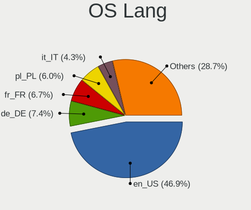

| Lang  | Notebooks | Percent |
|-------|-----------|---------|
| en_US | 454       | 47.34%  |
| de_DE | 71        | 7.4%    |
| fr_FR | 63        | 6.57%   |
| pl_PL | 50        | 5.21%   |
| it_IT | 42        | 4.38%   |
| en_GB | 41        | 4.28%   |
| ru_RU | 37        | 3.86%   |
| pt_BR | 29        | 3.02%   |
| es_MX | 23        | 2.4%    |
| es_ES | 18        | 1.88%   |
| en_CA | 11        | 1.15%   |
| cs_CZ | 11        | 1.15%   |
| en_AU | 10        | 1.04%   |
| hu_HU | 8         | 0.83%   |
| en_IN | 8         | 0.83%   |
| nl_NL | 7         | 0.73%   |
| es_AR | 7         | 0.73%   |
| tr_TR | 6         | 0.63%   |
| da_DK | 6         | 0.63%   |
| fr_BE | 5         | 0.52%   |
| pt_PT | 4         | 0.42%   |
| nl_BE | 4         | 0.42%   |
| es_PE | 4         | 0.42%   |
| fr_CH | 3         | 0.31%   |
| fr_CA | 3         | 0.31%   |
| en_NZ | 3         | 0.31%   |
| de_CH | 3         | 0.31%   |
| UTF-8 | 2         | 0.21%   |
| ja_JP | 2         | 0.21%   |
| es_CO | 2         | 0.21%   |
| es_CL | 2         | 0.21%   |
| en_ZA | 2         | 0.21%   |
| en_PH | 2         | 0.21%   |
| en_DK | 2         | 0.21%   |
| en_AG | 2         | 0.21%   |
| de_AT | 2         | 0.21%   |
| C     | 2         | 0.21%   |
| id_ID | 1         | 0.1%    |
| es_VE | 1         | 0.1%    |
| es_UY | 1         | 0.1%    |

Boot Mode
---------

EFI or BIOS

| Mode | Notebooks | Percent |
|------|-----------|---------|
| EFI  | 587       | 61.21%  |
| BIOS | 372       | 38.79%  |

Filesystem
----------

Type of filesystem

| Type    | Notebooks | Percent |
|---------|-----------|---------|
| Ext4    | 469       | 48.91%  |
| Overlay | 415       | 43.27%  |
| Btrfs   | 56        | 5.84%   |
| Xfs     | 11        | 1.15%   |
| F2fs    | 8         | 0.83%   |

Part. scheme
------------

Scheme of partitioning

| Type | Notebooks | Percent |
|------|-----------|---------|
| GPT  | 756       | 78.75%  |
| MBR  | 204       | 21.25%  |

Dual Boot with Linux/BSD
------------------------

Hosting more than one Linux/BSD

| Dual boot | Notebooks | Percent |
|-----------|-----------|---------|
| No        | 546       | 56.93%  |
| Yes       | 413       | 43.07%  |

Dual Boot (Win)
---------------

Hosting Linux and Windows

| Dual boot | Notebooks | Percent |
|-----------|-----------|---------|
| No        | 612       | 63.75%  |
| Yes       | 348       | 36.25%  |

Board
-----

Vendor
------

Motherboard manufacturer

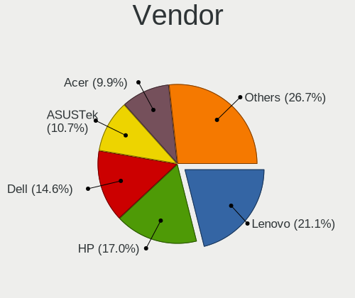

| Name                | Notebooks | Percent |
|---------------------|-----------|---------|
| Lenovo              | 204       | 21.27%  |
| Hewlett-Packard     | 162       | 16.89%  |
| Dell                | 133       | 13.87%  |
| ASUSTek Computer    | 104       | 10.84%  |
| Acer                | 97        | 10.11%  |
| Toshiba             | 44        | 4.59%   |
| Samsung Electronics | 21        | 2.19%   |
| Apple               | 19        | 1.98%   |
| Fujitsu             | 18        | 1.88%   |
| Sony                | 16        | 1.67%   |
| MSI                 | 14        | 1.46%   |
| Packard Bell        | 8         | 0.83%   |
| Notebook            | 8         | 0.83%   |
| Positivo            | 6         | 0.63%   |
| HUAWEI              | 6         | 0.63%   |
| Chuwi               | 6         | 0.63%   |
| Unknown             | 6         | 0.63%   |
| GPU Company         | 5         | 0.52%   |
| Google              | 5         | 0.52%   |
| Alienware           | 5         | 0.52%   |
| TUXEDO              | 4         | 0.42%   |
| Medion              | 4         | 0.42%   |
| Timi                | 3         | 0.31%   |
| LG Electronics      | 3         | 0.31%   |
| lapbook             | 3         | 0.31%   |
| Kiano               | 3         | 0.31%   |
| Gigabyte Technology | 3         | 0.31%   |
| Fujitsu Siemens     | 3         | 0.31%   |
| eMachines           | 3         | 0.31%   |
| Standard            | 2         | 0.21%   |
| SLIMBOOK            | 2         | 0.21%   |
| Semp Toshiba        | 2         | 0.21%   |
| NEC Computers       | 2         | 0.21%   |
| GPD                 | 2         | 0.21%   |
| Wortmann AG         | 1         | 0.1%    |
| VIT                 | 1         | 0.1%    |
| Valve               | 1         | 0.1%    |
| UMAX                | 1         | 0.1%    |
| TPS                 | 1         | 0.1%    |
| TEKNOSERVICE        | 1         | 0.1%    |

Model
-----

Motherboard model

| Name                                        | Notebooks | Percent |
|---------------------------------------------|-----------|---------|
| Unknown                                     | 10        | 1.04%   |
| HP Notebook                                 | 9         | 0.94%   |
| ASUS S551LN                                 | 6         | 0.63%   |
| Lenovo IdeaPad 3 15ADA05 81W1               | 5         | 0.52%   |
| Lenovo IdeaPad 1 14ADA05 82GW               | 5         | 0.52%   |
| Dell Inspiron 13-5368                       | 5         | 0.52%   |
| Toshiba Satellite L655                      | 4         | 0.42%   |
| Samsung 950XCJ/951XCJ/950XCR                | 4         | 0.42%   |
| Lenovo V15-ADA 82C7                         | 4         | 0.42%   |
| Lenovo IdeaPad 3 15ALC6 82KU                | 4         | 0.42%   |
| HP Pavilion Notebook                        | 4         | 0.42%   |
| HP 250 G6 Notebook PC                       | 4         | 0.42%   |
| Dell Latitude 7490                          | 4         | 0.42%   |
| Dell Inspiron 1720                          | 4         | 0.42%   |
| TUXEDO InfinityBook Pro Gen7 (MK1)          | 3         | 0.31%   |
| Lenovo V145-15AST 81MT                      | 3         | 0.31%   |
| Lenovo ThinkPad X1 Extreme Gen 3 20TK001HUS | 3         | 0.31%   |
| Lenovo ThinkPad P1 Gen 4i 20Y3001LUK        | 3         | 0.31%   |
| Lenovo IdeaPad S145-15AST 81N3              | 3         | 0.31%   |
| Lenovo IdeaPad Gaming 3 15ACH6 82K2         | 3         | 0.31%   |
| Lenovo G50-70 20351                         | 3         | 0.31%   |
| lapbook S15 PRO                             | 3         | 0.31%   |
| Kiano Elegance 14.2                         | 3         | 0.31%   |
| HP Laptop 15s-eq2xxx                        | 3         | 0.31%   |
| HP EliteBook 6930p                          | 3         | 0.31%   |
| HP EliteBook 2530p                          | 3         | 0.31%   |
| HP Compaq Presario CQ60                     | 3         | 0.31%   |
| HP 255 G8 Notebook PC                       | 3         | 0.31%   |
| HP 15                                       | 3         | 0.31%   |
| GPU Company GWNR71517                       | 3         | 0.31%   |
| Fujitsu LIFEBOOK S935                       | 3         | 0.31%   |
| Dell Latitude E6440                         | 3         | 0.31%   |
| Dell Latitude E6430                         | 3         | 0.31%   |
| Dell Latitude E6400                         | 3         | 0.31%   |
| Dell Inspiron 15-3567                       | 3         | 0.31%   |
| Chuwi GemiBook Pro                          | 3         | 0.31%   |
| ASUS X555LAB                                | 3         | 0.31%   |
| Apple MacBookPro9,2                         | 3         | 0.31%   |
| Apple MacBookPro8,1                         | 3         | 0.31%   |
| Alienware 18                                | 3         | 0.31%   |

Model Family
------------

Motherboard model prefix

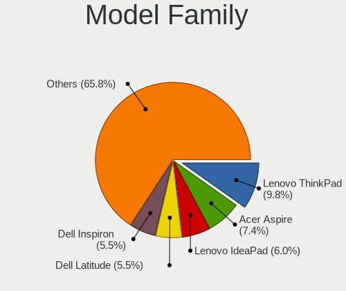

| Name                  | Notebooks | Percent |
|-----------------------|-----------|---------|
| Lenovo ThinkPad       | 94        | 9.8%    |
| Acer Aspire           | 73        | 7.61%   |
| Lenovo IdeaPad        | 58        | 6.05%   |
| Dell Latitude         | 54        | 5.63%   |
| Dell Inspiron         | 45        | 4.69%   |
| Toshiba Satellite     | 36        | 3.75%   |
| HP Pavilion           | 33        | 3.44%   |
| HP Laptop             | 26        | 2.71%   |
| HP EliteBook          | 22        | 2.29%   |
| ASUS VivoBook         | 22        | 2.29%   |
| HP Compaq             | 19        | 1.98%   |
| HP ProBook            | 14        | 1.46%   |
| Fujitsu LIFEBOOK      | 12        | 1.25%   |
| Dell Precision        | 11        | 1.15%   |
| Unknown               | 10        | 1.04%   |
| HP Notebook           | 9         | 0.94%   |
| Dell Vostro           | 8         | 0.83%   |
| Packard Bell EasyNote | 7         | 0.73%   |
| Dell System           | 7         | 0.73%   |
| Toshiba dynabook      | 6         | 0.63%   |
| HP 250                | 6         | 0.63%   |
| Dell XPS              | 6         | 0.63%   |
| ASUS S551LN           | 6         | 0.63%   |
| ASUS ASUS             | 6         | 0.63%   |
| Lenovo Legion         | 5         | 0.52%   |
| HP 255                | 5         | 0.52%   |
| HP 15                 | 5         | 0.52%   |
| Acer TravelMate       | 5         | 0.52%   |
| Acer Swift            | 5         | 0.52%   |
| Samsung 950XCJ        | 4         | 0.42%   |
| Lenovo V15-ADA        | 4         | 0.42%   |
| HP Victus             | 4         | 0.42%   |
| ASUS TUF              | 4         | 0.42%   |
| ASUS ROG              | 4         | 0.42%   |
| Apple MacBookPro8     | 4         | 0.42%   |
| TUXEDO InfinityBook   | 3         | 0.31%   |
| MSI Modern            | 3         | 0.31%   |
| Lenovo V145-15AST     | 3         | 0.31%   |
| Lenovo G50-70         | 3         | 0.31%   |
| lapbook S15           | 3         | 0.31%   |

MFG Year
--------

Motherboard manufacture year

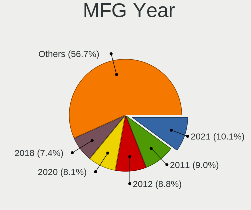

| Year    | Notebooks | Percent |
|---------|-----------|---------|
| 2021    | 98        | 10.22%  |
| 2012    | 88        | 9.18%   |
| 2011    | 85        | 8.86%   |
| 2020    | 82        | 8.55%   |
| 2018    | 67        | 6.99%   |
| 2013    | 63        | 6.57%   |
| 2015    | 60        | 6.26%   |
| 2019    | 58        | 6.05%   |
| 2014    | 54        | 5.63%   |
| 2010    | 53        | 5.53%   |
| 2008    | 50        | 5.21%   |
| 2016    | 48        | 5.01%   |
| 2017    | 45        | 4.69%   |
| 2022    | 33        | 3.44%   |
| 2007    | 32        | 3.34%   |
| 2009    | 31        | 3.23%   |
| 2006    | 6         | 0.63%   |
| 2023    | 4         | 0.42%   |
| 2004    | 1         | 0.1%    |
| Unknown | 1         | 0.1%    |

Form Factor
-----------

Physical design of the computer

| Name     | Notebooks | Percent |
|----------|-----------|---------|
| Notebook | 959       | 100%    |

Secure Boot
-----------

Enabled or disabled

| State    | Notebooks | Percent |
|----------|-----------|---------|
| Disabled | 959       | 100%    |

Coreboot
--------

Have coreboot on board

| Used | Notebooks | Percent |
|------|-----------|---------|
| No   | 953       | 99.37%  |
| Yes  | 6         | 0.63%   |

RAM Size
--------

Total RAM memory

| Size in GB  | Notebooks | Percent |
|-------------|-----------|---------|
| 4.01-8.0    | 344       | 35.83%  |
| 3.01-4.0    | 243       | 25.31%  |
| 16.01-24.0  | 132       | 13.75%  |
| 8.01-16.0   | 119       | 12.4%   |
| 32.01-64.0  | 37        | 3.85%   |
| 1.01-2.0    | 37        | 3.85%   |
| 2.01-3.0    | 25        | 2.6%    |
| 64.01-256.0 | 13        | 1.35%   |
| 24.01-32.0  | 8         | 0.83%   |
| 0.51-1.0    | 2         | 0.21%   |

RAM Used
--------

Used RAM memory

| Used GB  | Notebooks | Percent |
|----------|-----------|---------|
| 1.01-2.0 | 598       | 62.36%  |
| 2.01-3.0 | 241       | 25.13%  |
| 0.51-1.0 | 70        | 7.3%    |
| 3.01-4.0 | 41        | 4.28%   |
| 4.01-8.0 | 7         | 0.73%   |
| 0.01-0.5 | 2         | 0.21%   |

Total Drives
------------

Number of drives on board

| Drives | Notebooks | Percent |
|--------|-----------|---------|
| 1      | 708       | 73.83%  |
| 2      | 208       | 21.69%  |
| 3      | 28        | 2.92%   |
| 0      | 13        | 1.36%   |
| 4      | 2         | 0.21%   |

Has CD-ROM
----------

Has CD-ROM on board

| Presented | Notebooks | Percent |
|-----------|-----------|---------|
| No        | 544       | 56.73%  |
| Yes       | 415       | 43.27%  |

Has Ethernet
------------

Has Ethernet on board

| Presented | Notebooks | Percent |
|-----------|-----------|---------|
| Yes       | 779       | 81.23%  |
| No        | 180       | 18.77%  |

Has WiFi
--------

Has WiFi module

| Presented | Notebooks | Percent |
|-----------|-----------|---------|
| Yes       | 951       | 99.17%  |
| No        | 8         | 0.83%   |

Has Bluetooth
-------------

Has Bluetooth module

| Presented | Notebooks | Percent |
|-----------|-----------|---------|
| Yes       | 725       | 75.6%   |
| No        | 234       | 24.4%   |

Location
--------

Country
-------

Geographic location (country)

| Country     | Notebooks | Percent |
|-------------|-----------|---------|
| USA         | 130       | 13.56%  |
| Germany     | 95        | 9.91%   |
| Poland      | 66        | 6.88%   |
| Italy       | 61        | 6.36%   |
| France      | 60        | 6.26%   |
| Brazil      | 52        | 5.42%   |
| Russia      | 49        | 5.11%   |
| UK          | 41        | 4.28%   |
| Japan       | 31        | 3.23%   |
| Spain       | 25        | 2.61%   |
| Canada      | 24        | 2.5%    |
| Mexico      | 22        | 2.29%   |
| India       | 19        | 1.98%   |
| Netherlands | 16        | 1.67%   |
| Czechia     | 14        | 1.46%   |
| Australia   | 13        | 1.36%   |
| Argentina   | 13        | 1.36%   |
| Indonesia   | 11        | 1.15%   |
| Finland     | 11        | 1.15%   |
| Belgium     | 11        | 1.15%   |
| Switzerland | 9         | 0.94%   |
| Hungary     | 9         | 0.94%   |
| Romania     | 8         | 0.83%   |
| Denmark     | 8         | 0.83%   |
| Colombia    | 8         | 0.83%   |
| Peru        | 7         | 0.73%   |
| Turkey      | 6         | 0.63%   |
| Portugal    | 6         | 0.63%   |
| Norway      | 6         | 0.63%   |
| Slovakia    | 5         | 0.52%   |
| Saint Lucia | 5         | 0.52%   |
| New Zealand | 5         | 0.52%   |
| Lithuania   | 5         | 0.52%   |
| Greece      | 5         | 0.52%   |
| Bulgaria    | 5         | 0.52%   |
| Uruguay     | 4         | 0.42%   |
| Sweden      | 4         | 0.42%   |
| Hong Kong   | 4         | 0.42%   |
| Austria     | 4         | 0.42%   |
| Venezuela   | 3         | 0.31%   |

City
----

Geographic location (city)

| City           | Notebooks | Percent |
|----------------|-----------|---------|
| Warsaw         | 14        | 1.46%   |
| Moscow         | 10        | 1.04%   |
| Milan          | 9         | 0.94%   |
| St Petersburg  | 8         | 0.83%   |
| Paris          | 8         | 0.83%   |
| Lima           | 6         | 0.62%   |
| Hamburg        | 6         | 0.62%   |
| Freeport       | 6         | 0.62%   |
| Cologne        | 6         | 0.62%   |
| Berlin         | 6         | 0.62%   |
| Rome           | 5         | 0.52%   |
| Munich         | 5         | 0.52%   |
| Montreal       | 5         | 0.52%   |
| Miura          | 5         | 0.52%   |
| Mexico City    | 5         | 0.52%   |
| Krakow         | 5         | 0.52%   |
| Castries       | 5         | 0.52%   |
| Brisbane       | 5         | 0.52%   |
| Bengaluru      | 5         | 0.52%   |
| Wuppertal      | 4         | 0.42%   |
| Ufa            | 4         | 0.42%   |
| Seattle        | 4         | 0.42%   |
| Rio de Janeiro | 4         | 0.42%   |
| Prague         | 4         | 0.42%   |
| Poznan         | 4         | 0.42%   |
| Montpellier    | 4         | 0.42%   |
| Los Angeles    | 4         | 0.42%   |
| Hexham         | 4         | 0.42%   |
| Helsinki       | 4         | 0.42%   |
| Geneva         | 4         | 0.42%   |
| Cheltenham     | 4         | 0.42%   |
| Bucharest      | 4         | 0.42%   |
| Bialystok      | 4         | 0.42%   |
| Amadora        | 4         | 0.42%   |
| Yokohama       | 3         | 0.31%   |
| Vienna         | 3         | 0.31%   |
| Victoria       | 3         | 0.31%   |
| Tokyo          | 3         | 0.31%   |
| Sydney         | 3         | 0.31%   |
| Skierniewice   | 3         | 0.31%   |

Drives
------

Drive Vendor
------------

Hard drive vendors

| Vendor              | Notebooks | Drives | Percent |
|---------------------|-----------|--------|---------|
| Samsung Electronics | 157       | 166    | 13.74%  |
| Seagate             | 135       | 139    | 11.81%  |
| WDC                 | 121       | 125    | 10.59%  |
| Toshiba             | 96        | 97     | 8.4%    |
| Crucial             | 61        | 63     | 5.34%   |
| Kingston            | 55        | 55     | 4.81%   |
| Hitachi             | 52        | 53     | 4.55%   |
| SanDisk             | 44        | 46     | 3.85%   |
| Unknown             | 43        | 43     | 3.76%   |
| HGST                | 33        | 36     | 2.89%   |
| SK hynix            | 25        | 25     | 2.19%   |
| Intel               | 23        | 23     | 2.01%   |
| Micron Technology   | 22        | 22     | 1.92%   |
| A-DATA Technology   | 20        | 20     | 1.75%   |
| SPCC                | 15        | 15     | 1.31%   |
| Transcend           | 14        | 14     | 1.22%   |
| JMicron Technology  | 13        | 13     | 1.14%   |
| China               | 13        | 13     | 1.14%   |
| GOODRAM             | 10        | 10     | 0.87%   |
| PNY                 | 9         | 9      | 0.79%   |
| Phison              | 9         | 9      | 0.79%   |
| KIOXIA              | 9         | 9      | 0.79%   |
| Fujitsu             | 9         | 10     | 0.79%   |
| Intenso             | 8         | 8      | 0.7%    |
| Apple               | 8         | 8      | 0.7%    |
| Netac               | 7         | 7      | 0.61%   |
| UMIS                | 6         | 6      | 0.52%   |
| Patriot             | 6         | 6      | 0.52%   |
| KingSpec            | 6         | 6      | 0.52%   |
| Verbatim            | 5         | 5      | 0.44%   |
| SSSTC               | 5         | 5      | 0.44%   |
| LITEON              | 5         | 5      | 0.44%   |
| Gigabyte Technology | 5         | 5      | 0.44%   |
| Unknown             | 5         | 5      | 0.44%   |
| Apacer              | 4         | 4      | 0.35%   |
| Wibtek              | 3         | 3      | 0.26%   |
| Team                | 3         | 3      | 0.26%   |
| Silicon Motion      | 3         | 3      | 0.26%   |
| ShiJi               | 3         | 3      | 0.26%   |
| Lexar               | 3         | 3      | 0.26%   |

Drive Model
-----------

Hard drive models

| Model                                | Notebooks | Percent |
|--------------------------------------|-----------|---------|
| Seagate ST1000LM035-1RK172 1TB       | 17        | 1.46%   |
| Toshiba MQ01ABD100 1TB               | 16        | 1.38%   |
| Seagate ST500LT012-1DG142 500GB      | 15        | 1.29%   |
| Toshiba MQ01ABF050 500GB             | 13        | 1.12%   |
| Kingston SA400S37480G 480GB SSD      | 13        | 1.12%   |
| Kingston SA400S37240G 240GB SSD      | 12        | 1.03%   |
| Toshiba MQ04ABF100 1TB               | 10        | 0.86%   |
| Seagate ST9500325AS 500GB            | 10        | 0.86%   |
| Seagate ST1000LM024 HN-M101MBB 1TB   | 9         | 0.77%   |
| Seagate ST1000LM048-2E7172 1TB       | 8         | 0.69%   |
| Samsung SSD 860 EVO 500GB            | 8         | 0.69%   |
| Crucial CT500MX500SSD1 500GB         | 8         | 0.69%   |
| Crucial CT480BX500SSD1 480GB         | 8         | 0.69%   |
| SPCC Solid State Disk 512GB          | 7         | 0.6%    |
| SanDisk NVMe SSD Drive 1TB           | 7         | 0.6%    |
| HGST HTS545050A7E680 500GB           | 7         | 0.6%    |
| Crucial CT1000MX500SSD1 1TB          | 7         | 0.6%    |
| Unknown SD32G  32GB                  | 6         | 0.52%   |
| Seagate ST2000LM007-1R8174 2TB       | 6         | 0.52%   |
| JMicron Generic 250GB                | 6         | 0.52%   |
| Hitachi HTS723232A7A364 320GB        | 6         | 0.52%   |
| HGST HTS541010A9E680 1TB             | 6         | 0.52%   |
| Crucial CT240BX500SSD1 240GB         | 6         | 0.52%   |
| WDC WDS120G2G0A-00JH30 120GB SSD     | 5         | 0.43%   |
| Verbatim Vi550 S3 512GB              | 5         | 0.43%   |
| Unknown MMC64G  64GB                 | 5         | 0.43%   |
| Toshiba MQ01ABD050 500GB             | 5         | 0.43%   |
| Samsung SSD 980 PRO 1TB              | 5         | 0.43%   |
| Hitachi HTS547575A9E384 752GB        | 5         | 0.43%   |
| Hitachi HTS545050B9A300 500GB        | 5         | 0.43%   |
| Crucial CT1000BX500SSD1 1TB          | 5         | 0.43%   |
| A-DATA SU650 1TB SSD                 | 5         | 0.43%   |
| Unknown                              | 5         | 0.43%   |
| WDC WD3200BEVT-22ZCT0 320GB          | 4         | 0.34%   |
| WDC WD10SPZX-21Z10T0 1TB             | 4         | 0.34%   |
| WDC PC SN530 SDBPNPZ-256G-1002 256GB | 4         | 0.34%   |
| Unknown DA4064  64GB                 | 4         | 0.34%   |
| Toshiba MQ01ABD075 752GB             | 4         | 0.34%   |
| SSSTC CL1-4D256 256GB                | 4         | 0.34%   |
| Seagate ST320LM001 HN-M320MBB 320GB  | 4         | 0.34%   |

HDD Vendor
----------

Hard disk drive vendors

| Vendor              | Notebooks | Drives | Percent |
|---------------------|-----------|--------|---------|
| Seagate             | 132       | 135    | 33.67%  |
| Toshiba             | 82        | 82     | 20.92%  |
| WDC                 | 70        | 70     | 17.86%  |
| Hitachi             | 52        | 53     | 13.27%  |
| HGST                | 33        | 36     | 8.42%   |
| Fujitsu             | 9         | 10     | 2.3%    |
| Samsung Electronics | 6         | 6      | 1.53%   |
| Unknown             | 2         | 2      | 0.51%   |
| Apple               | 2         | 2      | 0.51%   |
| USB3.0              | 1         | 1      | 0.26%   |
| TO Exter            | 1         | 1      | 0.26%   |
| LaCie               | 1         | 1      | 0.26%   |
| Hewlett-Packard     | 1         | 1      | 0.26%   |

SSD Vendor
----------

Solid state drive vendors

| Vendor              | Notebooks | Drives | Percent |
|---------------------|-----------|--------|---------|
| Samsung Electronics | 79        | 82     | 17.95%  |
| Crucial             | 48        | 49     | 10.91%  |
| Kingston            | 40        | 40     | 9.09%   |
| SanDisk             | 29        | 29     | 6.59%   |
| WDC                 | 19        | 19     | 4.32%   |
| A-DATA Technology   | 15        | 15     | 3.41%   |
| SPCC                | 14        | 14     | 3.18%   |
| China               | 13        | 13     | 2.95%   |
| Transcend           | 12        | 12     | 2.73%   |
| Micron Technology   | 12        | 12     | 2.73%   |
| Toshiba             | 10        | 10     | 2.27%   |
| JMicron Technology  | 10        | 10     | 2.27%   |
| GOODRAM             | 9         | 9      | 2.05%   |
| SK hynix            | 8         | 8      | 1.82%   |
| Intel               | 8         | 8      | 1.82%   |
| PNY                 | 7         | 7      | 1.59%   |
| Netac               | 7         | 7      | 1.59%   |
| Intenso             | 7         | 7      | 1.59%   |
| Patriot             | 6         | 6      | 1.36%   |
| Verbatim            | 5         | 5      | 1.14%   |
| LITEON              | 5         | 5      | 1.14%   |
| KingSpec            | 5         | 5      | 1.14%   |
| Gigabyte Technology | 4         | 4      | 0.91%   |
| Apple               | 4         | 4      | 0.91%   |
| Wibtek              | 3         | 3      | 0.68%   |
| ShiJi               | 3         | 3      | 0.68%   |
| Seagate             | 3         | 3      | 0.68%   |
| KingDian            | 3         | 3      | 0.68%   |
| ASMedia             | 3         | 3      | 0.68%   |
| Apacer              | 3         | 3      | 0.68%   |
| Teclast             | 2         | 2      | 0.45%   |
| SPCC Sol            | 2         | 2      | 0.45%   |
| Leven               | 2         | 2      | 0.45%   |
| KingFast            | 2         | 2      | 0.45%   |
| Emtec               | 2         | 2      | 0.45%   |
| Biostar             | 2         | 2      | 0.45%   |
| Wdstars             | 1         | 1      | 0.23%   |
| WDC WDS2            | 1         | 1      | 0.23%   |
| walram              | 1         | 1      | 0.23%   |
| V7                  | 1         | 1      | 0.23%   |

Drive Kind
----------

HDD or SSD

| Kind    | Notebooks | Drives | Percent |
|---------|-----------|--------|---------|
| SSD     | 409       | 444    | 37.7%   |
| HDD     | 376       | 400    | 34.65%  |
| NVMe    | 241       | 266    | 22.21%  |
| MMC     | 50        | 51     | 4.61%   |
| Unknown | 9         | 9      | 0.83%   |

Drive Connector
---------------

SATA, SAS, NVMe, etc.

| Type | Notebooks | Drives | Percent |
|------|-----------|--------|---------|
| SATA | 715       | 804    | 67.71%  |
| NVMe | 239       | 263    | 22.63%  |
| SAS  | 52        | 52     | 4.92%   |
| MMC  | 50        | 51     | 4.73%   |

Drive Size
----------

Size of hard drive

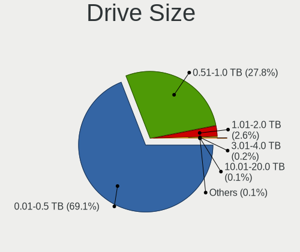

| Size in TB | Notebooks | Drives | Percent |
|------------|-----------|--------|---------|
| 0.01-0.5   | 536       | 591    | 69.07%  |
| 0.51-1.0   | 217       | 230    | 27.96%  |
| 1.01-2.0   | 18        | 18     | 2.32%   |
| 10.01-20.0 | 3         | 3      | 0.39%   |
| 4.01-10.0  | 2         | 2      | 0.26%   |

Space Total
-----------

Amount of disk space available on the file system

| Size in GB     | Notebooks | Percent |
|----------------|-----------|---------|
| 1-20           | 325       | 33.85%  |
| 101-250        | 199       | 20.73%  |
| 251-500        | 183       | 19.06%  |
| 501-1000       | 82        | 8.54%   |
| 21-50          | 54        | 5.63%   |
| 51-100         | 52        | 5.42%   |
| Unknown        | 32        | 3.33%   |
| 1001-2000      | 19        | 1.98%   |
| 2001-3000      | 9         | 0.94%   |
| More than 3000 | 5         | 0.52%   |

Space Used
----------

Amount of used disk space

| Used GB        | Notebooks | Percent |
|----------------|-----------|---------|
| 1-20           | 770       | 80.21%  |
| 21-50          | 66        | 6.88%   |
| Unknown        | 32        | 3.33%   |
| 101-250        | 31        | 3.23%   |
| 51-100         | 30        | 3.13%   |
| 251-500        | 17        | 1.77%   |
| 501-1000       | 9         | 0.94%   |
| 1001-2000      | 3         | 0.31%   |
| More than 3000 | 1         | 0.1%    |
| 2001-3000      | 1         | 0.1%    |

Malfunc. Drives
---------------

Drive models with a malfunction

| Model                               | Notebooks | Drives | Percent |
|-------------------------------------|-----------|--------|---------|
| Seagate ST9500325AS 500GB           | 6         | 6      | 3.16%   |
| Seagate ST500LT012-1DG142 500GB     | 6         | 6      | 3.16%   |
| Hitachi HTS723232A7A364 320GB       | 5         | 5      | 2.63%   |
| HGST HTS541010A9E680 1TB            | 5         | 5      | 2.63%   |
| Toshiba MQ01ABD100 1TB              | 4         | 4      | 2.11%   |
| Toshiba MQ01ABD050 500GB            | 4         | 4      | 2.11%   |
| Seagate ST1000LM035-1RK172 1TB      | 4         | 4      | 2.11%   |
| Seagate ST1000LM024 HN-M101MBB 1TB  | 4         | 4      | 2.11%   |
| HGST HTS721010A9E630 1TB            | 4         | 4      | 2.11%   |
| HGST HTS545050A7E680 500GB          | 4         | 5      | 2.11%   |
| LITEON CV8-8E128-HP 128GB SSD       | 3         | 3      | 1.58%   |
| Hitachi HTS547575A9E384 752GB       | 3         | 3      | 1.58%   |
| HGST HTS545050A7E380 500GB          | 3         | 3      | 1.58%   |
| Toshiba MK5075GSX 500GB             | 2         | 2      | 1.05%   |
| Toshiba MK5065GSX 500GB             | 2         | 2      | 1.05%   |
| Toshiba MK2529GSG 250GB             | 2         | 2      | 1.05%   |
| Toshiba MK1652GSX 160GB             | 2         | 2      | 1.05%   |
| Seagate ST9750420AS 752GB           | 2         | 2      | 1.05%   |
| Seagate ST500LT012-9WS142 500GB     | 2         | 2      | 1.05%   |
| Seagate ST320LT012-1DG14C 320GB     | 2         | 2      | 1.05%   |
| Seagate ST320LT007-9ZV142 320GB     | 2         | 2      | 1.05%   |
| Seagate ST320LM001 HN-M320MBB 320GB | 2         | 2      | 1.05%   |
| Hitachi HTS543232L9A300 320GB       | 2         | 2      | 1.05%   |
| WDC WD7500BPVT-24HXZT1 752GB        | 1         | 1      | 0.53%   |
| WDC WD7500BPVT-22HXZT3 752GB        | 1         | 1      | 0.53%   |
| WDC WD5000BPVT-22HXZT3 500GB        | 1         | 1      | 0.53%   |
| WDC WD5000BEVT-26A0RT0 500GB        | 1         | 1      | 0.53%   |
| WDC WD5000BEVT-22A0RT0 500GB        | 1         | 1      | 0.53%   |
| WDC WD3200LPVX-22V0TT0 320GB        | 1         | 1      | 0.53%   |
| WDC WD3200BUDT-63DPZY0 320GB        | 1         | 1      | 0.53%   |
| WDC WD3200BPVT-24JJ5T0 320GB        | 1         | 1      | 0.53%   |
| WDC WD3200BPVT-22JJ5T0 320GB        | 1         | 1      | 0.53%   |
| WDC WD3200BEVT-75ZCT0 320GB         | 1         | 1      | 0.53%   |
| WDC WD3200BEVT-26ZCT0 320GB         | 1         | 1      | 0.53%   |
| WDC WD3200BEVT-22ZCT0 320GB         | 1         | 1      | 0.53%   |
| WDC WD3200BEKT-75PVMT0 320GB        | 1         | 1      | 0.53%   |
| WDC WD2500BEVS-22UST0 250GB         | 1         | 1      | 0.53%   |
| WDC WD20SPZX-60UA7T0 2TB            | 1         | 1      | 0.53%   |
| WDC WD1600BEVT-60ZCT0 160GB         | 1         | 1      | 0.53%   |
| WDC WD Blue SA510 M.2 2280 500GB    | 1         | 1      | 0.53%   |

Malfunc. Drive Vendor
---------------------

Vendors of faulty drives

| Vendor              | Notebooks | Drives | Percent |
|---------------------|-----------|--------|---------|
| Seagate             | 48        | 48     | 25.4%   |
| Toshiba             | 29        | 29     | 15.34%  |
| Hitachi             | 27        | 27     | 14.29%  |
| HGST                | 20        | 22     | 10.58%  |
| WDC                 | 18        | 18     | 9.52%   |
| Intel               | 6         | 6      | 3.17%   |
| SK hynix            | 5         | 5      | 2.65%   |
| Samsung Electronics | 5         | 5      | 2.65%   |
| Fujitsu             | 5         | 6      | 2.65%   |
| LITEON              | 3         | 3      | 1.59%   |
| KingSpec            | 3         | 3      | 1.59%   |
| SPCC                | 2         | 2      | 1.06%   |
| SanDisk             | 2         | 2      | 1.06%   |
| Intenso             | 2         | 2      | 1.06%   |
| Crucial             | 2         | 2      | 1.06%   |
| China               | 2         | 2      | 1.06%   |
| A-DATA Technology   | 2         | 2      | 1.06%   |
| Transcend           | 1         | 1      | 0.53%   |
| Teclast             | 1         | 1      | 0.53%   |
| Plextor             | 1         | 1      | 0.53%   |
| Netac               | 1         | 1      | 0.53%   |
| Micron Technology   | 1         | 1      | 0.53%   |
| Kingston            | 1         | 1      | 0.53%   |
| KingDian            | 1         | 1      | 0.53%   |
| Apple               | 1         | 1      | 0.53%   |

Malfunc. HDD Vendor
-------------------

Vendors of faulty HDD drives

| Vendor              | Notebooks | Drives | Percent |
|---------------------|-----------|--------|---------|
| Seagate             | 48        | 48     | 32.43%  |
| Toshiba             | 28        | 28     | 18.92%  |
| Hitachi             | 27        | 27     | 18.24%  |
| HGST                | 20        | 22     | 13.51%  |
| WDC                 | 16        | 16     | 10.81%  |
| Fujitsu             | 5         | 6      | 3.38%   |
| Samsung Electronics | 3         | 3      | 2.03%   |
| Apple               | 1         | 1      | 0.68%   |

Malfunc. Drive Kind
-------------------

Kinds of faulty drives

| Kind | Notebooks | Drives | Percent |
|------|-----------|--------|---------|
| HDD  | 146       | 151    | 78.07%  |
| SSD  | 37        | 37     | 19.79%  |
| NVMe | 4         | 4      | 2.14%   |

Failed Drives
-------------

Failed drive models

| Model                             | Notebooks | Drives | Percent |
|-----------------------------------|-----------|--------|---------|
| Toshiba MK3261GSYN 320GB          | 1         | 1      | 33.33%  |
| Samsung Electronics HM250HI 250GB | 1         | 1      | 33.33%  |
| HGST HTS545050B7E660 500GB        | 1         | 1      | 33.33%  |

Failed Drive Vendor
-------------------

Failed drive vendors

| Vendor              | Notebooks | Drives | Percent |
|---------------------|-----------|--------|---------|
| Toshiba             | 1         | 1      | 33.33%  |
| Samsung Electronics | 1         | 1      | 33.33%  |
| HGST                | 1         | 1      | 33.33%  |

Drive Status
------------

Number of failed and malfunc. drives

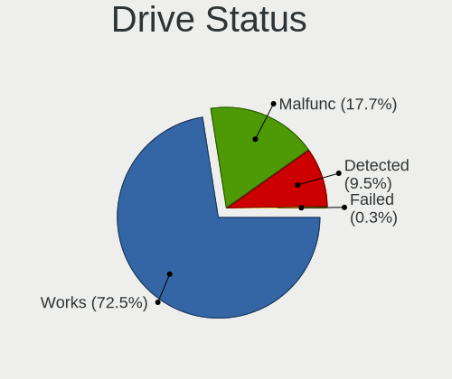

| Status   | Notebooks | Drives | Percent |
|----------|-----------|--------|---------|
| Works    | 759       | 870    | 72.56%  |
| Malfunc  | 184       | 192    | 17.59%  |
| Detected | 100       | 105    | 9.56%   |
| Failed   | 3         | 3      | 0.29%   |

Storage controller
------------------

Storage Vendor
--------------

Storage controller vendors

| Vendor                                  | Notebooks | Percent |
|-----------------------------------------|-----------|---------|
| Intel                                   | 708       | 64.89%  |
| AMD                                     | 132       | 12.1%   |
| Samsung Electronics                     | 77        | 7.06%   |
| SanDisk                                 | 46        | 4.22%   |
| SK hynix                                | 15        | 1.37%   |
| Kingston Technology Company             | 15        | 1.37%   |
| Phison Electronics                      | 14        | 1.28%   |
| Micron/Crucial Technology               | 13        | 1.19%   |
| Micron Technology                       | 10        | 0.92%   |
| KIOXIA                                  | 10        | 0.92%   |
| Silicon Motion                          | 8         | 0.73%   |
| ADATA Technology                        | 7         | 0.64%   |
| Nvidia                                  | 6         | 0.55%   |
| Union Memory (Shenzhen)                 | 5         | 0.46%   |
| Solid State Storage Technology          | 5         | 0.46%   |
| Toshiba America Info Systems            | 4         | 0.37%   |
| Silicon Integrated Systems [SiS]        | 2         | 0.18%   |
| Shenzhen Longsys Electronics            | 2         | 0.18%   |
| Realtek Semiconductor                   | 2         | 0.18%   |
| MAXIO Technology (Hangzhou)             | 2         | 0.18%   |
| Lenovo                                  | 2         | 0.18%   |
| Biwin Storage Technology                | 2         | 0.18%   |
| Transcend                               | 1         | 0.09%   |
| Shenzhen Unionmemory Information System | 1         | 0.09%   |
| JMicron Technology                      | 1         | 0.09%   |
| Apple                                   | 1         | 0.09%   |

Storage Model
-------------

Storage controller models

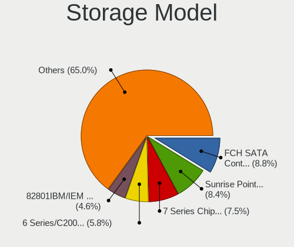

| Model                                                                            | Notebooks | Percent |
|----------------------------------------------------------------------------------|-----------|---------|
| AMD FCH SATA Controller [AHCI mode]                                              | 107       | 8.97%   |
| Intel Sunrise Point-LP SATA Controller [AHCI mode]                               | 93        | 7.8%    |
| Intel 7 Series Chipset Family 6-port SATA Controller [AHCI mode]                 | 89        | 7.46%   |
| Intel 6 Series/C200 Series Chipset Family 6 port Mobile SATA AHCI Controller     | 68        | 5.7%    |
| Intel 82801IBM/IEM (ICH9M/ICH9M-E) 4 port SATA Controller [AHCI mode]            | 54        | 4.53%   |
| Intel 82801 Mobile SATA Controller [RAID mode]                                   | 48        | 4.02%   |
| Intel Volume Management Device NVMe RAID Controller                              | 37        | 3.1%    |
| Intel 82801HM/HEM (ICH8M/ICH8M-E) IDE Controller                                 | 32        | 2.68%   |
| Intel 5 Series/3400 Series Chipset 4 port SATA AHCI Controller                   | 32        | 2.68%   |
| Intel Wildcat Point-LP SATA Controller [AHCI Mode]                               | 31        | 2.6%    |
| Samsung NVMe SSD Controller 980 (DRAM-less)                                      | 30        | 2.51%   |
| Intel 82801HM/HEM (ICH8M/ICH8M-E) SATA Controller [AHCI mode]                    | 29        | 2.43%   |
| Intel 8 Series SATA Controller 1 [AHCI mode]                                     | 29        | 2.43%   |
| Intel Celeron/Pentium Silver Processor SATA Controller                           | 27        | 2.26%   |
| Samsung NVMe SSD Controller SM981/PM981/PM983                                    | 24        | 2.01%   |
| Intel Tiger Lake-LP SATA Controller                                              | 20        | 1.68%   |
| Samsung NVMe SSD Controller PM9A1/PM9A3/980PRO                                   | 18        | 1.51%   |
| Intel Atom Processor E3800 Series SATA AHCI Controller                           | 18        | 1.51%   |
| Intel HM170/QM170 Chipset SATA Controller [AHCI Mode]                            | 17        | 1.42%   |
| Intel 8 Series/C220 Series Chipset Family 6-port SATA Controller 1 [AHCI mode]   | 17        | 1.42%   |
| Intel Atom/Celeron/Pentium Processor x5-E8000/J3xxx/N3xxx Series SATA Controller | 16        | 1.34%   |
| AMD SB7x0/SB8x0/SB9x0 SATA Controller [AHCI mode]                                | 16        | 1.34%   |
| SanDisk Ultra 3D / WD Blue SN550 NVMe SSD                                        | 15        | 1.26%   |
| Intel 5 Series/3400 Series Chipset 6 port SATA AHCI Controller                   | 12        | 1.01%   |
| SanDisk Extreme Pro / WD Black SN750 / PC SN730 / Red SN700 NVMe SSD             | 11        | 0.92%   |
| Micron/Crucial P2 [Nick P2] / P3 / P3 Plus NVMe PCIe SSD (DRAM-less)             | 11        | 0.92%   |
| Intel Celeron N3350/Pentium N4200/Atom E3900 Series SATA AHCI Controller         | 11        | 0.92%   |
| SK hynix Gold P31/BC711/PC711 NVMe Solid State Drive                             | 10        | 0.84%   |
| KIOXIA NVMe SSD Controller BG4 (DRAM-less)                                       | 10        | 0.84%   |
| Intel SSD 670p Series [Keystone Harbor]                                          | 10        | 0.84%   |
| Intel Comet Lake SATA AHCI Controller                                            | 9         | 0.75%   |
| Intel Cannon Point-LP SATA Controller [AHCI Mode]                                | 8         | 0.67%   |
| Phison PS5013-E13 PCIe3 NVMe Controller (DRAM-less)                              | 7         | 0.59%   |
| Intel Mobile 4 Series Chipset PT IDER Controller                                 | 7         | 0.59%   |
| Intel Cannon Lake Mobile PCH SATA AHCI Controller                                | 7         | 0.59%   |
| SanDisk WD PC SN810 / Black SN850 NVMe SSD                                       | 6         | 0.5%    |
| Micron 2210 NVMe SSD [Cobain]                                                    | 6         | 0.5%    |
| Kingston Company OM3PDP3 NVMe SSD                                                | 6         | 0.5%    |
| Intel Ice Lake-LP SATA Controller [AHCI mode]                                    | 6         | 0.5%    |
| AMD SB600 Non-Raid-5 SATA                                                        | 6         | 0.5%    |

Storage Kind
------------

Kind of storage controller (IDE, SATA, NVMe, SAS, ...)

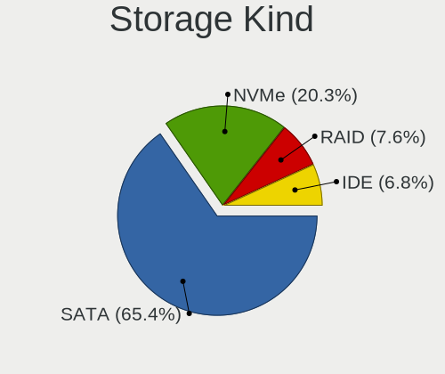

| Kind | Notebooks | Percent |
|------|-----------|---------|
| SATA | 751       | 65.02%  |
| NVMe | 238       | 20.61%  |
| RAID | 88        | 7.62%   |
| IDE  | 78        | 6.75%   |

Processor
---------

CPU Vendor
----------

Processor vendors

| Vendor | Notebooks | Percent |
|--------|-----------|---------|
| Intel  | 776       | 80.92%  |
| AMD    | 183       | 19.08%  |

CPU Model
---------

Processor models

| Model                                         | Notebooks | Percent |
|-----------------------------------------------|-----------|---------|
| Intel Core i5-7200U CPU @ 2.50GHz             | 16        | 1.67%   |
| Intel Core i7-6700HQ CPU @ 2.60GHz            | 13        | 1.36%   |
| Intel Core i5-3210M CPU @ 2.50GHz             | 13        | 1.36%   |
| Intel 11th Gen Core i5-1135G7 @ 2.40GHz       | 13        | 1.36%   |
| Intel Core i5-6200U CPU @ 2.30GHz             | 12        | 1.25%   |
| Intel Core i5-3320M CPU @ 2.60GHz             | 12        | 1.25%   |
| Intel Celeron N4020 CPU @ 1.10GHz             | 12        | 1.25%   |
| Intel Core i7-7500U CPU @ 2.70GHz             | 11        | 1.15%   |
| Intel Core i5-2520M CPU @ 2.50GHz             | 11        | 1.15%   |
| Intel Core i5-2410M CPU @ 2.30GHz             | 11        | 1.15%   |
| Intel Core i3-4030U CPU @ 1.90GHz             | 11        | 1.15%   |
| Intel Celeron CPU N2840 @ 2.16GHz             | 11        | 1.15%   |
| Intel 11th Gen Core i3-1115G4 @ 3.00GHz       | 11        | 1.15%   |
| Intel Core i5-5300U CPU @ 2.30GHz             | 10        | 1.04%   |
| Intel Celeron CPU N3060 @ 1.60GHz             | 10        | 1.04%   |
| Intel Core i7-8550U CPU @ 1.80GHz             | 9         | 0.94%   |
| Intel Core i7-6500U CPU @ 2.50GHz             | 9         | 0.94%   |
| Intel Core i7-3520M CPU @ 2.90GHz             | 9         | 0.94%   |
| Intel Core i5-8250U CPU @ 1.60GHz             | 9         | 0.94%   |
| Intel Core i5-5200U CPU @ 2.20GHz             | 9         | 0.94%   |
| Intel Core i3-6006U CPU @ 2.00GHz             | 9         | 0.94%   |
| Intel Core 2 Duo CPU P8600 @ 2.40GHz          | 9         | 0.94%   |
| AMD Ryzen 7 5800H with Radeon Graphics        | 9         | 0.94%   |
| AMD Ryzen 5 3500U with Radeon Vega Mobile Gfx | 9         | 0.94%   |
| AMD 3020e with Radeon Graphics                | 9         | 0.94%   |
| Intel Core i5-10210U CPU @ 1.60GHz            | 8         | 0.83%   |
| Intel Core i5-3230M CPU @ 2.60GHz             | 7         | 0.73%   |
| Intel Core i5 CPU M 520 @ 2.40GHz             | 7         | 0.73%   |
| Intel Core i3-1005G1 CPU @ 1.20GHz            | 7         | 0.73%   |
| AMD Ryzen 5 5600H with Radeon Graphics        | 7         | 0.73%   |
| AMD Ryzen 5 5500U with Radeon Graphics        | 7         | 0.73%   |
| Intel Core i7-10510U CPU @ 1.80GHz            | 6         | 0.63%   |
| Intel Core i5-7300U CPU @ 2.60GHz             | 6         | 0.63%   |
| Intel Core i5-2450M CPU @ 2.50GHz             | 6         | 0.63%   |
| Intel Core 2 Duo CPU T7250 @ 2.00GHz          | 6         | 0.63%   |
| Intel Celeron CPU N3350 @ 1.10GHz             | 6         | 0.63%   |
| Intel 12th Gen Core i7-12700H                 | 6         | 0.63%   |
| AMD Ryzen 7 5700U with Radeon Graphics        | 6         | 0.63%   |
| AMD Ryzen 7 4800H with Radeon Graphics        | 6         | 0.63%   |
| AMD Ryzen 3 3250U with Radeon Graphics        | 6         | 0.63%   |

CPU Model Family
----------------

Processor model prefix

| Model                   | Notebooks | Percent |
|-------------------------|-----------|---------|
| Intel Core i5           | 212       | 22.11%  |
| Intel Core i7           | 146       | 15.22%  |
| Intel Core i3           | 103       | 10.74%  |
| Intel Celeron           | 92        | 9.59%   |
| Other                   | 75        | 7.82%   |
| Intel Core 2 Duo        | 68        | 7.09%   |
| AMD Ryzen 5             | 40        | 4.17%   |
| Intel Pentium           | 34        | 3.55%   |
| AMD Ryzen 7             | 28        | 2.92%   |
| AMD Ryzen 3             | 17        | 1.77%   |
| Intel Pentium Dual      | 11        | 1.15%   |
| AMD A6                  | 10        | 1.04%   |
| AMD A4                  | 10        | 1.04%   |
| Intel Pentium Dual-Core | 8         | 0.83%   |
| AMD A8                  | 8         | 0.83%   |
| Intel Pentium Silver    | 7         | 0.73%   |
| Intel Atom              | 7         | 0.73%   |
| AMD Athlon              | 6         | 0.63%   |
| Intel Genuine           | 5         | 0.52%   |
| Intel Core 2            | 5         | 0.52%   |
| AMD E1                  | 5         | 0.52%   |
| AMD E                   | 5         | 0.52%   |
| AMD A10                 | 5         | 0.52%   |
| Intel Celeron Dual-Core | 4         | 0.42%   |
| AMD Turion 64 X2 Mobile | 4         | 0.42%   |
| AMD Ryzen 9             | 4         | 0.42%   |
| Intel Pentium Gold      | 3         | 0.31%   |
| Intel Core i9           | 3         | 0.31%   |
| AMD E2                  | 3         | 0.31%   |
| AMD C-70                | 3         | 0.31%   |
| AMD Athlon X2           | 3         | 0.31%   |
| AMD A12                 | 3         | 0.31%   |
| AMD Ryzen 7 PRO         | 2         | 0.21%   |
| AMD Phenom II           | 2         | 0.21%   |
| AMD C-60                | 2         | 0.21%   |
| AMD Athlon II           | 2         | 0.21%   |
| AMD Athlon 64 X2        | 2         | 0.21%   |
| Intel Core m5           | 1         | 0.1%    |
| Intel Core m3           | 1         | 0.1%    |
| Intel Core 2 Quad       | 1         | 0.1%    |

CPU Cores
---------

Number of processor cores

| Number | Notebooks | Percent |
|--------|-----------|---------|
| 2      | 625       | 65.17%  |
| 4      | 216       | 22.52%  |
| 8      | 39        | 4.07%   |
| 6      | 39        | 4.07%   |
| 1      | 26        | 2.71%   |
| 14     | 9         | 0.94%   |
| 10     | 3         | 0.31%   |
| 24     | 1         | 0.1%    |
| 12     | 1         | 0.1%    |

CPU Sockets
-----------

Number of sockets

| Number | Notebooks | Percent |
|--------|-----------|---------|
| 1      | 959       | 100%    |

CPU Threads
-----------

Threads per core (Hyper-Threading)

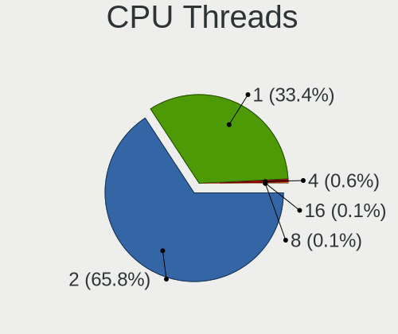

| Number | Notebooks | Percent |
|--------|-----------|---------|
| 2      | 629       | 65.59%  |
| 1      | 322       | 33.58%  |
| 4      | 6         | 0.63%   |
| 16     | 1         | 0.1%    |
| 8      | 1         | 0.1%    |

CPU Op-Modes
------------

CPU Operation Modes (32-bit, 64-bit)

| Op mode        | Notebooks | Percent |
|----------------|-----------|---------|
| 32-bit, 64-bit | 959       | 100%    |

CPU Microcode
-------------

Microcode number

| Number     | Notebooks | Percent |
|------------|-----------|---------|
| Unknown    | 780       | 81.33%  |
| 0x08108109 | 24        | 2.5%    |
| 0x0a50000c | 16        | 1.67%   |
| 0x08608103 | 15        | 1.56%   |
| 0x06006705 | 11        | 1.15%   |
| 0x08200103 | 9         | 0.94%   |
| 0x08108102 | 9         | 0.94%   |
| 0x0a50000d | 8         | 0.83%   |
| 0x0500010d | 8         | 0.83%   |
| 0x08600106 | 5         | 0.52%   |
| 0x0700010b | 5         | 0.52%   |
| 0x0600611a | 5         | 0.52%   |
| 0x05000101 | 5         | 0.52%   |
| 0x0810100b | 4         | 0.42%   |
| 0x07030105 | 4         | 0.42%   |
| 0x06001119 | 4         | 0.42%   |
| 0x08608102 | 3         | 0.31%   |
| 0x08600104 | 3         | 0.31%   |
| 0x08600103 | 3         | 0.31%   |
| 0x02000057 | 3         | 0.31%   |
| 0x02000032 | 3         | 0.31%   |
| 0x010000b6 | 3         | 0.31%   |
| 0x06006704 | 2         | 0.21%   |
| 0x0600111f | 2         | 0.21%   |
| 0x0600110f | 2         | 0.21%   |
| 0x03000027 | 2         | 0.21%   |
| 0x010000c8 | 2         | 0.21%   |
| 0x906a3    | 1         | 0.1%    |
| 0x806e9    | 1         | 0.1%    |
| 0x506c9    | 1         | 0.1%    |
| 0x406e3    | 1         | 0.1%    |
| 0x306a9    | 1         | 0.1%    |
| 0x206a7    | 1         | 0.1%    |
| 0x0a50000b | 1         | 0.1%    |
| 0x0a404102 | 1         | 0.1%    |
| 0x08a00006 | 1         | 0.1%    |
| 0x08900201 | 1         | 0.1%    |
| 0x08600102 | 1         | 0.1%    |
| 0x08101007 | 1         | 0.1%    |
| 0x07030106 | 1         | 0.1%    |

CPU Microarch
-------------

Microarchitecture

| Name             | Notebooks | Percent |
|------------------|-----------|---------|
| KabyLake         | 115       | 11.99%  |
| IvyBridge        | 85        | 8.86%   |
| SandyBridge      | 83        | 8.65%   |
| Skylake          | 62        | 6.47%   |
| Penryn           | 62        | 6.47%   |
| Haswell          | 57        | 5.94%   |
| Core             | 47        | 4.9%    |
| Westmere         | 43        | 4.48%   |
| TigerLake        | 42        | 4.38%   |
| Silvermont       | 42        | 4.38%   |
| Broadwell        | 37        | 3.86%   |
| Zen+             | 33        | 3.44%   |
| Goldmont plus    | 31        | 3.23%   |
| Zen 3            | 25        | 2.61%   |
| Unknown          | 21        | 2.19%   |
| Icelake          | 20        | 2.09%   |
| Excavator        | 19        | 1.98%   |
| Alderlake Hybrid | 16        | 1.67%   |
| Zen              | 14        | 1.46%   |
| Bobcat           | 14        | 1.46%   |
| Zen 2            | 13        | 1.36%   |
| Goldmont         | 11        | 1.15%   |
| CometLake        | 10        | 1.04%   |
| Piledriver       | 9         | 0.94%   |
| K8 Hammer        | 8         | 0.83%   |
| Jaguar           | 7         | 0.73%   |
| K8 & K10 hybrid  | 6         | 0.63%   |
| K10              | 6         | 0.63%   |
| Puma             | 5         | 0.52%   |
| Bonnell          | 5         | 0.52%   |
| Tremont          | 4         | 0.42%   |
| Nehalem          | 4         | 0.42%   |
| K10 Llano        | 2         | 0.21%   |
| Steamroller      | 1         | 0.1%    |

Graphics
--------

GPU Vendor
----------

Vendors of graphics cards

| Vendor                           | Notebooks | Percent |
|----------------------------------|-----------|---------|
| Intel                            | 694       | 60.82%  |
| AMD                              | 238       | 20.86%  |
| Nvidia                           | 207       | 18.14%  |
| Silicon Integrated Systems [SiS] | 2         | 0.18%   |

GPU Model
---------

Graphics card models

| Model                                                                                    | Notebooks | Percent |
|------------------------------------------------------------------------------------------|-----------|---------|
| Intel 3rd Gen Core processor Graphics Controller                                         | 77        | 6.51%   |
| Intel 2nd Generation Core Processor Family Integrated Graphics Controller                | 75        | 6.34%   |
| Intel Mobile 4 Series Chipset Integrated Graphics Controller                             | 49        | 4.14%   |
| AMD Picasso/Raven 2 [Radeon Vega Series / Radeon Vega Mobile Series]                     | 42        | 3.55%   |
| Intel HD Graphics 620                                                                    | 41        | 3.47%   |
| Intel Skylake GT2 [HD Graphics 520]                                                      | 37        | 3.13%   |
| Intel Haswell-ULT Integrated Graphics Controller                                         | 32        | 2.7%    |
| Intel HD Graphics 5500                                                                   | 31        | 2.62%   |
| Intel Core Processor Integrated Graphics Controller                                      | 27        | 2.28%   |
| Intel TigerLake-LP GT2 [Iris Xe Graphics]                                                | 26        | 2.2%    |
| Intel GeminiLake [UHD Graphics 600]                                                      | 26        | 2.2%    |
| Intel UHD Graphics 620                                                                   | 25        | 2.11%   |
| Intel Mobile GM965/GL960 Integrated Graphics Controller (secondary)                      | 23        | 1.94%   |
| Intel Mobile GM965/GL960 Integrated Graphics Controller (primary)                        | 23        | 1.94%   |
| Intel Atom Processor Z36xxx/Z37xxx Series Graphics & Display                             | 22        | 1.86%   |
| Intel Atom/Celeron/Pentium Processor x5-E8000/J3xxx/N3xxx Integrated Graphics Controller | 20        | 1.69%   |
| AMD Cezanne [Radeon Vega Series / Radeon Vega Mobile Series]                             | 20        | 1.69%   |
| Intel CometLake-U GT2 [UHD Graphics]                                                     | 18        | 1.52%   |
| AMD Lucienne                                                                             | 18        | 1.52%   |
| Intel HD Graphics 530                                                                    | 17        | 1.44%   |
| Intel 4th Gen Core Processor Integrated Graphics Controller                              | 16        | 1.35%   |
| Nvidia TU117M [GeForce GTX 1650 Mobile / Max-Q]                                          | 15        | 1.27%   |
| Intel Tiger Lake-LP GT2 [UHD Graphics G4]                                                | 15        | 1.27%   |
| AMD Stoney [Radeon R2/R3/R4/R5 Graphics]                                                 | 13        | 1.1%    |
| AMD Renoir [Radeon RX Vega 6 (Ryzen 4000/5000 Mobile Series)]                            | 12        | 1.01%   |
| Intel Alder Lake-P GT2 [Iris Xe Graphics]                                                | 10        | 0.85%   |
| AMD Sun XT [Radeon HD 8670A/8670M/8690M / R5 M330 / M430 / Radeon 520 Mobile]            | 10        | 0.85%   |
| Nvidia GM108M [GeForce 840M]                                                             | 9         | 0.76%   |
| Nvidia GM107M [GeForce GTX 960M]                                                         | 9         | 0.76%   |
| Nvidia GF117M [GeForce 610M/710M/810M/820M / GT 620M/625M/630M/720M]                     | 9         | 0.76%   |
| Intel WhiskeyLake-U GT2 [UHD Graphics 620]                                               | 9         | 0.76%   |
| Intel TigerLake-H GT1 [UHD Graphics]                                                     | 9         | 0.76%   |
| Intel CometLake-H GT2 [UHD Graphics]                                                     | 9         | 0.76%   |
| Intel Iris Plus Graphics G1 (Ice Lake)                                                   | 8         | 0.68%   |
| Intel CoffeeLake-H GT2 [UHD Graphics 630]                                                | 8         | 0.68%   |
| Nvidia GP107M [GeForce GTX 1050 Mobile]                                                  | 7         | 0.59%   |
| Intel HD Graphics 500                                                                    | 7         | 0.59%   |
| AMD Topaz XT [Radeon R7 M260/M265 / M340/M360 / M440/M445 / 530/535 / 620/625 Mobile]    | 7         | 0.59%   |
| Nvidia GF108M [GeForce GT 540M]                                                          | 6         | 0.51%   |
| Nvidia GA106M [GeForce RTX 3060 Mobile / Max-Q]                                          | 6         | 0.51%   |

GPU Combo
---------

Combinations of graphics cards

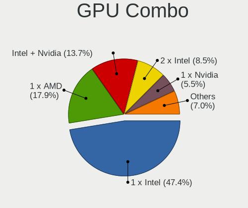

| Name           | Notebooks | Percent |
|----------------|-----------|---------|
| 1 x Intel      | 452       | 47.13%  |
| 1 x AMD        | 171       | 17.83%  |
| Intel + Nvidia | 133       | 13.87%  |
| 2 x Intel      | 80        | 8.34%   |
| 1 x Nvidia     | 54        | 5.63%   |
| Intel + AMD    | 29        | 3.02%   |
| AMD + Nvidia   | 20        | 2.09%   |
| 2 x AMD        | 18        | 1.88%   |
| 1 x SiS        | 2         | 0.21%   |

GPU Driver
----------

Free vs proprietary

| Driver      | Notebooks | Percent |
|-------------|-----------|---------|
| Free        | 928       | 96.77%  |
| Proprietary | 20        | 2.09%   |
| Unknown     | 11        | 1.15%   |

GPU Memory
----------

Total video memory

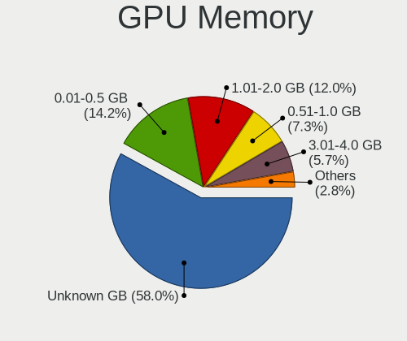

| Size in GB | Notebooks | Percent |
|------------|-----------|---------|
| Unknown    | 553       | 57.66%  |
| 0.01-0.5   | 138       | 14.39%  |
| 1.01-2.0   | 116       | 12.1%   |
| 0.51-1.0   | 68        | 7.09%   |
| 3.01-4.0   | 56        | 5.84%   |
| 5.01-6.0   | 13        | 1.36%   |
| 7.01-8.0   | 9         | 0.94%   |
| 8.01-16.0  | 4         | 0.42%   |
| 2.01-3.0   | 2         | 0.21%   |

Monitor
-------

Monitor Vendor
--------------

Monitor vendors

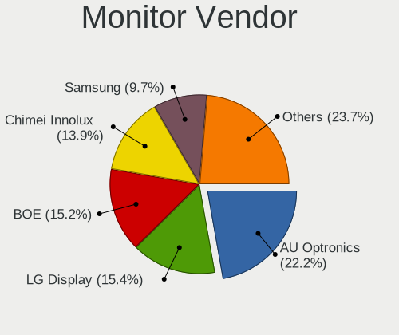

| Vendor                  | Notebooks | Percent |
|-------------------------|-----------|---------|
| AU Optronics            | 222       | 22.38%  |
| LG Display              | 155       | 15.63%  |
| BOE                     | 145       | 14.62%  |
| Chimei Innolux          | 141       | 14.21%  |
| Samsung Electronics     | 95        | 9.58%   |
| Lenovo                  | 26        | 2.62%   |
| LG Philips              | 24        | 2.42%   |
| Chi Mei Optoelectronics | 22        | 2.22%   |
| Sharp                   | 21        | 2.12%   |
| Apple                   | 19        | 1.92%   |
| PANDA                   | 14        | 1.41%   |
| InfoVision              | 9         | 0.91%   |
| Hewlett-Packard         | 7         | 0.71%   |
| Dell                    | 7         | 0.71%   |
| HannStar                | 6         | 0.6%    |
| Goldstar                | 6         | 0.6%    |
| AOC                     | 6         | 0.6%    |
| Acer                    | 6         | 0.6%    |
| Sony                    | 5         | 0.5%    |
| Hitachi                 | 5         | 0.5%    |
| Unknown                 | 4         | 0.4%    |
| HKC                     | 4         | 0.4%    |
| CSO                     | 4         | 0.4%    |
| Philips                 | 3         | 0.3%    |
| Toppoly                 | 2         | 0.2%    |
| Panasonic               | 2         | 0.2%    |
| InnoLux Display         | 2         | 0.2%    |
| Iiyama                  | 2         | 0.2%    |
| ASUSTek Computer        | 2         | 0.2%    |
| Xiaomi                  | 1         | 0.1%    |
| Vizio                   | 1         | 0.1%    |
| ViewSonic               | 1         | 0.1%    |
| Vestel Elektronik       | 1         | 0.1%    |
| Valve                   | 1         | 0.1%    |
| TMX                     | 1         | 0.1%    |
| STA                     | 1         | 0.1%    |
| Sceptre Tech            | 1         | 0.1%    |
| QUS                     | 1         | 0.1%    |
| Pixio                   | 1         | 0.1%    |
| MTD                     | 1         | 0.1%    |

Monitor Model
-------------

Monitor models

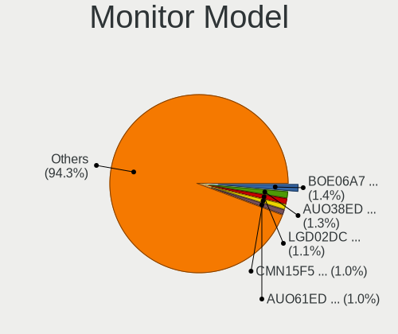

| Model                                                                    | Notebooks | Percent |
|--------------------------------------------------------------------------|-----------|---------|
| AU Optronics LCD Monitor AUO38ED 1920x1080 344x193mm 15.5-inch           | 13        | 1.31%   |
| LG Display LCD Monitor LGD02DC 1366x768 344x194mm 15.5-inch              | 11        | 1.11%   |
| Chimei Innolux LCD Monitor CMN15F5 1920x1080 344x193mm 15.5-inch         | 10        | 1.01%   |
| AU Optronics LCD Monitor AUO61ED 1920x1080 344x194mm 15.5-inch           | 10        | 1.01%   |
| AU Optronics LCD Monitor AUO26EC 1366x768 344x193mm 15.5-inch            | 9         | 0.91%   |
| AU Optronics LCD Monitor AUO213E 1600x900 309x174mm 14.0-inch            | 8         | 0.8%    |
| Chimei Innolux LCD Monitor CMN14D4 1920x1080 309x173mm 13.9-inch         | 7         | 0.7%    |
| AU Optronics LCD Monitor AUO36ED 1920x1080 344x193mm 15.5-inch           | 7         | 0.7%    |
| Samsung Electronics LCD Monitor SEC5441 1366x768 309x174mm 14.0-inch     | 6         | 0.6%    |
| Chimei Innolux LCD Monitor CMN15DB 1366x768 344x193mm 15.5-inch          | 6         | 0.6%    |
| BOE LCD Monitor BOE0672 1366x768 344x194mm 15.5-inch                     | 6         | 0.6%    |
| AU Optronics LCD Monitor AUO723C 1366x768 309x173mm 13.9-inch            | 6         | 0.6%    |
| AU Optronics LCD Monitor AUO6287 1440x900 367x229mm 17.0-inch            | 6         | 0.6%    |
| AU Optronics LCD Monitor AUO22EC 1366x768 344x193mm 15.5-inch            | 6         | 0.6%    |
| AU Optronics LCD Monitor AUO10EC 1366x768 344x193mm 15.5-inch            | 6         | 0.6%    |
| LG Display LCD Monitor LGD046F 1920x1080 344x194mm 15.5-inch             | 5         | 0.5%    |
| LG Display LCD Monitor LGD033A 1366x768 344x194mm 15.5-inch              | 5         | 0.5%    |
| LG Display LCD Monitor LGD02D8 1366x768 277x156mm 12.5-inch              | 5         | 0.5%    |
| Chimei Innolux LCD Monitor CMN1132 1366x768 256x144mm 11.6-inch          | 5         | 0.5%    |
| BOE LCD Monitor BOE0812 1920x1080 344x194mm 15.5-inch                    | 5         | 0.5%    |
| BOE LCD Monitor BOE06DF 1920x1080 309x173mm 13.9-inch                    | 5         | 0.5%    |
| BOE LCD Monitor BOE06A7 1920x1080 294x165mm 13.3-inch                    | 5         | 0.5%    |
| AU Optronics LCD Monitor AUO81EC 1366x768 344x193mm 15.5-inch            | 5         | 0.5%    |
| Unknown LCD Monitor FFFF 2288x1287 2550x2550mm 142.0-inch                | 4         | 0.4%    |
| Samsung Electronics LCD Monitor SEC3741 1280x800 331x207mm 15.4-inch     | 4         | 0.4%    |
| Samsung Electronics LCD Monitor SDC4C48 1920x1080 309x174mm 14.0-inch    | 4         | 0.4%    |
| PANDA LCD Monitor NCP004D 1920x1080 344x194mm 15.5-inch                  | 4         | 0.4%    |
| LG Philips LCD Monitor LPLA101 1440x900 367x230mm 17.1-inch              | 4         | 0.4%    |
| LG Display LCD Monitor LGD04A7 1920x1080 344x194mm 15.5-inch             | 4         | 0.4%    |
| LG Display LCD Monitor LGD033E 1366x768 309x174mm 14.0-inch              | 4         | 0.4%    |
| Chimei Innolux LCD Monitor CMN1734 1600x900 382x214mm 17.2-inch          | 4         | 0.4%    |
| Chimei Innolux LCD Monitor CMN151E 1920x1080 344x193mm 15.5-inch         | 4         | 0.4%    |
| Chi Mei Optoelectronics LCD Monitor CMO15A3 1366x768 344x194mm 15.5-inch | 4         | 0.4%    |
| BOE LCD Monitor BOE0889 1920x1080 344x194mm 15.5-inch                    | 4         | 0.4%    |
| BOE LCD Monitor BOE0868 1920x1080 309x174mm 14.0-inch                    | 4         | 0.4%    |
| BOE LCD Monitor BOE06A5 1366x768 344x194mm 15.5-inch                     | 4         | 0.4%    |
| BOE LCD Monitor BOE0675 1366x768 344x194mm 15.5-inch                     | 4         | 0.4%    |
| AU Optronics LCD Monitor AUO71EC 1366x768 344x193mm 15.5-inch            | 4         | 0.4%    |
| AU Optronics LCD Monitor AUO46EC 1366x768 344x193mm 15.5-inch            | 4         | 0.4%    |
| AU Optronics LCD Monitor AUO21ED 1920x1080 344x194mm 15.5-inch           | 4         | 0.4%    |

Monitor Resolution
------------------

Monitor screen resolution

| Resolution         | Notebooks | Percent |
|--------------------|-----------|---------|
| 1366x768 (WXGA)    | 378       | 38.73%  |
| 1920x1080 (FHD)    | 355       | 36.37%  |
| 1600x900 (HD+)     | 58        | 5.94%   |
| 1280x800 (WXGA)    | 52        | 5.33%   |
| 3840x2160 (4K)     | 26        | 2.66%   |
| 1440x900 (WXGA+)   | 26        | 2.66%   |
| 2560x1600          | 16        | 1.64%   |
| 2560x1440 (QHD)    | 12        | 1.23%   |
| 1920x1200 (WUXGA)  | 12        | 1.23%   |
| 1680x1050 (WSXGA+) | 6         | 0.61%   |
| 3840x2400          | 4         | 0.41%   |
| 2880x1800          | 4         | 0.41%   |
| 2288x1287          | 4         | 0.41%   |
| 2160x1440          | 3         | 0.31%   |
| 1280x1024 (SXGA)   | 3         | 0.31%   |
| 3440x1440          | 2         | 0.2%    |
| 3200x1800 (QHD+)   | 2         | 0.2%    |
| 1024x600           | 2         | 0.2%    |
| 800x1280           | 1         | 0.1%    |
| 3456x2160          | 1         | 0.1%    |
| 2560x1080          | 1         | 0.1%    |
| 2240x1400          | 1         | 0.1%    |
| 2160x1350          | 1         | 0.1%    |
| 1920x540           | 1         | 0.1%    |
| 1920x1280          | 1         | 0.1%    |
| 1600x2560          | 1         | 0.1%    |
| 1400x1050          | 1         | 0.1%    |
| 1360x768           | 1         | 0.1%    |
| 1024x768 (XGA)     | 1         | 0.1%    |

Monitor Diagonal
----------------

Diagonal size in inches

| Inches  | Notebooks | Percent |
|---------|-----------|---------|
| 15      | 466       | 46.88%  |
| 13      | 133       | 13.38%  |
| 14      | 123       | 12.37%  |
| 17      | 93        | 9.36%   |
| 12      | 32        | 3.22%   |
| 11      | 26        | 2.62%   |
| 16      | 16        | 1.61%   |
| 27      | 15        | 1.51%   |
| 23      | 12        | 1.21%   |
| 18      | 11        | 1.11%   |
| 24      | 10        | 1.01%   |
| 21      | 7         | 0.7%    |
| 31      | 6         | 0.6%    |
| 84      | 5         | 0.5%    |
| 142     | 4         | 0.4%    |
| 19      | 4         | 0.4%    |
| 52      | 3         | 0.3%    |
| 32      | 3         | 0.3%    |
| 72      | 2         | 0.2%    |
| 65      | 2         | 0.2%    |
| 40      | 2         | 0.2%    |
| 34      | 2         | 0.2%    |
| 26      | 2         | 0.2%    |
| 20      | 2         | 0.2%    |
| 10      | 2         | 0.2%    |
| Unknown | 2         | 0.2%    |
| 60      | 1         | 0.1%    |
| 54      | 1         | 0.1%    |
| 46      | 1         | 0.1%    |
| 36      | 1         | 0.1%    |
| 35      | 1         | 0.1%    |
| 29      | 1         | 0.1%    |
| 22      | 1         | 0.1%    |
| 8       | 1         | 0.1%    |
| 7       | 1         | 0.1%    |

Monitor Width
-------------

Physical width

| Width in mm    | Notebooks | Percent |
|----------------|-----------|---------|
| 301-350        | 674       | 67.88%  |
| 201-300        | 110       | 11.08%  |
| 351-400        | 109       | 10.98%  |
| 501-600        | 35        | 3.52%   |
| 401-500        | 25        | 2.52%   |
| 601-700        | 8         | 0.81%   |
| 1001-1500      | 8         | 0.81%   |
| 1501-2000      | 7         | 0.7%    |
| 701-800        | 6         | 0.6%    |
| More than 2000 | 4         | 0.4%    |
| 801-900        | 3         | 0.3%    |
| Unknown        | 2         | 0.2%    |
| 101-200        | 1         | 0.1%    |
| 1-100          | 1         | 0.1%    |

Aspect Ratio
------------

Proportional relationship between the width and the height

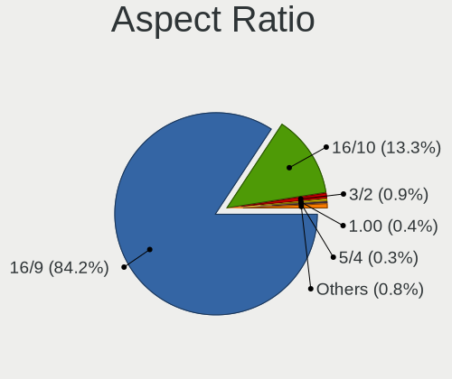

| Ratio   | Notebooks | Percent |
|---------|-----------|---------|
| 16/9    | 791       | 84.6%   |
| 16/10   | 120       | 12.83%  |
| 3/2     | 9         | 0.96%   |
| 1.00    | 4         | 0.43%   |
| 5/4     | 3         | 0.32%   |
| 21/9    | 3         | 0.32%   |
| 4/3     | 2         | 0.21%   |
| 0.67    | 1         | 0.11%   |
| 0.63    | 1         | 0.11%   |
| Unknown | 1         | 0.11%   |

Monitor Area
------------

Area in inch

| Area in inch | Notebooks | Percent |
|----------------|-----------|---------|
| 101-110        | 469       | 47.18%  |
| 81-90          | 212       | 21.33%  |
| 121-130        | 67        | 6.74%   |
| 71-80          | 44        | 4.43%   |
| 61-70          | 31        | 3.12%   |
| 51-60          | 26        | 2.62%   |
| 201-250        | 26        | 2.62%   |
| 131-140        | 25        | 2.52%   |
| More than 1000 | 18        | 1.81%   |
| 301-350        | 16        | 1.61%   |
| 351-500        | 13        | 1.31%   |
| 141-150        | 12        | 1.21%   |
| 111-120        | 11        | 1.11%   |
| 151-200        | 7         | 0.7%    |
| 251-300        | 4         | 0.4%    |
| 501-1000       | 4         | 0.4%    |
| 91-100         | 3         | 0.3%    |
| 41-50          | 2         | 0.2%    |
| 1-40           | 2         | 0.2%    |
| Unknown        | 2         | 0.2%    |

Pixel Density
-------------

Pixels per inch

| Density       | Notebooks | Percent |
|---------------|-----------|---------|
| 101-120       | 388       | 39.35%  |
| 121-160       | 376       | 38.13%  |
| 51-100        | 133       | 13.49%  |
| 161-240       | 57        | 5.78%   |
| More than 240 | 17        | 1.72%   |
| 1-50          | 13        | 1.32%   |
| Unknown       | 2         | 0.2%    |

Multiple Monitors
-----------------

Total monitors connected

| Total | Notebooks | Percent |
|-------|-----------|---------|
| 1     | 870       | 90.63%  |
| 2     | 84        | 8.75%   |
| 0     | 5         | 0.52%   |
| 3     | 1         | 0.1%    |

Network
-------

Net Controller Vendor
---------------------

Controller vendors

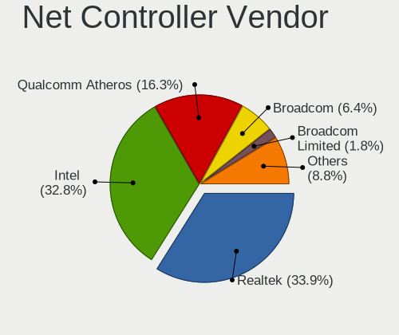

| Vendor                            | Notebooks | Percent |
|-----------------------------------|-----------|---------|
| Realtek Semiconductor             | 512       | 34.32%  |
| Intel                             | 484       | 32.44%  |
| Qualcomm Atheros                  | 243       | 16.29%  |
| Broadcom                          | 94        | 6.3%    |
| Broadcom Limited                  | 28        | 1.88%   |
| MediaTek                          | 18        | 1.21%   |
| Marvell Technology Group          | 16        | 1.07%   |
| Ralink                            | 14        | 0.94%   |
| TP-Link                           | 12        | 0.8%    |
| Ralink Technology                 | 8         | 0.54%   |
| Dell                              | 7         | 0.47%   |
| JMicron Technology                | 6         | 0.4%    |
| Sierra Wireless                   | 5         | 0.34%   |
| Nvidia                            | 5         | 0.34%   |
| Ericsson Business Mobile Networks | 4         | 0.27%   |
| NetGear                           | 3         | 0.2%    |
| ASIX Electronics                  | 3         | 0.2%    |
| Xiaomi                            | 2         | 0.13%   |
| T & A Mobile Phones               | 2         | 0.13%   |
| Silicon Integrated Systems [SiS]  | 2         | 0.13%   |
| Samsung Electronics               | 2         | 0.13%   |
| Qualcomm Atheros Communications   | 2         | 0.13%   |
| Linksys                           | 2         | 0.13%   |
| ICS Advent                        | 2         | 0.13%   |
| Attansic Technology               | 2         | 0.13%   |
| ASUSTek Computer                  | 2         | 0.13%   |
| ZTE WCDMA Technologies MSM        | 1         | 0.07%   |
| vivo                              | 1         | 0.07%   |
| Qualcomm                          | 1         | 0.07%   |
| PLANEX                            | 1         | 0.07%   |
| Microsoft                         | 1         | 0.07%   |
| LG Electronics                    | 1         | 0.07%   |
| Lenovo                            | 1         | 0.07%   |
| Huawei Technologies               | 1         | 0.07%   |
| Holtek Semiconductor              | 1         | 0.07%   |
| DisplayLink                       | 1         | 0.07%   |
| D-Link System                     | 1         | 0.07%   |
| Apple                             | 1         | 0.07%   |

Net Controller Model
--------------------

Controller models

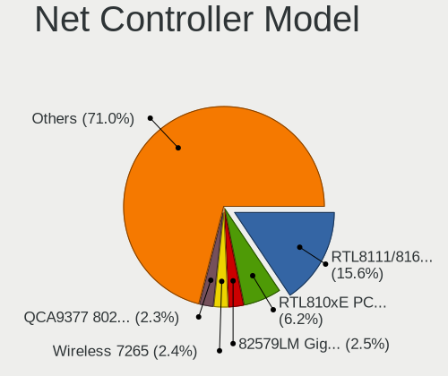

| Model                                                                   | Notebooks | Percent |
|-------------------------------------------------------------------------|-----------|---------|
| Realtek RTL8111/8168/8411 PCI Express Gigabit Ethernet Controller       | 286       | 15.86%  |
| Realtek RTL810xE PCI Express Fast Ethernet controller                   | 113       | 6.27%   |
| Intel 82579LM Gigabit Network Connection (Lewisville)                   | 44        | 2.44%   |
| Qualcomm Atheros QCA9377 802.11ac Wireless Network Adapter              | 43        | 2.38%   |
| Intel Wireless 7265                                                     | 43        | 2.38%   |
| Qualcomm Atheros AR9485 Wireless Network Adapter                        | 38        | 2.11%   |
| Qualcomm Atheros QCA9565 / AR9565 Wireless Network Adapter              | 37        | 2.05%   |
| Realtek RTL8822CE 802.11ac PCIe Wireless Network Adapter                | 33        | 1.83%   |
| Intel Centrino Advanced-N 6205 [Taylor Peak]                            | 33        | 1.83%   |
| Realtek RTL8821CE 802.11ac PCIe Wireless Network Adapter                | 31        | 1.72%   |
| Intel Wi-Fi 6 AX201                                                     | 31        | 1.72%   |
| Qualcomm Atheros AR9285 Wireless Network Adapter (PCI-Express)          | 30        | 1.66%   |
| Intel Wireless 3165                                                     | 28        | 1.55%   |
| Realtek RTL8153 Gigabit Ethernet Adapter                                | 26        | 1.44%   |
| Intel Wireless 8265 / 8275                                              | 26        | 1.44%   |
| Intel Wireless 8260                                                     | 21        | 1.16%   |
| Realtek RTL8188CE 802.11b/g/n WiFi Adapter                              | 18        | 1%      |
| Intel Wireless 7260                                                     | 18        | 1%      |
| Intel Wi-Fi 6 AX200                                                     | 18        | 1%      |
| Intel PRO/Wireless 3945ABG [Golan] Network Connection                   | 18        | 1%      |
| Intel Dual Band Wireless-AC 3168NGW [Stone Peak]                        | 18        | 1%      |
| Qualcomm Atheros QCA6174 802.11ac Wireless Network Adapter              | 17        | 0.94%   |
| MediaTek MT7921 802.11ax PCI Express Wireless Network Adapter           | 17        | 0.94%   |
| Intel 82567LM Gigabit Network Connection                                | 17        | 0.94%   |
| Intel WiFi Link 5100                                                    | 16        | 0.89%   |
| Qualcomm Atheros AR242x / AR542x Wireless Network Adapter (PCI-Express) | 15        | 0.83%   |
| Intel Wireless 3160                                                     | 15        | 0.83%   |
| Broadcom BCM4313 802.11bgn Wireless Network Adapter                     | 15        | 0.83%   |
| Realtek RTL8723BE PCIe Wireless Network Adapter                         | 14        | 0.78%   |
| Realtek RTL8188EE Wireless Network Adapter                              | 14        | 0.78%   |
| Intel Gemini Lake PCH CNVi WiFi                                         | 14        | 0.78%   |
| Intel Ethernet Connection (3) I218-LM                                   | 14        | 0.78%   |
| Intel Centrino Ultimate-N 6300                                          | 14        | 0.78%   |
| Intel Ethernet Connection (4) I219-LM                                   | 13        | 0.72%   |
| Intel Comet Lake PCH-LP CNVi WiFi                                       | 13        | 0.72%   |
| Intel Alder Lake-P PCH CNVi WiFi                                        | 13        | 0.72%   |
| Intel PRO/Wireless 5100 AGN [Shiloh] Network Connection                 | 12        | 0.67%   |
| Qualcomm Atheros AR9462 Wireless Network Adapter                        | 11        | 0.61%   |
| Qualcomm Atheros AR8151 v2.0 Gigabit Ethernet                           | 11        | 0.61%   |
| Intel Centrino Advanced-N 6200                                          | 11        | 0.61%   |

Wireless Vendor
---------------

Wireless vendors

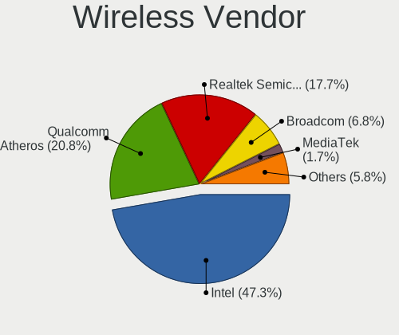

| Vendor                          | Notebooks | Percent |
|---------------------------------|-----------|---------|
| Intel                           | 465       | 47.11%  |
| Qualcomm Atheros                | 205       | 20.77%  |
| Realtek Semiconductor           | 178       | 18.03%  |
| Broadcom                        | 66        | 6.69%   |
| MediaTek                        | 17        | 1.72%   |
| Ralink                          | 14        | 1.42%   |
| Broadcom Limited                | 10        | 1.01%   |
| Ralink Technology               | 8         | 0.81%   |
| Sierra Wireless                 | 5         | 0.51%   |
| TP-Link                         | 4         | 0.41%   |
| Dell                            | 4         | 0.41%   |
| Qualcomm Atheros Communications | 2         | 0.2%    |
| NetGear                         | 2         | 0.2%    |
| Linksys                         | 2         | 0.2%    |
| Qualcomm                        | 1         | 0.1%    |
| PLANEX                          | 1         | 0.1%    |
| Microsoft                       | 1         | 0.1%    |
| D-Link System                   | 1         | 0.1%    |
| ASUSTek Computer                | 1         | 0.1%    |

Wireless Model
--------------

Wireless models

| Model                                                                   | Notebooks | Percent |
|-------------------------------------------------------------------------|-----------|---------|
| Qualcomm Atheros QCA9377 802.11ac Wireless Network Adapter              | 43        | 4.34%   |
| Intel Wireless 7265                                                     | 43        | 4.34%   |
| Qualcomm Atheros AR9485 Wireless Network Adapter                        | 38        | 3.83%   |
| Qualcomm Atheros QCA9565 / AR9565 Wireless Network Adapter              | 37        | 3.73%   |
| Realtek RTL8822CE 802.11ac PCIe Wireless Network Adapter                | 33        | 3.33%   |
| Intel Centrino Advanced-N 6205 [Taylor Peak]                            | 33        | 3.33%   |
| Realtek RTL8821CE 802.11ac PCIe Wireless Network Adapter                | 31        | 3.13%   |
| Intel Wi-Fi 6 AX201                                                     | 31        | 3.13%   |
| Qualcomm Atheros AR9285 Wireless Network Adapter (PCI-Express)          | 30        | 3.03%   |
| Intel Wireless 3165                                                     | 28        | 2.83%   |
| Intel Wireless 8265 / 8275                                              | 26        | 2.62%   |
| Intel Wireless 8260                                                     | 21        | 2.12%   |
| Realtek RTL8188CE 802.11b/g/n WiFi Adapter                              | 18        | 1.82%   |
| Intel Wireless 7260                                                     | 18        | 1.82%   |
| Intel Wi-Fi 6 AX200                                                     | 18        | 1.82%   |
| Intel PRO/Wireless 3945ABG [Golan] Network Connection                   | 18        | 1.82%   |
| Intel Dual Band Wireless-AC 3168NGW [Stone Peak]                        | 18        | 1.82%   |
| Qualcomm Atheros QCA6174 802.11ac Wireless Network Adapter              | 17        | 1.72%   |
| MediaTek MT7921 802.11ax PCI Express Wireless Network Adapter           | 17        | 1.72%   |
| Intel WiFi Link 5100                                                    | 16        | 1.61%   |
| Qualcomm Atheros AR242x / AR542x Wireless Network Adapter (PCI-Express) | 15        | 1.51%   |
| Intel Wireless 3160                                                     | 15        | 1.51%   |
| Broadcom BCM4313 802.11bgn Wireless Network Adapter                     | 15        | 1.51%   |
| Realtek RTL8723BE PCIe Wireless Network Adapter                         | 14        | 1.41%   |
| Realtek RTL8188EE Wireless Network Adapter                              | 14        | 1.41%   |
| Intel Gemini Lake PCH CNVi WiFi                                         | 14        | 1.41%   |
| Intel Centrino Ultimate-N 6300                                          | 14        | 1.41%   |
| Intel Comet Lake PCH-LP CNVi WiFi                                       | 13        | 1.31%   |
| Intel Alder Lake-P PCH CNVi WiFi                                        | 13        | 1.31%   |
| Intel PRO/Wireless 5100 AGN [Shiloh] Network Connection                 | 12        | 1.21%   |
| Qualcomm Atheros AR9462 Wireless Network Adapter                        | 11        | 1.11%   |
| Intel Centrino Advanced-N 6200                                          | 11        | 1.11%   |
| Realtek RTL8723BU 802.11b/g/n WLAN Adapter                              | 10        | 1.01%   |
| Intel Centrino Wireless-N 1000 [Condor Peak]                            | 10        | 1.01%   |
| Intel PRO/Wireless 4965 AG or AGN [Kedron] Network Connection           | 9         | 0.91%   |
| Intel Dual Band Wireless-AC 3165 Plus Bluetooth                         | 9         | 0.91%   |
| Intel Comet Lake PCH CNVi WiFi                                          | 9         | 0.91%   |
| Intel Cannon Lake PCH CNVi WiFi                                         | 9         | 0.91%   |
| Realtek RTL8852AE 802.11ax PCIe Wireless Network Adapter                | 8         | 0.81%   |
| Realtek RTL8723AE PCIe Wireless Network Adapter                         | 8         | 0.81%   |

Ethernet Vendor
---------------

Ethernet vendors

| Vendor                           | Notebooks | Percent |
|----------------------------------|-----------|---------|
| Realtek Semiconductor            | 436       | 55.05%  |
| Intel                            | 169       | 21.34%  |
| Qualcomm Atheros                 | 69        | 8.71%   |
| Broadcom                         | 44        | 5.56%   |
| Broadcom Limited                 | 19        | 2.4%    |
| Marvell Technology Group         | 16        | 2.02%   |
| TP-Link                          | 8         | 1.01%   |
| JMicron Technology               | 6         | 0.76%   |
| Nvidia                           | 5         | 0.63%   |
| ASIX Electronics                 | 3         | 0.38%   |
| Xiaomi                           | 2         | 0.25%   |
| Silicon Integrated Systems [SiS] | 2         | 0.25%   |
| ICS Advent                       | 2         | 0.25%   |
| Attansic Technology              | 2         | 0.25%   |
| ZTE WCDMA Technologies MSM       | 1         | 0.13%   |
| Samsung Electronics              | 1         | 0.13%   |
| NetGear                          | 1         | 0.13%   |
| MediaTek                         | 1         | 0.13%   |
| LG Electronics                   | 1         | 0.13%   |
| Lenovo                           | 1         | 0.13%   |
| DisplayLink                      | 1         | 0.13%   |
| ASUSTek Computer                 | 1         | 0.13%   |
| Apple                            | 1         | 0.13%   |

Ethernet Model
--------------

Ethernet models

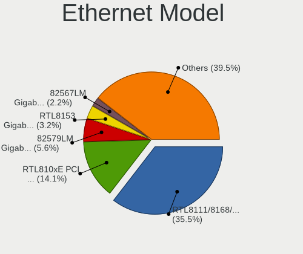

| Model                                                                          | Notebooks | Percent |
|--------------------------------------------------------------------------------|-----------|---------|
| Realtek RTL8111/8168/8411 PCI Express Gigabit Ethernet Controller              | 286       | 35.84%  |
| Realtek RTL810xE PCI Express Fast Ethernet controller                          | 113       | 14.16%  |
| Intel 82579LM Gigabit Network Connection (Lewisville)                          | 44        | 5.51%   |
| Realtek RTL8153 Gigabit Ethernet Adapter                                       | 26        | 3.26%   |
| Intel 82567LM Gigabit Network Connection                                       | 17        | 2.13%   |
| Intel Ethernet Connection (3) I218-LM                                          | 14        | 1.75%   |
| Intel Ethernet Connection (4) I219-LM                                          | 13        | 1.63%   |
| Qualcomm Atheros AR8151 v2.0 Gigabit Ethernet                                  | 11        | 1.38%   |
| Intel Ethernet Connection I217-LM                                              | 10        | 1.25%   |
| Intel 82577LM Gigabit Network Connection                                       | 10        | 1.25%   |
| Qualcomm Atheros AR8152 v2.0 Fast Ethernet                                     | 9         | 1.13%   |
| TP-Link UE300 10/100/1000 LAN (ethernet mode) [Realtek RTL8153]                | 8         | 1%      |
| Qualcomm Atheros AR8131 Gigabit Ethernet                                       | 8         | 1%      |
| Broadcom NetLink BCM57780 Gigabit Ethernet PCIe                                | 8         | 1%      |
| Qualcomm Atheros AR8152 v1.1 Fast Ethernet                                     | 7         | 0.88%   |
| Intel 82579V Gigabit Network Connection                                        | 7         | 0.88%   |
| Intel 82566MM Gigabit Network Connection                                       | 7         | 0.88%   |
| Broadcom NetXtreme BCM57765 Gigabit Ethernet PCIe                              | 7         | 0.88%   |
| Broadcom NetLink BCM57785 Gigabit Ethernet PCIe                                | 7         | 0.88%   |
| Realtek RTL8152 Fast Ethernet Adapter                                          | 6         | 0.75%   |
| Qualcomm Atheros QCA8172 Fast Ethernet                                         | 6         | 0.75%   |
| Qualcomm Atheros AR8161 Gigabit Ethernet                                       | 6         | 0.75%   |
| Intel Ethernet Connection I219-LM                                              | 6         | 0.75%   |
| Intel Ethernet Connection (4) I219-V                                           | 6         | 0.75%   |
| Qualcomm Atheros AR8162 Fast Ethernet                                          | 5         | 0.63%   |
| JMicron JMC250 PCI Express Gigabit Ethernet Controller                         | 5         | 0.63%   |
| Broadcom Limited NetLink BCM5787M Gigabit Ethernet PCI Express                 | 5         | 0.63%   |
| Qualcomm Atheros Killer E220x Gigabit Ethernet Controller                      | 4         | 0.5%    |
| Marvell Group Yukon Optima 88E8059 [PCIe Gigabit Ethernet Controller with AVB] | 4         | 0.5%    |
| Intel Ethernet Connection (2) I219-LM                                          | 4         | 0.5%    |
| Intel 82562GT 10/100 Network Connection                                        | 4         | 0.5%    |
| Broadcom NetXtreme BCM57786 Gigabit Ethernet PCIe                              | 4         | 0.5%    |
| Broadcom NetLink BCM5787M Gigabit Ethernet PCI Express                         | 4         | 0.5%    |
| Broadcom Limited BCM4401-B0 100Base-TX                                         | 4         | 0.5%    |
| Realtek RTL8125 2.5GbE Controller                                              | 3         | 0.38%   |
| Qualcomm Atheros QCA8171 Gigabit Ethernet                                      | 3         | 0.38%   |
| Qualcomm Atheros AR8151 v1.0 Gigabit Ethernet                                  | 3         | 0.38%   |
| Qualcomm Atheros AR8132 Fast Ethernet                                          | 3         | 0.38%   |
| Nvidia MCP79 Ethernet                                                          | 3         | 0.38%   |
| Marvell Group 88E8055 PCI-E Gigabit Ethernet Controller                        | 3         | 0.38%   |

Net Controller Kind
-------------------

Ethernet, WiFi or modem

| Kind     | Notebooks | Percent |
|----------|-----------|---------|
| WiFi     | 951       | 54.53%  |
| Ethernet | 779       | 44.67%  |
| Modem    | 11        | 0.63%   |
| Unknown  | 3         | 0.17%   |

Used Controller
---------------

Currently used network controller

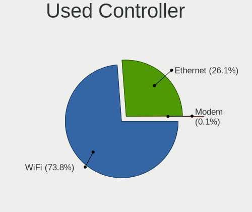

| Kind     | Notebooks | Percent |
|----------|-----------|---------|
| WiFi     | 693       | 73.57%  |
| Ethernet | 248       | 26.33%  |
| Modem    | 1         | 0.11%   |

NICs
----

Total network controllers on board

| Total | Notebooks | Percent |
|-------|-----------|---------|
| 2     | 720       | 75.08%  |
| 1     | 216       | 22.52%  |
| 0     | 19        | 1.98%   |
| 3     | 4         | 0.42%   |

IPv6
----

IPv6 vs IPv4

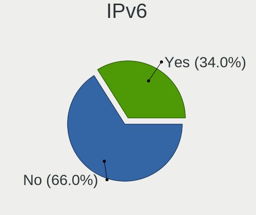

| Used | Notebooks | Percent |
|------|-----------|---------|
| No   | 634       | 66.11%  |
| Yes  | 325       | 33.89%  |

Bluetooth
---------

Bluetooth Vendor
----------------

Controller vendors

| Vendor                          | Notebooks | Percent |
|---------------------------------|-----------|---------|
| Intel                           | 325       | 44.77%  |
| Realtek Semiconductor           | 88        | 12.12%  |
| Qualcomm Atheros Communications | 68        | 9.37%   |
| IMC Networks                    | 44        | 6.06%   |
| Broadcom                        | 44        | 6.06%   |
| Lite-On Technology              | 39        | 5.37%   |
| Foxconn / Hon Hai               | 24        | 3.31%   |
| Toshiba                         | 17        | 2.34%   |
| Hewlett-Packard                 | 17        | 2.34%   |
| Apple                           | 17        | 2.34%   |
| Dell                            | 11        | 1.52%   |
| Cambridge Silicon Radio         | 11        | 1.52%   |
| ASUSTek Computer                | 6         | 0.83%   |
| Realtek                         | 5         | 0.69%   |
| Ralink                          | 5         | 0.69%   |
| Chicony Electronics             | 2         | 0.28%   |
| Qcom                            | 1         | 0.14%   |
| Fujitsu                         | 1         | 0.14%   |
| Foxconn International           | 1         | 0.14%   |

Bluetooth Model
---------------

Controller models

| Model                                               | Notebooks | Percent |
|-----------------------------------------------------|-----------|---------|
| Intel Bluetooth wireless interface                  | 156       | 21.49%  |
| Intel Bluetooth 9460/9560 Jefferson Peak (JfP)      | 49        | 6.75%   |
| Intel AX201 Bluetooth                               | 49        | 6.75%   |
| Realtek Bluetooth Radio                             | 48        | 6.61%   |
| Qualcomm Atheros  Bluetooth Device                  | 32        | 4.41%   |
| Realtek  Bluetooth 4.2 Adapter                      | 18        | 2.48%   |
| Lite-On Qualcomm Atheros QCA9377 Bluetooth          | 18        | 2.48%   |
| Intel Wireless-AC 3168 Bluetooth                    | 18        | 2.48%   |
| Intel AX200 Bluetooth                               | 17        | 2.34%   |
| Realtek 802.11ac WLAN Adapter                       | 14        | 1.93%   |
| Qualcomm Atheros AR3012 Bluetooth 4.0               | 13        | 1.79%   |
| Qualcomm Atheros AR3011 Bluetooth                   | 11        | 1.52%   |
| Intel Centrino Bluetooth Wireless Transceiver       | 11        | 1.52%   |
| IMC Networks Bluetooth Radio                        | 11        | 1.52%   |
| Cambridge Silicon Radio Bluetooth Dongle (HCI mode) | 11        | 1.52%   |
| Broadcom BCM2045B (BDC-2.1)                         | 11        | 1.52%   |
| Apple Bluetooth Host Controller                     | 11        | 1.52%   |
| Intel Centrino Advanced-N 6230 Bluetooth adapter    | 10        | 1.38%   |
| IMC Networks Bluetooth Device                       | 10        | 1.38%   |
| HP Bluetooth 2.0 Interface [Broadcom BCM2045]       | 10        | 1.38%   |
| IMC Networks Wireless_Device                        | 9         | 1.24%   |
| Qualcomm Atheros QCA61x4 Bluetooth 4.0              | 8         | 1.1%    |
| Lite-On Atheros AR3012 Bluetooth                    | 8         | 1.1%    |
| HP Broadcom 2070 Bluetooth Combo                    | 7         | 0.96%   |
| Foxconn / Hon Hai Bluetooth Device                  | 7         | 0.96%   |
| Broadcom BCM20702 Bluetooth 4.0 [ThinkPad]          | 7         | 0.96%   |
| Intel Bluetooth Device                              | 6         | 0.83%   |
| Intel AX210 Bluetooth                               | 6         | 0.83%   |
| Toshiba Bluetooth Device                            | 5         | 0.69%   |
| Realtek 802.11ac WLAN Adapter                       | 5         | 0.69%   |
| Ralink RT3290 Bluetooth                             | 5         | 0.69%   |
| Lite-On Bluetooth Device                            | 5         | 0.69%   |
| IMC Networks BCM20702A0                             | 5         | 0.69%   |
| Dell BCM20702A0 Bluetooth Module                    | 5         | 0.69%   |
| Lite-On Wireless_Device                             | 4         | 0.55%   |
| IMC Networks Bluetooth                              | 4         | 0.55%   |
| Foxconn / Hon Hai Acer Bluetooth module             | 4         | 0.55%   |
| Dell DW375 Bluetooth Module                         | 4         | 0.55%   |
| Broadcom BCM2045B (BDC-2.1) [Bluetooth Controller]  | 4         | 0.55%   |
| Broadcom BCM2045B (BDC-2) [Bluetooth Controller]    | 4         | 0.55%   |

Sound
-----

Sound Vendor
------------

Sound card vendors

| Vendor                           | Notebooks | Percent |
|----------------------------------|-----------|---------|
| Intel                            | 769       | 68.6%   |
| AMD                              | 205       | 18.29%  |
| Nvidia                           | 116       | 10.35%  |
| Generalplus Technology           | 6         | 0.54%   |
| C-Media Electronics              | 5         | 0.45%   |
| Texas Instruments                | 2         | 0.18%   |
| Silicon Integrated Systems [SiS] | 2         | 0.18%   |
| No brand                         | 2         | 0.18%   |
| JMTek                            | 2         | 0.18%   |
| THX                              | 1         | 0.09%   |
| SAVITECH                         | 1         | 0.09%   |
| PreSonus Audio Electronics       | 1         | 0.09%   |
| Plantronics                      | 1         | 0.09%   |
| Lenovo                           | 1         | 0.09%   |
| Hewlett-Packard                  | 1         | 0.09%   |
| GN Netcom                        | 1         | 0.09%   |
| EDIFIER                          | 1         | 0.09%   |
| Creative Technology              | 1         | 0.09%   |
| Corsair                          | 1         | 0.09%   |
| ASUSTek Computer                 | 1         | 0.09%   |
| Apple                            | 1         | 0.09%   |

Sound Model
-----------

Sound card models

| Model                                                                                             | Notebooks | Percent |
|---------------------------------------------------------------------------------------------------|-----------|---------|
| Intel Sunrise Point-LP HD Audio                                                                   | 111       | 8.13%   |
| AMD Family 17h/19h HD Audio Controller                                                            | 103       | 7.54%   |
| Intel 7 Series/C216 Chipset Family High Definition Audio Controller                               | 95        | 6.95%   |
| Intel 6 Series/C200 Series Chipset Family High Definition Audio Controller                        | 73        | 5.34%   |
| Intel 82801I (ICH9 Family) HD Audio Controller                                                    | 64        | 4.69%   |
| AMD Renoir Radeon High Definition Audio Controller                                                | 48        | 3.51%   |
| Intel 5 Series/3400 Series Chipset High Definition Audio                                          | 47        | 3.44%   |
| AMD Raven/Raven2/Fenghuang HDMI/DP Audio Controller                                               | 43        | 3.15%   |
| Intel Tiger Lake-LP Smart Sound Technology Audio Controller                                       | 42        | 3.07%   |
| Intel Wildcat Point-LP High Definition Audio Controller                                           | 37        | 2.71%   |
| Intel Broadwell-U Audio Controller                                                                | 37        | 2.71%   |
| Intel 82801H (ICH8 Family) HD Audio Controller                                                    | 34        | 2.49%   |
| Intel Haswell-ULT HD Audio Controller                                                             | 32        | 2.34%   |
| Intel 8 Series HD Audio Controller                                                                | 32        | 2.34%   |
| Intel Celeron/Pentium Silver Processor High Definition Audio                                      | 31        | 2.27%   |
| AMD FCH Azalia Controller                                                                         | 31        | 2.27%   |
| Intel 8 Series/C220 Series Chipset High Definition Audio Controller                               | 25        | 1.83%   |
| AMD SBx00 Azalia (Intel HDA)                                                                      | 23        | 1.68%   |
| Intel Atom Processor Z36xxx/Z37xxx Series High Definition Audio Controller                        | 21        | 1.54%   |
| Nvidia TU107 GeForce GTX 1650 High Definition Audio Controller                                    | 20        | 1.46%   |
| Intel Atom/Celeron/Pentium Processor x5-E8000/J3xxx/N3xxx Series High Definition Audio Controller | 19        | 1.39%   |
| Intel 100 Series/C230 Series Chipset Family HD Audio Controller                                   | 19        | 1.39%   |
| AMD Family 15h (Models 60h-6fh) Audio Controller                                                  | 19        | 1.39%   |
| Intel Comet Lake PCH-LP cAVS                                                                      | 18        | 1.32%   |
| AMD Kabini HDMI/DP Audio                                                                          | 18        | 1.32%   |
| Intel Xeon E3-1200 v3/4th Gen Core Processor HD Audio Controller                                  | 17        | 1.24%   |
| Nvidia GF108 High Definition Audio Controller                                                     | 15        | 1.1%    |
| Intel Alder Lake PCH-P High Definition Audio Controller                                           | 15        | 1.1%    |
| AMD High Definition Audio Controller                                                              | 13        | 0.95%   |
| Intel Cannon Point-LP High Definition Audio Controller                                            | 12        | 0.88%   |
| Intel Cannon Lake PCH cAVS                                                                        | 12        | 0.88%   |
| AMD Wrestler HDMI Audio                                                                           | 12        | 0.88%   |
| Intel NM10/ICH7 Family High Definition Audio Controller                                           | 11        | 0.81%   |
| Intel Celeron N3350/Pentium N4200/Atom E3900 Series Audio Cluster                                 | 11        | 0.81%   |
| Intel Ice Lake-LP Smart Sound Technology Audio Controller                                         | 10        | 0.73%   |
| Intel Comet Lake PCH cAVS                                                                         | 10        | 0.73%   |
| Intel Tiger Lake-H HD Audio Controller                                                            | 9         | 0.66%   |
| AMD Trinity HDMI Audio Controller                                                                 | 9         | 0.66%   |
| Nvidia GT216 HDMI Audio Controller                                                                | 8         | 0.59%   |
| Nvidia GK106 HDMI Audio Controller                                                                | 7         | 0.51%   |

Memory
------

Memory Vendor
-------------

Memory module vendors

| Vendor                                           | Notebooks | Percent |
|--------------------------------------------------|-----------|---------|
| Samsung Electronics                              | 301       | 25.19%  |
| SK hynix                                         | 260       | 21.76%  |
| Micron Technology                                | 144       | 12.05%  |
| Kingston                                         | 105       | 8.79%   |
| Unknown                                          | 84        | 7.03%   |
| Crucial                                          | 48        | 4.02%   |
| Ramaxel Technology                               | 31        | 2.59%   |
| Elpida                                           | 31        | 2.59%   |
| Nanya Technology                                 | 30        | 2.51%   |
| Unknown (ABCD)                                   | 24        | 2.01%   |
| A-DATA Technology                                | 19        | 1.59%   |
| Unknown                                          | 11        | 0.92%   |
| Corsair                                          | 9         | 0.75%   |
| Transcend                                        | 8         | 0.67%   |
| Smart                                            | 8         | 0.67%   |
| Team                                             | 7         | 0.59%   |
| G.Skill                                          | 7         | 0.59%   |
| GOODRAM                                          | 5         | 0.42%   |
| Teikon                                           | 4         | 0.33%   |
| Qimonda                                          | 4         | 0.33%   |
| Patriot                                          | 4         | 0.33%   |
| Apacer                                           | 4         | 0.33%   |
| Innodisk                                         | 3         | 0.25%   |
| Walton Chaintech                                 | 2         | 0.17%   |
| Unknown (0x48594D503132355336344350382D53362020) | 2         | 0.17%   |
| Timetec                                          | 2         | 0.17%   |
| Sesame                                           | 2         | 0.17%   |
| Neo Forza                                        | 2         | 0.17%   |
| Lexar                                            | 2         | 0.17%   |
| Avant                                            | 2         | 0.17%   |
| 48spaces                                         | 2         | 0.17%   |
| Wilk                                             | 1         | 0.08%   |
| Unknown (0xAD0A)                                 | 1         | 0.08%   |
| Unknown (0x7F7FBA00FFFFFFFF)                     | 1         | 0.08%   |
| Unknown (0x48594D503131325336344350362D53362020) | 1         | 0.08%   |
| Unknown (0x31364854463235363634485A2D3830304831) | 1         | 0.08%   |
| Unknown (0x202020202020202020202020202020202020) | 1         | 0.08%   |
| Unknown (081A)                                   | 1         | 0.08%   |
| Toshiba                                          | 1         | 0.08%   |
| Smart Modular                                    | 1         | 0.08%   |

Memory Model
------------

Memory module models

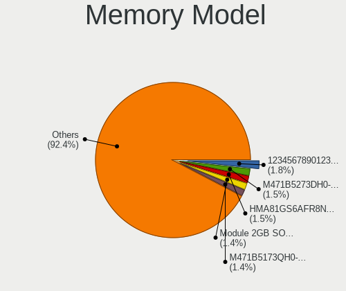

| Model                                                            | Notebooks | Percent |
|------------------------------------------------------------------|-----------|---------|
| Unknown (ABCD) RAM 123456789012345678 2GB SODIMM LPDDR4 2400MT/s | 23        | 1.81%   |
| SK hynix RAM HMA81GS6AFR8N-UH 8GB SODIMM DDR4 2667MT/s           | 20        | 1.58%   |
| Unknown RAM Module 2GB SODIMM DDR2 667MT/s                       | 19        | 1.5%    |
| Samsung RAM M471B5273DH0-CH9 4GB SODIMM DDR3 1334MT/s            | 19        | 1.5%    |
| SK hynix RAM HMT451S6BFR8A-PB 4GB SODIMM DDR3 1600MT/s           | 17        | 1.34%   |
| SK hynix RAM HMT351S6CFR8C-PB 4GB SODIMM DDR3 1600MT/s           | 17        | 1.34%   |
| Samsung RAM M471B5173QH0-YK0 4GB SODIMM DDR3 1600MT/s            | 17        | 1.34%   |
| Samsung RAM M471B5173EB0-YK0 4GB SODIMM DDR3 1600MT/s            | 17        | 1.34%   |
| Samsung RAM M471B5173DB0-YK0 4GB SODIMM DDR3 1600MT/s            | 16        | 1.26%   |
| Samsung RAM M471A5244CB0-CTD 4GB SODIMM DDR4 3266MT/s            | 14        | 1.1%    |
| Samsung RAM M471B5273CH0-CH9 4GB SODIMM DDR3 1334MT/s            | 12        | 0.95%   |
| Samsung RAM M471A1G44AB0-CWE 8GB SODIMM DDR4 3200MT/s            | 11        | 0.87%   |
| Micron RAM Module 4GB SODIMM DDR3 1600MT/s                       | 11        | 0.87%   |
| Unknown                                                          | 11        | 0.87%   |
| Samsung RAM M471B5773CHS-CH9 2GB SODIMM DDR3 4199MT/s            | 10        | 0.79%   |
| Samsung RAM M471A5244CB0-CWE 4GB Row Of Chips DDR4 3200MT/s      | 10        | 0.79%   |
| SK hynix RAM HMT425S6AFR6A-PB 2048MB SODIMM DDR3 3200MT/s        | 9         | 0.71%   |
| SK hynix RAM HMT41GS6BFR8A-PB 8GB SODIMM DDR3 1600MT/s           | 9         | 0.71%   |
| SK hynix RAM HMA851S6AFR6N-UH 4GB SODIMM DDR4 2667MT/s           | 9         | 0.71%   |
| SK hynix RAM HMA41GS6AFR8N-TF 8GB SODIMM DDR4 2667MT/s           | 9         | 0.71%   |
| Samsung RAM M471A5244CB0-CWE 4GB SODIMM DDR4 3200MT/s            | 9         | 0.71%   |
| Samsung RAM M471A1K43EB1-CWE 8GB SODIMM DDR4 3200MT/s            | 9         | 0.71%   |
| Unknown RAM Module 4GB SODIMM DDR3                               | 8         | 0.63%   |
| Micron RAM 4ATF51264HZ-2G6E1 4GB SODIMM DDR4 2667MT/s            | 8         | 0.63%   |
| Elpida RAM EBJ41UF8BCS0-DJ-F 4GB SODIMM DDR3 1334MT/s            | 8         | 0.63%   |
| SK hynix RAM HMAA1GS6CJR6N-XN 8GB SODIMM DDR4 3200MT/s           | 7         | 0.55%   |
| SK hynix RAM HMA851S6DJR6N-XN 4GB Row Of Chips DDR4 3200MT/s     | 7         | 0.55%   |
| SK hynix RAM HMA851S6CJR6N-XN 4GB SODIMM DDR4 3200MT/s           | 7         | 0.55%   |
| Samsung RAM M471A5244CB0-CRC 4096MB SODIMM DDR4 2667MT/s         | 7         | 0.55%   |
| Samsung RAM M471A1K43DB1-CWE 8GB SODIMM DDR4 3200MT/s            | 7         | 0.55%   |
| Micron RAM 4ATF51264HZ-2G3B1 4096MB SODIMM DDR4 3200MT/s         | 7         | 0.55%   |
| SK hynix RAM HMT351S6CFR8C-H9 4GB SODIMM DDR3 1333MT/s           | 6         | 0.47%   |
| SK hynix RAM HMA851S6CJR6N-VK 4GB SODIMM DDR4 2667MT/s           | 6         | 0.47%   |
| SK hynix RAM HMA81GS6DJR8N-XN 8GB SODIMM DDR4 3200MT/s           | 6         | 0.47%   |
| Samsung RAM M471B1G73QH0-YK0 8GB SODIMM DDR3 1867MT/s            | 6         | 0.47%   |
| Samsung RAM M471B1G73DB0-YK0 8GB SODIMM DDR3 1600MT/s            | 6         | 0.47%   |
| Micron RAM 16KTF1G64HZ-1G6E1 8GB SODIMM DDR3 1600MT/s            | 6         | 0.47%   |
| Unknown RAM Module 8GB SODIMM DDR3 1600MT/s                      | 5         | 0.39%   |
| Unknown RAM Module 1GB SODIMM DDR2 533MT/s                       | 5         | 0.39%   |
| SK hynix RAM HYMP125S64CP8-S6 2GB SODIMM DDR2 800MT/s            | 5         | 0.39%   |

Memory Kind
-----------

Memory module kinds

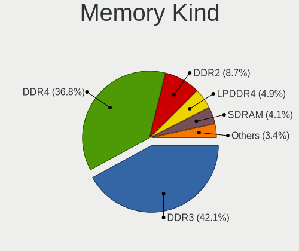

| Kind    | Notebooks | Percent |
|---------|-----------|---------|
| DDR3    | 415       | 42.22%  |
| DDR4    | 359       | 36.52%  |
| DDR2    | 84        | 8.55%   |
| LPDDR4  | 50        | 5.09%   |
| SDRAM   | 41        | 4.17%   |
| DDR     | 7         | 0.71%   |
| Unknown | 7         | 0.71%   |
| DRAM    | 6         | 0.61%   |
| DDR5    | 6         | 0.61%   |
| LPDDR3  | 5         | 0.51%   |
| LPDDR5  | 3         | 0.31%   |

Memory Form Factor
------------------

Physical design of the memory module

| Name         | Notebooks | Percent |
|--------------|-----------|---------|
| SODIMM       | 895       | 92.27%  |
| Row Of Chips | 57        | 5.88%   |
| DIMM         | 8         | 0.82%   |
| Unknown      | 8         | 0.82%   |
| Chip         | 2         | 0.21%   |

Memory Size
-----------

Memory module size

| Size  | Notebooks | Percent |
|-------|-----------|---------|
| 4096  | 392       | 35.41%  |
| 8192  | 352       | 31.8%   |
| 2048  | 206       | 18.61%  |
| 16384 | 78        | 7.05%   |
| 1024  | 44        | 3.97%   |
| 32768 | 33        | 2.98%   |
| 512   | 2         | 0.18%   |

Memory Speed
------------

Memory module speed

| Speed   | Notebooks | Percent |
|---------|-----------|---------|
| 1600    | 273       | 25.05%  |
| 3200    | 184       | 16.88%  |
| 2667    | 147       | 13.49%  |
| 1334    | 84        | 7.71%   |
| 2400    | 77        | 7.06%   |
| 1333    | 55        | 5.05%   |
| 667     | 51        | 4.68%   |
| 2133    | 32        | 2.94%   |
| 800     | 31        | 2.84%   |
| Unknown | 24        | 2.2%    |
| 4199    | 21        | 1.93%   |
| 2048    | 18        | 1.65%   |
| 1067    | 16        | 1.47%   |
| 3266    | 14        | 1.28%   |
| 1867    | 12        | 1.1%    |
| 4267    | 10        | 0.92%   |
| 533     | 9         | 0.83%   |
| 1066    | 7         | 0.64%   |
| 4800    | 6         | 0.55%   |
| 975     | 6         | 0.55%   |
| 1866    | 3         | 0.28%   |
| 8400    | 2         | 0.18%   |
| 6400    | 2         | 0.18%   |
| 4266    | 2         | 0.18%   |
| 3733    | 2         | 0.18%   |
| 5500    | 1         | 0.09%   |
| 1639    | 1         | 0.09%   |

Printers & scanners
-------------------

Printer Vendor
--------------

Printer device vendors

| Vendor              | Notebooks | Percent |
|---------------------|-----------|---------|
| Hewlett-Packard     | 6         | 42.86%  |
| Brother Industries  | 3         | 21.43%  |
| Canon               | 2         | 14.29%  |
| Xerox               | 1         | 7.14%   |
| Samsung Electronics | 1         | 7.14%   |
| Prolific Technology | 1         | 7.14%   |

Printer Model
-------------

Printer device models

| Model                               | Notebooks | Percent |
|-------------------------------------|-----------|---------|
| Xerox WorkCentre 6025               | 1         | 6.67%   |
| Samsung ML-2010P Mono Laser Printer | 1         | 6.67%   |
| Prolific PL2305 Parallel Port       | 1         | 6.67%   |
| HP OfficeJet 6950                   | 1         | 6.67%   |
| HP Deskjet F4500 series             | 1         | 6.67%   |
| HP DeskJet 6122                     | 1         | 6.67%   |
| HP DeskJet 3700 series              | 1         | 6.67%   |
| HP Deskjet 3540 series              | 1         | 6.67%   |
| HP Deskjet 2050 J510                | 1         | 6.67%   |
| Canon PIXMA MG3600 Series           | 1         | 6.67%   |
| Canon LBP6030w/6018w                | 1         | 6.67%   |
| Brother Printer                     | 1         | 6.67%   |
| Brother MFC-J6535DW                 | 1         | 6.67%   |
| Brother MFC-J480DW                  | 1         | 6.67%   |
| Brother DCP-7010                    | 1         | 6.67%   |

Scanner Vendor
--------------

Scanner device vendors

Zero info for selected period =(

Scanner Model
-------------

Scanner device models

Zero info for selected period =(

Camera
------

Camera Vendor
-------------

Camera device vendors

| Vendor                                 | Notebooks | Percent |
|----------------------------------------|-----------|---------|
| Chicony Electronics                    | 235       | 28.8%   |
| Realtek Semiconductor                  | 79        | 9.68%   |
| IMC Networks                           | 72        | 8.82%   |
| Microdia                               | 58        | 7.11%   |
| Bison Electronics                      | 47        | 5.76%   |
| Sunplus Innovation Technology          | 40        | 4.9%    |
| Suyin                                  | 39        | 4.78%   |
| Quanta                                 | 34        | 4.17%   |
| Cheng Uei Precision Industry (Foxlink) | 30        | 3.68%   |
| Syntek                                 | 29        | 3.55%   |
| Apple                                  | 18        | 2.21%   |
| Lite-On Technology                     | 17        | 2.08%   |
| Silicon Motion                         | 16        | 1.96%   |
| Luxvisions Innotech Limited            | 12        | 1.47%   |
| Alcor Micro                            | 11        | 1.35%   |
| Ricoh                                  | 10        | 1.23%   |
| Acer                                   | 7         | 0.86%   |
| Sonix Technology                       | 6         | 0.74%   |
| Primax Electronics                     | 6         | 0.74%   |
| Lenovo                                 | 6         | 0.74%   |
| Importek                               | 6         | 0.74%   |
| Shenzhen Kingcome Optoelectronic       | 4         | 0.49%   |
| OmniVision Technologies                | 4         | 0.49%   |
| icSpring                               | 4         | 0.49%   |
| ALi                                    | 4         | 0.49%   |
| Logitech                               | 3         | 0.37%   |
| HRY                                    | 3         | 0.37%   |
| Z-Star Microelectronics                | 2         | 0.25%   |
| Y Media                                | 2         | 0.25%   |
| Sunplus Technology                     | 2         | 0.25%   |
| Samsung Electronics                    | 2         | 0.25%   |
| Intel                                  | 2         | 0.25%   |
| SunplusIT                              | 1         | 0.12%   |
| Huawei Technologies                    | 1         | 0.12%   |
| Goertek Electronics                    | 1         | 0.12%   |
| Genesys Logic                          | 1         | 0.12%   |
| Generalplus Technology                 | 1         | 0.12%   |
| DigiTech                               | 1         | 0.12%   |

Camera Model
------------

Camera device models

| Model                                               | Notebooks | Percent |
|-----------------------------------------------------|-----------|---------|
| Chicony integrated camera                           | 33        | 4.04%   |
| Chicony HD WebCam                                   | 23        | 2.82%   |
| Microdia Integrated_Webcam_HD                       | 21        | 2.57%   |
| Syntek Integrated Camera                            | 18        | 2.21%   |
| IMC Networks Integrated Camera                      | 18        | 2.21%   |
| Realtek USB Camera                                  | 16        | 1.96%   |
| IMC Networks USB2.0 HD UVC WebCam                   | 16        | 1.96%   |
| Realtek Integrated_Webcam_HD                        | 15        | 1.84%   |
| Bison Integrated Camera                             | 14        | 1.72%   |
| Sunplus Integrated_Webcam_HD                        | 13        | 1.59%   |
| IMC Networks USB2.0 VGA UVC WebCam                  | 13        | 1.59%   |
| Microdia Integrated Webcam                          | 10        | 1.23%   |
| Chicony FJ Camera                                   | 10        | 1.23%   |
| Chicony Lenovo EasyCamera                           | 9         | 1.1%    |
| Cheng Uei Precision Industry (Foxlink) HP Webcam    | 9         | 1.1%    |
| Chicony HD User Facing                              | 8         | 0.98%   |
| Suyin Acer/HP Integrated Webcam [CN0314]            | 7         | 0.86%   |
| Realtek Laptop_Integrated_Webcam_HD                 | 7         | 0.86%   |
| Chicony VGA Webcam                                  | 7         | 0.86%   |
| Chicony HP TrueVision HD Camera                     | 7         | 0.86%   |
| Chicony HP Truevision HD                            | 7         | 0.86%   |
| Chicony EasyCamera                                  | 7         | 0.86%   |
| Bison HD Webcam                                     | 7         | 0.86%   |
| Apple FaceTime HD Camera                            | 7         | 0.86%   |
| Suyin 1.3M HD WebCam                                | 6         | 0.74%   |
| Sonix USB2.0 HD UVC WebCam                          | 6         | 0.74%   |
| Quanta VGA WebCam                                   | 6         | 0.74%   |
| Quanta HP TrueVision HD Camera                      | 6         | 0.74%   |
| Luxvisions Innotech Limited HP TrueVision HD Camera | 6         | 0.74%   |
| Chicony TOSHIBA Web Camera - HD                     | 6         | 0.74%   |
| Chicony Lenovo Integrated Camera (0.3MP)            | 6         | 0.74%   |
| Alcor Micro USB 2.0 Camera                          | 6         | 0.74%   |
| Syntek Lenovo EasyCamera                            | 5         | 0.61%   |
| Sunplus HD WebCam                                   | 5         | 0.61%   |
| Realtek Integrated Webcam                           | 5         | 0.61%   |
| Realtek EasyCamera                                  | 5         | 0.61%   |
| Realtek Acer 640 x 480 laptop camera                | 5         | 0.61%   |
| Quanta HD User Facing                               | 5         | 0.61%   |
| Lite-On Integrated Camera                           | 5         | 0.61%   |
| Lenovo Integrated Webcam                            | 5         | 0.61%   |

Security
--------

Fingerprint Vendor
------------------

Fingerprint sensor vendors

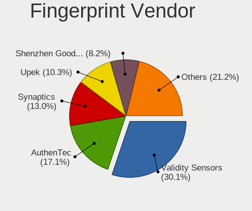

| Vendor                     | Notebooks | Percent |
|----------------------------|-----------|---------|
| Validity Sensors           | 42        | 29.37%  |
| AuthenTec                  | 25        | 17.48%  |
| Synaptics                  | 18        | 12.59%  |
| Upek                       | 15        | 10.49%  |
| Shenzhen Goodix Technology | 12        | 8.39%   |
| Elan Microelectronics      | 12        | 8.39%   |
| LighTuning Technology      | 7         | 4.9%    |
| STMicroelectronics         | 4         | 2.8%    |
| Samsung Electronics        | 4         | 2.8%    |
| Focal-systems.Corp         | 4         | 2.8%    |

Fingerprint Model
-----------------

Fingerprint sensor models

| Model                                                                      | Notebooks | Percent |
|----------------------------------------------------------------------------|-----------|---------|
| Upek Biometric Touchchip/Touchstrip Fingerprint Sensor                     | 14        | 9.79%   |
| AuthenTec AES2810                                                          | 11        | 7.69%   |
| Validity Sensors VFS5011 Fingerprint Reader                                | 10        | 6.99%   |
| Validity Sensors VFS491                                                    | 8         | 5.59%   |
| Shenzhen Goodix  Fingerprint Device                                        | 7         | 4.9%    |
| Elan ELAN:ARM-M4                                                           | 7         | 4.9%    |
| AuthenTec AES2501 Fingerprint Sensor                                       | 7         | 4.9%    |
| Synaptics Prometheus MIS Touch Fingerprint Reader                          | 6         | 4.2%    |
| Elan ELAN:Fingerprint                                                      | 5         | 3.5%    |
| Validity Sensors VFS495 Fingerprint Reader                                 | 4         | 2.8%    |
| Validity Sensors VFS451 Fingerprint Reader                                 | 4         | 2.8%    |
| Synaptics UWP WBDI Device                                                  | 4         | 2.8%    |
| Synaptics Metallica MIS Touch Fingerprint Reader                           | 4         | 2.8%    |
| STMicroelectronics Fingerprint Reader                                      | 4         | 2.8%    |
| Samsung Fingerprint Sensor Device - 730B                                   | 4         | 2.8%    |
| LighTuning ES603 Swipe Fingerprint Sensor                                  | 4         | 2.8%    |
| Focal-systems.Corp FT9201Fingerprint.                                      | 4         | 2.8%    |
| Validity Sensors VFS471 Fingerprint Reader                                 | 3         | 2.1%    |
| Validity Sensors VFS 5011 fingerprint sensor                               | 3         | 2.1%    |
| Shenzhen Goodix FingerPrint                                                | 3         | 2.1%    |
| Validity Sensors Synaptics WBDI                                            | 2         | 1.4%    |
| Validity Sensors Swipe Fingerprint Sensor                                  | 2         | 1.4%    |
| Validity Sensors Fingerprint scanner                                       | 2         | 1.4%    |
| Synaptics Metallica MOH Touch Fingerprint Reader                           | 2         | 1.4%    |
| Shenzhen Goodix Fingerprint Reader                                         | 2         | 1.4%    |
| LighTuning Fingerprint Reader                                              | 2         | 1.4%    |
| AuthenTec AES2550 Fingerprint Sensor                                       | 2         | 1.4%    |
| AuthenTec AES1660 Fingerprint Sensor                                       | 2         | 1.4%    |
| AuthenTec AES1600                                                          | 2         | 1.4%    |
| Validity Sensors VFS7500 Touch Fingerprint Sensor                          | 1         | 0.7%    |
| Validity Sensors VFS301 Fingerprint Reader                                 | 1         | 0.7%    |
| Validity Sensors VFS Fingerprint sensor                                    | 1         | 0.7%    |
| Validity Sensors Synaptics VFS7552 Touch Fingerprint Sensor with PurePrint | 1         | 0.7%    |
| Upek TCS5B Fingerprint sensor                                              | 1         | 0.7%    |
| Synaptics WBDI Fingerprint Reader USB 086                                  | 1         | 0.7%    |
| Synaptics Fingerprint reader [HP G6]                                       | 1         | 0.7%    |
| LighTuning EgisTec Touch Fingerprint Sensor                                | 1         | 0.7%    |
| AuthenTec Fingerprint Sensor                                               | 1         | 0.7%    |

Chipcard Vendor
---------------

Chipcard module vendors

| Vendor                | Notebooks | Percent |
|-----------------------|-----------|---------|
| Broadcom              | 32        | 50%     |
| O2 Micro              | 13        | 20.31%  |
| Alcor Micro           | 9         | 14.06%  |
| Upek                  | 4         | 6.25%   |
| Lenovo                | 4         | 6.25%   |
| Realtek Semiconductor | 1         | 1.56%   |
| Advanced Card Systems | 1         | 1.56%   |

Chipcard Model
--------------

Chipcard module models

| Model                                                                        | Notebooks | Percent |
|------------------------------------------------------------------------------|-----------|---------|
| O2 Micro OZ776 CCID Smartcard Reader                                         | 13        | 20.31%  |
| Broadcom BCM5880 Secure Applications Processor                               | 12        | 18.75%  |
| Broadcom 5880                                                                | 11        | 17.19%  |
| Alcor Micro AU9540 Smartcard Reader                                          | 9         | 14.06%  |
| Broadcom BCM5880 Secure Applications Processor with fingerprint swipe sensor | 8         | 12.5%   |
| Upek TouchChip Fingerprint Coprocessor (WBF advanced mode)                   | 4         | 6.25%   |
| Lenovo Integrated Smart Card Reader                                          | 4         | 6.25%   |
| Realtek Semiconductor Smart Card Reader Interface                            | 1         | 1.56%   |
| Broadcom 58200                                                               | 1         | 1.56%   |
| Advanced Card Systems ACR122U                                                | 1         | 1.56%   |

Unsupported
-----------

Unsupported Devices
-------------------

Total unsupported devices on board

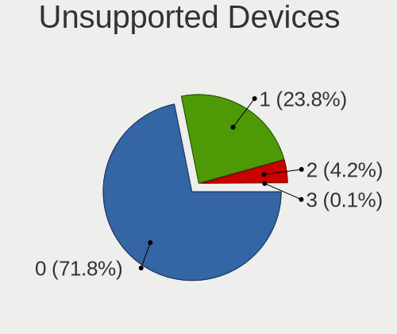

| Total | Notebooks | Percent |
|-------|-----------|---------|
| 0     | 699       | 72.89%  |
| 1     | 223       | 23.25%  |
| 2     | 35        | 3.65%   |
| 3     | 2         | 0.21%   |

Unsupported Device Types
------------------------

Types of unsupported devices

| Type                     | Notebooks | Percent |
|--------------------------|-----------|---------|
| Fingerprint reader       | 143       | 49.31%  |
| Chipcard                 | 63        | 21.72%  |
| Graphics card            | 52        | 17.93%  |
| Storage                  | 9         | 3.1%    |
| Net/wireless             | 5         | 1.72%   |
| Bluetooth                | 5         | 1.72%   |
| Multimedia controller    | 4         | 1.38%   |
| Communication controller | 3         | 1.03%   |
| Camera                   | 3         | 1.03%   |
| Net/ethernet             | 2         | 0.69%   |
| Flash memory             | 1         | 0.34%   |

