OpenMandriva 23.03 - Tested Hardware & Statistics (Notebooks)
-------------------------------------------------------------

A project to collect tested hardware configurations for OpenMandriva 23.03.

Anyone can contribute to this report by the [hw-probe](https://github.com/linuxhw/hw-probe) tool:

    sudo -E hw-probe -all -upload

Please contribute! Especially if your hardware is rare.

Contents
--------

* [ Test Cases ](#test-cases)

* [ System ](#system)
  - [ Kernel                   ](#kernel)
  - [ Kernel Family            ](#kernel-family)
  - [ Kernel Major Ver.        ](#kernel-major-ver)
  - [ Arch                     ](#arch)
  - [ DE                       ](#de)
  - [ Display Server           ](#display-server)
  - [ Display Manager          ](#display-manager)
  - [ OS Lang                  ](#os-lang)
  - [ Boot Mode                ](#boot-mode)
  - [ Filesystem               ](#filesystem)
  - [ Part. scheme             ](#part-scheme)
  - [ Dual Boot with Linux/BSD ](#dual-boot-with-linuxbsd)
  - [ Dual Boot (Win)          ](#dual-boot-win)

* [ Board ](#board)
  - [ Vendor                   ](#vendor)
  - [ Model                    ](#model)
  - [ Model Family             ](#model-family)
  - [ MFG Year                 ](#mfg-year)
  - [ Form Factor              ](#form-factor)
  - [ Secure Boot              ](#secure-boot)
  - [ Coreboot                 ](#coreboot)
  - [ RAM Size                 ](#ram-size)
  - [ RAM Used                 ](#ram-used)
  - [ Total Drives             ](#total-drives)
  - [ Has CD-ROM               ](#has-cd-rom)
  - [ Has Ethernet             ](#has-ethernet)
  - [ Has WiFi                 ](#has-wifi)
  - [ Has Bluetooth            ](#has-bluetooth)

* [ Location ](#location)
  - [ Country                  ](#country)
  - [ City                     ](#city)

* [ Drives ](#drives)
  - [ Drive Vendor             ](#drive-vendor)
  - [ Drive Model              ](#drive-model)
  - [ HDD Vendor               ](#hdd-vendor)
  - [ SSD Vendor               ](#ssd-vendor)
  - [ Drive Kind               ](#drive-kind)
  - [ Drive Connector          ](#drive-connector)
  - [ Drive Size               ](#drive-size)
  - [ Space Total              ](#space-total)
  - [ Space Used               ](#space-used)
  - [ Malfunc. Drives          ](#malfunc-drives)
  - [ Malfunc. Drive Vendor    ](#malfunc-drive-vendor)
  - [ Malfunc. HDD Vendor      ](#malfunc-hdd-vendor)
  - [ Malfunc. Drive Kind      ](#malfunc-drive-kind)
  - [ Failed Drives            ](#failed-drives)
  - [ Failed Drive Vendor      ](#failed-drive-vendor)
  - [ Drive Status             ](#drive-status)

* [ Storage controller ](#storage-controller)
  - [ Storage Vendor           ](#storage-vendor)
  - [ Storage Model            ](#storage-model)
  - [ Storage Kind             ](#storage-kind)

* [ Processor ](#processor)
  - [ CPU Vendor               ](#cpu-vendor)
  - [ CPU Model                ](#cpu-model)
  - [ CPU Model Family         ](#cpu-model-family)
  - [ CPU Cores                ](#cpu-cores)
  - [ CPU Sockets              ](#cpu-sockets)
  - [ CPU Threads              ](#cpu-threads)
  - [ CPU Op-Modes             ](#cpu-op-modes)
  - [ CPU Microcode            ](#cpu-microcode)
  - [ CPU Microarch            ](#cpu-microarch)

* [ Graphics ](#graphics)
  - [ GPU Vendor               ](#gpu-vendor)
  - [ GPU Model                ](#gpu-model)
  - [ GPU Combo                ](#gpu-combo)
  - [ GPU Driver               ](#gpu-driver)
  - [ GPU Memory               ](#gpu-memory)

* [ Monitor ](#monitor)
  - [ Monitor Vendor           ](#monitor-vendor)
  - [ Monitor Model            ](#monitor-model)
  - [ Monitor Resolution       ](#monitor-resolution)
  - [ Monitor Diagonal         ](#monitor-diagonal)
  - [ Monitor Width            ](#monitor-width)
  - [ Aspect Ratio             ](#aspect-ratio)
  - [ Monitor Area             ](#monitor-area)
  - [ Pixel Density            ](#pixel-density)
  - [ Multiple Monitors        ](#multiple-monitors)

* [ Network ](#network)
  - [ Net Controller Vendor    ](#net-controller-vendor)
  - [ Net Controller Model     ](#net-controller-model)
  - [ Wireless Vendor          ](#wireless-vendor)
  - [ Wireless Model           ](#wireless-model)
  - [ Ethernet Vendor          ](#ethernet-vendor)
  - [ Ethernet Model           ](#ethernet-model)
  - [ Net Controller Kind      ](#net-controller-kind)
  - [ Used Controller          ](#used-controller)
  - [ NICs                     ](#nics)
  - [ IPv6                     ](#ipv6)

* [ Bluetooth ](#bluetooth)
  - [ Bluetooth Vendor         ](#bluetooth-vendor)
  - [ Bluetooth Model          ](#bluetooth-model)

* [ Sound ](#sound)
  - [ Sound Vendor             ](#sound-vendor)
  - [ Sound Model              ](#sound-model)

* [ Memory ](#memory)
  - [ Memory Vendor            ](#memory-vendor)
  - [ Memory Model             ](#memory-model)
  - [ Memory Kind              ](#memory-kind)
  - [ Memory Form Factor       ](#memory-form-factor)
  - [ Memory Size              ](#memory-size)
  - [ Memory Speed             ](#memory-speed)

* [ Printers & scanners ](#printers--scanners)
  - [ Printer Vendor           ](#printer-vendor)
  - [ Printer Model            ](#printer-model)
  - [ Scanner Vendor           ](#scanner-vendor)
  - [ Scanner Model            ](#scanner-model)

* [ Camera ](#camera)
  - [ Camera Vendor            ](#camera-vendor)
  - [ Camera Model             ](#camera-model)

* [ Security ](#security)
  - [ Fingerprint Vendor       ](#fingerprint-vendor)
  - [ Fingerprint Model        ](#fingerprint-model)
  - [ Chipcard Vendor          ](#chipcard-vendor)
  - [ Chipcard Model           ](#chipcard-model)

* [ Unsupported ](#unsupported)
  - [ Unsupported Devices      ](#unsupported-devices)
  - [ Unsupported Device Types ](#unsupported-device-types)

Test Cases
----------

Total: 580

| Vendor        | Model                       | Probe                                                      | Date         |
|---------------|-----------------------------|------------------------------------------------------------|--------------|
| Alienware     | m17 R5 AMD                  | [4e665db2b1](https://linux-hardware.org/?probe=4e665db2b1) | May 01, 2023 |
| Lenovo        | Legion 5 15ARH05 82B5       | [6c1969f77e](https://linux-hardware.org/?probe=6c1969f77e) | May 01, 2023 |
| HP            | Notebook                    | [4cece109d5](https://linux-hardware.org/?probe=4cece109d5) | Apr 30, 2023 |
| ASUSTek       | X501A1                      | [66b02cc148](https://linux-hardware.org/?probe=66b02cc148) | Apr 30, 2023 |
| Acer          | Aspire A315-33              | [fdba59c054](https://linux-hardware.org/?probe=fdba59c054) | Apr 30, 2023 |
| Acer          | AO725                       | [03e5f661fb](https://linux-hardware.org/?probe=03e5f661fb) | Apr 30, 2023 |
| Apple         | MacBook5,1                  | [7077a00b02](https://linux-hardware.org/?probe=7077a00b02) | Apr 30, 2023 |
| HP            | Compaq 6720s                | [cc5f5ee72c](https://linux-hardware.org/?probe=cc5f5ee72c) | Apr 30, 2023 |
| Lenovo        | IdeaPad 330S-15IKB 81F5     | [36ccc3c930](https://linux-hardware.org/?probe=36ccc3c930) | Apr 30, 2023 |
| Packard Be... | EasyNote ENTF71BM           | [99a89a2055](https://linux-hardware.org/?probe=99a89a2055) | Apr 30, 2023 |
| HP            | ProBook 650 G4              | [fd991056e0](https://linux-hardware.org/?probe=fd991056e0) | Apr 30, 2023 |
| Dell          | Inspiron 15 3525            | [41c212fa2c](https://linux-hardware.org/?probe=41c212fa2c) | Apr 30, 2023 |
| Acer          | TravelMate B311-31          | [de172b8988](https://linux-hardware.org/?probe=de172b8988) | Apr 30, 2023 |
| Dell          | Vostro 15 3515              | [8f07407e1a](https://linux-hardware.org/?probe=8f07407e1a) | Apr 29, 2023 |
| Lenovo        | G50-30 80G0                 | [c8d8595af5](https://linux-hardware.org/?probe=c8d8595af5) | Apr 29, 2023 |
| Lenovo        | ThinkPad T530 24294A1       | [8695d820e4](https://linux-hardware.org/?probe=8695d820e4) | Apr 29, 2023 |
| Toshiba       | PORTEGE R830                | [11dc4b3a3e](https://linux-hardware.org/?probe=11dc4b3a3e) | Apr 29, 2023 |
| Apple         | MacBookPro13,3              | [0f22698060](https://linux-hardware.org/?probe=0f22698060) | Apr 29, 2023 |
| Acer          | Aspire 5349                 | [aa8c0bb2b9](https://linux-hardware.org/?probe=aa8c0bb2b9) | Apr 29, 2023 |
| HP            | Pavilion Notebook           | [168b3cf595](https://linux-hardware.org/?probe=168b3cf595) | Apr 29, 2023 |
| Dell          | Latitude 7390               | [c24cc9ab68](https://linux-hardware.org/?probe=c24cc9ab68) | Apr 29, 2023 |
| Medion        | X6816                       | [2c1807dad7](https://linux-hardware.org/?probe=2c1807dad7) | Apr 29, 2023 |
| HP            | Compaq Presario CQ70        | [b4055572ee](https://linux-hardware.org/?probe=b4055572ee) | Apr 28, 2023 |
| HP            | Pavilion Laptop 14-dv0xx... | [d364cb5ac7](https://linux-hardware.org/?probe=d364cb5ac7) | Apr 28, 2023 |
| Samsung       | 950XCJ/951XCJ/950XCR        | [2dc65d8f07](https://linux-hardware.org/?probe=2dc65d8f07) | Apr 28, 2023 |
| ASUSTek       | X542URR                     | [910cdd940c](https://linux-hardware.org/?probe=910cdd940c) | Apr 28, 2023 |
| GPU Compan... | GWNR71517                   | [5fe84b74b0](https://linux-hardware.org/?probe=5fe84b74b0) | Apr 28, 2023 |
| Dell          | Vostro 3500                 | [7719e2a6c9](https://linux-hardware.org/?probe=7719e2a6c9) | Apr 28, 2023 |
| Sony          | SVF15212CXW                 | [5d5367dc0e](https://linux-hardware.org/?probe=5d5367dc0e) | Apr 27, 2023 |
| HP            | Pavilion Gaming Laptop 1... | [b21dd8d75a](https://linux-hardware.org/?probe=b21dd8d75a) | Apr 27, 2023 |
| HP            | ProBook 4330s               | [955f91641b](https://linux-hardware.org/?probe=955f91641b) | Apr 27, 2023 |
| HP            | 255 G8 Notebook PC          | [adb8f367ea](https://linux-hardware.org/?probe=adb8f367ea) | Apr 27, 2023 |
| Lenovo        | ThinkPad R61 8943DJG        | [afc3fc578e](https://linux-hardware.org/?probe=afc3fc578e) | Apr 27, 2023 |
| ASUSTek       | S551LN                      | [710070cf4a](https://linux-hardware.org/?probe=710070cf4a) | Apr 27, 2023 |
| NEC Comput... | PC-LE150C2                  | [a8e48f9686](https://linux-hardware.org/?probe=a8e48f9686) | Apr 27, 2023 |
| Lenovo        | ThinkPad X1 Extreme Gen ... | [32960eca65](https://linux-hardware.org/?probe=32960eca65) | Apr 27, 2023 |
| Dell          | Latitude E6400              | [2cb1305ae1](https://linux-hardware.org/?probe=2cb1305ae1) | Apr 27, 2023 |
| HP            | Victus by Gaming Laptop ... | [486535a4d3](https://linux-hardware.org/?probe=486535a4d3) | Apr 27, 2023 |
| HUAWEI        | BOHK-WAX9X                  | [21577119ad](https://linux-hardware.org/?probe=21577119ad) | Apr 27, 2023 |
| Lenovo        | V15 G2 ALC 82KD             | [e7fb8c3e44](https://linux-hardware.org/?probe=e7fb8c3e44) | Apr 26, 2023 |
| Lenovo        | ThinkPad L512 4444PS9       | [78cf80b13b](https://linux-hardware.org/?probe=78cf80b13b) | Apr 26, 2023 |
| Lenovo        | IdeaPad 3 15ALC6 82MF       | [84bc235979](https://linux-hardware.org/?probe=84bc235979) | Apr 26, 2023 |
| ASUSTek       | X550CA                      | [a63293fe36](https://linux-hardware.org/?probe=a63293fe36) | Apr 26, 2023 |
| Unknown       | Unknown                     | [208f6823ed](https://linux-hardware.org/?probe=208f6823ed) | Apr 26, 2023 |
| Lenovo        | ThinkPad T430 2349BS7       | [8d832f0261](https://linux-hardware.org/?probe=8d832f0261) | Apr 26, 2023 |
| GPU Compan... | GWNR71517                   | [b8b58af983](https://linux-hardware.org/?probe=b8b58af983) | Apr 26, 2023 |
| ASUSTek       | X550VQ                      | [3c7d8a0268](https://linux-hardware.org/?probe=3c7d8a0268) | Apr 26, 2023 |
| Lenovo        | IdeaPad 3 14ITL6 82H7       | [ab52633e07](https://linux-hardware.org/?probe=ab52633e07) | Apr 26, 2023 |
| ASUSTek       | ROG Strix G531GW_G531GW     | [2e6de51ded](https://linux-hardware.org/?probe=2e6de51ded) | Apr 26, 2023 |
| Login Info... | LOG-S14BW01-CD              | [5f6e2a61f2](https://linux-hardware.org/?probe=5f6e2a61f2) | Apr 25, 2023 |
| Sony          | VPCS13V9E                   | [3c1551d7be](https://linux-hardware.org/?probe=3c1551d7be) | Apr 25, 2023 |
| Acer          | Swift SF114-34              | [693f0cea98](https://linux-hardware.org/?probe=693f0cea98) | Apr 25, 2023 |
| Acer          | Swift SF314-42              | [a433dd6737](https://linux-hardware.org/?probe=a433dd6737) | Apr 25, 2023 |
| Lenovo        | ThinkPad SL500 2746CTO      | [7283a0f4d9](https://linux-hardware.org/?probe=7283a0f4d9) | Apr 25, 2023 |
| HP            | Compaq 15                   | [4799b2a649](https://linux-hardware.org/?probe=4799b2a649) | Apr 25, 2023 |
| Toshiba       | Satellite L305D             | [1bbf3a5e9c](https://linux-hardware.org/?probe=1bbf3a5e9c) | Apr 25, 2023 |
| ICL           | RAYbook Si1512              | [6aa907fd2e](https://linux-hardware.org/?probe=6aa907fd2e) | Apr 25, 2023 |
| Fujitsu       | LIFEBOOK S935               | [418c2c626e](https://linux-hardware.org/?probe=418c2c626e) | Apr 25, 2023 |
| Toshiba       | Satellite L350D             | [911ac6edf0](https://linux-hardware.org/?probe=911ac6edf0) | Apr 25, 2023 |
| Dell          | Latitude XT2                | [62df7dc069](https://linux-hardware.org/?probe=62df7dc069) | Apr 24, 2023 |
| Lenovo        | ThinkPad P15s Gen 1 20T5... | [587e06aeb7](https://linux-hardware.org/?probe=587e06aeb7) | Apr 24, 2023 |
| Chuwi         | GemiBook Pro                | [b4d8bd0f23](https://linux-hardware.org/?probe=b4d8bd0f23) | Apr 24, 2023 |
| Acer          | Aspire V5-552P              | [28c276f9da](https://linux-hardware.org/?probe=28c276f9da) | Apr 23, 2023 |
| ASUSTek       | S551LN                      | [9ba55985fd](https://linux-hardware.org/?probe=9ba55985fd) | Apr 23, 2023 |
| Lenovo        | Z51-70 80K6                 | [3d51a6183c](https://linux-hardware.org/?probe=3d51a6183c) | Apr 23, 2023 |
| Lenovo        | G550 2958                   | [7a1a8bb421](https://linux-hardware.org/?probe=7a1a8bb421) | Apr 23, 2023 |
| Toshiba       | dynabook BX/67TG            | [5349d462cd](https://linux-hardware.org/?probe=5349d462cd) | Apr 23, 2023 |
| Lenovo        | IdeaPad L340-15IRH Gamin... | [6115e5ccd4](https://linux-hardware.org/?probe=6115e5ccd4) | Apr 22, 2023 |
| ASUSTek       | 1215B                       | [a7fc39a85b](https://linux-hardware.org/?probe=a7fc39a85b) | Apr 22, 2023 |
| Lenovo        | IdeaPad 1 14ADA05 82GW      | [1fc445ac89](https://linux-hardware.org/?probe=1fc445ac89) | Apr 22, 2023 |
| HP            | EliteBook 6930p             | [2ff545a3fc](https://linux-hardware.org/?probe=2ff545a3fc) | Apr 22, 2023 |
| ASUSTek       | VivoBook_ASUSLaptop X415... | [63599179ae](https://linux-hardware.org/?probe=63599179ae) | Apr 22, 2023 |
| HP            | ProBook 4330s               | [f6608ffee2](https://linux-hardware.org/?probe=f6608ffee2) | Apr 22, 2023 |
| HP            | ProBook 450 G3              | [6e52b3ea77](https://linux-hardware.org/?probe=6e52b3ea77) | Apr 22, 2023 |
| Acer          | Extensa 5635Z               | [015e857f63](https://linux-hardware.org/?probe=015e857f63) | Apr 22, 2023 |
| Notebook      | N13_N140ZU                  | [51ee77485d](https://linux-hardware.org/?probe=51ee77485d) | Apr 21, 2023 |
| ASUSTek       | S551LN                      | [c974888840](https://linux-hardware.org/?probe=c974888840) | Apr 21, 2023 |
| ASUSTek       | VivoBook_ASUSLaptop M350... | [fc70e3e9e0](https://linux-hardware.org/?probe=fc70e3e9e0) | Apr 21, 2023 |
| HP            | Compaq 6720s                | [b980c3c57d](https://linux-hardware.org/?probe=b980c3c57d) | Apr 21, 2023 |
| Lenovo        | IdeaPad 300-15IBR 80M3      | [da51714544](https://linux-hardware.org/?probe=da51714544) | Apr 21, 2023 |
| Dell          | Inspiron 3520               | [11ea81f23c](https://linux-hardware.org/?probe=11ea81f23c) | Apr 20, 2023 |
| LG Electro... | 17Z90P-K.AA78A1             | [f8f6ec2123](https://linux-hardware.org/?probe=f8f6ec2123) | Apr 20, 2023 |
| Acer          | Aspire 5745                 | [19e6d70ce0](https://linux-hardware.org/?probe=19e6d70ce0) | Apr 20, 2023 |
| ASUSTek       | VivoBook_ASUSLaptop M160... | [44459cbe3a](https://linux-hardware.org/?probe=44459cbe3a) | Apr 20, 2023 |
| ASUSTek       | K50IJ                       | [3b07dc847f](https://linux-hardware.org/?probe=3b07dc847f) | Apr 20, 2023 |
| Dell          | Latitude 5400               | [f0e05c9726](https://linux-hardware.org/?probe=f0e05c9726) | Apr 20, 2023 |
| HP            | G62                         | [a0096bb254](https://linux-hardware.org/?probe=a0096bb254) | Apr 20, 2023 |
| MSI           | GE62 6QD                    | [785d4c1655](https://linux-hardware.org/?probe=785d4c1655) | Apr 20, 2023 |
| Toshiba       | dynabook T451/46EW          | [e45702b9aa](https://linux-hardware.org/?probe=e45702b9aa) | Apr 20, 2023 |
| HP            | ProBook 450 G2              | [14d03d2dd7](https://linux-hardware.org/?probe=14d03d2dd7) | Apr 19, 2023 |
| HP            | 255 G7 Notebook PC          | [b2f977f4a1](https://linux-hardware.org/?probe=b2f977f4a1) | Apr 19, 2023 |
| ASUSTek       | N501VW                      | [a31036cae1](https://linux-hardware.org/?probe=a31036cae1) | Apr 19, 2023 |
| Lenovo        | G780 20138                  | [32360109fa](https://linux-hardware.org/?probe=32360109fa) | Apr 19, 2023 |
| ASUSTek       | UX305CA                     | [0ff08e0727](https://linux-hardware.org/?probe=0ff08e0727) | Apr 19, 2023 |
| Toshiba       | Satellite Pro C850-1HE      | [48d3d92f3d](https://linux-hardware.org/?probe=48d3d92f3d) | Apr 19, 2023 |
| ASUSTek       | TUF Gaming FX705DT_FX705... | [09a37b3301](https://linux-hardware.org/?probe=09a37b3301) | Apr 19, 2023 |
| Acer          | Aspire 5733Z                | [de205c8c62](https://linux-hardware.org/?probe=de205c8c62) | Apr 19, 2023 |
| Dell          | Vostro 5471                 | [5cbbc95995](https://linux-hardware.org/?probe=5cbbc95995) | Apr 19, 2023 |
| Dell          | Inspiron 15-3567            | [c5639cddcb](https://linux-hardware.org/?probe=c5639cddcb) | Apr 19, 2023 |
| Apple         | MacBookPro8,1               | [4e95dc284c](https://linux-hardware.org/?probe=4e95dc284c) | Apr 19, 2023 |
| HP            | Laptop 15s-eq2xxx           | [6fae9a24fb](https://linux-hardware.org/?probe=6fae9a24fb) | Apr 19, 2023 |
| HP            | Unknown                     | [5a295b02bc](https://linux-hardware.org/?probe=5a295b02bc) | Apr 19, 2023 |
| HP            | Pavilion Laptop 17-ar0xx    | [76aabd80a0](https://linux-hardware.org/?probe=76aabd80a0) | Apr 18, 2023 |
| Acer          | AO722                       | [5fe24a9991](https://linux-hardware.org/?probe=5fe24a9991) | Apr 18, 2023 |
| Lenovo        | B50-30 20382                | [d8995dacdc](https://linux-hardware.org/?probe=d8995dacdc) | Apr 18, 2023 |
| Fujitsu       | FMVNA6HE                    | [609572e6f7](https://linux-hardware.org/?probe=609572e6f7) | Apr 18, 2023 |
| Lenovo        | ThinkPad P53 20QN001YUS     | [59549202bd](https://linux-hardware.org/?probe=59549202bd) | Apr 18, 2023 |
| Apple         | MacBookPro8,1               | [fa475c8ca8](https://linux-hardware.org/?probe=fa475c8ca8) | Apr 17, 2023 |
| HP            | ProBook 645 G1              | [e7d992accf](https://linux-hardware.org/?probe=e7d992accf) | Apr 17, 2023 |
| Toshiba       | Satellite C855D-162         | [d8e8774e0b](https://linux-hardware.org/?probe=d8e8774e0b) | Apr 17, 2023 |
| HP            | Laptop 15s-eq2xxx           | [879e47fc04](https://linux-hardware.org/?probe=879e47fc04) | Apr 17, 2023 |
| Medion        | E16401                      | [e6c20783e7](https://linux-hardware.org/?probe=e6c20783e7) | Apr 17, 2023 |
| HP            | Laptop 15-db1xxx            | [f158ac4161](https://linux-hardware.org/?probe=f158ac4161) | Apr 17, 2023 |
| Dell          | Latitude D830               | [3da091adc2](https://linux-hardware.org/?probe=3da091adc2) | Apr 17, 2023 |
| Lenovo        | ThinkPad T420 4180MG1       | [132e6ba829](https://linux-hardware.org/?probe=132e6ba829) | Apr 17, 2023 |
| Lenovo        | IdeaPad 1 14ADA05 82GW      | [a2b27dd2d6](https://linux-hardware.org/?probe=a2b27dd2d6) | Apr 17, 2023 |
| Lenovo        | IdeaPad 1 14ADA05 82GW      | [14517ef743](https://linux-hardware.org/?probe=14517ef743) | Apr 17, 2023 |
| HP            | Pavilion Laptop 14-ce3xx... | [f44bbda528](https://linux-hardware.org/?probe=f44bbda528) | Apr 16, 2023 |
| Dell          | XPS 17 9700                 | [3ad1ee8197](https://linux-hardware.org/?probe=3ad1ee8197) | Apr 16, 2023 |
| Dell          | Precision 7510              | [abb2d93e32](https://linux-hardware.org/?probe=abb2d93e32) | Apr 16, 2023 |
| Dell          | Inspiron 5559               | [b74080b280](https://linux-hardware.org/?probe=b74080b280) | Apr 16, 2023 |
| Dell          | Latitude E6330              | [1a75476b96](https://linux-hardware.org/?probe=1a75476b96) | Apr 16, 2023 |
| Chuwi         | HeroBook Air                | [360f364ebf](https://linux-hardware.org/?probe=360f364ebf) | Apr 15, 2023 |
| ASUSTek       | K73E                        | [9ab8e37631](https://linux-hardware.org/?probe=9ab8e37631) | Apr 15, 2023 |
| Fujitsu Si... | ESPRIMO Mobile X9515        | [82ffd0e4bd](https://linux-hardware.org/?probe=82ffd0e4bd) | Apr 15, 2023 |
| ASUSTek       | VivoBook 15 ASUS Laptop ... | [6c711c5197](https://linux-hardware.org/?probe=6c711c5197) | Apr 15, 2023 |
| Dell          | Precision 7730              | [0e434903ec](https://linux-hardware.org/?probe=0e434903ec) | Apr 15, 2023 |
| MSI           | Modern 14 B10MW             | [c655afe860](https://linux-hardware.org/?probe=c655afe860) | Apr 15, 2023 |
| Kiano         | Elegance 14.2               | [34062f30df](https://linux-hardware.org/?probe=34062f30df) | Apr 15, 2023 |
| Lenovo        | ThinkPad X250 20CLS0CW00    | [2d25abe83c](https://linux-hardware.org/?probe=2d25abe83c) | Apr 15, 2023 |
| Lenovo        | IdeaPad 1 14ADA05 82GW      | [2e860ef402](https://linux-hardware.org/?probe=2e860ef402) | Apr 15, 2023 |
| GPD           | G1619-01                    | [2edac2c38e](https://linux-hardware.org/?probe=2edac2c38e) | Apr 15, 2023 |
| MSI           | Prestige 15 A12SC           | [51259c6f0a](https://linux-hardware.org/?probe=51259c6f0a) | Apr 15, 2023 |
| Lenovo        | V14 G2 ITL 82NM             | [dfed605628](https://linux-hardware.org/?probe=dfed605628) | Apr 15, 2023 |
| Acer          | Swift SF314-511             | [f960c27052](https://linux-hardware.org/?probe=f960c27052) | Apr 14, 2023 |
| HP            | EliteBook 8440p             | [f3b7c9c255](https://linux-hardware.org/?probe=f3b7c9c255) | Apr 14, 2023 |
| MSI           | Delta 15 A5EFK              | [44cdfb0917](https://linux-hardware.org/?probe=44cdfb0917) | Apr 14, 2023 |
| ASUSTek       | ROG Strix G532LWS_G532LW... | [a5cb4f9095](https://linux-hardware.org/?probe=a5cb4f9095) | Apr 14, 2023 |
| Toshiba       | Satellite L850              | [dc9e77bd65](https://linux-hardware.org/?probe=dc9e77bd65) | Apr 14, 2023 |
| Sony          | VGN-NR11Z_T                 | [d7d5674aa5](https://linux-hardware.org/?probe=d7d5674aa5) | Apr 14, 2023 |
| HP            | Pavilion Laptop 15-cs0xx... | [e3f3f9fd2b](https://linux-hardware.org/?probe=e3f3f9fd2b) | Apr 14, 2023 |
| HP            | Pavilion dv6                | [3f719938aa](https://linux-hardware.org/?probe=3f719938aa) | Apr 14, 2023 |
| Lenovo        | G505 20240                  | [62bdfa97bd](https://linux-hardware.org/?probe=62bdfa97bd) | Apr 14, 2023 |
| ASUSTek       | ROG Strix G513RM_G513RM     | [8fb8771c70](https://linux-hardware.org/?probe=8fb8771c70) | Apr 14, 2023 |
| Dell          | Latitude E6540              | [61ab891b01](https://linux-hardware.org/?probe=61ab891b01) | Apr 13, 2023 |
| Dell          | Vostro 14-3468              | [947f70ebf7](https://linux-hardware.org/?probe=947f70ebf7) | Apr 13, 2023 |
| Toshiba       | Satellite L75D-A            | [210a475989](https://linux-hardware.org/?probe=210a475989) | Apr 13, 2023 |
| Acer          | Aspire A315-56              | [8c2cc310b2](https://linux-hardware.org/?probe=8c2cc310b2) | Apr 13, 2023 |
| System76      | Galago Pro                  | [9239e8d213](https://linux-hardware.org/?probe=9239e8d213) | Apr 13, 2023 |
| Lenovo        | ThinkPad T14s Gen 2i 20W... | [a841c5fce3](https://linux-hardware.org/?probe=a841c5fce3) | Apr 13, 2023 |
| Samsung       | 300E4C/300E5C/300E7C        | [f983dadfeb](https://linux-hardware.org/?probe=f983dadfeb) | Apr 13, 2023 |
| Lenovo        | ThinkPad X1 Extreme Gen ... | [830a3e27dd](https://linux-hardware.org/?probe=830a3e27dd) | Apr 13, 2023 |
| Toshiba       | Satellite L300D             | [76595cf176](https://linux-hardware.org/?probe=76595cf176) | Apr 12, 2023 |
| Toshiba       | Satellite C660              | [551fabbc17](https://linux-hardware.org/?probe=551fabbc17) | Apr 12, 2023 |
| Dell          | Latitude E6230              | [a7cce7ebde](https://linux-hardware.org/?probe=a7cce7ebde) | Apr 12, 2023 |
| Acer          | Aspire 5733Z                | [b42b19277c](https://linux-hardware.org/?probe=b42b19277c) | Apr 12, 2023 |
| ASUSTek       | K53U                        | [19ec753136](https://linux-hardware.org/?probe=19ec753136) | Apr 12, 2023 |
| HUAWEI        | HLYL-WXX9                   | [db51c5a1f3](https://linux-hardware.org/?probe=db51c5a1f3) | Apr 12, 2023 |
| Toshiba       | Satellite L350D             | [df4e0aa857](https://linux-hardware.org/?probe=df4e0aa857) | Apr 12, 2023 |
| HP            | Presario CQ62               | [edee5d8480](https://linux-hardware.org/?probe=edee5d8480) | Apr 12, 2023 |
| Samsung       | R460                        | [9908964d4a](https://linux-hardware.org/?probe=9908964d4a) | Apr 11, 2023 |
| Lenovo        | IdeaPad Z470                | [2348aee3d4](https://linux-hardware.org/?probe=2348aee3d4) | Apr 11, 2023 |
| Lenovo        | IdeaPad 1 14ADA05 82GW      | [238037e4b8](https://linux-hardware.org/?probe=238037e4b8) | Apr 11, 2023 |
| Dell          | Inspiron N4010              | [c52176294b](https://linux-hardware.org/?probe=c52176294b) | Apr 11, 2023 |
| Lenovo        | ThinkPad L580 20LW000VMX    | [7b2e3794c9](https://linux-hardware.org/?probe=7b2e3794c9) | Apr 11, 2023 |
| Lenovo        | B590 20206                  | [5aad144224](https://linux-hardware.org/?probe=5aad144224) | Apr 11, 2023 |
| ASUSTek       | VivoBook 15_ASUS Laptop ... | [fc305814c4](https://linux-hardware.org/?probe=fc305814c4) | Apr 11, 2023 |
| Acer          | TM6495T                     | [435ae018a2](https://linux-hardware.org/?probe=435ae018a2) | Apr 11, 2023 |
| Avell High... | A52 HYB                     | [0795bca947](https://linux-hardware.org/?probe=0795bca947) | Apr 11, 2023 |
| HP            | Pavilion Laptop 15-eg0xx... | [eb294beef7](https://linux-hardware.org/?probe=eb294beef7) | Apr 11, 2023 |
| Lenovo        | IdeaPad 3 15ITL05 81X8      | [52b464bfd3](https://linux-hardware.org/?probe=52b464bfd3) | Apr 10, 2023 |
| ASUSTek       | X541UV                      | [07b7bedac7](https://linux-hardware.org/?probe=07b7bedac7) | Apr 10, 2023 |
| Lenovo        | 3000 V200 07642XU           | [365e3a50d2](https://linux-hardware.org/?probe=365e3a50d2) | Apr 10, 2023 |
| ASUSTek       | N552VX                      | [a5bf121256](https://linux-hardware.org/?probe=a5bf121256) | Apr 10, 2023 |
| ASUSTek       | G751JY                      | [618a195c21](https://linux-hardware.org/?probe=618a195c21) | Apr 10, 2023 |
| Packard Be... | EasyNote LS11HR             | [56f4b51911](https://linux-hardware.org/?probe=56f4b51911) | Apr 10, 2023 |
| ASUSTek       | UX303UB                     | [f94b0ee950](https://linux-hardware.org/?probe=f94b0ee950) | Apr 10, 2023 |
| HP            | EliteBook 840 G5            | [da4c241466](https://linux-hardware.org/?probe=da4c241466) | Apr 10, 2023 |
| HP            | EliteBook 2170p             | [34f1e1686e](https://linux-hardware.org/?probe=34f1e1686e) | Apr 10, 2023 |
| Lenovo        | ThinkPad X201 3680WFQ       | [f90c2d47c7](https://linux-hardware.org/?probe=f90c2d47c7) | Apr 10, 2023 |
| Lenovo        | ThinkPad T420s 417152U      | [5964d01442](https://linux-hardware.org/?probe=5964d01442) | Apr 10, 2023 |
| Dell          | Inspiron 3583               | [502c993dfd](https://linux-hardware.org/?probe=502c993dfd) | Apr 10, 2023 |
| HP            | Notebook                    | [4a5d785f73](https://linux-hardware.org/?probe=4a5d785f73) | Apr 09, 2023 |
| Gigabyte      | MMLP3AP-00                  | [6fd82ceaec](https://linux-hardware.org/?probe=6fd82ceaec) | Apr 09, 2023 |
| Samsung       | 950XCJ/951XCJ/950XCR        | [332f3ed32f](https://linux-hardware.org/?probe=332f3ed32f) | Apr 09, 2023 |
| Positivo      | A1000BW                     | [02295facdc](https://linux-hardware.org/?probe=02295facdc) | Apr 09, 2023 |
| Sony          | VPCEB1M1E                   | [c182925286](https://linux-hardware.org/?probe=c182925286) | Apr 09, 2023 |
| HP            | EliteBook 8570p             | [854ec28c71](https://linux-hardware.org/?probe=854ec28c71) | Apr 09, 2023 |
| lapbook       | S15 PRO                     | [5a039fc6fb](https://linux-hardware.org/?probe=5a039fc6fb) | Apr 09, 2023 |
| Samsung       | 950XCJ/951XCJ/950XCR        | [d6cbe10f95](https://linux-hardware.org/?probe=d6cbe10f95) | Apr 09, 2023 |
| Lenovo        | B575 1450ABU                | [ef58d2e8e6](https://linux-hardware.org/?probe=ef58d2e8e6) | Apr 09, 2023 |
| Lenovo        | ThinkPad T61 7661WQQ        | [8def87668b](https://linux-hardware.org/?probe=8def87668b) | Apr 09, 2023 |
| SLIMBOOK      | EXECUTIVE-14                | [e66056ac2d](https://linux-hardware.org/?probe=e66056ac2d) | Apr 09, 2023 |
| Lenovo        | ThinkPad X131e 33722VU      | [5e2ba16114](https://linux-hardware.org/?probe=5e2ba16114) | Apr 09, 2023 |
| Samsung       | RV419                       | [88985a3d0d](https://linux-hardware.org/?probe=88985a3d0d) | Apr 09, 2023 |
| Sony          | SVE1713A1EW                 | [402fae93d5](https://linux-hardware.org/?probe=402fae93d5) | Apr 09, 2023 |
| Acer          | Aspire ES1-531              | [f36574c96a](https://linux-hardware.org/?probe=f36574c96a) | Apr 09, 2023 |
| Lenovo        | ThinkPad E490 20N9001RBR    | [779e8396d6](https://linux-hardware.org/?probe=779e8396d6) | Apr 09, 2023 |
| HP            | Victus by Laptop 16-e0xx... | [d261eb3697](https://linux-hardware.org/?probe=d261eb3697) | Apr 09, 2023 |
| HP            | Laptop 15s-eq1xxx           | [eab5adc4e6](https://linux-hardware.org/?probe=eab5adc4e6) | Apr 09, 2023 |
| Google        | Lindar rev3                 | [e6dd3f6805](https://linux-hardware.org/?probe=e6dd3f6805) | Apr 09, 2023 |
| Dell          | Inspiron 7720               | [27df270817](https://linux-hardware.org/?probe=27df270817) | Apr 09, 2023 |
| ASUSTek       | VivoBook_ASUSLaptop E210... | [fa54308baa](https://linux-hardware.org/?probe=fa54308baa) | Apr 09, 2023 |
| Apple         | MacBook5,2                  | [916db99ea5](https://linux-hardware.org/?probe=916db99ea5) | Apr 09, 2023 |
| Toshiba       | Satellite C660              | [bb9f88795d](https://linux-hardware.org/?probe=bb9f88795d) | Apr 09, 2023 |
| Acer          | Enduro EUN314-51WG          | [7f73117dba](https://linux-hardware.org/?probe=7f73117dba) | Apr 09, 2023 |
| Dell          | Latitude E6420              | [56f5370788](https://linux-hardware.org/?probe=56f5370788) | Apr 09, 2023 |
| Lenovo        | IdeaPad 110-15ISK 80UD      | [ea9bd3a740](https://linux-hardware.org/?probe=ea9bd3a740) | Apr 09, 2023 |
| Lenovo        | ThinkPad T61 7659AB7        | [0b2f9a23ee](https://linux-hardware.org/?probe=0b2f9a23ee) | Apr 09, 2023 |
| Fujitsu       | LIFEBOOK E752               | [e60f7c9b72](https://linux-hardware.org/?probe=e60f7c9b72) | Apr 09, 2023 |
| Lenovo        | IdeaPad S145-14AST 81ST     | [c8173d40cd](https://linux-hardware.org/?probe=c8173d40cd) | Apr 09, 2023 |
| Dell          | Inspiron 7570               | [2bac711aba](https://linux-hardware.org/?probe=2bac711aba) | Apr 09, 2023 |
| Lenovo        | IdeaPad S145-15AST 81N3     | [2652354b7a](https://linux-hardware.org/?probe=2652354b7a) | Apr 09, 2023 |
| Dell          | Inspiron 1720               | [93e9be5f34](https://linux-hardware.org/?probe=93e9be5f34) | Apr 09, 2023 |
| Lenovo        | G50-70 20351                | [7ab9939757](https://linux-hardware.org/?probe=7ab9939757) | Apr 09, 2023 |
| HP            | Pavilion Laptop 15-cw1xx... | [675aea5637](https://linux-hardware.org/?probe=675aea5637) | Apr 09, 2023 |
| Dell          | Inspiron 1720               | [a2e3b07f6b](https://linux-hardware.org/?probe=a2e3b07f6b) | Apr 09, 2023 |
| HP            | Laptop 17-by4xxx            | [03cfb9e574](https://linux-hardware.org/?probe=03cfb9e574) | Apr 09, 2023 |
| HP            | Compaq 6530b (KR978UT#AB... | [3d8060476b](https://linux-hardware.org/?probe=3d8060476b) | Apr 09, 2023 |
| HP            | Laptop 14-dk1xxx            | [5d39494c01](https://linux-hardware.org/?probe=5d39494c01) | Apr 09, 2023 |
| Lenovo        | ThinkPad T450s 20BXCTO1W... | [1701c2baae](https://linux-hardware.org/?probe=1701c2baae) | Apr 08, 2023 |
| ASUSTek       | X540LA                      | [38299d8248](https://linux-hardware.org/?probe=38299d8248) | Apr 08, 2023 |
| Lenovo        | IdeaPad S540-14IWL 81ND     | [869d7607e9](https://linux-hardware.org/?probe=869d7607e9) | Apr 08, 2023 |
| HP            | EliteBook 2560p             | [a4b27a5659](https://linux-hardware.org/?probe=a4b27a5659) | Apr 08, 2023 |
| HP            | 250 G6 Notebook PC          | [22da370a63](https://linux-hardware.org/?probe=22da370a63) | Apr 08, 2023 |
| Lenovo        | IdeaPad 5 15ALC05 82LN      | [12faf271f6](https://linux-hardware.org/?probe=12faf271f6) | Apr 08, 2023 |
| Sony          | VPCSE1V9E                   | [e6dd1647f3](https://linux-hardware.org/?probe=e6dd1647f3) | Apr 08, 2023 |
| ASUSTek       | X751LN                      | [8bf4f37814](https://linux-hardware.org/?probe=8bf4f37814) | Apr 08, 2023 |
| Acer          | Predator PH315-54           | [edbc0b98a4](https://linux-hardware.org/?probe=edbc0b98a4) | Apr 08, 2023 |
| Standard      | SF20BA2                     | [17763324b6](https://linux-hardware.org/?probe=17763324b6) | Apr 08, 2023 |
| HP            | Notebook                    | [584a741058](https://linux-hardware.org/?probe=584a741058) | Apr 08, 2023 |
| Dell          | Latitude 3410               | [9fd7d9d439](https://linux-hardware.org/?probe=9fd7d9d439) | Apr 08, 2023 |
| Acer          | Aspire E5-575G              | [37194169cd](https://linux-hardware.org/?probe=37194169cd) | Apr 08, 2023 |
| Lenovo        | Legion 7 16ACHg6 82N6       | [14a3d5f4be](https://linux-hardware.org/?probe=14a3d5f4be) | Apr 08, 2023 |
| Dell          | Inspiron 1520               | [b5b9ede1c6](https://linux-hardware.org/?probe=b5b9ede1c6) | Apr 08, 2023 |
| Toshiba       | dynabook R732/H             | [ff99abe105](https://linux-hardware.org/?probe=ff99abe105) | Apr 08, 2023 |
| ASUSTek       | VivoBook_ASUSLaptop M350... | [1a6e63f6b2](https://linux-hardware.org/?probe=1a6e63f6b2) | Apr 08, 2023 |
| HP            | ProBook 6470b               | [9926dac4aa](https://linux-hardware.org/?probe=9926dac4aa) | Apr 08, 2023 |
| MSI           | Katana GF66 12UC            | [5d0c8cade6](https://linux-hardware.org/?probe=5d0c8cade6) | Apr 08, 2023 |
| Acer          | Aspire A515-56              | [7c8165c2ca](https://linux-hardware.org/?probe=7c8165c2ca) | Apr 08, 2023 |
| Acer          | Aspire A515-51G             | [34d03fbbcd](https://linux-hardware.org/?probe=34d03fbbcd) | Apr 08, 2023 |
| HP            | Laptop 15-dy2xxx            | [eadf220620](https://linux-hardware.org/?probe=eadf220620) | Apr 08, 2023 |
| Sony          | VJF155F11X-B0811B           | [89f9cc86a7](https://linux-hardware.org/?probe=89f9cc86a7) | Apr 08, 2023 |
| Acer          | Swift SF314-43              | [95cf4404c3](https://linux-hardware.org/?probe=95cf4404c3) | Apr 08, 2023 |
| Lenovo        | ThinkPad L430 24683NG       | [d5f226c56f](https://linux-hardware.org/?probe=d5f226c56f) | Apr 08, 2023 |
| Lenovo        | G50-70 20351                | [b8dd840f5d](https://linux-hardware.org/?probe=b8dd840f5d) | Apr 08, 2023 |
| VIT           | P2402                       | [1c25795c2f](https://linux-hardware.org/?probe=1c25795c2f) | Apr 07, 2023 |
| ASUSTek       | VivoBook_ASUSLaptop X712... | [99305e0876](https://linux-hardware.org/?probe=99305e0876) | Apr 07, 2023 |
| Acer          | Aspire 5517                 | [bbedb2d88e](https://linux-hardware.org/?probe=bbedb2d88e) | Apr 07, 2023 |
| Dell          | Inspiron 11-3162            | [accdfd2253](https://linux-hardware.org/?probe=accdfd2253) | Apr 07, 2023 |
| Lenovo        | IdeaPad S145-15AST 81N3     | [e5393f2dd6](https://linux-hardware.org/?probe=e5393f2dd6) | Apr 07, 2023 |
| Lenovo        | ThinkBook 13s-IWL 20R9      | [76af734c86](https://linux-hardware.org/?probe=76af734c86) | Apr 07, 2023 |
| HP            | EliteBook 2530p             | [66ec38445f](https://linux-hardware.org/?probe=66ec38445f) | Apr 07, 2023 |
| Notebook      | NJ50_70CU                   | [0ad152ba3c](https://linux-hardware.org/?probe=0ad152ba3c) | Apr 07, 2023 |
| Dell          | Latitude 5400               | [f2d5671ba5](https://linux-hardware.org/?probe=f2d5671ba5) | Apr 07, 2023 |
| Lenovo        | ThinkPad T60 2008VW7        | [de0d5654c0](https://linux-hardware.org/?probe=de0d5654c0) | Apr 07, 2023 |
| ASUSTek       | A8Le                        | [c00ff94698](https://linux-hardware.org/?probe=c00ff94698) | Apr 07, 2023 |
| HP            | 250 G6 Notebook PC          | [859f83bbfc](https://linux-hardware.org/?probe=859f83bbfc) | Apr 07, 2023 |
| Lenovo        | ThinkPad X270 W10DG 20K5... | [aab830c5dd](https://linux-hardware.org/?probe=aab830c5dd) | Apr 07, 2023 |
| HP            | ProBook 650 G4              | [0e9b21ff7e](https://linux-hardware.org/?probe=0e9b21ff7e) | Apr 07, 2023 |
| HP            | Pavilion 17                 | [43d7593dd5](https://linux-hardware.org/?probe=43d7593dd5) | Apr 07, 2023 |
| ASUSTek       | S551LN                      | [2c731aefae](https://linux-hardware.org/?probe=2c731aefae) | Apr 07, 2023 |
| Lenovo        | IdeaPad Gaming 3 15ACH6 ... | [a3ae05a7cb](https://linux-hardware.org/?probe=a3ae05a7cb) | Apr 07, 2023 |
| Acer          | TravelMate 8572T            | [04f50662d8](https://linux-hardware.org/?probe=04f50662d8) | Apr 07, 2023 |
| ASUSTek       | X555QA                      | [6fb3c3952e](https://linux-hardware.org/?probe=6fb3c3952e) | Apr 07, 2023 |
| ASUSTek       | VivoBook_ASUSLaptop X515... | [5a900adcdc](https://linux-hardware.org/?probe=5a900adcdc) | Apr 07, 2023 |
| Lenovo        | ThinkPad X1 Extreme Gen ... | [d48cada4e3](https://linux-hardware.org/?probe=d48cada4e3) | Apr 07, 2023 |
| Dell          | XPS 17 9710                 | [b4c155dc99](https://linux-hardware.org/?probe=b4c155dc99) | Apr 07, 2023 |
| Dell          | Precision M3800             | [6fbee1d04d](https://linux-hardware.org/?probe=6fbee1d04d) | Apr 07, 2023 |
| Dell          | Latitude 5490               | [89f89d2a9e](https://linux-hardware.org/?probe=89f89d2a9e) | Apr 07, 2023 |
| HP            | 620                         | [2e14b2c046](https://linux-hardware.org/?probe=2e14b2c046) | Apr 07, 2023 |
| Lenovo        | ThinkPad T470s 20HF0001M... | [8c6105e5be](https://linux-hardware.org/?probe=8c6105e5be) | Apr 06, 2023 |
| eMachines     | E725                        | [758d0c86b2](https://linux-hardware.org/?probe=758d0c86b2) | Apr 06, 2023 |
| Dell          | Latitude E6440              | [d63602cd95](https://linux-hardware.org/?probe=d63602cd95) | Apr 06, 2023 |
| Acer          | Aspire E5-771               | [2ef87c5f77](https://linux-hardware.org/?probe=2ef87c5f77) | Apr 06, 2023 |
| HP            | ProBook 4740s               | [14fb51de44](https://linux-hardware.org/?probe=14fb51de44) | Apr 06, 2023 |
| Lenovo        | ThinkPad T440s 20ARS2QF0... | [806fc59e4f](https://linux-hardware.org/?probe=806fc59e4f) | Apr 06, 2023 |
| HP            | Compaq Presario CQ70        | [11cd73fbce](https://linux-hardware.org/?probe=11cd73fbce) | Apr 06, 2023 |
| Samsung       | R540/R580/R780/SA41/E452... | [5c446bcf49](https://linux-hardware.org/?probe=5c446bcf49) | Apr 06, 2023 |
| Acer          | Aspire 5750G                | [3fa6f0de7a](https://linux-hardware.org/?probe=3fa6f0de7a) | Apr 06, 2023 |
| ASUSTek       | K46CM                       | [d878fad4d0](https://linux-hardware.org/?probe=d878fad4d0) | Apr 06, 2023 |
| ASUSTek       | X55U                        | [0abf7df439](https://linux-hardware.org/?probe=0abf7df439) | Apr 06, 2023 |
| ASUSTek       | ROG Zephyrus G14 GA401QM... | [3358152092](https://linux-hardware.org/?probe=3358152092) | Apr 06, 2023 |
| Lenovo        | V15 G2 ITL 82KB             | [0ca203f8b0](https://linux-hardware.org/?probe=0ca203f8b0) | Apr 06, 2023 |
| HP            | Laptop 15-bs0xx             | [c73108de7b](https://linux-hardware.org/?probe=c73108de7b) | Apr 06, 2023 |
| HP            | Compaq Presario CQ71        | [82c50e39ad](https://linux-hardware.org/?probe=82c50e39ad) | Apr 06, 2023 |
| Toshiba       | Satellite Pro L350          | [a75b4d94aa](https://linux-hardware.org/?probe=a75b4d94aa) | Apr 06, 2023 |
| MSI           | GL73 8RC                    | [c134ae92fc](https://linux-hardware.org/?probe=c134ae92fc) | Apr 06, 2023 |
| HP            | Laptop 15-db0xxx            | [e05bffcc8a](https://linux-hardware.org/?probe=e05bffcc8a) | Apr 06, 2023 |
| Dell          | Latitude E5430 non-vPro     | [fcfcfdbbe7](https://linux-hardware.org/?probe=fcfcfdbbe7) | Apr 06, 2023 |
| HUAWEI        | BOM-WXX9                    | [d4dd77439e](https://linux-hardware.org/?probe=d4dd77439e) | Apr 06, 2023 |
| Lenovo        | 3000 N200 0769DQJ           | [db1539e64a](https://linux-hardware.org/?probe=db1539e64a) | Apr 06, 2023 |
| Dell          | Inspiron 1720               | [0f0d515832](https://linux-hardware.org/?probe=0f0d515832) | Apr 06, 2023 |
| Dell          | Latitude E7440              | [3fc74781a7](https://linux-hardware.org/?probe=3fc74781a7) | Apr 06, 2023 |
| Positivo      | H14BT58                     | [135bb6e61a](https://linux-hardware.org/?probe=135bb6e61a) | Apr 06, 2023 |
| Apple         | MacBookPro5,5               | [4e0ff5c2f7](https://linux-hardware.org/?probe=4e0ff5c2f7) | Apr 06, 2023 |
| Lenovo        | ThinkPad X230 2324FU0       | [47be9d7510](https://linux-hardware.org/?probe=47be9d7510) | Apr 06, 2023 |
| ASUSTek       | S551LN                      | [bab2c0f0e4](https://linux-hardware.org/?probe=bab2c0f0e4) | Apr 06, 2023 |
| Dell          | Inspiron 3584               | [50f052ef1c](https://linux-hardware.org/?probe=50f052ef1c) | Apr 06, 2023 |
| HP            | 620                         | [ad46cdbb0d](https://linux-hardware.org/?probe=ad46cdbb0d) | Apr 06, 2023 |
| Dell          | Latitude E4200              | [6dae8e5ff4](https://linux-hardware.org/?probe=6dae8e5ff4) | Apr 05, 2023 |
| Dell          | Latitude E5550              | [5527315153](https://linux-hardware.org/?probe=5527315153) | Apr 05, 2023 |
| Lenovo        | ThinkPad X250 20CLS2X60S    | [b5b5fd68e9](https://linux-hardware.org/?probe=b5b5fd68e9) | Apr 05, 2023 |
| Lenovo        | ThinkPad X61s 7666WJ5       | [eb755a4a95](https://linux-hardware.org/?probe=eb755a4a95) | Apr 05, 2023 |
| Apple         | MacBookPro8,1               | [0240b337ac](https://linux-hardware.org/?probe=0240b337ac) | Apr 05, 2023 |
| HP            | EliteBook 6930p             | [8e769590fb](https://linux-hardware.org/?probe=8e769590fb) | Apr 05, 2023 |
| Lenovo        | Yoga Slim 7 Pro 14ACH5 8... | [5d0489d439](https://linux-hardware.org/?probe=5d0489d439) | Apr 05, 2023 |
| HP            | Notebook                    | [99a9d4cae5](https://linux-hardware.org/?probe=99a9d4cae5) | Apr 05, 2023 |
| ASUSTek       | X71Q                        | [9a7d0f4b2b](https://linux-hardware.org/?probe=9a7d0f4b2b) | Apr 05, 2023 |
| Toshiba       | Satellite L640              | [8009d927db](https://linux-hardware.org/?probe=8009d927db) | Apr 05, 2023 |
| Lenovo        | ThinkPad E470 20H1006VRT    | [a9b909f3df](https://linux-hardware.org/?probe=a9b909f3df) | Apr 05, 2023 |
| Lenovo        | IdeaPad 330-15ARR 81D2      | [e27fc333c6](https://linux-hardware.org/?probe=e27fc333c6) | Apr 05, 2023 |
| Sony          | VGN-CS31MR_P                | [c97f0353d0](https://linux-hardware.org/?probe=c97f0353d0) | Apr 05, 2023 |
| HP            | Victus by Gaming Laptop ... | [6ad0f579b6](https://linux-hardware.org/?probe=6ad0f579b6) | Apr 05, 2023 |
| Fujitsu       | FMVA45MRP2                  | [80b1f5983b](https://linux-hardware.org/?probe=80b1f5983b) | Apr 05, 2023 |
| Acer          | Aspire ES1-572              | [bb95a52e54](https://linux-hardware.org/?probe=bb95a52e54) | Apr 05, 2023 |
| Dell          | Latitude E6440              | [eea06ab302](https://linux-hardware.org/?probe=eea06ab302) | Apr 05, 2023 |
| Lenovo        | ThinkPad Edge 0578RZ3       | [d37b6fa47b](https://linux-hardware.org/?probe=d37b6fa47b) | Apr 05, 2023 |
| Evolute       | B14HM21                     | [be41163512](https://linux-hardware.org/?probe=be41163512) | Apr 05, 2023 |
| HP            | Pavilion Laptop 15-cw0xx... | [a2b079980a](https://linux-hardware.org/?probe=a2b079980a) | Apr 05, 2023 |
| ASUSTek       | UX305UA                     | [5c19e22fe1](https://linux-hardware.org/?probe=5c19e22fe1) | Apr 05, 2023 |
| Acer          | Aspire E5-575               | [ba6c827f8f](https://linux-hardware.org/?probe=ba6c827f8f) | Apr 05, 2023 |
| HP            | Notebook                    | [50c03e608d](https://linux-hardware.org/?probe=50c03e608d) | Apr 05, 2023 |
| Lenovo        | V15-ADA 82C7                | [62dd2f5f34](https://linux-hardware.org/?probe=62dd2f5f34) | Apr 05, 2023 |
| HP            | EliteBook 2530p             | [519d2a4d5a](https://linux-hardware.org/?probe=519d2a4d5a) | Apr 04, 2023 |
| Compumax C... | ONIX-CEL-0001               | [b3e9bc2fb0](https://linux-hardware.org/?probe=b3e9bc2fb0) | Apr 04, 2023 |
| ASUSTek       | VivoBook_ASUSLaptop X350... | [f04b34af52](https://linux-hardware.org/?probe=f04b34af52) | Apr 04, 2023 |
| ASUSTek       | N501VW                      | [1db257af9f](https://linux-hardware.org/?probe=1db257af9f) | Apr 04, 2023 |
| HP            | EliteBook 8470w             | [47e8a4441b](https://linux-hardware.org/?probe=47e8a4441b) | Apr 04, 2023 |
| TPS           | C48P                        | [df8a2ac617](https://linux-hardware.org/?probe=df8a2ac617) | Apr 04, 2023 |
| Apple         | MacBookAir5,2               | [cb94d3ff68](https://linux-hardware.org/?probe=cb94d3ff68) | Apr 04, 2023 |
| eMachines     | D725                        | [f3cdf26e60](https://linux-hardware.org/?probe=f3cdf26e60) | Apr 04, 2023 |
| Dell          | Latitude 7280               | [e0fcb10ef5](https://linux-hardware.org/?probe=e0fcb10ef5) | Apr 04, 2023 |
| Lenovo        | IdeaPad L340-15IRH Gamin... | [1af0b7675b](https://linux-hardware.org/?probe=1af0b7675b) | Apr 04, 2023 |
| HP            | ProBook 6570b               | [d42564b34f](https://linux-hardware.org/?probe=d42564b34f) | Apr 04, 2023 |
| MSI           | CR61 2M/CX61 2OC/CX61 2O... | [ceeafa59a2](https://linux-hardware.org/?probe=ceeafa59a2) | Apr 04, 2023 |
| Acer          | Aspire ES1-572              | [39e1087c79](https://linux-hardware.org/?probe=39e1087c79) | Apr 04, 2023 |
| Dell          | Studio 1558                 | [e9b75d657d](https://linux-hardware.org/?probe=e9b75d657d) | Apr 04, 2023 |
| Lenovo        | IdeaPad Z585 20152          | [efb4022e4c](https://linux-hardware.org/?probe=efb4022e4c) | Apr 04, 2023 |
| ASUSTek       | S551LB                      | [cd1746937a](https://linux-hardware.org/?probe=cd1746937a) | Apr 04, 2023 |
| Timi          | TM1703                      | [54b062157f](https://linux-hardware.org/?probe=54b062157f) | Apr 04, 2023 |
| HP            | Compaq nx9420 (RH457EA#A... | [473898ff0e](https://linux-hardware.org/?probe=473898ff0e) | Apr 04, 2023 |
| Unknown       | Unknown                     | [7325272558](https://linux-hardware.org/?probe=7325272558) | Apr 04, 2023 |
| ASUSTek       | X200MA                      | [8cfe6c0f97](https://linux-hardware.org/?probe=8cfe6c0f97) | Apr 04, 2023 |
| Acer          | Aspire 4349                 | [43ae04b9c3](https://linux-hardware.org/?probe=43ae04b9c3) | Apr 04, 2023 |
| Lenovo        | B50-80 80LT                 | [163bfb5525](https://linux-hardware.org/?probe=163bfb5525) | Apr 03, 2023 |
| Toshiba       | Satellite L655              | [1381de4b71](https://linux-hardware.org/?probe=1381de4b71) | Apr 03, 2023 |
| Fujitsu       | LIFEBOOK S935               | [cd18ce0a96](https://linux-hardware.org/?probe=cd18ce0a96) | Apr 03, 2023 |
| Lenovo        | ThinkPad X200 7459J74       | [d7f98c1ddb](https://linux-hardware.org/?probe=d7f98c1ddb) | Apr 03, 2023 |
| HP            | OMEN Laptop 15-en0xxx       | [770caf96be](https://linux-hardware.org/?probe=770caf96be) | Apr 03, 2023 |
| Lenovo        | B50-30 80ES                 | [11da2097ba](https://linux-hardware.org/?probe=11da2097ba) | Apr 03, 2023 |
| ASUSTek       | VivoBook_ASUSLaptop X513... | [d7f3280e60](https://linux-hardware.org/?probe=d7f3280e60) | Apr 03, 2023 |
| Lenovo        | IdeaPad 120S-11IAP 81A4     | [49b1cef736](https://linux-hardware.org/?probe=49b1cef736) | Apr 03, 2023 |
| Acer          | Aspire A515-51              | [c9245a7032](https://linux-hardware.org/?probe=c9245a7032) | Apr 03, 2023 |
| Dell          | Inspiron 3542               | [bcf9cf6ba6](https://linux-hardware.org/?probe=bcf9cf6ba6) | Apr 03, 2023 |
| HP            | EliteBook Folio G1          | [ad873ac967](https://linux-hardware.org/?probe=ad873ac967) | Apr 03, 2023 |
| Dell          | Latitude 7480               | [f1ca485181](https://linux-hardware.org/?probe=f1ca485181) | Apr 02, 2023 |
| ASUSTek       | UX303UB                     | [9b46784fd5](https://linux-hardware.org/?probe=9b46784fd5) | Apr 02, 2023 |
| HP            | Laptop 17-ca0xxx            | [6399f19b22](https://linux-hardware.org/?probe=6399f19b22) | Apr 02, 2023 |
| HP            | OMEN by Laptop              | [647c427d7b](https://linux-hardware.org/?probe=647c427d7b) | Apr 02, 2023 |
| HP            | Laptop 14-cm0xxx            | [984d71ee3d](https://linux-hardware.org/?probe=984d71ee3d) | Apr 02, 2023 |
| ASUSTek       | G71V                        | [6594dac071](https://linux-hardware.org/?probe=6594dac071) | Apr 02, 2023 |
| Lenovo        | Legion 5P 15ARH05H 82GU     | [3ec9fed32b](https://linux-hardware.org/?probe=3ec9fed32b) | Apr 02, 2023 |
| ASUSTek       | N53SV                       | [5b2c0ea506](https://linux-hardware.org/?probe=5b2c0ea506) | Apr 02, 2023 |
| HP            | Laptop 15q-ds0xxx           | [42bd53a04e](https://linux-hardware.org/?probe=42bd53a04e) | Apr 02, 2023 |
| ASUSTek       | X555LAB                     | [95f5025351](https://linux-hardware.org/?probe=95f5025351) | Apr 02, 2023 |
| AZW           | Speed S                     | [52292a4968](https://linux-hardware.org/?probe=52292a4968) | Apr 02, 2023 |
| PCSMART S.... | PNTGOB11CPE                 | [874d355cc4](https://linux-hardware.org/?probe=874d355cc4) | Apr 02, 2023 |
| Dell          | Latitude E5400              | [4b69d7d67c](https://linux-hardware.org/?probe=4b69d7d67c) | Apr 02, 2023 |
| ASUSTek       | G750JW                      | [b7c8d9cc5f](https://linux-hardware.org/?probe=b7c8d9cc5f) | Apr 01, 2023 |
| Dell          | System XPS L502X            | [2ed08c70a9](https://linux-hardware.org/?probe=2ed08c70a9) | Apr 01, 2023 |
| HP            | ProBook 455 G1              | [869f36fc4c](https://linux-hardware.org/?probe=869f36fc4c) | Apr 01, 2023 |
| Dell          | Latitude 5511               | [86b4fcff61](https://linux-hardware.org/?probe=86b4fcff61) | Apr 01, 2023 |
| Dell          | Latitude E7470              | [3eb8069059](https://linux-hardware.org/?probe=3eb8069059) | Apr 01, 2023 |
| Acer          | Aspire A515-41G             | [f047e9361c](https://linux-hardware.org/?probe=f047e9361c) | Apr 01, 2023 |
| HUAWEI        | HVY-WXX9                    | [eb7bbd9b91](https://linux-hardware.org/?probe=eb7bbd9b91) | Apr 01, 2023 |
| Notebook      | W54BL                       | [5e3ba9b128](https://linux-hardware.org/?probe=5e3ba9b128) | Apr 01, 2023 |
| Toshiba       | dynabook T653/46JR          | [7f0e2d07b5](https://linux-hardware.org/?probe=7f0e2d07b5) | Apr 01, 2023 |
| Acer          | Aspire A715-41G             | [cea0d2797d](https://linux-hardware.org/?probe=cea0d2797d) | Apr 01, 2023 |
| Apple         | MacBookPro9,2               | [b0beffe006](https://linux-hardware.org/?probe=b0beffe006) | Apr 01, 2023 |
| Dell          | Inspiron 15 5510            | [e169cd0886](https://linux-hardware.org/?probe=e169cd0886) | Apr 01, 2023 |
| HP            | Pavilion g7                 | [7820d2ca67](https://linux-hardware.org/?probe=7820d2ca67) | Apr 01, 2023 |
| Acer          | Aspire V5-121               | [d6cc7a67ab](https://linux-hardware.org/?probe=d6cc7a67ab) | Apr 01, 2023 |
| Acer          | Aspire 5740                 | [eeba9d18fa](https://linux-hardware.org/?probe=eeba9d18fa) | Apr 01, 2023 |
| Lenovo        | ThinkPad P1 Gen 4i 20Y30... | [96c53eccb0](https://linux-hardware.org/?probe=96c53eccb0) | Apr 01, 2023 |
| Acer          | Aspire A315-35              | [659a4cfd5a](https://linux-hardware.org/?probe=659a4cfd5a) | Apr 01, 2023 |
| ASUSTek       | N752VX                      | [d426499408](https://linux-hardware.org/?probe=d426499408) | Apr 01, 2023 |
| Lenovo        | IdeaPad 510-15IKB 80SV      | [6ab0a0226d](https://linux-hardware.org/?probe=6ab0a0226d) | Apr 01, 2023 |
| Unknown       | X133                        | [950572f119](https://linux-hardware.org/?probe=950572f119) | Apr 01, 2023 |
| ASUSTek       | F3JP                        | [e561213582](https://linux-hardware.org/?probe=e561213582) | Apr 01, 2023 |
| ASUSTek       | ASUS EXPERTBOOK B1500CEA... | [87bc2601f3](https://linux-hardware.org/?probe=87bc2601f3) | Apr 01, 2023 |
| ASUSTek       | S551LN                      | [916adbdf9f](https://linux-hardware.org/?probe=916adbdf9f) | Apr 01, 2023 |
| Sony          | VPCEH1S1R                   | [12100cdd4b](https://linux-hardware.org/?probe=12100cdd4b) | Apr 01, 2023 |
| Lenovo        | G505 20240                  | [d873632b2b](https://linux-hardware.org/?probe=d873632b2b) | Apr 01, 2023 |
| HP            | Pavilion Gaming Laptop 1... | [70fb59cd4f](https://linux-hardware.org/?probe=70fb59cd4f) | Apr 01, 2023 |
| HP            | EliteBook 8470p             | [178ccc8d4d](https://linux-hardware.org/?probe=178ccc8d4d) | Apr 01, 2023 |
| Lenovo        | IdeaPad 3 15IIL05 81WE      | [9db0830268](https://linux-hardware.org/?probe=9db0830268) | Apr 01, 2023 |
| Lenovo        | G560 20042                  | [c5a4783dfb](https://linux-hardware.org/?probe=c5a4783dfb) | Apr 01, 2023 |
| Toshiba       | Satellite C55-B             | [250e5371c1](https://linux-hardware.org/?probe=250e5371c1) | Apr 01, 2023 |
| Lenovo        | ThinkPad X230 2325DV4       | [6cff5cd5d1](https://linux-hardware.org/?probe=6cff5cd5d1) | Apr 01, 2023 |
| Dell          | Latitude 5580               | [10cbd4c04d](https://linux-hardware.org/?probe=10cbd4c04d) | Apr 01, 2023 |
| Fujitsu       | LIFEBOOK S935               | [11b63a22b5](https://linux-hardware.org/?probe=11b63a22b5) | Apr 01, 2023 |
| Sony          | VPCEA3BFX                   | [6215c985dd](https://linux-hardware.org/?probe=6215c985dd) | Apr 01, 2023 |
| Lenovo        | V15-IGL 82C3                | [4773b9449c](https://linux-hardware.org/?probe=4773b9449c) | Apr 01, 2023 |
| Dell          | Vostro 15 3515              | [eea311b1bb](https://linux-hardware.org/?probe=eea311b1bb) | Apr 01, 2023 |
| HP            | Laptop 15s-eq3xxx           | [758bb2556e](https://linux-hardware.org/?probe=758bb2556e) | Apr 01, 2023 |
| Lenovo        | ThinkPad T530 23594LU       | [9de89fee19](https://linux-hardware.org/?probe=9de89fee19) | Apr 01, 2023 |
| Lenovo        | ThinkPad T420s 4173R44      | [84e9a5f3d9](https://linux-hardware.org/?probe=84e9a5f3d9) | Apr 01, 2023 |
| UMAX          | VisionBook 14Wa Plus        | [ea8016c4a5](https://linux-hardware.org/?probe=ea8016c4a5) | Apr 01, 2023 |
| Dell          | Latitude E7450              | [8bf693a890](https://linux-hardware.org/?probe=8bf693a890) | Apr 01, 2023 |
| Samsung       | 340XAA/350XAA/550XAA        | [93ef0bb287](https://linux-hardware.org/?probe=93ef0bb287) | Apr 01, 2023 |
| Samsung       | 270E5G/270E5U               | [67b91e463a](https://linux-hardware.org/?probe=67b91e463a) | Mar 31, 2023 |
| Acer          | Aspire A315-54K             | [d325177071](https://linux-hardware.org/?probe=d325177071) | Mar 31, 2023 |
| HP            | ProBook 440 G6              | [5198509903](https://linux-hardware.org/?probe=5198509903) | Mar 31, 2023 |
| Lenovo        | IdeaPad Yoga 13 20175       | [66a1075056](https://linux-hardware.org/?probe=66a1075056) | Mar 31, 2023 |
| Quanta        | QL3 TBD                     | [21673aecac](https://linux-hardware.org/?probe=21673aecac) | Mar 31, 2023 |
| HP            | Compaq Presario CQ60        | [e5a729243d](https://linux-hardware.org/?probe=e5a729243d) | Mar 31, 2023 |
| Microtech     | ebookPro                    | [ffe1da27cc](https://linux-hardware.org/?probe=ffe1da27cc) | Mar 31, 2023 |
| Intel         | Kabylake Platform           | [2b0fd79264](https://linux-hardware.org/?probe=2b0fd79264) | Mar 31, 2023 |
| Toshiba       | Satellite L655              | [d527726a1c](https://linux-hardware.org/?probe=d527726a1c) | Mar 31, 2023 |
| HP            | Pavilion Aero Laptop 13-... | [59b2b4e152](https://linux-hardware.org/?probe=59b2b4e152) | Mar 31, 2023 |
| Samsung       | 300V3A/300V4A/300V5A/200... | [ad92e27c90](https://linux-hardware.org/?probe=ad92e27c90) | Mar 31, 2023 |
| Acer          | Aspire 7720                 | [073d49ce6b](https://linux-hardware.org/?probe=073d49ce6b) | Mar 31, 2023 |
| Dell          | Precision 5570              | [a3d5f928ee](https://linux-hardware.org/?probe=a3d5f928ee) | Mar 31, 2023 |
| Dell          | Latitude E7440              | [fdd9fda693](https://linux-hardware.org/?probe=fdd9fda693) | Mar 31, 2023 |
| HP            | Compaq 6730b (GB987ET#UU... | [6c6ceb9bc3](https://linux-hardware.org/?probe=6c6ceb9bc3) | Mar 31, 2023 |
| HP            | 250 G5 Notebook PC          | [d271318192](https://linux-hardware.org/?probe=d271318192) | Mar 31, 2023 |
| Lenovo        | ThinkPad T430 2347EP7       | [6fd7423cb6](https://linux-hardware.org/?probe=6fd7423cb6) | Mar 31, 2023 |
| HP            | Pavilion 15                 | [4dc2c9dfc1](https://linux-hardware.org/?probe=4dc2c9dfc1) | Mar 31, 2023 |
| HUAWEI        | KPL-W0X                     | [6e93ca4159](https://linux-hardware.org/?probe=6e93ca4159) | Mar 31, 2023 |
| ASUSTek       | VivoBook_ASUSLaptop X515... | [29c4ba04a1](https://linux-hardware.org/?probe=29c4ba04a1) | Mar 31, 2023 |
| Acer          | Aspire ES1-531              | [aedba72f70](https://linux-hardware.org/?probe=aedba72f70) | Mar 31, 2023 |
| Unknown       | Unknown                     | [c30740a3eb](https://linux-hardware.org/?probe=c30740a3eb) | Mar 31, 2023 |
| HP            | Laptop 17-cp2xxx            | [854de8a433](https://linux-hardware.org/?probe=854de8a433) | Mar 31, 2023 |
| Fujitsu Si... | ESPRIMO Mobile V5535        | [d6c537b33b](https://linux-hardware.org/?probe=d6c537b33b) | Mar 31, 2023 |
| Apple         | MacBookPro9,2               | [8c60cf0ec1](https://linux-hardware.org/?probe=8c60cf0ec1) | Mar 31, 2023 |
| Lenovo        | IdeaPad 300-15ISK 80Q7      | [54f8c5082d](https://linux-hardware.org/?probe=54f8c5082d) | Mar 31, 2023 |
| Acer          | Aspire 1410                 | [58be80ea51](https://linux-hardware.org/?probe=58be80ea51) | Mar 31, 2023 |
| Acer          | Aspire 5720Z                | [ca2b750eeb](https://linux-hardware.org/?probe=ca2b750eeb) | Mar 31, 2023 |
| Acer          | TravelMate B311-31          | [3345b754b7](https://linux-hardware.org/?probe=3345b754b7) | Mar 31, 2023 |
| HP            | EliteBook 8540p             | [570836875c](https://linux-hardware.org/?probe=570836875c) | Mar 31, 2023 |
| Notebook      | NL40_50GU                   | [a46afd7246](https://linux-hardware.org/?probe=a46afd7246) | Mar 31, 2023 |
| Star Labs     | Lite                        | [e3689ef845](https://linux-hardware.org/?probe=e3689ef845) | Mar 31, 2023 |
| Acer          | Aspire 7741                 | [34bd6f42b1](https://linux-hardware.org/?probe=34bd6f42b1) | Mar 30, 2023 |
| HP            | Unknown                     | [fb784430a5](https://linux-hardware.org/?probe=fb784430a5) | Mar 30, 2023 |
| Lenovo        | Yoga 500-15IBD 80N6         | [225e13e1f0](https://linux-hardware.org/?probe=225e13e1f0) | Mar 30, 2023 |
| HP            | Pavilion Gaming Laptop 1... | [8e927ead89](https://linux-hardware.org/?probe=8e927ead89) | Mar 30, 2023 |
| Toshiba       | Satellite P875              | [aba8c03541](https://linux-hardware.org/?probe=aba8c03541) | Mar 30, 2023 |
| ASUSTek       | K53SJ                       | [aa9a729217](https://linux-hardware.org/?probe=aa9a729217) | Mar 30, 2023 |
| Notebook      | N150CU                      | [5da0df2cf0](https://linux-hardware.org/?probe=5da0df2cf0) | Mar 30, 2023 |
| Acer          | Aspire ES1-523              | [a800dab0ab](https://linux-hardware.org/?probe=a800dab0ab) | Mar 30, 2023 |
| HP            | EliteBook 2540p             | [6aae8ca2a0](https://linux-hardware.org/?probe=6aae8ca2a0) | Mar 30, 2023 |
| Dell          | XPS 17 9710                 | [6b37881138](https://linux-hardware.org/?probe=6b37881138) | Mar 30, 2023 |
| HP            | ProBook 6360b               | [cf027e03de](https://linux-hardware.org/?probe=cf027e03de) | Mar 30, 2023 |
| Acer          | Prespa M                    | [a6541a27d9](https://linux-hardware.org/?probe=a6541a27d9) | Mar 30, 2023 |
| Lenovo        | IdeaPad 3 15ITL6 82H8       | [afd41155ee](https://linux-hardware.org/?probe=afd41155ee) | Mar 30, 2023 |
| Lenovo        | G550 2958                   | [41f23ded68](https://linux-hardware.org/?probe=41f23ded68) | Mar 30, 2023 |
| ASUSTek       | VivoBook_ASUSLaptop X512... | [a1fa08efc6](https://linux-hardware.org/?probe=a1fa08efc6) | Mar 30, 2023 |
| Lenovo        | IdeaPad 3 15ITL6 82H8       | [45f39402f0](https://linux-hardware.org/?probe=45f39402f0) | Mar 30, 2023 |
| Lenovo        | V15-ADA 82C7                | [552ad08e05](https://linux-hardware.org/?probe=552ad08e05) | Mar 30, 2023 |
| Dell          | Latitude E7450              | [63e8748d1f](https://linux-hardware.org/?probe=63e8748d1f) | Mar 30, 2023 |
| PC Special... | P65_67RSRP                  | [889f3e8521](https://linux-hardware.org/?probe=889f3e8521) | Mar 30, 2023 |
| HP            | Pavilion Notebook           | [d3eafe4568](https://linux-hardware.org/?probe=d3eafe4568) | Mar 30, 2023 |
| Toshiba       | Satellite L655              | [2e6ea8bf5c](https://linux-hardware.org/?probe=2e6ea8bf5c) | Mar 30, 2023 |
| Acer          | NC-M3-581T-33216G52MAKK     | [3f394d8b43](https://linux-hardware.org/?probe=3f394d8b43) | Mar 30, 2023 |
| Dell          | Latitude E6430              | [086b5d0f79](https://linux-hardware.org/?probe=086b5d0f79) | Mar 30, 2023 |
| Lenovo        | ThinkPad T400 6475J92       | [1d3c812668](https://linux-hardware.org/?probe=1d3c812668) | Mar 30, 2023 |
| Lenovo        | ThinkPad X395 20NLS0J400    | [e9d9710ef9](https://linux-hardware.org/?probe=e9d9710ef9) | Mar 30, 2023 |
| Dell          | Precision 5550              | [c7244f1e31](https://linux-hardware.org/?probe=c7244f1e31) | Mar 30, 2023 |
| HP            | Notebook                    | [e631e8e62a](https://linux-hardware.org/?probe=e631e8e62a) | Mar 29, 2023 |
| HP            | Laptop 14-bs0xx             | [53504486d2](https://linux-hardware.org/?probe=53504486d2) | Mar 29, 2023 |
| Lenovo        | U41-70 80JV                 | [975da67142](https://linux-hardware.org/?probe=975da67142) | Mar 29, 2023 |
| HP            | Laptop 15s-fq4xxx           | [029fa06a9a](https://linux-hardware.org/?probe=029fa06a9a) | Mar 29, 2023 |
| Fujitsu       | LIFEBOOK A555               | [6f28f9e6ec](https://linux-hardware.org/?probe=6f28f9e6ec) | Mar 29, 2023 |
| Acer          | Aspire A515-57              | [06a3c07a40](https://linux-hardware.org/?probe=06a3c07a40) | Mar 29, 2023 |
| Lenovo        | IdeaPad S145-15IWL 81MV     | [5be11a9a6e](https://linux-hardware.org/?probe=5be11a9a6e) | Mar 29, 2023 |
| Dell          | System Inspiron N7110       | [cc23cb7065](https://linux-hardware.org/?probe=cc23cb7065) | Mar 29, 2023 |
| Samsung       | 670Z5E                      | [2bf528dfb1](https://linux-hardware.org/?probe=2bf528dfb1) | Mar 29, 2023 |
| Lenovo        | IdeaPad S145-15API 81UT     | [695a074faf](https://linux-hardware.org/?probe=695a074faf) | Mar 29, 2023 |
| Lenovo        | G570 20079                  | [680c7a04ed](https://linux-hardware.org/?probe=680c7a04ed) | Mar 29, 2023 |
| Notebook      | N85_N87,HJ,HJ1,HK1          | [61ede0b764](https://linux-hardware.org/?probe=61ede0b764) | Mar 29, 2023 |
| Acer          | Aspire E1-571G              | [574f00dff5](https://linux-hardware.org/?probe=574f00dff5) | Mar 29, 2023 |
| Acer          | Aspire E5-576               | [37fc62a287](https://linux-hardware.org/?probe=37fc62a287) | Mar 29, 2023 |
| Acer          | Aspire E5-773G              | [3cb72ca21c](https://linux-hardware.org/?probe=3cb72ca21c) | Mar 29, 2023 |
| ASUSTek       | ASUS TUF Gaming A15 FA50... | [fa1a582da6](https://linux-hardware.org/?probe=fa1a582da6) | Mar 29, 2023 |
| Notebook      | NL40_50CU                   | [fe471635fb](https://linux-hardware.org/?probe=fe471635fb) | Mar 29, 2023 |
| Dell          | Vostro 5568                 | [0004be15a4](https://linux-hardware.org/?probe=0004be15a4) | Mar 28, 2023 |
| HP            | ENVY Notebook               | [98cd32ea44](https://linux-hardware.org/?probe=98cd32ea44) | Mar 28, 2023 |
| HP            | 250 G6 Notebook PC          | [94cdfc44d1](https://linux-hardware.org/?probe=94cdfc44d1) | Mar 28, 2023 |
| Acer          | Aspire V3-571G              | [ecde786683](https://linux-hardware.org/?probe=ecde786683) | Mar 28, 2023 |
| HP            | Compaq 6510b (GR680ET)      | [716c4212c7](https://linux-hardware.org/?probe=716c4212c7) | Mar 28, 2023 |
| Lenovo        | V145-15AST 81MT             | [7fff3bb217](https://linux-hardware.org/?probe=7fff3bb217) | Mar 28, 2023 |
| Kiano         | Elegance 14.2               | [ea2013b347](https://linux-hardware.org/?probe=ea2013b347) | Mar 28, 2023 |
| Acer          | Aspire E1-570               | [71b25255fa](https://linux-hardware.org/?probe=71b25255fa) | Mar 28, 2023 |
| HP            | OMEN Laptop 15-ek0xxx       | [f44d26ed76](https://linux-hardware.org/?probe=f44d26ed76) | Mar 28, 2023 |
| Acer          | Aspire E5-532G              | [35e076d9b5](https://linux-hardware.org/?probe=35e076d9b5) | Mar 28, 2023 |
| Fujitsu       | LIFEBOOK E556               | [bbd878e897](https://linux-hardware.org/?probe=bbd878e897) | Mar 28, 2023 |
| Dell          | Vostro 14-5480              | [b1ef6303a6](https://linux-hardware.org/?probe=b1ef6303a6) | Mar 28, 2023 |
| Fujitsu       | LIFEBOOK E556               | [3842c12714](https://linux-hardware.org/?probe=3842c12714) | Mar 28, 2023 |
| HP            | Pavilion Notebook           | [783330690d](https://linux-hardware.org/?probe=783330690d) | Mar 28, 2023 |
| Dell          | Latitude E5500              | [6fea10bf98](https://linux-hardware.org/?probe=6fea10bf98) | Mar 28, 2023 |
| TEKNOSERVI... | NJ5x_NJ7xLU                 | [2a0feae3f9](https://linux-hardware.org/?probe=2a0feae3f9) | Mar 28, 2023 |
| Lenovo        | IdeaPad 100-14IBY 80MH      | [0e8125dc1f](https://linux-hardware.org/?probe=0e8125dc1f) | Mar 28, 2023 |
| Dell          | Latitude 7490               | [41d01ead49](https://linux-hardware.org/?probe=41d01ead49) | Mar 28, 2023 |
| Dell          | Latitude E5570              | [5b3d1ab8b9](https://linux-hardware.org/?probe=5b3d1ab8b9) | Mar 28, 2023 |
| Dell          | Inspiron 3558               | [c80d4c15ce](https://linux-hardware.org/?probe=c80d4c15ce) | Mar 28, 2023 |
| Dell          | Inspiron 5515               | [13a0d1426d](https://linux-hardware.org/?probe=13a0d1426d) | Mar 28, 2023 |
| Lenovo        | ThinkPad W520 4284E79       | [2d9875ca24](https://linux-hardware.org/?probe=2d9875ca24) | Mar 28, 2023 |
| Samsung       | 950XCJ/951XCJ/950XCR        | [df27b06a95](https://linux-hardware.org/?probe=df27b06a95) | Mar 28, 2023 |
| HP            | Pavilion Laptop 14-dv0xx... | [f511f8bcb1](https://linux-hardware.org/?probe=f511f8bcb1) | Mar 28, 2023 |
| ASUSTek       | X555DG                      | [6a464d8e68](https://linux-hardware.org/?probe=6a464d8e68) | Mar 27, 2023 |
| Acer          | Aspire E5-575               | [5964caaa02](https://linux-hardware.org/?probe=5964caaa02) | Mar 27, 2023 |
| Lenovo        | ThinkPad X250 20CLS47P00    | [e287203572](https://linux-hardware.org/?probe=e287203572) | Mar 27, 2023 |
| Lenovo        | ThinkPad X220 42915P1       | [40d0cf6e14](https://linux-hardware.org/?probe=40d0cf6e14) | Mar 27, 2023 |
| Lenovo        | ThinkPad T420 4236W1K       | [e093aace6e](https://linux-hardware.org/?probe=e093aace6e) | Mar 27, 2023 |
| Dell          | Latitude E6430              | [61ec1b65ed](https://linux-hardware.org/?probe=61ec1b65ed) | Mar 27, 2023 |
| Sony          | VPCSA2C5E                   | [60e85a64b0](https://linux-hardware.org/?probe=60e85a64b0) | Mar 27, 2023 |
| ASUSTek       | K56CA                       | [43f064cb46](https://linux-hardware.org/?probe=43f064cb46) | Mar 27, 2023 |
| Acer          | Aspire A515-45              | [d480257689](https://linux-hardware.org/?probe=d480257689) | Mar 27, 2023 |
| Lenovo        | ThinkPad T580 20LAS4L216    | [9c3464baf9](https://linux-hardware.org/?probe=9c3464baf9) | Mar 27, 2023 |
| Lenovo        | IdeaPad S145-15AST 81N3     | [580e3a1237](https://linux-hardware.org/?probe=580e3a1237) | Mar 27, 2023 |
| Acer          | Mammoth                     | [d43ab9891b](https://linux-hardware.org/?probe=d43ab9891b) | Mar 27, 2023 |
| Lenovo        | ThinkPad L450 20DS0001GE    | [17f869b10d](https://linux-hardware.org/?probe=17f869b10d) | Mar 27, 2023 |
| Sony          | VPCEH1S1E                   | [081294b14c](https://linux-hardware.org/?probe=081294b14c) | Mar 27, 2023 |
| Lenovo        | ThinkPad T450s 20BWS3WY0... | [d1e9fcddfc](https://linux-hardware.org/?probe=d1e9fcddfc) | Mar 27, 2023 |
| TUXEDO        | Pulse 14 Gen1               | [7facc52f0e](https://linux-hardware.org/?probe=7facc52f0e) | Mar 27, 2023 |
| HP            | 250 G6 Notebook PC          | [eb82e949b2](https://linux-hardware.org/?probe=eb82e949b2) | Mar 27, 2023 |
| ASUSTek       | K54HR                       | [ac6cf948d5](https://linux-hardware.org/?probe=ac6cf948d5) | Mar 27, 2023 |
| Lenovo        | Legion 5 Pro 16IAH7H 82R... | [e4a88fa14e](https://linux-hardware.org/?probe=e4a88fa14e) | Mar 27, 2023 |
| Lenovo        | B460e                       | [1c79a13a61](https://linux-hardware.org/?probe=1c79a13a61) | Mar 27, 2023 |
| Acer          | Aspire A315-56              | [db607e02ea](https://linux-hardware.org/?probe=db607e02ea) | Mar 27, 2023 |
| TUXEDO        | InfinityBook Pro Gen7 (M... | [84d2bfb9cc](https://linux-hardware.org/?probe=84d2bfb9cc) | Mar 27, 2023 |
| Dell          | Inspiron 5448               | [b800b24cbd](https://linux-hardware.org/?probe=b800b24cbd) | Mar 27, 2023 |
| Acer          | Aspire V3-551               | [48409a7222](https://linux-hardware.org/?probe=48409a7222) | Mar 27, 2023 |
| Dell          | Latitude 7490               | [58ccd5d7e0](https://linux-hardware.org/?probe=58ccd5d7e0) | Mar 27, 2023 |
| HP            | Pavilion g6                 | [4b08001481](https://linux-hardware.org/?probe=4b08001481) | Mar 27, 2023 |
| Dell          | Inspiron 3537               | [5b1971e361](https://linux-hardware.org/?probe=5b1971e361) | Mar 27, 2023 |
| Acer          | Aspire A515-41G             | [33bccb2234](https://linux-hardware.org/?probe=33bccb2234) | Mar 27, 2023 |
| Sony          | VJFE52A0711H                | [f2186a4bc4](https://linux-hardware.org/?probe=f2186a4bc4) | Mar 27, 2023 |
| Lenovo        | ThinkPad L530 24812SG       | [163d4e376e](https://linux-hardware.org/?probe=163d4e376e) | Mar 26, 2023 |
| ASUSTek       | N552VW                      | [322426698a](https://linux-hardware.org/?probe=322426698a) | Mar 26, 2023 |
| Dell          | XPS 15 9520                 | [35718792af](https://linux-hardware.org/?probe=35718792af) | Mar 26, 2023 |
| ASUSTek       | VivoBook_ASUSLaptop X412... | [7dbe4350b5](https://linux-hardware.org/?probe=7dbe4350b5) | Mar 26, 2023 |
| Acer          | Aspire E1-431               | [f56a2c21cf](https://linux-hardware.org/?probe=f56a2c21cf) | Mar 26, 2023 |
| Lenovo        | ThinkPad E14 Gen 2 20TA0... | [84af25ca8c](https://linux-hardware.org/?probe=84af25ca8c) | Mar 26, 2023 |
| Fujitsu       | LIFEBOOK E744               | [f32cce4c6f](https://linux-hardware.org/?probe=f32cce4c6f) | Mar 26, 2023 |
| Lenovo        | ThinkPad X220 4290LR3       | [dffa03da18](https://linux-hardware.org/?probe=dffa03da18) | Mar 26, 2023 |
| Gigabyte      | A7 K1                       | [0eca943d2e](https://linux-hardware.org/?probe=0eca943d2e) | Mar 26, 2023 |
| Acer          | Aspire 5820                 | [3e0e45bc17](https://linux-hardware.org/?probe=3e0e45bc17) | Mar 26, 2023 |
| Dell          | Inspiron 3576               | [18352c181a](https://linux-hardware.org/?probe=18352c181a) | Mar 26, 2023 |
| ASUSTek       | TUF Gaming FX505DU_FX505... | [51d034c8d1](https://linux-hardware.org/?probe=51d034c8d1) | Mar 25, 2023 |
| TUXEDO        | InfinityBook Pro Gen7 (M... | [1c88428088](https://linux-hardware.org/?probe=1c88428088) | Mar 22, 2023 |
| Dell          | Inspiron 15 7000 Gaming     | [b6b5eb415f](https://linux-hardware.org/?probe=b6b5eb415f) | Mar 21, 2023 |
| Acer          | TravelMate 5760             | [712e36569d](https://linux-hardware.org/?probe=712e36569d) | Mar 20, 2023 |
| Acer          | Swift SF113-31              | [f1db5ada96](https://linux-hardware.org/?probe=f1db5ada96) | Mar 18, 2023 |
| Dell          | Latitude D530               | [c02081557b](https://linux-hardware.org/?probe=c02081557b) | Mar 18, 2023 |
| Dell          | Latitude E7470              | [f2dd0afe92](https://linux-hardware.org/?probe=f2dd0afe92) | Mar 17, 2023 |
| Toshiba       | Satellite C55-A-1T6         | [71751e4045](https://linux-hardware.org/?probe=71751e4045) | Mar 16, 2023 |
| HP            | ZBook 15 G5                 | [2af12bdf73](https://linux-hardware.org/?probe=2af12bdf73) | Mar 16, 2023 |
| Lenovo        | G400s 20244                 | [fed6bb2c17](https://linux-hardware.org/?probe=fed6bb2c17) | Mar 13, 2023 |
| Dell          | Inspiron 15-3567            | [97504eea44](https://linux-hardware.org/?probe=97504eea44) | Mar 13, 2023 |
| HONOR         | HYM-WXX                     | [366d00f0a7](https://linux-hardware.org/?probe=366d00f0a7) | Mar 12, 2023 |
| ASUSTek       | VivoBook_ASUSLaptop X515... | [0d7e6b4a80](https://linux-hardware.org/?probe=0d7e6b4a80) | Mar 12, 2023 |
| Unknown       | Unknown                     | [d1336c09a0](https://linux-hardware.org/?probe=d1336c09a0) | Mar 11, 2023 |
| ASUSTek       | X556UQK                     | [e5c898a856](https://linux-hardware.org/?probe=e5c898a856) | Mar 11, 2023 |
| Kiano         | Elegance 14.2               | [5714b30108](https://linux-hardware.org/?probe=5714b30108) | Mar 11, 2023 |
| Dell          | Latitude E5450              | [6a40dced5b](https://linux-hardware.org/?probe=6a40dced5b) | Mar 09, 2023 |
| Lenovo        | IdeaPad 3 15ALC6 82KU       | [6e7ffbd8ad](https://linux-hardware.org/?probe=6e7ffbd8ad) | Mar 07, 2023 |
| Lenovo        | IdeaPad 3 14IGL05 81WH      | [d677609a51](https://linux-hardware.org/?probe=d677609a51) | Mar 07, 2023 |
| Lenovo        | ThinkPad P1 Gen 4i 20Y30... | [efe5bcec0b](https://linux-hardware.org/?probe=efe5bcec0b) | Mar 07, 2023 |
| GPU Compan... | GWTN156-11                  | [c451be28c3](https://linux-hardware.org/?probe=c451be28c3) | Mar 07, 2023 |
| Lenovo        | IdeaPad 5 14ITL05 82FE      | [67d9219fc2](https://linux-hardware.org/?probe=67d9219fc2) | Mar 07, 2023 |
| Lenovo        | ThinkPad P1 Gen 4i 20Y30... | [c517071efd](https://linux-hardware.org/?probe=c517071efd) | Mar 06, 2023 |
| HP            | Notebook                    | [06e805be3d](https://linux-hardware.org/?probe=06e805be3d) | Mar 06, 2023 |
| HP            | Compaq Presario CQ60        | [cbdc8bcd6a](https://linux-hardware.org/?probe=cbdc8bcd6a) | Mar 06, 2023 |
| Dell          | Inspiron 5567               | [780dc15bcc](https://linux-hardware.org/?probe=780dc15bcc) | Mar 06, 2023 |
| GPU Compan... | GWTN156-11                  | [fe4af91506](https://linux-hardware.org/?probe=fe4af91506) | Mar 06, 2023 |
| Lenovo        | ThinkPad T550 20CJS02E00    | [d8535715f8](https://linux-hardware.org/?probe=d8535715f8) | Mar 05, 2023 |
| Lenovo        | IdeaPad 3 15ALC6 82KU       | [7e0a15042f](https://linux-hardware.org/?probe=7e0a15042f) | Mar 05, 2023 |
| Lenovo        | Y520-15IKBN 80WK            | [9186971572](https://linux-hardware.org/?probe=9186971572) | Mar 03, 2023 |

...

See full list of test cases in the file [Test_Cases.md](</Dist/OpenMandriva_23.03/Notebook/Test_Cases.md>).

System
------

Kernel
------

Version of the Linux kernel

| Version                  | Notebooks | Percent |
|--------------------------|-----------|---------|
| 6.2.6-desktop-1omv2390   | 545       | 94.45%  |
| 6.2.2-desktop-1omv2390   | 20        | 3.47%   |
| 6.1.1-desktop-1omv2290   | 4         | 0.69%   |
| 6.1.4-desktop-1omv2301   | 2         | 0.35%   |
| 5.16.13-desktop-1omv4003 | 2         | 0.35%   |
| 6.2.8-desktop-1omv2390   | 1         | 0.17%   |
| 6.2.7-desktop-1omv2390   | 1         | 0.17%   |
| 6.2.1-desktop-1omv2390   | 1         | 0.17%   |
| 6.1.22-xanmod1           | 1         | 0.17%   |

Kernel Family
-------------

Linux kernel without a distro release

| Version | Notebooks | Percent |
|---------|-----------|---------|
| 6.2.6   | 545       | 94.45%  |
| 6.2.2   | 20        | 3.47%   |
| 6.1.1   | 4         | 0.69%   |
| 6.1.4   | 2         | 0.35%   |
| 5.16.13 | 2         | 0.35%   |
| 6.2.8   | 1         | 0.17%   |
| 6.2.7   | 1         | 0.17%   |
| 6.2.1   | 1         | 0.17%   |
| 6.1.22  | 1         | 0.17%   |

Kernel Major Ver.
-----------------

Linux kernel major version

| Version | Notebooks | Percent |
|---------|-----------|---------|
| 6.2     | 568       | 98.44%  |
| 6.1     | 7         | 1.21%   |
| 5.16    | 2         | 0.35%   |

Arch
----

OS architecture (x86_64, i586, etc.)

| Name   | Notebooks | Percent |
|--------|-----------|---------|
| x86_64 | 577       | 100%    |

DE
--

Desktop Environment

| Name     | Notebooks | Percent |
|----------|-----------|---------|
| KDE5     | 493       | 85.44%  |
| GNOME    | 44        | 7.63%   |
| LXQt     | 35        | 6.07%   |
| Cinnamon | 3         | 0.52%   |
| XFCE     | 1         | 0.17%   |
| Unknown  | 1         | 0.17%   |

Display Server
--------------

X11 or Wayland

| Name    | Notebooks | Percent |
|---------|-----------|---------|
| X11     | 536       | 92.89%  |
| Wayland | 41        | 7.11%   |

Display Manager
---------------

SDDM, LightDM, etc.

| Name    | Notebooks | Percent |
|---------|-----------|---------|
| SDDM    | 532       | 92.2%   |
| GDM     | 44        | 7.63%   |
| LightDM | 1         | 0.17%   |

OS Lang
-------

Language

| Lang  | Notebooks | Percent |
|-------|-----------|---------|
| en_US | 254       | 44.02%  |
| de_DE | 49        | 8.49%   |
| fr_FR | 41        | 7.11%   |
| ru_RU | 29        | 5.03%   |
| en_GB | 27        | 4.68%   |
| pl_PL | 26        | 4.51%   |
| it_IT | 26        | 4.51%   |
| pt_BR | 17        | 2.95%   |
| es_MX | 12        | 2.08%   |
| es_ES | 9         | 1.56%   |
| en_CA | 9         | 1.56%   |
| en_AU | 9         | 1.56%   |
| hu_HU | 6         | 1.04%   |
| cs_CZ | 6         | 1.04%   |
| nl_NL | 5         | 0.87%   |
| tr_TR | 4         | 0.69%   |
| pt_PT | 4         | 0.69%   |
| es_AR | 4         | 0.69%   |
| da_DK | 4         | 0.69%   |
| fr_BE | 3         | 0.52%   |
| es_PE | 3         | 0.52%   |
| UTF-8 | 2         | 0.35%   |
| nl_BE | 2         | 0.35%   |
| ja_JP | 2         | 0.35%   |
| fr_CH | 2         | 0.35%   |
| en_ZA | 2         | 0.35%   |
| en_NZ | 2         | 0.35%   |
| en_IN | 2         | 0.35%   |
| en_AG | 2         | 0.35%   |
| de_CH | 2         | 0.35%   |
| C     | 2         | 0.35%   |
| id_ID | 1         | 0.17%   |
| es_VE | 1         | 0.17%   |
| es_UY | 1         | 0.17%   |
| es_CO | 1         | 0.17%   |
| es_CL | 1         | 0.17%   |
| en_PH | 1         | 0.17%   |
| en_DK | 1         | 0.17%   |
| de_AT | 1         | 0.17%   |
| ca_ES | 1         | 0.17%   |

Boot Mode
---------

EFI or BIOS

| Mode | Notebooks | Percent |
|------|-----------|---------|
| EFI  | 370       | 64.12%  |
| BIOS | 207       | 35.88%  |

Filesystem
----------

Type of filesystem

| Type    | Notebooks | Percent |
|---------|-----------|---------|
| Ext4    | 294       | 50.95%  |
| Overlay | 231       | 40.03%  |
| Btrfs   | 43        | 7.45%   |
| F2fs    | 5         | 0.87%   |
| Xfs     | 4         | 0.69%   |

Part. scheme
------------

Scheme of partitioning

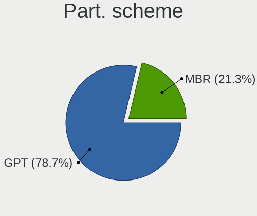

| Type | Notebooks | Percent |
|------|-----------|---------|
| GPT  | 470       | 81.46%  |
| MBR  | 107       | 18.54%  |

Dual Boot with Linux/BSD
------------------------

Hosting more than one Linux/BSD

| Dual boot | Notebooks | Percent |
|-----------|-----------|---------|
| No        | 328       | 56.85%  |
| Yes       | 249       | 43.15%  |

Dual Boot (Win)
---------------

Hosting Linux and Windows

| Dual boot | Notebooks | Percent |
|-----------|-----------|---------|
| No        | 380       | 65.86%  |
| Yes       | 197       | 34.14%  |

Board
-----

Vendor
------

Motherboard manufacturer

| Name                | Notebooks | Percent |
|---------------------|-----------|---------|
| Lenovo              | 125       | 21.66%  |
| Hewlett-Packard     | 103       | 17.85%  |
| Dell                | 78        | 13.52%  |
| ASUSTek Computer    | 65        | 11.27%  |
| Acer                | 63        | 10.92%  |
| Toshiba             | 23        | 3.99%   |
| Sony                | 13        | 2.25%   |
| Samsung Electronics | 12        | 2.08%   |
| Fujitsu             | 10        | 1.73%   |
| Apple               | 10        | 1.73%   |
| Notebook            | 7         | 1.21%   |
| MSI                 | 7         | 1.21%   |
| HUAWEI              | 5         | 0.87%   |
| Unknown             | 5         | 0.87%   |
| GPU Company         | 4         | 0.69%   |
| TUXEDO              | 3         | 0.52%   |
| Kiano               | 3         | 0.52%   |
| Positivo            | 2         | 0.35%   |
| Packard Bell        | 2         | 0.35%   |
| Medion              | 2         | 0.35%   |
| Gigabyte Technology | 2         | 0.35%   |
| Fujitsu Siemens     | 2         | 0.35%   |
| eMachines           | 2         | 0.35%   |
| Chuwi               | 2         | 0.35%   |
| VIT                 | 1         | 0.17%   |
| UMAX                | 1         | 0.17%   |
| TPS                 | 1         | 0.17%   |
| Timi                | 1         | 0.17%   |
| TEKNOSERVICE        | 1         | 0.17%   |
| System76            | 1         | 0.17%   |
| Star Labs           | 1         | 0.17%   |
| Standard            | 1         | 0.17%   |
| SLIMBOOK            | 1         | 0.17%   |
| Quanta              | 1         | 0.17%   |
| PCSMART S.A.S.      | 1         | 0.17%   |
| PC Specialist       | 1         | 0.17%   |
| NEC Computers       | 1         | 0.17%   |
| Microtech           | 1         | 0.17%   |
| Login Informatica   | 1         | 0.17%   |
| LG Electronics      | 1         | 0.17%   |

Model
-----

Motherboard model

| Name                                        | Notebooks | Percent |
|---------------------------------------------|-----------|---------|
| HP Notebook                                 | 7         | 1.21%   |
| Unknown                                     | 7         | 1.21%   |
| ASUS S551LN                                 | 6         | 1.04%   |
| Lenovo IdeaPad 1 14ADA05 82GW               | 5         | 0.87%   |
| Samsung 950XCJ/951XCJ/950XCR                | 4         | 0.69%   |
| HP 250 G6 Notebook PC                       | 4         | 0.69%   |
| Toshiba Satellite L655                      | 3         | 0.52%   |
| Lenovo ThinkPad X1 Extreme Gen 3 20TK001HUS | 3         | 0.52%   |
| Lenovo ThinkPad P1 Gen 4i 20Y3001LUK        | 3         | 0.52%   |
| Lenovo IdeaPad S145-15AST 81N3              | 3         | 0.52%   |
| Kiano Elegance 14.2                         | 3         | 0.52%   |
| HP Pavilion Notebook                        | 3         | 0.52%   |
| Fujitsu LIFEBOOK S935                       | 3         | 0.52%   |
| Dell Inspiron 1720                          | 3         | 0.52%   |
| Apple MacBookPro8,1                         | 3         | 0.52%   |
| TUXEDO InfinityBook Pro Gen7 (MK1)          | 2         | 0.35%   |
| Toshiba Satellite L350D                     | 2         | 0.35%   |
| Toshiba Satellite C660                      | 2         | 0.35%   |
| Lenovo V15-ADA 82C7                         | 2         | 0.35%   |
| Lenovo IdeaPad L340-15IRH Gaming 81LK       | 2         | 0.35%   |
| Lenovo IdeaPad 3 15ITL6 82H8                | 2         | 0.35%   |
| Lenovo IdeaPad 3 15ALC6 82KU                | 2         | 0.35%   |
| Lenovo G550 2958                            | 2         | 0.35%   |
| Lenovo G505 20240                           | 2         | 0.35%   |
| Lenovo G50-70 20351                         | 2         | 0.35%   |
| HP ProBook 650 G4                           | 2         | 0.35%   |
| HP ProBook 4330s                            | 2         | 0.35%   |
| HP Pavilion Laptop 14-dv0xxx                | 2         | 0.35%   |
| HP Laptop 15s-eq2xxx                        | 2         | 0.35%   |
| HP EliteBook 6930p                          | 2         | 0.35%   |
| HP EliteBook 2530p                          | 2         | 0.35%   |
| HP Compaq Presario CQ70                     | 2         | 0.35%   |
| HP Compaq Presario CQ60                     | 2         | 0.35%   |
| HP Compaq 6720s                             | 2         | 0.35%   |
| HP 620                                      | 2         | 0.35%   |
| GPU Company GWTN156-11                      | 2         | 0.35%   |
| GPU Company GWNR71517                       | 2         | 0.35%   |
| Fujitsu LIFEBOOK E556                       | 2         | 0.35%   |
| Dell XPS 17 9710                            | 2         | 0.35%   |
| Dell Vostro 15 3515                         | 2         | 0.35%   |

Model Family
------------

Motherboard model prefix

| Name                  | Notebooks | Percent |
|-----------------------|-----------|---------|
| Lenovo ThinkPad       | 52        | 9.01%   |
| Acer Aspire           | 47        | 8.15%   |
| Lenovo IdeaPad        | 37        | 6.41%   |
| Dell Latitude         | 35        | 6.07%   |
| Dell Inspiron         | 24        | 4.16%   |
| HP Pavilion           | 20        | 3.47%   |
| Toshiba Satellite     | 18        | 3.12%   |
| HP Laptop             | 16        | 2.77%   |
| ASUS VivoBook         | 15        | 2.6%    |
| HP EliteBook          | 14        | 2.43%   |
| HP ProBook            | 13        | 2.25%   |
| HP Compaq             | 12        | 2.08%   |
| Fujitsu LIFEBOOK      | 8         | 1.39%   |
| HP Notebook           | 7         | 1.21%   |
| Dell Vostro           | 7         | 1.21%   |
| Unknown               | 7         | 1.21%   |
| ASUS S551LN           | 6         | 1.04%   |
| HP 250                | 5         | 0.87%   |
| Dell Precision        | 5         | 0.87%   |
| Acer Swift            | 5         | 0.87%   |
| Toshiba dynabook      | 4         | 0.69%   |
| Samsung 950XCJ        | 4         | 0.69%   |
| Lenovo Legion         | 4         | 0.69%   |
| Dell XPS              | 4         | 0.69%   |
| Acer TravelMate       | 4         | 0.69%   |
| Kiano Elegance        | 3         | 0.52%   |
| HP Victus             | 3         | 0.52%   |
| HP OMEN               | 3         | 0.52%   |
| ASUS ROG              | 3         | 0.52%   |
| Apple MacBookPro8     | 3         | 0.52%   |
| TUXEDO InfinityBook   | 2         | 0.35%   |
| Packard Bell EasyNote | 2         | 0.35%   |
| Notebook NL40         | 2         | 0.35%   |
| Lenovo Yoga           | 2         | 0.35%   |
| Lenovo V15-ADA        | 2         | 0.35%   |
| Lenovo V15            | 2         | 0.35%   |
| Lenovo G550           | 2         | 0.35%   |
| Lenovo G505           | 2         | 0.35%   |
| Lenovo G50-70         | 2         | 0.35%   |
| Lenovo B50-30         | 2         | 0.35%   |

MFG Year
--------

Motherboard manufacture year

| Year | Notebooks | Percent |
|------|-----------|---------|
| 2021 | 63        | 10.92%  |
| 2020 | 53        | 9.19%   |
| 2011 | 49        | 8.49%   |
| 2012 | 47        | 8.15%   |
| 2019 | 42        | 7.28%   |
| 2018 | 41        | 7.11%   |
| 2015 | 41        | 7.11%   |
| 2013 | 32        | 5.55%   |
| 2017 | 30        | 5.2%    |
| 2014 | 30        | 5.2%    |
| 2010 | 30        | 5.2%    |
| 2016 | 29        | 5.03%   |
| 2008 | 25        | 4.33%   |
| 2022 | 23        | 3.99%   |
| 2007 | 20        | 3.47%   |
| 2009 | 18        | 3.12%   |
| 2006 | 2         | 0.35%   |
| 2023 | 1         | 0.17%   |
| 2004 | 1         | 0.17%   |

Form Factor
-----------

Physical design of the computer

| Name     | Notebooks | Percent |
|----------|-----------|---------|
| Notebook | 577       | 100%    |

Secure Boot
-----------

Enabled or disabled

| State    | Notebooks | Percent |
|----------|-----------|---------|
| Disabled | 577       | 100%    |

Coreboot
--------

Have coreboot on board

| Used | Notebooks | Percent |
|------|-----------|---------|
| No   | 575       | 99.65%  |
| Yes  | 2         | 0.35%   |

RAM Size
--------

Total RAM memory

| Size in GB  | Notebooks | Percent |
|-------------|-----------|---------|
| 4.01-8.0    | 206       | 35.7%   |
| 3.01-4.0    | 134       | 23.22%  |
| 16.01-24.0  | 79        | 13.69%  |
| 8.01-16.0   | 78        | 13.52%  |
| 32.01-64.0  | 27        | 4.68%   |
| 1.01-2.0    | 22        | 3.81%   |
| 2.01-3.0    | 14        | 2.43%   |
| 64.01-256.0 | 11        | 1.91%   |
| 24.01-32.0  | 6         | 1.04%   |

RAM Used
--------

Used RAM memory

| Used GB  | Notebooks | Percent |
|----------|-----------|---------|
| 1.01-2.0 | 359       | 62.22%  |
| 2.01-3.0 | 156       | 27.04%  |
| 0.51-1.0 | 28        | 4.85%   |
| 3.01-4.0 | 27        | 4.68%   |
| 4.01-8.0 | 6         | 1.04%   |
| 0.01-0.5 | 1         | 0.17%   |

Total Drives
------------

Number of drives on board

| Drives | Notebooks | Percent |
|--------|-----------|---------|
| 1      | 416       | 72.1%   |
| 2      | 132       | 22.88%  |
| 3      | 21        | 3.64%   |
| 0      | 7         | 1.21%   |
| 4      | 1         | 0.17%   |

Has CD-ROM
----------

Has CD-ROM on board

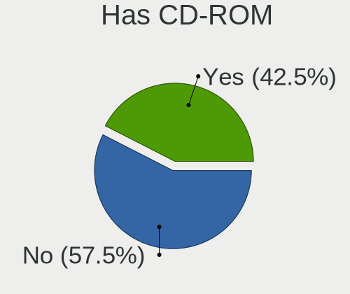

| Presented | Notebooks | Percent |
|-----------|-----------|---------|
| No        | 343       | 59.45%  |
| Yes       | 234       | 40.55%  |

Has Ethernet
------------

Has Ethernet on board

| Presented | Notebooks | Percent |
|-----------|-----------|---------|
| Yes       | 466       | 80.76%  |
| No        | 111       | 19.24%  |

Has WiFi
--------

Has WiFi module

| Presented | Notebooks | Percent |
|-----------|-----------|---------|
| Yes       | 574       | 99.48%  |
| No        | 3         | 0.52%   |

Has Bluetooth
-------------

Has Bluetooth module

| Presented | Notebooks | Percent |
|-----------|-----------|---------|
| Yes       | 453       | 78.51%  |
| No        | 124       | 21.49%  |

Location
--------

Country
-------

Geographic location (country)

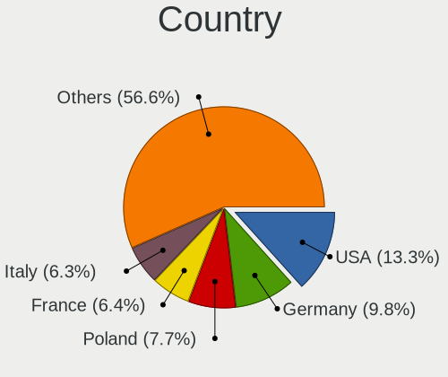

| Country      | Notebooks | Percent |
|--------------|-----------|---------|
| USA          | 87        | 15.08%  |
| Germany      | 63        | 10.92%  |
| France       | 40        | 6.93%   |
| Russia       | 38        | 6.59%   |
| Italy        | 36        | 6.24%   |
| Poland       | 30        | 5.2%    |
| Brazil       | 29        | 5.03%   |
| UK           | 27        | 4.68%   |
| Canada       | 15        | 2.6%    |
| Japan        | 14        | 2.43%   |
| Spain        | 12        | 2.08%   |
| Netherlands  | 12        | 2.08%   |
| Australia    | 10        | 1.73%   |
| Finland      | 9         | 1.56%   |
| Czechia      | 9         | 1.56%   |
| Mexico       | 8         | 1.39%   |
| Indonesia    | 8         | 1.39%   |
| India        | 8         | 1.39%   |
| Argentina    | 8         | 1.39%   |
| Belgium      | 7         | 1.21%   |
| Romania      | 6         | 1.04%   |
| Portugal     | 6         | 1.04%   |
| Hungary      | 6         | 1.04%   |
| Denmark      | 6         | 1.04%   |
| Colombia     | 5         | 0.87%   |
| Turkey       | 4         | 0.69%   |
| Switzerland  | 4         | 0.69%   |
| Peru         | 4         | 0.69%   |
| Norway       | 4         | 0.69%   |
| Venezuela    | 3         | 0.52%   |
| Slovakia     | 3         | 0.52%   |
| Lithuania    | 3         | 0.52%   |
| Egypt        | 3         | 0.52%   |
| Austria      | 3         | 0.52%   |
| South Africa | 2         | 0.35%   |
| Saint Lucia  | 2         | 0.35%   |
| Runion     | 2         | 0.35%   |
| New Zealand  | 2         | 0.35%   |
| Luxembourg   | 2         | 0.35%   |
| Ireland      | 2         | 0.35%   |

City
----

Geographic location (city)

| City          | Notebooks | Percent |
|---------------|-----------|---------|
| Warsaw        | 10        | 1.73%   |
| Moscow        | 8         | 1.39%   |
| Paris         | 7         | 1.21%   |
| St Petersburg | 6         | 1.04%   |
| Freeport      | 6         | 1.04%   |
| Cologne       | 6         | 1.04%   |
| Berlin        | 6         | 1.04%   |
| Krakow        | 5         | 0.87%   |
| Ufa           | 4         | 0.69%   |
| Rome          | 4         | 0.69%   |
| Prague        | 4         | 0.69%   |
| Lima          | 4         | 0.69%   |
| Istres        | 4         | 0.69%   |
| Helsinki      | 4         | 0.69%   |
| Amadora       | 4         | 0.69%   |
| Sydney        | 3         | 0.52%   |
| Slagelse      | 3         | 0.52%   |
| Seattle       | 3         | 0.52%   |
| Milan         | 3         | 0.52%   |
| Mexico City   | 3         | 0.52%   |
| Los Angeles   | 3         | 0.52%   |
| London        | 3         | 0.52%   |
| Krasnodar     | 3         | 0.52%   |
| Kettering     | 3         | 0.52%   |
| Geneva        | 3         | 0.52%   |
| Exeter        | 3         | 0.52%   |
| Cairo         | 3         | 0.52%   |
| Bucharest     | 3         | 0.52%   |
| Algard        | 3         | 0.52%   |
| Airdrie       | 3         | 0.52%   |
| Zabrze        | 2         | 0.35%   |
| Vienna        | 2         | 0.35%   |
| Verdun        | 2         | 0.35%   |
| Vantaa        | 2         | 0.35%   |
| Uberlingen    | 2         | 0.35%   |
| Turin         | 2         | 0.35%   |
| Tomsk         | 2         | 0.35%   |
| Tokyo         | 2         | 0.35%   |
| Sutton        | 2         | 0.35%   |
| Sao Goncalo   | 2         | 0.35%   |

Drives
------

Drive Vendor
------------

Hard drive vendors

| Vendor              | Notebooks | Drives | Percent |
|---------------------|-----------|--------|---------|
| Samsung Electronics | 98        | 102    | 13.98%  |
| Seagate             | 82        | 85     | 11.7%   |
| WDC                 | 74        | 77     | 10.56%  |
| Toshiba             | 55        | 56     | 7.85%   |
| Crucial             | 36        | 37     | 5.14%   |
| Kingston            | 35        | 35     | 4.99%   |
| SanDisk             | 31        | 33     | 4.42%   |
| Unknown             | 27        | 27     | 3.85%   |
| HGST                | 26        | 28     | 3.71%   |
| Hitachi             | 25        | 25     | 3.57%   |
| Micron Technology   | 17        | 17     | 2.43%   |
| Intel               | 15        | 15     | 2.14%   |
| SK hynix            | 14        | 14     | 2%      |
| SPCC                | 13        | 13     | 1.85%   |
| Transcend           | 11        | 11     | 1.57%   |
| JMicron Technology  | 11        | 11     | 1.57%   |
| China               | 10        | 10     | 1.43%   |
| A-DATA Technology   | 9         | 9      | 1.28%   |
| PNY                 | 8         | 8      | 1.14%   |
| Intenso             | 7         | 7      | 1%      |
| KIOXIA              | 6         | 6      | 0.86%   |
| Phison              | 5         | 5      | 0.71%   |
| GOODRAM             | 5         | 5      | 0.71%   |
| Verbatim            | 3         | 3      | 0.43%   |
| Patriot             | 3         | 3      | 0.43%   |
| Netac               | 3         | 3      | 0.43%   |
| LITEON              | 3         | 3      | 0.43%   |
| KingSpec            | 3         | 3      | 0.43%   |
| Fujitsu             | 3         | 3      | 0.43%   |
| Apple               | 3         | 3      | 0.43%   |
| Wibtek              | 2         | 2      | 0.29%   |
| walram              | 2         | 2      | 0.29%   |
| UMIS                | 2         | 2      | 0.29%   |
| SSSTC               | 2         | 2      | 0.29%   |
| SPCC Sol            | 2         | 2      | 0.29%   |
| Silicon Motion      | 2         | 2      | 0.29%   |
| SABRENT             | 2         | 2      | 0.29%   |
| Lexar               | 2         | 2      | 0.29%   |
| KingFast            | 2         | 2      | 0.29%   |
| KingDian            | 2         | 2      | 0.29%   |

Drive Model
-----------

Hard drive models

| Model                                | Notebooks | Percent |
|--------------------------------------|-----------|---------|
| Toshiba MQ01ABD100 1TB               | 12        | 1.68%   |
| Seagate ST500LT012-1DG142 500GB      | 10        | 1.4%    |
| Toshiba MQ01ABF050 500GB             | 8         | 1.12%   |
| Seagate ST1000LM035-1RK172 970GB     | 8         | 1.12%   |
| Kingston SA400S37480G 480GB SSD      | 8         | 1.12%   |
| SPCC Solid State Disk 512GB          | 7         | 0.98%   |
| Seagate ST1000LM048-2E7172 1TB       | 7         | 0.98%   |
| Seagate ST1000LM024 HN-M101MBB 1TB   | 7         | 0.98%   |
| Seagate ST9500325AS 500GB            | 6         | 0.84%   |
| SanDisk NVMe SSD Drive 1TB           | 6         | 0.84%   |
| Unknown MMC64G  64GB                 | 5         | 0.7%    |
| Toshiba MQ04ABF100 1TB               | 5         | 0.7%    |
| Samsung SSD 980 PRO 1TB              | 5         | 0.7%    |
| Kingston SA400S37240G 240GB SSD      | 5         | 0.7%    |
| HGST HTS545050A7E680 500GB           | 5         | 0.7%    |
| Crucial CT480BX500SSD1 480GB         | 5         | 0.7%    |
| Crucial CT240BX500SSD1 240GB         | 5         | 0.7%    |
| WDC WDS120G2G0A-00JH30 120GB SSD     | 4         | 0.56%   |
| Samsung SSD 850 EVO 500GB            | 4         | 0.56%   |
| Samsung MZVLB512HBJQ-000 512GB       | 4         | 0.56%   |
| Kingston SA400S37120G 120GB SSD      | 4         | 0.56%   |
| JMicron H/W JBOD 512GB SSD           | 4         | 0.56%   |
| JMicron Generic 1TB                  | 4         | 0.56%   |
| Hitachi HTS723232A7A364 320GB        | 4         | 0.56%   |
| Hitachi HTS545050B9A300 500GB        | 4         | 0.56%   |
| HGST HTS721010A9E630 1TB             | 4         | 0.56%   |
| HGST HTS545050A7E380 500GB           | 4         | 0.56%   |
| HGST HTS541010A9E680 1TB             | 4         | 0.56%   |
| Crucial CT500MX500SSD1 500GB         | 4         | 0.56%   |
| Crucial CT4000P3SSD8 4TB             | 4         | 0.56%   |
| Crucial CT1000MX500SSD1 1TB          | 4         | 0.56%   |
| WDC WD3200BPVT-22JJ5T0 320GB         | 3         | 0.42%   |
| WDC WD3200BEVT-22ZCT0 320GB          | 3         | 0.42%   |
| WDC PC SN730 SDBQNTY-1T00-1001 1TB   | 3         | 0.42%   |
| WDC PC SN530 SDBPNPZ-256G-1002 256GB | 3         | 0.42%   |
| Verbatim Vi550 S3 128GB              | 3         | 0.42%   |
| Transcend TS240GMTS420S 240GB SSD    | 3         | 0.42%   |
| Toshiba MQ01ABD075 752GB             | 3         | 0.42%   |
| SPCC Solid State Disk 256GB          | 3         | 0.42%   |
| SanDisk SSD PLUS 1000GB              | 3         | 0.42%   |

HDD Vendor
----------

Hard disk drive vendors

| Vendor              | Notebooks | Drives | Percent |
|---------------------|-----------|--------|---------|
| Seagate             | 81        | 83     | 34.18%  |
| Toshiba             | 50        | 50     | 21.1%   |
| WDC                 | 40        | 40     | 16.88%  |
| HGST                | 26        | 28     | 10.97%  |
| Hitachi             | 25        | 25     | 10.55%  |
| JMicron Technology  | 4         | 4      | 1.69%   |
| Samsung Electronics | 3         | 3      | 1.27%   |
| Fujitsu             | 3         | 3      | 1.27%   |
| ASMedia             | 2         | 2      | 0.84%   |
| USB3.0              | 1         | 1      | 0.42%   |
| Unknown             | 1         | 1      | 0.42%   |
| Apple               | 1         | 1      | 0.42%   |

SSD Vendor
----------

Solid state drive vendors

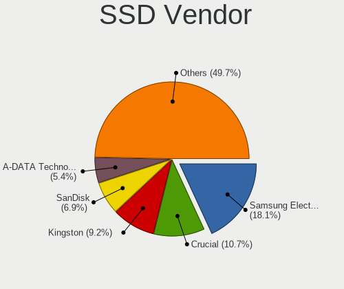

| Vendor              | Notebooks | Drives | Percent |
|---------------------|-----------|--------|---------|
| Samsung Electronics | 42        | 42     | 16.28%  |
| Crucial             | 28        | 28     | 10.85%  |
| Kingston            | 24        | 24     | 9.3%    |
| SanDisk             | 17        | 17     | 6.59%   |
| SPCC                | 13        | 13     | 5.04%   |
| WDC                 | 12        | 12     | 4.65%   |
| Micron Technology   | 10        | 10     | 3.88%   |
| China               | 10        | 10     | 3.88%   |
| Transcend           | 9         | 9      | 3.49%   |
| SK hynix            | 6         | 6      | 2.33%   |
| PNY                 | 6         | 6      | 2.33%   |
| Intenso             | 6         | 6      | 2.33%   |
| A-DATA Technology   | 6         | 6      | 2.33%   |
| Toshiba             | 5         | 5      | 1.94%   |
| Intel               | 5         | 5      | 1.94%   |
| JMicron Technology  | 4         | 4      | 1.55%   |
| GOODRAM             | 4         | 4      | 1.55%   |
| Verbatim            | 3         | 3      | 1.16%   |
| Patriot             | 3         | 3      | 1.16%   |
| Netac               | 3         | 3      | 1.16%   |
| LITEON              | 3         | 3      | 1.16%   |
| Wibtek              | 2         | 2      | 0.78%   |
| SPCC Sol            | 2         | 2      | 0.78%   |
| Seagate             | 2         | 2      | 0.78%   |
| KingSpec            | 2         | 2      | 0.78%   |
| KingFast            | 2         | 2      | 0.78%   |
| KingDian            | 2         | 2      | 0.78%   |
| Wdstars             | 1         | 1      | 0.39%   |
| WDC WDS2            | 1         | 1      | 0.39%   |
| walram              | 1         | 1      | 0.39%   |
| V7                  | 1         | 1      | 0.39%   |
| TO Exter            | 1         | 1      | 0.39%   |
| Teclast             | 1         | 1      | 0.39%   |
| Star                | 1         | 1      | 0.39%   |
| ShiJi               | 1         | 1      | 0.39%   |
| Plextor             | 1         | 1      | 0.39%   |
| Phison              | 1         | 1      | 0.39%   |
| OWC                 | 1         | 1      | 0.39%   |
| Micron_1            | 1         | 1      | 0.39%   |
| MicroFrom           | 1         | 1      | 0.39%   |

Drive Kind
----------

HDD or SSD

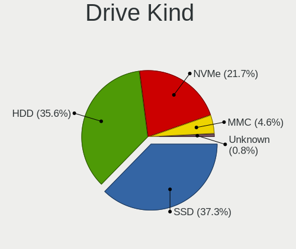

| Kind    | Notebooks | Drives | Percent |
|---------|-----------|--------|---------|
| SSD     | 239       | 258    | 36.05%  |
| HDD     | 227       | 241    | 34.24%  |
| NVMe    | 159       | 179    | 23.98%  |
| MMC     | 31        | 32     | 4.68%   |
| Unknown | 7         | 7      | 1.06%   |

Drive Connector
---------------

SATA, SAS, NVMe, etc.

| Type | Notebooks | Drives | Percent |
|------|-----------|--------|---------|
| SATA | 423       | 474    | 65.38%  |
| NVMe | 157       | 175    | 24.27%  |
| SAS  | 36        | 36     | 5.56%   |
| MMC  | 31        | 32     | 4.79%   |

Drive Size
----------

Size of hard drive

| Size in TB | Notebooks | Drives | Percent |
|------------|-----------|--------|---------|
| 0.01-0.5   | 324       | 352    | 69.98%  |
| 0.51-1.0   | 129       | 137    | 27.86%  |
| 1.01-2.0   | 7         | 7      | 1.51%   |
| 4.01-10.0  | 2         | 2      | 0.43%   |
| 3.01-4.0   | 1         | 1      | 0.22%   |

Space Total
-----------

Amount of disk space available on the file system

| Size in GB     | Notebooks | Percent |
|----------------|-----------|---------|
| 1-20           | 174       | 30.16%  |
| 251-500        | 127       | 22.01%  |
| 101-250        | 122       | 21.14%  |
| 501-1000       | 47        | 8.15%   |
| 51-100         | 36        | 6.24%   |
| 21-50          | 32        | 5.55%   |
| Unknown        | 17        | 2.95%   |
| 1001-2000      | 14        | 2.43%   |
| 2001-3000      | 7         | 1.21%   |
| More than 3000 | 1         | 0.17%   |

Space Used
----------

Amount of used disk space

| Used GB   | Notebooks | Percent |
|-----------|-----------|---------|
| 1-20      | 455       | 78.86%  |
| 21-50     | 44        | 7.63%   |
| 101-250   | 21        | 3.64%   |
| 51-100    | 20        | 3.47%   |
| Unknown   | 17        | 2.95%   |
| 251-500   | 11        | 1.91%   |
| 501-1000  | 7         | 1.21%   |
| 1001-2000 | 2         | 0.35%   |

Malfunc. Drives
---------------

Drive models with a malfunction

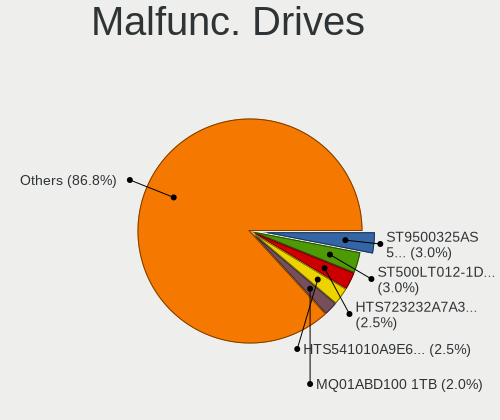

| Model                                   | Notebooks | Drives | Percent |
|-----------------------------------------|-----------|--------|---------|
| Seagate ST500LT012-1DG142 500GB         | 6         | 6      | 5.08%   |
| Toshiba MQ01ABD100 1TB                  | 4         | 4      | 3.39%   |
| Seagate ST9500325AS 500GB               | 4         | 4      | 3.39%   |
| Hitachi HTS723232A7A364 320GB           | 4         | 4      | 3.39%   |
| HGST HTS721010A9E630 1TB                | 4         | 4      | 3.39%   |
| HGST HTS545050A7E680 500GB              | 4         | 4      | 3.39%   |
| Seagate ST1000LM035-1RK172 970GB        | 3         | 3      | 2.54%   |
| Seagate ST1000LM024 HN-M101MBB 1TB      | 3         | 3      | 2.54%   |
| HGST HTS545050A7E380 500GB              | 3         | 3      | 2.54%   |
| HGST HTS541010A9E680 1TB                | 3         | 3      | 2.54%   |
| Toshiba MQ01ABD050 500GB                | 2         | 2      | 1.69%   |
| Toshiba MK5065GSX 500GB                 | 2         | 2      | 1.69%   |
| Seagate ST320LT007-9ZV142 320GB         | 2         | 2      | 1.69%   |
| WDC WD5000BPVT-22HXZT3 500GB            | 1         | 1      | 0.85%   |
| WDC WD5000BEVT-26A0RT0 500GB            | 1         | 1      | 0.85%   |
| WDC WD5000BEVT-22A0RT0 500GB            | 1         | 1      | 0.85%   |
| WDC WD3200LPVX-22V0TT0 320GB            | 1         | 1      | 0.85%   |
| WDC WD3200BPVT-22JJ5T0 320GB            | 1         | 1      | 0.85%   |
| WDC WD3200BEVT-75ZCT0 320GB             | 1         | 1      | 0.85%   |
| WDC WD3200BEVT-22ZCT0 320GB             | 1         | 1      | 0.85%   |
| Toshiba MQ04ABF100 1TB                  | 1         | 1      | 0.85%   |
| Toshiba MQ01ABD075 752GB                | 1         | 1      | 0.85%   |
| Toshiba MK5061GSYN 500GB                | 1         | 1      | 0.85%   |
| Toshiba MK2555GSX 250GB                 | 1         | 1      | 0.85%   |
| Toshiba MK2546GSX 250GB                 | 1         | 1      | 0.85%   |
| Toshiba MK2529GSG 250GB                 | 1         | 1      | 0.85%   |
| Toshiba MK2035GSS 200GB                 | 1         | 1      | 0.85%   |
| Toshiba MK1656GSY 160GB                 | 1         | 1      | 0.85%   |
| Toshiba MK1652GSX 160GB                 | 1         | 1      | 0.85%   |
| Toshiba MK1633GSGF 160GB                | 1         | 1      | 0.85%   |
| Toshiba KSG60ZMV512G M.2 2280 512GB SSD | 1         | 1      | 0.85%   |
| Teclast 128GB SSD                       | 1         | 1      | 0.85%   |
| SPCC Solid State Disk 512GB             | 1         | 1      | 0.85%   |
| SK hynix SH920 mSATA 256GB SSD          | 1         | 1      | 0.85%   |
| SK hynix SC401 SATA 512GB SSD           | 1         | 1      | 0.85%   |
| SK hynix HFS256G32TNH-73A0A 256GB SSD   | 1         | 1      | 0.85%   |
| SK hynix BC711 HFM256GD3JX013N 256GB    | 1         | 1      | 0.85%   |
| Seagate ST9500420AS 500GB               | 1         | 1      | 0.85%   |
| Seagate ST9320325AS 320GB               | 1         | 1      | 0.85%   |
| Seagate ST9160310AS 160GB               | 1         | 1      | 0.85%   |

Malfunc. Drive Vendor
---------------------

Vendors of faulty drives

| Vendor              | Notebooks | Drives | Percent |
|---------------------|-----------|--------|---------|
| Seagate             | 32        | 32     | 27.35%  |
| Toshiba             | 19        | 19     | 16.24%  |
| HGST                | 18        | 19     | 15.38%  |
| Hitachi             | 15        | 15     | 12.82%  |
| WDC                 | 7         | 7      | 5.98%   |
| SK hynix            | 4         | 4      | 3.42%   |
| Intel               | 3         | 3      | 2.56%   |
| Samsung Electronics | 2         | 2      | 1.71%   |
| KingSpec            | 2         | 2      | 1.71%   |
| Intenso             | 2         | 2      | 1.71%   |
| Fujitsu             | 2         | 2      | 1.71%   |
| Teclast             | 1         | 1      | 0.85%   |
| SPCC                | 1         | 1      | 0.85%   |
| SanDisk             | 1         | 1      | 0.85%   |
| Plextor             | 1         | 1      | 0.85%   |
| Netac               | 1         | 1      | 0.85%   |
| Micron Technology   | 1         | 1      | 0.85%   |
| LITEON              | 1         | 1      | 0.85%   |
| Crucial             | 1         | 1      | 0.85%   |
| China               | 1         | 1      | 0.85%   |
| Apple               | 1         | 1      | 0.85%   |
| A-DATA Technology   | 1         | 1      | 0.85%   |

Malfunc. HDD Vendor
-------------------

Vendors of faulty HDD drives

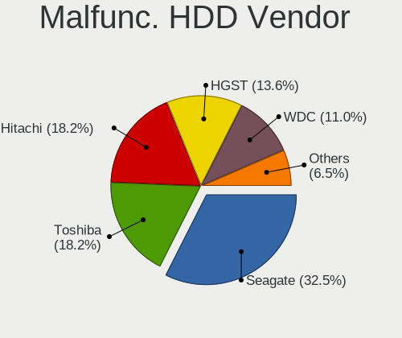

| Vendor              | Notebooks | Drives | Percent |
|---------------------|-----------|--------|---------|
| Seagate             | 32        | 32     | 34.04%  |
| Toshiba             | 18        | 18     | 19.15%  |
| HGST                | 18        | 19     | 19.15%  |
| Hitachi             | 15        | 15     | 15.96%  |
| WDC                 | 7         | 7      | 7.45%   |
| Fujitsu             | 2         | 2      | 2.13%   |
| Samsung Electronics | 1         | 1      | 1.06%   |
| Apple               | 1         | 1      | 1.06%   |

Malfunc. Drive Kind
-------------------

Kinds of faulty drives

| Kind | Notebooks | Drives | Percent |
|------|-----------|--------|---------|
| HDD  | 94        | 95     | 80.34%  |
| SSD  | 21        | 21     | 17.95%  |
| NVMe | 2         | 2      | 1.71%   |

Failed Drives
-------------

Failed drive models

| Model                      | Notebooks | Drives | Percent |
|----------------------------|-----------|--------|---------|
| Toshiba MK3261GSYN 320GB   | 1         | 1      | 50%     |
| HGST HTS545050B7E660 500GB | 1         | 1      | 50%     |

Failed Drive Vendor
-------------------

Failed drive vendors

| Vendor  | Notebooks | Drives | Percent |
|---------|-----------|--------|---------|
| Toshiba | 1         | 1      | 50%     |
| HGST    | 1         | 1      | 50%     |

Drive Status
------------

Number of failed and malfunc. drives

| Status   | Notebooks | Drives | Percent |
|----------|-----------|--------|---------|
| Works    | 456       | 525    | 71.14%  |
| Malfunc  | 116       | 118    | 18.1%   |
| Detected | 67        | 72     | 10.45%  |
| Failed   | 2         | 2      | 0.31%   |

Storage controller
------------------

Storage Vendor
--------------

Storage controller vendors

| Vendor                           | Notebooks | Percent |
|----------------------------------|-----------|---------|
| Intel                            | 425       | 62.96%  |
| AMD                              | 85        | 12.59%  |
| Samsung Electronics              | 55        | 8.15%   |
| SanDisk                          | 34        | 5.04%   |
| Kingston Technology Company      | 12        | 1.78%   |
| Phison Electronics               | 10        | 1.48%   |
| SK hynix                         | 8         | 1.19%   |
| Micron/Crucial Technology        | 8         | 1.19%   |
| Micron Technology                | 7         | 1.04%   |
| Silicon Motion                   | 5         | 0.74%   |
| KIOXIA                           | 5         | 0.74%   |
| ADATA Technology                 | 5         | 0.74%   |
| Nvidia                           | 4         | 0.59%   |
| Union Memory (Shenzhen)          | 2         | 0.3%    |
| Toshiba America Info Systems     | 2         | 0.3%    |
| Solid State Storage Technology   | 2         | 0.3%    |
| Transcend                        | 1         | 0.15%   |
| Silicon Integrated Systems [SiS] | 1         | 0.15%   |
| Shenzhen Longsys Electronics     | 1         | 0.15%   |
| MAXIO Technology (Hangzhou)      | 1         | 0.15%   |
| Lenovo                           | 1         | 0.15%   |
| Biwin Storage Technology         | 1         | 0.15%   |

Storage Model
-------------

Storage controller models

| Model                                                                            | Notebooks | Percent |
|----------------------------------------------------------------------------------|-----------|---------|
| AMD FCH SATA Controller [AHCI mode]                                              | 72        | 9.82%   |
| Intel Sunrise Point-LP SATA Controller [AHCI mode]                               | 57        | 7.78%   |
| Intel 7 Series Chipset Family 6-port SATA Controller [AHCI mode]                 | 49        | 6.68%   |
| Intel 6 Series/C200 Series Chipset Family 6 port Mobile SATA AHCI Controller     | 38        | 5.18%   |
| Intel 82801IBM/IEM (ICH9M/ICH9M-E) 4 port SATA Controller [AHCI mode]            | 31        | 4.23%   |
| Intel 82801 Mobile SATA Controller [RAID mode]                                   | 30        | 4.09%   |
| Intel Volume Management Device NVMe RAID Controller                              | 24        | 3.27%   |
| Intel Wildcat Point-LP SATA Controller [AHCI Mode]                               | 22        | 3%      |
| Intel 5 Series/3400 Series Chipset 4 port SATA AHCI Controller                   | 22        | 3%      |
| Samsung NVMe SSD Controller SM981/PM981/PM983                                    | 19        | 2.59%   |
| Intel 8 Series SATA Controller 1 [AHCI mode]                                     | 19        | 2.59%   |
| Samsung NVMe SSD Controller 980                                                  | 17        | 2.32%   |
| Intel 82801HM/HEM (ICH8M/ICH8M-E) IDE Controller                                 | 17        | 2.32%   |
| Samsung NVMe SSD Controller PM9A1/PM9A3/980PRO                                   | 16        | 2.18%   |
| Intel 82801HM/HEM (ICH8M/ICH8M-E) SATA Controller [AHCI mode]                    | 14        | 1.91%   |
| Intel Tiger Lake-LP SATA Controller                                              | 13        | 1.77%   |
| Intel HM170/QM170 Chipset SATA Controller [AHCI Mode]                            | 13        | 1.77%   |
| Intel Celeron/Pentium Silver Processor SATA Controller                           | 12        | 1.64%   |
| Intel Atom/Celeron/Pentium Processor x5-E8000/J3xxx/N3xxx Series SATA Controller | 11        | 1.5%    |
| SanDisk WD Blue SN550 NVMe SSD                                                   | 9         | 1.23%   |
| SanDisk WD Black SN750 / PC SN730 NVMe SSD                                       | 8         | 1.09%   |
| Intel Celeron N3350/Pentium N4200/Atom E3900 Series SATA AHCI Controller         | 8         | 1.09%   |
| AMD SB7x0/SB8x0/SB9x0 SATA Controller [AHCI mode]                                | 8         | 1.09%   |
| Micron/Crucial P2 NVMe PCIe SSD                                                  | 7         | 0.95%   |
| Micron NVMe Storage Controller                                                   | 7         | 0.95%   |
| Intel Cannon Point-LP SATA Controller [AHCI Mode]                                | 7         | 0.95%   |
| Intel Atom Processor E3800 Series SATA AHCI Controller                           | 7         | 0.95%   |
| Intel 5 Series/3400 Series Chipset 6 port SATA AHCI Controller                   | 7         | 0.95%   |
| SK hynix Gold P31/PC711 NVMe Solid State Drive                                   | 6         | 0.82%   |
| SanDisk WD PC SN810 / Black SN850 NVMe SSD                                       | 6         | 0.82%   |
| Phison PS5013 E13 NVMe Controller                                                | 6         | 0.82%   |
| Intel Comet Lake SATA AHCI Controller                                            | 6         | 0.82%   |
| Intel Cannon Lake Mobile PCH SATA AHCI Controller                                | 6         | 0.82%   |
| Intel 8 Series/C220 Series Chipset Family 6-port SATA Controller 1 [AHCI mode]   | 6         | 0.82%   |
| KIOXIA NVMe SSD Controller BG4                                                   | 5         | 0.68%   |
| Intel Non-Volatile memory controller                                             | 5         | 0.68%   |
| Intel Mobile 4 Series Chipset PT IDER Controller                                 | 5         | 0.68%   |
| Intel Ice Lake-LP SATA Controller [AHCI mode]                                    | 5         | 0.68%   |
| Kingston Company Company Non-Volatile memory controller                          | 4         | 0.55%   |
| Kingston Company OM3PDP3 NVMe SSD                                                | 4         | 0.55%   |

Storage Kind
------------

Kind of storage controller (IDE, SATA, NVMe, SAS, ...)

| Kind | Notebooks | Percent |
|------|-----------|---------|
| SATA | 451       | 63.79%  |
| NVMe | 157       | 22.21%  |
| RAID | 56        | 7.92%   |
| IDE  | 43        | 6.08%   |

Processor
---------

CPU Vendor
----------

Processor vendors

| Vendor | Notebooks | Percent |
|--------|-----------|---------|
| Intel  | 464       | 80.42%  |
| AMD    | 113       | 19.58%  |

CPU Model
---------

Processor models

| Model                                         | Notebooks | Percent |
|-----------------------------------------------|-----------|---------|
| Intel Core i5-7200U CPU @ 2.50GHz             | 13        | 2.25%   |
| Intel 11th Gen Core i3-1115G4 @ 3.00GHz       | 10        | 1.73%   |
| Intel Core i7-6700HQ CPU @ 2.60GHz            | 9         | 1.56%   |
| Intel Core i5-5300U CPU @ 2.30GHz             | 9         | 1.56%   |
| Intel Core i5-3210M CPU @ 2.50GHz             | 9         | 1.56%   |
| Intel 11th Gen Core i5-1135G7 @ 2.40GHz       | 9         | 1.56%   |
| Intel Core i5-6200U CPU @ 2.30GHz             | 8         | 1.39%   |
| Intel Core i3-4030U CPU @ 1.90GHz             | 8         | 1.39%   |
| Intel Core i7-7500U CPU @ 2.70GHz             | 7         | 1.21%   |
| Intel Core i7-3520M CPU @ 2.90GHz             | 7         | 1.21%   |
| Intel Core i5-3320M CPU @ 2.60GHz             | 7         | 1.21%   |
| Intel Celeron N4020 CPU @ 1.10GHz             | 7         | 1.21%   |
| Intel Celeron CPU N3060 @ 1.60GHz             | 7         | 1.21%   |
| Intel Core i5-3230M CPU @ 2.60GHz             | 6         | 1.04%   |
| Intel Core i5-2520M CPU @ 2.50GHz             | 6         | 1.04%   |
| Intel Core 2 Duo CPU P8600 @ 2.40GHz          | 6         | 1.04%   |
| AMD Ryzen 7 5800H with Radeon Graphics        | 6         | 1.04%   |
| AMD Ryzen 5 5500U with Radeon Graphics        | 6         | 1.04%   |
| AMD 3020e with Radeon Graphics                | 6         | 1.04%   |
| Intel Core i7-8550U CPU @ 1.80GHz             | 5         | 0.87%   |
| Intel Core i7-10510U CPU @ 1.80GHz            | 5         | 0.87%   |
| Intel Core i5-8250U CPU @ 1.60GHz             | 5         | 0.87%   |
| Intel Core i5-5200U CPU @ 2.20GHz             | 5         | 0.87%   |
| Intel Core i5-2410M CPU @ 2.30GHz             | 5         | 0.87%   |
| Intel Core i3-6006U CPU @ 2.00GHz             | 5         | 0.87%   |
| Intel Core i3-1005G1 CPU @ 1.20GHz            | 5         | 0.87%   |
| Intel Core i3 CPU M 370 @ 2.40GHz             | 5         | 0.87%   |
| Intel Core 2 Duo CPU T7250 @ 2.00GHz          | 5         | 0.87%   |
| Intel Celeron CPU N3350 @ 1.10GHz             | 5         | 0.87%   |
| Intel 12th Gen Core i7-12700H                 | 5         | 0.87%   |
| AMD Ryzen 5 5600H with Radeon Graphics        | 5         | 0.87%   |
| AMD Ryzen 5 3500U with Radeon Vega Mobile Gfx | 5         | 0.87%   |
| Intel Core i7-8565U CPU @ 1.80GHz             | 4         | 0.69%   |
| Intel Core i5-10210U CPU @ 1.60GHz            | 4         | 0.69%   |
| Intel Core i5 CPU M 520 @ 2.40GHz             | 4         | 0.69%   |
| Intel Core i3-7020U CPU @ 2.30GHz             | 4         | 0.69%   |
| Intel Core i3 CPU M 380 @ 2.53GHz             | 4         | 0.69%   |
| Intel Core 2 Duo CPU P7350 @ 2.00GHz          | 4         | 0.69%   |
| AMD Ryzen 7 4800H with Radeon Graphics        | 4         | 0.69%   |
| AMD Ryzen 3 5300U with Radeon Graphics        | 4         | 0.69%   |

CPU Model Family
----------------

Processor model prefix

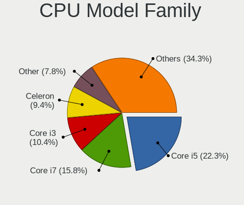

| Model                   | Notebooks | Percent |
|-------------------------|-----------|---------|
| Intel Core i5           | 132       | 22.88%  |
| Intel Core i7           | 87        | 15.08%  |
| Intel Core i3           | 66        | 11.44%  |
| Other                   | 48        | 8.32%   |
| Intel Celeron           | 47        | 8.15%   |
| Intel Core 2 Duo        | 40        | 6.93%   |
| AMD Ryzen 5             | 27        | 4.68%   |
| Intel Pentium           | 21        | 3.64%   |
| AMD Ryzen 7             | 17        | 2.95%   |
| AMD Ryzen 3             | 12        | 2.08%   |
| AMD A6                  | 7         | 1.21%   |
| Intel Pentium Dual-Core | 6         | 1.04%   |
| Intel Pentium Dual      | 6         | 1.04%   |
| AMD A4                  | 6         | 1.04%   |
| AMD A10                 | 5         | 0.87%   |
| Intel Core 2            | 4         | 0.69%   |
| AMD A8                  | 4         | 0.69%   |
| Intel Pentium Silver    | 3         | 0.52%   |
| Intel Core i9           | 3         | 0.52%   |
| AMD Ryzen 9             | 3         | 0.52%   |
| AMD E1                  | 3         | 0.52%   |
| AMD C-70                | 3         | 0.52%   |
| Intel Pentium Gold      | 2         | 0.35%   |
| Intel Celeron Dual-Core | 2         | 0.35%   |
| AMD E2                  | 2         | 0.35%   |
| AMD C-60                | 2         | 0.35%   |
| AMD Athlon 64 X2        | 2         | 0.35%   |
| AMD Athlon              | 2         | 0.35%   |
| AMD A12                 | 2         | 0.35%   |
| Intel Genuine           | 1         | 0.17%   |
| Intel Core m5           | 1         | 0.17%   |
| Intel Core m3           | 1         | 0.17%   |
| AMD V120                | 1         | 0.17%   |
| AMD Turion 64 X2 Mobile | 1         | 0.17%   |
| AMD Turion 64 Mobile    | 1         | 0.17%   |
| AMD Sempron             | 1         | 0.17%   |
| AMD Ryzen 7 PRO         | 1         | 0.17%   |
| AMD FX                  | 1         | 0.17%   |
| AMD E                   | 1         | 0.17%   |
| AMD C-50                | 1         | 0.17%   |

CPU Cores
---------

Number of processor cores

| Number | Notebooks | Percent |
|--------|-----------|---------|
| 2      | 375       | 64.99%  |
| 4      | 130       | 22.53%  |
| 8      | 26        | 4.51%   |
| 6      | 24        | 4.16%   |
| 1      | 13        | 2.25%   |
| 14     | 7         | 1.21%   |
| 12     | 1         | 0.17%   |
| 10     | 1         | 0.17%   |

CPU Sockets
-----------

Number of sockets

| Number | Notebooks | Percent |
|--------|-----------|---------|
| 1      | 577       | 100%    |

CPU Threads
-----------

Threads per core (Hyper-Threading)

| Number | Notebooks | Percent |
|--------|-----------|---------|
| 2      | 395       | 68.46%  |
| 1      | 178       | 30.85%  |
| 4      | 3         | 0.52%   |
| 16     | 1         | 0.17%   |

CPU Op-Modes
------------

CPU Operation Modes (32-bit, 64-bit)

| Op mode        | Notebooks | Percent |
|----------------|-----------|---------|
| 32-bit, 64-bit | 577       | 100%    |

CPU Microcode
-------------

Microcode number

| Number     | Notebooks | Percent |
|------------|-----------|---------|
| Unknown    | 464       | 80.42%  |
| 0x08108109 | 13        | 2.25%   |
| 0x0a50000c | 11        | 1.91%   |
| 0x08608103 | 9         | 1.56%   |
| 0x06006705 | 8         | 1.39%   |
| 0x08200103 | 6         | 1.04%   |
| 0x08108102 | 6         | 1.04%   |
| 0x0500010d | 5         | 0.87%   |
| 0x0a50000d | 4         | 0.69%   |
| 0x0600611a | 4         | 0.69%   |
| 0x06001119 | 4         | 0.69%   |
| 0x08608102 | 3         | 0.52%   |
| 0x08600106 | 3         | 0.52%   |
| 0x0810100b | 3         | 0.52%   |
| 0x0700010b | 3         | 0.52%   |
| 0x05000101 | 3         | 0.52%   |
| 0x08600104 | 2         | 0.35%   |
| 0x07030105 | 2         | 0.35%   |
| 0x0600111f | 2         | 0.35%   |
| 0x02000032 | 2         | 0.35%   |
| 0x010000b6 | 2         | 0.35%   |
| 0x906a3    | 1         | 0.17%   |
| 0x806e9    | 1         | 0.17%   |
| 0x506c9    | 1         | 0.17%   |
| 0x406e3    | 1         | 0.17%   |
| 0x306a9    | 1         | 0.17%   |
| 0x206a7    | 1         | 0.17%   |
| 0x0a50000b | 1         | 0.17%   |
| 0x0a404102 | 1         | 0.17%   |
| 0x08a00006 | 1         | 0.17%   |
| 0x08600103 | 1         | 0.17%   |
| 0x08600102 | 1         | 0.17%   |
| 0x08101007 | 1         | 0.17%   |
| 0x07030106 | 1         | 0.17%   |
| 0x07000110 | 1         | 0.17%   |
| 0x06006110 | 1         | 0.17%   |
| 0x06001116 | 1         | 0.17%   |
| 0x0600110f | 1         | 0.17%   |
| 0x05000028 | 1         | 0.17%   |

CPU Microarch
-------------

Microarchitecture

| Name             | Notebooks | Percent |
|------------------|-----------|---------|
| KabyLake         | 81        | 14.04%  |
| IvyBridge        | 50        | 8.67%   |
| SandyBridge      | 44        | 7.63%   |
| Skylake          | 37        | 6.41%   |
| Penryn           | 34        | 5.89%   |
| Westmere         | 29        | 5.03%   |
| Haswell          | 29        | 5.03%   |
| TigerLake        | 28        | 4.85%   |
| Core             | 27        | 4.68%   |
| Broadwell        | 26        | 4.51%   |
| Silvermont       | 21        | 3.64%   |
| Zen+             | 19        | 3.29%   |
| Zen 3            | 16        | 2.77%   |
| IceLake          | 14        | 2.43%   |
| Goldmont plus    | 14        | 2.43%   |
| Unknown          | 14        | 2.43%   |
| Excavator        | 13        | 2.25%   |
| Zen              | 10        | 1.73%   |
| Alderlake Hybrid | 10        | 1.73%   |
| Bobcat           | 9         | 1.56%   |
| Zen 2            | 8         | 1.39%   |
| Piledriver       | 8         | 1.39%   |
| Goldmont         | 8         | 1.39%   |
| CometLake        | 8         | 1.39%   |
| K8 Hammer        | 5         | 0.87%   |
| Jaguar           | 4         | 0.69%   |
| Tremont          | 3         | 0.52%   |
| Puma             | 3         | 0.52%   |
| K8 & K10 hybrid  | 2         | 0.35%   |
| K10              | 2         | 0.35%   |
| Nehalem          | 1         | 0.17%   |

Graphics
--------

GPU Vendor
----------

Vendors of graphics cards

| Vendor                           | Notebooks | Percent |
|----------------------------------|-----------|---------|
| Intel                            | 419       | 59.86%  |
| AMD                              | 151       | 21.57%  |
| Nvidia                           | 129       | 18.43%  |
| Silicon Integrated Systems [SiS] | 1         | 0.14%   |

GPU Model
---------

Graphics card models

| Model                                                                                    | Notebooks | Percent |
|------------------------------------------------------------------------------------------|-----------|---------|
| Intel 3rd Gen Core processor Graphics Controller                                         | 44        | 6.09%   |
| Intel 2nd Generation Core Processor Family Integrated Graphics Controller                | 39        | 5.39%   |
| Intel HD Graphics 620                                                                    | 30        | 4.15%   |
| Intel Mobile 4 Series Chipset Integrated Graphics Controller                             | 29        | 4.01%   |
| AMD Picasso/Raven 2 [Radeon Vega Series / Radeon Vega Mobile Series]                     | 25        | 3.46%   |
| Intel HD Graphics 5500                                                                   | 24        | 3.32%   |
| Intel Skylake GT2 [HD Graphics 520]                                                      | 21        | 2.9%    |
| Intel Haswell-ULT Integrated Graphics Controller                                         | 21        | 2.9%    |
| Intel Core Processor Integrated Graphics Controller                                      | 20        | 2.77%   |
| Intel TigerLake-LP GT2 [Iris Xe Graphics]                                                | 16        | 2.21%   |
| Intel UHD Graphics 620                                                                   | 15        | 2.07%   |
| Intel Mobile GM965/GL960 Integrated Graphics Controller (secondary)                      | 14        | 1.94%   |
| Intel Mobile GM965/GL960 Integrated Graphics Controller (primary)                        | 14        | 1.94%   |
| AMD Cezanne [Radeon Vega Series / Radeon Vega Mobile Series]                             | 14        | 1.94%   |
| Intel Atom/Celeron/Pentium Processor x5-E8000/J3xxx/N3xxx Integrated Graphics Controller | 13        | 1.8%    |
| Intel Tiger Lake-LP GT2 [UHD Graphics G4]                                                | 12        | 1.66%   |
| Intel GeminiLake [UHD Graphics 600]                                                      | 12        | 1.66%   |
| Intel CometLake-U GT2 [UHD Graphics]                                                     | 12        | 1.66%   |
| AMD Lucienne                                                                             | 12        | 1.66%   |
| Intel HD Graphics 530                                                                    | 11        | 1.52%   |
| AMD Sun XT [Radeon HD 8670A/8670M/8690M / R5 M330 / M430 / Radeon 520 Mobile]            | 9         | 1.24%   |
| Nvidia TU117M [GeForce GTX 1650 Mobile / Max-Q]                                          | 8         | 1.11%   |
| Intel WhiskeyLake-U GT2 [UHD Graphics 620]                                               | 8         | 1.11%   |
| Intel CometLake-H GT2 [UHD Graphics]                                                     | 8         | 1.11%   |
| Intel Atom Processor Z36xxx/Z37xxx Series Graphics & Display                             | 8         | 1.11%   |
| Intel Alder Lake-P Integrated Graphics Controller                                        | 8         | 1.11%   |
| AMD Stoney [Radeon R2/R3/R4/R5 Graphics]                                                 | 8         | 1.11%   |
| Nvidia GM108M [GeForce 840M]                                                             | 7         | 0.97%   |
| AMD Renoir                                                                               | 7         | 0.97%   |
| Nvidia GP107M [GeForce GTX 1050 Mobile]                                                  | 6         | 0.83%   |
| Nvidia GF117M [GeForce 610M/710M/810M/820M / GT 620M/625M/630M/720M]                     | 6         | 0.83%   |
| Intel TigerLake-H GT1 [UHD Graphics]                                                     | 6         | 0.83%   |
| Intel Iris Plus Graphics G1 (Ice Lake)                                                   | 6         | 0.83%   |
| Intel HD Graphics 500                                                                    | 6         | 0.83%   |
| Intel CoffeeLake-H GT2 [UHD Graphics 630]                                                | 6         | 0.83%   |
| Nvidia GM107M [GeForce GTX 960M]                                                         | 5         | 0.69%   |
| Nvidia GA106M [GeForce RTX 3060 Mobile / Max-Q]                                          | 5         | 0.69%   |
| Intel 4th Gen Core Processor Integrated Graphics Controller                              | 5         | 0.69%   |
| AMD Wani [Radeon R5/R6/R7 Graphics]                                                      | 5         | 0.69%   |
| Nvidia TU117M [GeForce GTX 1650 Ti Mobile]                                               | 4         | 0.55%   |

GPU Combo
---------

Combinations of graphics cards

| Name           | Notebooks | Percent |
|----------------|-----------|---------|
| 1 x Intel      | 265       | 45.93%  |
| 1 x AMD        | 107       | 18.54%  |
| Intel + Nvidia | 88        | 15.25%  |
| 2 x Intel      | 44        | 7.63%   |
| 1 x Nvidia     | 28        | 4.85%   |
| Intel + AMD    | 22        | 3.81%   |
| AMD + Nvidia   | 13        | 2.25%   |
| 2 x AMD        | 9         | 1.56%   |
| 1 x SiS        | 1         | 0.17%   |

GPU Driver
----------

Free vs proprietary

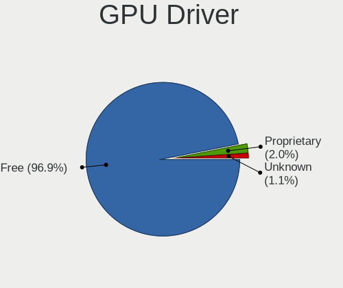

| Driver      | Notebooks | Percent |
|-------------|-----------|---------|
| Free        | 559       | 96.88%  |
| Proprietary | 14        | 2.43%   |
| Unknown     | 4         | 0.69%   |

GPU Memory
----------

Total video memory

| Size in GB | Notebooks | Percent |
|------------|-----------|---------|
| Unknown    | 321       | 55.63%  |
| 0.01-0.5   | 84        | 14.56%  |
| 1.01-2.0   | 74        | 12.82%  |
| 0.51-1.0   | 43        | 7.45%   |
| 3.01-4.0   | 38        | 6.59%   |
| 5.01-6.0   | 10        | 1.73%   |
| 7.01-8.0   | 4         | 0.69%   |
| 8.01-16.0  | 3         | 0.52%   |

Monitor
-------

Monitor Vendor
--------------

Monitor vendors

| Vendor                  | Notebooks | Percent |
|-------------------------|-----------|---------|
| AU Optronics            | 142       | 23.63%  |
| LG Display              | 93        | 15.47%  |
| BOE                     | 88        | 14.64%  |
| Chimei Innolux          | 86        | 14.31%  |
| Samsung Electronics     | 54        | 8.99%   |
| Lenovo                  | 19        | 3.16%   |
| Sharp                   | 15        | 2.5%    |
| LG Philips              | 12        | 2%      |
| PANDA                   | 10        | 1.66%   |
| Chi Mei Optoelectronics | 10        | 1.66%   |
| Apple                   | 9         | 1.5%    |
| Hewlett-Packard         | 5         | 0.83%   |
| HannStar                | 5         | 0.83%   |
| AOC                     | 5         | 0.83%   |
| Sony                    | 4         | 0.67%   |
| Goldstar                | 4         | 0.67%   |
| Philips                 | 3         | 0.5%    |
| HKC                     | 3         | 0.5%    |
| Hitachi                 | 3         | 0.5%    |
| Unknown                 | 2         | 0.33%   |
| Toppoly                 | 2         | 0.33%   |
| InnoLux Display         | 2         | 0.33%   |
| InfoVision              | 2         | 0.33%   |
| Dell                    | 2         | 0.33%   |
| CSO                     | 2         | 0.33%   |
| Acer                    | 2         | 0.33%   |
| Xiaomi                  | 1         | 0.17%   |
| Vizio                   | 1         | 0.17%   |
| Vestel Elektronik       | 1         | 0.17%   |
| TMX                     | 1         | 0.17%   |
| STA                     | 1         | 0.17%   |
| QUS                     | 1         | 0.17%   |
| Panasonic               | 1         | 0.17%   |
| L                       | 1         | 0.17%   |
| Konka                   | 1         | 0.17%   |
| KDC                     | 1         | 0.17%   |
| JDZ                     | 1         | 0.17%   |
| Iiyama                  | 1         | 0.17%   |
| HJW                     | 1         | 0.17%   |
| CS_                     | 1         | 0.17%   |

Monitor Model
-------------

Monitor models

| Model                                                                    | Notebooks | Percent |
|--------------------------------------------------------------------------|-----------|---------|
| AU Optronics LCD Monitor AUO38ED 1920x1080 344x193mm 15.5-inch           | 10        | 1.66%   |
| Chimei Innolux LCD Monitor CMN15F5 1920x1080 344x193mm 15.5-inch         | 7         | 1.16%   |
| AU Optronics LCD Monitor AUO61ED 1920x1080 344x193mm 15.5-inch           | 7         | 1.16%   |
| LG Display LCD Monitor LGD02DC 1366x768 344x194mm 15.5-inch              | 6         | 1%      |
| AU Optronics LCD Monitor AUO36ED 1920x1080 344x193mm 15.5-inch           | 6         | 1%      |
| Chimei Innolux LCD Monitor CMN14D4 1920x1080 309x173mm 13.9-inch         | 5         | 0.83%   |
| AU Optronics LCD Monitor AUO723C 1366x768 309x173mm 13.9-inch            | 5         | 0.83%   |
| AU Optronics LCD Monitor AUO26EC 1366x768 344x193mm 15.5-inch            | 5         | 0.83%   |
| AU Optronics LCD Monitor AUO213E 1600x900 309x174mm 14.0-inch            | 5         | 0.83%   |
| LG Display LCD Monitor LGD02D8 1366x768 277x156mm 12.5-inch              | 4         | 0.67%   |
| Chimei Innolux LCD Monitor CMN15DB 1366x768 344x193mm 15.5-inch          | 4         | 0.67%   |
| BOE LCD Monitor BOE0889 1920x1080 344x194mm 15.5-inch                    | 4         | 0.67%   |
| BOE LCD Monitor BOE0812 1920x1080 344x194mm 15.5-inch                    | 4         | 0.67%   |
| BOE LCD Monitor BOE06DF 1920x1080 309x173mm 13.9-inch                    | 4         | 0.67%   |
| BOE LCD Monitor BOE0675 1366x768 344x194mm 15.5-inch                     | 4         | 0.67%   |
| BOE LCD Monitor BOE0672 1366x768 344x194mm 15.5-inch                     | 4         | 0.67%   |
| AU Optronics LCD Monitor AUO6287 1440x900 367x229mm 17.0-inch            | 4         | 0.67%   |
| AU Optronics LCD Monitor AUO22EC 1366x768 344x193mm 15.5-inch            | 4         | 0.67%   |
| AU Optronics LCD Monitor AUO10EC 1366x768 344x193mm 15.5-inch            | 4         | 0.67%   |
| Sharp LCD Monitor SHP141B 1920x1080 294x165mm 13.3-inch                  | 3         | 0.5%    |
| Samsung Electronics LCD Monitor SEC5441 1366x768 344x194mm 15.5-inch     | 3         | 0.5%    |
| Samsung Electronics LCD Monitor SDC4161 1920x1080 344x194mm 15.5-inch    | 3         | 0.5%    |
| Samsung Electronics LCD Monitor SDC4141 3840x2160 344x194mm 15.5-inch    | 3         | 0.5%    |
| PANDA LM156LF1L03 NCP001C 1920x1080 344x194mm 15.5-inch                  | 3         | 0.5%    |
| LG Display LCD Monitor LGD046F 1920x1080 345x194mm 15.6-inch             | 3         | 0.5%    |
| LG Display LCD Monitor LGD033A 1366x768 344x194mm 15.5-inch              | 3         | 0.5%    |
| Lenovo LCD Monitor LEN40B0 1366x768 345x194mm 15.6-inch                  | 3         | 0.5%    |
| Lenovo LCD Monitor LEN40A0 1366x768 309x174mm 14.0-inch                  | 3         | 0.5%    |
| Chimei Innolux LCD Monitor CMN1738 1920x1080 381x214mm 17.2-inch         | 3         | 0.5%    |
| Chimei Innolux LCD Monitor CMN14D6 1366x768 309x173mm 13.9-inch          | 3         | 0.5%    |
| Chimei Innolux LCD Monitor CMN1132 1366x768 256x144mm 11.6-inch          | 3         | 0.5%    |
| Chi Mei Optoelectronics LCD Monitor CMO15A3 1366x768 344x193mm 15.5-inch | 3         | 0.5%    |
| BOE LCD Monitor BOE09BA 2560x1600 345x215mm 16.0-inch                    | 3         | 0.5%    |
| BOE LCD Monitor BOE06A5 1366x768 344x194mm 15.5-inch                     | 3         | 0.5%    |
| AU Optronics LCD Monitor AUO81EC 1366x768 344x193mm 15.5-inch            | 3         | 0.5%    |
| AU Optronics LCD Monitor AUO46EC 1366x768 344x193mm 15.5-inch            | 3         | 0.5%    |
| AU Optronics LCD Monitor AUO403D 1920x1080 309x174mm 14.0-inch           | 3         | 0.5%    |
| Unknown LCD Monitor FFFF 2288x1287 2550x2550mm 142.0-inch                | 2         | 0.33%   |
| Toppoly LCD Monitor TNJ0260 1280x800 303x190mm 14.1-inch                 | 2         | 0.33%   |
| Sony NvidiaDefault SNY05FA 1366x768 290x170mm 13.2-inch                  | 2         | 0.33%   |

Monitor Resolution
------------------

Monitor screen resolution

| Resolution         | Notebooks | Percent |
|--------------------|-----------|---------|
| 1920x1080 (FHD)    | 241       | 40.92%  |
| 1366x768 (WXGA)    | 217       | 36.84%  |
| 1280x800 (WXGA)    | 33        | 5.6%    |
| 1600x900 (HD+)     | 29        | 4.92%   |
| 3840x2160 (4K)     | 15        | 2.55%   |
| 1440x900 (WXGA+)   | 14        | 2.38%   |
| 2560x1600          | 10        | 1.7%    |
| 2560x1440 (QHD)    | 7         | 1.19%   |
| 3840x2400          | 4         | 0.68%   |
| 1920x1200 (WUXGA)  | 3         | 0.51%   |
| 1680x1050 (WSXGA+) | 3         | 0.51%   |
| 2288x1287          | 2         | 0.34%   |
| 3456x2160          | 1         | 0.17%   |
| 3200x1800 (QHD+)   | 1         | 0.17%   |
| 2880x1800          | 1         | 0.17%   |
| 2240x1400          | 1         | 0.17%   |
| 2160x1440          | 1         | 0.17%   |
| 1920x540           | 1         | 0.17%   |
| 1600x2560          | 1         | 0.17%   |
| 1400x1050          | 1         | 0.17%   |
| 1360x768           | 1         | 0.17%   |
| 1024x768 (XGA)     | 1         | 0.17%   |
| 1024x600           | 1         | 0.17%   |

Monitor Diagonal
----------------

Diagonal size in inches

| Inches  | Notebooks | Percent |
|---------|-----------|---------|
| 15      | 295       | 49.08%  |
| 13      | 76        | 12.65%  |
| 14      | 74        | 12.31%  |
| 17      | 51        | 8.49%   |
| 12      | 21        | 3.49%   |
| 16      | 13        | 2.16%   |
| 11      | 13        | 2.16%   |
| 27      | 9         | 1.5%    |
| 23      | 8         | 1.33%   |
| 24      | 6         | 1%      |
| 21      | 6         | 1%      |
| 31      | 4         | 0.67%   |
| 84      | 3         | 0.5%    |
| 18      | 3         | 0.5%    |
| 142     | 2         | 0.33%   |
| 65      | 2         | 0.33%   |
| 52      | 2         | 0.33%   |
| Unknown | 2         | 0.33%   |
| 72      | 1         | 0.17%   |
| 60      | 1         | 0.17%   |
| 54      | 1         | 0.17%   |
| 46      | 1         | 0.17%   |
| 36      | 1         | 0.17%   |
| 32      | 1         | 0.17%   |
| 29      | 1         | 0.17%   |
| 26      | 1         | 0.17%   |
| 22      | 1         | 0.17%   |
| 20      | 1         | 0.17%   |
| 8       | 1         | 0.17%   |

Monitor Width
-------------

Physical width

| Width in mm    | Notebooks | Percent |
|----------------|-----------|---------|
| 301-350        | 420       | 70%     |
| 201-300        | 62        | 10.33%  |
| 351-400        | 61        | 10.17%  |
| 501-600        | 23        | 3.83%   |
| 401-500        | 11        | 1.83%   |
| 1001-1500      | 7         | 1.17%   |
| 601-700        | 5         | 0.83%   |
| 1501-2000      | 4         | 0.67%   |
| More than 2000 | 2         | 0.33%   |
| 701-800        | 2         | 0.33%   |
| Unknown        | 2         | 0.33%   |
| 101-200        | 1         | 0.17%   |

Aspect Ratio
------------

Proportional relationship between the width and the height

| Ratio   | Notebooks | Percent |
|---------|-----------|---------|
| 16/9    | 484       | 85.82%  |
| 16/10   | 70        | 12.41%  |
| 3/2     | 4         | 0.71%   |
| 4/3     | 2         | 0.35%   |
| 1.00    | 2         | 0.35%   |
| 0.63    | 1         | 0.18%   |
| Unknown | 1         | 0.18%   |

Monitor Area
------------

Area in inch

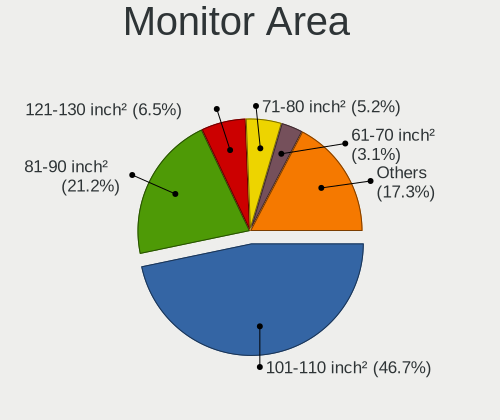

| Area in inch | Notebooks | Percent |
|----------------|-----------|---------|
| 101-110        | 297       | 49.42%  |
| 81-90          | 124       | 20.63%  |
| 121-130        | 37        | 6.16%   |
| 71-80          | 26        | 4.33%   |
| 61-70          | 20        | 3.33%   |
| 201-250        | 16        | 2.66%   |
| 131-140        | 14        | 2.33%   |
| 51-60          | 13        | 2.16%   |
| More than 1000 | 12        | 2%      |
| 301-350        | 9         | 1.5%    |
| 111-120        | 9         | 1.5%    |
| 351-500        | 6         | 1%      |
| 151-200        | 4         | 0.67%   |
| 251-300        | 3         | 0.5%    |
| 141-150        | 3         | 0.5%    |
| 91-100         | 3         | 0.5%    |
| 501-1000       | 2         | 0.33%   |
| Unknown        | 2         | 0.33%   |
| 1-40           | 1         | 0.17%   |

Pixel Density
-------------

Pixels per inch

| Density       | Notebooks | Percent |
|---------------|-----------|---------|
| 121-160       | 248       | 41.61%  |
| 101-120       | 222       | 37.25%  |
| 51-100        | 71        | 11.91%  |
| 161-240       | 31        | 5.2%    |
| More than 240 | 13        | 2.18%   |
| 1-50          | 9         | 1.51%   |
| Unknown       | 2         | 0.34%   |

Multiple Monitors
-----------------

Total monitors connected

| Total | Notebooks | Percent |
|-------|-----------|---------|
| 1     | 527       | 91.33%  |
| 2     | 44        | 7.63%   |
| 0     | 5         | 0.87%   |
| 3     | 1         | 0.17%   |

Network
-------

Net Controller Vendor
---------------------

Controller vendors

| Vendor                            | Notebooks | Percent |
|-----------------------------------|-----------|---------|
| Realtek Semiconductor             | 315       | 34.69%  |
| Intel                             | 309       | 34.03%  |
| Qualcomm Atheros                  | 139       | 15.31%  |
| Broadcom                          | 49        | 5.4%    |
| Broadcom Limited                  | 16        | 1.76%   |
| MediaTek                          | 12        | 1.32%   |
| TP-Link                           | 10        | 1.1%    |
| Ralink                            | 10        | 1.1%    |
| Marvell Technology Group          | 6         | 0.66%   |
| Ralink Technology                 | 5         | 0.55%   |
| Dell                              | 5         | 0.55%   |
| Nvidia                            | 4         | 0.44%   |
| Sierra Wireless                   | 3         | 0.33%   |
| NetGear                           | 3         | 0.33%   |
| Xiaomi                            | 2         | 0.22%   |
| T & A Mobile Phones               | 2         | 0.22%   |
| ASIX Electronics                  | 2         | 0.22%   |
| ZTE WCDMA Technologies MSM        | 1         | 0.11%   |
| Silicon Integrated Systems [SiS]  | 1         | 0.11%   |
| Qualcomm Atheros Communications   | 1         | 0.11%   |
| Qualcomm                          | 1         | 0.11%   |
| PLANEX                            | 1         | 0.11%   |
| Microsoft                         | 1         | 0.11%   |
| Linksys                           | 1         | 0.11%   |
| Lenovo                            | 1         | 0.11%   |
| JMicron Technology                | 1         | 0.11%   |
| ICS Advent                        | 1         | 0.11%   |
| Huawei Technologies               | 1         | 0.11%   |
| Ericsson Business Mobile Networks | 1         | 0.11%   |
| D-Link System                     | 1         | 0.11%   |
| Attansic Technology               | 1         | 0.11%   |
| ASUSTek Computer                  | 1         | 0.11%   |
| Android                           | 1         | 0.11%   |

Net Controller Model
--------------------

Controller models

| Model                                                                   | Notebooks | Percent |
|-------------------------------------------------------------------------|-----------|---------|
| Realtek RTL8111/8168/8411 PCI Express Gigabit Ethernet Controller       | 185       | 16.96%  |
| Realtek RTL810xE PCI Express Fast Ethernet controller                   | 59        | 5.41%   |
| Intel Wireless 7265                                                     | 35        | 3.21%   |
| Qualcomm Atheros QCA9377 802.11ac Wireless Network Adapter              | 27        | 2.47%   |
| Intel 82579LM Gigabit Network Connection (Lewisville)                   | 27        | 2.47%   |
| Qualcomm Atheros AR9485 Wireless Network Adapter                        | 22        | 2.02%   |
| Intel Wi-Fi 6 AX201                                                     | 22        | 2.02%   |
| Realtek RTL8153 Gigabit Ethernet Adapter                                | 20        | 1.83%   |
| Realtek RTL8822CE 802.11ac PCIe Wireless Network Adapter                | 19        | 1.74%   |
| Qualcomm Atheros AR9285 Wireless Network Adapter (PCI-Express)          | 18        | 1.65%   |
| Intel Centrino Advanced-N 6205 [Taylor Peak]                            | 17        | 1.56%   |
| Qualcomm Atheros QCA9565 / AR9565 Wireless Network Adapter              | 16        | 1.47%   |
| Intel Wireless 8265 / 8275                                              | 16        | 1.47%   |
| Intel Wireless 3165                                                     | 16        | 1.47%   |
| Realtek RTL8821CE 802.11ac PCIe Wireless Network Adapter                | 15        | 1.37%   |
| Intel Wireless 8260                                                     | 15        | 1.37%   |
| Intel Dual Band Wireless-AC 3168NGW [Stone Peak]                        | 15        | 1.37%   |
| Intel PRO/Wireless 3945ABG [Golan] Network Connection                   | 14        | 1.28%   |
| MediaTek MT7921 802.11ax PCI Express Wireless Network Adapter           | 12        | 1.1%    |
| Intel Wireless 3160                                                     | 12        | 1.1%    |
| Intel Wi-Fi 6 AX200                                                     | 12        | 1.1%    |
| Intel Ethernet Connection (3) I218-LM                                   | 12        | 1.1%    |
| Qualcomm Atheros AR242x / AR542x Wireless Network Adapter (PCI-Express) | 11        | 1.01%   |
| Qualcomm Atheros QCA6174 802.11ac Wireless Network Adapter              | 10        | 0.92%   |
| Intel Wireless 7260                                                     | 9         | 0.82%   |
| Intel PRO/Wireless 5100 AGN [Shiloh] Network Connection                 | 9         | 0.82%   |
| Intel Ethernet Connection (4) I219-LM                                   | 9         | 0.82%   |
| Intel Centrino Ultimate-N 6300                                          | 9         | 0.82%   |
| Intel 82567LM Gigabit Network Connection                                | 9         | 0.82%   |
| Intel Comet Lake PCH-LP CNVi WiFi                                       | 8         | 0.73%   |
| Intel Alder Lake-P PCH CNVi WiFi                                        | 8         | 0.73%   |
| Broadcom BCM4313 802.11bgn Wireless Network Adapter                     | 8         | 0.73%   |
| TP-Link UE300 10/100/1000 LAN (ethernet mode) [Realtek RTL8153]         | 7         | 0.64%   |
| Realtek RTL8723BU 802.11b/g/n WLAN Adapter                              | 7         | 0.64%   |
| Realtek RTL8723BE PCIe Wireless Network Adapter                         | 7         | 0.64%   |
| Realtek RTL8723AE PCIe Wireless Network Adapter                         | 7         | 0.64%   |
| Intel Gemini Lake PCH CNVi WiFi                                         | 7         | 0.64%   |
| Intel Comet Lake PCH CNVi WiFi                                          | 7         | 0.64%   |
| Intel Centrino Advanced-N 6200                                          | 7         | 0.64%   |
| Realtek RTL8188EE Wireless Network Adapter                              | 6         | 0.55%   |

Wireless Vendor
---------------

Wireless vendors

| Vendor                          | Notebooks | Percent |
|---------------------------------|-----------|---------|
| Intel                           | 299       | 49.75%  |
| Qualcomm Atheros                | 118       | 19.63%  |
| Realtek Semiconductor           | 101       | 16.81%  |
| Broadcom                        | 35        | 5.82%   |
| MediaTek                        | 12        | 2%      |
| Ralink                          | 10        | 1.66%   |
| Ralink Technology               | 5         | 0.83%   |
| Broadcom Limited                | 4         | 0.67%   |
| TP-Link                         | 3         | 0.5%    |
| Sierra Wireless                 | 3         | 0.5%    |
| NetGear                         | 2         | 0.33%   |
| Dell                            | 2         | 0.33%   |
| Qualcomm Atheros Communications | 1         | 0.17%   |
| Qualcomm                        | 1         | 0.17%   |
| PLANEX                          | 1         | 0.17%   |
| Microsoft                       | 1         | 0.17%   |
| Linksys                         | 1         | 0.17%   |
| D-Link System                   | 1         | 0.17%   |
| ASUSTek Computer                | 1         | 0.17%   |

Wireless Model
--------------

Wireless models

| Model                                                                   | Notebooks | Percent |
|-------------------------------------------------------------------------|-----------|---------|
| Intel Wireless 7265                                                     | 35        | 5.79%   |
| Qualcomm Atheros QCA9377 802.11ac Wireless Network Adapter              | 27        | 4.46%   |
| Qualcomm Atheros AR9485 Wireless Network Adapter                        | 22        | 3.64%   |
| Intel Wi-Fi 6 AX201                                                     | 22        | 3.64%   |
| Realtek RTL8822CE 802.11ac PCIe Wireless Network Adapter                | 19        | 3.14%   |
| Qualcomm Atheros AR9285 Wireless Network Adapter (PCI-Express)          | 18        | 2.98%   |
| Intel Centrino Advanced-N 6205 [Taylor Peak]                            | 17        | 2.81%   |
| Qualcomm Atheros QCA9565 / AR9565 Wireless Network Adapter              | 16        | 2.64%   |
| Intel Wireless 8265 / 8275                                              | 16        | 2.64%   |
| Intel Wireless 3165                                                     | 16        | 2.64%   |
| Realtek RTL8821CE 802.11ac PCIe Wireless Network Adapter                | 15        | 2.48%   |
| Intel Wireless 8260                                                     | 15        | 2.48%   |
| Intel Dual Band Wireless-AC 3168NGW [Stone Peak]                        | 15        | 2.48%   |
| Intel PRO/Wireless 3945ABG [Golan] Network Connection                   | 14        | 2.31%   |
| MediaTek MT7921 802.11ax PCI Express Wireless Network Adapter           | 12        | 1.98%   |
| Intel Wireless 3160                                                     | 12        | 1.98%   |
| Intel Wi-Fi 6 AX200                                                     | 12        | 1.98%   |
| Qualcomm Atheros AR242x / AR542x Wireless Network Adapter (PCI-Express) | 11        | 1.82%   |
| Qualcomm Atheros QCA6174 802.11ac Wireless Network Adapter              | 10        | 1.65%   |
| Intel Wireless 7260                                                     | 9         | 1.49%   |
| Intel PRO/Wireless 5100 AGN [Shiloh] Network Connection                 | 9         | 1.49%   |
| Intel Centrino Ultimate-N 6300                                          | 9         | 1.49%   |
| Intel Comet Lake PCH-LP CNVi WiFi                                       | 8         | 1.32%   |
| Intel Alder Lake-P PCH CNVi WiFi                                        | 8         | 1.32%   |
| Broadcom BCM4313 802.11bgn Wireless Network Adapter                     | 8         | 1.32%   |
| Realtek RTL8723BU 802.11b/g/n WLAN Adapter                              | 7         | 1.16%   |
| Realtek RTL8723BE PCIe Wireless Network Adapter                         | 7         | 1.16%   |
| Realtek RTL8723AE PCIe Wireless Network Adapter                         | 7         | 1.16%   |
| Intel Gemini Lake PCH CNVi WiFi                                         | 7         | 1.16%   |
| Intel Comet Lake PCH CNVi WiFi                                          | 7         | 1.16%   |
| Intel Centrino Advanced-N 6200                                          | 7         | 1.16%   |
| Realtek RTL8188EE Wireless Network Adapter                              | 6         | 0.99%   |
| Qualcomm Atheros AR9462 Wireless Network Adapter                        | 6         | 0.99%   |
| Intel WiFi Link 5100                                                    | 6         | 0.99%   |
| Intel Cannon Point-LP CNVi [Wireless-AC]                                | 6         | 0.99%   |
| Intel Cannon Lake PCH CNVi WiFi                                         | 6         | 0.99%   |
| Realtek RTL8852AE 802.11ax PCIe Wireless Network Adapter                | 5         | 0.83%   |
| Realtek RTL8723DE Wireless Network Adapter                              | 5         | 0.83%   |
| Realtek RTL8188CE 802.11b/g/n WiFi Adapter                              | 5         | 0.83%   |
| Qualcomm Atheros AR9287 Wireless Network Adapter (PCI-Express)          | 5         | 0.83%   |

Ethernet Vendor
---------------

Ethernet vendors

| Vendor                           | Notebooks | Percent |
|----------------------------------|-----------|---------|
| Realtek Semiconductor            | 271       | 57.05%  |
| Intel                            | 101       | 21.26%  |
| Qualcomm Atheros                 | 39        | 8.21%   |
| Broadcom                         | 23        | 4.84%   |
| Broadcom Limited                 | 13        | 2.74%   |
| TP-Link                          | 7         | 1.47%   |
| Marvell Technology Group         | 6         | 1.26%   |
| Nvidia                           | 4         | 0.84%   |
| Xiaomi                           | 2         | 0.42%   |
| ASIX Electronics                 | 2         | 0.42%   |
| ZTE WCDMA Technologies MSM       | 1         | 0.21%   |
| Silicon Integrated Systems [SiS] | 1         | 0.21%   |
| NetGear                          | 1         | 0.21%   |
| Lenovo                           | 1         | 0.21%   |
| JMicron Technology               | 1         | 0.21%   |
| ICS Advent                       | 1         | 0.21%   |
| Attansic Technology              | 1         | 0.21%   |

Ethernet Model
--------------

Ethernet models

| Model                                                                          | Notebooks | Percent |
|--------------------------------------------------------------------------------|-----------|---------|
| Realtek RTL8111/8168/8411 PCI Express Gigabit Ethernet Controller              | 185       | 38.7%   |
| Realtek RTL810xE PCI Express Fast Ethernet controller                          | 59        | 12.34%  |
| Intel 82579LM Gigabit Network Connection (Lewisville)                          | 27        | 5.65%   |
| Realtek RTL8153 Gigabit Ethernet Adapter                                       | 20        | 4.18%   |
| Intel Ethernet Connection (3) I218-LM                                          | 12        | 2.51%   |
| Intel Ethernet Connection (4) I219-LM                                          | 9         | 1.88%   |
| Intel 82567LM Gigabit Network Connection                                       | 9         | 1.88%   |
| TP-Link UE300 10/100/1000 LAN (ethernet mode) [Realtek RTL8153]                | 7         | 1.46%   |
| Realtek RTL8152 Fast Ethernet Adapter                                          | 5         | 1.05%   |
| Qualcomm Atheros AR8152 v2.0 Fast Ethernet                                     | 5         | 1.05%   |
| Qualcomm Atheros AR8152 v1.1 Fast Ethernet                                     | 5         | 1.05%   |
| Qualcomm Atheros AR8151 v2.0 Gigabit Ethernet                                  | 5         | 1.05%   |
| Broadcom NetXtreme BCM57765 Gigabit Ethernet PCIe                              | 5         | 1.05%   |
| Qualcomm Atheros QCA8172 Fast Ethernet                                         | 4         | 0.84%   |
| Qualcomm Atheros AR8162 Fast Ethernet                                          | 4         | 0.84%   |
| Intel Ethernet Connection I217-LM                                              | 4         | 0.84%   |
| Intel Ethernet Connection (4) I219-V                                           | 4         | 0.84%   |
| Intel 82579V Gigabit Network Connection                                        | 4         | 0.84%   |
| Intel 82577LM Gigabit Network Connection                                       | 4         | 0.84%   |
| Broadcom NetLink BCM57780 Gigabit Ethernet PCIe                                | 4         | 0.84%   |
| Realtek RTL8125 2.5GbE Controller                                              | 3         | 0.63%   |
| Qualcomm Atheros QCA8171 Gigabit Ethernet                                      | 3         | 0.63%   |
| Qualcomm Atheros AR8161 Gigabit Ethernet                                       | 3         | 0.63%   |
| Qualcomm Atheros AR8132 Fast Ethernet                                          | 3         | 0.63%   |
| Qualcomm Atheros AR8131 Gigabit Ethernet                                       | 3         | 0.63%   |
| Nvidia MCP79 Ethernet                                                          | 3         | 0.63%   |
| Intel Ethernet Connection I219-LM                                              | 3         | 0.63%   |
| Intel 82566MM Gigabit Network Connection                                       | 3         | 0.63%   |
| Broadcom NetLink BCM5906M Fast Ethernet PCI Express                            | 3         | 0.63%   |
| Broadcom NetLink BCM5787M Gigabit Ethernet PCI Express                         | 3         | 0.63%   |
| Broadcom NetLink BCM57785 Gigabit Ethernet PCIe                                | 3         | 0.63%   |
| Broadcom Limited NetLink BCM5787M Gigabit Ethernet PCI Express                 | 3         | 0.63%   |
| Broadcom Limited BCM4401-B0 100Base-TX                                         | 3         | 0.63%   |
| Qualcomm Atheros AR8151 v1.0 Gigabit Ethernet                                  | 2         | 0.42%   |
| Marvell Group Yukon Optima 88E8059 [PCIe Gigabit Ethernet Controller with AVB] | 2         | 0.42%   |
| Marvell Group 88E8040 PCI-E Fast Ethernet Controller                           | 2         | 0.42%   |
| Intel Ethernet Connection I218-LM                                              | 2         | 0.42%   |
| Intel Ethernet Connection (7) I219-LM                                          | 2         | 0.42%   |
| Intel Ethernet Connection (6) I219-LM                                          | 2         | 0.42%   |
| Intel Ethernet Connection (2) I219-LM                                          | 2         | 0.42%   |

Net Controller Kind
-------------------

Ethernet, WiFi or modem

| Kind     | Notebooks | Percent |
|----------|-----------|---------|
| WiFi     | 574       | 54.77%  |
| Ethernet | 466       | 44.47%  |
| Modem    | 7         | 0.67%   |
| Unknown  | 1         | 0.1%    |

Used Controller
---------------

Currently used network controller

| Kind     | Notebooks | Percent |
|----------|-----------|---------|
| WiFi     | 426       | 75.53%  |
| Ethernet | 137       | 24.29%  |
| Modem    | 1         | 0.18%   |

NICs
----

Total network controllers on board

| Total | Notebooks | Percent |
|-------|-----------|---------|
| 2     | 428       | 74.18%  |
| 1     | 135       | 23.4%   |
| 0     | 13        | 2.25%   |
| 3     | 1         | 0.17%   |

IPv6
----

IPv6 vs IPv4

| Used | Notebooks | Percent |
|------|-----------|---------|
| No   | 379       | 65.68%  |
| Yes  | 198       | 34.32%  |

Bluetooth
---------

Bluetooth Vendor
----------------

Controller vendors

| Vendor                          | Notebooks | Percent |
|---------------------------------|-----------|---------|
| Intel                           | 220       | 48.46%  |
| Realtek Semiconductor           | 49        | 10.79%  |
| Qualcomm Atheros Communications | 41        | 9.03%   |
| Broadcom                        | 27        | 5.95%   |
| IMC Networks                    | 24        | 5.29%   |
| Lite-On Technology              | 23        | 5.07%   |
| Foxconn / Hon Hai               | 14        | 3.08%   |
| Toshiba                         | 10        | 2.2%    |
| Apple                           | 9         | 1.98%   |
| Hewlett-Packard                 | 7         | 1.54%   |
| Dell                            | 7         | 1.54%   |
| Cambridge Silicon Radio         | 7         | 1.54%   |
| ASUSTek Computer                | 5         | 1.1%    |
| Realtek                         | 4         | 0.88%   |
| Ralink                          | 4         | 0.88%   |
| Qcom                            | 1         | 0.22%   |
| Foxconn International           | 1         | 0.22%   |
| Chicony Electronics             | 1         | 0.22%   |

Bluetooth Model
---------------

Controller models

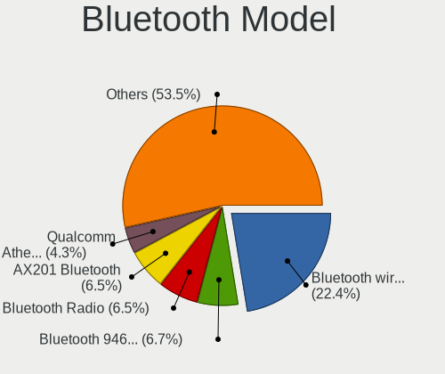

| Model                                               | Notebooks | Percent |
|-----------------------------------------------------|-----------|---------|
| Intel Bluetooth wireless interface                  | 104       | 22.91%  |
| Intel Bluetooth 9460/9560 Jefferson Peak (JfP)      | 34        | 7.49%   |
| Realtek Bluetooth Radio                             | 33        | 7.27%   |
| Intel AX201 Bluetooth                               | 33        | 7.27%   |
| Qualcomm Atheros  Bluetooth Device                  | 24        | 5.29%   |
| Intel Wireless-AC 3168 Bluetooth                    | 15        | 3.3%    |
| Intel AX200 Bluetooth                               | 12        | 2.64%   |
| Realtek  Bluetooth 4.2 Adapter                      | 11        | 2.42%   |
| Lite-On Qualcomm Atheros QCA9377 Bluetooth          | 11        | 2.42%   |
| Qualcomm Atheros AR3011 Bluetooth                   | 8         | 1.76%   |
| Cambridge Silicon Radio Bluetooth Dongle (HCI mode) | 7         | 1.54%   |
| Qualcomm Atheros AR3012 Bluetooth 4.0               | 6         | 1.32%   |
| Intel Centrino Advanced-N 6230 Bluetooth adapter    | 6         | 1.32%   |
| IMC Networks Wireless_Device                        | 6         | 1.32%   |
| IMC Networks Bluetooth Radio                        | 6         | 1.32%   |
| Broadcom BCM2045B (BDC-2.1)                         | 6         | 1.32%   |
| Intel Centrino Bluetooth Wireless Transceiver       | 5         | 1.1%    |
| Intel AX210 Bluetooth                               | 5         | 1.1%    |
| IMC Networks Bluetooth Device                       | 5         | 1.1%    |
| HP Bluetooth 2.0 Interface [Broadcom BCM2045]       | 5         | 1.1%    |
| Broadcom BCM20702 Bluetooth 4.0 [ThinkPad]          | 5         | 1.1%    |
| Apple Bluetooth Host Controller                     | 5         | 1.1%    |
| Realtek 802.11ac WLAN Adapter                       | 4         | 0.88%   |
| Ralink RT3290 Bluetooth                             | 4         | 0.88%   |
| Lite-On Wireless_Device                             | 4         | 0.88%   |
| Lite-On Atheros AR3012 Bluetooth                    | 4         | 0.88%   |
| Intel Bluetooth Device                              | 4         | 0.88%   |
| Foxconn / Hon Hai Bluetooth Device                  | 4         | 0.88%   |
| Dell BCM20702A0 Bluetooth Module                    | 4         | 0.88%   |
| Toshiba RT Bluetooth Radio                          | 3         | 0.66%   |
| Toshiba Askey Bluetooth Module                      | 3         | 0.66%   |
| Lite-On Bluetooth Device                            | 3         | 0.66%   |
| IMC Networks Bluetooth                              | 3         | 0.66%   |
| Foxconn / Hon Hai Acer Bluetooth module             | 3         | 0.66%   |
| Broadcom HP Portable SoftSailing                    | 3         | 0.66%   |
| Broadcom BCM2045B (BDC-2.1) [Bluetooth Controller]  | 3         | 0.66%   |
| Broadcom BCM2045B (BDC-2) [Bluetooth Controller]    | 3         | 0.66%   |
| Toshiba Bluetooth Device                            | 2         | 0.44%   |
| Realtek RTL8723B Bluetooth                          | 2         | 0.44%   |
| Qualcomm Atheros AR9462 Bluetooth                   | 2         | 0.44%   |

Sound
-----

Sound Vendor
------------

Sound card vendors

| Vendor                           | Notebooks | Percent |
|----------------------------------|-----------|---------|
| Intel                            | 460       | 68.55%  |
| AMD                              | 125       | 18.63%  |
| Nvidia                           | 67        | 9.99%   |
| Generalplus Technology           | 6         | 0.89%   |
| C-Media Electronics              | 3         | 0.45%   |
| Texas Instruments                | 2         | 0.3%    |
| JMTek                            | 2         | 0.3%    |
| THX                              | 1         | 0.15%   |
| Silicon Integrated Systems [SiS] | 1         | 0.15%   |
| PreSonus Audio Electronics       | 1         | 0.15%   |
| No brand                         | 1         | 0.15%   |
| Lenovo                           | 1         | 0.15%   |
| Creative Technology              | 1         | 0.15%   |

Sound Model
-----------

Sound card models

| Model                                                                                             | Notebooks | Percent |
|---------------------------------------------------------------------------------------------------|-----------|---------|
| Intel Sunrise Point-LP HD Audio                                                                   | 69        | 8.39%   |
| AMD Family 17h/19h HD Audio Controller                                                            | 65        | 7.91%   |
| Intel 7 Series/C216 Chipset Family High Definition Audio Controller                               | 53        | 6.45%   |
| Intel 6 Series/C200 Series Chipset Family High Definition Audio Controller                        | 41        | 4.99%   |
| Intel 82801I (ICH9 Family) HD Audio Controller                                                    | 36        | 4.38%   |
| AMD Renoir Radeon High Definition Audio Controller                                                | 31        | 3.77%   |
| Intel 5 Series/3400 Series Chipset High Definition Audio                                          | 30        | 3.65%   |
| Intel Tiger Lake-LP Smart Sound Technology Audio Controller                                       | 28        | 3.41%   |
| Intel Wildcat Point-LP High Definition Audio Controller                                           | 26        | 3.16%   |
| Intel Broadwell-U Audio Controller                                                                | 26        | 3.16%   |
| AMD Raven/Raven2/Fenghuang HDMI/DP Audio Controller                                               | 26        | 3.16%   |
| Intel Haswell-ULT HD Audio Controller                                                             | 21        | 2.55%   |
| Intel 8 Series HD Audio Controller                                                                | 21        | 2.55%   |
| AMD FCH Azalia Controller                                                                         | 20        | 2.43%   |
| Intel 82801H (ICH8 Family) HD Audio Controller                                                    | 17        | 2.07%   |
| Nvidia TU107 GeForce GTX 1650 High Definition Audio Controller                                    | 15        | 1.82%   |
| Intel Celeron/Pentium Silver Processor High Definition Audio                                      | 14        | 1.7%    |
| Intel Atom/Celeron/Pentium Processor x5-E8000/J3xxx/N3xxx Series High Definition Audio Controller | 13        | 1.58%   |
| Intel 100 Series/C230 Series Chipset Family HD Audio Controller                                   | 13        | 1.58%   |
| AMD Family 15h (Models 60h-6fh) Audio Controller                                                  | 13        | 1.58%   |
| Intel Comet Lake PCH-LP cAVS                                                                      | 12        | 1.46%   |
| AMD Kabini HDMI/DP Audio                                                                          | 12        | 1.46%   |
| Intel Cannon Point-LP High Definition Audio Controller                                            | 11        | 1.34%   |
| AMD SBx00 Azalia (Intel HDA)                                                                      | 11        | 1.34%   |
| Intel Alder Lake PCH-P High Definition Audio Controller                                           | 10        | 1.22%   |
| Intel Cannon Lake PCH cAVS                                                                        | 9         | 1.09%   |
| AMD Wrestler HDMI Audio                                                                           | 9         | 1.09%   |
| Nvidia GF108 High Definition Audio Controller                                                     | 8         | 0.97%   |
| Intel Ice Lake-LP Smart Sound Technology Audio Controller                                         | 8         | 0.97%   |
| Intel Comet Lake PCH cAVS                                                                         | 8         | 0.97%   |
| Intel Celeron N3350/Pentium N4200/Atom E3900 Series Audio Cluster                                 | 8         | 0.97%   |
| Intel Atom Processor Z36xxx/Z37xxx Series High Definition Audio Controller                        | 8         | 0.97%   |
| Intel 8 Series/C220 Series Chipset High Definition Audio Controller                               | 8         | 0.97%   |
| AMD Trinity HDMI Audio Controller                                                                 | 8         | 0.97%   |
| AMD High Definition Audio Controller                                                              | 8         | 0.97%   |
| Intel Xeon E3-1200 v3/4th Gen Core Processor HD Audio Controller                                  | 6         | 0.73%   |
| Intel Tiger Lake-H HD Audio Controller                                                            | 6         | 0.73%   |
| Generalplus Technology USB Audio Device                                                           | 6         | 0.73%   |
| Nvidia GP107GL High Definition Audio Controller                                                   | 5         | 0.61%   |
| Nvidia GA106 High Definition Audio Controller                                                     | 5         | 0.61%   |

Memory
------

Memory Vendor
-------------

Memory module vendors

| Vendor                                           | Notebooks | Percent |
|--------------------------------------------------|-----------|---------|
| Samsung Electronics                              | 182       | 24.83%  |
| SK hynix                                         | 167       | 22.78%  |
| Micron Technology                                | 90        | 12.28%  |
| Kingston                                         | 61        | 8.32%   |
| Unknown                                          | 42        | 5.73%   |
| Crucial                                          | 31        | 4.23%   |
| Nanya Technology                                 | 19        | 2.59%   |
| Elpida                                           | 19        | 2.59%   |
| Ramaxel Technology                               | 16        | 2.18%   |
| Unknown (ABCD)                                   | 14        | 1.91%   |
| A-DATA Technology                                | 12        | 1.64%   |
| Transcend                                        | 7         | 0.95%   |
| Corsair                                          | 7         | 0.95%   |
| Unknown                                          | 7         | 0.95%   |
| Team                                             | 5         | 0.68%   |
| Smart                                            | 5         | 0.68%   |
| Qimonda                                          | 3         | 0.41%   |
| Patriot                                          | 3         | 0.41%   |
| Innodisk                                         | 3         | 0.41%   |
| GOODRAM                                          | 3         | 0.41%   |
| G.Skill                                          | 3         | 0.41%   |
| Unknown (0x48594D503132355336344350382D53362020) | 2         | 0.27%   |
| Timetec                                          | 2         | 0.27%   |
| Teikon                                           | 2         | 0.27%   |
| Sesame                                           | 2         | 0.27%   |
| Avant                                            | 2         | 0.27%   |
| Apacer                                           | 2         | 0.27%   |
| Wilk                                             | 1         | 0.14%   |
| Walton Chaintech                                 | 1         | 0.14%   |
| Unknown (0xAD0A)                                 | 1         | 0.14%   |
| Unknown (0x48594D503131325336344350362D53362020) | 1         | 0.14%   |
| Unknown (0x31364854463235363634485A2D3830304831) | 1         | 0.14%   |
| Unknown (0x202020202020202020202020202020202020) | 1         | 0.14%   |
| Unknown (081A)                                   | 1         | 0.14%   |
| SHARETRONIC                                      | 1         | 0.14%   |
| Qumo                                             | 1         | 0.14%   |
| PUSKILL                                          | 1         | 0.14%   |
| PNY                                              | 1         | 0.14%   |
| Neo Forza                                        | 1         | 0.14%   |
| Multilaser                                       | 1         | 0.14%   |

Memory Model
------------

Memory module models

| Model                                                            | Notebooks | Percent |
|------------------------------------------------------------------|-----------|---------|
| SK hynix RAM HMA81GS6AFR8N-UH 8GB SODIMM DDR4 2667MT/s           | 14        | 1.8%    |
| Unknown (ABCD) RAM 123456789012345678 3GB SODIMM LPDDR4 2400MT/s | 13        | 1.67%   |
| SK hynix RAM HMT351S6CFR8C-PB 4GB SODIMM DDR3 1600MT/s           | 12        | 1.54%   |
| SK hynix RAM HMT451S6BFR8A-PB 4GB SODIMM DDR3 1600MT/s           | 11        | 1.42%   |
| Micron RAM Module 4GB SODIMM DDR3 1600MT/s                       | 11        | 1.42%   |
| Unknown RAM Module 2GB SODIMM DDR2 667MT/s                       | 10        | 1.29%   |
| Samsung RAM M471B5173EB0-YK0 4GB SODIMM DDR3 1600MT/s            | 10        | 1.29%   |
| Samsung RAM M471B5173DB0-YK0 4GB SODIMM DDR3 1600MT/s            | 10        | 1.29%   |
| Samsung RAM M471B5173QH0-YK0 4GB SODIMM DDR3 1600MT/s            | 9         | 1.16%   |
| SK hynix RAM HMT425S6AFR6A-PB 2GB SODIMM DDR3 3200MT/s           | 8         | 1.03%   |
| Samsung RAM M471B5273DH0-CH9 4GB SODIMM DDR3 1334MT/s            | 8         | 1.03%   |
| Samsung RAM M471A5244CB0-CTD 4GB SODIMM DDR4 3266MT/s            | 8         | 1.03%   |
| Samsung RAM M471B5773CHS-CH9 2GB SODIMM DDR3 4199MT/s            | 7         | 0.9%    |
| Samsung RAM M471B5273CH0-CH9 4GB SODIMM DDR3 1334MT/s            | 7         | 0.9%    |
| Samsung RAM M471A5244CB0-CWE 4GB Row Of Chips DDR4 3200MT/s      | 7         | 0.9%    |
| Unknown                                                          | 7         | 0.9%    |
| Unknown RAM Module 4GB SODIMM DDR3                               | 6         | 0.77%   |
| SK hynix RAM HMT41GS6BFR8A-PB 8GB SODIMM DDR3 1600MT/s           | 6         | 0.77%   |
| SK hynix RAM HMA851S6CJR6N-XN 4GB SODIMM DDR4 3200MT/s           | 6         | 0.77%   |
| SK hynix RAM HMA851S6AFR6N-UH 4GB SODIMM DDR4 2667MT/s           | 6         | 0.77%   |
| Samsung RAM M471A5244CB0-CWE 4GB SODIMM DDR4 3200MT/s            | 6         | 0.77%   |
| Elpida RAM EBJ41UF8BCS0-DJ-F 4GB SODIMM DDR3 1334MT/s            | 6         | 0.77%   |
| SK hynix RAM HMAA1GS6CJR6N-XN 8GB SODIMM DDR4 3200MT/s           | 5         | 0.64%   |
| SK hynix RAM HMA851S6DJR6N-XN 4GB Row Of Chips DDR4 3200MT/s     | 5         | 0.64%   |
| SK hynix RAM HMA81GS6DJR8N-XN 8GB SODIMM DDR4 3200MT/s           | 5         | 0.64%   |
| SK hynix RAM HMA41GS6AFR8N-TF 8GB SODIMM DDR4 2667MT/s           | 5         | 0.64%   |
| Samsung RAM M471A1K43EB1-CWE 8GB SODIMM DDR4 3200MT/s            | 5         | 0.64%   |
| Micron RAM 4ATF51264HZ-2G3B1 4GB SODIMM DDR4 2400MT/s            | 5         | 0.64%   |
| Micron RAM 16KTF1G64HZ-1G6E1 8192MB SODIMM DDR3 1600MT/s         | 5         | 0.64%   |
| Unknown RAM Module 2GB SODIMM DDR3                               | 4         | 0.51%   |
| SK hynix RAM HMT351S6CFR8C-H9 4GB SODIMM DDR3 1334MT/s           | 4         | 0.51%   |
| SK hynix RAM HMA851S6DJR6N-XN 4GB SODIMM DDR4 3200MT/s           | 4         | 0.51%   |
| Samsung RAM M471B5673FH0-CH9 2GB SODIMM DDR3 1334MT/s            | 4         | 0.51%   |
| Samsung RAM M471B1G73QH0-YK0 8GB SODIMM DDR3 1867MT/s            | 4         | 0.51%   |
| Samsung RAM M471A5244CB0-CRC 4GB SODIMM DDR4 2667MT/s            | 4         | 0.51%   |
| Samsung RAM M471A1K43DB1-CWE 8GB SODIMM DDR4 3200MT/s            | 4         | 0.51%   |
| Nanya RAM NT2GC64B8HC0NS-CG 2GB SODIMM DDR3 1334MT/s             | 4         | 0.51%   |
| Micron RAM 4ATF51264HZ-3G2J1 4GB SODIMM DDR4 3200MT/s            | 4         | 0.51%   |
| Micron RAM 4ATF51264HZ-2G6E1 4GB SODIMM DDR4 2667MT/s            | 4         | 0.51%   |
| Micron RAM 4ATF1G64HZ-3G2E2 8GB SODIMM DDR4 3200MT/s             | 4         | 0.51%   |

Memory Kind
-----------

Memory module kinds

| Kind    | Notebooks | Percent |
|---------|-----------|---------|
| DDR3    | 239       | 40.3%   |
| DDR4    | 236       | 39.8%   |
| DDR2    | 46        | 7.76%   |
| LPDDR4  | 31        | 5.23%   |
| SDRAM   | 21        | 3.54%   |
| DDR     | 6         | 1.01%   |
| LPDDR3  | 4         | 0.67%   |
| DDR5    | 4         | 0.67%   |
| Unknown | 3         | 0.51%   |
| DRAM    | 2         | 0.34%   |
| LPDDR5  | 1         | 0.17%   |

Memory Form Factor
------------------

Physical design of the memory module

| Name         | Notebooks | Percent |
|--------------|-----------|---------|
| SODIMM       | 536       | 91.47%  |
| Row Of Chips | 36        | 6.14%   |
| Unknown      | 7         | 1.19%   |
| DIMM         | 6         | 1.02%   |
| Chip         | 1         | 0.17%   |

Memory Size
-----------

Memory module size

| Size  | Notebooks | Percent |
|-------|-----------|---------|
| 4096  | 246       | 36.44%  |
| 8192  | 215       | 31.85%  |
| 2048  | 114       | 16.89%  |
| 16384 | 50        | 7.41%   |
| 1024  | 29        | 4.3%    |
| 32768 | 20        | 2.96%   |
| 512   | 1         | 0.15%   |

Memory Speed
------------

Memory module speed

| Speed   | Notebooks | Percent |
|---------|-----------|---------|
| 1600    | 165       | 24.81%  |
| 3200    | 117       | 17.59%  |
| 2667    | 96        | 14.44%  |
| 2400    | 59        | 8.87%   |
| 1334    | 46        | 6.92%   |
| 667     | 29        | 4.36%   |
| 1333    | 26        | 3.91%   |
| 2133    | 21        | 3.16%   |
| 800     | 17        | 2.56%   |
| 4199    | 14        | 2.11%   |
| Unknown | 14        | 2.11%   |
| 1067    | 10        | 1.5%    |
| 3266    | 8         | 1.2%    |
| 1867    | 7         | 1.05%   |
| 2048    | 6         | 0.9%    |
| 4267    | 5         | 0.75%   |
| 533     | 5         | 0.75%   |
| 4800    | 4         | 0.6%    |
| 1066    | 4         | 0.6%    |
| 975     | 4         | 0.6%    |
| 8400    | 2         | 0.3%    |
| 4266    | 2         | 0.3%    |
| 3733    | 2         | 0.3%    |
| 5500    | 1         | 0.15%   |
| 1866    | 1         | 0.15%   |

Printers & scanners
-------------------

Printer Vendor
--------------

Printer device vendors

| Vendor              | Notebooks | Percent |
|---------------------|-----------|---------|
| Hewlett-Packard     | 3         | 33.33%  |
| Brother Industries  | 3         | 33.33%  |
| Xerox               | 1         | 11.11%  |
| Samsung Electronics | 1         | 11.11%  |
| Canon               | 1         | 11.11%  |

Printer Model
-------------

Printer device models

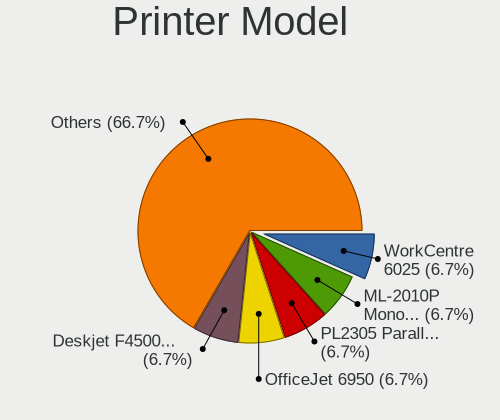

| Model                               | Notebooks | Percent |
|-------------------------------------|-----------|---------|
| Xerox WorkCentre 6025               | 1         | 10%     |
| Samsung ML-2010P Mono Laser Printer | 1         | 10%     |
| HP OfficeJet 6950                   | 1         | 10%     |
| HP Deskjet F4500 series             | 1         | 10%     |
| HP Deskjet 2050 J510                | 1         | 10%     |
| Canon LBP6030w/6018w                | 1         | 10%     |
| Brother Printer                     | 1         | 10%     |
| Brother MFC-J6535DW                 | 1         | 10%     |
| Brother MFC-J480DW                  | 1         | 10%     |
| Brother DCP-7010                    | 1         | 10%     |

Scanner Vendor
--------------

Scanner device vendors

Zero info for selected period =(

Scanner Model
-------------

Scanner device models

Zero info for selected period =(

Camera
------

Camera Vendor
-------------

Camera device vendors

| Vendor                                 | Notebooks | Percent |
|----------------------------------------|-----------|---------|
| Chicony Electronics                    | 149       | 29.68%  |
| Realtek Semiconductor                  | 51        | 10.16%  |
| IMC Networks                           | 45        | 8.96%   |
| Microdia                               | 37        | 7.37%   |
| Suyin                                  | 23        | 4.58%   |
| Sunplus Innovation Technology          | 22        | 4.38%   |
| Quanta                                 | 22        | 4.38%   |
| Syntek                                 | 16        | 3.19%   |
| Cheng Uei Precision Industry (Foxlink) | 16        | 3.19%   |
| Bison Electronics                      | 16        | 3.19%   |
| Lite-On Technology                     | 13        | 2.59%   |
| Acer                                   | 12        | 2.39%   |
| Apple                                  | 10        | 1.99%   |
| Silicon Motion                         | 9         | 1.79%   |
| Alcor Micro                            | 8         | 1.59%   |
| Ricoh                                  | 5         | 1%      |
| Primax Electronics                     | 5         | 1%      |
| Luxvisions Innotech Limited            | 5         | 1%      |
| Shenzhen Kingcome Optoelectronic       | 4         | 0.8%    |
| Lenovo                                 | 4         | 0.8%    |
| icSpring                               | 4         | 0.8%    |
| ALi                                    | 4         | 0.8%    |
| OmniVision Technologies                | 3         | 0.6%    |
| Importek                               | 3         | 0.6%    |
| Y Media                                | 2         | 0.4%    |
| Sunplus Technology                     | 2         | 0.4%    |
| Sonix Technology                       | 2         | 0.4%    |
| Samsung Electronics                    | 2         | 0.4%    |
| BKX                                    | 2         | 0.4%    |
| Logitech                               | 1         | 0.2%    |
| Intel                                  | 1         | 0.2%    |
| Huawei Technologies                    | 1         | 0.2%    |
| Genesys Logic                          | 1         | 0.2%    |
| Generalplus Technology                 | 1         | 0.2%    |
| DigiTech                               | 1         | 0.2%    |

Camera Model
------------

Camera device models

| Model                                           | Notebooks | Percent |
|-------------------------------------------------|-----------|---------|
| Chicony Integrated Camera                       | 19        | 3.78%   |
| Chicony HD WebCam                               | 17        | 3.39%   |
| Microdia Integrated_Webcam_HD                   | 15        | 2.99%   |
| IMC Networks USB2.0 HD UVC WebCam               | 12        | 2.39%   |
| Realtek USB Camera                              | 10        | 1.99%   |
| Realtek Integrated_Webcam_HD                    | 10        | 1.99%   |
| IMC Networks Integrated Camera                  | 10        | 1.99%   |
| Syntek Integrated Camera                        | 9         | 1.79%   |
| IMC Networks USB2.0 VGA UVC WebCam              | 8         | 1.59%   |
| Chicony USB2.0 Camera                           | 8         | 1.59%   |
| Chicony Lenovo EasyCamera                       | 8         | 1.59%   |
| Sunplus Integrated_Webcam_HD                    | 7         | 1.39%   |
| Microdia Integrated Webcam                      | 7         | 1.39%   |
| Chicony VGA Webcam                              | 6         | 1.2%    |
| Chicony HP TrueVision HD Camera                 | 6         | 1.2%    |
| Chicony HD User Facing                          | 6         | 1.2%    |
| Chicony FJ Camera                               | 6         | 1.2%    |
| Realtek Integrated Webcam                       | 5         | 1%      |
| Quanta HD User Facing                           | 5         | 1%      |
| Chicony HP Truevision HD                        | 5         | 1%      |
| Bison Integrated Camera                         | 5         | 1%      |
| Apple FaceTime HD Camera                        | 5         | 1%      |
| Suyin Acer/HP Integrated Webcam [CN0314]        | 4         | 0.8%    |
| Suyin 1.3M HD WebCam                            | 4         | 0.8%    |
| Shenzhen Kingcome Optoelectronic 720p HD Camera | 4         | 0.8%    |
| Realtek EasyCamera                              | 4         | 0.8%    |
| Quanta HP TrueVision HD Camera                  | 4         | 0.8%    |
| Primax HP HD Webcam [Fixed]                     | 4         | 0.8%    |
| Lite-On Integrated Camera                       | 4         | 0.8%    |
| Lenovo Integrated Webcam                        | 4         | 0.8%    |
| IMC Networks Integrated RGB Camera              | 4         | 0.8%    |
| icSpring camera                                 | 4         | 0.8%    |
| Chicony Webcam                                  | 4         | 0.8%    |
| Chicony HP Wide Vision HD Camera                | 4         | 0.8%    |
| Chicony HP HD Camera                            | 4         | 0.8%    |
| Chicony HD WebCam (Asus N-series)               | 4         | 0.8%    |
| Chicony EasyCamera                              | 4         | 0.8%    |
| Chicony Camera                                  | 4         | 0.8%    |
| Bison HD Webcam                                 | 4         | 0.8%    |
| Acer Integrated Camera                          | 4         | 0.8%    |

Security
--------

Fingerprint Vendor
------------------

Fingerprint sensor vendors

| Vendor                     | Notebooks | Percent |
|----------------------------|-----------|---------|
| Validity Sensors           | 26        | 27.96%  |
| AuthenTec                  | 15        | 16.13%  |
| Synaptics                  | 11        | 11.83%  |
| Shenzhen Goodix Technology | 9         | 9.68%   |
| Elan Microelectronics      | 9         | 9.68%   |
| Upek                       | 8         | 8.6%    |
| LighTuning Technology      | 6         | 6.45%   |
| Samsung Electronics        | 4         | 4.3%    |
| Focal-systems.Corp         | 3         | 3.23%   |
| STMicroelectronics         | 2         | 2.15%   |

Fingerprint Model
-----------------

Fingerprint sensor models

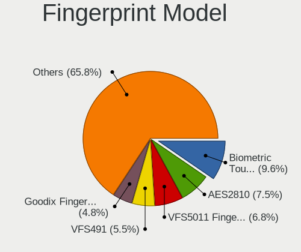

| Model                                                                      | Notebooks | Percent |
|----------------------------------------------------------------------------|-----------|---------|
| Upek Biometric Touchchip/Touchstrip Fingerprint Sensor                     | 7         | 7.53%   |
| AuthenTec AES2810                                                          | 7         | 7.53%   |
| Validity Sensors VFS491                                                    | 6         | 6.45%   |
| Validity Sensors VFS5011 Fingerprint Reader                                | 5         | 5.38%   |
| Shenzhen Goodix  Fingerprint Device                                        | 5         | 5.38%   |
| Elan ELAN:ARM-M4                                                           | 5         | 5.38%   |
| Validity Sensors VFS495 Fingerprint Reader                                 | 4         | 4.3%    |
| Synaptics UWP WBDI Device                                                  | 4         | 4.3%    |
| Samsung Fingerprint Sensor Device - 730B                                   | 4         | 4.3%    |
| LighTuning ES603 Swipe Fingerprint Sensor                                  | 4         | 4.3%    |
| Elan ELAN:Fingerprint                                                      | 4         | 4.3%    |
| Validity Sensors VFS451 Fingerprint Reader                                 | 3         | 3.23%   |
| Synaptics Prometheus MIS Touch Fingerprint Reader                          | 3         | 3.23%   |
| Focal-systems.Corp FT9201Fingerprint.                                      | 3         | 3.23%   |
| Validity Sensors VFS471 Fingerprint Reader                                 | 2         | 2.15%   |
| Validity Sensors VFS 5011 fingerprint sensor                               | 2         | 2.15%   |
| Validity Sensors Swipe Fingerprint Sensor                                  | 2         | 2.15%   |
| Synaptics Metallica MIS Touch Fingerprint Reader                           | 2         | 2.15%   |
| STMicroelectronics Fingerprint Reader                                      | 2         | 2.15%   |
| Shenzhen Goodix Fingerprint Reader                                         | 2         | 2.15%   |
| Shenzhen Goodix FingerPrint                                                | 2         | 2.15%   |
| AuthenTec AES2501 Fingerprint Sensor                                       | 2         | 2.15%   |
| AuthenTec AES1660 Fingerprint Sensor                                       | 2         | 2.15%   |
| AuthenTec AES1600                                                          | 2         | 2.15%   |
| Validity Sensors Synaptics WBDI                                            | 1         | 1.08%   |
| Validity Sensors Synaptics VFS7552 Touch Fingerprint Sensor with PurePrint | 1         | 1.08%   |
| Upek TCS5B Fingerprint sensor                                              | 1         | 1.08%   |
| Synaptics WBDI Fingerprint Reader USB 086                                  | 1         | 1.08%   |
| Synaptics Metallica MOH Touch Fingerprint Reader                           | 1         | 1.08%   |
| LighTuning Fingerprint Reader                                              | 1         | 1.08%   |
| LighTuning EgisTec Touch Fingerprint Sensor                                | 1         | 1.08%   |
| AuthenTec Fingerprint Sensor                                               | 1         | 1.08%   |
| AuthenTec AES2550 Fingerprint Sensor                                       | 1         | 1.08%   |

Chipcard Vendor
---------------

Chipcard module vendors

| Vendor                | Notebooks | Percent |
|-----------------------|-----------|---------|
| Broadcom              | 17        | 47.22%  |
| O2 Micro              | 10        | 27.78%  |
| Alcor Micro           | 5         | 13.89%  |
| Upek                  | 2         | 5.56%   |
| Realtek Semiconductor | 1         | 2.78%   |
| Lenovo                | 1         | 2.78%   |

Chipcard Model
--------------

Chipcard module models

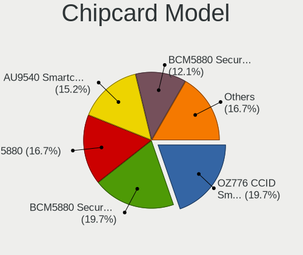

| Model                                                                        | Notebooks | Percent |
|------------------------------------------------------------------------------|-----------|---------|
| O2 Micro OZ776 CCID Smartcard Reader                                         | 10        | 27.78%  |
| Broadcom 5880                                                                | 8         | 22.22%  |
| Broadcom BCM5880 Secure Applications Processor with fingerprint swipe sensor | 5         | 13.89%  |
| Alcor Micro AU9540 Smartcard Reader                                          | 5         | 13.89%  |
| Broadcom BCM5880 Secure Applications Processor                               | 3         | 8.33%   |
| Upek TouchChip Fingerprint Coprocessor (WBF advanced mode)                   | 2         | 5.56%   |
| Realtek Semiconductor Smart Card Reader Interface                            | 1         | 2.78%   |
| Lenovo Integrated Smart Card Reader                                          | 1         | 2.78%   |
| Broadcom 58200                                                               | 1         | 2.78%   |

Unsupported
-----------

Unsupported Devices
-------------------

Total unsupported devices on board

| Total | Notebooks | Percent |
|-------|-----------|---------|
| 0     | 408       | 70.71%  |
| 1     | 146       | 25.3%   |
| 2     | 21        | 3.64%   |
| 3     | 2         | 0.35%   |

Unsupported Device Types
------------------------

Types of unsupported devices

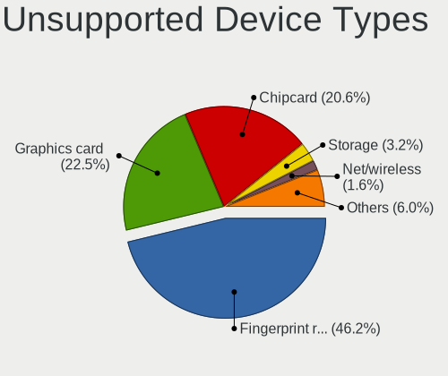

| Type                     | Notebooks | Percent |
|--------------------------|-----------|---------|
| Fingerprint reader       | 93        | 48.95%  |
| Graphics card            | 48        | 25.26%  |
| Chipcard                 | 35        | 18.42%  |
| Net/wireless             | 4         | 2.11%   |
| Bluetooth                | 4         | 2.11%   |
| Communication controller | 2         | 1.05%   |
| Camera                   | 2         | 1.05%   |
| Storage                  | 1         | 0.53%   |
| Flash memory             | 1         | 0.53%   |

