OpenMandriva 23.03 - Tested Hardware & Statistics
-------------------------------------------------

A project to collect tested hardware configurations for OpenMandriva 23.03.

Anyone can contribute to this report by the [hw-probe](https://github.com/linuxhw/hw-probe) tool:

    sudo -E hw-probe -all -upload

Please contribute! Especially if your hardware is rare.

This is a report for all computer types. See also reports for [desktops](/Dist/OpenMandriva_23.03/Desktop/README.md) and [notebooks](/Dist/OpenMandriva_23.03/Notebook/README.md).

Contents
--------

* [ Test Cases ](#test-cases)

* [ System ](#system)
  - [ Kernel                   ](#kernel)
  - [ Kernel Family            ](#kernel-family)
  - [ Kernel Major Ver.        ](#kernel-major-ver)
  - [ Arch                     ](#arch)
  - [ DE                       ](#de)
  - [ Display Server           ](#display-server)
  - [ Display Manager          ](#display-manager)
  - [ OS Lang                  ](#os-lang)
  - [ Boot Mode                ](#boot-mode)
  - [ Filesystem               ](#filesystem)
  - [ Part. scheme             ](#part-scheme)
  - [ Dual Boot with Linux/BSD ](#dual-boot-with-linuxbsd)
  - [ Dual Boot (Win)          ](#dual-boot-win)

* [ Board ](#board)
  - [ Vendor                   ](#vendor)
  - [ Model                    ](#model)
  - [ Model Family             ](#model-family)
  - [ MFG Year                 ](#mfg-year)
  - [ Form Factor              ](#form-factor)
  - [ Secure Boot              ](#secure-boot)
  - [ Coreboot                 ](#coreboot)
  - [ RAM Size                 ](#ram-size)
  - [ RAM Used                 ](#ram-used)
  - [ Total Drives             ](#total-drives)
  - [ Has CD-ROM               ](#has-cd-rom)
  - [ Has Ethernet             ](#has-ethernet)
  - [ Has WiFi                 ](#has-wifi)
  - [ Has Bluetooth            ](#has-bluetooth)

* [ Location ](#location)
  - [ Country                  ](#country)
  - [ City                     ](#city)

* [ Drives ](#drives)
  - [ Drive Vendor             ](#drive-vendor)
  - [ Drive Model              ](#drive-model)
  - [ HDD Vendor               ](#hdd-vendor)
  - [ SSD Vendor               ](#ssd-vendor)
  - [ Drive Kind               ](#drive-kind)
  - [ Drive Connector          ](#drive-connector)
  - [ Drive Size               ](#drive-size)
  - [ Space Total              ](#space-total)
  - [ Space Used               ](#space-used)
  - [ Malfunc. Drives          ](#malfunc-drives)
  - [ Malfunc. Drive Vendor    ](#malfunc-drive-vendor)
  - [ Malfunc. HDD Vendor      ](#malfunc-hdd-vendor)
  - [ Malfunc. Drive Kind      ](#malfunc-drive-kind)
  - [ Failed Drives            ](#failed-drives)
  - [ Failed Drive Vendor      ](#failed-drive-vendor)
  - [ Drive Status             ](#drive-status)

* [ Storage controller ](#storage-controller)
  - [ Storage Vendor           ](#storage-vendor)
  - [ Storage Model            ](#storage-model)
  - [ Storage Kind             ](#storage-kind)

* [ Processor ](#processor)
  - [ CPU Vendor               ](#cpu-vendor)
  - [ CPU Model                ](#cpu-model)
  - [ CPU Model Family         ](#cpu-model-family)
  - [ CPU Cores                ](#cpu-cores)
  - [ CPU Sockets              ](#cpu-sockets)
  - [ CPU Threads              ](#cpu-threads)
  - [ CPU Op-Modes             ](#cpu-op-modes)
  - [ CPU Microcode            ](#cpu-microcode)
  - [ CPU Microarch            ](#cpu-microarch)

* [ Graphics ](#graphics)
  - [ GPU Vendor               ](#gpu-vendor)
  - [ GPU Model                ](#gpu-model)
  - [ GPU Combo                ](#gpu-combo)
  - [ GPU Driver               ](#gpu-driver)
  - [ GPU Memory               ](#gpu-memory)

* [ Monitor ](#monitor)
  - [ Monitor Vendor           ](#monitor-vendor)
  - [ Monitor Model            ](#monitor-model)
  - [ Monitor Resolution       ](#monitor-resolution)
  - [ Monitor Diagonal         ](#monitor-diagonal)
  - [ Monitor Width            ](#monitor-width)
  - [ Aspect Ratio             ](#aspect-ratio)
  - [ Monitor Area             ](#monitor-area)
  - [ Pixel Density            ](#pixel-density)
  - [ Multiple Monitors        ](#multiple-monitors)

* [ Network ](#network)
  - [ Net Controller Vendor    ](#net-controller-vendor)
  - [ Net Controller Model     ](#net-controller-model)
  - [ Wireless Vendor          ](#wireless-vendor)
  - [ Wireless Model           ](#wireless-model)
  - [ Ethernet Vendor          ](#ethernet-vendor)
  - [ Ethernet Model           ](#ethernet-model)
  - [ Net Controller Kind      ](#net-controller-kind)
  - [ Used Controller          ](#used-controller)
  - [ NICs                     ](#nics)
  - [ IPv6                     ](#ipv6)

* [ Bluetooth ](#bluetooth)
  - [ Bluetooth Vendor         ](#bluetooth-vendor)
  - [ Bluetooth Model          ](#bluetooth-model)

* [ Sound ](#sound)
  - [ Sound Vendor             ](#sound-vendor)
  - [ Sound Model              ](#sound-model)

* [ Memory ](#memory)
  - [ Memory Vendor            ](#memory-vendor)
  - [ Memory Model             ](#memory-model)
  - [ Memory Kind              ](#memory-kind)
  - [ Memory Form Factor       ](#memory-form-factor)
  - [ Memory Size              ](#memory-size)
  - [ Memory Speed             ](#memory-speed)

* [ Printers & scanners ](#printers--scanners)
  - [ Printer Vendor           ](#printer-vendor)
  - [ Printer Model            ](#printer-model)
  - [ Scanner Vendor           ](#scanner-vendor)
  - [ Scanner Model            ](#scanner-model)

* [ Camera ](#camera)
  - [ Camera Vendor            ](#camera-vendor)
  - [ Camera Model             ](#camera-model)

* [ Security ](#security)
  - [ Fingerprint Vendor       ](#fingerprint-vendor)
  - [ Fingerprint Model        ](#fingerprint-model)
  - [ Chipcard Vendor          ](#chipcard-vendor)
  - [ Chipcard Model           ](#chipcard-model)

* [ Unsupported ](#unsupported)
  - [ Unsupported Devices      ](#unsupported-devices)
  - [ Unsupported Device Types ](#unsupported-device-types)

Test Cases
----------

Total: 1604

| Vendor        | Model                       | Form-Factor | Probe                                                      | Date         |
|---------------|-----------------------------|-------------|------------------------------------------------------------|--------------|
| lapbook       | S15 PRO                     | Notebook    | [06ae615fd1](https://linux-hardware.org/?probe=06ae615fd1) | Jul 01, 2023 |
| Gigabyte      | GA-78LMT-USB3 SEx           | Desktop     | [af3e6790e4](https://linux-hardware.org/?probe=af3e6790e4) | Jun 30, 2023 |
| HP            | 8056                        | Desktop     | [32d1199c51](https://linux-hardware.org/?probe=32d1199c51) | Jun 30, 2023 |
| Acer          | Aspire A314-22              | Notebook    | [ef54ec3027](https://linux-hardware.org/?probe=ef54ec3027) | Jun 30, 2023 |
| Lenovo        | ThinkPad L430 246634S       | Notebook    | [5368d4410f](https://linux-hardware.org/?probe=5368d4410f) | Jun 30, 2023 |
| HP            | Laptop 15-db1xxx            | Notebook    | [6d3d6e002f](https://linux-hardware.org/?probe=6d3d6e002f) | Jun 30, 2023 |
| ASUSTek       | X555LAB                     | Notebook    | [99e1623ea0](https://linux-hardware.org/?probe=99e1623ea0) | Jun 29, 2023 |
| MSI           | A320M-A PRO                 | Desktop     | [7dffb9055b](https://linux-hardware.org/?probe=7dffb9055b) | Jun 29, 2023 |
| Lenovo        | IdeaPad 100-15IBY 80MJ      | Notebook    | [723de914e2](https://linux-hardware.org/?probe=723de914e2) | Jun 29, 2023 |
| ASUSTek       | ROG Strix G513QY_G513QY     | Notebook    | [a77c825995](https://linux-hardware.org/?probe=a77c825995) | Jun 29, 2023 |
| Dell          | System XPS L321X            | Notebook    | [abf6b8b341](https://linux-hardware.org/?probe=abf6b8b341) | Jun 29, 2023 |
| Acer          | Aspire 5830TG               | Notebook    | [8c001b69bb](https://linux-hardware.org/?probe=8c001b69bb) | Jun 29, 2023 |
| ASUSTek       | P5G41T-M LX                 | Desktop     | [20f509028b](https://linux-hardware.org/?probe=20f509028b) | Jun 29, 2023 |
| HP            | Pavilion dv6500             | Notebook    | [0286d2f5e5](https://linux-hardware.org/?probe=0286d2f5e5) | Jun 29, 2023 |
| Gigabyte      | H61M-HD2                    | Desktop     | [404728f350](https://linux-hardware.org/?probe=404728f350) | Jun 29, 2023 |
| HP            | Stream Laptop 14-cb1XX      | Notebook    | [1db11a4fa9](https://linux-hardware.org/?probe=1db11a4fa9) | Jun 29, 2023 |
| MSI           | MS-7438 100                 | Desktop     | [4d0d23065e](https://linux-hardware.org/?probe=4d0d23065e) | Jun 29, 2023 |
| ASUSTek       | M5A78L-M PLUS/USB3          | Desktop     | [2f50312c02](https://linux-hardware.org/?probe=2f50312c02) | Jun 29, 2023 |
| Lenovo        | ThinkPad L520 50153CJ       | Notebook    | [1793064ee5](https://linux-hardware.org/?probe=1793064ee5) | Jun 29, 2023 |
| Huanan        | X99-BD4 V1.31               | Desktop     | [fcd9a6b1e2](https://linux-hardware.org/?probe=fcd9a6b1e2) | Jun 28, 2023 |
| Acer          | EG43M                       | Desktop     | [e6d28dd1e5](https://linux-hardware.org/?probe=e6d28dd1e5) | Jun 28, 2023 |
| ASUSTek       | PRIME Z370M-PLUS II         | Desktop     | [1114cf7328](https://linux-hardware.org/?probe=1114cf7328) | Jun 28, 2023 |
| ASUSTek       | K54C                        | Notebook    | [4152d1fcff](https://linux-hardware.org/?probe=4152d1fcff) | Jun 28, 2023 |
| Foxconn       | G41MD                       | Desktop     | [926a733402](https://linux-hardware.org/?probe=926a733402) | Jun 27, 2023 |
| MSI           | B250M PRO-VH                | Desktop     | [cb47380993](https://linux-hardware.org/?probe=cb47380993) | Jun 27, 2023 |
| ASUSTek       | TUF Gaming B550M-PLUS       | Desktop     | [2ed9f4248c](https://linux-hardware.org/?probe=2ed9f4248c) | Jun 27, 2023 |
| PCsmart       | PCSGOB14p-C                 | Notebook    | [a45977461f](https://linux-hardware.org/?probe=a45977461f) | Jun 27, 2023 |
| MSI           | PRO B660M-B DDR4            | Desktop     | [09f4e0e86a](https://linux-hardware.org/?probe=09f4e0e86a) | Jun 27, 2023 |
| Kennex        | POS-PIG41BA                 | Desktop     | [90addad9e1](https://linux-hardware.org/?probe=90addad9e1) | Jun 27, 2023 |
| Clevo         | M540SS Bottom               | Notebook    | [4b613733a0](https://linux-hardware.org/?probe=4b613733a0) | Jun 27, 2023 |
| Dell          | Inspiron 7720               | Notebook    | [89858274fd](https://linux-hardware.org/?probe=89858274fd) | Jun 27, 2023 |
| ASUSTek       | A88XM-E                     | Desktop     | [4557637b8a](https://linux-hardware.org/?probe=4557637b8a) | Jun 26, 2023 |
| HP            | 8430 1000                   | All in one  | [cba036b5d2](https://linux-hardware.org/?probe=cba036b5d2) | Jun 26, 2023 |
| ASRock        | H110M-HG4                   | Desktop     | [6aba51f328](https://linux-hardware.org/?probe=6aba51f328) | Jun 26, 2023 |
| Gigabyte      | GA-78LMT-S2P                | Desktop     | [713bfcdf62](https://linux-hardware.org/?probe=713bfcdf62) | Jun 26, 2023 |
| ASRock        | B450 Steel Legend           | Desktop     | [734e60af76](https://linux-hardware.org/?probe=734e60af76) | Jun 25, 2023 |
| ASUSTek       | VivoBook_ASUSLaptop X510... | Notebook    | [501d3b5530](https://linux-hardware.org/?probe=501d3b5530) | Jun 25, 2023 |
| Intel         | H61                         | Desktop     | [8013deae02](https://linux-hardware.org/?probe=8013deae02) | Jun 25, 2023 |
| ASRock        | G31M-GS                     | Desktop     | [f58c462a34](https://linux-hardware.org/?probe=f58c462a34) | Jun 25, 2023 |
| Biostar       | G31M+                       | Desktop     | [d8347c5f07](https://linux-hardware.org/?probe=d8347c5f07) | Jun 25, 2023 |
| Toshiba       | Satellite A300              | Notebook    | [6f1d7a6089](https://linux-hardware.org/?probe=6f1d7a6089) | Jun 25, 2023 |
| Dell          | Precision M6400             | Notebook    | [b68c09e274](https://linux-hardware.org/?probe=b68c09e274) | Jun 25, 2023 |
| Unknown       | Unknown                     | Desktop     | [186a7eedb6](https://linux-hardware.org/?probe=186a7eedb6) | Jun 25, 2023 |
| Lenovo        | ThinkPad T480 20L6S01G00    | Notebook    | [a66d6dba45](https://linux-hardware.org/?probe=a66d6dba45) | Jun 25, 2023 |
| Toshiba       | IS 1413G                    | Notebook    | [bce89b670d](https://linux-hardware.org/?probe=bce89b670d) | Jun 25, 2023 |
| Medion        | H110H4-CM2                  | Desktop     | [49df9d792a](https://linux-hardware.org/?probe=49df9d792a) | Jun 25, 2023 |
| Packard Be... | EasyNote TK85               | Notebook    | [314e344780](https://linux-hardware.org/?probe=314e344780) | Jun 24, 2023 |
| MSI           | MAG B650 TOMAHAWK WIFI      | Desktop     | [6760d73caf](https://linux-hardware.org/?probe=6760d73caf) | Jun 24, 2023 |
| MSI           | B450 GAMING PLUS MAX        | Desktop     | [785d3130e7](https://linux-hardware.org/?probe=785d3130e7) | Jun 24, 2023 |
| HP            | G62                         | Notebook    | [e8187f4fb6](https://linux-hardware.org/?probe=e8187f4fb6) | Jun 24, 2023 |
| Dell          | Latitude 3180               | Notebook    | [a9a4a63807](https://linux-hardware.org/?probe=a9a4a63807) | Jun 24, 2023 |
| ASUSTek       | Berkeley                    | Desktop     | [5d4d2adebe](https://linux-hardware.org/?probe=5d4d2adebe) | Jun 24, 2023 |
| MSI           | PRO H410M-B                 | Desktop     | [76dd0fc5f1](https://linux-hardware.org/?probe=76dd0fc5f1) | Jun 24, 2023 |
| HP            | Compaq 610                  | Notebook    | [f312ec5ede](https://linux-hardware.org/?probe=f312ec5ede) | Jun 23, 2023 |
| HP            | 1495                        | Desktop     | [eab7d15f02](https://linux-hardware.org/?probe=eab7d15f02) | Jun 23, 2023 |
| ASUSTek       | PRIME H410M-A               | Desktop     | [39d5409264](https://linux-hardware.org/?probe=39d5409264) | Jun 23, 2023 |
| Lenovo        | Flex 2-14 20404             | Notebook    | [4ab121533a](https://linux-hardware.org/?probe=4ab121533a) | Jun 23, 2023 |
| Huanan        | X79 V6.11                   | Desktop     | [e94687bb6b](https://linux-hardware.org/?probe=e94687bb6b) | Jun 23, 2023 |
| MSI           | S12T 3M/S12 3M              | Notebook    | [f135825cec](https://linux-hardware.org/?probe=f135825cec) | Jun 23, 2023 |
| Foxconn       | H61MXV/H67MXV               | Desktop     | [167de0618f](https://linux-hardware.org/?probe=167de0618f) | Jun 23, 2023 |
| Lenovo        | G570 20079                  | Notebook    | [5879c3e9ad](https://linux-hardware.org/?probe=5879c3e9ad) | Jun 22, 2023 |
| Sony          | VAIO                        | All in one  | [8eda132a31](https://linux-hardware.org/?probe=8eda132a31) | Jun 22, 2023 |
| ZOTAC         | Unknown                     | Desktop     | [8454119675](https://linux-hardware.org/?probe=8454119675) | Jun 22, 2023 |
| ASUSTek       | P5G41T-M LX                 | Desktop     | [ba9d7c939a](https://linux-hardware.org/?probe=ba9d7c939a) | Jun 22, 2023 |
| Dell          | Inspiron 5557               | Notebook    | [cc0794fa6e](https://linux-hardware.org/?probe=cc0794fa6e) | Jun 21, 2023 |
| ASRock        | Z77 Extreme4                | Desktop     | [5c9111463c](https://linux-hardware.org/?probe=5c9111463c) | Jun 21, 2023 |
| Sony          | VGN-NS21M_W                 | Notebook    | [6813d6589e](https://linux-hardware.org/?probe=6813d6589e) | Jun 21, 2023 |
| Acer          | One S1002                   | Notebook    | [f7b8d25603](https://linux-hardware.org/?probe=f7b8d25603) | Jun 21, 2023 |
| Acer          | H11H4-AI V:1.0              | Desktop     | [9f5f612aa7](https://linux-hardware.org/?probe=9f5f612aa7) | Jun 21, 2023 |
| HP            | Notebook                    | Notebook    | [3460bcb864](https://linux-hardware.org/?probe=3460bcb864) | Jun 20, 2023 |
| Positivo      | POS-ECIG41BSA               | Desktop     | [abaf6ee67e](https://linux-hardware.org/?probe=abaf6ee67e) | Jun 20, 2023 |
| Samsung       | 300E4A/300E5A/300E7A/343... | Notebook    | [f84ddd7cac](https://linux-hardware.org/?probe=f84ddd7cac) | Jun 20, 2023 |
| Acer          | Aspire F5-771G              | Notebook    | [034d235f5c](https://linux-hardware.org/?probe=034d235f5c) | Jun 19, 2023 |
| Gigabyte      | GA-E350N                    | Desktop     | [dc5ab95b15](https://linux-hardware.org/?probe=dc5ab95b15) | Jun 19, 2023 |
| Dell          | System XPS L502X            | Notebook    | [463e017820](https://linux-hardware.org/?probe=463e017820) | Jun 19, 2023 |
| Lenovo        | ThinkPad E580 20KS001JMZ    | Notebook    | [780d549a32](https://linux-hardware.org/?probe=780d549a32) | Jun 18, 2023 |
| HP            | Laptop 14s-dk1xxx           | Notebook    | [16bbd0f687](https://linux-hardware.org/?probe=16bbd0f687) | Jun 18, 2023 |
| Gigabyte      | GA-78LMT-USB3               | Desktop     | [4bafdb9349](https://linux-hardware.org/?probe=4bafdb9349) | Jun 18, 2023 |
| Dell          | 0HN7XN A01                  | Desktop     | [7348297d40](https://linux-hardware.org/?probe=7348297d40) | Jun 18, 2023 |
| Gigabyte      | AB350M-DS3H-CF              | Desktop     | [fac7a3587a](https://linux-hardware.org/?probe=fac7a3587a) | Jun 18, 2023 |
| GEEKOM        | MiniAir 11                  | Server      | [ac5a7b3810](https://linux-hardware.org/?probe=ac5a7b3810) | Jun 18, 2023 |
| Lenovo        | IdeaPad 3 15ALC6 82KU       | Notebook    | [46692b99cb](https://linux-hardware.org/?probe=46692b99cb) | Jun 18, 2023 |
| Gigabyte      | GA-M56S-S3                  | Desktop     | [bb3ad00508](https://linux-hardware.org/?probe=bb3ad00508) | Jun 17, 2023 |
| Lenovo        | ThinkPad P50 20EQS4840B     | Notebook    | [a60f1ae93e](https://linux-hardware.org/?probe=a60f1ae93e) | Jun 17, 2023 |
| ASUSTek       | X551CAP                     | Notebook    | [9066d9bad2](https://linux-hardware.org/?probe=9066d9bad2) | Jun 17, 2023 |
| MSI           | MPG X570 GAMING EDGE WIF... | Desktop     | [3050f49c99](https://linux-hardware.org/?probe=3050f49c99) | Jun 17, 2023 |
| Lenovo        | 3140 SDK0J40700 WIN 3258... | Desktop     | [eebb6ba229](https://linux-hardware.org/?probe=eebb6ba229) | Jun 17, 2023 |
| Lenovo        | ThinkPad E580 20KSCTO1WW    | Notebook    | [d415965e91](https://linux-hardware.org/?probe=d415965e91) | Jun 17, 2023 |
| Monster       | HUMA H4 V5.2                | Notebook    | [491797a556](https://linux-hardware.org/?probe=491797a556) | Jun 17, 2023 |
| Lenovo        | 3132 SDK0J40697 WIN 3305... | Desktop     | [2149968671](https://linux-hardware.org/?probe=2149968671) | Jun 16, 2023 |
| ASUSTek       | P5B-Deluxe                  | Desktop     | [4dae4ff7c6](https://linux-hardware.org/?probe=4dae4ff7c6) | Jun 16, 2023 |
| Lenovo        | MAHOBAY                     | Desktop     | [ebedbde736](https://linux-hardware.org/?probe=ebedbde736) | Jun 16, 2023 |
| Dell          | XPS 15 9550                 | Notebook    | [b7faea4be3](https://linux-hardware.org/?probe=b7faea4be3) | Jun 16, 2023 |
| Dell          | 0YXT71 A01                  | Desktop     | [f242fcd667](https://linux-hardware.org/?probe=f242fcd667) | Jun 15, 2023 |
| Acer          | Aspire V3-571               | Notebook    | [75c2da2c37](https://linux-hardware.org/?probe=75c2da2c37) | Jun 15, 2023 |
| HP            | EliteBook 2540p             | Notebook    | [20ddd7a28b](https://linux-hardware.org/?probe=20ddd7a28b) | Jun 15, 2023 |
| HP            | Spectre x360 Convertible... | Convertible | [699dd5b23e](https://linux-hardware.org/?probe=699dd5b23e) | Jun 15, 2023 |
| ASUSTek       | Benicia                     | Desktop     | [4b99537b32](https://linux-hardware.org/?probe=4b99537b32) | Jun 15, 2023 |
| ASUSTek       | S400CA                      | Notebook    | [d512f1865e](https://linux-hardware.org/?probe=d512f1865e) | Jun 15, 2023 |
| Dell          | 0HY9JP A00                  | Desktop     | [d7689b11ad](https://linux-hardware.org/?probe=d7689b11ad) | Jun 14, 2023 |
| HP            | 2820h                       | Desktop     | [41fa36550a](https://linux-hardware.org/?probe=41fa36550a) | Jun 14, 2023 |
| HP            | 81B3                        | Desktop     | [9ba98d3c27](https://linux-hardware.org/?probe=9ba98d3c27) | Jun 14, 2023 |
| ASRock        | QC5000-ITX/PH               | Desktop     | [b50d647073](https://linux-hardware.org/?probe=b50d647073) | Jun 14, 2023 |
| ASUSTek       | PRIME H510M-A               | Desktop     | [2ae3c4aaca](https://linux-hardware.org/?probe=2ae3c4aaca) | Jun 13, 2023 |
| Lenovo        | SHARKBAY SDK0E50510 WIN     | Desktop     | [83d9a91c16](https://linux-hardware.org/?probe=83d9a91c16) | Jun 13, 2023 |
| ASUSTek       | P5G41T-M LX                 | Desktop     | [c74f83bbea](https://linux-hardware.org/?probe=c74f83bbea) | Jun 13, 2023 |
| Dell          | Inspiron 1501               | Notebook    | [456a49b146](https://linux-hardware.org/?probe=456a49b146) | Jun 13, 2023 |
| LincPlus      | LINNCPLUS P1                | Notebook    | [878dc2b05f](https://linux-hardware.org/?probe=878dc2b05f) | Jun 13, 2023 |
| Chuwi         | GemiBook Pro                | Notebook    | [34cfc4a037](https://linux-hardware.org/?probe=34cfc4a037) | Jun 13, 2023 |
| Biostar       | A520MH                      | Desktop     | [70760c5e70](https://linux-hardware.org/?probe=70760c5e70) | Jun 12, 2023 |
| Positivo      | C14CR01                     | Notebook    | [11d46971fa](https://linux-hardware.org/?probe=11d46971fa) | Jun 12, 2023 |
| ASUSTek       | X540SAA                     | Notebook    | [ea61fdd09a](https://linux-hardware.org/?probe=ea61fdd09a) | Jun 11, 2023 |
| HP            | 339A                        | Desktop     | [348ce53f71](https://linux-hardware.org/?probe=348ce53f71) | Jun 10, 2023 |
| Acer          | Aspire E1-572               | Notebook    | [532d86f9e6](https://linux-hardware.org/?probe=532d86f9e6) | Jun 10, 2023 |
| ASUSTek       | TUF Gaming FX505GD_FX505... | Notebook    | [03660fb140](https://linux-hardware.org/?probe=03660fb140) | Jun 10, 2023 |
| Dell          | 0D883F A06                  | Desktop     | [f0d5120461](https://linux-hardware.org/?probe=f0d5120461) | Jun 10, 2023 |
| HP            | G42                         | Notebook    | [83eca37118](https://linux-hardware.org/?probe=83eca37118) | Jun 10, 2023 |
| Lenovo        | ThinkPad T61 7660A25        | Notebook    | [e1617105e0](https://linux-hardware.org/?probe=e1617105e0) | Jun 10, 2023 |
| GuoGuang      | IC2M1028V-J                 | Desktop     | [d7c1b01b69](https://linux-hardware.org/?probe=d7c1b01b69) | Jun 10, 2023 |
| Acer          | Predator G3600              | Desktop     | [02a0cf3a71](https://linux-hardware.org/?probe=02a0cf3a71) | Jun 10, 2023 |
| ASUSTek       | VivoBook 17_ASUS Laptop ... | Notebook    | [08a506ad4e](https://linux-hardware.org/?probe=08a506ad4e) | Jun 09, 2023 |
| Dell          | Inspiron 7348               | Notebook    | [a2bd4ab5b9](https://linux-hardware.org/?probe=a2bd4ab5b9) | Jun 09, 2023 |
| ASUSTek       | P8H61-M LX2                 | Desktop     | [3fb94f0c4b](https://linux-hardware.org/?probe=3fb94f0c4b) | Jun 09, 2023 |
| HP            | 09E0h                       | Desktop     | [b6bb01441c](https://linux-hardware.org/?probe=b6bb01441c) | Jun 09, 2023 |
| Gigabyte      | X570 UD                     | Desktop     | [98a10d2fd9](https://linux-hardware.org/?probe=98a10d2fd9) | Jun 08, 2023 |
| MSI           | X470 GAMING PLUS            | Desktop     | [eea4cea0e0](https://linux-hardware.org/?probe=eea4cea0e0) | Jun 08, 2023 |
| HP            | 87A4 10100                  | All in one  | [3c67e34a5e](https://linux-hardware.org/?probe=3c67e34a5e) | Jun 08, 2023 |
| GuoGuang      | IC2M1028V-J                 | Desktop     | [04527d6ad9](https://linux-hardware.org/?probe=04527d6ad9) | Jun 08, 2023 |
| HP            | Stream Notebook PC 11       | Notebook    | [fd037bb738](https://linux-hardware.org/?probe=fd037bb738) | Jun 08, 2023 |
| AMI           | Cherry Trail CR             | Desktop     | [5816e6a1cf](https://linux-hardware.org/?probe=5816e6a1cf) | Jun 07, 2023 |
| ASUSTek       | VivoBook_ASUSLaptop X415... | Notebook    | [c142d83ce5](https://linux-hardware.org/?probe=c142d83ce5) | Jun 07, 2023 |
| ASUSTek       | M5A97 R2.0                  | Desktop     | [369f5d3044](https://linux-hardware.org/?probe=369f5d3044) | Jun 07, 2023 |
| HP            | 8169                        | Desktop     | [45543e5040](https://linux-hardware.org/?probe=45543e5040) | Jun 07, 2023 |
| Kraftway      | KWH510                      | Desktop     | [3a5ccb373b](https://linux-hardware.org/?probe=3a5ccb373b) | Jun 07, 2023 |
| HP            | 2B34                        | Desktop     | [d0b5c9767f](https://linux-hardware.org/?probe=d0b5c9767f) | Jun 07, 2023 |
| Razer         | Blade 15 Advanced Model ... | Notebook    | [8f55e469c8](https://linux-hardware.org/?probe=8f55e469c8) | Jun 06, 2023 |
| ASRock        | Z790 Taichi Carrara         | Desktop     | [bdea2092aa](https://linux-hardware.org/?probe=bdea2092aa) | Jun 06, 2023 |
| HP            | 822A                        | Desktop     | [8cf8694f03](https://linux-hardware.org/?probe=8cf8694f03) | Jun 06, 2023 |
| ASUSTek       | ASUS TUF Gaming F15 FX50... | Notebook    | [4c3091f9ff](https://linux-hardware.org/?probe=4c3091f9ff) | Jun 06, 2023 |
| Intel         | E5 V1.0                     | Desktop     | [077c08c2dc](https://linux-hardware.org/?probe=077c08c2dc) | Jun 06, 2023 |
| Lenovo        | Z50-70 20354                | Notebook    | [05a473a2be](https://linux-hardware.org/?probe=05a473a2be) | Jun 06, 2023 |
| Acer          | EQ45LM                      | Desktop     | [73f7a3078f](https://linux-hardware.org/?probe=73f7a3078f) | Jun 06, 2023 |
| ASUSTek       | M5A78L-M LE/USB3            | Desktop     | [1bd1a651bb](https://linux-hardware.org/?probe=1bd1a651bb) | Jun 05, 2023 |
| HP            | 8265                        | Desktop     | [7afc259b97](https://linux-hardware.org/?probe=7afc259b97) | Jun 05, 2023 |
| ASUSTek       | PRIME Z590-P                | Desktop     | [933aa24820](https://linux-hardware.org/?probe=933aa24820) | Jun 05, 2023 |
| NEC Comput... | MS-AD611                    | All in one  | [219795e31d](https://linux-hardware.org/?probe=219795e31d) | Jun 05, 2023 |
| HP            | ENVY x360 Convertible 15... | Convertible | [48d99dbec6](https://linux-hardware.org/?probe=48d99dbec6) | Jun 05, 2023 |
| ASRock        | B150M Pro4                  | Desktop     | [0b59eacbd3](https://linux-hardware.org/?probe=0b59eacbd3) | Jun 05, 2023 |
| ASUSTek       | CROSSHAIR V FORMULA-Z       | Desktop     | [d275c3c00b](https://linux-hardware.org/?probe=d275c3c00b) | Jun 05, 2023 |
| HP            | 8643 SMVB                   | Desktop     | [697cc43136](https://linux-hardware.org/?probe=697cc43136) | Jun 04, 2023 |
| ASUSTek       | VivoBook_ASUSLaptop X712... | Notebook    | [525601c31e](https://linux-hardware.org/?probe=525601c31e) | Jun 04, 2023 |
| Acer          | Veriton X4630G V:1.0        | Desktop     | [5106e40f32](https://linux-hardware.org/?probe=5106e40f32) | Jun 04, 2023 |
| Lenovo        | IdeaPad 3 15IGL05 81WQ      | Notebook    | [681baff23c](https://linux-hardware.org/?probe=681baff23c) | Jun 04, 2023 |
| Foxconn       | G41MD                       | Desktop     | [f988a585c9](https://linux-hardware.org/?probe=f988a585c9) | Jun 04, 2023 |
| Lenovo        | Legion 5 Pro 16ACH6H 82J... | Notebook    | [ac6745cffb](https://linux-hardware.org/?probe=ac6745cffb) | Jun 03, 2023 |
| ASUSTek       | Pro B550M-C                 | Desktop     | [094889a0e2](https://linux-hardware.org/?probe=094889a0e2) | Jun 03, 2023 |
| Lenovo        | IdeaPad 320-17IKB 80XM      | Notebook    | [5d6b08920f](https://linux-hardware.org/?probe=5d6b08920f) | Jun 03, 2023 |
| ECS           | G31T-M                      | Desktop     | [55d38b75c7](https://linux-hardware.org/?probe=55d38b75c7) | Jun 03, 2023 |
| Compaq        | 420                         | Notebook    | [cf7a8f5641](https://linux-hardware.org/?probe=cf7a8f5641) | Jun 03, 2023 |
| Valve         | Jupiter                     | Notebook    | [3aa6cf6780](https://linux-hardware.org/?probe=3aa6cf6780) | Jun 03, 2023 |
| ASUSTek       | PRIME A520M-A               | Desktop     | [7dac003c12](https://linux-hardware.org/?probe=7dac003c12) | Jun 03, 2023 |
| HP            | EliteBook 8440p             | Notebook    | [7f95f275b3](https://linux-hardware.org/?probe=7f95f275b3) | Jun 03, 2023 |
| Lenovo        | ThinkPad X230 Tablet 343... | Notebook    | [1034aea990](https://linux-hardware.org/?probe=1034aea990) | Jun 03, 2023 |
| Fujitsu       | D3161-A1 S26361-D3161-A1    | Desktop     | [70a097a219](https://linux-hardware.org/?probe=70a097a219) | Jun 02, 2023 |
| ASUSTek       | PRIME B550-PLUS             | Desktop     | [f22933cdb1](https://linux-hardware.org/?probe=f22933cdb1) | Jun 01, 2023 |
| Gigabyte      | Z390 AORUS ELITE-CF         | Desktop     | [75c4e47bea](https://linux-hardware.org/?probe=75c4e47bea) | Jun 01, 2023 |
| Teclast       | X4                          | Tablet      | [2392aa748a](https://linux-hardware.org/?probe=2392aa748a) | Jun 01, 2023 |
| MSI           | MAG B550 TOMAHAWK           | Desktop     | [e242ec473b](https://linux-hardware.org/?probe=e242ec473b) | Jun 01, 2023 |
| Lenovo        | B51-80 80LM                 | Notebook    | [69429cb044](https://linux-hardware.org/?probe=69429cb044) | Jun 01, 2023 |
| Fujitsu Si... | D2740-A2 S26361-D2740-A2    | Desktop     | [165491db1f](https://linux-hardware.org/?probe=165491db1f) | Jun 01, 2023 |
| Toshiba       | Satellite C50-B             | Notebook    | [1a6c37d8f7](https://linux-hardware.org/?probe=1a6c37d8f7) | Jun 01, 2023 |
| HP            | Laptop 15-dw3xxx            | Notebook    | [a4854b177f](https://linux-hardware.org/?probe=a4854b177f) | Jun 01, 2023 |
| Dell          | Latitude 7490               | Notebook    | [31eb124dfb](https://linux-hardware.org/?probe=31eb124dfb) | Jun 01, 2023 |
| Lenovo        | ThinkPad L440 20ASA20VLM    | Notebook    | [1d59682589](https://linux-hardware.org/?probe=1d59682589) | Jun 01, 2023 |
| Apple         | MacBookAir9,1               | Notebook    | [b3e3a95a06](https://linux-hardware.org/?probe=b3e3a95a06) | Jun 01, 2023 |
| OEM           | Intel H81                   | Desktop     | [b62ec659fa](https://linux-hardware.org/?probe=b62ec659fa) | Jun 01, 2023 |
| Inventec      | 0PY33N A01                  | Mini pc     | [01452a68b3](https://linux-hardware.org/?probe=01452a68b3) | May 31, 2023 |
| ASUSTek       | P5G41T-M LX3                | Desktop     | [483bf9a882](https://linux-hardware.org/?probe=483bf9a882) | May 31, 2023 |
| ASUSTek       | TUF Gaming X570-PLUS        | Desktop     | [eda1870d76](https://linux-hardware.org/?probe=eda1870d76) | May 31, 2023 |
| Dell          | System Vostro 3450          | Notebook    | [ae337aeb9c](https://linux-hardware.org/?probe=ae337aeb9c) | May 31, 2023 |
| BESSTAR Te... | GB7                         | Mini pc     | [11bab4bc11](https://linux-hardware.org/?probe=11bab4bc11) | May 30, 2023 |
| Timi          | RedmiBook 14 II             | Notebook    | [bad37936c6](https://linux-hardware.org/?probe=bad37936c6) | May 30, 2023 |
| ASRock        | H310CM-HG4                  | Desktop     | [9fa8d9d320](https://linux-hardware.org/?probe=9fa8d9d320) | May 30, 2023 |
| HP            | 255 G8 Notebook PC          | Notebook    | [ea55e0ac39](https://linux-hardware.org/?probe=ea55e0ac39) | May 30, 2023 |
| Lenovo        | ThinkPad X61 76738AG        | Notebook    | [7f52d18c2f](https://linux-hardware.org/?probe=7f52d18c2f) | May 30, 2023 |
| Samsung       | RV419/RV420                 | Notebook    | [ddab046bd5](https://linux-hardware.org/?probe=ddab046bd5) | May 30, 2023 |
| HP            | EliteBook x360 1030 G3      | Convertible | [f762140894](https://linux-hardware.org/?probe=f762140894) | May 30, 2023 |
| ASUSTek       | P5KPL-AM                    | Desktop     | [48359795cc](https://linux-hardware.org/?probe=48359795cc) | May 30, 2023 |
| HP            | 82F2 A01                    | Desktop     | [fb729f1358](https://linux-hardware.org/?probe=fb729f1358) | May 29, 2023 |
| ASUSTek       | SABERTOOTH 990FX R2.0       | Desktop     | [a46f523ea2](https://linux-hardware.org/?probe=a46f523ea2) | May 29, 2023 |
| MSI           | P67A-GD65                   | Desktop     | [fe5e3bcd7b](https://linux-hardware.org/?probe=fe5e3bcd7b) | May 29, 2023 |
| Acer          | Aspire ES1-512              | Notebook    | [3c6e8b6acd](https://linux-hardware.org/?probe=3c6e8b6acd) | May 29, 2023 |
| Google        | Auron_Paine                 | Notebook    | [66fd27934f](https://linux-hardware.org/?probe=66fd27934f) | May 29, 2023 |
| Gigabyte      | Z690 UD                     | Desktop     | [feab206ef4](https://linux-hardware.org/?probe=feab206ef4) | May 29, 2023 |
| Acer          | Aspire E5-573               | Notebook    | [fc839b0b6f](https://linux-hardware.org/?probe=fc839b0b6f) | May 29, 2023 |
| Lenovo        | ThinkPad W541 20EF000MUS    | Notebook    | [44c1329399](https://linux-hardware.org/?probe=44c1329399) | May 29, 2023 |
| Lenovo        | IdeaPad 3 15ADA05 81W1      | Notebook    | [42b817db26](https://linux-hardware.org/?probe=42b817db26) | May 29, 2023 |
| Acer          | Aspire VX5-591G             | Notebook    | [1db96272fe](https://linux-hardware.org/?probe=1db96272fe) | May 29, 2023 |
| ASUSTek       | H81M-C                      | Desktop     | [ece00aac41](https://linux-hardware.org/?probe=ece00aac41) | May 29, 2023 |
| ASUSTek       | 970 PRO GAMING/AURA         | Desktop     | [1c87272ed8](https://linux-hardware.org/?probe=1c87272ed8) | May 29, 2023 |
| Lenovo        | G400 20235                  | Notebook    | [193fbef9a1](https://linux-hardware.org/?probe=193fbef9a1) | May 28, 2023 |
| HP            | Compaq 6910p (GY174UP#AB... | Notebook    | [43ee52e798](https://linux-hardware.org/?probe=43ee52e798) | May 28, 2023 |
| Dell          | Inspiron 7559               | Notebook    | [af1bb009ca](https://linux-hardware.org/?probe=af1bb009ca) | May 28, 2023 |
| ASRock        | G41M-VS3                    | Desktop     | [4d002c31be](https://linux-hardware.org/?probe=4d002c31be) | May 28, 2023 |
| ASRock        | B450M Steel Legend          | Desktop     | [b8436530b0](https://linux-hardware.org/?probe=b8436530b0) | May 28, 2023 |
| Lenovo        | ThinkPad T420 4236N79       | Notebook    | [9908724093](https://linux-hardware.org/?probe=9908724093) | May 28, 2023 |
| Toshiba       | Satellite L500              | Notebook    | [b1213efe40](https://linux-hardware.org/?probe=b1213efe40) | May 28, 2023 |
| Acer          | Aspire 7540                 | Notebook    | [82fcb3124c](https://linux-hardware.org/?probe=82fcb3124c) | May 28, 2023 |
| Toshiba       | Satellite C645D             | Notebook    | [085994472d](https://linux-hardware.org/?probe=085994472d) | May 28, 2023 |
| Gateway       | DT55                        | Desktop     | [22d84550c6](https://linux-hardware.org/?probe=22d84550c6) | May 28, 2023 |
| ASUSTek       | VivoBook_ASUSLaptop X415... | Notebook    | [56fca4583d](https://linux-hardware.org/?probe=56fca4583d) | May 28, 2023 |
| Samsung       | 270E5J/2570EJ               | Notebook    | [f90f831805](https://linux-hardware.org/?probe=f90f831805) | May 28, 2023 |
| ASUSTek       | TUF Gaming B460M-PLUS       | Desktop     | [ad8e3ea3ea](https://linux-hardware.org/?probe=ad8e3ea3ea) | May 27, 2023 |
| HP            | 15 Notebook PC              | Notebook    | [3904ffdddf](https://linux-hardware.org/?probe=3904ffdddf) | May 27, 2023 |
| ASUSTek       | F2A85-V PRO                 | Desktop     | [f2181d0270](https://linux-hardware.org/?probe=f2181d0270) | May 27, 2023 |
| Acer          | Aspire A517-51G             | Notebook    | [bfc89878ce](https://linux-hardware.org/?probe=bfc89878ce) | May 27, 2023 |
| Dell          | 0TP412                      | Desktop     | [112fa3015f](https://linux-hardware.org/?probe=112fa3015f) | May 27, 2023 |
| Wistron       | ProLiant ML110 G6           | Desktop     | [bc1c76bb8f](https://linux-hardware.org/?probe=bc1c76bb8f) | May 27, 2023 |
| MSI           | B560M PRO-VDH               | Desktop     | [b0435ce0dc](https://linux-hardware.org/?probe=b0435ce0dc) | May 27, 2023 |
| Fujitsu Si... | D2824-A1 S26361-D2824-A1    | Desktop     | [3900a03a2c](https://linux-hardware.org/?probe=3900a03a2c) | May 27, 2023 |
| MSI           | B450 TOMAHAWK               | Desktop     | [3e9709dc25](https://linux-hardware.org/?probe=3e9709dc25) | May 27, 2023 |
| Lenovo        | IdeaPad 330-15IKB 81DE      | Notebook    | [0ccc456c4e](https://linux-hardware.org/?probe=0ccc456c4e) | May 27, 2023 |
| Dell          | Inspiron 5567               | Notebook    | [9dc73257dc](https://linux-hardware.org/?probe=9dc73257dc) | May 27, 2023 |
| MSI           | B250M BAZOOKA               | Desktop     | [2bfe50d945](https://linux-hardware.org/?probe=2bfe50d945) | May 27, 2023 |
| HP            | 255 G8 Notebook PC          | Notebook    | [9ecbba0aaa](https://linux-hardware.org/?probe=9ecbba0aaa) | May 26, 2023 |
| MSI           | B450 GAMING PLUS MAX        | Desktop     | [5977804b94](https://linux-hardware.org/?probe=5977804b94) | May 26, 2023 |
| Gigabyte      | B450M DS3H V2               | Desktop     | [c4af5a7969](https://linux-hardware.org/?probe=c4af5a7969) | May 26, 2023 |
| Dell          | Latitude 5290               | Notebook    | [fb6cbb6a2f](https://linux-hardware.org/?probe=fb6cbb6a2f) | May 26, 2023 |
| Gigabyte      | B550M AORUS ELITE           | Desktop     | [5d54a10d85](https://linux-hardware.org/?probe=5d54a10d85) | May 26, 2023 |
| ASRock        | A320M-HDV R4.0              | Desktop     | [c897394a34](https://linux-hardware.org/?probe=c897394a34) | May 26, 2023 |
| Fujitsu Si... | D2464-A1 S26361-D2464-A1    | Desktop     | [313c8a3663](https://linux-hardware.org/?probe=313c8a3663) | May 26, 2023 |
| Acer          | EQ45LM                      | Desktop     | [a49c4c8438](https://linux-hardware.org/?probe=a49c4c8438) | May 26, 2023 |
| Acer          | Aspire M3910                | Desktop     | [f4dedc13f9](https://linux-hardware.org/?probe=f4dedc13f9) | May 25, 2023 |
| MSI           | Z590 PLUS                   | Desktop     | [1f531f4e58](https://linux-hardware.org/?probe=1f531f4e58) | May 25, 2023 |
| MSI           | GL75 Leopard 10SDK          | Notebook    | [41eac45c5e](https://linux-hardware.org/?probe=41eac45c5e) | May 25, 2023 |
| LG Electro... | 22V280 FAB1                 | All in one  | [0df1994f25](https://linux-hardware.org/?probe=0df1994f25) | May 25, 2023 |
| Dell          | Inspiron 15-3567            | Notebook    | [a8dd30a7bb](https://linux-hardware.org/?probe=a8dd30a7bb) | May 25, 2023 |
| ASUSTek       | P8B75-V                     | Desktop     | [cbcfc55949](https://linux-hardware.org/?probe=cbcfc55949) | May 25, 2023 |
| Dell          | 0XJ8C4 A00                  | Desktop     | [b6b7396e06](https://linux-hardware.org/?probe=b6b7396e06) | May 25, 2023 |
| Timi          | TM1701                      | Notebook    | [c883337466](https://linux-hardware.org/?probe=c883337466) | May 24, 2023 |
| ASUSTek       | PRIME H510M-E               | Desktop     | [1247209c34](https://linux-hardware.org/?probe=1247209c34) | May 24, 2023 |
| Lenovo        | Yoga 530-14IKB 81EK         | Convertible | [701c6c3410](https://linux-hardware.org/?probe=701c6c3410) | May 24, 2023 |
| Lenovo        | 318E SDK0L22692 WIN 3792... | Desktop     | [5fb6f16a6d](https://linux-hardware.org/?probe=5fb6f16a6d) | May 24, 2023 |
| Gigabyte      | 8I945GZME-RH                | Desktop     | [3b4c63eddb](https://linux-hardware.org/?probe=3b4c63eddb) | May 24, 2023 |
| Toshiba       | Satellite C660D             | Notebook    | [cd798092df](https://linux-hardware.org/?probe=cd798092df) | May 23, 2023 |
| Intel         | H61                         | Desktop     | [794ecc6c43](https://linux-hardware.org/?probe=794ecc6c43) | May 23, 2023 |
| ASUSTek       | PRIME X299-DELUXE           | Desktop     | [c13217076b](https://linux-hardware.org/?probe=c13217076b) | May 23, 2023 |
| Dell          | 0H19HD A06                  | Server      | [25975db1c4](https://linux-hardware.org/?probe=25975db1c4) | May 23, 2023 |
| Lenovo        | ThinkPad L520 5017A62       | Notebook    | [a8d01c9adb](https://linux-hardware.org/?probe=a8d01c9adb) | May 23, 2023 |
| Unknown       | Unknown                     | Desktop     | [9cbda228a9](https://linux-hardware.org/?probe=9cbda228a9) | May 23, 2023 |
| Foxconn       | G41MD                       | Desktop     | [a3a8a67867](https://linux-hardware.org/?probe=a3a8a67867) | May 23, 2023 |
| Dell          | 0X2YVY A00                  | All in one  | [cf15aa9b1a](https://linux-hardware.org/?probe=cf15aa9b1a) | May 23, 2023 |
| Apple         | MacBookPro9,2               | Notebook    | [6855a79270](https://linux-hardware.org/?probe=6855a79270) | May 23, 2023 |
| ASUSTek       | ASUS TUF Gaming F15 FX50... | Notebook    | [76db4a03a1](https://linux-hardware.org/?probe=76db4a03a1) | May 22, 2023 |
| BESSTAR Te... | HM90                        | Desktop     | [bc2b7d421d](https://linux-hardware.org/?probe=bc2b7d421d) | May 22, 2023 |
| Lenovo        | ThinkPad L440 20AS001CUK    | Notebook    | [8d253e2d7e](https://linux-hardware.org/?probe=8d253e2d7e) | May 22, 2023 |
| HP            | 2AF3                        | Desktop     | [e70a1c12fb](https://linux-hardware.org/?probe=e70a1c12fb) | May 22, 2023 |
| MSI           | Modern 14 B10MW             | Notebook    | [319f4883aa](https://linux-hardware.org/?probe=319f4883aa) | May 22, 2023 |
| ASRock        | H310M-STX                   | Desktop     | [c5d385dd80](https://linux-hardware.org/?probe=c5d385dd80) | May 22, 2023 |
| ASUSTek       | P8H61-M LX3 R2.0            | Desktop     | [2f1b921a18](https://linux-hardware.org/?probe=2f1b921a18) | May 22, 2023 |
| Gigabyte      | X470 AORUS ULTRA GAMING-... | Desktop     | [63a27f785d](https://linux-hardware.org/?probe=63a27f785d) | May 22, 2023 |
| Dell          | Latitude E6230              | Notebook    | [89c5618eb8](https://linux-hardware.org/?probe=89c5618eb8) | May 22, 2023 |
| ASUSTek       | K84L                        | Notebook    | [5f14f3b293](https://linux-hardware.org/?probe=5f14f3b293) | May 21, 2023 |
| HP            | Pavilion dv7                | Notebook    | [816fffab13](https://linux-hardware.org/?probe=816fffab13) | May 21, 2023 |
| Teclast       | X4                          | Tablet      | [9dc0b8fa7b](https://linux-hardware.org/?probe=9dc0b8fa7b) | May 21, 2023 |
| Dell          | 0PC5F7 A03                  | Desktop     | [0ef682fa85](https://linux-hardware.org/?probe=0ef682fa85) | May 21, 2023 |
| Philco        | 14H                         | Notebook    | [5dbb0cb3b7](https://linux-hardware.org/?probe=5dbb0cb3b7) | May 21, 2023 |
| Wortmann      | TERRA_MOBILE_1528P/1748P    | Notebook    | [03afaf2468](https://linux-hardware.org/?probe=03afaf2468) | May 21, 2023 |
| ASUSTek       | P7P55-M                     | Desktop     | [1c5c9709dd](https://linux-hardware.org/?probe=1c5c9709dd) | May 21, 2023 |
| Fujitsu       | LIFEBOOK S752               | Notebook    | [906ba8b65c](https://linux-hardware.org/?probe=906ba8b65c) | May 21, 2023 |
| Gigabyte      | A320M-S2H-CF                | Desktop     | [7ff619a028](https://linux-hardware.org/?probe=7ff619a028) | May 21, 2023 |
| ASUSTek       | N53TK                       | Notebook    | [275e480739](https://linux-hardware.org/?probe=275e480739) | May 21, 2023 |
| Lenovo        | Y50-70 20378                | Notebook    | [2aff70d7c9](https://linux-hardware.org/?probe=2aff70d7c9) | May 21, 2023 |
| Acer          | Aspire 4750                 | Notebook    | [704221c10c](https://linux-hardware.org/?probe=704221c10c) | May 21, 2023 |
| ASRock        | Q1900M                      | Desktop     | [0290a65c70](https://linux-hardware.org/?probe=0290a65c70) | May 21, 2023 |
| ASUSTek       | P8H77-M LE                  | Desktop     | [e9b749f2ba](https://linux-hardware.org/?probe=e9b749f2ba) | May 21, 2023 |
| ASRock        | Z68 Pro3-M                  | Desktop     | [0deaff38f5](https://linux-hardware.org/?probe=0deaff38f5) | May 21, 2023 |
| Unknown       | Unknown                     | Desktop     | [c3af6442c9](https://linux-hardware.org/?probe=c3af6442c9) | May 21, 2023 |
| Samsung       | RV411/RV511/E3511/S3511/... | Notebook    | [07039bd959](https://linux-hardware.org/?probe=07039bd959) | May 21, 2023 |
| HP            | 15 Notebook PC              | Notebook    | [e1939cff8f](https://linux-hardware.org/?probe=e1939cff8f) | May 21, 2023 |
| Toshiba       | Satellite P300              | Notebook    | [ed99950768](https://linux-hardware.org/?probe=ed99950768) | May 20, 2023 |
| HP            | Pavilion Gaming Laptop 1... | Notebook    | [59464cac80](https://linux-hardware.org/?probe=59464cac80) | May 20, 2023 |
| ASUSTek       | ROG STRIX Z370-G GAMING     | Desktop     | [b68e5e0285](https://linux-hardware.org/?probe=b68e5e0285) | May 20, 2023 |
| Intel         | NUC6CAYB J23203-409         | Mini pc     | [f39a134aa1](https://linux-hardware.org/?probe=f39a134aa1) | May 20, 2023 |
| Dell          | Inspiron 1501               | Notebook    | [d2fb2ddcce](https://linux-hardware.org/?probe=d2fb2ddcce) | May 20, 2023 |
| Dell          | Latitude 5285               | Notebook    | [0db3cfd34e](https://linux-hardware.org/?probe=0db3cfd34e) | May 20, 2023 |
| HP            | Laptop 15-ef2xxx            | Notebook    | [b563edd887](https://linux-hardware.org/?probe=b563edd887) | May 20, 2023 |
| Foxconn       | G41MD                       | Desktop     | [1a649b0512](https://linux-hardware.org/?probe=1a649b0512) | May 20, 2023 |
| HP            | 250 G2                      | Notebook    | [e3b94752ac](https://linux-hardware.org/?probe=e3b94752ac) | May 19, 2023 |
| Gigabyte      | F2A88X-D3H                  | Desktop     | [76bae0c7fb](https://linux-hardware.org/?probe=76bae0c7fb) | May 19, 2023 |
| Lenovo        | ThinkPad T14 Gen 1 20S00... | Notebook    | [5e6991f9e3](https://linux-hardware.org/?probe=5e6991f9e3) | May 19, 2023 |
| Lenovo        | ThinkPad W530 24411M9       | Notebook    | [1094884573](https://linux-hardware.org/?probe=1094884573) | May 19, 2023 |
| ASRock        | Z590M Pro4                  | Desktop     | [d039ed90c5](https://linux-hardware.org/?probe=d039ed90c5) | May 19, 2023 |
| Chuwi         | HeroBook Pro                | Notebook    | [b25115a01a](https://linux-hardware.org/?probe=b25115a01a) | May 19, 2023 |
| ASUSTek       | F7Se                        | Notebook    | [1cd79e84fd](https://linux-hardware.org/?probe=1cd79e84fd) | May 19, 2023 |
| Lenovo        | ThinkPad L560 20F2S1JP03    | Notebook    | [d0dd999b33](https://linux-hardware.org/?probe=d0dd999b33) | May 18, 2023 |
| Lenovo        | IdeaPad 3 15IAU7 82RK       | Notebook    | [82dca1cbb8](https://linux-hardware.org/?probe=82dca1cbb8) | May 18, 2023 |
| ASUSTek       | PRIME Z790-P                | Desktop     | [99d6173179](https://linux-hardware.org/?probe=99d6173179) | May 18, 2023 |
| Toshiba       | Satellite L850-1HQ          | Notebook    | [d16c26b474](https://linux-hardware.org/?probe=d16c26b474) | May 18, 2023 |
| AZW           | SER V1.0                    | Mini pc     | [05379205f4](https://linux-hardware.org/?probe=05379205f4) | May 18, 2023 |
| Dell          | 0GDG8Y A00                  | Desktop     | [bc0a4ba851](https://linux-hardware.org/?probe=bc0a4ba851) | May 18, 2023 |
| Gigabyte      | GA-970A-D3                  | Desktop     | [b30dee1244](https://linux-hardware.org/?probe=b30dee1244) | May 18, 2023 |
| Lenovo        | ThinkPad T14 Gen 2a 20XK... | Notebook    | [df73f83c15](https://linux-hardware.org/?probe=df73f83c15) | May 18, 2023 |
| Google        | Auron_Paine                 | Notebook    | [a836fcd48f](https://linux-hardware.org/?probe=a836fcd48f) | May 18, 2023 |
| Lenovo        | ThinkPad T460s 20FAS2L60... | Notebook    | [a58ebcac7c](https://linux-hardware.org/?probe=a58ebcac7c) | May 17, 2023 |
| Fujitsu       | D3420-U1 S26361-D3420-U1    | Desktop     | [958b2ab1f9](https://linux-hardware.org/?probe=958b2ab1f9) | May 17, 2023 |
| HP            | Pavilion g6                 | Notebook    | [da7af17667](https://linux-hardware.org/?probe=da7af17667) | May 17, 2023 |
| NEC Comput... | SK15 3A3B                   | All in one  | [80a4b43ab9](https://linux-hardware.org/?probe=80a4b43ab9) | May 17, 2023 |
| Fujitsu       | LIFEBOOK P728               | Convertible | [55db12e408](https://linux-hardware.org/?probe=55db12e408) | May 17, 2023 |
| Lenovo        | V15-ADA 82C7                | Notebook    | [cfe4d9071b](https://linux-hardware.org/?probe=cfe4d9071b) | May 16, 2023 |
| Maxtang       | FP650 V1.0                  | Desktop     | [8f1eba846a](https://linux-hardware.org/?probe=8f1eba846a) | May 16, 2023 |
| Foxconn       | P35A01                      | Desktop     | [d3f10a59ba](https://linux-hardware.org/?probe=d3f10a59ba) | May 16, 2023 |
| ASUSTek       | H110I-PLUS                  | Desktop     | [652d9e0fa9](https://linux-hardware.org/?probe=652d9e0fa9) | May 15, 2023 |
| Gigabyte      | B360M DS3H                  | Desktop     | [eee39f2f10](https://linux-hardware.org/?probe=eee39f2f10) | May 15, 2023 |
| Samsung       | R428/P428                   | Notebook    | [1d93335f58](https://linux-hardware.org/?probe=1d93335f58) | May 15, 2023 |
| ASUSTek       | M5A88-V EVO                 | Desktop     | [02da78340f](https://linux-hardware.org/?probe=02da78340f) | May 15, 2023 |
| Lenovo        | ThinkPad X390 Yoga 20NN0... | Convertible | [3ca79ab5f8](https://linux-hardware.org/?probe=3ca79ab5f8) | May 15, 2023 |
| Gigabyte      | H410M H V2                  | Desktop     | [1effa68567](https://linux-hardware.org/?probe=1effa68567) | May 15, 2023 |
| HP            | 8436                        | Desktop     | [ae94b377fd](https://linux-hardware.org/?probe=ae94b377fd) | May 15, 2023 |
| Dell          | 0KRC95 A02                  | Desktop     | [7380a83f05](https://linux-hardware.org/?probe=7380a83f05) | May 14, 2023 |
| HP            | Pavilion dv8                | Notebook    | [422d1fd213](https://linux-hardware.org/?probe=422d1fd213) | May 14, 2023 |
| ASUSTek       | M2A-MX                      | Desktop     | [43c0de16a2](https://linux-hardware.org/?probe=43c0de16a2) | May 14, 2023 |
| Acer          | Aspire A114-32              | Notebook    | [6fdf42b8a9](https://linux-hardware.org/?probe=6fdf42b8a9) | May 14, 2023 |
| Lenovo        | ThinkCentre M58 7627AD5     | Desktop     | [e0b4de3daf](https://linux-hardware.org/?probe=e0b4de3daf) | May 14, 2023 |
| Fujitsu       | LIFEBOOK S752               | Notebook    | [97e9f91d90](https://linux-hardware.org/?probe=97e9f91d90) | May 14, 2023 |
| ASUSTek       | K53BR                       | Notebook    | [96a60a2970](https://linux-hardware.org/?probe=96a60a2970) | May 14, 2023 |
| Dell          | Precision M4500             | Notebook    | [315cccc082](https://linux-hardware.org/?probe=315cccc082) | May 14, 2023 |
| Inventec      | D CLASS A02                 | Desktop     | [309a617781](https://linux-hardware.org/?probe=309a617781) | May 13, 2023 |
| Lenovo        | G50-30 80G0                 | Notebook    | [31d034ce6e](https://linux-hardware.org/?probe=31d034ce6e) | May 13, 2023 |
| Gigabyte      | B360M DS3H                  | Desktop     | [82dbe1cdf7](https://linux-hardware.org/?probe=82dbe1cdf7) | May 13, 2023 |
| Toshiba       | Satellite C55-A-1KZ         | Notebook    | [37c165fa30](https://linux-hardware.org/?probe=37c165fa30) | May 13, 2023 |
| Dell          | 0NDYHG A01                  | Desktop     | [8fdc05a6ad](https://linux-hardware.org/?probe=8fdc05a6ad) | May 13, 2023 |
| Dell          | Vostro 3400                 | Notebook    | [37eeeb2f31](https://linux-hardware.org/?probe=37eeeb2f31) | May 13, 2023 |
| Lenovo        | IdeaPad 3 15IML05 81WB      | Notebook    | [16954b8f95](https://linux-hardware.org/?probe=16954b8f95) | May 13, 2023 |
| Samsung       | RF510/RF410/RF710           | Notebook    | [4820c25349](https://linux-hardware.org/?probe=4820c25349) | May 12, 2023 |
| Intel         | H61                         | Desktop     | [685bd5d439](https://linux-hardware.org/?probe=685bd5d439) | May 12, 2023 |
| Lenovo        | SDK0E50510 WIN 262507960... | Desktop     | [2892c822d5](https://linux-hardware.org/?probe=2892c822d5) | May 12, 2023 |
| HP            | Pavilion x360 Convertibl... | Convertible | [95974d7e97](https://linux-hardware.org/?probe=95974d7e97) | May 12, 2023 |
| ASUSTek       | P5B-VM SE                   | Desktop     | [bd1c748eed](https://linux-hardware.org/?probe=bd1c748eed) | May 12, 2023 |
| HP            | 0A58h                       | Desktop     | [b48452bdd9](https://linux-hardware.org/?probe=b48452bdd9) | May 12, 2023 |
| Toshiba       | Satellite C75-A             | Notebook    | [5be756cc91](https://linux-hardware.org/?probe=5be756cc91) | May 11, 2023 |
| MSI           | MEG X570 GODLIKE            | Desktop     | [989d8eef43](https://linux-hardware.org/?probe=989d8eef43) | May 11, 2023 |
| Acer          | Extensa 5220                | Notebook    | [261e743adc](https://linux-hardware.org/?probe=261e743adc) | May 11, 2023 |
| Chuwi         | GemiBook Pro                | Notebook    | [b63292a4f9](https://linux-hardware.org/?probe=b63292a4f9) | May 11, 2023 |
| Apple         | Mac-77F17D7DA9285301 iMa... | All in one  | [7e1600284a](https://linux-hardware.org/?probe=7e1600284a) | May 11, 2023 |
| HP            | Laptop 17-by0xxx            | Notebook    | [10b9d3a925](https://linux-hardware.org/?probe=10b9d3a925) | May 11, 2023 |
| Acer          | Aspire E1-521               | Notebook    | [22d77e0e7d](https://linux-hardware.org/?probe=22d77e0e7d) | May 11, 2023 |
| MSI           | H110M PRO-VH PLUS           | Desktop     | [040f5917ec](https://linux-hardware.org/?probe=040f5917ec) | May 10, 2023 |
| ASUSTek       | PRIME A320M-E               | Desktop     | [8376015b15](https://linux-hardware.org/?probe=8376015b15) | May 10, 2023 |
| ASUSTek       | X555LAB                     | Notebook    | [2710a15a04](https://linux-hardware.org/?probe=2710a15a04) | May 10, 2023 |
| Intel         | X58M                        | Desktop     | [666b002908](https://linux-hardware.org/?probe=666b002908) | May 10, 2023 |
| Samsung       | X420/X520                   | Notebook    | [aec20f5b38](https://linux-hardware.org/?probe=aec20f5b38) | May 10, 2023 |
| Gigabyte      | GA-78LMT-USB3 SEx           | Desktop     | [8f7bcc525d](https://linux-hardware.org/?probe=8f7bcc525d) | May 10, 2023 |
| ASUSTek       | P8H77-V                     | Desktop     | [f86702afcf](https://linux-hardware.org/?probe=f86702afcf) | May 10, 2023 |
| Dell          | Precision M3800             | Notebook    | [e7b0097a72](https://linux-hardware.org/?probe=e7b0097a72) | May 09, 2023 |
| Dell          | Inspiron 5559               | Notebook    | [f7cb6c9251](https://linux-hardware.org/?probe=f7cb6c9251) | May 09, 2023 |
| HP            | 304Ah                       | Desktop     | [7c6a6b156f](https://linux-hardware.org/?probe=7c6a6b156f) | May 09, 2023 |
| Dell          | Latitude 5420               | Notebook    | [2f3519c123](https://linux-hardware.org/?probe=2f3519c123) | May 09, 2023 |
| Fujitsu       | FMVA0500TP                  | Notebook    | [61061bd78d](https://linux-hardware.org/?probe=61061bd78d) | May 09, 2023 |
| Acer          | EG43M                       | Desktop     | [01704e814c](https://linux-hardware.org/?probe=01704e814c) | May 09, 2023 |
| ASUSTek       | M32CD4-K                    | Desktop     | [0bca52bcc5](https://linux-hardware.org/?probe=0bca52bcc5) | May 09, 2023 |
| Acer          | Aspire VN7-592G             | Notebook    | [8ebde36ef2](https://linux-hardware.org/?probe=8ebde36ef2) | May 09, 2023 |
| Acer          | Aspire A515-56              | Notebook    | [57b843a3ca](https://linux-hardware.org/?probe=57b843a3ca) | May 09, 2023 |
| Apple         | MacBookPro11,4              | Notebook    | [83f86e5727](https://linux-hardware.org/?probe=83f86e5727) | May 09, 2023 |
| Dell          | Latitude E6440              | Notebook    | [6b8d3c96c5](https://linux-hardware.org/?probe=6b8d3c96c5) | May 09, 2023 |
| HP            | Pavilion dv7                | Notebook    | [1d9699c86f](https://linux-hardware.org/?probe=1d9699c86f) | May 09, 2023 |
| HP            | Pavilion dv6                | Notebook    | [531adb6cae](https://linux-hardware.org/?probe=531adb6cae) | May 09, 2023 |
| ASRock        | B450M Steel Legend          | Desktop     | [53d91dca3c](https://linux-hardware.org/?probe=53d91dca3c) | May 08, 2023 |
| Dell          | 0XCR8D A02                  | Desktop     | [5bc5ccdcad](https://linux-hardware.org/?probe=5bc5ccdcad) | May 08, 2023 |
| Gigabyte      | 970A-DS3P                   | Desktop     | [acf61a6132](https://linux-hardware.org/?probe=acf61a6132) | May 08, 2023 |
| Lenovo        | IdeaPad 110-15ACL 80TJ      | Notebook    | [def28849c6](https://linux-hardware.org/?probe=def28849c6) | May 08, 2023 |
| HP            | 15                          | Notebook    | [fd2af6a225](https://linux-hardware.org/?probe=fd2af6a225) | May 08, 2023 |
| Dell          | 0T656F A01                  | Desktop     | [94294c8cf0](https://linux-hardware.org/?probe=94294c8cf0) | May 08, 2023 |
| Gigabyte      | Z68MA-D2H-B3                | Desktop     | [e7b77f5cf0](https://linux-hardware.org/?probe=e7b77f5cf0) | May 08, 2023 |
| Gigabyte      | Z87X-UD3H-CF                | Desktop     | [22bd54d6d1](https://linux-hardware.org/?probe=22bd54d6d1) | May 08, 2023 |
| Acer          | Aspire ES1-132              | Notebook    | [10a13dcd68](https://linux-hardware.org/?probe=10a13dcd68) | May 08, 2023 |
| Lenovo        | ThinkPad X1 Nano Gen 1 2... | Notebook    | [d615a9b90f](https://linux-hardware.org/?probe=d615a9b90f) | May 08, 2023 |
| ASUSTek       | X202E                       | Notebook    | [6039408aaf](https://linux-hardware.org/?probe=6039408aaf) | May 08, 2023 |
| HP            | 15                          | Notebook    | [162a4b16ae](https://linux-hardware.org/?probe=162a4b16ae) | May 08, 2023 |
| Gigabyte      | X570S AORUS PRO AX          | Desktop     | [47388f4553](https://linux-hardware.org/?probe=47388f4553) | May 08, 2023 |
| Dell          | XPS 13 9310                 | Notebook    | [3530619c98](https://linux-hardware.org/?probe=3530619c98) | May 07, 2023 |
| Pegatron      | NARRA5                      | Desktop     | [46a87a6448](https://linux-hardware.org/?probe=46a87a6448) | May 07, 2023 |
| Dell          | 0R230R A00                  | Desktop     | [16611a8ed6](https://linux-hardware.org/?probe=16611a8ed6) | May 07, 2023 |
| ASUSTek       | ROG STRIX B550-F GAMING ... | Desktop     | [893f259653](https://linux-hardware.org/?probe=893f259653) | May 07, 2023 |
| Lenovo        | ThinkPad X1 Carbon Gen 1... | Notebook    | [b734a6d6f3](https://linux-hardware.org/?probe=b734a6d6f3) | May 07, 2023 |
| MSI           | H110M PRO-VH                | Desktop     | [d63bc9aeca](https://linux-hardware.org/?probe=d63bc9aeca) | May 07, 2023 |
| Unknown       | Unknown                     | Desktop     | [68e1c1b5a4](https://linux-hardware.org/?probe=68e1c1b5a4) | May 07, 2023 |
| Toshiba       | Satellite L655              | Notebook    | [9eef570443](https://linux-hardware.org/?probe=9eef570443) | May 07, 2023 |
| Lenovo        | ThinkPad Yoga 460 20ELS0... | Convertible | [305cc49ac0](https://linux-hardware.org/?probe=305cc49ac0) | May 07, 2023 |
| ASUSTek       | TUF Gaming X570-PLUS        | Desktop     | [99fbd772e8](https://linux-hardware.org/?probe=99fbd772e8) | May 07, 2023 |
| Lenovo        | G50-70 20351                | Notebook    | [784570bae3](https://linux-hardware.org/?probe=784570bae3) | May 07, 2023 |
| ASUSTek       | Pro WS X570-ACE             | Desktop     | [895855ed9a](https://linux-hardware.org/?probe=895855ed9a) | May 07, 2023 |
| HP            | Presario CQ57               | Notebook    | [370295ac6d](https://linux-hardware.org/?probe=370295ac6d) | May 07, 2023 |
| Gigabyte      | H470M K                     | Desktop     | [655bbe4068](https://linux-hardware.org/?probe=655bbe4068) | May 07, 2023 |
| Gigabyte      | Z97-D3H-CF                  | Desktop     | [f86e67c005](https://linux-hardware.org/?probe=f86e67c005) | May 07, 2023 |
| Gigabyte      | G41M-Combo                  | Desktop     | [077ced1a40](https://linux-hardware.org/?probe=077ced1a40) | May 06, 2023 |
| ASUSTek       | PRIME B450-PLUS             | Desktop     | [f3ea9b926d](https://linux-hardware.org/?probe=f3ea9b926d) | May 06, 2023 |
| Dell          | System XPS L702X            | Notebook    | [210b876fe7](https://linux-hardware.org/?probe=210b876fe7) | May 06, 2023 |
| HP            | Laptop 15s-eq2xxx           | Notebook    | [b3bf20b454](https://linux-hardware.org/?probe=b3bf20b454) | May 06, 2023 |
| Fujitsu Si... | D2804-A1 S26361-D2804-A1    | Desktop     | [4278efc4ca](https://linux-hardware.org/?probe=4278efc4ca) | May 06, 2023 |
| Alienware     | 0R3FWM A00                  | Desktop     | [c6dbe0270a](https://linux-hardware.org/?probe=c6dbe0270a) | May 06, 2023 |
| Panasonic     | CF-54-1                     | Notebook    | [c964ce47c2](https://linux-hardware.org/?probe=c964ce47c2) | May 06, 2023 |
| Dell          | 0M5DCD A00                  | Desktop     | [70862b2870](https://linux-hardware.org/?probe=70862b2870) | May 06, 2023 |
| Lenovo        | IdeaPad 3 15ALC6 82KU       | Notebook    | [094b22cf5a](https://linux-hardware.org/?probe=094b22cf5a) | May 06, 2023 |
| Toshiba       | Satellite L300D             | Notebook    | [0e2dfb1c74](https://linux-hardware.org/?probe=0e2dfb1c74) | May 06, 2023 |
| ASUSTek       | P5G41T-M LE                 | Desktop     | [d5456946bb](https://linux-hardware.org/?probe=d5456946bb) | May 06, 2023 |
| HP            | EliteBook 2530p             | Notebook    | [9963aba3a2](https://linux-hardware.org/?probe=9963aba3a2) | May 06, 2023 |
| ASRock        | G41C-GS                     | Desktop     | [03076cae9a](https://linux-hardware.org/?probe=03076cae9a) | May 06, 2023 |
| ASRock        | Q270 Pro BTC+               | Desktop     | [4fc3d2c86f](https://linux-hardware.org/?probe=4fc3d2c86f) | May 05, 2023 |
| ASUSTek       | K75DE                       | Notebook    | [d99045be1c](https://linux-hardware.org/?probe=d99045be1c) | May 05, 2023 |
| ASUSTek       | X401A1                      | Notebook    | [3fa1a1e9f0](https://linux-hardware.org/?probe=3fa1a1e9f0) | May 05, 2023 |
| Microsoft     | Surface Go 2                | Tablet      | [edcdedd65a](https://linux-hardware.org/?probe=edcdedd65a) | May 05, 2023 |
| Gigabyte      | GA-78LMT-USB3               | Desktop     | [09bd22441b](https://linux-hardware.org/?probe=09bd22441b) | May 05, 2023 |
| Foxconn       | H61MXV/H67MXV               | Desktop     | [ffb03b8bd4](https://linux-hardware.org/?probe=ffb03b8bd4) | May 05, 2023 |
| Gigabyte      | X570S AORUS ELITE           | Desktop     | [6f2b69becc](https://linux-hardware.org/?probe=6f2b69becc) | May 05, 2023 |
| Gigabyte      | AX370-Gaming K7             | Desktop     | [ca84298b9d](https://linux-hardware.org/?probe=ca84298b9d) | May 05, 2023 |
| Dell          | 0PU052                      | Desktop     | [03c6b8486e](https://linux-hardware.org/?probe=03c6b8486e) | May 05, 2023 |
| Dell          | Inspiron 17-7779            | Notebook    | [f5717fc896](https://linux-hardware.org/?probe=f5717fc896) | May 04, 2023 |
| ASRock        | Z590 Steel Legend           | Desktop     | [d36cec198b](https://linux-hardware.org/?probe=d36cec198b) | May 04, 2023 |
| Medion        | E6232                       | Notebook    | [38b433b485](https://linux-hardware.org/?probe=38b433b485) | May 04, 2023 |
| Gateway       | NE46R                       | Notebook    | [05291d9029](https://linux-hardware.org/?probe=05291d9029) | May 04, 2023 |
| HP            | Laptop 17-ak0xx             | Notebook    | [579c16cd5c](https://linux-hardware.org/?probe=579c16cd5c) | May 04, 2023 |
| HP            | EliteBook 8540p             | Notebook    | [11b0a5baa1](https://linux-hardware.org/?probe=11b0a5baa1) | May 04, 2023 |
| Fujitsu       | FMVA705ABS                  | Notebook    | [99cb877cba](https://linux-hardware.org/?probe=99cb877cba) | May 04, 2023 |
| Toshiba       | dynabook SS M42 210E/3W     | Notebook    | [ad7f7da4e4](https://linux-hardware.org/?probe=ad7f7da4e4) | May 04, 2023 |
| Lenovo        | ThinkPad E14 Gen 3 20YDS... | Notebook    | [218ba5d6a5](https://linux-hardware.org/?probe=218ba5d6a5) | May 04, 2023 |
| Gigabyte      | H410M H                     | Desktop     | [6116c0df52](https://linux-hardware.org/?probe=6116c0df52) | May 04, 2023 |
| Gigabyte      | H81M-H                      | Desktop     | [92c9651e22](https://linux-hardware.org/?probe=92c9651e22) | May 04, 2023 |
| ASUSTek       | M4A88TD-V EVO/USB3          | Desktop     | [2dabac74e0](https://linux-hardware.org/?probe=2dabac74e0) | May 03, 2023 |
| Lenovo        | ThinkPad T430 2347GR2       | Notebook    | [d8ec895bea](https://linux-hardware.org/?probe=d8ec895bea) | May 03, 2023 |
| Dell          | Latitude E6410              | Notebook    | [8830853258](https://linux-hardware.org/?probe=8830853258) | May 03, 2023 |
| Acer          | H57M01                      | Desktop     | [affe73e1a5](https://linux-hardware.org/?probe=affe73e1a5) | May 03, 2023 |
| Dynabook      | Satellite Pro C50-G-10M     | Notebook    | [d64568ca9c](https://linux-hardware.org/?probe=d64568ca9c) | May 03, 2023 |
| Dell          | Latitude E6540              | Notebook    | [e9f23b9574](https://linux-hardware.org/?probe=e9f23b9574) | May 03, 2023 |
| Positivo      | W2150G                      | All in one  | [38c2a94baa](https://linux-hardware.org/?probe=38c2a94baa) | May 02, 2023 |
| Lenovo        | IdeaPad 3 15ADA05 81W1      | Notebook    | [530aaeef9d](https://linux-hardware.org/?probe=530aaeef9d) | May 02, 2023 |
| Lenovo        | V15-ADA 82C7                | Notebook    | [b11670d60d](https://linux-hardware.org/?probe=b11670d60d) | May 02, 2023 |
| Lenovo        | ThinkPad T450 20BV000BUS    | Notebook    | [cb2a0efe72](https://linux-hardware.org/?probe=cb2a0efe72) | May 02, 2023 |
| Unknown       | 1.0                         | Desktop     | [5f99ebeed7](https://linux-hardware.org/?probe=5f99ebeed7) | May 02, 2023 |
| Toshiba       | Satellite L755              | Notebook    | [20fdcbe744](https://linux-hardware.org/?probe=20fdcbe744) | May 02, 2023 |
| American M... | IPPBT-RO                    | All in one  | [a2921975cd](https://linux-hardware.org/?probe=a2921975cd) | May 02, 2023 |
| Lenovo        | V15-IGL 82C3                | Notebook    | [583642a695](https://linux-hardware.org/?probe=583642a695) | May 02, 2023 |
| Lenovo        | IdeaPad 330S-15IKB 81F5     | Notebook    | [b56701568d](https://linux-hardware.org/?probe=b56701568d) | May 01, 2023 |
| Lenovo        | SHARKBAY NO DPK             | Desktop     | [01bd34ece8](https://linux-hardware.org/?probe=01bd34ece8) | May 01, 2023 |
| HP            | 3031h                       | Desktop     | [84140549cd](https://linux-hardware.org/?probe=84140549cd) | May 01, 2023 |
| MSI           | B550M PRO-VDH WIFI          | Desktop     | [00dc63bf78](https://linux-hardware.org/?probe=00dc63bf78) | May 01, 2023 |
| Lenovo        | ThinkCentre M71e 5033A1U    | Desktop     | [2e39bbf0cf](https://linux-hardware.org/?probe=2e39bbf0cf) | May 01, 2023 |
| Samsung       | 950QDB                      | Convertible | [ecae18f163](https://linux-hardware.org/?probe=ecae18f163) | May 01, 2023 |
| HP            | 3033h                       | Desktop     | [31a4e00c60](https://linux-hardware.org/?probe=31a4e00c60) | May 01, 2023 |
| HP            | 3648h                       | Desktop     | [38ab69c4e2](https://linux-hardware.org/?probe=38ab69c4e2) | May 01, 2023 |
| HP            | Compaq 8510w                | Notebook    | [eea89c8c92](https://linux-hardware.org/?probe=eea89c8c92) | May 01, 2023 |
| TUXEDO        | InfinityBook Pro Gen7 (M... | Notebook    | [15c04364fa](https://linux-hardware.org/?probe=15c04364fa) | May 01, 2023 |
| lapbook       | S15 PRO                     | Notebook    | [d4b7c4a4db](https://linux-hardware.org/?probe=d4b7c4a4db) | May 01, 2023 |
| Lenovo        | Yoga 530-14IKB 81EK         | Convertible | [4b23b933b5](https://linux-hardware.org/?probe=4b23b933b5) | May 01, 2023 |
| Gigabyte      | Z77M-D3H                    | Desktop     | [6da1ddcef5](https://linux-hardware.org/?probe=6da1ddcef5) | May 01, 2023 |
| Alienware     | m17 R5 AMD                  | Notebook    | [4e665db2b1](https://linux-hardware.org/?probe=4e665db2b1) | May 01, 2023 |
| Lenovo        | Legion 5 15ARH05 82B5       | Notebook    | [6c1969f77e](https://linux-hardware.org/?probe=6c1969f77e) | May 01, 2023 |
| Dell          | 06D7TR A00                  | Desktop     | [e7905065dd](https://linux-hardware.org/?probe=e7905065dd) | Apr 30, 2023 |
| MSI           | B450M PRO-M2                | Desktop     | [b650f0a26e](https://linux-hardware.org/?probe=b650f0a26e) | Apr 30, 2023 |
| ASRock        | 760GM-HD                    | Desktop     | [db79e93331](https://linux-hardware.org/?probe=db79e93331) | Apr 30, 2023 |
| Gigabyte      | Z77M-D3H                    | Desktop     | [a3d2b3dcd3](https://linux-hardware.org/?probe=a3d2b3dcd3) | Apr 30, 2023 |
| HP            | Notebook                    | Notebook    | [4cece109d5](https://linux-hardware.org/?probe=4cece109d5) | Apr 30, 2023 |
| ASUSTek       | X501A1                      | Notebook    | [66b02cc148](https://linux-hardware.org/?probe=66b02cc148) | Apr 30, 2023 |
| Acer          | Aspire A315-33              | Notebook    | [fdba59c054](https://linux-hardware.org/?probe=fdba59c054) | Apr 30, 2023 |
| Acer          | AO725                       | Notebook    | [03e5f661fb](https://linux-hardware.org/?probe=03e5f661fb) | Apr 30, 2023 |
| Apple         | MacBook5,1                  | Notebook    | [7077a00b02](https://linux-hardware.org/?probe=7077a00b02) | Apr 30, 2023 |
| Fujitsu       | D3161-A1 S26361-D3161-A1    | Desktop     | [ac7894081f](https://linux-hardware.org/?probe=ac7894081f) | Apr 30, 2023 |
| Medion        | D3F3-EM                     | Desktop     | [6b9e38ad6c](https://linux-hardware.org/?probe=6b9e38ad6c) | Apr 30, 2023 |
| MSI           | A68HM GRENADE               | Desktop     | [938aa1cb46](https://linux-hardware.org/?probe=938aa1cb46) | Apr 30, 2023 |
| HP            | Compaq 6720s                | Notebook    | [cc5f5ee72c](https://linux-hardware.org/?probe=cc5f5ee72c) | Apr 30, 2023 |
| Lenovo        | IdeaPad 330S-15IKB 81F5     | Notebook    | [36ccc3c930](https://linux-hardware.org/?probe=36ccc3c930) | Apr 30, 2023 |
| T-bao         | MINI PC V1.0                | Desktop     | [8e77950434](https://linux-hardware.org/?probe=8e77950434) | Apr 30, 2023 |
| Packard Be... | EasyNote ENTF71BM           | Notebook    | [99a89a2055](https://linux-hardware.org/?probe=99a89a2055) | Apr 30, 2023 |
| HP            | ProBook 650 G4              | Notebook    | [fd991056e0](https://linux-hardware.org/?probe=fd991056e0) | Apr 30, 2023 |
| Dell          | Inspiron 15 3525            | Notebook    | [41c212fa2c](https://linux-hardware.org/?probe=41c212fa2c) | Apr 30, 2023 |
| Acer          | TravelMate B311-31          | Notebook    | [de172b8988](https://linux-hardware.org/?probe=de172b8988) | Apr 30, 2023 |
| Intel         | H61                         | Desktop     | [167616bc61](https://linux-hardware.org/?probe=167616bc61) | Apr 30, 2023 |
| Dell          | 0GXM1W A02                  | Desktop     | [7dcb847a6c](https://linux-hardware.org/?probe=7dcb847a6c) | Apr 30, 2023 |
| Dell          | Vostro 15 3515              | Notebook    | [8f07407e1a](https://linux-hardware.org/?probe=8f07407e1a) | Apr 29, 2023 |
| Dell          | 0773VG A02                  | Desktop     | [a684ad4938](https://linux-hardware.org/?probe=a684ad4938) | Apr 29, 2023 |
| Lenovo        | G50-30 80G0                 | Notebook    | [c8d8595af5](https://linux-hardware.org/?probe=c8d8595af5) | Apr 29, 2023 |
| Lenovo        | ThinkPad T530 24294A1       | Notebook    | [8695d820e4](https://linux-hardware.org/?probe=8695d820e4) | Apr 29, 2023 |
| Toshiba       | PORTEGE R830                | Notebook    | [11dc4b3a3e](https://linux-hardware.org/?probe=11dc4b3a3e) | Apr 29, 2023 |
| Apple         | MacBookPro13,3              | Notebook    | [0f22698060](https://linux-hardware.org/?probe=0f22698060) | Apr 29, 2023 |
| Acer          | Aspire 5349                 | Notebook    | [aa8c0bb2b9](https://linux-hardware.org/?probe=aa8c0bb2b9) | Apr 29, 2023 |
| MSI           | MS-9661 SA                  | Server      | [1888fa6df7](https://linux-hardware.org/?probe=1888fa6df7) | Apr 29, 2023 |
| HP            | Pavilion Notebook           | Notebook    | [168b3cf595](https://linux-hardware.org/?probe=168b3cf595) | Apr 29, 2023 |
| Dell          | Latitude 7390               | Notebook    | [c24cc9ab68](https://linux-hardware.org/?probe=c24cc9ab68) | Apr 29, 2023 |
| Medion        | X6816                       | Notebook    | [2c1807dad7](https://linux-hardware.org/?probe=2c1807dad7) | Apr 29, 2023 |
| HP            | Compaq Presario CQ70        | Notebook    | [b4055572ee](https://linux-hardware.org/?probe=b4055572ee) | Apr 28, 2023 |
| HP            | Pavilion Laptop 14-dv0xx... | Notebook    | [d364cb5ac7](https://linux-hardware.org/?probe=d364cb5ac7) | Apr 28, 2023 |
| ASRock        | A320M-DVS R4.0              | Desktop     | [7e7da68aa3](https://linux-hardware.org/?probe=7e7da68aa3) | Apr 28, 2023 |
| Samsung       | 950XCJ/951XCJ/950XCR        | Notebook    | [2dc65d8f07](https://linux-hardware.org/?probe=2dc65d8f07) | Apr 28, 2023 |
| ASUSTek       | X542URR                     | Notebook    | [910cdd940c](https://linux-hardware.org/?probe=910cdd940c) | Apr 28, 2023 |
| GPU Compan... | GWNR71517                   | Notebook    | [5fe84b74b0](https://linux-hardware.org/?probe=5fe84b74b0) | Apr 28, 2023 |
| Dell          | Vostro 3500                 | Notebook    | [7719e2a6c9](https://linux-hardware.org/?probe=7719e2a6c9) | Apr 28, 2023 |
| ASUSTek       | ROG STRIX B550-F GAMING     | Desktop     | [92be2563a8](https://linux-hardware.org/?probe=92be2563a8) | Apr 28, 2023 |
| ASUSTek       | TUF Gaming Z690-PLUS WIF... | Desktop     | [2beb48be05](https://linux-hardware.org/?probe=2beb48be05) | Apr 27, 2023 |
| Sony          | SVF15212CXW                 | Notebook    | [5d5367dc0e](https://linux-hardware.org/?probe=5d5367dc0e) | Apr 27, 2023 |
| HP            | Pavilion Gaming Laptop 1... | Notebook    | [b21dd8d75a](https://linux-hardware.org/?probe=b21dd8d75a) | Apr 27, 2023 |
| HP            | ProBook 4330s               | Notebook    | [955f91641b](https://linux-hardware.org/?probe=955f91641b) | Apr 27, 2023 |
| HP            | 255 G8 Notebook PC          | Notebook    | [adb8f367ea](https://linux-hardware.org/?probe=adb8f367ea) | Apr 27, 2023 |
| Lenovo        | ThinkPad R61 8943DJG        | Notebook    | [afc3fc578e](https://linux-hardware.org/?probe=afc3fc578e) | Apr 27, 2023 |
| Microsoft     | Surface Go 2                | Tablet      | [da50afdd1c](https://linux-hardware.org/?probe=da50afdd1c) | Apr 27, 2023 |
| ASUSTek       | S551LN                      | Notebook    | [710070cf4a](https://linux-hardware.org/?probe=710070cf4a) | Apr 27, 2023 |
| MSI           | H81M-P33                    | Desktop     | [2099cafe74](https://linux-hardware.org/?probe=2099cafe74) | Apr 27, 2023 |
| ASRock        | H510M-HDV R2.0              | Desktop     | [91930613cb](https://linux-hardware.org/?probe=91930613cb) | Apr 27, 2023 |
| MSI           | A78M-E35 V2                 | Desktop     | [5eb0f9d104](https://linux-hardware.org/?probe=5eb0f9d104) | Apr 27, 2023 |
| NEC Comput... | PC-LE150C2                  | Notebook    | [a8e48f9686](https://linux-hardware.org/?probe=a8e48f9686) | Apr 27, 2023 |
| Lenovo        | ThinkPad X1 Extreme Gen ... | Notebook    | [32960eca65](https://linux-hardware.org/?probe=32960eca65) | Apr 27, 2023 |
| Dell          | Latitude E6400              | Notebook    | [2cb1305ae1](https://linux-hardware.org/?probe=2cb1305ae1) | Apr 27, 2023 |
| Samsung       | 950QED                      | Convertible | [0135cc3aa4](https://linux-hardware.org/?probe=0135cc3aa4) | Apr 27, 2023 |
| HP            | Victus by Gaming Laptop ... | Notebook    | [486535a4d3](https://linux-hardware.org/?probe=486535a4d3) | Apr 27, 2023 |
| HUAWEI        | BOHK-WAX9X                  | Notebook    | [21577119ad](https://linux-hardware.org/?probe=21577119ad) | Apr 27, 2023 |
| Lenovo        | SHARKBAY SDK0E50512 STD     | Desktop     | [6601cb2397](https://linux-hardware.org/?probe=6601cb2397) | Apr 26, 2023 |
| Lenovo        | SHARKBAY NOK                | Desktop     | [54dea0607f](https://linux-hardware.org/?probe=54dea0607f) | Apr 26, 2023 |
| ASUSTek       | PRIME B250M-C               | Desktop     | [aca5bf366f](https://linux-hardware.org/?probe=aca5bf366f) | Apr 26, 2023 |
| Biostar       | H610MH                      | Desktop     | [935928c60d](https://linux-hardware.org/?probe=935928c60d) | Apr 26, 2023 |
| Lenovo        | V15 G2 ALC 82KD             | Notebook    | [e7fb8c3e44](https://linux-hardware.org/?probe=e7fb8c3e44) | Apr 26, 2023 |
| Lenovo        | ThinkPad L512 4444PS9       | Notebook    | [78cf80b13b](https://linux-hardware.org/?probe=78cf80b13b) | Apr 26, 2023 |
| Lenovo        | IdeaPad 3 15ALC6 82MF       | Notebook    | [84bc235979](https://linux-hardware.org/?probe=84bc235979) | Apr 26, 2023 |
| ASUSTek       | X550CA                      | Notebook    | [a63293fe36](https://linux-hardware.org/?probe=a63293fe36) | Apr 26, 2023 |
| Unknown       | Unknown                     | Notebook    | [208f6823ed](https://linux-hardware.org/?probe=208f6823ed) | Apr 26, 2023 |
| Lenovo        | ThinkPad T430 2349BS7       | Notebook    | [8d832f0261](https://linux-hardware.org/?probe=8d832f0261) | Apr 26, 2023 |
| GPU Compan... | GWNR71517                   | Notebook    | [b8b58af983](https://linux-hardware.org/?probe=b8b58af983) | Apr 26, 2023 |
| Gigabyte      | B75M-D3H                    | Desktop     | [4f1e4da37e](https://linux-hardware.org/?probe=4f1e4da37e) | Apr 26, 2023 |
| Intel         | H81                         | Desktop     | [9a14132581](https://linux-hardware.org/?probe=9a14132581) | Apr 26, 2023 |
| ASUSTek       | X550VQ                      | Notebook    | [3c7d8a0268](https://linux-hardware.org/?probe=3c7d8a0268) | Apr 26, 2023 |
| HP            | 83E2                        | Desktop     | [f10d975821](https://linux-hardware.org/?probe=f10d975821) | Apr 26, 2023 |
| ASUSTek       | PRIME H270-PLUS             | Desktop     | [8a0cd0bb6e](https://linux-hardware.org/?probe=8a0cd0bb6e) | Apr 26, 2023 |
| Lenovo        | IdeaPad 3 14ITL6 82H7       | Notebook    | [ab52633e07](https://linux-hardware.org/?probe=ab52633e07) | Apr 26, 2023 |
| Dell          | 0RCGCR A04                  | Server      | [8ef63cb2de](https://linux-hardware.org/?probe=8ef63cb2de) | Apr 26, 2023 |
| ASUSTek       | ROG Strix G531GW_G531GW     | Notebook    | [2e6de51ded](https://linux-hardware.org/?probe=2e6de51ded) | Apr 26, 2023 |
| Microsoft     | Surface Go                  | Tablet      | [e2f309bb08](https://linux-hardware.org/?probe=e2f309bb08) | Apr 25, 2023 |
| MSI           | B250M PRO-VH                | Desktop     | [f132c966f5](https://linux-hardware.org/?probe=f132c966f5) | Apr 25, 2023 |
| Login Info... | LOG-S14BW01-CD              | Notebook    | [5f6e2a61f2](https://linux-hardware.org/?probe=5f6e2a61f2) | Apr 25, 2023 |
| ASUSTek       | J1800I-C                    | Desktop     | [0a58f3fa51](https://linux-hardware.org/?probe=0a58f3fa51) | Apr 25, 2023 |
| Sony          | VPCS13V9E                   | Notebook    | [3c1551d7be](https://linux-hardware.org/?probe=3c1551d7be) | Apr 25, 2023 |
| Acer          | Swift SF114-34              | Notebook    | [693f0cea98](https://linux-hardware.org/?probe=693f0cea98) | Apr 25, 2023 |
| Acer          | Swift SF314-42              | Notebook    | [a433dd6737](https://linux-hardware.org/?probe=a433dd6737) | Apr 25, 2023 |
| Lenovo        | ThinkPad SL500 2746CTO      | Notebook    | [7283a0f4d9](https://linux-hardware.org/?probe=7283a0f4d9) | Apr 25, 2023 |
| HP            | Compaq 15                   | Notebook    | [4799b2a649](https://linux-hardware.org/?probe=4799b2a649) | Apr 25, 2023 |
| ASUSTek       | PRIME A520M-K               | Desktop     | [a437a858a4](https://linux-hardware.org/?probe=a437a858a4) | Apr 25, 2023 |
| Lenovo        | SHARKBAY NOK                | Desktop     | [c5adfbd376](https://linux-hardware.org/?probe=c5adfbd376) | Apr 25, 2023 |
| Toshiba       | Satellite L305D             | Notebook    | [1bbf3a5e9c](https://linux-hardware.org/?probe=1bbf3a5e9c) | Apr 25, 2023 |
| ICL           | RAYbook Si1512              | Notebook    | [6aa907fd2e](https://linux-hardware.org/?probe=6aa907fd2e) | Apr 25, 2023 |
| Gigabyte      | Z77M-D3H                    | Desktop     | [915147a191](https://linux-hardware.org/?probe=915147a191) | Apr 25, 2023 |
| Fujitsu       | LIFEBOOK S935               | Notebook    | [418c2c626e](https://linux-hardware.org/?probe=418c2c626e) | Apr 25, 2023 |
| Gigabyte      | Z77M-D3H                    | Desktop     | [92a968e58d](https://linux-hardware.org/?probe=92a968e58d) | Apr 25, 2023 |
| Toshiba       | Satellite L350D             | Notebook    | [911ac6edf0](https://linux-hardware.org/?probe=911ac6edf0) | Apr 25, 2023 |
| Dell          | Latitude XT2                | Notebook    | [62df7dc069](https://linux-hardware.org/?probe=62df7dc069) | Apr 24, 2023 |
| Lenovo        | SHARKBAY 0B98401 PRO        | Desktop     | [d9ad034d8c](https://linux-hardware.org/?probe=d9ad034d8c) | Apr 24, 2023 |
| ASUSTek       | P7P55D-E                    | Desktop     | [0e79aaac72](https://linux-hardware.org/?probe=0e79aaac72) | Apr 24, 2023 |
| ASRock        | H97M Anniversary            | Desktop     | [fdcfb2bde7](https://linux-hardware.org/?probe=fdcfb2bde7) | Apr 24, 2023 |
| ASUSTek       | PRIME Z590-P                | Desktop     | [ebe492b020](https://linux-hardware.org/?probe=ebe492b020) | Apr 24, 2023 |
| Lenovo        | ThinkPad P15s Gen 1 20T5... | Notebook    | [587e06aeb7](https://linux-hardware.org/?probe=587e06aeb7) | Apr 24, 2023 |
| Chuwi         | GemiBook Pro                | Notebook    | [b4d8bd0f23](https://linux-hardware.org/?probe=b4d8bd0f23) | Apr 24, 2023 |
| ASRock        | X570 Taichi                 | Desktop     | [0842334fa2](https://linux-hardware.org/?probe=0842334fa2) | Apr 24, 2023 |
| Lenovo        | SHARKBAY 0B98401 WIN        | Desktop     | [6531aafbfe](https://linux-hardware.org/?probe=6531aafbfe) | Apr 24, 2023 |
| Acer          | Aspire V5-552P              | Notebook    | [28c276f9da](https://linux-hardware.org/?probe=28c276f9da) | Apr 23, 2023 |
| Gigabyte      | GA-970A-UD3                 | Desktop     | [6f3f14d26d](https://linux-hardware.org/?probe=6f3f14d26d) | Apr 23, 2023 |
| ASUSTek       | Z170-K                      | Desktop     | [538ebf1f96](https://linux-hardware.org/?probe=538ebf1f96) | Apr 23, 2023 |
| ASUSTek       | S551LN                      | Notebook    | [9ba55985fd](https://linux-hardware.org/?probe=9ba55985fd) | Apr 23, 2023 |
| Gigabyte      | B550 GAMING X V2            | Desktop     | [22594512d1](https://linux-hardware.org/?probe=22594512d1) | Apr 23, 2023 |
| Shenzhen M... | F6CQW                       | Desktop     | [c2be3dd62b](https://linux-hardware.org/?probe=c2be3dd62b) | Apr 23, 2023 |
| Lenovo        | Z51-70 80K6                 | Notebook    | [3d51a6183c](https://linux-hardware.org/?probe=3d51a6183c) | Apr 23, 2023 |
| Lenovo        | G550 2958                   | Notebook    | [7a1a8bb421](https://linux-hardware.org/?probe=7a1a8bb421) | Apr 23, 2023 |
| MSI           | B450 GAMING PLUS MAX        | Desktop     | [cc80f06375](https://linux-hardware.org/?probe=cc80f06375) | Apr 23, 2023 |
| Gigabyte      | X570 AORUS ULTRA            | Desktop     | [3fa24b1a91](https://linux-hardware.org/?probe=3fa24b1a91) | Apr 23, 2023 |
| Toshiba       | dynabook BX/67TG            | Notebook    | [5349d462cd](https://linux-hardware.org/?probe=5349d462cd) | Apr 23, 2023 |
| Gigabyte      | GA-78LMT-USB3 R2 sex        | Desktop     | [93790f1835](https://linux-hardware.org/?probe=93790f1835) | Apr 23, 2023 |
| Acer          | Spin SP315-51               | Convertible | [42da7880dd](https://linux-hardware.org/?probe=42da7880dd) | Apr 23, 2023 |
| Lenovo        | IdeaPad L340-15IRH Gamin... | Notebook    | [6115e5ccd4](https://linux-hardware.org/?probe=6115e5ccd4) | Apr 22, 2023 |
| ASUSTek       | P8H77-I                     | Desktop     | [e2276c080b](https://linux-hardware.org/?probe=e2276c080b) | Apr 22, 2023 |
| Intel         | NUC12WSBi5 M46425-303       | Mini pc     | [9d1c8d691f](https://linux-hardware.org/?probe=9d1c8d691f) | Apr 22, 2023 |
| ASUSTek       | 1215B                       | Notebook    | [a7fc39a85b](https://linux-hardware.org/?probe=a7fc39a85b) | Apr 22, 2023 |
| Lenovo        | IdeaPad 1 14ADA05 82GW      | Notebook    | [1fc445ac89](https://linux-hardware.org/?probe=1fc445ac89) | Apr 22, 2023 |
| HP            | EliteBook 6930p             | Notebook    | [2ff545a3fc](https://linux-hardware.org/?probe=2ff545a3fc) | Apr 22, 2023 |
| ASUSTek       | VivoBook_ASUSLaptop X415... | Notebook    | [63599179ae](https://linux-hardware.org/?probe=63599179ae) | Apr 22, 2023 |
| HP            | ProBook 4330s               | Notebook    | [f6608ffee2](https://linux-hardware.org/?probe=f6608ffee2) | Apr 22, 2023 |
| Gigabyte      | B550M S2H                   | Desktop     | [485f002152](https://linux-hardware.org/?probe=485f002152) | Apr 22, 2023 |
| Fujitsu       | FJNB037                     | Desktop     | [00e5e30f9b](https://linux-hardware.org/?probe=00e5e30f9b) | Apr 22, 2023 |
| Dell          | 0K240Y A02                  | Desktop     | [2d1b73d846](https://linux-hardware.org/?probe=2d1b73d846) | Apr 22, 2023 |
| ECS           | APLD-MINI                   | Desktop     | [8f3546722b](https://linux-hardware.org/?probe=8f3546722b) | Apr 22, 2023 |
| HP            | ProBook 450 G3              | Notebook    | [6e52b3ea77](https://linux-hardware.org/?probe=6e52b3ea77) | Apr 22, 2023 |
| Acer          | Spin SP314-51               | Convertible | [5fd72bcee7](https://linux-hardware.org/?probe=5fd72bcee7) | Apr 22, 2023 |
| Fujitsu Si... | D2156-A1 S26361-D2156-A1    | Desktop     | [617f821f9a](https://linux-hardware.org/?probe=617f821f9a) | Apr 22, 2023 |
| Acer          | Extensa 5635Z               | Notebook    | [015e857f63](https://linux-hardware.org/?probe=015e857f63) | Apr 22, 2023 |
| Intel         | DG41RQ AAE54511-203         | Desktop     | [6a17fe6ead](https://linux-hardware.org/?probe=6a17fe6ead) | Apr 21, 2023 |
| ASRock        | H310CM-HG4                  | Desktop     | [6f49f4b883](https://linux-hardware.org/?probe=6f49f4b883) | Apr 21, 2023 |
| Notebook      | N13_N140ZU                  | Notebook    | [51ee77485d](https://linux-hardware.org/?probe=51ee77485d) | Apr 21, 2023 |
| Gigabyte      | B75M-HD3                    | Desktop     | [cde822d71c](https://linux-hardware.org/?probe=cde822d71c) | Apr 21, 2023 |
| HP            | 18E5                        | Desktop     | [0437b3deb1](https://linux-hardware.org/?probe=0437b3deb1) | Apr 21, 2023 |
| ASUSTek       | F2A85-V                     | Desktop     | [422eb87f07](https://linux-hardware.org/?probe=422eb87f07) | Apr 21, 2023 |
| Dell          | 0GDG8Y A00                  | Desktop     | [a315eaa776](https://linux-hardware.org/?probe=a315eaa776) | Apr 21, 2023 |
| ASUSTek       | S551LN                      | Notebook    | [c974888840](https://linux-hardware.org/?probe=c974888840) | Apr 21, 2023 |
| Dell          | 040DDP A01                  | Desktop     | [6720e15331](https://linux-hardware.org/?probe=6720e15331) | Apr 21, 2023 |
| ASUSTek       | VivoBook_ASUSLaptop M350... | Notebook    | [fc70e3e9e0](https://linux-hardware.org/?probe=fc70e3e9e0) | Apr 21, 2023 |
| HP            | Compaq 6720s                | Notebook    | [b980c3c57d](https://linux-hardware.org/?probe=b980c3c57d) | Apr 21, 2023 |
| MouseCompu... | Z87-S01                     | Desktop     | [8caff0d2f2](https://linux-hardware.org/?probe=8caff0d2f2) | Apr 21, 2023 |
| Lenovo        | IdeaPad 300-15IBR 80M3      | Notebook    | [da51714544](https://linux-hardware.org/?probe=da51714544) | Apr 21, 2023 |
| ASRock        | P43DE                       | Desktop     | [8f2c0ecc69](https://linux-hardware.org/?probe=8f2c0ecc69) | Apr 21, 2023 |
| ASRock        | Z270 Taichi                 | Desktop     | [faf3402431](https://linux-hardware.org/?probe=faf3402431) | Apr 21, 2023 |
| Dell          | Inspiron 3520               | Notebook    | [11ea81f23c](https://linux-hardware.org/?probe=11ea81f23c) | Apr 20, 2023 |
| LG Electro... | 17Z90P-K.AA78A1             | Notebook    | [f8f6ec2123](https://linux-hardware.org/?probe=f8f6ec2123) | Apr 20, 2023 |
| Acer          | Aspire 5745                 | Notebook    | [19e6d70ce0](https://linux-hardware.org/?probe=19e6d70ce0) | Apr 20, 2023 |
| ASUSTek       | VivoBook_ASUSLaptop M160... | Notebook    | [44459cbe3a](https://linux-hardware.org/?probe=44459cbe3a) | Apr 20, 2023 |
| MSI           | B550-A PRO                  | Desktop     | [f2fc6a5da5](https://linux-hardware.org/?probe=f2fc6a5da5) | Apr 20, 2023 |
| ASUSTek       | K50IJ                       | Notebook    | [3b07dc847f](https://linux-hardware.org/?probe=3b07dc847f) | Apr 20, 2023 |
| Intel         | DG43GT AAE62768-301         | Desktop     | [643ed4ce33](https://linux-hardware.org/?probe=643ed4ce33) | Apr 20, 2023 |
| Gigabyte      | H61M-DS2                    | Desktop     | [8c43353ee9](https://linux-hardware.org/?probe=8c43353ee9) | Apr 20, 2023 |
| Acer          | Aspire XC-710 V:1.1         | Desktop     | [a09ea158cc](https://linux-hardware.org/?probe=a09ea158cc) | Apr 20, 2023 |
| HP            | 0B4Ch D                     | Desktop     | [69c613b55f](https://linux-hardware.org/?probe=69c613b55f) | Apr 20, 2023 |
| Dell          | Latitude 5400               | Notebook    | [f0e05c9726](https://linux-hardware.org/?probe=f0e05c9726) | Apr 20, 2023 |
| ASUSTek       | P5K SE                      | Desktop     | [eeff4cd84c](https://linux-hardware.org/?probe=eeff4cd84c) | Apr 20, 2023 |
| HP            | G62                         | Notebook    | [a0096bb254](https://linux-hardware.org/?probe=a0096bb254) | Apr 20, 2023 |
| Gigabyte      | H81N                        | Desktop     | [5729c6c6a9](https://linux-hardware.org/?probe=5729c6c6a9) | Apr 20, 2023 |
| MSI           | GE62 6QD                    | Notebook    | [785d4c1655](https://linux-hardware.org/?probe=785d4c1655) | Apr 20, 2023 |
| Toshiba       | dynabook T451/46EW          | Notebook    | [e45702b9aa](https://linux-hardware.org/?probe=e45702b9aa) | Apr 20, 2023 |
| Intel         | H61S                        | Desktop     | [e29d71587a](https://linux-hardware.org/?probe=e29d71587a) | Apr 20, 2023 |
| HP            | ProBook 450 G2              | Notebook    | [14d03d2dd7](https://linux-hardware.org/?probe=14d03d2dd7) | Apr 19, 2023 |
| HP            | 255 G7 Notebook PC          | Notebook    | [b2f977f4a1](https://linux-hardware.org/?probe=b2f977f4a1) | Apr 19, 2023 |
| HP            | 18E4                        | Desktop     | [1bd96a017f](https://linux-hardware.org/?probe=1bd96a017f) | Apr 19, 2023 |
| ASUSTek       | N501VW                      | Notebook    | [a31036cae1](https://linux-hardware.org/?probe=a31036cae1) | Apr 19, 2023 |
| Microsoft     | Surface Pro                 | Tablet      | [6a0eced5fc](https://linux-hardware.org/?probe=6a0eced5fc) | Apr 19, 2023 |
| Lenovo        | G780 20138                  | Notebook    | [32360109fa](https://linux-hardware.org/?probe=32360109fa) | Apr 19, 2023 |
| ASUSTek       | UX305CA                     | Notebook    | [0ff08e0727](https://linux-hardware.org/?probe=0ff08e0727) | Apr 19, 2023 |
| Dell          | 0NDYHG A01                  | Desktop     | [9c7e865b56](https://linux-hardware.org/?probe=9c7e865b56) | Apr 19, 2023 |
| Toshiba       | Satellite Pro C850-1HE      | Notebook    | [48d3d92f3d](https://linux-hardware.org/?probe=48d3d92f3d) | Apr 19, 2023 |
| ASUSTek       | TUF Gaming FX705DT_FX705... | Notebook    | [09a37b3301](https://linux-hardware.org/?probe=09a37b3301) | Apr 19, 2023 |
| ECS           | BSW-MINI                    | Desktop     | [5d3161092f](https://linux-hardware.org/?probe=5d3161092f) | Apr 19, 2023 |
| Acer          | Aspire 5733Z                | Notebook    | [de205c8c62](https://linux-hardware.org/?probe=de205c8c62) | Apr 19, 2023 |
| Dell          | Vostro 5471                 | Notebook    | [5cbbc95995](https://linux-hardware.org/?probe=5cbbc95995) | Apr 19, 2023 |
| ASRock        | B550M Pro4                  | Desktop     | [5fa6c74be4](https://linux-hardware.org/?probe=5fa6c74be4) | Apr 19, 2023 |
| MSI           | 0B58h                       | Desktop     | [6473456480](https://linux-hardware.org/?probe=6473456480) | Apr 19, 2023 |
| Dell          | Inspiron 15-3567            | Notebook    | [c5639cddcb](https://linux-hardware.org/?probe=c5639cddcb) | Apr 19, 2023 |
| ECS           | H61H2-CM                    | Desktop     | [4396b0b045](https://linux-hardware.org/?probe=4396b0b045) | Apr 19, 2023 |
| Apple         | MacBookPro8,1               | Notebook    | [4e95dc284c](https://linux-hardware.org/?probe=4e95dc284c) | Apr 19, 2023 |
| HP            | Laptop 15s-eq2xxx           | Notebook    | [6fae9a24fb](https://linux-hardware.org/?probe=6fae9a24fb) | Apr 19, 2023 |
| HP            | 8309                        | Desktop     | [d82a6a4488](https://linux-hardware.org/?probe=d82a6a4488) | Apr 19, 2023 |
| HP            | Unknown                     | Notebook    | [5a295b02bc](https://linux-hardware.org/?probe=5a295b02bc) | Apr 19, 2023 |
| MSI           | MS-7235                     | Desktop     | [efaeac524b](https://linux-hardware.org/?probe=efaeac524b) | Apr 18, 2023 |
| HP            | Pavilion Laptop 17-ar0xx    | Notebook    | [76aabd80a0](https://linux-hardware.org/?probe=76aabd80a0) | Apr 18, 2023 |
| Acer          | AO722                       | Notebook    | [5fe24a9991](https://linux-hardware.org/?probe=5fe24a9991) | Apr 18, 2023 |
| Fujitsu       | D2778-C1 S26361-D2778-C1    | Desktop     | [10693010af](https://linux-hardware.org/?probe=10693010af) | Apr 18, 2023 |
| Biostar       | A960D+V2                    | Desktop     | [34c47b4141](https://linux-hardware.org/?probe=34c47b4141) | Apr 18, 2023 |
| MSI           | B450 TOMAHAWK               | Desktop     | [fb3d31599f](https://linux-hardware.org/?probe=fb3d31599f) | Apr 18, 2023 |
| Dell          | 0KRC95 A00                  | Desktop     | [99ea2c7790](https://linux-hardware.org/?probe=99ea2c7790) | Apr 18, 2023 |
| NEC Comput... | MS-7451VM                   | Desktop     | [dc094ceba3](https://linux-hardware.org/?probe=dc094ceba3) | Apr 18, 2023 |
| ASRock        | B450M Pro4                  | Desktop     | [4c6abc2653](https://linux-hardware.org/?probe=4c6abc2653) | Apr 18, 2023 |
| ASUSTek       | P5QC                        | Desktop     | [7d47aa511b](https://linux-hardware.org/?probe=7d47aa511b) | Apr 18, 2023 |
| ASUSTek       | ROG STRIX B550-I GAMING     | Desktop     | [dc707578c9](https://linux-hardware.org/?probe=dc707578c9) | Apr 18, 2023 |
| ASUSTek       | P8H67-M PRO                 | Desktop     | [9eb59318e2](https://linux-hardware.org/?probe=9eb59318e2) | Apr 18, 2023 |
| Lenovo        | B50-30 20382                | Notebook    | [d8995dacdc](https://linux-hardware.org/?probe=d8995dacdc) | Apr 18, 2023 |
| Acer          | FQ965M MP                   | Desktop     | [9be9793747](https://linux-hardware.org/?probe=9be9793747) | Apr 18, 2023 |
| Fujitsu       | FMVNA6HE                    | Notebook    | [609572e6f7](https://linux-hardware.org/?probe=609572e6f7) | Apr 18, 2023 |
| Lenovo        | ThinkPad P53 20QN001YUS     | Notebook    | [59549202bd](https://linux-hardware.org/?probe=59549202bd) | Apr 18, 2023 |
| HP            | 18E9                        | Desktop     | [8c36235f13](https://linux-hardware.org/?probe=8c36235f13) | Apr 18, 2023 |
| Gigabyte      | H370 AORUS GAMING 3-CF      | Desktop     | [8b585cf135](https://linux-hardware.org/?probe=8b585cf135) | Apr 18, 2023 |
| Apple         | MacBookPro8,1               | Notebook    | [fa475c8ca8](https://linux-hardware.org/?probe=fa475c8ca8) | Apr 17, 2023 |
| ASUSTek       | Pro WS X570-ACE             | Desktop     | [8944559c50](https://linux-hardware.org/?probe=8944559c50) | Apr 17, 2023 |
| HP            | ProBook 645 G1              | Notebook    | [e7d992accf](https://linux-hardware.org/?probe=e7d992accf) | Apr 17, 2023 |
| Toshiba       | Satellite C855D-162         | Notebook    | [d8e8774e0b](https://linux-hardware.org/?probe=d8e8774e0b) | Apr 17, 2023 |
| Samsung       | 930QED                      | Convertible | [fdfe04c5c9](https://linux-hardware.org/?probe=fdfe04c5c9) | Apr 17, 2023 |
| Microsoft     | Surface Laptop Go           | Tablet      | [8166aa6314](https://linux-hardware.org/?probe=8166aa6314) | Apr 17, 2023 |
| HP            | 1850                        | Desktop     | [fa2fa68792](https://linux-hardware.org/?probe=fa2fa68792) | Apr 17, 2023 |
| HP            | 8062                        | Desktop     | [a2558d47e8](https://linux-hardware.org/?probe=a2558d47e8) | Apr 17, 2023 |
| HP            | Laptop 15s-eq2xxx           | Notebook    | [879e47fc04](https://linux-hardware.org/?probe=879e47fc04) | Apr 17, 2023 |
| Medion        | E16401                      | Notebook    | [e6c20783e7](https://linux-hardware.org/?probe=e6c20783e7) | Apr 17, 2023 |
| HP            | Laptop 15-db1xxx            | Notebook    | [f158ac4161](https://linux-hardware.org/?probe=f158ac4161) | Apr 17, 2023 |
| Dell          | Latitude D830               | Notebook    | [3da091adc2](https://linux-hardware.org/?probe=3da091adc2) | Apr 17, 2023 |
| Lenovo        | ThinkPad T420 4180MG1       | Notebook    | [132e6ba829](https://linux-hardware.org/?probe=132e6ba829) | Apr 17, 2023 |
| ASRock        | H61M-DGS R2.0               | Desktop     | [695446a864](https://linux-hardware.org/?probe=695446a864) | Apr 17, 2023 |
| Lenovo        | IdeaPad 1 14ADA05 82GW      | Notebook    | [a2b27dd2d6](https://linux-hardware.org/?probe=a2b27dd2d6) | Apr 17, 2023 |
| Lenovo        | IdeaPad 1 14ADA05 82GW      | Notebook    | [14517ef743](https://linux-hardware.org/?probe=14517ef743) | Apr 17, 2023 |
| ASRock        | X99 Extreme4                | Desktop     | [e375be2ea6](https://linux-hardware.org/?probe=e375be2ea6) | Apr 17, 2023 |
| Medion        | MS-7728                     | Desktop     | [1da2d605db](https://linux-hardware.org/?probe=1da2d605db) | Apr 16, 2023 |
| Acer          | Aspire X3950                | Desktop     | [5a9abbd85f](https://linux-hardware.org/?probe=5a9abbd85f) | Apr 16, 2023 |
| HP            | Pavilion Laptop 14-ce3xx... | Notebook    | [f44bbda528](https://linux-hardware.org/?probe=f44bbda528) | Apr 16, 2023 |
| MSI           | H310M PRO-VDH               | Desktop     | [01452c33d1](https://linux-hardware.org/?probe=01452c33d1) | Apr 16, 2023 |
| Gigabyte      | H61M-D2H-USB3               | Desktop     | [0134b33f82](https://linux-hardware.org/?probe=0134b33f82) | Apr 16, 2023 |
| Microsoft     | Surface Pro 7               | Tablet      | [6ac02f43f2](https://linux-hardware.org/?probe=6ac02f43f2) | Apr 16, 2023 |
| Samsung       | 950QDB                      | Convertible | [29ae07c7f1](https://linux-hardware.org/?probe=29ae07c7f1) | Apr 16, 2023 |
| Dell          | XPS 17 9700                 | Notebook    | [3ad1ee8197](https://linux-hardware.org/?probe=3ad1ee8197) | Apr 16, 2023 |
| ASRock        | N68-GS4 FX                  | Desktop     | [19a6cddfe0](https://linux-hardware.org/?probe=19a6cddfe0) | Apr 16, 2023 |
| Lenovo        | 3704 SDK0R32862 WIN 3258... | Desktop     | [4d3cbcc4d9](https://linux-hardware.org/?probe=4d3cbcc4d9) | Apr 16, 2023 |
| ASUSTek       | PRIME A320M-K               | Desktop     | [a2596e8d06](https://linux-hardware.org/?probe=a2596e8d06) | Apr 16, 2023 |
| ASRock        | B650M PG Riptide            | Desktop     | [71643d03ec](https://linux-hardware.org/?probe=71643d03ec) | Apr 16, 2023 |
| Dell          | Precision 7510              | Notebook    | [abb2d93e32](https://linux-hardware.org/?probe=abb2d93e32) | Apr 16, 2023 |
| ASUSTek       | PRIME H410M-E               | Desktop     | [fedecfd9ff](https://linux-hardware.org/?probe=fedecfd9ff) | Apr 16, 2023 |
| Dell          | Inspiron 5559               | Notebook    | [b74080b280](https://linux-hardware.org/?probe=b74080b280) | Apr 16, 2023 |
| Foxconn       | ALOE                        | Desktop     | [702f958604](https://linux-hardware.org/?probe=702f958604) | Apr 16, 2023 |
| MSI           | MAG B550 TOMAHAWK           | Desktop     | [980c6d63d6](https://linux-hardware.org/?probe=980c6d63d6) | Apr 16, 2023 |
| Lenovo        | SHARKBAY SDK0J40700 WIN ... | Desktop     | [00b59d56cd](https://linux-hardware.org/?probe=00b59d56cd) | Apr 16, 2023 |
| Dell          | Latitude E6330              | Notebook    | [1a75476b96](https://linux-hardware.org/?probe=1a75476b96) | Apr 16, 2023 |
| MSI           | B150A GAMING PRO            | Desktop     | [26432a7622](https://linux-hardware.org/?probe=26432a7622) | Apr 16, 2023 |
| Chuwi         | HeroBook Air                | Notebook    | [360f364ebf](https://linux-hardware.org/?probe=360f364ebf) | Apr 15, 2023 |
| ASUSTek       | K73E                        | Notebook    | [9ab8e37631](https://linux-hardware.org/?probe=9ab8e37631) | Apr 15, 2023 |
| Fujitsu Si... | ESPRIMO Mobile X9515        | Notebook    | [82ffd0e4bd](https://linux-hardware.org/?probe=82ffd0e4bd) | Apr 15, 2023 |
| ASUSTek       | VivoBook 15 ASUS Laptop ... | Notebook    | [6c711c5197](https://linux-hardware.org/?probe=6c711c5197) | Apr 15, 2023 |
| Dell          | Precision 7730              | Notebook    | [0e434903ec](https://linux-hardware.org/?probe=0e434903ec) | Apr 15, 2023 |
| MSI           | Modern 14 B10MW             | Notebook    | [c655afe860](https://linux-hardware.org/?probe=c655afe860) | Apr 15, 2023 |
| Kiano         | Elegance 14.2               | Notebook    | [34062f30df](https://linux-hardware.org/?probe=34062f30df) | Apr 15, 2023 |
| Lenovo        | ThinkPad X250 20CLS0CW00    | Notebook    | [2d25abe83c](https://linux-hardware.org/?probe=2d25abe83c) | Apr 15, 2023 |
| Lenovo        | IdeaPad 1 14ADA05 82GW      | Notebook    | [2e860ef402](https://linux-hardware.org/?probe=2e860ef402) | Apr 15, 2023 |
| Foxconn       | 2A8C                        | Desktop     | [8a75d034c7](https://linux-hardware.org/?probe=8a75d034c7) | Apr 15, 2023 |
| Acidanther... | Mac-27AD2F918AE68F61 Mac... | Desktop     | [e17175b9ac](https://linux-hardware.org/?probe=e17175b9ac) | Apr 15, 2023 |
| ASUSTek       | ROG CROSSHAIR VIII IMPAC... | Desktop     | [83d43e489d](https://linux-hardware.org/?probe=83d43e489d) | Apr 15, 2023 |
| GPD           | G1619-01                    | Notebook    | [2edac2c38e](https://linux-hardware.org/?probe=2edac2c38e) | Apr 15, 2023 |
| Lenovo        | ThinkCentre M58p 6234CZ6    | Desktop     | [e412c388d8](https://linux-hardware.org/?probe=e412c388d8) | Apr 15, 2023 |
| MSI           | Prestige 15 A12SC           | Notebook    | [51259c6f0a](https://linux-hardware.org/?probe=51259c6f0a) | Apr 15, 2023 |
| MSI           | MPG Z390 GAMING PLUS        | Desktop     | [82abb09c06](https://linux-hardware.org/?probe=82abb09c06) | Apr 15, 2023 |
| Lenovo        | V14 G2 ITL 82NM             | Notebook    | [dfed605628](https://linux-hardware.org/?probe=dfed605628) | Apr 15, 2023 |
| Gigabyte      | GA-870A-UD3                 | Desktop     | [a359e8f3ea](https://linux-hardware.org/?probe=a359e8f3ea) | Apr 15, 2023 |
| Acer          | Swift SF314-511             | Notebook    | [f960c27052](https://linux-hardware.org/?probe=f960c27052) | Apr 14, 2023 |
| HP            | EliteBook 8440p             | Notebook    | [f3b7c9c255](https://linux-hardware.org/?probe=f3b7c9c255) | Apr 14, 2023 |
| MSI           | Delta 15 A5EFK              | Notebook    | [44cdfb0917](https://linux-hardware.org/?probe=44cdfb0917) | Apr 14, 2023 |
| ASUSTek       | ROG Strix G532LWS_G532LW... | Notebook    | [a5cb4f9095](https://linux-hardware.org/?probe=a5cb4f9095) | Apr 14, 2023 |
| Fujitsu Si... | D2824-A1 S26361-D2824-A1    | Desktop     | [8a5b5b102c](https://linux-hardware.org/?probe=8a5b5b102c) | Apr 14, 2023 |
| Gigabyte      | X570 I AORUS PRO WIFI       | Desktop     | [3741318176](https://linux-hardware.org/?probe=3741318176) | Apr 14, 2023 |
| Toshiba       | Satellite L850              | Notebook    | [dc9e77bd65](https://linux-hardware.org/?probe=dc9e77bd65) | Apr 14, 2023 |
| Sony          | VGN-NR11Z_T                 | Notebook    | [d7d5674aa5](https://linux-hardware.org/?probe=d7d5674aa5) | Apr 14, 2023 |
| HP            | Pavilion Laptop 15-cs0xx... | Notebook    | [e3f3f9fd2b](https://linux-hardware.org/?probe=e3f3f9fd2b) | Apr 14, 2023 |
| HP            | Pavilion dv6                | Notebook    | [3f719938aa](https://linux-hardware.org/?probe=3f719938aa) | Apr 14, 2023 |
| Lenovo        | G505 20240                  | Notebook    | [62bdfa97bd](https://linux-hardware.org/?probe=62bdfa97bd) | Apr 14, 2023 |
| ASUSTek       | ROG Strix G513RM_G513RM     | Notebook    | [8fb8771c70](https://linux-hardware.org/?probe=8fb8771c70) | Apr 14, 2023 |
| HP            | 1791                        | Desktop     | [c87bf6d0e1](https://linux-hardware.org/?probe=c87bf6d0e1) | Apr 13, 2023 |
| Dell          | Latitude E6540              | Notebook    | [61ab891b01](https://linux-hardware.org/?probe=61ab891b01) | Apr 13, 2023 |
| ASUSTek       | PRIME A320M-K               | Desktop     | [1bf207dfca](https://linux-hardware.org/?probe=1bf207dfca) | Apr 13, 2023 |
| Gigabyte      | MQHUDVI                     | All in one  | [1dc2419a21](https://linux-hardware.org/?probe=1dc2419a21) | Apr 13, 2023 |
| Lenovo        | 30C0 SDK0J40705 WIN 3425... | Desktop     | [490a059818](https://linux-hardware.org/?probe=490a059818) | Apr 13, 2023 |
| HP            | 1589                        | Desktop     | [b1ca06250e](https://linux-hardware.org/?probe=b1ca06250e) | Apr 13, 2023 |
| Dell          | Vostro 14-3468              | Notebook    | [947f70ebf7](https://linux-hardware.org/?probe=947f70ebf7) | Apr 13, 2023 |
| Gigabyte      | GA-78LMT-S2P                | Desktop     | [d79266b94f](https://linux-hardware.org/?probe=d79266b94f) | Apr 13, 2023 |
| Toshiba       | Satellite L75D-A            | Notebook    | [210a475989](https://linux-hardware.org/?probe=210a475989) | Apr 13, 2023 |
| Acer          | Aspire A315-56              | Notebook    | [8c2cc310b2](https://linux-hardware.org/?probe=8c2cc310b2) | Apr 13, 2023 |
| Gigabyte      | Z77M-D3H                    | Desktop     | [ffdcd55e2e](https://linux-hardware.org/?probe=ffdcd55e2e) | Apr 13, 2023 |
| System76      | Galago Pro                  | Notebook    | [9239e8d213](https://linux-hardware.org/?probe=9239e8d213) | Apr 13, 2023 |
| Lenovo        | ThinkPad T14s Gen 2i 20W... | Notebook    | [a841c5fce3](https://linux-hardware.org/?probe=a841c5fce3) | Apr 13, 2023 |
| Gigabyte      | H61M-HD2                    | Desktop     | [ea4bae8ef7](https://linux-hardware.org/?probe=ea4bae8ef7) | Apr 13, 2023 |
| Samsung       | 300E4C/300E5C/300E7C        | Notebook    | [f983dadfeb](https://linux-hardware.org/?probe=f983dadfeb) | Apr 13, 2023 |
| Lenovo        | ThinkPad X1 Extreme Gen ... | Notebook    | [830a3e27dd](https://linux-hardware.org/?probe=830a3e27dd) | Apr 13, 2023 |
| Toshiba       | Satellite L300D             | Notebook    | [76595cf176](https://linux-hardware.org/?probe=76595cf176) | Apr 12, 2023 |
| HP            | 1998                        | Desktop     | [8f0fef0b77](https://linux-hardware.org/?probe=8f0fef0b77) | Apr 12, 2023 |
| HP            | 805D                        | Desktop     | [f12230e709](https://linux-hardware.org/?probe=f12230e709) | Apr 12, 2023 |
| Toshiba       | Satellite C660              | Notebook    | [551fabbc17](https://linux-hardware.org/?probe=551fabbc17) | Apr 12, 2023 |
| Dell          | Latitude E6230              | Notebook    | [a7cce7ebde](https://linux-hardware.org/?probe=a7cce7ebde) | Apr 12, 2023 |
| Acer          | Aspire 5733Z                | Notebook    | [b42b19277c](https://linux-hardware.org/?probe=b42b19277c) | Apr 12, 2023 |
| ASUSTek       | K53U                        | Notebook    | [19ec753136](https://linux-hardware.org/?probe=19ec753136) | Apr 12, 2023 |
| Dell          | 02K9CR A01                  | Desktop     | [45c419b8d6](https://linux-hardware.org/?probe=45c419b8d6) | Apr 12, 2023 |
| HUAWEI        | HLYL-WXX9                   | Notebook    | [db51c5a1f3](https://linux-hardware.org/?probe=db51c5a1f3) | Apr 12, 2023 |
| Toshiba       | Satellite L350D             | Notebook    | [df4e0aa857](https://linux-hardware.org/?probe=df4e0aa857) | Apr 12, 2023 |
| Gigabyte      | H310M S2H x.x               | Desktop     | [203aeef6a1](https://linux-hardware.org/?probe=203aeef6a1) | Apr 12, 2023 |
| Gigabyte      | B450M DS3H V2               | Desktop     | [63c52bc5db](https://linux-hardware.org/?probe=63c52bc5db) | Apr 12, 2023 |
| HP            | Presario CQ62               | Notebook    | [edee5d8480](https://linux-hardware.org/?probe=edee5d8480) | Apr 12, 2023 |
| Samsung       | R460                        | Notebook    | [9908964d4a](https://linux-hardware.org/?probe=9908964d4a) | Apr 11, 2023 |
| ABIT          | NF-M2S                      | Desktop     | [30e3a2e8c4](https://linux-hardware.org/?probe=30e3a2e8c4) | Apr 11, 2023 |
| ASUSTek       | P5LD2-X/1333                | Desktop     | [e0e655f63c](https://linux-hardware.org/?probe=e0e655f63c) | Apr 11, 2023 |
| Lenovo        | IdeaPad Z470                | Notebook    | [2348aee3d4](https://linux-hardware.org/?probe=2348aee3d4) | Apr 11, 2023 |
| Lenovo        | IdeaPad 1 14ADA05 82GW      | Notebook    | [238037e4b8](https://linux-hardware.org/?probe=238037e4b8) | Apr 11, 2023 |
| Dell          | Inspiron N4010              | Notebook    | [c52176294b](https://linux-hardware.org/?probe=c52176294b) | Apr 11, 2023 |
| MSI           | 970A GAMING PRO CARBON      | Desktop     | [b6cae4ec58](https://linux-hardware.org/?probe=b6cae4ec58) | Apr 11, 2023 |
| Lenovo        | ThinkPad L580 20LW000VMX    | Notebook    | [7b2e3794c9](https://linux-hardware.org/?probe=7b2e3794c9) | Apr 11, 2023 |
| Acer          | Aspire TC-780               | Desktop     | [ce8b386e5b](https://linux-hardware.org/?probe=ce8b386e5b) | Apr 11, 2023 |
| Lenovo        | B590 20206                  | Notebook    | [5aad144224](https://linux-hardware.org/?probe=5aad144224) | Apr 11, 2023 |
| ASUSTek       | VivoBook 15_ASUS Laptop ... | Notebook    | [fc305814c4](https://linux-hardware.org/?probe=fc305814c4) | Apr 11, 2023 |
| Acer          | TM6495T                     | Notebook    | [435ae018a2](https://linux-hardware.org/?probe=435ae018a2) | Apr 11, 2023 |
| MSI           | X370 GAMING PRO CARBON      | Desktop     | [ad8009e647](https://linux-hardware.org/?probe=ad8009e647) | Apr 11, 2023 |
| Avell High... | A52 HYB                     | Notebook    | [0795bca947](https://linux-hardware.org/?probe=0795bca947) | Apr 11, 2023 |
| Lenovo        | Dory CRB                    | Desktop     | [cab4258e1b](https://linux-hardware.org/?probe=cab4258e1b) | Apr 11, 2023 |
| HP            | Pavilion Laptop 15-eg0xx... | Notebook    | [eb294beef7](https://linux-hardware.org/?probe=eb294beef7) | Apr 11, 2023 |
| HP            | 805B                        | Desktop     | [591658775d](https://linux-hardware.org/?probe=591658775d) | Apr 11, 2023 |
| Lenovo        | IdeaPad 3 15ITL05 81X8      | Notebook    | [52b464bfd3](https://linux-hardware.org/?probe=52b464bfd3) | Apr 10, 2023 |
| ASUSTek       | X541UV                      | Notebook    | [07b7bedac7](https://linux-hardware.org/?probe=07b7bedac7) | Apr 10, 2023 |
| Lenovo        | 3000 V200 07642XU           | Notebook    | [365e3a50d2](https://linux-hardware.org/?probe=365e3a50d2) | Apr 10, 2023 |
| ASUSTek       | N552VX                      | Notebook    | [a5bf121256](https://linux-hardware.org/?probe=a5bf121256) | Apr 10, 2023 |
| ASUSTek       | G751JY                      | Notebook    | [618a195c21](https://linux-hardware.org/?probe=618a195c21) | Apr 10, 2023 |
| MSI           | B450M MORTAR MAX            | Desktop     | [e2cffb810b](https://linux-hardware.org/?probe=e2cffb810b) | Apr 10, 2023 |
| Packard Be... | EasyNote LS11HR             | Notebook    | [56f4b51911](https://linux-hardware.org/?probe=56f4b51911) | Apr 10, 2023 |
| Biostar       | H61MHV                      | Desktop     | [13b4632c72](https://linux-hardware.org/?probe=13b4632c72) | Apr 10, 2023 |
| Gigabyte      | B550 AORUS ELITE V2         | Desktop     | [35f953cfe0](https://linux-hardware.org/?probe=35f953cfe0) | Apr 10, 2023 |
| ASUSTek       | P5KPL-AM SE                 | Desktop     | [979e7ab8f3](https://linux-hardware.org/?probe=979e7ab8f3) | Apr 10, 2023 |
| ASRock        | B550M-ITX/ac                | Desktop     | [e043c1c94c](https://linux-hardware.org/?probe=e043c1c94c) | Apr 10, 2023 |
| ASUSTek       | UX303UB                     | Notebook    | [f94b0ee950](https://linux-hardware.org/?probe=f94b0ee950) | Apr 10, 2023 |
| Gigabyte      | H61M-D2-B3                  | Desktop     | [bf18b5af69](https://linux-hardware.org/?probe=bf18b5af69) | Apr 10, 2023 |
| HP            | 3032h                       | Desktop     | [824604840a](https://linux-hardware.org/?probe=824604840a) | Apr 10, 2023 |
| HP            | EliteBook 840 G5            | Notebook    | [da4c241466](https://linux-hardware.org/?probe=da4c241466) | Apr 10, 2023 |
| HP            | EliteBook 2170p             | Notebook    | [34f1e1686e](https://linux-hardware.org/?probe=34f1e1686e) | Apr 10, 2023 |
| Lenovo        | ThinkPad X201 3680WFQ       | Notebook    | [f90c2d47c7](https://linux-hardware.org/?probe=f90c2d47c7) | Apr 10, 2023 |
| Lanix         | ChiefRiver                  | Desktop     | [ef23ac88e4](https://linux-hardware.org/?probe=ef23ac88e4) | Apr 10, 2023 |
| Lenovo        | ThinkPad T420s 417152U      | Notebook    | [5964d01442](https://linux-hardware.org/?probe=5964d01442) | Apr 10, 2023 |
| Dell          | Inspiron 3583               | Notebook    | [502c993dfd](https://linux-hardware.org/?probe=502c993dfd) | Apr 10, 2023 |
| Biostar       | H81MHV3L                    | Desktop     | [8638a242be](https://linux-hardware.org/?probe=8638a242be) | Apr 10, 2023 |
| HP            | Notebook                    | Notebook    | [4a5d785f73](https://linux-hardware.org/?probe=4a5d785f73) | Apr 09, 2023 |
| Gigabyte      | MMLP3AP-00                  | Notebook    | [6fd82ceaec](https://linux-hardware.org/?probe=6fd82ceaec) | Apr 09, 2023 |
| Samsung       | 950XCJ/951XCJ/950XCR        | Notebook    | [332f3ed32f](https://linux-hardware.org/?probe=332f3ed32f) | Apr 09, 2023 |
| Biostar       | A320MH                      | Desktop     | [a2aef00c0c](https://linux-hardware.org/?probe=a2aef00c0c) | Apr 09, 2023 |
| Positivo      | A1000BW                     | Notebook    | [02295facdc](https://linux-hardware.org/?probe=02295facdc) | Apr 09, 2023 |
| Sony          | VPCEB1M1E                   | Notebook    | [c182925286](https://linux-hardware.org/?probe=c182925286) | Apr 09, 2023 |
| HP            | EliteBook 8570p             | Notebook    | [854ec28c71](https://linux-hardware.org/?probe=854ec28c71) | Apr 09, 2023 |
| lapbook       | S15 PRO                     | Notebook    | [5a039fc6fb](https://linux-hardware.org/?probe=5a039fc6fb) | Apr 09, 2023 |
| ASUSTek       | ZN240IC                     | All in one  | [557e50987c](https://linux-hardware.org/?probe=557e50987c) | Apr 09, 2023 |
| Samsung       | 950XCJ/951XCJ/950XCR        | Notebook    | [d6cbe10f95](https://linux-hardware.org/?probe=d6cbe10f95) | Apr 09, 2023 |
| Lenovo        | B575 1450ABU                | Notebook    | [ef58d2e8e6](https://linux-hardware.org/?probe=ef58d2e8e6) | Apr 09, 2023 |
| Lenovo        | ThinkPad T61 7661WQQ        | Notebook    | [8def87668b](https://linux-hardware.org/?probe=8def87668b) | Apr 09, 2023 |
| MACHINIST     | X99-k9 V1.0                 | Desktop     | [650acc25ef](https://linux-hardware.org/?probe=650acc25ef) | Apr 09, 2023 |
| SLIMBOOK      | EXECUTIVE-14                | Notebook    | [e66056ac2d](https://linux-hardware.org/?probe=e66056ac2d) | Apr 09, 2023 |
| Lenovo        | ThinkPad X131e 33722VU      | Notebook    | [5e2ba16114](https://linux-hardware.org/?probe=5e2ba16114) | Apr 09, 2023 |
| ASRock        | Q1900M                      | Desktop     | [6ff7177033](https://linux-hardware.org/?probe=6ff7177033) | Apr 09, 2023 |
| Pegatron      | 2A73h                       | Desktop     | [5de48bf7df](https://linux-hardware.org/?probe=5de48bf7df) | Apr 09, 2023 |
| ECS           | H61H2-M17                   | Desktop     | [a2860baaee](https://linux-hardware.org/?probe=a2860baaee) | Apr 09, 2023 |
| HP            | 1998                        | Desktop     | [3974cfbb0c](https://linux-hardware.org/?probe=3974cfbb0c) | Apr 09, 2023 |
| Samsung       | RV419                       | Notebook    | [88985a3d0d](https://linux-hardware.org/?probe=88985a3d0d) | Apr 09, 2023 |
| Sony          | SVE1713A1EW                 | Notebook    | [402fae93d5](https://linux-hardware.org/?probe=402fae93d5) | Apr 09, 2023 |
| Acer          | Aspire ES1-531              | Notebook    | [f36574c96a](https://linux-hardware.org/?probe=f36574c96a) | Apr 09, 2023 |
| Dell          | 0TTDMJ A00                  | Desktop     | [2b039ea053](https://linux-hardware.org/?probe=2b039ea053) | Apr 09, 2023 |
| Lenovo        | ThinkPad E490 20N9001RBR    | Notebook    | [779e8396d6](https://linux-hardware.org/?probe=779e8396d6) | Apr 09, 2023 |
| HP            | Victus by Laptop 16-e0xx... | Notebook    | [d261eb3697](https://linux-hardware.org/?probe=d261eb3697) | Apr 09, 2023 |
| HP            | Laptop 15s-eq1xxx           | Notebook    | [eab5adc4e6](https://linux-hardware.org/?probe=eab5adc4e6) | Apr 09, 2023 |
| ASUSTek       | B85M-E                      | Desktop     | [fe9976de62](https://linux-hardware.org/?probe=fe9976de62) | Apr 09, 2023 |
| Gigabyte      | H370 HD3-CF                 | Desktop     | [b2c9afc61f](https://linux-hardware.org/?probe=b2c9afc61f) | Apr 09, 2023 |
| MSI           | B350M MORTAR                | Desktop     | [03960a3def](https://linux-hardware.org/?probe=03960a3def) | Apr 09, 2023 |
| Lenovo        | ThinkCentre M90p 5536W67    | Desktop     | [f67448dd99](https://linux-hardware.org/?probe=f67448dd99) | Apr 09, 2023 |
| Google        | Lindar rev3                 | Notebook    | [e6dd3f6805](https://linux-hardware.org/?probe=e6dd3f6805) | Apr 09, 2023 |
| Dell          | Inspiron 7720               | Notebook    | [27df270817](https://linux-hardware.org/?probe=27df270817) | Apr 09, 2023 |
| ASUSTek       | VivoBook_ASUSLaptop E210... | Notebook    | [fa54308baa](https://linux-hardware.org/?probe=fa54308baa) | Apr 09, 2023 |
| Apple         | MacBook5,2                  | Notebook    | [916db99ea5](https://linux-hardware.org/?probe=916db99ea5) | Apr 09, 2023 |
| Unknown       | Unknown                     | Desktop     | [2765290b8c](https://linux-hardware.org/?probe=2765290b8c) | Apr 09, 2023 |
| Dell          | 0Y2MRG A01                  | Desktop     | [d512dee0ba](https://linux-hardware.org/?probe=d512dee0ba) | Apr 09, 2023 |
| Toshiba       | Satellite C660              | Notebook    | [bb9f88795d](https://linux-hardware.org/?probe=bb9f88795d) | Apr 09, 2023 |
| Acer          | Enduro EUN314-51WG          | Notebook    | [7f73117dba](https://linux-hardware.org/?probe=7f73117dba) | Apr 09, 2023 |
| Dell          | Latitude E6420              | Notebook    | [56f5370788](https://linux-hardware.org/?probe=56f5370788) | Apr 09, 2023 |
| MSI           | MPG X570 GAMING EDGE WIF... | Desktop     | [4644a0ea43](https://linux-hardware.org/?probe=4644a0ea43) | Apr 09, 2023 |
| Lenovo        | IdeaPad 110-15ISK 80UD      | Notebook    | [ea9bd3a740](https://linux-hardware.org/?probe=ea9bd3a740) | Apr 09, 2023 |
| Lenovo        | ThinkPad T61 7659AB7        | Notebook    | [0b2f9a23ee](https://linux-hardware.org/?probe=0b2f9a23ee) | Apr 09, 2023 |
| Fujitsu       | LIFEBOOK E752               | Notebook    | [e60f7c9b72](https://linux-hardware.org/?probe=e60f7c9b72) | Apr 09, 2023 |
| Lenovo        | IdeaPad S145-14AST 81ST     | Notebook    | [c8173d40cd](https://linux-hardware.org/?probe=c8173d40cd) | Apr 09, 2023 |
| ASUSTek       | P8H61-M LE/USB3             | Desktop     | [0f364f6e82](https://linux-hardware.org/?probe=0f364f6e82) | Apr 09, 2023 |
| Lenovo        | 318E SDK0J40697 WIN 3305... | Desktop     | [436d55c73e](https://linux-hardware.org/?probe=436d55c73e) | Apr 09, 2023 |
| Dell          | Inspiron 7570               | Notebook    | [2bac711aba](https://linux-hardware.org/?probe=2bac711aba) | Apr 09, 2023 |
| Lenovo        | IdeaPad S145-15AST 81N3     | Notebook    | [2652354b7a](https://linux-hardware.org/?probe=2652354b7a) | Apr 09, 2023 |
| Dell          | Inspiron 1720               | Notebook    | [93e9be5f34](https://linux-hardware.org/?probe=93e9be5f34) | Apr 09, 2023 |
| ASRock        | X300-ITX                    | Desktop     | [dbdef76cc2](https://linux-hardware.org/?probe=dbdef76cc2) | Apr 09, 2023 |
| Lenovo        | G50-70 20351                | Notebook    | [7ab9939757](https://linux-hardware.org/?probe=7ab9939757) | Apr 09, 2023 |
| SYWZ          | S210H Series                | Desktop     | [5989537064](https://linux-hardware.org/?probe=5989537064) | Apr 09, 2023 |
| HP            | Pavilion Laptop 15-cw1xx... | Notebook    | [675aea5637](https://linux-hardware.org/?probe=675aea5637) | Apr 09, 2023 |
| AZW           | U59                         | Desktop     | [404036be4e](https://linux-hardware.org/?probe=404036be4e) | Apr 09, 2023 |
| Dell          | Inspiron 1720               | Notebook    | [a2e3b07f6b](https://linux-hardware.org/?probe=a2e3b07f6b) | Apr 09, 2023 |
| ASRock        | B150 Combo                  | Desktop     | [c4acc08020](https://linux-hardware.org/?probe=c4acc08020) | Apr 09, 2023 |
| HP            | Laptop 17-by4xxx            | Notebook    | [03cfb9e574](https://linux-hardware.org/?probe=03cfb9e574) | Apr 09, 2023 |
| HP            | Compaq 6530b (KR978UT#AB... | Notebook    | [3d8060476b](https://linux-hardware.org/?probe=3d8060476b) | Apr 09, 2023 |
| ASUSTek       | PRIME Z590-P WIFI           | Desktop     | [e579aabfdb](https://linux-hardware.org/?probe=e579aabfdb) | Apr 09, 2023 |
| HP            | Laptop 14-dk1xxx            | Notebook    | [5d39494c01](https://linux-hardware.org/?probe=5d39494c01) | Apr 09, 2023 |
| Dell          | 0PU052                      | Desktop     | [8f8c7f3a02](https://linux-hardware.org/?probe=8f8c7f3a02) | Apr 09, 2023 |
| Intel         | DH67BL AAG10189-207         | Desktop     | [1f13dff346](https://linux-hardware.org/?probe=1f13dff346) | Apr 08, 2023 |
| AZW           | SEi                         | Mini pc     | [8042bca2e6](https://linux-hardware.org/?probe=8042bca2e6) | Apr 08, 2023 |
| Lenovo        | ThinkPad T450s 20BXCTO1W... | Notebook    | [1701c2baae](https://linux-hardware.org/?probe=1701c2baae) | Apr 08, 2023 |
| HP            | 829E                        | Mini pc     | [8111885092](https://linux-hardware.org/?probe=8111885092) | Apr 08, 2023 |
| ASUSTek       | X540LA                      | Notebook    | [38299d8248](https://linux-hardware.org/?probe=38299d8248) | Apr 08, 2023 |
| Lenovo        | IdeaPad S540-14IWL 81ND     | Notebook    | [869d7607e9](https://linux-hardware.org/?probe=869d7607e9) | Apr 08, 2023 |
| HP            | EliteBook 2560p             | Notebook    | [a4b27a5659](https://linux-hardware.org/?probe=a4b27a5659) | Apr 08, 2023 |
| MSI           | B350 PC MATE                | Desktop     | [5c6c535e4d](https://linux-hardware.org/?probe=5c6c535e4d) | Apr 08, 2023 |
| Gigabyte      | B550 AORUS PRO V2           | Desktop     | [3fe1220d26](https://linux-hardware.org/?probe=3fe1220d26) | Apr 08, 2023 |
| HP            | 250 G6 Notebook PC          | Notebook    | [22da370a63](https://linux-hardware.org/?probe=22da370a63) | Apr 08, 2023 |
| Lenovo        | IdeaPad 5 15ALC05 82LN      | Notebook    | [12faf271f6](https://linux-hardware.org/?probe=12faf271f6) | Apr 08, 2023 |
| Sony          | VPCSE1V9E                   | Notebook    | [e6dd1647f3](https://linux-hardware.org/?probe=e6dd1647f3) | Apr 08, 2023 |
| ASUSTek       | X751LN                      | Notebook    | [8bf4f37814](https://linux-hardware.org/?probe=8bf4f37814) | Apr 08, 2023 |
| Acer          | Predator PH315-54           | Notebook    | [edbc0b98a4](https://linux-hardware.org/?probe=edbc0b98a4) | Apr 08, 2023 |
| Standard      | SF20BA2                     | Notebook    | [17763324b6](https://linux-hardware.org/?probe=17763324b6) | Apr 08, 2023 |
| HP            | 1459                        | Desktop     | [201dc05036](https://linux-hardware.org/?probe=201dc05036) | Apr 08, 2023 |
| ASRock        | 4X4-R1000                   | Desktop     | [56af110ee1](https://linux-hardware.org/?probe=56af110ee1) | Apr 08, 2023 |
| ASUSTek       | P8Z77-V PRO                 | Desktop     | [e1d6888ead](https://linux-hardware.org/?probe=e1d6888ead) | Apr 08, 2023 |
| Gigabyte      | GA-73PVM-S2                 | Desktop     | [2149d942b3](https://linux-hardware.org/?probe=2149d942b3) | Apr 08, 2023 |
| MSI           | B450 TOMAHAWK MAX           | Desktop     | [e657bedde3](https://linux-hardware.org/?probe=e657bedde3) | Apr 08, 2023 |
| HP            | Notebook                    | Notebook    | [584a741058](https://linux-hardware.org/?probe=584a741058) | Apr 08, 2023 |
| ASUSTek       | A88XM-A                     | Desktop     | [52728f9e37](https://linux-hardware.org/?probe=52728f9e37) | Apr 08, 2023 |
| ASUSTek       | P5KPL-AM SE                 | Desktop     | [4b4e5dfe24](https://linux-hardware.org/?probe=4b4e5dfe24) | Apr 08, 2023 |
| ASUSTek       | P5K                         | Desktop     | [ea3489709c](https://linux-hardware.org/?probe=ea3489709c) | Apr 08, 2023 |
| Dell          | Latitude 3410               | Notebook    | [9fd7d9d439](https://linux-hardware.org/?probe=9fd7d9d439) | Apr 08, 2023 |
| Acer          | Aspire E5-575G              | Notebook    | [37194169cd](https://linux-hardware.org/?probe=37194169cd) | Apr 08, 2023 |
| Lenovo        | Legion 7 16ACHg6 82N6       | Notebook    | [14a3d5f4be](https://linux-hardware.org/?probe=14a3d5f4be) | Apr 08, 2023 |
| Dell          | Inspiron 1520               | Notebook    | [b5b9ede1c6](https://linux-hardware.org/?probe=b5b9ede1c6) | Apr 08, 2023 |
| Gigabyte      | B450M S2H                   | Desktop     | [f08d8d6bbd](https://linux-hardware.org/?probe=f08d8d6bbd) | Apr 08, 2023 |
| MSI           | B550M-A PRO                 | Desktop     | [e3fcf877c0](https://linux-hardware.org/?probe=e3fcf877c0) | Apr 08, 2023 |
| Toshiba       | dynabook R732/H             | Notebook    | [ff99abe105](https://linux-hardware.org/?probe=ff99abe105) | Apr 08, 2023 |
| Acer          | Aspire X3990                | Desktop     | [4d4816d6f8](https://linux-hardware.org/?probe=4d4816d6f8) | Apr 08, 2023 |
| ASRock        | 960GC-GS FX                 | Desktop     | [90cb74d9f0](https://linux-hardware.org/?probe=90cb74d9f0) | Apr 08, 2023 |
| ASRock        | 970 Pro3 R2.0               | Desktop     | [375bb1794b](https://linux-hardware.org/?probe=375bb1794b) | Apr 08, 2023 |
| ASUSTek       | VivoBook_ASUSLaptop M350... | Notebook    | [1a6e63f6b2](https://linux-hardware.org/?probe=1a6e63f6b2) | Apr 08, 2023 |
| HP            | ProBook 6470b               | Notebook    | [9926dac4aa](https://linux-hardware.org/?probe=9926dac4aa) | Apr 08, 2023 |
| ASUSTek       | A68HM-K                     | Desktop     | [55d971a67f](https://linux-hardware.org/?probe=55d971a67f) | Apr 08, 2023 |
| MSI           | Katana GF66 12UC            | Notebook    | [5d0c8cade6](https://linux-hardware.org/?probe=5d0c8cade6) | Apr 08, 2023 |
| Acer          | Aspire A515-56              | Notebook    | [7c8165c2ca](https://linux-hardware.org/?probe=7c8165c2ca) | Apr 08, 2023 |
| Acer          | Aspire A515-51G             | Notebook    | [34d03fbbcd](https://linux-hardware.org/?probe=34d03fbbcd) | Apr 08, 2023 |
| Lenovo        | No DPK                      | Desktop     | [7028629b85](https://linux-hardware.org/?probe=7028629b85) | Apr 08, 2023 |
| Gigabyte      | X470 AORUS ULTRA GAMING-... | Desktop     | [c2132caa73](https://linux-hardware.org/?probe=c2132caa73) | Apr 08, 2023 |
| HP            | Laptop 15-dy2xxx            | Notebook    | [eadf220620](https://linux-hardware.org/?probe=eadf220620) | Apr 08, 2023 |
| Sony          | VJF155F11X-B0811B           | Notebook    | [89f9cc86a7](https://linux-hardware.org/?probe=89f9cc86a7) | Apr 08, 2023 |
| Acer          | Swift SF314-43              | Notebook    | [95cf4404c3](https://linux-hardware.org/?probe=95cf4404c3) | Apr 08, 2023 |
| Lenovo        | ThinkPad L430 24683NG       | Notebook    | [d5f226c56f](https://linux-hardware.org/?probe=d5f226c56f) | Apr 08, 2023 |
| Lenovo        | G50-70 20351                | Notebook    | [b8dd840f5d](https://linux-hardware.org/?probe=b8dd840f5d) | Apr 08, 2023 |
| Biostar       | A520MH                      | Desktop     | [9cf296886b](https://linux-hardware.org/?probe=9cf296886b) | Apr 07, 2023 |
| VIT           | P2402                       | Notebook    | [1c25795c2f](https://linux-hardware.org/?probe=1c25795c2f) | Apr 07, 2023 |
| ASRock        | B550 Phantom Gaming 4/ac    | Desktop     | [fa161c8db8](https://linux-hardware.org/?probe=fa161c8db8) | Apr 07, 2023 |
| ASUSTek       | VivoBook_ASUSLaptop X712... | Notebook    | [99305e0876](https://linux-hardware.org/?probe=99305e0876) | Apr 07, 2023 |
| Acer          | Aspire 5517                 | Notebook    | [bbedb2d88e](https://linux-hardware.org/?probe=bbedb2d88e) | Apr 07, 2023 |
| Dell          | Inspiron 11-3162            | Notebook    | [accdfd2253](https://linux-hardware.org/?probe=accdfd2253) | Apr 07, 2023 |
| Lenovo        | IdeaPad S145-15AST 81N3     | Notebook    | [e5393f2dd6](https://linux-hardware.org/?probe=e5393f2dd6) | Apr 07, 2023 |
| ASRock        | B360M/OEM                   | Desktop     | [d1feabb956](https://linux-hardware.org/?probe=d1feabb956) | Apr 07, 2023 |
| Lenovo        | ThinkBook 13s-IWL 20R9      | Notebook    | [76af734c86](https://linux-hardware.org/?probe=76af734c86) | Apr 07, 2023 |
| HP            | EliteBook 2530p             | Notebook    | [66ec38445f](https://linux-hardware.org/?probe=66ec38445f) | Apr 07, 2023 |
| ASUSTek       | H110M-R                     | Desktop     | [d4e3e5d85c](https://linux-hardware.org/?probe=d4e3e5d85c) | Apr 07, 2023 |
| Dell          | 0KRC95 A01                  | Desktop     | [9300a95302](https://linux-hardware.org/?probe=9300a95302) | Apr 07, 2023 |
| Notebook      | NJ50_70CU                   | Notebook    | [0ad152ba3c](https://linux-hardware.org/?probe=0ad152ba3c) | Apr 07, 2023 |
| Intel         | NUC6i7KYB H90766-406        | Mini pc     | [fccb05fbef](https://linux-hardware.org/?probe=fccb05fbef) | Apr 07, 2023 |
| ASRock        | H97M Pro4                   | Desktop     | [904fc9e194](https://linux-hardware.org/?probe=904fc9e194) | Apr 07, 2023 |
| Dell          | Latitude 5400               | Notebook    | [f2d5671ba5](https://linux-hardware.org/?probe=f2d5671ba5) | Apr 07, 2023 |
| Lenovo        | ThinkPad T60 2008VW7        | Notebook    | [de0d5654c0](https://linux-hardware.org/?probe=de0d5654c0) | Apr 07, 2023 |
| Apple         | Mac-F4238CC8 PVT            | All in one  | [2f4fb987b8](https://linux-hardware.org/?probe=2f4fb987b8) | Apr 07, 2023 |
| ASUSTek       | A8Le                        | Notebook    | [c00ff94698](https://linux-hardware.org/?probe=c00ff94698) | Apr 07, 2023 |
| HP            | 250 G6 Notebook PC          | Notebook    | [859f83bbfc](https://linux-hardware.org/?probe=859f83bbfc) | Apr 07, 2023 |
| Lenovo        | ThinkPad X270 W10DG 20K5... | Notebook    | [aab830c5dd](https://linux-hardware.org/?probe=aab830c5dd) | Apr 07, 2023 |
| MSI           | B450 TOMAHAWK MAX           | Desktop     | [0f3e23c7ce](https://linux-hardware.org/?probe=0f3e23c7ce) | Apr 07, 2023 |
| Intel         | NUC7i5BNB J31144-306        | Mini pc     | [05b1bdf24d](https://linux-hardware.org/?probe=05b1bdf24d) | Apr 07, 2023 |
| Dell          | Inspiron 7506 2n1           | Convertible | [8b4666305d](https://linux-hardware.org/?probe=8b4666305d) | Apr 07, 2023 |
| Gigabyte      | B75M-D3H                    | Desktop     | [bf0c0bb982](https://linux-hardware.org/?probe=bf0c0bb982) | Apr 07, 2023 |
| HP            | ProBook 650 G4              | Notebook    | [0e9b21ff7e](https://linux-hardware.org/?probe=0e9b21ff7e) | Apr 07, 2023 |
| HP            | Pavilion 17                 | Notebook    | [43d7593dd5](https://linux-hardware.org/?probe=43d7593dd5) | Apr 07, 2023 |
| HP            | 82A2                        | Desktop     | [68d2b054d7](https://linux-hardware.org/?probe=68d2b054d7) | Apr 07, 2023 |
| ASUSTek       | S551LN                      | Notebook    | [2c731aefae](https://linux-hardware.org/?probe=2c731aefae) | Apr 07, 2023 |
| Lenovo        | IdeaPad Gaming 3 15ACH6 ... | Notebook    | [a3ae05a7cb](https://linux-hardware.org/?probe=a3ae05a7cb) | Apr 07, 2023 |
| Acer          | TravelMate 8572T            | Notebook    | [04f50662d8](https://linux-hardware.org/?probe=04f50662d8) | Apr 07, 2023 |
| ASUSTek       | X555QA                      | Notebook    | [6fb3c3952e](https://linux-hardware.org/?probe=6fb3c3952e) | Apr 07, 2023 |
| ASUSTek       | VivoBook_ASUSLaptop X515... | Notebook    | [5a900adcdc](https://linux-hardware.org/?probe=5a900adcdc) | Apr 07, 2023 |
| Lenovo        | ThinkPad X1 Extreme Gen ... | Notebook    | [d48cada4e3](https://linux-hardware.org/?probe=d48cada4e3) | Apr 07, 2023 |
| Gigabyte      | Z77M-D3H                    | Desktop     | [d76bd92923](https://linux-hardware.org/?probe=d76bd92923) | Apr 07, 2023 |
| Alienware     | 0TYR0X A01                  | Desktop     | [35c94d7cd4](https://linux-hardware.org/?probe=35c94d7cd4) | Apr 07, 2023 |
| Dell          | XPS 17 9710                 | Notebook    | [b4c155dc99](https://linux-hardware.org/?probe=b4c155dc99) | Apr 07, 2023 |
| ASRock        | Z370 Taichi                 | Desktop     | [49aced4300](https://linux-hardware.org/?probe=49aced4300) | Apr 07, 2023 |
| Dell          | Precision M3800             | Notebook    | [6fbee1d04d](https://linux-hardware.org/?probe=6fbee1d04d) | Apr 07, 2023 |
| MSI           | KA790GX                     | Desktop     | [c3dfb7614d](https://linux-hardware.org/?probe=c3dfb7614d) | Apr 07, 2023 |
| Intel         | NUC7JYB J67969-401          | Mini pc     | [d955cbb060](https://linux-hardware.org/?probe=d955cbb060) | Apr 07, 2023 |
| HP            | 1998                        | Desktop     | [50421ddca5](https://linux-hardware.org/?probe=50421ddca5) | Apr 07, 2023 |
| Dell          | Latitude 5490               | Notebook    | [89f89d2a9e](https://linux-hardware.org/?probe=89f89d2a9e) | Apr 07, 2023 |
| HP            | 620                         | Notebook    | [2e14b2c046](https://linux-hardware.org/?probe=2e14b2c046) | Apr 07, 2023 |
| Lenovo        | ThinkPad T470s 20HF0001M... | Notebook    | [8c6105e5be](https://linux-hardware.org/?probe=8c6105e5be) | Apr 06, 2023 |
| Biostar       | G41D3                       | Desktop     | [969695eafd](https://linux-hardware.org/?probe=969695eafd) | Apr 06, 2023 |
| eMachines     | E725                        | Notebook    | [758d0c86b2](https://linux-hardware.org/?probe=758d0c86b2) | Apr 06, 2023 |
| Dell          | Latitude E6440              | Notebook    | [d63602cd95](https://linux-hardware.org/?probe=d63602cd95) | Apr 06, 2023 |
| ASUSTek       | P8H61-M LX                  | Desktop     | [df6a8a3453](https://linux-hardware.org/?probe=df6a8a3453) | Apr 06, 2023 |
| Acer          | Aspire E5-771               | Notebook    | [2ef87c5f77](https://linux-hardware.org/?probe=2ef87c5f77) | Apr 06, 2023 |
| Dell          | 04GJJT A00                  | Desktop     | [5c7df0085d](https://linux-hardware.org/?probe=5c7df0085d) | Apr 06, 2023 |
| Gigabyte      | B450 AORUS PRO-CF           | Desktop     | [4a0aa9f6d0](https://linux-hardware.org/?probe=4a0aa9f6d0) | Apr 06, 2023 |
| MSI           | J1800I                      | Desktop     | [983e4f18d4](https://linux-hardware.org/?probe=983e4f18d4) | Apr 06, 2023 |
| Samsung       | 950QED                      | Convertible | [c691077d2f](https://linux-hardware.org/?probe=c691077d2f) | Apr 06, 2023 |
| HP            | ProBook 4740s               | Notebook    | [14fb51de44](https://linux-hardware.org/?probe=14fb51de44) | Apr 06, 2023 |
| Lenovo        | ThinkPad T440s 20ARS2QF0... | Notebook    | [806fc59e4f](https://linux-hardware.org/?probe=806fc59e4f) | Apr 06, 2023 |
| Dell          | 0HD5W2 A01                  | Desktop     | [294131b150](https://linux-hardware.org/?probe=294131b150) | Apr 06, 2023 |
| Biostar       | G31D-M7                     | Desktop     | [9d1a5129bd](https://linux-hardware.org/?probe=9d1a5129bd) | Apr 06, 2023 |
| HP            | Compaq Presario CQ70        | Notebook    | [11cd73fbce](https://linux-hardware.org/?probe=11cd73fbce) | Apr 06, 2023 |
| Samsung       | R540/R580/R780/SA41/E452... | Notebook    | [5c446bcf49](https://linux-hardware.org/?probe=5c446bcf49) | Apr 06, 2023 |
| Acer          | Aspire 5750G                | Notebook    | [3fa6f0de7a](https://linux-hardware.org/?probe=3fa6f0de7a) | Apr 06, 2023 |
| ASUSTek       | K46CM                       | Notebook    | [d878fad4d0](https://linux-hardware.org/?probe=d878fad4d0) | Apr 06, 2023 |
| Gigabyte      | A320M-S2H-CF                | Desktop     | [e04829aef9](https://linux-hardware.org/?probe=e04829aef9) | Apr 06, 2023 |
| ASUSTek       | X55U                        | Notebook    | [0abf7df439](https://linux-hardware.org/?probe=0abf7df439) | Apr 06, 2023 |
| ASUSTek       | ROG Zephyrus G14 GA401QM... | Notebook    | [3358152092](https://linux-hardware.org/?probe=3358152092) | Apr 06, 2023 |
| Lenovo        | V15 G2 ITL 82KB             | Notebook    | [0ca203f8b0](https://linux-hardware.org/?probe=0ca203f8b0) | Apr 06, 2023 |
| HP            | Laptop 15-bs0xx             | Notebook    | [c73108de7b](https://linux-hardware.org/?probe=c73108de7b) | Apr 06, 2023 |
| HP            | Compaq Presario CQ71        | Notebook    | [82c50e39ad](https://linux-hardware.org/?probe=82c50e39ad) | Apr 06, 2023 |
| MSI           | A88XM-E35 V2                | Desktop     | [bf4c16404e](https://linux-hardware.org/?probe=bf4c16404e) | Apr 06, 2023 |
| ASUSTek       | PRIME B450M-A               | Desktop     | [122c9d0ae2](https://linux-hardware.org/?probe=122c9d0ae2) | Apr 06, 2023 |
| Toshiba       | Satellite Pro L350          | Notebook    | [a75b4d94aa](https://linux-hardware.org/?probe=a75b4d94aa) | Apr 06, 2023 |
| MSI           | GL73 8RC                    | Notebook    | [c134ae92fc](https://linux-hardware.org/?probe=c134ae92fc) | Apr 06, 2023 |
| ASUSTek       | A68HM-E                     | Desktop     | [0c9ae9bcd7](https://linux-hardware.org/?probe=0c9ae9bcd7) | Apr 06, 2023 |
| HP            | Laptop 15-db0xxx            | Notebook    | [e05bffcc8a](https://linux-hardware.org/?probe=e05bffcc8a) | Apr 06, 2023 |
| eMachines     | EL1352                      | Desktop     | [ccd83551e0](https://linux-hardware.org/?probe=ccd83551e0) | Apr 06, 2023 |
| Dell          | Latitude E5430 non-vPro     | Notebook    | [fcfcfdbbe7](https://linux-hardware.org/?probe=fcfcfdbbe7) | Apr 06, 2023 |
| ASUSTek       | P5B                         | Desktop     | [a2a4936e2c](https://linux-hardware.org/?probe=a2a4936e2c) | Apr 06, 2023 |
| HUAWEI        | BOM-WXX9                    | Notebook    | [d4dd77439e](https://linux-hardware.org/?probe=d4dd77439e) | Apr 06, 2023 |
| Lenovo        | 3000 N200 0769DQJ           | Notebook    | [db1539e64a](https://linux-hardware.org/?probe=db1539e64a) | Apr 06, 2023 |
| HP            | 86F3 00100                  | All in one  | [5ed7d0b86c](https://linux-hardware.org/?probe=5ed7d0b86c) | Apr 06, 2023 |
| Gigabyte      | Z690 UD DDR4                | Desktop     | [7644d4a8fa](https://linux-hardware.org/?probe=7644d4a8fa) | Apr 06, 2023 |
| Dell          | Inspiron 1720               | Notebook    | [0f0d515832](https://linux-hardware.org/?probe=0f0d515832) | Apr 06, 2023 |
| Lenovo        | Yoga 520-14IKB 80X8         | Convertible | [3fdeb525d1](https://linux-hardware.org/?probe=3fdeb525d1) | Apr 06, 2023 |
| Dell          | 0HHV7N A00                  | Desktop     | [73cc9e48a0](https://linux-hardware.org/?probe=73cc9e48a0) | Apr 06, 2023 |
| Dell          | Latitude E7440              | Notebook    | [3fc74781a7](https://linux-hardware.org/?probe=3fc74781a7) | Apr 06, 2023 |
| Positivo      | H14BT58                     | Notebook    | [135bb6e61a](https://linux-hardware.org/?probe=135bb6e61a) | Apr 06, 2023 |
| Apple         | MacBookPro5,5               | Notebook    | [4e0ff5c2f7](https://linux-hardware.org/?probe=4e0ff5c2f7) | Apr 06, 2023 |
| ASUSTek       | PRIME A320M-K               | Desktop     | [8b92d25f91](https://linux-hardware.org/?probe=8b92d25f91) | Apr 06, 2023 |
| Lenovo        | ThinkPad X230 2324FU0       | Notebook    | [47be9d7510](https://linux-hardware.org/?probe=47be9d7510) | Apr 06, 2023 |
| ASUSTek       | S551LN                      | Notebook    | [bab2c0f0e4](https://linux-hardware.org/?probe=bab2c0f0e4) | Apr 06, 2023 |
| Dell          | Inspiron 3584               | Notebook    | [50f052ef1c](https://linux-hardware.org/?probe=50f052ef1c) | Apr 06, 2023 |
| HP            | 620                         | Notebook    | [ad46cdbb0d](https://linux-hardware.org/?probe=ad46cdbb0d) | Apr 06, 2023 |
| Dell          | 0F5C5X A00                  | Desktop     | [0e0a176bf8](https://linux-hardware.org/?probe=0e0a176bf8) | Apr 06, 2023 |
| Dell          | 0GXM1W A02                  | Desktop     | [3fae5e4d5c](https://linux-hardware.org/?probe=3fae5e4d5c) | Apr 05, 2023 |
| Gigabyte      | B560 DS3H AC-Y1             | Desktop     | [0893f3016e](https://linux-hardware.org/?probe=0893f3016e) | Apr 05, 2023 |
| Gigabyte      | X570 GAMING X               | Desktop     | [83132b245e](https://linux-hardware.org/?probe=83132b245e) | Apr 05, 2023 |
| Dell          | 0HN7XN A01                  | Desktop     | [43469cea83](https://linux-hardware.org/?probe=43469cea83) | Apr 05, 2023 |
| Dell          | Latitude E4200              | Notebook    | [6dae8e5ff4](https://linux-hardware.org/?probe=6dae8e5ff4) | Apr 05, 2023 |
| Dell          | Latitude E5550              | Notebook    | [5527315153](https://linux-hardware.org/?probe=5527315153) | Apr 05, 2023 |
| Lenovo        | ThinkPad X250 20CLS2X60S    | Notebook    | [b5b5fd68e9](https://linux-hardware.org/?probe=b5b5fd68e9) | Apr 05, 2023 |

...

See full list of test cases in the file [Test_Cases.md](</Dist/OpenMandriva_23.03/All/Test_Cases.md>).

System
------

Kernel
------

Version of the Linux kernel

| Version                     | Computers | Percent |
|-----------------------------|-----------|---------|
| 6.2.6-desktop-1omv2390      | 1517      | 95.17%  |
| 6.2.2-desktop-1omv2390      | 41        | 2.57%   |
| 6.1.1-desktop-1omv2290      | 13        | 0.82%   |
| 6.2.1-desktop-1omv2390      | 6         | 0.38%   |
| 5.16.13-desktop-1omv4003    | 6         | 0.38%   |
| 6.1.4-desktop-1omv2301      | 4         | 0.25%   |
| 6.3.5-desktop-3omv2390      | 2         | 0.13%   |
| 6.2.8-desktop-1omv2390      | 2         | 0.13%   |
| 6.2.7-desktop-1omv2390      | 1         | 0.06%   |
| 6.2.10-desktop-2.0omv4.9mjn | 1         | 0.06%   |
| 6.1.22-xanmod1              | 1         | 0.06%   |

Kernel Family
-------------

Linux kernel without a distro release

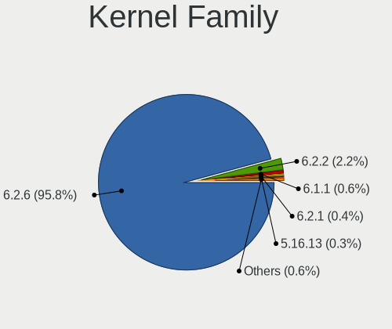

| Version | Computers | Percent |
|---------|-----------|---------|
| 6.2.6   | 1517      | 95.17%  |
| 6.2.2   | 41        | 2.57%   |
| 6.1.1   | 13        | 0.82%   |
| 6.2.1   | 6         | 0.38%   |
| 5.16.13 | 6         | 0.38%   |
| 6.1.4   | 4         | 0.25%   |
| 6.3.5   | 2         | 0.13%   |
| 6.2.8   | 2         | 0.13%   |
| 6.2.7   | 1         | 0.06%   |
| 6.2.10  | 1         | 0.06%   |
| 6.1.22  | 1         | 0.06%   |

Kernel Major Ver.
-----------------

Linux kernel major version

| Version | Computers | Percent |
|---------|-----------|---------|
| 6.2     | 1568      | 98.37%  |
| 6.1     | 18        | 1.13%   |
| 5.16    | 6         | 0.38%   |
| 6.3     | 2         | 0.13%   |

Arch
----

OS architecture (x86_64, i586, etc.)

| Name   | Computers | Percent |
|--------|-----------|---------|
| x86_64 | 1594      | 100%    |

DE
--

Desktop Environment

| Name     | Computers | Percent |
|----------|-----------|---------|
| KDE5     | 1356      | 85.07%  |
| GNOME    | 127       | 7.97%   |
| LXQt     | 96        | 6.02%   |
| Cinnamon | 6         | 0.38%   |
| XFCE     | 3         | 0.19%   |
| Budgie   | 3         | 0.19%   |
| Unknown  | 3         | 0.19%   |

Display Server
--------------

X11 or Wayland

| Name    | Computers | Percent |
|---------|-----------|---------|
| X11     | 1467      | 92.03%  |
| Wayland | 127       | 7.97%   |

Display Manager
---------------

SDDM, LightDM, etc.

| Name    | Computers | Percent |
|---------|-----------|---------|
| SDDM    | 1460      | 91.59%  |
| GDM     | 128       | 8.03%   |
| LightDM | 4         | 0.25%   |
| Unknown | 2         | 0.13%   |

OS Lang
-------

Language

| Lang  | Computers | Percent |
|-------|-----------|---------|
| en_US | 746       | 46.8%   |
| de_DE | 140       | 8.78%   |
| ru_RU | 93        | 5.83%   |
| fr_FR | 91        | 5.71%   |
| en_GB | 71        | 4.45%   |
| it_IT | 60        | 3.76%   |
| pl_PL | 57        | 3.58%   |
| pt_BR | 53        | 3.32%   |
| es_ES | 36        | 2.26%   |
| es_MX | 29        | 1.82%   |
| en_CA | 27        | 1.69%   |
| en_AU | 22        | 1.38%   |
| cs_CZ | 17        | 1.07%   |
| hu_HU | 15        | 0.94%   |
| en_IN | 11        | 0.69%   |
| nl_NL | 10        | 0.63%   |
| de_AT | 9         | 0.56%   |
| tr_TR | 8         | 0.5%    |
| ja_JP | 8         | 0.5%    |
| es_VE | 7         | 0.44%   |
| es_AR | 7         | 0.44%   |
| de_CH | 7         | 0.44%   |
| da_DK | 7         | 0.44%   |
| pt_PT | 6         | 0.38%   |
| fr_CA | 6         | 0.38%   |
| nl_BE | 5         | 0.31%   |
| fr_BE | 5         | 0.31%   |
| es_CO | 5         | 0.31%   |
| es_PE | 4         | 0.25%   |
| en_ZA | 4         | 0.25%   |
| en_NZ | 4         | 0.25%   |
| UTF-8 | 3         | 0.19%   |
| fr_CH | 3         | 0.19%   |
| es_UY | 3         | 0.19%   |
| es_CL | 2         | 0.13%   |
| en_AG | 2         | 0.13%   |
| C     | 2         | 0.13%   |
| sk_SK | 1         | 0.06%   |
| id_ID | 1         | 0.06%   |
| es_DO | 1         | 0.06%   |

Boot Mode
---------

EFI or BIOS

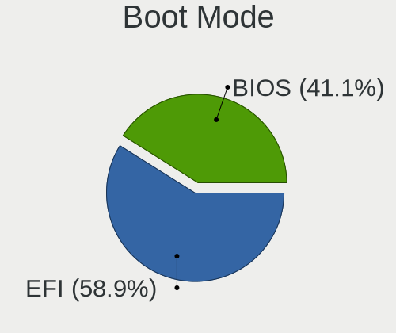

| Mode | Computers | Percent |
|------|-----------|---------|
| EFI  | 952       | 59.72%  |
| BIOS | 642       | 40.28%  |

Filesystem
----------

Type of filesystem

| Type     | Computers | Percent |
|----------|-----------|---------|
| Ext4     | 804       | 50.44%  |
| Overlay  | 656       | 41.15%  |
| Btrfs    | 97        | 6.09%   |
| Xfs      | 18        | 1.13%   |
| F2fs     | 14        | 0.88%   |
| Ext3     | 3         | 0.19%   |
| Reiserfs | 1         | 0.06%   |
| Jfs      | 1         | 0.06%   |

Part. scheme
------------

Scheme of partitioning

| Type    | Computers | Percent |
|---------|-----------|---------|
| GPT     | 1270      | 79.67%  |
| MBR     | 323       | 20.26%  |
| Unknown | 1         | 0.06%   |

Dual Boot with Linux/BSD
------------------------

Hosting more than one Linux/BSD

| Dual boot | Computers | Percent |
|-----------|-----------|---------|
| No        | 815       | 51.13%  |
| Yes       | 779       | 48.87%  |

Dual Boot (Win)
---------------

Hosting Linux and Windows

| Dual boot | Computers | Percent |
|-----------|-----------|---------|
| No        | 909       | 57.03%  |
| Yes       | 685       | 42.97%  |

Board
-----

Vendor
------

Motherboard manufacturer

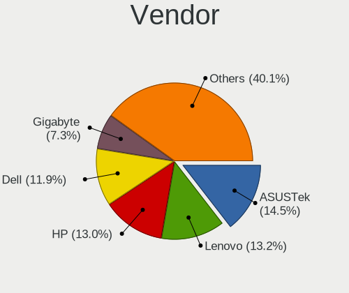

| Name                | Computers | Percent |
|---------------------|-----------|---------|
| ASUSTek Computer    | 241       | 15.12%  |
| Lenovo              | 222       | 13.93%  |
| Hewlett-Packard     | 206       | 12.92%  |
| Dell                | 176       | 11.04%  |
| Gigabyte Technology | 120       | 7.53%   |
| Acer                | 107       | 6.71%   |
| MSI                 | 93        | 5.83%   |
| ASRock              | 62        | 3.89%   |
| Toshiba             | 36        | 2.26%   |
| Intel               | 28        | 1.76%   |
| Fujitsu             | 28        | 1.76%   |
| Samsung Electronics | 26        | 1.63%   |
| Apple               | 17        | 1.07%   |
| Sony                | 15        | 0.94%   |
| Unknown             | 14        | 0.88%   |
| Biostar             | 13        | 0.82%   |
| Foxconn             | 12        | 0.75%   |
| Fujitsu Siemens     | 10        | 0.63%   |
| Medion              | 8         | 0.5%    |
| Notebook            | 7         | 0.44%   |
| Microsoft           | 7         | 0.44%   |
| ECS                 | 7         | 0.44%   |
| Chuwi               | 7         | 0.44%   |
| Pegatron            | 6         | 0.38%   |
| Packard Bell        | 6         | 0.38%   |
| AZW                 | 6         | 0.38%   |
| Positivo            | 5         | 0.31%   |
| HUAWEI              | 5         | 0.31%   |
| TUXEDO              | 4         | 0.25%   |
| NEC Computers       | 4         | 0.25%   |
| GPU Company         | 4         | 0.25%   |
| Timi                | 3         | 0.19%   |
| lapbook             | 3         | 0.19%   |
| Kiano               | 3         | 0.19%   |
| Google              | 3         | 0.19%   |
| eMachines           | 3         | 0.19%   |
| Alienware           | 3         | 0.19%   |
| Teclast             | 2         | 0.13%   |
| OEM                 | 2         | 0.13%   |
| LG Electronics      | 2         | 0.13%   |

Model
-----

Motherboard model

| Name                                        | Computers | Percent |
|---------------------------------------------|-----------|---------|
| Unknown                                     | 17        | 1.07%   |
| HP Notebook                                 | 8         | 0.5%    |
| Dell OptiPlex 7010                          | 8         | 0.5%    |
| ASUS PRIME A320M-K                          | 7         | 0.44%   |
| ASUS All Series                             | 7         | 0.44%   |
| Gigabyte Z77M-D3H                           | 6         | 0.38%   |
| ASUS S551LN                                 | 6         | 0.38%   |
| MSI MS-7C02                                 | 5         | 0.31%   |
| Lenovo IdeaPad 1 14ADA05 82GW               | 5         | 0.31%   |
| Intel H61                                   | 5         | 0.31%   |
| Toshiba Satellite L655                      | 4         | 0.25%   |
| Samsung 950XCJ/951XCJ/950XCR                | 4         | 0.25%   |
| Samsung 950QED                              | 4         | 0.25%   |
| MSI MS-7B86                                 | 4         | 0.25%   |
| MSI MS-7817                                 | 4         | 0.25%   |
| Lenovo V15-ADA 82C7                         | 4         | 0.25%   |
| Lenovo IdeaPad 3 15ALC6 82KU                | 4         | 0.25%   |
| HP EliteDesk 800 G1 SFF                     | 4         | 0.25%   |
| HP 250 G6 Notebook PC                       | 4         | 0.25%   |
| Foxconn G41MD                               | 4         | 0.25%   |
| Dell OptiPlex 3020                          | 4         | 0.25%   |
| ASUS P5G41T-M LX                            | 4         | 0.25%   |
| TUXEDO InfinityBook Pro Gen7 (MK1)          | 3         | 0.19%   |
| MSI MS-7C56                                 | 3         | 0.19%   |
| Lenovo ThinkPad X1 Extreme Gen 3 20TK001HUS | 3         | 0.19%   |
| Lenovo ThinkPad P1 Gen 4i 20Y3001LUK        | 3         | 0.19%   |
| Lenovo IdeaPad S145-15AST 81N3              | 3         | 0.19%   |
| Lenovo G50-70 20351                         | 3         | 0.19%   |
| lapbook S15 PRO                             | 3         | 0.19%   |
| Kiano Elegance 14.2                         | 3         | 0.19%   |
| HP Pavilion Notebook                        | 3         | 0.19%   |
| HP Laptop 15s-eq2xxx                        | 3         | 0.19%   |
| HP EliteBook 2530p                          | 3         | 0.19%   |
| HP Compaq Elite 8300 SFF                    | 3         | 0.19%   |
| HP 255 G8 Notebook PC                       | 3         | 0.19%   |
| Gigabyte GA-78LMT-USB3                      | 3         | 0.19%   |
| Fujitsu LIFEBOOK S935                       | 3         | 0.19%   |
| Dell OptiPlex 990                           | 3         | 0.19%   |
| Dell OptiPlex 9020                          | 3         | 0.19%   |
| Dell OptiPlex 390                           | 3         | 0.19%   |

Model Family
------------

Motherboard model prefix

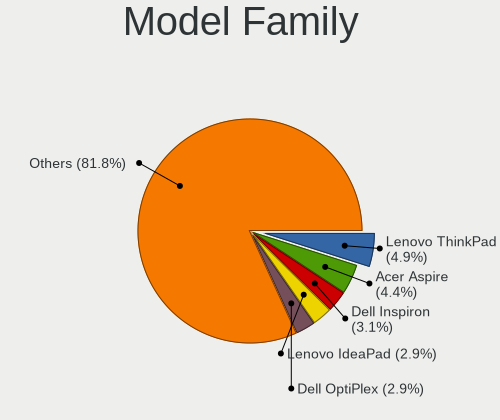

| Name                    | Computers | Percent |
|-------------------------|-----------|---------|
| Lenovo ThinkPad         | 78        | 4.89%   |
| Acer Aspire             | 75        | 4.71%   |
| Lenovo IdeaPad          | 49        | 3.07%   |
| Dell OptiPlex           | 44        | 2.76%   |
| Dell Latitude           | 44        | 2.76%   |
| ASUS PRIME              | 40        | 2.51%   |
| Dell Inspiron           | 39        | 2.45%   |
| HP Pavilion             | 32        | 2.01%   |
| HP Compaq               | 32        | 2.01%   |
| Toshiba Satellite       | 30        | 1.88%   |
| Lenovo ThinkCentre      | 22        | 1.38%   |
| HP Laptop               | 22        | 1.38%   |
| ASUS VivoBook           | 20        | 1.25%   |
| HP EliteBook            | 19        | 1.19%   |
| Dell Precision          | 19        | 1.19%   |
| Unknown                 | 17        | 1.07%   |
| ASUS ROG                | 15        | 0.94%   |
| HP EliteDesk            | 14        | 0.88%   |
| ASUS TUF                | 14        | 0.88%   |
| HP ProBook              | 13        | 0.82%   |
| Dell Vostro             | 13        | 0.82%   |
| Fujitsu LIFEBOOK        | 11        | 0.69%   |
| Lenovo IdeaCentre       | 10        | 0.63%   |
| Fujitsu ESPRIMO         | 9         | 0.56%   |
| Acer Veriton            | 9         | 0.56%   |
| HP ProDesk              | 8         | 0.5%    |
| HP Notebook             | 8         | 0.5%    |
| Dell XPS                | 8         | 0.5%    |
| Microsoft Surface       | 7         | 0.44%   |
| Lenovo Legion           | 7         | 0.44%   |
| Fujitsu Siemens ESPRIMO | 7         | 0.44%   |
| ASUS All                | 7         | 0.44%   |
| Lenovo Yoga             | 6         | 0.38%   |
| HP OMEN                 | 6         | 0.38%   |
| HP 250                  | 6         | 0.38%   |
| Gigabyte Z77M-D3H       | 6         | 0.38%   |
| Gigabyte B550           | 6         | 0.38%   |
| Dell System             | 6         | 0.38%   |
| ASUS S551LN             | 6         | 0.38%   |
| ASUS P5G41T-M           | 6         | 0.38%   |

MFG Year
--------

Motherboard manufacture year

| Year    | Computers | Percent |
|---------|-----------|---------|
| 2021    | 149       | 9.35%   |
| 2012    | 141       | 8.85%   |
| 2020    | 137       | 8.59%   |
| 2011    | 119       | 7.47%   |
| 2018    | 118       | 7.4%    |
| 2019    | 117       | 7.34%   |
| 2013    | 107       | 6.71%   |
| 2017    | 97        | 6.09%   |
| 2010    | 94        | 5.9%    |
| 2014    | 91        | 5.71%   |
| 2015    | 85        | 5.33%   |
| 2016    | 77        | 4.83%   |
| 2022    | 74        | 4.64%   |
| 2008    | 66        | 4.14%   |
| 2009    | 56        | 3.51%   |
| 2007    | 42        | 2.63%   |
| 2006    | 14        | 0.88%   |
| 2023    | 6         | 0.38%   |
| 2005    | 2         | 0.13%   |
| 2004    | 1         | 0.06%   |
| Unknown | 1         | 0.06%   |

Form Factor
-----------

Physical design of the computer

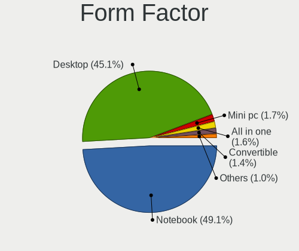

| Name        | Computers | Percent |
|-------------|-----------|---------|
| Notebook    | 784       | 49.18%  |
| Desktop     | 718       | 45.04%  |
| Convertible | 25        | 1.57%   |
| Mini pc     | 25        | 1.57%   |
| All in one  | 25        | 1.57%   |
| Tablet      | 10        | 0.63%   |
| Server      | 7         | 0.44%   |

Secure Boot
-----------

Enabled or disabled

| State    | Computers | Percent |
|----------|-----------|---------|
| Disabled | 1594      | 100%    |

Coreboot
--------

Have coreboot on board

| Used | Computers | Percent |
|------|-----------|---------|
| No   | 1590      | 99.75%  |
| Yes  | 4         | 0.25%   |

RAM Size
--------

Total RAM memory

| Size in GB      | Computers | Percent |
|-----------------|-----------|---------|
| 4.01-8.0        | 488       | 30.61%  |
| 3.01-4.0        | 314       | 19.7%   |
| 16.01-24.0      | 289       | 18.13%  |
| 8.01-16.0       | 260       | 16.31%  |
| 32.01-64.0      | 113       | 7.09%   |
| 1.01-2.0        | 38        | 2.38%   |
| 64.01-256.0     | 31        | 1.94%   |
| 24.01-32.0      | 30        | 1.88%   |
| 2.01-3.0        | 28        | 1.76%   |
| 0.51-1.0        | 2         | 0.13%   |
| More than 256.0 | 1         | 0.06%   |

RAM Used
--------

Used RAM memory

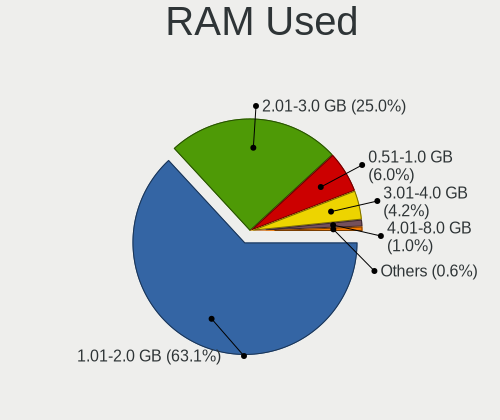

| Used GB   | Computers | Percent |
|-----------|-----------|---------|
| 1.01-2.0  | 1010      | 63.36%  |
| 2.01-3.0  | 403       | 25.28%  |
| 0.51-1.0  | 81        | 5.08%   |
| 3.01-4.0  | 74        | 4.64%   |
| 4.01-8.0  | 17        | 1.07%   |
| 0.01-0.5  | 8         | 0.5%    |
| 8.01-16.0 | 1         | 0.06%   |

Total Drives
------------

Number of drives on board

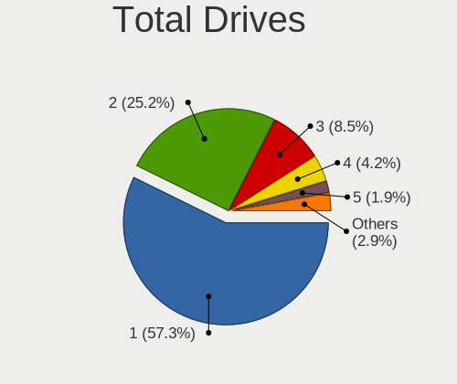

| Drives | Computers | Percent |
|--------|-----------|---------|
| 1      | 899       | 56.4%   |
| 2      | 421       | 26.41%  |
| 3      | 130       | 8.16%   |
| 4      | 71        | 4.45%   |
| 5      | 32        | 2.01%   |
| 0      | 20        | 1.25%   |
| 6      | 11        | 0.69%   |
| 8      | 4         | 0.25%   |
| 7      | 4         | 0.25%   |
| 13     | 1         | 0.06%   |
| 9      | 1         | 0.06%   |

Has CD-ROM
----------

Has CD-ROM on board

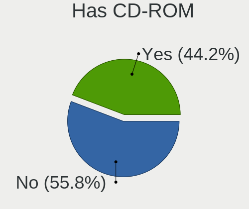

| Presented | Computers | Percent |
|-----------|-----------|---------|
| No        | 893       | 56.02%  |
| Yes       | 701       | 43.98%  |

Has Ethernet
------------

Has Ethernet on board

| Presented | Computers | Percent |
|-----------|-----------|---------|
| Yes       | 1410      | 88.46%  |
| No        | 184       | 11.54%  |

Has WiFi
--------

Has WiFi module

| Presented | Computers | Percent |
|-----------|-----------|---------|
| Yes       | 1145      | 71.83%  |
| No        | 449       | 28.17%  |

Has Bluetooth
-------------

Has Bluetooth module

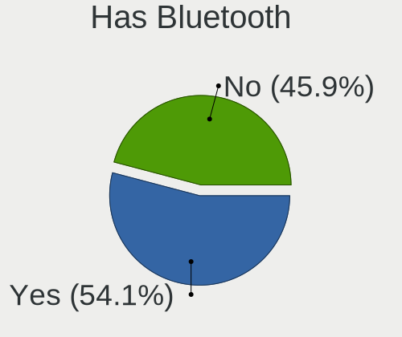

| Presented | Computers | Percent |
|-----------|-----------|---------|
| Yes       | 878       | 55.08%  |
| No        | 716       | 44.92%  |

Location
--------

Country
-------

Geographic location (country)

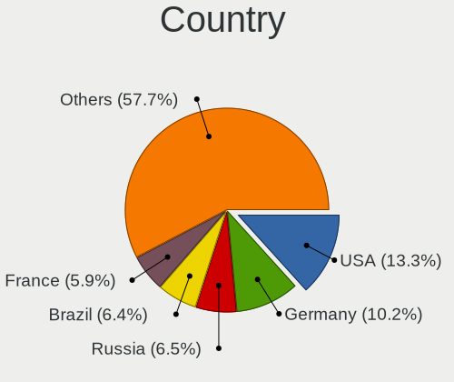

| Country      | Computers | Percent |
|--------------|-----------|---------|
| USA          | 208       | 13.05%  |
| Germany      | 176       | 11.04%  |
| Russia       | 110       | 6.9%    |
| Brazil       | 94        | 5.9%    |
| France       | 89        | 5.58%   |
| Italy        | 86        | 5.4%    |
| Poland       | 73        | 4.58%   |
| UK           | 65        | 4.08%   |
| Canada       | 52        | 3.26%   |
| Japan        | 49        | 3.07%   |
| Spain        | 46        | 2.89%   |
| India        | 29        | 1.82%   |
| Australia    | 29        | 1.82%   |
| Netherlands  | 26        | 1.63%   |
| Mexico       | 23        | 1.44%   |
| Czechia      | 23        | 1.44%   |
| Finland      | 22        | 1.38%   |
| Hungary      | 18        | 1.13%   |
| Argentina    | 16        | 1%      |
| Indonesia    | 15        | 0.94%   |
| Belgium      | 14        | 0.88%   |
| Denmark      | 13        | 0.82%   |
| Switzerland  | 12        | 0.75%   |
| Romania      | 12        | 0.75%   |
| Portugal     | 12        | 0.75%   |
| Venezuela    | 11        | 0.69%   |
| Austria      | 11        | 0.69%   |
| Sweden       | 10        | 0.63%   |
| Peru         | 10        | 0.63%   |
| Greece       | 10        | 0.63%   |
| Colombia     | 10        | 0.63%   |
| China        | 10        | 0.63%   |
| Bulgaria     | 10        | 0.63%   |
| Turkey       | 9         | 0.56%   |
| Slovakia     | 9         | 0.56%   |
| South Africa | 8         | 0.5%    |
| Belarus      | 8         | 0.5%    |
| Malaysia     | 7         | 0.44%   |
| Chile        | 7         | 0.44%   |
| Vietnam      | 6         | 0.38%   |

City
----

Geographic location (city)

| City           | Computers | Percent |
|----------------|-----------|---------|
| Moscow         | 23        | 1.44%   |
| Milan          | 15        | 0.94%   |
| Warsaw         | 14        | 0.88%   |
| St Petersburg  | 13        | 0.82%   |
| Berlin         | 13        | 0.82%   |
| Hamburg        | 12        | 0.75%   |
| Helsinki       | 11        | 0.69%   |
| Rio de Janeiro | 10        | 0.63%   |
| Rome           | 9         | 0.56%   |
| Montreal       | 9         | 0.56%   |
| Brisbane       | 9         | 0.56%   |
| Vienna         | 8         | 0.5%    |
| Munich         | 8         | 0.5%    |
| Sydney         | 7         | 0.44%   |
| Prague         | 7         | 0.44%   |
| Paris          | 7         | 0.44%   |
| Lima           | 7         | 0.44%   |
| Kuala Lumpur   | 7         | 0.44%   |
| Ufa            | 6         | 0.38%   |
| Mexico City    | 6         | 0.38%   |
| Freeport       | 6         | 0.38%   |
| Cologne        | 6         | 0.38%   |
| Budapest       | 6         | 0.38%   |
| Yokohama       | 5         | 0.31%   |
| Santiago       | 5         | 0.31%   |
| Pescara        | 5         | 0.31%   |
| Montpellier    | 5         | 0.31%   |
| Montevideo     | 5         | 0.31%   |
| Madrid         | 5         | 0.31%   |
| Los Angeles    | 5         | 0.31%   |
| Krasnodar      | 5         | 0.31%   |
| Krakow         | 5         | 0.31%   |
| Hexham         | 5         | 0.31%   |
| Glasgow        | 5         | 0.31%   |
| Buenos Aires   | 5         | 0.31%   |
| Bucharest      | 5         | 0.31%   |
| Bengaluru      | 5         | 0.31%   |
| Athens         | 5         | 0.31%   |
| Wuppertal      | 4         | 0.25%   |
| Victoria       | 4         | 0.25%   |

Drives
------

Drive Vendor
------------

Hard drive vendors

| Vendor              | Computers | Drives | Percent |
|---------------------|-----------|--------|---------|
| Seagate             | 360       | 407    | 14.97%  |
| WDC                 | 350       | 421    | 14.55%  |
| Samsung Electronics | 273       | 326    | 11.35%  |
| Toshiba             | 166       | 172    | 6.9%    |
| Kingston            | 150       | 174    | 6.24%   |
| Crucial             | 125       | 139    | 5.2%    |
| SanDisk             | 95        | 106    | 3.95%   |
| Hitachi             | 84        | 89     | 3.49%   |
| Unknown             | 61        | 65     | 2.54%   |
| SPCC                | 44        | 49     | 1.83%   |
| HGST                | 44        | 47     | 1.83%   |
| Intel               | 43        | 44     | 1.79%   |
| China               | 40        | 42     | 1.66%   |
| A-DATA Technology   | 39        | 41     | 1.62%   |
| Micron Technology   | 29        | 29     | 1.21%   |
| SK hynix            | 28        | 28     | 1.16%   |
| PNY                 | 28        | 29     | 1.16%   |
| Transcend           | 19        | 19     | 0.79%   |
| Patriot             | 19        | 19     | 0.79%   |
| JMicron Technology  | 19        | 19     | 0.79%   |
| Netac               | 17        | 18     | 0.71%   |
| KIOXIA              | 15        | 15     | 0.62%   |
| Phison              | 14        | 15     | 0.58%   |
| Intenso             | 14        | 15     | 0.58%   |
| KingSpec            | 13        | 13     | 0.54%   |
| GOODRAM             | 13        | 13     | 0.54%   |
| Maxtor              | 12        | 13     | 0.5%    |
| Gigabyte Technology | 11        | 11     | 0.46%   |
| XPG                 | 10        | 12     | 0.42%   |
| Apacer              | 10        | 11     | 0.42%   |
| Team                | 9         | 9      | 0.37%   |
| SABRENT             | 9         | 9      | 0.37%   |
| Silicon Motion      | 8         | 8      | 0.33%   |
| LITEON              | 8         | 8      | 0.33%   |
| KIOXIA-EXCERIA      | 7         | 7      | 0.29%   |
| Fujitsu             | 7         | 7      | 0.29%   |
| Apple               | 7         | 8      | 0.29%   |
| Unknown             | 7         | 8      | 0.29%   |
| Verbatim            | 6         | 6      | 0.25%   |
| OCZ                 | 6         | 8      | 0.25%   |

Drive Model
-----------

Hard drive models

| Model                              | Computers | Percent |
|------------------------------------|-----------|---------|
| Kingston SA400S37240G 240GB SSD    | 26        | 1%      |
| Seagate ST500DM002-1BD142 500GB    | 22        | 0.84%   |
| Toshiba DT01ACA100 1TB             | 21        | 0.81%   |
| Toshiba MQ01ABD100 1TB             | 20        | 0.77%   |
| Kingston SA400S37480G 480GB SSD    | 20        | 0.77%   |
| Crucial CT500MX500SSD1 500GB       | 20        | 0.77%   |
| Crucial CT240BX500SSD1 240GB       | 18        | 0.69%   |
| Seagate ST1000LM035-1RK172 1TB     | 17        | 0.65%   |
| Toshiba MQ01ABF050 500GB           | 16        | 0.61%   |
| Seagate ST500LT012-1DG142 500GB    | 15        | 0.58%   |
| Kingston SA400S37120G 120GB SSD    | 15        | 0.58%   |
| Unknown SD/MMC/MS PRO 250GB        | 14        | 0.54%   |
| Crucial CT480BX500SSD1 480GB       | 14        | 0.54%   |
| Seagate ST2000DM008-2FR102 2TB     | 13        | 0.5%    |
| SPCC Solid State Disk 512GB        | 12        | 0.46%   |
| Seagate ST1000DM010-2EP102 1TB     | 12        | 0.46%   |
| SanDisk NVMe SSD Drive 1TB         | 12        | 0.46%   |
| Samsung SSD 860 EVO 500GB          | 12        | 0.46%   |
| Toshiba MQ04ABF100 1TB             | 11        | 0.42%   |
| Seagate ST1000LM024 HN-M101MBB 1TB | 11        | 0.42%   |
| JMicron Generic 240GB              | 11        | 0.42%   |
| Toshiba DT01ACA050 500GB           | 10        | 0.38%   |
| Seagate ST1000LM048-2E7172 1TB     | 10        | 0.38%   |
| Seagate ST1000DM003-1CH162 1TB     | 10        | 0.38%   |
| Samsung SSD 970 EVO Plus 1TB       | 10        | 0.38%   |
| Samsung SSD 860 EVO 250GB          | 10        | 0.38%   |
| Crucial CT1000MX500SSD1 1TB        | 10        | 0.38%   |
| WDC WDS240G2G0A-00JH30 240GB SSD   | 9         | 0.35%   |
| WDC WD10EZEX-08WN4A0 1TB           | 9         | 0.35%   |
| Seagate ST9500325AS 500GB          | 9         | 0.35%   |
| Seagate ST3500418AS 500GB          | 9         | 0.35%   |
| Seagate ST2000DM001-1ER164 2TB     | 9         | 0.35%   |
| Samsung SSD 860 EVO 1TB            | 9         | 0.35%   |
| Samsung SSD 850 EVO 250GB          | 9         | 0.35%   |
| Kingston SV300S37A120G 120GB SSD   | 9         | 0.35%   |
| Crucial CT1000BX500SSD1 1TB        | 9         | 0.35%   |
| WDC WDS120G2G0A-00JH30 128GB SSD   | 8         | 0.31%   |
| WDC WD5000AAKX-001CA0 500GB        | 8         | 0.31%   |
| SPCC Solid State Disk 256GB        | 8         | 0.31%   |
| SPCC M.2 PCIe SSD 256GB            | 8         | 0.31%   |

HDD Vendor
----------

Hard disk drive vendors

| Vendor              | Computers | Drives | Percent |
|---------------------|-----------|--------|---------|
| Seagate             | 353       | 397    | 35.98%  |
| WDC                 | 264       | 309    | 26.91%  |
| Toshiba             | 146       | 150    | 14.88%  |
| Hitachi             | 84        | 89     | 8.56%   |
| HGST                | 44        | 47     | 4.49%   |
| Samsung Electronics | 37        | 42     | 3.77%   |
| Unknown             | 14        | 14     | 1.43%   |
| Maxtor              | 11        | 12     | 1.12%   |
| Fujitsu             | 7         | 7      | 0.71%   |
| Apple               | 3         | 3      | 0.31%   |
| WD MediaMax         | 2         | 2      | 0.2%    |
| Intenso             | 2         | 2      | 0.2%    |
| ExcelStor           | 2         | 2      | 0.2%    |
| ASMedia             | 2         | 2      | 0.2%    |
| USB3.0              | 1         | 1      | 0.1%    |
| USB                 | 1         | 1      | 0.1%    |
| StoreJet            | 1         | 1      | 0.1%    |
| SSK                 | 1         | 1      | 0.1%    |
| SAGE                | 1         | 1      | 0.1%    |
| SABRENT             | 1         | 1      | 0.1%    |
| RSH-319             | 1         | 1      | 0.1%    |
| QUANTUM             | 1         | 1      | 0.1%    |
| LaCie               | 1         | 1      | 0.1%    |
| KESU                | 1         | 1      | 0.1%    |

SSD Vendor
----------

Solid state drive vendors

| Vendor              | Computers | Drives | Percent |
|---------------------|-----------|--------|---------|
| Samsung Electronics | 134       | 147    | 14.5%   |
| Kingston            | 107       | 124    | 11.58%  |
| Crucial             | 103       | 108    | 11.15%  |
| SanDisk             | 71        | 78     | 7.68%   |
| WDC                 | 56        | 62     | 6.06%   |
| China               | 40        | 42     | 4.33%   |
| SPCC                | 36        | 38     | 3.9%    |
| A-DATA Technology   | 31        | 32     | 3.35%   |
| PNY                 | 23        | 24     | 2.49%   |
| Intel               | 20        | 20     | 2.16%   |
| Patriot             | 19        | 19     | 2.06%   |
| Netac               | 16        | 17     | 1.73%   |
| Micron Technology   | 16        | 16     | 1.73%   |
| Transcend           | 15        | 15     | 1.62%   |
| Toshiba             | 13        | 13     | 1.41%   |
| Intenso             | 12        | 12     | 1.3%    |
| KingSpec            | 11        | 11     | 1.19%   |
| GOODRAM             | 11        | 11     | 1.19%   |
| SK hynix            | 9         | 9      | 0.97%   |
| LITEON              | 8         | 8      | 0.87%   |
| Gigabyte Technology | 8         | 8      | 0.87%   |
| Apacer              | 8         | 8      | 0.87%   |
| Verbatim            | 6         | 6      | 0.65%   |
| Team                | 6         | 6      | 0.65%   |
| Seagate             | 6         | 6      | 0.65%   |
| OCZ                 | 6         | 8      | 0.65%   |
| XrayDisk            | 4         | 4      | 0.43%   |
| Teclast             | 4         | 4      | 0.43%   |
| Lexar               | 4         | 4      | 0.43%   |
| KingFast            | 4         | 4      | 0.43%   |
| JMicron Technology  | 4         | 4      | 0.43%   |
| Emtec               | 4         | 4      | 0.43%   |
| Unknown             | 4         | 5      | 0.43%   |
| ShiJi               | 3         | 3      | 0.32%   |
| Mushkin             | 3         | 3      | 0.32%   |
| KingDian            | 3         | 3      | 0.32%   |
| FORESEE             | 3         | 3      | 0.32%   |
| Dogfish             | 3         | 3      | 0.32%   |
| ASMT                | 3         | 3      | 0.32%   |
| Wibtek              | 2         | 2      | 0.22%   |

Drive Kind
----------

HDD or SSD

| Kind    | Computers | Drives | Percent |
|---------|-----------|--------|---------|
| HDD     | 820       | 1088   | 39.08%  |
| SSD     | 771       | 982    | 36.75%  |
| NVMe    | 438       | 525    | 20.88%  |
| MMC     | 49        | 52     | 2.34%   |
| Unknown | 20        | 22     | 0.95%   |

Drive Connector
---------------

SATA, SAS, NVMe, etc.

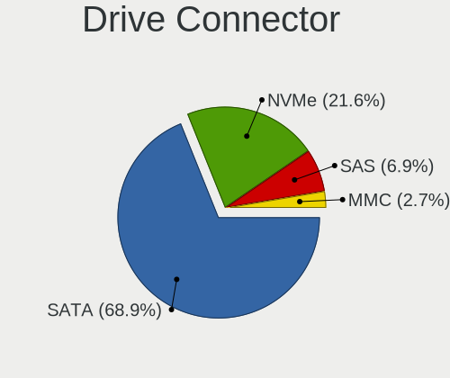

| Type | Computers | Drives | Percent |
|------|-----------|--------|---------|
| SATA | 1304      | 1953   | 67.99%  |
| NVMe | 426       | 504    | 22.21%  |
| SAS  | 139       | 160    | 7.25%   |
| MMC  | 49        | 52     | 2.55%   |

Drive Size
----------

Size of hard drive

| Size in TB      | Computers | Drives | Percent |
|-----------------|-----------|--------|---------|
| 0.01-0.5        | 1009      | 1316   | 61.3%   |
| 0.51-1.0        | 473       | 559    | 28.74%  |
| 1.01-2.0        | 101       | 117    | 6.14%   |
| 2.01-3.0        | 23        | 26     | 1.4%    |
| 4.01-10.0       | 19        | 28     | 1.15%   |
| 3.01-4.0        | 17        | 19     | 1.03%   |
| 10.01-20.0      | 3         | 4      | 0.18%   |
| More than 100.0 | 1         | 1      | 0.06%   |

Space Total
-----------

Amount of disk space available on the file system

| Size in GB     | Computers | Percent |
|----------------|-----------|---------|
| 1-20           | 495       | 31.05%  |
| 101-250        | 337       | 21.14%  |
| 251-500        | 267       | 16.75%  |
| 501-1000       | 144       | 9.03%   |
| 51-100         | 102       | 6.4%    |
| 21-50          | 87        | 5.46%   |
| Unknown        | 62        | 3.89%   |
| 1001-2000      | 59        | 3.7%    |
| 2001-3000      | 22        | 1.38%   |
| More than 3000 | 19        | 1.19%   |

Space Used
----------

Amount of used disk space

| Used GB        | Computers | Percent |
|----------------|-----------|---------|
| 1-20           | 1234      | 77.42%  |
| 21-50          | 120       | 7.53%   |
| Unknown        | 62        | 3.89%   |
| 101-250        | 53        | 3.32%   |
| 51-100         | 50        | 3.14%   |
| 251-500        | 34        | 2.13%   |
| 501-1000       | 28        | 1.76%   |
| 1001-2000      | 6         | 0.38%   |
| More than 3000 | 4         | 0.25%   |
| 2001-3000      | 3         | 0.19%   |

Malfunc. Drives
---------------

Drive models with a malfunction

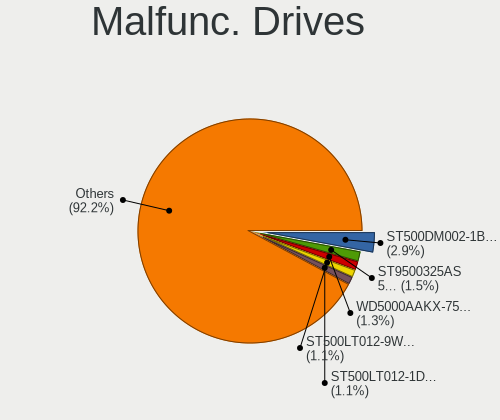

| Model                                | Computers | Drives | Percent |
|--------------------------------------|-----------|--------|---------|
| Seagate ST500DM002-1BD142 500GB      | 12        | 12     | 2.71%   |
| WDC WD5000AAKX-75U6AA0 500GB         | 6         | 6      | 1.36%   |
| Seagate ST9500325AS 500GB            | 6         | 6      | 1.36%   |
| Seagate ST500LT012-1DG142 500GB      | 6         | 6      | 1.36%   |
| WDC WD5000AAKX-001CA0 500GB          | 5         | 5      | 1.13%   |
| Toshiba MQ01ABD100 1TB               | 5         | 5      | 1.13%   |
| Seagate ST3500418AS 500GB            | 5         | 5      | 1.13%   |
| Hitachi HTS723232A7A364 320GB        | 5         | 5      | 1.13%   |
| Hitachi HDS721010CLA332 1TB          | 5         | 5      | 1.13%   |
| HGST HTS545050A7E680 500GB           | 5         | 5      | 1.13%   |
| HGST HTS545050A7E380 500GB           | 5         | 5      | 1.13%   |
| HGST HTS541010A9E680 1TB             | 5         | 5      | 1.13%   |
| Seagate ST1000LM035-1RK172 1TB       | 4         | 4      | 0.9%    |
| Seagate ST1000LM024 HN-M101MBB 1TB   | 4         | 4      | 0.9%    |
| Hitachi HTS547575A9E384 752GB        | 4         | 4      | 0.9%    |
| HGST HTS721010A9E630 1TB             | 4         | 4      | 0.9%    |
| Toshiba MQ04ABF100 1TB               | 3         | 3      | 0.68%   |
| Toshiba MQ01ABD050 500GB             | 3         | 3      | 0.68%   |
| Toshiba DT01ACA100 1TB               | 3         | 3      | 0.68%   |
| Seagate ST500LT012-9WS142 500GB      | 3         | 3      | 0.68%   |
| Seagate ST500LM021-1KJ152 500GB      | 3         | 3      | 0.68%   |
| Seagate ST3320418AS 320GB            | 3         | 3      | 0.68%   |
| Seagate ST2000DM001-1ER164 2TB       | 3         | 4      | 0.68%   |
| Seagate ST1000DM003-1CH162 1TB       | 3         | 3      | 0.68%   |
| Samsung Electronics HD103SI 1TB      | 3         | 3      | 0.68%   |
| HGST HTS725050A7E630 500GB           | 3         | 3      | 0.68%   |
| WDC WDS240G2G0A-00JH30 240GB SSD     | 2         | 2      | 0.45%   |
| WDC WD3200BEVT-22ZCT0 320GB          | 2         | 2      | 0.45%   |
| WDC WD3200AAKS-61L9A0 320GB          | 2         | 2      | 0.45%   |
| WDC WD20EARX-00PASB0 2TB             | 2         | 2      | 0.45%   |
| WDC WD10EARS-00Y5B1 1TB              | 2         | 2      | 0.45%   |
| WDC WD1002FAEX-00Z3A0 1TB            | 2         | 2      | 0.45%   |
| WDC WD Blue SA510 M.2 2280 500GB SSD | 2         | 2      | 0.45%   |
| Toshiba MK5075GSX 500GB              | 2         | 2      | 0.45%   |
| Toshiba MK5065GSX 500GB              | 2         | 2      | 0.45%   |
| Toshiba MK2529GSG 250GB              | 2         | 2      | 0.45%   |
| Toshiba MK1652GSX 160GB              | 2         | 2      | 0.45%   |
| Seagate ST9750420AS 752GB            | 2         | 2      | 0.45%   |
| Seagate ST9320325AS 320GB            | 2         | 2      | 0.45%   |
| Seagate ST500LM012 HN-M500MBB 500GB  | 2         | 2      | 0.45%   |

Malfunc. Drive Vendor
---------------------

Vendors of faulty drives

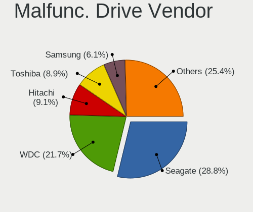

| Vendor              | Computers | Drives | Percent |
|---------------------|-----------|--------|---------|
| Seagate             | 123       | 124    | 28.28%  |
| WDC                 | 94        | 100    | 21.61%  |
| Hitachi             | 42        | 43     | 9.66%   |
| Toshiba             | 39        | 39     | 8.97%   |
| HGST                | 26        | 27     | 5.98%   |
| Samsung Electronics | 23        | 24     | 5.29%   |
| Intel               | 13        | 13     | 2.99%   |
| Maxtor              | 8         | 9      | 1.84%   |
| Kingston            | 7         | 7      | 1.61%   |
| China               | 6         | 6      | 1.38%   |
| SK hynix            | 5         | 5      | 1.15%   |
| Fujitsu             | 5         | 5      | 1.15%   |
| SanDisk             | 4         | 4      | 0.92%   |
| KingSpec            | 4         | 4      | 0.92%   |
| SPCC                | 3         | 3      | 0.69%   |
| Netac               | 3         | 3      | 0.69%   |
| Intenso             | 3         | 3      | 0.69%   |
| Crucial             | 3         | 3      | 0.69%   |
| A-DATA Technology   | 3         | 3      | 0.69%   |
| LITEON              | 2         | 2      | 0.46%   |
| ExcelStor           | 2         | 2      | 0.46%   |
| WD MediaMax         | 1         | 1      | 0.23%   |
| Teclast             | 1         | 1      | 0.23%   |
| Team                | 1         | 1      | 0.23%   |
| SATAFIRM            | 1         | 1      | 0.23%   |
| SAGE                | 1         | 1      | 0.23%   |
| RSH-319             | 1         | 1      | 0.23%   |
| QUANTUM             | 1         | 1      | 0.23%   |
| Plextor             | 1         | 1      | 0.23%   |
| Patriot             | 1         | 1      | 0.23%   |
| OCZ                 | 1         | 1      | 0.23%   |
| Micron Technology   | 1         | 1      | 0.23%   |
| Indilinx            | 1         | 1      | 0.23%   |
| Hewlett-Packard     | 1         | 1      | 0.23%   |
| Fanxiang            | 1         | 1      | 0.23%   |
| BAITITON            | 1         | 1      | 0.23%   |
| Apple               | 1         | 1      | 0.23%   |
| Unknown             | 1         | 1      | 0.23%   |

Malfunc. HDD Vendor
-------------------

Vendors of faulty HDD drives

| Vendor              | Computers | Drives | Percent |
|---------------------|-----------|--------|---------|
| Seagate             | 123       | 124    | 34.45%  |
| WDC                 | 88        | 93     | 24.65%  |
| Hitachi             | 42        | 43     | 11.76%  |
| Toshiba             | 38        | 38     | 10.64%  |
| HGST                | 26        | 27     | 7.28%   |
| Samsung Electronics | 20        | 21     | 5.6%    |
| Maxtor              | 8         | 9      | 2.24%   |
| Fujitsu             | 5         | 5      | 1.4%    |
| ExcelStor           | 2         | 2      | 0.56%   |
| WD MediaMax         | 1         | 1      | 0.28%   |
| SAGE                | 1         | 1      | 0.28%   |
| RSH-319             | 1         | 1      | 0.28%   |
| QUANTUM             | 1         | 1      | 0.28%   |
| Apple               | 1         | 1      | 0.28%   |

Malfunc. Drive Kind
-------------------

Kinds of faulty drives

| Kind | Computers | Drives | Percent |
|------|-----------|--------|---------|
| HDD  | 332       | 367    | 80.78%  |
| SSD  | 70        | 70     | 17.03%  |
| NVMe | 9         | 9      | 2.19%   |

Failed Drives
-------------

Failed drive models

| Model                             | Computers | Drives | Percent |
|-----------------------------------|-----------|--------|---------|
| WDC WD3200BPVT-00JJ5T0 320GB      | 1         | 1      | 10%     |
| WDC WD1600AAJS-00YZCA0 160GB      | 1         | 1      | 10%     |
| Toshiba MK3261GSYN 320GB          | 1         | 1      | 10%     |
| Toshiba DT01ACA050 500GB          | 1         | 1      | 10%     |
| Seagate ST9320423AS 320GB         | 1         | 1      | 10%     |
| Seagate ST500DM002-1BD142 500GB   | 1         | 1      | 10%     |
| Samsung Electronics HD753LJ 752GB | 1         | 1      | 10%     |
| Samsung Electronics HD252HJ 250GB | 1         | 1      | 10%     |
| Samsung Electronics HD103UJ 1TB   | 1         | 1      | 10%     |
| HGST HTS545050B7E660 500GB        | 1         | 1      | 10%     |

Failed Drive Vendor
-------------------

Failed drive vendors

| Vendor              | Computers | Drives | Percent |
|---------------------|-----------|--------|---------|
| Samsung Electronics | 3         | 3      | 30%     |
| WDC                 | 2         | 2      | 20%     |
| Toshiba             | 2         | 2      | 20%     |
| Seagate             | 2         | 2      | 20%     |
| HGST                | 1         | 1      | 10%     |

Drive Status
------------

Number of failed and malfunc. drives

| Status   | Computers | Drives | Percent |
|----------|-----------|--------|---------|
| Works    | 1300      | 2011   | 68.97%  |
| Malfunc  | 399       | 446    | 21.17%  |
| Detected | 176       | 202    | 9.34%   |
| Failed   | 10        | 10     | 0.53%   |

Storage controller
------------------

Storage Vendor
--------------

Storage controller vendors

| Vendor                                  | Computers | Percent |
|-----------------------------------------|-----------|---------|
| Intel                                   | 1108      | 55.65%  |
| AMD                                     | 347       | 17.43%  |
| Samsung Electronics                     | 125       | 6.28%   |
| SanDisk                                 | 68        | 3.42%   |
| Kingston Technology Company             | 50        | 2.51%   |
| Phison Electronics                      | 44        | 2.21%   |
| ASMedia Technology                      | 30        | 1.51%   |
| Micron/Crucial Technology               | 27        | 1.36%   |
| Silicon Motion                          | 26        | 1.31%   |
| Nvidia                                  | 23        | 1.16%   |
| SK hynix                                | 19        | 0.95%   |
| KIOXIA                                  | 19        | 0.95%   |
| ADATA Technology                        | 17        | 0.85%   |
| Micron Technology                       | 13        | 0.65%   |
| Marvell Technology Group                | 12        | 0.6%    |
| JMicron Technology                      | 12        | 0.6%    |
| Toshiba America Info Systems            | 10        | 0.5%    |
| VIA Technologies                        | 7         | 0.35%   |
| MAXIO Technology (Hangzhou)             | 6         | 0.3%    |
| Solid State Storage Technology          | 4         | 0.2%    |
| Realtek Semiconductor                   | 4         | 0.2%    |
| Union Memory (Shenzhen)                 | 3         | 0.15%   |
| Silicon Integrated Systems [SiS]        | 2         | 0.1%    |
| Shenzhen Longsys Electronics            | 2         | 0.1%    |
| Broadcom / LSI                          | 2         | 0.1%    |
| Biwin Storage Technology                | 2         | 0.1%    |
| Transcend                               | 1         | 0.05%   |
| Silicon Image                           | 1         | 0.05%   |
| Shenzhen Unionmemory Information System | 1         | 0.05%   |
| Seagate Technology                      | 1         | 0.05%   |
| Promise Technology                      | 1         | 0.05%   |
| Netac Technology                        | 1         | 0.05%   |
| LSI Logic / Symbios Logic               | 1         | 0.05%   |
| Lenovo                                  | 1         | 0.05%   |
| Apple                                   | 1         | 0.05%   |

Storage Model
-------------

Storage controller models

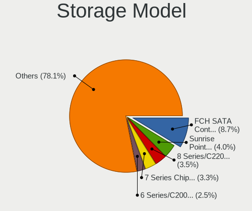

| Model                                                                                   | Computers | Percent |
|-----------------------------------------------------------------------------------------|-----------|---------|
| AMD FCH SATA Controller [AHCI mode]                                                     | 211       | 9.07%   |
| Intel Sunrise Point-LP SATA Controller [AHCI mode]                                      | 88        | 3.78%   |
| Intel 8 Series/C220 Series Chipset Family 6-port SATA Controller 1 [AHCI mode]          | 77        | 3.31%   |
| Intel 7 Series Chipset Family 6-port SATA Controller [AHCI mode]                        | 73        | 3.14%   |
| Intel 6 Series/C200 Series Chipset Family 6 port Mobile SATA AHCI Controller            | 53        | 2.28%   |
| Samsung NVMe SSD Controller SM981/PM981/PM983                                           | 48        | 2.06%   |
| Intel NM10/ICH7 Family SATA Controller [IDE mode]                                       | 45        | 1.93%   |
| Intel 6 Series/C200 Series Chipset Family 6 port Desktop SATA AHCI Controller           | 42        | 1.81%   |
| Intel 200 Series PCH SATA controller [AHCI mode]                                        | 42        | 1.81%   |
| Samsung NVMe SSD Controller 980                                                         | 41        | 1.76%   |
| Intel 82801G (ICH7 Family) IDE Controller                                               | 41        | 1.76%   |
| AMD 400 Series Chipset SATA Controller                                                  | 41        | 1.76%   |
| AMD SB7x0/SB8x0/SB9x0 SATA Controller [AHCI mode]                                       | 40        | 1.72%   |
| Intel Q170/Q150/B150/H170/H110/Z170/CM236 Chipset SATA Controller [AHCI Mode]           | 39        | 1.68%   |
| AMD 500 Series Chipset SATA Controller                                                  | 39        | 1.68%   |
| Intel 82801IBM/IEM (ICH9M/ICH9M-E) 4 port SATA Controller [AHCI mode]                   | 38        | 1.63%   |
| Intel 82801 Mobile SATA Controller [RAID mode]                                          | 38        | 1.63%   |
| Intel Volume Management Device NVMe RAID Controller                                     | 35        | 1.5%    |
| Intel Celeron/Pentium Silver Processor SATA Controller                                  | 35        | 1.5%    |
| AMD SB7x0/SB8x0/SB9x0 IDE Controller                                                    | 33        | 1.42%   |
| Intel 7 Series/C210 Series Chipset Family 6-port SATA Controller [AHCI mode]            | 32        | 1.38%   |
| Intel Wildcat Point-LP SATA Controller [AHCI Mode]                                      | 30        | 1.29%   |
| Intel 5 Series/3400 Series Chipset 4 port SATA AHCI Controller                          | 29        | 1.25%   |
| ASMedia ASM1062 Serial ATA Controller                                                   | 28        | 1.2%    |
| Intel Cannon Lake PCH SATA AHCI Controller                                              | 27        | 1.16%   |
| Samsung NVMe SSD Controller PM9A1/PM9A3/980PRO                                          | 26        | 1.12%   |
| Intel 82801HM/HEM (ICH8M/ICH8M-E) IDE Controller                                        | 26        | 1.12%   |
| Intel 8 Series SATA Controller 1 [AHCI mode]                                            | 26        | 1.12%   |
| Intel 82801HM/HEM (ICH8M/ICH8M-E) SATA Controller [AHCI mode]                           | 23        | 0.99%   |
| Intel Atom Processor E3800 Series SATA AHCI Controller                                  | 21        | 0.9%    |
| Silicon Motion SM2263EN/SM2263XT SSD Controller                                         | 20        | 0.86%   |
| SanDisk WD Blue SN550 NVMe SSD                                                          | 20        | 0.86%   |
| Micron/Crucial P2 NVMe PCIe SSD                                                         | 20        | 0.86%   |
| Intel Tiger Lake-LP SATA Controller                                                     | 20        | 0.86%   |
| Intel 6 Series/C200 Series Chipset Family Desktop SATA Controller (IDE mode, ports 4-5) | 20        | 0.86%   |
| Intel 6 Series/C200 Series Chipset Family Desktop SATA Controller (IDE mode, ports 0-3) | 20        | 0.86%   |
| Intel 500 Series Chipset Family SATA AHCI Controller                                    | 20        | 0.86%   |
| AMD SB7x0/SB8x0/SB9x0 SATA Controller [IDE mode]                                        | 20        | 0.86%   |
| AMD FCH SATA Controller D                                                               | 20        | 0.86%   |
| Phison PS5013 E13 NVMe Controller                                                       | 19        | 0.82%   |

Storage Kind
------------

Kind of storage controller (IDE, SATA, NVMe, SAS, ...)

| Kind | Computers | Percent |
|------|-----------|---------|
| SATA | 1255      | 61.73%  |
| NVMe | 425       | 20.91%  |
| IDE  | 249       | 12.25%  |
| RAID | 99        | 4.87%   |
| SAS  | 4         | 0.2%    |
| SCSI | 1         | 0.05%   |

Processor
---------

CPU Vendor
----------

Processor vendors

| Vendor | Computers | Percent |
|--------|-----------|---------|
| Intel  | 1189      | 74.59%  |
| AMD    | 405       | 25.41%  |

CPU Model
---------

Processor models

| Model                                   | Computers | Percent |
|-----------------------------------------|-----------|---------|
| AMD Ryzen 5 5600G with Radeon Graphics  | 17        | 1.07%   |
| Intel Core 2 Duo CPU E8400 @ 3.00GHz    | 15        | 0.94%   |
| Intel Core i5-7200U CPU @ 2.50GHz       | 14        | 0.88%   |
| Intel Core i5-3210M CPU @ 2.50GHz       | 13        | 0.82%   |
| Intel 11th Gen Core i5-1135G7 @ 2.40GHz | 13        | 0.82%   |
| Intel Core i7-6700HQ CPU @ 2.60GHz      | 12        | 0.75%   |
| Intel 11th Gen Core i3-1115G4 @ 3.00GHz | 12        | 0.75%   |
| AMD Ryzen 7 3700X 8-Core Processor      | 12        | 0.75%   |
| Intel Core i7-8550U CPU @ 1.80GHz       | 11        | 0.69%   |
| Intel Core i5-8250U CPU @ 1.60GHz       | 11        | 0.69%   |
| Intel Core i3-2120 CPU @ 3.30GHz        | 11        | 0.69%   |
| Intel Core i7-7500U CPU @ 2.70GHz       | 10        | 0.63%   |
| Intel Core i5-6200U CPU @ 2.30GHz       | 10        | 0.63%   |
| Intel Core i5-5300U CPU @ 2.30GHz       | 10        | 0.63%   |
| Intel Core i5-2400 CPU @ 3.10GHz        | 10        | 0.63%   |
| Intel Core i3-3220 CPU @ 3.30GHz        | 10        | 0.63%   |
| Intel Celeron N4020 CPU @ 1.10GHz       | 10        | 0.63%   |
| AMD Ryzen 5 3600 6-Core Processor       | 10        | 0.63%   |
| Intel Core i7-4790 CPU @ 3.60GHz        | 9         | 0.56%   |
| Intel Core i5-3470 CPU @ 3.20GHz        | 9         | 0.56%   |
| Intel Core i5-3320M CPU @ 2.60GHz       | 9         | 0.56%   |
| Intel Core i3-4030U CPU @ 1.90GHz       | 9         | 0.56%   |
| Intel Core 2 Quad CPU Q6600 @ 2.40GHz   | 9         | 0.56%   |
| Intel Core i7-3770 CPU @ 3.40GHz        | 8         | 0.5%    |
| Intel Core i7-3520M CPU @ 2.90GHz       | 8         | 0.5%    |
| Intel Core i5-6500 CPU @ 3.20GHz        | 8         | 0.5%    |
| Intel Core i5-4590 CPU @ 3.30GHz        | 8         | 0.5%    |
| Intel Core i5-4570 CPU @ 3.20GHz        | 8         | 0.5%    |
| Intel Core i5-2520M CPU @ 2.50GHz       | 8         | 0.5%    |
| Intel Core i5-2410M CPU @ 2.30GHz       | 8         | 0.5%    |
| Intel Core i5-10210U CPU @ 1.60GHz      | 8         | 0.5%    |
| Intel Celeron CPU N3060 @ 1.60GHz       | 8         | 0.5%    |
| Intel Celeron CPU N2840 @ 2.16GHz       | 8         | 0.5%    |
| AMD Ryzen 7 5800H with Radeon Graphics  | 8         | 0.5%    |
| AMD Ryzen 5 5600X 6-Core Processor      | 8         | 0.5%    |
| AMD Ryzen 5 2600 Six-Core Processor     | 8         | 0.5%    |
| AMD 3020e with Radeon Graphics          | 8         | 0.5%    |
| Intel Core i7-2600 CPU @ 3.40GHz        | 7         | 0.44%   |
| Intel Core i7-10510U CPU @ 1.80GHz      | 7         | 0.44%   |
| Intel Core i5-6400 CPU @ 2.70GHz        | 7         | 0.44%   |

CPU Model Family
----------------

Processor model prefix

| Model                   | Computers | Percent |
|-------------------------|-----------|---------|
| Intel Core i5           | 332       | 20.83%  |
| Intel Core i7           | 200       | 12.55%  |
| Intel Core i3           | 177       | 11.1%   |
| Intel Celeron           | 111       | 6.96%   |
| AMD Ryzen 5             | 110       | 6.9%    |
| Other                   | 104       | 6.52%   |
| Intel Core 2 Duo        | 86        | 5.4%    |
| Intel Pentium           | 60        | 3.76%   |
| AMD Ryzen 7             | 54        | 3.39%   |
| Intel Pentium Dual-Core | 30        | 1.88%   |
| AMD Ryzen 3             | 30        | 1.88%   |
| Intel Xeon              | 24        | 1.51%   |
| AMD FX                  | 23        | 1.44%   |
| AMD A8                  | 21        | 1.32%   |
| Intel Core 2 Quad       | 19        | 1.19%   |
| AMD Ryzen 9             | 16        | 1%      |
| Intel Pentium Dual      | 14        | 0.88%   |
| AMD A4                  | 13        | 0.82%   |
| AMD A10                 | 12        | 0.75%   |
| AMD Athlon              | 11        | 0.69%   |
| AMD A6                  | 11        | 0.69%   |
| AMD Athlon II X2        | 10        | 0.63%   |
| Intel Core 2            | 9         | 0.56%   |
| AMD Athlon 64 X2        | 8         | 0.5%    |
| Intel Pentium Silver    | 7         | 0.44%   |
| Intel Pentium Gold      | 7         | 0.44%   |
| Intel Core i9           | 6         | 0.38%   |
| Intel Atom              | 6         | 0.38%   |
| AMD Phenom II X6        | 6         | 0.38%   |
| AMD E                   | 6         | 0.38%   |
| Intel Genuine           | 5         | 0.31%   |
| AMD E1                  | 4         | 0.25%   |
| AMD Athlon X4           | 4         | 0.25%   |
| AMD A12                 | 4         | 0.25%   |
| AMD Turion 64 X2 Mobile | 3         | 0.19%   |
| AMD Ryzen 5 PRO         | 3         | 0.19%   |
| AMD PRO A10             | 3         | 0.19%   |
| AMD C-70                | 3         | 0.19%   |
| Intel Pentium 4         | 2         | 0.13%   |
| Intel Celeron Dual-Core | 2         | 0.13%   |

CPU Cores
---------

Number of processor cores

| Number | Computers | Percent |
|--------|-----------|---------|
| 2      | 778       | 48.81%  |
| 4      | 485       | 30.43%  |
| 6      | 153       | 9.6%    |
| 8      | 89        | 5.58%   |
| 1      | 41        | 2.57%   |
| 12     | 14        | 0.88%   |
| 14     | 11        | 0.69%   |
| 16     | 8         | 0.5%    |
| 3      | 8         | 0.5%    |
| 10     | 5         | 0.31%   |
| 24     | 2         | 0.13%   |

CPU Sockets
-----------

Number of sockets

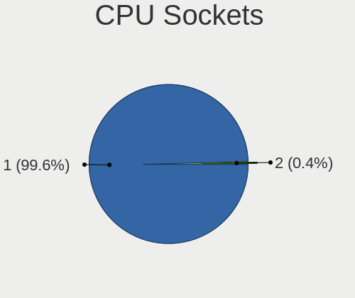

| Number | Computers | Percent |
|--------|-----------|---------|
| 1      | 1589      | 99.69%  |
| 2      | 5         | 0.31%   |

CPU Threads
-----------

Threads per core (Hyper-Threading)

| Number | Computers | Percent |
|--------|-----------|---------|
| 2      | 975       | 61.17%  |
| 1      | 606       | 38.02%  |
| 4      | 9         | 0.56%   |
| 8      | 3         | 0.19%   |
| 16     | 1         | 0.06%   |

CPU Op-Modes
------------

CPU Operation Modes (32-bit, 64-bit)

| Op mode        | Computers | Percent |
|----------------|-----------|---------|
| 32-bit, 64-bit | 1594      | 100%    |

CPU Microcode
-------------

Microcode number

| Number     | Computers | Percent |
|------------|-----------|---------|
| Unknown    | 1195      | 74.97%  |
| 0x08108109 | 38        | 2.38%   |
| 0x0a50000c | 25        | 1.57%   |
| 0x0a50000d | 23        | 1.44%   |
| 0x08701021 | 23        | 1.44%   |
| 0x06001119 | 20        | 1.25%   |
| 0x08608103 | 15        | 0.94%   |
| 0x06006705 | 13        | 0.82%   |
| 0x0800820d | 12        | 0.75%   |
| 0x06003106 | 12        | 0.75%   |
| 0x010000c8 | 12        | 0.75%   |
| 0x06000822 | 11        | 0.69%   |
| 0x0600611a | 10        | 0.63%   |
| 0x0a201016 | 9         | 0.56%   |
| 0x08101016 | 9         | 0.56%   |
| 0x08200103 | 8         | 0.5%    |
| 0x08108102 | 8         | 0.5%    |
| 0x0500010d | 8         | 0.5%    |
| 0x0a20120a | 7         | 0.44%   |
| 0x08600106 | 7         | 0.44%   |
| 0x05000101 | 6         | 0.38%   |
| 0x010000bf | 6         | 0.38%   |
| 0x0a201025 | 5         | 0.31%   |
| 0x07030105 | 5         | 0.31%   |
| 0x0700010b | 5         | 0.31%   |
| 0x0600081c | 5         | 0.31%   |
| 0x206a7    | 4         | 0.25%   |
| 0x08608102 | 4         | 0.25%   |
| 0x0810100b | 4         | 0.25%   |
| 0x03000027 | 4         | 0.25%   |
| 0x010000b6 | 4         | 0.25%   |
| 0x08701030 | 3         | 0.19%   |
| 0x08701013 | 3         | 0.19%   |
| 0x08600104 | 3         | 0.19%   |
| 0x08600103 | 3         | 0.19%   |
| 0x0800820b | 3         | 0.19%   |
| 0x906ea    | 2         | 0.13%   |
| 0x806e9    | 2         | 0.13%   |
| 0x306a9    | 2         | 0.13%   |
| 0x1067a    | 2         | 0.13%   |

CPU Microarch
-------------

Microarchitecture

| Name             | Computers | Percent |
|------------------|-----------|---------|
| KabyLake         | 198       | 12.42%  |
| IvyBridge        | 131       | 8.22%   |
| Haswell          | 127       | 7.97%   |
| SandyBridge      | 120       | 7.53%   |
| Penryn           | 109       | 6.84%   |
| Skylake          | 95        | 5.96%   |
| Zen 3            | 74        | 4.64%   |
| Zen+             | 62        | 3.89%   |
| Core             | 61        | 3.83%   |
| Westmere         | 52        | 3.26%   |
| Zen 2            | 46        | 2.89%   |
| Piledriver       | 45        | 2.82%   |
| TigerLake        | 42        | 2.63%   |
| Silvermont       | 42        | 2.63%   |
| Goldmont plus    | 38        | 2.38%   |
| Broadwell        | 36        | 2.26%   |
| Icelake          | 34        | 2.13%   |
| K10              | 33        | 2.07%   |
| CometLake        | 33        | 2.07%   |
| Alderlake Hybrid | 30        | 1.88%   |
| Zen              | 28        | 1.76%   |
| Excavator        | 26        | 1.63%   |
| Unknown          | 26        | 1.63%   |
| K8 Hammer        | 16        | 1%      |
| Goldmont         | 16        | 1%      |
| Bobcat           | 15        | 0.94%   |
| Steamroller      | 12        | 0.75%   |
| Nehalem          | 11        | 0.69%   |
| Tremont          | 7         | 0.44%   |
| Puma             | 6         | 0.38%   |
| K10 Llano        | 6         | 0.38%   |
| Jaguar           | 6         | 0.38%   |
| K8 & K10 hybrid  | 4         | 0.25%   |
| Bonnell          | 4         | 0.25%   |
| NetBurst         | 2         | 0.13%   |
| Bulldozer        | 1         | 0.06%   |

Graphics
--------

GPU Vendor
----------

Vendors of graphics cards

| Vendor                                       | Computers | Percent |
|----------------------------------------------|-----------|---------|
| Intel                                        | 916       | 51.37%  |
| AMD                                          | 438       | 24.57%  |
| Nvidia                                       | 422       | 23.67%  |
| Silicon Integrated Systems [SiS]             | 2         | 0.11%   |
| XGI Technology (eXtreme Graphics Innovation) | 1         | 0.06%   |
| S3 Graphics                                  | 1         | 0.06%   |
| Matrox Electronics Systems                   | 1         | 0.06%   |
| ATI Technologies                             | 1         | 0.06%   |
| ASPEED Technology                            | 1         | 0.06%   |

GPU Model
---------

Graphics card models

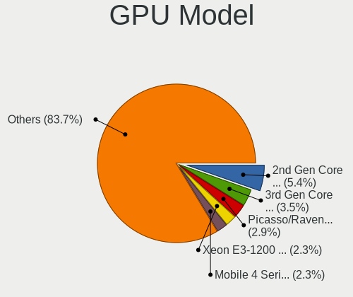

| Model                                                                                    | Computers | Percent |
|------------------------------------------------------------------------------------------|-----------|---------|
| Intel 2nd Generation Core Processor Family Integrated Graphics Controller                | 90        | 4.93%   |
| Intel 3rd Gen Core processor Graphics Controller                                         | 66        | 3.61%   |
| AMD Picasso/Raven 2 [Radeon Vega Series / Radeon Vega Mobile Series]                     | 51        | 2.79%   |
| Intel Xeon E3-1200 v3/4th Gen Core Processor Integrated Graphics Controller              | 43        | 2.35%   |
| Intel HD Graphics 620                                                                    | 41        | 2.25%   |
| Intel 4 Series Chipset Integrated Graphics Controller                                    | 39        | 2.14%   |
| AMD Cezanne [Radeon Vega Series / Radeon Vega Mobile Series]                             | 37        | 2.03%   |
| Intel HD Graphics 530                                                                    | 36        | 1.97%   |
| Intel Mobile 4 Series Chipset Integrated Graphics Controller                             | 35        | 1.92%   |
| Intel GeminiLake [UHD Graphics 600]                                                      | 33        | 1.81%   |
| Intel Core Processor Integrated Graphics Controller                                      | 30        | 1.64%   |
| Intel Xeon E3-1200 v2/3rd Gen Core processor Graphics Controller                         | 29        | 1.59%   |
| Intel UHD Graphics 620                                                                   | 29        | 1.59%   |
| Intel HD Graphics 5500                                                                   | 29        | 1.59%   |
| Intel Skylake GT2 [HD Graphics 520]                                                      | 28        | 1.53%   |
| Intel Haswell-ULT Integrated Graphics Controller                                         | 28        | 1.53%   |
| Intel TigerLake-LP GT2 [Iris Xe Graphics]                                                | 25        | 1.37%   |
| Intel Atom Processor Z36xxx/Z37xxx Series Graphics & Display                             | 24        | 1.31%   |
| AMD Ellesmere [Radeon RX 470/480/570/570X/580/580X/590]                                  | 24        | 1.31%   |
| Nvidia GP107 [GeForce GTX 1050 Ti]                                                       | 23        | 1.26%   |
| Intel CometLake-U GT2 [UHD Graphics]                                                     | 21        | 1.15%   |
| Intel Mobile GM965/GL960 Integrated Graphics Controller (secondary)                      | 19        | 1.04%   |
| Intel Mobile GM965/GL960 Integrated Graphics Controller (primary)                        | 19        | 1.04%   |
| Intel CoffeeLake-S GT2 [UHD Graphics 630]                                                | 19        | 1.04%   |
| AMD Lucienne                                                                             | 19        | 1.04%   |
| Intel Atom/Celeron/Pentium Processor x5-E8000/J3xxx/N3xxx Integrated Graphics Controller | 18        | 0.99%   |
| Nvidia GP108 [GeForce GT 1030]                                                           | 17        | 0.93%   |
| Intel HD Graphics 630                                                                    | 17        | 0.93%   |
| Intel Tiger Lake-LP GT2 [UHD Graphics G4]                                                | 16        | 0.88%   |
| Intel Alder Lake-P Integrated Graphics Controller                                        | 16        | 0.88%   |
| Intel 4th Gen Core Processor Integrated Graphics Controller                              | 15        | 0.82%   |
| AMD Raven Ridge [Radeon Vega Series / Radeon Vega Mobile Series]                         | 14        | 0.77%   |
| AMD Cedar [Radeon HD 5000/6000/7350/8350 Series]                                         | 14        | 0.77%   |
| Nvidia GK208B [GeForce GT 730]                                                           | 13        | 0.71%   |
| AMD Stoney [Radeon R2/R3/R4/R5 Graphics]                                                 | 13        | 0.71%   |
| AMD Renoir                                                                               | 13        | 0.71%   |
| Nvidia GK208B [GeForce GT 710]                                                           | 11        | 0.6%    |
| AMD Lexa PRO [Radeon 540/540X/550/550X / RX 540X/550/550X]                               | 11        | 0.6%    |
| Nvidia GP106 [GeForce GTX 1060 6GB]                                                      | 10        | 0.55%   |
| Intel HD Graphics 500                                                                    | 10        | 0.55%   |

GPU Combo
---------

Combinations of graphics cards

| Name                     | Computers | Percent |
|--------------------------|-----------|---------|
| 1 x Intel                | 668       | 41.91%  |
| 1 x AMD                  | 365       | 22.9%   |
| 1 x Nvidia               | 268       | 16.81%  |
| Intel + Nvidia           | 134       | 8.41%   |
| 2 x Intel                | 79        | 4.96%   |
| Intel + AMD              | 34        | 2.13%   |
| 2 x AMD                  | 22        | 1.38%   |
| AMD + Nvidia             | 16        | 1%      |
| 1 x SiS                  | 2         | 0.13%   |
| 2 x Nvidia               | 1         | 0.06%   |
| 1 x S3 Graphics          | 1         | 0.06%   |
| Nvidia + XGI             | 1         | 0.06%   |
| Intel + AMD + 1 x Nvidia | 1         | 0.06%   |
| 1 x ASPEED               | 1         | 0.06%   |
| AMD + Matrox             | 1         | 0.06%   |

GPU Driver
----------

Free vs proprietary

| Driver      | Computers | Percent |
|-------------|-----------|---------|
| Free        | 1513      | 94.92%  |
| Proprietary | 51        | 3.2%    |
| Unknown     | 30        | 1.88%   |

GPU Memory
----------

Total video memory

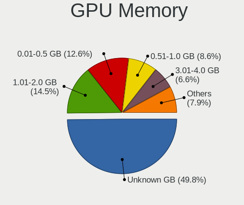

| Size in GB | Computers | Percent |
|------------|-----------|---------|
| Unknown    | 784       | 49.18%  |
| 1.01-2.0   | 231       | 14.49%  |
| 0.01-0.5   | 207       | 12.99%  |
| 0.51-1.0   | 130       | 8.16%   |
| 3.01-4.0   | 111       | 6.96%   |
| 7.01-8.0   | 60        | 3.76%   |
| 5.01-6.0   | 44        | 2.76%   |
| 8.01-16.0  | 17        | 1.07%   |
| 2.01-3.0   | 6         | 0.38%   |
| 16.01-24.0 | 3         | 0.19%   |
| 4.01-5.0   | 1         | 0.06%   |

Monitor
-------

Monitor Vendor
--------------

Monitor vendors

| Vendor                  | Computers | Percent |
|-------------------------|-----------|---------|
| Samsung Electronics     | 197       | 12.27%  |
| AU Optronics            | 195       | 12.15%  |
| LG Display              | 139       | 8.66%   |
| BOE                     | 128       | 7.98%   |
| Chimei Innolux          | 120       | 7.48%   |
| Goldstar                | 82        | 5.11%   |
| Hewlett-Packard         | 71        | 4.42%   |
| Dell                    | 71        | 4.42%   |
| Acer                    | 60        | 3.74%   |
| AOC                     | 54        | 3.36%   |
| Philips                 | 45        | 2.8%    |
| BenQ                    | 43        | 2.68%   |
| Lenovo                  | 36        | 2.24%   |
| Ancor Communications    | 28        | 1.74%   |
| Sharp                   | 25        | 1.56%   |
| ViewSonic               | 22        | 1.37%   |
| ASUSTek Computer        | 19        | 1.18%   |
| Apple                   | 17        | 1.06%   |
| LG Philips              | 16        | 1%      |
| Chi Mei Optoelectronics | 16        | 1%      |
| Iiyama                  | 14        | 0.87%   |
| PANDA                   | 12        | 0.75%   |
| Unknown                 | 10        | 0.62%   |
| Sony                    | 10        | 0.62%   |
| Sceptre Tech            | 9         | 0.56%   |
| NEC Computers           | 8         | 0.5%    |
| HannStar                | 8         | 0.5%    |
| Unknown                 | 8         | 0.5%    |
| Panasonic               | 6         | 0.37%   |
| MSI                     | 6         | 0.37%   |
| HKC                     | 6         | 0.37%   |
| Fujitsu Siemens         | 5         | 0.31%   |
| Seiki                   | 4         | 0.25%   |
| LG Electronics          | 4         | 0.25%   |
| Hitachi                 | 4         | 0.25%   |
| Eizo                    | 4         | 0.25%   |
| CSO                     | 4         | 0.25%   |
| Unknown (XXX)           | 3         | 0.19%   |
| NCS                     | 3         | 0.19%   |
| Insignia                | 3         | 0.19%   |

Monitor Model
-------------

Monitor models

| Model                                                                 | Computers | Percent |
|-----------------------------------------------------------------------|-----------|---------|
| AU Optronics LCD Monitor AUO38ED 1920x1080 344x193mm 15.5-inch        | 12        | 0.74%   |
| LG Display LCD Monitor LGD02DC 1366x768 344x194mm 15.5-inch           | 10        | 0.62%   |
| AU Optronics LCD Monitor AUO61ED 1920x1080 344x194mm 15.5-inch        | 10        | 0.62%   |
| AU Optronics LCD Monitor AUO26EC 1366x768 344x193mm 15.5-inch         | 9         | 0.55%   |
| Chimei Innolux LCD Monitor CMN15F5 1920x1080 344x193mm 15.5-inch      | 8         | 0.49%   |
| Chimei Innolux LCD Monitor CMN14D4 1920x1080 309x173mm 13.9-inch      | 8         | 0.49%   |
| Unknown                                                               | 8         | 0.49%   |
| AU Optronics LCD Monitor AUO36ED 1920x1080 344x193mm 15.5-inch        | 7         | 0.43%   |
| Samsung Electronics LCD Monitor SDC4159 1920x1080 344x194mm 15.5-inch | 6         | 0.37%   |
| Goldstar FULL HD GSM5B55 1920x1080 480x270mm 21.7-inch                | 6         | 0.37%   |
| BenQ GL2023 BNQ78CC 1600x900 443x249mm 20.0-inch                      | 6         | 0.37%   |
| AU Optronics LCD Monitor AUO723C 1366x768 309x173mm 13.9-inch         | 6         | 0.37%   |
| AU Optronics LCD Monitor AUO22EC 1366x768 344x193mm 15.5-inch         | 6         | 0.37%   |
| AU Optronics LCD Monitor AUO10EC 1366x768 344x193mm 15.5-inch         | 6         | 0.37%   |
| Unknown LCD Monitor FFFF 2288x1287 2550x2550mm 142.0-inch             | 5         | 0.31%   |
| LG Display LCD Monitor LGD033A 1366x768 344x194mm 15.5-inch           | 5         | 0.31%   |
| LG Display LCD Monitor LGD02D8 1366x768 277x156mm 12.5-inch           | 5         | 0.31%   |
| Chimei Innolux LCD Monitor CMN15DB 1366x768 344x193mm 15.5-inch       | 5         | 0.31%   |
| Chimei Innolux LCD Monitor CMN1132 1366x768 256x144mm 11.6-inch       | 5         | 0.31%   |
| BOE LCD Monitor BOE06DF 1920x1080 309x173mm 13.9-inch                 | 5         | 0.31%   |
| AU Optronics LCD Monitor AUO213E 1600x900 309x174mm 14.0-inch         | 5         | 0.31%   |
| Seiki SE20HY SEK0CA8 1360x768 440x250mm 19.9-inch                     | 4         | 0.25%   |
| Samsung Electronics SyncMaster SAM0527 1600x900 443x250mm 20.0-inch   | 4         | 0.25%   |
| LG Display LCD Monitor LGD046F 1920x1080 350x190mm 15.7-inch          | 4         | 0.25%   |
| LG Display LCD Monitor LGD033E 1366x768 309x174mm 14.0-inch           | 4         | 0.25%   |
| Goldstar W1943 GSM4BAD 1360x768 406x229mm 18.4-inch                   | 4         | 0.25%   |
| Chimei Innolux LCD Monitor CMN151E 1920x1080 344x193mm 15.5-inch      | 4         | 0.25%   |
| BOE LCD Monitor BOE0889 1920x1080 344x194mm 15.5-inch                 | 4         | 0.25%   |
| BOE LCD Monitor BOE0812 1920x1080 344x194mm 15.5-inch                 | 4         | 0.25%   |
| BOE LCD Monitor BOE06A5 1366x768 344x194mm 15.5-inch                  | 4         | 0.25%   |
| BOE LCD Monitor BOE0675 1366x768 344x194mm 15.5-inch                  | 4         | 0.25%   |
| BOE LCD Monitor BOE0672 1366x768 344x194mm 15.5-inch                  | 4         | 0.25%   |
| AU Optronics LCD Monitor AUO81EC 1366x768 344x193mm 15.5-inch         | 4         | 0.25%   |
| AU Optronics LCD Monitor AUO6287 1440x900 367x229mm 17.0-inch         | 4         | 0.25%   |
| AU Optronics LCD Monitor AUO46EC 1366x768 344x193mm 15.5-inch         | 4         | 0.25%   |
| AU Optronics LCD Monitor AUO403D 1920x1080 309x174mm 14.0-inch        | 4         | 0.25%   |
| AOC 2752H AOC2752 1920x1080 598x336mm 27.0-inch                       | 4         | 0.25%   |
| AOC 1970W AOC1970 1366x768 410x230mm 18.5-inch                        | 4         | 0.25%   |
| Sharp LQ133M1JW01 SHP141B 1920x1080 294x165mm 13.3-inch               | 3         | 0.18%   |
| Samsung Electronics SyncMaster SAM0304 1680x1050 494x320mm 23.2-inch  | 3         | 0.18%   |

Monitor Resolution
------------------

Monitor screen resolution

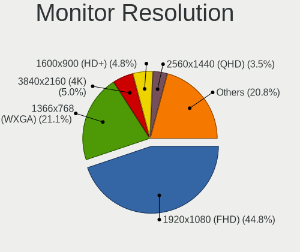

| Resolution         | Computers | Percent |
|--------------------|-----------|---------|
| 1920x1080 (FHD)    | 717       | 45.44%  |
| 1366x768 (WXGA)    | 340       | 21.55%  |
| 3840x2160 (4K)     | 79        | 5.01%   |
| 1600x900 (HD+)     | 71        | 4.5%    |
| 2560x1440 (QHD)    | 59        | 3.74%   |
| 1680x1050 (WSXGA+) | 54        | 3.42%   |
| 1280x800 (WXGA)    | 42        | 2.66%   |
| 1280x1024 (SXGA)   | 40        | 2.53%   |
| 1920x1200 (WUXGA)  | 35        | 2.22%   |
| 1440x900 (WXGA+)   | 33        | 2.09%   |
| 1360x768           | 21        | 1.33%   |
| 2560x1600          | 14        | 0.89%   |
| 3440x1440          | 13        | 0.82%   |
| 2560x1080          | 5         | 0.32%   |
| 2288x1287          | 5         | 0.32%   |
| Unknown            | 5         | 0.32%   |
| 3840x2400          | 4         | 0.25%   |
| 1920x540           | 4         | 0.25%   |
| 1920x1280          | 4         | 0.25%   |
| 2736x1824          | 3         | 0.19%   |
| 2160x1440          | 3         | 0.19%   |
| 1024x768 (XGA)     | 3         | 0.19%   |
| 3200x1800 (QHD+)   | 2         | 0.13%   |
| 2880x1800          | 2         | 0.13%   |
| 1280x960           | 2         | 0.13%   |
| 8320x1440          | 1         | 0.06%   |
| 800x1280           | 1         | 0.06%   |
| 6000x1440          | 1         | 0.06%   |
| 5760x2160          | 1         | 0.06%   |
| 5120x1440          | 1         | 0.06%   |
| 4480x2023          | 1         | 0.06%   |
| 3840x1080          | 1         | 0.06%   |
| 3456x2160          | 1         | 0.06%   |
| 2880x1920          | 1         | 0.06%   |
| 2240x1400          | 1         | 0.06%   |
| 2160x1350          | 1         | 0.06%   |
| 1800x1200          | 1         | 0.06%   |
| 1600x2560          | 1         | 0.06%   |
| 1600x1200          | 1         | 0.06%   |
| 1400x1050          | 1         | 0.06%   |

Monitor Diagonal
----------------

Diagonal size in inches

| Inches  | Computers | Percent |
|---------|-----------|---------|
| 15      | 413       | 25.75%  |
| 27      | 121       | 7.54%   |
| 23      | 115       | 7.17%   |
| 13      | 114       | 7.11%   |
| 24      | 111       | 6.92%   |
| 21      | 108       | 6.73%   |
| 14      | 105       | 6.55%   |
| 17      | 93        | 5.8%    |
| Unknown | 44        | 2.74%   |
| 22      | 43        | 2.68%   |
| 19      | 41        | 2.56%   |
| 31      | 40        | 2.49%   |
| 18      | 38        | 2.37%   |
| 12      | 34        | 2.12%   |
| 20      | 29        | 1.81%   |
| 11      | 21        | 1.31%   |
| 34      | 16        | 1%      |
| 16      | 16        | 1%      |
| 84      | 12        | 0.75%   |
| 54      | 10        | 0.62%   |
| 32      | 7         | 0.44%   |
| 25      | 7         | 0.44%   |
| 72      | 6         | 0.37%   |
| 142     | 5         | 0.31%   |
| 40      | 5         | 0.31%   |
| 39      | 5         | 0.31%   |
| 26      | 5         | 0.31%   |
| 48      | 4         | 0.25%   |
| 46      | 4         | 0.25%   |
| 10      | 4         | 0.25%   |
| 65      | 3         | 0.19%   |
| 52      | 3         | 0.19%   |
| 60      | 2         | 0.12%   |
| 37      | 2         | 0.12%   |
| 35      | 2         | 0.12%   |
| 29      | 2         | 0.12%   |
| 28      | 2         | 0.12%   |
| 74      | 1         | 0.06%   |
| 64      | 1         | 0.06%   |
| 58      | 1         | 0.06%   |

Monitor Width
-------------

Physical width

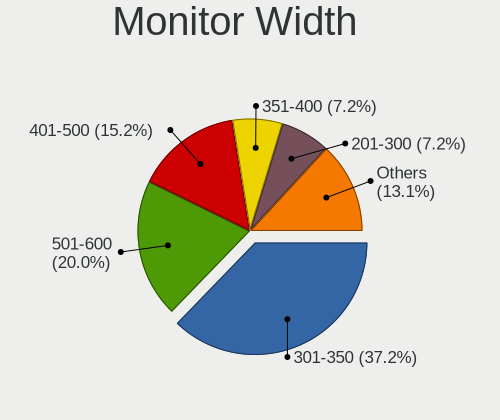

| Width in mm    | Computers | Percent |
|----------------|-----------|---------|
| 301-350        | 614       | 38.71%  |
| 501-600        | 322       | 20.3%   |
| 401-500        | 236       | 14.88%  |
| 351-400        | 113       | 7.12%   |
| 201-300        | 100       | 6.31%   |
| 601-700        | 58        | 3.66%   |
| Unknown        | 44        | 2.77%   |
| 1001-1500      | 31        | 1.95%   |
| 701-800        | 26        | 1.64%   |
| 1501-2000      | 19        | 1.2%    |
| 801-900        | 14        | 0.88%   |
| More than 2000 | 5         | 0.32%   |
| 901-1000       | 2         | 0.13%   |
| 101-200        | 1         | 0.06%   |
| 1-100          | 1         | 0.06%   |

Aspect Ratio
------------

Proportional relationship between the width and the height

| Ratio   | Computers | Percent |
|---------|-----------|---------|
| 16/9    | 1206      | 79.03%  |
| 16/10   | 186       | 12.19%  |
| 5/4     | 42        | 2.75%   |
| Unknown | 31        | 2.03%   |
| 3/2     | 22        | 1.44%   |
| 21/9    | 18        | 1.18%   |
| 4/3     | 11        | 0.72%   |
| 1.00    | 5         | 0.33%   |
| 2.12    | 1         | 0.07%   |
| 2.00    | 1         | 0.07%   |
| 1.96    | 1         | 0.07%   |
| 0.67    | 1         | 0.07%   |
| 0.63    | 1         | 0.07%   |

Monitor Area
------------

Area in inch

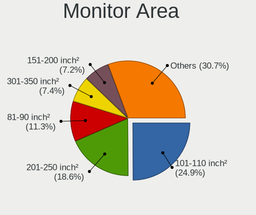

| Area in inch | Computers | Percent |
|----------------|-----------|---------|
| 101-110        | 415       | 26%     |
| 201-250        | 299       | 18.73%  |
| 81-90          | 181       | 11.34%  |
| 301-350        | 122       | 7.64%   |
| 151-200        | 110       | 6.89%   |
| 351-500        | 67        | 4.2%    |
| 121-130        | 56        | 3.51%   |
| 141-150        | 52        | 3.26%   |
| More than 1000 | 50        | 3.13%   |
| 251-300        | 46        | 2.88%   |
| Unknown        | 44        | 2.76%   |
| 71-80          | 43        | 2.69%   |
| 61-70          | 27        | 1.69%   |
| 51-60          | 24        | 1.5%    |
| 131-140        | 21        | 1.32%   |
| 501-1000       | 21        | 1.32%   |
| 111-120        | 11        | 0.69%   |
| 91-100         | 4         | 0.25%   |
| 1-40           | 2         | 0.13%   |
| 41-50          | 1         | 0.06%   |

Pixel Density
-------------

Pixels per inch

| Density       | Computers | Percent |
|---------------|-----------|---------|
| 51-100        | 573       | 36.45%  |
| 101-120       | 463       | 29.45%  |
| 121-160       | 362       | 23.03%  |
| 161-240       | 63        | 4.01%   |
| 1-50          | 48        | 3.05%   |
| Unknown       | 44        | 2.8%    |
| More than 240 | 19        | 1.21%   |

Multiple Monitors
-----------------

Total monitors connected

| Total | Computers | Percent |
|-------|-----------|---------|
| 1     | 1443      | 90.53%  |
| 2     | 129       | 8.09%   |
| 0     | 14        | 0.88%   |
| 3     | 7         | 0.44%   |
| 4     | 1         | 0.06%   |

Network
-------

Net Controller Vendor
---------------------

Controller vendors

| Vendor                            | Computers | Percent |
|-----------------------------------|-----------|---------|
| Realtek Semiconductor             | 948       | 41.02%  |
| Intel                             | 695       | 30.07%  |
| Qualcomm Atheros                  | 280       | 12.12%  |
| Broadcom                          | 98        | 4.24%   |
| MediaTek                          | 35        | 1.51%   |
| Ralink Technology                 | 31        | 1.34%   |
| Ralink                            | 25        | 1.08%   |
| TP-Link                           | 23        | 1%      |
| Broadcom Limited                  | 21        | 0.91%   |
| Nvidia                            | 18        | 0.78%   |
| Marvell Technology Group          | 18        | 0.78%   |
| Qualcomm Atheros Communications   | 14        | 0.61%   |
| ASUSTek Computer                  | 9         | 0.39%   |
| ASIX Electronics                  | 7         | 0.3%    |
| NetGear                           | 6         | 0.26%   |
| Microsoft                         | 6         | 0.26%   |
| Dell                              | 6         | 0.26%   |
| D-Link                            | 6         | 0.26%   |
| Sierra Wireless                   | 5         | 0.22%   |
| JMicron Technology                | 4         | 0.17%   |
| Xiaomi                            | 3         | 0.13%   |
| T & A Mobile Phones               | 3         | 0.13%   |
| Samsung Electronics               | 3         | 0.13%   |
| Linksys                           | 3         | 0.13%   |
| Huawei Technologies               | 3         | 0.13%   |
| Ericsson Business Mobile Networks | 3         | 0.13%   |
| Silicon Integrated Systems [SiS]  | 2         | 0.09%   |
| Qualcomm                          | 2         | 0.09%   |
| Lenovo                            | 2         | 0.09%   |
| IMC Networks                      | 2         | 0.09%   |
| ICS Advent                        | 2         | 0.09%   |
| Gemtek                            | 2         | 0.09%   |
| D-Link System                     | 2         | 0.09%   |
| Arduino SA                        | 2         | 0.09%   |
| Aquantia                          | 2         | 0.09%   |
| ZyDAS                             | 1         | 0.04%   |
| ZTE WCDMA Technologies MSM        | 1         | 0.04%   |
| Wilocity                          | 1         | 0.04%   |
| VIA Technologies                  | 1         | 0.04%   |
| THEC64 Joystick                   | 1         | 0.04%   |

Net Controller Model
--------------------

Controller models

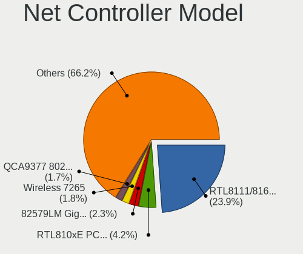

| Model                                                             | Computers | Percent |
|-------------------------------------------------------------------|-----------|---------|
| Realtek RTL8111/8168/8411 PCI Express Gigabit Ethernet Controller | 666       | 24.8%   |
| Realtek RTL810xE PCI Express Fast Ethernet controller             | 109       | 4.06%   |
| Intel 82579LM Gigabit Network Connection (Lewisville)             | 56        | 2.08%   |
| Intel Wireless 7265                                               | 51        | 1.9%    |
| Qualcomm Atheros QCA9377 802.11ac Wireless Network Adapter        | 49        | 1.82%   |
| Qualcomm Atheros AR9485 Wireless Network Adapter                  | 41        | 1.53%   |
| Intel Wi-Fi 6 AX200                                               | 36        | 1.34%   |
| Realtek RTL8821CE 802.11ac PCIe Wireless Network Adapter          | 35        | 1.3%    |
| Intel Dual Band Wireless-AC 3168NGW [Stone Peak]                  | 35        | 1.3%    |
| Realtek RTL8822CE 802.11ac PCIe Wireless Network Adapter          | 34        | 1.27%   |
| Realtek RTL8125 2.5GbE Controller                                 | 33        | 1.23%   |
| Qualcomm Atheros QCA9565 / AR9565 Wireless Network Adapter        | 33        | 1.23%   |
| Intel Ethernet Connection I217-LM                                 | 33        | 1.23%   |
| Intel Wi-Fi 6 AX201                                               | 31        | 1.15%   |
| Realtek RTL8153 Gigabit Ethernet Adapter                          | 30        | 1.12%   |
| Intel Wireless 8265 / 8275                                        | 29        | 1.08%   |
| Intel Wireless 3165                                               | 27        | 1.01%   |
| Qualcomm Atheros AR8151 v2.0 Gigabit Ethernet                     | 26        | 0.97%   |
| Qualcomm Atheros AR9285 Wireless Network Adapter (PCI-Express)    | 25        | 0.93%   |
| Intel Centrino Advanced-N 6205 [Taylor Peak]                      | 24        | 0.89%   |
| Intel Wireless 8260                                               | 21        | 0.78%   |
| Intel I211 Gigabit Network Connection                             | 21        | 0.78%   |
| MediaTek MT7921 802.11ax PCI Express Wireless Network Adapter     | 19        | 0.71%   |
| Intel Wi-Fi 6 AX210/AX211/AX411 160MHz                            | 19        | 0.71%   |
| Qualcomm Atheros QCA6174 802.11ac Wireless Network Adapter        | 18        | 0.67%   |
| Intel Wireless 7260                                               | 18        | 0.67%   |
| Intel Alder Lake-P PCH CNVi WiFi                                  | 18        | 0.67%   |
| Intel Ethernet Controller I225-V                                  | 17        | 0.63%   |
| Intel Ethernet Connection (2) I219-V                              | 17        | 0.63%   |
| Intel 82579V Gigabit Network Connection                           | 17        | 0.63%   |
| Realtek RTL88x2bu [AC1200 Techkey]                                | 15        | 0.56%   |
| Realtek RTL8188EE Wireless Network Adapter                        | 15        | 0.56%   |
| Intel Wireless 3160                                               | 15        | 0.56%   |
| Intel PRO/Wireless 3945ABG [Golan] Network Connection             | 15        | 0.56%   |
| Intel Comet Lake PCH-LP CNVi WiFi                                 | 15        | 0.56%   |
| Realtek RTL8188CE 802.11b/g/n WiFi Adapter                        | 14        | 0.52%   |
| Intel 82567LM-3 Gigabit Network Connection                        | 14        | 0.52%   |
| Qualcomm Atheros AR9271 802.11n                                   | 13        | 0.48%   |
| Intel Gemini Lake PCH CNVi WiFi                                   | 13        | 0.48%   |
| Intel Ethernet Connection (3) I218-LM                             | 13        | 0.48%   |

Wireless Vendor
---------------

Wireless vendors

| Vendor                          | Computers | Percent |
|---------------------------------|-----------|---------|
| Intel                           | 515       | 43.17%  |
| Realtek Semiconductor           | 239       | 20.03%  |
| Qualcomm Atheros                | 211       | 17.69%  |
| Broadcom                        | 54        | 4.53%   |
| Ralink Technology               | 31        | 2.6%    |
| MediaTek                        | 31        | 2.6%    |
| Ralink                          | 25        | 2.1%    |
| TP-Link                         | 15        | 1.26%   |
| Qualcomm Atheros Communications | 14        | 1.17%   |
| ASUSTek Computer                | 9         | 0.75%   |
| D-Link                          | 6         | 0.5%    |
| Sierra Wireless                 | 5         | 0.42%   |
| NetGear                         | 5         | 0.42%   |
| Microsoft                       | 5         | 0.42%   |
| Broadcom Limited                | 5         | 0.42%   |
| Linksys                         | 3         | 0.25%   |
| Dell                            | 3         | 0.25%   |
| IMC Networks                    | 2         | 0.17%   |
| Gemtek                          | 2         | 0.17%   |
| D-Link System                   | 2         | 0.17%   |
| ZyDAS                           | 1         | 0.08%   |
| Wilocity                        | 1         | 0.08%   |
| VIA Technologies                | 1         | 0.08%   |
| Qualcomm                        | 1         | 0.08%   |
| PLANEX                          | 1         | 0.08%   |
| Marvell Technology Group        | 1         | 0.08%   |
| Edimax Technology               | 1         | 0.08%   |
| BUFFALO                         | 1         | 0.08%   |
| Belkin Components               | 1         | 0.08%   |
| AVM                             | 1         | 0.08%   |
| Arduino SA                      | 1         | 0.08%   |

Wireless Model
--------------

Wireless models

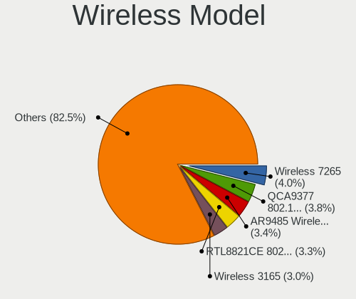

| Model                                                                   | Computers | Percent |
|-------------------------------------------------------------------------|-----------|---------|
| Intel Wireless 7265                                                     | 51        | 4.25%   |
| Qualcomm Atheros QCA9377 802.11ac Wireless Network Adapter              | 49        | 4.09%   |
| Qualcomm Atheros AR9485 Wireless Network Adapter                        | 41        | 3.42%   |
| Intel Wi-Fi 6 AX200                                                     | 36        | 3%      |
| Realtek RTL8821CE 802.11ac PCIe Wireless Network Adapter                | 35        | 2.92%   |
| Intel Dual Band Wireless-AC 3168NGW [Stone Peak]                        | 35        | 2.92%   |
| Realtek RTL8822CE 802.11ac PCIe Wireless Network Adapter                | 34        | 2.84%   |
| Qualcomm Atheros QCA9565 / AR9565 Wireless Network Adapter              | 33        | 2.75%   |
| Intel Wi-Fi 6 AX201                                                     | 31        | 2.59%   |
| Intel Wireless 8265 / 8275                                              | 29        | 2.42%   |
| Intel Wireless 3165                                                     | 27        | 2.25%   |
| Qualcomm Atheros AR9285 Wireless Network Adapter (PCI-Express)          | 25        | 2.09%   |
| Intel Centrino Advanced-N 6205 [Taylor Peak]                            | 24        | 2%      |
| Intel Wireless 8260                                                     | 21        | 1.75%   |
| MediaTek MT7921 802.11ax PCI Express Wireless Network Adapter           | 19        | 1.58%   |
| Intel Wi-Fi 6 AX210/AX211/AX411 160MHz                                  | 19        | 1.58%   |
| Qualcomm Atheros QCA6174 802.11ac Wireless Network Adapter              | 18        | 1.5%    |
| Intel Wireless 7260                                                     | 18        | 1.5%    |
| Intel Alder Lake-P PCH CNVi WiFi                                        | 18        | 1.5%    |
| Realtek RTL88x2bu [AC1200 Techkey]                                      | 15        | 1.25%   |
| Realtek RTL8188EE Wireless Network Adapter                              | 15        | 1.25%   |
| Intel Wireless 3160                                                     | 15        | 1.25%   |
| Intel PRO/Wireless 3945ABG [Golan] Network Connection                   | 15        | 1.25%   |
| Intel Comet Lake PCH-LP CNVi WiFi                                       | 15        | 1.25%   |
| Realtek RTL8188CE 802.11b/g/n WiFi Adapter                              | 14        | 1.17%   |
| Qualcomm Atheros AR9271 802.11n                                         | 13        | 1.08%   |
| Intel Gemini Lake PCH CNVi WiFi                                         | 13        | 1.08%   |
| Intel Dual Band Wireless-AC 3165 Plus Bluetooth                         | 13        | 1.08%   |
| Intel Centrino Ultimate-N 6300                                          | 13        | 1.08%   |
| Broadcom BCM4313 802.11bgn Wireless Network Adapter                     | 13        | 1.08%   |
| Realtek RTL8723BE PCIe Wireless Network Adapter                         | 12        | 1%      |
| Realtek RTL8188EUS 802.11n Wireless Network Adapter                     | 12        | 1%      |
| Qualcomm Atheros AR242x / AR542x Wireless Network Adapter (PCI-Express) | 12        | 1%      |
| Realtek RTL8723BU 802.11b/g/n WLAN Adapter                              | 11        | 0.92%   |
| Ralink MT7601U Wireless Adapter                                         | 11        | 0.92%   |
| Realtek 802.11ac NIC                                                    | 10        | 0.83%   |
| Qualcomm Atheros AR9462 Wireless Network Adapter                        | 10        | 0.83%   |
| Intel WiFi Link 5100                                                    | 10        | 0.83%   |
| Intel PRO/Wireless 5100 AGN [Shiloh] Network Connection                 | 10        | 0.83%   |
| Intel Comet Lake PCH CNVi WiFi                                          | 10        | 0.83%   |

Ethernet Vendor
---------------

Ethernet vendors

| Vendor                           | Computers | Percent |
|----------------------------------|-----------|---------|
| Realtek Semiconductor            | 849       | 58.59%  |
| Intel                            | 343       | 23.67%  |
| Qualcomm Atheros                 | 97        | 6.69%   |
| Broadcom                         | 59        | 4.07%   |
| Nvidia                           | 18        | 1.24%   |
| Marvell Technology Group         | 17        | 1.17%   |
| Broadcom Limited                 | 17        | 1.17%   |
| TP-Link                          | 8         | 0.55%   |
| ASIX Electronics                 | 7         | 0.48%   |
| MediaTek                         | 4         | 0.28%   |
| JMicron Technology               | 4         | 0.28%   |
| Xiaomi                           | 3         | 0.21%   |
| Silicon Integrated Systems [SiS] | 2         | 0.14%   |
| Samsung Electronics              | 2         | 0.14%   |
| Lenovo                           | 2         | 0.14%   |
| ICS Advent                       | 2         | 0.14%   |
| Huawei Technologies              | 2         | 0.14%   |
| Aquantia                         | 2         | 0.14%   |
| T & A Mobile Phones              | 1         | 0.07%   |
| Qualcomm                         | 1         | 0.07%   |
| OPPO Electronics                 | 1         | 0.07%   |
| NetGear                          | 1         | 0.07%   |
| Motorola PCS                     | 1         | 0.07%   |
| Microsoft                        | 1         | 0.07%   |
| LG Electronics                   | 1         | 0.07%   |
| Insyde Software                  | 1         | 0.07%   |
| Attansic Technology              | 1         | 0.07%   |
| Apple                            | 1         | 0.07%   |
| 3Com                             | 1         | 0.07%   |

Ethernet Model
--------------

Ethernet models

| Model                                                             | Computers | Percent |
|-------------------------------------------------------------------|-----------|---------|
| Realtek RTL8111/8168/8411 PCI Express Gigabit Ethernet Controller | 666       | 45.31%  |
| Realtek RTL810xE PCI Express Fast Ethernet controller             | 109       | 7.41%   |
| Intel 82579LM Gigabit Network Connection (Lewisville)             | 56        | 3.81%   |
| Realtek RTL8125 2.5GbE Controller                                 | 33        | 2.24%   |
| Intel Ethernet Connection I217-LM                                 | 33        | 2.24%   |
| Realtek RTL8153 Gigabit Ethernet Adapter                          | 30        | 2.04%   |
| Qualcomm Atheros AR8151 v2.0 Gigabit Ethernet                     | 26        | 1.77%   |
| Intel I211 Gigabit Network Connection                             | 21        | 1.43%   |
| Intel Ethernet Controller I225-V                                  | 17        | 1.16%   |
| Intel Ethernet Connection (2) I219-V                              | 17        | 1.16%   |
| Intel 82579V Gigabit Network Connection                           | 17        | 1.16%   |
| Intel 82567LM-3 Gigabit Network Connection                        | 14        | 0.95%   |
| Intel Ethernet Connection (3) I218-LM                             | 13        | 0.88%   |
| Intel Ethernet Connection (2) I219-LM                             | 13        | 0.88%   |
| Intel Ethernet Connection (7) I219-V                              | 12        | 0.82%   |
| Intel Ethernet Connection (4) I219-LM                             | 12        | 0.82%   |
| Qualcomm Atheros AR8152 v2.0 Fast Ethernet                        | 11        | 0.75%   |
| Qualcomm Atheros AR8161 Gigabit Ethernet                          | 10        | 0.68%   |
| Intel 82567LM Gigabit Network Connection                          | 10        | 0.68%   |
| Broadcom NetLink BCM57780 Gigabit Ethernet PCIe                   | 10        | 0.68%   |
| Intel 82577LM Gigabit Network Connection                          | 9         | 0.61%   |
| TP-Link UE300 10/100/1000 LAN (ethernet mode) [Realtek RTL8153]   | 8         | 0.54%   |
| Qualcomm Atheros AR8131 Gigabit Ethernet                          | 8         | 0.54%   |
| Intel I210 Gigabit Network Connection                             | 7         | 0.48%   |
| Intel Ethernet Connection I217-V                                  | 7         | 0.48%   |
| Intel 82566MM Gigabit Network Connection                          | 7         | 0.48%   |
| Broadcom NetXtreme BCM57765 Gigabit Ethernet PCIe                 | 7         | 0.48%   |
| Realtek RTL8152 Fast Ethernet Adapter                             | 6         | 0.41%   |
| Realtek RTL-8100/8101L/8139 PCI Fast Ethernet Adapter             | 6         | 0.41%   |
| Qualcomm Atheros QCA8172 Fast Ethernet                            | 6         | 0.41%   |
| Qualcomm Atheros QCA8171 Gigabit Ethernet                         | 6         | 0.41%   |
| Qualcomm Atheros AR8152 v1.1 Fast Ethernet                        | 6         | 0.41%   |
| Intel Ethernet Connection I219-LM                                 | 6         | 0.41%   |
| Intel Ethernet Connection (4) I219-V                              | 6         | 0.41%   |
| ASIX AX88179 Gigabit Ethernet                                     | 6         | 0.41%   |
| Qualcomm Atheros AR8162 Fast Ethernet                             | 5         | 0.34%   |
| Nvidia MCP73 Ethernet                                             | 5         | 0.34%   |
| Intel Ethernet Connection (14) I219-V                             | 5         | 0.34%   |
| Broadcom NetXtreme BCM5761 Gigabit Ethernet PCIe                  | 5         | 0.34%   |
| Broadcom NetLink BCM57785 Gigabit Ethernet PCIe                   | 5         | 0.34%   |

Net Controller Kind
-------------------

Ethernet, WiFi or modem

| Kind     | Computers | Percent |
|----------|-----------|---------|
| Ethernet | 1410      | 54.82%  |
| WiFi     | 1145      | 44.52%  |
| Modem    | 13        | 0.51%   |
| Unknown  | 4         | 0.16%   |

Used Controller
---------------

Currently used network controller

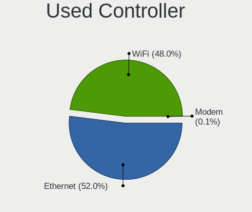

| Kind     | Computers | Percent |
|----------|-----------|---------|
| Ethernet | 802       | 51.02%  |
| WiFi     | 769       | 48.92%  |
| Modem    | 1         | 0.06%   |

NICs
----

Total network controllers on board

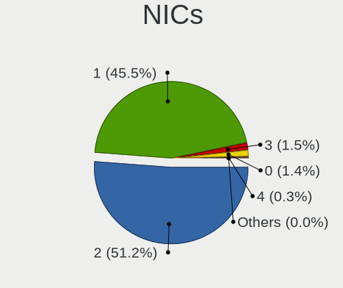

| Total | Computers | Percent |
|-------|-----------|---------|
| 2     | 806       | 50.56%  |
| 1     | 739       | 46.36%  |
| 0     | 24        | 1.51%   |
| 3     | 20        | 1.25%   |
| 4     | 4         | 0.25%   |
| 6     | 1         | 0.06%   |

IPv6
----

IPv6 vs IPv4

| Used | Computers | Percent |
|------|-----------|---------|
| No   | 1070      | 67.13%  |
| Yes  | 524       | 32.87%  |

Bluetooth
---------

Bluetooth Vendor
----------------

Controller vendors

| Vendor                          | Computers | Percent |
|---------------------------------|-----------|---------|
| Intel                           | 397       | 45.06%  |
| Realtek Semiconductor           | 100       | 11.35%  |
| Qualcomm Atheros Communications | 70        | 7.95%   |
| Cambridge Silicon Radio         | 60        | 6.81%   |
| IMC Networks                    | 45        | 5.11%   |
| Broadcom                        | 44        | 4.99%   |
| Lite-On Technology              | 34        | 3.86%   |
| Foxconn / Hon Hai               | 20        | 2.27%   |
| ASUSTek Computer                | 18        | 2.04%   |
| Toshiba                         | 16        | 1.82%   |
| Apple                           | 16        | 1.82%   |
| Hewlett-Packard                 | 15        | 1.7%    |
| MediaTek                        | 11        | 1.25%   |
| Dell                            | 11        | 1.25%   |
| Realtek                         | 5         | 0.57%   |
| Ralink                          | 5         | 0.57%   |
| TP-Link                         | 2         | 0.23%   |
| Chicony Electronics             | 2         | 0.23%   |
| Belkin Components               | 2         | 0.23%   |
| Qcom                            | 1         | 0.11%   |
| Marvell Semiconductor           | 1         | 0.11%   |
| ISSC                            | 1         | 0.11%   |
| Integrated System Solution      | 1         | 0.11%   |
| Fujitsu                         | 1         | 0.11%   |
| Foxconn International           | 1         | 0.11%   |
| Edimax Technology               | 1         | 0.11%   |
| Dynex                           | 1         | 0.11%   |

Bluetooth Model
---------------

Controller models

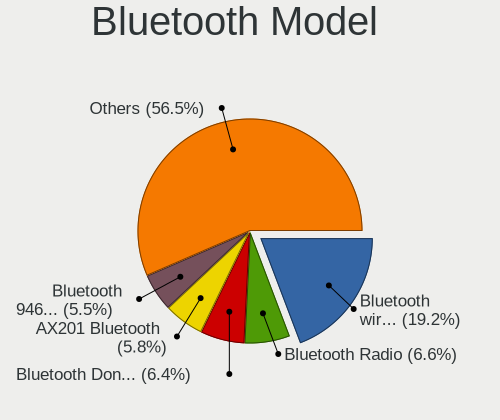

| Model                                               | Computers | Percent |
|-----------------------------------------------------|-----------|---------|
| Intel Bluetooth wireless interface                  | 167       | 18.93%  |
| Realtek Bluetooth Radio                             | 68        | 7.71%   |
| Cambridge Silicon Radio Bluetooth Dongle (HCI mode) | 60        | 6.8%    |
| Intel AX201 Bluetooth                               | 56        | 6.35%   |
| Intel Bluetooth 9460/9560 Jefferson Peak (JfP)      | 50        | 5.67%   |
| Qualcomm Atheros  Bluetooth Device                  | 35        | 3.97%   |
| Intel Wireless-AC 3168 Bluetooth                    | 34        | 3.85%   |
| Intel AX200 Bluetooth                               | 34        | 3.85%   |
| Realtek  Bluetooth 4.2 Adapter                      | 24        | 2.72%   |
| Intel AX210 Bluetooth                               | 19        | 2.15%   |
| Lite-On Qualcomm Atheros QCA9377 Bluetooth          | 16        | 1.81%   |
| Qualcomm Atheros AR3012 Bluetooth 4.0               | 14        | 1.59%   |
| Intel Bluetooth Device                              | 14        | 1.59%   |
| IMC Networks Bluetooth Device                       | 13        | 1.47%   |
| IMC Networks Bluetooth Radio                        | 12        | 1.36%   |
| Qualcomm Atheros AR3011 Bluetooth                   | 11        | 1.25%   |
| MediaTek Wireless_Device                            | 11        | 1.25%   |
| IMC Networks Wireless_Device                        | 11        | 1.25%   |
| Intel Centrino Bluetooth Wireless Transceiver       | 10        | 1.13%   |
| Intel Centrino Advanced-N 6230 Bluetooth adapter    | 9         | 1.02%   |
| ASUS ASUS USB-BT500                                 | 9         | 1.02%   |
| HP Bluetooth 2.0 Interface [Broadcom BCM2045]       | 8         | 0.91%   |
| Broadcom BCM2045B (BDC-2.1)                         | 8         | 0.91%   |
| Qualcomm Atheros QCA61x4 Bluetooth 4.0              | 7         | 0.79%   |
| Lite-On Atheros AR3012 Bluetooth                    | 7         | 0.79%   |
| HP Broadcom 2070 Bluetooth Combo                    | 7         | 0.79%   |
| Foxconn / Hon Hai Bluetooth Device                  | 7         | 0.79%   |
| Broadcom BCM20702 Bluetooth 4.0 [ThinkPad]          | 6         | 0.68%   |
| Apple Bluetooth USB Host Controller                 | 6         | 0.68%   |
| Apple Bluetooth Host Controller                     | 6         | 0.68%   |
| Toshiba Bluetooth Device                            | 5         | 0.57%   |
| Realtek Bluetooth Radio                             | 5         | 0.57%   |
| Ralink RT3290 Bluetooth                             | 5         | 0.57%   |
| Lite-On Bluetooth Device                            | 5         | 0.57%   |
| Intel Wireless-AC 9260 Bluetooth Adapter            | 5         | 0.57%   |
| Dell BCM20702A0 Bluetooth Module                    | 5         | 0.57%   |
| Lite-On Wireless_Device                             | 4         | 0.45%   |
| IMC Networks Bluetooth                              | 4         | 0.45%   |
| Broadcom BCM2045B (BDC-2) [Bluetooth Controller]    | 4         | 0.45%   |
| Toshiba RT Bluetooth Radio                          | 3         | 0.34%   |

Sound
-----

Sound Vendor
------------

Sound card vendors

| Vendor                                       | Computers | Percent |
|----------------------------------------------|-----------|---------|
| Intel                                        | 1165      | 54.8%   |
| AMD                                          | 469       | 22.06%  |
| Nvidia                                       | 320       | 15.05%  |
| C-Media Electronics                          | 28        | 1.32%   |
| Creative Labs                                | 23        | 1.08%   |
| Generalplus Technology                       | 17        | 0.8%    |
| Logitech                                     | 9         | 0.42%   |
| Texas Instruments                            | 8         | 0.38%   |
| Creative Technology                          | 6         | 0.28%   |
| Micro Star International                     | 5         | 0.24%   |
| JMTek                                        | 5         | 0.24%   |
| Tenx Technology                              | 4         | 0.19%   |
| VIA Technologies                             | 3         | 0.14%   |
| SteelSeries ApS                              | 3         | 0.14%   |
| KTMicro                                      | 3         | 0.14%   |
| Hewlett-Packard                              | 3         | 0.14%   |
| FiiO Electronics Technology                  | 3         | 0.14%   |
| Silicon Integrated Systems [SiS]             | 2         | 0.09%   |
| Schiit Audio                                 | 2         | 0.09%   |
| ROCCAT                                       | 2         | 0.09%   |
| PreSonus Audio Electronics                   | 2         | 0.09%   |
| Native Instruments                           | 2         | 0.09%   |
| GN Netcom                                    | 2         | 0.09%   |
| Focusrite-Novation                           | 2         | 0.09%   |
| Dell                                         | 2         | 0.09%   |
| Corsair                                      | 2         | 0.09%   |
| ASUSTek Computer                             | 2         | 0.09%   |
| Zoran Co. Personal Media Division (Nogatech) | 1         | 0.05%   |
| Yamaha                                       | 1         | 0.05%   |
| XMOS                                         | 1         | 0.05%   |
| Xilinx                                       | 1         | 0.05%   |
| USB-Speaker                                  | 1         | 0.05%   |
| THX                                          | 1         | 0.05%   |
| Tdlasunnic                                   | 1         | 0.05%   |
| Sterling                                     | 1         | 0.05%   |
| Sennheiser Communications                    | 1         | 0.05%   |
| Samson Technologies                          | 1         | 0.05%   |
| RODE Microphones                             | 1         | 0.05%   |
| Razer USA                                    | 1         | 0.05%   |
| Nordic Semiconductor ASA                     | 1         | 0.05%   |

Sound Model
-----------

Sound card models

| Model                                                                      | Computers | Percent |
|----------------------------------------------------------------------------|-----------|---------|
| AMD Family 17h/19h HD Audio Controller                                     | 153       | 6.01%   |
| Intel 7 Series/C216 Chipset Family High Definition Audio Controller        | 122       | 4.79%   |
| Intel 6 Series/C200 Series Chipset Family High Definition Audio Controller | 122       | 4.79%   |
| Intel Sunrise Point-LP HD Audio                                            | 111       | 4.36%   |
| Intel 8 Series/C220 Series Chipset High Definition Audio Controller        | 82        | 3.22%   |
| AMD Renoir Radeon High Definition Audio Controller                         | 78        | 3.06%   |
| AMD SBx00 Azalia (Intel HDA)                                               | 66        | 2.59%   |
| AMD Raven/Raven2/Fenghuang HDMI/DP Audio Controller                        | 61        | 2.39%   |
| AMD FCH Azalia Controller                                                  | 61        | 2.39%   |
| Intel 100 Series/C230 Series Chipset Family HD Audio Controller            | 59        | 2.32%   |
| Intel Xeon E3-1200 v3/4th Gen Core Processor HD Audio Controller           | 57        | 2.24%   |
| Intel 82801I (ICH9 Family) HD Audio Controller                             | 55        | 2.16%   |
| Intel 5 Series/3400 Series Chipset High Definition Audio                   | 55        | 2.16%   |
| AMD Starship/Matisse HD Audio Controller                                   | 53        | 2.08%   |
| Intel NM10/ICH7 Family High Definition Audio Controller                    | 50        | 1.96%   |
| Intel 200 Series PCH HD Audio                                              | 45        | 1.77%   |
| Intel Tiger Lake-LP Smart Sound Technology Audio Controller                | 41        | 1.61%   |
| Intel Celeron/Pentium Silver Processor High Definition Audio               | 38        | 1.49%   |
| Nvidia GP107GL High Definition Audio Controller                            | 37        | 1.45%   |
| Intel Cannon Lake PCH cAVS                                                 | 36        | 1.41%   |
| Intel Wildcat Point-LP High Definition Audio Controller                    | 34        | 1.33%   |
| Intel Broadwell-U Audio Controller                                         | 33        | 1.3%    |
| Intel 82801H (ICH8 Family) HD Audio Controller                             | 33        | 1.3%    |
| Nvidia GK208 HDMI/DP Audio Controller                                      | 29        | 1.14%   |
| Intel Haswell-ULT HD Audio Controller                                      | 28        | 1.1%    |
| Intel 8 Series HD Audio Controller                                         | 28        | 1.1%    |
| AMD Family 15h (Models 60h-6fh) Audio Controller                           | 26        | 1.02%   |
| AMD Ellesmere HDMI Audio [Radeon RX 470/480 / 570/580/590]                 | 25        | 0.98%   |
| Intel Atom Processor Z36xxx/Z37xxx Series High Definition Audio Controller | 23        | 0.9%    |
| AMD Navi 21/23 HDMI/DP Audio Controller                                    | 23        | 0.9%    |
| Nvidia GF108 High Definition Audio Controller                              | 21        | 0.82%   |
| Intel Comet Lake PCH-LP cAVS                                               | 21        | 0.82%   |
| AMD Kabini HDMI/DP Audio                                                   | 21        | 0.82%   |
| AMD Family 17h (Models 00h-0fh) HD Audio Controller                        | 21        | 0.82%   |
| AMD Cedar HDMI Audio [Radeon HD 5400/6300/7300 Series]                     | 21        | 0.82%   |
| Nvidia TU116 High Definition Audio Controller                              | 20        | 0.79%   |
| Nvidia TU107 GeForce GTX 1650 High Definition Audio Controller             | 20        | 0.79%   |
| Intel Tiger Lake-H HD Audio Controller                                     | 20        | 0.79%   |
| Intel Alder Lake PCH-P High Definition Audio Controller                    | 20        | 0.79%   |
| AMD Trinity HDMI Audio Controller                                          | 19        | 0.75%   |

Memory
------

Memory Vendor
-------------

Memory module vendors

| Vendor                                           | Computers | Percent |
|--------------------------------------------------|-----------|---------|
| Samsung Electronics                              | 372       | 19.43%  |
| SK hynix                                         | 303       | 15.82%  |
| Kingston                                         | 253       | 13.21%  |
| Unknown                                          | 196       | 10.23%  |
| Micron Technology                                | 176       | 9.19%   |
| Crucial                                          | 103       | 5.38%   |
| Corsair                                          | 77        | 4.02%   |
| G.Skill                                          | 52        | 2.72%   |
| A-DATA Technology                                | 45        | 2.35%   |
| Ramaxel Technology                               | 39        | 2.04%   |
| Nanya Technology                                 | 39        | 2.04%   |
| Unknown (ABCD)                                   | 30        | 1.57%   |
| Elpida                                           | 29        | 1.51%   |
| Unknown                                          | 28        | 1.46%   |
| Team                                             | 22        | 1.15%   |
| Transcend                                        | 12        | 0.63%   |
| Patriot                                          | 12        | 0.63%   |
| Smart                                            | 8         | 0.42%   |
| GOODRAM                                          | 8         | 0.42%   |
| Apacer                                           | 8         | 0.42%   |
| Multilaser                                       | 7         | 0.37%   |
| Qimonda                                          | 5         | 0.26%   |
| Avant                                            | 5         | 0.26%   |
| Innodisk                                         | 4         | 0.21%   |
| Hikvision                                        | 4         | 0.21%   |
| AMD                                              | 4         | 0.21%   |
| Wilk                                             | 3         | 0.16%   |
| Unifosa                                          | 3         | 0.16%   |
| Toshiba                                          | 3         | 0.16%   |
| Timetec                                          | 3         | 0.16%   |
| Teikon                                           | 3         | 0.16%   |
| Silicon Power                                    | 3         | 0.16%   |
| ASint Technology                                 | 3         | 0.16%   |
| Unknown (0x48594D503132355336344350382D53362020) | 2         | 0.1%    |
| Sesame                                           | 2         | 0.1%    |
| PUSKILL                                          | 2         | 0.1%    |
| Neo Forza                                        | 2         | 0.1%    |
| Kllisre                                          | 2         | 0.1%    |
| GeIL                                             | 2         | 0.1%    |
| A Force                                          | 2         | 0.1%    |

Memory Model
------------

Memory module models

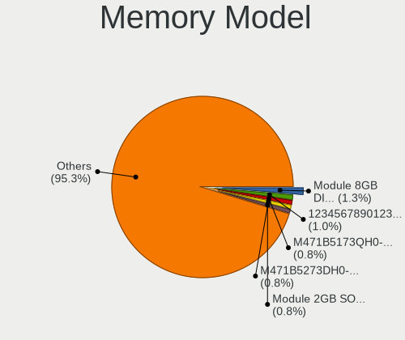

| Model                                                            | Computers | Percent |
|------------------------------------------------------------------|-----------|---------|
| Unknown                                                          | 28        | 1.34%   |
| Unknown (ABCD) RAM 123456789012345678 3GB SODIMM LPDDR4 2400MT/s | 22        | 1.06%   |
| Samsung RAM M471B5173QH0-YK0 4GB SODIMM DDR3 1600MT/s            | 20        | 0.96%   |
| Samsung RAM M471B5173DB0-YK0 4GB SODIMM DDR3 1600MT/s            | 18        | 0.86%   |
| SK hynix RAM HMT451S6BFR8A-PB 4GB SODIMM DDR3 1600MT/s           | 17        | 0.82%   |
| SK hynix RAM HMA81GS6AFR8N-UH 8GB SODIMM DDR4 2667MT/s           | 17        | 0.82%   |
| Unknown RAM Module 2GB SODIMM DDR2 667MT/s                       | 16        | 0.77%   |
| SK hynix RAM HMT351S6CFR8C-PB 4GB SODIMM DDR3 1600MT/s           | 16        | 0.77%   |
| Samsung RAM M471B5173EB0-YK0 4096MB SODIMM DDR3 1600MT/s         | 15        | 0.72%   |
| Samsung RAM M471B5273DH0-CH9 4GB SODIMM DDR3 1334MT/s            | 14        | 0.67%   |
| Samsung RAM M471A5244CB0-CTD 4GB SODIMM DDR4 3266MT/s            | 13        | 0.62%   |
| Unknown RAM Module 2GB DIMM SDRAM                                | 12        | 0.58%   |
| Unknown RAM Module 4GB DIMM 1333MT/s                             | 11        | 0.53%   |
| Samsung RAM M471B5273CH0-CH9 4GB SODIMM DDR3 1334MT/s            | 11        | 0.53%   |
| Micron RAM Module 4GB SODIMM DDR3 1600MT/s                       | 11        | 0.53%   |
| Unknown RAM Module 2GB DIMM DDR2 800MT/s                         | 10        | 0.48%   |
| SK hynix RAM HMA41GS6AFR8N-TF 8GB SODIMM DDR4 2667MT/s           | 10        | 0.48%   |
| SK hynix RAM HMT425S6AFR6A-PB 2GB SODIMM DDR3 3200MT/s           | 9         | 0.43%   |
| Samsung RAM M471A5244CB0-CWE 4GB Row Of Chips DDR4 3200MT/s      | 9         | 0.43%   |
| Samsung RAM M471A1G44AB0-CWE 8GB SODIMM DDR4 3200MT/s            | 9         | 0.43%   |
| Unknown RAM Module 8GB DIMM DDR3 1600MT/s                        | 8         | 0.38%   |
| Unknown RAM Module 4GB DIMM DDR3 1333MT/s                        | 8         | 0.38%   |
| Unknown (ABCD) RAM 123456789012345678 2GB DIMM LPDDR4 2400MT/s   | 8         | 0.38%   |
| SK hynix RAM HMT41GS6BFR8A-PB 8GB SODIMM DDR3 1600MT/s           | 8         | 0.38%   |
| SK hynix RAM HMAA1GS6CJR6N-XN 8GB SODIMM DDR4 3200MT/s           | 8         | 0.38%   |
| Samsung RAM M471A5244CB0-CWE 4GB SODIMM DDR4 3200MT/s            | 8         | 0.38%   |
| Samsung RAM M471A1K43CB1-CRC 8GB SODIMM DDR4 2667MT/s            | 8         | 0.38%   |
| Samsung RAM M378B5273DH0-CH9 4096MB DIMM DDR3 2133MT/s           | 8         | 0.38%   |
| Micron RAM 4ATF51264HZ-2G3B1 4GB SODIMM DDR4 2400MT/s            | 8         | 0.38%   |
| Kingston RAM KHX1600C10D3/8G 8GB DIMM DDR3 1600MT/s              | 8         | 0.38%   |
| Elpida RAM EBJ41UF8BCS0-DJ-F 4GB SODIMM DDR3 1334MT/s            | 8         | 0.38%   |
| Corsair RAM CMK16GX4M2B3200C16 8192MB DIMM DDR4 3600MT/s         | 8         | 0.38%   |
| Unknown RAM Module 8GB SODIMM DDR3 1600MT/s                      | 7         | 0.34%   |
| Unknown RAM Module 4GB SODIMM DDR3                               | 7         | 0.34%   |
| SK hynix RAM HMA851S6DJR6N-XN 4GB Row Of Chips DDR4 3200MT/s     | 7         | 0.34%   |
| SK hynix RAM HMA851S6AFR6N-UH 4GB SODIMM DDR4 2667MT/s           | 7         | 0.34%   |
| Samsung RAM M471B5773CHS-CH9 2GB SODIMM DDR3 4199MT/s            | 7         | 0.34%   |
| Samsung RAM M471A1K43EB1-CWE 8GB SODIMM DDR4 3200MT/s            | 7         | 0.34%   |
| Samsung RAM M471A1K43DB1-CWE 8GB SODIMM DDR4 3200MT/s            | 7         | 0.34%   |
| Samsung RAM M378B5773DH0-CH9 2GB DIMM DDR3 1333MT/s              | 7         | 0.34%   |

Memory Kind
-----------

Memory module kinds

| Kind    | Computers | Percent |
|---------|-----------|---------|
| DDR4    | 648       | 39.98%  |
| DDR3    | 619       | 38.19%  |
| DDR2    | 115       | 7.09%   |
| SDRAM   | 85        | 5.24%   |
| LPDDR4  | 57        | 3.52%   |
| Unknown | 53        | 3.27%   |
| DDR5    | 11        | 0.68%   |
| LPDDR3  | 10        | 0.62%   |
| DDR     | 9         | 0.56%   |
| LPDDR5  | 8         | 0.49%   |
| DRAM    | 6         | 0.37%   |

Memory Form Factor
------------------

Physical design of the memory module

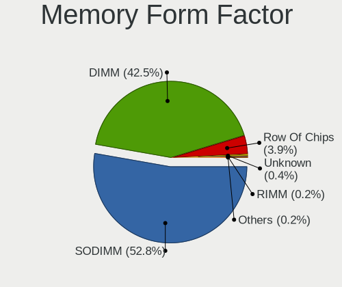

| Name         | Computers | Percent |
|--------------|-----------|---------|
| SODIMM       | 838       | 52.51%  |
| DIMM         | 677       | 42.42%  |
| Row Of Chips | 67        | 4.2%    |
| Unknown      | 7         | 0.44%   |
| RIMM         | 4         | 0.25%   |
| Chip         | 3         | 0.19%   |

Memory Size
-----------

Memory module size

| Size  | Computers | Percent |
|-------|-----------|---------|
| 8192  | 622       | 34.4%   |
| 4096  | 602       | 33.3%   |
| 2048  | 305       | 16.87%  |
| 16384 | 155       | 8.57%   |
| 1024  | 73        | 4.04%   |
| 32768 | 45        | 2.49%   |
| 512   | 5         | 0.28%   |
| 64    | 1         | 0.06%   |

Memory Speed
------------

Memory module speed

| Speed   | Computers | Percent |
|---------|-----------|---------|
| 1600    | 403       | 22.36%  |
| 3200    | 218       | 12.1%   |
| 2667    | 190       | 10.54%  |
| 1333    | 159       | 8.82%   |
| 2400    | 151       | 8.38%   |
| 1334    | 78        | 4.33%   |
| 2133    | 70        | 3.88%   |
| 667     | 65        | 3.61%   |
| 800     | 56        | 3.11%   |
| 3600    | 50        | 2.77%   |
| Unknown | 46        | 2.55%   |
| 1867    | 26        | 1.44%   |
| 1067    | 21        | 1.17%   |
| 3266    | 18        | 1%      |
| 2933    | 18        | 1%      |
| 4199    | 17        | 0.94%   |
| 1866    | 16        | 0.89%   |
| 1066    | 16        | 0.89%   |
| 3000    | 14        | 0.78%   |
| 2048    | 14        | 0.78%   |
| 4267    | 12        | 0.67%   |
| 2666    | 11        | 0.61%   |
| 3733    | 9         | 0.5%    |
| 533     | 9         | 0.5%    |
| 6400    | 8         | 0.44%   |
| 1800    | 8         | 0.44%   |
| 4800    | 6         | 0.33%   |
| 3800    | 6         | 0.33%   |
| 3666    | 5         | 0.28%   |
| 3533    | 5         | 0.28%   |
| 4266    | 4         | 0.22%   |
| 3466    | 4         | 0.22%   |
| 3400    | 4         | 0.22%   |
| 975     | 4         | 0.22%   |
| 400     | 4         | 0.22%   |
| 49926   | 3         | 0.17%   |
| 6000    | 3         | 0.17%   |
| 3866    | 3         | 0.17%   |
| 3534    | 3         | 0.17%   |
| 3151    | 3         | 0.17%   |

Printers & scanners
-------------------

Printer Vendor
--------------

Printer device vendors

| Vendor              | Computers | Percent |
|---------------------|-----------|---------|
| Hewlett-Packard     | 19        | 33.33%  |
| Brother Industries  | 15        | 26.32%  |
| Canon               | 10        | 17.54%  |
| Seiko Epson         | 7         | 12.28%  |
| Samsung Electronics | 4         | 7.02%   |
| Xerox               | 1         | 1.75%   |
| Prolific Technology | 1         | 1.75%   |

Printer Model
-------------

Printer device models

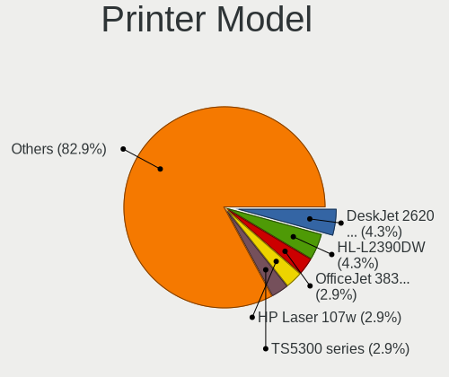

| Model                               | Computers | Percent |
|-------------------------------------|-----------|---------|
| HP DeskJet 2620 All-in-One Printer  | 3         | 5.17%   |
| Brother HL-L2390DW                  | 3         | 5.17%   |
| HP OfficeJet 3830 series            | 2         | 3.45%   |
| Canon TS5300 series                 | 2         | 3.45%   |
| Canon CanoScan LiDE 300             | 2         | 3.45%   |
| Xerox WorkCentre 6025               | 1         | 1.72%   |
| Seiko Epson XP-7100 Series          | 1         | 1.72%   |
| Seiko Epson Printer                 | 1         | 1.72%   |
| Seiko Epson L6160 Series            | 1         | 1.72%   |
| Seiko Epson L365 Series             | 1         | 1.72%   |
| Seiko Epson L3110 Series            | 1         | 1.72%   |
| Seiko Epson L120 Series             | 1         | 1.72%   |
| Seiko Epson ET-2710 Series          | 1         | 1.72%   |
| Samsung ML-2010P Mono Laser Printer | 1         | 1.72%   |
| Samsung ML-1710 Printer             | 1         | 1.72%   |
| Samsung M267x 287x Series           | 1         | 1.72%   |
| Samsung M2070 Series                | 1         | 1.72%   |
| Prolific PL2305 Parallel Port       | 1         | 1.72%   |
| HP OfficeJet 6950                   | 1         | 1.72%   |
| HP Officejet 4500 G510g-m           | 1         | 1.72%   |
| HP LaserJet P1005                   | 1         | 1.72%   |
| HP LaserJet M101-M106               | 1         | 1.72%   |
| HP Laser 107a                       | 1         | 1.72%   |
| HP ENVY 5000 series                 | 1         | 1.72%   |
| HP Deskjet F4500 series             | 1         | 1.72%   |
| HP DeskJet F4200 series             | 1         | 1.72%   |
| HP DeskJet 959c                     | 1         | 1.72%   |
| HP DeskJet 6122                     | 1         | 1.72%   |
| HP DeskJet 5650c                    | 1         | 1.72%   |
| HP Deskjet 2050 J510                | 1         | 1.72%   |
| HP DeskJet 1110 series              | 1         | 1.72%   |
| HP coredump                         | 1         | 1.72%   |
| Canon TS5100 series                 | 1         | 1.72%   |
| Canon TR7500 series                 | 1         | 1.72%   |
| Canon PIXMA MG2500 Series           | 1         | 1.72%   |
| Canon LBP6030w/6018w                | 1         | 1.72%   |
| Canon GX7000 series                 | 1         | 1.72%   |
| Canon G3000 series                  | 1         | 1.72%   |
| Brother Printer                     | 1         | 1.72%   |
| Brother MFC-J6535DW                 | 1         | 1.72%   |

Scanner Vendor
--------------

Scanner device vendors

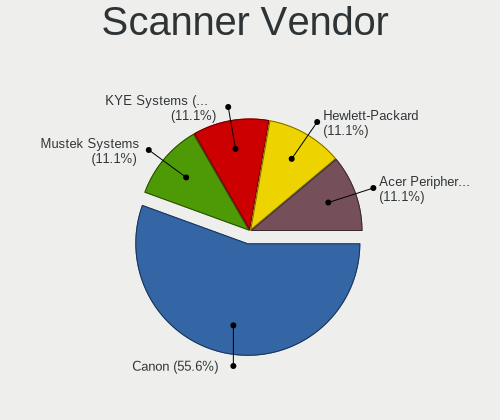

| Vendor                      | Computers | Percent |
|-----------------------------|-----------|---------|
| Canon                       | 3         | 50%     |
| KYE Systems (Mouse Systems) | 1         | 16.67%  |
| Hewlett-Packard             | 1         | 16.67%  |
| Acer Peripherals (now BenQ) | 1         | 16.67%  |

Scanner Model
-------------

Scanner device models

| Model                                               | Computers | Percent |
|-----------------------------------------------------|-----------|---------|
| KYE Systems (Mouse Systems) ColorPage-Vivid 1200 XE | 1         | 16.67%  |
| HP ScanJet 3670                                     | 1         | 16.67%  |
| Canon CanoScan LiDE 90                              | 1         | 16.67%  |
| Canon CanoScan LiDE 210                             | 1         | 16.67%  |
| Canon CanoScan 1220U                                | 1         | 16.67%  |
| Acer Peripherals (now BenQ) Prisa 1240UT            | 1         | 16.67%  |

Camera
------

Camera Vendor
-------------

Camera device vendors

| Vendor                                 | Computers | Percent |
|----------------------------------------|-----------|---------|
| Chicony Electronics                    | 207       | 25.52%  |
| Realtek Semiconductor                  | 67        | 8.26%   |
| IMC Networks                           | 65        | 8.01%   |
| Microdia                               | 59        | 7.27%   |
| Sunplus Innovation Technology          | 47        | 5.8%    |
| Bison Electronics                      | 35        | 4.32%   |
| Quanta                                 | 32        | 3.95%   |
| Suyin                                  | 31        | 3.82%   |
| Logitech                               | 31        | 3.82%   |
| Cheng Uei Precision Industry (Foxlink) | 31        | 3.82%   |
| Syntek                                 | 28        | 3.45%   |
| Apple                                  | 18        | 2.22%   |
| Silicon Motion                         | 15        | 1.85%   |
| Lite-On Technology                     | 15        | 1.85%   |
| Acer                                   | 15        | 1.85%   |
| Alcor Micro                            | 11        | 1.36%   |
| Luxvisions Innotech Limited            | 8         | 0.99%   |
| Shenzhen Kingcome Optoelectronic       | 6         | 0.74%   |
| Ricoh                                  | 6         | 0.74%   |
| Primax Electronics                     | 6         | 0.74%   |
| Generalplus Technology                 | 6         | 0.74%   |
| Sonix Technology                       | 5         | 0.62%   |
| Importek                               | 5         | 0.62%   |
| ALi                                    | 5         | 0.62%   |
| Z-Star Microelectronics                | 4         | 0.49%   |
| USB Camera                             | 4         | 0.49%   |
| Lenovo                                 | 4         | 0.49%   |
| Samsung Electronics                    | 3         | 0.37%   |
| OmniVision Technologies                | 3         | 0.37%   |
| ARC International                      | 3         | 0.37%   |
| Y Media                                | 2         | 0.25%   |
| WaveRider Communications               | 2         | 0.25%   |
| Unknown                                | 2         | 0.25%   |
| Sunplus Technology                     | 2         | 0.25%   |
| Microsoft                              | 2         | 0.25%   |
| Intel                                  | 2         | 0.25%   |
| HRY                                    | 2         | 0.25%   |
| Genesys Logic                          | 2         | 0.25%   |
| Creative Technology                    | 2         | 0.25%   |
| AVerMedia Technologies                 | 2         | 0.25%   |

Camera Model
------------

Camera device models

| Model                                            | Computers | Percent |
|--------------------------------------------------|-----------|---------|
| Chicony Integrated Camera                        | 30        | 3.68%   |
| Chicony HD WebCam                                | 24        | 2.94%   |
| Microdia Integrated_Webcam_HD                    | 18        | 2.21%   |
| Syntek Integrated Camera                         | 17        | 2.09%   |
| IMC Networks Integrated Camera                   | 16        | 1.96%   |
| Realtek Integrated_Webcam_HD                     | 14        | 1.72%   |
| IMC Networks USB2.0 HD UVC WebCam                | 14        | 1.72%   |
| Sunplus Integrated_Webcam_HD                     | 13        | 1.6%    |
| Realtek USB Camera                               | 13        | 1.6%    |
| IMC Networks USB2.0 VGA UVC WebCam               | 11        | 1.35%   |
| Bison Integrated Camera                          | 11        | 1.35%   |
| Logitech Webcam C270                             | 10        | 1.23%   |
| Chicony FJ Camera                                | 10        | 1.23%   |
| Microdia Integrated Webcam                       | 9         | 1.1%    |
| Chicony Lenovo EasyCamera                        | 9         | 1.1%    |
| Chicony USB2.0 Camera                            | 8         | 0.98%   |
| Cheng Uei Precision Industry (Foxlink) HP Webcam | 8         | 0.98%   |
| Microdia Webcam Vitade AF                        | 7         | 0.86%   |
| Chicony VGA Webcam                               | 7         | 0.86%   |
| Chicony HP TrueVision HD Camera                  | 7         | 0.86%   |
| Chicony HP Truevision HD                         | 7         | 0.86%   |
| Chicony HD User Facing                           | 7         | 0.86%   |
| Suyin 1.3M HD WebCam                             | 6         | 0.74%   |
| Shenzhen Kingcome Optoelectronic 720p HD Camera  | 6         | 0.74%   |
| Chicony TOSHIBA Web Camera - HD                  | 6         | 0.74%   |
| Chicony EasyCamera                               | 6         | 0.74%   |
| Apple FaceTime HD Camera                         | 6         | 0.74%   |
| Acer Integrated Camera                           | 6         | 0.74%   |
| Syntek Lenovo EasyCamera                         | 5         | 0.61%   |
| Suyin Acer/HP Integrated Webcam [CN0314]         | 5         | 0.61%   |
| Sunplus 1080p FHD Camera                         | 5         | 0.61%   |
| Realtek Integrated Webcam                        | 5         | 0.61%   |
| Realtek EasyCamera                               | 5         | 0.61%   |
| Quanta VGA WebCam                                | 5         | 0.61%   |
| Quanta HP TrueVision HD Camera                   | 5         | 0.61%   |
| Quanta HD User Facing                            | 5         | 0.61%   |
| Lite-On Integrated Camera                        | 5         | 0.61%   |
| Generalplus GENERAL WEBCAM                       | 5         | 0.61%   |
| Chicony HP Wide Vision HD Camera                 | 5         | 0.61%   |
| Chicony Camera                                   | 5         | 0.61%   |

Security
--------

Fingerprint Vendor
------------------

Fingerprint sensor vendors

| Vendor                     | Computers | Percent |
|----------------------------|-----------|---------|
| Validity Sensors           | 39        | 29.77%  |
| Synaptics                  | 22        | 16.79%  |
| AuthenTec                  | 19        | 14.5%   |
| Upek                       | 11        | 8.4%    |
| Shenzhen Goodix Technology | 11        | 8.4%    |
| Elan Microelectronics      | 10        | 7.63%   |
| LighTuning Technology      | 8         | 6.11%   |
| STMicroelectronics         | 4         | 3.05%   |
| Samsung Electronics        | 4         | 3.05%   |
| Focal-systems.Corp         | 3         | 2.29%   |

Fingerprint Model
-----------------

Fingerprint sensor models

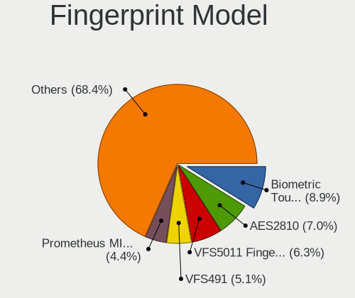

| Model                                                                      | Computers | Percent |
|----------------------------------------------------------------------------|-----------|---------|
| Upek Biometric Touchchip/Touchstrip Fingerprint Sensor                     | 10        | 7.63%   |
| Validity Sensors VFS5011 Fingerprint Reader                                | 9         | 6.87%   |
| AuthenTec AES2810                                                          | 8         | 6.11%   |
| Synaptics Prometheus MIS Touch Fingerprint Reader                          | 7         | 5.34%   |
| Validity Sensors VFS491                                                    | 6         | 4.58%   |
| Shenzhen Goodix  FingerPrint Device                                        | 6         | 4.58%   |
| Elan ELAN:Fingerprint                                                      | 5         | 3.82%   |
| Elan ELAN:ARM-M4                                                           | 5         | 3.82%   |
| Validity Sensors VFS495 Fingerprint Reader                                 | 4         | 3.05%   |
| Validity Sensors VFS451 Fingerprint Reader                                 | 4         | 3.05%   |
| Validity Sensors VFS 5011 fingerprint sensor                               | 4         | 3.05%   |
| Synaptics UWP WBDI Device                                                  | 4         | 3.05%   |
| STMicroelectronics Fingerprint Reader                                      | 4         | 3.05%   |
| Samsung Fingerprint Sensor Device - 730B                                   | 4         | 3.05%   |
| LighTuning ES603 Swipe Fingerprint Sensor                                  | 4         | 3.05%   |
| AuthenTec AES2501 Fingerprint Sensor                                       | 4         | 3.05%   |
| Validity Sensors Swipe Fingerprint Sensor                                  | 3         | 2.29%   |
| Synaptics  WBDI                                                            | 3         | 2.29%   |
| Shenzhen Goodix FingerPrint                                                | 3         | 2.29%   |
| Focal-systems.Corp FT9201Fingerprint.                                      | 3         | 2.29%   |
| Validity Sensors VFS471 Fingerprint Reader                                 | 2         | 1.53%   |
| Validity Sensors Synaptics VFS7552 Touch Fingerprint Sensor with PurePrint | 2         | 1.53%   |
| Validity Sensors Fingerprint scanner                                       | 2         | 1.53%   |
| Synaptics WBDI                                                             | 2         | 1.53%   |
| Synaptics Metallica MOH Touch Fingerprint Reader                           | 2         | 1.53%   |
| Synaptics Metallica MIS Touch Fingerprint Reader                           | 2         | 1.53%   |
| Shenzhen Goodix Fingerprint Reader                                         | 2         | 1.53%   |
| LighTuning Fingerprint Sensor                                              | 2         | 1.53%   |
| AuthenTec AES2550 Fingerprint Sensor                                       | 2         | 1.53%   |
| AuthenTec AES1660 Fingerprint Sensor                                       | 2         | 1.53%   |
| AuthenTec AES1600                                                          | 2         | 1.53%   |
| Validity Sensors VFS7500 Touch Fingerprint Sensor                          | 1         | 0.76%   |
| Validity Sensors VFS301 Fingerprint Reader                                 | 1         | 0.76%   |
| Validity Sensors Synaptics WBDI                                            | 1         | 0.76%   |
| Upek TCS5B Fingerprint sensor                                              | 1         | 0.76%   |
| Synaptics WBDI Fingerprint Reader USB 086                                  | 1         | 0.76%   |
| Synaptics UWP WBDI                                                         | 1         | 0.76%   |
| LighTuning Fingerprint Reader                                              | 1         | 0.76%   |
| LighTuning EgisTec Touch Fingerprint Sensor                                | 1         | 0.76%   |
| AuthenTec Fingerprint Sensor                                               | 1         | 0.76%   |

Chipcard Vendor
---------------

Chipcard module vendors

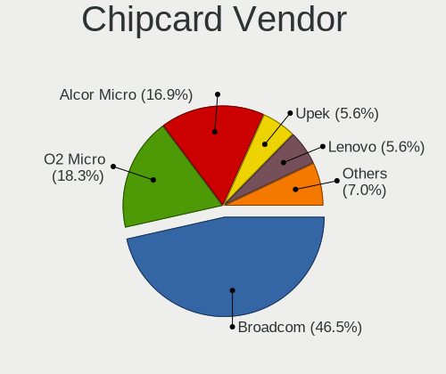

| Vendor                | Computers | Percent |
|-----------------------|-----------|---------|
| Broadcom              | 21        | 39.62%  |
| O2 Micro              | 12        | 22.64%  |
| Alcor Micro           | 9         | 16.98%  |
| Upek                  | 3         | 5.66%   |
| Lenovo                | 3         | 5.66%   |
| SCM Microsystems      | 1         | 1.89%   |
| Realtek Semiconductor | 1         | 1.89%   |
| Gemalto (was Gemplus) | 1         | 1.89%   |
| Castles Technology    | 1         | 1.89%   |
| Advanced Card Systems | 1         | 1.89%   |

Chipcard Model
--------------

Chipcard module models

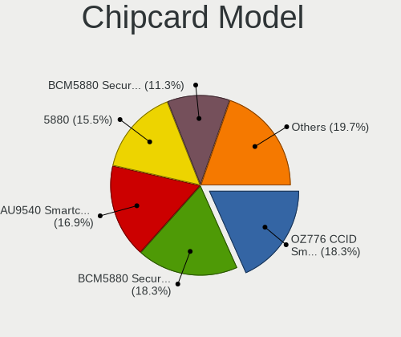

| Model                                                                        | Computers | Percent |
|------------------------------------------------------------------------------|-----------|---------|
| O2 Micro OZ776 CCID Smartcard Reader                                         | 12        | 22.64%  |
| Broadcom 5880                                                                | 9         | 16.98%  |
| Alcor Micro AU9540 Smartcard Reader                                          | 9         | 16.98%  |
| Broadcom BCM5880 Secure Applications Processor with fingerprint swipe sensor | 6         | 11.32%  |
| Broadcom BCM5880 Secure Applications Processor                               | 5         | 9.43%   |
| Upek TouchChip Fingerprint Coprocessor (WBF advanced mode)                   | 3         | 5.66%   |
| Lenovo Integrated Smart Card Reader                                          | 3         | 5.66%   |
| SCM Microsystems SCR333 SmartCard Reader                                     | 1         | 1.89%   |
| Realtek Semiconductor Smart Card Reader Interface                            | 1         | 1.89%   |
| Gemalto (was Gemplus) GemPC Twin SmartCard Reader                            | 1         | 1.89%   |
| Castles Technology EZCCID Smart Card Reader                                  | 1         | 1.89%   |
| Broadcom 58200                                                               | 1         | 1.89%   |
| Advanced Card Systems ACR122U                                                | 1         | 1.89%   |

Unsupported
-----------

Unsupported Devices
-------------------

Total unsupported devices on board

| Total | Computers | Percent |
|-------|-----------|---------|
| 0     | 1304      | 81.81%  |
| 1     | 258       | 16.19%  |
| 2     | 28        | 1.76%   |
| 3     | 4         | 0.25%   |

Unsupported Device Types
------------------------

Types of unsupported devices

| Type                     | Computers | Percent |
|--------------------------|-----------|---------|
| Fingerprint reader       | 131       | 41.59%  |
| Graphics card            | 79        | 25.08%  |
| Chipcard                 | 52        | 16.51%  |
| Net/wireless             | 13        | 4.13%   |
| Unassigned class         | 10        | 3.17%   |
| Communication controller | 8         | 2.54%   |
| Camera                   | 7         | 2.22%   |
| Multimedia controller    | 6         | 1.9%    |
| Bluetooth                | 5         | 1.59%   |
| Storage                  | 3         | 0.95%   |
| Flash memory             | 1         | 0.32%   |

