OpenMandriva 23.08 - Tested Hardware & Statistics
-------------------------------------------------

A project to collect tested hardware configurations for OpenMandriva 23.08.

Anyone can contribute to this report by the [hw-probe](https://github.com/linuxhw/hw-probe) tool:

    sudo -E hw-probe -all -upload

Please contribute! Especially if your hardware is rare.

This is a report for all computer types. See also reports for [desktops](/Dist/OpenMandriva_23.08/Desktop/README.md) and [notebooks](/Dist/OpenMandriva_23.08/Notebook/README.md).

Contents
--------

* [ Test Cases ](#test-cases)

* [ System ](#system)
  - [ Kernel                   ](#kernel)
  - [ Kernel Family            ](#kernel-family)
  - [ Kernel Major Ver.        ](#kernel-major-ver)
  - [ Arch                     ](#arch)
  - [ DE                       ](#de)
  - [ Display Server           ](#display-server)
  - [ Display Manager          ](#display-manager)
  - [ OS Lang                  ](#os-lang)
  - [ Boot Mode                ](#boot-mode)
  - [ Filesystem               ](#filesystem)
  - [ Part. scheme             ](#part-scheme)
  - [ Dual Boot with Linux/BSD ](#dual-boot-with-linuxbsd)
  - [ Dual Boot (Win)          ](#dual-boot-win)

* [ Board ](#board)
  - [ Vendor                   ](#vendor)
  - [ Model                    ](#model)
  - [ Model Family             ](#model-family)
  - [ MFG Year                 ](#mfg-year)
  - [ Form Factor              ](#form-factor)
  - [ Secure Boot              ](#secure-boot)
  - [ Coreboot                 ](#coreboot)
  - [ RAM Size                 ](#ram-size)
  - [ RAM Used                 ](#ram-used)
  - [ Total Drives             ](#total-drives)
  - [ Has CD-ROM               ](#has-cd-rom)
  - [ Has Ethernet             ](#has-ethernet)
  - [ Has WiFi                 ](#has-wifi)
  - [ Has Bluetooth            ](#has-bluetooth)

* [ Location ](#location)
  - [ Country                  ](#country)
  - [ City                     ](#city)

* [ Drives ](#drives)
  - [ Drive Vendor             ](#drive-vendor)
  - [ Drive Model              ](#drive-model)
  - [ HDD Vendor               ](#hdd-vendor)
  - [ SSD Vendor               ](#ssd-vendor)
  - [ Drive Kind               ](#drive-kind)
  - [ Drive Connector          ](#drive-connector)
  - [ Drive Size               ](#drive-size)
  - [ Space Total              ](#space-total)
  - [ Space Used               ](#space-used)
  - [ Malfunc. Drives          ](#malfunc-drives)
  - [ Malfunc. Drive Vendor    ](#malfunc-drive-vendor)
  - [ Malfunc. HDD Vendor      ](#malfunc-hdd-vendor)
  - [ Malfunc. Drive Kind      ](#malfunc-drive-kind)
  - [ Failed Drives            ](#failed-drives)
  - [ Failed Drive Vendor      ](#failed-drive-vendor)
  - [ Drive Status             ](#drive-status)

* [ Storage controller ](#storage-controller)
  - [ Storage Vendor           ](#storage-vendor)
  - [ Storage Model            ](#storage-model)
  - [ Storage Kind             ](#storage-kind)

* [ Processor ](#processor)
  - [ CPU Vendor               ](#cpu-vendor)
  - [ CPU Model                ](#cpu-model)
  - [ CPU Model Family         ](#cpu-model-family)
  - [ CPU Cores                ](#cpu-cores)
  - [ CPU Sockets              ](#cpu-sockets)
  - [ CPU Threads              ](#cpu-threads)
  - [ CPU Op-Modes             ](#cpu-op-modes)
  - [ CPU Microcode            ](#cpu-microcode)
  - [ CPU Microarch            ](#cpu-microarch)

* [ Graphics ](#graphics)
  - [ GPU Vendor               ](#gpu-vendor)
  - [ GPU Model                ](#gpu-model)
  - [ GPU Combo                ](#gpu-combo)
  - [ GPU Driver               ](#gpu-driver)
  - [ GPU Memory               ](#gpu-memory)

* [ Monitor ](#monitor)
  - [ Monitor Vendor           ](#monitor-vendor)
  - [ Monitor Model            ](#monitor-model)
  - [ Monitor Resolution       ](#monitor-resolution)
  - [ Monitor Diagonal         ](#monitor-diagonal)
  - [ Monitor Width            ](#monitor-width)
  - [ Aspect Ratio             ](#aspect-ratio)
  - [ Monitor Area             ](#monitor-area)
  - [ Pixel Density            ](#pixel-density)
  - [ Multiple Monitors        ](#multiple-monitors)

* [ Network ](#network)
  - [ Net Controller Vendor    ](#net-controller-vendor)
  - [ Net Controller Model     ](#net-controller-model)
  - [ Wireless Vendor          ](#wireless-vendor)
  - [ Wireless Model           ](#wireless-model)
  - [ Ethernet Vendor          ](#ethernet-vendor)
  - [ Ethernet Model           ](#ethernet-model)
  - [ Net Controller Kind      ](#net-controller-kind)
  - [ Used Controller          ](#used-controller)
  - [ NICs                     ](#nics)
  - [ IPv6                     ](#ipv6)

* [ Bluetooth ](#bluetooth)
  - [ Bluetooth Vendor         ](#bluetooth-vendor)
  - [ Bluetooth Model          ](#bluetooth-model)

* [ Sound ](#sound)
  - [ Sound Vendor             ](#sound-vendor)
  - [ Sound Model              ](#sound-model)

* [ Memory ](#memory)
  - [ Memory Vendor            ](#memory-vendor)
  - [ Memory Model             ](#memory-model)
  - [ Memory Kind              ](#memory-kind)
  - [ Memory Form Factor       ](#memory-form-factor)
  - [ Memory Size              ](#memory-size)
  - [ Memory Speed             ](#memory-speed)

* [ Printers & scanners ](#printers--scanners)
  - [ Printer Vendor           ](#printer-vendor)
  - [ Printer Model            ](#printer-model)
  - [ Scanner Vendor           ](#scanner-vendor)
  - [ Scanner Model            ](#scanner-model)

* [ Camera ](#camera)
  - [ Camera Vendor            ](#camera-vendor)
  - [ Camera Model             ](#camera-model)

* [ Security ](#security)
  - [ Fingerprint Vendor       ](#fingerprint-vendor)
  - [ Fingerprint Model        ](#fingerprint-model)
  - [ Chipcard Vendor          ](#chipcard-vendor)
  - [ Chipcard Model           ](#chipcard-model)

* [ Unsupported ](#unsupported)
  - [ Unsupported Devices      ](#unsupported-devices)
  - [ Unsupported Device Types ](#unsupported-device-types)

Test Cases
----------

Total: 2500

| Vendor        | Model                       | Form-Factor | Probe                                                      | Date         |
|---------------|-----------------------------|-------------|------------------------------------------------------------|--------------|
| Lenovo        | ThinkPad SL400 2743A48      | Notebook    | [0c0f6ef206](https://linux-hardware.org/?probe=0c0f6ef206) | Jan 06, 2025 |
| Acer          | Aspire ES1-731              | Notebook    | [721fdec99d](https://linux-hardware.org/?probe=721fdec99d) | Jan 05, 2025 |
| MSI           | A55M-E33                    | Desktop     | [491adf615a](https://linux-hardware.org/?probe=491adf615a) | Jan 04, 2025 |
| Casper        | EXCALIBUR G770              | Notebook    | [1f3dee2cf2](https://linux-hardware.org/?probe=1f3dee2cf2) | Jan 02, 2025 |
| Acer          | Predator PH315-53           | Notebook    | [17816e7d6b](https://linux-hardware.org/?probe=17816e7d6b) | Jan 01, 2025 |
| Dell          | Latitude 3340               | Notebook    | [b22cafbc3b](https://linux-hardware.org/?probe=b22cafbc3b) | Jan 01, 2025 |
| Lenovo        | ThinkPad T510 4313A11       | Notebook    | [ecf4a20d48](https://linux-hardware.org/?probe=ecf4a20d48) | Jan 01, 2025 |
| HP            | 2AF3                        | Desktop     | [27a5a9b662](https://linux-hardware.org/?probe=27a5a9b662) | Jan 01, 2025 |
| MSI           | Z97 GAMING 5                | Desktop     | [40b22f7ebe](https://linux-hardware.org/?probe=40b22f7ebe) | Dec 30, 2024 |
| Lenovo        | ThinkCentre M90p 5536P79    | Desktop     | [e13ed7c057](https://linux-hardware.org/?probe=e13ed7c057) | Dec 30, 2024 |
| HP            | 805D                        | Desktop     | [1c1e40f526](https://linux-hardware.org/?probe=1c1e40f526) | Dec 28, 2024 |
| ASRock        | A620M-HDV/M.2               | Desktop     | [7bd64010ea](https://linux-hardware.org/?probe=7bd64010ea) | Dec 28, 2024 |
| HP            | Laptop 14-dk1xxx            | Notebook    | [317b3a0d60](https://linux-hardware.org/?probe=317b3a0d60) | Dec 28, 2024 |
| HP            | Pavilion x360 Convertibl... | Convertible | [0215708466](https://linux-hardware.org/?probe=0215708466) | Dec 26, 2024 |
| Acer          | Aspire A315-59              | Notebook    | [1808c0b1a3](https://linux-hardware.org/?probe=1808c0b1a3) | Dec 26, 2024 |
| Lenovo        | IdeaPad 3 14ITL6 82H7       | Notebook    | [e642f51eb3](https://linux-hardware.org/?probe=e642f51eb3) | Dec 25, 2024 |
| ASUSTek       | D700SA                      | Desktop     | [cdea79b4a9](https://linux-hardware.org/?probe=cdea79b4a9) | Dec 25, 2024 |
| MSI           | A78M-E35 V2                 | Desktop     | [37ed0bfc1f](https://linux-hardware.org/?probe=37ed0bfc1f) | Dec 24, 2024 |
| Dell          | Inspiron 5570               | Notebook    | [ea4a7e6f67](https://linux-hardware.org/?probe=ea4a7e6f67) | Dec 21, 2024 |
| Gigabyte      | F2A85XM-D3H                 | Desktop     | [5d6d1c59a4](https://linux-hardware.org/?probe=5d6d1c59a4) | Dec 21, 2024 |
| ASUSTek       | UX430UAR                    | Notebook    | [b7824c3d65](https://linux-hardware.org/?probe=b7824c3d65) | Dec 20, 2024 |
| HP            | EliteBook 840 G2            | Notebook    | [407784b097](https://linux-hardware.org/?probe=407784b097) | Dec 19, 2024 |
| ASUSTek       | P8H61-M LX2 R2.0            | Desktop     | [f50786aff4](https://linux-hardware.org/?probe=f50786aff4) | Dec 19, 2024 |
| Gigabyte      | X570S AORUS PRO AX          | Desktop     | [f0168d3f71](https://linux-hardware.org/?probe=f0168d3f71) | Dec 19, 2024 |
| Dell          | Latitude E6500              | Notebook    | [f173d0af82](https://linux-hardware.org/?probe=f173d0af82) | Dec 19, 2024 |
| Dell          | Inspiron 5566               | Notebook    | [35f435cd1f](https://linux-hardware.org/?probe=35f435cd1f) | Dec 18, 2024 |
| Acer          | Aspire F5-573G              | Notebook    | [aa3a93dbc4](https://linux-hardware.org/?probe=aa3a93dbc4) | Dec 18, 2024 |
| Apple         | MacBookPro11,3              | Notebook    | [26fb82a499](https://linux-hardware.org/?probe=26fb82a499) | Dec 18, 2024 |
| HP            | 2B2C                        | Desktop     | [0b3869847d](https://linux-hardware.org/?probe=0b3869847d) | Dec 17, 2024 |
| Gigabyte      | F2A68HM-HD2                 | Desktop     | [69b82b01c8](https://linux-hardware.org/?probe=69b82b01c8) | Dec 16, 2024 |
| Dell          | Latitude E6430              | Notebook    | [8169d8c98d](https://linux-hardware.org/?probe=8169d8c98d) | Dec 16, 2024 |
| Lenovo        | ThinkPad R500 2714AAG       | Notebook    | [d4c46ae3a8](https://linux-hardware.org/?probe=d4c46ae3a8) | Dec 16, 2024 |
| HP            | EliteBook 8470p             | Notebook    | [fe744f8173](https://linux-hardware.org/?probe=fe744f8173) | Dec 15, 2024 |
| Dell          | 0TDG4V A00                  | Desktop     | [e8c33005d3](https://linux-hardware.org/?probe=e8c33005d3) | Dec 14, 2024 |
| Lenovo        | RD450X                      | Server      | [142ea5aaab](https://linux-hardware.org/?probe=142ea5aaab) | Dec 14, 2024 |
| Lenovo        | B490 20205                  | Notebook    | [68e4babaf4](https://linux-hardware.org/?probe=68e4babaf4) | Dec 14, 2024 |
| ASRock        | X299 Taichi XE              | Desktop     | [23e15f73e6](https://linux-hardware.org/?probe=23e15f73e6) | Dec 14, 2024 |
| Dell          | Latitude E6420              | Notebook    | [8ff95feafc](https://linux-hardware.org/?probe=8ff95feafc) | Dec 13, 2024 |
| ASUSTek       | ROG STRIX X470-F GAMING     | Desktop     | [263df008c5](https://linux-hardware.org/?probe=263df008c5) | Dec 13, 2024 |
| MSI           | B250I GAMING PRO AC         | Desktop     | [b6c3e35ea6](https://linux-hardware.org/?probe=b6c3e35ea6) | Dec 12, 2024 |
| ASUSTek       | M2N-SLI                     | Desktop     | [137df4dff6](https://linux-hardware.org/?probe=137df4dff6) | Dec 12, 2024 |
| Lenovo        | ThinkPad SL500 274678G      | Notebook    | [c42768093f](https://linux-hardware.org/?probe=c42768093f) | Dec 12, 2024 |
| Gigabyte      | B660 GAMING X DDR4          | Desktop     | [1b40e982de](https://linux-hardware.org/?probe=1b40e982de) | Dec 11, 2024 |
| Gigabyte      | B450M DS3H V2               | Desktop     | [a60bd4a552](https://linux-hardware.org/?probe=a60bd4a552) | Dec 11, 2024 |
| Lenovo        | G700 20251                  | Notebook    | [8c886cba43](https://linux-hardware.org/?probe=8c886cba43) | Dec 11, 2024 |
| Dell          | Inspiron 3542               | Notebook    | [3b062636e0](https://linux-hardware.org/?probe=3b062636e0) | Dec 11, 2024 |
| Dell          | 082WXT A01                  | Desktop     | [2af24c92cd](https://linux-hardware.org/?probe=2af24c92cd) | Dec 08, 2024 |
| Unknown       | Unknown                     | Desktop     | [ed080e6dcc](https://linux-hardware.org/?probe=ed080e6dcc) | Dec 06, 2024 |
| Acer          | Aspire A315-41              | Notebook    | [de445fbbb8](https://linux-hardware.org/?probe=de445fbbb8) | Dec 05, 2024 |
| Dell          | 0YP806 A02                  | Desktop     | [e738237e89](https://linux-hardware.org/?probe=e738237e89) | Dec 04, 2024 |
| Unknown       | Unknown                     | Desktop     | [c832be89c4](https://linux-hardware.org/?probe=c832be89c4) | Dec 03, 2024 |
| Samsung       | RC410/RC510/RC710           | Notebook    | [62b0bcca48](https://linux-hardware.org/?probe=62b0bcca48) | Dec 02, 2024 |
| ASUSTek       | K42F                        | Notebook    | [1f69b601e7](https://linux-hardware.org/?probe=1f69b601e7) | Dec 01, 2024 |
| Lenovo        | ThinkPad P51 20HHCTO1WW     | Notebook    | [45efa5fcaa](https://linux-hardware.org/?probe=45efa5fcaa) | Nov 30, 2024 |
| Acer          | Predator PT316-51s          | Notebook    | [59b81c6d72](https://linux-hardware.org/?probe=59b81c6d72) | Nov 29, 2024 |
| HP            | 250 G7 Notebook PC          | Notebook    | [3419013123](https://linux-hardware.org/?probe=3419013123) | Nov 29, 2024 |
| HP            | 1497                        | Desktop     | [a0ee162b98](https://linux-hardware.org/?probe=a0ee162b98) | Nov 23, 2024 |
| Lenovo        | ThinkPad L13 Yoga 20R5A0... | Convertible | [9b87a450bd](https://linux-hardware.org/?probe=9b87a450bd) | Nov 22, 2024 |
| Toshiba       | Satellite C660D             | Notebook    | [1a7221b221](https://linux-hardware.org/?probe=1a7221b221) | Nov 22, 2024 |
| Dell          | Inspiron N5050              | Notebook    | [0770122667](https://linux-hardware.org/?probe=0770122667) | Nov 22, 2024 |
| Lenovo        | ThinkPad T400 2768W2X       | Notebook    | [3614ea7cf1](https://linux-hardware.org/?probe=3614ea7cf1) | Nov 20, 2024 |
| Gigabyte      | Z590 AORUS ELITE AX         | Desktop     | [cc54459990](https://linux-hardware.org/?probe=cc54459990) | Nov 18, 2024 |
| Dell          | Latitude E5540              | Notebook    | [08e9607f7c](https://linux-hardware.org/?probe=08e9607f7c) | Nov 16, 2024 |
| HP            | Pavilion dv6500             | Notebook    | [a875301ed0](https://linux-hardware.org/?probe=a875301ed0) | Nov 15, 2024 |
| Dell          | 0NV0M7 A01                  | Desktop     | [9dfc73bd5d](https://linux-hardware.org/?probe=9dfc73bd5d) | Nov 12, 2024 |
| ASRock        | H55M                        | Desktop     | [dd4d6e3552](https://linux-hardware.org/?probe=dd4d6e3552) | Nov 12, 2024 |
| Intel         | DH55PJ AAE93812-302         | Desktop     | [f00ff7ef01](https://linux-hardware.org/?probe=f00ff7ef01) | Nov 09, 2024 |
| Lenovo        | ThinkPad T560 20FJS1WT00    | Notebook    | [ab509efa05](https://linux-hardware.org/?probe=ab509efa05) | Nov 07, 2024 |
| Gigabyte      | Z170-HD3P-CF                | Desktop     | [93d34614a7](https://linux-hardware.org/?probe=93d34614a7) | Nov 06, 2024 |
| ASUSTek       | ROG STRIX X670E-E GAMING... | Desktop     | [cfe914638e](https://linux-hardware.org/?probe=cfe914638e) | Nov 06, 2024 |
| Lenovo        | IdeaPad 3 15IGL05 81WQ      | Notebook    | [a50c814c14](https://linux-hardware.org/?probe=a50c814c14) | Nov 06, 2024 |
| Fujitsu       | D3430-U1 S26361-D3430-U1    | Desktop     | [b9654bc74b](https://linux-hardware.org/?probe=b9654bc74b) | Nov 05, 2024 |
| Core Innov... | CLC14364                    | Notebook    | [81013698ba](https://linux-hardware.org/?probe=81013698ba) | Nov 05, 2024 |
| HP            | EliteBook 840 G1            | Notebook    | [50a513535d](https://linux-hardware.org/?probe=50a513535d) | Oct 31, 2024 |
| Lenovo        | ThinkBook 16 G6 ABP 21KK    | Notebook    | [43f03f4788](https://linux-hardware.org/?probe=43f03f4788) | Oct 28, 2024 |
| Lenovo        | MAHOBAY NOK                 | Desktop     | [039371fc2a](https://linux-hardware.org/?probe=039371fc2a) | Oct 28, 2024 |
| ASUSTek       | P5G41T-M LX2/BR             | Desktop     | [f714c9c792](https://linux-hardware.org/?probe=f714c9c792) | Oct 28, 2024 |
| ASUSTek       | G73Sw                       | Notebook    | [0ff1e91524](https://linux-hardware.org/?probe=0ff1e91524) | Oct 24, 2024 |
| Gigabyte      | H510M H                     | Desktop     | [f9526923ef](https://linux-hardware.org/?probe=f9526923ef) | Oct 24, 2024 |
| Lenovo        | IdeaPad 1 14IGL7 82V6       | Notebook    | [b5bc47c079](https://linux-hardware.org/?probe=b5bc47c079) | Oct 22, 2024 |
| Lenovo        | V320-17IKB 81CN             | Notebook    | [3b1411efb7](https://linux-hardware.org/?probe=3b1411efb7) | Oct 19, 2024 |
| ASUSTek       | PRIME B550M-K               | Desktop     | [1af65cb620](https://linux-hardware.org/?probe=1af65cb620) | Oct 19, 2024 |
| Acer          | AO756                       | Notebook    | [a4411d830b](https://linux-hardware.org/?probe=a4411d830b) | Oct 15, 2024 |
| Lenovo        | IdeaPad 1 14IGL7 82V6       | Notebook    | [ea88aa96e7](https://linux-hardware.org/?probe=ea88aa96e7) | Oct 14, 2024 |
| Lenovo        | ThinkPad T490 20N3S7PL00    | Notebook    | [599154f22e](https://linux-hardware.org/?probe=599154f22e) | Oct 12, 2024 |
| Dell          | Inspiron 1545               | Notebook    | [817fd73eeb](https://linux-hardware.org/?probe=817fd73eeb) | Oct 11, 2024 |
| Samsung       | 370E4K                      | Notebook    | [a2b6c4cb49](https://linux-hardware.org/?probe=a2b6c4cb49) | Oct 11, 2024 |
| Lenovo        | IdeaPad 1 14IGL7 82V6       | Notebook    | [be211444da](https://linux-hardware.org/?probe=be211444da) | Oct 11, 2024 |
| Lenovo        | 0x36C017AA NOK              | Desktop     | [435957e3d2](https://linux-hardware.org/?probe=435957e3d2) | Oct 10, 2024 |
| Core Innov... | CLC14364                    | Notebook    | [05648513d8](https://linux-hardware.org/?probe=05648513d8) | Oct 09, 2024 |
| Lenovo        | B50-30 80ES                 | Notebook    | [bd698857f2](https://linux-hardware.org/?probe=bd698857f2) | Oct 07, 2024 |
| Lenovo        | ThinkPad X201 3323BSG       | Notebook    | [f1d6f061f1](https://linux-hardware.org/?probe=f1d6f061f1) | Oct 05, 2024 |
| Lenovo        | IdeaPad 3 15IAU7 82RK       | Notebook    | [8053e3651e](https://linux-hardware.org/?probe=8053e3651e) | Oct 05, 2024 |
| MSI           | H81M-E33                    | Desktop     | [cd077d54a9](https://linux-hardware.org/?probe=cd077d54a9) | Oct 04, 2024 |
| Fujitsu       | D3313-B1 S26361-D3313-B1    | Desktop     | [ff0ca8bb9f](https://linux-hardware.org/?probe=ff0ca8bb9f) | Oct 03, 2024 |
| Clevo         | E7130                       | Notebook    | [ede1b275ef](https://linux-hardware.org/?probe=ede1b275ef) | Oct 03, 2024 |
| ASUSTek       | H61M-K                      | Desktop     | [634a831e43](https://linux-hardware.org/?probe=634a831e43) | Sep 30, 2024 |
| Gigabyte      | B760M GAMING X AX DDR4      | Desktop     | [bf4c0a4115](https://linux-hardware.org/?probe=bf4c0a4115) | Sep 28, 2024 |
| Acer          | Aspire 5100                 | Notebook    | [b14b5cd608](https://linux-hardware.org/?probe=b14b5cd608) | Sep 27, 2024 |
| Apple         | MacBookAir5,2               | Notebook    | [e6ccabb39d](https://linux-hardware.org/?probe=e6ccabb39d) | Sep 27, 2024 |
| Dell          | 0HY9JP A02                  | Desktop     | [34ec1e561d](https://linux-hardware.org/?probe=34ec1e561d) | Sep 27, 2024 |
| Lenovo        | IdeaPad 1 14IGL7 82V6       | Notebook    | [e9a05a14d5](https://linux-hardware.org/?probe=e9a05a14d5) | Sep 21, 2024 |
| Pegatron      | 2A99                        | Desktop     | [df53c2fdc1](https://linux-hardware.org/?probe=df53c2fdc1) | Sep 17, 2024 |
| Fujitsu       | FARR01002                   | Notebook    | [496acfd8d9](https://linux-hardware.org/?probe=496acfd8d9) | Sep 17, 2024 |
| Medion        | Akoya E1317T                | Notebook    | [7ad74493a9](https://linux-hardware.org/?probe=7ad74493a9) | Sep 16, 2024 |
| Apple         | Mac-B809C3757DA9BB8D iMa... | All in one  | [f6f40bbae2](https://linux-hardware.org/?probe=f6f40bbae2) | Sep 16, 2024 |
| Lenovo        | IdeaPad 1 14IGL7 82V6       | Notebook    | [75b0157161](https://linux-hardware.org/?probe=75b0157161) | Sep 15, 2024 |
| Core Innov... | CLC14364                    | Notebook    | [b62390cebe](https://linux-hardware.org/?probe=b62390cebe) | Sep 15, 2024 |
| Fujitsu       | LIFEBOOK AH532/G52          | Notebook    | [6055f6f61a](https://linux-hardware.org/?probe=6055f6f61a) | Sep 14, 2024 |
| HP            | 3397                        | Desktop     | [7f9f3926c3](https://linux-hardware.org/?probe=7f9f3926c3) | Sep 14, 2024 |
| KGN           | Kogan Atlas G600 Mini PC... | Mini pc     | [8ed900ce92](https://linux-hardware.org/?probe=8ed900ce92) | Sep 14, 2024 |
| Lenovo        | V110-15IAP 80TG             | Notebook    | [22db01d914](https://linux-hardware.org/?probe=22db01d914) | Sep 13, 2024 |
| ASUSTek       | VivoBook_ASUSLaptop X515... | Notebook    | [8206f3715c](https://linux-hardware.org/?probe=8206f3715c) | Sep 12, 2024 |
| Lenovo        | IdeaPad 1 14IGL7 82V6       | Notebook    | [6c2bf872f2](https://linux-hardware.org/?probe=6c2bf872f2) | Sep 12, 2024 |
| Lenovo        | IdeaPad 1 14IGL7 82V6       | Notebook    | [51f8cded37](https://linux-hardware.org/?probe=51f8cded37) | Sep 10, 2024 |
| ASUSTek       | T100TA                      | Notebook    | [46d4d907c1](https://linux-hardware.org/?probe=46d4d907c1) | Sep 09, 2024 |
| Acer          | Aspire XC100A               | Desktop     | [1ad96742a9](https://linux-hardware.org/?probe=1ad96742a9) | Sep 08, 2024 |
| Getac         | V110G5                      | Notebook    | [8d2f734bbe](https://linux-hardware.org/?probe=8d2f734bbe) | Sep 07, 2024 |
| ASUSTek       | K52Jc                       | Notebook    | [c98eab26fb](https://linux-hardware.org/?probe=c98eab26fb) | Sep 07, 2024 |
| ECS           | Alhena5                     | Desktop     | [f5243d4e22](https://linux-hardware.org/?probe=f5243d4e22) | Sep 07, 2024 |
| HP            | ProBook 6555b               | Notebook    | [9c54971659](https://linux-hardware.org/?probe=9c54971659) | Sep 06, 2024 |
| HP            | Pavilion dv7                | Notebook    | [3d7f0838c5](https://linux-hardware.org/?probe=3d7f0838c5) | Sep 06, 2024 |
| ASUSTek       | VivoBook_ASUSLaptop X515... | Notebook    | [da9a9487f7](https://linux-hardware.org/?probe=da9a9487f7) | Sep 05, 2024 |
| ASUSTek       | ROG STRIX X470-F GAMING     | Desktop     | [a841980936](https://linux-hardware.org/?probe=a841980936) | Sep 04, 2024 |
| Lenovo        | IdeaPad 1 14IGL7 82V6       | Notebook    | [0d1003a111](https://linux-hardware.org/?probe=0d1003a111) | Sep 04, 2024 |
| Lenovo        | IdeaPad 1 14IGL7 82V6       | Notebook    | [5196388966](https://linux-hardware.org/?probe=5196388966) | Sep 04, 2024 |
| Lenovo        | IdeaPad 1 14IGL7 82V6       | Notebook    | [646d172aa3](https://linux-hardware.org/?probe=646d172aa3) | Sep 04, 2024 |
| Lenovo        | IdeaPad 1 14IGL7 82V6       | Notebook    | [90787e672c](https://linux-hardware.org/?probe=90787e672c) | Sep 03, 2024 |
| Acer          | Aspire E1-731               | Notebook    | [a39e9ee7ee](https://linux-hardware.org/?probe=a39e9ee7ee) | Sep 03, 2024 |
| Lenovo        | IdeaPad 1 14IGL7 82V6       | Notebook    | [a1a2754ecc](https://linux-hardware.org/?probe=a1a2754ecc) | Sep 03, 2024 |
| ASUSTek       | A88X-PLUS                   | Desktop     | [2c57038ccf](https://linux-hardware.org/?probe=2c57038ccf) | Sep 03, 2024 |
| Dell          | Inspiron 1525               | Notebook    | [a09742cd2c](https://linux-hardware.org/?probe=a09742cd2c) | Sep 03, 2024 |
| ASUSTek       | PRIME B550-PLUS             | Desktop     | [42c8ab64a2](https://linux-hardware.org/?probe=42c8ab64a2) | Sep 02, 2024 |
| Core Innov... | CLC14364                    | Notebook    | [5f9f543837](https://linux-hardware.org/?probe=5f9f543837) | Sep 02, 2024 |
| ASUSTek       | X541SA                      | Notebook    | [07f002f74d](https://linux-hardware.org/?probe=07f002f74d) | Sep 01, 2024 |
| ASUSTek       | P5QPL-AM                    | Desktop     | [9cebc8ab4a](https://linux-hardware.org/?probe=9cebc8ab4a) | Sep 01, 2024 |
| MSI           | H310M PRO-M2 PLUS           | Desktop     | [cc73e58de2](https://linux-hardware.org/?probe=cc73e58de2) | Sep 01, 2024 |
| Acer          | Spin SP513-52N              | Convertible | [4116f7820f](https://linux-hardware.org/?probe=4116f7820f) | Sep 01, 2024 |
| Compaq        | Presario 21                 | Notebook    | [d3296aeef8](https://linux-hardware.org/?probe=d3296aeef8) | Aug 31, 2024 |
| ASUSTek       | PRIME H310M-E R2.0          | Desktop     | [fcc932f938](https://linux-hardware.org/?probe=fcc932f938) | Aug 31, 2024 |
| Lenovo        | ThinkCentre M57e 9482CP1    | Desktop     | [e4fb5c4a3d](https://linux-hardware.org/?probe=e4fb5c4a3d) | Aug 29, 2024 |
| ASUSTek       | K30AM-J                     | Desktop     | [912c2ae503](https://linux-hardware.org/?probe=912c2ae503) | Aug 29, 2024 |
| Positivo      | POS-PIG41BA POSITIVO        | Desktop     | [6605b92414](https://linux-hardware.org/?probe=6605b92414) | Aug 29, 2024 |
| Lenovo        | IdeaPad Gaming 3 15ACH6 ... | Notebook    | [6ef394b941](https://linux-hardware.org/?probe=6ef394b941) | Aug 27, 2024 |
| NOBLEX        | SF20BA                      | Notebook    | [0994013255](https://linux-hardware.org/?probe=0994013255) | Aug 27, 2024 |
| ASUSTek       | TUF Gaming X570-PLUS        | Desktop     | [6b34ecf844](https://linux-hardware.org/?probe=6b34ecf844) | Aug 26, 2024 |
| Lenovo        | SHARKBAY 0B98401 WIN        | Desktop     | [95ec5259c5](https://linux-hardware.org/?probe=95ec5259c5) | Aug 25, 2024 |
| Lenovo        | IdeaPad Z360                | Notebook    | [e87a8556e8](https://linux-hardware.org/?probe=e87a8556e8) | Aug 25, 2024 |
| Dell          | Latitude E7440              | Notebook    | [e34eb2cc1f](https://linux-hardware.org/?probe=e34eb2cc1f) | Aug 24, 2024 |
| Dell          | Inspiron N5050              | Notebook    | [1b5da9d1f9](https://linux-hardware.org/?probe=1b5da9d1f9) | Aug 23, 2024 |
| GPU Compan... | GWNR71517                   | Notebook    | [d512d40dcd](https://linux-hardware.org/?probe=d512d40dcd) | Aug 21, 2024 |
| NOBLEX        | SF20BA                      | Notebook    | [4e4ca474ff](https://linux-hardware.org/?probe=4e4ca474ff) | Aug 19, 2024 |
| Dell          | 0F1HC1 A02                  | Desktop     | [480813bb87](https://linux-hardware.org/?probe=480813bb87) | Aug 19, 2024 |
| Acer          | Aspire V3-571G              | Notebook    | [d5e42e65ba](https://linux-hardware.org/?probe=d5e42e65ba) | Aug 19, 2024 |
| Lenovo        | 0x36C4 SDK0J40679 WIN 32... | All in one  | [321fd04e93](https://linux-hardware.org/?probe=321fd04e93) | Aug 19, 2024 |
| Dell          | Inspiron 1420               | Notebook    | [de7c486914](https://linux-hardware.org/?probe=de7c486914) | Aug 19, 2024 |
| Core Innov... | CLC14364                    | Notebook    | [bfd7ae60a1](https://linux-hardware.org/?probe=bfd7ae60a1) | Aug 18, 2024 |
| HP            | 1495                        | Desktop     | [732805c466](https://linux-hardware.org/?probe=732805c466) | Aug 17, 2024 |
| MSI           | MS-AAC11                    | All in one  | [3b989ccaa0](https://linux-hardware.org/?probe=3b989ccaa0) | Aug 17, 2024 |
| Lenovo        | IdeaPad 1 14IGL7 82V6       | Notebook    | [36cbab14da](https://linux-hardware.org/?probe=36cbab14da) | Aug 16, 2024 |
| ASRock        | H77 Pro4-M                  | Desktop     | [920c2d7d1d](https://linux-hardware.org/?probe=920c2d7d1d) | Aug 15, 2024 |
| ASUSTek       | P5GC-MX/GBL                 | Desktop     | [ce7187e567](https://linux-hardware.org/?probe=ce7187e567) | Aug 15, 2024 |
| ASUSTek       | TUF Gaming FX504GD_FX80G... | Notebook    | [264ec74f2a](https://linux-hardware.org/?probe=264ec74f2a) | Aug 14, 2024 |
| Lenovo        | ThinkPad L480 20LTS21U03    | Notebook    | [9330eabf54](https://linux-hardware.org/?probe=9330eabf54) | Aug 14, 2024 |
| ASUSTek       | VivoBook_ASUSLaptop X512... | Notebook    | [de436e6dee](https://linux-hardware.org/?probe=de436e6dee) | Aug 14, 2024 |
| HP            | 3648h                       | Desktop     | [8c2f4df269](https://linux-hardware.org/?probe=8c2f4df269) | Aug 14, 2024 |
| Acer          | Aspire A515-56G             | Notebook    | [352a0cd2f6](https://linux-hardware.org/?probe=352a0cd2f6) | Aug 13, 2024 |
| Acer          | Aspire 7750ZG               | Notebook    | [4668032b84](https://linux-hardware.org/?probe=4668032b84) | Aug 11, 2024 |
| Apple         | Mac-F42C88C8 Proto1         | Desktop     | [c5a7b37c75](https://linux-hardware.org/?probe=c5a7b37c75) | Aug 11, 2024 |
| Lenovo        | ThinkPad P50 20EQS20D00     | Notebook    | [f1e7259f48](https://linux-hardware.org/?probe=f1e7259f48) | Aug 10, 2024 |
| ASUSTek       | ROG STRIX Z590-E GAMING ... | Desktop     | [8df996f30f](https://linux-hardware.org/?probe=8df996f30f) | Aug 10, 2024 |
| Dell          | 00V62H A01                  | Desktop     | [c7c8508e19](https://linux-hardware.org/?probe=c7c8508e19) | Aug 09, 2024 |
| Digibras      | NH4CU53                     | Notebook    | [ab93cac3a8](https://linux-hardware.org/?probe=ab93cac3a8) | Aug 09, 2024 |
| ASUSTek       | X550CC                      | Notebook    | [8478f8a8a8](https://linux-hardware.org/?probe=8478f8a8a8) | Aug 09, 2024 |
| Intel         | DCP847SKE G79416-106        | Desktop     | [9533769267](https://linux-hardware.org/?probe=9533769267) | Aug 09, 2024 |
| Toshiba       | Satellite A135              | Notebook    | [b6676b057d](https://linux-hardware.org/?probe=b6676b057d) | Aug 09, 2024 |
| ASUSTek       | M32CD_A_F_K20CD_K31CD       | Desktop     | [c6367fd908](https://linux-hardware.org/?probe=c6367fd908) | Aug 05, 2024 |
| HP            | G62                         | Notebook    | [cfd261d7d1](https://linux-hardware.org/?probe=cfd261d7d1) | Aug 04, 2024 |
| Positivo      | POS-EC945AL                 | Desktop     | [4291daa596](https://linux-hardware.org/?probe=4291daa596) | Aug 02, 2024 |
| Lenovo        | ThinkPad T530 2429B69       | Notebook    | [cfe8e9461f](https://linux-hardware.org/?probe=cfe8e9461f) | Aug 02, 2024 |
| HP            | 8299                        | Desktop     | [9295b0b5b3](https://linux-hardware.org/?probe=9295b0b5b3) | Aug 02, 2024 |
| HP            | 1825                        | Desktop     | [5b9b648342](https://linux-hardware.org/?probe=5b9b648342) | Aug 02, 2024 |
| Packard Be... | EasyNote TJ65               | Notebook    | [e306fe8ecc](https://linux-hardware.org/?probe=e306fe8ecc) | Aug 02, 2024 |
| Lenovo        | IdeaPad 1 14IGL7 82V6       | Notebook    | [0eb7d255f3](https://linux-hardware.org/?probe=0eb7d255f3) | Aug 02, 2024 |
| Lenovo        | IdeaPad 1 14IGL7 82V6       | Notebook    | [9f72b57572](https://linux-hardware.org/?probe=9f72b57572) | Aug 02, 2024 |
| Lenovo        | IdeaPad 1 14IGL7 82V6       | Notebook    | [0f9769121d](https://linux-hardware.org/?probe=0f9769121d) | Aug 02, 2024 |
| Lenovo        | IdeaPad 1 14IGL7 82V6       | Notebook    | [ed267f1e53](https://linux-hardware.org/?probe=ed267f1e53) | Aug 02, 2024 |
| Alienware     | 0J560M A03                  | Desktop     | [59b665b374](https://linux-hardware.org/?probe=59b665b374) | Aug 02, 2024 |
| Fujitsu       | D3003-A1 S26361-D3003-A1    | Desktop     | [8a7ddf4baf](https://linux-hardware.org/?probe=8a7ddf4baf) | Aug 01, 2024 |
| Dell          | 042P49 A02                  | Desktop     | [7bcbf232f8](https://linux-hardware.org/?probe=7bcbf232f8) | Aug 01, 2024 |
| ASUSTek       | GA15DH                      | Desktop     | [20c5bb0dcd](https://linux-hardware.org/?probe=20c5bb0dcd) | Aug 01, 2024 |
| Gigabyte      | B450M DS3H-CF               | Desktop     | [97eeb04e17](https://linux-hardware.org/?probe=97eeb04e17) | Jul 31, 2024 |
| Biostar       | A68MHE                      | Desktop     | [a5f30c5c54](https://linux-hardware.org/?probe=a5f30c5c54) | Jul 31, 2024 |
| Dell          | Latitude E4300              | Notebook    | [0f4d8b2b9f](https://linux-hardware.org/?probe=0f4d8b2b9f) | Jul 30, 2024 |
| Gigabyte      | GA-A75M-UD2H                | Desktop     | [3476d0940e](https://linux-hardware.org/?probe=3476d0940e) | Jul 30, 2024 |
| Toshiba       | Satellite C655D             | Notebook    | [e81fee8a6c](https://linux-hardware.org/?probe=e81fee8a6c) | Jul 29, 2024 |
| PCWare        | IPMH61R1                    | Desktop     | [c865528f1c](https://linux-hardware.org/?probe=c865528f1c) | Jul 29, 2024 |
| Itautec       | ST 4254 ST-4254 Padrao 0... | Desktop     | [48ef85a1e7](https://linux-hardware.org/?probe=48ef85a1e7) | Jul 29, 2024 |
| Chuwi         | HeroBox                     | Mini pc     | [c4f00ac58a](https://linux-hardware.org/?probe=c4f00ac58a) | Jul 29, 2024 |
| Lenovo        | SHARKBAY NOK                | Desktop     | [30bb835251](https://linux-hardware.org/?probe=30bb835251) | Jul 28, 2024 |
| Dell          | 0NW6H5 A00                  | Desktop     | [acb85bcfe6](https://linux-hardware.org/?probe=acb85bcfe6) | Jul 28, 2024 |
| ASUSTek       | Vivobook Go E1504FA_E150... | Notebook    | [bc2b62ae1b](https://linux-hardware.org/?probe=bc2b62ae1b) | Jul 27, 2024 |
| HP            | 339A                        | Desktop     | [ea89e47f4e](https://linux-hardware.org/?probe=ea89e47f4e) | Jul 27, 2024 |
| Core Innov... | CLC14364                    | Notebook    | [d1a65ccc57](https://linux-hardware.org/?probe=d1a65ccc57) | Jul 26, 2024 |
| MSI           | GP75 Leopard 10SFK          | Notebook    | [71a1b61be1](https://linux-hardware.org/?probe=71a1b61be1) | Jul 25, 2024 |
| ASUSTek       | X550CA                      | Notebook    | [b166d93b76](https://linux-hardware.org/?probe=b166d93b76) | Jul 24, 2024 |
| Lenovo        | B590 20206                  | Notebook    | [1d54fe19db](https://linux-hardware.org/?probe=1d54fe19db) | Jul 24, 2024 |
| Dell          | Latitude 3420               | Notebook    | [e19f560b4b](https://linux-hardware.org/?probe=e19f560b4b) | Jul 24, 2024 |
| Apple         | Mac-35C5E08120C7EEAF Mac... | Mini pc     | [fea5573927](https://linux-hardware.org/?probe=fea5573927) | Jul 23, 2024 |
| Lenovo        | IdeaPad 1 14IGL7 82V6       | Notebook    | [d2e4abf5f4](https://linux-hardware.org/?probe=d2e4abf5f4) | Jul 23, 2024 |
| HP            | EliteBook 850 G3            | Notebook    | [0a7c685c42](https://linux-hardware.org/?probe=0a7c685c42) | Jul 23, 2024 |
| Samsung       | 275E4E/275E5E               | Notebook    | [76664dd4c1](https://linux-hardware.org/?probe=76664dd4c1) | Jul 23, 2024 |
| ONKYO         | ONKYOPC                     | Notebook    | [09b23f2d51](https://linux-hardware.org/?probe=09b23f2d51) | Jul 23, 2024 |
| ASRock        | FM2A55M-VG3+                | Desktop     | [fb251e81e1](https://linux-hardware.org/?probe=fb251e81e1) | Jul 22, 2024 |
| Dell          | Latitude E5570              | Notebook    | [0165747ee0](https://linux-hardware.org/?probe=0165747ee0) | Jul 22, 2024 |
| Gigabyte      | A320M-S2H-CF                | Desktop     | [310f665bb6](https://linux-hardware.org/?probe=310f665bb6) | Jul 22, 2024 |
| Dell          | Latitude E6400              | Notebook    | [39f3a73c4e](https://linux-hardware.org/?probe=39f3a73c4e) | Jul 21, 2024 |
| Dell          | Latitude E5540              | Notebook    | [34bee156ca](https://linux-hardware.org/?probe=34bee156ca) | Jul 21, 2024 |
| ASUSTek       | PRIME B550M-K               | Desktop     | [43941683fc](https://linux-hardware.org/?probe=43941683fc) | Jul 21, 2024 |
| ASUSTek       | Z170 PRO GAMING             | Desktop     | [9340309f3d](https://linux-hardware.org/?probe=9340309f3d) | Jul 21, 2024 |
| Samsung       | N150P                       | Notebook    | [29634e5ef3](https://linux-hardware.org/?probe=29634e5ef3) | Jul 21, 2024 |
| Intel         | H61                         | Desktop     | [659abbba46](https://linux-hardware.org/?probe=659abbba46) | Jul 21, 2024 |
| HP            | G62                         | Notebook    | [212822c040](https://linux-hardware.org/?probe=212822c040) | Jul 20, 2024 |
| Acer          | Aspire V5-561G              | Notebook    | [42de9c9a13](https://linux-hardware.org/?probe=42de9c9a13) | Jul 20, 2024 |
| HP            | 18E4                        | Desktop     | [bcfb2d82b4](https://linux-hardware.org/?probe=bcfb2d82b4) | Jul 20, 2024 |
| Lenovo        | IdeaPad 3 14IIL05 81WD      | Notebook    | [f64e5045de](https://linux-hardware.org/?probe=f64e5045de) | Jul 20, 2024 |
| Lenovo        | IdeaPad 1 14IGL7 82V6       | Notebook    | [e932f08d1f](https://linux-hardware.org/?probe=e932f08d1f) | Jul 20, 2024 |
| HC            | HCAR357-MI V1.0             | Desktop     | [5c18bea34f](https://linux-hardware.org/?probe=5c18bea34f) | Jul 20, 2024 |
| Apple         | MacBookAir6,2               | Notebook    | [fdda23379d](https://linux-hardware.org/?probe=fdda23379d) | Jul 20, 2024 |
| HP            | 8924 0101                   | All in one  | [5f8fb2667f](https://linux-hardware.org/?probe=5f8fb2667f) | Jul 19, 2024 |
| HP            | 339A                        | Desktop     | [2156013e3f](https://linux-hardware.org/?probe=2156013e3f) | Jul 19, 2024 |
| Dell          | G5 5590                     | Notebook    | [32e5d24257](https://linux-hardware.org/?probe=32e5d24257) | Jul 18, 2024 |
| Lenovo        | V130-15IGM 81HL             | Notebook    | [af6e4e0234](https://linux-hardware.org/?probe=af6e4e0234) | Jul 18, 2024 |
| Apple         | MacBookPro11,3              | Notebook    | [e033fa91df](https://linux-hardware.org/?probe=e033fa91df) | Jul 18, 2024 |
| HP            | 0A68h                       | Desktop     | [6a608ec580](https://linux-hardware.org/?probe=6a608ec580) | Jul 17, 2024 |
| Biostar       | A320MH                      | Desktop     | [89ca8f23b5](https://linux-hardware.org/?probe=89ca8f23b5) | Jul 17, 2024 |
| HP            | Presario CQ57               | Notebook    | [08d89f4239](https://linux-hardware.org/?probe=08d89f4239) | Jul 17, 2024 |
| MSI           | MS-1759                     | Notebook    | [671a5518e5](https://linux-hardware.org/?probe=671a5518e5) | Jul 17, 2024 |
| AIR           | CX28000W                    | Notebook    | [16137fe940](https://linux-hardware.org/?probe=16137fe940) | Jul 16, 2024 |
| Acer          | Aspire 8730                 | Notebook    | [b1904ce50a](https://linux-hardware.org/?probe=b1904ce50a) | Jul 16, 2024 |
| Toshiba       | Satellite L645              | Notebook    | [7c46019cc3](https://linux-hardware.org/?probe=7c46019cc3) | Jul 16, 2024 |
| Acer          | FI946GZG                    | Desktop     | [f43f547c9f](https://linux-hardware.org/?probe=f43f547c9f) | Jul 16, 2024 |
| Dell          | Latitude 7480               | Notebook    | [c5b3a19dc6](https://linux-hardware.org/?probe=c5b3a19dc6) | Jul 16, 2024 |
| ASUSTek       | VM40B                       | Desktop     | [f279df4081](https://linux-hardware.org/?probe=f279df4081) | Jul 15, 2024 |
| Dell          | Latitude E6420              | Notebook    | [ed2dfd4697](https://linux-hardware.org/?probe=ed2dfd4697) | Jul 15, 2024 |
| HP            | ProBook 450 G5              | Notebook    | [114f593d2e](https://linux-hardware.org/?probe=114f593d2e) | Jul 14, 2024 |
| Valve         | Galileo                     | Notebook    | [c81b1ef308](https://linux-hardware.org/?probe=c81b1ef308) | Jul 14, 2024 |
| Intel         | NUC5i5RYB H40999-504        | Mini pc     | [b75277d22d](https://linux-hardware.org/?probe=b75277d22d) | Jul 13, 2024 |
| ATOPNUC       | MA90                        | Mini pc     | [3085542a35](https://linux-hardware.org/?probe=3085542a35) | Jul 13, 2024 |
| HUAWEI        | MCLF-XX                     | Notebook    | [02fe034f42](https://linux-hardware.org/?probe=02fe034f42) | Jul 13, 2024 |
| Dell          | Latitude E6430s             | Notebook    | [e3f7513a9e](https://linux-hardware.org/?probe=e3f7513a9e) | Jul 13, 2024 |
| Dell          | 0MF252                      | Desktop     | [2451c65503](https://linux-hardware.org/?probe=2451c65503) | Jul 13, 2024 |
| Acer          | Nitro AN515-44              | Notebook    | [958ce79a36](https://linux-hardware.org/?probe=958ce79a36) | Jul 12, 2024 |
| PCBOX         | Kant                        | Desktop     | [15c4a5cbe5](https://linux-hardware.org/?probe=15c4a5cbe5) | Jul 12, 2024 |
| Unknown       | Unknown                     | Notebook    | [d05d63f9bd](https://linux-hardware.org/?probe=d05d63f9bd) | Jul 11, 2024 |
| Dell          | Inspiron 5520               | Notebook    | [617fd7c71a](https://linux-hardware.org/?probe=617fd7c71a) | Jul 11, 2024 |
| ASRock        | G31M-S                      | Desktop     | [91753f29af](https://linux-hardware.org/?probe=91753f29af) | Jul 11, 2024 |
| Lenovo        | Yoga 910-13IKB 80VF         | Convertible | [a95b373628](https://linux-hardware.org/?probe=a95b373628) | Jul 11, 2024 |
| Acer          | Aspire ES1-732              | Notebook    | [dd239232f2](https://linux-hardware.org/?probe=dd239232f2) | Jul 11, 2024 |
| Lenovo        | ThinkBook 15 G4 ABA 21DL    | Notebook    | [d840119eb6](https://linux-hardware.org/?probe=d840119eb6) | Jul 11, 2024 |
| Itautec       | ST 4271 ST-4271 Padrao 0... | Desktop     | [973f1cb205](https://linux-hardware.org/?probe=973f1cb205) | Jul 10, 2024 |
| Lenovo        | ThinkPad P50 20EQS37300     | Notebook    | [2fc66ed5e8](https://linux-hardware.org/?probe=2fc66ed5e8) | Jul 10, 2024 |
| Gigabyte      | Z490 VISION G               | Desktop     | [bf2543da0b](https://linux-hardware.org/?probe=bf2543da0b) | Jul 10, 2024 |
| Apple         | Mac-942B5BF58194151B        | All in one  | [05c079d282](https://linux-hardware.org/?probe=05c079d282) | Jul 09, 2024 |
| Core Innov... | CLC14364                    | Notebook    | [7ec7af2a2b](https://linux-hardware.org/?probe=7ec7af2a2b) | Jul 09, 2024 |
| Shuttle       | FZ270                       | Desktop     | [434e447cc2](https://linux-hardware.org/?probe=434e447cc2) | Jul 09, 2024 |
| Gigabyte      | P41T-D3                     | Desktop     | [cc80c6a7cb](https://linux-hardware.org/?probe=cc80c6a7cb) | Jul 09, 2024 |
| HP            | Presario CQ56               | Notebook    | [1de5f0e8b0](https://linux-hardware.org/?probe=1de5f0e8b0) | Jul 07, 2024 |
| HP            | ENVY x360 m6 Convertible    | Convertible | [4df9a2e9f2](https://linux-hardware.org/?probe=4df9a2e9f2) | Jul 07, 2024 |
| Lenovo        | ThinkPad 11e 20DAS0VG00     | Notebook    | [944f1cf225](https://linux-hardware.org/?probe=944f1cf225) | Jul 07, 2024 |
| MSI           | KA790GX                     | Desktop     | [8c3c570301](https://linux-hardware.org/?probe=8c3c570301) | Jul 07, 2024 |
| HP            | 1493                        | Desktop     | [04b4232ad9](https://linux-hardware.org/?probe=04b4232ad9) | Jul 07, 2024 |
| Dell          | Latitude 7490               | Notebook    | [7cd32fcab4](https://linux-hardware.org/?probe=7cd32fcab4) | Jul 07, 2024 |
| Dell          | Inspiron 1564               | Notebook    | [3c5c95d839](https://linux-hardware.org/?probe=3c5c95d839) | Jul 07, 2024 |
| Apple         | MacBookAir5,2               | Notebook    | [5730fa5e66](https://linux-hardware.org/?probe=5730fa5e66) | Jul 07, 2024 |
| ASUSTek       | ROG CROSSHAIR VIII HERO     | Desktop     | [972c0527aa](https://linux-hardware.org/?probe=972c0527aa) | Jul 07, 2024 |
| Apple         | Mac-27ADBB7B4CEE8E61 iMa... | All in one  | [fc381ab0cd](https://linux-hardware.org/?probe=fc381ab0cd) | Jul 07, 2024 |
| Lenovo        | ThinkPad T440p 20AWA1PKA... | Notebook    | [5f96cb15b8](https://linux-hardware.org/?probe=5f96cb15b8) | Jul 07, 2024 |
| GPU Compan... | GWNC31514                   | Notebook    | [866bc18b85](https://linux-hardware.org/?probe=866bc18b85) | Jul 07, 2024 |
| ASRock        | FM2A68M-DG3+                | Desktop     | [c5062c2b4e](https://linux-hardware.org/?probe=c5062c2b4e) | Jul 07, 2024 |
| ECS           | H61H2-M2                    | Desktop     | [123fb7680a](https://linux-hardware.org/?probe=123fb7680a) | Jul 07, 2024 |
| Gigabyte      | H410M H                     | Desktop     | [4a179a1ec9](https://linux-hardware.org/?probe=4a179a1ec9) | Jul 07, 2024 |
| MSI           | 2AE0                        | Desktop     | [a8d3498fb0](https://linux-hardware.org/?probe=a8d3498fb0) | Jul 06, 2024 |
| ASUSTek       | A68HM-PLUS                  | Desktop     | [6ec43479a8](https://linux-hardware.org/?probe=6ec43479a8) | Jul 06, 2024 |
| ASUSTek       | X541SA                      | Notebook    | [0f5813286e](https://linux-hardware.org/?probe=0f5813286e) | Jul 06, 2024 |
| Acer          | Aspire ES1-731              | Notebook    | [c34f46808e](https://linux-hardware.org/?probe=c34f46808e) | Jul 06, 2024 |
| ASUSTek       | K53E                        | Notebook    | [d3a0f69d1b](https://linux-hardware.org/?probe=d3a0f69d1b) | Jul 06, 2024 |
| HP            | 250 G6 Notebook PC          | Notebook    | [6e435ae17c](https://linux-hardware.org/?probe=6e435ae17c) | Jul 06, 2024 |
| ASRock        | H71M-DGS                    | Desktop     | [53971fc966](https://linux-hardware.org/?probe=53971fc966) | Jul 06, 2024 |
| Gigabyte      | G31M-ES2L                   | Desktop     | [bb1db7e4cf](https://linux-hardware.org/?probe=bb1db7e4cf) | Jul 06, 2024 |
| Panasonic     | CFSZ6-2                     | Notebook    | [09991bde50](https://linux-hardware.org/?probe=09991bde50) | Jul 06, 2024 |
| Gigabyte      | Z77M-D3H                    | Desktop     | [b541df6068](https://linux-hardware.org/?probe=b541df6068) | Jul 06, 2024 |
| MSI           | B550-A PRO                  | Desktop     | [2ee11e7de8](https://linux-hardware.org/?probe=2ee11e7de8) | Jul 06, 2024 |
| ASUSTek       | X510UAR                     | Notebook    | [c93c6cabe1](https://linux-hardware.org/?probe=c93c6cabe1) | Jul 06, 2024 |
| HP            | 1497                        | Desktop     | [be525ac03c](https://linux-hardware.org/?probe=be525ac03c) | Jul 05, 2024 |
| Dell          | 0GXM1W A00                  | Desktop     | [e44c5d6c4f](https://linux-hardware.org/?probe=e44c5d6c4f) | Jul 05, 2024 |
| ASUSTek       | P7P55D-E                    | Desktop     | [f8e0a5453b](https://linux-hardware.org/?probe=f8e0a5453b) | Jul 05, 2024 |
| Dell          | 042P49 A02                  | Desktop     | [e025d87bfa](https://linux-hardware.org/?probe=e025d87bfa) | Jul 05, 2024 |
| MSI           | H270 GAMING M3              | Desktop     | [117d7740f8](https://linux-hardware.org/?probe=117d7740f8) | Jul 05, 2024 |
| Dell          | Latitude E5530 vPro         | Notebook    | [0aee03627c](https://linux-hardware.org/?probe=0aee03627c) | Jul 05, 2024 |
| ASUSTek       | TUF Gaming B650-PLUS        | Desktop     | [61d934db3e](https://linux-hardware.org/?probe=61d934db3e) | Jul 05, 2024 |
| Fujitsu       | D3413-A1 S26361-D3413-A1    | Desktop     | [e1fab4870a](https://linux-hardware.org/?probe=e1fab4870a) | Jul 05, 2024 |
| ASUSTek       | PRIME A320M-K               | Desktop     | [32be2b30f2](https://linux-hardware.org/?probe=32be2b30f2) | Jul 05, 2024 |
| Fujitsu       | D3431-A1 S26361-D3431-A1    | Desktop     | [f45604d7f6](https://linux-hardware.org/?probe=f45604d7f6) | Jul 05, 2024 |
| Acer          | Aspire TC-875 V:1.0         | Desktop     | [56bb0a8004](https://linux-hardware.org/?probe=56bb0a8004) | Jul 05, 2024 |
| ASRock        | B365M IB-R                  | Desktop     | [b9fe5565b5](https://linux-hardware.org/?probe=b9fe5565b5) | Jul 05, 2024 |
| Dell          | Latitude E6400              | Notebook    | [e45fd27a11](https://linux-hardware.org/?probe=e45fd27a11) | Jul 04, 2024 |
| Dell          | Vostro 3550                 | Notebook    | [54a8595e70](https://linux-hardware.org/?probe=54a8595e70) | Jul 04, 2024 |
| MSI           | PRO B760M-P                 | Desktop     | [bcbbe706a6](https://linux-hardware.org/?probe=bcbbe706a6) | Jul 04, 2024 |
| Samsung       | RV420/RV520/RV720/E3530/... | Notebook    | [e62a05f921](https://linux-hardware.org/?probe=e62a05f921) | Jul 04, 2024 |
| Microsoft     | Surface Pro                 | Tablet      | [c2f7345f39](https://linux-hardware.org/?probe=c2f7345f39) | Jul 04, 2024 |
| Lenovo        | IdeaPad 3 14ADA05 81W0      | Notebook    | [abc15903ab](https://linux-hardware.org/?probe=abc15903ab) | Jul 04, 2024 |
| Acer          | Aspire A315-58              | Notebook    | [647ca9ecb0](https://linux-hardware.org/?probe=647ca9ecb0) | Jul 04, 2024 |
| ASUSTek       | TUF Gaming B550-PLUS        | Desktop     | [5b82d8232e](https://linux-hardware.org/?probe=5b82d8232e) | Jul 04, 2024 |
| ASUSTek       | P5G41T-M LX2/BR             | Desktop     | [6df32aa15e](https://linux-hardware.org/?probe=6df32aa15e) | Jul 04, 2024 |
| Gigabyte      | P17FR5                      | Notebook    | [3e99f8eb2c](https://linux-hardware.org/?probe=3e99f8eb2c) | Jul 04, 2024 |
| Dell          | 05XGC8 A01                  | Desktop     | [44645f9599](https://linux-hardware.org/?probe=44645f9599) | Jul 04, 2024 |
| Acer          | Aspire XC-895 V:1.0         | Desktop     | [6d10ca7208](https://linux-hardware.org/?probe=6d10ca7208) | Jul 04, 2024 |
| ASUSTek       | P7H55-M LE                  | Desktop     | [84a42d41f7](https://linux-hardware.org/?probe=84a42d41f7) | Jul 04, 2024 |
| Dell          | Latitude E5430 non-vPro     | Notebook    | [72c4059807](https://linux-hardware.org/?probe=72c4059807) | Jul 04, 2024 |
| ASUSTek       | PRIME B450M-A               | Desktop     | [c5052cf8b8](https://linux-hardware.org/?probe=c5052cf8b8) | Jul 04, 2024 |
| Lenovo        | ThinkPad L540 20AUS28100    | Notebook    | [b59c2a69f9](https://linux-hardware.org/?probe=b59c2a69f9) | Jul 04, 2024 |
| MSI           | Z87-G41 PC Mate             | Desktop     | [d6e0c0e321](https://linux-hardware.org/?probe=d6e0c0e321) | Jul 04, 2024 |
| HP            | 8954                        | Desktop     | [e4a7684a2a](https://linux-hardware.org/?probe=e4a7684a2a) | Jul 03, 2024 |
| HP            | ZBook 15 G5                 | Notebook    | [cad2cf8bff](https://linux-hardware.org/?probe=cad2cf8bff) | Jul 03, 2024 |
| Dell          | 0K06NC A00                  | All in one  | [1aafe0b525](https://linux-hardware.org/?probe=1aafe0b525) | Jul 03, 2024 |
| Dell          | 0D28YY A03                  | Desktop     | [e4581c717c](https://linux-hardware.org/?probe=e4581c717c) | Jul 03, 2024 |
| GEEKOM        | A8                          | Desktop     | [30b6883c52](https://linux-hardware.org/?probe=30b6883c52) | Jul 02, 2024 |
| Acer          | Veriton N4640G              | Desktop     | [316499457a](https://linux-hardware.org/?probe=316499457a) | Jul 01, 2024 |
| HP            | ProBook 6450b               | Notebook    | [719cb2b099](https://linux-hardware.org/?probe=719cb2b099) | Jul 01, 2024 |
| HP            | 0A08h                       | Desktop     | [3c13100cd4](https://linux-hardware.org/?probe=3c13100cd4) | Jul 01, 2024 |
| HP            | Compaq 6910p                | Notebook    | [2ba8c6fe46](https://linux-hardware.org/?probe=2ba8c6fe46) | Jul 01, 2024 |
| ASRock        | 970M Pro3                   | Desktop     | [3f4c9aeb8b](https://linux-hardware.org/?probe=3f4c9aeb8b) | Jul 01, 2024 |
| ASUSTek       | VivoBook_ASUSLaptop X415... | Notebook    | [b4793633f9](https://linux-hardware.org/?probe=b4793633f9) | Jul 01, 2024 |
| MSI           | Thin GF63 12VE              | Notebook    | [55256ad8b1](https://linux-hardware.org/?probe=55256ad8b1) | Jul 01, 2024 |
| Dell          | Latitude 3340               | Notebook    | [792e2d71b0](https://linux-hardware.org/?probe=792e2d71b0) | Jul 01, 2024 |
| ASUSTek       | VivoBook_ASUSLaptop X515... | Notebook    | [4232ba0ac9](https://linux-hardware.org/?probe=4232ba0ac9) | Jul 01, 2024 |
| ASUSTek       | X99-A/USB                   | Desktop     | [f75ecb76e4](https://linux-hardware.org/?probe=f75ecb76e4) | Jun 30, 2024 |
| Unknown       | FLASH i7-11800H PLUS        | Desktop     | [bc4a7261d4](https://linux-hardware.org/?probe=bc4a7261d4) | Jun 30, 2024 |
| ASUSTek       | T100TAF                     | Notebook    | [05c827f54c](https://linux-hardware.org/?probe=05c827f54c) | Jun 29, 2024 |
| Lenovo        | ThinkPad T420s 4174W4T      | Notebook    | [d234dada87](https://linux-hardware.org/?probe=d234dada87) | Jun 29, 2024 |
| MSI           | MS-7392                     | Desktop     | [fbfd1ecd6e](https://linux-hardware.org/?probe=fbfd1ecd6e) | Jun 29, 2024 |
| ASUSTek       | VivoBook_ASUSLaptop X150... | Notebook    | [a6e35dde0d](https://linux-hardware.org/?probe=a6e35dde0d) | Jun 29, 2024 |
| MSI           | A88XM-E35                   | Desktop     | [d77265cc89](https://linux-hardware.org/?probe=d77265cc89) | Jun 29, 2024 |
| Gigabyte      | P85-D3                      | Desktop     | [d3f906eda8](https://linux-hardware.org/?probe=d3f906eda8) | Jun 29, 2024 |
| Chuwi         | AeroBook Plus               | Notebook    | [5d09b59053](https://linux-hardware.org/?probe=5d09b59053) | Jun 29, 2024 |
| Lenovo        | IdeaPad L340-15IWL 81LG     | Notebook    | [99b998a45a](https://linux-hardware.org/?probe=99b998a45a) | Jun 28, 2024 |
| ASUSTek       | M5A78L-M LX3                | Desktop     | [7bfeaeecf5](https://linux-hardware.org/?probe=7bfeaeecf5) | Jun 28, 2024 |
| HP            | 0A98h                       | Desktop     | [b67771e6ef](https://linux-hardware.org/?probe=b67771e6ef) | Jun 28, 2024 |
| ASUSTek       | M5A99FX PRO R2.0            | Desktop     | [9964f3c440](https://linux-hardware.org/?probe=9964f3c440) | Jun 28, 2024 |
| Dell          | Latitude E5520              | Notebook    | [2a06da6b0d](https://linux-hardware.org/?probe=2a06da6b0d) | Jun 27, 2024 |
| Acer          | Aspire GX-781               | Desktop     | [137ae977af](https://linux-hardware.org/?probe=137ae977af) | Jun 27, 2024 |
| HP            | Pavilion Laptop 15-cs0xx... | Notebook    | [752d814af3](https://linux-hardware.org/?probe=752d814af3) | Jun 27, 2024 |
| Positivo      | UW3                         | Notebook    | [f37c824400](https://linux-hardware.org/?probe=f37c824400) | Jun 27, 2024 |
| HP            | EliteBook 840 G3            | Notebook    | [aa123bef20](https://linux-hardware.org/?probe=aa123bef20) | Jun 26, 2024 |
| HP            | Pavilion dm1                | Notebook    | [46eca8c33a](https://linux-hardware.org/?probe=46eca8c33a) | Jun 26, 2024 |
| Gigabyte      | A320M-S2H-CF                | Desktop     | [a2804074c3](https://linux-hardware.org/?probe=a2804074c3) | Jun 26, 2024 |
| ASUSTek       | P5GC-MX                     | Desktop     | [23b3a67905](https://linux-hardware.org/?probe=23b3a67905) | Jun 25, 2024 |
| MSI           | Z490-A PRO                  | Desktop     | [c7fba61395](https://linux-hardware.org/?probe=c7fba61395) | Jun 25, 2024 |
| NEC Comput... | PC-VJ26MBZCF                | Notebook    | [8ba01f3c6c](https://linux-hardware.org/?probe=8ba01f3c6c) | Jun 25, 2024 |
| Lenovo        | Legion Y545 81Q6            | Notebook    | [617f1b7020](https://linux-hardware.org/?probe=617f1b7020) | Jun 25, 2024 |
| Unknown       | NH4CU53                     | Notebook    | [c2afeac9a3](https://linux-hardware.org/?probe=c2afeac9a3) | Jun 23, 2024 |
| HP            | 304Bh                       | Desktop     | [385a52ece1](https://linux-hardware.org/?probe=385a52ece1) | Jun 23, 2024 |
| ASRock        | N68-S3 FX                   | Desktop     | [c67bf51171](https://linux-hardware.org/?probe=c67bf51171) | Jun 22, 2024 |
| MSI           | 785GTM-E45                  | Desktop     | [50af260321](https://linux-hardware.org/?probe=50af260321) | Jun 22, 2024 |
| Lenovo        | ThinkPad T520 42405FG       | Notebook    | [8e48fda0ee](https://linux-hardware.org/?probe=8e48fda0ee) | Jun 22, 2024 |
| MSI           | G41M-P33 Combo              | Desktop     | [dd6b3518ed](https://linux-hardware.org/?probe=dd6b3518ed) | Jun 22, 2024 |
| Pegatron      | NARRA5                      | Desktop     | [3f2465cb2f](https://linux-hardware.org/?probe=3f2465cb2f) | Jun 22, 2024 |
| HP            | Pavilion g4                 | Notebook    | [03d8e18e1c](https://linux-hardware.org/?probe=03d8e18e1c) | Jun 22, 2024 |
| ASRock        | J3355B-ITX                  | Desktop     | [fe967c69f9](https://linux-hardware.org/?probe=fe967c69f9) | Jun 21, 2024 |
| Lenovo        | ThinkPad T490 20N3SGFY00    | Notebook    | [78506c6bed](https://linux-hardware.org/?probe=78506c6bed) | Jun 21, 2024 |
| Positivo      | Mobile                      | Notebook    | [927af43a1e](https://linux-hardware.org/?probe=927af43a1e) | Jun 21, 2024 |
| ASUSTek       | PRIME X670-P                | Desktop     | [157fc29a20](https://linux-hardware.org/?probe=157fc29a20) | Jun 21, 2024 |
| Lenovo        | IdeaPadFlex 5-1570 81CA     | Convertible | [ccf2b3ec9d](https://linux-hardware.org/?probe=ccf2b3ec9d) | Jun 20, 2024 |
| Gigabyte      | Z77X-D3H                    | Desktop     | [82c23cabe2](https://linux-hardware.org/?probe=82c23cabe2) | Jun 20, 2024 |
| Intel         | H61                         | Desktop     | [da1a1d129a](https://linux-hardware.org/?probe=da1a1d129a) | Jun 19, 2024 |
| HP            | 0A98h                       | Desktop     | [0c6652df6e](https://linux-hardware.org/?probe=0c6652df6e) | Jun 19, 2024 |
| Gigabyte      | GA-890GPA-UD3H              | Desktop     | [33df6bfe30](https://linux-hardware.org/?probe=33df6bfe30) | Jun 19, 2024 |
| Packard Be... | EasyNote_MX52-B-702NCD      | Notebook    | [a701f521e6](https://linux-hardware.org/?probe=a701f521e6) | Jun 18, 2024 |
| ASUSTek       | N76VB                       | Notebook    | [04add030f4](https://linux-hardware.org/?probe=04add030f4) | Jun 18, 2024 |
| Gigabyte      | M68MT-S2                    | Desktop     | [540399cfff](https://linux-hardware.org/?probe=540399cfff) | Jun 18, 2024 |
| Dell          | Inspiron 15 7000 Gaming     | Notebook    | [d23fd860dc](https://linux-hardware.org/?probe=d23fd860dc) | Jun 17, 2024 |
| Gigabyte      | AM1M-S2H                    | Desktop     | [1f1d42d470](https://linux-hardware.org/?probe=1f1d42d470) | Jun 17, 2024 |
| Intel         | B85                         | Desktop     | [83f3947827](https://linux-hardware.org/?probe=83f3947827) | Jun 17, 2024 |
| HP            | 18E4                        | Desktop     | [aa89247575](https://linux-hardware.org/?probe=aa89247575) | Jun 16, 2024 |
| Gigabyte      | RC14UD                      | Notebook    | [70d3f45ff7](https://linux-hardware.org/?probe=70d3f45ff7) | Jun 15, 2024 |
| MSI           | 880GM-E41                   | Desktop     | [1688f3e6ec](https://linux-hardware.org/?probe=1688f3e6ec) | Jun 15, 2024 |
| Unknown       | Unknown                     | Desktop     | [fd4fa297ee](https://linux-hardware.org/?probe=fd4fa297ee) | Jun 15, 2024 |
| Intel         | H61 V1.6B                   | Desktop     | [930c36f35d](https://linux-hardware.org/?probe=930c36f35d) | Jun 15, 2024 |
| ASUSTek       | M5A97 LE R2.0               | Desktop     | [3cb9c14764](https://linux-hardware.org/?probe=3cb9c14764) | Jun 15, 2024 |
| MSI           | Z97 GAMING 5                | Desktop     | [bd481829f1](https://linux-hardware.org/?probe=bd481829f1) | Jun 15, 2024 |
| MSI           | GP75 Leopard 10SFK          | Notebook    | [440f78fb36](https://linux-hardware.org/?probe=440f78fb36) | Jun 14, 2024 |
| ASUSTek       | VivoBook_ASUSLaptop X712... | Notebook    | [acd6f7384f](https://linux-hardware.org/?probe=acd6f7384f) | Jun 14, 2024 |
| Intel         | H61                         | Desktop     | [593dc22666](https://linux-hardware.org/?probe=593dc22666) | Jun 12, 2024 |
| HP            | 2B0C                        | All in one  | [ce31398bf7](https://linux-hardware.org/?probe=ce31398bf7) | Jun 12, 2024 |
| TPV-INVENT... | 2AC6 A01                    | Desktop     | [f153cb875f](https://linux-hardware.org/?probe=f153cb875f) | Jun 12, 2024 |
| Lenovo        | ThinkPad T520 42404DG       | Notebook    | [0ebf60097e](https://linux-hardware.org/?probe=0ebf60097e) | Jun 11, 2024 |
| Gigabyte      | F2A68HM-H                   | Desktop     | [61ed5fb52e](https://linux-hardware.org/?probe=61ed5fb52e) | Jun 11, 2024 |
| Lenovo        | ThinkPad X201 3680F7G       | Notebook    | [cd02d8af64](https://linux-hardware.org/?probe=cd02d8af64) | Jun 11, 2024 |
| Fujitsu       | D3162-B1 S26361-D3162-B1    | Desktop     | [c779d45043](https://linux-hardware.org/?probe=c779d45043) | Jun 11, 2024 |
| Core Innov... | CLC14364                    | Notebook    | [ebf60ad1d4](https://linux-hardware.org/?probe=ebf60ad1d4) | Jun 11, 2024 |
| Lenovo        | ThinkPad P15v Gen 1 20TQ... | Notebook    | [186867bd2c](https://linux-hardware.org/?probe=186867bd2c) | Jun 10, 2024 |
| ASUSTek       | ROG Maximus Z690 HERO       | Desktop     | [e410fbc83c](https://linux-hardware.org/?probe=e410fbc83c) | Jun 10, 2024 |
| Toshiba       | Satellite C650              | Notebook    | [5bc2771fec](https://linux-hardware.org/?probe=5bc2771fec) | Jun 10, 2024 |
| HP            | 3398                        | Desktop     | [59527c7be0](https://linux-hardware.org/?probe=59527c7be0) | Jun 10, 2024 |
| Lenovo        | IdeaPad 1 15IAU7 82VY       | Notebook    | [93ba271535](https://linux-hardware.org/?probe=93ba271535) | Jun 10, 2024 |
| Intel         | Unknown                     | Desktop     | [c4f6ab3dd2](https://linux-hardware.org/?probe=c4f6ab3dd2) | Jun 09, 2024 |
| Lenovo        | IdeaPad Gaming 3 15ARH7 ... | Notebook    | [73535f78d4](https://linux-hardware.org/?probe=73535f78d4) | Jun 09, 2024 |
| HP            | 2B36                        | Desktop     | [3f48e6e1f0](https://linux-hardware.org/?probe=3f48e6e1f0) | Jun 09, 2024 |
| Gigabyte      | B450 GAMING X               | Desktop     | [12d93a151d](https://linux-hardware.org/?probe=12d93a151d) | Jun 09, 2024 |
| Lenovo        | IdeaPad 5 14ALC05 82LM      | Notebook    | [e526a53470](https://linux-hardware.org/?probe=e526a53470) | Jun 08, 2024 |
| Apple         | Mac-942B5BF58194151B        | All in one  | [ca6db29fc2](https://linux-hardware.org/?probe=ca6db29fc2) | Jun 08, 2024 |
| HP            | EliteBook 840 G5            | Notebook    | [ac98ad5119](https://linux-hardware.org/?probe=ac98ad5119) | Jun 08, 2024 |
| ASUSTek       | VivoBook 12_ASUS Laptop ... | Notebook    | [02c80e63f3](https://linux-hardware.org/?probe=02c80e63f3) | Jun 08, 2024 |
| Dell          | Precision M4800             | Notebook    | [9ffdda9098](https://linux-hardware.org/?probe=9ffdda9098) | Jun 07, 2024 |
| Dell          | Studio 1537                 | Notebook    | [9c73780c05](https://linux-hardware.org/?probe=9c73780c05) | Jun 07, 2024 |
| Gigabyte      | H410M H V2                  | Desktop     | [20465abb0a](https://linux-hardware.org/?probe=20465abb0a) | Jun 07, 2024 |
| MSI           | A320M PRO-VH                | Desktop     | [569d81676c](https://linux-hardware.org/?probe=569d81676c) | Jun 07, 2024 |
| Huanan        | X99-F8 V2.0                 | Desktop     | [eba6036446](https://linux-hardware.org/?probe=eba6036446) | Jun 07, 2024 |
| Lenovo        | IdeaPad 1 14IGL7 82V6       | Notebook    | [f965df9dc9](https://linux-hardware.org/?probe=f965df9dc9) | Jun 06, 2024 |
| Unknown       | T3 MRD                      | Desktop     | [ce12a5263c](https://linux-hardware.org/?probe=ce12a5263c) | Jun 06, 2024 |
| Lenovo        | IdeaPad 3 15ALC6 82MF       | Notebook    | [6cd669ce9d](https://linux-hardware.org/?probe=6cd669ce9d) | Jun 06, 2024 |
| Intel         | H61                         | Desktop     | [59f9cc58f5](https://linux-hardware.org/?probe=59f9cc58f5) | Jun 05, 2024 |
| Pegatron      | Benicia                     | Desktop     | [6827b37cff](https://linux-hardware.org/?probe=6827b37cff) | Jun 05, 2024 |
| HP            | Spectre x360 Convertible... | Convertible | [ed0b846bce](https://linux-hardware.org/?probe=ed0b846bce) | Jun 05, 2024 |
| Lenovo        | B575e 36852BG               | Notebook    | [703312be48](https://linux-hardware.org/?probe=703312be48) | Jun 05, 2024 |
| Intel         | DG41RQ AAE54511-203         | Desktop     | [5cd9b65fe2](https://linux-hardware.org/?probe=5cd9b65fe2) | Jun 05, 2024 |
| Biostar       | IH61MF-Q5                   | Desktop     | [85f2d92c2f](https://linux-hardware.org/?probe=85f2d92c2f) | Jun 05, 2024 |
| ASUSTek       | PRIME B250M-A               | Desktop     | [a659934c95](https://linux-hardware.org/?probe=a659934c95) | Jun 05, 2024 |
| HP            | 304Ah                       | Desktop     | [d7b5fb1612](https://linux-hardware.org/?probe=d7b5fb1612) | Jun 04, 2024 |
| HP            | Laptop 14-cf2xxx            | Notebook    | [8ee6674025](https://linux-hardware.org/?probe=8ee6674025) | Jun 04, 2024 |
| Fujitsu       | LIFEBOOK U9310X             | Convertible | [507ae90408](https://linux-hardware.org/?probe=507ae90408) | Jun 04, 2024 |
| Toshiba       | Satellite L750              | Notebook    | [ebb7d86561](https://linux-hardware.org/?probe=ebb7d86561) | Jun 04, 2024 |
| HP            | 14 Laptop PC                | Notebook    | [5b165f8d7c](https://linux-hardware.org/?probe=5b165f8d7c) | Jun 04, 2024 |
| Acer          | Veriton L4620G v1.0         | Desktop     | [24db2893da](https://linux-hardware.org/?probe=24db2893da) | Jun 04, 2024 |
| ASUSTek       | VivoBook_ASUSLaptop X515... | Notebook    | [19a04d6fe8](https://linux-hardware.org/?probe=19a04d6fe8) | Jun 03, 2024 |
| Gigabyte      | B450M DS3H V2               | Desktop     | [af058de203](https://linux-hardware.org/?probe=af058de203) | Jun 03, 2024 |
| Acer          | Aspire 5732Z                | Notebook    | [3240239bf4](https://linux-hardware.org/?probe=3240239bf4) | Jun 03, 2024 |
| Acer          | Nitro AN517-41              | Notebook    | [541f9885c5](https://linux-hardware.org/?probe=541f9885c5) | Jun 03, 2024 |
| ASUSTek       | G75VW                       | Notebook    | [5c504aa546](https://linux-hardware.org/?probe=5c504aa546) | Jun 03, 2024 |
| ASUSTek       | VivoBook_ASUSLaptop X515... | Notebook    | [65c0ac7dbe](https://linux-hardware.org/?probe=65c0ac7dbe) | Jun 03, 2024 |
| Fujitsu       | D3041-A1 S26361-D3041-A1    | Desktop     | [a83bb7fac6](https://linux-hardware.org/?probe=a83bb7fac6) | Jun 03, 2024 |
| Gigabyte      | G41M-Combo                  | Desktop     | [075953fb1c](https://linux-hardware.org/?probe=075953fb1c) | Jun 03, 2024 |
| Toshiba       | Satellite C55D-A            | Notebook    | [057a330a3f](https://linux-hardware.org/?probe=057a330a3f) | Jun 03, 2024 |
| NOBLEX        | E11IS2                      | Notebook    | [327a12cc82](https://linux-hardware.org/?probe=327a12cc82) | Jun 02, 2024 |
| HP            | Compaq Mini CQ10-400        | Notebook    | [ad9a195e34](https://linux-hardware.org/?probe=ad9a195e34) | Jun 02, 2024 |
| MSI           | B450M PRO-VDH MAX           | Desktop     | [b29da130f8](https://linux-hardware.org/?probe=b29da130f8) | Jun 01, 2024 |
| HP            | Pavilion g6                 | Notebook    | [824387472c](https://linux-hardware.org/?probe=824387472c) | Jun 01, 2024 |
| Dell          | Latitude 7490               | Notebook    | [2c3cb89d8d](https://linux-hardware.org/?probe=2c3cb89d8d) | Jun 01, 2024 |
| ASUSTek       | B75M-PLUS                   | Desktop     | [b5b1e4990e](https://linux-hardware.org/?probe=b5b1e4990e) | Jun 01, 2024 |
| Lenovo        | SKYBAY SDK0J40697 WIN 33... | Desktop     | [41250af6e1](https://linux-hardware.org/?probe=41250af6e1) | Jun 01, 2024 |
| Medion        | E11201                      | Notebook    | [f71bc55f73](https://linux-hardware.org/?probe=f71bc55f73) | May 31, 2024 |
| Gigabyte      | F2A55M-HD2                  | Desktop     | [da55eec4ab](https://linux-hardware.org/?probe=da55eec4ab) | May 31, 2024 |
| Microtech     | CoreBook                    | Notebook    | [d6615711df](https://linux-hardware.org/?probe=d6615711df) | May 30, 2024 |
| ASRock        | B450 Steel Legend           | Desktop     | [6210e40c07](https://linux-hardware.org/?probe=6210e40c07) | May 30, 2024 |
| ASUSTek       | VivoBook_ASUSLaptop X712... | Notebook    | [696126a9c6](https://linux-hardware.org/?probe=696126a9c6) | May 29, 2024 |
| ASUSTek       | P9X79 WS                    | Desktop     | [272fdc5776](https://linux-hardware.org/?probe=272fdc5776) | May 29, 2024 |
| ASUSTek       | ROG STRIX B550-F GAMING     | Desktop     | [af3d9d57b2](https://linux-hardware.org/?probe=af3d9d57b2) | May 29, 2024 |
| Dell          | Latitude E5550              | Notebook    | [7a9c252c6c](https://linux-hardware.org/?probe=7a9c252c6c) | May 29, 2024 |
| Intel         | D945GCPE AAD97209-201       | Desktop     | [4b5c79152f](https://linux-hardware.org/?probe=4b5c79152f) | May 29, 2024 |
| HP            | ProBook 645 G2              | Notebook    | [1c6bc44029](https://linux-hardware.org/?probe=1c6bc44029) | May 29, 2024 |
| Fujitsu       | LIFEBOOK U759               | Notebook    | [34f894fbbe](https://linux-hardware.org/?probe=34f894fbbe) | May 29, 2024 |
| MACHINIST     | E5-K9 V2.1                  | Desktop     | [5d058e6d3e](https://linux-hardware.org/?probe=5d058e6d3e) | May 29, 2024 |
| Core Innov... | CLC14364                    | Notebook    | [13fae37ce0](https://linux-hardware.org/?probe=13fae37ce0) | May 29, 2024 |
| HP            | EliteBook 840 G5            | Notebook    | [2835662b9a](https://linux-hardware.org/?probe=2835662b9a) | May 28, 2024 |
| Dell          | 0K83V0 A00                  | Desktop     | [6def61be90](https://linux-hardware.org/?probe=6def61be90) | May 27, 2024 |
| Biostar       | B550GTQ                     | Desktop     | [285d09979c](https://linux-hardware.org/?probe=285d09979c) | May 27, 2024 |
| Gigabyte      | B760 DS3H DDR4              | Desktop     | [6f84904cc3](https://linux-hardware.org/?probe=6f84904cc3) | May 27, 2024 |
| Gigabyte      | B760 GAMING X DDR4          | Desktop     | [740702872c](https://linux-hardware.org/?probe=740702872c) | May 27, 2024 |
| HP            | ZBook 17                    | Notebook    | [3f754c6dda](https://linux-hardware.org/?probe=3f754c6dda) | May 25, 2024 |
| Lenovo        | ThinkPad Edge E531 6885D... | Notebook    | [5e056a0de3](https://linux-hardware.org/?probe=5e056a0de3) | May 25, 2024 |
| HP            | EPROM DATA AREA             | Notebook    | [0e28fcd875](https://linux-hardware.org/?probe=0e28fcd875) | May 24, 2024 |
| Lenovo        | SHARKBAY 0B98401 WIN        | Desktop     | [3cbc575f22](https://linux-hardware.org/?probe=3cbc575f22) | May 24, 2024 |
| PCWare        | IPMH110G-DDR3               | Desktop     | [583ce9e1b1](https://linux-hardware.org/?probe=583ce9e1b1) | May 24, 2024 |
| Lenovo        | ThinkPad SL510 2847CZU      | Notebook    | [eec29ec098](https://linux-hardware.org/?probe=eec29ec098) | May 24, 2024 |
| Sony          | VPCEE47FJ                   | Notebook    | [33e7fc3dcf](https://linux-hardware.org/?probe=33e7fc3dcf) | May 22, 2024 |
| Lenovo        | 32E9 SDK0T76465 WIN 3422... | Desktop     | [7fd5b705f5](https://linux-hardware.org/?probe=7fd5b705f5) | May 21, 2024 |
| Lenovo        | SHARKBAY 0B98401 WIN        | Desktop     | [c95d40f047](https://linux-hardware.org/?probe=c95d40f047) | May 21, 2024 |
| Dell          | Latitude E5430 non-vPro     | Notebook    | [2101f14aa7](https://linux-hardware.org/?probe=2101f14aa7) | May 20, 2024 |
| Lenovo        | IdeaPadFlex 5-1570 81CA     | Convertible | [9bae5aee55](https://linux-hardware.org/?probe=9bae5aee55) | May 20, 2024 |
| HP            | 250 G6 Notebook PC          | Notebook    | [58a289770a](https://linux-hardware.org/?probe=58a289770a) | May 20, 2024 |
| Lenovo        | IdeaPadFlex 14 20308        | Notebook    | [15c0b89aa9](https://linux-hardware.org/?probe=15c0b89aa9) | May 20, 2024 |
| Dell          | 0G3HR7 A00                  | Desktop     | [8e85e2f4cb](https://linux-hardware.org/?probe=8e85e2f4cb) | May 20, 2024 |
| Lenovo        | ThinkPad S1 Yoga 20C0S0U... | Notebook    | [630273772a](https://linux-hardware.org/?probe=630273772a) | May 19, 2024 |
| ASUSTek       | X55A                        | Notebook    | [08f3d84aeb](https://linux-hardware.org/?probe=08f3d84aeb) | May 19, 2024 |
| Standard      | ECT                         | Notebook    | [584581a35c](https://linux-hardware.org/?probe=584581a35c) | May 19, 2024 |
| Dell          | Precision 7530              | Notebook    | [96ee9bf811](https://linux-hardware.org/?probe=96ee9bf811) | May 19, 2024 |
| Lenovo        | ThinkPad P70 20ER000BGE     | Notebook    | [3b9c970a19](https://linux-hardware.org/?probe=3b9c970a19) | May 19, 2024 |
| HP            | EliteBook Folio 9470m       | Notebook    | [71b0f12af8](https://linux-hardware.org/?probe=71b0f12af8) | May 19, 2024 |
| Lenovo        | IdeaPad 320-15AST 80XV      | Notebook    | [002b703f8a](https://linux-hardware.org/?probe=002b703f8a) | May 18, 2024 |
| Lenovo        | G770 1037                   | Notebook    | [81fd5a2b86](https://linux-hardware.org/?probe=81fd5a2b86) | May 18, 2024 |
| HP            | 0AECh D                     | Desktop     | [7173a4bf88](https://linux-hardware.org/?probe=7173a4bf88) | May 18, 2024 |
| HP            | Laptop 15-db0xxx            | Notebook    | [4813119a7b](https://linux-hardware.org/?probe=4813119a7b) | May 18, 2024 |
| Lenovo        | ThinkPad T14 Gen 1 20S1S... | Notebook    | [62962b0cec](https://linux-hardware.org/?probe=62962b0cec) | May 17, 2024 |
| HP            | Laptop 15-bs0xx             | Notebook    | [d7bb8a4ea8](https://linux-hardware.org/?probe=d7bb8a4ea8) | May 17, 2024 |
| Dell          | Inspiron 14-3452            | Notebook    | [cfad66c8d2](https://linux-hardware.org/?probe=cfad66c8d2) | May 16, 2024 |
| Apple         | Mac-F227BEC8 PVT            | All in one  | [476306fee7](https://linux-hardware.org/?probe=476306fee7) | May 15, 2024 |
| Gigabyte      | H61M-S1                     | Desktop     | [0891be8a65](https://linux-hardware.org/?probe=0891be8a65) | May 15, 2024 |
| Lenovo        | IdeaPad 1 14IGL7 82V6       | Notebook    | [1bfcf071de](https://linux-hardware.org/?probe=1bfcf071de) | May 15, 2024 |
| Dell          | Latitude 5400               | Notebook    | [04e76cc72b](https://linux-hardware.org/?probe=04e76cc72b) | May 14, 2024 |
| Fujitsu       | D3230-A1 S26361-D3230-A1    | Desktop     | [f92d0dae39](https://linux-hardware.org/?probe=f92d0dae39) | May 14, 2024 |
| Dell          | XPS 13 9360                 | Notebook    | [81cce5b7bc](https://linux-hardware.org/?probe=81cce5b7bc) | May 14, 2024 |
| ECS           | BSWI-D2                     | Desktop     | [d8a75a2978](https://linux-hardware.org/?probe=d8a75a2978) | May 14, 2024 |
| MSI           | H61M-P20                    | Desktop     | [5b41f32988](https://linux-hardware.org/?probe=5b41f32988) | May 14, 2024 |
| Apple         | Mac-F65AE981FFA204ED Mac... | Mini pc     | [0c023bc45c](https://linux-hardware.org/?probe=0c023bc45c) | May 14, 2024 |
| Lenovo        | ThinkPad L450 20DT0003XS    | Notebook    | [76c50cca06](https://linux-hardware.org/?probe=76c50cca06) | May 13, 2024 |
| Lenovo        | 31900058 STD                | Desktop     | [9eaada84d1](https://linux-hardware.org/?probe=9eaada84d1) | May 13, 2024 |
| HP            | Pavilion Gaming Laptop 1... | Notebook    | [1092e372ee](https://linux-hardware.org/?probe=1092e372ee) | May 13, 2024 |
| Lenovo        | E50-80 80J2                 | Notebook    | [a7568cbcc1](https://linux-hardware.org/?probe=a7568cbcc1) | May 13, 2024 |
| ASRock        | FM2A68M-DG3+                | Desktop     | [c523181e20](https://linux-hardware.org/?probe=c523181e20) | May 13, 2024 |
| Dell          | 0WR7PY A02                  | Desktop     | [928f4cb666](https://linux-hardware.org/?probe=928f4cb666) | May 12, 2024 |
| Lenovo        | IdeaPad Slim 1-14AST-05 ... | Notebook    | [bf17334774](https://linux-hardware.org/?probe=bf17334774) | May 12, 2024 |
| Lenovo        | IdeaPad 1 14IGL7 82V6       | Notebook    | [0483794088](https://linux-hardware.org/?probe=0483794088) | May 11, 2024 |
| Lenovo        | IdeaPad 1 14IGL7 82V6       | Notebook    | [cae77e5760](https://linux-hardware.org/?probe=cae77e5760) | May 11, 2024 |
| HP            | Mini 210-1000               | Notebook    | [74f692bfab](https://linux-hardware.org/?probe=74f692bfab) | May 11, 2024 |
| Dell          | 06D7TR A02                  | Desktop     | [b9cd12037a](https://linux-hardware.org/?probe=b9cd12037a) | May 11, 2024 |
| ASUSTek       | TUF Gaming B550-PLUS        | Desktop     | [e0cb5549df](https://linux-hardware.org/?probe=e0cb5549df) | May 10, 2024 |
| Dell          | System Inspiron N7110       | Notebook    | [a826b2d2e4](https://linux-hardware.org/?probe=a826b2d2e4) | May 10, 2024 |
| CYBERGENO     | GENOCYBER                   | Desktop     | [8766fe0791](https://linux-hardware.org/?probe=8766fe0791) | May 10, 2024 |
| HP            | 15                          | Notebook    | [deaab49b1d](https://linux-hardware.org/?probe=deaab49b1d) | May 10, 2024 |
| ASUSTek       | PRIME B560M-A AC            | Desktop     | [c166fb3c82](https://linux-hardware.org/?probe=c166fb3c82) | May 10, 2024 |
| Lenovo        | IdeaPad Z580                | Notebook    | [c4cd355a10](https://linux-hardware.org/?probe=c4cd355a10) | May 09, 2024 |
| Dell          | Vostro 15-3568              | Notebook    | [afd5a26a47](https://linux-hardware.org/?probe=afd5a26a47) | May 09, 2024 |
| HP            | 3396                        | Desktop     | [5e68a536f2](https://linux-hardware.org/?probe=5e68a536f2) | May 09, 2024 |
| ASUSTek       | X551MA                      | Notebook    | [6ce58b40cb](https://linux-hardware.org/?probe=6ce58b40cb) | May 09, 2024 |
| Dell          | 0VNP2H A00                  | Desktop     | [28953f7c6a](https://linux-hardware.org/?probe=28953f7c6a) | May 09, 2024 |
| Getac         | V110G3                      | Notebook    | [f2bd63cfb8](https://linux-hardware.org/?probe=f2bd63cfb8) | May 09, 2024 |
| Intel         | NUC7i5BNB J31144-311        | Mini pc     | [2de4ca3c36](https://linux-hardware.org/?probe=2de4ca3c36) | May 09, 2024 |
| Dell          | Inspiron 15-3567            | Notebook    | [4f2761bde5](https://linux-hardware.org/?probe=4f2761bde5) | May 09, 2024 |
| HP            | Stream x360 Convertible ... | Convertible | [0fd35e9fda](https://linux-hardware.org/?probe=0fd35e9fda) | May 08, 2024 |
| Gigabyte      | B450 AORUS ELITE            | Desktop     | [0cd34decca](https://linux-hardware.org/?probe=0cd34decca) | May 08, 2024 |
| ASRock        | B450M-HDV                   | Desktop     | [098e62d52a](https://linux-hardware.org/?probe=098e62d52a) | May 08, 2024 |
| HP            | EliteBook 8560p             | Notebook    | [fa48702e03](https://linux-hardware.org/?probe=fa48702e03) | May 08, 2024 |
| Gigabyte      | H310M S2H x.x               | Desktop     | [97598b9cc3](https://linux-hardware.org/?probe=97598b9cc3) | May 07, 2024 |
| Lenovo        | IdeaPad 1 14IGL7 82V6       | Notebook    | [8c2b9bb30a](https://linux-hardware.org/?probe=8c2b9bb30a) | May 07, 2024 |
| Intel         | DQ45CB AAE30148-207         | Desktop     | [263e934dc2](https://linux-hardware.org/?probe=263e934dc2) | May 07, 2024 |
| Fujitsu       | D3164-A1 S26361-D3164-A1    | Desktop     | [ae1edad2ab](https://linux-hardware.org/?probe=ae1edad2ab) | May 06, 2024 |
| HP            | 8053                        | Desktop     | [06b48e5ec6](https://linux-hardware.org/?probe=06b48e5ec6) | May 06, 2024 |
| Lenovo        | LOQ 15IRH8 82XV             | Notebook    | [c741f249e2](https://linux-hardware.org/?probe=c741f249e2) | May 06, 2024 |
| Lenovo        | IdeaPad 1 14IGL7 82V6       | Notebook    | [083cfcc0f3](https://linux-hardware.org/?probe=083cfcc0f3) | May 06, 2024 |
| HP            | 650                         | Notebook    | [8fa3b11e2c](https://linux-hardware.org/?probe=8fa3b11e2c) | May 05, 2024 |
| Gigabyte      | H61M-S2PV                   | Desktop     | [780a67ef79](https://linux-hardware.org/?probe=780a67ef79) | May 05, 2024 |
| HP            | Compaq 6720s                | Notebook    | [e51bd60d05](https://linux-hardware.org/?probe=e51bd60d05) | May 05, 2024 |
| Lenovo        | 0B98401 WIN                 | Desktop     | [8d1ee988ad](https://linux-hardware.org/?probe=8d1ee988ad) | May 05, 2024 |
| Lenovo        | ThinkPad Edge E530 32597... | Notebook    | [a216f0b6d5](https://linux-hardware.org/?probe=a216f0b6d5) | May 05, 2024 |
| Acer          | Switch SW312-31             | Tablet      | [e7fe09d066](https://linux-hardware.org/?probe=e7fe09d066) | May 04, 2024 |
| Lenovo        | ThinkPad T520 4243W29       | Notebook    | [b1e4dde68e](https://linux-hardware.org/?probe=b1e4dde68e) | May 04, 2024 |
| Dell          | 0R6PCT A01                  | Desktop     | [61f596b724](https://linux-hardware.org/?probe=61f596b724) | May 04, 2024 |
| ASUSTek       | ROG STRIX Z690-A GAMING ... | Desktop     | [64b195310b](https://linux-hardware.org/?probe=64b195310b) | May 04, 2024 |
| ASUSTek       | ASUS EXPERTBOOK B1500CEA... | Notebook    | [ea3a8f97a7](https://linux-hardware.org/?probe=ea3a8f97a7) | May 04, 2024 |
| HP            | 339A                        | Desktop     | [a5f44d3bdb](https://linux-hardware.org/?probe=a5f44d3bdb) | May 04, 2024 |
| Gigabyte      | B550M DS3H AC               | Desktop     | [15375b5d97](https://linux-hardware.org/?probe=15375b5d97) | May 04, 2024 |
| HP            | 246                         | Notebook    | [83140d67e2](https://linux-hardware.org/?probe=83140d67e2) | May 03, 2024 |
| ASUSTek       | K8V-MX                      | Desktop     | [64054e7bf3](https://linux-hardware.org/?probe=64054e7bf3) | May 03, 2024 |
| ASUSTek       | PRIME B460-PLUS             | Desktop     | [dd201d321b](https://linux-hardware.org/?probe=dd201d321b) | May 03, 2024 |
| ASUSTek       | X751SA                      | Notebook    | [7dadfc10b4](https://linux-hardware.org/?probe=7dadfc10b4) | May 03, 2024 |
| Dell          | 0WR7PY A04                  | Desktop     | [b48e977e84](https://linux-hardware.org/?probe=b48e977e84) | May 03, 2024 |
| Toshiba       | Satellite Pro L650          | Notebook    | [4e0111f9c9](https://linux-hardware.org/?probe=4e0111f9c9) | May 02, 2024 |
| Intel         | B75                         | Desktop     | [4c39b0616d](https://linux-hardware.org/?probe=4c39b0616d) | May 02, 2024 |
| HP            | 250 G6 Notebook PC          | Notebook    | [ff4a31241b](https://linux-hardware.org/?probe=ff4a31241b) | May 02, 2024 |
| ASUSTek       | PRIME B660-PLUS D4          | Desktop     | [d7c901b5d7](https://linux-hardware.org/?probe=d7c901b5d7) | May 02, 2024 |
| Apple         | Mac-942B5BF58194151B        | All in one  | [b8a7fbfad1](https://linux-hardware.org/?probe=b8a7fbfad1) | May 01, 2024 |
| Lenovo        | ThinkPad L530 24812K6       | Notebook    | [e7d0c76f65](https://linux-hardware.org/?probe=e7d0c76f65) | May 01, 2024 |
| Packard Be... | EasyNote TJ71               | Notebook    | [f421f823ec](https://linux-hardware.org/?probe=f421f823ec) | May 01, 2024 |
| Google        | Bluebird                    | Notebook    | [75db9dc248](https://linux-hardware.org/?probe=75db9dc248) | May 01, 2024 |
| HP            | Pavilion Notebook           | Notebook    | [5d6cdceb37](https://linux-hardware.org/?probe=5d6cdceb37) | May 01, 2024 |
| Packard Be... | IMEDIA S2185                | Desktop     | [47d64869d6](https://linux-hardware.org/?probe=47d64869d6) | Apr 30, 2024 |
| MSI           | PRO H610M-G DDR4            | Desktop     | [b8ab800603](https://linux-hardware.org/?probe=b8ab800603) | Apr 30, 2024 |
| Acer          | Aspire 7745G                | Notebook    | [1854a5b427](https://linux-hardware.org/?probe=1854a5b427) | Apr 30, 2024 |
| Biostar       | H310MHP                     | Desktop     | [1faa8b5213](https://linux-hardware.org/?probe=1faa8b5213) | Apr 30, 2024 |
| Biostar       | H310MHP                     | Desktop     | [d5bc5a946f](https://linux-hardware.org/?probe=d5bc5a946f) | Apr 30, 2024 |
| Lenovo        | 30C9 SEK0N11843 IOT 3806... | Desktop     | [517daa7c85](https://linux-hardware.org/?probe=517daa7c85) | Apr 30, 2024 |
| ASUSTek       | PRIME H410M-K               | Desktop     | [9c6f64ecd9](https://linux-hardware.org/?probe=9c6f64ecd9) | Apr 29, 2024 |
| Lenovo        | IdeaPadFlex 5 14IIL05 81... | Convertible | [e204e319f8](https://linux-hardware.org/?probe=e204e319f8) | Apr 29, 2024 |
| ASUSTek       | H81M-P PLUS                 | Desktop     | [e3c17dccb5](https://linux-hardware.org/?probe=e3c17dccb5) | Apr 29, 2024 |
| Gigabyte      | GA-MA785GMT-UD2H            | Desktop     | [b1f251b92c](https://linux-hardware.org/?probe=b1f251b92c) | Apr 29, 2024 |
| EVGA          | NF66 2                      | Desktop     | [ef1a49773b](https://linux-hardware.org/?probe=ef1a49773b) | Apr 29, 2024 |
| Google        | Gandof                      | Notebook    | [539c66172b](https://linux-hardware.org/?probe=539c66172b) | Apr 28, 2024 |
| ASUSTek       | Maximus VII HERO            | Desktop     | [51efe9cdc9](https://linux-hardware.org/?probe=51efe9cdc9) | Apr 28, 2024 |
| Dell          | Latitude E6410              | Notebook    | [14cad1b34b](https://linux-hardware.org/?probe=14cad1b34b) | Apr 28, 2024 |
| MSI           | A68HM GRENADE               | Desktop     | [c1a1b60624](https://linux-hardware.org/?probe=c1a1b60624) | Apr 28, 2024 |
| Intel         | D945GCL AAD67193-205        | Desktop     | [2520d8fe1d](https://linux-hardware.org/?probe=2520d8fe1d) | Apr 28, 2024 |
| ASUSTek       | P8H61-M LE                  | Desktop     | [15d91ebe7c](https://linux-hardware.org/?probe=15d91ebe7c) | Apr 28, 2024 |
| Lenovo        | ThinkPad T420 4236L35       | Notebook    | [df6f046778](https://linux-hardware.org/?probe=df6f046778) | Apr 28, 2024 |
| Lenovo        | IdeaPad 1 15ALC7 82R4       | Notebook    | [40c7e6e4a3](https://linux-hardware.org/?probe=40c7e6e4a3) | Apr 28, 2024 |
| Intel         | powered classmate PC MP ... | Notebook    | [7b243a5cb5](https://linux-hardware.org/?probe=7b243a5cb5) | Apr 28, 2024 |
| Lenovo        | ThinkPad T430 23492F5       | Notebook    | [8d26be4497](https://linux-hardware.org/?probe=8d26be4497) | Apr 28, 2024 |
| Lenovo        | Slim Pro 7 14ARP8 83AX      | Notebook    | [1856484488](https://linux-hardware.org/?probe=1856484488) | Apr 27, 2024 |
| ASRock        | A320M-DVS R3.0              | Desktop     | [3af9ef3df5](https://linux-hardware.org/?probe=3af9ef3df5) | Apr 27, 2024 |
| MSI           | G31M3-L V2                  | Desktop     | [0a033139d1](https://linux-hardware.org/?probe=0a033139d1) | Apr 27, 2024 |
| Lenovo        | IdeaPad G485 QAWGE          | Notebook    | [364be8242a](https://linux-hardware.org/?probe=364be8242a) | Apr 27, 2024 |
| Notebook      | W54BL                       | Notebook    | [adb804fa7f](https://linux-hardware.org/?probe=adb804fa7f) | Apr 27, 2024 |
| Dell          | Latitude 5580               | Notebook    | [e646939794](https://linux-hardware.org/?probe=e646939794) | Apr 27, 2024 |
| Acer          | Aspire ES1-732              | Notebook    | [dda97c8536](https://linux-hardware.org/?probe=dda97c8536) | Apr 26, 2024 |
| Lenovo        | ThinkPad X220 4290RW1       | Notebook    | [306c586e02](https://linux-hardware.org/?probe=306c586e02) | Apr 26, 2024 |
| HP            | ZBook 17 G3 Mobile Works... | Notebook    | [e56b499574](https://linux-hardware.org/?probe=e56b499574) | Apr 26, 2024 |
| ASUSTek       | VivoBook_ASUSLaptop X512... | Notebook    | [4f05e448a7](https://linux-hardware.org/?probe=4f05e448a7) | Apr 26, 2024 |
| ASUSTek       | X541NA                      | Notebook    | [bba16f5bc3](https://linux-hardware.org/?probe=bba16f5bc3) | Apr 26, 2024 |
| HP            | 3029h                       | Desktop     | [70cd5cbc22](https://linux-hardware.org/?probe=70cd5cbc22) | Apr 26, 2024 |
| MSI           | B250I GAMING PRO AC         | Desktop     | [edf573962d](https://linux-hardware.org/?probe=edf573962d) | Apr 25, 2024 |
| MAXSUN        | MS-Terminator B550M         | Desktop     | [4960448326](https://linux-hardware.org/?probe=4960448326) | Apr 25, 2024 |
| HP            | 2AF7                        | Desktop     | [dcff3bbb91](https://linux-hardware.org/?probe=dcff3bbb91) | Apr 25, 2024 |
| Gigabyte      | F2A55M-DS2                  | Desktop     | [8252280757](https://linux-hardware.org/?probe=8252280757) | Apr 25, 2024 |
| Gigabyte      | EX58-UD3R                   | Desktop     | [826b210e79](https://linux-hardware.org/?probe=826b210e79) | Apr 24, 2024 |
| Dell          | 08NPPY A00                  | Desktop     | [8e54a2234f](https://linux-hardware.org/?probe=8e54a2234f) | Apr 24, 2024 |
| HP            | Compaq Presario C700        | Notebook    | [062cdaa3a3](https://linux-hardware.org/?probe=062cdaa3a3) | Apr 24, 2024 |
| HP            | EliteBook 2170p             | Notebook    | [847dec6d8e](https://linux-hardware.org/?probe=847dec6d8e) | Apr 24, 2024 |
| HP            | EliteBook 840 G2            | Notebook    | [006661b0c2](https://linux-hardware.org/?probe=006661b0c2) | Apr 23, 2024 |
| Acer          | Veriton X2632G V:1.0        | Desktop     | [88daeba4af](https://linux-hardware.org/?probe=88daeba4af) | Apr 23, 2024 |
| Dell          | Inspiron 5558               | Notebook    | [246047bf8e](https://linux-hardware.org/?probe=246047bf8e) | Apr 23, 2024 |
| Lenovo        | ThinkPad Edge E431 62775... | Notebook    | [ad67ecab25](https://linux-hardware.org/?probe=ad67ecab25) | Apr 23, 2024 |
| Computer D... | W240EU/W250EUQ/W270EUQ      | Notebook    | [2064944dc4](https://linux-hardware.org/?probe=2064944dc4) | Apr 23, 2024 |
| HP            | 2B0C                        | All in one  | [e84d8e93ef](https://linux-hardware.org/?probe=e84d8e93ef) | Apr 23, 2024 |
| ASUSTek       | K53SD                       | Notebook    | [777dfb666e](https://linux-hardware.org/?probe=777dfb666e) | Apr 23, 2024 |
| Gigabyte      | Z390 UD                     | Desktop     | [36a382f0da](https://linux-hardware.org/?probe=36a382f0da) | Apr 23, 2024 |
| Dell          | Inspiron 3501               | Notebook    | [faae79a749](https://linux-hardware.org/?probe=faae79a749) | Apr 23, 2024 |
| ASUSTek       | A68HM-PLUS                  | Desktop     | [c495b7e3d7](https://linux-hardware.org/?probe=c495b7e3d7) | Apr 23, 2024 |
| ASRock        | G31M-S                      | Desktop     | [591e58940a](https://linux-hardware.org/?probe=591e58940a) | Apr 22, 2024 |
| Dell          | 0VHXCD A01                  | Desktop     | [4b7a01c41a](https://linux-hardware.org/?probe=4b7a01c41a) | Apr 22, 2024 |
| HP            | Pavilion dv7                | Notebook    | [c7af52e729](https://linux-hardware.org/?probe=c7af52e729) | Apr 21, 2024 |
| MSI           | MPG X570 GAMING EDGE WIF... | Desktop     | [a2b7475561](https://linux-hardware.org/?probe=a2b7475561) | Apr 21, 2024 |
| Lenovo        | Yoga 7 14ARP8 82YM          | Convertible | [5a536be44c](https://linux-hardware.org/?probe=5a536be44c) | Apr 21, 2024 |
| Positivo      | POS-PIG41BA POSITIVO        | Desktop     | [d5e1581050](https://linux-hardware.org/?probe=d5e1581050) | Apr 21, 2024 |
| Acer          | Aspire F5-573               | Notebook    | [c71f150bd8](https://linux-hardware.org/?probe=c71f150bd8) | Apr 21, 2024 |
| Dell          | 0XFN1D A00                  | All in one  | [99aa3181a2](https://linux-hardware.org/?probe=99aa3181a2) | Apr 21, 2024 |
| Acer          | WG43M                       | Desktop     | [93fcdbd13d](https://linux-hardware.org/?probe=93fcdbd13d) | Apr 20, 2024 |
| GEEKOM        | Mini Air12                  | Server      | [fef2c94714](https://linux-hardware.org/?probe=fef2c94714) | Apr 20, 2024 |
| Lenovo        | ThinkPad X260 20F5S4CC00    | Notebook    | [56a80212e2](https://linux-hardware.org/?probe=56a80212e2) | Apr 20, 2024 |
| Dell          | Inspiron 5559               | Notebook    | [fa44624ceb](https://linux-hardware.org/?probe=fa44624ceb) | Apr 20, 2024 |
| Lenovo        | IdeaPad 510-15IKB 80SV      | Notebook    | [c823822177](https://linux-hardware.org/?probe=c823822177) | Apr 20, 2024 |
| HP            | 339A                        | Desktop     | [8cb48fe045](https://linux-hardware.org/?probe=8cb48fe045) | Apr 19, 2024 |
| MSI           | MS-7235                     | Desktop     | [d0b1ac0e44](https://linux-hardware.org/?probe=d0b1ac0e44) | Apr 19, 2024 |
| MSI           | B85I                        | Desktop     | [8751cf893f](https://linux-hardware.org/?probe=8751cf893f) | Apr 19, 2024 |
| Sony          | SVE1111M1EW                 | Notebook    | [4303a7cc13](https://linux-hardware.org/?probe=4303a7cc13) | Apr 19, 2024 |
| Lenovo        | Y50-70 20378                | Notebook    | [50de89d752](https://linux-hardware.org/?probe=50de89d752) | Apr 18, 2024 |
| Dell          | 0Y958C A00                  | Desktop     | [88a0060933](https://linux-hardware.org/?probe=88a0060933) | Apr 18, 2024 |
| ASUSTek       | P9X79                       | Desktop     | [3f587bf3dd](https://linux-hardware.org/?probe=3f587bf3dd) | Apr 18, 2024 |
| Acer          | V5-171                      | Notebook    | [1c5fdb6bae](https://linux-hardware.org/?probe=1c5fdb6bae) | Apr 18, 2024 |
| HP            | Laptop 15-dy5xxx            | Notebook    | [bb34072490](https://linux-hardware.org/?probe=bb34072490) | Apr 18, 2024 |
| Lenovo        | 100-14IBY 80R7              | Notebook    | [c186027176](https://linux-hardware.org/?probe=c186027176) | Apr 17, 2024 |
| ASUSTek       | P8Z77-V LX                  | Desktop     | [686220b484](https://linux-hardware.org/?probe=686220b484) | Apr 17, 2024 |
| Acer          | Aspire A317-52              | Notebook    | [bf62cb2dba](https://linux-hardware.org/?probe=bf62cb2dba) | Apr 17, 2024 |
| Pegatron      | Narra6                      | Desktop     | [fb336cac9b](https://linux-hardware.org/?probe=fb336cac9b) | Apr 17, 2024 |
| Intel         | H61                         | Desktop     | [e0bacf6b01](https://linux-hardware.org/?probe=e0bacf6b01) | Apr 17, 2024 |
| ASUSTek       | ROG STRIX B650E-I GAMING... | Desktop     | [41c197d579](https://linux-hardware.org/?probe=41c197d579) | Apr 16, 2024 |
| ASUSTek       | K50IJ                       | Notebook    | [f0d8580bfc](https://linux-hardware.org/?probe=f0d8580bfc) | Apr 16, 2024 |
| HP            | 250 G7 Notebook PC          | Notebook    | [be2b691a57](https://linux-hardware.org/?probe=be2b691a57) | Apr 15, 2024 |
| Lenovo        | ThinkPad X280 20KESA5000    | Notebook    | [8571fb3b5c](https://linux-hardware.org/?probe=8571fb3b5c) | Apr 14, 2024 |
| ASUSTek       | ROG STRIX B550-I GAMING     | Desktop     | [4fb5756438](https://linux-hardware.org/?probe=4fb5756438) | Apr 14, 2024 |
| Lenovo        | IdeaPad Slim 1-14AST-05 ... | Notebook    | [6720cd6b1d](https://linux-hardware.org/?probe=6720cd6b1d) | Apr 14, 2024 |
| Lenovo        | Win8 Pro DPK TPG            | Desktop     | [c6fd918c6e](https://linux-hardware.org/?probe=c6fd918c6e) | Apr 14, 2024 |
| Unknown       | Unknown                     | Notebook    | [9d776d1a83](https://linux-hardware.org/?probe=9d776d1a83) | Apr 14, 2024 |
| Lenovo        | IdeaPad Slim 1-14AST-05 ... | Notebook    | [59540c163c](https://linux-hardware.org/?probe=59540c163c) | Apr 13, 2024 |
| ASUSTek       | PRIME H610M-K D4            | Desktop     | [ca76c3d3ec](https://linux-hardware.org/?probe=ca76c3d3ec) | Apr 13, 2024 |
| Fujitsu       | D3313-B1 S26361-D3313-B1    | Desktop     | [2998b9027d](https://linux-hardware.org/?probe=2998b9027d) | Apr 13, 2024 |
| Sony          | VPCEH30EB                   | Notebook    | [a3ce44d34f](https://linux-hardware.org/?probe=a3ce44d34f) | Apr 12, 2024 |
| Samsung       | 370E4K                      | Notebook    | [362fb05bf2](https://linux-hardware.org/?probe=362fb05bf2) | Apr 12, 2024 |
| Dell          | OptiPlex 7050               | Desktop     | [e6f968f709](https://linux-hardware.org/?probe=e6f968f709) | Apr 11, 2024 |
| Fujitsu       | D3403-U1 S26361-D3403-U1    | Desktop     | [5757303d9a](https://linux-hardware.org/?probe=5757303d9a) | Apr 11, 2024 |
| HP            | 250 G5 Notebook PC          | Notebook    | [288ebeb8ba](https://linux-hardware.org/?probe=288ebeb8ba) | Apr 11, 2024 |
| MSI           | GE72 2QD                    | Notebook    | [4918e63b82](https://linux-hardware.org/?probe=4918e63b82) | Apr 11, 2024 |
| Dell          | 0NKW6Y A02                  | Desktop     | [fcd30b6392](https://linux-hardware.org/?probe=fcd30b6392) | Apr 11, 2024 |
| Toshiba       | Satellite C50-A             | Notebook    | [b643ba4fed](https://linux-hardware.org/?probe=b643ba4fed) | Apr 11, 2024 |
| HP            | 1998                        | Desktop     | [4e592f29d7](https://linux-hardware.org/?probe=4e592f29d7) | Apr 11, 2024 |
| Foxconn       | 2A8C                        | Desktop     | [9d16faea24](https://linux-hardware.org/?probe=9d16faea24) | Apr 10, 2024 |
| HP            | OMEN by Laptop 17-an0xx     | Notebook    | [e236ba52be](https://linux-hardware.org/?probe=e236ba52be) | Apr 10, 2024 |
| ASUSTek       | H61M-C                      | Desktop     | [a0e36b103b](https://linux-hardware.org/?probe=a0e36b103b) | Apr 10, 2024 |
| Quanta        | QL3 TBD                     | Notebook    | [0f0abe3406](https://linux-hardware.org/?probe=0f0abe3406) | Apr 09, 2024 |
| ASUSTek       | TUF Gaming B450-PLUS II     | Desktop     | [1163ac6ace](https://linux-hardware.org/?probe=1163ac6ace) | Apr 09, 2024 |
| Lenovo        | IdeaPad S540-15IWL 81NE     | Notebook    | [5b676c4d65](https://linux-hardware.org/?probe=5b676c4d65) | Apr 09, 2024 |
| ASUSTek       | N50Vc                       | Notebook    | [e7ae85215d](https://linux-hardware.org/?probe=e7ae85215d) | Apr 07, 2024 |
| MSI           | G41M-P26                    | Desktop     | [c337a993c8](https://linux-hardware.org/?probe=c337a993c8) | Apr 07, 2024 |
| ASUSTek       | M4A88T-M/USB3               | Desktop     | [69cf49e1b1](https://linux-hardware.org/?probe=69cf49e1b1) | Apr 07, 2024 |
| Intel         | B75                         | Desktop     | [7ac22ca55d](https://linux-hardware.org/?probe=7ac22ca55d) | Apr 07, 2024 |
| Lenovo        | G50-30 80G0                 | Notebook    | [901e9f9640](https://linux-hardware.org/?probe=901e9f9640) | Apr 07, 2024 |
| Dell          | 0KP561                      | Desktop     | [dd6f49d82f](https://linux-hardware.org/?probe=dd6f49d82f) | Apr 06, 2024 |
| Gigabyte      | H410M S2H V2                | Desktop     | [2713f1fbb2](https://linux-hardware.org/?probe=2713f1fbb2) | Apr 06, 2024 |
| Unknown       | Unknown                     | Desktop     | [0f08ac20fe](https://linux-hardware.org/?probe=0f08ac20fe) | Apr 06, 2024 |
| HP            | 1497                        | Desktop     | [bc9fcab61a](https://linux-hardware.org/?probe=bc9fcab61a) | Apr 06, 2024 |
| HP            | 1790                        | Desktop     | [0038bf2917](https://linux-hardware.org/?probe=0038bf2917) | Apr 06, 2024 |
| Biostar       | TB250-BTC PRO               | Desktop     | [3fceee8ca7](https://linux-hardware.org/?probe=3fceee8ca7) | Apr 06, 2024 |
| HP            | 8446                        | All in one  | [16d954acab](https://linux-hardware.org/?probe=16d954acab) | Apr 06, 2024 |
| Dell          | 02YYK5 A01                  | Desktop     | [e407d84cc9](https://linux-hardware.org/?probe=e407d84cc9) | Apr 06, 2024 |
| Acer          | Aspire 5536                 | Notebook    | [40d6361edd](https://linux-hardware.org/?probe=40d6361edd) | Apr 06, 2024 |
| Samsung       | 355V4C/355V4X/355V5C/355... | Notebook    | [edfce73a66](https://linux-hardware.org/?probe=edfce73a66) | Apr 06, 2024 |
| HP            | ZBook 15u G6                | Notebook    | [a1865e5d26](https://linux-hardware.org/?probe=a1865e5d26) | Apr 06, 2024 |
| HP            | Pavilion Laptop 15-cs3xx... | Notebook    | [529868adc3](https://linux-hardware.org/?probe=529868adc3) | Apr 06, 2024 |
| Dell          | Latitude E4300              | Notebook    | [43c75dde9f](https://linux-hardware.org/?probe=43c75dde9f) | Apr 05, 2024 |
| Medion        | S14406                      | Convertible | [5fc361d14e](https://linux-hardware.org/?probe=5fc361d14e) | Apr 05, 2024 |
| Lenovo        | G40-80 80E4                 | Notebook    | [76642434b9](https://linux-hardware.org/?probe=76642434b9) | Apr 05, 2024 |
| ASRock        | H87 Pro4                    | Desktop     | [46c9acd849](https://linux-hardware.org/?probe=46c9acd849) | Apr 05, 2024 |
| Gigabyte      | GA-78LMT-S2 R2 sex          | Desktop     | [2d8c4c947f](https://linux-hardware.org/?probe=2d8c4c947f) | Apr 05, 2024 |
| Lenovo        | ThinkCentre M90p 5536P79    | Desktop     | [1750bd22db](https://linux-hardware.org/?probe=1750bd22db) | Apr 05, 2024 |
| Apple         | Mac-FFE5EF870D7BA81A iMa... | All in one  | [cee5393de5](https://linux-hardware.org/?probe=cee5393de5) | Apr 05, 2024 |
| Shenzhen M... | F7BFC                       | Desktop     | [4b0127a449](https://linux-hardware.org/?probe=4b0127a449) | Apr 04, 2024 |
| HP            | ProBook 640 G2              | Notebook    | [f5fc4b58c7](https://linux-hardware.org/?probe=f5fc4b58c7) | Apr 04, 2024 |
| MSI           | Prestige 14Evo B13M         | Notebook    | [f118f2e24a](https://linux-hardware.org/?probe=f118f2e24a) | Apr 04, 2024 |
| Lenovo        | IdeaPad 1 14IGL7 82V6       | Notebook    | [3fbe8de966](https://linux-hardware.org/?probe=3fbe8de966) | Apr 04, 2024 |
| Lenovo        | G50-30 80G0                 | Notebook    | [8ad07875a5](https://linux-hardware.org/?probe=8ad07875a5) | Apr 04, 2024 |
| Dell          | Latitude E4310              | Notebook    | [e182d9e891](https://linux-hardware.org/?probe=e182d9e891) | Apr 03, 2024 |
| ASUSTek       | TUF Gaming B550-PLUS        | Desktop     | [e3541ebcf4](https://linux-hardware.org/?probe=e3541ebcf4) | Apr 03, 2024 |
| Lenovo        | IdeaPad 1 14IGL7 82V6       | Notebook    | [8d409a59ec](https://linux-hardware.org/?probe=8d409a59ec) | Apr 03, 2024 |
| MSI           | GP60 2OD                    | Notebook    | [134464f908](https://linux-hardware.org/?probe=134464f908) | Apr 03, 2024 |
| Dell          | 051FJ8 A00                  | Desktop     | [8f67355bed](https://linux-hardware.org/?probe=8f67355bed) | Apr 03, 2024 |
| HP            | EliteBook 840 G4            | Notebook    | [f7c3e17f2e](https://linux-hardware.org/?probe=f7c3e17f2e) | Apr 03, 2024 |
| HP            | 3396                        | Desktop     | [641a1891ba](https://linux-hardware.org/?probe=641a1891ba) | Apr 02, 2024 |
| Core Innov... | CLC14364                    | Notebook    | [70bd1ca499](https://linux-hardware.org/?probe=70bd1ca499) | Apr 02, 2024 |
| Dell          | 0XFWHV A00                  | Desktop     | [ea24de6920](https://linux-hardware.org/?probe=ea24de6920) | Apr 02, 2024 |
| Fujitsu       | STYLISTIC Q702              | Notebook    | [1abe698880](https://linux-hardware.org/?probe=1abe698880) | Apr 02, 2024 |
| Dell          | Studio 1537                 | Notebook    | [3e7ce8de4a](https://linux-hardware.org/?probe=3e7ce8de4a) | Apr 02, 2024 |
| Toshiba       | Satellite A205              | Notebook    | [4fcbf3184c](https://linux-hardware.org/?probe=4fcbf3184c) | Apr 02, 2024 |
| Fujitsu       | LIFEBOOK E746               | Notebook    | [0eda4797d3](https://linux-hardware.org/?probe=0eda4797d3) | Apr 01, 2024 |
| Gigabyte      | GA-770T-D3L                 | Desktop     | [402894f9cd](https://linux-hardware.org/?probe=402894f9cd) | Apr 01, 2024 |
| Intel         | H81                         | Desktop     | [b7c3224542](https://linux-hardware.org/?probe=b7c3224542) | Apr 01, 2024 |
| HP            | 2171                        | Desktop     | [3cd1f729a4](https://linux-hardware.org/?probe=3cd1f729a4) | Apr 01, 2024 |
| QIYIDA        | X79-M6 V1.0                 | Desktop     | [ab18c6c58f](https://linux-hardware.org/?probe=ab18c6c58f) | Mar 31, 2024 |
| Pegatron      | Benicia                     | Desktop     | [22f74ed745](https://linux-hardware.org/?probe=22f74ed745) | Mar 31, 2024 |
| Gigabyte      | B550M DS3H                  | Desktop     | [2ec08fd0c4](https://linux-hardware.org/?probe=2ec08fd0c4) | Mar 31, 2024 |
| ASUSTek       | ROG STRIX B550-F GAMING     | Desktop     | [30575319dc](https://linux-hardware.org/?probe=30575319dc) | Mar 31, 2024 |
| ASUSTek       | P8Z77-V PREMIUM             | Desktop     | [3c3064e23a](https://linux-hardware.org/?probe=3c3064e23a) | Mar 31, 2024 |
| Dell          | 0H634K A00                  | Desktop     | [cd85e4d384](https://linux-hardware.org/?probe=cd85e4d384) | Mar 30, 2024 |
| Positivo      | POS-AG31AP                  | Desktop     | [606557f097](https://linux-hardware.org/?probe=606557f097) | Mar 30, 2024 |
| Dell          | Latitude E6440              | Notebook    | [82a2e96578](https://linux-hardware.org/?probe=82a2e96578) | Mar 30, 2024 |
| ASUSTek       | SABERTOOTH X99              | Desktop     | [9eadaaa051](https://linux-hardware.org/?probe=9eadaaa051) | Mar 29, 2024 |
| ASUSTek       | Zenbook UX3402ZA_UX3402Z... | Notebook    | [b75c8663ed](https://linux-hardware.org/?probe=b75c8663ed) | Mar 29, 2024 |
| Lenovo        | ThinkPad T540p 20BE00B2G... | Notebook    | [158444c545](https://linux-hardware.org/?probe=158444c545) | Mar 29, 2024 |
| Gigabyte      | B560M DS3H V2               | Desktop     | [f99b737a3e](https://linux-hardware.org/?probe=f99b737a3e) | Mar 29, 2024 |
| Lenovo        | ThinkPad Edge E531 68852... | Notebook    | [00fe1930d3](https://linux-hardware.org/?probe=00fe1930d3) | Mar 29, 2024 |
| Toshiba       | dynabook R63/F              | Notebook    | [953540775e](https://linux-hardware.org/?probe=953540775e) | Mar 29, 2024 |
| Lenovo        | IdeaPad 1 14IGL7 82V6       | Notebook    | [77d9027069](https://linux-hardware.org/?probe=77d9027069) | Mar 29, 2024 |
| Core Innov... | CLC14364                    | Notebook    | [4169f19794](https://linux-hardware.org/?probe=4169f19794) | Mar 29, 2024 |
| HP            | Presario CQ62               | Notebook    | [354d7a9fe2](https://linux-hardware.org/?probe=354d7a9fe2) | Mar 29, 2024 |
| HP            | EliteBook 8440p             | Notebook    | [54a537a410](https://linux-hardware.org/?probe=54a537a410) | Mar 29, 2024 |
| Fujitsu Si... | ESPRIMO Mobile M9400        | Notebook    | [d056f67a21](https://linux-hardware.org/?probe=d056f67a21) | Mar 28, 2024 |
| GEEKOM        | A5                          | Desktop     | [c7e07714cc](https://linux-hardware.org/?probe=c7e07714cc) | Mar 28, 2024 |
| HP            | 2AE3                        | Desktop     | [f068c22e6c](https://linux-hardware.org/?probe=f068c22e6c) | Mar 28, 2024 |
| Acer          | Aspire E5-772G              | Notebook    | [1900649358](https://linux-hardware.org/?probe=1900649358) | Mar 28, 2024 |
| HP            | ProBook 4515s               | Notebook    | [3048353db9](https://linux-hardware.org/?probe=3048353db9) | Mar 27, 2024 |
| Dell          | 0YXT71 A03                  | Desktop     | [d854505a5b](https://linux-hardware.org/?probe=d854505a5b) | Mar 27, 2024 |
| HP            | 2AA6 PVT                    | Desktop     | [899a3e57bb](https://linux-hardware.org/?probe=899a3e57bb) | Mar 27, 2024 |
| System76      | Adder WS                    | Notebook    | [9d181cd8bf](https://linux-hardware.org/?probe=9d181cd8bf) | Mar 27, 2024 |
| HP            | ENVY Sleekbook 4            | Notebook    | [5814881985](https://linux-hardware.org/?probe=5814881985) | Mar 26, 2024 |
| ASRock        | H310CM-HDV                  | Desktop     | [b4c034c103](https://linux-hardware.org/?probe=b4c034c103) | Mar 26, 2024 |
| ASUSTek       | ASUS TUF Gaming A15 FA50... | Notebook    | [50ff654c73](https://linux-hardware.org/?probe=50ff654c73) | Mar 26, 2024 |
| Lenovo        | ThinkPad X1 Yoga Gen 5 2... | Convertible | [1ca23339d5](https://linux-hardware.org/?probe=1ca23339d5) | Mar 26, 2024 |
| ASUSTek       | ROG STRIX B550-I GAMING     | Desktop     | [3f052410d3](https://linux-hardware.org/?probe=3f052410d3) | Mar 26, 2024 |
| Dell          | 088DT1 A01                  | Desktop     | [de5dac0125](https://linux-hardware.org/?probe=de5dac0125) | Mar 26, 2024 |
| ASRock        | H110M-HG4                   | Desktop     | [0ef9ca77ad](https://linux-hardware.org/?probe=0ef9ca77ad) | Mar 26, 2024 |
| Dell          | 07WP95 A01                  | Desktop     | [1c4843f354](https://linux-hardware.org/?probe=1c4843f354) | Mar 26, 2024 |
| ASUSTek       | K53SC                       | Notebook    | [c089e8153d](https://linux-hardware.org/?probe=c089e8153d) | Mar 25, 2024 |
| Unknown       | Unknown                     | Notebook    | [f39e53816d](https://linux-hardware.org/?probe=f39e53816d) | Mar 25, 2024 |
| Gigabyte      | B450 AORUS PRO WIFI-CF      | Desktop     | [786693fab4](https://linux-hardware.org/?probe=786693fab4) | Mar 25, 2024 |
| ASUSTek       | TUF B360M-PLUS GAMING       | Desktop     | [000bb993d1](https://linux-hardware.org/?probe=000bb993d1) | Mar 25, 2024 |
| MSI           | H110M PRO-VD                | Desktop     | [c250bda654](https://linux-hardware.org/?probe=c250bda654) | Mar 25, 2024 |
| Pegatron      | 2AB5                        | Desktop     | [713be0f3f0](https://linux-hardware.org/?probe=713be0f3f0) | Mar 25, 2024 |
| Dell          | Latitude E6510              | Notebook    | [f8ffac43ca](https://linux-hardware.org/?probe=f8ffac43ca) | Mar 24, 2024 |
| Lenovo        | ThinkPad X200T 7450CTO      | Notebook    | [71d0b95323](https://linux-hardware.org/?probe=71d0b95323) | Mar 24, 2024 |
| Qilive        | QW2214FR                    | Notebook    | [4a5e116692](https://linux-hardware.org/?probe=4a5e116692) | Mar 24, 2024 |
| Dell          | 084J0R A00                  | Desktop     | [691f19e56c](https://linux-hardware.org/?probe=691f19e56c) | Mar 24, 2024 |
| Core Innov... | CLC14364                    | Notebook    | [352c177531](https://linux-hardware.org/?probe=352c177531) | Mar 23, 2024 |
| ASUSTek       | TUF Z390M-PRO GAMING        | Desktop     | [45e2102834](https://linux-hardware.org/?probe=45e2102834) | Mar 23, 2024 |
| Qilive        | QW2214FR                    | Notebook    | [caa8ca0076](https://linux-hardware.org/?probe=caa8ca0076) | Mar 23, 2024 |
| HP            | Laptop 15-dw0xxx            | Notebook    | [b7426e4e08](https://linux-hardware.org/?probe=b7426e4e08) | Mar 23, 2024 |
| Intel         | NUC11PABi3 M68269-400       | Mini pc     | [ffb06dd581](https://linux-hardware.org/?probe=ffb06dd581) | Mar 23, 2024 |
| ASUSTek       | X551MA                      | Notebook    | [05cfb55044](https://linux-hardware.org/?probe=05cfb55044) | Mar 23, 2024 |
| Samsung       | 300E5EV/300E4EV/270E5EV/... | Notebook    | [42aee3b9b6](https://linux-hardware.org/?probe=42aee3b9b6) | Mar 22, 2024 |
| Dell          | Latitude 7490               | Notebook    | [869b39d5bd](https://linux-hardware.org/?probe=869b39d5bd) | Mar 22, 2024 |
| Core Innov... | CLC14364                    | Notebook    | [5a8a94c103](https://linux-hardware.org/?probe=5a8a94c103) | Mar 22, 2024 |
| Lenovo        | 30BC SDK0J40705 WIN 3425... | Desktop     | [5a656756e0](https://linux-hardware.org/?probe=5a656756e0) | Mar 22, 2024 |
| Acer          | Aspire E5-571               | Notebook    | [f3e2cf7bad](https://linux-hardware.org/?probe=f3e2cf7bad) | Mar 22, 2024 |
| ASRock        | A320M-HDV                   | Desktop     | [69bd8b3475](https://linux-hardware.org/?probe=69bd8b3475) | Mar 22, 2024 |
| HP            | Pavilion 17                 | Notebook    | [fcbbdc0161](https://linux-hardware.org/?probe=fcbbdc0161) | Mar 22, 2024 |
| AMI           | Intel                       | Desktop     | [4bb3934f7d](https://linux-hardware.org/?probe=4bb3934f7d) | Mar 21, 2024 |
| Intel         | X99                         | Desktop     | [c85af1f29d](https://linux-hardware.org/?probe=c85af1f29d) | Mar 21, 2024 |
| Casper        | NIRVANA DESKTOP             | Desktop     | [6428f854e6](https://linux-hardware.org/?probe=6428f854e6) | Mar 21, 2024 |
| ASUSTek       | VivoBook 15_ASUS Laptop ... | Notebook    | [e778bbfc4b](https://linux-hardware.org/?probe=e778bbfc4b) | Mar 20, 2024 |
| HP            | 8768 A                      | Desktop     | [6c296786d2](https://linux-hardware.org/?probe=6c296786d2) | Mar 19, 2024 |
| Foxconn       | 2ABF                        | Desktop     | [cec4a4b661](https://linux-hardware.org/?probe=cec4a4b661) | Mar 19, 2024 |
| Intel         | NUC7i3BNB J22859-303        | Mini pc     | [052aae188c](https://linux-hardware.org/?probe=052aae188c) | Mar 19, 2024 |
| Lenovo        | 30C0 SDK0J40705 WIN 3425... | Desktop     | [fac66be915](https://linux-hardware.org/?probe=fac66be915) | Mar 19, 2024 |
| ASUSTek       | PRIME B450-PLUS             | Desktop     | [345e2df2db](https://linux-hardware.org/?probe=345e2df2db) | Mar 19, 2024 |
| Lenovo        | 0x36C4 SDK0J40679 WIN 32... | All in one  | [044c3275da](https://linux-hardware.org/?probe=044c3275da) | Mar 19, 2024 |
| HP            | 0B4Ch D                     | Desktop     | [e85fec8591](https://linux-hardware.org/?probe=e85fec8591) | Mar 18, 2024 |
| MSI           | X99A RAIDER                 | Desktop     | [8d5dfb7293](https://linux-hardware.org/?probe=8d5dfb7293) | Mar 18, 2024 |
| Toshiba       | Satellite C660D             | Notebook    | [63b9e3f1b8](https://linux-hardware.org/?probe=63b9e3f1b8) | Mar 18, 2024 |
| HP            | ENVY x360 Convertible 13... | Convertible | [89b3ca44e4](https://linux-hardware.org/?probe=89b3ca44e4) | Mar 17, 2024 |
| ASRock        | X470 Taichi                 | Desktop     | [195c54fe84](https://linux-hardware.org/?probe=195c54fe84) | Mar 17, 2024 |
| ASUSTek       | PRIME Z790-P                | Desktop     | [82c42946af](https://linux-hardware.org/?probe=82c42946af) | Mar 17, 2024 |
| MSI           | B560M PRO-E                 | Desktop     | [2e1e84fe15](https://linux-hardware.org/?probe=2e1e84fe15) | Mar 16, 2024 |
| HP            | 097Ch                       | Desktop     | [23bc1b2344](https://linux-hardware.org/?probe=23bc1b2344) | Mar 15, 2024 |
| AZW           | MINI S 10                   | Desktop     | [843a0455d6](https://linux-hardware.org/?probe=843a0455d6) | Mar 15, 2024 |
| HP            | Notebook                    | Notebook    | [a8f1904e27](https://linux-hardware.org/?probe=a8f1904e27) | Mar 15, 2024 |
| Qilive        | QW2214FR                    | Notebook    | [29901f6a01](https://linux-hardware.org/?probe=29901f6a01) | Mar 15, 2024 |
| HUAWEI        | KLVL-WXX9                   | Notebook    | [076c34493c](https://linux-hardware.org/?probe=076c34493c) | Mar 15, 2024 |
| MSI           | Z270 PC MATE                | Desktop     | [87ef1a815e](https://linux-hardware.org/?probe=87ef1a815e) | Mar 15, 2024 |
| Gigabyte      | Z68MA-D2H-B3                | Desktop     | [708c2c7987](https://linux-hardware.org/?probe=708c2c7987) | Mar 15, 2024 |
| Compaq        | 420                         | Notebook    | [af5f1900e1](https://linux-hardware.org/?probe=af5f1900e1) | Mar 15, 2024 |
| HP            | Laptop 15-bs1xx             | Notebook    | [585d283a71](https://linux-hardware.org/?probe=585d283a71) | Mar 15, 2024 |
| UMAX          | 13Wr                        | Notebook    | [88c71ba263](https://linux-hardware.org/?probe=88c71ba263) | Mar 14, 2024 |
| MSI           | B85M-G43                    | Desktop     | [c1b1061c0d](https://linux-hardware.org/?probe=c1b1061c0d) | Mar 14, 2024 |
| MSI           | MPG X570 GAMING EDGE WIF... | Desktop     | [4c8d39a7ab](https://linux-hardware.org/?probe=4c8d39a7ab) | Mar 14, 2024 |
| Dell          | Precision M6600             | Notebook    | [8af490c831](https://linux-hardware.org/?probe=8af490c831) | Mar 14, 2024 |
| ASUSTek       | K52F                        | Notebook    | [63015aee4d](https://linux-hardware.org/?probe=63015aee4d) | Mar 13, 2024 |
| Gigabyte      | 945GCMX-S2                  | Desktop     | [fa1bce30a0](https://linux-hardware.org/?probe=fa1bce30a0) | Mar 13, 2024 |
| ASUSTek       | X541NA                      | Notebook    | [75bc4f3af5](https://linux-hardware.org/?probe=75bc4f3af5) | Mar 13, 2024 |
| eMachines     | E727                        | Notebook    | [af56e195f8](https://linux-hardware.org/?probe=af56e195f8) | Mar 13, 2024 |
| ASUSTek       | P5G41T-M LX                 | Desktop     | [d89d81deb7](https://linux-hardware.org/?probe=d89d81deb7) | Mar 12, 2024 |
| MSI           | Katana 15 B13VGK            | Notebook    | [b442691d34](https://linux-hardware.org/?probe=b442691d34) | Mar 12, 2024 |
| Acer          | Aspire 5742                 | Notebook    | [280af1d066](https://linux-hardware.org/?probe=280af1d066) | Mar 12, 2024 |
| Dell          | Inspiron 15 3515            | Notebook    | [ed5c4423dc](https://linux-hardware.org/?probe=ed5c4423dc) | Mar 12, 2024 |
| HP            | OMEN by Laptop              | Notebook    | [754b3828fc](https://linux-hardware.org/?probe=754b3828fc) | Mar 12, 2024 |
| Lenovo        | IdeaPad 1 14IGL7 82V6       | Notebook    | [f5f2c6557f](https://linux-hardware.org/?probe=f5f2c6557f) | Mar 12, 2024 |
| OEM           | X79-Turbo                   | Desktop     | [b19889facd](https://linux-hardware.org/?probe=b19889facd) | Mar 12, 2024 |
| Intel         | B75                         | Desktop     | [f78757e7b2](https://linux-hardware.org/?probe=f78757e7b2) | Mar 11, 2024 |
| Dell          | 0KV62T A00                  | Desktop     | [fba62e6832](https://linux-hardware.org/?probe=fba62e6832) | Mar 11, 2024 |
| Philco        | 14I                         | Notebook    | [67e82d4b02](https://linux-hardware.org/?probe=67e82d4b02) | Mar 11, 2024 |
| Dell          | Latitude E6500              | Notebook    | [0c10bab3da](https://linux-hardware.org/?probe=0c10bab3da) | Mar 10, 2024 |
| Acer          | AOD270                      | Notebook    | [87f42bf5b3](https://linux-hardware.org/?probe=87f42bf5b3) | Mar 10, 2024 |
| Dell          | Latitude 5490               | Notebook    | [ace23bd1bf](https://linux-hardware.org/?probe=ace23bd1bf) | Mar 09, 2024 |
| Gigabyte      | X299 AORUS Gaming-CF        | Desktop     | [a32383cf3e](https://linux-hardware.org/?probe=a32383cf3e) | Mar 09, 2024 |
| Core Innov... | CLC14364                    | Notebook    | [445912b935](https://linux-hardware.org/?probe=445912b935) | Mar 08, 2024 |
| Lenovo        | IdeaPad 1 14IGL7 82V6       | Notebook    | [2187f5b3b3](https://linux-hardware.org/?probe=2187f5b3b3) | Mar 08, 2024 |
| Lenovo        | ThinkPad T520 42434WG       | Notebook    | [d491000477](https://linux-hardware.org/?probe=d491000477) | Mar 08, 2024 |
| Lenovo        | IdeaPad 1 14IGL7 82V6       | Notebook    | [dd85c61d0d](https://linux-hardware.org/?probe=dd85c61d0d) | Mar 07, 2024 |
| ASUSTek       | PRIME H510M-E               | Desktop     | [2171fc67cb](https://linux-hardware.org/?probe=2171fc67cb) | Mar 07, 2024 |
| HP            | Pavilion Laptop 15-eh0xx... | Notebook    | [5722090995](https://linux-hardware.org/?probe=5722090995) | Mar 07, 2024 |
| HP            | Compaq CQ45                 | Notebook    | [8b9fbadb38](https://linux-hardware.org/?probe=8b9fbadb38) | Mar 07, 2024 |
| MSI           | B550-A PRO                  | Desktop     | [1df3b86749](https://linux-hardware.org/?probe=1df3b86749) | Mar 06, 2024 |
| Apple         | MacBookPro11,4              | Notebook    | [0ecd6e5fc1](https://linux-hardware.org/?probe=0ecd6e5fc1) | Mar 06, 2024 |
| MSI           | MAG X570S TORPEDO MAX       | Desktop     | [3a31238bd4](https://linux-hardware.org/?probe=3a31238bd4) | Mar 05, 2024 |
| Wortmann      | Terra_Mobile_1774           | Notebook    | [e73d009a7f](https://linux-hardware.org/?probe=e73d009a7f) | Mar 05, 2024 |
| Intel         | DH77EB AAG39073-304         | Desktop     | [b0109a5dac](https://linux-hardware.org/?probe=b0109a5dac) | Mar 05, 2024 |
| Acer          | Veriton N4630G              | Desktop     | [53fb2ce231](https://linux-hardware.org/?probe=53fb2ce231) | Mar 05, 2024 |
| Lenovo        | ThinkPad Yoga 370 20JJS1... | Convertible | [d292b4b1b3](https://linux-hardware.org/?probe=d292b4b1b3) | Mar 05, 2024 |
| Dell          | 0GM819                      | Desktop     | [82f828df2c](https://linux-hardware.org/?probe=82f828df2c) | Mar 04, 2024 |
| HP            | EliteBook 820 G2            | Notebook    | [614d715afd](https://linux-hardware.org/?probe=614d715afd) | Mar 04, 2024 |
| Dell          | 0GM819                      | Desktop     | [1cae3bcd28](https://linux-hardware.org/?probe=1cae3bcd28) | Mar 04, 2024 |
| Dell          | XPS 13 7390                 | Notebook    | [b2e463254b](https://linux-hardware.org/?probe=b2e463254b) | Mar 04, 2024 |
| HP            | 2B1B                        | Desktop     | [a8d024554f](https://linux-hardware.org/?probe=a8d024554f) | Mar 04, 2024 |
| Fujitsu       | LIFEBOOK A512               | Notebook    | [e3a0187ed0](https://linux-hardware.org/?probe=e3a0187ed0) | Mar 03, 2024 |
| GPU Compan... | GWTN116-3                   | Notebook    | [e3af309f26](https://linux-hardware.org/?probe=e3af309f26) | Mar 03, 2024 |
| Acer          | Aspire A315-34              | Notebook    | [de7da2949d](https://linux-hardware.org/?probe=de7da2949d) | Mar 03, 2024 |
| Core Innov... | CLC14364                    | Notebook    | [99a0a4b174](https://linux-hardware.org/?probe=99a0a4b174) | Mar 03, 2024 |
| Acer          | Aspire A715-71G             | Notebook    | [52962c307f](https://linux-hardware.org/?probe=52962c307f) | Mar 03, 2024 |
| Gigabyte      | B550 AORUS PRO AC           | Desktop     | [5e2bacbc0c](https://linux-hardware.org/?probe=5e2bacbc0c) | Mar 02, 2024 |
| ASRock        | G41C-GS R2.0                | Desktop     | [c57846f189](https://linux-hardware.org/?probe=c57846f189) | Mar 01, 2024 |
| HP            | Pavilion Gaming Laptop 1... | Notebook    | [de2901851a](https://linux-hardware.org/?probe=de2901851a) | Mar 01, 2024 |
| Dell          | System XPS L502X            | Notebook    | [c289512484](https://linux-hardware.org/?probe=c289512484) | Feb 29, 2024 |
| Lenovo        | IdeaPad 1 14IGL7 82V6       | Notebook    | [092218e49f](https://linux-hardware.org/?probe=092218e49f) | Feb 29, 2024 |
| Core Innov... | CLC14364                    | Notebook    | [83fc99db85](https://linux-hardware.org/?probe=83fc99db85) | Feb 29, 2024 |
| Core Innov... | CLC14364                    | Notebook    | [39277f848a](https://linux-hardware.org/?probe=39277f848a) | Feb 28, 2024 |
| ASUSTek       | X550CC                      | Notebook    | [2085227d01](https://linux-hardware.org/?probe=2085227d01) | Feb 28, 2024 |
| ASUSTek       | VANGUARD B85                | Desktop     | [70712f8f34](https://linux-hardware.org/?probe=70712f8f34) | Feb 28, 2024 |
| Core Innov... | CLC14364                    | Notebook    | [fd2b9f51f4](https://linux-hardware.org/?probe=fd2b9f51f4) | Feb 27, 2024 |
| Dell          | Latitude E6540              | Notebook    | [68c08dcc39](https://linux-hardware.org/?probe=68c08dcc39) | Feb 27, 2024 |
| Lenovo        | IdeaPad 1 14IGL7 82V6       | Notebook    | [0fe3832f36](https://linux-hardware.org/?probe=0fe3832f36) | Feb 27, 2024 |
| HP            | 304Ah                       | Desktop     | [f01c7352de](https://linux-hardware.org/?probe=f01c7352de) | Feb 27, 2024 |
| Dell          | Inspiron N4010              | Notebook    | [0d25733cfa](https://linux-hardware.org/?probe=0d25733cfa) | Feb 27, 2024 |
| HP            | 1497                        | Desktop     | [58e91b7bbc](https://linux-hardware.org/?probe=58e91b7bbc) | Feb 26, 2024 |
| ASUSTek       | G75VX                       | Notebook    | [453d89a2d6](https://linux-hardware.org/?probe=453d89a2d6) | Feb 26, 2024 |
| Gigabyte      | B660M AORUS PRO AX DDR4     | Desktop     | [fc8733df5b](https://linux-hardware.org/?probe=fc8733df5b) | Feb 26, 2024 |
| Intel         | D54250WYK H13922-303        | Desktop     | [125932cb50](https://linux-hardware.org/?probe=125932cb50) | Feb 26, 2024 |
| ASUSTek       | VivoBook_ASUSLaptop M370... | Notebook    | [50da9b13a6](https://linux-hardware.org/?probe=50da9b13a6) | Feb 25, 2024 |
| Lenovo        | ThinkPad T420 4236C92       | Notebook    | [57a7f3d065](https://linux-hardware.org/?probe=57a7f3d065) | Feb 25, 2024 |
| Lenovo        | ThinkPad X240 20AMS39F0E    | Notebook    | [28e62d76d4](https://linux-hardware.org/?probe=28e62d76d4) | Feb 25, 2024 |
| Lenovo        | IdeaPad 1 14IGL7 82V6       | Notebook    | [2d693b6cb4](https://linux-hardware.org/?probe=2d693b6cb4) | Feb 24, 2024 |
| ASUSTek       | ROG Zephyrus M15 GU502LV... | Notebook    | [a56a64b06e](https://linux-hardware.org/?probe=a56a64b06e) | Feb 24, 2024 |
| ASUSTek       | VivoBook_ASUSLaptop X712... | Notebook    | [c011a124eb](https://linux-hardware.org/?probe=c011a124eb) | Feb 24, 2024 |
| SGIN          | M15                         | Notebook    | [fe29ae8250](https://linux-hardware.org/?probe=fe29ae8250) | Feb 24, 2024 |
| Lenovo        | ThinkPad Edge E325 12972... | Notebook    | [cff3dbd166](https://linux-hardware.org/?probe=cff3dbd166) | Feb 23, 2024 |
| Gigabyte      | A320M-S2H-CF                | Desktop     | [4e50b74dd4](https://linux-hardware.org/?probe=4e50b74dd4) | Feb 22, 2024 |
| ASUSTek       | M4N68T-M-LE-V2              | Desktop     | [177b3e8210](https://linux-hardware.org/?probe=177b3e8210) | Feb 21, 2024 |
| ASUSTek       | PRIME B760M-A               | Desktop     | [df41ae1364](https://linux-hardware.org/?probe=df41ae1364) | Feb 20, 2024 |
| ASRock        | QC6000M                     | Desktop     | [c262bb8499](https://linux-hardware.org/?probe=c262bb8499) | Feb 20, 2024 |
| Lenovo        | IdeaPad 1 14IGL7 82V6       | Notebook    | [499dd0a575](https://linux-hardware.org/?probe=499dd0a575) | Feb 20, 2024 |
| HP            | Notebook                    | Notebook    | [c14bb7d685](https://linux-hardware.org/?probe=c14bb7d685) | Feb 20, 2024 |
| Dell          | XPS 9320                    | Notebook    | [0738ae5969](https://linux-hardware.org/?probe=0738ae5969) | Feb 20, 2024 |
| Lenovo        | IdeaPad 1 14IGL7 82V6       | Notebook    | [c0b31c4ed0](https://linux-hardware.org/?probe=c0b31c4ed0) | Feb 20, 2024 |
| Multilaser    | PC310                       | Notebook    | [b385930be9](https://linux-hardware.org/?probe=b385930be9) | Feb 20, 2024 |
| Acer          | Swift SF314-42              | Notebook    | [c998a6d3ea](https://linux-hardware.org/?probe=c998a6d3ea) | Feb 20, 2024 |
| ASUSTek       | X200MA                      | Notebook    | [a782c6aee2](https://linux-hardware.org/?probe=a782c6aee2) | Feb 20, 2024 |
| Core Innov... | CLC14364                    | Notebook    | [ca56fe3685](https://linux-hardware.org/?probe=ca56fe3685) | Feb 19, 2024 |
| Dell          | Latitude 3190               | Notebook    | [12aa233733](https://linux-hardware.org/?probe=12aa233733) | Feb 19, 2024 |
| Core Innov... | CLC14364                    | Notebook    | [044cb194d2](https://linux-hardware.org/?probe=044cb194d2) | Feb 19, 2024 |
| ASUSTek       | E402BA                      | Notebook    | [c5cad3232c](https://linux-hardware.org/?probe=c5cad3232c) | Feb 19, 2024 |
| HP            | 240 G7 Notebook PC          | Notebook    | [5d25d52442](https://linux-hardware.org/?probe=5d25d52442) | Feb 18, 2024 |
| HP            | 250 G4 Notebook PC          | Notebook    | [748aaedb94](https://linux-hardware.org/?probe=748aaedb94) | Feb 18, 2024 |
| Acer          | Aspire E5-571               | Notebook    | [877b123282](https://linux-hardware.org/?probe=877b123282) | Feb 18, 2024 |
| HP            | 8459                        | Desktop     | [50c9809b3f](https://linux-hardware.org/?probe=50c9809b3f) | Feb 18, 2024 |
| Gigabyte      | G41MT-S2PT                  | Desktop     | [dca61882f5](https://linux-hardware.org/?probe=dca61882f5) | Feb 18, 2024 |
| Lenovo        | IdeaPad 1 14IGL7 82V6       | Notebook    | [76a5867442](https://linux-hardware.org/?probe=76a5867442) | Feb 18, 2024 |
| Acer          | Aspire A515-51              | Notebook    | [15115b84ac](https://linux-hardware.org/?probe=15115b84ac) | Feb 17, 2024 |
| Toshiba       | Satellite C850-1GL          | Notebook    | [56003542f7](https://linux-hardware.org/?probe=56003542f7) | Feb 17, 2024 |
| MouseCompu... | IStNX3-15HP038              | Notebook    | [84f30f4e97](https://linux-hardware.org/?probe=84f30f4e97) | Feb 17, 2024 |
| Lenovo        | ThinkPad Yoga 260 20FD00... | Convertible | [488eacc926](https://linux-hardware.org/?probe=488eacc926) | Feb 17, 2024 |
| ASUSTek       | VivoBook 15_ASUS Laptop ... | Notebook    | [f2d1a190af](https://linux-hardware.org/?probe=f2d1a190af) | Feb 17, 2024 |
| Core Innov... | CLC14364                    | Notebook    | [701a21b229](https://linux-hardware.org/?probe=701a21b229) | Feb 17, 2024 |
| HP            | EliteBook 850 G2            | Notebook    | [a398d0bc5e](https://linux-hardware.org/?probe=a398d0bc5e) | Feb 16, 2024 |
| Dell          | 042P49 A02                  | Desktop     | [cae0de6242](https://linux-hardware.org/?probe=cae0de6242) | Feb 16, 2024 |
| Lenovo        | V110-15IAP 80TG             | Notebook    | [67b1e7f352](https://linux-hardware.org/?probe=67b1e7f352) | Feb 15, 2024 |
| Dell          | 0D441T A01                  | Desktop     | [13ad4a683c](https://linux-hardware.org/?probe=13ad4a683c) | Feb 15, 2024 |
| Positivo      | POS-MIG31AG                 | Desktop     | [73530ca4c9](https://linux-hardware.org/?probe=73530ca4c9) | Feb 15, 2024 |
| Medion        | Scout E10                   | Notebook    | [39d51a34fe](https://linux-hardware.org/?probe=39d51a34fe) | Feb 14, 2024 |
| AMD           | A88DA                       | Desktop     | [89ca695711](https://linux-hardware.org/?probe=89ca695711) | Feb 14, 2024 |
| ASUSTek       | H81M-D                      | Desktop     | [9df4273ea0](https://linux-hardware.org/?probe=9df4273ea0) | Feb 14, 2024 |
| Acer          | Aspire TC-1660 V:1.1        | Desktop     | [1c0656fae9](https://linux-hardware.org/?probe=1c0656fae9) | Feb 14, 2024 |
| ECS           | G31T-M7                     | Desktop     | [7a7105d6d8](https://linux-hardware.org/?probe=7a7105d6d8) | Feb 14, 2024 |
| Dell          | Inspiron 15 3515            | Notebook    | [d390525317](https://linux-hardware.org/?probe=d390525317) | Feb 13, 2024 |
| Dell          | Inspiron 5566               | Notebook    | [455b01be5b](https://linux-hardware.org/?probe=455b01be5b) | Feb 13, 2024 |
| Unknown       | Unknown                     | Desktop     | [599636c242](https://linux-hardware.org/?probe=599636c242) | Feb 12, 2024 |
| HP            | Laptop 14-dq3xxx            | Notebook    | [50b3aa8c05](https://linux-hardware.org/?probe=50b3aa8c05) | Feb 12, 2024 |
| Pegatron      | 2AC3                        | Desktop     | [a9575c488b](https://linux-hardware.org/?probe=a9575c488b) | Feb 11, 2024 |
| ASUSTek       | X541NA                      | Notebook    | [664fe7b03e](https://linux-hardware.org/?probe=664fe7b03e) | Feb 11, 2024 |
| Microsoft     | Surface Pro 7               | Tablet      | [6f304ee806](https://linux-hardware.org/?probe=6f304ee806) | Feb 11, 2024 |
| ASUSTek       | P8P67 PRO                   | Desktop     | [5b06c8344c](https://linux-hardware.org/?probe=5b06c8344c) | Feb 11, 2024 |
| ASUSTek       | P5B                         | Desktop     | [3b213fb567](https://linux-hardware.org/?probe=3b213fb567) | Feb 10, 2024 |
| ASUSTek       | CROSSHAIR VI HERO           | Desktop     | [9f43349b7d](https://linux-hardware.org/?probe=9f43349b7d) | Feb 10, 2024 |
| Dell          | Latitude D620               | Notebook    | [933222fc00](https://linux-hardware.org/?probe=933222fc00) | Feb 10, 2024 |
| ASUSTek       | TUF Gaming FX505DD_FX505... | Notebook    | [9649be08f2](https://linux-hardware.org/?probe=9649be08f2) | Feb 10, 2024 |
| HP            | 3647h                       | Desktop     | [f504108ab7](https://linux-hardware.org/?probe=f504108ab7) | Feb 10, 2024 |
| MSI           | H81M-E33                    | Desktop     | [df8bed98ed](https://linux-hardware.org/?probe=df8bed98ed) | Feb 10, 2024 |
| Gigabyte      | B550 AORUS ELITE            | Desktop     | [7fbd70f2fa](https://linux-hardware.org/?probe=7fbd70f2fa) | Feb 10, 2024 |
| Positivo      | POS-PIG41BAG                | Desktop     | [ad94b1b798](https://linux-hardware.org/?probe=ad94b1b798) | Feb 10, 2024 |
| HP            | 3646h                       | Desktop     | [711bc33a9e](https://linux-hardware.org/?probe=711bc33a9e) | Feb 10, 2024 |
| ASRock        | N68-GS                      | Desktop     | [06f147ad72](https://linux-hardware.org/?probe=06f147ad72) | Feb 09, 2024 |
| HP            | Pavilion g6                 | Notebook    | [da7ff3a6d1](https://linux-hardware.org/?probe=da7ff3a6d1) | Feb 09, 2024 |
| Gigabyte      | B75M-D3V                    | Desktop     | [142b258a2b](https://linux-hardware.org/?probe=142b258a2b) | Feb 08, 2024 |
| ASUSTek       | ROG STRIX X670E-E GAMING... | Desktop     | [1e2d466f1b](https://linux-hardware.org/?probe=1e2d466f1b) | Feb 08, 2024 |
| Chuwi         | M01ALWR310-ADA90A           | Mini pc     | [6d5b83c1f8](https://linux-hardware.org/?probe=6d5b83c1f8) | Feb 08, 2024 |
| ASUSTek       | PRIME Z370-A                | Desktop     | [a63089827b](https://linux-hardware.org/?probe=a63089827b) | Feb 08, 2024 |
| ASUSTek       | K54C                        | Notebook    | [56b8a644da](https://linux-hardware.org/?probe=56b8a644da) | Feb 08, 2024 |
| ASUSTek       | A68HM-PLUS                  | Desktop     | [214df7602f](https://linux-hardware.org/?probe=214df7602f) | Feb 07, 2024 |
| Dell          | G15 5520                    | Notebook    | [1e1e027895](https://linux-hardware.org/?probe=1e1e027895) | Feb 07, 2024 |
| ASUSTek       | K45VM                       | Notebook    | [0c6b8c405a](https://linux-hardware.org/?probe=0c6b8c405a) | Feb 07, 2024 |
| Sony          | VPCEB38FJ                   | Notebook    | [25e917a912](https://linux-hardware.org/?probe=25e917a912) | Feb 07, 2024 |
| Core Innov... | CLC14364                    | Notebook    | [ba758652b8](https://linux-hardware.org/?probe=ba758652b8) | Feb 07, 2024 |
| Lenovo        | IdeaPad 320-14IKB 80XK      | Notebook    | [63843cbf43](https://linux-hardware.org/?probe=63843cbf43) | Feb 07, 2024 |
| Core Innov... | CLC14364                    | Notebook    | [ef69f2c567](https://linux-hardware.org/?probe=ef69f2c567) | Feb 07, 2024 |
| Lenovo        | IdeaPad 1 14IGL7 82V6       | Notebook    | [f9f524028e](https://linux-hardware.org/?probe=f9f524028e) | Feb 06, 2024 |
| Lenovo        | IdeaPad 110-15ISK 80UD      | Notebook    | [8e28ff1d53](https://linux-hardware.org/?probe=8e28ff1d53) | Feb 06, 2024 |
| Acer          | Aspire A515-57              | Notebook    | [ea1ca63d23](https://linux-hardware.org/?probe=ea1ca63d23) | Feb 06, 2024 |
| ASRock        | P5B-DE                      | Desktop     | [34550c52b4](https://linux-hardware.org/?probe=34550c52b4) | Feb 05, 2024 |
| ASUSTek       | TUF Gaming B450M-PLUS II    | Desktop     | [c2ec630f3d](https://linux-hardware.org/?probe=c2ec630f3d) | Feb 04, 2024 |
| AZW           | SER V1.0                    | Mini pc     | [db3f5fcee2](https://linux-hardware.org/?probe=db3f5fcee2) | Feb 04, 2024 |
| LG Electro... | E500-GP58B                  | Notebook    | [285528274f](https://linux-hardware.org/?probe=285528274f) | Feb 03, 2024 |
| Lenovo        | B575e 20189                 | Notebook    | [f91bd33fa6](https://linux-hardware.org/?probe=f91bd33fa6) | Feb 03, 2024 |
| HP            | 339A                        | Desktop     | [e8e666af64](https://linux-hardware.org/?probe=e8e666af64) | Feb 02, 2024 |
| Dell          | Inspiron 3542               | Notebook    | [c7753ffa8e](https://linux-hardware.org/?probe=c7753ffa8e) | Feb 02, 2024 |
| Dell          | Latitude 7390               | Notebook    | [2386e8641f](https://linux-hardware.org/?probe=2386e8641f) | Feb 02, 2024 |
| Dell          | Inspiron 3442               | Notebook    | [ca29fa6852](https://linux-hardware.org/?probe=ca29fa6852) | Feb 02, 2024 |
| Dell          | Latitude 7400               | Notebook    | [ad51cec5ea](https://linux-hardware.org/?probe=ad51cec5ea) | Feb 02, 2024 |
| HP            | 18E7                        | Desktop     | [84caef4dde](https://linux-hardware.org/?probe=84caef4dde) | Feb 02, 2024 |
| PC Special... | GK5CQ7Z                     | Notebook    | [d7632585fc](https://linux-hardware.org/?probe=d7632585fc) | Feb 02, 2024 |
| Toshiba       | Satellite L50D-B            | Notebook    | [49e28cce05](https://linux-hardware.org/?probe=49e28cce05) | Feb 02, 2024 |
| Dell          | 0WMJ54 A00                  | Desktop     | [d6c3c89e3d](https://linux-hardware.org/?probe=d6c3c89e3d) | Feb 02, 2024 |
| Dell          | 0215PR A05                  | Desktop     | [05183a71ef](https://linux-hardware.org/?probe=05183a71ef) | Feb 01, 2024 |
| ASUSTek       | PRIME B650-PLUS             | Desktop     | [c83dcb11ca](https://linux-hardware.org/?probe=c83dcb11ca) | Jan 31, 2024 |
| ASUSTek       | M5A97 R2.0                  | Desktop     | [bf9814808f](https://linux-hardware.org/?probe=bf9814808f) | Jan 31, 2024 |
| Unknown       | X133                        | Notebook    | [a2fcc244e8](https://linux-hardware.org/?probe=a2fcc244e8) | Jan 31, 2024 |
| Lenovo        | IdeaPad 130-15IKB 81H7      | Notebook    | [f37bfd54e7](https://linux-hardware.org/?probe=f37bfd54e7) | Jan 31, 2024 |
| HP            | 8B3C A                      | Desktop     | [12ec418267](https://linux-hardware.org/?probe=12ec418267) | Jan 31, 2024 |
| Evolute       | B14HM21                     | Notebook    | [c5a911ad90](https://linux-hardware.org/?probe=c5a911ad90) | Jan 31, 2024 |
| Dell          | Inspiron N4050              | Notebook    | [9126475882](https://linux-hardware.org/?probe=9126475882) | Jan 31, 2024 |
| Fujitsu       | D3233-A1 S26361-D3233-A1    | Desktop     | [2a526e4632](https://linux-hardware.org/?probe=2a526e4632) | Jan 30, 2024 |
| Gigabyte      | X570 GAMING X               | Desktop     | [3418c8d84c](https://linux-hardware.org/?probe=3418c8d84c) | Jan 30, 2024 |
| MSI           | Bravo 15 B5DD               | Notebook    | [a989f7aa10](https://linux-hardware.org/?probe=a989f7aa10) | Jan 30, 2024 |
| HP            | Pavilion dv7                | Notebook    | [7899a3498e](https://linux-hardware.org/?probe=7899a3498e) | Jan 30, 2024 |
| HP            | 15 Notebook PC              | Notebook    | [fd6be31d9d](https://linux-hardware.org/?probe=fd6be31d9d) | Jan 30, 2024 |
| LG Electro... | E500-SP13G                  | Notebook    | [24499c2111](https://linux-hardware.org/?probe=24499c2111) | Jan 30, 2024 |
| Acer          | Nitro AN515-42              | Notebook    | [9e4c4acd0d](https://linux-hardware.org/?probe=9e4c4acd0d) | Jan 30, 2024 |
| Sony          | VPCF12A4E                   | Notebook    | [66fb5f96a0](https://linux-hardware.org/?probe=66fb5f96a0) | Jan 30, 2024 |
| Dell          | 0GDG8Y A00                  | Desktop     | [9cbabba588](https://linux-hardware.org/?probe=9cbabba588) | Jan 29, 2024 |
| AZW           | MINI S 10                   | Desktop     | [d707319ed7](https://linux-hardware.org/?probe=d707319ed7) | Jan 29, 2024 |
| ASUSTek       | TUF Gaming X570-PLUS        | Desktop     | [c9d5d0fa7b](https://linux-hardware.org/?probe=c9d5d0fa7b) | Jan 29, 2024 |
| Lenovo        | ThinkPad X270 W10DG 20K5... | Notebook    | [fbf917dbe4](https://linux-hardware.org/?probe=fbf917dbe4) | Jan 29, 2024 |
| Lenovo        | G510 20238                  | Notebook    | [12cf7dfeeb](https://linux-hardware.org/?probe=12cf7dfeeb) | Jan 29, 2024 |
| Compaq        | Presario CQ-21              | Notebook    | [b947b6f2b8](https://linux-hardware.org/?probe=b947b6f2b8) | Jan 29, 2024 |
| Dell          | 0J3C2F A00                  | Desktop     | [95ae5646c8](https://linux-hardware.org/?probe=95ae5646c8) | Jan 29, 2024 |
| HP            | 3396                        | Desktop     | [b59e0b4023](https://linux-hardware.org/?probe=b59e0b4023) | Jan 29, 2024 |
| Positivo      | SF37405                     | Notebook    | [5955478d22](https://linux-hardware.org/?probe=5955478d22) | Jan 28, 2024 |
| Gigabyte      | EP45T-UD3R                  | Desktop     | [d3aaef580d](https://linux-hardware.org/?probe=d3aaef580d) | Jan 28, 2024 |
| ASRock        | B760M-HDV/M.2 D4            | Desktop     | [56ef6ba880](https://linux-hardware.org/?probe=56ef6ba880) | Jan 28, 2024 |
| ASRock        | B450 Gaming K4              | Desktop     | [9cee6b0a5b](https://linux-hardware.org/?probe=9cee6b0a5b) | Jan 27, 2024 |
| ASRock        | H470 Phantom Gaming 4       | Desktop     | [dc402c3f43](https://linux-hardware.org/?probe=dc402c3f43) | Jan 27, 2024 |
| Gigabyte      | 945GCM-S2L                  | Desktop     | [4490f8e838](https://linux-hardware.org/?probe=4490f8e838) | Jan 27, 2024 |
| Medion        | E3223                       | Convertible | [86ea690f80](https://linux-hardware.org/?probe=86ea690f80) | Jan 26, 2024 |
| HP            | 82F2 A01                    | Desktop     | [437bec28fa](https://linux-hardware.org/?probe=437bec28fa) | Jan 26, 2024 |
| Lenovo        | Aptio CRB NOK               | Mini pc     | [97a08f730e](https://linux-hardware.org/?probe=97a08f730e) | Jan 25, 2024 |
| Gigabyte      | B550M DS3H                  | Desktop     | [347b980bdf](https://linux-hardware.org/?probe=347b980bdf) | Jan 25, 2024 |
| Acer          | Aspire 5820TG               | Notebook    | [d36d7405c8](https://linux-hardware.org/?probe=d36d7405c8) | Jan 25, 2024 |
| Lenovo        | SHARKBAY SDK0E50510 WIN     | Desktop     | [ff7fd4d2cd](https://linux-hardware.org/?probe=ff7fd4d2cd) | Jan 24, 2024 |
| ASUSTek       | PRIME A320M-K               | Desktop     | [5c2e73a06a](https://linux-hardware.org/?probe=5c2e73a06a) | Jan 23, 2024 |
| Gigabyte      | H61M-S1                     | Desktop     | [91f61c4366](https://linux-hardware.org/?probe=91f61c4366) | Jan 23, 2024 |
| Intel         | Unknown                     | Desktop     | [8427ffd0dc](https://linux-hardware.org/?probe=8427ffd0dc) | Jan 23, 2024 |
| Positivo      | Mobile                      | Notebook    | [d1ca90b4f5](https://linux-hardware.org/?probe=d1ca90b4f5) | Jan 23, 2024 |
| Dell          | Latitude E5540              | Notebook    | [2e1716a6aa](https://linux-hardware.org/?probe=2e1716a6aa) | Jan 22, 2024 |
| MSI           | MAG X570S TORPEDO MAX       | Desktop     | [97f9705158](https://linux-hardware.org/?probe=97f9705158) | Jan 22, 2024 |
| Lenovo        | Yoga 720-15IKB 80X7         | Convertible | [efa155f365](https://linux-hardware.org/?probe=efa155f365) | Jan 22, 2024 |
| ASUSTek       | S400CA                      | Notebook    | [87f5dfadc9](https://linux-hardware.org/?probe=87f5dfadc9) | Jan 22, 2024 |
| Hampoo        | I2W6_AP135 Reserved         | Notebook    | [fe5025efdd](https://linux-hardware.org/?probe=fe5025efdd) | Jan 21, 2024 |
| HP            | 18E5                        | Desktop     | [69ba380344](https://linux-hardware.org/?probe=69ba380344) | Jan 21, 2024 |

...

See full list of test cases in the file [Test_Cases.md](</Dist/OpenMandriva_23.08/All/Test_Cases.md>).

System
------

Kernel
------

Version of the Linux kernel

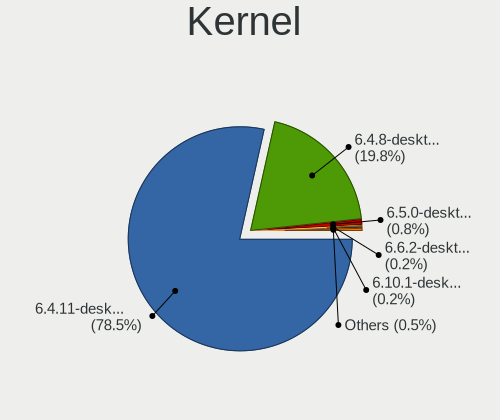

| Version                      | Computers | Percent |
|------------------------------|-----------|---------|
| 6.4.11-desktop-1omv2390      | 1905      | 78.49%  |
| 6.4.8-desktop-2omv2390       | 481       | 19.82%  |
| 6.5.0-desktop-1omv2390       | 20        | 0.82%   |
| 6.6.2-desktop-1omv2390       | 5         | 0.21%   |
| 6.10.1-desktop-1omv2490      | 5         | 0.21%   |
| 6.5.1-desktop-1omv2390       | 2         | 0.08%   |
| 6.3.5-desktop-3omv2390       | 2         | 0.08%   |
| 6.9.3-desktop-2omv2490       | 1         | 0.04%   |
| 6.9.3-desktop-1omv2490       | 1         | 0.04%   |
| 6.8.1-desktop-3omv2490       | 1         | 0.04%   |
| 6.6.0-desktop-1omv2390       | 1         | 0.04%   |
| 6.5.0-desktop-0.rc7.1omv2390 | 1         | 0.04%   |
| 6.5.0-desktop-0.rc4.1omv2390 | 1         | 0.04%   |
| 6.10.0-desktop-1omv2490      | 1         | 0.04%   |

Kernel Family
-------------

Linux kernel without a distro release

| Version | Computers | Percent |
|---------|-----------|---------|
| 6.4.11  | 1905      | 78.49%  |
| 6.4.8   | 481       | 19.82%  |
| 6.5.0   | 22        | 0.91%   |
| 6.6.2   | 5         | 0.21%   |
| 6.10.1  | 5         | 0.21%   |
| 6.9.3   | 2         | 0.08%   |
| 6.5.1   | 2         | 0.08%   |
| 6.3.5   | 2         | 0.08%   |
| 6.8.1   | 1         | 0.04%   |
| 6.6.0   | 1         | 0.04%   |
| 6.10.0  | 1         | 0.04%   |

Kernel Major Ver.
-----------------

Linux kernel major version

| Version | Computers | Percent |
|---------|-----------|---------|
| 6.4     | 2384      | 98.31%  |
| 6.5     | 24        | 0.99%   |
| 6.6     | 6         | 0.25%   |
| 6.10    | 6         | 0.25%   |
| 6.9     | 2         | 0.08%   |
| 6.3     | 2         | 0.08%   |
| 6.8     | 1         | 0.04%   |

Arch
----

OS architecture (x86_64, i586, etc.)

| Name   | Computers | Percent |
|--------|-----------|---------|
| x86_64 | 2424      | 100%    |

DE
--

Desktop Environment

| Name     | Computers | Percent |
|----------|-----------|---------|
| KDE5     | 2095      | 86.32%  |
| GNOME    | 167       | 6.88%   |
| LXQt     | 156       | 6.43%   |
| Unknown  | 4         | 0.16%   |
| Budgie   | 3         | 0.12%   |
| Cinnamon | 2         | 0.08%   |

Display Server
--------------

X11 or Wayland

| Name    | Computers | Percent |
|---------|-----------|---------|
| Wayland | 2345      | 96.66%  |
| X11     | 79        | 3.26%   |
| Unknown | 2         | 0.08%   |

Display Manager
---------------

SDDM, LightDM, etc.

| Name    | Computers | Percent |
|---------|-----------|---------|
| SDDM    | 2257      | 93.03%  |
| GDM     | 167       | 6.88%   |
| Unknown | 2         | 0.08%   |

OS Lang
-------

Language

| Lang  | Computers | Percent |
|-------|-----------|---------|
| en_US | 1210      | 49.79%  |
| de_DE | 160       | 6.58%   |
| pt_BR | 138       | 5.68%   |
| fr_FR | 136       | 5.6%    |
| ru_RU | 123       | 5.06%   |
| en_GB | 99        | 4.07%   |
| pl_PL | 85        | 3.5%    |
| it_IT | 70        | 2.88%   |
| es_ES | 58        | 2.39%   |
| es_MX | 30        | 1.23%   |
| es_AR | 24        | 0.99%   |
| cs_CZ | 24        | 0.99%   |
| en_CA | 23        | 0.95%   |
| hu_HU | 22        | 0.91%   |
| pt_PT | 18        | 0.74%   |
| tr_TR | 16        | 0.66%   |
| en_IN | 16        | 0.66%   |
| en_AU | 16        | 0.66%   |
| es_VE | 15        | 0.62%   |
| fr_BE | 13        | 0.53%   |
| nl_BE | 11        | 0.45%   |
| es_CO | 11        | 0.45%   |
| de_AT | 10        | 0.41%   |
| fr_CA | 8         | 0.33%   |
| es_CL | 8         | 0.33%   |
| ro_RO | 7         | 0.29%   |
| nl_NL | 7         | 0.29%   |
| en_SG | 6         | 0.25%   |
| de_CH | 6         | 0.25%   |
| UTF-8 | 5         | 0.21%   |
| en_IE | 5         | 0.21%   |
| fr_CH | 4         | 0.16%   |
| en_ZA | 4         | 0.16%   |
| en_HK | 3         | 0.12%   |
| en_DK | 3         | 0.12%   |
| da_DK | 3         | 0.12%   |
| ja_JP | 2         | 0.08%   |
| it_CH | 2         | 0.08%   |
| es_UY | 2         | 0.08%   |
| es_PY | 2         | 0.08%   |

Boot Mode
---------

EFI or BIOS

| Mode | Computers | Percent |
|------|-----------|---------|
| EFI  | 1466      | 60.38%  |
| BIOS | 962       | 39.62%  |

Filesystem
----------

Type of filesystem

| Type     | Computers | Percent |
|----------|-----------|---------|
| Overlay  | 1159      | 47.52%  |
| Ext4     | 1131      | 46.37%  |
| Btrfs    | 104       | 4.26%   |
| Xfs      | 20        | 0.82%   |
| F2fs     | 9         | 0.37%   |
| Reiserfs | 5         | 0.21%   |
| Ext3     | 4         | 0.16%   |
| Jfs      | 3         | 0.12%   |
| Ext2     | 3         | 0.12%   |
| Udf      | 1         | 0.04%   |

Part. scheme
------------

Scheme of partitioning

| Type    | Computers | Percent |
|---------|-----------|---------|
| GPT     | 1915      | 78.74%  |
| MBR     | 515       | 21.18%  |
| Unknown | 2         | 0.08%   |

Dual Boot with Linux/BSD
------------------------

Hosting more than one Linux/BSD

| Dual boot | Computers | Percent |
|-----------|-----------|---------|
| No        | 1318      | 54.06%  |
| Yes       | 1120      | 45.94%  |

Dual Boot (Win)
---------------

Hosting Linux and Windows

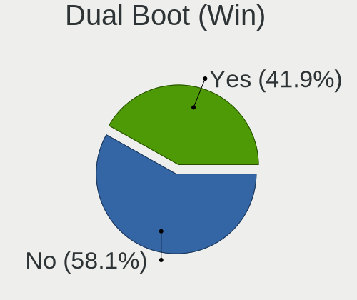

| Dual boot | Computers | Percent |
|-----------|-----------|---------|
| No        | 1414      | 58.14%  |
| Yes       | 1018      | 41.86%  |

Board
-----

Vendor
------

Motherboard manufacturer

| Name                                 | Computers | Percent |
|--------------------------------------|-----------|---------|
| Lenovo                               | 363       | 14.98%  |
| ASUSTek Computer                     | 360       | 14.85%  |
| Hewlett-Packard                      | 336       | 13.86%  |
| Dell                                 | 258       | 10.64%  |
| Gigabyte Technology                  | 173       | 7.14%   |
| MSI                                  | 139       | 5.73%   |
| Acer                                 | 135       | 5.57%   |
| Intel                                | 82        | 3.38%   |
| ASRock                               | 78        | 3.22%   |
| Fujitsu                              | 42        | 1.73%   |
| Toshiba                              | 38        | 1.57%   |
| Apple                                | 36        | 1.49%   |
| Samsung Electronics                  | 30        | 1.24%   |
| Core Innovations                     | 22        | 0.91%   |
| Unknown                              | 21        | 0.87%   |
| Positivo                             | 17        | 0.7%    |
| Medion                               | 16        | 0.66%   |
| Foxconn                              | 15        | 0.62%   |
| Sony                                 | 13        | 0.54%   |
| Pegatron                             | 13        | 0.54%   |
| Biostar                              | 13        | 0.54%   |
| AZW                                  | 13        | 0.54%   |
| Packard Bell                         | 10        | 0.41%   |
| Chuwi                                | 10        | 0.41%   |
| HUAWEI                               | 9         | 0.37%   |
| LG Electronics                       | 8         | 0.33%   |
| ECS                                  | 8         | 0.33%   |
| Shenzhen Meigao Electronic Equipment | 7         | 0.29%   |
| Microsoft                            | 6         | 0.25%   |
| Google                               | 6         | 0.25%   |
| GPU Company                          | 5         | 0.21%   |
| Panasonic                            | 4         | 0.17%   |
| OEM                                  | 4         | 0.17%   |
| Compaq                               | 4         | 0.17%   |
| Clevo                                | 4         | 0.17%   |
| UMAX                                 | 3         | 0.12%   |
| System76                             | 3         | 0.12%   |
| Shuttle                              | 3         | 0.12%   |
| Qilive                               | 3         | 0.12%   |
| Philco                               | 3         | 0.12%   |

Model
-----

Motherboard model

| Name                                 | Computers | Percent |
|--------------------------------------|-----------|---------|
| Lenovo IdeaPad 1 14IGL7 82V6         | 37        | 1.53%   |
| Unknown                              | 26        | 1.07%   |
| Core Innovations CLC14364            | 22        | 0.91%   |
| ASUS All Series                      | 16        | 0.66%   |
| Intel H61                            | 12        | 0.5%    |
| HP Pavilion g6                       | 9         | 0.37%   |
| Dell OptiPlex 7010                   | 9         | 0.37%   |
| HP Compaq Pro 6300 SFF               | 8         | 0.33%   |
| Intel H81                            | 7         | 0.29%   |
| Positivo Mobile                      | 5         | 0.21%   |
| MSI MS-7C51                          | 5         | 0.21%   |
| MSI MS-7817                          | 5         | 0.21%   |
| Lenovo ThinkPad L13 Gen 3 21BAS0X700 | 5         | 0.21%   |
| Intel X99                            | 5         | 0.21%   |
| HP Notebook                          | 5         | 0.21%   |
| Gigabyte B75M-D3H                    | 5         | 0.21%   |
| Gigabyte A320M-S2H                   | 5         | 0.21%   |
| Dell OptiPlex 9020                   | 5         | 0.21%   |
| Dell OptiPlex 3010                   | 5         | 0.21%   |
| Dell Latitude E6400                  | 5         | 0.21%   |
| ASUS TUF Gaming B550-PLUS            | 5         | 0.21%   |
| Positivo POS-PIG41BA                 | 4         | 0.17%   |
| MSI MS-7C91                          | 4         | 0.17%   |
| MSI MS-7721                          | 4         | 0.17%   |
| Lenovo IdeaPad 3 15ALC6 82MF         | 4         | 0.17%   |
| Intel B75                            | 4         | 0.17%   |
| HP Z400 Workstation                  | 4         | 0.17%   |
| HP Laptop 15s-eq2xxx                 | 4         | 0.17%   |
| HP EliteBook 840 G5                  | 4         | 0.17%   |
| HP EliteBook 840 G3                  | 4         | 0.17%   |
| HP Compaq 6200 Pro SFF PC            | 4         | 0.17%   |
| Gigabyte X299 AORUS Gaming           | 4         | 0.17%   |
| Dell OptiPlex 9010                   | 4         | 0.17%   |
| Dell OptiPlex 790                    | 4         | 0.17%   |
| Dell Latitude E6420                  | 4         | 0.17%   |
| Dell Latitude E6410                  | 4         | 0.17%   |
| Dell Latitude 7480                   | 4         | 0.17%   |
| Dell Inspiron 3542                   | 4         | 0.17%   |
| AZW SER                              | 4         | 0.17%   |
| ASUS TUF Gaming X570-PLUS            | 4         | 0.17%   |

Model Family
------------

Motherboard model prefix

| Name                      | Computers | Percent |
|---------------------------|-----------|---------|
| Lenovo ThinkPad           | 119       | 4.91%   |
| Lenovo IdeaPad            | 106       | 4.37%   |
| Acer Aspire               | 93        | 3.84%   |
| Dell Latitude             | 80        | 3.3%    |
| Dell Inspiron             | 65        | 2.68%   |
| Dell OptiPlex             | 60        | 2.48%   |
| HP Compaq                 | 57        | 2.35%   |
| ASUS PRIME                | 52        | 2.15%   |
| ASUS VivoBook             | 43        | 1.77%   |
| HP Pavilion               | 42        | 1.73%   |
| Lenovo ThinkCentre        | 37        | 1.53%   |
| HP EliteBook              | 37        | 1.53%   |
| HP Laptop                 | 35        | 1.44%   |
| Toshiba Satellite         | 30        | 1.24%   |
| Unknown                   | 26        | 1.07%   |
| HP ProBook                | 25        | 1.03%   |
| ASUS TUF                  | 25        | 1.03%   |
| Core Innovations CLC14364 | 22        | 0.91%   |
| Fujitsu ESPRIMO           | 20        | 0.83%   |
| ASUS ROG                  | 20        | 0.83%   |
| HP EliteDesk              | 19        | 0.78%   |
| ASUS All                  | 16        | 0.66%   |
| Intel H61                 | 13        | 0.54%   |
| Dell Precision            | 13        | 0.54%   |
| Lenovo Yoga               | 12        | 0.5%    |
| Dell Vostro               | 12        | 0.5%    |
| HP ProDesk                | 11        | 0.45%   |
| Acer Veriton              | 10        | 0.41%   |
| Lenovo IdeaCentre         | 9         | 0.37%   |
| HP 250                    | 9         | 0.37%   |
| Fujitsu LIFEBOOK          | 9         | 0.37%   |
| Dell XPS                  | 9         | 0.37%   |
| ASUS M5A78L-M             | 9         | 0.37%   |
| Packard Bell EasyNote     | 8         | 0.33%   |
| Intel H81                 | 8         | 0.33%   |
| HP Slim                   | 8         | 0.33%   |
| HP ENVY                   | 8         | 0.33%   |
| Lenovo IdeaPadFlex        | 7         | 0.29%   |
| Gigabyte B550             | 7         | 0.29%   |
| Gigabyte B450M            | 7         | 0.29%   |

MFG Year
--------

Motherboard manufacture year

| Year    | Computers | Percent |
|---------|-----------|---------|
| 2012    | 231       | 9.53%   |
| 2021    | 195       | 8.04%   |
| 2011    | 188       | 7.76%   |
| 2013    | 185       | 7.63%   |
| 2022    | 168       | 6.93%   |
| 2020    | 166       | 6.85%   |
| 2017    | 157       | 6.48%   |
| 2018    | 154       | 6.35%   |
| 2010    | 152       | 6.27%   |
| 2014    | 151       | 6.23%   |
| 2019    | 138       | 5.69%   |
| 2016    | 123       | 5.07%   |
| 2015    | 97        | 4%      |
| 2009    | 89        | 3.67%   |
| 2008    | 76        | 3.14%   |
| 2023    | 74        | 3.05%   |
| 2007    | 46        | 1.9%    |
| 2006    | 20        | 0.83%   |
| 2024    | 8         | 0.33%   |
| 2005    | 3         | 0.12%   |
| 2004    | 2         | 0.08%   |
| Unknown | 1         | 0.04%   |

Form Factor
-----------

Physical design of the computer

| Name        | Computers | Percent |
|-------------|-----------|---------|
| Notebook    | 1191      | 49.13%  |
| Desktop     | 1097      | 45.26%  |
| Mini pc     | 46        | 1.9%    |
| Convertible | 36        | 1.49%   |
| All in one  | 35        | 1.44%   |
| Tablet      | 13        | 0.54%   |
| Server      | 5         | 0.21%   |
| Other       | 1         | 0.04%   |

Secure Boot
-----------

Enabled or disabled

| State    | Computers | Percent |
|----------|-----------|---------|
| Disabled | 2424      | 100%    |

Coreboot
--------

Have coreboot on board

| Used | Computers | Percent |
|------|-----------|---------|
| No   | 2415      | 99.63%  |
| Yes  | 9         | 0.37%   |

RAM Size
--------

Total RAM memory

| Size in GB  | Computers | Percent |
|-------------|-----------|---------|
| 4.01-8.0    | 679       | 27.98%  |
| 3.01-4.0    | 519       | 21.38%  |
| 16.01-24.0  | 443       | 18.25%  |
| 8.01-16.0   | 374       | 15.41%  |
| 32.01-64.0  | 171       | 7.05%   |
| 1.01-2.0    | 72        | 2.97%   |
| 2.01-3.0    | 71        | 2.93%   |
| 64.01-256.0 | 43        | 1.77%   |
| 24.01-32.0  | 42        | 1.73%   |
| 0.51-1.0    | 13        | 0.54%   |

RAM Used
--------

Used RAM memory

| Used GB   | Computers | Percent |
|-----------|-----------|---------|
| 1.01-2.0  | 1602      | 65.52%  |
| 2.01-3.0  | 513       | 20.98%  |
| 0.51-1.0  | 193       | 7.89%   |
| 3.01-4.0  | 87        | 3.56%   |
| 4.01-8.0  | 26        | 1.06%   |
| 0.01-0.5  | 22        | 0.9%    |
| 8.01-16.0 | 2         | 0.08%   |

Total Drives
------------

Number of drives on board

| Drives | Computers | Percent |
|--------|-----------|---------|
| 1      | 1450      | 59.47%  |
| 2      | 597       | 24.49%  |
| 3      | 193       | 7.92%   |
| 4      | 89        | 3.65%   |
| 5      | 42        | 1.72%   |
| 0      | 35        | 1.44%   |
| 6      | 18        | 0.74%   |
| 8      | 5         | 0.21%   |
| 7      | 5         | 0.21%   |
| 10     | 2         | 0.08%   |
| 11     | 1         | 0.04%   |
| 9      | 1         | 0.04%   |

Has CD-ROM
----------

Has CD-ROM on board

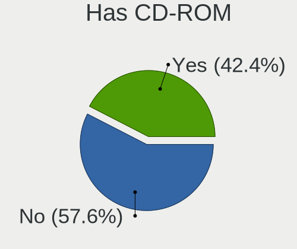

| Presented | Computers | Percent |
|-----------|-----------|---------|
| No        | 1396      | 57.57%  |
| Yes       | 1029      | 42.43%  |

Has Ethernet
------------

Has Ethernet on board

| Presented | Computers | Percent |
|-----------|-----------|---------|
| Yes       | 2129      | 87.83%  |
| No        | 295       | 12.17%  |

Has WiFi
--------

Has WiFi module

| Presented | Computers | Percent |
|-----------|-----------|---------|
| Yes       | 1700      | 70.1%   |
| No        | 725       | 29.9%   |

Has Bluetooth
-------------

Has Bluetooth module

| Presented | Computers | Percent |
|-----------|-----------|---------|
| Yes       | 1305      | 53.73%  |
| No        | 1124      | 46.27%  |

Location
--------

Country
-------

Geographic location (country)

| Country      | Computers | Percent |
|--------------|-----------|---------|
| USA          | 377       | 15.55%  |
| Germany      | 235       | 9.69%   |
| Brazil       | 214       | 8.82%   |
| France       | 156       | 6.43%   |
| Russia       | 149       | 6.14%   |
| Poland       | 121       | 4.99%   |
| Italy        | 102       | 4.21%   |
| UK           | 87        | 3.59%   |
| Spain        | 85        | 3.51%   |
| Canada       | 58        | 2.39%   |
| Australia    | 42        | 1.73%   |
| India        | 39        | 1.61%   |
| Mexico       | 38        | 1.57%   |
| Argentina    | 35        | 1.44%   |
| Netherlands  | 33        | 1.36%   |
| Turkey       | 30        | 1.24%   |
| Hungary      | 30        | 1.24%   |
| Czechia      | 30        | 1.24%   |
| Japan        | 28        | 1.15%   |
| Belgium      | 28        | 1.15%   |
| Romania      | 26        | 1.07%   |
| Greece       | 24        | 0.99%   |
| Portugal     | 22        | 0.91%   |
| Colombia     | 22        | 0.91%   |
| Indonesia    | 20        | 0.82%   |
| Austria      | 20        | 0.82%   |
| Bulgaria     | 19        | 0.78%   |
| Venezuela    | 18        | 0.74%   |
| Finland      | 17        | 0.7%    |
| Sweden       | 15        | 0.62%   |
| Thailand     | 14        | 0.58%   |
| Slovakia     | 14        | 0.58%   |
| Switzerland  | 13        | 0.54%   |
| China        | 13        | 0.54%   |
| Ukraine      | 12        | 0.49%   |
| Malaysia     | 12        | 0.49%   |
| Israel       | 12        | 0.49%   |
| Chile        | 12        | 0.49%   |
| Denmark      | 9         | 0.37%   |
| South Africa | 8         | 0.33%   |

City
----

Geographic location (city)

| City           | Computers | Percent |
|----------------|-----------|---------|
| Los Angeles    | 55        | 2.25%   |
| Berlin         | 26        | 1.07%   |
| Warsaw         | 25        | 1.02%   |
| Moscow         | 24        | 0.98%   |
| Krakow         | 15        | 0.61%   |
| Sydney         | 14        | 0.57%   |
| Sao Paulo      | 14        | 0.57%   |
| Melbourne      | 14        | 0.57%   |
| Vienna         | 13        | 0.53%   |
| Milan          | 13        | 0.53%   |
| Istanbul       | 13        | 0.53%   |
| St Petersburg  | 12        | 0.49%   |
| Rio de Janeiro | 12        | 0.49%   |
| Paris          | 12        | 0.49%   |
| Munich         | 11        | 0.45%   |
| Athens         | 11        | 0.45%   |
| Rome           | 10        | 0.41%   |
| Madrid         | 10        | 0.41%   |
| Sao Goncalo    | 9         | 0.37%   |
| Novosibirsk    | 9         | 0.37%   |
| Wroclaw        | 8         | 0.33%   |
| Topeka         | 8         | 0.33%   |
| Thousand Oaks  | 8         | 0.33%   |
| Stuttgart      | 8         | 0.33%   |
| Sofia          | 8         | 0.33%   |
| Prague         | 8         | 0.33%   |
| Lodz           | 8         | 0.33%   |
| Curitiba       | 8         | 0.33%   |
| Yekaterinburg  | 7         | 0.29%   |
| San Cristbal | 7         | 0.29%   |
| Hamburg        | 7         | 0.29%   |
| Budapest       | 7         | 0.29%   |
| Bengaluru      | 7         | 0.29%   |
| Tehran         | 6         | 0.25%   |
| Porto Alegre   | 6         | 0.25%   |
| Portland       | 6         | 0.25%   |
| Oak Creek      | 6         | 0.25%   |
| Katowice       | 6         | 0.25%   |
| Galveston      | 6         | 0.25%   |
| Cologne        | 6         | 0.25%   |

Drives
------

Drive Vendor
------------

Hard drive vendors

| Vendor                      | Computers | Drives | Percent |
|-----------------------------|-----------|--------|---------|
| WDC                         | 526       | 629    | 14.83%  |
| Seagate                     | 439       | 510    | 12.38%  |
| Samsung Electronics         | 419       | 511    | 11.82%  |
| Toshiba                     | 236       | 258    | 6.66%   |
| Kingston                    | 218       | 245    | 6.15%   |
| SanDisk                     | 146       | 153    | 4.12%   |
| Crucial                     | 144       | 168    | 4.06%   |
| Unknown                     | 142       | 171    | 4%      |
| Hitachi                     | 107       | 111    | 3.02%   |
| China                       | 74        | 80     | 2.09%   |
| A-DATA Technology           | 65        | 68     | 1.83%   |
| Unknown                     | 61        | 65     | 1.72%   |
| SK hynix                    | 60        | 62     | 1.69%   |
| Intel                       | 60        | 61     | 1.69%   |
| HGST                        | 48        | 50     | 1.35%   |
| Micron Technology           | 44        | 44     | 1.24%   |
| SPCC                        | 38        | 40     | 1.07%   |
| Intenso                     | 32        | 35     | 0.9%    |
| GOODRAM                     | 27        | 32     | 0.76%   |
| PNY                         | 24        | 25     | 0.68%   |
| Patriot                     | 23        | 24     | 0.65%   |
| Maxtor                      | 23        | 27     | 0.65%   |
| JMicron Technology          | 23        | 23     | 0.65%   |
| Apple                       | 22        | 23     | 0.62%   |
| Lexar                       | 20        | 23     | 0.56%   |
| Silicon Motion              | 18        | 19     | 0.51%   |
| Netac                       | 18        | 19     | 0.51%   |
| Kingston Technology Company | 18        | 21     | 0.51%   |
| Apacer                      | 18        | 19     | 0.51%   |
| Phison                      | 17        | 19     | 0.48%   |
| Transcend                   | 16        | 16     | 0.45%   |
| Team                        | 16        | 16     | 0.45%   |
| SSSTC                       | 16        | 16     | 0.45%   |
| KIOXIA                      | 16        | 16     | 0.45%   |
| Fanxiang                    | 16        | 16     | 0.45%   |
| LITEON                      | 14        | 14     | 0.39%   |
| KingSpec                    | 12        | 13     | 0.34%   |
| Hewlett-Packard             | 11        | 11     | 0.31%   |
| T-FORCE                     | 9         | 10     | 0.25%   |
| OCZ                         | 9         | 9      | 0.25%   |

Drive Model
-----------

Hard drive models

| Model                              | Computers | Percent |
|------------------------------------|-----------|---------|
| Unknown                            | 61        | 1.59%   |
| Kingston SA400S37240G 240GB SSD    | 45        | 1.17%   |
| Kingston SA400S37480G 480GB SSD    | 39        | 1.02%   |
| Unknown MMC64G  64GB               | 38        | 0.99%   |
| Seagate ST500DM002-1BD142 500GB    | 34        | 0.89%   |
| Seagate ST1000DM010-2EP102 1TB     | 27        | 0.7%    |
| Crucial CT500MX500SSD1 500GB       | 26        | 0.68%   |
| Seagate ST500LT012-1DG142 500GB    | 24        | 0.62%   |
| Toshiba MQ04ABF100 1TB             | 22        | 0.57%   |
| Kingston SA400S37120G 120GB SSD    | 21        | 0.55%   |
| Unknown SD/MMC/MS PRO 128GB        | 20        | 0.52%   |
| Toshiba DT01ACA100 1TB             | 20        | 0.52%   |
| SanDisk NVMe SSD Drive 1TB         | 20        | 0.52%   |
| Toshiba MQ01ABF050 500GB           | 19        | 0.49%   |
| Toshiba MQ01ABD100 1TB             | 19        | 0.49%   |
| Crucial CT240BX500SSD1 240GB       | 18        | 0.47%   |
| Samsung SSD 860 EVO 500GB          | 17        | 0.44%   |
| Samsung SSD 850 EVO 250GB          | 17        | 0.44%   |
| WDC WD10EZEX-08WN4A0 1TB           | 16        | 0.42%   |
| Seagate ST2000DM008-2FR102 2TB     | 16        | 0.42%   |
| Seagate ST3500418AS 500GB          | 15        | 0.39%   |
| Seagate ST1000LM024 HN-M101MBB 1TB | 15        | 0.39%   |
| Samsung SSD 870 EVO 500GB          | 15        | 0.39%   |
| Toshiba DT01ACA050 500GB           | 14        | 0.36%   |
| Seagate ST1000LM035-1RK172 1TB     | 14        | 0.36%   |
| Seagate ST1000DM003-1CH162 1TB     | 14        | 0.36%   |
| Samsung SSD 850 EVO 500GB          | 14        | 0.36%   |
| JMicron Generic 500GB              | 14        | 0.36%   |
| WDC WDS240G2G0A-00JH30 240GB SSD   | 13        | 0.34%   |
| Toshiba HDWD110 1TB                | 13        | 0.34%   |
| Kingston SV300S37A120G 120GB SSD   | 13        | 0.34%   |
| Crucial CT1000MX500SSD1 1TB        | 13        | 0.34%   |
| Samsung SSD 970 EVO Plus 2TB       | 12        | 0.31%   |
| Samsung SSD 870 QVO 1TB            | 12        | 0.31%   |
| SanDisk SSD PLUS 1000GB            | 11        | 0.29%   |
| SanDisk NVMe SSD Drive 500GB       | 11        | 0.29%   |
| Crucial CT1000BX500SSD1 1TB        | 11        | 0.29%   |
| WDC WD10JPVX-22JC3T0 1TB           | 10        | 0.26%   |
| Seagate ST3500312CS 500GB          | 10        | 0.26%   |
| Seagate ST2000DM001-1CH164 2TB     | 10        | 0.26%   |

HDD Vendor
----------

Hard disk drive vendors

| Vendor              | Computers | Drives | Percent |
|---------------------|-----------|--------|---------|
| Seagate             | 433       | 503    | 31.13%  |
| WDC                 | 414       | 492    | 29.76%  |
| Toshiba             | 209       | 227    | 15.03%  |
| Hitachi             | 107       | 111    | 7.69%   |
| Samsung Electronics | 82        | 88     | 5.9%    |
| HGST                | 48        | 50     | 3.45%   |
| Maxtor              | 22        | 26     | 1.58%   |
| Unknown             | 21        | 22     | 1.51%   |
| JMicron Technology  | 15        | 15     | 1.08%   |
| Apple               | 10        | 10     | 0.72%   |
| Fujitsu             | 6         | 7      | 0.43%   |
| ExcelStor           | 3         | 3      | 0.22%   |
| TO Exter            | 2         | 2      | 0.14%   |
| SABRENT             | 2         | 2      | 0.14%   |
| Min Yi U            | 2         | 2      | 0.14%   |
| Inateck             | 2         | 2      | 0.14%   |
| External            | 2         | 2      | 0.14%   |
| ASMT                | 2         | 2      | 0.14%   |
| WD MediaMax         | 1         | 1      | 0.07%   |
| USB                 | 1         | 1      | 0.07%   |
| Shenzhen            | 1         | 1      | 0.07%   |
| SAGE                | 1         | 1      | 0.07%   |
| Intenso             | 1         | 1      | 0.07%   |
| IB-AC703            | 1         | 1      | 0.07%   |
| DAS                 | 1         | 4      | 0.07%   |
| ASMedia             | 1         | 1      | 0.07%   |
| Unknown             | 1         | 2      | 0.07%   |

SSD Vendor
----------

Solid state drive vendors

| Vendor              | Computers | Drives | Percent |
|---------------------|-----------|--------|---------|
| Samsung Electronics | 205       | 233    | 15.58%  |
| Kingston            | 165       | 185    | 12.54%  |
| Crucial             | 105       | 112    | 7.98%   |
| SanDisk             | 90        | 95     | 6.84%   |
| China               | 74        | 80     | 5.62%   |
| WDC                 | 66        | 72     | 5.02%   |
| A-DATA Technology   | 45        | 46     | 3.42%   |
| SPCC                | 33        | 33     | 2.51%   |
| Intenso             | 31        | 34     | 2.36%   |
| GOODRAM             | 27        | 32     | 2.05%   |
| Intel               | 26        | 26     | 1.98%   |
| PNY                 | 23        | 24     | 1.75%   |
| Patriot             | 22        | 23     | 1.67%   |
| Micron Technology   | 22        | 22     | 1.67%   |
| SK hynix            | 17        | 18     | 1.29%   |
| Transcend           | 14        | 14     | 1.06%   |
| Toshiba             | 14        | 17     | 1.06%   |
| Netac               | 14        | 15     | 1.06%   |
| Apacer              | 14        | 14     | 1.06%   |
| Unknown             | 13        | 13     | 0.99%   |
| LITEON              | 12        | 12     | 0.91%   |
| KingSpec            | 12        | 13     | 0.91%   |
| Apple               | 12        | 12     | 0.91%   |
| Team                | 11        | 11     | 0.84%   |
| Fanxiang            | 11        | 11     | 0.84%   |
| Lexar               | 10        | 11     | 0.76%   |
| OCZ                 | 9         | 9      | 0.68%   |
| Verbatim            | 8         | 8      | 0.61%   |
| Hewlett-Packard     | 7         | 7      | 0.53%   |
| XrayDisk            | 6         | 6      | 0.46%   |
| T-FORCE             | 6         | 7      | 0.46%   |
| KIOXIA-EXCERIA      | 6         | 6      | 0.46%   |
| KingFast            | 6         | 7      | 0.46%   |
| USB3.0              | 5         | 5      | 0.38%   |
| Seagate             | 5         | 5      | 0.38%   |
| Plextor             | 5         | 5      | 0.38%   |
| LITEONIT            | 5         | 5      | 0.38%   |
| INNOVATION IT       | 5         | 5      | 0.38%   |
| WALRAM              | 4         | 4      | 0.3%    |
| Teclast             | 4         | 4      | 0.3%    |

Drive Kind
----------

HDD or SSD

| Kind    | Computers | Drives | Percent |
|---------|-----------|--------|---------|
| HDD     | 1177      | 1579   | 37.62%  |
| SSD     | 1124      | 1413   | 35.92%  |
| NVMe    | 627       | 761    | 20.04%  |
| MMC     | 154       | 170    | 4.92%   |
| Unknown | 47        | 65     | 1.5%    |

Drive Connector
---------------

SATA, SAS, NVMe, etc.

| Type | Computers | Drives | Percent |
|------|-----------|--------|---------|
| SATA | 1905      | 2845   | 66.45%  |
| NVMe | 625       | 749    | 21.8%   |
| SAS  | 183       | 224    | 6.38%   |
| MMC  | 154       | 170    | 5.37%   |

Drive Size
----------

Size of hard drive

| Size in TB | Computers | Drives | Percent |
|------------|-----------|--------|---------|
| 0.01-0.5   | 1468      | 1908   | 61.99%  |
| 0.51-1.0   | 677       | 804    | 28.59%  |
| 1.01-2.0   | 142       | 174    | 6%      |
| 3.01-4.0   | 34        | 42     | 1.44%   |
| 2.01-3.0   | 28        | 35     | 1.18%   |
| 4.01-10.0  | 11        | 18     | 0.46%   |
| 10.01-20.0 | 8         | 11     | 0.34%   |

Space Total
-----------

Amount of disk space available on the file system

| Size in GB     | Computers | Percent |
|----------------|-----------|---------|
| 1-20           | 840       | 34.3%   |
| 101-250        | 501       | 20.46%  |
| 251-500        | 343       | 14.01%  |
| 501-1000       | 201       | 8.21%   |
| 51-100         | 198       | 8.08%   |
| Unknown        | 125       | 5.1%    |
| 21-50          | 106       | 4.33%   |
| 1001-2000      | 78        | 3.18%   |
| 2001-3000      | 29        | 1.18%   |
| More than 3000 | 28        | 1.14%   |

Space Used
----------

Amount of used disk space

| Used GB        | Computers | Percent |
|----------------|-----------|---------|
| 1-20           | 1973      | 80.96%  |
| 21-50          | 125       | 5.13%   |
| Unknown        | 125       | 5.13%   |
| 51-100         | 64        | 2.63%   |
| 101-250        | 59        | 2.42%   |
| 251-500        | 38        | 1.56%   |
| 501-1000       | 24        | 0.98%   |
| 1001-2000      | 16        | 0.66%   |
| More than 3000 | 8         | 0.33%   |
| 2001-3000      | 5         | 0.21%   |

Malfunc. Drives
---------------

Drive models with a malfunction

| Model                                | Computers | Drives | Percent |
|--------------------------------------|-----------|--------|---------|
| Seagate ST500DM002-1BD142 500GB      | 13        | 13     | 2%      |
| Seagate ST500LT012-1DG142 500GB      | 10        | 10     | 1.54%   |
| Seagate ST3500418AS 500GB            | 9         | 9      | 1.38%   |
| Toshiba MQ01ABD100 1TB               | 6         | 6      | 0.92%   |
| Seagate ST500LT012-9WS142 500GB      | 6         | 6      | 0.92%   |
| Seagate ST1000DM010-2EP102 1TB       | 6         | 7      | 0.92%   |
| Toshiba DT01ACA050 500GB             | 5         | 5      | 0.77%   |
| Seagate ST3500312CS 500GB            | 5         | 5      | 0.77%   |
| Samsung Electronics HD322HJ 320GB    | 5         | 6      | 0.77%   |
| Hitachi HTS543225L9A300 250GB        | 5         | 5      | 0.77%   |
| WDC WD10EARS-00Y5B1 1TB              | 4         | 4      | 0.61%   |
| Toshiba MQ01ABF050 500GB             | 4         | 4      | 0.61%   |
| Toshiba MQ01ABD075 752GB             | 4         | 4      | 0.61%   |
| Toshiba MK3259GSXP 320GB             | 4         | 4      | 0.61%   |
| Toshiba DT01ACA100 1TB               | 4         | 4      | 0.61%   |
| Seagate ST9500325AS 500GB            | 4         | 5      | 0.61%   |
| Seagate ST9320325AS 320GB            | 4         | 4      | 0.61%   |
| Seagate ST9250315AS 250GB            | 4         | 4      | 0.61%   |
| Seagate ST3160318AS 160GB            | 4         | 4      | 0.61%   |
| Seagate ST1000DM003-1CH162 1TB       | 4         | 4      | 0.61%   |
| SanDisk SSD PLUS 480GB               | 4         | 4      | 0.61%   |
| Maxtor STM380815AS 80GB              | 4         | 5      | 0.61%   |
| Kingston SV300S37A120G 120GB SSD     | 4         | 4      | 0.61%   |
| HGST HTS725050A7E630 500GB           | 4         | 4      | 0.61%   |
| HGST HTS721010A9E630 1TB             | 4         | 4      | 0.61%   |
| HGST HTS545050A7E680 500GB           | 4         | 4      | 0.61%   |
| WDC WD5000LPVX-80V0TT0 500GB         | 3         | 3      | 0.46%   |
| WDC WD5000LPCX-24C6HT0 500GB         | 3         | 3      | 0.46%   |
| WDC WD5000BPVT-00HXZT3 500GB         | 3         | 3      | 0.46%   |
| WDC WD5000AVCS-632DY1 500GB          | 3         | 3      | 0.46%   |
| WDC WD5000AAKX-75U6AA0 500GB         | 3         | 3      | 0.46%   |
| WDC WD1600BEVS-00VAT0 160GB          | 3         | 3      | 0.46%   |
| WDC WD10EZEX-60M2NA0 1TB             | 3         | 3      | 0.46%   |
| Toshiba MQ04ABF100 1TB               | 3         | 3      | 0.46%   |
| Toshiba MK6475GSX 640GB              | 3         | 3      | 0.46%   |
| SSSTC CVB-8D128-HP 128GB SSD         | 3         | 3      | 0.46%   |
| SK hynix BC711 HFM512GD3JX013N 512GB | 3         | 3      | 0.46%   |
| Seagate ST980811AS 80GB              | 3         | 3      | 0.46%   |
| Seagate ST500LM021-1KJ152 500GB      | 3         | 3      | 0.46%   |
| Seagate ST3500413AS 500GB            | 3         | 3      | 0.46%   |

Malfunc. Drive Vendor
---------------------

Vendors of faulty drives

| Vendor              | Computers | Drives | Percent |
|---------------------|-----------|--------|---------|
| Seagate             | 159       | 167    | 24.88%  |
| WDC                 | 145       | 158    | 22.69%  |
| Hitachi             | 68        | 69     | 10.64%  |
| Toshiba             | 65        | 67     | 10.17%  |
| Samsung Electronics | 49        | 52     | 7.67%   |
| HGST                | 18        | 18     | 2.82%   |
| Maxtor              | 15        | 17     | 2.35%   |
| Kingston            | 15        | 15     | 2.35%   |
| SK hynix            | 14        | 14     | 2.19%   |
| SanDisk             | 14        | 14     | 2.19%   |
| A-DATA Technology   | 9         | 9      | 1.41%   |
| Intel               | 8         | 8      | 1.25%   |
| China               | 7         | 7      | 1.1%    |
| Micron Technology   | 5         | 5      | 0.78%   |
| SSSTC               | 4         | 4      | 0.63%   |
| SPCC                | 4         | 4      | 0.63%   |
| Netac               | 3         | 3      | 0.47%   |
| LITEONIT            | 3         | 3      | 0.47%   |
| Crucial             | 3         | 3      | 0.47%   |
| XPG                 | 2         | 2      | 0.31%   |
| Intenso             | 2         | 2      | 0.31%   |
| ExcelStor           | 2         | 2      | 0.31%   |
| XrayDisk            | 1         | 1      | 0.16%   |
| Wibtek              | 1         | 2      | 0.16%   |
| SandForce           | 1         | 1      | 0.16%   |
| SAGE                | 1         | 1      | 0.16%   |
| Reeinno             | 1         | 1      | 0.16%   |
| PNY                 | 1         | 1      | 0.16%   |
| Plextor             | 1         | 1      | 0.16%   |
| OCZ-AGIL            | 1         | 1      | 0.16%   |
| OCZ                 | 1         | 1      | 0.16%   |
| KingDian            | 1         | 1      | 0.16%   |
| KINGCOMP            | 1         | 1      | 0.16%   |
| JMicron Technology  | 1         | 1      | 0.16%   |
| INNOVATION IT       | 1         | 1      | 0.16%   |
| HS-SSD-C100         | 1         | 1      | 0.16%   |
| Hewlett-Packard     | 1         | 1      | 0.16%   |
| GOODRAM             | 1         | 1      | 0.16%   |
| Fujitsu             | 1         | 1      | 0.16%   |
| EX276687RUS         | 1         | 1      | 0.16%   |

Malfunc. HDD Vendor
-------------------

Vendors of faulty HDD drives

| Vendor              | Computers | Drives | Percent |
|---------------------|-----------|--------|---------|
| Seagate             | 159       | 167    | 31.18%  |
| WDC                 | 136       | 148    | 26.67%  |
| Hitachi             | 68        | 69     | 13.33%  |
| Toshiba             | 65        | 67     | 12.75%  |
| Samsung Electronics | 42        | 44     | 8.24%   |
| HGST                | 18        | 18     | 3.53%   |
| Maxtor              | 15        | 17     | 2.94%   |
| ExcelStor           | 2         | 2      | 0.39%   |
| SAGE                | 1         | 1      | 0.2%    |
| JMicron Technology  | 1         | 1      | 0.2%    |
| Fujitsu             | 1         | 1      | 0.2%    |
| ASMT                | 1         | 1      | 0.2%    |
| Apple               | 1         | 1      | 0.2%    |

Malfunc. Drive Kind
-------------------

Kinds of faulty drives

| Kind | Computers | Drives | Percent |
|------|-----------|--------|---------|
| HDD  | 470       | 537    | 78.73%  |
| SSD  | 113       | 118    | 18.93%  |
| NVMe | 14        | 14     | 2.35%   |

Failed Drives
-------------

Failed drive models

| Model                                   | Computers | Drives | Percent |
|-----------------------------------------|-----------|--------|---------|
| WDC WD3200BEVT-00ZCT0 320GB             | 3         | 3      | 12.5%   |
| WDC WD3200BPVT-22JJ5T0 320GB            | 1         | 1      | 4.17%   |
| WDC WD10EZEX-22MFCA0 1TB                | 1         | 1      | 4.17%   |
| WDC WD10EZEX-00BN5A0 1TB                | 1         | 1      | 4.17%   |
| Transcend TS1TMTE110S 1TB               | 1         | 1      | 4.17%   |
| Toshiba MQ01ABF032 320GB                | 1         | 1      | 4.17%   |
| Toshiba MQ01ABD050 500GB                | 1         | 1      | 4.17%   |
| Toshiba MK7575GSX 752GB                 | 1         | 1      | 4.17%   |
| Toshiba MK3265GSXV 320GB                | 1         | 1      | 4.17%   |
| Toshiba MK2575GSX 250GB                 | 1         | 1      | 4.17%   |
| Toshiba MK1234GSX 120GB                 | 1         | 1      | 4.17%   |
| SK hynix BC501 HFM256GDJTNG-8310A 256GB | 1         | 1      | 4.17%   |
| Seagate ST9320325AS 320GB               | 1         | 1      | 4.17%   |
| Seagate ST500DM002-1BD142 500GB         | 1         | 1      | 4.17%   |
| Seagate ST3320613AS 320GB               | 1         | 1      | 4.17%   |
| Seagate ST3320418AS 320GB               | 1         | 1      | 4.17%   |
| Seagate ST3250318AS 250GB               | 1         | 1      | 4.17%   |
| Seagate ST31000528AS 1TB                | 1         | 1      | 4.17%   |
| Samsung Electronics HD203WI 2TB         | 1         | 1      | 4.17%   |
| Intel SSDSCKKF256H6 SATA 256GB          | 1         | 1      | 4.17%   |
| Hitachi HTS545032B9A300 320GB           | 1         | 1      | 4.17%   |
| Hitachi HDS721050CLA360 500GB           | 1         | 1      | 4.17%   |

Failed Drive Vendor
-------------------

Failed drive vendors

| Vendor              | Computers | Drives | Percent |
|---------------------|-----------|--------|---------|
| WDC                 | 6         | 6      | 25%     |
| Toshiba             | 6         | 6      | 25%     |
| Seagate             | 6         | 6      | 25%     |
| Hitachi             | 2         | 2      | 8.33%   |
| Transcend           | 1         | 1      | 4.17%   |
| SK hynix            | 1         | 1      | 4.17%   |
| Samsung Electronics | 1         | 1      | 4.17%   |
| Intel               | 1         | 1      | 4.17%   |

Drive Status
------------

Number of failed and malfunc. drives

| Status   | Computers | Drives | Percent |
|----------|-----------|--------|---------|
| Works    | 1872      | 2870   | 66.29%  |
| Malfunc  | 585       | 669    | 20.72%  |
| Detected | 343       | 425    | 12.15%  |
| Failed   | 24        | 24     | 0.85%   |

Storage controller
------------------

Storage Vendor
--------------

Storage controller vendors

| Vendor                           | Computers | Percent |
|----------------------------------|-----------|---------|
| Intel                            | 1758      | 58.39%  |
| AMD                              | 452       | 15.01%  |
| Samsung Electronics              | 176       | 5.85%   |
| SanDisk                          | 107       | 3.55%   |
| Kingston Technology Company      | 73        | 2.42%   |
| Phison Electronics               | 41        | 1.36%   |
| SK hynix                         | 40        | 1.33%   |
| Micron/Crucial Technology        | 40        | 1.33%   |
| ASMedia Technology               | 36        | 1.2%    |
| Silicon Motion                   | 32        | 1.06%   |
| Nvidia                           | 31        | 1.03%   |
| Micron Technology                | 29        | 0.96%   |
| JMicron Technology               | 28        | 0.93%   |
| Marvell Technology Group         | 24        | 0.8%    |
| MAXIO Technology (Hangzhou)      | 23        | 0.76%   |
| KIOXIA                           | 20        | 0.66%   |
| ADATA Technology                 | 17        | 0.56%   |
| Solid State Storage Technology   | 13        | 0.43%   |
| Realtek Semiconductor            | 13        | 0.43%   |
| Toshiba America Info Systems     | 11        | 0.37%   |
| Shenzhen Longsys Electronics     | 10        | 0.33%   |
| VIA Technologies                 | 6         | 0.2%    |
| Broadcom / LSI                   | 5         | 0.17%   |
| Union Memory (Shenzhen)          | 4         | 0.13%   |
| Silicon Integrated Systems [SiS] | 4         | 0.13%   |
| LSI Logic / Symbios Logic        | 3         | 0.1%    |
| INNOGRIT                         | 3         | 0.1%    |
| Netac Technology                 | 2         | 0.07%   |
| Lite-On Technology               | 2         | 0.07%   |
| Transcend                        | 1         | 0.03%   |
| Sony                             | 1         | 0.03%   |
| Solidigm                         | 1         | 0.03%   |
| Seagate Technology               | 1         | 0.03%   |
| Nextorage                        | 1         | 0.03%   |
| Lenovo                           | 1         | 0.03%   |
| Integrated Technology Express    | 1         | 0.03%   |
| Biwin Storage Technology         | 1         | 0.03%   |

Storage Model
-------------

Storage controller models

| Model                                                                                   | Computers | Percent |
|-----------------------------------------------------------------------------------------|-----------|---------|
| AMD FCH SATA Controller [AHCI mode]                                                     | 269       | 7.79%   |
| Intel 8 Series/C220 Series Chipset Family 6-port SATA Controller 1 [AHCI mode]          | 128       | 3.71%   |
| Intel 7 Series Chipset Family 6-port SATA Controller [AHCI mode]                        | 112       | 3.24%   |
| Intel Sunrise Point-LP SATA Controller [AHCI mode]                                      | 108       | 3.13%   |
| Intel Celeron/Pentium Silver Processor SATA Controller                                  | 86        | 2.49%   |
| Intel 6 Series/C200 Series Chipset Family 6 port Mobile SATA AHCI Controller            | 83        | 2.4%    |
| Intel 82801 Mobile SATA Controller [RAID mode]                                          | 81        | 2.35%   |
| Intel NM10/ICH7 Family SATA Controller [IDE mode]                                       | 79        | 2.29%   |
| Samsung NVMe SSD Controller SM981/PM981/PM983                                           | 75        | 2.17%   |
| Intel 7 Series/C210 Series Chipset Family 6-port SATA Controller [AHCI mode]            | 70        | 2.03%   |
| Intel 6 Series/C200 Series Chipset Family 6 port Desktop SATA AHCI Controller           | 69        | 2%      |
| Intel Q170/Q150/B150/H170/H110/Z170/CM236 Chipset SATA Controller [AHCI Mode]           | 65        | 1.88%   |
| Intel 82801G (ICH7 Family) IDE Controller                                               | 59        | 1.71%   |
| AMD 400 Series Chipset SATA Controller                                                  | 59        | 1.71%   |
| AMD SB7x0/SB8x0/SB9x0 SATA Controller [AHCI mode]                                       | 53        | 1.53%   |
| Intel 200 Series PCH SATA controller [AHCI mode]                                        | 51        | 1.48%   |
| Intel Celeron N3350/Pentium N4200/Atom E3900 Series SATA AHCI Controller                | 50        | 1.45%   |
| Samsung NVMe SSD Controller 980 (DRAM-less)                                             | 49        | 1.42%   |
| Intel 8 Series SATA Controller 1 [AHCI mode]                                            | 48        | 1.39%   |
| Intel 5 Series/3400 Series Chipset 4 port SATA AHCI Controller                          | 46        | 1.33%   |
| AMD SB7x0/SB8x0/SB9x0 IDE Controller                                                    | 44        | 1.27%   |
| AMD 500 Series Chipset SATA Controller                                                  | 44        | 1.27%   |
| Intel 5 Series/3400 Series Chipset 6 port SATA AHCI Controller                          | 40        | 1.16%   |
| Intel Wildcat Point-LP SATA Controller [AHCI Mode]                                      | 39        | 1.13%   |
| Intel Volume Management Device NVMe RAID Controller                                     | 39        | 1.13%   |
| Intel 82801IBM/IEM (ICH9M/ICH9M-E) 4 port SATA Controller [AHCI mode]                   | 35        | 1.01%   |
| AMD A320 Chipset SATA Controller [AHCI mode]                                            | 34        | 0.98%   |
| SanDisk Ultra 3D / WD PC SN530, IX SN530, Blue SN550 NVMe SSD (DRAM-less)               | 33        | 0.96%   |
| ASMedia ASM1061/ASM1062 Serial ATA Controller                                           | 33        | 0.96%   |
| Intel SATA Controller [RAID mode]                                                       | 32        | 0.93%   |
| AMD SB7x0/SB8x0/SB9x0 SATA Controller [IDE mode]                                        | 32        | 0.93%   |
| Intel Atom Processor E3800 Series SATA AHCI Controller                                  | 31        | 0.9%    |
| Intel 6 Series/C200 Series Chipset Family Desktop SATA Controller (IDE mode, ports 4-5) | 29        | 0.84%   |
| Intel 6 Series/C200 Series Chipset Family Desktop SATA Controller (IDE mode, ports 0-3) | 29        | 0.84%   |
| Micron/Crucial P2 [Nick P2] / P3 / P3 Plus NVMe PCIe SSD (DRAM-less)                    | 28        | 0.81%   |
| Intel Tiger Lake-LP SATA Controller                                                     | 27        | 0.78%   |
| Silicon Motion SM2263EN/SM2263XT (DRAM-less) NVMe SSD Controllers                       | 26        | 0.75%   |
| Samsung NVMe SSD Controller PM9A1/PM9A3/980PRO                                          | 24        | 0.7%    |
| Intel Alder Lake-S PCH SATA Controller [AHCI Mode]                                      | 24        | 0.7%    |
| Intel Comet Lake SATA AHCI Controller                                                   | 23        | 0.67%   |

Storage Kind
------------

Kind of storage controller (IDE, SATA, NVMe, SAS, ...)

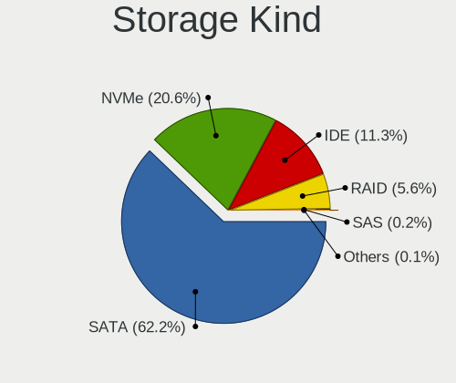

| Kind | Computers | Percent |
|------|-----------|---------|
| SATA | 1884      | 62.16%  |
| NVMe | 625       | 20.62%  |
| IDE  | 344       | 11.35%  |
| RAID | 169       | 5.58%   |
| SAS  | 5         | 0.16%   |
| SCSI | 4         | 0.13%   |

Processor
---------

CPU Vendor
----------

Processor vendors

| Vendor | Computers | Percent |
|--------|-----------|---------|
| Intel  | 1884      | 77.72%  |
| AMD    | 540       | 22.28%  |

CPU Model
---------

Processor models

| Model                                   | Computers | Percent |
|-----------------------------------------|-----------|---------|
| Intel Celeron N4020 CPU @ 1.10GHz       | 56        | 2.31%   |
| Intel Celeron CPU N3350 @ 1.10GHz       | 35        | 1.44%   |
| Intel Core i5-3470 CPU @ 3.20GHz        | 26        | 1.07%   |
| Intel Core i5-2400 CPU @ 3.10GHz        | 18        | 0.74%   |
| AMD Ryzen 5 5600G with Radeon Graphics  | 18        | 0.74%   |
| AMD Ryzen 5 3600 6-Core Processor       | 17        | 0.7%    |
| Intel 11th Gen Core i3-1115G4 @ 3.00GHz | 16        | 0.66%   |
| Intel Core i5-6300U CPU @ 2.40GHz       | 15        | 0.62%   |
| Intel Core i5-2520M CPU @ 2.50GHz       | 15        | 0.62%   |
| Intel Core i5-10400 CPU @ 2.90GHz       | 15        | 0.62%   |
| Intel Core i7-4790 CPU @ 3.60GHz        | 14        | 0.58%   |
| Intel Core i7-3770 CPU @ 3.40GHz        | 14        | 0.58%   |
| Intel Core i5-7200U CPU @ 2.50GHz       | 14        | 0.58%   |
| Intel Core i5-6200U CPU @ 2.30GHz       | 14        | 0.58%   |
| Intel Core i5-10210U CPU @ 1.60GHz      | 14        | 0.58%   |
| Intel Celeron CPU N3060 @ 1.60GHz       | 14        | 0.58%   |
| AMD Ryzen 7 5700U with Radeon Graphics  | 13        | 0.54%   |
| Intel Core i5-3210M CPU @ 2.50GHz       | 12        | 0.49%   |
| Intel Core i3-3220 CPU @ 3.30GHz        | 12        | 0.49%   |
| Intel Core i3-2350M CPU @ 2.30GHz       | 12        | 0.49%   |
| Intel Core i3-1005G1 CPU @ 1.20GHz      | 12        | 0.49%   |
| Intel Core i5-8350U CPU @ 1.70GHz       | 11        | 0.45%   |
| Intel Core i5-6500 CPU @ 3.20GHz        | 11        | 0.45%   |
| Intel Core i5-4570 CPU @ 3.20GHz        | 11        | 0.45%   |
| Intel Core i5-3320M CPU @ 2.60GHz       | 11        | 0.45%   |
| Intel Core i3-2100 CPU @ 3.10GHz        | 11        | 0.45%   |
| Intel Core 2 Duo CPU E8400 @ 3.00GHz    | 11        | 0.45%   |
| Intel Celeron N4000 CPU @ 1.10GHz       | 11        | 0.45%   |
| Intel 11th Gen Core i5-1135G7 @ 2.40GHz | 11        | 0.45%   |
| Intel Core i7-7500U CPU @ 2.70GHz       | 10        | 0.41%   |
| Intel Core i5-7400 CPU @ 3.00GHz        | 10        | 0.41%   |
| Intel Core i5-5300U CPU @ 2.30GHz       | 10        | 0.41%   |
| Intel Core i3-6006U CPU @ 2.00GHz       | 10        | 0.41%   |
| Intel Core i3-2120 CPU @ 3.30GHz        | 10        | 0.41%   |
| AMD Ryzen 5 5600X 6-Core Processor      | 10        | 0.41%   |
| AMD Ryzen 5 5500U with Radeon Graphics  | 10        | 0.41%   |
| Intel Core i7-8550U CPU @ 1.80GHz       | 9         | 0.37%   |
| Intel Core i7-6700 CPU @ 3.40GHz        | 9         | 0.37%   |
| Intel Core i7-2600 CPU @ 3.40GHz        | 9         | 0.37%   |
| Intel Core i5-4590 CPU @ 3.30GHz        | 9         | 0.37%   |

CPU Model Family
----------------

Processor model prefix

| Model                   | Computers | Percent |
|-------------------------|-----------|---------|
| Intel Core i5           | 562       | 23.18%  |
| Intel Core i7           | 289       | 11.92%  |
| Intel Core i3           | 253       | 10.43%  |
| Intel Celeron           | 245       | 10.1%   |
| Other                   | 160       | 6.6%    |
| AMD Ryzen 5             | 124       | 5.11%   |
| AMD Ryzen 7             | 91        | 3.75%   |
| Intel Pentium           | 90        | 3.71%   |
| Intel Core 2 Duo        | 84        | 3.46%   |
| Intel Pentium Dual-Core | 44        | 1.81%   |
| AMD Ryzen 3             | 42        | 1.73%   |
| Intel Xeon              | 39        | 1.61%   |
| Intel Atom              | 34        | 1.4%    |
| Intel Core 2 Quad       | 29        | 1.2%    |
| AMD FX                  | 29        | 1.2%    |
| AMD Ryzen 9             | 26        | 1.07%   |
| AMD A6                  | 21        | 0.87%   |
| AMD A8                  | 19        | 0.78%   |
| AMD A4                  | 18        | 0.74%   |
| AMD Athlon II X2        | 16        | 0.66%   |
| Intel Pentium Silver    | 13        | 0.54%   |
| Intel Pentium Dual      | 13        | 0.54%   |
| AMD Athlon              | 13        | 0.54%   |
| Intel Core 2            | 12        | 0.49%   |
| AMD A10                 | 12        | 0.49%   |
| AMD Phenom II X4        | 11        | 0.45%   |
| AMD Ryzen 5 PRO         | 10        | 0.41%   |
| AMD E                   | 10        | 0.41%   |
| Intel Genuine           | 9         | 0.37%   |
| AMD Athlon 64 X2        | 9         | 0.37%   |
| AMD E1                  | 8         | 0.33%   |
| AMD E2                  | 7         | 0.29%   |
| Intel Pentium Gold      | 6         | 0.25%   |
| AMD Sempron             | 5         | 0.21%   |
| Intel Pentium D         | 4         | 0.16%   |
| Intel Core i9           | 4         | 0.16%   |
| AMD Athlon II Dual-Core | 4         | 0.16%   |
| Intel Pentium 4         | 3         | 0.12%   |
| Intel Core M            | 3         | 0.12%   |
| AMD Ryzen 7 PRO         | 3         | 0.12%   |

CPU Cores
---------

Number of processor cores

| Number | Computers | Percent |
|--------|-----------|---------|
| 2      | 1165      | 48.04%  |
| 4      | 779       | 32.12%  |
| 6      | 204       | 8.41%   |
| 8      | 122       | 5.03%   |
| 1      | 62        | 2.56%   |
| 12     | 33        | 1.36%   |
| 10     | 22        | 0.91%   |
| 14     | 13        | 0.54%   |
| 3      | 10        | 0.41%   |
| 16     | 9         | 0.37%   |
| 24     | 4         | 0.16%   |
| 36     | 1         | 0.04%   |
| 5      | 1         | 0.04%   |

CPU Sockets
-----------

Number of sockets

| Number | Computers | Percent |
|--------|-----------|---------|
| 1      | 2414      | 99.59%  |
| 2      | 8         | 0.33%   |
| 16     | 1         | 0.04%   |
| 14     | 1         | 0.04%   |

CPU Threads
-----------

Threads per core (Hyper-Threading)

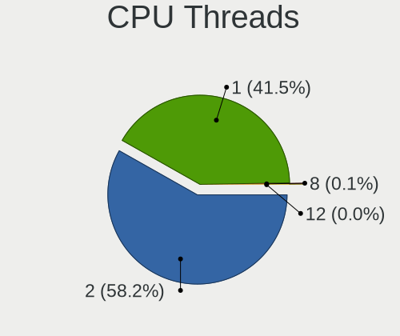

| Number | Computers | Percent |
|--------|-----------|---------|
| 2      | 1411      | 58.19%  |
| 1      | 1007      | 41.53%  |
| 8      | 3         | 0.12%   |
| 4      | 3         | 0.12%   |
| 12     | 1         | 0.04%   |

CPU Op-Modes
------------

CPU Operation Modes (32-bit, 64-bit)

| Op mode        | Computers | Percent |
|----------------|-----------|---------|
| 32-bit, 64-bit | 2424      | 100%    |

CPU Microcode
-------------

Microcode number

| Number     | Computers | Percent |
|------------|-----------|---------|
| Unknown    | 1913      | 78.92%  |
| 0x08108109 | 42        | 1.73%   |
| 0x0a50000d | 36        | 1.49%   |
| 0x010000c8 | 23        | 0.95%   |
| 0x0a20120a | 22        | 0.91%   |
| 0x08608103 | 18        | 0.74%   |
| 0x06001119 | 18        | 0.74%   |
| 0x08701030 | 17        | 0.7%    |
| 0x08701021 | 16        | 0.66%   |
| 0x06006705 | 16        | 0.66%   |
| 0x0a50000c | 15        | 0.62%   |
| 0x06000822 | 14        | 0.58%   |
| 0x0800820d | 13        | 0.54%   |
| 0x0a404102 | 12        | 0.5%    |
| 0x0600611a | 12        | 0.5%    |
| 0x06003106 | 12        | 0.5%    |
| 0x0810100b | 11        | 0.45%   |
| 0x0500010d | 11        | 0.45%   |
| 0x08600106 | 10        | 0.41%   |
| 0x08108102 | 9         | 0.37%   |
| 0x08101016 | 8         | 0.33%   |
| 0x0700010b | 8         | 0.33%   |
| 0x06000817 | 7         | 0.29%   |
| 0x05000028 | 7         | 0.29%   |
| 0x010000b6 | 7         | 0.29%   |
| 0x0a601206 | 6         | 0.25%   |
| 0x06003104 | 6         | 0.25%   |
| 0x0600081c | 6         | 0.25%   |
| 0x05000101 | 6         | 0.25%   |
| 0x0a201025 | 5         | 0.21%   |
| 0x08608104 | 5         | 0.21%   |
| 0x08200103 | 5         | 0.21%   |
| 0x08001138 | 5         | 0.21%   |
| 0x03000027 | 5         | 0.21%   |
| 0x08a00006 | 4         | 0.17%   |
| 0x08600109 | 4         | 0.17%   |
| 0x08101007 | 4         | 0.17%   |
| 0x06001116 | 4         | 0.17%   |
| 0x03000014 | 4         | 0.17%   |
| 0x02000057 | 4         | 0.17%   |

CPU Microarch
-------------

Microarchitecture

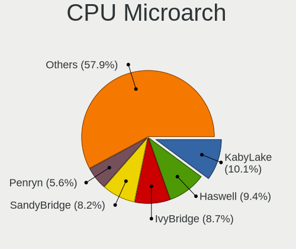

| Name             | Computers | Percent |
|------------------|-----------|---------|
| KabyLake         | 246       | 10.14%  |
| Haswell          | 228       | 9.4%    |
| IvyBridge        | 211       | 8.7%    |
| SandyBridge      | 200       | 8.25%   |
| Penryn           | 137       | 5.65%   |
| Skylake          | 126       | 5.2%    |
| Westmere         | 95        | 3.92%   |
| Goldmont plus    | 93        | 3.84%   |
| Zen 3            | 91        | 3.75%   |
| Alderlake Hybrid | 81        | 3.34%   |
| Silvermont       | 73        | 3.01%   |
| Zen+             | 72        | 2.97%   |
| Core             | 69        | 2.85%   |
| Unknown          | 60        | 2.47%   |
| Zen 2            | 57        | 2.35%   |
| CometLake        | 57        | 2.35%   |
| Piledriver       | 50        | 2.06%   |
| Goldmont         | 50        | 2.06%   |
| Broadwell        | 50        | 2.06%   |
| K10              | 48        | 1.98%   |
| IceLake          | 44        | 1.81%   |
| Zen              | 37        | 1.53%   |
| TigerLake        | 37        | 1.53%   |
| Excavator        | 32        | 1.32%   |
| Nehalem          | 25        | 1.03%   |
| Bobcat           | 25        | 1.03%   |
| Bonnell          | 24        | 0.99%   |
| Steamroller      | 19        | 0.78%   |
| K8 Hammer        | 19        | 0.78%   |
| Tremont          | 16        | 0.66%   |
| Gracemont        | 13        | 0.54%   |
| K10 Llano        | 11        | 0.45%   |
| Jaguar           | 11        | 0.45%   |
| NetBurst         | 7         | 0.29%   |
| Puma             | 6         | 0.25%   |
| K8 & K10 hybrid  | 4         | 0.16%   |
| Bulldozer        | 1         | 0.04%   |

Graphics
--------

GPU Vendor
----------

Vendors of graphics cards

| Vendor                           | Computers | Percent |
|----------------------------------|-----------|---------|
| Intel                            | 1473      | 54.94%  |
| AMD                              | 616       | 22.98%  |
| Nvidia                           | 581       | 21.67%  |
| Silicon Integrated Systems [SiS] | 3         | 0.11%   |
| Red Hat                          | 2         | 0.07%   |
| Matrox Electronics Systems       | 2         | 0.07%   |
| ATI Technologies                 | 2         | 0.07%   |
| ASPEED Technology                | 2         | 0.07%   |

GPU Model
---------

Graphics card models

| Model                                                                                    | Computers | Percent |
|------------------------------------------------------------------------------------------|-----------|---------|
| Intel 2nd Generation Core Processor Family Integrated Graphics Controller                | 158       | 5.78%   |
| Intel 3rd Gen Core processor Graphics Controller                                         | 96        | 3.51%   |
| Intel GeminiLake [UHD Graphics 600]                                                      | 83        | 3.04%   |
| Intel Xeon E3-1200 v3/4th Gen Core Processor Integrated Graphics Controller              | 71        | 2.6%    |
| Intel Core Processor Integrated Graphics Controller                                      | 65        | 2.38%   |
| Intel Haswell-ULT Integrated Graphics Controller                                         | 54        | 1.98%   |
| Intel Skylake GT2 [HD Graphics 520]                                                      | 52        | 1.9%    |
| AMD Picasso/Raven 2 [Radeon Vega Series / Radeon Vega Mobile Series]                     | 52        | 1.9%    |
| Intel Xeon E3-1200 v2/3rd Gen Core processor Graphics Controller                         | 49        | 1.79%   |
| Intel HD Graphics 620                                                                    | 45        | 1.65%   |
| Intel HD Graphics 500                                                                    | 45        | 1.65%   |
| Intel HD Graphics 530                                                                    | 42        | 1.54%   |
| Intel Mobile 4 Series Chipset Integrated Graphics Controller                             | 40        | 1.46%   |
| Intel Atom Processor Z36xxx/Z37xxx Series Graphics & Display                             | 40        | 1.46%   |
| Intel UHD Graphics 620                                                                   | 37        | 1.35%   |
| Nvidia GK208B [GeForce GT 710]                                                           | 33        | 1.21%   |
| Intel Atom/Celeron/Pentium Processor x5-E8000/J3xxx/N3xxx Integrated Graphics Controller | 33        | 1.21%   |
| Intel HD Graphics 5500                                                                   | 32        | 1.17%   |
| Intel 4 Series Chipset Integrated Graphics Controller                                    | 32        | 1.17%   |
| AMD Ellesmere [Radeon RX 470/480/570/570X/580/580X/590]                                  | 30        | 1.1%    |
| AMD Cezanne [Radeon Vega Series / Radeon Vega Mobile Series]                             | 30        | 1.1%    |
| Intel HD Graphics 630                                                                    | 27        | 0.99%   |
| Intel 4th Gen Core Processor Integrated Graphics Controller                              | 26        | 0.95%   |
| AMD Lucienne                                                                             | 26        | 0.95%   |
| AMD Raven Ridge [Radeon Vega Series / Radeon Vega Mobile Series]                         | 24        | 0.88%   |
| Intel Iris Plus Graphics G1 (Ice Lake)                                                   | 21        | 0.77%   |
| Intel CometLake-U GT2 [UHD Graphics]                                                     | 20        | 0.73%   |
| Nvidia GP107 [GeForce GTX 1050 Ti]                                                       | 19        | 0.69%   |
| Intel TigerLake-LP GT2 [Iris Xe Graphics]                                                | 19        | 0.69%   |
| Intel CoffeeLake-S GT2 [UHD Graphics 630]                                                | 19        | 0.69%   |
| AMD Stoney [Radeon R2/R3/R4/R5 Graphics]                                                 | 19        | 0.69%   |
| AMD Renoir [Radeon Vega Series / Radeon Vega Mobile Series]                              | 19        | 0.69%   |
| Intel WhiskeyLake-U GT2 [UHD Graphics 620]                                               | 18        | 0.66%   |
| Intel Tiger Lake-LP GT2 [UHD Graphics G4]                                                | 18        | 0.66%   |
| Intel Mobile GM965/GL960 Integrated Graphics Controller (secondary)                      | 18        | 0.66%   |
| Intel Mobile GM965/GL960 Integrated Graphics Controller (primary)                        | 18        | 0.66%   |
| Intel CometLake-S GT2 [UHD Graphics 630]                                                 | 18        | 0.66%   |
| Nvidia GP108 [GeForce GT 1030]                                                           | 17        | 0.62%   |
| Intel JasperLake [UHD Graphics]                                                          | 17        | 0.62%   |
| Nvidia GK208B [GeForce GT 730]                                                           | 16        | 0.59%   |

GPU Combo
---------

Combinations of graphics cards

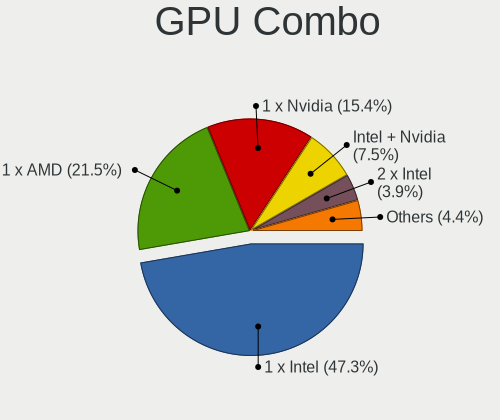

| Name                   | Computers | Percent |
|------------------------|-----------|---------|
| 1 x Intel              | 1148      | 47.28%  |
| 1 x AMD                | 523       | 21.54%  |
| 1 x Nvidia             | 374       | 15.4%   |
| Intel + Nvidia         | 181       | 7.45%   |
| 2 x Intel              | 94        | 3.87%   |
| Intel + AMD            | 48        | 1.98%   |
| 2 x AMD                | 25        | 1.03%   |
| AMD + Nvidia           | 21        | 0.86%   |
| 2 x Nvidia             | 3         | 0.12%   |
| 1 x SiS                | 3         | 0.12%   |
| 2 x Intel + 1 x Nvidia | 2         | 0.08%   |
| 1 x Red Hat            | 2         | 0.08%   |
| 1 x Matrox             | 2         | 0.08%   |
| Nvidia + ASPEED        | 1         | 0.04%   |
| AMD + ASPEED           | 1         | 0.04%   |

GPU Driver
----------

Free vs proprietary

| Driver      | Computers | Percent |
|-------------|-----------|---------|
| Free        | 2354      | 97.07%  |
| Unknown     | 56        | 2.31%   |
| Proprietary | 15        | 0.62%   |

GPU Memory
----------

Total video memory

| Size in GB | Computers | Percent |
|------------|-----------|---------|
| Unknown    | 1300      | 53.52%  |
| 1.01-2.0   | 318       | 13.09%  |
| 0.01-0.5   | 278       | 11.45%  |
| 0.51-1.0   | 210       | 8.65%   |
| 3.01-4.0   | 144       | 5.93%   |
| 7.01-8.0   | 89        | 3.66%   |
| 8.01-16.0  | 34        | 1.4%    |
| 5.01-6.0   | 32        | 1.32%   |
| 2.01-3.0   | 19        | 0.78%   |
| 16.01-24.0 | 3         | 0.12%   |
| 4.01-5.0   | 2         | 0.08%   |

Monitor
-------

Monitor Vendor
--------------

Monitor vendors

| Vendor                  | Computers | Percent |
|-------------------------|-----------|---------|
| Samsung Electronics     | 323       | 13.25%  |
| AU Optronics            | 260       | 10.67%  |
| BOE                     | 209       | 8.58%   |
| LG Display              | 205       | 8.41%   |
| Chimei Innolux          | 194       | 7.96%   |
| Goldstar                | 135       | 5.54%   |
| Dell                    | 113       | 4.64%   |
| Hewlett-Packard         | 95        | 3.9%    |
| Acer                    | 94        | 3.86%   |
| AOC                     | 71        | 2.91%   |
| Philips                 | 59        | 2.42%   |
| BenQ                    | 49        | 2.01%   |
| Ancor Communications    | 44        | 1.81%   |
| Chi Mei Optoelectronics | 41        | 1.68%   |
| Lenovo                  | 38        | 1.56%   |
| ViewSonic               | 32        | 1.31%   |
| Apple                   | 29        | 1.19%   |
| Iiyama                  | 25        | 1.03%   |
| InfoVision              | 24        | 0.98%   |
| Sony                    | 23        | 0.94%   |
| RGT                     | 23        | 0.94%   |
| Sharp                   | 21        | 0.86%   |
| ASUSTek Computer        | 20        | 0.82%   |
| PANDA                   | 19        | 0.78%   |
| NEC Computers           | 16        | 0.66%   |
| MSI                     | 16        | 0.66%   |
| LG Philips              | 14        | 0.57%   |
| Fujitsu Siemens         | 14        | 0.57%   |
| Eizo                    | 12        | 0.49%   |
| Panasonic               | 11        | 0.45%   |
| Unknown                 | 9         | 0.37%   |
| HKC                     | 9         | 0.37%   |
| HannStar                | 9         | 0.37%   |
| Unknown (XXX)           | 8         | 0.33%   |
| Toshiba                 | 8         | 0.33%   |
| RTK                     | 8         | 0.33%   |
| Hitachi                 | 7         | 0.29%   |
| ___                     | 6         | 0.25%   |
| Sceptre Tech            | 6         | 0.25%   |
| Medion                  | 5         | 0.21%   |

Monitor Model
-------------

Monitor models

| Model                                                                     | Computers | Percent |
|---------------------------------------------------------------------------|-----------|---------|
| Chimei Innolux LCD Monitor CMN14D6 1366x768 309x173mm 13.9-inch           | 41        | 1.67%   |
| RGT LCD Monitor RGT5211 1366x768 518x333mm 24.2-inch                      | 22        | 0.9%    |
| Samsung Electronics LCD Monitor SEC5441 1280x800 286x179mm 13.3-inch      | 16        | 0.65%   |
| LG Display LCD Monitor LGD02DC 1366x768 344x194mm 15.5-inch               | 13        | 0.53%   |
| AU Optronics LCD Monitor AUO21ED 1920x1080 344x193mm 15.5-inch            | 12        | 0.49%   |
| Chimei Innolux LCD Monitor CMN15F5 1920x1080 344x193mm 15.5-inch          | 10        | 0.41%   |
| Chimei Innolux LCD Monitor CMN14D4 1920x1080 309x173mm 13.9-inch          | 10        | 0.41%   |
| AU Optronics LCD Monitor AUO22EC 1366x768 344x193mm 15.5-inch             | 10        | 0.41%   |
| Chimei Innolux LCD Monitor CMN15DB 1366x768 344x193mm 15.5-inch           | 9         | 0.37%   |
| AU Optronics LCD Monitor AUO71EC 1366x768 344x193mm 15.5-inch             | 9         | 0.37%   |
| Chimei Innolux LCD Monitor CMN15E7 1920x1080 344x193mm 15.5-inch          | 8         | 0.33%   |
| BOE LCD Monitor BOE084E 1920x1080 382x215mm 17.3-inch                     | 8         | 0.33%   |
| AU Optronics LCD Monitor AUO61ED 1920x1080 344x194mm 15.5-inch            | 8         | 0.33%   |
| Samsung Electronics C24F390 SAM0D2C 1920x1080 521x293mm 23.5-inch         | 7         | 0.29%   |
| AU Optronics LCD Monitor AUO81EC 1366x768 344x193mm 15.5-inch             | 7         | 0.29%   |
| Samsung Electronics LCD Monitor SDC5441 1366x768 309x174mm 14.0-inch      | 6         | 0.24%   |
| LG Display LCD Monitor LGD02F2 1366x768 344x194mm 15.5-inch               | 6         | 0.24%   |
| Chi Mei Optoelectronics LCD Monitor CMO15A7 1366x768 344x193mm 15.5-inch  | 6         | 0.24%   |
| AU Optronics LCD Monitor AUO70EC 1366x768 344x193mm 15.5-inch             | 6         | 0.24%   |
| AU Optronics LCD Monitor AUO26EC 1366x768 344x193mm 15.5-inch             | 6         | 0.24%   |
| AU Optronics LCD Monitor AUO20EC 1366x768 344x193mm 15.5-inch             | 6         | 0.24%   |
| AU Optronics LCD Monitor AUO183C 1366x768 309x173mm 13.9-inch             | 6         | 0.24%   |
| AOC 24G2W1G5 AOC2402 1920x1080 527x296mm 23.8-inch                        | 6         | 0.24%   |
| Samsung Electronics S24F350 SAM0D20 1920x1080 521x293mm 23.5-inch         | 5         | 0.2%    |
| Philips PHL 243V5 PHLC0D1 1920x1080 521x293mm 23.5-inch                   | 5         | 0.2%    |
| PANDA LCD Monitor NCP004D 1920x1080 344x194mm 15.5-inch                   | 5         | 0.2%    |
| Panasonic TV MEIA296 1920x1080 698x392mm 31.5-inch                        | 5         | 0.2%    |
| LG Display LCD Monitor LGD039F 1366x768 345x194mm 15.6-inch               | 5         | 0.2%    |
| LG Display LCD Monitor LGD0395 1366x768 344x194mm 15.5-inch               | 5         | 0.2%    |
| LG Display LCD Monitor LGD0385 1366x768 309x174mm 14.0-inch               | 5         | 0.2%    |
| LG Display LCD Monitor LGD033B 1366x768 344x194mm 15.5-inch               | 5         | 0.2%    |
| Lenovo LCD Monitor LEN4011 1280x800 261x163mm 12.1-inch                   | 5         | 0.2%    |
| InfoVision LCD Monitor IVO03F4 1920x1080 309x173mm 13.9-inch              | 5         | 0.2%    |
| Dell P2311H DEL4066 1920x1080 510x290mm 23.1-inch                         | 5         | 0.2%    |
| Chimei Innolux LCD Monitor CMN15E6 1366x768 344x193mm 15.5-inch           | 5         | 0.2%    |
| Chi Mei Optoelectronics LCD Monitor CMO1720 1920x1080 382x215mm 17.3-inch | 5         | 0.2%    |
| BOE LCD Monitor BOE0A84 1920x1200 286x179mm 13.3-inch                     | 5         | 0.2%    |
| BOE LCD Monitor BOE06A5 1366x768 344x194mm 15.5-inch                      | 5         | 0.2%    |
| BOE LCD Monitor BOE069C 1920x1080 344x193mm 15.5-inch                     | 5         | 0.2%    |
| AU Optronics LCD Monitor AUO2D3C 1366x768 309x173mm 13.9-inch             | 5         | 0.2%    |

Monitor Resolution
------------------

Monitor screen resolution

| Resolution         | Computers | Percent |
|--------------------|-----------|---------|
| 1920x1080 (FHD)    | 1005      | 41.88%  |
| 1366x768 (WXGA)    | 600       | 25%     |
| 3840x2160 (4K)     | 115       | 4.79%   |
| 1600x900 (HD+)     | 105       | 4.38%   |
| 2560x1440 (QHD)    | 84        | 3.5%    |
| 1280x1024 (SXGA)   | 76        | 3.17%   |
| 1920x1200 (WUXGA)  | 70        | 2.92%   |
| 1440x900 (WXGA+)   | 68        | 2.83%   |
| 1680x1050 (WSXGA+) | 66        | 2.75%   |
| 1280x800 (WXGA)    | 42        | 1.75%   |
| 1360x768           | 24        | 1%      |
| 3440x1440          | 15        | 0.63%   |
| 2880x1800          | 13        | 0.54%   |
| 1920x540           | 13        | 0.54%   |
| 2560x1080          | 11        | 0.46%   |
| 1024x768 (XGA)     | 11        | 0.46%   |
| 1024x600           | 11        | 0.46%   |
| 2560x1600          | 10        | 0.42%   |
| 1600x1200          | 10        | 0.42%   |
| 2288x1287          | 7         | 0.29%   |
| 2160x1440          | 7         | 0.29%   |
| 1280x720 (HD)      | 6         | 0.25%   |
| 2880x1920          | 5         | 0.21%   |
| 3840x2400          | 3         | 0.13%   |
| 3200x1800 (QHD+)   | 3         | 0.13%   |
| 2256x1504          | 3         | 0.13%   |
| 3840x1600          | 2         | 0.08%   |
| 2048x1152          | 2         | 0.08%   |
| 1280x960           | 2         | 0.08%   |
| 1152x864           | 2         | 0.08%   |
| 800x1280           | 1         | 0.04%   |
| 3072x1920          | 1         | 0.04%   |
| 2880x1620          | 1         | 0.04%   |
| 2520x1680          | 1         | 0.04%   |
| 1920x1280          | 1         | 0.04%   |
| 1680x945           | 1         | 0.04%   |
| 1600x2560          | 1         | 0.04%   |
| 1360x765           | 1         | 0.04%   |
| Unknown            | 1         | 0.04%   |

Monitor Diagonal
----------------

Diagonal size in inches

| Inches  | Computers | Percent |
|---------|-----------|---------|
| 15      | 588       | 24.15%  |
| 13      | 208       | 8.54%   |
| 24      | 198       | 8.13%   |
| 23      | 176       | 7.23%   |
| 14      | 164       | 6.74%   |
| 21      | 157       | 6.45%   |
| 17      | 155       | 6.37%   |
| 27      | 154       | 6.32%   |
| 19      | 80        | 3.29%   |
| 31      | 75        | 3.08%   |
| 18      | 64        | 2.63%   |
| 22      | 47        | 1.93%   |
| 20      | 47        | 1.93%   |
| 12      | 42        | 1.72%   |
| 11      | 35        | 1.44%   |
| Unknown | 29        | 1.19%   |
| 16      | 26        | 1.07%   |
| 84      | 21        | 0.86%   |
| 72      | 21        | 0.86%   |
| 34      | 21        | 0.86%   |
| 10      | 21        | 0.86%   |
| 32      | 13        | 0.53%   |
| 54      | 11        | 0.45%   |
| 40      | 8         | 0.33%   |
| 28      | 7         | 0.29%   |
| 26      | 7         | 0.29%   |
| 25      | 7         | 0.29%   |
| 52      | 5         | 0.21%   |
| 37      | 5         | 0.21%   |
| 142     | 4         | 0.16%   |
| 46      | 4         | 0.16%   |
| 39      | 4         | 0.16%   |
| 48      | 3         | 0.12%   |
| 43      | 3         | 0.12%   |
| 85      | 2         | 0.08%   |
| 74      | 2         | 0.08%   |
| 55      | 2         | 0.08%   |
| 42      | 2         | 0.08%   |
| 38      | 2         | 0.08%   |
| 33      | 2         | 0.08%   |

Monitor Width
-------------

Physical width

| Width in mm    | Computers | Percent |
|----------------|-----------|---------|
| 301-350        | 930       | 38.38%  |
| 501-600        | 522       | 21.54%  |
| 401-500        | 358       | 14.78%  |
| 201-300        | 174       | 7.18%   |
| 351-400        | 171       | 7.06%   |
| 601-700        | 92        | 3.8%    |
| 1501-2000      | 48        | 1.98%   |
| 701-800        | 37        | 1.53%   |
| 1001-1500      | 31        | 1.28%   |
| Unknown        | 29        | 1.2%    |
| 801-900        | 20        | 0.83%   |
| 901-1000       | 6         | 0.25%   |
| More than 2000 | 4         | 0.17%   |
| 1-100          | 1         | 0.04%   |

Aspect Ratio
------------

Proportional relationship between the width and the height

| Ratio   | Computers | Percent |
|---------|-----------|---------|
| 16/9    | 1862      | 79.44%  |
| 16/10   | 305       | 13.01%  |
| 5/4     | 82        | 3.5%    |
| 21/9    | 27        | 1.15%   |
| 4/3     | 26        | 1.11%   |
| 3/2     | 26        | 1.11%   |
| Unknown | 7         | 0.3%    |
| 1.00    | 4         | 0.17%   |
| 32/9    | 3         | 0.13%   |
| 1.96    | 1         | 0.04%   |
| 0.62    | 1         | 0.04%   |

Monitor Area
------------

Area in inch

| Area in inch | Computers | Percent |
|----------------|-----------|---------|
| 101-110        | 586       | 24.14%  |
| 201-250        | 426       | 17.55%  |
| 81-90          | 301       | 12.4%   |
| 151-200        | 180       | 7.41%   |
| 301-350        | 160       | 6.59%   |
| 351-500        | 114       | 4.7%    |
| 251-300        | 114       | 4.7%    |
| 141-150        | 100       | 4.12%   |
| 121-130        | 95        | 3.91%   |
| More than 1000 | 78        | 3.21%   |
| 71-80          | 71        | 2.92%   |
| 61-70          | 38        | 1.57%   |
| 51-60          | 36        | 1.48%   |
| 501-1000       | 32        | 1.32%   |
| Unknown        | 29        | 1.19%   |
| 111-120        | 22        | 0.91%   |
| 41-50          | 20        | 0.82%   |
| 131-140        | 17        | 0.7%    |
| 91-100         | 8         | 0.33%   |
| 1-40           | 1         | 0.04%   |

Pixel Density
-------------

Pixels per inch

| Density       | Computers | Percent |
|---------------|-----------|---------|
| 51-100        | 951       | 39.87%  |
| 101-120       | 732       | 30.69%  |
| 121-160       | 488       | 20.46%  |
| 161-240       | 103       | 4.32%   |
| 1-50          | 61        | 2.56%   |
| Unknown       | 29        | 1.22%   |
| More than 240 | 21        | 0.88%   |

Multiple Monitors
-----------------

Total monitors connected

| Total | Computers | Percent |
|-------|-----------|---------|
| 1     | 2187      | 90%     |
| 2     | 154       | 6.34%   |
| 0     | 79        | 3.25%   |
| 3     | 10        | 0.41%   |

Network
-------

Net Controller Vendor
---------------------

Controller vendors

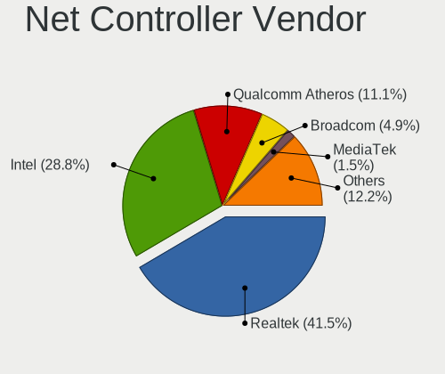

| Vendor                            | Computers | Percent |
|-----------------------------------|-----------|---------|
| Realtek Semiconductor             | 1450      | 41.54%  |
| Intel                             | 1006      | 28.82%  |
| Qualcomm Atheros                  | 389       | 11.14%  |
| Broadcom                          | 170       | 4.87%   |
| MediaTek                          | 51        | 1.46%   |
| TP-Link                           | 45        | 1.29%   |
| Ralink Technology                 | 39        | 1.12%   |
| Broadcom Limited                  | 34        | 0.97%   |
| Ralink                            | 28        | 0.8%    |
| ASIX Electronics                  | 28        | 0.8%    |
| Nvidia                            | 27        | 0.77%   |
| Marvell Technology Group          | 26        | 0.74%   |
| Qualcomm Atheros Communications   | 17        | 0.49%   |
| D-Link                            | 16        | 0.46%   |
| JMicron Technology                | 12        | 0.34%   |
| ZTE WCDMA Technologies MSM        | 11        | 0.32%   |
| Ericsson Business Mobile Networks | 11        | 0.32%   |
| Dell                              | 11        | 0.32%   |
| Samsung Electronics               | 10        | 0.29%   |
| Sierra Wireless                   | 9         | 0.26%   |
| Huawei Technologies               | 9         | 0.26%   |
| NetGear                           | 7         | 0.2%    |
| Qualcomm                          | 6         | 0.17%   |
| OPPO Electronics                  | 6         | 0.17%   |
| ASUSTek Computer                  | 5         | 0.14%   |
| Silicon Integrated Systems [SiS]  | 4         | 0.11%   |
| Lenovo                            | 4         | 0.11%   |
| Hewlett-Packard                   | 4         | 0.11%   |
| DisplayLink                       | 4         | 0.11%   |
| Xiaomi                            | 3         | 0.09%   |
| VIA Technologies                  | 3         | 0.09%   |
| Microchip Technology              | 3         | 0.09%   |
| Mercucys                          | 3         | 0.09%   |
| Motorola PCS                      | 2         | 0.06%   |
| Microsoft                         | 2         | 0.06%   |
| LG Electronics                    | 2         | 0.06%   |
| ICS Advent                        | 2         | 0.06%   |
| Fibocom                           | 2         | 0.06%   |
| D-Link System                     | 2         | 0.06%   |
| BUFFALO                           | 2         | 0.06%   |

Net Controller Model
--------------------

Controller models

| Model                                                                   | Computers | Percent |
|-------------------------------------------------------------------------|-----------|---------|
| Realtek RTL8111/8168/8211/8411 PCI Express Gigabit Ethernet Controller  | 923       | 22.66%  |
| Realtek RTL810xE PCI Express Fast Ethernet controller                   | 201       | 4.93%   |
| Intel 82579LM Gigabit Network Connection (Lewisville)                   | 123       | 3.02%   |
| Realtek RTL8821CE 802.11ac PCIe Wireless Network Adapter                | 80        | 1.96%   |
| Intel Wireless 8265 / 8275                                              | 61        | 1.5%    |
| Qualcomm Atheros AR9485 Wireless Network Adapter                        | 58        | 1.42%   |
| Qualcomm Atheros QCA9377 802.11ac Wireless Network Adapter              | 57        | 1.4%    |
| Realtek RTL8852BE PCIe 802.11ax Wireless Network Controller             | 54        | 1.33%   |
| Realtek RTL8125 2.5GbE Controller                                       | 53        | 1.3%    |
| Qualcomm Atheros QCA9565 / AR9565 Wireless Network Adapter              | 52        | 1.28%   |
| Qualcomm Atheros AR9285 Wireless Network Adapter (PCI-Express)          | 50        | 1.23%   |
| Intel Ethernet Connection I217-LM                                       | 47        | 1.15%   |
| Intel Wireless 7265                                                     | 45        | 1.1%    |
| Intel Wi-Fi 6 AX200                                                     | 42        | 1.03%   |
| Realtek RTL8822CE 802.11ac PCIe Wireless Network Adapter                | 40        | 0.98%   |
| Intel Wireless 7260                                                     | 38        | 0.93%   |
| Intel Dual Band Wireless-AC 3168NGW [Stone Peak]                        | 38        | 0.93%   |
| Intel Centrino Advanced-N 6205 [Taylor Peak]                            | 38        | 0.93%   |
| Realtek RTL8153 Gigabit Ethernet Adapter                                | 37        | 0.91%   |
| Intel Wireless 8260                                                     | 35        | 0.86%   |
| Broadcom BCM4313 802.11bgn Wireless Network Adapter                     | 35        | 0.86%   |
| Intel Ethernet Controller I225-V                                        | 32        | 0.79%   |
| Intel Wi-Fi 6E(802.11ax) AX210/AX1675* 2x2 [Typhoon Peak]               | 30        | 0.74%   |
| Intel Wi-Fi 6 AX201                                                     | 30        | 0.74%   |
| Realtek RTL8723BE PCIe Wireless Network Adapter                         | 29        | 0.71%   |
| Realtek 802.11n WLAN Adapter                                            | 29        | 0.71%   |
| Qualcomm Atheros AR8151 v2.0 Gigabit Ethernet                           | 29        | 0.71%   |
| Realtek RTL8188CE 802.11b/g/n WiFi Adapter                              | 28        | 0.69%   |
| Intel Ethernet Connection (4) I219-LM                                   | 28        | 0.69%   |
| Intel Ethernet Connection (2) I219-V                                    | 27        | 0.66%   |
| Intel Wireless 3165                                                     | 26        | 0.64%   |
| Intel Alder Lake-P PCH CNVi WiFi                                        | 26        | 0.64%   |
| Ralink MT7601U Wireless Adapter                                         | 25        | 0.61%   |
| Intel 82579V Gigabit Network Connection                                 | 24        | 0.59%   |
| ASIX AX88179 Gigabit Ethernet                                           | 24        | 0.59%   |
| Intel Ethernet Connection (2) I219-LM                                   | 23        | 0.56%   |
| Realtek 802.11ac NIC                                                    | 20        | 0.49%   |
| Intel Wireless 3160                                                     | 20        | 0.49%   |
| Intel Ethernet Connection I219-LM                                       | 20        | 0.49%   |
| Qualcomm Atheros AR242x / AR542x Wireless Network Adapter (PCI-Express) | 18        | 0.44%   |

Wireless Vendor
---------------

Wireless vendors

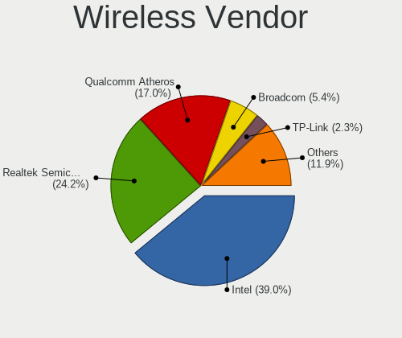

| Vendor                          | Computers | Percent |
|---------------------------------|-----------|---------|
| Intel                           | 688       | 39.05%  |
| Realtek Semiconductor           | 427       | 24.23%  |
| Qualcomm Atheros                | 300       | 17.03%  |
| Broadcom                        | 96        | 5.45%   |
| TP-Link                         | 41        | 2.33%   |
| Ralink Technology               | 39        | 2.21%   |
| MediaTek                        | 38        | 2.16%   |
| Ralink                          | 28        | 1.59%   |
| Broadcom Limited                | 20        | 1.14%   |
| Qualcomm Atheros Communications | 17        | 0.96%   |
| D-Link                          | 16        | 0.91%   |
| Sierra Wireless                 | 9         | 0.51%   |
| NetGear                         | 7         | 0.4%    |
| ASUSTek Computer                | 5         | 0.28%   |
| Mercucys                        | 3         | 0.17%   |
| Dell                            | 3         | 0.17%   |
| Qualcomm                        | 2         | 0.11%   |
| Microsoft                       | 2         | 0.11%   |
| Marvell Technology Group        | 2         | 0.11%   |
| Fibocom                         | 2         | 0.11%   |
| D-Link System                   | 2         | 0.11%   |
| BUFFALO                         | 2         | 0.11%   |
| Belkin Components               | 2         | 0.11%   |
| AVM                             | 2         | 0.11%   |
| ZyXEL Communications            | 1         | 0.06%   |
| ZyDAS                           | 1         | 0.06%   |
| Tenda                           | 1         | 0.06%   |
| Linksys                         | 1         | 0.06%   |
| Hewlett-Packard                 | 1         | 0.06%   |
| Gemtek                          | 1         | 0.06%   |
| Fujitsu Siemens Computers       | 1         | 0.06%   |
| Edimax Technology               | 1         | 0.06%   |
| CyberTAN Technology             | 1         | 0.06%   |

Wireless Model
--------------

Wireless models

| Model                                                                   | Computers | Percent |
|-------------------------------------------------------------------------|-----------|---------|
| Realtek RTL8821CE 802.11ac PCIe Wireless Network Adapter                | 80        | 4.53%   |
| Intel Wireless 8265 / 8275                                              | 61        | 3.46%   |
| Qualcomm Atheros AR9485 Wireless Network Adapter                        | 58        | 3.29%   |
| Qualcomm Atheros QCA9377 802.11ac Wireless Network Adapter              | 57        | 3.23%   |
| Realtek RTL8852BE PCIe 802.11ax Wireless Network Controller             | 54        | 3.06%   |
| Qualcomm Atheros QCA9565 / AR9565 Wireless Network Adapter              | 52        | 2.95%   |
| Qualcomm Atheros AR9285 Wireless Network Adapter (PCI-Express)          | 50        | 2.83%   |
| Intel Wireless 7265                                                     | 45        | 2.55%   |
| Intel Wi-Fi 6 AX200                                                     | 42        | 2.38%   |
| Realtek RTL8822CE 802.11ac PCIe Wireless Network Adapter                | 40        | 2.27%   |
| Intel Wireless 7260                                                     | 38        | 2.15%   |
| Intel Dual Band Wireless-AC 3168NGW [Stone Peak]                        | 38        | 2.15%   |
| Intel Centrino Advanced-N 6205 [Taylor Peak]                            | 38        | 2.15%   |
| Intel Wireless 8260                                                     | 35        | 1.98%   |
| Broadcom BCM4313 802.11bgn Wireless Network Adapter                     | 35        | 1.98%   |
| Intel Wi-Fi 6E(802.11ax) AX210/AX1675* 2x2 [Typhoon Peak]               | 30        | 1.7%    |
| Intel Wi-Fi 6 AX201                                                     | 30        | 1.7%    |
| Realtek RTL8723BE PCIe Wireless Network Adapter                         | 29        | 1.64%   |
| Realtek 802.11n WLAN Adapter                                            | 29        | 1.64%   |
| Realtek RTL8188CE 802.11b/g/n WiFi Adapter                              | 28        | 1.59%   |
| Intel Wireless 3165                                                     | 26        | 1.47%   |
| Intel Alder Lake-P PCH CNVi WiFi                                        | 26        | 1.47%   |
| Ralink MT7601U Wireless Adapter                                         | 25        | 1.42%   |
| Realtek 802.11ac NIC                                                    | 20        | 1.13%   |
| Intel Wireless 3160                                                     | 20        | 1.13%   |
| Qualcomm Atheros AR242x / AR542x Wireless Network Adapter (PCI-Express) | 18        | 1.02%   |
| Intel Gemini Lake PCH CNVi WiFi                                         | 18        | 1.02%   |
| Intel Comet Lake PCH-LP CNVi WiFi                                       | 18        | 1.02%   |
| Intel Cannon Lake PCH CNVi WiFi                                         | 17        | 0.96%   |
| Intel Ice Lake-LP PCH CNVi WiFi                                         | 16        | 0.91%   |
| Qualcomm Atheros AR9287 Wireless Network Adapter (PCI-Express)          | 15        | 0.85%   |
| MediaTek MT7921 802.11ax PCI Express Wireless Network Adapter           | 15        | 0.85%   |
| Realtek RTL8188EUS 802.11n Wireless Network Adapter                     | 14        | 0.79%   |
| Intel WiFi Link 5100                                                    | 14        | 0.79%   |
| Intel Wi-Fi 5(802.11ac) Wireless-AC 9x6x [Thunder Peak]                 | 14        | 0.79%   |
| Qualcomm Atheros QCA6174 802.11ac Wireless Network Adapter              | 13        | 0.74%   |
| Qualcomm Atheros AR9462 Wireless Network Adapter                        | 13        | 0.74%   |
| Intel Centrino Wireless-N 2230                                          | 13        | 0.74%   |
| Intel Centrino Wireless-N 1000 [Condor Peak]                            | 13        | 0.74%   |
| Intel Centrino Ultimate-N 6300                                          | 13        | 0.74%   |

Ethernet Vendor
---------------

Ethernet vendors

| Vendor                            | Computers | Percent |
|-----------------------------------|-----------|---------|
| Realtek Semiconductor             | 1234      | 55.41%  |
| Intel                             | 586       | 26.31%  |
| Qualcomm Atheros                  | 128       | 5.75%   |
| Broadcom                          | 93        | 4.18%   |
| ASIX Electronics                  | 28        | 1.26%   |
| Nvidia                            | 27        | 1.21%   |
| Marvell Technology Group          | 24        | 1.08%   |
| Broadcom Limited                  | 14        | 0.63%   |
| MediaTek                          | 13        | 0.58%   |
| JMicron Technology                | 12        | 0.54%   |
| Samsung Electronics               | 9         | 0.4%    |
| Huawei Technologies               | 7         | 0.31%   |
| OPPO Electronics                  | 6         | 0.27%   |
| TP-Link                           | 5         | 0.22%   |
| Silicon Integrated Systems [SiS]  | 4         | 0.18%   |
| Qualcomm                          | 4         | 0.18%   |
| Lenovo                            | 4         | 0.18%   |
| DisplayLink                       | 4         | 0.18%   |
| Xiaomi                            | 3         | 0.13%   |
| VIA Technologies                  | 3         | 0.13%   |
| Microchip Technology              | 3         | 0.13%   |
| Motorola PCS                      | 2         | 0.09%   |
| LG Electronics                    | 2         | 0.09%   |
| ICS Advent                        | 2         | 0.09%   |
| Aquantia                          | 2         | 0.09%   |
| ZTE WCDMA Technologies MSM        | 1         | 0.04%   |
| T & A Mobile Phones               | 1         | 0.04%   |
| Sundance Technology Inc / IC Plus | 1         | 0.04%   |
| Mellanox Technologies             | 1         | 0.04%   |
| Hewlett-Packard                   | 1         | 0.04%   |
| Attansic Technology               | 1         | 0.04%   |
| Apple                             | 1         | 0.04%   |
| 3Com                              | 1         | 0.04%   |

Ethernet Model
--------------

Ethernet models

| Model                                                                  | Computers | Percent |
|------------------------------------------------------------------------|-----------|---------|
| Realtek RTL8111/8168/8211/8411 PCI Express Gigabit Ethernet Controller | 923       | 40.7%   |
| Realtek RTL810xE PCI Express Fast Ethernet controller                  | 201       | 8.86%   |
| Intel 82579LM Gigabit Network Connection (Lewisville)                  | 123       | 5.42%   |
| Realtek RTL8125 2.5GbE Controller                                      | 53        | 2.34%   |
| Intel Ethernet Connection I217-LM                                      | 47        | 2.07%   |
| Realtek RTL8153 Gigabit Ethernet Adapter                               | 37        | 1.63%   |
| Intel Ethernet Controller I225-V                                       | 32        | 1.41%   |
| Qualcomm Atheros AR8151 v2.0 Gigabit Ethernet                          | 29        | 1.28%   |
| Intel Ethernet Connection (4) I219-LM                                  | 28        | 1.23%   |
| Intel Ethernet Connection (2) I219-V                                   | 27        | 1.19%   |
| Intel 82579V Gigabit Network Connection                                | 24        | 1.06%   |
| ASIX AX88179 Gigabit Ethernet                                          | 24        | 1.06%   |
| Intel Ethernet Connection (2) I219-LM                                  | 23        | 1.01%   |
| Intel Ethernet Connection I219-LM                                      | 20        | 0.88%   |
| Intel I211 Gigabit Network Connection                                  | 18        | 0.79%   |
| Intel Ethernet Connection I217-V                                       | 18        | 0.79%   |
| Intel 82577LM Gigabit Network Connection                               | 18        | 0.79%   |
| Intel 82567LM Gigabit Network Connection                               | 17        | 0.75%   |
| Nvidia MCP61 Ethernet                                                  | 14        | 0.62%   |
| Intel 82567LM-3 Gigabit Network Connection                             | 14        | 0.62%   |
| Realtek RTL-8100/8101L/8139 PCI Fast Ethernet Adapter                  | 13        | 0.57%   |
| Qualcomm Atheros Killer E220x Gigabit Ethernet Controller              | 13        | 0.57%   |
| Intel Ethernet Connection I218-LM                                      | 13        | 0.57%   |
| Intel Ethernet Connection (3) I218-LM                                  | 13        | 0.57%   |
| Intel 82578DM Gigabit Network Connection                               | 13        | 0.57%   |
| Broadcom NetXtreme BCM57766 Gigabit Ethernet PCIe                      | 13        | 0.57%   |
| Qualcomm Atheros AR8152 v2.0 Fast Ethernet                             | 12        | 0.53%   |
| MediaTek MT7922 802.11ax PCI Express Wireless Network Adapter          | 12        | 0.53%   |
| Realtek RTL8152 Fast Ethernet Adapter                                  | 11        | 0.49%   |
| Qualcomm Atheros AR8161 Gigabit Ethernet                               | 11        | 0.49%   |
| Broadcom NetXtreme BCM5764M Gigabit Ethernet PCIe                      | 11        | 0.49%   |
| Broadcom NetLink BCM57785 Gigabit Ethernet PCIe                        | 11        | 0.49%   |
| Broadcom NetLink BCM57780 Gigabit Ethernet PCIe                        | 11        | 0.49%   |
| Qualcomm Atheros AR8131 Gigabit Ethernet                               | 10        | 0.44%   |
| JMicron JMC250 PCI Express Gigabit Ethernet Controller                 | 10        | 0.44%   |
| Intel Ethernet Connection (5) I219-LM                                  | 10        | 0.44%   |
| Samsung Galaxy series, misc. (tethering mode)                          | 9         | 0.4%    |
| Qualcomm Atheros AR8162 Fast Ethernet                                  | 9         | 0.4%    |
| Qualcomm Atheros AR8152 v1.1 Fast Ethernet                             | 9         | 0.4%    |
| Intel Ethernet Connection (7) I219-V                                   | 9         | 0.4%    |

Net Controller Kind
-------------------

Ethernet, WiFi or modem

| Kind     | Computers | Percent |
|----------|-----------|---------|
| Ethernet | 2129      | 55.01%  |
| WiFi     | 1700      | 43.93%  |
| Modem    | 39        | 1.01%   |
| Unknown  | 2         | 0.05%   |

Used Controller
---------------

Currently used network controller

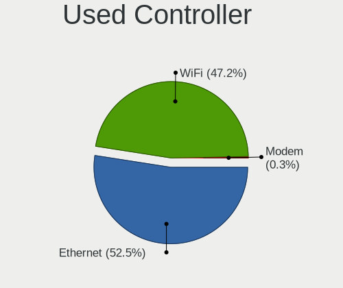

| Kind     | Computers | Percent |
|----------|-----------|---------|
| Ethernet | 1236      | 52.46%  |
| WiFi     | 1112      | 47.2%   |
| Modem    | 8         | 0.34%   |

NICs
----

Total network controllers on board

| Total | Computers | Percent |
|-------|-----------|---------|
| 2     | 1215      | 50.12%  |
| 1     | 1123      | 46.33%  |
| 0     | 55        | 2.27%   |
| 3     | 26        | 1.07%   |
| 4     | 5         | 0.21%   |

IPv6
----

IPv6 vs IPv4

| Used | Computers | Percent |
|------|-----------|---------|
| No   | 1592      | 65.49%  |
| Yes  | 839       | 34.51%  |

Bluetooth
---------

Bluetooth Vendor
----------------

Controller vendors

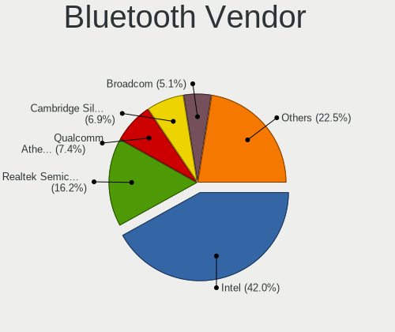

| Vendor                          | Computers | Percent |
|---------------------------------|-----------|---------|
| Intel                           | 553       | 41.96%  |
| Realtek Semiconductor           | 213       | 16.16%  |
| Qualcomm Atheros Communications | 98        | 7.44%   |
| Cambridge Silicon Radio         | 91        | 6.9%    |
| Broadcom                        | 67        | 5.08%   |
| IMC Networks                    | 59        | 4.48%   |
| Foxconn / Hon Hai               | 48        | 3.64%   |
| Lite-On Technology              | 47        | 3.57%   |
| Apple                           | 35        | 2.66%   |
| Dell                            | 20        | 1.52%   |
| MediaTek                        | 14        | 1.06%   |
| Hewlett-Packard                 | 13        | 0.99%   |
| Toshiba                         | 11        | 0.83%   |
| ASUSTek Computer                | 10        | 0.76%   |
| TP-Link                         | 8         | 0.61%   |
| Unknown                         | 7         | 0.53%   |
| Ralink                          | 5         | 0.38%   |
| Foxconn International           | 3         | 0.23%   |
| USI                             | 2         | 0.15%   |
| Realtek                         | 2         | 0.15%   |
| Marvell Semiconductor           | 2         | 0.15%   |
| Integrated System Solution      | 2         | 0.15%   |
| Edimax Technology               | 2         | 0.15%   |
| Qcom                            | 1         | 0.08%   |
| Micro Star International        | 1         | 0.08%   |
| Fujitsu                         | 1         | 0.08%   |
| Dynex                           | 1         | 0.08%   |
| Alps Electric                   | 1         | 0.08%   |
| Actions                         | 1         | 0.08%   |

Bluetooth Model
---------------

Controller models

| Model                                               | Computers | Percent |
|-----------------------------------------------------|-----------|---------|
| Intel Bluetooth wireless interface                  | 223       | 16.92%  |
| Realtek Bluetooth Radio                             | 135       | 10.24%  |
| Cambridge Silicon Radio Bluetooth Dongle (HCI mode) | 91        | 6.9%    |
| Intel Bluetooth 9460/9560 Jefferson Peak (JfP)      | 81        | 6.15%   |
| Intel AX201 Bluetooth                               | 74        | 5.61%   |
| Qualcomm Atheros  Bluetooth Device                  | 47        | 3.57%   |
| Intel AX200 Bluetooth                               | 41        | 3.11%   |
| Realtek  Bluetooth 4.2 Adapter                      | 40        | 3.03%   |
| Intel Wireless-AC 3168 Bluetooth                    | 38        | 2.88%   |
| IMC Networks Bluetooth Radio                        | 32        | 2.43%   |
| Intel Centrino Bluetooth Wireless Transceiver       | 27        | 2.05%   |
| Intel AX210 Bluetooth                               | 25        | 1.9%    |
| Broadcom BCM2045B (BDC-2.1)                         | 19        | 1.44%   |
| Intel AX211 Bluetooth                               | 18        | 1.37%   |
| Qualcomm Atheros AR3012 Bluetooth 4.0               | 16        | 1.21%   |
| Intel Wireless-AC 9260 Bluetooth Adapter            | 16        | 1.21%   |
| Realtek 802.11ac WLAN Adapter                       | 15        | 1.14%   |
| Foxconn / Hon Hai Wireless_Device                   | 15        | 1.14%   |
| Qualcomm Atheros AR3011 Bluetooth                   | 14        | 1.06%   |
| Lite-On Qualcomm Atheros QCA9377 Bluetooth          | 14        | 1.06%   |
| Apple Bluetooth Host Controller                     | 14        | 1.06%   |
| MediaTek Wireless_Device                            | 13        | 0.99%   |
| Lite-On Bluetooth Device                            | 13        | 0.99%   |
| IMC Networks Bluetooth Device                       | 10        | 0.76%   |
| Dell DW375 Bluetooth Module                         | 10        | 0.76%   |
| Apple Bluetooth USB Host Controller                 | 10        | 0.76%   |
| Realtek RTL8723B Bluetooth                          | 9         | 0.68%   |
| Lite-On Atheros AR3012 Bluetooth                    | 9         | 0.68%   |
| Intel Centrino Advanced-N 6230 Bluetooth adapter    | 9         | 0.68%   |
| HP Broadcom 2070 Bluetooth Combo                    | 9         | 0.68%   |
| Apple Built-in Bluetooth 2.0+EDR HCI                | 9         | 0.68%   |
| TP-Link TP-Link Bluetooth USB Adapter               | 8         | 0.61%   |
| Qualcomm Atheros AR9462 Bluetooth                   | 8         | 0.61%   |
| IMC Networks Wireless_Device                        | 7         | 0.53%   |
| Foxconn / Hon Hai Bluetooth Device                  | 7         | 0.53%   |
| Broadcom BCM20702 Bluetooth 4.0 [ThinkPad]          | 7         | 0.53%   |
| Broadcom BCM2070 Bluetooth Device                   | 7         | 0.53%   |
| Unknown                                             | 7         | 0.53%   |
| Qualcomm Atheros QCA61x4 Bluetooth 4.0              | 6         | 0.46%   |
| Lite-On Wireless_Device                             | 6         | 0.46%   |

Sound
-----

Sound Vendor
------------

Sound card vendors

| Vendor                                       | Computers | Percent |
|----------------------------------------------|-----------|---------|
| Intel                                        | 1846      | 58.2%   |
| AMD                                          | 653       | 20.59%  |
| Nvidia                                       | 462       | 14.56%  |
| C-Media Electronics                          | 41        | 1.29%   |
| Creative Labs                                | 16        | 0.5%    |
| Texas Instruments                            | 12        | 0.38%   |
| ASUSTek Computer                             | 10        | 0.32%   |
| Generalplus Technology                       | 9         | 0.28%   |
| Realtek Semiconductor                        | 8         | 0.25%   |
| Creative Technology                          | 8         | 0.25%   |
| GN Netcom                                    | 6         | 0.19%   |
| Razer USA                                    | 5         | 0.16%   |
| Zoran Co. Personal Media Division (Nogatech) | 4         | 0.13%   |
| Tenx Technology                              | 4         | 0.13%   |
| Silicon Integrated Systems [SiS]             | 4         | 0.13%   |
| Lenovo                                       | 4         | 0.13%   |
| JMTek                                        | 4         | 0.13%   |
| SAVITECH                                     | 3         | 0.09%   |
| M-Audio                                      | 3         | 0.09%   |
| Logitech                                     | 3         | 0.09%   |
| Kingston Technology                          | 3         | 0.09%   |
| Jieli Technology                             | 3         | 0.09%   |
| Focusrite-Novation                           | 3         | 0.09%   |
| Bose                                         | 3         | 0.09%   |
| VIA Technologies                             | 2         | 0.06%   |
| TerraTec Electronic                          | 2         | 0.06%   |
| PreSonus Audio Electronics                   | 2         | 0.06%   |
| Plantronics                                  | 2         | 0.06%   |
| Nordic Semiconductor ASA                     | 2         | 0.06%   |
| Micro Star International                     | 2         | 0.06%   |
| KTMicro                                      | 2         | 0.06%   |
| GYROCOM C&C                                  | 2         | 0.06%   |
| FiiO Electronics Technology                  | 2         | 0.06%   |
| Fifine Microphones                           | 2         | 0.06%   |
| ATI Technologies                             | 2         | 0.06%   |
| Xilinx                                       | 1         | 0.03%   |
| Valve Software                               | 1         | 0.03%   |
| Thesycon Systemsoftware & Consulting         | 1         | 0.03%   |
| SteelSeries ApS                              | 1         | 0.03%   |
| Sony                                         | 1         | 0.03%   |

Sound Model
-----------

Sound card models

| Model                                                                                             | Computers | Percent |
|---------------------------------------------------------------------------------------------------|-----------|---------|
| Intel 7 Series/C216 Chipset Family High Definition Audio Controller                               | 208       | 5.48%   |
| AMD Family 17h/19h/1ah HD Audio Controller                                                        | 207       | 5.45%   |
| Intel 6 Series/C200 Series Chipset Family High Definition Audio Controller                        | 193       | 5.08%   |
| Intel 8 Series/C220 Series Chipset High Definition Audio Controller                               | 150       | 3.95%   |
| Intel Sunrise Point-LP HD Audio                                                                   | 146       | 3.84%   |
| Intel NM10/ICH7 Family High Definition Audio Controller                                           | 107       | 2.82%   |
| Intel 5 Series/3400 Series Chipset High Definition Audio                                          | 104       | 2.74%   |
| Intel Xeon E3-1200 v3/4th Gen Core Processor HD Audio Controller                                  | 101       | 2.66%   |
| AMD Renoir Radeon High Definition Audio Controller                                                | 97        | 2.55%   |
| Intel Celeron/Pentium Silver Processor High Definition Audio                                      | 93        | 2.45%   |
| AMD SBx00 Azalia (Intel HDA)                                                                      | 85        | 2.24%   |
| AMD FCH Azalia Controller                                                                         | 79        | 2.08%   |
| AMD Raven/Raven2/Fenghuang HDMI/DP Audio Controller                                               | 71        | 1.87%   |
| AMD Starship/Matisse HD Audio Controller                                                          | 69        | 1.82%   |
| Intel 100 Series/C230 Series Chipset Family HD Audio Controller                                   | 66        | 1.74%   |
| Intel 82801I (ICH9 Family) HD Audio Controller                                                    | 61        | 1.61%   |
| Nvidia GK208 HDMI/DP Audio Controller                                                             | 59        | 1.55%   |
| Intel Haswell-ULT HD Audio Controller                                                             | 55        | 1.45%   |
| Intel 8 Series HD Audio Controller                                                                | 55        | 1.45%   |
| Intel 200 Series PCH HD Audio                                                                     | 55        | 1.45%   |
| Intel Celeron N3350/Pentium N4200/Atom E3900 Series Audio Cluster                                 | 50        | 1.32%   |
| Nvidia GF108 High Definition Audio Controller                                                     | 47        | 1.24%   |
| Intel Broadwell-U Audio Controller                                                                | 44        | 1.16%   |
| Intel Cannon Lake PCH cAVS                                                                        | 43        | 1.13%   |
| AMD Navi 21/23 HDMI/DP Audio Controller                                                           | 43        | 1.13%   |
| Intel Wildcat Point-LP High Definition Audio Controller                                           | 41        | 1.08%   |
| Nvidia GP107GL High Definition Audio Controller                                                   | 39        | 1.03%   |
| Intel Tiger Lake-LP Smart Sound Technology Audio Controller                                       | 37        | 0.97%   |
| Nvidia High Definition Audio Controller                                                           | 35        | 0.92%   |
| Intel Atom Processor Z36xxx/Z37xxx Series High Definition Audio Controller                        | 35        | 0.92%   |
| AMD Ellesmere HDMI Audio [Radeon RX 470/480 / 570/580/590]                                        | 34        | 0.89%   |
| Intel Alder Lake PCH-P High Definition Audio Controller                                           | 33        | 0.87%   |
| Nvidia GM107 High Definition Audio Controller [GeForce 940MX]                                     | 31        | 0.82%   |
| AMD Family 15h (Models 60h-6fh) Audio Controller                                                  | 31        | 0.82%   |
| AMD Rembrandt Radeon High Definition Audio Controller                                             | 30        | 0.79%   |
| Intel Atom/Celeron/Pentium Processor x5-E8000/J3xxx/N3xxx Series High Definition Audio Controller | 28        | 0.74%   |
| Intel 82801H (ICH8 Family) HD Audio Controller                                                    | 28        | 0.74%   |
| AMD Family 17h (Models 00h-0fh) HD Audio Controller                                               | 27        | 0.71%   |
| Intel Ice Lake-LP Smart Sound Technology Audio Controller                                         | 25        | 0.66%   |
| Intel Alder Lake-S HD Audio Controller                                                            | 25        | 0.66%   |

Memory
------

Memory Vendor
-------------

Memory module vendors

| Vendor                       | Computers | Percent |
|------------------------------|-----------|---------|
| Samsung Electronics          | 591       | 20.23%  |
| SK hynix                     | 418       | 14.31%  |
| Kingston                     | 350       | 11.98%  |
| Unknown                      | 295       | 10.1%   |
| Micron Technology            | 267       | 9.14%   |
| Crucial                      | 145       | 4.96%   |
| Corsair                      | 116       | 3.97%   |
| G.Skill                      | 77        | 2.64%   |
| A-DATA Technology            | 58        | 1.98%   |
| Ramaxel Technology           | 51        | 1.75%   |
| Unknown                      | 51        | 1.75%   |
| Unknown (ABCD)               | 49        | 1.68%   |
| Nanya Technology             | 48        | 1.64%   |
| Elpida                       | 44        | 1.51%   |
| Smart                        | 41        | 1.4%    |
| Patriot                      | 22        | 0.75%   |
| GOODRAM                      | 22        | 0.75%   |
| Team                         | 21        | 0.72%   |
| Apacer                       | 16        | 0.55%   |
| Transcend                    | 14        | 0.48%   |
| AMD                          | 13        | 0.44%   |
| ASint Technology             | 10        | 0.34%   |
| PNY                          | 9         | 0.31%   |
| Atermiter                    | 9         | 0.31%   |
| 48spaces                     | 8         | 0.27%   |
| Teikon                       | 7         | 0.24%   |
| Goldkey                      | 7         | 0.24%   |
| Avant                        | 6         | 0.21%   |
| Kllisre                      | 5         | 0.17%   |
| Hikvision                    | 5         | 0.17%   |
| 4ea5                         | 5         | 0.17%   |
| Wodposit                     | 4         | 0.14%   |
| Unknown (0x0E9D)             | 4         | 0.14%   |
| Timetec                      | 4         | 0.14%   |
| Patriot Memory (PDP Systems) | 4         | 0.14%   |
| Kingmax                      | 4         | 0.14%   |
| Juhor                        | 4         | 0.14%   |
| High Bridge                  | 4         | 0.14%   |
| V-GeN                        | 3         | 0.1%    |
| Smart Brazil                 | 3         | 0.1%    |

Memory Model
------------

Memory module models

| Model                                                            | Computers | Percent |
|------------------------------------------------------------------|-----------|---------|
| Unknown                                                          | 51        | 1.61%   |
| Unknown (ABCD) RAM 123456789012345678 2GB SODIMM LPDDR3 2400MT/s | 46        | 1.45%   |
| Samsung RAM Module 4GB Row Of Chips DDR4 2400MT/s                | 38        | 1.2%    |
| Samsung RAM M471B5273DH0-CH9 4GB SODIMM DDR3 1334MT/s            | 25        | 0.79%   |
| Samsung RAM M471B5173DB0-YK0 4GB SODIMM DDR3 1600MT/s            | 24        | 0.76%   |
| Samsung RAM M471A5244CB0-CWE 4096MB SODIMM DDR4 3200MT/s         | 21        | 0.66%   |
| Samsung RAM M471B5173EB0-YK0 4GB SODIMM DDR3 1600MT/s            | 20        | 0.63%   |
| Samsung RAM M471A5244CB0-CTD 4GB SODIMM DDR4 3266MT/s            | 19        | 0.6%    |
| Samsung RAM M471A1K43CB1-CRC 8GB SODIMM DDR4 2667MT/s            | 19        | 0.6%    |
| SK hynix RAM HMT351S6CFR8C-PB 4GB SODIMM DDR3 1600MT/s           | 17        | 0.54%   |
| SK hynix RAM HMA81GS6AFR8N-UH 8GB SODIMM DDR4 2667MT/s           | 17        | 0.54%   |
| Samsung RAM M471A1G44AB0-CWE 8GB SODIMM DDR4 3200MT/s            | 15        | 0.47%   |
| Micron RAM 8JTF51264AZ-1G6E1 4GB DIMM 1600MT/s                   | 15        | 0.47%   |
| Samsung RAM M471B5173QH0-YK0 4GB SODIMM DDR3 1600MT/s            | 14        | 0.44%   |
| Micron RAM 4ATF51264HZ-3G2J1 4GB SODIMM DDR4 3200MT/s            | 13        | 0.41%   |
| Corsair RAM CMK16GX4M2B3200C16 8GB DIMM DDR4 3600MT/s            | 13        | 0.41%   |
| Unknown RAM Module 8GB DIMM DDR3 1600MT/s                        | 12        | 0.38%   |
| Unknown RAM Module 2GB DIMM SDRAM                                | 12        | 0.38%   |
| Samsung RAM M471B5773CHS-CH9 2GB SODIMM DDR3 4199MT/s            | 12        | 0.38%   |
| Samsung RAM M471B1G73QH0-YK0 8GB SODIMM DDR3 1600MT/s            | 12        | 0.38%   |
| Samsung RAM M471A1G44BB0-CWE 8GB SODIMM DDR4 3200MT/s            | 12        | 0.38%   |
| Micron RAM 4ATF51264HZ-2G6E1 4GB SODIMM DDR4 2667MT/s            | 12        | 0.38%   |
| Unknown RAM Module 4GB DIMM 1333MT/s                             | 11        | 0.35%   |
| SK hynix RAM HMT451S6BFR8A-PB 4096MB SODIMM DDR3 1600MT/s        | 11        | 0.35%   |
| SK hynix RAM HMT41GS6BFR8A-PB 8GB SODIMM DDR3 1600MT/s           | 11        | 0.35%   |
| Samsung RAM M471B5273CH0-CH9 4GB SODIMM DDR3 1334MT/s            | 11        | 0.35%   |
| Samsung RAM M471A5244CB0-CRC 4GB SODIMM DDR4 2667MT/s            | 11        | 0.35%   |
| Micron RAM 8KTF51264HZ-1G6E1 4GB SODIMM DDR3 1600MT/s            | 11        | 0.35%   |
| Unknown RAM Module 2GB DIMM DDR2 667MT/s                         | 10        | 0.32%   |
| Unknown RAM Module 2GB DIMM 800MT/s                              | 10        | 0.32%   |
| SK hynix RAM HMT351S6EFR8A-PB 4GB SODIMM DDR3 1600MT/s           | 10        | 0.32%   |
| Samsung RAM M471A5244CB0-CWE 4096MB Row Of Chips DDR4 3200MT/s   | 10        | 0.32%   |
| Samsung RAM M378B5173QH0-CK0 4GB DIMM DDR3 1600MT/s              | 10        | 0.32%   |
| Unknown RAM Module 1GB DIMM DDR2 667MT/s                         | 9         | 0.28%   |
| SK hynix RAM HMT451S6AFR8A-PB 4GB SODIMM DDR3 1600MT/s           | 9         | 0.28%   |
| SK hynix RAM HMT351U6CFR8C-PB 4GB DIMM DDR3 1800MT/s             | 9         | 0.28%   |
| SK hynix RAM HMA851S6AFR6N-UH 4GB SODIMM DDR4 2667MT/s           | 9         | 0.28%   |
| Kingston RAM KF3200C16D4/8GX 8GB DIMM DDR4 3600MT/s              | 9         | 0.28%   |
| Unknown RAM Module 2GB DIMM DDR2 800MT/s                         | 8         | 0.25%   |
| SK hynix RAM Module 4GB SODIMM DDR3 1600MT/s                     | 8         | 0.25%   |

Memory Kind
-----------

Memory module kinds

| Kind    | Computers | Percent |
|---------|-----------|---------|
| DDR3    | 1005      | 40.92%  |
| DDR4    | 923       | 37.58%  |
| DDR2    | 135       | 5.5%    |
| SDRAM   | 105       | 4.28%   |
| LPDDR4  | 89        | 3.62%   |
| Unknown | 85        | 3.46%   |
| DDR5    | 40        | 1.63%   |
| LPDDR5  | 26        | 1.06%   |
| LPDDR3  | 20        | 0.81%   |
| DDR     | 16        | 0.65%   |
| DRAM    | 10        | 0.41%   |
| RAM     | 2         | 0.08%   |

Memory Form Factor
------------------

Physical design of the memory module

| Name            | Computers | Percent |
|-----------------|-----------|---------|
| SODIMM          | 1262      | 52.15%  |
| DIMM            | 1006      | 41.57%  |
| Row Of Chips    | 133       | 5.5%    |
| Unknown         | 9         | 0.37%   |
| FB-DIMM         | 4         | 0.17%   |
| Chip            | 4         | 0.17%   |
| RIMM            | 1         | 0.04%   |
| Proprietary Car | 1         | 0.04%   |

Memory Size
-----------

Memory module size

| Size  | Computers | Percent |
|-------|-----------|---------|
| 8192  | 952       | 34.67%  |
| 4096  | 905       | 32.96%  |
| 2048  | 455       | 16.57%  |
| 16384 | 261       | 9.5%    |
| 1024  | 102       | 3.71%   |
| 32768 | 57        | 2.08%   |
| 512   | 8         | 0.29%   |
| 65536 | 1         | 0.04%   |
| 24576 | 1         | 0.04%   |
| 15616 | 1         | 0.04%   |
| 12333 | 1         | 0.04%   |
| 3072  | 1         | 0.04%   |
| 256   | 1         | 0.04%   |

Memory Speed
------------

Memory module speed

| Speed   | Computers | Percent |
|---------|-----------|---------|
| 1600    | 656       | 23.98%  |
| 3200    | 293       | 10.71%  |
| 2667    | 274       | 10.01%  |
| 2400    | 239       | 8.74%   |
| 1333    | 232       | 8.48%   |
| 1334    | 111       | 4.06%   |
| 2133    | 103       | 3.76%   |
| 667     | 81        | 2.96%   |
| 800     | 71        | 2.6%    |
| Unknown | 67        | 2.45%   |
| 3600    | 63        | 2.3%    |
| 1067    | 40        | 1.46%   |
| 1867    | 37        | 1.35%   |
| 1066    | 28        | 1.02%   |
| 4800    | 25        | 0.91%   |
| 1866    | 25        | 0.91%   |
| 6400    | 24        | 0.88%   |
| 1800    | 24        | 0.88%   |
| 2666    | 22        | 0.8%    |
| 3733    | 20        | 0.73%   |
| 3266    | 20        | 0.73%   |
| 4199    | 19        | 0.69%   |
| 400     | 18        | 0.66%   |
| 533     | 17        | 0.62%   |
| 3800    | 14        | 0.51%   |
| 3466    | 14        | 0.51%   |
| 4267    | 13        | 0.48%   |
| 2048    | 13        | 0.48%   |
| 2933    | 12        | 0.44%   |
| 3400    | 11        | 0.4%    |
| 975     | 11        | 0.4%    |
| 4000    | 10        | 0.37%   |
| 3000    | 8         | 0.29%   |
| 333     | 8         | 0.29%   |
| 4266    | 7         | 0.26%   |
| 5600    | 6         | 0.22%   |
| 3534    | 6         | 0.22%   |
| 2800    | 6         | 0.22%   |
| 2000    | 6         | 0.22%   |
| 1648    | 6         | 0.22%   |

Printers & scanners
-------------------

Printer Vendor
--------------

Printer device vendors

| Vendor                | Computers | Percent |
|-----------------------|-----------|---------|
| Hewlett-Packard       | 33        | 42.31%  |
| Canon                 | 13        | 16.67%  |
| Brother Industries    | 11        | 14.1%   |
| Samsung Electronics   | 8         | 10.26%  |
| Seiko Epson           | 7         | 8.97%   |
| Prolific Technology   | 3         | 3.85%   |
| Oki Data              | 1         | 1.28%   |
| Lexmark International | 1         | 1.28%   |
| Apple                 | 1         | 1.28%   |

Printer Model
-------------

Printer device models

| Model                                        | Computers | Percent |
|----------------------------------------------|-----------|---------|
| Prolific PL2305 Parallel Port                | 3         | 3.8%    |
| HP DeskJet 4100 series                       | 3         | 3.8%    |
| HP DeskJet 2700 series                       | 3         | 3.8%    |
| HP DeskJet 2620 All-in-One Printer           | 3         | 3.8%    |
| Samsung ML-1660 Series                       | 2         | 2.53%   |
| HP LaserJet 1200                             | 2         | 2.53%   |
| HP ENVY 5000 series                          | 2         | 2.53%   |
| Canon MF110/910 Series                       | 2         | 2.53%   |
| Brother HL-L2350DW series                    | 2         | 2.53%   |
| Seiko Epson XP-2100 Series                   | 1         | 1.27%   |
| Seiko Epson ME 320/330 Series [Stylus SX125] | 1         | 1.27%   |
| Seiko Epson L3210 Series                     | 1         | 1.27%   |
| Seiko Epson L3150 Series                     | 1         | 1.27%   |
| Seiko Epson L300 Series                      | 1         | 1.27%   |
| Seiko Epson L120 Series                      | 1         | 1.27%   |
| Seiko Epson ET-4850 Series                   | 1         | 1.27%   |
| Samsung SCX-6x55X Series                     | 1         | 1.27%   |
| Samsung ML-216x Series Laser Printer         | 1         | 1.27%   |
| Samsung ML-1865                              | 1         | 1.27%   |
| Samsung ML-1640 Series Laser Printer         | 1         | 1.27%   |
| Samsung M2020 Series                         | 1         | 1.27%   |
| Samsung Composite Device                     | 1         | 1.27%   |
| Oki Data MC363 Multifunction Printer         | 1         | 1.27%   |
| Lexmark International MS510dn                | 1         | 1.27%   |
| HP Printing Support                          | 1         | 1.27%   |
| HP PhotoSmart 7150                           | 1         | 1.27%   |
| HP OfficeJet Pro 7740 series                 | 1         | 1.27%   |
| HP OfficeJet Pro 6960                        | 1         | 1.27%   |
| HP Officejet J4500 series                    | 1         | 1.27%   |
| HP OfficeJet 8010 series                     | 1         | 1.27%   |
| HP OfficeJet 3830 series                     | 1         | 1.27%   |
| HP LaserJet 1020                             | 1         | 1.27%   |
| HP LaserJet 1015                             | 1         | 1.27%   |
| HP HP LaserJet M14-M17                       | 1         | 1.27%   |
| HP ENVY 4520 series                          | 1         | 1.27%   |
| HP DeskJet Plus 6400 series                  | 1         | 1.27%   |
| HP DeskJet 6940 series                       | 1         | 1.27%   |
| HP DeskJet 4530 series                       | 1         | 1.27%   |
| HP DeskJet 3700 series                       | 1         | 1.27%   |
| HP DeskJet 3630 series                       | 1         | 1.27%   |

Scanner Vendor
--------------

Scanner device vendors

| Vendor          | Computers | Percent |
|-----------------|-----------|---------|
| Canon           | 8         | 66.67%  |
| Seiko Epson     | 2         | 16.67%  |
| Hewlett-Packard | 2         | 16.67%  |

Scanner Model
-------------

Scanner device models

| Model                                             | Computers | Percent |
|---------------------------------------------------|-----------|---------|
| Canon CanoScan LIDE 25                            | 2         | 16.67%  |
| Canon CanoScan LiDE 110                           | 2         | 16.67%  |
| Seiko Epson GT-F650 [GT-S600/Perfection V10/V100] | 1         | 8.33%   |
| Seiko Epson GT-7300U [Perfection 1260/1260 PHOTO] | 1         | 8.33%   |
| HP Scanjet G2710                                  | 1         | 8.33%   |
| HP ScanJet 2400c                                  | 1         | 8.33%   |
| Canon CanoScan N670U/N676U/LiDE 20                | 1         | 8.33%   |
| Canon CanoScan N650U/N656U                        | 1         | 8.33%   |
| Canon CanoScan LiDE 220                           | 1         | 8.33%   |
| Canon CanoScan 1220U                              | 1         | 8.33%   |

Camera
------

Camera Vendor
-------------

Camera device vendors

| Vendor                                 | Computers | Percent |
|----------------------------------------|-----------|---------|
| Chicony Electronics                    | 303       | 24.51%  |
| Microdia                               | 108       | 8.74%   |
| IMC Networks                           | 103       | 8.33%   |
| Bison Electronics                      | 88        | 7.12%   |
| Realtek Semiconductor                  | 79        | 6.39%   |
| Sunplus Innovation Technology          | 52        | 4.21%   |
| Quanta                                 | 52        | 4.21%   |
| Cheng Uei Precision Industry (Foxlink) | 46        | 3.72%   |
| Logitech                               | 45        | 3.64%   |
| Syntek                                 | 35        | 2.83%   |
| Suyin                                  | 35        | 2.83%   |
| icSpring                               | 28        | 2.27%   |
| Apple                                  | 23        | 1.86%   |
| Acer                                   | 21        | 1.7%    |
| Luxvisions Innotech Limited            | 19        | 1.54%   |
| Alcor Micro                            | 19        | 1.54%   |
| Silicon Motion                         | 17        | 1.38%   |
| Lite-On Technology                     | 16        | 1.29%   |
| Lenovo                                 | 12        | 0.97%   |
| Z-Star Microelectronics                | 10        | 0.81%   |
| Ricoh                                  | 10        | 0.81%   |
| Microsoft                              | 10        | 0.81%   |
| Importek                               | 9         | 0.73%   |
| ALi                                    | 8         | 0.65%   |
| SunplusIT                              | 6         | 0.49%   |
| Sonix Technology                       | 6         | 0.49%   |
| Unknown                                | 5         | 0.4%    |
| Y Media                                | 3         | 0.24%   |
| Tripath Technology                     | 3         | 0.24%   |
| Samsung Electronics                    | 3         | 0.24%   |
| Primax Electronics                     | 3         | 0.24%   |
| OYT Tech                               | 3         | 0.24%   |
| KYE Systems (Mouse Systems)            | 3         | 0.24%   |
| Hewlett-Packard                        | 3         | 0.24%   |
| Genesys Logic                          | 3         | 0.24%   |
| DigiTech                               | 3         | 0.24%   |
| MacroSilicon                           | 2         | 0.16%   |
| kingcome                               | 2         | 0.16%   |
| Generalplus Technology                 | 2         | 0.16%   |
| GEMBIRD                                | 2         | 0.16%   |

Camera Model
------------

Camera device models

| Model                                                                      | Computers | Percent |
|----------------------------------------------------------------------------|-----------|---------|
| Chicony Integrated Camera                                                  | 88        | 7.07%   |
| IMC Networks USB2.0 HD UVC WebCam                                          | 29        | 2.33%   |
| icSpring camera                                                            | 28        | 2.25%   |
| Bison Integrated Camera                                                    | 28        | 2.25%   |
| Microdia Integrated_Webcam_HD                                              | 25        | 2.01%   |
| IMC Networks USB2.0 VGA UVC WebCam                                         | 22        | 1.77%   |
| Syntek Integrated Camera                                                   | 21        | 1.69%   |
| Chicony HD WebCam                                                          | 20        | 1.61%   |
| Realtek Integrated_Webcam_HD                                               | 19        | 1.53%   |
| IMC Networks Integrated Camera                                             | 18        | 1.45%   |
| Logitech Webcam C270                                                       | 16        | 1.29%   |
| Sunplus Integrated_Webcam_HD                                               | 15        | 1.21%   |
| Luxvisions Innotech Limited HP TrueVision HD Camera                        | 14        | 1.13%   |
| Chicony HP TrueVision HD Camera                                            | 14        | 1.13%   |
| Apple FaceTime HD Camera (Built-in)                                        | 13        | 1.05%   |
| Microdia Integrated Webcam                                                 | 11        | 0.88%   |
| Chicony HP Webcam                                                          | 11        | 0.88%   |
| Bison Lenovo EasyCamera                                                    | 10        | 0.8%    |
| Quanta VGA WebCam                                                          | 9         | 0.72%   |
| Quanta HD User Facing                                                      | 9         | 0.72%   |
| Chicony USB2.0 HD UVC WebCam                                               | 9         | 0.72%   |
| Chicony Lenovo Integrated Camera (0.3MP)                                   | 9         | 0.72%   |
| Chicony HP HD Webcam                                                       | 9         | 0.72%   |
| Bison Lenovo Integrated Webcam                                             | 9         | 0.72%   |
| Chicony HP HD Camera                                                       | 8         | 0.64%   |
| Chicony FJ Camera                                                          | 8         | 0.64%   |
| Cheng Uei Precision Industry (Foxlink) HP HD Camera                        | 8         | 0.64%   |
| Bison HD Webcam                                                            | 8         | 0.64%   |
| ALi Gateway Webcam                                                         | 8         | 0.64%   |
| Alcor Micro USB 2.0 Camera                                                 | 8         | 0.64%   |
| Sunplus HD WebCam                                                          | 7         | 0.56%   |
| Microdia USB 2.0 Camera                                                    | 7         | 0.56%   |
| Lenovo Integrated Webcam                                                   | 7         | 0.56%   |
| IMC Networks Integrated Webcam                                             | 7         | 0.56%   |
| Chicony HD User Facing                                                     | 7         | 0.56%   |
| Chicony EasyCamera                                                         | 7         | 0.56%   |
| Cheng Uei Precision Industry (Foxlink) HP Wide Vision HD Integrated Webcam | 7         | 0.56%   |
| Cheng Uei Precision Industry (Foxlink) HP TrueVision HD Camera             | 7         | 0.56%   |
| Bison BisonCam, NB Pro                                                     | 7         | 0.56%   |
| Suyin Acer/HP Integrated Webcam [CN0314]                                   | 6         | 0.48%   |

Security
--------

Fingerprint Vendor
------------------

Fingerprint sensor vendors

| Vendor                             | Computers | Percent |
|------------------------------------|-----------|---------|
| Validity Sensors                   | 73        | 43.45%  |
| Synaptics                          | 27        | 16.07%  |
| Upek                               | 21        | 12.5%   |
| AuthenTec                          | 15        | 8.93%   |
| Shenzhen Goodix Technology         | 11        | 6.55%   |
| Elan Microelectronics              | 9         | 5.36%   |
| LighTuning Technology              | 8         | 4.76%   |
| Realtek USB2.0 Finger Print Bridge | 2         | 1.19%   |
| Focal-systems.Corp                 | 2         | 1.19%   |

Fingerprint Model
-----------------

Fingerprint sensor models

| Model                                                                      | Computers | Percent |
|----------------------------------------------------------------------------|-----------|---------|
| Validity Sensors VFS495 Fingerprint Reader                                 | 19        | 11.31%  |
| Upek Biometric Touchchip/Touchstrip Fingerprint Sensor                     | 19        | 11.31%  |
| Validity Sensors VFS5011 Fingerprint Reader                                | 8         | 4.76%   |
| Validity Sensors VFS 5011 fingerprint sensor                               | 8         | 4.76%   |
| Validity Sensors Synaptics WBDI                                            | 8         | 4.76%   |
| AuthenTec AES2810                                                          | 8         | 4.76%   |
| Shenzhen Goodix  FingerPrint Device                                        | 7         | 4.17%   |
| Validity Sensors VFS491                                                    | 6         | 3.57%   |
| Synaptics Prometheus MIS Touch Fingerprint Reader                          | 6         | 3.57%   |
| Validity Sensors VFS7500 Touch Fingerprint Sensor                          | 5         | 2.98%   |
| Synaptics WBDI                                                             | 5         | 2.98%   |
| Synaptics  WBDI                                                            | 5         | 2.98%   |
| Synaptics Metallica MIS Touch Fingerprint Reader                           | 5         | 2.98%   |
| Validity Sensors VFS451 Fingerprint Reader                                 | 4         | 2.38%   |
| Validity Sensors Synaptics VFS7552 Touch Fingerprint Sensor with PurePrint | 4         | 2.38%   |
| Validity Sensors Fingerprint scanner                                       | 4         | 2.38%   |
| Shenzhen Goodix Fingerprint Reader                                         | 4         | 2.38%   |
| AuthenTec Fingerprint Sensor                                               | 4         | 2.38%   |
| Validity Sensors VFS471 Fingerprint Reader                                 | 3         | 1.79%   |
| LighTuning EgisTec Touch Fingerprint Sensor                                | 3         | 1.79%   |
| Elan WBF Fingerprint Sensor                                                | 3         | 1.79%   |
| Elan ELAN:Fingerprint                                                      | 3         | 1.79%   |
| Elan ELAN:ARM-M4                                                           | 3         | 1.79%   |
| AuthenTec AES2501 Fingerprint Sensor                                       | 3         | 1.79%   |
| Validity Sensors VFS301 Fingerprint Reader                                 | 2         | 1.19%   |
| Upek TCS5B Fingerprint sensor                                              | 2         | 1.19%   |
| Synaptics  WBDI Fingerprint Reader - USB 052                               | 2         | 1.19%   |
| Realtek USB2.0 Finger Print Bridge FocalTech Fingerprint Device            | 2         | 1.19%   |
| LighTuning Fingerprint Sensor                                              | 2         | 1.19%   |
| LighTuning ES603 Swipe Fingerprint Sensor                                  | 2         | 1.19%   |
| Focal-systems.Corp FT9201Fingerprint.                                  | 2         | 1.19%   |
| Validity Sensors VFS7552 Touch Fingerprint Sensor                          | 1         | 0.6%    |
| Validity Sensors Swipe Fingerprint Sensor                                  | 1         | 0.6%    |
| Synaptics UWP WBDI Device                                                  | 1         | 0.6%    |
| Synaptics UWP WBDI                                                         | 1         | 0.6%    |
| Synaptics Fingerprint scanner                                              | 1         | 0.6%    |
| Synaptics Fingerprint reader [HP G6]                                       | 1         | 0.6%    |
| LighTuning Fingerprint Reader                                              | 1         | 0.6%    |

Chipcard Vendor
---------------

Chipcard module vendors

| Vendor                | Computers | Percent |
|-----------------------|-----------|---------|
| Broadcom              | 47        | 55.95%  |
| Alcor Micro           | 15        | 17.86%  |
| O2 Micro              | 7         | 8.33%   |
| Upek                  | 3         | 3.57%   |
| Lenovo                | 3         | 3.57%   |
| SCM Microsystems      | 2         | 2.38%   |
| Gemalto (was Gemplus) | 2         | 2.38%   |
| CHERRY                | 2         | 2.38%   |
| OmniKey               | 1         | 1.19%   |
| Chicony Electronics   | 1         | 1.19%   |
| Advanced Card Systems | 1         | 1.19%   |

Chipcard Model
--------------

Chipcard module models

| Model                                                                        | Computers | Percent |
|------------------------------------------------------------------------------|-----------|---------|
| Broadcom BCM5880 Secure Applications Processor                               | 27        | 32.14%  |
| Broadcom 5880                                                                | 15        | 17.86%  |
| Alcor Micro AU9540 Smartcard Reader                                          | 14        | 16.67%  |
| O2 Micro OZ776 CCID Smartcard Reader                                         | 6         | 7.14%   |
| Upek TouchChip Fingerprint Coprocessor (WBF advanced mode)                   | 3         | 3.57%   |
| Lenovo Integrated Smart Card Reader                                          | 3         | 3.57%   |
| Broadcom BCM5880 Secure Applications Processor with fingerprint swipe sensor | 3         | 3.57%   |
| CHERRY SmartCard Reader Keyboard KC 1000 SC                                  | 2         | 2.38%   |
| Broadcom 58200                                                               | 2         | 2.38%   |
| SCM Microsystems SCR3340 - ExpressCard54 Smart Card Reader                   | 1         | 1.19%   |
| SCM Microsystems SCR331-LC1 / SCR3310 SmartCard Reader                       | 1         | 1.19%   |
| OmniKey CardMan 3121 (HID Technologies)                                      | 1         | 1.19%   |
| O2 Micro Oz776 SmartCard Reader                                              | 1         | 1.19%   |
| Gemalto (was Gemplus) GemPC Twin SmartCard Reader                            | 1         | 1.19%   |
| Gemalto (was Gemplus) Compact Smart Card Reader Writer                       | 1         | 1.19%   |
| Chicony Electronics HP Skylab USB Smartcard Keyboard                         | 1         | 1.19%   |
| Alcor Micro Watchdata W 1981                                                 | 1         | 1.19%   |
| Advanced Card Systems ACR38 SmartCard Reader                                 | 1         | 1.19%   |

Unsupported
-----------

Unsupported Devices
-------------------

Total unsupported devices on board

| Total | Computers | Percent |
|-------|-----------|---------|
| 0     | 1985      | 81.82%  |
| 1     | 366       | 15.09%  |
| 2     | 68        | 2.8%    |
| 3     | 7         | 0.29%   |

Unsupported Device Types
------------------------

Types of unsupported devices

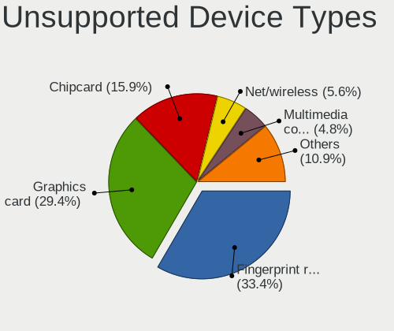

| Type                     | Computers | Percent |
|--------------------------|-----------|---------|
| Fingerprint reader       | 168       | 33.4%   |
| Graphics card            | 148       | 29.42%  |
| Chipcard                 | 80        | 15.9%   |
| Net/wireless             | 28        | 5.57%   |
| Multimedia controller    | 24        | 4.77%   |
| Unassigned class         | 14        | 2.78%   |
| Storage                  | 13        | 2.58%   |
| Communication controller | 13        | 2.58%   |
| Bluetooth                | 7         | 1.39%   |
| Card reader              | 3         | 0.6%    |
| Storage/raid             | 2         | 0.4%    |
| Network                  | 1         | 0.2%    |
| Flash memory             | 1         | 0.2%    |
| Camera                   | 1         | 0.2%    |

