OpenMandriva 23.08 - Tested Hardware & Statistics (Desktops)
------------------------------------------------------------

A project to collect tested hardware configurations for OpenMandriva 23.08.

Anyone can contribute to this report by the [hw-probe](https://github.com/linuxhw/hw-probe) tool:

    sudo -E hw-probe -all -upload

Please contribute! Especially if your hardware is rare.

Contents
--------

* [ Test Cases ](#test-cases)

* [ System ](#system)
  - [ Kernel                   ](#kernel)
  - [ Kernel Family            ](#kernel-family)
  - [ Kernel Major Ver.        ](#kernel-major-ver)
  - [ Arch                     ](#arch)
  - [ DE                       ](#de)
  - [ Display Server           ](#display-server)
  - [ Display Manager          ](#display-manager)
  - [ OS Lang                  ](#os-lang)
  - [ Boot Mode                ](#boot-mode)
  - [ Filesystem               ](#filesystem)
  - [ Part. scheme             ](#part-scheme)
  - [ Dual Boot with Linux/BSD ](#dual-boot-with-linuxbsd)
  - [ Dual Boot (Win)          ](#dual-boot-win)

* [ Board ](#board)
  - [ Vendor                   ](#vendor)
  - [ Model                    ](#model)
  - [ Model Family             ](#model-family)
  - [ MFG Year                 ](#mfg-year)
  - [ Form Factor              ](#form-factor)
  - [ Secure Boot              ](#secure-boot)
  - [ Coreboot                 ](#coreboot)
  - [ RAM Size                 ](#ram-size)
  - [ RAM Used                 ](#ram-used)
  - [ Total Drives             ](#total-drives)
  - [ Has CD-ROM               ](#has-cd-rom)
  - [ Has Ethernet             ](#has-ethernet)
  - [ Has WiFi                 ](#has-wifi)
  - [ Has Bluetooth            ](#has-bluetooth)

* [ Location ](#location)
  - [ Country                  ](#country)
  - [ City                     ](#city)

* [ Drives ](#drives)
  - [ Drive Vendor             ](#drive-vendor)
  - [ Drive Model              ](#drive-model)
  - [ HDD Vendor               ](#hdd-vendor)
  - [ SSD Vendor               ](#ssd-vendor)
  - [ Drive Kind               ](#drive-kind)
  - [ Drive Connector          ](#drive-connector)
  - [ Drive Size               ](#drive-size)
  - [ Space Total              ](#space-total)
  - [ Space Used               ](#space-used)
  - [ Malfunc. Drives          ](#malfunc-drives)
  - [ Malfunc. Drive Vendor    ](#malfunc-drive-vendor)
  - [ Malfunc. HDD Vendor      ](#malfunc-hdd-vendor)
  - [ Malfunc. Drive Kind      ](#malfunc-drive-kind)
  - [ Failed Drives            ](#failed-drives)
  - [ Failed Drive Vendor      ](#failed-drive-vendor)
  - [ Drive Status             ](#drive-status)

* [ Storage controller ](#storage-controller)
  - [ Storage Vendor           ](#storage-vendor)
  - [ Storage Model            ](#storage-model)
  - [ Storage Kind             ](#storage-kind)

* [ Processor ](#processor)
  - [ CPU Vendor               ](#cpu-vendor)
  - [ CPU Model                ](#cpu-model)
  - [ CPU Model Family         ](#cpu-model-family)
  - [ CPU Cores                ](#cpu-cores)
  - [ CPU Sockets              ](#cpu-sockets)
  - [ CPU Threads              ](#cpu-threads)
  - [ CPU Op-Modes             ](#cpu-op-modes)
  - [ CPU Microcode            ](#cpu-microcode)
  - [ CPU Microarch            ](#cpu-microarch)

* [ Graphics ](#graphics)
  - [ GPU Vendor               ](#gpu-vendor)
  - [ GPU Model                ](#gpu-model)
  - [ GPU Combo                ](#gpu-combo)
  - [ GPU Driver               ](#gpu-driver)
  - [ GPU Memory               ](#gpu-memory)

* [ Monitor ](#monitor)
  - [ Monitor Vendor           ](#monitor-vendor)
  - [ Monitor Model            ](#monitor-model)
  - [ Monitor Resolution       ](#monitor-resolution)
  - [ Monitor Diagonal         ](#monitor-diagonal)
  - [ Monitor Width            ](#monitor-width)
  - [ Aspect Ratio             ](#aspect-ratio)
  - [ Monitor Area             ](#monitor-area)
  - [ Pixel Density            ](#pixel-density)
  - [ Multiple Monitors        ](#multiple-monitors)

* [ Network ](#network)
  - [ Net Controller Vendor    ](#net-controller-vendor)
  - [ Net Controller Model     ](#net-controller-model)
  - [ Wireless Vendor          ](#wireless-vendor)
  - [ Wireless Model           ](#wireless-model)
  - [ Ethernet Vendor          ](#ethernet-vendor)
  - [ Ethernet Model           ](#ethernet-model)
  - [ Net Controller Kind      ](#net-controller-kind)
  - [ Used Controller          ](#used-controller)
  - [ NICs                     ](#nics)
  - [ IPv6                     ](#ipv6)

* [ Bluetooth ](#bluetooth)
  - [ Bluetooth Vendor         ](#bluetooth-vendor)
  - [ Bluetooth Model          ](#bluetooth-model)

* [ Sound ](#sound)
  - [ Sound Vendor             ](#sound-vendor)
  - [ Sound Model              ](#sound-model)

* [ Memory ](#memory)
  - [ Memory Vendor            ](#memory-vendor)
  - [ Memory Model             ](#memory-model)
  - [ Memory Kind              ](#memory-kind)
  - [ Memory Form Factor       ](#memory-form-factor)
  - [ Memory Size              ](#memory-size)
  - [ Memory Speed             ](#memory-speed)

* [ Printers & scanners ](#printers--scanners)
  - [ Printer Vendor           ](#printer-vendor)
  - [ Printer Model            ](#printer-model)
  - [ Scanner Vendor           ](#scanner-vendor)
  - [ Scanner Model            ](#scanner-model)

* [ Camera ](#camera)
  - [ Camera Vendor            ](#camera-vendor)
  - [ Camera Model             ](#camera-model)

* [ Security ](#security)
  - [ Fingerprint Vendor       ](#fingerprint-vendor)
  - [ Fingerprint Model        ](#fingerprint-model)
  - [ Chipcard Vendor          ](#chipcard-vendor)
  - [ Chipcard Model           ](#chipcard-model)

* [ Unsupported ](#unsupported)
  - [ Unsupported Devices      ](#unsupported-devices)
  - [ Unsupported Device Types ](#unsupported-device-types)

Test Cases
----------

Total: 725

| Vendor        | Model                       | Probe                                                      | Date         |
|---------------|-----------------------------|------------------------------------------------------------|--------------|
| HP            | 339A                        | [e8e666af64](https://linux-hardware.org/?probe=e8e666af64) | Feb 02, 2024 |
| HP            | 18E7                        | [84caef4dde](https://linux-hardware.org/?probe=84caef4dde) | Feb 02, 2024 |
| Dell          | 0WMJ54 A00                  | [d6c3c89e3d](https://linux-hardware.org/?probe=d6c3c89e3d) | Feb 02, 2024 |
| Dell          | 0215PR A05                  | [05183a71ef](https://linux-hardware.org/?probe=05183a71ef) | Feb 01, 2024 |
| ASUSTek       | PRIME B650-PLUS             | [c83dcb11ca](https://linux-hardware.org/?probe=c83dcb11ca) | Jan 31, 2024 |
| ASUSTek       | M5A97 R2.0                  | [bf9814808f](https://linux-hardware.org/?probe=bf9814808f) | Jan 31, 2024 |
| HP            | 8B3C A                      | [12ec418267](https://linux-hardware.org/?probe=12ec418267) | Jan 31, 2024 |
| Fujitsu       | D3233-A1 S26361-D3233-A1    | [2a526e4632](https://linux-hardware.org/?probe=2a526e4632) | Jan 30, 2024 |
| Gigabyte      | X570 GAMING X               | [3418c8d84c](https://linux-hardware.org/?probe=3418c8d84c) | Jan 30, 2024 |
| Dell          | 0GDG8Y A00                  | [9cbabba588](https://linux-hardware.org/?probe=9cbabba588) | Jan 29, 2024 |
| AZW           | MINI S 10                   | [d707319ed7](https://linux-hardware.org/?probe=d707319ed7) | Jan 29, 2024 |
| ASUSTek       | TUF Gaming X570-PLUS        | [c9d5d0fa7b](https://linux-hardware.org/?probe=c9d5d0fa7b) | Jan 29, 2024 |
| Dell          | 0J3C2F A00                  | [95ae5646c8](https://linux-hardware.org/?probe=95ae5646c8) | Jan 29, 2024 |
| HP            | 3396                        | [b59e0b4023](https://linux-hardware.org/?probe=b59e0b4023) | Jan 29, 2024 |
| Gigabyte      | EP45T-UD3R                  | [d3aaef580d](https://linux-hardware.org/?probe=d3aaef580d) | Jan 28, 2024 |
| ASRock        | B760M-HDV/M.2 D4            | [56ef6ba880](https://linux-hardware.org/?probe=56ef6ba880) | Jan 28, 2024 |
| ASRock        | B450 Gaming K4              | [9cee6b0a5b](https://linux-hardware.org/?probe=9cee6b0a5b) | Jan 27, 2024 |
| ASRock        | H470 Phantom Gaming 4       | [dc402c3f43](https://linux-hardware.org/?probe=dc402c3f43) | Jan 27, 2024 |
| Gigabyte      | 945GCM-S2L                  | [4490f8e838](https://linux-hardware.org/?probe=4490f8e838) | Jan 27, 2024 |
| HP            | 82F2 A01                    | [437bec28fa](https://linux-hardware.org/?probe=437bec28fa) | Jan 26, 2024 |
| Gigabyte      | B550M DS3H                  | [347b980bdf](https://linux-hardware.org/?probe=347b980bdf) | Jan 25, 2024 |
| Lenovo        | SHARKBAY SDK0E50510 WIN     | [ff7fd4d2cd](https://linux-hardware.org/?probe=ff7fd4d2cd) | Jan 24, 2024 |
| ASUSTek       | PRIME A320M-K               | [5c2e73a06a](https://linux-hardware.org/?probe=5c2e73a06a) | Jan 23, 2024 |
| Gigabyte      | H61M-S1                     | [91f61c4366](https://linux-hardware.org/?probe=91f61c4366) | Jan 23, 2024 |
| Intel         | Unknown                     | [8427ffd0dc](https://linux-hardware.org/?probe=8427ffd0dc) | Jan 23, 2024 |
| MSI           | MAG X570S TORPEDO MAX       | [97f9705158](https://linux-hardware.org/?probe=97f9705158) | Jan 22, 2024 |
| HP            | 18E5                        | [69ba380344](https://linux-hardware.org/?probe=69ba380344) | Jan 21, 2024 |
| ASUSTek       | ROG STRIX X670E-E GAMING... | [ec963a72d8](https://linux-hardware.org/?probe=ec963a72d8) | Jan 21, 2024 |
| Casper        | NIRVANA NOTEBOOK            | [af055c48ff](https://linux-hardware.org/?probe=af055c48ff) | Jan 21, 2024 |
| Intel         | DZ77GA-70K AAG39009-500     | [cba7125977](https://linux-hardware.org/?probe=cba7125977) | Jan 20, 2024 |
| Dell          | 042P49 A02                  | [366d017089](https://linux-hardware.org/?probe=366d017089) | Jan 20, 2024 |
| ASUSTek       | PRIME A320M-K               | [58be81f7c1](https://linux-hardware.org/?probe=58be81f7c1) | Jan 20, 2024 |
| Gigabyte      | A320M-S2H-CF                | [39cd221e89](https://linux-hardware.org/?probe=39cd221e89) | Jan 20, 2024 |
| HP            | 8055                        | [5e6a445b12](https://linux-hardware.org/?probe=5e6a445b12) | Jan 19, 2024 |
| ASUSTek       | K30AD_M31AD_M51AD           | [8d2bc7b076](https://linux-hardware.org/?probe=8d2bc7b076) | Jan 18, 2024 |
| Biostar       | A770E                       | [a149b3aeb6](https://linux-hardware.org/?probe=a149b3aeb6) | Jan 17, 2024 |
| ASUSTek       | Z97-DELUXE                  | [f414f21db4](https://linux-hardware.org/?probe=f414f21db4) | Jan 16, 2024 |
| ASUSTek       | H81M-K                      | [c1f78ee398](https://linux-hardware.org/?probe=c1f78ee398) | Jan 16, 2024 |
| MSI           | A320M-A PRO                 | [4f2655db6f](https://linux-hardware.org/?probe=4f2655db6f) | Jan 14, 2024 |
| Positivo      | POS-EINM10CB POSITIVO       | [ed11587f82](https://linux-hardware.org/?probe=ed11587f82) | Jan 14, 2024 |
| Gigabyte      | EX58-UD3R                   | [b62ae21449](https://linux-hardware.org/?probe=b62ae21449) | Jan 13, 2024 |
| Gigabyte      | H510M H V2                  | [1340d91b43](https://linux-hardware.org/?probe=1340d91b43) | Jan 13, 2024 |
| Dell          | 0W2F8G A01                  | [959d868bbf](https://linux-hardware.org/?probe=959d868bbf) | Jan 13, 2024 |
| Gigabyte      | H97M-Gaming 3               | [6230f1ef11](https://linux-hardware.org/?probe=6230f1ef11) | Jan 12, 2024 |
| MSI           | B450M-A PRO MAX             | [50ca06fa28](https://linux-hardware.org/?probe=50ca06fa28) | Jan 11, 2024 |
| ASUSTek       | PRIME Z270-P                | [bf8ac62321](https://linux-hardware.org/?probe=bf8ac62321) | Jan 11, 2024 |
| Intel         | H81                         | [1a1c6de235](https://linux-hardware.org/?probe=1a1c6de235) | Jan 10, 2024 |
| ASRock        | Q1900B-ITX                  | [610dfd5b71](https://linux-hardware.org/?probe=610dfd5b71) | Jan 10, 2024 |
| MSI           | 970A-G43                    | [00e0cf9c8d](https://linux-hardware.org/?probe=00e0cf9c8d) | Jan 09, 2024 |
| OEM           | B75 Ver:1.41                | [5466b2e4af](https://linux-hardware.org/?probe=5466b2e4af) | Jan 08, 2024 |
| Lenovo        | ThinkCentre M72e 0896A2G    | [b77ad754ae](https://linux-hardware.org/?probe=b77ad754ae) | Jan 08, 2024 |
| Gigabyte      | B450M K-CF                  | [6ffbab86cc](https://linux-hardware.org/?probe=6ffbab86cc) | Jan 07, 2024 |
| Dell          | 00V62H A01                  | [6fcf0891d9](https://linux-hardware.org/?probe=6fcf0891d9) | Jan 07, 2024 |
| Gigabyte      | MZBSWAP-00                  | [eb3700b576](https://linux-hardware.org/?probe=eb3700b576) | Jan 06, 2024 |
| Shenzhen M... | F7BFC                       | [59d6a69f30](https://linux-hardware.org/?probe=59d6a69f30) | Jan 05, 2024 |
| Shenzhen M... | F7BFC                       | [d8ed7241cb](https://linux-hardware.org/?probe=d8ed7241cb) | Jan 05, 2024 |
| Intel         | JSL MRD                     | [8b1f990d75](https://linux-hardware.org/?probe=8b1f990d75) | Jan 05, 2024 |
| Acer          | Veriton M2630G V:1.0        | [40d6bf6d97](https://linux-hardware.org/?probe=40d6bf6d97) | Jan 05, 2024 |
| ASUSTek       | M5A78L-M LX3 PLUS           | [d53af9a54d](https://linux-hardware.org/?probe=d53af9a54d) | Jan 03, 2024 |
| ASUSTek       | Maximus V GENE              | [e62026b868](https://linux-hardware.org/?probe=e62026b868) | Jan 02, 2024 |
| ASUSTek       | M2N68-AM SE2                | [553bcade60](https://linux-hardware.org/?probe=553bcade60) | Jan 01, 2024 |
| Gigabyte      | G41M-Combo                  | [0a6df1d55f](https://linux-hardware.org/?probe=0a6df1d55f) | Dec 28, 2023 |
| Intel         | H61                         | [baec7a3074](https://linux-hardware.org/?probe=baec7a3074) | Dec 28, 2023 |
| MSI           | MS-B9311                    | [424154cf65](https://linux-hardware.org/?probe=424154cf65) | Dec 28, 2023 |
| Acer          | Predator Orion PO5-620      | [2d7731ff10](https://linux-hardware.org/?probe=2d7731ff10) | Dec 26, 2023 |
| HP            | 82F1                        | [86959f8199](https://linux-hardware.org/?probe=86959f8199) | Dec 24, 2023 |
| ASUSTek       | P5GC-MX/1333                | [a95c11e27b](https://linux-hardware.org/?probe=a95c11e27b) | Dec 23, 2023 |
| ASUSTek       | ROG STRIX B450-F GAMING     | [a84743b247](https://linux-hardware.org/?probe=a84743b247) | Dec 23, 2023 |
| Foxconn       | 2ABF                        | [3441aa81e6](https://linux-hardware.org/?probe=3441aa81e6) | Dec 23, 2023 |
| Lenovo        | SHARKBAY SDK0J40705 WIN ... | [739d4b0840](https://linux-hardware.org/?probe=739d4b0840) | Dec 23, 2023 |
| Dell          | 0X7841                      | [3757ec7f5f](https://linux-hardware.org/?probe=3757ec7f5f) | Dec 22, 2023 |
| ASUSTek       | P7H55-M LE                  | [d15476594e](https://linux-hardware.org/?probe=d15476594e) | Dec 22, 2023 |
| Gigabyte      | B550 AORUS PRO V2           | [be8f1bf021](https://linux-hardware.org/?probe=be8f1bf021) | Dec 22, 2023 |
| HP            | 2B28                        | [a3c79770af](https://linux-hardware.org/?probe=a3c79770af) | Dec 21, 2023 |
| Lenovo        | SHARKBAY 0B98401 PRO        | [2675cca8c2](https://linux-hardware.org/?probe=2675cca8c2) | Dec 21, 2023 |
| ECS           | H81H3-MV                    | [95bd5100ac](https://linux-hardware.org/?probe=95bd5100ac) | Dec 20, 2023 |
| Gigabyte      | 970-GAMING                  | [403d617fdd](https://linux-hardware.org/?probe=403d617fdd) | Dec 19, 2023 |
| Gigabyte      | Z77X-UP5 TH-CF              | [ee9b8f604a](https://linux-hardware.org/?probe=ee9b8f604a) | Dec 19, 2023 |
| Dell          | 0T10XW A00                  | [ffff088d9c](https://linux-hardware.org/?probe=ffff088d9c) | Dec 18, 2023 |
| Foxconn       | 2ABF                        | [907abd30c7](https://linux-hardware.org/?probe=907abd30c7) | Dec 17, 2023 |
| MSI           | MAG B550 TOMAHAWK           | [5c8981cf69](https://linux-hardware.org/?probe=5c8981cf69) | Dec 17, 2023 |
| ASRock        | 970M Pro3                   | [1e7fb2b8d8](https://linux-hardware.org/?probe=1e7fb2b8d8) | Dec 16, 2023 |
| ASUSTek       | TUF Gaming B550-PLUS        | [41fd53bbff](https://linux-hardware.org/?probe=41fd53bbff) | Dec 16, 2023 |
| HP            | 3647h                       | [4feaf76045](https://linux-hardware.org/?probe=4feaf76045) | Dec 16, 2023 |
| ASUSTek       | ROG STRIX B550-F GAMING     | [72b7f2d771](https://linux-hardware.org/?probe=72b7f2d771) | Dec 16, 2023 |
| Gigabyte      | P55A-UD3                    | [485f360521](https://linux-hardware.org/?probe=485f360521) | Dec 15, 2023 |
| MSI           | B450 GAMING PLUS MAX        | [a2e31b8b20](https://linux-hardware.org/?probe=a2e31b8b20) | Dec 15, 2023 |
| ASUSTek       | H81M-CS/BR                  | [39094226f9](https://linux-hardware.org/?probe=39094226f9) | Dec 15, 2023 |
| Lenovo        | SHARKBAY 0B98401 WIN        | [8939c99ccb](https://linux-hardware.org/?probe=8939c99ccb) | Dec 15, 2023 |
| ASUSTek       | PRIME B460M-A               | [1c7f9648af](https://linux-hardware.org/?probe=1c7f9648af) | Dec 14, 2023 |
| HP            | 1495                        | [bd97989dd8](https://linux-hardware.org/?probe=bd97989dd8) | Dec 14, 2023 |
| ASUSTek       | PRIME H270-PRO              | [b701b34038](https://linux-hardware.org/?probe=b701b34038) | Dec 14, 2023 |
| ASRock        | G41M-VS3                    | [313b058c8c](https://linux-hardware.org/?probe=313b058c8c) | Dec 14, 2023 |
| ASRock        | AB350M-HDV                  | [945274527c](https://linux-hardware.org/?probe=945274527c) | Dec 13, 2023 |
| HP            | 18E5                        | [8195da7520](https://linux-hardware.org/?probe=8195da7520) | Dec 13, 2023 |
| Positivo      | POS-PIH81DL                 | [55cf834e17](https://linux-hardware.org/?probe=55cf834e17) | Dec 13, 2023 |
| HP            | 8169                        | [e0549dcc03](https://linux-hardware.org/?probe=e0549dcc03) | Dec 12, 2023 |
| MSI           | A88XM GAMING                | [1f17749a2e](https://linux-hardware.org/?probe=1f17749a2e) | Dec 12, 2023 |
| Fujitsu       | D3600-A1 S26361-D3600-A1    | [0e87f04695](https://linux-hardware.org/?probe=0e87f04695) | Dec 12, 2023 |
| Dell          | 0TNDVR A00                  | [4a4ab03bc7](https://linux-hardware.org/?probe=4a4ab03bc7) | Dec 11, 2023 |
| Dell          | 0GXM1W A00                  | [1b4243a8d7](https://linux-hardware.org/?probe=1b4243a8d7) | Dec 11, 2023 |
| Gigabyte      | Z77-DS3H                    | [03c91234ae](https://linux-hardware.org/?probe=03c91234ae) | Dec 11, 2023 |
| Gigabyte      | H310M DS2 x.x               | [6150f23143](https://linux-hardware.org/?probe=6150f23143) | Dec 10, 2023 |
| Gigabyte      | P67A-UD3P-B3                | [e96b9306cb](https://linux-hardware.org/?probe=e96b9306cb) | Dec 10, 2023 |
| HP            | 2B29                        | [6fb328f58e](https://linux-hardware.org/?probe=6fb328f58e) | Dec 10, 2023 |
| HP            | 3047h                       | [b4e9ee347f](https://linux-hardware.org/?probe=b4e9ee347f) | Dec 10, 2023 |
| ASUSTek       | PRIME Z270M-PLUS            | [5c1ffcfbe3](https://linux-hardware.org/?probe=5c1ffcfbe3) | Dec 09, 2023 |
| MSI           | B450-A PRO MAX              | [c576c4fbae](https://linux-hardware.org/?probe=c576c4fbae) | Dec 09, 2023 |
| Lenovo        | 32E9 SDK0T76465 WIN 3422... | [a4eb4e410e](https://linux-hardware.org/?probe=a4eb4e410e) | Dec 08, 2023 |
| Biostar       | A520MH                      | [de9fc0f8f2](https://linux-hardware.org/?probe=de9fc0f8f2) | Dec 07, 2023 |
| Dell          | 0HN7XN A01                  | [986d7f4d8f](https://linux-hardware.org/?probe=986d7f4d8f) | Dec 07, 2023 |
| HP            | 21B4 A01                    | [a8f5a67f32](https://linux-hardware.org/?probe=a8f5a67f32) | Dec 07, 2023 |
| Foxconn       | 2A8C                        | [2a4412d268](https://linux-hardware.org/?probe=2a4412d268) | Dec 06, 2023 |
| Gigabyte      | AB350M-DS3H V2-CF           | [1f2c85d176](https://linux-hardware.org/?probe=1f2c85d176) | Dec 06, 2023 |
| ASUSTek       | H110M-A/M.2                 | [f15eca360f](https://linux-hardware.org/?probe=f15eca360f) | Dec 06, 2023 |
| ASUSTek       | PRIME A520M-A II            | [a2e7a10bdf](https://linux-hardware.org/?probe=a2e7a10bdf) | Dec 05, 2023 |
| Gigabyte      | A320M-H-CF                  | [4d14243cb9](https://linux-hardware.org/?probe=4d14243cb9) | Dec 05, 2023 |
| Gigabyte      | Z68XP-UD4                   | [3cdd72e242](https://linux-hardware.org/?probe=3cdd72e242) | Dec 05, 2023 |
| Foxconn       | 2ABF                        | [9478c73013](https://linux-hardware.org/?probe=9478c73013) | Dec 05, 2023 |
| Dell          | 02N3WF A03                  | [2974cc160f](https://linux-hardware.org/?probe=2974cc160f) | Dec 05, 2023 |
| Acer          | Veriton S6620G v1.0         | [34095bbfed](https://linux-hardware.org/?probe=34095bbfed) | Dec 04, 2023 |
| HP            | 1998                        | [50a48ad374](https://linux-hardware.org/?probe=50a48ad374) | Dec 04, 2023 |
| ASUSTek       | SABERTOOTH 990FX R2.0       | [f013a81cbb](https://linux-hardware.org/?probe=f013a81cbb) | Dec 03, 2023 |
| ASRock        | B450 Gaming K4              | [b877f8ccda](https://linux-hardware.org/?probe=b877f8ccda) | Dec 03, 2023 |
| HP            | 3397                        | [b6c4db2738](https://linux-hardware.org/?probe=b6c4db2738) | Dec 03, 2023 |
| HP            | 8169                        | [6bdddabb7f](https://linux-hardware.org/?probe=6bdddabb7f) | Dec 03, 2023 |
| ASUSTek       | P7P55 LX                    | [0d59473ae1](https://linux-hardware.org/?probe=0d59473ae1) | Dec 02, 2023 |
| Intel         | X99                         | [e96bed5f38](https://linux-hardware.org/?probe=e96bed5f38) | Dec 02, 2023 |
| MSI           | B85M-E43 DASH               | [b9caa2d56f](https://linux-hardware.org/?probe=b9caa2d56f) | Dec 02, 2023 |
| ASUSTek       | H81M-K                      | [8f5c7fb36e](https://linux-hardware.org/?probe=8f5c7fb36e) | Dec 02, 2023 |
| Gigabyte      | B450M DS3H-CF               | [5f195d4731](https://linux-hardware.org/?probe=5f195d4731) | Dec 02, 2023 |
| Dell          | 0T10XW A02                  | [ddb5b7cd64](https://linux-hardware.org/?probe=ddb5b7cd64) | Dec 01, 2023 |
| HP            | 8459                        | [b7a22ecb3f](https://linux-hardware.org/?probe=b7a22ecb3f) | Dec 01, 2023 |
| Intel         | DG41RQ AAE54511-205         | [8646f4d21b](https://linux-hardware.org/?probe=8646f4d21b) | Dec 01, 2023 |
| ASUSTek       | PRIME A320M-K               | [ed158c0464](https://linux-hardware.org/?probe=ed158c0464) | Dec 01, 2023 |
| Fujitsu       | D3221-A1 S26361-D3221-A1    | [436f0406e4](https://linux-hardware.org/?probe=436f0406e4) | Dec 01, 2023 |
| Gigabyte      | B250-D3A-CF                 | [5d3de45ec6](https://linux-hardware.org/?probe=5d3de45ec6) | Dec 01, 2023 |
| Intel         | X99H                        | [147f088343](https://linux-hardware.org/?probe=147f088343) | Dec 01, 2023 |
| ASRock        | Z790 Taichi                 | [915505c787](https://linux-hardware.org/?probe=915505c787) | Nov 30, 2023 |
| Gigabyte      | H61M-S1                     | [cc54ea37ef](https://linux-hardware.org/?probe=cc54ea37ef) | Nov 30, 2023 |
| ASUSTek       | PRIME Z790M-PLUS D4         | [3630fd2945](https://linux-hardware.org/?probe=3630fd2945) | Nov 30, 2023 |
| AZW           | U59                         | [eccee157da](https://linux-hardware.org/?probe=eccee157da) | Nov 30, 2023 |
| Gigabyte      | H81M-S2H                    | [b23f24b006](https://linux-hardware.org/?probe=b23f24b006) | Nov 30, 2023 |
| HP            | 1495                        | [9dcb53a8c2](https://linux-hardware.org/?probe=9dcb53a8c2) | Nov 30, 2023 |
| Gigabyte      | B75M-D3H                    | [6a3776da6b](https://linux-hardware.org/?probe=6a3776da6b) | Nov 29, 2023 |
| ASUSTek       | PRIME A320M-K               | [1537766927](https://linux-hardware.org/?probe=1537766927) | Nov 29, 2023 |
| Gigabyte      | B550 AORUS ELITE V2         | [1b2c06817f](https://linux-hardware.org/?probe=1b2c06817f) | Nov 29, 2023 |
| Unknown       | Intel BayTrail Series R1... | [6ab4075642](https://linux-hardware.org/?probe=6ab4075642) | Nov 29, 2023 |
| HP            | 8053                        | [6d6877e008](https://linux-hardware.org/?probe=6d6877e008) | Nov 29, 2023 |
| Lenovo        | SHARKBAY SDK0E50515 STD     | [d87ba8d291](https://linux-hardware.org/?probe=d87ba8d291) | Nov 29, 2023 |
| MSI           | MAG B550 TOMAHAWK           | [fc4e66ac12](https://linux-hardware.org/?probe=fc4e66ac12) | Nov 29, 2023 |
| MSI           | A320M-A PRO                 | [96af3871d2](https://linux-hardware.org/?probe=96af3871d2) | Nov 29, 2023 |
| Fujitsu       | D2924-A1 S26361-D2924-A1    | [a06c08c462](https://linux-hardware.org/?probe=a06c08c462) | Nov 28, 2023 |
| ASUSTek       | PRIME A320M-K               | [7c53518c08](https://linux-hardware.org/?probe=7c53518c08) | Nov 28, 2023 |
| Gigabyte      | H310M DS2                   | [14a8656c8b](https://linux-hardware.org/?probe=14a8656c8b) | Nov 28, 2023 |
| HP            | 1497                        | [6cd2fea9bd](https://linux-hardware.org/?probe=6cd2fea9bd) | Nov 28, 2023 |
| Fujitsu       | D3227-A1 S26361-D3227-A1    | [9e6c582721](https://linux-hardware.org/?probe=9e6c582721) | Nov 28, 2023 |
| Gigabyte      | G31-S3G                     | [895a8554b4](https://linux-hardware.org/?probe=895a8554b4) | Nov 28, 2023 |
| HP            | 18E5                        | [a9c04bd2c7](https://linux-hardware.org/?probe=a9c04bd2c7) | Nov 28, 2023 |
| Biostar       | H310MHP                     | [58282ae6c7](https://linux-hardware.org/?probe=58282ae6c7) | Nov 28, 2023 |
| Gigabyte      | B450 AORUS ELITE            | [7c4bb8dad1](https://linux-hardware.org/?probe=7c4bb8dad1) | Nov 28, 2023 |
| Gigabyte      | P67A-D3-B3                  | [fc4a8c9532](https://linux-hardware.org/?probe=fc4a8c9532) | Nov 27, 2023 |
| Lenovo        | ThinkCentre M58p 6137A1G    | [fafec0e338](https://linux-hardware.org/?probe=fafec0e338) | Nov 27, 2023 |
| ASRock        | H510M-HVS R2.0              | [e8867e4bb9](https://linux-hardware.org/?probe=e8867e4bb9) | Nov 27, 2023 |
| Gigabyte      | G41MT-S2P                   | [0ff86eddc6](https://linux-hardware.org/?probe=0ff86eddc6) | Nov 27, 2023 |
| ASUSTek       | M5A97 R2.0                  | [8885a17766](https://linux-hardware.org/?probe=8885a17766) | Nov 27, 2023 |
| Intel         | H61                         | [97a16fcd1b](https://linux-hardware.org/?probe=97a16fcd1b) | Nov 27, 2023 |
| Dell          | 0CU409                      | [328adb4fd0](https://linux-hardware.org/?probe=328adb4fd0) | Nov 27, 2023 |
| Intel         | X99H                        | [2cbd1213a8](https://linux-hardware.org/?probe=2cbd1213a8) | Nov 27, 2023 |
| HP            | 83EE                        | [4a9e67adc6](https://linux-hardware.org/?probe=4a9e67adc6) | Nov 27, 2023 |
| ASUSTek       | M5A78L-M/USB3               | [dda972d27c](https://linux-hardware.org/?probe=dda972d27c) | Nov 26, 2023 |
| Dell          | 07KY25 A01                  | [98134987bb](https://linux-hardware.org/?probe=98134987bb) | Nov 26, 2023 |
| Shenzhen M... | F7BAA                       | [8c0edc3315](https://linux-hardware.org/?probe=8c0edc3315) | Nov 26, 2023 |
| Dell          | 0WR7PY A01                  | [cceb19120f](https://linux-hardware.org/?probe=cceb19120f) | Nov 26, 2023 |
| MSI           | MS-B1711                    | [963341bb09](https://linux-hardware.org/?probe=963341bb09) | Nov 26, 2023 |
| ASRock        | 4X4-4000 Series             | [d9c6907311](https://linux-hardware.org/?probe=d9c6907311) | Nov 26, 2023 |
| ASRock        | 970A-G                      | [aabcb223d0](https://linux-hardware.org/?probe=aabcb223d0) | Nov 26, 2023 |
| ASUSTek       | Rampage V EXTREME           | [2d09c86fa7](https://linux-hardware.org/?probe=2d09c86fa7) | Nov 26, 2023 |
| ASUSTek       | P8Z77-M                     | [2009f6493b](https://linux-hardware.org/?probe=2009f6493b) | Nov 26, 2023 |
| Foxconn       | 2ADA                        | [0f5aa8a55b](https://linux-hardware.org/?probe=0f5aa8a55b) | Nov 26, 2023 |
| Gigabyte      | B75M-D3H                    | [454b211624](https://linux-hardware.org/?probe=454b211624) | Nov 25, 2023 |
| Minix         | H61M-USB3 V1.2              | [2024379183](https://linux-hardware.org/?probe=2024379183) | Nov 25, 2023 |
| Dell          | 0K83V0 A00                  | [0ffd410841](https://linux-hardware.org/?probe=0ffd410841) | Nov 25, 2023 |
| ASUSTek       | TUF Gaming B550-PLUS        | [4e8b656513](https://linux-hardware.org/?probe=4e8b656513) | Nov 24, 2023 |
| MSI           | Z87-G41 PC Mate             | [a56a424940](https://linux-hardware.org/?probe=a56a424940) | Nov 24, 2023 |
| ASUSTek       | P8H77-M LE                  | [39919b75ba](https://linux-hardware.org/?probe=39919b75ba) | Nov 24, 2023 |
| MSI           | A68HM-E33 V2                | [e257380edc](https://linux-hardware.org/?probe=e257380edc) | Nov 23, 2023 |
| ASUSTek       | M5A78L-M LX PLUS            | [4b2a2cc667](https://linux-hardware.org/?probe=4b2a2cc667) | Nov 23, 2023 |
| ASRock        | A320M-HDV R4.0              | [a67ae23c5a](https://linux-hardware.org/?probe=a67ae23c5a) | Nov 23, 2023 |
| Gigabyte      | 970A-DS3P FX                | [eff4442629](https://linux-hardware.org/?probe=eff4442629) | Nov 22, 2023 |
| Gigabyte      | H510M H                     | [078c28606a](https://linux-hardware.org/?probe=078c28606a) | Nov 21, 2023 |
| Gigabyte      | B75M-D3H                    | [5be7c208c3](https://linux-hardware.org/?probe=5be7c208c3) | Nov 20, 2023 |
| ECS           | H61H2-M2                    | [29293282c2](https://linux-hardware.org/?probe=29293282c2) | Nov 20, 2023 |
| Lenovo        | 3178 SDK0J40700 WIN 3258... | [6ed1f31ed3](https://linux-hardware.org/?probe=6ed1f31ed3) | Nov 20, 2023 |
| HP            | 89B5 A                      | [4c228a49ce](https://linux-hardware.org/?probe=4c228a49ce) | Nov 20, 2023 |
| ASRock        | B660M-STX                   | [883a70813a](https://linux-hardware.org/?probe=883a70813a) | Nov 19, 2023 |
| ASUSTek       | PRIME H510M-K               | [4243816d27](https://linux-hardware.org/?probe=4243816d27) | Nov 19, 2023 |
| ASUSTek       | M2NPV-VM                    | [be4bd9aeaf](https://linux-hardware.org/?probe=be4bd9aeaf) | Nov 18, 2023 |
| HP            | 8055                        | [1125d976fc](https://linux-hardware.org/?probe=1125d976fc) | Nov 18, 2023 |
| ASUSTek       | TUF Gaming X570-PLUS        | [ff84b6e035](https://linux-hardware.org/?probe=ff84b6e035) | Nov 17, 2023 |
| ASUSTek       | P5SD2-VM                    | [8fa21e29e3](https://linux-hardware.org/?probe=8fa21e29e3) | Nov 17, 2023 |
| ASUSTek       | P5G41T-M LX                 | [63ba7cf0b1](https://linux-hardware.org/?probe=63ba7cf0b1) | Nov 16, 2023 |
| Inventec      | D CLASS A02                 | [e8f9a52206](https://linux-hardware.org/?probe=e8f9a52206) | Nov 16, 2023 |
| Gigabyte      | 970A-DS3P FX                | [5b960b8464](https://linux-hardware.org/?probe=5b960b8464) | Nov 16, 2023 |
| Huanan        | X99-F8 GAMING V2.0          | [160e8325ba](https://linux-hardware.org/?probe=160e8325ba) | Nov 15, 2023 |
| Unknown       | T3 MRD                      | [f4a73d26e0](https://linux-hardware.org/?probe=f4a73d26e0) | Nov 15, 2023 |
| ASUSTek       | P5GC-MX/CKD/SI              | [08053c4143](https://linux-hardware.org/?probe=08053c4143) | Nov 15, 2023 |
| MSI           | Z97-G43                     | [ea16582cb2](https://linux-hardware.org/?probe=ea16582cb2) | Nov 14, 2023 |
| MSI           | A88X-G45 GAMING             | [5ab91132ea](https://linux-hardware.org/?probe=5ab91132ea) | Nov 14, 2023 |
| HP            | 09F0h                       | [1c1ab6c56f](https://linux-hardware.org/?probe=1c1ab6c56f) | Nov 12, 2023 |
| Dell          | 018D1Y A00                  | [4a14d46e6b](https://linux-hardware.org/?probe=4a14d46e6b) | Nov 12, 2023 |
| MSI           | B350 TOMAHAWK ARCTIC        | [cccbd25b73](https://linux-hardware.org/?probe=cccbd25b73) | Nov 12, 2023 |
| Dell          | 0KWVT8 A03                  | [fcc17bd8a1](https://linux-hardware.org/?probe=fcc17bd8a1) | Nov 12, 2023 |
| HP            | 1850                        | [117ab7ea0d](https://linux-hardware.org/?probe=117ab7ea0d) | Nov 11, 2023 |
| Gigabyte      | Z77-D3H                     | [9c852b1f0b](https://linux-hardware.org/?probe=9c852b1f0b) | Nov 11, 2023 |
| Minix         | NEO Z83-4 V1.5              | [3623dfcb88](https://linux-hardware.org/?probe=3623dfcb88) | Nov 10, 2023 |
| Intel         | DG35EC AAE29266-210         | [fe0e055f82](https://linux-hardware.org/?probe=fe0e055f82) | Nov 10, 2023 |
| HP            | 339A                        | [7be77c764f](https://linux-hardware.org/?probe=7be77c764f) | Nov 09, 2023 |
| MSI           | A320M-A PRO                 | [9f16fd11b7](https://linux-hardware.org/?probe=9f16fd11b7) | Nov 09, 2023 |
| Gigabyte      | H110M-S2H-CF                | [10f68961cf](https://linux-hardware.org/?probe=10f68961cf) | Nov 08, 2023 |
| Gigabyte      | G41MT-S2                    | [c301ae970c](https://linux-hardware.org/?probe=c301ae970c) | Nov 08, 2023 |
| Dell          | 082WXT A01                  | [41e56ed8e4](https://linux-hardware.org/?probe=41e56ed8e4) | Nov 08, 2023 |
| HP            | 339A                        | [cdcbe8d47d](https://linux-hardware.org/?probe=cdcbe8d47d) | Nov 07, 2023 |
| Foxconn       | 2AAF                        | [fc483856a6](https://linux-hardware.org/?probe=fc483856a6) | Nov 07, 2023 |
| ASUSTek       | H81M-K                      | [3de6cf8221](https://linux-hardware.org/?probe=3de6cf8221) | Nov 07, 2023 |
| Gigabyte      | F2A68HM-HD2                 | [c376116add](https://linux-hardware.org/?probe=c376116add) | Nov 06, 2023 |
| Gigabyte      | A320M-H-CF                  | [105d51f329](https://linux-hardware.org/?probe=105d51f329) | Nov 05, 2023 |
| HP            | 802F                        | [8fe557cc85](https://linux-hardware.org/?probe=8fe557cc85) | Nov 05, 2023 |
| Gigabyte      | AB350-Gaming 3-CF           | [2710dfedf4](https://linux-hardware.org/?probe=2710dfedf4) | Nov 05, 2023 |
| ASRock        | 970 Pro3 R2.0               | [f070e73453](https://linux-hardware.org/?probe=f070e73453) | Nov 05, 2023 |
| ASUSTek       | M5A78L-M LX/BR              | [459eb3cd2a](https://linux-hardware.org/?probe=459eb3cd2a) | Nov 04, 2023 |
| Acer          | Aspire M1920                | [f6ffcb0c41](https://linux-hardware.org/?probe=f6ffcb0c41) | Nov 04, 2023 |
| Gigabyte      | GA-870A-USB3L               | [d2412dfd7c](https://linux-hardware.org/?probe=d2412dfd7c) | Nov 04, 2023 |
| ASUSTek       | H110M-D                     | [03303fa6ed](https://linux-hardware.org/?probe=03303fa6ed) | Nov 04, 2023 |
| MSI           | H110M PRO-D                 | [da5c3ffb7e](https://linux-hardware.org/?probe=da5c3ffb7e) | Nov 02, 2023 |
| ASRock        | H81M-HG4 R4.0               | [0f5f162498](https://linux-hardware.org/?probe=0f5f162498) | Nov 02, 2023 |
| Gigabyte      | B75M-HD3                    | [e27c813285](https://linux-hardware.org/?probe=e27c813285) | Oct 31, 2023 |
| Intel         | B75                         | [a46db29108](https://linux-hardware.org/?probe=a46db29108) | Oct 29, 2023 |
| ASUSTek       | PRIME B250-PRO              | [ac060a5eb6](https://linux-hardware.org/?probe=ac060a5eb6) | Oct 29, 2023 |
| Dell          | 03NVJ6 A01                  | [09d76f025a](https://linux-hardware.org/?probe=09d76f025a) | Oct 29, 2023 |
| Gigabyte      | H61MA-D3V                   | [0c4d99e9dc](https://linux-hardware.org/?probe=0c4d99e9dc) | Oct 29, 2023 |
| Gigabyte      | 970A-DS3P                   | [31d6b19c8d](https://linux-hardware.org/?probe=31d6b19c8d) | Oct 29, 2023 |
| Koloe         | X58                         | [91fbabe04c](https://linux-hardware.org/?probe=91fbabe04c) | Oct 29, 2023 |
| ASRock        | B450 Steel Legend           | [21beb00969](https://linux-hardware.org/?probe=21beb00969) | Oct 28, 2023 |
| Unknown       | Phitronics G31VS-M          | [10bcfab3cb](https://linux-hardware.org/?probe=10bcfab3cb) | Oct 28, 2023 |
| Gigabyte      | Z370M D3H-CF                | [80b6c027b0](https://linux-hardware.org/?probe=80b6c027b0) | Oct 27, 2023 |
| ASUSTek       | A68HM-PLUS                  | [9d662bd187](https://linux-hardware.org/?probe=9d662bd187) | Oct 27, 2023 |
| ASUSTek       | M5A78L-M LX3                | [d3dacafdc2](https://linux-hardware.org/?probe=d3dacafdc2) | Oct 26, 2023 |
| Dell          | 03NJH0 A01                  | [dbb152a219](https://linux-hardware.org/?probe=dbb152a219) | Oct 26, 2023 |
| MSI           | H110M PRO-VD                | [b62701c032](https://linux-hardware.org/?probe=b62701c032) | Oct 25, 2023 |
| Lenovo        | ThinkCentre M90 5485W2L     | [0fcc4fe794](https://linux-hardware.org/?probe=0fcc4fe794) | Oct 24, 2023 |
| EPSON DIRE... | AT992E                      | [b61468f9c5](https://linux-hardware.org/?probe=b61468f9c5) | Oct 24, 2023 |
| Lenovo        | 30C7 SDK0J40709 WIN 3259... | [71fd7dde1d](https://linux-hardware.org/?probe=71fd7dde1d) | Oct 23, 2023 |
| MSI           | PRO Z690-P DDR4             | [35e54833e8](https://linux-hardware.org/?probe=35e54833e8) | Oct 23, 2023 |
| HP            | 3397                        | [3f8e8810c1](https://linux-hardware.org/?probe=3f8e8810c1) | Oct 23, 2023 |
| Fujitsu       | D3162-A1 S26361-D3162-A1    | [3e46064143](https://linux-hardware.org/?probe=3e46064143) | Oct 22, 2023 |
| ASUSTek       | H170 PRO GAMING             | [859edb18bd](https://linux-hardware.org/?probe=859edb18bd) | Oct 21, 2023 |
| ASUSTek       | PRIME B250M-A               | [ff0d8bbab4](https://linux-hardware.org/?probe=ff0d8bbab4) | Oct 21, 2023 |
| ASUSTek       | P5KPL-AM                    | [b5bf9b7639](https://linux-hardware.org/?probe=b5bf9b7639) | Oct 21, 2023 |
| MSI           | G41TM-P31                   | [3ed69770a6](https://linux-hardware.org/?probe=3ed69770a6) | Oct 20, 2023 |
| ASUSTek       | M5A78L-M/USB3               | [3fd9b0b53f](https://linux-hardware.org/?probe=3fd9b0b53f) | Oct 20, 2023 |
| Intel         | DH55HC AAE70933-505         | [f1bc373847](https://linux-hardware.org/?probe=f1bc373847) | Oct 19, 2023 |
| Gigabyte      | Z370 HD3P-CF                | [0994d6d9a2](https://linux-hardware.org/?probe=0994d6d9a2) | Oct 18, 2023 |
| ASUSTek       | PRIME H510M-A               | [04e9833b48](https://linux-hardware.org/?probe=04e9833b48) | Oct 18, 2023 |
| Acer          | Veriton X2660G              | [d122988e18](https://linux-hardware.org/?probe=d122988e18) | Oct 17, 2023 |
| ASRock        | X470 Master SLI/ac          | [9258f94300](https://linux-hardware.org/?probe=9258f94300) | Oct 17, 2023 |
| Shenzhen M... | F7BSC                       | [8522bfdadd](https://linux-hardware.org/?probe=8522bfdadd) | Oct 16, 2023 |
| MSI           | Z97A GAMING 7               | [8af7152ba5](https://linux-hardware.org/?probe=8af7152ba5) | Oct 16, 2023 |
| ASRock        | N68-S3 FX                   | [b1a36d42aa](https://linux-hardware.org/?probe=b1a36d42aa) | Oct 16, 2023 |
| Gigabyte      | GA-E350N-USB3               | [62f5ab12ea](https://linux-hardware.org/?probe=62f5ab12ea) | Oct 15, 2023 |
| Gigabyte      | GA-78LMT-S2 R2              | [038f59eb24](https://linux-hardware.org/?probe=038f59eb24) | Oct 15, 2023 |
| Intel         | DG41RQ AAE54511-203         | [64738e1724](https://linux-hardware.org/?probe=64738e1724) | Oct 15, 2023 |
| PCWare        | IPMH61R1                    | [145dc39d14](https://linux-hardware.org/?probe=145dc39d14) | Oct 14, 2023 |
| ASUSTek       | P8Q77-M                     | [ed4ca29c66](https://linux-hardware.org/?probe=ed4ca29c66) | Oct 14, 2023 |
| Fujitsu       | D3221-A1 S26361-D3221-A1    | [babe25d4ce](https://linux-hardware.org/?probe=babe25d4ce) | Oct 14, 2023 |
| HP            | 1495                        | [e524318d58](https://linux-hardware.org/?probe=e524318d58) | Oct 13, 2023 |
| ASUSTek       | P5Q3 DELUXE                 | [29bb46e198](https://linux-hardware.org/?probe=29bb46e198) | Oct 12, 2023 |
| ASRock        | A320M-HDV R4.0              | [d1d30ae371](https://linux-hardware.org/?probe=d1d30ae371) | Oct 10, 2023 |
| Lenovo        | ThinkCentre M90p 5536W67    | [3e075f72d8](https://linux-hardware.org/?probe=3e075f72d8) | Oct 09, 2023 |
| ASUSTek       | PRIME B450M-K II            | [a3401cc125](https://linux-hardware.org/?probe=a3401cc125) | Oct 09, 2023 |
| Gigabyte      | B550 AORUS ELITE V2         | [0bf2deeb16](https://linux-hardware.org/?probe=0bf2deeb16) | Oct 07, 2023 |
| Dell          | 0M5DCD A00                  | [30d2522c95](https://linux-hardware.org/?probe=30d2522c95) | Oct 07, 2023 |
| Intel         | H61                         | [a37805d0d3](https://linux-hardware.org/?probe=a37805d0d3) | Oct 07, 2023 |
| ASRock        | N68C-GS FX                  | [cfafd2008d](https://linux-hardware.org/?probe=cfafd2008d) | Oct 07, 2023 |
| MSI           | 09AC                        | [f70ac0139f](https://linux-hardware.org/?probe=f70ac0139f) | Oct 07, 2023 |
| AZW           | Green G4 10                 | [d8fb758dec](https://linux-hardware.org/?probe=d8fb758dec) | Oct 07, 2023 |
| MACHINIST     | E5-MR9A PRO V1.2            | [668d09e797](https://linux-hardware.org/?probe=668d09e797) | Oct 07, 2023 |
| Lenovo        | ThinkCentre xxx 7090A17     | [669bc2a016](https://linux-hardware.org/?probe=669bc2a016) | Oct 06, 2023 |
| ASUSTek       | PRIME H310M-E R2.0          | [bc448fbb82](https://linux-hardware.org/?probe=bc448fbb82) | Oct 05, 2023 |
| MSI           | B450-A PRO MAX              | [6e8b2e49f0](https://linux-hardware.org/?probe=6e8b2e49f0) | Oct 05, 2023 |
| HP            | 3397                        | [e77e1b6391](https://linux-hardware.org/?probe=e77e1b6391) | Oct 04, 2023 |
| ASUSTek       | TUF Gaming B550M-PLUS       | [a72a2ee89e](https://linux-hardware.org/?probe=a72a2ee89e) | Oct 04, 2023 |
| HP            | 1825                        | [d326bc59ff](https://linux-hardware.org/?probe=d326bc59ff) | Oct 04, 2023 |
| ECS           | H61H2-MV                    | [51ec04551f](https://linux-hardware.org/?probe=51ec04551f) | Oct 04, 2023 |
| Lenovo        | NOK                         | [dd6bffed79](https://linux-hardware.org/?probe=dd6bffed79) | Oct 04, 2023 |
| HP            | 3646h                       | [f39e9c8741](https://linux-hardware.org/?probe=f39e9c8741) | Oct 04, 2023 |
| Intel         | JSL MRD                     | [5a4bfcaba3](https://linux-hardware.org/?probe=5a4bfcaba3) | Oct 03, 2023 |
| Intel         | DG41RQ AAE54511-202         | [5d2ec27525](https://linux-hardware.org/?probe=5d2ec27525) | Oct 03, 2023 |
| Dell          | 0Y3R3K A03                  | [0675277f70](https://linux-hardware.org/?probe=0675277f70) | Oct 03, 2023 |
| Dell          | 0GXM1W A00                  | [fe83d524fb](https://linux-hardware.org/?probe=fe83d524fb) | Oct 02, 2023 |
| AZW           | MINI S 10                   | [13e3a733fd](https://linux-hardware.org/?probe=13e3a733fd) | Oct 01, 2023 |
| Gigabyte      | Z77X-UD5H                   | [def4633785](https://linux-hardware.org/?probe=def4633785) | Oct 01, 2023 |
| ASUSTek       | B85M-G                      | [0166816d1b](https://linux-hardware.org/?probe=0166816d1b) | Oct 01, 2023 |
| ASUSTek       | H110M-R                     | [b8aadf6823](https://linux-hardware.org/?probe=b8aadf6823) | Sep 30, 2023 |
| ASUSTek       | P5B-E Plus                  | [78c413cac5](https://linux-hardware.org/?probe=78c413cac5) | Sep 30, 2023 |
| AZW           | MINI S 10                   | [e065b9c701](https://linux-hardware.org/?probe=e065b9c701) | Sep 30, 2023 |
| Gigabyte      | X570 AORUS ELITE            | [d0fea1d86b](https://linux-hardware.org/?probe=d0fea1d86b) | Sep 29, 2023 |
| Intel         | H110D4-P1                   | [ccedaaab02](https://linux-hardware.org/?probe=ccedaaab02) | Sep 29, 2023 |
| Lenovo        | H410                        | [f49a6ce32f](https://linux-hardware.org/?probe=f49a6ce32f) | Sep 28, 2023 |
| ASUSTek       | M2N-E SLI                   | [2a5937c5e5](https://linux-hardware.org/?probe=2a5937c5e5) | Sep 28, 2023 |
| Fujitsu       | D3222-A1 S26361-D3222-A1    | [a1ef1eb6e6](https://linux-hardware.org/?probe=a1ef1eb6e6) | Sep 28, 2023 |
| ASUSTek       | D700MD                      | [91740e63b9](https://linux-hardware.org/?probe=91740e63b9) | Sep 27, 2023 |
| Pegatron      | EVANS                       | [b9347254b0](https://linux-hardware.org/?probe=b9347254b0) | Sep 25, 2023 |
| ASRock        | X370 Pro4                   | [1939307392](https://linux-hardware.org/?probe=1939307392) | Sep 25, 2023 |
| Biostar       | B550MH                      | [4ef9bbad17](https://linux-hardware.org/?probe=4ef9bbad17) | Sep 24, 2023 |
| Gigabyte      | X299 AORUS Gaming-CF        | [4c6071b20c](https://linux-hardware.org/?probe=4c6071b20c) | Sep 24, 2023 |
| Gigabyte      | B550 AORUS PRO V2           | [c0e3bef058](https://linux-hardware.org/?probe=c0e3bef058) | Sep 24, 2023 |
| ASUSTek       | Z97-C                       | [e4c1f075b9](https://linux-hardware.org/?probe=e4c1f075b9) | Sep 23, 2023 |
| ASUSTek       | A88XM-A                     | [c2cb8052f9](https://linux-hardware.org/?probe=c2cb8052f9) | Sep 23, 2023 |
| ASUSTek       | PRIME B450-PLUS             | [46a99bb50a](https://linux-hardware.org/?probe=46a99bb50a) | Sep 23, 2023 |
| Gigabyte      | Z68X-UD3H-B3                | [92e5dde8b3](https://linux-hardware.org/?probe=92e5dde8b3) | Sep 23, 2023 |
| Shuttle       | XS36V                       | [dbcb5658e4](https://linux-hardware.org/?probe=dbcb5658e4) | Sep 23, 2023 |
| ASUSTek       | P7P55-M                     | [f5b912e122](https://linux-hardware.org/?probe=f5b912e122) | Sep 22, 2023 |
| Positivo      | POS-AG31AP                  | [2e2072e3ca](https://linux-hardware.org/?probe=2e2072e3ca) | Sep 21, 2023 |
| Megaware      | MW-HDC-M 02/24/2012 - ME... | [d3c9063140](https://linux-hardware.org/?probe=d3c9063140) | Sep 21, 2023 |
| Dell          | 0KRC95 A00                  | [61ae2b85c5](https://linux-hardware.org/?probe=61ae2b85c5) | Sep 21, 2023 |
| Gigabyte      | B560M DS3H V2               | [182384fdaa](https://linux-hardware.org/?probe=182384fdaa) | Sep 20, 2023 |
| MSI           | Indio                       | [330a2c9640](https://linux-hardware.org/?probe=330a2c9640) | Sep 20, 2023 |
| Biostar       | B550GTQ                     | [5478c7bc91](https://linux-hardware.org/?probe=5478c7bc91) | Sep 19, 2023 |
| Pegatron      | 2AB5                        | [6f4fafb23f](https://linux-hardware.org/?probe=6f4fafb23f) | Sep 19, 2023 |
| Lenovo        | SHARKBAY SDK0E50510 WIN     | [f40bb3790e](https://linux-hardware.org/?probe=f40bb3790e) | Sep 18, 2023 |
| ASUSTek       | M5A78L-M PLUS/USB3          | [0a5f29963e](https://linux-hardware.org/?probe=0a5f29963e) | Sep 18, 2023 |
| Gigabyte      | B85M-D3H                    | [7b51f6f455](https://linux-hardware.org/?probe=7b51f6f455) | Sep 18, 2023 |
| ASUSTek       | A88XM-PLUS                  | [ab79a26993](https://linux-hardware.org/?probe=ab79a26993) | Sep 18, 2023 |
| ASUSTek       | PRIME A320M-K               | [9c94944d56](https://linux-hardware.org/?probe=9c94944d56) | Sep 18, 2023 |
| ASUSTek       | P5GC-MX/1333                | [232bd09926](https://linux-hardware.org/?probe=232bd09926) | Sep 17, 2023 |
| MSI           | B450M MORTAR MAX            | [beaa4e5554](https://linux-hardware.org/?probe=beaa4e5554) | Sep 17, 2023 |
| Dell          | 0KWVT8 A03                  | [cd0090bea7](https://linux-hardware.org/?probe=cd0090bea7) | Sep 16, 2023 |
| Intel         | DX79SI AAG28808-602         | [2ccc7fc308](https://linux-hardware.org/?probe=2ccc7fc308) | Sep 16, 2023 |
| ASRock        | 960GC-GS FX                 | [513b6982f2](https://linux-hardware.org/?probe=513b6982f2) | Sep 16, 2023 |
| ASUSTek       | PRIME A320M-K               | [bef465f035](https://linux-hardware.org/?probe=bef465f035) | Sep 16, 2023 |
| Intel         | DH61CR AAG14064-204         | [e28e555058](https://linux-hardware.org/?probe=e28e555058) | Sep 16, 2023 |
| Lenovo        | ThinkCentre M58 7360BB6     | [cb32849dcc](https://linux-hardware.org/?probe=cb32849dcc) | Sep 16, 2023 |
| HP            | 339A                        | [5808e19d94](https://linux-hardware.org/?probe=5808e19d94) | Sep 15, 2023 |
| Gigabyte      | P35-DS3                     | [7cf209e4c1](https://linux-hardware.org/?probe=7cf209e4c1) | Sep 15, 2023 |
| Gigabyte      | B550 AORUS ELITE            | [dd369f3c60](https://linux-hardware.org/?probe=dd369f3c60) | Sep 15, 2023 |
| Dell          | 073MMW A03                  | [b0fc15849b](https://linux-hardware.org/?probe=b0fc15849b) | Sep 15, 2023 |
| Gigabyte      | B450 AORUS M                | [9b3fc9218b](https://linux-hardware.org/?probe=9b3fc9218b) | Sep 14, 2023 |
| Intel         | H81                         | [34f1a336e3](https://linux-hardware.org/?probe=34f1a336e3) | Sep 14, 2023 |
| Gigabyte      | Z97X-SOC-CF                 | [9c86fc8235](https://linux-hardware.org/?probe=9c86fc8235) | Sep 14, 2023 |
| Fujitsu       | D3162-A1 S26361-D3162-A1    | [33b3749fc5](https://linux-hardware.org/?probe=33b3749fc5) | Sep 14, 2023 |
| ASUSTek       | NAGAMI2                     | [c0e4ce344f](https://linux-hardware.org/?probe=c0e4ce344f) | Sep 14, 2023 |
| MSI           | B85M-E45                    | [d454b67226](https://linux-hardware.org/?probe=d454b67226) | Sep 13, 2023 |
| Packard Be... | MCP73                       | [b47efcac04](https://linux-hardware.org/?probe=b47efcac04) | Sep 13, 2023 |
| HP            | 339A                        | [1b8a467d98](https://linux-hardware.org/?probe=1b8a467d98) | Sep 13, 2023 |
| ASUSTek       | PRIME B550M-K               | [3b15d88a26](https://linux-hardware.org/?probe=3b15d88a26) | Sep 13, 2023 |
| MSI           | A88XM GAMING                | [0b0a88f781](https://linux-hardware.org/?probe=0b0a88f781) | Sep 13, 2023 |
| Pegatron      | 2ACF                        | [2b7e16f244](https://linux-hardware.org/?probe=2b7e16f244) | Sep 12, 2023 |
| MSI           | Z170A GAMING M9 ACK         | [49cc8ea6d2](https://linux-hardware.org/?probe=49cc8ea6d2) | Sep 12, 2023 |
| MSI           | B450M PRO-VDH               | [c06182cc86](https://linux-hardware.org/?probe=c06182cc86) | Sep 12, 2023 |
| Intel         | H61                         | [fec08a2214](https://linux-hardware.org/?probe=fec08a2214) | Sep 12, 2023 |
| Dell          | 0G254H A00                  | [b41d69b7e2](https://linux-hardware.org/?probe=b41d69b7e2) | Sep 12, 2023 |
| HP            | 82A1                        | [8a68160c22](https://linux-hardware.org/?probe=8a68160c22) | Sep 12, 2023 |
| Dell          | 0G3HR7 A00                  | [ae2dfec1af](https://linux-hardware.org/?probe=ae2dfec1af) | Sep 11, 2023 |
| Unknown       | Unknown                     | [7c32a84014](https://linux-hardware.org/?probe=7c32a84014) | Sep 11, 2023 |
| Intel         | JSL MRD                     | [b360f71c3d](https://linux-hardware.org/?probe=b360f71c3d) | Sep 11, 2023 |
| ASUSTek       | M5A97 LE R2.0               | [9c4e42b171](https://linux-hardware.org/?probe=9c4e42b171) | Sep 11, 2023 |
| HP            | 304Ah                       | [fe71b825fd](https://linux-hardware.org/?probe=fe71b825fd) | Sep 11, 2023 |
| Intel         | H81 V2.3                    | [0673e1f5ed](https://linux-hardware.org/?probe=0673e1f5ed) | Sep 11, 2023 |
| Dell          | 088DT1 A00                  | [08eff7732c](https://linux-hardware.org/?probe=08eff7732c) | Sep 11, 2023 |
| Philco        | DTC-A55                     | [30cdd25bb0](https://linux-hardware.org/?probe=30cdd25bb0) | Sep 11, 2023 |
| ASUSTek       | PRIME H410M-R               | [962fd46c5c](https://linux-hardware.org/?probe=962fd46c5c) | Sep 11, 2023 |
| MSI           | PRO Z690-A                  | [2c892b26d1](https://linux-hardware.org/?probe=2c892b26d1) | Sep 11, 2023 |
| Gigabyte      | H110M-S2PT-CF               | [83ff674ae7](https://linux-hardware.org/?probe=83ff674ae7) | Sep 10, 2023 |
| Daten Tecn... | DA75PRO                     | [343cbab6e9](https://linux-hardware.org/?probe=343cbab6e9) | Sep 10, 2023 |
| ASRock        | A300M-STX                   | [923e3060e8](https://linux-hardware.org/?probe=923e3060e8) | Sep 10, 2023 |
| MSI           | MAG B550M MORTAR WIFI       | [91b6565880](https://linux-hardware.org/?probe=91b6565880) | Sep 09, 2023 |
| HP            | 8266                        | [fed6cc89fe](https://linux-hardware.org/?probe=fed6cc89fe) | Sep 09, 2023 |
| ASUSTek       | ROG STRIX B350-F GAMING     | [8723b09478](https://linux-hardware.org/?probe=8723b09478) | Sep 09, 2023 |
| ASUSTek       | P10S-C Series               | [67829cd702](https://linux-hardware.org/?probe=67829cd702) | Sep 09, 2023 |
| Lenovo        | Annapurna CRB NOK           | [dc4bc20437](https://linux-hardware.org/?probe=dc4bc20437) | Sep 09, 2023 |
| Dell          | 0YJPT1 A00                  | [b16e6f8c25](https://linux-hardware.org/?probe=b16e6f8c25) | Sep 08, 2023 |
| MSI           | H61MA-E35                   | [e64c5d24b0](https://linux-hardware.org/?probe=e64c5d24b0) | Sep 08, 2023 |
| Dell          | 0J37VM A01                  | [cfd16871a7](https://linux-hardware.org/?probe=cfd16871a7) | Sep 08, 2023 |
| Gigabyte      | X570 I AORUS PRO WIFI       | [c06ee9858a](https://linux-hardware.org/?probe=c06ee9858a) | Sep 08, 2023 |
| Intel         | H81                         | [52fa5b7a15](https://linux-hardware.org/?probe=52fa5b7a15) | Sep 08, 2023 |
| ASUSTek       | ROG STRIX B550-E GAMING     | [7a0e6bd16c](https://linux-hardware.org/?probe=7a0e6bd16c) | Sep 07, 2023 |
| Medion        | H110H4-CM2                  | [184f133a7d](https://linux-hardware.org/?probe=184f133a7d) | Sep 07, 2023 |
| ASRock        | H310CM-HDV                  | [7aa11cd98f](https://linux-hardware.org/?probe=7aa11cd98f) | Sep 07, 2023 |
| Lenovo        | SHARKBAY SDK0E50510 WIN     | [7bdd695dc3](https://linux-hardware.org/?probe=7bdd695dc3) | Sep 07, 2023 |
| Gigabyte      | H610M S2 V2 DDR4            | [7323821425](https://linux-hardware.org/?probe=7323821425) | Sep 07, 2023 |
| Gigabyte      | Z87X-UD3H-CF                | [43f205483a](https://linux-hardware.org/?probe=43f205483a) | Sep 07, 2023 |
| ASUSTek       | ROG STRIX B560-E GAMING ... | [498958a11d](https://linux-hardware.org/?probe=498958a11d) | Sep 07, 2023 |
| MSI           | B450 TOMAHAWK MAX II        | [96d3b5db5c](https://linux-hardware.org/?probe=96d3b5db5c) | Sep 07, 2023 |
| ASUSTek       | PRIME Z390M-PLUS            | [f98e7f20ca](https://linux-hardware.org/?probe=f98e7f20ca) | Sep 06, 2023 |
| MSI           | PRO B650-P WIFI             | [507d1bd39c](https://linux-hardware.org/?probe=507d1bd39c) | Sep 06, 2023 |
| Gigabyte      | B75M-D3H                    | [2285c5c493](https://linux-hardware.org/?probe=2285c5c493) | Sep 06, 2023 |
| Gigabyte      | AB350M-Gaming 3-CF          | [a738df6114](https://linux-hardware.org/?probe=a738df6114) | Sep 06, 2023 |
| Intel         | DQ67SW AAG12527-310         | [774ca51623](https://linux-hardware.org/?probe=774ca51623) | Sep 06, 2023 |
| Gigabyte      | A320M-S2H-CF                | [03e260aff4](https://linux-hardware.org/?probe=03e260aff4) | Sep 06, 2023 |
| ASRock        | H77 Pro4/MVP                | [9e650e7107](https://linux-hardware.org/?probe=9e650e7107) | Sep 06, 2023 |
| Lenovo        | IdeaCentre K330B            | [a53977eb83](https://linux-hardware.org/?probe=a53977eb83) | Sep 06, 2023 |
| Dell          | 0PC5F7 A00                  | [9ffb575d81](https://linux-hardware.org/?probe=9ffb575d81) | Sep 06, 2023 |
| Shenzhen M... | F7BFD                       | [3f1c2a5cfa](https://linux-hardware.org/?probe=3f1c2a5cfa) | Sep 06, 2023 |
| Lenovo        | MAHOBAY Win8 Pro DPK TPG    | [c43f7a6e53](https://linux-hardware.org/?probe=c43f7a6e53) | Sep 06, 2023 |
| Lenovo        | SDK0E50510 WIN              | [4e04252ac1](https://linux-hardware.org/?probe=4e04252ac1) | Sep 06, 2023 |
| Dell          | 0CU409                      | [f5ae8200cf](https://linux-hardware.org/?probe=f5ae8200cf) | Sep 06, 2023 |
| ASUSTek       | PRIME B450M-A II            | [07f51e668b](https://linux-hardware.org/?probe=07f51e668b) | Sep 06, 2023 |
| ASRock        | B550M Pro4                  | [afba6fc1eb](https://linux-hardware.org/?probe=afba6fc1eb) | Sep 06, 2023 |
| HP            | 0B54h D                     | [978ff127e9](https://linux-hardware.org/?probe=978ff127e9) | Sep 05, 2023 |
| MSI           | H270 GAMING M3              | [1c93682de6](https://linux-hardware.org/?probe=1c93682de6) | Sep 05, 2023 |
| ASRock        | 970 Pro3 R2.0               | [01ede034b7](https://linux-hardware.org/?probe=01ede034b7) | Sep 05, 2023 |
| Intel         | H61                         | [d749d1595f](https://linux-hardware.org/?probe=d749d1595f) | Sep 05, 2023 |
| Dell          | 0T1D10 A01                  | [97ac9f9de8](https://linux-hardware.org/?probe=97ac9f9de8) | Sep 05, 2023 |
| ASRock        | H470M-STX                   | [97e43e20d7](https://linux-hardware.org/?probe=97e43e20d7) | Sep 05, 2023 |
| HP            | 0B4Ch D                     | [25b4eff820](https://linux-hardware.org/?probe=25b4eff820) | Sep 05, 2023 |
| ASRock        | E35LM1                      | [663d9ac1e1](https://linux-hardware.org/?probe=663d9ac1e1) | Sep 04, 2023 |
| Fujitsu       | D2990-A3 S26361-D2990-A3    | [59b9a21678](https://linux-hardware.org/?probe=59b9a21678) | Sep 04, 2023 |
| ASRock        | X570M Pro4                  | [46627e6392](https://linux-hardware.org/?probe=46627e6392) | Sep 04, 2023 |
| ASUSTek       | P5P43TD/USB3                | [619032e1d0](https://linux-hardware.org/?probe=619032e1d0) | Sep 04, 2023 |
| Dell          | 0J8G6F A03                  | [490dd7a710](https://linux-hardware.org/?probe=490dd7a710) | Sep 04, 2023 |
| ASRock        | B460M-HDV                   | [2380eeae30](https://linux-hardware.org/?probe=2380eeae30) | Sep 04, 2023 |
| ASRock        | N68-S3 FX                   | [2b503dd2b6](https://linux-hardware.org/?probe=2b503dd2b6) | Sep 04, 2023 |
| Gigabyte      | H310M S2H x.x               | [7c39e7227e](https://linux-hardware.org/?probe=7c39e7227e) | Sep 04, 2023 |
| Lenovo        | ThinkCentre A58 77057FG     | [b96c23b77b](https://linux-hardware.org/?probe=b96c23b77b) | Sep 04, 2023 |
| Intel         | DG41RQ AAE54511-203         | [46aeab1365](https://linux-hardware.org/?probe=46aeab1365) | Sep 04, 2023 |
| OEM           | Intel H81                   | [649a092684](https://linux-hardware.org/?probe=649a092684) | Sep 04, 2023 |
| ASRock        | 960GM-VGS3 FX               | [c3059a2ebc](https://linux-hardware.org/?probe=c3059a2ebc) | Sep 04, 2023 |
| Lenovo        | SKYBAY SDK0J40705 WIN 34... | [2ba34b459a](https://linux-hardware.org/?probe=2ba34b459a) | Sep 04, 2023 |
| ASRock        | H510M-HDV R2.0              | [27684bd06d](https://linux-hardware.org/?probe=27684bd06d) | Sep 04, 2023 |
| ASUSTek       | PRIME B250M-A               | [02160fded0](https://linux-hardware.org/?probe=02160fded0) | Sep 04, 2023 |
| Gigabyte      | H87-D3H-CF                  | [9918661e50](https://linux-hardware.org/?probe=9918661e50) | Sep 04, 2023 |
| Gigabyte      | AB350M-DS3H V2-CF           | [08a80ee482](https://linux-hardware.org/?probe=08a80ee482) | Sep 04, 2023 |
| Lenovo        | SHARKBAY NOK                | [1cc4b106a4](https://linux-hardware.org/?probe=1cc4b106a4) | Sep 04, 2023 |
| Gigabyte      | H510M H                     | [f235f2e7ef](https://linux-hardware.org/?probe=f235f2e7ef) | Sep 04, 2023 |
| Gigabyte      | H510M S2H                   | [82f3e710d9](https://linux-hardware.org/?probe=82f3e710d9) | Sep 04, 2023 |
| Gigabyte      | A320M-H-CF                  | [8d171f78bf](https://linux-hardware.org/?probe=8d171f78bf) | Sep 04, 2023 |
| MSI           | B360M MORTAR ILYA MUROME... | [0899e4058a](https://linux-hardware.org/?probe=0899e4058a) | Sep 04, 2023 |
| ASUSTek       | Maximus VIII RANGER         | [0faa734044](https://linux-hardware.org/?probe=0faa734044) | Sep 04, 2023 |
| Dell          | 0D441T A03                  | [3ba5173eb2](https://linux-hardware.org/?probe=3ba5173eb2) | Sep 03, 2023 |
| ASUSTek       | P5E-VM SE                   | [6ce264a945](https://linux-hardware.org/?probe=6ce264a945) | Sep 03, 2023 |
| Gigabyte      | X79-UD3                     | [58ff81abf2](https://linux-hardware.org/?probe=58ff81abf2) | Sep 03, 2023 |
| Intel         | H61                         | [209644dbc2](https://linux-hardware.org/?probe=209644dbc2) | Sep 03, 2023 |
| ASRock        | FM2A58M-VG3+ R2.0           | [70172e3461](https://linux-hardware.org/?probe=70172e3461) | Sep 03, 2023 |
| Gigabyte      | G41M-Combo                  | [26c9b8cc2c](https://linux-hardware.org/?probe=26c9b8cc2c) | Sep 03, 2023 |
| ASUSTek       | M2N-MX SE Plus              | [5656c8fd0b](https://linux-hardware.org/?probe=5656c8fd0b) | Sep 03, 2023 |
| ASUSTek       | STRIKER II EXTREME          | [eafb53342a](https://linux-hardware.org/?probe=eafb53342a) | Sep 03, 2023 |
| BESSTAR Te... | Cherry Trail CR             | [3ad034200f](https://linux-hardware.org/?probe=3ad034200f) | Sep 03, 2023 |
| ASUSTek       | PRIME B365M-A               | [b44e37eec5](https://linux-hardware.org/?probe=b44e37eec5) | Sep 03, 2023 |
| Gigabyte      | B450M DS3H V2               | [e0b3a3a55b](https://linux-hardware.org/?probe=e0b3a3a55b) | Sep 03, 2023 |
| ASRock        | A320D4-P1                   | [244c92966f](https://linux-hardware.org/?probe=244c92966f) | Sep 03, 2023 |
| NEC Comput... | MS-7451MA                   | [963dde730a](https://linux-hardware.org/?probe=963dde730a) | Sep 03, 2023 |
| HP            | 828A                        | [13126d5ce1](https://linux-hardware.org/?probe=13126d5ce1) | Sep 03, 2023 |
| ASUSTek       | M5A78L-M LX V2              | [92b5ca6639](https://linux-hardware.org/?probe=92b5ca6639) | Sep 03, 2023 |
| ASUSTek       | PRIME X470-PRO              | [976846f5c4](https://linux-hardware.org/?probe=976846f5c4) | Sep 03, 2023 |
| Pegatron      | IPMSB-GS                    | [35b8f645a7](https://linux-hardware.org/?probe=35b8f645a7) | Sep 03, 2023 |
| BESSTAR Te... | UM350                       | [9e80502e5d](https://linux-hardware.org/?probe=9e80502e5d) | Sep 03, 2023 |
| MSI           | Z390-A PRO                  | [16b96480a2](https://linux-hardware.org/?probe=16b96480a2) | Sep 03, 2023 |
| ASRock        | B450 Gaming K4              | [96dbf56986](https://linux-hardware.org/?probe=96dbf56986) | Sep 03, 2023 |
| Intel         | H81                         | [98f445e831](https://linux-hardware.org/?probe=98f445e831) | Sep 03, 2023 |
| ASUSTek       | M2N                         | [1df62dde56](https://linux-hardware.org/?probe=1df62dde56) | Sep 03, 2023 |
| Gigabyte      | F2A88X-UP4                  | [37bfab5442](https://linux-hardware.org/?probe=37bfab5442) | Sep 02, 2023 |
| Intel         | DQ77KB AAG40294-401         | [656df7cddd](https://linux-hardware.org/?probe=656df7cddd) | Sep 02, 2023 |
| HP            | 3646h                       | [cd226fee15](https://linux-hardware.org/?probe=cd226fee15) | Sep 02, 2023 |
| MSI           | MPG X570 GAMING PLUS        | [4fa68712c5](https://linux-hardware.org/?probe=4fa68712c5) | Sep 02, 2023 |
| MSI           | B450M MORTAR MAX            | [b161a13302](https://linux-hardware.org/?probe=b161a13302) | Sep 02, 2023 |
| HP            | 1497                        | [43c8de838b](https://linux-hardware.org/?probe=43c8de838b) | Sep 02, 2023 |
| ASRock        | N68-S3 UCC                  | [53cd38e0c5](https://linux-hardware.org/?probe=53cd38e0c5) | Sep 02, 2023 |
| MSI           | MPG B560I GAMING EDGE WI... | [d25c5d75c1](https://linux-hardware.org/?probe=d25c5d75c1) | Sep 02, 2023 |
| ASRock        | FM2A55M-VG3+                | [df01a7432c](https://linux-hardware.org/?probe=df01a7432c) | Sep 02, 2023 |
| Dell          | 04YP6J A02                  | [02c6b100f0](https://linux-hardware.org/?probe=02c6b100f0) | Sep 02, 2023 |
| ASUSTek       | PRIME B450-PLUS             | [5590e2e8d6](https://linux-hardware.org/?probe=5590e2e8d6) | Sep 02, 2023 |
| MSI           | H81M-P33                    | [266b226035](https://linux-hardware.org/?probe=266b226035) | Sep 02, 2023 |
| Gigabyte      | X570S AORUS ELITE AX        | [c03e79d6e1](https://linux-hardware.org/?probe=c03e79d6e1) | Sep 02, 2023 |
| ASRock        | A620M-HDV/M.2+              | [674da4ba95](https://linux-hardware.org/?probe=674da4ba95) | Sep 02, 2023 |
| Acer          | Aspire TC-875 V:1.0         | [a25ba0bd0c](https://linux-hardware.org/?probe=a25ba0bd0c) | Sep 02, 2023 |
| ASRock        | H570 Steel Legend           | [192d8ebfa3](https://linux-hardware.org/?probe=192d8ebfa3) | Sep 02, 2023 |
| ASUSTek       | TUF Gaming X570-PLUS_BR     | [2a9211117f](https://linux-hardware.org/?probe=2a9211117f) | Sep 02, 2023 |
| Gigabyte      | B450M DS3H WIFI-CF          | [c972b65ed6](https://linux-hardware.org/?probe=c972b65ed6) | Sep 02, 2023 |
| Medion        | B460H6-EM                   | [ec8f0bbb13](https://linux-hardware.org/?probe=ec8f0bbb13) | Sep 02, 2023 |
| Foxconn       | 2ABF                        | [f3655da9eb](https://linux-hardware.org/?probe=f3655da9eb) | Sep 01, 2023 |
| Gigabyte      | B450 AORUS ELITE V2         | [ba40b3b859](https://linux-hardware.org/?probe=ba40b3b859) | Sep 01, 2023 |
| Intel         | DP67DE AAG10217-300         | [4d0db0b964](https://linux-hardware.org/?probe=4d0db0b964) | Sep 01, 2023 |
| MSI           | PRO Z690-P DDR4             | [6cd52cad83](https://linux-hardware.org/?probe=6cd52cad83) | Sep 01, 2023 |
| Acer          | Veriton M4610G              | [a5e1bdfce5](https://linux-hardware.org/?probe=a5e1bdfce5) | Sep 01, 2023 |
| Dell          | 00V62H A01                  | [5b976d122b](https://linux-hardware.org/?probe=5b976d122b) | Sep 01, 2023 |
| HP            | 3032h                       | [7dfc9fa7a0](https://linux-hardware.org/?probe=7dfc9fa7a0) | Sep 01, 2023 |
| HP            | 1632                        | [a36b07aeda](https://linux-hardware.org/?probe=a36b07aeda) | Sep 01, 2023 |
| Gigabyte      | GA-MA770T-UD3               | [d5d9154715](https://linux-hardware.org/?probe=d5d9154715) | Sep 01, 2023 |
| Gigabyte      | B75M-D3H                    | [9e7e8b4fbd](https://linux-hardware.org/?probe=9e7e8b4fbd) | Sep 01, 2023 |
| AZW           | U59                         | [4cca42eeb3](https://linux-hardware.org/?probe=4cca42eeb3) | Sep 01, 2023 |
| ASUSTek       | SABERTOOTH Z77              | [73147203ca](https://linux-hardware.org/?probe=73147203ca) | Sep 01, 2023 |
| ASUSTek       | PRIME B450M-K               | [8cc90dd6b0](https://linux-hardware.org/?probe=8cc90dd6b0) | Sep 01, 2023 |
| ASUSTek       | H81M2                       | [55dd352412](https://linux-hardware.org/?probe=55dd352412) | Sep 01, 2023 |
| Gigabyte      | M5NM1AI-GB                  | [2b2efe00dd](https://linux-hardware.org/?probe=2b2efe00dd) | Sep 01, 2023 |
| ASUSTek       | P9X79                       | [905ee212e5](https://linux-hardware.org/?probe=905ee212e5) | Sep 01, 2023 |
| Gigabyte      | B85M-D3H                    | [4660dc9f99](https://linux-hardware.org/?probe=4660dc9f99) | Sep 01, 2023 |
| AOpen         | i65HMx-D R1.04AL            | [aef1de4c53](https://linux-hardware.org/?probe=aef1de4c53) | Sep 01, 2023 |
| Medion        | B250H4-EM                   | [c2e1f2eb0b](https://linux-hardware.org/?probe=c2e1f2eb0b) | Sep 01, 2023 |
| Intel         | SHARKBAY                    | [cc7fea9c3a](https://linux-hardware.org/?probe=cc7fea9c3a) | Sep 01, 2023 |
| ASUSTek       | H110M-A/M.2                 | [6010a74736](https://linux-hardware.org/?probe=6010a74736) | Sep 01, 2023 |
| ASUSTek       | N3050T                      | [fa4b0cbf08](https://linux-hardware.org/?probe=fa4b0cbf08) | Sep 01, 2023 |
| Foxconn       | G31MXP FAB:1.1              | [4fc2089efc](https://linux-hardware.org/?probe=4fc2089efc) | Sep 01, 2023 |
| ASRock        | A320M-HD                    | [7fd4c8ad9c](https://linux-hardware.org/?probe=7fd4c8ad9c) | Sep 01, 2023 |
| MSI           | MS-7390                     | [7115ad031a](https://linux-hardware.org/?probe=7115ad031a) | Sep 01, 2023 |
| Fujitsu       | D3410-B2 S26361-D3410-B2    | [924293e07f](https://linux-hardware.org/?probe=924293e07f) | Sep 01, 2023 |
| MSI           | X99A WORKSTATION            | [46d1af7083](https://linux-hardware.org/?probe=46d1af7083) | Sep 01, 2023 |
| HP            | 1632                        | [13de11f1ff](https://linux-hardware.org/?probe=13de11f1ff) | Sep 01, 2023 |
| Gigabyte      | B450 I AORUS PRO WIFI-CF    | [d728ff01da](https://linux-hardware.org/?probe=d728ff01da) | Sep 01, 2023 |
| ASUSTek       | WS X299 SAGE                | [a01568da7d](https://linux-hardware.org/?probe=a01568da7d) | Aug 31, 2023 |
| HP            | 3397                        | [b9dabe8514](https://linux-hardware.org/?probe=b9dabe8514) | Aug 31, 2023 |
| Positivo      | ONE500                      | [1e84a5bf44](https://linux-hardware.org/?probe=1e84a5bf44) | Aug 31, 2023 |
| PCWare        | IPX1800E1                   | [bfe03f751b](https://linux-hardware.org/?probe=bfe03f751b) | Aug 31, 2023 |
| Shenzhen M... | F6BFC                       | [c5fc2337ec](https://linux-hardware.org/?probe=c5fc2337ec) | Aug 31, 2023 |
| Foxconn       | G41S/G41S-K                 | [8ad8098315](https://linux-hardware.org/?probe=8ad8098315) | Aug 31, 2023 |
| Intel         | H61                         | [d0bd2f4cfa](https://linux-hardware.org/?probe=d0bd2f4cfa) | Aug 31, 2023 |
| Intel         | B75                         | [d8367a0977](https://linux-hardware.org/?probe=d8367a0977) | Aug 31, 2023 |
| MSI           | H61M-P20/W8                 | [c35045d386](https://linux-hardware.org/?probe=c35045d386) | Aug 31, 2023 |
| HP            | 339A                        | [1ac5cd4af8](https://linux-hardware.org/?probe=1ac5cd4af8) | Aug 31, 2023 |
| HP            | 8768 A                      | [99787646c5](https://linux-hardware.org/?probe=99787646c5) | Aug 31, 2023 |
| HP            | 2215                        | [3b3b45d0ce](https://linux-hardware.org/?probe=3b3b45d0ce) | Aug 31, 2023 |
| Intel         | HM570                       | [d7c97890f9](https://linux-hardware.org/?probe=d7c97890f9) | Aug 31, 2023 |
| Red Hat       | RHEL RHEL-9.2.0 PC          | [ee06e81f13](https://linux-hardware.org/?probe=ee06e81f13) | Aug 31, 2023 |
| Intel         | H55                         | [955198ab64](https://linux-hardware.org/?probe=955198ab64) | Aug 31, 2023 |
| Dell          | 0GDG8Y A00                  | [b9c66b93e7](https://linux-hardware.org/?probe=b9c66b93e7) | Aug 31, 2023 |
| Gigabyte      | GA-73PVM-S2H                | [4abb2ab82b](https://linux-hardware.org/?probe=4abb2ab82b) | Aug 31, 2023 |
| Acer          | Veriton N4660G              | [25339d5009](https://linux-hardware.org/?probe=25339d5009) | Aug 31, 2023 |
| MSI           | X99A RAIDER                 | [5b79d93d0a](https://linux-hardware.org/?probe=5b79d93d0a) | Aug 31, 2023 |
| ASUSTek       | PRIME B550M-A               | [19cb61cbf6](https://linux-hardware.org/?probe=19cb61cbf6) | Aug 31, 2023 |
| ASUSTek       | PRIME B550M-A               | [06860111ba](https://linux-hardware.org/?probe=06860111ba) | Aug 31, 2023 |
| MSI           | A88X-G41 PC Mate            | [13724b9cc2](https://linux-hardware.org/?probe=13724b9cc2) | Aug 31, 2023 |
| MSI           | A320M PRO-E                 | [92c4032614](https://linux-hardware.org/?probe=92c4032614) | Aug 31, 2023 |
| Lenovo        | SDK0J40700 WIN              | [12785fd41a](https://linux-hardware.org/?probe=12785fd41a) | Aug 31, 2023 |
| HP            | 1587h                       | [fe659d3db6](https://linux-hardware.org/?probe=fe659d3db6) | Aug 31, 2023 |
| HP            | 806A                        | [638dfe4edc](https://linux-hardware.org/?probe=638dfe4edc) | Aug 31, 2023 |
| MSI           | A520M-A PRO                 | [d672293a11](https://linux-hardware.org/?probe=d672293a11) | Aug 31, 2023 |
| ASUSTek       | PRIME X570-P                | [f0f4af9185](https://linux-hardware.org/?probe=f0f4af9185) | Aug 31, 2023 |
| MSI           | Z370-A PRO                  | [56e3937602](https://linux-hardware.org/?probe=56e3937602) | Aug 31, 2023 |
| ViewSonic     | VPC14-WP                    | [a5476c92e7](https://linux-hardware.org/?probe=a5476c92e7) | Aug 31, 2023 |
| Fujitsu       | D2679-B1 S26361-D2679-Bx... | [81ae698cf8](https://linux-hardware.org/?probe=81ae698cf8) | Aug 31, 2023 |
| HP            | 8768 A                      | [3b19eaee36](https://linux-hardware.org/?probe=3b19eaee36) | Aug 31, 2023 |
| Gigabyte      | H110M-H-CF                  | [faf094d2ca](https://linux-hardware.org/?probe=faf094d2ca) | Aug 31, 2023 |
| Gigabyte      | Z590 AORUS ELITE AX         | [dc63902a68](https://linux-hardware.org/?probe=dc63902a68) | Aug 31, 2023 |
| MSI           | 880G-E45                    | [f10edf60fd](https://linux-hardware.org/?probe=f10edf60fd) | Aug 31, 2023 |
| MSI           | 2A78h                       | [78b5a663f2](https://linux-hardware.org/?probe=78b5a663f2) | Aug 31, 2023 |
| Dell          | 0KRC95 A02                  | [9173d00240](https://linux-hardware.org/?probe=9173d00240) | Aug 31, 2023 |
| ASUSTek       | M5A99X EVO R2.0             | [1a3fdd076f](https://linux-hardware.org/?probe=1a3fdd076f) | Aug 31, 2023 |
| MSI           | Boston                      | [f43cd6df24](https://linux-hardware.org/?probe=f43cd6df24) | Aug 31, 2023 |
| ECS           | A780GM-A                    | [12787b1e38](https://linux-hardware.org/?probe=12787b1e38) | Aug 31, 2023 |
| Megaware      | MW-NM70HD-MI 06/11/2012 ... | [7b8812491c](https://linux-hardware.org/?probe=7b8812491c) | Aug 31, 2023 |
| ASUSTek       | P5G41T-M LX                 | [bdae370995](https://linux-hardware.org/?probe=bdae370995) | Aug 30, 2023 |
| ASUSTek       | P8Q77-M                     | [d9760de265](https://linux-hardware.org/?probe=d9760de265) | Aug 30, 2023 |
| ASUSTek       | P8Z68-V LX                  | [7de2ff1052](https://linux-hardware.org/?probe=7de2ff1052) | Aug 30, 2023 |
| MSI           | 970 GAMING                  | [f468606e38](https://linux-hardware.org/?probe=f468606e38) | Aug 30, 2023 |
| Dell          | OptiPlex 7050               | [a35a9d7d8a](https://linux-hardware.org/?probe=a35a9d7d8a) | Aug 30, 2023 |
| ASUSTek       | M5A78L-M LX/BR              | [79783b33ff](https://linux-hardware.org/?probe=79783b33ff) | Aug 30, 2023 |
| ASUSTek       | A8N-E                       | [84578c86e7](https://linux-hardware.org/?probe=84578c86e7) | Aug 30, 2023 |
| Gigabyte      | X570 AORUS ELITE            | [42f87cb09b](https://linux-hardware.org/?probe=42f87cb09b) | Aug 30, 2023 |
| MSI           | H61MA-E35                   | [5eee145629](https://linux-hardware.org/?probe=5eee145629) | Aug 30, 2023 |
| Dell          | 0Y5DDC A00                  | [21ec7587ed](https://linux-hardware.org/?probe=21ec7587ed) | Aug 30, 2023 |
| ASRock        | H470M-STX                   | [8ba058add5](https://linux-hardware.org/?probe=8ba058add5) | Aug 30, 2023 |
| Gigabyte      | B450M H                     | [cd7bf0b2db](https://linux-hardware.org/?probe=cd7bf0b2db) | Aug 30, 2023 |
| Acer          | Aspire XC-330               | [2e1b103708](https://linux-hardware.org/?probe=2e1b103708) | Aug 30, 2023 |
| Intel         | DH55TC AAE70932-205         | [5e3be336db](https://linux-hardware.org/?probe=5e3be336db) | Aug 30, 2023 |
| ASUSTek       | M5A99X EVO R2.0             | [a65c8bb631](https://linux-hardware.org/?probe=a65c8bb631) | Aug 30, 2023 |
| Medion        | B460H6-EM                   | [fac263bf1a](https://linux-hardware.org/?probe=fac263bf1a) | Aug 30, 2023 |
| ASUSTek       | P6T                         | [69879aca23](https://linux-hardware.org/?probe=69879aca23) | Aug 30, 2023 |
| HP            | 0B4Ch D                     | [362ee070d7](https://linux-hardware.org/?probe=362ee070d7) | Aug 30, 2023 |
| ASRock        | M3A UCC                     | [b46f15b2d2](https://linux-hardware.org/?probe=b46f15b2d2) | Aug 30, 2023 |
| ASUSTek       | TUF Gaming B450-PLUS II     | [a2f37c4111](https://linux-hardware.org/?probe=a2f37c4111) | Aug 30, 2023 |
| ASUSTek       | A88XM-E/USB                 | [376615315b](https://linux-hardware.org/?probe=376615315b) | Aug 30, 2023 |
| ASUSTek       | P5Q SE PLUS                 | [311596a316](https://linux-hardware.org/?probe=311596a316) | Aug 30, 2023 |
| Lenovo        | SHARKBAY SDK0E50510 WIN     | [f040a85f2f](https://linux-hardware.org/?probe=f040a85f2f) | Aug 30, 2023 |
| ASUSTek       | P8H67-V                     | [24b196c99a](https://linux-hardware.org/?probe=24b196c99a) | Aug 30, 2023 |
| ASUSTek       | TUF B450-PLUS GAMING        | [9ed00c6987](https://linux-hardware.org/?probe=9ed00c6987) | Aug 30, 2023 |
| Foxconn       | H55MXV Series               | [af9d0ad662](https://linux-hardware.org/?probe=af9d0ad662) | Aug 30, 2023 |
| HP            | 876C SMVB                   | [25176eb482](https://linux-hardware.org/?probe=25176eb482) | Aug 30, 2023 |
| Gigabyte      | F2A88XM-HD3                 | [43cb5c7282](https://linux-hardware.org/?probe=43cb5c7282) | Aug 30, 2023 |
| HP            | 876C SMVB                   | [246cb7a1ca](https://linux-hardware.org/?probe=246cb7a1ca) | Aug 30, 2023 |
| ASRock        | H170M-ITX/ac                | [7921e28c6b](https://linux-hardware.org/?probe=7921e28c6b) | Aug 30, 2023 |
| OEM           | Intel H81                   | [7d179cb8e9](https://linux-hardware.org/?probe=7d179cb8e9) | Aug 30, 2023 |
| Dell          | 0DR845                      | [2b4ff07956](https://linux-hardware.org/?probe=2b4ff07956) | Aug 30, 2023 |
| ASRock        | 970 Pro3 R2.0               | [f59364572a](https://linux-hardware.org/?probe=f59364572a) | Aug 30, 2023 |
| Itautec       | ST 4254 ST-4254 Padrao 0... | [fbbbe0087a](https://linux-hardware.org/?probe=fbbbe0087a) | Aug 30, 2023 |
| Apple         | Mac-F221BEC8                | [13b77d8273](https://linux-hardware.org/?probe=13b77d8273) | Aug 30, 2023 |
| Acer          | Aspire TC-895 V:1.0         | [20bd10b5f4](https://linux-hardware.org/?probe=20bd10b5f4) | Aug 30, 2023 |
| Foxconn       | D180S/D190S/D290S Series... | [5f6030cb69](https://linux-hardware.org/?probe=5f6030cb69) | Aug 30, 2023 |
| Foxconn       | Lucknow                     | [eece5a84ae](https://linux-hardware.org/?probe=eece5a84ae) | Aug 30, 2023 |
| MSI           | A320M PRO-VD PLUS           | [1782829fec](https://linux-hardware.org/?probe=1782829fec) | Aug 29, 2023 |
| MSI           | H61M-E22/W8                 | [2439d2ed95](https://linux-hardware.org/?probe=2439d2ed95) | Aug 29, 2023 |
| HP            | 1589                        | [047e0158e8](https://linux-hardware.org/?probe=047e0158e8) | Aug 29, 2023 |
| ASUSTek       | PRIME Z270-P                | [c4bec90c4e](https://linux-hardware.org/?probe=c4bec90c4e) | Aug 29, 2023 |
| Fujitsu       | D3222-A1 S26361-D3222-A1    | [567a59e1bc](https://linux-hardware.org/?probe=567a59e1bc) | Aug 29, 2023 |
| Gigabyte      | G31M-ES2L                   | [7094317c17](https://linux-hardware.org/?probe=7094317c17) | Aug 29, 2023 |
| Pegatron      | 2A73h                       | [390b033780](https://linux-hardware.org/?probe=390b033780) | Aug 29, 2023 |
| MSI           | PH61-SP35                   | [590f47f3fd](https://linux-hardware.org/?probe=590f47f3fd) | Aug 29, 2023 |
| MSI           | Z97 GAMING 5                | [36cc5803b3](https://linux-hardware.org/?probe=36cc5803b3) | Aug 29, 2023 |
| Kobian        | PI945GCM ECS                | [85683b5fa3](https://linux-hardware.org/?probe=85683b5fa3) | Aug 29, 2023 |
| HP            | 885F A                      | [d665bb8939](https://linux-hardware.org/?probe=d665bb8939) | Aug 29, 2023 |
| Gigabyte      | X58A-UD7                    | [9d47465c31](https://linux-hardware.org/?probe=9d47465c31) | Aug 29, 2023 |
| Gigabyte      | A320M-HD2-CF                | [7d9c3aa2ad](https://linux-hardware.org/?probe=7d9c3aa2ad) | Aug 29, 2023 |
| MSI           | B550-A PRO                  | [b5ee83c5af](https://linux-hardware.org/?probe=b5ee83c5af) | Aug 29, 2023 |
| Lenovo        | ThinkCentre M91p 4518B84    | [e2fd5511ee](https://linux-hardware.org/?probe=e2fd5511ee) | Aug 29, 2023 |
| HP            | 89B4 A                      | [e70b3a2352](https://linux-hardware.org/?probe=e70b3a2352) | Aug 29, 2023 |
| HC Technol... | HCAR5000-MI                 | [50b9b4c466](https://linux-hardware.org/?probe=50b9b4c466) | Aug 28, 2023 |
| MSI           | MAG B550 TORPEDO            | [7ac77b7bac](https://linux-hardware.org/?probe=7ac77b7bac) | Aug 28, 2023 |
| Intel         | H81                         | [9b70a28b25](https://linux-hardware.org/?probe=9b70a28b25) | Aug 28, 2023 |
| Fujitsu       | D3233-A1 S26361-D3233-A1    | [6d4609efa2](https://linux-hardware.org/?probe=6d4609efa2) | Aug 28, 2023 |
| HP            | 21D0                        | [8978dfd3bf](https://linux-hardware.org/?probe=8978dfd3bf) | Aug 28, 2023 |
| ASUSTek       | M4N68T-M-V2                 | [409ccc747c](https://linux-hardware.org/?probe=409ccc747c) | Aug 28, 2023 |
| MSI           | B450M PRO-VDH MAX           | [844b4e4dc2](https://linux-hardware.org/?probe=844b4e4dc2) | Aug 28, 2023 |
| Gigabyte      | B550M DS3H                  | [90b8d2cb66](https://linux-hardware.org/?probe=90b8d2cb66) | Aug 28, 2023 |
| Dell          | 0C0YYY A00                  | [1ac938e884](https://linux-hardware.org/?probe=1ac938e884) | Aug 28, 2023 |
| ASUSTek       | PRIME B450M-A               | [b4411a9169](https://linux-hardware.org/?probe=b4411a9169) | Aug 27, 2023 |
| MSI           | B85M-G43                    | [96fd52d530](https://linux-hardware.org/?probe=96fd52d530) | Aug 27, 2023 |
| ASRock        | Z490M-ITX/ac                | [d3a4f92f62](https://linux-hardware.org/?probe=d3a4f92f62) | Aug 27, 2023 |
| ASUSTek       | P5KPL-AM                    | [a139f22d59](https://linux-hardware.org/?probe=a139f22d59) | Aug 27, 2023 |
| Fujitsu       | D3162-A1 S26361-D3162-A1    | [713e62f936](https://linux-hardware.org/?probe=713e62f936) | Aug 27, 2023 |
| Foxconn       | 2ABF                        | [b0a8f65bca](https://linux-hardware.org/?probe=b0a8f65bca) | Aug 27, 2023 |
| ASUSTek       | TUF Gaming X570-PLUS        | [883d4fbfeb](https://linux-hardware.org/?probe=883d4fbfeb) | Aug 27, 2023 |
| HP            | 87D6 SMVB                   | [a2cf3918b7](https://linux-hardware.org/?probe=a2cf3918b7) | Aug 27, 2023 |
| ASUSTek       | PRIME A520M-K               | [ea6d90ba09](https://linux-hardware.org/?probe=ea6d90ba09) | Aug 27, 2023 |
| Dell          | 0JCTF8 A00                  | [af55d05855](https://linux-hardware.org/?probe=af55d05855) | Aug 26, 2023 |
| ASUSTek       | Z77-A                       | [1aa1747b87](https://linux-hardware.org/?probe=1aa1747b87) | Aug 26, 2023 |
| Pegatron      | IPM41-D3                    | [b67fbfb529](https://linux-hardware.org/?probe=b67fbfb529) | Aug 26, 2023 |
| HP            | 1998                        | [2c6c07a7d3](https://linux-hardware.org/?probe=2c6c07a7d3) | Aug 26, 2023 |
| ASRock        | Wolfdale1333-D667           | [7dfa16eab4](https://linux-hardware.org/?probe=7dfa16eab4) | Aug 26, 2023 |
| Intel         | D33217CK G76541-301         | [24b3b7aac4](https://linux-hardware.org/?probe=24b3b7aac4) | Aug 26, 2023 |
| Gigabyte      | Z370 AORUS Ultra Gaming-... | [9bde22726b](https://linux-hardware.org/?probe=9bde22726b) | Aug 26, 2023 |
| Gigabyte      | GA-880GMA-UD2H              | [7db44bc8af](https://linux-hardware.org/?probe=7db44bc8af) | Aug 26, 2023 |
| Positivo      | POS-PIG41BA POSITIVO        | [05dc1d19de](https://linux-hardware.org/?probe=05dc1d19de) | Aug 26, 2023 |
| Dell          | 00V62H A01                  | [69824bbd6d](https://linux-hardware.org/?probe=69824bbd6d) | Aug 26, 2023 |
| Dell          | 0XCR8D A02                  | [1f5f734faa](https://linux-hardware.org/?probe=1f5f734faa) | Aug 26, 2023 |
| ASUSTek       | AT5NM10-I                   | [15edd1ec31](https://linux-hardware.org/?probe=15edd1ec31) | Aug 26, 2023 |
| MSI           | H81M-P33                    | [e86c3faf2e](https://linux-hardware.org/?probe=e86c3faf2e) | Aug 26, 2023 |
| MSI           | H510M-A PRO                 | [0620b43b6a](https://linux-hardware.org/?probe=0620b43b6a) | Aug 26, 2023 |
| ASUSTek       | P5K-E                       | [aa48da4e34](https://linux-hardware.org/?probe=aa48da4e34) | Aug 26, 2023 |
| Gigabyte      | Z97X-UD3H-CF                | [78df724503](https://linux-hardware.org/?probe=78df724503) | Aug 26, 2023 |
| MSI           | MPG B550 GAMING EDGE WIF... | [5febb12d66](https://linux-hardware.org/?probe=5febb12d66) | Aug 26, 2023 |
| Biostar       | G41D3C                      | [5e2c852104](https://linux-hardware.org/?probe=5e2c852104) | Aug 26, 2023 |
| ASUSTek       | EX-A320M-GAMING             | [6fc7c35bc9](https://linux-hardware.org/?probe=6fc7c35bc9) | Aug 26, 2023 |
| Gigabyte      | Z77X-UD5H                   | [98a1dbe051](https://linux-hardware.org/?probe=98a1dbe051) | Aug 25, 2023 |
| HP            | 89D8 SMVB                   | [d9898111f8](https://linux-hardware.org/?probe=d9898111f8) | Aug 25, 2023 |
| ASUSTek       | P8H77-V LE                  | [03740cd24c](https://linux-hardware.org/?probe=03740cd24c) | Aug 25, 2023 |
| ASRock        | B250M-HDV                   | [1bc8a402b3](https://linux-hardware.org/?probe=1bc8a402b3) | Aug 25, 2023 |
| MSI           | A320M-A PRO                 | [0145505cea](https://linux-hardware.org/?probe=0145505cea) | Aug 25, 2023 |
| ASUSTek       | PRIME B450M-A II            | [255eeb3d65](https://linux-hardware.org/?probe=255eeb3d65) | Aug 25, 2023 |
| MSI           | B450M MORTAR MAX            | [b328603445](https://linux-hardware.org/?probe=b328603445) | Aug 25, 2023 |
| ASUSTek       | M4A87TD EVO                 | [70a6d20dbf](https://linux-hardware.org/?probe=70a6d20dbf) | Aug 25, 2023 |
| ASRock        | B450M Pro4                  | [8237cf85b3](https://linux-hardware.org/?probe=8237cf85b3) | Aug 25, 2023 |
| Gigabyte      | H81M-H                      | [7da367fdec](https://linux-hardware.org/?probe=7da367fdec) | Aug 25, 2023 |
| Lenovo        | SKYBAY NOK                  | [38448389ce](https://linux-hardware.org/?probe=38448389ce) | Aug 25, 2023 |
| MSI           | Z97S SLI Krait Edition      | [037e041959](https://linux-hardware.org/?probe=037e041959) | Aug 25, 2023 |
| HP            | 21F5 0A                     | [812718f3e7](https://linux-hardware.org/?probe=812718f3e7) | Aug 25, 2023 |
| Gigabyte      | GA-MA770T-UD3P              | [d1e0d41982](https://linux-hardware.org/?probe=d1e0d41982) | Aug 24, 2023 |
| Pegatron      | EVANS                       | [1b32c5d271](https://linux-hardware.org/?probe=1b32c5d271) | Aug 24, 2023 |
| Lenovo        | 3141 SDK0J40697 WIN 3305... | [088ba21947](https://linux-hardware.org/?probe=088ba21947) | Aug 24, 2023 |
| Acer          | Aspire TC-115               | [1c22aff012](https://linux-hardware.org/?probe=1c22aff012) | Aug 24, 2023 |
| Lenovo        | ThinkCentre M72e 3597A56    | [6b6d2e95f9](https://linux-hardware.org/?probe=6b6d2e95f9) | Aug 24, 2023 |
| Acer          | EQ45LM                      | [aa8ea529f7](https://linux-hardware.org/?probe=aa8ea529f7) | Aug 24, 2023 |
| ASUSTek       | P8H77-M PRO                 | [4953513629](https://linux-hardware.org/?probe=4953513629) | Aug 24, 2023 |
| Acer          | Aspire TC-605               | [03cff37b1a](https://linux-hardware.org/?probe=03cff37b1a) | Aug 24, 2023 |
| ASUSTek       | P7H55-M BR                  | [820b86d560](https://linux-hardware.org/?probe=820b86d560) | Aug 24, 2023 |
| Lenovo        | 312A NOK                    | [88533268cf](https://linux-hardware.org/?probe=88533268cf) | Aug 23, 2023 |
| ASUSTek       | H110M-A/M.2                 | [e45572b49a](https://linux-hardware.org/?probe=e45572b49a) | Aug 23, 2023 |
| Intel         | DZ77BH-55K AAG39008-400     | [30c81f585a](https://linux-hardware.org/?probe=30c81f585a) | Aug 23, 2023 |
| MSI           | A320M-A PRO                 | [c5ea9af7cd](https://linux-hardware.org/?probe=c5ea9af7cd) | Aug 23, 2023 |
| Gigabyte      | Z390 AORUS MASTER-CF        | [aa959925b8](https://linux-hardware.org/?probe=aa959925b8) | Aug 23, 2023 |
| Gigabyte      | GA-970A-UD3                 | [796925bf51](https://linux-hardware.org/?probe=796925bf51) | Aug 23, 2023 |
| ASUSTek       | PRIME B450M-A II            | [618b994ac1](https://linux-hardware.org/?probe=618b994ac1) | Aug 23, 2023 |
| Medion        | B460H6-EM                   | [7da77cb4d7](https://linux-hardware.org/?probe=7da77cb4d7) | Aug 22, 2023 |
| Intel         | H81                         | [fe1e95123d](https://linux-hardware.org/?probe=fe1e95123d) | Aug 22, 2023 |
| Gigabyte      | X299 AORUS Gaming-CF        | [e99aa2e4d7](https://linux-hardware.org/?probe=e99aa2e4d7) | Aug 22, 2023 |
| MSI           | G31TM-P21                   | [c8aa8973a4](https://linux-hardware.org/?probe=c8aa8973a4) | Aug 22, 2023 |
| Gigabyte      | X299 AORUS Gaming-CF        | [d39f8430ac](https://linux-hardware.org/?probe=d39f8430ac) | Aug 22, 2023 |
| HP            | 1850                        | [d9b3f59f97](https://linux-hardware.org/?probe=d9b3f59f97) | Aug 22, 2023 |
| Red Hat       | RHEL RHEL-9.2.0 PC          | [48f65a86aa](https://linux-hardware.org/?probe=48f65a86aa) | Aug 22, 2023 |
| MSI           | B450M BAZOOKA MAX WIFI      | [3bdb30f543](https://linux-hardware.org/?probe=3bdb30f543) | Aug 22, 2023 |
| Lenovo        | H415                        | [e6277f1ab8](https://linux-hardware.org/?probe=e6277f1ab8) | Aug 22, 2023 |
| MSI           | X470 GAMING PLUS            | [191c724d49](https://linux-hardware.org/?probe=191c724d49) | Aug 21, 2023 |
| Intel         | H61                         | [4d6bf88f48](https://linux-hardware.org/?probe=4d6bf88f48) | Aug 21, 2023 |
| Gigabyte      | A320M-S2H V2-CF             | [e9c7a12d52](https://linux-hardware.org/?probe=e9c7a12d52) | Aug 21, 2023 |
| AMD           | Inagua CRB                  | [9455337239](https://linux-hardware.org/?probe=9455337239) | Aug 21, 2023 |
| ASRock        | H510M-HVS R2.0              | [7993a53688](https://linux-hardware.org/?probe=7993a53688) | Aug 21, 2023 |
| ASUSTek       | PRIME X570-P                | [6c5abd788f](https://linux-hardware.org/?probe=6c5abd788f) | Aug 20, 2023 |
| Intel         | X99                         | [e16fe5b0f3](https://linux-hardware.org/?probe=e16fe5b0f3) | Aug 19, 2023 |
| Fujitsu       | D3061-A1 S26361-D3061-A1    | [1824f3c712](https://linux-hardware.org/?probe=1824f3c712) | Aug 19, 2023 |
| Gigabyte      | G31M-S2L                    | [5768055184](https://linux-hardware.org/?probe=5768055184) | Aug 19, 2023 |
| Gigabyte      | M68MT-S2P                   | [bbf0f31c1b](https://linux-hardware.org/?probe=bbf0f31c1b) | Aug 19, 2023 |
| Gigabyte      | F2A68HM-HD2                 | [8735b5577b](https://linux-hardware.org/?probe=8735b5577b) | Aug 18, 2023 |
| ASRock        | Z370 Pro4                   | [9b7cf0384c](https://linux-hardware.org/?probe=9b7cf0384c) | Aug 18, 2023 |
| AZW           | EQ                          | [6fda99ad46](https://linux-hardware.org/?probe=6fda99ad46) | Aug 18, 2023 |
| ASUSTek       | H61M-E                      | [d4849fe5f4](https://linux-hardware.org/?probe=d4849fe5f4) | Aug 18, 2023 |
| ECS           | A55F-M4                     | [93a5944754](https://linux-hardware.org/?probe=93a5944754) | Aug 18, 2023 |
| ASUSTek       | PRIME H410M-E               | [ae37d9f640](https://linux-hardware.org/?probe=ae37d9f640) | Aug 18, 2023 |
| ASUSTek       | SABERTOOTH 990FX R2.0       | [7658411c87](https://linux-hardware.org/?probe=7658411c87) | Aug 17, 2023 |
| ASUSTek       | PRIME H410M-R               | [809590bdb0](https://linux-hardware.org/?probe=809590bdb0) | Aug 17, 2023 |
| ASUSTek       | TUF Gaming B760M-PLUS WI... | [c956862ccd](https://linux-hardware.org/?probe=c956862ccd) | Aug 17, 2023 |
| HP            | 8768 A                      | [a2b7f6905c](https://linux-hardware.org/?probe=a2b7f6905c) | Aug 17, 2023 |
| Lenovo        | SDK0E50510 WIN              | [0a48b003bb](https://linux-hardware.org/?probe=0a48b003bb) | Aug 17, 2023 |
| Shuttle       | DS20U                       | [3a1ceb6021](https://linux-hardware.org/?probe=3a1ceb6021) | Aug 17, 2023 |
| Gigabyte      | B85M-D3H                    | [fe8d01fa26](https://linux-hardware.org/?probe=fe8d01fa26) | Aug 17, 2023 |
| Unknown       | Unknown                     | [6b82ccd639](https://linux-hardware.org/?probe=6b82ccd639) | Aug 17, 2023 |
| Gigabyte      | 965P-S3                     | [d9557da16c](https://linux-hardware.org/?probe=d9557da16c) | Aug 16, 2023 |
| ASUSTek       | H110M-R                     | [3151636f73](https://linux-hardware.org/?probe=3151636f73) | Aug 16, 2023 |
| MSI           | PRO H610M-G DDR4            | [bd75f21361](https://linux-hardware.org/?probe=bd75f21361) | Aug 16, 2023 |
| HP            | 0B4Ch D                     | [abb0a09230](https://linux-hardware.org/?probe=abb0a09230) | Aug 16, 2023 |
| Gigabyte      | P55-USB3                    | [4e25d8ef9f](https://linux-hardware.org/?probe=4e25d8ef9f) | Aug 16, 2023 |
| Gigabyte      | B550M DS3H AC               | [881b50cb6f](https://linux-hardware.org/?probe=881b50cb6f) | Aug 16, 2023 |
| MSI           | A320M-A PRO MAX             | [57a2ddf4a7](https://linux-hardware.org/?probe=57a2ddf4a7) | Aug 16, 2023 |
| Acer          | EM61SM/EM61PM               | [428f134de7](https://linux-hardware.org/?probe=428f134de7) | Aug 15, 2023 |
| ASUSTek       | H97-PLUS                    | [166b18583b](https://linux-hardware.org/?probe=166b18583b) | Aug 15, 2023 |
| ASUSTek       | P5K SE                      | [8d6a3e990c](https://linux-hardware.org/?probe=8d6a3e990c) | Aug 15, 2023 |
| MSI           | H310M PRO-VDH               | [fe173bc6ed](https://linux-hardware.org/?probe=fe173bc6ed) | Aug 15, 2023 |
| ASUSTek       | H170-PRO                    | [a5086e207e](https://linux-hardware.org/?probe=a5086e207e) | Aug 15, 2023 |
| ASUSTek       | P8H61-M LE R2.0             | [ac6dd63085](https://linux-hardware.org/?probe=ac6dd63085) | Aug 15, 2023 |
| Gigabyte      | X570 AORUS ELITE            | [0c0df32662](https://linux-hardware.org/?probe=0c0df32662) | Aug 12, 2023 |
| ASRock        | 970A-G                      | [5a2b77eaee](https://linux-hardware.org/?probe=5a2b77eaee) | Aug 12, 2023 |
| Biostar       | B660GTQ                     | [520d57cadc](https://linux-hardware.org/?probe=520d57cadc) | Aug 11, 2023 |
| MSI           | H410M-A PRO                 | [de3739c2a5](https://linux-hardware.org/?probe=de3739c2a5) | Aug 11, 2023 |
| ASUSTek       | P5KPL-AM-CKD-VISUM-SI       | [7acbd56a40](https://linux-hardware.org/?probe=7acbd56a40) | Aug 10, 2023 |
| ASUSTek       | TUF B450M-PLUS GAMING       | [497623fdfd](https://linux-hardware.org/?probe=497623fdfd) | Aug 07, 2023 |
| Dell          | 0M9KCM A02                  | [a854d04706](https://linux-hardware.org/?probe=a854d04706) | Aug 07, 2023 |
| ASUSTek       | M4A77TD                     | [667b258dd5](https://linux-hardware.org/?probe=667b258dd5) | Aug 06, 2023 |
| ASUSTek       | TUF Z390M-PRO GAMING        | [a5eb82b4f9](https://linux-hardware.org/?probe=a5eb82b4f9) | Aug 06, 2023 |

...

See full list of test cases in the file [Test_Cases.md](</Dist/OpenMandriva_23.08/Desktop/Test_Cases.md>).

System
------

Kernel
------

Version of the Linux kernel

| Version                      | Desktops | Percent |
|------------------------------|----------|---------|
| 6.4.11-desktop-1omv2390      | 568      | 78.78%  |
| 6.4.8-desktop-2omv2390       | 141      | 19.56%  |
| 6.5.0-desktop-1omv2390       | 7        | 0.97%   |
| 6.6.2-desktop-1omv2390       | 1        | 0.14%   |
| 6.6.0-desktop-1omv2390       | 1        | 0.14%   |
| 6.5.1-desktop-1omv2390       | 1        | 0.14%   |
| 6.5.0-desktop-0.rc7.1omv2390 | 1        | 0.14%   |
| 6.3.5-desktop-3omv2390       | 1        | 0.14%   |

Kernel Family
-------------

Linux kernel without a distro release

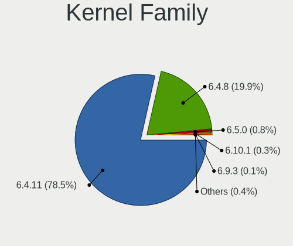

| Version | Desktops | Percent |
|---------|----------|---------|
| 6.4.11  | 568      | 78.78%  |
| 6.4.8   | 141      | 19.56%  |
| 6.5.0   | 8        | 1.11%   |
| 6.6.2   | 1        | 0.14%   |
| 6.6.0   | 1        | 0.14%   |
| 6.5.1   | 1        | 0.14%   |
| 6.3.5   | 1        | 0.14%   |

Kernel Major Ver.
-----------------

Linux kernel major version

| Version | Desktops | Percent |
|---------|----------|---------|
| 6.4     | 709      | 98.34%  |
| 6.5     | 9        | 1.25%   |
| 6.6     | 2        | 0.28%   |
| 6.3     | 1        | 0.14%   |

Arch
----

OS architecture (x86_64, i586, etc.)

| Name   | Desktops | Percent |
|--------|----------|---------|
| x86_64 | 721      | 100%    |

DE
--

Desktop Environment

| Name    | Desktops | Percent |
|---------|----------|---------|
| KDE5    | 592      | 82.11%  |
| GNOME   | 71       | 9.85%   |
| LXQt    | 54       | 7.49%   |
| Budgie  | 3        | 0.42%   |
| Unknown | 1        | 0.14%   |

Display Server
--------------

X11 or Wayland

| Name    | Desktops | Percent |
|---------|----------|---------|
| Wayland | 698      | 96.81%  |
| X11     | 22       | 3.05%   |
| Unknown | 1        | 0.14%   |

Display Manager
---------------

SDDM, LightDM, etc.

| Name | Desktops | Percent |
|------|----------|---------|
| SDDM | 650      | 90.15%  |
| GDM  | 71       | 9.85%   |

OS Lang
-------

Language

| Lang  | Desktops | Percent |
|-------|----------|---------|
| en_US | 330      | 45.77%  |
| de_DE | 57       | 7.91%   |
| pt_BR | 47       | 6.52%   |
| ru_RU | 44       | 6.1%    |
| fr_FR | 40       | 5.55%   |
| en_GB | 30       | 4.16%   |
| pl_PL | 27       | 3.74%   |
| it_IT | 24       | 3.33%   |
| es_ES | 21       | 2.91%   |
| en_CA | 9        | 1.25%   |
| es_MX | 8        | 1.11%   |
| es_VE | 7        | 0.97%   |
| cs_CZ | 7        | 0.97%   |
| hu_HU | 6        | 0.83%   |
| fr_BE | 6        | 0.83%   |
| es_CO | 6        | 0.83%   |
| en_AU | 6        | 0.83%   |
| es_AR | 5        | 0.69%   |
| en_IN | 5        | 0.69%   |
| pt_PT | 4        | 0.55%   |
| tr_TR | 3        | 0.42%   |
| nl_NL | 3        | 0.42%   |
| nl_BE | 2        | 0.28%   |
| fr_CA | 2        | 0.28%   |
| en_ZA | 2        | 0.28%   |
| de_AT | 2        | 0.28%   |
| ar_DZ | 2        | 0.28%   |
| uk_UA | 1        | 0.14%   |
| ro_RO | 1        | 0.14%   |
| ja_JP | 1        | 0.14%   |
| es_UY | 1        | 0.14%   |
| es_PY | 1        | 0.14%   |
| es_CR | 1        | 0.14%   |
| es_CL | 1        | 0.14%   |
| es_BO | 1        | 0.14%   |
| en_SG | 1        | 0.14%   |
| en_NG | 1        | 0.14%   |
| en_IE | 1        | 0.14%   |
| en_HK | 1        | 0.14%   |
| en_DK | 1        | 0.14%   |

Boot Mode
---------

EFI or BIOS

| Mode | Desktops | Percent |
|------|----------|---------|
| EFI  | 387      | 53.68%  |
| BIOS | 334      | 46.32%  |

Filesystem
----------

Type of filesystem

| Type     | Desktops | Percent |
|----------|----------|---------|
| Overlay  | 361      | 50.07%  |
| Ext4     | 314      | 43.55%  |
| Btrfs    | 26       | 3.61%   |
| Xfs      | 6        | 0.83%   |
| Reiserfs | 4        | 0.55%   |
| Jfs      | 3        | 0.42%   |
| F2fs     | 3        | 0.42%   |
| Ext3     | 3        | 0.42%   |
| Ext2     | 1        | 0.14%   |

Part. scheme
------------

Scheme of partitioning

| Type | Desktops | Percent |
|------|----------|---------|
| GPT  | 543      | 75.31%  |
| MBR  | 178      | 24.69%  |

Dual Boot with Linux/BSD
------------------------

Hosting more than one Linux/BSD

| Dual boot | Desktops | Percent |
|-----------|----------|---------|
| Yes       | 376      | 52.15%  |
| No        | 345      | 47.85%  |

Dual Boot (Win)
---------------

Hosting Linux and Windows

| Dual boot | Desktops | Percent |
|-----------|----------|---------|
| No        | 364      | 50.49%  |
| Yes       | 357      | 49.51%  |

Board
-----

Vendor
------

Motherboard manufacturer

| Name                                 | Desktops | Percent |
|--------------------------------------|----------|---------|
| ASUSTek Computer                     | 150      | 20.8%   |
| Gigabyte Technology                  | 117      | 16.23%  |
| MSI                                  | 80       | 11.1%   |
| Hewlett-Packard                      | 71       | 9.85%   |
| ASRock                               | 54       | 7.49%   |
| Dell                                 | 51       | 7.07%   |
| Intel                                | 44       | 6.1%    |
| Lenovo                               | 34       | 4.72%   |
| Fujitsu                              | 16       | 2.22%   |
| Acer                                 | 14       | 1.94%   |
| Foxconn                              | 13       | 1.8%    |
| Pegatron                             | 7        | 0.97%   |
| Biostar                              | 7        | 0.97%   |
| Shenzhen Meigao Electronic Equipment | 6        | 0.83%   |
| AZW                                  | 6        | 0.83%   |
| Medion                               | 5        | 0.69%   |
| ECS                                  | 5        | 0.69%   |
| Unknown                              | 5        | 0.69%   |
| Positivo                             | 4        | 0.55%   |
| OEM                                  | 3        | 0.42%   |
| Shuttle                              | 2        | 0.28%   |
| Red Hat                              | 2        | 0.28%   |
| PCWare                               | 2        | 0.28%   |
| Minix                                | 2        | 0.28%   |
| Megaware                             | 2        | 0.28%   |
| BESSTAR Tech                         | 2        | 0.28%   |
| ViewSonic                            | 1        | 0.14%   |
| Philco                               | 1        | 0.14%   |
| Packard Bell                         | 1        | 0.14%   |
| NEC Computers                        | 1        | 0.14%   |
| MACHINIST                            | 1        | 0.14%   |
| Koloe                                | 1        | 0.14%   |
| Kobian                               | 1        | 0.14%   |
| Itautec                              | 1        | 0.14%   |
| Inventec                             | 1        | 0.14%   |
| Huanan                               | 1        | 0.14%   |
| HC Technology.                       | 1        | 0.14%   |
| EPSON DIRECT                         | 1        | 0.14%   |
| Daten Tecnologia                     | 1        | 0.14%   |
| Casper                               | 1        | 0.14%   |

Model
-----

Motherboard model

| Name                                       | Desktops | Percent |
|--------------------------------------------|----------|---------|
| ASUS All Series                            | 10       | 1.39%   |
| Intel H61                                  | 8        | 1.11%   |
| Intel H81                                  | 6        | 0.83%   |
| Unknown                                    | 6        | 0.83%   |
| MSI MS-7C51                                | 5        | 0.69%   |
| Gigabyte B75M-D3H                          | 5        | 0.69%   |
| Dell OptiPlex 9020                         | 5        | 0.69%   |
| Dell OptiPlex 7010                         | 5        | 0.69%   |
| MSI MS-7C91                                | 4        | 0.55%   |
| Intel X99                                  | 4        | 0.55%   |
| HP Compaq Pro 6300 SFF                     | 4        | 0.55%   |
| MSI MS-7B89                                | 3        | 0.42%   |
| MSI MS-7B86                                | 3        | 0.42%   |
| MSI MS-7817                                | 3        | 0.42%   |
| Intel Jasper Lake Client Platform          | 3        | 0.42%   |
| HP Z400 Workstation                        | 3        | 0.42%   |
| HP EliteDesk 800 G1 USDT                   | 3        | 0.42%   |
| HP Compaq Elite 8300 SFF                   | 3        | 0.42%   |
| Gigabyte X570 AORUS ELITE                  | 3        | 0.42%   |
| Gigabyte X299 AORUS Gaming                 | 3        | 0.42%   |
| Gigabyte B85M-D3H                          | 3        | 0.42%   |
| Gigabyte A320M-H                           | 3        | 0.42%   |
| Dell OptiPlex 3010                         | 3        | 0.42%   |
| ASUS TUF Gaming X570-PLUS                  | 3        | 0.42%   |
| ASUS PRIME A320M-K                         | 3        | 0.42%   |
| ASUS H110M-A/M.2                           | 3        | 0.42%   |
| ASRock B450 Gaming K4                      | 3        | 0.42%   |
| ASRock 970 Pro3 R2.0                       | 3        | 0.42%   |
| Shenzhen Meigao Electronic Equipment UM690 | 2        | 0.28%   |
| Red Hat KVM                                | 2        | 0.28%   |
| OEM Intel H81                              | 2        | 0.28%   |
| MSI MS-7D36                                | 2        | 0.28%   |
| MSI MS-7C52                                | 2        | 0.28%   |
| MSI MS-7A38                                | 2        | 0.28%   |
| MSI MS-7996                                | 2        | 0.28%   |
| MSI MS-7903                                | 2        | 0.28%   |
| MSI MS-7693                                | 2        | 0.28%   |
| Lenovo ThinkCentre M93p 10A6A122LS         | 2        | 0.28%   |
| Intel DG41RQ AAE54511-203                  | 2        | 0.28%   |
| Intel B75                                  | 2        | 0.28%   |

Model Family
------------

Motherboard model prefix

| Name               | Desktops | Percent |
|--------------------|----------|---------|
| ASUS PRIME         | 34       | 4.72%   |
| Dell OptiPlex      | 31       | 4.3%    |
| Lenovo ThinkCentre | 25       | 3.47%   |
| HP Compaq          | 24       | 3.33%   |
| Fujitsu ESPRIMO    | 13       | 1.8%    |
| ASUS TUF           | 12       | 1.66%   |
| HP EliteDesk       | 11       | 1.53%   |
| ASUS All           | 10       | 1.39%   |
| ASUS M5A78L-M      | 9        | 1.25%   |
| Intel H61          | 8        | 1.11%   |
| HP ProDesk         | 8        | 1.11%   |
| Intel H81          | 7        | 0.97%   |
| HP Slim            | 7        | 0.97%   |
| Dell Inspiron      | 7        | 0.97%   |
| Acer Aspire        | 7        | 0.97%   |
| ASUS ROG           | 6        | 0.83%   |
| Acer Veriton       | 6        | 0.83%   |
| Unknown            | 6        | 0.83%   |
| MSI MS-7C51        | 5        | 0.69%   |
| Gigabyte X570      | 5        | 0.69%   |
| Gigabyte B75M-D3H  | 5        | 0.69%   |
| Gigabyte B550      | 5        | 0.69%   |
| Dell Vostro        | 5        | 0.69%   |
| MSI MS-7C91        | 4        | 0.55%   |
| Lenovo IdeaCentre  | 4        | 0.55%   |
| Intel X99          | 4        | 0.55%   |
| Intel DG41RQ       | 4        | 0.55%   |
| HP Pavilion        | 4        | 0.55%   |
| Gigabyte H510M     | 4        | 0.55%   |
| Gigabyte B450M     | 4        | 0.55%   |
| Gigabyte B450      | 4        | 0.55%   |
| ASRock B450        | 4        | 0.55%   |
| MSI MS-7B89        | 3        | 0.42%   |
| MSI MS-7B86        | 3        | 0.42%   |
| MSI MS-7817        | 3        | 0.42%   |
| Intel Jasper       | 3        | 0.42%   |
| HP Z400            | 3        | 0.42%   |
| Gigabyte X299      | 3        | 0.42%   |
| Gigabyte H310M     | 3        | 0.42%   |
| Gigabyte B85M-D3H  | 3        | 0.42%   |

MFG Year
--------

Motherboard manufacture year

| Year | Desktops | Percent |
|------|----------|---------|
| 2012 | 86       | 11.93%  |
| 2014 | 57       | 7.91%   |
| 2013 | 56       | 7.77%   |
| 2018 | 54       | 7.49%   |
| 2020 | 52       | 7.21%   |
| 2011 | 47       | 6.52%   |
| 2010 | 46       | 6.38%   |
| 2019 | 45       | 6.24%   |
| 2017 | 41       | 5.69%   |
| 2022 | 38       | 5.27%   |
| 2021 | 37       | 5.13%   |
| 2016 | 36       | 4.99%   |
| 2009 | 35       | 4.85%   |
| 2023 | 22       | 3.05%   |
| 2015 | 22       | 3.05%   |
| 2007 | 19       | 2.64%   |
| 2008 | 17       | 2.36%   |
| 2006 | 8        | 1.11%   |
| 2005 | 3        | 0.42%   |

Form Factor
-----------

Physical design of the computer

| Name    | Desktops | Percent |
|---------|----------|---------|
| Desktop | 721      | 100%    |

Secure Boot
-----------

Enabled or disabled

| State    | Desktops | Percent |
|----------|----------|---------|
| Disabled | 721      | 100%    |

Coreboot
--------

Have coreboot on board

| Used | Desktops | Percent |
|------|----------|---------|
| No   | 721      | 100%    |

RAM Size
--------

Total RAM memory

| Size in GB  | Desktops | Percent |
|-------------|----------|---------|
| 16.01-24.0  | 166      | 23.02%  |
| 8.01-16.0   | 155      | 21.5%   |
| 4.01-8.0    | 154      | 21.36%  |
| 3.01-4.0    | 95       | 13.18%  |
| 32.01-64.0  | 85       | 11.79%  |
| 64.01-256.0 | 21       | 2.91%   |
| 24.01-32.0  | 17       | 2.36%   |
| 1.01-2.0    | 15       | 2.08%   |
| 2.01-3.0    | 12       | 1.66%   |
| 0.51-1.0    | 1        | 0.14%   |

RAM Used
--------

Used RAM memory

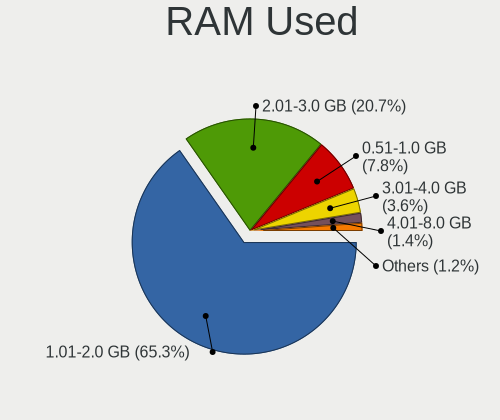

| Used GB   | Desktops | Percent |
|-----------|----------|---------|
| 1.01-2.0  | 461      | 63.85%  |
| 2.01-3.0  | 168      | 23.27%  |
| 0.51-1.0  | 54       | 7.48%   |
| 3.01-4.0  | 26       | 3.6%    |
| 4.01-8.0  | 7        | 0.97%   |
| 0.01-0.5  | 5        | 0.69%   |
| 8.01-16.0 | 1        | 0.14%   |

Total Drives
------------

Number of drives on board

| Drives | Desktops | Percent |
|--------|----------|---------|
| 1      | 326      | 45.21%  |
| 2      | 189      | 26.21%  |
| 3      | 97       | 13.45%  |
| 4      | 50       | 6.93%   |
| 5      | 27       | 3.74%   |
| 6      | 18       | 2.5%    |
| 0      | 6        | 0.83%   |
| 10     | 2        | 0.28%   |
| 8      | 2        | 0.28%   |
| 7      | 2        | 0.28%   |
| 11     | 1        | 0.14%   |
| 9      | 1        | 0.14%   |

Has CD-ROM
----------

Has CD-ROM on board

| Presented | Desktops | Percent |
|-----------|----------|---------|
| Yes       | 373      | 51.73%  |
| No        | 348      | 48.27%  |

Has Ethernet
------------

Has Ethernet on board

| Presented | Desktops | Percent |
|-----------|----------|---------|
| Yes       | 711      | 98.61%  |
| No        | 10       | 1.39%   |

Has WiFi
--------

Has WiFi module

| Presented | Desktops | Percent |
|-----------|----------|---------|
| No        | 443      | 61.44%  |
| Yes       | 278      | 38.56%  |

Has Bluetooth
-------------

Has Bluetooth module

| Presented | Desktops | Percent |
|-----------|----------|---------|
| No        | 521      | 72.26%  |
| Yes       | 200      | 27.74%  |

Location
--------

Country
-------

Geographic location (country)

| Country      | Desktops | Percent |
|--------------|----------|---------|
| USA          | 86       | 11.93%  |
| Germany      | 76       | 10.54%  |
| Brazil       | 71       | 9.85%   |
| Russia       | 54       | 7.49%   |
| France       | 48       | 6.66%   |
| Poland       | 40       | 5.55%   |
| Italy        | 34       | 4.72%   |
| UK           | 29       | 4.02%   |
| Spain        | 27       | 3.74%   |
| Canada       | 19       | 2.64%   |
| Australia    | 15       | 2.08%   |
| Netherlands  | 14       | 1.94%   |
| Mexico       | 12       | 1.66%   |
| Belgium      | 12       | 1.66%   |
| Japan        | 10       | 1.39%   |
| India        | 10       | 1.39%   |
| Hungary      | 10       | 1.39%   |
| Colombia     | 9        | 1.25%   |
| Czechia      | 8        | 1.11%   |
| Venezuela    | 7        | 0.97%   |
| Turkey       | 7        | 0.97%   |
| Argentina    | 7        | 0.97%   |
| Thailand     | 6        | 0.83%   |
| China        | 6        | 0.83%   |
| Austria      | 6        | 0.83%   |
| Greece       | 5        | 0.69%   |
| Ukraine      | 4        | 0.55%   |
| South Africa | 4        | 0.55%   |
| Slovakia     | 4        | 0.55%   |
| Portugal     | 4        | 0.55%   |
| Malaysia     | 4        | 0.55%   |
| Bulgaria     | 4        | 0.55%   |
| Tunisia      | 3        | 0.42%   |
| Serbia       | 3        | 0.42%   |
| Romania      | 3        | 0.42%   |
| Norway       | 3        | 0.42%   |
| Iran         | 3        | 0.42%   |
| Finland      | 3        | 0.42%   |
| Denmark      | 3        | 0.42%   |
| Algeria      | 3        | 0.42%   |

City
----

Geographic location (city)

| City           | Desktops | Percent |
|----------------|----------|---------|
| Warsaw         | 9        | 1.25%   |
| Berlin         | 9        | 1.25%   |
| Moscow         | 8        | 1.11%   |
| Sydney         | 6        | 0.83%   |
| St Petersburg  | 6        | 0.83%   |
| Krakow         | 6        | 0.83%   |
| San Cristbal | 5        | 0.69%   |
| Novosibirsk    | 5        | 0.69%   |
| Milan          | 5        | 0.69%   |
| Melbourne      | 5        | 0.69%   |
| Vienna         | 4        | 0.55%   |
| Sao Paulo      | 4        | 0.55%   |
| Rome           | 4        | 0.55%   |
| Lige         | 4        | 0.55%   |
| Hamburg        | 4        | 0.55%   |
| Athens         | 4        | 0.55%   |
| Tehran         | 3        | 0.42%   |
| Rio de Janeiro | 3        | 0.42%   |
| Porto Alegre   | 3        | 0.42%   |
| Perth          | 3        | 0.42%   |
| Paris          | 3        | 0.42%   |
| Oak Park       | 3        | 0.42%   |
| Istanbul       | 3        | 0.42%   |
| Dresden        | 3        | 0.42%   |
| Cologne        | 3        | 0.42%   |
| Chelyabinsk    | 3        | 0.42%   |
| Braunschweig   | 3        | 0.42%   |
| Braslia      | 3        | 0.42%   |
| Bogot        | 3        | 0.42%   |
| Zaragoza       | 2        | 0.28%   |
| Yekaterinburg  | 2        | 0.28%   |
| Wroclaw        | 2        | 0.28%   |
| Voronezh       | 2        | 0.28%   |
| Vicenza        | 2        | 0.28%   |
| Vallenay       | 2        | 0.28%   |
| Valencia       | 2        | 0.28%   |
| Ufa            | 2        | 0.28%   |
| Tula           | 2        | 0.28%   |
| Trappes        | 2        | 0.28%   |
| Torun          | 2        | 0.28%   |

Drives
------

Drive Vendor
------------

Hard drive vendors

| Vendor                      | Desktops | Drives | Percent |
|-----------------------------|----------|--------|---------|
| WDC                         | 203      | 256    | 16%     |
| Seagate                     | 182      | 224    | 14.34%  |
| Samsung Electronics         | 161      | 204    | 12.69%  |
| Kingston                    | 83       | 91     | 6.54%   |
| Toshiba                     | 74       | 86     | 5.83%   |
| Crucial                     | 63       | 76     | 4.96%   |
| SanDisk                     | 42       | 46     | 3.31%   |
| Hitachi                     | 36       | 36     | 2.84%   |
| China                       | 32       | 36     | 2.52%   |
| A-DATA Technology           | 28       | 30     | 2.21%   |
| Unknown                     | 24       | 45     | 1.89%   |
| SPCC                        | 21       | 22     | 1.65%   |
| Maxtor                      | 17       | 18     | 1.34%   |
| Intel                       | 17       | 17     | 1.34%   |
| Patriot                     | 16       | 16     | 1.26%   |
| GOODRAM                     | 13       | 17     | 1.02%   |
| PNY                         | 12       | 13     | 0.95%   |
| Intenso                     | 12       | 14     | 0.95%   |
| Lexar                       | 11       | 14     | 0.87%   |
| Team                        | 9        | 9      | 0.71%   |
| Kingston Technology Company | 9        | 9      | 0.71%   |
| HGST                        | 9        | 9      | 0.71%   |
| Netac                       | 8        | 8      | 0.63%   |
| Micron Technology           | 8        | 8      | 0.63%   |
| Apacer                      | 8        | 8      | 0.63%   |
| Unknown                     | 8        | 9      | 0.63%   |
| Phison                      | 7        | 8      | 0.55%   |
| OCZ                         | 7        | 7      | 0.55%   |
| JMicron Technology          | 7        | 7      | 0.55%   |
| Fanxiang                    | 7        | 7      | 0.55%   |
| Silicon Motion              | 6        | 7      | 0.47%   |
| Hewlett-Packard             | 6        | 6      | 0.47%   |
| Transcend                   | 5        | 5      | 0.39%   |
| KingSpec                    | 5        | 6      | 0.39%   |
| T-FORCE                     | 4        | 4      | 0.32%   |
| KingFast                    | 4        | 4      | 0.32%   |
| Corsair                     | 4        | 5      | 0.32%   |
| XPG                         | 3        | 3      | 0.24%   |
| WALRAM                      | 3        | 3      | 0.24%   |
| Verbatim                    | 3        | 3      | 0.24%   |

Drive Model
-----------

Hard drive models

| Model                            | Desktops | Percent |
|----------------------------------|----------|---------|
| Seagate ST500DM002-1BD142 500GB  | 21       | 1.46%   |
| Seagate ST1000DM010-2EP102 1TB   | 17       | 1.18%   |
| Kingston SA400S37240G 240GB SSD  | 17       | 1.18%   |
| Kingston SA400S37480G 480GB SSD  | 14       | 0.97%   |
| Toshiba DT01ACA100 1TB           | 12       | 0.83%   |
| Samsung SSD 850 EVO 250GB        | 12       | 0.83%   |
| Seagate ST2000DM008-2FR102 2TB   | 11       | 0.76%   |
| SanDisk NVMe SSD Drive 1TB       | 11       | 0.76%   |
| Crucial CT500MX500SSD1 500GB     | 11       | 0.76%   |
| Crucial CT240BX500SSD1 240GB     | 11       | 0.76%   |
| WDC WD10EZEX-08WN4A0 1TB         | 9        | 0.62%   |
| Samsung SSD 860 EVO 500GB        | 9        | 0.62%   |
| Unknown SD/MMC 2GB               | 8        | 0.56%   |
| Unknown M.S./M.S.Pro/HG 16GB     | 8        | 0.56%   |
| Unknown Compact Flash 977MB      | 8        | 0.56%   |
| Toshiba DT01ACA050 500GB         | 8        | 0.56%   |
| Seagate ST1000DM003-1CH162 1TB   | 8        | 0.56%   |
| Samsung HD322HJ 320GB            | 8        | 0.56%   |
| Kingston SA400S37120G 120GB SSD  | 8        | 0.56%   |
| Unknown                          | 8        | 0.56%   |
| Seagate ST3500418AS 500GB        | 7        | 0.49%   |
| Seagate ST1000DM003-1ER162 1TB   | 7        | 0.49%   |
| Samsung SSD 860 EVO 250GB        | 7        | 0.49%   |
| Samsung SSD 850 EVO 500GB        | 7        | 0.49%   |
| Kingston SV300S37A120G 120GB SSD | 7        | 0.49%   |
| WDC WD10EZEX-00BN5A0 1TB         | 6        | 0.42%   |
| Unknown SD/MMC/MS PRO 256GB      | 6        | 0.42%   |
| Toshiba HDWD110 1TB              | 6        | 0.42%   |
| Seagate ST1000DM003-1SB102 1TB   | 6        | 0.42%   |
| Samsung SSD 870 QVO 1TB          | 6        | 0.42%   |
| WDC WD10EZEX-00WN4A0 1TB         | 5        | 0.35%   |
| Toshiba DT01ACA200 2TB           | 5        | 0.35%   |
| Seagate ST3500312CS 500GB        | 5        | 0.35%   |
| Seagate ST3160815AS 160GB        | 5        | 0.35%   |
| Seagate ST2000DM001-1ER164 2TB   | 5        | 0.35%   |
| Seagate ST2000DM001-1CH164 2TB   | 5        | 0.35%   |
| SanDisk NVMe SSD Drive 500GB     | 5        | 0.35%   |
| Samsung SSD 970 EVO Plus 500GB   | 5        | 0.35%   |
| Samsung SSD 870 EVO 500GB        | 5        | 0.35%   |
| Samsung HD103UJ 1TB              | 5        | 0.35%   |

HDD Vendor
----------

Hard disk drive vendors

| Vendor              | Desktops | Drives | Percent |
|---------------------|----------|--------|---------|
| Seagate             | 181      | 223    | 32.04%  |
| WDC                 | 179      | 216    | 31.68%  |
| Toshiba             | 69       | 80     | 12.21%  |
| Samsung Electronics | 46       | 49     | 8.14%   |
| Hitachi             | 36       | 36     | 6.37%   |
| Maxtor              | 16       | 17     | 2.83%   |
| HGST                | 9        | 9      | 1.59%   |
| Unknown             | 7        | 7      | 1.24%   |
| JMicron Technology  | 6        | 6      | 1.06%   |
| Fujitsu             | 3        | 4      | 0.53%   |
| Apple               | 3        | 3      | 0.53%   |
| Min Yi U            | 2        | 2      | 0.35%   |
| ExcelStor           | 2        | 2      | 0.35%   |
| WD MediaMax         | 1        | 1      | 0.18%   |
| SSK                 | 1        | 1      | 0.18%   |
| Intenso             | 1        | 1      | 0.18%   |
| IB-AC703            | 1        | 1      | 0.18%   |
| DAS                 | 1        | 4      | 0.18%   |
| Unknown             | 1        | 2      | 0.18%   |

SSD Vendor
----------

Solid state drive vendors

| Vendor              | Desktops | Drives | Percent |
|---------------------|----------|--------|---------|
| Samsung Electronics | 83       | 99     | 16.18%  |
| Kingston            | 65       | 71     | 12.67%  |
| Crucial             | 51       | 54     | 9.94%   |
| China               | 32       | 36     | 6.24%   |
| WDC                 | 23       | 26     | 4.48%   |
| SanDisk             | 23       | 25     | 4.48%   |
| A-DATA Technology   | 21       | 22     | 4.09%   |
| SPCC                | 17       | 17     | 3.31%   |
| Patriot             | 15       | 15     | 2.92%   |
| GOODRAM             | 13       | 17     | 2.53%   |
| PNY                 | 12       | 13     | 2.34%   |
| Intenso             | 11       | 13     | 2.14%   |
| Intel               | 10       | 10     | 1.95%   |
| OCZ                 | 7        | 7      | 1.36%   |
| Unknown             | 7        | 7      | 1.36%   |
| Team                | 6        | 6      | 1.17%   |
| Micron Technology   | 6        | 6      | 1.17%   |
| Lexar               | 6        | 7      | 1.17%   |
| Transcend           | 5        | 5      | 0.97%   |
| Toshiba             | 5        | 5      | 0.97%   |
| KingSpec            | 5        | 6      | 0.97%   |
| Hewlett-Packard     | 5        | 5      | 0.97%   |
| Apacer              | 5        | 5      | 0.97%   |
| Netac               | 4        | 4      | 0.78%   |
| KingFast            | 4        | 4      | 0.78%   |
| Verbatim            | 3        | 3      | 0.58%   |
| USB3.0              | 3        | 3      | 0.58%   |
| T-FORCE             | 3        | 3      | 0.58%   |
| INNOVATION IT       | 3        | 3      | 0.58%   |
| HS-SSD-C100         | 3        | 3      | 0.58%   |
| Fanxiang            | 3        | 3      | 0.58%   |
| Emtec               | 3        | 3      | 0.58%   |
| WALRAM              | 2        | 2      | 0.39%   |
| Vaseky              | 2        | 2      | 0.39%   |
| Plextor             | 2        | 2      | 0.39%   |
| KIOXIA-EXCERIA      | 2        | 2      | 0.39%   |
| Kingchuxing         | 2        | 2      | 0.39%   |
| HS-SSD-E100         | 2        | 2      | 0.39%   |
| AMD                 | 2        | 2      | 0.39%   |
| Zheino              | 1        | 1      | 0.19%   |

Drive Kind
----------

HDD or SSD

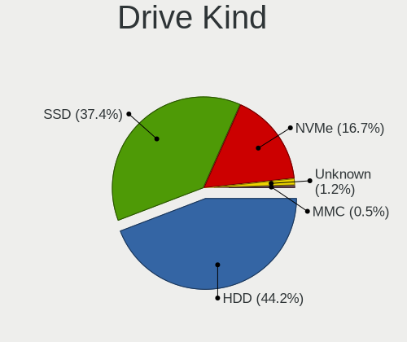

| Kind    | Desktops | Drives | Percent |
|---------|----------|--------|---------|
| HDD     | 441      | 664    | 42%     |
| SSD     | 412      | 557    | 39.24%  |
| NVMe    | 177      | 232    | 16.86%  |
| Unknown | 16       | 34     | 1.52%   |
| MMC     | 4        | 5      | 0.38%   |

Drive Connector
---------------

SATA, SAS, NVMe, etc.

| Type | Desktops | Drives | Percent |
|------|----------|--------|---------|
| SATA | 649      | 1176   | 73.17%  |
| NVMe | 176      | 230    | 19.84%  |
| SAS  | 58       | 81     | 6.54%   |
| MMC  | 4        | 5      | 0.45%   |

Drive Size
----------

Size of hard drive

| Size in TB | Desktops | Drives | Percent |
|------------|----------|--------|---------|
| 0.01-0.5   | 501      | 728    | 56.48%  |
| 0.51-1.0   | 258      | 328    | 29.09%  |
| 1.01-2.0   | 74       | 89     | 8.34%   |
| 2.01-3.0   | 20       | 24     | 2.25%   |
| 3.01-4.0   | 19       | 27     | 2.14%   |
| 4.01-10.0  | 11       | 18     | 1.24%   |
| 10.01-20.0 | 4        | 7      | 0.45%   |

Space Total
-----------

Amount of disk space available on the file system

| Size in GB     | Desktops | Percent |
|----------------|----------|---------|
| 1-20           | 245      | 33.93%  |
| 101-250        | 140      | 19.39%  |
| 251-500        | 102      | 14.13%  |
| 501-1000       | 62       | 8.59%   |
| 51-100         | 48       | 6.65%   |
| Unknown        | 43       | 5.96%   |
| 1001-2000      | 31       | 4.29%   |
| 21-50          | 29       | 4.02%   |
| More than 3000 | 12       | 1.66%   |
| 2001-3000      | 10       | 1.39%   |

Space Used
----------

Amount of used disk space

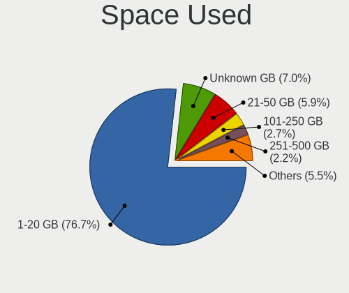

| Used GB        | Desktops | Percent |
|----------------|----------|---------|
| 1-20           | 554      | 76.84%  |
| Unknown        | 43       | 5.96%   |
| 21-50          | 42       | 5.83%   |
| 101-250        | 24       | 3.33%   |
| 251-500        | 15       | 2.08%   |
| 51-100         | 15       | 2.08%   |
| 501-1000       | 13       | 1.8%    |
| 1001-2000      | 8        | 1.11%   |
| More than 3000 | 5        | 0.69%   |
| 2001-3000      | 2        | 0.28%   |

Malfunc. Drives
---------------

Drive models with a malfunction

| Model                             | Desktops | Drives | Percent |
|-----------------------------------|----------|--------|---------|
| Seagate ST500DM002-1BD142 500GB   | 9        | 9      | 3.59%   |
| Seagate ST3500418AS 500GB         | 5        | 5      | 1.99%   |
| Seagate ST1000DM010-2EP102 1TB    | 4        | 5      | 1.59%   |
| Samsung Electronics HD322HJ 320GB | 4        | 4      | 1.59%   |
| Hitachi HTS543225L9A300 250GB     | 4        | 4      | 1.59%   |
| Toshiba DT01ACA050 500GB          | 3        | 3      | 1.2%    |
| Seagate ST1000DM003-1CH162 1TB    | 3        | 3      | 1.2%    |
| Samsung Electronics HD502HJ 500GB | 3        | 3      | 1.2%    |
| Samsung Electronics HD103UJ 1TB   | 3        | 3      | 1.2%    |
| Maxtor STM380815AS 80GB           | 3        | 3      | 1.2%    |
| WDC WD5000AVCS-632DY1 500GB       | 2        | 2      | 0.8%    |
| WDC WD5000AAKX-75U6AA0 500GB      | 2        | 2      | 0.8%    |
| WDC WD5000AAKX-08U6AA0 500GB      | 2        | 2      | 0.8%    |
| WDC WD3200AAJS-56M0A0 320GB       | 2        | 2      | 0.8%    |
| WDC WD3200AAJS-56B4A0 320GB       | 2        | 2      | 0.8%    |
| WDC WD3200AAJS-00L7A0 320GB       | 2        | 2      | 0.8%    |
| WDC WD10EZEX-60M2NA0 1TB          | 2        | 2      | 0.8%    |
| WDC WD10EARS-00Y5B1 1TB           | 2        | 2      | 0.8%    |
| Toshiba MK3259GSXP 320GB          | 2        | 2      | 0.8%    |
| Toshiba DT01ACA100 1TB            | 2        | 2      | 0.8%    |
| Seagate ST500LT012-9WS142 500GB   | 2        | 2      | 0.8%    |
| Seagate ST3500312CS 500GB         | 2        | 2      | 0.8%    |
| Seagate ST250DM000-1BD141 250GB   | 2        | 2      | 0.8%    |
| SanDisk SDSSDX240GG25 240GB       | 2        | 2      | 0.8%    |
| Samsung Electronics HD320KJ 320GB | 2        | 3      | 0.8%    |
| Samsung Electronics HD161HJ 160GB | 2        | 2      | 0.8%    |
| Samsung Electronics HD103SJ 1TB   | 2        | 2      | 0.8%    |
| Maxtor STM3160215AS 160GB         | 2        | 2      | 0.8%    |
| Kingston SV300S37A120G 120GB SSD  | 2        | 2      | 0.8%    |
| Hitachi HDS721050CLA362 500GB     | 2        | 2      | 0.8%    |
| XPG GAMMIX S5 512GB               | 1        | 1      | 0.4%    |
| WDC WDS480G2G0A-00JH30 480GB SSD  | 1        | 1      | 0.4%    |
| WDC WDS240G2G0A-00JH30 240GB SSD  | 1        | 1      | 0.4%    |
| WDC WD800AAJB-00J3A0 80GB         | 1        | 1      | 0.4%    |
| WDC WD7500AADS-00M2B0 752GB       | 1        | 1      | 0.4%    |
| WDC WD6402AAEX-00Y9A0 640GB       | 1        | 1      | 0.4%    |
| WDC WD6400AAKS-22A7B2 640GB       | 1        | 1      | 0.4%    |
| WDC WD6400AAKS-22A7B0 640GB       | 1        | 1      | 0.4%    |
| WDC WD60EFRX-68MYMN1 6TB          | 1        | 1      | 0.4%    |
| WDC WD5000LPVX-80V0TT0 500GB      | 1        | 1      | 0.4%    |

Malfunc. Drive Vendor
---------------------

Vendors of faulty drives

| Vendor              | Desktops | Drives | Percent |
|---------------------|----------|--------|---------|
| WDC                 | 62       | 66     | 25.31%  |
| Seagate             | 60       | 63     | 24.49%  |
| Samsung Electronics | 30       | 31     | 12.24%  |
| Hitachi             | 23       | 23     | 9.39%   |
| Toshiba             | 18       | 19     | 7.35%   |
| Maxtor              | 12       | 12     | 4.9%    |
| SanDisk             | 5        | 5      | 2.04%   |
| Kingston            | 5        | 5      | 2.04%   |
| China               | 4        | 4      | 1.63%   |
| A-DATA Technology   | 4        | 4      | 1.63%   |
| SPCC                | 3        | 3      | 1.22%   |
| Netac               | 2        | 2      | 0.82%   |
| Micron Technology   | 2        | 2      | 0.82%   |
| XPG                 | 1        | 1      | 0.41%   |
| Reeinno             | 1        | 1      | 0.41%   |
| PNY                 | 1        | 1      | 0.41%   |
| Plextor             | 1        | 1      | 0.41%   |
| KingDian            | 1        | 1      | 0.41%   |
| JMicron Technology  | 1        | 1      | 0.41%   |
| Intenso             | 1        | 1      | 0.41%   |
| Intel               | 1        | 1      | 0.41%   |
| INNOVATION IT       | 1        | 1      | 0.41%   |
| Fujitsu             | 1        | 1      | 0.41%   |
| ExcelStor           | 1        | 1      | 0.41%   |
| EX276687RUS         | 1        | 1      | 0.41%   |
| Crucial             | 1        | 1      | 0.41%   |
| C300-CTF            | 1        | 1      | 0.41%   |
| C-S12               | 1        | 1      | 0.41%   |

Malfunc. HDD Vendor
-------------------

Vendors of faulty HDD drives

| Vendor              | Desktops | Drives | Percent |
|---------------------|----------|--------|---------|
| Seagate             | 60       | 63     | 29.85%  |
| WDC                 | 58       | 62     | 28.86%  |
| Samsung Electronics | 27       | 28     | 13.43%  |
| Hitachi             | 23       | 23     | 11.44%  |
| Toshiba             | 18       | 19     | 8.96%   |
| Maxtor              | 12       | 12     | 5.97%   |
| JMicron Technology  | 1        | 1      | 0.5%    |
| Fujitsu             | 1        | 1      | 0.5%    |
| ExcelStor           | 1        | 1      | 0.5%    |

Malfunc. Drive Kind
-------------------

Kinds of faulty drives

| Kind | Desktops | Drives | Percent |
|------|----------|--------|---------|
| HDD  | 173      | 210    | 80.47%  |
| SSD  | 38       | 40     | 17.67%  |
| NVMe | 4        | 4      | 1.86%   |

Failed Drives
-------------

Failed drive models

| Model                        | Desktops | Drives | Percent |
|------------------------------|----------|--------|---------|
| WDC WD3200BPVT-22JJ5T0 320GB | 1        | 1      | 20%     |
| WDC WD10EZEX-00BN5A0 1TB     | 1        | 1      | 20%     |
| Seagate ST3320613AS 320GB    | 1        | 1      | 20%     |
| Seagate ST3250318AS 250GB    | 1        | 1      | 20%     |
| Seagate ST31000528AS 1TB     | 1        | 1      | 20%     |

Failed Drive Vendor
-------------------

Failed drive vendors

| Vendor  | Desktops | Drives | Percent |
|---------|----------|--------|---------|
| Seagate | 3        | 3      | 60%     |
| WDC     | 2        | 2      | 40%     |

Drive Status
------------

Number of failed and malfunc. drives

| Status   | Desktops | Drives | Percent |
|----------|----------|--------|---------|
| Works    | 601      | 1128   | 67.38%  |
| Malfunc  | 208      | 254    | 23.32%  |
| Detected | 78       | 105    | 8.74%   |
| Failed   | 5        | 5      | 0.56%   |

Storage controller
------------------

Storage Vendor
--------------

Storage controller vendors

| Vendor                           | Desktops | Percent |
|----------------------------------|----------|---------|
| Intel                            | 478      | 49.13%  |
| AMD                              | 215      | 22.1%   |
| Samsung Electronics              | 48       | 4.93%   |
| Sandisk                          | 34       | 3.49%   |
| Kingston Technology Company      | 29       | 2.98%   |
| Phison Electronics               | 22       | 2.26%   |
| ASMedia Technology               | 22       | 2.26%   |
| JMicron Technology               | 19       | 1.95%   |
| Nvidia                           | 18       | 1.85%   |
| Marvell Technology Group         | 15       | 1.54%   |
| Silicon Motion                   | 14       | 1.44%   |
| Micron/Crucial Technology        | 14       | 1.44%   |
| MAXIO Technology (Hangzhou)      | 13       | 1.34%   |
| Realtek Semiconductor            | 6        | 0.62%   |
| ADATA Technology                 | 5        | 0.51%   |
| VIA Technologies                 | 4        | 0.41%   |
| Micron Technology                | 3        | 0.31%   |
| Shenzhen Longsys Electronics     | 2        | 0.21%   |
| Netac Technology                 | 2        | 0.21%   |
| LSI Logic / Symbios Logic        | 2        | 0.21%   |
| KIOXIA                           | 2        | 0.21%   |
| Toshiba America Info Systems     | 1        | 0.1%    |
| Silicon Integrated Systems [SiS] | 1        | 0.1%    |
| Seagate Technology               | 1        | 0.1%    |
| Integrated Technology Express    | 1        | 0.1%    |
| INNOGRIT                         | 1        | 0.1%    |
| Broadcom / LSI                   | 1        | 0.1%    |

Storage Model
-------------

Storage controller models

| Model                                                                                   | Desktops | Percent |
|-----------------------------------------------------------------------------------------|----------|---------|
| AMD FCH SATA Controller [AHCI mode]                                                     | 104      | 8.6%    |
| Intel 8 Series/C220 Series Chipset Family 6-port SATA Controller 1 [AHCI mode]          | 67       | 5.54%   |
| Intel NM10/ICH7 Family SATA Controller [IDE mode]                                       | 47       | 3.89%   |
| Intel 7 Series/C210 Series Chipset Family 6-port SATA Controller [AHCI mode]            | 43       | 3.56%   |
| AMD 400 Series Chipset SATA Controller                                                  | 42       | 3.47%   |
| Intel 6 Series/C200 Series Chipset Family 6 port Desktop SATA AHCI Controller           | 40       | 3.31%   |
| Intel Q170/Q150/B150/H170/H110/Z170/CM236 Chipset SATA Controller [AHCI Mode]           | 34       | 2.81%   |
| Intel 82801G (ICH7 Family) IDE Controller                                               | 33       | 2.73%   |
| Samsung NVMe SSD Controller SM981/PM981/PM983                                           | 31       | 2.56%   |
| AMD SB7x0/SB8x0/SB9x0 IDE Controller                                                    | 30       | 2.48%   |
| Intel 200 Series PCH SATA controller [AHCI mode]                                        | 29       | 2.4%    |
| AMD 500 Series Chipset SATA Controller                                                  | 29       | 2.4%    |
| AMD SB7x0/SB8x0/SB9x0 SATA Controller [AHCI mode]                                       | 26       | 2.15%   |
| AMD FCH SATA Controller D                                                               | 26       | 2.15%   |
| AMD SB7x0/SB8x0/SB9x0 SATA Controller [IDE mode]                                        | 23       | 1.9%    |
| Intel 6 Series/C200 Series Chipset Family Desktop SATA Controller (IDE mode, ports 4-5) | 21       | 1.74%   |
| Intel 6 Series/C200 Series Chipset Family Desktop SATA Controller (IDE mode, ports 0-3) | 21       | 1.74%   |
| ASMedia ASM1061/ASM1062 Serial ATA Controller                                           | 20       | 1.65%   |
| Intel SATA Controller [RAID mode]                                                       | 17       | 1.41%   |
| Intel 500 Series Chipset Family SATA AHCI Controller                                    | 15       | 1.24%   |
| Intel Cannon Lake PCH SATA AHCI Controller                                              | 14       | 1.16%   |
| Intel Alder Lake-S PCH SATA Controller [AHCI Mode]                                      | 14       | 1.16%   |
| Intel 5 Series/3400 Series Chipset 6 port SATA AHCI Controller                          | 14       | 1.16%   |
| Silicon Motion SM2263EN/SM2263XT (DRAM-less) NVMe SSD Controllers                       | 12       | 0.99%   |
| Intel 9 Series Chipset Family SATA Controller [AHCI Mode]                               | 12       | 0.99%   |
| Intel 400 Series Chipset Family SATA AHCI Controller                                    | 11       | 0.91%   |
| Nvidia MCP61 SATA Controller                                                            | 10       | 0.83%   |
| Micron/Crucial P2 [Nick P2] / P3 / P3 Plus NVMe PCIe SSD (DRAM-less)                    | 10       | 0.83%   |
| MAXIO (Hangzhou) NVMe SSD Controller MAP1202 (DRAM-less)                                | 10       | 0.83%   |
| Kingston Company NV2 NVMe SSD SM2267XT (DRAM-less)                                      | 10       | 0.83%   |
| JMicron JMB363 SATA/IDE Controller                                                      | 10       | 0.83%   |
| SanDisk Ultra 3D / WD Blue SN570 NVMe SSD (DRAM-less)                                   | 9        | 0.74%   |
| Samsung NVMe SSD Controller 980 (DRAM-less)                                             | 9        | 0.74%   |
| Phison PS5013-E13 PCIe3 NVMe Controller (DRAM-less)                                     | 9        | 0.74%   |
| Phison E12 NVMe Controller                                                              | 9        | 0.74%   |
| Nvidia MCP61 IDE                                                                        | 9        | 0.74%   |
| SanDisk WD Black SN770 / PC SN740 256GB / PC SN560 (DRAM-less) NVMe SSD                 | 8        | 0.66%   |
| JMicron JMB368 IDE controller                                                           | 8        | 0.66%   |
| SanDisk Ultra 3D / WD Blue SN550 NVMe SSD                                               | 7        | 0.58%   |
| Samsung NVMe SSD Controller PM9A1/PM9A3/980PRO                                          | 7        | 0.58%   |

Storage Kind
------------

Kind of storage controller (IDE, SATA, NVMe, SAS, ...)

| Kind | Desktops | Percent |
|------|----------|---------|
| SATA | 570      | 59.25%  |
| IDE  | 182      | 18.92%  |
| NVMe | 177      | 18.4%   |
| RAID | 28       | 2.91%   |
| SAS  | 5        | 0.52%   |

Processor
---------

CPU Vendor
----------

Processor vendors

| Vendor | Desktops | Percent |
|--------|----------|---------|
| Intel  | 487      | 67.55%  |
| AMD    | 234      | 32.45%  |

CPU Model
---------

Processor models

| Model                                       | Desktops | Percent |
|---------------------------------------------|----------|---------|
| Intel Core i5-3470 CPU @ 3.20GHz            | 18       | 2.5%    |
| Intel Core i5-10400 CPU @ 2.90GHz           | 12       | 1.66%   |
| AMD Ryzen 5 5600G with Radeon Graphics      | 12       | 1.66%   |
| AMD Ryzen 5 3600 6-Core Processor           | 12       | 1.66%   |
| Intel Core i5-2400 CPU @ 3.10GHz            | 11       | 1.53%   |
| Intel Core i5-4570 CPU @ 3.20GHz            | 10       | 1.39%   |
| Intel Core i7-4790 CPU @ 3.60GHz            | 9        | 1.25%   |
| Intel Core i3-2100 CPU @ 3.10GHz            | 8        | 1.11%   |
| AMD FX-8350 Eight-Core Processor            | 8        | 1.11%   |
| Intel Core i7-3770 CPU @ 3.40GHz            | 7        | 0.97%   |
| Intel Core i7-2600 CPU @ 3.40GHz            | 7        | 0.97%   |
| Intel Core i5-7400 CPU @ 3.00GHz            | 7        | 0.97%   |
| Intel Core i5-3570 CPU @ 3.40GHz            | 7        | 0.97%   |
| Intel Core i3-2120 CPU @ 3.30GHz            | 7        | 0.97%   |
| AMD Ryzen 7 5700G with Radeon Graphics      | 7        | 0.97%   |
| AMD Ryzen 7 3700X 8-Core Processor          | 7        | 0.97%   |
| AMD Ryzen 5 2600 Six-Core Processor         | 7        | 0.97%   |
| Intel Core i7-4790K CPU @ 4.00GHz           | 6        | 0.83%   |
| Intel Core i5-4590 CPU @ 3.30GHz            | 6        | 0.83%   |
| Intel Core i5-4440 CPU @ 3.10GHz            | 6        | 0.83%   |
| Intel Core 2 Duo CPU E8400 @ 3.00GHz        | 6        | 0.83%   |
| Intel Core 2 Duo CPU E7500 @ 2.93GHz        | 6        | 0.83%   |
| AMD Ryzen 9 5900X 12-Core Processor         | 6        | 0.83%   |
| AMD Ryzen 5 5600X 6-Core Processor          | 6        | 0.83%   |
| AMD Ryzen 3 3200G with Radeon Vega Graphics | 6        | 0.83%   |
| Intel Pentium Dual-Core CPU E5300 @ 2.60GHz | 5        | 0.69%   |
| Intel Core i5-6500 CPU @ 3.20GHz            | 5        | 0.69%   |
| Intel Core i5-3330 CPU @ 3.00GHz            | 5        | 0.69%   |
| Intel Core i5-2500K CPU @ 3.30GHz           | 5        | 0.69%   |
| Intel Core i3-3220 CPU @ 3.30GHz            | 5        | 0.69%   |
| Intel Core i3-10100 CPU @ 3.60GHz           | 5        | 0.69%   |
| Intel Core 2 Quad CPU Q8300 @ 2.50GHz       | 5        | 0.69%   |
| Intel Celeron N5105 @ 2.00GHz               | 5        | 0.69%   |
| AMD Ryzen 3 2200G with Radeon Vega Graphics | 5        | 0.69%   |
| AMD FX-6300 Six-Core Processor              | 5        | 0.69%   |
| AMD Athlon II X2 250 Processor              | 5        | 0.69%   |
| Intel Pentium Dual-Core CPU E5800 @ 3.20GHz | 4        | 0.55%   |
| Intel Pentium CPU G3220 @ 3.00GHz           | 4        | 0.55%   |
| Intel Core i7-6700 CPU @ 3.40GHz            | 4        | 0.55%   |
| Intel Core i5-4570S CPU @ 2.90GHz           | 4        | 0.55%   |

CPU Model Family
----------------

Processor model prefix

| Model                   | Desktops | Percent |
|-------------------------|----------|---------|
| Intel Core i5           | 160      | 22.19%  |
| Intel Core i7           | 72       | 9.99%   |
| Intel Core i3           | 72       | 9.99%   |
| AMD Ryzen 5             | 62       | 8.6%    |
| Other                   | 31       | 4.3%    |
| AMD Ryzen 7             | 29       | 4.02%   |
| Intel Core 2 Duo        | 27       | 3.74%   |
| AMD FX                  | 26       | 3.61%   |
| Intel Celeron           | 24       | 3.33%   |
| Intel Xeon              | 23       | 3.19%   |
| Intel Pentium Dual-Core | 21       | 2.91%   |
| Intel Pentium           | 19       | 2.64%   |
| AMD Ryzen 3             | 19       | 2.64%   |
| Intel Core 2 Quad       | 17       | 2.36%   |
| AMD Ryzen 9             | 15       | 2.08%   |
| AMD Athlon II X2        | 10       | 1.39%   |
| AMD A8                  | 10       | 1.39%   |
| AMD A6                  | 8        | 1.11%   |
| AMD Phenom II X4        | 7        | 0.97%   |
| AMD Athlon 64 X2        | 7        | 0.97%   |
| Intel Atom              | 6        | 0.83%   |
| AMD A4                  | 6        | 0.83%   |
| AMD A10                 | 6        | 0.83%   |
| Intel Pentium Gold      | 3        | 0.42%   |
| Intel Pentium D         | 3        | 0.42%   |
| Intel Core 2            | 3        | 0.42%   |
| AMD Ryzen 5 PRO         | 3        | 0.42%   |
| AMD PRO A10             | 3        | 0.42%   |
| AMD E                   | 3        | 0.42%   |
| Intel Pentium Dual      | 2        | 0.28%   |
| Intel Core i9           | 2        | 0.28%   |
| AMD Phenom II X3        | 2        | 0.28%   |
| AMD Athlon II X4        | 2        | 0.28%   |
| AMD Athlon 64           | 2        | 0.28%   |
| AMD Athlon              | 2        | 0.28%   |
| Intel Pentium Silver    | 1        | 0.14%   |
| Intel Pentium 4         | 1        | 0.14%   |
| Intel Genuine           | 1        | 0.14%   |
| AMD Sempron             | 1        | 0.14%   |
| AMD Ryzen 7 PRO         | 1        | 0.14%   |

CPU Cores
---------

Number of processor cores

| Number | Desktops | Percent |
|--------|----------|---------|
| 4      | 320      | 44.38%  |
| 2      | 207      | 28.71%  |
| 6      | 95       | 13.18%  |
| 8      | 46       | 6.38%   |
| 12     | 16       | 2.22%   |
| 1      | 16       | 2.22%   |
| 3      | 8        | 1.11%   |
| 10     | 5        | 0.69%   |
| 16     | 3        | 0.42%   |
| 14     | 3        | 0.42%   |
| 36     | 1        | 0.14%   |
| 5      | 1        | 0.14%   |

CPU Sockets
-----------

Number of sockets

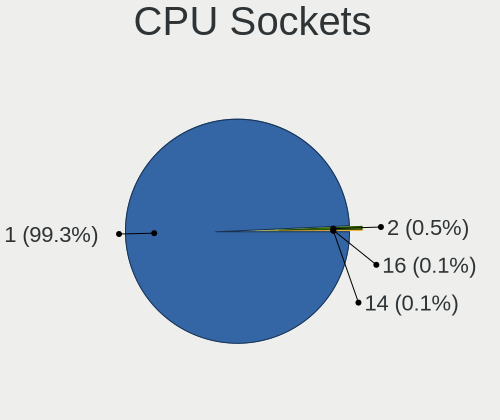

| Number | Desktops | Percent |
|--------|----------|---------|
| 1      | 717      | 99.45%  |
| 2      | 2        | 0.28%   |
| 16     | 1        | 0.14%   |
| 14     | 1        | 0.14%   |

CPU Threads
-----------

Threads per core (Hyper-Threading)

| Number | Desktops | Percent |
|--------|----------|---------|
| 2      | 371      | 51.46%  |
| 1      | 349      | 48.4%   |
| 12     | 1        | 0.14%   |

CPU Op-Modes
------------

CPU Operation Modes (32-bit, 64-bit)

| Op mode        | Desktops | Percent |
|----------------|----------|---------|
| 32-bit, 64-bit | 721      | 100%    |

CPU Microcode
-------------

Microcode number

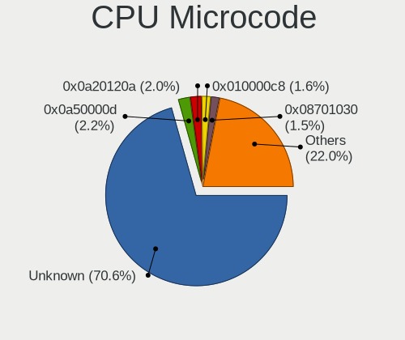

| Number     | Desktops | Percent |
|------------|----------|---------|
| Unknown    | 501      | 69.49%  |
| 0x0a50000d | 17       | 2.36%   |
| 0x08701030 | 16       | 2.22%   |
| 0x08108109 | 15       | 2.08%   |
| 0x0a20120a | 14       | 1.94%   |
| 0x010000c8 | 14       | 1.94%   |
| 0x06000822 | 11       | 1.53%   |
| 0x08701021 | 10       | 1.39%   |
| 0x0800820d | 10       | 1.39%   |
| 0x06001119 | 9        | 1.25%   |
| 0x06003106 | 8        | 1.11%   |
| 0x06000817 | 7        | 0.97%   |
| 0x0600611a | 6        | 0.83%   |
| 0x0600081c | 6        | 0.83%   |
| 0x08001138 | 5        | 0.69%   |
| 0x0a50000c | 4        | 0.55%   |
| 0x0a404102 | 4        | 0.55%   |
| 0x0a201025 | 4        | 0.55%   |
| 0x08600106 | 4        | 0.55%   |
| 0x08101016 | 4        | 0.55%   |
| 0x05000028 | 3        | 0.42%   |
| 0x010000b6 | 3        | 0.42%   |
| 0x0a601206 | 2        | 0.28%   |
| 0x0a601203 | 2        | 0.28%   |
| 0x08600109 | 2        | 0.28%   |
| 0x0810100b | 2        | 0.28%   |
| 0x0800820b | 2        | 0.28%   |
| 0x07030105 | 2        | 0.28%   |
| 0x06006705 | 2        | 0.28%   |
| 0x06003104 | 2        | 0.28%   |
| 0x05000101 | 2        | 0.28%   |
| 0x03000027 | 2        | 0.28%   |
| 0x03000014 | 2        | 0.28%   |
| 0x010000c6 | 2        | 0.28%   |
| 0x01000086 | 2        | 0.28%   |
| 0x00000000 | 2        | 0.28%   |
| 0x0a704101 | 1        | 0.14%   |
| 0x0a20120e | 1        | 0.14%   |
| 0x0a201205 | 1        | 0.14%   |
| 0x0a201016 | 1        | 0.14%   |

CPU Microarch
-------------

Microarchitecture

| Name             | Desktops | Percent |
|------------------|----------|---------|
| Haswell          | 94       | 13.04%  |
| IvyBridge        | 69       | 9.57%   |
| SandyBridge      | 54       | 7.49%   |
| Penryn           | 54       | 7.49%   |
| KabyLake         | 51       | 7.07%   |
| Zen 3            | 44       | 6.1%    |
| Zen 2            | 34       | 4.72%   |
| Piledriver       | 34       | 4.72%   |
| CometLake        | 31       | 4.3%    |
| Zen+             | 30       | 4.16%   |
| Skylake          | 30       | 4.16%   |
| K10              | 23       | 3.19%   |
| Core             | 18       | 2.5%    |
| Alderlake Hybrid | 18       | 2.5%    |
| Nehalem          | 15       | 2.08%   |
| Zen              | 14       | 1.94%   |
| Westmere         | 13       | 1.8%    |
| K8 Hammer        | 12       | 1.66%   |
| Unknown          | 12       | 1.66%   |
| Steamroller      | 11       | 1.53%   |
| Silvermont       | 10       | 1.39%   |
| Excavator        | 8        | 1.11%   |
| Icelake          | 7        | 0.97%   |
| Gracemont        | 6        | 0.83%   |
| Tremont          | 5        | 0.69%   |
| Bobcat           | 5        | 0.69%   |
| NetBurst         | 4        | 0.55%   |
| K10 Llano        | 4        | 0.55%   |
| Puma             | 3        | 0.42%   |
| Bonnell          | 3        | 0.42%   |
| Broadwell        | 2        | 0.28%   |
| Jaguar           | 1        | 0.14%   |
| Goldmont plus    | 1        | 0.14%   |
| Bulldozer        | 1        | 0.14%   |

Graphics
--------

GPU Vendor
----------

Vendors of graphics cards

| Vendor            | Desktops | Percent |
|-------------------|----------|---------|
| Intel             | 276      | 36.95%  |
| Nvidia            | 235      | 31.46%  |
| AMD               | 231      | 30.92%  |
| Red Hat           | 2        | 0.27%   |
| ATI Technologies  | 2        | 0.27%   |
| ASPEED Technology | 1        | 0.13%   |

GPU Model
---------

Graphics card models

| Model                                                                       | Desktops | Percent |
|-----------------------------------------------------------------------------|----------|---------|
| Intel Xeon E3-1200 v3/4th Gen Core Processor Integrated Graphics Controller | 46       | 6.04%   |
| Intel 2nd Generation Core Processor Family Integrated Graphics Controller   | 32       | 4.2%    |
| Intel Xeon E3-1200 v2/3rd Gen Core processor Graphics Controller            | 31       | 4.07%   |
| AMD Ellesmere [Radeon RX 470/480/570/570X/580/580X/590]                     | 22       | 2.89%   |
| Nvidia GK208B [GeForce GT 710]                                              | 19       | 2.5%    |
| Nvidia GP107 [GeForce GTX 1050 Ti]                                          | 16       | 2.1%    |
| Intel HD Graphics 530                                                       | 16       | 2.1%    |
| Intel 4 Series Chipset Integrated Graphics Controller                       | 16       | 2.1%    |
| Intel CometLake-S GT2 [UHD Graphics 630]                                    | 15       | 1.97%   |
| AMD Cezanne [Radeon Vega Series / Radeon Vega Mobile Series]                | 15       | 1.97%   |
| Intel CoffeeLake-S GT2 [UHD Graphics 630]                                   | 14       | 1.84%   |
| Nvidia GP108 [GeForce GT 1030]                                              | 13       | 1.71%   |
| AMD Navi 22 [Radeon RX 6700/6700 XT/6750 XT / 6800M/6850M XT]               | 13       | 1.71%   |
| AMD Picasso/Raven 2 [Radeon Vega Series / Radeon Vega Mobile Series]        | 12       | 1.58%   |
| Nvidia GK208B [GeForce GT 730]                                              | 10       | 1.31%   |
| Intel 4th Generation Core Processor Family Integrated Graphics Controller   | 10       | 1.31%   |
| AMD Navi 23 [Radeon RX 6600/6600 XT/6600M]                                  | 10       | 1.31%   |
| AMD Cedar [Radeon HD 5000/6000/7350/8350 Series]                            | 10       | 1.31%   |
| AMD RS780L [Radeon 3000]                                                    | 9        | 1.18%   |
| AMD Navi 10 [Radeon RX 5600 OEM/5600 XT / 5700/5700 XT]                     | 9        | 1.18%   |
| Nvidia GT218 [GeForce 210]                                                  | 8        | 1.05%   |
| Nvidia GF119 [GeForce GT 610]                                               | 8        | 1.05%   |
| Intel Alder Lake-S GT1 [UHD Graphics 730]                                   | 8        | 1.05%   |
| Intel 82G33/G31 Express Integrated Graphics Controller                      | 8        | 1.05%   |
| AMD Lexa PRO [Radeon 540/540X/550/550X / RX 540X/550/550X]                  | 8        | 1.05%   |
| AMD Kaveri [Radeon R7 Graphics]                                             | 8        | 1.05%   |
| AMD Caicos [Radeon HD 6450/7450/8450 / R5 230 OEM]                          | 8        | 1.05%   |
| Nvidia GM107 [GeForce GTX 750 Ti]                                           | 7        | 0.92%   |
| Intel IvyBridge GT2 [HD Graphics 4000]                                      | 7        | 0.92%   |
| Intel HD Graphics 630                                                       | 7        | 0.92%   |
| AMD Raven Ridge [Radeon Vega Series / Radeon Vega Mobile Series]            | 7        | 0.92%   |
| Nvidia TU116 [GeForce GTX 1660 SUPER]                                       | 6        | 0.79%   |
| Nvidia GP107 [GeForce GTX 1050]                                             | 6        | 0.79%   |
| Nvidia GM206 [GeForce GTX 950]                                              | 6        | 0.79%   |
| Nvidia GF108 [GeForce GT 730]                                               | 6        | 0.79%   |
| Intel Core Processor Integrated Graphics Controller                         | 6        | 0.79%   |
| Intel Alder Lake-N [UHD Graphics]                                           | 6        | 0.79%   |
| Intel 82945G/GZ Integrated Graphics Controller                              | 6        | 0.79%   |
| AMD Renoir [Radeon RX Vega 6 (Ryzen 4000/5000 Mobile Series)]               | 6        | 0.79%   |
| Nvidia GP106 [GeForce GTX 1060 3GB]                                         | 5        | 0.66%   |

GPU Combo
---------

Combinations of graphics cards

| Name                   | Desktops | Percent |
|------------------------|----------|---------|
| 1 x Intel              | 245      | 33.98%  |
| 1 x AMD                | 214      | 29.68%  |
| 1 x Nvidia             | 210      | 29.13%  |
| Intel + Nvidia         | 15       | 2.08%   |
| 2 x Intel              | 11       | 1.53%   |
| 2 x AMD                | 10       | 1.39%   |
| AMD + Nvidia           | 5        | 0.69%   |
| Intel + AMD            | 4        | 0.55%   |
| 2 x Nvidia             | 3        | 0.42%   |
| 1 x Red Hat            | 2        | 0.28%   |
| 2 x Intel + 1 x Nvidia | 1        | 0.14%   |
| Nvidia + ASPEED        | 1        | 0.14%   |

GPU Driver
----------

Free vs proprietary

| Driver      | Desktops | Percent |
|-------------|----------|---------|
| Free        | 695      | 96.39%  |
| Unknown     | 19       | 2.64%   |
| Proprietary | 7        | 0.97%   |

GPU Memory
----------

Total video memory

| Size in GB | Desktops | Percent |
|------------|----------|---------|
| Unknown    | 274      | 38%     |
| 1.01-2.0   | 119      | 16.5%   |
| 0.51-1.0   | 93       | 12.9%   |
| 0.01-0.5   | 78       | 10.82%  |
| 3.01-4.0   | 57       | 7.91%   |
| 7.01-8.0   | 49       | 6.8%    |
| 8.01-16.0  | 21       | 2.91%   |
| 5.01-6.0   | 18       | 2.5%    |
| 2.01-3.0   | 9        | 1.25%   |
| 16.01-24.0 | 2        | 0.28%   |
| 4.01-5.0   | 1        | 0.14%   |

Monitor
-------

Monitor Vendor
--------------

Monitor vendors

| Vendor               | Desktops | Percent |
|----------------------|----------|---------|
| Samsung Electronics  | 119      | 16.57%  |
| Goldstar             | 84       | 11.7%   |
| Dell                 | 63       | 8.77%   |
| Hewlett-Packard      | 56       | 7.8%    |
| Acer                 | 55       | 7.66%   |
| Philips              | 40       | 5.57%   |
| AOC                  | 33       | 4.6%    |
| BenQ                 | 29       | 4.04%   |
| Ancor Communications | 26       | 3.62%   |
| ViewSonic            | 22       | 3.06%   |
| Iiyama               | 17       | 2.37%   |
| NEC Computers        | 11       | 1.53%   |
| Sony                 | 10       | 1.39%   |
| ASUSTek Computer     | 10       | 1.39%   |
| MSI                  | 9        | 1.25%   |
| Eizo                 | 9        | 1.25%   |
| Fujitsu Siemens      | 7        | 0.97%   |
| RTK                  | 6        | 0.84%   |
| Lenovo               | 6        | 0.84%   |
| Sharp                | 5        | 0.7%    |
| Panasonic            | 5        | 0.7%    |
| Medion               | 5        | 0.7%    |
| Hitachi              | 5        | 0.7%    |
| Unknown              | 4        | 0.56%   |
| HKC                  | 4        | 0.56%   |
| Unknown (XXX)        | 3        | 0.42%   |
| Sceptre Tech         | 3        | 0.42%   |
| Gigabyte Technology  | 3        | 0.42%   |
| CVT                  | 3        | 0.42%   |
| ___                  | 2        | 0.28%   |
| Toshiba              | 2        | 0.28%   |
| TCL                  | 2        | 0.28%   |
| RHT                  | 2        | 0.28%   |
| Packard Bell         | 2        | 0.28%   |
| MStar                | 2        | 0.28%   |
| MiTAC                | 2        | 0.28%   |
| Mi                   | 2        | 0.28%   |
| Medion Akoya         | 2        | 0.28%   |
| HannStar             | 2        | 0.28%   |
| GRD                  | 2        | 0.28%   |

Monitor Model
-------------

Monitor models

| Model                                                                 | Desktops | Percent |
|-----------------------------------------------------------------------|----------|---------|
| Samsung Electronics C24F390 SAM0D2C 1920x1080 521x293mm 23.5-inch     | 4        | 0.55%   |
| Dell P2311H DEL4066 1920x1080 509x286mm 23.0-inch                     | 4        | 0.55%   |
| Ancor Communications ASUS VC239 ACI23C4 1920x1080 509x286mm 23.0-inch | 4        | 0.55%   |
| Samsung Electronics S24F350 SAM0D20 1920x1080 521x293mm 23.5-inch     | 3        | 0.41%   |
| Samsung Electronics C27F390 SAM0D32 1920x1080 598x336mm 27.0-inch     | 3        | 0.41%   |
| Philips PHL 243V5 PHLC0D1 1920x1080 521x293mm 23.5-inch               | 3        | 0.41%   |
| Philips PHL 221V8 PHLC211 1920x1080 477x268mm 21.5-inch               | 3        | 0.41%   |
| Panasonic TV MEIA296 3840x2160 698x392mm 31.5-inch                    | 3        | 0.41%   |
| NEC Computers EA244WMi NEC68D6 1920x1200 519x324mm 24.1-inch          | 3        | 0.41%   |
| Hewlett-Packard w1907 HWP26A2 1440x900 408x255mm 18.9-inch            | 3        | 0.41%   |
| Goldstar Ultra HD GSM5B08 3840x2160 600x340mm 27.2-inch               | 3        | 0.41%   |
| Goldstar IPS237 GSM5901 1920x1080 510x290mm 23.1-inch                 | 3        | 0.41%   |
| Goldstar FULL HD GSM5B54 1920x1080 480x270mm 21.7-inch                | 3        | 0.41%   |
| Dell S2340L DELD058 1920x1080 509x286mm 23.0-inch                     | 3        | 0.41%   |
| BenQ GL2450H BNQ78A7 1920x1080 531x298mm 24.0-inch                    | 3        | 0.41%   |
| AOC 24B1W1 AOC2401 1920x1080 527x296mm 23.8-inch                      | 3        | 0.41%   |
| Acer K222HQL ACR03E1 1920x1080 477x268mm 21.5-inch                    | 3        | 0.41%   |
| ViewSonic VX3276-QHD VSCE635 2560x1440 698x393mm 31.5-inch            | 2        | 0.28%   |
| ViewSonic VX2452 Series VSCDE2E 1920x1080 521x293mm 23.5-inch         | 2        | 0.28%   |
| ViewSonic VA2265 SERIES VSCB330 1920x1080 476x268mm 21.5-inch         | 2        | 0.28%   |
| Unknown LCD Monitor FFFF 2288x1287 2550x2550mm 142.0-inch             | 2        | 0.28%   |
| TCL L23D2200F TCL2304 1920x1080 510x287mm 23.0-inch                   | 2        | 0.28%   |
| Sony TV SNYF301 1920x1080                                             | 2        | 0.28%   |
| Sharp HDMI SHP4192 1920x1080 708x398mm 32.0-inch                      | 2        | 0.28%   |
| Sceptre Tech Sceptre F24 SPT09AB 1920x1080 530x290mm 23.8-inch        | 2        | 0.28%   |
| Samsung Electronics SyncMaster SAM02B6 1920x1200 518x324mm 24.1-inch  | 2        | 0.28%   |
| Samsung Electronics SyncMaster SAM011F 1280x1024 376x301mm 19.0-inch  | 2        | 0.28%   |
| Samsung Electronics SMT24A550 SAM07B5 1920x1080 531x299mm 24.0-inch   | 2        | 0.28%   |
| Samsung Electronics S22F350 SAM0D1A 1920x1080 477x268mm 21.5-inch     | 2        | 0.28%   |
| Samsung Electronics S20C300 SAM0A18 1600x900 432x240mm 19.5-inch      | 2        | 0.28%   |
| Samsung Electronics LCD Monitor SAM0C3C 1366x768 609x347mm 27.6-inch  | 2        | 0.28%   |
| Samsung Electronics LCD Monitor SAM0B30 1920x1080 885x498mm 40.0-inch | 2        | 0.28%   |
| Samsung Electronics C32F391 SAM0D34 1920x1080 698x393mm 31.5-inch     | 2        | 0.28%   |
| RTK TV RTK0001 3840x2160                                              | 2        | 0.28%   |
| RHT QEMU Monitor RHT1234 2048x1152 325x203mm 15.1-inch                | 2        | 0.28%   |
| Philips PHL 226E9Q PHLC17D 1920x1080 477x268mm 21.5-inch              | 2        | 0.28%   |
| Philips 221B PHL08A1 1920x1080 477x268mm 21.5-inch                    | 2        | 0.28%   |
| Panasonic TV MEIC135 1920x1080 698x392mm 31.5-inch                    | 2        | 0.28%   |
| MStar TV MST0030 1920x1080 708x398mm 32.0-inch                        | 2        | 0.28%   |
| MSI MP271Q MSI30A5 2560x1440 597x336mm 27.0-inch                      | 2        | 0.28%   |

Monitor Resolution
------------------

Monitor screen resolution

| Resolution         | Desktops | Percent |
|--------------------|----------|---------|
| 1920x1080 (FHD)    | 375      | 53.12%  |
| 3840x2160 (4K)     | 52       | 7.37%   |
| 1280x1024 (SXGA)   | 44       | 6.23%   |
| 2560x1440 (QHD)    | 41       | 5.81%   |
| 1680x1050 (WSXGA+) | 34       | 4.82%   |
| 1366x768 (WXGA)    | 31       | 4.39%   |
| 1440x900 (WXGA+)   | 30       | 4.25%   |
| 1920x1200 (WUXGA)  | 23       | 3.26%   |
| 1600x900 (HD+)     | 22       | 3.12%   |
| 3440x1440          | 10       | 1.42%   |
| 1360x768           | 9        | 1.27%   |
| 1600x1200          | 8        | 1.13%   |
| 2560x1080          | 7        | 0.99%   |
| 1024x768 (XGA)     | 6        | 0.85%   |
| 1920x540           | 5        | 0.71%   |
| 1280x720 (HD)      | 3        | 0.42%   |
| 2288x1287          | 2        | 0.28%   |
| 2048x1152          | 2        | 0.28%   |
| 3840x1600          | 1        | 0.14%   |
| Unknown            | 1        | 0.14%   |

Monitor Diagonal
----------------

Diagonal size in inches

| Inches  | Desktops | Percent |
|---------|----------|---------|
| 23      | 107      | 14.97%  |
| 24      | 101      | 14.13%  |
| 21      | 101      | 14.13%  |
| 27      | 73       | 10.21%  |
| 31      | 45       | 6.29%   |
| 19      | 42       | 5.87%   |
| 18      | 34       | 4.76%   |
| 22      | 31       | 4.34%   |
| 20      | 28       | 3.92%   |
| 17      | 28       | 3.92%   |
| Unknown | 16       | 2.24%   |
| 84      | 14       | 1.96%   |
| 34      | 13       | 1.82%   |
| 15      | 13       | 1.82%   |
| 72      | 12       | 1.68%   |
| 54      | 7        | 0.98%   |
| 40      | 6        | 0.84%   |
| 32      | 6        | 0.84%   |
| 28      | 5        | 0.7%    |
| 25      | 5        | 0.7%    |
| 52      | 3        | 0.42%   |
| 37      | 3        | 0.42%   |
| 142     | 2        | 0.28%   |
| 48      | 2        | 0.28%   |
| 46      | 2        | 0.28%   |
| 16      | 2        | 0.28%   |
| 12      | 2        | 0.28%   |
| 85      | 1        | 0.14%   |
| 74      | 1        | 0.14%   |
| 65      | 1        | 0.14%   |
| 61      | 1        | 0.14%   |
| 55      | 1        | 0.14%   |
| 43      | 1        | 0.14%   |
| 42      | 1        | 0.14%   |
| 39      | 1        | 0.14%   |
| 35      | 1        | 0.14%   |
| 33      | 1        | 0.14%   |
| 29      | 1        | 0.14%   |
| 26      | 1        | 0.14%   |

Monitor Width
-------------

Physical width

| Width in mm    | Desktops | Percent |
|----------------|----------|---------|
| 501-600        | 277      | 39.12%  |
| 401-500        | 215      | 30.37%  |
| 601-700        | 54       | 7.63%   |
| 301-350        | 38       | 5.37%   |
| 1501-2000      | 28       | 3.95%   |
| 351-400        | 26       | 3.67%   |
| 701-800        | 20       | 2.82%   |
| 1001-1500      | 17       | 2.4%    |
| Unknown        | 16       | 2.26%   |
| 801-900        | 11       | 1.55%   |
| More than 2000 | 2        | 0.28%   |
| 201-300        | 2        | 0.28%   |
| 901-1000       | 2        | 0.28%   |

Aspect Ratio
------------

Proportional relationship between the width and the height

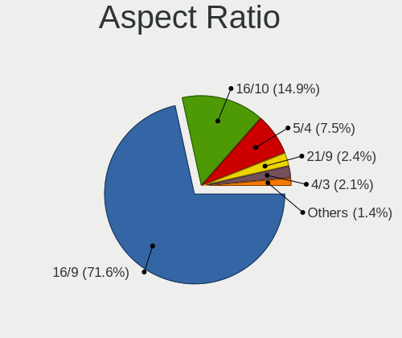

| Ratio   | Desktops | Percent |
|---------|----------|---------|
| 16/9    | 507      | 72.95%  |
| 16/10   | 99       | 14.24%  |
| 5/4     | 45       | 6.47%   |
| 21/9    | 18       | 2.59%   |
| 4/3     | 16       | 2.3%    |
| Unknown | 6        | 0.86%   |
| 1.00    | 2        | 0.29%   |
| 32/9    | 1        | 0.14%   |
| 3/2     | 1        | 0.14%   |

Monitor Area
------------

Area in inch

| Area in inch | Desktops | Percent |
|----------------|----------|---------|
| 201-250        | 269      | 37.89%  |
| 151-200        | 106      | 14.93%  |
| 301-350        | 75       | 10.56%  |
| 351-500        | 66       | 9.3%    |
| 141-150        | 49       | 6.9%    |
| 251-300        | 47       | 6.62%   |
| More than 1000 | 45       | 6.34%   |
| Unknown        | 16       | 2.25%   |
| 501-1000       | 15       | 2.11%   |
| 101-110        | 11       | 1.55%   |
| 131-140        | 4        | 0.56%   |
| 71-80          | 2        | 0.28%   |
| 121-130        | 2        | 0.28%   |
| 91-100         | 2        | 0.28%   |
| 111-120        | 1        | 0.14%   |

Pixel Density
-------------

Pixels per inch

| Density | Desktops | Percent |
|---------|----------|---------|
| 51-100  | 486      | 70.13%  |
| 101-120 | 133      | 19.19%  |
| 1-50    | 32       | 4.62%   |
| 121-160 | 16       | 2.31%   |
| Unknown | 16       | 2.31%   |
| 161-240 | 10       | 1.44%   |

Multiple Monitors
-----------------

Total monitors connected

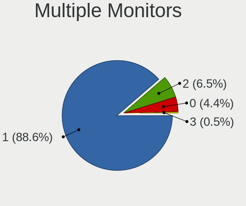

| Total | Desktops | Percent |
|-------|----------|---------|
| 1     | 646      | 89.6%   |
| 2     | 46       | 6.38%   |
| 0     | 24       | 3.33%   |
| 3     | 5        | 0.69%   |

Network
-------

Net Controller Vendor
---------------------

Controller vendors

| Vendor                            | Desktops | Percent |
|-----------------------------------|----------|---------|
| Realtek Semiconductor             | 480      | 50.05%  |
| Intel                             | 254      | 26.49%  |
| Qualcomm Atheros                  | 55       | 5.74%   |
| Broadcom                          | 23       | 2.4%    |
| TP-Link                           | 22       | 2.29%   |
| Ralink Technology                 | 21       | 2.19%   |
| Nvidia                            | 16       | 1.67%   |
| Qualcomm Atheros Communications   | 12       | 1.25%   |
| Ralink                            | 8        | 0.83%   |
| MediaTek                          | 8        | 0.83%   |
| D-Link                            | 8        | 0.83%   |
| Marvell Technology Group          | 7        | 0.73%   |
| NetGear                           | 5        | 0.52%   |
| Huawei Technologies               | 5        | 0.52%   |
| Samsung Electronics               | 4        | 0.42%   |
| ASUSTek Computer                  | 4        | 0.42%   |
| Broadcom Limited                  | 3        | 0.31%   |
| Qualcomm                          | 2        | 0.21%   |
| BUFFALO                           | 2        | 0.21%   |
| AVM                               | 2        | 0.21%   |
| ASIX Electronics                  | 2        | 0.21%   |
| ZTE WCDMA Technologies MSM        | 1        | 0.1%    |
| VIA Technologies                  | 1        | 0.1%    |
| U-Blox                            | 1        | 0.1%    |
| Tenda                             | 1        | 0.1%    |
| Sundance Technology Inc / IC Plus | 1        | 0.1%    |
| Silicon Integrated Systems [SiS]  | 1        | 0.1%    |
| OPPO Electronics                  | 1        | 0.1%    |
| Motorola PCS                      | 1        | 0.1%    |
| Microsoft                         | 1        | 0.1%    |
| Mercucys                          | 1        | 0.1%    |
| JMicron Technology                | 1        | 0.1%    |
| Edimax Technology                 | 1        | 0.1%    |
| CyberTAN Technology               | 1        | 0.1%    |
| Belkin Components                 | 1        | 0.1%    |
| Apple                             | 1        | 0.1%    |
| 3Com                              | 1        | 0.1%    |

Net Controller Model
--------------------

Controller models

| Model                                                                  | Desktops | Percent |
|------------------------------------------------------------------------|----------|---------|
| Realtek RTL8111/8168/8211/8411 PCI Express Gigabit Ethernet Controller | 385      | 36.25%  |
| Intel 82579LM Gigabit Network Connection (Lewisville)                  | 41       | 3.86%   |
| Realtek RTL810xE PCI Express Fast Ethernet controller                  | 34       | 3.2%    |
| Realtek RTL8125 2.5GbE Controller                                      | 31       | 2.92%   |
| Intel Ethernet Connection I217-LM                                      | 26       | 2.45%   |
| Intel Wi-Fi 6 AX200                                                    | 17       | 1.6%    |
| Intel Ethernet Connection (2) I219-V                                   | 16       | 1.51%   |
| Realtek RTL8821CE 802.11ac PCIe Wireless Network Adapter               | 15       | 1.41%   |
| Intel Wi-Fi 6E(802.11ax) AX210/AX1675* 2x2 [Typhoon Peak]              | 15       | 1.41%   |
| Ralink MT7601U Wireless Adapter                                        | 14       | 1.32%   |
| Intel 82579V Gigabit Network Connection                                | 14       | 1.32%   |
| Intel Ethernet Controller I225-V                                       | 13       | 1.22%   |
| Intel I211 Gigabit Network Connection                                  | 11       | 1.04%   |
| Intel Ethernet Connection I217-V                                       | 10       | 0.94%   |
| Intel Ethernet Connection (2) I219-LM                                  | 10       | 0.94%   |
| Intel Dual Band Wireless-AC 3168NGW [Stone Peak]                       | 10       | 0.94%   |
| Realtek 802.11ac NIC                                                   | 9        | 0.85%   |
| Qualcomm Atheros AR9271 802.11n                                        | 9        | 0.85%   |
| Qualcomm Atheros AR8151 v2.0 Gigabit Ethernet                          | 9        | 0.85%   |
| Realtek RTL8188EUS 802.11n Wireless Network Adapter                    | 8        | 0.75%   |
| Qualcomm Atheros Killer E220x Gigabit Ethernet Controller              | 8        | 0.75%   |
| Qualcomm Atheros AR9485 Wireless Network Adapter                       | 8        | 0.75%   |
| Nvidia MCP61 Ethernet                                                  | 8        | 0.75%   |
| Intel 82567LM-3 Gigabit Network Connection                             | 8        | 0.75%   |
| MediaTek MT7921K (RZ608) Wi-Fi 6E 80MHz                                | 7        | 0.66%   |
| Intel Wi-Fi 5(802.11ac) Wireless-AC 9x6x [Thunder Peak]                | 7        | 0.66%   |
| Intel Ethernet Connection (7) I219-V                                   | 7        | 0.66%   |
| Intel 82574L Gigabit Network Connection                                | 7        | 0.66%   |
| Intel Wireless 7260                                                    | 6        | 0.56%   |
| TP-Link TL-WN821N v5/v6 [RTL8192EU]                                    | 5        | 0.47%   |
| Realtek RTL88x2bu [AC1200 Techkey]                                     | 5        | 0.47%   |
| Realtek RTL8812AE 802.11ac PCIe Wireless Network Adapter               | 5        | 0.47%   |
| Realtek RTL8192EU 802.11b/g/n WLAN Adapter                             | 5        | 0.47%   |
| Realtek RTL-8100/8101L/8139 PCI Fast Ethernet Adapter                  | 5        | 0.47%   |
| Marvell Group 88E8056 PCI-E Gigabit Ethernet Controller                | 5        | 0.47%   |
| Intel Wireless 7265                                                    | 5        | 0.47%   |
| Intel 82578DM Gigabit Network Connection                               | 5        | 0.47%   |
| Realtek RTL8852BE PCIe 802.11ax Wireless Network Controller            | 4        | 0.38%   |
| Qualcomm Atheros Attansic L1 Gigabit Ethernet                          | 4        | 0.38%   |
| Qualcomm Atheros AR8152 v2.0 Fast Ethernet                             | 4        | 0.38%   |

Wireless Vendor
---------------

Wireless vendors

| Vendor                          | Desktops | Percent |
|---------------------------------|----------|---------|
| Intel                           | 81       | 28.32%  |
| Realtek Semiconductor           | 80       | 27.97%  |
| TP-Link                         | 22       | 7.69%   |
| Ralink Technology               | 21       | 7.34%   |
| Qualcomm Atheros                | 19       | 6.64%   |
| Qualcomm Atheros Communications | 12       | 4.2%    |
| Ralink                          | 8        | 2.8%    |
| MediaTek                        | 8        | 2.8%    |
| D-Link                          | 8        | 2.8%    |
| Broadcom                        | 8        | 2.8%    |
| NetGear                         | 5        | 1.75%   |
| ASUSTek Computer                | 4        | 1.4%    |
| BUFFALO                         | 2        | 0.7%    |
| AVM                             | 2        | 0.7%    |
| Tenda                           | 1        | 0.35%   |
| Microsoft                       | 1        | 0.35%   |
| Mercucys                        | 1        | 0.35%   |
| Edimax Technology               | 1        | 0.35%   |
| CyberTAN Technology             | 1        | 0.35%   |
| Belkin Components               | 1        | 0.35%   |

Wireless Model
--------------

Wireless models

| Model                                                       | Desktops | Percent |
|-------------------------------------------------------------|----------|---------|
| Intel Wi-Fi 6 AX200                                         | 17       | 5.92%   |
| Realtek RTL8821CE 802.11ac PCIe Wireless Network Adapter    | 15       | 5.23%   |
| Intel Wi-Fi 6E(802.11ax) AX210/AX1675* 2x2 [Typhoon Peak]   | 15       | 5.23%   |
| Ralink MT7601U Wireless Adapter                             | 14       | 4.88%   |
| Intel Dual Band Wireless-AC 3168NGW [Stone Peak]            | 10       | 3.48%   |
| Realtek 802.11ac NIC                                        | 9        | 3.14%   |
| Qualcomm Atheros AR9271 802.11n                             | 9        | 3.14%   |
| Realtek RTL8188EUS 802.11n Wireless Network Adapter         | 8        | 2.79%   |
| Qualcomm Atheros AR9485 Wireless Network Adapter            | 8        | 2.79%   |
| MediaTek MT7921K (RZ608) Wi-Fi 6E 80MHz                     | 7        | 2.44%   |
| Intel Wi-Fi 5(802.11ac) Wireless-AC 9x6x [Thunder Peak]     | 7        | 2.44%   |
| Intel Wireless 7260                                         | 6        | 2.09%   |
| TP-Link TL-WN821N v5/v6 [RTL8192EU]                         | 5        | 1.74%   |
| Realtek RTL88x2bu [AC1200 Techkey]                          | 5        | 1.74%   |
| Realtek RTL8812AE 802.11ac PCIe Wireless Network Adapter    | 5        | 1.74%   |
| Realtek RTL8192EU 802.11b/g/n WLAN Adapter                  | 5        | 1.74%   |
| Intel Wireless 7265                                         | 5        | 1.74%   |
| Realtek RTL8852BE PCIe 802.11ax Wireless Network Controller | 4        | 1.39%   |
| Intel Wireless 3165                                         | 4        | 1.39%   |
| TP-Link TL-WN823N v2/v3 [Realtek RTL8192EU]                 | 3        | 1.05%   |
| Realtek RTL8821AE 802.11ac PCIe Wireless Network Adapter    | 3        | 1.05%   |
| Realtek RTL8192CU 802.11n WLAN Adapter                      | 3        | 1.05%   |
| Realtek RTL8191SU 802.11n WLAN Adapter                      | 3        | 1.05%   |
| Ralink RT5370 Wireless Adapter                              | 3        | 1.05%   |
| Ralink RT2870/RT3070 Wireless Adapter                       | 3        | 1.05%   |
| Ralink RT2790 Wireless 802.11n 1T/2R PCIe                   | 3        | 1.05%   |
| Qualcomm Atheros QCA9565 / AR9565 Wireless Network Adapter  | 3        | 1.05%   |
| Intel Cannon Lake PCH CNVi WiFi                             | 3        | 1.05%   |
| D-Link 802.11ac NIC                                         | 3        | 1.05%   |
| TP-Link TL-WN722N v2/v3 [Realtek RTL8188EUS]                | 2        | 0.7%    |
| TP-Link RTL8812AU Archer T4U 802.11ac                       | 2        | 0.7%    |
| TP-Link Archer T4U v2 [Realtek RTL8812AU]                   | 2        | 0.7%    |
| TP-Link Archer T3U [Realtek RTL8812BU]                      | 2        | 0.7%    |
| TP-Link 802.11ac NIC                                        | 2        | 0.7%    |
| Realtek RTL8822CE 802.11ac PCIe Wireless Network Adapter    | 2        | 0.7%    |
| Realtek RTL8192EE PCIe Wireless Network Adapter             | 2        | 0.7%    |
| Realtek RTL8192CE PCIe Wireless Network Adapter             | 2        | 0.7%    |
| Realtek RTL8188FTV 802.11b/g/n 1T1R 2.4G WLAN Adapter       | 2        | 0.7%    |
| Realtek RTL8188EE Wireless Network Adapter                  | 2        | 0.7%    |
| Realtek RTL8188CUS 802.11n WLAN Adapter                     | 2        | 0.7%    |

Ethernet Vendor
---------------

Ethernet vendors

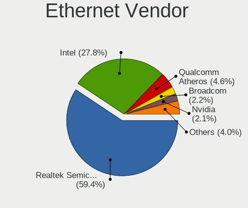

| Vendor                            | Desktops | Percent |
|-----------------------------------|----------|---------|
| Realtek Semiconductor             | 451      | 60.37%  |
| Intel                             | 197      | 26.37%  |
| Qualcomm Atheros                  | 38       | 5.09%   |
| Nvidia                            | 16       | 2.14%   |
| Broadcom                          | 15       | 2.01%   |
| Marvell Technology Group          | 7        | 0.94%   |
| Huawei Technologies               | 5        | 0.67%   |
| Samsung Electronics               | 3        | 0.4%    |
| Broadcom Limited                  | 3        | 0.4%    |
| Qualcomm                          | 2        | 0.27%   |
| ASIX Electronics                  | 2        | 0.27%   |
| ZTE WCDMA Technologies MSM        | 1        | 0.13%   |
| VIA Technologies                  | 1        | 0.13%   |
| Sundance Technology Inc / IC Plus | 1        | 0.13%   |
| Silicon Integrated Systems [SiS]  | 1        | 0.13%   |
| OPPO Electronics                  | 1        | 0.13%   |
| JMicron Technology                | 1        | 0.13%   |
| Apple                             | 1        | 0.13%   |
| 3Com                              | 1        | 0.13%   |

Ethernet Model
--------------

Ethernet models

| Model                                                                  | Desktops | Percent |
|------------------------------------------------------------------------|----------|---------|
| Realtek RTL8111/8168/8211/8411 PCI Express Gigabit Ethernet Controller | 385      | 49.87%  |
| Intel 82579LM Gigabit Network Connection (Lewisville)                  | 41       | 5.31%   |
| Realtek RTL810xE PCI Express Fast Ethernet controller                  | 34       | 4.4%    |
| Realtek RTL8125 2.5GbE Controller                                      | 31       | 4.02%   |
| Intel Ethernet Connection I217-LM                                      | 26       | 3.37%   |
| Intel Ethernet Connection (2) I219-V                                   | 16       | 2.07%   |
| Intel 82579V Gigabit Network Connection                                | 14       | 1.81%   |
| Intel Ethernet Controller I225-V                                       | 13       | 1.68%   |
| Intel I211 Gigabit Network Connection                                  | 11       | 1.42%   |
| Intel Ethernet Connection I217-V                                       | 10       | 1.3%    |
| Intel Ethernet Connection (2) I219-LM                                  | 10       | 1.3%    |
| Qualcomm Atheros AR8151 v2.0 Gigabit Ethernet                          | 9        | 1.17%   |
| Qualcomm Atheros Killer E220x Gigabit Ethernet Controller              | 8        | 1.04%   |
| Nvidia MCP61 Ethernet                                                  | 8        | 1.04%   |
| Intel 82567LM-3 Gigabit Network Connection                             | 8        | 1.04%   |
| Intel Ethernet Connection (7) I219-V                                   | 7        | 0.91%   |
| Intel 82574L Gigabit Network Connection                                | 7        | 0.91%   |
| Realtek RTL-8100/8101L/8139 PCI Fast Ethernet Adapter                  | 5        | 0.65%   |
| Marvell Group 88E8056 PCI-E Gigabit Ethernet Controller                | 5        | 0.65%   |
| Intel 82578DM Gigabit Network Connection                               | 5        | 0.65%   |
| Qualcomm Atheros Attansic L1 Gigabit Ethernet                          | 4        | 0.52%   |
| Qualcomm Atheros AR8152 v2.0 Fast Ethernet                             | 4        | 0.52%   |
| Intel I210 Gigabit Network Connection                                  | 4        | 0.52%   |
| Intel Ethernet Connection (2) I218-V                                   | 4        | 0.52%   |
| Intel Ethernet Connection (17) I219-V                                  | 4        | 0.52%   |
| Huawei E353/E3131                                                      | 4        | 0.52%   |
| Broadcom NetXtreme BCM5764M Gigabit Ethernet PCIe                      | 4        | 0.52%   |
| Samsung Galaxy series, misc. (tethering mode)                          | 3        | 0.39%   |
| Qualcomm Atheros Attansic L2 Fast Ethernet                             | 3        | 0.39%   |
| Qualcomm Atheros AR8131 Gigabit Ethernet                               | 3        | 0.39%   |
| Intel Ethernet Connection (11) I219-V                                  | 3        | 0.39%   |
| Broadcom NetLink BCM57780 Gigabit Ethernet PCIe                        | 3        | 0.39%   |
| Realtek RTL8169 PCI Gigabit Ethernet Controller                        | 2        | 0.26%   |
| Realtek RTL8152 Fast Ethernet Adapter                                  | 2        | 0.26%   |
| Realtek RTL8111/8168/8411 PCI Express Gigabit Ethernet Controller      | 2        | 0.26%   |
| Qualcomm Atheros QCA8171 Gigabit Ethernet                              | 2        | 0.26%   |
| Qualcomm Atheros AR8151 v1.0 Gigabit Ethernet                          | 2        | 0.26%   |
| Nvidia MCP73 Ethernet                                                  | 2        | 0.26%   |
| Nvidia MCP51 Ethernet Controller                                       | 2        | 0.26%   |
| Nvidia CK804 Ethernet Controller                                       | 2        | 0.26%   |

Net Controller Kind
-------------------

Ethernet, WiFi or modem

| Kind     | Desktops | Percent |
|----------|----------|---------|
| Ethernet | 711      | 71.6%   |
| WiFi     | 279      | 28.1%   |
| Modem    | 2        | 0.2%    |
| Unknown  | 1        | 0.1%    |

Used Controller
---------------

Currently used network controller

| Kind     | Desktops | Percent |
|----------|----------|---------|
| Ethernet | 566      | 80.28%  |
| WiFi     | 139      | 19.72%  |

NICs
----

Total network controllers on board

| Total | Desktops | Percent |
|-------|----------|---------|
| 1     | 519      | 71.98%  |
| 2     | 176      | 24.41%  |
| 3     | 17       | 2.36%   |
| 0     | 7        | 0.97%   |
| 4     | 2        | 0.28%   |

IPv6
----

IPv6 vs IPv4

| Used | Desktops | Percent |
|------|----------|---------|
| No   | 465      | 64.49%  |
| Yes  | 256      | 35.51%  |

Bluetooth
---------

Bluetooth Vendor
----------------

Controller vendors

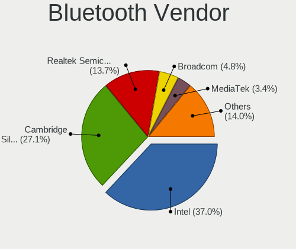

| Vendor                          | Desktops | Percent |
|---------------------------------|----------|---------|
| Intel                           | 75       | 37.31%  |
| Cambridge Silicon Radio         | 53       | 26.37%  |
| Realtek Semiconductor           | 30       | 14.93%  |
| Broadcom                        | 9        | 4.48%   |
| MediaTek                        | 8        | 3.98%   |
| Qualcomm Atheros Communications | 6        | 2.99%   |
| ASUSTek Computer                | 6        | 2.99%   |
| TP-Link                         | 4        | 1.99%   |
| IMC Networks                    | 4        | 1.99%   |
| Integrated System Solution      | 2        | 1%      |
| Lite-On Technology              | 1        | 0.5%    |
| Edimax Technology               | 1        | 0.5%    |
| Dynex                           | 1        | 0.5%    |
| Apple                           | 1        | 0.5%    |

Bluetooth Model
---------------

Controller models

| Model                                                    | Desktops | Percent |
|----------------------------------------------------------|----------|---------|
| Cambridge Silicon Radio Bluetooth Dongle (HCI mode)      | 53       | 26.37%  |
| Realtek Bluetooth Radio                                  | 24       | 11.94%  |
| Intel Bluetooth wireless interface                       | 17       | 8.46%   |
| Intel AX200 Bluetooth                                    | 16       | 7.96%   |
| Intel AX210 Bluetooth                                    | 13       | 6.47%   |
| Intel Wireless-AC 3168 Bluetooth                         | 10       | 4.98%   |
| Intel Wireless-AC 9260 Bluetooth Adapter                 | 9        | 4.48%   |
| MediaTek Wireless_Device                                 | 8        | 3.98%   |
| Realtek  Bluetooth 4.2 Adapter                           | 6        | 2.99%   |
| Intel AX201 Bluetooth                                    | 5        | 2.49%   |
| TP-Link UB500 Adapter                                    | 4        | 1.99%   |
| IMC Networks Bluetooth Radio                             | 4        | 1.99%   |
| Intel Bluetooth 9460/9560 Jefferson Peak (JfP)           | 3        | 1.49%   |
| Qualcomm Atheros  Bluetooth Device                       | 2        | 1%      |
| Qualcomm Atheros Bluetooth USB Host Controller           | 2        | 1%      |
| Broadcom BCM20702A0 Bluetooth 4.0                        | 2        | 1%      |
| Broadcom BCM2045 Bluetooth                               | 2        | 1%      |
| ASUS Broadcom BCM20702A0 Bluetooth                       | 2        | 1%      |
| ASUS ASUS USB-BT500                                      | 2        | 1%      |
| Qualcomm Atheros QCA61x4 Bluetooth 4.0                   | 1        | 0.5%    |
| Qualcomm Atheros AR9462 Bluetooth                        | 1        | 0.5%    |
| Lite-On Bluetooth Device                                 | 1        | 0.5%    |
| Intel Centrino Bluetooth Wireless Transceiver            | 1        | 0.5%    |
| Intel Bluetooth Device                                   | 1        | 0.5%    |
| Integrated System Solution KY-BT100 Bluetooth Adapter    | 1        | 0.5%    |
| Integrated System Solution Bluetooth Device              | 1        | 0.5%    |
| Edimax Bluetooth Adapter                                 | 1        | 0.5%    |
| Dynex Bluetooth 4.0 Adapter [Broadcom, 1.12, BCM20702A0] | 1        | 0.5%    |
| Broadcom HP Portable Bumble Bee                          | 1        | 0.5%    |
| Broadcom HP Bluethunder                                  | 1        | 0.5%    |
| Broadcom Bluetooth V3.0 USB Device                       | 1        | 0.5%    |
| Broadcom Bluetooth 3.0 Device                            | 1        | 0.5%    |
| Broadcom BCM2210 Bluetooth                               | 1        | 0.5%    |
| ASUS Broadcom BCM20702 Single-Chip Bluetooth 4.0 + LE    | 1        | 0.5%    |
| ASUS BCM20702A0                                          | 1        | 0.5%    |
| Apple Built-in Bluetooth 2.0+EDR HCI                     | 1        | 0.5%    |

Sound
-----

Sound Vendor
------------

Sound card vendors

| Vendor                                       | Desktops | Percent |
|----------------------------------------------|----------|---------|
| Intel                                        | 472      | 43.87%  |
| AMD                                          | 281      | 26.12%  |
| Nvidia                                       | 216      | 20.07%  |
| C-Media Electronics                          | 26       | 2.42%   |
| Creative Labs                                | 11       | 1.02%   |
| Texas Instruments                            | 5        | 0.46%   |
| M-Audio                                      | 3        | 0.28%   |
| Generalplus Technology                       | 3        | 0.28%   |
| Creative Technology                          | 3        | 0.28%   |
| ASUSTek Computer                             | 3        | 0.28%   |
| Zoran Co. Personal Media Division (Nogatech) | 2        | 0.19%   |
| SAVITECH                                     | 2        | 0.19%   |
| Razer USA                                    | 2        | 0.19%   |
| Logitech                                     | 2        | 0.19%   |
| KTMicro                                      | 2        | 0.19%   |
| Kingston Technology                          | 2        | 0.19%   |
| JMTek                                        | 2        | 0.19%   |
| GYROCOM C&C                                  | 2        | 0.19%   |
| GN Netcom                                    | 2        | 0.19%   |
| Focusrite-Novation                           | 2        | 0.19%   |
| FiiO Electronics Technology                  | 2        | 0.19%   |
| ATI Technologies                             | 2        | 0.19%   |
| Xilinx                                       | 1        | 0.09%   |
| VIA Technologies                             | 1        | 0.09%   |
| Valve Software                               | 1        | 0.09%   |
| Thesycon Systemsoftware & Consulting         | 1        | 0.09%   |
| Tenx Technology                              | 1        | 0.09%   |
| somic                                        | 1        | 0.09%   |
| Silicon Integrated Systems [SiS]             | 1        | 0.09%   |
| Samson Technologies                          | 1        | 0.09%   |
| Realtek Semiconductor                        | 1        | 0.09%   |
| ONN                                          | 1        | 0.09%   |
| Native Instruments                           | 1        | 0.09%   |
| MosArt Semiconductor                         | 1        | 0.09%   |
| Microsoft                                    | 1        | 0.09%   |
| Micro Star International                     | 1        | 0.09%   |
| Lenovo                                       | 1        | 0.09%   |
| KORG                                         | 1        | 0.09%   |
| JOUNIVO                                      | 1        | 0.09%   |
| Jieli Technology                             | 1        | 0.09%   |

Sound Model
-----------

Sound card models

| Model                                                                             | Desktops | Percent |
|-----------------------------------------------------------------------------------|----------|---------|
| Intel 8 Series/C220 Series Chipset High Definition Audio Controller               | 75       | 5.8%    |
| Intel 6 Series/C200 Series Chipset Family High Definition Audio Controller        | 64       | 4.95%   |
| AMD Family 17h/19h HD Audio Controller                                            | 57       | 4.41%   |
| Intel 7 Series/C216 Chipset Family High Definition Audio Controller               | 52       | 4.02%   |
| Intel Xeon E3-1200 v3/4th Gen Core Processor HD Audio Controller                  | 51       | 3.94%   |
| Intel NM10/ICH7 Family High Definition Audio Controller                           | 47       | 3.63%   |
| AMD SBx00 Azalia (Intel HDA)                                                      | 47       | 3.63%   |
| AMD Starship/Matisse HD Audio Controller                                          | 46       | 3.56%   |
| Nvidia GK208 HDMI/DP Audio Controller                                             | 33       | 2.55%   |
| Intel 100 Series/C230 Series Chipset Family HD Audio Controller                   | 33       | 2.55%   |
| Intel 200 Series PCH HD Audio                                                     | 31       | 2.4%    |
| AMD Renoir Radeon High Definition Audio Controller                                | 29       | 2.24%   |
| AMD Navi 21/23 HDMI/DP Audio Controller                                           | 29       | 2.24%   |
| AMD FCH Azalia Controller                                                         | 28       | 2.17%   |
| AMD Ellesmere HDMI Audio [Radeon RX 470/480 / 570/580/590]                        | 25       | 1.93%   |
| Nvidia GP107GL High Definition Audio Controller                                   | 21       | 1.62%   |
| AMD Family 17h (Models 00h-0fh) HD Audio Controller                               | 21       | 1.62%   |
| Intel 5 Series/3400 Series Chipset High Definition Audio                          | 19       | 1.47%   |
| AMD Raven/Raven2/Fenghuang HDMI/DP Audio Controller                               | 19       | 1.47%   |
| Nvidia High Definition Audio Controller                                           | 16       | 1.24%   |
| Intel Cannon Lake PCH cAVS                                                        | 15       | 1.16%   |
| Intel 82801JI (ICH10 Family) HD Audio Controller                                  | 15       | 1.16%   |
| Nvidia GF108 High Definition Audio Controller                                     | 14       | 1.08%   |
| Intel Comet Lake PCH-V cAVS                                                       | 14       | 1.08%   |
| Intel Alder Lake-S HD Audio Controller                                            | 14       | 1.08%   |
| Nvidia GP108 High Definition Audio Controller                                     | 13       | 1.01%   |
| Nvidia GF119 HDMI Audio Controller                                                | 13       | 1.01%   |
| AMD Oland/Hainan/Cape Verde/Pitcairn HDMI Audio [Radeon HD 7000 Series]           | 13       | 1.01%   |
| Nvidia GM107 High Definition Audio Controller [GeForce 940MX]                     | 12       | 0.93%   |
| Intel Smart Sound Technology (SST) Audio Controller                               | 12       | 0.93%   |
| Intel 9 Series Chipset Family HD Audio Controller                                 | 12       | 0.93%   |
| AMD Navi 10 HDMI Audio                                                            | 12       | 0.93%   |
| AMD Baffin HDMI/DP Audio [Radeon RX 550 640SP / RX 560/560X]                      | 12       | 0.93%   |
| Nvidia GM206 High Definition Audio Controller                                     | 11       | 0.85%   |
| AMD Cedar HDMI Audio [Radeon HD 5400/6300/7300 Series]                            | 11       | 0.85%   |
| Nvidia GP106 High Definition Audio Controller                                     | 10       | 0.77%   |
| Nvidia MCP61 High Definition Audio                                                | 9        | 0.7%    |
| AMD Rembrandt Radeon High Definition Audio Controller                             | 9        | 0.7%    |
| AMD Kaveri HDMI/DP Audio Controller                                               | 9        | 0.7%    |
| AMD Caicos HDMI Audio [Radeon HD 6450 / 7450/8450/8490 OEM / R5 230/235/235X OEM] | 9        | 0.7%    |

Memory
------

Memory Vendor
-------------

Memory module vendors

| Vendor                       | Desktops | Percent |
|------------------------------|----------|---------|
| Kingston                     | 147      | 17.23%  |
| Unknown                      | 133      | 15.59%  |
| Samsung Electronics          | 93       | 10.9%   |
| SK hynix                     | 79       | 9.26%   |
| Corsair                      | 65       | 7.62%   |
| Crucial                      | 62       | 7.27%   |
| Micron Technology            | 51       | 5.98%   |
| G.Skill                      | 43       | 5.04%   |
| Unknown                      | 19       | 2.23%   |
| A-DATA Technology            | 16       | 1.88%   |
| Patriot                      | 14       | 1.64%   |
| Team                         | 13       | 1.52%   |
| Ramaxel Technology           | 10       | 1.17%   |
| Elpida                       | 8        | 0.94%   |
| Apacer                       | 7        | 0.82%   |
| Transcend                    | 6        | 0.7%    |
| Nanya Technology             | 6        | 0.7%    |
| GOODRAM                      | 6        | 0.7%    |
| AMD                          | 6        | 0.7%    |
| Smart                        | 5        | 0.59%   |
| Unknown (0x0E9D)             | 4        | 0.47%   |
| Atermiter                    | 4        | 0.47%   |
| Patriot Memory (PDP Systems) | 3        | 0.35%   |
| Kllisre                      | 3        | 0.35%   |
| Unknown (0x7FFF)             | 2        | 0.23%   |
| Thermaltake                  | 2        | 0.23%   |
| Teikon                       | 2        | 0.23%   |
| Silicon Power                | 2        | 0.23%   |
| Red Hat                      | 2        | 0.23%   |
| PNY                          | 2        | 0.23%   |
| Hikvision                    | 2        | 0.23%   |
| ASint Technology             | 2        | 0.23%   |
| Wodposit                     | 1        | 0.12%   |
| Wilk Elektronik              | 1        | 0.12%   |
| Walton Chaintech             | 1        | 0.12%   |
| Unknown (FFFF000000000000)   | 1        | 0.12%   |
| Unknown (0x0C97)             | 1        | 0.12%   |
| Unknown (0x0C26)             | 1        | 0.12%   |
| Unknown (0x0B79)             | 1        | 0.12%   |
| Unknown (0x0B15)             | 1        | 0.12%   |

Memory Model
------------

Memory module models

| Model                                                  | Desktops | Percent |
|--------------------------------------------------------|----------|---------|
| Unknown                                                | 19       | 2.01%   |
| Micron RAM 8JTF51264AZ-1G6E1 4GB DIMM DDR3 1600MT/s    | 10       | 1.06%   |
| Unknown RAM Module 8GB DIMM DDR3 1600MT/s              | 8        | 0.84%   |
| Unknown RAM Module 2GB DIMM DDR2 667MT/s               | 8        | 0.84%   |
| Corsair RAM CMK16GX4M2B3200C16 8GB DIMM DDR4 3600MT/s  | 8        | 0.84%   |
| Unknown RAM Module 4GB DIMM 1333MT/s                   | 7        | 0.74%   |
| Unknown RAM Module 2GB DIMM DDR2 800MT/s               | 7        | 0.74%   |
| Unknown RAM Module 2GB DIMM 800MT/s                    | 7        | 0.74%   |
| Unknown RAM Module 1GB DIMM DDR2 667MT/s               | 6        | 0.63%   |
| SK hynix RAM HMT451U6BFR8A-PB 4GB DIMM DDR3 1600MT/s   | 6        | 0.63%   |
| Samsung RAM M378B5773CH0-CH9 2GB DIMM DDR3 1867MT/s    | 6        | 0.63%   |
| Samsung RAM M378B5173DB0-CK0 4GB DIMM DDR3 1600MT/s    | 6        | 0.63%   |
| Kingston RAM KHX2666C16/8G 8GB DIMM DDR4 3466MT/s      | 6        | 0.63%   |
| Crucial RAM CT102464BA160B.C16 8GB DIMM DDR3 1600MT/s  | 6        | 0.63%   |
| Unknown RAM Module 4GB DIMM DDR3 1600MT/s              | 5        | 0.53%   |
| Unknown RAM Module 4GB DIMM DDR3 1333MT/s              | 5        | 0.53%   |
| Unknown RAM Module 4GB DIMM 1600MT/s                   | 5        | 0.53%   |
| Team RAM TEAMGROUP-UD4-3200 16GB DIMM DDR4 3800MT/s    | 5        | 0.53%   |
| SK hynix RAM HMT351U6CFR8C-PB 4GB DIMM DDR3 1800MT/s   | 5        | 0.53%   |
| Samsung RAM M378B5273DH0-CH9 4096MB DIMM DDR2 2133MT/s | 5        | 0.53%   |
| Samsung RAM M378B5173QH0-CK0 4GB DIMM DDR3 1600MT/s    | 5        | 0.53%   |
| Kingston RAM KF3200C16D4/8GX 8GB DIMM DDR4 3600MT/s    | 5        | 0.53%   |
| Kingston RAM 99U5471-012.A00LF 4GB DIMM DDR3 1600MT/s  | 5        | 0.53%   |
| Unknown RAM Module 4GB DIMM 400MT/s                    | 4        | 0.42%   |
| Unknown RAM Module 2GB DIMM DDR2 333MT/s               | 4        | 0.42%   |
| Unknown RAM Module 2GB DIMM 1333MT/s                   | 4        | 0.42%   |
| SK hynix RAM Module 8GB DIMM DDR4 3200MT/s             | 4        | 0.42%   |
| Samsung RAM M378B5773DH0-CH9 2GB DIMM DDR3 1333MT/s    | 4        | 0.42%   |
| Samsung RAM M378B5673FH0-CH9 2GB DIMM DDR3 1600MT/s    | 4        | 0.42%   |
| Kingston RAM KHX1600C9D3/4GX 4GB DIMM DDR3 1600MT/s    | 4        | 0.42%   |
| Kingston RAM KHX1600C10D3/8G 8GB DIMM DDR3 1648MT/s    | 4        | 0.42%   |
| G.Skill RAM F4-3200C16-8GVKB 8GB DIMM DDR4 3866MT/s    | 4        | 0.42%   |
| G.Skill RAM F3-12800CL10-8GBXL 8GB DIMM DDR3 1600MT/s  | 4        | 0.42%   |
| Corsair RAM CMK16GX4M2E3200C16 8GB DIMM DDR4 3200MT/s  | 4        | 0.42%   |
| Unknown RAM Module 8GB DIMM 1600MT/s                   | 3        | 0.32%   |
| Unknown RAM Module 4GB DIMM SDRAM                      | 3        | 0.32%   |
| Unknown RAM Module 4GB DIMM 800MT/s                    | 3        | 0.32%   |
| Unknown RAM Module 2GB DIMM SDRAM                      | 3        | 0.32%   |
| Unknown RAM Module 2GB DIMM DDR2                       | 3        | 0.32%   |
| Unknown RAM Module 2GB DIMM 667MT/s                    | 3        | 0.32%   |

Memory Kind
-----------

Memory module kinds

| Kind    | Desktops | Percent |
|---------|----------|---------|
| DDR4    | 286      | 39.18%  |
| DDR3    | 280      | 38.36%  |
| Unknown | 53       | 7.26%   |
| SDRAM   | 43       | 5.89%   |
| DDR2    | 42       | 5.75%   |
| DDR5    | 12       | 1.64%   |
| DDR     | 10       | 1.37%   |
| RAM     | 2        | 0.27%   |
| DRAM    | 2        | 0.27%   |

Memory Form Factor
------------------

Physical design of the memory module

| Name   | Desktops | Percent |
|--------|----------|---------|
| DIMM   | 648      | 91.01%  |
| SODIMM | 63       | 8.85%   |
| RIMM   | 1        | 0.14%   |

Memory Size
-----------

Memory module size

| Size  | Desktops | Percent |
|-------|----------|---------|
| 8192  | 297      | 37.13%  |
| 4096  | 220      | 27.5%   |
| 2048  | 137      | 17.13%  |
| 16384 | 80       | 10%     |
| 32768 | 30       | 3.75%   |
| 1024  | 30       | 3.75%   |
| 512   | 4        | 0.5%    |
| 15616 | 1        | 0.13%   |
| 12333 | 1        | 0.13%   |

Memory Speed
------------

Memory module speed

| Speed   | Desktops | Percent |
|---------|----------|---------|
| 1600    | 169      | 20.53%  |
| 1333    | 109      | 13.24%  |
| 3200    | 76       | 9.23%   |
| 2667    | 48       | 5.83%   |
| 2400    | 45       | 5.47%   |
| 2133    | 37       | 4.5%    |
| 3600    | 34       | 4.13%   |
| 800     | 29       | 3.52%   |
| 667     | 27       | 3.28%   |
| Unknown | 21       | 2.55%   |
| 1867    | 19       | 2.31%   |
| 2666    | 15       | 1.82%   |
| 1800    | 13       | 1.58%   |
| 400     | 12       | 1.46%   |
| 3733    | 11       | 1.34%   |
| 2933    | 11       | 1.34%   |
| 3800    | 9        | 1.09%   |
| 1866    | 9        | 1.09%   |
| 1066    | 9        | 1.09%   |
| 4800    | 8        | 0.97%   |
| 1067    | 7        | 0.85%   |
| 533     | 7        | 0.85%   |
| 3466    | 6        | 0.73%   |
| 3400    | 6        | 0.73%   |
| 3000    | 6        | 0.73%   |
| 1648    | 6        | 0.73%   |
| 1334    | 6        | 0.73%   |
| 3866    | 5        | 0.61%   |
| 333     | 5        | 0.61%   |
| 2132    | 4        | 0.49%   |
| 2000    | 4        | 0.49%   |
| 4266    | 3        | 0.36%   |
| 4000    | 3        | 0.36%   |
| 3151    | 3        | 0.36%   |
| 3066    | 3        | 0.36%   |
| 2800    | 3        | 0.36%   |
| 5600    | 2        | 0.24%   |
| 3534    | 2        | 0.24%   |
| 3533    | 2        | 0.24%   |
| 3334    | 2        | 0.24%   |

Printers & scanners
-------------------

Printer Vendor
--------------

Printer device vendors

| Vendor                | Desktops | Percent |
|-----------------------|----------|---------|
| Hewlett-Packard       | 14       | 37.84%  |
| Brother Industries    | 6        | 16.22%  |
| Samsung Electronics   | 5        | 13.51%  |
| Canon                 | 4        | 10.81%  |
| Seiko Epson           | 3        | 8.11%   |
| Prolific Technology   | 2        | 5.41%   |
| Oki Data              | 1        | 2.7%    |
| Lexmark International | 1        | 2.7%    |
| Apple                 | 1        | 2.7%    |

Printer Model
-------------

Printer device models

| Model                                | Desktops | Percent |
|--------------------------------------|----------|---------|
| Prolific PL2305 Parallel Port        | 2        | 5.41%   |
| HP DeskJet 4100 series               | 2        | 5.41%   |
| HP DeskJet 2600 series               | 2        | 5.41%   |
| Seiko Epson L3210 Series             | 1        | 2.7%    |
| Seiko Epson L3150 Series             | 1        | 2.7%    |
| Seiko Epson ET-4850 Series           | 1        | 2.7%    |
| Samsung SCX-6x55X Series             | 1        | 2.7%    |
| Samsung ML-1865                      | 1        | 2.7%    |
| Samsung ML-1640 Series Laser Printer | 1        | 2.7%    |
| Samsung M2020 Series                 | 1        | 2.7%    |
| Samsung Composite Device             | 1        | 2.7%    |
| Oki Data MC363 Multifunction Printer | 1        | 2.7%    |
| Lexmark International MS510dn        | 1        | 2.7%    |
| HP OfficeJet Pro 6960                | 1        | 2.7%    |
| HP OfficeJet 8010 series             | 1        | 2.7%    |
| HP OfficeJet 3830 series             | 1        | 2.7%    |
| HP LaserJet 1020                     | 1        | 2.7%    |
| HP LaserJet 1015                     | 1        | 2.7%    |
| HP DeskJet 6940 series               | 1        | 2.7%    |
| HP DeskJet 4530 series               | 1        | 2.7%    |
| HP DeskJet 3630 series               | 1        | 2.7%    |
| HP DeskJet 2700 series               | 1        | 2.7%    |
| HP Color LaserJet CP1215             | 1        | 2.7%    |
| Canon PIXMA MG3600 Series            | 1        | 2.7%    |
| Canon MF4010 series                  | 1        | 2.7%    |
| Canon LiDE 400                       | 1        | 2.7%    |
| Canon G3010 series                   | 1        | 2.7%    |
| Brother QL-600 Label Printer         | 1        | 2.7%    |
| Brother MFC-L6900DW series           | 1        | 2.7%    |
| Brother MFC-L2690DW                  | 1        | 2.7%    |
| Brother MFC-J6530DW                  | 1        | 2.7%    |
| Brother HL-L2350DW series            | 1        | 2.7%    |
| Brother DCP-L2550DW series           | 1        | 2.7%    |
| Apple Gamesir-G3v 1.00               | 1        | 2.7%    |

Scanner Vendor
--------------

Scanner device vendors

| Vendor          | Desktops | Percent |
|-----------------|----------|---------|
| Canon           | 6        | 75%     |
| Hewlett-Packard | 2        | 25%     |

Scanner Model
-------------

Scanner device models

| Model                              | Desktops | Percent |
|------------------------------------|----------|---------|
| HP Scanjet G2710                   | 1        | 12.5%   |
| HP ScanJet 2400c                   | 1        | 12.5%   |
| Canon CanoScan N670U/N676U/LiDE 20 | 1        | 12.5%   |
| Canon CanoScan N650U/N656U         | 1        | 12.5%   |
| Canon CanoScan LIDE 25             | 1        | 12.5%   |
| Canon CanoScan LiDE 220            | 1        | 12.5%   |
| Canon CanoScan LiDE 110            | 1        | 12.5%   |
| Canon CanoScan 1220U               | 1        | 12.5%   |

Camera
------

Camera Vendor
-------------

Camera device vendors

| Vendor                        | Desktops | Percent |
|-------------------------------|----------|---------|
| Logitech                      | 26       | 32.5%   |
| Microdia                      | 7        | 8.75%   |
| Microsoft                     | 6        | 7.5%    |
| Z-Star Microelectronics       | 4        | 5%      |
| Hewlett-Packard               | 3        | 3.75%   |
| Unknown                       | 2        | 2.5%    |
| Sunplus Innovation Technology | 2        | 2.5%    |
| Realtek Semiconductor         | 2        | 2.5%    |
| Generalplus Technology        | 2        | 2.5%    |
| GEMBIRD                       | 2        | 2.5%    |
| Creative Technology           | 2        | 2.5%    |
| Bison Electronics             | 2        | 2.5%    |
| Arkmicro Technologies         | 2        | 2.5%    |
| ARC International             | 2        | 2.5%    |
| webcamvendor                  | 1        | 1.25%   |
| WaveRider Communications      | 1        | 1.25%   |
| Valve Software                | 1        | 1.25%   |
| Polycom                       | 1        | 1.25%   |
| Pixart Imaging                | 1        | 1.25%   |
| Netchip Technology            | 1        | 1.25%   |
| MacroSilicon                  | 1        | 1.25%   |
| KYE Systems (Mouse Systems)   | 1        | 1.25%   |
| Jieli Technology              | 1        | 1.25%   |
| Hopewin Electronic Material   | 1        | 1.25%   |
| Genesys Logic                 | 1        | 1.25%   |
| ezcap                         | 1        | 1.25%   |
| eMPIA Technology              | 1        | 1.25%   |
| ASUSTek Computer              | 1        | 1.25%   |
| Apple                         | 1        | 1.25%   |
| A4Tech                        | 1        | 1.25%   |

Camera Model
------------

Camera device models

| Model                                         | Desktops | Percent |
|-----------------------------------------------|----------|---------|
| Logitech Webcam C270                          | 5        | 6.25%   |
| Logitech C922 Pro Stream Webcam               | 3        | 3.75%   |
| Z-Star Venus USB2.0 Camera                    | 2        | 2.5%    |
| Unknown HD camera                             | 2        | 2.5%    |
| Microsoft LifeCam VX-500 [1357]               | 2        | 2.5%    |
| Microdia USB 2.0 Camera                       | 2        | 2.5%    |
| Microdia Integrated Camera                    | 2        | 2.5%    |
| Logitech Webcam C930e                         | 2        | 2.5%    |
| Logitech Webcam C170                          | 2        | 2.5%    |
| Logitech HD Webcam C615                       | 2        | 2.5%    |
| HP Webcam HD 2300                             | 2        | 2.5%    |
| Generalplus GENERAL WEBCAM                    | 2        | 2.5%    |
| GEMBIRD USB2.0 PC CAMERA                      | 2        | 2.5%    |
| ARC International Camera                      | 2        | 2.5%    |
| Z-Star Integrated Camera                      | 1        | 1.25%   |
| Z-Star A4 TECH USB2.0 PC Camera E             | 1        | 1.25%   |
| webcamvendor webcamproduct                    | 1        | 1.25%   |
| WaveRider USB Live camera                     | 1        | 1.25%   |
| Valve Software 3D Camera                      | 1        | 1.25%   |
| Sunplus USB 2.0 Camera                        | 1        | 1.25%   |
| Sunplus Full HD webcam                        | 1        | 1.25%   |
| Realtek NexiGo N660P FHD Webcam               | 1        | 1.25%   |
| Realtek Full HD webcam                        | 1        | 1.25%   |
| Polycom Poly Studio P5 webcam                 | 1        | 1.25%   |
| Pixart Imaging Digital_Camera                 | 1        | 1.25%   |
| Netchip Nuroum V11                            | 1        | 1.25%   |
| Microsoft LifeCam VX-700                      | 1        | 1.25%   |
| Microsoft LifeCam VX-5000                     | 1        | 1.25%   |
| Microsoft LifeCam Studio                      | 1        | 1.25%   |
| Microsoft LifeCam HD-3000                     | 1        | 1.25%   |
| Microdia Webcam Vitade AF                     | 1        | 1.25%   |
| Microdia JOYACCESS JA-Webcam                  | 1        | 1.25%   |
| Microdia AUKEY PC-LM3                         | 1        | 1.25%   |
| MacroSilicon MS210x Video Grabber [EasierCAP] | 1        | 1.25%   |
| Logitech Webcam C925e                         | 1        | 1.25%   |
| Logitech Webcam C310                          | 1        | 1.25%   |
| Logitech Webcam C210                          | 1        | 1.25%   |
| Logitech Webcam C200                          | 1        | 1.25%   |
| Logitech Webcam B500                          | 1        | 1.25%   |
| Logitech Portable Webcam C905                 | 1        | 1.25%   |

Security
--------

Fingerprint Vendor
------------------

Fingerprint sensor vendors

| Vendor | Desktops | Percent |
|--------|----------|---------|
| Upek   | 1        | 100%    |

Fingerprint Model
-----------------

Fingerprint sensor models

| Model                                                  | Desktops | Percent |
|--------------------------------------------------------|----------|---------|
| Upek Biometric Touchchip/Touchstrip Fingerprint Sensor | 1        | 100%    |

Chipcard Vendor
---------------

Chipcard module vendors

| Vendor                | Desktops | Percent |
|-----------------------|----------|---------|
| OmniKey               | 1        | 25%     |
| Gemalto (was Gemplus) | 1        | 25%     |
| Chicony Electronics   | 1        | 25%     |
| Advanced Card Systems | 1        | 25%     |

Chipcard Model
--------------

Chipcard module models

| Model                                                | Desktops | Percent |
|------------------------------------------------------|----------|---------|
| OmniKey CardMan 3121 (HID Technologies)              | 1        | 25%     |
| Gemalto (was Gemplus) GemPC Twin SmartCard Reader    | 1        | 25%     |
| Chicony Electronics HP Skylab USB Smartcard Keyboard | 1        | 25%     |
| Advanced Card Systems ACR38 SmartCard Reader         | 1        | 25%     |

Unsupported
-----------

Unsupported Devices
-------------------

Total unsupported devices on board

| Total | Desktops | Percent |
|-------|----------|---------|
| 0     | 667      | 92.51%  |
| 1     | 49       | 6.8%    |
| 2     | 5        | 0.69%   |

Unsupported Device Types
------------------------

Types of unsupported devices

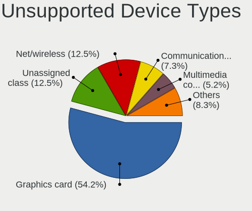

| Type                     | Desktops | Percent |
|--------------------------|----------|---------|
| Graphics card            | 24       | 42.86%  |
| Net/wireless             | 9        | 16.07%  |
| Unassigned class         | 7        | 12.5%   |
| Communication controller | 6        | 10.71%  |
| Multimedia controller    | 4        | 7.14%   |
| Chipcard                 | 3        | 5.36%   |
| Storage/raid             | 1        | 1.79%   |
| Fingerprint reader       | 1        | 1.79%   |
| Card reader              | 1        | 1.79%   |

