OpenMandriva 23.08 - Tested Hardware & Statistics (Notebooks)
-------------------------------------------------------------

A project to collect tested hardware configurations for OpenMandriva 23.08.

Anyone can contribute to this report by the [hw-probe](https://github.com/linuxhw/hw-probe) tool:

    sudo -E hw-probe -all -upload

Please contribute! Especially if your hardware is rare.

Contents
--------

* [ Test Cases ](#test-cases)

* [ System ](#system)
  - [ Kernel                   ](#kernel)
  - [ Kernel Family            ](#kernel-family)
  - [ Kernel Major Ver.        ](#kernel-major-ver)
  - [ Arch                     ](#arch)
  - [ DE                       ](#de)
  - [ Display Server           ](#display-server)
  - [ Display Manager          ](#display-manager)
  - [ OS Lang                  ](#os-lang)
  - [ Boot Mode                ](#boot-mode)
  - [ Filesystem               ](#filesystem)
  - [ Part. scheme             ](#part-scheme)
  - [ Dual Boot with Linux/BSD ](#dual-boot-with-linuxbsd)
  - [ Dual Boot (Win)          ](#dual-boot-win)

* [ Board ](#board)
  - [ Vendor                   ](#vendor)
  - [ Model                    ](#model)
  - [ Model Family             ](#model-family)
  - [ MFG Year                 ](#mfg-year)
  - [ Form Factor              ](#form-factor)
  - [ Secure Boot              ](#secure-boot)
  - [ Coreboot                 ](#coreboot)
  - [ RAM Size                 ](#ram-size)
  - [ RAM Used                 ](#ram-used)
  - [ Total Drives             ](#total-drives)
  - [ Has CD-ROM               ](#has-cd-rom)
  - [ Has Ethernet             ](#has-ethernet)
  - [ Has WiFi                 ](#has-wifi)
  - [ Has Bluetooth            ](#has-bluetooth)

* [ Location ](#location)
  - [ Country                  ](#country)
  - [ City                     ](#city)

* [ Drives ](#drives)
  - [ Drive Vendor             ](#drive-vendor)
  - [ Drive Model              ](#drive-model)
  - [ HDD Vendor               ](#hdd-vendor)
  - [ SSD Vendor               ](#ssd-vendor)
  - [ Drive Kind               ](#drive-kind)
  - [ Drive Connector          ](#drive-connector)
  - [ Drive Size               ](#drive-size)
  - [ Space Total              ](#space-total)
  - [ Space Used               ](#space-used)
  - [ Malfunc. Drives          ](#malfunc-drives)
  - [ Malfunc. Drive Vendor    ](#malfunc-drive-vendor)
  - [ Malfunc. HDD Vendor      ](#malfunc-hdd-vendor)
  - [ Malfunc. Drive Kind      ](#malfunc-drive-kind)
  - [ Failed Drives            ](#failed-drives)
  - [ Failed Drive Vendor      ](#failed-drive-vendor)
  - [ Drive Status             ](#drive-status)

* [ Storage controller ](#storage-controller)
  - [ Storage Vendor           ](#storage-vendor)
  - [ Storage Model            ](#storage-model)
  - [ Storage Kind             ](#storage-kind)

* [ Processor ](#processor)
  - [ CPU Vendor               ](#cpu-vendor)
  - [ CPU Model                ](#cpu-model)
  - [ CPU Model Family         ](#cpu-model-family)
  - [ CPU Cores                ](#cpu-cores)
  - [ CPU Sockets              ](#cpu-sockets)
  - [ CPU Threads              ](#cpu-threads)
  - [ CPU Op-Modes             ](#cpu-op-modes)
  - [ CPU Microcode            ](#cpu-microcode)
  - [ CPU Microarch            ](#cpu-microarch)

* [ Graphics ](#graphics)
  - [ GPU Vendor               ](#gpu-vendor)
  - [ GPU Model                ](#gpu-model)
  - [ GPU Combo                ](#gpu-combo)
  - [ GPU Driver               ](#gpu-driver)
  - [ GPU Memory               ](#gpu-memory)

* [ Monitor ](#monitor)
  - [ Monitor Vendor           ](#monitor-vendor)
  - [ Monitor Model            ](#monitor-model)
  - [ Monitor Resolution       ](#monitor-resolution)
  - [ Monitor Diagonal         ](#monitor-diagonal)
  - [ Monitor Width            ](#monitor-width)
  - [ Aspect Ratio             ](#aspect-ratio)
  - [ Monitor Area             ](#monitor-area)
  - [ Pixel Density            ](#pixel-density)
  - [ Multiple Monitors        ](#multiple-monitors)

* [ Network ](#network)
  - [ Net Controller Vendor    ](#net-controller-vendor)
  - [ Net Controller Model     ](#net-controller-model)
  - [ Wireless Vendor          ](#wireless-vendor)
  - [ Wireless Model           ](#wireless-model)
  - [ Ethernet Vendor          ](#ethernet-vendor)
  - [ Ethernet Model           ](#ethernet-model)
  - [ Net Controller Kind      ](#net-controller-kind)
  - [ Used Controller          ](#used-controller)
  - [ NICs                     ](#nics)
  - [ IPv6                     ](#ipv6)

* [ Bluetooth ](#bluetooth)
  - [ Bluetooth Vendor         ](#bluetooth-vendor)
  - [ Bluetooth Model          ](#bluetooth-model)

* [ Sound ](#sound)
  - [ Sound Vendor             ](#sound-vendor)
  - [ Sound Model              ](#sound-model)

* [ Memory ](#memory)
  - [ Memory Vendor            ](#memory-vendor)
  - [ Memory Model             ](#memory-model)
  - [ Memory Kind              ](#memory-kind)
  - [ Memory Form Factor       ](#memory-form-factor)
  - [ Memory Size              ](#memory-size)
  - [ Memory Speed             ](#memory-speed)

* [ Printers & scanners ](#printers--scanners)
  - [ Printer Vendor           ](#printer-vendor)
  - [ Printer Model            ](#printer-model)
  - [ Scanner Vendor           ](#scanner-vendor)
  - [ Scanner Model            ](#scanner-model)

* [ Camera ](#camera)
  - [ Camera Vendor            ](#camera-vendor)
  - [ Camera Model             ](#camera-model)

* [ Security ](#security)
  - [ Fingerprint Vendor       ](#fingerprint-vendor)
  - [ Fingerprint Model        ](#fingerprint-model)
  - [ Chipcard Vendor          ](#chipcard-vendor)
  - [ Chipcard Model           ](#chipcard-model)

* [ Unsupported ](#unsupported)
  - [ Unsupported Devices      ](#unsupported-devices)
  - [ Unsupported Device Types ](#unsupported-device-types)

Test Cases
----------

Total: 736

| Vendor        | Model                       | Probe                                                      | Date         |
|---------------|-----------------------------|------------------------------------------------------------|--------------|
| Dell          | Inspiron 3542               | [c7753ffa8e](https://linux-hardware.org/?probe=c7753ffa8e) | Feb 02, 2024 |
| Dell          | Latitude 7390               | [2386e8641f](https://linux-hardware.org/?probe=2386e8641f) | Feb 02, 2024 |
| Dell          | Inspiron 3442               | [ca29fa6852](https://linux-hardware.org/?probe=ca29fa6852) | Feb 02, 2024 |
| Dell          | Latitude 7400               | [ad51cec5ea](https://linux-hardware.org/?probe=ad51cec5ea) | Feb 02, 2024 |
| PC Special... | GK5CQ7Z                     | [d7632585fc](https://linux-hardware.org/?probe=d7632585fc) | Feb 02, 2024 |
| Toshiba       | Satellite L50D-B            | [49e28cce05](https://linux-hardware.org/?probe=49e28cce05) | Feb 02, 2024 |
| Unknown       | X133                        | [a2fcc244e8](https://linux-hardware.org/?probe=a2fcc244e8) | Jan 31, 2024 |
| Lenovo        | IdeaPad 130-15IKB 81H7      | [f37bfd54e7](https://linux-hardware.org/?probe=f37bfd54e7) | Jan 31, 2024 |
| Evolute       | B14HM21                     | [c5a911ad90](https://linux-hardware.org/?probe=c5a911ad90) | Jan 31, 2024 |
| Dell          | Inspiron N4050              | [9126475882](https://linux-hardware.org/?probe=9126475882) | Jan 31, 2024 |
| MSI           | Bravo 15 B5DD               | [a989f7aa10](https://linux-hardware.org/?probe=a989f7aa10) | Jan 30, 2024 |
| HP            | Pavilion dv7                | [7899a3498e](https://linux-hardware.org/?probe=7899a3498e) | Jan 30, 2024 |
| HP            | 15 Notebook PC              | [fd6be31d9d](https://linux-hardware.org/?probe=fd6be31d9d) | Jan 30, 2024 |
| LG Electro... | E500-SP13G                  | [24499c2111](https://linux-hardware.org/?probe=24499c2111) | Jan 30, 2024 |
| Acer          | Nitro AN515-42              | [9e4c4acd0d](https://linux-hardware.org/?probe=9e4c4acd0d) | Jan 30, 2024 |
| Sony          | VPCF12A4E                   | [66fb5f96a0](https://linux-hardware.org/?probe=66fb5f96a0) | Jan 30, 2024 |
| Lenovo        | ThinkPad X270 W10DG 20K5... | [fbf917dbe4](https://linux-hardware.org/?probe=fbf917dbe4) | Jan 29, 2024 |
| Lenovo        | G510 20238                  | [12cf7dfeeb](https://linux-hardware.org/?probe=12cf7dfeeb) | Jan 29, 2024 |
| Compaq        | Presario CQ-21              | [b947b6f2b8](https://linux-hardware.org/?probe=b947b6f2b8) | Jan 29, 2024 |
| Positivo      | SF37405                     | [5955478d22](https://linux-hardware.org/?probe=5955478d22) | Jan 28, 2024 |
| Acer          | Aspire 5820TG               | [d36d7405c8](https://linux-hardware.org/?probe=d36d7405c8) | Jan 25, 2024 |
| Positivo      | Mobile                      | [d1ca90b4f5](https://linux-hardware.org/?probe=d1ca90b4f5) | Jan 23, 2024 |
| Dell          | Latitude E5540              | [2e1716a6aa](https://linux-hardware.org/?probe=2e1716a6aa) | Jan 22, 2024 |
| ASUSTek       | S400CA                      | [87f5dfadc9](https://linux-hardware.org/?probe=87f5dfadc9) | Jan 22, 2024 |
| Hampoo        | I2W6_AP135 Reserved         | [fe5025efdd](https://linux-hardware.org/?probe=fe5025efdd) | Jan 21, 2024 |
| Lenovo        | ThinkPad X220 Tablet 429... | [8621eed350](https://linux-hardware.org/?probe=8621eed350) | Jan 21, 2024 |
| Samsung       | X420/X520                   | [9dae8bd2c2](https://linux-hardware.org/?probe=9dae8bd2c2) | Jan 21, 2024 |
| HP            | EliteBook 8770w             | [6b53fccf5d](https://linux-hardware.org/?probe=6b53fccf5d) | Jan 21, 2024 |
| Samsung       | 270E5K/270E5Q/271E5K/257... | [e8a23ca7a0](https://linux-hardware.org/?probe=e8a23ca7a0) | Jan 20, 2024 |
| HP            | ProBook 430 G3              | [ed36d7cd8f](https://linux-hardware.org/?probe=ed36d7cd8f) | Jan 20, 2024 |
| HP            | Presario CQ43               | [ad1175a3a8](https://linux-hardware.org/?probe=ad1175a3a8) | Jan 20, 2024 |
| Dell          | Latitude E6420              | [b0d535026a](https://linux-hardware.org/?probe=b0d535026a) | Jan 19, 2024 |
| Google        | Garg                        | [2c85d92017](https://linux-hardware.org/?probe=2c85d92017) | Jan 19, 2024 |
| HP            | Pavilion Gaming Laptop 1... | [e4d77bb448](https://linux-hardware.org/?probe=e4d77bb448) | Jan 19, 2024 |
| Acer          | Aspire E1-531G              | [2c64046f89](https://linux-hardware.org/?probe=2c64046f89) | Jan 17, 2024 |
| Lenovo        | Yoga 300-11IBR 80M1         | [8bbf7916f3](https://linux-hardware.org/?probe=8bbf7916f3) | Jan 15, 2024 |
| Dell          | Latitude E4310              | [a11f178faf](https://linux-hardware.org/?probe=a11f178faf) | Jan 14, 2024 |
| Lenovo        | G780 20138                  | [de9b5d4fe7](https://linux-hardware.org/?probe=de9b5d4fe7) | Jan 14, 2024 |
| Lenovo        | ThinkPad P15v Gen 1 20TR... | [3382b10d32](https://linux-hardware.org/?probe=3382b10d32) | Jan 14, 2024 |
| HP            | EliteBook 840 G2            | [33b3e5d03d](https://linux-hardware.org/?probe=33b3e5d03d) | Jan 14, 2024 |
| Samsung       | 300E5M/300E5L               | [23fdab96e1](https://linux-hardware.org/?probe=23fdab96e1) | Jan 13, 2024 |
| ASUSTek       | X756UXK                     | [16c3f8c205](https://linux-hardware.org/?probe=16c3f8c205) | Jan 13, 2024 |
| Lenovo        | ThinkPad L570 20J9S0KG00    | [6d03ee96b8](https://linux-hardware.org/?probe=6d03ee96b8) | Jan 12, 2024 |
| Lenovo        | IdeaPad 3 15ITL6 82H8       | [272249651d](https://linux-hardware.org/?probe=272249651d) | Jan 11, 2024 |
| Dell          | Inspiron 11-3168            | [f7763a1298](https://linux-hardware.org/?probe=f7763a1298) | Jan 10, 2024 |
| Lenovo        | ThinkPad T480 20L6S6KF00    | [5e3205ab0e](https://linux-hardware.org/?probe=5e3205ab0e) | Jan 10, 2024 |
| MSI           | GF63 Thin 10SC              | [d30a326b47](https://linux-hardware.org/?probe=d30a326b47) | Jan 10, 2024 |
| GPU Compan... | GWNR71517                   | [11b2e02998](https://linux-hardware.org/?probe=11b2e02998) | Jan 10, 2024 |
| Dell          | Inspiron 15 3515            | [1ca72e6562](https://linux-hardware.org/?probe=1ca72e6562) | Jan 09, 2024 |
| ASUSTek       | VivoBook_ASUSLaptop M650... | [6921991670](https://linux-hardware.org/?probe=6921991670) | Jan 09, 2024 |
| Razer         | Book 13 - RZ09-0357         | [91bd06ba56](https://linux-hardware.org/?probe=91bd06ba56) | Jan 09, 2024 |
| Lenovo        | ThinkPad L570 W10DG 20JR... | [b0ac8e8208](https://linux-hardware.org/?probe=b0ac8e8208) | Jan 09, 2024 |
| Lenovo        | ThinkPad T60 1951YCQ        | [b449df298d](https://linux-hardware.org/?probe=b449df298d) | Jan 07, 2024 |
| Dell          | Inspiron 5567               | [9e7374b8ef](https://linux-hardware.org/?probe=9e7374b8ef) | Jan 06, 2024 |
| HP            | Compaq 6730s                | [1ad2b54c9d](https://linux-hardware.org/?probe=1ad2b54c9d) | Jan 05, 2024 |
| Dell          | Latitude 7390               | [1e8c287eaa](https://linux-hardware.org/?probe=1e8c287eaa) | Jan 04, 2024 |
| Lenovo        | IdeaPad S540-15IWL 81NE     | [65ef79e8a1](https://linux-hardware.org/?probe=65ef79e8a1) | Jan 04, 2024 |
| HP            | ProBook 430 G2              | [2e71050736](https://linux-hardware.org/?probe=2e71050736) | Jan 04, 2024 |
| Samsung       | RV411/RV511/E3511/S3511/... | [3557687358](https://linux-hardware.org/?probe=3557687358) | Jan 04, 2024 |
| HP            | Victus by Laptop 16-d0xx... | [442c8e3a83](https://linux-hardware.org/?probe=442c8e3a83) | Jan 03, 2024 |
| Toshiba       | Satellite Pro C660          | [c3736ea548](https://linux-hardware.org/?probe=c3736ea548) | Dec 31, 2023 |
| Lenovo        | ThinkPad S1 Yoga 12 20DK... | [a4596b8ae1](https://linux-hardware.org/?probe=a4596b8ae1) | Dec 31, 2023 |
| HP            | Pavilion g6                 | [6adc1110b8](https://linux-hardware.org/?probe=6adc1110b8) | Dec 30, 2023 |
| Lenovo        | IdeaPad 3 15IML05 82BS      | [a86830ecd2](https://linux-hardware.org/?probe=a86830ecd2) | Dec 28, 2023 |
| Acer          | Swift SF314-56              | [d230832e06](https://linux-hardware.org/?probe=d230832e06) | Dec 28, 2023 |
| Kiano         | Elegance 14.2               | [9c32017999](https://linux-hardware.org/?probe=9c32017999) | Dec 26, 2023 |
| Lenovo        | ThinkPad P50 20EQS1MY00     | [a49698d49d](https://linux-hardware.org/?probe=a49698d49d) | Dec 26, 2023 |
| Lenovo        | IdeaPad L340-15API 81LW     | [6233bad3b5](https://linux-hardware.org/?probe=6233bad3b5) | Dec 25, 2023 |
| ASUSTek       | K50AF                       | [88415099d0](https://linux-hardware.org/?probe=88415099d0) | Dec 25, 2023 |
| Dell          | Inspiron 3521               | [a109a64bdd](https://linux-hardware.org/?probe=a109a64bdd) | Dec 24, 2023 |
| HP            | EliteBook 2530p             | [996611fcab](https://linux-hardware.org/?probe=996611fcab) | Dec 23, 2023 |
| Lenovo        | G50-30 80G0                 | [45b0f5ae9a](https://linux-hardware.org/?probe=45b0f5ae9a) | Dec 23, 2023 |
| HP            | EliteBook 840 G5            | [6406b552c4](https://linux-hardware.org/?probe=6406b552c4) | Dec 23, 2023 |
| Dell          | Studio 1737                 | [a157d70ea2](https://linux-hardware.org/?probe=a157d70ea2) | Dec 22, 2023 |
| ASUSTek       | K50AF                       | [367c28d17a](https://linux-hardware.org/?probe=367c28d17a) | Dec 22, 2023 |
| Acer          | One 14 Z2-493               | [11215309a3](https://linux-hardware.org/?probe=11215309a3) | Dec 22, 2023 |
| Dell          | Latitude E6400              | [6e6d4fec11](https://linux-hardware.org/?probe=6e6d4fec11) | Dec 21, 2023 |
| TUXEDO        | InfinityBook Pro Gen7 (M... | [030e411799](https://linux-hardware.org/?probe=030e411799) | Dec 21, 2023 |
| Fujitsu Si... | ESPRIMO Mobile V5535        | [664d34d04d](https://linux-hardware.org/?probe=664d34d04d) | Dec 20, 2023 |
| Lenovo        | ThinkPad T420 4236DA4       | [1188c1619d](https://linux-hardware.org/?probe=1188c1619d) | Dec 20, 2023 |
| Lenovo        | ThinkPad T590 20N5S44300    | [5a90e712d1](https://linux-hardware.org/?probe=5a90e712d1) | Dec 19, 2023 |
| Fujitsu       | FMVNF70W                    | [cbeca4d4e8](https://linux-hardware.org/?probe=cbeca4d4e8) | Dec 19, 2023 |
| ASUSTek       | 1011PX                      | [6046941a0a](https://linux-hardware.org/?probe=6046941a0a) | Dec 18, 2023 |
| Samsung       | RV409/RV509/RV709           | [7f55b490b8](https://linux-hardware.org/?probe=7f55b490b8) | Dec 18, 2023 |
| Dell          | Inspiron 15-3567            | [3907c9bfa3](https://linux-hardware.org/?probe=3907c9bfa3) | Dec 16, 2023 |
| HP            | Pavilion Gaming Laptop 1... | [49e930f611](https://linux-hardware.org/?probe=49e930f611) | Dec 16, 2023 |
| Toshiba       | T20                         | [5bb395790c](https://linux-hardware.org/?probe=5bb395790c) | Dec 16, 2023 |
| ASUSTek       | K50AF                       | [2d4a3c6859](https://linux-hardware.org/?probe=2d4a3c6859) | Dec 16, 2023 |
| MSI           | GT70 2OC/2OD                | [22910f80b0](https://linux-hardware.org/?probe=22910f80b0) | Dec 14, 2023 |
| Lenovo        | Legion 5 Pro 16ACH6H 82J... | [51e42890da](https://linux-hardware.org/?probe=51e42890da) | Dec 14, 2023 |
| Acer          | Aspire A315-22              | [e1deaf47e9](https://linux-hardware.org/?probe=e1deaf47e9) | Dec 14, 2023 |
| ASUSTek       | X550CA                      | [fe7ad66674](https://linux-hardware.org/?probe=fe7ad66674) | Dec 13, 2023 |
| Packard Be... | EasyNote LM85               | [18a9f48bee](https://linux-hardware.org/?probe=18a9f48bee) | Dec 13, 2023 |
| HP            | Pavilion dv6500             | [cdde8c0b3f](https://linux-hardware.org/?probe=cdde8c0b3f) | Dec 13, 2023 |
| ASUSTek       | K50AF                       | [00e0b6dc86](https://linux-hardware.org/?probe=00e0b6dc86) | Dec 13, 2023 |
| Lenovo        | V15 G2 ALC 82KD             | [cc4a45597c](https://linux-hardware.org/?probe=cc4a45597c) | Dec 13, 2023 |
| HP            | Victus by Laptop 16-e0xx... | [6407db19a5](https://linux-hardware.org/?probe=6407db19a5) | Dec 13, 2023 |
| HP            | Laptop 15s-eq2xxx           | [8151ecbeef](https://linux-hardware.org/?probe=8151ecbeef) | Dec 12, 2023 |
| ASUSTek       | VivoBook_ASUSLaptop X571... | [4cffef33b7](https://linux-hardware.org/?probe=4cffef33b7) | Dec 12, 2023 |
| Sony          | SVE1713A1EW                 | [64b473222e](https://linux-hardware.org/?probe=64b473222e) | Dec 12, 2023 |
| HP            | Laptop 15s-eq0xxx           | [56e614b2fe](https://linux-hardware.org/?probe=56e614b2fe) | Dec 12, 2023 |
| Acer          | Aspire A517-51G             | [8396e4fdc5](https://linux-hardware.org/?probe=8396e4fdc5) | Dec 12, 2023 |
| Acer          | TravelMate 5720             | [27cbfe44c9](https://linux-hardware.org/?probe=27cbfe44c9) | Dec 12, 2023 |
| HP            | EliteBook 840 G5            | [ee8ea2b093](https://linux-hardware.org/?probe=ee8ea2b093) | Dec 11, 2023 |
| Lenovo        | IdeaPad S340-14IIL 81VV     | [6b350f2aaf](https://linux-hardware.org/?probe=6b350f2aaf) | Dec 11, 2023 |
| MouseCompu... | H116K                       | [0d2d3680f0](https://linux-hardware.org/?probe=0d2d3680f0) | Dec 11, 2023 |
| HP            | ProBook 450 G3              | [06651b08d9](https://linux-hardware.org/?probe=06651b08d9) | Dec 11, 2023 |
| HP            | ProBook 450 15.6 inch G9... | [b9fbad0653](https://linux-hardware.org/?probe=b9fbad0653) | Dec 11, 2023 |
| HP            | Pavilion Sleekbook 15       | [baec95bb2f](https://linux-hardware.org/?probe=baec95bb2f) | Dec 11, 2023 |
| ASUSTek       | TUF Gaming FX505GD_FX505... | [be5332c927](https://linux-hardware.org/?probe=be5332c927) | Dec 11, 2023 |
| HP            | ProBook 650 G2              | [96ea36be06](https://linux-hardware.org/?probe=96ea36be06) | Dec 10, 2023 |
| Acer          | Aspire 5750                 | [bedb502b74](https://linux-hardware.org/?probe=bedb502b74) | Dec 10, 2023 |
| HP            | Pavilion Gaming Laptop 1... | [9ae1729415](https://linux-hardware.org/?probe=9ae1729415) | Dec 10, 2023 |
| MSI           | Modern 15 B12M              | [da95a095fa](https://linux-hardware.org/?probe=da95a095fa) | Dec 08, 2023 |
| HP            | ProBook 650 G1              | [52c0a2e6fa](https://linux-hardware.org/?probe=52c0a2e6fa) | Dec 07, 2023 |
| Dell          | Latitude 7350               | [3fb5b65dba](https://linux-hardware.org/?probe=3fb5b65dba) | Dec 06, 2023 |
| Samsung       | R580/R590                   | [89f285aacc](https://linux-hardware.org/?probe=89f285aacc) | Dec 05, 2023 |
| HP            | ProBook 4540s               | [99c14e0650](https://linux-hardware.org/?probe=99c14e0650) | Dec 05, 2023 |
| ASUSTek       | VivoBook_ASUSLaptop X515... | [ac0fd4af39](https://linux-hardware.org/?probe=ac0fd4af39) | Dec 05, 2023 |
| ASUSTek       | K53U                        | [b76cef4836](https://linux-hardware.org/?probe=b76cef4836) | Dec 05, 2023 |
| Toshiba       | Satellite L750              | [667c6d4e98](https://linux-hardware.org/?probe=667c6d4e98) | Dec 05, 2023 |
| Lenovo        | ThinkPad T480 20L6S3ED18    | [03866b12cd](https://linux-hardware.org/?probe=03866b12cd) | Dec 04, 2023 |
| HP            | Compaq 6730b (NA373UC#AB... | [7e0d2ebaaf](https://linux-hardware.org/?probe=7e0d2ebaaf) | Dec 04, 2023 |
| ASUSTek       | X555LJ                      | [bd98f1df4c](https://linux-hardware.org/?probe=bd98f1df4c) | Dec 04, 2023 |
| Lenovo        | V110-15IAP 80TG             | [ff40966f37](https://linux-hardware.org/?probe=ff40966f37) | Dec 04, 2023 |
| Dell          | Inspiron MM061              | [0f629c5ee8](https://linux-hardware.org/?probe=0f629c5ee8) | Dec 04, 2023 |
| Samsung       | 550XDA                      | [b5bfe47576](https://linux-hardware.org/?probe=b5bfe47576) | Dec 04, 2023 |
| Dell          | XPS 13 9360                 | [73fa5936a1](https://linux-hardware.org/?probe=73fa5936a1) | Dec 04, 2023 |
| Lenovo        | G40-30 80FY                 | [219f784b96](https://linux-hardware.org/?probe=219f784b96) | Dec 04, 2023 |
| HP            | ProBook 450 G0              | [80f6017066](https://linux-hardware.org/?probe=80f6017066) | Dec 04, 2023 |
| ASUSTek       | 1215N                       | [49eeb946c5](https://linux-hardware.org/?probe=49eeb946c5) | Dec 03, 2023 |
| HP            | Laptop 15-ra0xx             | [5726a3acac](https://linux-hardware.org/?probe=5726a3acac) | Dec 03, 2023 |
| Packard Be... | EasyNote LS11HR             | [c3d34dfe3a](https://linux-hardware.org/?probe=c3d34dfe3a) | Dec 03, 2023 |
| HP            | Laptop 17-by0xxx            | [d27ace68bb](https://linux-hardware.org/?probe=d27ace68bb) | Dec 03, 2023 |
| Dell          | Inspiron 3542               | [793b594721](https://linux-hardware.org/?probe=793b594721) | Dec 03, 2023 |
| ASUSTek       | X550LD                      | [d6118da294](https://linux-hardware.org/?probe=d6118da294) | Dec 02, 2023 |
| ASUSTek       | X441NA                      | [9a4c0266e8](https://linux-hardware.org/?probe=9a4c0266e8) | Dec 02, 2023 |
| Sony          | VJS153C11N                  | [eb8f061cb3](https://linux-hardware.org/?probe=eb8f061cb3) | Dec 02, 2023 |
| Sony          | VPCS13S9E                   | [0cd7cfa9de](https://linux-hardware.org/?probe=0cd7cfa9de) | Dec 02, 2023 |
| Clevo         | W251ESQ/W270ESQ             | [8572803f38](https://linux-hardware.org/?probe=8572803f38) | Dec 01, 2023 |
| HP            | 240 G7                      | [ad50ca6a6e](https://linux-hardware.org/?probe=ad50ca6a6e) | Dec 01, 2023 |
| Dell          | Inspiron 3558               | [6b97c68c9f](https://linux-hardware.org/?probe=6b97c68c9f) | Dec 01, 2023 |
| Google        | Fleex                       | [4baac33893](https://linux-hardware.org/?probe=4baac33893) | Dec 01, 2023 |
| Samsung       | R530/R730                   | [cdda254219](https://linux-hardware.org/?probe=cdda254219) | Dec 01, 2023 |
| Lenovo        | ThinkPad T430 2349AK2       | [53a55a0da2](https://linux-hardware.org/?probe=53a55a0da2) | Dec 01, 2023 |
| Multilaser    | PC31X                       | [1f63edb2f9](https://linux-hardware.org/?probe=1f63edb2f9) | Dec 01, 2023 |
| ASUSTek       | ASUS EXPERTBOOK L1500CDA... | [8524905e3f](https://linux-hardware.org/?probe=8524905e3f) | Nov 30, 2023 |
| Teclast       | F15S                        | [34392dd87e](https://linux-hardware.org/?probe=34392dd87e) | Nov 29, 2023 |
| Lenovo        | ThinkPad W530 244723G       | [30e3d22482](https://linux-hardware.org/?probe=30e3d22482) | Nov 29, 2023 |
| ASUSTek       | X550CA                      | [8ed2e1621c](https://linux-hardware.org/?probe=8ed2e1621c) | Nov 29, 2023 |
| ASUSTek       | GL703VM                     | [262f681abe](https://linux-hardware.org/?probe=262f681abe) | Nov 29, 2023 |
| Lenovo        | IdeaPad 330-14IGM 81D0      | [4948ddc4be](https://linux-hardware.org/?probe=4948ddc4be) | Nov 29, 2023 |
| Fujitsu       | LIFEBOOK S762               | [a7b0f7fe30](https://linux-hardware.org/?probe=a7b0f7fe30) | Nov 28, 2023 |
| HP            | Laptop 15-bs0xx             | [beba27b952](https://linux-hardware.org/?probe=beba27b952) | Nov 28, 2023 |
| HP            | EliteBook 2170p             | [fe332ae4ef](https://linux-hardware.org/?probe=fe332ae4ef) | Nov 28, 2023 |
| Dell          | System Inspiron N7110       | [83375f1b7a](https://linux-hardware.org/?probe=83375f1b7a) | Nov 28, 2023 |
| Samsung       | 300E4Z/300E5Z/300E7Z        | [8c1777b379](https://linux-hardware.org/?probe=8c1777b379) | Nov 28, 2023 |
| MSI           | GE60 0NC\0ND                | [f1285ee8a7](https://linux-hardware.org/?probe=f1285ee8a7) | Nov 28, 2023 |
| Framework     | Laptop (13th Gen Intel C... | [8c82a1d8c3](https://linux-hardware.org/?probe=8c82a1d8c3) | Nov 28, 2023 |
| HP            | ENVY Laptop 17-cr0xxx       | [160556d559](https://linux-hardware.org/?probe=160556d559) | Nov 28, 2023 |
| Samsung       | RV411/RV511/E3511/S3511     | [36ecf595ab](https://linux-hardware.org/?probe=36ecf595ab) | Nov 27, 2023 |
| Acer          | Aspire 5740                 | [bad53e91fc](https://linux-hardware.org/?probe=bad53e91fc) | Nov 27, 2023 |
| HP            | Pavilion g7                 | [10f5b71d45](https://linux-hardware.org/?probe=10f5b71d45) | Nov 27, 2023 |
| Dynabook      | Satellite Pro C50-H-11G     | [438812dbd7](https://linux-hardware.org/?probe=438812dbd7) | Nov 27, 2023 |
| Dell          | Precision 7670              | [450a8674d6](https://linux-hardware.org/?probe=450a8674d6) | Nov 27, 2023 |
| Lenovo        | Yoga Slim 7 Pro 14IAH7 8... | [d36366cac6](https://linux-hardware.org/?probe=d36366cac6) | Nov 27, 2023 |
| Dell          | Latitude 13                 | [bf50df43fa](https://linux-hardware.org/?probe=bf50df43fa) | Nov 27, 2023 |
| Lenovo        | ThinkPad X250 20CLS0RK00    | [96642d7e8e](https://linux-hardware.org/?probe=96642d7e8e) | Nov 27, 2023 |
| Acer          | Aspire V3-771               | [7563ed582c](https://linux-hardware.org/?probe=7563ed582c) | Nov 27, 2023 |
| HP            | ProBook 430 G2              | [ebdc85d7a5](https://linux-hardware.org/?probe=ebdc85d7a5) | Nov 27, 2023 |
| Acer          | Aspire A515-46              | [c3618a788c](https://linux-hardware.org/?probe=c3618a788c) | Nov 27, 2023 |
| Packard Be... | EasyNote LJ75               | [ec3c8ef712](https://linux-hardware.org/?probe=ec3c8ef712) | Nov 26, 2023 |
| ASUSTek       | K52JB                       | [c314753a7c](https://linux-hardware.org/?probe=c314753a7c) | Nov 26, 2023 |
| HP            | 630                         | [cd7a4c040d](https://linux-hardware.org/?probe=cd7a4c040d) | Nov 26, 2023 |
| ASUSTek       | VivoBook_ASUSLaptop X513... | [fdb42ffac6](https://linux-hardware.org/?probe=fdb42ffac6) | Nov 26, 2023 |
| HP            | ZBook 17 G2                 | [da3ac19523](https://linux-hardware.org/?probe=da3ac19523) | Nov 26, 2023 |
| ASUSTek       | ROG Strix G733ZW_G733ZW     | [21bc20e802](https://linux-hardware.org/?probe=21bc20e802) | Nov 26, 2023 |
| Acer          | Aspire E5-774G              | [c9d2305459](https://linux-hardware.org/?probe=c9d2305459) | Nov 26, 2023 |
| HUAWEI        | CREM-WXX9                   | [ab6a5cd935](https://linux-hardware.org/?probe=ab6a5cd935) | Nov 26, 2023 |
| Acer          | Predator PH315-53           | [8139afea1a](https://linux-hardware.org/?probe=8139afea1a) | Nov 26, 2023 |
| Lenovo        | IdeaPad 3 15ITL05 81X8      | [43e183bc2b](https://linux-hardware.org/?probe=43e183bc2b) | Nov 26, 2023 |
| Toshiba       | Satellite L855              | [420c85d7b3](https://linux-hardware.org/?probe=420c85d7b3) | Nov 26, 2023 |
| Dell          | Latitude 12 Rugged Table... | [012c390a1c](https://linux-hardware.org/?probe=012c390a1c) | Nov 26, 2023 |
| Lenovo        | ThinkPad T420 4236Q23       | [3bfbdef979](https://linux-hardware.org/?probe=3bfbdef979) | Nov 25, 2023 |
| Dell          | Latitude E5540              | [29c4fc6485](https://linux-hardware.org/?probe=29c4fc6485) | Nov 25, 2023 |
| Lenovo        | Yoga 7 14ARP8 82YM          | [534d53e480](https://linux-hardware.org/?probe=534d53e480) | Nov 25, 2023 |
| Lenovo        | IdeaPad L340-15IRH Gamin... | [26cfb9b66d](https://linux-hardware.org/?probe=26cfb9b66d) | Nov 24, 2023 |
| ASUSTek       | VivoBook_ASUSLaptop X509... | [7478563980](https://linux-hardware.org/?probe=7478563980) | Nov 23, 2023 |
| HUAWEI        | KLVF-XX                     | [279b1557ed](https://linux-hardware.org/?probe=279b1557ed) | Nov 23, 2023 |
| Medion        | E14412                      | [3ba8cc6090](https://linux-hardware.org/?probe=3ba8cc6090) | Nov 22, 2023 |
| Lenovo        | G70-80 80FF                 | [c3acaa0cd4](https://linux-hardware.org/?probe=c3acaa0cd4) | Nov 22, 2023 |
| Lenovo        | ThinkPad T420 4180KHU       | [cb4a42ed82](https://linux-hardware.org/?probe=cb4a42ed82) | Nov 22, 2023 |
| Fujitsu Si... | AMILO Xa 1526               | [af6326319c](https://linux-hardware.org/?probe=af6326319c) | Nov 21, 2023 |
| Lenovo        | ThinkPad T550 20CJS02E00    | [00e8b77882](https://linux-hardware.org/?probe=00e8b77882) | Nov 21, 2023 |
| ASUSTek       | VivoBook_ASUSLaptop X415... | [28af744237](https://linux-hardware.org/?probe=28af744237) | Nov 21, 2023 |
| Dell          | Latitude E6430              | [442654cab6](https://linux-hardware.org/?probe=442654cab6) | Nov 21, 2023 |
| Dell          | Latitude E6230              | [467d45ff38](https://linux-hardware.org/?probe=467d45ff38) | Nov 20, 2023 |
| Lenovo        | IdeaPad Y470 20090          | [ae2a0fceac](https://linux-hardware.org/?probe=ae2a0fceac) | Nov 20, 2023 |
| HP            | EliteBook 840 G1            | [f2462919d4](https://linux-hardware.org/?probe=f2462919d4) | Nov 19, 2023 |
| Juana Mans... | SF20GM7                     | [82c49fc608](https://linux-hardware.org/?probe=82c49fc608) | Nov 19, 2023 |
| ASUSTek       | G750JX                      | [94ad738290](https://linux-hardware.org/?probe=94ad738290) | Nov 18, 2023 |
| HP            | Compaq 6510b (GR680ET)      | [4d849ef131](https://linux-hardware.org/?probe=4d849ef131) | Nov 18, 2023 |
| Lenovo        | Unknown                     | [616a6584a4](https://linux-hardware.org/?probe=616a6584a4) | Nov 18, 2023 |
| AMI           | Intel                       | [d590688338](https://linux-hardware.org/?probe=d590688338) | Nov 18, 2023 |
| Dell          | Latitude 3189               | [915f8dc0af](https://linux-hardware.org/?probe=915f8dc0af) | Nov 18, 2023 |
| Lenovo        | IdeaPad 110-15IBR 80T7      | [029e25867a](https://linux-hardware.org/?probe=029e25867a) | Nov 17, 2023 |
| ASUSTek       | TUF Gaming FX505GM_FX505... | [47427f60c0](https://linux-hardware.org/?probe=47427f60c0) | Nov 16, 2023 |
| ASUSTek       | X551MA                      | [96c7dc6aa1](https://linux-hardware.org/?probe=96c7dc6aa1) | Nov 16, 2023 |
| Apple         | MacBookAir3,1               | [e2eb5cacb7](https://linux-hardware.org/?probe=e2eb5cacb7) | Nov 15, 2023 |
| Lenovo        | IdeaPad 3 15ALC6 82MF       | [d4c7bc8dc8](https://linux-hardware.org/?probe=d4c7bc8dc8) | Nov 15, 2023 |
| Acer          | TravelMate B118-M           | [25b9244c80](https://linux-hardware.org/?probe=25b9244c80) | Nov 15, 2023 |
| LG Electro... | 14Z90RS-K.AAW7U1            | [2921cb3437](https://linux-hardware.org/?probe=2921cb3437) | Nov 14, 2023 |
| Lenovo        | ThinkPad L13 Gen 3 21BAS... | [556cb2f633](https://linux-hardware.org/?probe=556cb2f633) | Nov 14, 2023 |
| HP            | Pavilion g6                 | [8e95b24f18](https://linux-hardware.org/?probe=8e95b24f18) | Nov 13, 2023 |
| Dell          | Latitude E7440              | [407afcc9d2](https://linux-hardware.org/?probe=407afcc9d2) | Nov 12, 2023 |
| Acer          | Aspire E5-511               | [689f2bca5b](https://linux-hardware.org/?probe=689f2bca5b) | Nov 11, 2023 |
| Acer          | Aspire 5715Z                | [532b575898](https://linux-hardware.org/?probe=532b575898) | Nov 11, 2023 |
| Philco        | 14H                         | [01ddcfeb9e](https://linux-hardware.org/?probe=01ddcfeb9e) | Nov 11, 2023 |
| ALLDOCUBE     | i1405C                      | [8f63b8af98](https://linux-hardware.org/?probe=8f63b8af98) | Nov 10, 2023 |
| Unknown       | Unknown                     | [820a8f3b76](https://linux-hardware.org/?probe=820a8f3b76) | Nov 10, 2023 |
| HP            | Notebook                    | [e18c5aca5b](https://linux-hardware.org/?probe=e18c5aca5b) | Nov 07, 2023 |
| Acer          | Aspire ES1-512              | [4b43ed314b](https://linux-hardware.org/?probe=4b43ed314b) | Nov 06, 2023 |
| HP            | 255 G7 Notebook PC          | [216faa6f5d](https://linux-hardware.org/?probe=216faa6f5d) | Nov 06, 2023 |
| HP            | ProBook 450 15.6 inch G9... | [37d32a1fd5](https://linux-hardware.org/?probe=37d32a1fd5) | Nov 06, 2023 |
| Dell          | Latitude E6410              | [b6ac4a50b7](https://linux-hardware.org/?probe=b6ac4a50b7) | Nov 06, 2023 |
| Lenovo        | ThinkPad T470 20HD0000BM    | [3e379ff6e8](https://linux-hardware.org/?probe=3e379ff6e8) | Nov 04, 2023 |
| HP            | Pavilion 11 x360 PC         | [399dda92eb](https://linux-hardware.org/?probe=399dda92eb) | Nov 04, 2023 |
| Lenovo        | ThinkPad T460 20FMS3YT01    | [89b8df73c1](https://linux-hardware.org/?probe=89b8df73c1) | Nov 04, 2023 |
| Acer          | Aspire E5-573G              | [c74051abb7](https://linux-hardware.org/?probe=c74051abb7) | Nov 04, 2023 |
| MSI           | MS-1759                     | [2dd46c2a71](https://linux-hardware.org/?probe=2dd46c2a71) | Nov 04, 2023 |
| Dell          | Latitude E7450              | [e7effc42ed](https://linux-hardware.org/?probe=e7effc42ed) | Nov 04, 2023 |
| Dell          | Latitude E5450              | [1f23c5fd7c](https://linux-hardware.org/?probe=1f23c5fd7c) | Nov 04, 2023 |
| Lenovo        | IdeaPad 1 15AMN7 82VG       | [d2a9171090](https://linux-hardware.org/?probe=d2a9171090) | Nov 04, 2023 |
| Lenovo        | ThinkPad X220 4293A25       | [95a5125a73](https://linux-hardware.org/?probe=95a5125a73) | Nov 03, 2023 |
| Dell          | Latitude 3420               | [9211e0f588](https://linux-hardware.org/?probe=9211e0f588) | Nov 03, 2023 |
| Unknown       | Unknown                     | [d27cd12013](https://linux-hardware.org/?probe=d27cd12013) | Nov 03, 2023 |
| Lenovo        | IdeaPad 1 15AMN7 82VG       | [6c0dc28b9f](https://linux-hardware.org/?probe=6c0dc28b9f) | Nov 03, 2023 |
| Toshiba       | Satellite C650              | [6844fc4fcf](https://linux-hardware.org/?probe=6844fc4fcf) | Nov 03, 2023 |
| HP            | ProBook 6450b               | [a63f28d2be](https://linux-hardware.org/?probe=a63f28d2be) | Nov 02, 2023 |
| Intel         | powered classmate PC        | [122f9662f5](https://linux-hardware.org/?probe=122f9662f5) | Nov 02, 2023 |
| Dell          | Inspiron 3542               | [87ec116ea6](https://linux-hardware.org/?probe=87ec116ea6) | Nov 01, 2023 |
| HP            | EliteBook 840 G3            | [a09d649781](https://linux-hardware.org/?probe=a09d649781) | Nov 01, 2023 |
| Acer          | Aspire E5-576G              | [c0626d553b](https://linux-hardware.org/?probe=c0626d553b) | Oct 30, 2023 |
| Samsung       | RC410/RC510/RC710           | [3cc0feaa4e](https://linux-hardware.org/?probe=3cc0feaa4e) | Oct 29, 2023 |
| Acer          | AOD270                      | [83c4a5920f](https://linux-hardware.org/?probe=83c4a5920f) | Oct 29, 2023 |
| HP            | Laptop 15-da0xxx            | [39d06d7acf](https://linux-hardware.org/?probe=39d06d7acf) | Oct 28, 2023 |
| Dell          | Inspiron MM061              | [7545369484](https://linux-hardware.org/?probe=7545369484) | Oct 28, 2023 |
| HP            | Pavilion g6                 | [ecc6e8d906](https://linux-hardware.org/?probe=ecc6e8d906) | Oct 28, 2023 |
| ASUSTek       | X101                        | [dab1a6368d](https://linux-hardware.org/?probe=dab1a6368d) | Oct 27, 2023 |
| Fujitsu       | LIFEBOOK S792               | [5eaa7922e7](https://linux-hardware.org/?probe=5eaa7922e7) | Oct 27, 2023 |
| Dell          | Precision M6800             | [e8fd7cce51](https://linux-hardware.org/?probe=e8fd7cce51) | Oct 27, 2023 |
| Toshiba       | dynabook T350/56ARK         | [802dacc8cc](https://linux-hardware.org/?probe=802dacc8cc) | Oct 27, 2023 |
| Lenovo        | IdeaPad 3 17IIL05 81WF      | [3a2901251b](https://linux-hardware.org/?probe=3a2901251b) | Oct 27, 2023 |
| Dell          | Inspiron 1525               | [0a0a08dd5f](https://linux-hardware.org/?probe=0a0a08dd5f) | Oct 26, 2023 |
| HP            | Pavilion g6                 | [00e978bda2](https://linux-hardware.org/?probe=00e978bda2) | Oct 26, 2023 |
| HP            | 650                         | [0625bd022d](https://linux-hardware.org/?probe=0625bd022d) | Oct 26, 2023 |
| Toshiba       | Satellite C670D-126         | [b117860daf](https://linux-hardware.org/?probe=b117860daf) | Oct 25, 2023 |
| NEC Comput... | PC-VJ22LFWZHSRF             | [b229c83a28](https://linux-hardware.org/?probe=b229c83a28) | Oct 25, 2023 |
| HP            | EliteBook 8770w             | [50cab103c8](https://linux-hardware.org/?probe=50cab103c8) | Oct 24, 2023 |
| LG Electro... | 17ZT90P-G.AX33U1            | [0d53262cff](https://linux-hardware.org/?probe=0d53262cff) | Oct 23, 2023 |
| Samsung       | RF511/RF411/RF711           | [6a62fa5cb6](https://linux-hardware.org/?probe=6a62fa5cb6) | Oct 23, 2023 |
| Toshiba       | Satellite P55W-C            | [60911595dc](https://linux-hardware.org/?probe=60911595dc) | Oct 23, 2023 |
| Lenovo        | Unknown                     | [21cf9c327a](https://linux-hardware.org/?probe=21cf9c327a) | Oct 22, 2023 |
| Dell          | System Vostro 3750          | [33345af29b](https://linux-hardware.org/?probe=33345af29b) | Oct 22, 2023 |
| ASUSTek       | X550LA                      | [10e4a414fd](https://linux-hardware.org/?probe=10e4a414fd) | Oct 22, 2023 |
| Lenovo        | IdeaPad S145-15IGM 81WT     | [ad7ca8e192](https://linux-hardware.org/?probe=ad7ca8e192) | Oct 21, 2023 |
| HP            | TouchSmart tm2              | [a79b82edd3](https://linux-hardware.org/?probe=a79b82edd3) | Oct 21, 2023 |
| Compaq        | 434                         | [094bba21f8](https://linux-hardware.org/?probe=094bba21f8) | Oct 21, 2023 |
| Lenovo        | IdeaPad 330-17AST 81D7      | [314c39b6d1](https://linux-hardware.org/?probe=314c39b6d1) | Oct 21, 2023 |
| Lenovo        | ThinkPad T470s W10DG 20J... | [1ff62f5fd7](https://linux-hardware.org/?probe=1ff62f5fd7) | Oct 21, 2023 |
| Samsung       | R530/R730/P590              | [6a774fbae7](https://linux-hardware.org/?probe=6a774fbae7) | Oct 21, 2023 |
| Lenovo        | ThinkPad X201 3680V5T       | [b30e261022](https://linux-hardware.org/?probe=b30e261022) | Oct 20, 2023 |
| Lenovo        | ThinkPad L540 20AUA044FR    | [70d42f0667](https://linux-hardware.org/?probe=70d42f0667) | Oct 20, 2023 |
| Toshiba       | dynabook R732/H             | [4852b6da95](https://linux-hardware.org/?probe=4852b6da95) | Oct 20, 2023 |
| Lenovo        | G505s 20255                 | [71bfa98c37](https://linux-hardware.org/?probe=71bfa98c37) | Oct 20, 2023 |
| Acer          | Aspire A114-33              | [34ffce7f83](https://linux-hardware.org/?probe=34ffce7f83) | Oct 20, 2023 |
| Lenovo        | Y50-70 20378                | [2593407253](https://linux-hardware.org/?probe=2593407253) | Oct 20, 2023 |
| Toshiba       | Satellite P50t-B-118        | [5237c0866e](https://linux-hardware.org/?probe=5237c0866e) | Oct 19, 2023 |
| Acer          | AOD270                      | [b8c4966af7](https://linux-hardware.org/?probe=b8c4966af7) | Oct 19, 2023 |
| Dell          | Vostro 3560                 | [aa95d1c178](https://linux-hardware.org/?probe=aa95d1c178) | Oct 19, 2023 |
| HP            | TouchSmart tm2              | [f72f6a43b5](https://linux-hardware.org/?probe=f72f6a43b5) | Oct 19, 2023 |
| ASUSTek       | X542UR                      | [72390695fd](https://linux-hardware.org/?probe=72390695fd) | Oct 19, 2023 |
| ASUSTek       | X540LJ                      | [a0c126c4ce](https://linux-hardware.org/?probe=a0c126c4ce) | Oct 19, 2023 |
| Dell          | Latitude E6320              | [91e5128fd5](https://linux-hardware.org/?probe=91e5128fd5) | Oct 18, 2023 |
| Lenovo        | Yoga 7 14ARP8 82YM          | [7e446027c0](https://linux-hardware.org/?probe=7e446027c0) | Oct 17, 2023 |
| HP            | Laptop 15s-eq2xxx           | [7b5cf8abfc](https://linux-hardware.org/?probe=7b5cf8abfc) | Oct 17, 2023 |
| Lenovo        | IdeaPad 100S-14IBR 80R9     | [f3bd5c6632](https://linux-hardware.org/?probe=f3bd5c6632) | Oct 17, 2023 |
| Dell          | Vostro 1510                 | [cf920dcf20](https://linux-hardware.org/?probe=cf920dcf20) | Oct 17, 2023 |
| ASUSTek       | VivoBook_ASUSLaptop X515... | [9f9777f778](https://linux-hardware.org/?probe=9f9777f778) | Oct 17, 2023 |
| HP            | Folio 13 - 2000             | [c541a1603c](https://linux-hardware.org/?probe=c541a1603c) | Oct 17, 2023 |
| HP            | EliteBook 2760p             | [3d62b547f3](https://linux-hardware.org/?probe=3d62b547f3) | Oct 16, 2023 |
| HP            | 630                         | [db6efff83b](https://linux-hardware.org/?probe=db6efff83b) | Oct 16, 2023 |
| Dell          | Latitude E5470              | [0c6b7d2953](https://linux-hardware.org/?probe=0c6b7d2953) | Oct 16, 2023 |
| Sony          | VPCEF2S1E                   | [e4be1dd0e0](https://linux-hardware.org/?probe=e4be1dd0e0) | Oct 16, 2023 |
| Samsung       | 550XCJ/550XCR               | [579dc4dabc](https://linux-hardware.org/?probe=579dc4dabc) | Oct 15, 2023 |
| Lenovo        | ThinkPad T400 64757D7       | [b374e214af](https://linux-hardware.org/?probe=b374e214af) | Oct 13, 2023 |
| Acer          | Aspire A515-45              | [f5e57e4558](https://linux-hardware.org/?probe=f5e57e4558) | Oct 13, 2023 |
| Toshiba       | Satellite L755              | [04b09d7164](https://linux-hardware.org/?probe=04b09d7164) | Oct 12, 2023 |
| HP            | 14                          | [e207fce0d4](https://linux-hardware.org/?probe=e207fce0d4) | Oct 12, 2023 |
| Acer          | Aspire A317-53              | [cfcd99cc4f](https://linux-hardware.org/?probe=cfcd99cc4f) | Oct 10, 2023 |
| Dell          | Latitude E6440              | [7471faa299](https://linux-hardware.org/?probe=7471faa299) | Oct 10, 2023 |
| Medion        | E11201                      | [25afe8c1be](https://linux-hardware.org/?probe=25afe8c1be) | Oct 09, 2023 |
| Lenovo        | IdeaPad 3 15IML05 81WB      | [c237b78f41](https://linux-hardware.org/?probe=c237b78f41) | Oct 08, 2023 |
| Lenovo        | G580 20150                  | [fa47449843](https://linux-hardware.org/?probe=fa47449843) | Oct 08, 2023 |
| HP            | Laptop 15-dw0xxx            | [c6da0d1963](https://linux-hardware.org/?probe=c6da0d1963) | Oct 08, 2023 |
| Acer          | Aspire ES1-572              | [ac5943ef0c](https://linux-hardware.org/?probe=ac5943ef0c) | Oct 08, 2023 |
| Lenovo        | ThinkPad T480s 20L8S3EJ0... | [f39067b962](https://linux-hardware.org/?probe=f39067b962) | Oct 07, 2023 |
| Acer          | Aspire E1-571G              | [205a84adc9](https://linux-hardware.org/?probe=205a84adc9) | Oct 07, 2023 |
| Lenovo        | IdeaPad S145-15AST 81N3     | [3b423be827](https://linux-hardware.org/?probe=3b423be827) | Oct 06, 2023 |
| Thomson       | WWN15I5-8BK1T               | [10ca155743](https://linux-hardware.org/?probe=10ca155743) | Oct 06, 2023 |
| HP            | Laptop 15s-fq3xxx           | [3cbdc1eb94](https://linux-hardware.org/?probe=3cbdc1eb94) | Oct 06, 2023 |
| HP            | ENVY Laptop 16-h0xxx        | [1729f3bfbe](https://linux-hardware.org/?probe=1729f3bfbe) | Oct 05, 2023 |
| Lenovo        | B50-80 80LT                 | [74b54d0f3f](https://linux-hardware.org/?probe=74b54d0f3f) | Oct 05, 2023 |
| HP            | Pavilion Notebook           | [59c0b6ce9c](https://linux-hardware.org/?probe=59c0b6ce9c) | Oct 04, 2023 |
| Dell          | Latitude E6410              | [0b58de80dd](https://linux-hardware.org/?probe=0b58de80dd) | Oct 04, 2023 |
| MSI           | CR620                       | [be490381a9](https://linux-hardware.org/?probe=be490381a9) | Oct 03, 2023 |
| ASUSTek       | VivoBook_ASUSLaptop X712... | [3657d65cec](https://linux-hardware.org/?probe=3657d65cec) | Oct 03, 2023 |
| Apple         | MacBookAir6,2               | [25d2225829](https://linux-hardware.org/?probe=25d2225829) | Oct 02, 2023 |
| Lenovo        | G500 20236                  | [fcef55efdf](https://linux-hardware.org/?probe=fcef55efdf) | Oct 01, 2023 |
| Toshiba       | Satellite L775              | [c659fe6fba](https://linux-hardware.org/?probe=c659fe6fba) | Oct 01, 2023 |
| Acer          | Aspire 5560                 | [252d19e4f5](https://linux-hardware.org/?probe=252d19e4f5) | Sep 30, 2023 |
| Toshiba       | Satellite C845D             | [92651c9e51](https://linux-hardware.org/?probe=92651c9e51) | Sep 30, 2023 |
| Lenovo        | 300s-15ARR 81FB             | [4f7e627fd2](https://linux-hardware.org/?probe=4f7e627fd2) | Sep 30, 2023 |
| SKIKK         | Sindri 14                   | [9766c80aa9](https://linux-hardware.org/?probe=9766c80aa9) | Sep 29, 2023 |
| Dell          | Inspiron 3542               | [b7faf1054b](https://linux-hardware.org/?probe=b7faf1054b) | Sep 29, 2023 |
| Lenovo        | IdeaPad 3 15IIL05 81WE      | [902918fb1d](https://linux-hardware.org/?probe=902918fb1d) | Sep 29, 2023 |
| HP            | EliteBook 2760p             | [e9d026d0df](https://linux-hardware.org/?probe=e9d026d0df) | Sep 29, 2023 |
| HP            | Laptop 17-bs0xx             | [85548f2790](https://linux-hardware.org/?probe=85548f2790) | Sep 28, 2023 |
| HP            | ElitePad 1000 G2            | [9c4b30a15c](https://linux-hardware.org/?probe=9c4b30a15c) | Sep 27, 2023 |
| HP            | ElitePad 1000 G2            | [ee4b3f2b76](https://linux-hardware.org/?probe=ee4b3f2b76) | Sep 26, 2023 |
| LG Electro... | 13U70Q-G.AA75B              | [f38b79055b](https://linux-hardware.org/?probe=f38b79055b) | Sep 26, 2023 |
| Samsung       | R519/R719                   | [15ae7c9603](https://linux-hardware.org/?probe=15ae7c9603) | Sep 26, 2023 |
| Lenovo        | ThinkPad T460 20FMS0RN1S    | [598d621f0d](https://linux-hardware.org/?probe=598d621f0d) | Sep 26, 2023 |
| HP            | EliteBook 840 G3            | [897f671915](https://linux-hardware.org/?probe=897f671915) | Sep 25, 2023 |
| Toshiba       | dynabook Satellite B350/... | [2b241af774](https://linux-hardware.org/?probe=2b241af774) | Sep 25, 2023 |
| Acer          | Aspire F5-573G              | [a2f6814940](https://linux-hardware.org/?probe=a2f6814940) | Sep 25, 2023 |
| Acer          | Nitro AN515-51              | [6d6d719f30](https://linux-hardware.org/?probe=6d6d719f30) | Sep 25, 2023 |
| HP            | ElitePad 1000 G2            | [5cfbe2e7e0](https://linux-hardware.org/?probe=5cfbe2e7e0) | Sep 24, 2023 |
| Toshiba       | Satellite L45-B             | [e998b320d8](https://linux-hardware.org/?probe=e998b320d8) | Sep 24, 2023 |
| Acer          | Aspire 5732Z                | [c86094eac8](https://linux-hardware.org/?probe=c86094eac8) | Sep 23, 2023 |
| Lenovo        | ThinkPad L15 Gen 1 20U8S... | [13a9f1d65a](https://linux-hardware.org/?probe=13a9f1d65a) | Sep 23, 2023 |
| HP            | Laptop 15-dw1xxx            | [be4a46768b](https://linux-hardware.org/?probe=be4a46768b) | Sep 23, 2023 |
| Acer          | Aspire A515-47              | [2676f29c41](https://linux-hardware.org/?probe=2676f29c41) | Sep 22, 2023 |
| HP            | OMEN by Laptop 15-dc1xxx    | [57c3bb43f5](https://linux-hardware.org/?probe=57c3bb43f5) | Sep 22, 2023 |
| HP            | Pavilion g6                 | [c5833405a5](https://linux-hardware.org/?probe=c5833405a5) | Sep 22, 2023 |
| Acer          | Extensa 5635ZG              | [925fed495b](https://linux-hardware.org/?probe=925fed495b) | Sep 21, 2023 |
| Lenovo        | ThinkPad X220 4286BB2       | [a3b217a707](https://linux-hardware.org/?probe=a3b217a707) | Sep 21, 2023 |
| ASUSTek       | X453MA                      | [8eacbd2f7a](https://linux-hardware.org/?probe=8eacbd2f7a) | Sep 19, 2023 |
| Acer          | Nitro AN517-52              | [32f2e74fe3](https://linux-hardware.org/?probe=32f2e74fe3) | Sep 19, 2023 |
| HP            | Notebook                    | [0c80a5c83f](https://linux-hardware.org/?probe=0c80a5c83f) | Sep 18, 2023 |
| MSI           | Modern 14 C11M              | [4c6156df05](https://linux-hardware.org/?probe=4c6156df05) | Sep 18, 2023 |
| ASUSTek       | ASUS TUF Gaming F15 FX50... | [cad09f007e](https://linux-hardware.org/?probe=cad09f007e) | Sep 18, 2023 |
| Lenovo        | ThinkPad L440 20ASEB3       | [20d35c7482](https://linux-hardware.org/?probe=20d35c7482) | Sep 17, 2023 |
| Notebook      | NP5x_6x_7x_SNx              | [83be57b9aa](https://linux-hardware.org/?probe=83be57b9aa) | Sep 17, 2023 |
| Dell          | System XPS L502X            | [d3154f94d7](https://linux-hardware.org/?probe=d3154f94d7) | Sep 17, 2023 |
| Lenovo        | ThinkPad T450 20BV000BUS    | [3959de124c](https://linux-hardware.org/?probe=3959de124c) | Sep 14, 2023 |
| Dell          | Venue 11 Pro 7130 vPro      | [4ec1be4c03](https://linux-hardware.org/?probe=4ec1be4c03) | Sep 13, 2023 |
| HP            | Notebook                    | [1f0357e569](https://linux-hardware.org/?probe=1f0357e569) | Sep 13, 2023 |
| ASUSTek       | VivoBook_ASUSLaptop E210... | [1b8a46fc57](https://linux-hardware.org/?probe=1b8a46fc57) | Sep 13, 2023 |
| LG Electro... | C400-G.BC22P1               | [caef8df1be](https://linux-hardware.org/?probe=caef8df1be) | Sep 12, 2023 |
| Dell          | Latitude E4200              | [ab13ebe930](https://linux-hardware.org/?probe=ab13ebe930) | Sep 12, 2023 |
| Acer          | Aspire A315-21              | [a7fca90eab](https://linux-hardware.org/?probe=a7fca90eab) | Sep 12, 2023 |
| Acer          | Aspire A315-23              | [ecdef7173c](https://linux-hardware.org/?probe=ecdef7173c) | Sep 11, 2023 |
| LIVEFAN       | Unknown                     | [102a13c2c5](https://linux-hardware.org/?probe=102a13c2c5) | Sep 11, 2023 |
| Acer          | AOD270                      | [d7d4474d69](https://linux-hardware.org/?probe=d7d4474d69) | Sep 11, 2023 |
| Dell          | Latitude E7440              | [7813372525](https://linux-hardware.org/?probe=7813372525) | Sep 11, 2023 |
| Lenovo        | Z710 20250                  | [9f1aed2560](https://linux-hardware.org/?probe=9f1aed2560) | Sep 10, 2023 |
| Dell          | Vostro 3550                 | [4f0a6ec78c](https://linux-hardware.org/?probe=4f0a6ec78c) | Sep 10, 2023 |
| HP            | 255 G7 Notebook PC          | [c5be1f9523](https://linux-hardware.org/?probe=c5be1f9523) | Sep 10, 2023 |
| Dell          | Inspiron 11-3162            | [600d8479fe](https://linux-hardware.org/?probe=600d8479fe) | Sep 10, 2023 |
| Dell          | Inspiron 3501               | [f7eae2e7c4](https://linux-hardware.org/?probe=f7eae2e7c4) | Sep 09, 2023 |
| ASUSTek       | X541UVK                     | [1a943fda98](https://linux-hardware.org/?probe=1a943fda98) | Sep 09, 2023 |
| Lenovo        | V15 G2 ALC 82KD             | [c320e0c618](https://linux-hardware.org/?probe=c320e0c618) | Sep 09, 2023 |
| HP            | ProBook 640 G1              | [75c6651a69](https://linux-hardware.org/?probe=75c6651a69) | Sep 09, 2023 |
| Lenovo        | V15-ADA 82C7                | [d98be8d71c](https://linux-hardware.org/?probe=d98be8d71c) | Sep 08, 2023 |
| ASUSTek       | VivoBook_ASUSLaptop X513... | [ecef237a9c](https://linux-hardware.org/?probe=ecef237a9c) | Sep 07, 2023 |
| Samsung       | 300E5M/300E5L               | [8274cbca33](https://linux-hardware.org/?probe=8274cbca33) | Sep 07, 2023 |
| Lenovo        | V15-IGL 82C3                | [78ecb1b882](https://linux-hardware.org/?probe=78ecb1b882) | Sep 07, 2023 |
| Dell          | Latitude 5480               | [166d57f310](https://linux-hardware.org/?probe=166d57f310) | Sep 07, 2023 |
| Google        | Blooguard                   | [c9dec98f0f](https://linux-hardware.org/?probe=c9dec98f0f) | Sep 07, 2023 |
| HP            | Pavilion Gaming Laptop 1... | [5254176a5a](https://linux-hardware.org/?probe=5254176a5a) | Sep 07, 2023 |
| Clevo         | M1100M                      | [399b796d9f](https://linux-hardware.org/?probe=399b796d9f) | Sep 06, 2023 |
| Acer          | Swift SF314-51              | [7e7c32364d](https://linux-hardware.org/?probe=7e7c32364d) | Sep 06, 2023 |
| Lenovo        | IdeaPad Z360                | [1bb5ebf339](https://linux-hardware.org/?probe=1bb5ebf339) | Sep 06, 2023 |
| Lenovo        | V110-15IAP 80TG             | [783815f79f](https://linux-hardware.org/?probe=783815f79f) | Sep 06, 2023 |
| Lenovo        | IdeaPad S130-14IGM 81J2     | [dd18138503](https://linux-hardware.org/?probe=dd18138503) | Sep 06, 2023 |
| Purism        | Librem 15 v3                | [d3a66abc8b](https://linux-hardware.org/?probe=d3a66abc8b) | Sep 05, 2023 |
| Lenovo        | ThinkPad T450 20BUS3L502    | [cb8de94658](https://linux-hardware.org/?probe=cb8de94658) | Sep 05, 2023 |
| ASUSTek       | X751LD                      | [ed90b83cc0](https://linux-hardware.org/?probe=ed90b83cc0) | Sep 05, 2023 |
| HP            | Laptop 15s-eq2xxx           | [344c861540](https://linux-hardware.org/?probe=344c861540) | Sep 05, 2023 |
| Acer          | Aspire V3-572P              | [1b021435e8](https://linux-hardware.org/?probe=1b021435e8) | Sep 05, 2023 |
| Dell          | Inspiron 3482               | [078746577b](https://linux-hardware.org/?probe=078746577b) | Sep 05, 2023 |
| Toshiba       | Satellite C650              | [0b87bf5b4b](https://linux-hardware.org/?probe=0b87bf5b4b) | Sep 05, 2023 |
| Dell          | Inspiron 5567               | [3b740d65f2](https://linux-hardware.org/?probe=3b740d65f2) | Sep 04, 2023 |
| Dell          | Vostro 5590                 | [24ee101fee](https://linux-hardware.org/?probe=24ee101fee) | Sep 04, 2023 |
| Apple         | MacBookPro11,1              | [d8efe50ca5](https://linux-hardware.org/?probe=d8efe50ca5) | Sep 04, 2023 |
| HP            | Laptop 17-by0xxx            | [7c149b5f95](https://linux-hardware.org/?probe=7c149b5f95) | Sep 04, 2023 |
| Lenovo        | IdeaPad 510-15IKB 80SV      | [b3e23f1718](https://linux-hardware.org/?probe=b3e23f1718) | Sep 04, 2023 |
| Lenovo        | V15-ADA 82C7                | [85cc15f8ea](https://linux-hardware.org/?probe=85cc15f8ea) | Sep 04, 2023 |
| Gigabyte      | GB-BKi3A-7100               | [40c832efb9](https://linux-hardware.org/?probe=40c832efb9) | Sep 04, 2023 |
| ASUSTek       | X75A1                       | [d8be6d6952](https://linux-hardware.org/?probe=d8be6d6952) | Sep 04, 2023 |
| AXIOO         | Mybook 14E                  | [b6ddb628dc](https://linux-hardware.org/?probe=b6ddb628dc) | Sep 04, 2023 |
| HP            | Pavilion Laptop 14-dv0xx... | [ee6914ebdf](https://linux-hardware.org/?probe=ee6914ebdf) | Sep 04, 2023 |
| ASUSTek       | N56JN                       | [eb9458de08](https://linux-hardware.org/?probe=eb9458de08) | Sep 04, 2023 |
| Sony          | VPCEB27FX                   | [268d3a14a7](https://linux-hardware.org/?probe=268d3a14a7) | Sep 04, 2023 |
| HP            | 247 G8 Notebook PC          | [74a7d9e304](https://linux-hardware.org/?probe=74a7d9e304) | Sep 04, 2023 |
| Chuwi         | GemiBook XPro               | [acf39c0e3f](https://linux-hardware.org/?probe=acf39c0e3f) | Sep 04, 2023 |
| ASUSTek       | ZenBook UX425UA_UM425UA     | [49d36f6acc](https://linux-hardware.org/?probe=49d36f6acc) | Sep 04, 2023 |
| Lenovo        | ThinkPad X220 Tablet 429... | [8e29b0ae51](https://linux-hardware.org/?probe=8e29b0ae51) | Sep 04, 2023 |
| Lenovo        | ThinkPad T400 64758S4       | [efcb0a82e1](https://linux-hardware.org/?probe=efcb0a82e1) | Sep 04, 2023 |
| VIT           | P2400                       | [d8ea46cf44](https://linux-hardware.org/?probe=d8ea46cf44) | Sep 04, 2023 |
| Fujitsu       | LIFEBOOK E734               | [1b89968327](https://linux-hardware.org/?probe=1b89968327) | Sep 03, 2023 |
| ALLDOCUBE     | i1402A                      | [d5d2c60681](https://linux-hardware.org/?probe=d5d2c60681) | Sep 03, 2023 |
| Lenovo        | IdeaPad Z570 HuronRiver ... | [f92734bf2b](https://linux-hardware.org/?probe=f92734bf2b) | Sep 03, 2023 |
| Toshiba       | Satellite C850              | [188a672b4d](https://linux-hardware.org/?probe=188a672b4d) | Sep 03, 2023 |
| Dell          | Latitude E6410              | [23f9814b2b](https://linux-hardware.org/?probe=23f9814b2b) | Sep 03, 2023 |
| MSI           | GF63 Thin 9SC               | [510641439b](https://linux-hardware.org/?probe=510641439b) | Sep 03, 2023 |
| ASUSTek       | VivoBook_ASUS Laptop X50... | [2a24e7410f](https://linux-hardware.org/?probe=2a24e7410f) | Sep 03, 2023 |
| Acer          | Aspire 7745G                | [ce450a1a6e](https://linux-hardware.org/?probe=ce450a1a6e) | Sep 03, 2023 |
| Lenovo        | ThinkPad T410 25188PG       | [603479bd64](https://linux-hardware.org/?probe=603479bd64) | Sep 03, 2023 |
| Lenovo        | G570 20079                  | [3e995d059e](https://linux-hardware.org/?probe=3e995d059e) | Sep 03, 2023 |
| HP            | ENVY m6                     | [0a810c8663](https://linux-hardware.org/?probe=0a810c8663) | Sep 03, 2023 |
| Dell          | Latitude E6400              | [d669a79662](https://linux-hardware.org/?probe=d669a79662) | Sep 03, 2023 |
| Lenovo        | IdeaPad 3 17IML05 81WC      | [2a900ea3bd](https://linux-hardware.org/?probe=2a900ea3bd) | Sep 03, 2023 |
| Acer          | Aspire 5741G                | [b49fa94760](https://linux-hardware.org/?probe=b49fa94760) | Sep 03, 2023 |
| Google        | Lick                        | [11aec9d97c](https://linux-hardware.org/?probe=11aec9d97c) | Sep 03, 2023 |
| Acer          | Nitro AN515-52              | [45e892a632](https://linux-hardware.org/?probe=45e892a632) | Sep 03, 2023 |
| Lenovo        | IdeaPad S145-14AST 81ST     | [959fb04734](https://linux-hardware.org/?probe=959fb04734) | Sep 03, 2023 |
| HP            | Laptop 14-fq0xxx            | [d68ec21cac](https://linux-hardware.org/?probe=d68ec21cac) | Sep 03, 2023 |
| Acer          | Aspire E5-471G              | [b1332205f3](https://linux-hardware.org/?probe=b1332205f3) | Sep 03, 2023 |
| HP            | ProBook 440 G7              | [2c90811519](https://linux-hardware.org/?probe=2c90811519) | Sep 03, 2023 |
| Acer          | Aspire A315-21              | [9c71da2165](https://linux-hardware.org/?probe=9c71da2165) | Sep 03, 2023 |
| Dell          | Inspiron 5559               | [b53be4cf36](https://linux-hardware.org/?probe=b53be4cf36) | Sep 03, 2023 |
| Sony          | VPCYB15AG                   | [e192029ff0](https://linux-hardware.org/?probe=e192029ff0) | Sep 03, 2023 |
| ASUSTek       | VivoBook_ASUSLaptop X513... | [1458b372fd](https://linux-hardware.org/?probe=1458b372fd) | Sep 03, 2023 |
| Dell          | Inspiron N4010              | [78f4fd9711](https://linux-hardware.org/?probe=78f4fd9711) | Sep 03, 2023 |
| Acer          | Aspire 5750                 | [2b257d37b3](https://linux-hardware.org/?probe=2b257d37b3) | Sep 03, 2023 |
| Chuwi         | GemiBook XPro               | [a76e69489c](https://linux-hardware.org/?probe=a76e69489c) | Sep 02, 2023 |
| Alienware     | m15 R3                      | [c2e00a5341](https://linux-hardware.org/?probe=c2e00a5341) | Sep 02, 2023 |
| Lenovo        | ThinkPad X280 20KESAA400    | [461a3a9bc9](https://linux-hardware.org/?probe=461a3a9bc9) | Sep 02, 2023 |
| Lenovo        | B590 20206                  | [3e11cfff1b](https://linux-hardware.org/?probe=3e11cfff1b) | Sep 02, 2023 |
| Lenovo        | ThinkPad A485 20MVS16C00    | [4d39e78f8f](https://linux-hardware.org/?probe=4d39e78f8f) | Sep 02, 2023 |
| HP            | EliteBook 850 G1            | [adacf1a54a](https://linux-hardware.org/?probe=adacf1a54a) | Sep 02, 2023 |
| Lenovo        | G565 20071                  | [289dd0308b](https://linux-hardware.org/?probe=289dd0308b) | Sep 02, 2023 |
| ASUSTek       | VivoBook_ASUSLaptop M340... | [c5db2939ee](https://linux-hardware.org/?probe=c5db2939ee) | Sep 02, 2023 |
| Lenovo        | ThinkPad T460s 20F9003CU... | [8c94711a27](https://linux-hardware.org/?probe=8c94711a27) | Sep 02, 2023 |
| UMAX          | 13Wr                        | [574937c731](https://linux-hardware.org/?probe=574937c731) | Sep 02, 2023 |
| HP            | 250 G5 Notebook PC          | [66df65e0f0](https://linux-hardware.org/?probe=66df65e0f0) | Sep 02, 2023 |
| Acer          | TravelMate 8372             | [709e81e4a0](https://linux-hardware.org/?probe=709e81e4a0) | Sep 02, 2023 |
| Microtech     | ebookPro                    | [ce14e0ffeb](https://linux-hardware.org/?probe=ce14e0ffeb) | Sep 02, 2023 |
| Lenovo        | ThinkPad T540p 20BFCTO      | [6c4bd340bc](https://linux-hardware.org/?probe=6c4bd340bc) | Sep 02, 2023 |
| MSI           | MS-1688                     | [30cd2d6e9a](https://linux-hardware.org/?probe=30cd2d6e9a) | Sep 02, 2023 |
| HP            | Compaq Presario CQ61        | [0cd9e98276](https://linux-hardware.org/?probe=0cd9e98276) | Sep 02, 2023 |
| MSI           | GP70 2OD                    | [4bc109f9a0](https://linux-hardware.org/?probe=4bc109f9a0) | Sep 02, 2023 |
| HP            | 1000                        | [aedfad957a](https://linux-hardware.org/?probe=aedfad957a) | Sep 02, 2023 |
| ASUSTek       | TUF Gaming FX505DU_TUF50... | [dd49edce58](https://linux-hardware.org/?probe=dd49edce58) | Sep 02, 2023 |
| Dell          | Latitude 2120               | [65eed61467](https://linux-hardware.org/?probe=65eed61467) | Sep 02, 2023 |
| Samsung       | 270E5K/270E5Q/271E5K/257... | [1c1b1adcc9](https://linux-hardware.org/?probe=1c1b1adcc9) | Sep 02, 2023 |
| Lenovo        | ThinkPad A275 20KDS01T00    | [e4a45bf853](https://linux-hardware.org/?probe=e4a45bf853) | Sep 02, 2023 |
| Samsung       | 550XBE/350XBE               | [6953a7b5f2](https://linux-hardware.org/?probe=6953a7b5f2) | Sep 02, 2023 |
| Lenovo        | G570 4334                   | [60c351e038](https://linux-hardware.org/?probe=60c351e038) | Sep 01, 2023 |
| Lenovo        | V145-15AST 81MT             | [741ffec692](https://linux-hardware.org/?probe=741ffec692) | Sep 01, 2023 |
| Lenovo        | ThinkPad 11e 5th Gen 20L... | [f7e029febe](https://linux-hardware.org/?probe=f7e029febe) | Sep 01, 2023 |
| Lenovo        | G70-70 80HW                 | [f8ac18ebd1](https://linux-hardware.org/?probe=f8ac18ebd1) | Sep 01, 2023 |
| GPU Compan... | GWTC116-2                   | [455a21dde9](https://linux-hardware.org/?probe=455a21dde9) | Sep 01, 2023 |
| HP            | Pavilion g6                 | [0f0960322d](https://linux-hardware.org/?probe=0f0960322d) | Sep 01, 2023 |
| ASUSTek       | VivoBook 14_ASUS Laptop ... | [28fc3470c8](https://linux-hardware.org/?probe=28fc3470c8) | Sep 01, 2023 |
| Medion        | A17                         | [31b4226638](https://linux-hardware.org/?probe=31b4226638) | Sep 01, 2023 |
| Dell          | Vostro 3590                 | [9a914c816e](https://linux-hardware.org/?probe=9a914c816e) | Sep 01, 2023 |
| Lenovo        | ThinkPad L450 20DSS1DT00    | [89ca82b3af](https://linux-hardware.org/?probe=89ca82b3af) | Sep 01, 2023 |
| Sony          | SVS1512DCXB                 | [b712723d6c](https://linux-hardware.org/?probe=b712723d6c) | Sep 01, 2023 |
| Lenovo        | ThinkPad X250 20CL001DGE    | [f6bc603569](https://linux-hardware.org/?probe=f6bc603569) | Sep 01, 2023 |
| ASUSTek       | VivoBook_ASUSLaptop X515... | [1f29e90c7f](https://linux-hardware.org/?probe=1f29e90c7f) | Sep 01, 2023 |
| ASUSTek       | K55VD                       | [3db7c113f4](https://linux-hardware.org/?probe=3db7c113f4) | Sep 01, 2023 |
| Apple         | MacBookPro11,4              | [c833e40c97](https://linux-hardware.org/?probe=c833e40c97) | Sep 01, 2023 |
| HP            | Compaq 15                   | [2d0b51ccd5](https://linux-hardware.org/?probe=2d0b51ccd5) | Sep 01, 2023 |
| Packard Be... | EasyNote TE11HC             | [2a11f6be15](https://linux-hardware.org/?probe=2a11f6be15) | Sep 01, 2023 |
| HP            | EliteBook 8440p             | [2107ba0ad7](https://linux-hardware.org/?probe=2107ba0ad7) | Sep 01, 2023 |
| Acer          | Extensa 5635Z               | [da70c2acd8](https://linux-hardware.org/?probe=da70c2acd8) | Sep 01, 2023 |
| Lenovo        | IdeaPad Gaming 3 15ACH6 ... | [c37cbe9bd9](https://linux-hardware.org/?probe=c37cbe9bd9) | Sep 01, 2023 |
| Positivo      | Mobile                      | [3b32864073](https://linux-hardware.org/?probe=3b32864073) | Sep 01, 2023 |
| Acer          | TravelMate 5760G            | [1a0a1749fc](https://linux-hardware.org/?probe=1a0a1749fc) | Sep 01, 2023 |
| ASUSTek       | K53SD                       | [9a208331c5](https://linux-hardware.org/?probe=9a208331c5) | Sep 01, 2023 |
| ASUSTek       | UX305CA                     | [2220cac066](https://linux-hardware.org/?probe=2220cac066) | Sep 01, 2023 |
| Lenovo        | V15-IGL 82C3                | [4ab20a426a](https://linux-hardware.org/?probe=4ab20a426a) | Sep 01, 2023 |
| Lenovo        | IdeaPad Z370                | [5c21431c9d](https://linux-hardware.org/?probe=5c21431c9d) | Sep 01, 2023 |
| BGH           | C46G                        | [c56474510e](https://linux-hardware.org/?probe=c56474510e) | Sep 01, 2023 |
| Dell          | Inspiron 13-7353            | [021bbea0d4](https://linux-hardware.org/?probe=021bbea0d4) | Sep 01, 2023 |
| HP            | EliteBook 6930p             | [f40d8bbc73](https://linux-hardware.org/?probe=f40d8bbc73) | Sep 01, 2023 |
| Acer          | Aspire E5-571               | [04f5152e0c](https://linux-hardware.org/?probe=04f5152e0c) | Sep 01, 2023 |
| Lenovo        | ThinkPad X61 76753BJ        | [f90ed18892](https://linux-hardware.org/?probe=f90ed18892) | Sep 01, 2023 |
| Lenovo        | G550 2958                   | [033a5ccf76](https://linux-hardware.org/?probe=033a5ccf76) | Sep 01, 2023 |
| Lenovo        | IdeaPad 3 15ITL6 82H8       | [499b5c3b2f](https://linux-hardware.org/?probe=499b5c3b2f) | Sep 01, 2023 |
| HP            | Laptop 15s-eq2xxx           | [0dbf80863b](https://linux-hardware.org/?probe=0dbf80863b) | Sep 01, 2023 |
| Apple         | MacBookPro11,4              | [406d9fd5fc](https://linux-hardware.org/?probe=406d9fd5fc) | Sep 01, 2023 |
| ASUSTek       | VivoBook_ASUSLaptop X712... | [082d8a2ebf](https://linux-hardware.org/?probe=082d8a2ebf) | Sep 01, 2023 |
| Dell          | Latitude 3320               | [7c40b4eb0d](https://linux-hardware.org/?probe=7c40b4eb0d) | Sep 01, 2023 |
| ASUSTek       | K43SJ                       | [ab5c104bef](https://linux-hardware.org/?probe=ab5c104bef) | Aug 31, 2023 |
| HP            | Stream Laptop 14-ax0XX      | [a45654cfd8](https://linux-hardware.org/?probe=a45654cfd8) | Aug 31, 2023 |
| UMAX          | VisionBook 15Wg Plus        | [e5a1a106cb](https://linux-hardware.org/?probe=e5a1a106cb) | Aug 31, 2023 |
| Lenovo        | ThinkPad X270 W10DG 20K5... | [5720a360fb](https://linux-hardware.org/?probe=5720a360fb) | Aug 31, 2023 |
| Acer          | Aspire A317-33              | [8e27446a62](https://linux-hardware.org/?probe=8e27446a62) | Aug 31, 2023 |
| Samsung       | 340XAA/350XAA/550XAA        | [064705b919](https://linux-hardware.org/?probe=064705b919) | Aug 31, 2023 |
| Lenovo        | Z50-70 20354                | [305133ce29](https://linux-hardware.org/?probe=305133ce29) | Aug 31, 2023 |
| Acer          | Extensa 5230                | [e4877c4cd7](https://linux-hardware.org/?probe=e4877c4cd7) | Aug 31, 2023 |
| Acer          | Aspire A315-58              | [ee8a1b4fb5](https://linux-hardware.org/?probe=ee8a1b4fb5) | Aug 31, 2023 |
| Lenovo        | IdeaPad 320-15ABR 80XS      | [a5847ee104](https://linux-hardware.org/?probe=a5847ee104) | Aug 31, 2023 |
| Medion        | Akoya E6239                 | [ec5460d846](https://linux-hardware.org/?probe=ec5460d846) | Aug 31, 2023 |
| Toshiba       | Satellite C50-B             | [9d05ea660f](https://linux-hardware.org/?probe=9d05ea660f) | Aug 31, 2023 |
| Lenovo        | IdeaPad Z570 HuronRiver ... | [76f095d7c2](https://linux-hardware.org/?probe=76f095d7c2) | Aug 31, 2023 |
| ASUSTek       | VivoBook_ASUSLaptop X580... | [6cd62bfac4](https://linux-hardware.org/?probe=6cd62bfac4) | Aug 31, 2023 |
| ASUSTek       | GL753VD                     | [649fb869a6](https://linux-hardware.org/?probe=649fb869a6) | Aug 31, 2023 |
| Dell          | Latitude 7390               | [3aaefe5b81](https://linux-hardware.org/?probe=3aaefe5b81) | Aug 31, 2023 |
| Dell          | System Inspiron N7110       | [c222da255e](https://linux-hardware.org/?probe=c222da255e) | Aug 31, 2023 |
| Acer          | Aspire 5755G                | [b938dc8500](https://linux-hardware.org/?probe=b938dc8500) | Aug 31, 2023 |
| Lenovo        | ThinkPad T480s 20L70025U... | [917664de79](https://linux-hardware.org/?probe=917664de79) | Aug 31, 2023 |
| Panasonic     | CF-SX2JDHYS                 | [fab320d1d5](https://linux-hardware.org/?probe=fab320d1d5) | Aug 31, 2023 |
| HP            | Laptop 14-bs1xx             | [335b828114](https://linux-hardware.org/?probe=335b828114) | Aug 31, 2023 |
| HP            | EliteBook 2560p             | [1c5a7bba51](https://linux-hardware.org/?probe=1c5a7bba51) | Aug 31, 2023 |
| Dell          | Inspiron 15-3567            | [9e1df9ff88](https://linux-hardware.org/?probe=9e1df9ff88) | Aug 31, 2023 |
| Lenovo        | ThinkBook 13s G4 ARB 21A... | [ba81140205](https://linux-hardware.org/?probe=ba81140205) | Aug 31, 2023 |
| Acer          | Aspire E1-571               | [62b0ee9c60](https://linux-hardware.org/?probe=62b0ee9c60) | Aug 31, 2023 |
| Lenovo        | ThinkPad E575 20H8000HUS    | [6af4b49ea2](https://linux-hardware.org/?probe=6af4b49ea2) | Aug 31, 2023 |
| HP            | EliteBook 8440p             | [48fe841736](https://linux-hardware.org/?probe=48fe841736) | Aug 30, 2023 |
| ASUSTek       | K53SV                       | [17802d53e7](https://linux-hardware.org/?probe=17802d53e7) | Aug 30, 2023 |
| Medion        | P7818                       | [b2e6745157](https://linux-hardware.org/?probe=b2e6745157) | Aug 30, 2023 |
| HP            | EliteBook 8460p             | [3f2dec6262](https://linux-hardware.org/?probe=3f2dec6262) | Aug 30, 2023 |
| Lenovo        | G40-70 20369                | [f3cef329f6](https://linux-hardware.org/?probe=f3cef329f6) | Aug 30, 2023 |
| Lenovo        | ThinkPad T470 20HES0ET0R    | [65d003a7a0](https://linux-hardware.org/?probe=65d003a7a0) | Aug 30, 2023 |
| Dell          | Latitude 3510               | [220b298103](https://linux-hardware.org/?probe=220b298103) | Aug 30, 2023 |
| HP            | ProBook 6360b               | [0dbff9ebb3](https://linux-hardware.org/?probe=0dbff9ebb3) | Aug 30, 2023 |
| Dell          | Inspiron 7520               | [f3e3f12f08](https://linux-hardware.org/?probe=f3e3f12f08) | Aug 30, 2023 |
| HUAWEI        | KLVF-XX                     | [747a685cc1](https://linux-hardware.org/?probe=747a685cc1) | Aug 30, 2023 |
| Acer          | Aspire E1-530               | [39c2df1a0b](https://linux-hardware.org/?probe=39c2df1a0b) | Aug 30, 2023 |
| Dell          | Inspiron 3585               | [02708536f4](https://linux-hardware.org/?probe=02708536f4) | Aug 30, 2023 |
| HP            | Laptop 15-db0xxx            | [76eb125a56](https://linux-hardware.org/?probe=76eb125a56) | Aug 30, 2023 |
| ASUSTek       | S500CA                      | [60d87bd79b](https://linux-hardware.org/?probe=60d87bd79b) | Aug 30, 2023 |
| Dell          | Inspiron 7548               | [6b6a2e7632](https://linux-hardware.org/?probe=6b6a2e7632) | Aug 30, 2023 |
| Dell          | Inspiron 16 7610            | [57c65a2bc8](https://linux-hardware.org/?probe=57c65a2bc8) | Aug 30, 2023 |
| Lenovo        | V15-IGL 82C3                | [3a0999b4a7](https://linux-hardware.org/?probe=3a0999b4a7) | Aug 30, 2023 |
| ASUSTek       | VivoBook_ASUSLaptop X509... | [ef1b605965](https://linux-hardware.org/?probe=ef1b605965) | Aug 30, 2023 |
| HP            | Compaq Presario CQ60        | [ac9c55fcb3](https://linux-hardware.org/?probe=ac9c55fcb3) | Aug 30, 2023 |
| Dell          | Inspiron 3576               | [f69425a68d](https://linux-hardware.org/?probe=f69425a68d) | Aug 30, 2023 |
| MSI           | GP72 7RDX                   | [071785ab97](https://linux-hardware.org/?probe=071785ab97) | Aug 30, 2023 |
| Lenovo        | ThinkPad X230 2325AJG       | [fa550a5ea1](https://linux-hardware.org/?probe=fa550a5ea1) | Aug 30, 2023 |
| HP            | Compaq Presario CQ60        | [12b48399ac](https://linux-hardware.org/?probe=12b48399ac) | Aug 30, 2023 |
| Acer          | Nitro AN515-52              | [efee17a022](https://linux-hardware.org/?probe=efee17a022) | Aug 30, 2023 |
| Acer          | Swift SF314-52              | [4f6b648f42](https://linux-hardware.org/?probe=4f6b648f42) | Aug 30, 2023 |
| Dell          | Precision 7730              | [11c494a20e](https://linux-hardware.org/?probe=11c494a20e) | Aug 30, 2023 |
| Lenovo        | Yoga 300-11IBY 80M0         | [18f51f883e](https://linux-hardware.org/?probe=18f51f883e) | Aug 30, 2023 |
| Dell          | Latitude E6440              | [0b63ef8851](https://linux-hardware.org/?probe=0b63ef8851) | Aug 30, 2023 |
| Lenovo        | ThinkPad X200 7459BN8       | [38c0341384](https://linux-hardware.org/?probe=38c0341384) | Aug 30, 2023 |
| UMAX          | VisionBook 14Wr Plus        | [d07fd99df0](https://linux-hardware.org/?probe=d07fd99df0) | Aug 30, 2023 |
| MSI           | Katana GF76 11UC            | [dd25d90357](https://linux-hardware.org/?probe=dd25d90357) | Aug 30, 2023 |
| Chuwi         | CoreBook X                  | [c1a4e5d47f](https://linux-hardware.org/?probe=c1a4e5d47f) | Aug 30, 2023 |
| Lenovo        | ThinkPad E15 Gen 2 20TD0... | [44e7ba057b](https://linux-hardware.org/?probe=44e7ba057b) | Aug 30, 2023 |
| ASUSTek       | VivoBook 15_ASUS Laptop ... | [ded378b5da](https://linux-hardware.org/?probe=ded378b5da) | Aug 30, 2023 |
| Lenovo        | IdeaPad 320-15IAP 80XR      | [6f5bafed6c](https://linux-hardware.org/?probe=6f5bafed6c) | Aug 30, 2023 |
| HUAWEI        | BOHB-WAX9                   | [dda651a1c4](https://linux-hardware.org/?probe=dda651a1c4) | Aug 30, 2023 |
| Acer          | TMP645-M                    | [17838ce9b0](https://linux-hardware.org/?probe=17838ce9b0) | Aug 30, 2023 |
| Lenovo        | Yoga 2 Pro 20266            | [958ecd81e5](https://linux-hardware.org/?probe=958ecd81e5) | Aug 30, 2023 |
| Apple         | MacBookPro11,1              | [b3caa97382](https://linux-hardware.org/?probe=b3caa97382) | Aug 30, 2023 |
| HP            | Pavilion Gaming Laptop 1... | [aa10544f35](https://linux-hardware.org/?probe=aa10544f35) | Aug 30, 2023 |
| Acer          | Aspire E1-572               | [77cdb6f4a4](https://linux-hardware.org/?probe=77cdb6f4a4) | Aug 30, 2023 |
| Dell          | Latitude 3350               | [4fa556a69f](https://linux-hardware.org/?probe=4fa556a69f) | Aug 30, 2023 |
| Dell          | Latitude 5290               | [0b4debc293](https://linux-hardware.org/?probe=0b4debc293) | Aug 30, 2023 |
| Lenovo        | G500 20236                  | [93f309e8ad](https://linux-hardware.org/?probe=93f309e8ad) | Aug 29, 2023 |
| Acer          | Aspire 5720                 | [36403a156e](https://linux-hardware.org/?probe=36403a156e) | Aug 29, 2023 |
| Lenovo        | 3000 G410                   | [26c592ddd6](https://linux-hardware.org/?probe=26c592ddd6) | Aug 29, 2023 |
| Fujitsu       | LIFEBOOK S792               | [7547ab7e8e](https://linux-hardware.org/?probe=7547ab7e8e) | Aug 29, 2023 |
| HP            | Laptop 15s-eq1xxx           | [fe431ea565](https://linux-hardware.org/?probe=fe431ea565) | Aug 29, 2023 |
| ASUSTek       | VivoBook_ASUSLaptop X513... | [dc4910965c](https://linux-hardware.org/?probe=dc4910965c) | Aug 29, 2023 |
| Lenovo        | IdeaPad 3 15ALC6 82MF       | [2a5afc6557](https://linux-hardware.org/?probe=2a5afc6557) | Aug 29, 2023 |
| Dell          | Latitude D630               | [d23ff7e118](https://linux-hardware.org/?probe=d23ff7e118) | Aug 29, 2023 |
| Lenovo        | IdeaPad 1 15ADA7 82R1       | [9ed16c423b](https://linux-hardware.org/?probe=9ed16c423b) | Aug 29, 2023 |
| Dell          | Latitude 3190               | [7d8714663f](https://linux-hardware.org/?probe=7d8714663f) | Aug 29, 2023 |
| Lenovo        | ThinkPad T430 2349H86       | [6ed258911c](https://linux-hardware.org/?probe=6ed258911c) | Aug 29, 2023 |
| Toshiba       | PORTEGE Z930                | [b4acaedb21](https://linux-hardware.org/?probe=b4acaedb21) | Aug 29, 2023 |
| System76      | Galago Pro                  | [31330746e6](https://linux-hardware.org/?probe=31330746e6) | Aug 29, 2023 |
| ASUSTek       | VivoBook_ASUSLaptop X712... | [338a8026f3](https://linux-hardware.org/?probe=338a8026f3) | Aug 29, 2023 |
| Lenovo        | B50-30 80ES                 | [96aa7b5683](https://linux-hardware.org/?probe=96aa7b5683) | Aug 29, 2023 |
| Panasonic     | CF-54-2                     | [7d2f4f34c9](https://linux-hardware.org/?probe=7d2f4f34c9) | Aug 28, 2023 |
| Lenovo        | V14 G2 ITL 82NM             | [fd0950b7c1](https://linux-hardware.org/?probe=fd0950b7c1) | Aug 28, 2023 |
| Lenovo        | IdeaPad Z570 HuronRiver ... | [9071631c6d](https://linux-hardware.org/?probe=9071631c6d) | Aug 28, 2023 |
| Lenovo        | IdeaPad 330-15IKB 81DE      | [54930549e6](https://linux-hardware.org/?probe=54930549e6) | Aug 28, 2023 |
| HP            | ProBook 430 G4 NOTEBOOK ... | [6ee102c046](https://linux-hardware.org/?probe=6ee102c046) | Aug 28, 2023 |
| ASUSTek       | K53E                        | [fa5eab9e81](https://linux-hardware.org/?probe=fa5eab9e81) | Aug 28, 2023 |
| Acer          | Aspire 7560                 | [4cb158cafc](https://linux-hardware.org/?probe=4cb158cafc) | Aug 28, 2023 |
| Lenovo        | ThinkPad X260 20F5S0V805    | [ec4b2fa095](https://linux-hardware.org/?probe=ec4b2fa095) | Aug 28, 2023 |
| Lenovo        | ThinkPad X201 36809D4       | [1e4311af0b](https://linux-hardware.org/?probe=1e4311af0b) | Aug 28, 2023 |
| Lenovo        | ThinkPad L512 259766G       | [4b92af4aba](https://linux-hardware.org/?probe=4b92af4aba) | Aug 28, 2023 |
| Dell          | Latitude 7480               | [12f61ffe4a](https://linux-hardware.org/?probe=12f61ffe4a) | Aug 28, 2023 |
| Dell          | Latitude 5580               | [eb2a994e98](https://linux-hardware.org/?probe=eb2a994e98) | Aug 28, 2023 |
| HP            | ProBook 6550b               | [2906ded48c](https://linux-hardware.org/?probe=2906ded48c) | Aug 28, 2023 |
| Positivo B... | VJFE43F11X-XXXXXX           | [94f2581f9f](https://linux-hardware.org/?probe=94f2581f9f) | Aug 28, 2023 |
| Acer          | Aspire 5741Z                | [2127326562](https://linux-hardware.org/?probe=2127326562) | Aug 28, 2023 |
| Acer          | Aspire 4738                 | [6051c9190a](https://linux-hardware.org/?probe=6051c9190a) | Aug 28, 2023 |
| Lenovo        | IdeaPad Gaming 3 15IMH05... | [e02ef868a3](https://linux-hardware.org/?probe=e02ef868a3) | Aug 28, 2023 |
| Positivo      | C14CU51                     | [7fa280c987](https://linux-hardware.org/?probe=7fa280c987) | Aug 28, 2023 |
| Dell          | Latitude 7480               | [95f7cd5046](https://linux-hardware.org/?probe=95f7cd5046) | Aug 27, 2023 |
| Fujitsu       | FMVU14003                   | [8da3625e06](https://linux-hardware.org/?probe=8da3625e06) | Aug 27, 2023 |
| HP            | ProBook 4540s               | [a477892896](https://linux-hardware.org/?probe=a477892896) | Aug 27, 2023 |
| HP            | Laptop 15-db0xxx            | [2c0f5739a3](https://linux-hardware.org/?probe=2c0f5739a3) | Aug 27, 2023 |
| System76      | Gazelle                     | [83bc87f8fc](https://linux-hardware.org/?probe=83bc87f8fc) | Aug 27, 2023 |
| Toshiba       | Satellite C55-A             | [20dc6d4044](https://linux-hardware.org/?probe=20dc6d4044) | Aug 27, 2023 |
| Acer          | Aspire E5-774G              | [6e40336ff6](https://linux-hardware.org/?probe=6e40336ff6) | Aug 27, 2023 |
| Dell          | Latitude E6420              | [1e2c15f171](https://linux-hardware.org/?probe=1e2c15f171) | Aug 27, 2023 |
| Lenovo        | V15 G2 ALC Ua 82KD          | [79c52635ec](https://linux-hardware.org/?probe=79c52635ec) | Aug 27, 2023 |
| LG Electro... | A530-T.BE76P1               | [6b9ae23c76](https://linux-hardware.org/?probe=6b9ae23c76) | Aug 27, 2023 |
| Dell          | Inspiron 5570               | [0baf10cd76](https://linux-hardware.org/?probe=0baf10cd76) | Aug 27, 2023 |
| HP            | EliteBook 835 G7 Noteboo... | [fec29a37b2](https://linux-hardware.org/?probe=fec29a37b2) | Aug 27, 2023 |
| ASUSTek       | ASUS TUF Gaming A15 FA50... | [6c54b2881a](https://linux-hardware.org/?probe=6c54b2881a) | Aug 27, 2023 |
| HP            | 250 G7 Notebook PC          | [a284c141d8](https://linux-hardware.org/?probe=a284c141d8) | Aug 27, 2023 |
| Lenovo        | ThinkPad P15 Gen 2i 20YQ... | [97caef0e98](https://linux-hardware.org/?probe=97caef0e98) | Aug 27, 2023 |
| Lenovo        | IdeaPad L340-15IRH Gamin... | [4112e03a31](https://linux-hardware.org/?probe=4112e03a31) | Aug 27, 2023 |
| Framework     | Laptop (12th Gen Intel C... | [cfbb311c97](https://linux-hardware.org/?probe=cfbb311c97) | Aug 27, 2023 |
| Lenovo        | ThinkPad E14 Gen 2 20TBS... | [7566a0ed19](https://linux-hardware.org/?probe=7566a0ed19) | Aug 27, 2023 |
| Lenovo        | ThinkPad L13 Gen 3 21BAS... | [cc91bf6584](https://linux-hardware.org/?probe=cc91bf6584) | Aug 27, 2023 |
| ZOOSTORM      | 7200-9062A                  | [5ee843d3d1](https://linux-hardware.org/?probe=5ee843d3d1) | Aug 26, 2023 |
| Dell          | Latitude E5430 non-vPro     | [8586d608af](https://linux-hardware.org/?probe=8586d608af) | Aug 26, 2023 |
| HP            | EliteBook 840 G3            | [25b5ca25b8](https://linux-hardware.org/?probe=25b5ca25b8) | Aug 26, 2023 |
| Dell          | Precision M4600             | [fcc3763c08](https://linux-hardware.org/?probe=fcc3763c08) | Aug 26, 2023 |
| Dell          | Precision 7720              | [2281163932](https://linux-hardware.org/?probe=2281163932) | Aug 26, 2023 |
| Lenovo        | IdeaPad S145-15IWL 81S9     | [35fede08aa](https://linux-hardware.org/?probe=35fede08aa) | Aug 26, 2023 |
| Acer          | Aspire A515-45G             | [c0480c060a](https://linux-hardware.org/?probe=c0480c060a) | Aug 26, 2023 |
| Lenovo        | ThinkPad T410 25222AU       | [fdc78cf5a0](https://linux-hardware.org/?probe=fdc78cf5a0) | Aug 26, 2023 |
| ASUSTek       | UL80VT                      | [858a6c3ea1](https://linux-hardware.org/?probe=858a6c3ea1) | Aug 26, 2023 |
| VALE          | Notebook Classic C140       | [c5cae456b6](https://linux-hardware.org/?probe=c5cae456b6) | Aug 26, 2023 |
| Lenovo        | ThinkPad T530 2394D27       | [3dac98b5a5](https://linux-hardware.org/?probe=3dac98b5a5) | Aug 26, 2023 |
| Positivo B... | VJFE42F11X-XXXXXX           | [01750cc1d8](https://linux-hardware.org/?probe=01750cc1d8) | Aug 26, 2023 |
| HP            | ProBook 430 G1              | [aa3b7fe20f](https://linux-hardware.org/?probe=aa3b7fe20f) | Aug 26, 2023 |
| Lenovo        | ThinkPad T14s Gen 3 21CQ... | [3c528e98c6](https://linux-hardware.org/?probe=3c528e98c6) | Aug 26, 2023 |
| Dell          | Inspiron 7375               | [32e62fd188](https://linux-hardware.org/?probe=32e62fd188) | Aug 26, 2023 |
| Unknown       | Unknown                     | [dc1c907cda](https://linux-hardware.org/?probe=dc1c907cda) | Aug 26, 2023 |
| ASUSTek       | UX330CAK                    | [35aa466ca4](https://linux-hardware.org/?probe=35aa466ca4) | Aug 26, 2023 |
| Lenovo        | IdeaPad Z480                | [e0989b8f9e](https://linux-hardware.org/?probe=e0989b8f9e) | Aug 25, 2023 |
| HP            | ProBook 440 G3              | [0f16274ad6](https://linux-hardware.org/?probe=0f16274ad6) | Aug 25, 2023 |
| HP            | EliteBook 850 G5            | [2d3a15b432](https://linux-hardware.org/?probe=2d3a15b432) | Aug 25, 2023 |
| Dell          | Latitude E6400              | [4526151015](https://linux-hardware.org/?probe=4526151015) | Aug 25, 2023 |
| HUAWEI        | RLEF-XX                     | [b5c86f44b7](https://linux-hardware.org/?probe=b5c86f44b7) | Aug 25, 2023 |
| HP            | Laptop 15-dy1xxx            | [03fbbf3d84](https://linux-hardware.org/?probe=03fbbf3d84) | Aug 25, 2023 |
| Dell          | Studio 1735                 | [5932ab2004](https://linux-hardware.org/?probe=5932ab2004) | Aug 25, 2023 |
| ASUSTek       | VivoBook_ASUSLaptop X712... | [7355715562](https://linux-hardware.org/?probe=7355715562) | Aug 25, 2023 |
| HP            | Laptop 15-db1xxx            | [2a72d00223](https://linux-hardware.org/?probe=2a72d00223) | Aug 25, 2023 |
| HP            | Laptop 17-by3xxx            | [081372c3c4](https://linux-hardware.org/?probe=081372c3c4) | Aug 25, 2023 |
| HP            | Laptop                      | [94fd1a7af2](https://linux-hardware.org/?probe=94fd1a7af2) | Aug 25, 2023 |
| ASUSTek       | K54HR                       | [5f24b13b35](https://linux-hardware.org/?probe=5f24b13b35) | Aug 25, 2023 |
| Star Labs     | Lite                        | [0d0821a7dd](https://linux-hardware.org/?probe=0d0821a7dd) | Aug 25, 2023 |
| HUAWEI        | KPL-W0X                     | [0cb8d58c01](https://linux-hardware.org/?probe=0cb8d58c01) | Aug 25, 2023 |
| Acer          | Aspire A315-23              | [34e1a0c5c4](https://linux-hardware.org/?probe=34e1a0c5c4) | Aug 24, 2023 |
| Toshiba       | PORTEGE R705                | [cae49b36a8](https://linux-hardware.org/?probe=cae49b36a8) | Aug 24, 2023 |
| Lenovo        | ThinkPad T450s 20BWS2M30... | [052c7eaa90](https://linux-hardware.org/?probe=052c7eaa90) | Aug 24, 2023 |
| Samsung       | 300E5M/300E5L               | [4d99c3a598](https://linux-hardware.org/?probe=4d99c3a598) | Aug 24, 2023 |
| ASUSTek       | VivoBook 14_ASUS Laptop ... | [2431197665](https://linux-hardware.org/?probe=2431197665) | Aug 24, 2023 |
| Dell          | Inspiron N5050              | [4d282e98b2](https://linux-hardware.org/?probe=4d282e98b2) | Aug 24, 2023 |
| Lenovo        | Legion 5 Pro 16ACH6 82JS    | [097bbaf86a](https://linux-hardware.org/?probe=097bbaf86a) | Aug 24, 2023 |
| HP            | ProBook 450 G1              | [1bb6f8d738](https://linux-hardware.org/?probe=1bb6f8d738) | Aug 24, 2023 |
| HP            | Laptop 17-cn0xxx            | [5b5a4fa5d9](https://linux-hardware.org/?probe=5b5a4fa5d9) | Aug 23, 2023 |
| Thomson       | GENEO14C-4WH128             | [b145cbea54](https://linux-hardware.org/?probe=b145cbea54) | Aug 23, 2023 |
| HP            | Pavilion 15                 | [0228bd6d42](https://linux-hardware.org/?probe=0228bd6d42) | Aug 23, 2023 |
| ASUSTek       | Q550LF                      | [f6531bb92a](https://linux-hardware.org/?probe=f6531bb92a) | Aug 23, 2023 |
| Lenovo        | IdeaPad S145-15IKB 81VD     | [d0f87a58ec](https://linux-hardware.org/?probe=d0f87a58ec) | Aug 23, 2023 |
| Dell          | Latitude 7480               | [50bcada7d4](https://linux-hardware.org/?probe=50bcada7d4) | Aug 23, 2023 |
| Positivo      | M7X0S Bottom                | [f78713080f](https://linux-hardware.org/?probe=f78713080f) | Aug 23, 2023 |
| Positivo      | C14CU51                     | [b8c9fbc7b7](https://linux-hardware.org/?probe=b8c9fbc7b7) | Aug 23, 2023 |
| Unknown       | Unknown                     | [176f1e45e9](https://linux-hardware.org/?probe=176f1e45e9) | Aug 22, 2023 |
| HP            | Laptop 17-cp0xxx            | [be00a84105](https://linux-hardware.org/?probe=be00a84105) | Aug 22, 2023 |
| HP            | Laptop 17-cp0xxx            | [65747a7530](https://linux-hardware.org/?probe=65747a7530) | Aug 22, 2023 |
| Chuwi         | GemiBook Pro                | [62b31c86bb](https://linux-hardware.org/?probe=62b31c86bb) | Aug 22, 2023 |
| MSI           | CR610M                      | [e2432b72a5](https://linux-hardware.org/?probe=e2432b72a5) | Aug 22, 2023 |
| Acer          | Aspire ES1-512              | [cb2839d263](https://linux-hardware.org/?probe=cb2839d263) | Aug 22, 2023 |
| HP            | Presario CQ57               | [bfc59ff9cd](https://linux-hardware.org/?probe=bfc59ff9cd) | Aug 22, 2023 |
| HP            | Pavilion dv6                | [10badbd20d](https://linux-hardware.org/?probe=10badbd20d) | Aug 22, 2023 |
| Acer          | Aspire E5-553G              | [d5350f0d1c](https://linux-hardware.org/?probe=d5350f0d1c) | Aug 22, 2023 |
| Acer          | Aspire A315-23              | [9b3a3cd47b](https://linux-hardware.org/?probe=9b3a3cd47b) | Aug 22, 2023 |
| ASUSTek       | Z450UAK                     | [68fb2ce5ec](https://linux-hardware.org/?probe=68fb2ce5ec) | Aug 22, 2023 |
| Samsung       | 270E5J/2570EJ               | [04a07b8fa6](https://linux-hardware.org/?probe=04a07b8fa6) | Aug 22, 2023 |
| Lenovo        | ThinkPad T530 23945ZS       | [07f7243392](https://linux-hardware.org/?probe=07f7243392) | Aug 21, 2023 |
| HP            | Pavilion Laptop 15-cw1xx... | [62cddb0954](https://linux-hardware.org/?probe=62cddb0954) | Aug 21, 2023 |
| Toshiba       | dynabook B350/22A           | [80ad4cd1ff](https://linux-hardware.org/?probe=80ad4cd1ff) | Aug 21, 2023 |
| Clevo         | W240HU/W250HUQ              | [4590ebf626](https://linux-hardware.org/?probe=4590ebf626) | Aug 21, 2023 |
| Sony          | VPCEG15FB                   | [e3b2126509](https://linux-hardware.org/?probe=e3b2126509) | Aug 20, 2023 |
| Dell          | Latitude 7490               | [e28046c842](https://linux-hardware.org/?probe=e28046c842) | Aug 20, 2023 |
| ASUSTek       | VivoBook_ASUS Laptop X50... | [97ed27473e](https://linux-hardware.org/?probe=97ed27473e) | Aug 20, 2023 |
| Acer          | Aspire A315-42              | [e84eba7c7d](https://linux-hardware.org/?probe=e84eba7c7d) | Aug 20, 2023 |
| HP            | Pavilion Laptop 15-eh0xx... | [e5512efda4](https://linux-hardware.org/?probe=e5512efda4) | Aug 20, 2023 |
| HP            | 15 TouchSmart               | [d756b77e06](https://linux-hardware.org/?probe=d756b77e06) | Aug 20, 2023 |
| HP            | Laptop 15s-eq2xxx           | [398280327e](https://linux-hardware.org/?probe=398280327e) | Aug 19, 2023 |
| Lenovo        | IdeaPad 1 15AMN7 82X5       | [f75baa8a07](https://linux-hardware.org/?probe=f75baa8a07) | Aug 19, 2023 |
| Lenovo        | ThinkPad T430 23426QU       | [344dab6e5e](https://linux-hardware.org/?probe=344dab6e5e) | Aug 19, 2023 |
| HP            | Stream Laptop 14-ax0XX      | [c19ed9405c](https://linux-hardware.org/?probe=c19ed9405c) | Aug 19, 2023 |
| HP            | Pavilion g6                 | [8e7844a79d](https://linux-hardware.org/?probe=8e7844a79d) | Aug 19, 2023 |
| Lenovo        | ThinkPad X230 23253B3       | [8da8bfe394](https://linux-hardware.org/?probe=8da8bfe394) | Aug 18, 2023 |
| Acer          | Aspire A315-59              | [8946b925ea](https://linux-hardware.org/?probe=8946b925ea) | Aug 18, 2023 |
| Toshiba       | IS 1422                     | [2ad1bbf471](https://linux-hardware.org/?probe=2ad1bbf471) | Aug 18, 2023 |
| Samsung       | 530U3C/530U4C/532U3C        | [b5e6b20270](https://linux-hardware.org/?probe=b5e6b20270) | Aug 18, 2023 |
| Lenovo        | ThinkBook 15 G2 ITL 20VE    | [7add4465a9](https://linux-hardware.org/?probe=7add4465a9) | Aug 18, 2023 |
| Acer          | Aspire E1-421               | [bab5968f80](https://linux-hardware.org/?probe=bab5968f80) | Aug 18, 2023 |
| Lenovo        | IdeaPad 1 14ADA7 82R0       | [41b00dc8b3](https://linux-hardware.org/?probe=41b00dc8b3) | Aug 18, 2023 |
| Lenovo        | ThinkPad T420 418063G       | [f8e7a666cc](https://linux-hardware.org/?probe=f8e7a666cc) | Aug 18, 2023 |
| Toshiba       | Satellite Pro C850-10N      | [590ac28f26](https://linux-hardware.org/?probe=590ac28f26) | Aug 18, 2023 |
| HP            | ProBook 450 G3              | [c156f586f5](https://linux-hardware.org/?probe=c156f586f5) | Aug 18, 2023 |
| Chuwi         | GemiBook XPro               | [41b34e60fd](https://linux-hardware.org/?probe=41b34e60fd) | Aug 18, 2023 |
| Panasonic     | CF-31AQAAA1M                | [64416dbba5](https://linux-hardware.org/?probe=64416dbba5) | Aug 17, 2023 |
| Dell          | Inspiron 15 7000 Gaming     | [7da49ac1c3](https://linux-hardware.org/?probe=7da49ac1c3) | Aug 17, 2023 |
| Apple         | MacBookPro9,2               | [4ea732e404](https://linux-hardware.org/?probe=4ea732e404) | Aug 17, 2023 |
| Lenovo        | IdeaPad 3 15ALC6 82MF       | [1f416788fa](https://linux-hardware.org/?probe=1f416788fa) | Aug 17, 2023 |
| Acer          | Aspire ES1-311              | [3fa65d407a](https://linux-hardware.org/?probe=3fa65d407a) | Aug 17, 2023 |
| Toshiba       | Satellite L670              | [915e37b55d](https://linux-hardware.org/?probe=915e37b55d) | Aug 17, 2023 |
| Dell          | Latitude E6520              | [15420bd102](https://linux-hardware.org/?probe=15420bd102) | Aug 17, 2023 |
| Lenovo        | IdeaPad 3 14ALC6 82KT       | [dbdb6ca163](https://linux-hardware.org/?probe=dbdb6ca163) | Aug 17, 2023 |
| Dell          | XPS 9320                    | [cb112d9f03](https://linux-hardware.org/?probe=cb112d9f03) | Aug 17, 2023 |
| GPU Compan... | GWTN141-1                   | [97416e9fda](https://linux-hardware.org/?probe=97416e9fda) | Aug 16, 2023 |
| HP            | Laptop 15s-fq5xxx           | [d3926b324c](https://linux-hardware.org/?probe=d3926b324c) | Aug 16, 2023 |
| HP            | ENVY Laptop 16-h0xxx        | [080867b516](https://linux-hardware.org/?probe=080867b516) | Aug 16, 2023 |
| Dell          | Latitude E6430              | [87849c0e6c](https://linux-hardware.org/?probe=87849c0e6c) | Aug 16, 2023 |
| Lenovo        | Yoga 300-11IBY 80M0         | [6026ba6c8a](https://linux-hardware.org/?probe=6026ba6c8a) | Aug 16, 2023 |
| Lenovo        | ThinkPad T470 20HES07J00    | [32ec341753](https://linux-hardware.org/?probe=32ec341753) | Aug 16, 2023 |
| Toshiba       | Satellite L510              | [f06d068ca0](https://linux-hardware.org/?probe=f06d068ca0) | Aug 16, 2023 |
| HP            | Laptop 15s-eq1xxx           | [140af1f27b](https://linux-hardware.org/?probe=140af1f27b) | Aug 15, 2023 |
| Lenovo        | IdeaPadFlex 10 20324        | [8b4200849d](https://linux-hardware.org/?probe=8b4200849d) | Aug 15, 2023 |
| Packard Be... | EasyNote TSX66HR            | [f1b16023fd](https://linux-hardware.org/?probe=f1b16023fd) | Aug 15, 2023 |
| Dell          | Latitude E5470              | [f09173281d](https://linux-hardware.org/?probe=f09173281d) | Aug 15, 2023 |
| Acer          | Aspire V5-573G              | [f53da0a40d](https://linux-hardware.org/?probe=f53da0a40d) | Aug 15, 2023 |
| Samsung       | 755XDA                      | [3be32e2365](https://linux-hardware.org/?probe=3be32e2365) | Aug 15, 2023 |
| Acer          | Aspire 5742                 | [ebc3e37c86](https://linux-hardware.org/?probe=ebc3e37c86) | Aug 13, 2023 |
| Lenovo        | ThinkPad L13 Gen 3 21BAS... | [e934dcd506](https://linux-hardware.org/?probe=e934dcd506) | Aug 13, 2023 |
| Samsung       | 960XFH                      | [b7f35fe8b5](https://linux-hardware.org/?probe=b7f35fe8b5) | Aug 13, 2023 |
| Lenovo        | ThinkPad L13 Gen 3 21BAS... | [67f821bd4d](https://linux-hardware.org/?probe=67f821bd4d) | Aug 12, 2023 |
| HP            | EliteBook 8570p             | [73c1dd0c14](https://linux-hardware.org/?probe=73c1dd0c14) | Aug 10, 2023 |
| ASUSTek       | F3L                         | [b97c082eff](https://linux-hardware.org/?probe=b97c082eff) | Aug 09, 2023 |
| ASUSTek       | G750JW                      | [fe527d6231](https://linux-hardware.org/?probe=fe527d6231) | Aug 08, 2023 |
| Lenovo        | ThinkPad L13 Gen 3 21BAS... | [187ac2792a](https://linux-hardware.org/?probe=187ac2792a) | Aug 08, 2023 |
| Apple         | MacBookPro8,1               | [e8524b0045](https://linux-hardware.org/?probe=e8524b0045) | Aug 08, 2023 |
| MSI           | GL72 7QF                    | [73f4a3b852](https://linux-hardware.org/?probe=73f4a3b852) | Aug 07, 2023 |
| Dell          | Inspiron 5770               | [d6a978f124](https://linux-hardware.org/?probe=d6a978f124) | Aug 07, 2023 |

...

See full list of test cases in the file [Test_Cases.md](</Dist/OpenMandriva_23.08/Notebook/Test_Cases.md>).

System
------

Kernel
------

Version of the Linux kernel

| Version                      | Notebooks | Percent |
|------------------------------|-----------|---------|
| 6.4.11-desktop-1omv2390      | 568       | 77.7%   |
| 6.4.8-desktop-2omv2390       | 146       | 19.97%  |
| 6.5.0-desktop-1omv2390       | 11        | 1.5%    |
| 6.6.2-desktop-1omv2390       | 3         | 0.41%   |
| 6.5.1-desktop-1omv2390       | 1         | 0.14%   |
| 6.5.0-desktop-0.rc4.1omv2390 | 1         | 0.14%   |
| 6.3.5-desktop-3omv2390       | 1         | 0.14%   |

Kernel Family
-------------

Linux kernel without a distro release

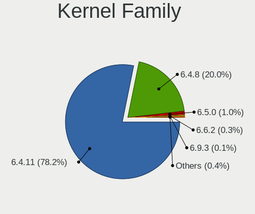

| Version | Notebooks | Percent |
|---------|-----------|---------|
| 6.4.11  | 568       | 77.7%   |
| 6.4.8   | 146       | 19.97%  |
| 6.5.0   | 12        | 1.64%   |
| 6.6.2   | 3         | 0.41%   |
| 6.5.1   | 1         | 0.14%   |
| 6.3.5   | 1         | 0.14%   |

Kernel Major Ver.
-----------------

Linux kernel major version

| Version | Notebooks | Percent |
|---------|-----------|---------|
| 6.4     | 714       | 97.67%  |
| 6.5     | 13        | 1.78%   |
| 6.6     | 3         | 0.41%   |
| 6.3     | 1         | 0.14%   |

Arch
----

OS architecture (x86_64, i586, etc.)

| Name   | Notebooks | Percent |
|--------|-----------|---------|
| x86_64 | 731       | 100%    |

DE
--

Desktop Environment

| Name     | Notebooks | Percent |
|----------|-----------|---------|
| KDE5     | 600       | 82.08%  |
| LXQt     | 65        | 8.89%   |
| GNOME    | 63        | 8.62%   |
| Cinnamon | 2         | 0.27%   |
| Unknown  | 1         | 0.14%   |

Display Server
--------------

X11 or Wayland

| Name    | Notebooks | Percent |
|---------|-----------|---------|
| Wayland | 701       | 95.9%   |
| X11     | 30        | 4.1%    |

Display Manager
---------------

SDDM, LightDM, etc.

| Name    | Notebooks | Percent |
|---------|-----------|---------|
| SDDM    | 667       | 91.24%  |
| GDM     | 63        | 8.62%   |
| Unknown | 1         | 0.14%   |

OS Lang
-------

Language

| Lang       | Notebooks | Percent |
|------------|-----------|---------|
| en_US      | 359       | 49.11%  |
| de_DE      | 49        | 6.7%    |
| fr_FR      | 48        | 6.57%   |
| pt_BR      | 46        | 6.29%   |
| ru_RU      | 35        | 4.79%   |
| en_GB      | 34        | 4.65%   |
| pl_PL      | 30        | 4.1%    |
| it_IT      | 16        | 2.19%   |
| es_ES      | 15        | 2.05%   |
| es_MX      | 12        | 1.64%   |
| en_CA      | 8         | 1.09%   |
| cs_CZ      | 8         | 1.09%   |
| nl_BE      | 6         | 0.82%   |
| hu_HU      | 6         | 0.82%   |
| tr_TR      | 5         | 0.68%   |
| es_CL      | 5         | 0.68%   |
| en_IN      | 5         | 0.68%   |
| es_AR      | 4         | 0.55%   |
| en_AU      | 4         | 0.55%   |
| pt_PT      | 3         | 0.41%   |
| fr_CH      | 3         | 0.41%   |
| en_IE      | 3         | 0.41%   |
| de_AT      | 3         | 0.41%   |
| ro_RO      | 2         | 0.27%   |
| fr_CA      | 2         | 0.27%   |
| es_VE      | 2         | 0.27%   |
| es_CO      | 2         | 0.27%   |
| de_CH      | 2         | 0.27%   |
| ca_ES      | 2         | 0.27%   |
| UTF-8      | 1         | 0.14%   |
| ru_RU-UTF8 | 1         | 0.14%   |
| ja_JP      | 1         | 0.14%   |
| fr_BE      | 1         | 0.14%   |
| es_PE      | 1         | 0.14%   |
| en_ZA      | 1         | 0.14%   |
| en_SG      | 1         | 0.14%   |
| en_NZ      | 1         | 0.14%   |
| en_DK      | 1         | 0.14%   |
| de_LU      | 1         | 0.14%   |
| de_BE      | 1         | 0.14%   |

Boot Mode
---------

EFI or BIOS

| Mode | Notebooks | Percent |
|------|-----------|---------|
| EFI  | 461       | 63.06%  |
| BIOS | 270       | 36.94%  |

Filesystem
----------

Type of filesystem

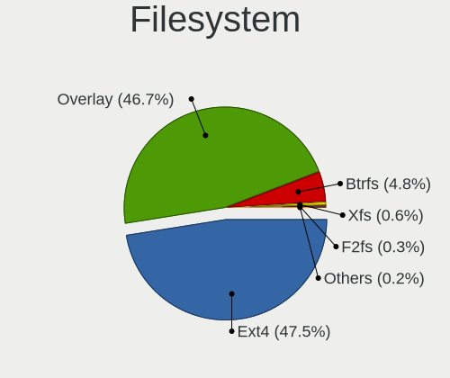

| Type    | Notebooks | Percent |
|---------|-----------|---------|
| Overlay | 377       | 51.57%  |
| Ext4    | 307       | 42%     |
| Btrfs   | 41        | 5.61%   |
| F2fs    | 3         | 0.41%   |
| Xfs     | 2         | 0.27%   |
| Ext2    | 1         | 0.14%   |

Part. scheme
------------

Scheme of partitioning

| Type    | Notebooks | Percent |
|---------|-----------|---------|
| GPT     | 570       | 77.98%  |
| MBR     | 160       | 21.89%  |
| Unknown | 1         | 0.14%   |

Dual Boot with Linux/BSD
------------------------

Hosting more than one Linux/BSD

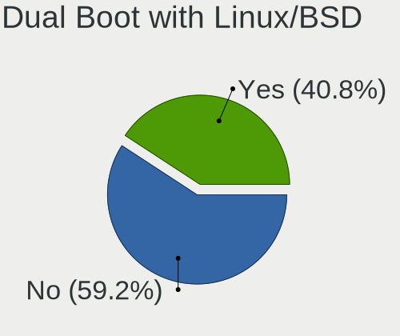

| Dual boot | Notebooks | Percent |
|-----------|-----------|---------|
| No        | 397       | 54.31%  |
| Yes       | 334       | 45.69%  |

Dual Boot (Win)
---------------

Hosting Linux and Windows

| Dual boot | Notebooks | Percent |
|-----------|-----------|---------|
| No        | 455       | 62.24%  |
| Yes       | 276       | 37.76%  |

Board
-----

Vendor
------

Motherboard manufacturer

| Name                  | Notebooks | Percent |
|-----------------------|-----------|---------|
| Lenovo                | 165       | 22.57%  |
| Hewlett-Packard       | 133       | 18.19%  |
| Dell                  | 100       | 13.68%  |
| Acer                  | 75        | 10.26%  |
| ASUSTek Computer      | 73        | 9.99%   |
| Toshiba               | 26        | 3.56%   |
| Samsung Electronics   | 24        | 3.28%   |
| MSI                   | 15        | 2.05%   |
| Sony                  | 9         | 1.23%   |
| Apple                 | 8         | 1.09%   |
| Positivo              | 6         | 0.82%   |
| LG Electronics        | 6         | 0.82%   |
| HUAWEI                | 6         | 0.82%   |
| Fujitsu               | 6         | 0.82%   |
| Packard Bell          | 5         | 0.68%   |
| Medion                | 5         | 0.68%   |
| Chuwi                 | 5         | 0.68%   |
| Unknown               | 5         | 0.68%   |
| Google                | 4         | 0.55%   |
| UMAX                  | 3         | 0.41%   |
| Panasonic             | 3         | 0.41%   |
| GPU Company           | 3         | 0.41%   |
| Clevo                 | 3         | 0.41%   |
| Thomson               | 2         | 0.27%   |
| System76              | 2         | 0.27%   |
| Positivo Bahia - VAIO | 2         | 0.27%   |
| Fujitsu Siemens       | 2         | 0.27%   |
| Framework             | 2         | 0.27%   |
| Compaq                | 2         | 0.27%   |
| ALLDOCUBE             | 2         | 0.27%   |
| ZOOSTORM              | 1         | 0.14%   |
| VIT                   | 1         | 0.14%   |
| VALE                  | 1         | 0.14%   |
| TUXEDO                | 1         | 0.14%   |
| Teclast               | 1         | 0.14%   |
| Star Labs             | 1         | 0.14%   |
| SKIKK                 | 1         | 0.14%   |
| Semp Toshiba          | 1         | 0.14%   |
| Razer                 | 1         | 0.14%   |
| Purism                | 1         | 0.14%   |

Model
-----

Motherboard model

| Name                                    | Notebooks | Percent |
|-----------------------------------------|-----------|---------|
| Unknown                                 | 8         | 1.09%   |
| HP Pavilion g6                          | 7         | 0.96%   |
| Lenovo ThinkPad L13 Gen 3 21BAS0X700    | 5         | 0.68%   |
| HP Laptop 15s-eq2xxx                    | 4         | 0.55%   |
| Dell Inspiron 3542                      | 4         | 0.55%   |
| ASUS K50AF                              | 4         | 0.55%   |
| Samsung 300E5M/300E5L                   | 3         | 0.41%   |
| Positivo Mobile                         | 3         | 0.41%   |
| Lenovo V15-IGL 82C3                     | 3         | 0.41%   |
| Lenovo IdeaPad Z570 HuronRiver Platform | 3         | 0.41%   |
| Lenovo IdeaPad 3 15ALC6 82MF            | 3         | 0.41%   |
| HP Notebook                             | 3         | 0.41%   |
| HP ElitePad 1000 G2                     | 3         | 0.41%   |
| HP EliteBook 840 G3                     | 3         | 0.41%   |
| Dell Latitude E6410                     | 3         | 0.41%   |
| Dell Latitude E6400                     | 3         | 0.41%   |
| Dell Latitude 7480                      | 3         | 0.41%   |
| Dell Latitude 7390                      | 3         | 0.41%   |
| Chuwi GemiBook XPro                     | 3         | 0.41%   |
| Acer Aspire A315-23                     | 3         | 0.41%   |
| Acer AOD270                             | 3         | 0.41%   |
| Toshiba Satellite C650                  | 2         | 0.27%   |
| Samsung 270E5K/270E5Q/271E5K/2570EK     | 2         | 0.27%   |
| Positivo C14CU51                        | 2         | 0.27%   |
| Lenovo Yoga 7 14ARP8 82YM               | 2         | 0.27%   |
| Lenovo Yoga 300-11IBY 80M0              | 2         | 0.27%   |
| Lenovo V15-ADA 82C7                     | 2         | 0.27%   |
| Lenovo V15 G2 ALC 82KD                  | 2         | 0.27%   |
| Lenovo V110-15IAP 80TG                  | 2         | 0.27%   |
| Lenovo IdeaPad L340-15IRH Gaming 81LK   | 2         | 0.27%   |
| Lenovo IdeaPad 3 15ITL6 82H8            | 2         | 0.27%   |
| Lenovo IdeaPad 1 15AMN7 82VG            | 2         | 0.27%   |
| Lenovo G500 20236                       | 2         | 0.27%   |
| HUAWEI KLVF-XX                          | 2         | 0.27%   |
| HP TouchSmart tm2                       | 2         | 0.27%   |
| HP Stream Laptop 14-ax0XX               | 2         | 0.27%   |
| HP ProBook 4540s                        | 2         | 0.27%   |
| HP ProBook 450 G3                       | 2         | 0.27%   |
| HP ProBook 430 G2                       | 2         | 0.27%   |
| HP Pavilion Gaming Laptop 15-ec0xxx     | 2         | 0.27%   |

Model Family
------------

Motherboard model prefix

| Name                  | Notebooks | Percent |
|-----------------------|-----------|---------|
| Lenovo ThinkPad       | 71        | 9.71%   |
| Acer Aspire           | 54        | 7.39%   |
| Dell Latitude         | 48        | 6.57%   |
| Lenovo IdeaPad        | 46        | 6.29%   |
| Dell Inspiron         | 33        | 4.51%   |
| HP Laptop             | 28        | 3.83%   |
| ASUS VivoBook         | 24        | 3.28%   |
| HP Pavilion           | 23        | 3.15%   |
| HP EliteBook          | 22        | 3.01%   |
| HP ProBook            | 20        | 2.74%   |
| Toshiba Satellite     | 19        | 2.6%    |
| Unknown               | 8         | 1.09%   |
| Lenovo Yoga           | 7         | 0.96%   |
| HP Compaq             | 7         | 0.96%   |
| Packard Bell EasyNote | 5         | 0.68%   |
| Dell Vostro           | 5         | 0.68%   |
| Dell Precision        | 5         | 0.68%   |
| Acer Nitro            | 5         | 0.68%   |
| Toshiba dynabook      | 4         | 0.55%   |
| HP ENVY               | 4         | 0.55%   |
| Fujitsu LIFEBOOK      | 4         | 0.55%   |
| Dell System           | 4         | 0.55%   |
| Chuwi GemiBook        | 4         | 0.55%   |
| ASUS K50AF            | 4         | 0.55%   |
| Apple MacBookPro11    | 4         | 0.55%   |
| Acer TravelMate       | 4         | 0.55%   |
| Samsung 300E5M        | 3         | 0.41%   |
| Positivo Mobile       | 3         | 0.41%   |
| Lenovo V15-IGL        | 3         | 0.41%   |
| Lenovo V15            | 3         | 0.41%   |
| HP Notebook           | 3         | 0.41%   |
| HP ElitePad           | 3         | 0.41%   |
| ASUS TUF              | 3         | 0.41%   |
| ASUS ASUS             | 3         | 0.41%   |
| Acer Swift            | 3         | 0.41%   |
| Acer Extensa          | 3         | 0.41%   |
| Acer AOD270           | 3         | 0.41%   |
| UMAX VisionBook       | 2         | 0.27%   |
| Toshiba PORTEGE       | 2         | 0.27%   |
| Samsung RV411         | 2         | 0.27%   |

MFG Year
--------

Motherboard manufacture year

| Year    | Notebooks | Percent |
|---------|-----------|---------|
| 2011    | 82        | 11.22%  |
| 2021    | 74        | 10.12%  |
| 2012    | 60        | 8.21%   |
| 2018    | 55        | 7.52%   |
| 2014    | 51        | 6.98%   |
| 2010    | 50        | 6.84%   |
| 2020    | 48        | 6.57%   |
| 2013    | 44        | 6.02%   |
| 2022    | 43        | 5.88%   |
| 2017    | 43        | 5.88%   |
| 2019    | 40        | 5.47%   |
| 2016    | 39        | 5.34%   |
| 2015    | 29        | 3.97%   |
| 2008    | 21        | 2.87%   |
| 2009    | 20        | 2.74%   |
| 2023    | 16        | 2.19%   |
| 2007    | 12        | 1.64%   |
| 2006    | 3         | 0.41%   |
| Unknown | 1         | 0.14%   |

Form Factor
-----------

Physical design of the computer

| Name     | Notebooks | Percent |
|----------|-----------|---------|
| Notebook | 731       | 100%    |

Secure Boot
-----------

Enabled or disabled

| State    | Notebooks | Percent |
|----------|-----------|---------|
| Disabled | 731       | 100%    |

Coreboot
--------

Have coreboot on board

| Used | Notebooks | Percent |
|------|-----------|---------|
| No   | 725       | 99.18%  |
| Yes  | 6         | 0.82%   |

RAM Size
--------

Total RAM memory

| Size in GB  | Notebooks | Percent |
|-------------|-----------|---------|
| 4.01-8.0    | 288       | 39.4%   |
| 3.01-4.0    | 180       | 24.62%  |
| 16.01-24.0  | 99        | 13.54%  |
| 8.01-16.0   | 86        | 11.76%  |
| 1.01-2.0    | 27        | 3.69%   |
| 32.01-64.0  | 23        | 3.15%   |
| 2.01-3.0    | 15        | 2.05%   |
| 64.01-256.0 | 6         | 0.82%   |
| 24.01-32.0  | 4         | 0.55%   |
| 0.51-1.0    | 3         | 0.41%   |

RAM Used
--------

Used RAM memory

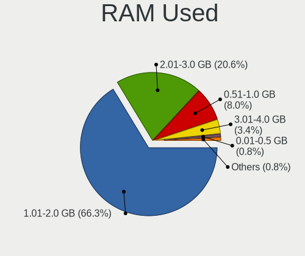

| Used GB  | Notebooks | Percent |
|----------|-----------|---------|
| 1.01-2.0 | 468       | 64.02%  |
| 2.01-3.0 | 154       | 21.07%  |
| 0.51-1.0 | 62        | 8.48%   |
| 3.01-4.0 | 32        | 4.38%   |
| 4.01-8.0 | 8         | 1.09%   |
| 0.01-0.5 | 7         | 0.96%   |

Total Drives
------------

Number of drives on board

| Drives | Notebooks | Percent |
|--------|-----------|---------|
| 1      | 494       | 67.58%  |
| 2      | 197       | 26.95%  |
| 3      | 25        | 3.42%   |
| 0      | 14        | 1.92%   |
| 4      | 1         | 0.14%   |

Has CD-ROM
----------

Has CD-ROM on board

| Presented | Notebooks | Percent |
|-----------|-----------|---------|
| No        | 457       | 62.52%  |
| Yes       | 274       | 37.48%  |

Has Ethernet
------------

Has Ethernet on board

| Presented | Notebooks | Percent |
|-----------|-----------|---------|
| Yes       | 590       | 80.71%  |
| No        | 141       | 19.29%  |

Has WiFi
--------

Has WiFi module

| Presented | Notebooks | Percent |
|-----------|-----------|---------|
| Yes       | 722       | 98.77%  |
| No        | 9         | 1.23%   |

Has Bluetooth
-------------

Has Bluetooth module

| Presented | Notebooks | Percent |
|-----------|-----------|---------|
| Yes       | 566       | 77.43%  |
| No        | 165       | 22.57%  |

Location
--------

Country
-------

Geographic location (country)

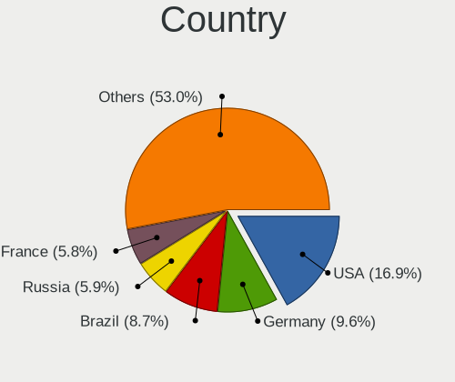

| Country     | Notebooks | Percent |
|-------------|-----------|---------|
| Germany     | 85        | 11.63%  |
| USA         | 78        | 10.67%  |
| Brazil      | 70        | 9.58%   |
| France      | 48        | 6.57%   |
| Russia      | 44        | 6.02%   |
| Poland      | 41        | 5.61%   |
| UK          | 32        | 4.38%   |
| Italy       | 28        | 3.83%   |
| Spain       | 26        | 3.56%   |
| Canada      | 21        | 2.87%   |
| India       | 16        | 2.19%   |
| Mexico      | 15        | 2.05%   |
| Indonesia   | 12        | 1.64%   |
| Czechia     | 12        | 1.64%   |
| Hungary     | 10        | 1.37%   |
| Turkey      | 9         | 1.23%   |
| Romania     | 9         | 1.23%   |
| Japan       | 9         | 1.23%   |
| Australia   | 9         | 1.23%   |
| Sweden      | 7         | 0.96%   |
| Netherlands | 7         | 0.96%   |
| Greece      | 7         | 0.96%   |
| Belgium     | 7         | 0.96%   |
| Thailand    | 6         | 0.82%   |
| Switzerland | 6         | 0.82%   |
| Portugal    | 6         | 0.82%   |
| Colombia    | 6         | 0.82%   |
| Chile       | 6         | 0.82%   |
| Bulgaria    | 6         | 0.82%   |
| Argentina   | 6         | 0.82%   |
| Slovakia    | 4         | 0.55%   |
| Malaysia    | 4         | 0.55%   |
| Finland     | 4         | 0.55%   |
| Serbia      | 3         | 0.41%   |
| Peru        | 3         | 0.41%   |
| Ireland     | 3         | 0.41%   |
| Costa Rica  | 3         | 0.41%   |
| China       | 3         | 0.41%   |
| Venezuela   | 2         | 0.27%   |
| Ukraine     | 2         | 0.27%   |

City
----

Geographic location (city)

| City               | Notebooks | Percent |
|--------------------|-----------|---------|
| Warsaw             | 11        | 1.5%    |
| Rio de Janeiro     | 7         | 0.96%   |
| Moscow             | 7         | 0.96%   |
| Stuttgart          | 6         | 0.82%   |
| Madrid             | 5         | 0.68%   |
| Berlin             | 5         | 0.68%   |
| Vancouver          | 4         | 0.55%   |
| Sao Paulo          | 4         | 0.55%   |
| Prague             | 4         | 0.55%   |
| Munich             | 4         | 0.55%   |
| Melbourne          | 4         | 0.55%   |
| Bengaluru          | 4         | 0.55%   |
| Athens             | 4         | 0.55%   |
| ilina            | 3         | 0.41%   |
| Wuppertal          | 3         | 0.41%   |
| Wroclaw            | 3         | 0.41%   |
| Wegberg            | 3         | 0.41%   |
| Rome               | 3         | 0.41%   |
| Pune               | 3         | 0.41%   |
| Paris              | 3         | 0.41%   |
| New York           | 3         | 0.41%   |
| Milano             | 3         | 0.41%   |
| Milan              | 3         | 0.41%   |
| La Baule-Escoublac | 3         | 0.41%   |
| Krakow             | 3         | 0.41%   |
| Istanbul           | 3         | 0.41%   |
| Geneva             | 3         | 0.41%   |
| Delhi              | 3         | 0.41%   |
| Curitiba           | 3         | 0.41%   |
| Concepcin        | 3         | 0.41%   |
| Bucharest          | 3         | 0.41%   |
| Barcelona          | 3         | 0.41%   |
| Angers             | 3         | 0.41%   |
| Yukon              | 2         | 0.27%   |
| Yekaterinburg      | 2         | 0.27%   |
| Winter Haven       | 2         | 0.27%   |
| Vienna             | 2         | 0.27%   |
| Vailhauques        | 2         | 0.27%   |
| Tomisato           | 2         | 0.27%   |
| Tijuana            | 2         | 0.27%   |

Drives
------

Drive Vendor
------------

Hard drive vendors

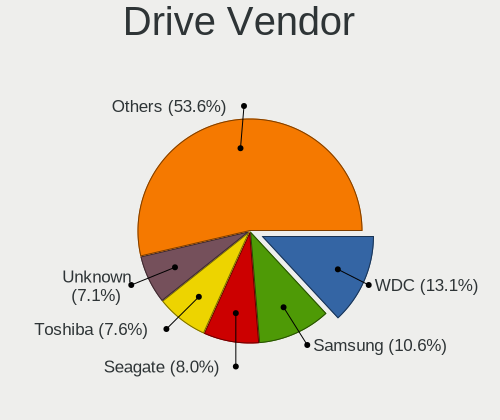

| Vendor                      | Notebooks | Drives | Percent |
|-----------------------------|-----------|--------|---------|
| WDC                         | 126       | 132    | 13.92%  |
| Samsung Electronics         | 104       | 111    | 11.49%  |
| Seagate                     | 73        | 73     | 8.07%   |
| Toshiba                     | 71        | 73     | 7.85%   |
| Kingston                    | 56        | 58     | 6.19%   |
| SanDisk                     | 51        | 52     | 5.64%   |
| Unknown                     | 44        | 47     | 4.86%   |
| SK hynix                    | 34        | 34     | 3.76%   |
| Hitachi                     | 31        | 31     | 3.43%   |
| Crucial                     | 25        | 27     | 2.76%   |
| Micron Technology           | 22        | 22     | 2.43%   |
| Intel                       | 19        | 20     | 2.1%    |
| HGST                        | 19        | 19     | 2.1%    |
| A-DATA Technology           | 17        | 17     | 1.88%   |
| China                       | 16        | 16     | 1.77%   |
| Unknown                     | 16        | 17     | 1.77%   |
| Intenso                     | 13        | 13     | 1.44%   |
| SSSTC                       | 10        | 10     | 1.1%    |
| SPCC                        | 8         | 9      | 0.88%   |
| Silicon Motion              | 8         | 8      | 0.88%   |
| LITEON                      | 8         | 8      | 0.88%   |
| KIOXIA                      | 8         | 8      | 0.88%   |
| GOODRAM                     | 8         | 8      | 0.88%   |
| Netac                       | 6         | 7      | 0.66%   |
| Apple                       | 6         | 6      | 0.66%   |
| JMicron Technology          | 5         | 5      | 0.55%   |
| PNY                         | 4         | 4      | 0.44%   |
| Phison                      | 4         | 4      | 0.44%   |
| LITEONIT                    | 4         | 4      | 0.44%   |
| Verbatim                    | 3         | 3      | 0.33%   |
| Transcend                   | 3         | 3      | 0.33%   |
| Patriot                     | 3         | 3      | 0.33%   |
| Lexar                       | 3         | 3      | 0.33%   |
| Kingston Technology Company | 3         | 3      | 0.33%   |
| KingSpec                    | 3         | 3      | 0.33%   |
| Fanxiang                    | 3         | 3      | 0.33%   |
| BIWIN                       | 3         | 3      | 0.33%   |
| WALRAM                      | 2         | 2      | 0.22%   |
| UMIS                        | 2         | 2      | 0.22%   |
| T-FORCE                     | 2         | 2      | 0.22%   |

Drive Model
-----------

Hard drive models

| Model                                | Notebooks | Percent |
|--------------------------------------|-----------|---------|
| Unknown                              | 16        | 1.73%   |
| Toshiba MQ04ABF100 1TB               | 13        | 1.4%    |
| Kingston SA400S37240G 240GB SSD      | 12        | 1.29%   |
| Seagate ST500LT012-1DG142 500GB      | 11        | 1.19%   |
| Toshiba MQ01ABD100 1TB               | 9         | 0.97%   |
| Seagate ST1000LM024 HN-M101MBB 1TB   | 8         | 0.86%   |
| Kingston SA400S37480G 480GB SSD      | 8         | 0.86%   |
| WDC WD10SPZX-24Z10 1TB               | 6         | 0.65%   |
| Toshiba MQ01ABF050 500GB             | 6         | 0.65%   |
| Seagate ST1000LM035-1RK172 1TB       | 6         | 0.65%   |
| Crucial CT1000BX500SSD1 1TB          | 6         | 0.65%   |
| SanDisk SSD PLUS 240GB               | 5         | 0.54%   |
| SanDisk DF4032  32GB                 | 5         | 0.54%   |
| Samsung SSD 870 EVO 500GB            | 5         | 0.54%   |
| Samsung SSD 860 EVO 500GB            | 5         | 0.54%   |
| HGST HTS725050A7E630 500GB           | 5         | 0.54%   |
| WDC WDS240G2G0A-00JH30 240GB SSD     | 4         | 0.43%   |
| WDC WD5000LPVX-22V0TT0 500GB         | 4         | 0.43%   |
| WDC WD10SPZX-21Z10T0 1TB             | 4         | 0.43%   |
| WDC PC SN530 SDBPNPZ-256G-1002 256GB | 4         | 0.43%   |
| Unknown SD/MMC/MS PRO 256GB          | 4         | 0.43%   |
| SSSTC CL1-4D256 256GB                | 4         | 0.43%   |
| Seagate ST9500325AS 500GB            | 4         | 0.43%   |
| SanDisk NVMe SSD Drive 1TB           | 4         | 0.43%   |
| Samsung MZALQ512HBLU-00BL2 512GB     | 4         | 0.43%   |
| Micron 2210_MTFDHBA512QFD 512GB      | 4         | 0.43%   |
| HGST HTS721010A9E630 1TB             | 4         | 0.43%   |
| GOODRAM SSDPR-CX400-512-G2 512GB     | 4         | 0.43%   |
| Crucial CT500MX500SSD1 500GB         | 4         | 0.43%   |
| WDC WDS240G2G0B-00EPW0 240GB SSD     | 3         | 0.32%   |
| WDC WD5000LPCX-24C6HT0 500GB         | 3         | 0.32%   |
| WDC WD5000LPCX-21VHAT0 500GB         | 3         | 0.32%   |
| WDC WD3200BPVT-22JJ5T0 320GB         | 3         | 0.32%   |
| WDC WD1600BEVT-22ZCT0 160GB          | 3         | 0.32%   |
| WDC WD10SPZX-60Z10T0 1TB             | 3         | 0.32%   |
| WDC WD10JPVX-22JC3T0 1TB             | 3         | 0.32%   |
| WDC PC SN530 SDBPNPZ-512G-1114 512GB | 3         | 0.32%   |
| Unknown TA2964  64GB                 | 3         | 0.32%   |
| Toshiba MQ01ABD075 752GB             | 3         | 0.32%   |
| SK hynix BC711 HFM512GD3JX013N 512GB | 3         | 0.32%   |

HDD Vendor
----------

Hard disk drive vendors

| Vendor              | Notebooks | Drives | Percent |
|---------------------|-----------|--------|---------|
| WDC                 | 85        | 86     | 30.14%  |
| Seagate             | 70        | 70     | 24.82%  |
| Toshiba             | 59        | 60     | 20.92%  |
| Hitachi             | 31        | 31     | 10.99%  |
| HGST                | 19        | 19     | 6.74%   |
| Samsung Electronics | 8         | 8      | 2.84%   |
| Unknown             | 4         | 4      | 1.42%   |
| TO Exter            | 1         | 1      | 0.35%   |
| JMicron Technology  | 1         | 1      | 0.35%   |
| Inateck             | 1         | 1      | 0.35%   |
| Fujitsu             | 1         | 1      | 0.35%   |
| External            | 1         | 1      | 0.35%   |
| Apple               | 1         | 1      | 0.35%   |

SSD Vendor
----------

Solid state drive vendors

| Vendor              | Notebooks | Drives | Percent |
|---------------------|-----------|--------|---------|
| Samsung Electronics | 47        | 47     | 13.62%  |
| Kingston            | 41        | 41     | 11.88%  |
| SanDisk             | 35        | 36     | 10.14%  |
| WDC                 | 20        | 22     | 5.8%    |
| Crucial             | 19        | 19     | 5.51%   |
| China               | 16        | 16     | 4.64%   |
| Intenso             | 13        | 13     | 3.77%   |
| A-DATA Technology   | 12        | 12     | 3.48%   |
| SK hynix            | 10        | 10     | 2.9%    |
| Micron Technology   | 10        | 10     | 2.9%    |
| SPCC                | 8         | 8      | 2.32%   |
| GOODRAM             | 8         | 8      | 2.32%   |
| LITEON              | 7         | 7      | 2.03%   |
| Toshiba             | 6         | 7      | 1.74%   |
| Netac               | 6         | 7      | 1.74%   |
| Intel               | 5         | 5      | 1.45%   |
| Apple               | 5         | 5      | 1.45%   |
| PNY                 | 4         | 4      | 1.16%   |
| LITEONIT            | 4         | 4      | 1.16%   |
| Verbatim            | 3         | 3      | 0.87%   |
| Transcend           | 3         | 3      | 0.87%   |
| Seagate             | 3         | 3      | 0.87%   |
| Patriot             | 3         | 3      | 0.87%   |
| KingSpec            | 3         | 3      | 0.87%   |
| Fanxiang            | 3         | 3      | 0.87%   |
| WALRAM              | 2         | 2      | 0.58%   |
| BIWIN               | 2         | 2      | 0.58%   |
| AirDisk             | 2         | 2      | 0.58%   |
| Zheino              | 1         | 1      | 0.29%   |
| XrayDisk            | 1         | 1      | 0.29%   |
| Wibtek              | 1         | 1      | 0.29%   |
| WDC WDS             | 1         | 1      | 0.29%   |
| VISIPRO             | 1         | 1      | 0.29%   |
| Vaseky              | 1         | 1      | 0.29%   |
| USB3.0              | 1         | 1      | 0.29%   |
| USB                 | 1         | 1      | 0.29%   |
| UMAX                | 1         | 1      | 0.29%   |
| Teclast             | 1         | 1      | 0.29%   |
| Team                | 1         | 1      | 0.29%   |
| T-FORCE             | 1         | 1      | 0.29%   |

Drive Kind
----------

HDD or SSD

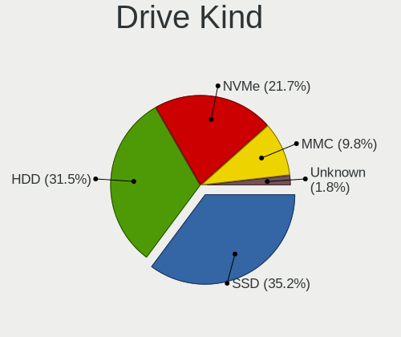

| Kind    | Notebooks | Drives | Percent |
|---------|-----------|--------|---------|
| SSD     | 320       | 350    | 37.21%  |
| HDD     | 274       | 284    | 31.86%  |
| NVMe    | 201       | 225    | 23.37%  |
| MMC     | 54        | 62     | 6.28%   |
| Unknown | 11        | 11     | 1.28%   |

Drive Connector
---------------

SATA, SAS, NVMe, etc.

| Type | Notebooks | Drives | Percent |
|------|-----------|--------|---------|
| SATA | 535       | 594    | 63.69%  |
| NVMe | 201       | 223    | 23.93%  |
| MMC  | 54        | 62     | 6.43%   |
| SAS  | 50        | 53     | 5.95%   |

Drive Size
----------

Size of hard drive

| Size in TB | Notebooks | Drives | Percent |
|------------|-----------|--------|---------|
| 0.01-0.5   | 413       | 452    | 69.88%  |
| 0.51-1.0   | 166       | 170    | 28.09%  |
| 1.01-2.0   | 10        | 10     | 1.69%   |
| 3.01-4.0   | 2         | 2      | 0.34%   |

Space Total
-----------

Amount of disk space available on the file system

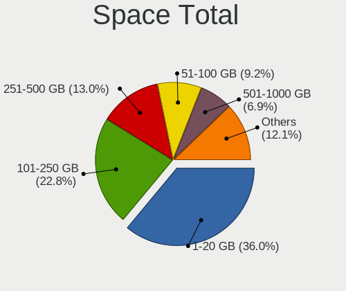

| Size in GB     | Notebooks | Percent |
|----------------|-----------|---------|
| 1-20           | 296       | 40.49%  |
| 101-250        | 157       | 21.48%  |
| 251-500        | 89        | 12.18%  |
| 501-1000       | 53        | 7.25%   |
| 51-100         | 43        | 5.88%   |
| 21-50          | 38        | 5.2%    |
| Unknown        | 27        | 3.69%   |
| 1001-2000      | 15        | 2.05%   |
| 2001-3000      | 9         | 1.23%   |
| More than 3000 | 4         | 0.55%   |

Space Used
----------

Amount of used disk space

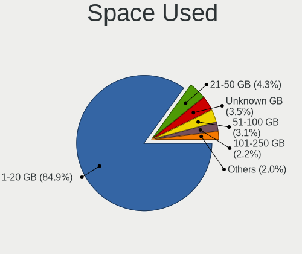

| Used GB        | Notebooks | Percent |
|----------------|-----------|---------|
| 1-20           | 618       | 84.54%  |
| 21-50          | 34        | 4.65%   |
| Unknown        | 27        | 3.69%   |
| 51-100         | 24        | 3.28%   |
| 101-250        | 15        | 2.05%   |
| 251-500        | 6         | 0.82%   |
| 501-1000       | 5         | 0.68%   |
| More than 3000 | 1         | 0.14%   |
| 1001-2000      | 1         | 0.14%   |

Malfunc. Drives
---------------

Drive models with a malfunction

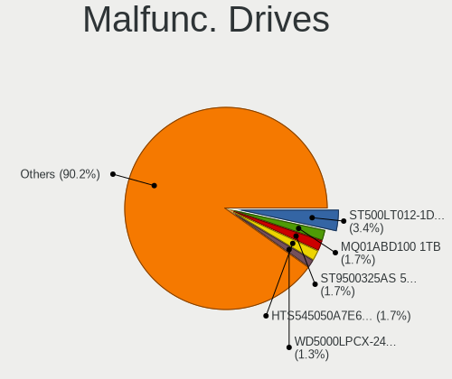

| Model                                | Notebooks | Drives | Percent |
|--------------------------------------|-----------|--------|---------|
| Seagate ST500LT012-1DG142 500GB      | 5         | 5      | 3.4%    |
| Toshiba MQ01ABD100 1TB               | 3         | 3      | 2.04%   |
| SK hynix BC711 HFM512GD3JX013N 512GB | 3         | 3      | 2.04%   |
| Seagate ST9500325AS 500GB            | 3         | 3      | 2.04%   |
| Seagate ST1000LM024 HN-M101MBB 1TB   | 3         | 3      | 2.04%   |
| HGST HTS721010A9E630 1TB             | 3         | 3      | 2.04%   |
| WDC WD5000LPVX-22V0TT0 500GB         | 2         | 2      | 1.36%   |
| WDC WD5000LPCX-24C6HT0 500GB         | 2         | 2      | 1.36%   |
| WDC WD5000BPVT-00HXZT3 500GB         | 2         | 2      | 1.36%   |
| Toshiba MQ04ABF100 1TB               | 2         | 2      | 1.36%   |
| Toshiba MQ01ABF050 500GB             | 2         | 2      | 1.36%   |
| Toshiba MK6475GSX 640GB              | 2         | 2      | 1.36%   |
| Toshiba MK3259GSXP 320GB             | 2         | 2      | 1.36%   |
| Seagate ST500LT012-9WS142 500GB      | 2         | 2      | 1.36%   |
| Hitachi HTS723232A7A364 320GB        | 2         | 2      | 1.36%   |
| Hitachi HTS547564A9E384 640GB        | 2         | 2      | 1.36%   |
| Hitachi HTS543232A7A384 320GB        | 2         | 2      | 1.36%   |
| Hitachi HTS543216L9A300 160GB        | 2         | 2      | 1.36%   |
| Hitachi HTS542516K9SA00 160GB        | 2         | 2      | 1.36%   |
| HGST HTS725050A7E630 500GB           | 2         | 2      | 1.36%   |
| HGST HTS545050A7E680 500GB           | 2         | 2      | 1.36%   |
| Wibtek W800S 512GB SSD               | 1         | 1      | 0.68%   |
| WDC WDS480G2G0A-00JH30 480GB SSD     | 1         | 1      | 0.68%   |
| WDC WDS240G2G0B-00EPW0 240GB SSD     | 1         | 1      | 0.68%   |
| WDC WDS240G2G0A-00JH30 240GB SSD     | 1         | 1      | 0.68%   |
| WDC WD7500BPKT-75PK4T0 752GB         | 1         | 1      | 0.68%   |
| WDC WD6400BEVT-75A0RT0 640GB         | 1         | 1      | 0.68%   |
| WDC WD5000LPVX-80V0TT0 500GB         | 1         | 1      | 0.68%   |
| WDC WD5000LPVX-60V0TT0 500GB         | 1         | 1      | 0.68%   |
| WDC WD3200BEKT-75PVMT0 320GB         | 1         | 1      | 0.68%   |
| WDC WD3200BEKT-22A25T1 320GB         | 1         | 1      | 0.68%   |
| WDC WD2500BEVT-22A23T0 250GB         | 1         | 1      | 0.68%   |
| WDC WD1600BEVT-60ZCT1 160GB          | 1         | 1      | 0.68%   |
| WDC WD1600BEVT-60ZCT0 160GB          | 1         | 1      | 0.68%   |
| WDC WD1600BEVS-60RST0 160GB          | 1         | 1      | 0.68%   |
| WDC WD10SPZX-60Z10T0 1TB             | 1         | 1      | 0.68%   |
| WDC WD10JPVX-60JC3T1 1TB             | 1         | 1      | 0.68%   |
| WDC WD10JPVX-00JC3T0 1TB             | 1         | 1      | 0.68%   |
| WDC WD Blue SA510 2.5 500GB          | 1         | 2      | 0.68%   |
| Toshiba MQ01ABD032 320GB             | 1         | 1      | 0.68%   |

Malfunc. Drive Vendor
---------------------

Vendors of faulty drives

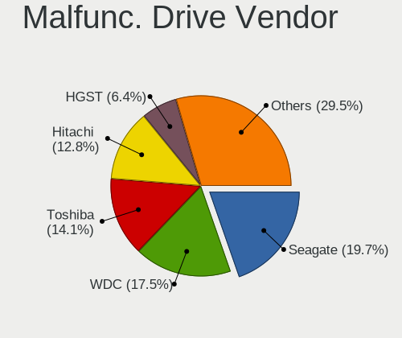

| Vendor              | Notebooks | Drives | Percent |
|---------------------|-----------|--------|---------|
| Seagate             | 25        | 25     | 17.01%  |
| Toshiba             | 24        | 24     | 16.33%  |
| WDC                 | 23        | 24     | 15.65%  |
| Hitachi             | 22        | 22     | 14.97%  |
| SK hynix            | 11        | 11     | 7.48%   |
| HGST                | 8         | 8      | 5.44%   |
| SanDisk             | 5         | 5      | 3.4%    |
| Samsung Electronics | 5         | 5      | 3.4%    |
| Micron Technology   | 3         | 3      | 2.04%   |
| LITEONIT            | 3         | 3      | 2.04%   |
| A-DATA Technology   | 3         | 3      | 2.04%   |
| Kingston            | 2         | 2      | 1.36%   |
| Intel               | 2         | 2      | 1.36%   |
| China               | 2         | 2      | 1.36%   |
| Wibtek              | 1         | 1      | 0.68%   |
| SSSTC               | 1         | 1      | 0.68%   |
| SPCC                | 1         | 1      | 0.68%   |
| SandForce           | 1         | 1      | 0.68%   |
| OCZ-AGIL            | 1         | 1      | 0.68%   |
| Netac               | 1         | 1      | 0.68%   |
| Intenso             | 1         | 1      | 0.68%   |
| Crucial             | 1         | 1      | 0.68%   |
| ACOS                | 1         | 1      | 0.68%   |

Malfunc. HDD Vendor
-------------------

Vendors of faulty HDD drives

| Vendor              | Notebooks | Drives | Percent |
|---------------------|-----------|--------|---------|
| Seagate             | 25        | 25     | 24.51%  |
| Toshiba             | 24        | 24     | 23.53%  |
| Hitachi             | 22        | 22     | 21.57%  |
| WDC                 | 19        | 19     | 18.63%  |
| HGST                | 8         | 8      | 7.84%   |
| Samsung Electronics | 4         | 4      | 3.92%   |

Malfunc. Drive Kind
-------------------

Kinds of faulty drives

| Kind | Notebooks | Drives | Percent |
|------|-----------|--------|---------|
| HDD  | 101       | 102    | 69.18%  |
| SSD  | 40        | 41     | 27.4%   |
| NVMe | 5         | 5      | 3.42%   |

Failed Drives
-------------

Failed drive models

| Model                          | Notebooks | Drives | Percent |
|--------------------------------|-----------|--------|---------|
| Toshiba MQ01ABD050 500GB       | 1         | 1      | 20%     |
| Toshiba MK2575GSX 250GB        | 1         | 1      | 20%     |
| Toshiba MK1234GSX 120GB        | 1         | 1      | 20%     |
| Intel SSDSCKKF256H6 SATA 256GB | 1         | 1      | 20%     |
| Hitachi HTS545032B9A300 320GB  | 1         | 1      | 20%     |

Failed Drive Vendor
-------------------

Failed drive vendors

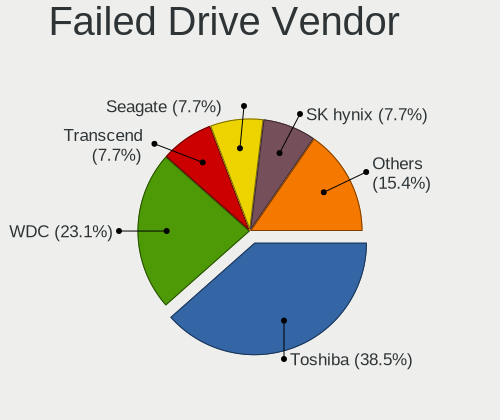

| Vendor  | Notebooks | Drives | Percent |
|---------|-----------|--------|---------|
| Toshiba | 3         | 3      | 60%     |
| Intel   | 1         | 1      | 20%     |
| Hitachi | 1         | 1      | 20%     |

Drive Status
------------

Number of failed and malfunc. drives

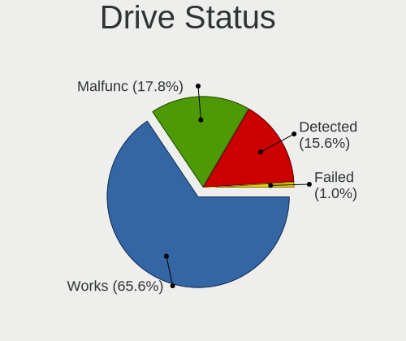

| Status   | Notebooks | Drives | Percent |
|----------|-----------|--------|---------|
| Works    | 564       | 662    | 69.72%  |
| Malfunc  | 145       | 148    | 17.92%  |
| Detected | 95        | 117    | 11.74%  |
| Failed   | 5         | 5      | 0.62%   |

Storage controller
------------------

Storage Vendor
--------------

Storage controller vendors

| Vendor                           | Notebooks | Percent |
|----------------------------------|-----------|---------|
| Intel                            | 550       | 65.48%  |
| AMD                              | 79        | 9.4%    |
| Samsung Electronics              | 55        | 6.55%   |
| SanDisk                          | 32        | 3.81%   |
| SK hynix                         | 22        | 2.62%   |
| Kingston Technology Company      | 17        | 2.02%   |
| Micron Technology                | 13        | 1.55%   |
| Solid State Storage Technology   | 9         | 1.07%   |
| Silicon Motion                   | 9         | 1.07%   |
| KIOXIA                           | 9         | 1.07%   |
| Phison Electronics               | 6         | 0.71%   |
| Micron/Crucial Technology        | 6         | 0.71%   |
| ADATA Technology                 | 6         | 0.71%   |
| Toshiba America Info Systems     | 5         | 0.6%    |
| Nvidia                           | 4         | 0.48%   |
| Shenzhen Longsys Electronics     | 3         | 0.36%   |
| Union Memory (Shenzhen)          | 2         | 0.24%   |
| Silicon Integrated Systems [SiS] | 2         | 0.24%   |
| Realtek Semiconductor            | 2         | 0.24%   |
| MAXIO Technology (Hangzhou)      | 2         | 0.24%   |
| JMicron Technology               | 2         | 0.24%   |
| Nextorage                        | 1         | 0.12%   |
| Marvell Technology Group         | 1         | 0.12%   |
| Lite-On Technology               | 1         | 0.12%   |
| Lenovo                           | 1         | 0.12%   |
| INNOGRIT                         | 1         | 0.12%   |

Storage Model
-------------

Storage controller models

| Model                                                                            | Notebooks | Percent |
|----------------------------------------------------------------------------------|-----------|---------|
| AMD FCH SATA Controller [AHCI mode]                                              | 69        | 7.7%    |
| Intel 7 Series Chipset Family 6-port SATA Controller [AHCI mode]                 | 64        | 7.14%   |
| Intel Sunrise Point-LP SATA Controller [AHCI mode]                               | 61        | 6.81%   |
| Intel 6 Series/C200 Series Chipset Family 6 port Mobile SATA AHCI Controller     | 56        | 6.25%   |
| Intel 82801 Mobile SATA Controller [RAID mode]                                   | 48        | 5.36%   |
| Intel 5 Series/3400 Series Chipset 4 port SATA AHCI Controller                   | 33        | 3.68%   |
| Intel 8 Series SATA Controller 1 [AHCI mode]                                     | 30        | 3.35%   |
| Intel Wildcat Point-LP SATA Controller [AHCI Mode]                               | 24        | 2.68%   |
| Samsung NVMe SSD Controller SM981/PM981/PM983                                    | 22        | 2.46%   |
| Intel Celeron/Pentium Silver Processor SATA Controller                           | 22        | 2.46%   |
| Samsung NVMe SSD Controller 980 (DRAM-less)                                      | 21        | 2.34%   |
| Intel 82801IBM/IEM (ICH9M/ICH9M-E) 4 port SATA Controller [AHCI mode]            | 19        | 2.12%   |
| Intel 8 Series/C220 Series Chipset Family 6-port SATA Controller 1 [AHCI mode]   | 17        | 1.9%    |
| Intel Tiger Lake-LP SATA Controller                                              | 16        | 1.79%   |
| Intel Volume Management Device NVMe RAID Controller                              | 14        | 1.56%   |
| Intel Atom Processor E3800 Series SATA AHCI Controller                           | 13        | 1.45%   |
| SanDisk Ultra 3D / WD Blue SN550 NVMe SSD                                        | 12        | 1.34%   |
| Intel Celeron N3350/Pentium N4200/Atom E3900 Series SATA AHCI Controller         | 12        | 1.34%   |
| Intel Cannon Lake Mobile PCH SATA AHCI Controller                                | 11        | 1.23%   |
| Intel 82801HM/HEM (ICH8M/ICH8M-E) IDE Controller                                 | 11        | 1.23%   |
| Intel Comet Lake SATA AHCI Controller                                            | 10        | 1.12%   |
| Intel 82801HM/HEM (ICH8M/ICH8M-E) SATA Controller [AHCI mode]                    | 10        | 1.12%   |
| Solid State Storage CL1-3D256-Q11 NVMe SSD M.2                                   | 9         | 1%      |
| Intel NM10/ICH7 Family SATA Controller [AHCI mode]                               | 9         | 1%      |
| Intel 5 Series/3400 Series Chipset 6 port SATA AHCI Controller                   | 9         | 1%      |
| SK hynix Gold P31/BC711/PC711 NVMe Solid State Drive                             | 8         | 0.89%   |
| Intel Jasper Lake SATA AHCI Controller                                           | 8         | 0.89%   |
| AMD SB7x0/SB8x0/SB9x0 SATA Controller [AHCI mode]                                | 8         | 0.89%   |
| Silicon Motion SM2263EN/SM2263XT (DRAM-less) NVMe SSD Controllers                | 7         | 0.78%   |
| Samsung NVMe SSD Controller PM9A1/PM9A3/980PRO                                   | 7         | 0.78%   |
| KIOXIA NVMe SSD Controller BG4 (DRAM-less)                                       | 7         | 0.78%   |
| Intel HM170/QM170 Chipset SATA Controller [AHCI Mode]                            | 7         | 0.78%   |
| Intel Cannon Point-LP SATA Controller [AHCI Mode]                                | 7         | 0.78%   |
| SK hynix BC511 NVMe SSD                                                          | 6         | 0.67%   |
| Intel Ice Lake-LP SATA Controller [AHCI mode]                                    | 6         | 0.67%   |
| Intel Atom/Celeron/Pentium Processor x5-E8000/J3xxx/N3xxx Series SATA Controller | 6         | 0.67%   |
| SK hynix BC501 NVMe Solid State Drive                                            | 5         | 0.56%   |
| Micron/Crucial P2 [Nick P2] / P3 / P3 Plus NVMe PCIe SSD (DRAM-less)             | 5         | 0.56%   |
| Micron 2210 NVMe SSD [Cobain]                                                    | 5         | 0.56%   |
| Kingston Company OM3PDP3 NVMe SSD                                                | 5         | 0.56%   |

Storage Kind
------------

Kind of storage controller (IDE, SATA, NVMe, SAS, ...)

| Kind | Notebooks | Percent |
|------|-----------|---------|
| SATA | 549       | 63.84%  |
| NVMe | 201       | 23.37%  |
| RAID | 64        | 7.44%   |
| IDE  | 46        | 5.35%   |

Processor
---------

CPU Vendor
----------

Processor vendors

| Vendor | Notebooks | Percent |
|--------|-----------|---------|
| Intel  | 612       | 83.72%  |
| AMD    | 119       | 16.28%  |

CPU Model
---------

Processor models

| Model                                         | Notebooks | Percent |
|-----------------------------------------------|-----------|---------|
| Intel Celeron N4020 CPU @ 1.10GHz             | 12        | 1.64%   |
| Intel Core i5-7200U CPU @ 2.50GHz             | 10        | 1.37%   |
| Intel Core i5-6300U CPU @ 2.40GHz             | 10        | 1.37%   |
| Intel Core i5-3320M CPU @ 2.60GHz             | 10        | 1.37%   |
| Intel Core i5-3210M CPU @ 2.50GHz             | 10        | 1.37%   |
| Intel 11th Gen Core i3-1115G4 @ 3.00GHz       | 10        | 1.37%   |
| Intel Core i5-6200U CPU @ 2.30GHz             | 9         | 1.23%   |
| Intel Core i5-2520M CPU @ 2.50GHz             | 9         | 1.23%   |
| Intel Core i3-2350M CPU @ 2.30GHz             | 9         | 1.23%   |
| Intel Core i5-4210U CPU @ 1.70GHz             | 8         | 1.09%   |
| Intel Celeron CPU N3060 @ 1.60GHz             | 8         | 1.09%   |
| Intel 11th Gen Core i5-1135G7 @ 2.40GHz       | 8         | 1.09%   |
| AMD Ryzen 5 5500U with Radeon Graphics        | 8         | 1.09%   |
| Intel Core i7-8750H CPU @ 2.20GHz             | 7         | 0.96%   |
| Intel Core i5 CPU M 520 @ 2.40GHz             | 7         | 0.96%   |
| Intel Core i5 CPU M 430 @ 2.27GHz             | 7         | 0.96%   |
| Intel Core i3-2310M CPU @ 2.10GHz             | 7         | 0.96%   |
| Intel Core i3 CPU M 380 @ 2.53GHz             | 7         | 0.96%   |
| Intel Celeron N4000 CPU @ 1.10GHz             | 7         | 0.96%   |
| AMD Ryzen 7 5700U with Radeon Graphics        | 7         | 0.96%   |
| Intel Core i7-2670QM CPU @ 2.20GHz            | 6         | 0.82%   |
| Intel Core i5-8350U CPU @ 1.70GHz             | 6         | 0.82%   |
| Intel Core i5-5300U CPU @ 2.30GHz             | 6         | 0.82%   |
| Intel Core i5-2410M CPU @ 2.30GHz             | 6         | 0.82%   |
| Intel Core i5-10210U CPU @ 1.60GHz            | 6         | 0.82%   |
| Intel Core i3-6006U CPU @ 2.00GHz             | 6         | 0.82%   |
| Intel Core i3-4005U CPU @ 1.70GHz             | 6         | 0.82%   |
| Intel Core i3-1005G1 CPU @ 1.20GHz            | 6         | 0.82%   |
| Intel Celeron CPU N3350 @ 1.10GHz             | 6         | 0.82%   |
| Intel Core i7-6500U CPU @ 2.50GHz             | 5         | 0.68%   |
| Intel Core i5-5200U CPU @ 2.20GHz             | 5         | 0.68%   |
| Intel Core i5-3230M CPU @ 2.60GHz             | 5         | 0.68%   |
| Intel Core i5-2540M CPU @ 2.60GHz             | 5         | 0.68%   |
| Intel Core i5-2450M CPU @ 2.50GHz             | 5         | 0.68%   |
| Intel Core i5 CPU M 460 @ 2.53GHz             | 5         | 0.68%   |
| Intel Core i3-5005U CPU @ 2.00GHz             | 5         | 0.68%   |
| Intel Core i3-4000M CPU @ 2.40GHz             | 5         | 0.68%   |
| AMD Ryzen 7 3700U with Radeon Vega Mobile Gfx | 5         | 0.68%   |
| AMD Ryzen 5 PRO 5675U with Radeon Graphics    | 5         | 0.68%   |
| AMD Ryzen 5 3500U with Radeon Vega Mobile Gfx | 5         | 0.68%   |

CPU Model Family
----------------

Processor model prefix

| Model                   | Notebooks | Percent |
|-------------------------|-----------|---------|
| Intel Core i5           | 191       | 26.13%  |
| Intel Core i7           | 99        | 13.54%  |
| Intel Core i3           | 92        | 12.59%  |
| Intel Celeron           | 72        | 9.85%   |
| Other                   | 57        | 7.8%    |
| Intel Pentium           | 35        | 4.79%   |
| AMD Ryzen 5             | 26        | 3.56%   |
| Intel Core 2 Duo        | 24        | 3.28%   |
| AMD Ryzen 7             | 24        | 3.28%   |
| Intel Atom              | 15        | 2.05%   |
| AMD Ryzen 3             | 12        | 1.64%   |
| AMD A6                  | 7         | 0.96%   |
| AMD A4                  | 7         | 0.96%   |
| Intel Pentium Silver    | 6         | 0.82%   |
| Intel Pentium Dual-Core | 6         | 0.82%   |
| AMD Ryzen 5 PRO         | 6         | 0.82%   |
| Intel Pentium Dual      | 5         | 0.68%   |
| Intel Genuine           | 5         | 0.68%   |
| AMD Athlon              | 5         | 0.68%   |
| Intel Core 2            | 4         | 0.55%   |
| AMD Athlon II Dual-Core | 4         | 0.55%   |
| Intel Core M            | 3         | 0.41%   |
| AMD E                   | 3         | 0.41%   |
| AMD A8                  | 3         | 0.41%   |
| Intel Pentium Gold      | 2         | 0.27%   |
| AMD Sempron             | 2         | 0.27%   |
| AMD Ryzen 7 PRO         | 2         | 0.27%   |
| AMD A10                 | 2         | 0.27%   |
| Intel Core m3           | 1         | 0.14%   |
| Intel Core 2 Solo       | 1         | 0.14%   |
| Intel Core 2 Extreme    | 1         | 0.14%   |
| AMD Turion II           | 1         | 0.14%   |
| AMD Turion 64 X2 Mobile | 1         | 0.14%   |
| AMD Ryzen 9             | 1         | 0.14%   |
| AMD Ryzen 3 PRO         | 1         | 0.14%   |
| AMD Phenom II           | 1         | 0.14%   |
| AMD E2                  | 1         | 0.14%   |
| AMD E1                  | 1         | 0.14%   |
| AMD C-50                | 1         | 0.14%   |
| AMD A12                 | 1         | 0.14%   |

CPU Cores
---------

Number of processor cores

| Number | Notebooks | Percent |
|--------|-----------|---------|
| 2      | 466       | 63.75%  |
| 4      | 170       | 23.26%  |
| 6      | 36        | 4.92%   |
| 8      | 23        | 3.15%   |
| 1      | 18        | 2.46%   |
| 14     | 7         | 0.96%   |
| 12     | 5         | 0.68%   |
| 10     | 3         | 0.41%   |
| 24     | 1         | 0.14%   |
| 16     | 1         | 0.14%   |
| 3      | 1         | 0.14%   |

CPU Sockets
-----------

Number of sockets

| Number | Notebooks | Percent |
|--------|-----------|---------|
| 1      | 731       | 100%    |

CPU Threads
-----------

Threads per core (Hyper-Threading)

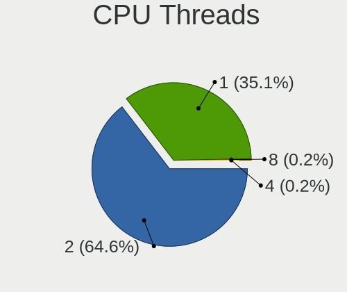

| Number | Notebooks | Percent |
|--------|-----------|---------|
| 2      | 516       | 70.59%  |
| 1      | 212       | 29%     |
| 4      | 2         | 0.27%   |
| 8      | 1         | 0.14%   |

CPU Op-Modes
------------

CPU Operation Modes (32-bit, 64-bit)

| Op mode        | Notebooks | Percent |
|----------------|-----------|---------|
| 32-bit, 64-bit | 731       | 100%    |

CPU Microcode
-------------

Microcode number

| Number     | Notebooks | Percent |
|------------|-----------|---------|
| Unknown    | 617       | 84.4%   |
| 0x08108109 | 18        | 2.46%   |
| 0x08608103 | 12        | 1.64%   |
| 0x0810100b | 7         | 0.96%   |
| 0x06006705 | 7         | 0.96%   |
| 0x0a50000d | 6         | 0.82%   |
| 0x0a50000c | 5         | 0.68%   |
| 0x0a404102 | 5         | 0.68%   |
| 0x08108102 | 5         | 0.68%   |
| 0x08200103 | 4         | 0.55%   |
| 0x0600611a | 4         | 0.55%   |
| 0x08a00006 | 3         | 0.41%   |
| 0x08608104 | 3         | 0.41%   |
| 0x08600106 | 3         | 0.41%   |
| 0x08101007 | 3         | 0.41%   |
| 0x06001116 | 3         | 0.41%   |
| 0x08608102 | 2         | 0.27%   |
| 0x0500010d | 2         | 0.27%   |
| 0x05000028 | 2         | 0.27%   |
| 0x03000027 | 2         | 0.27%   |
| 0x02000057 | 2         | 0.27%   |
| 0x0a404101 | 1         | 0.14%   |
| 0x08600109 | 1         | 0.14%   |
| 0x08600104 | 1         | 0.14%   |
| 0x08101016 | 1         | 0.14%   |
| 0x07030106 | 1         | 0.14%   |
| 0x07030104 | 1         | 0.14%   |
| 0x07000110 | 1         | 0.14%   |
| 0x0700010f | 1         | 0.14%   |
| 0x06006704 | 1         | 0.14%   |
| 0x06001119 | 1         | 0.14%   |
| 0x05000101 | 1         | 0.14%   |
| 0x03000025 | 1         | 0.14%   |
| 0x03000014 | 1         | 0.14%   |
| 0x0300000f | 1         | 0.14%   |
| 0x010000c8 | 1         | 0.14%   |
| 0x010000b6 | 1         | 0.14%   |

CPU Microarch
-------------

Microarchitecture

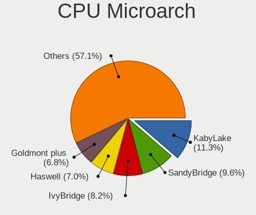

| Name             | Notebooks | Percent |
|------------------|-----------|---------|
| KabyLake         | 90        | 12.31%  |
| SandyBridge      | 75        | 10.26%  |
| IvyBridge        | 60        | 8.21%   |
| Haswell          | 58        | 7.93%   |
| Westmere         | 48        | 6.57%   |
| Skylake          | 43        | 5.88%   |
| Silvermont       | 30        | 4.1%    |
| Penryn           | 28        | 3.83%   |
| Goldmont plus    | 27        | 3.69%   |
| Unknown          | 27        | 3.69%   |
| Broadwell        | 26        | 3.56%   |
| TigerLake        | 25        | 3.42%   |
| Zen+             | 23        | 3.15%   |
| Core             | 20        | 2.74%   |
| Alderlake Hybrid | 20        | 2.74%   |
| Icelake          | 16        | 2.19%   |
| Zen              | 15        | 2.05%   |
| Goldmont         | 12        | 1.64%   |
| Excavator        | 12        | 1.64%   |
| Bonnell          | 12        | 1.64%   |
| Zen 3            | 11        | 1.5%    |
| CometLake        | 9         | 1.23%   |
| Tremont          | 8         | 1.09%   |
| K10              | 6         | 0.82%   |
| Zen 2            | 5         | 0.68%   |
| K10 Llano        | 5         | 0.68%   |
| Bobcat           | 5         | 0.68%   |
| Piledriver       | 4         | 0.55%   |
| Gracemont        | 3         | 0.41%   |
| Puma             | 2         | 0.27%   |
| K8 & K10 hybrid  | 2         | 0.27%   |
| Jaguar           | 2         | 0.27%   |
| Nehalem          | 1         | 0.14%   |
| K8 Hammer        | 1         | 0.14%   |

Graphics
--------

GPU Vendor
----------

Vendors of graphics cards

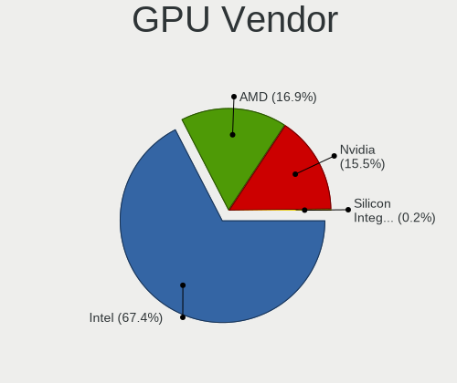

| Vendor                           | Notebooks | Percent |
|----------------------------------|-----------|---------|
| Intel                            | 568       | 65.59%  |
| AMD                              | 157       | 18.13%  |
| Nvidia                           | 139       | 16.05%  |
| Silicon Integrated Systems [SiS] | 2         | 0.23%   |

GPU Model
---------

Graphics card models

| Model                                                                                    | Notebooks | Percent |
|------------------------------------------------------------------------------------------|-----------|---------|
| Intel 2nd Generation Core Processor Family Integrated Graphics Controller                | 71        | 7.99%   |
| Intel 3rd Gen Core processor Graphics Controller                                         | 56        | 6.3%    |
| Intel Haswell-ULT Integrated Graphics Controller                                         | 35        | 3.94%   |
| Intel Skylake GT2 [HD Graphics 520]                                                      | 34        | 3.82%   |
| Intel Core Processor Integrated Graphics Controller                                      | 33        | 3.71%   |
| AMD Picasso/Raven 2 [Radeon Vega Series / Radeon Vega Mobile Series]                     | 27        | 3.04%   |
| Intel HD Graphics 620                                                                    | 25        | 2.81%   |
| Intel GeminiLake [UHD Graphics 600]                                                      | 23        | 2.59%   |
| Intel Mobile 4 Series Chipset Integrated Graphics Controller                             | 22        | 2.47%   |
| Intel HD Graphics 5500                                                                   | 21        | 2.36%   |
| Intel UHD Graphics 620                                                                   | 20        | 2.25%   |
| Intel Atom Processor Z36xxx/Z37xxx Series Graphics & Display                             | 17        | 1.91%   |
| Intel 4th Gen Core Processor Integrated Graphics Controller                              | 17        | 1.91%   |
| AMD Lucienne                                                                             | 17        | 1.91%   |
| Intel TigerLake-LP GT2 [Iris Xe Graphics]                                                | 13        | 1.46%   |
| Intel CoffeeLake-H GT2 [UHD Graphics 630]                                                | 13        | 1.46%   |
| Intel Atom/Celeron/Pentium Processor x5-E8000/J3xxx/N3xxx Integrated Graphics Controller | 13        | 1.46%   |
| Intel Tiger Lake-LP GT2 [UHD Graphics G4]                                                | 12        | 1.35%   |
| Nvidia TU117M [GeForce GTX 1650 Mobile / Max-Q]                                          | 11        | 1.24%   |
| Intel Mobile GM965/GL960 Integrated Graphics Controller (secondary)                      | 11        | 1.24%   |
| Intel Mobile GM965/GL960 Integrated Graphics Controller (primary)                        | 11        | 1.24%   |
| Intel Iris Plus Graphics G1 (Ice Lake)                                                   | 11        | 1.24%   |
| AMD Raven Ridge [Radeon Vega Series / Radeon Vega Mobile Series]                         | 11        | 1.24%   |
| Intel HD Graphics 500                                                                    | 10        | 1.12%   |
| Intel JasperLake [UHD Graphics]                                                          | 9         | 1.01%   |
| Intel CometLake-U GT2 [UHD Graphics]                                                     | 9         | 1.01%   |
| Intel Alder Lake-P GT2 [Iris Xe Graphics]                                                | 9         | 1.01%   |
| Nvidia GP107M [GeForce GTX 1050 Mobile]                                                  | 8         | 0.9%    |
| Nvidia GF117M [GeForce 610M/710M/810M/820M / GT 620M/625M/630M/720M]                     | 8         | 0.9%    |
| Intel CometLake-H GT2 [UHD Graphics]                                                     | 8         | 0.9%    |
| Intel Atom Processor D4xx/D5xx/N4xx/N5xx Integrated Graphics Controller                  | 8         | 0.9%    |
| AMD Stoney [Radeon R2/R3/R4/R5 Graphics]                                                 | 8         | 0.9%    |
| AMD RV710/M92 [Mobility Radeon HD 4530/4570/5145/530v/540v/545v]                         | 8         | 0.9%    |
| Intel WhiskeyLake-U GT2 [UHD Graphics 620]                                               | 7         | 0.79%   |
| Intel HD Graphics 630                                                                    | 6         | 0.67%   |
| AMD Sun XT [Radeon HD 8670A/8670M/8690M / R5 M330 / M430 / Radeon 520 Mobile]            | 6         | 0.67%   |
| AMD Rembrandt [Radeon 680M]                                                              | 6         | 0.67%   |
| AMD Barcelo                                                                              | 6         | 0.67%   |
| Nvidia GF108M [GeForce GT 620M/630M/635M/640M LE]                                        | 5         | 0.56%   |
| Nvidia GF108M [GeForce GT 540M]                                                          | 5         | 0.56%   |

GPU Combo
---------

Combinations of graphics cards

| Name                   | Notebooks | Percent |
|------------------------|-----------|---------|
| 1 x Intel              | 400       | 54.72%  |
| 1 x AMD                | 116       | 15.87%  |
| Intel + Nvidia         | 100       | 13.68%  |
| 2 x Intel              | 41        | 5.61%   |
| 1 x Nvidia             | 30        | 4.1%    |
| Intel + AMD            | 26        | 3.56%   |
| 2 x AMD                | 8         | 1.09%   |
| AMD + Nvidia           | 7         | 0.96%   |
| 1 x SiS                | 2         | 0.27%   |
| 2 x Intel + 1 x Nvidia | 1         | 0.14%   |

GPU Driver
----------

Free vs proprietary

| Driver      | Notebooks | Percent |
|-------------|-----------|---------|
| Free        | 711       | 97.26%  |
| Unknown     | 15        | 2.05%   |
| Proprietary | 5         | 0.68%   |

GPU Memory
----------

Total video memory

| Size in GB | Notebooks | Percent |
|------------|-----------|---------|
| Unknown    | 458       | 62.65%  |
| 0.01-0.5   | 88        | 12.04%  |
| 1.01-2.0   | 86        | 11.76%  |
| 0.51-1.0   | 46        | 6.29%   |
| 3.01-4.0   | 36        | 4.92%   |
| 7.01-8.0   | 8         | 1.09%   |
| 5.01-6.0   | 6         | 0.82%   |
| 2.01-3.0   | 3         | 0.41%   |

Monitor
-------

Monitor Vendor
--------------

Monitor vendors

| Vendor                  | Notebooks | Percent |
|-------------------------|-----------|---------|
| AU Optronics            | 167       | 21.86%  |
| BOE                     | 133       | 17.41%  |
| LG Display              | 122       | 15.97%  |
| Chimei Innolux          | 100       | 13.09%  |
| Samsung Electronics     | 88        | 11.52%  |
| Chi Mei Optoelectronics | 26        | 3.4%    |
| PANDA                   | 12        | 1.57%   |
| InfoVision              | 12        | 1.57%   |
| Lenovo                  | 11        | 1.44%   |
| Sharp                   | 9         | 1.18%   |
| Apple                   | 9         | 1.18%   |
| Dell                    | 8         | 1.05%   |
| Goldstar                | 7         | 0.92%   |
| LG Philips              | 5         | 0.65%   |
| Acer                    | 5         | 0.65%   |
| Sony                    | 4         | 0.52%   |
| ViewSonic               | 3         | 0.39%   |
| Panasonic               | 3         | 0.39%   |
| Hewlett-Packard         | 3         | 0.39%   |
| HannStar                | 3         | 0.39%   |
| CHI                     | 3         | 0.39%   |
| ASUSTek Computer        | 3         | 0.39%   |
| Unknown                 | 2         | 0.26%   |
| STA                     | 2         | 0.26%   |
| Quanta Display          | 2         | 0.26%   |
| KDC                     | 2         | 0.26%   |
| InnoLux Display         | 2         | 0.26%   |
| CSO                     | 2         | 0.26%   |
| BenQ                    | 2         | 0.26%   |
| AOC                     | 2         | 0.26%   |
| ___                     | 1         | 0.13%   |
| Toshiba                 | 1         | 0.13%   |
| Sceptre Tech            | 1         | 0.13%   |
| Philips                 | 1         | 0.13%   |
| MSI                     | 1         | 0.13%   |
| HKC                     | 1         | 0.13%   |
| Fujitsu Siemens         | 1         | 0.13%   |
| ELD                     | 1         | 0.13%   |
| CS_                     | 1         | 0.13%   |
| Compal                  | 1         | 0.13%   |

Monitor Model
-------------

Monitor models

| Model                                                                    | Notebooks | Percent |
|--------------------------------------------------------------------------|-----------|---------|
| LG Display LCD Monitor LGD02DC 1366x768 344x194mm 15.5-inch              | 9         | 1.17%   |
| Chimei Innolux LCD Monitor CMN15F5 1920x1080 344x193mm 15.5-inch         | 8         | 1.04%   |
| Samsung Electronics LCD Monitor SEC5441 1366x768 344x194mm 15.5-inch     | 7         | 0.91%   |
| AU Optronics LCD Monitor AUO21ED 1920x1080 344x193mm 15.5-inch           | 7         | 0.91%   |
| Chimei Innolux LCD Monitor CMN15DB 1366x768 344x193mm 15.5-inch          | 6         | 0.78%   |
| AU Optronics LCD Monitor AUO71EC 1366x768 344x193mm 15.5-inch            | 6         | 0.78%   |
| AU Optronics LCD Monitor AUO61ED 1920x1080 344x194mm 15.5-inch           | 6         | 0.78%   |
| AU Optronics LCD Monitor AUO22EC 1366x768 344x193mm 15.5-inch            | 6         | 0.78%   |
| Samsung Electronics LCD Monitor SDC5441 1366x768 344x194mm 15.5-inch     | 5         | 0.65%   |
| Chimei Innolux LCD Monitor CMN15E7 1920x1080 344x193mm 15.5-inch         | 5         | 0.65%   |
| Chimei Innolux LCD Monitor CMN15E6 1366x768 344x193mm 15.5-inch          | 5         | 0.65%   |
| Chimei Innolux LCD Monitor CMN14D4 1920x1080 309x173mm 13.9-inch         | 5         | 0.65%   |
| Chi Mei Optoelectronics LCD Monitor CMO15A7 1366x768 344x193mm 15.5-inch | 5         | 0.65%   |
| BOE LCD Monitor BOE0A84 1920x1200 286x179mm 13.3-inch                    | 5         | 0.65%   |
| BOE LCD Monitor BOE084E 1920x1080 382x215mm 17.3-inch                    | 5         | 0.65%   |
| AU Optronics LCD Monitor AUO106C 1366x768 276x155mm 12.5-inch            | 5         | 0.65%   |
| LG Display LCD Monitor LGD0521 1920x1080 309x174mm 14.0-inch             | 4         | 0.52%   |
| LG Display LCD Monitor LGD039F 1366x768 345x194mm 15.6-inch              | 4         | 0.52%   |
| LG Display LCD Monitor LGD0395 1366x768 344x194mm 15.5-inch              | 4         | 0.52%   |
| LG Display LCD Monitor LGD02F2 1366x768 344x194mm 15.5-inch              | 4         | 0.52%   |
| LG Display LCD Monitor LGD01E8 1366x768 344x194mm 15.5-inch              | 4         | 0.52%   |
| Chi Mei Optoelectronics LCD Monitor CMO1680 1366x768 344x193mm 15.5-inch | 4         | 0.52%   |
| BOE LCD Monitor BOE0812 1920x1080 344x194mm 15.5-inch                    | 4         | 0.52%   |
| AU Optronics LCD Monitor AUO81EC 1366x768 344x193mm 15.5-inch            | 4         | 0.52%   |
| AU Optronics LCD Monitor AUO70EC 1366x768 344x193mm 15.5-inch            | 4         | 0.52%   |
| AU Optronics LCD Monitor AUO45EC 1366x768 340x190mm 15.3-inch            | 4         | 0.52%   |
| AU Optronics LCD Monitor AUO2D3C 1366x768 309x173mm 13.9-inch            | 4         | 0.52%   |
| AU Optronics LCD Monitor AUO26EC 1366x768 344x193mm 15.5-inch            | 4         | 0.52%   |
| AU Optronics LCD Monitor AUO23EC 1366x768 344x193mm 15.5-inch            | 4         | 0.52%   |
| AU Optronics LCD Monitor AUO183C 1366x768 309x173mm 13.9-inch            | 4         | 0.52%   |
| LG Display LCD Monitor LGD0563 1920x1080 344x194mm 15.5-inch             | 3         | 0.39%   |
| LG Display LCD Monitor LGD02D8 1366x768 277x156mm 12.5-inch              | 3         | 0.39%   |
| Chimei Innolux LCD Monitor CMN1735 1920x1080 382x215mm 17.3-inch         | 3         | 0.39%   |
| Chimei Innolux LCD Monitor CMN15AB 1366x768 344x194mm 15.5-inch          | 3         | 0.39%   |
| Chimei Innolux LCD Monitor CMN14D6 1366x768 309x173mm 13.9-inch          | 3         | 0.39%   |
| CHI VGA DISPLAY CHIBD1B 1920x1080 880x500mm 39.8-inch                    | 3         | 0.39%   |
| BOE LCD Monitor BOE0B09 1920x1080 309x174mm 14.0-inch                    | 3         | 0.39%   |
| BOE LCD Monitor BOE08D5 1920x1080 344x194mm 15.5-inch                    | 3         | 0.39%   |
| BOE LCD Monitor BOE06A5 1366x768 344x194mm 15.5-inch                     | 3         | 0.39%   |
| BOE LCD Monitor BOE0690 1920x1080 344x193mm 15.5-inch                    | 3         | 0.39%   |

Monitor Resolution
------------------

Monitor screen resolution

| Resolution         | Notebooks | Percent |
|--------------------|-----------|---------|
| 1366x768 (WXGA)    | 322       | 42.82%  |
| 1920x1080 (FHD)    | 263       | 34.97%  |
| 1600x900 (HD+)     | 45        | 5.98%   |
| 1280x800 (WXGA)    | 24        | 3.19%   |
| 1920x1200 (WUXGA)  | 17        | 2.26%   |
| 1440x900 (WXGA+)   | 13        | 1.73%   |
| 3840x2160 (4K)     | 10        | 1.33%   |
| 2560x1600          | 8         | 1.06%   |
| 2880x1800          | 6         | 0.8%    |
| 1680x1050 (WSXGA+) | 6         | 0.8%    |
| 2560x1440 (QHD)    | 5         | 0.66%   |
| 1024x600           | 5         | 0.66%   |
| 2288x1287          | 4         | 0.53%   |
| 2160x1440          | 4         | 0.53%   |
| 3200x1800 (QHD+)   | 3         | 0.4%    |
| 3840x2400          | 2         | 0.27%   |
| 2256x1504          | 2         | 0.27%   |
| 1920x540           | 2         | 0.27%   |
| 1280x720 (HD)      | 2         | 0.27%   |
| 1152x864           | 2         | 0.27%   |
| 3440x1440          | 1         | 0.13%   |
| 3072x1920          | 1         | 0.13%   |
| 2880x1620          | 1         | 0.13%   |
| 2560x1080          | 1         | 0.13%   |
| 2520x1680          | 1         | 0.13%   |
| 1360x768           | 1         | 0.13%   |
| 1024x768 (XGA)     | 1         | 0.13%   |

Monitor Diagonal
----------------

Diagonal size in inches

| Inches  | Notebooks | Percent |
|---------|-----------|---------|
| 15      | 350       | 45.57%  |
| 13      | 107       | 13.93%  |
| 14      | 102       | 13.28%  |
| 17      | 67        | 8.72%   |
| 12      | 25        | 3.26%   |
| 11      | 20        | 2.6%    |
| 23      | 15        | 1.95%   |
| 16      | 12        | 1.56%   |
| 10      | 11        | 1.43%   |
| 27      | 9         | 1.17%   |
| 21      | 8         | 1.04%   |
| 24      | 7         | 0.91%   |
| 18      | 6         | 0.78%   |
| 20      | 5         | 0.65%   |
| 31      | 4         | 0.52%   |
| Unknown | 4         | 0.52%   |
| 39      | 3         | 0.39%   |
| 142     | 2         | 0.26%   |
| 32      | 2         | 0.26%   |
| 19      | 2         | 0.26%   |
| 84      | 1         | 0.13%   |
| 72      | 1         | 0.13%   |
| 46      | 1         | 0.13%   |
| 40      | 1         | 0.13%   |
| 34      | 1         | 0.13%   |
| 28      | 1         | 0.13%   |
| 22      | 1         | 0.13%   |

Monitor Width
-------------

Physical width

| Width in mm    | Notebooks | Percent |
|----------------|-----------|---------|
| 301-350        | 507       | 66.27%  |
| 201-300        | 107       | 13.99%  |
| 351-400        | 80        | 10.46%  |
| 501-600        | 28        | 3.66%   |
| 401-500        | 21        | 2.75%   |
| 601-700        | 6         | 0.78%   |
| 801-900        | 4         | 0.52%   |
| Unknown        | 4         | 0.52%   |
| 701-800        | 3         | 0.39%   |
| More than 2000 | 2         | 0.26%   |
| 1501-2000      | 2         | 0.26%   |
| 1001-1500      | 1         | 0.13%   |

Aspect Ratio
------------

Proportional relationship between the width and the height

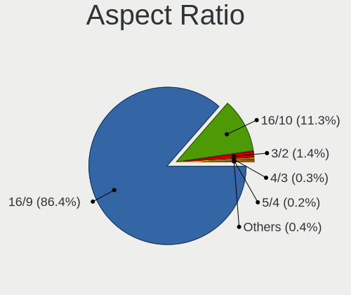

| Ratio   | Notebooks | Percent |
|---------|-----------|---------|
| 16/9    | 635       | 87.35%  |
| 16/10   | 72        | 9.9%    |
| 3/2     | 12        | 1.65%   |
| 4/3     | 3         | 0.41%   |
| 1.00    | 2         | 0.28%   |
| 5/4     | 1         | 0.14%   |
| 21/9    | 1         | 0.14%   |
| Unknown | 1         | 0.14%   |

Monitor Area
------------

Area in inch

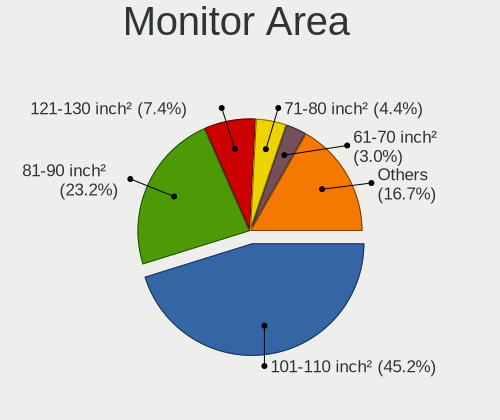

| Area in inch | Notebooks | Percent |
|----------------|-----------|---------|
| 101-110        | 350       | 45.63%  |
| 81-90          | 163       | 21.25%  |
| 121-130        | 60        | 7.82%   |
| 71-80          | 43        | 5.61%   |
| 61-70          | 25        | 3.26%   |
| 201-250        | 25        | 3.26%   |
| 51-60          | 20        | 2.61%   |
| 41-50          | 11        | 1.43%   |
| 111-120        | 11        | 1.43%   |
| 151-200        | 10        | 1.3%    |
| 301-350        | 9         | 1.17%   |
| 351-500        | 8         | 1.04%   |
| 131-140        | 7         | 0.91%   |
| 141-150        | 6         | 0.78%   |
| 501-1000       | 5         | 0.65%   |
| More than 1000 | 4         | 0.52%   |
| 91-100         | 4         | 0.52%   |
| Unknown        | 4         | 0.52%   |
| 251-300        | 2         | 0.26%   |

Pixel Density
-------------

Pixels per inch

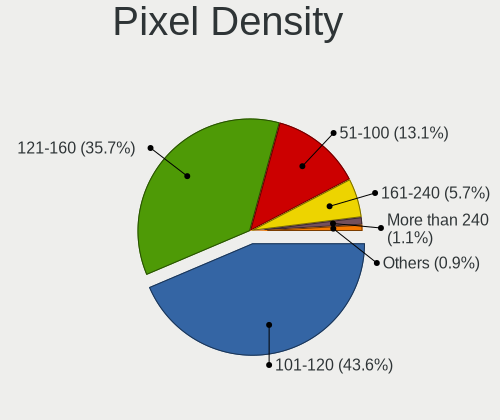

| Density       | Notebooks | Percent |
|---------------|-----------|---------|
| 101-120       | 312       | 41.38%  |
| 121-160       | 284       | 37.67%  |
| 51-100        | 90        | 11.94%  |
| 161-240       | 49        | 6.5%    |
| More than 240 | 11        | 1.46%   |
| 1-50          | 4         | 0.53%   |
| Unknown       | 4         | 0.53%   |

Multiple Monitors
-----------------

Total monitors connected

| Total | Notebooks | Percent |
|-------|-----------|---------|
| 1     | 647       | 88.51%  |
| 2     | 60        | 8.21%   |
| 0     | 21        | 2.87%   |
| 3     | 3         | 0.41%   |

Network
-------

Net Controller Vendor
---------------------

Controller vendors

| Vendor                            | Notebooks | Percent |
|-----------------------------------|-----------|---------|
| Realtek Semiconductor             | 388       | 33.71%  |
| Intel                             | 348       | 30.23%  |
| Qualcomm Atheros                  | 199       | 17.29%  |
| Broadcom                          | 67        | 5.82%   |
| MediaTek                          | 23        | 2%      |
| Broadcom Limited                  | 16        | 1.39%   |
| ASIX Electronics                  | 11        | 0.96%   |
| Ralink                            | 10        | 0.87%   |
| Dell                              | 9         | 0.78%   |
| TP-Link                           | 8         | 0.7%    |
| Marvell Technology Group          | 8         | 0.7%    |
| Sierra Wireless                   | 6         | 0.52%   |
| Ralink Technology                 | 6         | 0.52%   |
| JMicron Technology                | 5         | 0.43%   |
| Ericsson Business Mobile Networks | 5         | 0.43%   |
| OPPO Electronics                  | 4         | 0.35%   |
| Samsung Electronics               | 3         | 0.26%   |
| Nvidia                            | 3         | 0.26%   |
| Microchip Technology              | 3         | 0.26%   |
| Huawei Technologies               | 3         | 0.26%   |
| Silicon Integrated Systems [SiS]  | 2         | 0.17%   |
| Qualcomm Atheros Communications   | 2         | 0.17%   |
| Lenovo                            | 2         | 0.17%   |
| ICS Advent                        | 2         | 0.17%   |
| Hewlett-Packard                   | 2         | 0.17%   |
| DisplayLink                       | 2         | 0.17%   |
| D-Link                            | 2         | 0.17%   |
| ZTE WCDMA Technologies MSM        | 1         | 0.09%   |
| Xiaomi                            | 1         | 0.09%   |
| Toshiba                           | 1         | 0.09%   |
| Qualcomm                          | 1         | 0.09%   |
| Prusa                             | 1         | 0.09%   |
| NetGear                           | 1         | 0.09%   |
| Motorola PCS                      | 1         | 0.09%   |
| Mercucys                          | 1         | 0.09%   |
| Fujitsu Siemens Computers         | 1         | 0.09%   |
| D-Link System                     | 1         | 0.09%   |
| Belkin Components                 | 1         | 0.09%   |
| Attansic Technology               | 1         | 0.09%   |

Net Controller Model
--------------------

Controller models

| Model                                                                   | Notebooks | Percent |
|-------------------------------------------------------------------------|-----------|---------|
| Realtek RTL8111/8168/8211/8411 PCI Express Gigabit Ethernet Controller  | 213       | 15.43%  |
| Realtek RTL810xE PCI Express Fast Ethernet controller                   | 85        | 6.16%   |
| Realtek RTL8821CE 802.11ac PCIe Wireless Network Adapter                | 40        | 2.9%    |
| Qualcomm Atheros QCA9377 802.11ac Wireless Network Adapter              | 40        | 2.9%    |
| Intel 82579LM Gigabit Network Connection (Lewisville)                   | 36        | 2.61%   |
| Qualcomm Atheros QCA9565 / AR9565 Wireless Network Adapter              | 35        | 2.54%   |
| Qualcomm Atheros AR9285 Wireless Network Adapter (PCI-Express)          | 33        | 2.39%   |
| Intel Wireless 8265 / 8275                                              | 29        | 2.1%    |
| Realtek RTL8822CE 802.11ac PCIe Wireless Network Adapter                | 26        | 1.88%   |
| Qualcomm Atheros AR9485 Wireless Network Adapter                        | 25        | 1.81%   |
| Intel Centrino Advanced-N 6205 [Taylor Peak]                            | 25        | 1.81%   |
| Intel Wireless 7265                                                     | 24        | 1.74%   |
| Broadcom BCM4313 802.11bgn Wireless Network Adapter                     | 21        | 1.52%   |
| Intel Wireless 7260                                                     | 20        | 1.45%   |
| Intel Wi-Fi 6 AX201                                                     | 20        | 1.45%   |
| Intel Wireless 8260                                                     | 19        | 1.38%   |
| Intel Ethernet Connection (4) I219-LM                                   | 18        | 1.3%    |
| Realtek RTL8188CE 802.11b/g/n WiFi Adapter                              | 15        | 1.09%   |
| Realtek RTL8153 Gigabit Ethernet Adapter                                | 15        | 1.09%   |
| Intel Wireless 3160                                                     | 13        | 0.94%   |
| Intel Ethernet Connection I219-LM                                       | 13        | 0.94%   |
| Intel Wireless 3165                                                     | 12        | 0.87%   |
| Qualcomm Atheros AR8151 v2.0 Gigabit Ethernet                           | 11        | 0.8%    |
| Intel Alder Lake-P PCH CNVi WiFi                                        | 11        | 0.8%    |
| Intel 82577LM Gigabit Network Connection                                | 11        | 0.8%    |
| MediaTek MT7922 802.11ax PCI Express Wireless Network Adapter           | 10        | 0.72%   |
| Intel Wi-Fi 6 AX200                                                     | 10        | 0.72%   |
| Intel Comet Lake PCH-LP CNVi WiFi                                       | 10        | 0.72%   |
| Intel Cannon Lake PCH CNVi WiFi                                         | 10        | 0.72%   |
| Realtek RTL8723BE PCIe Wireless Network Adapter                         | 9         | 0.65%   |
| Intel Gemini Lake PCH CNVi WiFi                                         | 9         | 0.65%   |
| Intel Centrino Advanced-N 6200                                          | 9         | 0.65%   |
| Intel 82567LM Gigabit Network Connection                                | 9         | 0.65%   |
| ASIX AX88179 Gigabit Ethernet                                           | 9         | 0.65%   |
| Qualcomm Atheros AR9287 Wireless Network Adapter (PCI-Express)          | 8         | 0.58%   |
| Qualcomm Atheros AR242x / AR542x Wireless Network Adapter (PCI-Express) | 8         | 0.58%   |
| MediaTek MT7921 802.11ax PCI Express Wireless Network Adapter           | 8         | 0.58%   |
| Intel Ethernet Connection I218-LM                                       | 8         | 0.58%   |
| Intel Ethernet Connection (3) I218-LM                                   | 8         | 0.58%   |
| Broadcom NetLink BCM57785 Gigabit Ethernet PCIe                         | 8         | 0.58%   |

Wireless Vendor
---------------

Wireless vendors

| Vendor                          | Notebooks | Percent |
|---------------------------------|-----------|---------|
| Intel                           | 330       | 43.88%  |
| Qualcomm Atheros                | 168       | 22.34%  |
| Realtek Semiconductor           | 140       | 18.62%  |
| Broadcom                        | 44        | 5.85%   |
| MediaTek                        | 22        | 2.93%   |
| Ralink                          | 10        | 1.33%   |
| Broadcom Limited                | 8         | 1.06%   |
| Sierra Wireless                 | 6         | 0.8%    |
| Ralink Technology               | 6         | 0.8%    |
| TP-Link                         | 5         | 0.66%   |
| Dell                            | 3         | 0.4%    |
| Qualcomm Atheros Communications | 2         | 0.27%   |
| D-Link                          | 2         | 0.27%   |
| Qualcomm                        | 1         | 0.13%   |
| NetGear                         | 1         | 0.13%   |
| Mercucys                        | 1         | 0.13%   |
| Fujitsu Siemens Computers       | 1         | 0.13%   |
| D-Link System                   | 1         | 0.13%   |
| Belkin Components               | 1         | 0.13%   |

Wireless Model
--------------

Wireless models

| Model                                                                   | Notebooks | Percent |
|-------------------------------------------------------------------------|-----------|---------|
| Realtek RTL8821CE 802.11ac PCIe Wireless Network Adapter                | 40        | 5.31%   |
| Qualcomm Atheros QCA9377 802.11ac Wireless Network Adapter              | 40        | 5.31%   |
| Qualcomm Atheros QCA9565 / AR9565 Wireless Network Adapter              | 35        | 4.65%   |
| Qualcomm Atheros AR9285 Wireless Network Adapter (PCI-Express)          | 33        | 4.38%   |
| Intel Wireless 8265 / 8275                                              | 29        | 3.85%   |
| Realtek RTL8822CE 802.11ac PCIe Wireless Network Adapter                | 26        | 3.45%   |
| Qualcomm Atheros AR9485 Wireless Network Adapter                        | 25        | 3.32%   |
| Intel Centrino Advanced-N 6205 [Taylor Peak]                            | 25        | 3.32%   |
| Intel Wireless 7265                                                     | 24        | 3.19%   |
| Broadcom BCM4313 802.11bgn Wireless Network Adapter                     | 21        | 2.79%   |
| Intel Wireless 7260                                                     | 20        | 2.66%   |
| Intel Wi-Fi 6 AX201                                                     | 20        | 2.66%   |
| Intel Wireless 8260                                                     | 19        | 2.52%   |
| Realtek RTL8188CE 802.11b/g/n WiFi Adapter                              | 15        | 1.99%   |
| Intel Wireless 3160                                                     | 13        | 1.73%   |
| Intel Wireless 3165                                                     | 12        | 1.59%   |
| Intel Alder Lake-P PCH CNVi WiFi                                        | 11        | 1.46%   |
| MediaTek MT7922 802.11ax PCI Express Wireless Network Adapter           | 10        | 1.33%   |
| Intel Wi-Fi 6 AX200                                                     | 10        | 1.33%   |
| Intel Comet Lake PCH-LP CNVi WiFi                                       | 10        | 1.33%   |
| Intel Cannon Lake PCH CNVi WiFi                                         | 10        | 1.33%   |
| Realtek RTL8723BE PCIe Wireless Network Adapter                         | 9         | 1.2%    |
| Intel Gemini Lake PCH CNVi WiFi                                         | 9         | 1.2%    |
| Intel Centrino Advanced-N 6200                                          | 9         | 1.2%    |
| Qualcomm Atheros AR9287 Wireless Network Adapter (PCI-Express)          | 8         | 1.06%   |
| Qualcomm Atheros AR242x / AR542x Wireless Network Adapter (PCI-Express) | 8         | 1.06%   |
| MediaTek MT7921 802.11ax PCI Express Wireless Network Adapter           | 8         | 1.06%   |
| Qualcomm Atheros AR9462 Wireless Network Adapter                        | 7         | 0.93%   |
| Intel PRO/Wireless 5100 AGN [Shiloh] Network Connection                 | 7         | 0.93%   |
| Intel Dual Band Wireless-AC 3168NGW [Stone Peak]                        | 7         | 0.93%   |
| Intel Centrino Wireless-N 1000 [Condor Peak]                            | 7         | 0.93%   |
| Realtek RTL8822BE 802.11a/b/g/n/ac WiFi adapter                         | 6         | 0.8%    |
| Realtek RTL8723DE Wireless Network Adapter                              | 6         | 0.8%    |
| Qualcomm Atheros QCA6174 802.11ac Wireless Network Adapter              | 6         | 0.8%    |
| Qualcomm Atheros AR928X Wireless Network Adapter (PCI-Express)          | 6         | 0.8%    |
| Intel WiFi Link 5100                                                    | 6         | 0.8%    |
| Intel PRO/Wireless 3945ABG [Golan] Network Connection                   | 6         | 0.8%    |
| Intel Centrino Wireless-N 2230                                          | 6         | 0.8%    |
| Intel Centrino Ultimate-N 6300                                          | 6         | 0.8%    |
| Realtek RTL8188EE Wireless Network Adapter                              | 5         | 0.66%   |

Ethernet Vendor
---------------

Ethernet vendors

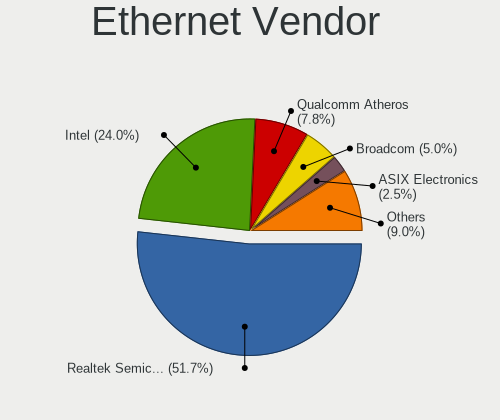

| Vendor                           | Notebooks | Percent |
|----------------------------------|-----------|---------|
| Realtek Semiconductor            | 319       | 52.73%  |
| Intel                            | 140       | 23.14%  |
| Qualcomm Atheros                 | 53        | 8.76%   |
| Broadcom                         | 32        | 5.29%   |
| ASIX Electronics                 | 11        | 1.82%   |
| Marvell Technology Group         | 8         | 1.32%   |
| Broadcom Limited                 | 8         | 1.32%   |
| JMicron Technology               | 5         | 0.83%   |
| OPPO Electronics                 | 4         | 0.66%   |
| TP-Link                          | 3         | 0.5%    |
| Samsung Electronics              | 3         | 0.5%    |
| Nvidia                           | 3         | 0.5%    |
| Microchip Technology             | 3         | 0.5%    |
| Silicon Integrated Systems [SiS] | 2         | 0.33%   |
| Lenovo                           | 2         | 0.33%   |
| ICS Advent                       | 2         | 0.33%   |
| DisplayLink                      | 2         | 0.33%   |
| ZTE WCDMA Technologies MSM       | 1         | 0.17%   |
| Xiaomi                           | 1         | 0.17%   |
| MediaTek                         | 1         | 0.17%   |
| Huawei Technologies              | 1         | 0.17%   |
| Attansic Technology              | 1         | 0.17%   |

Ethernet Model
--------------

Ethernet models

| Model                                                                          | Notebooks | Percent |
|--------------------------------------------------------------------------------|-----------|---------|
| Realtek RTL8111/8168/8211/8411 PCI Express Gigabit Ethernet Controller         | 213       | 34.98%  |
| Realtek RTL810xE PCI Express Fast Ethernet controller                          | 85        | 13.96%  |
| Intel 82579LM Gigabit Network Connection (Lewisville)                          | 36        | 5.91%   |
| Intel Ethernet Connection (4) I219-LM                                          | 18        | 2.96%   |
| Realtek RTL8153 Gigabit Ethernet Adapter                                       | 15        | 2.46%   |
| Intel Ethernet Connection I219-LM                                              | 13        | 2.13%   |
| Qualcomm Atheros AR8151 v2.0 Gigabit Ethernet                                  | 11        | 1.81%   |
| Intel 82577LM Gigabit Network Connection                                       | 11        | 1.81%   |
| Intel 82567LM Gigabit Network Connection                                       | 9         | 1.48%   |
| ASIX AX88179 Gigabit Ethernet                                                  | 9         | 1.48%   |
| Intel Ethernet Connection I218-LM                                              | 8         | 1.31%   |
| Intel Ethernet Connection (3) I218-LM                                          | 8         | 1.31%   |
| Broadcom NetLink BCM57785 Gigabit Ethernet PCIe                                | 8         | 1.31%   |
| Qualcomm Atheros AR8162 Fast Ethernet                                          | 7         | 1.15%   |
| Intel Ethernet Connection I217-LM                                              | 6         | 0.99%   |
| Broadcom NetLink BCM57780 Gigabit Ethernet PCIe                                | 6         | 0.99%   |
| Qualcomm Atheros AR8161 Gigabit Ethernet                                       | 5         | 0.82%   |
| Qualcomm Atheros AR8152 v2.0 Fast Ethernet                                     | 5         | 0.82%   |
| Qualcomm Atheros AR8152 v1.1 Fast Ethernet                                     | 5         | 0.82%   |
| Qualcomm Atheros AR8131 Gigabit Ethernet                                       | 5         | 0.82%   |
| Realtek RTL8152 Fast Ethernet Adapter                                          | 4         | 0.66%   |
| Qualcomm Atheros AR8151 v1.0 Gigabit Ethernet                                  | 4         | 0.66%   |
| Intel Ethernet Connection I217-V                                               | 4         | 0.66%   |
| Intel Ethernet Connection (4) I219-V                                           | 4         | 0.66%   |
| Samsung Galaxy series, misc. (tethering mode)                                  | 3         | 0.49%   |
| Qualcomm Atheros QCA8171 Gigabit Ethernet                                      | 3         | 0.49%   |
| Qualcomm Atheros Killer E220x Gigabit Ethernet Controller                      | 3         | 0.49%   |
| Microchip SMSC9512/9514 Fast Ethernet Adapter                                  | 3         | 0.49%   |
| Marvell Group Yukon Optima 88E8059 [PCIe Gigabit Ethernet Controller with AVB] | 3         | 0.49%   |
| JMicron JMC250 PCI Express Gigabit Ethernet Controller                         | 3         | 0.49%   |
| Intel Ethernet Connection I219-V                                               | 3         | 0.49%   |
| Intel 82579V Gigabit Network Connection                                        | 3         | 0.49%   |
| Intel 82577LC Gigabit Network Connection                                       | 3         | 0.49%   |
| TP-Link UE300 10/100/1000 LAN (ethernet mode) [Realtek RTL8153]                | 2         | 0.33%   |
| Silicon Integrated Systems [SiS] 191 Gigabit Ethernet Adapter                  | 2         | 0.33%   |
| Realtek Killer E2600 GbE Controller                                            | 2         | 0.33%   |
| Qualcomm Atheros QCA8172 Fast Ethernet                                         | 2         | 0.33%   |
| OPPO SM8350-IDP _SN:361A1B3C                                                   | 2         | 0.33%   |
| OPPO RMX3710                                                                   | 2         | 0.33%   |
| Nvidia MCP77 Ethernet                                                          | 2         | 0.33%   |

Net Controller Kind
-------------------

Ethernet, WiFi or modem

| Kind     | Notebooks | Percent |
|----------|-----------|---------|
| WiFi     | 722       | 54.29%  |
| Ethernet | 590       | 44.36%  |
| Modem    | 17        | 1.28%   |
| Unknown  | 1         | 0.08%   |

Used Controller
---------------

Currently used network controller

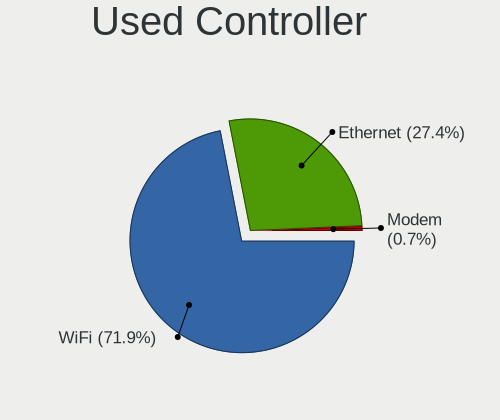

| Kind     | Notebooks | Percent |
|----------|-----------|---------|
| WiFi     | 533       | 73.42%  |
| Ethernet | 193       | 26.58%  |

NICs
----

Total network controllers on board

| Total | Notebooks | Percent |
|-------|-----------|---------|
| 2     | 543       | 74.28%  |
| 1     | 173       | 23.67%  |
| 0     | 14        | 1.92%   |
| 3     | 1         | 0.14%   |

IPv6
----

IPv6 vs IPv4

| Used | Notebooks | Percent |
|------|-----------|---------|
| No   | 465       | 63.61%  |
| Yes  | 266       | 36.39%  |

Bluetooth
---------

Bluetooth Vendor
----------------

Controller vendors

| Vendor                          | Notebooks | Percent |
|---------------------------------|-----------|---------|
| Intel                           | 244       | 42.73%  |
| Realtek Semiconductor           | 80        | 14.01%  |
| Qualcomm Atheros Communications | 65        | 11.38%  |
| Foxconn / Hon Hai               | 36        | 6.3%    |
| Lite-On Technology              | 28        | 4.9%    |
| IMC Networks                    | 27        | 4.73%   |
| Broadcom                        | 26        | 4.55%   |
| Dell                            | 12        | 2.1%    |
| Hewlett-Packard                 | 9         | 1.58%   |
| Toshiba                         | 8         | 1.4%    |
| Apple                           | 8         | 1.4%    |
| Cambridge Silicon Radio         | 7         | 1.23%   |
| Ralink                          | 5         | 0.88%   |
| Unknown                         | 4         | 0.7%    |
| TP-Link                         | 3         | 0.53%   |
| USI                             | 2         | 0.35%   |
| Realtek                         | 1         | 0.18%   |
| Micro Star International        | 1         | 0.18%   |
| MediaTek                        | 1         | 0.18%   |
| Fujitsu                         | 1         | 0.18%   |
| Foxconn International           | 1         | 0.18%   |
| ASUSTek Computer                | 1         | 0.18%   |
| Alps Electric                   | 1         | 0.18%   |

Bluetooth Model
---------------

Controller models

| Model                                                                               | Notebooks | Percent |
|-------------------------------------------------------------------------------------|-----------|---------|
| Intel Bluetooth wireless interface                                                  | 115       | 20.14%  |
| Realtek Bluetooth Radio                                                             | 54        | 9.46%   |
| Intel Bluetooth 9460/9560 Jefferson Peak (JfP)                                      | 44        | 7.71%   |
| Qualcomm Atheros  Bluetooth Device                                                  | 32        | 5.6%    |
| Intel AX201 Bluetooth                                                               | 30        | 5.25%   |
| Realtek  Bluetooth 4.2 Adapter                                                      | 22        | 3.85%   |
| Intel Bluetooth Device                                                              | 16        | 2.8%    |
| Intel Centrino Bluetooth Wireless Transceiver                                       | 13        | 2.28%   |
| IMC Networks Bluetooth Radio                                                        | 13        | 2.28%   |
| Foxconn / Hon Hai Wireless_Device                                                   | 12        | 2.1%    |
| Qualcomm Atheros AR3012 Bluetooth 4.0                                               | 11        | 1.93%   |
| Qualcomm Atheros AR3011 Bluetooth                                                   | 11        | 1.93%   |
| Intel AX200 Bluetooth                                                               | 10        | 1.75%   |
| Broadcom BCM2045B (BDC-2.1)                                                         | 10        | 1.75%   |
| Lite-On Qualcomm Atheros QCA9377 Bluetooth                                          | 9         | 1.58%   |
| Lite-On Bluetooth Device                                                            | 7         | 1.23%   |
| Intel Wireless-AC 3168 Bluetooth                                                    | 7         | 1.23%   |
| Cambridge Silicon Radio Bluetooth Dongle (HCI mode)                                 | 7         | 1.23%   |
| Qualcomm Atheros AR9462 Bluetooth                                                   | 6         | 1.05%   |
| Lite-On Atheros AR3012 Bluetooth                                                    | 6         | 1.05%   |
| IMC Networks Bluetooth Device                                                       | 6         | 1.05%   |
| HP Broadcom 2070 Bluetooth Combo                                                    | 6         | 1.05%   |
| Foxconn / Hon Hai Broadcom Bluetooth 2.1 Device                                     | 6         | 1.05%   |
| Dell DW375 Bluetooth Module                                                         | 6         | 1.05%   |
| Broadcom BCM20702 Bluetooth 4.0 [ThinkPad]                                          | 6         | 1.05%   |
| Ralink RT3290 Bluetooth                                                             | 5         | 0.88%   |
| Intel AX210 Bluetooth                                                               | 5         | 0.88%   |
| Foxconn / Hon Hai Foxconn T77H114 BCM2070 [Single-Chip Bluetooth 2.1 + EDR Adapter] | 5         | 0.88%   |
| Foxconn / Hon Hai Bluetooth Device                                                  | 5         | 0.88%   |
| Apple Bluetooth Host Controller                                                     | 5         | 0.88%   |
| Lite-On Wireless_Device                                                             | 4         | 0.7%    |
| Intel Wireless-AC 9260 Bluetooth Adapter                                            | 4         | 0.7%    |
| Dell BCM20702A0 Bluetooth Module                                                    | 4         | 0.7%    |
| Broadcom BCM2070 Bluetooth Device                                                   | 4         | 0.7%    |
| Unknown                                                                             | 4         | 0.7%    |
| TP-Link UB500 Adapter                                                               | 3         | 0.53%   |
| IMC Networks Wireless_Device                                                        | 3         | 0.53%   |
| HP Bluetooth 2.0 Interface [Broadcom BCM2045]                                       | 3         | 0.53%   |
| Foxconn / Hon Hai Broadcom BCM20702 Bluetooth                                       | 3         | 0.53%   |
| Apple Bluetooth USB Host Controller                                                 | 3         | 0.53%   |

Sound
-----

Sound Vendor
------------

Sound card vendors

| Vendor                                       | Notebooks | Percent |
|----------------------------------------------|-----------|---------|
| Intel                                        | 604       | 71.31%  |
| AMD                                          | 134       | 15.82%  |
| Nvidia                                       | 88        | 10.39%  |
| C-Media Electronics                          | 5         | 0.59%   |
| Realtek Semiconductor                        | 4         | 0.47%   |
| Texas Instruments                            | 2         | 0.24%   |
| Silicon Integrated Systems [SiS]             | 2         | 0.24%   |
| GN Netcom                                    | 2         | 0.24%   |
| Zoran Co. Personal Media Division (Nogatech) | 1         | 0.12%   |
| PreSonus Audio Electronics                   | 1         | 0.12%   |
| Nordic Semiconductor ASA                     | 1         | 0.12%   |
| Lenovo                                       | 1         | 0.12%   |
| Generalplus Technology                       | 1         | 0.12%   |
| BR23                                         | 1         | 0.12%   |

Sound Model
-----------

Sound card models

| Model                                                                                             | Notebooks | Percent |
|---------------------------------------------------------------------------------------------------|-----------|---------|
| Intel Sunrise Point-LP HD Audio                                                                   | 85        | 8.23%   |
| AMD Family 17h/19h HD Audio Controller                                                            | 80        | 7.74%   |
| Intel 7 Series/C216 Chipset Family High Definition Audio Controller                               | 73        | 7.07%   |
| Intel 6 Series/C200 Series Chipset Family High Definition Audio Controller                        | 62        | 6%      |
| Intel 5 Series/3400 Series Chipset High Definition Audio                                          | 49        | 4.74%   |
| Intel Haswell-ULT HD Audio Controller                                                             | 36        | 3.48%   |
| Intel 8 Series HD Audio Controller                                                                | 36        | 3.48%   |
| AMD Raven/Raven2/Fenghuang HDMI/DP Audio Controller                                               | 35        | 3.39%   |
| AMD Renoir Radeon High Definition Audio Controller                                                | 31        | 3%      |
| Intel Celeron/Pentium Silver Processor High Definition Audio                                      | 27        | 2.61%   |
| Intel 82801I (ICH9 Family) HD Audio Controller                                                    | 27        | 2.61%   |
| Intel Broadwell-U Audio Controller                                                                | 26        | 2.52%   |
| Intel Wildcat Point-LP High Definition Audio Controller                                           | 25        | 2.42%   |
| Intel Tiger Lake-LP Smart Sound Technology Audio Controller                                       | 25        | 2.42%   |
| Intel 8 Series/C220 Series Chipset High Definition Audio Controller                               | 22        | 2.13%   |
| Nvidia GF108 High Definition Audio Controller                                                     | 18        | 1.74%   |
| Intel Xeon E3-1200 v3/4th Gen Core Processor HD Audio Controller                                  | 16        | 1.55%   |
| Intel NM10/ICH7 Family High Definition Audio Controller                                           | 16        | 1.55%   |
| Intel Cannon Lake PCH cAVS                                                                        | 16        | 1.55%   |
| AMD FCH Azalia Controller                                                                         | 15        | 1.45%   |
| Intel Atom Processor Z36xxx/Z37xxx Series High Definition Audio Controller                        | 14        | 1.36%   |
| Intel 82801H (ICH8 Family) HD Audio Controller                                                    | 14        | 1.36%   |
| Intel Atom/Celeron/Pentium Processor x5-E8000/J3xxx/N3xxx Series High Definition Audio Controller | 13        | 1.26%   |
| Intel Alder Lake PCH-P High Definition Audio Controller                                           | 13        | 1.26%   |
| Intel Ice Lake-LP Smart Sound Technology Audio Controller                                         | 12        | 1.16%   |
| Intel Comet Lake PCH-LP cAVS                                                                      | 12        | 1.16%   |
| Intel Celeron N3350/Pentium N4200/Atom E3900 Series Audio Cluster                                 | 12        | 1.16%   |
| AMD Family 15h (Models 60h-6fh) Audio Controller                                                  | 12        | 1.16%   |
| Nvidia High Definition Audio Controller                                                           | 11        | 1.06%   |
| Nvidia TU107 GeForce GTX 1650 High Definition Audio Controller                                    | 9         | 0.87%   |
| Intel Jasper Lake HD Audio                                                                        | 9         | 0.87%   |
| Intel Cannon Point-LP High Definition Audio Controller                                            | 9         | 0.87%   |
| AMD SBx00 Azalia (Intel HDA)                                                                      | 9         | 0.87%   |
| AMD Rembrandt Radeon High Definition Audio Controller                                             | 9         | 0.87%   |
| Nvidia GP107GL High Definition Audio Controller                                                   | 8         | 0.77%   |
| Intel Comet Lake PCH cAVS                                                                         | 8         | 0.77%   |
| Intel CM238 HD Audio Controller                                                                   | 8         | 0.77%   |
| AMD Kabini HDMI/DP Audio                                                                          | 8         | 0.77%   |
| AMD High Definition Audio Controller                                                              | 8         | 0.77%   |
| Nvidia GM107 High Definition Audio Controller [GeForce 940MX]                                     | 6         | 0.58%   |

Memory
------

Memory Vendor
-------------

Memory module vendors

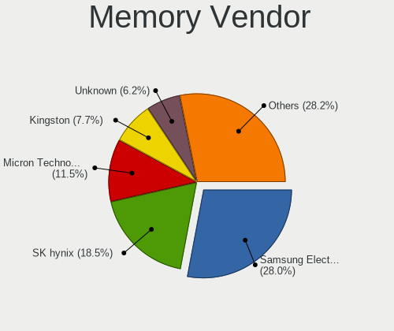

| Vendor                 | Notebooks | Percent |
|------------------------|-----------|---------|
| Samsung Electronics    | 239       | 26.56%  |
| SK hynix               | 164       | 18.22%  |
| Micron Technology      | 108       | 12%     |
| Kingston               | 75        | 8.33%   |
| Unknown                | 59        | 6.56%   |
| Crucial                | 26        | 2.89%   |
| Ramaxel Technology     | 25        | 2.78%   |
| Smart                  | 24        | 2.67%   |
| A-DATA Technology      | 22        | 2.44%   |
| Elpida                 | 21        | 2.33%   |
| Nanya Technology       | 20        | 2.22%   |
| Unknown (ABCD)         | 14        | 1.56%   |
| Unknown                | 11        | 1.22%   |
| G.Skill                | 9         | 1%      |
| Corsair                | 7         | 0.78%   |
| GOODRAM                | 6         | 0.67%   |
| Patriot                | 5         | 0.56%   |
| AMD                    | 5         | 0.56%   |
| Transcend              | 4         | 0.44%   |
| Apacer                 | 4         | 0.44%   |
| 4ea5                   | 4         | 0.44%   |
| 48spaces               | 4         | 0.44%   |
| V-GeN                  | 3         | 0.33%   |
| Smart Brazil           | 3         | 0.33%   |
| High Bridge            | 3         | 0.33%   |
| ASint Technology       | 3         | 0.33%   |
| Teikon                 | 2         | 0.22%   |
| Neo Forza              | 2         | 0.22%   |
| Kllisre                | 2         | 0.22%   |
| Goldkey                | 2         | 0.22%   |
| ff                     | 2         | 0.22%   |
| Avant                  | 2         | 0.22%   |
| Unknown (7A89)         | 1         | 0.11%   |
| Unknown (268C)         | 1         | 0.11%   |
| Unknown (0x5846)       | 1         | 0.11%   |
| Unknown (0x2C0C)       | 1         | 0.11%   |
| Unknown (00000000802C) | 1         | 0.11%   |
| PNY                    | 1         | 0.11%   |
| Multilaser             | 1         | 0.11%   |
| Lexar Co Limited       | 1         | 0.11%   |

Memory Model
------------

Memory module models

| Model                                                               | Notebooks | Percent |
|---------------------------------------------------------------------|-----------|---------|
| Samsung RAM M471B5273DH0-CH9 4GB SODIMM DDR3 1334MT/s               | 17        | 1.75%   |
| Samsung RAM M471B5173DB0-YK0 4GB SODIMM DDR3 1600MT/s               | 14        | 1.44%   |
| Unknown (ABCD) RAM 123456789012345678 2048MB SODIMM LPDDR4 2400MT/s | 13        | 1.34%   |
| Samsung RAM M471A5244CB0-CTD 4096MB SODIMM DDR4 3266MT/s            | 13        | 1.34%   |
| SK hynix RAM HMA81GS6AFR8N-UH 8GB SODIMM DDR4 2667MT/s              | 11        | 1.13%   |
| Samsung RAM M471A5244CB0-CWE 4GB SODIMM DDR4 3200MT/s               | 11        | 1.13%   |
| Unknown                                                             | 11        | 1.13%   |
| Samsung RAM M471B5173EB0-YK0 4GB SODIMM DDR3 1600MT/s               | 10        | 1.03%   |
| Samsung RAM M471A1G44AB0-CWE 8GB SODIMM DDR4 3200MT/s               | 9         | 0.93%   |
| Samsung RAM M471B5273CH0-CH9 4GB SODIMM DDR3 1334MT/s               | 8         | 0.82%   |
| Samsung RAM M471B1G73QH0-YK0 8GB SODIMM DDR3 1600MT/s               | 8         | 0.82%   |
| Samsung RAM M471A1K43CB1-CRC 8GB SODIMM DDR4 2667MT/s               | 8         | 0.82%   |
| Micron RAM 8KTF51264HZ-1G6E1 4096MB SODIMM DDR3 1600MT/s            | 8         | 0.82%   |
| Micron RAM 4ATF51264HZ-2G6E1 4GB SODIMM DDR4 2667MT/s               | 8         | 0.82%   |
| SK hynix RAM HMT451S6BFR8A-PB 4GB SODIMM DDR3 1600MT/s              | 7         | 0.72%   |
| Samsung RAM M471A5244CB0-CWE 4GB Row Of Chips DDR4 3200MT/s         | 7         | 0.72%   |
| Samsung RAM M471A1G44BB0-CWE 8GB SODIMM DDR4 3200MT/s               | 7         | 0.72%   |
| Micron RAM 4ATF51264HZ-3G2J1 4GB SODIMM DDR4 3200MT/s               | 7         | 0.72%   |
| SK hynix RAM HMT351S6CFR8C-PB 4GB SODIMM DDR3 1600MT/s              | 6         | 0.62%   |
| SK hynix RAM HMT351S6BFR8C-H9 4GB SODIMM DDR3 1333MT/s              | 6         | 0.62%   |
| SK hynix RAM HMA851S6JJR6N-VK 4GB SODIMM DDR4 2667MT/s              | 6         | 0.62%   |
| SK hynix RAM HMA851S6DJR6N-XN 4GB SODIMM DDR4 3200MT/s              | 6         | 0.62%   |
| SK hynix RAM HMA851S6CJR6N-VK 4GB SODIMM DDR4 2667MT/s              | 6         | 0.62%   |
| Samsung RAM M471B5173QH0-YK0 4096MB SODIMM DDR3 1600MT/s            | 6         | 0.62%   |
| Micron RAM 16KTF51264HZ-1G6M1 4GB SODIMM DDR3 1600MT/s              | 6         | 0.62%   |
| SK hynix RAM HYMP125S64CP8-Y5 2GB SODIMM DDR2 667MT/s               | 5         | 0.52%   |
| SK hynix RAM HMT451S6AFR8A-PB 4GB SODIMM DDR3 1600MT/s              | 5         | 0.52%   |
| SK hynix RAM HMT351S6CFR8C-H9 4GB SODIMM DDR3 1334MT/s              | 5         | 0.52%   |
| Samsung RAM M471B5673FH0-CF8 2GB SODIMM DDR3 1067MT/s               | 5         | 0.52%   |
| Samsung RAM M471B1G73EB0-YK0 8GB SODIMM DDR3 1600MT/s               | 5         | 0.52%   |
| Samsung RAM M471B1G73DB0-YK0 8GB SODIMM DDR3 1600MT/s               | 5         | 0.52%   |
| Samsung RAM M471A5244CB0-CRC 4GB SODIMM DDR4 2667MT/s               | 5         | 0.52%   |
| Samsung RAM M471A1K43CB1-CTD 8GB SODIMM DDR4 2667MT/s               | 5         | 0.52%   |
| Nanya RAM NT4GC64B8HG0NS-CG 4GB SODIMM DDR3 1334MT/s                | 5         | 0.52%   |
| Unknown RAM Module 8GB SODIMM DDR3 1600MT/s                         | 4         | 0.41%   |
| SK hynix RAM HYMP125S64CP8-S6 2048MB SODIMM DDR 975MT/s             | 4         | 0.41%   |
| SK hynix RAM HMT41GS6BFR8A-PB 8GB SODIMM DDR3 1600MT/s              | 4         | 0.41%   |
| SK hynix RAM HMT351S6BFR8C-H9 4GB SODIMM DDR3 1334MT/s              | 4         | 0.41%   |
| SK hynix RAM HMA851S6AFR6N-UH 4GB SODIMM DDR4 2667MT/s              | 4         | 0.41%   |
| Samsung RAM M471B5773CHS-CH9 2048MB SODIMM DDR3 4199MT/s            | 4         | 0.41%   |

Memory Kind
-----------

Memory module kinds

| Kind    | Notebooks | Percent |
|---------|-----------|---------|
| DDR3    | 339       | 46.06%  |
| DDR4    | 268       | 36.41%  |
| LPDDR4  | 37        | 5.03%   |
| DDR2    | 33        | 4.48%   |
| SDRAM   | 15        | 2.04%   |
| LPDDR5  | 15        | 2.04%   |
| LPDDR3  | 9         | 1.22%   |
| Unknown | 8         | 1.09%   |
| DDR5    | 7         | 0.95%   |
| DRAM    | 5         | 0.68%   |

Memory Form Factor
------------------

Physical design of the memory module

| Name            | Notebooks | Percent |
|-----------------|-----------|---------|
| SODIMM          | 672       | 90.69%  |
| Row Of Chips    | 52        | 7.02%   |
| Unknown         | 8         | 1.08%   |
| DIMM            | 6         | 0.81%   |
| Chip            | 2         | 0.27%   |
| Proprietary Car | 1         | 0.13%   |

Memory Size
-----------

Memory module size

| Size  | Notebooks | Percent |
|-------|-----------|---------|
| 4096  | 326       | 38.9%   |
| 8192  | 267       | 31.86%  |
| 2048  | 139       | 16.59%  |
| 16384 | 68        | 8.11%   |
| 1024  | 28        | 3.34%   |
| 32768 | 8         | 0.95%   |
| 65536 | 1         | 0.12%   |
| 512   | 1         | 0.12%   |

Memory Speed
------------

Memory module speed

| Speed   | Notebooks | Percent |
|---------|-----------|---------|
| 1600    | 226       | 27.49%  |
| 2667    | 121       | 14.72%  |
| 3200    | 107       | 13.02%  |
| 1334    | 79        | 9.61%   |
| 2400    | 63        | 7.66%   |
| 1333    | 38        | 4.62%   |
| 2133    | 26        | 3.16%   |
| 667     | 21        | 2.55%   |
| 1067    | 18        | 2.19%   |
| 800     | 16        | 1.95%   |
| Unknown | 14        | 1.7%    |
| 6400    | 13        | 1.58%   |
| 3266    | 13        | 1.58%   |
| 4267    | 9         | 1.09%   |
| 4199    | 9         | 1.09%   |
| 4800    | 7         | 0.85%   |
| 1867    | 7         | 0.85%   |
| 1066    | 7         | 0.85%   |
| 975     | 7         | 0.85%   |
| 2048    | 6         | 0.73%   |
| 1866    | 3         | 0.36%   |
| 533     | 3         | 0.36%   |
| 8400    | 2         | 0.24%   |
| 3733    | 2         | 0.24%   |
| 7467    | 1         | 0.12%   |
| 5500    | 1         | 0.12%   |
| 4266    | 1         | 0.12%   |
| 1776    | 1         | 0.12%   |
| 333     | 1         | 0.12%   |

Printers & scanners
-------------------

Printer Vendor
--------------

Printer device vendors

| Vendor             | Notebooks | Percent |
|--------------------|-----------|---------|
| Hewlett-Packard    | 4         | 40%     |
| Canon              | 3         | 30%     |
| Brother Industries | 2         | 20%     |
| Seiko Epson        | 1         | 10%     |

Printer Model
-------------

Printer device models

| Model                            | Notebooks | Percent |
|----------------------------------|-----------|---------|
| Seiko Epson L120 Series          | 1         | 10%     |
| HP HP LaserJet M14-M17           | 1         | 10%     |
| HP DeskJet Plus 6400 series      | 1         | 10%     |
| HP DeskJet 4100 series           | 1         | 10%     |
| HP DeskJet 2600 series           | 1         | 10%     |
| Canon MF110/910 Series           | 1         | 10%     |
| Canon LBP2900                    | 1         | 10%     |
| Canon G2020 series               | 1         | 10%     |
| Brother HL-L2350DW series        | 1         | 10%     |
| Brother DCP-7057 scanner/printer | 1         | 10%     |

Scanner Vendor
--------------

Scanner device vendors

| Vendor      | Notebooks | Percent |
|-------------|-----------|---------|
| Seiko Epson | 1         | 100%    |

Scanner Model
-------------

Scanner device models

| Model                                             | Notebooks | Percent |
|---------------------------------------------------|-----------|---------|
| Seiko Epson GT-7300U [Perfection 1260/1260 PHOTO] | 1         | 100%    |

Camera
------

Camera Vendor
-------------

Camera device vendors

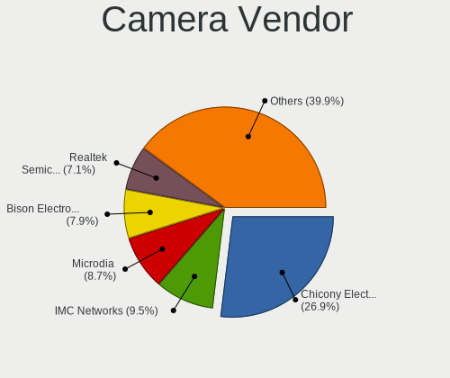

| Vendor                                 | Notebooks | Percent |
|----------------------------------------|-----------|---------|
| Chicony Electronics                    | 160       | 24.88%  |
| IMC Networks                           | 63        | 9.8%    |
| Microdia                               | 59        | 9.18%   |
| Realtek Semiconductor                  | 47        | 7.31%   |
| Bison Electronics                      | 46        | 7.15%   |
| Quanta                                 | 37        | 5.75%   |
| Sunplus Innovation Technology          | 28        | 4.35%   |
| Cheng Uei Precision Industry (Foxlink) | 24        | 3.73%   |
| Acer                                   | 24        | 3.73%   |
| Suyin                                  | 23        | 3.58%   |
| Syntek                                 | 20        | 3.11%   |
| Silicon Motion                         | 13        | 2.02%   |
| Luxvisions Innotech Limited            | 12        | 1.87%   |
| Alcor Micro                            | 12        | 1.87%   |
| Lite-On Technology                     | 8         | 1.24%   |
| Lenovo                                 | 7         | 1.09%   |
| ALi                                    | 7         | 1.09%   |
| Importek                               | 6         | 0.93%   |
| Apple                                  | 6         | 0.93%   |
| SunplusIT                              | 4         | 0.62%   |
| Sonix Technology                       | 4         | 0.62%   |
| Ricoh                                  | 4         | 0.62%   |
| Z-Star Microelectronics                | 3         | 0.47%   |
| USB Camera                             | 3         | 0.47%   |
| Tripath Technology                     | 3         | 0.47%   |
| DigiTech                               | 3         | 0.47%   |
| Y Media                                | 2         | 0.31%   |
| Unknown                                | 2         | 0.31%   |
| OYT Tech                               | 2         | 0.31%   |
| kingcome                               | 2         | 0.31%   |
| Primax Electronics                     | 1         | 0.16%   |
| Image Processor                        | 1         | 0.16%   |
| HRY                                    | 1         | 0.16%   |
| Hangzhou Riyue Electronic              | 1         | 0.16%   |
| Genesys Logic                          | 1         | 0.16%   |
| Foxconn / Hon Hai                      | 1         | 0.16%   |
| BKX-210918                             | 1         | 0.16%   |
| Alpha Imaging Technology               | 1         | 0.16%   |
| Unknown                                | 1         | 0.16%   |

Camera Model
------------

Camera device models

| Model                                                          | Notebooks | Percent |
|----------------------------------------------------------------|-----------|---------|
| Chicony Integrated Camera                                      | 30        | 4.64%   |
| Microdia Integrated_Webcam_HD                                  | 17        | 2.63%   |
| IMC Networks USB2.0 HD UVC WebCam                              | 15        | 2.32%   |
| Syntek Integrated Camera                                       | 14        | 2.17%   |
| Realtek Integrated_Webcam_HD                                   | 14        | 2.17%   |
| Chicony HD WebCam                                              | 14        | 2.17%   |
| Bison Integrated Camera                                        | 13        | 2.01%   |
| IMC Networks Integrated Camera                                 | 11        | 1.7%    |
| Acer Integrated Camera                                         | 11        | 1.7%    |
| IMC Networks USB2.0 VGA UVC WebCam                             | 10        | 1.55%   |
| Chicony HP TrueVision HD Camera                                | 10        | 1.55%   |
| Sunplus Integrated_Webcam_HD                                   | 9         | 1.39%   |
| Luxvisions Innotech Limited HP TrueVision HD Camera            | 9         | 1.39%   |
| Quanta HD User Facing                                          | 8         | 1.24%   |
| Bison Lenovo EasyCamera                                        | 8         | 1.24%   |
| Realtek USB Camera                                             | 7         | 1.08%   |
| Chicony USB2.0 HD UVC WebCam                                   | 7         | 1.08%   |
| Chicony HP HD Webcam                                           | 7         | 1.08%   |
| ALi Gateway Webcam                                             | 7         | 1.08%   |
| Silicon Motion Web Camera                                      | 6         | 0.93%   |
| Microdia Integrated Webcam                                     | 6         | 0.93%   |
| Chicony HP HD Camera                                           | 6         | 0.93%   |
| Cheng Uei Precision Industry (Foxlink) HP TrueVision HD Camera | 6         | 0.93%   |
| Cheng Uei Precision Industry (Foxlink) HP HD Camera            | 6         | 0.93%   |
| Bison Lenovo Integrated Webcam                                 | 6         | 0.93%   |
| Suyin Acer/HP Integrated Webcam [CN0314]                       | 5         | 0.77%   |
| Quanta VGA WebCam                                              | 5         | 0.77%   |
| Quanta HP Webcam                                               | 5         | 0.77%   |
| Microdia Lenovo EasyCamera                                     | 5         | 0.77%   |
| IMC Networks Integrated Webcam                                 | 5         | 0.77%   |
| Chicony VGA WebCam                                             | 5         | 0.77%   |
| Chicony USB 2.0 Camera                                         | 5         | 0.77%   |
| Bison HD Webcam                                                | 5         | 0.77%   |
| Bison BisonCam, NB Pro                                         | 5         | 0.77%   |
| Alcor Micro USB 2.0 Camera                                     | 5         | 0.77%   |
| Sunplus HD WebCam                                              | 4         | 0.62%   |
| Realtek Lenovo EasyCamera                                      | 4         | 0.62%   |
| Realtek Integrated Webcam_HD                                   | 4         | 0.62%   |
| Realtek Integrated Webcam                                      | 4         | 0.62%   |
| Microdia Webcam Vitade AF                                      | 4         | 0.62%   |

Security
--------

Fingerprint Vendor
------------------

Fingerprint sensor vendors

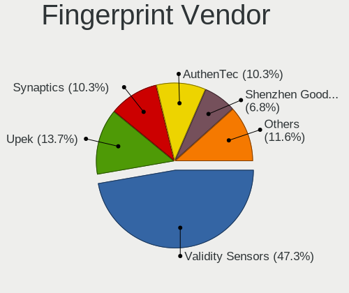

| Vendor                             | Notebooks | Percent |
|------------------------------------|-----------|---------|
| Validity Sensors                   | 45        | 47.87%  |
| Upek                               | 11        | 11.7%   |
| Synaptics                          | 10        | 10.64%  |
| AuthenTec                          | 10        | 10.64%  |
| Shenzhen Goodix Technology         | 6         | 6.38%   |
| LighTuning Technology              | 5         | 5.32%   |
| Elan Microelectronics              | 3         | 3.19%   |
| Realtek USB2.0 Finger Print Bridge | 2         | 2.13%   |
| Focal-systems.Corp                 | 2         | 2.13%   |

Fingerprint Model
-----------------

Fingerprint sensor models

| Model                                                                      | Notebooks | Percent |
|----------------------------------------------------------------------------|-----------|---------|
| Validity Sensors VFS495 Fingerprint Reader                                 | 10        | 10.64%  |
| Upek Biometric Touchchip/Touchstrip Fingerprint Sensor                     | 9         | 9.57%   |
| Validity Sensors VFS 5011 fingerprint sensor                               | 6         | 6.38%   |
| Synaptics Metallica MIS Touch Fingerprint Reader                           | 5         | 5.32%   |
| AuthenTec AES2810                                                          | 5         | 5.32%   |
| Validity Sensors VFS5011 Fingerprint Reader                                | 4         | 4.26%   |
| Validity Sensors VFS491                                                    | 4         | 4.26%   |
| Validity Sensors Synaptics WBDI                                            | 4         | 4.26%   |
| Shenzhen Goodix  Fingerprint Device                                        | 4         | 4.26%   |
| Validity Sensors VFS471 Fingerprint Reader                                 | 3         | 3.19%   |
| Validity Sensors VFS451 Fingerprint Reader                                 | 3         | 3.19%   |
| Validity Sensors Fingerprint scanner                                       | 3         | 3.19%   |
| Synaptics Prometheus MIS Touch Fingerprint Reader                          | 3         | 3.19%   |
| LighTuning EgisTec Touch Fingerprint Sensor                                | 3         | 3.19%   |
| AuthenTec Fingerprint Sensor                                               | 3         | 3.19%   |
| Validity Sensors VFS7500 Touch Fingerprint Sensor                          | 2         | 2.13%   |
| Validity Sensors VFS301 Fingerprint Reader                                 | 2         | 2.13%   |
| Validity Sensors Synaptics VFS7552 Touch Fingerprint Sensor with PurePrint | 2         | 2.13%   |
| Upek TCS5B Fingerprint sensor                                              | 2         | 2.13%   |
| Shenzhen Goodix Fingerprint Reader                                         | 2         | 2.13%   |
| Realtek USB2.0 Finger Print Bridge FocalTech Fingerprint Device            | 2         | 2.13%   |
| Focal-systems.Corp FT9201Fingerprint.                                  | 2         | 2.13%   |
| Elan ELAN:ARM-M4                                                           | 2         | 2.13%   |
| AuthenTec AES2501 Fingerprint Sensor                                       | 2         | 2.13%   |
| Validity Sensors VFS7552 Touch Fingerprint Sensor                          | 1         | 1.06%   |
| Validity Sensors Swipe Fingerprint Sensor                                  | 1         | 1.06%   |
| Synaptics UWP WBDI Device                                                  | 1         | 1.06%   |
| Synaptics  WBDI Fingerprint Reader - USB 052                               | 1         | 1.06%   |
| LighTuning Fingerprint Reader                                              | 1         | 1.06%   |
| LighTuning ES603 Swipe Fingerprint Sensor                                  | 1         | 1.06%   |
| Elan ELAN:Fingerprint                                                      | 1         | 1.06%   |

Chipcard Vendor
---------------

Chipcard module vendors

| Vendor                | Notebooks | Percent |
|-----------------------|-----------|---------|
| Broadcom              | 26        | 57.78%  |
| Alcor Micro           | 7         | 15.56%  |
| O2 Micro              | 4         | 8.89%   |
| Upek                  | 3         | 6.67%   |
| Lenovo                | 2         | 4.44%   |
| SCM Microsystems      | 1         | 2.22%   |
| Gemalto (was Gemplus) | 1         | 2.22%   |
| Cherry                | 1         | 2.22%   |

Chipcard Model
--------------

Chipcard module models

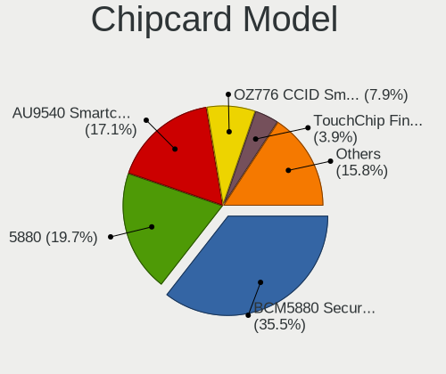

| Model                                                                        | Notebooks | Percent |
|------------------------------------------------------------------------------|-----------|---------|
| Broadcom BCM5880 Secure Applications Processor                               | 14        | 31.11%  |
| Broadcom 5880                                                                | 9         | 20%     |
| Alcor Micro AU9540 Smartcard Reader                                          | 7         | 15.56%  |
| O2 Micro OZ776 CCID Smartcard Reader                                         | 4         | 8.89%   |
| Upek TouchChip Fingerprint Coprocessor (WBF advanced mode)                   | 3         | 6.67%   |
| Lenovo Integrated Smart Card Reader                                          | 2         | 4.44%   |
| Broadcom BCM5880 Secure Applications Processor with fingerprint swipe sensor | 2         | 4.44%   |
| SCM Microsystems SCR3340 - ExpressCard54 Smart Card Reader                   | 1         | 2.22%   |
| Gemalto (was Gemplus) Compact Smart Card Reader Writer                       | 1         | 2.22%   |
| Cherry SmartCard Reader Keyboard KC 1000 SC                                  | 1         | 2.22%   |
| Broadcom 58200                                                               | 1         | 2.22%   |

Unsupported
-----------

Unsupported Devices
-------------------

Total unsupported devices on board

| Total | Notebooks | Percent |
|-------|-----------|---------|
| 0     | 535       | 73.19%  |
| 1     | 165       | 22.57%  |
| 2     | 27        | 3.69%   |
| 3     | 4         | 0.55%   |

Unsupported Device Types
------------------------

Types of unsupported devices

| Type                  | Notebooks | Percent |
|-----------------------|-----------|---------|
| Fingerprint reader    | 94        | 42.73%  |
| Graphics card         | 51        | 23.18%  |
| Chipcard              | 43        | 19.55%  |
| Multimedia controller | 10        | 4.55%   |
| Storage               | 8         | 3.64%   |
| Bluetooth             | 7         | 3.18%   |
| Net/wireless          | 6         | 2.73%   |
| Card reader           | 1         | 0.45%   |

