OpenMandriva 23.08 - Tested Hardware & Statistics (Notebooks)
-------------------------------------------------------------

A project to collect tested hardware configurations for OpenMandriva 23.08.

Anyone can contribute to this report by the [hw-probe](https://github.com/linuxhw/hw-probe) tool:

    sudo -E hw-probe -all -upload

Please contribute! Especially if your hardware is rare.

Contents
--------

* [ Test Cases ](#test-cases)

* [ System ](#system)
  - [ Kernel                   ](#kernel)
  - [ Kernel Family            ](#kernel-family)
  - [ Kernel Major Ver.        ](#kernel-major-ver)
  - [ Arch                     ](#arch)
  - [ DE                       ](#de)
  - [ Display Server           ](#display-server)
  - [ Display Manager          ](#display-manager)
  - [ OS Lang                  ](#os-lang)
  - [ Boot Mode                ](#boot-mode)
  - [ Filesystem               ](#filesystem)
  - [ Part. scheme             ](#part-scheme)
  - [ Dual Boot with Linux/BSD ](#dual-boot-with-linuxbsd)
  - [ Dual Boot (Win)          ](#dual-boot-win)

* [ Board ](#board)
  - [ Vendor                   ](#vendor)
  - [ Model                    ](#model)
  - [ Model Family             ](#model-family)
  - [ MFG Year                 ](#mfg-year)
  - [ Form Factor              ](#form-factor)
  - [ Secure Boot              ](#secure-boot)
  - [ Coreboot                 ](#coreboot)
  - [ RAM Size                 ](#ram-size)
  - [ RAM Used                 ](#ram-used)
  - [ Total Drives             ](#total-drives)
  - [ Has CD-ROM               ](#has-cd-rom)
  - [ Has Ethernet             ](#has-ethernet)
  - [ Has WiFi                 ](#has-wifi)
  - [ Has Bluetooth            ](#has-bluetooth)

* [ Location ](#location)
  - [ Country                  ](#country)
  - [ City                     ](#city)

* [ Drives ](#drives)
  - [ Drive Vendor             ](#drive-vendor)
  - [ Drive Model              ](#drive-model)
  - [ HDD Vendor               ](#hdd-vendor)
  - [ SSD Vendor               ](#ssd-vendor)
  - [ Drive Kind               ](#drive-kind)
  - [ Drive Connector          ](#drive-connector)
  - [ Drive Size               ](#drive-size)
  - [ Space Total              ](#space-total)
  - [ Space Used               ](#space-used)
  - [ Malfunc. Drives          ](#malfunc-drives)
  - [ Malfunc. Drive Vendor    ](#malfunc-drive-vendor)
  - [ Malfunc. HDD Vendor      ](#malfunc-hdd-vendor)
  - [ Malfunc. Drive Kind      ](#malfunc-drive-kind)
  - [ Failed Drives            ](#failed-drives)
  - [ Failed Drive Vendor      ](#failed-drive-vendor)
  - [ Drive Status             ](#drive-status)

* [ Storage controller ](#storage-controller)
  - [ Storage Vendor           ](#storage-vendor)
  - [ Storage Model            ](#storage-model)
  - [ Storage Kind             ](#storage-kind)

* [ Processor ](#processor)
  - [ CPU Vendor               ](#cpu-vendor)
  - [ CPU Model                ](#cpu-model)
  - [ CPU Model Family         ](#cpu-model-family)
  - [ CPU Cores                ](#cpu-cores)
  - [ CPU Sockets              ](#cpu-sockets)
  - [ CPU Threads              ](#cpu-threads)
  - [ CPU Op-Modes             ](#cpu-op-modes)
  - [ CPU Microcode            ](#cpu-microcode)
  - [ CPU Microarch            ](#cpu-microarch)

* [ Graphics ](#graphics)
  - [ GPU Vendor               ](#gpu-vendor)
  - [ GPU Model                ](#gpu-model)
  - [ GPU Combo                ](#gpu-combo)
  - [ GPU Driver               ](#gpu-driver)
  - [ GPU Memory               ](#gpu-memory)

* [ Monitor ](#monitor)
  - [ Monitor Vendor           ](#monitor-vendor)
  - [ Monitor Model            ](#monitor-model)
  - [ Monitor Resolution       ](#monitor-resolution)
  - [ Monitor Diagonal         ](#monitor-diagonal)
  - [ Monitor Width            ](#monitor-width)
  - [ Aspect Ratio             ](#aspect-ratio)
  - [ Monitor Area             ](#monitor-area)
  - [ Pixel Density            ](#pixel-density)
  - [ Multiple Monitors        ](#multiple-monitors)

* [ Network ](#network)
  - [ Net Controller Vendor    ](#net-controller-vendor)
  - [ Net Controller Model     ](#net-controller-model)
  - [ Wireless Vendor          ](#wireless-vendor)
  - [ Wireless Model           ](#wireless-model)
  - [ Ethernet Vendor          ](#ethernet-vendor)
  - [ Ethernet Model           ](#ethernet-model)
  - [ Net Controller Kind      ](#net-controller-kind)
  - [ Used Controller          ](#used-controller)
  - [ NICs                     ](#nics)
  - [ IPv6                     ](#ipv6)

* [ Bluetooth ](#bluetooth)
  - [ Bluetooth Vendor         ](#bluetooth-vendor)
  - [ Bluetooth Model          ](#bluetooth-model)

* [ Sound ](#sound)
  - [ Sound Vendor             ](#sound-vendor)
  - [ Sound Model              ](#sound-model)

* [ Memory ](#memory)
  - [ Memory Vendor            ](#memory-vendor)
  - [ Memory Model             ](#memory-model)
  - [ Memory Kind              ](#memory-kind)
  - [ Memory Form Factor       ](#memory-form-factor)
  - [ Memory Size              ](#memory-size)
  - [ Memory Speed             ](#memory-speed)

* [ Printers & scanners ](#printers--scanners)
  - [ Printer Vendor           ](#printer-vendor)
  - [ Printer Model            ](#printer-model)
  - [ Scanner Vendor           ](#scanner-vendor)
  - [ Scanner Model            ](#scanner-model)

* [ Camera ](#camera)
  - [ Camera Vendor            ](#camera-vendor)
  - [ Camera Model             ](#camera-model)

* [ Security ](#security)
  - [ Fingerprint Vendor       ](#fingerprint-vendor)
  - [ Fingerprint Model        ](#fingerprint-model)
  - [ Chipcard Vendor          ](#chipcard-vendor)
  - [ Chipcard Model           ](#chipcard-model)

* [ Unsupported ](#unsupported)
  - [ Unsupported Devices      ](#unsupported-devices)
  - [ Unsupported Device Types ](#unsupported-device-types)

Test Cases
----------

Total: 1225

| Vendor        | Model                       | Probe                                                      | Date         |
|---------------|-----------------------------|------------------------------------------------------------|--------------|
| Lenovo        | ThinkPad SL400 2743A48      | [0c0f6ef206](https://linux-hardware.org/?probe=0c0f6ef206) | Jan 06, 2025 |
| Acer          | Aspire ES1-731              | [721fdec99d](https://linux-hardware.org/?probe=721fdec99d) | Jan 05, 2025 |
| Casper        | EXCALIBUR G770              | [1f3dee2cf2](https://linux-hardware.org/?probe=1f3dee2cf2) | Jan 02, 2025 |
| Acer          | Predator PH315-53           | [17816e7d6b](https://linux-hardware.org/?probe=17816e7d6b) | Jan 01, 2025 |
| Dell          | Latitude 3340               | [b22cafbc3b](https://linux-hardware.org/?probe=b22cafbc3b) | Jan 01, 2025 |
| Lenovo        | ThinkPad T510 4313A11       | [ecf4a20d48](https://linux-hardware.org/?probe=ecf4a20d48) | Jan 01, 2025 |
| HP            | Laptop 14-dk1xxx            | [317b3a0d60](https://linux-hardware.org/?probe=317b3a0d60) | Dec 28, 2024 |
| Acer          | Aspire A315-59              | [1808c0b1a3](https://linux-hardware.org/?probe=1808c0b1a3) | Dec 26, 2024 |
| Lenovo        | IdeaPad 3 14ITL6 82H7       | [e642f51eb3](https://linux-hardware.org/?probe=e642f51eb3) | Dec 25, 2024 |
| Dell          | Inspiron 5570               | [ea4a7e6f67](https://linux-hardware.org/?probe=ea4a7e6f67) | Dec 21, 2024 |
| ASUSTek       | UX430UAR                    | [b7824c3d65](https://linux-hardware.org/?probe=b7824c3d65) | Dec 20, 2024 |
| HP            | EliteBook 840 G2            | [407784b097](https://linux-hardware.org/?probe=407784b097) | Dec 19, 2024 |
| Dell          | Latitude E6500              | [f173d0af82](https://linux-hardware.org/?probe=f173d0af82) | Dec 19, 2024 |
| Dell          | Inspiron 5566               | [35f435cd1f](https://linux-hardware.org/?probe=35f435cd1f) | Dec 18, 2024 |
| Acer          | Aspire F5-573G              | [aa3a93dbc4](https://linux-hardware.org/?probe=aa3a93dbc4) | Dec 18, 2024 |
| Apple         | MacBookPro11,3              | [26fb82a499](https://linux-hardware.org/?probe=26fb82a499) | Dec 18, 2024 |
| Dell          | Latitude E6430              | [8169d8c98d](https://linux-hardware.org/?probe=8169d8c98d) | Dec 16, 2024 |
| Lenovo        | ThinkPad R500 2714AAG       | [d4c46ae3a8](https://linux-hardware.org/?probe=d4c46ae3a8) | Dec 16, 2024 |
| HP            | EliteBook 8470p             | [fe744f8173](https://linux-hardware.org/?probe=fe744f8173) | Dec 15, 2024 |
| Lenovo        | B490 20205                  | [68e4babaf4](https://linux-hardware.org/?probe=68e4babaf4) | Dec 14, 2024 |
| Dell          | Latitude E6420              | [8ff95feafc](https://linux-hardware.org/?probe=8ff95feafc) | Dec 13, 2024 |
| Lenovo        | ThinkPad SL500 274678G      | [c42768093f](https://linux-hardware.org/?probe=c42768093f) | Dec 12, 2024 |
| Lenovo        | G700 20251                  | [8c886cba43](https://linux-hardware.org/?probe=8c886cba43) | Dec 11, 2024 |
| Dell          | Inspiron 3542               | [3b062636e0](https://linux-hardware.org/?probe=3b062636e0) | Dec 11, 2024 |
| Acer          | Aspire A315-41              | [de445fbbb8](https://linux-hardware.org/?probe=de445fbbb8) | Dec 05, 2024 |
| Samsung       | RC410/RC510/RC710           | [62b0bcca48](https://linux-hardware.org/?probe=62b0bcca48) | Dec 02, 2024 |
| ASUSTek       | K42F                        | [1f69b601e7](https://linux-hardware.org/?probe=1f69b601e7) | Dec 01, 2024 |
| Lenovo        | ThinkPad P51 20HHCTO1WW     | [45efa5fcaa](https://linux-hardware.org/?probe=45efa5fcaa) | Nov 30, 2024 |
| Acer          | Predator PT316-51s          | [59b81c6d72](https://linux-hardware.org/?probe=59b81c6d72) | Nov 29, 2024 |
| HP            | 250 G7 Notebook PC          | [3419013123](https://linux-hardware.org/?probe=3419013123) | Nov 29, 2024 |
| Toshiba       | Satellite C660D             | [1a7221b221](https://linux-hardware.org/?probe=1a7221b221) | Nov 22, 2024 |
| Dell          | Inspiron N5050              | [0770122667](https://linux-hardware.org/?probe=0770122667) | Nov 22, 2024 |
| Lenovo        | ThinkPad T400 2768W2X       | [3614ea7cf1](https://linux-hardware.org/?probe=3614ea7cf1) | Nov 20, 2024 |
| Dell          | Latitude E5540              | [08e9607f7c](https://linux-hardware.org/?probe=08e9607f7c) | Nov 16, 2024 |
| HP            | Pavilion dv6500             | [a875301ed0](https://linux-hardware.org/?probe=a875301ed0) | Nov 15, 2024 |
| Lenovo        | ThinkPad T560 20FJS1WT00    | [ab509efa05](https://linux-hardware.org/?probe=ab509efa05) | Nov 07, 2024 |
| Lenovo        | IdeaPad 3 15IGL05 81WQ      | [a50c814c14](https://linux-hardware.org/?probe=a50c814c14) | Nov 06, 2024 |
| Core Innov... | CLC14364                    | [81013698ba](https://linux-hardware.org/?probe=81013698ba) | Nov 05, 2024 |
| HP            | EliteBook 840 G1            | [50a513535d](https://linux-hardware.org/?probe=50a513535d) | Oct 31, 2024 |
| Lenovo        | ThinkBook 16 G6 ABP 21KK    | [43f03f4788](https://linux-hardware.org/?probe=43f03f4788) | Oct 28, 2024 |
| ASUSTek       | G73Sw                       | [0ff1e91524](https://linux-hardware.org/?probe=0ff1e91524) | Oct 24, 2024 |
| Lenovo        | IdeaPad 1 14IGL7 82V6       | [b5bc47c079](https://linux-hardware.org/?probe=b5bc47c079) | Oct 22, 2024 |
| Lenovo        | V320-17IKB 81CN             | [3b1411efb7](https://linux-hardware.org/?probe=3b1411efb7) | Oct 19, 2024 |
| Acer          | AO756                       | [a4411d830b](https://linux-hardware.org/?probe=a4411d830b) | Oct 15, 2024 |
| Lenovo        | IdeaPad 1 14IGL7 82V6       | [ea88aa96e7](https://linux-hardware.org/?probe=ea88aa96e7) | Oct 14, 2024 |
| Lenovo        | ThinkPad T490 20N3S7PL00    | [599154f22e](https://linux-hardware.org/?probe=599154f22e) | Oct 12, 2024 |
| Dell          | Inspiron 1545               | [817fd73eeb](https://linux-hardware.org/?probe=817fd73eeb) | Oct 11, 2024 |
| Samsung       | 370E4K                      | [a2b6c4cb49](https://linux-hardware.org/?probe=a2b6c4cb49) | Oct 11, 2024 |
| Lenovo        | IdeaPad 1 14IGL7 82V6       | [be211444da](https://linux-hardware.org/?probe=be211444da) | Oct 11, 2024 |
| Core Innov... | CLC14364                    | [05648513d8](https://linux-hardware.org/?probe=05648513d8) | Oct 09, 2024 |
| Lenovo        | B50-30 80ES                 | [bd698857f2](https://linux-hardware.org/?probe=bd698857f2) | Oct 07, 2024 |
| Lenovo        | ThinkPad X201 3323BSG       | [f1d6f061f1](https://linux-hardware.org/?probe=f1d6f061f1) | Oct 05, 2024 |
| Lenovo        | IdeaPad 3 15IAU7 82RK       | [8053e3651e](https://linux-hardware.org/?probe=8053e3651e) | Oct 05, 2024 |
| Clevo         | E7130                       | [ede1b275ef](https://linux-hardware.org/?probe=ede1b275ef) | Oct 03, 2024 |
| Acer          | Aspire 5100                 | [b14b5cd608](https://linux-hardware.org/?probe=b14b5cd608) | Sep 27, 2024 |
| Apple         | MacBookAir5,2               | [e6ccabb39d](https://linux-hardware.org/?probe=e6ccabb39d) | Sep 27, 2024 |
| Lenovo        | IdeaPad 1 14IGL7 82V6       | [e9a05a14d5](https://linux-hardware.org/?probe=e9a05a14d5) | Sep 21, 2024 |
| Fujitsu       | FARR01002                   | [496acfd8d9](https://linux-hardware.org/?probe=496acfd8d9) | Sep 17, 2024 |
| Medion        | Akoya E1317T                | [7ad74493a9](https://linux-hardware.org/?probe=7ad74493a9) | Sep 16, 2024 |
| Lenovo        | IdeaPad 1 14IGL7 82V6       | [75b0157161](https://linux-hardware.org/?probe=75b0157161) | Sep 15, 2024 |
| Core Innov... | CLC14364                    | [b62390cebe](https://linux-hardware.org/?probe=b62390cebe) | Sep 15, 2024 |
| Fujitsu       | LIFEBOOK AH532/G52          | [6055f6f61a](https://linux-hardware.org/?probe=6055f6f61a) | Sep 14, 2024 |
| Lenovo        | V110-15IAP 80TG             | [22db01d914](https://linux-hardware.org/?probe=22db01d914) | Sep 13, 2024 |
| ASUSTek       | VivoBook_ASUSLaptop X515... | [8206f3715c](https://linux-hardware.org/?probe=8206f3715c) | Sep 12, 2024 |
| Lenovo        | IdeaPad 1 14IGL7 82V6       | [6c2bf872f2](https://linux-hardware.org/?probe=6c2bf872f2) | Sep 12, 2024 |
| Lenovo        | IdeaPad 1 14IGL7 82V6       | [51f8cded37](https://linux-hardware.org/?probe=51f8cded37) | Sep 10, 2024 |
| ASUSTek       | T100TA                      | [46d4d907c1](https://linux-hardware.org/?probe=46d4d907c1) | Sep 09, 2024 |
| Getac         | V110G5                      | [8d2f734bbe](https://linux-hardware.org/?probe=8d2f734bbe) | Sep 07, 2024 |
| ASUSTek       | K52Jc                       | [c98eab26fb](https://linux-hardware.org/?probe=c98eab26fb) | Sep 07, 2024 |
| HP            | ProBook 6555b               | [9c54971659](https://linux-hardware.org/?probe=9c54971659) | Sep 06, 2024 |
| HP            | Pavilion dv7                | [3d7f0838c5](https://linux-hardware.org/?probe=3d7f0838c5) | Sep 06, 2024 |
| ASUSTek       | VivoBook_ASUSLaptop X515... | [da9a9487f7](https://linux-hardware.org/?probe=da9a9487f7) | Sep 05, 2024 |
| Lenovo        | IdeaPad 1 14IGL7 82V6       | [0d1003a111](https://linux-hardware.org/?probe=0d1003a111) | Sep 04, 2024 |
| Lenovo        | IdeaPad 1 14IGL7 82V6       | [5196388966](https://linux-hardware.org/?probe=5196388966) | Sep 04, 2024 |
| Lenovo        | IdeaPad 1 14IGL7 82V6       | [646d172aa3](https://linux-hardware.org/?probe=646d172aa3) | Sep 04, 2024 |
| Lenovo        | IdeaPad 1 14IGL7 82V6       | [90787e672c](https://linux-hardware.org/?probe=90787e672c) | Sep 03, 2024 |
| Acer          | Aspire E1-731               | [a39e9ee7ee](https://linux-hardware.org/?probe=a39e9ee7ee) | Sep 03, 2024 |
| Lenovo        | IdeaPad 1 14IGL7 82V6       | [a1a2754ecc](https://linux-hardware.org/?probe=a1a2754ecc) | Sep 03, 2024 |
| Dell          | Inspiron 1525               | [a09742cd2c](https://linux-hardware.org/?probe=a09742cd2c) | Sep 03, 2024 |
| Core Innov... | CLC14364                    | [5f9f543837](https://linux-hardware.org/?probe=5f9f543837) | Sep 02, 2024 |
| ASUSTek       | X541SA                      | [07f002f74d](https://linux-hardware.org/?probe=07f002f74d) | Sep 01, 2024 |
| Compaq        | Presario 21                 | [d3296aeef8](https://linux-hardware.org/?probe=d3296aeef8) | Aug 31, 2024 |
| Lenovo        | IdeaPad Gaming 3 15ACH6 ... | [6ef394b941](https://linux-hardware.org/?probe=6ef394b941) | Aug 27, 2024 |
| NOBLEX        | SF20BA                      | [0994013255](https://linux-hardware.org/?probe=0994013255) | Aug 27, 2024 |
| Lenovo        | IdeaPad Z360                | [e87a8556e8](https://linux-hardware.org/?probe=e87a8556e8) | Aug 25, 2024 |
| Dell          | Latitude E7440              | [e34eb2cc1f](https://linux-hardware.org/?probe=e34eb2cc1f) | Aug 24, 2024 |
| Dell          | Inspiron N5050              | [1b5da9d1f9](https://linux-hardware.org/?probe=1b5da9d1f9) | Aug 23, 2024 |
| GPU Compan... | GWNR71517                   | [d512d40dcd](https://linux-hardware.org/?probe=d512d40dcd) | Aug 21, 2024 |
| NOBLEX        | SF20BA                      | [4e4ca474ff](https://linux-hardware.org/?probe=4e4ca474ff) | Aug 19, 2024 |
| Acer          | Aspire V3-571G              | [d5e42e65ba](https://linux-hardware.org/?probe=d5e42e65ba) | Aug 19, 2024 |
| Dell          | Inspiron 1420               | [de7c486914](https://linux-hardware.org/?probe=de7c486914) | Aug 19, 2024 |
| Core Innov... | CLC14364                    | [bfd7ae60a1](https://linux-hardware.org/?probe=bfd7ae60a1) | Aug 18, 2024 |
| Lenovo        | IdeaPad 1 14IGL7 82V6       | [36cbab14da](https://linux-hardware.org/?probe=36cbab14da) | Aug 16, 2024 |
| ASUSTek       | TUF Gaming FX504GD_FX80G... | [264ec74f2a](https://linux-hardware.org/?probe=264ec74f2a) | Aug 14, 2024 |
| Lenovo        | ThinkPad L480 20LTS21U03    | [9330eabf54](https://linux-hardware.org/?probe=9330eabf54) | Aug 14, 2024 |
| ASUSTek       | VivoBook_ASUSLaptop X512... | [de436e6dee](https://linux-hardware.org/?probe=de436e6dee) | Aug 14, 2024 |
| Acer          | Aspire A515-56G             | [352a0cd2f6](https://linux-hardware.org/?probe=352a0cd2f6) | Aug 13, 2024 |
| Acer          | Aspire 7750ZG               | [4668032b84](https://linux-hardware.org/?probe=4668032b84) | Aug 11, 2024 |
| Lenovo        | ThinkPad P50 20EQS20D00     | [f1e7259f48](https://linux-hardware.org/?probe=f1e7259f48) | Aug 10, 2024 |
| Digibras      | NH4CU53                     | [ab93cac3a8](https://linux-hardware.org/?probe=ab93cac3a8) | Aug 09, 2024 |
| ASUSTek       | X550CC                      | [8478f8a8a8](https://linux-hardware.org/?probe=8478f8a8a8) | Aug 09, 2024 |
| Toshiba       | Satellite A135              | [b6676b057d](https://linux-hardware.org/?probe=b6676b057d) | Aug 09, 2024 |
| HP            | G62                         | [cfd261d7d1](https://linux-hardware.org/?probe=cfd261d7d1) | Aug 04, 2024 |
| Lenovo        | ThinkPad T530 2429B69       | [cfe8e9461f](https://linux-hardware.org/?probe=cfe8e9461f) | Aug 02, 2024 |
| Packard Be... | EasyNote TJ65               | [e306fe8ecc](https://linux-hardware.org/?probe=e306fe8ecc) | Aug 02, 2024 |
| Lenovo        | IdeaPad 1 14IGL7 82V6       | [0eb7d255f3](https://linux-hardware.org/?probe=0eb7d255f3) | Aug 02, 2024 |
| Lenovo        | IdeaPad 1 14IGL7 82V6       | [9f72b57572](https://linux-hardware.org/?probe=9f72b57572) | Aug 02, 2024 |
| Lenovo        | IdeaPad 1 14IGL7 82V6       | [0f9769121d](https://linux-hardware.org/?probe=0f9769121d) | Aug 02, 2024 |
| Lenovo        | IdeaPad 1 14IGL7 82V6       | [ed267f1e53](https://linux-hardware.org/?probe=ed267f1e53) | Aug 02, 2024 |
| Dell          | Latitude E4300              | [0f4d8b2b9f](https://linux-hardware.org/?probe=0f4d8b2b9f) | Jul 30, 2024 |
| Toshiba       | Satellite C655D             | [e81fee8a6c](https://linux-hardware.org/?probe=e81fee8a6c) | Jul 29, 2024 |
| ASUSTek       | Vivobook Go E1504FA_E150... | [bc2b62ae1b](https://linux-hardware.org/?probe=bc2b62ae1b) | Jul 27, 2024 |
| Core Innov... | CLC14364                    | [d1a65ccc57](https://linux-hardware.org/?probe=d1a65ccc57) | Jul 26, 2024 |
| MSI           | GP75 Leopard 10SFK          | [71a1b61be1](https://linux-hardware.org/?probe=71a1b61be1) | Jul 25, 2024 |
| ASUSTek       | X550CA                      | [b166d93b76](https://linux-hardware.org/?probe=b166d93b76) | Jul 24, 2024 |
| Lenovo        | B590 20206                  | [1d54fe19db](https://linux-hardware.org/?probe=1d54fe19db) | Jul 24, 2024 |
| Dell          | Latitude 3420               | [e19f560b4b](https://linux-hardware.org/?probe=e19f560b4b) | Jul 24, 2024 |
| Lenovo        | IdeaPad 1 14IGL7 82V6       | [d2e4abf5f4](https://linux-hardware.org/?probe=d2e4abf5f4) | Jul 23, 2024 |
| HP            | EliteBook 850 G3            | [0a7c685c42](https://linux-hardware.org/?probe=0a7c685c42) | Jul 23, 2024 |
| Samsung       | 275E4E/275E5E               | [76664dd4c1](https://linux-hardware.org/?probe=76664dd4c1) | Jul 23, 2024 |
| ONKYO         | ONKYOPC                     | [09b23f2d51](https://linux-hardware.org/?probe=09b23f2d51) | Jul 23, 2024 |
| Dell          | Latitude E5570              | [0165747ee0](https://linux-hardware.org/?probe=0165747ee0) | Jul 22, 2024 |
| Dell          | Latitude E6400              | [39f3a73c4e](https://linux-hardware.org/?probe=39f3a73c4e) | Jul 21, 2024 |
| Dell          | Latitude E5540              | [34bee156ca](https://linux-hardware.org/?probe=34bee156ca) | Jul 21, 2024 |
| Samsung       | N150P                       | [29634e5ef3](https://linux-hardware.org/?probe=29634e5ef3) | Jul 21, 2024 |
| HP            | G62                         | [212822c040](https://linux-hardware.org/?probe=212822c040) | Jul 20, 2024 |
| Acer          | Aspire V5-561G              | [42de9c9a13](https://linux-hardware.org/?probe=42de9c9a13) | Jul 20, 2024 |
| Lenovo        | IdeaPad 3 14IIL05 81WD      | [f64e5045de](https://linux-hardware.org/?probe=f64e5045de) | Jul 20, 2024 |
| Lenovo        | IdeaPad 1 14IGL7 82V6       | [e932f08d1f](https://linux-hardware.org/?probe=e932f08d1f) | Jul 20, 2024 |
| Apple         | MacBookAir6,2               | [fdda23379d](https://linux-hardware.org/?probe=fdda23379d) | Jul 20, 2024 |
| Dell          | G5 5590                     | [32e5d24257](https://linux-hardware.org/?probe=32e5d24257) | Jul 18, 2024 |
| Lenovo        | V130-15IGM 81HL             | [af6e4e0234](https://linux-hardware.org/?probe=af6e4e0234) | Jul 18, 2024 |
| Apple         | MacBookPro11,3              | [e033fa91df](https://linux-hardware.org/?probe=e033fa91df) | Jul 18, 2024 |
| HP            | Presario CQ57               | [08d89f4239](https://linux-hardware.org/?probe=08d89f4239) | Jul 17, 2024 |
| MSI           | MS-1759                     | [671a5518e5](https://linux-hardware.org/?probe=671a5518e5) | Jul 17, 2024 |
| AIR           | CX28000W                    | [16137fe940](https://linux-hardware.org/?probe=16137fe940) | Jul 16, 2024 |
| Acer          | Aspire 8730                 | [b1904ce50a](https://linux-hardware.org/?probe=b1904ce50a) | Jul 16, 2024 |
| Toshiba       | Satellite L645              | [7c46019cc3](https://linux-hardware.org/?probe=7c46019cc3) | Jul 16, 2024 |
| Dell          | Latitude 7480               | [c5b3a19dc6](https://linux-hardware.org/?probe=c5b3a19dc6) | Jul 16, 2024 |
| Dell          | Latitude E6420              | [ed2dfd4697](https://linux-hardware.org/?probe=ed2dfd4697) | Jul 15, 2024 |
| HP            | ProBook 450 G5              | [114f593d2e](https://linux-hardware.org/?probe=114f593d2e) | Jul 14, 2024 |
| Valve         | Galileo                     | [c81b1ef308](https://linux-hardware.org/?probe=c81b1ef308) | Jul 14, 2024 |
| HUAWEI        | MCLF-XX                     | [02fe034f42](https://linux-hardware.org/?probe=02fe034f42) | Jul 13, 2024 |
| Dell          | Latitude E6430s             | [e3f7513a9e](https://linux-hardware.org/?probe=e3f7513a9e) | Jul 13, 2024 |
| Acer          | Nitro AN515-44              | [958ce79a36](https://linux-hardware.org/?probe=958ce79a36) | Jul 12, 2024 |
| Unknown       | Unknown                     | [d05d63f9bd](https://linux-hardware.org/?probe=d05d63f9bd) | Jul 11, 2024 |
| Dell          | Inspiron 5520               | [617fd7c71a](https://linux-hardware.org/?probe=617fd7c71a) | Jul 11, 2024 |
| Acer          | Aspire ES1-732              | [dd239232f2](https://linux-hardware.org/?probe=dd239232f2) | Jul 11, 2024 |
| Lenovo        | ThinkBook 15 G4 ABA 21DL    | [d840119eb6](https://linux-hardware.org/?probe=d840119eb6) | Jul 11, 2024 |
| Lenovo        | ThinkPad P50 20EQS37300     | [2fc66ed5e8](https://linux-hardware.org/?probe=2fc66ed5e8) | Jul 10, 2024 |
| Core Innov... | CLC14364                    | [7ec7af2a2b](https://linux-hardware.org/?probe=7ec7af2a2b) | Jul 09, 2024 |
| HP            | Presario CQ56               | [1de5f0e8b0](https://linux-hardware.org/?probe=1de5f0e8b0) | Jul 07, 2024 |
| Lenovo        | ThinkPad 11e 20DAS0VG00     | [944f1cf225](https://linux-hardware.org/?probe=944f1cf225) | Jul 07, 2024 |
| Dell          | Latitude 7490               | [7cd32fcab4](https://linux-hardware.org/?probe=7cd32fcab4) | Jul 07, 2024 |
| Dell          | Inspiron 1564               | [3c5c95d839](https://linux-hardware.org/?probe=3c5c95d839) | Jul 07, 2024 |
| Apple         | MacBookAir5,2               | [5730fa5e66](https://linux-hardware.org/?probe=5730fa5e66) | Jul 07, 2024 |
| Lenovo        | ThinkPad T440p 20AWA1PKA... | [5f96cb15b8](https://linux-hardware.org/?probe=5f96cb15b8) | Jul 07, 2024 |
| GPU Compan... | GWNC31514                   | [866bc18b85](https://linux-hardware.org/?probe=866bc18b85) | Jul 07, 2024 |
| ASUSTek       | X541SA                      | [0f5813286e](https://linux-hardware.org/?probe=0f5813286e) | Jul 06, 2024 |
| Acer          | Aspire ES1-731              | [c34f46808e](https://linux-hardware.org/?probe=c34f46808e) | Jul 06, 2024 |
| ASUSTek       | K53E                        | [d3a0f69d1b](https://linux-hardware.org/?probe=d3a0f69d1b) | Jul 06, 2024 |
| HP            | 250 G6 Notebook PC          | [6e435ae17c](https://linux-hardware.org/?probe=6e435ae17c) | Jul 06, 2024 |
| Panasonic     | CFSZ6-2                     | [09991bde50](https://linux-hardware.org/?probe=09991bde50) | Jul 06, 2024 |
| ASUSTek       | X510UAR                     | [c93c6cabe1](https://linux-hardware.org/?probe=c93c6cabe1) | Jul 06, 2024 |
| Dell          | Latitude E5530 vPro         | [0aee03627c](https://linux-hardware.org/?probe=0aee03627c) | Jul 05, 2024 |
| Dell          | Latitude E6400              | [e45fd27a11](https://linux-hardware.org/?probe=e45fd27a11) | Jul 04, 2024 |
| Dell          | Vostro 3550                 | [54a8595e70](https://linux-hardware.org/?probe=54a8595e70) | Jul 04, 2024 |
| Samsung       | RV420/RV520/RV720/E3530/... | [e62a05f921](https://linux-hardware.org/?probe=e62a05f921) | Jul 04, 2024 |
| Lenovo        | IdeaPad 3 14ADA05 81W0      | [abc15903ab](https://linux-hardware.org/?probe=abc15903ab) | Jul 04, 2024 |
| Acer          | Aspire A315-58              | [647ca9ecb0](https://linux-hardware.org/?probe=647ca9ecb0) | Jul 04, 2024 |
| Gigabyte      | P17FR5                      | [3e99f8eb2c](https://linux-hardware.org/?probe=3e99f8eb2c) | Jul 04, 2024 |
| Dell          | Latitude E5430 non-vPro     | [72c4059807](https://linux-hardware.org/?probe=72c4059807) | Jul 04, 2024 |
| Lenovo        | ThinkPad L540 20AUS28100    | [b59c2a69f9](https://linux-hardware.org/?probe=b59c2a69f9) | Jul 04, 2024 |
| HP            | ZBook 15 G5                 | [cad2cf8bff](https://linux-hardware.org/?probe=cad2cf8bff) | Jul 03, 2024 |
| HP            | ProBook 6450b               | [719cb2b099](https://linux-hardware.org/?probe=719cb2b099) | Jul 01, 2024 |
| HP            | Compaq 6910p                | [2ba8c6fe46](https://linux-hardware.org/?probe=2ba8c6fe46) | Jul 01, 2024 |
| ASUSTek       | VivoBook_ASUSLaptop X415... | [b4793633f9](https://linux-hardware.org/?probe=b4793633f9) | Jul 01, 2024 |
| MSI           | Thin GF63 12VE              | [55256ad8b1](https://linux-hardware.org/?probe=55256ad8b1) | Jul 01, 2024 |
| Dell          | Latitude 3340               | [792e2d71b0](https://linux-hardware.org/?probe=792e2d71b0) | Jul 01, 2024 |
| ASUSTek       | VivoBook_ASUSLaptop X515... | [4232ba0ac9](https://linux-hardware.org/?probe=4232ba0ac9) | Jul 01, 2024 |
| ASUSTek       | T100TAF                     | [05c827f54c](https://linux-hardware.org/?probe=05c827f54c) | Jun 29, 2024 |
| Lenovo        | ThinkPad T420s 4174W4T      | [d234dada87](https://linux-hardware.org/?probe=d234dada87) | Jun 29, 2024 |
| ASUSTek       | VivoBook_ASUSLaptop X150... | [a6e35dde0d](https://linux-hardware.org/?probe=a6e35dde0d) | Jun 29, 2024 |
| Chuwi         | AeroBook Plus               | [5d09b59053](https://linux-hardware.org/?probe=5d09b59053) | Jun 29, 2024 |
| Lenovo        | IdeaPad L340-15IWL 81LG     | [99b998a45a](https://linux-hardware.org/?probe=99b998a45a) | Jun 28, 2024 |
| Dell          | Latitude E5520              | [2a06da6b0d](https://linux-hardware.org/?probe=2a06da6b0d) | Jun 27, 2024 |
| HP            | Pavilion Laptop 15-cs0xx... | [752d814af3](https://linux-hardware.org/?probe=752d814af3) | Jun 27, 2024 |
| Positivo      | UW3                         | [f37c824400](https://linux-hardware.org/?probe=f37c824400) | Jun 27, 2024 |
| HP            | EliteBook 840 G3            | [aa123bef20](https://linux-hardware.org/?probe=aa123bef20) | Jun 26, 2024 |
| HP            | Pavilion dm1                | [46eca8c33a](https://linux-hardware.org/?probe=46eca8c33a) | Jun 26, 2024 |
| NEC Comput... | PC-VJ26MBZCF                | [8ba01f3c6c](https://linux-hardware.org/?probe=8ba01f3c6c) | Jun 25, 2024 |
| Lenovo        | Legion Y545 81Q6            | [617f1b7020](https://linux-hardware.org/?probe=617f1b7020) | Jun 25, 2024 |
| Unknown       | NH4CU53                     | [c2afeac9a3](https://linux-hardware.org/?probe=c2afeac9a3) | Jun 23, 2024 |
| Lenovo        | ThinkPad T520 42405FG       | [8e48fda0ee](https://linux-hardware.org/?probe=8e48fda0ee) | Jun 22, 2024 |
| HP            | Pavilion g4                 | [03d8e18e1c](https://linux-hardware.org/?probe=03d8e18e1c) | Jun 22, 2024 |
| Lenovo        | ThinkPad T490 20N3SGFY00    | [78506c6bed](https://linux-hardware.org/?probe=78506c6bed) | Jun 21, 2024 |
| Positivo      | Mobile                      | [927af43a1e](https://linux-hardware.org/?probe=927af43a1e) | Jun 21, 2024 |
| Packard Be... | EasyNote_MX52-B-702NCD      | [a701f521e6](https://linux-hardware.org/?probe=a701f521e6) | Jun 18, 2024 |
| ASUSTek       | N76VB                       | [04add030f4](https://linux-hardware.org/?probe=04add030f4) | Jun 18, 2024 |
| Dell          | Inspiron 15 7000 Gaming     | [d23fd860dc](https://linux-hardware.org/?probe=d23fd860dc) | Jun 17, 2024 |
| Gigabyte      | RC14UD                      | [70d3f45ff7](https://linux-hardware.org/?probe=70d3f45ff7) | Jun 15, 2024 |
| MSI           | GP75 Leopard 10SFK          | [440f78fb36](https://linux-hardware.org/?probe=440f78fb36) | Jun 14, 2024 |
| ASUSTek       | VivoBook_ASUSLaptop X712... | [acd6f7384f](https://linux-hardware.org/?probe=acd6f7384f) | Jun 14, 2024 |
| Lenovo        | ThinkPad T520 42404DG       | [0ebf60097e](https://linux-hardware.org/?probe=0ebf60097e) | Jun 11, 2024 |
| Lenovo        | ThinkPad X201 3680F7G       | [cd02d8af64](https://linux-hardware.org/?probe=cd02d8af64) | Jun 11, 2024 |
| Core Innov... | CLC14364                    | [ebf60ad1d4](https://linux-hardware.org/?probe=ebf60ad1d4) | Jun 11, 2024 |
| Lenovo        | ThinkPad P15v Gen 1 20TQ... | [186867bd2c](https://linux-hardware.org/?probe=186867bd2c) | Jun 10, 2024 |
| Toshiba       | Satellite C650              | [5bc2771fec](https://linux-hardware.org/?probe=5bc2771fec) | Jun 10, 2024 |
| Lenovo        | IdeaPad 1 15IAU7 82VY       | [93ba271535](https://linux-hardware.org/?probe=93ba271535) | Jun 10, 2024 |
| Lenovo        | IdeaPad Gaming 3 15ARH7 ... | [73535f78d4](https://linux-hardware.org/?probe=73535f78d4) | Jun 09, 2024 |
| Lenovo        | IdeaPad 5 14ALC05 82LM      | [e526a53470](https://linux-hardware.org/?probe=e526a53470) | Jun 08, 2024 |
| HP            | EliteBook 840 G5            | [ac98ad5119](https://linux-hardware.org/?probe=ac98ad5119) | Jun 08, 2024 |
| ASUSTek       | VivoBook 12_ASUS Laptop ... | [02c80e63f3](https://linux-hardware.org/?probe=02c80e63f3) | Jun 08, 2024 |
| Dell          | Precision M4800             | [9ffdda9098](https://linux-hardware.org/?probe=9ffdda9098) | Jun 07, 2024 |
| Dell          | Studio 1537                 | [9c73780c05](https://linux-hardware.org/?probe=9c73780c05) | Jun 07, 2024 |
| Lenovo        | IdeaPad 1 14IGL7 82V6       | [f965df9dc9](https://linux-hardware.org/?probe=f965df9dc9) | Jun 06, 2024 |
| Lenovo        | IdeaPad 3 15ALC6 82MF       | [6cd669ce9d](https://linux-hardware.org/?probe=6cd669ce9d) | Jun 06, 2024 |
| Lenovo        | B575e 36852BG               | [703312be48](https://linux-hardware.org/?probe=703312be48) | Jun 05, 2024 |
| HP            | Laptop 14-cf2xxx            | [8ee6674025](https://linux-hardware.org/?probe=8ee6674025) | Jun 04, 2024 |
| Toshiba       | Satellite L750              | [ebb7d86561](https://linux-hardware.org/?probe=ebb7d86561) | Jun 04, 2024 |
| HP            | 14 Laptop PC                | [5b165f8d7c](https://linux-hardware.org/?probe=5b165f8d7c) | Jun 04, 2024 |
| ASUSTek       | VivoBook_ASUSLaptop X515... | [19a04d6fe8](https://linux-hardware.org/?probe=19a04d6fe8) | Jun 03, 2024 |
| Acer          | Aspire 5732Z                | [3240239bf4](https://linux-hardware.org/?probe=3240239bf4) | Jun 03, 2024 |
| Acer          | Nitro AN517-41              | [541f9885c5](https://linux-hardware.org/?probe=541f9885c5) | Jun 03, 2024 |
| ASUSTek       | G75VW                       | [5c504aa546](https://linux-hardware.org/?probe=5c504aa546) | Jun 03, 2024 |
| ASUSTek       | VivoBook_ASUSLaptop X515... | [65c0ac7dbe](https://linux-hardware.org/?probe=65c0ac7dbe) | Jun 03, 2024 |
| Toshiba       | Satellite C55D-A            | [057a330a3f](https://linux-hardware.org/?probe=057a330a3f) | Jun 03, 2024 |
| NOBLEX        | E11IS2                      | [327a12cc82](https://linux-hardware.org/?probe=327a12cc82) | Jun 02, 2024 |
| HP            | Compaq Mini CQ10-400        | [ad9a195e34](https://linux-hardware.org/?probe=ad9a195e34) | Jun 02, 2024 |
| HP            | Pavilion g6                 | [824387472c](https://linux-hardware.org/?probe=824387472c) | Jun 01, 2024 |
| Dell          | Latitude 7490               | [2c3cb89d8d](https://linux-hardware.org/?probe=2c3cb89d8d) | Jun 01, 2024 |
| Medion        | E11201                      | [f71bc55f73](https://linux-hardware.org/?probe=f71bc55f73) | May 31, 2024 |
| Microtech     | CoreBook                    | [d6615711df](https://linux-hardware.org/?probe=d6615711df) | May 30, 2024 |
| ASUSTek       | VivoBook_ASUSLaptop X712... | [696126a9c6](https://linux-hardware.org/?probe=696126a9c6) | May 29, 2024 |
| Dell          | Latitude E5550              | [7a9c252c6c](https://linux-hardware.org/?probe=7a9c252c6c) | May 29, 2024 |
| HP            | ProBook 645 G2              | [1c6bc44029](https://linux-hardware.org/?probe=1c6bc44029) | May 29, 2024 |
| Fujitsu       | LIFEBOOK U759               | [34f894fbbe](https://linux-hardware.org/?probe=34f894fbbe) | May 29, 2024 |
| Core Innov... | CLC14364                    | [13fae37ce0](https://linux-hardware.org/?probe=13fae37ce0) | May 29, 2024 |
| HP            | EliteBook 840 G5            | [2835662b9a](https://linux-hardware.org/?probe=2835662b9a) | May 28, 2024 |
| HP            | ZBook 17                    | [3f754c6dda](https://linux-hardware.org/?probe=3f754c6dda) | May 25, 2024 |
| Lenovo        | ThinkPad Edge E531 6885D... | [5e056a0de3](https://linux-hardware.org/?probe=5e056a0de3) | May 25, 2024 |
| HP            | EPROM DATA AREA             | [0e28fcd875](https://linux-hardware.org/?probe=0e28fcd875) | May 24, 2024 |
| Lenovo        | ThinkPad SL510 2847CZU      | [eec29ec098](https://linux-hardware.org/?probe=eec29ec098) | May 24, 2024 |
| Sony          | VPCEE47FJ                   | [33e7fc3dcf](https://linux-hardware.org/?probe=33e7fc3dcf) | May 22, 2024 |
| Dell          | Latitude E5430 non-vPro     | [2101f14aa7](https://linux-hardware.org/?probe=2101f14aa7) | May 20, 2024 |
| HP            | 250 G6 Notebook PC          | [58a289770a](https://linux-hardware.org/?probe=58a289770a) | May 20, 2024 |
| Lenovo        | IdeaPadFlex 14 20308        | [15c0b89aa9](https://linux-hardware.org/?probe=15c0b89aa9) | May 20, 2024 |
| Lenovo        | ThinkPad S1 Yoga 20C0S0U... | [630273772a](https://linux-hardware.org/?probe=630273772a) | May 19, 2024 |
| ASUSTek       | X55A                        | [08f3d84aeb](https://linux-hardware.org/?probe=08f3d84aeb) | May 19, 2024 |
| Standard      | ECT                         | [584581a35c](https://linux-hardware.org/?probe=584581a35c) | May 19, 2024 |
| Dell          | Precision 7530              | [96ee9bf811](https://linux-hardware.org/?probe=96ee9bf811) | May 19, 2024 |
| Lenovo        | ThinkPad P70 20ER000BGE     | [3b9c970a19](https://linux-hardware.org/?probe=3b9c970a19) | May 19, 2024 |
| HP            | EliteBook Folio 9470m       | [71b0f12af8](https://linux-hardware.org/?probe=71b0f12af8) | May 19, 2024 |
| Lenovo        | IdeaPad 320-15AST 80XV      | [002b703f8a](https://linux-hardware.org/?probe=002b703f8a) | May 18, 2024 |
| Lenovo        | G770 1037                   | [81fd5a2b86](https://linux-hardware.org/?probe=81fd5a2b86) | May 18, 2024 |
| HP            | Laptop 15-db0xxx            | [4813119a7b](https://linux-hardware.org/?probe=4813119a7b) | May 18, 2024 |
| Lenovo        | ThinkPad T14 Gen 1 20S1S... | [62962b0cec](https://linux-hardware.org/?probe=62962b0cec) | May 17, 2024 |
| HP            | Laptop 15-bs0xx             | [d7bb8a4ea8](https://linux-hardware.org/?probe=d7bb8a4ea8) | May 17, 2024 |
| Dell          | Inspiron 14-3452            | [cfad66c8d2](https://linux-hardware.org/?probe=cfad66c8d2) | May 16, 2024 |
| Lenovo        | IdeaPad 1 14IGL7 82V6       | [1bfcf071de](https://linux-hardware.org/?probe=1bfcf071de) | May 15, 2024 |
| Dell          | Latitude 5400               | [04e76cc72b](https://linux-hardware.org/?probe=04e76cc72b) | May 14, 2024 |
| Dell          | XPS 13 9360                 | [81cce5b7bc](https://linux-hardware.org/?probe=81cce5b7bc) | May 14, 2024 |
| Lenovo        | ThinkPad L450 20DT0003XS    | [76c50cca06](https://linux-hardware.org/?probe=76c50cca06) | May 13, 2024 |
| HP            | Pavilion Gaming Laptop 1... | [1092e372ee](https://linux-hardware.org/?probe=1092e372ee) | May 13, 2024 |
| Lenovo        | E50-80 80J2                 | [a7568cbcc1](https://linux-hardware.org/?probe=a7568cbcc1) | May 13, 2024 |
| Lenovo        | IdeaPad Slim 1-14AST-05 ... | [bf17334774](https://linux-hardware.org/?probe=bf17334774) | May 12, 2024 |
| Lenovo        | IdeaPad 1 14IGL7 82V6       | [0483794088](https://linux-hardware.org/?probe=0483794088) | May 11, 2024 |
| Lenovo        | IdeaPad 1 14IGL7 82V6       | [cae77e5760](https://linux-hardware.org/?probe=cae77e5760) | May 11, 2024 |
| HP            | Mini 210-1000               | [74f692bfab](https://linux-hardware.org/?probe=74f692bfab) | May 11, 2024 |
| Dell          | System Inspiron N7110       | [a826b2d2e4](https://linux-hardware.org/?probe=a826b2d2e4) | May 10, 2024 |
| HP            | 15                          | [deaab49b1d](https://linux-hardware.org/?probe=deaab49b1d) | May 10, 2024 |
| Lenovo        | IdeaPad Z580                | [c4cd355a10](https://linux-hardware.org/?probe=c4cd355a10) | May 09, 2024 |
| Dell          | Vostro 15-3568              | [afd5a26a47](https://linux-hardware.org/?probe=afd5a26a47) | May 09, 2024 |
| ASUSTek       | X551MA                      | [6ce58b40cb](https://linux-hardware.org/?probe=6ce58b40cb) | May 09, 2024 |
| Getac         | V110G3                      | [f2bd63cfb8](https://linux-hardware.org/?probe=f2bd63cfb8) | May 09, 2024 |
| Dell          | Inspiron 15-3567            | [4f2761bde5](https://linux-hardware.org/?probe=4f2761bde5) | May 09, 2024 |
| HP            | EliteBook 8560p             | [fa48702e03](https://linux-hardware.org/?probe=fa48702e03) | May 08, 2024 |
| Lenovo        | IdeaPad 1 14IGL7 82V6       | [8c2b9bb30a](https://linux-hardware.org/?probe=8c2b9bb30a) | May 07, 2024 |
| Lenovo        | LOQ 15IRH8 82XV             | [c741f249e2](https://linux-hardware.org/?probe=c741f249e2) | May 06, 2024 |
| Lenovo        | IdeaPad 1 14IGL7 82V6       | [083cfcc0f3](https://linux-hardware.org/?probe=083cfcc0f3) | May 06, 2024 |
| HP            | 650                         | [8fa3b11e2c](https://linux-hardware.org/?probe=8fa3b11e2c) | May 05, 2024 |
| HP            | Compaq 6720s                | [e51bd60d05](https://linux-hardware.org/?probe=e51bd60d05) | May 05, 2024 |
| Lenovo        | ThinkPad Edge E530 32597... | [a216f0b6d5](https://linux-hardware.org/?probe=a216f0b6d5) | May 05, 2024 |
| Lenovo        | ThinkPad T520 4243W29       | [b1e4dde68e](https://linux-hardware.org/?probe=b1e4dde68e) | May 04, 2024 |
| ASUSTek       | ASUS EXPERTBOOK B1500CEA... | [ea3a8f97a7](https://linux-hardware.org/?probe=ea3a8f97a7) | May 04, 2024 |
| HP            | 246                         | [83140d67e2](https://linux-hardware.org/?probe=83140d67e2) | May 03, 2024 |
| ASUSTek       | X751SA                      | [7dadfc10b4](https://linux-hardware.org/?probe=7dadfc10b4) | May 03, 2024 |
| Toshiba       | Satellite Pro L650          | [4e0111f9c9](https://linux-hardware.org/?probe=4e0111f9c9) | May 02, 2024 |
| HP            | 250 G6 Notebook PC          | [ff4a31241b](https://linux-hardware.org/?probe=ff4a31241b) | May 02, 2024 |
| Lenovo        | ThinkPad L530 24812K6       | [e7d0c76f65](https://linux-hardware.org/?probe=e7d0c76f65) | May 01, 2024 |
| Packard Be... | EasyNote TJ71               | [f421f823ec](https://linux-hardware.org/?probe=f421f823ec) | May 01, 2024 |
| Google        | Bluebird                    | [75db9dc248](https://linux-hardware.org/?probe=75db9dc248) | May 01, 2024 |
| HP            | Pavilion Notebook           | [5d6cdceb37](https://linux-hardware.org/?probe=5d6cdceb37) | May 01, 2024 |
| Acer          | Aspire 7745G                | [1854a5b427](https://linux-hardware.org/?probe=1854a5b427) | Apr 30, 2024 |
| Google        | Gandof                      | [539c66172b](https://linux-hardware.org/?probe=539c66172b) | Apr 28, 2024 |
| Dell          | Latitude E6410              | [14cad1b34b](https://linux-hardware.org/?probe=14cad1b34b) | Apr 28, 2024 |
| Lenovo        | ThinkPad T420 4236L35       | [df6f046778](https://linux-hardware.org/?probe=df6f046778) | Apr 28, 2024 |
| Lenovo        | IdeaPad 1 15ALC7 82R4       | [40c7e6e4a3](https://linux-hardware.org/?probe=40c7e6e4a3) | Apr 28, 2024 |
| Intel         | powered classmate PC MP ... | [7b243a5cb5](https://linux-hardware.org/?probe=7b243a5cb5) | Apr 28, 2024 |
| Lenovo        | ThinkPad T430 23492F5       | [8d26be4497](https://linux-hardware.org/?probe=8d26be4497) | Apr 28, 2024 |
| Lenovo        | Slim Pro 7 14ARP8 83AX      | [1856484488](https://linux-hardware.org/?probe=1856484488) | Apr 27, 2024 |
| Lenovo        | IdeaPad G485 QAWGE          | [364be8242a](https://linux-hardware.org/?probe=364be8242a) | Apr 27, 2024 |
| Notebook      | W54BL                       | [adb804fa7f](https://linux-hardware.org/?probe=adb804fa7f) | Apr 27, 2024 |
| Dell          | Latitude 5580               | [e646939794](https://linux-hardware.org/?probe=e646939794) | Apr 27, 2024 |
| Acer          | Aspire ES1-732              | [dda97c8536](https://linux-hardware.org/?probe=dda97c8536) | Apr 26, 2024 |
| Lenovo        | ThinkPad X220 4290RW1       | [306c586e02](https://linux-hardware.org/?probe=306c586e02) | Apr 26, 2024 |
| HP            | ZBook 17 G3 Mobile Works... | [e56b499574](https://linux-hardware.org/?probe=e56b499574) | Apr 26, 2024 |
| ASUSTek       | VivoBook_ASUSLaptop X512... | [4f05e448a7](https://linux-hardware.org/?probe=4f05e448a7) | Apr 26, 2024 |
| ASUSTek       | X541NA                      | [bba16f5bc3](https://linux-hardware.org/?probe=bba16f5bc3) | Apr 26, 2024 |
| HP            | Compaq Presario C700        | [062cdaa3a3](https://linux-hardware.org/?probe=062cdaa3a3) | Apr 24, 2024 |
| HP            | EliteBook 2170p             | [847dec6d8e](https://linux-hardware.org/?probe=847dec6d8e) | Apr 24, 2024 |
| HP            | EliteBook 840 G2            | [006661b0c2](https://linux-hardware.org/?probe=006661b0c2) | Apr 23, 2024 |
| Dell          | Inspiron 5558               | [246047bf8e](https://linux-hardware.org/?probe=246047bf8e) | Apr 23, 2024 |
| Lenovo        | ThinkPad Edge E431 62775... | [ad67ecab25](https://linux-hardware.org/?probe=ad67ecab25) | Apr 23, 2024 |
| Computer D... | W240EU/W250EUQ/W270EUQ      | [2064944dc4](https://linux-hardware.org/?probe=2064944dc4) | Apr 23, 2024 |
| ASUSTek       | K53SD                       | [777dfb666e](https://linux-hardware.org/?probe=777dfb666e) | Apr 23, 2024 |
| Dell          | Inspiron 3501               | [faae79a749](https://linux-hardware.org/?probe=faae79a749) | Apr 23, 2024 |
| HP            | Pavilion dv7                | [c7af52e729](https://linux-hardware.org/?probe=c7af52e729) | Apr 21, 2024 |
| Acer          | Aspire F5-573               | [c71f150bd8](https://linux-hardware.org/?probe=c71f150bd8) | Apr 21, 2024 |
| Lenovo        | ThinkPad X260 20F5S4CC00    | [56a80212e2](https://linux-hardware.org/?probe=56a80212e2) | Apr 20, 2024 |
| Dell          | Inspiron 5559               | [fa44624ceb](https://linux-hardware.org/?probe=fa44624ceb) | Apr 20, 2024 |
| Lenovo        | IdeaPad 510-15IKB 80SV      | [c823822177](https://linux-hardware.org/?probe=c823822177) | Apr 20, 2024 |
| Sony          | SVE1111M1EW                 | [4303a7cc13](https://linux-hardware.org/?probe=4303a7cc13) | Apr 19, 2024 |
| Lenovo        | Y50-70 20378                | [50de89d752](https://linux-hardware.org/?probe=50de89d752) | Apr 18, 2024 |
| Acer          | V5-171                      | [1c5fdb6bae](https://linux-hardware.org/?probe=1c5fdb6bae) | Apr 18, 2024 |
| HP            | Laptop 15-dy5xxx            | [bb34072490](https://linux-hardware.org/?probe=bb34072490) | Apr 18, 2024 |
| Lenovo        | 100-14IBY 80R7              | [c186027176](https://linux-hardware.org/?probe=c186027176) | Apr 17, 2024 |
| Acer          | Aspire A317-52              | [bf62cb2dba](https://linux-hardware.org/?probe=bf62cb2dba) | Apr 17, 2024 |
| ASUSTek       | K50IJ                       | [f0d8580bfc](https://linux-hardware.org/?probe=f0d8580bfc) | Apr 16, 2024 |
| HP            | 250 G7 Notebook PC          | [be2b691a57](https://linux-hardware.org/?probe=be2b691a57) | Apr 15, 2024 |
| Lenovo        | ThinkPad X280 20KESA5000    | [8571fb3b5c](https://linux-hardware.org/?probe=8571fb3b5c) | Apr 14, 2024 |
| Lenovo        | IdeaPad Slim 1-14AST-05 ... | [6720cd6b1d](https://linux-hardware.org/?probe=6720cd6b1d) | Apr 14, 2024 |
| Unknown       | Unknown                     | [9d776d1a83](https://linux-hardware.org/?probe=9d776d1a83) | Apr 14, 2024 |
| Lenovo        | IdeaPad Slim 1-14AST-05 ... | [59540c163c](https://linux-hardware.org/?probe=59540c163c) | Apr 13, 2024 |
| Sony          | VPCEH30EB                   | [a3ce44d34f](https://linux-hardware.org/?probe=a3ce44d34f) | Apr 12, 2024 |
| Samsung       | 370E4K                      | [362fb05bf2](https://linux-hardware.org/?probe=362fb05bf2) | Apr 12, 2024 |
| HP            | 250 G5 Notebook PC          | [288ebeb8ba](https://linux-hardware.org/?probe=288ebeb8ba) | Apr 11, 2024 |
| MSI           | GE72 2QD                    | [4918e63b82](https://linux-hardware.org/?probe=4918e63b82) | Apr 11, 2024 |
| Toshiba       | Satellite C50-A             | [b643ba4fed](https://linux-hardware.org/?probe=b643ba4fed) | Apr 11, 2024 |
| HP            | OMEN by Laptop 17-an0xx     | [e236ba52be](https://linux-hardware.org/?probe=e236ba52be) | Apr 10, 2024 |
| Quanta        | QL3 TBD                     | [0f0abe3406](https://linux-hardware.org/?probe=0f0abe3406) | Apr 09, 2024 |
| Lenovo        | IdeaPad S540-15IWL 81NE     | [5b676c4d65](https://linux-hardware.org/?probe=5b676c4d65) | Apr 09, 2024 |
| ASUSTek       | N50Vc                       | [e7ae85215d](https://linux-hardware.org/?probe=e7ae85215d) | Apr 07, 2024 |
| Lenovo        | G50-30 80G0                 | [901e9f9640](https://linux-hardware.org/?probe=901e9f9640) | Apr 07, 2024 |
| Acer          | Aspire 5536                 | [40d6361edd](https://linux-hardware.org/?probe=40d6361edd) | Apr 06, 2024 |
| Samsung       | 355V4C/355V4X/355V5C/355... | [edfce73a66](https://linux-hardware.org/?probe=edfce73a66) | Apr 06, 2024 |
| HP            | ZBook 15u G6                | [a1865e5d26](https://linux-hardware.org/?probe=a1865e5d26) | Apr 06, 2024 |
| HP            | Pavilion Laptop 15-cs3xx... | [529868adc3](https://linux-hardware.org/?probe=529868adc3) | Apr 06, 2024 |
| Dell          | Latitude E4300              | [43c75dde9f](https://linux-hardware.org/?probe=43c75dde9f) | Apr 05, 2024 |
| Lenovo        | G40-80 80E4                 | [76642434b9](https://linux-hardware.org/?probe=76642434b9) | Apr 05, 2024 |
| HP            | ProBook 640 G2              | [f5fc4b58c7](https://linux-hardware.org/?probe=f5fc4b58c7) | Apr 04, 2024 |
| MSI           | Prestige 14Evo B13M         | [f118f2e24a](https://linux-hardware.org/?probe=f118f2e24a) | Apr 04, 2024 |
| Lenovo        | IdeaPad 1 14IGL7 82V6       | [3fbe8de966](https://linux-hardware.org/?probe=3fbe8de966) | Apr 04, 2024 |
| Lenovo        | G50-30 80G0                 | [8ad07875a5](https://linux-hardware.org/?probe=8ad07875a5) | Apr 04, 2024 |
| Dell          | Latitude E4310              | [e182d9e891](https://linux-hardware.org/?probe=e182d9e891) | Apr 03, 2024 |
| Lenovo        | IdeaPad 1 14IGL7 82V6       | [8d409a59ec](https://linux-hardware.org/?probe=8d409a59ec) | Apr 03, 2024 |
| MSI           | GP60 2OD                    | [134464f908](https://linux-hardware.org/?probe=134464f908) | Apr 03, 2024 |
| HP            | EliteBook 840 G4            | [f7c3e17f2e](https://linux-hardware.org/?probe=f7c3e17f2e) | Apr 03, 2024 |
| Core Innov... | CLC14364                    | [70bd1ca499](https://linux-hardware.org/?probe=70bd1ca499) | Apr 02, 2024 |
| Fujitsu       | STYLISTIC Q702              | [1abe698880](https://linux-hardware.org/?probe=1abe698880) | Apr 02, 2024 |
| Dell          | Studio 1537                 | [3e7ce8de4a](https://linux-hardware.org/?probe=3e7ce8de4a) | Apr 02, 2024 |
| Toshiba       | Satellite A205              | [4fcbf3184c](https://linux-hardware.org/?probe=4fcbf3184c) | Apr 02, 2024 |
| Fujitsu       | LIFEBOOK E746               | [0eda4797d3](https://linux-hardware.org/?probe=0eda4797d3) | Apr 01, 2024 |
| Dell          | Latitude E6440              | [82a2e96578](https://linux-hardware.org/?probe=82a2e96578) | Mar 30, 2024 |
| ASUSTek       | Zenbook UX3402ZA_UX3402Z... | [b75c8663ed](https://linux-hardware.org/?probe=b75c8663ed) | Mar 29, 2024 |
| Lenovo        | ThinkPad T540p 20BE00B2G... | [158444c545](https://linux-hardware.org/?probe=158444c545) | Mar 29, 2024 |
| Lenovo        | ThinkPad Edge E531 68852... | [00fe1930d3](https://linux-hardware.org/?probe=00fe1930d3) | Mar 29, 2024 |
| Toshiba       | dynabook R63/F              | [953540775e](https://linux-hardware.org/?probe=953540775e) | Mar 29, 2024 |
| Lenovo        | IdeaPad 1 14IGL7 82V6       | [77d9027069](https://linux-hardware.org/?probe=77d9027069) | Mar 29, 2024 |
| Core Innov... | CLC14364                    | [4169f19794](https://linux-hardware.org/?probe=4169f19794) | Mar 29, 2024 |
| HP            | Presario CQ62               | [354d7a9fe2](https://linux-hardware.org/?probe=354d7a9fe2) | Mar 29, 2024 |
| HP            | EliteBook 8440p             | [54a537a410](https://linux-hardware.org/?probe=54a537a410) | Mar 29, 2024 |
| Fujitsu Si... | ESPRIMO Mobile M9400        | [d056f67a21](https://linux-hardware.org/?probe=d056f67a21) | Mar 28, 2024 |
| Acer          | Aspire E5-772G              | [1900649358](https://linux-hardware.org/?probe=1900649358) | Mar 28, 2024 |
| HP            | ProBook 4515s               | [3048353db9](https://linux-hardware.org/?probe=3048353db9) | Mar 27, 2024 |
| System76      | Adder WS                    | [9d181cd8bf](https://linux-hardware.org/?probe=9d181cd8bf) | Mar 27, 2024 |
| HP            | ENVY Sleekbook 4            | [5814881985](https://linux-hardware.org/?probe=5814881985) | Mar 26, 2024 |
| ASUSTek       | ASUS TUF Gaming A15 FA50... | [50ff654c73](https://linux-hardware.org/?probe=50ff654c73) | Mar 26, 2024 |
| ASUSTek       | K53SC                       | [c089e8153d](https://linux-hardware.org/?probe=c089e8153d) | Mar 25, 2024 |
| Unknown       | Unknown                     | [f39e53816d](https://linux-hardware.org/?probe=f39e53816d) | Mar 25, 2024 |
| Dell          | Latitude E6510              | [f8ffac43ca](https://linux-hardware.org/?probe=f8ffac43ca) | Mar 24, 2024 |
| Lenovo        | ThinkPad X200T 7450CTO      | [71d0b95323](https://linux-hardware.org/?probe=71d0b95323) | Mar 24, 2024 |
| Qilive        | QW2214FR                    | [4a5e116692](https://linux-hardware.org/?probe=4a5e116692) | Mar 24, 2024 |
| Core Innov... | CLC14364                    | [352c177531](https://linux-hardware.org/?probe=352c177531) | Mar 23, 2024 |
| Qilive        | QW2214FR                    | [caa8ca0076](https://linux-hardware.org/?probe=caa8ca0076) | Mar 23, 2024 |
| HP            | Laptop 15-dw0xxx            | [b7426e4e08](https://linux-hardware.org/?probe=b7426e4e08) | Mar 23, 2024 |
| ASUSTek       | X551MA                      | [05cfb55044](https://linux-hardware.org/?probe=05cfb55044) | Mar 23, 2024 |
| Samsung       | 300E5EV/300E4EV/270E5EV/... | [42aee3b9b6](https://linux-hardware.org/?probe=42aee3b9b6) | Mar 22, 2024 |
| Dell          | Latitude 7490               | [869b39d5bd](https://linux-hardware.org/?probe=869b39d5bd) | Mar 22, 2024 |
| Core Innov... | CLC14364                    | [5a8a94c103](https://linux-hardware.org/?probe=5a8a94c103) | Mar 22, 2024 |
| Acer          | Aspire E5-571               | [f3e2cf7bad](https://linux-hardware.org/?probe=f3e2cf7bad) | Mar 22, 2024 |
| HP            | Pavilion 17                 | [fcbbdc0161](https://linux-hardware.org/?probe=fcbbdc0161) | Mar 22, 2024 |
| ASUSTek       | VivoBook 15_ASUS Laptop ... | [e778bbfc4b](https://linux-hardware.org/?probe=e778bbfc4b) | Mar 20, 2024 |
| Toshiba       | Satellite C660D             | [63b9e3f1b8](https://linux-hardware.org/?probe=63b9e3f1b8) | Mar 18, 2024 |
| HP            | Notebook                    | [a8f1904e27](https://linux-hardware.org/?probe=a8f1904e27) | Mar 15, 2024 |
| Qilive        | QW2214FR                    | [29901f6a01](https://linux-hardware.org/?probe=29901f6a01) | Mar 15, 2024 |
| HUAWEI        | KLVL-WXX9                   | [076c34493c](https://linux-hardware.org/?probe=076c34493c) | Mar 15, 2024 |
| Compaq        | 420                         | [af5f1900e1](https://linux-hardware.org/?probe=af5f1900e1) | Mar 15, 2024 |
| HP            | Laptop 15-bs1xx             | [585d283a71](https://linux-hardware.org/?probe=585d283a71) | Mar 15, 2024 |
| UMAX          | 13Wr                        | [88c71ba263](https://linux-hardware.org/?probe=88c71ba263) | Mar 14, 2024 |
| Dell          | Precision M6600             | [8af490c831](https://linux-hardware.org/?probe=8af490c831) | Mar 14, 2024 |
| ASUSTek       | K52F                        | [63015aee4d](https://linux-hardware.org/?probe=63015aee4d) | Mar 13, 2024 |
| ASUSTek       | X541NA                      | [75bc4f3af5](https://linux-hardware.org/?probe=75bc4f3af5) | Mar 13, 2024 |
| eMachines     | E727                        | [af56e195f8](https://linux-hardware.org/?probe=af56e195f8) | Mar 13, 2024 |
| MSI           | Katana 15 B13VGK            | [b442691d34](https://linux-hardware.org/?probe=b442691d34) | Mar 12, 2024 |
| Acer          | Aspire 5742                 | [280af1d066](https://linux-hardware.org/?probe=280af1d066) | Mar 12, 2024 |
| Dell          | Inspiron 15 3515            | [ed5c4423dc](https://linux-hardware.org/?probe=ed5c4423dc) | Mar 12, 2024 |
| HP            | OMEN by Laptop              | [754b3828fc](https://linux-hardware.org/?probe=754b3828fc) | Mar 12, 2024 |
| Lenovo        | IdeaPad 1 14IGL7 82V6       | [f5f2c6557f](https://linux-hardware.org/?probe=f5f2c6557f) | Mar 12, 2024 |
| Philco        | 14I                         | [67e82d4b02](https://linux-hardware.org/?probe=67e82d4b02) | Mar 11, 2024 |
| Dell          | Latitude E6500              | [0c10bab3da](https://linux-hardware.org/?probe=0c10bab3da) | Mar 10, 2024 |
| Acer          | AOD270                      | [87f42bf5b3](https://linux-hardware.org/?probe=87f42bf5b3) | Mar 10, 2024 |
| Dell          | Latitude 5490               | [ace23bd1bf](https://linux-hardware.org/?probe=ace23bd1bf) | Mar 09, 2024 |
| Core Innov... | CLC14364                    | [445912b935](https://linux-hardware.org/?probe=445912b935) | Mar 08, 2024 |
| Lenovo        | IdeaPad 1 14IGL7 82V6       | [2187f5b3b3](https://linux-hardware.org/?probe=2187f5b3b3) | Mar 08, 2024 |
| Lenovo        | ThinkPad T520 42434WG       | [d491000477](https://linux-hardware.org/?probe=d491000477) | Mar 08, 2024 |
| Lenovo        | IdeaPad 1 14IGL7 82V6       | [dd85c61d0d](https://linux-hardware.org/?probe=dd85c61d0d) | Mar 07, 2024 |
| HP            | Pavilion Laptop 15-eh0xx... | [5722090995](https://linux-hardware.org/?probe=5722090995) | Mar 07, 2024 |
| HP            | Compaq CQ45                 | [8b9fbadb38](https://linux-hardware.org/?probe=8b9fbadb38) | Mar 07, 2024 |
| Apple         | MacBookPro11,4              | [0ecd6e5fc1](https://linux-hardware.org/?probe=0ecd6e5fc1) | Mar 06, 2024 |
| Wortmann      | Terra_Mobile_1774           | [e73d009a7f](https://linux-hardware.org/?probe=e73d009a7f) | Mar 05, 2024 |
| HP            | EliteBook 820 G2            | [614d715afd](https://linux-hardware.org/?probe=614d715afd) | Mar 04, 2024 |
| Dell          | XPS 13 7390                 | [b2e463254b](https://linux-hardware.org/?probe=b2e463254b) | Mar 04, 2024 |
| Fujitsu       | LIFEBOOK A512               | [e3a0187ed0](https://linux-hardware.org/?probe=e3a0187ed0) | Mar 03, 2024 |
| GPU Compan... | GWTN116-3                   | [e3af309f26](https://linux-hardware.org/?probe=e3af309f26) | Mar 03, 2024 |
| Acer          | Aspire A315-34              | [de7da2949d](https://linux-hardware.org/?probe=de7da2949d) | Mar 03, 2024 |
| Core Innov... | CLC14364                    | [99a0a4b174](https://linux-hardware.org/?probe=99a0a4b174) | Mar 03, 2024 |
| Acer          | Aspire A715-71G             | [52962c307f](https://linux-hardware.org/?probe=52962c307f) | Mar 03, 2024 |
| HP            | Pavilion Gaming Laptop 1... | [de2901851a](https://linux-hardware.org/?probe=de2901851a) | Mar 01, 2024 |
| Dell          | System XPS L502X            | [c289512484](https://linux-hardware.org/?probe=c289512484) | Feb 29, 2024 |
| Lenovo        | IdeaPad 1 14IGL7 82V6       | [092218e49f](https://linux-hardware.org/?probe=092218e49f) | Feb 29, 2024 |
| Core Innov... | CLC14364                    | [83fc99db85](https://linux-hardware.org/?probe=83fc99db85) | Feb 29, 2024 |
| Core Innov... | CLC14364                    | [39277f848a](https://linux-hardware.org/?probe=39277f848a) | Feb 28, 2024 |
| ASUSTek       | X550CC                      | [2085227d01](https://linux-hardware.org/?probe=2085227d01) | Feb 28, 2024 |
| Core Innov... | CLC14364                    | [fd2b9f51f4](https://linux-hardware.org/?probe=fd2b9f51f4) | Feb 27, 2024 |
| Dell          | Latitude E6540              | [68c08dcc39](https://linux-hardware.org/?probe=68c08dcc39) | Feb 27, 2024 |
| Lenovo        | IdeaPad 1 14IGL7 82V6       | [0fe3832f36](https://linux-hardware.org/?probe=0fe3832f36) | Feb 27, 2024 |
| Dell          | Inspiron N4010              | [0d25733cfa](https://linux-hardware.org/?probe=0d25733cfa) | Feb 27, 2024 |
| ASUSTek       | G75VX                       | [453d89a2d6](https://linux-hardware.org/?probe=453d89a2d6) | Feb 26, 2024 |
| ASUSTek       | VivoBook_ASUSLaptop M370... | [50da9b13a6](https://linux-hardware.org/?probe=50da9b13a6) | Feb 25, 2024 |
| Lenovo        | ThinkPad T420 4236C92       | [57a7f3d065](https://linux-hardware.org/?probe=57a7f3d065) | Feb 25, 2024 |
| Lenovo        | ThinkPad X240 20AMS39F0E    | [28e62d76d4](https://linux-hardware.org/?probe=28e62d76d4) | Feb 25, 2024 |
| Lenovo        | IdeaPad 1 14IGL7 82V6       | [2d693b6cb4](https://linux-hardware.org/?probe=2d693b6cb4) | Feb 24, 2024 |
| ASUSTek       | ROG Zephyrus M15 GU502LV... | [a56a64b06e](https://linux-hardware.org/?probe=a56a64b06e) | Feb 24, 2024 |
| ASUSTek       | VivoBook_ASUSLaptop X712... | [c011a124eb](https://linux-hardware.org/?probe=c011a124eb) | Feb 24, 2024 |
| SGIN          | M15                         | [fe29ae8250](https://linux-hardware.org/?probe=fe29ae8250) | Feb 24, 2024 |
| Lenovo        | ThinkPad Edge E325 12972... | [cff3dbd166](https://linux-hardware.org/?probe=cff3dbd166) | Feb 23, 2024 |
| Lenovo        | IdeaPad 1 14IGL7 82V6       | [499dd0a575](https://linux-hardware.org/?probe=499dd0a575) | Feb 20, 2024 |
| HP            | Notebook                    | [c14bb7d685](https://linux-hardware.org/?probe=c14bb7d685) | Feb 20, 2024 |
| Dell          | XPS 9320                    | [0738ae5969](https://linux-hardware.org/?probe=0738ae5969) | Feb 20, 2024 |
| Lenovo        | IdeaPad 1 14IGL7 82V6       | [c0b31c4ed0](https://linux-hardware.org/?probe=c0b31c4ed0) | Feb 20, 2024 |
| Multilaser    | PC310                       | [b385930be9](https://linux-hardware.org/?probe=b385930be9) | Feb 20, 2024 |
| Acer          | Swift SF314-42              | [c998a6d3ea](https://linux-hardware.org/?probe=c998a6d3ea) | Feb 20, 2024 |
| ASUSTek       | X200MA                      | [a782c6aee2](https://linux-hardware.org/?probe=a782c6aee2) | Feb 20, 2024 |
| Core Innov... | CLC14364                    | [ca56fe3685](https://linux-hardware.org/?probe=ca56fe3685) | Feb 19, 2024 |
| Dell          | Latitude 3190               | [12aa233733](https://linux-hardware.org/?probe=12aa233733) | Feb 19, 2024 |
| Core Innov... | CLC14364                    | [044cb194d2](https://linux-hardware.org/?probe=044cb194d2) | Feb 19, 2024 |
| ASUSTek       | E402BA                      | [c5cad3232c](https://linux-hardware.org/?probe=c5cad3232c) | Feb 19, 2024 |
| HP            | 240 G7 Notebook PC          | [5d25d52442](https://linux-hardware.org/?probe=5d25d52442) | Feb 18, 2024 |
| HP            | 250 G4 Notebook PC          | [748aaedb94](https://linux-hardware.org/?probe=748aaedb94) | Feb 18, 2024 |
| Acer          | Aspire E5-571               | [877b123282](https://linux-hardware.org/?probe=877b123282) | Feb 18, 2024 |
| Lenovo        | IdeaPad 1 14IGL7 82V6       | [76a5867442](https://linux-hardware.org/?probe=76a5867442) | Feb 18, 2024 |
| Acer          | Aspire A515-51              | [15115b84ac](https://linux-hardware.org/?probe=15115b84ac) | Feb 17, 2024 |
| Toshiba       | Satellite C850-1GL          | [56003542f7](https://linux-hardware.org/?probe=56003542f7) | Feb 17, 2024 |
| MouseCompu... | IStNX3-15HP038              | [84f30f4e97](https://linux-hardware.org/?probe=84f30f4e97) | Feb 17, 2024 |
| ASUSTek       | VivoBook 15_ASUS Laptop ... | [f2d1a190af](https://linux-hardware.org/?probe=f2d1a190af) | Feb 17, 2024 |
| Core Innov... | CLC14364                    | [701a21b229](https://linux-hardware.org/?probe=701a21b229) | Feb 17, 2024 |
| HP            | EliteBook 850 G2            | [a398d0bc5e](https://linux-hardware.org/?probe=a398d0bc5e) | Feb 16, 2024 |
| Lenovo        | V110-15IAP 80TG             | [67b1e7f352](https://linux-hardware.org/?probe=67b1e7f352) | Feb 15, 2024 |
| Medion        | Scout E10                   | [39d51a34fe](https://linux-hardware.org/?probe=39d51a34fe) | Feb 14, 2024 |
| Dell          | Inspiron 15 3515            | [d390525317](https://linux-hardware.org/?probe=d390525317) | Feb 13, 2024 |
| Dell          | Inspiron 5566               | [455b01be5b](https://linux-hardware.org/?probe=455b01be5b) | Feb 13, 2024 |
| HP            | Laptop 14-dq3xxx            | [50b3aa8c05](https://linux-hardware.org/?probe=50b3aa8c05) | Feb 12, 2024 |
| ASUSTek       | X541NA                      | [664fe7b03e](https://linux-hardware.org/?probe=664fe7b03e) | Feb 11, 2024 |
| Dell          | Latitude D620               | [933222fc00](https://linux-hardware.org/?probe=933222fc00) | Feb 10, 2024 |
| ASUSTek       | TUF Gaming FX505DD_FX505... | [9649be08f2](https://linux-hardware.org/?probe=9649be08f2) | Feb 10, 2024 |
| HP            | Pavilion g6                 | [da7ff3a6d1](https://linux-hardware.org/?probe=da7ff3a6d1) | Feb 09, 2024 |
| ASUSTek       | K54C                        | [56b8a644da](https://linux-hardware.org/?probe=56b8a644da) | Feb 08, 2024 |
| Dell          | G15 5520                    | [1e1e027895](https://linux-hardware.org/?probe=1e1e027895) | Feb 07, 2024 |
| ASUSTek       | K45VM                       | [0c6b8c405a](https://linux-hardware.org/?probe=0c6b8c405a) | Feb 07, 2024 |
| Sony          | VPCEB38FJ                   | [25e917a912](https://linux-hardware.org/?probe=25e917a912) | Feb 07, 2024 |
| Core Innov... | CLC14364                    | [ba758652b8](https://linux-hardware.org/?probe=ba758652b8) | Feb 07, 2024 |
| Lenovo        | IdeaPad 320-14IKB 80XK      | [63843cbf43](https://linux-hardware.org/?probe=63843cbf43) | Feb 07, 2024 |
| Core Innov... | CLC14364                    | [ef69f2c567](https://linux-hardware.org/?probe=ef69f2c567) | Feb 07, 2024 |
| Lenovo        | IdeaPad 1 14IGL7 82V6       | [f9f524028e](https://linux-hardware.org/?probe=f9f524028e) | Feb 06, 2024 |
| Lenovo        | IdeaPad 110-15ISK 80UD      | [8e28ff1d53](https://linux-hardware.org/?probe=8e28ff1d53) | Feb 06, 2024 |
| Acer          | Aspire A515-57              | [ea1ca63d23](https://linux-hardware.org/?probe=ea1ca63d23) | Feb 06, 2024 |
| LG Electro... | E500-GP58B                  | [285528274f](https://linux-hardware.org/?probe=285528274f) | Feb 03, 2024 |
| Lenovo        | B575e 20189                 | [f91bd33fa6](https://linux-hardware.org/?probe=f91bd33fa6) | Feb 03, 2024 |
| Dell          | Inspiron 3542               | [c7753ffa8e](https://linux-hardware.org/?probe=c7753ffa8e) | Feb 02, 2024 |
| Dell          | Latitude 7390               | [2386e8641f](https://linux-hardware.org/?probe=2386e8641f) | Feb 02, 2024 |
| Dell          | Inspiron 3442               | [ca29fa6852](https://linux-hardware.org/?probe=ca29fa6852) | Feb 02, 2024 |
| Dell          | Latitude 7400               | [ad51cec5ea](https://linux-hardware.org/?probe=ad51cec5ea) | Feb 02, 2024 |
| PC Special... | GK5CQ7Z                     | [d7632585fc](https://linux-hardware.org/?probe=d7632585fc) | Feb 02, 2024 |
| Toshiba       | Satellite L50D-B            | [49e28cce05](https://linux-hardware.org/?probe=49e28cce05) | Feb 02, 2024 |
| Unknown       | X133                        | [a2fcc244e8](https://linux-hardware.org/?probe=a2fcc244e8) | Jan 31, 2024 |
| Lenovo        | IdeaPad 130-15IKB 81H7      | [f37bfd54e7](https://linux-hardware.org/?probe=f37bfd54e7) | Jan 31, 2024 |
| Evolute       | B14HM21                     | [c5a911ad90](https://linux-hardware.org/?probe=c5a911ad90) | Jan 31, 2024 |
| Dell          | Inspiron N4050              | [9126475882](https://linux-hardware.org/?probe=9126475882) | Jan 31, 2024 |
| MSI           | Bravo 15 B5DD               | [a989f7aa10](https://linux-hardware.org/?probe=a989f7aa10) | Jan 30, 2024 |
| HP            | Pavilion dv7                | [7899a3498e](https://linux-hardware.org/?probe=7899a3498e) | Jan 30, 2024 |
| HP            | 15 Notebook PC              | [fd6be31d9d](https://linux-hardware.org/?probe=fd6be31d9d) | Jan 30, 2024 |
| LG Electro... | E500-SP13G                  | [24499c2111](https://linux-hardware.org/?probe=24499c2111) | Jan 30, 2024 |
| Acer          | Nitro AN515-42              | [9e4c4acd0d](https://linux-hardware.org/?probe=9e4c4acd0d) | Jan 30, 2024 |
| Sony          | VPCF12A4E                   | [66fb5f96a0](https://linux-hardware.org/?probe=66fb5f96a0) | Jan 30, 2024 |
| Lenovo        | ThinkPad X270 W10DG 20K5... | [fbf917dbe4](https://linux-hardware.org/?probe=fbf917dbe4) | Jan 29, 2024 |
| Lenovo        | G510 20238                  | [12cf7dfeeb](https://linux-hardware.org/?probe=12cf7dfeeb) | Jan 29, 2024 |
| Compaq        | Presario CQ-21              | [b947b6f2b8](https://linux-hardware.org/?probe=b947b6f2b8) | Jan 29, 2024 |
| Positivo      | SF37405                     | [5955478d22](https://linux-hardware.org/?probe=5955478d22) | Jan 28, 2024 |
| Acer          | Aspire 5820TG               | [d36d7405c8](https://linux-hardware.org/?probe=d36d7405c8) | Jan 25, 2024 |
| Positivo      | Mobile                      | [d1ca90b4f5](https://linux-hardware.org/?probe=d1ca90b4f5) | Jan 23, 2024 |
| Dell          | Latitude E5540              | [2e1716a6aa](https://linux-hardware.org/?probe=2e1716a6aa) | Jan 22, 2024 |
| ASUSTek       | S400CA                      | [87f5dfadc9](https://linux-hardware.org/?probe=87f5dfadc9) | Jan 22, 2024 |
| Hampoo        | I2W6_AP135 Reserved         | [fe5025efdd](https://linux-hardware.org/?probe=fe5025efdd) | Jan 21, 2024 |
| Lenovo        | ThinkPad X220 Tablet 429... | [8621eed350](https://linux-hardware.org/?probe=8621eed350) | Jan 21, 2024 |
| Samsung       | X420/X520                   | [9dae8bd2c2](https://linux-hardware.org/?probe=9dae8bd2c2) | Jan 21, 2024 |
| HP            | EliteBook 8770w             | [6b53fccf5d](https://linux-hardware.org/?probe=6b53fccf5d) | Jan 21, 2024 |
| Samsung       | 270E5K/270E5Q/271E5K/257... | [e8a23ca7a0](https://linux-hardware.org/?probe=e8a23ca7a0) | Jan 20, 2024 |
| HP            | ProBook 430 G3              | [ed36d7cd8f](https://linux-hardware.org/?probe=ed36d7cd8f) | Jan 20, 2024 |
| HP            | Presario CQ43               | [ad1175a3a8](https://linux-hardware.org/?probe=ad1175a3a8) | Jan 20, 2024 |
| Dell          | Latitude E6420              | [b0d535026a](https://linux-hardware.org/?probe=b0d535026a) | Jan 19, 2024 |
| Google        | Garg                        | [2c85d92017](https://linux-hardware.org/?probe=2c85d92017) | Jan 19, 2024 |
| HP            | Pavilion Gaming Laptop 1... | [e4d77bb448](https://linux-hardware.org/?probe=e4d77bb448) | Jan 19, 2024 |
| Acer          | Aspire E1-531G              | [2c64046f89](https://linux-hardware.org/?probe=2c64046f89) | Jan 17, 2024 |
| Lenovo        | Yoga 300-11IBR 80M1         | [8bbf7916f3](https://linux-hardware.org/?probe=8bbf7916f3) | Jan 15, 2024 |
| Dell          | Latitude E4310              | [a11f178faf](https://linux-hardware.org/?probe=a11f178faf) | Jan 14, 2024 |
| Lenovo        | G780 20138                  | [de9b5d4fe7](https://linux-hardware.org/?probe=de9b5d4fe7) | Jan 14, 2024 |
| Lenovo        | ThinkPad P15v Gen 1 20TR... | [3382b10d32](https://linux-hardware.org/?probe=3382b10d32) | Jan 14, 2024 |
| HP            | EliteBook 840 G2            | [33b3e5d03d](https://linux-hardware.org/?probe=33b3e5d03d) | Jan 14, 2024 |
| Samsung       | 300E5M/300E5L               | [23fdab96e1](https://linux-hardware.org/?probe=23fdab96e1) | Jan 13, 2024 |
| ASUSTek       | X756UXK                     | [16c3f8c205](https://linux-hardware.org/?probe=16c3f8c205) | Jan 13, 2024 |
| Lenovo        | ThinkPad L570 20J9S0KG00    | [6d03ee96b8](https://linux-hardware.org/?probe=6d03ee96b8) | Jan 12, 2024 |
| Lenovo        | IdeaPad 3 15ITL6 82H8       | [272249651d](https://linux-hardware.org/?probe=272249651d) | Jan 11, 2024 |
| Dell          | Inspiron 11-3168            | [f7763a1298](https://linux-hardware.org/?probe=f7763a1298) | Jan 10, 2024 |
| Lenovo        | ThinkPad T480 20L6S6KF00    | [5e3205ab0e](https://linux-hardware.org/?probe=5e3205ab0e) | Jan 10, 2024 |
| MSI           | GF63 Thin 10SC              | [d30a326b47](https://linux-hardware.org/?probe=d30a326b47) | Jan 10, 2024 |
| GPU Compan... | GWNR71517                   | [11b2e02998](https://linux-hardware.org/?probe=11b2e02998) | Jan 10, 2024 |
| Dell          | Inspiron 15 3515            | [1ca72e6562](https://linux-hardware.org/?probe=1ca72e6562) | Jan 09, 2024 |
| ASUSTek       | VivoBook_ASUSLaptop M650... | [6921991670](https://linux-hardware.org/?probe=6921991670) | Jan 09, 2024 |
| Razer         | Book 13 - RZ09-0357         | [91bd06ba56](https://linux-hardware.org/?probe=91bd06ba56) | Jan 09, 2024 |
| Lenovo        | ThinkPad L570 W10DG 20JR... | [b0ac8e8208](https://linux-hardware.org/?probe=b0ac8e8208) | Jan 09, 2024 |
| Lenovo        | ThinkPad T60 1951YCQ        | [b449df298d](https://linux-hardware.org/?probe=b449df298d) | Jan 07, 2024 |
| Dell          | Inspiron 5567               | [9e7374b8ef](https://linux-hardware.org/?probe=9e7374b8ef) | Jan 06, 2024 |
| HP            | Compaq 6730s                | [1ad2b54c9d](https://linux-hardware.org/?probe=1ad2b54c9d) | Jan 05, 2024 |
| Dell          | Latitude 7390               | [1e8c287eaa](https://linux-hardware.org/?probe=1e8c287eaa) | Jan 04, 2024 |
| Lenovo        | IdeaPad S540-15IWL 81NE     | [65ef79e8a1](https://linux-hardware.org/?probe=65ef79e8a1) | Jan 04, 2024 |
| HP            | ProBook 430 G2              | [2e71050736](https://linux-hardware.org/?probe=2e71050736) | Jan 04, 2024 |
| Samsung       | RV411/RV511/E3511/S3511/... | [3557687358](https://linux-hardware.org/?probe=3557687358) | Jan 04, 2024 |
| HP            | Victus by Laptop 16-d0xx... | [442c8e3a83](https://linux-hardware.org/?probe=442c8e3a83) | Jan 03, 2024 |
| Toshiba       | Satellite Pro C660          | [c3736ea548](https://linux-hardware.org/?probe=c3736ea548) | Dec 31, 2023 |
| Lenovo        | ThinkPad S1 Yoga 12 20DK... | [a4596b8ae1](https://linux-hardware.org/?probe=a4596b8ae1) | Dec 31, 2023 |
| HP            | Pavilion g6                 | [6adc1110b8](https://linux-hardware.org/?probe=6adc1110b8) | Dec 30, 2023 |
| Lenovo        | IdeaPad 3 15IML05 82BS      | [a86830ecd2](https://linux-hardware.org/?probe=a86830ecd2) | Dec 28, 2023 |
| Acer          | Swift SF314-56              | [d230832e06](https://linux-hardware.org/?probe=d230832e06) | Dec 28, 2023 |
| Kiano         | Elegance 14.2               | [9c32017999](https://linux-hardware.org/?probe=9c32017999) | Dec 26, 2023 |
| Lenovo        | ThinkPad P50 20EQS1MY00     | [a49698d49d](https://linux-hardware.org/?probe=a49698d49d) | Dec 26, 2023 |
| Lenovo        | IdeaPad L340-15API 81LW     | [6233bad3b5](https://linux-hardware.org/?probe=6233bad3b5) | Dec 25, 2023 |
| ASUSTek       | K50AF                       | [88415099d0](https://linux-hardware.org/?probe=88415099d0) | Dec 25, 2023 |
| Dell          | Inspiron 3521               | [a109a64bdd](https://linux-hardware.org/?probe=a109a64bdd) | Dec 24, 2023 |
| HP            | EliteBook 2530p             | [996611fcab](https://linux-hardware.org/?probe=996611fcab) | Dec 23, 2023 |
| Lenovo        | G50-30 80G0                 | [45b0f5ae9a](https://linux-hardware.org/?probe=45b0f5ae9a) | Dec 23, 2023 |
| HP            | EliteBook 840 G5            | [6406b552c4](https://linux-hardware.org/?probe=6406b552c4) | Dec 23, 2023 |
| Dell          | Studio 1737                 | [a157d70ea2](https://linux-hardware.org/?probe=a157d70ea2) | Dec 22, 2023 |
| ASUSTek       | K50AF                       | [367c28d17a](https://linux-hardware.org/?probe=367c28d17a) | Dec 22, 2023 |
| Acer          | One 14 Z2-493               | [11215309a3](https://linux-hardware.org/?probe=11215309a3) | Dec 22, 2023 |
| Dell          | Latitude E6400              | [6e6d4fec11](https://linux-hardware.org/?probe=6e6d4fec11) | Dec 21, 2023 |
| TUXEDO        | InfinityBook Pro Gen7 (M... | [030e411799](https://linux-hardware.org/?probe=030e411799) | Dec 21, 2023 |
| Fujitsu Si... | ESPRIMO Mobile V5535        | [664d34d04d](https://linux-hardware.org/?probe=664d34d04d) | Dec 20, 2023 |
| Lenovo        | ThinkPad T420 4236DA4       | [1188c1619d](https://linux-hardware.org/?probe=1188c1619d) | Dec 20, 2023 |
| Lenovo        | ThinkPad T590 20N5S44300    | [5a90e712d1](https://linux-hardware.org/?probe=5a90e712d1) | Dec 19, 2023 |
| Fujitsu       | FMVNF70W                    | [cbeca4d4e8](https://linux-hardware.org/?probe=cbeca4d4e8) | Dec 19, 2023 |
| ASUSTek       | 1011PX                      | [6046941a0a](https://linux-hardware.org/?probe=6046941a0a) | Dec 18, 2023 |
| Samsung       | RV409/RV509/RV709           | [7f55b490b8](https://linux-hardware.org/?probe=7f55b490b8) | Dec 18, 2023 |
| Dell          | Inspiron 15-3567            | [3907c9bfa3](https://linux-hardware.org/?probe=3907c9bfa3) | Dec 16, 2023 |
| HP            | Pavilion Gaming Laptop 1... | [49e930f611](https://linux-hardware.org/?probe=49e930f611) | Dec 16, 2023 |
| Toshiba       | T20                         | [5bb395790c](https://linux-hardware.org/?probe=5bb395790c) | Dec 16, 2023 |
| ASUSTek       | K50AF                       | [2d4a3c6859](https://linux-hardware.org/?probe=2d4a3c6859) | Dec 16, 2023 |
| MSI           | GT70 2OC/2OD                | [22910f80b0](https://linux-hardware.org/?probe=22910f80b0) | Dec 14, 2023 |
| Lenovo        | Legion 5 Pro 16ACH6H 82J... | [51e42890da](https://linux-hardware.org/?probe=51e42890da) | Dec 14, 2023 |
| Acer          | Aspire A315-22              | [e1deaf47e9](https://linux-hardware.org/?probe=e1deaf47e9) | Dec 14, 2023 |
| ASUSTek       | X550CA                      | [fe7ad66674](https://linux-hardware.org/?probe=fe7ad66674) | Dec 13, 2023 |
| Packard Be... | EasyNote LM85               | [18a9f48bee](https://linux-hardware.org/?probe=18a9f48bee) | Dec 13, 2023 |
| HP            | Pavilion dv6500             | [cdde8c0b3f](https://linux-hardware.org/?probe=cdde8c0b3f) | Dec 13, 2023 |
| ASUSTek       | K50AF                       | [00e0b6dc86](https://linux-hardware.org/?probe=00e0b6dc86) | Dec 13, 2023 |
| Lenovo        | V15 G2 ALC 82KD             | [cc4a45597c](https://linux-hardware.org/?probe=cc4a45597c) | Dec 13, 2023 |
| HP            | Victus by Laptop 16-e0xx... | [6407db19a5](https://linux-hardware.org/?probe=6407db19a5) | Dec 13, 2023 |
| HP            | Laptop 15s-eq2xxx           | [8151ecbeef](https://linux-hardware.org/?probe=8151ecbeef) | Dec 12, 2023 |
| ASUSTek       | VivoBook_ASUSLaptop X571... | [4cffef33b7](https://linux-hardware.org/?probe=4cffef33b7) | Dec 12, 2023 |
| Sony          | SVE1713A1EW                 | [64b473222e](https://linux-hardware.org/?probe=64b473222e) | Dec 12, 2023 |
| HP            | Laptop 15s-eq0xxx           | [56e614b2fe](https://linux-hardware.org/?probe=56e614b2fe) | Dec 12, 2023 |
| Acer          | Aspire A517-51G             | [8396e4fdc5](https://linux-hardware.org/?probe=8396e4fdc5) | Dec 12, 2023 |
| Acer          | TravelMate 5720             | [27cbfe44c9](https://linux-hardware.org/?probe=27cbfe44c9) | Dec 12, 2023 |
| HP            | EliteBook 840 G5            | [ee8ea2b093](https://linux-hardware.org/?probe=ee8ea2b093) | Dec 11, 2023 |
| Lenovo        | IdeaPad S340-14IIL 81VV     | [6b350f2aaf](https://linux-hardware.org/?probe=6b350f2aaf) | Dec 11, 2023 |
| MouseCompu... | H116K                       | [0d2d3680f0](https://linux-hardware.org/?probe=0d2d3680f0) | Dec 11, 2023 |
| HP            | ProBook 450 G3              | [06651b08d9](https://linux-hardware.org/?probe=06651b08d9) | Dec 11, 2023 |
| HP            | ProBook 450 15.6 inch G9... | [b9fbad0653](https://linux-hardware.org/?probe=b9fbad0653) | Dec 11, 2023 |
| HP            | Pavilion Sleekbook 15       | [baec95bb2f](https://linux-hardware.org/?probe=baec95bb2f) | Dec 11, 2023 |
| ASUSTek       | TUF Gaming FX505GD_FX505... | [be5332c927](https://linux-hardware.org/?probe=be5332c927) | Dec 11, 2023 |
| HP            | ProBook 650 G2              | [96ea36be06](https://linux-hardware.org/?probe=96ea36be06) | Dec 10, 2023 |
| Acer          | Aspire 5750                 | [bedb502b74](https://linux-hardware.org/?probe=bedb502b74) | Dec 10, 2023 |
| HP            | Pavilion Gaming Laptop 1... | [9ae1729415](https://linux-hardware.org/?probe=9ae1729415) | Dec 10, 2023 |
| MSI           | Modern 15 B12M              | [da95a095fa](https://linux-hardware.org/?probe=da95a095fa) | Dec 08, 2023 |
| HP            | ProBook 650 G1              | [52c0a2e6fa](https://linux-hardware.org/?probe=52c0a2e6fa) | Dec 07, 2023 |
| Dell          | Latitude 7350               | [3fb5b65dba](https://linux-hardware.org/?probe=3fb5b65dba) | Dec 06, 2023 |
| Samsung       | R580/R590                   | [89f285aacc](https://linux-hardware.org/?probe=89f285aacc) | Dec 05, 2023 |
| HP            | ProBook 4540s               | [99c14e0650](https://linux-hardware.org/?probe=99c14e0650) | Dec 05, 2023 |
| ASUSTek       | VivoBook_ASUSLaptop X515... | [ac0fd4af39](https://linux-hardware.org/?probe=ac0fd4af39) | Dec 05, 2023 |
| ASUSTek       | K53U                        | [b76cef4836](https://linux-hardware.org/?probe=b76cef4836) | Dec 05, 2023 |
| Toshiba       | Satellite L750              | [667c6d4e98](https://linux-hardware.org/?probe=667c6d4e98) | Dec 05, 2023 |
| Lenovo        | ThinkPad T480 20L6S3ED18    | [03866b12cd](https://linux-hardware.org/?probe=03866b12cd) | Dec 04, 2023 |
| HP            | Compaq 6730b (NA373UC#AB... | [7e0d2ebaaf](https://linux-hardware.org/?probe=7e0d2ebaaf) | Dec 04, 2023 |
| ASUSTek       | X555LJ                      | [bd98f1df4c](https://linux-hardware.org/?probe=bd98f1df4c) | Dec 04, 2023 |
| Lenovo        | V110-15IAP 80TG             | [ff40966f37](https://linux-hardware.org/?probe=ff40966f37) | Dec 04, 2023 |
| Dell          | Inspiron MM061              | [0f629c5ee8](https://linux-hardware.org/?probe=0f629c5ee8) | Dec 04, 2023 |
| Samsung       | 550XDA                      | [b5bfe47576](https://linux-hardware.org/?probe=b5bfe47576) | Dec 04, 2023 |
| Dell          | XPS 13 9360                 | [73fa5936a1](https://linux-hardware.org/?probe=73fa5936a1) | Dec 04, 2023 |
| Lenovo        | G40-30 80FY                 | [219f784b96](https://linux-hardware.org/?probe=219f784b96) | Dec 04, 2023 |
| HP            | ProBook 450 G0              | [80f6017066](https://linux-hardware.org/?probe=80f6017066) | Dec 04, 2023 |
| ASUSTek       | 1215N                       | [49eeb946c5](https://linux-hardware.org/?probe=49eeb946c5) | Dec 03, 2023 |
| HP            | Laptop 15-ra0xx             | [5726a3acac](https://linux-hardware.org/?probe=5726a3acac) | Dec 03, 2023 |
| Packard Be... | EasyNote LS11HR             | [c3d34dfe3a](https://linux-hardware.org/?probe=c3d34dfe3a) | Dec 03, 2023 |
| HP            | Laptop 17-by0xxx            | [d27ace68bb](https://linux-hardware.org/?probe=d27ace68bb) | Dec 03, 2023 |
| Dell          | Inspiron 3542               | [793b594721](https://linux-hardware.org/?probe=793b594721) | Dec 03, 2023 |
| ASUSTek       | X550LD                      | [d6118da294](https://linux-hardware.org/?probe=d6118da294) | Dec 02, 2023 |
| ASUSTek       | X441NA                      | [9a4c0266e8](https://linux-hardware.org/?probe=9a4c0266e8) | Dec 02, 2023 |
| Sony          | VJS153C11N                  | [eb8f061cb3](https://linux-hardware.org/?probe=eb8f061cb3) | Dec 02, 2023 |
| Sony          | VPCS13S9E                   | [0cd7cfa9de](https://linux-hardware.org/?probe=0cd7cfa9de) | Dec 02, 2023 |
| Clevo         | W251ESQ/W270ESQ             | [8572803f38](https://linux-hardware.org/?probe=8572803f38) | Dec 01, 2023 |
| HP            | 240 G7                      | [ad50ca6a6e](https://linux-hardware.org/?probe=ad50ca6a6e) | Dec 01, 2023 |
| Dell          | Inspiron 3558               | [6b97c68c9f](https://linux-hardware.org/?probe=6b97c68c9f) | Dec 01, 2023 |
| Google        | Fleex                       | [4baac33893](https://linux-hardware.org/?probe=4baac33893) | Dec 01, 2023 |
| Samsung       | R530/R730                   | [cdda254219](https://linux-hardware.org/?probe=cdda254219) | Dec 01, 2023 |
| Lenovo        | ThinkPad T430 2349AK2       | [53a55a0da2](https://linux-hardware.org/?probe=53a55a0da2) | Dec 01, 2023 |
| Multilaser    | PC31X                       | [1f63edb2f9](https://linux-hardware.org/?probe=1f63edb2f9) | Dec 01, 2023 |
| ASUSTek       | ASUS EXPERTBOOK L1500CDA... | [8524905e3f](https://linux-hardware.org/?probe=8524905e3f) | Nov 30, 2023 |
| Teclast       | F15S                        | [34392dd87e](https://linux-hardware.org/?probe=34392dd87e) | Nov 29, 2023 |
| Lenovo        | ThinkPad W530 244723G       | [30e3d22482](https://linux-hardware.org/?probe=30e3d22482) | Nov 29, 2023 |
| ASUSTek       | X550CA                      | [8ed2e1621c](https://linux-hardware.org/?probe=8ed2e1621c) | Nov 29, 2023 |
| ASUSTek       | GL703VM                     | [262f681abe](https://linux-hardware.org/?probe=262f681abe) | Nov 29, 2023 |
| Lenovo        | IdeaPad 330-14IGM 81D0      | [4948ddc4be](https://linux-hardware.org/?probe=4948ddc4be) | Nov 29, 2023 |
| Fujitsu       | LIFEBOOK S762               | [a7b0f7fe30](https://linux-hardware.org/?probe=a7b0f7fe30) | Nov 28, 2023 |
| HP            | Laptop 15-bs0xx             | [beba27b952](https://linux-hardware.org/?probe=beba27b952) | Nov 28, 2023 |
| HP            | EliteBook 2170p             | [fe332ae4ef](https://linux-hardware.org/?probe=fe332ae4ef) | Nov 28, 2023 |
| Dell          | System Inspiron N7110       | [83375f1b7a](https://linux-hardware.org/?probe=83375f1b7a) | Nov 28, 2023 |
| Samsung       | 300E4Z/300E5Z/300E7Z        | [8c1777b379](https://linux-hardware.org/?probe=8c1777b379) | Nov 28, 2023 |
| MSI           | GE60 0NC\0ND                | [f1285ee8a7](https://linux-hardware.org/?probe=f1285ee8a7) | Nov 28, 2023 |
| Framework     | Laptop (13th Gen Intel C... | [8c82a1d8c3](https://linux-hardware.org/?probe=8c82a1d8c3) | Nov 28, 2023 |
| HP            | ENVY Laptop 17-cr0xxx       | [160556d559](https://linux-hardware.org/?probe=160556d559) | Nov 28, 2023 |
| Samsung       | RV411/RV511/E3511/S3511     | [36ecf595ab](https://linux-hardware.org/?probe=36ecf595ab) | Nov 27, 2023 |
| Acer          | Aspire 5740                 | [bad53e91fc](https://linux-hardware.org/?probe=bad53e91fc) | Nov 27, 2023 |
| HP            | Pavilion g7                 | [10f5b71d45](https://linux-hardware.org/?probe=10f5b71d45) | Nov 27, 2023 |
| Dynabook      | Satellite Pro C50-H-11G     | [438812dbd7](https://linux-hardware.org/?probe=438812dbd7) | Nov 27, 2023 |
| Dell          | Precision 7670              | [450a8674d6](https://linux-hardware.org/?probe=450a8674d6) | Nov 27, 2023 |
| Lenovo        | Yoga Slim 7 Pro 14IAH7 8... | [d36366cac6](https://linux-hardware.org/?probe=d36366cac6) | Nov 27, 2023 |
| Dell          | Latitude 13                 | [bf50df43fa](https://linux-hardware.org/?probe=bf50df43fa) | Nov 27, 2023 |
| Lenovo        | ThinkPad X250 20CLS0RK00    | [96642d7e8e](https://linux-hardware.org/?probe=96642d7e8e) | Nov 27, 2023 |
| Acer          | Aspire V3-771               | [7563ed582c](https://linux-hardware.org/?probe=7563ed582c) | Nov 27, 2023 |
| HP            | ProBook 430 G2              | [ebdc85d7a5](https://linux-hardware.org/?probe=ebdc85d7a5) | Nov 27, 2023 |
| Acer          | Aspire A515-46              | [c3618a788c](https://linux-hardware.org/?probe=c3618a788c) | Nov 27, 2023 |
| Packard Be... | EasyNote LJ75               | [ec3c8ef712](https://linux-hardware.org/?probe=ec3c8ef712) | Nov 26, 2023 |
| ASUSTek       | K52JB                       | [c314753a7c](https://linux-hardware.org/?probe=c314753a7c) | Nov 26, 2023 |
| HP            | 630                         | [cd7a4c040d](https://linux-hardware.org/?probe=cd7a4c040d) | Nov 26, 2023 |
| ASUSTek       | VivoBook_ASUSLaptop X513... | [fdb42ffac6](https://linux-hardware.org/?probe=fdb42ffac6) | Nov 26, 2023 |
| HP            | ZBook 17 G2                 | [da3ac19523](https://linux-hardware.org/?probe=da3ac19523) | Nov 26, 2023 |
| ASUSTek       | ROG Strix G733ZW_G733ZW     | [21bc20e802](https://linux-hardware.org/?probe=21bc20e802) | Nov 26, 2023 |
| Acer          | Aspire E5-774G              | [c9d2305459](https://linux-hardware.org/?probe=c9d2305459) | Nov 26, 2023 |
| HUAWEI        | CREM-WXX9                   | [ab6a5cd935](https://linux-hardware.org/?probe=ab6a5cd935) | Nov 26, 2023 |
| Acer          | Predator PH315-53           | [8139afea1a](https://linux-hardware.org/?probe=8139afea1a) | Nov 26, 2023 |
| Lenovo        | IdeaPad 3 15ITL05 81X8      | [43e183bc2b](https://linux-hardware.org/?probe=43e183bc2b) | Nov 26, 2023 |
| Toshiba       | Satellite L855              | [420c85d7b3](https://linux-hardware.org/?probe=420c85d7b3) | Nov 26, 2023 |
| Dell          | Latitude 12 Rugged Table... | [012c390a1c](https://linux-hardware.org/?probe=012c390a1c) | Nov 26, 2023 |
| Lenovo        | ThinkPad T420 4236Q23       | [3bfbdef979](https://linux-hardware.org/?probe=3bfbdef979) | Nov 25, 2023 |
| Dell          | Latitude E5540              | [29c4fc6485](https://linux-hardware.org/?probe=29c4fc6485) | Nov 25, 2023 |
| Lenovo        | Yoga 7 14ARP8 82YM          | [534d53e480](https://linux-hardware.org/?probe=534d53e480) | Nov 25, 2023 |
| Lenovo        | IdeaPad L340-15IRH Gamin... | [26cfb9b66d](https://linux-hardware.org/?probe=26cfb9b66d) | Nov 24, 2023 |
| ASUSTek       | VivoBook_ASUSLaptop X509... | [7478563980](https://linux-hardware.org/?probe=7478563980) | Nov 23, 2023 |
| HUAWEI        | KLVF-XX                     | [279b1557ed](https://linux-hardware.org/?probe=279b1557ed) | Nov 23, 2023 |
| Medion        | E14412                      | [3ba8cc6090](https://linux-hardware.org/?probe=3ba8cc6090) | Nov 22, 2023 |
| Lenovo        | G70-80 80FF                 | [c3acaa0cd4](https://linux-hardware.org/?probe=c3acaa0cd4) | Nov 22, 2023 |
| Lenovo        | ThinkPad T420 4180KHU       | [cb4a42ed82](https://linux-hardware.org/?probe=cb4a42ed82) | Nov 22, 2023 |
| Fujitsu Si... | AMILO Xa 1526               | [af6326319c](https://linux-hardware.org/?probe=af6326319c) | Nov 21, 2023 |
| Lenovo        | ThinkPad T550 20CJS02E00    | [00e8b77882](https://linux-hardware.org/?probe=00e8b77882) | Nov 21, 2023 |
| ASUSTek       | VivoBook_ASUSLaptop X415... | [28af744237](https://linux-hardware.org/?probe=28af744237) | Nov 21, 2023 |
| Dell          | Latitude E6430              | [442654cab6](https://linux-hardware.org/?probe=442654cab6) | Nov 21, 2023 |
| Dell          | Latitude E6230              | [467d45ff38](https://linux-hardware.org/?probe=467d45ff38) | Nov 20, 2023 |
| Lenovo        | IdeaPad Y470 20090          | [ae2a0fceac](https://linux-hardware.org/?probe=ae2a0fceac) | Nov 20, 2023 |
| HP            | EliteBook 840 G1            | [f2462919d4](https://linux-hardware.org/?probe=f2462919d4) | Nov 19, 2023 |
| Juana Mans... | SF20GM7                     | [82c49fc608](https://linux-hardware.org/?probe=82c49fc608) | Nov 19, 2023 |
| ASUSTek       | G750JX                      | [94ad738290](https://linux-hardware.org/?probe=94ad738290) | Nov 18, 2023 |
| HP            | Compaq 6510b (GR680ET)      | [4d849ef131](https://linux-hardware.org/?probe=4d849ef131) | Nov 18, 2023 |
| Lenovo        | Unknown                     | [616a6584a4](https://linux-hardware.org/?probe=616a6584a4) | Nov 18, 2023 |
| AMI           | Intel                       | [d590688338](https://linux-hardware.org/?probe=d590688338) | Nov 18, 2023 |
| Dell          | Latitude 3189               | [915f8dc0af](https://linux-hardware.org/?probe=915f8dc0af) | Nov 18, 2023 |
| Lenovo        | IdeaPad 110-15IBR 80T7      | [029e25867a](https://linux-hardware.org/?probe=029e25867a) | Nov 17, 2023 |
| ASUSTek       | TUF Gaming FX505GM_FX505... | [47427f60c0](https://linux-hardware.org/?probe=47427f60c0) | Nov 16, 2023 |
| ASUSTek       | X551MA                      | [96c7dc6aa1](https://linux-hardware.org/?probe=96c7dc6aa1) | Nov 16, 2023 |
| Apple         | MacBookAir3,1               | [e2eb5cacb7](https://linux-hardware.org/?probe=e2eb5cacb7) | Nov 15, 2023 |
| Lenovo        | IdeaPad 3 15ALC6 82MF       | [d4c7bc8dc8](https://linux-hardware.org/?probe=d4c7bc8dc8) | Nov 15, 2023 |
| Acer          | TravelMate B118-M           | [25b9244c80](https://linux-hardware.org/?probe=25b9244c80) | Nov 15, 2023 |
| LG Electro... | 14Z90RS-K.AAW7U1            | [2921cb3437](https://linux-hardware.org/?probe=2921cb3437) | Nov 14, 2023 |
| Lenovo        | ThinkPad L13 Gen 3 21BAS... | [556cb2f633](https://linux-hardware.org/?probe=556cb2f633) | Nov 14, 2023 |
| HP            | Pavilion g6                 | [8e95b24f18](https://linux-hardware.org/?probe=8e95b24f18) | Nov 13, 2023 |
| Dell          | Latitude E7440              | [407afcc9d2](https://linux-hardware.org/?probe=407afcc9d2) | Nov 12, 2023 |
| Acer          | Aspire E5-511               | [689f2bca5b](https://linux-hardware.org/?probe=689f2bca5b) | Nov 11, 2023 |
| Acer          | Aspire 5715Z                | [532b575898](https://linux-hardware.org/?probe=532b575898) | Nov 11, 2023 |
| Philco        | 14H                         | [01ddcfeb9e](https://linux-hardware.org/?probe=01ddcfeb9e) | Nov 11, 2023 |
| ALLDOCUBE     | i1405C                      | [8f63b8af98](https://linux-hardware.org/?probe=8f63b8af98) | Nov 10, 2023 |
| Unknown       | Unknown                     | [820a8f3b76](https://linux-hardware.org/?probe=820a8f3b76) | Nov 10, 2023 |
| HP            | Notebook                    | [e18c5aca5b](https://linux-hardware.org/?probe=e18c5aca5b) | Nov 07, 2023 |
| Acer          | Aspire ES1-512              | [4b43ed314b](https://linux-hardware.org/?probe=4b43ed314b) | Nov 06, 2023 |
| HP            | 255 G7 Notebook PC          | [216faa6f5d](https://linux-hardware.org/?probe=216faa6f5d) | Nov 06, 2023 |
| HP            | ProBook 450 15.6 inch G9... | [37d32a1fd5](https://linux-hardware.org/?probe=37d32a1fd5) | Nov 06, 2023 |
| Dell          | Latitude E6410              | [b6ac4a50b7](https://linux-hardware.org/?probe=b6ac4a50b7) | Nov 06, 2023 |
| Lenovo        | ThinkPad T470 20HD0000BM    | [3e379ff6e8](https://linux-hardware.org/?probe=3e379ff6e8) | Nov 04, 2023 |
| HP            | Pavilion 11 x360 PC         | [399dda92eb](https://linux-hardware.org/?probe=399dda92eb) | Nov 04, 2023 |
| Lenovo        | ThinkPad T460 20FMS3YT01    | [89b8df73c1](https://linux-hardware.org/?probe=89b8df73c1) | Nov 04, 2023 |
| Acer          | Aspire E5-573G              | [c74051abb7](https://linux-hardware.org/?probe=c74051abb7) | Nov 04, 2023 |
| MSI           | MS-1759                     | [2dd46c2a71](https://linux-hardware.org/?probe=2dd46c2a71) | Nov 04, 2023 |
| Dell          | Latitude E7450              | [e7effc42ed](https://linux-hardware.org/?probe=e7effc42ed) | Nov 04, 2023 |
| Dell          | Latitude E5450              | [1f23c5fd7c](https://linux-hardware.org/?probe=1f23c5fd7c) | Nov 04, 2023 |
| Lenovo        | IdeaPad 1 15AMN7 82VG       | [d2a9171090](https://linux-hardware.org/?probe=d2a9171090) | Nov 04, 2023 |
| Lenovo        | ThinkPad X220 4293A25       | [95a5125a73](https://linux-hardware.org/?probe=95a5125a73) | Nov 03, 2023 |
| Dell          | Latitude 3420               | [9211e0f588](https://linux-hardware.org/?probe=9211e0f588) | Nov 03, 2023 |
| Unknown       | Unknown                     | [d27cd12013](https://linux-hardware.org/?probe=d27cd12013) | Nov 03, 2023 |
| Lenovo        | IdeaPad 1 15AMN7 82VG       | [6c0dc28b9f](https://linux-hardware.org/?probe=6c0dc28b9f) | Nov 03, 2023 |
| Toshiba       | Satellite C650              | [6844fc4fcf](https://linux-hardware.org/?probe=6844fc4fcf) | Nov 03, 2023 |
| HP            | ProBook 6450b               | [a63f28d2be](https://linux-hardware.org/?probe=a63f28d2be) | Nov 02, 2023 |
| Intel         | powered classmate PC        | [122f9662f5](https://linux-hardware.org/?probe=122f9662f5) | Nov 02, 2023 |
| Dell          | Inspiron 3542               | [87ec116ea6](https://linux-hardware.org/?probe=87ec116ea6) | Nov 01, 2023 |
| HP            | EliteBook 840 G3            | [a09d649781](https://linux-hardware.org/?probe=a09d649781) | Nov 01, 2023 |
| Acer          | Aspire E5-576G              | [c0626d553b](https://linux-hardware.org/?probe=c0626d553b) | Oct 30, 2023 |
| Samsung       | RC410/RC510/RC710           | [3cc0feaa4e](https://linux-hardware.org/?probe=3cc0feaa4e) | Oct 29, 2023 |
| Acer          | AOD270                      | [83c4a5920f](https://linux-hardware.org/?probe=83c4a5920f) | Oct 29, 2023 |
| HP            | Laptop 15-da0xxx            | [39d06d7acf](https://linux-hardware.org/?probe=39d06d7acf) | Oct 28, 2023 |
| Dell          | Inspiron MM061              | [7545369484](https://linux-hardware.org/?probe=7545369484) | Oct 28, 2023 |
| HP            | Pavilion g6                 | [ecc6e8d906](https://linux-hardware.org/?probe=ecc6e8d906) | Oct 28, 2023 |
| ASUSTek       | X101                        | [dab1a6368d](https://linux-hardware.org/?probe=dab1a6368d) | Oct 27, 2023 |
| Fujitsu       | LIFEBOOK S792               | [5eaa7922e7](https://linux-hardware.org/?probe=5eaa7922e7) | Oct 27, 2023 |
| Dell          | Precision M6800             | [e8fd7cce51](https://linux-hardware.org/?probe=e8fd7cce51) | Oct 27, 2023 |
| Toshiba       | dynabook T350/56ARK         | [802dacc8cc](https://linux-hardware.org/?probe=802dacc8cc) | Oct 27, 2023 |
| Lenovo        | IdeaPad 3 17IIL05 81WF      | [3a2901251b](https://linux-hardware.org/?probe=3a2901251b) | Oct 27, 2023 |
| Dell          | Inspiron 1525               | [0a0a08dd5f](https://linux-hardware.org/?probe=0a0a08dd5f) | Oct 26, 2023 |
| HP            | Pavilion g6                 | [00e978bda2](https://linux-hardware.org/?probe=00e978bda2) | Oct 26, 2023 |
| HP            | 650                         | [0625bd022d](https://linux-hardware.org/?probe=0625bd022d) | Oct 26, 2023 |
| Toshiba       | Satellite C670D-126         | [b117860daf](https://linux-hardware.org/?probe=b117860daf) | Oct 25, 2023 |
| NEC Comput... | PC-VJ22LFWZHSRF             | [b229c83a28](https://linux-hardware.org/?probe=b229c83a28) | Oct 25, 2023 |
| HP            | EliteBook 8770w             | [50cab103c8](https://linux-hardware.org/?probe=50cab103c8) | Oct 24, 2023 |
| LG Electro... | 17ZT90P-G.AX33U1            | [0d53262cff](https://linux-hardware.org/?probe=0d53262cff) | Oct 23, 2023 |
| Samsung       | RF511/RF411/RF711           | [6a62fa5cb6](https://linux-hardware.org/?probe=6a62fa5cb6) | Oct 23, 2023 |
| Toshiba       | Satellite P55W-C            | [60911595dc](https://linux-hardware.org/?probe=60911595dc) | Oct 23, 2023 |
| Lenovo        | Unknown                     | [21cf9c327a](https://linux-hardware.org/?probe=21cf9c327a) | Oct 22, 2023 |
| Dell          | System Vostro 3750          | [33345af29b](https://linux-hardware.org/?probe=33345af29b) | Oct 22, 2023 |
| ASUSTek       | X550LA                      | [10e4a414fd](https://linux-hardware.org/?probe=10e4a414fd) | Oct 22, 2023 |
| Lenovo        | IdeaPad S145-15IGM 81WT     | [ad7ca8e192](https://linux-hardware.org/?probe=ad7ca8e192) | Oct 21, 2023 |
| HP            | TouchSmart tm2              | [a79b82edd3](https://linux-hardware.org/?probe=a79b82edd3) | Oct 21, 2023 |
| Compaq        | 434                         | [094bba21f8](https://linux-hardware.org/?probe=094bba21f8) | Oct 21, 2023 |
| Lenovo        | IdeaPad 330-17AST 81D7      | [314c39b6d1](https://linux-hardware.org/?probe=314c39b6d1) | Oct 21, 2023 |
| Lenovo        | ThinkPad T470s W10DG 20J... | [1ff62f5fd7](https://linux-hardware.org/?probe=1ff62f5fd7) | Oct 21, 2023 |
| Samsung       | R530/R730/P590              | [6a774fbae7](https://linux-hardware.org/?probe=6a774fbae7) | Oct 21, 2023 |
| Lenovo        | ThinkPad X201 3680V5T       | [b30e261022](https://linux-hardware.org/?probe=b30e261022) | Oct 20, 2023 |
| Lenovo        | ThinkPad L540 20AUA044FR    | [70d42f0667](https://linux-hardware.org/?probe=70d42f0667) | Oct 20, 2023 |
| Toshiba       | dynabook R732/H             | [4852b6da95](https://linux-hardware.org/?probe=4852b6da95) | Oct 20, 2023 |
| Lenovo        | G505s 20255                 | [71bfa98c37](https://linux-hardware.org/?probe=71bfa98c37) | Oct 20, 2023 |
| Acer          | Aspire A114-33              | [34ffce7f83](https://linux-hardware.org/?probe=34ffce7f83) | Oct 20, 2023 |
| Lenovo        | Y50-70 20378                | [2593407253](https://linux-hardware.org/?probe=2593407253) | Oct 20, 2023 |
| Toshiba       | Satellite P50t-B-118        | [5237c0866e](https://linux-hardware.org/?probe=5237c0866e) | Oct 19, 2023 |
| Acer          | AOD270                      | [b8c4966af7](https://linux-hardware.org/?probe=b8c4966af7) | Oct 19, 2023 |
| Dell          | Vostro 3560                 | [aa95d1c178](https://linux-hardware.org/?probe=aa95d1c178) | Oct 19, 2023 |
| HP            | TouchSmart tm2              | [f72f6a43b5](https://linux-hardware.org/?probe=f72f6a43b5) | Oct 19, 2023 |
| ASUSTek       | X542UR                      | [72390695fd](https://linux-hardware.org/?probe=72390695fd) | Oct 19, 2023 |
| ASUSTek       | X540LJ                      | [a0c126c4ce](https://linux-hardware.org/?probe=a0c126c4ce) | Oct 19, 2023 |
| Dell          | Latitude E6320              | [91e5128fd5](https://linux-hardware.org/?probe=91e5128fd5) | Oct 18, 2023 |
| Lenovo        | Yoga 7 14ARP8 82YM          | [7e446027c0](https://linux-hardware.org/?probe=7e446027c0) | Oct 17, 2023 |
| HP            | Laptop 15s-eq2xxx           | [7b5cf8abfc](https://linux-hardware.org/?probe=7b5cf8abfc) | Oct 17, 2023 |
| Lenovo        | IdeaPad 100S-14IBR 80R9     | [f3bd5c6632](https://linux-hardware.org/?probe=f3bd5c6632) | Oct 17, 2023 |
| Dell          | Vostro 1510                 | [cf920dcf20](https://linux-hardware.org/?probe=cf920dcf20) | Oct 17, 2023 |
| ASUSTek       | VivoBook_ASUSLaptop X515... | [9f9777f778](https://linux-hardware.org/?probe=9f9777f778) | Oct 17, 2023 |
| HP            | Folio 13 - 2000             | [c541a1603c](https://linux-hardware.org/?probe=c541a1603c) | Oct 17, 2023 |
| HP            | EliteBook 2760p             | [3d62b547f3](https://linux-hardware.org/?probe=3d62b547f3) | Oct 16, 2023 |
| HP            | 630                         | [db6efff83b](https://linux-hardware.org/?probe=db6efff83b) | Oct 16, 2023 |
| Dell          | Latitude E5470              | [0c6b7d2953](https://linux-hardware.org/?probe=0c6b7d2953) | Oct 16, 2023 |
| Sony          | VPCEF2S1E                   | [e4be1dd0e0](https://linux-hardware.org/?probe=e4be1dd0e0) | Oct 16, 2023 |
| Samsung       | 550XCJ/550XCR               | [579dc4dabc](https://linux-hardware.org/?probe=579dc4dabc) | Oct 15, 2023 |
| Lenovo        | ThinkPad T400 64757D7       | [b374e214af](https://linux-hardware.org/?probe=b374e214af) | Oct 13, 2023 |
| Acer          | Aspire A515-45              | [f5e57e4558](https://linux-hardware.org/?probe=f5e57e4558) | Oct 13, 2023 |
| Toshiba       | Satellite L755              | [04b09d7164](https://linux-hardware.org/?probe=04b09d7164) | Oct 12, 2023 |
| HP            | 14                          | [e207fce0d4](https://linux-hardware.org/?probe=e207fce0d4) | Oct 12, 2023 |
| Acer          | Aspire A317-53              | [cfcd99cc4f](https://linux-hardware.org/?probe=cfcd99cc4f) | Oct 10, 2023 |
| Dell          | Latitude E6440              | [7471faa299](https://linux-hardware.org/?probe=7471faa299) | Oct 10, 2023 |
| Medion        | E11201                      | [25afe8c1be](https://linux-hardware.org/?probe=25afe8c1be) | Oct 09, 2023 |
| Lenovo        | IdeaPad 3 15IML05 81WB      | [c237b78f41](https://linux-hardware.org/?probe=c237b78f41) | Oct 08, 2023 |
| Lenovo        | G580 20150                  | [fa47449843](https://linux-hardware.org/?probe=fa47449843) | Oct 08, 2023 |
| HP            | Laptop 15-dw0xxx            | [c6da0d1963](https://linux-hardware.org/?probe=c6da0d1963) | Oct 08, 2023 |
| Acer          | Aspire ES1-572              | [ac5943ef0c](https://linux-hardware.org/?probe=ac5943ef0c) | Oct 08, 2023 |
| Lenovo        | ThinkPad T480s 20L8S3EJ0... | [f39067b962](https://linux-hardware.org/?probe=f39067b962) | Oct 07, 2023 |
| Acer          | Aspire E1-571G              | [205a84adc9](https://linux-hardware.org/?probe=205a84adc9) | Oct 07, 2023 |
| Lenovo        | IdeaPad S145-15AST 81N3     | [3b423be827](https://linux-hardware.org/?probe=3b423be827) | Oct 06, 2023 |
| Thomson       | WWN15I5-8BK1T               | [10ca155743](https://linux-hardware.org/?probe=10ca155743) | Oct 06, 2023 |
| HP            | Laptop 15s-fq3xxx           | [3cbdc1eb94](https://linux-hardware.org/?probe=3cbdc1eb94) | Oct 06, 2023 |
| HP            | ENVY Laptop 16-h0xxx        | [1729f3bfbe](https://linux-hardware.org/?probe=1729f3bfbe) | Oct 05, 2023 |
| Lenovo        | B50-80 80LT                 | [74b54d0f3f](https://linux-hardware.org/?probe=74b54d0f3f) | Oct 05, 2023 |
| HP            | Pavilion Notebook           | [59c0b6ce9c](https://linux-hardware.org/?probe=59c0b6ce9c) | Oct 04, 2023 |
| Dell          | Latitude E6410              | [0b58de80dd](https://linux-hardware.org/?probe=0b58de80dd) | Oct 04, 2023 |
| MSI           | CR620                       | [be490381a9](https://linux-hardware.org/?probe=be490381a9) | Oct 03, 2023 |
| ASUSTek       | VivoBook_ASUSLaptop X712... | [3657d65cec](https://linux-hardware.org/?probe=3657d65cec) | Oct 03, 2023 |
| Apple         | MacBookAir6,2               | [25d2225829](https://linux-hardware.org/?probe=25d2225829) | Oct 02, 2023 |
| Lenovo        | G500 20236                  | [fcef55efdf](https://linux-hardware.org/?probe=fcef55efdf) | Oct 01, 2023 |
| Toshiba       | Satellite L775              | [c659fe6fba](https://linux-hardware.org/?probe=c659fe6fba) | Oct 01, 2023 |
| Acer          | Aspire 5560                 | [252d19e4f5](https://linux-hardware.org/?probe=252d19e4f5) | Sep 30, 2023 |
| Toshiba       | Satellite C845D             | [92651c9e51](https://linux-hardware.org/?probe=92651c9e51) | Sep 30, 2023 |
| Lenovo        | 300s-15ARR 81FB             | [4f7e627fd2](https://linux-hardware.org/?probe=4f7e627fd2) | Sep 30, 2023 |
| SKIKK         | Sindri 14                   | [9766c80aa9](https://linux-hardware.org/?probe=9766c80aa9) | Sep 29, 2023 |
| Dell          | Inspiron 3542               | [b7faf1054b](https://linux-hardware.org/?probe=b7faf1054b) | Sep 29, 2023 |
| Lenovo        | IdeaPad 3 15IIL05 81WE      | [902918fb1d](https://linux-hardware.org/?probe=902918fb1d) | Sep 29, 2023 |
| HP            | EliteBook 2760p             | [e9d026d0df](https://linux-hardware.org/?probe=e9d026d0df) | Sep 29, 2023 |
| HP            | Laptop 17-bs0xx             | [85548f2790](https://linux-hardware.org/?probe=85548f2790) | Sep 28, 2023 |
| HP            | ElitePad 1000 G2            | [9c4b30a15c](https://linux-hardware.org/?probe=9c4b30a15c) | Sep 27, 2023 |
| HP            | ElitePad 1000 G2            | [ee4b3f2b76](https://linux-hardware.org/?probe=ee4b3f2b76) | Sep 26, 2023 |
| LG Electro... | 13U70Q-G.AA75B              | [f38b79055b](https://linux-hardware.org/?probe=f38b79055b) | Sep 26, 2023 |
| Samsung       | R519/R719                   | [15ae7c9603](https://linux-hardware.org/?probe=15ae7c9603) | Sep 26, 2023 |
| Lenovo        | ThinkPad T460 20FMS0RN1S    | [598d621f0d](https://linux-hardware.org/?probe=598d621f0d) | Sep 26, 2023 |
| HP            | EliteBook 840 G3            | [897f671915](https://linux-hardware.org/?probe=897f671915) | Sep 25, 2023 |
| Toshiba       | dynabook Satellite B350/... | [2b241af774](https://linux-hardware.org/?probe=2b241af774) | Sep 25, 2023 |
| Acer          | Aspire F5-573G              | [a2f6814940](https://linux-hardware.org/?probe=a2f6814940) | Sep 25, 2023 |
| Acer          | Nitro AN515-51              | [6d6d719f30](https://linux-hardware.org/?probe=6d6d719f30) | Sep 25, 2023 |
| HP            | ElitePad 1000 G2            | [5cfbe2e7e0](https://linux-hardware.org/?probe=5cfbe2e7e0) | Sep 24, 2023 |
| Toshiba       | Satellite L45-B             | [e998b320d8](https://linux-hardware.org/?probe=e998b320d8) | Sep 24, 2023 |
| Acer          | Aspire 5732Z                | [c86094eac8](https://linux-hardware.org/?probe=c86094eac8) | Sep 23, 2023 |
| Lenovo        | ThinkPad L15 Gen 1 20U8S... | [13a9f1d65a](https://linux-hardware.org/?probe=13a9f1d65a) | Sep 23, 2023 |
| HP            | Laptop 15-dw1xxx            | [be4a46768b](https://linux-hardware.org/?probe=be4a46768b) | Sep 23, 2023 |
| Acer          | Aspire A515-47              | [2676f29c41](https://linux-hardware.org/?probe=2676f29c41) | Sep 22, 2023 |
| HP            | OMEN by Laptop 15-dc1xxx    | [57c3bb43f5](https://linux-hardware.org/?probe=57c3bb43f5) | Sep 22, 2023 |
| HP            | Pavilion g6                 | [c5833405a5](https://linux-hardware.org/?probe=c5833405a5) | Sep 22, 2023 |
| Acer          | Extensa 5635ZG              | [925fed495b](https://linux-hardware.org/?probe=925fed495b) | Sep 21, 2023 |
| Lenovo        | ThinkPad X220 4286BB2       | [a3b217a707](https://linux-hardware.org/?probe=a3b217a707) | Sep 21, 2023 |
| ASUSTek       | X453MA                      | [8eacbd2f7a](https://linux-hardware.org/?probe=8eacbd2f7a) | Sep 19, 2023 |
| Acer          | Nitro AN517-52              | [32f2e74fe3](https://linux-hardware.org/?probe=32f2e74fe3) | Sep 19, 2023 |
| HP            | Notebook                    | [0c80a5c83f](https://linux-hardware.org/?probe=0c80a5c83f) | Sep 18, 2023 |
| MSI           | Modern 14 C11M              | [4c6156df05](https://linux-hardware.org/?probe=4c6156df05) | Sep 18, 2023 |
| ASUSTek       | ASUS TUF Gaming F15 FX50... | [cad09f007e](https://linux-hardware.org/?probe=cad09f007e) | Sep 18, 2023 |
| Lenovo        | ThinkPad L440 20ASEB3       | [20d35c7482](https://linux-hardware.org/?probe=20d35c7482) | Sep 17, 2023 |
| Notebook      | NP5x_6x_7x_SNx              | [83be57b9aa](https://linux-hardware.org/?probe=83be57b9aa) | Sep 17, 2023 |
| Dell          | System XPS L502X            | [d3154f94d7](https://linux-hardware.org/?probe=d3154f94d7) | Sep 17, 2023 |
| Lenovo        | ThinkPad T450 20BV000BUS    | [3959de124c](https://linux-hardware.org/?probe=3959de124c) | Sep 14, 2023 |
| Dell          | Venue 11 Pro 7130 vPro      | [4ec1be4c03](https://linux-hardware.org/?probe=4ec1be4c03) | Sep 13, 2023 |
| HP            | Notebook                    | [1f0357e569](https://linux-hardware.org/?probe=1f0357e569) | Sep 13, 2023 |
| ASUSTek       | VivoBook_ASUSLaptop E210... | [1b8a46fc57](https://linux-hardware.org/?probe=1b8a46fc57) | Sep 13, 2023 |
| LG Electro... | C400-G.BC22P1               | [caef8df1be](https://linux-hardware.org/?probe=caef8df1be) | Sep 12, 2023 |
| Dell          | Latitude E4200              | [ab13ebe930](https://linux-hardware.org/?probe=ab13ebe930) | Sep 12, 2023 |
| Acer          | Aspire A315-21              | [a7fca90eab](https://linux-hardware.org/?probe=a7fca90eab) | Sep 12, 2023 |
| Acer          | Aspire A315-23              | [ecdef7173c](https://linux-hardware.org/?probe=ecdef7173c) | Sep 11, 2023 |
| LIVEFAN       | Unknown                     | [102a13c2c5](https://linux-hardware.org/?probe=102a13c2c5) | Sep 11, 2023 |
| Acer          | AOD270                      | [d7d4474d69](https://linux-hardware.org/?probe=d7d4474d69) | Sep 11, 2023 |
| Dell          | Latitude E7440              | [7813372525](https://linux-hardware.org/?probe=7813372525) | Sep 11, 2023 |
| Lenovo        | Z710 20250                  | [9f1aed2560](https://linux-hardware.org/?probe=9f1aed2560) | Sep 10, 2023 |
| Dell          | Vostro 3550                 | [4f0a6ec78c](https://linux-hardware.org/?probe=4f0a6ec78c) | Sep 10, 2023 |
| HP            | 255 G7 Notebook PC          | [c5be1f9523](https://linux-hardware.org/?probe=c5be1f9523) | Sep 10, 2023 |
| Dell          | Inspiron 11-3162            | [600d8479fe](https://linux-hardware.org/?probe=600d8479fe) | Sep 10, 2023 |
| Dell          | Inspiron 3501               | [f7eae2e7c4](https://linux-hardware.org/?probe=f7eae2e7c4) | Sep 09, 2023 |
| ASUSTek       | X541UVK                     | [1a943fda98](https://linux-hardware.org/?probe=1a943fda98) | Sep 09, 2023 |
| Lenovo        | V15 G2 ALC 82KD             | [c320e0c618](https://linux-hardware.org/?probe=c320e0c618) | Sep 09, 2023 |
| HP            | ProBook 640 G1              | [75c6651a69](https://linux-hardware.org/?probe=75c6651a69) | Sep 09, 2023 |
| Lenovo        | V15-ADA 82C7                | [d98be8d71c](https://linux-hardware.org/?probe=d98be8d71c) | Sep 08, 2023 |
| ASUSTek       | VivoBook_ASUSLaptop X513... | [ecef237a9c](https://linux-hardware.org/?probe=ecef237a9c) | Sep 07, 2023 |
| Samsung       | 300E5M/300E5L               | [8274cbca33](https://linux-hardware.org/?probe=8274cbca33) | Sep 07, 2023 |
| Lenovo        | V15-IGL 82C3                | [78ecb1b882](https://linux-hardware.org/?probe=78ecb1b882) | Sep 07, 2023 |
| Dell          | Latitude 5480               | [166d57f310](https://linux-hardware.org/?probe=166d57f310) | Sep 07, 2023 |
| Google        | Blooguard                   | [c9dec98f0f](https://linux-hardware.org/?probe=c9dec98f0f) | Sep 07, 2023 |
| HP            | Pavilion Gaming Laptop 1... | [5254176a5a](https://linux-hardware.org/?probe=5254176a5a) | Sep 07, 2023 |
| Clevo         | M1100M                      | [399b796d9f](https://linux-hardware.org/?probe=399b796d9f) | Sep 06, 2023 |
| Acer          | Swift SF314-51              | [7e7c32364d](https://linux-hardware.org/?probe=7e7c32364d) | Sep 06, 2023 |
| Lenovo        | IdeaPad Z360                | [1bb5ebf339](https://linux-hardware.org/?probe=1bb5ebf339) | Sep 06, 2023 |
| Lenovo        | V110-15IAP 80TG             | [783815f79f](https://linux-hardware.org/?probe=783815f79f) | Sep 06, 2023 |
| Lenovo        | IdeaPad S130-14IGM 81J2     | [dd18138503](https://linux-hardware.org/?probe=dd18138503) | Sep 06, 2023 |
| Purism        | Librem 15 v3                | [d3a66abc8b](https://linux-hardware.org/?probe=d3a66abc8b) | Sep 05, 2023 |
| Lenovo        | ThinkPad T450 20BUS3L502    | [cb8de94658](https://linux-hardware.org/?probe=cb8de94658) | Sep 05, 2023 |
| ASUSTek       | X751LD                      | [ed90b83cc0](https://linux-hardware.org/?probe=ed90b83cc0) | Sep 05, 2023 |
| HP            | Laptop 15s-eq2xxx           | [344c861540](https://linux-hardware.org/?probe=344c861540) | Sep 05, 2023 |
| Acer          | Aspire V3-572P              | [1b021435e8](https://linux-hardware.org/?probe=1b021435e8) | Sep 05, 2023 |
| Dell          | Inspiron 3482               | [078746577b](https://linux-hardware.org/?probe=078746577b) | Sep 05, 2023 |
| Toshiba       | Satellite C650              | [0b87bf5b4b](https://linux-hardware.org/?probe=0b87bf5b4b) | Sep 05, 2023 |
| Dell          | Inspiron 5567               | [3b740d65f2](https://linux-hardware.org/?probe=3b740d65f2) | Sep 04, 2023 |
| Dell          | Vostro 5590                 | [24ee101fee](https://linux-hardware.org/?probe=24ee101fee) | Sep 04, 2023 |
| Apple         | MacBookPro11,1              | [d8efe50ca5](https://linux-hardware.org/?probe=d8efe50ca5) | Sep 04, 2023 |
| HP            | Laptop 17-by0xxx            | [7c149b5f95](https://linux-hardware.org/?probe=7c149b5f95) | Sep 04, 2023 |
| Lenovo        | IdeaPad 510-15IKB 80SV      | [b3e23f1718](https://linux-hardware.org/?probe=b3e23f1718) | Sep 04, 2023 |
| Lenovo        | V15-ADA 82C7                | [85cc15f8ea](https://linux-hardware.org/?probe=85cc15f8ea) | Sep 04, 2023 |
| Gigabyte      | GB-BKi3A-7100               | [40c832efb9](https://linux-hardware.org/?probe=40c832efb9) | Sep 04, 2023 |
| ASUSTek       | X75A1                       | [d8be6d6952](https://linux-hardware.org/?probe=d8be6d6952) | Sep 04, 2023 |
| AXIOO         | Mybook 14E                  | [b6ddb628dc](https://linux-hardware.org/?probe=b6ddb628dc) | Sep 04, 2023 |
| HP            | Pavilion Laptop 14-dv0xx... | [ee6914ebdf](https://linux-hardware.org/?probe=ee6914ebdf) | Sep 04, 2023 |
| ASUSTek       | N56JN                       | [eb9458de08](https://linux-hardware.org/?probe=eb9458de08) | Sep 04, 2023 |
| Sony          | VPCEB27FX                   | [268d3a14a7](https://linux-hardware.org/?probe=268d3a14a7) | Sep 04, 2023 |
| HP            | 247 G8 Notebook PC          | [74a7d9e304](https://linux-hardware.org/?probe=74a7d9e304) | Sep 04, 2023 |
| Chuwi         | GemiBook XPro               | [acf39c0e3f](https://linux-hardware.org/?probe=acf39c0e3f) | Sep 04, 2023 |
| ASUSTek       | ZenBook UX425UA_UM425UA     | [49d36f6acc](https://linux-hardware.org/?probe=49d36f6acc) | Sep 04, 2023 |
| Lenovo        | ThinkPad X220 Tablet 429... | [8e29b0ae51](https://linux-hardware.org/?probe=8e29b0ae51) | Sep 04, 2023 |
| Lenovo        | ThinkPad T400 64758S4       | [efcb0a82e1](https://linux-hardware.org/?probe=efcb0a82e1) | Sep 04, 2023 |
| VIT           | P2400                       | [d8ea46cf44](https://linux-hardware.org/?probe=d8ea46cf44) | Sep 04, 2023 |
| Fujitsu       | LIFEBOOK E734               | [1b89968327](https://linux-hardware.org/?probe=1b89968327) | Sep 03, 2023 |
| ALLDOCUBE     | i1402A                      | [d5d2c60681](https://linux-hardware.org/?probe=d5d2c60681) | Sep 03, 2023 |
| Lenovo        | IdeaPad Z570 HuronRiver ... | [f92734bf2b](https://linux-hardware.org/?probe=f92734bf2b) | Sep 03, 2023 |
| Toshiba       | Satellite C850              | [188a672b4d](https://linux-hardware.org/?probe=188a672b4d) | Sep 03, 2023 |
| Dell          | Latitude E6410              | [23f9814b2b](https://linux-hardware.org/?probe=23f9814b2b) | Sep 03, 2023 |
| MSI           | GF63 Thin 9SC               | [510641439b](https://linux-hardware.org/?probe=510641439b) | Sep 03, 2023 |
| ASUSTek       | VivoBook_ASUS Laptop X50... | [2a24e7410f](https://linux-hardware.org/?probe=2a24e7410f) | Sep 03, 2023 |
| Acer          | Aspire 7745G                | [ce450a1a6e](https://linux-hardware.org/?probe=ce450a1a6e) | Sep 03, 2023 |
| Lenovo        | ThinkPad T410 25188PG       | [603479bd64](https://linux-hardware.org/?probe=603479bd64) | Sep 03, 2023 |
| Lenovo        | G570 20079                  | [3e995d059e](https://linux-hardware.org/?probe=3e995d059e) | Sep 03, 2023 |
| HP            | ENVY m6                     | [0a810c8663](https://linux-hardware.org/?probe=0a810c8663) | Sep 03, 2023 |
| Dell          | Latitude E6400              | [d669a79662](https://linux-hardware.org/?probe=d669a79662) | Sep 03, 2023 |
| Lenovo        | IdeaPad 3 17IML05 81WC      | [2a900ea3bd](https://linux-hardware.org/?probe=2a900ea3bd) | Sep 03, 2023 |
| Acer          | Aspire 5741G                | [b49fa94760](https://linux-hardware.org/?probe=b49fa94760) | Sep 03, 2023 |
| Google        | Lick                        | [11aec9d97c](https://linux-hardware.org/?probe=11aec9d97c) | Sep 03, 2023 |
| Acer          | Nitro AN515-52              | [45e892a632](https://linux-hardware.org/?probe=45e892a632) | Sep 03, 2023 |
| Lenovo        | IdeaPad S145-14AST 81ST     | [959fb04734](https://linux-hardware.org/?probe=959fb04734) | Sep 03, 2023 |
| HP            | Laptop 14-fq0xxx            | [d68ec21cac](https://linux-hardware.org/?probe=d68ec21cac) | Sep 03, 2023 |
| Acer          | Aspire E5-471G              | [b1332205f3](https://linux-hardware.org/?probe=b1332205f3) | Sep 03, 2023 |
| HP            | ProBook 440 G7              | [2c90811519](https://linux-hardware.org/?probe=2c90811519) | Sep 03, 2023 |
| Acer          | Aspire A315-21              | [9c71da2165](https://linux-hardware.org/?probe=9c71da2165) | Sep 03, 2023 |
| Dell          | Inspiron 5559               | [b53be4cf36](https://linux-hardware.org/?probe=b53be4cf36) | Sep 03, 2023 |
| Sony          | VPCYB15AG                   | [e192029ff0](https://linux-hardware.org/?probe=e192029ff0) | Sep 03, 2023 |
| ASUSTek       | VivoBook_ASUSLaptop X513... | [1458b372fd](https://linux-hardware.org/?probe=1458b372fd) | Sep 03, 2023 |
| Dell          | Inspiron N4010              | [78f4fd9711](https://linux-hardware.org/?probe=78f4fd9711) | Sep 03, 2023 |
| Acer          | Aspire 5750                 | [2b257d37b3](https://linux-hardware.org/?probe=2b257d37b3) | Sep 03, 2023 |
| Chuwi         | GemiBook XPro               | [a76e69489c](https://linux-hardware.org/?probe=a76e69489c) | Sep 02, 2023 |
| Alienware     | m15 R3                      | [c2e00a5341](https://linux-hardware.org/?probe=c2e00a5341) | Sep 02, 2023 |
| Lenovo        | ThinkPad X280 20KESAA400    | [461a3a9bc9](https://linux-hardware.org/?probe=461a3a9bc9) | Sep 02, 2023 |
| Lenovo        | B590 20206                  | [3e11cfff1b](https://linux-hardware.org/?probe=3e11cfff1b) | Sep 02, 2023 |
| Lenovo        | ThinkPad A485 20MVS16C00    | [4d39e78f8f](https://linux-hardware.org/?probe=4d39e78f8f) | Sep 02, 2023 |
| HP            | EliteBook 850 G1            | [adacf1a54a](https://linux-hardware.org/?probe=adacf1a54a) | Sep 02, 2023 |
| Lenovo        | G565 20071                  | [289dd0308b](https://linux-hardware.org/?probe=289dd0308b) | Sep 02, 2023 |
| ASUSTek       | VivoBook_ASUSLaptop M340... | [c5db2939ee](https://linux-hardware.org/?probe=c5db2939ee) | Sep 02, 2023 |
| Lenovo        | ThinkPad T460s 20F9003CU... | [8c94711a27](https://linux-hardware.org/?probe=8c94711a27) | Sep 02, 2023 |
| UMAX          | 13Wr                        | [574937c731](https://linux-hardware.org/?probe=574937c731) | Sep 02, 2023 |
| HP            | 250 G5 Notebook PC          | [66df65e0f0](https://linux-hardware.org/?probe=66df65e0f0) | Sep 02, 2023 |
| Acer          | TravelMate 8372             | [709e81e4a0](https://linux-hardware.org/?probe=709e81e4a0) | Sep 02, 2023 |
| Microtech     | ebookPro                    | [ce14e0ffeb](https://linux-hardware.org/?probe=ce14e0ffeb) | Sep 02, 2023 |
| Lenovo        | ThinkPad T540p 20BFCTO      | [6c4bd340bc](https://linux-hardware.org/?probe=6c4bd340bc) | Sep 02, 2023 |
| MSI           | MS-1688                     | [30cd2d6e9a](https://linux-hardware.org/?probe=30cd2d6e9a) | Sep 02, 2023 |
| HP            | Compaq Presario CQ61        | [0cd9e98276](https://linux-hardware.org/?probe=0cd9e98276) | Sep 02, 2023 |
| MSI           | GP70 2OD                    | [4bc109f9a0](https://linux-hardware.org/?probe=4bc109f9a0) | Sep 02, 2023 |
| HP            | 1000                        | [aedfad957a](https://linux-hardware.org/?probe=aedfad957a) | Sep 02, 2023 |
| ASUSTek       | TUF Gaming FX505DU_TUF50... | [dd49edce58](https://linux-hardware.org/?probe=dd49edce58) | Sep 02, 2023 |
| Dell          | Latitude 2120               | [65eed61467](https://linux-hardware.org/?probe=65eed61467) | Sep 02, 2023 |
| Samsung       | 270E5K/270E5Q/271E5K/257... | [1c1b1adcc9](https://linux-hardware.org/?probe=1c1b1adcc9) | Sep 02, 2023 |
| Lenovo        | ThinkPad A275 20KDS01T00    | [e4a45bf853](https://linux-hardware.org/?probe=e4a45bf853) | Sep 02, 2023 |
| Samsung       | 550XBE/350XBE               | [6953a7b5f2](https://linux-hardware.org/?probe=6953a7b5f2) | Sep 02, 2023 |
| Lenovo        | G570 4334                   | [60c351e038](https://linux-hardware.org/?probe=60c351e038) | Sep 01, 2023 |
| Lenovo        | V145-15AST 81MT             | [741ffec692](https://linux-hardware.org/?probe=741ffec692) | Sep 01, 2023 |
| Lenovo        | ThinkPad 11e 5th Gen 20L... | [f7e029febe](https://linux-hardware.org/?probe=f7e029febe) | Sep 01, 2023 |
| Lenovo        | G70-70 80HW                 | [f8ac18ebd1](https://linux-hardware.org/?probe=f8ac18ebd1) | Sep 01, 2023 |
| GPU Compan... | GWTC116-2                   | [455a21dde9](https://linux-hardware.org/?probe=455a21dde9) | Sep 01, 2023 |
| HP            | Pavilion g6                 | [0f0960322d](https://linux-hardware.org/?probe=0f0960322d) | Sep 01, 2023 |
| ASUSTek       | VivoBook 14_ASUS Laptop ... | [28fc3470c8](https://linux-hardware.org/?probe=28fc3470c8) | Sep 01, 2023 |
| Medion        | A17                         | [31b4226638](https://linux-hardware.org/?probe=31b4226638) | Sep 01, 2023 |
| Dell          | Vostro 3590                 | [9a914c816e](https://linux-hardware.org/?probe=9a914c816e) | Sep 01, 2023 |
| Lenovo        | ThinkPad L450 20DSS1DT00    | [89ca82b3af](https://linux-hardware.org/?probe=89ca82b3af) | Sep 01, 2023 |
| Sony          | SVS1512DCXB                 | [b712723d6c](https://linux-hardware.org/?probe=b712723d6c) | Sep 01, 2023 |
| Lenovo        | ThinkPad X250 20CL001DGE    | [f6bc603569](https://linux-hardware.org/?probe=f6bc603569) | Sep 01, 2023 |
| ASUSTek       | VivoBook_ASUSLaptop X515... | [1f29e90c7f](https://linux-hardware.org/?probe=1f29e90c7f) | Sep 01, 2023 |
| ASUSTek       | K55VD                       | [3db7c113f4](https://linux-hardware.org/?probe=3db7c113f4) | Sep 01, 2023 |
| Apple         | MacBookPro11,4              | [c833e40c97](https://linux-hardware.org/?probe=c833e40c97) | Sep 01, 2023 |
| HP            | Compaq 15                   | [2d0b51ccd5](https://linux-hardware.org/?probe=2d0b51ccd5) | Sep 01, 2023 |
| Packard Be... | EasyNote TE11HC             | [2a11f6be15](https://linux-hardware.org/?probe=2a11f6be15) | Sep 01, 2023 |
| HP            | EliteBook 8440p             | [2107ba0ad7](https://linux-hardware.org/?probe=2107ba0ad7) | Sep 01, 2023 |
| Acer          | Extensa 5635Z               | [da70c2acd8](https://linux-hardware.org/?probe=da70c2acd8) | Sep 01, 2023 |
| Lenovo        | IdeaPad Gaming 3 15ACH6 ... | [c37cbe9bd9](https://linux-hardware.org/?probe=c37cbe9bd9) | Sep 01, 2023 |
| Positivo      | Mobile                      | [3b32864073](https://linux-hardware.org/?probe=3b32864073) | Sep 01, 2023 |
| Acer          | TravelMate 5760G            | [1a0a1749fc](https://linux-hardware.org/?probe=1a0a1749fc) | Sep 01, 2023 |
| ASUSTek       | K53SD                       | [9a208331c5](https://linux-hardware.org/?probe=9a208331c5) | Sep 01, 2023 |
| ASUSTek       | UX305CA                     | [2220cac066](https://linux-hardware.org/?probe=2220cac066) | Sep 01, 2023 |
| Lenovo        | V15-IGL 82C3                | [4ab20a426a](https://linux-hardware.org/?probe=4ab20a426a) | Sep 01, 2023 |
| Lenovo        | IdeaPad Z370                | [5c21431c9d](https://linux-hardware.org/?probe=5c21431c9d) | Sep 01, 2023 |
| BGH           | C46G                        | [c56474510e](https://linux-hardware.org/?probe=c56474510e) | Sep 01, 2023 |
| Dell          | Inspiron 13-7353            | [021bbea0d4](https://linux-hardware.org/?probe=021bbea0d4) | Sep 01, 2023 |
| HP            | EliteBook 6930p             | [f40d8bbc73](https://linux-hardware.org/?probe=f40d8bbc73) | Sep 01, 2023 |
| Acer          | Aspire E5-571               | [04f5152e0c](https://linux-hardware.org/?probe=04f5152e0c) | Sep 01, 2023 |
| Lenovo        | ThinkPad X61 76753BJ        | [f90ed18892](https://linux-hardware.org/?probe=f90ed18892) | Sep 01, 2023 |
| Lenovo        | G550 2958                   | [033a5ccf76](https://linux-hardware.org/?probe=033a5ccf76) | Sep 01, 2023 |
| Lenovo        | IdeaPad 3 15ITL6 82H8       | [499b5c3b2f](https://linux-hardware.org/?probe=499b5c3b2f) | Sep 01, 2023 |
| HP            | Laptop 15s-eq2xxx           | [0dbf80863b](https://linux-hardware.org/?probe=0dbf80863b) | Sep 01, 2023 |
| Apple         | MacBookPro11,4              | [406d9fd5fc](https://linux-hardware.org/?probe=406d9fd5fc) | Sep 01, 2023 |
| ASUSTek       | VivoBook_ASUSLaptop X712... | [082d8a2ebf](https://linux-hardware.org/?probe=082d8a2ebf) | Sep 01, 2023 |
| Dell          | Latitude 3320               | [7c40b4eb0d](https://linux-hardware.org/?probe=7c40b4eb0d) | Sep 01, 2023 |
| ASUSTek       | K43SJ                       | [ab5c104bef](https://linux-hardware.org/?probe=ab5c104bef) | Aug 31, 2023 |
| HP            | Stream Laptop 14-ax0XX      | [a45654cfd8](https://linux-hardware.org/?probe=a45654cfd8) | Aug 31, 2023 |
| UMAX          | VisionBook 15Wg Plus        | [e5a1a106cb](https://linux-hardware.org/?probe=e5a1a106cb) | Aug 31, 2023 |
| Lenovo        | ThinkPad X270 W10DG 20K5... | [5720a360fb](https://linux-hardware.org/?probe=5720a360fb) | Aug 31, 2023 |
| Acer          | Aspire A317-33              | [8e27446a62](https://linux-hardware.org/?probe=8e27446a62) | Aug 31, 2023 |
| Samsung       | 340XAA/350XAA/550XAA        | [064705b919](https://linux-hardware.org/?probe=064705b919) | Aug 31, 2023 |
| Lenovo        | Z50-70 20354                | [305133ce29](https://linux-hardware.org/?probe=305133ce29) | Aug 31, 2023 |
| Acer          | Extensa 5230                | [e4877c4cd7](https://linux-hardware.org/?probe=e4877c4cd7) | Aug 31, 2023 |
| Acer          | Aspire A315-58              | [ee8a1b4fb5](https://linux-hardware.org/?probe=ee8a1b4fb5) | Aug 31, 2023 |
| Lenovo        | IdeaPad 320-15ABR 80XS      | [a5847ee104](https://linux-hardware.org/?probe=a5847ee104) | Aug 31, 2023 |
| Medion        | Akoya E6239                 | [ec5460d846](https://linux-hardware.org/?probe=ec5460d846) | Aug 31, 2023 |
| Toshiba       | Satellite C50-B             | [9d05ea660f](https://linux-hardware.org/?probe=9d05ea660f) | Aug 31, 2023 |
| Lenovo        | IdeaPad Z570 HuronRiver ... | [76f095d7c2](https://linux-hardware.org/?probe=76f095d7c2) | Aug 31, 2023 |
| ASUSTek       | VivoBook_ASUSLaptop X580... | [6cd62bfac4](https://linux-hardware.org/?probe=6cd62bfac4) | Aug 31, 2023 |
| ASUSTek       | GL753VD                     | [649fb869a6](https://linux-hardware.org/?probe=649fb869a6) | Aug 31, 2023 |

...

See full list of test cases in the file [Test_Cases.md](</Dist/OpenMandriva_23.08/Notebook/Test_Cases.md>).

System
------

Kernel
------

Version of the Linux kernel

| Version                      | Notebooks | Percent |
|------------------------------|-----------|---------|
| 6.4.11-desktop-1omv2390      | 932       | 78.19%  |
| 6.4.8-desktop-2omv2390       | 238       | 19.97%  |
| 6.5.0-desktop-1omv2390       | 11        | 0.92%   |
| 6.6.2-desktop-1omv2390       | 4         | 0.34%   |
| 6.9.3-desktop-2omv2490       | 1         | 0.08%   |
| 6.8.1-desktop-3omv2490       | 1         | 0.08%   |
| 6.5.1-desktop-1omv2390       | 1         | 0.08%   |
| 6.5.0-desktop-0.rc4.1omv2390 | 1         | 0.08%   |
| 6.3.5-desktop-3omv2390       | 1         | 0.08%   |
| 6.10.1-desktop-1omv2490      | 1         | 0.08%   |
| 6.10.0-desktop-1omv2490      | 1         | 0.08%   |

Kernel Family
-------------

Linux kernel without a distro release

| Version | Notebooks | Percent |
|---------|-----------|---------|
| 6.4.11  | 932       | 78.19%  |
| 6.4.8   | 238       | 19.97%  |
| 6.5.0   | 12        | 1.01%   |
| 6.6.2   | 4         | 0.34%   |
| 6.9.3   | 1         | 0.08%   |
| 6.8.1   | 1         | 0.08%   |
| 6.5.1   | 1         | 0.08%   |
| 6.3.5   | 1         | 0.08%   |
| 6.10.1  | 1         | 0.08%   |
| 6.10.0  | 1         | 0.08%   |

Kernel Major Ver.
-----------------

Linux kernel major version

| Version | Notebooks | Percent |
|---------|-----------|---------|
| 6.4     | 1170      | 98.15%  |
| 6.5     | 13        | 1.09%   |
| 6.6     | 4         | 0.34%   |
| 6.10    | 2         | 0.17%   |
| 6.9     | 1         | 0.08%   |
| 6.8     | 1         | 0.08%   |
| 6.3     | 1         | 0.08%   |

Arch
----

OS architecture (x86_64, i586, etc.)

| Name   | Notebooks | Percent |
|--------|-----------|---------|
| x86_64 | 1191      | 100%    |

DE
--

Desktop Environment

| Name     | Notebooks | Percent |
|----------|-----------|---------|
| KDE5     | 1026      | 86.07%  |
| LXQt     | 90        | 7.55%   |
| GNOME    | 73        | 6.12%   |
| Cinnamon | 2         | 0.17%   |
| Unknown  | 1         | 0.08%   |

Display Server
--------------

X11 or Wayland

| Name    | Notebooks | Percent |
|---------|-----------|---------|
| Wayland | 1154      | 96.89%  |
| X11     | 37        | 3.11%   |

Display Manager
---------------

SDDM, LightDM, etc.

| Name    | Notebooks | Percent |
|---------|-----------|---------|
| SDDM    | 1117      | 93.71%  |
| GDM     | 73        | 6.12%   |
| Unknown | 2         | 0.17%   |

OS Lang
-------

Language

| Lang       | Notebooks | Percent |
|------------|-----------|---------|
| en_US      | 622       | 52.14%  |
| de_DE      | 71        | 5.95%   |
| fr_FR      | 69        | 5.78%   |
| pt_BR      | 65        | 5.45%   |
| ru_RU      | 52        | 4.36%   |
| en_GB      | 49        | 4.11%   |
| pl_PL      | 46        | 3.86%   |
| it_IT      | 29        | 2.43%   |
| es_ES      | 23        | 1.93%   |
| es_MX      | 18        | 1.51%   |
| hu_HU      | 12        | 1.01%   |
| cs_CZ      | 12        | 1.01%   |
| pt_PT      | 10        | 0.84%   |
| es_AR      | 10        | 0.84%   |
| en_IN      | 10        | 0.84%   |
| en_CA      | 10        | 0.84%   |
| tr_TR      | 9         | 0.75%   |
| en_AU      | 7         | 0.59%   |
| nl_BE      | 6         | 0.5%    |
| fr_CA      | 6         | 0.5%    |
| es_VE      | 5         | 0.42%   |
| es_CL      | 5         | 0.42%   |
| ro_RO      | 4         | 0.34%   |
| UTF-8      | 3         | 0.25%   |
| fr_CH      | 3         | 0.25%   |
| es_CO      | 3         | 0.25%   |
| en_IE      | 3         | 0.25%   |
| de_AT      | 3         | 0.25%   |
| nl_NL      | 2         | 0.17%   |
| es_PE      | 2         | 0.17%   |
| en_ZA      | 2         | 0.17%   |
| en_SG      | 2         | 0.17%   |
| de_CH      | 2         | 0.17%   |
| da_DK      | 2         | 0.17%   |
| ca_ES      | 2         | 0.17%   |
| ru_UA      | 1         | 0.08%   |
| ru_RU-UTF8 | 1         | 0.08%   |
| ja_JP      | 1         | 0.08%   |
| fr_BE      | 1         | 0.08%   |
| es_PY      | 1         | 0.08%   |

Boot Mode
---------

EFI or BIOS

| Mode | Notebooks | Percent |
|------|-----------|---------|
| EFI  | 760       | 63.7%   |
| BIOS | 433       | 36.3%   |

Filesystem
----------

Type of filesystem

| Type    | Notebooks | Percent |
|---------|-----------|---------|
| Ext4    | 569       | 47.5%   |
| Overlay | 559       | 46.66%  |
| Btrfs   | 58        | 4.84%   |
| Xfs     | 7         | 0.58%   |
| F2fs    | 3         | 0.25%   |
| Ext3    | 1         | 0.08%   |
| Ext2    | 1         | 0.08%   |

Part. scheme
------------

Scheme of partitioning

| Type    | Notebooks | Percent |
|---------|-----------|---------|
| GPT     | 947       | 79.31%  |
| MBR     | 245       | 20.52%  |
| Unknown | 2         | 0.17%   |

Dual Boot with Linux/BSD
------------------------

Hosting more than one Linux/BSD

| Dual boot | Notebooks | Percent |
|-----------|-----------|---------|
| No        | 707       | 59.21%  |
| Yes       | 487       | 40.79%  |

Dual Boot (Win)
---------------

Hosting Linux and Windows

| Dual boot | Notebooks | Percent |
|-----------|-----------|---------|
| No        | 762       | 63.82%  |
| Yes       | 432       | 36.18%  |

Board
-----

Vendor
------

Motherboard manufacturer

| Name                  | Notebooks | Percent |
|-----------------------|-----------|---------|
| Lenovo                | 288       | 24.18%  |
| Hewlett-Packard       | 205       | 17.21%  |
| Dell                  | 162       | 13.6%   |
| ASUSTek Computer      | 126       | 10.58%  |
| Acer                  | 108       | 9.07%   |
| Toshiba               | 38        | 3.19%   |
| Samsung Electronics   | 30        | 2.52%   |
| MSI                   | 22        | 1.85%   |
| Core Innovations      | 22        | 1.85%   |
| Apple                 | 14        | 1.18%   |
| Sony                  | 13        | 1.09%   |
| Fujitsu               | 12        | 1.01%   |
| Unknown               | 9         | 0.76%   |
| Positivo              | 8         | 0.67%   |
| Packard Bell          | 8         | 0.67%   |
| Medion                | 8         | 0.67%   |
| HUAWEI                | 8         | 0.67%   |
| LG Electronics        | 7         | 0.59%   |
| Google                | 6         | 0.5%    |
| Chuwi                 | 6         | 0.5%    |
| GPU Company           | 5         | 0.42%   |
| Panasonic             | 4         | 0.34%   |
| Compaq                | 4         | 0.34%   |
| Clevo                 | 4         | 0.34%   |
| UMAX                  | 3         | 0.25%   |
| System76              | 3         | 0.25%   |
| Qilive                | 3         | 0.25%   |
| NOBLEX                | 3         | 0.25%   |
| Gigabyte Technology   | 3         | 0.25%   |
| Fujitsu Siemens       | 3         | 0.25%   |
| Thomson               | 2         | 0.17%   |
| Positivo Bahia - VAIO | 2         | 0.17%   |
| Philco                | 2         | 0.17%   |
| Notebook              | 2         | 0.17%   |
| NEC Computers         | 2         | 0.17%   |
| Multilaser            | 2         | 0.17%   |
| MouseComputer         | 2         | 0.17%   |
| Microtech             | 2         | 0.17%   |
| Intel                 | 2         | 0.17%   |
| Getac                 | 2         | 0.17%   |

Model
-----

Motherboard model

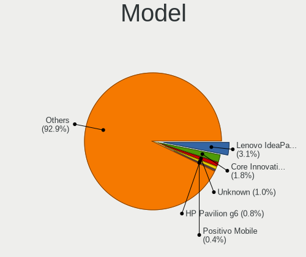

| Name                                    | Notebooks | Percent |
|-----------------------------------------|-----------|---------|
| Lenovo IdeaPad 1 14IGL7 82V6            | 37        | 3.11%   |
| Core Innovations CLC14364               | 22        | 1.85%   |
| Unknown                                 | 12        | 1.01%   |
| HP Pavilion g6                          | 9         | 0.76%   |
| Positivo Mobile                         | 5         | 0.42%   |
| Lenovo ThinkPad L13 Gen 3 21BAS0X700    | 5         | 0.42%   |
| HP Notebook                             | 5         | 0.42%   |
| Dell Latitude E6400                     | 5         | 0.42%   |
| Lenovo IdeaPad 3 15ALC6 82MF            | 4         | 0.34%   |
| HP Laptop 15s-eq2xxx                    | 4         | 0.34%   |
| HP EliteBook 840 G5                     | 4         | 0.34%   |
| HP EliteBook 840 G3                     | 4         | 0.34%   |
| Dell Latitude E6420                     | 4         | 0.34%   |
| Dell Latitude E6410                     | 4         | 0.34%   |
| Dell Latitude 7480                      | 4         | 0.34%   |
| Dell Inspiron 3542                      | 4         | 0.34%   |
| ASUS K50AF                              | 4         | 0.34%   |
| Acer AOD270                             | 4         | 0.34%   |
| Toshiba Satellite C650                  | 3         | 0.25%   |
| Samsung 300E5M/300E5L                   | 3         | 0.25%   |
| Qilive QW2214FR                         | 3         | 0.25%   |
| Lenovo V15-IGL 82C3                     | 3         | 0.25%   |
| Lenovo V110-15IAP 80TG                  | 3         | 0.25%   |
| Lenovo IdeaPad Z570 HuronRiver Platform | 3         | 0.25%   |
| Lenovo IdeaPad Slim 1-14AST-05 81VS     | 3         | 0.25%   |
| HP Pavilion Gaming Laptop 15-ec0xxx     | 3         | 0.25%   |
| HP Laptop 15-db0xxx                     | 3         | 0.25%   |
| HP ElitePad 1000 G2                     | 3         | 0.25%   |
| HP EliteBook 8440p                      | 3         | 0.25%   |
| HP EliteBook 840 G2                     | 3         | 0.25%   |
| HP 250 G7 Notebook PC                   | 3         | 0.25%   |
| HP 250 G6 Notebook PC                   | 3         | 0.25%   |
| Dell System Inspiron N7110              | 3         | 0.25%   |
| Dell Latitude E7440                     | 3         | 0.25%   |
| Dell Latitude E6430                     | 3         | 0.25%   |
| Dell Latitude E5540                     | 3         | 0.25%   |
| Dell Latitude E5430 non-vPro            | 3         | 0.25%   |
| Dell Latitude 7490                      | 3         | 0.25%   |
| Dell Latitude 7390                      | 3         | 0.25%   |
| Dell Inspiron 15-3567                   | 3         | 0.25%   |

Model Family
------------

Motherboard model prefix

| Name                      | Notebooks | Percent |
|---------------------------|-----------|---------|
| Lenovo ThinkPad           | 114       | 9.57%   |
| Lenovo IdeaPad            | 105       | 8.82%   |
| Acer Aspire               | 80        | 6.72%   |
| Dell Latitude             | 79        | 6.63%   |
| Dell Inspiron             | 51        | 4.28%   |
| ASUS VivoBook             | 41        | 3.44%   |
| HP EliteBook              | 37        | 3.11%   |
| HP Pavilion               | 35        | 2.94%   |
| HP Laptop                 | 35        | 2.94%   |
| Toshiba Satellite         | 30        | 2.52%   |
| HP ProBook                | 25        | 2.1%    |
| Core Innovations CLC14364 | 22        | 1.85%   |
| HP Compaq                 | 12        | 1.01%   |
| Unknown                   | 12        | 1.01%   |
| HP 250                    | 9         | 0.76%   |
| Packard Bell EasyNote     | 8         | 0.67%   |
| Fujitsu LIFEBOOK          | 8         | 0.67%   |
| Dell Precision            | 8         | 0.67%   |
| Lenovo Yoga               | 7         | 0.59%   |
| Apple MacBookPro11        | 7         | 0.59%   |
| Acer Nitro                | 7         | 0.59%   |
| Dell Vostro               | 6         | 0.5%    |
| Dell System               | 6         | 0.5%    |
| Toshiba dynabook          | 5         | 0.42%   |
| Positivo Mobile           | 5         | 0.42%   |
| HP ZBook                  | 5         | 0.42%   |
| HP Presario               | 5         | 0.42%   |
| HP Notebook               | 5         | 0.42%   |
| HP ENVY                   | 5         | 0.42%   |
| Dell XPS                  | 5         | 0.42%   |
| ASUS TUF                  | 5         | 0.42%   |
| ASUS ASUS                 | 5         | 0.42%   |
| Lenovo ThinkBook          | 4         | 0.34%   |
| Dell Studio               | 4         | 0.34%   |
| Chuwi GemiBook            | 4         | 0.34%   |
| ASUS K50AF                | 4         | 0.34%   |
| Acer TravelMate           | 4         | 0.34%   |
| Acer Swift                | 4         | 0.34%   |
| Acer AOD270               | 4         | 0.34%   |
| Samsung 300E5M            | 3         | 0.25%   |

MFG Year
--------

Motherboard manufacture year

| Year    | Notebooks | Percent |
|---------|-----------|---------|
| 2021    | 119       | 9.99%   |
| 2011    | 116       | 9.74%   |
| 2012    | 101       | 8.48%   |
| 2022    | 100       | 8.4%    |
| 2013    | 87        | 7.3%    |
| 2010    | 77        | 6.47%   |
| 2018    | 76        | 6.38%   |
| 2020    | 72        | 6.05%   |
| 2017    | 71        | 5.96%   |
| 2016    | 67        | 5.63%   |
| 2019    | 63        | 5.29%   |
| 2014    | 62        | 5.21%   |
| 2015    | 51        | 4.28%   |
| 2008    | 41        | 3.44%   |
| 2009    | 34        | 2.85%   |
| 2023    | 27        | 2.27%   |
| 2007    | 18        | 1.51%   |
| 2006    | 6         | 0.5%    |
| 2024    | 2         | 0.17%   |
| Unknown | 1         | 0.08%   |

Form Factor
-----------

Physical design of the computer

| Name     | Notebooks | Percent |
|----------|-----------|---------|
| Notebook | 1191      | 100%    |

Secure Boot
-----------

Enabled or disabled

| State    | Notebooks | Percent |
|----------|-----------|---------|
| Disabled | 1191      | 100%    |

Coreboot
--------

Have coreboot on board

| Used | Notebooks | Percent |
|------|-----------|---------|
| No   | 1182      | 99.24%  |
| Yes  | 9         | 0.76%   |

RAM Size
--------

Total RAM memory

| Size in GB  | Notebooks | Percent |
|-------------|-----------|---------|
| 4.01-8.0    | 411       | 34.48%  |
| 3.01-4.0    | 332       | 27.85%  |
| 16.01-24.0  | 162       | 13.59%  |
| 8.01-16.0   | 137       | 11.49%  |
| 2.01-3.0    | 47        | 3.94%   |
| 1.01-2.0    | 46        | 3.86%   |
| 32.01-64.0  | 32        | 2.68%   |
| 0.51-1.0    | 9         | 0.76%   |
| 24.01-32.0  | 8         | 0.67%   |
| 64.01-256.0 | 8         | 0.67%   |

RAM Used
--------

Used RAM memory

| Used GB   | Notebooks | Percent |
|-----------|-----------|---------|
| 1.01-2.0  | 794       | 66.33%  |
| 2.01-3.0  | 246       | 20.55%  |
| 0.51-1.0  | 96        | 8.02%   |
| 3.01-4.0  | 41        | 3.43%   |
| 0.01-0.5  | 10        | 0.84%   |
| 4.01-8.0  | 9         | 0.75%   |
| 8.01-16.0 | 1         | 0.08%   |

Total Drives
------------

Number of drives on board

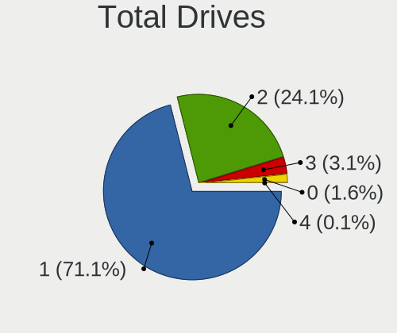

| Drives | Notebooks | Percent |
|--------|-----------|---------|
| 1      | 848       | 71.08%  |
| 2      | 288       | 24.14%  |
| 3      | 37        | 3.1%    |
| 0      | 19        | 1.59%   |
| 4      | 1         | 0.08%   |

Has CD-ROM
----------

Has CD-ROM on board

| Presented | Notebooks | Percent |
|-----------|-----------|---------|
| No        | 744       | 62.42%  |
| Yes       | 448       | 37.58%  |

Has Ethernet
------------

Has Ethernet on board

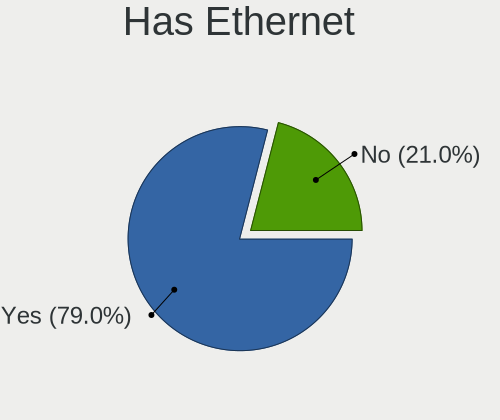

| Presented | Notebooks | Percent |
|-----------|-----------|---------|
| Yes       | 941       | 79.01%  |
| No        | 250       | 20.99%  |

Has WiFi
--------

Has WiFi module

| Presented | Notebooks | Percent |
|-----------|-----------|---------|
| Yes       | 1161      | 97.48%  |
| No        | 30        | 2.52%   |

Has Bluetooth
-------------

Has Bluetooth module

| Presented | Notebooks | Percent |
|-----------|-----------|---------|
| Yes       | 898       | 75.27%  |
| No        | 295       | 24.73%  |

Location
--------

Country
-------

Geographic location (country)

| Country     | Notebooks | Percent |
|-------------|-----------|---------|
| USA         | 202       | 16.95%  |
| Germany     | 115       | 9.65%   |
| Brazil      | 104       | 8.72%   |
| Russia      | 70        | 5.87%   |
| France      | 69        | 5.79%   |
| Poland      | 62        | 5.2%    |
| Spain       | 43        | 3.61%   |
| Italy       | 43        | 3.61%   |
| UK          | 41        | 3.44%   |
| Canada      | 33        | 2.77%   |
| India       | 26        | 2.18%   |
| Mexico      | 20        | 1.68%   |
| Turkey      | 18        | 1.51%   |
| Romania     | 17        | 1.43%   |
| Argentina   | 17        | 1.43%   |
| Czechia     | 16        | 1.34%   |
| Japan       | 15        | 1.26%   |
| Hungary     | 15        | 1.26%   |
| Indonesia   | 14        | 1.17%   |
| Australia   | 14        | 1.17%   |
| Portugal    | 13        | 1.09%   |
| Netherlands | 12        | 1.01%   |
| Greece      | 10        | 0.84%   |
| Finland     | 10        | 0.84%   |
| Sweden      | 9         | 0.76%   |
| Bulgaria    | 9         | 0.76%   |
| Switzerland | 8         | 0.67%   |
| Colombia    | 8         | 0.67%   |
| Chile       | 8         | 0.67%   |
| Belgium     | 8         | 0.67%   |
| Austria     | 7         | 0.59%   |
| Venezuela   | 6         | 0.5%    |
| Thailand    | 6         | 0.5%    |
| Slovakia    | 6         | 0.5%    |
| Israel      | 6         | 0.5%    |
| Malaysia    | 5         | 0.42%   |
| Ukraine     | 4         | 0.34%   |
| Peru        | 4         | 0.34%   |
| Paraguay    | 4         | 0.34%   |
| Denmark     | 4         | 0.34%   |

City
----

Geographic location (city)

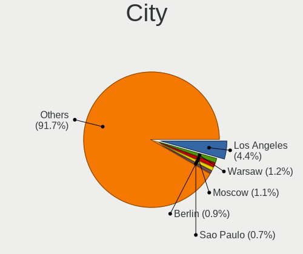

| City           | Notebooks | Percent |
|----------------|-----------|---------|
| Los Angeles    | 53        | 4.41%   |
| Warsaw         | 14        | 1.17%   |
| Moscow         | 13        | 1.08%   |
| Berlin         | 11        | 0.92%   |
| Sao Paulo      | 9         | 0.75%   |
| Thousand Oaks  | 8         | 0.67%   |
| Rio de Janeiro | 8         | 0.67%   |
| Topeka         | 7         | 0.58%   |
| Stuttgart      | 7         | 0.58%   |
| Madrid         | 7         | 0.58%   |
| Vienna         | 6         | 0.5%    |
| Melbourne      | 6         | 0.5%    |
| Krakow         | 6         | 0.5%    |
| Istanbul       | 6         | 0.5%    |
| Bengaluru      | 6         | 0.5%    |
| Athens         | 6         | 0.5%    |
| Sofia          | 5         | 0.42%   |
| Paris          | 5         | 0.42%   |
| Munich         | 5         | 0.42%   |
| Yekaterinburg  | 4         | 0.33%   |
| Wroclaw        | 4         | 0.33%   |
| Vancouver      | 4         | 0.33%   |
| Sao Goncalo    | 4         | 0.33%   |
| Rome           | 4         | 0.33%   |
| Prague         | 4         | 0.33%   |
| Poznan         | 4         | 0.33%   |
| Milano         | 4         | 0.33%   |
| Milan          | 4         | 0.33%   |
| Lodz           | 4         | 0.33%   |
| Katowice       | 4         | 0.33%   |
| Delhi          | 4         | 0.33%   |
| Curitiba       | 4         | 0.33%   |
| Budapest       | 4         | 0.33%   |
| Bucharest      | 4         | 0.33%   |
| Brisbane       | 4         | 0.33%   |
| Asuncin      | 4         | 0.33%   |
| ilina        | 3         | 0.25%   |
| Wuppertal      | 3         | 0.25%   |
| Wegberg        | 3         | 0.25%   |
| Tokyo          | 3         | 0.25%   |

Drives
------

Drive Vendor
------------

Hard drive vendors

| Vendor                      | Notebooks | Drives | Percent |
|-----------------------------|-----------|--------|---------|
| WDC                         | 189       | 200    | 13.1%   |
| Samsung Electronics         | 153       | 167    | 10.6%   |
| Seagate                     | 116       | 119    | 8.04%   |
| Toshiba                     | 109       | 115    | 7.55%   |
| Unknown                     | 102       | 108    | 7.07%   |
| Kingston                    | 89        | 97     | 6.17%   |
| SanDisk                     | 76        | 78     | 5.27%   |
| Hitachi                     | 47        | 48     | 3.26%   |
| Unknown                     | 46        | 49     | 3.19%   |
| SK hynix                    | 45        | 45     | 3.12%   |
| Crucial                     | 39        | 41     | 2.7%    |
| Intel                       | 33        | 34     | 2.29%   |
| HGST                        | 33        | 34     | 2.29%   |
| Micron Technology           | 32        | 32     | 2.22%   |
| China                       | 29        | 30     | 2.01%   |
| A-DATA Technology           | 22        | 22     | 1.52%   |
| Intenso                     | 17        | 17     | 1.18%   |
| SSSTC                       | 15        | 15     | 1.04%   |
| SPCC                        | 11        | 12     | 0.76%   |
| KIOXIA                      | 10        | 10     | 0.69%   |
| GOODRAM                     | 10        | 11     | 0.69%   |
| LITEON                      | 9         | 9      | 0.62%   |
| Apple                       | 9         | 9      | 0.62%   |
| ZTE                         | 8         | 8      | 0.55%   |
| Transcend                   | 8         | 8      | 0.55%   |
| Silicon Motion              | 8         | 8      | 0.55%   |
| Netac                       | 8         | 9      | 0.55%   |
| JMicron Technology          | 8         | 8      | 0.55%   |
| PNY                         | 7         | 7      | 0.49%   |
| Fanxiang                    | 6         | 6      | 0.42%   |
| Phison                      | 5         | 5      | 0.35%   |
| Patriot                     | 5         | 5      | 0.35%   |
| Kingston Technology Company | 5         | 5      | 0.35%   |
| KingSpec                    | 5         | 5      | 0.35%   |
| Apacer                      | 5         | 5      | 0.35%   |
| XrayDisk                    | 4         | 4      | 0.28%   |
| Verbatim                    | 4         | 4      | 0.28%   |
| LITEONIT                    | 4         | 4      | 0.28%   |
| Lexar                       | 4         | 4      | 0.28%   |
| BIWIN                       | 3         | 3      | 0.21%   |

Drive Model
-----------

Hard drive models

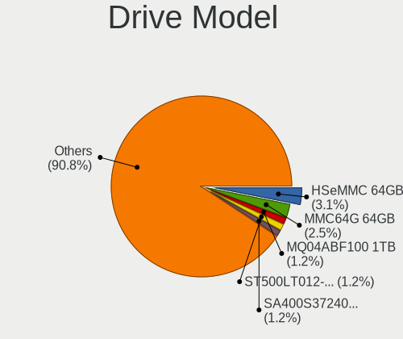

| Model                                | Notebooks | Percent |
|--------------------------------------|-----------|---------|
| Unknown                              | 46        | 3.12%   |
| Unknown MMC64G  64GB                 | 37        | 2.51%   |
| Toshiba MQ04ABF100 1TB               | 18        | 1.22%   |
| Seagate ST500LT012-1DG142 500GB      | 18        | 1.22%   |
| Kingston SA400S37240G 240GB SSD      | 17        | 1.15%   |
| Kingston SA400S37480G 480GB SSD      | 16        | 1.08%   |
| Toshiba MQ01ABD100 1TB               | 14        | 0.95%   |
| Toshiba MQ01ABF050 500GB             | 11        | 0.75%   |
| Seagate ST1000LM024 HN-M101MBB 1TB   | 10        | 0.68%   |
| Seagate ST1000LM035-1RK172 1TB       | 9         | 0.61%   |
| ZTE MMC Storage 942MB                | 8         | 0.54%   |
| WDC WD10JPVX-22JC3T0 1TB             | 8         | 0.54%   |
| Unknown SD/MMC/MS PRO 128GB          | 8         | 0.54%   |
| WDC WD10SPZX-24Z10 1TB               | 7         | 0.47%   |
| SanDisk SSD PLUS 240GB               | 7         | 0.47%   |
| HGST HTS725050A7E630 500GB           | 7         | 0.47%   |
| HGST HTS545050A7E680 500GB           | 7         | 0.47%   |
| WDC WD5000LPVX-22V0TT0 500GB         | 6         | 0.41%   |
| WDC PC SN530 SDBPNPZ-256G-1002 256GB | 6         | 0.41%   |
| SanDisk NVMe SSD Drive 1TB           | 6         | 0.41%   |
| Samsung SSD 870 EVO 500GB            | 6         | 0.41%   |
| Samsung SSD 860 EVO 500GB            | 6         | 0.41%   |
| Samsung MZALQ512HBLU-00BL2 512GB     | 6         | 0.41%   |
| Kingston SA400S37120G 120GB SSD      | 6         | 0.41%   |
| Crucial CT500MX500SSD1 500GB         | 6         | 0.41%   |
| Crucial CT1000BX500SSD1 1TB          | 6         | 0.41%   |
| WDC WDS240G2G0A-00JH30 240GB SSD     | 5         | 0.34%   |
| Toshiba MQ01ABD050 500GB             | 5         | 0.34%   |
| Seagate ST9500325AS 500GB            | 5         | 0.34%   |
| SanDisk DF4032  32GB                 | 5         | 0.34%   |
| HGST HTS721010A9E630 1TB             | 5         | 0.34%   |
| GOODRAM SSDPR-CX400-512-G2 512GB     | 5         | 0.34%   |
| China SSD 128GB                      | 5         | 0.34%   |
| WDC WD5000LPCX-24C6HT0 500GB         | 4         | 0.27%   |
| WDC WD10SPZX-21Z10T0 1TB             | 4         | 0.27%   |
| Toshiba MQ01ABD075 752GB             | 4         | 0.27%   |
| SSSTC CL1-4D256 256GB                | 4         | 0.27%   |
| SPCC Solid State Disk 256GB          | 4         | 0.27%   |
| Seagate ST9250315AS 250GB            | 4         | 0.27%   |
| Seagate ST500LM030-1RK17D 500GB      | 4         | 0.27%   |

HDD Vendor
----------

Hard disk drive vendors

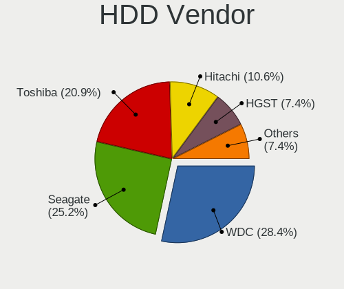

| Vendor              | Notebooks | Drives | Percent |
|---------------------|-----------|--------|---------|
| WDC                 | 126       | 131    | 28.38%  |
| Seagate             | 112       | 115    | 25.23%  |
| Toshiba             | 93        | 97     | 20.95%  |
| Hitachi             | 47        | 48     | 10.59%  |
| HGST                | 33        | 34     | 7.43%   |
| Samsung Electronics | 12        | 13     | 2.7%    |
| Unknown             | 8         | 8      | 1.8%    |
| JMicron Technology  | 3         | 3      | 0.68%   |
| Fujitsu             | 2         | 2      | 0.45%   |
| USB                 | 1         | 1      | 0.23%   |
| TO Exter            | 1         | 1      | 0.23%   |
| Shenzhen            | 1         | 1      | 0.23%   |
| SAGE                | 1         | 1      | 0.23%   |
| Inateck             | 1         | 1      | 0.23%   |
| External            | 1         | 1      | 0.23%   |
| ASMT                | 1         | 1      | 0.23%   |
| Apple               | 1         | 1      | 0.23%   |

SSD Vendor
----------

Solid state drive vendors

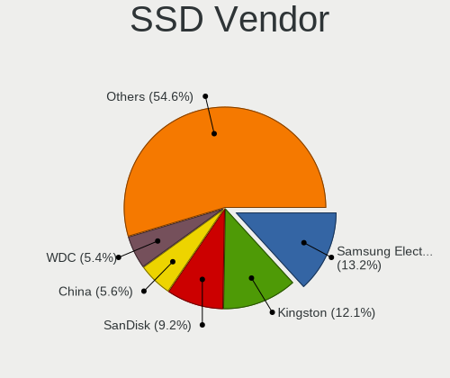

| Vendor              | Notebooks | Drives | Percent |
|---------------------|-----------|--------|---------|
| Samsung Electronics | 69        | 69     | 13.22%  |
| Kingston            | 63        | 68     | 12.07%  |
| SanDisk             | 48        | 50     | 9.2%    |
| China               | 29        | 30     | 5.56%   |
| WDC                 | 28        | 30     | 5.36%   |
| Crucial             | 28        | 28     | 5.36%   |
| Intenso             | 17        | 17     | 3.26%   |
| A-DATA Technology   | 15        | 15     | 2.87%   |
| Micron Technology   | 13        | 13     | 2.49%   |
| Intel               | 13        | 13     | 2.49%   |
| SK hynix            | 12        | 12     | 2.3%    |
| SPCC                | 10        | 10     | 1.92%   |
| GOODRAM             | 10        | 11     | 1.92%   |
| Toshiba             | 8         | 10     | 1.53%   |
| Netac               | 8         | 9      | 1.53%   |
| LITEON              | 8         | 8      | 1.53%   |
| Apple               | 8         | 8      | 1.53%   |
| Transcend           | 7         | 7      | 1.34%   |
| PNY                 | 7         | 7      | 1.34%   |
| Patriot             | 5         | 5      | 0.96%   |
| KingSpec            | 5         | 5      | 0.96%   |
| Fanxiang            | 5         | 5      | 0.96%   |
| Unknown             | 5         | 5      | 0.96%   |
| XrayDisk            | 4         | 4      | 0.77%   |
| Verbatim            | 4         | 4      | 0.77%   |
| SSSTC               | 4         | 4      | 0.77%   |
| LITEONIT            | 4         | 4      | 0.77%   |
| Apacer              | 4         | 4      | 0.77%   |
| Seagate             | 3         | 3      | 0.57%   |
| Win Memory          | 2         | 2      | 0.38%   |
| Wibtek              | 2         | 3      | 0.38%   |
| WALRAM              | 2         | 2      | 0.38%   |
| Team                | 2         | 2      | 0.38%   |
| INNOVATION IT       | 2         | 2      | 0.38%   |
| BUFFALO             | 2         | 2      | 0.38%   |
| BIWIN               | 2         | 2      | 0.38%   |
| BHT                 | 2         | 2      | 0.38%   |
| AirDisk             | 2         | 2      | 0.38%   |
| Zheino              | 1         | 1      | 0.19%   |
| WISE                | 1         | 1      | 0.19%   |

Drive Kind
----------

HDD or SSD

| Kind    | Notebooks | Drives | Percent |
|---------|-----------|--------|---------|
| SSD     | 486       | 538    | 35.19%  |
| HDD     | 435       | 459    | 31.5%   |
| NVMe    | 300       | 337    | 21.72%  |
| MMC     | 135       | 148    | 9.78%   |
| Unknown | 25        | 25     | 1.81%   |

Drive Connector
---------------

SATA, SAS, NVMe, etc.

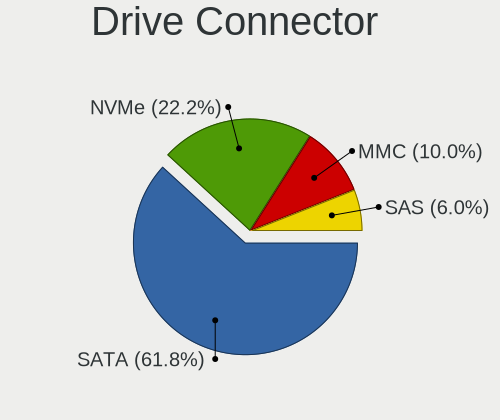

| Type | Notebooks | Drives | Percent |
|------|-----------|--------|---------|
| SATA | 834       | 940    | 61.82%  |
| NVMe | 299       | 332    | 22.16%  |
| MMC  | 135       | 148    | 10.01%  |
| SAS  | 81        | 87     | 6%      |

Drive Size
----------

Size of hard drive

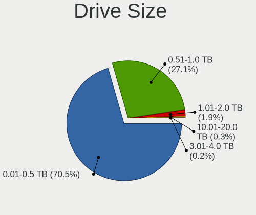

| Size in TB | Notebooks | Drives | Percent |
|------------|-----------|--------|---------|
| 0.01-0.5   | 644       | 717    | 70.54%  |
| 0.51-1.0   | 247       | 258    | 27.05%  |
| 1.01-2.0   | 17        | 17     | 1.86%   |
| 10.01-20.0 | 3         | 3      | 0.33%   |
| 3.01-4.0   | 2         | 2      | 0.22%   |

Space Total
-----------

Amount of disk space available on the file system

| Size in GB     | Notebooks | Percent |
|----------------|-----------|---------|
| 1-20           | 434       | 36.05%  |
| 101-250        | 274       | 22.76%  |
| 251-500        | 156       | 12.96%  |
| 51-100         | 111       | 9.22%   |
| 501-1000       | 83        | 6.89%   |
| 21-50          | 59        | 4.9%    |
| Unknown        | 42        | 3.49%   |
| 1001-2000      | 27        | 2.24%   |
| 2001-3000      | 10        | 0.83%   |
| More than 3000 | 8         | 0.66%   |

Space Used
----------

Amount of used disk space

| Used GB        | Notebooks | Percent |
|----------------|-----------|---------|
| 1-20           | 1016      | 84.95%  |
| 21-50          | 51        | 4.26%   |
| Unknown        | 42        | 3.51%   |
| 51-100         | 37        | 3.09%   |
| 101-250        | 26        | 2.17%   |
| 251-500        | 13        | 1.09%   |
| 501-1000       | 6         | 0.5%    |
| 1001-2000      | 3         | 0.25%   |
| More than 3000 | 2         | 0.17%   |

Malfunc. Drives
---------------

Drive models with a malfunction

| Model                                | Notebooks | Drives | Percent |
|--------------------------------------|-----------|--------|---------|
| Seagate ST500LT012-1DG142 500GB      | 8         | 8      | 3.42%   |
| Toshiba MQ01ABD100 1TB               | 4         | 4      | 1.71%   |
| Seagate ST9500325AS 500GB            | 4         | 5      | 1.71%   |
| HGST HTS545050A7E680 500GB           | 4         | 4      | 1.71%   |
| WDC WD5000LPCX-24C6HT0 500GB         | 3         | 3      | 1.28%   |
| WDC WD5000BPVT-00HXZT3 500GB         | 3         | 3      | 1.28%   |
| Toshiba MQ01ABF050 500GB             | 3         | 3      | 1.28%   |
| SSSTC CVB-8D128-HP 128GB SSD         | 3         | 3      | 1.28%   |
| SK hynix BC711 HFM512GD3JX013N 512GB | 3         | 3      | 1.28%   |
| Seagate ST9250315AS 250GB            | 3         | 3      | 1.28%   |
| Seagate ST500LT012-9WS142 500GB      | 3         | 3      | 1.28%   |
| Seagate ST1000LM024 HN-M101MBB 1TB   | 3         | 3      | 1.28%   |
| HGST HTS725050A7E630 500GB           | 3         | 3      | 1.28%   |
| HGST HTS721010A9E630 1TB             | 3         | 3      | 1.28%   |
| WDC WD5000LPVX-80V0TT0 500GB         | 2         | 2      | 0.85%   |
| WDC WD5000LPVX-22V0TT0 500GB         | 2         | 2      | 0.85%   |
| WDC WD1600BEVS-00VAT0 160GB          | 2         | 2      | 0.85%   |
| Toshiba MQ04ABF100 1TB               | 2         | 2      | 0.85%   |
| Toshiba MK6475GSX 640GB              | 2         | 2      | 0.85%   |
| Toshiba MK5065GSX 500GB              | 2         | 2      | 0.85%   |
| Toshiba MK3265GSX 320GB              | 2         | 2      | 0.85%   |
| Toshiba MK3259GSXP 320GB             | 2         | 2      | 0.85%   |
| Toshiba MK2561GSYN 250GB             | 2         | 3      | 0.85%   |
| Seagate ST9320325AS 320GB            | 2         | 2      | 0.85%   |
| Seagate ST500LM021-1KJ152 500GB      | 2         | 2      | 0.85%   |
| Seagate ST500LM000-1EJ162 500GB      | 2         | 2      | 0.85%   |
| SanDisk SSD PLUS 240GB               | 2         | 2      | 0.85%   |
| Kingston SA400S37480G 480GB SSD      | 2         | 2      | 0.85%   |
| Intel SSDSCKKF256G8H 256GB           | 2         | 2      | 0.85%   |
| Hitachi HTS725050A9A364 500GB        | 2         | 2      | 0.85%   |
| Hitachi HTS723232A7A364 320GB        | 2         | 2      | 0.85%   |
| Hitachi HTS547564A9E384 640GB        | 2         | 2      | 0.85%   |
| Hitachi HTS543232A7A384 320GB        | 2         | 2      | 0.85%   |
| Hitachi HTS543216L9A300 160GB        | 2         | 2      | 0.85%   |
| Hitachi HTS542516K9SA00 160GB        | 2         | 2      | 0.85%   |
| Hitachi HTS541616J9SA00 160GB        | 2         | 2      | 0.85%   |
| HGST HTS541010A9E680 1TB             | 2         | 2      | 0.85%   |
| XrayDisk 240GB SSD                   | 1         | 1      | 0.43%   |
| Wibtek W800S 512GB SSD               | 1         | 2      | 0.43%   |
| WDC WDS480G2G0A-00JH30 480GB SSD     | 1         | 1      | 0.43%   |

Malfunc. Drive Vendor
---------------------

Vendors of faulty drives

| Vendor              | Notebooks | Drives | Percent |
|---------------------|-----------|--------|---------|
| Seagate             | 46        | 47     | 19.66%  |
| WDC                 | 41        | 43     | 17.52%  |
| Toshiba             | 33        | 34     | 14.1%   |
| Hitachi             | 30        | 31     | 12.82%  |
| HGST                | 15        | 15     | 6.41%   |
| SK hynix            | 13        | 13     | 5.56%   |
| Samsung Electronics | 8         | 8      | 3.42%   |
| SanDisk             | 7         | 7      | 2.99%   |
| Intel               | 7         | 7      | 2.99%   |
| SSSTC               | 4         | 4      | 1.71%   |
| Kingston            | 4         | 4      | 1.71%   |
| A-DATA Technology   | 4         | 4      | 1.71%   |
| Micron Technology   | 3         | 3      | 1.28%   |
| LITEONIT            | 3         | 3      | 1.28%   |
| China               | 3         | 3      | 1.28%   |
| XrayDisk            | 1         | 1      | 0.43%   |
| Wibtek              | 1         | 2      | 0.43%   |
| SPCC                | 1         | 1      | 0.43%   |
| SandForce           | 1         | 1      | 0.43%   |
| SAGE                | 1         | 1      | 0.43%   |
| OCZ-AGIL            | 1         | 1      | 0.43%   |
| Netac               | 1         | 1      | 0.43%   |
| Intenso             | 1         | 1      | 0.43%   |
| HS-SSD-C100         | 1         | 1      | 0.43%   |
| GOODRAM             | 1         | 1      | 0.43%   |
| Crucial             | 1         | 1      | 0.43%   |
| ACOS                | 1         | 1      | 0.43%   |
| 2-Power             | 1         | 1      | 0.43%   |

Malfunc. HDD Vendor
-------------------

Vendors of faulty HDD drives

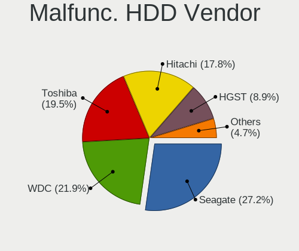

| Vendor              | Notebooks | Drives | Percent |
|---------------------|-----------|--------|---------|
| Seagate             | 46        | 47     | 27.22%  |
| WDC                 | 37        | 38     | 21.89%  |
| Toshiba             | 33        | 34     | 19.53%  |
| Hitachi             | 30        | 31     | 17.75%  |
| HGST                | 15        | 15     | 8.88%   |
| Samsung Electronics | 7         | 7      | 4.14%   |
| SAGE                | 1         | 1      | 0.59%   |

Malfunc. Drive Kind
-------------------

Kinds of faulty drives

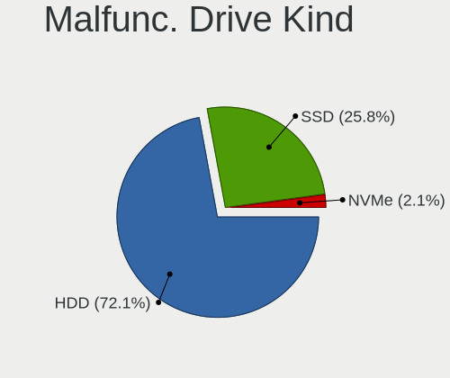

| Kind | Notebooks | Drives | Percent |
|------|-----------|--------|---------|
| HDD  | 168       | 173    | 72.1%   |
| SSD  | 60        | 62     | 25.75%  |
| NVMe | 5         | 5      | 2.15%   |

Failed Drives
-------------

Failed drive models

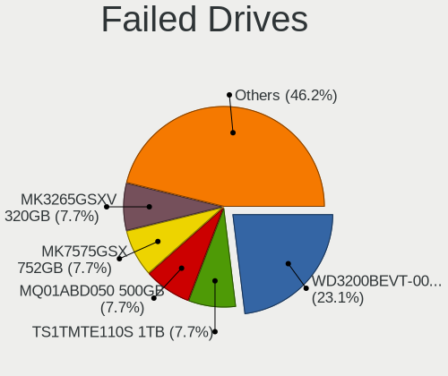

| Model                                   | Notebooks | Drives | Percent |
|-----------------------------------------|-----------|--------|---------|
| WDC WD3200BEVT-00ZCT0 320GB             | 3         | 3      | 23.08%  |
| Transcend TS1TMTE110S 1TB               | 1         | 1      | 7.69%   |
| Toshiba MQ01ABD050 500GB                | 1         | 1      | 7.69%   |
| Toshiba MK7575GSX 752GB                 | 1         | 1      | 7.69%   |
| Toshiba MK3265GSXV 320GB                | 1         | 1      | 7.69%   |
| Toshiba MK2575GSX 250GB                 | 1         | 1      | 7.69%   |
| Toshiba MK1234GSX 120GB                 | 1         | 1      | 7.69%   |
| SK hynix BC501 HFM256GDJTNG-8310A 256GB | 1         | 1      | 7.69%   |
| Seagate ST9320325AS 320GB               | 1         | 1      | 7.69%   |
| Intel SSDSCKKF256H6 SATA 256GB          | 1         | 1      | 7.69%   |
| Hitachi HTS545032B9A300 320GB           | 1         | 1      | 7.69%   |

Failed Drive Vendor
-------------------

Failed drive vendors

| Vendor    | Notebooks | Drives | Percent |
|-----------|-----------|--------|---------|
| Toshiba   | 5         | 5      | 38.46%  |
| WDC       | 3         | 3      | 23.08%  |
| Transcend | 1         | 1      | 7.69%   |
| SK hynix  | 1         | 1      | 7.69%   |
| Seagate   | 1         | 1      | 7.69%   |
| Intel     | 1         | 1      | 7.69%   |
| Hitachi   | 1         | 1      | 7.69%   |

Drive Status
------------

Number of failed and malfunc. drives

| Status   | Notebooks | Drives | Percent |
|----------|-----------|--------|---------|
| Works    | 854       | 1009   | 65.59%  |
| Malfunc  | 232       | 240    | 17.82%  |
| Detected | 203       | 245    | 15.59%  |
| Failed   | 13        | 13     | 1%      |

Storage controller
------------------

Storage Vendor
--------------

Storage controller vendors

| Vendor                           | Notebooks | Percent |
|----------------------------------|-----------|---------|
| Intel                            | 915       | 67.48%  |
| AMD                              | 129       | 9.51%   |
| Samsung Electronics              | 82        | 6.05%   |
| SanDisk                          | 55        | 4.06%   |
| SK hynix                         | 31        | 2.29%   |
| Kingston Technology Company      | 30        | 2.21%   |
| Micron Technology                | 21        | 1.55%   |
| Solid State Storage Technology   | 11        | 0.81%   |
| KIOXIA                           | 11        | 0.81%   |
| Micron/Crucial Technology        | 10        | 0.74%   |
| Silicon Motion                   | 9         | 0.66%   |
| Toshiba America Info Systems     | 7         | 0.52%   |
| Phison Electronics               | 7         | 0.52%   |
| ADATA Technology                 | 7         | 0.52%   |
| Shenzhen Longsys Electronics     | 4         | 0.29%   |
| Realtek Semiconductor            | 4         | 0.29%   |
| Nvidia                           | 4         | 0.29%   |
| MAXIO Technology (Hangzhou)      | 4         | 0.29%   |
| Silicon Integrated Systems [SiS] | 3         | 0.22%   |
| Union Memory (Shenzhen)          | 2         | 0.15%   |
| Marvell Technology Group         | 2         | 0.15%   |
| JMicron Technology               | 2         | 0.15%   |
| Transcend                        | 1         | 0.07%   |
| Solidigm                         | 1         | 0.07%   |
| Nextorage                        | 1         | 0.07%   |
| Lite-On Technology               | 1         | 0.07%   |
| Lenovo                           | 1         | 0.07%   |
| INNOGRIT                         | 1         | 0.07%   |

Storage Model
-------------

Storage controller models

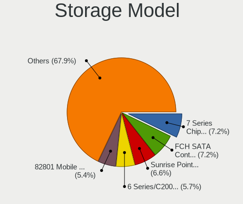

| Model                                                                            | Notebooks | Percent |
|----------------------------------------------------------------------------------|-----------|---------|
| Intel 7 Series Chipset Family 6-port SATA Controller [AHCI mode]                 | 104       | 7.2%    |
| AMD FCH SATA Controller [AHCI mode]                                              | 104       | 7.2%    |
| Intel Sunrise Point-LP SATA Controller [AHCI mode]                               | 95        | 6.58%   |
| Intel 6 Series/C200 Series Chipset Family 6 port Mobile SATA AHCI Controller     | 82        | 5.68%   |
| Intel 82801 Mobile SATA Controller [RAID mode]                                   | 78        | 5.4%    |
| Intel Celeron/Pentium Silver Processor SATA Controller                           | 74        | 5.12%   |
| Intel 5 Series/3400 Series Chipset 4 port SATA AHCI Controller                   | 46        | 3.19%   |
| Intel Celeron N3350/Pentium N4200/Atom E3900 Series SATA AHCI Controller         | 42        | 2.91%   |
| Intel 8 Series SATA Controller 1 [AHCI mode]                                     | 42        | 2.91%   |
| Intel Wildcat Point-LP SATA Controller [AHCI Mode]                               | 37        | 2.56%   |
| Intel 82801IBM/IEM (ICH9M/ICH9M-E) 4 port SATA Controller [AHCI mode]            | 35        | 2.42%   |
| Samsung NVMe SSD Controller 980 (DRAM-less)                                      | 31        | 2.15%   |
| Intel Volume Management Device NVMe RAID Controller                              | 29        | 2.01%   |
| Samsung NVMe SSD Controller SM981/PM981/PM983                                    | 27        | 1.87%   |
| Intel Tiger Lake-LP SATA Controller                                              | 25        | 1.73%   |
| Intel 8 Series/C220 Series Chipset Family 6-port SATA Controller 1 [AHCI mode]   | 24        | 1.66%   |
| SanDisk Ultra 3D / WD PC SN530, IX SN530, Blue SN550 NVMe SSD (DRAM-less)        | 21        | 1.45%   |
| Intel Atom Processor E3800 Series SATA AHCI Controller                           | 20        | 1.39%   |
| AMD SB7x0/SB8x0/SB9x0 SATA Controller [AHCI mode]                                | 19        | 1.32%   |
| Intel 82801HM/HEM (ICH8M/ICH8M-E) IDE Controller                                 | 18        | 1.25%   |
| Intel NM10/ICH7 Family SATA Controller [AHCI mode]                               | 17        | 1.18%   |
| Intel 82801HM/HEM (ICH8M/ICH8M-E) SATA Controller [AHCI mode]                    | 17        | 1.18%   |
| Intel Cannon Lake Mobile PCH SATA AHCI Controller                                | 16        | 1.11%   |
| Intel 5 Series/3400 Series Chipset 6 port SATA AHCI Controller                   | 14        | 0.97%   |
| Samsung NVMe SSD Controller PM9A1/PM9A3/980PRO                                   | 12        | 0.83%   |
| Intel HM170/QM170 Chipset SATA Controller [AHCI Mode]                            | 12        | 0.83%   |
| Intel Cannon Point-LP SATA Controller [AHCI Mode]                                | 12        | 0.83%   |
| Intel Atom/Celeron/Pentium Processor x5-E8000/J3xxx/N3xxx Series SATA Controller | 12        | 0.83%   |
| Intel Comet Lake SATA AHCI Controller                                            | 11        | 0.76%   |
| Solid State Storage CL1-3D256-Q11 NVMe SSD M.2                                   | 10        | 0.69%   |
| SK hynix Gold P31/BC711/PC711 NVMe Solid State Drive                             | 9         | 0.62%   |
| Micron/Crucial P2 [Nick P2] / P3 / P3 Plus NVMe PCIe SSD (DRAM-less)             | 9         | 0.62%   |
| KIOXIA NVMe SSD Controller BG4 (DRAM-less)                                       | 9         | 0.62%   |
| Intel Ice Lake-LP SATA Controller [AHCI mode]                                    | 9         | 0.62%   |
| Intel Q170/Q150/B150/H170/H110/Z170/CM236 Chipset SATA Controller [AHCI Mode]    | 8         | 0.55%   |
| Intel Jasper Lake SATA AHCI Controller                                           | 8         | 0.55%   |
| Intel 82801IBM/IEM (ICH9M/ICH9M-E) 2 port SATA Controller [IDE mode]             | 8         | 0.55%   |
| SK hynix BC511 NVMe SSD                                                          | 7         | 0.48%   |
| SK hynix BC501 NVMe Solid State Drive                                            | 7         | 0.48%   |
| Silicon Motion SM2263EN/SM2263XT (DRAM-less) NVMe SSD Controllers                | 7         | 0.48%   |

Storage Kind
------------

Kind of storage controller (IDE, SATA, NVMe, SAS, ...)

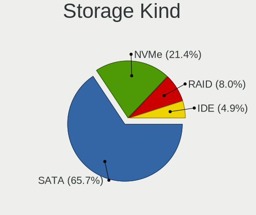

| Kind | Notebooks | Percent |
|------|-----------|---------|
| SATA | 916       | 65.66%  |
| NVMe | 299       | 21.43%  |
| RAID | 111       | 7.96%   |
| IDE  | 69        | 4.95%   |

Processor
---------

CPU Vendor
----------

Processor vendors

| Vendor | Notebooks | Percent |
|--------|-----------|---------|
| Intel  | 1010      | 84.8%   |
| AMD    | 181       | 15.2%   |

CPU Model
---------

Processor models

| Model                                   | Notebooks | Percent |
|-----------------------------------------|-----------|---------|
| Intel Celeron N4020 CPU @ 1.10GHz       | 55        | 4.62%   |
| Intel Celeron CPU N3350 @ 1.10GHz       | 33        | 2.77%   |
| Intel Core i5-6300U CPU @ 2.40GHz       | 15        | 1.26%   |
| Intel 11th Gen Core i3-1115G4 @ 3.00GHz | 15        | 1.26%   |
| Intel Core i5-2520M CPU @ 2.50GHz       | 14        | 1.18%   |
| Intel Celeron CPU N3060 @ 1.60GHz       | 14        | 1.18%   |
| Intel Core i5-6200U CPU @ 2.30GHz       | 13        | 1.09%   |
| Intel Core i5-7200U CPU @ 2.50GHz       | 12        | 1.01%   |
| Intel Core i3-2350M CPU @ 2.30GHz       | 12        | 1.01%   |
| Intel Core i5-3320M CPU @ 2.60GHz       | 11        | 0.92%   |
| Intel Core i5-3210M CPU @ 2.50GHz       | 11        | 0.92%   |
| Intel Core i3-1005G1 CPU @ 1.20GHz      | 11        | 0.92%   |
| Intel Celeron N4000 CPU @ 1.10GHz       | 11        | 0.92%   |
| Intel 11th Gen Core i5-1135G7 @ 2.40GHz | 11        | 0.92%   |
| Intel Core i5-8350U CPU @ 1.70GHz       | 10        | 0.84%   |
| Intel Core i5-5300U CPU @ 2.30GHz       | 10        | 0.84%   |
| Intel Core i3-6006U CPU @ 2.00GHz       | 10        | 0.84%   |
| Intel Core i5-4210U CPU @ 1.70GHz       | 9         | 0.76%   |
| Intel Core i5-3230M CPU @ 2.60GHz       | 9         | 0.76%   |
| Intel Core i3-2310M CPU @ 2.10GHz       | 9         | 0.76%   |
| Intel Core i3 CPU M 380 @ 2.53GHz       | 9         | 0.76%   |
| AMD Ryzen 7 5700U with Radeon Graphics  | 9         | 0.76%   |
| AMD Ryzen 5 5500U with Radeon Graphics  | 9         | 0.76%   |
| Intel Core i7-8750H CPU @ 2.20GHz       | 8         | 0.67%   |
| Intel Core i7-7500U CPU @ 2.70GHz       | 8         | 0.67%   |
| Intel Core i7-2670QM CPU @ 2.20GHz      | 8         | 0.67%   |
| Intel Core i5-5200U CPU @ 2.20GHz       | 8         | 0.67%   |
| Intel Core i5-2450M CPU @ 2.50GHz       | 8         | 0.67%   |
| Intel Core i5 CPU M 520 @ 2.40GHz       | 8         | 0.67%   |
| Intel Core i5 CPU M 430 @ 2.27GHz       | 8         | 0.67%   |
| Intel Core i3-5005U CPU @ 2.00GHz       | 8         | 0.67%   |
| Intel Core i3 CPU M 370 @ 2.40GHz       | 8         | 0.67%   |
| Intel Atom CPU N455 @ 1.66GHz           | 8         | 0.67%   |
| Intel Pentium CPU B960 @ 2.20GHz        | 7         | 0.59%   |
| Intel Core i7-8550U CPU @ 1.80GHz       | 7         | 0.59%   |
| Intel Core i7-10750H CPU @ 2.60GHz      | 7         | 0.59%   |
| Intel Core i5-8265U CPU @ 1.60GHz       | 7         | 0.59%   |
| Intel Core i5-2410M CPU @ 2.30GHz       | 7         | 0.59%   |
| Intel Core i5-1035G1 CPU @ 1.00GHz      | 7         | 0.59%   |
| Intel Core i5-10210U CPU @ 1.60GHz      | 7         | 0.59%   |

CPU Model Family
----------------

Processor model prefix

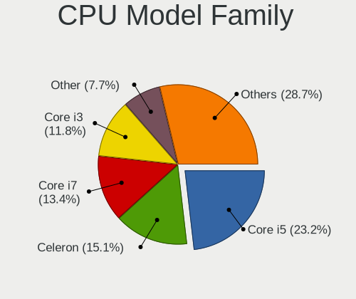

| Model                   | Notebooks | Percent |
|-------------------------|-----------|---------|
| Intel Core i5           | 276       | 23.17%  |
| Intel Celeron           | 180       | 15.11%  |
| Intel Core i7           | 160       | 13.43%  |
| Intel Core i3           | 141       | 11.84%  |
| Other                   | 92        | 7.72%   |
| Intel Pentium           | 56        | 4.7%    |
| Intel Core 2 Duo        | 44        | 3.69%   |
| AMD Ryzen 7             | 37        | 3.11%   |
| AMD Ryzen 5             | 35        | 2.94%   |
| Intel Atom              | 26        | 2.18%   |
| AMD Ryzen 3             | 17        | 1.43%   |
| Intel Pentium Dual-Core | 12        | 1.01%   |
| Intel Pentium Silver    | 10        | 0.84%   |
| AMD A6                  | 8         | 0.67%   |
| AMD A4                  | 8         | 0.67%   |
| Intel Pentium Dual      | 7         | 0.59%   |
| Intel Genuine           | 6         | 0.5%    |
| AMD Ryzen 5 PRO         | 6         | 0.5%    |
| AMD E                   | 6         | 0.5%    |
| AMD Athlon              | 6         | 0.5%    |
| Intel Core 2            | 5         | 0.42%   |
| AMD E2                  | 5         | 0.42%   |
| AMD E1                  | 5         | 0.42%   |
| AMD Athlon II Dual-Core | 4         | 0.34%   |
| Intel Core M            | 3         | 0.25%   |
| AMD Sempron             | 3         | 0.25%   |
| AMD Phenom II           | 3         | 0.25%   |
| AMD Athlon II           | 3         | 0.25%   |
| AMD A8                  | 3         | 0.25%   |
| Intel Pentium Gold      | 2         | 0.17%   |
| AMD Turion 64 X2 Mobile | 2         | 0.17%   |
| AMD Ryzen 7 PRO         | 2         | 0.17%   |
| AMD C-70                | 2         | 0.17%   |
| AMD A10                 | 2         | 0.17%   |
| Intel Core m3           | 1         | 0.08%   |
| Intel Core 2 Solo       | 1         | 0.08%   |
| Intel Core 2 Extreme    | 1         | 0.08%   |
| Intel Celeron M         | 1         | 0.08%   |
| AMD Turion II Dual-Core | 1         | 0.08%   |
| AMD Turion II           | 1         | 0.08%   |

CPU Cores
---------

Number of processor cores

| Number | Notebooks | Percent |
|--------|-----------|---------|
| 2      | 779       | 65.41%  |
| 4      | 264       | 22.17%  |
| 6      | 51        | 4.28%   |
| 8      | 37        | 3.11%   |
| 1      | 31        | 2.6%    |
| 14     | 9         | 0.76%   |
| 12     | 8         | 0.67%   |
| 10     | 8         | 0.67%   |
| 24     | 2         | 0.17%   |
| 16     | 1         | 0.08%   |
| 3      | 1         | 0.08%   |

CPU Sockets
-----------

Number of sockets

| Number | Notebooks | Percent |
|--------|-----------|---------|
| 1      | 1191      | 100%    |

CPU Threads
-----------

Threads per core (Hyper-Threading)

| Number | Notebooks | Percent |
|--------|-----------|---------|
| 2      | 769       | 64.57%  |
| 1      | 418       | 35.1%   |
| 8      | 2         | 0.17%   |
| 4      | 2         | 0.17%   |

CPU Op-Modes
------------

CPU Operation Modes (32-bit, 64-bit)

| Op mode        | Notebooks | Percent |
|----------------|-----------|---------|
| 32-bit, 64-bit | 1191      | 100%    |

CPU Microcode
-------------

Microcode number

| Number     | Notebooks | Percent |
|------------|-----------|---------|
| Unknown    | 1019      | 85.56%  |
| 0x08108109 | 25        | 2.1%    |
| 0x08608103 | 15        | 1.26%   |
| 0x06006705 | 11        | 0.92%   |
| 0x0810100b | 9         | 0.76%   |
| 0x0500010d | 9         | 0.76%   |
| 0x0a50000d | 8         | 0.67%   |
| 0x08108102 | 7         | 0.59%   |
| 0x0a50000c | 6         | 0.5%    |
| 0x0a404102 | 6         | 0.5%    |
| 0x08200103 | 5         | 0.42%   |
| 0x0600611a | 5         | 0.42%   |
| 0x010000c8 | 5         | 0.42%   |
| 0x08a00006 | 4         | 0.34%   |
| 0x08608104 | 4         | 0.34%   |
| 0x08600106 | 4         | 0.34%   |
| 0x05000028 | 4         | 0.34%   |
| 0x02000057 | 4         | 0.34%   |
| 0x08101007 | 3         | 0.25%   |
| 0x06006704 | 3         | 0.25%   |
| 0x06001116 | 3         | 0.25%   |
| 0x08608102 | 2         | 0.17%   |
| 0x08600109 | 2         | 0.17%   |
| 0x08600104 | 2         | 0.17%   |
| 0x0700010b | 2         | 0.17%   |
| 0x05000101 | 2         | 0.17%   |
| 0x03000027 | 2         | 0.17%   |
| 0x03000014 | 2         | 0.17%   |
| 0x010000b6 | 2         | 0.17%   |
| 0x0a50000f | 1         | 0.08%   |
| 0x0a404105 | 1         | 0.08%   |
| 0x0a404101 | 1         | 0.08%   |
| 0x08901003 | 1         | 0.08%   |
| 0x08600103 | 1         | 0.08%   |
| 0x08600102 | 1         | 0.08%   |
| 0x08101016 | 1         | 0.08%   |
| 0x07030106 | 1         | 0.08%   |
| 0x07030104 | 1         | 0.08%   |
| 0x07000110 | 1         | 0.08%   |
| 0x0700010f | 1         | 0.08%   |

CPU Microarch
-------------

Microarchitecture

| Name             | Notebooks | Percent |
|------------------|-----------|---------|
| KabyLake         | 135       | 11.34%  |
| SandyBridge      | 114       | 9.57%   |
| IvyBridge        | 98        | 8.23%   |
| Haswell          | 83        | 6.97%   |
| Goldmont plus    | 81        | 6.8%    |
| Westmere         | 69        | 5.79%   |
| Skylake          | 69        | 5.79%   |
| Silvermont       | 50        | 4.2%    |
| Penryn           | 49        | 4.11%   |
| Goldmont         | 42        | 3.53%   |
| Broadwell        | 41        | 3.44%   |
| Alderlake Hybrid | 38        | 3.19%   |
| TigerLake        | 35        | 2.94%   |
| Unknown          | 35        | 2.94%   |
| Core             | 33        | 2.77%   |
| Zen+             | 32        | 2.69%   |
| IceLake          | 24        | 2.02%   |
| Bonnell          | 21        | 1.76%   |
| Excavator        | 19        | 1.6%    |
| Zen              | 18        | 1.51%   |
| Zen 3            | 16        | 1.34%   |
| Bobcat           | 16        | 1.34%   |
| CometLake        | 14        | 1.18%   |
| K10              | 12        | 1.01%   |
| Zen 2            | 10        | 0.84%   |
| Tremont          | 9         | 0.76%   |
| K10 Llano        | 6         | 0.5%    |
| Jaguar           | 5         | 0.42%   |
| Piledriver       | 4         | 0.34%   |
| K8 & K10 hybrid  | 4         | 0.34%   |
| K8 Hammer        | 3         | 0.25%   |
| Gracemont        | 3         | 0.25%   |
| Puma             | 2         | 0.17%   |
| Nehalem          | 1         | 0.08%   |

Graphics
--------

GPU Vendor
----------

Vendors of graphics cards

| Vendor                           | Notebooks | Percent |
|----------------------------------|-----------|---------|
| Intel                            | 940       | 67.43%  |
| AMD                              | 235       | 16.86%  |
| Nvidia                           | 216       | 15.49%  |
| Silicon Integrated Systems [SiS] | 3         | 0.22%   |

GPU Model
---------

Graphics card models

| Model                                                                                    | Notebooks | Percent |
|------------------------------------------------------------------------------------------|-----------|---------|
| Intel 2nd Generation Core Processor Family Integrated Graphics Controller                | 106       | 7.43%   |
| Intel 3rd Gen Core processor Graphics Controller                                         | 91        | 6.38%   |
| Intel GeminiLake [UHD Graphics 600]                                                      | 74        | 5.19%   |
| Intel Skylake GT2 [HD Graphics 520]                                                      | 51        | 3.58%   |
| Intel Core Processor Integrated Graphics Controller                                      | 51        | 3.58%   |
| Intel Haswell-ULT Integrated Graphics Controller                                         | 48        | 3.37%   |
| Intel Mobile 4 Series Chipset Integrated Graphics Controller                             | 40        | 2.81%   |
| Intel HD Graphics 500                                                                    | 38        | 2.66%   |
| Intel HD Graphics 620                                                                    | 37        | 2.59%   |
| AMD Picasso/Raven 2 [Radeon Vega Series / Radeon Vega Mobile Series]                     | 37        | 2.59%   |
| Intel UHD Graphics 620                                                                   | 32        | 2.24%   |
| Intel HD Graphics 5500                                                                   | 32        | 2.24%   |
| Intel Atom Processor Z36xxx/Z37xxx Series Graphics & Display                             | 26        | 1.82%   |
| Intel Atom/Celeron/Pentium Processor x5-E8000/J3xxx/N3xxx Integrated Graphics Controller | 24        | 1.68%   |
| Intel 4th Gen Core Processor Integrated Graphics Controller                              | 24        | 1.68%   |
| AMD Lucienne                                                                             | 21        | 1.47%   |
| Intel Iris Plus Graphics G1 (Ice Lake)                                                   | 19        | 1.33%   |
| Intel TigerLake-LP GT2 [Iris Xe Graphics]                                                | 18        | 1.26%   |
| Intel Mobile GM965/GL960 Integrated Graphics Controller (secondary)                      | 18        | 1.26%   |
| Intel Mobile GM965/GL960 Integrated Graphics Controller (primary)                        | 18        | 1.26%   |
| Intel Tiger Lake-LP GT2 [UHD Graphics G4]                                                | 17        | 1.19%   |
| Intel CoffeeLake-H GT2 [UHD Graphics 630]                                                | 16        | 1.12%   |
| Intel WhiskeyLake-U GT2 [UHD Graphics 620]                                               | 15        | 1.05%   |
| Intel Atom Processor D4xx/D5xx/N4xx/N5xx Integrated Graphics Controller                  | 15        | 1.05%   |
| AMD Stoney [Radeon R2/R3/R4/R5 Graphics]                                                 | 14        | 0.98%   |
| Nvidia TU117M [GeForce GTX 1650 Mobile / Max-Q]                                          | 13        | 0.91%   |
| Intel CometLake-H GT2 [UHD Graphics]                                                     | 13        | 0.91%   |
| Intel Alder Lake-P GT2 [Iris Xe Graphics]                                                | 13        | 0.91%   |
| AMD Raven Ridge [Radeon Vega Series / Radeon Vega Mobile Series]                         | 13        | 0.91%   |
| Intel CometLake-U GT2 [UHD Graphics]                                                     | 12        | 0.84%   |
| AMD RV710/M92 [Mobility Radeon HD 4530/4570/5145/530v/540v/545v]                         | 11        | 0.77%   |
| Nvidia GP107M [GeForce GTX 1050 Mobile]                                                  | 10        | 0.7%    |
| Nvidia GF117M [GeForce 610M/710M/810M/820M / GT 620M/625M/630M/720M]                     | 10        | 0.7%    |
| Intel JasperLake [UHD Graphics]                                                          | 10        | 0.7%    |
| Intel HD Graphics 630                                                                    | 10        | 0.7%    |
| Intel HD Graphics 530                                                                    | 10        | 0.7%    |
| AMD Renoir [Radeon Vega Series / Radeon Vega Mobile Series]                              | 10        | 0.7%    |
| AMD Sun XT [Radeon HD 8670A/8670M/8690M / R5 M330 / M430 / Radeon 520 Mobile]            | 9         | 0.63%   |
| AMD Barcelo                                                                              | 9         | 0.63%   |
| AMD Rembrandt [Radeon 680M]                                                              | 8         | 0.56%   |

GPU Combo
---------

Combinations of graphics cards

| Name                   | Notebooks | Percent |
|------------------------|-----------|---------|
| 1 x Intel              | 680       | 57.09%  |
| 1 x AMD                | 175       | 14.69%  |
| Intel + Nvidia         | 150       | 12.59%  |
| 2 x Intel              | 73        | 6.13%   |
| 1 x Nvidia             | 49        | 4.11%   |
| Intel + AMD            | 36        | 3.02%   |
| AMD + Nvidia           | 15        | 1.26%   |
| 2 x AMD                | 9         | 0.76%   |
| 1 x SiS                | 3         | 0.25%   |
| 2 x Intel + 1 x Nvidia | 1         | 0.08%   |

GPU Driver
----------

Free vs proprietary

| Driver      | Notebooks | Percent |
|-------------|-----------|---------|
| Free        | 1164      | 97.73%  |
| Unknown     | 20        | 1.68%   |
| Proprietary | 7         | 0.59%   |

GPU Memory
----------

Total video memory

| Size in GB | Notebooks | Percent |
|------------|-----------|---------|
| Unknown    | 780       | 65.44%  |
| 0.01-0.5   | 143       | 12%     |
| 1.01-2.0   | 130       | 10.91%  |
| 0.51-1.0   | 57        | 4.78%   |
| 3.01-4.0   | 54        | 4.53%   |
| 7.01-8.0   | 13        | 1.09%   |
| 5.01-6.0   | 10        | 0.84%   |
| 2.01-3.0   | 5         | 0.42%   |

Monitor
-------

Monitor Vendor
--------------

Monitor vendors

| Vendor                  | Notebooks | Percent |
|-------------------------|-----------|---------|
| AU Optronics            | 255       | 20.63%  |
| LG Display              | 198       | 16.02%  |
| BOE                     | 193       | 15.61%  |
| Chimei Innolux          | 186       | 15.05%  |
| Samsung Electronics     | 135       | 10.92%  |
| Chi Mei Optoelectronics | 38        | 3.07%   |
| RGT                     | 22        | 1.78%   |
| InfoVision              | 22        | 1.78%   |
| Lenovo                  | 20        | 1.62%   |
| PANDA                   | 16        | 1.29%   |
| Apple                   | 15        | 1.21%   |
| Sharp                   | 14        | 1.13%   |
| LG Philips              | 14        | 1.13%   |
| Dell                    | 10        | 0.81%   |
| Hewlett-Packard         | 7         | 0.57%   |
| Goldstar                | 7         | 0.57%   |
| Acer                    | 7         | 0.57%   |
| InnoLux Display         | 5         | 0.4%    |
| HannStar                | 5         | 0.4%    |
| AOC                     | 5         | 0.4%    |
| Sony                    | 4         | 0.32%   |
| KDC                     | 4         | 0.32%   |
| HKC                     | 4         | 0.32%   |
| ViewSonic               | 3         | 0.24%   |
| Unknown                 | 3         | 0.24%   |
| Toshiba                 | 3         | 0.24%   |
| Quanta Display          | 3         | 0.24%   |
| Panasonic               | 3         | 0.24%   |
| CSO                     | 3         | 0.24%   |
| CHI                     | 3         | 0.24%   |
| ASUSTek Computer        | 3         | 0.24%   |
| ___                     | 2         | 0.16%   |
| STA                     | 2         | 0.16%   |
| Iiyama                  | 2         | 0.16%   |
| CPT                     | 2         | 0.16%   |
| BenQ                    | 2         | 0.16%   |
| Ancor Communications    | 2         | 0.16%   |
| Westinghouse            | 1         | 0.08%   |
| Valve                   | 1         | 0.08%   |
| Unknown (XXX)           | 1         | 0.08%   |

Monitor Model
-------------

Monitor models

| Model                                                                     | Notebooks | Percent |
|---------------------------------------------------------------------------|-----------|---------|
| Chimei Innolux LCD Monitor CMN14D6 1366x768 309x173mm 13.9-inch           | 41        | 3.31%   |
| RGT LCD Monitor RGT5211 1366x768 518x333mm 24.2-inch                      | 22        | 1.77%   |
| Samsung Electronics LCD Monitor SEC5441 1280x800 286x179mm 13.3-inch      | 16        | 1.29%   |
| LG Display LCD Monitor LGD02DC 1366x768 344x194mm 15.5-inch               | 13        | 1.05%   |
| AU Optronics LCD Monitor AUO21ED 1920x1080 344x193mm 15.5-inch            | 12        | 0.97%   |
| Chimei Innolux LCD Monitor CMN15F5 1920x1080 344x193mm 15.5-inch          | 10        | 0.81%   |
| AU Optronics LCD Monitor AUO22EC 1366x768 344x193mm 15.5-inch             | 10        | 0.81%   |
| Chimei Innolux LCD Monitor CMN15DB 1366x768 344x193mm 15.5-inch           | 9         | 0.73%   |
| Chimei Innolux LCD Monitor CMN14D4 1920x1080 309x173mm 13.9-inch          | 9         | 0.73%   |
| AU Optronics LCD Monitor AUO71EC 1366x768 344x193mm 15.5-inch             | 9         | 0.73%   |
| Chimei Innolux LCD Monitor CMN15E7 1920x1080 344x193mm 15.5-inch          | 8         | 0.65%   |
| BOE LCD Monitor BOE084E 1920x1080 382x215mm 17.3-inch                     | 8         | 0.65%   |
| AU Optronics LCD Monitor AUO61ED 1920x1080 344x194mm 15.5-inch            | 8         | 0.65%   |
| AU Optronics LCD Monitor AUO81EC 1366x768 344x193mm 15.5-inch             | 7         | 0.56%   |
| Samsung Electronics LCD Monitor SDC5441 1366x768 309x174mm 14.0-inch      | 6         | 0.48%   |
| LG Display LCD Monitor LGD02F2 1366x768 344x194mm 15.5-inch               | 6         | 0.48%   |
| Chi Mei Optoelectronics LCD Monitor CMO15A7 1366x768 344x193mm 15.5-inch  | 6         | 0.48%   |
| AU Optronics LCD Monitor AUO70EC 1366x768 344x193mm 15.5-inch             | 6         | 0.48%   |
| AU Optronics LCD Monitor AUO26EC 1366x768 344x193mm 15.5-inch             | 6         | 0.48%   |
| AU Optronics LCD Monitor AUO20EC 1366x768 344x193mm 15.5-inch             | 6         | 0.48%   |
| AU Optronics LCD Monitor AUO183C 1366x768 309x173mm 13.9-inch             | 6         | 0.48%   |
| PANDA LCD Monitor NCP004D 1920x1080 344x194mm 15.5-inch                   | 5         | 0.4%    |
| LG Display LCD Monitor LGD039F 1366x768 345x194mm 15.6-inch               | 5         | 0.4%    |
| LG Display LCD Monitor LGD0395 1366x768 344x194mm 15.5-inch               | 5         | 0.4%    |
| LG Display LCD Monitor LGD0385 1366x768 309x174mm 14.0-inch               | 5         | 0.4%    |
| LG Display LCD Monitor LGD033B 1366x768 344x194mm 15.5-inch               | 5         | 0.4%    |
| Lenovo LCD Monitor LEN4011 1280x800 261x163mm 12.1-inch                   | 5         | 0.4%    |
| InfoVision LCD Monitor IVO03F4 1920x1080 309x173mm 13.9-inch              | 5         | 0.4%    |
| Chimei Innolux LCD Monitor CMN15E6 1366x768 344x193mm 15.5-inch           | 5         | 0.4%    |
| Chi Mei Optoelectronics LCD Monitor CMO1720 1920x1080 382x215mm 17.3-inch | 5         | 0.4%    |
| BOE LCD Monitor BOE0A84 1920x1200 286x179mm 13.3-inch                     | 5         | 0.4%    |
| BOE LCD Monitor BOE06A5 1366x768 344x194mm 15.5-inch                      | 5         | 0.4%    |
| BOE LCD Monitor BOE069C 1920x1080 344x193mm 15.5-inch                     | 5         | 0.4%    |
| AU Optronics LCD Monitor AUO2D3C 1366x768 309x173mm 13.9-inch             | 5         | 0.4%    |
| AU Optronics LCD Monitor AUO23EC 1366x768 344x193mm 15.5-inch             | 5         | 0.4%    |
| AU Optronics LCD Monitor AUO106C 1366x768 277x156mm 12.5-inch             | 5         | 0.4%    |
| Samsung Electronics LCD Monitor SEC5442 1440x900 331x207mm 15.4-inch      | 4         | 0.32%   |
| LG Display LCD Monitor LGD0563 1920x1080 344x194mm 15.5-inch              | 4         | 0.32%   |
| LG Display LCD Monitor LGD0521 1920x1080 309x174mm 14.0-inch              | 4         | 0.32%   |
| LG Display LCD Monitor LGD038E 1366x768 344x194mm 15.5-inch               | 4         | 0.32%   |

Monitor Resolution
------------------

Monitor screen resolution

| Resolution         | Notebooks | Percent |
|--------------------|-----------|---------|
| 1366x768 (WXGA)    | 538       | 44.35%  |
| 1920x1080 (FHD)    | 419       | 34.54%  |
| 1600x900 (HD+)     | 68        | 5.61%   |
| 1280x800 (WXGA)    | 42        | 3.46%   |
| 1920x1200 (WUXGA)  | 27        | 2.23%   |
| 1440x900 (WXGA+)   | 21        | 1.73%   |
| 3840x2160 (4K)     | 15        | 1.24%   |
| 2880x1800          | 12        | 0.99%   |
| 1024x600           | 11        | 0.91%   |
| 2560x1600          | 10        | 0.82%   |
| 2560x1440 (QHD)    | 9         | 0.74%   |
| 1680x1050 (WSXGA+) | 7         | 0.58%   |
| 2288x1287          | 5         | 0.41%   |
| 2160x1440          | 5         | 0.41%   |
| 3200x1800 (QHD+)   | 3         | 0.25%   |
| 3840x2400          | 2         | 0.16%   |
| 2256x1504          | 2         | 0.16%   |
| 1920x540           | 2         | 0.16%   |
| 1360x768           | 2         | 0.16%   |
| 1280x720 (HD)      | 2         | 0.16%   |
| 1152x864           | 2         | 0.16%   |
| 800x1280           | 1         | 0.08%   |
| 3440x1440          | 1         | 0.08%   |
| 3072x1920          | 1         | 0.08%   |
| 2880x1620          | 1         | 0.08%   |
| 2560x1080          | 1         | 0.08%   |
| 2520x1680          | 1         | 0.08%   |
| 1680x945           | 1         | 0.08%   |
| 1600x2560          | 1         | 0.08%   |
| 1024x768 (XGA)     | 1         | 0.08%   |

Monitor Diagonal
----------------

Diagonal size in inches

| Inches  | Notebooks | Percent |
|---------|-----------|---------|
| 15      | 558       | 45.04%  |
| 13      | 189       | 15.25%  |
| 14      | 157       | 12.67%  |
| 17      | 103       | 8.31%   |
| 12      | 37        | 2.99%   |
| 24      | 34        | 2.74%   |
| 11      | 32        | 2.58%   |
| 16      | 19        | 1.53%   |
| 10      | 18        | 1.45%   |
| 23      | 16        | 1.29%   |
| 27      | 15        | 1.21%   |
| 21      | 12        | 0.97%   |
| 18      | 8         | 0.65%   |
| 31      | 7         | 0.56%   |
| 20      | 6         | 0.48%   |
| 19      | 5         | 0.4%    |
| Unknown | 5         | 0.4%    |
| 39      | 3         | 0.24%   |
| 32      | 3         | 0.24%   |
| 142     | 2         | 0.16%   |
| 54      | 2         | 0.16%   |
| 84      | 1         | 0.08%   |
| 72      | 1         | 0.08%   |
| 46      | 1         | 0.08%   |
| 40      | 1         | 0.08%   |
| 34      | 1         | 0.08%   |
| 28      | 1         | 0.08%   |
| 22      | 1         | 0.08%   |
| 7       | 1         | 0.08%   |

Monitor Width
-------------

Physical width

| Width in mm    | Notebooks | Percent |
|----------------|-----------|---------|
| 301-350        | 836       | 67.69%  |
| 201-300        | 151       | 12.23%  |
| 351-400        | 127       | 10.28%  |
| 501-600        | 60        | 4.86%   |
| 401-500        | 30        | 2.43%   |
| 601-700        | 10        | 0.81%   |
| Unknown        | 5         | 0.4%    |
| 801-900        | 4         | 0.32%   |
| 701-800        | 4         | 0.32%   |
| 1001-1500      | 3         | 0.24%   |
| More than 2000 | 2         | 0.16%   |
| 1501-2000      | 2         | 0.16%   |
| 1-100          | 1         | 0.08%   |

Aspect Ratio
------------

Proportional relationship between the width and the height

| Ratio   | Notebooks | Percent |
|---------|-----------|---------|
| 16/9    | 1019      | 86.43%  |
| 16/10   | 133       | 11.28%  |
| 3/2     | 16        | 1.36%   |
| 4/3     | 4         | 0.34%   |
| 5/4     | 2         | 0.17%   |
| 1.00    | 2         | 0.17%   |
| 21/9    | 1         | 0.08%   |
| 0.62    | 1         | 0.08%   |
| Unknown | 1         | 0.08%   |

Monitor Area
------------

Area in inch

| Area in inch | Notebooks | Percent |
|----------------|-----------|---------|
| 101-110        | 559       | 45.19%  |
| 81-90          | 287       | 23.2%   |
| 121-130        | 92        | 7.44%   |
| 71-80          | 55        | 4.45%   |
| 61-70          | 37        | 2.99%   |
| 51-60          | 32        | 2.59%   |
| 201-250        | 29        | 2.34%   |
| 251-300        | 28        | 2.26%   |
| 41-50          | 18        | 1.46%   |
| 111-120        | 16        | 1.29%   |
| 301-350        | 15        | 1.21%   |
| 151-200        | 15        | 1.21%   |
| 351-500        | 12        | 0.97%   |
| 131-140        | 12        | 0.97%   |
| 141-150        | 8         | 0.65%   |
| More than 1000 | 6         | 0.49%   |
| 501-1000       | 5         | 0.4%    |
| 91-100         | 5         | 0.4%    |
| Unknown        | 5         | 0.4%    |
| 1-40           | 1         | 0.08%   |

Pixel Density
-------------

Pixels per inch

| Density       | Notebooks | Percent |
|---------------|-----------|---------|
| 101-120       | 532       | 43.61%  |
| 121-160       | 435       | 35.66%  |
| 51-100        | 160       | 13.11%  |
| 161-240       | 69        | 5.66%   |
| More than 240 | 13        | 1.07%   |
| 1-50          | 6         | 0.49%   |
| Unknown       | 5         | 0.41%   |

Multiple Monitors
-----------------

Total monitors connected

| Total | Notebooks | Percent |
|-------|-----------|---------|
| 1     | 1079      | 90.37%  |
| 2     | 81        | 6.78%   |
| 0     | 29        | 2.43%   |
| 3     | 5         | 0.42%   |

Network
-------

Net Controller Vendor
---------------------

Controller vendors

| Vendor                            | Notebooks | Percent |
|-----------------------------------|-----------|---------|
| Realtek Semiconductor             | 667       | 36.29%  |
| Intel                             | 538       | 29.27%  |
| Qualcomm Atheros                  | 286       | 15.56%  |
| Broadcom                          | 111       | 6.04%   |
| MediaTek                          | 31        | 1.69%   |
| ASIX Electronics                  | 24        | 1.31%   |
| Broadcom Limited                  | 23        | 1.25%   |
| Ralink                            | 15        | 0.82%   |
| Marvell Technology Group          | 15        | 0.82%   |
| TP-Link                           | 11        | 0.6%    |
| JMicron Technology                | 11        | 0.6%    |
| Ericsson Business Mobile Networks | 11        | 0.6%    |
| Dell                              | 11        | 0.6%    |
| ZTE WCDMA Technologies MSM        | 10        | 0.54%   |
| Sierra Wireless                   | 8         | 0.44%   |
| Samsung Electronics               | 6         | 0.33%   |
| Ralink Technology                 | 6         | 0.33%   |
| OPPO Electronics                  | 5         | 0.27%   |
| Lenovo                            | 4         | 0.22%   |
| Huawei Technologies               | 4         | 0.22%   |
| Hewlett-Packard                   | 4         | 0.22%   |
| Silicon Integrated Systems [SiS]  | 3         | 0.16%   |
| Qualcomm Atheros Communications   | 3         | 0.16%   |
| Qualcomm                          | 3         | 0.16%   |
| Nvidia                            | 3         | 0.16%   |
| Microchip Technology              | 3         | 0.16%   |
| ICS Advent                        | 2         | 0.11%   |
| DisplayLink                       | 2         | 0.11%   |
| D-Link                            | 2         | 0.11%   |
| ZyDAS                             | 1         | 0.05%   |
| Xiaomi                            | 1         | 0.05%   |
| Toshiba                           | 1         | 0.05%   |
| T & A Mobile Phones               | 1         | 0.05%   |
| Prusa                             | 1         | 0.05%   |
| NetGear                           | 1         | 0.05%   |
| Motorola PCS                      | 1         | 0.05%   |
| Mercucys                          | 1         | 0.05%   |
| Linksys                           | 1         | 0.05%   |
| LG Electronics                    | 1         | 0.05%   |
| Fujitsu Siemens Computers         | 1         | 0.05%   |

Net Controller Model
--------------------

Controller models

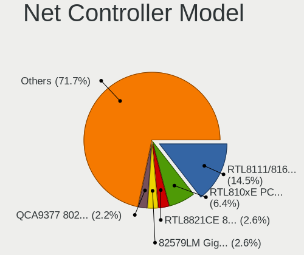

| Model                                                                   | Notebooks | Percent |
|-------------------------------------------------------------------------|-----------|---------|
| Realtek RTL8111/8168/8211/8411 PCI Express Gigabit Ethernet Controller  | 322       | 14.49%  |
| Realtek RTL810xE PCI Express Fast Ethernet controller                   | 143       | 6.44%   |
| Realtek RTL8821CE 802.11ac PCIe Wireless Network Adapter                | 58        | 2.61%   |
| Intel 82579LM Gigabit Network Connection (Lewisville)                   | 57        | 2.57%   |
| Qualcomm Atheros QCA9377 802.11ac Wireless Network Adapter              | 49        | 2.21%   |
| Qualcomm Atheros AR9285 Wireless Network Adapter (PCI-Express)          | 49        | 2.21%   |
| Qualcomm Atheros QCA9565 / AR9565 Wireless Network Adapter              | 46        | 2.07%   |
| Qualcomm Atheros AR9485 Wireless Network Adapter                        | 46        | 2.07%   |
| Intel Wireless 8265 / 8275                                              | 45        | 2.03%   |
| Realtek RTL8852BE PCIe 802.11ax Wireless Network Controller             | 43        | 1.94%   |
| Intel Centrino Advanced-N 6205 [Taylor Peak]                            | 38        | 1.71%   |
| Realtek RTL8822CE 802.11ac PCIe Wireless Network Adapter                | 36        | 1.62%   |
| Intel Wireless 7265                                                     | 34        | 1.53%   |
| Broadcom BCM4313 802.11bgn Wireless Network Adapter                     | 34        | 1.53%   |
| Intel Wireless 8260                                                     | 31        | 1.4%    |
| Intel Wireless 7260                                                     | 31        | 1.4%    |
| Realtek 802.11n WLAN Adapter                                            | 29        | 1.31%   |
| Intel Wi-Fi 6 AX201                                                     | 28        | 1.26%   |
| Intel Ethernet Connection (4) I219-LM                                   | 26        | 1.17%   |
| Realtek RTL8723BE PCIe Wireless Network Adapter                         | 25        | 1.13%   |
| Realtek RTL8188CE 802.11b/g/n WiFi Adapter                              | 25        | 1.13%   |
| Realtek RTL8153 Gigabit Ethernet Adapter                                | 25        | 1.13%   |
| Intel Alder Lake-P PCH CNVi WiFi                                        | 21        | 0.95%   |
| ASIX AX88179 Gigabit Ethernet                                           | 21        | 0.95%   |
| Intel Wireless 3165                                                     | 20        | 0.9%    |
| Intel Ethernet Connection I219-LM                                       | 20        | 0.9%    |
| Intel Wireless 3160                                                     | 19        | 0.86%   |
| Qualcomm Atheros AR8151 v2.0 Gigabit Ethernet                           | 18        | 0.81%   |
| Qualcomm Atheros AR242x / AR542x Wireless Network Adapter (PCI-Express) | 18        | 0.81%   |
| Intel 82577LM Gigabit Network Connection                                | 18        | 0.81%   |
| Intel 82567LM Gigabit Network Connection                                | 17        | 0.77%   |
| Intel Wi-Fi 6 AX200                                                     | 15        | 0.68%   |
| Intel WiFi Link 5100                                                    | 14        | 0.63%   |
| Intel Dual Band Wireless-AC 3168NGW [Stone Peak]                        | 14        | 0.63%   |
| Intel Cannon Lake PCH CNVi WiFi                                         | 14        | 0.63%   |
| Intel Gemini Lake PCH CNVi WiFi                                         | 13        | 0.59%   |
| Intel Ethernet Connection I218-LM                                       | 13        | 0.59%   |
| Intel Ethernet Connection (3) I218-LM                                   | 13        | 0.59%   |
| Intel Centrino Wireless-N 2230                                          | 13        | 0.59%   |
| Intel Centrino Ultimate-N 6300                                          | 13        | 0.59%   |

Wireless Vendor
---------------

Wireless vendors

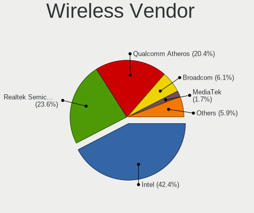

| Vendor                          | Notebooks | Percent |
|---------------------------------|-----------|---------|
| Intel                           | 510       | 42.39%  |
| Realtek Semiconductor           | 284       | 23.61%  |
| Qualcomm Atheros                | 245       | 20.37%  |
| Broadcom                        | 73        | 6.07%   |
| MediaTek                        | 20        | 1.66%   |
| Ralink                          | 15        | 1.25%   |
| Broadcom Limited                | 15        | 1.25%   |
| Sierra Wireless                 | 8         | 0.67%   |
| TP-Link                         | 7         | 0.58%   |
| Ralink Technology               | 6         | 0.5%    |
| Qualcomm Atheros Communications | 3         | 0.25%   |
| Dell                            | 3         | 0.25%   |
| Qualcomm                        | 2         | 0.17%   |
| D-Link                          | 2         | 0.17%   |
| ZyDAS                           | 1         | 0.08%   |
| NetGear                         | 1         | 0.08%   |
| Mercucys                        | 1         | 0.08%   |
| Linksys                         | 1         | 0.08%   |
| Hewlett-Packard                 | 1         | 0.08%   |
| Fujitsu Siemens Computers       | 1         | 0.08%   |
| Fibocom                         | 1         | 0.08%   |
| D-Link System                   | 1         | 0.08%   |
| Belkin Components               | 1         | 0.08%   |
| ASUSTek Computer                | 1         | 0.08%   |

Wireless Model
--------------

Wireless models

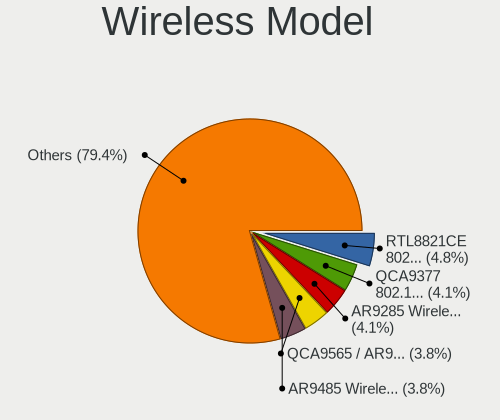

| Model                                                                   | Notebooks | Percent |
|-------------------------------------------------------------------------|-----------|---------|
| Realtek RTL8821CE 802.11ac PCIe Wireless Network Adapter                | 58        | 4.82%   |
| Qualcomm Atheros QCA9377 802.11ac Wireless Network Adapter              | 49        | 4.07%   |
| Qualcomm Atheros AR9285 Wireless Network Adapter (PCI-Express)          | 49        | 4.07%   |
| Qualcomm Atheros QCA9565 / AR9565 Wireless Network Adapter              | 46        | 3.82%   |
| Qualcomm Atheros AR9485 Wireless Network Adapter                        | 46        | 3.82%   |
| Intel Wireless 8265 / 8275                                              | 45        | 3.74%   |
| Realtek RTL8852BE PCIe 802.11ax Wireless Network Controller             | 43        | 3.57%   |
| Intel Centrino Advanced-N 6205 [Taylor Peak]                            | 38        | 3.16%   |
| Realtek RTL8822CE 802.11ac PCIe Wireless Network Adapter                | 36        | 2.99%   |
| Intel Wireless 7265                                                     | 34        | 2.82%   |
| Broadcom BCM4313 802.11bgn Wireless Network Adapter                     | 34        | 2.82%   |
| Intel Wireless 8260                                                     | 31        | 2.57%   |
| Intel Wireless 7260                                                     | 31        | 2.57%   |
| Realtek 802.11n WLAN Adapter                                            | 29        | 2.41%   |
| Intel Wi-Fi 6 AX201                                                     | 28        | 2.33%   |
| Realtek RTL8723BE PCIe Wireless Network Adapter                         | 25        | 2.08%   |
| Realtek RTL8188CE 802.11b/g/n WiFi Adapter                              | 25        | 2.08%   |
| Intel Alder Lake-P PCH CNVi WiFi                                        | 21        | 1.74%   |
| Intel Wireless 3165                                                     | 20        | 1.66%   |
| Intel Wireless 3160                                                     | 19        | 1.58%   |
| Qualcomm Atheros AR242x / AR542x Wireless Network Adapter (PCI-Express) | 18        | 1.5%    |
| Intel Wi-Fi 6 AX200                                                     | 15        | 1.25%   |
| Intel WiFi Link 5100                                                    | 14        | 1.16%   |
| Intel Dual Band Wireless-AC 3168NGW [Stone Peak]                        | 14        | 1.16%   |
| Intel Cannon Lake PCH CNVi WiFi                                         | 14        | 1.16%   |
| Intel Gemini Lake PCH CNVi WiFi                                         | 13        | 1.08%   |
| Intel Centrino Wireless-N 2230                                          | 13        | 1.08%   |
| Intel Centrino Ultimate-N 6300                                          | 13        | 1.08%   |
| Intel Centrino Advanced-N 6200                                          | 13        | 1.08%   |
| MediaTek MT7921 802.11ax PCI Express Wireless Network Adapter           | 12        | 1%      |
| Intel Centrino Wireless-N 1000 [Condor Peak]                            | 12        | 1%      |
| Realtek RTL8723DE Wireless Network Adapter                              | 11        | 0.91%   |
| Intel Comet Lake PCH-LP CNVi WiFi                                       | 11        | 0.91%   |
| Qualcomm Atheros AR928X Wireless Network Adapter (PCI-Express)          | 10        | 0.83%   |
| Qualcomm Atheros AR9287 Wireless Network Adapter (PCI-Express)          | 10        | 0.83%   |
| Intel Ice Lake-LP PCH CNVi WiFi                                         | 10        | 0.83%   |
| Qualcomm Atheros QCA6174 802.11ac Wireless Network Adapter              | 9         | 0.75%   |
| Intel PRO/Wireless 5100 AGN [Shiloh] Network Connection                 | 9         | 0.75%   |
| Intel Comet Lake PCH CNVi WiFi                                          | 9         | 0.75%   |
| Intel Centrino Advanced-N 6235                                          | 9         | 0.75%   |

Ethernet Vendor
---------------

Ethernet vendors

| Vendor                           | Notebooks | Percent |
|----------------------------------|-----------|---------|
| Realtek Semiconductor            | 506       | 51.74%  |
| Intel                            | 235       | 24.03%  |
| Qualcomm Atheros                 | 76        | 7.77%   |
| Broadcom                         | 49        | 5.01%   |
| ASIX Electronics                 | 24        | 2.45%   |
| Marvell Technology Group         | 15        | 1.53%   |
| MediaTek                         | 11        | 1.12%   |
| JMicron Technology               | 11        | 1.12%   |
| Broadcom Limited                 | 8         | 0.82%   |
| Samsung Electronics              | 6         | 0.61%   |
| TP-Link                          | 5         | 0.51%   |
| OPPO Electronics                 | 5         | 0.51%   |
| Lenovo                           | 4         | 0.41%   |
| Silicon Integrated Systems [SiS] | 3         | 0.31%   |
| Nvidia                           | 3         | 0.31%   |
| Microchip Technology             | 3         | 0.31%   |
| ICS Advent                       | 2         | 0.2%    |
| Huawei Technologies              | 2         | 0.2%    |
| DisplayLink                      | 2         | 0.2%    |
| ZTE WCDMA Technologies MSM       | 1         | 0.1%    |
| Xiaomi                           | 1         | 0.1%    |
| T & A Mobile Phones              | 1         | 0.1%    |
| Qualcomm                         | 1         | 0.1%    |
| Motorola PCS                     | 1         | 0.1%    |
| LG Electronics                   | 1         | 0.1%    |
| Hewlett-Packard                  | 1         | 0.1%    |
| Attansic Technology              | 1         | 0.1%    |

Ethernet Model
--------------

Ethernet models

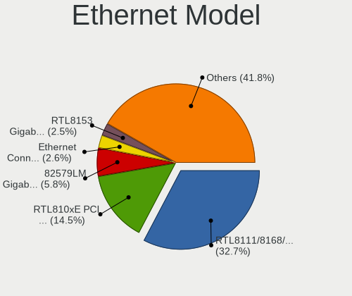

| Model                                                                          | Notebooks | Percent |
|--------------------------------------------------------------------------------|-----------|---------|
| Realtek RTL8111/8168/8211/8411 PCI Express Gigabit Ethernet Controller         | 322       | 32.72%  |
| Realtek RTL810xE PCI Express Fast Ethernet controller                          | 143       | 14.53%  |
| Intel 82579LM Gigabit Network Connection (Lewisville)                          | 57        | 5.79%   |
| Intel Ethernet Connection (4) I219-LM                                          | 26        | 2.64%   |
| Realtek RTL8153 Gigabit Ethernet Adapter                                       | 25        | 2.54%   |
| ASIX AX88179 Gigabit Ethernet                                                  | 21        | 2.13%   |
| Intel Ethernet Connection I219-LM                                              | 20        | 2.03%   |
| Qualcomm Atheros AR8151 v2.0 Gigabit Ethernet                                  | 18        | 1.83%   |
| Intel 82577LM Gigabit Network Connection                                       | 18        | 1.83%   |
| Intel 82567LM Gigabit Network Connection                                       | 17        | 1.73%   |
| Intel Ethernet Connection I218-LM                                              | 13        | 1.32%   |
| Intel Ethernet Connection (3) I218-LM                                          | 13        | 1.32%   |
| Intel Ethernet Connection I217-LM                                              | 11        | 1.12%   |
| Broadcom NetLink BCM57785 Gigabit Ethernet PCIe                                | 11        | 1.12%   |
| MediaTek MT7922 802.11ax PCI Express Wireless Network Adapter                  | 10        | 1.02%   |
| Qualcomm Atheros AR8162 Fast Ethernet                                          | 9         | 0.91%   |
| Qualcomm Atheros AR8161 Gigabit Ethernet                                       | 9         | 0.91%   |
| Qualcomm Atheros AR8152 v1.1 Fast Ethernet                                     | 9         | 0.91%   |
| JMicron JMC250 PCI Express Gigabit Ethernet Controller                         | 9         | 0.91%   |
| Realtek RTL8152 Fast Ethernet Adapter                                          | 7         | 0.71%   |
| Qualcomm Atheros AR8152 v2.0 Fast Ethernet                                     | 7         | 0.71%   |
| Broadcom NetLink BCM57780 Gigabit Ethernet PCIe                                | 7         | 0.71%   |
| Samsung Galaxy series, misc. (tethering mode)                                  | 6         | 0.61%   |
| Broadcom NetLink BCM5784M Gigabit Ethernet PCIe                                | 6         | 0.61%   |
| Realtek Killer E2600 GbE Controller                                            | 5         | 0.51%   |
| Qualcomm Atheros AR8131 Gigabit Ethernet                                       | 5         | 0.51%   |
| Marvell Group Yukon Optima 88E8059 [PCIe Gigabit Ethernet Controller with AVB] | 5         | 0.51%   |
| Marvell Group 88E8040 PCI-E Fast Ethernet Controller                           | 5         | 0.51%   |
| Intel Ethernet Connection I219-V                                               | 5         | 0.51%   |
| Intel Ethernet Connection I217-V                                               | 5         | 0.51%   |
| Intel Ethernet Connection (6) I219-LM                                          | 5         | 0.51%   |
| Intel Ethernet Connection (4) I219-V                                           | 5         | 0.51%   |
| Intel Ethernet Connection (2) I219-LM                                          | 5         | 0.51%   |
| TP-Link UE300 10/100/1000 LAN (ethernet mode) [Realtek RTL8153]                | 4         | 0.41%   |
| Realtek RTL-8100/8101L/8139 PCI Fast Ethernet Adapter                          | 4         | 0.41%   |
| Qualcomm Atheros Killer E220x Gigabit Ethernet Controller                      | 4         | 0.41%   |
| Qualcomm Atheros AR8151 v1.0 Gigabit Ethernet                                  | 4         | 0.41%   |
| Broadcom NetXtreme BCM5761 Gigabit Ethernet PCIe                               | 4         | 0.41%   |
| Silicon Integrated Systems [SiS] 191 Gigabit Ethernet Adapter                  | 3         | 0.3%    |
| Qualcomm Atheros QCA8171 Gigabit Ethernet                                      | 3         | 0.3%    |

Net Controller Kind
-------------------

Ethernet, WiFi or modem

| Kind     | Notebooks | Percent |
|----------|-----------|---------|
| WiFi     | 1161      | 54.35%  |
| Ethernet | 941       | 44.05%  |
| Modem    | 34        | 1.59%   |

Used Controller
---------------

Currently used network controller

| Kind     | Notebooks | Percent |
|----------|-----------|---------|
| WiFi     | 823       | 71.94%  |
| Ethernet | 313       | 27.36%  |
| Modem    | 8         | 0.7%    |

NICs
----

Total network controllers on board

| Total | Notebooks | Percent |
|-------|-----------|---------|
| 2     | 856       | 71.87%  |
| 1     | 291       | 24.43%  |
| 0     | 43        | 3.61%   |
| 3     | 1         | 0.08%   |

IPv6
----

IPv6 vs IPv4

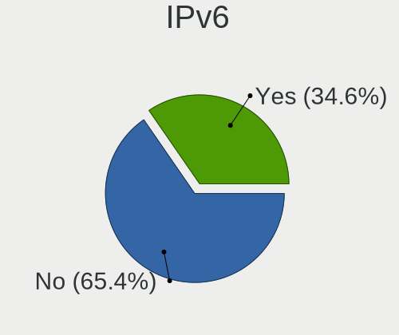

| Used | Notebooks | Percent |
|------|-----------|---------|
| No   | 782       | 65.38%  |
| Yes  | 414       | 34.62%  |

Bluetooth
---------

Bluetooth Vendor
----------------

Controller vendors

| Vendor                          | Notebooks | Percent |
|---------------------------------|-----------|---------|
| Intel                           | 382       | 42.02%  |
| Realtek Semiconductor           | 164       | 18.04%  |
| Qualcomm Atheros Communications | 82        | 9.02%   |
| Broadcom                        | 50        | 5.5%    |
| IMC Networks                    | 48        | 5.28%   |
| Foxconn / Hon Hai               | 43        | 4.73%   |
| Lite-On Technology              | 41        | 4.51%   |
| Dell                            | 20        | 2.2%    |
| Apple                           | 14        | 1.54%   |
| Hewlett-Packard                 | 13        | 1.43%   |
| Cambridge Silicon Radio         | 12        | 1.32%   |
| Toshiba                         | 11        | 1.21%   |
| Unknown                         | 6         | 0.66%   |
| Ralink                          | 5         | 0.55%   |
| TP-Link                         | 3         | 0.33%   |
| Foxconn International           | 3         | 0.33%   |
| USI                             | 2         | 0.22%   |
| Realtek                         | 2         | 0.22%   |
| ASUSTek Computer                | 2         | 0.22%   |
| Qcom                            | 1         | 0.11%   |
| Micro Star International        | 1         | 0.11%   |
| MediaTek                        | 1         | 0.11%   |
| Fujitsu                         | 1         | 0.11%   |
| Alps Electric                   | 1         | 0.11%   |
| Actions                         | 1         | 0.11%   |

Bluetooth Model
---------------

Controller models

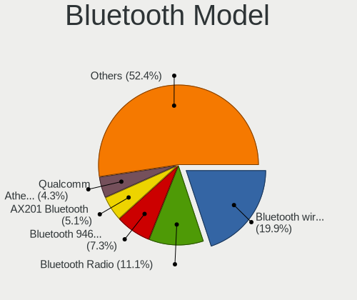

| Model                                                                               | Notebooks | Percent |
|-------------------------------------------------------------------------------------|-----------|---------|
| Intel Bluetooth wireless interface                                                  | 181       | 19.91%  |
| Realtek Bluetooth Radio                                                             | 101       | 11.11%  |
| Intel Bluetooth 9460/9560 Jefferson Peak (JfP)                                      | 66        | 7.26%   |
| Intel AX201 Bluetooth                                                               | 46        | 5.06%   |
| Qualcomm Atheros  Bluetooth Device                                                  | 39        | 4.29%   |
| Realtek  Bluetooth 4.2 Adapter                                                      | 30        | 3.3%    |
| Intel Centrino Bluetooth Wireless Transceiver                                       | 24        | 2.64%   |
| IMC Networks Bluetooth Radio                                                        | 24        | 2.64%   |
| Broadcom BCM2045B (BDC-2.1)                                                         | 19        | 2.09%   |
| Intel AX211 Bluetooth                                                               | 16        | 1.76%   |
| Realtek 802.11ac WLAN Adapter                                                       | 15        | 1.65%   |
| Qualcomm Atheros AR3012 Bluetooth 4.0                                               | 15        | 1.65%   |
| Intel AX200 Bluetooth                                                               | 15        | 1.65%   |
| Qualcomm Atheros AR3011 Bluetooth                                                   | 14        | 1.54%   |
| Intel Wireless-AC 3168 Bluetooth                                                    | 14        | 1.54%   |
| Lite-On Qualcomm Atheros QCA9377 Bluetooth                                          | 12        | 1.32%   |
| Cambridge Silicon Radio Bluetooth Dongle (HCI mode)                                 | 12        | 1.32%   |
| Foxconn / Hon Hai Wireless_Device                                                   | 11        | 1.21%   |
| Lite-On Bluetooth Device                                                            | 10        | 1.1%    |
| Dell DW375 Bluetooth Module                                                         | 10        | 1.1%    |
| IMC Networks Bluetooth Device                                                       | 9         | 0.99%   |
| HP Broadcom 2070 Bluetooth Combo                                                    | 9         | 0.99%   |
| Lite-On Atheros AR3012 Bluetooth                                                    | 8         | 0.88%   |
| Intel Centrino Advanced-N 6230 Bluetooth adapter                                    | 8         | 0.88%   |
| Apple Bluetooth Host Controller                                                     | 8         | 0.88%   |
| Foxconn / Hon Hai Bluetooth Device                                                  | 7         | 0.77%   |
| Broadcom BCM20702 Bluetooth 4.0 [ThinkPad]                                          | 7         | 0.77%   |
| Realtek RTL8723B Bluetooth                                                          | 6         | 0.66%   |
| Qualcomm Atheros AR9462 Bluetooth                                                   | 6         | 0.66%   |
| Lite-On Wireless_Device                                                             | 6         | 0.66%   |
| Intel Wireless-AC 9260 Bluetooth Adapter                                            | 6         | 0.66%   |
| IMC Networks Atheros AR3012 Bluetooth 4.0 Adapter                                   | 6         | 0.66%   |
| Foxconn / Hon Hai Foxconn T77H114 BCM2070 [Single-Chip Bluetooth 2.1 + EDR Adapter] | 6         | 0.66%   |
| Foxconn / Hon Hai Broadcom Bluetooth 2.1 Device                                     | 6         | 0.66%   |
| Dell BCM20702A0 Bluetooth Module                                                    | 6         | 0.66%   |
| Broadcom BCM2070 Bluetooth Device                                                   | 6         | 0.66%   |
| Unknown                                                                             | 6         | 0.66%   |
| Ralink RT3290 Bluetooth                                                             | 5         | 0.55%   |
| Intel AX210 Bluetooth                                                               | 5         | 0.55%   |
| IMC Networks Wireless_Device                                                        | 5         | 0.55%   |

Sound
-----

Sound Vendor
------------

Sound card vendors

| Vendor                                       | Notebooks | Percent |
|----------------------------------------------|-----------|---------|
| Intel                                        | 998       | 72.85%  |
| AMD                                          | 202       | 14.74%  |
| Nvidia                                       | 138       | 10.07%  |
| Realtek Semiconductor                        | 5         | 0.36%   |
| C-Media Electronics                          | 5         | 0.36%   |
| Silicon Integrated Systems [SiS]             | 3         | 0.22%   |
| GN Netcom                                    | 3         | 0.22%   |
| Generalplus Technology                       | 3         | 0.22%   |
| Texas Instruments                            | 2         | 0.15%   |
| Nordic Semiconductor ASA                     | 2         | 0.15%   |
| Lenovo                                       | 2         | 0.15%   |
| Zoran Co. Personal Media Division (Nogatech) | 1         | 0.07%   |
| PreSonus Audio Electronics                   | 1         | 0.07%   |
| Plantronics                                  | 1         | 0.07%   |
| Jieli Technology                             | 1         | 0.07%   |
| Fujitsu                                      | 1         | 0.07%   |
| DSEA A/S                                     | 1         | 0.07%   |
| Creative Technology                          | 1         | 0.07%   |

Sound Model
-----------

Sound card models

| Model                                                                                             | Notebooks | Percent |
|---------------------------------------------------------------------------------------------------|-----------|---------|
| Intel Sunrise Point-LP HD Audio                                                                   | 129       | 7.85%   |
| Intel 7 Series/C216 Chipset Family High Definition Audio Controller                               | 121       | 7.36%   |
| AMD Family 17h/19h/1ah HD Audio Controller                                                        | 109       | 6.63%   |
| Intel 6 Series/C200 Series Chipset Family High Definition Audio Controller                        | 91        | 5.54%   |
| Intel Celeron/Pentium Silver Processor High Definition Audio                                      | 81        | 4.93%   |
| Intel 5 Series/3400 Series Chipset High Definition Audio                                          | 70        | 4.26%   |
| Intel 82801I (ICH9 Family) HD Audio Controller                                                    | 50        | 3.04%   |
| Intel Haswell-ULT HD Audio Controller                                                             | 49        | 2.98%   |
| Intel 8 Series HD Audio Controller                                                                | 49        | 2.98%   |
| AMD Raven/Raven2/Fenghuang HDMI/DP Audio Controller                                               | 45        | 2.74%   |
| AMD Renoir Radeon High Definition Audio Controller                                                | 43        | 2.62%   |
| Intel Celeron N3350/Pentium N4200/Atom E3900 Series Audio Cluster                                 | 42        | 2.55%   |
| Intel Broadwell-U Audio Controller                                                                | 41        | 2.49%   |
| Intel Wildcat Point-LP High Definition Audio Controller                                           | 39        | 2.37%   |
| Intel Tiger Lake-LP Smart Sound Technology Audio Controller                                       | 35        | 2.13%   |
| Intel 8 Series/C220 Series Chipset High Definition Audio Controller                               | 35        | 2.13%   |
| Intel NM10/ICH7 Family High Definition Audio Controller                                           | 27        | 1.64%   |
| Intel Alder Lake PCH-P High Definition Audio Controller                                           | 27        | 1.64%   |
| AMD FCH Azalia Controller                                                                         | 26        | 1.58%   |
| Intel Atom/Celeron/Pentium Processor x5-E8000/J3xxx/N3xxx Series High Definition Audio Controller | 24        | 1.46%   |
| Intel Xeon E3-1200 v3/4th Gen Core Processor HD Audio Controller                                  | 23        | 1.4%    |
| Nvidia GF108 High Definition Audio Controller                                                     | 22        | 1.34%   |
| Intel 82801H (ICH8 Family) HD Audio Controller                                                    | 22        | 1.34%   |
| AMD SBx00 Azalia (Intel HDA)                                                                      | 22        | 1.34%   |
| Intel Cannon Lake PCH cAVS                                                                        | 21        | 1.28%   |
| Intel Atom Processor Z36xxx/Z37xxx Series High Definition Audio Controller                        | 21        | 1.28%   |
| Intel Ice Lake-LP Smart Sound Technology Audio Controller                                         | 19        | 1.16%   |
| AMD Family 15h (Models 60h-6fh) Audio Controller                                                  | 19        | 1.16%   |
| Intel Cannon Point-LP High Definition Audio Controller                                            | 17        | 1.03%   |
| Intel Comet Lake PCH-LP cAVS                                                                      | 15        | 0.91%   |
| AMD High Definition Audio Controller                                                              | 14        | 0.85%   |
| Nvidia TU107 GeForce GTX 1650 High Definition Audio Controller                                    | 13        | 0.79%   |
| Nvidia High Definition Audio Controller                                                           | 13        | 0.79%   |
| Nvidia GP107GL High Definition Audio Controller                                                   | 13        | 0.79%   |
| Intel Comet Lake PCH cAVS                                                                         | 13        | 0.79%   |
| Intel CM238 HD Audio Controller                                                                   | 13        | 0.79%   |
| AMD Wrestler HDMI Audio                                                                           | 13        | 0.79%   |
| AMD Rembrandt Radeon High Definition Audio Controller                                             | 13        | 0.79%   |
| Nvidia GM107 High Definition Audio Controller [GeForce 940MX]                                     | 12        | 0.73%   |
| AMD Kabini HDMI/DP Audio                                                                          | 12        | 0.73%   |

Memory
------

Memory Vendor
-------------

Memory module vendors

| Vendor                | Notebooks | Percent |
|-----------------------|-----------|---------|
| Samsung Electronics   | 405       | 27.95%  |
| SK hynix              | 268       | 18.5%   |
| Micron Technology     | 166       | 11.46%  |
| Kingston              | 112       | 7.73%   |
| Unknown               | 90        | 6.21%   |
| Crucial               | 46        | 3.17%   |
| Unknown (ABCD)        | 43        | 2.97%   |
| Ramaxel Technology    | 34        | 2.35%   |
| Nanya Technology      | 33        | 2.28%   |
| A-DATA Technology     | 33        | 2.28%   |
| Smart                 | 32        | 2.21%   |
| Elpida                | 28        | 1.93%   |
| Unknown               | 19        | 1.31%   |
| G.Skill               | 11        | 0.76%   |
| Corsair               | 9         | 0.62%   |
| GOODRAM               | 8         | 0.55%   |
| Apacer                | 8         | 0.55%   |
| 48spaces              | 8         | 0.55%   |
| Transcend             | 7         | 0.48%   |
| ASint Technology      | 7         | 0.48%   |
| Goldkey               | 6         | 0.41%   |
| Teikon                | 5         | 0.35%   |
| Patriot               | 5         | 0.35%   |
| AMD                   | 5         | 0.35%   |
| 4ea5                  | 5         | 0.35%   |
| V-GeN                 | 3         | 0.21%   |
| Smart Brazil          | 3         | 0.21%   |
| PNY                   | 3         | 0.21%   |
| Neo Forza             | 3         | 0.21%   |
| High Bridge           | 3         | 0.21%   |
| Avant                 | 3         | 0.21%   |
| Lexar Co Limited      | 2         | 0.14%   |
| Kllisre               | 2         | 0.14%   |
| Kingmax Semiconductor | 2         | 0.14%   |
| Hikvision             | 2         | 0.14%   |
| ff                    | 2         | 0.14%   |
| Unknown (7A89)        | 1         | 0.07%   |
| Unknown (268C)        | 1         | 0.07%   |
| Unknown (0x5846)      | 1         | 0.07%   |
| Unknown (0x2C0C)      | 1         | 0.07%   |

Memory Model
------------

Memory module models

| Model                                                                     | Notebooks | Percent |
|---------------------------------------------------------------------------|-----------|---------|
| Unknown (ABCD) RAM 123456789012345678 2GB SODIMM LPDDR3 2400MT/s          | 42        | 2.71%   |
| Samsung RAM Module 4GB Row Of Chips DDR4 2400MT/s                         | 38        | 2.45%   |
| Samsung RAM M471B5273DH0-CH9 4GB SODIMM DDR3 1334MT/s                     | 25        | 1.61%   |
| Samsung RAM M471B5173DB0-YK0 4GB SODIMM DDR3 1600MT/s                     | 21        | 1.35%   |
| Samsung RAM M471A5244CB0-CWE 4096MB SODIMM DDR4 3200MT/s                  | 19        | 1.22%   |
| Unknown                                                                   | 19        | 1.22%   |
| Samsung RAM M471B5173EB0-YK0 4GB SODIMM DDR3 1600MT/s                     | 17        | 1.1%    |
| Samsung RAM M471A5244CB0-CTD 4GB SODIMM DDR4 3266MT/s                     | 17        | 1.1%    |
| Samsung RAM M471A1K43CB1-CRC 8GB SODIMM DDR4 2667MT/s                     | 15        | 0.97%   |
| Samsung RAM M471A1G44AB0-CWE 8GB SODIMM DDR4 3200MT/s                     | 15        | 0.97%   |
| SK hynix RAM HMT351S6CFR8C-PB 4GB SODIMM DDR3 1600MT/s                    | 14        | 0.9%    |
| SK hynix RAM HMA81GS6AFR8N-UH 8GB SODIMM DDR4 2667MT/s                    | 13        | 0.84%   |
| Samsung RAM M471B5773CHS-CH9 2GB SODIMM DDR3 4199MT/s                     | 12        | 0.77%   |
| Samsung RAM M471B5273CH0-CH9 4GB SODIMM DDR3 1334MT/s                     | 11        | 0.71%   |
| Samsung RAM M471A1G44BB0-CWE 8GB SODIMM DDR4 3200MT/s                     | 11        | 0.71%   |
| Micron RAM 4ATF51264HZ-3G2J1 4GB SODIMM DDR4 3200MT/s                     | 11        | 0.71%   |
| SK hynix RAM HMT41GS6BFR8A-PB 8GB SODIMM DDR3 1600MT/s                    | 10        | 0.64%   |
| SK hynix RAM HMT351S6EFR8A-PB 4GB SODIMM DDR3 1600MT/s                    | 10        | 0.64%   |
| Samsung RAM M471A5244CB0-CWE 4096MB Row Of Chips DDR4 3200MT/s            | 10        | 0.64%   |
| Micron RAM 8KTF51264HZ-1G6E1 4GB SODIMM DDR3 1600MT/s                     | 10        | 0.64%   |
| Micron RAM 4ATF51264HZ-2G6E1 4GB SODIMM DDR4 2667MT/s                     | 10        | 0.64%   |
| SK hynix RAM HMT451S6AFR8A-PB 4GB SODIMM DDR3 1600MT/s                    | 9         | 0.58%   |
| Samsung RAM M471B5173QH0-YK0 4GB SODIMM DDR3 1600MT/s                     | 9         | 0.58%   |
| Samsung RAM M471B1G73QH0-YK0 8GB SODIMM DDR3 1600MT/s                     | 9         | 0.58%   |
| Samsung RAM M471A5244CB0-CRC 4GB SODIMM DDR4 2667MT/s                     | 9         | 0.58%   |
| SK hynix RAM HMT351S6BFR8C-H9 4GB SODIMM DDR3 1333MT/s                    | 8         | 0.52%   |
| SK hynix RAM HMA851S6DJR6N-XN 4GB SODIMM DDR4 3200MT/s                    | 8         | 0.52%   |
| SK hynix RAM HMA851S6CJR6N-VK 4GB SODIMM DDR4 2667MT/s                    | 8         | 0.52%   |
| SK hynix RAM HMA851S6AFR6N-UH 4GB SODIMM DDR4 2667MT/s                    | 8         | 0.52%   |
| Micron RAM 16KTF51264HZ-1G6M1 4GB SODIMM DDR3 1600MT/s                    | 8         | 0.52%   |
| 48spaces RAM 012345678901234567890123456789012345 2GB SODIMM DDR2 667MT/s | 8         | 0.52%   |
| Unknown RAM Module 4GB SODIMM DDR3                                        | 7         | 0.45%   |
| Unknown RAM Module 2GB SODIMM DDR2 667MT/s                                | 7         | 0.45%   |
| SK hynix RAM HMA851S6JJR6N-VK 4GB SODIMM DDR4 2667MT/s                    | 7         | 0.45%   |
| Samsung RAM M471A1K43EB1-CWE 8GB SODIMM DDR4 3200MT/s                     | 7         | 0.45%   |
| Unknown RAM Module 2GB SODIMM DDR2                                        | 6         | 0.39%   |
| SK hynix RAM HYMP125S64CP8-S6 2048MB SODIMM DDR2 975MT/s                  | 6         | 0.39%   |
| SK hynix RAM HMT451S6BFR8A-PB 4096MB SODIMM DDR3 1600MT/s                 | 6         | 0.39%   |
| Samsung RAM M471B5773DH0-CH9 2GB SODIMM DDR3 1600MT/s                     | 6         | 0.39%   |
| Samsung RAM M471B5673FH0-CF8 2GB SODIMM DDR3 1067MT/s                     | 6         | 0.39%   |

Memory Kind
-----------

Memory module kinds

| Kind    | Notebooks | Percent |
|---------|-----------|---------|
| DDR3    | 527       | 43.84%  |
| DDR4    | 442       | 36.77%  |
| LPDDR4  | 75        | 6.24%   |
| DDR2    | 63        | 5.24%   |
| SDRAM   | 30        | 2.5%    |
| LPDDR5  | 21        | 1.75%   |
| LPDDR3  | 14        | 1.16%   |
| DDR5    | 13        | 1.08%   |
| Unknown | 10        | 0.83%   |
| DRAM    | 6         | 0.5%    |
| DDR     | 1         | 0.08%   |

Memory Form Factor
------------------

Physical design of the memory module

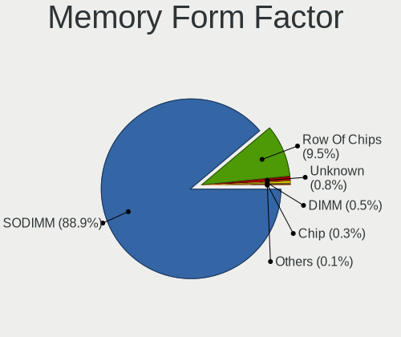

| Name            | Notebooks | Percent |
|-----------------|-----------|---------|
| SODIMM          | 1064      | 88.89%  |
| Row Of Chips    | 114       | 9.52%   |
| Unknown         | 9         | 0.75%   |
| DIMM            | 6         | 0.5%    |
| Chip            | 3         | 0.25%   |
| Proprietary Car | 1         | 0.08%   |

Memory Size
-----------

Memory module size

| Size  | Notebooks | Percent |
|-------|-----------|---------|
| 4096  | 525       | 38.43%  |
| 8192  | 447       | 32.72%  |
| 2048  | 220       | 16.11%  |
| 16384 | 112       | 8.2%    |
| 1024  | 47        | 3.44%   |
| 32768 | 12        | 0.88%   |
| 512   | 2         | 0.15%   |
| 65536 | 1         | 0.07%   |

Memory Speed
------------

Memory module speed

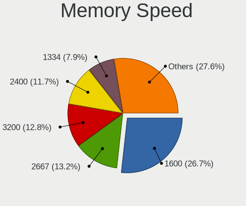

| Speed   | Notebooks | Percent |
|---------|-----------|---------|
| 1600    | 356       | 26.75%  |
| 2667    | 176       | 13.22%  |
| 3200    | 170       | 12.77%  |
| 2400    | 156       | 11.72%  |
| 1334    | 105       | 7.89%   |
| 1333    | 59        | 4.43%   |
| 2133    | 43        | 3.23%   |
| 667     | 39        | 2.93%   |
| 1067    | 29        | 2.18%   |
| 800     | 27        | 2.03%   |
| Unknown | 23        | 1.73%   |
| 4199    | 19        | 1.43%   |
| 6400    | 18        | 1.35%   |
| 3266    | 17        | 1.28%   |
| 4800    | 12        | 0.9%    |
| 2048    | 11        | 0.83%   |
| 975     | 11        | 0.83%   |
| 4267    | 10        | 0.75%   |
| 1066    | 10        | 0.75%   |
| 1867    | 9         | 0.68%   |
| 1866    | 8         | 0.6%    |
| 533     | 7         | 0.53%   |
| 8400    | 4         | 0.3%    |
| 4266    | 3         | 0.23%   |
| 3733    | 2         | 0.15%   |
| 333     | 2         | 0.15%   |
| 7500    | 1         | 0.08%   |
| 5600    | 1         | 0.08%   |
| 5500    | 1         | 0.08%   |
| 1777    | 1         | 0.08%   |
| 1776    | 1         | 0.08%   |

Printers & scanners
-------------------

Printer Vendor
--------------

Printer device vendors

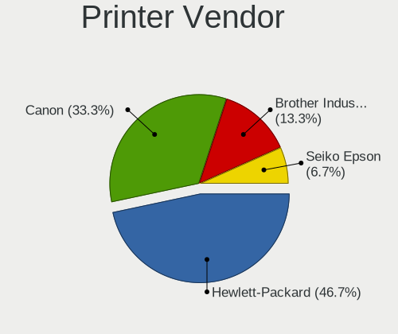

| Vendor             | Notebooks | Percent |
|--------------------|-----------|---------|
| Hewlett-Packard    | 7         | 46.67%  |
| Canon              | 5         | 33.33%  |
| Brother Industries | 2         | 13.33%  |
| Seiko Epson        | 1         | 6.67%   |

Printer Model
-------------

Printer device models

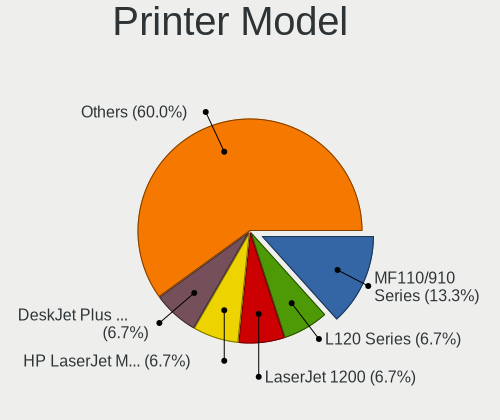

| Model                              | Notebooks | Percent |
|------------------------------------|-----------|---------|
| Canon MF110/910 Series             | 2         | 13.33%  |
| Seiko Epson L120 Series            | 1         | 6.67%   |
| HP LaserJet 1200                   | 1         | 6.67%   |
| HP HP LaserJet M14-M17             | 1         | 6.67%   |
| HP DeskJet Plus 6400 series        | 1         | 6.67%   |
| HP DeskJet 4100 series             | 1         | 6.67%   |
| HP DeskJet 2700 series             | 1         | 6.67%   |
| HP DeskJet 2620 All-in-One Printer | 1         | 6.67%   |
| HP DeskJet 2130 series             | 1         | 6.67%   |
| Canon LBP2900                      | 1         | 6.67%   |
| Canon imageRUNNER1133 series       | 1         | 6.67%   |
| Canon G2020 series                 | 1         | 6.67%   |
| Brother HL-L2350DW series          | 1         | 6.67%   |
| Brother DCP-7057 scanner/printer   | 1         | 6.67%   |

Scanner Vendor
--------------

Scanner device vendors

| Vendor      | Notebooks | Percent |
|-------------|-----------|---------|
| Seiko Epson | 1         | 100%    |

Scanner Model
-------------

Scanner device models

| Model                                             | Notebooks | Percent |
|---------------------------------------------------|-----------|---------|
| Seiko Epson GT-7300U [Perfection 1260/1260 PHOTO] | 1         | 100%    |

Camera
------

Camera Vendor
-------------

Camera device vendors

| Vendor                                 | Notebooks | Percent |
|----------------------------------------|-----------|---------|
| Chicony Electronics                    | 281       | 26.92%  |
| IMC Networks                           | 99        | 9.48%   |
| Microdia                               | 91        | 8.72%   |
| Bison Electronics                      | 82        | 7.85%   |
| Realtek Semiconductor                  | 74        | 7.09%   |
| Quanta                                 | 51        | 4.89%   |
| Sunplus Innovation Technology          | 47        | 4.5%    |
| Cheng Uei Precision Industry (Foxlink) | 44        | 4.21%   |
| Suyin                                  | 34        | 3.26%   |
| Syntek                                 | 31        | 2.97%   |
| icSpring                               | 28        | 2.68%   |
| Alcor Micro                            | 19        | 1.82%   |
| Acer                                   | 19        | 1.82%   |
| Silicon Motion                         | 17        | 1.63%   |
| Luxvisions Innotech Limited            | 17        | 1.63%   |
| Lite-On Technology                     | 15        | 1.44%   |
| Lenovo                                 | 12        | 1.15%   |
| Ricoh                                  | 10        | 0.96%   |
| Importek                               | 9         | 0.86%   |
| Apple                                  | 8         | 0.77%   |
| ALi                                    | 8         | 0.77%   |
| Sonix Technology                       | 6         | 0.57%   |
| Z-Star Microelectronics                | 4         | 0.38%   |
| SunplusIT                              | 4         | 0.38%   |
| Y Media                                | 3         | 0.29%   |
| Tripath Technology                     | 3         | 0.29%   |
| Primax Electronics                     | 3         | 0.29%   |
| OYT Tech                               | 3         | 0.29%   |
| DigiTech                               | 3         | 0.29%   |
| Unknown                                | 2         | 0.19%   |
| kingcome                               | 2         | 0.19%   |
| Sunwingroup                            | 1         | 0.1%    |
| Sunplus Technology                     | 1         | 0.1%    |
| ShineTech                              | 1         | 0.1%    |
| Samsung Electronics                    | 1         | 0.1%    |
| OmniVision Technologies                | 1         | 0.1%    |
| Logitech                               | 1         | 0.1%    |
| JMicron Technology                     | 1         | 0.1%    |
| Image Processor                        | 1         | 0.1%    |
| HRY                                    | 1         | 0.1%    |

Camera Model
------------

Camera device models

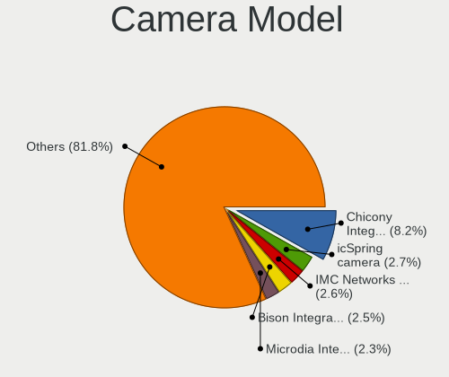

| Model                                                                      | Notebooks | Percent |
|----------------------------------------------------------------------------|-----------|---------|
| Chicony Integrated Camera                                                  | 86        | 8.19%   |
| icSpring camera                                                            | 28        | 2.67%   |
| IMC Networks USB2.0 HD UVC WebCam                                          | 27        | 2.57%   |
| Bison Integrated Camera                                                    | 26        | 2.48%   |
| Microdia Integrated_Webcam_HD                                              | 24        | 2.29%   |
| IMC Networks USB2.0 VGA UVC WebCam                                         | 22        | 2.1%    |
| Chicony HD WebCam                                                          | 20        | 1.9%    |
| Realtek Integrated_Webcam_HD                                               | 18        | 1.71%   |
| Syntek Integrated Camera                                                   | 17        | 1.62%   |
| IMC Networks Integrated Camera                                             | 17        | 1.62%   |
| Sunplus Integrated_Webcam_HD                                               | 15        | 1.43%   |
| Luxvisions Innotech Limited HP TrueVision HD Camera                        | 14        | 1.33%   |
| Chicony HP TrueVision HD Camera                                            | 14        | 1.33%   |
| Microdia Integrated Webcam                                                 | 11        | 1.05%   |
| Bison Lenovo EasyCamera                                                    | 10        | 0.95%   |
| Quanta VGA WebCam                                                          | 9         | 0.86%   |
| Quanta HD User Facing                                                      | 9         | 0.86%   |
| Chicony USB2.0 HD UVC WebCam                                               | 9         | 0.86%   |
| Chicony Lenovo Integrated Camera (0.3MP)                                   | 9         | 0.86%   |
| Chicony HP Webcam                                                          | 9         | 0.86%   |
| Chicony HP HD Webcam                                                       | 9         | 0.86%   |
| Bison Lenovo Integrated Webcam                                             | 9         | 0.86%   |
| Chicony HP HD Camera                                                       | 8         | 0.76%   |
| Cheng Uei Precision Industry (Foxlink) HP HD Camera                        | 8         | 0.76%   |
| ALi Gateway Webcam                                                         | 8         | 0.76%   |
| Alcor Micro USB 2.0 Camera                                                 | 8         | 0.76%   |
| Sunplus HD WebCam                                                          | 7         | 0.67%   |
| Lenovo Integrated Webcam                                                   | 7         | 0.67%   |
| IMC Networks Integrated Webcam                                             | 7         | 0.67%   |
| Chicony FJ Camera                                                          | 7         | 0.67%   |
| Cheng Uei Precision Industry (Foxlink) HP Wide Vision HD Integrated Webcam | 7         | 0.67%   |
| Cheng Uei Precision Industry (Foxlink) HP TrueVision HD Camera             | 7         | 0.67%   |
| Bison HD Webcam                                                            | 7         | 0.67%   |
| Suyin Acer/HP Integrated Webcam [CN0314]                                   | 6         | 0.57%   |
| Sunplus Asus Webcam                                                        | 6         | 0.57%   |
| Silicon Motion Web Camera                                                  | 6         | 0.57%   |
| Realtek USB Camera                                                         | 6         | 0.57%   |
| Realtek Integrated Webcam                                                  | 6         | 0.57%   |
| Quanta HP Webcam                                                           | 6         | 0.57%   |
| Microdia Lenovo EasyCamera                                                 | 6         | 0.57%   |

Security
--------

Fingerprint Vendor
------------------

Fingerprint sensor vendors

| Vendor                             | Notebooks | Percent |
|------------------------------------|-----------|---------|
| Validity Sensors                   | 69        | 47.26%  |
| Upek                               | 20        | 13.7%   |
| Synaptics                          | 15        | 10.27%  |
| AuthenTec                          | 15        | 10.27%  |
| Shenzhen Goodix Technology         | 10        | 6.85%   |
| Elan Microelectronics              | 7         | 4.79%   |
| LighTuning Technology              | 6         | 4.11%   |
| Realtek USB2.0 Finger Print Bridge | 2         | 1.37%   |
| Focal-systems.Corp                 | 2         | 1.37%   |

Fingerprint Model
-----------------

Fingerprint sensor models

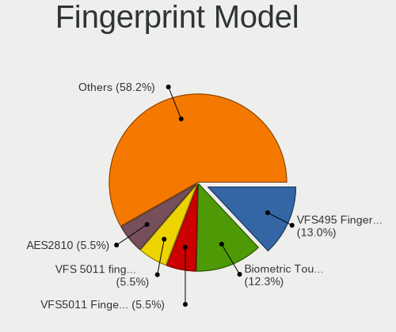

| Model                                                                      | Notebooks | Percent |
|----------------------------------------------------------------------------|-----------|---------|
| Validity Sensors VFS495 Fingerprint Reader                                 | 19        | 13.01%  |
| Upek Biometric Touchchip/Touchstrip Fingerprint Sensor                     | 18        | 12.33%  |
| Validity Sensors VFS5011 Fingerprint Reader                                | 8         | 5.48%   |
| Validity Sensors VFS 5011 fingerprint sensor                               | 8         | 5.48%   |
| AuthenTec AES2810                                                          | 8         | 5.48%   |
| Shenzhen Goodix  FingerPrint Device                                        | 7         | 4.79%   |
| Validity Sensors VFS491                                                    | 6         | 4.11%   |
| Validity Sensors Synaptics WBDI                                            | 5         | 3.42%   |
| Synaptics Prometheus MIS Touch Fingerprint Reader                          | 5         | 3.42%   |
| Synaptics Metallica MIS Touch Fingerprint Reader                           | 5         | 3.42%   |
| Validity Sensors VFS7500 Touch Fingerprint Sensor                          | 4         | 2.74%   |
| Validity Sensors VFS451 Fingerprint Reader                                 | 4         | 2.74%   |
| Validity Sensors Synaptics VFS7552 Touch Fingerprint Sensor with PurePrint | 4         | 2.74%   |
| Validity Sensors Fingerprint scanner                                       | 4         | 2.74%   |
| AuthenTec Fingerprint Sensor                                               | 4         | 2.74%   |
| Validity Sensors VFS471 Fingerprint Reader                                 | 3         | 2.05%   |
| Shenzhen Goodix Fingerprint Reader                                         | 3         | 2.05%   |
| LighTuning EgisTec Touch Fingerprint Sensor                                | 3         | 2.05%   |
| Elan ELAN:ARM-M4                                                           | 3         | 2.05%   |
| AuthenTec AES2501 Fingerprint Sensor                                       | 3         | 2.05%   |
| Validity Sensors VFS301 Fingerprint Reader                                 | 2         | 1.37%   |
| Upek TCS5B Fingerprint sensor                                              | 2         | 1.37%   |
| Synaptics  WBDI Fingerprint Reader - USB 052                               | 2         | 1.37%   |
| Realtek USB2.0 Finger Print Bridge FocalTech Fingerprint Device            | 2         | 1.37%   |
| LighTuning ES603 Swipe Fingerprint Sensor                                  | 2         | 1.37%   |
| Focal-systems.Corp FT9201Fingerprint.                                  | 2         | 1.37%   |
| Elan WBF Fingerprint Sensor                                                | 2         | 1.37%   |
| Elan ELAN:Fingerprint                                                      | 2         | 1.37%   |
| Validity Sensors VFS7552 Touch Fingerprint Sensor                          | 1         | 0.68%   |
| Validity Sensors Swipe Fingerprint Sensor                                  | 1         | 0.68%   |
| Synaptics UWP WBDI Device                                                  | 1         | 0.68%   |
| Synaptics  WBDI                                                            | 1         | 0.68%   |
| Synaptics Fingerprint reader [HP G6]                                       | 1         | 0.68%   |
| LighTuning Fingerprint Reader                                              | 1         | 0.68%   |

Chipcard Vendor
---------------

Chipcard module vendors

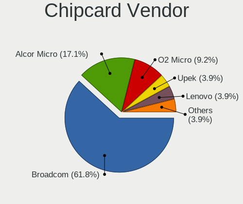

| Vendor                | Notebooks | Percent |
|-----------------------|-----------|---------|
| Broadcom              | 47        | 61.84%  |
| Alcor Micro           | 13        | 17.11%  |
| O2 Micro              | 7         | 9.21%   |
| Upek                  | 3         | 3.95%   |
| Lenovo                | 3         | 3.95%   |
| SCM Microsystems      | 1         | 1.32%   |
| Gemalto (was Gemplus) | 1         | 1.32%   |
| CHERRY                | 1         | 1.32%   |

Chipcard Model
--------------

Chipcard module models

| Model                                                                        | Notebooks | Percent |
|------------------------------------------------------------------------------|-----------|---------|
| Broadcom BCM5880 Secure Applications Processor                               | 27        | 35.53%  |
| Broadcom 5880                                                                | 15        | 19.74%  |
| Alcor Micro AU9540 Smartcard Reader                                          | 13        | 17.11%  |
| O2 Micro OZ776 CCID Smartcard Reader                                         | 6         | 7.89%   |
| Upek TouchChip Fingerprint Coprocessor (WBF advanced mode)                   | 3         | 3.95%   |
| Lenovo Integrated Smart Card Reader                                          | 3         | 3.95%   |
| Broadcom BCM5880 Secure Applications Processor with fingerprint swipe sensor | 3         | 3.95%   |
| Broadcom 58200                                                               | 2         | 2.63%   |
| SCM Microsystems SCR3340 - ExpressCard54 Smart Card Reader                   | 1         | 1.32%   |
| O2 Micro Oz776 SmartCard Reader                                              | 1         | 1.32%   |
| Gemalto (was Gemplus) Compact Smart Card Reader Writer                       | 1         | 1.32%   |
| CHERRY SmartCard Reader Keyboard KC 1000 SC                                  | 1         | 1.32%   |

Unsupported
-----------

Unsupported Devices
-------------------

Total unsupported devices on board

| Total | Notebooks | Percent |
|-------|-----------|---------|
| 0     | 877       | 73.64%  |
| 1     | 256       | 21.49%  |
| 2     | 54        | 4.53%   |
| 3     | 4         | 0.34%   |

Unsupported Device Types
------------------------

Types of unsupported devices

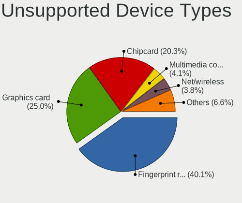

| Type                     | Notebooks | Percent |
|--------------------------|-----------|---------|
| Fingerprint reader       | 146       | 40.11%  |
| Graphics card            | 91        | 25%     |
| Chipcard                 | 74        | 20.33%  |
| Multimedia controller    | 15        | 4.12%   |
| Net/wireless             | 14        | 3.85%   |
| Storage                  | 13        | 3.57%   |
| Bluetooth                | 7         | 1.92%   |
| Card reader              | 2         | 0.55%   |
| Flash memory             | 1         | 0.27%   |
| Communication controller | 1         | 0.27%   |

