OpenMandriva 23.08 - Tested Hardware & Statistics
-------------------------------------------------

A project to collect tested hardware configurations for OpenMandriva 23.08.

Anyone can contribute to this report by the [hw-probe](https://github.com/linuxhw/hw-probe) tool:

    sudo -E hw-probe -all -upload

Please contribute! Especially if your hardware is rare.

This is a report for all computer types. See also reports for [desktops](/Dist/OpenMandriva_23.08/Desktop/README.md) and [notebooks](/Dist/OpenMandriva_23.08/Notebook/README.md).

Contents
--------

* [ Test Cases ](#test-cases)

* [ System ](#system)
  - [ Kernel                   ](#kernel)
  - [ Kernel Family            ](#kernel-family)
  - [ Kernel Major Ver.        ](#kernel-major-ver)
  - [ Arch                     ](#arch)
  - [ DE                       ](#de)
  - [ Display Server           ](#display-server)
  - [ Display Manager          ](#display-manager)
  - [ OS Lang                  ](#os-lang)
  - [ Boot Mode                ](#boot-mode)
  - [ Filesystem               ](#filesystem)
  - [ Part. scheme             ](#part-scheme)
  - [ Dual Boot with Linux/BSD ](#dual-boot-with-linuxbsd)
  - [ Dual Boot (Win)          ](#dual-boot-win)

* [ Board ](#board)
  - [ Vendor                   ](#vendor)
  - [ Model                    ](#model)
  - [ Model Family             ](#model-family)
  - [ MFG Year                 ](#mfg-year)
  - [ Form Factor              ](#form-factor)
  - [ Secure Boot              ](#secure-boot)
  - [ Coreboot                 ](#coreboot)
  - [ RAM Size                 ](#ram-size)
  - [ RAM Used                 ](#ram-used)
  - [ Total Drives             ](#total-drives)
  - [ Has CD-ROM               ](#has-cd-rom)
  - [ Has Ethernet             ](#has-ethernet)
  - [ Has WiFi                 ](#has-wifi)
  - [ Has Bluetooth            ](#has-bluetooth)

* [ Location ](#location)
  - [ Country                  ](#country)
  - [ City                     ](#city)

* [ Drives ](#drives)
  - [ Drive Vendor             ](#drive-vendor)
  - [ Drive Model              ](#drive-model)
  - [ HDD Vendor               ](#hdd-vendor)
  - [ SSD Vendor               ](#ssd-vendor)
  - [ Drive Kind               ](#drive-kind)
  - [ Drive Connector          ](#drive-connector)
  - [ Drive Size               ](#drive-size)
  - [ Space Total              ](#space-total)
  - [ Space Used               ](#space-used)
  - [ Malfunc. Drives          ](#malfunc-drives)
  - [ Malfunc. Drive Vendor    ](#malfunc-drive-vendor)
  - [ Malfunc. HDD Vendor      ](#malfunc-hdd-vendor)
  - [ Malfunc. Drive Kind      ](#malfunc-drive-kind)
  - [ Failed Drives            ](#failed-drives)
  - [ Failed Drive Vendor      ](#failed-drive-vendor)
  - [ Drive Status             ](#drive-status)

* [ Storage controller ](#storage-controller)
  - [ Storage Vendor           ](#storage-vendor)
  - [ Storage Model            ](#storage-model)
  - [ Storage Kind             ](#storage-kind)

* [ Processor ](#processor)
  - [ CPU Vendor               ](#cpu-vendor)
  - [ CPU Model                ](#cpu-model)
  - [ CPU Model Family         ](#cpu-model-family)
  - [ CPU Cores                ](#cpu-cores)
  - [ CPU Sockets              ](#cpu-sockets)
  - [ CPU Threads              ](#cpu-threads)
  - [ CPU Op-Modes             ](#cpu-op-modes)
  - [ CPU Microcode            ](#cpu-microcode)
  - [ CPU Microarch            ](#cpu-microarch)

* [ Graphics ](#graphics)
  - [ GPU Vendor               ](#gpu-vendor)
  - [ GPU Model                ](#gpu-model)
  - [ GPU Combo                ](#gpu-combo)
  - [ GPU Driver               ](#gpu-driver)
  - [ GPU Memory               ](#gpu-memory)

* [ Monitor ](#monitor)
  - [ Monitor Vendor           ](#monitor-vendor)
  - [ Monitor Model            ](#monitor-model)
  - [ Monitor Resolution       ](#monitor-resolution)
  - [ Monitor Diagonal         ](#monitor-diagonal)
  - [ Monitor Width            ](#monitor-width)
  - [ Aspect Ratio             ](#aspect-ratio)
  - [ Monitor Area             ](#monitor-area)
  - [ Pixel Density            ](#pixel-density)
  - [ Multiple Monitors        ](#multiple-monitors)

* [ Network ](#network)
  - [ Net Controller Vendor    ](#net-controller-vendor)
  - [ Net Controller Model     ](#net-controller-model)
  - [ Wireless Vendor          ](#wireless-vendor)
  - [ Wireless Model           ](#wireless-model)
  - [ Ethernet Vendor          ](#ethernet-vendor)
  - [ Ethernet Model           ](#ethernet-model)
  - [ Net Controller Kind      ](#net-controller-kind)
  - [ Used Controller          ](#used-controller)
  - [ NICs                     ](#nics)
  - [ IPv6                     ](#ipv6)

* [ Bluetooth ](#bluetooth)
  - [ Bluetooth Vendor         ](#bluetooth-vendor)
  - [ Bluetooth Model          ](#bluetooth-model)

* [ Sound ](#sound)
  - [ Sound Vendor             ](#sound-vendor)
  - [ Sound Model              ](#sound-model)

* [ Memory ](#memory)
  - [ Memory Vendor            ](#memory-vendor)
  - [ Memory Model             ](#memory-model)
  - [ Memory Kind              ](#memory-kind)
  - [ Memory Form Factor       ](#memory-form-factor)
  - [ Memory Size              ](#memory-size)
  - [ Memory Speed             ](#memory-speed)

* [ Printers & scanners ](#printers--scanners)
  - [ Printer Vendor           ](#printer-vendor)
  - [ Printer Model            ](#printer-model)
  - [ Scanner Vendor           ](#scanner-vendor)
  - [ Scanner Model            ](#scanner-model)

* [ Camera ](#camera)
  - [ Camera Vendor            ](#camera-vendor)
  - [ Camera Model             ](#camera-model)

* [ Security ](#security)
  - [ Fingerprint Vendor       ](#fingerprint-vendor)
  - [ Fingerprint Model        ](#fingerprint-model)
  - [ Chipcard Vendor          ](#chipcard-vendor)
  - [ Chipcard Model           ](#chipcard-model)

* [ Unsupported ](#unsupported)
  - [ Unsupported Devices      ](#unsupported-devices)
  - [ Unsupported Device Types ](#unsupported-device-types)

Test Cases
----------

Total: 1978

| Vendor        | Model                       | Form-Factor | Probe                                                      | Date         |
|---------------|-----------------------------|-------------|------------------------------------------------------------|--------------|
| Dell          | Vostro 15-3568              | Notebook    | [afd5a26a47](https://linux-hardware.org/?probe=afd5a26a47) | May 09, 2024 |
| HP            | 3396                        | Desktop     | [5e68a536f2](https://linux-hardware.org/?probe=5e68a536f2) | May 09, 2024 |
| ASUSTek       | X551MA                      | Notebook    | [6ce58b40cb](https://linux-hardware.org/?probe=6ce58b40cb) | May 09, 2024 |
| Dell          | 0VNP2H A00                  | Desktop     | [28953f7c6a](https://linux-hardware.org/?probe=28953f7c6a) | May 09, 2024 |
| Getac         | V110G3                      | Notebook    | [f2bd63cfb8](https://linux-hardware.org/?probe=f2bd63cfb8) | May 09, 2024 |
| Intel         | NUC7i5BNB J31144-311        | Mini pc     | [2de4ca3c36](https://linux-hardware.org/?probe=2de4ca3c36) | May 09, 2024 |
| Dell          | Inspiron 15-3567            | Notebook    | [4f2761bde5](https://linux-hardware.org/?probe=4f2761bde5) | May 09, 2024 |
| HP            | Stream x360 Convertible ... | Convertible | [0fd35e9fda](https://linux-hardware.org/?probe=0fd35e9fda) | May 08, 2024 |
| Gigabyte      | B450 AORUS ELITE            | Desktop     | [0cd34decca](https://linux-hardware.org/?probe=0cd34decca) | May 08, 2024 |
| ASRock        | B450M-HDV                   | Desktop     | [098e62d52a](https://linux-hardware.org/?probe=098e62d52a) | May 08, 2024 |
| HP            | EliteBook 8560p             | Notebook    | [fa48702e03](https://linux-hardware.org/?probe=fa48702e03) | May 08, 2024 |
| Gigabyte      | H310M S2H x.x               | Desktop     | [97598b9cc3](https://linux-hardware.org/?probe=97598b9cc3) | May 07, 2024 |
| Lenovo        | IdeaPad 1 14IGL7 82V6       | Notebook    | [8c2b9bb30a](https://linux-hardware.org/?probe=8c2b9bb30a) | May 07, 2024 |
| Intel         | DQ45CB AAE30148-207         | Desktop     | [263e934dc2](https://linux-hardware.org/?probe=263e934dc2) | May 07, 2024 |
| Fujitsu       | D3164-A1 S26361-D3164-A1    | Desktop     | [ae1edad2ab](https://linux-hardware.org/?probe=ae1edad2ab) | May 06, 2024 |
| HP            | 8053                        | Desktop     | [06b48e5ec6](https://linux-hardware.org/?probe=06b48e5ec6) | May 06, 2024 |
| Lenovo        | LOQ 15IRH8 82XV             | Notebook    | [c741f249e2](https://linux-hardware.org/?probe=c741f249e2) | May 06, 2024 |
| Lenovo        | IdeaPad 1 14IGL7 82V6       | Notebook    | [083cfcc0f3](https://linux-hardware.org/?probe=083cfcc0f3) | May 06, 2024 |
| HP            | 650                         | Notebook    | [8fa3b11e2c](https://linux-hardware.org/?probe=8fa3b11e2c) | May 05, 2024 |
| Gigabyte      | H61M-S2PV                   | Desktop     | [780a67ef79](https://linux-hardware.org/?probe=780a67ef79) | May 05, 2024 |
| HP            | Compaq 6720s                | Notebook    | [e51bd60d05](https://linux-hardware.org/?probe=e51bd60d05) | May 05, 2024 |
| Lenovo        | 0B98401 WIN                 | Desktop     | [8d1ee988ad](https://linux-hardware.org/?probe=8d1ee988ad) | May 05, 2024 |
| Lenovo        | ThinkPad Edge E530 32597... | Notebook    | [a216f0b6d5](https://linux-hardware.org/?probe=a216f0b6d5) | May 05, 2024 |
| Acer          | Switch SW312-31             | Tablet      | [e7fe09d066](https://linux-hardware.org/?probe=e7fe09d066) | May 04, 2024 |
| Lenovo        | ThinkPad T520 4243W29       | Notebook    | [b1e4dde68e](https://linux-hardware.org/?probe=b1e4dde68e) | May 04, 2024 |
| Dell          | 0R6PCT A01                  | Desktop     | [61f596b724](https://linux-hardware.org/?probe=61f596b724) | May 04, 2024 |
| ASUSTek       | ROG STRIX Z690-A GAMING ... | Desktop     | [64b195310b](https://linux-hardware.org/?probe=64b195310b) | May 04, 2024 |
| ASUSTek       | ASUS EXPERTBOOK B1500CEA... | Notebook    | [ea3a8f97a7](https://linux-hardware.org/?probe=ea3a8f97a7) | May 04, 2024 |
| HP            | 339A                        | Desktop     | [a5f44d3bdb](https://linux-hardware.org/?probe=a5f44d3bdb) | May 04, 2024 |
| Gigabyte      | B550M DS3H AC               | Desktop     | [15375b5d97](https://linux-hardware.org/?probe=15375b5d97) | May 04, 2024 |
| HP            | 246                         | Notebook    | [83140d67e2](https://linux-hardware.org/?probe=83140d67e2) | May 03, 2024 |
| ASUSTek       | K8V-MX                      | Desktop     | [64054e7bf3](https://linux-hardware.org/?probe=64054e7bf3) | May 03, 2024 |
| ASUSTek       | PRIME B460-PLUS             | Desktop     | [dd201d321b](https://linux-hardware.org/?probe=dd201d321b) | May 03, 2024 |
| ASUSTek       | X751SA                      | Notebook    | [7dadfc10b4](https://linux-hardware.org/?probe=7dadfc10b4) | May 03, 2024 |
| Dell          | 0WR7PY A04                  | Desktop     | [b48e977e84](https://linux-hardware.org/?probe=b48e977e84) | May 03, 2024 |
| Toshiba       | Satellite Pro L650          | Notebook    | [4e0111f9c9](https://linux-hardware.org/?probe=4e0111f9c9) | May 02, 2024 |
| Intel         | B75                         | Desktop     | [4c39b0616d](https://linux-hardware.org/?probe=4c39b0616d) | May 02, 2024 |
| HP            | 250 G6 Notebook PC          | Notebook    | [ff4a31241b](https://linux-hardware.org/?probe=ff4a31241b) | May 02, 2024 |
| ASUSTek       | PRIME B660-PLUS D4          | Desktop     | [d7c901b5d7](https://linux-hardware.org/?probe=d7c901b5d7) | May 02, 2024 |
| Apple         | Mac-942B5BF58194151B        | All in one  | [b8a7fbfad1](https://linux-hardware.org/?probe=b8a7fbfad1) | May 01, 2024 |
| Lenovo        | ThinkPad L530 24812K6       | Notebook    | [e7d0c76f65](https://linux-hardware.org/?probe=e7d0c76f65) | May 01, 2024 |
| Packard Be... | EasyNote TJ71               | Notebook    | [f421f823ec](https://linux-hardware.org/?probe=f421f823ec) | May 01, 2024 |
| Google        | Bluebird                    | Notebook    | [75db9dc248](https://linux-hardware.org/?probe=75db9dc248) | May 01, 2024 |
| HP            | Pavilion Notebook           | Notebook    | [5d6cdceb37](https://linux-hardware.org/?probe=5d6cdceb37) | May 01, 2024 |
| Packard Be... | IMEDIA S2185                | Desktop     | [47d64869d6](https://linux-hardware.org/?probe=47d64869d6) | Apr 30, 2024 |
| MSI           | PRO H610M-G DDR4            | Desktop     | [b8ab800603](https://linux-hardware.org/?probe=b8ab800603) | Apr 30, 2024 |
| Acer          | Aspire 7745G                | Notebook    | [1854a5b427](https://linux-hardware.org/?probe=1854a5b427) | Apr 30, 2024 |
| Biostar       | H310MHP                     | Desktop     | [1faa8b5213](https://linux-hardware.org/?probe=1faa8b5213) | Apr 30, 2024 |
| Biostar       | H310MHP                     | Desktop     | [d5bc5a946f](https://linux-hardware.org/?probe=d5bc5a946f) | Apr 30, 2024 |
| Lenovo        | 30C9 SEK0N11843 IOT 3806... | Desktop     | [517daa7c85](https://linux-hardware.org/?probe=517daa7c85) | Apr 30, 2024 |
| ASUSTek       | PRIME H410M-K               | Desktop     | [9c6f64ecd9](https://linux-hardware.org/?probe=9c6f64ecd9) | Apr 29, 2024 |
| Lenovo        | IdeaPadFlex 5 14IIL05 81... | Convertible | [e204e319f8](https://linux-hardware.org/?probe=e204e319f8) | Apr 29, 2024 |
| ASUSTek       | H81M-P PLUS                 | Desktop     | [e3c17dccb5](https://linux-hardware.org/?probe=e3c17dccb5) | Apr 29, 2024 |
| Gigabyte      | GA-MA785GMT-UD2H            | Desktop     | [b1f251b92c](https://linux-hardware.org/?probe=b1f251b92c) | Apr 29, 2024 |
| EVGA          | NF66 2                      | Desktop     | [ef1a49773b](https://linux-hardware.org/?probe=ef1a49773b) | Apr 29, 2024 |
| Google        | Gandof                      | Notebook    | [539c66172b](https://linux-hardware.org/?probe=539c66172b) | Apr 28, 2024 |
| ASUSTek       | Maximus VII HERO            | Desktop     | [51efe9cdc9](https://linux-hardware.org/?probe=51efe9cdc9) | Apr 28, 2024 |
| Dell          | Latitude E6410              | Notebook    | [14cad1b34b](https://linux-hardware.org/?probe=14cad1b34b) | Apr 28, 2024 |
| MSI           | A68HM GRENADE               | Desktop     | [c1a1b60624](https://linux-hardware.org/?probe=c1a1b60624) | Apr 28, 2024 |
| Intel         | D945GCL AAD67193-205        | Desktop     | [2520d8fe1d](https://linux-hardware.org/?probe=2520d8fe1d) | Apr 28, 2024 |
| ASUSTek       | P8H61-M LE                  | Desktop     | [15d91ebe7c](https://linux-hardware.org/?probe=15d91ebe7c) | Apr 28, 2024 |
| Lenovo        | ThinkPad T420 4236L35       | Notebook    | [df6f046778](https://linux-hardware.org/?probe=df6f046778) | Apr 28, 2024 |
| Lenovo        | IdeaPad 1 15ALC7 82R4       | Notebook    | [40c7e6e4a3](https://linux-hardware.org/?probe=40c7e6e4a3) | Apr 28, 2024 |
| Intel         | powered classmate PC MP ... | Notebook    | [7b243a5cb5](https://linux-hardware.org/?probe=7b243a5cb5) | Apr 28, 2024 |
| Lenovo        | ThinkPad T430 23492F5       | Notebook    | [8d26be4497](https://linux-hardware.org/?probe=8d26be4497) | Apr 28, 2024 |
| Lenovo        | Slim Pro 7 14ARP8 83AX      | Notebook    | [1856484488](https://linux-hardware.org/?probe=1856484488) | Apr 27, 2024 |
| ASRock        | A320M-DVS R3.0              | Desktop     | [3af9ef3df5](https://linux-hardware.org/?probe=3af9ef3df5) | Apr 27, 2024 |
| MSI           | G31M3-L V2                  | Desktop     | [0a033139d1](https://linux-hardware.org/?probe=0a033139d1) | Apr 27, 2024 |
| Lenovo        | IdeaPad G485 QAWGE          | Notebook    | [364be8242a](https://linux-hardware.org/?probe=364be8242a) | Apr 27, 2024 |
| Notebook      | W54BL                       | Notebook    | [adb804fa7f](https://linux-hardware.org/?probe=adb804fa7f) | Apr 27, 2024 |
| Dell          | Latitude 5580               | Notebook    | [e646939794](https://linux-hardware.org/?probe=e646939794) | Apr 27, 2024 |
| Acer          | Aspire ES1-732              | Notebook    | [dda97c8536](https://linux-hardware.org/?probe=dda97c8536) | Apr 26, 2024 |
| Lenovo        | ThinkPad X220 4290RW1       | Notebook    | [306c586e02](https://linux-hardware.org/?probe=306c586e02) | Apr 26, 2024 |
| HP            | ZBook 17 G3 Mobile Works... | Notebook    | [e56b499574](https://linux-hardware.org/?probe=e56b499574) | Apr 26, 2024 |
| ASUSTek       | VivoBook_ASUSLaptop X512... | Notebook    | [4f05e448a7](https://linux-hardware.org/?probe=4f05e448a7) | Apr 26, 2024 |
| ASUSTek       | X541NA                      | Notebook    | [bba16f5bc3](https://linux-hardware.org/?probe=bba16f5bc3) | Apr 26, 2024 |
| HP            | 3029h                       | Desktop     | [70cd5cbc22](https://linux-hardware.org/?probe=70cd5cbc22) | Apr 26, 2024 |
| MSI           | B250I GAMING PRO AC         | Desktop     | [edf573962d](https://linux-hardware.org/?probe=edf573962d) | Apr 25, 2024 |
| MAXSUN        | MS-Terminator B550M         | Desktop     | [4960448326](https://linux-hardware.org/?probe=4960448326) | Apr 25, 2024 |
| HP            | 2AF7                        | Desktop     | [dcff3bbb91](https://linux-hardware.org/?probe=dcff3bbb91) | Apr 25, 2024 |
| Gigabyte      | F2A55M-DS2                  | Desktop     | [8252280757](https://linux-hardware.org/?probe=8252280757) | Apr 25, 2024 |
| Gigabyte      | EX58-UD3R                   | Desktop     | [826b210e79](https://linux-hardware.org/?probe=826b210e79) | Apr 24, 2024 |
| Dell          | 08NPPY A00                  | Desktop     | [8e54a2234f](https://linux-hardware.org/?probe=8e54a2234f) | Apr 24, 2024 |
| HP            | Compaq Presario C700        | Notebook    | [062cdaa3a3](https://linux-hardware.org/?probe=062cdaa3a3) | Apr 24, 2024 |
| HP            | EliteBook 2170p             | Notebook    | [847dec6d8e](https://linux-hardware.org/?probe=847dec6d8e) | Apr 24, 2024 |
| HP            | EliteBook 840 G2            | Notebook    | [006661b0c2](https://linux-hardware.org/?probe=006661b0c2) | Apr 23, 2024 |
| Acer          | Veriton X2632G V:1.0        | Desktop     | [88daeba4af](https://linux-hardware.org/?probe=88daeba4af) | Apr 23, 2024 |
| Dell          | Inspiron 5558               | Notebook    | [246047bf8e](https://linux-hardware.org/?probe=246047bf8e) | Apr 23, 2024 |
| Lenovo        | ThinkPad Edge E431 62775... | Notebook    | [ad67ecab25](https://linux-hardware.org/?probe=ad67ecab25) | Apr 23, 2024 |
| Computer D... | W240EU/W250EUQ/W270EUQ      | Notebook    | [2064944dc4](https://linux-hardware.org/?probe=2064944dc4) | Apr 23, 2024 |
| HP            | 2B0C                        | All in one  | [e84d8e93ef](https://linux-hardware.org/?probe=e84d8e93ef) | Apr 23, 2024 |
| ASUSTek       | K53SD                       | Notebook    | [777dfb666e](https://linux-hardware.org/?probe=777dfb666e) | Apr 23, 2024 |
| Gigabyte      | Z390 UD                     | Desktop     | [36a382f0da](https://linux-hardware.org/?probe=36a382f0da) | Apr 23, 2024 |
| Dell          | Inspiron 3501               | Notebook    | [faae79a749](https://linux-hardware.org/?probe=faae79a749) | Apr 23, 2024 |
| ASUSTek       | A68HM-PLUS                  | Desktop     | [c495b7e3d7](https://linux-hardware.org/?probe=c495b7e3d7) | Apr 23, 2024 |
| ASRock        | G31M-S                      | Desktop     | [591e58940a](https://linux-hardware.org/?probe=591e58940a) | Apr 22, 2024 |
| Dell          | 0VHXCD A01                  | Desktop     | [4b7a01c41a](https://linux-hardware.org/?probe=4b7a01c41a) | Apr 22, 2024 |
| HP            | Pavilion dv7                | Notebook    | [c7af52e729](https://linux-hardware.org/?probe=c7af52e729) | Apr 21, 2024 |
| MSI           | MPG X570 GAMING EDGE WIF... | Desktop     | [a2b7475561](https://linux-hardware.org/?probe=a2b7475561) | Apr 21, 2024 |
| Lenovo        | Yoga 7 14ARP8 82YM          | Convertible | [5a536be44c](https://linux-hardware.org/?probe=5a536be44c) | Apr 21, 2024 |
| Positivo      | POS-PIG41BA POSITIVO        | Desktop     | [d5e1581050](https://linux-hardware.org/?probe=d5e1581050) | Apr 21, 2024 |
| Acer          | Aspire F5-573               | Notebook    | [c71f150bd8](https://linux-hardware.org/?probe=c71f150bd8) | Apr 21, 2024 |
| Dell          | 0XFN1D A00                  | All in one  | [99aa3181a2](https://linux-hardware.org/?probe=99aa3181a2) | Apr 21, 2024 |
| Acer          | WG43M                       | Desktop     | [93fcdbd13d](https://linux-hardware.org/?probe=93fcdbd13d) | Apr 20, 2024 |
| GEEKOM        | Mini Air12                  | Server      | [fef2c94714](https://linux-hardware.org/?probe=fef2c94714) | Apr 20, 2024 |
| Lenovo        | ThinkPad X260 20F5S4CC00    | Notebook    | [56a80212e2](https://linux-hardware.org/?probe=56a80212e2) | Apr 20, 2024 |
| Dell          | Inspiron 5559               | Notebook    | [fa44624ceb](https://linux-hardware.org/?probe=fa44624ceb) | Apr 20, 2024 |
| Lenovo        | IdeaPad 510-15IKB 80SV      | Notebook    | [c823822177](https://linux-hardware.org/?probe=c823822177) | Apr 20, 2024 |
| HP            | 339A                        | Desktop     | [8cb48fe045](https://linux-hardware.org/?probe=8cb48fe045) | Apr 19, 2024 |
| MSI           | MS-7235                     | Desktop     | [d0b1ac0e44](https://linux-hardware.org/?probe=d0b1ac0e44) | Apr 19, 2024 |
| MSI           | B85I                        | Desktop     | [8751cf893f](https://linux-hardware.org/?probe=8751cf893f) | Apr 19, 2024 |
| Sony          | SVE1111M1EW                 | Notebook    | [4303a7cc13](https://linux-hardware.org/?probe=4303a7cc13) | Apr 19, 2024 |
| Lenovo        | Y50-70 20378                | Notebook    | [50de89d752](https://linux-hardware.org/?probe=50de89d752) | Apr 18, 2024 |
| Dell          | 0Y958C A00                  | Desktop     | [88a0060933](https://linux-hardware.org/?probe=88a0060933) | Apr 18, 2024 |
| ASUSTek       | P9X79                       | Desktop     | [3f587bf3dd](https://linux-hardware.org/?probe=3f587bf3dd) | Apr 18, 2024 |
| Acer          | V5-171                      | Notebook    | [1c5fdb6bae](https://linux-hardware.org/?probe=1c5fdb6bae) | Apr 18, 2024 |
| HP            | Laptop 15-dy5xxx            | Notebook    | [bb34072490](https://linux-hardware.org/?probe=bb34072490) | Apr 18, 2024 |
| Lenovo        | 100-14IBY 80R7              | Notebook    | [c186027176](https://linux-hardware.org/?probe=c186027176) | Apr 17, 2024 |
| ASUSTek       | P8Z77-V LX                  | Desktop     | [686220b484](https://linux-hardware.org/?probe=686220b484) | Apr 17, 2024 |
| Acer          | Aspire A317-52              | Notebook    | [bf62cb2dba](https://linux-hardware.org/?probe=bf62cb2dba) | Apr 17, 2024 |
| Pegatron      | Narra6                      | Desktop     | [fb336cac9b](https://linux-hardware.org/?probe=fb336cac9b) | Apr 17, 2024 |
| Intel         | H61                         | Desktop     | [e0bacf6b01](https://linux-hardware.org/?probe=e0bacf6b01) | Apr 17, 2024 |
| ASUSTek       | ROG STRIX B650E-I GAMING... | Desktop     | [41c197d579](https://linux-hardware.org/?probe=41c197d579) | Apr 16, 2024 |
| ASUSTek       | K50IJ                       | Notebook    | [f0d8580bfc](https://linux-hardware.org/?probe=f0d8580bfc) | Apr 16, 2024 |
| HP            | 250 G7 Notebook PC          | Notebook    | [be2b691a57](https://linux-hardware.org/?probe=be2b691a57) | Apr 15, 2024 |
| Lenovo        | ThinkPad X280 20KESA5000    | Notebook    | [8571fb3b5c](https://linux-hardware.org/?probe=8571fb3b5c) | Apr 14, 2024 |
| ASUSTek       | ROG STRIX B550-I GAMING     | Desktop     | [4fb5756438](https://linux-hardware.org/?probe=4fb5756438) | Apr 14, 2024 |
| Lenovo        | IdeaPad Slim 1-14AST-05 ... | Notebook    | [6720cd6b1d](https://linux-hardware.org/?probe=6720cd6b1d) | Apr 14, 2024 |
| Lenovo        | Win8 Pro DPK TPG            | Desktop     | [c6fd918c6e](https://linux-hardware.org/?probe=c6fd918c6e) | Apr 14, 2024 |
| Unknown       | Unknown                     | Notebook    | [9d776d1a83](https://linux-hardware.org/?probe=9d776d1a83) | Apr 14, 2024 |
| Lenovo        | IdeaPad Slim 1-14AST-05 ... | Notebook    | [59540c163c](https://linux-hardware.org/?probe=59540c163c) | Apr 13, 2024 |
| ASUSTek       | PRIME H610M-K D4            | Desktop     | [ca76c3d3ec](https://linux-hardware.org/?probe=ca76c3d3ec) | Apr 13, 2024 |
| Fujitsu       | D3313-B1 S26361-D3313-B1    | Desktop     | [2998b9027d](https://linux-hardware.org/?probe=2998b9027d) | Apr 13, 2024 |
| Sony          | VPCEH30EB                   | Notebook    | [a3ce44d34f](https://linux-hardware.org/?probe=a3ce44d34f) | Apr 12, 2024 |
| Samsung       | 370E4K                      | Notebook    | [362fb05bf2](https://linux-hardware.org/?probe=362fb05bf2) | Apr 12, 2024 |
| Dell          | OptiPlex 7050               | Desktop     | [e6f968f709](https://linux-hardware.org/?probe=e6f968f709) | Apr 11, 2024 |
| Fujitsu       | D3403-U1 S26361-D3403-U1    | Desktop     | [5757303d9a](https://linux-hardware.org/?probe=5757303d9a) | Apr 11, 2024 |
| HP            | 250 G5 Notebook PC          | Notebook    | [288ebeb8ba](https://linux-hardware.org/?probe=288ebeb8ba) | Apr 11, 2024 |
| MSI           | GE72 2QD                    | Notebook    | [4918e63b82](https://linux-hardware.org/?probe=4918e63b82) | Apr 11, 2024 |
| Dell          | 0NKW6Y A02                  | Desktop     | [fcd30b6392](https://linux-hardware.org/?probe=fcd30b6392) | Apr 11, 2024 |
| Toshiba       | Satellite C50-A             | Notebook    | [b643ba4fed](https://linux-hardware.org/?probe=b643ba4fed) | Apr 11, 2024 |
| HP            | 1998                        | Desktop     | [4e592f29d7](https://linux-hardware.org/?probe=4e592f29d7) | Apr 11, 2024 |
| Foxconn       | 2A8C                        | Desktop     | [9d16faea24](https://linux-hardware.org/?probe=9d16faea24) | Apr 10, 2024 |
| HP            | OMEN by Laptop 17-an0xx     | Notebook    | [e236ba52be](https://linux-hardware.org/?probe=e236ba52be) | Apr 10, 2024 |
| ASUSTek       | H61M-C                      | Desktop     | [a0e36b103b](https://linux-hardware.org/?probe=a0e36b103b) | Apr 10, 2024 |
| Quanta        | QL3 TBD                     | Notebook    | [0f0abe3406](https://linux-hardware.org/?probe=0f0abe3406) | Apr 09, 2024 |
| ASUSTek       | TUF Gaming B450-PLUS II     | Desktop     | [1163ac6ace](https://linux-hardware.org/?probe=1163ac6ace) | Apr 09, 2024 |
| Lenovo        | IdeaPad S540-15IWL 81NE     | Notebook    | [5b676c4d65](https://linux-hardware.org/?probe=5b676c4d65) | Apr 09, 2024 |
| ASUSTek       | N50Vc                       | Notebook    | [e7ae85215d](https://linux-hardware.org/?probe=e7ae85215d) | Apr 07, 2024 |
| MSI           | G41M-P26                    | Desktop     | [c337a993c8](https://linux-hardware.org/?probe=c337a993c8) | Apr 07, 2024 |
| ASUSTek       | M4A88T-M/USB3               | Desktop     | [69cf49e1b1](https://linux-hardware.org/?probe=69cf49e1b1) | Apr 07, 2024 |
| Intel         | B75                         | Desktop     | [7ac22ca55d](https://linux-hardware.org/?probe=7ac22ca55d) | Apr 07, 2024 |
| Lenovo        | G50-30 80G0                 | Notebook    | [901e9f9640](https://linux-hardware.org/?probe=901e9f9640) | Apr 07, 2024 |
| Dell          | 0KP561                      | Desktop     | [dd6f49d82f](https://linux-hardware.org/?probe=dd6f49d82f) | Apr 06, 2024 |
| Gigabyte      | H410M S2H V2                | Desktop     | [2713f1fbb2](https://linux-hardware.org/?probe=2713f1fbb2) | Apr 06, 2024 |
| Unknown       | Unknown                     | Desktop     | [0f08ac20fe](https://linux-hardware.org/?probe=0f08ac20fe) | Apr 06, 2024 |
| HP            | 1497                        | Desktop     | [bc9fcab61a](https://linux-hardware.org/?probe=bc9fcab61a) | Apr 06, 2024 |
| HP            | 1790                        | Desktop     | [0038bf2917](https://linux-hardware.org/?probe=0038bf2917) | Apr 06, 2024 |
| Biostar       | TB250-BTC PRO               | Desktop     | [3fceee8ca7](https://linux-hardware.org/?probe=3fceee8ca7) | Apr 06, 2024 |
| HP            | 8446                        | All in one  | [16d954acab](https://linux-hardware.org/?probe=16d954acab) | Apr 06, 2024 |
| Dell          | 02YYK5 A01                  | Desktop     | [e407d84cc9](https://linux-hardware.org/?probe=e407d84cc9) | Apr 06, 2024 |
| Acer          | Aspire 5536                 | Notebook    | [40d6361edd](https://linux-hardware.org/?probe=40d6361edd) | Apr 06, 2024 |
| Samsung       | 355V4C/355V4X/355V5C/355... | Notebook    | [edfce73a66](https://linux-hardware.org/?probe=edfce73a66) | Apr 06, 2024 |
| HP            | ZBook 15u G6                | Notebook    | [a1865e5d26](https://linux-hardware.org/?probe=a1865e5d26) | Apr 06, 2024 |
| HP            | Pavilion Laptop 15-cs3xx... | Notebook    | [529868adc3](https://linux-hardware.org/?probe=529868adc3) | Apr 06, 2024 |
| Dell          | Latitude E4300              | Notebook    | [43c75dde9f](https://linux-hardware.org/?probe=43c75dde9f) | Apr 05, 2024 |
| Medion        | S14406                      | Convertible | [5fc361d14e](https://linux-hardware.org/?probe=5fc361d14e) | Apr 05, 2024 |
| Lenovo        | G40-80 80E4                 | Notebook    | [76642434b9](https://linux-hardware.org/?probe=76642434b9) | Apr 05, 2024 |
| ASRock        | H87 Pro4                    | Desktop     | [46c9acd849](https://linux-hardware.org/?probe=46c9acd849) | Apr 05, 2024 |
| Gigabyte      | GA-78LMT-S2 R2 sex          | Desktop     | [2d8c4c947f](https://linux-hardware.org/?probe=2d8c4c947f) | Apr 05, 2024 |
| Lenovo        | ThinkCentre M90p 5536P79    | Desktop     | [1750bd22db](https://linux-hardware.org/?probe=1750bd22db) | Apr 05, 2024 |
| Apple         | Mac-FFE5EF870D7BA81A iMa... | All in one  | [cee5393de5](https://linux-hardware.org/?probe=cee5393de5) | Apr 05, 2024 |
| Shenzhen M... | F7BFC                       | Desktop     | [4b0127a449](https://linux-hardware.org/?probe=4b0127a449) | Apr 04, 2024 |
| HP            | ProBook 640 G2              | Notebook    | [f5fc4b58c7](https://linux-hardware.org/?probe=f5fc4b58c7) | Apr 04, 2024 |
| MSI           | Prestige 14Evo B13M         | Notebook    | [f118f2e24a](https://linux-hardware.org/?probe=f118f2e24a) | Apr 04, 2024 |
| Lenovo        | IdeaPad 1 14IGL7 82V6       | Notebook    | [3fbe8de966](https://linux-hardware.org/?probe=3fbe8de966) | Apr 04, 2024 |
| Lenovo        | G50-30 80G0                 | Notebook    | [8ad07875a5](https://linux-hardware.org/?probe=8ad07875a5) | Apr 04, 2024 |
| Dell          | Latitude E4310              | Notebook    | [e182d9e891](https://linux-hardware.org/?probe=e182d9e891) | Apr 03, 2024 |
| ASUSTek       | TUF Gaming B550-PLUS        | Desktop     | [e3541ebcf4](https://linux-hardware.org/?probe=e3541ebcf4) | Apr 03, 2024 |
| Lenovo        | IdeaPad 1 14IGL7 82V6       | Notebook    | [8d409a59ec](https://linux-hardware.org/?probe=8d409a59ec) | Apr 03, 2024 |
| MSI           | GP60 2OD                    | Notebook    | [134464f908](https://linux-hardware.org/?probe=134464f908) | Apr 03, 2024 |
| Dell          | 051FJ8 A00                  | Desktop     | [8f67355bed](https://linux-hardware.org/?probe=8f67355bed) | Apr 03, 2024 |
| HP            | EliteBook 840 G4            | Notebook    | [f7c3e17f2e](https://linux-hardware.org/?probe=f7c3e17f2e) | Apr 03, 2024 |
| HP            | 3396                        | Desktop     | [641a1891ba](https://linux-hardware.org/?probe=641a1891ba) | Apr 02, 2024 |
| Core Innov... | CLC14364                    | Notebook    | [70bd1ca499](https://linux-hardware.org/?probe=70bd1ca499) | Apr 02, 2024 |
| Dell          | 0XFWHV A00                  | Desktop     | [ea24de6920](https://linux-hardware.org/?probe=ea24de6920) | Apr 02, 2024 |
| Fujitsu       | STYLISTIC Q702              | Notebook    | [1abe698880](https://linux-hardware.org/?probe=1abe698880) | Apr 02, 2024 |
| Dell          | Studio 1537                 | Notebook    | [3e7ce8de4a](https://linux-hardware.org/?probe=3e7ce8de4a) | Apr 02, 2024 |
| Toshiba       | Satellite A205              | Notebook    | [4fcbf3184c](https://linux-hardware.org/?probe=4fcbf3184c) | Apr 02, 2024 |
| Fujitsu       | LIFEBOOK E746               | Notebook    | [0eda4797d3](https://linux-hardware.org/?probe=0eda4797d3) | Apr 01, 2024 |
| Gigabyte      | GA-770T-D3L                 | Desktop     | [402894f9cd](https://linux-hardware.org/?probe=402894f9cd) | Apr 01, 2024 |
| Intel         | H81                         | Desktop     | [b7c3224542](https://linux-hardware.org/?probe=b7c3224542) | Apr 01, 2024 |
| HP            | 2171                        | Desktop     | [3cd1f729a4](https://linux-hardware.org/?probe=3cd1f729a4) | Apr 01, 2024 |
| QIYIDA        | X79-M6 V1.0                 | Desktop     | [ab18c6c58f](https://linux-hardware.org/?probe=ab18c6c58f) | Mar 31, 2024 |
| Pegatron      | Benicia                     | Desktop     | [22f74ed745](https://linux-hardware.org/?probe=22f74ed745) | Mar 31, 2024 |
| Gigabyte      | B550M DS3H                  | Desktop     | [2ec08fd0c4](https://linux-hardware.org/?probe=2ec08fd0c4) | Mar 31, 2024 |
| ASUSTek       | ROG STRIX B550-F GAMING     | Desktop     | [30575319dc](https://linux-hardware.org/?probe=30575319dc) | Mar 31, 2024 |
| ASUSTek       | P8Z77-V PREMIUM             | Desktop     | [3c3064e23a](https://linux-hardware.org/?probe=3c3064e23a) | Mar 31, 2024 |
| Dell          | 0H634K A00                  | Desktop     | [cd85e4d384](https://linux-hardware.org/?probe=cd85e4d384) | Mar 30, 2024 |
| Positivo      | POS-AG31AP                  | Desktop     | [606557f097](https://linux-hardware.org/?probe=606557f097) | Mar 30, 2024 |
| Dell          | Latitude E6440              | Notebook    | [82a2e96578](https://linux-hardware.org/?probe=82a2e96578) | Mar 30, 2024 |
| ASUSTek       | SABERTOOTH X99              | Desktop     | [9eadaaa051](https://linux-hardware.org/?probe=9eadaaa051) | Mar 29, 2024 |
| ASUSTek       | Zenbook UX3402ZA_UX3402Z... | Notebook    | [b75c8663ed](https://linux-hardware.org/?probe=b75c8663ed) | Mar 29, 2024 |
| Lenovo        | ThinkPad T540p 20BE00B2G... | Notebook    | [158444c545](https://linux-hardware.org/?probe=158444c545) | Mar 29, 2024 |
| Gigabyte      | B560M DS3H V2               | Desktop     | [f99b737a3e](https://linux-hardware.org/?probe=f99b737a3e) | Mar 29, 2024 |
| Lenovo        | ThinkPad Edge E531 68852... | Notebook    | [00fe1930d3](https://linux-hardware.org/?probe=00fe1930d3) | Mar 29, 2024 |
| Toshiba       | dynabook R63/F              | Notebook    | [953540775e](https://linux-hardware.org/?probe=953540775e) | Mar 29, 2024 |
| Lenovo        | IdeaPad 1 14IGL7 82V6       | Notebook    | [77d9027069](https://linux-hardware.org/?probe=77d9027069) | Mar 29, 2024 |
| Core Innov... | CLC14364                    | Notebook    | [4169f19794](https://linux-hardware.org/?probe=4169f19794) | Mar 29, 2024 |
| HP            | Presario CQ62               | Notebook    | [354d7a9fe2](https://linux-hardware.org/?probe=354d7a9fe2) | Mar 29, 2024 |
| HP            | EliteBook 8440p             | Notebook    | [54a537a410](https://linux-hardware.org/?probe=54a537a410) | Mar 29, 2024 |
| Fujitsu Si... | ESPRIMO Mobile M9400        | Notebook    | [d056f67a21](https://linux-hardware.org/?probe=d056f67a21) | Mar 28, 2024 |
| GEEKOM        | A5                          | Desktop     | [c7e07714cc](https://linux-hardware.org/?probe=c7e07714cc) | Mar 28, 2024 |
| HP            | 2AE3                        | Desktop     | [f068c22e6c](https://linux-hardware.org/?probe=f068c22e6c) | Mar 28, 2024 |
| Acer          | Aspire E5-772G              | Notebook    | [1900649358](https://linux-hardware.org/?probe=1900649358) | Mar 28, 2024 |
| HP            | ProBook 4515s               | Notebook    | [3048353db9](https://linux-hardware.org/?probe=3048353db9) | Mar 27, 2024 |
| Dell          | 0YXT71 A03                  | Desktop     | [d854505a5b](https://linux-hardware.org/?probe=d854505a5b) | Mar 27, 2024 |
| HP            | 2AA6 PVT                    | Desktop     | [899a3e57bb](https://linux-hardware.org/?probe=899a3e57bb) | Mar 27, 2024 |
| System76      | Adder WS                    | Notebook    | [9d181cd8bf](https://linux-hardware.org/?probe=9d181cd8bf) | Mar 27, 2024 |
| HP            | ENVY Sleekbook 4            | Notebook    | [5814881985](https://linux-hardware.org/?probe=5814881985) | Mar 26, 2024 |
| ASRock        | H310CM-HDV                  | Desktop     | [b4c034c103](https://linux-hardware.org/?probe=b4c034c103) | Mar 26, 2024 |
| ASUSTek       | ASUS TUF Gaming A15 FA50... | Notebook    | [50ff654c73](https://linux-hardware.org/?probe=50ff654c73) | Mar 26, 2024 |
| Lenovo        | ThinkPad X1 Yoga Gen 5 2... | Convertible | [1ca23339d5](https://linux-hardware.org/?probe=1ca23339d5) | Mar 26, 2024 |
| ASUSTek       | ROG STRIX B550-I GAMING     | Desktop     | [3f052410d3](https://linux-hardware.org/?probe=3f052410d3) | Mar 26, 2024 |
| Dell          | 088DT1 A01                  | Desktop     | [de5dac0125](https://linux-hardware.org/?probe=de5dac0125) | Mar 26, 2024 |
| ASRock        | H110M-HG4                   | Desktop     | [0ef9ca77ad](https://linux-hardware.org/?probe=0ef9ca77ad) | Mar 26, 2024 |
| Dell          | 07WP95 A01                  | Desktop     | [1c4843f354](https://linux-hardware.org/?probe=1c4843f354) | Mar 26, 2024 |
| ASUSTek       | K53SC                       | Notebook    | [c089e8153d](https://linux-hardware.org/?probe=c089e8153d) | Mar 25, 2024 |
| Unknown       | Unknown                     | Notebook    | [f39e53816d](https://linux-hardware.org/?probe=f39e53816d) | Mar 25, 2024 |
| Gigabyte      | B450 AORUS PRO WIFI-CF      | Desktop     | [786693fab4](https://linux-hardware.org/?probe=786693fab4) | Mar 25, 2024 |
| ASUSTek       | TUF B360M-PLUS GAMING       | Desktop     | [000bb993d1](https://linux-hardware.org/?probe=000bb993d1) | Mar 25, 2024 |
| MSI           | H110M PRO-VD                | Desktop     | [c250bda654](https://linux-hardware.org/?probe=c250bda654) | Mar 25, 2024 |
| Pegatron      | 2AB5                        | Desktop     | [713be0f3f0](https://linux-hardware.org/?probe=713be0f3f0) | Mar 25, 2024 |
| Dell          | Latitude E6510              | Notebook    | [f8ffac43ca](https://linux-hardware.org/?probe=f8ffac43ca) | Mar 24, 2024 |
| Lenovo        | ThinkPad X200T 7450CTO      | Notebook    | [71d0b95323](https://linux-hardware.org/?probe=71d0b95323) | Mar 24, 2024 |
| Qilive        | QW2214FR                    | Notebook    | [4a5e116692](https://linux-hardware.org/?probe=4a5e116692) | Mar 24, 2024 |
| Dell          | 084J0R A00                  | Desktop     | [691f19e56c](https://linux-hardware.org/?probe=691f19e56c) | Mar 24, 2024 |
| Core Innov... | CLC14364                    | Notebook    | [352c177531](https://linux-hardware.org/?probe=352c177531) | Mar 23, 2024 |
| ASUSTek       | TUF Z390M-PRO GAMING        | Desktop     | [45e2102834](https://linux-hardware.org/?probe=45e2102834) | Mar 23, 2024 |
| Qilive        | QW2214FR                    | Notebook    | [caa8ca0076](https://linux-hardware.org/?probe=caa8ca0076) | Mar 23, 2024 |
| HP            | Laptop 15-dw0xxx            | Notebook    | [b7426e4e08](https://linux-hardware.org/?probe=b7426e4e08) | Mar 23, 2024 |
| Intel         | NUC11PABi3 M68269-400       | Mini pc     | [ffb06dd581](https://linux-hardware.org/?probe=ffb06dd581) | Mar 23, 2024 |
| ASUSTek       | X551MA                      | Notebook    | [05cfb55044](https://linux-hardware.org/?probe=05cfb55044) | Mar 23, 2024 |
| Samsung       | 300E5EV/300E4EV/270E5EV/... | Notebook    | [42aee3b9b6](https://linux-hardware.org/?probe=42aee3b9b6) | Mar 22, 2024 |
| Dell          | Latitude 7490               | Notebook    | [869b39d5bd](https://linux-hardware.org/?probe=869b39d5bd) | Mar 22, 2024 |
| Core Innov... | CLC14364                    | Notebook    | [5a8a94c103](https://linux-hardware.org/?probe=5a8a94c103) | Mar 22, 2024 |
| Lenovo        | 30BC SDK0J40705 WIN 3425... | Desktop     | [5a656756e0](https://linux-hardware.org/?probe=5a656756e0) | Mar 22, 2024 |
| Acer          | Aspire E5-571               | Notebook    | [f3e2cf7bad](https://linux-hardware.org/?probe=f3e2cf7bad) | Mar 22, 2024 |
| ASRock        | A320M-HDV                   | Desktop     | [69bd8b3475](https://linux-hardware.org/?probe=69bd8b3475) | Mar 22, 2024 |
| HP            | Pavilion 17                 | Notebook    | [fcbbdc0161](https://linux-hardware.org/?probe=fcbbdc0161) | Mar 22, 2024 |
| AMI           | Intel                       | Desktop     | [4bb3934f7d](https://linux-hardware.org/?probe=4bb3934f7d) | Mar 21, 2024 |
| Intel         | X99                         | Desktop     | [c85af1f29d](https://linux-hardware.org/?probe=c85af1f29d) | Mar 21, 2024 |
| Casper        | NIRVANA DESKTOP             | Desktop     | [6428f854e6](https://linux-hardware.org/?probe=6428f854e6) | Mar 21, 2024 |
| ASUSTek       | VivoBook 15_ASUS Laptop ... | Notebook    | [e778bbfc4b](https://linux-hardware.org/?probe=e778bbfc4b) | Mar 20, 2024 |
| HP            | 8768 A                      | Desktop     | [6c296786d2](https://linux-hardware.org/?probe=6c296786d2) | Mar 19, 2024 |
| Foxconn       | 2ABF                        | Desktop     | [cec4a4b661](https://linux-hardware.org/?probe=cec4a4b661) | Mar 19, 2024 |
| Intel         | NUC7i3BNB J22859-303        | Mini pc     | [052aae188c](https://linux-hardware.org/?probe=052aae188c) | Mar 19, 2024 |
| Lenovo        | 30C0 SDK0J40705 WIN 3425... | Desktop     | [fac66be915](https://linux-hardware.org/?probe=fac66be915) | Mar 19, 2024 |
| ASUSTek       | PRIME B450-PLUS             | Desktop     | [345e2df2db](https://linux-hardware.org/?probe=345e2df2db) | Mar 19, 2024 |
| Lenovo        | 0x36C4 SDK0J40679 WIN 32... | All in one  | [044c3275da](https://linux-hardware.org/?probe=044c3275da) | Mar 19, 2024 |
| HP            | 0B4Ch D                     | Desktop     | [e85fec8591](https://linux-hardware.org/?probe=e85fec8591) | Mar 18, 2024 |
| MSI           | X99A RAIDER                 | Desktop     | [8d5dfb7293](https://linux-hardware.org/?probe=8d5dfb7293) | Mar 18, 2024 |
| Toshiba       | Satellite C660D             | Notebook    | [63b9e3f1b8](https://linux-hardware.org/?probe=63b9e3f1b8) | Mar 18, 2024 |
| HP            | ENVY x360 Convertible 13... | Convertible | [89b3ca44e4](https://linux-hardware.org/?probe=89b3ca44e4) | Mar 17, 2024 |
| ASRock        | X470 Taichi                 | Desktop     | [195c54fe84](https://linux-hardware.org/?probe=195c54fe84) | Mar 17, 2024 |
| ASUSTek       | PRIME Z790-P                | Desktop     | [82c42946af](https://linux-hardware.org/?probe=82c42946af) | Mar 17, 2024 |
| MSI           | B560M PRO-E                 | Desktop     | [2e1e84fe15](https://linux-hardware.org/?probe=2e1e84fe15) | Mar 16, 2024 |
| HP            | 097Ch                       | Desktop     | [23bc1b2344](https://linux-hardware.org/?probe=23bc1b2344) | Mar 15, 2024 |
| AZW           | MINI S 10                   | Desktop     | [843a0455d6](https://linux-hardware.org/?probe=843a0455d6) | Mar 15, 2024 |
| HP            | Notebook                    | Notebook    | [a8f1904e27](https://linux-hardware.org/?probe=a8f1904e27) | Mar 15, 2024 |
| Qilive        | QW2214FR                    | Notebook    | [29901f6a01](https://linux-hardware.org/?probe=29901f6a01) | Mar 15, 2024 |
| HUAWEI        | KLVL-WXX9                   | Notebook    | [076c34493c](https://linux-hardware.org/?probe=076c34493c) | Mar 15, 2024 |
| MSI           | Z270 PC MATE                | Desktop     | [87ef1a815e](https://linux-hardware.org/?probe=87ef1a815e) | Mar 15, 2024 |
| Gigabyte      | Z68MA-D2H-B3                | Desktop     | [708c2c7987](https://linux-hardware.org/?probe=708c2c7987) | Mar 15, 2024 |
| Compaq        | 420                         | Notebook    | [af5f1900e1](https://linux-hardware.org/?probe=af5f1900e1) | Mar 15, 2024 |
| HP            | Laptop 15-bs1xx             | Notebook    | [585d283a71](https://linux-hardware.org/?probe=585d283a71) | Mar 15, 2024 |
| UMAX          | 13Wr                        | Notebook    | [88c71ba263](https://linux-hardware.org/?probe=88c71ba263) | Mar 14, 2024 |
| MSI           | B85M-G43                    | Desktop     | [c1b1061c0d](https://linux-hardware.org/?probe=c1b1061c0d) | Mar 14, 2024 |
| MSI           | MPG X570 GAMING EDGE WIF... | Desktop     | [4c8d39a7ab](https://linux-hardware.org/?probe=4c8d39a7ab) | Mar 14, 2024 |
| Dell          | Precision M6600             | Notebook    | [8af490c831](https://linux-hardware.org/?probe=8af490c831) | Mar 14, 2024 |
| ASUSTek       | K52F                        | Notebook    | [63015aee4d](https://linux-hardware.org/?probe=63015aee4d) | Mar 13, 2024 |
| Gigabyte      | 945GCMX-S2                  | Desktop     | [fa1bce30a0](https://linux-hardware.org/?probe=fa1bce30a0) | Mar 13, 2024 |
| ASUSTek       | X541NA                      | Notebook    | [75bc4f3af5](https://linux-hardware.org/?probe=75bc4f3af5) | Mar 13, 2024 |
| eMachines     | E727                        | Notebook    | [af56e195f8](https://linux-hardware.org/?probe=af56e195f8) | Mar 13, 2024 |
| ASUSTek       | P5G41T-M LX                 | Desktop     | [d89d81deb7](https://linux-hardware.org/?probe=d89d81deb7) | Mar 12, 2024 |
| MSI           | Katana 15 B13VGK            | Notebook    | [b442691d34](https://linux-hardware.org/?probe=b442691d34) | Mar 12, 2024 |
| Acer          | Aspire 5742                 | Notebook    | [280af1d066](https://linux-hardware.org/?probe=280af1d066) | Mar 12, 2024 |
| Dell          | Inspiron 15 3515            | Notebook    | [ed5c4423dc](https://linux-hardware.org/?probe=ed5c4423dc) | Mar 12, 2024 |
| HP            | OMEN by Laptop              | Notebook    | [754b3828fc](https://linux-hardware.org/?probe=754b3828fc) | Mar 12, 2024 |
| Lenovo        | IdeaPad 1 14IGL7 82V6       | Notebook    | [f5f2c6557f](https://linux-hardware.org/?probe=f5f2c6557f) | Mar 12, 2024 |
| OEM           | X79-Turbo                   | Desktop     | [b19889facd](https://linux-hardware.org/?probe=b19889facd) | Mar 12, 2024 |
| Intel         | B75                         | Desktop     | [f78757e7b2](https://linux-hardware.org/?probe=f78757e7b2) | Mar 11, 2024 |
| Dell          | 0KV62T A00                  | Desktop     | [fba62e6832](https://linux-hardware.org/?probe=fba62e6832) | Mar 11, 2024 |
| Philco        | 14I                         | Notebook    | [67e82d4b02](https://linux-hardware.org/?probe=67e82d4b02) | Mar 11, 2024 |
| Dell          | Latitude E6500              | Notebook    | [0c10bab3da](https://linux-hardware.org/?probe=0c10bab3da) | Mar 10, 2024 |
| Acer          | AOD270                      | Notebook    | [87f42bf5b3](https://linux-hardware.org/?probe=87f42bf5b3) | Mar 10, 2024 |
| Dell          | Latitude 5490               | Notebook    | [ace23bd1bf](https://linux-hardware.org/?probe=ace23bd1bf) | Mar 09, 2024 |
| Gigabyte      | X299 AORUS Gaming-CF        | Desktop     | [a32383cf3e](https://linux-hardware.org/?probe=a32383cf3e) | Mar 09, 2024 |
| Core Innov... | CLC14364                    | Notebook    | [445912b935](https://linux-hardware.org/?probe=445912b935) | Mar 08, 2024 |
| Lenovo        | IdeaPad 1 14IGL7 82V6       | Notebook    | [2187f5b3b3](https://linux-hardware.org/?probe=2187f5b3b3) | Mar 08, 2024 |
| Lenovo        | ThinkPad T520 42434WG       | Notebook    | [d491000477](https://linux-hardware.org/?probe=d491000477) | Mar 08, 2024 |
| Lenovo        | IdeaPad 1 14IGL7 82V6       | Notebook    | [dd85c61d0d](https://linux-hardware.org/?probe=dd85c61d0d) | Mar 07, 2024 |
| ASUSTek       | PRIME H510M-E               | Desktop     | [2171fc67cb](https://linux-hardware.org/?probe=2171fc67cb) | Mar 07, 2024 |
| HP            | Pavilion Laptop 15-eh0xx... | Notebook    | [5722090995](https://linux-hardware.org/?probe=5722090995) | Mar 07, 2024 |
| HP            | Compaq CQ45                 | Notebook    | [8b9fbadb38](https://linux-hardware.org/?probe=8b9fbadb38) | Mar 07, 2024 |
| MSI           | B550-A PRO                  | Desktop     | [1df3b86749](https://linux-hardware.org/?probe=1df3b86749) | Mar 06, 2024 |
| Apple         | MacBookPro11,4              | Notebook    | [0ecd6e5fc1](https://linux-hardware.org/?probe=0ecd6e5fc1) | Mar 06, 2024 |
| MSI           | MAG X570S TORPEDO MAX       | Desktop     | [3a31238bd4](https://linux-hardware.org/?probe=3a31238bd4) | Mar 05, 2024 |
| Wortmann      | Terra_Mobile_1774           | Notebook    | [e73d009a7f](https://linux-hardware.org/?probe=e73d009a7f) | Mar 05, 2024 |
| Intel         | DH77EB AAG39073-304         | Desktop     | [b0109a5dac](https://linux-hardware.org/?probe=b0109a5dac) | Mar 05, 2024 |
| Acer          | Veriton N4630G              | Desktop     | [53fb2ce231](https://linux-hardware.org/?probe=53fb2ce231) | Mar 05, 2024 |
| Lenovo        | ThinkPad Yoga 370 20JJS1... | Convertible | [d292b4b1b3](https://linux-hardware.org/?probe=d292b4b1b3) | Mar 05, 2024 |
| Dell          | 0GM819                      | Desktop     | [82f828df2c](https://linux-hardware.org/?probe=82f828df2c) | Mar 04, 2024 |
| HP            | EliteBook 820 G2            | Notebook    | [614d715afd](https://linux-hardware.org/?probe=614d715afd) | Mar 04, 2024 |
| Dell          | 0GM819                      | Desktop     | [1cae3bcd28](https://linux-hardware.org/?probe=1cae3bcd28) | Mar 04, 2024 |
| Dell          | XPS 13 7390                 | Notebook    | [b2e463254b](https://linux-hardware.org/?probe=b2e463254b) | Mar 04, 2024 |
| HP            | 2B1B                        | Desktop     | [a8d024554f](https://linux-hardware.org/?probe=a8d024554f) | Mar 04, 2024 |
| Fujitsu       | LIFEBOOK A512               | Notebook    | [e3a0187ed0](https://linux-hardware.org/?probe=e3a0187ed0) | Mar 03, 2024 |
| GPU Compan... | GWTN116-3                   | Notebook    | [e3af309f26](https://linux-hardware.org/?probe=e3af309f26) | Mar 03, 2024 |
| Acer          | Aspire A315-34              | Notebook    | [de7da2949d](https://linux-hardware.org/?probe=de7da2949d) | Mar 03, 2024 |
| Core Innov... | CLC14364                    | Notebook    | [99a0a4b174](https://linux-hardware.org/?probe=99a0a4b174) | Mar 03, 2024 |
| Acer          | Aspire A715-71G             | Notebook    | [52962c307f](https://linux-hardware.org/?probe=52962c307f) | Mar 03, 2024 |
| Gigabyte      | B550 AORUS PRO AC           | Desktop     | [5e2bacbc0c](https://linux-hardware.org/?probe=5e2bacbc0c) | Mar 02, 2024 |
| ASRock        | G41C-GS R2.0                | Desktop     | [c57846f189](https://linux-hardware.org/?probe=c57846f189) | Mar 01, 2024 |
| HP            | Pavilion Gaming Laptop 1... | Notebook    | [de2901851a](https://linux-hardware.org/?probe=de2901851a) | Mar 01, 2024 |
| Dell          | System XPS L502X            | Notebook    | [c289512484](https://linux-hardware.org/?probe=c289512484) | Feb 29, 2024 |
| Lenovo        | IdeaPad 1 14IGL7 82V6       | Notebook    | [092218e49f](https://linux-hardware.org/?probe=092218e49f) | Feb 29, 2024 |
| Core Innov... | CLC14364                    | Notebook    | [83fc99db85](https://linux-hardware.org/?probe=83fc99db85) | Feb 29, 2024 |
| Core Innov... | CLC14364                    | Notebook    | [39277f848a](https://linux-hardware.org/?probe=39277f848a) | Feb 28, 2024 |
| ASUSTek       | X550CC                      | Notebook    | [2085227d01](https://linux-hardware.org/?probe=2085227d01) | Feb 28, 2024 |
| ASUSTek       | VANGUARD B85                | Desktop     | [70712f8f34](https://linux-hardware.org/?probe=70712f8f34) | Feb 28, 2024 |
| Core Innov... | CLC14364                    | Notebook    | [fd2b9f51f4](https://linux-hardware.org/?probe=fd2b9f51f4) | Feb 27, 2024 |
| Dell          | Latitude E6540              | Notebook    | [68c08dcc39](https://linux-hardware.org/?probe=68c08dcc39) | Feb 27, 2024 |
| Lenovo        | IdeaPad 1 14IGL7 82V6       | Notebook    | [0fe3832f36](https://linux-hardware.org/?probe=0fe3832f36) | Feb 27, 2024 |
| HP            | 304Ah                       | Desktop     | [f01c7352de](https://linux-hardware.org/?probe=f01c7352de) | Feb 27, 2024 |
| Dell          | Inspiron N4010              | Notebook    | [0d25733cfa](https://linux-hardware.org/?probe=0d25733cfa) | Feb 27, 2024 |
| HP            | 1497                        | Desktop     | [58e91b7bbc](https://linux-hardware.org/?probe=58e91b7bbc) | Feb 26, 2024 |
| ASUSTek       | G75VX                       | Notebook    | [453d89a2d6](https://linux-hardware.org/?probe=453d89a2d6) | Feb 26, 2024 |
| Gigabyte      | B660M AORUS PRO AX DDR4     | Desktop     | [fc8733df5b](https://linux-hardware.org/?probe=fc8733df5b) | Feb 26, 2024 |
| Intel         | D54250WYK H13922-303        | Desktop     | [125932cb50](https://linux-hardware.org/?probe=125932cb50) | Feb 26, 2024 |
| ASUSTek       | VivoBook_ASUSLaptop M370... | Notebook    | [50da9b13a6](https://linux-hardware.org/?probe=50da9b13a6) | Feb 25, 2024 |
| Lenovo        | ThinkPad T420 4236C92       | Notebook    | [57a7f3d065](https://linux-hardware.org/?probe=57a7f3d065) | Feb 25, 2024 |
| Lenovo        | ThinkPad X240 20AMS39F0E    | Notebook    | [28e62d76d4](https://linux-hardware.org/?probe=28e62d76d4) | Feb 25, 2024 |
| Lenovo        | IdeaPad 1 14IGL7 82V6       | Notebook    | [2d693b6cb4](https://linux-hardware.org/?probe=2d693b6cb4) | Feb 24, 2024 |
| ASUSTek       | ROG Zephyrus M15 GU502LV... | Notebook    | [a56a64b06e](https://linux-hardware.org/?probe=a56a64b06e) | Feb 24, 2024 |
| ASUSTek       | VivoBook_ASUSLaptop X712... | Notebook    | [c011a124eb](https://linux-hardware.org/?probe=c011a124eb) | Feb 24, 2024 |
| SGIN          | M15                         | Notebook    | [fe29ae8250](https://linux-hardware.org/?probe=fe29ae8250) | Feb 24, 2024 |
| Lenovo        | ThinkPad Edge E325 12972... | Notebook    | [cff3dbd166](https://linux-hardware.org/?probe=cff3dbd166) | Feb 23, 2024 |
| Gigabyte      | A320M-S2H-CF                | Desktop     | [4e50b74dd4](https://linux-hardware.org/?probe=4e50b74dd4) | Feb 22, 2024 |
| ASUSTek       | M4N68T-M-LE-V2              | Desktop     | [177b3e8210](https://linux-hardware.org/?probe=177b3e8210) | Feb 21, 2024 |
| ASUSTek       | PRIME B760M-A               | Desktop     | [df41ae1364](https://linux-hardware.org/?probe=df41ae1364) | Feb 20, 2024 |
| ASRock        | QC6000M                     | Desktop     | [c262bb8499](https://linux-hardware.org/?probe=c262bb8499) | Feb 20, 2024 |
| Lenovo        | IdeaPad 1 14IGL7 82V6       | Notebook    | [499dd0a575](https://linux-hardware.org/?probe=499dd0a575) | Feb 20, 2024 |
| HP            | Notebook                    | Notebook    | [c14bb7d685](https://linux-hardware.org/?probe=c14bb7d685) | Feb 20, 2024 |
| Dell          | XPS 9320                    | Notebook    | [0738ae5969](https://linux-hardware.org/?probe=0738ae5969) | Feb 20, 2024 |
| Lenovo        | IdeaPad 1 14IGL7 82V6       | Notebook    | [c0b31c4ed0](https://linux-hardware.org/?probe=c0b31c4ed0) | Feb 20, 2024 |
| Multilaser    | PC310                       | Notebook    | [b385930be9](https://linux-hardware.org/?probe=b385930be9) | Feb 20, 2024 |
| Acer          | Swift SF314-42              | Notebook    | [c998a6d3ea](https://linux-hardware.org/?probe=c998a6d3ea) | Feb 20, 2024 |
| ASUSTek       | X200MA                      | Notebook    | [a782c6aee2](https://linux-hardware.org/?probe=a782c6aee2) | Feb 20, 2024 |
| Core Innov... | CLC14364                    | Notebook    | [ca56fe3685](https://linux-hardware.org/?probe=ca56fe3685) | Feb 19, 2024 |
| Dell          | Latitude 3190               | Notebook    | [12aa233733](https://linux-hardware.org/?probe=12aa233733) | Feb 19, 2024 |
| Core Innov... | CLC14364                    | Notebook    | [044cb194d2](https://linux-hardware.org/?probe=044cb194d2) | Feb 19, 2024 |
| ASUSTek       | E402BA                      | Notebook    | [c5cad3232c](https://linux-hardware.org/?probe=c5cad3232c) | Feb 19, 2024 |
| HP            | 240 G7 Notebook PC          | Notebook    | [5d25d52442](https://linux-hardware.org/?probe=5d25d52442) | Feb 18, 2024 |
| HP            | 250 G4 Notebook PC          | Notebook    | [748aaedb94](https://linux-hardware.org/?probe=748aaedb94) | Feb 18, 2024 |
| Acer          | Aspire E5-571               | Notebook    | [877b123282](https://linux-hardware.org/?probe=877b123282) | Feb 18, 2024 |
| HP            | 8459                        | Desktop     | [50c9809b3f](https://linux-hardware.org/?probe=50c9809b3f) | Feb 18, 2024 |
| Gigabyte      | G41MT-S2PT                  | Desktop     | [dca61882f5](https://linux-hardware.org/?probe=dca61882f5) | Feb 18, 2024 |
| Lenovo        | IdeaPad 1 14IGL7 82V6       | Notebook    | [76a5867442](https://linux-hardware.org/?probe=76a5867442) | Feb 18, 2024 |
| Acer          | Aspire A515-51              | Notebook    | [15115b84ac](https://linux-hardware.org/?probe=15115b84ac) | Feb 17, 2024 |
| Toshiba       | Satellite C850-1GL          | Notebook    | [56003542f7](https://linux-hardware.org/?probe=56003542f7) | Feb 17, 2024 |
| MouseCompu... | IStNX3-15HP038              | Notebook    | [84f30f4e97](https://linux-hardware.org/?probe=84f30f4e97) | Feb 17, 2024 |
| Lenovo        | ThinkPad Yoga 260 20FD00... | Convertible | [488eacc926](https://linux-hardware.org/?probe=488eacc926) | Feb 17, 2024 |
| ASUSTek       | VivoBook 15_ASUS Laptop ... | Notebook    | [f2d1a190af](https://linux-hardware.org/?probe=f2d1a190af) | Feb 17, 2024 |
| Core Innov... | CLC14364                    | Notebook    | [701a21b229](https://linux-hardware.org/?probe=701a21b229) | Feb 17, 2024 |
| HP            | EliteBook 850 G2            | Notebook    | [a398d0bc5e](https://linux-hardware.org/?probe=a398d0bc5e) | Feb 16, 2024 |
| Dell          | 042P49 A02                  | Desktop     | [cae0de6242](https://linux-hardware.org/?probe=cae0de6242) | Feb 16, 2024 |
| Lenovo        | V110-15IAP 80TG             | Notebook    | [67b1e7f352](https://linux-hardware.org/?probe=67b1e7f352) | Feb 15, 2024 |
| Dell          | 0D441T A01                  | Desktop     | [13ad4a683c](https://linux-hardware.org/?probe=13ad4a683c) | Feb 15, 2024 |
| Positivo      | POS-MIG31AG                 | Desktop     | [73530ca4c9](https://linux-hardware.org/?probe=73530ca4c9) | Feb 15, 2024 |
| Medion        | Scout E10                   | Notebook    | [39d51a34fe](https://linux-hardware.org/?probe=39d51a34fe) | Feb 14, 2024 |
| AMD           | A88DA                       | Desktop     | [89ca695711](https://linux-hardware.org/?probe=89ca695711) | Feb 14, 2024 |
| ASUSTek       | H81M-D                      | Desktop     | [9df4273ea0](https://linux-hardware.org/?probe=9df4273ea0) | Feb 14, 2024 |
| Acer          | Aspire TC-1660 V:1.1        | Desktop     | [1c0656fae9](https://linux-hardware.org/?probe=1c0656fae9) | Feb 14, 2024 |
| ECS           | G31T-M7                     | Desktop     | [7a7105d6d8](https://linux-hardware.org/?probe=7a7105d6d8) | Feb 14, 2024 |
| Dell          | Inspiron 15 3515            | Notebook    | [d390525317](https://linux-hardware.org/?probe=d390525317) | Feb 13, 2024 |
| Dell          | Inspiron 5566               | Notebook    | [455b01be5b](https://linux-hardware.org/?probe=455b01be5b) | Feb 13, 2024 |
| Unknown       | Unknown                     | Desktop     | [599636c242](https://linux-hardware.org/?probe=599636c242) | Feb 12, 2024 |
| HP            | Laptop 14-dq3xxx            | Notebook    | [50b3aa8c05](https://linux-hardware.org/?probe=50b3aa8c05) | Feb 12, 2024 |
| Pegatron      | 2AC3                        | Desktop     | [a9575c488b](https://linux-hardware.org/?probe=a9575c488b) | Feb 11, 2024 |
| ASUSTek       | X541NA                      | Notebook    | [664fe7b03e](https://linux-hardware.org/?probe=664fe7b03e) | Feb 11, 2024 |
| Microsoft     | Surface Pro 7               | Tablet      | [6f304ee806](https://linux-hardware.org/?probe=6f304ee806) | Feb 11, 2024 |
| ASUSTek       | P8P67 PRO                   | Desktop     | [5b06c8344c](https://linux-hardware.org/?probe=5b06c8344c) | Feb 11, 2024 |
| ASUSTek       | P5B                         | Desktop     | [3b213fb567](https://linux-hardware.org/?probe=3b213fb567) | Feb 10, 2024 |
| ASUSTek       | CROSSHAIR VI HERO           | Desktop     | [9f43349b7d](https://linux-hardware.org/?probe=9f43349b7d) | Feb 10, 2024 |
| Dell          | Latitude D620               | Notebook    | [933222fc00](https://linux-hardware.org/?probe=933222fc00) | Feb 10, 2024 |
| ASUSTek       | TUF Gaming FX505DD_FX505... | Notebook    | [9649be08f2](https://linux-hardware.org/?probe=9649be08f2) | Feb 10, 2024 |
| HP            | 3647h                       | Desktop     | [f504108ab7](https://linux-hardware.org/?probe=f504108ab7) | Feb 10, 2024 |
| MSI           | H81M-E33                    | Desktop     | [df8bed98ed](https://linux-hardware.org/?probe=df8bed98ed) | Feb 10, 2024 |
| Gigabyte      | B550 AORUS ELITE            | Desktop     | [7fbd70f2fa](https://linux-hardware.org/?probe=7fbd70f2fa) | Feb 10, 2024 |
| Positivo      | POS-PIG41BAG                | Desktop     | [ad94b1b798](https://linux-hardware.org/?probe=ad94b1b798) | Feb 10, 2024 |
| HP            | 3646h                       | Desktop     | [711bc33a9e](https://linux-hardware.org/?probe=711bc33a9e) | Feb 10, 2024 |
| ASRock        | N68-GS                      | Desktop     | [06f147ad72](https://linux-hardware.org/?probe=06f147ad72) | Feb 09, 2024 |
| HP            | Pavilion g6                 | Notebook    | [da7ff3a6d1](https://linux-hardware.org/?probe=da7ff3a6d1) | Feb 09, 2024 |
| Gigabyte      | B75M-D3V                    | Desktop     | [142b258a2b](https://linux-hardware.org/?probe=142b258a2b) | Feb 08, 2024 |
| ASUSTek       | ROG STRIX X670E-E GAMING... | Desktop     | [1e2d466f1b](https://linux-hardware.org/?probe=1e2d466f1b) | Feb 08, 2024 |
| Chuwi         | M01ALWR310-ADA90A           | Mini pc     | [6d5b83c1f8](https://linux-hardware.org/?probe=6d5b83c1f8) | Feb 08, 2024 |
| ASUSTek       | PRIME Z370-A                | Desktop     | [a63089827b](https://linux-hardware.org/?probe=a63089827b) | Feb 08, 2024 |
| ASUSTek       | K54C                        | Notebook    | [56b8a644da](https://linux-hardware.org/?probe=56b8a644da) | Feb 08, 2024 |
| ASUSTek       | A68HM-PLUS                  | Desktop     | [214df7602f](https://linux-hardware.org/?probe=214df7602f) | Feb 07, 2024 |
| Dell          | G15 5520                    | Notebook    | [1e1e027895](https://linux-hardware.org/?probe=1e1e027895) | Feb 07, 2024 |
| ASUSTek       | K45VM                       | Notebook    | [0c6b8c405a](https://linux-hardware.org/?probe=0c6b8c405a) | Feb 07, 2024 |
| Sony          | VPCEB38FJ                   | Notebook    | [25e917a912](https://linux-hardware.org/?probe=25e917a912) | Feb 07, 2024 |
| Core Innov... | CLC14364                    | Notebook    | [ba758652b8](https://linux-hardware.org/?probe=ba758652b8) | Feb 07, 2024 |
| Lenovo        | IdeaPad 320-14IKB 80XK      | Notebook    | [63843cbf43](https://linux-hardware.org/?probe=63843cbf43) | Feb 07, 2024 |
| Core Innov... | CLC14364                    | Notebook    | [ef69f2c567](https://linux-hardware.org/?probe=ef69f2c567) | Feb 07, 2024 |
| Lenovo        | IdeaPad 1 14IGL7 82V6       | Notebook    | [f9f524028e](https://linux-hardware.org/?probe=f9f524028e) | Feb 06, 2024 |
| Lenovo        | IdeaPad 110-15ISK 80UD      | Notebook    | [8e28ff1d53](https://linux-hardware.org/?probe=8e28ff1d53) | Feb 06, 2024 |
| Acer          | Aspire A515-57              | Notebook    | [ea1ca63d23](https://linux-hardware.org/?probe=ea1ca63d23) | Feb 06, 2024 |
| ASRock        | P5B-DE                      | Desktop     | [34550c52b4](https://linux-hardware.org/?probe=34550c52b4) | Feb 05, 2024 |
| ASUSTek       | TUF Gaming B450M-PLUS II    | Desktop     | [c2ec630f3d](https://linux-hardware.org/?probe=c2ec630f3d) | Feb 04, 2024 |
| AZW           | SER V1.0                    | Mini pc     | [db3f5fcee2](https://linux-hardware.org/?probe=db3f5fcee2) | Feb 04, 2024 |
| LG Electro... | E500-GP58B                  | Notebook    | [285528274f](https://linux-hardware.org/?probe=285528274f) | Feb 03, 2024 |
| Lenovo        | B575e 20189                 | Notebook    | [f91bd33fa6](https://linux-hardware.org/?probe=f91bd33fa6) | Feb 03, 2024 |
| HP            | 339A                        | Desktop     | [e8e666af64](https://linux-hardware.org/?probe=e8e666af64) | Feb 02, 2024 |
| Dell          | Inspiron 3542               | Notebook    | [c7753ffa8e](https://linux-hardware.org/?probe=c7753ffa8e) | Feb 02, 2024 |
| Dell          | Latitude 7390               | Notebook    | [2386e8641f](https://linux-hardware.org/?probe=2386e8641f) | Feb 02, 2024 |
| Dell          | Inspiron 3442               | Notebook    | [ca29fa6852](https://linux-hardware.org/?probe=ca29fa6852) | Feb 02, 2024 |
| Dell          | Latitude 7400               | Notebook    | [ad51cec5ea](https://linux-hardware.org/?probe=ad51cec5ea) | Feb 02, 2024 |
| HP            | 18E7                        | Desktop     | [84caef4dde](https://linux-hardware.org/?probe=84caef4dde) | Feb 02, 2024 |
| PC Special... | GK5CQ7Z                     | Notebook    | [d7632585fc](https://linux-hardware.org/?probe=d7632585fc) | Feb 02, 2024 |
| Toshiba       | Satellite L50D-B            | Notebook    | [49e28cce05](https://linux-hardware.org/?probe=49e28cce05) | Feb 02, 2024 |
| Dell          | 0WMJ54 A00                  | Desktop     | [d6c3c89e3d](https://linux-hardware.org/?probe=d6c3c89e3d) | Feb 02, 2024 |
| Dell          | 0215PR A05                  | Desktop     | [05183a71ef](https://linux-hardware.org/?probe=05183a71ef) | Feb 01, 2024 |
| ASUSTek       | PRIME B650-PLUS             | Desktop     | [c83dcb11ca](https://linux-hardware.org/?probe=c83dcb11ca) | Jan 31, 2024 |
| ASUSTek       | M5A97 R2.0                  | Desktop     | [bf9814808f](https://linux-hardware.org/?probe=bf9814808f) | Jan 31, 2024 |
| Unknown       | X133                        | Notebook    | [a2fcc244e8](https://linux-hardware.org/?probe=a2fcc244e8) | Jan 31, 2024 |
| Lenovo        | IdeaPad 130-15IKB 81H7      | Notebook    | [f37bfd54e7](https://linux-hardware.org/?probe=f37bfd54e7) | Jan 31, 2024 |
| HP            | 8B3C A                      | Desktop     | [12ec418267](https://linux-hardware.org/?probe=12ec418267) | Jan 31, 2024 |
| Evolute       | B14HM21                     | Notebook    | [c5a911ad90](https://linux-hardware.org/?probe=c5a911ad90) | Jan 31, 2024 |
| Dell          | Inspiron N4050              | Notebook    | [9126475882](https://linux-hardware.org/?probe=9126475882) | Jan 31, 2024 |
| Fujitsu       | D3233-A1 S26361-D3233-A1    | Desktop     | [2a526e4632](https://linux-hardware.org/?probe=2a526e4632) | Jan 30, 2024 |
| Gigabyte      | X570 GAMING X               | Desktop     | [3418c8d84c](https://linux-hardware.org/?probe=3418c8d84c) | Jan 30, 2024 |
| MSI           | Bravo 15 B5DD               | Notebook    | [a989f7aa10](https://linux-hardware.org/?probe=a989f7aa10) | Jan 30, 2024 |
| HP            | Pavilion dv7                | Notebook    | [7899a3498e](https://linux-hardware.org/?probe=7899a3498e) | Jan 30, 2024 |
| HP            | 15 Notebook PC              | Notebook    | [fd6be31d9d](https://linux-hardware.org/?probe=fd6be31d9d) | Jan 30, 2024 |
| LG Electro... | E500-SP13G                  | Notebook    | [24499c2111](https://linux-hardware.org/?probe=24499c2111) | Jan 30, 2024 |
| Acer          | Nitro AN515-42              | Notebook    | [9e4c4acd0d](https://linux-hardware.org/?probe=9e4c4acd0d) | Jan 30, 2024 |
| Sony          | VPCF12A4E                   | Notebook    | [66fb5f96a0](https://linux-hardware.org/?probe=66fb5f96a0) | Jan 30, 2024 |
| Dell          | 0GDG8Y A00                  | Desktop     | [9cbabba588](https://linux-hardware.org/?probe=9cbabba588) | Jan 29, 2024 |
| AZW           | MINI S 10                   | Desktop     | [d707319ed7](https://linux-hardware.org/?probe=d707319ed7) | Jan 29, 2024 |
| ASUSTek       | TUF Gaming X570-PLUS        | Desktop     | [c9d5d0fa7b](https://linux-hardware.org/?probe=c9d5d0fa7b) | Jan 29, 2024 |
| Lenovo        | ThinkPad X270 W10DG 20K5... | Notebook    | [fbf917dbe4](https://linux-hardware.org/?probe=fbf917dbe4) | Jan 29, 2024 |
| Lenovo        | G510 20238                  | Notebook    | [12cf7dfeeb](https://linux-hardware.org/?probe=12cf7dfeeb) | Jan 29, 2024 |
| Compaq        | Presario CQ-21              | Notebook    | [b947b6f2b8](https://linux-hardware.org/?probe=b947b6f2b8) | Jan 29, 2024 |
| Dell          | 0J3C2F A00                  | Desktop     | [95ae5646c8](https://linux-hardware.org/?probe=95ae5646c8) | Jan 29, 2024 |
| HP            | 3396                        | Desktop     | [b59e0b4023](https://linux-hardware.org/?probe=b59e0b4023) | Jan 29, 2024 |
| Positivo      | SF37405                     | Notebook    | [5955478d22](https://linux-hardware.org/?probe=5955478d22) | Jan 28, 2024 |
| Gigabyte      | EP45T-UD3R                  | Desktop     | [d3aaef580d](https://linux-hardware.org/?probe=d3aaef580d) | Jan 28, 2024 |
| ASRock        | B760M-HDV/M.2 D4            | Desktop     | [56ef6ba880](https://linux-hardware.org/?probe=56ef6ba880) | Jan 28, 2024 |
| ASRock        | B450 Gaming K4              | Desktop     | [9cee6b0a5b](https://linux-hardware.org/?probe=9cee6b0a5b) | Jan 27, 2024 |
| ASRock        | H470 Phantom Gaming 4       | Desktop     | [dc402c3f43](https://linux-hardware.org/?probe=dc402c3f43) | Jan 27, 2024 |
| Gigabyte      | 945GCM-S2L                  | Desktop     | [4490f8e838](https://linux-hardware.org/?probe=4490f8e838) | Jan 27, 2024 |
| Medion        | E3223                       | Convertible | [86ea690f80](https://linux-hardware.org/?probe=86ea690f80) | Jan 26, 2024 |
| HP            | 82F2 A01                    | Desktop     | [437bec28fa](https://linux-hardware.org/?probe=437bec28fa) | Jan 26, 2024 |
| Lenovo        | Aptio CRB NOK               | Mini pc     | [97a08f730e](https://linux-hardware.org/?probe=97a08f730e) | Jan 25, 2024 |
| Gigabyte      | B550M DS3H                  | Desktop     | [347b980bdf](https://linux-hardware.org/?probe=347b980bdf) | Jan 25, 2024 |
| Acer          | Aspire 5820TG               | Notebook    | [d36d7405c8](https://linux-hardware.org/?probe=d36d7405c8) | Jan 25, 2024 |
| Lenovo        | SHARKBAY SDK0E50510 WIN     | Desktop     | [ff7fd4d2cd](https://linux-hardware.org/?probe=ff7fd4d2cd) | Jan 24, 2024 |
| ASUSTek       | PRIME A320M-K               | Desktop     | [5c2e73a06a](https://linux-hardware.org/?probe=5c2e73a06a) | Jan 23, 2024 |
| Gigabyte      | H61M-S1                     | Desktop     | [91f61c4366](https://linux-hardware.org/?probe=91f61c4366) | Jan 23, 2024 |
| Intel         | Unknown                     | Desktop     | [8427ffd0dc](https://linux-hardware.org/?probe=8427ffd0dc) | Jan 23, 2024 |
| Positivo      | Mobile                      | Notebook    | [d1ca90b4f5](https://linux-hardware.org/?probe=d1ca90b4f5) | Jan 23, 2024 |
| Dell          | Latitude E5540              | Notebook    | [2e1716a6aa](https://linux-hardware.org/?probe=2e1716a6aa) | Jan 22, 2024 |
| MSI           | MAG X570S TORPEDO MAX       | Desktop     | [97f9705158](https://linux-hardware.org/?probe=97f9705158) | Jan 22, 2024 |
| Lenovo        | Yoga 720-15IKB 80X7         | Convertible | [efa155f365](https://linux-hardware.org/?probe=efa155f365) | Jan 22, 2024 |
| ASUSTek       | S400CA                      | Notebook    | [87f5dfadc9](https://linux-hardware.org/?probe=87f5dfadc9) | Jan 22, 2024 |
| Hampoo        | I2W6_AP135 Reserved         | Notebook    | [fe5025efdd](https://linux-hardware.org/?probe=fe5025efdd) | Jan 21, 2024 |
| HP            | 18E5                        | Desktop     | [69ba380344](https://linux-hardware.org/?probe=69ba380344) | Jan 21, 2024 |
| Lenovo        | ThinkPad X220 Tablet 429... | Notebook    | [8621eed350](https://linux-hardware.org/?probe=8621eed350) | Jan 21, 2024 |
| ASUSTek       | ROG STRIX X670E-E GAMING... | Desktop     | [ec963a72d8](https://linux-hardware.org/?probe=ec963a72d8) | Jan 21, 2024 |
| Samsung       | X420/X520                   | Notebook    | [9dae8bd2c2](https://linux-hardware.org/?probe=9dae8bd2c2) | Jan 21, 2024 |
| HP            | EliteBook 8770w             | Notebook    | [6b53fccf5d](https://linux-hardware.org/?probe=6b53fccf5d) | Jan 21, 2024 |
| Casper        | NIRVANA NOTEBOOK            | Desktop     | [af055c48ff](https://linux-hardware.org/?probe=af055c48ff) | Jan 21, 2024 |
| Intel         | DZ77GA-70K AAG39009-500     | Desktop     | [cba7125977](https://linux-hardware.org/?probe=cba7125977) | Jan 20, 2024 |
| Samsung       | 270E5K/270E5Q/271E5K/257... | Notebook    | [e8a23ca7a0](https://linux-hardware.org/?probe=e8a23ca7a0) | Jan 20, 2024 |
| Dell          | 042P49 A02                  | Desktop     | [366d017089](https://linux-hardware.org/?probe=366d017089) | Jan 20, 2024 |
| HP            | ProBook 430 G3              | Notebook    | [ed36d7cd8f](https://linux-hardware.org/?probe=ed36d7cd8f) | Jan 20, 2024 |
| ASUSTek       | PRIME A320M-K               | Desktop     | [58be81f7c1](https://linux-hardware.org/?probe=58be81f7c1) | Jan 20, 2024 |
| Gigabyte      | A320M-S2H-CF                | Desktop     | [39cd221e89](https://linux-hardware.org/?probe=39cd221e89) | Jan 20, 2024 |
| HP            | Presario CQ43               | Notebook    | [ad1175a3a8](https://linux-hardware.org/?probe=ad1175a3a8) | Jan 20, 2024 |
| HP            | 8055                        | Desktop     | [5e6a445b12](https://linux-hardware.org/?probe=5e6a445b12) | Jan 19, 2024 |
| Dell          | Latitude E6420              | Notebook    | [b0d535026a](https://linux-hardware.org/?probe=b0d535026a) | Jan 19, 2024 |
| Google        | Garg                        | Notebook    | [2c85d92017](https://linux-hardware.org/?probe=2c85d92017) | Jan 19, 2024 |
| HP            | Pavilion Gaming Laptop 1... | Notebook    | [e4d77bb448](https://linux-hardware.org/?probe=e4d77bb448) | Jan 19, 2024 |
| ASUSTek       | K30AD_M31AD_M51AD           | Desktop     | [8d2bc7b076](https://linux-hardware.org/?probe=8d2bc7b076) | Jan 18, 2024 |
| Biostar       | A770E                       | Desktop     | [a149b3aeb6](https://linux-hardware.org/?probe=a149b3aeb6) | Jan 17, 2024 |
| Acer          | Aspire E1-531G              | Notebook    | [2c64046f89](https://linux-hardware.org/?probe=2c64046f89) | Jan 17, 2024 |
| Dell          | 0MHWCY A00                  | All in one  | [021cf9cd7c](https://linux-hardware.org/?probe=021cf9cd7c) | Jan 17, 2024 |
| ASUSTek       | Z97-DELUXE                  | Desktop     | [f414f21db4](https://linux-hardware.org/?probe=f414f21db4) | Jan 16, 2024 |
| ASUSTek       | H81M-K                      | Desktop     | [c1f78ee398](https://linux-hardware.org/?probe=c1f78ee398) | Jan 16, 2024 |
| Lenovo        | Yoga 300-11IBR 80M1         | Notebook    | [8bbf7916f3](https://linux-hardware.org/?probe=8bbf7916f3) | Jan 15, 2024 |
| Microsoft     | Surface Pro 7               | Tablet      | [bc6a402c24](https://linux-hardware.org/?probe=bc6a402c24) | Jan 14, 2024 |
| Dell          | Latitude E4310              | Notebook    | [a11f178faf](https://linux-hardware.org/?probe=a11f178faf) | Jan 14, 2024 |
| MSI           | A320M-A PRO                 | Desktop     | [4f2655db6f](https://linux-hardware.org/?probe=4f2655db6f) | Jan 14, 2024 |
| Lenovo        | G780 20138                  | Notebook    | [de9b5d4fe7](https://linux-hardware.org/?probe=de9b5d4fe7) | Jan 14, 2024 |
| Positivo      | POS-EINM10CB POSITIVO       | Desktop     | [ed11587f82](https://linux-hardware.org/?probe=ed11587f82) | Jan 14, 2024 |
| Lenovo        | ThinkPad P15v Gen 1 20TR... | Notebook    | [3382b10d32](https://linux-hardware.org/?probe=3382b10d32) | Jan 14, 2024 |
| HP            | EliteBook 840 G2            | Notebook    | [33b3e5d03d](https://linux-hardware.org/?probe=33b3e5d03d) | Jan 14, 2024 |
| Gigabyte      | EX58-UD3R                   | Desktop     | [b62ae21449](https://linux-hardware.org/?probe=b62ae21449) | Jan 13, 2024 |
| Samsung       | 300E5M/300E5L               | Notebook    | [23fdab96e1](https://linux-hardware.org/?probe=23fdab96e1) | Jan 13, 2024 |
| Gigabyte      | H510M H V2                  | Desktop     | [1340d91b43](https://linux-hardware.org/?probe=1340d91b43) | Jan 13, 2024 |
| ASUSTek       | X756UXK                     | Notebook    | [16c3f8c205](https://linux-hardware.org/?probe=16c3f8c205) | Jan 13, 2024 |
| Dell          | 0W2F8G A01                  | Desktop     | [959d868bbf](https://linux-hardware.org/?probe=959d868bbf) | Jan 13, 2024 |
| Gigabyte      | H97M-Gaming 3               | Desktop     | [6230f1ef11](https://linux-hardware.org/?probe=6230f1ef11) | Jan 12, 2024 |
| Lenovo        | ThinkPad L570 20J9S0KG00    | Notebook    | [6d03ee96b8](https://linux-hardware.org/?probe=6d03ee96b8) | Jan 12, 2024 |
| MSI           | B450M-A PRO MAX             | Desktop     | [50ca06fa28](https://linux-hardware.org/?probe=50ca06fa28) | Jan 11, 2024 |
| Dell          | 04TP5V A00                  | Mini pc     | [0f58e0a990](https://linux-hardware.org/?probe=0f58e0a990) | Jan 11, 2024 |
| Lenovo        | IdeaPad 3 15ITL6 82H8       | Notebook    | [272249651d](https://linux-hardware.org/?probe=272249651d) | Jan 11, 2024 |
| ASUSTek       | PRIME Z270-P                | Desktop     | [bf8ac62321](https://linux-hardware.org/?probe=bf8ac62321) | Jan 11, 2024 |
| Dell          | Inspiron 11-3168            | Notebook    | [f7763a1298](https://linux-hardware.org/?probe=f7763a1298) | Jan 10, 2024 |
| Intel         | H81                         | Desktop     | [1a1c6de235](https://linux-hardware.org/?probe=1a1c6de235) | Jan 10, 2024 |
| ASRock        | Q1900B-ITX                  | Desktop     | [610dfd5b71](https://linux-hardware.org/?probe=610dfd5b71) | Jan 10, 2024 |
| Lenovo        | ThinkPad T480 20L6S6KF00    | Notebook    | [5e3205ab0e](https://linux-hardware.org/?probe=5e3205ab0e) | Jan 10, 2024 |
| MSI           | GF63 Thin 10SC              | Notebook    | [d30a326b47](https://linux-hardware.org/?probe=d30a326b47) | Jan 10, 2024 |
| GPU Compan... | GWNR71517                   | Notebook    | [11b2e02998](https://linux-hardware.org/?probe=11b2e02998) | Jan 10, 2024 |
| Dell          | Inspiron 15 3515            | Notebook    | [1ca72e6562](https://linux-hardware.org/?probe=1ca72e6562) | Jan 09, 2024 |
| ASUSTek       | VivoBook_ASUSLaptop M650... | Notebook    | [6921991670](https://linux-hardware.org/?probe=6921991670) | Jan 09, 2024 |
| MSI           | 970A-G43                    | Desktop     | [00e0cf9c8d](https://linux-hardware.org/?probe=00e0cf9c8d) | Jan 09, 2024 |
| Razer         | Book 13 - RZ09-0357         | Notebook    | [91bd06ba56](https://linux-hardware.org/?probe=91bd06ba56) | Jan 09, 2024 |
| Lenovo        | ThinkPad L570 W10DG 20JR... | Notebook    | [b0ac8e8208](https://linux-hardware.org/?probe=b0ac8e8208) | Jan 09, 2024 |
| OEM           | B75 Ver:1.41                | Desktop     | [5466b2e4af](https://linux-hardware.org/?probe=5466b2e4af) | Jan 08, 2024 |
| Lenovo        | ThinkCentre M72e 0896A2G    | Desktop     | [b77ad754ae](https://linux-hardware.org/?probe=b77ad754ae) | Jan 08, 2024 |
| Gigabyte      | B450M K-CF                  | Desktop     | [6ffbab86cc](https://linux-hardware.org/?probe=6ffbab86cc) | Jan 07, 2024 |
| Dell          | 00V62H A01                  | Desktop     | [6fcf0891d9](https://linux-hardware.org/?probe=6fcf0891d9) | Jan 07, 2024 |
| Lenovo        | ThinkPad T60 1951YCQ        | Notebook    | [b449df298d](https://linux-hardware.org/?probe=b449df298d) | Jan 07, 2024 |
| Apple         | Mac-35C5E08120C7EEAF Mac... | Mini pc     | [7e23c64c2c](https://linux-hardware.org/?probe=7e23c64c2c) | Jan 06, 2024 |
| Dell          | Inspiron 5567               | Notebook    | [9e7374b8ef](https://linux-hardware.org/?probe=9e7374b8ef) | Jan 06, 2024 |
| Gigabyte      | MZBSWAP-00                  | Desktop     | [eb3700b576](https://linux-hardware.org/?probe=eb3700b576) | Jan 06, 2024 |
| HP            | Compaq 6730s                | Notebook    | [1ad2b54c9d](https://linux-hardware.org/?probe=1ad2b54c9d) | Jan 05, 2024 |
| Shenzhen M... | F7BFC                       | Desktop     | [59d6a69f30](https://linux-hardware.org/?probe=59d6a69f30) | Jan 05, 2024 |
| Shenzhen M... | F7BFC                       | Desktop     | [d8ed7241cb](https://linux-hardware.org/?probe=d8ed7241cb) | Jan 05, 2024 |
| Intel         | JSL MRD                     | Desktop     | [8b1f990d75](https://linux-hardware.org/?probe=8b1f990d75) | Jan 05, 2024 |
| Acer          | Veriton M2630G V:1.0        | Desktop     | [40d6bf6d97](https://linux-hardware.org/?probe=40d6bf6d97) | Jan 05, 2024 |
| Dell          | Latitude 7390               | Notebook    | [1e8c287eaa](https://linux-hardware.org/?probe=1e8c287eaa) | Jan 04, 2024 |
| Lenovo        | IdeaPad S540-15IWL 81NE     | Notebook    | [65ef79e8a1](https://linux-hardware.org/?probe=65ef79e8a1) | Jan 04, 2024 |
| HP            | ProBook 430 G2              | Notebook    | [2e71050736](https://linux-hardware.org/?probe=2e71050736) | Jan 04, 2024 |
| PIPO          | W10                         | Tablet      | [7ef241e885](https://linux-hardware.org/?probe=7ef241e885) | Jan 04, 2024 |
| Samsung       | RV411/RV511/E3511/S3511/... | Notebook    | [3557687358](https://linux-hardware.org/?probe=3557687358) | Jan 04, 2024 |
| ASUSTek       | M5A78L-M LX3 PLUS           | Desktop     | [d53af9a54d](https://linux-hardware.org/?probe=d53af9a54d) | Jan 03, 2024 |
| HP            | Victus by Laptop 16-d0xx... | Notebook    | [442c8e3a83](https://linux-hardware.org/?probe=442c8e3a83) | Jan 03, 2024 |
| ASUSTek       | Maximus V GENE              | Desktop     | [e62026b868](https://linux-hardware.org/?probe=e62026b868) | Jan 02, 2024 |
| ASUSTek       | M2N68-AM SE2                | Desktop     | [553bcade60](https://linux-hardware.org/?probe=553bcade60) | Jan 01, 2024 |
| Toshiba       | Satellite Pro C660          | Notebook    | [c3736ea548](https://linux-hardware.org/?probe=c3736ea548) | Dec 31, 2023 |
| Lenovo        | ThinkPad S1 Yoga 12 20DK... | Notebook    | [a4596b8ae1](https://linux-hardware.org/?probe=a4596b8ae1) | Dec 31, 2023 |
| HP            | Pavilion g6                 | Notebook    | [6adc1110b8](https://linux-hardware.org/?probe=6adc1110b8) | Dec 30, 2023 |
| AZW           | SER V2.0                    | Mini pc     | [2ecb9b3019](https://linux-hardware.org/?probe=2ecb9b3019) | Dec 30, 2023 |
| Gigabyte      | G41M-Combo                  | Desktop     | [0a6df1d55f](https://linux-hardware.org/?probe=0a6df1d55f) | Dec 28, 2023 |
| Intel         | H61                         | Desktop     | [baec7a3074](https://linux-hardware.org/?probe=baec7a3074) | Dec 28, 2023 |
| Lenovo        | IdeaPad 3 15IML05 82BS      | Notebook    | [a86830ecd2](https://linux-hardware.org/?probe=a86830ecd2) | Dec 28, 2023 |
| Acer          | Swift SF314-56              | Notebook    | [d230832e06](https://linux-hardware.org/?probe=d230832e06) | Dec 28, 2023 |
| MSI           | MS-B9311                    | Desktop     | [424154cf65](https://linux-hardware.org/?probe=424154cf65) | Dec 28, 2023 |
| Microsoft     | Surface Pro 7               | Tablet      | [282f8845af](https://linux-hardware.org/?probe=282f8845af) | Dec 27, 2023 |
| Kiano         | Elegance 14.2               | Notebook    | [9c32017999](https://linux-hardware.org/?probe=9c32017999) | Dec 26, 2023 |
| Lenovo        | ThinkPad P50 20EQS1MY00     | Notebook    | [a49698d49d](https://linux-hardware.org/?probe=a49698d49d) | Dec 26, 2023 |
| Acer          | Predator Orion PO5-620      | Desktop     | [2d7731ff10](https://linux-hardware.org/?probe=2d7731ff10) | Dec 26, 2023 |
| Lenovo        | IdeaPad L340-15API 81LW     | Notebook    | [6233bad3b5](https://linux-hardware.org/?probe=6233bad3b5) | Dec 25, 2023 |
| ASUSTek       | K50AF                       | Notebook    | [88415099d0](https://linux-hardware.org/?probe=88415099d0) | Dec 25, 2023 |
| HP            | 82F1                        | Desktop     | [86959f8199](https://linux-hardware.org/?probe=86959f8199) | Dec 24, 2023 |
| Dell          | Inspiron 3521               | Notebook    | [a109a64bdd](https://linux-hardware.org/?probe=a109a64bdd) | Dec 24, 2023 |
| ASUSTek       | P5GC-MX/1333                | Desktop     | [a95c11e27b](https://linux-hardware.org/?probe=a95c11e27b) | Dec 23, 2023 |
| ASUSTek       | ROG STRIX B450-F GAMING     | Desktop     | [a84743b247](https://linux-hardware.org/?probe=a84743b247) | Dec 23, 2023 |
| HP            | EliteBook 2530p             | Notebook    | [996611fcab](https://linux-hardware.org/?probe=996611fcab) | Dec 23, 2023 |
| Lenovo        | Yoga C740-14IML 81TC        | Convertible | [3625c673e4](https://linux-hardware.org/?probe=3625c673e4) | Dec 23, 2023 |
| Intel         | NUC6CAYB J23203-403         | Mini pc     | [83e47fa893](https://linux-hardware.org/?probe=83e47fa893) | Dec 23, 2023 |
| Lenovo        | G50-30 80G0                 | Notebook    | [45b0f5ae9a](https://linux-hardware.org/?probe=45b0f5ae9a) | Dec 23, 2023 |
| Foxconn       | 2ABF                        | Desktop     | [3441aa81e6](https://linux-hardware.org/?probe=3441aa81e6) | Dec 23, 2023 |
| Dell          | Latitude 3190 2-in-1        | Convertible | [f189893dcb](https://linux-hardware.org/?probe=f189893dcb) | Dec 23, 2023 |
| Lenovo        | SHARKBAY SDK0J40705 WIN ... | Desktop     | [739d4b0840](https://linux-hardware.org/?probe=739d4b0840) | Dec 23, 2023 |
| HP            | EliteBook 840 G5            | Notebook    | [6406b552c4](https://linux-hardware.org/?probe=6406b552c4) | Dec 23, 2023 |
| Dell          | Studio 1737                 | Notebook    | [a157d70ea2](https://linux-hardware.org/?probe=a157d70ea2) | Dec 22, 2023 |
| ASUSTek       | K50AF                       | Notebook    | [367c28d17a](https://linux-hardware.org/?probe=367c28d17a) | Dec 22, 2023 |
| Dell          | 0X7841                      | Desktop     | [3757ec7f5f](https://linux-hardware.org/?probe=3757ec7f5f) | Dec 22, 2023 |
| ASUSTek       | P7H55-M LE                  | Desktop     | [d15476594e](https://linux-hardware.org/?probe=d15476594e) | Dec 22, 2023 |
| Gigabyte      | B550 AORUS PRO V2           | Desktop     | [be8f1bf021](https://linux-hardware.org/?probe=be8f1bf021) | Dec 22, 2023 |
| Acer          | One 14 Z2-493               | Notebook    | [11215309a3](https://linux-hardware.org/?probe=11215309a3) | Dec 22, 2023 |
| Dell          | Latitude E6400              | Notebook    | [6e6d4fec11](https://linux-hardware.org/?probe=6e6d4fec11) | Dec 21, 2023 |
| TUXEDO        | InfinityBook Pro Gen7 (M... | Notebook    | [030e411799](https://linux-hardware.org/?probe=030e411799) | Dec 21, 2023 |
| HP            | 2B28                        | Desktop     | [a3c79770af](https://linux-hardware.org/?probe=a3c79770af) | Dec 21, 2023 |
| Lenovo        | SHARKBAY 0B98401 PRO        | Desktop     | [2675cca8c2](https://linux-hardware.org/?probe=2675cca8c2) | Dec 21, 2023 |
| Fujitsu Si... | ESPRIMO Mobile V5535        | Notebook    | [664d34d04d](https://linux-hardware.org/?probe=664d34d04d) | Dec 20, 2023 |
| Lenovo        | ThinkPad T420 4236DA4       | Notebook    | [1188c1619d](https://linux-hardware.org/?probe=1188c1619d) | Dec 20, 2023 |
| ECS           | H81H3-MV                    | Desktop     | [95bd5100ac](https://linux-hardware.org/?probe=95bd5100ac) | Dec 20, 2023 |
| Gigabyte      | 970-GAMING                  | Desktop     | [403d617fdd](https://linux-hardware.org/?probe=403d617fdd) | Dec 19, 2023 |
| Lenovo        | ThinkPad T590 20N5S44300    | Notebook    | [5a90e712d1](https://linux-hardware.org/?probe=5a90e712d1) | Dec 19, 2023 |
| Gigabyte      | Z77X-UP5 TH-CF              | Desktop     | [ee9b8f604a](https://linux-hardware.org/?probe=ee9b8f604a) | Dec 19, 2023 |
| Fujitsu       | FMVNF70W                    | Notebook    | [cbeca4d4e8](https://linux-hardware.org/?probe=cbeca4d4e8) | Dec 19, 2023 |
| ASUSTek       | 1011PX                      | Notebook    | [6046941a0a](https://linux-hardware.org/?probe=6046941a0a) | Dec 18, 2023 |
| Dell          | 0T10XW A00                  | Desktop     | [ffff088d9c](https://linux-hardware.org/?probe=ffff088d9c) | Dec 18, 2023 |
| Samsung       | RV409/RV509/RV709           | Notebook    | [7f55b490b8](https://linux-hardware.org/?probe=7f55b490b8) | Dec 18, 2023 |
| Foxconn       | 2ABF                        | Desktop     | [907abd30c7](https://linux-hardware.org/?probe=907abd30c7) | Dec 17, 2023 |
| MSI           | MAG B550 TOMAHAWK           | Desktop     | [5c8981cf69](https://linux-hardware.org/?probe=5c8981cf69) | Dec 17, 2023 |
| Dell          | Inspiron 15-3567            | Notebook    | [3907c9bfa3](https://linux-hardware.org/?probe=3907c9bfa3) | Dec 16, 2023 |
| ASRock        | 970M Pro3                   | Desktop     | [1e7fb2b8d8](https://linux-hardware.org/?probe=1e7fb2b8d8) | Dec 16, 2023 |
| HP            | Pavilion Gaming Laptop 1... | Notebook    | [49e930f611](https://linux-hardware.org/?probe=49e930f611) | Dec 16, 2023 |
| ASUSTek       | TUF Gaming B550-PLUS        | Desktop     | [41fd53bbff](https://linux-hardware.org/?probe=41fd53bbff) | Dec 16, 2023 |
| HP            | 3647h                       | Desktop     | [4feaf76045](https://linux-hardware.org/?probe=4feaf76045) | Dec 16, 2023 |
| ASUSTek       | ROG STRIX B550-F GAMING     | Desktop     | [72b7f2d771](https://linux-hardware.org/?probe=72b7f2d771) | Dec 16, 2023 |
| Toshiba       | T20                         | Notebook    | [5bb395790c](https://linux-hardware.org/?probe=5bb395790c) | Dec 16, 2023 |
| ASUSTek       | K50AF                       | Notebook    | [2d4a3c6859](https://linux-hardware.org/?probe=2d4a3c6859) | Dec 16, 2023 |
| Gigabyte      | P55A-UD3                    | Desktop     | [485f360521](https://linux-hardware.org/?probe=485f360521) | Dec 15, 2023 |
| MSI           | B450 GAMING PLUS MAX        | Desktop     | [a2e31b8b20](https://linux-hardware.org/?probe=a2e31b8b20) | Dec 15, 2023 |
| Teclast       | X6 plus                     | Tablet      | [ea768f654f](https://linux-hardware.org/?probe=ea768f654f) | Dec 15, 2023 |
| ASUSTek       | H81M-CS/BR                  | Desktop     | [39094226f9](https://linux-hardware.org/?probe=39094226f9) | Dec 15, 2023 |
| Lenovo        | SHARKBAY 0B98401 WIN        | Desktop     | [8939c99ccb](https://linux-hardware.org/?probe=8939c99ccb) | Dec 15, 2023 |
| MSI           | GT70 2OC/2OD                | Notebook    | [22910f80b0](https://linux-hardware.org/?probe=22910f80b0) | Dec 14, 2023 |
| ASUSTek       | PRIME B460M-A               | Desktop     | [1c7f9648af](https://linux-hardware.org/?probe=1c7f9648af) | Dec 14, 2023 |
| Lenovo        | Legion 5 Pro 16ACH6H 82J... | Notebook    | [51e42890da](https://linux-hardware.org/?probe=51e42890da) | Dec 14, 2023 |
| HP            | 1495                        | Desktop     | [bd97989dd8](https://linux-hardware.org/?probe=bd97989dd8) | Dec 14, 2023 |
| ASUSTek       | PRIME H270-PRO              | Desktop     | [b701b34038](https://linux-hardware.org/?probe=b701b34038) | Dec 14, 2023 |
| ASRock        | G41M-VS3                    | Desktop     | [313b058c8c](https://linux-hardware.org/?probe=313b058c8c) | Dec 14, 2023 |
| Acer          | Spin SP513-52N              | Convertible | [7e8dd058b9](https://linux-hardware.org/?probe=7e8dd058b9) | Dec 14, 2023 |
| Acer          | Aspire A315-22              | Notebook    | [e1deaf47e9](https://linux-hardware.org/?probe=e1deaf47e9) | Dec 14, 2023 |
| ASUSTek       | X550CA                      | Notebook    | [fe7ad66674](https://linux-hardware.org/?probe=fe7ad66674) | Dec 13, 2023 |
| Intel         | powered classmate PC        | Tablet      | [834af9a8e7](https://linux-hardware.org/?probe=834af9a8e7) | Dec 13, 2023 |
| ASRock        | AB350M-HDV                  | Desktop     | [945274527c](https://linux-hardware.org/?probe=945274527c) | Dec 13, 2023 |
| Packard Be... | EasyNote LM85               | Notebook    | [18a9f48bee](https://linux-hardware.org/?probe=18a9f48bee) | Dec 13, 2023 |
| HP            | Pavilion dv6500             | Notebook    | [cdde8c0b3f](https://linux-hardware.org/?probe=cdde8c0b3f) | Dec 13, 2023 |
| ASUSTek       | K50AF                       | Notebook    | [00e0b6dc86](https://linux-hardware.org/?probe=00e0b6dc86) | Dec 13, 2023 |
| HP            | 18E5                        | Desktop     | [8195da7520](https://linux-hardware.org/?probe=8195da7520) | Dec 13, 2023 |
| Lenovo        | V15 G2 ALC 82KD             | Notebook    | [cc4a45597c](https://linux-hardware.org/?probe=cc4a45597c) | Dec 13, 2023 |
| HP            | Victus by Laptop 16-e0xx... | Notebook    | [6407db19a5](https://linux-hardware.org/?probe=6407db19a5) | Dec 13, 2023 |
| Positivo      | POS-PIH81DL                 | Desktop     | [55cf834e17](https://linux-hardware.org/?probe=55cf834e17) | Dec 13, 2023 |
| HP            | 8169                        | Desktop     | [e0549dcc03](https://linux-hardware.org/?probe=e0549dcc03) | Dec 12, 2023 |
| HP            | Laptop 15s-eq2xxx           | Notebook    | [8151ecbeef](https://linux-hardware.org/?probe=8151ecbeef) | Dec 12, 2023 |
| MSI           | A88XM GAMING                | Desktop     | [1f17749a2e](https://linux-hardware.org/?probe=1f17749a2e) | Dec 12, 2023 |
| Fujitsu       | D3600-A1 S26361-D3600-A1    | Desktop     | [0e87f04695](https://linux-hardware.org/?probe=0e87f04695) | Dec 12, 2023 |
| ASUSTek       | VivoBook_ASUSLaptop X571... | Notebook    | [4cffef33b7](https://linux-hardware.org/?probe=4cffef33b7) | Dec 12, 2023 |
| Sony          | SVE1713A1EW                 | Notebook    | [64b473222e](https://linux-hardware.org/?probe=64b473222e) | Dec 12, 2023 |
| HP            | Laptop 15s-eq0xxx           | Notebook    | [56e614b2fe](https://linux-hardware.org/?probe=56e614b2fe) | Dec 12, 2023 |
| Acer          | Aspire A517-51G             | Notebook    | [8396e4fdc5](https://linux-hardware.org/?probe=8396e4fdc5) | Dec 12, 2023 |
| Acer          | TravelMate 5720             | Notebook    | [27cbfe44c9](https://linux-hardware.org/?probe=27cbfe44c9) | Dec 12, 2023 |
| Dell          | 0TNDVR A00                  | Desktop     | [4a4ab03bc7](https://linux-hardware.org/?probe=4a4ab03bc7) | Dec 11, 2023 |
| HP            | EliteBook 840 G5            | Notebook    | [ee8ea2b093](https://linux-hardware.org/?probe=ee8ea2b093) | Dec 11, 2023 |
| Lenovo        | IdeaPad S340-14IIL 81VV     | Notebook    | [6b350f2aaf](https://linux-hardware.org/?probe=6b350f2aaf) | Dec 11, 2023 |
| Dell          | 0GXM1W A00                  | Desktop     | [1b4243a8d7](https://linux-hardware.org/?probe=1b4243a8d7) | Dec 11, 2023 |
| Gigabyte      | Z77-DS3H                    | Desktop     | [03c91234ae](https://linux-hardware.org/?probe=03c91234ae) | Dec 11, 2023 |
| MouseCompu... | H116K                       | Notebook    | [0d2d3680f0](https://linux-hardware.org/?probe=0d2d3680f0) | Dec 11, 2023 |
| HP            | ProBook 450 G3              | Notebook    | [06651b08d9](https://linux-hardware.org/?probe=06651b08d9) | Dec 11, 2023 |
| HP            | ProBook 450 15.6 inch G9... | Notebook    | [b9fbad0653](https://linux-hardware.org/?probe=b9fbad0653) | Dec 11, 2023 |
| HP            | Pavilion Sleekbook 15       | Notebook    | [baec95bb2f](https://linux-hardware.org/?probe=baec95bb2f) | Dec 11, 2023 |
| ASUSTek       | TUF Gaming FX505GD_FX505... | Notebook    | [be5332c927](https://linux-hardware.org/?probe=be5332c927) | Dec 11, 2023 |
| HP            | ProBook 650 G2              | Notebook    | [96ea36be06](https://linux-hardware.org/?probe=96ea36be06) | Dec 10, 2023 |
| Acer          | Aspire 5750                 | Notebook    | [bedb502b74](https://linux-hardware.org/?probe=bedb502b74) | Dec 10, 2023 |
| Gigabyte      | H310M DS2 x.x               | Desktop     | [6150f23143](https://linux-hardware.org/?probe=6150f23143) | Dec 10, 2023 |
| Gigabyte      | P67A-UD3P-B3                | Desktop     | [e96b9306cb](https://linux-hardware.org/?probe=e96b9306cb) | Dec 10, 2023 |
| HP            | Pavilion Gaming Laptop 1... | Notebook    | [9ae1729415](https://linux-hardware.org/?probe=9ae1729415) | Dec 10, 2023 |
| HP            | 2B29                        | Desktop     | [6fb328f58e](https://linux-hardware.org/?probe=6fb328f58e) | Dec 10, 2023 |
| HP            | 3047h                       | Desktop     | [b4e9ee347f](https://linux-hardware.org/?probe=b4e9ee347f) | Dec 10, 2023 |
| Intel         | NUC10i5FNB K61361-305       | Mini pc     | [87b9071f4a](https://linux-hardware.org/?probe=87b9071f4a) | Dec 10, 2023 |
| ASUSTek       | PRIME Z270M-PLUS            | Desktop     | [5c1ffcfbe3](https://linux-hardware.org/?probe=5c1ffcfbe3) | Dec 09, 2023 |
| MSI           | B450-A PRO MAX              | Desktop     | [c576c4fbae](https://linux-hardware.org/?probe=c576c4fbae) | Dec 09, 2023 |
| MSI           | Modern 15 B12M              | Notebook    | [da95a095fa](https://linux-hardware.org/?probe=da95a095fa) | Dec 08, 2023 |
| Lenovo        | 32E9 SDK0T76465 WIN 3422... | Desktop     | [a4eb4e410e](https://linux-hardware.org/?probe=a4eb4e410e) | Dec 08, 2023 |
| Microsoft     | Surface Book 3              | Tablet      | [b1c2f80587](https://linux-hardware.org/?probe=b1c2f80587) | Dec 07, 2023 |
| Biostar       | A520MH                      | Desktop     | [de9fc0f8f2](https://linux-hardware.org/?probe=de9fc0f8f2) | Dec 07, 2023 |
| Fujitsu       | D2863 S26361-D2863-A10 W... | Server      | [b5b2a93ff1](https://linux-hardware.org/?probe=b5b2a93ff1) | Dec 07, 2023 |
| HP            | ProBook 650 G1              | Notebook    | [52c0a2e6fa](https://linux-hardware.org/?probe=52c0a2e6fa) | Dec 07, 2023 |
| Dell          | 0HN7XN A01                  | Desktop     | [986d7f4d8f](https://linux-hardware.org/?probe=986d7f4d8f) | Dec 07, 2023 |
| HP            | 21B4 A01                    | Desktop     | [a8f5a67f32](https://linux-hardware.org/?probe=a8f5a67f32) | Dec 07, 2023 |
| Foxconn       | 2A8C                        | Desktop     | [2a4412d268](https://linux-hardware.org/?probe=2a4412d268) | Dec 06, 2023 |
| Gigabyte      | AB350M-DS3H V2-CF           | Desktop     | [1f2c85d176](https://linux-hardware.org/?probe=1f2c85d176) | Dec 06, 2023 |
| Dell          | Latitude 7350               | Notebook    | [3fb5b65dba](https://linux-hardware.org/?probe=3fb5b65dba) | Dec 06, 2023 |
| ASUSTek       | H110M-A/M.2                 | Desktop     | [f15eca360f](https://linux-hardware.org/?probe=f15eca360f) | Dec 06, 2023 |
| Samsung       | R580/R590                   | Notebook    | [89f285aacc](https://linux-hardware.org/?probe=89f285aacc) | Dec 05, 2023 |
| Dell          | 0V0D45 A01                  | All in one  | [95f0db9f7b](https://linux-hardware.org/?probe=95f0db9f7b) | Dec 05, 2023 |
| HP            | ProBook 4540s               | Notebook    | [99c14e0650](https://linux-hardware.org/?probe=99c14e0650) | Dec 05, 2023 |
| ASUSTek       | PRIME A520M-A II            | Desktop     | [a2e7a10bdf](https://linux-hardware.org/?probe=a2e7a10bdf) | Dec 05, 2023 |
| ASUSTek       | VivoBook_ASUSLaptop X515... | Notebook    | [ac0fd4af39](https://linux-hardware.org/?probe=ac0fd4af39) | Dec 05, 2023 |
| ASUSTek       | K53U                        | Notebook    | [b76cef4836](https://linux-hardware.org/?probe=b76cef4836) | Dec 05, 2023 |
| Gigabyte      | A320M-H-CF                  | Desktop     | [4d14243cb9](https://linux-hardware.org/?probe=4d14243cb9) | Dec 05, 2023 |
| Gigabyte      | Z68XP-UD4                   | Desktop     | [3cdd72e242](https://linux-hardware.org/?probe=3cdd72e242) | Dec 05, 2023 |
| Foxconn       | 2ABF                        | Desktop     | [9478c73013](https://linux-hardware.org/?probe=9478c73013) | Dec 05, 2023 |
| Toshiba       | Satellite L750              | Notebook    | [667c6d4e98](https://linux-hardware.org/?probe=667c6d4e98) | Dec 05, 2023 |
| Dell          | Inspiron 16 7635 2-in-1     | Convertible | [0fe6da9d8c](https://linux-hardware.org/?probe=0fe6da9d8c) | Dec 05, 2023 |
| Dell          | 02N3WF A03                  | Desktop     | [2974cc160f](https://linux-hardware.org/?probe=2974cc160f) | Dec 05, 2023 |
| Lenovo        | ThinkPad T480 20L6S3ED18    | Notebook    | [03866b12cd](https://linux-hardware.org/?probe=03866b12cd) | Dec 04, 2023 |
| HP            | Compaq 6730b (NA373UC#AB... | Notebook    | [7e0d2ebaaf](https://linux-hardware.org/?probe=7e0d2ebaaf) | Dec 04, 2023 |
| ASUSTek       | X555LJ                      | Notebook    | [bd98f1df4c](https://linux-hardware.org/?probe=bd98f1df4c) | Dec 04, 2023 |
| Lenovo        | V110-15IAP 80TG             | Notebook    | [ff40966f37](https://linux-hardware.org/?probe=ff40966f37) | Dec 04, 2023 |
| Acer          | Veriton S6620G v1.0         | Desktop     | [34095bbfed](https://linux-hardware.org/?probe=34095bbfed) | Dec 04, 2023 |
| Dell          | Inspiron MM061              | Notebook    | [0f629c5ee8](https://linux-hardware.org/?probe=0f629c5ee8) | Dec 04, 2023 |
| Samsung       | 550XDA                      | Notebook    | [b5bfe47576](https://linux-hardware.org/?probe=b5bfe47576) | Dec 04, 2023 |
| Dell          | XPS 13 9360                 | Notebook    | [73fa5936a1](https://linux-hardware.org/?probe=73fa5936a1) | Dec 04, 2023 |
| HP            | 1998                        | Desktop     | [50a48ad374](https://linux-hardware.org/?probe=50a48ad374) | Dec 04, 2023 |
| Lenovo        | G40-30 80FY                 | Notebook    | [219f784b96](https://linux-hardware.org/?probe=219f784b96) | Dec 04, 2023 |
| HP            | ProBook 450 G0              | Notebook    | [80f6017066](https://linux-hardware.org/?probe=80f6017066) | Dec 04, 2023 |
| ASUSTek       | 1215N                       | Notebook    | [49eeb946c5](https://linux-hardware.org/?probe=49eeb946c5) | Dec 03, 2023 |
| ASUSTek       | SABERTOOTH 990FX R2.0       | Desktop     | [f013a81cbb](https://linux-hardware.org/?probe=f013a81cbb) | Dec 03, 2023 |
| HP            | Laptop 15-ra0xx             | Notebook    | [5726a3acac](https://linux-hardware.org/?probe=5726a3acac) | Dec 03, 2023 |
| Packard Be... | EasyNote LS11HR             | Notebook    | [c3d34dfe3a](https://linux-hardware.org/?probe=c3d34dfe3a) | Dec 03, 2023 |
| ASRock        | B450 Gaming K4              | Desktop     | [b877f8ccda](https://linux-hardware.org/?probe=b877f8ccda) | Dec 03, 2023 |
| HP            | Laptop 17-by0xxx            | Notebook    | [d27ace68bb](https://linux-hardware.org/?probe=d27ace68bb) | Dec 03, 2023 |
| Dell          | Inspiron 3542               | Notebook    | [793b594721](https://linux-hardware.org/?probe=793b594721) | Dec 03, 2023 |
| HP            | 3397                        | Desktop     | [b6c4db2738](https://linux-hardware.org/?probe=b6c4db2738) | Dec 03, 2023 |
| HP            | 8169                        | Desktop     | [6bdddabb7f](https://linux-hardware.org/?probe=6bdddabb7f) | Dec 03, 2023 |
| ASUSTek       | P7P55 LX                    | Desktop     | [0d59473ae1](https://linux-hardware.org/?probe=0d59473ae1) | Dec 02, 2023 |
| ASUSTek       | X550LD                      | Notebook    | [d6118da294](https://linux-hardware.org/?probe=d6118da294) | Dec 02, 2023 |
| Intel         | X99                         | Desktop     | [e96bed5f38](https://linux-hardware.org/?probe=e96bed5f38) | Dec 02, 2023 |
| MSI           | B85M-E43 DASH               | Desktop     | [b9caa2d56f](https://linux-hardware.org/?probe=b9caa2d56f) | Dec 02, 2023 |
| ASUSTek       | H81M-K                      | Desktop     | [8f5c7fb36e](https://linux-hardware.org/?probe=8f5c7fb36e) | Dec 02, 2023 |
| ASUSTek       | X441NA                      | Notebook    | [9a4c0266e8](https://linux-hardware.org/?probe=9a4c0266e8) | Dec 02, 2023 |
| Sony          | VJS153C11N                  | Notebook    | [eb8f061cb3](https://linux-hardware.org/?probe=eb8f061cb3) | Dec 02, 2023 |
| Sony          | VPCS13S9E                   | Notebook    | [0cd7cfa9de](https://linux-hardware.org/?probe=0cd7cfa9de) | Dec 02, 2023 |
| Gigabyte      | B450M DS3H-CF               | Desktop     | [5f195d4731](https://linux-hardware.org/?probe=5f195d4731) | Dec 02, 2023 |
| Clevo         | W251ESQ/W270ESQ             | Notebook    | [8572803f38](https://linux-hardware.org/?probe=8572803f38) | Dec 01, 2023 |
| Dell          | 0T10XW A02                  | Desktop     | [ddb5b7cd64](https://linux-hardware.org/?probe=ddb5b7cd64) | Dec 01, 2023 |
| HP            | 8459                        | Desktop     | [b7a22ecb3f](https://linux-hardware.org/?probe=b7a22ecb3f) | Dec 01, 2023 |
| HP            | 240 G7                      | Notebook    | [ad50ca6a6e](https://linux-hardware.org/?probe=ad50ca6a6e) | Dec 01, 2023 |
| Dell          | Inspiron 3558               | Notebook    | [6b97c68c9f](https://linux-hardware.org/?probe=6b97c68c9f) | Dec 01, 2023 |
| Intel         | DG41RQ AAE54511-205         | Desktop     | [8646f4d21b](https://linux-hardware.org/?probe=8646f4d21b) | Dec 01, 2023 |
| ASUSTek       | PRIME A320M-K               | Desktop     | [ed158c0464](https://linux-hardware.org/?probe=ed158c0464) | Dec 01, 2023 |
| Google        | Fleex                       | Notebook    | [4baac33893](https://linux-hardware.org/?probe=4baac33893) | Dec 01, 2023 |
| Samsung       | R530/R730                   | Notebook    | [cdda254219](https://linux-hardware.org/?probe=cdda254219) | Dec 01, 2023 |
| Lenovo        | ThinkPad T430 2349AK2       | Notebook    | [53a55a0da2](https://linux-hardware.org/?probe=53a55a0da2) | Dec 01, 2023 |
| Multilaser    | PC31X                       | Notebook    | [1f63edb2f9](https://linux-hardware.org/?probe=1f63edb2f9) | Dec 01, 2023 |
| Fujitsu       | D3221-A1 S26361-D3221-A1    | Desktop     | [436f0406e4](https://linux-hardware.org/?probe=436f0406e4) | Dec 01, 2023 |
| Gigabyte      | B250-D3A-CF                 | Desktop     | [5d3de45ec6](https://linux-hardware.org/?probe=5d3de45ec6) | Dec 01, 2023 |
| Intel         | X99H                        | Desktop     | [147f088343](https://linux-hardware.org/?probe=147f088343) | Dec 01, 2023 |
| ASUSTek       | ASUS EXPERTBOOK L1500CDA... | Notebook    | [8524905e3f](https://linux-hardware.org/?probe=8524905e3f) | Nov 30, 2023 |
| ASRock        | Z790 Taichi                 | Desktop     | [915505c787](https://linux-hardware.org/?probe=915505c787) | Nov 30, 2023 |
| Gigabyte      | H61M-S1                     | Desktop     | [cc54ea37ef](https://linux-hardware.org/?probe=cc54ea37ef) | Nov 30, 2023 |
| ASUSTek       | PRIME Z790M-PLUS D4         | Desktop     | [3630fd2945](https://linux-hardware.org/?probe=3630fd2945) | Nov 30, 2023 |
| AZW           | U59                         | Desktop     | [eccee157da](https://linux-hardware.org/?probe=eccee157da) | Nov 30, 2023 |
| Gigabyte      | H81M-S2H                    | Desktop     | [b23f24b006](https://linux-hardware.org/?probe=b23f24b006) | Nov 30, 2023 |
| HP            | 1495                        | Desktop     | [9dcb53a8c2](https://linux-hardware.org/?probe=9dcb53a8c2) | Nov 30, 2023 |
| Gigabyte      | B75M-D3H                    | Desktop     | [6a3776da6b](https://linux-hardware.org/?probe=6a3776da6b) | Nov 29, 2023 |
| Teclast       | F15S                        | Notebook    | [34392dd87e](https://linux-hardware.org/?probe=34392dd87e) | Nov 29, 2023 |
| ASUSTek       | PRIME A320M-K               | Desktop     | [1537766927](https://linux-hardware.org/?probe=1537766927) | Nov 29, 2023 |
| Lenovo        | ThinkPad W530 244723G       | Notebook    | [30e3d22482](https://linux-hardware.org/?probe=30e3d22482) | Nov 29, 2023 |
| Gigabyte      | B550 AORUS ELITE V2         | Desktop     | [1b2c06817f](https://linux-hardware.org/?probe=1b2c06817f) | Nov 29, 2023 |
| Unknown       | Intel BayTrail Series R1... | Desktop     | [6ab4075642](https://linux-hardware.org/?probe=6ab4075642) | Nov 29, 2023 |
| HP            | 8053                        | Desktop     | [6d6877e008](https://linux-hardware.org/?probe=6d6877e008) | Nov 29, 2023 |
| ASUSTek       | X550CA                      | Notebook    | [8ed2e1621c](https://linux-hardware.org/?probe=8ed2e1621c) | Nov 29, 2023 |
| Lenovo        | SHARKBAY SDK0E50515 STD     | Desktop     | [d87ba8d291](https://linux-hardware.org/?probe=d87ba8d291) | Nov 29, 2023 |
| MSI           | MAG B550 TOMAHAWK           | Desktop     | [fc4e66ac12](https://linux-hardware.org/?probe=fc4e66ac12) | Nov 29, 2023 |
| ASUSTek       | GL703VM                     | Notebook    | [262f681abe](https://linux-hardware.org/?probe=262f681abe) | Nov 29, 2023 |
| MSI           | A320M-A PRO                 | Desktop     | [96af3871d2](https://linux-hardware.org/?probe=96af3871d2) | Nov 29, 2023 |
| Lenovo        | IdeaPad 330-14IGM 81D0      | Notebook    | [4948ddc4be](https://linux-hardware.org/?probe=4948ddc4be) | Nov 29, 2023 |
| Fujitsu       | LIFEBOOK S762               | Notebook    | [a7b0f7fe30](https://linux-hardware.org/?probe=a7b0f7fe30) | Nov 28, 2023 |
| Fujitsu       | D2924-A1 S26361-D2924-A1    | Desktop     | [a06c08c462](https://linux-hardware.org/?probe=a06c08c462) | Nov 28, 2023 |
| ASUSTek       | PRIME A320M-K               | Desktop     | [7c53518c08](https://linux-hardware.org/?probe=7c53518c08) | Nov 28, 2023 |
| Gigabyte      | H310M DS2                   | Desktop     | [14a8656c8b](https://linux-hardware.org/?probe=14a8656c8b) | Nov 28, 2023 |
| HP            | Laptop 15-bs0xx             | Notebook    | [beba27b952](https://linux-hardware.org/?probe=beba27b952) | Nov 28, 2023 |
| HP            | 1497                        | Desktop     | [6cd2fea9bd](https://linux-hardware.org/?probe=6cd2fea9bd) | Nov 28, 2023 |
| HP            | EliteBook 2170p             | Notebook    | [fe332ae4ef](https://linux-hardware.org/?probe=fe332ae4ef) | Nov 28, 2023 |
| Fujitsu       | D3227-A1 S26361-D3227-A1    | Desktop     | [9e6c582721](https://linux-hardware.org/?probe=9e6c582721) | Nov 28, 2023 |
| Dell          | System Inspiron N7110       | Notebook    | [83375f1b7a](https://linux-hardware.org/?probe=83375f1b7a) | Nov 28, 2023 |
| Gigabyte      | G31-S3G                     | Desktop     | [895a8554b4](https://linux-hardware.org/?probe=895a8554b4) | Nov 28, 2023 |
| Samsung       | 300E4Z/300E5Z/300E7Z        | Notebook    | [8c1777b379](https://linux-hardware.org/?probe=8c1777b379) | Nov 28, 2023 |
| MSI           | GE60 0NC\0ND                | Notebook    | [f1285ee8a7](https://linux-hardware.org/?probe=f1285ee8a7) | Nov 28, 2023 |
| ASUSTek       | PN41-S1                     | Mini pc     | [d254031e43](https://linux-hardware.org/?probe=d254031e43) | Nov 28, 2023 |
| HP            | 18E5                        | Desktop     | [a9c04bd2c7](https://linux-hardware.org/?probe=a9c04bd2c7) | Nov 28, 2023 |
| Biostar       | H310MHP                     | Desktop     | [58282ae6c7](https://linux-hardware.org/?probe=58282ae6c7) | Nov 28, 2023 |
| Framework     | Laptop (13th Gen Intel C... | Notebook    | [8c82a1d8c3](https://linux-hardware.org/?probe=8c82a1d8c3) | Nov 28, 2023 |
| HP            | ENVY Laptop 17-cr0xxx       | Notebook    | [160556d559](https://linux-hardware.org/?probe=160556d559) | Nov 28, 2023 |
| Gigabyte      | B450 AORUS ELITE            | Desktop     | [7c4bb8dad1](https://linux-hardware.org/?probe=7c4bb8dad1) | Nov 28, 2023 |
| Samsung       | RV411/RV511/E3511/S3511     | Notebook    | [36ecf595ab](https://linux-hardware.org/?probe=36ecf595ab) | Nov 27, 2023 |
| Acer          | Aspire 5740                 | Notebook    | [bad53e91fc](https://linux-hardware.org/?probe=bad53e91fc) | Nov 27, 2023 |
| HP            | Pavilion g7                 | Notebook    | [10f5b71d45](https://linux-hardware.org/?probe=10f5b71d45) | Nov 27, 2023 |
| Dynabook      | Satellite Pro C50-H-11G     | Notebook    | [438812dbd7](https://linux-hardware.org/?probe=438812dbd7) | Nov 27, 2023 |
| Dell          | Precision 7670              | Notebook    | [450a8674d6](https://linux-hardware.org/?probe=450a8674d6) | Nov 27, 2023 |
| Lenovo        | Yoga Slim 7 Pro 14IAH7 8... | Notebook    | [d36366cac6](https://linux-hardware.org/?probe=d36366cac6) | Nov 27, 2023 |
| Gigabyte      | P67A-D3-B3                  | Desktop     | [fc4a8c9532](https://linux-hardware.org/?probe=fc4a8c9532) | Nov 27, 2023 |
| Lenovo        | ThinkCentre M58p 6137A1G    | Desktop     | [fafec0e338](https://linux-hardware.org/?probe=fafec0e338) | Nov 27, 2023 |
| ASRock        | H510M-HVS R2.0              | Desktop     | [e8867e4bb9](https://linux-hardware.org/?probe=e8867e4bb9) | Nov 27, 2023 |
| Dell          | Latitude 13                 | Notebook    | [bf50df43fa](https://linux-hardware.org/?probe=bf50df43fa) | Nov 27, 2023 |
| Gigabyte      | G41MT-S2P                   | Desktop     | [0ff86eddc6](https://linux-hardware.org/?probe=0ff86eddc6) | Nov 27, 2023 |
| Intel         | NUC7JYB M37316-600          | Mini pc     | [1276cc7c88](https://linux-hardware.org/?probe=1276cc7c88) | Nov 27, 2023 |
| ASUSTek       | PN50                        | Mini pc     | [8c0078f865](https://linux-hardware.org/?probe=8c0078f865) | Nov 27, 2023 |
| ASUSTek       | M5A97 R2.0                  | Desktop     | [8885a17766](https://linux-hardware.org/?probe=8885a17766) | Nov 27, 2023 |
| Intel         | H61                         | Desktop     | [97a16fcd1b](https://linux-hardware.org/?probe=97a16fcd1b) | Nov 27, 2023 |
| Lenovo        | ThinkPad X250 20CLS0RK00    | Notebook    | [96642d7e8e](https://linux-hardware.org/?probe=96642d7e8e) | Nov 27, 2023 |
| Acer          | Aspire V3-771               | Notebook    | [7563ed582c](https://linux-hardware.org/?probe=7563ed582c) | Nov 27, 2023 |
| HP            | ProBook 430 G2              | Notebook    | [ebdc85d7a5](https://linux-hardware.org/?probe=ebdc85d7a5) | Nov 27, 2023 |
| Dell          | 0CU409                      | Desktop     | [328adb4fd0](https://linux-hardware.org/?probe=328adb4fd0) | Nov 27, 2023 |
| Intel         | X99H                        | Desktop     | [2cbd1213a8](https://linux-hardware.org/?probe=2cbd1213a8) | Nov 27, 2023 |
| HP            | 83EE                        | Desktop     | [4a9e67adc6](https://linux-hardware.org/?probe=4a9e67adc6) | Nov 27, 2023 |
| Acer          | Aspire A515-46              | Notebook    | [c3618a788c](https://linux-hardware.org/?probe=c3618a788c) | Nov 27, 2023 |
| ASUSTek       | M5A78L-M/USB3               | Desktop     | [dda972d27c](https://linux-hardware.org/?probe=dda972d27c) | Nov 26, 2023 |
| Dell          | 07KY25 A01                  | Desktop     | [98134987bb](https://linux-hardware.org/?probe=98134987bb) | Nov 26, 2023 |
| Packard Be... | EasyNote LJ75               | Notebook    | [ec3c8ef712](https://linux-hardware.org/?probe=ec3c8ef712) | Nov 26, 2023 |
| Shenzhen M... | F7BAA                       | Desktop     | [8c0edc3315](https://linux-hardware.org/?probe=8c0edc3315) | Nov 26, 2023 |
| ASUSTek       | K52JB                       | Notebook    | [c314753a7c](https://linux-hardware.org/?probe=c314753a7c) | Nov 26, 2023 |
| HP            | 630                         | Notebook    | [cd7a4c040d](https://linux-hardware.org/?probe=cd7a4c040d) | Nov 26, 2023 |
| ASUSTek       | VivoBook_ASUSLaptop X513... | Notebook    | [fdb42ffac6](https://linux-hardware.org/?probe=fdb42ffac6) | Nov 26, 2023 |
| Lenovo        | IdeaPadFlex 5 14IAU7 82R... | Convertible | [25aa31e65e](https://linux-hardware.org/?probe=25aa31e65e) | Nov 26, 2023 |
| HP            | ZBook 17 G2                 | Notebook    | [da3ac19523](https://linux-hardware.org/?probe=da3ac19523) | Nov 26, 2023 |
| ASUSTek       | ROG Strix G733ZW_G733ZW     | Notebook    | [21bc20e802](https://linux-hardware.org/?probe=21bc20e802) | Nov 26, 2023 |
| Acer          | Aspire E5-774G              | Notebook    | [c9d2305459](https://linux-hardware.org/?probe=c9d2305459) | Nov 26, 2023 |
| Dell          | 0WR7PY A01                  | Desktop     | [cceb19120f](https://linux-hardware.org/?probe=cceb19120f) | Nov 26, 2023 |
| HUAWEI        | CREM-WXX9                   | Notebook    | [ab6a5cd935](https://linux-hardware.org/?probe=ab6a5cd935) | Nov 26, 2023 |
| MSI           | MS-B1711                    | Desktop     | [963341bb09](https://linux-hardware.org/?probe=963341bb09) | Nov 26, 2023 |
| Acer          | Predator PH315-53           | Notebook    | [8139afea1a](https://linux-hardware.org/?probe=8139afea1a) | Nov 26, 2023 |
| ASRock        | 4X4-4000 Series             | Desktop     | [d9c6907311](https://linux-hardware.org/?probe=d9c6907311) | Nov 26, 2023 |
| Lenovo        | IdeaPad 3 15ITL05 81X8      | Notebook    | [43e183bc2b](https://linux-hardware.org/?probe=43e183bc2b) | Nov 26, 2023 |
| Toshiba       | Satellite L855              | Notebook    | [420c85d7b3](https://linux-hardware.org/?probe=420c85d7b3) | Nov 26, 2023 |
| ASRock        | 970A-G                      | Desktop     | [aabcb223d0](https://linux-hardware.org/?probe=aabcb223d0) | Nov 26, 2023 |
| Dell          | Latitude 12 Rugged Table... | Notebook    | [012c390a1c](https://linux-hardware.org/?probe=012c390a1c) | Nov 26, 2023 |
| ASUSTek       | Rampage V EXTREME           | Desktop     | [2d09c86fa7](https://linux-hardware.org/?probe=2d09c86fa7) | Nov 26, 2023 |
| ASUSTek       | P8Z77-M                     | Desktop     | [2009f6493b](https://linux-hardware.org/?probe=2009f6493b) | Nov 26, 2023 |
| Foxconn       | 2ADA                        | Desktop     | [0f5aa8a55b](https://linux-hardware.org/?probe=0f5aa8a55b) | Nov 26, 2023 |
| Gigabyte      | B75M-D3H                    | Desktop     | [454b211624](https://linux-hardware.org/?probe=454b211624) | Nov 25, 2023 |
| Intel         | NUC7i3BNB J22859-309        | Mini pc     | [f285125351](https://linux-hardware.org/?probe=f285125351) | Nov 25, 2023 |
| Lenovo        | ThinkPad T420 4236Q23       | Notebook    | [3bfbdef979](https://linux-hardware.org/?probe=3bfbdef979) | Nov 25, 2023 |
| Dell          | Latitude E5540              | Notebook    | [29c4fc6485](https://linux-hardware.org/?probe=29c4fc6485) | Nov 25, 2023 |
| Lenovo        | Yoga 7 14ARP8 82YM          | Notebook    | [534d53e480](https://linux-hardware.org/?probe=534d53e480) | Nov 25, 2023 |
| Minix         | H61M-USB3 V1.2              | Desktop     | [2024379183](https://linux-hardware.org/?probe=2024379183) | Nov 25, 2023 |
| Dell          | 0K83V0 A00                  | Desktop     | [0ffd410841](https://linux-hardware.org/?probe=0ffd410841) | Nov 25, 2023 |
| Lenovo        | IdeaPad L340-15IRH Gamin... | Notebook    | [26cfb9b66d](https://linux-hardware.org/?probe=26cfb9b66d) | Nov 24, 2023 |
| ASUSTek       | TUF Gaming B550-PLUS        | Desktop     | [4e8b656513](https://linux-hardware.org/?probe=4e8b656513) | Nov 24, 2023 |
| MSI           | Z87-G41 PC Mate             | Desktop     | [a56a424940](https://linux-hardware.org/?probe=a56a424940) | Nov 24, 2023 |
| ASUSTek       | P8H77-M LE                  | Desktop     | [39919b75ba](https://linux-hardware.org/?probe=39919b75ba) | Nov 24, 2023 |
| ASUSTek       | VivoBook_ASUSLaptop X509... | Notebook    | [7478563980](https://linux-hardware.org/?probe=7478563980) | Nov 23, 2023 |
| HUAWEI        | KLVF-XX                     | Notebook    | [279b1557ed](https://linux-hardware.org/?probe=279b1557ed) | Nov 23, 2023 |
| MSI           | A68HM-E33 V2                | Desktop     | [e257380edc](https://linux-hardware.org/?probe=e257380edc) | Nov 23, 2023 |
| ASUSTek       | M5A78L-M LX PLUS            | Desktop     | [4b2a2cc667](https://linux-hardware.org/?probe=4b2a2cc667) | Nov 23, 2023 |
| ASRock        | A320M-HDV R4.0              | Desktop     | [a67ae23c5a](https://linux-hardware.org/?probe=a67ae23c5a) | Nov 23, 2023 |
| Medion        | E14412                      | Notebook    | [3ba8cc6090](https://linux-hardware.org/?probe=3ba8cc6090) | Nov 22, 2023 |
| Lenovo        | G70-80 80FF                 | Notebook    | [c3acaa0cd4](https://linux-hardware.org/?probe=c3acaa0cd4) | Nov 22, 2023 |
| Lenovo        | ThinkPad T420 4180KHU       | Notebook    | [cb4a42ed82](https://linux-hardware.org/?probe=cb4a42ed82) | Nov 22, 2023 |
| Gigabyte      | 970A-DS3P FX                | Desktop     | [eff4442629](https://linux-hardware.org/?probe=eff4442629) | Nov 22, 2023 |
| Fujitsu Si... | AMILO Xa 1526               | Notebook    | [af6326319c](https://linux-hardware.org/?probe=af6326319c) | Nov 21, 2023 |
| Lenovo        | ThinkPad T550 20CJS02E00    | Notebook    | [00e8b77882](https://linux-hardware.org/?probe=00e8b77882) | Nov 21, 2023 |
| ASUSTek       | VivoBook_ASUSLaptop X415... | Notebook    | [28af744237](https://linux-hardware.org/?probe=28af744237) | Nov 21, 2023 |
| Gigabyte      | H510M H                     | Desktop     | [078c28606a](https://linux-hardware.org/?probe=078c28606a) | Nov 21, 2023 |
| Dell          | Latitude E6430              | Notebook    | [442654cab6](https://linux-hardware.org/?probe=442654cab6) | Nov 21, 2023 |
| Dell          | Latitude E6230              | Notebook    | [467d45ff38](https://linux-hardware.org/?probe=467d45ff38) | Nov 20, 2023 |
| Gigabyte      | B75M-D3H                    | Desktop     | [5be7c208c3](https://linux-hardware.org/?probe=5be7c208c3) | Nov 20, 2023 |
| ECS           | H61H2-M2                    | Desktop     | [29293282c2](https://linux-hardware.org/?probe=29293282c2) | Nov 20, 2023 |
| Lenovo        | IdeaPad Y470 20090          | Notebook    | [ae2a0fceac](https://linux-hardware.org/?probe=ae2a0fceac) | Nov 20, 2023 |
| Lenovo        | 3178 SDK0J40700 WIN 3258... | Desktop     | [6ed1f31ed3](https://linux-hardware.org/?probe=6ed1f31ed3) | Nov 20, 2023 |
| HP            | 89B5 A                      | Desktop     | [4c228a49ce](https://linux-hardware.org/?probe=4c228a49ce) | Nov 20, 2023 |
| HP            | EliteBook 840 G1            | Notebook    | [f2462919d4](https://linux-hardware.org/?probe=f2462919d4) | Nov 19, 2023 |
| ASRock        | B660M-STX                   | Desktop     | [883a70813a](https://linux-hardware.org/?probe=883a70813a) | Nov 19, 2023 |
| ASUSTek       | PRIME H510M-K               | Desktop     | [4243816d27](https://linux-hardware.org/?probe=4243816d27) | Nov 19, 2023 |
| Juana Mans... | SF20GM7                     | Notebook    | [82c49fc608](https://linux-hardware.org/?probe=82c49fc608) | Nov 19, 2023 |
| ASUSTek       | M2NPV-VM                    | Desktop     | [be4bd9aeaf](https://linux-hardware.org/?probe=be4bd9aeaf) | Nov 18, 2023 |
| ASUSTek       | G750JX                      | Notebook    | [94ad738290](https://linux-hardware.org/?probe=94ad738290) | Nov 18, 2023 |
| HP            | Compaq 6510b (GR680ET)      | Notebook    | [4d849ef131](https://linux-hardware.org/?probe=4d849ef131) | Nov 18, 2023 |
| HP            | 8055                        | Desktop     | [1125d976fc](https://linux-hardware.org/?probe=1125d976fc) | Nov 18, 2023 |
| Lenovo        | Unknown                     | Notebook    | [616a6584a4](https://linux-hardware.org/?probe=616a6584a4) | Nov 18, 2023 |
| AMI           | Intel                       | Notebook    | [d590688338](https://linux-hardware.org/?probe=d590688338) | Nov 18, 2023 |
| Dell          | Latitude 3189               | Notebook    | [915f8dc0af](https://linux-hardware.org/?probe=915f8dc0af) | Nov 18, 2023 |
| BANGHO        | Suma 1025                   | Tablet      | [a933d36c63](https://linux-hardware.org/?probe=a933d36c63) | Nov 18, 2023 |
| ASUSTek       | TUF Gaming X570-PLUS        | Desktop     | [ff84b6e035](https://linux-hardware.org/?probe=ff84b6e035) | Nov 17, 2023 |
| Lenovo        | IdeaPad 110-15IBR 80T7      | Notebook    | [029e25867a](https://linux-hardware.org/?probe=029e25867a) | Nov 17, 2023 |
| ASUSTek       | P5SD2-VM                    | Desktop     | [8fa21e29e3](https://linux-hardware.org/?probe=8fa21e29e3) | Nov 17, 2023 |
| ASUSTek       | TUF Gaming FX505GM_FX505... | Notebook    | [47427f60c0](https://linux-hardware.org/?probe=47427f60c0) | Nov 16, 2023 |
| ASUSTek       | P5G41T-M LX                 | Desktop     | [63ba7cf0b1](https://linux-hardware.org/?probe=63ba7cf0b1) | Nov 16, 2023 |
| Inventec      | D CLASS A02                 | Desktop     | [e8f9a52206](https://linux-hardware.org/?probe=e8f9a52206) | Nov 16, 2023 |
| ASUSTek       | X551MA                      | Notebook    | [96c7dc6aa1](https://linux-hardware.org/?probe=96c7dc6aa1) | Nov 16, 2023 |
| Gigabyte      | 970A-DS3P FX                | Desktop     | [5b960b8464](https://linux-hardware.org/?probe=5b960b8464) | Nov 16, 2023 |
| Apple         | MacBookAir3,1               | Notebook    | [e2eb5cacb7](https://linux-hardware.org/?probe=e2eb5cacb7) | Nov 15, 2023 |
| Huanan        | X99-F8 GAMING V2.0          | Desktop     | [160e8325ba](https://linux-hardware.org/?probe=160e8325ba) | Nov 15, 2023 |
| Lenovo        | IdeaPad 3 15ALC6 82MF       | Notebook    | [d4c7bc8dc8](https://linux-hardware.org/?probe=d4c7bc8dc8) | Nov 15, 2023 |
| Unknown       | T3 MRD                      | Desktop     | [f4a73d26e0](https://linux-hardware.org/?probe=f4a73d26e0) | Nov 15, 2023 |
| ASUSTek       | P5GC-MX/CKD/SI              | Desktop     | [08053c4143](https://linux-hardware.org/?probe=08053c4143) | Nov 15, 2023 |
| Acer          | TravelMate B118-M           | Notebook    | [25b9244c80](https://linux-hardware.org/?probe=25b9244c80) | Nov 15, 2023 |
| LG Electro... | 14Z90RS-K.AAW7U1            | Notebook    | [2921cb3437](https://linux-hardware.org/?probe=2921cb3437) | Nov 14, 2023 |
| Lenovo        | ThinkPad L13 Gen 3 21BAS... | Notebook    | [556cb2f633](https://linux-hardware.org/?probe=556cb2f633) | Nov 14, 2023 |
| MSI           | Z97-G43                     | Desktop     | [ea16582cb2](https://linux-hardware.org/?probe=ea16582cb2) | Nov 14, 2023 |
| MSI           | A88X-G45 GAMING             | Desktop     | [5ab91132ea](https://linux-hardware.org/?probe=5ab91132ea) | Nov 14, 2023 |
| HP            | Pavilion g6                 | Notebook    | [8e95b24f18](https://linux-hardware.org/?probe=8e95b24f18) | Nov 13, 2023 |
| HP            | 09F0h                       | Desktop     | [1c1ab6c56f](https://linux-hardware.org/?probe=1c1ab6c56f) | Nov 12, 2023 |
| Dell          | Latitude E7440              | Notebook    | [407afcc9d2](https://linux-hardware.org/?probe=407afcc9d2) | Nov 12, 2023 |
| Dell          | 018D1Y A00                  | Desktop     | [4a14d46e6b](https://linux-hardware.org/?probe=4a14d46e6b) | Nov 12, 2023 |
| MSI           | B350 TOMAHAWK ARCTIC        | Desktop     | [cccbd25b73](https://linux-hardware.org/?probe=cccbd25b73) | Nov 12, 2023 |
| Dell          | 0KWVT8 A03                  | Desktop     | [fcc17bd8a1](https://linux-hardware.org/?probe=fcc17bd8a1) | Nov 12, 2023 |
| Acer          | Aspire E5-511               | Notebook    | [689f2bca5b](https://linux-hardware.org/?probe=689f2bca5b) | Nov 11, 2023 |
| Acer          | Aspire 5715Z                | Notebook    | [532b575898](https://linux-hardware.org/?probe=532b575898) | Nov 11, 2023 |
| HP            | 1850                        | Desktop     | [117ab7ea0d](https://linux-hardware.org/?probe=117ab7ea0d) | Nov 11, 2023 |
| Philco        | 14H                         | Notebook    | [01ddcfeb9e](https://linux-hardware.org/?probe=01ddcfeb9e) | Nov 11, 2023 |
| Gigabyte      | Z77-D3H                     | Desktop     | [9c852b1f0b](https://linux-hardware.org/?probe=9c852b1f0b) | Nov 11, 2023 |
| Minix         | NEO Z83-4 V1.5              | Desktop     | [3623dfcb88](https://linux-hardware.org/?probe=3623dfcb88) | Nov 10, 2023 |
| MSI           | MS-AC111 100                | All in one  | [bccec4f06c](https://linux-hardware.org/?probe=bccec4f06c) | Nov 10, 2023 |
| ALLDOCUBE     | i1405C                      | Notebook    | [8f63b8af98](https://linux-hardware.org/?probe=8f63b8af98) | Nov 10, 2023 |
| Intel         | DG35EC AAE29266-210         | Desktop     | [fe0e055f82](https://linux-hardware.org/?probe=fe0e055f82) | Nov 10, 2023 |
| Unknown       | Unknown                     | Notebook    | [820a8f3b76](https://linux-hardware.org/?probe=820a8f3b76) | Nov 10, 2023 |
| Lenovo        | ThinkCentre M90z M91Z       | All in one  | [510092ea51](https://linux-hardware.org/?probe=510092ea51) | Nov 10, 2023 |
| HP            | 339A                        | Desktop     | [7be77c764f](https://linux-hardware.org/?probe=7be77c764f) | Nov 09, 2023 |
| MSI           | A320M-A PRO                 | Desktop     | [9f16fd11b7](https://linux-hardware.org/?probe=9f16fd11b7) | Nov 09, 2023 |
| Gigabyte      | H110M-S2H-CF                | Desktop     | [10f68961cf](https://linux-hardware.org/?probe=10f68961cf) | Nov 08, 2023 |
| Gigabyte      | G41MT-S2                    | Desktop     | [c301ae970c](https://linux-hardware.org/?probe=c301ae970c) | Nov 08, 2023 |
| Dell          | 082WXT A01                  | Desktop     | [41e56ed8e4](https://linux-hardware.org/?probe=41e56ed8e4) | Nov 08, 2023 |
| HP            | 339A                        | Desktop     | [cdcbe8d47d](https://linux-hardware.org/?probe=cdcbe8d47d) | Nov 07, 2023 |
| Lenovo        | IdeaPadFlex 5 14ALC05 82... | Convertible | [0f5ee4c730](https://linux-hardware.org/?probe=0f5ee4c730) | Nov 07, 2023 |
| HP            | Notebook                    | Notebook    | [e18c5aca5b](https://linux-hardware.org/?probe=e18c5aca5b) | Nov 07, 2023 |
| Foxconn       | 2AAF                        | Desktop     | [fc483856a6](https://linux-hardware.org/?probe=fc483856a6) | Nov 07, 2023 |
| ASUSTek       | H81M-K                      | Desktop     | [3de6cf8221](https://linux-hardware.org/?probe=3de6cf8221) | Nov 07, 2023 |
| Acer          | Aspire ES1-512              | Notebook    | [4b43ed314b](https://linux-hardware.org/?probe=4b43ed314b) | Nov 06, 2023 |
| Gigabyte      | F2A68HM-HD2                 | Desktop     | [c376116add](https://linux-hardware.org/?probe=c376116add) | Nov 06, 2023 |
| HP            | 255 G7 Notebook PC          | Notebook    | [216faa6f5d](https://linux-hardware.org/?probe=216faa6f5d) | Nov 06, 2023 |
| HP            | ProBook 450 15.6 inch G9... | Notebook    | [37d32a1fd5](https://linux-hardware.org/?probe=37d32a1fd5) | Nov 06, 2023 |
| Dell          | Latitude E6410              | Notebook    | [b6ac4a50b7](https://linux-hardware.org/?probe=b6ac4a50b7) | Nov 06, 2023 |
| Gigabyte      | A320M-H-CF                  | Desktop     | [105d51f329](https://linux-hardware.org/?probe=105d51f329) | Nov 05, 2023 |
| Acidanther... | Mac-CFF7D910A743CAAF iMa... | All in one  | [4601ae11d9](https://linux-hardware.org/?probe=4601ae11d9) | Nov 05, 2023 |
| HP            | 802F                        | Desktop     | [8fe557cc85](https://linux-hardware.org/?probe=8fe557cc85) | Nov 05, 2023 |
| Gigabyte      | AB350-Gaming 3-CF           | Desktop     | [2710dfedf4](https://linux-hardware.org/?probe=2710dfedf4) | Nov 05, 2023 |
| ASRock        | 970 Pro3 R2.0               | Desktop     | [f070e73453](https://linux-hardware.org/?probe=f070e73453) | Nov 05, 2023 |
| Lenovo        | ThinkPad T470 20HD0000BM    | Notebook    | [3e379ff6e8](https://linux-hardware.org/?probe=3e379ff6e8) | Nov 04, 2023 |
| ASUSTek       | M5A78L-M LX/BR              | Desktop     | [459eb3cd2a](https://linux-hardware.org/?probe=459eb3cd2a) | Nov 04, 2023 |
| Acer          | Aspire M1920                | Desktop     | [f6ffcb0c41](https://linux-hardware.org/?probe=f6ffcb0c41) | Nov 04, 2023 |
| HP            | Pavilion 11 x360 PC         | Notebook    | [399dda92eb](https://linux-hardware.org/?probe=399dda92eb) | Nov 04, 2023 |
| Lenovo        | ThinkPad T460 20FMS3YT01    | Notebook    | [89b8df73c1](https://linux-hardware.org/?probe=89b8df73c1) | Nov 04, 2023 |
| Gigabyte      | GA-870A-USB3L               | Desktop     | [d2412dfd7c](https://linux-hardware.org/?probe=d2412dfd7c) | Nov 04, 2023 |
| Acer          | Aspire E5-573G              | Notebook    | [c74051abb7](https://linux-hardware.org/?probe=c74051abb7) | Nov 04, 2023 |
| MSI           | MS-1759                     | Notebook    | [2dd46c2a71](https://linux-hardware.org/?probe=2dd46c2a71) | Nov 04, 2023 |
| Dell          | Latitude E7450              | Notebook    | [e7effc42ed](https://linux-hardware.org/?probe=e7effc42ed) | Nov 04, 2023 |
| Dell          | Latitude E5450              | Notebook    | [1f23c5fd7c](https://linux-hardware.org/?probe=1f23c5fd7c) | Nov 04, 2023 |
| ASUSTek       | H110M-D                     | Desktop     | [03303fa6ed](https://linux-hardware.org/?probe=03303fa6ed) | Nov 04, 2023 |
| Lenovo        | IdeaPad 1 15AMN7 82VG       | Notebook    | [d2a9171090](https://linux-hardware.org/?probe=d2a9171090) | Nov 04, 2023 |
| Lenovo        | ThinkPad X220 4293A25       | Notebook    | [95a5125a73](https://linux-hardware.org/?probe=95a5125a73) | Nov 03, 2023 |
| Dell          | Latitude 3420               | Notebook    | [9211e0f588](https://linux-hardware.org/?probe=9211e0f588) | Nov 03, 2023 |
| Unknown       | Unknown                     | Notebook    | [d27cd12013](https://linux-hardware.org/?probe=d27cd12013) | Nov 03, 2023 |
| Lenovo        | IdeaPad 1 15AMN7 82VG       | Notebook    | [6c0dc28b9f](https://linux-hardware.org/?probe=6c0dc28b9f) | Nov 03, 2023 |
| Toshiba       | Satellite C650              | Notebook    | [6844fc4fcf](https://linux-hardware.org/?probe=6844fc4fcf) | Nov 03, 2023 |
| HP            | ProBook 6450b               | Notebook    | [a63f28d2be](https://linux-hardware.org/?probe=a63f28d2be) | Nov 02, 2023 |
| MSI           | H110M PRO-D                 | Desktop     | [da5c3ffb7e](https://linux-hardware.org/?probe=da5c3ffb7e) | Nov 02, 2023 |
| Intel         | powered classmate PC        | Notebook    | [122f9662f5](https://linux-hardware.org/?probe=122f9662f5) | Nov 02, 2023 |
| ASRock        | H81M-HG4 R4.0               | Desktop     | [0f5f162498](https://linux-hardware.org/?probe=0f5f162498) | Nov 02, 2023 |
| Dell          | Inspiron 3542               | Notebook    | [87ec116ea6](https://linux-hardware.org/?probe=87ec116ea6) | Nov 01, 2023 |
| HP            | EliteBook 840 G3            | Notebook    | [a09d649781](https://linux-hardware.org/?probe=a09d649781) | Nov 01, 2023 |
| Gigabyte      | B75M-HD3                    | Desktop     | [e27c813285](https://linux-hardware.org/?probe=e27c813285) | Oct 31, 2023 |
| Acer          | Aspire E5-576G              | Notebook    | [c0626d553b](https://linux-hardware.org/?probe=c0626d553b) | Oct 30, 2023 |
| Intel         | B75                         | Desktop     | [a46db29108](https://linux-hardware.org/?probe=a46db29108) | Oct 29, 2023 |
| ASUSTek       | PRIME B250-PRO              | Desktop     | [ac060a5eb6](https://linux-hardware.org/?probe=ac060a5eb6) | Oct 29, 2023 |
| Samsung       | RC410/RC510/RC710           | Notebook    | [3cc0feaa4e](https://linux-hardware.org/?probe=3cc0feaa4e) | Oct 29, 2023 |
| Acer          | AOD270                      | Notebook    | [83c4a5920f](https://linux-hardware.org/?probe=83c4a5920f) | Oct 29, 2023 |
| Dell          | 03NVJ6 A01                  | Desktop     | [09d76f025a](https://linux-hardware.org/?probe=09d76f025a) | Oct 29, 2023 |
| Gigabyte      | H61MA-D3V                   | Desktop     | [0c4d99e9dc](https://linux-hardware.org/?probe=0c4d99e9dc) | Oct 29, 2023 |
| Gigabyte      | 970A-DS3P                   | Desktop     | [31d6b19c8d](https://linux-hardware.org/?probe=31d6b19c8d) | Oct 29, 2023 |
| Koloe         | X58                         | Desktop     | [91fbabe04c](https://linux-hardware.org/?probe=91fbabe04c) | Oct 29, 2023 |
| HP            | Laptop 15-da0xxx            | Notebook    | [39d06d7acf](https://linux-hardware.org/?probe=39d06d7acf) | Oct 28, 2023 |
| Dell          | Inspiron MM061              | Notebook    | [7545369484](https://linux-hardware.org/?probe=7545369484) | Oct 28, 2023 |
| HP            | Pavilion g6                 | Notebook    | [ecc6e8d906](https://linux-hardware.org/?probe=ecc6e8d906) | Oct 28, 2023 |
| ASRock        | B450 Steel Legend           | Desktop     | [21beb00969](https://linux-hardware.org/?probe=21beb00969) | Oct 28, 2023 |
| Unknown       | Phitronics G31VS-M          | Desktop     | [10bcfab3cb](https://linux-hardware.org/?probe=10bcfab3cb) | Oct 28, 2023 |
| ASUSTek       | X101                        | Notebook    | [dab1a6368d](https://linux-hardware.org/?probe=dab1a6368d) | Oct 27, 2023 |
| Fujitsu       | LIFEBOOK S792               | Notebook    | [5eaa7922e7](https://linux-hardware.org/?probe=5eaa7922e7) | Oct 27, 2023 |
| Gigabyte      | Z370M D3H-CF                | Desktop     | [80b6c027b0](https://linux-hardware.org/?probe=80b6c027b0) | Oct 27, 2023 |
| ASUSTek       | A68HM-PLUS                  | Desktop     | [9d662bd187](https://linux-hardware.org/?probe=9d662bd187) | Oct 27, 2023 |
| Dell          | Precision M6800             | Notebook    | [e8fd7cce51](https://linux-hardware.org/?probe=e8fd7cce51) | Oct 27, 2023 |
| Toshiba       | dynabook T350/56ARK         | Notebook    | [802dacc8cc](https://linux-hardware.org/?probe=802dacc8cc) | Oct 27, 2023 |
| Lenovo        | IdeaPad 3 17IIL05 81WF      | Notebook    | [3a2901251b](https://linux-hardware.org/?probe=3a2901251b) | Oct 27, 2023 |
| Dell          | Inspiron 1525               | Notebook    | [0a0a08dd5f](https://linux-hardware.org/?probe=0a0a08dd5f) | Oct 26, 2023 |
| HP            | Pavilion g6                 | Notebook    | [00e978bda2](https://linux-hardware.org/?probe=00e978bda2) | Oct 26, 2023 |
| ASUSTek       | M5A78L-M LX3                | Desktop     | [d3dacafdc2](https://linux-hardware.org/?probe=d3dacafdc2) | Oct 26, 2023 |
| HP            | 650                         | Notebook    | [0625bd022d](https://linux-hardware.org/?probe=0625bd022d) | Oct 26, 2023 |
| Dell          | 03NJH0 A01                  | Desktop     | [dbb152a219](https://linux-hardware.org/?probe=dbb152a219) | Oct 26, 2023 |
| MSI           | H110M PRO-VD                | Desktop     | [b62701c032](https://linux-hardware.org/?probe=b62701c032) | Oct 25, 2023 |
| Toshiba       | Satellite C670D-126         | Notebook    | [b117860daf](https://linux-hardware.org/?probe=b117860daf) | Oct 25, 2023 |
| NEC Comput... | PC-VJ22LFWZHSRF             | Notebook    | [b229c83a28](https://linux-hardware.org/?probe=b229c83a28) | Oct 25, 2023 |
| Lenovo        | ThinkCentre M90 5485W2L     | Desktop     | [0fcc4fe794](https://linux-hardware.org/?probe=0fcc4fe794) | Oct 24, 2023 |
| HP            | EliteBook 8770w             | Notebook    | [50cab103c8](https://linux-hardware.org/?probe=50cab103c8) | Oct 24, 2023 |
| EPSON DIRE... | AT992E                      | Desktop     | [b61468f9c5](https://linux-hardware.org/?probe=b61468f9c5) | Oct 24, 2023 |
| LG Electro... | 17ZT90P-G.AX33U1            | Notebook    | [0d53262cff](https://linux-hardware.org/?probe=0d53262cff) | Oct 23, 2023 |
| Lenovo        | 30C7 SDK0J40709 WIN 3259... | Desktop     | [71fd7dde1d](https://linux-hardware.org/?probe=71fd7dde1d) | Oct 23, 2023 |
| MSI           | PRO Z690-P DDR4             | Desktop     | [35e54833e8](https://linux-hardware.org/?probe=35e54833e8) | Oct 23, 2023 |
| Samsung       | RF511/RF411/RF711           | Notebook    | [6a62fa5cb6](https://linux-hardware.org/?probe=6a62fa5cb6) | Oct 23, 2023 |
| HP            | 3397                        | Desktop     | [3f8e8810c1](https://linux-hardware.org/?probe=3f8e8810c1) | Oct 23, 2023 |
| Toshiba       | Satellite P55W-C            | Notebook    | [60911595dc](https://linux-hardware.org/?probe=60911595dc) | Oct 23, 2023 |
| Apple         | Mac-F2238BAE iMac11,3       | All in one  | [d21c4ec9dd](https://linux-hardware.org/?probe=d21c4ec9dd) | Oct 23, 2023 |
| Lenovo        | Unknown                     | Notebook    | [21cf9c327a](https://linux-hardware.org/?probe=21cf9c327a) | Oct 22, 2023 |
| Fujitsu       | D3162-A1 S26361-D3162-A1    | Desktop     | [3e46064143](https://linux-hardware.org/?probe=3e46064143) | Oct 22, 2023 |
| Dell          | System Vostro 3750          | Notebook    | [33345af29b](https://linux-hardware.org/?probe=33345af29b) | Oct 22, 2023 |
| ASUSTek       | X550LA                      | Notebook    | [10e4a414fd](https://linux-hardware.org/?probe=10e4a414fd) | Oct 22, 2023 |
| Lenovo        | IdeaPad S145-15IGM 81WT     | Notebook    | [ad7ca8e192](https://linux-hardware.org/?probe=ad7ca8e192) | Oct 21, 2023 |
| ASUSTek       | H170 PRO GAMING             | Desktop     | [859edb18bd](https://linux-hardware.org/?probe=859edb18bd) | Oct 21, 2023 |
| ASUSTek       | PRIME B250M-A               | Desktop     | [ff0d8bbab4](https://linux-hardware.org/?probe=ff0d8bbab4) | Oct 21, 2023 |
| HP            | TouchSmart tm2              | Notebook    | [a79b82edd3](https://linux-hardware.org/?probe=a79b82edd3) | Oct 21, 2023 |
| Compaq        | 434                         | Notebook    | [094bba21f8](https://linux-hardware.org/?probe=094bba21f8) | Oct 21, 2023 |
| Lenovo        | IdeaPad 330-17AST 81D7      | Notebook    | [314c39b6d1](https://linux-hardware.org/?probe=314c39b6d1) | Oct 21, 2023 |
| Lenovo        | ThinkPad T470s W10DG 20J... | Notebook    | [1ff62f5fd7](https://linux-hardware.org/?probe=1ff62f5fd7) | Oct 21, 2023 |
| ASUSTek       | P5KPL-AM                    | Desktop     | [b5bf9b7639](https://linux-hardware.org/?probe=b5bf9b7639) | Oct 21, 2023 |
| Samsung       | R530/R730/P590              | Notebook    | [6a774fbae7](https://linux-hardware.org/?probe=6a774fbae7) | Oct 21, 2023 |
| Lenovo        | ThinkPad X201 3680V5T       | Notebook    | [b30e261022](https://linux-hardware.org/?probe=b30e261022) | Oct 20, 2023 |
| MSI           | G41TM-P31                   | Desktop     | [3ed69770a6](https://linux-hardware.org/?probe=3ed69770a6) | Oct 20, 2023 |
| Lenovo        | ThinkPad L540 20AUA044FR    | Notebook    | [70d42f0667](https://linux-hardware.org/?probe=70d42f0667) | Oct 20, 2023 |
| Toshiba       | dynabook R732/H             | Notebook    | [4852b6da95](https://linux-hardware.org/?probe=4852b6da95) | Oct 20, 2023 |
| Lenovo        | G505s 20255                 | Notebook    | [71bfa98c37](https://linux-hardware.org/?probe=71bfa98c37) | Oct 20, 2023 |
| Acer          | Aspire A114-33              | Notebook    | [34ffce7f83](https://linux-hardware.org/?probe=34ffce7f83) | Oct 20, 2023 |
| Lenovo        | Y50-70 20378                | Notebook    | [2593407253](https://linux-hardware.org/?probe=2593407253) | Oct 20, 2023 |
| ASUSTek       | M5A78L-M/USB3               | Desktop     | [3fd9b0b53f](https://linux-hardware.org/?probe=3fd9b0b53f) | Oct 20, 2023 |
| Toshiba       | Satellite P50t-B-118        | Notebook    | [5237c0866e](https://linux-hardware.org/?probe=5237c0866e) | Oct 19, 2023 |
| Acer          | AOD270                      | Notebook    | [b8c4966af7](https://linux-hardware.org/?probe=b8c4966af7) | Oct 19, 2023 |
| Dell          | Vostro 3560                 | Notebook    | [aa95d1c178](https://linux-hardware.org/?probe=aa95d1c178) | Oct 19, 2023 |
| HP            | TouchSmart tm2              | Notebook    | [f72f6a43b5](https://linux-hardware.org/?probe=f72f6a43b5) | Oct 19, 2023 |
| Intel         | DH55HC AAE70933-505         | Desktop     | [f1bc373847](https://linux-hardware.org/?probe=f1bc373847) | Oct 19, 2023 |
| ASUSTek       | X542UR                      | Notebook    | [72390695fd](https://linux-hardware.org/?probe=72390695fd) | Oct 19, 2023 |
| ASUSTek       | X540LJ                      | Notebook    | [a0c126c4ce](https://linux-hardware.org/?probe=a0c126c4ce) | Oct 19, 2023 |

...

See full list of test cases in the file [Test_Cases.md](</Dist/OpenMandriva_23.08/All/Test_Cases.md>).

System
------

Kernel
------

Version of the Linux kernel

| Version                      | Computers | Percent |
|------------------------------|-----------|---------|
| 6.4.11-desktop-1omv2390      | 1570      | 80.43%  |
| 6.4.8-desktop-2omv2390       | 350       | 17.93%  |
| 6.5.0-desktop-1omv2390       | 20        | 1.02%   |
| 6.6.2-desktop-1omv2390       | 4         | 0.2%    |
| 6.5.1-desktop-1omv2390       | 2         | 0.1%    |
| 6.3.5-desktop-3omv2390       | 2         | 0.1%    |
| 6.8.1-desktop-3omv2490       | 1         | 0.05%   |
| 6.6.0-desktop-1omv2390       | 1         | 0.05%   |
| 6.5.0-desktop-0.rc7.1omv2390 | 1         | 0.05%   |
| 6.5.0-desktop-0.rc4.1omv2390 | 1         | 0.05%   |

Kernel Family
-------------

Linux kernel without a distro release

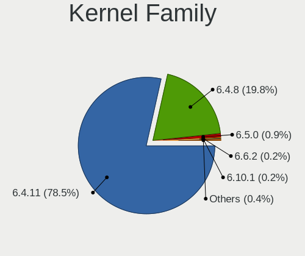

| Version | Computers | Percent |
|---------|-----------|---------|
| 6.4.11  | 1570      | 80.43%  |
| 6.4.8   | 350       | 17.93%  |
| 6.5.0   | 22        | 1.13%   |
| 6.6.2   | 4         | 0.2%    |
| 6.5.1   | 2         | 0.1%    |
| 6.3.5   | 2         | 0.1%    |
| 6.8.1   | 1         | 0.05%   |
| 6.6.0   | 1         | 0.05%   |

Kernel Major Ver.
-----------------

Linux kernel major version

| Version | Computers | Percent |
|---------|-----------|---------|
| 6.4     | 1918      | 98.36%  |
| 6.5     | 24        | 1.23%   |
| 6.6     | 5         | 0.26%   |
| 6.3     | 2         | 0.1%    |
| 6.8     | 1         | 0.05%   |

Arch
----

OS architecture (x86_64, i586, etc.)

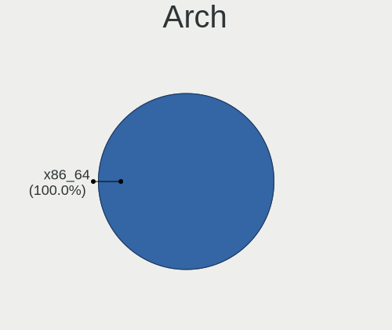

| Name   | Computers | Percent |
|--------|-----------|---------|
| x86_64 | 1949      | 100%    |

DE
--

Desktop Environment

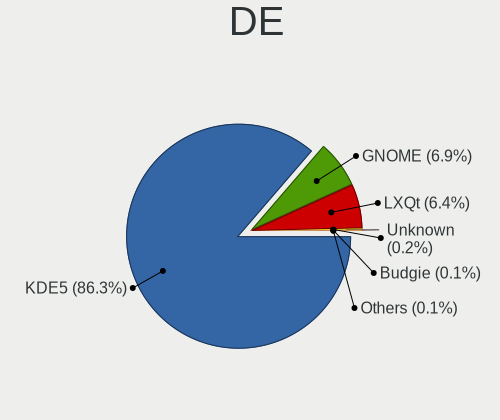

| Name     | Computers | Percent |
|----------|-----------|---------|
| KDE5     | 1646      | 84.32%  |
| GNOME    | 157       | 8.04%   |
| LXQt     | 142       | 7.27%   |
| Budgie   | 3         | 0.15%   |
| Cinnamon | 2         | 0.1%    |
| Unknown  | 2         | 0.1%    |

Display Server
--------------

X11 or Wayland

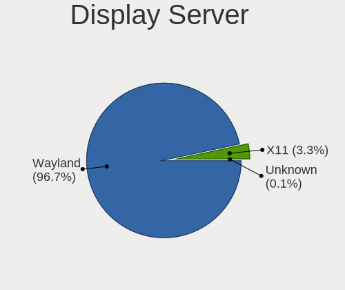

| Name    | Computers | Percent |
|---------|-----------|---------|
| Wayland | 1887      | 96.77%  |
| X11     | 62        | 3.18%   |
| Unknown | 1         | 0.05%   |

Display Manager
---------------

SDDM, LightDM, etc.

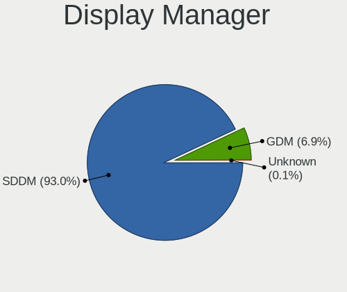

| Name    | Computers | Percent |
|---------|-----------|---------|
| SDDM    | 1793      | 91.9%   |
| GDM     | 157       | 8.05%   |
| Unknown | 1         | 0.05%   |

OS Lang
-------

Language

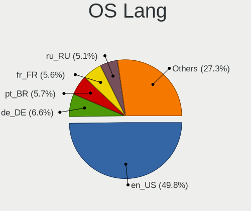

| Lang  | Computers | Percent |
|-------|-----------|---------|
| en_US | 949       | 48.64%  |
| de_DE | 134       | 6.87%   |
| pt_BR | 118       | 6.05%   |
| fr_FR | 117       | 6%      |
| ru_RU | 100       | 5.13%   |
| en_GB | 82        | 4.2%    |
| pl_PL | 72        | 3.69%   |
| it_IT | 61        | 3.13%   |
| es_ES | 45        | 2.31%   |
| es_MX | 24        | 1.23%   |
| en_CA | 20        | 1.03%   |
| cs_CZ | 19        | 0.97%   |
| hu_HU | 18        | 0.92%   |
| tr_TR | 14        | 0.72%   |
| pt_PT | 14        | 0.72%   |
| es_VE | 14        | 0.72%   |
| en_IN | 13        | 0.67%   |
| en_AU | 13        | 0.67%   |
| es_AR | 12        | 0.62%   |
| fr_BE | 10        | 0.51%   |
| es_CO | 10        | 0.51%   |
| nl_BE | 8         | 0.41%   |
| es_CL | 8         | 0.41%   |
| fr_CA | 7         | 0.36%   |
| de_AT | 7         | 0.36%   |
| de_CH | 6         | 0.31%   |
| en_IE | 5         | 0.26%   |
| ro_RO | 4         | 0.21%   |
| nl_NL | 4         | 0.21%   |
| fr_CH | 4         | 0.21%   |
| en_ZA | 3         | 0.15%   |
| en_SG | 3         | 0.15%   |
| en_DK | 3         | 0.15%   |
| UTF-8 | 2         | 0.1%    |
| ja_JP | 2         | 0.1%    |
| es_PE | 2         | 0.1%    |
| en_HK | 2         | 0.1%    |
| de_LU | 2         | 0.1%    |
| da_DK | 2         | 0.1%    |
| ca_ES | 2         | 0.1%    |

Boot Mode
---------

EFI or BIOS

| Mode | Computers | Percent |
|------|-----------|---------|
| EFI  | 1178      | 60.41%  |
| BIOS | 772       | 39.59%  |

Filesystem
----------

Type of filesystem

| Type     | Computers | Percent |
|----------|-----------|---------|
| Overlay  | 968       | 49.51%  |
| Ext4     | 858       | 43.89%  |
| Btrfs    | 94        | 4.81%   |
| Xfs      | 11        | 0.56%   |
| F2fs     | 9         | 0.46%   |
| Reiserfs | 4         | 0.2%    |
| Ext3     | 4         | 0.2%    |
| Jfs      | 3         | 0.15%   |
| Ext2     | 3         | 0.15%   |
| Udf      | 1         | 0.05%   |

Part. scheme
------------

Scheme of partitioning

| Type    | Computers | Percent |
|---------|-----------|---------|
| GPT     | 1531      | 78.47%  |
| MBR     | 419       | 21.48%  |
| Unknown | 1         | 0.05%   |

Dual Boot with Linux/BSD
------------------------

Hosting more than one Linux/BSD

| Dual boot | Computers | Percent |
|-----------|-----------|---------|
| No        | 1022      | 52.33%  |
| Yes       | 931       | 47.67%  |

Dual Boot (Win)
---------------

Hosting Linux and Windows

| Dual boot | Computers | Percent |
|-----------|-----------|---------|
| No        | 1122      | 57.45%  |
| Yes       | 831       | 42.55%  |

Board
-----

Vendor
------

Motherboard manufacturer

| Name                                 | Computers | Percent |
|--------------------------------------|-----------|---------|
| ASUSTek Computer                     | 294       | 15.08%  |
| Hewlett-Packard                      | 273       | 14.01%  |
| Lenovo                               | 271       | 13.9%   |
| Dell                                 | 206       | 10.57%  |
| Gigabyte Technology                  | 139       | 7.13%   |
| MSI                                  | 115       | 5.9%    |
| Acer                                 | 112       | 5.75%   |
| Intel                                | 72        | 3.69%   |
| ASRock                               | 66        | 3.39%   |
| Toshiba                              | 32        | 1.64%   |
| Fujitsu                              | 30        | 1.54%   |
| Samsung Electronics                  | 27        | 1.39%   |
| Apple                                | 23        | 1.18%   |
| Foxconn                              | 15        | 0.77%   |
| Medion                               | 14        | 0.72%   |
| Core Innovations                     | 14        | 0.72%   |
| Unknown                              | 14        | 0.72%   |
| Positivo                             | 13        | 0.67%   |
| AZW                                  | 13        | 0.67%   |
| Sony                                 | 12        | 0.62%   |
| Pegatron                             | 10        | 0.51%   |
| Biostar                              | 10        | 0.51%   |
| Packard Bell                         | 8         | 0.41%   |
| LG Electronics                       | 8         | 0.41%   |
| HUAWEI                               | 8         | 0.41%   |
| Chuwi                                | 8         | 0.41%   |
| Shenzhen Meigao Electronic Equipment | 7         | 0.36%   |
| Google                               | 6         | 0.31%   |
| ECS                                  | 6         | 0.31%   |
| Microsoft                            | 5         | 0.26%   |
| OEM                                  | 4         | 0.21%   |
| GPU Company                          | 4         | 0.21%   |
| UMAX                                 | 3         | 0.15%   |
| System76                             | 3         | 0.15%   |
| Qilive                               | 3         | 0.15%   |
| Philco                               | 3         | 0.15%   |
| Panasonic                            | 3         | 0.15%   |
| Multilaser                           | 3         | 0.15%   |
| Fujitsu Siemens                      | 3         | 0.15%   |
| Compaq                               | 3         | 0.15%   |

Model
-----

Motherboard model

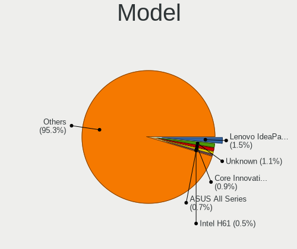

| Name                                       | Computers | Percent |
|--------------------------------------------|-----------|---------|
| Unknown                                    | 18        | 0.92%   |
| Lenovo IdeaPad 1 14IGL7 82V6               | 15        | 0.77%   |
| ASUS All Series                            | 15        | 0.77%   |
| Core Innovations CLC14364                  | 14        | 0.72%   |
| Intel H61                                  | 9         | 0.46%   |
| HP Pavilion g6                             | 8         | 0.41%   |
| Intel H81                                  | 7         | 0.36%   |
| Dell OptiPlex 7010                         | 7         | 0.36%   |
| HP Compaq Pro 6300 SFF                     | 6         | 0.31%   |
| MSI MS-7C51                                | 5         | 0.26%   |
| Lenovo ThinkPad L13 Gen 3 21BAS0X700       | 5         | 0.26%   |
| Intel X99                                  | 5         | 0.26%   |
| HP Notebook                                | 5         | 0.26%   |
| Gigabyte B75M-D3H                          | 5         | 0.26%   |
| Dell OptiPlex 9020                         | 5         | 0.26%   |
| MSI MS-7C91                                | 4         | 0.21%   |
| MSI MS-7817                                | 4         | 0.21%   |
| Intel B75                                  | 4         | 0.21%   |
| HP Z400 Workstation                        | 4         | 0.21%   |
| HP Laptop 15s-eq2xxx                       | 4         | 0.21%   |
| HP Compaq 6200 Pro SFF PC                  | 4         | 0.21%   |
| Gigabyte X299 AORUS Gaming                 | 4         | 0.21%   |
| Dell OptiPlex 9010                         | 4         | 0.21%   |
| Dell OptiPlex 3010                         | 4         | 0.21%   |
| Dell Latitude E6410                        | 4         | 0.21%   |
| Dell Inspiron 3542                         | 4         | 0.21%   |
| AZW SER                                    | 4         | 0.21%   |
| ASUS K50AF                                 | 4         | 0.21%   |
| Acer AOD270                                | 4         | 0.21%   |
| Shenzhen Meigao Electronic Equipment UM690 | 3         | 0.15%   |
| Samsung 300E5M/300E5L                      | 3         | 0.15%   |
| Qilive QW2214FR                            | 3         | 0.15%   |
| Positivo POS-PIG41BA                       | 3         | 0.15%   |
| Positivo Mobile                            | 3         | 0.15%   |
| MSI MS-7C37                                | 3         | 0.15%   |
| MSI MS-7B89                                | 3         | 0.15%   |
| MSI MS-7B86                                | 3         | 0.15%   |
| MSI MS-7996                                | 3         | 0.15%   |
| Microsoft Surface Pro 7                    | 3         | 0.15%   |
| Lenovo Yoga 7 14ARP8 82YM                  | 3         | 0.15%   |

Model Family
------------

Motherboard model prefix

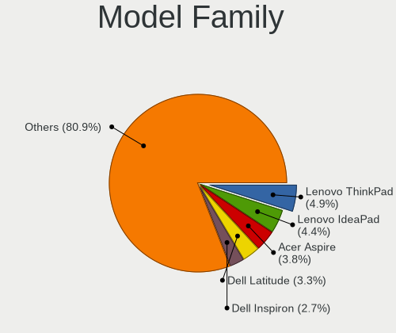

| Name                      | Computers | Percent |
|---------------------------|-----------|---------|
| Lenovo ThinkPad           | 91        | 4.67%   |
| Acer Aspire               | 76        | 3.9%    |
| Lenovo IdeaPad            | 70        | 3.59%   |
| Dell Latitude             | 58        | 2.98%   |
| Dell Inspiron             | 55        | 2.82%   |
| Dell OptiPlex             | 48        | 2.46%   |
| HP Compaq                 | 45        | 2.31%   |
| ASUS PRIME                | 43        | 2.21%   |
| HP Pavilion               | 35        | 1.8%    |
| Lenovo ThinkCentre        | 32        | 1.64%   |
| HP Laptop                 | 31        | 1.59%   |
| ASUS VivoBook             | 31        | 1.59%   |
| HP EliteBook              | 29        | 1.49%   |
| Toshiba Satellite         | 24        | 1.23%   |
| HP ProBook                | 22        | 1.13%   |
| ASUS TUF                  | 20        | 1.03%   |
| Unknown                   | 18        | 0.92%   |
| HP EliteDesk              | 15        | 0.77%   |
| Fujitsu ESPRIMO           | 15        | 0.77%   |
| ASUS All                  | 15        | 0.77%   |
| Core Innovations CLC14364 | 14        | 0.72%   |
| ASUS ROG                  | 14        | 0.72%   |
| Dell Vostro               | 12        | 0.62%   |
| Lenovo Yoga               | 11        | 0.56%   |
| HP ProDesk                | 10        | 0.51%   |
| Dell Precision            | 10        | 0.51%   |
| Intel H61                 | 9         | 0.46%   |
| Dell XPS                  | 9         | 0.46%   |
| ASUS M5A78L-M             | 9         | 0.46%   |
| Intel H81                 | 8         | 0.41%   |
| HP Slim                   | 8         | 0.41%   |
| Acer Veriton              | 8         | 0.41%   |
| HP ENVY                   | 7         | 0.36%   |
| Gigabyte B550             | 7         | 0.36%   |
| Packard Bell EasyNote     | 6         | 0.31%   |
| Lenovo IdeaCentre         | 6         | 0.31%   |
| HP 250                    | 6         | 0.31%   |
| Gigabyte B450             | 6         | 0.31%   |
| Fujitsu LIFEBOOK          | 6         | 0.31%   |
| ASUS ASUS                 | 6         | 0.31%   |

MFG Year
--------

Motherboard manufacture year

| Year    | Computers | Percent |
|---------|-----------|---------|
| 2012    | 186       | 9.54%   |
| 2021    | 158       | 8.11%   |
| 2011    | 154       | 7.9%    |
| 2013    | 137       | 7.03%   |
| 2014    | 135       | 6.93%   |
| 2022    | 133       | 6.82%   |
| 2020    | 133       | 6.82%   |
| 2018    | 129       | 6.62%   |
| 2017    | 124       | 6.36%   |
| 2010    | 122       | 6.26%   |
| 2019    | 117       | 6%      |
| 2016    | 98        | 5.03%   |
| 2015    | 74        | 3.8%    |
| 2009    | 70        | 3.59%   |
| 2023    | 63        | 3.23%   |
| 2008    | 56        | 2.87%   |
| 2007    | 38        | 1.95%   |
| 2006    | 15        | 0.77%   |
| 2005    | 3         | 0.15%   |
| 2004    | 2         | 0.1%    |
| 2024    | 1         | 0.05%   |
| Unknown | 1         | 0.05%   |

Form Factor
-----------

Physical design of the computer

| Name        | Computers | Percent |
|-------------|-----------|---------|
| Notebook    | 941       | 48.28%  |
| Desktop     | 897       | 46.02%  |
| Mini pc     | 40        | 2.05%   |
| Convertible | 29        | 1.49%   |
| All in one  | 25        | 1.28%   |
| Tablet      | 12        | 0.62%   |
| Server      | 4         | 0.21%   |
| Other       | 1         | 0.05%   |

Secure Boot
-----------

Enabled or disabled

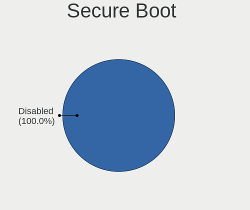

| State    | Computers | Percent |
|----------|-----------|---------|
| Disabled | 1949      | 100%    |

Coreboot
--------

Have coreboot on board

| Used | Computers | Percent |
|------|-----------|---------|
| No   | 1940      | 99.54%  |
| Yes  | 9         | 0.46%   |

RAM Size
--------

Total RAM memory

| Size in GB  | Computers | Percent |
|-------------|-----------|---------|
| 4.01-8.0    | 564       | 28.92%  |
| 3.01-4.0    | 393       | 20.15%  |
| 16.01-24.0  | 352       | 18.05%  |
| 8.01-16.0   | 317       | 16.26%  |
| 32.01-64.0  | 140       | 7.18%   |
| 1.01-2.0    | 55        | 2.82%   |
| 2.01-3.0    | 52        | 2.67%   |
| 64.01-256.0 | 39        | 2%      |
| 24.01-32.0  | 30        | 1.54%   |
| 0.51-1.0    | 8         | 0.41%   |

RAM Used
--------

Used RAM memory

| Used GB   | Computers | Percent |
|-----------|-----------|---------|
| 1.01-2.0  | 1263      | 64.57%  |
| 2.01-3.0  | 430       | 21.98%  |
| 0.51-1.0  | 155       | 7.92%   |
| 3.01-4.0  | 73        | 3.73%   |
| 4.01-8.0  | 20        | 1.02%   |
| 0.01-0.5  | 14        | 0.72%   |
| 8.01-16.0 | 1         | 0.05%   |

Total Drives
------------

Number of drives on board

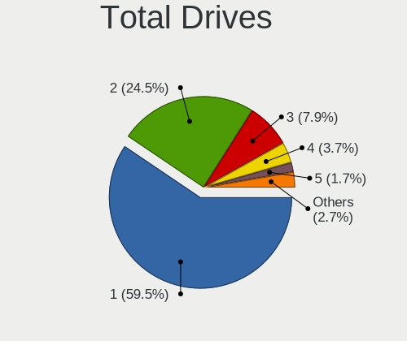

| Drives | Computers | Percent |
|--------|-----------|---------|
| 1      | 1141      | 58.33%  |
| 2      | 496       | 25.36%  |
| 3      | 159       | 8.13%   |
| 4      | 71        | 3.63%   |
| 5      | 34        | 1.74%   |
| 0      | 26        | 1.33%   |
| 6      | 18        | 0.92%   |
| 8      | 4         | 0.2%    |
| 7      | 3         | 0.15%   |
| 10     | 2         | 0.1%    |
| 11     | 1         | 0.05%   |
| 9      | 1         | 0.05%   |

Has CD-ROM
----------

Has CD-ROM on board

| Presented | Computers | Percent |
|-----------|-----------|---------|
| No        | 1108      | 56.85%  |
| Yes       | 841       | 43.15%  |

Has Ethernet
------------

Has Ethernet on board

| Presented | Computers | Percent |
|-----------|-----------|---------|
| Yes       | 1724      | 88.46%  |
| No        | 225       | 11.54%  |

Has WiFi
--------

Has WiFi module

| Presented | Computers | Percent |
|-----------|-----------|---------|
| Yes       | 1387      | 71.13%  |
| No        | 563       | 28.87%  |

Has Bluetooth
-------------

Has Bluetooth module

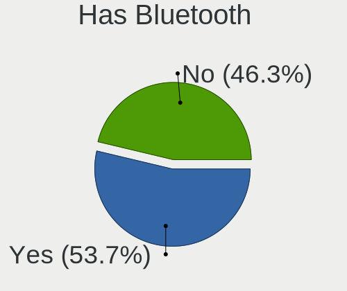

| Presented | Computers | Percent |
|-----------|-----------|---------|
| Yes       | 1057      | 54.23%  |
| No        | 892       | 45.77%  |

Location
--------

Country
-------

Geographic location (country)

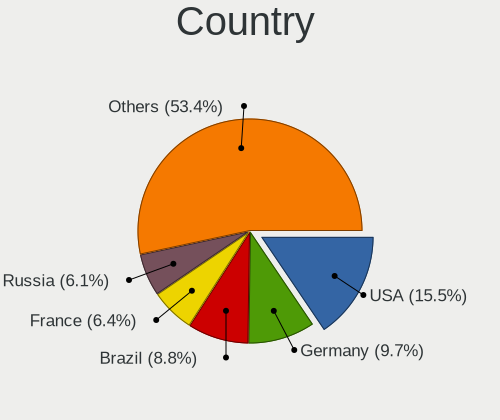

| Country      | Computers | Percent |
|--------------|-----------|---------|
| USA          | 263       | 13.49%  |
| Germany      | 202       | 10.36%  |
| Brazil       | 180       | 9.24%   |
| France       | 135       | 6.93%   |
| Russia       | 127       | 6.52%   |
| Poland       | 100       | 5.13%   |
| Italy        | 83        | 4.26%   |
| UK           | 78        | 4%      |
| Spain        | 63        | 3.23%   |
| Canada       | 50        | 2.57%   |
| Australia    | 35        | 1.8%    |
| Mexico       | 34        | 1.74%   |
| India        | 32        | 1.64%   |
| Hungary      | 27        | 1.39%   |
| Turkey       | 25        | 1.28%   |
| Japan        | 24        | 1.23%   |
| Czechia      | 24        | 1.23%   |
| Netherlands  | 23        | 1.18%   |
| Belgium      | 22        | 1.13%   |
| Romania      | 19        | 0.97%   |
| Greece       | 19        | 0.97%   |
| Colombia     | 19        | 0.97%   |
| Portugal     | 17        | 0.87%   |
| Argentina    | 17        | 0.87%   |
| Bulgaria     | 16        | 0.82%   |
| Venezuela    | 15        | 0.77%   |
| Indonesia    | 15        | 0.77%   |
| Austria      | 14        | 0.72%   |
| Thailand     | 13        | 0.67%   |
| Finland      | 13        | 0.67%   |
| Sweden       | 12        | 0.62%   |
| China        | 12        | 0.62%   |
| Chile        | 12        | 0.62%   |
| Switzerland  | 11        | 0.56%   |
| Slovakia     | 11        | 0.56%   |
| Ukraine      | 8         | 0.41%   |
| Malaysia     | 8         | 0.41%   |
| South Africa | 7         | 0.36%   |
| Serbia       | 7         | 0.36%   |
| Iran         | 7         | 0.36%   |

City
----

Geographic location (city)

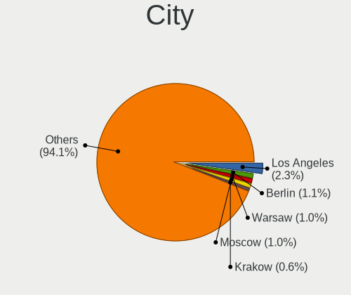

| City           | Computers | Percent |
|----------------|-----------|---------|
| Los Angeles    | 24        | 1.23%   |
| Moscow         | 23        | 1.18%   |
| Warsaw         | 22        | 1.13%   |
| Berlin         | 20        | 1.02%   |
| Milan          | 13        | 0.67%   |
| Melbourne      | 13        | 0.67%   |
| Krakow         | 13        | 0.67%   |
| Sydney         | 11        | 0.56%   |
| Sao Paulo      | 11        | 0.56%   |
| Rio de Janeiro | 11        | 0.56%   |
| Vienna         | 10        | 0.51%   |
| St Petersburg  | 10        | 0.51%   |
| Paris          | 10        | 0.51%   |
| Munich         | 10        | 0.51%   |
| Istanbul       | 10        | 0.51%   |
| Athens         | 10        | 0.51%   |
| Rome           | 9         | 0.46%   |
| Thousand Oaks  | 8         | 0.41%   |
| Prague         | 8         | 0.41%   |
| Stuttgart      | 7         | 0.36%   |
| Sao Goncalo    | 7         | 0.36%   |
| San Cristbal | 7         | 0.36%   |
| Madrid         | 7         | 0.36%   |
| Budapest       | 7         | 0.36%   |
| Yekaterinburg  | 6         | 0.31%   |
| Wroclaw        | 6         | 0.31%   |
| Sofia          | 6         | 0.31%   |
| Hamburg        | 6         | 0.31%   |
| Curitiba       | 6         | 0.31%   |
| Bengaluru      | 6         | 0.31%   |
| Vancouver      | 5         | 0.26%   |
| Tehran         | 5         | 0.26%   |
| Porto Alegre   | 5         | 0.26%   |
| Perm           | 5         | 0.26%   |
| Novosibirsk    | 5         | 0.26%   |
| Minsk          | 5         | 0.26%   |
| Lodz           | 5         | 0.26%   |
| Katowice       | 5         | 0.26%   |
| Dublin         | 5         | 0.26%   |
| Braunschweig   | 5         | 0.26%   |

Drives
------

Drive Vendor
------------

Hard drive vendors

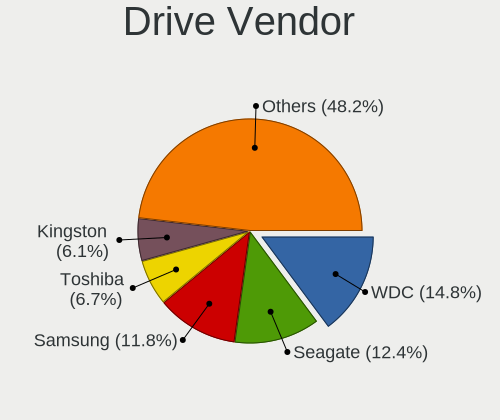

| Vendor                      | Computers | Drives | Percent |
|-----------------------------|-----------|--------|---------|
| WDC                         | 432       | 513    | 15%     |
| Samsung Electronics         | 341       | 407    | 11.84%  |
| Seagate                     | 337       | 390    | 11.7%   |
| Toshiba                     | 188       | 204    | 6.53%   |
| Kingston                    | 177       | 192    | 6.15%   |
| Crucial                     | 121       | 143    | 4.2%    |
| SanDisk                     | 119       | 125    | 4.13%   |
| Unknown                     | 104       | 128    | 3.61%   |
| Hitachi                     | 86        | 89     | 2.99%   |
| China                       | 62        | 67     | 2.15%   |
| A-DATA Technology           | 58        | 60     | 2.01%   |
| SK hynix                    | 52        | 53     | 1.81%   |
| Unknown                     | 50        | 53     | 1.74%   |
| Intel                       | 49        | 50     | 1.7%    |
| Micron Technology           | 37        | 37     | 1.28%   |
| HGST                        | 35        | 35     | 1.22%   |
| SPCC                        | 34        | 36     | 1.18%   |
| Intenso                     | 30        | 32     | 1.04%   |
| GOODRAM                     | 24        | 28     | 0.83%   |
| Patriot                     | 21        | 21     | 0.73%   |
| Maxtor                      | 20        | 23     | 0.69%   |
| JMicron Technology          | 19        | 19     | 0.66%   |
| PNY                         | 18        | 19     | 0.63%   |
| Kingston Technology Company | 17        | 20     | 0.59%   |
| Team                        | 16        | 16     | 0.56%   |
| Lexar                       | 16        | 19     | 0.56%   |
| Silicon Motion              | 15        | 16     | 0.52%   |
| Netac                       | 15        | 16     | 0.52%   |
| Apple                       | 15        | 15     | 0.52%   |
| Apacer                      | 15        | 16     | 0.52%   |
| Fanxiang                    | 14        | 14     | 0.49%   |
| SSSTC                       | 13        | 13     | 0.45%   |
| KIOXIA                      | 13        | 13     | 0.45%   |
| Phison                      | 12        | 13     | 0.42%   |
| KingSpec                    | 12        | 13     | 0.42%   |
| LITEON                      | 11        | 11     | 0.38%   |
| Hewlett-Packard             | 10        | 10     | 0.35%   |
| Transcend                   | 9         | 9      | 0.31%   |
| OCZ                         | 8         | 8      | 0.28%   |
| Verbatim                    | 7         | 7      | 0.24%   |

Drive Model
-----------

Hard drive models

| Model                              | Computers | Percent |
|------------------------------------|-----------|---------|
| Unknown                            | 50        | 1.6%    |
| Kingston SA400S37240G 240GB SSD    | 36        | 1.15%   |
| Seagate ST500DM002-1BD142 500GB    | 27        | 0.86%   |
| Kingston SA400S37480G 480GB SSD    | 27        | 0.86%   |
| Crucial CT500MX500SSD1 500GB       | 25        | 0.8%    |
| Seagate ST500LT012-1DG142 500GB    | 23        | 0.74%   |
| Seagate ST1000DM010-2EP102 1TB     | 20        | 0.64%   |
| Kingston SA400S37120G 120GB SSD    | 18        | 0.58%   |
| Toshiba DT01ACA100 1TB             | 17        | 0.54%   |
| Unknown SD/MMC/MS PRO 128GB        | 16        | 0.51%   |
| Unknown MMC64G  64GB               | 16        | 0.51%   |
| Toshiba MQ04ABF100 1TB             | 16        | 0.51%   |
| SanDisk NVMe SSD Drive 1TB         | 16        | 0.51%   |
| Crucial CT240BX500SSD1 240GB       | 16        | 0.51%   |
| Toshiba MQ01ABD100 1TB             | 15        | 0.48%   |
| Samsung SSD 860 EVO 500GB          | 15        | 0.48%   |
| Toshiba MQ01ABF050 500GB           | 14        | 0.45%   |
| Seagate ST2000DM008-2FR102 2TB     | 14        | 0.45%   |
| Seagate ST1000LM024 HN-M101MBB 1TB | 14        | 0.45%   |
| Samsung SSD 850 EVO 250GB          | 14        | 0.45%   |
| Samsung SSD 870 EVO 500GB          | 13        | 0.42%   |
| JMicron Generic 320GB              | 13        | 0.42%   |
| Seagate ST1000DM003-1CH162 1TB     | 12        | 0.38%   |
| Kingston SV300S37A120G 120GB SSD   | 12        | 0.38%   |
| WDC WDS240G2G0A-00JH30 240GB SSD   | 11        | 0.35%   |
| WDC WD10EZEX-08WN4A0 1TB           | 11        | 0.35%   |
| Toshiba DT01ACA050 500GB           | 11        | 0.35%   |
| Seagate ST3500418AS 500GB          | 11        | 0.35%   |
| Samsung SSD 850 EVO 500GB          | 11        | 0.35%   |
| SanDisk SSD PLUS 240GB             | 10        | 0.32%   |
| SanDisk SSD PLUS 1000GB            | 10        | 0.32%   |
| Crucial CT1000BX500SSD1 1TB        | 10        | 0.32%   |
| Toshiba HDWD110 1TB                | 9         | 0.29%   |
| Seagate ST1000LM035-1RK172 1TB     | 9         | 0.29%   |
| Seagate ST1000DM003-1SB102 1TB     | 9         | 0.29%   |
| Seagate Expansion 2TB              | 9         | 0.29%   |
| SanDisk NVMe SSD Drive 500GB       | 9         | 0.29%   |
| Samsung SSD 980 500GB              | 9         | 0.29%   |
| Samsung SSD 970 EVO Plus 2TB       | 9         | 0.29%   |
| Samsung SSD 870 QVO 1TB            | 9         | 0.29%   |

HDD Vendor
----------

Hard disk drive vendors

| Vendor              | Computers | Drives | Percent |
|---------------------|-----------|--------|---------|
| WDC                 | 344       | 401    | 30.91%  |
| Seagate             | 333       | 385    | 29.92%  |
| Toshiba             | 166       | 179    | 14.91%  |
| Hitachi             | 86        | 89     | 7.73%   |
| Samsung Electronics | 68        | 72     | 6.11%   |
| HGST                | 35        | 35     | 3.14%   |
| Maxtor              | 19        | 22     | 1.71%   |
| Unknown             | 17        | 17     | 1.53%   |
| JMicron Technology  | 14        | 14     | 1.26%   |
| Apple               | 7         | 7      | 0.63%   |
| Fujitsu             | 5         | 6      | 0.45%   |
| ExcelStor           | 3         | 3      | 0.27%   |
| TO Exter            | 2         | 2      | 0.18%   |
| Min Yi U            | 2         | 2      | 0.18%   |
| Inateck             | 2         | 2      | 0.18%   |
| WD MediaMax         | 1         | 1      | 0.09%   |
| Shenzhen            | 1         | 1      | 0.09%   |
| SAGE                | 1         | 1      | 0.09%   |
| SABRENT             | 1         | 1      | 0.09%   |
| Intenso             | 1         | 1      | 0.09%   |
| IB-AC703            | 1         | 1      | 0.09%   |
| DAS                 | 1         | 4      | 0.09%   |
| ASMT                | 1         | 2      | 0.09%   |
| ASMedia             | 1         | 1      | 0.09%   |
| Unknown             | 1         | 2      | 0.09%   |

SSD Vendor
----------

Solid state drive vendors

| Vendor              | Computers | Drives | Percent |
|---------------------|-----------|--------|---------|
| Samsung Electronics | 162       | 185    | 14.77%  |
| Kingston            | 134       | 143    | 12.22%  |
| Crucial             | 90        | 96     | 8.2%    |
| SanDisk             | 75        | 79     | 6.84%   |
| China               | 62        | 67     | 5.65%   |
| WDC                 | 54        | 60     | 4.92%   |
| A-DATA Technology   | 41        | 42     | 3.74%   |
| SPCC                | 30        | 30     | 2.73%   |
| Intenso             | 29        | 31     | 2.64%   |
| GOODRAM             | 24        | 28     | 2.19%   |
| Intel               | 21        | 21     | 1.91%   |
| Patriot             | 20        | 20     | 1.82%   |
| Micron Technology   | 19        | 19     | 1.73%   |
| PNY                 | 18        | 19     | 1.64%   |
| SK hynix            | 15        | 16     | 1.37%   |
| Toshiba             | 13        | 15     | 1.19%   |
| KingSpec            | 12        | 13     | 1.09%   |
| Team                | 11        | 11     | 1%      |
| Netac               | 11        | 12     | 1%      |
| Apacer              | 11        | 11     | 1%      |
| Unknown             | 11        | 11     | 1%      |
| LITEON              | 10        | 10     | 0.91%   |
| Fanxiang            | 10        | 10     | 0.91%   |
| Transcend           | 9         | 9      | 0.82%   |
| OCZ                 | 8         | 8      | 0.73%   |
| Lexar               | 8         | 9      | 0.73%   |
| Verbatim            | 7         | 7      | 0.64%   |
| Hewlett-Packard     | 7         | 7      | 0.64%   |
| Apple               | 7         | 7      | 0.64%   |
| XrayDisk            | 5         | 5      | 0.46%   |
| T-FORCE             | 5         | 6      | 0.46%   |
| Plextor             | 5         | 5      | 0.46%   |
| LITEONIT            | 5         | 5      | 0.46%   |
| KingFast            | 5         | 5      | 0.46%   |
| WALRAM              | 4         | 4      | 0.36%   |
| USB3.0              | 4         | 4      | 0.36%   |
| Teclast             | 4         | 4      | 0.36%   |
| Seagate             | 4         | 4      | 0.36%   |
| KIOXIA-EXCERIA      | 4         | 4      | 0.36%   |
| INNOVATION IT       | 4         | 4      | 0.36%   |

Drive Kind
----------

HDD or SSD

| Kind    | Computers | Drives | Percent |
|---------|-----------|--------|---------|
| HDD     | 940       | 1251   | 37.05%  |
| SSD     | 937       | 1166   | 36.93%  |
| NVMe    | 514       | 619    | 20.26%  |
| MMC     | 111       | 123    | 4.38%   |
| Unknown | 35        | 53     | 1.38%   |

Drive Connector
---------------

SATA, SAS, NVMe, etc.

| Type | Computers | Drives | Percent |
|------|-----------|--------|---------|
| SATA | 1549      | 2295   | 66.71%  |
| NVMe | 509       | 603    | 21.92%  |
| SAS  | 153       | 191    | 6.59%   |
| MMC  | 111       | 123    | 4.78%   |

Drive Size
----------

Size of hard drive

| Size in TB | Computers | Drives | Percent |
|------------|-----------|--------|---------|
| 0.01-0.5   | 1198      | 1551   | 62.23%  |
| 0.51-1.0   | 539       | 636    | 28%     |
| 1.01-2.0   | 119       | 139    | 6.18%   |
| 3.01-4.0   | 26        | 34     | 1.35%   |
| 2.01-3.0   | 25        | 29     | 1.3%    |
| 4.01-10.0  | 11        | 18     | 0.57%   |
| 10.01-20.0 | 7         | 10     | 0.36%   |

Space Total
-----------

Amount of disk space available on the file system

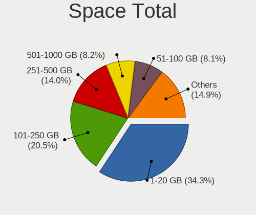

| Size in GB     | Computers | Percent |
|----------------|-----------|---------|
| 1-20           | 704       | 35.97%  |
| 101-250        | 395       | 20.18%  |
| 251-500        | 260       | 13.29%  |
| 501-1000       | 157       | 8.02%   |
| 51-100         | 140       | 7.15%   |
| Unknown        | 103       | 5.26%   |
| 21-50          | 87        | 4.45%   |
| 1001-2000      | 67        | 3.42%   |
| 2001-3000      | 25        | 1.28%   |
| More than 3000 | 19        | 0.97%   |

Space Used
----------

Amount of used disk space

| Used GB        | Computers | Percent |
|----------------|-----------|---------|
| 1-20           | 1575      | 80.69%  |
| Unknown        | 103       | 5.28%   |
| 21-50          | 101       | 5.17%   |
| 101-250        | 51        | 2.61%   |
| 51-100         | 50        | 2.56%   |
| 251-500        | 28        | 1.43%   |
| 501-1000       | 22        | 1.13%   |
| 1001-2000      | 12        | 0.61%   |
| More than 3000 | 6         | 0.31%   |
| 2001-3000      | 4         | 0.2%    |

Malfunc. Drives
---------------

Drive models with a malfunction

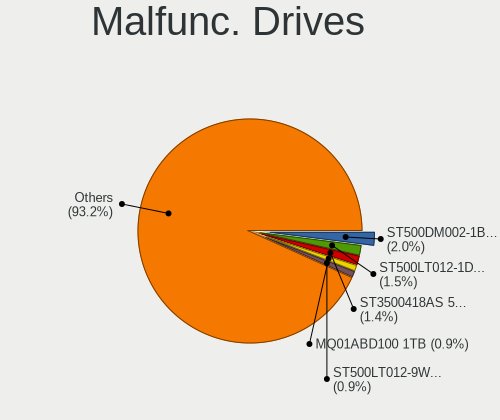

| Model                                | Computers | Drives | Percent |
|--------------------------------------|-----------|--------|---------|
| Seagate ST500DM002-1BD142 500GB      | 11        | 11     | 2.06%   |
| Seagate ST500LT012-1DG142 500GB      | 10        | 10     | 1.87%   |
| Seagate ST3500418AS 500GB            | 7         | 7      | 1.31%   |
| Seagate ST1000DM010-2EP102 1TB       | 5         | 6      | 0.93%   |
| Hitachi HTS543225L9A300 250GB        | 5         | 5      | 0.93%   |
| WDC WD10EARS-00Y5B1 1TB              | 4         | 4      | 0.75%   |
| Toshiba MQ01ABD100 1TB               | 4         | 4      | 0.75%   |
| Toshiba MK3259GSXP 320GB             | 4         | 4      | 0.75%   |
| Toshiba DT01ACA100 1TB               | 4         | 4      | 0.75%   |
| Seagate ST500LT012-9WS142 500GB      | 4         | 4      | 0.75%   |
| Seagate ST3500312CS 500GB            | 4         | 4      | 0.75%   |
| Seagate ST3160318AS 160GB            | 4         | 4      | 0.75%   |
| Seagate ST1000DM003-1CH162 1TB       | 4         | 4      | 0.75%   |
| SanDisk SSD PLUS 480GB               | 4         | 4      | 0.75%   |
| Samsung Electronics HD322HJ 320GB    | 4         | 4      | 0.75%   |
| HGST HTS725050A7E630 500GB           | 4         | 4      | 0.75%   |
| WDC WD5000LPVX-80V0TT0 500GB         | 3         | 3      | 0.56%   |
| WDC WD5000LPCX-24C6HT0 500GB         | 3         | 3      | 0.56%   |
| WDC WD5000AAKX-75U6AA0 500GB         | 3         | 3      | 0.56%   |
| WDC WD1600BEVS-00VAT0 160GB          | 3         | 3      | 0.56%   |
| Toshiba MQ01ABF050 500GB             | 3         | 3      | 0.56%   |
| Toshiba MQ01ABD075 752GB             | 3         | 3      | 0.56%   |
| Toshiba DT01ACA050 500GB             | 3         | 3      | 0.56%   |
| SK hynix BC711 HFM512GD3JX013N 512GB | 3         | 3      | 0.56%   |
| Seagate ST980811AS 80GB              | 3         | 3      | 0.56%   |
| Seagate ST9500325AS 500GB            | 3         | 3      | 0.56%   |
| Seagate ST3500413AS 500GB            | 3         | 3      | 0.56%   |
| Seagate ST320LT012-9WS14C 320GB      | 3         | 3      | 0.56%   |
| Seagate ST2000DM001-1CH164 2TB       | 3         | 3      | 0.56%   |
| Seagate ST1000LM024 HN-M101MBB 1TB   | 3         | 3      | 0.56%   |
| Samsung Electronics HD502HJ 500GB    | 3         | 3      | 0.56%   |
| Samsung Electronics HD103UJ 1TB      | 3         | 3      | 0.56%   |
| Samsung Electronics HD103SJ 1TB      | 3         | 3      | 0.56%   |
| Maxtor STM380815AS 80GB              | 3         | 4      | 0.56%   |
| Kingston SV300S37A120G 120GB SSD     | 3         | 3      | 0.56%   |
| Hitachi HTS543232A7A384 320GB        | 3         | 3      | 0.56%   |
| HGST HTS721010A9E630 1TB             | 3         | 3      | 0.56%   |
| WDC WDS480G2G0A-00JH30 480GB SSD     | 2         | 2      | 0.37%   |
| WDC WDS240G2G0A-00JH30 240GB SSD     | 2         | 2      | 0.37%   |
| WDC WD5000LPVX-60V0TT0 500GB         | 2         | 2      | 0.37%   |

Malfunc. Drive Vendor
---------------------

Vendors of faulty drives

| Vendor              | Computers | Drives | Percent |
|---------------------|-----------|--------|---------|
| Seagate             | 122       | 127    | 23.19%  |
| WDC                 | 120       | 129    | 22.81%  |
| Hitachi             | 56        | 56     | 10.65%  |
| Toshiba             | 52        | 53     | 9.89%   |
| Samsung Electronics | 44        | 45     | 8.37%   |
| SanDisk             | 14        | 14     | 2.66%   |
| SK hynix            | 13        | 13     | 2.47%   |
| Maxtor              | 13        | 14     | 2.47%   |
| HGST                | 13        | 13     | 2.47%   |
| Kingston            | 10        | 10     | 1.9%    |
| A-DATA Technology   | 9         | 9      | 1.71%   |
| China               | 7         | 7      | 1.33%   |
| Intel               | 6         | 6      | 1.14%   |
| Micron Technology   | 5         | 5      | 0.95%   |
| SPCC                | 4         | 4      | 0.76%   |
| Netac               | 3         | 3      | 0.57%   |
| LITEONIT            | 3         | 3      | 0.57%   |
| Crucial             | 3         | 3      | 0.57%   |
| SSSTC               | 2         | 2      | 0.38%   |
| Intenso             | 2         | 2      | 0.38%   |
| ExcelStor           | 2         | 2      | 0.38%   |
| XrayDisk            | 1         | 1      | 0.19%   |
| XPG                 | 1         | 1      | 0.19%   |
| Wibtek              | 1         | 1      | 0.19%   |
| SandForce           | 1         | 1      | 0.19%   |
| SAGE                | 1         | 1      | 0.19%   |
| Reeinno             | 1         | 1      | 0.19%   |
| PNY                 | 1         | 1      | 0.19%   |
| Plextor             | 1         | 1      | 0.19%   |
| OCZ-AGIL            | 1         | 1      | 0.19%   |
| OCZ                 | 1         | 1      | 0.19%   |
| KingDian            | 1         | 1      | 0.19%   |
| KINGCOMP            | 1         | 1      | 0.19%   |
| JMicron Technology  | 1         | 1      | 0.19%   |
| INNOVATION IT       | 1         | 1      | 0.19%   |
| Hewlett-Packard     | 1         | 1      | 0.19%   |
| Fujitsu             | 1         | 1      | 0.19%   |
| EX276687RUS         | 1         | 1      | 0.19%   |
| Corsair             | 1         | 1      | 0.19%   |
| C300-CTF            | 1         | 1      | 0.19%   |

Malfunc. HDD Vendor
-------------------

Vendors of faulty HDD drives

| Vendor              | Computers | Drives | Percent |
|---------------------|-----------|--------|---------|
| Seagate             | 122       | 127    | 29.61%  |
| WDC                 | 111       | 119    | 26.94%  |
| Hitachi             | 56        | 56     | 13.59%  |
| Toshiba             | 52        | 53     | 12.62%  |
| Samsung Electronics | 38        | 39     | 9.22%   |
| Maxtor              | 13        | 14     | 3.16%   |
| HGST                | 13        | 13     | 3.16%   |
| ExcelStor           | 2         | 2      | 0.49%   |
| SAGE                | 1         | 1      | 0.24%   |
| JMicron Technology  | 1         | 1      | 0.24%   |
| Fujitsu             | 1         | 1      | 0.24%   |
| ASMT                | 1         | 1      | 0.24%   |
| Apple               | 1         | 1      | 0.24%   |

Malfunc. Drive Kind
-------------------

Kinds of faulty drives

| Kind | Computers | Drives | Percent |
|------|-----------|--------|---------|
| HDD  | 376       | 428    | 77.05%  |
| SSD  | 100       | 103    | 20.49%  |
| NVMe | 12        | 12     | 2.46%   |

Failed Drives
-------------

Failed drive models

| Model                           | Computers | Drives | Percent |
|---------------------------------|-----------|--------|---------|
| WDC WD3200BPVT-22JJ5T0 320GB    | 1         | 1      | 7.69%   |
| WDC WD10EZEX-00BN5A0 1TB        | 1         | 1      | 7.69%   |
| Toshiba MQ01ABF032 320GB        | 1         | 1      | 7.69%   |
| Toshiba MQ01ABD050 500GB        | 1         | 1      | 7.69%   |
| Toshiba MK2575GSX 250GB         | 1         | 1      | 7.69%   |
| Toshiba MK1234GSX 118GB         | 1         | 1      | 7.69%   |
| Seagate ST500DM002-1BD142 500GB | 1         | 1      | 7.69%   |
| Seagate ST3320613AS 320GB       | 1         | 1      | 7.69%   |
| Seagate ST3250318AS 250GB       | 1         | 1      | 7.69%   |
| Seagate ST31000528AS 1TB        | 1         | 1      | 7.69%   |
| Samsung Electronics HD203WI 2TB | 1         | 1      | 7.69%   |
| Intel SSDSCKKF256H6 SATA 256GB  | 1         | 1      | 7.69%   |
| Hitachi HTS545032B9A300 320GB   | 1         | 1      | 7.69%   |

Failed Drive Vendor
-------------------

Failed drive vendors

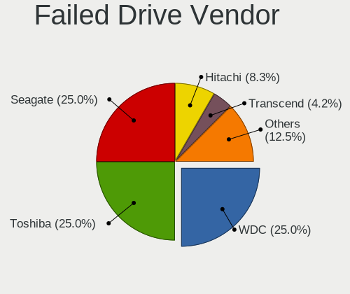

| Vendor              | Computers | Drives | Percent |
|---------------------|-----------|--------|---------|
| Toshiba             | 4         | 4      | 30.77%  |
| Seagate             | 4         | 4      | 30.77%  |
| WDC                 | 2         | 2      | 15.38%  |
| Samsung Electronics | 1         | 1      | 7.69%   |
| Intel               | 1         | 1      | 7.69%   |
| Hitachi             | 1         | 1      | 7.69%   |

Drive Status
------------

Number of failed and malfunc. drives

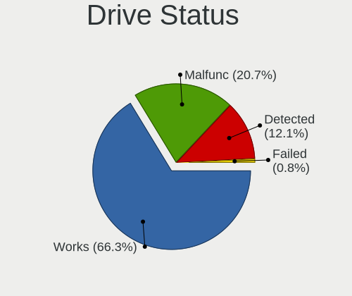

| Status   | Computers | Drives | Percent |
|----------|-----------|--------|---------|
| Works    | 1529      | 2322   | 66.86%  |
| Malfunc  | 476       | 543    | 20.81%  |
| Detected | 269       | 334    | 11.76%  |
| Failed   | 13        | 13     | 0.57%   |

Storage controller
------------------

Storage Vendor
--------------

Storage controller vendors

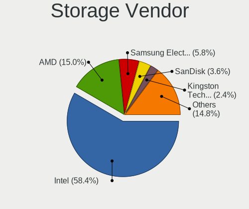

| Vendor                           | Computers | Percent |
|----------------------------------|-----------|---------|
| Intel                            | 1409      | 58.1%   |
| AMD                              | 368       | 15.18%  |
| Samsung Electronics              | 137       | 5.65%   |
| SanDisk                          | 85        | 3.51%   |
| Kingston Technology Company      | 62        | 2.56%   |
| Phison Electronics               | 35        | 1.44%   |
| SK hynix                         | 34        | 1.4%    |
| Micron/Crucial Technology        | 33        | 1.36%   |
| ASMedia Technology               | 29        | 1.2%    |
| Silicon Motion                   | 28        | 1.15%   |
| Nvidia                           | 26        | 1.07%   |
| Micron Technology                | 23        | 0.95%   |
| JMicron Technology               | 23        | 0.95%   |
| MAXIO Technology (Hangzhou)      | 19        | 0.78%   |
| Marvell Technology Group         | 19        | 0.78%   |
| KIOXIA                           | 16        | 0.66%   |
| ADATA Technology                 | 15        | 0.62%   |
| Solid State Storage Technology   | 12        | 0.49%   |
| Realtek Semiconductor            | 11        | 0.45%   |
| Shenzhen Longsys Electronics     | 8         | 0.33%   |
| Toshiba America Info Systems     | 7         | 0.29%   |
| VIA Technologies                 | 6         | 0.25%   |
| Silicon Integrated Systems [SiS] | 4         | 0.16%   |
| Union Memory (Shenzhen)          | 3         | 0.12%   |
| Netac Technology                 | 2         | 0.08%   |
| LSI Logic / Symbios Logic        | 2         | 0.08%   |
| INNOGRIT                         | 2         | 0.08%   |
| Broadcom / LSI                   | 2         | 0.08%   |
| Seagate Technology               | 1         | 0.04%   |
| Nextorage                        | 1         | 0.04%   |
| Lite-On Technology               | 1         | 0.04%   |
| Lenovo                           | 1         | 0.04%   |
| Integrated Technology Express    | 1         | 0.04%   |

Storage Model
-------------

Storage controller models

| Model                                                                                   | Computers | Percent |
|-----------------------------------------------------------------------------------------|-----------|---------|
| AMD FCH SATA Controller [AHCI mode]                                                     | 217       | 7.77%   |
| Intel 8 Series/C220 Series Chipset Family 6-port SATA Controller 1 [AHCI mode]          | 110       | 3.94%   |
| Intel Sunrise Point-LP SATA Controller [AHCI mode]                                      | 91        | 3.26%   |
| Intel 7 Series Chipset Family 6-port SATA Controller [AHCI mode]                        | 86        | 3.08%   |
| Intel 6 Series/C200 Series Chipset Family 6 port Mobile SATA AHCI Controller            | 68        | 2.43%   |
| Intel NM10/ICH7 Family SATA Controller [IDE mode]                                       | 63        | 2.26%   |
| Samsung NVMe SSD Controller SM981/PM981/PM983                                           | 62        | 2.22%   |
| Intel 82801 Mobile SATA Controller [RAID mode]                                          | 62        | 2.22%   |
| Intel 7 Series/C210 Series Chipset Family 6-port SATA Controller [AHCI mode]            | 59        | 2.11%   |
| Intel Celeron/Pentium Silver Processor SATA Controller                                  | 58        | 2.08%   |
| Intel 6 Series/C200 Series Chipset Family 6 port Desktop SATA AHCI Controller           | 54        | 1.93%   |
| AMD 400 Series Chipset SATA Controller                                                  | 49        | 1.75%   |
| Intel 82801G (ICH7 Family) IDE Controller                                               | 48        | 1.72%   |
| Intel Q170/Q150/B150/H170/H110/Z170/CM236 Chipset SATA Controller [AHCI Mode]           | 46        | 1.65%   |
| AMD SB7x0/SB8x0/SB9x0 SATA Controller [AHCI mode]                                       | 44        | 1.58%   |
| Intel 200 Series PCH SATA controller [AHCI mode]                                        | 42        | 1.5%    |
| Samsung NVMe SSD Controller 980 (DRAM-less)                                             | 40        | 1.43%   |
| Intel 8 Series SATA Controller 1 [AHCI mode]                                            | 39        | 1.4%    |
| AMD SB7x0/SB8x0/SB9x0 IDE Controller                                                    | 38        | 1.36%   |
| Intel Celeron N3350/Pentium N4200/Atom E3900 Series SATA AHCI Controller                | 37        | 1.32%   |
| Intel 5 Series/3400 Series Chipset 4 port SATA AHCI Controller                          | 37        | 1.32%   |
| AMD 500 Series Chipset SATA Controller                                                  | 37        | 1.32%   |
| Intel Wildcat Point-LP SATA Controller [AHCI Mode]                                      | 35        | 1.25%   |
| Intel 5 Series/3400 Series Chipset 6 port SATA AHCI Controller                          | 33        | 1.18%   |
| Intel Volume Management Device NVMe RAID Controller                                     | 31        | 1.11%   |
| AMD FCH SATA Controller D                                                               | 29        | 1.04%   |
| Intel SATA Controller [RAID mode]                                                       | 28        | 1%      |
| AMD SB7x0/SB8x0/SB9x0 SATA Controller [IDE mode]                                        | 28        | 1%      |
| ASMedia ASM1061/ASM1062 Serial ATA Controller                                           | 27        | 0.97%   |
| SanDisk Ultra 3D / WD Blue SN550 NVMe SSD                                               | 26        | 0.93%   |
| Intel Atom Processor E3800 Series SATA AHCI Controller                                  | 26        | 0.93%   |
| Intel 82801IBM/IEM (ICH9M/ICH9M-E) 4 port SATA Controller [AHCI mode]                   | 25        | 0.9%    |
| Micron/Crucial P2 [Nick P2] / P3 / P3 Plus NVMe PCIe SSD (DRAM-less)                    | 24        | 0.86%   |
| Intel 6 Series/C200 Series Chipset Family Desktop SATA Controller (IDE mode, ports 4-5) | 24        | 0.86%   |
| Intel 6 Series/C200 Series Chipset Family Desktop SATA Controller (IDE mode, ports 0-3) | 24        | 0.86%   |
| Silicon Motion SM2263EN/SM2263XT (DRAM-less) NVMe SSD Controllers                       | 23        | 0.82%   |
| Intel Tiger Lake-LP SATA Controller                                                     | 20        | 0.72%   |
| Intel Cannon Lake PCH SATA AHCI Controller                                              | 20        | 0.72%   |
| Intel Alder Lake-S PCH SATA Controller [AHCI Mode]                                      | 20        | 0.72%   |
| Intel Comet Lake SATA AHCI Controller                                                   | 19        | 0.68%   |

Storage Kind
------------

Kind of storage controller (IDE, SATA, NVMe, SAS, ...)

| Kind | Computers | Percent |
|------|-----------|---------|
| SATA | 1511      | 61.82%  |
| NVMe | 510       | 20.87%  |
| IDE  | 284       | 11.62%  |
| RAID | 134       | 5.48%   |
| SAS  | 5         | 0.2%    |

Processor
---------

CPU Vendor
----------

Processor vendors

| Vendor | Computers | Percent |
|--------|-----------|---------|
| Intel  | 1506      | 77.27%  |
| AMD    | 443       | 22.73%  |

CPU Model
---------

Processor models

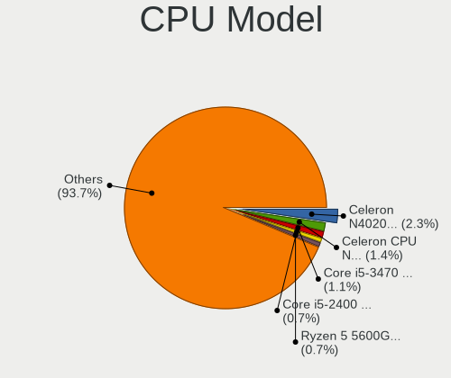

| Model                                   | Computers | Percent |
|-----------------------------------------|-----------|---------|
| Intel Celeron N4020 CPU @ 1.10GHz       | 32        | 1.64%   |
| Intel Celeron CPU N3350 @ 1.10GHz       | 27        | 1.39%   |
| Intel Core i5-3470 CPU @ 3.20GHz        | 22        | 1.13%   |
| AMD Ryzen 5 5600G with Radeon Graphics  | 16        | 0.82%   |
| Intel Core i5-2400 CPU @ 3.10GHz        | 15        | 0.77%   |
| Intel Core i5-7200U CPU @ 2.50GHz       | 14        | 0.72%   |
| Intel Core i5-2520M CPU @ 2.50GHz       | 14        | 0.72%   |
| Intel Core i5-6200U CPU @ 2.30GHz       | 13        | 0.67%   |
| Intel Core i5-10400 CPU @ 2.90GHz       | 13        | 0.67%   |
| Intel Core i7-3770 CPU @ 3.40GHz        | 12        | 0.62%   |
| Intel Core i5-6300U CPU @ 2.40GHz       | 12        | 0.62%   |
| Intel 11th Gen Core i3-1115G4 @ 3.00GHz | 12        | 0.62%   |
| AMD Ryzen 5 3600 6-Core Processor       | 12        | 0.62%   |
| Intel Core i7-4790 CPU @ 3.60GHz        | 11        | 0.56%   |
| Intel Core i5-3210M CPU @ 2.50GHz       | 11        | 0.56%   |
| Intel Core i5-10210U CPU @ 1.60GHz      | 11        | 0.56%   |
| Intel Core i3-2350M CPU @ 2.30GHz       | 11        | 0.56%   |
| Intel Celeron CPU N3060 @ 1.60GHz       | 11        | 0.56%   |
| Intel Core i5-4570 CPU @ 3.20GHz        | 10        | 0.51%   |
| Intel Core i5-3320M CPU @ 2.60GHz       | 10        | 0.51%   |
| Intel Core i3-2100 CPU @ 3.10GHz        | 10        | 0.51%   |
| AMD Ryzen 7 5700U with Radeon Graphics  | 10        | 0.51%   |
| AMD Ryzen 5 5500U with Radeon Graphics  | 10        | 0.51%   |
| Intel Core i7-2600 CPU @ 3.40GHz        | 9         | 0.46%   |
| Intel Core i5-4440 CPU @ 3.10GHz        | 9         | 0.46%   |
| Intel Core i5-3570 CPU @ 3.40GHz        | 9         | 0.46%   |
| Intel Core i5-3230M CPU @ 2.60GHz       | 9         | 0.46%   |
| Intel Core i3-1005G1 CPU @ 1.20GHz      | 9         | 0.46%   |
| Intel Celeron N4000 CPU @ 1.10GHz       | 9         | 0.46%   |
| AMD Ryzen 7 5700G with Radeon Graphics  | 9         | 0.46%   |
| Intel Core i5-8350U CPU @ 1.70GHz       | 8         | 0.41%   |
| Intel Core i5-5300U CPU @ 2.30GHz       | 8         | 0.41%   |
| Intel Core i5-4590 CPU @ 3.30GHz        | 8         | 0.41%   |
| Intel Core i5-4210U CPU @ 1.70GHz       | 8         | 0.41%   |
| Intel Core i5 CPU M 520 @ 2.40GHz       | 8         | 0.41%   |
| Intel Core i3-6006U CPU @ 2.00GHz       | 8         | 0.41%   |
| Intel Core i3-3220 CPU @ 3.30GHz        | 8         | 0.41%   |
| Intel Core i3 CPU M 380 @ 2.53GHz       | 8         | 0.41%   |
| Intel Core 2 Duo CPU E8400 @ 3.00GHz    | 8         | 0.41%   |
| Intel Core 2 Duo CPU E7500 @ 2.93GHz    | 8         | 0.41%   |

CPU Model Family
----------------

Processor model prefix

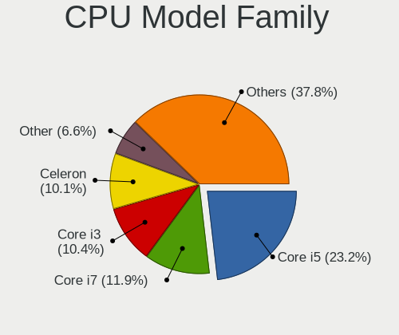

| Model                   | Computers | Percent |
|-------------------------|-----------|---------|
| Intel Core i5           | 463       | 23.76%  |
| Intel Core i7           | 229       | 11.75%  |
| Intel Core i3           | 212       | 10.88%  |
| Intel Celeron           | 182       | 9.34%   |
| Other                   | 126       | 6.46%   |
| AMD Ryzen 5             | 105       | 5.39%   |
| AMD Ryzen 7             | 72        | 3.69%   |
| Intel Pentium           | 67        | 3.44%   |
| Intel Core 2 Duo        | 63        | 3.23%   |
| AMD Ryzen 3             | 38        | 1.95%   |
| Intel Pentium Dual-Core | 35        | 1.8%    |
| Intel Xeon              | 30        | 1.54%   |
| Intel Core 2 Quad       | 28        | 1.44%   |
| AMD FX                  | 27        | 1.39%   |
| Intel Atom              | 24        | 1.23%   |
| AMD Ryzen 9             | 23        | 1.18%   |
| AMD A6                  | 18        | 0.92%   |
| AMD A8                  | 15        | 0.77%   |
| AMD A4                  | 15        | 0.77%   |
| AMD Athlon II X2        | 13        | 0.67%   |
| Intel Pentium Silver    | 11        | 0.56%   |
| Intel Pentium Dual      | 10        | 0.51%   |
| Intel Core 2            | 10        | 0.51%   |
| AMD A10                 | 10        | 0.51%   |
| AMD Ryzen 5 PRO         | 9         | 0.46%   |
| AMD Phenom II X4        | 8         | 0.41%   |
| AMD E                   | 8         | 0.41%   |
| AMD Athlon              | 8         | 0.41%   |
| Intel Genuine           | 7         | 0.36%   |
| AMD Athlon 64 X2        | 7         | 0.36%   |
| Intel Pentium Gold      | 5         | 0.26%   |
| AMD Sempron             | 5         | 0.26%   |
| AMD E2                  | 5         | 0.26%   |
| AMD E1                  | 4         | 0.21%   |
| AMD Athlon II Dual-Core | 4         | 0.21%   |
| Intel Pentium D         | 3         | 0.15%   |
| Intel Pentium 4         | 3         | 0.15%   |
| Intel Core M            | 3         | 0.15%   |
| AMD Ryzen 7 PRO         | 3         | 0.15%   |
| AMD PRO A10             | 3         | 0.15%   |

CPU Cores
---------

Number of processor cores

| Number | Computers | Percent |
|--------|-----------|---------|
| 2      | 914       | 46.9%   |
| 4      | 652       | 33.45%  |
| 6      | 167       | 8.57%   |
| 8      | 95        | 4.87%   |
| 1      | 45        | 2.31%   |
| 12     | 29        | 1.49%   |
| 10     | 15        | 0.77%   |
| 14     | 11        | 0.56%   |
| 3      | 9         | 0.46%   |
| 16     | 7         | 0.36%   |
| 24     | 3         | 0.15%   |
| 36     | 1         | 0.05%   |
| 5      | 1         | 0.05%   |

CPU Sockets
-----------

Number of sockets

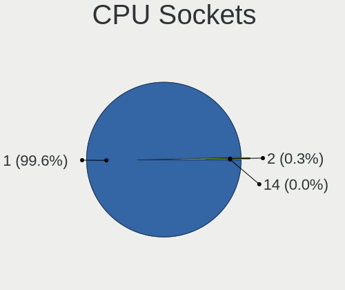

| Number | Computers | Percent |
|--------|-----------|---------|
| 1      | 1944      | 99.74%  |
| 2      | 3         | 0.15%   |
| 16     | 1         | 0.05%   |
| 14     | 1         | 0.05%   |

CPU Threads
-----------

Threads per core (Hyper-Threading)

| Number | Computers | Percent |
|--------|-----------|---------|
| 2      | 1148      | 58.9%   |
| 1      | 795       | 40.79%  |
| 4      | 3         | 0.15%   |
| 8      | 2         | 0.1%    |
| 12     | 1         | 0.05%   |

CPU Op-Modes
------------

CPU Operation Modes (32-bit, 64-bit)

| Op mode        | Computers | Percent |
|----------------|-----------|---------|
| 32-bit, 64-bit | 1949      | 100%    |

CPU Microcode
-------------

Microcode number

| Number     | Computers | Percent |
|------------|-----------|---------|
| Unknown    | 1530      | 78.5%   |
| 0x08108109 | 36        | 1.85%   |
| 0x0a50000d | 35        | 1.8%    |
| 0x0a20120a | 19        | 0.97%   |
| 0x010000c8 | 18        | 0.92%   |
| 0x08701030 | 17        | 0.87%   |
| 0x08608103 | 16        | 0.82%   |
| 0x0a50000c | 14        | 0.72%   |
| 0x06001119 | 14        | 0.72%   |
| 0x06006705 | 13        | 0.67%   |
| 0x06000822 | 12        | 0.62%   |
| 0x0a404102 | 11        | 0.56%   |
| 0x08701021 | 11        | 0.56%   |
| 0x0600611a | 11        | 0.56%   |
| 0x0800820d | 10        | 0.51%   |
| 0x08600106 | 9         | 0.46%   |
| 0x0810100b | 9         | 0.46%   |
| 0x06003106 | 9         | 0.46%   |
| 0x0500010d | 9         | 0.46%   |
| 0x08108102 | 7         | 0.36%   |
| 0x06000817 | 7         | 0.36%   |
| 0x08101016 | 6         | 0.31%   |
| 0x0600081c | 6         | 0.31%   |
| 0x05000028 | 6         | 0.31%   |
| 0x010000b6 | 6         | 0.31%   |
| 0x0a201025 | 5         | 0.26%   |
| 0x08001138 | 5         | 0.26%   |
| 0x0a601206 | 4         | 0.21%   |
| 0x08608104 | 4         | 0.21%   |
| 0x08600109 | 4         | 0.21%   |
| 0x08200103 | 4         | 0.21%   |
| 0x08101007 | 4         | 0.21%   |
| 0x0700010b | 4         | 0.21%   |
| 0x05000101 | 4         | 0.21%   |
| 0x03000027 | 4         | 0.21%   |
| 0x03000014 | 4         | 0.21%   |
| 0x02000057 | 4         | 0.21%   |
| 0x08a00006 | 3         | 0.15%   |
| 0x08600104 | 3         | 0.15%   |
| 0x07030105 | 3         | 0.15%   |

CPU Microarch
-------------

Microarchitecture

| Name             | Computers | Percent |
|------------------|-----------|---------|
| KabyLake         | 198       | 10.16%  |
| Haswell          | 192       | 9.85%   |
| IvyBridge        | 169       | 8.67%   |
| SandyBridge      | 161       | 8.26%   |
| Penryn           | 108       | 5.54%   |
| Skylake          | 98        | 5.03%   |
| Zen 3            | 79        | 4.05%   |
| Westmere         | 78        | 4%      |
| Goldmont plus    | 64        | 3.28%   |
| Alderlake Hybrid | 63        | 3.23%   |
| Zen+             | 60        | 3.08%   |
| Silvermont       | 58        | 2.98%   |
| Core             | 53        | 2.72%   |
| Unknown          | 48        | 2.46%   |
| Zen 2            | 47        | 2.41%   |
| CometLake        | 47        | 2.41%   |
| Piledriver       | 43        | 2.21%   |
| Broadwell        | 42        | 2.15%   |
| K10              | 38        | 1.95%   |
| Goldmont         | 37        | 1.9%    |
| Icelake          | 36        | 1.85%   |
| Zen              | 32        | 1.64%   |
| TigerLake        | 29        | 1.49%   |
| Excavator        | 26        | 1.33%   |
| Nehalem          | 19        | 0.97%   |
| Bobcat           | 19        | 0.97%   |
| Bonnell          | 17        | 0.87%   |
| Tremont          | 16        | 0.82%   |
| K8 Hammer        | 15        | 0.77%   |
| Steamroller      | 12        | 0.62%   |
| Gracemont        | 12        | 0.62%   |
| K10 Llano        | 10        | 0.51%   |
| Puma             | 6         | 0.31%   |
| NetBurst         | 6         | 0.31%   |
| Jaguar           | 6         | 0.31%   |
| K8 & K10 hybrid  | 4         | 0.21%   |
| Bulldozer        | 1         | 0.05%   |

Graphics
--------

GPU Vendor
----------

Vendors of graphics cards

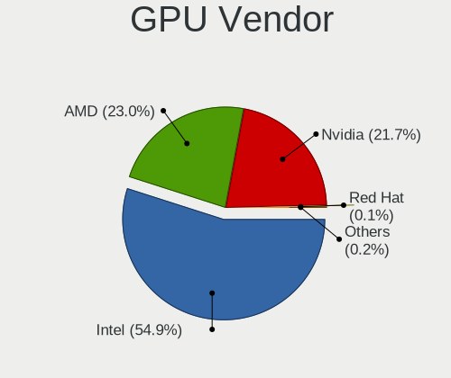

| Vendor                           | Computers | Percent |
|----------------------------------|-----------|---------|
| Intel                            | 1170      | 54.22%  |
| AMD                              | 506       | 23.45%  |
| Nvidia                           | 472       | 21.87%  |
| Silicon Integrated Systems [SiS] | 3         | 0.14%   |
| Red Hat                          | 2         | 0.09%   |
| Matrox Electronics Systems       | 2         | 0.09%   |
| ATI Technologies                 | 2         | 0.09%   |
| ASPEED Technology                | 1         | 0.05%   |

GPU Model
---------

Graphics card models

| Model                                                                                    | Computers | Percent |
|------------------------------------------------------------------------------------------|-----------|---------|
| Intel 2nd Generation Core Processor Family Integrated Graphics Controller                | 126       | 5.72%   |
| Intel 3rd Gen Core processor Graphics Controller                                         | 75        | 3.4%    |
| Intel Xeon E3-1200 v3/4th Gen Core Processor Integrated Graphics Controller              | 59        | 2.68%   |
| Intel GeminiLake [UHD Graphics 600]                                                      | 56        | 2.54%   |
| Intel Core Processor Integrated Graphics Controller                                      | 49        | 2.22%   |
| Intel Skylake GT2 [HD Graphics 520]                                                      | 45        | 2.04%   |
| Intel Haswell-ULT Integrated Graphics Controller                                         | 44        | 2%      |
| AMD Picasso/Raven 2 [Radeon Vega Series / Radeon Vega Mobile Series]                     | 43        | 1.95%   |
| Intel Xeon E3-1200 v2/3rd Gen Core processor Graphics Controller                         | 39        | 1.77%   |
| Intel HD Graphics 620                                                                    | 37        | 1.68%   |
| Intel HD Graphics 500                                                                    | 34        | 1.54%   |
| Intel Atom Processor Z36xxx/Z37xxx Series Graphics & Display                             | 33        | 1.5%    |
| Intel Mobile 4 Series Chipset Integrated Graphics Controller                             | 28        | 1.27%   |
| Intel HD Graphics 5500                                                                   | 28        | 1.27%   |
| AMD Ellesmere [Radeon RX 470/480/570/570X/580/580X/590]                                  | 28        | 1.27%   |
| AMD Cezanne [Radeon Vega Series / Radeon Vega Mobile Series]                             | 28        | 1.27%   |
| Intel HD Graphics 530                                                                    | 27        | 1.23%   |
| Intel UHD Graphics 620                                                                   | 25        | 1.13%   |
| Intel Atom/Celeron/Pentium Processor x5-E8000/J3xxx/N3xxx Integrated Graphics Controller | 25        | 1.13%   |
| Intel HD Graphics 630                                                                    | 24        | 1.09%   |
| Intel 4th Gen Core Processor Integrated Graphics Controller                              | 24        | 1.09%   |
| Intel 4 Series Chipset Integrated Graphics Controller                                    | 24        | 1.09%   |
| Nvidia GK208B [GeForce GT 710]                                                           | 23        | 1.04%   |
| AMD Lucienne                                                                             | 22        | 1%      |
| AMD Raven Ridge [Radeon Vega Series / Radeon Vega Mobile Series]                         | 20        | 0.91%   |
| Intel CoffeeLake-S GT2 [UHD Graphics 630]                                                | 18        | 0.82%   |
| Nvidia GP107 [GeForce GTX 1050 Ti]                                                       | 17        | 0.77%   |
| Intel JasperLake [UHD Graphics]                                                          | 17        | 0.77%   |
| Intel Iris Plus Graphics G1 (Ice Lake)                                                   | 17        | 0.77%   |
| AMD Renoir [Radeon RX Vega 6 (Ryzen 4000/5000 Mobile Series)]                            | 17        | 0.77%   |
| Nvidia GP108 [GeForce GT 1030]                                                           | 16        | 0.73%   |
| Intel Mobile GM965/GL960 Integrated Graphics Controller (secondary)                      | 16        | 0.73%   |
| Intel Mobile GM965/GL960 Integrated Graphics Controller (primary)                        | 16        | 0.73%   |
| Intel CometLake-U GT2 [UHD Graphics]                                                     | 16        | 0.73%   |
| Intel TigerLake-LP GT2 [Iris Xe Graphics]                                                | 15        | 0.68%   |
| Intel CometLake-S GT2 [UHD Graphics 630]                                                 | 15        | 0.68%   |
| AMD Stoney [Radeon R2/R3/R4/R5 Graphics]                                                 | 15        | 0.68%   |
| AMD Navi 22 [Radeon RX 6700/6700 XT/6750 XT / 6800M/6850M XT]                            | 15        | 0.68%   |
| Intel Tiger Lake-LP GT2 [UHD Graphics G4]                                                | 14        | 0.64%   |
| Intel Alder Lake-P GT2 [Iris Xe Graphics]                                                | 14        | 0.64%   |

GPU Combo
---------

Combinations of graphics cards

| Name                   | Computers | Percent |
|------------------------|-----------|---------|
| 1 x Intel              | 907       | 46.54%  |
| 1 x AMD                | 434       | 22.27%  |
| 1 x Nvidia             | 299       | 15.34%  |
| Intel + Nvidia         | 151       | 7.75%   |
| 2 x Intel              | 71        | 3.64%   |
| Intel + AMD            | 39        | 2%      |
| 2 x AMD                | 20        | 1.03%   |
| AMD + Nvidia           | 15        | 0.77%   |
| 2 x Nvidia             | 3         | 0.15%   |
| 1 x SiS                | 3         | 0.15%   |
| 2 x Intel + 1 x Nvidia | 2         | 0.1%    |
| 1 x Red Hat            | 2         | 0.1%    |
| 1 x Matrox             | 2         | 0.1%    |
| Nvidia + ASPEED        | 1         | 0.05%   |

GPU Driver
----------

Free vs proprietary

| Driver      | Computers | Percent |
|-------------|-----------|---------|
| Free        | 1895      | 97.18%  |
| Unknown     | 43        | 2.21%   |
| Proprietary | 12        | 0.62%   |

GPU Memory
----------

Total video memory

| Size in GB | Computers | Percent |
|------------|-----------|---------|
| Unknown    | 1025      | 52.56%  |
| 1.01-2.0   | 264       | 13.54%  |
| 0.01-0.5   | 225       | 11.54%  |
| 0.51-1.0   | 170       | 8.72%   |
| 3.01-4.0   | 116       | 5.95%   |
| 7.01-8.0   | 69        | 3.54%   |
| 5.01-6.0   | 29        | 1.49%   |
| 8.01-16.0  | 29        | 1.49%   |
| 2.01-3.0   | 18        | 0.92%   |
| 16.01-24.0 | 3         | 0.15%   |
| 4.01-5.0   | 2         | 0.1%    |

Monitor
-------

Monitor Vendor
--------------

Monitor vendors

| Vendor                  | Computers | Percent |
|-------------------------|-----------|---------|
| Samsung Electronics     | 267       | 13.54%  |
| AU Optronics            | 209       | 10.6%   |
| BOE                     | 177       | 8.98%   |
| LG Display              | 171       | 8.67%   |
| Chimei Innolux          | 144       | 7.3%    |
| Goldstar                | 110       | 5.58%   |
| Dell                    | 95        | 4.82%   |
| Acer                    | 81        | 4.11%   |
| Hewlett-Packard         | 79        | 4.01%   |
| AOC                     | 53        | 2.69%   |
| Philips                 | 50        | 2.54%   |
| BenQ                    | 39        | 1.98%   |
| Ancor Communications    | 39        | 1.98%   |
| Chi Mei Optoelectronics | 34        | 1.72%   |
| ViewSonic               | 31        | 1.57%   |
| Lenovo                  | 26        | 1.32%   |
| Iiyama                  | 23        | 1.17%   |
| Apple                   | 19        | 0.96%   |
| Sony                    | 18        | 0.91%   |
| Sharp                   | 17        | 0.86%   |
| PANDA                   | 17        | 0.86%   |
| ASUSTek Computer        | 17        | 0.86%   |
| InfoVision              | 16        | 0.81%   |
| RGT                     | 15        | 0.76%   |
| MSI                     | 15        | 0.76%   |
| NEC Computers           | 14        | 0.71%   |
| Fujitsu Siemens         | 12        | 0.61%   |
| LG Philips              | 10        | 0.51%   |
| Panasonic               | 9         | 0.46%   |
| Eizo                    | 9         | 0.46%   |
| Unknown                 | 7         | 0.35%   |
| RTK                     | 7         | 0.35%   |
| Unknown (XXX)           | 6         | 0.3%    |
| Sceptre Tech            | 6         | 0.3%    |
| Hitachi                 | 6         | 0.3%    |
| HannStar                | 6         | 0.3%    |
| Toshiba                 | 5         | 0.25%   |
| Medion                  | 5         | 0.25%   |
| HKC                     | 5         | 0.25%   |
| ___                     | 4         | 0.2%    |

Monitor Model
-------------

Monitor models

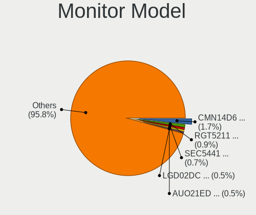

| Model                                                                    | Computers | Percent |
|--------------------------------------------------------------------------|-----------|---------|
| Chimei Innolux LCD Monitor CMN14D6 1366x768 309x173mm 13.9-inch          | 18        | 0.91%   |
| RGT LCD Monitor RGT5211 1366x768 518x333mm 24.2-inch                     | 14        | 0.71%   |
| LG Display LCD Monitor LGD02DC 1366x768 344x194mm 15.5-inch              | 12        | 0.6%    |
| Samsung Electronics LCD Monitor SEC5441 1366x768 344x194mm 15.5-inch     | 11        | 0.55%   |
| Chimei Innolux LCD Monitor CMN15F5 1920x1080 344x193mm 15.5-inch         | 9         | 0.45%   |
| AU Optronics LCD Monitor AUO71EC 1366x768 344x193mm 15.5-inch            | 8         | 0.4%    |
| Samsung Electronics C24F390 SAM0D2C 1920x1080 521x293mm 23.5-inch        | 7         | 0.35%   |
| Chimei Innolux LCD Monitor CMN15E7 1920x1080 344x193mm 15.5-inch         | 7         | 0.35%   |
| Chimei Innolux LCD Monitor CMN15DB 1366x768 344x193mm 15.5-inch          | 7         | 0.35%   |
| Chimei Innolux LCD Monitor CMN14D4 1920x1080 309x173mm 13.9-inch         | 7         | 0.35%   |
| AU Optronics LCD Monitor AUO22EC 1366x768 344x193mm 15.5-inch            | 7         | 0.35%   |
| AU Optronics LCD Monitor AUO21ED 1920x1080 344x193mm 15.5-inch           | 7         | 0.35%   |
| Samsung Electronics LCD Monitor SDC5441 1366x768 293x165mm 13.2-inch     | 6         | 0.3%    |
| Chi Mei Optoelectronics LCD Monitor CMO15A7 1366x768 344x193mm 15.5-inch | 6         | 0.3%    |
| BOE LCD Monitor BOE084E 1920x1080 382x215mm 17.3-inch                    | 6         | 0.3%    |
| AU Optronics LCD Monitor AUO61ED 1920x1080 344x194mm 15.5-inch           | 6         | 0.3%    |
| Samsung Electronics S24F350 SAM0D20 1920x1080 521x293mm 23.5-inch        | 5         | 0.25%   |
| LG Display LCD Monitor LGD0395 1366x768 344x194mm 15.5-inch              | 5         | 0.25%   |
| LG Display LCD Monitor LGD02F2 1366x768 344x194mm 15.5-inch              | 5         | 0.25%   |
| Dell P2311H DEL4066 1920x1080 509x286mm 23.0-inch                        | 5         | 0.25%   |
| Chimei Innolux LCD Monitor CMN15E6 1366x768 344x193mm 15.5-inch          | 5         | 0.25%   |
| BOE LCD Monitor BOE0A84 1920x1200 286x179mm 13.3-inch                    | 5         | 0.25%   |
| AU Optronics LCD Monitor AUO70EC 1366x768 344x193mm 15.5-inch            | 5         | 0.25%   |
| AU Optronics LCD Monitor AUO2D3C 1366x768 309x173mm 13.9-inch            | 5         | 0.25%   |
| AU Optronics LCD Monitor AUO26EC 1366x768 344x193mm 15.5-inch            | 5         | 0.25%   |
| AU Optronics LCD Monitor AUO23EC 1366x768 344x193mm 15.5-inch            | 5         | 0.25%   |
| AU Optronics LCD Monitor AUO20EC 1366x768 344x193mm 15.5-inch            | 5         | 0.25%   |
| AU Optronics LCD Monitor AUO106C 1366x768 277x156mm 12.5-inch            | 5         | 0.25%   |
| Ancor Communications ASUS VC239 ACI23C4 1920x1080 509x286mm 23.0-inch    | 5         | 0.25%   |
| Unknown LCD Monitor FFFF 2288x1287 2550x2550mm 142.0-inch                | 4         | 0.2%    |
| LG Display LCD Monitor LGD0563 1920x1080 344x194mm 15.5-inch             | 4         | 0.2%    |
| LG Display LCD Monitor LGD0521 1920x1080 309x174mm 14.0-inch             | 4         | 0.2%    |
| LG Display LCD Monitor LGD039F 1366x768 345x194mm 15.6-inch              | 4         | 0.2%    |
| LG Display LCD Monitor LGD038E 1366x768 344x194mm 15.5-inch              | 4         | 0.2%    |
| LG Display LCD Monitor LGD033B 1366x768 344x194mm 15.5-inch              | 4         | 0.2%    |
| LG Display LCD Monitor LGD02D8 1366x768 277x156mm 12.5-inch              | 4         | 0.2%    |
| LG Display LCD Monitor LGD01E8 1366x768 344x194mm 15.5-inch              | 4         | 0.2%    |
| Hewlett-Packard w1907 HWP26A2 1440x900 408x255mm 18.9-inch               | 4         | 0.2%    |
| Chimei Innolux LCD Monitor CMN1735 1920x1080 382x215mm 17.3-inch         | 4         | 0.2%    |
| Chi Mei Optoelectronics LCD Monitor CMO1680 1366x768 344x193mm 15.5-inch | 4         | 0.2%    |

Monitor Resolution
------------------

Monitor screen resolution

| Resolution         | Computers | Percent |
|--------------------|-----------|---------|
| 1920x1080 (FHD)    | 831       | 42.84%  |
| 1366x768 (WXGA)    | 483       | 24.9%   |
| 3840x2160 (4K)     | 92        | 4.74%   |
| 1600x900 (HD+)     | 85        | 4.38%   |
| 2560x1440 (QHD)    | 63        | 3.25%   |
| 1280x1024 (SXGA)   | 60        | 3.09%   |
| 1680x1050 (WSXGA+) | 55        | 2.84%   |
| 1440x900 (WXGA+)   | 55        | 2.84%   |
| 1920x1200 (WUXGA)  | 49        | 2.53%   |
| 1280x800 (WXGA)    | 32        | 1.65%   |
| 1360x768           | 16        | 0.82%   |
| 3440x1440          | 12        | 0.62%   |
| 2880x1800          | 11        | 0.57%   |
| 2560x1080          | 10        | 0.52%   |
| 2560x1600          | 9         | 0.46%   |
| 1920x540           | 9         | 0.46%   |
| 1600x1200          | 8         | 0.41%   |
| 1024x768 (XGA)     | 8         | 0.41%   |
| 2288x1287          | 7         | 0.36%   |
| 2160x1440          | 7         | 0.36%   |
| 1024x600           | 7         | 0.36%   |
| 1280x720 (HD)      | 5         | 0.26%   |
| 3840x2400          | 3         | 0.15%   |
| 3200x1800 (QHD+)   | 3         | 0.15%   |
| 2736x1824          | 3         | 0.15%   |
| 2256x1504          | 2         | 0.1%    |
| 2048x1152          | 2         | 0.1%    |
| 1280x960           | 2         | 0.1%    |
| 1152x864           | 2         | 0.1%    |
| 3840x1600          | 1         | 0.05%   |
| 3072x1920          | 1         | 0.05%   |
| 2880x1920          | 1         | 0.05%   |
| 2880x1620          | 1         | 0.05%   |
| 2520x1680          | 1         | 0.05%   |
| 1920x1280          | 1         | 0.05%   |
| 1600x2560          | 1         | 0.05%   |
| 1360x765           | 1         | 0.05%   |
| Unknown            | 1         | 0.05%   |

Monitor Diagonal
----------------

Diagonal size in inches

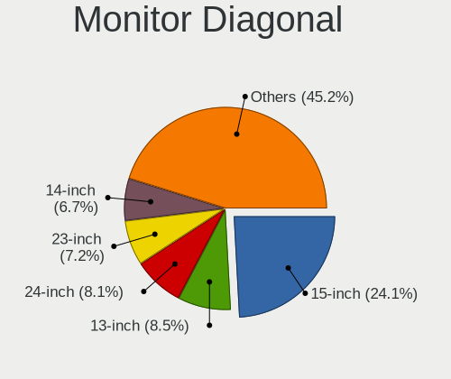

| Inches  | Computers | Percent |
|---------|-----------|---------|
| 15      | 466       | 23.63%  |
| 13      | 156       | 7.91%   |
| 24      | 155       | 7.86%   |
| 23      | 152       | 7.71%   |
| 21      | 136       | 6.9%    |
| 14      | 130       | 6.59%   |
| 27      | 125       | 6.34%   |
| 17      | 123       | 6.24%   |
| 19      | 63        | 3.19%   |
| 31      | 59        | 2.99%   |
| 18      | 54        | 2.74%   |
| 20      | 43        | 2.18%   |
| 22      | 41        | 2.08%   |
| 12      | 39        | 1.98%   |
| 11      | 31        | 1.57%   |
| Unknown | 24        | 1.22%   |
| 16      | 22        | 1.12%   |
| 84      | 17        | 0.86%   |
| 72      | 16        | 0.81%   |
| 34      | 16        | 0.81%   |
| 10      | 16        | 0.81%   |
| 54      | 10        | 0.51%   |
| 32      | 10        | 0.51%   |
| 26      | 8         | 0.41%   |
| 40      | 7         | 0.35%   |
| 28      | 6         | 0.3%    |
| 25      | 6         | 0.3%    |
| 39      | 5         | 0.25%   |
| 142     | 4         | 0.2%    |
| 52      | 4         | 0.2%    |
| 48      | 3         | 0.15%   |
| 46      | 3         | 0.15%   |
| 43      | 3         | 0.15%   |
| 37      | 3         | 0.15%   |
| 85      | 2         | 0.1%    |
| 65      | 2         | 0.1%    |
| 33      | 2         | 0.1%    |
| 74      | 1         | 0.05%   |
| 69      | 1         | 0.05%   |
| 63      | 1         | 0.05%   |

Monitor Width
-------------

Physical width

| Width in mm    | Computers | Percent |
|----------------|-----------|---------|
| 301-350        | 724       | 36.94%  |
| 501-600        | 428       | 21.84%  |
| 401-500        | 307       | 15.66%  |
| 201-300        | 150       | 7.65%   |
| 351-400        | 138       | 7.04%   |
| 601-700        | 73        | 3.72%   |
| 1501-2000      | 37        | 1.89%   |
| 701-800        | 28        | 1.43%   |
| 1001-1500      | 26        | 1.33%   |
| Unknown        | 24        | 1.22%   |
| 801-900        | 17        | 0.87%   |
| More than 2000 | 4         | 0.2%    |
| 901-1000       | 4         | 0.2%    |

Aspect Ratio
------------

Proportional relationship between the width and the height

| Ratio   | Computers | Percent |
|---------|-----------|---------|
| 16/9    | 1516      | 79.96%  |
| 16/10   | 239       | 12.61%  |
| 5/4     | 65        | 3.43%   |
| 3/2     | 22        | 1.16%   |
| 21/9    | 21        | 1.11%   |
| 4/3     | 20        | 1.05%   |
| Unknown | 7         | 0.37%   |
| 1.00    | 4         | 0.21%   |
| 32/9    | 1         | 0.05%   |
| 1.96    | 1         | 0.05%   |

Monitor Area
------------

Area in inch

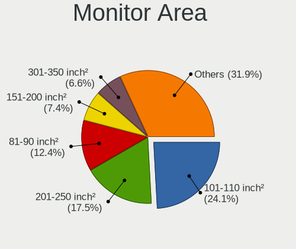

| Area in inch | Computers | Percent |
|----------------|-----------|---------|
| 101-110        | 465       | 23.64%  |
| 201-250        | 366       | 18.61%  |
| 81-90          | 227       | 11.54%  |
| 151-200        | 157       | 7.98%   |
| 301-350        | 132       | 6.71%   |
| 351-500        | 89        | 4.52%   |
| 251-300        | 83        | 4.22%   |
| 141-150        | 79        | 4.02%   |
| 121-130        | 79        | 4.02%   |
| More than 1000 | 63        | 3.2%    |
| 71-80          | 62        | 3.15%   |
| 61-70          | 32        | 1.63%   |
| 51-60          | 32        | 1.63%   |
| 501-1000       | 25        | 1.27%   |
| Unknown        | 24        | 1.22%   |
| 111-120        | 19        | 0.97%   |
| 41-50          | 15        | 0.76%   |
| 131-140        | 11        | 0.56%   |
| 91-100         | 7         | 0.36%   |

Pixel Density
-------------

Pixels per inch

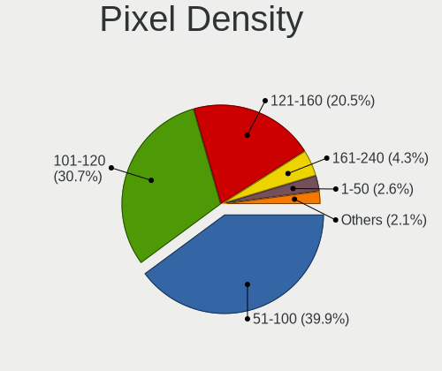

| Density       | Computers | Percent |
|---------------|-----------|---------|
| 51-100        | 777       | 40.22%  |
| 101-120       | 589       | 30.49%  |
| 121-160       | 388       | 20.08%  |
| 161-240       | 89        | 4.61%   |
| 1-50          | 47        | 2.43%   |
| Unknown       | 24        | 1.24%   |
| More than 240 | 18        | 0.93%   |

Multiple Monitors
-----------------

Total monitors connected

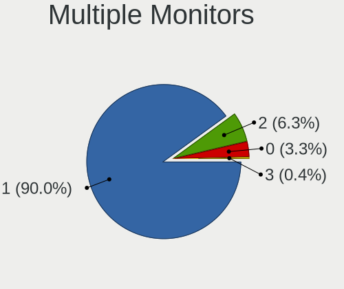

| Total | Computers | Percent |
|-------|-----------|---------|
| 1     | 1755      | 89.95%  |
| 2     | 128       | 6.56%   |
| 0     | 58        | 2.97%   |
| 3     | 10        | 0.51%   |

Network
-------

Net Controller Vendor
---------------------

Controller vendors

| Vendor                            | Computers | Percent |
|-----------------------------------|-----------|---------|
| Realtek Semiconductor             | 1173      | 41.43%  |
| Intel                             | 816       | 28.82%  |
| Qualcomm Atheros                  | 335       | 11.83%  |
| Broadcom                          | 124       | 4.38%   |
| MediaTek                          | 44        | 1.55%   |
| TP-Link                           | 38        | 1.34%   |
| Ralink Technology                 | 30        | 1.06%   |
| Broadcom Limited                  | 26        | 0.92%   |
| ASIX Electronics                  | 25        | 0.88%   |
| Nvidia                            | 23        | 0.81%   |
| Ralink                            | 22        | 0.78%   |
| Marvell Technology Group          | 19        | 0.67%   |
| Qualcomm Atheros Communications   | 16        | 0.57%   |
| D-Link                            | 12        | 0.42%   |
| Dell                              | 10        | 0.35%   |
| Sierra Wireless                   | 8         | 0.28%   |
| Samsung Electronics               | 8         | 0.28%   |
| JMicron Technology                | 8         | 0.28%   |
| Huawei Technologies               | 8         | 0.28%   |
| Ericsson Business Mobile Networks | 8         | 0.28%   |
| NetGear                           | 7         | 0.25%   |
| ZTE WCDMA Technologies MSM        | 5         | 0.18%   |
| OPPO Electronics                  | 5         | 0.18%   |
| Silicon Integrated Systems [SiS]  | 4         | 0.14%   |
| ASUSTek Computer                  | 4         | 0.14%   |
| Qualcomm                          | 3         | 0.11%   |
| Microchip Technology              | 3         | 0.11%   |
| Mercucys                          | 3         | 0.11%   |
| Hewlett-Packard                   | 3         | 0.11%   |
| DisplayLink                       | 3         | 0.11%   |
| Xiaomi                            | 2         | 0.07%   |
| VIA Technologies                  | 2         | 0.07%   |
| Motorola PCS                      | 2         | 0.07%   |
| Lenovo                            | 2         | 0.07%   |
| ICS Advent                        | 2         | 0.07%   |
| FIBOCOM                           | 2         | 0.07%   |
| D-Link System                     | 2         | 0.07%   |
| BUFFALO                           | 2         | 0.07%   |
| Belkin Components                 | 2         | 0.07%   |
| AVM                               | 2         | 0.07%   |

Net Controller Model
--------------------

Controller models

| Model                                                                  | Computers | Percent |
|------------------------------------------------------------------------|-----------|---------|
| Realtek RTL8111/8168/8211/8411 PCI Express Gigabit Ethernet Controller | 769       | 23.36%  |
| Realtek RTL810xE PCI Express Fast Ethernet controller                  | 161       | 4.89%   |
| Intel 82579LM Gigabit Network Connection (Lewisville)                  | 100       | 3.04%   |
| Realtek RTL8821CE 802.11ac PCIe Wireless Network Adapter               | 69        | 2.1%    |
| Qualcomm Atheros QCA9377 802.11ac Wireless Network Adapter             | 51        | 1.55%   |
| Qualcomm Atheros QCA9565 / AR9565 Wireless Network Adapter             | 50        | 1.52%   |
| Qualcomm Atheros AR9485 Wireless Network Adapter                       | 50        | 1.52%   |
| Intel Wireless 8265 / 8275                                             | 49        | 1.49%   |
| Realtek RTL8125 2.5GbE Controller                                      | 42        | 1.28%   |
| Qualcomm Atheros AR9285 Wireless Network Adapter (PCI-Express)         | 40        | 1.22%   |
| Intel Wireless 7265                                                    | 37        | 1.12%   |
| Intel Wi-Fi 6 AX200                                                    | 37        | 1.12%   |
| Intel Ethernet Connection I217-LM                                      | 36        | 1.09%   |
| Realtek RTL8822CE 802.11ac PCIe Wireless Network Adapter               | 34        | 1.03%   |
| Intel Dual Band Wireless-AC 3168NGW [Stone Peak]                       | 30        | 0.91%   |
| Intel Centrino Advanced-N 6205 [Taylor Peak]                           | 30        | 0.91%   |
| Realtek RTL8852BE PCIe 802.11ax Wireless Network Controller            | 29        | 0.88%   |
| Intel Wireless 7260                                                    | 29        | 0.88%   |
| Realtek RTL8153 Gigabit Ethernet Adapter                               | 28        | 0.85%   |
| Intel Wireless 8260                                                    | 27        | 0.82%   |
| Broadcom BCM4313 802.11bgn Wireless Network Adapter                    | 27        | 0.82%   |
| Intel Ethernet Controller I225-V                                       | 25        | 0.76%   |
| Qualcomm Atheros AR8151 v2.0 Gigabit Ethernet                          | 24        | 0.73%   |
| Intel Wi-Fi 6E(802.11ax) AX210/AX1675* 2x2 [Typhoon Peak]              | 24        | 0.73%   |
| Intel Wi-Fi 6 AX201                                                    | 24        | 0.73%   |
| Intel Wireless 3165                                                    | 22        | 0.67%   |
| Intel Ethernet Connection (4) I219-LM                                  | 22        | 0.67%   |
| Intel 82579V Gigabit Network Connection                                | 22        | 0.67%   |
| Realtek RTL8723BE PCIe Wireless Network Adapter                        | 21        | 0.64%   |
| Realtek RTL8188CE 802.11b/g/n WiFi Adapter                             | 21        | 0.64%   |
| ASIX AX88179 Gigabit Ethernet                                          | 21        | 0.64%   |
| Realtek 802.11n WLAN Adapter                                           | 20        | 0.61%   |
| Ralink MT7601U Wireless Adapter                                        | 20        | 0.61%   |
| Intel Ethernet Connection (2) I219-V                                   | 20        | 0.61%   |
| Intel Alder Lake-P PCH CNVi WiFi                                       | 20        | 0.61%   |
| Intel Wireless 3160                                                    | 18        | 0.55%   |
| Intel Ethernet Connection I217-V                                       | 17        | 0.52%   |
| Intel Ethernet Connection (2) I219-LM                                  | 17        | 0.52%   |
| Realtek 802.11ac NIC                                                   | 16        | 0.49%   |
| MediaTek MT7922 802.11ax PCI Express Wireless Network Adapter          | 16        | 0.49%   |

Wireless Vendor
---------------

Wireless vendors

| Vendor                          | Computers | Percent |
|---------------------------------|-----------|---------|
| Intel                           | 561       | 39.04%  |
| Realtek Semiconductor           | 337       | 23.45%  |
| Qualcomm Atheros                | 254       | 17.68%  |
| Broadcom                        | 71        | 4.94%   |
| MediaTek                        | 43        | 2.99%   |
| TP-Link                         | 35        | 2.44%   |
| Ralink Technology               | 30        | 2.09%   |
| Ralink                          | 22        | 1.53%   |
| Qualcomm Atheros Communications | 16        | 1.11%   |
| D-Link                          | 12        | 0.84%   |
| Broadcom Limited                | 12        | 0.84%   |
| Sierra Wireless                 | 8         | 0.56%   |
| NetGear                         | 7         | 0.49%   |
| ASUSTek Computer                | 4         | 0.28%   |
| Mercucys                        | 3         | 0.21%   |
| Dell                            | 3         | 0.21%   |
| FIBOCOM                         | 2         | 0.14%   |
| D-Link System                   | 2         | 0.14%   |
| BUFFALO                         | 2         | 0.14%   |
| Belkin Components               | 2         | 0.14%   |
| AVM                             | 2         | 0.14%   |
| ZyXEL Communications            | 1         | 0.07%   |
| ZyDAS                           | 1         | 0.07%   |
| Tenda                           | 1         | 0.07%   |
| Qualcomm                        | 1         | 0.07%   |
| Microsoft                       | 1         | 0.07%   |
| Marvell Technology Group        | 1         | 0.07%   |
| Fujitsu Siemens Computers       | 1         | 0.07%   |
| Edimax Technology               | 1         | 0.07%   |
| CyberTAN Technology             | 1         | 0.07%   |

Wireless Model
--------------

Wireless models

| Model                                                                   | Computers | Percent |
|-------------------------------------------------------------------------|-----------|---------|
| Realtek RTL8821CE 802.11ac PCIe Wireless Network Adapter                | 69        | 4.79%   |
| Qualcomm Atheros QCA9377 802.11ac Wireless Network Adapter              | 51        | 3.54%   |
| Qualcomm Atheros QCA9565 / AR9565 Wireless Network Adapter              | 50        | 3.47%   |
| Qualcomm Atheros AR9485 Wireless Network Adapter                        | 50        | 3.47%   |
| Intel Wireless 8265 / 8275                                              | 49        | 3.4%    |
| Qualcomm Atheros AR9285 Wireless Network Adapter (PCI-Express)          | 40        | 2.78%   |
| Intel Wireless 7265                                                     | 37        | 2.57%   |
| Intel Wi-Fi 6 AX200                                                     | 37        | 2.57%   |
| Realtek RTL8822CE 802.11ac PCIe Wireless Network Adapter                | 34        | 2.36%   |
| Intel Dual Band Wireless-AC 3168NGW [Stone Peak]                        | 30        | 2.08%   |
| Intel Centrino Advanced-N 6205 [Taylor Peak]                            | 30        | 2.08%   |
| Realtek RTL8852BE PCIe 802.11ax Wireless Network Controller             | 29        | 2.01%   |
| Intel Wireless 7260                                                     | 29        | 2.01%   |
| Intel Wireless 8260                                                     | 27        | 1.88%   |
| Broadcom BCM4313 802.11bgn Wireless Network Adapter                     | 27        | 1.88%   |
| Intel Wi-Fi 6E(802.11ax) AX210/AX1675* 2x2 [Typhoon Peak]               | 24        | 1.67%   |
| Intel Wi-Fi 6 AX201                                                     | 24        | 1.67%   |
| Intel Wireless 3165                                                     | 22        | 1.53%   |
| Realtek RTL8723BE PCIe Wireless Network Adapter                         | 21        | 1.46%   |
| Realtek RTL8188CE 802.11b/g/n WiFi Adapter                              | 21        | 1.46%   |
| Realtek 802.11n WLAN Adapter                                            | 20        | 1.39%   |
| Ralink MT7601U Wireless Adapter                                         | 20        | 1.39%   |
| Intel Alder Lake-P PCH CNVi WiFi                                        | 20        | 1.39%   |
| Intel Wireless 3160                                                     | 18        | 1.25%   |
| Realtek 802.11ac NIC                                                    | 16        | 1.11%   |
| MediaTek MT7922 802.11ax PCI Express Wireless Network Adapter           | 16        | 1.11%   |
| Intel Gemini Lake PCH CNVi WiFi                                         | 15        | 1.04%   |
| Intel Comet Lake PCH-LP CNVi WiFi                                       | 15        | 1.04%   |
| Qualcomm Atheros AR242x / AR542x Wireless Network Adapter (PCI-Express) | 14        | 0.97%   |
| Realtek RTL8188EUS 802.11n Wireless Network Adapter                     | 13        | 0.9%    |
| Intel Ice Lake-LP PCH CNVi WiFi                                         | 13        | 0.9%    |
| Intel Cannon Lake PCH CNVi WiFi                                         | 13        | 0.9%    |
| MediaTek MT7921 802.11ax PCI Express Wireless Network Adapter           | 12        | 0.83%   |
| Realtek RTL8723DE Wireless Network Adapter                              | 11        | 0.76%   |
| Qualcomm Atheros AR9271 802.11n                                         | 11        | 0.76%   |
| Qualcomm Atheros AR9462 Wireless Network Adapter                        | 11        | 0.76%   |
| Qualcomm Atheros AR9287 Wireless Network Adapter (PCI-Express)          | 11        | 0.76%   |
| Intel Wi-Fi 5(802.11ac) Wireless-AC 9x6x [Thunder Peak]                 | 11        | 0.76%   |
| Intel Centrino Ultimate-N 6300                                          | 11        | 0.76%   |
| Intel Centrino Advanced-N 6200                                          | 11        | 0.76%   |

Ethernet Vendor
---------------

Ethernet vendors

| Vendor                            | Computers | Percent |
|-----------------------------------|-----------|---------|
| Realtek Semiconductor             | 1013      | 56.59%  |
| Intel                             | 461       | 25.75%  |
| Qualcomm Atheros                  | 108       | 6.03%   |
| Broadcom                          | 67        | 3.74%   |
| ASIX Electronics                  | 25        | 1.4%    |
| Nvidia                            | 23        | 1.28%   |
| Marvell Technology Group          | 18        | 1.01%   |
| Broadcom Limited                  | 14        | 0.78%   |
| JMicron Technology                | 8         | 0.45%   |
| Samsung Electronics               | 7         | 0.39%   |
| Huawei Technologies               | 6         | 0.34%   |
| OPPO Electronics                  | 5         | 0.28%   |
| ZTE WCDMA Technologies MSM        | 4         | 0.22%   |
| Silicon Integrated Systems [SiS]  | 4         | 0.22%   |
| TP-Link                           | 3         | 0.17%   |
| Microchip Technology              | 3         | 0.17%   |
| DisplayLink                       | 3         | 0.17%   |
| Xiaomi                            | 2         | 0.11%   |
| VIA Technologies                  | 2         | 0.11%   |
| Qualcomm                          | 2         | 0.11%   |
| Lenovo                            | 2         | 0.11%   |
| ICS Advent                        | 2         | 0.11%   |
| Sundance Technology Inc / IC Plus | 1         | 0.06%   |
| MediaTek                          | 1         | 0.06%   |
| LG Electronics                    | 1         | 0.06%   |
| Hewlett-Packard                   | 1         | 0.06%   |
| Attansic Technology               | 1         | 0.06%   |
| Aquantia                          | 1         | 0.06%   |
| Apple                             | 1         | 0.06%   |
| 3Com                              | 1         | 0.06%   |

Ethernet Model
--------------

Ethernet models

| Model                                                                  | Computers | Percent |
|------------------------------------------------------------------------|-----------|---------|
| Realtek RTL8111/8168/8211/8411 PCI Express Gigabit Ethernet Controller | 769       | 42.18%  |
| Realtek RTL810xE PCI Express Fast Ethernet controller                  | 161       | 8.83%   |
| Intel 82579LM Gigabit Network Connection (Lewisville)                  | 100       | 5.49%   |
| Realtek RTL8125 2.5GbE Controller                                      | 42        | 2.3%    |
| Intel Ethernet Connection I217-LM                                      | 36        | 1.97%   |
| Realtek RTL8153 Gigabit Ethernet Adapter                               | 28        | 1.54%   |
| Intel Ethernet Controller I225-V                                       | 25        | 1.37%   |
| Qualcomm Atheros AR8151 v2.0 Gigabit Ethernet                          | 24        | 1.32%   |
| Intel Ethernet Connection (4) I219-LM                                  | 22        | 1.21%   |
| Intel 82579V Gigabit Network Connection                                | 22        | 1.21%   |
| ASIX AX88179 Gigabit Ethernet                                          | 21        | 1.15%   |
| Intel Ethernet Connection (2) I219-V                                   | 20        | 1.1%    |
| Intel Ethernet Connection I217-V                                       | 17        | 0.93%   |
| Intel Ethernet Connection (2) I219-LM                                  | 17        | 0.93%   |
| Intel Ethernet Connection I219-LM                                      | 16        | 0.88%   |
| Intel 82577LM Gigabit Network Connection                               | 15        | 0.82%   |
| Intel I211 Gigabit Network Connection                                  | 14        | 0.77%   |
| Intel 82567LM-3 Gigabit Network Connection                             | 13        | 0.71%   |
| Qualcomm Atheros Killer E220x Gigabit Ethernet Controller              | 12        | 0.66%   |
| Intel 82567LM Gigabit Network Connection                               | 12        | 0.66%   |
| Nvidia MCP61 Ethernet                                                  | 11        | 0.6%    |
| Intel Ethernet Connection (3) I218-LM                                  | 11        | 0.6%    |
| Realtek RTL8152 Fast Ethernet Adapter                                  | 10        | 0.55%   |
| Qualcomm Atheros AR8152 v2.0 Fast Ethernet                             | 10        | 0.55%   |
| Intel 82578DM Gigabit Network Connection                               | 10        | 0.55%   |
| Broadcom NetLink BCM57780 Gigabit Ethernet PCIe                        | 10        | 0.55%   |
| Qualcomm Atheros AR8131 Gigabit Ethernet                               | 9         | 0.49%   |
| Intel Ethernet Connection I218-LM                                      | 9         | 0.49%   |
| Intel Ethernet Connection (7) I219-V                                   | 9         | 0.49%   |
| Broadcom NetXtreme BCM57766 Gigabit Ethernet PCIe                      | 9         | 0.49%   |
| Broadcom NetXtreme BCM5764M Gigabit Ethernet PCIe                      | 9         | 0.49%   |
| Broadcom NetLink BCM57785 Gigabit Ethernet PCIe                        | 9         | 0.49%   |
| Realtek RTL-8100/8101L/8139 PCI Fast Ethernet Adapter                  | 8         | 0.44%   |
| Qualcomm Atheros AR8162 Fast Ethernet                                  | 8         | 0.44%   |
| Intel 82574L Gigabit Network Connection                                | 8         | 0.44%   |
| Samsung Galaxy series, misc. (tethering mode)                          | 7         | 0.38%   |
| Qualcomm Atheros AR8161 Gigabit Ethernet                               | 7         | 0.38%   |
| Qualcomm Atheros AR8152 v1.1 Fast Ethernet                             | 7         | 0.38%   |
| Intel Ethernet Connection (5) I219-LM                                  | 7         | 0.38%   |
| Intel Ethernet Connection (4) I219-V                                   | 7         | 0.38%   |

Net Controller Kind
-------------------

Ethernet, WiFi or modem

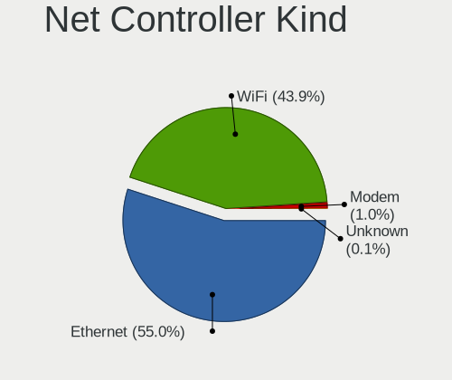

| Kind     | Computers | Percent |
|----------|-----------|---------|
| Ethernet | 1724      | 54.9%   |
| WiFi     | 1387      | 44.17%  |
| Modem    | 26        | 0.83%   |
| Unknown  | 3         | 0.1%    |

Used Controller
---------------

Currently used network controller

| Kind     | Computers | Percent |
|----------|-----------|---------|
| Ethernet | 1002      | 52.41%  |
| WiFi     | 910       | 47.59%  |

NICs
----

Total network controllers on board

| Total | Computers | Percent |
|-------|-----------|---------|
| 2     | 980       | 50.28%  |
| 1     | 904       | 46.38%  |
| 0     | 39        | 2%      |
| 3     | 24        | 1.23%   |
| 4     | 2         | 0.1%    |

IPv6
----

IPv6 vs IPv4

| Used | Computers | Percent |
|------|-----------|---------|
| No   | 1264      | 64.75%  |
| Yes  | 688       | 35.25%  |

Bluetooth
---------

Bluetooth Vendor
----------------

Controller vendors

| Vendor                          | Computers | Percent |
|---------------------------------|-----------|---------|
| Intel                           | 442       | 41.42%  |
| Realtek Semiconductor           | 168       | 15.75%  |
| Qualcomm Atheros Communications | 89        | 8.34%   |
| Cambridge Silicon Radio         | 74        | 6.94%   |
| Broadcom                        | 48        | 4.5%    |
| IMC Networks                    | 46        | 4.31%   |
| Foxconn / Hon Hai               | 46        | 4.31%   |
| Lite-On Technology              | 39        | 3.66%   |
| Apple                           | 22        | 2.06%   |
| Dell                            | 15        | 1.41%   |
| MediaTek                        | 14        | 1.31%   |
| Hewlett-Packard                 | 11        | 1.03%   |
| Toshiba                         | 10        | 0.94%   |
| ASUSTek Computer                | 8         | 0.75%   |
| TP-Link                         | 7         | 0.66%   |
| Unknown                         | 7         | 0.66%   |
| Ralink                          | 5         | 0.47%   |
| USI                             | 2         | 0.19%   |
| Realtek                         | 2         | 0.19%   |
| Integrated System Solution      | 2         | 0.19%   |
| Edimax Technology               | 2         | 0.19%   |
| Qcom                            | 1         | 0.09%   |
| Micro Star International        | 1         | 0.09%   |
| Marvell Semiconductor           | 1         | 0.09%   |
| Fujitsu                         | 1         | 0.09%   |
| Foxconn International           | 1         | 0.09%   |
| Dynex                           | 1         | 0.09%   |
| Alps Electric                   | 1         | 0.09%   |
| Actions                         | 1         | 0.09%   |

Bluetooth Model
---------------

Controller models

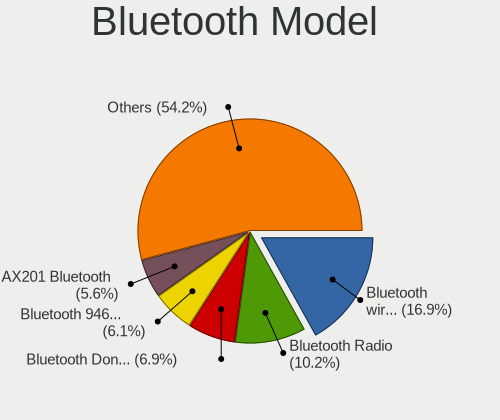

| Model                                                                               | Computers | Percent |
|-------------------------------------------------------------------------------------|-----------|---------|
| Intel Bluetooth wireless interface                                                  | 107       | 10.03%  |
| Realtek Bluetooth Radio                                                             | 102       | 9.56%   |
| Cambridge Silicon Radio Bluetooth Dongle (HCI mode)                                 | 74        | 6.94%   |
| Intel Bluetooth Device                                                              | 72        | 6.75%   |
| Intel AX201 Bluetooth                                                               | 60        | 5.62%   |
| Intel Bluetooth 9460/9560 Jefferson Peak (JfP)                                      | 58        | 5.44%   |
| Qualcomm Atheros  Bluetooth Device                                                  | 44        | 4.12%   |
| Intel AX200 Bluetooth                                                               | 36        | 3.37%   |
| Realtek  Bluetooth 4.2 Adapter                                                      | 34        | 3.19%   |
| Intel Wireless-AC 3168 Bluetooth                                                    | 30        | 2.81%   |
| IMC Networks Bluetooth Radio                                                        | 24        | 2.25%   |
| Intel Centrino Bluetooth Wireless Transceiver                                       | 21        | 1.97%   |
| Intel AX210 Bluetooth                                                               | 20        | 1.87%   |
| Intel AX211 Bluetooth                                                               | 17        | 1.59%   |
| Qualcomm Atheros AR3012 Bluetooth 4.0                                               | 15        | 1.41%   |
| Foxconn / Hon Hai Wireless_Device                                                   | 15        | 1.41%   |
| Broadcom BCM2045B (BDC-2.1)                                                         | 14        | 1.31%   |
| Realtek 802.11ac WLAN Adapter                                                       | 13        | 1.22%   |
| MediaTek Wireless_Device                                                            | 13        | 1.22%   |
| Intel Wireless-AC 9260 Bluetooth Adapter                                            | 13        | 1.22%   |
| Qualcomm Atheros AR3011 Bluetooth                                                   | 12        | 1.12%   |
| Lite-On Bluetooth Device                                                            | 12        | 1.12%   |
| Lite-On Qualcomm Atheros QCA9377 Bluetooth                                          | 11        | 1.03%   |
| Apple Bluetooth Host Controller                                                     | 10        | 0.94%   |
| IMC Networks Bluetooth Device                                                       | 9         | 0.84%   |
| Qualcomm Atheros AR9462 Bluetooth                                                   | 8         | 0.75%   |
| Lite-On Atheros AR3012 Bluetooth                                                    | 8         | 0.75%   |
| Intel Centrino Advanced-N 6230 Bluetooth adapter                                    | 8         | 0.75%   |
| HP Broadcom 2070 Bluetooth Combo                                                    | 8         | 0.75%   |
| Dell DW375 Bluetooth Module                                                         | 8         | 0.75%   |
| TP-Link UB500 Adapter                                                               | 7         | 0.66%   |
| Realtek RTL8723B Bluetooth                                                          | 7         | 0.66%   |
| Foxconn / Hon Hai Bluetooth Device                                                  | 7         | 0.66%   |
| Apple Bluetooth USB Host Controller                                                 | 7         | 0.66%   |
| Unknown                                                                             | 7         | 0.66%   |
| Foxconn / Hon Hai Foxconn T77H114 BCM2070 [Single-Chip Bluetooth 2.1 + EDR Adapter] | 6         | 0.56%   |
| Foxconn / Hon Hai Broadcom Bluetooth 2.1 Device                                     | 6         | 0.56%   |
| Broadcom BCM20702 Bluetooth 4.0 [ThinkPad]                                          | 6         | 0.56%   |
| Ralink RT3290 Bluetooth                                                             | 5         | 0.47%   |
| Lite-On Wireless_Device                                                             | 5         | 0.47%   |

Sound
-----

Sound Vendor
------------

Sound card vendors

| Vendor                                       | Computers | Percent |
|----------------------------------------------|-----------|---------|
| Intel                                        | 1476      | 57.63%  |
| AMD                                          | 533       | 20.81%  |
| Nvidia                                       | 371       | 14.49%  |
| C-Media Electronics                          | 39        | 1.52%   |
| Creative Labs                                | 16        | 0.62%   |
| Texas Instruments                            | 9         | 0.35%   |
| Realtek Semiconductor                        | 8         | 0.31%   |
| ASUSTek Computer                             | 8         | 0.31%   |
| Generalplus Technology                       | 7         | 0.27%   |
| Creative Technology                          | 6         | 0.23%   |
| GN Netcom                                    | 5         | 0.2%    |
| Zoran Co. Personal Media Division (Nogatech) | 4         | 0.16%   |
| Silicon Integrated Systems [SiS]             | 4         | 0.16%   |
| JMTek                                        | 4         | 0.16%   |
| Tenx Technology                              | 3         | 0.12%   |
| SAVITECH                                     | 3         | 0.12%   |
| Razer USA                                    | 3         | 0.12%   |
| M-Audio                                      | 3         | 0.12%   |
| Logitech                                     | 3         | 0.12%   |
| Lenovo                                       | 3         | 0.12%   |
| Kingston Technology                          | 3         | 0.12%   |
| VIA Technologies                             | 2         | 0.08%   |
| TerraTec Electronic                          | 2         | 0.08%   |
| Micro Star International                     | 2         | 0.08%   |
| KTMicro                                      | 2         | 0.08%   |
| GYROCOM C&C                                  | 2         | 0.08%   |
| Focusrite-Novation                           | 2         | 0.08%   |
| FiiO Electronics Technology                  | 2         | 0.08%   |
| BR25                                         | 2         | 0.08%   |
| ATI Technologies                             | 2         | 0.08%   |
| Xilinx                                       | 1         | 0.04%   |
| Valve Software                               | 1         | 0.04%   |
| Thesycon Systemsoftware & Consulting         | 1         | 0.04%   |
| somic                                        | 1         | 0.04%   |
| Samson Technologies                          | 1         | 0.04%   |
| PreSonus Audio Electronics                   | 1         | 0.04%   |
| ONN                                          | 1         | 0.04%   |
| Nordic Semiconductor ASA                     | 1         | 0.04%   |
| Native Instruments                           | 1         | 0.04%   |
| Musical Fidelity                             | 1         | 0.04%   |

Sound Model
-----------

Sound card models

| Model                                                                                             | Computers | Percent |
|---------------------------------------------------------------------------------------------------|-----------|---------|
| AMD Family 17h/19h HD Audio Controller                                                            | 175       | 5.67%   |
| Intel 7 Series/C216 Chipset Family High Definition Audio Controller                               | 165       | 5.34%   |
| Intel 6 Series/C200 Series Chipset Family High Definition Audio Controller                        | 156       | 5.05%   |
| Intel 8 Series/C220 Series Chipset High Definition Audio Controller                               | 127       | 4.11%   |
| Intel Sunrise Point-LP HD Audio                                                                   | 118       | 3.82%   |
| Intel Xeon E3-1200 v3/4th Gen Core Processor HD Audio Controller                                  | 87        | 2.82%   |
| AMD Renoir Radeon High Definition Audio Controller                                                | 87        | 2.82%   |
| Intel 5 Series/3400 Series Chipset High Definition Audio                                          | 84        | 2.72%   |
| Intel NM10/ICH7 Family High Definition Audio Controller                                           | 81        | 2.62%   |
| AMD SBx00 Azalia (Intel HDA)                                                                      | 70        | 2.27%   |
| Intel Celeron/Pentium Silver Processor High Definition Audio                                      | 64        | 2.07%   |
| AMD Raven/Raven2/Fenghuang HDMI/DP Audio Controller                                               | 59        | 1.91%   |
| AMD FCH Azalia Controller                                                                         | 58        | 1.88%   |
| AMD Starship/Matisse HD Audio Controller                                                          | 55        | 1.78%   |
| Intel 82801I (ICH9 Family) HD Audio Controller                                                    | 46        | 1.49%   |
| Intel 200 Series PCH HD Audio                                                                     | 46        | 1.49%   |
| Intel 100 Series/C230 Series Chipset Family HD Audio Controller                                   | 46        | 1.49%   |
| Intel Haswell-ULT HD Audio Controller                                                             | 45        | 1.46%   |
| Intel 8 Series HD Audio Controller                                                                | 45        | 1.46%   |
| Nvidia GK208 HDMI/DP Audio Controller                                                             | 44        | 1.43%   |
| Nvidia GF108 High Definition Audio Controller                                                     | 39        | 1.26%   |
| Intel Broadwell-U Audio Controller                                                                | 39        | 1.26%   |
| Intel Celeron N3350/Pentium N4200/Atom E3900 Series Audio Cluster                                 | 37        | 1.2%    |
| Intel Cannon Lake PCH cAVS                                                                        | 37        | 1.2%    |
| Intel Wildcat Point-LP High Definition Audio Controller                                           | 36        | 1.17%   |
| AMD Navi 21/23 HDMI/DP Audio Controller                                                           | 36        | 1.17%   |
| Nvidia GP107GL High Definition Audio Controller                                                   | 33        | 1.07%   |
| AMD Ellesmere HDMI Audio [Radeon RX 470/480 / 570/580/590]                                        | 31        | 1%      |
| Nvidia High Definition Audio Controller                                                           | 30        | 0.97%   |
| Intel Atom Processor Z36xxx/Z37xxx Series High Definition Audio Controller                        | 30        | 0.97%   |
| Intel Tiger Lake-LP Smart Sound Technology Audio Controller                                       | 29        | 0.94%   |
| AMD Family 15h (Models 60h-6fh) Audio Controller                                                  | 26        | 0.84%   |
| Intel Alder Lake PCH-P High Definition Audio Controller                                           | 25        | 0.81%   |
| Intel 82801H (ICH8 Family) HD Audio Controller                                                    | 24        | 0.78%   |
| AMD Family 17h (Models 00h-0fh) HD Audio Controller                                               | 23        | 0.75%   |
| Nvidia GM107 High Definition Audio Controller [GeForce 940MX]                                     | 22        | 0.71%   |
| AMD Rembrandt Radeon High Definition Audio Controller                                             | 22        | 0.71%   |
| Intel Ice Lake-LP Smart Sound Technology Audio Controller                                         | 21        | 0.68%   |
| Intel Atom/Celeron/Pentium Processor x5-E8000/J3xxx/N3xxx Series High Definition Audio Controller | 21        | 0.68%   |
| Intel Alder Lake-S HD Audio Controller                                                            | 21        | 0.68%   |

Memory
------

Memory Vendor
-------------

Memory module vendors

| Vendor                       | Computers | Percent |
|------------------------------|-----------|---------|
| Samsung Electronics          | 451       | 19.26%  |
| SK hynix                     | 329       | 14.05%  |
| Kingston                     | 296       | 12.64%  |
| Unknown                      | 248       | 10.59%  |
| Micron Technology            | 221       | 9.44%   |
| Crucial                      | 117       | 5%      |
| Corsair                      | 92        | 3.93%   |
| G.Skill                      | 66        | 2.82%   |
| A-DATA Technology            | 47        | 2.01%   |
| Unknown                      | 42        | 1.79%   |
| Ramaxel Technology           | 40        | 1.71%   |
| Unknown (ABCD)               | 39        | 1.67%   |
| Nanya Technology             | 38        | 1.62%   |
| Elpida                       | 38        | 1.62%   |
| Smart                        | 36        | 1.54%   |
| Patriot                      | 21        | 0.9%    |
| GOODRAM                      | 18        | 0.77%   |
| Team                         | 16        | 0.68%   |
| Transcend                    | 13        | 0.56%   |
| AMD                          | 13        | 0.56%   |
| Apacer                       | 12        | 0.51%   |
| ASint Technology             | 9         | 0.38%   |
| Atermiter                    | 7         | 0.3%    |
| Teikon                       | 6         | 0.26%   |
| PNY                          | 5         | 0.21%   |
| Kllisre                      | 5         | 0.21%   |
| 4ea5                         | 5         | 0.21%   |
| 48spaces                     | 5         | 0.21%   |
| Unknown (0x0E9D)             | 4         | 0.17%   |
| Patriot Memory (PDP Systems) | 4         | 0.17%   |
| High Bridge                  | 4         | 0.17%   |
| Avant                        | 4         | 0.17%   |
| Wodposit                     | 3         | 0.13%   |
| V-GeN                        | 3         | 0.13%   |
| Smart Brazil                 | 3         | 0.13%   |
| Silicon Power                | 3         | 0.13%   |
| Neo Forza                    | 3         | 0.13%   |
| Juhor                        | 3         | 0.13%   |
| Goldkey                      | 3         | 0.13%   |
| Unknown (0x7FFF)             | 2         | 0.09%   |

Memory Model
------------

Memory module models

| Model                                                            | Computers | Percent |
|------------------------------------------------------------------|-----------|---------|
| Unknown                                                          | 42        | 1.65%   |
| Unknown (ABCD) RAM 123456789012345678 2GB SODIMM LPDDR4 2400MT/s | 37        | 1.45%   |
| Samsung RAM M471B5273DH0-CH9 4GB SODIMM DDR3 1334MT/s            | 20        | 0.79%   |
| Samsung RAM M471B5173EB0-YK0 4GB SODIMM DDR3 1600MT/s            | 18        | 0.71%   |
| Samsung RAM M471B5173DB0-YK0 4GB SODIMM DDR3 1600MT/s            | 18        | 0.71%   |
| SK hynix RAM HMA81GS6AFR8N-UH 8GB SODIMM DDR4 2667MT/s           | 16        | 0.63%   |
| Samsung RAM Module 4GB Row Of Chips DDR4 2400MT/s                | 16        | 0.63%   |
| Samsung RAM M471A5244CB0-CWE 4GB SODIMM DDR4 3200MT/s            | 16        | 0.63%   |
| Samsung RAM M471A5244CB0-CTD 4GB SODIMM DDR4 3266MT/s            | 16        | 0.63%   |
| Samsung RAM M471A1K43CB1-CRC 8GB SODIMM DDR4 2667MT/s            | 16        | 0.63%   |
| SK hynix RAM HMT451S6BFR8A-PB 4GB SODIMM DDR3 1600MT/s           | 14        | 0.55%   |
| Micron RAM 8JTF51264AZ-1G6E1 4GB DIMM DDR3 1600MT/s              | 14        | 0.55%   |
| SK hynix RAM HMT351S6CFR8C-PB 4GB SODIMM DDR3 1600MT/s           | 13        | 0.51%   |
| Unknown RAM Module 8GB DIMM DDR3 1600MT/s                        | 11        | 0.43%   |
| Samsung RAM M471B1G73QH0-YK0 8GB SODIMM DDR3 1600MT/s            | 11        | 0.43%   |
| Samsung RAM M471A1G44AB0-CWE 8192MB SODIMM DDR4 3200MT/s         | 11        | 0.43%   |
| Micron RAM 4ATF51264HZ-2G6E1 4GB SODIMM DDR4 2667MT/s            | 11        | 0.43%   |
| Samsung RAM M471B5173QH0-YK0 4GB SODIMM DDR3 1600MT/s            | 10        | 0.39%   |
| Micron RAM 8KTF51264HZ-1G6E1 4GB SODIMM DDR3 1600MT/s            | 10        | 0.39%   |
| Micron RAM 4ATF51264HZ-3G2J1 4GB SODIMM DDR4 3200MT/s            | 10        | 0.39%   |
| Corsair RAM CMK16GX4M2B3200C16 8GB DIMM DDR4 3600MT/s            | 10        | 0.39%   |
| Unknown RAM Module 2GB DIMM DDR2 667MT/s                         | 9         | 0.35%   |
| Samsung RAM M471B5273CH0-CH9 4GB SODIMM DDR3 1334MT/s            | 9         | 0.35%   |
| Samsung RAM M471A1G44BB0-CWE 8GB SODIMM DDR4 3200MT/s            | 9         | 0.35%   |
| Unknown RAM Module 4GB DIMM 1333MT/s                             | 8         | 0.31%   |
| Unknown RAM Module 2GB DIMM SDRAM                                | 8         | 0.31%   |
| SK hynix RAM HMA851S6AFR6N-UH 4GB SODIMM DDR4 2667MT/s           | 8         | 0.31%   |
| Kingston RAM KF3200C16D4/8GX 8192MB DIMM DDR4 3600MT/s           | 8         | 0.31%   |
| Unknown RAM Module 2GB DIMM DDR2 800MT/s                         | 7         | 0.28%   |
| Unknown RAM Module 2GB DIMM 800MT/s                              | 7         | 0.28%   |
| Unknown RAM Module 1GB DIMM DDR2 667MT/s                         | 7         | 0.28%   |
| SK hynix RAM HMT351U6CFR8C-PB 4GB DIMM DDR3 1800MT/s             | 7         | 0.28%   |
| SK hynix RAM HMA851S6DJR6N-XN 4GB SODIMM DDR4 3200MT/s           | 7         | 0.28%   |
| Samsung RAM M471A5244CB0-CWE 4GB Row Of Chips DDR4 3200MT/s      | 7         | 0.28%   |
| Samsung RAM M471A1K43EB1-CWE 8GB SODIMM DDR4 3200MT/s            | 7         | 0.28%   |
| Samsung RAM M378B5673FH0-CH9 2GB DIMM DDR3 1600MT/s              | 7         | 0.28%   |
| Micron RAM 16KTF51264HZ-1G6M1 4GB SODIMM DDR3 1600MT/s           | 7         | 0.28%   |
| Kingston RAM KHX2666C16/8G 8GB DIMM DDR4 3466MT/s                | 7         | 0.28%   |
| Crucial RAM CT102464BA160B.C16 8GB DIMM DDR3 1600MT/s            | 7         | 0.28%   |
| Unknown RAM Module 4GB SODIMM DDR3 1600MT/s                      | 6         | 0.24%   |

Memory Kind
-----------

Memory module kinds

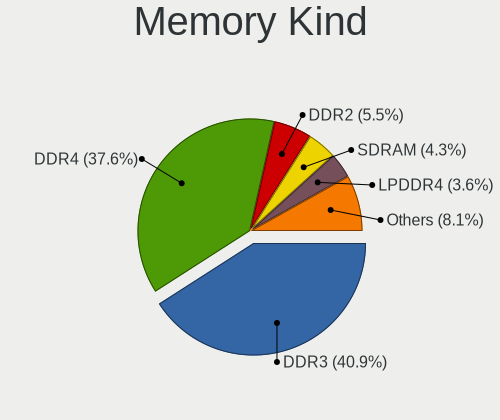

| Kind    | Computers | Percent |
|---------|-----------|---------|
| DDR3    | 812       | 41.22%  |
| DDR4    | 739       | 37.51%  |
| DDR2    | 100       | 5.08%   |
| SDRAM   | 81        | 4.11%   |
| LPDDR4  | 75        | 3.81%   |
| Unknown | 72        | 3.65%   |
| DDR5    | 30        | 1.52%   |
| LPDDR5  | 23        | 1.17%   |
| LPDDR3  | 14        | 0.71%   |
| DDR     | 13        | 0.66%   |
| DRAM    | 9         | 0.46%   |
| RAM     | 2         | 0.1%    |

Memory Form Factor
------------------

Physical design of the memory module

| Name            | Computers | Percent |
|-----------------|-----------|---------|
| SODIMM          | 1012      | 52.06%  |
| DIMM            | 826       | 42.49%  |
| Row Of Chips    | 92        | 4.73%   |
| Unknown         | 9         | 0.46%   |
| Chip            | 3         | 0.15%   |
| RIMM            | 1         | 0.05%   |
| Proprietary Car | 1         | 0.05%   |

Memory Size
-----------

Memory module size

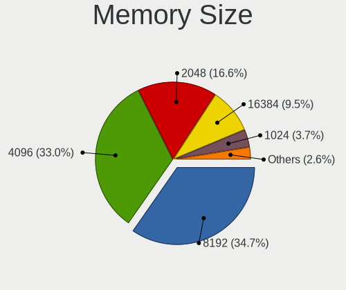

| Size  | Computers | Percent |
|-------|-----------|---------|
| 8192  | 771       | 35.05%  |
| 4096  | 724       | 32.91%  |
| 2048  | 362       | 16.45%  |
| 16384 | 200       | 9.09%   |
| 1024  | 82        | 3.73%   |
| 32768 | 50        | 2.27%   |
| 512   | 5         | 0.23%   |
| 65536 | 1         | 0.05%   |
| 24576 | 1         | 0.05%   |
| 15616 | 1         | 0.05%   |
| 12333 | 1         | 0.05%   |
| 3072  | 1         | 0.05%   |
| 256   | 1         | 0.05%   |

Memory Speed
------------

Memory module speed

| Speed   | Computers | Percent |
|---------|-----------|---------|
| 1600    | 535       | 24.29%  |
| 3200    | 241       | 10.94%  |
| 2667    | 222       | 10.08%  |
| 1333    | 189       | 8.58%   |
| 2400    | 176       | 7.99%   |
| 1334    | 96        | 4.36%   |
| 2133    | 85        | 3.86%   |
| 667     | 61        | 2.77%   |
| 800     | 57        | 2.59%   |
| Unknown | 52        | 2.36%   |
| 3600    | 47        | 2.13%   |
| 1067    | 32        | 1.45%   |
| 1867    | 31        | 1.41%   |
| 1066    | 22        | 1%      |
| 6400    | 21        | 0.95%   |
| 4800    | 21        | 0.95%   |
| 1800    | 20        | 0.91%   |
| 3733    | 19        | 0.86%   |
| 2666    | 19        | 0.86%   |
| 3266    | 17        | 0.77%   |
| 1866    | 17        | 0.77%   |
| 533     | 16        | 0.73%   |
| 400     | 15        | 0.68%   |
| 4267    | 12        | 0.54%   |
| 4199    | 12        | 0.54%   |
| 3800    | 12        | 0.54%   |
| 2933    | 11        | 0.5%    |
| 3400    | 10        | 0.45%   |
| 2048    | 9         | 0.41%   |
| 975     | 8         | 0.36%   |
| 3466    | 7         | 0.32%   |
| 3000    | 7         | 0.32%   |
| 4266    | 6         | 0.27%   |
| 3866    | 6         | 0.27%   |
| 1648    | 6         | 0.27%   |
| 333     | 6         | 0.27%   |
| 2800    | 5         | 0.23%   |
| 2000    | 5         | 0.23%   |
| 5600    | 4         | 0.18%   |
| 4000    | 4         | 0.18%   |

Printers & scanners
-------------------

Printer Vendor
--------------

Printer device vendors

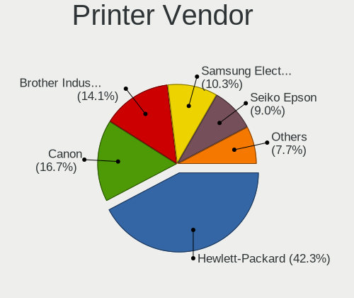

| Vendor                | Computers | Percent |
|-----------------------|-----------|---------|
| Hewlett-Packard       | 25        | 40.32%  |
| Canon                 | 11        | 17.74%  |
| Brother Industries    | 9         | 14.52%  |
| Samsung Electronics   | 7         | 11.29%  |
| Seiko Epson           | 5         | 8.06%   |
| Prolific Technology   | 2         | 3.23%   |
| Oki Data              | 1         | 1.61%   |
| Lexmark International | 1         | 1.61%   |
| Apple                 | 1         | 1.61%   |

Printer Model
-------------

Printer device models

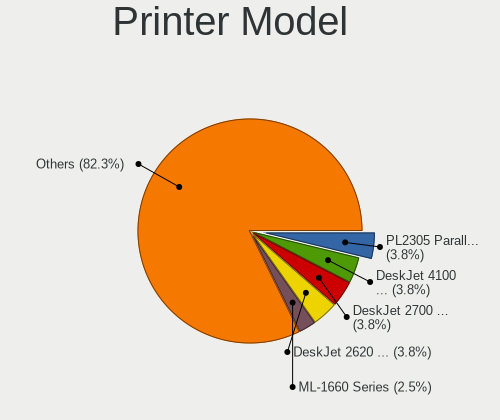

| Model                                        | Computers | Percent |
|----------------------------------------------|-----------|---------|
| HP DeskJet 4100 series                       | 3         | 4.76%   |
| HP DeskJet 2600 series                       | 3         | 4.76%   |
| Prolific PL2305 Parallel Port                | 2         | 3.17%   |
| HP DeskJet 2700 series                       | 2         | 3.17%   |
| Canon MF110/910 Series                       | 2         | 3.17%   |
| Brother HL-L2350DW series                    | 2         | 3.17%   |
| Seiko Epson ME 320/330 Series [Stylus SX125] | 1         | 1.59%   |
| Seiko Epson L3210 Series                     | 1         | 1.59%   |
| Seiko Epson L120 Series                      | 1         | 1.59%   |
| Seiko Epson ET-4850 Series                   | 1         | 1.59%   |
| Seiko Epson ET-2710 Series                   | 1         | 1.59%   |
| Samsung SCX-6x55X Series                     | 1         | 1.59%   |
| Samsung ML-216x Series Laser Printer         | 1         | 1.59%   |
| Samsung ML-1865                              | 1         | 1.59%   |
| Samsung ML-1660 Series                       | 1         | 1.59%   |
| Samsung ML-1640 Series Laser Printer         | 1         | 1.59%   |
| Samsung M2020 Series                         | 1         | 1.59%   |
| Samsung Composite Device                     | 1         | 1.59%   |
| Oki Data MC363 Multifunction Printer         | 1         | 1.59%   |
| Lexmark International MS510dn                | 1         | 1.59%   |
| HP Printing Support                          | 1         | 1.59%   |
| HP PhotoSmart 7150                           | 1         | 1.59%   |
| HP OfficeJet Pro 6960                        | 1         | 1.59%   |
| HP Officejet J4500 series                    | 1         | 1.59%   |
| HP OfficeJet 8010 series                     | 1         | 1.59%   |
| HP OfficeJet 3830 series                     | 1         | 1.59%   |
| HP LaserJet 1020                             | 1         | 1.59%   |
| HP LaserJet 1015                             | 1         | 1.59%   |
| HP HP LaserJet M14-M17                       | 1         | 1.59%   |
| HP ENVY 5000 series                          | 1         | 1.59%   |
| HP DeskJet Plus 6400 series                  | 1         | 1.59%   |
| HP DeskJet 6940 series                       | 1         | 1.59%   |
| HP DeskJet 4530 series                       | 1         | 1.59%   |
| HP DeskJet 3700 series                       | 1         | 1.59%   |
| HP DeskJet 3630 series                       | 1         | 1.59%   |
| HP DeskJet 2300 series                       | 1         | 1.59%   |
| HP DeskJet 2130 series                       | 1         | 1.59%   |
| HP Color LaserJet CP1215                     | 1         | 1.59%   |
| Canon PIXMA MG3600 Series                    | 1         | 1.59%   |
| Canon MF4010 series                          | 1         | 1.59%   |

Scanner Vendor
--------------

Scanner device vendors

| Vendor          | Computers | Percent |
|-----------------|-----------|---------|
| Canon           | 6         | 60%     |
| Seiko Epson     | 2         | 20%     |
| Hewlett-Packard | 2         | 20%     |

Scanner Model
-------------

Scanner device models

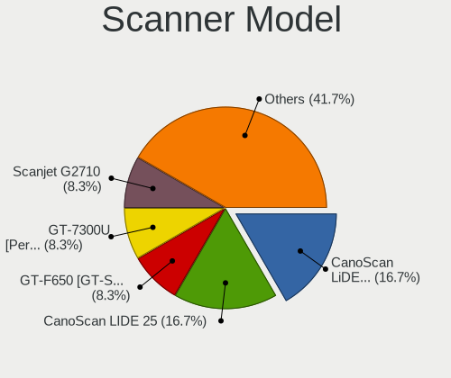

| Model                                             | Computers | Percent |
|---------------------------------------------------|-----------|---------|
| Seiko Epson GT-F650 [GT-S600/Perfection V10/V100] | 1         | 10%     |
| Seiko Epson GT-7300U [Perfection 1260/1260 PHOTO] | 1         | 10%     |
| HP Scanjet G2710                                  | 1         | 10%     |
| HP ScanJet 2400c                                  | 1         | 10%     |
| Canon CanoScan N670U/N676U/LiDE 20                | 1         | 10%     |
| Canon CanoScan N650U/N656U                        | 1         | 10%     |
| Canon CanoScan LIDE 25                            | 1         | 10%     |
| Canon CanoScan LiDE 220                           | 1         | 10%     |
| Canon CanoScan LiDE 110                           | 1         | 10%     |
| Canon CanoScan 1220U                              | 1         | 10%     |

Camera
------

Camera Vendor
-------------

Camera device vendors

| Vendor                                 | Computers | Percent |
|----------------------------------------|-----------|---------|
| Chicony Electronics                    | 233       | 23.7%   |
| Microdia                               | 89        | 9.05%   |
| IMC Networks                           | 85        | 8.65%   |
| Bison Electronics                      | 66        | 6.71%   |
| Realtek Semiconductor                  | 63        | 6.41%   |
| Quanta                                 | 45        | 4.58%   |
| Sunplus Innovation Technology          | 42        | 4.27%   |
| Logitech                               | 36        | 3.66%   |
| Cheng Uei Precision Industry (Foxlink) | 34        | 3.46%   |
| Suyin                                  | 27        | 2.75%   |
| Syntek                                 | 26        | 2.64%   |
| Acer                                   | 22        | 2.24%   |
| icSpring                               | 19        | 1.93%   |
| Luxvisions Innotech Limited            | 18        | 1.83%   |
| Alcor Micro                            | 17        | 1.73%   |
| Apple                                  | 16        | 1.63%   |
| Silicon Motion                         | 14        | 1.42%   |
| Lite-On Technology                     | 11        | 1.12%   |
| Z-Star Microelectronics                | 9         | 0.92%   |
| Ricoh                                  | 8         | 0.81%   |
| Microsoft                              | 8         | 0.81%   |
| Lenovo                                 | 8         | 0.81%   |
| ALi                                    | 8         | 0.81%   |
| Importek                               | 7         | 0.71%   |
| Unknown                                | 5         | 0.51%   |
| SunplusIT                              | 5         | 0.51%   |
| Sonix Technology                       | 4         | 0.41%   |
| Y Media                                | 3         | 0.31%   |
| Tripath Technology                     | 3         | 0.31%   |
| Hewlett-Packard                        | 3         | 0.31%   |
| DigiTech                               | 3         | 0.31%   |
| Sunplus IT                             | 2         | 0.2%    |
| Primax Electronics                     | 2         | 0.2%    |
| OYT Tech                               | 2         | 0.2%    |
| MacroSilicon                           | 2         | 0.2%    |
| KYE Systems (Mouse Systems)            | 2         | 0.2%    |
| kingcome                               | 2         | 0.2%    |
| Genesys Logic                          | 2         | 0.2%    |
| Generalplus Technology                 | 2         | 0.2%    |
| GEMBIRD                                | 2         | 0.2%    |

Camera Model
------------

Camera device models

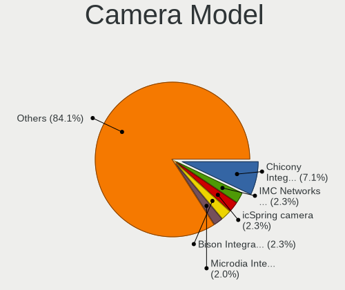

| Model                                                                      | Computers | Percent |
|----------------------------------------------------------------------------|-----------|---------|
| Chicony Integrated Camera                                                  | 54        | 5.46%   |
| IMC Networks USB2.0 HD UVC WebCam                                          | 23        | 2.33%   |
| Microdia Integrated_Webcam_HD                                              | 20        | 2.02%   |
| icSpring camera                                                            | 19        | 1.92%   |
| Bison Integrated Camera                                                    | 19        | 1.92%   |
| Syntek Integrated Camera                                                   | 18        | 1.82%   |
| Chicony HD WebCam                                                          | 18        | 1.82%   |
| Realtek Integrated_Webcam_HD                                               | 17        | 1.72%   |
| IMC Networks USB2.0 VGA UVC WebCam                                         | 16        | 1.62%   |
| IMC Networks Integrated Camera                                             | 14        | 1.42%   |
| Sunplus Integrated_Webcam_HD                                               | 13        | 1.31%   |
| Luxvisions Innotech Limited HP TrueVision HD Camera                        | 13        | 1.31%   |
| Logitech Webcam C270                                                       | 11        | 1.11%   |
| Chicony HP Truevision HD camera                                            | 11        | 1.11%   |
| Realtek USB Camera                                                         | 9         | 0.91%   |
| Quanta VGA Webcam                                                          | 9         | 0.91%   |
| Microdia USB 2.0 Camera                                                    | 9         | 0.91%   |
| Chicony USB 2.0 Camera                                                     | 9         | 0.91%   |
| Bison Lenovo EasyCamera                                                    | 9         | 0.91%   |
| Quanta HD User Facing                                                      | 8         | 0.81%   |
| Chicony USB2.0 HD UVC WebCam                                               | 8         | 0.81%   |
| Chicony HP Webcam                                                          | 8         | 0.81%   |
| Chicony HP HD Webcam                                                       | 8         | 0.81%   |
| ALi Gateway Webcam                                                         | 8         | 0.81%   |
| Acer Integrated Camera                                                     | 8         | 0.81%   |
| Microdia Integrated Webcam                                                 | 7         | 0.71%   |
| Chicony Lenovo Integrated Camera (0.3MP)                                   | 7         | 0.71%   |
| Chicony HP HD Camera                                                       | 7         | 0.71%   |
| Bison HD Webcam                                                            | 7         | 0.71%   |
| Bison EasyCamera                                                           | 7         | 0.71%   |
| Bison BisonCam, NB Pro                                                     | 7         | 0.71%   |
| Apple FaceTime HD Camera (Built-in)                                        | 7         | 0.71%   |
| Acer Lenovo Integrated Webcam                                              | 7         | 0.71%   |
| Silicon Motion Web Camera                                                  | 6         | 0.61%   |
| Quanta HP Webcam                                                           | 6         | 0.61%   |
| Microdia Lenovo EasyCamera                                                 | 6         | 0.61%   |
| Microdia HP Integrated Webcam                                              | 6         | 0.61%   |
| Cheng Uei Precision Industry (Foxlink) HP Wide Vision HD Integrated Webcam | 6         | 0.61%   |
| Cheng Uei Precision Industry (Foxlink) HP TrueVision HD Camera             | 6         | 0.61%   |
| Cheng Uei Precision Industry (Foxlink) HP HD Camera                        | 6         | 0.61%   |

Security
--------

Fingerprint Vendor
------------------

Fingerprint sensor vendors

| Vendor                             | Computers | Percent |
|------------------------------------|-----------|---------|
| Validity Sensors                   | 58        | 42.96%  |
| Synaptics                          | 19        | 14.07%  |
| Upek                               | 17        | 12.59%  |
| AuthenTec                          | 13        | 9.63%   |
| Shenzhen Goodix Technology         | 9         | 6.67%   |
| LighTuning Technology              | 8         | 5.93%   |
| Elan Microelectronics              | 7         | 5.19%   |
| Realtek USB2.0 Finger Print Bridge | 2         | 1.48%   |
| Focal-systems.Corp                 | 2         | 1.48%   |

Fingerprint Model
-----------------

Fingerprint sensor models

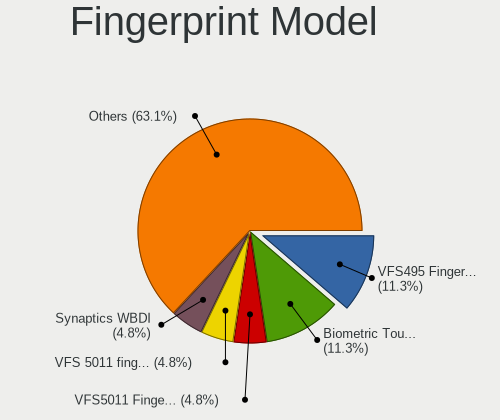

| Model                                                                      | Computers | Percent |
|----------------------------------------------------------------------------|-----------|---------|
| Upek Biometric Touchchip/Touchstrip Fingerprint Sensor                     | 15        | 11.11%  |
| Validity Sensors VFS495 Fingerprint Reader                                 | 14        | 10.37%  |
| Validity Sensors VFS 5011 fingerprint sensor                               | 7         | 5.19%   |
| AuthenTec AES2810                                                          | 7         | 5.19%   |
| Validity Sensors VFS5011 Fingerprint Reader                                | 6         | 4.44%   |
| Validity Sensors Synaptics WBDI                                            | 6         | 4.44%   |
| Validity Sensors VFS491                                                    | 5         | 3.7%    |
| Synaptics Metallica MIS Touch Fingerprint Reader                           | 5         | 3.7%    |
| Shenzhen Goodix  Fingerprint Device                                        | 5         | 3.7%    |
| Validity Sensors VFS451 Fingerprint Reader                                 | 4         | 2.96%   |
| Validity Sensors Fingerprint scanner                                       | 4         | 2.96%   |
| Synaptics WBDI                                                             | 4         | 2.96%   |
| Synaptics Prometheus MIS Touch Fingerprint Reader                          | 4         | 2.96%   |
| Shenzhen Goodix Fingerprint Reader                                         | 4         | 2.96%   |
| Elan ELAN:Fingerprint                                                      | 4         | 2.96%   |
| AuthenTec Fingerprint Sensor                                               | 4         | 2.96%   |
| Validity Sensors VFS7500 Touch Fingerprint Sensor                          | 3         | 2.22%   |
| Validity Sensors VFS471 Fingerprint Reader                                 | 3         | 2.22%   |
| LighTuning EgisTec Touch Fingerprint Sensor                                | 3         | 2.22%   |
| Elan ELAN:ARM-M4                                                           | 3         | 2.22%   |
| Validity Sensors VFS301 Fingerprint Reader                                 | 2         | 1.48%   |
| Validity Sensors Synaptics VFS7552 Touch Fingerprint Sensor with PurePrint | 2         | 1.48%   |
| Upek TCS5B Fingerprint sensor                                              | 2         | 1.48%   |
| Synaptics  WBDI                                                            | 2         | 1.48%   |
| Realtek USB2.0 Finger Print Bridge FocalTech Fingerprint Device            | 2         | 1.48%   |
| LighTuning Fingerprint Sensor                                              | 2         | 1.48%   |
| LighTuning ES603 Swipe Fingerprint Sensor                                  | 2         | 1.48%   |
| Focal-systems.Corp FT9201Fingerprint.                                      | 2         | 1.48%   |
| AuthenTec AES2501 Fingerprint Sensor                                       | 2         | 1.48%   |
| Validity Sensors VFS7552 Touch Fingerprint Sensor                          | 1         | 0.74%   |
| Validity Sensors Swipe Fingerprint Sensor                                  | 1         | 0.74%   |
| Synaptics UWP WBDI Device                                                  | 1         | 0.74%   |
| Synaptics UWP WBDI                                                         | 1         | 0.74%   |
| Synaptics  WBDI Fingerprint Reader - USB 052                               | 1         | 0.74%   |
| Synaptics Fingerprint scanner                                              | 1         | 0.74%   |
| LighTuning Fingerprint Reader                                              | 1         | 0.74%   |

Chipcard Vendor
---------------

Chipcard module vendors

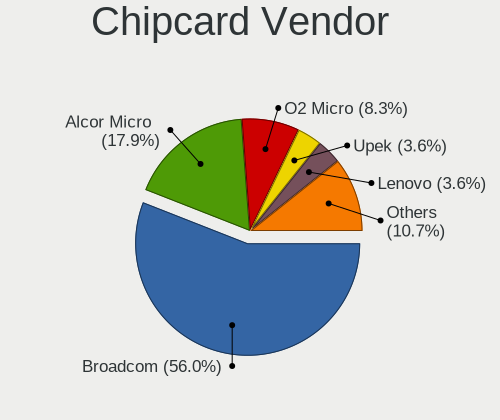

| Vendor                | Computers | Percent |
|-----------------------|-----------|---------|
| Broadcom              | 34        | 52.31%  |
| Alcor Micro           | 11        | 16.92%  |
| O2 Micro              | 6         | 9.23%   |
| Upek                  | 3         | 4.62%   |
| SCM Microsystems      | 2         | 3.08%   |
| Lenovo                | 2         | 3.08%   |
| Gemalto (was Gemplus) | 2         | 3.08%   |
| CHERRY                | 2         | 3.08%   |
| OmniKey               | 1         | 1.54%   |
| Chicony Electronics   | 1         | 1.54%   |
| Advanced Card Systems | 1         | 1.54%   |

Chipcard Model
--------------

Chipcard module models

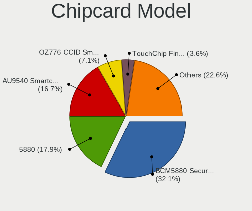

| Model                                                                        | Computers | Percent |
|------------------------------------------------------------------------------|-----------|---------|
| Broadcom BCM5880 Secure Applications Processor                               | 21        | 32.31%  |
| Broadcom 5880                                                                | 10        | 15.38%  |
| Alcor Micro AU9540 Smartcard Reader                                          | 10        | 15.38%  |
| O2 Micro OZ776 CCID Smartcard Reader                                         | 5         | 7.69%   |
| Upek TouchChip Fingerprint Coprocessor (WBF advanced mode)                   | 3         | 4.62%   |
| Lenovo Integrated Smart Card Reader                                          | 2         | 3.08%   |
| CHERRY SmartCard Reader Keyboard KC 1000 SC                                  | 2         | 3.08%   |
| Broadcom BCM5880 Secure Applications Processor with fingerprint swipe sensor | 2         | 3.08%   |
| SCM Microsystems SCR3340 - ExpressCard54 Smart Card Reader                   | 1         | 1.54%   |
| SCM Microsystems SCR331-LC1 / SCR3310 SmartCard Reader                       | 1         | 1.54%   |
| OmniKey CardMan 3121 (HID Technologies)                                      | 1         | 1.54%   |
| O2 Micro Oz776 SmartCard Reader                                              | 1         | 1.54%   |
| Gemalto (was Gemplus) GemPC Twin SmartCard Reader                            | 1         | 1.54%   |
| Gemalto (was Gemplus) Compact Smart Card Reader Writer                       | 1         | 1.54%   |
| Chicony Electronics HP Skylab USB Smartcard Keyboard                         | 1         | 1.54%   |
| Broadcom 58200                                                               | 1         | 1.54%   |
| Alcor Micro Watchdata W 1981                                                 | 1         | 1.54%   |
| Advanced Card Systems ACR38 SmartCard Reader                                 | 1         | 1.54%   |

Unsupported
-----------

Unsupported Devices
-------------------

Total unsupported devices on board

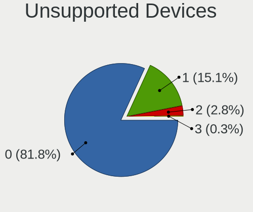

| Total | Computers | Percent |
|-------|-----------|---------|
| 0     | 1602      | 82.15%  |
| 1     | 301       | 15.44%  |
| 2     | 44        | 2.26%   |
| 3     | 3         | 0.15%   |

Unsupported Device Types
------------------------

Types of unsupported devices

| Type                     | Computers | Percent |
|--------------------------|-----------|---------|
| Fingerprint reader       | 135       | 34.97%  |
| Graphics card            | 104       | 26.94%  |
| Chipcard                 | 61        | 15.8%   |
| Net/wireless             | 22        | 5.7%    |
| Multimedia controller    | 21        | 5.44%   |
| Unassigned class         | 10        | 2.59%   |
| Storage                  | 10        | 2.59%   |
| Communication controller | 10        | 2.59%   |
| Bluetooth                | 7         | 1.81%   |
| Storage/raid             | 2         | 0.52%   |
| Card reader              | 2         | 0.52%   |
| Network                  | 1         | 0.26%   |
| Camera                   | 1         | 0.26%   |

