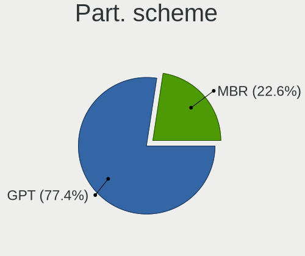
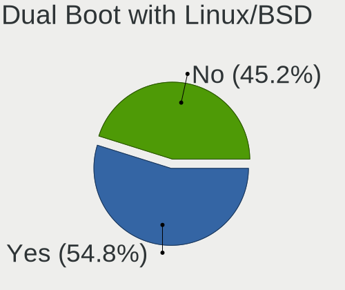
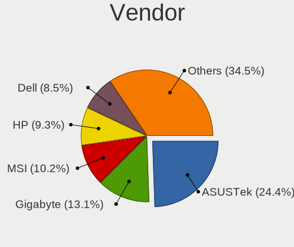
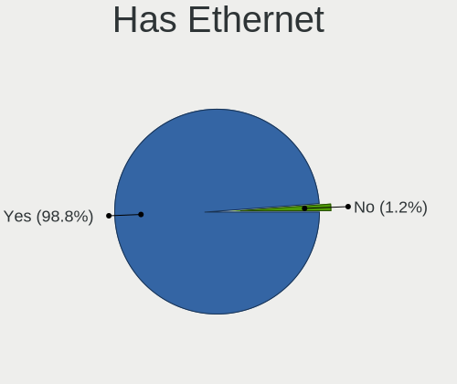
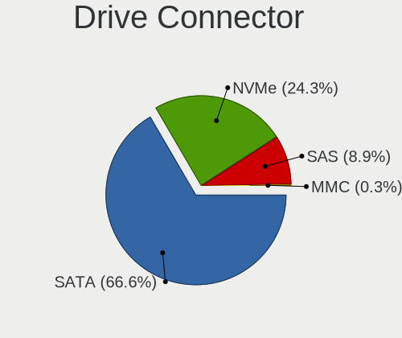
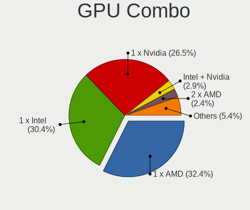

OpenMandriva 24.07 - Tested Hardware & Statistics (Desktops)
------------------------------------------------------------

A project to collect tested hardware configurations for OpenMandriva 24.07.

Anyone can contribute to this report by the [hw-probe](https://github.com/linuxhw/hw-probe) tool:

    sudo -E hw-probe -all -upload

Please contribute! Especially if your hardware is rare.

Contents
--------

* [ Test Cases ](#test-cases)

* [ System ](#system)
  - [ Kernel                   ](#kernel)
  - [ Kernel Family            ](#kernel-family)
  - [ Kernel Major Ver.        ](#kernel-major-ver)
  - [ Arch                     ](#arch)
  - [ DE                       ](#de)
  - [ Display Server           ](#display-server)
  - [ Display Manager          ](#display-manager)
  - [ OS Lang                  ](#os-lang)
  - [ Boot Mode                ](#boot-mode)
  - [ Filesystem               ](#filesystem)
  - [ Part. scheme             ](#part-scheme)
  - [ Dual Boot with Linux/BSD ](#dual-boot-with-linuxbsd)
  - [ Dual Boot (Win)          ](#dual-boot-win)

* [ Board ](#board)
  - [ Vendor                   ](#vendor)
  - [ Model                    ](#model)
  - [ Model Family             ](#model-family)
  - [ MFG Year                 ](#mfg-year)
  - [ Form Factor              ](#form-factor)
  - [ Secure Boot              ](#secure-boot)
  - [ Coreboot                 ](#coreboot)
  - [ RAM Size                 ](#ram-size)
  - [ RAM Used                 ](#ram-used)
  - [ Total Drives             ](#total-drives)
  - [ Has CD-ROM               ](#has-cd-rom)
  - [ Has Ethernet             ](#has-ethernet)
  - [ Has WiFi                 ](#has-wifi)
  - [ Has Bluetooth            ](#has-bluetooth)

* [ Location ](#location)
  - [ Country                  ](#country)
  - [ City                     ](#city)

* [ Drives ](#drives)
  - [ Drive Vendor             ](#drive-vendor)
  - [ Drive Model              ](#drive-model)
  - [ HDD Vendor               ](#hdd-vendor)
  - [ SSD Vendor               ](#ssd-vendor)
  - [ Drive Kind               ](#drive-kind)
  - [ Drive Connector          ](#drive-connector)
  - [ Drive Size               ](#drive-size)
  - [ Space Total              ](#space-total)
  - [ Space Used               ](#space-used)
  - [ Malfunc. Drives          ](#malfunc-drives)
  - [ Malfunc. Drive Vendor    ](#malfunc-drive-vendor)
  - [ Malfunc. HDD Vendor      ](#malfunc-hdd-vendor)
  - [ Malfunc. Drive Kind      ](#malfunc-drive-kind)
  - [ Failed Drives            ](#failed-drives)
  - [ Failed Drive Vendor      ](#failed-drive-vendor)
  - [ Drive Status             ](#drive-status)

* [ Storage controller ](#storage-controller)
  - [ Storage Vendor           ](#storage-vendor)
  - [ Storage Model            ](#storage-model)
  - [ Storage Kind             ](#storage-kind)

* [ Processor ](#processor)
  - [ CPU Vendor               ](#cpu-vendor)
  - [ CPU Model                ](#cpu-model)
  - [ CPU Model Family         ](#cpu-model-family)
  - [ CPU Cores                ](#cpu-cores)
  - [ CPU Sockets              ](#cpu-sockets)
  - [ CPU Threads              ](#cpu-threads)
  - [ CPU Op-Modes             ](#cpu-op-modes)
  - [ CPU Microcode            ](#cpu-microcode)
  - [ CPU Microarch            ](#cpu-microarch)

* [ Graphics ](#graphics)
  - [ GPU Vendor               ](#gpu-vendor)
  - [ GPU Model                ](#gpu-model)
  - [ GPU Combo                ](#gpu-combo)
  - [ GPU Driver               ](#gpu-driver)
  - [ GPU Memory               ](#gpu-memory)

* [ Monitor ](#monitor)
  - [ Monitor Vendor           ](#monitor-vendor)
  - [ Monitor Model            ](#monitor-model)
  - [ Monitor Resolution       ](#monitor-resolution)
  - [ Monitor Diagonal         ](#monitor-diagonal)
  - [ Monitor Width            ](#monitor-width)
  - [ Aspect Ratio             ](#aspect-ratio)
  - [ Monitor Area             ](#monitor-area)
  - [ Pixel Density            ](#pixel-density)
  - [ Multiple Monitors        ](#multiple-monitors)

* [ Network ](#network)
  - [ Net Controller Vendor    ](#net-controller-vendor)
  - [ Net Controller Model     ](#net-controller-model)
  - [ Wireless Vendor          ](#wireless-vendor)
  - [ Wireless Model           ](#wireless-model)
  - [ Ethernet Vendor          ](#ethernet-vendor)
  - [ Ethernet Model           ](#ethernet-model)
  - [ Net Controller Kind      ](#net-controller-kind)
  - [ Used Controller          ](#used-controller)
  - [ NICs                     ](#nics)
  - [ IPv6                     ](#ipv6)

* [ Bluetooth ](#bluetooth)
  - [ Bluetooth Vendor         ](#bluetooth-vendor)
  - [ Bluetooth Model          ](#bluetooth-model)

* [ Sound ](#sound)
  - [ Sound Vendor             ](#sound-vendor)
  - [ Sound Model              ](#sound-model)

* [ Memory ](#memory)
  - [ Memory Vendor            ](#memory-vendor)
  - [ Memory Model             ](#memory-model)
  - [ Memory Kind              ](#memory-kind)
  - [ Memory Form Factor       ](#memory-form-factor)
  - [ Memory Size              ](#memory-size)
  - [ Memory Speed             ](#memory-speed)

* [ Printers & scanners ](#printers--scanners)
  - [ Printer Vendor           ](#printer-vendor)
  - [ Printer Model            ](#printer-model)
  - [ Scanner Vendor           ](#scanner-vendor)
  - [ Scanner Model            ](#scanner-model)

* [ Camera ](#camera)
  - [ Camera Vendor            ](#camera-vendor)
  - [ Camera Model             ](#camera-model)

* [ Security ](#security)
  - [ Fingerprint Vendor       ](#fingerprint-vendor)
  - [ Fingerprint Model        ](#fingerprint-model)
  - [ Chipcard Vendor          ](#chipcard-vendor)
  - [ Chipcard Model           ](#chipcard-model)

* [ Unsupported ](#unsupported)
  - [ Unsupported Devices      ](#unsupported-devices)
  - [ Unsupported Device Types ](#unsupported-device-types)

Test Cases
----------

Total: 590

| Vendor        | Model                       | Probe                                                      | Date         |
|---------------|-----------------------------|------------------------------------------------------------|--------------|
| ASUSTek       | CM6330_CM6630_CM6730_CM6... | [e6075adfc0](https://linux-hardware.org/?probe=e6075adfc0) | Jan 02, 2025 |
| Gigabyte      | GA-MA785GT-UD3H             | [bf30d86827](https://linux-hardware.org/?probe=bf30d86827) | Jan 01, 2025 |
| Unknown       | Unknown                     | [9dc841041f](https://linux-hardware.org/?probe=9dc841041f) | Dec 25, 2024 |
| Dell          | 0GDG8Y A00                  | [0219cb33b6](https://linux-hardware.org/?probe=0219cb33b6) | Dec 20, 2024 |
| MSI           | B75MA-P45                   | [da146c44f0](https://linux-hardware.org/?probe=da146c44f0) | Dec 19, 2024 |
| Gigabyte      | B450M DS3H V2               | [0d17c2a875](https://linux-hardware.org/?probe=0d17c2a875) | Dec 15, 2024 |
| Positivo      | POS-PIB150DT 11132270       | [c3a85ea71c](https://linux-hardware.org/?probe=c3a85ea71c) | Dec 15, 2024 |
| MSI           | Z97 GAMING 5                | [e41e77f484](https://linux-hardware.org/?probe=e41e77f484) | Dec 12, 2024 |
| Dell          | 09M47G A00                  | [c3b1e4864a](https://linux-hardware.org/?probe=c3b1e4864a) | Dec 12, 2024 |
| Unknown       | Unknown                     | [ed65661387](https://linux-hardware.org/?probe=ed65661387) | Dec 12, 2024 |
| Lenovo        | MAHOBAY NO DPK              | [c5d5aaca89](https://linux-hardware.org/?probe=c5d5aaca89) | Dec 11, 2024 |
| Dell          | 0F6X5P A00                  | [680aead333](https://linux-hardware.org/?probe=680aead333) | Dec 10, 2024 |
| Lenovo        | MAHOBAY Win8 MM DPK IPG     | [e885620f20](https://linux-hardware.org/?probe=e885620f20) | Dec 06, 2024 |
| MSI           | H61M-P23                    | [4e730504db](https://linux-hardware.org/?probe=4e730504db) | Dec 06, 2024 |
| MSI           | A88XI AC V2                 | [3bd43ba035](https://linux-hardware.org/?probe=3bd43ba035) | Dec 06, 2024 |
| ASUSTek       | PRIME B450-PLUS             | [cdb9d074c0](https://linux-hardware.org/?probe=cdb9d074c0) | Dec 06, 2024 |
| Dell          | 0CWR57 A01                  | [38bea64860](https://linux-hardware.org/?probe=38bea64860) | Dec 06, 2024 |
| MSI           | PRO Z690-A WIFI DDR4        | [dd80673855](https://linux-hardware.org/?probe=dd80673855) | Dec 05, 2024 |
| Gigabyte      | G31M-S2L                    | [a8795f3981](https://linux-hardware.org/?probe=a8795f3981) | Dec 04, 2024 |
| ASUSTek       | Z87-PRO                     | [029f1c1e1b](https://linux-hardware.org/?probe=029f1c1e1b) | Dec 03, 2024 |
| Unknown       | Unknown                     | [3405878ab6](https://linux-hardware.org/?probe=3405878ab6) | Dec 01, 2024 |
| Dell          | 088DT1 A01                  | [ba38d6b924](https://linux-hardware.org/?probe=ba38d6b924) | Dec 01, 2024 |
| Dell          | 0VNP2H A00                  | [d1a2135f92](https://linux-hardware.org/?probe=d1a2135f92) | Nov 30, 2024 |
| Gigabyte      | H61M-DS2                    | [ce0e3b2719](https://linux-hardware.org/?probe=ce0e3b2719) | Nov 29, 2024 |
| BESSTAR Te... | UM700                       | [5c18419477](https://linux-hardware.org/?probe=5c18419477) | Nov 29, 2024 |
| Dell          | 042P49 A02                  | [6c4c6577ac](https://linux-hardware.org/?probe=6c4c6577ac) | Nov 29, 2024 |
| MSI           | MPG B550 GAMING PLUS        | [7e2cca4ada](https://linux-hardware.org/?probe=7e2cca4ada) | Nov 28, 2024 |
| Gigabyte      | H81M-D2W                    | [c0db894e36](https://linux-hardware.org/?probe=c0db894e36) | Nov 28, 2024 |
| Lenovo        | 36C7 SDK0J40697 WIN 3305... | [d113defbe8](https://linux-hardware.org/?probe=d113defbe8) | Nov 27, 2024 |
| HP            | 18E7                        | [6dbb855fd6](https://linux-hardware.org/?probe=6dbb855fd6) | Nov 26, 2024 |
| Lenovo        | 3106 SDK0J40697 WIN 3305... | [2e121a8a35](https://linux-hardware.org/?probe=2e121a8a35) | Nov 26, 2024 |
| Gigabyte      | AB350M-DS3H V2-CF           | [07ef34a01f](https://linux-hardware.org/?probe=07ef34a01f) | Nov 25, 2024 |
| Intel         | B75                         | [b8e4743721](https://linux-hardware.org/?probe=b8e4743721) | Nov 24, 2024 |
| Lenovo        | 31900058 STD                | [dfea5f8644](https://linux-hardware.org/?probe=dfea5f8644) | Nov 24, 2024 |
| ASUSTek       | PRIME A520M-K               | [db71db68e5](https://linux-hardware.org/?probe=db71db68e5) | Nov 23, 2024 |
| Gigabyte      | H510M H V2                  | [a9d59f6f5f](https://linux-hardware.org/?probe=a9d59f6f5f) | Nov 23, 2024 |
| ASUSTek       | Pro B550M-C                 | [e532c8a2c5](https://linux-hardware.org/?probe=e532c8a2c5) | Nov 23, 2024 |
| ASUSTek       | B75M-A                      | [e7f193654c](https://linux-hardware.org/?probe=e7f193654c) | Nov 23, 2024 |
| Intel         | D945GCCR AAD78647-300       | [1b7eecc546](https://linux-hardware.org/?probe=1b7eecc546) | Nov 22, 2024 |
| ASUSTek       | PRIME A320M-K               | [bdad4ccabe](https://linux-hardware.org/?probe=bdad4ccabe) | Nov 22, 2024 |
| Dell          | 0FR6WH A01                  | [8ea0baf186](https://linux-hardware.org/?probe=8ea0baf186) | Nov 21, 2024 |
| HP            | 8055                        | [25559cfc60](https://linux-hardware.org/?probe=25559cfc60) | Nov 20, 2024 |
| Gigabyte      | H97M-DS3P                   | [0d1e9eec2d](https://linux-hardware.org/?probe=0d1e9eec2d) | Nov 20, 2024 |
| HP            | 8954                        | [58001c585c](https://linux-hardware.org/?probe=58001c585c) | Nov 19, 2024 |
| ASUSTek       | K30BF_M32BF_A_F_K31BF_6     | [eb0ca23199](https://linux-hardware.org/?probe=eb0ca23199) | Nov 19, 2024 |
| Shenzhen M... | F7BFC                       | [4a79811e5e](https://linux-hardware.org/?probe=4a79811e5e) | Nov 17, 2024 |
| Dell          | 0MN1TX A00                  | [bc63ab4bf3](https://linux-hardware.org/?probe=bc63ab4bf3) | Nov 15, 2024 |
| ASUSTek       | F2A85-M2                    | [b6e3dbb57a](https://linux-hardware.org/?probe=b6e3dbb57a) | Nov 15, 2024 |
| Foxconn       | 2ADA                        | [f3b302e1d7](https://linux-hardware.org/?probe=f3b302e1d7) | Nov 15, 2024 |
| Dell          | 0200DY A02                  | [7a85e1e310](https://linux-hardware.org/?probe=7a85e1e310) | Nov 15, 2024 |
| MSI           | B365M PRO-VH                | [b2796a7151](https://linux-hardware.org/?probe=b2796a7151) | Nov 14, 2024 |
| MSI           | B550M PRO-VDH WIFI          | [280fdbebe9](https://linux-hardware.org/?probe=280fdbebe9) | Nov 13, 2024 |
| HP            | 18E7                        | [e6421394f6](https://linux-hardware.org/?probe=e6421394f6) | Nov 13, 2024 |
| Gigabyte      | B75M-HD3                    | [c594c0e00c](https://linux-hardware.org/?probe=c594c0e00c) | Nov 11, 2024 |
| HP            | 1497                        | [b4fe73ae99](https://linux-hardware.org/?probe=b4fe73ae99) | Nov 09, 2024 |
| ASUSTek       | PRIME X570-P                | [bd81a29143](https://linux-hardware.org/?probe=bd81a29143) | Nov 09, 2024 |
| ASUSTek       | PRIME B550-PLUS             | [083567b242](https://linux-hardware.org/?probe=083567b242) | Nov 07, 2024 |
| MSI           | B450M PRO-VDH MAX           | [ce1c922dc4](https://linux-hardware.org/?probe=ce1c922dc4) | Nov 07, 2024 |
| HP            | 1495                        | [b362515be5](https://linux-hardware.org/?probe=b362515be5) | Nov 06, 2024 |
| ASRock        | Z790 Riptide WiFi           | [f7330298cd](https://linux-hardware.org/?probe=f7330298cd) | Nov 05, 2024 |
| Gigabyte      | H61M-S1                     | [4583180173](https://linux-hardware.org/?probe=4583180173) | Nov 04, 2024 |
| ASUSTek       | ROG STRIX X470-F GAMING     | [02f10cb27c](https://linux-hardware.org/?probe=02f10cb27c) | Nov 04, 2024 |
| MSI           | MPG B550 GAMING PLUS        | [40b8d362ea](https://linux-hardware.org/?probe=40b8d362ea) | Nov 03, 2024 |
| Dell          | 0JP3NX A01                  | [dc2c04bda9](https://linux-hardware.org/?probe=dc2c04bda9) | Nov 03, 2024 |
| Gigabyte      | P75-D3                      | [7ba3b8a5aa](https://linux-hardware.org/?probe=7ba3b8a5aa) | Nov 02, 2024 |
| Acer          | EG43M                       | [481ae677a2](https://linux-hardware.org/?probe=481ae677a2) | Nov 02, 2024 |
| Foxconn       | 2ABF                        | [bed04a9e0f](https://linux-hardware.org/?probe=bed04a9e0f) | Nov 01, 2024 |
| ASUSTek       | ROG STRIX B550-I GAMING     | [480e9ee913](https://linux-hardware.org/?probe=480e9ee913) | Nov 01, 2024 |
| ASUSTek       | H81M-A                      | [04eef716a6](https://linux-hardware.org/?probe=04eef716a6) | Nov 01, 2024 |
| Gigabyte      | P31-ES3G                    | [cecda20fcc](https://linux-hardware.org/?probe=cecda20fcc) | Oct 31, 2024 |
| Intel         | B75                         | [c48a602eae](https://linux-hardware.org/?probe=c48a602eae) | Oct 31, 2024 |
| ASRock        | H81M-HDS                    | [aef95abb88](https://linux-hardware.org/?probe=aef95abb88) | Oct 31, 2024 |
| ASUSTek       | P5Q                         | [da83835b83](https://linux-hardware.org/?probe=da83835b83) | Oct 30, 2024 |
| MSI           | MPG X570S CARBON MAX WIF... | [67af4a9e08](https://linux-hardware.org/?probe=67af4a9e08) | Oct 29, 2024 |
| ASUSTek       | PRIME A320M-K               | [046f64be70](https://linux-hardware.org/?probe=046f64be70) | Oct 28, 2024 |
| HP            | 0B4Ch D                     | [4488b0b5e6](https://linux-hardware.org/?probe=4488b0b5e6) | Oct 28, 2024 |
| OEM           | X79G                        | [3ae4c25ee7](https://linux-hardware.org/?probe=3ae4c25ee7) | Oct 28, 2024 |
| ASUSTek       | A88X-PRO                    | [5e1dd8eae1](https://linux-hardware.org/?probe=5e1dd8eae1) | Oct 27, 2024 |
| Gigabyte      | B75M-D3H                    | [98e2047b3e](https://linux-hardware.org/?probe=98e2047b3e) | Oct 27, 2024 |
| MSI           | CSM-H81M-P32                | [375a0a6487](https://linux-hardware.org/?probe=375a0a6487) | Oct 26, 2024 |
| Fujitsu       | D3227-A1 S26361-D3227-A1    | [4edc7c0869](https://linux-hardware.org/?probe=4edc7c0869) | Oct 26, 2024 |
| Biostar       | A10N-8800E                  | [5710a05f5f](https://linux-hardware.org/?probe=5710a05f5f) | Oct 26, 2024 |
| Gigabyte      | H55M-S2H                    | [08aa1a4721](https://linux-hardware.org/?probe=08aa1a4721) | Oct 25, 2024 |
| ASUSTek       | M5A78L-M/USB3               | [61d6f4f9da](https://linux-hardware.org/?probe=61d6f4f9da) | Oct 25, 2024 |
| Intel         | DP45SG AAE27733-402         | [80022aa1fa](https://linux-hardware.org/?probe=80022aa1fa) | Oct 24, 2024 |
| Gigabyte      | F2A75M-D3H                  | [8cf1a27cdd](https://linux-hardware.org/?probe=8cf1a27cdd) | Oct 24, 2024 |
| ASUSTek       | Crosshair IV Formula        | [e459f477ce](https://linux-hardware.org/?probe=e459f477ce) | Oct 23, 2024 |
| MSI           | MAG B650M MORTAR WIFI       | [15b278bc6b](https://linux-hardware.org/?probe=15b278bc6b) | Oct 23, 2024 |
| Intel         | DG31PR AAE58249-306         | [29d5c95cb2](https://linux-hardware.org/?probe=29d5c95cb2) | Oct 22, 2024 |
| Intel         | JSL MRD                     | [77928ce492](https://linux-hardware.org/?probe=77928ce492) | Oct 21, 2024 |
| MSI           | G41TM-P31                   | [4a0f7d5481](https://linux-hardware.org/?probe=4a0f7d5481) | Oct 21, 2024 |
| ASUSTek       | TUF Gaming B550M-PLUS       | [1c9e79aeac](https://linux-hardware.org/?probe=1c9e79aeac) | Oct 20, 2024 |
| Fujitsu       | D3222-B1 S26361-D3222-B1    | [29167809af](https://linux-hardware.org/?probe=29167809af) | Oct 20, 2024 |
| Dell          | 02YRK5 A02                  | [b1ba54be2e](https://linux-hardware.org/?probe=b1ba54be2e) | Oct 20, 2024 |
| ASUSTek       | H61M-K                      | [50de29919f](https://linux-hardware.org/?probe=50de29919f) | Oct 19, 2024 |
| HP            | 212A                        | [5af12ae426](https://linux-hardware.org/?probe=5af12ae426) | Oct 19, 2024 |
| ASUSTek       | ROG STRIX B550-F GAMING ... | [74bfaad70a](https://linux-hardware.org/?probe=74bfaad70a) | Oct 18, 2024 |
| Intel         | JSL MRD                     | [3e4834107b](https://linux-hardware.org/?probe=3e4834107b) | Oct 17, 2024 |
| Intel         | H61                         | [a4dc63e432](https://linux-hardware.org/?probe=a4dc63e432) | Oct 16, 2024 |
| MSI           | Z490-A PRO                  | [4a31262892](https://linux-hardware.org/?probe=4a31262892) | Oct 15, 2024 |
| Gigabyte      | X670 AORUS ELITE AX         | [bf8a04a93c](https://linux-hardware.org/?probe=bf8a04a93c) | Oct 15, 2024 |
| Pegatron      | Benicia                     | [cd156adfd2](https://linux-hardware.org/?probe=cd156adfd2) | Oct 14, 2024 |
| ASUSTek       | PRIME B450-PLUS             | [af7ced3aff](https://linux-hardware.org/?probe=af7ced3aff) | Oct 12, 2024 |
| ASUSTek       | M5A78L-M LX3                | [1e12bb1b07](https://linux-hardware.org/?probe=1e12bb1b07) | Oct 12, 2024 |
| AMD           | A88                         | [3442c71c38](https://linux-hardware.org/?probe=3442c71c38) | Oct 12, 2024 |
| ASUSTek       | B85M-E/BR                   | [bd4f53dc99](https://linux-hardware.org/?probe=bd4f53dc99) | Oct 12, 2024 |
| Apple         | Mac-F221BEC8                | [8126af742f](https://linux-hardware.org/?probe=8126af742f) | Oct 11, 2024 |
| Biostar       | G41D3C                      | [3301adecfb](https://linux-hardware.org/?probe=3301adecfb) | Oct 11, 2024 |
| MACHINIST     | X99 PR9-H                   | [a0ead70204](https://linux-hardware.org/?probe=a0ead70204) | Oct 09, 2024 |
| ASUSTek       | Q170M-C                     | [a8eab7ba48](https://linux-hardware.org/?probe=a8eab7ba48) | Oct 08, 2024 |
| Firebat_Co... | T8_Plus                     | [7b0c62125c](https://linux-hardware.org/?probe=7b0c62125c) | Oct 07, 2024 |
| ASUSTek       | P5K                         | [3c9825ba0b](https://linux-hardware.org/?probe=3c9825ba0b) | Oct 07, 2024 |
| ASUSTek       | A55BM-K                     | [a10e7e5307](https://linux-hardware.org/?probe=a10e7e5307) | Oct 06, 2024 |
| MACHINIST     | X99 PR9-H                   | [79d889bb1d](https://linux-hardware.org/?probe=79d889bb1d) | Oct 04, 2024 |
| Biostar       | A960D+                      | [10e003ed0a](https://linux-hardware.org/?probe=10e003ed0a) | Oct 04, 2024 |
| MSI           | Z790 GAMING PLUS WIFI       | [7258a3f215](https://linux-hardware.org/?probe=7258a3f215) | Oct 03, 2024 |
| ASRock        | X570 Phantom Gaming 4 Wi... | [b057221ffa](https://linux-hardware.org/?probe=b057221ffa) | Oct 03, 2024 |
| MSI           | B550M PRO-VDH WIFI          | [9d076b194d](https://linux-hardware.org/?probe=9d076b194d) | Oct 02, 2024 |
| HP            | 8767 A                      | [8243a00195](https://linux-hardware.org/?probe=8243a00195) | Oct 02, 2024 |
| ASUSTek       | TUF Gaming X570-PLUS        | [dfea07d14a](https://linux-hardware.org/?probe=dfea07d14a) | Oct 02, 2024 |
| ASUSTek       | F2A55-M LK PLUS             | [2fdfd4a0ca](https://linux-hardware.org/?probe=2fdfd4a0ca) | Oct 01, 2024 |
| ASUSTek       | TUF Gaming X570-PLUS        | [d9813a1e38](https://linux-hardware.org/?probe=d9813a1e38) | Oct 01, 2024 |
| ASUSTek       | TUF Gaming B550M-PLUS       | [205dba9239](https://linux-hardware.org/?probe=205dba9239) | Sep 29, 2024 |
| Gigabyte      | B450 AORUS ELITE V2         | [d68ba4aa7a](https://linux-hardware.org/?probe=d68ba4aa7a) | Sep 29, 2024 |
| Gigabyte      | X58A-UD5                    | [a6c2b82581](https://linux-hardware.org/?probe=a6c2b82581) | Sep 27, 2024 |
| ASUSTek       | M5A88-M                     | [5725f8c2e1](https://linux-hardware.org/?probe=5725f8c2e1) | Sep 26, 2024 |
| MSI           | MAG B550 TOMAHAWK           | [3ebe7fc112](https://linux-hardware.org/?probe=3ebe7fc112) | Sep 26, 2024 |
| Colorful T... | C.A68HM PRO V14             | [524b75af5e](https://linux-hardware.org/?probe=524b75af5e) | Sep 25, 2024 |
| Acer          | FIH57                       | [d281d08f5b](https://linux-hardware.org/?probe=d281d08f5b) | Sep 24, 2024 |
| ASUSTek       | TUF Gaming X570-PLUS        | [1738960295](https://linux-hardware.org/?probe=1738960295) | Sep 24, 2024 |
| ASUSTek       | PRIME X370-PRO              | [262e1993ad](https://linux-hardware.org/?probe=262e1993ad) | Sep 23, 2024 |
| ASRock        | A320M-HDV R4.0              | [e9f25fa551](https://linux-hardware.org/?probe=e9f25fa551) | Sep 23, 2024 |
| Foxconn       | 2ABF                        | [ae87bd81f4](https://linux-hardware.org/?probe=ae87bd81f4) | Sep 23, 2024 |
| Gigabyte      | H55M-USB3                   | [ddffc54d59](https://linux-hardware.org/?probe=ddffc54d59) | Sep 22, 2024 |
| JGINYUE       | H81M VH PLUS V1.1           | [15128e9c08](https://linux-hardware.org/?probe=15128e9c08) | Sep 22, 2024 |
| Lenovo        | NO DPK                      | [55c567c63a](https://linux-hardware.org/?probe=55c567c63a) | Sep 20, 2024 |
| Dell          | 0D28YY A00                  | [6002c0cb97](https://linux-hardware.org/?probe=6002c0cb97) | Sep 19, 2024 |
| Gigabyte      | H310N                       | [d1452d296c](https://linux-hardware.org/?probe=d1452d296c) | Sep 19, 2024 |
| Lenovo        | SDK0E50510 WIN              | [02501a0d37](https://linux-hardware.org/?probe=02501a0d37) | Sep 18, 2024 |
| ASUSTek       | ROG STRIX X570-F GAMING     | [3bbcc1fdfa](https://linux-hardware.org/?probe=3bbcc1fdfa) | Sep 16, 2024 |
| Shenzhen M... | F7BAA                       | [0e7cb8c966](https://linux-hardware.org/?probe=0e7cb8c966) | Sep 16, 2024 |
| Dell          | 088DT1 A01                  | [4121f94162](https://linux-hardware.org/?probe=4121f94162) | Sep 15, 2024 |
| AZW           | SER V1                      | [2a711515ce](https://linux-hardware.org/?probe=2a711515ce) | Sep 15, 2024 |
| ASUSTek       | PRIME B350-PLUS             | [833d4acd21](https://linux-hardware.org/?probe=833d4acd21) | Sep 15, 2024 |
| ZOTAC         | NM10                        | [d75d2e7290](https://linux-hardware.org/?probe=d75d2e7290) | Sep 15, 2024 |
| ASUSTek       | ROG STRIX B450-F GAMING ... | [6819a810d2](https://linux-hardware.org/?probe=6819a810d2) | Sep 14, 2024 |
| Gigabyte      | P110-D3-CF                  | [11179fcd4d](https://linux-hardware.org/?probe=11179fcd4d) | Sep 13, 2024 |
| Intel         | B75                         | [3fffe506e7](https://linux-hardware.org/?probe=3fffe506e7) | Sep 13, 2024 |
| MACHINIST     | H97M-PRO V1.1               | [e4e066a84a](https://linux-hardware.org/?probe=e4e066a84a) | Sep 12, 2024 |
| ASUSTek       | P5KPL-AM SE                 | [6759b6dbf3](https://linux-hardware.org/?probe=6759b6dbf3) | Sep 11, 2024 |
| Gigabyte      | B360M DS3H                  | [6318508130](https://linux-hardware.org/?probe=6318508130) | Sep 11, 2024 |
| Lenovo        | Annapurna CRB NOK           | [b4e8188de1](https://linux-hardware.org/?probe=b4e8188de1) | Sep 11, 2024 |
| Dell          | 07N90W A01                  | [11eb8aa4dc](https://linux-hardware.org/?probe=11eb8aa4dc) | Sep 11, 2024 |
| Positivo      | POS-EINM70CS POSITIVO       | [f593400ff4](https://linux-hardware.org/?probe=f593400ff4) | Sep 10, 2024 |
| HP            | 8265                        | [43b7b19d0e](https://linux-hardware.org/?probe=43b7b19d0e) | Sep 09, 2024 |
| Gigabyte X... | 56547AHJ29 1167789          | [01030238e9](https://linux-hardware.org/?probe=01030238e9) | Sep 08, 2024 |
| Biostar       | B550M-SILVER                | [78c5e356b9](https://linux-hardware.org/?probe=78c5e356b9) | Sep 07, 2024 |
| ASUSTek       | H97-PLUS                    | [1c314094d5](https://linux-hardware.org/?probe=1c314094d5) | Sep 07, 2024 |
| ASUSTek       | TUF Gaming X570-PLUS        | [e91782f4a9](https://linux-hardware.org/?probe=e91782f4a9) | Sep 07, 2024 |
| ASUSTek       | H61M-K                      | [994c8510c9](https://linux-hardware.org/?probe=994c8510c9) | Sep 06, 2024 |
| Acer          | Aspire M3970                | [5c1577174f](https://linux-hardware.org/?probe=5c1577174f) | Sep 06, 2024 |
| Foxconn       | 2ABF                        | [bc89477644](https://linux-hardware.org/?probe=bc89477644) | Sep 06, 2024 |
| ASUSTek       | TUF B450M-PRO GAMING        | [5a7048fbe0](https://linux-hardware.org/?probe=5a7048fbe0) | Sep 06, 2024 |
| ASRock        | A520M Pro4                  | [2a716a1e08](https://linux-hardware.org/?probe=2a716a1e08) | Sep 05, 2024 |
| Gigabyte      | A520I AC                    | [5351be60b3](https://linux-hardware.org/?probe=5351be60b3) | Sep 03, 2024 |
| ASRock        | H67M                        | [755733f8ee](https://linux-hardware.org/?probe=755733f8ee) | Sep 03, 2024 |
| ASUSTek       | H110M-R                     | [27131910d0](https://linux-hardware.org/?probe=27131910d0) | Sep 03, 2024 |
| Gigabyte      | B450 AORUS ELITE            | [fd045954b3](https://linux-hardware.org/?probe=fd045954b3) | Sep 03, 2024 |
| HP            | 212B                        | [1d3fb28940](https://linux-hardware.org/?probe=1d3fb28940) | Sep 03, 2024 |
| Intel         | DH67BL AAG10189-213         | [e151ff7acf](https://linux-hardware.org/?probe=e151ff7acf) | Sep 02, 2024 |
| ASUSTek       | N3050T                      | [9c852a30a0](https://linux-hardware.org/?probe=9c852a30a0) | Sep 01, 2024 |
| ASUSTek       | H87M-E                      | [d96d545feb](https://linux-hardware.org/?probe=d96d545feb) | Aug 31, 2024 |
| Gigabyte      | M61PME-S2P                  | [4439caab2a](https://linux-hardware.org/?probe=4439caab2a) | Aug 31, 2024 |
| Fujitsu       | D3219-A1 S26361-D3219-A1    | [f67aa32eca](https://linux-hardware.org/?probe=f67aa32eca) | Aug 31, 2024 |
| ASRock        | H81M-VG4                    | [5a4c31c811](https://linux-hardware.org/?probe=5a4c31c811) | Aug 30, 2024 |
| Pegatron      | JESSE                       | [1e3f996dc4](https://linux-hardware.org/?probe=1e3f996dc4) | Aug 30, 2024 |
| HP            | 8648                        | [cd449a247f](https://linux-hardware.org/?probe=cd449a247f) | Aug 29, 2024 |
| ASUSTek       | Pro H610M-C D4              | [1b20c180f0](https://linux-hardware.org/?probe=1b20c180f0) | Aug 29, 2024 |
| Dell          | 07N90W A02                  | [678eed9a97](https://linux-hardware.org/?probe=678eed9a97) | Aug 28, 2024 |
| ASUSTek       | PRIME B250M-A               | [91228a363f](https://linux-hardware.org/?probe=91228a363f) | Aug 28, 2024 |
| Intel         | H61 V1.5                    | [ca29674330](https://linux-hardware.org/?probe=ca29674330) | Aug 28, 2024 |
| MSI           | H61M-P21                    | [b492068c78](https://linux-hardware.org/?probe=b492068c78) | Aug 28, 2024 |
| ASRock        | A320M Pro4                  | [537d144744](https://linux-hardware.org/?probe=537d144744) | Aug 27, 2024 |
| ASRock        | H61M-S                      | [6f46ff8666](https://linux-hardware.org/?probe=6f46ff8666) | Aug 27, 2024 |
| Huanan        | X99-QD4 V1.0                | [c65444e5a7](https://linux-hardware.org/?probe=c65444e5a7) | Aug 27, 2024 |
| Dell          | 0WMJ54 A01                  | [be116bc4fe](https://linux-hardware.org/?probe=be116bc4fe) | Aug 27, 2024 |
| Gigabyte      | X570 AORUS ELITE WIFI       | [bf763401f5](https://linux-hardware.org/?probe=bf763401f5) | Aug 27, 2024 |
| ASUSTek       | H110M-K                     | [7a42e68f76](https://linux-hardware.org/?probe=7a42e68f76) | Aug 26, 2024 |
| HP            | 8618                        | [6f804c5758](https://linux-hardware.org/?probe=6f804c5758) | Aug 26, 2024 |
| Lenovo        | 3168 SDK0J40697 WIN 3305... | [19683c12d7](https://linux-hardware.org/?probe=19683c12d7) | Aug 26, 2024 |
| Dell          | 0M5DCD A00                  | [35eab4446f](https://linux-hardware.org/?probe=35eab4446f) | Aug 26, 2024 |
| ASUSTek       | ROG STRIX X670E-E GAMING... | [2437ded49b](https://linux-hardware.org/?probe=2437ded49b) | Aug 26, 2024 |
| ASUSTek       | P5Q SE                      | [1e40e4bbc4](https://linux-hardware.org/?probe=1e40e4bbc4) | Aug 25, 2024 |
| ASRock        | FM2A75M-HD+                 | [cc00bdf2f2](https://linux-hardware.org/?probe=cc00bdf2f2) | Aug 24, 2024 |
| MSI           | B450 TOMAHAWK MAX           | [18c81a5d40](https://linux-hardware.org/?probe=18c81a5d40) | Aug 24, 2024 |
| Dell          | 0DR845                      | [479d25843a](https://linux-hardware.org/?probe=479d25843a) | Aug 24, 2024 |
| ASUSTek       | CM1730,CM1830               | [ceb044885e](https://linux-hardware.org/?probe=ceb044885e) | Aug 23, 2024 |
| Red Hat       | RHEL RHEL-9.4.0 PC          | [e5b92fc048](https://linux-hardware.org/?probe=e5b92fc048) | Aug 23, 2024 |
| HP            | 304Ah                       | [4d2c7bc8b2](https://linux-hardware.org/?probe=4d2c7bc8b2) | Aug 23, 2024 |
| Dell          | 0VRWRC A00                  | [1cc469a71c](https://linux-hardware.org/?probe=1cc469a71c) | Aug 22, 2024 |
| Gigabyte      | Z77X-UD5H                   | [67ebefbd7c](https://linux-hardware.org/?probe=67ebefbd7c) | Aug 22, 2024 |
| Foxconn       | 17A0                        | [34e71b0b28](https://linux-hardware.org/?probe=34e71b0b28) | Aug 22, 2024 |
| ASUSTek       | P8H67                       | [54e766f338](https://linux-hardware.org/?probe=54e766f338) | Aug 21, 2024 |
| Gigabyte      | H310M DS2 x.x               | [bb51e6272b](https://linux-hardware.org/?probe=bb51e6272b) | Aug 21, 2024 |
| Gigabyte      | A520M S2H                   | [4013b39348](https://linux-hardware.org/?probe=4013b39348) | Aug 21, 2024 |
| ASRock        | Z97 Anniversary             | [9255d13688](https://linux-hardware.org/?probe=9255d13688) | Aug 20, 2024 |
| Dell          | 0TX755 A02                  | [782d19f6d0](https://linux-hardware.org/?probe=782d19f6d0) | Aug 20, 2024 |
| HP            | 1998                        | [7884402051](https://linux-hardware.org/?probe=7884402051) | Aug 20, 2024 |
| ASUSTek       | ROG STRIX B650E-E GAMING... | [24bb07bee7](https://linux-hardware.org/?probe=24bb07bee7) | Aug 19, 2024 |
| Dell          | 0773VG A02                  | [56a9b6f7e6](https://linux-hardware.org/?probe=56a9b6f7e6) | Aug 19, 2024 |
| HP            | 1497                        | [34025b9702](https://linux-hardware.org/?probe=34025b9702) | Aug 18, 2024 |
| ZOTAC         | NM10                        | [4244e8bb97](https://linux-hardware.org/?probe=4244e8bb97) | Aug 18, 2024 |
| Acer          | F690GVM                     | [f9f5665863](https://linux-hardware.org/?probe=f9f5665863) | Aug 18, 2024 |
| HP            | 2B34                        | [e440f003bd](https://linux-hardware.org/?probe=e440f003bd) | Aug 18, 2024 |
| Gigabyte      | AB350M-DS3H V2-CF           | [5a2f8eb128](https://linux-hardware.org/?probe=5a2f8eb128) | Aug 18, 2024 |
| Intel         | H55                         | [31b6348c05](https://linux-hardware.org/?probe=31b6348c05) | Aug 17, 2024 |
| Fujitsu       | D3171-A1 S26361-D3171-A1    | [6bf836b973](https://linux-hardware.org/?probe=6bf836b973) | Aug 17, 2024 |
| ASUSTek       | P9X79 PRO                   | [33cfb16c35](https://linux-hardware.org/?probe=33cfb16c35) | Aug 16, 2024 |
| ASRock        | X300M-STX                   | [39611ab403](https://linux-hardware.org/?probe=39611ab403) | Aug 16, 2024 |
| ASRock        | AB350M-HDV                  | [ad2f980ddf](https://linux-hardware.org/?probe=ad2f980ddf) | Aug 15, 2024 |
| ASRock        | B85M-DGS                    | [70fd24795c](https://linux-hardware.org/?probe=70fd24795c) | Aug 14, 2024 |
| Gigabyte      | B365M DS3H                  | [43968b561a](https://linux-hardware.org/?probe=43968b561a) | Aug 14, 2024 |
| Lenovo        | SHARKBAY 0B98401 WIN        | [4b7514c640](https://linux-hardware.org/?probe=4b7514c640) | Aug 14, 2024 |
| MSI           | PRO H610M-B DDR4            | [ba18c5a60e](https://linux-hardware.org/?probe=ba18c5a60e) | Aug 14, 2024 |
| ASUSTek       | PRIME A320M-K               | [3b88a5d126](https://linux-hardware.org/?probe=3b88a5d126) | Aug 14, 2024 |
| Gigabyte      | F2A88XM-HD3                 | [009462564a](https://linux-hardware.org/?probe=009462564a) | Aug 13, 2024 |
| ASUSTek       | PRIME B450M-A II            | [140ac24212](https://linux-hardware.org/?probe=140ac24212) | Aug 13, 2024 |
| AZW           | MINI S 10                   | [ad35290a2c](https://linux-hardware.org/?probe=ad35290a2c) | Aug 13, 2024 |
| Gigabyte      | H610M K DDR4                | [513a80a2df](https://linux-hardware.org/?probe=513a80a2df) | Aug 13, 2024 |
| ASRock        | FM2A55M-DGS                 | [a5fa87c0d6](https://linux-hardware.org/?probe=a5fa87c0d6) | Aug 13, 2024 |
| Dell          | 0N4YC8 A00                  | [065d3d77f8](https://linux-hardware.org/?probe=065d3d77f8) | Aug 12, 2024 |
| MSI           | PRO A620M-E                 | [89b83dcdb0](https://linux-hardware.org/?probe=89b83dcdb0) | Aug 12, 2024 |
| ASUSTek       | P5G41T-M LX                 | [061482f47f](https://linux-hardware.org/?probe=061482f47f) | Aug 12, 2024 |
| ASUSTek       | TUF Gaming B550-PLUS WIF... | [e867eec20b](https://linux-hardware.org/?probe=e867eec20b) | Aug 12, 2024 |
| ASRock        | A320M-HDV R4.0              | [26690c5356](https://linux-hardware.org/?probe=26690c5356) | Aug 12, 2024 |
| Gigabyte      | B660M DS3H DDR4             | [d089d7d1d3](https://linux-hardware.org/?probe=d089d7d1d3) | Aug 11, 2024 |
| Gigabyte      | B450 AORUS ELITE            | [4fb9d317dd](https://linux-hardware.org/?probe=4fb9d317dd) | Aug 11, 2024 |
| ASRock        | H81M-HDS R2.0               | [051e8de774](https://linux-hardware.org/?probe=051e8de774) | Aug 11, 2024 |
| HP            | 198E                        | [21d03f44b1](https://linux-hardware.org/?probe=21d03f44b1) | Aug 11, 2024 |
| Intel         | DZ77SL-50K AAG55115-300     | [c65f2e86cd](https://linux-hardware.org/?probe=c65f2e86cd) | Aug 11, 2024 |
| ASUSTek       | PRIME A320I-K               | [aa056d901f](https://linux-hardware.org/?probe=aa056d901f) | Aug 10, 2024 |
| Intel         | H61                         | [1fe94737e9](https://linux-hardware.org/?probe=1fe94737e9) | Aug 09, 2024 |
| MSI           | MAG B460M MORTAR            | [ae8fdae6ed](https://linux-hardware.org/?probe=ae8fdae6ed) | Aug 08, 2024 |
| ASRock        | B450M Steel Legend          | [8f925bc665](https://linux-hardware.org/?probe=8f925bc665) | Aug 08, 2024 |
| ASUSTek       | F2A85-M LE                  | [1e20eab5b3](https://linux-hardware.org/?probe=1e20eab5b3) | Aug 08, 2024 |
| Gigabyte      | B450M H                     | [4608705c1b](https://linux-hardware.org/?probe=4608705c1b) | Aug 08, 2024 |
| Unknown       | Unknown                     | [ca2d1b6863](https://linux-hardware.org/?probe=ca2d1b6863) | Aug 08, 2024 |
| MSI           | MPG B550 GAMING EDGE WIF... | [ddc4fa1063](https://linux-hardware.org/?probe=ddc4fa1063) | Aug 07, 2024 |
| AZW           | U59                         | [086e42624a](https://linux-hardware.org/?probe=086e42624a) | Aug 07, 2024 |
| Philco        | 10D                         | [133e541e61](https://linux-hardware.org/?probe=133e541e61) | Aug 07, 2024 |
| MACHINIST     | X99 PR9-H                   | [0cdafef2f4](https://linux-hardware.org/?probe=0cdafef2f4) | Aug 07, 2024 |
| Gigabyte      | X570 AORUS ELITE            | [9ba8f17a6e](https://linux-hardware.org/?probe=9ba8f17a6e) | Aug 06, 2024 |
| ASUSTek       | Z87M-PLUS                   | [1ed225ce94](https://linux-hardware.org/?probe=1ed225ce94) | Aug 06, 2024 |
| Supermicro    | X9DAi                       | [c3897b940a](https://linux-hardware.org/?probe=c3897b940a) | Aug 06, 2024 |
| ASUSTek       | ROG STRIX B550-F GAMING     | [476a7f88c7](https://linux-hardware.org/?probe=476a7f88c7) | Aug 06, 2024 |
| MSI           | 760GM-P23                   | [0933c9d67f](https://linux-hardware.org/?probe=0933c9d67f) | Aug 06, 2024 |
| ASRock        | B650M Pro RS WiFi           | [0d84feef29](https://linux-hardware.org/?probe=0d84feef29) | Aug 06, 2024 |
| ASUSTek       | H87M-E                      | [4b50217825](https://linux-hardware.org/?probe=4b50217825) | Aug 06, 2024 |
| Gigabyte      | B660M DS3H DDR4             | [d9d47580bb](https://linux-hardware.org/?probe=d9d47580bb) | Aug 06, 2024 |
| ASUSTek       | PRIME A320M-K               | [e9a6c51c04](https://linux-hardware.org/?probe=e9a6c51c04) | Aug 06, 2024 |
| MSI           | X470 GAMING PLUS            | [25e07e9c51](https://linux-hardware.org/?probe=25e07e9c51) | Aug 05, 2024 |
| ASRock        | X570 Taichi                 | [70797c7bcc](https://linux-hardware.org/?probe=70797c7bcc) | Aug 05, 2024 |
| Apple         | Mac-F221BEC8                | [c5d08d410b](https://linux-hardware.org/?probe=c5d08d410b) | Aug 05, 2024 |
| HP            | 3031h                       | [aedf79b471](https://linux-hardware.org/?probe=aedf79b471) | Aug 05, 2024 |
| ASUSTek       | A68HM-PLUS                  | [308a21f570](https://linux-hardware.org/?probe=308a21f570) | Aug 05, 2024 |
| ASUSTek       | PRIME A320M-K               | [ea27aaf797](https://linux-hardware.org/?probe=ea27aaf797) | Aug 05, 2024 |
| Gigabyte      | EP43T-UD3L                  | [94df9b5c30](https://linux-hardware.org/?probe=94df9b5c30) | Aug 05, 2024 |
| Gigabyte      | B85M-D3H                    | [db311c05ec](https://linux-hardware.org/?probe=db311c05ec) | Aug 04, 2024 |
| ASRock        | H81M-HDS                    | [eb80d08b53](https://linux-hardware.org/?probe=eb80d08b53) | Aug 04, 2024 |
| HP            | 89B4 A                      | [56591c9375](https://linux-hardware.org/?probe=56591c9375) | Aug 04, 2024 |
| MSI           | B450 TOMAHAWK               | [29f5ed3f5d](https://linux-hardware.org/?probe=29f5ed3f5d) | Aug 04, 2024 |
| ASRock        | B550M Pro4                  | [ac57850733](https://linux-hardware.org/?probe=ac57850733) | Aug 04, 2024 |
| HP            | 82B4                        | [529d7bc55e](https://linux-hardware.org/?probe=529d7bc55e) | Aug 04, 2024 |
| Gigabyte      | B85M-DS3H-A                 | [e4cccb1fad](https://linux-hardware.org/?probe=e4cccb1fad) | Aug 04, 2024 |
| Acer          | Aspire XC-603               | [23210e4d9f](https://linux-hardware.org/?probe=23210e4d9f) | Aug 04, 2024 |
| MSI           | 760GM-P23                   | [f6db289464](https://linux-hardware.org/?probe=f6db289464) | Aug 04, 2024 |
| Intel         | H110 Series                 | [ba2023d022](https://linux-hardware.org/?probe=ba2023d022) | Aug 03, 2024 |
| ASUSTek       | P5G41C-M LX                 | [d4c3ba8890](https://linux-hardware.org/?probe=d4c3ba8890) | Aug 03, 2024 |
| Lenovo        | ThinkCentre M81 0267A38     | [88a07e7d3e](https://linux-hardware.org/?probe=88a07e7d3e) | Aug 03, 2024 |
| ASRock        | B450 Pro4                   | [20f39c9571](https://linux-hardware.org/?probe=20f39c9571) | Aug 03, 2024 |
| ASUSTek       | M11BB                       | [e592af72e7](https://linux-hardware.org/?probe=e592af72e7) | Aug 03, 2024 |
| ASUSTek       | P8Z77-V DELUXE              | [d203ea4b82](https://linux-hardware.org/?probe=d203ea4b82) | Aug 03, 2024 |
| Intel         | Thurley                     | [9b879619e7](https://linux-hardware.org/?probe=9b879619e7) | Aug 03, 2024 |
| Dell          | 0FDY5C A00                  | [f494d1f180](https://linux-hardware.org/?probe=f494d1f180) | Aug 03, 2024 |
| Dell          | 0YXT71 A01                  | [afd697799b](https://linux-hardware.org/?probe=afd697799b) | Aug 03, 2024 |
| ASUSTek       | CM1735                      | [4422341690](https://linux-hardware.org/?probe=4422341690) | Aug 02, 2024 |
| Lenovo        | ThinkCentre M90 3246B8G     | [876613311e](https://linux-hardware.org/?probe=876613311e) | Aug 02, 2024 |
| MSI           | J1800I                      | [2d0100f3d6](https://linux-hardware.org/?probe=2d0100f3d6) | Aug 02, 2024 |
| MSI           | PRO B760-P WIFI             | [779bbdd8d5](https://linux-hardware.org/?probe=779bbdd8d5) | Aug 02, 2024 |
| MSI           | A68HM-P33 V2                | [fb213fe215](https://linux-hardware.org/?probe=fb213fe215) | Aug 02, 2024 |
| HP            | 859B                        | [172155a762](https://linux-hardware.org/?probe=172155a762) | Aug 01, 2024 |
| ASUSTek       | ROG STRIX B450-F GAMING ... | [8c20c8ffdd](https://linux-hardware.org/?probe=8c20c8ffdd) | Aug 01, 2024 |
| Lenovo        | NO DPK                      | [6cdf96758d](https://linux-hardware.org/?probe=6cdf96758d) | Aug 01, 2024 |
| MSI           | 760GMA-P34                  | [59404bc1cb](https://linux-hardware.org/?probe=59404bc1cb) | Aug 01, 2024 |
| ASUSTek       | P8H67-M EVO                 | [3340aefac7](https://linux-hardware.org/?probe=3340aefac7) | Aug 01, 2024 |
| Lenovo        | ThinkCentre M58p 6234CL2    | [024bb5ea7e](https://linux-hardware.org/?probe=024bb5ea7e) | Aug 01, 2024 |
| Lenovo        | ThinkCentre A70z 0401B7P    | [7501905c61](https://linux-hardware.org/?probe=7501905c61) | Aug 01, 2024 |
| ASRock        | A320M-DVS R4.0              | [babb217959](https://linux-hardware.org/?probe=babb217959) | Aug 01, 2024 |
| MSI           | MAG B560M BAZOOKA           | [b48e017338](https://linux-hardware.org/?probe=b48e017338) | Aug 01, 2024 |
| Unknown       | Unknown                     | [216b38851e](https://linux-hardware.org/?probe=216b38851e) | Aug 01, 2024 |
| Acer          | F690GVM                     | [5fd27036dc](https://linux-hardware.org/?probe=5fd27036dc) | Jul 31, 2024 |
| ASUSTek       | P5S800-VM                   | [e6528399e7](https://linux-hardware.org/?probe=e6528399e7) | Jul 31, 2024 |
| HP            | 8906 SMVB                   | [8071be19f2](https://linux-hardware.org/?probe=8071be19f2) | Jul 31, 2024 |
| HP            | 843B                        | [84ed801133](https://linux-hardware.org/?probe=84ed801133) | Jul 31, 2024 |
| Fujitsu       | D2679-B1 S26361-D2679-Bx... | [8fa3c3f741](https://linux-hardware.org/?probe=8fa3c3f741) | Jul 31, 2024 |
| Gigabyte      | AB350M-DS3H V2-CF           | [20184a147c](https://linux-hardware.org/?probe=20184a147c) | Jul 31, 2024 |
| Medion        | TJ4125                      | [1322129a3e](https://linux-hardware.org/?probe=1322129a3e) | Jul 31, 2024 |
| Biostar       | H61MLB                      | [10f695fe18](https://linux-hardware.org/?probe=10f695fe18) | Jul 31, 2024 |
| Pegatron      | 2AE4                        | [db698b9ba0](https://linux-hardware.org/?probe=db698b9ba0) | Jul 31, 2024 |
| ASRock        | H97 Anniversary             | [ec56437f32](https://linux-hardware.org/?probe=ec56437f32) | Jul 31, 2024 |
| HP            | 2AF7                        | [ff064ef8a1](https://linux-hardware.org/?probe=ff064ef8a1) | Jul 30, 2024 |
| BESSTAR Te... | HM80                        | [221169cf71](https://linux-hardware.org/?probe=221169cf71) | Jul 30, 2024 |
| Fujitsu       | D2912-A1 S26361-D2912-A1    | [7cae6fbf9a](https://linux-hardware.org/?probe=7cae6fbf9a) | Jul 30, 2024 |
| ASUSTek       | H81M-K                      | [6c6387e423](https://linux-hardware.org/?probe=6c6387e423) | Jul 30, 2024 |
| ASUSTek       | Z97-PRO GAMER               | [3015220143](https://linux-hardware.org/?probe=3015220143) | Jul 30, 2024 |
| MSI           | PRO Z790-P WIFI             | [9a1c33177c](https://linux-hardware.org/?probe=9a1c33177c) | Jul 29, 2024 |
| ASUSTek       | ROG STRIX B650E-F GAMING... | [7374902608](https://linux-hardware.org/?probe=7374902608) | Jul 29, 2024 |
| ASUSTek       | PRIME H510M-E               | [9c7a6479d0](https://linux-hardware.org/?probe=9c7a6479d0) | Jul 29, 2024 |
| ASUSTek       | P8H61-M LX                  | [36182a6143](https://linux-hardware.org/?probe=36182a6143) | Jul 29, 2024 |
| ASUSTek       | P5Q-E                       | [38d1f56d89](https://linux-hardware.org/?probe=38d1f56d89) | Jul 29, 2024 |
| Biostar       | H61MGC                      | [e7b535b056](https://linux-hardware.org/?probe=e7b535b056) | Jul 29, 2024 |
| Gigabyte      | B550 GAMING X V2            | [a9d4f562c5](https://linux-hardware.org/?probe=a9d4f562c5) | Jul 29, 2024 |
| ECS           | H81M-C2H                    | [12a60ad494](https://linux-hardware.org/?probe=12a60ad494) | Jul 29, 2024 |
| ASRock        | X670E Steel Legend          | [0d8fe63707](https://linux-hardware.org/?probe=0d8fe63707) | Jul 29, 2024 |
| HP            | 0AE4h C                     | [56930a37ee](https://linux-hardware.org/?probe=56930a37ee) | Jul 29, 2024 |
| ASUSTek       | PRIME A520M-A II            | [06c22e8fac](https://linux-hardware.org/?probe=06c22e8fac) | Jul 28, 2024 |
| Intel         | B75                         | [5bc0fa4295](https://linux-hardware.org/?probe=5bc0fa4295) | Jul 28, 2024 |
| ASUSTek       | K30BF_M32BF_A_F_K31BF       | [90b84331bc](https://linux-hardware.org/?probe=90b84331bc) | Jul 28, 2024 |
| ASRock        | AB350M-HDV R3.0             | [eeb99aca23](https://linux-hardware.org/?probe=eeb99aca23) | Jul 28, 2024 |
| HP            | 829D                        | [5f82ac1818](https://linux-hardware.org/?probe=5f82ac1818) | Jul 28, 2024 |
| ASUSTek       | ROG CROSSHAIR X670E HERO    | [9b0b51426a](https://linux-hardware.org/?probe=9b0b51426a) | Jul 28, 2024 |
| Pegatron      | 2AF0                        | [92b0828da2](https://linux-hardware.org/?probe=92b0828da2) | Jul 28, 2024 |
| ASUSTek       | PRIME B550M-A               | [5ccfa4d635](https://linux-hardware.org/?probe=5ccfa4d635) | Jul 28, 2024 |
| ASUSTek       | P5G41T-M LX                 | [0f18c465ca](https://linux-hardware.org/?probe=0f18c465ca) | Jul 28, 2024 |
| Dell          | 0GDG8Y A00                  | [01a7bfd3d6](https://linux-hardware.org/?probe=01a7bfd3d6) | Jul 28, 2024 |
| HP            | 18E5                        | [12198bdc99](https://linux-hardware.org/?probe=12198bdc99) | Jul 28, 2024 |
| ASUSTek       | N3050I-C                    | [2a6d292b88](https://linux-hardware.org/?probe=2a6d292b88) | Jul 28, 2024 |
| HP            | 89B4 A                      | [f64a4f1aa1](https://linux-hardware.org/?probe=f64a4f1aa1) | Jul 27, 2024 |
| Gigabyte      | Z97M-D3H                    | [490e339872](https://linux-hardware.org/?probe=490e339872) | Jul 27, 2024 |
| ASUSTek       | PRIME B550M-K               | [0d3c21b355](https://linux-hardware.org/?probe=0d3c21b355) | Jul 27, 2024 |
| Dell          | 0T10XW A01                  | [e37e6d3743](https://linux-hardware.org/?probe=e37e6d3743) | Jul 27, 2024 |
| Gigabyte      | B450M GAMING                | [c6b8951769](https://linux-hardware.org/?probe=c6b8951769) | Jul 27, 2024 |
| Gigabyte      | B550 AORUS ELITE V2         | [55c7359f80](https://linux-hardware.org/?probe=55c7359f80) | Jul 27, 2024 |
| ASRock        | X300M-STX                   | [c4a916c82e](https://linux-hardware.org/?probe=c4a916c82e) | Jul 27, 2024 |
| Foxconn       | 2ABF                        | [7cc7a40e85](https://linux-hardware.org/?probe=7cc7a40e85) | Jul 27, 2024 |
| ASRock        | B250 Pro4                   | [9c5d7ededd](https://linux-hardware.org/?probe=9c5d7ededd) | Jul 27, 2024 |
| MSI           | PRO Z690-A WIFI             | [e70ef4ad50](https://linux-hardware.org/?probe=e70ef4ad50) | Jul 27, 2024 |
| MSI           | B450 TOMAHAWK               | [e8db251f9e](https://linux-hardware.org/?probe=e8db251f9e) | Jul 27, 2024 |
| ASRock        | B550 Phantom Gaming 4/ac    | [be08e81120](https://linux-hardware.org/?probe=be08e81120) | Jul 27, 2024 |
| MSI           | B85M-E45                    | [b1c5a5abb6](https://linux-hardware.org/?probe=b1c5a5abb6) | Jul 27, 2024 |
| ASRock        | B760M-C                     | [39b34fc090](https://linux-hardware.org/?probe=39b34fc090) | Jul 27, 2024 |
| ASUSTek       | P8Z77-V LE PLUS             | [846aef9e97](https://linux-hardware.org/?probe=846aef9e97) | Jul 26, 2024 |
| HP            | 18E4                        | [8e7d36557d](https://linux-hardware.org/?probe=8e7d36557d) | Jul 26, 2024 |
| Pegatron      | 3580                        | [5ddaaa65f5](https://linux-hardware.org/?probe=5ddaaa65f5) | Jul 26, 2024 |
| ASUSTek       | M5A97 R2.0                  | [eaab2b6733](https://linux-hardware.org/?probe=eaab2b6733) | Jul 26, 2024 |
| ASUSTek       | PRIME H610M-A D4            | [b7ff387235](https://linux-hardware.org/?probe=b7ff387235) | Jul 26, 2024 |
| HP            | 8653 A                      | [b320ae12d2](https://linux-hardware.org/?probe=b320ae12d2) | Jul 26, 2024 |
| Lenovo        | 30C9 SDK0J40697 WIN 3305... | [93a8017aa7](https://linux-hardware.org/?probe=93a8017aa7) | Jul 26, 2024 |
| ASUSTek       | M5A88-M                     | [5d3d3f7de7](https://linux-hardware.org/?probe=5d3d3f7de7) | Jul 26, 2024 |
| Gigabyte      | B450 AORUS ELITE            | [18bbac33d1](https://linux-hardware.org/?probe=18bbac33d1) | Jul 26, 2024 |
| Biostar       | A68MD PRO                   | [2d33bbdbd9](https://linux-hardware.org/?probe=2d33bbdbd9) | Jul 25, 2024 |
| Gigabyte      | B85M-D3PH                   | [b4cc76793d](https://linux-hardware.org/?probe=b4cc76793d) | Jul 25, 2024 |
| Lenovo        | SHARKBAY SDK0E50510 WIN     | [2d1bd9d543](https://linux-hardware.org/?probe=2d1bd9d543) | Jul 25, 2024 |
| ASUSTek       | H81M-K                      | [c7efb5f986](https://linux-hardware.org/?probe=c7efb5f986) | Jul 25, 2024 |
| ASRock        | Q1900M                      | [a91507fe3f](https://linux-hardware.org/?probe=a91507fe3f) | Jul 25, 2024 |
| Gigabyte      | G41M-Combo                  | [10adb31c02](https://linux-hardware.org/?probe=10adb31c02) | Jul 25, 2024 |
| Dell          | 042P49 A02                  | [46ca46385a](https://linux-hardware.org/?probe=46ca46385a) | Jul 25, 2024 |
| ASUSTek       | TUF Gaming A520M-PLUS       | [4e32c4d0df](https://linux-hardware.org/?probe=4e32c4d0df) | Jul 25, 2024 |
| ASUSTek       | A88XM-E/USB                 | [9cc6e54448](https://linux-hardware.org/?probe=9cc6e54448) | Jul 25, 2024 |
| HP            | 8767 A                      | [6e6335bf04](https://linux-hardware.org/?probe=6e6335bf04) | Jul 25, 2024 |
| ASUSTek       | H81M-D PLUS                 | [40787275bb](https://linux-hardware.org/?probe=40787275bb) | Jul 25, 2024 |
| ASUSTek       | PRIME Z690-P D4             | [7623e32d5d](https://linux-hardware.org/?probe=7623e32d5d) | Jul 25, 2024 |
| Intel         | H61/B75                     | [316cf38c13](https://linux-hardware.org/?probe=316cf38c13) | Jul 25, 2024 |
| Dell          | 0VHWTR A02                  | [6073fdcc24](https://linux-hardware.org/?probe=6073fdcc24) | Jul 25, 2024 |
| ASRock        | B450 Pro4                   | [48e164aa4e](https://linux-hardware.org/?probe=48e164aa4e) | Jul 25, 2024 |
| Gigabyte      | F2A68HM-H                   | [b3488f2839](https://linux-hardware.org/?probe=b3488f2839) | Jul 25, 2024 |
| ASUSTek       | B85M-G                      | [e34ef3a83c](https://linux-hardware.org/?probe=e34ef3a83c) | Jul 25, 2024 |
| MSI           | B350M GAMING PRO            | [2de872ecab](https://linux-hardware.org/?probe=2de872ecab) | Jul 24, 2024 |
| Dell          | 0YJPT1 A00                  | [e704325fc3](https://linux-hardware.org/?probe=e704325fc3) | Jul 24, 2024 |
| Dell          | 0X4H68 A00                  | [b0434de75f](https://linux-hardware.org/?probe=b0434de75f) | Jul 24, 2024 |
| Gigabyte      | B550 AORUS ELITE V2         | [de715b8bd7](https://linux-hardware.org/?probe=de715b8bd7) | Jul 24, 2024 |
| Gigabyte      | H55M-S2H                    | [bc9baba360](https://linux-hardware.org/?probe=bc9baba360) | Jul 24, 2024 |
| Gigabyte      | Z97M-D3H                    | [d14ff2b99b](https://linux-hardware.org/?probe=d14ff2b99b) | Jul 24, 2024 |
| HP            | 82FE 11                     | [fe0843fe27](https://linux-hardware.org/?probe=fe0843fe27) | Jul 24, 2024 |
| Lenovo        | 32E9 SDK0T76461 WIN 3422... | [776835c3f3](https://linux-hardware.org/?probe=776835c3f3) | Jul 24, 2024 |
| MSI           | H61M-P21                    | [4e1acb5744](https://linux-hardware.org/?probe=4e1acb5744) | Jul 24, 2024 |
| Win Elemen... | S500+                       | [3aa986ddc3](https://linux-hardware.org/?probe=3aa986ddc3) | Jul 24, 2024 |
| ASRock        | B550M Pro4                  | [4e06715a28](https://linux-hardware.org/?probe=4e06715a28) | Jul 24, 2024 |
| Gigabyte      | B450 AORUS PRO-CF           | [a8ee725733](https://linux-hardware.org/?probe=a8ee725733) | Jul 24, 2024 |
| MSI           | B350 PC MATE                | [0b80ce71a7](https://linux-hardware.org/?probe=0b80ce71a7) | Jul 24, 2024 |
| Foxconn       | G41S/G41S-K                 | [23e38e3c70](https://linux-hardware.org/?probe=23e38e3c70) | Jul 24, 2024 |
| ASUSTek       | PRIME B450M-A II            | [187ba51872](https://linux-hardware.org/?probe=187ba51872) | Jul 24, 2024 |
| AMI           | Intel                       | [3a2452931b](https://linux-hardware.org/?probe=3a2452931b) | Jul 23, 2024 |
| Fujitsu       | D3220-A1 S26361-D3220-A1    | [a912787dd0](https://linux-hardware.org/?probe=a912787dd0) | Jul 23, 2024 |
| ASUSTek       | PRIME H610M-D D4            | [5952505694](https://linux-hardware.org/?probe=5952505694) | Jul 23, 2024 |
| Gateway       | DX4380G                     | [c55a9746c1](https://linux-hardware.org/?probe=c55a9746c1) | Jul 23, 2024 |
| ASUSTek       | C8HM70-I/HDMI               | [559f53d88c](https://linux-hardware.org/?probe=559f53d88c) | Jul 23, 2024 |
| HP            | 89D8 SMVB                   | [1c42d3aa40](https://linux-hardware.org/?probe=1c42d3aa40) | Jul 23, 2024 |
| Dell          | 0HN7XN A01                  | [2e8b1aeb7b](https://linux-hardware.org/?probe=2e8b1aeb7b) | Jul 23, 2024 |
| MSI           | A320M PRO-VH PLUS           | [13e48f4585](https://linux-hardware.org/?probe=13e48f4585) | Jul 23, 2024 |
| Gigabyte      | X570 AORUS ELITE            | [06ec7cb14f](https://linux-hardware.org/?probe=06ec7cb14f) | Jul 23, 2024 |
| Lenovo        | SHARKBAY 31900058 STD       | [ef8ec22b50](https://linux-hardware.org/?probe=ef8ec22b50) | Jul 23, 2024 |
| MSI           | 3664h                       | [176f9547b9](https://linux-hardware.org/?probe=176f9547b9) | Jul 23, 2024 |
| Dell          | 0J3C2F A02                  | [f92c77dcff](https://linux-hardware.org/?probe=f92c77dcff) | Jul 23, 2024 |
| ASUSTek       | TUF Z390-PLUS GAMING        | [bde1d0c7b3](https://linux-hardware.org/?probe=bde1d0c7b3) | Jul 23, 2024 |
| Medion        | P2A4-EM                     | [c57d57693a](https://linux-hardware.org/?probe=c57d57693a) | Jul 23, 2024 |
| Gigabyte      | B650I AX                    | [37196d5c35](https://linux-hardware.org/?probe=37196d5c35) | Jul 23, 2024 |
| ASUSTek       | M5A97 R2.0                  | [46748aee2e](https://linux-hardware.org/?probe=46748aee2e) | Jul 23, 2024 |
| ASUSTek       | M5A78L-M LX/BR              | [604aa7f1d9](https://linux-hardware.org/?probe=604aa7f1d9) | Jul 23, 2024 |
| ASRock        | Q1900B-ITX                  | [56c6b1769a](https://linux-hardware.org/?probe=56c6b1769a) | Jul 23, 2024 |
| MSI           | B550 GAMING GEN3            | [f0ac757384](https://linux-hardware.org/?probe=f0ac757384) | Jul 23, 2024 |
| ASUSTek       | PRIME Z370-P                | [7a88a3f633](https://linux-hardware.org/?probe=7a88a3f633) | Jul 23, 2024 |
| Dell          | 0Y2K8N A00                  | [0a62fbdca2](https://linux-hardware.org/?probe=0a62fbdca2) | Jul 23, 2024 |
| ASUSTek       | PRIME B450M-A II            | [bccf1b55f8](https://linux-hardware.org/?probe=bccf1b55f8) | Jul 22, 2024 |
| OEM           | B75 Ver:1.41                | [3b478b5479](https://linux-hardware.org/?probe=3b478b5479) | Jul 22, 2024 |
| Dell          | 0773VG A00                  | [73c3f015d8](https://linux-hardware.org/?probe=73c3f015d8) | Jul 22, 2024 |
| Lenovo        | SHARKBAY SDK0E50510 WIN     | [ad39fa2a96](https://linux-hardware.org/?probe=ad39fa2a96) | Jul 22, 2024 |
| ASUSTek       | PRIME B550M-K               | [868bbd9678](https://linux-hardware.org/?probe=868bbd9678) | Jul 22, 2024 |
| Lenovo        | 312A NOK                    | [3f3e891da0](https://linux-hardware.org/?probe=3f3e891da0) | Jul 22, 2024 |
| Intel         | D2700MUD AAG32419-600       | [56ed1997d1](https://linux-hardware.org/?probe=56ed1997d1) | Jul 22, 2024 |
| MSI           | B550-A PRO                  | [3e1c632bab](https://linux-hardware.org/?probe=3e1c632bab) | Jul 22, 2024 |
| ASUSTek       | H81M-R 2016-11-08           | [db8577580d](https://linux-hardware.org/?probe=db8577580d) | Jul 22, 2024 |
| Gigabyte      | X570S AORUS MASTER          | [20256fa6c4](https://linux-hardware.org/?probe=20256fa6c4) | Jul 22, 2024 |
| HP            | 0AECh D                     | [f621cd0765](https://linux-hardware.org/?probe=f621cd0765) | Jul 22, 2024 |
| Lenovo        | SHARKBAY 0B98401 WIN        | [bfa171bd46](https://linux-hardware.org/?probe=bfa171bd46) | Jul 22, 2024 |
| ASRock        | Z68 Extreme4                | [965282cb72](https://linux-hardware.org/?probe=965282cb72) | Jul 22, 2024 |
| Gigabyte      | B450M DS3H-CF               | [0da31e8c61](https://linux-hardware.org/?probe=0da31e8c61) | Jul 22, 2024 |
| MSI           | MAG B550 TOMAHAWK           | [f713639426](https://linux-hardware.org/?probe=f713639426) | Jul 22, 2024 |
| MSI           | MS-7519                     | [cff49021a4](https://linux-hardware.org/?probe=cff49021a4) | Jul 22, 2024 |
| Gigabyte      | H61M-DS2                    | [31381d6558](https://linux-hardware.org/?probe=31381d6558) | Jul 22, 2024 |
| ASRock        | H61M-VG3                    | [0a662479ce](https://linux-hardware.org/?probe=0a662479ce) | Jul 22, 2024 |
| Foxconn       | 2ADA                        | [5278510d25](https://linux-hardware.org/?probe=5278510d25) | Jul 22, 2024 |
| ASUSTek       | TUF Gaming B550-PRO         | [7fc0f4fbae](https://linux-hardware.org/?probe=7fc0f4fbae) | Jul 22, 2024 |
| Intel         | DG41TX AAE78178-304         | [f08cf67507](https://linux-hardware.org/?probe=f08cf67507) | Jul 22, 2024 |
| AZW           | MINI S                      | [df3061eaed](https://linux-hardware.org/?probe=df3061eaed) | Jul 22, 2024 |
| Lenovo        | ThinkCentre M58p 6258CN9    | [2bab096c25](https://linux-hardware.org/?probe=2bab096c25) | Jul 22, 2024 |
| MSI           | B550-A PRO                  | [0799b17230](https://linux-hardware.org/?probe=0799b17230) | Jul 22, 2024 |
| MSI           | B350 TOMAHAWK               | [5136767f26](https://linux-hardware.org/?probe=5136767f26) | Jul 22, 2024 |
| HP            | 859B                        | [2126228654](https://linux-hardware.org/?probe=2126228654) | Jul 21, 2024 |
| ASRock        | H370M-HDV                   | [dc7d8bdae5](https://linux-hardware.org/?probe=dc7d8bdae5) | Jul 21, 2024 |
| Shenzhen M... | RPFXI                       | [13c9fe508b](https://linux-hardware.org/?probe=13c9fe508b) | Jul 21, 2024 |
| Pegatron      | IPXPV_PEGA                  | [bbd13dcad8](https://linux-hardware.org/?probe=bbd13dcad8) | Jul 21, 2024 |
| Dell          | 0WMJ54 A01                  | [7d8b8843e2](https://linux-hardware.org/?probe=7d8b8843e2) | Jul 21, 2024 |
| ASRock        | FM2A85X-ITX                 | [a84b46c611](https://linux-hardware.org/?probe=a84b46c611) | Jul 21, 2024 |
| Gigabyte      | X570 AORUS PRO              | [d5fe1f0257](https://linux-hardware.org/?probe=d5fe1f0257) | Jul 21, 2024 |
| Dell          | OptiPlex 980                | [9fcf584130](https://linux-hardware.org/?probe=9fcf584130) | Jul 21, 2024 |
| Dell          | 00V62H A00                  | [d2ea46cd2d](https://linux-hardware.org/?probe=d2ea46cd2d) | Jul 21, 2024 |
| ASRock        | Q1900B-ITX                  | [e321c98393](https://linux-hardware.org/?probe=e321c98393) | Jul 21, 2024 |
| ASRock        | B650E PG Riptide WiFi       | [9147c27d4c](https://linux-hardware.org/?probe=9147c27d4c) | Jul 21, 2024 |
| MACHINIST     | E5-RS9 V1.11                | [600603a9e5](https://linux-hardware.org/?probe=600603a9e5) | Jul 21, 2024 |
| MSI           | B450M PRO-VDH MAX           | [4c48e62929](https://linux-hardware.org/?probe=4c48e62929) | Jul 21, 2024 |
| MSI           | B550-A PRO                  | [9e4cb0afcf](https://linux-hardware.org/?probe=9e4cb0afcf) | Jul 21, 2024 |
| Gigabyte      | X470 AORUS ULTRA GAMING-... | [0c9e996233](https://linux-hardware.org/?probe=0c9e996233) | Jul 21, 2024 |
| MSI           | B350 TOMAHAWK               | [14fa80ba00](https://linux-hardware.org/?probe=14fa80ba00) | Jul 21, 2024 |
| HP            | 339A                        | [6e1df79914](https://linux-hardware.org/?probe=6e1df79914) | Jul 21, 2024 |
| Gigabyte      | A320M-S2H-CF                | [182e4201e2](https://linux-hardware.org/?probe=182e4201e2) | Jul 21, 2024 |
| HP            | 339A                        | [6fbdecb6eb](https://linux-hardware.org/?probe=6fbdecb6eb) | Jul 21, 2024 |
| HP            | 3397                        | [6b22b37ed0](https://linux-hardware.org/?probe=6b22b37ed0) | Jul 21, 2024 |
| MSI           | A320M-A PRO                 | [5716aad561](https://linux-hardware.org/?probe=5716aad561) | Jul 21, 2024 |
| Dell          | 0XD433 A01                  | [6a6432dd8a](https://linux-hardware.org/?probe=6a6432dd8a) | Jul 21, 2024 |
| Dell          | 0F3KHR A00                  | [df6c9a60e4](https://linux-hardware.org/?probe=df6c9a60e4) | Jul 21, 2024 |
| ASUSTek       | PRIME A320M-K               | [efa7cc7397](https://linux-hardware.org/?probe=efa7cc7397) | Jul 21, 2024 |
| Shenzhen M... | F7BFC                       | [0ef7da7cc6](https://linux-hardware.org/?probe=0ef7da7cc6) | Jul 21, 2024 |
| ASUSTek       | TUF X470-PLUS GAMING        | [027ce3ae0f](https://linux-hardware.org/?probe=027ce3ae0f) | Jul 21, 2024 |
| HP            | 8169                        | [d322f46532](https://linux-hardware.org/?probe=d322f46532) | Jul 20, 2024 |
| ASUSTek       | PRIME X570-P                | [a7365d3eef](https://linux-hardware.org/?probe=a7365d3eef) | Jul 20, 2024 |
| Gigabyte      | Z77-DS3H                    | [c60bdc0e69](https://linux-hardware.org/?probe=c60bdc0e69) | Jul 20, 2024 |
| ASUSTek       | TUF Gaming B650M-E WIFI     | [cb2c5a3de3](https://linux-hardware.org/?probe=cb2c5a3de3) | Jul 20, 2024 |
| Gigabyte      | Z390 GAMING X-CF            | [c8cfbb067d](https://linux-hardware.org/?probe=c8cfbb067d) | Jul 19, 2024 |
| ASRock        | 970M Pro3                   | [c97f6147b5](https://linux-hardware.org/?probe=c97f6147b5) | Jul 19, 2024 |
| Unknown       | Unknown                     | [d26024a270](https://linux-hardware.org/?probe=d26024a270) | Jul 19, 2024 |
| MSI           | GF615M-P33 V2               | [1fdecde171](https://linux-hardware.org/?probe=1fdecde171) | Jul 19, 2024 |
| ASUSTek       | ROG CROSSHAIR VII HERO      | [e5c0f4c416](https://linux-hardware.org/?probe=e5c0f4c416) | Jul 18, 2024 |
| ASUSTek       | PRIME B450M-A               | [dc5dd56b57](https://linux-hardware.org/?probe=dc5dd56b57) | Jul 18, 2024 |
| HP            | 1905                        | [68b921574a](https://linux-hardware.org/?probe=68b921574a) | Jul 18, 2024 |
| ASUSTek       | ROG CROSSHAIR VI EXTREME    | [e30a6efeaa](https://linux-hardware.org/?probe=e30a6efeaa) | Jul 17, 2024 |
| ASUSTek       | ROG Rampage VI APEX         | [d3f5eb9d56](https://linux-hardware.org/?probe=d3f5eb9d56) | Jul 17, 2024 |
| Acer          | Veriton X6610G              | [a0d69fd57d](https://linux-hardware.org/?probe=a0d69fd57d) | Jul 17, 2024 |
| Gigabyte      | B450M H                     | [a34fe7849f](https://linux-hardware.org/?probe=a34fe7849f) | Jul 16, 2024 |
| ASUSTek       | TUF Gaming B550-PLUS        | [e12fd1c133](https://linux-hardware.org/?probe=e12fd1c133) | Jul 16, 2024 |
| Acer          | FI946GZG                    | [d84975220f](https://linux-hardware.org/?probe=d84975220f) | Jul 16, 2024 |
| Acer          | FI946GZG                    | [de385cf02c](https://linux-hardware.org/?probe=de385cf02c) | Jul 16, 2024 |
| Sapphire      | PI-AM3RS760G2               | [c48f0cc1b2](https://linux-hardware.org/?probe=c48f0cc1b2) | Jul 15, 2024 |
| ASUSTek       | P8H61-M PLUS V2             | [a520c62778](https://linux-hardware.org/?probe=a520c62778) | Jul 15, 2024 |
| Gigabyte      | B450M S2H                   | [4a98de88bd](https://linux-hardware.org/?probe=4a98de88bd) | Jul 14, 2024 |
| Gigabyte      | H61M-S1                     | [bc294c0d92](https://linux-hardware.org/?probe=bc294c0d92) | Jul 14, 2024 |
| ASUSTek       | PRIME Z690-P                | [3f5921afcf](https://linux-hardware.org/?probe=3f5921afcf) | Jul 14, 2024 |
| Dell          | 0T7787                      | [1cb4fdcd44](https://linux-hardware.org/?probe=1cb4fdcd44) | Jul 14, 2024 |
| Pegatron      | 2AB6                        | [0671cbc932](https://linux-hardware.org/?probe=0671cbc932) | Jul 14, 2024 |
| MSI           | 760GM-P33                   | [7180781cbd](https://linux-hardware.org/?probe=7180781cbd) | Jul 14, 2024 |
| HP            | 0A98h                       | [846c63b151](https://linux-hardware.org/?probe=846c63b151) | Jul 14, 2024 |
| ASUSTek       | ROG STRIX B650E-F GAMING... | [7bf4875374](https://linux-hardware.org/?probe=7bf4875374) | Jul 13, 2024 |
| Intel         | DP55WG AAE57269-405         | [0ae059999e](https://linux-hardware.org/?probe=0ae059999e) | Jul 13, 2024 |
| HP            | 8055                        | [63c43d59ee](https://linux-hardware.org/?probe=63c43d59ee) | Jul 13, 2024 |
| Unknown       | Unknown                     | [cdba4ff0e2](https://linux-hardware.org/?probe=cdba4ff0e2) | Jul 13, 2024 |
| Fujitsu       | D3233-A1 S26361-D3233-A1    | [20ad848a34](https://linux-hardware.org/?probe=20ad848a34) | Jul 13, 2024 |
| Unknown       | Unknown                     | [7f104558f2](https://linux-hardware.org/?probe=7f104558f2) | Jul 12, 2024 |
| Acer          | EQ45LM                      | [b939357aca](https://linux-hardware.org/?probe=b939357aca) | Jul 12, 2024 |
| ASUSTek       | H81M-K                      | [a87baa98b1](https://linux-hardware.org/?probe=a87baa98b1) | Jul 11, 2024 |
| Gigabyte      | B450 AORUS M                | [741e243eb8](https://linux-hardware.org/?probe=741e243eb8) | Jul 11, 2024 |
| ASRock        | AM1B-ITX                    | [44cff7dc31](https://linux-hardware.org/?probe=44cff7dc31) | Jul 11, 2024 |
| HP            | 89B5 A                      | [f87a73cfdf](https://linux-hardware.org/?probe=f87a73cfdf) | Jul 11, 2024 |
| Gigabyte      | X470 AORUS ULTRA GAMING-... | [1c7ebc3219](https://linux-hardware.org/?probe=1c7ebc3219) | Jul 10, 2024 |
| OEM           | PB-1900-A                   | [afd45443ed](https://linux-hardware.org/?probe=afd45443ed) | Jul 10, 2024 |
| ASRock        | 4X4-4000 Series             | [6dc19b032a](https://linux-hardware.org/?probe=6dc19b032a) | Jul 09, 2024 |
| Fujitsu       | D3164-A1 S26361-D3164-A1    | [1467b57670](https://linux-hardware.org/?probe=1467b57670) | Jul 09, 2024 |
| Gigabyte      | B650M AORUS ELITE AX        | [e968a8de3d](https://linux-hardware.org/?probe=e968a8de3d) | Jul 09, 2024 |
| HP            | 3029h                       | [dc60c2ec0f](https://linux-hardware.org/?probe=dc60c2ec0f) | Jul 09, 2024 |
| Gigabyte      | X570 AORUS ELITE            | [26e97b5e0f](https://linux-hardware.org/?probe=26e97b5e0f) | Jul 09, 2024 |
| MSI           | PRO X670-P WIFI             | [3620911b2d](https://linux-hardware.org/?probe=3620911b2d) | Jul 09, 2024 |
| Dell          | 0HR330                      | [045ab599e4](https://linux-hardware.org/?probe=045ab599e4) | Jul 09, 2024 |
| Dell          | 0WWJRX A00                  | [8bbce4ff81](https://linux-hardware.org/?probe=8bbce4ff81) | Jul 08, 2024 |
| ASUSTek       | ROG STRIX Z370-F GAMING     | [0e58bf4f05](https://linux-hardware.org/?probe=0e58bf4f05) | Jul 08, 2024 |
| ASUSTek       | P8H61-M LE                  | [c5cd42d27b](https://linux-hardware.org/?probe=c5cd42d27b) | Jul 08, 2024 |
| HP            | 843B                        | [8ca933fc1e](https://linux-hardware.org/?probe=8ca933fc1e) | Jul 08, 2024 |
| ASUSTek       | A58M-E                      | [fd43969147](https://linux-hardware.org/?probe=fd43969147) | Jul 08, 2024 |
| ASUSTek       | M5A78L-M/USB3               | [b209c823f3](https://linux-hardware.org/?probe=b209c823f3) | Jul 08, 2024 |
| Dell          | 0UW457 A03                  | [ec2697a49e](https://linux-hardware.org/?probe=ec2697a49e) | Jul 08, 2024 |
| AZW           | MINI S 10                   | [5b0ef1d47d](https://linux-hardware.org/?probe=5b0ef1d47d) | Jul 08, 2024 |
| MSI           | A520M-A PRO                 | [33a580ff77](https://linux-hardware.org/?probe=33a580ff77) | Jul 07, 2024 |
| ASRock        | X570 Phantom Gaming X       | [c4be133df4](https://linux-hardware.org/?probe=c4be133df4) | Jul 07, 2024 |
| ASUSTek       | 970 PRO GAMING/AURA         | [e502a2dc08](https://linux-hardware.org/?probe=e502a2dc08) | Jul 07, 2024 |
| ASUSTek       | F2A55                       | [4813318ff7](https://linux-hardware.org/?probe=4813318ff7) | Jul 07, 2024 |
| Gigabyte      | B650 GAMING X AX V2         | [6212edd10d](https://linux-hardware.org/?probe=6212edd10d) | Jul 07, 2024 |
| ASUSTek       | H97-PRO GAMER               | [5cef5a4211](https://linux-hardware.org/?probe=5cef5a4211) | Jul 07, 2024 |
| HP            | 0A54h                       | [fd9a2c9f64](https://linux-hardware.org/?probe=fd9a2c9f64) | Jul 07, 2024 |
| ASRock        | Wolfdale1333-D667           | [332046a9cf](https://linux-hardware.org/?probe=332046a9cf) | Jul 07, 2024 |
| ASUSTek       | H110M-A/M.2                 | [ddec5f335f](https://linux-hardware.org/?probe=ddec5f335f) | Jul 07, 2024 |
| Unknown       | Unknown                     | [648be3a154](https://linux-hardware.org/?probe=648be3a154) | Jul 07, 2024 |
| HP            | 1791                        | [734e987228](https://linux-hardware.org/?probe=734e987228) | Jul 07, 2024 |
| Dell          | 0CJ774                      | [e16d5db87f](https://linux-hardware.org/?probe=e16d5db87f) | Jul 07, 2024 |
| ASUSTek       | PRIME B550-PLUS             | [8951b0838b](https://linux-hardware.org/?probe=8951b0838b) | Jul 06, 2024 |
| Dell          | 0TNDVR A00                  | [09a4251d80](https://linux-hardware.org/?probe=09a4251d80) | Jul 06, 2024 |
| HP            | 8265                        | [200db29eec](https://linux-hardware.org/?probe=200db29eec) | Jul 06, 2024 |
| ASRock        | X570 Phantom Gaming 4       | [46bfdbb56c](https://linux-hardware.org/?probe=46bfdbb56c) | Jul 06, 2024 |
| Gigabyte      | B550 AORUS ELITE V2         | [d83abb4ca3](https://linux-hardware.org/?probe=d83abb4ca3) | Jul 06, 2024 |
| Lenovo        | 36C8 SDK0J40700 WIN 3258... | [e5ddaba813](https://linux-hardware.org/?probe=e5ddaba813) | Jul 06, 2024 |
| MSI           | 2A78h                       | [2e3e93ad88](https://linux-hardware.org/?probe=2e3e93ad88) | Jul 06, 2024 |
| ASUSTek       | B85M-G R2.0                 | [d8a883892f](https://linux-hardware.org/?probe=d8a883892f) | Jul 06, 2024 |
| ASUSTek       | M5A97 LE R2.0               | [269ac28107](https://linux-hardware.org/?probe=269ac28107) | Jul 06, 2024 |
| Dell          | 0JP3NX A01                  | [77b0cf9fa1](https://linux-hardware.org/?probe=77b0cf9fa1) | Jul 06, 2024 |
| ASUSTek       | P5KPL-AM/PS                 | [8abaff1afd](https://linux-hardware.org/?probe=8abaff1afd) | Jul 06, 2024 |
| HP            | 3646h                       | [3a80121b77](https://linux-hardware.org/?probe=3a80121b77) | Jul 06, 2024 |
| MSI           | B450 GAMING PLUS MAX        | [a846e8b4be](https://linux-hardware.org/?probe=a846e8b4be) | Jul 06, 2024 |
| Foxconn       | 2AB1                        | [1b6f1c3941](https://linux-hardware.org/?probe=1b6f1c3941) | Jul 06, 2024 |
| Gigabyte      | H77-DS3H                    | [a8f057d1f5](https://linux-hardware.org/?probe=a8f057d1f5) | Jul 06, 2024 |
| ASRock        | 970A-G                      | [fb27f94c89](https://linux-hardware.org/?probe=fb27f94c89) | Jul 06, 2024 |
| Unknown       | 1.0                         | [fdefe5f9dd](https://linux-hardware.org/?probe=fdefe5f9dd) | Jul 06, 2024 |
| Gigabyte      | B650M AORUS ELITE AX ICE    | [8316fd10b5](https://linux-hardware.org/?probe=8316fd10b5) | Jul 06, 2024 |
| HP            | 3397                        | [cde03d49df](https://linux-hardware.org/?probe=cde03d49df) | Jul 06, 2024 |
| Intel         | H81                         | [1589b41012](https://linux-hardware.org/?probe=1589b41012) | Jul 06, 2024 |
| Lenovo        | ThinkCentre M58p 6138DK1    | [2602a6847c](https://linux-hardware.org/?probe=2602a6847c) | Jul 05, 2024 |
| HP            | 1998                        | [c7b5d3cfad](https://linux-hardware.org/?probe=c7b5d3cfad) | Jul 05, 2024 |
| Biostar       | B650MP-E PRO                | [6b198bdbb5](https://linux-hardware.org/?probe=6b198bdbb5) | Jul 05, 2024 |
| Lenovo        | ThinkServer TS140           | [b3c5f15f82](https://linux-hardware.org/?probe=b3c5f15f82) | Jul 05, 2024 |
| ASUSTek       | B85M-G                      | [c04bf86591](https://linux-hardware.org/?probe=c04bf86591) | Jul 05, 2024 |
| Dell          | 07KY25 A01                  | [a6b436cbf9](https://linux-hardware.org/?probe=a6b436cbf9) | Jul 05, 2024 |
| ZOTAC         | AMD M1                      | [7ea01675fd](https://linux-hardware.org/?probe=7ea01675fd) | Jul 05, 2024 |
| ASUSTek       | PRIME B360M-A               | [1131cc46f1](https://linux-hardware.org/?probe=1131cc46f1) | Jul 05, 2024 |
| Gigabyte      | X79-UD3                     | [b6357657fd](https://linux-hardware.org/?probe=b6357657fd) | Jul 05, 2024 |
| ASUSTek       | CM5570                      | [f3593970d5](https://linux-hardware.org/?probe=f3593970d5) | Jul 05, 2024 |
| MSI           | MAG B460M MORTAR WIFI       | [8669e80f71](https://linux-hardware.org/?probe=8669e80f71) | Jul 05, 2024 |
| Shenzhen M... | F7BFD                       | [1ec9a79700](https://linux-hardware.org/?probe=1ec9a79700) | Jul 05, 2024 |
| ASRock        | B650M-HDV/M.2               | [04118d726e](https://linux-hardware.org/?probe=04118d726e) | Jul 05, 2024 |
| Unknown       | Unknown                     | [cb00f80e55](https://linux-hardware.org/?probe=cb00f80e55) | Jul 05, 2024 |
| ASUSTek       | ROG STRIX X470-I GAMING     | [475fe82289](https://linux-hardware.org/?probe=475fe82289) | Jul 05, 2024 |
| Packard Be... | IMEDIA S2870                | [c1420a2fb3](https://linux-hardware.org/?probe=c1420a2fb3) | Jul 05, 2024 |
| ASUSTek       | PRIME B550-PLUS             | [7dbdb3d98e](https://linux-hardware.org/?probe=7dbdb3d98e) | Jul 05, 2024 |
| Intel         | DH55TC AAE70932-205         | [8b01a57584](https://linux-hardware.org/?probe=8b01a57584) | Jul 05, 2024 |
| PCWare        | PW-945GCX                   | [0143058d62](https://linux-hardware.org/?probe=0143058d62) | Jul 05, 2024 |
| MACHINIST     | X99 PR8                     | [c3c3e8293e](https://linux-hardware.org/?probe=c3c3e8293e) | Jul 05, 2024 |
| MSI           | B450M GAMING PLUS           | [0f9fec0186](https://linux-hardware.org/?probe=0f9fec0186) | Jul 04, 2024 |
| Lenovo        | MAHOBAY NOK                 | [c53c40a7c9](https://linux-hardware.org/?probe=c53c40a7c9) | Jul 04, 2024 |
| Dell          | 0D6H9T A00                  | [e50ae85e77](https://linux-hardware.org/?probe=e50ae85e77) | Jul 04, 2024 |
| ASUSTek       | P5QPL-AM                    | [22b2a4f5d4](https://linux-hardware.org/?probe=22b2a4f5d4) | Jul 04, 2024 |
| Dell          | 0D9C2N A00                  | [deebbb7529](https://linux-hardware.org/?probe=deebbb7529) | Jul 04, 2024 |
| Lenovo        | SHARKBAY SDK0E50510 WIN     | [c05b0b91d0](https://linux-hardware.org/?probe=c05b0b91d0) | Jul 04, 2024 |
| HP            | 1825                        | [92ff06e3a1](https://linux-hardware.org/?probe=92ff06e3a1) | Jul 04, 2024 |
| ASUSTek       | M3N78-EM                    | [a9fbc7d2c7](https://linux-hardware.org/?probe=a9fbc7d2c7) | Jul 04, 2024 |
| ASRock        | X570 Taichi                 | [6c777ef35f](https://linux-hardware.org/?probe=6c777ef35f) | Jul 04, 2024 |
| Gigabyte      | G41MT-S2                    | [d468d4f9bd](https://linux-hardware.org/?probe=d468d4f9bd) | Jul 04, 2024 |
| ASUSTek       | PRIME X670-P WIFI           | [67ef3d1c39](https://linux-hardware.org/?probe=67ef3d1c39) | Jul 04, 2024 |
| Shenzhen M... | AHBNB OEM                   | [c8c24da42a](https://linux-hardware.org/?probe=c8c24da42a) | Jul 04, 2024 |
| Lenovo        | 376A NOK                    | [600d2ffa34](https://linux-hardware.org/?probe=600d2ffa34) | Jul 04, 2024 |
| HP            | 0AA8h                       | [d757e2f98f](https://linux-hardware.org/?probe=d757e2f98f) | Jul 04, 2024 |
| ASUSTek       | P5B-VM SE                   | [516a348cbb](https://linux-hardware.org/?probe=516a348cbb) | Jul 04, 2024 |
| ASUSTek       | TUF B450-PRO GAMING         | [24d5092933](https://linux-hardware.org/?probe=24d5092933) | Jul 04, 2024 |
| Lenovo        | SHARKBAY 0B98401 PRO        | [2df18d9d13](https://linux-hardware.org/?probe=2df18d9d13) | Jul 04, 2024 |
| ASUSTek       | P7H55                       | [f0077f14a2](https://linux-hardware.org/?probe=f0077f14a2) | Jul 04, 2024 |
| HP            | 0B4Ch D                     | [73621caa18](https://linux-hardware.org/?probe=73621caa18) | Jul 04, 2024 |

...

See full list of test cases in the file [Test_Cases.md](</Dist/OpenMandriva_24.07/Desktop/Test_Cases.md>).

System
------

Kernel
------

Version of the Linux kernel

| Version                       | Desktops | Percent |
|-------------------------------|----------|---------|
| 6.10.0-desktop-1omv2490       | 425      | 72.16%  |
| 6.9.7-desktop-1omv2490        | 130      | 22.07%  |
| 6.10.1-desktop-1omv2490       | 31       | 5.26%   |
| 6.11.0-desktop-2omv2490       | 1        | 0.17%   |
| 6.10.0-desktop-gcc-1omv2490   | 1        | 0.17%   |
| 6.10.0-desktop-0.rc5.1omv2490 | 1        | 0.17%   |

Kernel Family
-------------

Linux kernel without a distro release

| Version | Desktops | Percent |
|---------|----------|---------|
| 6.10.0  | 427      | 72.5%   |
| 6.9.7   | 130      | 22.07%  |
| 6.10.1  | 31       | 5.26%   |
| 6.11.0  | 1        | 0.17%   |

Kernel Major Ver.
-----------------

Linux kernel major version

| Version | Desktops | Percent |
|---------|----------|---------|
| 6.10    | 458      | 77.76%  |
| 6.9     | 130      | 22.07%  |
| 6.11    | 1        | 0.17%   |

Arch
----

OS architecture (x86_64, i586, etc.)

| Name   | Desktops | Percent |
|--------|----------|---------|
| x86_64 | 589      | 100%    |

DE
--

Desktop Environment

| Name    | Desktops | Percent |
|---------|----------|---------|
| Unknown | 433      | 73.51%  |
| LXQt    | 85       | 14.43%  |
| GNOME   | 53       | 9%      |
| KDE5    | 15       | 2.55%   |
| XFCE    | 2        | 0.34%   |
| Budgie  | 1        | 0.17%   |

Display Server
--------------

X11 or Wayland

| Name    | Desktops | Percent |
|---------|----------|---------|
| X11     | 334      | 56.71%  |
| Wayland | 254      | 43.12%  |
| Unknown | 1        | 0.17%   |

Display Manager
---------------

SDDM, LightDM, etc.

| Name    | Desktops | Percent |
|---------|----------|---------|
| SDDM    | 532      | 90.32%  |
| GDM     | 54       | 9.17%   |
| LightDM | 2        | 0.34%   |
| Unknown | 1        | 0.17%   |

OS Lang
-------

Language

| Lang  | Desktops | Percent |
|-------|----------|---------|
| en_US | 309      | 52.46%  |
| ru_RU | 39       | 6.62%   |
| de_DE | 39       | 6.62%   |
| pl_PL | 26       | 4.41%   |
| it_IT | 26       | 4.41%   |
| pt_BR | 25       | 4.24%   |
| fr_FR | 22       | 3.74%   |
| en_GB | 19       | 3.23%   |
| es_MX | 12       | 2.04%   |
| es_AR | 12       | 2.04%   |
| es_ES | 8        | 1.36%   |
| en_CA | 5        | 0.85%   |
| en_AU | 5        | 0.85%   |
| hu_HU | 4        | 0.68%   |
| es_PE | 3        | 0.51%   |
| cs_CZ | 3        | 0.51%   |
| nl_NL | 2        | 0.34%   |
| nl_BE | 2        | 0.34%   |
| fr_CH | 2        | 0.34%   |
| fr_BE | 2        | 0.34%   |
| en_NZ | 2        | 0.34%   |
| en_IN | 2        | 0.34%   |
| de_CH | 2        | 0.34%   |
| de_AT | 2        | 0.34%   |
| uk_UA | 1        | 0.17%   |
| tr_TR | 1        | 0.17%   |
| ro_RO | 1        | 0.17%   |
| pt_PT | 1        | 0.17%   |
| fr_LU | 1        | 0.17%   |
| fr_CA | 1        | 0.17%   |
| es_VE | 1        | 0.17%   |
| es_PA | 1        | 0.17%   |
| es_GT | 1        | 0.17%   |
| es_DO | 1        | 0.17%   |
| es_CO | 1        | 0.17%   |
| en_ZA | 1        | 0.17%   |
| en_PH | 1        | 0.17%   |
| en_HK | 1        | 0.17%   |
| en_AG | 1        | 0.17%   |
| af_ZA | 1        | 0.17%   |

Boot Mode
---------

EFI or BIOS

| Mode | Desktops | Percent |
|------|----------|---------|
| EFI  | 331      | 56.2%   |
| BIOS | 258      | 43.8%   |

Filesystem
----------

Type of filesystem

| Type    | Desktops | Percent |
|---------|----------|---------|
| Overlay | 390      | 66.21%  |
| Ext4    | 176      | 29.88%  |
| Btrfs   | 16       | 2.72%   |
| Xfs     | 4        | 0.68%   |
| F2fs    | 2        | 0.34%   |
| Ext3    | 1        | 0.17%   |

Part. scheme
------------

Scheme of partitioning

| Type | Desktops | Percent |
|------|----------|---------|
| GPT  | 456      | 77.42%  |
| MBR  | 133      | 22.58%  |

Dual Boot with Linux/BSD
------------------------

Hosting more than one Linux/BSD

| Dual boot | Desktops | Percent |
|-----------|----------|---------|
| Yes       | 323      | 54.84%  |
| No        | 266      | 45.16%  |

Dual Boot (Win)
---------------

Hosting Linux and Windows

| Dual boot | Desktops | Percent |
|-----------|----------|---------|
| Yes       | 295      | 50.08%  |
| No        | 294      | 49.92%  |

Board
-----

Vendor
------

Motherboard manufacturer

| Name                                 | Desktops | Percent |
|--------------------------------------|----------|---------|
| ASUSTek Computer                     | 144      | 24.45%  |
| Gigabyte Technology                  | 77       | 13.07%  |
| MSI                                  | 60       | 10.19%  |
| Hewlett-Packard                      | 55       | 9.34%   |
| Dell                                 | 50       | 8.49%   |
| ASRock                               | 50       | 8.49%   |
| Lenovo                               | 30       | 5.09%   |
| Intel                                | 23       | 3.9%    |
| Unknown                              | 11       | 1.87%   |
| Fujitsu                              | 9        | 1.53%   |
| Foxconn                              | 9        | 1.53%   |
| Acer                                 | 9        | 1.53%   |
| Biostar                              | 8        | 1.36%   |
| Pegatron                             | 7        | 1.19%   |
| Shenzhen Meigao Electronic Equipment | 6        | 1.02%   |
| MACHINIST                            | 6        | 1.02%   |
| AZW                                  | 5        | 0.85%   |
| ZOTAC                                | 3        | 0.51%   |
| OEM                                  | 3        | 0.51%   |
| Positivo                             | 2        | 0.34%   |
| Medion                               | 2        | 0.34%   |
| BESSTAR Tech                         | 2        | 0.34%   |
| Apple                                | 2        | 0.34%   |
| Win Element                          | 1        | 0.17%   |
| Supermicro                           | 1        | 0.17%   |
| Sapphire                             | 1        | 0.17%   |
| Red Hat                              | 1        | 0.17%   |
| Philco                               | 1        | 0.17%   |
| PCWare                               | 1        | 0.17%   |
| Packard Bell                         | 1        | 0.17%   |
| JGINYUE                              | 1        | 0.17%   |
| Huanan                               | 1        | 0.17%   |
| Gigabyte XTRJ Operations             | 1        | 0.17%   |
| Gateway                              | 1        | 0.17%   |
| Firebat_Computer                     | 1        | 0.17%   |
| ECS                                  | 1        | 0.17%   |
| Colorful Technology                  | 1        | 0.17%   |
| AMI                                  | 1        | 0.17%   |
| AMD                                  | 1        | 0.17%   |

Model
-----

Motherboard model

| Name                                       | Desktops | Percent |
|--------------------------------------------|----------|---------|
| ASUS All Series                            | 17       | 2.89%   |
| Unknown                                    | 11       | 1.87%   |
| ASUS PRIME A320M-K                         | 6        | 1.02%   |
| MSI MS-7C56                                | 5        | 0.85%   |
| Intel B75                                  | 4        | 0.68%   |
| Dell OptiPlex 7010                         | 4        | 0.68%   |
| ASUS TUF Gaming X570-PLUS                  | 4        | 0.68%   |
| MSI MS-7C91                                | 3        | 0.51%   |
| MSI MS-7C02                                | 3        | 0.51%   |
| MSI MS-7A34                                | 3        | 0.51%   |
| MSI MS-7680                                | 3        | 0.51%   |
| MSI MS-7641                                | 3        | 0.51%   |
| MACHINIST X99 PR9-H                        | 3        | 0.51%   |
| HP Z400 Workstation                        | 3        | 0.51%   |
| Gigabyte X570 AORUS ELITE                  | 3        | 0.51%   |
| Gigabyte B550 AORUS ELITE V2               | 3        | 0.51%   |
| Gigabyte B450 AORUS ELITE                  | 3        | 0.51%   |
| Gigabyte AB350M-DS3H V2                    | 3        | 0.51%   |
| Dell OptiPlex 3020                         | 3        | 0.51%   |
| Dell OptiPlex 3010                         | 3        | 0.51%   |
| AZW MINI S                                 | 3        | 0.51%   |
| ASUS PRIME B550-PLUS                       | 3        | 0.51%   |
| ASUS PRIME B450M-A II                      | 3        | 0.51%   |
| ZOTAC NM10                                 | 2        | 0.34%   |
| Shenzhen Meigao Electronic Equipment UM690 | 2        | 0.34%   |
| MSI MS-7E06                                | 2        | 0.34%   |
| MSI MS-7D25                                | 2        | 0.34%   |
| MSI MS-7C95                                | 2        | 0.34%   |
| MSI MS-7C82                                | 2        | 0.34%   |
| MSI MS-7B86                                | 2        | 0.34%   |
| MSI MS-7A38                                | 2        | 0.34%   |
| Intel Jasper Lake Client Platform          | 2        | 0.34%   |
| Intel H61                                  | 2        | 0.34%   |
| HP ProDesk 400 G6 SFF                      | 2        | 0.34%   |
| HP Pavilion Desktop 590-p0xxx              | 2        | 0.34%   |
| HP EliteDesk 800 G2 DM 35W                 | 2        | 0.34%   |
| HP EliteDesk 800 G1 SFF                    | 2        | 0.34%   |
| HP Compaq Pro 6300 SFF                     | 2        | 0.34%   |
| HP Compaq 6200 Pro SFF PC                  | 2        | 0.34%   |
| Gigabyte X470 AORUS ULTRA GAMING           | 2        | 0.34%   |

Model Family
------------

Motherboard model prefix

| Name                                       | Desktops | Percent |
|--------------------------------------------|----------|---------|
| ASUS PRIME                                 | 33       | 5.6%    |
| Dell OptiPlex                              | 32       | 5.43%   |
| Lenovo ThinkCentre                         | 22       | 3.74%   |
| ASUS ROG                                   | 17       | 2.89%   |
| ASUS All                                   | 17       | 2.89%   |
| ASUS TUF                                   | 14       | 2.38%   |
| HP Compaq                                  | 13       | 2.21%   |
| Unknown                                    | 11       | 1.87%   |
| HP EliteDesk                               | 10       | 1.7%    |
| HP ProDesk                                 | 8        | 1.36%   |
| Dell Inspiron                              | 7        | 1.19%   |
| Acer Aspire                                | 7        | 1.19%   |
| HP Pavilion                                | 6        | 1.02%   |
| Gigabyte B450M                             | 6        | 1.02%   |
| Gigabyte B450                              | 6        | 1.02%   |
| MSI MS-7C56                                | 5        | 0.85%   |
| Gigabyte X570                              | 5        | 0.85%   |
| Fujitsu ESPRIMO                            | 5        | 0.85%   |
| ASRock X570                                | 5        | 0.85%   |
| MACHINIST X99                              | 4        | 0.68%   |
| Intel H61                                  | 4        | 0.68%   |
| Intel B75                                  | 4        | 0.68%   |
| Gigabyte B550                              | 4        | 0.68%   |
| Foxconn Pro                                | 4        | 0.68%   |
| Dell Precision                             | 4        | 0.68%   |
| ASUS M5A78L-M                              | 4        | 0.68%   |
| MSI MS-7C91                                | 3        | 0.51%   |
| MSI MS-7C02                                | 3        | 0.51%   |
| MSI MS-7A34                                | 3        | 0.51%   |
| MSI MS-7680                                | 3        | 0.51%   |
| MSI MS-7641                                | 3        | 0.51%   |
| Lenovo IdeaCentre                          | 3        | 0.51%   |
| HP Z400                                    | 3        | 0.51%   |
| Gigabyte AB350M-DS3H                       | 3        | 0.51%   |
| Dell XPS                                   | 3        | 0.51%   |
| AZW MINI                                   | 3        | 0.51%   |
| ASUS P8H61-M                               | 3        | 0.51%   |
| ASUS M5A97                                 | 3        | 0.51%   |
| ZOTAC NM10                                 | 2        | 0.34%   |
| Shenzhen Meigao Electronic Equipment UM690 | 2        | 0.34%   |

MFG Year
--------

Motherboard manufacture year

| Year | Desktops | Percent |
|------|----------|---------|
| 2012 | 58       | 9.85%   |
| 2020 | 50       | 8.49%   |
| 2013 | 50       | 8.49%   |
| 2014 | 45       | 7.64%   |
| 2017 | 41       | 6.96%   |
| 2011 | 41       | 6.96%   |
| 2019 | 38       | 6.45%   |
| 2023 | 36       | 6.11%   |
| 2018 | 36       | 6.11%   |
| 2022 | 35       | 5.94%   |
| 2010 | 33       | 5.6%    |
| 2021 | 29       | 4.92%   |
| 2015 | 19       | 3.23%   |
| 2009 | 19       | 3.23%   |
| 2008 | 18       | 3.06%   |
| 2007 | 13       | 2.21%   |
| 2024 | 12       | 2.04%   |
| 2016 | 12       | 2.04%   |
| 2006 | 3        | 0.51%   |
| 2005 | 1        | 0.17%   |

Form Factor
-----------

Physical design of the computer

| Name    | Desktops | Percent |
|---------|----------|---------|
| Desktop | 589      | 100%    |

Secure Boot
-----------

Enabled or disabled

| State    | Desktops | Percent |
|----------|----------|---------|
| Disabled | 589      | 100%    |

Coreboot
--------

Have coreboot on board

| Used | Desktops | Percent |
|------|----------|---------|
| No   | 589      | 100%    |

RAM Size
--------

Total RAM memory

| Size in GB  | Desktops | Percent |
|-------------|----------|---------|
| 16.01-24.0  | 145      | 24.62%  |
| 4.01-8.0    | 110      | 18.68%  |
| 8.01-16.0   | 106      | 18%     |
| 32.01-64.0  | 86       | 14.6%   |
| 3.01-4.0    | 80       | 13.58%  |
| 24.01-32.0  | 27       | 4.58%   |
| 64.01-256.0 | 22       | 3.74%   |
| 1.01-2.0    | 9        | 1.53%   |
| 2.01-3.0    | 4        | 0.68%   |

RAM Used
--------

Used RAM memory

| Used GB   | Desktops | Percent |
|-----------|----------|---------|
| 1.01-2.0  | 362      | 61.46%  |
| 2.01-3.0  | 108      | 18.34%  |
| 0.51-1.0  | 68       | 11.54%  |
| 3.01-4.0  | 24       | 4.07%   |
| 0.01-0.5  | 15       | 2.55%   |
| 4.01-8.0  | 11       | 1.87%   |
| 8.01-16.0 | 1        | 0.17%   |

Total Drives
------------

Number of drives on board

| Drives | Desktops | Percent |
|--------|----------|---------|
| 1      | 223      | 37.86%  |
| 2      | 163      | 27.67%  |
| 3      | 88       | 14.94%  |
| 4      | 47       | 7.98%   |
| 5      | 20       | 3.4%    |
| 0      | 17       | 2.89%   |
| 6      | 16       | 2.72%   |
| 7      | 11       | 1.87%   |
| 9      | 2        | 0.34%   |
| 8      | 2        | 0.34%   |

Has CD-ROM
----------

Has CD-ROM on board

| Presented | Desktops | Percent |
|-----------|----------|---------|
| No        | 316      | 53.65%  |
| Yes       | 273      | 46.35%  |

Has Ethernet
------------

Has Ethernet on board

| Presented | Desktops | Percent |
|-----------|----------|---------|
| Yes       | 582      | 98.81%  |
| No        | 7        | 1.19%   |

Has WiFi
--------

Has WiFi module

| Presented | Desktops | Percent |
|-----------|----------|---------|
| No        | 352      | 59.76%  |
| Yes       | 237      | 40.24%  |

Has Bluetooth
-------------

Has Bluetooth module

| Presented | Desktops | Percent |
|-----------|----------|---------|
| No        | 405      | 68.76%  |
| Yes       | 184      | 31.24%  |

Location
--------

Country
-------

Geographic location (country)

| Country      | Desktops | Percent |
|--------------|----------|---------|
| USA          | 93       | 15.79%  |
| Russia       | 52       | 8.83%   |
| Germany      | 52       | 8.83%   |
| Brazil       | 47       | 7.98%   |
| Poland       | 39       | 6.62%   |
| Italy        | 37       | 6.28%   |
| France       | 25       | 4.24%   |
| UK           | 18       | 3.06%   |
| Spain        | 14       | 2.38%   |
| Mexico       | 13       | 2.21%   |
| Canada       | 12       | 2.04%   |
| Australia    | 12       | 2.04%   |
| Japan        | 10       | 1.7%    |
| Argentina    | 10       | 1.7%    |
| Romania      | 9        | 1.53%   |
| India        | 9        | 1.53%   |
| Czechia      | 9        | 1.53%   |
| Netherlands  | 7        | 1.19%   |
| Peru         | 6        | 1.02%   |
| Hungary      | 6        | 1.02%   |
| Austria      | 6        | 1.02%   |
| Sweden       | 5        | 0.85%   |
| Ukraine      | 4        | 0.68%   |
| Turkey       | 4        | 0.68%   |
| Switzerland  | 4        | 0.68%   |
| Serbia       | 4        | 0.68%   |
| Philippines  | 4        | 0.68%   |
| Kazakhstan   | 4        | 0.68%   |
| Indonesia    | 4        | 0.68%   |
| Greece       | 4        | 0.68%   |
| China        | 4        | 0.68%   |
| Iran         | 3        | 0.51%   |
| Bulgaria     | 3        | 0.51%   |
| Belgium      | 3        | 0.51%   |
| Belarus      | 3        | 0.51%   |
| UAE          | 2        | 0.34%   |
| Thailand     | 2        | 0.34%   |
| South Africa | 2        | 0.34%   |
| Slovenia     | 2        | 0.34%   |
| Singapore    | 2        | 0.34%   |

City
----

Geographic location (city)

| City                | Desktops | Percent |
|---------------------|----------|---------|
| St Petersburg       | 8        | 1.36%   |
| Moscow              | 8        | 1.36%   |
| Milan               | 8        | 1.36%   |
| Vienna              | 4        | 0.68%   |
| Melbourne           | 4        | 0.68%   |
| Hamburg             | 4        | 0.68%   |
| Berlin              | 4        | 0.68%   |
| Turin               | 3        | 0.51%   |
| Stuttgart           | 3        | 0.51%   |
| Shiraz              | 3        | 0.51%   |
| Sao Paulo           | 3        | 0.51%   |
| Rome                | 3        | 0.51%   |
| Prague              | 3        | 0.51%   |
| Buenos Aires        | 3        | 0.51%   |
| Braslia           | 3        | 0.51%   |
| Belgrade            | 3        | 0.51%   |
| Augsburg            | 3        | 0.51%   |
| Asheville           | 3        | 0.51%   |
| Yokohama            | 2        | 0.34%   |
| Warsaw              | 2        | 0.34%   |
| Virginia Beach      | 2        | 0.34%   |
| Venice              | 2        | 0.34%   |
| Uberlndia         | 2        | 0.34%   |
| Tokyo               | 2        | 0.34%   |
| Tampa               | 2        | 0.34%   |
| Stockholm           | 2        | 0.34%   |
| Sosnowiec           | 2        | 0.34%   |
| Singapore           | 2        | 0.34%   |
| Santa Fe            | 2        | 0.34%   |
| Saarbrcken        | 2        | 0.34%   |
| Rio de Janeiro      | 2        | 0.34%   |
| Rho                 | 2        | 0.34%   |
| Qubec             | 2        | 0.34%   |
| Presidente Prudente | 2        | 0.34%   |
| Pompano Beach       | 2        | 0.34%   |
| Piaseczno           | 2        | 0.34%   |
| Parma               | 2        | 0.34%   |
| Panama City         | 2        | 0.34%   |
| Nowy Targ           | 2        | 0.34%   |
| Novosibirsk         | 2        | 0.34%   |

Drives
------

Drive Vendor
------------

Hard drive vendors

| Vendor                       | Desktops | Drives | Percent |
|------------------------------|----------|--------|---------|
| WDC                          | 168      | 201    | 15.11%  |
| Seagate                      | 153      | 185    | 13.76%  |
| Samsung Electronics          | 120      | 156    | 10.79%  |
| Kingston                     | 69       | 84     | 6.21%   |
| Sandisk                      | 64       | 71     | 5.76%   |
| Toshiba                      | 52       | 58     | 4.68%   |
| Crucial                      | 33       | 43     | 2.97%   |
| Hitachi                      | 28       | 28     | 2.52%   |
| Phison Electronics           | 24       | 28     | 2.16%   |
| China                        | 23       | 26     | 2.07%   |
| A-DATA Technology            | 21       | 23     | 1.89%   |
| Micron/Crucial Technology    | 17       | 20     | 1.53%   |
| Kingston Technology Company  | 15       | 16     | 1.35%   |
| Unknown                      | 14       | 21     | 1.26%   |
| Patriot                      | 14       | 14     | 1.26%   |
| ADATA Technology             | 14       | 16     | 1.26%   |
| MAXIO Technology (Hangzhou)  | 13       | 17     | 1.17%   |
| SK hynix                     | 11       | 14     | 0.99%   |
| Team                         | 10       | 10     | 0.9%    |
| Silicon Motion               | 10       | 12     | 0.9%    |
| PNY                          | 10       | 13     | 0.9%    |
| Maxtor                       | 10       | 10     | 0.9%    |
| Intenso                      | 10       | 14     | 0.9%    |
| HGST                         | 10       | 10     | 0.9%    |
| GOODRAM                      | 10       | 11     | 0.9%    |
| Apacer                       | 9        | 9      | 0.81%   |
| SPCC                         | 8        | 8      | 0.72%   |
| Unknown                      | 8        | 8      | 0.72%   |
| Realtek Semiconductor        | 7        | 7      | 0.63%   |
| JMicron Technology           | 7        | 7      | 0.63%   |
| Shenzhen Longsys Electronics | 6        | 6      | 0.54%   |
| Realtek                      | 6        | 6      | 0.54%   |
| Netac                        | 6        | 7      | 0.54%   |
| Micron Technology            | 6        | 6      | 0.54%   |
| Intel                        | 6        | 6      | 0.54%   |
| Transcend                    | 5        | 5      | 0.45%   |
| Mushkin                      | 4        | 4      | 0.36%   |
| Fanxiang                     | 4        | 4      | 0.36%   |
| ASMT                         | 4        | 5      | 0.36%   |
| Verbatim                     | 3        | 3      | 0.27%   |

Drive Model
-----------

Hard drive models

| Model                                                             | Desktops | Percent |
|-------------------------------------------------------------------|----------|---------|
| Samsung NVMe SSD Controller SM981/PM981/PM983 512GB               | 21       | 1.69%   |
| Seagate ST500DM002-1BD142 500GB                                   | 19       | 1.53%   |
| Kingston SA400S37480G 480GB SSD                                   | 16       | 1.29%   |
| Kingston SA400S37240G 240GB SSD                                   | 15       | 1.2%    |
| Kingston SA400S37120G 120GB SSD                                   | 12       | 0.96%   |
| Toshiba DT01ACA100 1TB                                            | 11       | 0.88%   |
| WDC WD10EZEX-08WN4A0 1TB                                          | 10       | 0.8%    |
| Seagate ST1000DM010-2EP102 1TB                                    | 10       | 0.8%    |
| Silicon Motion SM2263EN/SM2263XT SSD Controller 256GB             | 9        | 0.72%   |
| Phison PS5013 E13 NVMe Controller 512GB                           | 9        | 0.72%   |
| Micron/Crucial P2 NVMe PCIe SSD 500GB                             | 9        | 0.72%   |
| Sandisk WD Blue SN570 1TB                                         | 8        | 0.64%   |
| Samsung SSD 860 EVO 500GB                                         | 8        | 0.64%   |
| Phison E12 NVMe Controller 480GB                                  | 8        | 0.64%   |
| Unknown                                                           | 8        | 0.64%   |
| Crucial CT500MX500SSD1 500GB                                      | 7        | 0.56%   |
| Crucial CT1000MX500SSD1 1TB                                       | 7        | 0.56%   |
| ADATA XPG SX8200 Pro PCIe Gen3x4 M.2 2280 Solid State Drive 256GB | 7        | 0.56%   |
| WDC WD20EZBX-00AYRA0 2TB                                          | 6        | 0.48%   |
| Seagate ST3500418AS 500GB                                         | 6        | 0.48%   |
| Seagate ST1000DM003-1SB102 1TB                                    | 6        | 0.48%   |
| Sandisk WD Black SN750 / PC SN730 NVMe SSD 512GB                  | 6        | 0.48%   |
| Samsung NVMe SSD Controller PM9A1/PM9A3/980PRO 512GB              | 6        | 0.48%   |
| MAXIO (Hangzhou) NVMe SSD Controller MAP1202 512GB                | 6        | 0.48%   |
| Kingston Company SNV2S1000G 1TB                                   | 6        | 0.48%   |
| Kingston SV300S37A120G 120GB SSD                                  | 6        | 0.48%   |
| A-DATA SU650 240GB SSD                                            | 6        | 0.48%   |
| WDC WDS100T2B0A-00SM50 1TB SSD                                    | 5        | 0.4%    |
| WDC WD5000AAKX-60U6AA0 500GB                                      | 5        | 0.4%    |
| WDC WD10EZEX-00BN5A0 1TB                                          | 5        | 0.4%    |
| Seagate ST2000DM008-2UB102 2TB                                    | 5        | 0.4%    |
| Seagate Expansion 1TB                                             | 5        | 0.4%    |
| Sandisk WD Blue SN550 NVMe SSD 256GB                              | 5        | 0.4%    |
| SanDisk SSD PLUS 240GB                                            | 5        | 0.4%    |
| Samsung SSD 860 EVO 1TB                                           | 5        | 0.4%    |
| Samsung SSD 850 EVO 250GB                                         | 5        | 0.4%    |
| Samsung NVMe SSD Controller SM961/PM961/SM963 256GB               | 5        | 0.4%    |
| Samsung HD161HJ 160GB                                             | 5        | 0.4%    |
| Samsung HD103SI 1TB                                               | 5        | 0.4%    |
| Kingston SKC3000S1024G 1TB                                        | 5        | 0.4%    |

HDD Vendor
----------

Hard disk drive vendors

| Vendor              | Desktops | Drives | Percent |
|---------------------|----------|--------|---------|
| WDC                 | 155      | 180    | 34.22%  |
| Seagate             | 149      | 178    | 32.89%  |
| Toshiba             | 46       | 52     | 10.15%  |
| Hitachi             | 28       | 28     | 6.18%   |
| Samsung Electronics | 27       | 31     | 5.96%   |
| Maxtor              | 10       | 10     | 2.21%   |
| HGST                | 10       | 10     | 2.21%   |
| JMicron Technology  | 5        | 5      | 1.1%    |
| Unknown             | 4        | 4      | 0.88%   |
| ASMT                | 4        | 5      | 0.88%   |
| USB                 | 2        | 2      | 0.44%   |
| Fujitsu             | 2        | 2      | 0.44%   |
| WD MediaMax         | 1        | 1      | 0.22%   |
| SABRENT             | 1        | 1      | 0.22%   |
| PRO-T5              | 1        | 1      | 0.22%   |
| KESU                | 1        | 1      | 0.22%   |
| Intenso             | 1        | 2      | 0.22%   |
| Inateck             | 1        | 1      | 0.22%   |
| HGST HTS            | 1        | 1      | 0.22%   |
| Fantom              | 1        | 1      | 0.22%   |
| External            | 1        | 1      | 0.22%   |
| CIRAGO              | 1        | 1      | 0.22%   |
| Apple               | 1        | 1      | 0.22%   |

SSD Vendor
----------

Solid state drive vendors

| Vendor              | Desktops | Drives | Percent |
|---------------------|----------|--------|---------|
| Samsung Electronics | 71       | 78     | 16.51%  |
| Kingston            | 54       | 66     | 12.56%  |
| Crucial             | 33       | 43     | 7.67%   |
| SanDisk             | 28       | 28     | 6.51%   |
| China               | 23       | 26     | 5.35%   |
| A-DATA Technology   | 21       | 22     | 4.88%   |
| WDC                 | 19       | 21     | 4.42%   |
| Patriot             | 13       | 13     | 3.02%   |
| Team                | 10       | 10     | 2.33%   |
| PNY                 | 10       | 13     | 2.33%   |
| GOODRAM             | 10       | 11     | 2.33%   |
| Intenso             | 9        | 12     | 2.09%   |
| Apacer              | 9        | 9      | 2.09%   |
| SPCC                | 8        | 8      | 1.86%   |
| Unknown             | 8        | 8      | 1.86%   |
| Netac               | 6        | 7      | 1.4%    |
| Transcend           | 5        | 5      | 1.16%   |
| Toshiba             | 5        | 5      | 1.16%   |
| Intel               | 4        | 4      | 0.93%   |
| Verbatim            | 3        | 3      | 0.7%    |
| Seagate             | 3        | 3      | 0.7%    |
| Mushkin             | 3        | 3      | 0.7%    |
| Micron Technology   | 3        | 3      | 0.7%    |
| LITEON              | 3        | 3      | 0.7%    |
| Lexar               | 3        | 3      | 0.7%    |
| KingSpec            | 3        | 3      | 0.7%    |
| Corsair             | 3        | 3      | 0.7%    |
| walram              | 2        | 2      | 0.47%   |
| T-FORCE             | 2        | 2      | 0.47%   |
| Plextor             | 2        | 2      | 0.47%   |
| LITEONIT            | 2        | 2      | 0.47%   |
| Leven               | 2        | 2      | 0.47%   |
| KingFast            | 2        | 2      | 0.47%   |
| HS-SSD-E100         | 2        | 2      | 0.47%   |
| Gigabyte Technology | 2        | 2      | 0.47%   |
| Drevo               | 2        | 2      | 0.47%   |
| XrayDisk            | 1        | 1      | 0.23%   |
| XPG                 | 1        | 1      | 0.23%   |
| Win Memory          | 1        | 1      | 0.23%   |
| USB3.0              | 1        | 1      | 0.23%   |

Drive Kind
----------

HDD or SSD

| Kind    | Desktops | Drives | Percent |
|---------|----------|--------|---------|
| HDD     | 346      | 519    | 39.68%  |
| SSD     | 318      | 473    | 36.47%  |
| NVMe    | 188      | 273    | 21.56%  |
| Unknown | 18       | 24     | 2.06%   |
| MMC     | 2        | 2      | 0.23%   |

Drive Connector
---------------

SATA, SAS, NVMe, etc.

| Type | Desktops | Drives | Percent |
|------|----------|--------|---------|
| SATA | 510      | 939    | 66.58%  |
| NVMe | 186      | 265    | 24.28%  |
| SAS  | 68       | 85     | 8.88%   |
| MMC  | 2        | 2      | 0.26%   |

Drive Size
----------

Size of hard drive

| Size in TB | Desktops | Drives | Percent |
|------------|----------|--------|---------|
| 0.01-0.5   | 374      | 573    | 51.87%  |
| 0.51-1.0   | 222      | 262    | 30.79%  |
| 1.01-2.0   | 69       | 85     | 9.57%   |
| 3.01-4.0   | 21       | 27     | 2.91%   |
| 4.01-10.0  | 15       | 23     | 2.08%   |
| 2.01-3.0   | 14       | 16     | 1.94%   |
| 10.01-20.0 | 5        | 5      | 0.69%   |
| 20.01-50.0 | 1        | 1      | 0.14%   |

Space Total
-----------

Amount of disk space available on the file system

| Size in GB     | Desktops | Percent |
|----------------|----------|---------|
| 1-20           | 236      | 40.07%  |
| 101-250        | 96       | 16.3%   |
| 251-500        | 77       | 13.07%  |
| 501-1000       | 42       | 7.13%   |
| Unknown        | 42       | 7.13%   |
| More than 3000 | 24       | 4.07%   |
| 1001-2000      | 21       | 3.57%   |
| 51-100         | 20       | 3.4%    |
| 21-50          | 17       | 2.89%   |
| 2001-3000      | 14       | 2.38%   |

Space Used
----------

Amount of used disk space

| Used GB        | Desktops | Percent |
|----------------|----------|---------|
| 1-20           | 416      | 70.63%  |
| Unknown        | 42       | 7.13%   |
| 0              | 30       | 5.09%   |
| 21-50          | 27       | 4.58%   |
| 51-100         | 20       | 3.4%    |
| 101-250        | 19       | 3.23%   |
| 501-1000       | 14       | 2.38%   |
| 251-500        | 10       | 1.7%    |
| 1001-2000      | 7        | 1.19%   |
| More than 3000 | 4        | 0.68%   |

Malfunc. Drives
---------------

Drive models with a malfunction

| Model                             | Desktops | Drives | Percent |
|-----------------------------------|----------|--------|---------|
| Seagate ST500DM002-1BD142 500GB   | 9        | 9      | 4.52%   |
| Seagate ST3500418AS 500GB         | 4        | 4      | 2.01%   |
| Samsung Electronics HD161HJ 160GB | 4        | 4      | 2.01%   |
| WDC WD5000AAKX-60U6AA0 500GB      | 3        | 3      | 1.51%   |
| WDC WD5000AAKX-00ERMA0 500GB      | 3        | 3      | 1.51%   |
| WDC WD5000AAKS-00A7B2 500GB       | 3        | 3      | 1.51%   |
| WDC WD10EZEX-08WN4A0 1TB          | 3        | 3      | 1.51%   |
| WDC WD10EARS-00Y5B1 1TB           | 3        | 3      | 1.51%   |
| Seagate ST3500413AS 500GB         | 3        | 3      | 1.51%   |
| Seagate ST1000DM010-2EP102 1TB    | 3        | 4      | 1.51%   |
| Samsung Electronics HD103SI 1TB   | 3        | 3      | 1.51%   |
| WDC WD5000AAKX-75U6AA0 500GB      | 2        | 2      | 1.01%   |
| WDC WD5000AAKX-083CA1 500GB       | 2        | 2      | 1.01%   |
| WDC WD10EZEX-00BN5A0 1TB          | 2        | 2      | 1.01%   |
| Seagate ST3750640NS 752GB         | 2        | 2      | 1.01%   |
| Seagate ST1000DM003-9YN162 1TB    | 2        | 2      | 1.01%   |
| Seagate ST1000DM003-1SB102 1TB    | 2        | 2      | 1.01%   |
| Maxtor 6Y080L0 82GB               | 2        | 2      | 1.01%   |
| Hitachi HTS543232A7A384 320GB     | 2        | 2      | 1.01%   |
| Hitachi HDS721050CLA362 500GB     | 2        | 2      | 1.01%   |
| Hitachi HDS721010CLA332 1TB       | 2        | 2      | 1.01%   |
| Hitachi HDS721010CLA330 1TB       | 2        | 2      | 1.01%   |
| Hitachi HDP725050GLA360 500GB     | 2        | 2      | 1.01%   |
| WDC WDS100T2B0A-00SM50 1TB SSD    | 1        | 1      | 0.5%    |
| WDC WD6400AAKS-65A7B2 640GB       | 1        | 1      | 0.5%    |
| WDC WD60PURZ-85ZUFY1 6TB          | 1        | 1      | 0.5%    |
| WDC WD60EFRX-68MYMN1 6TB          | 1        | 1      | 0.5%    |
| WDC WD50EZRX-00MVLB1 5TB          | 1        | 1      | 0.5%    |
| WDC WD5000BEVT-22A0RT0 500GB      | 1        | 1      | 0.5%    |
| WDC WD5000AVCS-632DY1 500GB       | 1        | 1      | 0.5%    |
| WDC WD5000AAVS-57ZTB0 500GB       | 1        | 1      | 0.5%    |
| WDC WD5000AAKX-221CA1 500GB       | 1        | 1      | 0.5%    |
| WDC WD5000AAKX-00KJ3A0 500GB      | 1        | 1      | 0.5%    |
| WDC WD5000AAKS-00WWPA0 500GB      | 1        | 1      | 0.5%    |
| WDC WD5000AAKS-00V1A0 500GB       | 1        | 1      | 0.5%    |
| WDC WD3200LPVT-22G33T0 320GB      | 1        | 1      | 0.5%    |
| WDC WD3200AAKS-00L9A0 320GB       | 1        | 1      | 0.5%    |
| WDC WD3200AAJS-56M0A0 320GB       | 1        | 1      | 0.5%    |
| WDC WD30EZRX-00DC0B0 3TB          | 1        | 1      | 0.5%    |
| WDC WD30EFRX-68AX9N0 3TB          | 1        | 1      | 0.5%    |

Malfunc. Drive Vendor
---------------------

Vendors of faulty drives

| Vendor                | Desktops | Drives | Percent |
|-----------------------|----------|--------|---------|
| WDC                   | 55       | 57     | 28.5%   |
| Seagate               | 51       | 56     | 26.42%  |
| Samsung Electronics   | 19       | 20     | 9.84%   |
| Hitachi               | 15       | 15     | 7.77%   |
| Toshiba               | 8        | 8      | 4.15%   |
| A-DATA Technology     | 7        | 7      | 3.63%   |
| Maxtor                | 6        | 6      | 3.11%   |
| SanDisk               | 4        | 4      | 2.07%   |
| Netac                 | 3        | 3      | 1.55%   |
| HGST                  | 3        | 3      | 1.55%   |
| Realtek Semiconductor | 2        | 2      | 1.04%   |
| Kingston              | 2        | 2      | 1.04%   |
| Intel                 | 2        | 2      | 1.04%   |
| China                 | 2        | 2      | 1.04%   |
| WD MediaMax           | 1        | 1      | 0.52%   |
| T-FORCE               | 1        | 1      | 0.52%   |
| Patriot               | 1        | 1      | 0.52%   |
| OCZ                   | 1        | 1      | 0.52%   |
| LITEONIT              | 1        | 1      | 0.52%   |
| HGST HTS              | 1        | 1      | 0.52%   |
| Fujitsu               | 1        | 1      | 0.52%   |
| faspeed               | 1        | 1      | 0.52%   |
| Drevo                 | 1        | 1      | 0.52%   |
| Crucial               | 1        | 1      | 0.52%   |
| Corsair               | 1        | 1      | 0.52%   |
| Apple                 | 1        | 1      | 0.52%   |
| ADATA Technology      | 1        | 1      | 0.52%   |
| Unknown               | 1        | 1      | 0.52%   |

Malfunc. HDD Vendor
-------------------

Vendors of faulty HDD drives

| Vendor              | Desktops | Drives | Percent |
|---------------------|----------|--------|---------|
| WDC                 | 53       | 55     | 34.64%  |
| Seagate             | 51       | 56     | 33.33%  |
| Hitachi             | 15       | 15     | 9.8%    |
| Samsung Electronics | 13       | 13     | 8.5%    |
| Toshiba             | 8        | 8      | 5.23%   |
| Maxtor              | 6        | 6      | 3.92%   |
| HGST                | 3        | 3      | 1.96%   |
| WD MediaMax         | 1        | 1      | 0.65%   |
| HGST HTS            | 1        | 1      | 0.65%   |
| Fujitsu             | 1        | 1      | 0.65%   |
| Apple               | 1        | 1      | 0.65%   |

Malfunc. Drive Kind
-------------------

Kinds of faulty drives

| Kind | Desktops | Drives | Percent |
|------|----------|--------|---------|
| HDD  | 137      | 160    | 77.84%  |
| SSD  | 34       | 36     | 19.32%  |
| NVMe | 5        | 5      | 2.84%   |

Failed Drives
-------------

Failed drive models

| Model                                            | Desktops | Drives | Percent |
|--------------------------------------------------|----------|--------|---------|
| WDC WD1600AAJS-00L7A0 160GB                      | 1        | 1      | 33.33%  |
| WDC WD10EZEX-08WN4A0 1TB                         | 1        | 1      | 33.33%  |
| Samsung Electronics MZNTY128HDHP-00000 128GB SSD | 1        | 1      | 33.33%  |

Failed Drive Vendor
-------------------

Failed drive vendors

| Vendor              | Desktops | Drives | Percent |
|---------------------|----------|--------|---------|
| WDC                 | 2        | 2      | 66.67%  |
| Samsung Electronics | 1        | 1      | 33.33%  |

Drive Status
------------

Number of failed and malfunc. drives

| Status   | Desktops | Drives | Percent |
|----------|----------|--------|---------|
| Works    | 498      | 1016   | 68.41%  |
| Malfunc  | 170      | 201    | 23.35%  |
| Detected | 57       | 71     | 7.83%   |
| Failed   | 3        | 3      | 0.41%   |

Storage controller
------------------

Storage Vendor
--------------

Storage controller vendors

| Vendor                           | Desktops | Percent |
|----------------------------------|----------|---------|
| Intel                            | 356      | 41.69%  |
| AMD                              | 215      | 25.18%  |
| SanDisk                          | 39       | 4.57%   |
| Samsung Electronics              | 38       | 4.45%   |
| Kingston Technology Company      | 33       | 3.86%   |
| Phison Electronics               | 24       | 2.81%   |
| ASMedia Technology               | 20       | 2.34%   |
| Micron/Crucial Technology        | 17       | 1.99%   |
| ADATA Technology                 | 15       | 1.76%   |
| MAXIO Technology (Hangzhou)      | 13       | 1.52%   |
| Marvell Technology Group         | 13       | 1.52%   |
| SK hynix                         | 10       | 1.17%   |
| Silicon Motion                   | 10       | 1.17%   |
| JMicron Technology               | 8        | 0.94%   |
| Realtek Semiconductor            | 7        | 0.82%   |
| Shenzhen Longsys Electronics     | 6        | 0.7%    |
| Nvidia                           | 5        | 0.59%   |
| Micron Technology                | 3        | 0.35%   |
| KIOXIA                           | 3        | 0.35%   |
| INNOGRIT                         | 3        | 0.35%   |
| VIA Technologies                 | 2        | 0.23%   |
| Solidigm                         | 2        | 0.23%   |
| Hosin Global Electronics         | 2        | 0.23%   |
| Toshiba America Info Systems     | 1        | 0.12%   |
| Solid State Storage Technology   | 1        | 0.12%   |
| Silicon Integrated Systems [SiS] | 1        | 0.12%   |
| Seagate Technology               | 1        | 0.12%   |
| LSI Logic / Symbios Logic        | 1        | 0.12%   |
| Lenovo                           | 1        | 0.12%   |
| Broadcom / LSI                   | 1        | 0.12%   |
| Biwin Storage Technology         | 1        | 0.12%   |
| Artop Electronic                 | 1        | 0.12%   |
| Unknown                          | 1        | 0.12%   |

Storage Model
-------------

Storage controller models

| Model                                                                                   | Desktops | Percent |
|-----------------------------------------------------------------------------------------|----------|---------|
| AMD FCH SATA Controller [AHCI mode]                                                     | 107      | 10.32%  |
| Intel 8 Series/C220 Series Chipset Family 6-port SATA Controller 1 [AHCI mode]          | 59       | 5.69%   |
| AMD 400 Series Chipset SATA Controller                                                  | 42       | 4.05%   |
| AMD 500 Series Chipset SATA Controller                                                  | 40       | 3.86%   |
| Intel 6 Series/C200 Series Chipset Family 6 port Desktop SATA AHCI Controller           | 36       | 3.47%   |
| Intel NM10/ICH7 Family SATA Controller [IDE mode]                                       | 27       | 2.6%    |
| Intel 7 Series/C210 Series Chipset Family 6-port SATA Controller [AHCI mode]            | 27       | 2.6%    |
| Samsung NVMe SSD Controller SM981/PM981/PM983                                           | 21       | 2.03%   |
| Intel SATA Controller [RAID mode]                                                       | 21       | 2.03%   |
| AMD 600 Series Chipset SATA Controller                                                  | 20       | 1.93%   |
| Intel Alder Lake-S PCH SATA Controller [AHCI Mode]                                      | 19       | 1.83%   |
| ASMedia ASM1061/ASM1062 Serial ATA Controller                                           | 19       | 1.83%   |
| Intel 82801G (ICH7 Family) IDE Controller                                               | 18       | 1.74%   |
| AMD SB7x0/SB8x0/SB9x0 IDE Controller                                                    | 16       | 1.54%   |
| AMD A320 Chipset SATA Controller [AHCI mode]                                            | 15       | 1.45%   |
| AMD 300 Series Chipset SATA Controller                                                  | 15       | 1.45%   |
| Intel 6 Series/C200 Series Chipset Family Desktop SATA Controller (IDE mode, ports 4-5) | 14       | 1.35%   |
| Intel 6 Series/C200 Series Chipset Family Desktop SATA Controller (IDE mode, ports 0-3) | 14       | 1.35%   |
| AMD SB7x0/SB8x0/SB9x0 SATA Controller [AHCI mode]                                       | 14       | 1.35%   |
| Intel Cannon Lake PCH SATA AHCI Controller                                              | 13       | 1.25%   |
| Intel 200 Series PCH SATA controller [AHCI mode]                                        | 13       | 1.25%   |
| AMD SB7x0/SB8x0/SB9x0 SATA Controller [IDE mode]                                        | 13       | 1.25%   |
| SanDisk Ultra 3D / WD Blue SN570 NVMe SSD (DRAM-less)                                   | 11       | 1.06%   |
| Intel Q170/Q150/B150/H170/H110/Z170/CM236 Chipset SATA Controller [AHCI Mode]           | 11       | 1.06%   |
| Kingston Company KC3000/FURY Renegade NVMe SSD [E18]                                    | 10       | 0.96%   |
| Intel 9 Series Chipset Family SATA Controller [AHCI Mode]                               | 10       | 0.96%   |
| Silicon Motion SM2263EN/SM2263XT (DRAM-less) NVMe SSD Controllers                       | 9        | 0.87%   |
| Phison PS5013-E13 PCIe3 NVMe Controller (DRAM-less)                                     | 9        | 0.87%   |
| Micron/Crucial P2 [Nick P2] / P3 / P3 Plus NVMe PCIe SSD (DRAM-less)                    | 9        | 0.87%   |
| Samsung NVMe SSD Controller 980 (DRAM-less)                                             | 8        | 0.77%   |
| Phison E12 NVMe Controller                                                              | 8        | 0.77%   |
| Intel Atom Processor E3800 Series SATA AHCI Controller                                  | 8        | 0.77%   |
| MAXIO (Hangzhou) NVMe SSD Controller MAP1602 (DRAM-less)                                | 7        | 0.68%   |
| Kingston Company NV2 NVMe SSD [SM2267XT] (DRAM-less)                                    | 7        | 0.68%   |
| Intel 82801JI (ICH10 Family) SATA AHCI Controller                                       | 7        | 0.68%   |
| Intel 5 Series/3400 Series Chipset 6 port SATA AHCI Controller                          | 7        | 0.68%   |
| ADATA XPG SX8200 Pro PCIe Gen3x4 M.2 2280 Solid State Drive                             | 7        | 0.68%   |
| SanDisk Extreme Pro / WD Black SN750 / PC SN730 / Red SN700 NVMe SSD                    | 6        | 0.58%   |
| Samsung NVMe SSD Controller PM9A1/PM9A3/980PRO                                          | 6        | 0.58%   |
| MAXIO (Hangzhou) NVMe SSD Controller MAP1202 (DRAM-less)                                | 6        | 0.58%   |

Storage Kind
------------

Kind of storage controller (IDE, SATA, NVMe, SAS, ...)

| Kind | Desktops | Percent |
|------|----------|---------|
| SATA | 483      | 58.97%  |
| NVMe | 186      | 22.71%  |
| IDE  | 111      | 13.55%  |
| RAID | 34       | 4.15%   |
| SCSI | 3        | 0.37%   |
| SAS  | 2        | 0.24%   |

Processor
---------

CPU Vendor
----------

Processor vendors

| Vendor | Desktops | Percent |
|--------|----------|---------|
| Intel  | 360      | 61.12%  |
| AMD    | 229      | 38.88%  |

CPU Model
---------

Processor models

| Model                                       | Desktops | Percent |
|---------------------------------------------|----------|---------|
| Intel Core i5-3470 CPU @ 3.20GHz            | 13       | 2.21%   |
| AMD Ryzen 5 5600X 6-Core Processor          | 13       | 2.21%   |
| AMD Ryzen 5 5600G with Radeon Graphics      | 12       | 2.04%   |
| Intel Core i3-2120 CPU @ 3.30GHz            | 10       | 1.7%    |
| AMD Ryzen 5 3600 6-Core Processor           | 10       | 1.7%    |
| AMD Ryzen 7 5700G with Radeon Graphics      | 9        | 1.53%   |
| Intel Core i7-4790 CPU @ 3.60GHz            | 8        | 1.36%   |
| Intel Core i5-4570 CPU @ 3.20GHz            | 8        | 1.36%   |
| Intel Core 2 Duo CPU E8400 @ 3.00GHz        | 8        | 1.36%   |
| AMD Ryzen 9 5900X 12-Core Processor         | 7        | 1.19%   |
| AMD Ryzen 7 2700X Eight-Core Processor      | 7        | 1.19%   |
| Intel Core i5-4460 CPU @ 3.20GHz            | 6        | 1.02%   |
| Intel Core i3-3220 CPU @ 3.30GHz            | 6        | 1.02%   |
| Intel Core i5-2400 CPU @ 3.10GHz            | 5        | 0.85%   |
| Intel Core i3-2100 CPU @ 3.10GHz            | 5        | 0.85%   |
| Intel Celeron J4125 CPU @ 2.00GHz           | 5        | 0.85%   |
| AMD Ryzen 5 2600 Six-Core Processor         | 5        | 0.85%   |
| Intel N100                                  | 4        | 0.68%   |
| Intel Core i7-4790K CPU @ 4.00GHz           | 4        | 0.68%   |
| Intel Core i7-4770 CPU @ 3.40GHz            | 4        | 0.68%   |
| Intel Core i7-3770K CPU @ 3.50GHz           | 4        | 0.68%   |
| Intel Core i7-3770 CPU @ 3.40GHz            | 4        | 0.68%   |
| Intel Core i7-2600 CPU @ 3.40GHz            | 4        | 0.68%   |
| Intel Core i5-4590T CPU @ 2.00GHz           | 4        | 0.68%   |
| Intel Core i5-4590 CPU @ 3.30GHz            | 4        | 0.68%   |
| Intel Core i5-4440 CPU @ 3.10GHz            | 4        | 0.68%   |
| Intel Core i5-10400F CPU @ 2.90GHz          | 4        | 0.68%   |
| Intel Celeron CPU J1900 @ 1.99GHz           | 4        | 0.68%   |
| AMD Ryzen 7 5800X3D 8-Core Processor        | 4        | 0.68%   |
| AMD Ryzen 7 5700X 8-Core Processor          | 4        | 0.68%   |
| AMD Ryzen 7 3700X 8-Core Processor          | 4        | 0.68%   |
| AMD Ryzen 5 5500                            | 4        | 0.68%   |
| AMD Ryzen 3 3200G with Radeon Vega Graphics | 4        | 0.68%   |
| Intel Pentium Dual-Core CPU E6600 @ 3.06GHz | 3        | 0.51%   |
| Intel Pentium Dual-Core CPU E5400 @ 2.70GHz | 3        | 0.51%   |
| Intel Core i7-9700 CPU @ 3.00GHz            | 3        | 0.51%   |
| Intel Core i5-7500 CPU @ 3.40GHz            | 3        | 0.51%   |
| Intel Core i5-4690 CPU @ 3.50GHz            | 3        | 0.51%   |
| Intel Core i5-4670 CPU @ 3.40GHz            | 3        | 0.51%   |
| Intel Core i5-2320 CPU @ 3.00GHz            | 3        | 0.51%   |

CPU Model Family
----------------

Processor model prefix

| Model                   | Desktops | Percent |
|-------------------------|----------|---------|
| Intel Core i5           | 99       | 16.81%  |
| AMD Ryzen 5             | 68       | 11.54%  |
| AMD Ryzen 7             | 53       | 9%      |
| Intel Core i3           | 48       | 8.15%   |
| Intel Core i7           | 47       | 7.98%   |
| Intel Celeron           | 33       | 5.6%    |
| Other                   | 29       | 4.92%   |
| Intel Xeon              | 25       | 4.24%   |
| Intel Pentium           | 19       | 3.23%   |
| AMD Ryzen 9             | 19       | 3.23%   |
| Intel Core 2 Duo        | 18       | 3.06%   |
| Intel Core 2 Quad       | 14       | 2.38%   |
| AMD Ryzen 3             | 12       | 2.04%   |
| AMD FX                  | 12       | 2.04%   |
| Intel Pentium Dual-Core | 10       | 1.7%    |
| AMD A10                 | 9        | 1.53%   |
| AMD A4                  | 7        | 1.19%   |
| AMD Athlon II X2        | 6        | 1.02%   |
| Intel Pentium Gold      | 5        | 0.85%   |
| Intel Atom              | 5        | 0.85%   |
| AMD Phenom II X4        | 5        | 0.85%   |
| AMD Athlon              | 5        | 0.85%   |
| AMD A8                  | 5        | 0.85%   |
| Intel Pentium Dual      | 3        | 0.51%   |
| AMD Ryzen 5 PRO         | 3        | 0.51%   |
| AMD Athlon X4           | 3        | 0.51%   |
| AMD Athlon 64 X2        | 3        | 0.51%   |
| AMD A6                  | 3        | 0.51%   |
| Intel Pentium D         | 2        | 0.34%   |
| Intel Core 2            | 2        | 0.34%   |
| AMD PRO A10             | 2        | 0.34%   |
| AMD Athlon X2           | 2        | 0.34%   |
| AMD Athlon II X4        | 2        | 0.34%   |
| AMD Athlon II X3        | 2        | 0.34%   |
| Intel Pentium 4         | 1        | 0.17%   |
| Intel Core i9           | 1        | 0.17%   |
| AMD Ryzen 7 PRO         | 1        | 0.17%   |
| AMD Ryzen 3 PRO         | 1        | 0.17%   |
| AMD Phenom II X6        | 1        | 0.17%   |
| AMD E2                  | 1        | 0.17%   |

CPU Cores
---------

Number of processor cores

| Number | Desktops | Percent |
|--------|----------|---------|
| 4      | 220      | 37.35%  |
| 2      | 154      | 26.15%  |
| 6      | 94       | 15.96%  |
| 8      | 70       | 11.88%  |
| 12     | 17       | 2.89%   |
| 16     | 13       | 2.21%   |
| 1      | 6        | 1.02%   |
| 24     | 5        | 0.85%   |
| 10     | 5        | 0.85%   |
| 14     | 2        | 0.34%   |
| 3      | 2        | 0.34%   |
| 20     | 1        | 0.17%   |

CPU Sockets
-----------

Number of sockets

| Number | Desktops | Percent |
|--------|----------|---------|
| 1      | 579      | 98.3%   |
| 2      | 9        | 1.53%   |
| 4      | 1        | 0.17%   |

CPU Threads
-----------

Threads per core (Hyper-Threading)

| Number | Desktops | Percent |
|--------|----------|---------|
| 2      | 306      | 51.95%  |
| 1      | 283      | 48.05%  |

CPU Op-Modes
------------

CPU Operation Modes (32-bit, 64-bit)

| Op mode        | Desktops | Percent |
|----------------|----------|---------|
| 32-bit, 64-bit | 589      | 100%    |

CPU Microcode
-------------

Microcode number

| Number  | Desktops | Percent |
|---------|----------|---------|
| Unknown | 589      | 100%    |

CPU Microarch
-------------

Microarchitecture

| Name             | Desktops | Percent |
|------------------|----------|---------|
| Haswell          | 78       | 13.24%  |
| Zen 3            | 61       | 10.36%  |
| IvyBridge        | 52       | 8.83%   |
| SandyBridge      | 42       | 7.13%   |
| Penryn           | 38       | 6.45%   |
| KabyLake         | 33       | 5.6%    |
| Zen+             | 29       | 4.92%   |
| Zen 2            | 29       | 4.92%   |
| Alderlake Hybrid | 27       | 4.58%   |
| Unknown          | 27       | 4.58%   |
| Piledriver       | 24       | 4.07%   |
| K10              | 17       | 2.89%   |
| Zen              | 15       | 2.55%   |
| Westmere         | 15       | 2.55%   |
| Silvermont       | 11       | 1.87%   |
| Core             | 11       | 1.87%   |
| Steamroller      | 10       | 1.7%    |
| CometLake        | 10       | 1.7%    |
| Skylake          | 8        | 1.36%   |
| Goldmont plus    | 6        | 1.02%   |
| Excavator        | 6        | 1.02%   |
| Nehalem          | 5        | 0.85%   |
| Gracemont        | 5        | 0.85%   |
| Bonnell          | 5        | 0.85%   |
| Tremont          | 4        | 0.68%   |
| NetBurst         | 4        | 0.68%   |
| K8 Hammer        | 4        | 0.68%   |
| Goldmont         | 3        | 0.51%   |
| Broadwell        | 3        | 0.51%   |
| Bobcat           | 3        | 0.51%   |
| Bulldozer        | 2        | 0.34%   |
| K10 Llano        | 1        | 0.17%   |
| Jaguar           | 1        | 0.17%   |

Graphics
--------

GPU Vendor
----------

Vendors of graphics cards

| Vendor                           | Desktops | Percent |
|----------------------------------|----------|---------|
| Intel                            | 221      | 35.59%  |
| AMD                              | 220      | 35.43%  |
| Nvidia                           | 178      | 28.66%  |
| Silicon Integrated Systems [SiS] | 1        | 0.16%   |
| Red Hat                          | 1        | 0.16%   |

GPU Model
---------

Graphics card models

| Model                                                                       | Desktops | Percent |
|-----------------------------------------------------------------------------|----------|---------|
| Intel Xeon E3-1200 v3/4th Gen Core Processor Integrated Graphics Controller | 39       | 6.12%   |
| Intel 2nd Generation Core Processor Family Integrated Graphics Controller   | 29       | 4.55%   |
| Intel Xeon E3-1200 v2/3rd Gen Core processor Graphics Controller            | 27       | 4.24%   |
| AMD Ellesmere [Radeon RX 470/480/570/570X/580/580X/590]                     | 17       | 2.67%   |
| AMD Cezanne [Radeon Vega Series / Radeon Vega Mobile Series]                | 16       | 2.51%   |
| Intel 4 Series Chipset Integrated Graphics Controller                       | 15       | 2.35%   |
| Nvidia GP108 [GeForce GT 1030]                                              | 14       | 2.2%    |
| Nvidia GP107 [GeForce GTX 1050 Ti]                                          | 12       | 1.88%   |
| AMD Raphael                                                                 | 12       | 1.88%   |
| AMD Navi 23 [Radeon RX 6600/6600 XT/6600M]                                  | 10       | 1.57%   |
| AMD Cedar [Radeon HD 5000/6000/7350/8350 Series]                            | 10       | 1.57%   |
| Nvidia GM204 [GeForce GTX 970]                                              | 9        | 1.41%   |
| Intel CoffeeLake-S GT2 [UHD Graphics 630]                                   | 9        | 1.41%   |
| AMD Caicos [Radeon HD 6450/7450/8450 / R5 230 OEM]                          | 9        | 1.41%   |
| Nvidia GK208B [GeForce GT 730]                                              | 8        | 1.26%   |
| Intel HD Graphics 630                                                       | 8        | 1.26%   |
| Intel Atom Processor Z36xxx/Z37xxx Series Graphics & Display                | 8        | 1.26%   |
| AMD Picasso/Raven 2 [Radeon Vega Series / Radeon Vega Mobile Series]        | 8        | 1.26%   |
| AMD Lexa PRO [Radeon 540/540X/550/550X / RX 540X/550/550X]                  | 8        | 1.26%   |
| Nvidia GT218 [GeForce 210]                                                  | 7        | 1.1%    |
| Nvidia GK208B [GeForce GT 710]                                              | 7        | 1.1%    |
| Nvidia GF108 [GeForce GT 730]                                               | 7        | 1.1%    |
| Intel 4th Generation Core Processor Family Integrated Graphics Controller   | 7        | 1.1%    |
| AMD Raven Ridge [Radeon Vega Series / Radeon Vega Mobile Series]            | 7        | 1.1%    |
| Nvidia TU117 [GeForce GTX 1650]                                             | 6        | 0.94%   |
| Nvidia GP106 [GeForce GTX 1060 3GB]                                         | 6        | 0.94%   |
| Intel GeminiLake [UHD Graphics 600]                                         | 6        | 0.94%   |
| AMD Wani [Radeon R5/R6/R7 Graphics]                                         | 6        | 0.94%   |
| AMD RS780L [Radeon 3000]                                                    | 6        | 0.94%   |
| AMD Phoenix1                                                                | 6        | 0.94%   |
| AMD Oland [Radeon HD 8570 / R5 430 OEM / R7 240/340 / Radeon 520 OEM]       | 6        | 0.94%   |
| AMD Navi 22 [Radeon RX 6700/6700 XT/6750 XT / 6800M/6850M XT]               | 6        | 0.94%   |
| AMD Navi 14 [Radeon RX 5500/5500M / Pro 5500M]                              | 6        | 0.94%   |
| AMD Baffin [Radeon RX 550 640SP / RX 560/560X]                              | 6        | 0.94%   |
| Nvidia GF119 [GeForce GT 610]                                               | 5        | 0.78%   |
| Intel IvyBridge GT2 [HD Graphics 4000]                                      | 5        | 0.78%   |
| Intel Core Processor Integrated Graphics Controller                         | 5        | 0.78%   |
| Intel Alder Lake-N [UHD Graphics]                                           | 5        | 0.78%   |
| AMD Renoir [Radeon Vega Series / Radeon Vega Mobile Series]                 | 5        | 0.78%   |
| AMD Rembrandt [Radeon 680M]                                                 | 5        | 0.78%   |

GPU Combo
---------

Combinations of graphics cards

| Name           | Desktops | Percent |
|----------------|----------|---------|
| 1 x AMD        | 191      | 32.43%  |
| 1 x Intel      | 179      | 30.39%  |
| 1 x Nvidia     | 156      | 26.49%  |
| Intel + Nvidia | 17       | 2.89%   |
| 2 x AMD        | 14       | 2.38%   |
| 2 x Intel      | 13       | 2.21%   |
| Intel + AMD    | 12       | 2.04%   |
| AMD + Nvidia   | 3        | 0.51%   |
| 2 x Nvidia     | 2        | 0.34%   |
| 1 x SiS        | 1        | 0.17%   |
| 1 x Red Hat    | 1        | 0.17%   |

GPU Driver
----------

Free vs proprietary

| Driver      | Desktops | Percent |
|-------------|----------|---------|
| Free        | 542      | 92.02%  |
| Unknown     | 39       | 6.62%   |
| Proprietary | 8        | 1.36%   |

GPU Memory
----------

Total video memory

| Size in GB | Desktops | Percent |
|------------|----------|---------|
| Unknown    | 212      | 35.99%  |
| 1.01-2.0   | 78       | 13.24%  |
| 3.01-4.0   | 69       | 11.71%  |
| 0.01-0.5   | 65       | 11.04%  |
| 0.51-1.0   | 61       | 10.36%  |
| 7.01-8.0   | 57       | 9.68%   |
| 8.01-16.0  | 26       | 4.41%   |
| 5.01-6.0   | 8        | 1.36%   |
| 2.01-3.0   | 6        | 1.02%   |
| 16.01-24.0 | 6        | 1.02%   |
| 4.01-5.0   | 1        | 0.17%   |

Monitor
-------

Monitor Vendor
--------------

Monitor vendors

| Vendor               | Desktops | Percent |
|----------------------|----------|---------|
| Samsung Electronics  | 106      | 18.34%  |
| Goldstar             | 58       | 10.03%  |
| Hewlett-Packard      | 47       | 8.13%   |
| Dell                 | 47       | 8.13%   |
| Acer                 | 37       | 6.4%    |
| Philips              | 36       | 6.23%   |
| AOC                  | 28       | 4.84%   |
| Ancor Communications | 25       | 4.33%   |
| Iiyama               | 16       | 2.77%   |
| BenQ                 | 16       | 2.77%   |
| ASUSTek Computer     | 15       | 2.6%    |
| Lenovo               | 14       | 2.42%   |
| ViewSonic            | 12       | 2.08%   |
| NEC Computers        | 8        | 1.38%   |
| Sony                 | 7        | 1.21%   |
| MSI                  | 6        | 1.04%   |
| Eizo                 | 6        | 1.04%   |
| Toshiba              | 5        | 0.87%   |
| RTK                  | 5        | 0.87%   |
| Unknown (XXX)        | 3        | 0.52%   |
| Medion               | 3        | 0.52%   |
| Hitachi              | 3        | 0.52%   |
| Gigabyte Technology  | 3        | 0.52%   |
| Fujitsu Siemens      | 3        | 0.52%   |
| Belinea              | 3        | 0.52%   |
| VIE                  | 2        | 0.35%   |
| SKG                  | 2        | 0.35%   |
| Sharp                | 2        | 0.35%   |
| SGT                  | 2        | 0.35%   |
| Sceptre Tech         | 2        | 0.35%   |
| OEM                  | 2        | 0.35%   |
| Mi                   | 2        | 0.35%   |
| InnoLux Display      | 2        | 0.35%   |
| GDH                  | 2        | 0.35%   |
| AXV                  | 2        | 0.35%   |
| Yuraku               | 1        | 0.17%   |
| Westinghouse         | 1        | 0.17%   |
| Vizio                | 1        | 0.17%   |
| Unknown (AAA)        | 1        | 0.17%   |
| Unknown              | 1        | 0.17%   |

Monitor Model
-------------

Monitor models

| Model                                                                 | Desktops | Percent |
|-----------------------------------------------------------------------|----------|---------|
| AOC 24G2W1G5 AOC2402 1920x1080 527x296mm 23.8-inch                    | 4        | 0.68%   |
| Samsung Electronics SyncMaster SAM036F 1440x900 428x255mm 19.6-inch   | 3        | 0.51%   |
| Samsung Electronics C27F390 SAM0D33 1920x1080 598x336mm 27.0-inch     | 3        | 0.51%   |
| Philips PHL 221V8 PHLC211 1920x1080 477x268mm 21.5-inch               | 3        | 0.51%   |
| Goldstar Ultra HD GSM5B09 3840x2160 600x340mm 27.2-inch               | 3        | 0.51%   |
| Goldstar FULL HD GSM5B55 1920x1080 480x270mm 21.7-inch                | 3        | 0.51%   |
| Goldstar E1940 GSM4BD6 1360x768 406x229mm 18.4-inch                   | 3        | 0.51%   |
| Ancor Communications ASUS VP228 ACI22C3 1920x1080 476x268mm 21.5-inch | 3        | 0.51%   |
| ViewSonic VX3211-4K VSCC336 3840x2160 698x393mm 31.5-inch             | 2        | 0.34%   |
| Unknown (XXX) Beyond TV XXX2851 3840x2160 1210x680mm 54.6-inch        | 2        | 0.34%   |
| Samsung Electronics SyncMaster SAM0248 1280x1024 376x301mm 19.0-inch  | 2        | 0.34%   |
| Samsung Electronics SyncMaster SAM0115 1280x1024 376x301mm 19.0-inch  | 2        | 0.34%   |
| Samsung Electronics LCD Monitor SAM0902 1920x1080 700x390mm 31.5-inch | 2        | 0.34%   |
| Samsung Electronics C32R50x SAM7000 1920x1080 698x393mm 31.5-inch     | 2        | 0.34%   |
| Samsung Electronics C27F390 SAM0D32 1920x1080 600x340mm 27.2-inch     | 2        | 0.34%   |
| Samsung Electronics C24F390 SAM0D2C 1920x1080 521x293mm 23.5-inch     | 2        | 0.34%   |
| RTK LCD Monitor RTK1D1A 1920x1080 1020x570mm 46.0-inch                | 2        | 0.34%   |
| Philips PHL 245E1 PHLC20B 2560x1440 527x296mm 23.8-inch               | 2        | 0.34%   |
| Philips PHL 243V5 PHLC0D1 1920x1080 521x293mm 23.5-inch               | 2        | 0.34%   |
| Philips PHL 223V5 PHLC0CF 1920x1080 480x270mm 21.7-inch               | 2        | 0.34%   |
| OEM 215_LCD_TV OEM3700 1920x1080                                      | 2        | 0.34%   |
| MSI Optix MAG27CQ MSI1462 2560x1440 597x336mm 27.0-inch               | 2        | 0.34%   |
| Lenovo LEN T22i-10 LEN61A9 1920x1080 476x268mm 21.5-inch              | 2        | 0.34%   |
| Iiyama PLT2254 IVM5656 1920x1080 480x270mm 21.7-inch                  | 2        | 0.34%   |
| Iiyama PLT2254 IVM5655 1920x1080 476x268mm 21.5-inch                  | 2        | 0.34%   |
| Iiyama PL2530H IVM6132 1920x1080 544x303mm 24.5-inch                  | 2        | 0.34%   |
| Hitachi HISENSE HEC002F 3840x2160 1872x1053mm 84.6-inch               | 2        | 0.34%   |
| Hewlett-Packard w2007 HWP26A6 1680x1050 433x271mm 20.1-inch           | 2        | 0.34%   |
| Hewlett-Packard 24f HPN3545 1920x1080 527x296mm 23.8-inch             | 2        | 0.34%   |
| Goldstar ULTRAGEAR GSM7766 2560x1440 697x392mm 31.5-inch              | 2        | 0.34%   |
| Goldstar ULTRAGEAR GSM5B7F 2560x1440 597x336mm 27.0-inch              | 2        | 0.34%   |
| Goldstar HD GSM5ACB 1366x768 410x230mm 18.5-inch                      | 2        | 0.34%   |
| Goldstar 32inch FHD GSM76F5 1920x1080 698x392mm 31.5-inch             | 2        | 0.34%   |
| Gigabyte Technology M27Q GBT270D 2560x1440 596x335mm 26.9-inch        | 2        | 0.34%   |
| GDH TV PHILCO GDH0030 1920x540                                        | 2        | 0.34%   |
| Dell U2414H DELA0A4 1920x1080 527x296mm 23.8-inch                     | 2        | 0.34%   |
| Dell U2412M DELA07A 1920x1200 518x324mm 24.1-inch                     | 2        | 0.34%   |
| Dell U2410 DELF015 1920x1200 518x324mm 24.1-inch                      | 2        | 0.34%   |
| Dell SE2719HR DELF115 1920x1080 598x336mm 27.0-inch                   | 2        | 0.34%   |
| Dell E2011H DEL406B 1600x900 443x249mm 20.0-inch                      | 2        | 0.34%   |

Monitor Resolution
------------------

Monitor screen resolution

| Resolution         | Desktops | Percent |
|--------------------|----------|---------|
| 1920x1080 (FHD)    | 285      | 49.91%  |
| 3840x2160 (4K)     | 49       | 8.58%   |
| 2560x1440 (QHD)    | 47       | 8.23%   |
| 1280x1024 (SXGA)   | 35       | 6.13%   |
| 1680x1050 (WSXGA+) | 26       | 4.55%   |
| 1440x900 (WXGA+)   | 24       | 4.2%    |
| 1366x768 (WXGA)    | 23       | 4.03%   |
| 1920x1200 (WUXGA)  | 22       | 3.85%   |
| 1600x900 (HD+)     | 15       | 2.63%   |
| 3440x1440          | 11       | 1.93%   |
| 1360x768           | 11       | 1.93%   |
| 2560x1080          | 6        | 1.05%   |
| 1600x1200          | 4        | 0.7%    |
| 3840x1080          | 3        | 0.53%   |
| 1920x540           | 2        | 0.35%   |
| 3840x2560          | 1        | 0.18%   |
| 3840x1200          | 1        | 0.18%   |
| 2288x1287          | 1        | 0.18%   |
| 2048x1152          | 1        | 0.18%   |
| 1920x1440          | 1        | 0.18%   |
| 1280x720 (HD)      | 1        | 0.18%   |
| 1152x864           | 1        | 0.18%   |
| 1024x768 (XGA)     | 1        | 0.18%   |

Monitor Diagonal
----------------

Diagonal size in inches

| Inches  | Desktops | Percent |
|---------|----------|---------|
| 27      | 98       | 16.81%  |
| 24      | 81       | 13.89%  |
| 23      | 74       | 12.69%  |
| 21      | 72       | 12.35%  |
| 19      | 43       | 7.38%   |
| 18      | 31       | 5.32%   |
| 31      | 29       | 4.97%   |
| 20      | 24       | 4.12%   |
| 22      | 18       | 3.09%   |
| 17      | 15       | 2.57%   |
| 34      | 14       | 2.4%    |
| 32      | 11       | 1.89%   |
| 54      | 8        | 1.37%   |
| 72      | 7        | 1.2%    |
| 15      | 7        | 1.2%    |
| 84      | 5        | 0.86%   |
| 52      | 5        | 0.86%   |
| 25      | 5        | 0.86%   |
| 29      | 4        | 0.69%   |
| 65      | 3        | 0.51%   |
| 40      | 3        | 0.51%   |
| 28      | 3        | 0.51%   |
| Unknown | 3        | 0.51%   |
| 49      | 2        | 0.34%   |
| 48      | 2        | 0.34%   |
| 46      | 2        | 0.34%   |
| 42      | 2        | 0.34%   |
| 16      | 2        | 0.34%   |
| 142     | 1        | 0.17%   |
| 77      | 1        | 0.17%   |
| 58      | 1        | 0.17%   |
| 47      | 1        | 0.17%   |
| 43      | 1        | 0.17%   |
| 37      | 1        | 0.17%   |
| 36      | 1        | 0.17%   |
| 33      | 1        | 0.17%   |
| 26      | 1        | 0.17%   |
| 14      | 1        | 0.17%   |

Monitor Width
-------------

Physical width

| Width in mm    | Desktops | Percent |
|----------------|----------|---------|
| 501-600        | 244      | 42.51%  |
| 401-500        | 169      | 29.44%  |
| 601-700        | 41       | 7.14%   |
| 701-800        | 27       | 4.7%    |
| 1001-1500      | 25       | 4.36%   |
| 351-400        | 22       | 3.83%   |
| 301-350        | 22       | 3.83%   |
| 1501-2000      | 13       | 2.26%   |
| 801-900        | 4        | 0.7%    |
| Unknown        | 3        | 0.52%   |
| 901-1000       | 2        | 0.35%   |
| More than 2000 | 1        | 0.17%   |
| 201-300        | 1        | 0.17%   |

Aspect Ratio
------------

Proportional relationship between the width and the height

| Ratio | Desktops | Percent |
|-------|----------|---------|
| 16/9  | 416      | 74.15%  |
| 16/10 | 73       | 13.01%  |
| 5/4   | 33       | 5.88%   |
| 21/9  | 17       | 3.03%   |
| 4/3   | 11       | 1.96%   |
| 32/9  | 4        | 0.71%   |
| 3/2   | 4        | 0.71%   |
| 3.20  | 1        | 0.18%   |
| 2.00  | 1        | 0.18%   |
| 1.00  | 1        | 0.18%   |

Monitor Area
------------

Area in inch

| Area in inch | Desktops | Percent |
|----------------|----------|---------|
| 201-250        | 187      | 32.35%  |
| 301-350        | 102      | 17.65%  |
| 151-200        | 90       | 15.57%  |
| 351-500        | 56       | 9.69%   |
| 251-300        | 42       | 7.27%   |
| 141-150        | 42       | 7.27%   |
| More than 1000 | 30       | 5.19%   |
| 501-1000       | 15       | 2.6%    |
| 101-110        | 4        | 0.69%   |
| 111-120        | 3        | 0.52%   |
| Unknown        | 3        | 0.52%   |
| 131-140        | 2        | 0.35%   |
| 81-90          | 1        | 0.17%   |
| 121-130        | 1        | 0.17%   |

Pixel Density
-------------

Pixels per inch

| Density | Desktops | Percent |
|---------|----------|---------|
| 51-100  | 390      | 69.4%   |
| 101-120 | 114      | 20.28%  |
| 1-50    | 27       | 4.8%    |
| 121-160 | 22       | 3.91%   |
| 161-240 | 6        | 1.07%   |
| Unknown | 3        | 0.53%   |

Multiple Monitors
-----------------

Total monitors connected

| Total | Desktops | Percent |
|-------|----------|---------|
| 1     | 521      | 88.46%  |
| 2     | 46       | 7.81%   |
| 0     | 18       | 3.06%   |
| 3     | 4        | 0.68%   |

Network
-------

Net Controller Vendor
---------------------

Controller vendors

| Vendor                                | Desktops | Percent |
|---------------------------------------|----------|---------|
| Realtek Semiconductor                 | 407      | 52.58%  |
| Intel                                 | 196      | 25.32%  |
| Qualcomm Atheros                      | 45       | 5.81%   |
| MediaTek                              | 22       | 2.84%   |
| Broadcom                              | 20       | 2.58%   |
| Ralink Technology                     | 18       | 2.33%   |
| TP-Link                               | 15       | 1.94%   |
| Ralink                                | 9        | 1.16%   |
| NetGear                               | 4        | 0.52%   |
| ASIX Electronics                      | 4        | 0.52%   |
| Broadcom Limited                      | 3        | 0.39%   |
| Belkin Components                     | 3        | 0.39%   |
| Nvidia                                | 2        | 0.26%   |
| Microsoft                             | 2        | 0.26%   |
| Marvell Technology Group              | 2        | 0.26%   |
| ASUSTek Computer                      | 2        | 0.26%   |
| ZTE WCDMA Technologies MSM            | 1        | 0.13%   |
| Xiaomi                                | 1        | 0.13%   |
| VIA Technologies                      | 1        | 0.13%   |
| Tenda                                 | 1        | 0.13%   |
| Sundance Technology Inc / IC Plus     | 1        | 0.13%   |
| STMicroelectronics                    | 1        | 0.13%   |
| Samsung Electronics                   | 1        | 0.13%   |
| Qualcomm Atheros Communications       | 1        | 0.13%   |
| OPPO Electronics                      | 1        | 0.13%   |
| OnePlus Technology (Shenzhen)         | 1        | 0.13%   |
| Manta                                 | 1        | 0.13%   |
| JMicron Technology                    | 1        | 0.13%   |
| Innomedia                             | 1        | 0.13%   |
| ICS Advent                            | 1        | 0.13%   |
| Horned Cat                            | 1        | 0.13%   |
| Edimax Technology                     | 1        | 0.13%   |
| AVM                                   | 1        | 0.13%   |
| American Future Technology            | 1        | 0.13%   |
| Accton Technology                     | 1        | 0.13%   |
| 802.11g Adapter [Linksys WUSB54GC v3] | 1        | 0.13%   |

Net Controller Model
--------------------

Controller models

| Model                                                                  | Desktops | Percent |
|------------------------------------------------------------------------|----------|---------|
| Realtek RTL8111/8168/8211/8411 PCI Express Gigabit Ethernet Controller | 326      | 37.3%   |
| Realtek RTL8125 2.5GbE Controller                                      | 39       | 4.46%   |
| Intel I211 Gigabit Network Connection                                  | 22       | 2.52%   |
| Intel 82579LM Gigabit Network Connection (Lewisville)                  | 22       | 2.52%   |
| Intel Ethernet Controller I225-V                                       | 20       | 2.29%   |
| Intel Ethernet Connection I217-LM                                      | 18       | 2.06%   |
| Intel Wi-Fi 6 AX200                                                    | 16       | 1.83%   |
| Realtek RTL810xE PCI Express Fast Ethernet controller                  | 15       | 1.72%   |
| Realtek 802.11ac NIC                                                   | 13       | 1.49%   |
| Realtek RTL8821CE 802.11ac PCIe Wireless Network Adapter               | 12       | 1.37%   |
| Realtek RTL8188EUS 802.11n Wireless Network Adapter                    | 12       | 1.37%   |
| Ralink MT7601U Wireless Adapter                                        | 10       | 1.14%   |
| Intel Wi-Fi 6E(802.11ax) AX210/AX1675* 2x2 [Typhoon Peak]              | 10       | 1.14%   |
| MediaTek MT7922 802.11ax PCI Express Wireless Network Adapter          | 9        | 1.03%   |
| MediaTek MT7921K (RZ608) Wi-Fi 6E 80MHz                                | 9        | 1.03%   |
| Intel 82579V Gigabit Network Connection                                | 8        | 0.92%   |
| TP-Link TL-WN722N v2/v3 [Realtek RTL8188EUS]                           | 7        | 0.8%    |
| Qualcomm Atheros AR8152 v2.0 Fast Ethernet                             | 7        | 0.8%    |
| Intel 82567LM-3 Gigabit Network Connection                             | 7        | 0.8%    |
| Qualcomm Atheros AR8151 v2.0 Gigabit Ethernet                          | 6        | 0.69%   |
| Intel Wireless 7260                                                    | 6        | 0.69%   |
| Intel Alder Lake-S PCH CNVi WiFi                                       | 6        | 0.69%   |
| Realtek RTL8822CE 802.11ac PCIe Wireless Network Adapter               | 5        | 0.57%   |
| Qualcomm Atheros AR9285 Wireless Network Adapter (PCI-Express)         | 5        | 0.57%   |
| Intel Wi-Fi 5(802.11ac) Wireless-AC 9x6x [Thunder Peak]                | 5        | 0.57%   |
| Intel Ethernet Controller I226-V                                       | 5        | 0.57%   |
| Intel Ethernet Connection (2) I219-LM                                  | 5        | 0.57%   |
| Realtek RTL8852CE PCIe 802.11ax Wireless Network Controller            | 4        | 0.46%   |
| Realtek RTL8852BE PCIe 802.11ax Wireless Network Controller            | 4        | 0.46%   |
| Realtek RTL8192EU 802.11b/g/n WLAN Adapter                             | 4        | 0.46%   |
| Realtek RTL8192EE PCIe Wireless Network Adapter                        | 4        | 0.46%   |
| Realtek RTL8192CU 802.11n WLAN Adapter                                 | 4        | 0.46%   |
| Realtek Killer E3000 2.5GbE Controller                                 | 4        | 0.46%   |
| Ralink RT2870/RT3070 Wireless Adapter                                  | 4        | 0.46%   |
| Ralink RT3090 Wireless 802.11n 1T/1R PCIe                              | 4        | 0.46%   |
| Qualcomm Atheros QCA9565 / AR9565 Wireless Network Adapter             | 4        | 0.46%   |
| Qualcomm Atheros AR9485 Wireless Network Adapter                       | 4        | 0.46%   |
| Intel Wireless 3165                                                    | 4        | 0.46%   |
| Intel Ethernet Connection I217-V                                       | 4        | 0.46%   |
| Intel Ethernet Connection (2) I219-V                                   | 4        | 0.46%   |

Wireless Vendor
---------------

Wireless vendors

| Vendor                                | Desktops | Percent |
|---------------------------------------|----------|---------|
| Realtek Semiconductor                 | 77       | 31.43%  |
| Intel                                 | 65       | 26.53%  |
| Qualcomm Atheros                      | 21       | 8.57%   |
| MediaTek                              | 21       | 8.57%   |
| Ralink Technology                     | 18       | 7.35%   |
| TP-Link                               | 14       | 5.71%   |
| Ralink                                | 9        | 3.67%   |
| NetGear                               | 4        | 1.63%   |
| Broadcom                              | 3        | 1.22%   |
| Belkin Components                     | 3        | 1.22%   |
| Microsoft                             | 2        | 0.82%   |
| ASUSTek Computer                      | 2        | 0.82%   |
| Tenda                                 | 1        | 0.41%   |
| Qualcomm Atheros Communications       | 1        | 0.41%   |
| Edimax Technology                     | 1        | 0.41%   |
| Broadcom Limited                      | 1        | 0.41%   |
| AVM                                   | 1        | 0.41%   |
| 802.11g Adapter [Linksys WUSB54GC v3] | 1        | 0.41%   |

Wireless Model
--------------

Wireless models

| Model                                                          | Desktops | Percent |
|----------------------------------------------------------------|----------|---------|
| Intel Wi-Fi 6 AX200                                            | 16       | 6.5%    |
| Realtek 802.11ac NIC                                           | 13       | 5.28%   |
| Realtek RTL8821CE 802.11ac PCIe Wireless Network Adapter       | 12       | 4.88%   |
| Realtek RTL8188EUS 802.11n Wireless Network Adapter            | 12       | 4.88%   |
| Ralink MT7601U Wireless Adapter                                | 10       | 4.07%   |
| Intel Wi-Fi 6E(802.11ax) AX210/AX1675* 2x2 [Typhoon Peak]      | 10       | 4.07%   |
| MediaTek MT7921K (RZ608) Wi-Fi 6E 80MHz                        | 9        | 3.66%   |
| MediaTek MT7922 802.11ax PCI Express Wireless Network Adapter  | 8        | 3.25%   |
| TP-Link TL-WN722N v2/v3 [Realtek RTL8188EUS]                   | 7        | 2.85%   |
| Intel Wireless 7260                                            | 6        | 2.44%   |
| Intel Alder Lake-S PCH CNVi WiFi                               | 6        | 2.44%   |
| Realtek RTL8822CE 802.11ac PCIe Wireless Network Adapter       | 5        | 2.03%   |
| Qualcomm Atheros AR9285 Wireless Network Adapter (PCI-Express) | 5        | 2.03%   |
| Intel Wi-Fi 5(802.11ac) Wireless-AC 9x6x [Thunder Peak]        | 5        | 2.03%   |
| Realtek RTL8852CE PCIe 802.11ax Wireless Network Controller    | 4        | 1.63%   |
| Realtek RTL8192EU 802.11b/g/n WLAN Adapter                     | 4        | 1.63%   |
| Realtek RTL8192EE PCIe Wireless Network Adapter                | 4        | 1.63%   |
| Realtek RTL8192CU 802.11n WLAN Adapter                         | 4        | 1.63%   |
| Ralink RT2870/RT3070 Wireless Adapter                          | 4        | 1.63%   |
| Ralink RT3090 Wireless 802.11n 1T/1R PCIe                      | 4        | 1.63%   |
| Qualcomm Atheros QCA9565 / AR9565 Wireless Network Adapter     | 4        | 1.63%   |
| Qualcomm Atheros AR9485 Wireless Network Adapter               | 4        | 1.63%   |
| Intel Wireless 3165                                            | 4        | 1.63%   |
| Intel Dual Band Wireless-AC 3168NGW [Stone Peak]               | 4        | 1.63%   |
| Realtek RTL88x2bu [AC1200 Techkey]                             | 3        | 1.22%   |
| Realtek RTL8852BE PCIe 802.11ax Wireless Network Controller    | 3        | 1.22%   |
| Realtek RTL8822BE 802.11a/b/g/n/ac WiFi adapter                | 3        | 1.22%   |
| Realtek RTL8812AE 802.11ac PCIe Wireless Network Adapter       | 3        | 1.22%   |
| MediaTek MT7921 802.11ax PCI Express Wireless Network Adapter  | 3        | 1.22%   |
| Intel Wireless 7265                                            | 3        | 1.22%   |
| TP-Link TL-WN823N v2/v3 [Realtek RTL8192EU]                    | 2        | 0.81%   |
| TP-Link Archer T3U [Realtek RTL8812BU]                         | 2        | 0.81%   |
| TP-Link Archer T2U PLUS [RTL8821AU]                            | 2        | 0.81%   |
| Realtek RTL8852AE 802.11ax PCIe Wireless Network Adapter       | 2        | 0.81%   |
| Realtek RTL8188EE Wireless Network Adapter                     | 2        | 0.81%   |
| Ralink RT5392 PCIe Wireless Network Adapter                    | 2        | 0.81%   |
| Qualcomm Atheros AR9462 Wireless Network Adapter               | 2        | 0.81%   |
| Qualcomm Atheros AR9287 Wireless Network Adapter (PCI-Express) | 2        | 0.81%   |
| Qualcomm Atheros AR5212/5213/2414 Wireless Network Adapter     | 2        | 0.81%   |
| Microsoft Xbox Wireless Adapter for Windows                    | 2        | 0.81%   |

Ethernet Vendor
---------------

Ethernet vendors

| Vendor                            | Desktops | Percent |
|-----------------------------------|----------|---------|
| Realtek Semiconductor             | 386      | 63.38%  |
| Intel                             | 159      | 26.11%  |
| Qualcomm Atheros                  | 25       | 4.11%   |
| Broadcom                          | 17       | 2.79%   |
| ASIX Electronics                  | 4        | 0.66%   |
| Nvidia                            | 2        | 0.33%   |
| Marvell Technology Group          | 2        | 0.33%   |
| Broadcom Limited                  | 2        | 0.33%   |
| ZTE WCDMA Technologies MSM        | 1        | 0.16%   |
| Xiaomi                            | 1        | 0.16%   |
| VIA Technologies                  | 1        | 0.16%   |
| TP-Link                           | 1        | 0.16%   |
| Sundance Technology Inc / IC Plus | 1        | 0.16%   |
| Samsung Electronics               | 1        | 0.16%   |
| OPPO Electronics                  | 1        | 0.16%   |
| OnePlus Technology (Shenzhen)     | 1        | 0.16%   |
| MediaTek                          | 1        | 0.16%   |
| JMicron Technology                | 1        | 0.16%   |
| ICS Advent                        | 1        | 0.16%   |
| Accton Technology                 | 1        | 0.16%   |

Ethernet Model
--------------

Ethernet models

| Model                                                                  | Desktops | Percent |
|------------------------------------------------------------------------|----------|---------|
| Realtek RTL8111/8168/8211/8411 PCI Express Gigabit Ethernet Controller | 326      | 52.33%  |
| Realtek RTL8125 2.5GbE Controller                                      | 39       | 6.26%   |
| Intel I211 Gigabit Network Connection                                  | 22       | 3.53%   |
| Intel 82579LM Gigabit Network Connection (Lewisville)                  | 22       | 3.53%   |
| Intel Ethernet Controller I225-V                                       | 20       | 3.21%   |
| Intel Ethernet Connection I217-LM                                      | 18       | 2.89%   |
| Realtek RTL810xE PCI Express Fast Ethernet controller                  | 15       | 2.41%   |
| Intel 82579V Gigabit Network Connection                                | 8        | 1.28%   |
| Qualcomm Atheros AR8152 v2.0 Fast Ethernet                             | 7        | 1.12%   |
| Intel 82567LM-3 Gigabit Network Connection                             | 7        | 1.12%   |
| Qualcomm Atheros AR8151 v2.0 Gigabit Ethernet                          | 6        | 0.96%   |
| Intel Ethernet Controller I226-V                                       | 5        | 0.8%    |
| Intel Ethernet Connection (2) I219-LM                                  | 5        | 0.8%    |
| Realtek Killer E3000 2.5GbE Controller                                 | 4        | 0.64%   |
| Intel Ethernet Connection I217-V                                       | 4        | 0.64%   |
| Intel Ethernet Connection (2) I219-V                                   | 4        | 0.64%   |
| Intel 82578DM Gigabit Network Connection                               | 4        | 0.64%   |
| Broadcom NetXtreme BCM5764M Gigabit Ethernet PCIe                      | 4        | 0.64%   |
| ASIX AX88179 Gigabit Ethernet                                          | 4        | 0.64%   |
| Realtek RTL8153 Gigabit Ethernet Adapter                               | 3        | 0.48%   |
| Qualcomm Atheros AR8121/AR8113/AR8114 Gigabit or Fast Ethernet         | 3        | 0.48%   |
| Intel I210 Gigabit Network Connection                                  | 3        | 0.48%   |
| Intel Ethernet Connection (7) I219-LM                                  | 3        | 0.48%   |
| Intel Ethernet Connection (2) I218-V                                   | 3        | 0.48%   |
| Intel Ethernet Connection (17) I219-V                                  | 3        | 0.48%   |
| Intel 82578DC Gigabit Network Connection                               | 3        | 0.48%   |
| Intel 82574L Gigabit Network Connection                                | 3        | 0.48%   |
| Broadcom NetLink BCM57788 Gigabit Ethernet PCIe                        | 3        | 0.48%   |
| Realtek RTL8152 Fast Ethernet Adapter                                  | 2        | 0.32%   |
| Realtek RTL-8110SC/8169SC Gigabit Ethernet                             | 2        | 0.32%   |
| Realtek RTL-8100/8101L/8139 PCI Fast Ethernet Adapter                  | 2        | 0.32%   |
| Qualcomm Atheros Attansic L1 Gigabit Ethernet                          | 2        | 0.32%   |
| Qualcomm Atheros AR8131 Gigabit Ethernet                               | 2        | 0.32%   |
| Marvell Group 88E8056 PCI-E Gigabit Ethernet Controller                | 2        | 0.32%   |
| Intel Ethernet Connection (7) I219-V                                   | 2        | 0.32%   |
| Intel Ethernet Connection (5) I219-V                                   | 2        | 0.32%   |
| Intel Ethernet Connection (5) I219-LM                                  | 2        | 0.32%   |
| Intel Ethernet Connection (2) I218-LM                                  | 2        | 0.32%   |
| Intel CNVi: Wi-Fi                                                      | 2        | 0.32%   |
| Intel 82566DM-2 Gigabit Network Connection                             | 2        | 0.32%   |

Net Controller Kind
-------------------

Ethernet, WiFi or modem

| Kind     | Desktops | Percent |
|----------|----------|---------|
| Ethernet | 582      | 70.63%  |
| WiFi     | 237      | 28.76%  |
| Modem    | 3        | 0.36%   |
| Unknown  | 2        | 0.24%   |

Used Controller
---------------

Currently used network controller

| Kind     | Desktops | Percent |
|----------|----------|---------|
| Ethernet | 471      | 81.21%  |
| WiFi     | 109      | 18.79%  |

NICs
----

Total network controllers on board

| Total | Desktops | Percent |
|-------|----------|---------|
| 1     | 400      | 67.91%  |
| 2     | 165      | 28.01%  |
| 3     | 17       | 2.89%   |
| 0     | 6        | 1.02%   |
| 5     | 1        | 0.17%   |

IPv6
----

IPv6 vs IPv4

| Used | Desktops | Percent |
|------|----------|---------|
| No   | 367      | 62.31%  |
| Yes  | 222      | 37.69%  |

Bluetooth
---------

Bluetooth Vendor
----------------

Controller vendors

| Vendor                          | Desktops | Percent |
|---------------------------------|----------|---------|
| Intel                           | 60       | 32.09%  |
| Cambridge Silicon Radio         | 40       | 21.39%  |
| Realtek Semiconductor           | 32       | 17.11%  |
| MediaTek                        | 16       | 8.56%   |
| ASUSTek Computer                | 9        | 4.81%   |
| IMC Networks                    | 7        | 3.74%   |
| Broadcom                        | 7        | 3.74%   |
| Qualcomm Atheros Communications | 4        | 2.14%   |
| TP-Link                         | 2        | 1.07%   |
| Lite-On Technology              | 2        | 1.07%   |
| Foxconn / Hon Hai               | 2        | 1.07%   |
| Apple                           | 2        | 1.07%   |
| Integrated System Solution      | 1        | 0.53%   |
| Dynex                           | 1        | 0.53%   |
| Conwise Technology              | 1        | 0.53%   |
| Actions                         | 1        | 0.53%   |

Bluetooth Model
---------------

Controller models

| Model                                                    | Desktops | Percent |
|----------------------------------------------------------|----------|---------|
| Cambridge Silicon Radio Bluetooth Dongle (HCI mode)      | 40       | 21.28%  |
| Realtek Bluetooth Radio                                  | 28       | 14.89%  |
| MediaTek Wireless_Device                                 | 16       | 8.51%   |
| Intel Bluetooth wireless interface                       | 14       | 7.45%   |
| Intel AX200 Bluetooth                                    | 14       | 7.45%   |
| Intel AX210 Bluetooth                                    | 11       | 5.85%   |
| Intel AX211 Bluetooth                                    | 6        | 3.19%   |
| Intel Wireless-AC 9260 Bluetooth Adapter                 | 5        | 2.66%   |
| Realtek  Bluetooth 4.2 Adapter                           | 4        | 2.13%   |
| Intel Wireless-AC 3168 Bluetooth                         | 4        | 2.13%   |
| Intel AX201 Bluetooth                                    | 4        | 2.13%   |
| IMC Networks Bluetooth Radio                             | 4        | 2.13%   |
| ASUS ASUS USB-BT500                                      | 4        | 2.13%   |
| Qualcomm Atheros AR9462 Bluetooth                        | 3        | 1.6%    |
| IMC Networks Wireless_Device                             | 3        | 1.6%    |
| Broadcom BCM20702A0 Bluetooth 4.0                        | 3        | 1.6%    |
| TP-Link TP-Link Bluetooth USB Adapter                    | 2        | 1.06%   |
| ASUS Bluetooth Radio                                     | 2        | 1.06%   |
| Apple Built-in Bluetooth 2.0+EDR HCI                     | 2        | 1.06%   |
| Realtek Bluetooth 5.3 Radio                              | 1        | 0.53%   |
| Qualcomm Atheros  Bluetooth Device                       | 1        | 0.53%   |
| Lite-On Qualcomm Atheros QCA9377 Bluetooth               | 1        | 0.53%   |
| Lite-On Bluetooth Device                                 | 1        | 0.53%   |
| Intel Centrino Bluetooth Wireless Transceiver            | 1        | 0.53%   |
| Intel Bluetooth Device                                   | 1        | 0.53%   |
| Integrated System Solution KY-BT100 Bluetooth Adapter    | 1        | 0.53%   |
| Foxconn / Hon Hai Wireless_Device                        | 1        | 0.53%   |
| Foxconn / Hon Hai MediaTek Bluetooth Adapter             | 1        | 0.53%   |
| Dynex Bluetooth 4.0 Adapter [Broadcom, 1.12, BCM20702A0] | 1        | 0.53%   |
| Conwise CW6622                                           | 1        | 0.53%   |
| Broadcom Bluetooth 3.0 Dongle                            | 1        | 0.53%   |
| Broadcom BCM92046DG-CL1ROM Bluetooth 2.1 Adapter         | 1        | 0.53%   |
| Broadcom BCM2210 Bluetooth                               | 1        | 0.53%   |
| Broadcom BCM2045 Bluetooth                               | 1        | 0.53%   |
| ASUS Bluetooth Device                                    | 1        | 0.53%   |
| ASUS Bluetooth Adapter                                   | 1        | 0.53%   |
| ASUS BCM20702A0                                          | 1        | 0.53%   |
| Actions general adapter                                  | 1        | 0.53%   |

Sound
-----

Sound Vendor
------------

Sound card vendors

| Vendor                                       | Desktops | Percent |
|----------------------------------------------|----------|---------|
| Intel                                        | 352      | 38.68%  |
| AMD                                          | 278      | 30.55%  |
| Nvidia                                       | 167      | 18.35%  |
| C-Media Electronics                          | 16       | 1.76%   |
| Creative Labs                                | 14       | 1.54%   |
| Creative Technology                          | 9        | 0.99%   |
| Logitech                                     | 6        | 0.66%   |
| Generalplus Technology                       | 6        | 0.66%   |
| ASUSTek Computer                             | 6        | 0.66%   |
| Zoran Co. Personal Media Division (Nogatech) | 5        | 0.55%   |
| SteelSeries ApS                              | 4        | 0.44%   |
| JMTek                                        | 4        | 0.44%   |
| Thesycon Systemsoftware & Consulting         | 3        | 0.33%   |
| Tenx Technology                              | 3        | 0.33%   |
| Micro Star International                     | 3        | 0.33%   |
| KTMicro                                      | 3        | 0.33%   |
| VIA Technologies                             | 2        | 0.22%   |
| Texas Instruments                            | 2        | 0.22%   |
| GYROCOM C&C                                  | 2        | 0.22%   |
| XMOS                                         | 1        | 0.11%   |
| Walmart                                      | 1        | 0.11%   |
| Valve Software                               | 1        | 0.11%   |
| Universal Audio                              | 1        | 0.11%   |
| Soundprese                                   | 1        | 0.11%   |
| Silicon Integrated Systems [SiS]             | 1        | 0.11%   |
| PreSonus Audio Electronics                   | 1        | 0.11%   |
| Philips (or NXP)                             | 1        | 0.11%   |
| Nordic Semiconductor ASA                     | 1        | 0.11%   |
| M-Audio                                      | 1        | 0.11%   |
| Kingston Technology                          | 1        | 0.11%   |
| Jieli Technology                             | 1        | 0.11%   |
| Hewlett-Packard                              | 1        | 0.11%   |
| Goldvish                                     | 1        | 0.11%   |
| FIFINE Microphones                           | 1        | 0.11%   |
| ESI Audiotechnik                             | 1        | 0.11%   |
| Elgato Systems                               | 1        | 0.11%   |
| EDFIER                                       | 1        | 0.11%   |
| Dell                                         | 1        | 0.11%   |
| Corsair                                      | 1        | 0.11%   |
| Cooler Master                                | 1        | 0.11%   |

Sound Model
-----------

Sound card models

| Model                                                                             | Desktops | Percent |
|-----------------------------------------------------------------------------------|----------|---------|
| AMD Family 17h/19h/1ah HD Audio Controller                                        | 69       | 6.17%   |
| Intel 8 Series/C220 Series Chipset High Definition Audio Controller               | 65       | 5.81%   |
| Intel 6 Series/C200 Series Chipset Family High Definition Audio Controller        | 53       | 4.74%   |
| AMD Starship/Matisse HD Audio Controller                                          | 53       | 4.74%   |
| Intel Xeon E3-1200 v3/4th Gen Core Processor HD Audio Controller                  | 41       | 3.66%   |
| AMD Renoir Radeon High Definition Audio Controller                                | 34       | 3.04%   |
| Intel 7 Series/C216 Chipset Family High Definition Audio Controller               | 33       | 2.95%   |
| Intel NM10/ICH7 Family High Definition Audio Controller                           | 31       | 2.77%   |
| AMD SBx00 Azalia (Intel HDA)                                                      | 29       | 2.59%   |
| AMD Family 17h (Models 00h-0fh) HD Audio Controller                               | 28       | 2.5%    |
| AMD FCH Azalia Controller                                                         | 27       | 2.41%   |
| AMD Navi 21/23 HDMI/DP Audio Controller                                           | 26       | 2.32%   |
| AMD Rembrandt Radeon High Definition Audio Controller                             | 24       | 2.14%   |
| AMD Ellesmere HDMI Audio [Radeon RX 470/480 / 570/580/590]                        | 18       | 1.61%   |
| AMD Baffin HDMI/DP Audio [Radeon RX 550 640SP / RX 560/560X]                      | 18       | 1.61%   |
| Nvidia GP107GL High Definition Audio Controller                                   | 17       | 1.52%   |
| Intel Alder Lake-S HD Audio Controller                                            | 17       | 1.52%   |
| Intel 82801JI (ICH10 Family) HD Audio Controller                                  | 17       | 1.52%   |
| Intel 200 Series PCH HD Audio                                                     | 16       | 1.43%   |
| Nvidia GK208 HDMI/DP Audio Controller                                             | 15       | 1.34%   |
| AMD Raven/Raven2/Fenghuang HDMI/DP Audio Controller                               | 15       | 1.34%   |
| Nvidia GP108 High Definition Audio Controller                                     | 14       | 1.25%   |
| Intel Cannon Lake PCH cAVS                                                        | 14       | 1.25%   |
| Intel 5 Series/3400 Series Chipset High Definition Audio                          | 14       | 1.25%   |
| AMD Oland/Hainan/Cape Verde/Pitcairn HDMI Audio [Radeon HD 7000 Series]           | 14       | 1.25%   |
| Nvidia GF119 HDMI Audio Controller                                                | 11       | 0.98%   |
| Intel 100 Series/C230 Series Chipset Family HD Audio Controller                   | 11       | 0.98%   |
| Nvidia High Definition Audio Controller                                           | 10       | 0.89%   |
| Nvidia GP106 High Definition Audio Controller                                     | 10       | 0.89%   |
| Nvidia GF108 High Definition Audio Controller                                     | 10       | 0.89%   |
| AMD Cedar HDMI Audio [Radeon HD 5400/6300/7300 Series]                            | 10       | 0.89%   |
| AMD Caicos HDMI Audio [Radeon HD 6450 / 7450/8450/8490 OEM / R5 230/235/235X OEM] | 10       | 0.89%   |
| Nvidia GM204 High Definition Audio Controller                                     | 9        | 0.8%    |
| Nvidia GM107 High Definition Audio Controller [GeForce 940MX]                     | 9        | 0.8%    |
| Intel 9 Series Chipset Family HD Audio Controller                                 | 9        | 0.8%    |
| C-Media Electronics Audio Adapter (Unitek Y-247A)                                 | 9        | 0.8%    |
| AMD Trinity HDMI Audio Controller                                                 | 9        | 0.8%    |
| AMD Navi 31 HDMI/DP Audio                                                         | 9        | 0.8%    |
| AMD Navi 10 HDMI Audio                                                            | 9        | 0.8%    |
| Intel Atom Processor Z36xxx/Z37xxx Series High Definition Audio Controller        | 8        | 0.71%   |

Memory
------

Memory Vendor
-------------

Memory module vendors

| Vendor                       | Desktops | Percent |
|------------------------------|----------|---------|
| Kingston                     | 121      | 17.07%  |
| Unknown                      | 96       | 13.54%  |
| Samsung Electronics          | 82       | 11.57%  |
| SK hynix                     | 66       | 9.31%   |
| Corsair                      | 57       | 8.04%   |
| G.Skill                      | 54       | 7.62%   |
| Crucial                      | 45       | 6.35%   |
| Micron Technology            | 29       | 4.09%   |
| Unknown                      | 18       | 2.54%   |
| A-DATA Technology            | 16       | 2.26%   |
| Nanya Technology             | 15       | 2.12%   |
| Team                         | 14       | 1.97%   |
| Ramaxel Technology           | 12       | 1.69%   |
| Patriot                      | 7        | 0.99%   |
| Unknown (ABCD)               | 6        | 0.85%   |
| GOODRAM                      | 6        | 0.85%   |
| AMD                          | 6        | 0.85%   |
| Transcend                    | 5        | 0.71%   |
| Apacer                       | 5        | 0.71%   |
| Elpida                       | 4        | 0.56%   |
| Smart                        | 3        | 0.42%   |
| Qimonda                      | 3        | 0.42%   |
| PNY                          | 3        | 0.42%   |
| Patriot Memory               | 3        | 0.42%   |
| Timetec                      | 2        | 0.28%   |
| Patriot Memory (PDP Systems) | 2        | 0.28%   |
| Lexar Co Limited             | 2        | 0.28%   |
| Lexar                        | 2        | 0.28%   |
| Kllisre                      | 2        | 0.28%   |
| Kingmax                      | 2        | 0.28%   |
| Wilk                         | 1        | 0.14%   |
| Unknown (0x5846)             | 1        | 0.14%   |
| Unknown (0x0DEC)             | 1        | 0.14%   |
| Unknown (0x0DD5)             | 1        | 0.14%   |
| Thermaltake                  | 1        | 0.14%   |
| Teikon                       | 1        | 0.14%   |
| Super Talent                 | 1        | 0.14%   |
| Sesame                       | 1        | 0.14%   |
| Red Hat                      | 1        | 0.14%   |
| OLOY                         | 1        | 0.14%   |

Memory Model
------------

Memory module models

| Model                                                        | Desktops | Percent |
|--------------------------------------------------------------|----------|---------|
| Unknown                                                      | 18       | 2.32%   |
| Corsair RAM CMK16GX4M2B3200C16 8GB DIMM DDR4 3600MT/s        | 9        | 1.16%   |
| Unknown RAM Module 2GB DIMM DDR2 800MT/s                     | 8        | 1.03%   |
| Unknown RAM Module 4GB DIMM 1600MT/s                         | 7        | 0.9%    |
| Samsung RAM M378B5173QH0-CK0 4GB DIMM DDR3 1600MT/s          | 7        | 0.9%    |
| Kingston RAM KHX1600C10D3/8G 8GB DIMM DDR3 1600MT/s          | 7        | 0.9%    |
| Unknown RAM Module 4GB DIMM DDR3 1333MT/s                    | 6        | 0.77%   |
| Unknown RAM Module 2GB DIMM 1333MT/s                         | 6        | 0.77%   |
| Unknown (ABCD) RAM 123456789012345678 2GB DIMM DDR3 2400MT/s | 6        | 0.77%   |
| Team RAM TEAMGROUP-UD4-3200 8GB DIMM DDR4 3800MT/s           | 6        | 0.77%   |
| Unknown RAM Module 8GB DIMM DDR3 1600MT/s                    | 5        | 0.65%   |
| Unknown RAM Module 4GB DIMM DDR3 1600MT/s                    | 5        | 0.65%   |
| Unknown RAM Module 2GB DIMM DDR2 667MT/s                     | 5        | 0.65%   |
| Micron RAM 8JTF51264AZ-1G6E1 4GB DIMM 1600MT/s               | 5        | 0.65%   |
| SK hynix RAM HMT451U6BFR8A-PB 4GB DIMM DDR3 1600MT/s         | 4        | 0.52%   |
| SK hynix RAM HMT351U6EFR8C-PB 4GB DIMM DDR3 1600MT/s         | 4        | 0.52%   |
| Samsung RAM M378B1G73DB0-CK0 8GB DIMM DDR3 2133MT/s          | 4        | 0.52%   |
| Nanya RAM NT2GC64B88B0NF-CG 2GB DIMM DDR3 1333MT/s           | 4        | 0.52%   |
| Kingston RAM KHX2666C16/8G 8GB DIMM DDR4 3466MT/s            | 4        | 0.52%   |
| Kingston RAM 99U5474-028.A00LF 4GB DIMM DDR3 1333MT/s        | 4        | 0.52%   |
| Kingston RAM 99U5471-054.A00LF 8GB DIMM DDR3 1600MT/s        | 4        | 0.52%   |
| Kingston RAM 99U5471-012.A00LF 4GB DIMM DDR3 1333MT/s        | 4        | 0.52%   |
| G.Skill RAM F4-3200C16-8GIS 8GB DIMM DDR4 3200MT/s           | 4        | 0.52%   |
| G.Skill RAM F4-3200C14-8GFX 8GB DIMM DDR4 3800MT/s           | 4        | 0.52%   |
| Unknown RAM Module 2GB DIMM SDRAM                            | 3        | 0.39%   |
| Unknown RAM Module 2GB DIMM DDR3 1333MT/s                    | 3        | 0.39%   |
| Unknown RAM Module 2GB DIMM DDR2 1067MT/s                    | 3        | 0.39%   |
| Unknown RAM Module 2GB DIMM 400MT/s                          | 3        | 0.39%   |
| Unknown RAM Module 1GB DIMM DDR2 667MT/s                     | 3        | 0.39%   |
| Team RAM TEAMGROUP-UD4-3200 8GB DIMM DDR4 3733MT/s           | 3        | 0.39%   |
| SK hynix RAM HMT451U6BFR8C-PB 4GB DIMM DDR3 1600MT/s         | 3        | 0.39%   |
| SK hynix RAM HMT41GU6MFR8C-PB 8GB DIMM DDR3 1600MT/s         | 3        | 0.39%   |
| SK hynix RAM HMT351U6CFR8C-H9 4GB DIMM DDR3 1600MT/s         | 3        | 0.39%   |
| SK hynix RAM HMT325U6CFR8C-PB 2GB DIMM DDR3 1600MT/s         | 3        | 0.39%   |
| SK hynix RAM HMT325U6CFR8C-H9 2GB DIMM DDR3 1600MT/s         | 3        | 0.39%   |
| SK hynix RAM HMA81GU6JJR8N-VK 8GB DIMM DDR4 2667MT/s         | 3        | 0.39%   |
| Samsung RAM M378B5773CH0-CH9 2GB DIMM DDR3 1867MT/s          | 3        | 0.39%   |
| Samsung RAM M378B5673EH1-CH9 2048MB DIMM DDR3 1333MT/s       | 3        | 0.39%   |
| Samsung RAM M378B5273DH0-CK0 4096MB DIMM DDR3 2200MT/s       | 3        | 0.39%   |
| Samsung RAM M378B5173DB0-CK0 4096MB DIMM DDR3 1600MT/s       | 3        | 0.39%   |

Memory Kind
-----------

Memory module kinds

| Kind    | Desktops | Percent |
|---------|----------|---------|
| DDR3    | 239      | 40.17%  |
| DDR4    | 220      | 36.97%  |
| DDR5    | 37       | 6.22%   |
| DDR2    | 31       | 5.21%   |
| SDRAM   | 26       | 4.37%   |
| Unknown | 26       | 4.37%   |
| LPDDR4  | 7        | 1.18%   |
| DDR     | 5        | 0.84%   |
| LPDDR5  | 3        | 0.5%    |
| RAM     | 1        | 0.17%   |

Memory Form Factor
------------------

Physical design of the memory module

| Name         | Desktops | Percent |
|--------------|----------|---------|
| DIMM         | 534      | 92.07%  |
| SODIMM       | 42       | 7.24%   |
| Row Of Chips | 3        | 0.52%   |
| FB-DIMM      | 1        | 0.17%   |

Memory Size
-----------

Memory module size

| Size  | Desktops | Percent |
|-------|----------|---------|
| 8192  | 222      | 34.05%  |
| 4096  | 170      | 26.07%  |
| 2048  | 104      | 15.95%  |
| 16384 | 100      | 15.34%  |
| 32768 | 30       | 4.6%    |
| 1024  | 22       | 3.37%   |
| 512   | 2        | 0.31%   |
| 12288 | 1        | 0.15%   |
| 16    | 1        | 0.15%   |

Memory Speed
------------

Memory module speed

| Speed   | Desktops | Percent |
|---------|----------|---------|
| 1600    | 152      | 22.52%  |
| 1333    | 83       | 12.3%   |
| 3200    | 59       | 8.74%   |
| 2400    | 39       | 5.78%   |
| 3600    | 38       | 5.63%   |
| 2667    | 28       | 4.15%   |
| 2133    | 24       | 3.56%   |
| 800     | 20       | 2.96%   |
| 667     | 20       | 2.96%   |
| 4800    | 18       | 2.67%   |
| 1867    | 18       | 2.67%   |
| 3800    | 13       | 1.93%   |
| Unknown | 12       | 1.78%   |
| 1866    | 11       | 1.63%   |
| 3733    | 9        | 1.33%   |
| 1800    | 9        | 1.33%   |
| 6000    | 8        | 1.19%   |
| 3400    | 8        | 1.19%   |
| 2666    | 8        | 1.19%   |
| 3466    | 7        | 1.04%   |
| 1334    | 7        | 1.04%   |
| 5600    | 6        | 0.89%   |
| 6400    | 5        | 0.74%   |
| 4000    | 5        | 0.74%   |
| 3666    | 4        | 0.59%   |
| 2933    | 4        | 0.59%   |
| 1067    | 4        | 0.59%   |
| 1066    | 4        | 0.59%   |
| 400     | 4        | 0.59%   |
| 5200    | 3        | 0.44%   |
| 3534    | 3        | 0.44%   |
| 3333    | 3        | 0.44%   |
| 3151    | 3        | 0.44%   |
| 3000    | 3        | 0.44%   |
| 2200    | 3        | 0.44%   |
| 2048    | 3        | 0.44%   |
| 1648    | 3        | 0.44%   |
| 4333    | 2        | 0.3%    |
| 2000    | 2        | 0.3%    |
| 1639    | 2        | 0.3%    |

Printers & scanners
-------------------

Printer Vendor
--------------

Printer device vendors

| Vendor              | Desktops | Percent |
|---------------------|----------|---------|
| Brother Industries  | 10       | 34.48%  |
| Hewlett-Packard     | 7        | 24.14%  |
| Seiko Epson         | 4        | 13.79%  |
| Canon               | 3        | 10.34%  |
| Samsung Electronics | 2        | 6.9%    |
| Prolific Technology | 2        | 6.9%    |
| Dymo-CoStar         | 1        | 3.45%   |

Printer Model
-------------

Printer device models

| Model                                  | Desktops | Percent |
|----------------------------------------|----------|---------|
| Prolific PL2305 Parallel Port          | 2        | 6.9%    |
| Seiko Epson XP-2100 Series             | 1        | 3.45%   |
| Seiko Epson L3150 Series               | 1        | 3.45%   |
| Seiko Epson ET-2840 Series             | 1        | 3.45%   |
| Seiko Epson EPSON L132 Series          | 1        | 3.45%   |
| Samsung ML-1610 Mono Laser Printer     | 1        | 3.45%   |
| Samsung C1810 Series                   | 1        | 3.45%   |
| HP Smart Tank 750 series               | 1        | 3.45%   |
| HP LaserJet 1020                       | 1        | 3.45%   |
| HP DeskJet 930c                        | 1        | 3.45%   |
| HP DeskJet 4530 series                 | 1        | 3.45%   |
| HP DeskJet 3630 series                 | 1        | 3.45%   |
| HP DeskJet 2620 All-in-One Printer     | 1        | 3.45%   |
| HP Deskjet 1000 J110 series            | 1        | 3.45%   |
| Dymo-CoStar DYMO LabelWriter 450 Turbo | 1        | 3.45%   |
| Canon TS5300 series                    | 1        | 3.45%   |
| Canon PIXMA MX370 Series               | 1        | 3.45%   |
| Canon G3010 series                     | 1        | 3.45%   |
| Brother MFC-L2710DW series             | 1        | 3.45%   |
| Brother MFC-J4340DW                    | 1        | 3.45%   |
| Brother MFC-J1010DW                    | 1        | 3.45%   |
| Brother HL-L2370DW series              | 1        | 3.45%   |
| Brother HL-L2305 series                | 1        | 3.45%   |
| Brother HL-B2080DW series              | 1        | 3.45%   |
| Brother HL-2270DW Laser Printer        | 1        | 3.45%   |
| Brother HL-2140 series                 | 1        | 3.45%   |
| Brother HL-1210W series                | 1        | 3.45%   |
| Brother DCP-L2530DW series             | 1        | 3.45%   |

Scanner Vendor
--------------

Scanner device vendors

| Vendor      | Desktops | Percent |
|-------------|----------|---------|
| Canon       | 3        | 75%     |
| Seiko Epson | 1        | 25%     |

Scanner Model
-------------

Scanner device models

| Model                                                   | Desktops | Percent |
|---------------------------------------------------------|----------|---------|
| Canon CanoScan LIDE 25                                  | 2        | 50%     |
| Seiko Epson GT-F730 [GT-S630/Perfection V33/V330 Photo] | 1        | 25%     |
| Canon CanoScan LiDE 200                                 | 1        | 25%     |

Camera
------

Camera Vendor
-------------

Camera device vendors

| Vendor                        | Desktops | Percent |
|-------------------------------|----------|---------|
| Logitech                      | 23       | 33.82%  |
| Microdia                      | 5        | 7.35%   |
| Z-Star Microelectronics       | 4        | 5.88%   |
| Microsoft                     | 4        | 5.88%   |
| Realtek Semiconductor         | 3        | 4.41%   |
| KYE Systems (Mouse Systems)   | 3        | 4.41%   |
| WaveRider Communications      | 2        | 2.94%   |
| Samsung Electronics           | 2        | 2.94%   |
| Lenovo                        | 2        | 2.94%   |
| Jieli Technology              | 2        | 2.94%   |
| Chicony Electronics           | 2        | 2.94%   |
| Aveo Technology               | 2        | 2.94%   |
| Xiongmai                      | 1        | 1.47%   |
| Valve Software                | 1        | 1.47%   |
| Trust                         | 1        | 1.47%   |
| Tobii Technology AB           | 1        | 1.47%   |
| SunplusIT                     | 1        | 1.47%   |
| Sunplus Innovation Technology | 1        | 1.47%   |
| Sony                          | 1        | 1.47%   |
| Razer USA                     | 1        | 1.47%   |
| Hewlett-Packard               | 1        | 1.47%   |
| Generalplus Technology        | 1        | 1.47%   |
| GEMBIRD                       | 1        | 1.47%   |
| Elgato Systems                | 1        | 1.47%   |
| Apple                         | 1        | 1.47%   |
| Alcor Micro                   | 1        | 1.47%   |

Camera Model
------------

Camera device models

| Model                                          | Desktops | Percent |
|------------------------------------------------|----------|---------|
| Logitech Webcam C270                           | 5        | 7.35%   |
| Z-Star Vimicro USB Camera (Altair)             | 3        | 4.41%   |
| Samsung Galaxy series, misc. (MTP mode)        | 2        | 2.94%   |
| Microdia Webcam Vitade AF                      | 2        | 2.94%   |
| Microdia Integrated Camera                     | 2        | 2.94%   |
| Logitech Webcam C930e                          | 2        | 2.94%   |
| Logitech Webcam C310                           | 2        | 2.94%   |
| Logitech Webcam C250                           | 2        | 2.94%   |
| Logitech Webcam C170                           | 2        | 2.94%   |
| Logitech Logitech Webcam C925e                 | 2        | 2.94%   |
| Logitech BRIO Ultra HD Webcam                  | 2        | 2.94%   |
| KYE Systems (Mouse Systems) PC-LM1E Camera     | 2        | 2.94%   |
| Z-Star Venus USB2.0 Camera                     | 1        | 1.47%   |
| Xiongmai web camera                            | 1        | 1.47%   |
| WaveRider USB Live camera                      | 1        | 1.47%   |
| WaveRider USB 2.0 Camera                       | 1        | 1.47%   |
| Valve Software 3D Camera                       | 1        | 1.47%   |
| Trust Trust Full HD Webcam                     | 1        | 1.47%   |
| Tobii AB EyeChip                               | 1        | 1.47%   |
| SunplusIT USB 2.0 Camera                       | 1        | 1.47%   |
| Sunplus FULL HD webcam                         | 1        | 1.47%   |
| Sony CEVCECM                                   | 1        | 1.47%   |
| Realtek USB Camera                             | 1        | 1.47%   |
| Realtek USB 2.0 Camera                         | 1        | 1.47%   |
| Realtek HP 1.0MP High Definition Webcam        | 1        | 1.47%   |
| Razer USA Razer Kiyo Pro                       | 1        | 1.47%   |
| Microsoft LifeCam VX-700                       | 1        | 1.47%   |
| Microsoft LifeCam VX-5000                      | 1        | 1.47%   |
| Microsoft LifeCam VX-2000                      | 1        | 1.47%   |
| Microsoft LifeCam HD-3000                      | 1        | 1.47%   |
| Microdia USB 2.0 Camera                        | 1        | 1.47%   |
| Logitech Webcam C260                           | 1        | 1.47%   |
| Logitech Webcam B500                           | 1        | 1.47%   |
| Logitech Logitech Webcam C160                  | 1        | 1.47%   |
| Logitech C922 Pro Stream Webcam                | 1        | 1.47%   |
| Logitech C505e HD Webcam                       | 1        | 1.47%   |
| Logitech Brio 500                              | 1        | 1.47%   |
| Lenovo Lenovo FHD Webcam Audio                 | 1        | 1.47%   |
| Lenovo Lenovo 50 Monitor Camera                | 1        | 1.47%   |
| KYE Systems (Mouse Systems) Genius FaceCam 320 | 1        | 1.47%   |

Security
--------

Fingerprint Vendor
------------------

Fingerprint sensor vendors

Zero info for selected period =(

Fingerprint Model
-----------------

Fingerprint sensor models

Zero info for selected period =(

Chipcard Vendor
---------------

Chipcard module vendors

| Vendor                | Desktops | Percent |
|-----------------------|----------|---------|
| Realtek Semiconductor | 1        | 50%     |
| Aktiv                 | 1        | 50%     |

Chipcard Model
--------------

Chipcard module models

| Model                                             | Desktops | Percent |
|---------------------------------------------------|----------|---------|
| Realtek Semiconductor Smart Card Reader Interface | 1        | 50%     |
| Aktiv Rutoken lite                                | 1        | 50%     |

Unsupported
-----------

Unsupported Devices
-------------------

Total unsupported devices on board

| Total | Desktops | Percent |
|-------|----------|---------|
| 0     | 536      | 91%     |
| 1     | 51       | 8.66%   |
| 3     | 1        | 0.17%   |
| 2     | 1        | 0.17%   |

Unsupported Device Types
------------------------

Types of unsupported devices

| Type                     | Desktops | Percent |
|--------------------------|----------|---------|
| Graphics card            | 40       | 72.73%  |
| Net/wireless             | 6        | 10.91%  |
| Unassigned class         | 3        | 5.45%   |
| Communication controller | 3        | 5.45%   |
| Chipcard                 | 2        | 3.64%   |
| Camera                   | 1        | 1.82%   |

