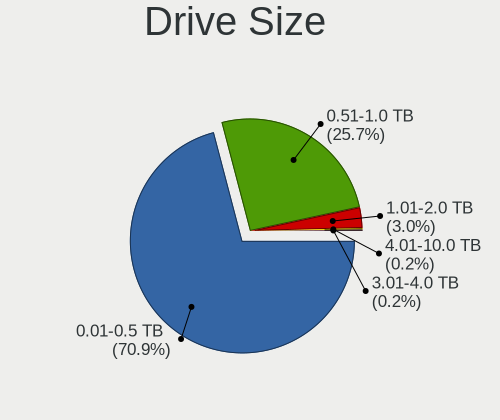

OpenMandriva 24.07 - Tested Hardware & Statistics (Notebooks)
-------------------------------------------------------------

A project to collect tested hardware configurations for OpenMandriva 24.07.

Anyone can contribute to this report by the [hw-probe](https://github.com/linuxhw/hw-probe) tool:

    sudo -E hw-probe -all -upload

Please contribute! Especially if your hardware is rare.

Contents
--------

* [ Test Cases ](#test-cases)

* [ System ](#system)
  - [ Kernel                   ](#kernel)
  - [ Kernel Family            ](#kernel-family)
  - [ Kernel Major Ver.        ](#kernel-major-ver)
  - [ Arch                     ](#arch)
  - [ DE                       ](#de)
  - [ Display Server           ](#display-server)
  - [ Display Manager          ](#display-manager)
  - [ OS Lang                  ](#os-lang)
  - [ Boot Mode                ](#boot-mode)
  - [ Filesystem               ](#filesystem)
  - [ Part. scheme             ](#part-scheme)
  - [ Dual Boot with Linux/BSD ](#dual-boot-with-linuxbsd)
  - [ Dual Boot (Win)          ](#dual-boot-win)

* [ Board ](#board)
  - [ Vendor                   ](#vendor)
  - [ Model                    ](#model)
  - [ Model Family             ](#model-family)
  - [ MFG Year                 ](#mfg-year)
  - [ Form Factor              ](#form-factor)
  - [ Secure Boot              ](#secure-boot)
  - [ Coreboot                 ](#coreboot)
  - [ RAM Size                 ](#ram-size)
  - [ RAM Used                 ](#ram-used)
  - [ Total Drives             ](#total-drives)
  - [ Has CD-ROM               ](#has-cd-rom)
  - [ Has Ethernet             ](#has-ethernet)
  - [ Has WiFi                 ](#has-wifi)
  - [ Has Bluetooth            ](#has-bluetooth)

* [ Location ](#location)
  - [ Country                  ](#country)
  - [ City                     ](#city)

* [ Drives ](#drives)
  - [ Drive Vendor             ](#drive-vendor)
  - [ Drive Model              ](#drive-model)
  - [ HDD Vendor               ](#hdd-vendor)
  - [ SSD Vendor               ](#ssd-vendor)
  - [ Drive Kind               ](#drive-kind)
  - [ Drive Connector          ](#drive-connector)
  - [ Drive Size               ](#drive-size)
  - [ Space Total              ](#space-total)
  - [ Space Used               ](#space-used)
  - [ Malfunc. Drives          ](#malfunc-drives)
  - [ Malfunc. Drive Vendor    ](#malfunc-drive-vendor)
  - [ Malfunc. HDD Vendor      ](#malfunc-hdd-vendor)
  - [ Malfunc. Drive Kind      ](#malfunc-drive-kind)
  - [ Failed Drives            ](#failed-drives)
  - [ Failed Drive Vendor      ](#failed-drive-vendor)
  - [ Drive Status             ](#drive-status)

* [ Storage controller ](#storage-controller)
  - [ Storage Vendor           ](#storage-vendor)
  - [ Storage Model            ](#storage-model)
  - [ Storage Kind             ](#storage-kind)

* [ Processor ](#processor)
  - [ CPU Vendor               ](#cpu-vendor)
  - [ CPU Model                ](#cpu-model)
  - [ CPU Model Family         ](#cpu-model-family)
  - [ CPU Cores                ](#cpu-cores)
  - [ CPU Sockets              ](#cpu-sockets)
  - [ CPU Threads              ](#cpu-threads)
  - [ CPU Op-Modes             ](#cpu-op-modes)
  - [ CPU Microcode            ](#cpu-microcode)
  - [ CPU Microarch            ](#cpu-microarch)

* [ Graphics ](#graphics)
  - [ GPU Vendor               ](#gpu-vendor)
  - [ GPU Model                ](#gpu-model)
  - [ GPU Combo                ](#gpu-combo)
  - [ GPU Driver               ](#gpu-driver)
  - [ GPU Memory               ](#gpu-memory)

* [ Monitor ](#monitor)
  - [ Monitor Vendor           ](#monitor-vendor)
  - [ Monitor Model            ](#monitor-model)
  - [ Monitor Resolution       ](#monitor-resolution)
  - [ Monitor Diagonal         ](#monitor-diagonal)
  - [ Monitor Width            ](#monitor-width)
  - [ Aspect Ratio             ](#aspect-ratio)
  - [ Monitor Area             ](#monitor-area)
  - [ Pixel Density            ](#pixel-density)
  - [ Multiple Monitors        ](#multiple-monitors)

* [ Network ](#network)
  - [ Net Controller Vendor    ](#net-controller-vendor)
  - [ Net Controller Model     ](#net-controller-model)
  - [ Wireless Vendor          ](#wireless-vendor)
  - [ Wireless Model           ](#wireless-model)
  - [ Ethernet Vendor          ](#ethernet-vendor)
  - [ Ethernet Model           ](#ethernet-model)
  - [ Net Controller Kind      ](#net-controller-kind)
  - [ Used Controller          ](#used-controller)
  - [ NICs                     ](#nics)
  - [ IPv6                     ](#ipv6)

* [ Bluetooth ](#bluetooth)
  - [ Bluetooth Vendor         ](#bluetooth-vendor)
  - [ Bluetooth Model          ](#bluetooth-model)

* [ Sound ](#sound)
  - [ Sound Vendor             ](#sound-vendor)
  - [ Sound Model              ](#sound-model)

* [ Memory ](#memory)
  - [ Memory Vendor            ](#memory-vendor)
  - [ Memory Model             ](#memory-model)
  - [ Memory Kind              ](#memory-kind)
  - [ Memory Form Factor       ](#memory-form-factor)
  - [ Memory Size              ](#memory-size)
  - [ Memory Speed             ](#memory-speed)

* [ Printers & scanners ](#printers--scanners)
  - [ Printer Vendor           ](#printer-vendor)
  - [ Printer Model            ](#printer-model)
  - [ Scanner Vendor           ](#scanner-vendor)
  - [ Scanner Model            ](#scanner-model)

* [ Camera ](#camera)
  - [ Camera Vendor            ](#camera-vendor)
  - [ Camera Model             ](#camera-model)

* [ Security ](#security)
  - [ Fingerprint Vendor       ](#fingerprint-vendor)
  - [ Fingerprint Model        ](#fingerprint-model)
  - [ Chipcard Vendor          ](#chipcard-vendor)
  - [ Chipcard Model           ](#chipcard-model)

* [ Unsupported ](#unsupported)
  - [ Unsupported Devices      ](#unsupported-devices)
  - [ Unsupported Device Types ](#unsupported-device-types)

Test Cases
----------

Total: 605

| Vendor        | Model                       | Probe                                                      | Date         |
|---------------|-----------------------------|------------------------------------------------------------|--------------|
| HP            | ProBook 455 G8 Notebook ... | [963fcdd477](https://linux-hardware.org/?probe=963fcdd477) | Jan 06, 2025 |
| HP            | ProBook 640 G1              | [f901f7b9aa](https://linux-hardware.org/?probe=f901f7b9aa) | Jan 03, 2025 |
| Dell          | Latitude 5300               | [d3d6e520f5](https://linux-hardware.org/?probe=d3d6e520f5) | Jan 03, 2025 |
| Infinix       | Y3 Plus                     | [a5d0c097a5](https://linux-hardware.org/?probe=a5d0c097a5) | Dec 30, 2024 |
| Lenovo        | IdeaPad 330-17AST 81D7      | [145b300a77](https://linux-hardware.org/?probe=145b300a77) | Dec 26, 2024 |
| Dell          | Inspiron 1525               | [cd4f5695b9](https://linux-hardware.org/?probe=cd4f5695b9) | Dec 22, 2024 |
| ASUSTek       | S451LA                      | [a766d0caae](https://linux-hardware.org/?probe=a766d0caae) | Dec 19, 2024 |
| Sony          | VPCEH39FJ                   | [f0627de40e](https://linux-hardware.org/?probe=f0627de40e) | Dec 16, 2024 |
| Dell          | Latitude E6500              | [1c4c62551f](https://linux-hardware.org/?probe=1c4c62551f) | Dec 14, 2024 |
| ASUSTek       | G60JX                       | [b1cc4820a3](https://linux-hardware.org/?probe=b1cc4820a3) | Dec 13, 2024 |
| HP            | 620                         | [152ec63b24](https://linux-hardware.org/?probe=152ec63b24) | Dec 12, 2024 |
| Sony          | VPCEJ2E1E                   | [11625e4a3c](https://linux-hardware.org/?probe=11625e4a3c) | Dec 12, 2024 |
| Dell          | Latitude E6440              | [c3aebd55c6](https://linux-hardware.org/?probe=c3aebd55c6) | Dec 11, 2024 |
| Lenovo        | ThinkPad X1 Carbon 7th 2... | [4a452b8790](https://linux-hardware.org/?probe=4a452b8790) | Dec 11, 2024 |
| ASUSTek       | X550JX                      | [825a9b88c3](https://linux-hardware.org/?probe=825a9b88c3) | Dec 11, 2024 |
| HP            | Laptop 17-cp0xxx            | [3730405110](https://linux-hardware.org/?probe=3730405110) | Dec 11, 2024 |
| HP            | ProBook 4530s               | [e8e3959577](https://linux-hardware.org/?probe=e8e3959577) | Dec 11, 2024 |
| Notebook      | 14M2                        | [30b428ea7b](https://linux-hardware.org/?probe=30b428ea7b) | Dec 11, 2024 |
| Lenovo        | IdeaPad Gaming 3 15ARH05... | [986d807d00](https://linux-hardware.org/?probe=986d807d00) | Dec 10, 2024 |
| Dell          | Inspiron 15 3515            | [a073fbc9bc](https://linux-hardware.org/?probe=a073fbc9bc) | Dec 10, 2024 |
| Acer          | Aspire A315-24P             | [a632326872](https://linux-hardware.org/?probe=a632326872) | Dec 09, 2024 |
| HP            | EliteBook 820 G4            | [180e325043](https://linux-hardware.org/?probe=180e325043) | Dec 09, 2024 |
| ASUSTek       | Z450LA                      | [2281fa41ae](https://linux-hardware.org/?probe=2281fa41ae) | Dec 08, 2024 |
| Lenovo        | ThinkPad T410 2537K96       | [ae6d2e915b](https://linux-hardware.org/?probe=ae6d2e915b) | Dec 06, 2024 |
| HP            | Unknown                     | [c5d5bb8ffc](https://linux-hardware.org/?probe=c5d5bb8ffc) | Dec 06, 2024 |
| ASUSTek       | X550CC                      | [c395078c21](https://linux-hardware.org/?probe=c395078c21) | Dec 05, 2024 |
| Lenovo        | ThinkPad T480s 20L8SF100... | [e33bd93e90](https://linux-hardware.org/?probe=e33bd93e90) | Dec 04, 2024 |
| HP            | EliteBook 850 G6            | [af2a2b7059](https://linux-hardware.org/?probe=af2a2b7059) | Dec 04, 2024 |
| ASUSTek       | K52JK                       | [1e978f8201](https://linux-hardware.org/?probe=1e978f8201) | Dec 03, 2024 |
| Toshiba       | Satellite S70-A             | [fdbc12af06](https://linux-hardware.org/?probe=fdbc12af06) | Dec 03, 2024 |
| HP            | Pavilion dv6                | [f72bd7ca67](https://linux-hardware.org/?probe=f72bd7ca67) | Dec 03, 2024 |
| Fujitsu       | FMVA42MW2                   | [a5a7a4a6f1](https://linux-hardware.org/?probe=a5a7a4a6f1) | Dec 03, 2024 |
| Acer          | Nitro ANV15-51              | [ac43db5c18](https://linux-hardware.org/?probe=ac43db5c18) | Dec 02, 2024 |
| Lenovo        | ThinkPad X1 Carbon Gen 1... | [83800e0dd2](https://linux-hardware.org/?probe=83800e0dd2) | Dec 01, 2024 |
| HP            | EliteBook 850 G5            | [39d29e9e31](https://linux-hardware.org/?probe=39d29e9e31) | Nov 30, 2024 |
| Lenovo        | IdeaPad 1 14ADA05 82GW      | [c7fb17104d](https://linux-hardware.org/?probe=c7fb17104d) | Nov 29, 2024 |
| Acer          | Aspire A315-34              | [16257c3b4b](https://linux-hardware.org/?probe=16257c3b4b) | Nov 27, 2024 |
| Acer          | Aspire ES1-512              | [dfc7a551d9](https://linux-hardware.org/?probe=dfc7a551d9) | Nov 26, 2024 |
| Lenovo        | ThinkPad P17 Gen 2i 20YU... | [d208c8829e](https://linux-hardware.org/?probe=d208c8829e) | Nov 24, 2024 |
| Google        | Lillipup rev3               | [26051de0da](https://linux-hardware.org/?probe=26051de0da) | Nov 24, 2024 |
| Dell          | Latitude D630               | [135fedf2cd](https://linux-hardware.org/?probe=135fedf2cd) | Nov 22, 2024 |
| HP            | 240 G8 Notebook PC          | [33374fdc29](https://linux-hardware.org/?probe=33374fdc29) | Nov 22, 2024 |
| Itautec       | Infoway                     | [466651a218](https://linux-hardware.org/?probe=466651a218) | Nov 21, 2024 |
| Unknown       | AX16PRO                     | [97a667e749](https://linux-hardware.org/?probe=97a667e749) | Nov 21, 2024 |
| HP            | Laptop 15-dw0xxx            | [00fc7a8d8b](https://linux-hardware.org/?probe=00fc7a8d8b) | Nov 21, 2024 |
| Dell          | Latitude 5490               | [50f3de2c58](https://linux-hardware.org/?probe=50f3de2c58) | Nov 21, 2024 |
| HP            | Pavilion Gaming Laptop 1... | [b3d142c510](https://linux-hardware.org/?probe=b3d142c510) | Nov 21, 2024 |
| Lenovo        | Legion 5 15ARH05 82B5       | [69a4d1cdc5](https://linux-hardware.org/?probe=69a4d1cdc5) | Nov 21, 2024 |
| Acer          | Aspire A515-48M             | [7e76e833e3](https://linux-hardware.org/?probe=7e76e833e3) | Nov 20, 2024 |
| HP            | Laptop 15g-br1xx            | [f51b7c2e9d](https://linux-hardware.org/?probe=f51b7c2e9d) | Nov 20, 2024 |
| HP            | EliteBook 840 G6            | [9dfd49751f](https://linux-hardware.org/?probe=9dfd49751f) | Nov 19, 2024 |
| Lenovo        | ThinkPad X61 7675CTO        | [772ab308c2](https://linux-hardware.org/?probe=772ab308c2) | Nov 19, 2024 |
| Toshiba       | Satellite U845t             | [a73248a89d](https://linux-hardware.org/?probe=a73248a89d) | Nov 18, 2024 |
| Dell          | Latitude 3420               | [9db39167d7](https://linux-hardware.org/?probe=9db39167d7) | Nov 17, 2024 |
| Lenovo        | ThinkPad Edge E530c 3366... | [06da77f5c0](https://linux-hardware.org/?probe=06da77f5c0) | Nov 16, 2024 |
| HP            | EliteBook 2730p             | [5ce55a50da](https://linux-hardware.org/?probe=5ce55a50da) | Nov 15, 2024 |
| Dell          | Inspiron 3505               | [42bed8b241](https://linux-hardware.org/?probe=42bed8b241) | Nov 14, 2024 |
| ASUSTek       | 1018P                       | [eef1555906](https://linux-hardware.org/?probe=eef1555906) | Nov 13, 2024 |
| Dell          | Precision M6700             | [81ed3cc9db](https://linux-hardware.org/?probe=81ed3cc9db) | Nov 13, 2024 |
| Acer          | Aspire 5742G                | [46d5cbc974](https://linux-hardware.org/?probe=46d5cbc974) | Nov 13, 2024 |
| Acer          | Aspire 5250                 | [6afaf552dd](https://linux-hardware.org/?probe=6afaf552dd) | Nov 13, 2024 |
| ASUSTek       | VivoBook_ASUSLaptop M370... | [d655b85ff6](https://linux-hardware.org/?probe=d655b85ff6) | Nov 12, 2024 |
| Samsung       | R510/P510                   | [45941aa5d5](https://linux-hardware.org/?probe=45941aa5d5) | Nov 11, 2024 |
| Dell          | Vostro 1310                 | [add2298606](https://linux-hardware.org/?probe=add2298606) | Nov 11, 2024 |
| Fujitsu       | FMVC07003                   | [9fe5e42140](https://linux-hardware.org/?probe=9fe5e42140) | Nov 10, 2024 |
| Lenovo        | ThinkPad L440 20ASS11T00    | [9e63659c87](https://linux-hardware.org/?probe=9e63659c87) | Nov 09, 2024 |
| Apple         | MacBookPro6,1               | [24c0858a39](https://linux-hardware.org/?probe=24c0858a39) | Nov 09, 2024 |
| Dell          | Inspiron 3520               | [e129134b01](https://linux-hardware.org/?probe=e129134b01) | Nov 08, 2024 |
| ASUSTek       | X550CA                      | [9de1e927a9](https://linux-hardware.org/?probe=9de1e927a9) | Nov 07, 2024 |
| ASUSTek       | E202SA                      | [18a63b065d](https://linux-hardware.org/?probe=18a63b065d) | Nov 07, 2024 |
| Acer          | Swift SF314-43              | [c55af0c24c](https://linux-hardware.org/?probe=c55af0c24c) | Nov 07, 2024 |
| Lenovo        | ThinkPad L420 7829GH2       | [33efc8a835](https://linux-hardware.org/?probe=33efc8a835) | Nov 07, 2024 |
| Lenovo        | IdeaPad 330-15IGM 81D1      | [b0ca914a02](https://linux-hardware.org/?probe=b0ca914a02) | Nov 06, 2024 |
| Positivo      | C14CU51                     | [910164dc5c](https://linux-hardware.org/?probe=910164dc5c) | Nov 06, 2024 |
| HP            | Pavilion g4                 | [2f7cb31cab](https://linux-hardware.org/?probe=2f7cb31cab) | Nov 06, 2024 |
| ASUSTek       | TUF Gaming FX505DT_FX505... | [689c7827b7](https://linux-hardware.org/?probe=689c7827b7) | Nov 06, 2024 |
| Lenovo        | ThinkPad T420 4180CC4       | [f3899bf09d](https://linux-hardware.org/?probe=f3899bf09d) | Nov 04, 2024 |
| Lenovo        | ThinkPad T14 Gen 1 20UD0... | [4cab1133bf](https://linux-hardware.org/?probe=4cab1133bf) | Nov 04, 2024 |
| Lenovo        | ThinkPad X230 23256V1       | [08af8a55a1](https://linux-hardware.org/?probe=08af8a55a1) | Nov 03, 2024 |
| Fujitsu       | LIFEBOOK E743               | [be7c6d7a43](https://linux-hardware.org/?probe=be7c6d7a43) | Nov 03, 2024 |
| Toshiba       | TECRA A10                   | [f7cfa0f796](https://linux-hardware.org/?probe=f7cfa0f796) | Nov 02, 2024 |
| HP            | Laptop 17-ca1xxx            | [860ef2c633](https://linux-hardware.org/?probe=860ef2c633) | Nov 01, 2024 |
| Apple         | MacBookPro8,1               | [5c2dacf3d8](https://linux-hardware.org/?probe=5c2dacf3d8) | Nov 01, 2024 |
| Acer          | Aspire 7736                 | [9426ed7aff](https://linux-hardware.org/?probe=9426ed7aff) | Nov 01, 2024 |
| Lenovo        | IdeaPad Y400 20192          | [af8c167505](https://linux-hardware.org/?probe=af8c167505) | Oct 31, 2024 |
| Sony          | SVF1521G6EW                 | [5b4ce22a73](https://linux-hardware.org/?probe=5b4ce22a73) | Oct 31, 2024 |
| HP            | EliteBook 660 16 inch G1... | [7de8e9c733](https://linux-hardware.org/?probe=7de8e9c733) | Oct 29, 2024 |
| Acer          | Aspire A315-59              | [ef0b873549](https://linux-hardware.org/?probe=ef0b873549) | Oct 29, 2024 |
| ASUSTek       | VivoBook_ASUSLaptop M360... | [a8f6e54a85](https://linux-hardware.org/?probe=a8f6e54a85) | Oct 29, 2024 |
| ASUSTek       | X553MA                      | [ea7d1235b1](https://linux-hardware.org/?probe=ea7d1235b1) | Oct 28, 2024 |
| Samsung       | RV420/RV520/RV720/E3530/... | [862c7cc007](https://linux-hardware.org/?probe=862c7cc007) | Oct 27, 2024 |
| HP            | Unknown                     | [f8c7a5f55f](https://linux-hardware.org/?probe=f8c7a5f55f) | Oct 27, 2024 |
| HP            | Laptop 15-ef2xxx            | [b4a0691988](https://linux-hardware.org/?probe=b4a0691988) | Oct 27, 2024 |
| Lenovo        | ThinkPad E16 Gen 2 21M5C... | [5a31a97e2b](https://linux-hardware.org/?probe=5a31a97e2b) | Oct 26, 2024 |
| Acer          | Aspire E5-571G              | [0801976824](https://linux-hardware.org/?probe=0801976824) | Oct 26, 2024 |
| HP            | 15                          | [6a2e246381](https://linux-hardware.org/?probe=6a2e246381) | Oct 25, 2024 |
| Lenovo        | ThinkPad P51 20HJS52P00     | [ab7bfcceb7](https://linux-hardware.org/?probe=ab7bfcceb7) | Oct 24, 2024 |
| Acer          | Aspire 7736                 | [213995eb9a](https://linux-hardware.org/?probe=213995eb9a) | Oct 24, 2024 |
| Lenovo        | G50-80 80E5                 | [38f6fb752d](https://linux-hardware.org/?probe=38f6fb752d) | Oct 23, 2024 |
| HP            | Pavilion 17                 | [fe2ac723ed](https://linux-hardware.org/?probe=fe2ac723ed) | Oct 23, 2024 |
| Toshiba       | Satellite L55-B             | [e3b609b13a](https://linux-hardware.org/?probe=e3b609b13a) | Oct 22, 2024 |
| HP            | Victus by Laptop 16-e0xx... | [053292a4a6](https://linux-hardware.org/?probe=053292a4a6) | Oct 21, 2024 |
| Lenovo        | Unknown                     | [0c10558175](https://linux-hardware.org/?probe=0c10558175) | Oct 21, 2024 |
| HP            | Presario CQ61               | [87aea4a07b](https://linux-hardware.org/?probe=87aea4a07b) | Oct 20, 2024 |
| Lenovo        | B50-10 80QR                 | [6b27d730b2](https://linux-hardware.org/?probe=6b27d730b2) | Oct 20, 2024 |
| Dell          | Venue 8 Pro 5855            | [305bc7f736](https://linux-hardware.org/?probe=305bc7f736) | Oct 17, 2024 |
| Acer          | Aspire A515-44              | [6a2f0efb2e](https://linux-hardware.org/?probe=6a2f0efb2e) | Oct 17, 2024 |
| ASUSTek       | VivoBook_ASUSLaptop X160... | [5a3c293945](https://linux-hardware.org/?probe=5a3c293945) | Oct 15, 2024 |
| ASUSTek       | UL80VT                      | [c6cc761721](https://linux-hardware.org/?probe=c6cc761721) | Oct 13, 2024 |
| Dell          | Latitude 7280               | [82d8484f17](https://linux-hardware.org/?probe=82d8484f17) | Oct 12, 2024 |
| Lenovo        | ThinkPad 20BHS18200         | [c576999dfa](https://linux-hardware.org/?probe=c576999dfa) | Oct 11, 2024 |
| ASUSTek       | K95VJ                       | [a3388fefc3](https://linux-hardware.org/?probe=a3388fefc3) | Oct 11, 2024 |
| Acer          | Aspire E5-772G              | [972163fef5](https://linux-hardware.org/?probe=972163fef5) | Oct 11, 2024 |
| ASUSTek       | TUF Gaming FX505DD_FX505... | [27e0df94ae](https://linux-hardware.org/?probe=27e0df94ae) | Oct 10, 2024 |
| Packard Be... | EasyNote LS11HR             | [298822d4c4](https://linux-hardware.org/?probe=298822d4c4) | Oct 08, 2024 |
| ASUSTek       | VivoBook_ASUSLaptop X509... | [243cf71860](https://linux-hardware.org/?probe=243cf71860) | Oct 08, 2024 |
| Fujitsu       | LIFEBOOK N532               | [4b20b9cc8e](https://linux-hardware.org/?probe=4b20b9cc8e) | Oct 08, 2024 |
| HP            | 15 Notebook PC              | [09ec6297c1](https://linux-hardware.org/?probe=09ec6297c1) | Oct 08, 2024 |
| ASUSTek       | X551MA                      | [c405b895c9](https://linux-hardware.org/?probe=c405b895c9) | Oct 08, 2024 |
| Lenovo        | IdeaPad L340-15API 81LW     | [22a99a1444](https://linux-hardware.org/?probe=22a99a1444) | Oct 06, 2024 |
| Acer          | Aspire 4738                 | [d7bd115a64](https://linux-hardware.org/?probe=d7bd115a64) | Oct 05, 2024 |
| Dell          | Latitude 5420               | [e65d154af3](https://linux-hardware.org/?probe=e65d154af3) | Oct 05, 2024 |
| ASUSTek       | VivoBook_ASUSLaptop E210... | [57602cd2d9](https://linux-hardware.org/?probe=57602cd2d9) | Oct 04, 2024 |
| Unknown       | Unknown                     | [5b967ea1be](https://linux-hardware.org/?probe=5b967ea1be) | Oct 04, 2024 |
| ASUSTek       | K53E                        | [62915aba3a](https://linux-hardware.org/?probe=62915aba3a) | Oct 03, 2024 |
| Dell          | Inspiron N5040              | [d09e43e3e6](https://linux-hardware.org/?probe=d09e43e3e6) | Oct 01, 2024 |
| Acer          | Aspire ES1-531              | [16c5519c67](https://linux-hardware.org/?probe=16c5519c67) | Sep 30, 2024 |
| Positivo      | R516512AI-15                | [ea6017ef32](https://linux-hardware.org/?probe=ea6017ef32) | Sep 30, 2024 |
| ASUSTek       | VivoBook_ASUSLaptop X515... | [36174c650c](https://linux-hardware.org/?probe=36174c650c) | Sep 30, 2024 |
| HP            | Laptop 17-cp2xxx            | [8d69c2070e](https://linux-hardware.org/?probe=8d69c2070e) | Sep 29, 2024 |
| Medion        | Akoya P7632                 | [4a73c4ece4](https://linux-hardware.org/?probe=4a73c4ece4) | Sep 29, 2024 |
| ASUSTek       | VivoBook_ASUSLaptop M370... | [b94dbc9df1](https://linux-hardware.org/?probe=b94dbc9df1) | Sep 28, 2024 |
| Unknown       | AX15                        | [cdbf528af6](https://linux-hardware.org/?probe=cdbf528af6) | Sep 28, 2024 |
| Medion        | P17619                      | [42d84ccf7c](https://linux-hardware.org/?probe=42d84ccf7c) | Sep 27, 2024 |
| HP            | EliteBook 725 G3            | [59140deeed](https://linux-hardware.org/?probe=59140deeed) | Sep 26, 2024 |
| Lenovo        | ThinkPad X13 Gen 4 21EXS... | [9cec35ca8e](https://linux-hardware.org/?probe=9cec35ca8e) | Sep 26, 2024 |
| Lenovo        | IdeaPad Slim 3 15ABR8 82... | [f7c17077ac](https://linux-hardware.org/?probe=f7c17077ac) | Sep 26, 2024 |
| Acer          | Aspire 2920                 | [bf3d0d6e64](https://linux-hardware.org/?probe=bf3d0d6e64) | Sep 24, 2024 |
| Dell          | System XPS L321X            | [461ff95992](https://linux-hardware.org/?probe=461ff95992) | Sep 24, 2024 |
| HP            | ProBook 4445s               | [64c920edf6](https://linux-hardware.org/?probe=64c920edf6) | Sep 24, 2024 |
| ASUSTek       | VivoBook_ASUSLaptop E410... | [ecb482f9a9](https://linux-hardware.org/?probe=ecb482f9a9) | Sep 24, 2024 |
| HP            | Laptop 15-bw0xx             | [c2b79a6905](https://linux-hardware.org/?probe=c2b79a6905) | Sep 23, 2024 |
| HP            | Compaq 2510p                | [d0b68bbc55](https://linux-hardware.org/?probe=d0b68bbc55) | Sep 23, 2024 |
| ASUSTek       | M50Vn                       | [2e22fd3bd2](https://linux-hardware.org/?probe=2e22fd3bd2) | Sep 22, 2024 |
| ASUSTek       | X555LJ                      | [9dc481d73a](https://linux-hardware.org/?probe=9dc481d73a) | Sep 22, 2024 |
| Dell          | Latitude E5520m             | [a2933b9960](https://linux-hardware.org/?probe=a2933b9960) | Sep 22, 2024 |
| Toshiba       | Satellite C645              | [1a789a141f](https://linux-hardware.org/?probe=1a789a141f) | Sep 21, 2024 |
| Acer          | Aspire A315-24P             | [8cd51dbb86](https://linux-hardware.org/?probe=8cd51dbb86) | Sep 21, 2024 |
| Lenovo        | V15 G2 IJL 82QY             | [8b47709edb](https://linux-hardware.org/?probe=8b47709edb) | Sep 19, 2024 |
| Lenovo        | ThinkPad X1 Extreme 2nd ... | [cc853b4c1a](https://linux-hardware.org/?probe=cc853b4c1a) | Sep 17, 2024 |
| Positivo      | EC10IS1                     | [e715b4c073](https://linux-hardware.org/?probe=e715b4c073) | Sep 16, 2024 |
| Lenovo        | IdeaPad 100-15IBY 80MJ      | [5ea056f887](https://linux-hardware.org/?probe=5ea056f887) | Sep 14, 2024 |
| Lenovo        | ThinkPad X13 Gen 2a 20XH... | [661cd77af8](https://linux-hardware.org/?probe=661cd77af8) | Sep 13, 2024 |
| Acer          | Aspire A315-22              | [b2466dce41](https://linux-hardware.org/?probe=b2466dce41) | Sep 13, 2024 |
| ASUSTek       | X55U                        | [ce77419d34](https://linux-hardware.org/?probe=ce77419d34) | Sep 12, 2024 |
| Lenovo        | IdeaPad Y580                | [885fa56235](https://linux-hardware.org/?probe=885fa56235) | Sep 10, 2024 |
| Positivo      | R78256AI-15                 | [c848ae7984](https://linux-hardware.org/?probe=c848ae7984) | Sep 10, 2024 |
| HP            | EliteBook 6930p             | [7559a6af2d](https://linux-hardware.org/?probe=7559a6af2d) | Sep 08, 2024 |
| Dell          | Inspiron 3585               | [16ca949774](https://linux-hardware.org/?probe=16ca949774) | Sep 07, 2024 |
| HP            | EliteBook 8470p             | [0fd5cb15da](https://linux-hardware.org/?probe=0fd5cb15da) | Sep 07, 2024 |
| HP            | ZBook 17 G5                 | [1a6e1fc880](https://linux-hardware.org/?probe=1a6e1fc880) | Sep 06, 2024 |
| Lenovo        | ThinkPad T430 2347AY1       | [2f46f3ae95](https://linux-hardware.org/?probe=2f46f3ae95) | Sep 06, 2024 |
| Samsung       | R530/R730                   | [ca05ca0a68](https://linux-hardware.org/?probe=ca05ca0a68) | Sep 06, 2024 |
| Acer          | Aspire 7250                 | [fcf41d5a9d](https://linux-hardware.org/?probe=fcf41d5a9d) | Sep 05, 2024 |
| Acer          | Peppy                       | [e797f3ccb1](https://linux-hardware.org/?probe=e797f3ccb1) | Sep 05, 2024 |
| Acer          | Aspire A315-21G             | [1bd863c2c2](https://linux-hardware.org/?probe=1bd863c2c2) | Sep 05, 2024 |
| Dell          | Latitude E7450              | [c8f4f19e88](https://linux-hardware.org/?probe=c8f4f19e88) | Sep 05, 2024 |
| HP            | EliteBook 840 G1            | [453cbe339f](https://linux-hardware.org/?probe=453cbe339f) | Sep 05, 2024 |
| Dell          | Latitude 5580               | [dc0f01dc48](https://linux-hardware.org/?probe=dc0f01dc48) | Sep 04, 2024 |
| Philco        | 14H                         | [77e51c14b8](https://linux-hardware.org/?probe=77e51c14b8) | Sep 04, 2024 |
| Quanta        | QL3 TBD                     | [f3a35430d8](https://linux-hardware.org/?probe=f3a35430d8) | Sep 04, 2024 |
| Lenovo        | ThinkPad L15 Gen 2 20X4S... | [7ff9eab924](https://linux-hardware.org/?probe=7ff9eab924) | Sep 03, 2024 |
| Dell          | Inspiron N5110              | [118508fdea](https://linux-hardware.org/?probe=118508fdea) | Sep 03, 2024 |
| Dell          | Studio 1749                 | [d74513a21f](https://linux-hardware.org/?probe=d74513a21f) | Sep 03, 2024 |
| Lenovo        | IdeaPad Slim 5 16IMH9 83... | [ad77d695dc](https://linux-hardware.org/?probe=ad77d695dc) | Sep 02, 2024 |
| ASUSTek       | N53SN                       | [ebce5d0691](https://linux-hardware.org/?probe=ebce5d0691) | Sep 02, 2024 |
| ASUSTek       | K72F                        | [972b65066a](https://linux-hardware.org/?probe=972b65066a) | Sep 02, 2024 |
| Positivo      | S14BW01                     | [436d9031f2](https://linux-hardware.org/?probe=436d9031f2) | Sep 02, 2024 |
| Google        | Auron_Paine                 | [1b6d737594](https://linux-hardware.org/?probe=1b6d737594) | Sep 02, 2024 |
| HP            | Pavilion dv6700             | [d9b6ec66bd](https://linux-hardware.org/?probe=d9b6ec66bd) | Sep 02, 2024 |
| Acer          | Swift SFG16-71              | [99dba8223c](https://linux-hardware.org/?probe=99dba8223c) | Sep 02, 2024 |
| HP            | EliteBook 2170p             | [8b5d0ed681](https://linux-hardware.org/?probe=8b5d0ed681) | Sep 02, 2024 |
| HP            | 255 G7 Notebook PC          | [4519bc4d0b](https://linux-hardware.org/?probe=4519bc4d0b) | Sep 01, 2024 |
| HP            | EliteBook 2170p             | [84a821b49c](https://linux-hardware.org/?probe=84a821b49c) | Sep 01, 2024 |
| ASUSTek       | K53TA                       | [97e98f408d](https://linux-hardware.org/?probe=97e98f408d) | Sep 01, 2024 |
| ASUSTek       | TUF Gaming FX505DT_FX505... | [d1faa56159](https://linux-hardware.org/?probe=d1faa56159) | Aug 30, 2024 |
| Acer          | Swift SFE16-44              | [bce51aa43e](https://linux-hardware.org/?probe=bce51aa43e) | Aug 30, 2024 |
| JP.ik         | T304                        | [bf5d965733](https://linux-hardware.org/?probe=bf5d965733) | Aug 30, 2024 |
| Compaq        | Presario CQ-21              | [4c41e71d5a](https://linux-hardware.org/?probe=4c41e71d5a) | Aug 30, 2024 |
| HP            | Presario CQ58               | [5ab969b08b](https://linux-hardware.org/?probe=5ab969b08b) | Aug 29, 2024 |
| Lenovo        | IdeaPad 110-15ACL 80TJ      | [8962b342ad](https://linux-hardware.org/?probe=8962b342ad) | Aug 29, 2024 |
| Medion        | E6214                       | [255b7c37ae](https://linux-hardware.org/?probe=255b7c37ae) | Aug 28, 2024 |
| Apple         | MacBook5,1                  | [223cfb4921](https://linux-hardware.org/?probe=223cfb4921) | Aug 28, 2024 |
| Packard Be... | EasyNote LS11HR             | [06c70b0344](https://linux-hardware.org/?probe=06c70b0344) | Aug 28, 2024 |
| Fujitsu Si... | ESPRIMO Mobile V5505        | [fc08bf5897](https://linux-hardware.org/?probe=fc08bf5897) | Aug 28, 2024 |
| Lenovo        | ThinkPad X130e 0629A12      | [c751cc848d](https://linux-hardware.org/?probe=c751cc848d) | Aug 28, 2024 |
| Acer          | Aspire R3-131T              | [210b362894](https://linux-hardware.org/?probe=210b362894) | Aug 28, 2024 |
| Dell          | Latitude E7470              | [cd0b24759b](https://linux-hardware.org/?probe=cd0b24759b) | Aug 27, 2024 |
| Dell          | Inspiron 3481               | [eb002a3b83](https://linux-hardware.org/?probe=eb002a3b83) | Aug 27, 2024 |
| HP            | EliteBook 840 G5            | [1ef6676af1](https://linux-hardware.org/?probe=1ef6676af1) | Aug 27, 2024 |
| Toshiba       | Satellite A505              | [61aa2bba95](https://linux-hardware.org/?probe=61aa2bba95) | Aug 26, 2024 |
| Apple         | MacBookPro11,1              | [9dcdd198a6](https://linux-hardware.org/?probe=9dcdd198a6) | Aug 26, 2024 |
| Lenovo        | IdeaPad 1 14IGL7 82V6       | [ce456c4a98](https://linux-hardware.org/?probe=ce456c4a98) | Aug 26, 2024 |
| Apple         | MacBook5,1                  | [69ab889544](https://linux-hardware.org/?probe=69ab889544) | Aug 26, 2024 |
| Dell          | Inspiron 3541               | [27ed9be416](https://linux-hardware.org/?probe=27ed9be416) | Aug 26, 2024 |
| Lenovo        | G70-70 80HW                 | [b801955e87](https://linux-hardware.org/?probe=b801955e87) | Aug 26, 2024 |
| Toshiba       | Satellite C845              | [e043e1d64a](https://linux-hardware.org/?probe=e043e1d64a) | Aug 25, 2024 |
| Fujitsu       | LIFEBOOK A555               | [0e7587f9eb](https://linux-hardware.org/?probe=0e7587f9eb) | Aug 25, 2024 |
| Dynabook      | TECRA A40-G                 | [3ac4ac4f7a](https://linux-hardware.org/?probe=3ac4ac4f7a) | Aug 24, 2024 |
| AMI           | Intel                       | [fb6e4c51ed](https://linux-hardware.org/?probe=fb6e4c51ed) | Aug 23, 2024 |
| Samsung       | 700Z3A/700Z4A/700Z5A/700... | [ebc8f6a03b](https://linux-hardware.org/?probe=ebc8f6a03b) | Aug 23, 2024 |
| Acer          | Aspire E1-570               | [d5cfa10750](https://linux-hardware.org/?probe=d5cfa10750) | Aug 22, 2024 |
| Gigabyte      | AERO 16 XE4                 | [491d0f5415](https://linux-hardware.org/?probe=491d0f5415) | Aug 22, 2024 |
| MSI           | Bravo 15 B5DD               | [7e7ea801a9](https://linux-hardware.org/?probe=7e7ea801a9) | Aug 22, 2024 |
| Lenovo        | IdeaPad 3 15ALC6 82MF       | [0cd831a254](https://linux-hardware.org/?probe=0cd831a254) | Aug 22, 2024 |
| Dell          | Inspiron 15-3565            | [c90ce327f2](https://linux-hardware.org/?probe=c90ce327f2) | Aug 21, 2024 |
| Dell          | Inspiron 1525               | [29292480d1](https://linux-hardware.org/?probe=29292480d1) | Aug 19, 2024 |
| Lenovo        | 100e 2nd Gen 81M8           | [080d34db04](https://linux-hardware.org/?probe=080d34db04) | Aug 19, 2024 |
| Acer          | Aspire E5-571               | [e804efc22d](https://linux-hardware.org/?probe=e804efc22d) | Aug 18, 2024 |
| ASUSTek       | X551MA                      | [b113e06e29](https://linux-hardware.org/?probe=b113e06e29) | Aug 18, 2024 |
| Unknown       | DeeQ                        | [4edc858d59](https://linux-hardware.org/?probe=4edc858d59) | Aug 15, 2024 |
| Acer          | Extensa 5220                | [26093b3071](https://linux-hardware.org/?probe=26093b3071) | Aug 15, 2024 |
| Dell          | Inspiron 15 5510            | [7fd5e88801](https://linux-hardware.org/?probe=7fd5e88801) | Aug 15, 2024 |
| ASUSTek       | VivoBook_ASUSLaptop X515... | [252054bbbb](https://linux-hardware.org/?probe=252054bbbb) | Aug 14, 2024 |
| Acer          | Aspire A114-33              | [2a74f324ac](https://linux-hardware.org/?probe=2a74f324ac) | Aug 14, 2024 |
| ASUSTek       | X55SV                       | [4b41f17fba](https://linux-hardware.org/?probe=4b41f17fba) | Aug 14, 2024 |
| ASUSTek       | X541NA                      | [0d55582f37](https://linux-hardware.org/?probe=0d55582f37) | Aug 14, 2024 |
| HP            | Laptop 17-ca1xxx            | [259992a3f9](https://linux-hardware.org/?probe=259992a3f9) | Aug 14, 2024 |
| Apple         | MacBookAir5,2               | [500702385c](https://linux-hardware.org/?probe=500702385c) | Aug 14, 2024 |
| HP            | EliteBook 830 G5            | [a091b4e48d](https://linux-hardware.org/?probe=a091b4e48d) | Aug 14, 2024 |
| MSI           | Alpha 15 A3DDK              | [5a00bfee31](https://linux-hardware.org/?probe=5a00bfee31) | Aug 14, 2024 |
| Positivo      | N1103                       | [299d981b42](https://linux-hardware.org/?probe=299d981b42) | Aug 14, 2024 |
| Lenovo        | IdeaPad 330-14IGM 81D0      | [a8e5c14cab](https://linux-hardware.org/?probe=a8e5c14cab) | Aug 13, 2024 |
| Dell          | Latitude E4200              | [320805a7cd](https://linux-hardware.org/?probe=320805a7cd) | Aug 13, 2024 |
| Samsung       | 300E4A/300E5A/300E7A/343... | [ecf1f5843f](https://linux-hardware.org/?probe=ecf1f5843f) | Aug 13, 2024 |
| MSI           | GS70 2OD                    | [eb85cc42f6](https://linux-hardware.org/?probe=eb85cc42f6) | Aug 13, 2024 |
| Unknown       | Unknown                     | [0468a241e4](https://linux-hardware.org/?probe=0468a241e4) | Aug 13, 2024 |
| HP            | ProBook 650 G1              | [948de2035b](https://linux-hardware.org/?probe=948de2035b) | Aug 13, 2024 |
| Acer          | Extensa 5220                | [69c707d263](https://linux-hardware.org/?probe=69c707d263) | Aug 13, 2024 |
| HP            | 15                          | [a1f14f42dc](https://linux-hardware.org/?probe=a1f14f42dc) | Aug 12, 2024 |
| Dell          | Vostro 1700                 | [f8337e3827](https://linux-hardware.org/?probe=f8337e3827) | Aug 12, 2024 |
| HP            | Pavilion dv6                | [032f5f2535](https://linux-hardware.org/?probe=032f5f2535) | Aug 12, 2024 |
| ASUSTek       | K53SM                       | [b3f8198314](https://linux-hardware.org/?probe=b3f8198314) | Aug 12, 2024 |
| VIT           | P2400                       | [b103ea6da4](https://linux-hardware.org/?probe=b103ea6da4) | Aug 12, 2024 |
| Samsung       | RC530/RC730                 | [04e7201341](https://linux-hardware.org/?probe=04e7201341) | Aug 11, 2024 |
| ASUSTek       | X750LA                      | [798b53356b](https://linux-hardware.org/?probe=798b53356b) | Aug 11, 2024 |
| Sony          | SVE14A25CFP                 | [35a1034271](https://linux-hardware.org/?probe=35a1034271) | Aug 11, 2024 |
| Dell          | Latitude 7390               | [1f851389e7](https://linux-hardware.org/?probe=1f851389e7) | Aug 11, 2024 |
| Packard Be... | EasyNote TK11BZ             | [105ff99feb](https://linux-hardware.org/?probe=105ff99feb) | Aug 11, 2024 |
| Acer          | Extensa 215-22              | [a4cb78601b](https://linux-hardware.org/?probe=a4cb78601b) | Aug 11, 2024 |
| Acer          | Aspire V5-471PG             | [cffec3a7cb](https://linux-hardware.org/?probe=cffec3a7cb) | Aug 11, 2024 |
| Fujitsu       | LIFEBOOK A512               | [aca5a2c925](https://linux-hardware.org/?probe=aca5a2c925) | Aug 10, 2024 |
| HP            | Unknown                     | [13b4b0bc1c](https://linux-hardware.org/?probe=13b4b0bc1c) | Aug 10, 2024 |
| HP            | Pavilion dv4                | [884ea6b76d](https://linux-hardware.org/?probe=884ea6b76d) | Aug 10, 2024 |
| Dell          | Latitude 7480               | [4b3df98ff0](https://linux-hardware.org/?probe=4b3df98ff0) | Aug 09, 2024 |
| Toshiba       | Satellite C75D-B            | [5be070a7d0](https://linux-hardware.org/?probe=5be070a7d0) | Aug 09, 2024 |
| HP            | EliteBook 650 15.6 inch ... | [a832b68002](https://linux-hardware.org/?probe=a832b68002) | Aug 09, 2024 |
| ASUSTek       | TUF Gaming FX505DU_FX505... | [13fcfc23c2](https://linux-hardware.org/?probe=13fcfc23c2) | Aug 08, 2024 |
| Lenovo        | Legion Slim 7 16APH8 82Y... | [6b4b54be9c](https://linux-hardware.org/?probe=6b4b54be9c) | Aug 08, 2024 |
| ASUSTek       | VivoBook_ASUSLaptop E410... | [7d0bd59b78](https://linux-hardware.org/?probe=7d0bd59b78) | Aug 08, 2024 |
| HP            | 255 15.6 inch G9 Noteboo... | [ed48c84db2](https://linux-hardware.org/?probe=ed48c84db2) | Aug 08, 2024 |
| Dell          | Inspiron 3521               | [46039bc018](https://linux-hardware.org/?probe=46039bc018) | Aug 08, 2024 |
| Lenovo        | G570 20079                  | [e9ceb63ac4](https://linux-hardware.org/?probe=e9ceb63ac4) | Aug 08, 2024 |
| ASUSTek       | N56VM                       | [c30ce9231a](https://linux-hardware.org/?probe=c30ce9231a) | Aug 08, 2024 |
| HP            | Laptop 14-bs0xx             | [6923eb858a](https://linux-hardware.org/?probe=6923eb858a) | Aug 08, 2024 |
| Matsushita... | CF-30FTSAZBG                | [4d1cfe156e](https://linux-hardware.org/?probe=4d1cfe156e) | Aug 07, 2024 |
| Packard Be... | EasyNote LJ71               | [4b758953f5](https://linux-hardware.org/?probe=4b758953f5) | Aug 07, 2024 |
| Lenovo        | ThinkPad T450 20BUA13XPB    | [5df0222220](https://linux-hardware.org/?probe=5df0222220) | Aug 07, 2024 |
| ASUSTek       | VivoBook_ASUSLaptop M150... | [8ef861a7c1](https://linux-hardware.org/?probe=8ef861a7c1) | Aug 07, 2024 |
| Lenovo        | ThinkPad X230 2325L19       | [c3a54deca3](https://linux-hardware.org/?probe=c3a54deca3) | Aug 07, 2024 |
| Lenovo        | G50-30 80G0                 | [655bb3c7f9](https://linux-hardware.org/?probe=655bb3c7f9) | Aug 07, 2024 |
| ASUSTek       | ZenBook UX425IA_UM425IA     | [79efba5905](https://linux-hardware.org/?probe=79efba5905) | Aug 07, 2024 |
| Lenovo        | G70-80 80FF                 | [98e7b18535](https://linux-hardware.org/?probe=98e7b18535) | Aug 07, 2024 |
| HP            | Victus by Laptop 16-e0xx... | [801fc7231c](https://linux-hardware.org/?probe=801fc7231c) | Aug 07, 2024 |
| ASUSTek       | X401U                       | [ea3228e385](https://linux-hardware.org/?probe=ea3228e385) | Aug 07, 2024 |
| HP            | Pavilion dv4                | [9d3424e152](https://linux-hardware.org/?probe=9d3424e152) | Aug 07, 2024 |
| Lenovo        | IdeaPad S145-14IGM 81MW     | [0188b1f00f](https://linux-hardware.org/?probe=0188b1f00f) | Aug 07, 2024 |
| Lenovo        | ThinkPad X301 4057WSQ       | [49d51f4fe2](https://linux-hardware.org/?probe=49d51f4fe2) | Aug 06, 2024 |
| Acer          | Aspire V5-573G              | [15e763080f](https://linux-hardware.org/?probe=15e763080f) | Aug 06, 2024 |
| Lenovo        | Flex 2-14 20404             | [e61443fbcd](https://linux-hardware.org/?probe=e61443fbcd) | Aug 06, 2024 |
| HP            | EliteBook Folio 9470m       | [1dad4cc854](https://linux-hardware.org/?probe=1dad4cc854) | Aug 06, 2024 |
| Dell          | Latitude E5520              | [fd2e8fc100](https://linux-hardware.org/?probe=fd2e8fc100) | Aug 06, 2024 |
| Acer          | Aspire E5-573G              | [6a38f3c326](https://linux-hardware.org/?probe=6a38f3c326) | Aug 06, 2024 |
| Acer          | Chapala                     | [06e1fcaa92](https://linux-hardware.org/?probe=06e1fcaa92) | Aug 06, 2024 |
| Dell          | Latitude E7250              | [7b85835719](https://linux-hardware.org/?probe=7b85835719) | Aug 05, 2024 |
| Lenovo        | G710 20252                  | [47543598c1](https://linux-hardware.org/?probe=47543598c1) | Aug 05, 2024 |
| Lenovo        | IdeaPad 5 Pro 16ACH6 82L... | [dbaab84f85](https://linux-hardware.org/?probe=dbaab84f85) | Aug 05, 2024 |
| Timi          | Redmi G 2022                | [bd14ac1c75](https://linux-hardware.org/?probe=bd14ac1c75) | Aug 05, 2024 |
| Lenovo        | IdeaPad Z580                | [cb672c1d21](https://linux-hardware.org/?probe=cb672c1d21) | Aug 05, 2024 |
| Samsung       | 300E4A/300E5A/300E7A        | [0e789558e1](https://linux-hardware.org/?probe=0e789558e1) | Aug 05, 2024 |
| HP            | 620                         | [b5047e656c](https://linux-hardware.org/?probe=b5047e656c) | Aug 05, 2024 |
| HP            | 15                          | [a8346ebc6c](https://linux-hardware.org/?probe=a8346ebc6c) | Aug 04, 2024 |
| GPU Compan... | GWTN156-11                  | [98f2badc5a](https://linux-hardware.org/?probe=98f2badc5a) | Aug 04, 2024 |
| Sony          | SVE14118FXW                 | [a8a2ecde8e](https://linux-hardware.org/?probe=a8a2ecde8e) | Aug 04, 2024 |
| ASUSTek       | K72F                        | [49b3023981](https://linux-hardware.org/?probe=49b3023981) | Aug 04, 2024 |
| Acer          | Aspire F5-571G              | [c6894a9467](https://linux-hardware.org/?probe=c6894a9467) | Aug 04, 2024 |
| HP            | Sona                        | [e88aa4fb3a](https://linux-hardware.org/?probe=e88aa4fb3a) | Aug 04, 2024 |
| HP            | G62                         | [a4d69df472](https://linux-hardware.org/?probe=a4d69df472) | Aug 04, 2024 |
| Lenovo        | IdeaPad 3 15ITL6 82H8       | [e89575b9ca](https://linux-hardware.org/?probe=e89575b9ca) | Aug 04, 2024 |
| Acer          | Aspire E5-553G              | [672e3df75a](https://linux-hardware.org/?probe=672e3df75a) | Aug 04, 2024 |
| Lenovo        | ThinkPad T61 7659CA1        | [8c59adcf60](https://linux-hardware.org/?probe=8c59adcf60) | Aug 04, 2024 |
| Packard Be... | EasyNote TS44HR             | [8365b8e869](https://linux-hardware.org/?probe=8365b8e869) | Aug 03, 2024 |
| Lenovo        | B50-45 20388                | [f21309b152](https://linux-hardware.org/?probe=f21309b152) | Aug 03, 2024 |
| Lenovo        | ThinkPad X250 20CLS4PA00    | [56c7ccb272](https://linux-hardware.org/?probe=56c7ccb272) | Aug 03, 2024 |
| ASUSTek       | X540LJ                      | [8034e44b49](https://linux-hardware.org/?probe=8034e44b49) | Aug 03, 2024 |
| ASUSTek       | X200MA                      | [fd40aa906e](https://linux-hardware.org/?probe=fd40aa906e) | Aug 02, 2024 |
| Acer          | Aspire E5-532               | [f999845c79](https://linux-hardware.org/?probe=f999845c79) | Aug 02, 2024 |
| Lenovo        | ThinkPad X61s 76693KG       | [26fdf1c09d](https://linux-hardware.org/?probe=26fdf1c09d) | Aug 02, 2024 |
| HP            | Laptop 15-da0xxx            | [3ee11f2047](https://linux-hardware.org/?probe=3ee11f2047) | Aug 02, 2024 |
| Lenovo        | ThinkPad X200 7459LK9       | [4d3053ad8f](https://linux-hardware.org/?probe=4d3053ad8f) | Aug 01, 2024 |
| Lenovo        | IdeaPad 310-15ABR 80ST      | [6abf02ed98](https://linux-hardware.org/?probe=6abf02ed98) | Aug 01, 2024 |
| Lenovo        | IdeaPad 100-15IBY 80MJ      | [c10e613a60](https://linux-hardware.org/?probe=c10e613a60) | Aug 01, 2024 |
| HP            | Laptop 14-bs0xx             | [f994ec5854](https://linux-hardware.org/?probe=f994ec5854) | Aug 01, 2024 |
| HP            | 255 G5 Notebook PC          | [2a13961522](https://linux-hardware.org/?probe=2a13961522) | Aug 01, 2024 |
| HP            | Laptop 15-rb0xx             | [c1316462ab](https://linux-hardware.org/?probe=c1316462ab) | Aug 01, 2024 |
| Lenovo        | ThinkPad T450 20BUS04U00    | [720b525240](https://linux-hardware.org/?probe=720b525240) | Jul 31, 2024 |
| Dell          | Latitude E6510              | [3ee852d371](https://linux-hardware.org/?probe=3ee852d371) | Jul 31, 2024 |
| Acer          | Aspire ES1-132              | [0539a9e223](https://linux-hardware.org/?probe=0539a9e223) | Jul 31, 2024 |
| Dell          | Inspiron 7400               | [8e52b6d214](https://linux-hardware.org/?probe=8e52b6d214) | Jul 31, 2024 |
| Lenovo        | ThinkPad T400 276552G       | [4311887bdf](https://linux-hardware.org/?probe=4311887bdf) | Jul 31, 2024 |
| Acer          | Aspire A315-41G             | [0f89433c33](https://linux-hardware.org/?probe=0f89433c33) | Jul 31, 2024 |
| Dell          | Precision M4500             | [0204ade296](https://linux-hardware.org/?probe=0204ade296) | Jul 31, 2024 |
| LG Electro... | 17Z90Q-G.AD78B              | [1f16333414](https://linux-hardware.org/?probe=1f16333414) | Jul 31, 2024 |
| LG Electro... | 16Z90S-H.ADB9U1             | [12d15d7d6f](https://linux-hardware.org/?probe=12d15d7d6f) | Jul 31, 2024 |
| Lenovo        | IdeaPad Y460                | [3addb65842](https://linux-hardware.org/?probe=3addb65842) | Jul 31, 2024 |
| TUXEDO        | Unknown                     | [d64cec791c](https://linux-hardware.org/?probe=d64cec791c) | Jul 30, 2024 |
| HP            | Compaq CQ58                 | [3c25ad374a](https://linux-hardware.org/?probe=3c25ad374a) | Jul 30, 2024 |
| Acer          | Aspire 5720                 | [8992cd5c88](https://linux-hardware.org/?probe=8992cd5c88) | Jul 30, 2024 |
| Lenovo        | ThinkPad A275 20KDS01T00    | [2432557e37](https://linux-hardware.org/?probe=2432557e37) | Jul 30, 2024 |
| Sony          | VPCEJ1E1E                   | [d4f667801b](https://linux-hardware.org/?probe=d4f667801b) | Jul 30, 2024 |
| HP            | Pavilion Laptop 15-cw0xx... | [ce44067016](https://linux-hardware.org/?probe=ce44067016) | Jul 30, 2024 |
| HP            | Stream Laptop 11-ah0XX      | [d996c69b4e](https://linux-hardware.org/?probe=d996c69b4e) | Jul 30, 2024 |
| HP            | Pavilion Laptop 13-an0xx... | [1b74560bae](https://linux-hardware.org/?probe=1b74560bae) | Jul 30, 2024 |
| Dell          | Inspiron 15-3573            | [4eb1fa267c](https://linux-hardware.org/?probe=4eb1fa267c) | Jul 30, 2024 |
| HP            | 250 G2                      | [056a1d00e3](https://linux-hardware.org/?probe=056a1d00e3) | Jul 30, 2024 |
| Packard Be... | ENLE11BZ                    | [ecf5210a02](https://linux-hardware.org/?probe=ecf5210a02) | Jul 30, 2024 |
| HP            | ProBook 4530s               | [e89d3446a9](https://linux-hardware.org/?probe=e89d3446a9) | Jul 30, 2024 |
| HP            | Pavilion 17                 | [abce85daa2](https://linux-hardware.org/?probe=abce85daa2) | Jul 30, 2024 |
| Acer          | Aspire M5-583P              | [330749cccb](https://linux-hardware.org/?probe=330749cccb) | Jul 30, 2024 |
| HP            | 15                          | [dabb43e3d4](https://linux-hardware.org/?probe=dabb43e3d4) | Jul 29, 2024 |
| HP            | Laptop 15-db0xxx            | [a8ee53866e](https://linux-hardware.org/?probe=a8ee53866e) | Jul 29, 2024 |
| HP            | G70                         | [62cb43930d](https://linux-hardware.org/?probe=62cb43930d) | Jul 29, 2024 |
| Dell          | XPS 15 9530                 | [33f7d2da39](https://linux-hardware.org/?probe=33f7d2da39) | Jul 29, 2024 |
| eMachines     | E725                        | [6f99103190](https://linux-hardware.org/?probe=6f99103190) | Jul 29, 2024 |
| HP            | Notebook                    | [5dcd24bbc1](https://linux-hardware.org/?probe=5dcd24bbc1) | Jul 29, 2024 |
| HP            | ProBook 6570b               | [de1d8f4d47](https://linux-hardware.org/?probe=de1d8f4d47) | Jul 29, 2024 |
| Lenovo        | ThinkPad X230 2325KZ5       | [0c86e846cb](https://linux-hardware.org/?probe=0c86e846cb) | Jul 29, 2024 |
| HONOR         | BMH-WDX9                    | [34156676c7](https://linux-hardware.org/?probe=34156676c7) | Jul 28, 2024 |
| Lenovo        | G510 20238                  | [400a375f95](https://linux-hardware.org/?probe=400a375f95) | Jul 28, 2024 |
| ASUSTek       | F3L                         | [1a3fd6736d](https://linux-hardware.org/?probe=1a3fd6736d) | Jul 28, 2024 |
| ASUSTek       | VivoBook_ASUSLaptop X513... | [6f233277df](https://linux-hardware.org/?probe=6f233277df) | Jul 28, 2024 |
| Acer          | Aspire A515-58M             | [eacf7d3932](https://linux-hardware.org/?probe=eacf7d3932) | Jul 28, 2024 |
| HP            | Laptop 14s-fq1xxx           | [aaa0951afb](https://linux-hardware.org/?probe=aaa0951afb) | Jul 28, 2024 |
| ASUSTek       | VivoBook_ASUSLaptop X140... | [14e87e23b4](https://linux-hardware.org/?probe=14e87e23b4) | Jul 28, 2024 |
| HP            | Laptop 15-dy2xxx            | [cea9613aba](https://linux-hardware.org/?probe=cea9613aba) | Jul 28, 2024 |
| HP            | EliteBook 745 G6            | [d4583a12a6](https://linux-hardware.org/?probe=d4583a12a6) | Jul 27, 2024 |
| Lenovo        | IdeaPad 1 15AMN7 82VG       | [e5c379682b](https://linux-hardware.org/?probe=e5c379682b) | Jul 27, 2024 |
| Samsung       | 305E4A/305E5A/305E7A        | [f407127565](https://linux-hardware.org/?probe=f407127565) | Jul 27, 2024 |
| HP            | Compaq CQ58                 | [5a0573bdb0](https://linux-hardware.org/?probe=5a0573bdb0) | Jul 27, 2024 |
| HUAWEI        | BOHK-WAX9X                  | [723eb360ba](https://linux-hardware.org/?probe=723eb360ba) | Jul 27, 2024 |
| Apple         | MacBook6,1                  | [d172ade2ae](https://linux-hardware.org/?probe=d172ade2ae) | Jul 27, 2024 |
| HP            | Laptop 17-ak0xx             | [d039ad143d](https://linux-hardware.org/?probe=d039ad143d) | Jul 27, 2024 |
| HASEE Comp... | K590P                       | [6bae6674d2](https://linux-hardware.org/?probe=6bae6674d2) | Jul 27, 2024 |
| Unknown       | M15S                        | [9cdf0f110e](https://linux-hardware.org/?probe=9cdf0f110e) | Jul 27, 2024 |
| ASUSTek       | X75A1                       | [d5b8f20d0f](https://linux-hardware.org/?probe=d5b8f20d0f) | Jul 27, 2024 |
| MSI           | Katana 15 B13VEK            | [c8c421d5c3](https://linux-hardware.org/?probe=c8c421d5c3) | Jul 26, 2024 |
| Medion        | Crawler E30                 | [5b75756a90](https://linux-hardware.org/?probe=5b75756a90) | Jul 26, 2024 |
| Dell          | Inspiron 3582               | [3f49954088](https://linux-hardware.org/?probe=3f49954088) | Jul 26, 2024 |
| Medion        | A17                         | [b8cfeb8572](https://linux-hardware.org/?probe=b8cfeb8572) | Jul 26, 2024 |
| ASUSTek       | ROG Strix G713QR_G713QR     | [fb831802d5](https://linux-hardware.org/?probe=fb831802d5) | Jul 26, 2024 |
| HP            | Pavilion Laptop 15-eh1xx... | [8333b31ce7](https://linux-hardware.org/?probe=8333b31ce7) | Jul 26, 2024 |
| ASUSTek       | VivoBook_ASUSLaptop M350... | [75ea2b1938](https://linux-hardware.org/?probe=75ea2b1938) | Jul 26, 2024 |
| ASUSTek       | ROG Zephyrus G15 GA503RM... | [9ca37a4776](https://linux-hardware.org/?probe=9ca37a4776) | Jul 26, 2024 |
| HP            | Notebook                    | [d223891862](https://linux-hardware.org/?probe=d223891862) | Jul 26, 2024 |
| HP            | OMEN Transcend Gaming La... | [f9b83b0d11](https://linux-hardware.org/?probe=f9b83b0d11) | Jul 26, 2024 |
| Lenovo        | Z50-70 20354                | [ba90eed6e2](https://linux-hardware.org/?probe=ba90eed6e2) | Jul 25, 2024 |
| Dell          | Latitude E5550              | [5a773c0eae](https://linux-hardware.org/?probe=5a773c0eae) | Jul 25, 2024 |
| ASUSTek       | K53SD                       | [ae42160a71](https://linux-hardware.org/?probe=ae42160a71) | Jul 25, 2024 |
| Toshiba       | PORTEGE Z930                | [0818704a46](https://linux-hardware.org/?probe=0818704a46) | Jul 25, 2024 |
| HP            | 255 G5                      | [738dcbcc7b](https://linux-hardware.org/?probe=738dcbcc7b) | Jul 25, 2024 |
| Maibenben     | MaiBook M                   | [45264e3652](https://linux-hardware.org/?probe=45264e3652) | Jul 25, 2024 |
| HP            | Laptop 17-by0xxx            | [29acbbfa9a](https://linux-hardware.org/?probe=29acbbfa9a) | Jul 25, 2024 |
| Acer          | Aspire 5750                 | [2c7aa20c2a](https://linux-hardware.org/?probe=2c7aa20c2a) | Jul 25, 2024 |
| Lenovo        | ThinkPad P53 20QQS74W00     | [11359334f2](https://linux-hardware.org/?probe=11359334f2) | Jul 25, 2024 |
| Lenovo        | ThinkPad E550 20DF0030US    | [ebc0fc9568](https://linux-hardware.org/?probe=ebc0fc9568) | Jul 25, 2024 |
| Dell          | Inspiron 5542               | [058371d745](https://linux-hardware.org/?probe=058371d745) | Jul 25, 2024 |
| Lenovo        | ThinkPad X1 Carbon 5th 2... | [c3d85476a7](https://linux-hardware.org/?probe=c3d85476a7) | Jul 25, 2024 |
| ASUSTek       | K53U                        | [811341b025](https://linux-hardware.org/?probe=811341b025) | Jul 25, 2024 |
| Fujitsu       | FMVNFA40J                   | [0dc6a87a7e](https://linux-hardware.org/?probe=0dc6a87a7e) | Jul 25, 2024 |
| Samsung       | RV420/RV520/RV720/E3530/... | [ecdd3b7cd2](https://linux-hardware.org/?probe=ecdd3b7cd2) | Jul 25, 2024 |
| ASUSTek       | VivoBook_ASUSLaptop E410... | [37186edbaa](https://linux-hardware.org/?probe=37186edbaa) | Jul 24, 2024 |
| HP            | 255 G7 Notebook PC          | [19a51f93c3](https://linux-hardware.org/?probe=19a51f93c3) | Jul 24, 2024 |
| Dell          | Latitude E5410              | [57cc1db63b](https://linux-hardware.org/?probe=57cc1db63b) | Jul 24, 2024 |
| Acer          | Aspire 7535                 | [a5f61a888d](https://linux-hardware.org/?probe=a5f61a888d) | Jul 24, 2024 |
| Packard Be... | EasyNote TE11HC             | [e8584d4bd8](https://linux-hardware.org/?probe=e8584d4bd8) | Jul 24, 2024 |
| Fujitsu       | LIFEBOOK AH531              | [b2afe39e6f](https://linux-hardware.org/?probe=b2afe39e6f) | Jul 24, 2024 |
| ASUSTek       | 1225B                       | [e7d5e1e2c4](https://linux-hardware.org/?probe=e7d5e1e2c4) | Jul 24, 2024 |
| Dell          | Inspiron 3542               | [4ac934318c](https://linux-hardware.org/?probe=4ac934318c) | Jul 24, 2024 |
| Acer          | Aspire A315-41              | [05c607b799](https://linux-hardware.org/?probe=05c607b799) | Jul 24, 2024 |
| Lenovo        | G510 20238                  | [38180e0cf9](https://linux-hardware.org/?probe=38180e0cf9) | Jul 24, 2024 |
| Dell          | Latitude E5520              | [94532288fa](https://linux-hardware.org/?probe=94532288fa) | Jul 24, 2024 |
| ASUSTek       | K50IN                       | [707377026f](https://linux-hardware.org/?probe=707377026f) | Jul 24, 2024 |
| HP            | Victus by Gaming Laptop     | [b307a07177](https://linux-hardware.org/?probe=b307a07177) | Jul 24, 2024 |
| HUAWEI        | NBLK-WAX9X                  | [8266881b34](https://linux-hardware.org/?probe=8266881b34) | Jul 24, 2024 |
| Lenovo        | IdeaPad 3 14ALC6 82KT       | [1382964de9](https://linux-hardware.org/?probe=1382964de9) | Jul 24, 2024 |
| ASUSTek       | VivoBook_ASUSLaptop M760... | [bd05285887](https://linux-hardware.org/?probe=bd05285887) | Jul 24, 2024 |
| Lenovo        | B50-50 80S2                 | [905eac1e60](https://linux-hardware.org/?probe=905eac1e60) | Jul 23, 2024 |
| Dell          | Inspiron N4010              | [d91c98d5f4](https://linux-hardware.org/?probe=d91c98d5f4) | Jul 23, 2024 |
| HP            | 2000                        | [d1ecc9c39e](https://linux-hardware.org/?probe=d1ecc9c39e) | Jul 23, 2024 |
| Sony          | VPCEB3F4E                   | [5b1e21f008](https://linux-hardware.org/?probe=5b1e21f008) | Jul 23, 2024 |
| Toshiba       | dynabook R734/M             | [74f02e03a1](https://linux-hardware.org/?probe=74f02e03a1) | Jul 23, 2024 |
| Dell          | System Inspiron N7110       | [9eca86601c](https://linux-hardware.org/?probe=9eca86601c) | Jul 23, 2024 |
| Medion        | E11201                      | [603f2caffa](https://linux-hardware.org/?probe=603f2caffa) | Jul 23, 2024 |
| Lenovo        | V15 G4 IRU 83A1             | [2a1301a1d4](https://linux-hardware.org/?probe=2a1301a1d4) | Jul 23, 2024 |
| Lenovo        | ThinkBook 15 G2 ARE 20VG    | [c6b7f59209](https://linux-hardware.org/?probe=c6b7f59209) | Jul 23, 2024 |
| Sony          | VPCYB3V1E                   | [e34ef837a0](https://linux-hardware.org/?probe=e34ef837a0) | Jul 23, 2024 |
| Lenovo        | IdeaPad 1 15ALC7 82R4       | [ab92abc5df](https://linux-hardware.org/?probe=ab92abc5df) | Jul 23, 2024 |
| Acer          | Aspire 7720Z                | [22b713dcde](https://linux-hardware.org/?probe=22b713dcde) | Jul 23, 2024 |
| Lenovo        | ThinkPad Edge E531 68856... | [37fc2e067d](https://linux-hardware.org/?probe=37fc2e067d) | Jul 23, 2024 |
| ALLDOCUBE     | i1506S                      | [86c70fe18b](https://linux-hardware.org/?probe=86c70fe18b) | Jul 23, 2024 |
| HP            | G72                         | [d1b4f722ff](https://linux-hardware.org/?probe=d1b4f722ff) | Jul 23, 2024 |
| Dell          | 500                         | [81a9db8d87](https://linux-hardware.org/?probe=81a9db8d87) | Jul 23, 2024 |
| Lenovo        | ThinkPad T14 Gen 1 20S00... | [5d2efc60c2](https://linux-hardware.org/?probe=5d2efc60c2) | Jul 23, 2024 |
| HP            | ENVY dv6                    | [90cb34453c](https://linux-hardware.org/?probe=90cb34453c) | Jul 23, 2024 |
| Lenovo        | IdeaPad S145-15AST 81N3     | [4e3f61c287](https://linux-hardware.org/?probe=4e3f61c287) | Jul 23, 2024 |
| Infinix       | INBOOK X3 Plus              | [bf04bfec39](https://linux-hardware.org/?probe=bf04bfec39) | Jul 23, 2024 |
| Lenovo        | ThinkPad R500 2718Y21       | [527c6d0299](https://linux-hardware.org/?probe=527c6d0299) | Jul 23, 2024 |
| Acer          | Aspire A515-43              | [edd3820814](https://linux-hardware.org/?probe=edd3820814) | Jul 23, 2024 |
| Acer          | Aspire E5-573G              | [063c27b460](https://linux-hardware.org/?probe=063c27b460) | Jul 23, 2024 |
| HP            | ProBook 470 G5              | [894e4a3a29](https://linux-hardware.org/?probe=894e4a3a29) | Jul 22, 2024 |
| HP            | Pavilion dv6                | [2a996d810e](https://linux-hardware.org/?probe=2a996d810e) | Jul 22, 2024 |
| HP            | Laptop 15-bw0xx             | [e09128a4ab](https://linux-hardware.org/?probe=e09128a4ab) | Jul 22, 2024 |
| HP            | Laptop 15s-fq4xxx           | [c872b62918](https://linux-hardware.org/?probe=c872b62918) | Jul 22, 2024 |
| Lenovo        | Yoga 3 Pro-1370 80HE        | [349b93eb77](https://linux-hardware.org/?probe=349b93eb77) | Jul 22, 2024 |
| Toshiba       | Satellite C660D             | [d5fb9be35b](https://linux-hardware.org/?probe=d5fb9be35b) | Jul 22, 2024 |
| Acer          | Aspire V5-572P              | [9a1fdd796f](https://linux-hardware.org/?probe=9a1fdd796f) | Jul 22, 2024 |
| HP            | Laptop 15-db0xxx            | [c94be31c69](https://linux-hardware.org/?probe=c94be31c69) | Jul 22, 2024 |
| Lenovo        | ThinkPad X390 20Q1S0Q900    | [1d0f6530a5](https://linux-hardware.org/?probe=1d0f6530a5) | Jul 22, 2024 |
| Positivo      | C14CU51                     | [8b409abdcb](https://linux-hardware.org/?probe=8b409abdcb) | Jul 22, 2024 |
| Acer          | Nitro AN515-43              | [acaa1594ba](https://linux-hardware.org/?probe=acaa1594ba) | Jul 22, 2024 |
| Dell          | Inspiron 5515               | [428e862b13](https://linux-hardware.org/?probe=428e862b13) | Jul 22, 2024 |
| MSI           | GE60 2OC\2OE                | [6950b59fb3](https://linux-hardware.org/?probe=6950b59fb3) | Jul 22, 2024 |
| Lenovo        | IdeaPad 5 Pro 14ARH7 82S... | [d1ad339231](https://linux-hardware.org/?probe=d1ad339231) | Jul 22, 2024 |
| Toshiba       | Satellite C50D-B            | [7b005551ad](https://linux-hardware.org/?probe=7b005551ad) | Jul 22, 2024 |
| HUAWEI        | HVY-WXX9                    | [8ee353c38c](https://linux-hardware.org/?probe=8ee353c38c) | Jul 22, 2024 |
| Lenovo        | ThinkPad X230 2306A27       | [07e6f1b674](https://linux-hardware.org/?probe=07e6f1b674) | Jul 22, 2024 |
| ASUSTek       | X55A                        | [db363010ca](https://linux-hardware.org/?probe=db363010ca) | Jul 22, 2024 |
| HP            | Pavilion 13                 | [8b052076e8](https://linux-hardware.org/?probe=8b052076e8) | Jul 22, 2024 |
| ASUSTek       | ASUS BR1100CKA BR1100CKA... | [81172d3a52](https://linux-hardware.org/?probe=81172d3a52) | Jul 22, 2024 |
| GPU Compan... | GWTN156-4                   | [7c1b942068](https://linux-hardware.org/?probe=7c1b942068) | Jul 22, 2024 |
| Dell          | Inspiron 3531               | [af1b6ea4a0](https://linux-hardware.org/?probe=af1b6ea4a0) | Jul 22, 2024 |
| Lenovo        | IdeaPad 3 15ITL6 82MD       | [bf2a6360f0](https://linux-hardware.org/?probe=bf2a6360f0) | Jul 22, 2024 |
| Lenovo        | ThinkPad T440 20B7S1CF00    | [edf0f4d856](https://linux-hardware.org/?probe=edf0f4d856) | Jul 22, 2024 |
| Lenovo        | IdeaPad 1 15AMN7 82VG       | [a3623eb22b](https://linux-hardware.org/?probe=a3623eb22b) | Jul 22, 2024 |
| Dell          | Latitude E4300              | [73f350face](https://linux-hardware.org/?probe=73f350face) | Jul 22, 2024 |
| ASUSTek       | K55A                        | [84dc32375b](https://linux-hardware.org/?probe=84dc32375b) | Jul 22, 2024 |
| Acer          | Nitro AN515-54              | [102b214250](https://linux-hardware.org/?probe=102b214250) | Jul 21, 2024 |
| Acer          | TravelMate B118-M           | [35065672a9](https://linux-hardware.org/?probe=35065672a9) | Jul 21, 2024 |
| Dell          | Precision M3800             | [ab9f1041b4](https://linux-hardware.org/?probe=ab9f1041b4) | Jul 21, 2024 |
| HP            | Laptop 17-ak0xx             | [447057c17c](https://linux-hardware.org/?probe=447057c17c) | Jul 21, 2024 |
| AMI           | Intel                       | [f35476d44f](https://linux-hardware.org/?probe=f35476d44f) | Jul 21, 2024 |
| Dell          | Inspiron 5593               | [208dc6d482](https://linux-hardware.org/?probe=208dc6d482) | Jul 21, 2024 |
| Dell          | Inspiron N4010              | [ea6e9fd832](https://linux-hardware.org/?probe=ea6e9fd832) | Jul 21, 2024 |
| Toshiba       | Satellite L510              | [97e25526be](https://linux-hardware.org/?probe=97e25526be) | Jul 21, 2024 |
| Positivo      | I38512BI-15                 | [d10b676d0e](https://linux-hardware.org/?probe=d10b676d0e) | Jul 21, 2024 |
| HP            | Laptop 15-rb0xx             | [1e91f8156a](https://linux-hardware.org/?probe=1e91f8156a) | Jul 21, 2024 |
| HP            | TouchSmart tm2              | [1b2a4ba53f](https://linux-hardware.org/?probe=1b2a4ba53f) | Jul 21, 2024 |
| Fujitsu Si... | ESPRIMO Mobile V5505        | [6ba68ff512](https://linux-hardware.org/?probe=6ba68ff512) | Jul 21, 2024 |
| ASUSTek       | TUF Gaming FX505DY_FX505... | [25aea34fde](https://linux-hardware.org/?probe=25aea34fde) | Jul 21, 2024 |
| Dell          | Latitude E7440              | [0a7920c250](https://linux-hardware.org/?probe=0a7920c250) | Jul 21, 2024 |
| Packard Be... | EasyNote LJ75               | [ff307c6aa2](https://linux-hardware.org/?probe=ff307c6aa2) | Jul 21, 2024 |
| HP            | EliteBook Folio 9480m       | [ff50b29401](https://linux-hardware.org/?probe=ff50b29401) | Jul 21, 2024 |
| MSI           | Prestige 14Evo B13M         | [ece3a7e7ad](https://linux-hardware.org/?probe=ece3a7e7ad) | Jul 21, 2024 |
| Lenovo        | ThinkPad T420 4180DR4       | [34d1b42bbb](https://linux-hardware.org/?probe=34d1b42bbb) | Jul 21, 2024 |
| Lenovo        | ThinkBook 16p Gen 4 21J8    | [7a3b21946e](https://linux-hardware.org/?probe=7a3b21946e) | Jul 21, 2024 |
| ASUSTek       | VivoBook_ASUSLaptop X712... | [de8bb50c0d](https://linux-hardware.org/?probe=de8bb50c0d) | Jul 21, 2024 |
| Lenovo        | ThinkPad L15 Gen 2 20X4S... | [580e2b3913](https://linux-hardware.org/?probe=580e2b3913) | Jul 21, 2024 |
| Lenovo        | ThinkPad L450 20DSS1DT00    | [13a4bd8ef8](https://linux-hardware.org/?probe=13a4bd8ef8) | Jul 21, 2024 |
| HP            | Pavilion Laptop 15-eh3xx... | [de956ddbce](https://linux-hardware.org/?probe=de956ddbce) | Jul 21, 2024 |
| HP            | Laptop 14s-fq0xxx           | [c55d3697bc](https://linux-hardware.org/?probe=c55d3697bc) | Jul 21, 2024 |
| HP            | Pavilion dv6                | [0e3ba969bb](https://linux-hardware.org/?probe=0e3ba969bb) | Jul 21, 2024 |
| ASUSTek       | X540SC                      | [88d86a9a73](https://linux-hardware.org/?probe=88d86a9a73) | Jul 21, 2024 |
| Panasonic     | CF-AX2LDDEEA                | [92cfd61c6b](https://linux-hardware.org/?probe=92cfd61c6b) | Jul 21, 2024 |
| Dell          | Latitude E4310              | [134a985afc](https://linux-hardware.org/?probe=134a985afc) | Jul 21, 2024 |
| Lenovo        | ThinkPad Edge E430c 3365... | [ed4ee723bc](https://linux-hardware.org/?probe=ed4ee723bc) | Jul 21, 2024 |
| Toshiba       | Satellite C660              | [682ee2b1d0](https://linux-hardware.org/?probe=682ee2b1d0) | Jul 21, 2024 |
| Lenovo        | ThinkPad T450 20BUS20301    | [045440322e](https://linux-hardware.org/?probe=045440322e) | Jul 21, 2024 |
| Unknown       | Unknown                     | [2af4aa15ea](https://linux-hardware.org/?probe=2af4aa15ea) | Jul 21, 2024 |
| Acer          | Aspire E1-571G              | [123cc38ec0](https://linux-hardware.org/?probe=123cc38ec0) | Jul 20, 2024 |
| ASUSTek       | ASUS TUF Gaming A15 FA50... | [301af4ea4b](https://linux-hardware.org/?probe=301af4ea4b) | Jul 20, 2024 |
| Lenovo        | IdeaPad Gaming 3 15ACH6 ... | [f425651aeb](https://linux-hardware.org/?probe=f425651aeb) | Jul 19, 2024 |
| Fujitsu       | LIFEBOOK U772               | [8ba4824fc8](https://linux-hardware.org/?probe=8ba4824fc8) | Jul 19, 2024 |
| Sony          | VPCF12E1E                   | [898e270b9c](https://linux-hardware.org/?probe=898e270b9c) | Jul 19, 2024 |
| Fujitsu       | LIFEBOOK E733               | [6d6b42a6fe](https://linux-hardware.org/?probe=6d6b42a6fe) | Jul 19, 2024 |
| Acer          | Aspire 7739G                | [465c544413](https://linux-hardware.org/?probe=465c544413) | Jul 19, 2024 |
| Dell          | Precision 7520              | [4b8859395d](https://linux-hardware.org/?probe=4b8859395d) | Jul 19, 2024 |
| Dell          | Latitude E7250              | [78aaef2bf3](https://linux-hardware.org/?probe=78aaef2bf3) | Jul 19, 2024 |
| Medion        | Akoya S6214T                | [42480d4114](https://linux-hardware.org/?probe=42480d4114) | Jul 17, 2024 |
| HP            | EPROM DATA AREA             | [e227613970](https://linux-hardware.org/?probe=e227613970) | Jul 17, 2024 |
| Lenovo        | IdeaPad 3 15ABA7 82RN       | [be16ffa7bd](https://linux-hardware.org/?probe=be16ffa7bd) | Jul 16, 2024 |
| Toshiba       | Satellite R845              | [d0853ee968](https://linux-hardware.org/?probe=d0853ee968) | Jul 16, 2024 |
| Acer          | Aspire A315-23              | [f687f1ad13](https://linux-hardware.org/?probe=f687f1ad13) | Jul 15, 2024 |
| Lenovo        | ThinkPad T440 20B7S0W900    | [a98535cd6b](https://linux-hardware.org/?probe=a98535cd6b) | Jul 15, 2024 |
| Acer          | Aspire E5-771               | [9961171330](https://linux-hardware.org/?probe=9961171330) | Jul 15, 2024 |
| Lenovo        | IdeaPadFlex 15 20309        | [1695bfd667](https://linux-hardware.org/?probe=1695bfd667) | Jul 15, 2024 |
| Acer          | Aspire E5-432               | [9d95bfc4d2](https://linux-hardware.org/?probe=9d95bfc4d2) | Jul 15, 2024 |
| Dell          | Latitude E5540              | [bec0701727](https://linux-hardware.org/?probe=bec0701727) | Jul 15, 2024 |
| Dell          | Latitude E5530 non-vPro     | [8c6a95ec6e](https://linux-hardware.org/?probe=8c6a95ec6e) | Jul 14, 2024 |
| Samsung       | N150P/N210P/N220P           | [f0a5b1a925](https://linux-hardware.org/?probe=f0a5b1a925) | Jul 14, 2024 |
| ASUSTek       | 1001P                       | [9f0123d00c](https://linux-hardware.org/?probe=9f0123d00c) | Jul 14, 2024 |
| Lenovo        | ThinkPad X201 3680Z2T       | [e24a218e3e](https://linux-hardware.org/?probe=e24a218e3e) | Jul 14, 2024 |
| Dell          | G5 5505                     | [592a42428c](https://linux-hardware.org/?probe=592a42428c) | Jul 14, 2024 |
| HP            | Laptop 14-bp0xx             | [b937727b2f](https://linux-hardware.org/?probe=b937727b2f) | Jul 14, 2024 |
| HP            | Notebook                    | [76d1a8c671](https://linux-hardware.org/?probe=76d1a8c671) | Jul 14, 2024 |
| Lenovo        | ThinkPad T430 23426FU       | [879e794f78](https://linux-hardware.org/?probe=879e794f78) | Jul 13, 2024 |
| Toshiba       | Satellite C850D-134         | [c02034ba74](https://linux-hardware.org/?probe=c02034ba74) | Jul 13, 2024 |
| Acer          | Aspire 3810TZ               | [8a845f0a93](https://linux-hardware.org/?probe=8a845f0a93) | Jul 13, 2024 |
| HP            | Laptop 17-ca1xxx            | [7b6bf257b9](https://linux-hardware.org/?probe=7b6bf257b9) | Jul 13, 2024 |
| HP            | EliteBook 6930p             | [c192a8f718](https://linux-hardware.org/?probe=c192a8f718) | Jul 13, 2024 |
| Dell          | Latitude 7390               | [ddb7685bf1](https://linux-hardware.org/?probe=ddb7685bf1) | Jul 12, 2024 |
| HP            | ProBook 450 G2              | [eac7027b47](https://linux-hardware.org/?probe=eac7027b47) | Jul 11, 2024 |
| Lenovo        | IdeaPad 5 Pro 16ACH6 82L... | [6a13b89592](https://linux-hardware.org/?probe=6a13b89592) | Jul 11, 2024 |
| Sony          | VPCF23Z1E                   | [d6499f456e](https://linux-hardware.org/?probe=d6499f456e) | Jul 11, 2024 |
| Dell          | Latitude 3510               | [b4a2c1ff96](https://linux-hardware.org/?probe=b4a2c1ff96) | Jul 11, 2024 |
| Dell          | Latitude E7440              | [4f8117eff3](https://linux-hardware.org/?probe=4f8117eff3) | Jul 10, 2024 |
| ASUSTek       | X75A1                       | [08f8197812](https://linux-hardware.org/?probe=08f8197812) | Jul 10, 2024 |
| Toshiba       | Satellite C75-A             | [87d3b596a1](https://linux-hardware.org/?probe=87d3b596a1) | Jul 10, 2024 |
| Dell          | Latitude E5450              | [16fb580b5c](https://linux-hardware.org/?probe=16fb580b5c) | Jul 10, 2024 |
| HP            | Laptop 14s-fq1xxx           | [a7dd8bc9c0](https://linux-hardware.org/?probe=a7dd8bc9c0) | Jul 10, 2024 |
| ASUSTek       | X510UAR                     | [9e2faefcd3](https://linux-hardware.org/?probe=9e2faefcd3) | Jul 10, 2024 |
| Acer          | TravelMate 5744             | [dd44567736](https://linux-hardware.org/?probe=dd44567736) | Jul 09, 2024 |
| HP            | Laptop 15s-fq5xxx           | [5a3d2484fe](https://linux-hardware.org/?probe=5a3d2484fe) | Jul 09, 2024 |
| ASUSTek       | UL80VT                      | [f43d972a57](https://linux-hardware.org/?probe=f43d972a57) | Jul 09, 2024 |
| Lenovo        | ThinkPad L530 24814QU       | [aa9d086f8a](https://linux-hardware.org/?probe=aa9d086f8a) | Jul 09, 2024 |
| Google        | Relm                        | [b834b3e0b1](https://linux-hardware.org/?probe=b834b3e0b1) | Jul 09, 2024 |
| Dell          | Inspiron 15-3552            | [89d5f111d2](https://linux-hardware.org/?probe=89d5f111d2) | Jul 08, 2024 |
| ASUSTek       | X401A1                      | [f671942cf6](https://linux-hardware.org/?probe=f671942cf6) | Jul 08, 2024 |
| Fujitsu       | LIFEBOOK LH532              | [35121c087c](https://linux-hardware.org/?probe=35121c087c) | Jul 08, 2024 |
| Lenovo        | B50-30 20382                | [4a4df5cc6a](https://linux-hardware.org/?probe=4a4df5cc6a) | Jul 08, 2024 |
| Dell          | Inspiron 5423               | [50a824a62f](https://linux-hardware.org/?probe=50a824a62f) | Jul 08, 2024 |
| Lenovo        | IdeaPad 3 14ADA05 81W0      | [7e92935a69](https://linux-hardware.org/?probe=7e92935a69) | Jul 08, 2024 |
| Dell          | Latitude 5490               | [4d6c1e6020](https://linux-hardware.org/?probe=4d6c1e6020) | Jul 07, 2024 |
| Apple         | MacBookPro5,3               | [79a2ee9967](https://linux-hardware.org/?probe=79a2ee9967) | Jul 07, 2024 |
| HP            | Pavilion g4                 | [7dc29fa0b4](https://linux-hardware.org/?probe=7dc29fa0b4) | Jul 07, 2024 |
| Toshiba       | Satellite L500              | [d41f6ae73f](https://linux-hardware.org/?probe=d41f6ae73f) | Jul 07, 2024 |
| HP            | Laptop 14-cm0xxx            | [64eb92c646](https://linux-hardware.org/?probe=64eb92c646) | Jul 07, 2024 |
| HP            | ProBook 455 G8 Notebook ... | [f907fa8f4a](https://linux-hardware.org/?probe=f907fa8f4a) | Jul 07, 2024 |
| Toshiba       | Satellite L855              | [332256325d](https://linux-hardware.org/?probe=332256325d) | Jul 07, 2024 |
| Dell          | Latitude E6540              | [433ba887b9](https://linux-hardware.org/?probe=433ba887b9) | Jul 07, 2024 |
| Sony          | VPCEG13EL                   | [17cb1e5512](https://linux-hardware.org/?probe=17cb1e5512) | Jul 07, 2024 |
| Lenovo        | IdeaPad 3 15ALC6 82MF       | [751b1fe8f5](https://linux-hardware.org/?probe=751b1fe8f5) | Jul 07, 2024 |
| Lenovo        | ThinkPad X230 23301H3       | [b4a731eecc](https://linux-hardware.org/?probe=b4a731eecc) | Jul 06, 2024 |
| Dell          | Precision 7520              | [ebba75e9b2](https://linux-hardware.org/?probe=ebba75e9b2) | Jul 06, 2024 |
| Lenovo        | ThinkPad T480s 20L8S6MQ0... | [ffcefdc71a](https://linux-hardware.org/?probe=ffcefdc71a) | Jul 06, 2024 |
| Lenovo        | ThinkPad X220 4291ON2       | [a45070973a](https://linux-hardware.org/?probe=a45070973a) | Jul 06, 2024 |
| ASUSTek       | X551CAP                     | [4837b7a551](https://linux-hardware.org/?probe=4837b7a551) | Jul 06, 2024 |
| Apple         | MacBookPro11,4              | [552c996920](https://linux-hardware.org/?probe=552c996920) | Jul 06, 2024 |
| HP            | EliteBook 8570p             | [b401a89582](https://linux-hardware.org/?probe=b401a89582) | Jul 06, 2024 |
| HP            | EliteBook 8460p             | [699c333bf1](https://linux-hardware.org/?probe=699c333bf1) | Jul 06, 2024 |
| HP            | 15 Notebook PC              | [f329506b93](https://linux-hardware.org/?probe=f329506b93) | Jul 06, 2024 |
| Toshiba       | TECRA A10                   | [434ffb4727](https://linux-hardware.org/?probe=434ffb4727) | Jul 06, 2024 |
| Dell          | Latitude E7440              | [d8c472689b](https://linux-hardware.org/?probe=d8c472689b) | Jul 06, 2024 |
| ASUSTek       | ASUS Zenbook 14 UM3406HA... | [9ee61dc724](https://linux-hardware.org/?probe=9ee61dc724) | Jul 06, 2024 |
| ASUSTek       | X201EV                      | [f02eb29877](https://linux-hardware.org/?probe=f02eb29877) | Jul 06, 2024 |
| Lenovo        | IdeaPad 320-15ABR 80XS      | [d88fa4ab1a](https://linux-hardware.org/?probe=d88fa4ab1a) | Jul 06, 2024 |
| HP            | Laptop 15s-eq1xxx           | [016a725317](https://linux-hardware.org/?probe=016a725317) | Jul 06, 2024 |
| Toshiba       | TECRA M10                   | [25ddae362f](https://linux-hardware.org/?probe=25ddae362f) | Jul 06, 2024 |
| Lenovo        | B50-50 80S2                 | [b72ee7190b](https://linux-hardware.org/?probe=b72ee7190b) | Jul 06, 2024 |
| Dell          | Inspiron 5735               | [53bdd9a589](https://linux-hardware.org/?probe=53bdd9a589) | Jul 06, 2024 |
| Lenovo        | IdeaPad Z570 HuronRiver ... | [abb0c9862b](https://linux-hardware.org/?probe=abb0c9862b) | Jul 06, 2024 |
| Lenovo        | IdeaPad Z370                | [42eeaeef31](https://linux-hardware.org/?probe=42eeaeef31) | Jul 06, 2024 |
| HP            | Pavilion 15                 | [2d13b274c7](https://linux-hardware.org/?probe=2d13b274c7) | Jul 06, 2024 |
| Lenovo        | IdeaPad 3 14ITL05 81X7      | [fafb799dd5](https://linux-hardware.org/?probe=fafb799dd5) | Jul 06, 2024 |
| Unknown       | Unknown                     | [1b0d823c81](https://linux-hardware.org/?probe=1b0d823c81) | Jul 05, 2024 |
| Lenovo        | ThinkPad T430 2349AR1       | [36e8dfcded](https://linux-hardware.org/?probe=36e8dfcded) | Jul 05, 2024 |
| Dell          | Latitude E6510              | [60edc326bd](https://linux-hardware.org/?probe=60edc326bd) | Jul 05, 2024 |
| Google        | Swanky                      | [4573a5540e](https://linux-hardware.org/?probe=4573a5540e) | Jul 05, 2024 |
| Positivo      | Mobile                      | [f1dc9f91c2](https://linux-hardware.org/?probe=f1dc9f91c2) | Jul 05, 2024 |
| Lenovo        | IdeaPad S210 Touch 20257    | [1aae27a11b](https://linux-hardware.org/?probe=1aae27a11b) | Jul 05, 2024 |
| HP            | OMEN by Laptop 15-dh1xxx    | [31a09f4612](https://linux-hardware.org/?probe=31a09f4612) | Jul 05, 2024 |
| HP            | 255 15.6 inch G9 Noteboo... | [e0f29e9ecb](https://linux-hardware.org/?probe=e0f29e9ecb) | Jul 05, 2024 |
| Dell          | Latitude 7490               | [6322c922de](https://linux-hardware.org/?probe=6322c922de) | Jul 05, 2024 |
| Medion        | Akoya E6418 MD99620         | [fa8b301cb0](https://linux-hardware.org/?probe=fa8b301cb0) | Jul 05, 2024 |
| Dell          | Latitude 5500               | [2c25e016f3](https://linux-hardware.org/?probe=2c25e016f3) | Jul 05, 2024 |
| Lenovo        | ThinkPad T530 2429F37       | [4865518f15](https://linux-hardware.org/?probe=4865518f15) | Jul 05, 2024 |
| Lenovo        | IdeaPad 100-14IBY 80MH      | [03c3b55154](https://linux-hardware.org/?probe=03c3b55154) | Jul 05, 2024 |
| Lenovo        | G400 20235                  | [2740ab422f](https://linux-hardware.org/?probe=2740ab422f) | Jul 05, 2024 |
| ASUSTek       | ASUS Zenbook 14 UX3405MA... | [68c11b0283](https://linux-hardware.org/?probe=68c11b0283) | Jul 04, 2024 |
| Notebook      | NHx0ERQ_EPS                 | [ccfcd08fd5](https://linux-hardware.org/?probe=ccfcd08fd5) | Jul 04, 2024 |
| Acer          | A315-21                     | [ad17a7e1f9](https://linux-hardware.org/?probe=ad17a7e1f9) | Jul 04, 2024 |
| Lenovo        | ThinkPad T440s 20ARS0NF0... | [051332a92e](https://linux-hardware.org/?probe=051332a92e) | Jul 04, 2024 |
| ASUSTek       | X541SA                      | [9c8da1caab](https://linux-hardware.org/?probe=9c8da1caab) | Jul 04, 2024 |
| Acer          | Aspire E1-772               | [f2ced6fdae](https://linux-hardware.org/?probe=f2ced6fdae) | Jul 04, 2024 |
| Lenovo        | IdeaPad 3 15ALC6 82MF       | [ee3f4a0bf8](https://linux-hardware.org/?probe=ee3f4a0bf8) | Jul 04, 2024 |
| ASUSTek       | Zenbook UX3404VA_Q410VA     | [92ac287120](https://linux-hardware.org/?probe=92ac287120) | Jul 04, 2024 |
| Lenovo        | 3000 G410                   | [8d4dba044b](https://linux-hardware.org/?probe=8d4dba044b) | Jul 04, 2024 |
| Dell          | Latitude E6430              | [a31a3f0d63](https://linux-hardware.org/?probe=a31a3f0d63) | Jul 04, 2024 |
| Acer          | Aspire V3-571               | [08af2aa20a](https://linux-hardware.org/?probe=08af2aa20a) | Jul 04, 2024 |
| MSI           | Katana 17 B12VFK            | [bfb45fc712](https://linux-hardware.org/?probe=bfb45fc712) | Jul 04, 2024 |
| ASUSTek       | VivoBook_ASUSLaptop M340... | [7f8992ce0b](https://linux-hardware.org/?probe=7f8992ce0b) | Jul 04, 2024 |
| HP            | EliteBook 820 G1            | [ed985ce59b](https://linux-hardware.org/?probe=ed985ce59b) | Jul 04, 2024 |
| ASUSTek       | K53SV                       | [87d990e8b2](https://linux-hardware.org/?probe=87d990e8b2) | Jul 04, 2024 |
| AWOW          | AL34                        | [360ca3433d](https://linux-hardware.org/?probe=360ca3433d) | Jul 04, 2024 |
| Acer          | Aspire A114-32              | [ea593251ed](https://linux-hardware.org/?probe=ea593251ed) | Jul 04, 2024 |
| Gateway       | NV57H                       | [f8eca56865](https://linux-hardware.org/?probe=f8eca56865) | Jul 04, 2024 |

...

See full list of test cases in the file [Test_Cases.md](</Dist/OpenMandriva_24.07/Notebook/Test_Cases.md>).

System
------

Kernel
------

Version of the Linux kernel

| Version                 | Notebooks | Percent |
|-------------------------|-----------|---------|
| 6.10.0-desktop-1omv2490 | 447       | 74.38%  |
| 6.9.7-desktop-1omv2490  | 131       | 21.8%   |
| 6.10.1-desktop-1omv2490 | 20        | 3.33%   |
| 6.9.9-desktop-1omv2490  | 3         | 0.5%    |

Kernel Family
-------------

Linux kernel without a distro release

| Version | Notebooks | Percent |
|---------|-----------|---------|
| 6.10.0  | 447       | 74.38%  |
| 6.9.7   | 131       | 21.8%   |
| 6.10.1  | 20        | 3.33%   |
| 6.9.9   | 3         | 0.5%    |

Kernel Major Ver.
-----------------

Linux kernel major version

| Version | Notebooks | Percent |
|---------|-----------|---------|
| 6.10    | 467       | 77.7%   |
| 6.9     | 134       | 22.3%   |

Arch
----

OS architecture (x86_64, i586, etc.)

| Name   | Notebooks | Percent |
|--------|-----------|---------|
| x86_64 | 601       | 100%    |

DE
--

Desktop Environment

| Name    | Notebooks | Percent |
|---------|-----------|---------|
| Unknown | 431       | 71.71%  |
| LXQt    | 112       | 18.64%  |
| GNOME   | 44        | 7.32%   |
| KDE5    | 14        | 2.33%   |

Display Server
--------------

X11 or Wayland

| Name    | Notebooks | Percent |
|---------|-----------|---------|
| X11     | 342       | 56.91%  |
| Wayland | 259       | 43.09%  |

Display Manager
---------------

SDDM, LightDM, etc.

| Name | Notebooks | Percent |
|------|-----------|---------|
| SDDM | 559       | 93.01%  |
| GDM  | 42        | 6.99%   |

OS Lang
-------

Language

| Lang  | Notebooks | Percent |
|-------|-----------|---------|
| en_US | 326       | 54.24%  |
| pl_PL | 39        | 6.49%   |
| fr_FR | 34        | 5.66%   |
| de_DE | 33        | 5.49%   |
| ru_RU | 29        | 4.83%   |
| en_GB | 25        | 4.16%   |
| es_ES | 16        | 2.66%   |
| pt_BR | 13        | 2.16%   |
| it_IT | 13        | 2.16%   |
| es_MX | 10        | 1.66%   |
| cs_CZ | 10        | 1.66%   |
| hu_HU | 6         | 1%      |
| es_AR | 5         | 0.83%   |
| en_CA | 5         | 0.83%   |
| es_CO | 4         | 0.67%   |
| tr_TR | 3         | 0.5%    |
| nl_NL | 3         | 0.5%    |
| es_GT | 3         | 0.5%    |
| en_IN | 3         | 0.5%    |
| nl_BE | 2         | 0.33%   |
| fr_CA | 2         | 0.33%   |
| es_PE | 2         | 0.33%   |
| es_CL | 2         | 0.33%   |
| de_AT | 2         | 0.33%   |
| uk_UA | 1         | 0.17%   |
| ru_UA | 1         | 0.17%   |
| pt_PT | 1         | 0.17%   |
| fi_FI | 1         | 0.17%   |
| es_VE | 1         | 0.17%   |
| es_BO | 1         | 0.17%   |
| en_PH | 1         | 0.17%   |
| en_NZ | 1         | 0.17%   |
| en_AU | 1         | 0.17%   |
| de_CH | 1         | 0.17%   |
| da_DK | 1         | 0.17%   |

Boot Mode
---------

EFI or BIOS

| Mode | Notebooks | Percent |
|------|-----------|---------|
| EFI  | 372       | 61.9%   |
| BIOS | 229       | 38.1%   |

Filesystem
----------

Type of filesystem

| Type    | Notebooks | Percent |
|---------|-----------|---------|
| Overlay | 386       | 64.23%  |
| Ext4    | 188       | 31.28%  |
| Btrfs   | 18        | 3%      |
| Xfs     | 5         | 0.83%   |
| F2fs    | 4         | 0.67%   |

Part. scheme
------------

Scheme of partitioning

| Type | Notebooks | Percent |
|------|-----------|---------|
| GPT  | 483       | 80.37%  |
| MBR  | 118       | 19.63%  |

Dual Boot with Linux/BSD
------------------------

Hosting more than one Linux/BSD

| Dual boot | Notebooks | Percent |
|-----------|-----------|---------|
| No        | 306       | 50.92%  |
| Yes       | 295       | 49.08%  |

Dual Boot (Win)
---------------

Hosting Linux and Windows

| Dual boot | Notebooks | Percent |
|-----------|-----------|---------|
| No        | 390       | 64.89%  |
| Yes       | 211       | 35.11%  |

Board
-----

Vendor
------

Motherboard manufacturer

| Name                           | Notebooks | Percent |
|--------------------------------|-----------|---------|
| Lenovo                         | 123       | 20.47%  |
| Hewlett-Packard                | 119       | 19.8%   |
| ASUSTek Computer               | 79        | 13.14%  |
| Dell                           | 77        | 12.81%  |
| Acer                           | 64        | 10.65%  |
| Toshiba                        | 21        | 3.49%   |
| Sony                           | 11        | 1.83%   |
| Samsung Electronics            | 10        | 1.66%   |
| Fujitsu                        | 10        | 1.66%   |
| Positivo                       | 9         | 1.5%    |
| Apple                          | 9         | 1.5%    |
| Packard Bell                   | 8         | 1.33%   |
| Medion                         | 8         | 1.33%   |
| Unknown                        | 8         | 1.33%   |
| MSI                            | 7         | 1.16%   |
| Google                         | 4         | 0.67%   |
| HUAWEI                         | 3         | 0.5%    |
| Notebook                       | 2         | 0.33%   |
| LG Electronics                 | 2         | 0.33%   |
| Infinix                        | 2         | 0.33%   |
| GPU Company                    | 2         | 0.33%   |
| Fujitsu Siemens                | 2         | 0.33%   |
| AMI                            | 2         | 0.33%   |
| VIT                            | 1         | 0.17%   |
| TUXEDO                         | 1         | 0.17%   |
| Timi                           | 1         | 0.17%   |
| Quanta                         | 1         | 0.17%   |
| Philco                         | 1         | 0.17%   |
| Panasonic                      | 1         | 0.17%   |
| Matsushita Electric Industrial | 1         | 0.17%   |
| Maibenben                      | 1         | 0.17%   |
| JP.ik                          | 1         | 0.17%   |
| Itautec                        | 1         | 0.17%   |
| HONOR                          | 1         | 0.17%   |
| HASEE Computer                 | 1         | 0.17%   |
| Gigabyte Technology            | 1         | 0.17%   |
| Gateway                        | 1         | 0.17%   |
| eMachines                      | 1         | 0.17%   |
| Dynabook                       | 1         | 0.17%   |
| Compaq                         | 1         | 0.17%   |

Model
-----

Motherboard model

| Name                                    | Notebooks | Percent |
|-----------------------------------------|-----------|---------|
| Unknown                                 | 13        | 2.16%   |
| HP Pavilion dv6                         | 4         | 0.67%   |
| HP 15                                   | 4         | 0.67%   |
| Lenovo IdeaPad 3 15ALC6 82MF            | 3         | 0.5%    |
| HP Notebook                             | 3         | 0.5%    |
| HP Laptop 17-ca1xxx                     | 3         | 0.5%    |
| Dell Latitude E7440                     | 3         | 0.5%    |
| ASUS VivoBook_ASUSLaptop E410MAB_E410MA | 3         | 0.5%    |
| Toshiba TECRA A10                       | 2         | 0.33%   |
| Positivo C14CU51                        | 2         | 0.33%   |
| Packard Bell EasyNote LS11HR            | 2         | 0.33%   |
| Lenovo IdeaPad 5 Pro 16ACH6 82L5        | 2         | 0.33%   |
| Lenovo IdeaPad 100-15IBY 80MJ           | 2         | 0.33%   |
| Lenovo IdeaPad 1 15AMN7 82VG            | 2         | 0.33%   |
| Lenovo G510 20238                       | 2         | 0.33%   |
| Lenovo B50-50 80S2                      | 2         | 0.33%   |
| HP Victus by Laptop 16-e0xxx            | 2         | 0.33%   |
| HP ProBook 4530s                        | 2         | 0.33%   |
| HP Pavilion g4                          | 2         | 0.33%   |
| HP Pavilion dv4                         | 2         | 0.33%   |
| HP Pavilion 17                          | 2         | 0.33%   |
| HP Laptop 17-ak0xx                      | 2         | 0.33%   |
| HP Laptop 15-rb0xx                      | 2         | 0.33%   |
| HP Laptop 15-db0xxx                     | 2         | 0.33%   |
| HP Laptop 15-bw0xx                      | 2         | 0.33%   |
| HP Laptop 14s-fq1xxx                    | 2         | 0.33%   |
| HP Laptop 14-bs0xx                      | 2         | 0.33%   |
| HP EliteBook 6930p                      | 2         | 0.33%   |
| HP EliteBook 2170p                      | 2         | 0.33%   |
| HP Compaq CQ58                          | 2         | 0.33%   |
| HP 620                                  | 2         | 0.33%   |
| HP 255 G7 Notebook PC                   | 2         | 0.33%   |
| HP 255 15.6 inch G9 Notebook PC         | 2         | 0.33%   |
| HP 15 Notebook PC                       | 2         | 0.33%   |
| Fujitsu Siemens ESPRIMO Mobile V5505    | 2         | 0.33%   |
| Dell Precision 7520                     | 2         | 0.33%   |
| Dell Latitude E7250                     | 2         | 0.33%   |
| Dell Latitude E6510                     | 2         | 0.33%   |
| Dell Latitude E5520                     | 2         | 0.33%   |
| Dell Latitude 7390                      | 2         | 0.33%   |

Model Family
------------

Motherboard model prefix

| Name                    | Notebooks | Percent |
|-------------------------|-----------|---------|
| Lenovo ThinkPad         | 56        | 9.32%   |
| Acer Aspire             | 51        | 8.49%   |
| Lenovo IdeaPad          | 40        | 6.66%   |
| Dell Latitude           | 37        | 6.16%   |
| HP Laptop               | 29        | 4.83%   |
| Dell Inspiron           | 26        | 4.33%   |
| HP EliteBook            | 22        | 3.66%   |
| HP Pavilion             | 18        | 3%      |
| ASUS VivoBook           | 18        | 3%      |
| Toshiba Satellite       | 16        | 2.66%   |
| Unknown                 | 13        | 2.16%   |
| HP ProBook              | 9         | 1.5%    |
| Packard Bell EasyNote   | 7         | 1.16%   |
| Fujitsu LIFEBOOK        | 7         | 1.16%   |
| HP 255                  | 6         | 1%      |
| HP 15                   | 6         | 1%      |
| Dell Precision          | 5         | 0.83%   |
| ASUS TUF                | 5         | 0.83%   |
| ASUS ASUS               | 4         | 0.67%   |
| Toshiba TECRA           | 3         | 0.5%    |
| Medion Akoya            | 3         | 0.5%    |
| HP Victus               | 3         | 0.5%    |
| HP Notebook             | 3         | 0.5%    |
| HP Compaq               | 3         | 0.5%    |
| Acer Swift              | 3         | 0.5%    |
| Acer Nitro              | 3         | 0.5%    |
| Acer Extensa            | 3         | 0.5%    |
| Samsung RV420           | 2         | 0.33%   |
| Samsung 300E4A          | 2         | 0.33%   |
| Positivo C14CU51        | 2         | 0.33%   |
| MSI Katana              | 2         | 0.33%   |
| Lenovo V15              | 2         | 0.33%   |
| Lenovo ThinkBook        | 2         | 0.33%   |
| Lenovo Legion           | 2         | 0.33%   |
| Lenovo G510             | 2         | 0.33%   |
| Lenovo B50-50           | 2         | 0.33%   |
| HP Presario             | 2         | 0.33%   |
| HP OMEN                 | 2         | 0.33%   |
| HP 620                  | 2         | 0.33%   |
| Fujitsu Siemens ESPRIMO | 2         | 0.33%   |

MFG Year
--------

Motherboard manufacture year

| Year | Notebooks | Percent |
|------|-----------|---------|
| 2011 | 56        | 9.32%   |
| 2013 | 55        | 9.15%   |
| 2012 | 55        | 9.15%   |
| 2021 | 47        | 7.82%   |
| 2014 | 44        | 7.32%   |
| 2019 | 37        | 6.16%   |
| 2018 | 33        | 5.49%   |
| 2015 | 31        | 5.16%   |
| 2020 | 29        | 4.83%   |
| 2008 | 29        | 4.83%   |
| 2009 | 28        | 4.66%   |
| 2022 | 27        | 4.49%   |
| 2023 | 26        | 4.33%   |
| 2017 | 26        | 4.33%   |
| 2010 | 25        | 4.16%   |
| 2007 | 21        | 3.49%   |
| 2024 | 18        | 3%      |
| 2016 | 14        | 2.33%   |

Form Factor
-----------

Physical design of the computer

| Name     | Notebooks | Percent |
|----------|-----------|---------|
| Notebook | 601       | 100%    |

Secure Boot
-----------

Enabled or disabled

| State    | Notebooks | Percent |
|----------|-----------|---------|
| Disabled | 601       | 100%    |

Coreboot
--------

Have coreboot on board

| Used | Notebooks | Percent |
|------|-----------|---------|
| No   | 593       | 98.67%  |
| Yes  | 8         | 1.33%   |

RAM Size
--------

Total RAM memory

| Size in GB  | Notebooks | Percent |
|-------------|-----------|---------|
| 3.01-4.0    | 174       | 28.9%   |
| 4.01-8.0    | 172       | 28.57%  |
| 8.01-16.0   | 123       | 20.43%  |
| 16.01-24.0  | 72        | 11.96%  |
| 32.01-64.0  | 22        | 3.65%   |
| 1.01-2.0    | 19        | 3.16%   |
| 2.01-3.0    | 10        | 1.66%   |
| 64.01-256.0 | 5         | 0.83%   |
| 24.01-32.0  | 4         | 0.66%   |
| 0.51-1.0    | 1         | 0.17%   |

RAM Used
--------

Used RAM memory

| Used GB  | Notebooks | Percent |
|----------|-----------|---------|
| 1.01-2.0 | 363       | 60.3%   |
| 2.01-3.0 | 123       | 20.43%  |
| 0.51-1.0 | 78        | 12.96%  |
| 3.01-4.0 | 17        | 2.82%   |
| 4.01-8.0 | 11        | 1.83%   |
| 0.01-0.5 | 10        | 1.66%   |

Total Drives
------------

Number of drives on board

| Drives | Notebooks | Percent |
|--------|-----------|---------|
| 1      | 441       | 73.38%  |
| 2      | 132       | 21.96%  |
| 3      | 18        | 3%      |
| 0      | 6         | 1%      |
| 4      | 4         | 0.67%   |

Has CD-ROM
----------

Has CD-ROM on board

| Presented | Notebooks | Percent |
|-----------|-----------|---------|
| No        | 361       | 60.07%  |
| Yes       | 240       | 39.93%  |

Has Ethernet
------------

Has Ethernet on board

| Presented | Notebooks | Percent |
|-----------|-----------|---------|
| Yes       | 494       | 82.2%   |
| No        | 107       | 17.8%   |

Has WiFi
--------

Has WiFi module

| Presented | Notebooks | Percent |
|-----------|-----------|---------|
| Yes       | 587       | 97.67%  |
| No        | 14        | 2.33%   |

Has Bluetooth
-------------

Has Bluetooth module

| Presented | Notebooks | Percent |
|-----------|-----------|---------|
| Yes       | 465       | 77.37%  |
| No        | 136       | 22.63%  |

Location
--------

Country
-------

Geographic location (country)

| Country      | Notebooks | Percent |
|--------------|-----------|---------|
| USA          | 76        | 12.65%  |
| Poland       | 53        | 8.82%   |
| Germany      | 51        | 8.49%   |
| France       | 42        | 6.99%   |
| Russia       | 33        | 5.49%   |
| Brazil       | 27        | 4.49%   |
| UK           | 25        | 4.16%   |
| Italy        | 25        | 4.16%   |
| Spain        | 20        | 3.33%   |
| Mexico       | 17        | 2.83%   |
| Canada       | 15        | 2.5%    |
| Belgium      | 13        | 2.16%   |
| Czechia      | 11        | 1.83%   |
| Netherlands  | 10        | 1.66%   |
| India        | 9         | 1.5%    |
| Hungary      | 8         | 1.33%   |
| Japan        | 7         | 1.16%   |
| Indonesia    | 7         | 1.16%   |
| Argentina    | 7         | 1.16%   |
| Norway       | 6         | 1%      |
| Ukraine      | 5         | 0.83%   |
| Turkey       | 5         | 0.83%   |
| Romania      | 5         | 0.83%   |
| Lithuania    | 5         | 0.83%   |
| Greece       | 5         | 0.83%   |
| Bulgaria     | 5         | 0.83%   |
| Austria      | 5         | 0.83%   |
| Australia    | 5         | 0.83%   |
| Sweden       | 4         | 0.67%   |
| South Africa | 4         | 0.67%   |
| Slovakia     | 4         | 0.67%   |
| Iran         | 4         | 0.67%   |
| Finland      | 4         | 0.67%   |
| Colombia     | 4         | 0.67%   |
| Belarus      | 4         | 0.67%   |
| Algeria      | 4         | 0.67%   |
| Vietnam      | 3         | 0.5%    |
| New Zealand  | 3         | 0.5%    |
| Kazakhstan   | 3         | 0.5%    |
| Guatemala    | 3         | 0.5%    |

City
----

Geographic location (city)

| City           | Notebooks | Percent |
|----------------|-----------|---------|
| Warsaw         | 8         | 1.33%   |
| Szczecin       | 7         | 1.16%   |
| Paris          | 7         | 1.16%   |
| Moscow         | 6         | 1%      |
| Herentals      | 6         | 1%      |
| Berlin         | 6         | 1%      |
| Krakow         | 5         | 0.83%   |
| Madrid         | 4         | 0.67%   |
| Bengaluru      | 4         | 0.67%   |
| Vienna         | 3         | 0.5%    |
| Turin          | 3         | 0.5%    |
| Tokyo          | 3         | 0.5%    |
| Tijuana        | 3         | 0.5%    |
| Thessaloniki   | 3         | 0.5%    |
| Sunnyvale      | 3         | 0.5%    |
| St Petersburg  | 3         | 0.5%    |
| Prague         | 3         | 0.5%    |
| Poznan         | 3         | 0.5%    |
| Pistoia        | 3         | 0.5%    |
| Marktredwitz   | 3         | 0.5%    |
| Hamburg        | 3         | 0.5%    |
| Guatemala City | 3         | 0.5%    |
| Glasgow        | 3         | 0.5%    |
| Zielona Gra  | 2         | 0.33%   |
| Zapopan        | 2         | 0.33%   |
| Volgograd      | 2         | 0.33%   |
| Vilnius        | 2         | 0.33%   |
| Vantaa         | 2         | 0.33%   |
| Utuado         | 2         | 0.33%   |
| Toronto        | 2         | 0.33%   |
| The Bronx      | 2         | 0.33%   |
| Taraz          | 2         | 0.33%   |
| Sydney         | 2         | 0.33%   |
| Springfield    | 2         | 0.33%   |
| Singapore      | 2         | 0.33%   |
| Stif         | 2         | 0.33%   |
| Santiago       | 2         | 0.33%   |
| Rome           | 2         | 0.33%   |
| Rio de Janeiro | 2         | 0.33%   |
| Providence     | 2         | 0.33%   |

Drives
------

Drive Vendor
------------

Hard drive vendors

| Vendor                       | Notebooks | Drives | Percent |
|------------------------------|-----------|--------|---------|
| Samsung Electronics          | 79        | 79     | 10.84%  |
| Seagate                      | 75        | 76     | 10.29%  |
| SanDisk                      | 56        | 58     | 7.68%   |
| WDC                          | 54        | 56     | 7.41%   |
| Toshiba                      | 53        | 53     | 7.27%   |
| Kingston                     | 42        | 42     | 5.76%   |
| Unknown                      | 41        | 44     | 5.62%   |
| Crucial                      | 28        | 28     | 3.84%   |
| SK hynix                     | 23        | 24     | 3.16%   |
| China                        | 23        | 24     | 3.16%   |
| Hitachi                      | 21        | 21     | 2.88%   |
| Micron Technology            | 17        | 17     | 2.33%   |
| Intel                        | 17        | 18     | 2.33%   |
| HGST                         | 13        | 13     | 1.78%   |
| GOODRAM                      | 9         | 10     | 1.23%   |
| SPCC                         | 8         | 8      | 1.1%    |
| KIOXIA                       | 7         | 7      | 0.96%   |
| Kingston Technology Company  | 7         | 7      | 0.96%   |
| Intenso                      | 7         | 7      | 0.96%   |
| MAXIO Technology (Hangzhou)  | 6         | 6      | 0.82%   |
| A-DATA Technology            | 6         | 6      | 0.82%   |
| Unknown                      | 6         | 6      | 0.82%   |
| Patriot                      | 5         | 5      | 0.69%   |
| Lexar                        | 5         | 5      | 0.69%   |
| Transcend                    | 4         | 4      | 0.55%   |
| PNY                          | 4         | 4      | 0.55%   |
| Phison Electronics           | 4         | 4      | 0.55%   |
| Micron/Crucial Technology    | 4         | 4      | 0.55%   |
| ADATA Technology             | 4         | 4      | 0.55%   |
| USB                          | 3         | 3      | 0.41%   |
| Solid State Storage          | 3         | 3      | 0.41%   |
| Shenzhen Longsys Electronics | 3         | 3      | 0.41%   |
| Realtek Semiconductor        | 3         | 3      | 0.41%   |
| Realtek                      | 3         | 3      | 0.41%   |
| LITEONIT                     | 3         | 3      | 0.41%   |
| LITEON                       | 3         | 3      | 0.41%   |
| JMicron Technology           | 3         | 3      | 0.41%   |
| Fanxiang                     | 3         | 3      | 0.41%   |
| ASMT                         | 3         | 3      | 0.41%   |
| Apple                        | 3         | 3      | 0.41%   |

Drive Model
-----------

Hard drive models

| Model                                                | Notebooks | Percent |
|------------------------------------------------------|-----------|---------|
| Kingston SA400S37240G 240GB SSD                      | 13        | 1.76%   |
| Unknown MMC Card  64GB                               | 12        | 1.63%   |
| Toshiba MQ01ABF050 500GB                             | 11        | 1.49%   |
| Samsung NVMe SSD Controller SM981/PM981/PM983 512GB  | 10        | 1.36%   |
| Seagate ST9500325AS 500GB                            | 9         | 1.22%   |
| Unknown MMC Card  32GB                               | 8         | 1.08%   |
| Seagate ST500LT012-1DG142 500GB                      | 8         | 1.08%   |
| Unknown MMC Card  128GB                              | 7         | 0.95%   |
| Kingston SA400S37480G 480GB SSD                      | 7         | 0.95%   |
| Sandisk WD Blue SN550 NVMe SSD 256GB                 | 6         | 0.81%   |
| MAXIO (Hangzhou) NVMe SSD Controller MAP1202 512GB   | 6         | 0.81%   |
| Crucial CT240BX500SSD1 240GB                         | 6         | 0.81%   |
| Unknown                                              | 6         | 0.81%   |
| Toshiba MQ04ABF100 1TB                               | 5         | 0.68%   |
| China SSD 256GB                                      | 5         | 0.68%   |
| WDC WD5000LPCX-24VHAT0 500GB                         | 4         | 0.54%   |
| WDC WD10JPVX-60JC3T1 1TB                             | 4         | 0.54%   |
| Unknown MMC Card  16GB                               | 4         | 0.54%   |
| Toshiba XG6 NVMe SSD Controller 1024GB               | 4         | 0.54%   |
| Toshiba MQ01ABD100 1TB                               | 4         | 0.54%   |
| Seagate ST500LM012 HN-M500MBB 500GB                  | 4         | 0.54%   |
| Seagate ST1000LM048-2E7172 1TB                       | 4         | 0.54%   |
| Seagate ST1000LM035-1RK172 1TB                       | 4         | 0.54%   |
| Sandisk WD Black SN850 2TB                           | 4         | 0.54%   |
| Samsung SSD 860 EVO 250GB                            | 4         | 0.54%   |
| Samsung SSD 850 EVO 250GB                            | 4         | 0.54%   |
| Samsung NVMe SSD Controller PM9A1/PM9A3/980PRO 512GB | 4         | 0.54%   |
| Samsung MZVLQ512HBLU-00BH1 512GB                     | 4         | 0.54%   |
| Kingston SA400S37120G 120GB SSD                      | 4         | 0.54%   |
| Intel SSDPEKNU512GZ 512GB                            | 4         | 0.54%   |
| Hitachi HTS547575A9E384 752GB                        | 4         | 0.54%   |
| HGST HTS545050A7E680 500GB                           | 4         | 0.54%   |
| GOODRAM SSDPR-CX400-512-G2 512GB                     | 4         | 0.54%   |
| Crucial CT500MX500SSD1 500GB                         | 4         | 0.54%   |
| Crucial CT500BX500SSD1 500GB                         | 4         | 0.54%   |
| China SSD 128GB                                      | 4         | 0.54%   |
| WDC WD10JPVX-22JC3T0 1TB                             | 3         | 0.41%   |
| WDC WD Green 2.5 240GB SSD                           | 3         | 0.41%   |
| Toshiba BG3 NVMe SSD Controller 128GB                | 3         | 0.41%   |
| SPCC Solid State Disk 512GB                          | 3         | 0.41%   |

HDD Vendor
----------

Hard disk drive vendors

| Vendor              | Notebooks | Drives | Percent |
|---------------------|-----------|--------|---------|
| Seagate             | 72        | 73     | 34.45%  |
| WDC                 | 44        | 45     | 21.05%  |
| Toshiba             | 43        | 43     | 20.57%  |
| Hitachi             | 21        | 21     | 10.05%  |
| HGST                | 13        | 13     | 6.22%   |
| Samsung Electronics | 3         | 3      | 1.44%   |
| ASMT                | 3         | 3      | 1.44%   |
| Unknown             | 2         | 2      | 0.96%   |
| JMicron Technology  | 2         | 2      | 0.96%   |
| Fujitsu             | 2         | 2      | 0.96%   |
| USB                 | 1         | 1      | 0.48%   |
| TO Exter            | 1         | 1      | 0.48%   |
| SAGE                | 1         | 1      | 0.48%   |
| SABRENT             | 1         | 1      | 0.48%   |

SSD Vendor
----------

Solid state drive vendors

| Vendor              | Notebooks | Drives | Percent |
|---------------------|-----------|--------|---------|
| Samsung Electronics | 44        | 44     | 14.86%  |
| Kingston            | 38        | 38     | 12.84%  |
| Crucial             | 28        | 28     | 9.46%   |
| SanDisk             | 24        | 24     | 8.11%   |
| China               | 23        | 24     | 7.77%   |
| WDC                 | 10        | 11     | 3.38%   |
| GOODRAM             | 9         | 10     | 3.04%   |
| SPCC                | 8         | 8      | 2.7%    |
| Intenso             | 7         | 7      | 2.36%   |
| A-DATA Technology   | 6         | 6      | 2.03%   |
| SK hynix            | 5         | 5      | 1.69%   |
| Patriot             | 5         | 5      | 1.69%   |
| Lexar               | 5         | 5      | 1.69%   |
| Unknown             | 5         | 5      | 1.69%   |
| Transcend           | 4         | 4      | 1.35%   |
| PNY                 | 4         | 4      | 1.35%   |
| LITEONIT            | 3         | 3      | 1.01%   |
| LITEON              | 3         | 3      | 1.01%   |
| Intel               | 3         | 3      | 1.01%   |
| Apple               | 3         | 3      | 1.01%   |
| Toshiba             | 2         | 2      | 0.68%   |
| SSSTC               | 2         | 2      | 0.68%   |
| Plextor             | 2         | 2      | 0.68%   |
| Micron Technology   | 2         | 2      | 0.68%   |
| KingSpec            | 2         | 2      | 0.68%   |
| KingDian            | 2         | 2      | 0.68%   |
| Fanxiang            | 2         | 2      | 0.68%   |
| Apacer              | 2         | 2      | 0.68%   |
| XSTAR               | 1         | 1      | 0.34%   |
| XrayDisk            | 1         | 1      | 0.34%   |
| Verbatim            | 1         | 1      | 0.34%   |
| USB3.0              | 1         | 1      | 0.34%   |
| Thinkplus           | 1         | 1      | 0.34%   |
| Team                | 1         | 1      | 0.34%   |
| TCSUNBOW            | 1         | 1      | 0.34%   |
| Super Talent        | 1         | 1      | 0.34%   |
| sk600               | 1         | 1      | 0.34%   |
| SATA3 12            | 1         | 1      | 0.34%   |
| Reletech-P400       | 1         | 1      | 0.34%   |
| QUANXING            | 1         | 1      | 0.34%   |

Drive Kind
----------

HDD or SSD

| Kind    | Notebooks | Drives | Percent |
|---------|-----------|--------|---------|
| SSD     | 273       | 301    | 39.8%   |
| HDD     | 203       | 211    | 29.59%  |
| NVMe    | 161       | 178    | 23.47%  |
| MMC     | 40        | 43     | 5.83%   |
| Unknown | 9         | 10     | 1.31%   |

Drive Connector
---------------

SATA, SAS, NVMe, etc.

| Type | Notebooks | Drives | Percent |
|------|-----------|--------|---------|
| SATA | 424       | 479    | 63.76%  |
| NVMe | 159       | 174    | 23.91%  |
| SAS  | 42        | 47     | 6.32%   |
| MMC  | 40        | 43     | 6.02%   |

Drive Size
----------

Size of hard drive

| Size in TB | Notebooks | Drives | Percent |
|------------|-----------|--------|---------|
| 0.01-0.5   | 334       | 369    | 70.91%  |
| 0.51-1.0   | 121       | 127    | 25.69%  |
| 1.01-2.0   | 14        | 14     | 2.97%   |
| 3.01-4.0   | 1         | 1      | 0.21%   |
| 4.01-10.0  | 1         | 1      | 0.21%   |

Space Total
-----------

Amount of disk space available on the file system

| Size in GB     | Notebooks | Percent |
|----------------|-----------|---------|
| 1-20           | 276       | 45.92%  |
| 101-250        | 112       | 18.64%  |
| 251-500        | 79        | 13.14%  |
| 501-1000       | 36        | 5.99%   |
| 51-100         | 29        | 4.83%   |
| 21-50          | 26        | 4.33%   |
| Unknown        | 21        | 3.49%   |
| 1001-2000      | 14        | 2.33%   |
| 2001-3000      | 7         | 1.16%   |
| More than 3000 | 1         | 0.17%   |

Space Used
----------

Amount of used disk space

| Used GB  | Notebooks | Percent |
|----------|-----------|---------|
| 1-20     | 493       | 81.89%  |
| 21-50    | 26        | 4.32%   |
| 0        | 24        | 3.99%   |
| Unknown  | 21        | 3.49%   |
| 101-250  | 15        | 2.49%   |
| 51-100   | 12        | 1.99%   |
| 251-500  | 7         | 1.16%   |
| 501-1000 | 4         | 0.66%   |

Malfunc. Drives
---------------

Drive models with a malfunction

| Model                                | Notebooks | Drives | Percent |
|--------------------------------------|-----------|--------|---------|
| Seagate ST9500325AS 500GB            | 6         | 6      | 5.71%   |
| Toshiba MQ01ABF050 500GB             | 5         | 5      | 4.76%   |
| WDC WD Green 2.5 240GB SSD           | 3         | 3      | 2.86%   |
| Seagate ST500LT012-1DG142 500GB      | 3         | 3      | 2.86%   |
| Seagate ST1000LM035-1RK172 1TB       | 3         | 3      | 2.86%   |
| WDC WD10JPVX-60JC3T1 1TB             | 2         | 2      | 1.9%    |
| SK hynix PC711 HFS512GDE9X073N 512GB | 2         | 2      | 1.9%    |
| Seagate ST9160412AS 160GB            | 2         | 2      | 1.9%    |
| Seagate ST500LT012-9WS142 500GB      | 2         | 2      | 1.9%    |
| Seagate ST320LT012-9WS14C 320GB      | 2         | 2      | 1.9%    |
| Seagate ST320LT007-9ZV142 320GB      | 2         | 2      | 1.9%    |
| Hitachi HTS545032B9A300 320GB        | 2         | 2      | 1.9%    |
| HGST HTS545050A7E680 500GB           | 2         | 2      | 1.9%    |
| Crucial CT525MX300SSD1 528GB         | 2         | 2      | 1.9%    |
| WDC WD7500BPVX-60JC3T0 752GB         | 1         | 1      | 0.95%   |
| WDC WD6400BEVT-22A0RT0 640GB         | 1         | 1      | 0.95%   |
| WDC WD5000LPVT-75G33T0 500GB         | 1         | 1      | 0.95%   |
| WDC WD5000LPLX-00ZNTT0 500GB         | 1         | 1      | 0.95%   |
| WDC WD5000LPCX-60VHAT1 500GB         | 1         | 1      | 0.95%   |
| WDC WD5000LPCX-24VHAT0 500GB         | 1         | 1      | 0.95%   |
| WDC WD5000BPVT-22A1YT0 500GB         | 1         | 1      | 0.95%   |
| WDC WD5000BPVT-08HXZT3 500GB         | 1         | 1      | 0.95%   |
| WDC WD5000BEVT-22ZAT0 500GB          | 1         | 1      | 0.95%   |
| WDC WD10JPVX-22JC3T0 1TB             | 1         | 1      | 0.95%   |
| Toshiba MQ04ABF100 1TB               | 1         | 1      | 0.95%   |
| Toshiba MQ01ABD100V 1TB              | 1         | 1      | 0.95%   |
| Toshiba MQ01ABD075 752GB             | 1         | 1      | 0.95%   |
| Toshiba MQ01ABD032 320GB             | 1         | 1      | 0.95%   |
| Toshiba MQ01ABB200 2TB               | 1         | 1      | 0.95%   |
| Toshiba MK7559GSXP 752GB             | 1         | 1      | 0.95%   |
| Toshiba MK6475GSX 640GB              | 1         | 1      | 0.95%   |
| Toshiba MK6465GSX 640GB              | 1         | 1      | 0.95%   |
| Toshiba MK3265GSX 320GB              | 1         | 1      | 0.95%   |
| Toshiba MK1676GSX H 160GB            | 1         | 1      | 0.95%   |
| Toshiba MK1234GSX 120GB              | 1         | 1      | 0.95%   |
| SSSTC CVB-8D128-HP 128GB SSD         | 1         | 1      | 0.95%   |
| SSSTC CV8-8E128-HP 128GB SSD         | 1         | 1      | 0.95%   |
| SPCC Solid State Disk 120GB          | 1         | 1      | 0.95%   |
| sk600 SK600-128GB SSD                | 1         | 1      | 0.95%   |
| SK hynix SC210 2.5 7MM 128GB SSD     | 1         | 1      | 0.95%   |

Malfunc. Drive Vendor
---------------------

Vendors of faulty drives

| Vendor                      | Notebooks | Drives | Percent |
|-----------------------------|-----------|--------|---------|
| Seagate                     | 30        | 30     | 28.57%  |
| Toshiba                     | 16        | 16     | 15.24%  |
| WDC                         | 15        | 15     | 14.29%  |
| Samsung Electronics         | 5         | 5      | 4.76%   |
| Hitachi                     | 5         | 5      | 4.76%   |
| HGST                        | 5         | 5      | 4.76%   |
| Kingston                    | 4         | 4      | 3.81%   |
| SK hynix                    | 3         | 3      | 2.86%   |
| SanDisk                     | 3         | 3      | 2.86%   |
| Crucial                     | 3         | 3      | 2.86%   |
| SSSTC                       | 2         | 2      | 1.9%    |
| Fujitsu                     | 2         | 2      | 1.9%    |
| China                       | 2         | 2      | 1.9%    |
| SPCC                        | 1         | 1      | 0.95%   |
| sk600                       | 1         | 1      | 0.95%   |
| Micron Technology           | 1         | 1      | 0.95%   |
| MAXIO Technology (Hangzhou) | 1         | 1      | 0.95%   |
| LITEONIT                    | 1         | 1      | 0.95%   |
| GLOWAY                      | 1         | 1      | 0.95%   |
| Corsair                     | 1         | 1      | 0.95%   |
| ASMT                        | 1         | 1      | 0.95%   |
| Apple                       | 1         | 1      | 0.95%   |
| Acer                        | 1         | 1      | 0.95%   |

Malfunc. HDD Vendor
-------------------

Vendors of faulty HDD drives

| Vendor              | Notebooks | Drives | Percent |
|---------------------|-----------|--------|---------|
| Seagate             | 30        | 30     | 40.54%  |
| Toshiba             | 16        | 16     | 21.62%  |
| WDC                 | 12        | 12     | 16.22%  |
| Hitachi             | 5         | 5      | 6.76%   |
| HGST                | 5         | 5      | 6.76%   |
| Samsung Electronics | 3         | 3      | 4.05%   |
| Fujitsu             | 2         | 2      | 2.7%    |
| ASMT                | 1         | 1      | 1.35%   |

Malfunc. Drive Kind
-------------------

Kinds of faulty drives

| Kind | Notebooks | Drives | Percent |
|------|-----------|--------|---------|
| HDD  | 74        | 74     | 70.48%  |
| SSD  | 28        | 28     | 26.67%  |
| NVMe | 3         | 3      | 2.86%   |

Failed Drives
-------------

Failed drive models

| Model                    | Notebooks | Drives | Percent |
|--------------------------|-----------|--------|---------|
| HGST HTS541010A9E680 1TB | 1         | 1      | 100%    |

Failed Drive Vendor
-------------------

Failed drive vendors

| Vendor | Notebooks | Drives | Percent |
|--------|-----------|--------|---------|
| HGST   | 1         | 1      | 100%    |

Drive Status
------------

Number of failed and malfunc. drives

| Status   | Notebooks | Drives | Percent |
|----------|-----------|--------|---------|
| Works    | 485       | 557    | 73.15%  |
| Malfunc  | 105       | 105    | 15.84%  |
| Detected | 72        | 80     | 10.86%  |
| Failed   | 1         | 1      | 0.15%   |

Storage controller
------------------

Storage Vendor
--------------

Storage controller vendors

| Vendor                         | Notebooks | Percent |
|--------------------------------|-----------|---------|
| Intel                          | 400       | 60.24%  |
| AMD                            | 100       | 15.06%  |
| Samsung Electronics            | 33        | 4.97%   |
| SanDisk                        | 32        | 4.82%   |
| SK hynix                       | 18        | 2.71%   |
| Micron Technology              | 15        | 2.26%   |
| Kingston Technology Company    | 11        | 1.66%   |
| Toshiba America Info Systems   | 8         | 1.2%    |
| KIOXIA                         | 7         | 1.05%   |
| MAXIO Technology (Hangzhou)    | 6         | 0.9%    |
| Phison Electronics             | 5         | 0.75%   |
| Nvidia                         | 5         | 0.75%   |
| Solid State Storage Technology | 4         | 0.6%    |
| Micron/Crucial Technology      | 4         | 0.6%    |
| ADATA Technology               | 4         | 0.6%    |
| Union Memory (Shenzhen)        | 3         | 0.45%   |
| Shenzhen Longsys Electronics   | 3         | 0.45%   |
| Realtek Semiconductor          | 3         | 0.45%   |
| Silicon Motion                 | 1         | 0.15%   |
| Marvell Technology Group       | 1         | 0.15%   |
| JMicron Technology             | 1         | 0.15%   |

Storage Model
-------------

Storage controller models

| Model                                                                            | Notebooks | Percent |
|----------------------------------------------------------------------------------|-----------|---------|
| AMD FCH SATA Controller [AHCI mode]                                              | 87        | 12.27%  |
| Intel 7 Series Chipset Family 6-port SATA Controller [AHCI mode]                 | 66        | 9.31%   |
| Intel 6 Series/C200 Series Chipset Family 6 port Mobile SATA AHCI Controller     | 41        | 5.78%   |
| Intel 82801IBM/IEM (ICH9M/ICH9M-E) 4 port SATA Controller [AHCI mode]            | 29        | 4.09%   |
| Intel 8 Series SATA Controller 1 [AHCI mode]                                     | 28        | 3.95%   |
| Intel 5 Series/3400 Series Chipset 4 port SATA AHCI Controller                   | 24        | 3.39%   |
| Intel 82801HM/HEM (ICH8M/ICH8M-E) IDE Controller                                 | 23        | 3.24%   |
| Intel Wildcat Point-LP SATA Controller [AHCI Mode]                               | 22        | 3.1%    |
| Intel Celeron/Pentium Silver Processor SATA Controller                           | 19        | 2.68%   |
| Intel 82801HM/HEM (ICH8M/ICH8M-E) SATA Controller [AHCI mode]                    | 19        | 2.68%   |
| Intel 8 Series/C220 Series Chipset Family 6-port SATA Controller 1 [AHCI mode]   | 18        | 2.54%   |
| Intel Atom Processor E3800 Series SATA AHCI Controller                           | 17        | 2.4%    |
| Intel 82801 Mobile SATA Controller [RAID mode]                                   | 16        | 2.26%   |
| Samsung NVMe SSD Controller 980 (DRAM-less)                                      | 12        | 1.69%   |
| Intel Sunrise Point-LP SATA Controller [AHCI mode]                               | 11        | 1.55%   |
| AMD SB7x0/SB8x0/SB9x0 SATA Controller [AHCI mode]                                | 11        | 1.55%   |
| SanDisk WD Black SN770 / PC SN740 256GB / PC SN560 (DRAM-less) NVMe SSD          | 10        | 1.41%   |
| Samsung NVMe SSD Controller SM981/PM981/PM983                                    | 10        | 1.41%   |
| Intel Atom/Celeron/Pentium Processor x5-E8000/J3xxx/N3xxx Series SATA Controller | 10        | 1.41%   |
| Intel Volume Management Device NVMe RAID Controller                              | 9         | 1.27%   |
| Intel SSD 670p Series [Keystone Harbor]                                          | 8         | 1.13%   |
| Intel 5 Series/3400 Series Chipset 6 port SATA AHCI Controller                   | 8         | 1.13%   |
| Intel Tiger Lake-LP SATA Controller                                              | 7         | 0.99%   |
| SanDisk Ultra 3D / WD PC SN530, IX SN530, Blue SN550 NVMe SSD (DRAM-less)        | 6         | 0.85%   |
| Micron 2400 NVMe SSD (DRAM-less)                                                 | 6         | 0.85%   |
| MAXIO (Hangzhou) NVMe SSD Controller MAP1202 (DRAM-less)                         | 6         | 0.85%   |
| Intel Celeron N3350/Pentium N4200/Atom E3900 Series SATA AHCI Controller         | 6         | 0.85%   |
| SK hynix Gold P31/BC711/PC711 NVMe Solid State Drive                             | 5         | 0.71%   |
| SK hynix BC901 NVMe Solid State Drive (DRAM-less)                                | 5         | 0.71%   |
| Nvidia MCP79 AHCI Controller                                                     | 5         | 0.71%   |
| Micron 2200S NVMe SSD [Cassandra]                                                | 5         | 0.71%   |
| Intel Volume Management Device NVMe RAID Controller Intel Corporation            | 5         | 0.71%   |
| Toshiba America Info Systems XG6 NVMe SSD Controller                             | 4         | 0.56%   |
| SanDisk WD PC SN810 / Black SN850 NVMe SSD                                       | 4         | 0.56%   |
| Samsung NVMe SSD Controller PM9B1 (DRAM-less)                                    | 4         | 0.56%   |
| Samsung NVMe SSD Controller PM9A1/PM9A3/980PRO                                   | 4         | 0.56%   |
| Intel NM10/ICH7 Family SATA Controller [AHCI mode]                               | 4         | 0.56%   |
| Intel Jasper Lake SATA AHCI Controller                                           | 4         | 0.56%   |
| Intel Alder Lake-P SATA AHCI Controller                                          | 4         | 0.56%   |
| Intel 82801HM/HEM (ICH8M/ICH8M-E) SATA Controller [IDE mode]                     | 4         | 0.56%   |

Storage Kind
------------

Kind of storage controller (IDE, SATA, NVMe, SAS, ...)

| Kind | Notebooks | Percent |
|------|-----------|---------|
| SATA | 453       | 65.94%  |
| NVMe | 159       | 23.14%  |
| IDE  | 42        | 6.11%   |
| RAID | 33        | 4.8%    |

Processor
---------

CPU Vendor
----------

Processor vendors

| Vendor | Notebooks | Percent |
|--------|-----------|---------|
| Intel  | 448       | 74.54%  |
| AMD    | 153       | 25.46%  |

CPU Model
---------

Processor models

| Model                                         | Notebooks | Percent |
|-----------------------------------------------|-----------|---------|
| AMD Ryzen 5 5500U with Radeon Graphics        | 10        | 1.66%   |
| Intel Celeron CPU N2840 @ 2.16GHz             | 9         | 1.5%    |
| Intel Core i5-5300U CPU @ 2.30GHz             | 8         | 1.33%   |
| Intel Core i5-3320M CPU @ 2.60GHz             | 8         | 1.33%   |
| Intel Core i5-3210M CPU @ 2.50GHz             | 8         | 1.33%   |
| Intel Core i3-5005U CPU @ 2.00GHz             | 8         | 1.33%   |
| Intel Celeron N4020 CPU @ 1.10GHz             | 8         | 1.33%   |
| Intel Core i5-2450M CPU @ 2.50GHz             | 7         | 1.16%   |
| Intel Celeron N4000 CPU @ 1.10GHz             | 7         | 1.16%   |
| Intel Celeron CPU N3060 @ 1.60GHz             | 7         | 1.16%   |
| Intel Core i5-8250U CPU @ 1.60GHz             | 6         | 1%      |
| Intel Core i5-4300U CPU @ 1.90GHz             | 6         | 1%      |
| Intel Core i3-2350M CPU @ 2.30GHz             | 6         | 1%      |
| Intel Core i3-2310M CPU @ 2.10GHz             | 6         | 1%      |
| Intel Core i5-5200U CPU @ 2.20GHz             | 5         | 0.83%   |
| Intel Core i5-3230M CPU @ 2.60GHz             | 5         | 0.83%   |
| Intel Celeron CPU N2830 @ 2.16GHz             | 5         | 0.83%   |
| Intel 11th Gen Core i5-1135G7 @ 2.40GHz       | 5         | 0.83%   |
| AMD Ryzen 7 5800H with Radeon Graphics        | 5         | 0.83%   |
| AMD Ryzen 7 5700U with Radeon Graphics        | 5         | 0.83%   |
| AMD Ryzen 5 4600H with Radeon Graphics        | 5         | 0.83%   |
| AMD Ryzen 5 3500U with Radeon Vega Mobile Gfx | 5         | 0.83%   |
| AMD E-450 APU with Radeon HD Graphics         | 5         | 0.83%   |
| Intel Core i7-4600U CPU @ 2.10GHz             | 4         | 0.67%   |
| Intel Core i7-2630QM CPU @ 2.00GHz            | 4         | 0.67%   |
| Intel Core i7 CPU M 620 @ 2.67GHz             | 4         | 0.67%   |
| Intel Core i5-4200M CPU @ 2.50GHz             | 4         | 0.67%   |
| Intel Core i5-3427U CPU @ 1.80GHz             | 4         | 0.67%   |
| Intel Core i5-2520M CPU @ 2.50GHz             | 4         | 0.67%   |
| Intel Core i5 CPU M 520 @ 2.40GHz             | 4         | 0.67%   |
| Intel Core i3-4005U CPU @ 1.70GHz             | 4         | 0.67%   |
| Intel Core i3-3217U CPU @ 1.80GHz             | 4         | 0.67%   |
| Intel Core i3-3110M CPU @ 2.40GHz             | 4         | 0.67%   |
| Intel Core i3 CPU M 370 @ 2.40GHz             | 4         | 0.67%   |
| Intel Core 2 Duo CPU T7500 @ 2.20GHz          | 4         | 0.67%   |
| Intel Celeron CPU 1007U @ 1.50GHz             | 4         | 0.67%   |
| Intel 12th Gen Core i5-1235U                  | 4         | 0.67%   |
| Intel 11th Gen Core i3-1115G4 @ 3.00GHz       | 4         | 0.67%   |
| AMD Ryzen 7 3750H with Radeon Vega Mobile Gfx | 4         | 0.67%   |
| AMD Ryzen 7 3700U with Radeon Vega Mobile Gfx | 4         | 0.67%   |

CPU Model Family
----------------

Processor model prefix

| Model                                | Notebooks | Percent |
|--------------------------------------|-----------|---------|
| Intel Core i5                        | 121       | 20.13%  |
| Intel Celeron                        | 76        | 12.65%  |
| Intel Core i3                        | 62        | 10.32%  |
| Other                                | 52        | 8.65%   |
| Intel Core i7                        | 48        | 7.99%   |
| AMD Ryzen 5                          | 42        | 6.99%   |
| Intel Core 2 Duo                     | 40        | 6.66%   |
| AMD Ryzen 7                          | 29        | 4.83%   |
| Intel Pentium                        | 23        | 3.83%   |
| AMD Ryzen 3                          | 11        | 1.83%   |
| Intel Pentium Dual-Core              | 8         | 1.33%   |
| AMD E1                               | 7         | 1.16%   |
| AMD A6                               | 7         | 1.16%   |
| Intel Pentium Dual                   | 6         | 1%      |
| Intel Atom                           | 6         | 1%      |
| AMD E                                | 6         | 1%      |
| AMD A8                               | 6         | 1%      |
| AMD A10                              | 6         | 1%      |
| Intel Core                           | 5         | 0.83%   |
| AMD A4                               | 5         | 0.83%   |
| AMD E2                               | 4         | 0.67%   |
| AMD Athlon                           | 4         | 0.67%   |
| Intel Pentium Silver                 | 3         | 0.5%    |
| Intel Genuine                        | 3         | 0.5%    |
| Intel Xeon                           | 2         | 0.33%   |
| Intel Core i9                        | 2         | 0.33%   |
| AMD Turion 64 X2 Mobile              | 2         | 0.33%   |
| AMD Ryzen 9                          | 2         | 0.33%   |
| AMD Ryzen 5 PRO                      | 2         | 0.33%   |
| AMD C-60                             | 2         | 0.33%   |
| AMD C-50                             | 2         | 0.33%   |
| Intel Pentium Gold                   | 1         | 0.17%   |
| Intel Core M                         | 1         | 0.17%   |
| AMD Turion X2 Ultra Dual-Core Mobile | 1         | 0.17%   |
| AMD Turion II Dual-Core              | 1         | 0.17%   |
| AMD Ryzen 7 PRO                      | 1         | 0.17%   |
| AMD PRO A8                           | 1         | 0.17%   |
| AMD Athlon II Dual-Core              | 1         | 0.17%   |

CPU Cores
---------

Number of processor cores

| Number | Notebooks | Percent |
|--------|-----------|---------|
| 2      | 374       | 62.23%  |
| 4      | 134       | 22.3%   |
| 6      | 34        | 5.66%   |
| 8      | 31        | 5.16%   |
| 10     | 9         | 1.5%    |
| 1      | 6         | 1%      |
| 14     | 5         | 0.83%   |
| 12     | 5         | 0.83%   |
| 16     | 3         | 0.5%    |

CPU Sockets
-----------

Number of sockets

| Number | Notebooks | Percent |
|--------|-----------|---------|
| 1      | 590       | 98.17%  |
| 2      | 11        | 1.83%   |

CPU Threads
-----------

Threads per core (Hyper-Threading)

| Number | Notebooks | Percent |
|--------|-----------|---------|
| 2      | 368       | 61.23%  |
| 1      | 233       | 38.77%  |

CPU Op-Modes
------------

CPU Operation Modes (32-bit, 64-bit)

| Op mode        | Notebooks | Percent |
|----------------|-----------|---------|
| 32-bit, 64-bit | 601       | 100%    |

CPU Microcode
-------------

Microcode number

| Number  | Notebooks | Percent |
|---------|-----------|---------|
| Unknown | 601       | 100%    |

CPU Microarch
-------------

Microarchitecture

| Name              | Notebooks | Percent |
|-------------------|-----------|---------|
| IvyBridge         | 60        | 9.98%   |
| SandyBridge       | 53        | 8.82%   |
| Haswell           | 51        | 8.49%   |
| KabyLake          | 39        | 6.49%   |
| Penryn            | 36        | 5.99%   |
| Unknown           | 35        | 5.82%   |
| Westmere          | 34        | 5.66%   |
| Silvermont        | 34        | 5.66%   |
| Broadwell         | 26        | 4.33%   |
| Core              | 25        | 4.16%   |
| Zen+              | 24        | 3.99%   |
| Zen 3             | 21        | 3.49%   |
| Goldmont plus     | 21        | 3.49%   |
| Excavator         | 20        | 3.33%   |
| Alderlake Hybrid  | 20        | 3.33%   |
| TigerLake         | 16        | 2.66%   |
| Bobcat            | 14        | 2.33%   |
| Zen 2             | 12        | 2%      |
| Puma              | 11        | 1.83%   |
| Zen               | 8         | 1.33%   |
| Goldmont          | 6         | 1%      |
| Tremont           | 5         | 0.83%   |
| Bonnell           | 5         | 0.83%   |
| Meteorlake Hybrid | 4         | 0.67%   |
| Piledriver        | 3         | 0.5%    |
| K10 Llano         | 3         | 0.5%    |
| Jaguar            | 3         | 0.5%    |
| Skylake           | 2         | 0.33%   |
| K8 Hammer         | 2         | 0.33%   |
| K10               | 2         | 0.33%   |
| Gracemont         | 2         | 0.33%   |
| Nehalem           | 1         | 0.17%   |
| K8 & K10 hybrid   | 1         | 0.17%   |
| IceLake           | 1         | 0.17%   |
| CometLake         | 1         | 0.17%   |

Graphics
--------

GPU Vendor
----------

Vendors of graphics cards

| Vendor | Notebooks | Percent |
|--------|-----------|---------|
| Intel  | 417       | 59.83%  |
| AMD    | 172       | 24.68%  |
| Nvidia | 108       | 15.49%  |

GPU Model
---------

Graphics card models

| Model                                                                                    | Notebooks | Percent |
|------------------------------------------------------------------------------------------|-----------|---------|
| Intel 3rd Gen Core processor Graphics Controller                                         | 58        | 7.86%   |
| Intel 2nd Generation Core Processor Family Integrated Graphics Controller                | 50        | 6.78%   |
| Intel Haswell-ULT Integrated Graphics Controller                                         | 31        | 4.2%    |
| Intel Core Processor Integrated Graphics Controller                                      | 27        | 3.66%   |
| AMD Picasso/Raven 2 [Radeon Vega Series / Radeon Vega Mobile Series]                     | 27        | 3.66%   |
| Intel Mobile 4 Series Chipset Integrated Graphics Controller                             | 26        | 3.52%   |
| Intel HD Graphics 5500                                                                   | 23        | 3.12%   |
| Intel Mobile GM965/GL960 Integrated Graphics Controller (secondary)                      | 20        | 2.71%   |
| Intel Mobile GM965/GL960 Integrated Graphics Controller (primary)                        | 20        | 2.71%   |
| Intel Atom Processor Z36xxx/Z37xxx Series Graphics & Display                             | 20        | 2.71%   |
| Intel GeminiLake [UHD Graphics 600]                                                      | 18        | 2.44%   |
| Intel 4th Gen Core Processor Integrated Graphics Controller                              | 17        | 2.3%    |
| AMD Lucienne                                                                             | 16        | 2.17%   |
| Intel Atom/Celeron/Pentium Processor x5-E8000/J3xxx/N3xxx Integrated Graphics Controller | 14        | 1.9%    |
| Intel UHD Graphics 620                                                                   | 13        | 1.76%   |
| AMD Stoney [Radeon R2/R3/R4/R5 Graphics]                                                 | 13        | 1.76%   |
| AMD Renoir [Radeon Vega Series / Radeon Vega Mobile Series]                              | 12        | 1.63%   |
| AMD Cezanne [Radeon Vega Series / Radeon Vega Mobile Series]                             | 12        | 1.63%   |
| Intel TigerLake-LP GT2 [Iris Xe Graphics]                                                | 11        | 1.49%   |
| AMD Barcelo                                                                              | 9         | 1.22%   |
| Intel Raptor Lake-P [Iris Xe Graphics]                                                   | 8         | 1.08%   |
| Nvidia GK208BM [GeForce 920M]                                                            | 7         | 0.95%   |
| Intel WhiskeyLake-U GT2 [UHD Graphics 620]                                               | 7         | 0.95%   |
| AMD Wani [Radeon R5/R6/R7 Graphics]                                                      | 7         | 0.95%   |
| AMD Topaz XT [Radeon R7 M260/M265 / M340/M360 / M440/M445 / 530/535 / 620/625 Mobile]    | 7         | 0.95%   |
| Intel HD Graphics 500                                                                    | 6         | 0.81%   |
| AMD Mullins [Radeon R4/R5 Graphics]                                                      | 6         | 0.81%   |
| Nvidia TU117M [GeForce GTX 1650 Mobile / Max-Q]                                          | 5         | 0.68%   |
| Intel Tiger Lake-LP GT2 [UHD Graphics G4]                                                | 5         | 0.68%   |
| Intel JasperLake [UHD Graphics]                                                          | 5         | 0.68%   |
| Intel CoffeeLake-H GT2 [UHD Graphics 630]                                                | 5         | 0.68%   |
| Intel Alder Lake-UP3 GT2 [Iris Xe Graphics]                                              | 5         | 0.68%   |
| AMD Wrestler [Radeon HD 6320]                                                            | 5         | 0.68%   |
| AMD Rembrandt [Radeon 680M]                                                              | 5         | 0.68%   |
| AMD Raven Ridge [Radeon Vega Series / Radeon Vega Mobile Series]                         | 5         | 0.68%   |
| AMD Mendocino                                                                            | 5         | 0.68%   |
| Nvidia GF117M [GeForce 610M/710M/810M/820M / GT 620M/625M/630M/720M]                     | 4         | 0.54%   |
| Nvidia GF108M [GeForce GT 540M]                                                          | 4         | 0.54%   |
| Nvidia C79 [GeForce 9400M]                                                               | 4         | 0.54%   |
| Intel Meteor Lake-P [Intel Arc Graphics]                                                 | 4         | 0.54%   |

GPU Combo
---------

Combinations of graphics cards

| Name           | Notebooks | Percent |
|----------------|-----------|---------|
| 1 x Intel      | 291       | 48.42%  |
| 1 x AMD        | 122       | 20.3%   |
| Intel + Nvidia | 66        | 10.98%  |
| 2 x Intel      | 47        | 7.82%   |
| 1 x Nvidia     | 24        | 3.99%   |
| 2 x AMD        | 20        | 3.33%   |
| AMD + Nvidia   | 17        | 2.83%   |
| Intel + AMD    | 13        | 2.16%   |
| 2 x Nvidia     | 1         | 0.17%   |

GPU Driver
----------

Free vs proprietary

| Driver      | Notebooks | Percent |
|-------------|-----------|---------|
| Free        | 554       | 92.18%  |
| Unknown     | 44        | 7.32%   |
| Proprietary | 3         | 0.5%    |

GPU Memory
----------

Total video memory

| Size in GB | Notebooks | Percent |
|------------|-----------|---------|
| Unknown    | 347       | 57.74%  |
| 0.01-0.5   | 105       | 17.47%  |
| 1.01-2.0   | 63        | 10.48%  |
| 0.51-1.0   | 46        | 7.65%   |
| 3.01-4.0   | 19        | 3.16%   |
| 5.01-6.0   | 10        | 1.66%   |
| 7.01-8.0   | 9         | 1.5%    |
| 2.01-3.0   | 2         | 0.33%   |

Monitor
-------

Monitor Vendor
--------------

Monitor vendors

| Vendor                  | Notebooks | Percent |
|-------------------------|-----------|---------|
| AU Optronics            | 141       | 22.78%  |
| LG Display              | 103       | 16.64%  |
| BOE                     | 91        | 14.7%   |
| Chimei Innolux          | 88        | 14.22%  |
| Samsung Electronics     | 75        | 12.12%  |
| Chi Mei Optoelectronics | 13        | 2.1%    |
| Lenovo                  | 10        | 1.62%   |
| LG Philips              | 9         | 1.45%   |
| Apple                   | 9         | 1.45%   |
| InfoVision              | 8         | 1.29%   |
| Dell                    | 8         | 1.29%   |
| Acer                    | 8         | 1.29%   |
| PANDA                   | 6         | 0.97%   |
| AOC                     | 6         | 0.97%   |
| Sharp                   | 5         | 0.81%   |
| Toshiba                 | 4         | 0.65%   |
| CSO                     | 4         | 0.65%   |
| InnoLux Display         | 3         | 0.48%   |
| Iiyama                  | 3         | 0.48%   |
| Philips                 | 2         | 0.32%   |
| JDZ                     | 2         | 0.32%   |
| Hewlett-Packard         | 2         | 0.32%   |
| Ancor Communications    | 2         | 0.32%   |
| ViewSonic               | 1         | 0.16%   |
| TVW                     | 1         | 0.16%   |
| STA                     | 1         | 0.16%   |
| Sony                    | 1         | 0.16%   |
| Sceptre Tech            | 1         | 0.16%   |
| RLT                     | 1         | 0.16%   |
| Medion                  | 1         | 0.16%   |
| MDT                     | 1         | 0.16%   |
| KDC                     | 1         | 0.16%   |
| HUAWEI                  | 1         | 0.16%   |
| HKC                     | 1         | 0.16%   |
| HannStar                | 1         | 0.16%   |
| Goldstar                | 1         | 0.16%   |
| Gigabyte Technology     | 1         | 0.16%   |
| Fujitsu Siemens         | 1         | 0.16%   |
| Eizo                    | 1         | 0.16%   |
| BenQ                    | 1         | 0.16%   |

Monitor Model
-------------

Monitor models

| Model                                                                    | Notebooks | Percent |
|--------------------------------------------------------------------------|-----------|---------|
| LG Display LCD Monitor LGD02DC 1366x768 344x194mm 15.5-inch              | 7         | 1.13%   |
| Samsung Electronics LCD Monitor SEC5441 1280x800 286x179mm 13.3-inch     | 6         | 0.96%   |
| AU Optronics LCD Monitor AUO26EC 1366x768 344x193mm 15.5-inch            | 6         | 0.96%   |
| Chimei Innolux LCD Monitor CMN15E7 1920x1080 344x193mm 15.5-inch         | 5         | 0.8%    |
| BOE LCD Monitor BOE06A5 1366x768 344x194mm 15.5-inch                     | 5         | 0.8%    |
| Samsung Electronics LCD Monitor SEC324A 1366x768 344x194mm 15.5-inch     | 4         | 0.64%   |
| LG Display LCD Monitor LGD039F 1366x768 345x194mm 15.6-inch              | 4         | 0.64%   |
| Chimei Innolux LCD Monitor CMN15F5 1920x1080 344x193mm 15.5-inch         | 4         | 0.64%   |
| Chimei Innolux LCD Monitor CMN14D6 1366x768 309x173mm 13.9-inch          | 4         | 0.64%   |
| BOE LCD Monitor BOE08D5 1920x1080 344x194mm 15.5-inch                    | 4         | 0.64%   |
| AU Optronics LCD Monitor AUO303E 1600x900 309x174mm 14.0-inch            | 4         | 0.64%   |
| AU Optronics LCD Monitor AUO235C 1366x768 256x144mm 11.6-inch            | 4         | 0.64%   |
| AU Optronics LCD Monitor AUO22EC 1366x768 344x193mm 15.5-inch            | 4         | 0.64%   |
| AU Optronics LCD Monitor AUO106C 1366x768 277x156mm 12.5-inch            | 4         | 0.64%   |
| Samsung Electronics LCD Monitor SDC5441 1366x768 309x174mm 14.0-inch     | 3         | 0.48%   |
| LG Display LCD Monitor LGD0456 1366x768 344x194mm 15.5-inch              | 3         | 0.48%   |
| LG Display LCD Monitor LGD0335 1366x768 310x174mm 14.0-inch              | 3         | 0.48%   |
| LG Display LCD Monitor LGD0250 1366x768 345x194mm 15.6-inch              | 3         | 0.48%   |
| LG Display LCD Monitor LGD01CA 1600x900 382x215mm 17.3-inch              | 3         | 0.48%   |
| Chimei Innolux LCD Monitor CMN1745 1600x900 382x214mm 17.2-inch          | 3         | 0.48%   |
| Chimei Innolux LCD Monitor CMN1728 1600x900 382x215mm 17.3-inch          | 3         | 0.48%   |
| Chimei Innolux LCD Monitor CMN1521 1920x1080 344x193mm 15.5-inch         | 3         | 0.48%   |
| Chi Mei Optoelectronics LCD Monitor CMO15A3 1366x768 344x193mm 15.5-inch | 3         | 0.48%   |
| AU Optronics LCD Monitor AUO8074 1280x800 331x207mm 15.4-inch            | 3         | 0.48%   |
| AU Optronics LCD Monitor AUO70EC 1366x768 344x193mm 15.5-inch            | 3         | 0.48%   |
| AU Optronics LCD Monitor AUO403D 1920x1080 309x174mm 14.0-inch           | 3         | 0.48%   |
| AU Optronics LCD Monitor AUO38ED 1920x1080 344x193mm 15.5-inch           | 3         | 0.48%   |
| AU Optronics LCD Monitor AUO333C 1366x768 309x173mm 13.9-inch            | 3         | 0.48%   |
| AU Optronics LCD Monitor AUO315C 1366x768 256x144mm 11.6-inch            | 3         | 0.48%   |
| AU Optronics LCD Monitor AUO20EC 1366x768 344x193mm 15.5-inch            | 3         | 0.48%   |
| AU Optronics LCD Monitor AUO109E 1600x900 382x214mm 17.2-inch            | 3         | 0.48%   |
| Samsung Electronics LCD Monitor SEC544B 1600x900 382x215mm 17.3-inch     | 2         | 0.32%   |
| Samsung Electronics LCD Monitor SEC3741 1280x800 331x207mm 15.4-inch     | 2         | 0.32%   |
| Samsung Electronics LCD Monitor SEC3358 1280x800 331x207mm 15.4-inch     | 2         | 0.32%   |
| Samsung Electronics LCD Monitor SEC3150 1366x768 344x193mm 15.5-inch     | 2         | 0.32%   |
| Samsung Electronics LCD Monitor SDC4951 1366x768 344x194mm 15.5-inch     | 2         | 0.32%   |
| Samsung Electronics LCD Monitor SDC4752 1366x768 344x194mm 15.5-inch     | 2         | 0.32%   |
| Samsung Electronics LCD Monitor SDC41A0 1920x1200 302x189mm 14.0-inch    | 2         | 0.32%   |
| Samsung Electronics LCD Monitor SDC418D 3200x2000 344x215mm 16.0-inch    | 2         | 0.32%   |
| Samsung Electronics LCD Monitor SDC3652 1366x768 344x194mm 15.5-inch     | 2         | 0.32%   |

Monitor Resolution
------------------

Monitor screen resolution

| Resolution         | Notebooks | Percent |
|--------------------|-----------|---------|
| 1366x768 (WXGA)    | 260       | 42.69%  |
| 1920x1080 (FHD)    | 178       | 29.23%  |
| 1600x900 (HD+)     | 59        | 9.69%   |
| 1280x800 (WXGA)    | 32        | 5.25%   |
| 1920x1200 (WUXGA)  | 18        | 2.96%   |
| 3840x2160 (4K)     | 10        | 1.64%   |
| 1440x900 (WXGA+)   | 10        | 1.64%   |
| 2560x1600          | 8         | 1.31%   |
| 2560x1440 (QHD)    | 7         | 1.15%   |
| 2880x1800          | 5         | 0.82%   |
| 3200x2000          | 4         | 0.66%   |
| 1024x600           | 3         | 0.49%   |
| 3840x2400          | 2         | 0.33%   |
| 3440x1440          | 2         | 0.33%   |
| 3200x1800 (QHD+)   | 2         | 0.33%   |
| 1920x540           | 2         | 0.33%   |
| 1680x1050 (WSXGA+) | 2         | 0.33%   |
| 2880x1620          | 1         | 0.16%   |
| 2288x1287          | 1         | 0.16%   |
| 1680x945           | 1         | 0.16%   |
| 1360x768           | 1         | 0.16%   |
| 1280x1024 (SXGA)   | 1         | 0.16%   |

Monitor Diagonal
----------------

Diagonal size in inches

| Inches  | Notebooks | Percent |
|---------|-----------|---------|
| 15      | 289       | 46.46%  |
| 14      | 89        | 14.31%  |
| 17      | 63        | 10.13%  |
| 13      | 58        | 9.32%   |
| 12      | 21        | 3.38%   |
| 11      | 21        | 3.38%   |
| 16      | 19        | 3.05%   |
| 18      | 10        | 1.61%   |
| 24      | 9         | 1.45%   |
| 23      | 9         | 1.45%   |
| 27      | 6         | 0.96%   |
| 21      | 6         | 0.96%   |
| 31      | 3         | 0.48%   |
| 10      | 3         | 0.48%   |
| 84      | 2         | 0.32%   |
| 40      | 2         | 0.32%   |
| 34      | 2         | 0.32%   |
| 32      | 2         | 0.32%   |
| 22      | 2         | 0.32%   |
| 19      | 2         | 0.32%   |
| 28      | 1         | 0.16%   |
| 25      | 1         | 0.16%   |
| 20      | 1         | 0.16%   |
| Unknown | 1         | 0.16%   |

Monitor Width
-------------

Physical width

| Width in mm | Notebooks | Percent |
|-------------|-----------|---------|
| 301-350     | 419       | 67.36%  |
| 351-400     | 75        | 12.06%  |
| 201-300     | 70        | 11.25%  |
| 501-600     | 24        | 3.86%   |
| 401-500     | 20        | 3.22%   |
| 601-700     | 5         | 0.8%    |
| 701-800     | 4         | 0.64%   |
| 801-900     | 2         | 0.32%   |
| 1501-2000   | 2         | 0.32%   |
| Unknown     | 1         | 0.16%   |

Aspect Ratio
------------

Proportional relationship between the width and the height

| Ratio | Notebooks | Percent |
|-------|-----------|---------|
| 16/9  | 506       | 85.62%  |
| 16/10 | 80        | 13.54%  |
| 3/2   | 2         | 0.34%   |
| 21/9  | 2         | 0.34%   |
| 5/4   | 1         | 0.17%   |

Monitor Area
------------

Area in inch

| Area in inch | Notebooks | Percent |
|----------------|-----------|---------|
| 101-110        | 292       | 47.02%  |
| 81-90          | 124       | 19.97%  |
| 121-130        | 53        | 8.53%   |
| 71-80          | 21        | 3.38%   |
| 61-70          | 21        | 3.38%   |
| 51-60          | 21        | 3.38%   |
| 201-250        | 18        | 2.9%    |
| 111-120        | 16        | 2.58%   |
| 141-150        | 10        | 1.61%   |
| 131-140        | 9         | 1.45%   |
| 351-500        | 8         | 1.29%   |
| 251-300        | 7         | 1.13%   |
| 301-350        | 6         | 0.97%   |
| 151-200        | 5         | 0.81%   |
| 41-50          | 3         | 0.48%   |
| More than 1000 | 2         | 0.32%   |
| 501-1000       | 2         | 0.32%   |
| 91-100         | 2         | 0.32%   |
| Unknown        | 1         | 0.16%   |

Pixel Density
-------------

Pixels per inch

| Density       | Notebooks | Percent |
|---------------|-----------|---------|
| 101-120       | 274       | 44.7%   |
| 121-160       | 209       | 34.09%  |
| 51-100        | 84        | 13.7%   |
| 161-240       | 34        | 5.55%   |
| More than 240 | 10        | 1.63%   |
| 1-50          | 1         | 0.16%   |
| Unknown       | 1         | 0.16%   |

Multiple Monitors
-----------------

Total monitors connected

| Total | Notebooks | Percent |
|-------|-----------|---------|
| 1     | 542       | 90.18%  |
| 2     | 43        | 7.15%   |
| 0     | 16        | 2.66%   |

Network
-------

Net Controller Vendor
---------------------

Controller vendors

| Vendor                            | Notebooks | Percent |
|-----------------------------------|-----------|---------|
| Realtek Semiconductor             | 334       | 36.46%  |
| Intel                             | 251       | 27.4%   |
| Qualcomm Atheros                  | 165       | 18.01%  |
| Broadcom                          | 66        | 7.21%   |
| MediaTek                          | 23        | 2.51%   |
| Marvell Technology Group          | 11        | 1.2%    |
| Broadcom Limited                  | 9         | 0.98%   |
| Ralink                            | 8         | 0.87%   |
| ASIX Electronics                  | 7         | 0.76%   |
| Ericsson Business Mobile Networks | 6         | 0.66%   |
| Sierra Wireless                   | 5         | 0.55%   |
| Nvidia                            | 4         | 0.44%   |
| TP-Link                           | 3         | 0.33%   |
| Dell                              | 3         | 0.33%   |
| Xiaomi                            | 2         | 0.22%   |
| Qualcomm                          | 2         | 0.22%   |
| Mercucys                          | 2         | 0.22%   |
| JMicron Technology                | 2         | 0.22%   |
| Hewlett-Packard                   | 2         | 0.22%   |
| Edimax Technology                 | 2         | 0.22%   |
| ROCCAT                            | 1         | 0.11%   |
| Ralink Technology                 | 1         | 0.11%   |
| Qualcomm Atheros Communications   | 1         | 0.11%   |
| OPPO Electronics                  | 1         | 0.11%   |
| Microsoft                         | 1         | 0.11%   |
| Huawei Technologies               | 1         | 0.11%   |
| DisplayLink                       | 1         | 0.11%   |
| Apple                             | 1         | 0.11%   |
| ADMtek                            | 1         | 0.11%   |

Net Controller Model
--------------------

Controller models

| Model                                                                   | Notebooks | Percent |
|-------------------------------------------------------------------------|-----------|---------|
| Realtek RTL8111/8168/8211/8411 PCI Express Gigabit Ethernet Controller  | 176       | 15.49%  |
| Realtek RTL810xE PCI Express Fast Ethernet controller                   | 81        | 7.13%   |
| Qualcomm Atheros AR9485 Wireless Network Adapter                        | 38        | 3.35%   |
| Realtek RTL8821CE 802.11ac PCIe Wireless Network Adapter                | 32        | 2.82%   |
| Qualcomm Atheros AR9285 Wireless Network Adapter (PCI-Express)          | 30        | 2.64%   |
| Qualcomm Atheros QCA9377 802.11ac Wireless Network Adapter              | 25        | 2.2%    |
| Intel 82579LM Gigabit Network Connection (Lewisville)                   | 24        | 2.11%   |
| Intel Wireless 8265 / 8275                                              | 22        | 1.94%   |
| Intel Wireless 7260                                                     | 22        | 1.94%   |
| Intel Centrino Advanced-N 6205 [Taylor Peak]                            | 22        | 1.94%   |
| Qualcomm Atheros QCA9565 / AR9565 Wireless Network Adapter              | 20        | 1.76%   |
| Realtek RTL8822CE 802.11ac PCIe Wireless Network Adapter                | 19        | 1.67%   |
| Broadcom BCM4313 802.11bgn Wireless Network Adapter                     | 17        | 1.5%    |
| Intel Wi-Fi 6 AX200                                                     | 16        | 1.41%   |
| Realtek RTL8723DE Wireless Network Adapter                              | 15        | 1.32%   |
| Realtek RTL8153 Gigabit Ethernet Adapter                                | 15        | 1.32%   |
| Intel Wireless 7265                                                     | 14        | 1.23%   |
| MediaTek MT7921 802.11ax PCI Express Wireless Network Adapter           | 13        | 1.14%   |
| Realtek RTL8723BE PCIe Wireless Network Adapter                         | 12        | 1.06%   |
| Intel Wireless 3160                                                     | 12        | 1.06%   |
| Intel Wi-Fi 6 AX201                                                     | 12        | 1.06%   |
| Realtek RTL8188EE Wireless Network Adapter                              | 11        | 0.97%   |
| Qualcomm Atheros AR8161 Gigabit Ethernet                                | 11        | 0.97%   |
| Intel Raptor Lake PCH CNVi WiFi                                         | 10        | 0.88%   |
| Intel Ethernet Connection I218-LM                                       | 10        | 0.88%   |
| Intel Ethernet Connection (4) I219-LM                                   | 10        | 0.88%   |
| Intel 82567LM Gigabit Network Connection                                | 10        | 0.88%   |
| Qualcomm Atheros AR9462 Wireless Network Adapter                        | 9         | 0.79%   |
| Qualcomm Atheros AR8151 v2.0 Gigabit Ethernet                           | 9         | 0.79%   |
| Qualcomm Atheros AR8131 Gigabit Ethernet                                | 9         | 0.79%   |
| Realtek RTL8188CE 802.11b/g/n WiFi Adapter                              | 8         | 0.7%    |
| Intel Ethernet Connection (3) I218-LM                                   | 8         | 0.7%    |
| Intel Alder Lake-P PCH CNVi WiFi                                        | 8         | 0.7%    |
| Qualcomm Atheros AR242x / AR542x Wireless Network Adapter (PCI-Express) | 7         | 0.62%   |
| Intel Wireless 3165                                                     | 7         | 0.62%   |
| Intel PRO/Wireless 3945ABG [Golan] Network Connection                   | 7         | 0.62%   |
| Intel Centrino Advanced-N 6235                                          | 7         | 0.62%   |
| Broadcom NetLink BCM5787M Gigabit Ethernet PCI Express                  | 7         | 0.62%   |
| Realtek RTL8852BE PCIe 802.11ax Wireless Network Controller             | 6         | 0.53%   |
| Qualcomm Atheros QCA6174 802.11ac Wireless Network Adapter              | 6         | 0.53%   |

Wireless Vendor
---------------

Wireless vendors

| Vendor                          | Notebooks | Percent |
|---------------------------------|-----------|---------|
| Intel                           | 239       | 39.24%  |
| Qualcomm Atheros                | 144       | 23.65%  |
| Realtek Semiconductor           | 132       | 21.67%  |
| Broadcom                        | 42        | 6.9%    |
| MediaTek                        | 19        | 3.12%   |
| Ralink                          | 8         | 1.31%   |
| Sierra Wireless                 | 5         | 0.82%   |
| Broadcom Limited                | 5         | 0.82%   |
| TP-Link                         | 3         | 0.49%   |
| Dell                            | 3         | 0.49%   |
| Qualcomm                        | 2         | 0.33%   |
| Mercucys                        | 2         | 0.33%   |
| Edimax Technology               | 2         | 0.33%   |
| Ralink Technology               | 1         | 0.16%   |
| Qualcomm Atheros Communications | 1         | 0.16%   |
| Microsoft                       | 1         | 0.16%   |

Wireless Model
--------------

Wireless models

| Model                                                                   | Notebooks | Percent |
|-------------------------------------------------------------------------|-----------|---------|
| Qualcomm Atheros AR9485 Wireless Network Adapter                        | 38        | 6.21%   |
| Realtek RTL8821CE 802.11ac PCIe Wireless Network Adapter                | 32        | 5.23%   |
| Qualcomm Atheros AR9285 Wireless Network Adapter (PCI-Express)          | 30        | 4.9%    |
| Qualcomm Atheros QCA9377 802.11ac Wireless Network Adapter              | 25        | 4.08%   |
| Intel Wireless 8265 / 8275                                              | 22        | 3.59%   |
| Intel Wireless 7260                                                     | 22        | 3.59%   |
| Intel Centrino Advanced-N 6205 [Taylor Peak]                            | 22        | 3.59%   |
| Qualcomm Atheros QCA9565 / AR9565 Wireless Network Adapter              | 20        | 3.27%   |
| Realtek RTL8822CE 802.11ac PCIe Wireless Network Adapter                | 19        | 3.1%    |
| Broadcom BCM4313 802.11bgn Wireless Network Adapter                     | 17        | 2.78%   |
| Intel Wi-Fi 6 AX200                                                     | 16        | 2.61%   |
| Realtek RTL8723DE Wireless Network Adapter                              | 15        | 2.45%   |
| Intel Wireless 7265                                                     | 14        | 2.29%   |
| MediaTek MT7921 802.11ax PCI Express Wireless Network Adapter           | 13        | 2.12%   |
| Realtek RTL8723BE PCIe Wireless Network Adapter                         | 12        | 1.96%   |
| Intel Wireless 3160                                                     | 12        | 1.96%   |
| Intel Wi-Fi 6 AX201                                                     | 12        | 1.96%   |
| Realtek RTL8188EE Wireless Network Adapter                              | 11        | 1.8%    |
| Intel Raptor Lake PCH CNVi WiFi                                         | 10        | 1.63%   |
| Qualcomm Atheros AR9462 Wireless Network Adapter                        | 9         | 1.47%   |
| Realtek RTL8188CE 802.11b/g/n WiFi Adapter                              | 8         | 1.31%   |
| Intel Alder Lake-P PCH CNVi WiFi                                        | 8         | 1.31%   |
| Qualcomm Atheros AR242x / AR542x Wireless Network Adapter (PCI-Express) | 7         | 1.14%   |
| Intel Wireless 3165                                                     | 7         | 1.14%   |
| Intel PRO/Wireless 3945ABG [Golan] Network Connection                   | 7         | 1.14%   |
| Intel Centrino Advanced-N 6235                                          | 7         | 1.14%   |
| Qualcomm Atheros QCA6174 802.11ac Wireless Network Adapter              | 6         | 0.98%   |
| Intel PRO/Wireless 4965 AG or AGN [Kedron] Network Connection           | 6         | 0.98%   |
| Intel Centrino Wireless-N 2200                                          | 6         | 0.98%   |
| Intel Centrino Advanced-N 6200                                          | 6         | 0.98%   |
| Broadcom BCM43142 802.11b/g/n                                           | 6         | 0.98%   |
| Realtek RTL8852BE PCIe 802.11ax Wireless Network Controller             | 5         | 0.82%   |
| Realtek RTL8821AE 802.11ac PCIe Wireless Network Adapter                | 5         | 0.82%   |
| Qualcomm Atheros AR928X Wireless Network Adapter (PCI-Express)          | 5         | 0.82%   |
| Intel Wi-Fi 6E(802.11ax) AX210/AX1675* 2x2 [Typhoon Peak]               | 5         | 0.82%   |
| Intel Dual Band Wireless-AC 3168NGW [Stone Peak]                        | 5         | 0.82%   |
| Broadcom BCM4312 802.11b/g LP-PHY                                       | 5         | 0.82%   |
| Realtek RTL8822BE 802.11a/b/g/n/ac WiFi adapter                         | 4         | 0.65%   |
| Ralink RT5390 Wireless 802.11n 1T/1R PCIe                               | 4         | 0.65%   |
| Intel Wi-Fi 5(802.11ac) Wireless-AC 9x6x [Thunder Peak]                 | 4         | 0.65%   |

Ethernet Vendor
---------------

Ethernet vendors

| Vendor                   | Notebooks | Percent |
|--------------------------|-----------|---------|
| Realtek Semiconductor    | 275       | 53.82%  |
| Intel                    | 115       | 22.5%   |
| Qualcomm Atheros         | 50        | 9.78%   |
| Broadcom                 | 30        | 5.87%   |
| Marvell Technology Group | 11        | 2.15%   |
| ASIX Electronics         | 7         | 1.37%   |
| Broadcom Limited         | 5         | 0.98%   |
| Nvidia                   | 4         | 0.78%   |
| MediaTek                 | 4         | 0.78%   |
| Xiaomi                   | 2         | 0.39%   |
| JMicron Technology       | 2         | 0.39%   |
| OPPO Electronics         | 1         | 0.2%    |
| Huawei Technologies      | 1         | 0.2%    |
| Hewlett-Packard          | 1         | 0.2%    |
| DisplayLink              | 1         | 0.2%    |
| Apple                    | 1         | 0.2%    |
| ADMtek                   | 1         | 0.2%    |

Ethernet Model
--------------

Ethernet models

| Model                                                                  | Notebooks | Percent |
|------------------------------------------------------------------------|-----------|---------|
| Realtek RTL8111/8168/8211/8411 PCI Express Gigabit Ethernet Controller | 176       | 34.11%  |
| Realtek RTL810xE PCI Express Fast Ethernet controller                  | 81        | 15.7%   |
| Intel 82579LM Gigabit Network Connection (Lewisville)                  | 24        | 4.65%   |
| Realtek RTL8153 Gigabit Ethernet Adapter                               | 15        | 2.91%   |
| Qualcomm Atheros AR8161 Gigabit Ethernet                               | 11        | 2.13%   |
| Intel Ethernet Connection I218-LM                                      | 10        | 1.94%   |
| Intel Ethernet Connection (4) I219-LM                                  | 10        | 1.94%   |
| Intel 82567LM Gigabit Network Connection                               | 10        | 1.94%   |
| Qualcomm Atheros AR8151 v2.0 Gigabit Ethernet                          | 9         | 1.74%   |
| Qualcomm Atheros AR8131 Gigabit Ethernet                               | 9         | 1.74%   |
| Intel Ethernet Connection (3) I218-LM                                  | 8         | 1.55%   |
| Broadcom NetLink BCM5787M Gigabit Ethernet PCI Express                 | 7         | 1.36%   |
| Marvell Group 88E8040 PCI-E Fast Ethernet Controller                   | 6         | 1.16%   |
| Intel 82577LM Gigabit Network Connection                               | 6         | 1.16%   |
| Broadcom NetLink BCM57785 Gigabit Ethernet PCIe                        | 6         | 1.16%   |
| ASIX AX88179 Gigabit Ethernet                                          | 6         | 1.16%   |
| Qualcomm Atheros AR8152 v2.0 Fast Ethernet                             | 5         | 0.97%   |
| Qualcomm Atheros QCA8172 Fast Ethernet                                 | 4         | 0.78%   |
| Nvidia MCP79 Ethernet                                                  | 4         | 0.78%   |
| Intel Ethernet Connection I217-LM                                      | 4         | 0.78%   |
| Intel Ethernet Connection (5) I219-LM                                  | 4         | 0.78%   |
| Intel Ethernet Connection (4) I219-V                                   | 4         | 0.78%   |
| Intel 82566MM Gigabit Network Connection                               | 4         | 0.78%   |
| Broadcom NetXtreme BCM5761 Gigabit Ethernet PCIe                       | 4         | 0.78%   |
| Broadcom NetLink BCM5784M Gigabit Ethernet PCIe                        | 4         | 0.78%   |
| Qualcomm Atheros AR8162 Fast Ethernet                                  | 3         | 0.58%   |
| Qualcomm Atheros AR8152 v1.1 Fast Ethernet                             | 3         | 0.58%   |
| MediaTek MT7922 802.11ax PCI Express Wireless Network Adapter          | 3         | 0.58%   |
| Marvell Group 88E8055 PCI-E Gigabit Ethernet Controller                | 3         | 0.58%   |
| Intel WiMAX Connection 2400m                                           | 3         | 0.58%   |
| Intel Ethernet Connection I217-V                                       | 3         | 0.58%   |
| Intel Ethernet Connection (7) I219-LM                                  | 3         | 0.58%   |
| Intel Ethernet Connection (6) I219-V                                   | 3         | 0.58%   |
| Intel Ethernet Connection (6) I219-LM                                  | 3         | 0.58%   |
| Intel Ethernet Connection (3) I218-V                                   | 3         | 0.58%   |
| Intel 82579V Gigabit Network Connection                                | 3         | 0.58%   |
| Broadcom NetLink BCM57780 Gigabit Ethernet PCIe                        | 3         | 0.58%   |
| Broadcom Limited NetLink BCM57780 Gigabit Ethernet PCIe                | 3         | 0.58%   |
| Xiaomi Mi/Redmi series (RNDIS)                                         | 2         | 0.39%   |
| Realtek RTL8152 Fast Ethernet Adapter                                  | 2         | 0.39%   |

Net Controller Kind
-------------------

Ethernet, WiFi or modem

| Kind     | Notebooks | Percent |
|----------|-----------|---------|
| WiFi     | 588       | 53.99%  |
| Ethernet | 493       | 45.27%  |
| Modem    | 7         | 0.64%   |
| Unknown  | 1         | 0.09%   |

Used Controller
---------------

Currently used network controller

| Kind     | Notebooks | Percent |
|----------|-----------|---------|
| WiFi     | 438       | 73.24%  |
| Ethernet | 160       | 26.76%  |

NICs
----

Total network controllers on board

| Total | Notebooks | Percent |
|-------|-----------|---------|
| 2     | 465       | 77.37%  |
| 1     | 130       | 21.63%  |
| 0     | 5         | 0.83%   |
| 3     | 1         | 0.17%   |

IPv6
----

IPv6 vs IPv4

| Used | Notebooks | Percent |
|------|-----------|---------|
| No   | 392       | 65.22%  |
| Yes  | 209       | 34.78%  |

Bluetooth
---------

Bluetooth Vendor
----------------

Controller vendors

| Vendor                          | Notebooks | Percent |
|---------------------------------|-----------|---------|
| Intel                           | 168       | 36.13%  |
| Realtek Semiconductor           | 81        | 17.42%  |
| Qualcomm Atheros Communications | 44        | 9.46%   |
| Foxconn / Hon Hai               | 33        | 7.1%    |
| Broadcom                        | 30        | 6.45%   |
| IMC Networks                    | 27        | 5.81%   |
| Lite-On Technology              | 22        | 4.73%   |
| Dell                            | 13        | 2.8%    |
| Toshiba                         | 11        | 2.37%   |
| Apple                           | 8         | 1.72%   |
| Hewlett-Packard                 | 7         | 1.51%   |
| Cambridge Silicon Radio         | 5         | 1.08%   |
| ASUSTek Computer                | 4         | 0.86%   |
| Realtek                         | 2         | 0.43%   |
| Chicony Electronics             | 2         | 0.43%   |
| Alps Electric                   | 2         | 0.43%   |
| Ralink Technology               | 1         | 0.22%   |
| Ralink                          | 1         | 0.22%   |
| Qcom                            | 1         | 0.22%   |
| Fujitsu                         | 1         | 0.22%   |
| Foxconn International           | 1         | 0.22%   |
| Edimax Technology               | 1         | 0.22%   |

Bluetooth Model
---------------

Controller models

| Model                                                                               | Notebooks | Percent |
|-------------------------------------------------------------------------------------|-----------|---------|
| Intel Bluetooth wireless interface                                                  | 77        | 16.56%  |
| Realtek Bluetooth Radio                                                             | 39        | 8.39%   |
| Realtek  Bluetooth 4.2 Adapter                                                      | 24        | 5.16%   |
| Qualcomm Atheros  Bluetooth Device                                                  | 18        | 3.87%   |
| Intel Bluetooth 9460/9560 Jefferson Peak (JfP)                                      | 15        | 3.23%   |
| Intel AX201 Bluetooth                                                               | 15        | 3.23%   |
| Intel AX200 Bluetooth                                                               | 15        | 3.23%   |
| Intel AX211 Bluetooth                                                               | 14        | 3.01%   |
| Qualcomm Atheros AR3011 Bluetooth                                                   | 13        | 2.8%    |
| Foxconn / Hon Hai Bluetooth Device                                                  | 11        | 2.37%   |
| Lite-On Qualcomm Atheros QCA9377 Bluetooth                                          | 10        | 2.15%   |
| Intel Centrino Bluetooth Wireless Transceiver                                       | 10        | 2.15%   |
| IMC Networks Bluetooth Radio                                                        | 10        | 2.15%   |
| Realtek 802.11ac WLAN Adapter                                                       | 8         | 1.72%   |
| Intel Centrino Advanced-N 6230 Bluetooth adapter                                    | 7         | 1.51%   |
| IMC Networks Wireless_Device                                                        | 7         | 1.51%   |
| Dell DW375 Bluetooth Module                                                         | 7         | 1.51%   |
| Broadcom BCM20702 Bluetooth 4.0 [ThinkPad]                                          | 7         | 1.51%   |
| Apple Bluetooth Host Controller                                                     | 7         | 1.51%   |
| HP Bluetooth 2.0 Interface [Broadcom BCM2045]                                       | 6         | 1.29%   |
| Foxconn / Hon Hai Wireless_Device                                                   | 6         | 1.29%   |
| Foxconn / Hon Hai MediaTek Bluetooth Adapter                                        | 6         | 1.29%   |
| Realtek RTL8723B Bluetooth                                                          | 5         | 1.08%   |
| Qualcomm Atheros AR3012 Bluetooth 4.0                                               | 5         | 1.08%   |
| Intel Wireless-AC 3168 Bluetooth                                                    | 5         | 1.08%   |
| Intel AX210 Bluetooth                                                               | 5         | 1.08%   |
| Cambridge Silicon Radio Bluetooth Dongle (HCI mode)                                 | 5         | 1.08%   |
| Broadcom BCM2045B (BDC-2.1)                                                         | 5         | 1.08%   |
| Toshiba Integrated Bluetooth HCI                                                    | 4         | 0.86%   |
| Realtek RTL8821A Bluetooth                                                          | 4         | 0.86%   |
| Qualcomm Atheros AR9462 Bluetooth                                                   | 4         | 0.86%   |
| Intel Wireless-AC 9260 Bluetooth Adapter                                            | 4         | 0.86%   |
| IMC Networks Bluetooth Device                                                       | 4         | 0.86%   |
| IMC Networks Atheros AR3012 Bluetooth 4.0 Adapter                                   | 4         | 0.86%   |
| Broadcom BCM2045B (BDC-2.1) [Bluetooth Controller]                                  | 4         | 0.86%   |
| Toshiba Bluetooth Device                                                            | 3         | 0.65%   |
| Lite-On Wireless_Device                                                             | 3         | 0.65%   |
| Lite-On Bluetooth Radio                                                             | 3         | 0.65%   |
| Lite-On Atheros AR3012 Bluetooth                                                    | 3         | 0.65%   |
| Foxconn / Hon Hai Foxconn T77H114 BCM2070 [Single-Chip Bluetooth 2.1 + EDR Adapter] | 3         | 0.65%   |

Sound
-----

Sound Vendor
------------

Sound card vendors

| Vendor                                       | Notebooks | Percent |
|----------------------------------------------|-----------|---------|
| Intel                                        | 442       | 63.87%  |
| AMD                                          | 163       | 23.55%  |
| Nvidia                                       | 75        | 10.84%  |
| Zoran Co. Personal Media Division (Nogatech) | 2         | 0.29%   |
| PreSonus Audio Electronics                   | 2         | 0.29%   |
| Generalplus Technology                       | 2         | 0.29%   |
| C-Media Electronics                          | 2         | 0.29%   |
| Logitech                                     | 1         | 0.14%   |
| Hewlett-Packard                              | 1         | 0.14%   |
| GN Netcom                                    | 1         | 0.14%   |
| ASUSTek Computer                             | 1         | 0.14%   |

Sound Model
-----------

Sound card models

| Model                                                                                             | Notebooks | Percent |
|---------------------------------------------------------------------------------------------------|-----------|---------|
| AMD Family 17h/19h/1ah HD Audio Controller                                                        | 93        | 10.23%  |
| Intel 7 Series/C216 Chipset Family High Definition Audio Controller                               | 71        | 7.81%   |
| AMD Renoir Radeon High Definition Audio Controller                                                | 45        | 4.95%   |
| Intel 6 Series/C200 Series Chipset Family High Definition Audio Controller                        | 42        | 4.62%   |
| Intel 5 Series/3400 Series Chipset High Definition Audio                                          | 35        | 3.85%   |
| Intel 82801I (ICH9 Family) HD Audio Controller                                                    | 32        | 3.52%   |
| Intel Haswell-ULT HD Audio Controller                                                             | 31        | 3.41%   |
| Intel 8 Series HD Audio Controller                                                                | 31        | 3.41%   |
| AMD Raven/Raven2/Fenghuang HDMI/DP Audio Controller                                               | 27        | 2.97%   |
| Intel Wildcat Point-LP High Definition Audio Controller                                           | 26        | 2.86%   |
| Intel Broadwell-U Audio Controller                                                                | 26        | 2.86%   |
| AMD FCH Azalia Controller                                                                         | 26        | 2.86%   |
| Intel 82801H (ICH8 Family) HD Audio Controller                                                    | 24        | 2.64%   |
| Intel Sunrise Point-LP HD Audio                                                                   | 22        | 2.42%   |
| Intel Celeron/Pentium Silver Processor High Definition Audio                                      | 21        | 2.31%   |
| AMD Kabini HDMI/DP Audio                                                                          | 21        | 2.31%   |
| Intel Atom Processor Z36xxx/Z37xxx Series High Definition Audio Controller                        | 20        | 2.2%    |
| Intel 8 Series/C220 Series Chipset High Definition Audio Controller                               | 20        | 2.2%    |
| AMD Family 15h (Models 60h-6fh) Audio Controller                                                  | 20        | 2.2%    |
| Intel Xeon E3-1200 v3/4th Gen Core Processor HD Audio Controller                                  | 17        | 1.87%   |
| Intel Tiger Lake-LP Smart Sound Technology Audio Controller                                       | 16        | 1.76%   |
| Intel Atom/Celeron/Pentium Processor x5-E8000/J3xxx/N3xxx Series High Definition Audio Controller | 13        | 1.43%   |
| AMD SBx00 Azalia (Intel HDA)                                                                      | 13        | 1.43%   |
| AMD High Definition Audio Controller                                                              | 13        | 1.43%   |
| Intel Raptor Lake-P/U/H cAVS                                                                      | 12        | 1.32%   |
| AMD Wrestler HDMI Audio                                                                           | 12        | 1.32%   |
| AMD Rembrandt Radeon High Definition Audio Controller                                             | 12        | 1.32%   |
| Nvidia GF108 High Definition Audio Controller                                                     | 11        | 1.21%   |
| Intel Alder Lake PCH-P High Definition Audio Controller                                           | 11        | 1.21%   |
| Nvidia GK208 HDMI/DP Audio Controller                                                             | 9         | 0.99%   |
| Nvidia High Definition Audio Controller                                                           | 7         | 0.77%   |
| Intel Cannon Point-LP High Definition Audio Controller                                            | 7         | 0.77%   |
| Intel Celeron N3350/Pentium N4200/Atom E3900 Series Audio Cluster                                 | 6         | 0.66%   |
| Nvidia TU107 GeForce GTX 1650 High Definition Audio Controller                                    | 5         | 0.55%   |
| Nvidia MCP79 High Definition Audio                                                                | 5         | 0.55%   |
| Nvidia AD107 High Definition Audio Controller                                                     | 5         | 0.55%   |
| Intel NM10/ICH7 Family High Definition Audio Controller                                           | 5         | 0.55%   |
| Intel Meteor Lake-P HD Audio Controller                                                           | 5         | 0.55%   |
| Intel Jasper Lake HD Audio                                                                        | 5         | 0.55%   |
| Intel Cannon Lake PCH cAVS                                                                        | 5         | 0.55%   |

Memory
------

Memory Vendor
-------------

Memory module vendors

| Vendor                       | Notebooks | Percent |
|------------------------------|-----------|---------|
| Samsung Electronics          | 182       | 24.93%  |
| SK hynix                     | 161       | 22.05%  |
| Micron Technology            | 88        | 12.05%  |
| Kingston                     | 77        | 10.55%  |
| Unknown                      | 52        | 7.12%   |
| Crucial                      | 30        | 4.11%   |
| Ramaxel Technology           | 20        | 2.74%   |
| Elpida                       | 19        | 2.6%    |
| A-DATA Technology            | 18        | 2.47%   |
| Unknown                      | 15        | 2.05%   |
| Nanya Technology             | 10        | 1.37%   |
| Smart                        | 6         | 0.82%   |
| Corsair                      | 5         | 0.68%   |
| Unknown (ABCD)               | 4         | 0.55%   |
| Transcend                    | 3         | 0.41%   |
| Timetec                      | 3         | 0.41%   |
| Team                         | 3         | 0.41%   |
| G.Skill                      | 3         | 0.41%   |
| Unknown (0x2C0C)             | 2         | 0.27%   |
| Smart Brazil                 | 2         | 0.27%   |
| Qimonda                      | 2         | 0.27%   |
| GOODRAM                      | 2         | 0.27%   |
| Wodposit                     | 1         | 0.14%   |
| Unknown (0x5846)             | 1         | 0.14%   |
| Unknown (0x260C)             | 1         | 0.14%   |
| Unknown (0x0E9D)             | 1         | 0.14%   |
| Unknown (0x0B5E)             | 1         | 0.14%   |
| Toshiba                      | 1         | 0.14%   |
| Teikon                       | 1         | 0.14%   |
| Standard                     | 1         | 0.14%   |
| Smart Modular                | 1         | 0.14%   |
| PNY                          | 1         | 0.14%   |
| Patriot Memory (PDP Systems) | 1         | 0.14%   |
| Patriot                      | 1         | 0.14%   |
| Neo Forza                    | 1         | 0.14%   |
| Lexar Co Limited             | 1         | 0.14%   |
| Kingmax                      | 1         | 0.14%   |
| CXMT                         | 1         | 0.14%   |
| BUFFALO                      | 1         | 0.14%   |
| Axiom                        | 1         | 0.14%   |

Memory Model
------------

Memory module models

| Model                                                            | Notebooks | Percent |
|------------------------------------------------------------------|-----------|---------|
| Samsung RAM M471B5173EB0-YK0 4GB SODIMM DDR3 1600MT/s            | 16        | 2.02%   |
| Unknown                                                          | 15        | 1.89%   |
| Samsung RAM M471B5273DH0-CH9 4GB SODIMM DDR3 1334MT/s            | 14        | 1.77%   |
| SK hynix RAM HMT351S6CFR8C-PB 4GB SODIMM DDR3 1600MT/s           | 11        | 1.39%   |
| Unknown RAM Module 2GB SODIMM DDR2 667MT/s                       | 10        | 1.26%   |
| Samsung RAM M471B5173QH0-YK0 4GB SODIMM DDR3 1600MT/s            | 10        | 1.26%   |
| Samsung RAM M471A5244CB0-CTD 4GB SODIMM DDR4 3266MT/s            | 9         | 1.14%   |
| Samsung RAM M471A1K43EB1-CWE 8GB SODIMM DDR4 3200MT/s            | 9         | 1.14%   |
| SK hynix RAM HMT41GS6BFR8A-PB 8GB SODIMM DDR3 1600MT/s           | 8         | 1.01%   |
| Samsung RAM M471B5273CH0-CH9 4GB SODIMM DDR3 1334MT/s            | 8         | 1.01%   |
| Samsung RAM M471B5173DB0-YK0 4GB SODIMM DDR3 1600MT/s            | 8         | 1.01%   |
| Unknown RAM Module 4GB SODIMM DDR3                               | 6         | 0.76%   |
| Samsung RAM M471B5773DH0-CH9 2GB SODIMM DDR3 1600MT/s            | 6         | 0.76%   |
| Samsung RAM M471B5673FH0-CH9 2GB SODIMM DDR3 1334MT/s            | 6         | 0.76%   |
| Samsung RAM M471A5244CB0-CWE 4096MB SODIMM DDR4 3200MT/s         | 6         | 0.76%   |
| Micron RAM 16KTF51264HZ-1G6M1 4GB SODIMM DDR3 1600MT/s           | 6         | 0.76%   |
| Micron RAM 16KTF1G64HZ-1G6E1 8GB SODIMM DDR3 1600MT/s            | 6         | 0.76%   |
| Unknown RAM Module 1GB SODIMM DDR2 667MT/s                       | 5         | 0.63%   |
| SK hynix RAM HMT451S6BFR8A-PB 4GB SODIMM DDR3 1600MT/s           | 5         | 0.63%   |
| SK hynix RAM HMT351S6EFR8A-PB 4GB SODIMM DDR3 1600MT/s           | 5         | 0.63%   |
| Samsung RAM M471B5273DH0-CK0 4GB SODIMM DDR3 2400MT/s            | 5         | 0.63%   |
| Samsung RAM M471B1G73QH0-YK0 8GB SODIMM DDR3 1600MT/s            | 5         | 0.63%   |
| Micron RAM 4ATF1G64HZ-3G2F1 8GB SODIMM DDR4 3200MT/s             | 5         | 0.63%   |
| Elpida RAM EBJ41UF8BCS0-DJ-F 4GB SODIMM DDR3 1334MT/s            | 5         | 0.63%   |
| Unknown (ABCD) RAM 123456789012345678 2GB SODIMM LPDDR3 2400MT/s | 4         | 0.51%   |
| SK hynix RAM HMT451S6BFR8A-PB 4096MB SODIMM DDR3 1600MT/s        | 4         | 0.51%   |
| SK hynix RAM HMT451S6AFR8A-PB 4GB SODIMM DDR3 1600MT/s           | 4         | 0.51%   |
| SK hynix RAM HMT351S6CFR8C-H9 4GB SODIMM DDR3 1334MT/s           | 4         | 0.51%   |
| SK hynix RAM HMT351S6CFR8A-PB 4GB SODIMM DDR3 1600MT/s           | 4         | 0.51%   |
| SK hynix RAM HMT351S6BFR8C-H9 4GB SODIMM DDR3 1333MT/s           | 4         | 0.51%   |
| SK hynix RAM HMT325S6BFR8C-H9 2048MB SODIMM DDR3 1600MT/s        | 4         | 0.51%   |
| SK hynix RAM HMA851S6JJR6N-VK 4GB SODIMM DDR4 2667MT/s           | 4         | 0.51%   |
| SK hynix RAM HMA851S6DJR6N-XN 4GB SODIMM DDR4 3200MT/s           | 4         | 0.51%   |
| Samsung RAM M471B5773CHS-CH9 2GB SODIMM DDR3 4199MT/s            | 4         | 0.51%   |
| Samsung RAM M471B1G73DB0-YK0 8GB SODIMM DDR3 1600MT/s            | 4         | 0.51%   |
| Samsung RAM M471A5244CB0-CRC 4GB SODIMM DDR4 2667MT/s            | 4         | 0.51%   |
| Samsung RAM M471A1G44BB0-CWE 8GB SODIMM DDR4 3200MT/s            | 4         | 0.51%   |
| Samsung RAM M471A1G44AB0-CWE 8GB SODIMM DDR4 3200MT/s            | 4         | 0.51%   |
| Samsung RAM M4 70T5663QZ3-CF7 2GB SODIMM DDR2 2048MT/s           | 4         | 0.51%   |
| Ramaxel RAM RMT3170ME68F9F1600 4GB SODIMM DDR3 1600MT/s          | 4         | 0.51%   |

Memory Kind
-----------

Memory module kinds

| Kind    | Notebooks | Percent |
|---------|-----------|---------|
| DDR3    | 292       | 48.42%  |
| DDR4    | 193       | 32.01%  |
| DDR2    | 46        | 7.63%   |
| LPDDR5  | 19        | 3.15%   |
| SDRAM   | 17        | 2.82%   |
| LPDDR4  | 16        | 2.65%   |
| DDR5    | 11        | 1.82%   |
| LPDDR3  | 5         | 0.83%   |
| Unknown | 3         | 0.5%    |
| DDR     | 1         | 0.17%   |

Memory Form Factor
------------------

Physical design of the memory module

| Name         | Notebooks | Percent |
|--------------|-----------|---------|
| SODIMM       | 548       | 91.49%  |
| Row Of Chips | 41        | 6.84%   |
| Unknown      | 6         | 1%      |
| DIMM         | 2         | 0.33%   |
| Chip         | 2         | 0.33%   |

Memory Size
-----------

Memory module size

| Size  | Notebooks | Percent |
|-------|-----------|---------|
| 4096  | 265       | 38.8%   |
| 8192  | 222       | 32.5%   |
| 2048  | 112       | 16.4%   |
| 16384 | 57        | 8.35%   |
| 1024  | 21        | 3.07%   |
| 32768 | 5         | 0.73%   |
| 512   | 1         | 0.15%   |

Memory Speed
------------

Memory module speed

| Speed   | Notebooks | Percent |
|---------|-----------|---------|
| 1600    | 207       | 30.85%  |
| 3200    | 94        | 14.01%  |
| 2667    | 72        | 10.73%  |
| 1334    | 54        | 8.05%   |
| 2400    | 45        | 6.71%   |
| 1333    | 32        | 4.77%   |
| 667     | 29        | 4.32%   |
| 1067    | 17        | 2.53%   |
| 800     | 15        | 2.24%   |
| 6400    | 12        | 1.79%   |
| 3266    | 9         | 1.34%   |
| 5600    | 8         | 1.19%   |
| 4199    | 8         | 1.19%   |
| 2133    | 8         | 1.19%   |
| 2048    | 8         | 1.19%   |
| Unknown | 8         | 1.19%   |
| 1066    | 6         | 0.89%   |
| 975     | 6         | 0.89%   |
| 1867    | 5         | 0.75%   |
| 533     | 5         | 0.75%   |
| 4266    | 4         | 0.6%    |
| 4800    | 3         | 0.45%   |
| 4267    | 3         | 0.45%   |
| 8533    | 2         | 0.3%    |
| 7467    | 2         | 0.3%    |
| 5500    | 2         | 0.3%    |
| 8400    | 1         | 0.15%   |
| 7500    | 1         | 0.15%   |
| 2933    | 1         | 0.15%   |
| 1866    | 1         | 0.15%   |
| 1639    | 1         | 0.15%   |
| 1200    | 1         | 0.15%   |
| 266     | 1         | 0.15%   |

Printers & scanners
-------------------

Printer Vendor
--------------

Printer device vendors

| Vendor          | Notebooks | Percent |
|-----------------|-----------|---------|
| Hewlett-Packard | 1         | 50%     |
| Canon           | 1         | 50%     |

Printer Model
-------------

Printer device models

| Model               | Notebooks | Percent |
|---------------------|-----------|---------|
| HP LaserJet 1000    | 1         | 50%     |
| Canon TS3400 series | 1         | 50%     |

Scanner Vendor
--------------

Scanner device vendors

Zero info for selected period =(

Scanner Model
-------------

Scanner device models

Zero info for selected period =(

Camera
------

Camera Vendor
-------------

Camera device vendors

| Vendor                                 | Notebooks | Percent |
|----------------------------------------|-----------|---------|
| Chicony Electronics                    | 148       | 28.46%  |
| IMC Networks                           | 52        | 10%     |
| Sunplus Innovation Technology          | 40        | 7.69%   |
| Realtek Semiconductor                  | 37        | 7.12%   |
| Quanta                                 | 32        | 6.15%   |
| Microdia                               | 31        | 5.96%   |
| Bison Electronics                      | 29        | 5.58%   |
| Suyin                                  | 22        | 4.23%   |
| Luxvisions Innotech Limited            | 18        | 3.46%   |
| Cheng Uei Precision Industry (Foxlink) | 17        | 3.27%   |
| Acer                                   | 10        | 1.92%   |
| Syntek                                 | 9         | 1.73%   |
| Silicon Motion                         | 9         | 1.73%   |
| Apple                                  | 9         | 1.73%   |
| Alcor Micro                            | 8         | 1.54%   |
| Lite-On Technology                     | 6         | 1.15%   |
| Lenovo                                 | 5         | 0.96%   |
| Shinetech                              | 4         | 0.77%   |
| Ricoh                                  | 4         | 0.77%   |
| OmniVision Technologies                | 3         | 0.58%   |
| Importek                               | 3         | 0.58%   |
| Unknown                                | 3         | 0.58%   |
| Z-Star Microelectronics                | 2         | 0.38%   |
| Sonix Technology                       | 2         | 0.38%   |
| Shine-optics                           | 2         | 0.38%   |
| Genesys Logic                          | 2         | 0.38%   |
| SunplusIT                              | 1         | 0.19%   |
| Sunplus Technology                     | 1         | 0.19%   |
| Primax Electronics                     | 1         | 0.19%   |
| OYT Tech                               | 1         | 0.19%   |
| Logitech                               | 1         | 0.19%   |
| KYT-221229-A                           | 1         | 0.19%   |
| icSpring                               | 1         | 0.19%   |
| Hangzhou Riyue Electronic              | 1         | 0.19%   |
| Goodong                                | 1         | 0.19%   |
| Generalplus Technology                 | 1         | 0.19%   |
| Foxconn / Hon Hai                      | 1         | 0.19%   |
| DigiTech                               | 1         | 0.19%   |
| ALi                                    | 1         | 0.19%   |

Camera Model
------------

Camera device models

| Model                                                          | Notebooks | Percent |
|----------------------------------------------------------------|-----------|---------|
| Chicony Integrated Camera                                      | 24        | 4.61%   |
| IMC Networks USB2.0 HD UVC WebCam                              | 15        | 2.88%   |
| IMC Networks Integrated Camera                                 | 14        | 2.69%   |
| Chicony HD WebCam                                              | 12        | 2.3%    |
| Microdia Integrated_Webcam_HD                                  | 9         | 1.73%   |
| Luxvisions Innotech Limited HP TrueVision HD Camera            | 8         | 1.54%   |
| Chicony HP TrueVision HD Camera                                | 8         | 1.54%   |
| Bison Integrated Camera                                        | 8         | 1.54%   |
| Sunplus Integrated_Webcam_HD                                   | 7         | 1.34%   |
| Sunplus HD WebCam                                              | 7         | 1.34%   |
| Realtek Integrated_Webcam_HD                                   | 7         | 1.34%   |
| IMC Networks UVC VGA Webcam                                    | 7         | 1.34%   |
| Chicony USB2.0 VGA UVC WebCam                                  | 7         | 1.34%   |
| Chicony TOSHIBA Web Camera - HD                                | 7         | 1.34%   |
| Chicony FJ Camera                                              | 7         | 1.34%   |
| Quanta HP TrueVision HD Camera                                 | 6         | 1.15%   |
| Syntek Integrated Camera                                       | 5         | 0.96%   |
| Realtek USB Camera                                             | 5         | 0.96%   |
| Quanta HP Wide Vision HD Camera                                | 5         | 0.96%   |
| Quanta HP Webcam                                               | 5         | 0.96%   |
| Microdia Integrated Webcam                                     | 5         | 0.96%   |
| Chicony VGA WebCam                                             | 5         | 0.96%   |
| Chicony USB2.0 HD UVC WebCam                                   | 5         | 0.96%   |
| Bison Lenovo EasyCamera                                        | 5         | 0.96%   |
| Apple Built-in iSight                                          | 5         | 0.96%   |
| Sunplus Laptop Integrated Webcam HD                            | 4         | 0.77%   |
| Silicon Motion WebCam SC-0311139N                              | 4         | 0.77%   |
| IMC Networks Integrated Webcam                                 | 4         | 0.77%   |
| Chicony HP Webcam                                              | 4         | 0.77%   |
| Chicony HD User Facing                                         | 4         | 0.77%   |
| Cheng Uei Precision Industry (Foxlink) HP TrueVision HD Camera | 4         | 0.77%   |
| Suyin 1.3M HD WebCam                                           | 3         | 0.58%   |
| Sunplus Asus Webcam                                            | 3         | 0.58%   |
| Shinetech USB2.0 FHD UVC WebCam                                | 3         | 0.58%   |
| Realtek Lenovo EasyCamera                                      | 3         | 0.58%   |
| Realtek HP Truevision HD                                       | 3         | 0.58%   |
| Quanta VGA WebCam                                              | 3         | 0.58%   |
| Quanta HD WebCam                                               | 3         | 0.58%   |
| OmniVision OV2640 Webcam                                       | 3         | 0.58%   |
| Microdia USB 2.0 Camera                                        | 3         | 0.58%   |

Security
--------

Fingerprint Vendor
------------------

Fingerprint sensor vendors

| Vendor                             | Notebooks | Percent |
|------------------------------------|-----------|---------|
| Validity Sensors                   | 26        | 37.14%  |
| AuthenTec                          | 15        | 21.43%  |
| Synaptics                          | 13        | 18.57%  |
| Elan Microelectronics              | 6         | 8.57%   |
| Shenzhen Goodix Technology         | 4         | 5.71%   |
| Upek                               | 3         | 4.29%   |
| STMicroelectronics                 | 1         | 1.43%   |
| Realtek USB2.0 Finger Print Bridge | 1         | 1.43%   |
| Focal-systems.Corp                 | 1         | 1.43%   |

Fingerprint Model
-----------------

Fingerprint sensor models

| Model                                                                      | Notebooks | Percent |
|----------------------------------------------------------------------------|-----------|---------|
| Synaptics Prometheus MIS Touch Fingerprint Reader                          | 7         | 10%     |
| Elan ELAN:ARM-M4                                                           | 6         | 8.57%   |
| AuthenTec AES2810                                                          | 6         | 8.57%   |
| Validity Sensors VFS5011 Fingerprint Reader                                | 4         | 5.71%   |
| Validity Sensors VFS495 Fingerprint Reader                                 | 4         | 5.71%   |
| Validity Sensors VFS491                                                    | 4         | 5.71%   |
| Shenzhen Goodix  Fingerprint Device                                        | 4         | 5.71%   |
| Validity Sensors Synaptics VFS7552 Touch Fingerprint Sensor with PurePrint | 3         | 4.29%   |
| Upek Biometric Touchchip/Touchstrip Fingerprint Sensor                     | 3         | 4.29%   |
| Synaptics Fingerprint reader [HP G6]                                       | 3         | 4.29%   |
| AuthenTec Fingerprint Sensor                                               | 3         | 4.29%   |
| AuthenTec AES2501 Fingerprint Sensor                                       | 3         | 4.29%   |
| Validity Sensors VFS471 Fingerprint Reader                                 | 2         | 2.86%   |
| Validity Sensors VFS301 Fingerprint Reader                                 | 2         | 2.86%   |
| Validity Sensors VFS101 Fingerprint Reader                                 | 2         | 2.86%   |
| Validity Sensors VFS 5011 fingerprint sensor                               | 2         | 2.86%   |
| Validity Sensors Synaptics WBDI                                            | 2         | 2.86%   |
| AuthenTec AES1600                                                          | 2         | 2.86%   |
| Validity Sensors Fingerprint scanner                                       | 1         | 1.43%   |
| Synaptics TouchPad                                                         | 1         | 1.43%   |
| Synaptics Prometheus Fingerprint Reader                                    | 1         | 1.43%   |
| Synaptics Metallica MIS Touch Fingerprint Reader                           | 1         | 1.43%   |
| STMicroelectronics Fingerprint Reader                                      | 1         | 1.43%   |
| Realtek USB2.0 Finger Print Bridge FocalTech Fingerprint Device            | 1         | 1.43%   |
| Focal-systems.Corp FT9201Fingerprint.                                  | 1         | 1.43%   |
| AuthenTec AES1660 Fingerprint Sensor                                       | 1         | 1.43%   |

Chipcard Vendor
---------------

Chipcard module vendors

| Vendor      | Notebooks | Percent |
|-------------|-----------|---------|
| Broadcom    | 20        | 47.62%  |
| Alcor Micro | 10        | 23.81%  |
| Lenovo      | 5         | 11.9%   |
| O2 Micro    | 4         | 9.52%   |
| Upek        | 3         | 7.14%   |

Chipcard Model
--------------

Chipcard module models

| Model                                                                        | Notebooks | Percent |
|------------------------------------------------------------------------------|-----------|---------|
| Broadcom BCM5880 Secure Applications Processor                               | 12        | 28.57%  |
| Alcor Micro AU9540 Smartcard Reader                                          | 10        | 23.81%  |
| Lenovo Integrated Smart Card Reader                                          | 5         | 11.9%   |
| Broadcom 5880                                                                | 5         | 11.9%   |
| O2 Micro OZ776 CCID Smartcard Reader                                         | 4         | 9.52%   |
| Upek TouchChip Fingerprint Coprocessor (WBF advanced mode)                   | 3         | 7.14%   |
| Broadcom BCM5880 Secure Applications Processor with fingerprint swipe sensor | 3         | 7.14%   |

Unsupported
-----------

Unsupported Devices
-------------------

Total unsupported devices on board

| Total | Notebooks | Percent |
|-------|-----------|---------|
| 0     | 434       | 72.21%  |
| 1     | 138       | 22.96%  |
| 2     | 28        | 4.66%   |
| 3     | 1         | 0.17%   |

Unsupported Device Types
------------------------

Types of unsupported devices

| Type                     | Notebooks | Percent |
|--------------------------|-----------|---------|
| Fingerprint reader       | 70        | 36.65%  |
| Graphics card            | 60        | 31.41%  |
| Chipcard                 | 40        | 20.94%  |
| Net/wireless             | 10        | 5.24%   |
| Storage                  | 4         | 2.09%   |
| Multimedia controller    | 2         | 1.05%   |
| Modem                    | 1         | 0.52%   |
| Communication controller | 1         | 0.52%   |
| Card reader              | 1         | 0.52%   |
| Camera                   | 1         | 0.52%   |
| Bluetooth                | 1         | 0.52%   |

